# Opinion Poll by Opinium for The Observer, 8 December 2020

<a href="#voting-intentions">Voting Intentions</a> | <a href="#seats">Seats</a> | <a href="#coalitions">Coalitions</a> | <a href="#technical-information">Technical Information</a>

## Voting Intentions

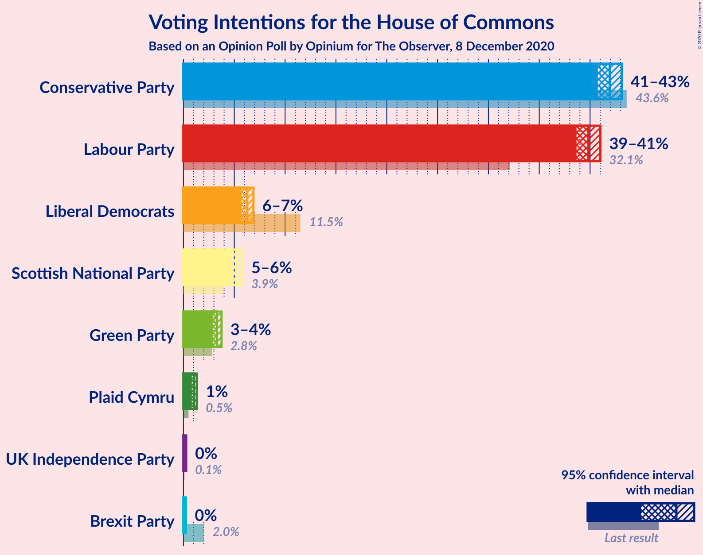

### Confidence Intervals

| Party | Last Result | Poll Result | 80% Confidence Interval | 90% Confidence Interval | 95% Confidence Interval | 99% Confidence Interval |
|:-----:|:-----------:|:-----------:|:-----------------------:|:-----------------------:|:-----------------------:|:-----------------------:|
| Conservative Party | 43.6% | 41.9% | 41.2–42.7% |40.9–42.9% |40.8–43.1% |40.4–43.5% |
| Labour Party | 32.1% | 39.8% | 39.1–40.6% |38.9–40.8% |38.7–41.0% |38.3–41.4% |
| Liberal Democrats | 11.5% | 6.3% | 5.9–6.7% |5.8–6.8% |5.7–6.9% |5.5–7.1% |
| Scottish National Party | 3.9% | 5.2% | 4.9–5.6% |4.8–5.7% |4.7–5.8% |4.6–6.0% |
| Green Party | 2.8% | 3.3% | 3.0–3.6% |2.9–3.7% |2.9–3.7% |2.8–3.9% |
| Plaid Cymru | 0.5% | 1.1% | 0.9–1.2% |0.9–1.3% |0.8–1.3% |0.8–1.4% |
| UK Independence Party | 0.1% | 0.1% | 0.1–0.2% |0.1–0.3% |0.1–0.3% |0.1–0.3% |
| Brexit Party | 2.0% | 0.1% | 0.1–0.2% |0.1–0.2% |0.1–0.2% |0.0–0.3% |

*Note:* The poll result column reflects the actual value used in the calculations. Published results may vary slightly, and in addition be rounded to fewer digits.

## Seats

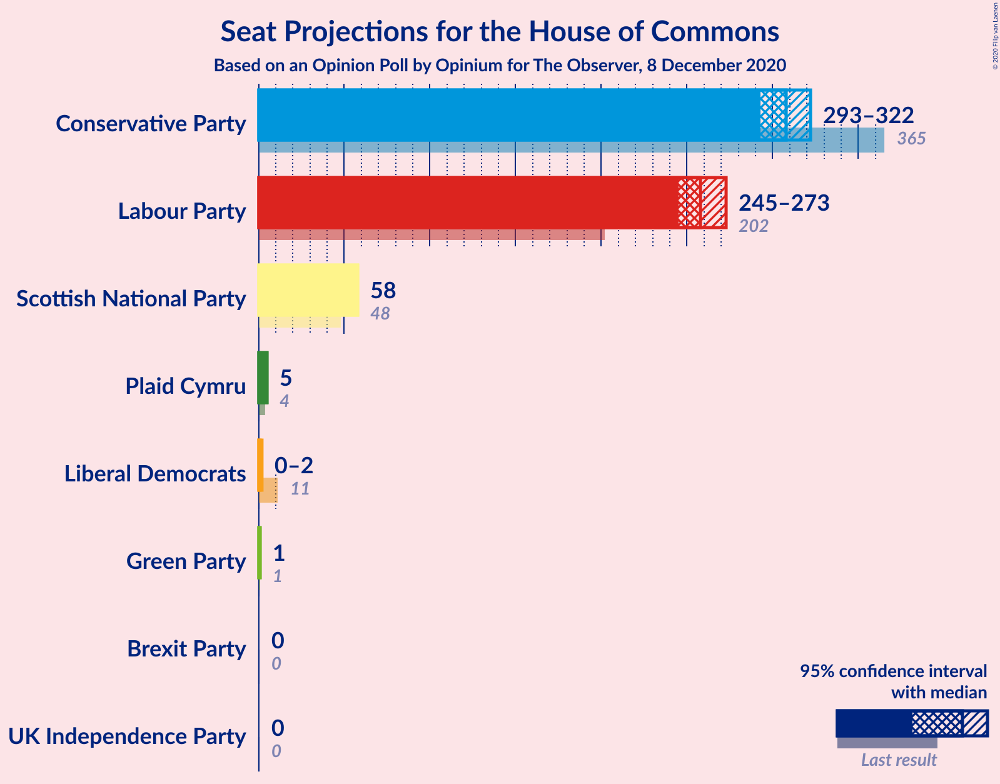

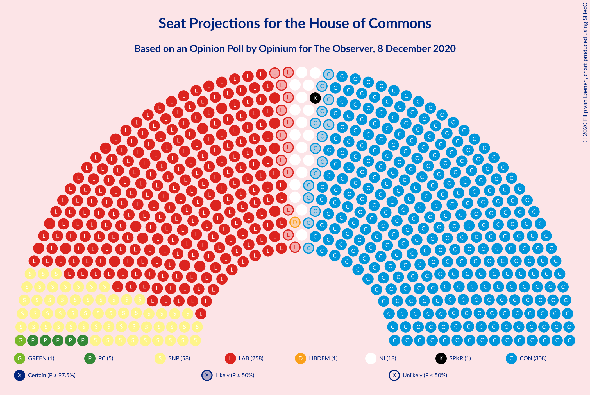

### Confidence Intervals

| Party | Last Result | Median | 80% Confidence Interval | 90% Confidence Interval | 95% Confidence Interval | 99% Confidence Interval |
|:-----:|:-----------:|:------:|:-----------------------:|:-----------------------:|:-----------------------:|:-----------------------:|
| <a href="#conservative-party">Conservative Party</a> | 365 | 308 | 299–316 |295–317 |293–322 |290–325 |
| <a href="#labour-party">Labour Party</a> | 202 | 258 | 250–267 |249–272 |245–273 |242–276 |
| <a href="#liberal-democrats">Liberal Democrats</a> | 11 | 1 | 0–1 |0–2 |0–2 |0–2 |
| <a href="#scottish-national-party">Scottish National Party</a> | 48 | 58 | 58 |58 |58 |56–58 |
| <a href="#green-party">Green Party</a> | 1 | 1 | 1 |1 |1 |1 |
| <a href="#plaid-cymru">Plaid Cymru</a> | 4 | 5 | 5 |5 |5 |5–6 |
| <a href="#uk-independence-party">UK Independence Party</a> | 0 | 0 | 0 |0 |0 |0 |
| <a href="#brexit-party">Brexit Party</a> | 0 | 0 | 0 |0 |0 |0 |

### Conservative Party

*For a full overview of the results for this party, see the [Conservative Party](party-conservativeparty.html) page.*

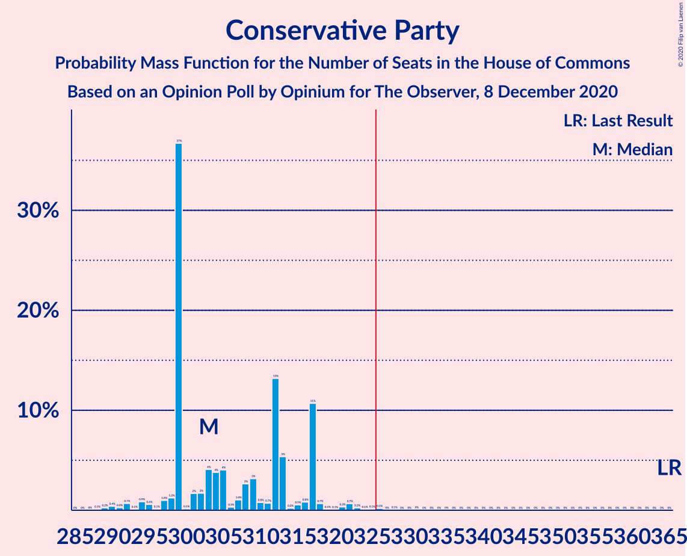

| Number of Seats | Probability | Accumulated | Special Marks |
|:---------------:|:-----------:|:-----------:|:-------------:|
| 288 | 0.1% | 100% |  |
| 289 | 0.2% | 99.9% |  |
| 290 | 0.5% | 99.7% |  |
| 291 | 1.2% | 99.2% |  |
| 292 | 0.5% | 98% |  |
| 293 | 1.0% | 98% |  |
| 294 | 0.6% | 97% |  |
| 295 | 2% | 96% |  |
| 296 | 0.7% | 94% |  |
| 297 | 0.5% | 94% |  |
| 298 | 2% | 93% |  |
| 299 | 9% | 91% |  |
| 300 | 2% | 82% |  |
| 301 | 3% | 80% |  |
| 302 | 8% | 77% |  |
| 303 | 5% | 69% |  |
| 304 | 1.5% | 63% |  |
| 305 | 2% | 62% |  |
| 306 | 0.4% | 60% |  |
| 307 | 3% | 60% |  |
| 308 | 15% | 57% | Median |
| 309 | 6% | 41% |  |
| 310 | 0.7% | 35% |  |
| 311 | 2% | 34% |  |
| 312 | 8% | 33% |  |
| 313 | 12% | 25% |  |
| 314 | 0.6% | 12% |  |
| 315 | 0.7% | 12% |  |
| 316 | 2% | 11% |  |
| 317 | 5% | 9% |  |
| 318 | 0.6% | 4% |  |
| 319 | 0.3% | 4% |  |
| 320 | 0.1% | 4% |  |
| 321 | 0.4% | 3% |  |
| 322 | 2% | 3% |  |
| 323 | 0.7% | 1.5% |  |
| 324 | 0.2% | 0.8% |  |
| 325 | 0.1% | 0.6% |  |
| 326 | 0.1% | 0.5% | Majority |
| 327 | 0.1% | 0.4% |  |
| 328 | 0.2% | 0.3% |  |
| 329 | 0% | 0.1% |  |
| 330 | 0% | 0.1% |  |
| 331 | 0.1% | 0.1% |  |
| 332 | 0% | 0% |  |
| 333 | 0% | 0% |  |
| 334 | 0% | 0% |  |
| 335 | 0% | 0% |  |
| 336 | 0% | 0% |  |
| 337 | 0% | 0% |  |
| 338 | 0% | 0% |  |
| 339 | 0% | 0% |  |
| 340 | 0% | 0% |  |
| 341 | 0% | 0% |  |
| 342 | 0% | 0% |  |
| 343 | 0% | 0% |  |
| 344 | 0% | 0% |  |
| 345 | 0% | 0% |  |
| 346 | 0% | 0% |  |
| 347 | 0% | 0% |  |
| 348 | 0% | 0% |  |
| 349 | 0% | 0% |  |
| 350 | 0% | 0% |  |
| 351 | 0% | 0% |  |
| 352 | 0% | 0% |  |
| 353 | 0% | 0% |  |
| 354 | 0% | 0% |  |
| 355 | 0% | 0% |  |
| 356 | 0% | 0% |  |
| 357 | 0% | 0% |  |
| 358 | 0% | 0% |  |
| 359 | 0% | 0% |  |
| 360 | 0% | 0% |  |
| 361 | 0% | 0% |  |
| 362 | 0% | 0% |  |
| 363 | 0% | 0% |  |
| 364 | 0% | 0% |  |
| 365 | 0% | 0% | Last Result |

### Labour Party

*For a full overview of the results for this party, see the [Labour Party](party-labourparty.html) page.*

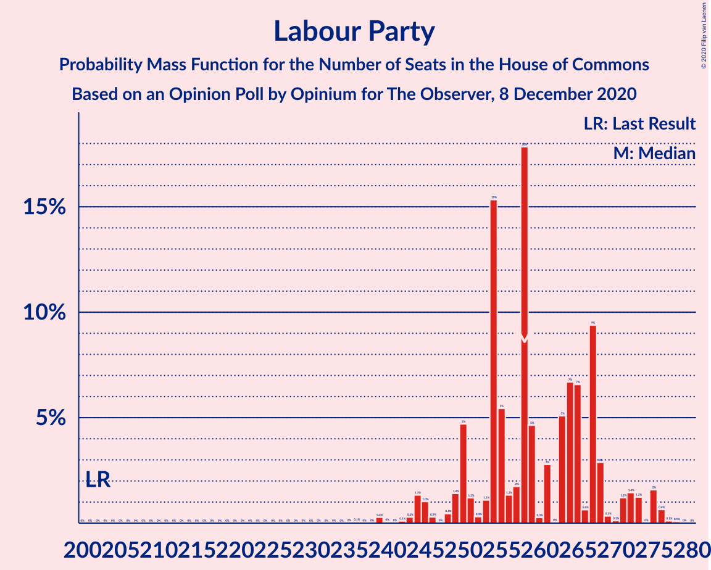

| Number of Seats | Probability | Accumulated | Special Marks |
|:---------------:|:-----------:|:-----------:|:-------------:|
| 202 | 0% | 100% | Last Result |
| 203 | 0% | 100% |  |
| 204 | 0% | 100% |  |
| 205 | 0% | 100% |  |
| 206 | 0% | 100% |  |
| 207 | 0% | 100% |  |
| 208 | 0% | 100% |  |
| 209 | 0% | 100% |  |
| 210 | 0% | 100% |  |
| 211 | 0% | 100% |  |
| 212 | 0% | 100% |  |
| 213 | 0% | 100% |  |
| 214 | 0% | 100% |  |
| 215 | 0% | 100% |  |
| 216 | 0% | 100% |  |
| 217 | 0% | 100% |  |
| 218 | 0% | 100% |  |
| 219 | 0% | 100% |  |
| 220 | 0% | 100% |  |
| 221 | 0% | 100% |  |
| 222 | 0% | 100% |  |
| 223 | 0% | 100% |  |
| 224 | 0% | 100% |  |
| 225 | 0% | 100% |  |
| 226 | 0% | 100% |  |
| 227 | 0% | 100% |  |
| 228 | 0% | 100% |  |
| 229 | 0% | 100% |  |
| 230 | 0% | 100% |  |
| 231 | 0% | 100% |  |
| 232 | 0% | 100% |  |
| 233 | 0% | 100% |  |
| 234 | 0% | 100% |  |
| 235 | 0% | 100% |  |
| 236 | 0.1% | 100% |  |
| 237 | 0% | 99.9% |  |
| 238 | 0% | 99.9% |  |
| 239 | 0.3% | 99.9% |  |
| 240 | 0% | 99.6% |  |
| 241 | 0% | 99.6% |  |
| 242 | 0.1% | 99.6% |  |
| 243 | 0.3% | 99.5% |  |
| 244 | 1.3% | 99.2% |  |
| 245 | 1.0% | 98% |  |
| 246 | 0.3% | 97% |  |
| 247 | 0% | 97% |  |
| 248 | 0.4% | 97% |  |
| 249 | 1.4% | 96% |  |
| 250 | 5% | 95% |  |
| 251 | 1.2% | 90% |  |
| 252 | 0.3% | 89% |  |
| 253 | 1.1% | 88% |  |
| 254 | 15% | 87% |  |
| 255 | 5% | 72% |  |
| 256 | 1.3% | 67% |  |
| 257 | 2% | 65% |  |
| 258 | 18% | 64% | Median |
| 259 | 5% | 46% |  |
| 260 | 0.3% | 41% |  |
| 261 | 3% | 41% |  |
| 262 | 0% | 38% |  |
| 263 | 5% | 38% |  |
| 264 | 7% | 33% |  |
| 265 | 7% | 26% |  |
| 266 | 0.6% | 20% |  |
| 267 | 9% | 19% |  |
| 268 | 3% | 10% |  |
| 269 | 0.3% | 7% |  |
| 270 | 0.1% | 6% |  |
| 271 | 1.2% | 6% |  |
| 272 | 1.4% | 5% |  |
| 273 | 1.2% | 4% |  |
| 274 | 0% | 2% |  |
| 275 | 2% | 2% |  |
| 276 | 0.6% | 0.8% |  |
| 277 | 0.1% | 0.2% |  |
| 278 | 0.1% | 0.1% |  |
| 279 | 0% | 0% |  |

### Liberal Democrats

*For a full overview of the results for this party, see the [Liberal Democrats](party-liberaldemocrats.html) page.*

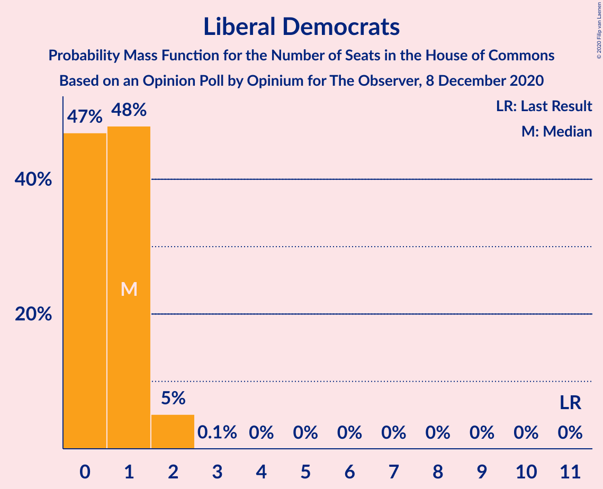

| Number of Seats | Probability | Accumulated | Special Marks |
|:---------------:|:-----------:|:-----------:|:-------------:|
| 0 | 47% | 100% |  |
| 1 | 48% | 53% | Median |
| 2 | 5% | 5% |  |
| 3 | 0.1% | 0.1% |  |
| 4 | 0% | 0% |  |
| 5 | 0% | 0% |  |
| 6 | 0% | 0% |  |
| 7 | 0% | 0% |  |
| 8 | 0% | 0% |  |
| 9 | 0% | 0% |  |
| 10 | 0% | 0% |  |
| 11 | 0% | 0% | Last Result |

### Scottish National Party

*For a full overview of the results for this party, see the [Scottish National Party](party-scottishnationalparty.html) page.*

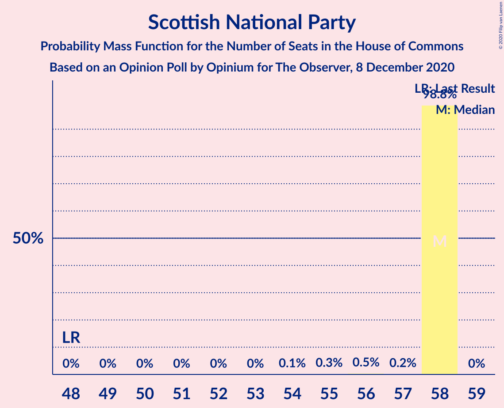

| Number of Seats | Probability | Accumulated | Special Marks |
|:---------------:|:-----------:|:-----------:|:-------------:|
| 48 | 0% | 100% | Last Result |
| 49 | 0% | 100% |  |
| 50 | 0% | 100% |  |
| 51 | 0% | 100% |  |
| 52 | 0% | 100% |  |
| 53 | 0% | 100% |  |
| 54 | 0.1% | 100% |  |
| 55 | 0.3% | 99.9% |  |
| 56 | 2% | 99.6% |  |
| 57 | 0.2% | 98% |  |
| 58 | 98% | 98% | Median |
| 59 | 0% | 0% |  |

### Green Party

*For a full overview of the results for this party, see the [Green Party](party-greenparty.html) page.*

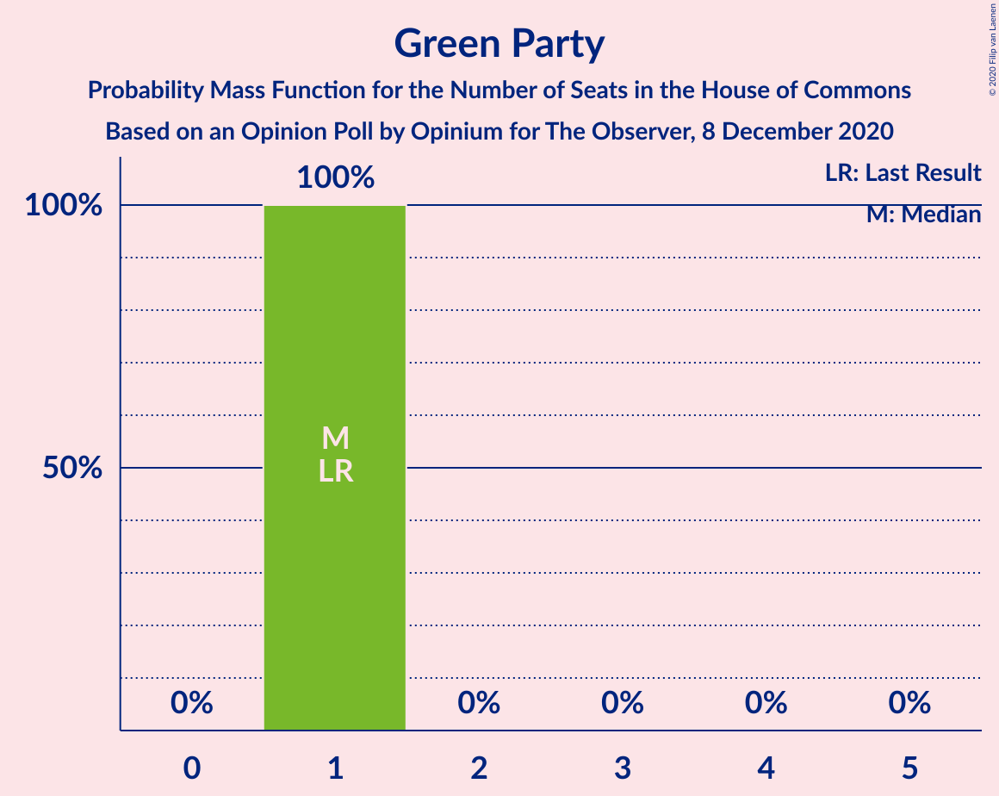

| Number of Seats | Probability | Accumulated | Special Marks |
|:---------------:|:-----------:|:-----------:|:-------------:|
| 1 | 100% | 100% | Last Result, Median |

### Plaid Cymru

*For a full overview of the results for this party, see the [Plaid Cymru](party-plaidcymru.html) page.*

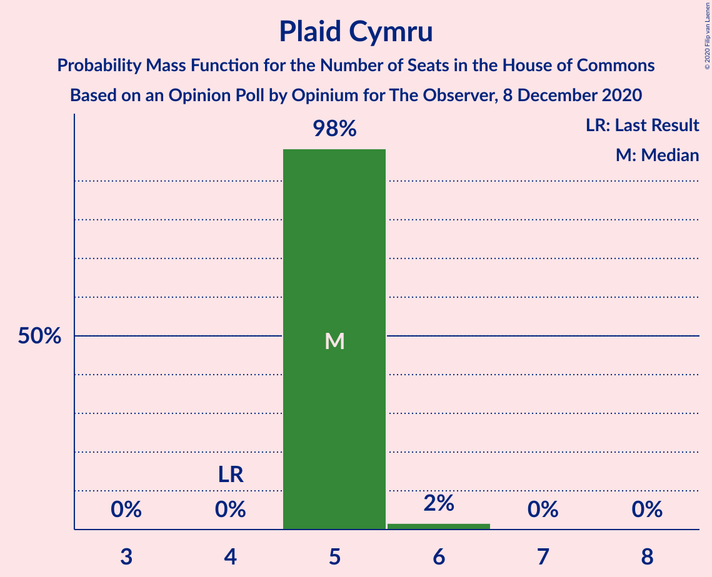

| Number of Seats | Probability | Accumulated | Special Marks |
|:---------------:|:-----------:|:-----------:|:-------------:|
| 4 | 0% | 100% | Last Result |
| 5 | 98% | 100% | Median |
| 6 | 2% | 2% |  |
| 7 | 0% | 0% |  |

### UK Independence Party

*For a full overview of the results for this party, see the [UK Independence Party](party-ukindependenceparty.html) page.*

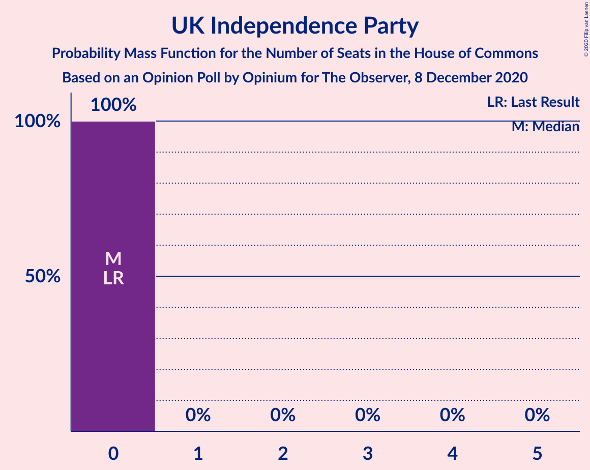

| Number of Seats | Probability | Accumulated | Special Marks |
|:---------------:|:-----------:|:-----------:|:-------------:|
| 0 | 100% | 100% | Last Result, Median |

### Brexit Party

*For a full overview of the results for this party, see the [Brexit Party](party-brexitparty.html) page.*

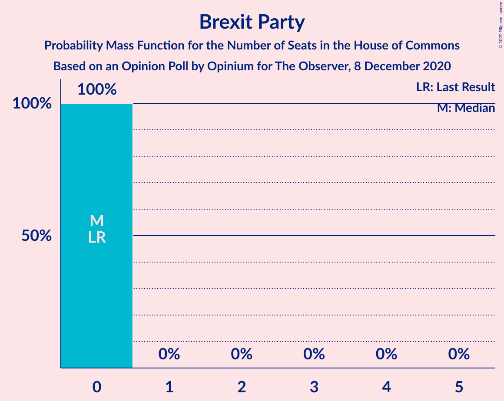

| Number of Seats | Probability | Accumulated | Special Marks |
|:---------------:|:-----------:|:-----------:|:-------------:|
| 0 | 100% | 100% | Last Result, Median |

## Coalitions

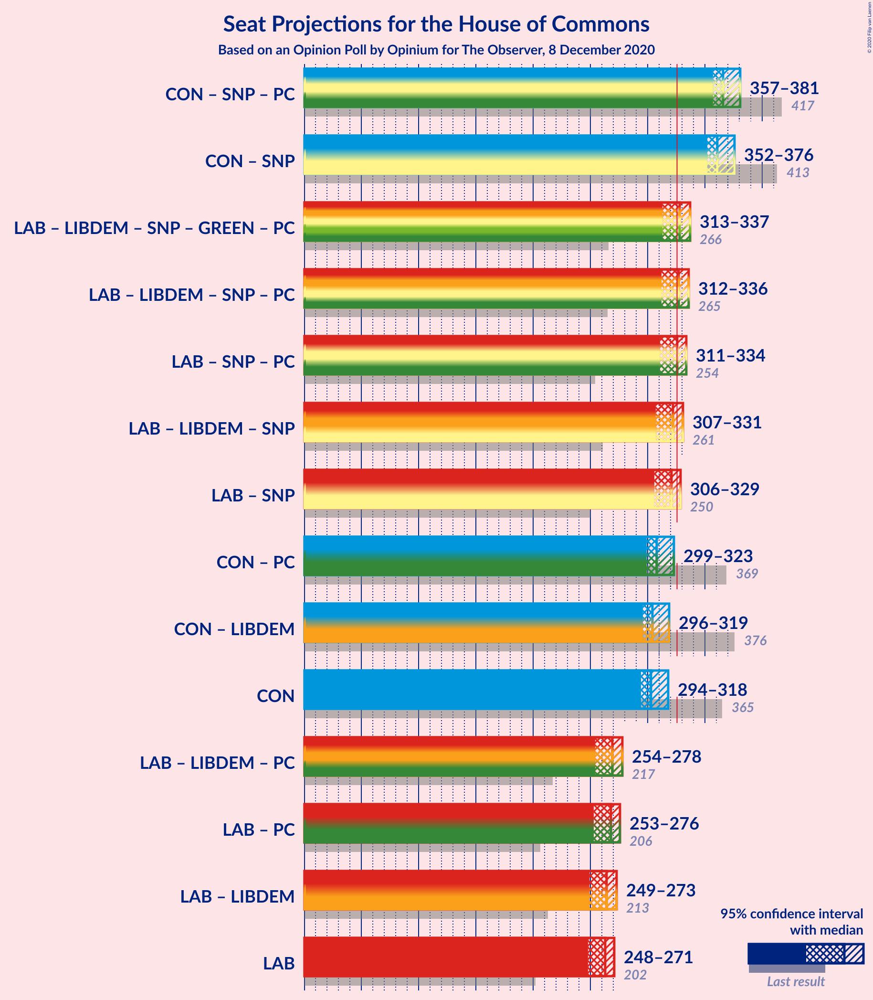

### Confidence Intervals

| Coalition | Last Result | Median | Majority? | 80% Confidence Interval | 90% Confidence Interval | 95% Confidence Interval | 99% Confidence Interval |
|:---------:|:-----------:|:------:|:---------:|:-----------------------:|:-----------------------:|:-----------------------:|:-----------------------:|
| Conservative Party – Scottish National Party – Plaid Cymru | 417 | 371 | 100% | 362–379 | 358–380 | 355–385 | 353–388 |
| Conservative Party – Scottish National Party | 413 | 366 | 100% | 357–374 | 353–375 | 350–380 | 348–383 |
| Labour Party – Liberal Democrats – Scottish National Party – Green Party – Plaid Cymru | 266 | 323 | 40% | 315–332 | 314–336 | 309–338 | 306–341 |
| Labour Party – Liberal Democrats – Scottish National Party – Plaid Cymru | 265 | 322 | 38% | 314–331 | 313–335 | 308–337 | 305–340 |
| Labour Party – Scottish National Party – Plaid Cymru | 254 | 321 | 38% | 313–330 | 312–335 | 308–336 | 304–339 |
| Labour Party – Liberal Democrats – Scottish National Party | 261 | 317 | 18% | 309–326 | 308–330 | 303–332 | 300–335 |
| Labour Party – Scottish National Party | 250 | 316 | 10% | 308–325 | 307–330 | 303–331 | 299–334 |
| Conservative Party – Plaid Cymru | 369 | 313 | 3% | 304–321 | 300–322 | 298–327 | 295–330 |
| Conservative Party – Liberal Democrats | 376 | 309 | 0.5% | 300–317 | 295–318 | 294–322 | 291–326 |
| Conservative Party | 365 | 308 | 0.5% | 299–316 | 295–317 | 293–322 | 290–325 |
| Labour Party – Liberal Democrats – Plaid Cymru | 217 | 264 | 0% | 256–273 | 255–277 | 250–280 | 247–282 |
| Labour Party – Plaid Cymru | 206 | 263 | 0% | 255–272 | 254–277 | 250–278 | 247–281 |
| Labour Party – Liberal Democrats | 213 | 259 | 0% | 251–268 | 250–272 | 245–275 | 242–277 |
| Labour Party | 202 | 258 | 0% | 250–267 | 249–272 | 245–273 | 242–276 |

### Conservative Party – Scottish National Party – Plaid Cymru

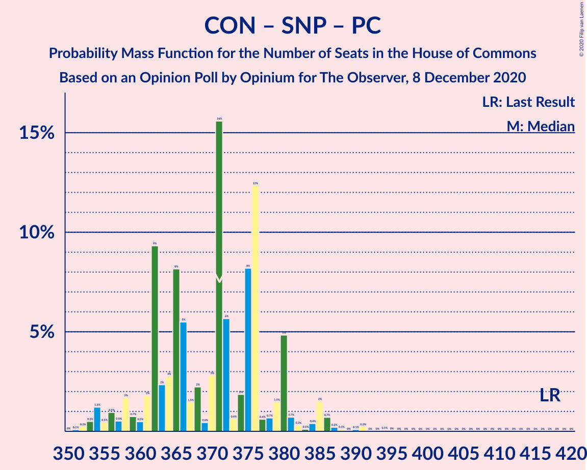

| Number of Seats | Probability | Accumulated | Special Marks |
|:---------------:|:-----------:|:-----------:|:-------------:|
| 351 | 0.1% | 100% |  |
| 352 | 0.2% | 99.9% |  |
| 353 | 0.5% | 99.7% |  |
| 354 | 1.2% | 99.2% |  |
| 355 | 0.5% | 98% |  |
| 356 | 0.9% | 97% |  |
| 357 | 0.5% | 97% |  |
| 358 | 2% | 96% |  |
| 359 | 0.7% | 94% |  |
| 360 | 0.5% | 94% |  |
| 361 | 2% | 93% |  |
| 362 | 9% | 91% |  |
| 363 | 2% | 82% |  |
| 364 | 3% | 80% |  |
| 365 | 8% | 77% |  |
| 366 | 5% | 69% |  |
| 367 | 1.5% | 63% |  |
| 368 | 2% | 62% |  |
| 369 | 0.4% | 60% |  |
| 370 | 3% | 59% |  |
| 371 | 16% | 56% | Median |
| 372 | 6% | 41% |  |
| 373 | 0.6% | 35% |  |
| 374 | 2% | 34% |  |
| 375 | 8% | 33% |  |
| 376 | 12% | 24% |  |
| 377 | 0.6% | 12% |  |
| 378 | 0.7% | 11% |  |
| 379 | 1.5% | 11% |  |
| 380 | 5% | 9% |  |
| 381 | 0.7% | 4% |  |
| 382 | 0.3% | 4% |  |
| 383 | 0.1% | 3% |  |
| 384 | 0.4% | 3% |  |
| 385 | 2% | 3% |  |
| 386 | 0.7% | 1.4% |  |
| 387 | 0.2% | 0.7% |  |
| 388 | 0.1% | 0.5% |  |
| 389 | 0% | 0.4% |  |
| 390 | 0.1% | 0.4% |  |
| 391 | 0.2% | 0.3% |  |
| 392 | 0% | 0.1% |  |
| 393 | 0% | 0.1% |  |
| 394 | 0.1% | 0.1% |  |
| 395 | 0% | 0% |  |
| 396 | 0% | 0% |  |
| 397 | 0% | 0% |  |
| 398 | 0% | 0% |  |
| 399 | 0% | 0% |  |
| 400 | 0% | 0% |  |
| 401 | 0% | 0% |  |
| 402 | 0% | 0% |  |
| 403 | 0% | 0% |  |
| 404 | 0% | 0% |  |
| 405 | 0% | 0% |  |
| 406 | 0% | 0% |  |
| 407 | 0% | 0% |  |
| 408 | 0% | 0% |  |
| 409 | 0% | 0% |  |
| 410 | 0% | 0% |  |
| 411 | 0% | 0% |  |
| 412 | 0% | 0% |  |
| 413 | 0% | 0% |  |
| 414 | 0% | 0% |  |
| 415 | 0% | 0% |  |
| 416 | 0% | 0% |  |
| 417 | 0% | 0% | Last Result |

### Conservative Party – Scottish National Party

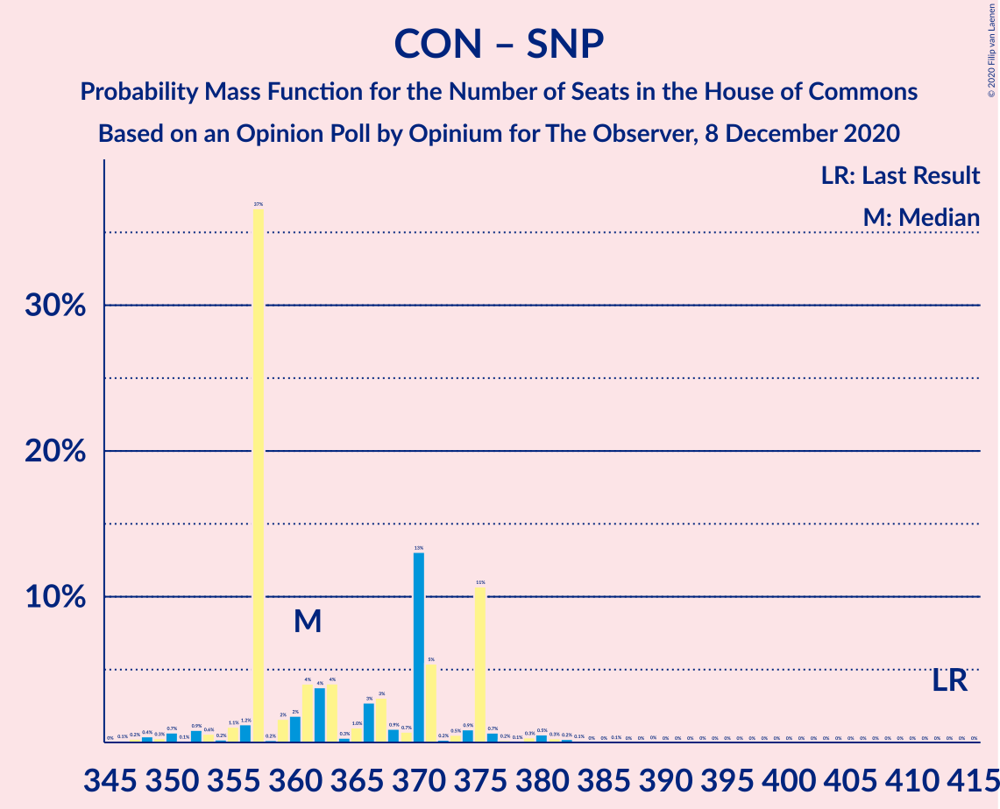

| Number of Seats | Probability | Accumulated | Special Marks |
|:---------------:|:-----------:|:-----------:|:-------------:|
| 346 | 0.1% | 100% |  |
| 347 | 0.2% | 99.9% |  |
| 348 | 0.5% | 99.7% |  |
| 349 | 1.2% | 99.2% |  |
| 350 | 0.5% | 98% |  |
| 351 | 0.9% | 97% |  |
| 352 | 0.6% | 97% |  |
| 353 | 2% | 96% |  |
| 354 | 0.7% | 94% |  |
| 355 | 0.5% | 94% |  |
| 356 | 2% | 93% |  |
| 357 | 9% | 91% |  |
| 358 | 2% | 82% |  |
| 359 | 3% | 80% |  |
| 360 | 8% | 77% |  |
| 361 | 5% | 69% |  |
| 362 | 1.4% | 63% |  |
| 363 | 2% | 62% |  |
| 364 | 0.4% | 59% |  |
| 365 | 3% | 59% |  |
| 366 | 15% | 56% | Median |
| 367 | 6% | 41% |  |
| 368 | 0.8% | 35% |  |
| 369 | 2% | 34% |  |
| 370 | 8% | 33% |  |
| 371 | 12% | 24% |  |
| 372 | 0.5% | 12% |  |
| 373 | 0.7% | 11% |  |
| 374 | 1.5% | 11% |  |
| 375 | 5% | 9% |  |
| 376 | 0.6% | 4% |  |
| 377 | 0.3% | 4% |  |
| 378 | 0.1% | 3% |  |
| 379 | 0.4% | 3% |  |
| 380 | 2% | 3% |  |
| 381 | 0.7% | 1.4% |  |
| 382 | 0.2% | 0.7% |  |
| 383 | 0.1% | 0.5% |  |
| 384 | 0% | 0.4% |  |
| 385 | 0.1% | 0.4% |  |
| 386 | 0.2% | 0.3% |  |
| 387 | 0% | 0.1% |  |
| 388 | 0% | 0.1% |  |
| 389 | 0.1% | 0.1% |  |
| 390 | 0% | 0% |  |
| 391 | 0% | 0% |  |
| 392 | 0% | 0% |  |
| 393 | 0% | 0% |  |
| 394 | 0% | 0% |  |
| 395 | 0% | 0% |  |
| 396 | 0% | 0% |  |
| 397 | 0% | 0% |  |
| 398 | 0% | 0% |  |
| 399 | 0% | 0% |  |
| 400 | 0% | 0% |  |
| 401 | 0% | 0% |  |
| 402 | 0% | 0% |  |
| 403 | 0% | 0% |  |
| 404 | 0% | 0% |  |
| 405 | 0% | 0% |  |
| 406 | 0% | 0% |  |
| 407 | 0% | 0% |  |
| 408 | 0% | 0% |  |
| 409 | 0% | 0% |  |
| 410 | 0% | 0% |  |
| 411 | 0% | 0% |  |
| 412 | 0% | 0% |  |
| 413 | 0% | 0% | Last Result |

### Labour Party – Liberal Democrats – Scottish National Party – Green Party – Plaid Cymru

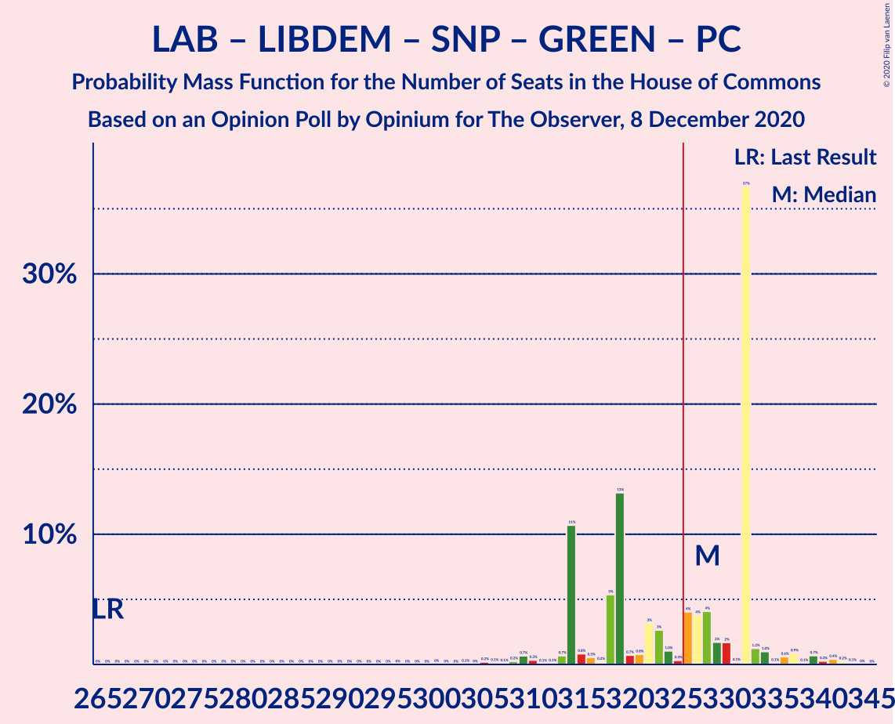

| Number of Seats | Probability | Accumulated | Special Marks |
|:---------------:|:-----------:|:-----------:|:-------------:|
| 266 | 0% | 100% | Last Result |
| 267 | 0% | 100% |  |
| 268 | 0% | 100% |  |
| 269 | 0% | 100% |  |
| 270 | 0% | 100% |  |
| 271 | 0% | 100% |  |
| 272 | 0% | 100% |  |
| 273 | 0% | 100% |  |
| 274 | 0% | 100% |  |
| 275 | 0% | 100% |  |
| 276 | 0% | 100% |  |
| 277 | 0% | 100% |  |
| 278 | 0% | 100% |  |
| 279 | 0% | 100% |  |
| 280 | 0% | 100% |  |
| 281 | 0% | 100% |  |
| 282 | 0% | 100% |  |
| 283 | 0% | 100% |  |
| 284 | 0% | 100% |  |
| 285 | 0% | 100% |  |
| 286 | 0% | 100% |  |
| 287 | 0% | 100% |  |
| 288 | 0% | 100% |  |
| 289 | 0% | 100% |  |
| 290 | 0% | 100% |  |
| 291 | 0% | 100% |  |
| 292 | 0% | 100% |  |
| 293 | 0% | 100% |  |
| 294 | 0% | 100% |  |
| 295 | 0% | 100% |  |
| 296 | 0% | 100% |  |
| 297 | 0% | 100% |  |
| 298 | 0% | 100% |  |
| 299 | 0% | 100% |  |
| 300 | 0.1% | 100% |  |
| 301 | 0% | 99.9% |  |
| 302 | 0% | 99.9% |  |
| 303 | 0.2% | 99.9% |  |
| 304 | 0.1% | 99.7% |  |
| 305 | 0.1% | 99.6% |  |
| 306 | 0.1% | 99.5% |  |
| 307 | 0.2% | 99.4% |  |
| 308 | 0.7% | 99.2% |  |
| 309 | 2% | 98.5% |  |
| 310 | 0.4% | 97% |  |
| 311 | 0.1% | 97% |  |
| 312 | 0.3% | 96% |  |
| 313 | 0.6% | 96% |  |
| 314 | 5% | 96% |  |
| 315 | 2% | 91% |  |
| 316 | 0.7% | 89% |  |
| 317 | 0.6% | 88% |  |
| 318 | 12% | 88% |  |
| 319 | 8% | 75% |  |
| 320 | 2% | 67% |  |
| 321 | 0.7% | 66% |  |
| 322 | 6% | 65% |  |
| 323 | 15% | 59% | Median |
| 324 | 3% | 43% |  |
| 325 | 0.4% | 40% |  |
| 326 | 2% | 40% | Majority |
| 327 | 1.5% | 38% |  |
| 328 | 5% | 37% |  |
| 329 | 8% | 31% |  |
| 330 | 3% | 23% |  |
| 331 | 2% | 20% |  |
| 332 | 9% | 18% |  |
| 333 | 2% | 9% |  |
| 334 | 0.5% | 7% |  |
| 335 | 0.7% | 6% |  |
| 336 | 2% | 6% |  |
| 337 | 0.6% | 4% |  |
| 338 | 1.0% | 3% |  |
| 339 | 0.5% | 2% |  |
| 340 | 1.2% | 2% |  |
| 341 | 0.5% | 0.8% |  |
| 342 | 0.2% | 0.3% |  |
| 343 | 0.1% | 0.1% |  |
| 344 | 0% | 0% |  |

### Labour Party – Liberal Democrats – Scottish National Party – Plaid Cymru

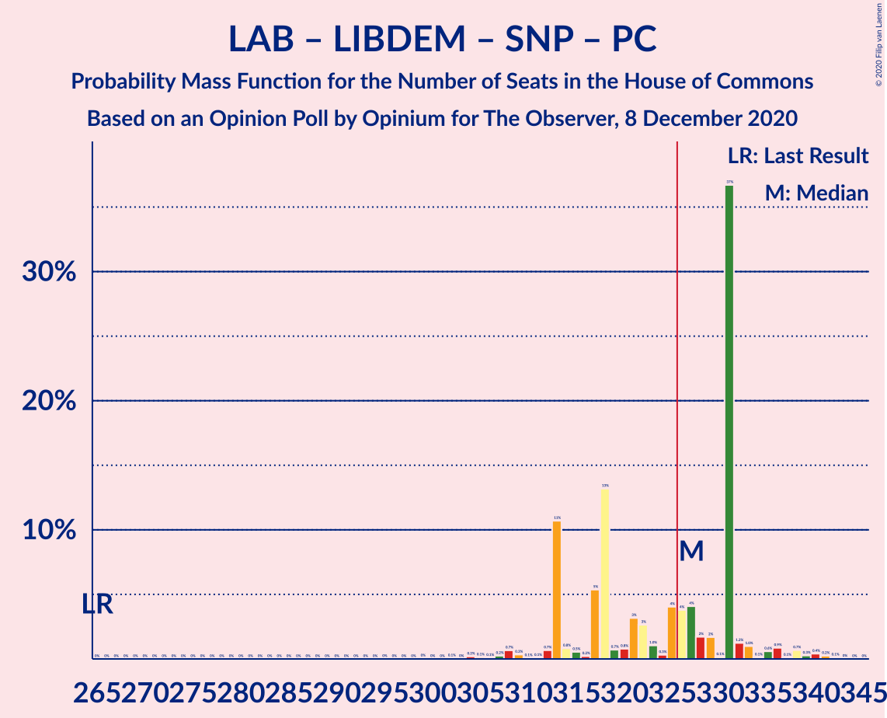

| Number of Seats | Probability | Accumulated | Special Marks |
|:---------------:|:-----------:|:-----------:|:-------------:|
| 265 | 0% | 100% | Last Result |
| 266 | 0% | 100% |  |
| 267 | 0% | 100% |  |
| 268 | 0% | 100% |  |
| 269 | 0% | 100% |  |
| 270 | 0% | 100% |  |
| 271 | 0% | 100% |  |
| 272 | 0% | 100% |  |
| 273 | 0% | 100% |  |
| 274 | 0% | 100% |  |
| 275 | 0% | 100% |  |
| 276 | 0% | 100% |  |
| 277 | 0% | 100% |  |
| 278 | 0% | 100% |  |
| 279 | 0% | 100% |  |
| 280 | 0% | 100% |  |
| 281 | 0% | 100% |  |
| 282 | 0% | 100% |  |
| 283 | 0% | 100% |  |
| 284 | 0% | 100% |  |
| 285 | 0% | 100% |  |
| 286 | 0% | 100% |  |
| 287 | 0% | 100% |  |
| 288 | 0% | 100% |  |
| 289 | 0% | 100% |  |
| 290 | 0% | 100% |  |
| 291 | 0% | 100% |  |
| 292 | 0% | 100% |  |
| 293 | 0% | 100% |  |
| 294 | 0% | 100% |  |
| 295 | 0% | 100% |  |
| 296 | 0% | 100% |  |
| 297 | 0% | 100% |  |
| 298 | 0% | 100% |  |
| 299 | 0.1% | 100% |  |
| 300 | 0% | 99.9% |  |
| 301 | 0% | 99.9% |  |
| 302 | 0.2% | 99.9% |  |
| 303 | 0.1% | 99.7% |  |
| 304 | 0.1% | 99.6% |  |
| 305 | 0.1% | 99.5% |  |
| 306 | 0.2% | 99.4% |  |
| 307 | 0.7% | 99.2% |  |
| 308 | 2% | 98.5% |  |
| 309 | 0.4% | 97% |  |
| 310 | 0.1% | 97% |  |
| 311 | 0.3% | 96% |  |
| 312 | 0.6% | 96% |  |
| 313 | 5% | 96% |  |
| 314 | 2% | 91% |  |
| 315 | 0.7% | 89% |  |
| 316 | 0.6% | 88% |  |
| 317 | 12% | 88% |  |
| 318 | 8% | 75% |  |
| 319 | 2% | 67% |  |
| 320 | 0.7% | 66% |  |
| 321 | 6% | 65% |  |
| 322 | 15% | 59% | Median |
| 323 | 3% | 43% |  |
| 324 | 0.4% | 40% |  |
| 325 | 2% | 40% |  |
| 326 | 1.5% | 38% | Majority |
| 327 | 5% | 37% |  |
| 328 | 8% | 31% |  |
| 329 | 3% | 23% |  |
| 330 | 2% | 20% |  |
| 331 | 9% | 18% |  |
| 332 | 2% | 9% |  |
| 333 | 0.5% | 7% |  |
| 334 | 0.7% | 6% |  |
| 335 | 2% | 6% |  |
| 336 | 0.6% | 4% |  |
| 337 | 1.0% | 3% |  |
| 338 | 0.5% | 2% |  |
| 339 | 1.2% | 2% |  |
| 340 | 0.5% | 0.8% |  |
| 341 | 0.2% | 0.3% |  |
| 342 | 0.1% | 0.1% |  |
| 343 | 0% | 0% |  |

### Labour Party – Scottish National Party – Plaid Cymru

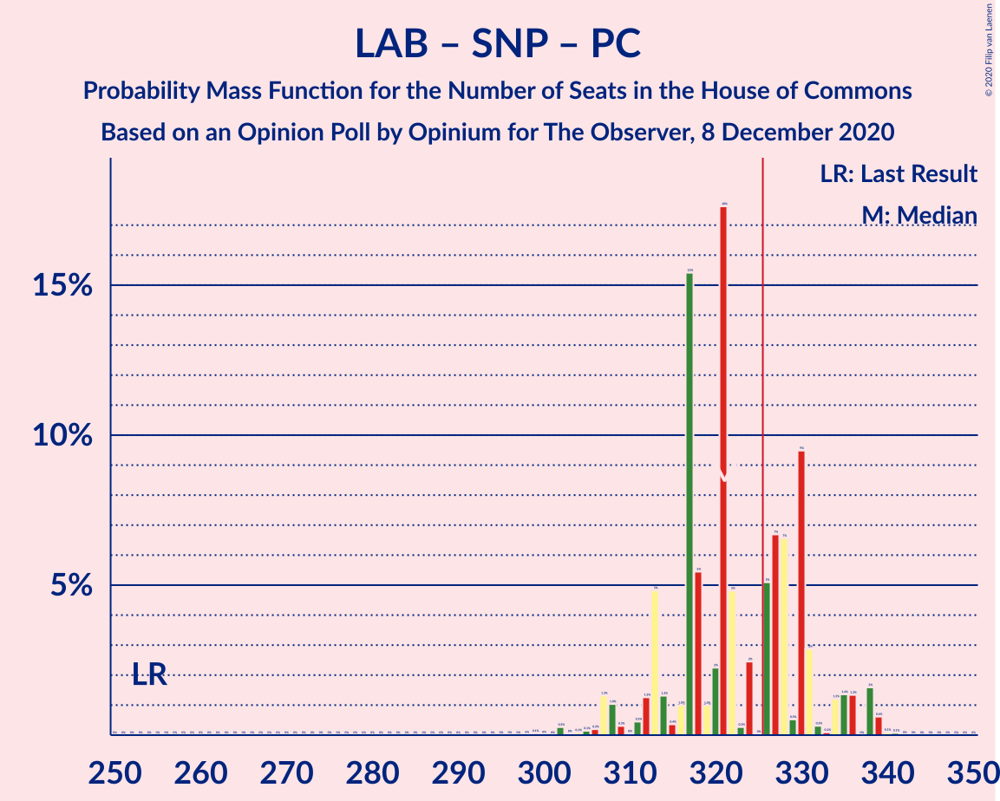

| Number of Seats | Probability | Accumulated | Special Marks |
|:---------------:|:-----------:|:-----------:|:-------------:|
| 254 | 0% | 100% | Last Result |
| 255 | 0% | 100% |  |
| 256 | 0% | 100% |  |
| 257 | 0% | 100% |  |
| 258 | 0% | 100% |  |
| 259 | 0% | 100% |  |
| 260 | 0% | 100% |  |
| 261 | 0% | 100% |  |
| 262 | 0% | 100% |  |
| 263 | 0% | 100% |  |
| 264 | 0% | 100% |  |
| 265 | 0% | 100% |  |
| 266 | 0% | 100% |  |
| 267 | 0% | 100% |  |
| 268 | 0% | 100% |  |
| 269 | 0% | 100% |  |
| 270 | 0% | 100% |  |
| 271 | 0% | 100% |  |
| 272 | 0% | 100% |  |
| 273 | 0% | 100% |  |
| 274 | 0% | 100% |  |
| 275 | 0% | 100% |  |
| 276 | 0% | 100% |  |
| 277 | 0% | 100% |  |
| 278 | 0% | 100% |  |
| 279 | 0% | 100% |  |
| 280 | 0% | 100% |  |
| 281 | 0% | 100% |  |
| 282 | 0% | 100% |  |
| 283 | 0% | 100% |  |
| 284 | 0% | 100% |  |
| 285 | 0% | 100% |  |
| 286 | 0% | 100% |  |
| 287 | 0% | 100% |  |
| 288 | 0% | 100% |  |
| 289 | 0% | 100% |  |
| 290 | 0% | 100% |  |
| 291 | 0% | 100% |  |
| 292 | 0% | 100% |  |
| 293 | 0% | 100% |  |
| 294 | 0% | 100% |  |
| 295 | 0% | 100% |  |
| 296 | 0% | 100% |  |
| 297 | 0% | 100% |  |
| 298 | 0% | 100% |  |
| 299 | 0.1% | 100% |  |
| 300 | 0% | 99.9% |  |
| 301 | 0% | 99.9% |  |
| 302 | 0.3% | 99.9% |  |
| 303 | 0% | 99.6% |  |
| 304 | 0.1% | 99.6% |  |
| 305 | 0.1% | 99.5% |  |
| 306 | 0.2% | 99.3% |  |
| 307 | 1.3% | 99.1% |  |
| 308 | 1.0% | 98% |  |
| 309 | 0.3% | 97% |  |
| 310 | 0% | 96% |  |
| 311 | 0.5% | 96% |  |
| 312 | 1.3% | 96% |  |
| 313 | 5% | 95% |  |
| 314 | 1.3% | 90% |  |
| 315 | 0.4% | 89% |  |
| 316 | 1.0% | 88% |  |
| 317 | 15% | 87% |  |
| 318 | 5% | 72% |  |
| 319 | 1.0% | 66% |  |
| 320 | 2% | 65% |  |
| 321 | 18% | 63% | Median |
| 322 | 5% | 46% |  |
| 323 | 0.3% | 41% |  |
| 324 | 2% | 40% |  |
| 325 | 0% | 38% |  |
| 326 | 5% | 38% | Majority |
| 327 | 7% | 33% |  |
| 328 | 7% | 26% |  |
| 329 | 0.5% | 20% |  |
| 330 | 9% | 19% |  |
| 331 | 3% | 10% |  |
| 332 | 0.3% | 7% |  |
| 333 | 0.1% | 6% |  |
| 334 | 1.2% | 6% |  |
| 335 | 1.4% | 5% |  |
| 336 | 1.3% | 4% |  |
| 337 | 0% | 2% |  |
| 338 | 2% | 2% |  |
| 339 | 0.6% | 0.8% |  |
| 340 | 0.1% | 0.2% |  |
| 341 | 0.1% | 0.1% |  |
| 342 | 0% | 0% |  |

### Labour Party – Liberal Democrats – Scottish National Party

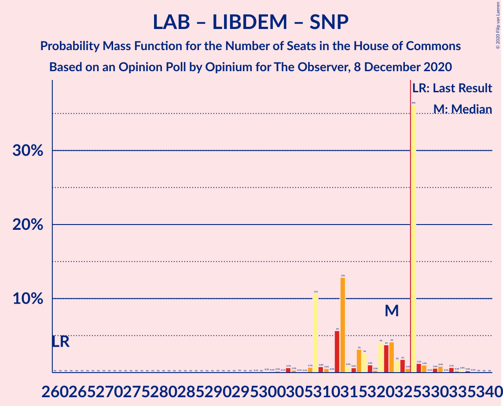

| Number of Seats | Probability | Accumulated | Special Marks |
|:---------------:|:-----------:|:-----------:|:-------------:|
| 261 | 0% | 100% | Last Result |
| 262 | 0% | 100% |  |
| 263 | 0% | 100% |  |
| 264 | 0% | 100% |  |
| 265 | 0% | 100% |  |
| 266 | 0% | 100% |  |
| 267 | 0% | 100% |  |
| 268 | 0% | 100% |  |
| 269 | 0% | 100% |  |
| 270 | 0% | 100% |  |
| 271 | 0% | 100% |  |
| 272 | 0% | 100% |  |
| 273 | 0% | 100% |  |
| 274 | 0% | 100% |  |
| 275 | 0% | 100% |  |
| 276 | 0% | 100% |  |
| 277 | 0% | 100% |  |
| 278 | 0% | 100% |  |
| 279 | 0% | 100% |  |
| 280 | 0% | 100% |  |
| 281 | 0% | 100% |  |
| 282 | 0% | 100% |  |
| 283 | 0% | 100% |  |
| 284 | 0% | 100% |  |
| 285 | 0% | 100% |  |
| 286 | 0% | 100% |  |
| 287 | 0% | 100% |  |
| 288 | 0% | 100% |  |
| 289 | 0% | 100% |  |
| 290 | 0% | 100% |  |
| 291 | 0% | 100% |  |
| 292 | 0% | 100% |  |
| 293 | 0% | 100% |  |
| 294 | 0.1% | 100% |  |
| 295 | 0% | 99.9% |  |
| 296 | 0% | 99.9% |  |
| 297 | 0.2% | 99.9% |  |
| 298 | 0.1% | 99.7% |  |
| 299 | 0.1% | 99.6% |  |
| 300 | 0.1% | 99.5% |  |
| 301 | 0.2% | 99.4% |  |
| 302 | 0.7% | 99.2% |  |
| 303 | 1.5% | 98.5% |  |
| 304 | 0.4% | 97% |  |
| 305 | 0.1% | 97% |  |
| 306 | 0.3% | 96% |  |
| 307 | 0.7% | 96% |  |
| 308 | 5% | 95% |  |
| 309 | 2% | 91% |  |
| 310 | 0.7% | 89% |  |
| 311 | 0.7% | 88% |  |
| 312 | 12% | 88% |  |
| 313 | 8% | 75% |  |
| 314 | 2% | 67% |  |
| 315 | 0.6% | 65% |  |
| 316 | 6% | 65% |  |
| 317 | 16% | 59% | Median |
| 318 | 3% | 43% |  |
| 319 | 0.4% | 40% |  |
| 320 | 2% | 40% |  |
| 321 | 1.5% | 38% |  |
| 322 | 6% | 37% |  |
| 323 | 8% | 31% |  |
| 324 | 3% | 23% |  |
| 325 | 2% | 20% |  |
| 326 | 9% | 18% | Majority |
| 327 | 2% | 9% |  |
| 328 | 0.5% | 7% |  |
| 329 | 0.7% | 6% |  |
| 330 | 2% | 6% |  |
| 331 | 0.5% | 4% |  |
| 332 | 1.0% | 3% |  |
| 333 | 0.5% | 2% |  |
| 334 | 1.2% | 2% |  |
| 335 | 0.5% | 0.8% |  |
| 336 | 0.2% | 0.3% |  |
| 337 | 0.1% | 0.1% |  |
| 338 | 0% | 0% |  |

### Labour Party – Scottish National Party

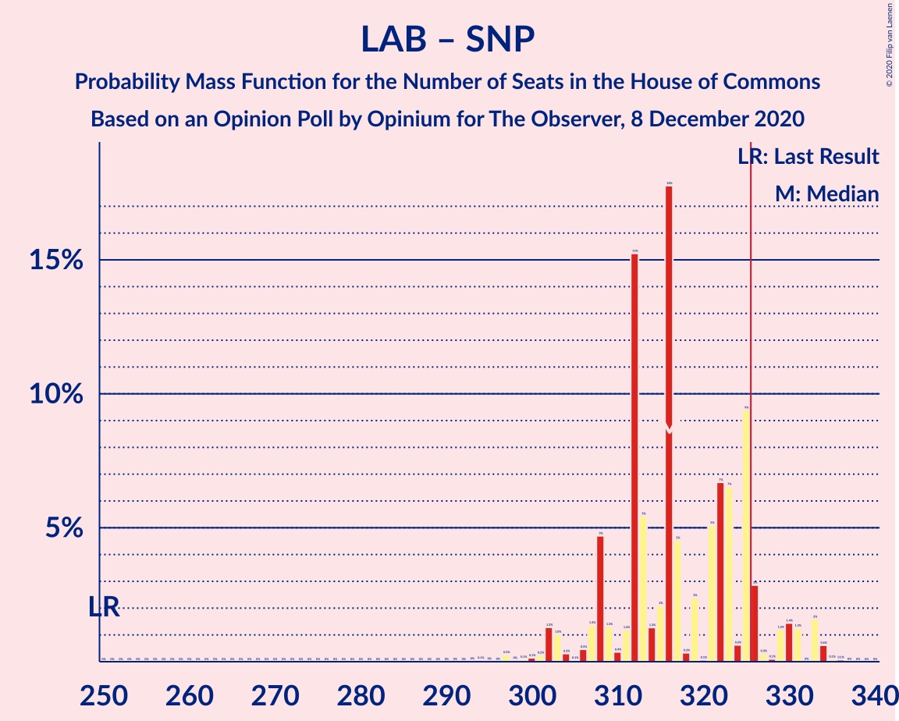

| Number of Seats | Probability | Accumulated | Special Marks |
|:---------------:|:-----------:|:-----------:|:-------------:|
| 250 | 0% | 100% | Last Result |
| 251 | 0% | 100% |  |
| 252 | 0% | 100% |  |
| 253 | 0% | 100% |  |
| 254 | 0% | 100% |  |
| 255 | 0% | 100% |  |
| 256 | 0% | 100% |  |
| 257 | 0% | 100% |  |
| 258 | 0% | 100% |  |
| 259 | 0% | 100% |  |
| 260 | 0% | 100% |  |
| 261 | 0% | 100% |  |
| 262 | 0% | 100% |  |
| 263 | 0% | 100% |  |
| 264 | 0% | 100% |  |
| 265 | 0% | 100% |  |
| 266 | 0% | 100% |  |
| 267 | 0% | 100% |  |
| 268 | 0% | 100% |  |
| 269 | 0% | 100% |  |
| 270 | 0% | 100% |  |
| 271 | 0% | 100% |  |
| 272 | 0% | 100% |  |
| 273 | 0% | 100% |  |
| 274 | 0% | 100% |  |
| 275 | 0% | 100% |  |
| 276 | 0% | 100% |  |
| 277 | 0% | 100% |  |
| 278 | 0% | 100% |  |
| 279 | 0% | 100% |  |
| 280 | 0% | 100% |  |
| 281 | 0% | 100% |  |
| 282 | 0% | 100% |  |
| 283 | 0% | 100% |  |
| 284 | 0% | 100% |  |
| 285 | 0% | 100% |  |
| 286 | 0% | 100% |  |
| 287 | 0% | 100% |  |
| 288 | 0% | 100% |  |
| 289 | 0% | 100% |  |
| 290 | 0% | 100% |  |
| 291 | 0% | 100% |  |
| 292 | 0% | 100% |  |
| 293 | 0% | 100% |  |
| 294 | 0.1% | 100% |  |
| 295 | 0% | 99.9% |  |
| 296 | 0% | 99.9% |  |
| 297 | 0.3% | 99.9% |  |
| 298 | 0% | 99.6% |  |
| 299 | 0.1% | 99.6% |  |
| 300 | 0.1% | 99.5% |  |
| 301 | 0.2% | 99.3% |  |
| 302 | 1.3% | 99.1% |  |
| 303 | 1.0% | 98% |  |
| 304 | 0.3% | 97% |  |
| 305 | 0.1% | 96% |  |
| 306 | 0.5% | 96% |  |
| 307 | 1.4% | 96% |  |
| 308 | 5% | 95% |  |
| 309 | 1.3% | 90% |  |
| 310 | 0.4% | 89% |  |
| 311 | 1.2% | 88% |  |
| 312 | 15% | 87% |  |
| 313 | 5% | 72% |  |
| 314 | 1.3% | 66% |  |
| 315 | 2% | 65% |  |
| 316 | 18% | 63% | Median |
| 317 | 5% | 45% |  |
| 318 | 0.3% | 41% |  |
| 319 | 2% | 40% |  |
| 320 | 0.1% | 38% |  |
| 321 | 5% | 38% |  |
| 322 | 7% | 33% |  |
| 323 | 7% | 26% |  |
| 324 | 0.6% | 20% |  |
| 325 | 9% | 19% |  |
| 326 | 3% | 10% | Majority |
| 327 | 0.3% | 7% |  |
| 328 | 0.1% | 6% |  |
| 329 | 1.2% | 6% |  |
| 330 | 1.4% | 5% |  |
| 331 | 1.3% | 4% |  |
| 332 | 0% | 2% |  |
| 333 | 2% | 2% |  |
| 334 | 0.6% | 0.8% |  |
| 335 | 0.1% | 0.2% |  |
| 336 | 0.1% | 0.1% |  |
| 337 | 0% | 0% |  |

### Conservative Party – Plaid Cymru

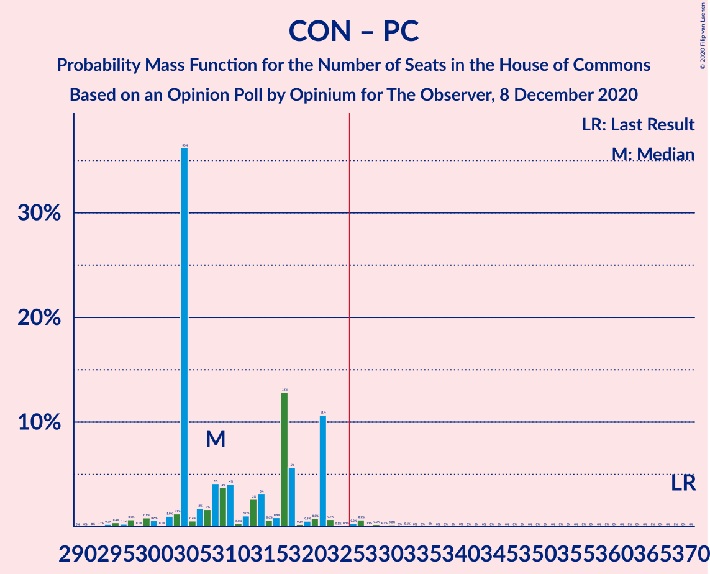

| Number of Seats | Probability | Accumulated | Special Marks |
|:---------------:|:-----------:|:-----------:|:-------------:|
| 293 | 0.1% | 100% |  |
| 294 | 0.2% | 99.9% |  |
| 295 | 0.5% | 99.7% |  |
| 296 | 1.2% | 99.2% |  |
| 297 | 0.5% | 98% |  |
| 298 | 1.0% | 98% |  |
| 299 | 0.5% | 97% |  |
| 300 | 2% | 96% |  |
| 301 | 0.7% | 94% |  |
| 302 | 0.5% | 94% |  |
| 303 | 2% | 93% |  |
| 304 | 9% | 91% |  |
| 305 | 2% | 82% |  |
| 306 | 3% | 80% |  |
| 307 | 8% | 77% |  |
| 308 | 6% | 69% |  |
| 309 | 1.5% | 63% |  |
| 310 | 2% | 62% |  |
| 311 | 0.4% | 60% |  |
| 312 | 3% | 60% |  |
| 313 | 16% | 57% | Median |
| 314 | 6% | 41% |  |
| 315 | 0.6% | 35% |  |
| 316 | 2% | 35% |  |
| 317 | 8% | 33% |  |
| 318 | 12% | 25% |  |
| 319 | 0.7% | 12% |  |
| 320 | 0.7% | 12% |  |
| 321 | 2% | 11% |  |
| 322 | 5% | 9% |  |
| 323 | 0.7% | 5% |  |
| 324 | 0.3% | 4% |  |
| 325 | 0.1% | 4% |  |
| 326 | 0.4% | 3% | Majority |
| 327 | 1.5% | 3% |  |
| 328 | 0.7% | 1.5% |  |
| 329 | 0.2% | 0.8% |  |
| 330 | 0.1% | 0.6% |  |
| 331 | 0.1% | 0.5% |  |
| 332 | 0.1% | 0.4% |  |
| 333 | 0.2% | 0.3% |  |
| 334 | 0% | 0.1% |  |
| 335 | 0% | 0.1% |  |
| 336 | 0.1% | 0.1% |  |
| 337 | 0% | 0% |  |
| 338 | 0% | 0% |  |
| 339 | 0% | 0% |  |
| 340 | 0% | 0% |  |
| 341 | 0% | 0% |  |
| 342 | 0% | 0% |  |
| 343 | 0% | 0% |  |
| 344 | 0% | 0% |  |
| 345 | 0% | 0% |  |
| 346 | 0% | 0% |  |
| 347 | 0% | 0% |  |
| 348 | 0% | 0% |  |
| 349 | 0% | 0% |  |
| 350 | 0% | 0% |  |
| 351 | 0% | 0% |  |
| 352 | 0% | 0% |  |
| 353 | 0% | 0% |  |
| 354 | 0% | 0% |  |
| 355 | 0% | 0% |  |
| 356 | 0% | 0% |  |
| 357 | 0% | 0% |  |
| 358 | 0% | 0% |  |
| 359 | 0% | 0% |  |
| 360 | 0% | 0% |  |
| 361 | 0% | 0% |  |
| 362 | 0% | 0% |  |
| 363 | 0% | 0% |  |
| 364 | 0% | 0% |  |
| 365 | 0% | 0% |  |
| 366 | 0% | 0% |  |
| 367 | 0% | 0% |  |
| 368 | 0% | 0% |  |
| 369 | 0% | 0% | Last Result |

### Conservative Party – Liberal Democrats

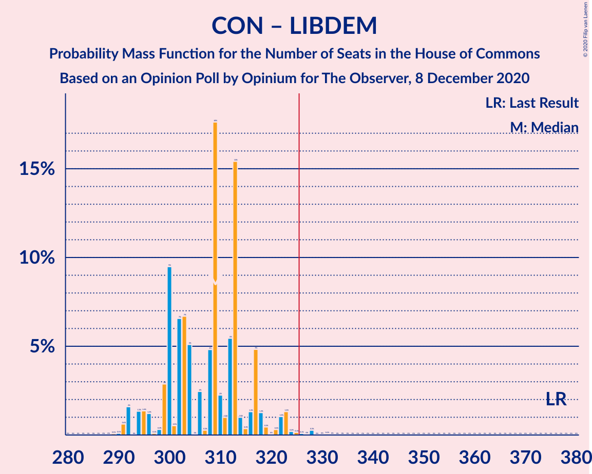

| Number of Seats | Probability | Accumulated | Special Marks |
|:---------------:|:-----------:|:-----------:|:-------------:|
| 289 | 0.1% | 100% |  |
| 290 | 0.1% | 99.9% |  |
| 291 | 0.6% | 99.8% |  |
| 292 | 2% | 99.2% |  |
| 293 | 0% | 98% |  |
| 294 | 1.3% | 98% |  |
| 295 | 1.4% | 96% |  |
| 296 | 1.2% | 95% |  |
| 297 | 0.1% | 94% |  |
| 298 | 0.3% | 94% |  |
| 299 | 3% | 93% |  |
| 300 | 9% | 90% |  |
| 301 | 0.5% | 81% |  |
| 302 | 7% | 80% |  |
| 303 | 7% | 74% |  |
| 304 | 5% | 67% |  |
| 305 | 0% | 62% |  |
| 306 | 2% | 62% |  |
| 307 | 0.3% | 60% |  |
| 308 | 5% | 59% |  |
| 309 | 18% | 54% | Median |
| 310 | 2% | 37% |  |
| 311 | 1.0% | 35% |  |
| 312 | 5% | 34% |  |
| 313 | 15% | 28% |  |
| 314 | 1.0% | 13% |  |
| 315 | 0.4% | 12% |  |
| 316 | 1.3% | 11% |  |
| 317 | 5% | 10% |  |
| 318 | 1.3% | 5% |  |
| 319 | 0.5% | 4% |  |
| 320 | 0% | 4% |  |
| 321 | 0.3% | 4% |  |
| 322 | 1.0% | 3% |  |
| 323 | 1.3% | 2% |  |
| 324 | 0.2% | 0.9% |  |
| 325 | 0.1% | 0.7% |  |
| 326 | 0.1% | 0.5% | Majority |
| 327 | 0% | 0.4% |  |
| 328 | 0.3% | 0.4% |  |
| 329 | 0% | 0.1% |  |
| 330 | 0% | 0.1% |  |
| 331 | 0.1% | 0.1% |  |
| 332 | 0% | 0% |  |
| 333 | 0% | 0% |  |
| 334 | 0% | 0% |  |
| 335 | 0% | 0% |  |
| 336 | 0% | 0% |  |
| 337 | 0% | 0% |  |
| 338 | 0% | 0% |  |
| 339 | 0% | 0% |  |
| 340 | 0% | 0% |  |
| 341 | 0% | 0% |  |
| 342 | 0% | 0% |  |
| 343 | 0% | 0% |  |
| 344 | 0% | 0% |  |
| 345 | 0% | 0% |  |
| 346 | 0% | 0% |  |
| 347 | 0% | 0% |  |
| 348 | 0% | 0% |  |
| 349 | 0% | 0% |  |
| 350 | 0% | 0% |  |
| 351 | 0% | 0% |  |
| 352 | 0% | 0% |  |
| 353 | 0% | 0% |  |
| 354 | 0% | 0% |  |
| 355 | 0% | 0% |  |
| 356 | 0% | 0% |  |
| 357 | 0% | 0% |  |
| 358 | 0% | 0% |  |
| 359 | 0% | 0% |  |
| 360 | 0% | 0% |  |
| 361 | 0% | 0% |  |
| 362 | 0% | 0% |  |
| 363 | 0% | 0% |  |
| 364 | 0% | 0% |  |
| 365 | 0% | 0% |  |
| 366 | 0% | 0% |  |
| 367 | 0% | 0% |  |
| 368 | 0% | 0% |  |
| 369 | 0% | 0% |  |
| 370 | 0% | 0% |  |
| 371 | 0% | 0% |  |
| 372 | 0% | 0% |  |
| 373 | 0% | 0% |  |
| 374 | 0% | 0% |  |
| 375 | 0% | 0% |  |
| 376 | 0% | 0% | Last Result |

### Conservative Party

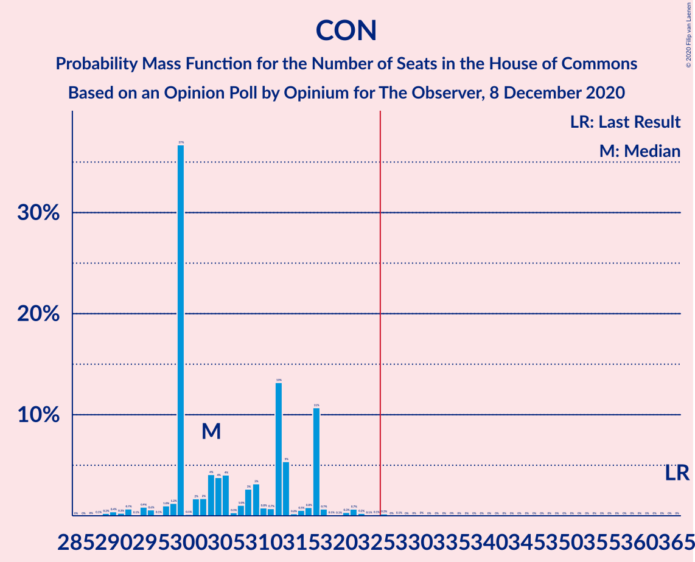

| Number of Seats | Probability | Accumulated | Special Marks |
|:---------------:|:-----------:|:-----------:|:-------------:|
| 288 | 0.1% | 100% |  |
| 289 | 0.2% | 99.9% |  |
| 290 | 0.5% | 99.7% |  |
| 291 | 1.2% | 99.2% |  |
| 292 | 0.5% | 98% |  |
| 293 | 1.0% | 98% |  |
| 294 | 0.6% | 97% |  |
| 295 | 2% | 96% |  |
| 296 | 0.7% | 94% |  |
| 297 | 0.5% | 94% |  |
| 298 | 2% | 93% |  |
| 299 | 9% | 91% |  |
| 300 | 2% | 82% |  |
| 301 | 3% | 80% |  |
| 302 | 8% | 77% |  |
| 303 | 5% | 69% |  |
| 304 | 1.5% | 63% |  |
| 305 | 2% | 62% |  |
| 306 | 0.4% | 60% |  |
| 307 | 3% | 60% |  |
| 308 | 15% | 57% | Median |
| 309 | 6% | 41% |  |
| 310 | 0.7% | 35% |  |
| 311 | 2% | 34% |  |
| 312 | 8% | 33% |  |
| 313 | 12% | 25% |  |
| 314 | 0.6% | 12% |  |
| 315 | 0.7% | 12% |  |
| 316 | 2% | 11% |  |
| 317 | 5% | 9% |  |
| 318 | 0.6% | 4% |  |
| 319 | 0.3% | 4% |  |
| 320 | 0.1% | 4% |  |
| 321 | 0.4% | 3% |  |
| 322 | 2% | 3% |  |
| 323 | 0.7% | 1.5% |  |
| 324 | 0.2% | 0.8% |  |
| 325 | 0.1% | 0.6% |  |
| 326 | 0.1% | 0.5% | Majority |
| 327 | 0.1% | 0.4% |  |
| 328 | 0.2% | 0.3% |  |
| 329 | 0% | 0.1% |  |
| 330 | 0% | 0.1% |  |
| 331 | 0.1% | 0.1% |  |
| 332 | 0% | 0% |  |
| 333 | 0% | 0% |  |
| 334 | 0% | 0% |  |
| 335 | 0% | 0% |  |
| 336 | 0% | 0% |  |
| 337 | 0% | 0% |  |
| 338 | 0% | 0% |  |
| 339 | 0% | 0% |  |
| 340 | 0% | 0% |  |
| 341 | 0% | 0% |  |
| 342 | 0% | 0% |  |
| 343 | 0% | 0% |  |
| 344 | 0% | 0% |  |
| 345 | 0% | 0% |  |
| 346 | 0% | 0% |  |
| 347 | 0% | 0% |  |
| 348 | 0% | 0% |  |
| 349 | 0% | 0% |  |
| 350 | 0% | 0% |  |
| 351 | 0% | 0% |  |
| 352 | 0% | 0% |  |
| 353 | 0% | 0% |  |
| 354 | 0% | 0% |  |
| 355 | 0% | 0% |  |
| 356 | 0% | 0% |  |
| 357 | 0% | 0% |  |
| 358 | 0% | 0% |  |
| 359 | 0% | 0% |  |
| 360 | 0% | 0% |  |
| 361 | 0% | 0% |  |
| 362 | 0% | 0% |  |
| 363 | 0% | 0% |  |
| 364 | 0% | 0% |  |
| 365 | 0% | 0% | Last Result |

### Labour Party – Liberal Democrats – Plaid Cymru

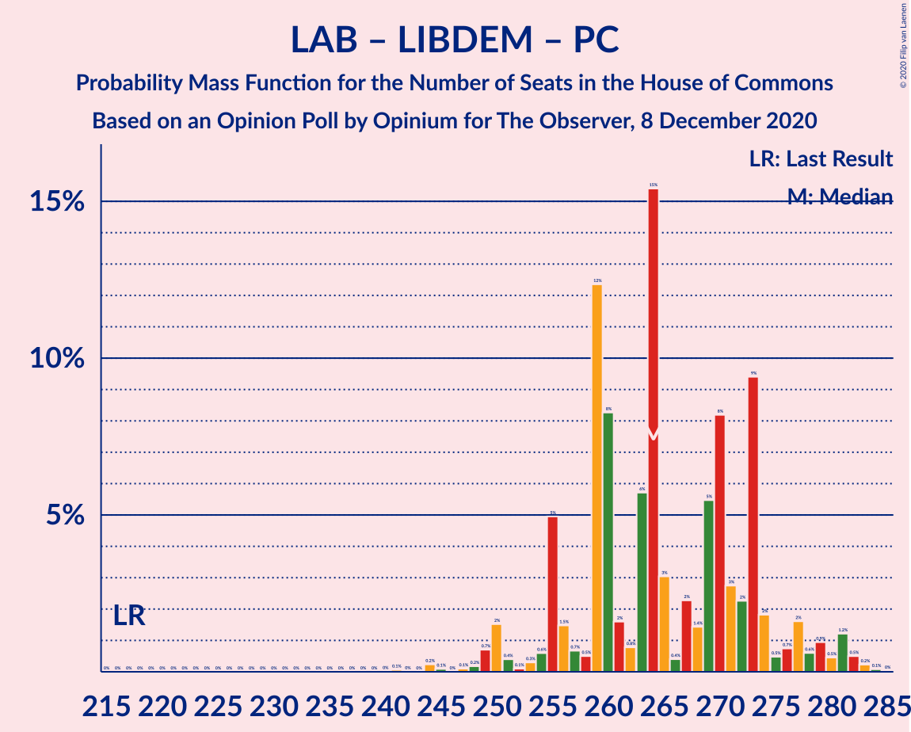

| Number of Seats | Probability | Accumulated | Special Marks |
|:---------------:|:-----------:|:-----------:|:-------------:|
| 217 | 0% | 100% | Last Result |
| 218 | 0% | 100% |  |
| 219 | 0% | 100% |  |
| 220 | 0% | 100% |  |
| 221 | 0% | 100% |  |
| 222 | 0% | 100% |  |
| 223 | 0% | 100% |  |
| 224 | 0% | 100% |  |
| 225 | 0% | 100% |  |
| 226 | 0% | 100% |  |
| 227 | 0% | 100% |  |
| 228 | 0% | 100% |  |
| 229 | 0% | 100% |  |
| 230 | 0% | 100% |  |
| 231 | 0% | 100% |  |
| 232 | 0% | 100% |  |
| 233 | 0% | 100% |  |
| 234 | 0% | 100% |  |
| 235 | 0% | 100% |  |
| 236 | 0% | 100% |  |
| 237 | 0% | 100% |  |
| 238 | 0% | 100% |  |
| 239 | 0% | 100% |  |
| 240 | 0% | 100% |  |
| 241 | 0.1% | 100% |  |
| 242 | 0% | 99.9% |  |
| 243 | 0% | 99.9% |  |
| 244 | 0.2% | 99.9% |  |
| 245 | 0.1% | 99.7% |  |
| 246 | 0% | 99.6% |  |
| 247 | 0.1% | 99.6% |  |
| 248 | 0.2% | 99.5% |  |
| 249 | 0.7% | 99.3% |  |
| 250 | 2% | 98.6% |  |
| 251 | 0.4% | 97% |  |
| 252 | 0.1% | 97% |  |
| 253 | 0.3% | 97% |  |
| 254 | 0.6% | 96% |  |
| 255 | 5% | 96% |  |
| 256 | 1.5% | 91% |  |
| 257 | 0.7% | 89% |  |
| 258 | 0.5% | 89% |  |
| 259 | 12% | 88% |  |
| 260 | 8% | 76% |  |
| 261 | 2% | 67% |  |
| 262 | 0.8% | 66% |  |
| 263 | 6% | 65% |  |
| 264 | 15% | 59% | Median |
| 265 | 3% | 44% |  |
| 266 | 0.4% | 41% |  |
| 267 | 2% | 41% |  |
| 268 | 1.4% | 38% |  |
| 269 | 5% | 37% |  |
| 270 | 8% | 31% |  |
| 271 | 3% | 23% |  |
| 272 | 2% | 20% |  |
| 273 | 9% | 18% |  |
| 274 | 2% | 9% |  |
| 275 | 0.5% | 7% |  |
| 276 | 0.7% | 6% |  |
| 277 | 2% | 6% |  |
| 278 | 0.6% | 4% |  |
| 279 | 0.9% | 3% |  |
| 280 | 0.5% | 3% |  |
| 281 | 1.2% | 2% |  |
| 282 | 0.5% | 0.8% |  |
| 283 | 0.2% | 0.3% |  |
| 284 | 0.1% | 0.1% |  |
| 285 | 0% | 0% |  |

### Labour Party – Plaid Cymru

| Number of Seats | Probability | Accumulated | Special Marks |
|:---------------:|:-----------:|:-----------:|:-------------:|
| 206 | 0% | 100% | Last Result |
| 207 | 0% | 100% |  |
| 208 | 0% | 100% |  |
| 209 | 0% | 100% |  |
| 210 | 0% | 100% |  |
| 211 | 0% | 100% |  |
| 212 | 0% | 100% |  |
| 213 | 0% | 100% |  |
| 214 | 0% | 100% |  |
| 215 | 0% | 100% |  |
| 216 | 0% | 100% |  |
| 217 | 0% | 100% |  |
| 218 | 0% | 100% |  |
| 219 | 0% | 100% |  |
| 220 | 0% | 100% |  |
| 221 | 0% | 100% |  |
| 222 | 0% | 100% |  |
| 223 | 0% | 100% |  |
| 224 | 0% | 100% |  |
| 225 | 0% | 100% |  |
| 226 | 0% | 100% |  |
| 227 | 0% | 100% |  |
| 228 | 0% | 100% |  |
| 229 | 0% | 100% |  |
| 230 | 0% | 100% |  |
| 231 | 0% | 100% |  |
| 232 | 0% | 100% |  |
| 233 | 0% | 100% |  |
| 234 | 0% | 100% |  |
| 235 | 0% | 100% |  |
| 236 | 0% | 100% |  |
| 237 | 0% | 100% |  |
| 238 | 0% | 100% |  |
| 239 | 0% | 100% |  |
| 240 | 0% | 100% |  |
| 241 | 0.1% | 100% |  |
| 242 | 0% | 99.9% |  |
| 243 | 0% | 99.9% |  |
| 244 | 0.3% | 99.9% |  |
| 245 | 0% | 99.6% |  |
| 246 | 0% | 99.6% |  |
| 247 | 0.1% | 99.6% |  |
| 248 | 0.2% | 99.5% |  |
| 249 | 1.4% | 99.2% |  |
| 250 | 1.0% | 98% |  |
| 251 | 0.3% | 97% |  |
| 252 | 0% | 97% |  |
| 253 | 0.4% | 97% |  |
| 254 | 1.3% | 96% |  |
| 255 | 5% | 95% |  |
| 256 | 1.2% | 90% |  |
| 257 | 0.3% | 89% |  |
| 258 | 0.9% | 88% |  |
| 259 | 16% | 88% |  |
| 260 | 5% | 72% |  |
| 261 | 1.0% | 67% |  |
| 262 | 2% | 66% |  |
| 263 | 18% | 64% | Median |
| 264 | 5% | 46% |  |
| 265 | 0.2% | 41% |  |
| 266 | 3% | 41% |  |
| 267 | 0% | 38% |  |
| 268 | 5% | 38% |  |
| 269 | 7% | 33% |  |
| 270 | 7% | 26% |  |
| 271 | 0.5% | 20% |  |
| 272 | 9% | 19% |  |
| 273 | 3% | 10% |  |
| 274 | 0.3% | 7% |  |
| 275 | 0.1% | 6% |  |
| 276 | 1.2% | 6% |  |
| 277 | 1.4% | 5% |  |
| 278 | 1.3% | 4% |  |
| 279 | 0% | 2% |  |
| 280 | 2% | 2% |  |
| 281 | 0.6% | 0.8% |  |
| 282 | 0.1% | 0.2% |  |
| 283 | 0.1% | 0.1% |  |
| 284 | 0% | 0% |  |

### Labour Party – Liberal Democrats

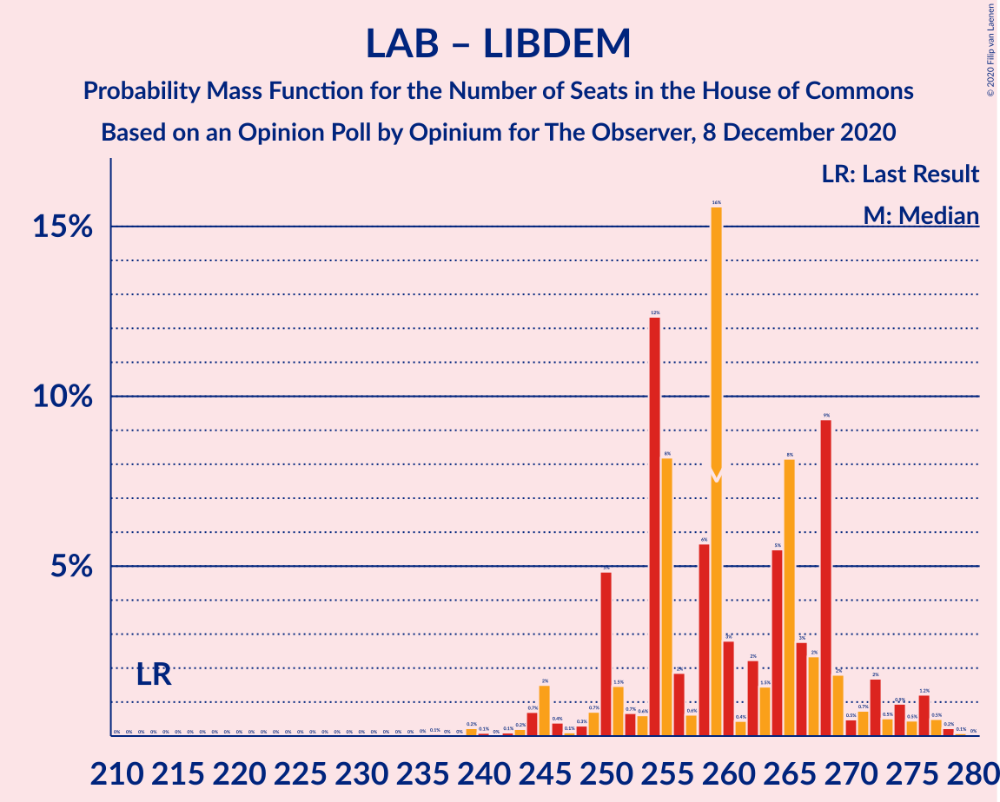

| Number of Seats | Probability | Accumulated | Special Marks |
|:---------------:|:-----------:|:-----------:|:-------------:|
| 213 | 0% | 100% | Last Result |
| 214 | 0% | 100% |  |
| 215 | 0% | 100% |  |
| 216 | 0% | 100% |  |
| 217 | 0% | 100% |  |
| 218 | 0% | 100% |  |
| 219 | 0% | 100% |  |
| 220 | 0% | 100% |  |
| 221 | 0% | 100% |  |
| 222 | 0% | 100% |  |
| 223 | 0% | 100% |  |
| 224 | 0% | 100% |  |
| 225 | 0% | 100% |  |
| 226 | 0% | 100% |  |
| 227 | 0% | 100% |  |
| 228 | 0% | 100% |  |
| 229 | 0% | 100% |  |
| 230 | 0% | 100% |  |
| 231 | 0% | 100% |  |
| 232 | 0% | 100% |  |
| 233 | 0% | 100% |  |
| 234 | 0% | 100% |  |
| 235 | 0% | 100% |  |
| 236 | 0.1% | 100% |  |
| 237 | 0% | 99.9% |  |
| 238 | 0% | 99.9% |  |
| 239 | 0.2% | 99.9% |  |
| 240 | 0.1% | 99.7% |  |
| 241 | 0% | 99.6% |  |
| 242 | 0.1% | 99.6% |  |
| 243 | 0.2% | 99.5% |  |
| 244 | 0.7% | 99.3% |  |
| 245 | 2% | 98.6% |  |
| 246 | 0.4% | 97% |  |
| 247 | 0.1% | 97% |  |
| 248 | 0.3% | 97% |  |
| 249 | 0.7% | 96% |  |
| 250 | 5% | 96% |  |
| 251 | 1.5% | 91% |  |
| 252 | 0.7% | 89% |  |
| 253 | 0.6% | 89% |  |
| 254 | 12% | 88% |  |
| 255 | 8% | 76% |  |
| 256 | 2% | 67% |  |
| 257 | 0.6% | 66% |  |
| 258 | 6% | 65% |  |
| 259 | 16% | 59% | Median |
| 260 | 3% | 44% |  |
| 261 | 0.4% | 41% |  |
| 262 | 2% | 40% |  |
| 263 | 1.5% | 38% |  |
| 264 | 5% | 37% |  |
| 265 | 8% | 31% |  |
| 266 | 3% | 23% |  |
| 267 | 2% | 20% |  |
| 268 | 9% | 18% |  |
| 269 | 2% | 9% |  |
| 270 | 0.5% | 7% |  |
| 271 | 0.7% | 6% |  |
| 272 | 2% | 6% |  |
| 273 | 0.5% | 4% |  |
| 274 | 0.9% | 3% |  |
| 275 | 0.5% | 3% |  |
| 276 | 1.2% | 2% |  |
| 277 | 0.5% | 0.8% |  |
| 278 | 0.2% | 0.3% |  |
| 279 | 0.1% | 0.1% |  |
| 280 | 0% | 0% |  |

### Labour Party

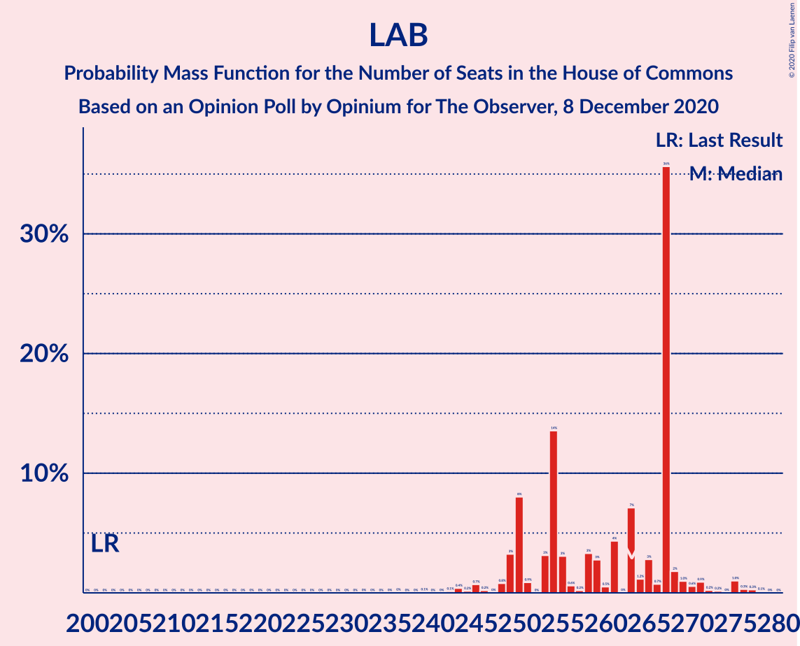

| Number of Seats | Probability | Accumulated | Special Marks |
|:---------------:|:-----------:|:-----------:|:-------------:|
| 202 | 0% | 100% | Last Result |
| 203 | 0% | 100% |  |
| 204 | 0% | 100% |  |
| 205 | 0% | 100% |  |
| 206 | 0% | 100% |  |
| 207 | 0% | 100% |  |
| 208 | 0% | 100% |  |
| 209 | 0% | 100% |  |
| 210 | 0% | 100% |  |
| 211 | 0% | 100% |  |
| 212 | 0% | 100% |  |
| 213 | 0% | 100% |  |
| 214 | 0% | 100% |  |
| 215 | 0% | 100% |  |
| 216 | 0% | 100% |  |
| 217 | 0% | 100% |  |
| 218 | 0% | 100% |  |
| 219 | 0% | 100% |  |
| 220 | 0% | 100% |  |
| 221 | 0% | 100% |  |
| 222 | 0% | 100% |  |
| 223 | 0% | 100% |  |
| 224 | 0% | 100% |  |
| 225 | 0% | 100% |  |
| 226 | 0% | 100% |  |
| 227 | 0% | 100% |  |
| 228 | 0% | 100% |  |
| 229 | 0% | 100% |  |
| 230 | 0% | 100% |  |
| 231 | 0% | 100% |  |
| 232 | 0% | 100% |  |
| 233 | 0% | 100% |  |
| 234 | 0% | 100% |  |
| 235 | 0% | 100% |  |
| 236 | 0.1% | 100% |  |
| 237 | 0% | 99.9% |  |
| 238 | 0% | 99.9% |  |
| 239 | 0.3% | 99.9% |  |
| 240 | 0% | 99.6% |  |
| 241 | 0% | 99.6% |  |
| 242 | 0.1% | 99.6% |  |
| 243 | 0.3% | 99.5% |  |
| 244 | 1.3% | 99.2% |  |
| 245 | 1.0% | 98% |  |
| 246 | 0.3% | 97% |  |
| 247 | 0% | 97% |  |
| 248 | 0.4% | 97% |  |
| 249 | 1.4% | 96% |  |
| 250 | 5% | 95% |  |
| 251 | 1.2% | 90% |  |
| 252 | 0.3% | 89% |  |
| 253 | 1.1% | 88% |  |
| 254 | 15% | 87% |  |
| 255 | 5% | 72% |  |
| 256 | 1.3% | 67% |  |
| 257 | 2% | 65% |  |
| 258 | 18% | 64% | Median |
| 259 | 5% | 46% |  |
| 260 | 0.3% | 41% |  |
| 261 | 3% | 41% |  |
| 262 | 0% | 38% |  |
| 263 | 5% | 38% |  |
| 264 | 7% | 33% |  |
| 265 | 7% | 26% |  |
| 266 | 0.6% | 20% |  |
| 267 | 9% | 19% |  |
| 268 | 3% | 10% |  |
| 269 | 0.3% | 7% |  |
| 270 | 0.1% | 6% |  |
| 271 | 1.2% | 6% |  |
| 272 | 1.4% | 5% |  |
| 273 | 1.2% | 4% |  |
| 274 | 0% | 2% |  |
| 275 | 2% | 2% |  |
| 276 | 0.6% | 0.8% |  |
| 277 | 0.1% | 0.2% |  |
| 278 | 0.1% | 0.1% |  |
| 279 | 0% | 0% |  |

## Technical Information

### Opinion Poll

+ **Polling firm:** Opinium
+ **Commissioner(s):** The Observer
+ **Fieldwork period:** 8 December 2020

### Calculations

+ **Sample size:** 6747
+ **Simulations done:** 1,048,576
+ **Error estimate:** 0.72%

