# Opinion Poll by Opinium for The Observer, 28–29 January 2021

<a href="#voting-intentions">Voting Intentions</a> | <a href="#seats">Seats</a> | <a href="#coalitions">Coalitions</a> | <a href="#technical-information">Technical Information</a>

## Voting Intentions

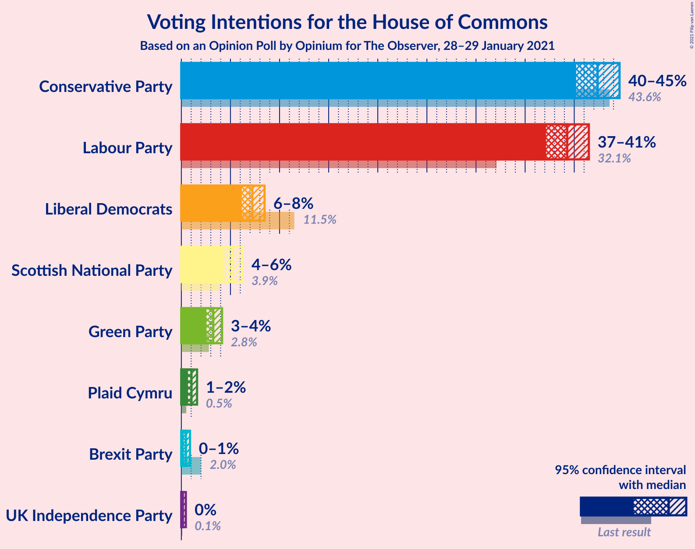

### Confidence Intervals

| Party | Last Result | Poll Result | 80% Confidence Interval | 90% Confidence Interval | 95% Confidence Interval | 99% Confidence Interval |
|:-----:|:-----------:|:-----------:|:-----------------------:|:-----------------------:|:-----------------------:|:-----------------------:|
| Conservative Party | 43.6% | 42.4% | 41.0–43.8% |40.5–44.2% |40.2–44.6% |39.5–45.3% |
| Labour Party | 32.1% | 39.3% | 37.9–40.7% |37.5–41.1% |37.1–41.5% |36.5–42.2% |
| Liberal Democrats | 11.5% | 7.2% | 6.5–8.0% |6.3–8.3% |6.2–8.5% |5.8–8.9% |
| Scottish National Party | 3.9% | 5.2% | 4.6–5.9% |4.4–6.1% |4.3–6.2% |4.0–6.6% |
| Green Party | 2.8% | 3.3% | 2.8–3.8% |2.7–4.0% |2.5–4.1% |2.3–4.4% |
| Plaid Cymru | 0.5% | 1.0% | 0.8–1.4% |0.7–1.5% |0.7–1.6% |0.6–1.8% |
| Brexit Party | 2.0% | 0.5% | 0.3–0.7% |0.3–0.8% |0.2–0.9% |0.2–1.0% |
| UK Independence Party | 0.1% | 0.2% | 0.1–0.4% |0.1–0.4% |0.0–0.5% |0.0–0.6% |

*Note:* The poll result column reflects the actual value used in the calculations. Published results may vary slightly, and in addition be rounded to fewer digits.

## Seats

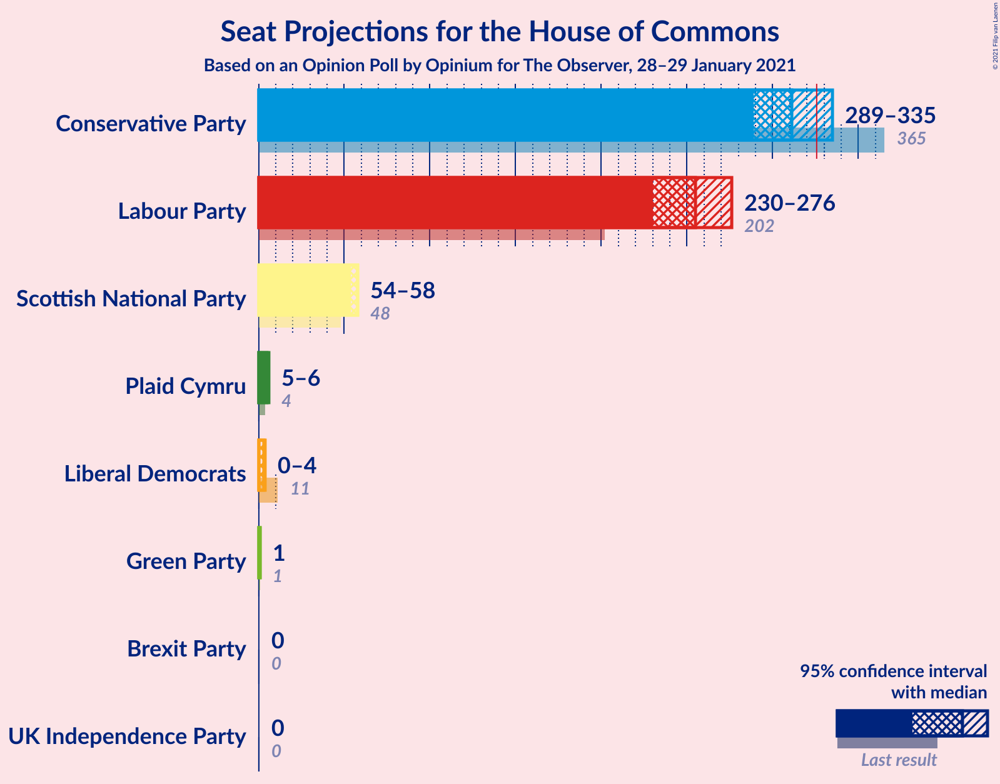

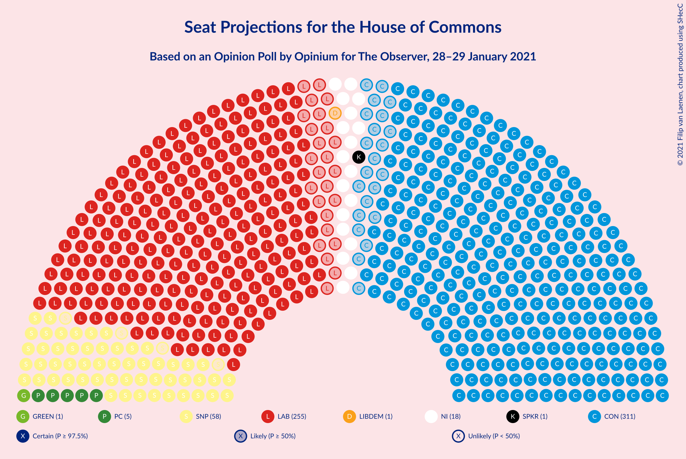

### Confidence Intervals

| Party | Last Result | Median | 80% Confidence Interval | 90% Confidence Interval | 95% Confidence Interval | 99% Confidence Interval |
|:-----:|:-----------:|:------:|:-----------------------:|:-----------------------:|:-----------------------:|:-----------------------:|
| <a href="#conservative-party">Conservative Party</a> | 365 | 311 | 293–333 |290–333 |289–335 |282–341 |
| <a href="#labour-party">Labour Party</a> | 202 | 255 | 235–271 |233–275 |230–276 |225–280 |
| <a href="#liberal-democrats">Liberal Democrats</a> | 11 | 3 | 1–4 |0–4 |0–4 |0–6 |
| <a href="#scottish-national-party">Scottish National Party</a> | 48 | 58 | 55–58 |54–58 |54–58 |53–58 |
| <a href="#green-party">Green Party</a> | 1 | 1 | 1 |1 |1 |1 |
| <a href="#plaid-cymru">Plaid Cymru</a> | 4 | 5 | 5–6 |5–6 |5–6 |4–7 |
| <a href="#brexit-party">Brexit Party</a> | 0 | 0 | 0 |0 |0 |0 |
| <a href="#uk-independence-party">UK Independence Party</a> | 0 | 0 | 0 |0 |0 |0 |

### Conservative Party

*For a full overview of the results for this party, see the [Conservative Party](party-conservativeparty.html) page.*

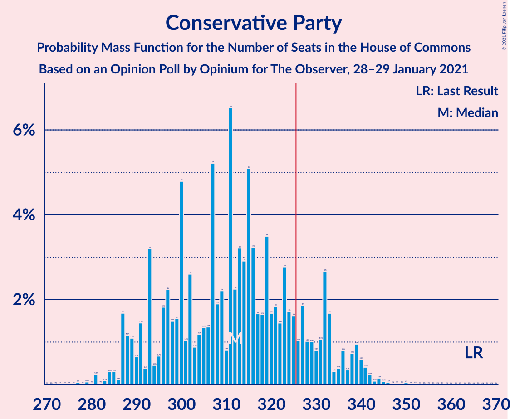

| Number of Seats | Probability | Accumulated | Special Marks |
|:---------------:|:-----------:|:-----------:|:-------------:|
| 273 | 0% | 100% |  |
| 274 | 0% | 99.9% |  |
| 275 | 0% | 99.9% |  |
| 276 | 0% | 99.9% |  |
| 277 | 0.2% | 99.9% |  |
| 278 | 0% | 99.7% |  |
| 279 | 0% | 99.7% |  |
| 280 | 0% | 99.7% |  |
| 281 | 0.1% | 99.7% |  |
| 282 | 0.1% | 99.6% |  |
| 283 | 0% | 99.5% |  |
| 284 | 0% | 99.5% |  |
| 285 | 0.4% | 99.5% |  |
| 286 | 0.1% | 99.1% |  |
| 287 | 0% | 99.0% |  |
| 288 | 1.4% | 99.0% |  |
| 289 | 2% | 98% |  |
| 290 | 2% | 96% |  |
| 291 | 2% | 94% |  |
| 292 | 0.2% | 92% |  |
| 293 | 16% | 92% |  |
| 294 | 0.2% | 76% |  |
| 295 | 0.1% | 76% |  |
| 296 | 1.2% | 76% |  |
| 297 | 0.4% | 75% |  |
| 298 | 1.0% | 75% |  |
| 299 | 3% | 74% |  |
| 300 | 3% | 71% |  |
| 301 | 1.0% | 68% |  |
| 302 | 0.1% | 67% |  |
| 303 | 0.6% | 67% |  |
| 304 | 2% | 67% |  |
| 305 | 0.9% | 64% |  |
| 306 | 0% | 63% |  |
| 307 | 0.1% | 63% |  |
| 308 | 6% | 63% |  |
| 309 | 0.1% | 57% |  |
| 310 | 0.4% | 57% |  |
| 311 | 10% | 57% | Median |
| 312 | 0.7% | 47% |  |
| 313 | 9% | 46% |  |
| 314 | 2% | 37% |  |
| 315 | 4% | 35% |  |
| 316 | 0.9% | 31% |  |
| 317 | 0.1% | 30% |  |
| 318 | 2% | 30% |  |
| 319 | 0.3% | 28% |  |
| 320 | 0.7% | 28% |  |
| 321 | 0.1% | 27% |  |
| 322 | 2% | 27% |  |
| 323 | 0.4% | 25% |  |
| 324 | 2% | 24% |  |
| 325 | 0.8% | 22% |  |
| 326 | 3% | 21% | Majority |
| 327 | 2% | 19% |  |
| 328 | 0.1% | 16% |  |
| 329 | 0.7% | 16% |  |
| 330 | 0.8% | 16% |  |
| 331 | 3% | 15% |  |
| 332 | 1.0% | 12% |  |
| 333 | 8% | 11% |  |
| 334 | 0.1% | 3% |  |
| 335 | 0.7% | 3% |  |
| 336 | 0.6% | 2% |  |
| 337 | 0.2% | 1.4% |  |
| 338 | 0.3% | 1.2% |  |
| 339 | 0.3% | 0.9% |  |
| 340 | 0% | 0.6% |  |
| 341 | 0.2% | 0.6% |  |
| 342 | 0.1% | 0.4% |  |
| 343 | 0% | 0.3% |  |
| 344 | 0% | 0.3% |  |
| 345 | 0% | 0.2% |  |
| 346 | 0% | 0.2% |  |
| 347 | 0% | 0.2% |  |
| 348 | 0.1% | 0.2% |  |
| 349 | 0% | 0.1% |  |
| 350 | 0.1% | 0.1% |  |
| 351 | 0% | 0% |  |
| 352 | 0% | 0% |  |
| 353 | 0% | 0% |  |
| 354 | 0% | 0% |  |
| 355 | 0% | 0% |  |
| 356 | 0% | 0% |  |
| 357 | 0% | 0% |  |
| 358 | 0% | 0% |  |
| 359 | 0% | 0% |  |
| 360 | 0% | 0% |  |
| 361 | 0% | 0% |  |
| 362 | 0% | 0% |  |
| 363 | 0% | 0% |  |
| 364 | 0% | 0% |  |
| 365 | 0% | 0% | Last Result |

### Labour Party

*For a full overview of the results for this party, see the [Labour Party](party-labourparty.html) page.*

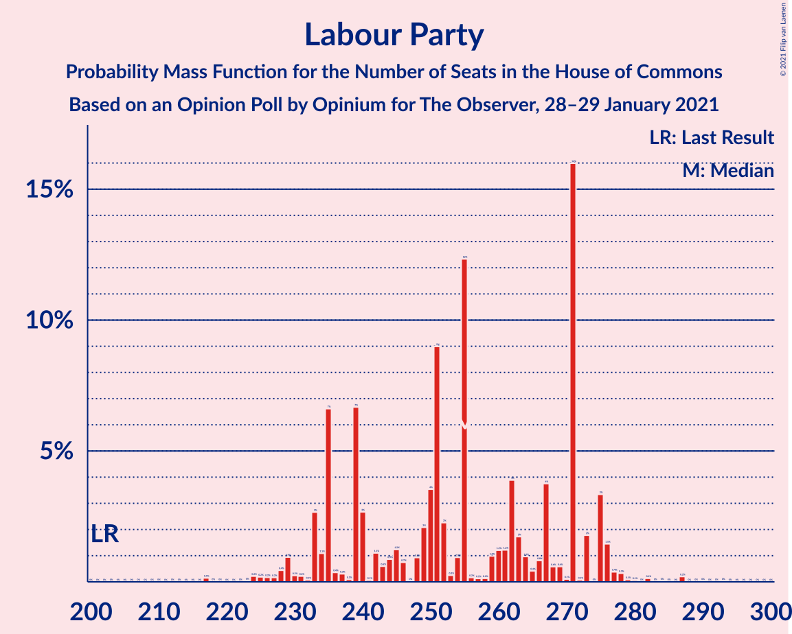

| Number of Seats | Probability | Accumulated | Special Marks |
|:---------------:|:-----------:|:-----------:|:-------------:|
| 202 | 0% | 100% | Last Result |
| 203 | 0% | 100% |  |
| 204 | 0% | 100% |  |
| 205 | 0% | 100% |  |
| 206 | 0% | 100% |  |
| 207 | 0% | 100% |  |
| 208 | 0% | 100% |  |
| 209 | 0% | 100% |  |
| 210 | 0% | 100% |  |
| 211 | 0% | 100% |  |
| 212 | 0% | 100% |  |
| 213 | 0% | 100% |  |
| 214 | 0% | 100% |  |
| 215 | 0% | 100% |  |
| 216 | 0% | 100% |  |
| 217 | 0.1% | 100% |  |
| 218 | 0% | 99.8% |  |
| 219 | 0% | 99.8% |  |
| 220 | 0% | 99.8% |  |
| 221 | 0% | 99.8% |  |
| 222 | 0% | 99.8% |  |
| 223 | 0% | 99.8% |  |
| 224 | 0.2% | 99.7% |  |
| 225 | 0.2% | 99.5% |  |
| 226 | 0.2% | 99.3% |  |
| 227 | 0.2% | 99.2% |  |
| 228 | 0.4% | 99.0% |  |
| 229 | 0.9% | 98.6% |  |
| 230 | 0.2% | 98% |  |
| 231 | 0.2% | 97% |  |
| 232 | 0.1% | 97% |  |
| 233 | 3% | 97% |  |
| 234 | 1.1% | 94% |  |
| 235 | 7% | 93% |  |
| 236 | 0.4% | 87% |  |
| 237 | 0.3% | 86% |  |
| 238 | 0.1% | 86% |  |
| 239 | 7% | 86% |  |
| 240 | 3% | 79% |  |
| 241 | 0.1% | 77% |  |
| 242 | 1.1% | 77% |  |
| 243 | 0.6% | 75% |  |
| 244 | 0.9% | 75% |  |
| 245 | 1.2% | 74% |  |
| 246 | 0.7% | 73% |  |
| 247 | 0% | 72% |  |
| 248 | 0.9% | 72% |  |
| 249 | 2% | 71% |  |
| 250 | 4% | 69% |  |
| 251 | 9% | 65% |  |
| 252 | 2% | 56% |  |
| 253 | 0.2% | 54% |  |
| 254 | 0.9% | 54% |  |
| 255 | 12% | 53% | Median |
| 256 | 0.2% | 41% |  |
| 257 | 0.1% | 40% |  |
| 258 | 0.1% | 40% |  |
| 259 | 1.0% | 40% |  |
| 260 | 1.2% | 39% |  |
| 261 | 1.2% | 38% |  |
| 262 | 4% | 37% |  |
| 263 | 2% | 33% |  |
| 264 | 1.0% | 31% |  |
| 265 | 0.4% | 30% |  |
| 266 | 0.8% | 30% |  |
| 267 | 4% | 29% |  |
| 268 | 0.6% | 25% |  |
| 269 | 0.6% | 25% |  |
| 270 | 0.1% | 24% |  |
| 271 | 16% | 24% |  |
| 272 | 0.1% | 8% |  |
| 273 | 2% | 8% |  |
| 274 | 0% | 6% |  |
| 275 | 3% | 6% |  |
| 276 | 1.5% | 3% |  |
| 277 | 0.4% | 1.3% |  |
| 278 | 0.3% | 1.0% |  |
| 279 | 0.1% | 0.6% |  |
| 280 | 0.1% | 0.6% |  |
| 281 | 0% | 0.5% |  |
| 282 | 0.1% | 0.5% |  |
| 283 | 0% | 0.4% |  |
| 284 | 0% | 0.3% |  |
| 285 | 0% | 0.3% |  |
| 286 | 0% | 0.3% |  |
| 287 | 0.2% | 0.3% |  |
| 288 | 0% | 0.1% |  |
| 289 | 0% | 0.1% |  |
| 290 | 0% | 0.1% |  |
| 291 | 0% | 0% |  |

### Liberal Democrats

*For a full overview of the results for this party, see the [Liberal Democrats](party-liberaldemocrats.html) page.*

| Number of Seats | Probability | Accumulated | Special Marks |
|:---------------:|:-----------:|:-----------:|:-------------:|
| 0 | 7% | 100% |  |
| 1 | 16% | 93% |  |
| 2 | 23% | 77% |  |
| 3 | 43% | 55% | Median |
| 4 | 11% | 12% |  |
| 5 | 0.1% | 1.3% |  |
| 6 | 1.2% | 1.2% |  |
| 7 | 0% | 0% |  |
| 8 | 0% | 0% |  |
| 9 | 0% | 0% |  |
| 10 | 0% | 0% |  |
| 11 | 0% | 0% | Last Result |

### Scottish National Party

*For a full overview of the results for this party, see the [Scottish National Party](party-scottishnationalparty.html) page.*

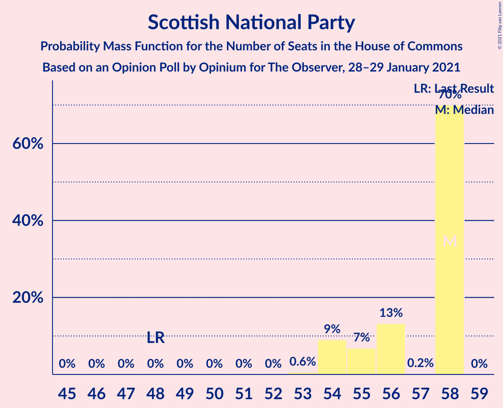

| Number of Seats | Probability | Accumulated | Special Marks |
|:---------------:|:-----------:|:-----------:|:-------------:|
| 45 | 0% | 100% |  |
| 46 | 0% | 99.9% |  |
| 47 | 0% | 99.9% |  |
| 48 | 0% | 99.9% | Last Result |
| 49 | 0% | 99.9% |  |
| 50 | 0% | 99.9% |  |
| 51 | 0% | 99.9% |  |
| 52 | 0% | 99.8% |  |
| 53 | 0.6% | 99.8% |  |
| 54 | 9% | 99.3% |  |
| 55 | 7% | 90% |  |
| 56 | 13% | 83% |  |
| 57 | 0.2% | 70% |  |
| 58 | 70% | 70% | Median |
| 59 | 0% | 0% |  |

### Green Party

*For a full overview of the results for this party, see the [Green Party](party-greenparty.html) page.*

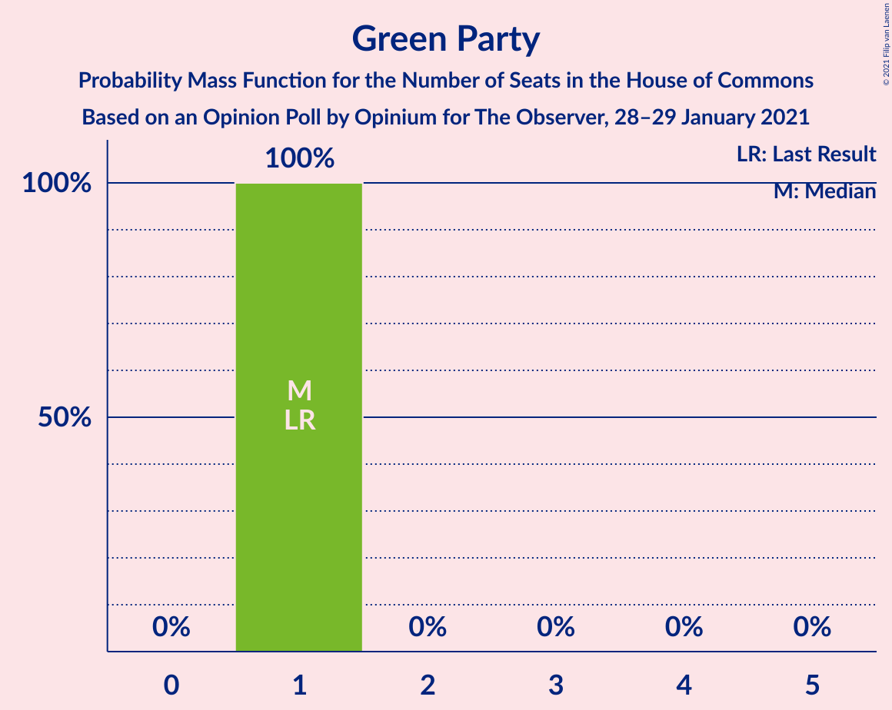

| Number of Seats | Probability | Accumulated | Special Marks |
|:---------------:|:-----------:|:-----------:|:-------------:|
| 1 | 100% | 100% | Last Result, Median |

### Plaid Cymru

*For a full overview of the results for this party, see the [Plaid Cymru](party-plaidcymru.html) page.*

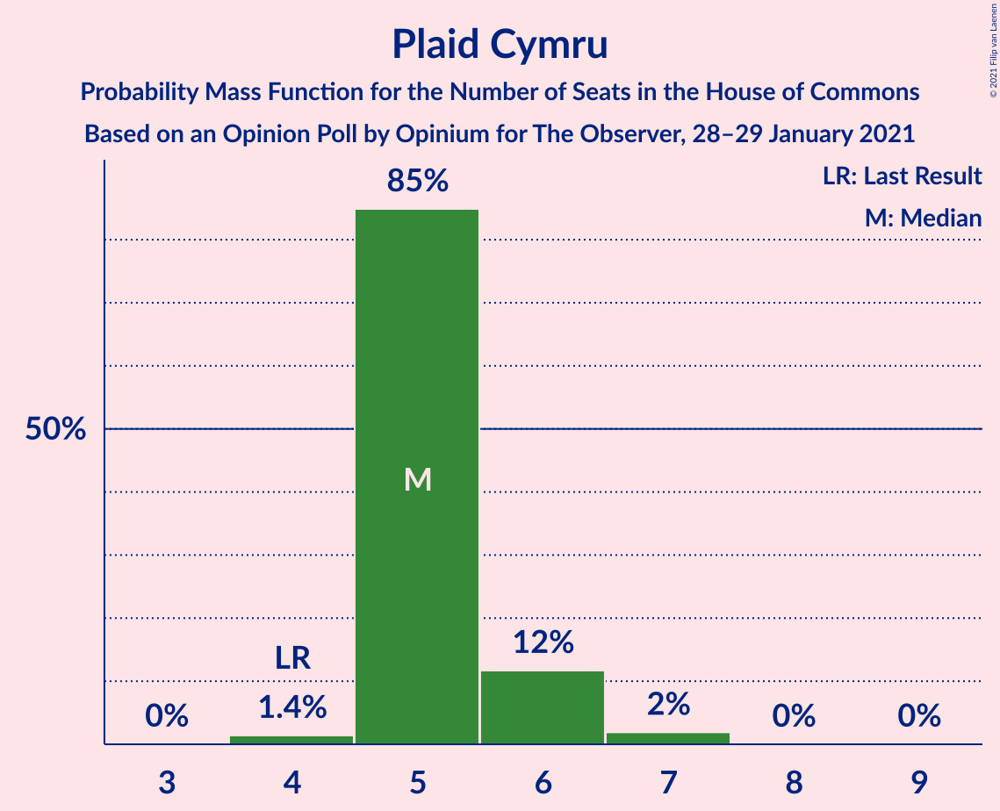

| Number of Seats | Probability | Accumulated | Special Marks |
|:---------------:|:-----------:|:-----------:|:-------------:|
| 3 | 0.1% | 100% |  |
| 4 | 0.7% | 99.9% | Last Result |
| 5 | 89% | 99.3% | Median |
| 6 | 8% | 10% |  |
| 7 | 2% | 2% |  |
| 8 | 0% | 0% |  |

### Brexit Party

*For a full overview of the results for this party, see the [Brexit Party](party-brexitparty.html) page.*

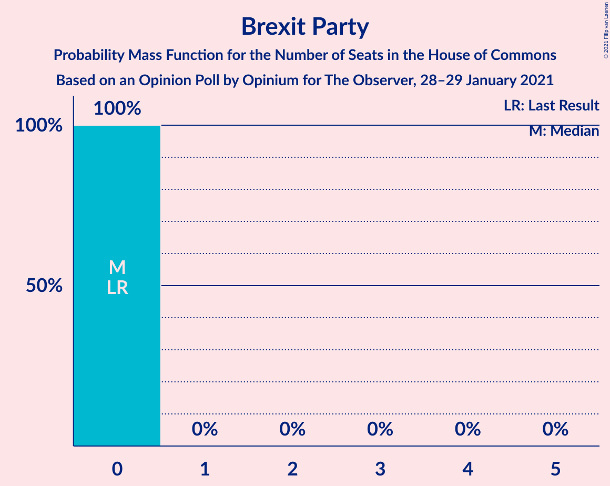

| Number of Seats | Probability | Accumulated | Special Marks |
|:---------------:|:-----------:|:-----------:|:-------------:|
| 0 | 100% | 100% | Last Result, Median |

### UK Independence Party

*For a full overview of the results for this party, see the [UK Independence Party](party-ukindependenceparty.html) page.*

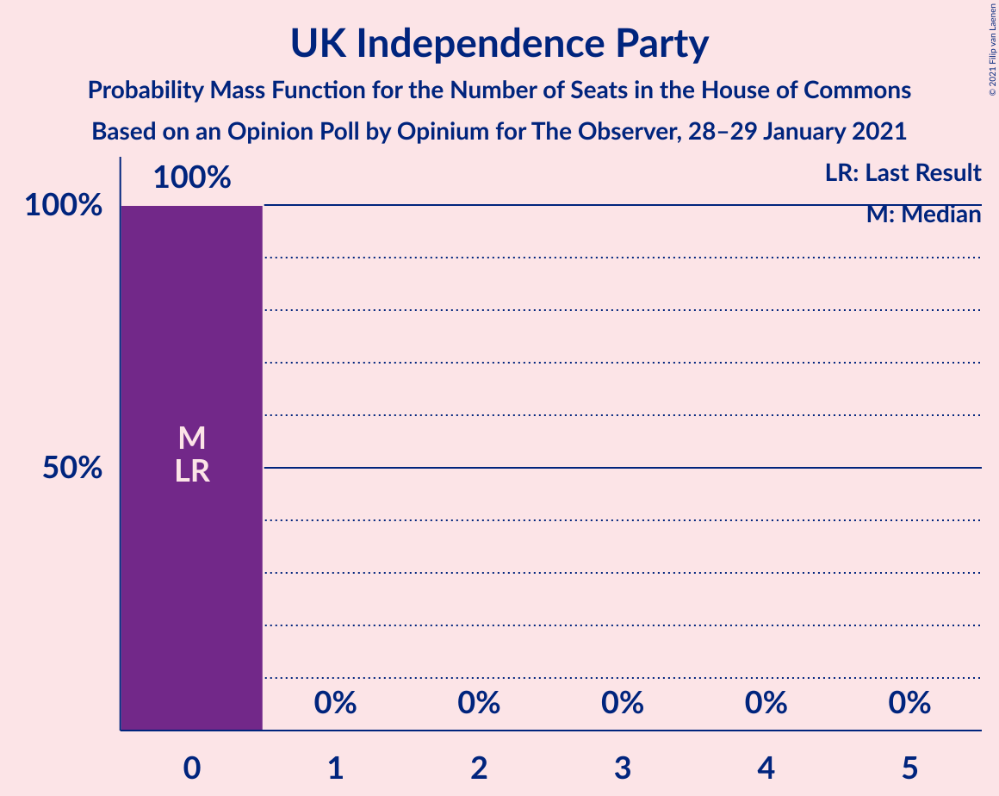

| Number of Seats | Probability | Accumulated | Special Marks |
|:---------------:|:-----------:|:-----------:|:-------------:|
| 0 | 100% | 100% | Last Result, Median |

## Coalitions

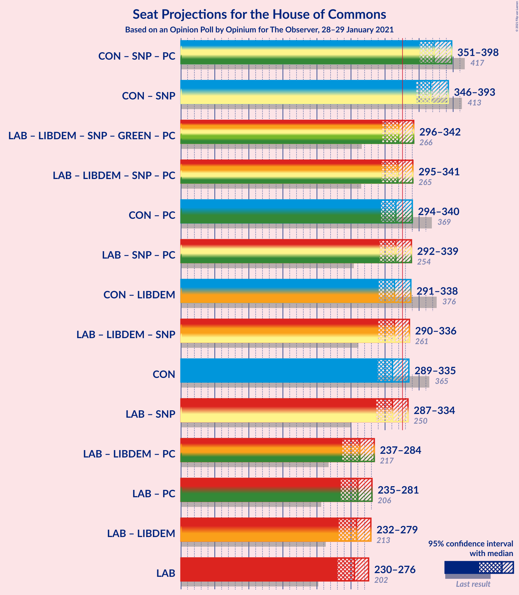

### Confidence Intervals

| Coalition | Last Result | Median | Majority? | 80% Confidence Interval | 90% Confidence Interval | 95% Confidence Interval | 99% Confidence Interval |
|:---------:|:-----------:|:------:|:---------:|:-----------------------:|:-----------------------:|:-----------------------:|:-----------------------:|
| Conservative Party – Scottish National Party – Plaid Cymru | 417 | 372 | 100% | 356–393 | 353–396 | 351–398 | 346–404 |
| Conservative Party – Scottish National Party | 413 | 367 | 100% | 351–388 | 348–391 | 346–393 | 340–397 |
| Labour Party – Liberal Democrats – Scottish National Party – Green Party – Plaid Cymru | 266 | 320 | 37% | 298–338 | 298–341 | 296–342 | 290–349 |
| Labour Party – Liberal Democrats – Scottish National Party – Plaid Cymru | 265 | 319 | 36% | 297–337 | 297–340 | 295–341 | 289–348 |
| Conservative Party – Plaid Cymru | 369 | 316 | 28% | 298–338 | 295–338 | 294–340 | 288–346 |
| Labour Party – Scottish National Party – Plaid Cymru | 254 | 316 | 33% | 296–334 | 295–338 | 292–339 | 288–343 |
| Conservative Party – Liberal Democrats | 376 | 314 | 24% | 296–334 | 292–335 | 291–338 | 287–342 |
| Labour Party – Liberal Democrats – Scottish National Party | 261 | 314 | 29% | 292–332 | 292–335 | 290–336 | 284–342 |
| Conservative Party | 365 | 311 | 21% | 293–333 | 290–333 | 289–335 | 282–341 |
| Labour Party – Scottish National Party | 250 | 311 | 24% | 291–329 | 290–333 | 287–334 | 282–338 |
| Labour Party – Liberal Democrats – Plaid Cymru | 217 | 263 | 0% | 242–279 | 239–282 | 237–284 | 233–290 |
| Labour Party – Plaid Cymru | 206 | 260 | 0% | 240–276 | 238–280 | 235–281 | 231–286 |
| Labour Party – Liberal Democrats | 213 | 258 | 0% | 237–274 | 234–277 | 232–279 | 226–284 |
| Labour Party | 202 | 255 | 0% | 235–271 | 233–275 | 230–276 | 225–280 |

### Conservative Party – Scottish National Party – Plaid Cymru

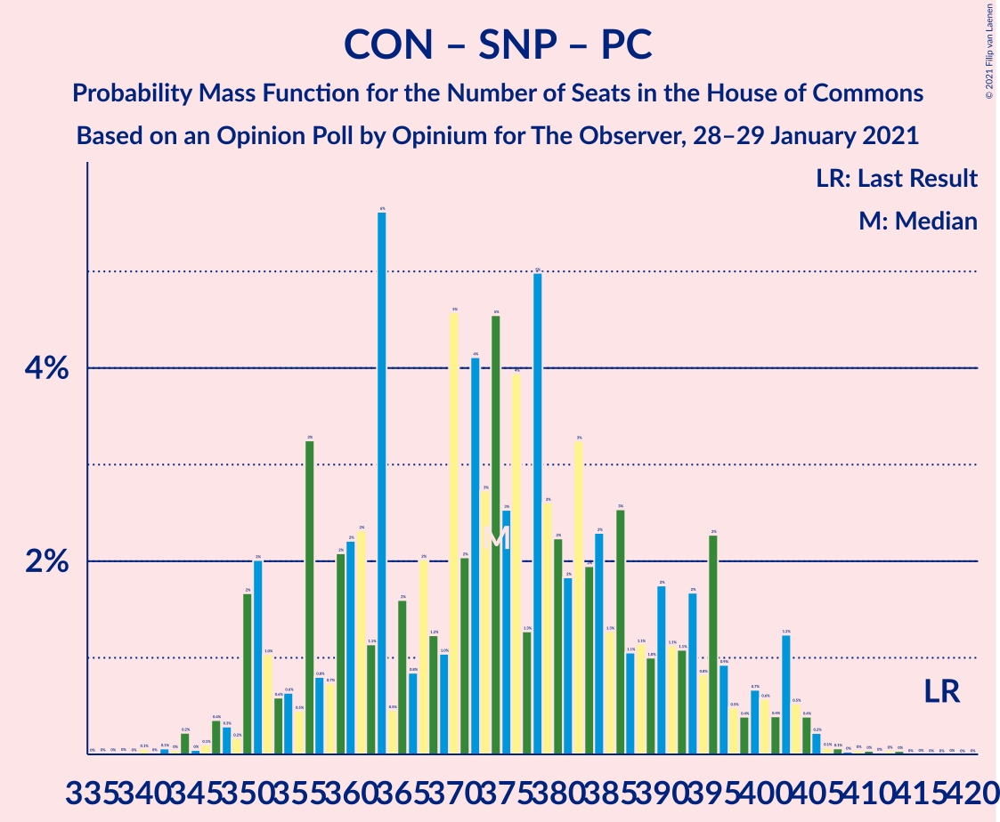

| Number of Seats | Probability | Accumulated | Special Marks |
|:---------------:|:-----------:|:-----------:|:-------------:|
| 335 | 0% | 100% |  |
| 336 | 0% | 99.9% |  |
| 337 | 0% | 99.9% |  |
| 338 | 0% | 99.9% |  |
| 339 | 0% | 99.9% |  |
| 340 | 0.2% | 99.9% |  |
| 341 | 0% | 99.7% |  |
| 342 | 0% | 99.7% |  |
| 343 | 0% | 99.7% |  |
| 344 | 0.1% | 99.7% |  |
| 345 | 0% | 99.5% |  |
| 346 | 0.1% | 99.5% |  |
| 347 | 0% | 99.5% |  |
| 348 | 0.4% | 99.4% |  |
| 349 | 0.1% | 99.1% |  |
| 350 | 0.1% | 99.0% |  |
| 351 | 1.4% | 98.9% |  |
| 352 | 2% | 97% |  |
| 353 | 2% | 96% |  |
| 354 | 2% | 94% |  |
| 355 | 0.2% | 92% |  |
| 356 | 16% | 92% |  |
| 357 | 0.2% | 76% |  |
| 358 | 0.3% | 76% |  |
| 359 | 0.5% | 75% |  |
| 360 | 1.2% | 75% |  |
| 361 | 1.2% | 74% |  |
| 362 | 2% | 73% |  |
| 363 | 2% | 70% |  |
| 364 | 0.8% | 68% |  |
| 365 | 0.2% | 67% |  |
| 366 | 0.6% | 67% |  |
| 367 | 6% | 67% |  |
| 368 | 0.9% | 61% |  |
| 369 | 0.2% | 60% |  |
| 370 | 0.2% | 60% |  |
| 371 | 2% | 60% |  |
| 372 | 10% | 57% |  |
| 373 | 0.9% | 47% |  |
| 374 | 0.2% | 46% | Median |
| 375 | 0.4% | 46% |  |
| 376 | 11% | 46% |  |
| 377 | 0.8% | 35% |  |
| 378 | 2% | 34% |  |
| 379 | 3% | 32% |  |
| 380 | 0.2% | 29% |  |
| 381 | 2% | 29% |  |
| 382 | 0.4% | 27% |  |
| 383 | 0.1% | 27% |  |
| 384 | 1.0% | 27% |  |
| 385 | 1.0% | 26% |  |
| 386 | 1.1% | 25% |  |
| 387 | 3% | 24% |  |
| 388 | 0.2% | 21% |  |
| 389 | 3% | 21% |  |
| 390 | 5% | 18% |  |
| 391 | 0.1% | 13% |  |
| 392 | 0.7% | 13% |  |
| 393 | 6% | 13% |  |
| 394 | 0.2% | 7% |  |
| 395 | 0.1% | 7% |  |
| 396 | 4% | 6% |  |
| 397 | 0.1% | 3% |  |
| 398 | 0.7% | 3% |  |
| 399 | 0.3% | 2% |  |
| 400 | 0.6% | 2% |  |
| 401 | 0.1% | 1.0% |  |
| 402 | 0.3% | 1.0% |  |
| 403 | 0% | 0.7% |  |
| 404 | 0.3% | 0.6% |  |
| 405 | 0% | 0.3% |  |
| 406 | 0% | 0.3% |  |
| 407 | 0% | 0.2% |  |
| 408 | 0% | 0.2% |  |
| 409 | 0% | 0.2% |  |
| 410 | 0% | 0.2% |  |
| 411 | 0.1% | 0.2% |  |
| 412 | 0% | 0.1% |  |
| 413 | 0.1% | 0.1% |  |
| 414 | 0% | 0% |  |
| 415 | 0% | 0% |  |
| 416 | 0% | 0% |  |
| 417 | 0% | 0% | Last Result |

### Conservative Party – Scottish National Party

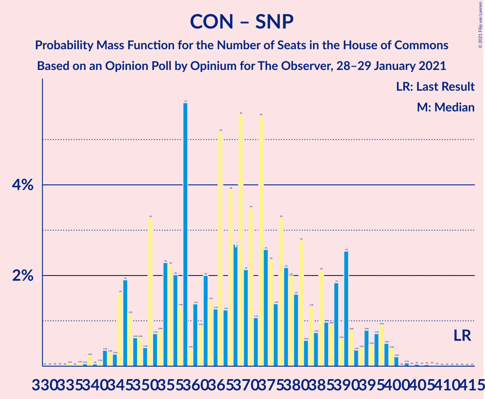

| Number of Seats | Probability | Accumulated | Special Marks |
|:---------------:|:-----------:|:-----------:|:-------------:|
| 330 | 0% | 100% |  |
| 331 | 0% | 99.9% |  |
| 332 | 0% | 99.9% |  |
| 333 | 0% | 99.9% |  |
| 334 | 0% | 99.9% |  |
| 335 | 0.2% | 99.9% |  |
| 336 | 0% | 99.7% |  |
| 337 | 0% | 99.7% |  |
| 338 | 0% | 99.7% |  |
| 339 | 0.1% | 99.7% |  |
| 340 | 0.1% | 99.5% |  |
| 341 | 0% | 99.5% |  |
| 342 | 0% | 99.5% |  |
| 343 | 0.4% | 99.4% |  |
| 344 | 0.1% | 99.0% |  |
| 345 | 0.1% | 99.0% |  |
| 346 | 1.4% | 98.9% |  |
| 347 | 2% | 97% |  |
| 348 | 2% | 96% |  |
| 349 | 2% | 94% |  |
| 350 | 0.2% | 92% |  |
| 351 | 16% | 92% |  |
| 352 | 0.2% | 76% |  |
| 353 | 0.4% | 76% |  |
| 354 | 1.3% | 75% |  |
| 355 | 0.3% | 74% |  |
| 356 | 1.2% | 74% |  |
| 357 | 3% | 73% |  |
| 358 | 2% | 70% |  |
| 359 | 0.7% | 68% |  |
| 360 | 0.1% | 67% |  |
| 361 | 0.6% | 67% |  |
| 362 | 6% | 67% |  |
| 363 | 0.9% | 61% |  |
| 364 | 0.1% | 60% |  |
| 365 | 0.1% | 60% |  |
| 366 | 3% | 60% |  |
| 367 | 10% | 57% |  |
| 368 | 0.9% | 47% |  |
| 369 | 0.2% | 46% | Median |
| 370 | 3% | 46% |  |
| 371 | 9% | 43% |  |
| 372 | 0.6% | 35% |  |
| 373 | 4% | 34% |  |
| 374 | 0.8% | 30% |  |
| 375 | 0.1% | 29% |  |
| 376 | 2% | 29% |  |
| 377 | 0.3% | 27% |  |
| 378 | 0.6% | 27% |  |
| 379 | 0.4% | 26% |  |
| 380 | 2% | 26% |  |
| 381 | 1.0% | 24% |  |
| 382 | 2% | 23% |  |
| 383 | 0.5% | 21% |  |
| 384 | 3% | 21% |  |
| 385 | 5% | 18% |  |
| 386 | 0.1% | 13% |  |
| 387 | 0.7% | 13% |  |
| 388 | 6% | 13% |  |
| 389 | 0.1% | 7% |  |
| 390 | 1.1% | 7% |  |
| 391 | 3% | 5% |  |
| 392 | 0.1% | 3% |  |
| 393 | 0.7% | 3% |  |
| 394 | 0.6% | 2% |  |
| 395 | 0.2% | 1.2% |  |
| 396 | 0.2% | 1.0% |  |
| 397 | 0.3% | 0.8% |  |
| 398 | 0% | 0.5% |  |
| 399 | 0.2% | 0.4% |  |
| 400 | 0% | 0.3% |  |
| 401 | 0% | 0.2% |  |
| 402 | 0% | 0.2% |  |
| 403 | 0% | 0.2% |  |
| 404 | 0% | 0.2% |  |
| 405 | 0% | 0.2% |  |
| 406 | 0.1% | 0.2% |  |
| 407 | 0% | 0.1% |  |
| 408 | 0.1% | 0.1% |  |
| 409 | 0% | 0% |  |
| 410 | 0% | 0% |  |
| 411 | 0% | 0% |  |
| 412 | 0% | 0% |  |
| 413 | 0% | 0% | Last Result |

### Labour Party – Liberal Democrats – Scottish National Party – Green Party – Plaid Cymru

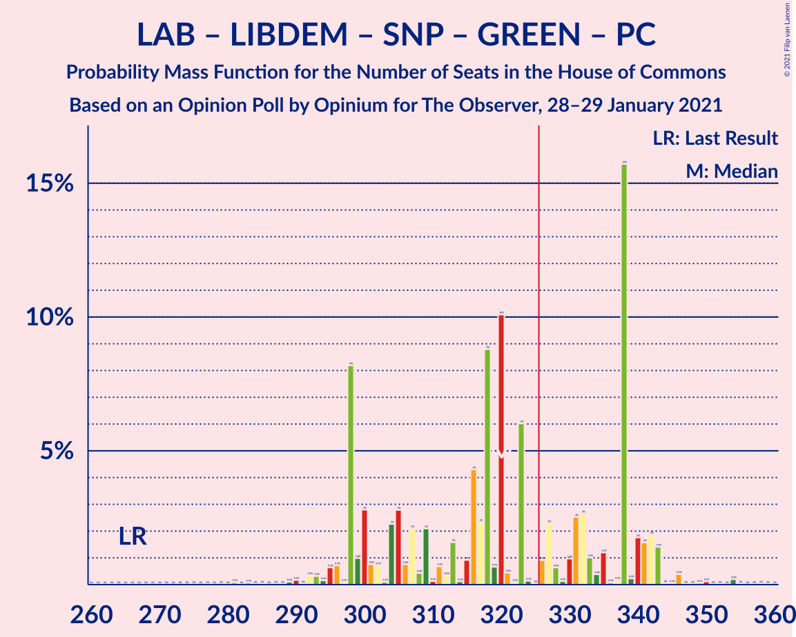

| Number of Seats | Probability | Accumulated | Special Marks |
|:---------------:|:-----------:|:-----------:|:-------------:|
| 266 | 0% | 100% | Last Result |
| 267 | 0% | 100% |  |
| 268 | 0% | 100% |  |
| 269 | 0% | 100% |  |
| 270 | 0% | 100% |  |
| 271 | 0% | 100% |  |
| 272 | 0% | 100% |  |
| 273 | 0% | 100% |  |
| 274 | 0% | 100% |  |
| 275 | 0% | 100% |  |
| 276 | 0% | 100% |  |
| 277 | 0% | 100% |  |
| 278 | 0% | 100% |  |
| 279 | 0% | 100% |  |
| 280 | 0% | 100% |  |
| 281 | 0.1% | 100% |  |
| 282 | 0% | 99.9% |  |
| 283 | 0.1% | 99.9% |  |
| 284 | 0% | 99.8% |  |
| 285 | 0% | 99.8% |  |
| 286 | 0% | 99.8% |  |
| 287 | 0% | 99.8% |  |
| 288 | 0% | 99.7% |  |
| 289 | 0.1% | 99.7% |  |
| 290 | 0.2% | 99.6% |  |
| 291 | 0% | 99.4% |  |
| 292 | 0.3% | 99.4% |  |
| 293 | 0.3% | 99.1% |  |
| 294 | 0.2% | 98.8% |  |
| 295 | 0.6% | 98.6% |  |
| 296 | 0.7% | 98% |  |
| 297 | 0.1% | 97% |  |
| 298 | 8% | 97% |  |
| 299 | 1.0% | 89% |  |
| 300 | 3% | 88% |  |
| 301 | 0.8% | 85% |  |
| 302 | 0.7% | 84% |  |
| 303 | 0.1% | 84% |  |
| 304 | 2% | 84% |  |
| 305 | 3% | 81% |  |
| 306 | 0.8% | 79% |  |
| 307 | 2% | 78% |  |
| 308 | 0.4% | 76% |  |
| 309 | 2% | 75% |  |
| 310 | 0.1% | 73% |  |
| 311 | 0.7% | 73% |  |
| 312 | 0.3% | 72% |  |
| 313 | 2% | 72% |  |
| 314 | 0.1% | 70% |  |
| 315 | 0.9% | 70% |  |
| 316 | 4% | 69% |  |
| 317 | 2% | 65% |  |
| 318 | 9% | 63% |  |
| 319 | 0.7% | 54% |  |
| 320 | 10% | 53% |  |
| 321 | 0.4% | 43% |  |
| 322 | 0.1% | 43% | Median |
| 323 | 6% | 43% |  |
| 324 | 0.1% | 37% |  |
| 325 | 0% | 37% |  |
| 326 | 0.9% | 37% | Majority |
| 327 | 2% | 36% |  |
| 328 | 0.6% | 33% |  |
| 329 | 0.1% | 33% |  |
| 330 | 1.0% | 33% |  |
| 331 | 3% | 32% |  |
| 332 | 3% | 29% |  |
| 333 | 1.0% | 26% |  |
| 334 | 0.4% | 25% |  |
| 335 | 1.2% | 25% |  |
| 336 | 0.1% | 24% |  |
| 337 | 0.2% | 24% |  |
| 338 | 16% | 24% |  |
| 339 | 0.2% | 8% |  |
| 340 | 2% | 8% |  |
| 341 | 2% | 6% |  |
| 342 | 2% | 4% |  |
| 343 | 1.4% | 2% |  |
| 344 | 0% | 1.0% |  |
| 345 | 0.1% | 1.0% |  |
| 346 | 0.4% | 0.9% |  |
| 347 | 0% | 0.5% |  |
| 348 | 0% | 0.5% |  |
| 349 | 0.1% | 0.5% |  |
| 350 | 0.1% | 0.4% |  |
| 351 | 0% | 0.3% |  |
| 352 | 0% | 0.3% |  |
| 353 | 0% | 0.3% |  |
| 354 | 0.2% | 0.3% |  |
| 355 | 0% | 0.1% |  |
| 356 | 0% | 0.1% |  |
| 357 | 0% | 0.1% |  |
| 358 | 0% | 0.1% |  |
| 359 | 0% | 0% |  |

### Labour Party – Liberal Democrats – Scottish National Party – Plaid Cymru

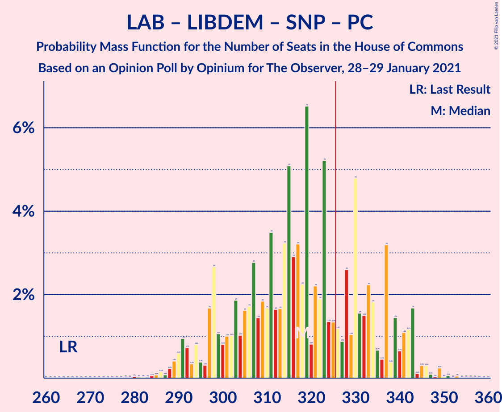

| Number of Seats | Probability | Accumulated | Special Marks |
|:---------------:|:-----------:|:-----------:|:-------------:|
| 265 | 0% | 100% | Last Result |
| 266 | 0% | 100% |  |
| 267 | 0% | 100% |  |
| 268 | 0% | 100% |  |
| 269 | 0% | 100% |  |
| 270 | 0% | 100% |  |
| 271 | 0% | 100% |  |
| 272 | 0% | 100% |  |
| 273 | 0% | 100% |  |
| 274 | 0% | 100% |  |
| 275 | 0% | 100% |  |
| 276 | 0% | 100% |  |
| 277 | 0% | 100% |  |
| 278 | 0% | 100% |  |
| 279 | 0% | 100% |  |
| 280 | 0.1% | 100% |  |
| 281 | 0% | 99.9% |  |
| 282 | 0.1% | 99.9% |  |
| 283 | 0% | 99.8% |  |
| 284 | 0% | 99.8% |  |
| 285 | 0% | 99.8% |  |
| 286 | 0% | 99.8% |  |
| 287 | 0% | 99.7% |  |
| 288 | 0.1% | 99.7% |  |
| 289 | 0.2% | 99.6% |  |
| 290 | 0% | 99.4% |  |
| 291 | 0.3% | 99.4% |  |
| 292 | 0.3% | 99.1% |  |
| 293 | 0.2% | 98.8% |  |
| 294 | 0.6% | 98.6% |  |
| 295 | 0.7% | 98% |  |
| 296 | 0.1% | 97% |  |
| 297 | 8% | 97% |  |
| 298 | 1.0% | 89% |  |
| 299 | 3% | 88% |  |
| 300 | 0.8% | 85% |  |
| 301 | 0.7% | 84% |  |
| 302 | 0.1% | 84% |  |
| 303 | 2% | 84% |  |
| 304 | 3% | 81% |  |
| 305 | 0.8% | 79% |  |
| 306 | 2% | 78% |  |
| 307 | 0.4% | 76% |  |
| 308 | 2% | 75% |  |
| 309 | 0.1% | 73% |  |
| 310 | 0.7% | 73% |  |
| 311 | 0.3% | 72% |  |
| 312 | 2% | 72% |  |
| 313 | 0.1% | 70% |  |
| 314 | 0.9% | 70% |  |
| 315 | 4% | 69% |  |
| 316 | 2% | 65% |  |
| 317 | 9% | 63% |  |
| 318 | 0.7% | 54% |  |
| 319 | 10% | 53% |  |
| 320 | 0.4% | 43% |  |
| 321 | 0.1% | 43% | Median |
| 322 | 6% | 43% |  |
| 323 | 0.1% | 37% |  |
| 324 | 0% | 37% |  |
| 325 | 0.9% | 37% |  |
| 326 | 2% | 36% | Majority |
| 327 | 0.6% | 33% |  |
| 328 | 0.1% | 33% |  |
| 329 | 1.0% | 33% |  |
| 330 | 3% | 32% |  |
| 331 | 3% | 29% |  |
| 332 | 1.0% | 26% |  |
| 333 | 0.4% | 25% |  |
| 334 | 1.2% | 25% |  |
| 335 | 0.1% | 24% |  |
| 336 | 0.2% | 24% |  |
| 337 | 16% | 24% |  |
| 338 | 0.2% | 8% |  |
| 339 | 2% | 8% |  |
| 340 | 2% | 6% |  |
| 341 | 2% | 4% |  |
| 342 | 1.4% | 2% |  |
| 343 | 0% | 1.0% |  |
| 344 | 0.1% | 1.0% |  |
| 345 | 0.4% | 0.9% |  |
| 346 | 0% | 0.5% |  |
| 347 | 0% | 0.5% |  |
| 348 | 0.1% | 0.5% |  |
| 349 | 0.1% | 0.4% |  |
| 350 | 0% | 0.3% |  |
| 351 | 0% | 0.3% |  |
| 352 | 0% | 0.3% |  |
| 353 | 0.2% | 0.3% |  |
| 354 | 0% | 0.1% |  |
| 355 | 0% | 0.1% |  |
| 356 | 0% | 0.1% |  |
| 357 | 0% | 0.1% |  |
| 358 | 0% | 0% |  |

### Conservative Party – Plaid Cymru

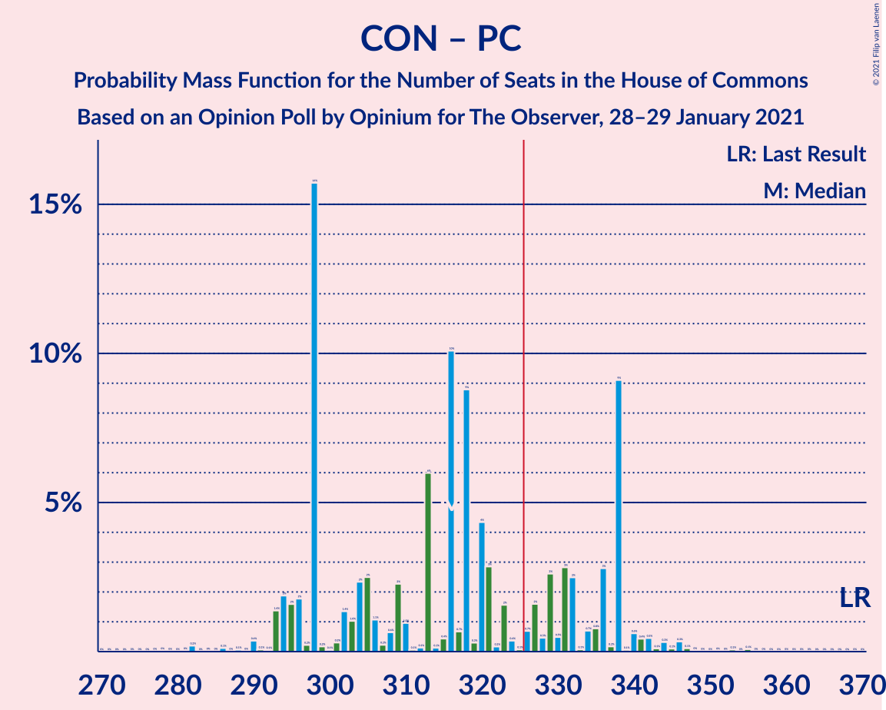

| Number of Seats | Probability | Accumulated | Special Marks |
|:---------------:|:-----------:|:-----------:|:-------------:|
| 278 | 0% | 100% |  |
| 279 | 0% | 99.9% |  |
| 280 | 0% | 99.9% |  |
| 281 | 0% | 99.9% |  |
| 282 | 0.2% | 99.9% |  |
| 283 | 0% | 99.7% |  |
| 284 | 0% | 99.7% |  |
| 285 | 0% | 99.7% |  |
| 286 | 0.1% | 99.7% |  |
| 287 | 0% | 99.6% |  |
| 288 | 0.1% | 99.5% |  |
| 289 | 0% | 99.5% |  |
| 290 | 0.4% | 99.5% |  |
| 291 | 0.1% | 99.1% |  |
| 292 | 0.1% | 99.0% |  |
| 293 | 1.4% | 99.0% |  |
| 294 | 2% | 98% |  |
| 295 | 2% | 96% |  |
| 296 | 2% | 94% |  |
| 297 | 0.2% | 92% |  |
| 298 | 16% | 92% |  |
| 299 | 0.2% | 76% |  |
| 300 | 0.1% | 76% |  |
| 301 | 0.3% | 76% |  |
| 302 | 1.4% | 76% |  |
| 303 | 1.0% | 75% |  |
| 304 | 2% | 74% |  |
| 305 | 2% | 71% |  |
| 306 | 1.1% | 69% |  |
| 307 | 0.2% | 68% |  |
| 308 | 0.6% | 67% |  |
| 309 | 2% | 67% |  |
| 310 | 1.0% | 64% |  |
| 311 | 0.1% | 64% |  |
| 312 | 0.1% | 63% |  |
| 313 | 6% | 63% |  |
| 314 | 0.1% | 57% |  |
| 315 | 0.4% | 57% |  |
| 316 | 10% | 57% | Median |
| 317 | 0.7% | 47% |  |
| 318 | 9% | 46% |  |
| 319 | 0.3% | 37% |  |
| 320 | 4% | 37% |  |
| 321 | 3% | 33% |  |
| 322 | 0.2% | 30% |  |
| 323 | 2% | 30% |  |
| 324 | 0.4% | 28% |  |
| 325 | 0.1% | 28% |  |
| 326 | 0.7% | 28% | Majority |
| 327 | 2% | 27% |  |
| 328 | 0.5% | 25% |  |
| 329 | 3% | 25% |  |
| 330 | 0.5% | 22% |  |
| 331 | 3% | 22% |  |
| 332 | 2% | 19% |  |
| 333 | 0.1% | 16% |  |
| 334 | 0.7% | 16% |  |
| 335 | 0.8% | 16% |  |
| 336 | 3% | 15% |  |
| 337 | 0.2% | 12% |  |
| 338 | 9% | 12% |  |
| 339 | 0.1% | 3% |  |
| 340 | 0.6% | 3% |  |
| 341 | 0.4% | 2% |  |
| 342 | 0.5% | 2% |  |
| 343 | 0.1% | 1.3% |  |
| 344 | 0.3% | 1.2% |  |
| 345 | 0.1% | 0.8% |  |
| 346 | 0.3% | 0.7% |  |
| 347 | 0.1% | 0.4% |  |
| 348 | 0% | 0.3% |  |
| 349 | 0% | 0.3% |  |
| 350 | 0% | 0.3% |  |
| 351 | 0% | 0.2% |  |
| 352 | 0% | 0.2% |  |
| 353 | 0.1% | 0.2% |  |
| 354 | 0% | 0.1% |  |
| 355 | 0.1% | 0.1% |  |
| 356 | 0% | 0.1% |  |
| 357 | 0% | 0% |  |
| 358 | 0% | 0% |  |
| 359 | 0% | 0% |  |
| 360 | 0% | 0% |  |
| 361 | 0% | 0% |  |
| 362 | 0% | 0% |  |
| 363 | 0% | 0% |  |
| 364 | 0% | 0% |  |
| 365 | 0% | 0% |  |
| 366 | 0% | 0% |  |
| 367 | 0% | 0% |  |
| 368 | 0% | 0% |  |
| 369 | 0% | 0% | Last Result |

### Labour Party – Scottish National Party – Plaid Cymru

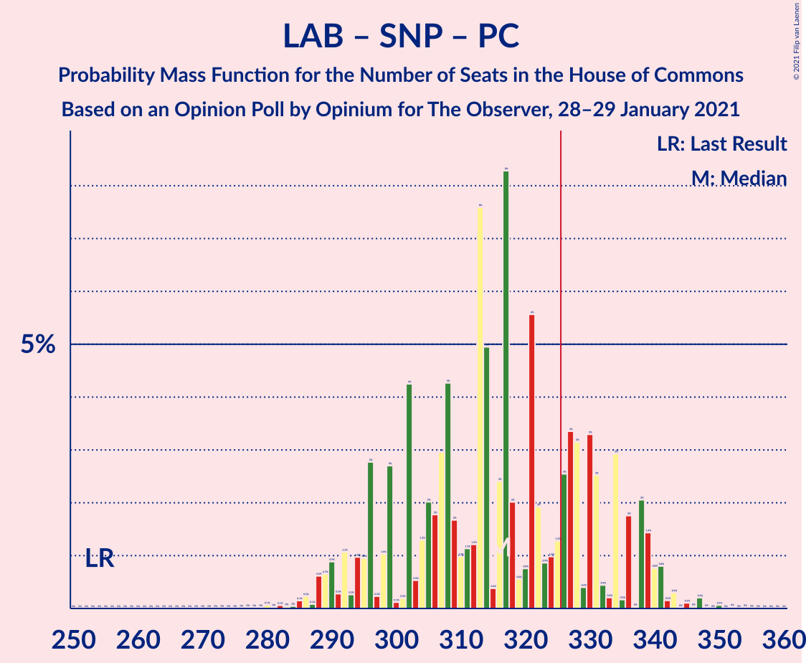

| Number of Seats | Probability | Accumulated | Special Marks |
|:---------------:|:-----------:|:-----------:|:-------------:|
| 254 | 0% | 100% | Last Result |
| 255 | 0% | 100% |  |
| 256 | 0% | 100% |  |
| 257 | 0% | 100% |  |
| 258 | 0% | 100% |  |
| 259 | 0% | 100% |  |
| 260 | 0% | 100% |  |
| 261 | 0% | 100% |  |
| 262 | 0% | 100% |  |
| 263 | 0% | 100% |  |
| 264 | 0% | 100% |  |
| 265 | 0% | 100% |  |
| 266 | 0% | 100% |  |
| 267 | 0% | 100% |  |
| 268 | 0% | 100% |  |
| 269 | 0% | 100% |  |
| 270 | 0% | 100% |  |
| 271 | 0% | 100% |  |
| 272 | 0% | 100% |  |
| 273 | 0% | 100% |  |
| 274 | 0% | 100% |  |
| 275 | 0% | 100% |  |
| 276 | 0% | 100% |  |
| 277 | 0% | 100% |  |
| 278 | 0% | 100% |  |
| 279 | 0% | 99.9% |  |
| 280 | 0.1% | 99.9% |  |
| 281 | 0% | 99.8% |  |
| 282 | 0% | 99.8% |  |
| 283 | 0% | 99.8% |  |
| 284 | 0% | 99.8% |  |
| 285 | 0% | 99.7% |  |
| 286 | 0% | 99.7% |  |
| 287 | 0% | 99.7% |  |
| 288 | 0.2% | 99.7% |  |
| 289 | 0.4% | 99.5% |  |
| 290 | 0.2% | 99.1% |  |
| 291 | 0.1% | 98.9% |  |
| 292 | 1.4% | 98.7% |  |
| 293 | 0.1% | 97% |  |
| 294 | 0% | 97% |  |
| 295 | 6% | 97% |  |
| 296 | 3% | 92% |  |
| 297 | 0.2% | 89% |  |
| 298 | 2% | 88% |  |
| 299 | 3% | 87% |  |
| 300 | 0% | 84% |  |
| 301 | 0.6% | 84% |  |
| 302 | 7% | 83% |  |
| 303 | 0% | 76% |  |
| 304 | 0.3% | 76% |  |
| 305 | 0.7% | 76% |  |
| 306 | 0.1% | 75% |  |
| 307 | 2% | 75% |  |
| 308 | 1.1% | 73% |  |
| 309 | 0.8% | 72% |  |
| 310 | 0.1% | 71% |  |
| 311 | 0.9% | 71% |  |
| 312 | 0% | 70% |  |
| 313 | 5% | 70% |  |
| 314 | 11% | 65% |  |
| 315 | 0.5% | 54% |  |
| 316 | 10% | 54% |  |
| 317 | 0.5% | 43% |  |
| 318 | 3% | 43% | Median |
| 319 | 0.2% | 40% |  |
| 320 | 0% | 40% |  |
| 321 | 4% | 40% |  |
| 322 | 0.9% | 37% |  |
| 323 | 1.1% | 36% |  |
| 324 | 1.4% | 35% |  |
| 325 | 0.1% | 33% |  |
| 326 | 2% | 33% | Majority |
| 327 | 2% | 31% |  |
| 328 | 1.4% | 30% |  |
| 329 | 0.2% | 28% |  |
| 330 | 3% | 28% |  |
| 331 | 1.2% | 25% |  |
| 332 | 0% | 24% |  |
| 333 | 0% | 24% |  |
| 334 | 16% | 24% |  |
| 335 | 0% | 8% |  |
| 336 | 2% | 8% |  |
| 337 | 0% | 6% |  |
| 338 | 3% | 6% |  |
| 339 | 1.5% | 3% |  |
| 340 | 0.4% | 1.2% |  |
| 341 | 0.2% | 0.9% |  |
| 342 | 0.1% | 0.6% |  |
| 343 | 0.1% | 0.5% |  |
| 344 | 0% | 0.5% |  |
| 345 | 0.1% | 0.5% |  |
| 346 | 0.1% | 0.4% |  |
| 347 | 0% | 0.3% |  |
| 348 | 0% | 0.3% |  |
| 349 | 0% | 0.3% |  |
| 350 | 0.2% | 0.3% |  |
| 351 | 0% | 0.1% |  |
| 352 | 0% | 0.1% |  |
| 353 | 0% | 0.1% |  |
| 354 | 0% | 0% |  |

### Conservative Party – Liberal Democrats

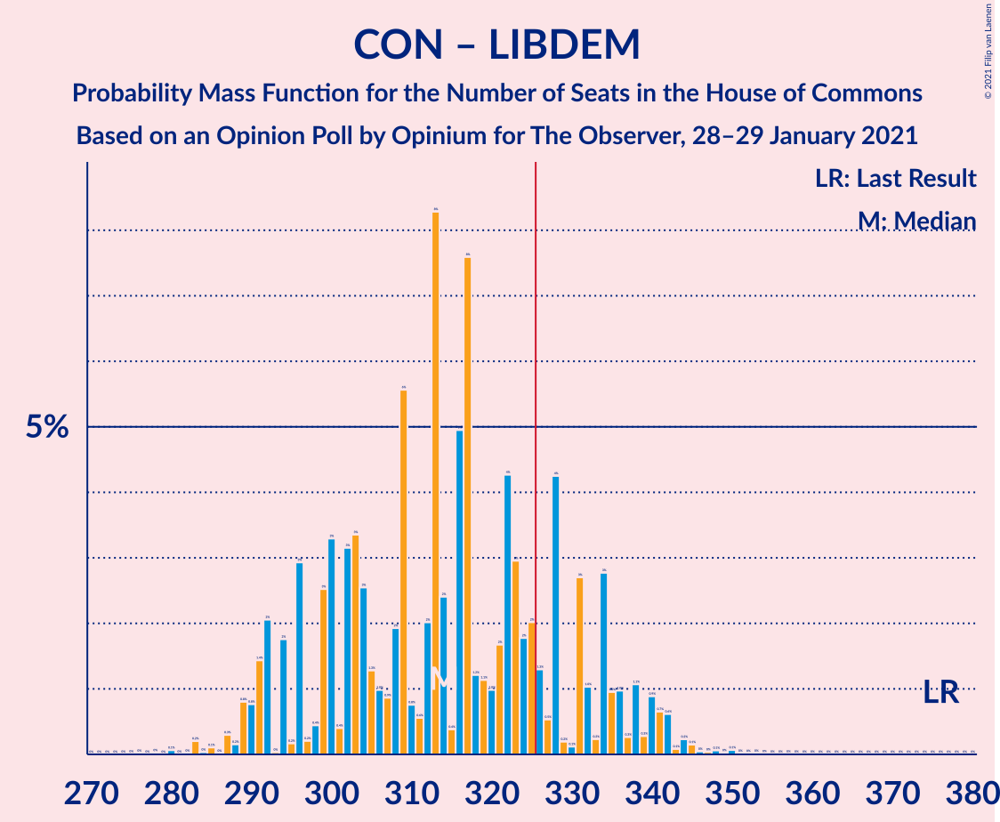

| Number of Seats | Probability | Accumulated | Special Marks |
|:---------------:|:-----------:|:-----------:|:-------------:|
| 277 | 0% | 100% |  |
| 278 | 0% | 99.9% |  |
| 279 | 0% | 99.9% |  |
| 280 | 0.2% | 99.9% |  |
| 281 | 0% | 99.7% |  |
| 282 | 0% | 99.7% |  |
| 283 | 0% | 99.7% |  |
| 284 | 0.1% | 99.7% |  |
| 285 | 0.1% | 99.6% |  |
| 286 | 0% | 99.5% |  |
| 287 | 0.1% | 99.5% |  |
| 288 | 0.1% | 99.5% |  |
| 289 | 0.2% | 99.4% |  |
| 290 | 0.4% | 99.1% |  |
| 291 | 1.5% | 98.8% |  |
| 292 | 3% | 97% |  |
| 293 | 0% | 94% |  |
| 294 | 2% | 94% |  |
| 295 | 0% | 92% |  |
| 296 | 16% | 92% |  |
| 297 | 0% | 76% |  |
| 298 | 0% | 76% |  |
| 299 | 1.2% | 76% |  |
| 300 | 3% | 75% |  |
| 301 | 0.2% | 72% |  |
| 302 | 1.4% | 72% |  |
| 303 | 2% | 70% |  |
| 304 | 2% | 69% |  |
| 305 | 0.1% | 67% |  |
| 306 | 1.4% | 67% |  |
| 307 | 1.1% | 65% |  |
| 308 | 0.9% | 64% |  |
| 309 | 4% | 63% |  |
| 310 | 0% | 60% |  |
| 311 | 0.2% | 60% |  |
| 312 | 3% | 60% |  |
| 313 | 0.5% | 57% |  |
| 314 | 10% | 57% | Median |
| 315 | 0.5% | 46% |  |
| 316 | 11% | 46% |  |
| 317 | 5% | 35% |  |
| 318 | 0% | 30% |  |
| 319 | 0.9% | 30% |  |
| 320 | 0.1% | 29% |  |
| 321 | 0.8% | 29% |  |
| 322 | 1.1% | 28% |  |
| 323 | 2% | 27% |  |
| 324 | 0.1% | 25% |  |
| 325 | 0.7% | 25% |  |
| 326 | 0.3% | 24% | Majority |
| 327 | 0% | 24% |  |
| 328 | 7% | 24% |  |
| 329 | 0.6% | 17% |  |
| 330 | 0% | 16% |  |
| 331 | 3% | 16% |  |
| 332 | 2% | 13% |  |
| 333 | 0.2% | 12% |  |
| 334 | 3% | 11% |  |
| 335 | 6% | 8% |  |
| 336 | 0% | 3% |  |
| 337 | 0.1% | 3% |  |
| 338 | 1.4% | 3% |  |
| 339 | 0.1% | 1.3% |  |
| 340 | 0.2% | 1.1% |  |
| 341 | 0.4% | 0.9% |  |
| 342 | 0.2% | 0.5% |  |
| 343 | 0% | 0.3% |  |
| 344 | 0% | 0.3% |  |
| 345 | 0% | 0.3% |  |
| 346 | 0% | 0.3% |  |
| 347 | 0% | 0.2% |  |
| 348 | 0% | 0.2% |  |
| 349 | 0% | 0.2% |  |
| 350 | 0.1% | 0.2% |  |
| 351 | 0% | 0.1% |  |
| 352 | 0% | 0.1% |  |
| 353 | 0% | 0% |  |
| 354 | 0% | 0% |  |
| 355 | 0% | 0% |  |
| 356 | 0% | 0% |  |
| 357 | 0% | 0% |  |
| 358 | 0% | 0% |  |
| 359 | 0% | 0% |  |
| 360 | 0% | 0% |  |
| 361 | 0% | 0% |  |
| 362 | 0% | 0% |  |
| 363 | 0% | 0% |  |
| 364 | 0% | 0% |  |
| 365 | 0% | 0% |  |
| 366 | 0% | 0% |  |
| 367 | 0% | 0% |  |
| 368 | 0% | 0% |  |
| 369 | 0% | 0% |  |
| 370 | 0% | 0% |  |
| 371 | 0% | 0% |  |
| 372 | 0% | 0% |  |
| 373 | 0% | 0% |  |
| 374 | 0% | 0% |  |
| 375 | 0% | 0% |  |
| 376 | 0% | 0% | Last Result |

### Labour Party – Liberal Democrats – Scottish National Party

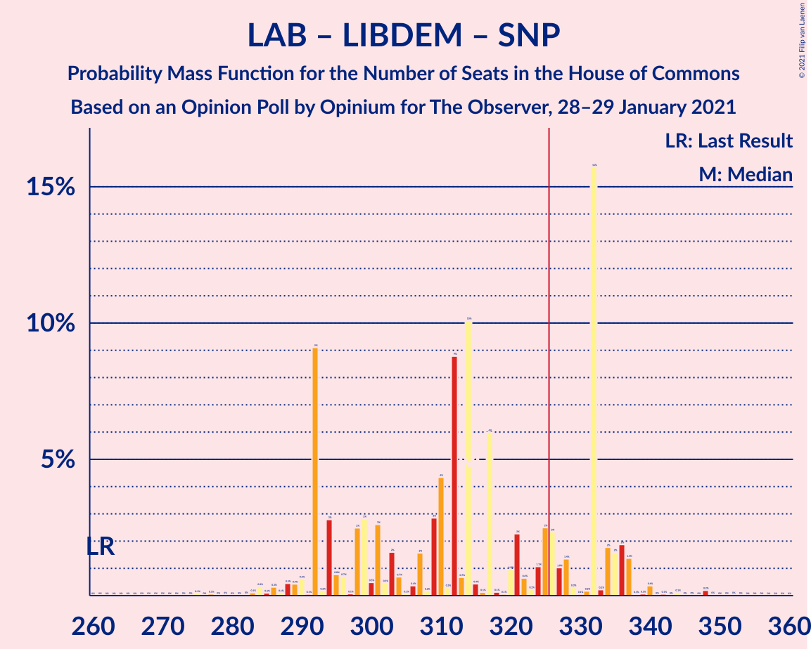

| Number of Seats | Probability | Accumulated | Special Marks |
|:---------------:|:-----------:|:-----------:|:-------------:|
| 261 | 0% | 100% | Last Result |
| 262 | 0% | 100% |  |
| 263 | 0% | 100% |  |
| 264 | 0% | 100% |  |
| 265 | 0% | 100% |  |
| 266 | 0% | 100% |  |
| 267 | 0% | 100% |  |
| 268 | 0% | 100% |  |
| 269 | 0% | 100% |  |
| 270 | 0% | 100% |  |
| 271 | 0% | 100% |  |
| 272 | 0% | 100% |  |
| 273 | 0% | 100% |  |
| 274 | 0% | 100% |  |
| 275 | 0.1% | 99.9% |  |
| 276 | 0% | 99.9% |  |
| 277 | 0.1% | 99.9% |  |
| 278 | 0% | 99.8% |  |
| 279 | 0% | 99.8% |  |
| 280 | 0% | 99.8% |  |
| 281 | 0% | 99.7% |  |
| 282 | 0% | 99.7% |  |
| 283 | 0.1% | 99.7% |  |
| 284 | 0.3% | 99.6% |  |
| 285 | 0.1% | 99.3% |  |
| 286 | 0.3% | 99.2% |  |
| 287 | 0.1% | 98.8% |  |
| 288 | 0.5% | 98.7% |  |
| 289 | 0.4% | 98% |  |
| 290 | 0.6% | 98% |  |
| 291 | 0.1% | 97% |  |
| 292 | 9% | 97% |  |
| 293 | 0.2% | 88% |  |
| 294 | 3% | 88% |  |
| 295 | 0.8% | 85% |  |
| 296 | 0.7% | 84% |  |
| 297 | 0.1% | 84% |  |
| 298 | 2% | 84% |  |
| 299 | 3% | 81% |  |
| 300 | 0.5% | 78% |  |
| 301 | 3% | 78% |  |
| 302 | 0.5% | 75% |  |
| 303 | 2% | 75% |  |
| 304 | 0.7% | 73% |  |
| 305 | 0.1% | 72% |  |
| 306 | 0.4% | 72% |  |
| 307 | 2% | 72% |  |
| 308 | 0.2% | 70% |  |
| 309 | 3% | 70% |  |
| 310 | 4% | 67% |  |
| 311 | 0.3% | 63% |  |
| 312 | 9% | 63% |  |
| 313 | 0.7% | 54% |  |
| 314 | 10% | 53% |  |
| 315 | 0.4% | 43% |  |
| 316 | 0.1% | 43% | Median |
| 317 | 6% | 43% |  |
| 318 | 0.1% | 37% |  |
| 319 | 0.1% | 37% |  |
| 320 | 1.0% | 36% |  |
| 321 | 2% | 36% |  |
| 322 | 0.6% | 33% |  |
| 323 | 0.2% | 33% |  |
| 324 | 1.1% | 32% |  |
| 325 | 2% | 31% |  |
| 326 | 2% | 29% | Majority |
| 327 | 1.0% | 26% |  |
| 328 | 1.4% | 25% |  |
| 329 | 0.3% | 24% |  |
| 330 | 0.1% | 24% |  |
| 331 | 0.2% | 24% |  |
| 332 | 16% | 24% |  |
| 333 | 0.2% | 8% |  |
| 334 | 2% | 8% |  |
| 335 | 2% | 6% |  |
| 336 | 2% | 4% |  |
| 337 | 1.4% | 2% |  |
| 338 | 0.1% | 1.0% |  |
| 339 | 0.1% | 1.0% |  |
| 340 | 0.4% | 0.9% |  |
| 341 | 0% | 0.5% |  |
| 342 | 0.1% | 0.5% |  |
| 343 | 0% | 0.5% |  |
| 344 | 0.1% | 0.4% |  |
| 345 | 0% | 0.3% |  |
| 346 | 0% | 0.3% |  |
| 347 | 0% | 0.3% |  |
| 348 | 0.2% | 0.3% |  |
| 349 | 0% | 0.1% |  |
| 350 | 0% | 0.1% |  |
| 351 | 0% | 0.1% |  |
| 352 | 0% | 0.1% |  |
| 353 | 0% | 0% |  |

### Conservative Party

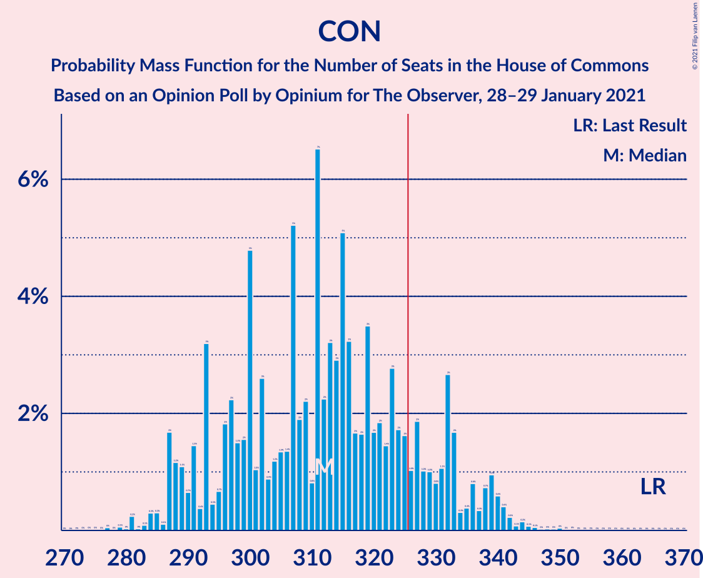

| Number of Seats | Probability | Accumulated | Special Marks |
|:---------------:|:-----------:|:-----------:|:-------------:|
| 273 | 0% | 100% |  |
| 274 | 0% | 99.9% |  |
| 275 | 0% | 99.9% |  |
| 276 | 0% | 99.9% |  |
| 277 | 0.2% | 99.9% |  |
| 278 | 0% | 99.7% |  |
| 279 | 0% | 99.7% |  |
| 280 | 0% | 99.7% |  |
| 281 | 0.1% | 99.7% |  |
| 282 | 0.1% | 99.6% |  |
| 283 | 0% | 99.5% |  |
| 284 | 0% | 99.5% |  |
| 285 | 0.4% | 99.5% |  |
| 286 | 0.1% | 99.1% |  |
| 287 | 0% | 99.0% |  |
| 288 | 1.4% | 99.0% |  |
| 289 | 2% | 98% |  |
| 290 | 2% | 96% |  |
| 291 | 2% | 94% |  |
| 292 | 0.2% | 92% |  |
| 293 | 16% | 92% |  |
| 294 | 0.2% | 76% |  |
| 295 | 0.1% | 76% |  |
| 296 | 1.2% | 76% |  |
| 297 | 0.4% | 75% |  |
| 298 | 1.0% | 75% |  |
| 299 | 3% | 74% |  |
| 300 | 3% | 71% |  |
| 301 | 1.0% | 68% |  |
| 302 | 0.1% | 67% |  |
| 303 | 0.6% | 67% |  |
| 304 | 2% | 67% |  |
| 305 | 0.9% | 64% |  |
| 306 | 0% | 63% |  |
| 307 | 0.1% | 63% |  |
| 308 | 6% | 63% |  |
| 309 | 0.1% | 57% |  |
| 310 | 0.4% | 57% |  |
| 311 | 10% | 57% | Median |
| 312 | 0.7% | 47% |  |
| 313 | 9% | 46% |  |
| 314 | 2% | 37% |  |
| 315 | 4% | 35% |  |
| 316 | 0.9% | 31% |  |
| 317 | 0.1% | 30% |  |
| 318 | 2% | 30% |  |
| 319 | 0.3% | 28% |  |
| 320 | 0.7% | 28% |  |
| 321 | 0.1% | 27% |  |
| 322 | 2% | 27% |  |
| 323 | 0.4% | 25% |  |
| 324 | 2% | 24% |  |
| 325 | 0.8% | 22% |  |
| 326 | 3% | 21% | Majority |
| 327 | 2% | 19% |  |
| 328 | 0.1% | 16% |  |
| 329 | 0.7% | 16% |  |
| 330 | 0.8% | 16% |  |
| 331 | 3% | 15% |  |
| 332 | 1.0% | 12% |  |
| 333 | 8% | 11% |  |
| 334 | 0.1% | 3% |  |
| 335 | 0.7% | 3% |  |
| 336 | 0.6% | 2% |  |
| 337 | 0.2% | 1.4% |  |
| 338 | 0.3% | 1.2% |  |
| 339 | 0.3% | 0.9% |  |
| 340 | 0% | 0.6% |  |
| 341 | 0.2% | 0.6% |  |
| 342 | 0.1% | 0.4% |  |
| 343 | 0% | 0.3% |  |
| 344 | 0% | 0.3% |  |
| 345 | 0% | 0.2% |  |
| 346 | 0% | 0.2% |  |
| 347 | 0% | 0.2% |  |
| 348 | 0.1% | 0.2% |  |
| 349 | 0% | 0.1% |  |
| 350 | 0.1% | 0.1% |  |
| 351 | 0% | 0% |  |
| 352 | 0% | 0% |  |
| 353 | 0% | 0% |  |
| 354 | 0% | 0% |  |
| 355 | 0% | 0% |  |
| 356 | 0% | 0% |  |
| 357 | 0% | 0% |  |
| 358 | 0% | 0% |  |
| 359 | 0% | 0% |  |
| 360 | 0% | 0% |  |
| 361 | 0% | 0% |  |
| 362 | 0% | 0% |  |
| 363 | 0% | 0% |  |
| 364 | 0% | 0% |  |
| 365 | 0% | 0% | Last Result |

### Labour Party – Scottish National Party

| Number of Seats | Probability | Accumulated | Special Marks |
|:---------------:|:-----------:|:-----------:|:-------------:|
| 250 | 0% | 100% | Last Result |
| 251 | 0% | 100% |  |
| 252 | 0% | 100% |  |
| 253 | 0% | 100% |  |
| 254 | 0% | 100% |  |
| 255 | 0% | 100% |  |
| 256 | 0% | 100% |  |
| 257 | 0% | 100% |  |
| 258 | 0% | 100% |  |
| 259 | 0% | 100% |  |
| 260 | 0% | 100% |  |
| 261 | 0% | 100% |  |
| 262 | 0% | 100% |  |
| 263 | 0% | 100% |  |
| 264 | 0% | 100% |  |
| 265 | 0% | 100% |  |
| 266 | 0% | 100% |  |
| 267 | 0% | 100% |  |
| 268 | 0% | 100% |  |
| 269 | 0% | 100% |  |
| 270 | 0% | 100% |  |
| 271 | 0% | 100% |  |
| 272 | 0% | 100% |  |
| 273 | 0% | 100% |  |
| 274 | 0% | 99.9% |  |
| 275 | 0.1% | 99.9% |  |
| 276 | 0% | 99.8% |  |
| 277 | 0% | 99.8% |  |
| 278 | 0% | 99.8% |  |
| 279 | 0% | 99.8% |  |
| 280 | 0% | 99.7% |  |
| 281 | 0% | 99.7% |  |
| 282 | 0.3% | 99.7% |  |
| 283 | 0.2% | 99.4% |  |
| 284 | 0.2% | 99.2% |  |
| 285 | 0.2% | 99.0% |  |
| 286 | 0.5% | 98.8% |  |
| 287 | 1.0% | 98% |  |
| 288 | 0.1% | 97% |  |
| 289 | 0% | 97% |  |
| 290 | 6% | 97% |  |
| 291 | 3% | 92% |  |
| 292 | 1.2% | 89% |  |
| 293 | 1.1% | 88% |  |
| 294 | 3% | 86% |  |
| 295 | 0.3% | 84% |  |
| 296 | 0.6% | 83% |  |
| 297 | 7% | 83% |  |
| 298 | 0% | 76% |  |
| 299 | 0.3% | 76% |  |
| 300 | 1.2% | 76% |  |
| 301 | 0.6% | 75% |  |
| 302 | 0.8% | 74% |  |
| 303 | 1.0% | 73% |  |
| 304 | 0.7% | 72% |  |
| 305 | 0.1% | 71% |  |
| 306 | 1.0% | 71% |  |
| 307 | 2% | 70% |  |
| 308 | 5% | 68% |  |
| 309 | 9% | 63% |  |
| 310 | 0.5% | 54% |  |
| 311 | 10% | 54% |  |
| 312 | 0.5% | 43% |  |
| 313 | 3% | 43% | Median |
| 314 | 0.2% | 40% |  |
| 315 | 0.1% | 40% |  |
| 316 | 4% | 40% |  |
| 317 | 0.9% | 36% |  |
| 318 | 1.1% | 36% |  |
| 319 | 1.3% | 34% |  |
| 320 | 0.4% | 33% |  |
| 321 | 2% | 33% |  |
| 322 | 1.3% | 31% |  |
| 323 | 1.2% | 30% |  |
| 324 | 0.8% | 29% |  |
| 325 | 3% | 28% |  |
| 326 | 0.6% | 24% | Majority |
| 327 | 0.2% | 24% |  |
| 328 | 0.1% | 24% |  |
| 329 | 16% | 24% |  |
| 330 | 0% | 8% |  |
| 331 | 2% | 8% |  |
| 332 | 0% | 6% |  |
| 333 | 3% | 6% |  |
| 334 | 1.4% | 3% |  |
| 335 | 0.4% | 1.2% |  |
| 336 | 0.2% | 0.8% |  |
| 337 | 0.1% | 0.6% |  |
| 338 | 0.1% | 0.5% |  |
| 339 | 0% | 0.5% |  |
| 340 | 0.1% | 0.5% |  |
| 341 | 0% | 0.3% |  |
| 342 | 0% | 0.3% |  |
| 343 | 0% | 0.3% |  |
| 344 | 0% | 0.3% |  |
| 345 | 0.2% | 0.3% |  |
| 346 | 0% | 0.1% |  |
| 347 | 0% | 0.1% |  |
| 348 | 0% | 0.1% |  |
| 349 | 0% | 0% |  |

### Labour Party – Liberal Democrats – Plaid Cymru

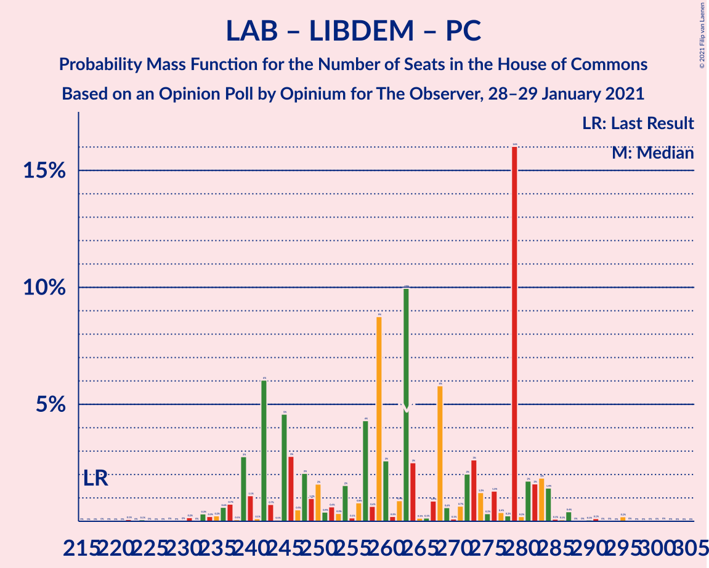

| Number of Seats | Probability | Accumulated | Special Marks |
|:---------------:|:-----------:|:-----------:|:-------------:|
| 217 | 0% | 100% | Last Result |
| 218 | 0% | 100% |  |
| 219 | 0% | 100% |  |
| 220 | 0% | 100% |  |
| 221 | 0% | 100% |  |
| 222 | 0.1% | 100% |  |
| 223 | 0% | 99.9% |  |
| 224 | 0.1% | 99.9% |  |
| 225 | 0% | 99.8% |  |
| 226 | 0% | 99.8% |  |
| 227 | 0% | 99.8% |  |
| 228 | 0% | 99.8% |  |
| 229 | 0% | 99.8% |  |
| 230 | 0% | 99.8% |  |
| 231 | 0.2% | 99.7% |  |
| 232 | 0% | 99.6% |  |
| 233 | 0.3% | 99.5% |  |
| 234 | 0.2% | 99.2% |  |
| 235 | 0.2% | 99.0% |  |
| 236 | 0.6% | 98.8% |  |
| 237 | 0.7% | 98% |  |
| 238 | 0.1% | 97% |  |
| 239 | 3% | 97% |  |
| 240 | 1.1% | 95% |  |
| 241 | 0.1% | 93% |  |
| 242 | 6% | 93% |  |
| 243 | 0.7% | 87% |  |
| 244 | 0.1% | 87% |  |
| 245 | 5% | 87% |  |
| 246 | 3% | 82% |  |
| 247 | 0.5% | 79% |  |
| 248 | 2% | 79% |  |
| 249 | 1.0% | 77% |  |
| 250 | 2% | 76% |  |
| 251 | 0.4% | 74% |  |
| 252 | 0.6% | 74% |  |
| 253 | 0.3% | 73% |  |
| 254 | 2% | 73% |  |
| 255 | 0.1% | 71% |  |
| 256 | 0.8% | 71% |  |
| 257 | 4% | 70% |  |
| 258 | 0.6% | 66% |  |
| 259 | 9% | 65% |  |
| 260 | 3% | 57% |  |
| 261 | 0.2% | 54% |  |
| 262 | 0.9% | 54% |  |
| 263 | 10% | 53% | Median |
| 264 | 3% | 43% |  |
| 265 | 0.1% | 40% |  |
| 266 | 0.1% | 40% |  |
| 267 | 0.9% | 40% |  |
| 268 | 6% | 39% |  |
| 269 | 0.6% | 33% |  |
| 270 | 0.1% | 33% |  |
| 271 | 0.7% | 33% |  |
| 272 | 2% | 32% |  |
| 273 | 3% | 30% |  |
| 274 | 1.2% | 27% |  |
| 275 | 0.3% | 26% |  |
| 276 | 1.3% | 26% |  |
| 277 | 0.4% | 25% |  |
| 278 | 0.2% | 24% |  |
| 279 | 16% | 24% |  |
| 280 | 0.2% | 8% |  |
| 281 | 2% | 8% |  |
| 282 | 2% | 6% |  |
| 283 | 2% | 4% |  |
| 284 | 1.4% | 3% |  |
| 285 | 0.1% | 1.1% |  |
| 286 | 0.1% | 1.0% |  |
| 287 | 0.4% | 1.0% |  |
| 288 | 0% | 0.6% |  |
| 289 | 0% | 0.5% |  |
| 290 | 0.1% | 0.5% |  |
| 291 | 0.1% | 0.5% |  |
| 292 | 0% | 0.3% |  |
| 293 | 0% | 0.3% |  |
| 294 | 0% | 0.3% |  |
| 295 | 0.2% | 0.3% |  |
| 296 | 0% | 0.1% |  |
| 297 | 0% | 0.1% |  |
| 298 | 0% | 0.1% |  |
| 299 | 0% | 0.1% |  |
| 300 | 0% | 0.1% |  |
| 301 | 0% | 0% |  |

### Labour Party – Plaid Cymru

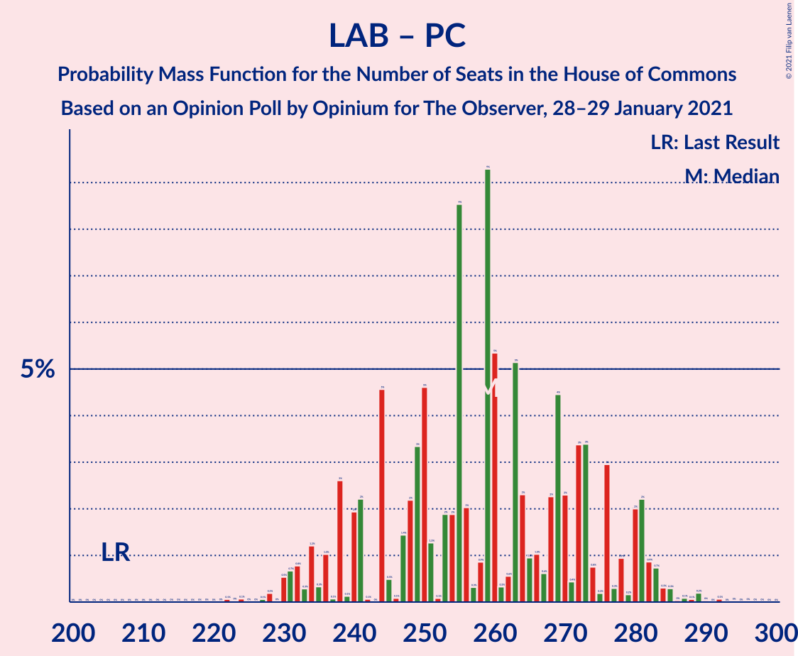

| Number of Seats | Probability | Accumulated | Special Marks |
|:---------------:|:-----------:|:-----------:|:-------------:|
| 206 | 0% | 100% | Last Result |
| 207 | 0% | 100% |  |
| 208 | 0% | 100% |  |
| 209 | 0% | 100% |  |
| 210 | 0% | 100% |  |
| 211 | 0% | 100% |  |
| 212 | 0% | 100% |  |
| 213 | 0% | 100% |  |
| 214 | 0% | 100% |  |
| 215 | 0% | 100% |  |
| 216 | 0% | 100% |  |
| 217 | 0% | 100% |  |
| 218 | 0% | 100% |  |
| 219 | 0% | 100% |  |
| 220 | 0% | 100% |  |
| 221 | 0% | 100% |  |
| 222 | 0.1% | 100% |  |
| 223 | 0% | 99.8% |  |
| 224 | 0% | 99.8% |  |
| 225 | 0% | 99.8% |  |
| 226 | 0% | 99.8% |  |
| 227 | 0% | 99.8% |  |
| 228 | 0% | 99.8% |  |
| 229 | 0% | 99.7% |  |
| 230 | 0.1% | 99.7% |  |
| 231 | 0.4% | 99.6% |  |
| 232 | 0.2% | 99.2% |  |
| 233 | 0% | 99.0% |  |
| 234 | 1.3% | 99.0% |  |
| 235 | 0.2% | 98% |  |
| 236 | 0.2% | 97% |  |
| 237 | 0.1% | 97% |  |
| 238 | 3% | 97% |  |
| 239 | 0.2% | 94% |  |
| 240 | 7% | 94% |  |
| 241 | 0.4% | 87% |  |
| 242 | 0% | 86% |  |
| 243 | 0% | 86% |  |
| 244 | 7% | 86% |  |
| 245 | 3% | 79% |  |
| 246 | 0% | 77% |  |
| 247 | 0.6% | 77% |  |
| 248 | 0% | 76% |  |
| 249 | 2% | 76% |  |
| 250 | 1.3% | 74% |  |
| 251 | 0.7% | 73% |  |
| 252 | 0% | 72% |  |
| 253 | 1.0% | 72% |  |
| 254 | 0% | 71% |  |
| 255 | 6% | 71% |  |
| 256 | 9% | 65% |  |
| 257 | 0% | 56% |  |
| 258 | 2% | 56% |  |
| 259 | 1.0% | 54% |  |
| 260 | 12% | 53% | Median |
| 261 | 0.1% | 41% |  |
| 262 | 0.1% | 41% |  |
| 263 | 0.2% | 40% |  |
| 264 | 1.0% | 40% |  |
| 265 | 1.1% | 39% |  |
| 266 | 1.3% | 38% |  |
| 267 | 4% | 37% |  |
| 268 | 2% | 33% |  |
| 269 | 1.1% | 32% |  |
| 270 | 0.7% | 30% |  |
| 271 | 0.3% | 30% |  |
| 272 | 4% | 30% |  |
| 273 | 1.2% | 26% |  |
| 274 | 0.5% | 24% |  |
| 275 | 0% | 24% |  |
| 276 | 16% | 24% |  |
| 277 | 0.1% | 8% |  |
| 278 | 2% | 8% |  |
| 279 | 0.1% | 6% |  |
| 280 | 3% | 6% |  |
| 281 | 1.5% | 3% |  |
| 282 | 0.4% | 1.4% |  |
| 283 | 0.3% | 1.0% |  |
| 284 | 0.1% | 0.7% |  |
| 285 | 0.1% | 0.6% |  |
| 286 | 0% | 0.5% |  |
| 287 | 0.1% | 0.5% |  |
| 288 | 0.1% | 0.4% |  |
| 289 | 0% | 0.3% |  |
| 290 | 0% | 0.3% |  |
| 291 | 0% | 0.3% |  |
| 292 | 0.2% | 0.3% |  |
| 293 | 0% | 0.1% |  |
| 294 | 0% | 0.1% |  |
| 295 | 0% | 0.1% |  |
| 296 | 0% | 0.1% |  |
| 297 | 0% | 0% |  |

### Labour Party – Liberal Democrats

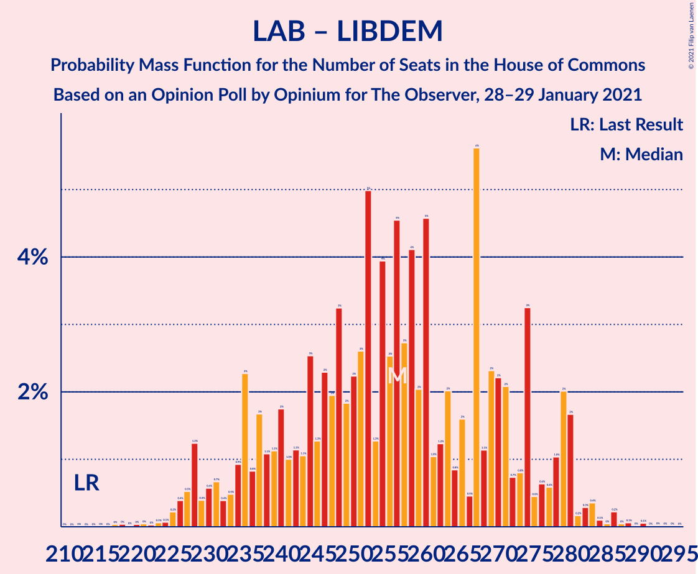

| Number of Seats | Probability | Accumulated | Special Marks |
|:---------------:|:-----------:|:-----------:|:-------------:|
| 213 | 0% | 100% | Last Result |
| 214 | 0% | 100% |  |
| 215 | 0% | 100% |  |
| 216 | 0% | 100% |  |
| 217 | 0.1% | 100% |  |
| 218 | 0% | 99.9% |  |
| 219 | 0.1% | 99.9% |  |
| 220 | 0% | 99.8% |  |
| 221 | 0% | 99.8% |  |
| 222 | 0% | 99.8% |  |
| 223 | 0% | 99.8% |  |
| 224 | 0% | 99.8% |  |
| 225 | 0% | 99.7% |  |
| 226 | 0.3% | 99.7% |  |
| 227 | 0% | 99.4% |  |
| 228 | 0.3% | 99.3% |  |
| 229 | 0.1% | 99.0% |  |
| 230 | 0.6% | 99.0% |  |
| 231 | 0.3% | 98% |  |
| 232 | 0.7% | 98% |  |
| 233 | 0.1% | 97% |  |
| 234 | 4% | 97% |  |
| 235 | 0.1% | 94% |  |
| 236 | 0.2% | 93% |  |
| 237 | 6% | 93% |  |
| 238 | 0.7% | 87% |  |
| 239 | 0.1% | 87% |  |
| 240 | 5% | 87% |  |
| 241 | 3% | 82% |  |
| 242 | 0.2% | 79% |  |
| 243 | 3% | 79% |  |
| 244 | 1.1% | 76% |  |
| 245 | 1.0% | 75% |  |
| 246 | 1.0% | 74% |  |
| 247 | 0.1% | 73% |  |
| 248 | 0.4% | 73% |  |
| 249 | 2% | 73% |  |
| 250 | 0.2% | 71% |  |
| 251 | 3% | 71% |  |
| 252 | 2% | 68% |  |
| 253 | 0.8% | 66% |  |
| 254 | 11% | 65% |  |
| 255 | 0.4% | 54% |  |
| 256 | 0.2% | 54% |  |
| 257 | 0.9% | 54% |  |
| 258 | 10% | 53% | Median |
| 259 | 2% | 43% |  |
| 260 | 0.2% | 40% |  |
| 261 | 0.2% | 40% |  |
| 262 | 0.9% | 40% |  |
| 263 | 6% | 39% |  |
| 264 | 0.6% | 33% |  |
| 265 | 0.2% | 33% |  |
| 266 | 0.8% | 33% |  |
| 267 | 2% | 32% |  |
| 268 | 2% | 30% |  |
| 269 | 1.2% | 27% |  |
| 270 | 1.2% | 26% |  |
| 271 | 0.5% | 25% |  |
| 272 | 0.3% | 25% |  |
| 273 | 0.2% | 24% |  |
| 274 | 16% | 24% |  |
| 275 | 0.2% | 8% |  |
| 276 | 2% | 8% |  |
| 277 | 2% | 6% |  |
| 278 | 2% | 4% |  |
| 279 | 1.4% | 3% |  |
| 280 | 0.1% | 1.1% |  |
| 281 | 0.1% | 1.0% |  |
| 282 | 0.4% | 0.9% |  |
| 283 | 0% | 0.6% |  |
| 284 | 0.1% | 0.5% |  |
| 285 | 0% | 0.5% |  |
| 286 | 0.1% | 0.5% |  |
| 287 | 0% | 0.3% |  |
| 288 | 0% | 0.3% |  |
| 289 | 0% | 0.3% |  |
| 290 | 0.2% | 0.3% |  |
| 291 | 0% | 0.1% |  |
| 292 | 0% | 0.1% |  |
| 293 | 0% | 0.1% |  |
| 294 | 0% | 0.1% |  |
| 295 | 0% | 0.1% |  |
| 296 | 0% | 0% |  |

### Labour Party

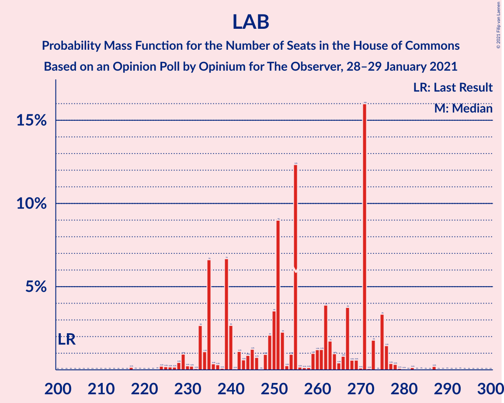

| Number of Seats | Probability | Accumulated | Special Marks |
|:---------------:|:-----------:|:-----------:|:-------------:|
| 202 | 0% | 100% | Last Result |
| 203 | 0% | 100% |  |
| 204 | 0% | 100% |  |
| 205 | 0% | 100% |  |
| 206 | 0% | 100% |  |
| 207 | 0% | 100% |  |
| 208 | 0% | 100% |  |
| 209 | 0% | 100% |  |
| 210 | 0% | 100% |  |
| 211 | 0% | 100% |  |
| 212 | 0% | 100% |  |
| 213 | 0% | 100% |  |
| 214 | 0% | 100% |  |
| 215 | 0% | 100% |  |
| 216 | 0% | 100% |  |
| 217 | 0.1% | 100% |  |
| 218 | 0% | 99.8% |  |
| 219 | 0% | 99.8% |  |
| 220 | 0% | 99.8% |  |
| 221 | 0% | 99.8% |  |
| 222 | 0% | 99.8% |  |
| 223 | 0% | 99.8% |  |
| 224 | 0.2% | 99.7% |  |
| 225 | 0.2% | 99.5% |  |
| 226 | 0.2% | 99.3% |  |
| 227 | 0.2% | 99.2% |  |
| 228 | 0.4% | 99.0% |  |
| 229 | 0.9% | 98.6% |  |
| 230 | 0.2% | 98% |  |
| 231 | 0.2% | 97% |  |
| 232 | 0.1% | 97% |  |
| 233 | 3% | 97% |  |
| 234 | 1.1% | 94% |  |
| 235 | 7% | 93% |  |
| 236 | 0.4% | 87% |  |
| 237 | 0.3% | 86% |  |
| 238 | 0.1% | 86% |  |
| 239 | 7% | 86% |  |
| 240 | 3% | 79% |  |
| 241 | 0.1% | 77% |  |
| 242 | 1.1% | 77% |  |
| 243 | 0.6% | 75% |  |
| 244 | 0.9% | 75% |  |
| 245 | 1.2% | 74% |  |
| 246 | 0.7% | 73% |  |
| 247 | 0% | 72% |  |
| 248 | 0.9% | 72% |  |
| 249 | 2% | 71% |  |
| 250 | 4% | 69% |  |
| 251 | 9% | 65% |  |
| 252 | 2% | 56% |  |
| 253 | 0.2% | 54% |  |
| 254 | 0.9% | 54% |  |
| 255 | 12% | 53% | Median |
| 256 | 0.2% | 41% |  |
| 257 | 0.1% | 40% |  |
| 258 | 0.1% | 40% |  |
| 259 | 1.0% | 40% |  |
| 260 | 1.2% | 39% |  |
| 261 | 1.2% | 38% |  |
| 262 | 4% | 37% |  |
| 263 | 2% | 33% |  |
| 264 | 1.0% | 31% |  |
| 265 | 0.4% | 30% |  |
| 266 | 0.8% | 30% |  |
| 267 | 4% | 29% |  |
| 268 | 0.6% | 25% |  |
| 269 | 0.6% | 25% |  |
| 270 | 0.1% | 24% |  |
| 271 | 16% | 24% |  |
| 272 | 0.1% | 8% |  |
| 273 | 2% | 8% |  |
| 274 | 0% | 6% |  |
| 275 | 3% | 6% |  |
| 276 | 1.5% | 3% |  |
| 277 | 0.4% | 1.3% |  |
| 278 | 0.3% | 1.0% |  |
| 279 | 0.1% | 0.6% |  |
| 280 | 0.1% | 0.6% |  |
| 281 | 0% | 0.5% |  |
| 282 | 0.1% | 0.5% |  |
| 283 | 0% | 0.4% |  |
| 284 | 0% | 0.3% |  |
| 285 | 0% | 0.3% |  |
| 286 | 0% | 0.3% |  |
| 287 | 0.2% | 0.3% |  |
| 288 | 0% | 0.1% |  |
| 289 | 0% | 0.1% |  |
| 290 | 0% | 0.1% |  |
| 291 | 0% | 0% |  |

## Technical Information

### Opinion Poll

+ **Polling firm:** Opinium
+ **Commissioner(s):** The Observer
+ **Fieldwork period:** 28–29 January 2021

### Calculations

+ **Sample size:** 1937
+ **Simulations done:** 131,072
+ **Error estimate:** 1.66%

