# Opinion Poll by YouGov for The Times, 3–4 March 2021

<a href="#voting-intentions">Voting Intentions</a> | <a href="#seats">Seats</a> | <a href="#coalitions">Coalitions</a> | <a href="#technical-information">Technical Information</a>

## Voting Intentions

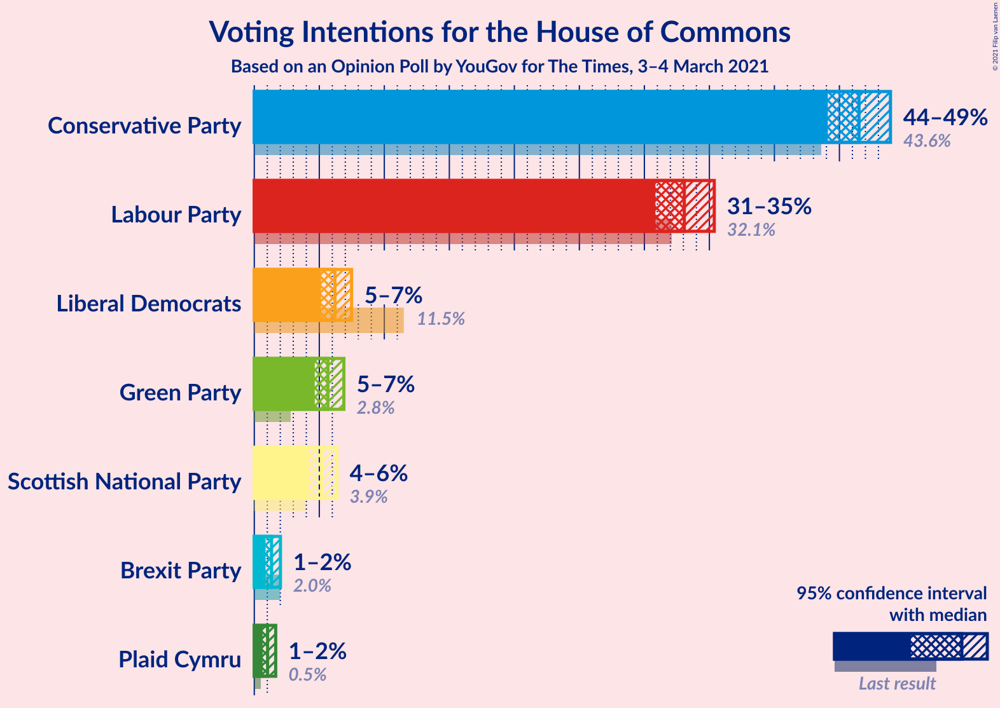

### Confidence Intervals

| Party | Last Result | Poll Result | 80% Confidence Interval | 90% Confidence Interval | 95% Confidence Interval | 99% Confidence Interval |
|:-----:|:-----------:|:-----------:|:-----------------------:|:-----------------------:|:-----------------------:|:-----------------------:|
| Conservative Party | 43.6% | 46.5% | 44.9–48.1% |44.5–48.5% |44.1–48.9% |43.4–49.7% |
| Labour Party | 32.1% | 33.1% | 31.6–34.6% |31.2–35.0% |30.8–35.4% |30.1–36.1% |
| Liberal Democrats | 11.5% | 6.2% | 5.5–7.0% |5.3–7.3% |5.1–7.5% |4.8–7.9% |
| Green Party | 2.8% | 5.7% | 5.0–6.5% |4.8–6.7% |4.6–6.9% |4.3–7.3% |
| Scottish National Party | 3.9% | 5.2% | 4.5–6.0% |4.4–6.2% |4.2–6.4% |3.9–6.8% |
| Brexit Party | 2.0% | 1.3% | 1.0–1.8% |0.9–1.9% |0.9–2.0% |0.7–2.2% |
| Plaid Cymru | 0.5% | 1.0% | 0.8–1.4% |0.7–1.5% |0.6–1.6% |0.5–1.9% |

*Note:* The poll result column reflects the actual value used in the calculations. Published results may vary slightly, and in addition be rounded to fewer digits.

## Seats

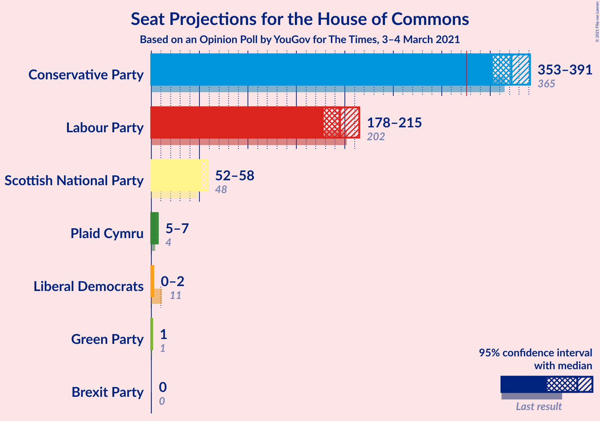

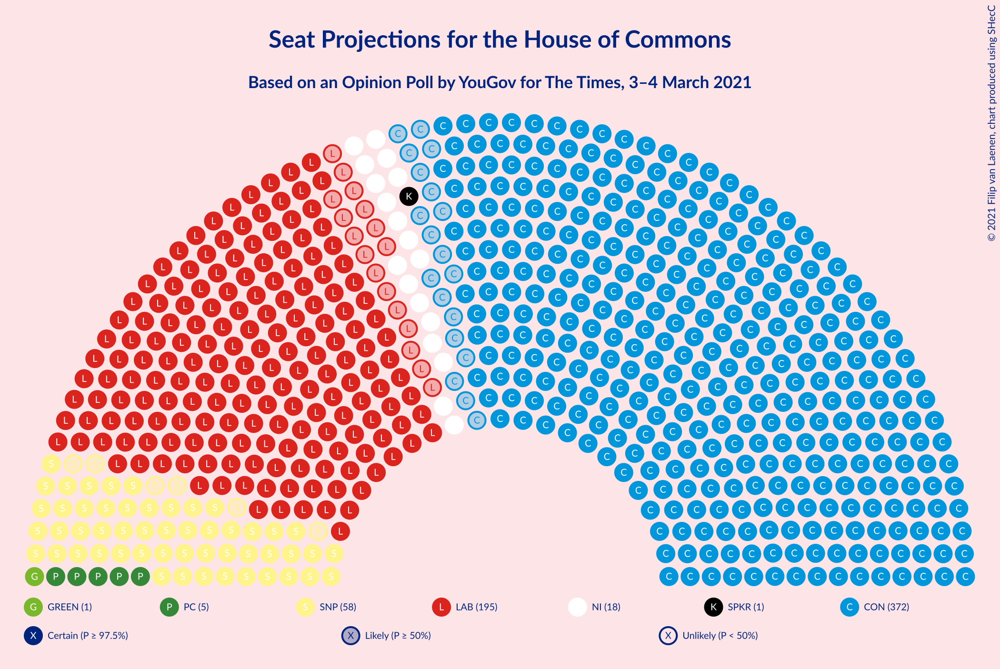

### Confidence Intervals

| Party | Last Result | Median | 80% Confidence Interval | 90% Confidence Interval | 95% Confidence Interval | 99% Confidence Interval |
|:-----:|:-----------:|:------:|:-----------------------:|:-----------------------:|:-----------------------:|:-----------------------:|
| <a href="#conservative-party">Conservative Party</a> | 365 | 372 | 359–386 |356–387 |353–391 |343–395 |
| <a href="#labour-party">Labour Party</a> | 202 | 195 | 183–208 |182–212 |178–215 |173–224 |
| <a href="#liberal-democrats">Liberal Democrats</a> | 11 | 0 | 0–1 |0–1 |0–2 |0–2 |
| <a href="#green-party">Green Party</a> | 1 | 1 | 1 |1 |1 |1–2 |
| <a href="#scottish-national-party">Scottish National Party</a> | 48 | 58 | 55–58 |53–58 |52–58 |51–58 |
| <a href="#brexit-party">Brexit Party</a> | 0 | 0 | 0 |0 |0 |0 |
| <a href="#plaid-cymru">Plaid Cymru</a> | 4 | 5 | 5–6 |5–7 |5–7 |4–9 |

### Conservative Party

*For a full overview of the results for this party, see the [Conservative Party](party-conservativeparty.html) page.*

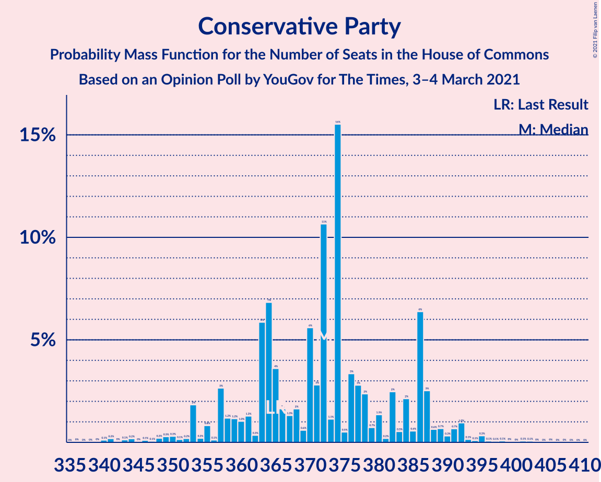

| Number of Seats | Probability | Accumulated | Special Marks |
|:---------------:|:-----------:|:-----------:|:-------------:|
| 336 | 0% | 100% |  |
| 337 | 0% | 99.9% |  |
| 338 | 0% | 99.9% |  |
| 339 | 0% | 99.9% |  |
| 340 | 0.1% | 99.9% |  |
| 341 | 0.2% | 99.8% |  |
| 342 | 0% | 99.6% |  |
| 343 | 0.1% | 99.5% |  |
| 344 | 0.2% | 99.4% |  |
| 345 | 0% | 99.2% |  |
| 346 | 0.1% | 99.2% |  |
| 347 | 0.1% | 99.1% |  |
| 348 | 0.2% | 99.0% |  |
| 349 | 0.3% | 98.8% |  |
| 350 | 0.3% | 98.5% |  |
| 351 | 0.1% | 98% |  |
| 352 | 0.2% | 98% |  |
| 353 | 2% | 98% |  |
| 354 | 0.2% | 96% |  |
| 355 | 0.8% | 96% |  |
| 356 | 0.1% | 95% |  |
| 357 | 3% | 95% |  |
| 358 | 1.2% | 92% |  |
| 359 | 1.2% | 91% |  |
| 360 | 1.0% | 90% |  |
| 361 | 1.3% | 89% |  |
| 362 | 0.3% | 88% |  |
| 363 | 6% | 87% |  |
| 364 | 7% | 81% |  |
| 365 | 4% | 75% | Last Result |
| 366 | 2% | 71% |  |
| 367 | 1.3% | 69% |  |
| 368 | 2% | 68% |  |
| 369 | 0.6% | 66% |  |
| 370 | 6% | 66% |  |
| 371 | 3% | 60% |  |
| 372 | 11% | 57% | Median |
| 373 | 1.1% | 47% |  |
| 374 | 16% | 46% |  |
| 375 | 0.5% | 30% |  |
| 376 | 3% | 30% |  |
| 377 | 3% | 26% |  |
| 378 | 2% | 23% |  |
| 379 | 0.7% | 21% |  |
| 380 | 1.3% | 20% |  |
| 381 | 0.2% | 19% |  |
| 382 | 2% | 19% |  |
| 383 | 0.5% | 16% |  |
| 384 | 2% | 16% |  |
| 385 | 0.6% | 14% |  |
| 386 | 6% | 13% |  |
| 387 | 3% | 7% |  |
| 388 | 0.6% | 4% |  |
| 389 | 0.7% | 4% |  |
| 390 | 0.3% | 3% |  |
| 391 | 0.7% | 3% |  |
| 392 | 1.0% | 2% |  |
| 393 | 0.1% | 1.0% |  |
| 394 | 0.1% | 0.9% |  |
| 395 | 0.3% | 0.8% |  |
| 396 | 0.1% | 0.5% |  |
| 397 | 0.1% | 0.4% |  |
| 398 | 0.1% | 0.4% |  |
| 399 | 0% | 0.3% |  |
| 400 | 0% | 0.2% |  |
| 401 | 0.1% | 0.2% |  |
| 402 | 0.1% | 0.2% |  |
| 403 | 0% | 0.1% |  |
| 404 | 0% | 0.1% |  |
| 405 | 0% | 0.1% |  |
| 406 | 0% | 0% |  |

### Labour Party

*For a full overview of the results for this party, see the [Labour Party](party-labourparty.html) page.*

| Number of Seats | Probability | Accumulated | Special Marks |
|:---------------:|:-----------:|:-----------:|:-------------:|
| 164 | 0% | 100% |  |
| 165 | 0% | 99.9% |  |
| 166 | 0% | 99.9% |  |
| 167 | 0.1% | 99.9% |  |
| 168 | 0.1% | 99.8% |  |
| 169 | 0% | 99.7% |  |
| 170 | 0% | 99.7% |  |
| 171 | 0% | 99.7% |  |
| 172 | 0% | 99.6% |  |
| 173 | 0.3% | 99.6% |  |
| 174 | 0.9% | 99.3% |  |
| 175 | 0.1% | 98% |  |
| 176 | 0.2% | 98% |  |
| 177 | 0.5% | 98% |  |
| 178 | 0.4% | 98% |  |
| 179 | 0.5% | 97% |  |
| 180 | 0.8% | 97% |  |
| 181 | 0.5% | 96% |  |
| 182 | 4% | 95% |  |
| 183 | 6% | 91% |  |
| 184 | 0.9% | 85% |  |
| 185 | 1.4% | 84% |  |
| 186 | 0.5% | 83% |  |
| 187 | 2% | 83% |  |
| 188 | 0.8% | 81% |  |
| 189 | 2% | 80% |  |
| 190 | 2% | 78% |  |
| 191 | 2% | 76% |  |
| 192 | 3% | 74% |  |
| 193 | 12% | 71% |  |
| 194 | 6% | 59% |  |
| 195 | 10% | 53% | Median |
| 196 | 5% | 43% |  |
| 197 | 1.3% | 37% |  |
| 198 | 2% | 36% |  |
| 199 | 2% | 34% |  |
| 200 | 0.7% | 32% |  |
| 201 | 3% | 32% |  |
| 202 | 4% | 29% | Last Result |
| 203 | 6% | 25% |  |
| 204 | 1.4% | 18% |  |
| 205 | 0.2% | 17% |  |
| 206 | 0.8% | 17% |  |
| 207 | 5% | 16% |  |
| 208 | 1.3% | 11% |  |
| 209 | 2% | 9% |  |
| 210 | 2% | 7% |  |
| 211 | 0.1% | 6% |  |
| 212 | 1.2% | 6% |  |
| 213 | 0.7% | 5% |  |
| 214 | 1.4% | 4% |  |
| 215 | 0.6% | 3% |  |
| 216 | 0.2% | 2% |  |
| 217 | 0.3% | 2% |  |
| 218 | 0.2% | 1.4% |  |
| 219 | 0.3% | 1.2% |  |
| 220 | 0% | 0.9% |  |
| 221 | 0.1% | 0.9% |  |
| 222 | 0% | 0.8% |  |
| 223 | 0.2% | 0.8% |  |
| 224 | 0.1% | 0.6% |  |
| 225 | 0.2% | 0.5% |  |
| 226 | 0.1% | 0.3% |  |
| 227 | 0% | 0.1% |  |
| 228 | 0% | 0.1% |  |
| 229 | 0% | 0.1% |  |
| 230 | 0% | 0% |  |

### Liberal Democrats

*For a full overview of the results for this party, see the [Liberal Democrats](party-liberaldemocrats.html) page.*

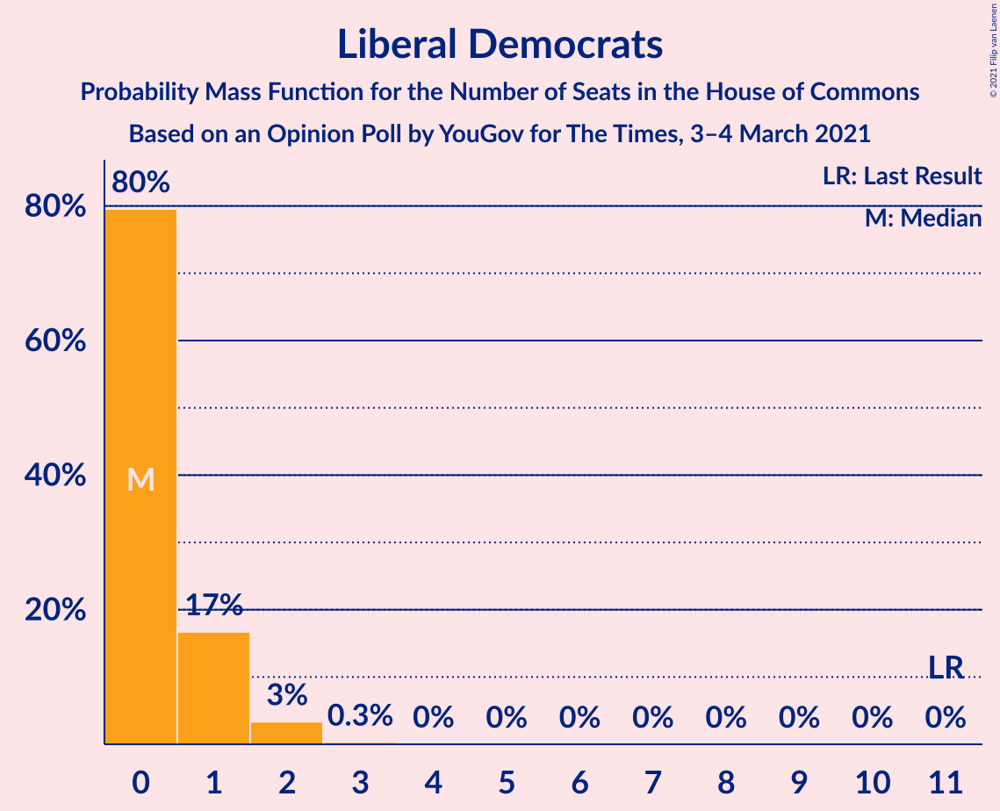

| Number of Seats | Probability | Accumulated | Special Marks |
|:---------------:|:-----------:|:-----------:|:-------------:|
| 0 | 80% | 100% | Median |
| 1 | 17% | 20% |  |
| 2 | 3% | 4% |  |
| 3 | 0.3% | 0.4% |  |
| 4 | 0% | 0% |  |
| 5 | 0% | 0% |  |
| 6 | 0% | 0% |  |
| 7 | 0% | 0% |  |
| 8 | 0% | 0% |  |
| 9 | 0% | 0% |  |
| 10 | 0% | 0% |  |
| 11 | 0% | 0% | Last Result |

### Green Party

*For a full overview of the results for this party, see the [Green Party](party-greenparty.html) page.*

| Number of Seats | Probability | Accumulated | Special Marks |
|:---------------:|:-----------:|:-----------:|:-------------:|
| 1 | 98.6% | 100% | Last Result, Median |
| 2 | 1.4% | 1.4% |  |
| 3 | 0% | 0% |  |

### Scottish National Party

*For a full overview of the results for this party, see the [Scottish National Party](party-scottishnationalparty.html) page.*

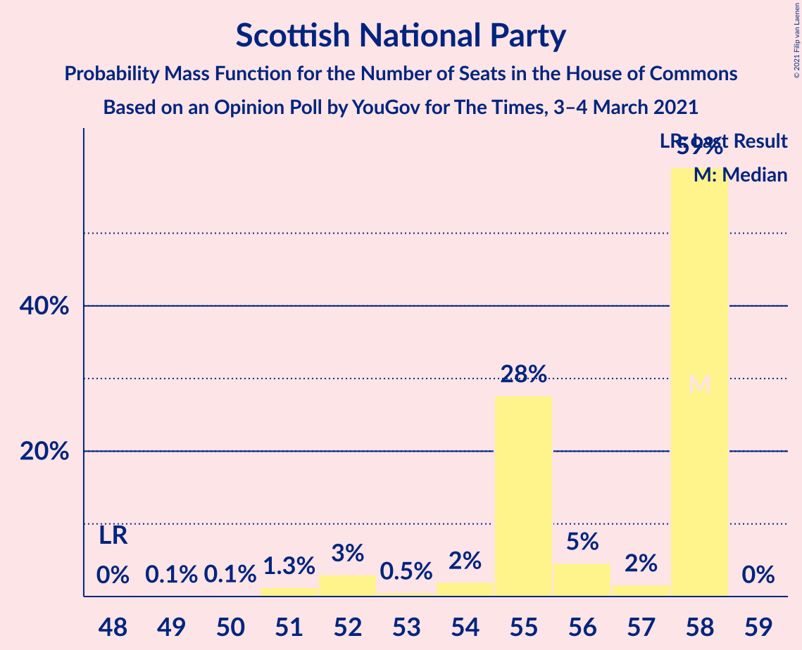

| Number of Seats | Probability | Accumulated | Special Marks |
|:---------------:|:-----------:|:-----------:|:-------------:|
| 48 | 0% | 100% | Last Result |
| 49 | 0.1% | 100% |  |
| 50 | 0.1% | 99.9% |  |
| 51 | 1.3% | 99.8% |  |
| 52 | 3% | 98% |  |
| 53 | 0.5% | 95% |  |
| 54 | 2% | 95% |  |
| 55 | 28% | 93% |  |
| 56 | 5% | 65% |  |
| 57 | 2% | 61% |  |
| 58 | 59% | 59% | Median |
| 59 | 0% | 0% |  |

### Brexit Party

*For a full overview of the results for this party, see the [Brexit Party](party-brexitparty.html) page.*

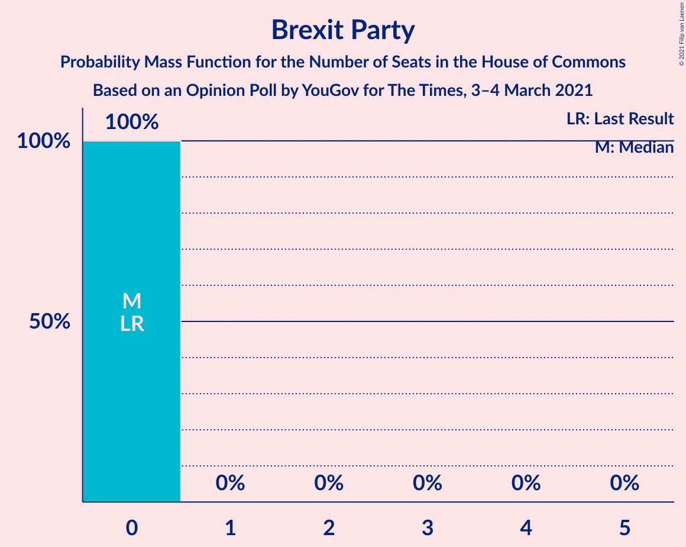

| Number of Seats | Probability | Accumulated | Special Marks |
|:---------------:|:-----------:|:-----------:|:-------------:|
| 0 | 100% | 100% | Last Result, Median |

### Plaid Cymru

*For a full overview of the results for this party, see the [Plaid Cymru](party-plaidcymru.html) page.*

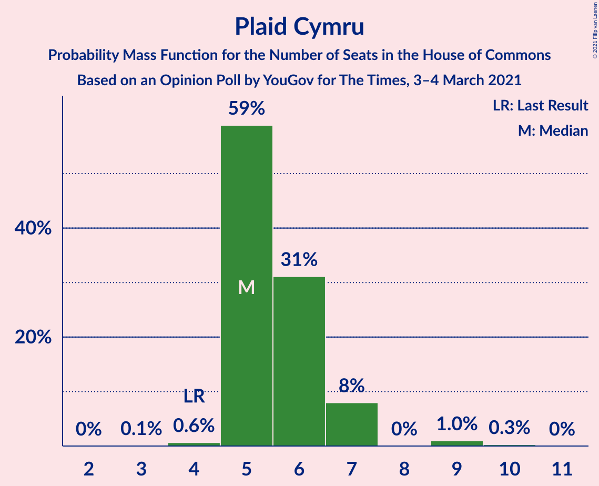

| Number of Seats | Probability | Accumulated | Special Marks |
|:---------------:|:-----------:|:-----------:|:-------------:|
| 3 | 0.1% | 100% |  |
| 4 | 0.6% | 99.9% | Last Result |
| 5 | 59% | 99.2% | Median |
| 6 | 31% | 40% |  |
| 7 | 8% | 9% |  |
| 8 | 0% | 1.3% |  |
| 9 | 1.0% | 1.3% |  |
| 10 | 0.3% | 0.3% |  |
| 11 | 0% | 0% |  |

## Coalitions

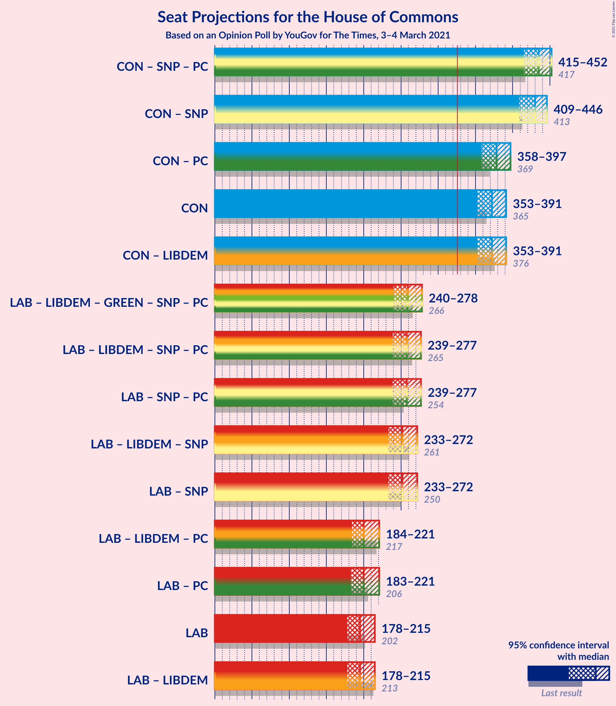

### Confidence Intervals

| Coalition | Last Result | Median | Majority? | 80% Confidence Interval | 90% Confidence Interval | 95% Confidence Interval | 99% Confidence Interval |
|:---------:|:-----------:|:------:|:---------:|:-----------------------:|:-----------------------:|:-----------------------:|:-----------------------:|
| Conservative Party – Scottish National Party – Plaid Cymru | 417 | 435 | 100% | 421–447 | 417–448 | 415–452 | 405–457 |
| Conservative Party – Scottish National Party | 413 | 430 | 100% | 416–441 | 412–442 | 409–446 | 400–450 |
| Conservative Party – Plaid Cymru | 369 | 378 | 100% | 365–392 | 362–393 | 358–397 | 348–402 |
| Conservative Party | 365 | 372 | 100% | 359–386 | 356–387 | 353–391 | 343–395 |
| Conservative Party – Liberal Democrats | 376 | 372 | 100% | 360–386 | 357–387 | 353–391 | 344–395 |
| Labour Party – Liberal Democrats – Green Party – Scottish National Party – Plaid Cymru | 266 | 259 | 0% | 245–272 | 244–275 | 240–278 | 236–288 |
| Labour Party – Liberal Democrats – Scottish National Party – Plaid Cymru | 265 | 258 | 0% | 244–271 | 243–274 | 239–277 | 235–287 |
| Labour Party – Scottish National Party – Plaid Cymru | 254 | 258 | 0% | 244–270 | 243–273 | 239–277 | 235–286 |
| Labour Party – Liberal Democrats – Scottish National Party | 261 | 252 | 0% | 238–265 | 237–268 | 233–272 | 228–282 |
| Labour Party – Scottish National Party | 250 | 252 | 0% | 238–265 | 237–268 | 233–272 | 228–281 |
| Labour Party – Liberal Democrats – Plaid Cymru | 217 | 200 | 0% | 189–214 | 188–218 | 184–221 | 180–230 |
| Labour Party – Plaid Cymru | 206 | 200 | 0% | 189–213 | 188–217 | 183–221 | 180–230 |
| Labour Party | 202 | 195 | 0% | 183–208 | 182–212 | 178–215 | 173–224 |
| Labour Party – Liberal Democrats | 213 | 195 | 0% | 183–209 | 182–213 | 178–215 | 173–225 |

### Conservative Party – Scottish National Party – Plaid Cymru

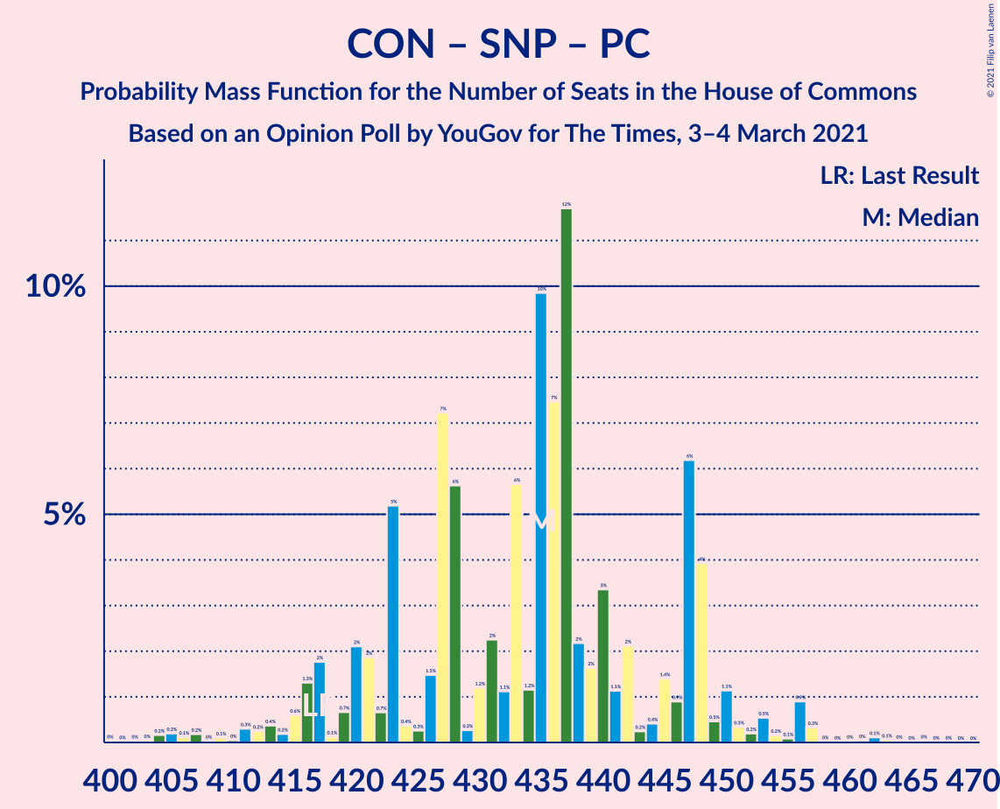

| Number of Seats | Probability | Accumulated | Special Marks |
|:---------------:|:-----------:|:-----------:|:-------------:|
| 400 | 0% | 100% |  |
| 401 | 0% | 99.9% |  |
| 402 | 0% | 99.9% |  |
| 403 | 0% | 99.9% |  |
| 404 | 0.2% | 99.8% |  |
| 405 | 0.2% | 99.7% |  |
| 406 | 0.1% | 99.5% |  |
| 407 | 0.2% | 99.4% |  |
| 408 | 0% | 99.2% |  |
| 409 | 0.1% | 99.1% |  |
| 410 | 0% | 99.0% |  |
| 411 | 0.3% | 99.0% |  |
| 412 | 0.2% | 98.7% |  |
| 413 | 0.4% | 98% |  |
| 414 | 0.2% | 98% |  |
| 415 | 0.6% | 98% |  |
| 416 | 1.3% | 97% |  |
| 417 | 2% | 96% | Last Result |
| 418 | 0.1% | 94% |  |
| 419 | 0.7% | 94% |  |
| 420 | 2% | 93% |  |
| 421 | 2% | 91% |  |
| 422 | 0.7% | 89% |  |
| 423 | 5% | 89% |  |
| 424 | 0.4% | 84% |  |
| 425 | 0.3% | 83% |  |
| 426 | 1.5% | 83% |  |
| 427 | 7% | 82% |  |
| 428 | 6% | 74% |  |
| 429 | 0.3% | 69% |  |
| 430 | 1.2% | 68% |  |
| 431 | 2% | 67% |  |
| 432 | 1.1% | 65% |  |
| 433 | 6% | 64% |  |
| 434 | 1.2% | 58% |  |
| 435 | 10% | 57% | Median |
| 436 | 7% | 47% |  |
| 437 | 12% | 40% |  |
| 438 | 2% | 28% |  |
| 439 | 2% | 26% |  |
| 440 | 3% | 24% |  |
| 441 | 1.1% | 21% |  |
| 442 | 2% | 20% |  |
| 443 | 0.2% | 18% |  |
| 444 | 0.4% | 17% |  |
| 445 | 1.4% | 17% |  |
| 446 | 0.9% | 16% |  |
| 447 | 6% | 15% |  |
| 448 | 4% | 8% |  |
| 449 | 0.5% | 5% |  |
| 450 | 1.1% | 4% |  |
| 451 | 0.3% | 3% |  |
| 452 | 0.2% | 3% |  |
| 453 | 0.5% | 2% |  |
| 454 | 0.2% | 2% |  |
| 455 | 0.1% | 2% |  |
| 456 | 0.9% | 2% |  |
| 457 | 0.3% | 0.7% |  |
| 458 | 0% | 0.4% |  |
| 459 | 0% | 0.3% |  |
| 460 | 0% | 0.3% |  |
| 461 | 0% | 0.3% |  |
| 462 | 0.1% | 0.3% |  |
| 463 | 0.1% | 0.2% |  |
| 464 | 0% | 0.1% |  |
| 465 | 0% | 0.1% |  |
| 466 | 0% | 0.1% |  |
| 467 | 0% | 0% |  |

### Conservative Party – Scottish National Party

| Number of Seats | Probability | Accumulated | Special Marks |
|:---------------:|:-----------:|:-----------:|:-------------:|
| 394 | 0% | 100% |  |
| 395 | 0% | 99.9% |  |
| 396 | 0% | 99.9% |  |
| 397 | 0% | 99.9% |  |
| 398 | 0.1% | 99.9% |  |
| 399 | 0.2% | 99.7% |  |
| 400 | 0.1% | 99.5% |  |
| 401 | 0.1% | 99.4% |  |
| 402 | 0.2% | 99.3% |  |
| 403 | 0% | 99.1% |  |
| 404 | 0.1% | 99.1% |  |
| 405 | 0.1% | 99.0% |  |
| 406 | 0.3% | 99.0% |  |
| 407 | 0.3% | 98.6% |  |
| 408 | 0.5% | 98% |  |
| 409 | 0.5% | 98% |  |
| 410 | 0.1% | 97% |  |
| 411 | 1.4% | 97% |  |
| 412 | 2% | 96% |  |
| 413 | 0.2% | 94% | Last Result |
| 414 | 0.6% | 94% |  |
| 415 | 2% | 93% |  |
| 416 | 2% | 91% |  |
| 417 | 0.8% | 89% |  |
| 418 | 5% | 88% |  |
| 419 | 0.5% | 83% |  |
| 420 | 0.3% | 83% |  |
| 421 | 2% | 83% |  |
| 422 | 7% | 80% |  |
| 423 | 5% | 73% |  |
| 424 | 2% | 68% |  |
| 425 | 1.0% | 67% |  |
| 426 | 1.1% | 66% |  |
| 427 | 1.3% | 65% |  |
| 428 | 6% | 63% |  |
| 429 | 7% | 58% |  |
| 430 | 11% | 51% | Median |
| 431 | 1.0% | 40% |  |
| 432 | 13% | 39% |  |
| 433 | 0.7% | 26% |  |
| 434 | 5% | 25% |  |
| 435 | 0.1% | 20% |  |
| 436 | 0.9% | 20% |  |
| 437 | 2% | 19% |  |
| 438 | 1.2% | 17% |  |
| 439 | 0% | 16% |  |
| 440 | 2% | 16% |  |
| 441 | 5% | 14% |  |
| 442 | 4% | 9% |  |
| 443 | 1.0% | 4% |  |
| 444 | 0.6% | 3% |  |
| 445 | 0.3% | 3% |  |
| 446 | 0.2% | 3% |  |
| 447 | 0.4% | 2% |  |
| 448 | 0.3% | 2% |  |
| 449 | 0.9% | 2% |  |
| 450 | 0.4% | 0.8% |  |
| 451 | 0% | 0.4% |  |
| 452 | 0% | 0.4% |  |
| 453 | 0% | 0.4% |  |
| 454 | 0% | 0.3% |  |
| 455 | 0% | 0.3% |  |
| 456 | 0.1% | 0.3% |  |
| 457 | 0.1% | 0.2% |  |
| 458 | 0% | 0.1% |  |
| 459 | 0% | 0.1% |  |
| 460 | 0% | 0.1% |  |
| 461 | 0% | 0.1% |  |
| 462 | 0% | 0% |  |

### Conservative Party – Plaid Cymru

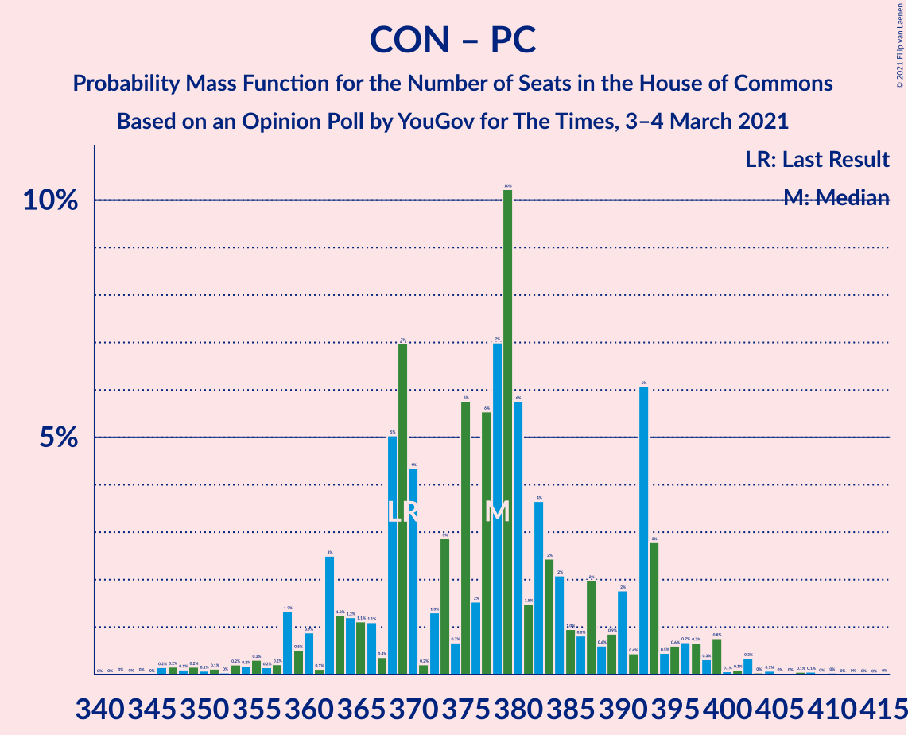

| Number of Seats | Probability | Accumulated | Special Marks |
|:---------------:|:-----------:|:-----------:|:-------------:|
| 342 | 0% | 100% |  |
| 343 | 0% | 99.9% |  |
| 344 | 0% | 99.9% |  |
| 345 | 0% | 99.9% |  |
| 346 | 0.2% | 99.9% |  |
| 347 | 0.2% | 99.7% |  |
| 348 | 0.1% | 99.6% |  |
| 349 | 0.2% | 99.5% |  |
| 350 | 0.1% | 99.3% |  |
| 351 | 0.1% | 99.2% |  |
| 352 | 0% | 99.1% |  |
| 353 | 0.2% | 99.1% |  |
| 354 | 0.2% | 98.8% |  |
| 355 | 0.3% | 98.7% |  |
| 356 | 0.2% | 98% |  |
| 357 | 0.2% | 98% |  |
| 358 | 1.3% | 98% |  |
| 359 | 0.5% | 97% |  |
| 360 | 0.9% | 96% |  |
| 361 | 0.1% | 95% |  |
| 362 | 3% | 95% |  |
| 363 | 1.2% | 93% |  |
| 364 | 1.2% | 91% |  |
| 365 | 1.1% | 90% |  |
| 366 | 1.1% | 89% |  |
| 367 | 0.4% | 88% |  |
| 368 | 5% | 88% |  |
| 369 | 7% | 83% | Last Result |
| 370 | 4% | 76% |  |
| 371 | 0.2% | 71% |  |
| 372 | 1.3% | 71% |  |
| 373 | 3% | 70% |  |
| 374 | 0.7% | 67% |  |
| 375 | 6% | 66% |  |
| 376 | 2% | 60% |  |
| 377 | 6% | 59% | Median |
| 378 | 7% | 53% |  |
| 379 | 10% | 46% |  |
| 380 | 6% | 36% |  |
| 381 | 1.5% | 30% |  |
| 382 | 4% | 29% |  |
| 383 | 2% | 25% |  |
| 384 | 2% | 23% |  |
| 385 | 1.0% | 21% |  |
| 386 | 0.8% | 20% |  |
| 387 | 2% | 19% |  |
| 388 | 0.6% | 17% |  |
| 389 | 0.9% | 16% |  |
| 390 | 2% | 15% |  |
| 391 | 0.4% | 14% |  |
| 392 | 6% | 13% |  |
| 393 | 3% | 7% |  |
| 394 | 0.5% | 4% |  |
| 395 | 0.6% | 4% |  |
| 396 | 0.7% | 3% |  |
| 397 | 0.7% | 3% |  |
| 398 | 0.3% | 2% |  |
| 399 | 0.8% | 2% |  |
| 400 | 0.1% | 0.9% |  |
| 401 | 0.1% | 0.8% |  |
| 402 | 0.3% | 0.7% |  |
| 403 | 0% | 0.4% |  |
| 404 | 0.1% | 0.4% |  |
| 405 | 0% | 0.3% |  |
| 406 | 0% | 0.2% |  |
| 407 | 0.1% | 0.2% |  |
| 408 | 0.1% | 0.2% |  |
| 409 | 0% | 0.1% |  |
| 410 | 0% | 0.1% |  |
| 411 | 0% | 0% |  |

### Conservative Party

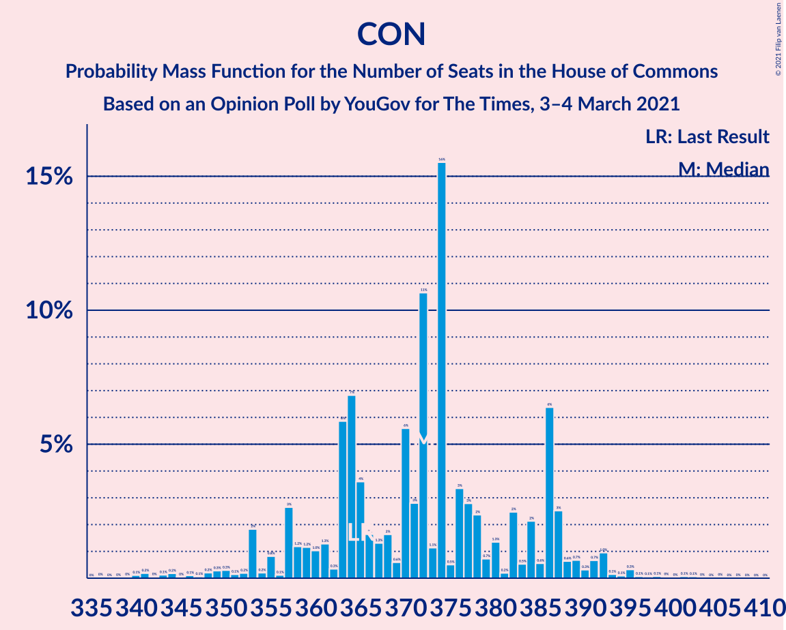

| Number of Seats | Probability | Accumulated | Special Marks |
|:---------------:|:-----------:|:-----------:|:-------------:|
| 336 | 0% | 100% |  |
| 337 | 0% | 99.9% |  |
| 338 | 0% | 99.9% |  |
| 339 | 0% | 99.9% |  |
| 340 | 0.1% | 99.9% |  |
| 341 | 0.2% | 99.8% |  |
| 342 | 0% | 99.6% |  |
| 343 | 0.1% | 99.5% |  |
| 344 | 0.2% | 99.4% |  |
| 345 | 0% | 99.2% |  |
| 346 | 0.1% | 99.2% |  |
| 347 | 0.1% | 99.1% |  |
| 348 | 0.2% | 99.0% |  |
| 349 | 0.3% | 98.8% |  |
| 350 | 0.3% | 98.5% |  |
| 351 | 0.1% | 98% |  |
| 352 | 0.2% | 98% |  |
| 353 | 2% | 98% |  |
| 354 | 0.2% | 96% |  |
| 355 | 0.8% | 96% |  |
| 356 | 0.1% | 95% |  |
| 357 | 3% | 95% |  |
| 358 | 1.2% | 92% |  |
| 359 | 1.2% | 91% |  |
| 360 | 1.0% | 90% |  |
| 361 | 1.3% | 89% |  |
| 362 | 0.3% | 88% |  |
| 363 | 6% | 87% |  |
| 364 | 7% | 81% |  |
| 365 | 4% | 75% | Last Result |
| 366 | 2% | 71% |  |
| 367 | 1.3% | 69% |  |
| 368 | 2% | 68% |  |
| 369 | 0.6% | 66% |  |
| 370 | 6% | 66% |  |
| 371 | 3% | 60% |  |
| 372 | 11% | 57% | Median |
| 373 | 1.1% | 47% |  |
| 374 | 16% | 46% |  |
| 375 | 0.5% | 30% |  |
| 376 | 3% | 30% |  |
| 377 | 3% | 26% |  |
| 378 | 2% | 23% |  |
| 379 | 0.7% | 21% |  |
| 380 | 1.3% | 20% |  |
| 381 | 0.2% | 19% |  |
| 382 | 2% | 19% |  |
| 383 | 0.5% | 16% |  |
| 384 | 2% | 16% |  |
| 385 | 0.6% | 14% |  |
| 386 | 6% | 13% |  |
| 387 | 3% | 7% |  |
| 388 | 0.6% | 4% |  |
| 389 | 0.7% | 4% |  |
| 390 | 0.3% | 3% |  |
| 391 | 0.7% | 3% |  |
| 392 | 1.0% | 2% |  |
| 393 | 0.1% | 1.0% |  |
| 394 | 0.1% | 0.9% |  |
| 395 | 0.3% | 0.8% |  |
| 396 | 0.1% | 0.5% |  |
| 397 | 0.1% | 0.4% |  |
| 398 | 0.1% | 0.4% |  |
| 399 | 0% | 0.3% |  |
| 400 | 0% | 0.2% |  |
| 401 | 0.1% | 0.2% |  |
| 402 | 0.1% | 0.2% |  |
| 403 | 0% | 0.1% |  |
| 404 | 0% | 0.1% |  |
| 405 | 0% | 0.1% |  |
| 406 | 0% | 0% |  |

### Conservative Party – Liberal Democrats

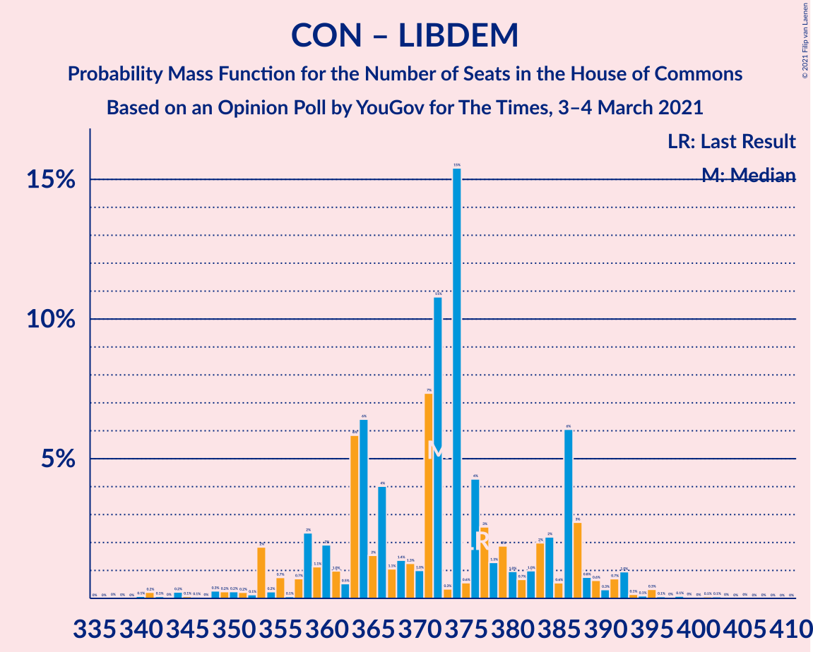

| Number of Seats | Probability | Accumulated | Special Marks |
|:---------------:|:-----------:|:-----------:|:-------------:|
| 337 | 0% | 100% |  |
| 338 | 0% | 99.9% |  |
| 339 | 0% | 99.9% |  |
| 340 | 0.1% | 99.9% |  |
| 341 | 0.2% | 99.8% |  |
| 342 | 0.1% | 99.6% |  |
| 343 | 0% | 99.5% |  |
| 344 | 0.2% | 99.5% |  |
| 345 | 0.1% | 99.3% |  |
| 346 | 0.1% | 99.2% |  |
| 347 | 0% | 99.2% |  |
| 348 | 0.3% | 99.1% |  |
| 349 | 0.2% | 98.9% |  |
| 350 | 0.2% | 98.6% |  |
| 351 | 0.2% | 98% |  |
| 352 | 0.1% | 98% |  |
| 353 | 2% | 98% |  |
| 354 | 0.2% | 96% |  |
| 355 | 0.7% | 96% |  |
| 356 | 0.1% | 95% |  |
| 357 | 0.7% | 95% |  |
| 358 | 2% | 94% |  |
| 359 | 1.1% | 92% |  |
| 360 | 2% | 91% |  |
| 361 | 1.0% | 89% |  |
| 362 | 0.5% | 88% |  |
| 363 | 6% | 88% |  |
| 364 | 6% | 82% |  |
| 365 | 2% | 75% |  |
| 366 | 4% | 74% |  |
| 367 | 1.1% | 70% |  |
| 368 | 1.4% | 69% |  |
| 369 | 1.3% | 67% |  |
| 370 | 1.0% | 66% |  |
| 371 | 7% | 65% |  |
| 372 | 11% | 58% | Median |
| 373 | 0.3% | 47% |  |
| 374 | 15% | 47% |  |
| 375 | 0.6% | 31% |  |
| 376 | 4% | 31% | Last Result |
| 377 | 3% | 26% |  |
| 378 | 1.3% | 24% |  |
| 379 | 2% | 22% |  |
| 380 | 1.0% | 21% |  |
| 381 | 0.7% | 20% |  |
| 382 | 1.0% | 19% |  |
| 383 | 2% | 18% |  |
| 384 | 2% | 16% |  |
| 385 | 0.6% | 14% |  |
| 386 | 6% | 13% |  |
| 387 | 3% | 7% |  |
| 388 | 0.8% | 4% |  |
| 389 | 0.6% | 4% |  |
| 390 | 0.3% | 3% |  |
| 391 | 0.7% | 3% |  |
| 392 | 1.0% | 2% |  |
| 393 | 0.1% | 1.0% |  |
| 394 | 0.1% | 0.9% |  |
| 395 | 0.3% | 0.8% |  |
| 396 | 0.1% | 0.5% |  |
| 397 | 0% | 0.4% |  |
| 398 | 0.1% | 0.4% |  |
| 399 | 0% | 0.3% |  |
| 400 | 0% | 0.2% |  |
| 401 | 0.1% | 0.2% |  |
| 402 | 0.1% | 0.2% |  |
| 403 | 0% | 0.1% |  |
| 404 | 0% | 0.1% |  |
| 405 | 0% | 0.1% |  |
| 406 | 0% | 0% |  |

### Labour Party – Liberal Democrats – Green Party – Scottish National Party – Plaid Cymru

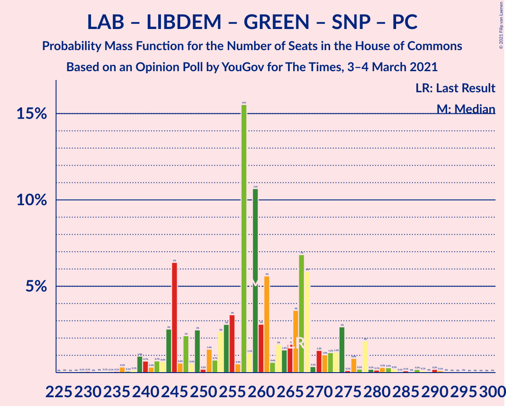

| Number of Seats | Probability | Accumulated | Special Marks |
|:---------------:|:-----------:|:-----------:|:-------------:|
| 226 | 0% | 100% |  |
| 227 | 0% | 99.9% |  |
| 228 | 0% | 99.9% |  |
| 229 | 0.1% | 99.9% |  |
| 230 | 0.1% | 99.8% |  |
| 231 | 0% | 99.8% |  |
| 232 | 0% | 99.8% |  |
| 233 | 0.1% | 99.7% |  |
| 234 | 0.1% | 99.6% |  |
| 235 | 0.1% | 99.6% |  |
| 236 | 0.3% | 99.5% |  |
| 237 | 0.1% | 99.2% |  |
| 238 | 0.1% | 99.1% |  |
| 239 | 1.0% | 99.0% |  |
| 240 | 0.7% | 98% |  |
| 241 | 0.3% | 97% |  |
| 242 | 0.7% | 97% |  |
| 243 | 0.6% | 96% |  |
| 244 | 3% | 96% |  |
| 245 | 6% | 93% |  |
| 246 | 0.6% | 87% |  |
| 247 | 2% | 86% |  |
| 248 | 0.5% | 84% |  |
| 249 | 2% | 84% |  |
| 250 | 0.2% | 81% |  |
| 251 | 1.4% | 81% |  |
| 252 | 0.7% | 80% |  |
| 253 | 2% | 79% |  |
| 254 | 3% | 77% |  |
| 255 | 3% | 74% |  |
| 256 | 0.5% | 70% |  |
| 257 | 16% | 70% |  |
| 258 | 1.1% | 54% |  |
| 259 | 11% | 53% | Median |
| 260 | 3% | 43% |  |
| 261 | 6% | 40% |  |
| 262 | 0.6% | 34% |  |
| 263 | 2% | 34% |  |
| 264 | 1.3% | 32% |  |
| 265 | 2% | 31% |  |
| 266 | 4% | 29% | Last Result |
| 267 | 7% | 25% |  |
| 268 | 6% | 19% |  |
| 269 | 0.3% | 13% |  |
| 270 | 1.3% | 12% |  |
| 271 | 1.0% | 11% |  |
| 272 | 1.2% | 10% |  |
| 273 | 1.2% | 9% |  |
| 274 | 3% | 8% |  |
| 275 | 0.1% | 5% |  |
| 276 | 0.8% | 5% |  |
| 277 | 0.2% | 4% |  |
| 278 | 2% | 4% |  |
| 279 | 0.2% | 2% |  |
| 280 | 0.1% | 2% |  |
| 281 | 0.3% | 2% |  |
| 282 | 0.3% | 1.5% |  |
| 283 | 0.2% | 1.2% |  |
| 284 | 0.1% | 1.0% |  |
| 285 | 0.1% | 0.9% |  |
| 286 | 0% | 0.8% |  |
| 287 | 0.2% | 0.8% |  |
| 288 | 0.1% | 0.6% |  |
| 289 | 0% | 0.5% |  |
| 290 | 0.2% | 0.4% |  |
| 291 | 0.1% | 0.2% |  |
| 292 | 0% | 0.1% |  |
| 293 | 0% | 0.1% |  |
| 294 | 0% | 0.1% |  |
| 295 | 0% | 0.1% |  |
| 296 | 0% | 0% |  |

### Labour Party – Liberal Democrats – Scottish National Party – Plaid Cymru

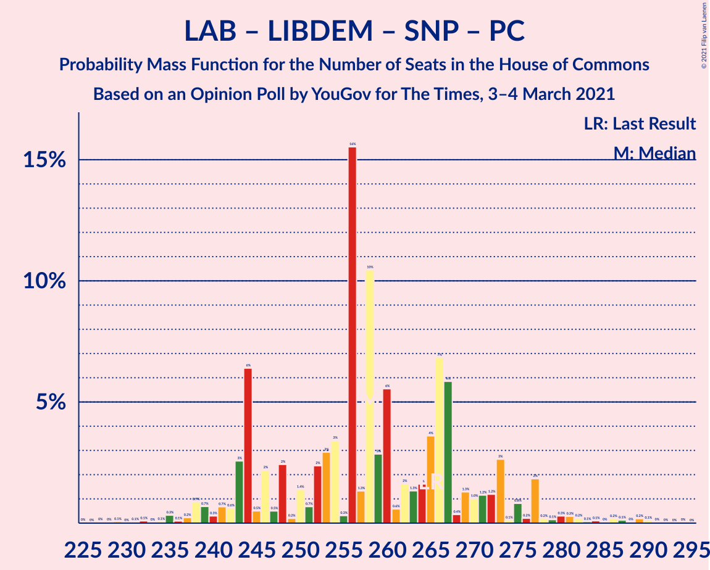

| Number of Seats | Probability | Accumulated | Special Marks |
|:---------------:|:-----------:|:-----------:|:-------------:|
| 225 | 0% | 100% |  |
| 226 | 0% | 99.9% |  |
| 227 | 0% | 99.9% |  |
| 228 | 0% | 99.9% |  |
| 229 | 0.1% | 99.8% |  |
| 230 | 0% | 99.8% |  |
| 231 | 0.1% | 99.8% |  |
| 232 | 0.1% | 99.7% |  |
| 233 | 0% | 99.6% |  |
| 234 | 0.1% | 99.6% |  |
| 235 | 0.3% | 99.5% |  |
| 236 | 0.1% | 99.2% |  |
| 237 | 0.2% | 99.1% |  |
| 238 | 0.9% | 98.9% |  |
| 239 | 0.7% | 98% |  |
| 240 | 0.3% | 97% |  |
| 241 | 0.7% | 97% |  |
| 242 | 0.6% | 96% |  |
| 243 | 3% | 96% |  |
| 244 | 6% | 93% |  |
| 245 | 0.5% | 87% |  |
| 246 | 2% | 86% |  |
| 247 | 0.5% | 84% |  |
| 248 | 2% | 84% |  |
| 249 | 0.2% | 81% |  |
| 250 | 1.4% | 81% |  |
| 251 | 0.7% | 80% |  |
| 252 | 2% | 79% |  |
| 253 | 3% | 77% |  |
| 254 | 3% | 74% |  |
| 255 | 0.3% | 70% |  |
| 256 | 16% | 70% |  |
| 257 | 1.3% | 54% |  |
| 258 | 10% | 53% | Median |
| 259 | 3% | 43% |  |
| 260 | 6% | 40% |  |
| 261 | 0.6% | 34% |  |
| 262 | 2% | 34% |  |
| 263 | 1.3% | 32% |  |
| 264 | 2% | 31% |  |
| 265 | 4% | 29% | Last Result |
| 266 | 7% | 25% |  |
| 267 | 6% | 19% |  |
| 268 | 0.4% | 13% |  |
| 269 | 1.3% | 12% |  |
| 270 | 1.0% | 11% |  |
| 271 | 1.2% | 10% |  |
| 272 | 1.2% | 9% |  |
| 273 | 3% | 8% |  |
| 274 | 0.1% | 5% |  |
| 275 | 0.8% | 5% |  |
| 276 | 0.2% | 4% |  |
| 277 | 2% | 4% |  |
| 278 | 0.2% | 2% |  |
| 279 | 0.1% | 2% |  |
| 280 | 0.3% | 2% |  |
| 281 | 0.3% | 1.5% |  |
| 282 | 0.2% | 1.2% |  |
| 283 | 0.1% | 1.0% |  |
| 284 | 0.1% | 0.9% |  |
| 285 | 0% | 0.8% |  |
| 286 | 0.2% | 0.8% |  |
| 287 | 0.1% | 0.6% |  |
| 288 | 0% | 0.5% |  |
| 289 | 0.2% | 0.4% |  |
| 290 | 0.1% | 0.2% |  |
| 291 | 0% | 0.1% |  |
| 292 | 0% | 0.1% |  |
| 293 | 0% | 0.1% |  |
| 294 | 0% | 0.1% |  |
| 295 | 0% | 0% |  |

### Labour Party – Scottish National Party – Plaid Cymru

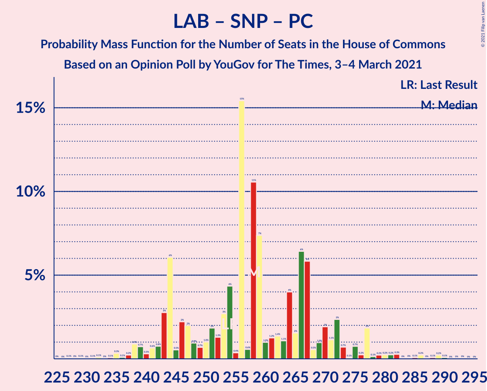

| Number of Seats | Probability | Accumulated | Special Marks |
|:---------------:|:-----------:|:-----------:|:-------------:|
| 225 | 0% | 100% |  |
| 226 | 0% | 99.9% |  |
| 227 | 0.1% | 99.9% |  |
| 228 | 0% | 99.9% |  |
| 229 | 0.1% | 99.8% |  |
| 230 | 0% | 99.8% |  |
| 231 | 0.1% | 99.8% |  |
| 232 | 0.1% | 99.7% |  |
| 233 | 0% | 99.6% |  |
| 234 | 0.1% | 99.6% |  |
| 235 | 0.3% | 99.5% |  |
| 236 | 0.1% | 99.2% |  |
| 237 | 0.2% | 99.1% |  |
| 238 | 0.9% | 98.9% |  |
| 239 | 0.7% | 98% |  |
| 240 | 0.3% | 97% |  |
| 241 | 0.6% | 97% |  |
| 242 | 0.8% | 96% |  |
| 243 | 3% | 96% |  |
| 244 | 6% | 93% |  |
| 245 | 0.5% | 87% |  |
| 246 | 2% | 86% |  |
| 247 | 2% | 84% |  |
| 248 | 0.9% | 82% |  |
| 249 | 0.7% | 81% |  |
| 250 | 1.0% | 80% |  |
| 251 | 2% | 79% |  |
| 252 | 1.3% | 78% |  |
| 253 | 3% | 76% |  |
| 254 | 4% | 74% | Last Result |
| 255 | 0.4% | 69% |  |
| 256 | 15% | 69% |  |
| 257 | 0.6% | 53% |  |
| 258 | 11% | 53% | Median |
| 259 | 7% | 42% |  |
| 260 | 1.0% | 35% |  |
| 261 | 1.2% | 34% |  |
| 262 | 1.4% | 33% |  |
| 263 | 1.1% | 31% |  |
| 264 | 4% | 30% |  |
| 265 | 2% | 26% |  |
| 266 | 6% | 25% |  |
| 267 | 6% | 18% |  |
| 268 | 0.5% | 12% |  |
| 269 | 1.0% | 12% |  |
| 270 | 2% | 11% |  |
| 271 | 1.1% | 9% |  |
| 272 | 2% | 8% |  |
| 273 | 0.7% | 6% |  |
| 274 | 0.1% | 5% |  |
| 275 | 0.7% | 5% |  |
| 276 | 0.2% | 4% |  |
| 277 | 2% | 4% |  |
| 278 | 0.1% | 2% |  |
| 279 | 0.2% | 2% |  |
| 280 | 0.2% | 2% |  |
| 281 | 0.2% | 1.4% |  |
| 282 | 0.3% | 1.1% |  |
| 283 | 0% | 0.9% |  |
| 284 | 0% | 0.8% |  |
| 285 | 0.1% | 0.8% |  |
| 286 | 0.2% | 0.7% |  |
| 287 | 0% | 0.5% |  |
| 288 | 0.1% | 0.5% |  |
| 289 | 0.2% | 0.4% |  |
| 290 | 0.1% | 0.2% |  |
| 291 | 0% | 0.1% |  |
| 292 | 0% | 0.1% |  |
| 293 | 0% | 0.1% |  |
| 294 | 0% | 0% |  |

### Labour Party – Liberal Democrats – Scottish National Party

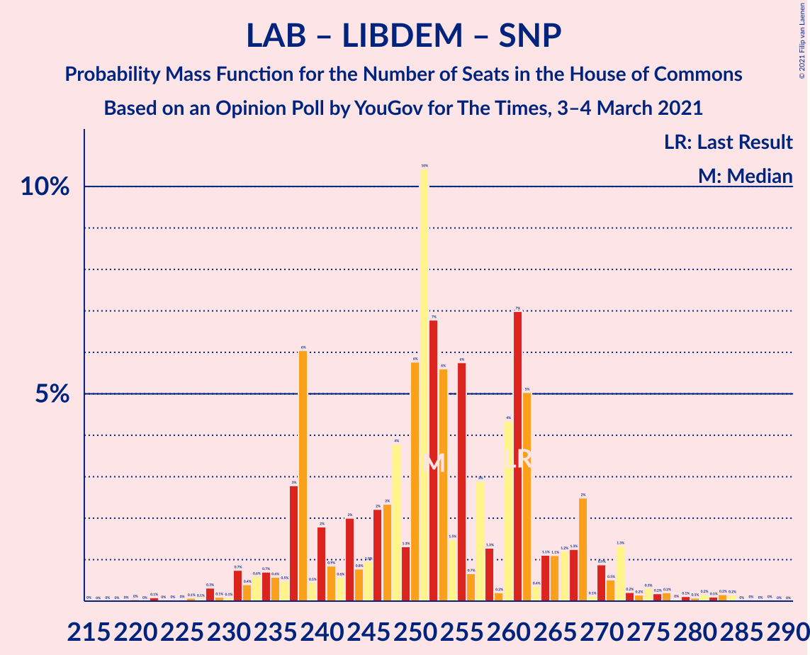

| Number of Seats | Probability | Accumulated | Special Marks |
|:---------------:|:-----------:|:-----------:|:-------------:|
| 219 | 0% | 100% |  |
| 220 | 0% | 99.9% |  |
| 221 | 0% | 99.9% |  |
| 222 | 0.1% | 99.9% |  |
| 223 | 0% | 99.8% |  |
| 224 | 0% | 99.8% |  |
| 225 | 0% | 99.8% |  |
| 226 | 0.1% | 99.7% |  |
| 227 | 0.1% | 99.6% |  |
| 228 | 0.3% | 99.6% |  |
| 229 | 0.1% | 99.3% |  |
| 230 | 0.1% | 99.2% |  |
| 231 | 0.7% | 99.1% |  |
| 232 | 0.4% | 98% |  |
| 233 | 0.6% | 98% |  |
| 234 | 0.7% | 97% |  |
| 235 | 0.6% | 97% |  |
| 236 | 0.5% | 96% |  |
| 237 | 3% | 96% |  |
| 238 | 6% | 93% |  |
| 239 | 0.5% | 87% |  |
| 240 | 2% | 86% |  |
| 241 | 0.9% | 84% |  |
| 242 | 0.6% | 84% |  |
| 243 | 2% | 83% |  |
| 244 | 0.8% | 81% |  |
| 245 | 1.0% | 80% |  |
| 246 | 2% | 79% |  |
| 247 | 2% | 77% |  |
| 248 | 4% | 75% |  |
| 249 | 1.3% | 71% |  |
| 250 | 6% | 70% |  |
| 251 | 10% | 64% |  |
| 252 | 7% | 53% |  |
| 253 | 6% | 47% | Median |
| 254 | 1.5% | 41% |  |
| 255 | 6% | 40% |  |
| 256 | 0.7% | 34% |  |
| 257 | 3% | 33% |  |
| 258 | 1.3% | 30% |  |
| 259 | 0.2% | 29% |  |
| 260 | 4% | 29% |  |
| 261 | 7% | 24% | Last Result |
| 262 | 5% | 17% |  |
| 263 | 0.4% | 12% |  |
| 264 | 1.1% | 12% |  |
| 265 | 1.1% | 11% |  |
| 266 | 1.2% | 10% |  |
| 267 | 1.3% | 9% |  |
| 268 | 2% | 7% |  |
| 269 | 0.1% | 5% |  |
| 270 | 0.9% | 5% |  |
| 271 | 0.5% | 4% |  |
| 272 | 1.3% | 3% |  |
| 273 | 0.2% | 2% |  |
| 274 | 0.2% | 2% |  |
| 275 | 0.3% | 2% |  |
| 276 | 0.2% | 1.3% |  |
| 277 | 0.2% | 1.2% |  |
| 278 | 0% | 0.9% |  |
| 279 | 0.1% | 0.9% |  |
| 280 | 0.1% | 0.8% |  |
| 281 | 0.2% | 0.7% |  |
| 282 | 0.1% | 0.5% |  |
| 283 | 0.2% | 0.4% |  |
| 284 | 0.2% | 0.3% |  |
| 285 | 0% | 0.1% |  |
| 286 | 0% | 0.1% |  |
| 287 | 0% | 0.1% |  |
| 288 | 0% | 0.1% |  |
| 289 | 0% | 0% |  |

### Labour Party – Scottish National Party

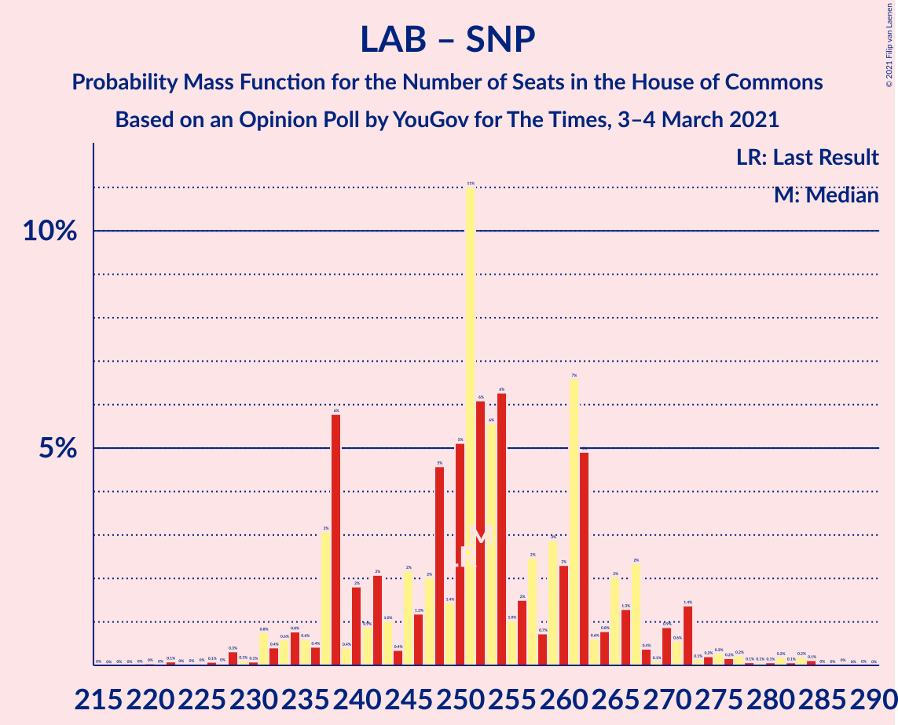

| Number of Seats | Probability | Accumulated | Special Marks |
|:---------------:|:-----------:|:-----------:|:-------------:|
| 219 | 0% | 100% |  |
| 220 | 0% | 99.9% |  |
| 221 | 0% | 99.9% |  |
| 222 | 0.1% | 99.9% |  |
| 223 | 0% | 99.8% |  |
| 224 | 0% | 99.8% |  |
| 225 | 0% | 99.8% |  |
| 226 | 0.1% | 99.7% |  |
| 227 | 0% | 99.6% |  |
| 228 | 0.3% | 99.6% |  |
| 229 | 0.1% | 99.3% |  |
| 230 | 0.1% | 99.2% |  |
| 231 | 0.8% | 99.1% |  |
| 232 | 0.4% | 98% |  |
| 233 | 0.6% | 98% |  |
| 234 | 0.8% | 97% |  |
| 235 | 0.6% | 97% |  |
| 236 | 0.4% | 96% |  |
| 237 | 3% | 96% |  |
| 238 | 6% | 92% |  |
| 239 | 0.4% | 87% |  |
| 240 | 2% | 86% |  |
| 241 | 0.9% | 84% |  |
| 242 | 2% | 84% |  |
| 243 | 1.0% | 81% |  |
| 244 | 0.4% | 80% |  |
| 245 | 2% | 80% |  |
| 246 | 1.2% | 78% |  |
| 247 | 2% | 77% |  |
| 248 | 5% | 75% |  |
| 249 | 1.4% | 70% |  |
| 250 | 5% | 69% | Last Result |
| 251 | 11% | 64% |  |
| 252 | 6% | 53% |  |
| 253 | 6% | 46% | Median |
| 254 | 6% | 41% |  |
| 255 | 1.0% | 35% |  |
| 256 | 2% | 34% |  |
| 257 | 2% | 32% |  |
| 258 | 0.7% | 30% |  |
| 259 | 3% | 29% |  |
| 260 | 2% | 26% |  |
| 261 | 7% | 24% |  |
| 262 | 5% | 17% |  |
| 263 | 0.6% | 12% |  |
| 264 | 0.8% | 12% |  |
| 265 | 2% | 11% |  |
| 266 | 1.3% | 9% |  |
| 267 | 2% | 8% |  |
| 268 | 0.4% | 5% |  |
| 269 | 0.1% | 5% |  |
| 270 | 0.9% | 5% |  |
| 271 | 0.6% | 4% |  |
| 272 | 1.4% | 3% |  |
| 273 | 0.1% | 2% |  |
| 274 | 0.2% | 2% |  |
| 275 | 0.3% | 2% |  |
| 276 | 0.2% | 1.3% |  |
| 277 | 0.2% | 1.1% |  |
| 278 | 0.1% | 0.9% |  |
| 279 | 0.1% | 0.8% |  |
| 280 | 0.1% | 0.7% |  |
| 281 | 0.2% | 0.7% |  |
| 282 | 0.1% | 0.5% |  |
| 283 | 0.2% | 0.4% |  |
| 284 | 0.1% | 0.2% |  |
| 285 | 0% | 0.1% |  |
| 286 | 0% | 0.1% |  |
| 287 | 0% | 0.1% |  |
| 288 | 0% | 0% |  |

### Labour Party – Liberal Democrats – Plaid Cymru

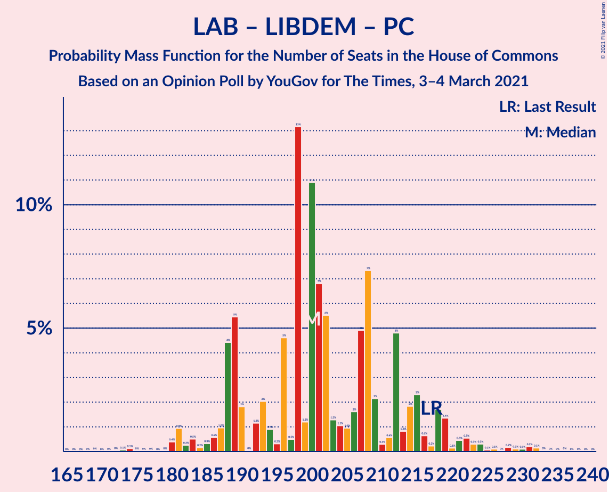

| Number of Seats | Probability | Accumulated | Special Marks |
|:---------------:|:-----------:|:-----------:|:-------------:|
| 169 | 0% | 100% |  |
| 170 | 0% | 99.9% |  |
| 171 | 0% | 99.9% |  |
| 172 | 0% | 99.9% |  |
| 173 | 0.1% | 99.9% |  |
| 174 | 0.1% | 99.8% |  |
| 175 | 0% | 99.7% |  |
| 176 | 0% | 99.7% |  |
| 177 | 0% | 99.7% |  |
| 178 | 0% | 99.6% |  |
| 179 | 0% | 99.6% |  |
| 180 | 0.4% | 99.6% |  |
| 181 | 0.9% | 99.2% |  |
| 182 | 0.3% | 98% |  |
| 183 | 0.5% | 98% |  |
| 184 | 0.2% | 98% |  |
| 185 | 0.3% | 97% |  |
| 186 | 0.6% | 97% |  |
| 187 | 1.0% | 96% |  |
| 188 | 4% | 95% |  |
| 189 | 5% | 91% |  |
| 190 | 2% | 86% |  |
| 191 | 0% | 84% |  |
| 192 | 1.2% | 84% |  |
| 193 | 2% | 83% |  |
| 194 | 0.9% | 81% |  |
| 195 | 0.3% | 80% |  |
| 196 | 5% | 79% |  |
| 197 | 0.5% | 75% |  |
| 198 | 13% | 74% |  |
| 199 | 1.2% | 61% |  |
| 200 | 11% | 60% | Median |
| 201 | 7% | 49% |  |
| 202 | 6% | 42% |  |
| 203 | 1.3% | 37% |  |
| 204 | 1.1% | 35% |  |
| 205 | 1.0% | 34% |  |
| 206 | 2% | 33% |  |
| 207 | 5% | 32% |  |
| 208 | 7% | 27% |  |
| 209 | 2% | 20% |  |
| 210 | 0.3% | 17% |  |
| 211 | 0.6% | 17% |  |
| 212 | 5% | 16% |  |
| 213 | 0.8% | 12% |  |
| 214 | 2% | 11% |  |
| 215 | 2% | 9% |  |
| 216 | 0.6% | 7% |  |
| 217 | 0.2% | 6% | Last Result |
| 218 | 2% | 6% |  |
| 219 | 1.4% | 4% |  |
| 220 | 0.1% | 3% |  |
| 221 | 0.5% | 3% |  |
| 222 | 0.5% | 2% |  |
| 223 | 0.3% | 2% |  |
| 224 | 0.3% | 1.4% |  |
| 225 | 0.1% | 1.0% |  |
| 226 | 0.1% | 1.0% |  |
| 227 | 0% | 0.9% |  |
| 228 | 0.2% | 0.9% |  |
| 229 | 0.1% | 0.7% |  |
| 230 | 0.1% | 0.6% |  |
| 231 | 0.2% | 0.5% |  |
| 232 | 0.1% | 0.3% |  |
| 233 | 0% | 0.1% |  |
| 234 | 0% | 0.1% |  |
| 235 | 0% | 0.1% |  |
| 236 | 0% | 0.1% |  |
| 237 | 0% | 0% |  |

### Labour Party – Plaid Cymru

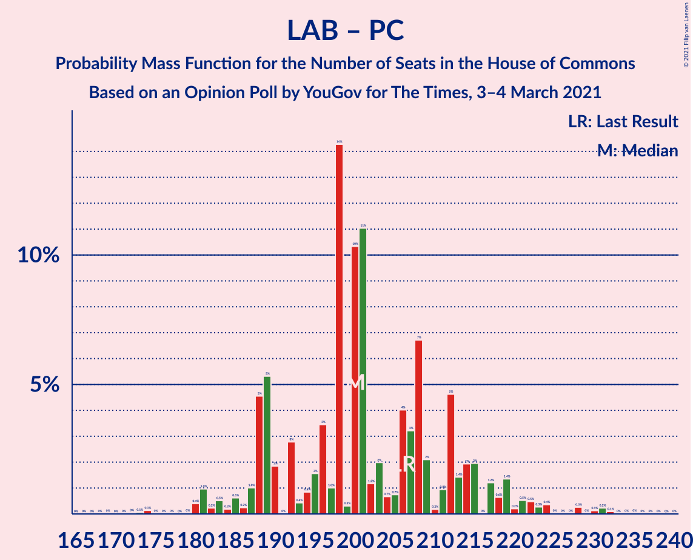

| Number of Seats | Probability | Accumulated | Special Marks |
|:---------------:|:-----------:|:-----------:|:-------------:|
| 169 | 0% | 100% |  |
| 170 | 0% | 99.9% |  |
| 171 | 0% | 99.9% |  |
| 172 | 0% | 99.9% |  |
| 173 | 0.1% | 99.9% |  |
| 174 | 0.1% | 99.8% |  |
| 175 | 0% | 99.7% |  |
| 176 | 0% | 99.7% |  |
| 177 | 0% | 99.7% |  |
| 178 | 0% | 99.6% |  |
| 179 | 0% | 99.6% |  |
| 180 | 0.4% | 99.6% |  |
| 181 | 1.0% | 99.2% |  |
| 182 | 0.2% | 98% |  |
| 183 | 0.5% | 98% |  |
| 184 | 0.2% | 97% |  |
| 185 | 0.6% | 97% |  |
| 186 | 0.2% | 97% |  |
| 187 | 1.0% | 96% |  |
| 188 | 5% | 95% |  |
| 189 | 5% | 91% |  |
| 190 | 2% | 86% |  |
| 191 | 0% | 84% |  |
| 192 | 3% | 84% |  |
| 193 | 0.4% | 81% |  |
| 194 | 0.8% | 80% |  |
| 195 | 2% | 80% |  |
| 196 | 3% | 78% |  |
| 197 | 1.0% | 75% |  |
| 198 | 14% | 74% |  |
| 199 | 0.3% | 59% |  |
| 200 | 10% | 59% | Median |
| 201 | 11% | 49% |  |
| 202 | 1.2% | 38% |  |
| 203 | 2% | 36% |  |
| 204 | 0.7% | 35% |  |
| 205 | 0.7% | 34% |  |
| 206 | 4% | 33% | Last Result |
| 207 | 3% | 29% |  |
| 208 | 7% | 26% |  |
| 209 | 2% | 19% |  |
| 210 | 0.2% | 17% |  |
| 211 | 0.9% | 17% |  |
| 212 | 5% | 16% |  |
| 213 | 1.4% | 11% |  |
| 214 | 2% | 10% |  |
| 215 | 2% | 8% |  |
| 216 | 0% | 6% |  |
| 217 | 1.2% | 6% |  |
| 218 | 0.6% | 5% |  |
| 219 | 1.4% | 4% |  |
| 220 | 0.2% | 3% |  |
| 221 | 0.5% | 3% |  |
| 222 | 0.5% | 2% |  |
| 223 | 0.3% | 2% |  |
| 224 | 0.4% | 1.3% |  |
| 225 | 0% | 0.9% |  |
| 226 | 0% | 0.9% |  |
| 227 | 0% | 0.9% |  |
| 228 | 0.3% | 0.8% |  |
| 229 | 0% | 0.6% |  |
| 230 | 0.1% | 0.6% |  |
| 231 | 0.2% | 0.4% |  |
| 232 | 0.1% | 0.2% |  |
| 233 | 0% | 0.1% |  |
| 234 | 0% | 0.1% |  |
| 235 | 0% | 0.1% |  |
| 236 | 0% | 0% |  |

### Labour Party

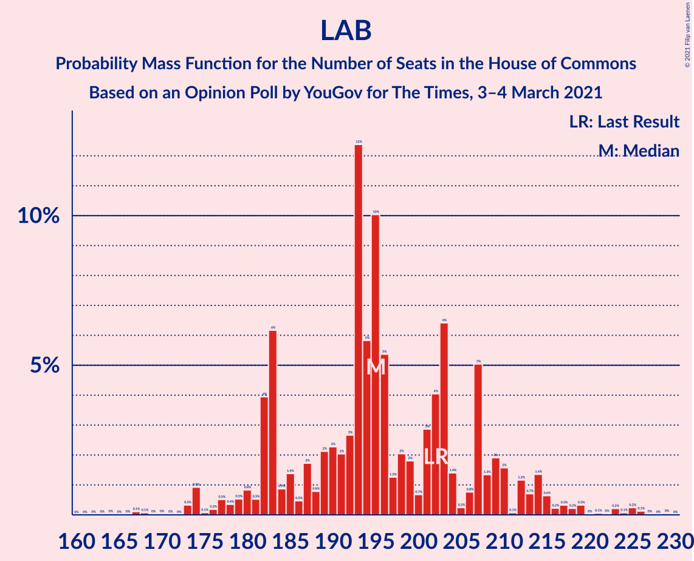

| Number of Seats | Probability | Accumulated | Special Marks |
|:---------------:|:-----------:|:-----------:|:-------------:|
| 164 | 0% | 100% |  |
| 165 | 0% | 99.9% |  |
| 166 | 0% | 99.9% |  |
| 167 | 0.1% | 99.9% |  |
| 168 | 0.1% | 99.8% |  |
| 169 | 0% | 99.7% |  |
| 170 | 0% | 99.7% |  |
| 171 | 0% | 99.7% |  |
| 172 | 0% | 99.6% |  |
| 173 | 0.3% | 99.6% |  |
| 174 | 0.9% | 99.3% |  |
| 175 | 0.1% | 98% |  |
| 176 | 0.2% | 98% |  |
| 177 | 0.5% | 98% |  |
| 178 | 0.4% | 98% |  |
| 179 | 0.5% | 97% |  |
| 180 | 0.8% | 97% |  |
| 181 | 0.5% | 96% |  |
| 182 | 4% | 95% |  |
| 183 | 6% | 91% |  |
| 184 | 0.9% | 85% |  |
| 185 | 1.4% | 84% |  |
| 186 | 0.5% | 83% |  |
| 187 | 2% | 83% |  |
| 188 | 0.8% | 81% |  |
| 189 | 2% | 80% |  |
| 190 | 2% | 78% |  |
| 191 | 2% | 76% |  |
| 192 | 3% | 74% |  |
| 193 | 12% | 71% |  |
| 194 | 6% | 59% |  |
| 195 | 10% | 53% | Median |
| 196 | 5% | 43% |  |
| 197 | 1.3% | 37% |  |
| 198 | 2% | 36% |  |
| 199 | 2% | 34% |  |
| 200 | 0.7% | 32% |  |
| 201 | 3% | 32% |  |
| 202 | 4% | 29% | Last Result |
| 203 | 6% | 25% |  |
| 204 | 1.4% | 18% |  |
| 205 | 0.2% | 17% |  |
| 206 | 0.8% | 17% |  |
| 207 | 5% | 16% |  |
| 208 | 1.3% | 11% |  |
| 209 | 2% | 9% |  |
| 210 | 2% | 7% |  |
| 211 | 0.1% | 6% |  |
| 212 | 1.2% | 6% |  |
| 213 | 0.7% | 5% |  |
| 214 | 1.4% | 4% |  |
| 215 | 0.6% | 3% |  |
| 216 | 0.2% | 2% |  |
| 217 | 0.3% | 2% |  |
| 218 | 0.2% | 1.4% |  |
| 219 | 0.3% | 1.2% |  |
| 220 | 0% | 0.9% |  |
| 221 | 0.1% | 0.9% |  |
| 222 | 0% | 0.8% |  |
| 223 | 0.2% | 0.8% |  |
| 224 | 0.1% | 0.6% |  |
| 225 | 0.2% | 0.5% |  |
| 226 | 0.1% | 0.3% |  |
| 227 | 0% | 0.1% |  |
| 228 | 0% | 0.1% |  |
| 229 | 0% | 0.1% |  |
| 230 | 0% | 0% |  |

### Labour Party – Liberal Democrats

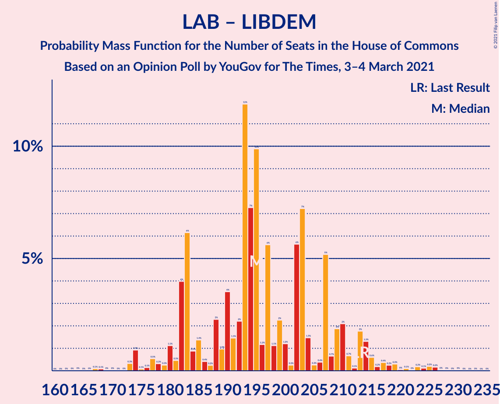

| Number of Seats | Probability | Accumulated | Special Marks |
|:---------------:|:-----------:|:-----------:|:-------------:|
| 164 | 0% | 100% |  |
| 165 | 0% | 99.9% |  |
| 166 | 0% | 99.9% |  |
| 167 | 0.1% | 99.9% |  |
| 168 | 0.1% | 99.8% |  |
| 169 | 0% | 99.7% |  |
| 170 | 0% | 99.7% |  |
| 171 | 0% | 99.7% |  |
| 172 | 0% | 99.6% |  |
| 173 | 0.3% | 99.6% |  |
| 174 | 0.9% | 99.3% |  |
| 175 | 0.1% | 98% |  |
| 176 | 0.1% | 98% |  |
| 177 | 0.5% | 98% |  |
| 178 | 0.3% | 98% |  |
| 179 | 0.3% | 97% |  |
| 180 | 1.1% | 97% |  |
| 181 | 0.5% | 96% |  |
| 182 | 4% | 95% |  |
| 183 | 6% | 91% |  |
| 184 | 0.9% | 85% |  |
| 185 | 1.4% | 84% |  |
| 186 | 0.4% | 83% |  |
| 187 | 0.2% | 83% |  |
| 188 | 2% | 82% |  |
| 189 | 1.0% | 80% |  |
| 190 | 4% | 79% |  |
| 191 | 1.5% | 76% |  |
| 192 | 2% | 74% |  |
| 193 | 12% | 72% |  |
| 194 | 7% | 60% |  |
| 195 | 10% | 53% | Median |
| 196 | 1.2% | 43% |  |
| 197 | 6% | 42% |  |
| 198 | 1.1% | 36% |  |
| 199 | 2% | 35% |  |
| 200 | 1.2% | 33% |  |
| 201 | 0.3% | 32% |  |
| 202 | 6% | 31% |  |
| 203 | 7% | 26% |  |
| 204 | 1.5% | 18% |  |
| 205 | 0.3% | 17% |  |
| 206 | 0.4% | 17% |  |
| 207 | 5% | 16% |  |
| 208 | 0.7% | 11% |  |
| 209 | 2% | 11% |  |
| 210 | 2% | 9% |  |
| 211 | 0.7% | 7% |  |
| 212 | 0.1% | 6% |  |
| 213 | 2% | 6% | Last Result |
| 214 | 1.3% | 4% |  |
| 215 | 0.6% | 3% |  |
| 216 | 0.2% | 2% |  |
| 217 | 0.4% | 2% |  |
| 218 | 0.2% | 2% |  |
| 219 | 0.3% | 1.3% |  |
| 220 | 0% | 1.0% |  |
| 221 | 0.1% | 1.0% |  |
| 222 | 0% | 0.9% |  |
| 223 | 0.2% | 0.8% |  |
| 224 | 0.1% | 0.6% |  |
| 225 | 0.2% | 0.5% |  |
| 226 | 0.2% | 0.3% |  |
| 227 | 0% | 0.2% |  |
| 228 | 0% | 0.1% |  |
| 229 | 0% | 0.1% |  |
| 230 | 0% | 0.1% |  |
| 231 | 0% | 0% |  |

## Technical Information

### Opinion Poll

+ **Polling firm:** YouGov
+ **Commissioner(s):** The Times
+ **Fieldwork period:** 3–4 March 2021

### Calculations

+ **Sample size:** 1660
+ **Simulations done:** 131,072
+ **Error estimate:** 0.73%

