# Opinion Poll by YouGov for The Times, 27–28 May 2021

<a href="#voting-intentions">Voting Intentions</a> | <a href="#seats">Seats</a> | <a href="#coalitions">Coalitions</a> | <a href="#technical-information">Technical Information</a>

## Voting Intentions

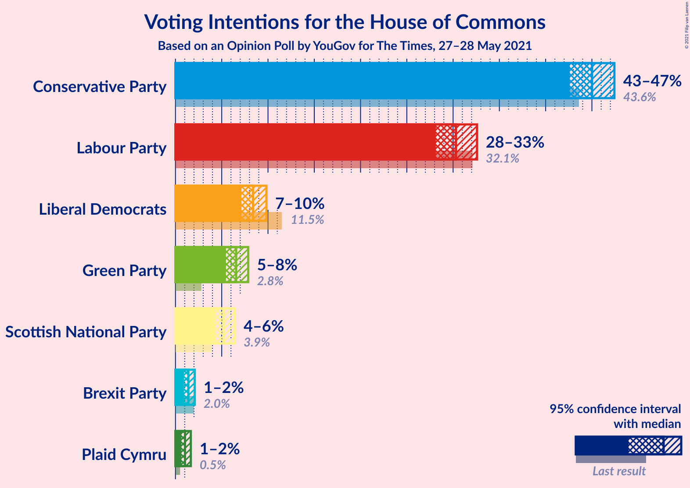

### Confidence Intervals

| Party | Last Result | Poll Result | 80% Confidence Interval | 90% Confidence Interval | 95% Confidence Interval | 99% Confidence Interval |
|:-----:|:-----------:|:-----------:|:-----------------------:|:-----------------------:|:-----------------------:|:-----------------------:|
| Conservative Party | 43.6% | 45.0% | 43.5–46.6% |43.0–47.1% |42.6–47.4% |41.9–48.2% |
| Labour Party | 32.1% | 30.3% | 28.9–31.8% |28.5–32.2% |28.1–32.6% |27.5–33.3% |
| Liberal Democrats | 11.5% | 8.4% | 7.6–9.3% |7.3–9.6% |7.1–9.8% |6.8–10.3% |
| Green Party | 2.8% | 6.6% | 5.8–7.4% |5.6–7.7% |5.5–7.9% |5.1–8.3% |
| Scottish National Party | 3.9% | 5.2% | 4.6–6.0% |4.4–6.2% |4.2–6.4% |4.0–6.8% |
| Brexit Party | 2.0% | 1.4% | 1.1–1.9% |1.0–2.0% |0.9–2.1% |0.8–2.3% |
| Plaid Cymru | 0.5% | 1.0% | 0.8–1.4% |0.7–1.6% |0.6–1.7% |0.5–1.9% |

*Note:* The poll result column reflects the actual value used in the calculations. Published results may vary slightly, and in addition be rounded to fewer digits.

## Seats

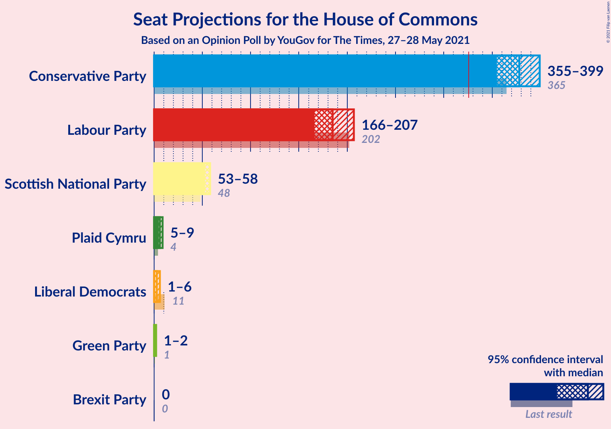

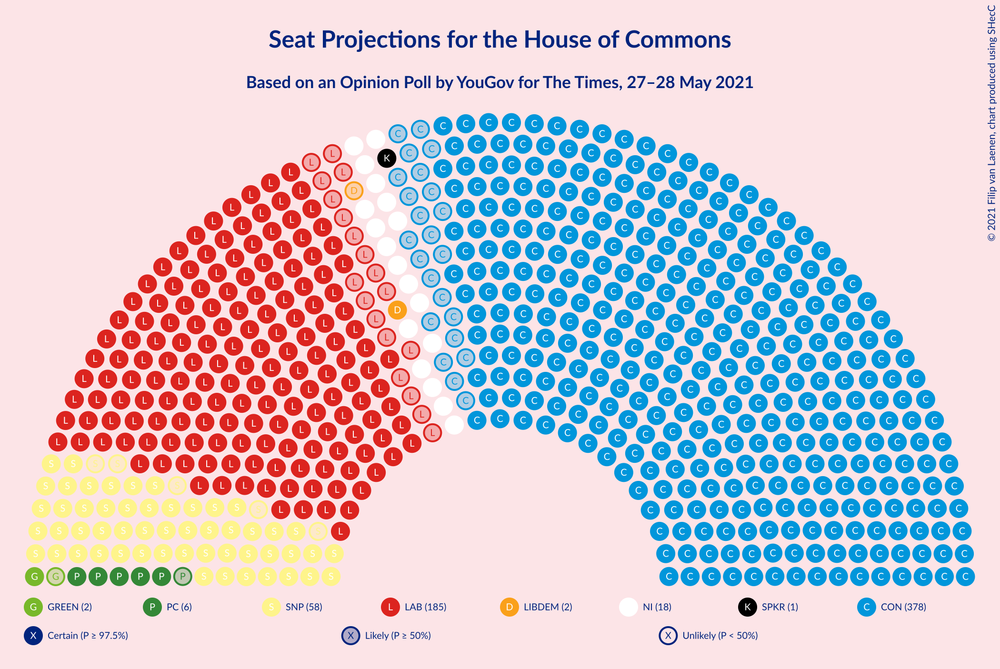

### Confidence Intervals

| Party | Last Result | Median | 80% Confidence Interval | 90% Confidence Interval | 95% Confidence Interval | 99% Confidence Interval |
|:-----:|:-----------:|:------:|:-----------------------:|:-----------------------:|:-----------------------:|:-----------------------:|
| <a href="#conservative-party">Conservative Party</a> | 365 | 378 | 361–392 |360–399 |355–399 |346–412 |
| <a href="#labour-party">Labour Party</a> | 202 | 185 | 174–199 |167–202 |166–207 |154–215 |
| <a href="#liberal-democrats">Liberal Democrats</a> | 11 | 3 | 2–6 |2–6 |1–6 |0–7 |
| <a href="#green-party">Green Party</a> | 1 | 2 | 1–2 |1–2 |1–2 |1–2 |
| <a href="#scottish-national-party">Scottish National Party</a> | 48 | 58 | 55–58 |55–58 |53–58 |51–59 |
| <a href="#brexit-party">Brexit Party</a> | 0 | 0 | 0 |0 |0 |0 |
| <a href="#plaid-cymru">Plaid Cymru</a> | 4 | 6 | 5–7 |5–7 |5–9 |5–10 |

### Conservative Party

*For a full overview of the results for this party, see the [Conservative Party](party-conservativeparty.html) page.*

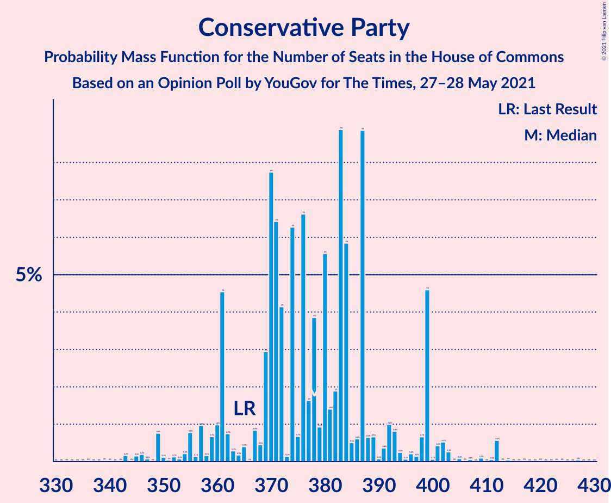

| Number of Seats | Probability | Accumulated | Special Marks |
|:---------------:|:-----------:|:-----------:|:-------------:|
| 339 | 0% | 100% |  |
| 340 | 0% | 99.9% |  |
| 341 | 0% | 99.9% |  |
| 342 | 0% | 99.9% |  |
| 343 | 0.2% | 99.9% |  |
| 344 | 0% | 99.7% |  |
| 345 | 0.2% | 99.7% |  |
| 346 | 0.2% | 99.6% |  |
| 347 | 0.1% | 99.4% |  |
| 348 | 0% | 99.3% |  |
| 349 | 0.8% | 99.3% |  |
| 350 | 0.1% | 98.5% |  |
| 351 | 0% | 98% |  |
| 352 | 0.1% | 98% |  |
| 353 | 0.1% | 98% |  |
| 354 | 0.2% | 98% |  |
| 355 | 0.8% | 98% |  |
| 356 | 0.1% | 97% |  |
| 357 | 1.0% | 97% |  |
| 358 | 0.2% | 96% |  |
| 359 | 0.7% | 96% |  |
| 360 | 1.0% | 95% |  |
| 361 | 5% | 94% |  |
| 362 | 0.7% | 90% |  |
| 363 | 0.3% | 89% |  |
| 364 | 0.2% | 89% |  |
| 365 | 0.4% | 89% | Last Result |
| 366 | 0% | 88% |  |
| 367 | 0.8% | 88% |  |
| 368 | 0.5% | 87% |  |
| 369 | 3% | 87% |  |
| 370 | 8% | 84% |  |
| 371 | 6% | 76% |  |
| 372 | 4% | 70% |  |
| 373 | 0.1% | 66% |  |
| 374 | 6% | 65% |  |
| 375 | 0.7% | 59% |  |
| 376 | 7% | 58% |  |
| 377 | 2% | 52% |  |
| 378 | 4% | 50% | Median |
| 379 | 0.9% | 46% |  |
| 380 | 6% | 45% |  |
| 381 | 1.4% | 40% |  |
| 382 | 2% | 38% |  |
| 383 | 9% | 37% |  |
| 384 | 6% | 28% |  |
| 385 | 0.5% | 22% |  |
| 386 | 0.6% | 21% |  |
| 387 | 9% | 21% |  |
| 388 | 0.6% | 12% |  |
| 389 | 0.7% | 11% |  |
| 390 | 0.1% | 11% |  |
| 391 | 0.4% | 10% |  |
| 392 | 1.0% | 10% |  |
| 393 | 0.8% | 9% |  |
| 394 | 0.2% | 8% |  |
| 395 | 0.1% | 8% |  |
| 396 | 0.2% | 8% |  |
| 397 | 0.1% | 8% |  |
| 398 | 0.7% | 8% |  |
| 399 | 5% | 7% |  |
| 400 | 0.1% | 2% |  |
| 401 | 0.4% | 2% |  |
| 402 | 0.5% | 2% |  |
| 403 | 0.3% | 1.4% |  |
| 404 | 0% | 1.1% |  |
| 405 | 0.1% | 1.1% |  |
| 406 | 0% | 1.0% |  |
| 407 | 0.1% | 1.0% |  |
| 408 | 0% | 0.9% |  |
| 409 | 0.1% | 0.9% |  |
| 410 | 0% | 0.8% |  |
| 411 | 0.1% | 0.8% |  |
| 412 | 0.6% | 0.8% |  |
| 413 | 0% | 0.2% |  |
| 414 | 0% | 0.2% |  |
| 415 | 0% | 0.1% |  |
| 416 | 0% | 0.1% |  |
| 417 | 0% | 0.1% |  |
| 418 | 0% | 0.1% |  |
| 419 | 0% | 0.1% |  |
| 420 | 0% | 0.1% |  |
| 421 | 0% | 0.1% |  |
| 422 | 0% | 0.1% |  |
| 423 | 0% | 0.1% |  |
| 424 | 0% | 0.1% |  |
| 425 | 0% | 0.1% |  |
| 426 | 0% | 0.1% |  |
| 427 | 0% | 0.1% |  |
| 428 | 0% | 0% |  |

### Labour Party

*For a full overview of the results for this party, see the [Labour Party](party-labourparty.html) page.*

| Number of Seats | Probability | Accumulated | Special Marks |
|:---------------:|:-----------:|:-----------:|:-------------:|
| 138 | 0.1% | 100% |  |
| 139 | 0% | 99.9% |  |
| 140 | 0% | 99.9% |  |
| 141 | 0% | 99.9% |  |
| 142 | 0% | 99.9% |  |
| 143 | 0% | 99.9% |  |
| 144 | 0% | 99.9% |  |
| 145 | 0% | 99.9% |  |
| 146 | 0% | 99.9% |  |
| 147 | 0% | 99.9% |  |
| 148 | 0% | 99.9% |  |
| 149 | 0% | 99.9% |  |
| 150 | 0% | 99.9% |  |
| 151 | 0.1% | 99.8% |  |
| 152 | 0% | 99.7% |  |
| 153 | 0% | 99.7% |  |
| 154 | 0.6% | 99.7% |  |
| 155 | 0% | 99.1% |  |
| 156 | 0% | 99.1% |  |
| 157 | 0% | 99.1% |  |
| 158 | 0% | 99.1% |  |
| 159 | 0.1% | 99.0% |  |
| 160 | 0.1% | 98.9% |  |
| 161 | 0.6% | 98.9% |  |
| 162 | 0.4% | 98% |  |
| 163 | 0.1% | 98% |  |
| 164 | 0% | 98% |  |
| 165 | 0.3% | 98% |  |
| 166 | 0.2% | 98% |  |
| 167 | 5% | 97% |  |
| 168 | 0.8% | 92% |  |
| 169 | 0.3% | 91% |  |
| 170 | 0.2% | 91% |  |
| 171 | 0% | 91% |  |
| 172 | 0.2% | 91% |  |
| 173 | 0.3% | 90% |  |
| 174 | 0.6% | 90% |  |
| 175 | 2% | 89% |  |
| 176 | 7% | 87% |  |
| 177 | 0.2% | 80% |  |
| 178 | 0.6% | 80% |  |
| 179 | 1.4% | 79% |  |
| 180 | 4% | 78% |  |
| 181 | 5% | 74% |  |
| 182 | 14% | 68% |  |
| 183 | 3% | 54% |  |
| 184 | 0.6% | 51% |  |
| 185 | 4% | 50% | Median |
| 186 | 3% | 46% |  |
| 187 | 1.1% | 43% |  |
| 188 | 5% | 42% |  |
| 189 | 5% | 37% |  |
| 190 | 3% | 32% |  |
| 191 | 1.0% | 29% |  |
| 192 | 6% | 28% |  |
| 193 | 4% | 22% |  |
| 194 | 5% | 19% |  |
| 195 | 0.8% | 13% |  |
| 196 | 0.3% | 12% |  |
| 197 | 0.7% | 12% |  |
| 198 | 0.2% | 11% |  |
| 199 | 1.4% | 11% |  |
| 200 | 5% | 10% |  |
| 201 | 0% | 5% |  |
| 202 | 1.0% | 5% | Last Result |
| 203 | 0% | 4% |  |
| 204 | 0.3% | 4% |  |
| 205 | 0.2% | 4% |  |
| 206 | 0.9% | 4% |  |
| 207 | 0.8% | 3% |  |
| 208 | 0.1% | 2% |  |
| 209 | 0.1% | 2% |  |
| 210 | 0.1% | 2% |  |
| 211 | 0% | 2% |  |
| 212 | 0.7% | 2% |  |
| 213 | 0.1% | 0.8% |  |
| 214 | 0.1% | 0.8% |  |
| 215 | 0.2% | 0.6% |  |
| 216 | 0% | 0.4% |  |
| 217 | 0.2% | 0.4% |  |
| 218 | 0% | 0.2% |  |
| 219 | 0% | 0.2% |  |
| 220 | 0% | 0.1% |  |
| 221 | 0% | 0.1% |  |
| 222 | 0% | 0.1% |  |
| 223 | 0% | 0.1% |  |
| 224 | 0% | 0.1% |  |
| 225 | 0% | 0% |  |

### Liberal Democrats

*For a full overview of the results for this party, see the [Liberal Democrats](party-liberaldemocrats.html) page.*

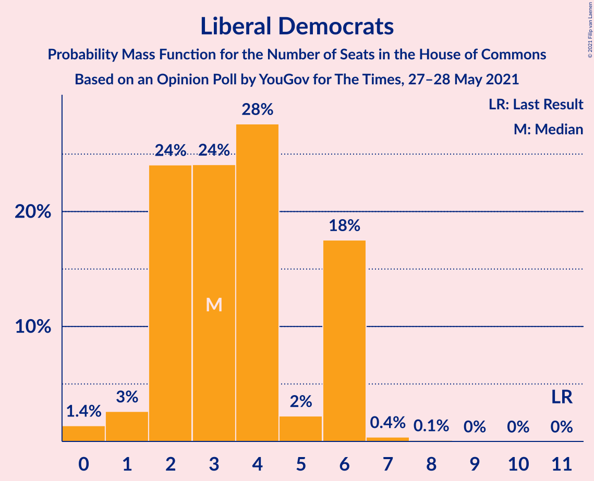

| Number of Seats | Probability | Accumulated | Special Marks |
|:---------------:|:-----------:|:-----------:|:-------------:|
| 0 | 1.4% | 100% |  |
| 1 | 3% | 98.6% |  |
| 2 | 24% | 96% |  |
| 3 | 24% | 72% | Median |
| 4 | 28% | 48% |  |
| 5 | 2% | 20% |  |
| 6 | 18% | 18% |  |
| 7 | 0.4% | 0.5% |  |
| 8 | 0.1% | 0.1% |  |
| 9 | 0% | 0% |  |
| 10 | 0% | 0% |  |
| 11 | 0% | 0% | Last Result |

### Green Party

*For a full overview of the results for this party, see the [Green Party](party-greenparty.html) page.*

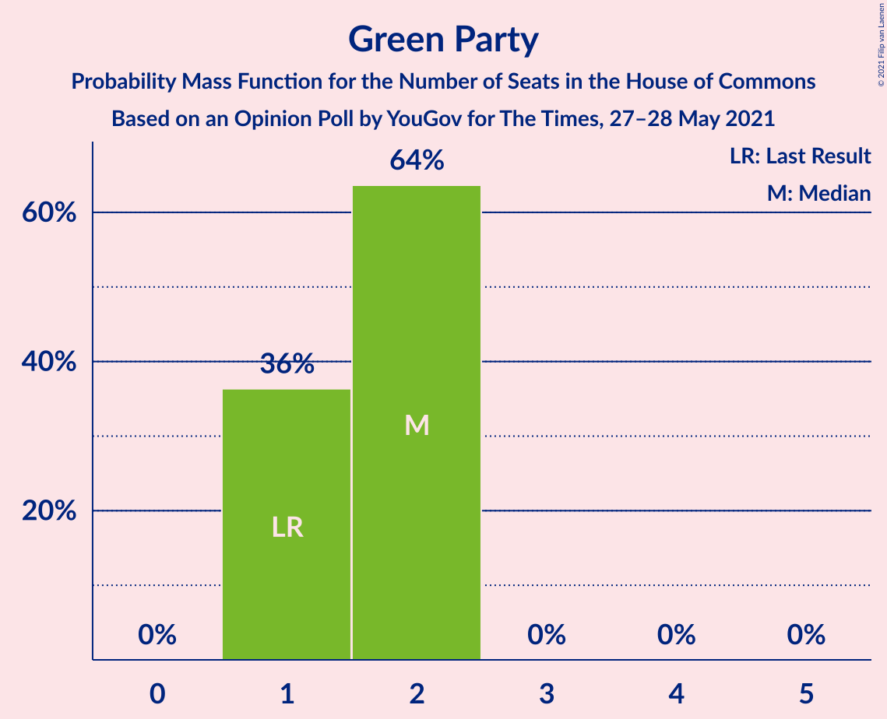

| Number of Seats | Probability | Accumulated | Special Marks |
|:---------------:|:-----------:|:-----------:|:-------------:|
| 1 | 36% | 100% | Last Result |
| 2 | 64% | 64% | Median |
| 3 | 0% | 0% |  |

### Scottish National Party

*For a full overview of the results for this party, see the [Scottish National Party](party-scottishnationalparty.html) page.*

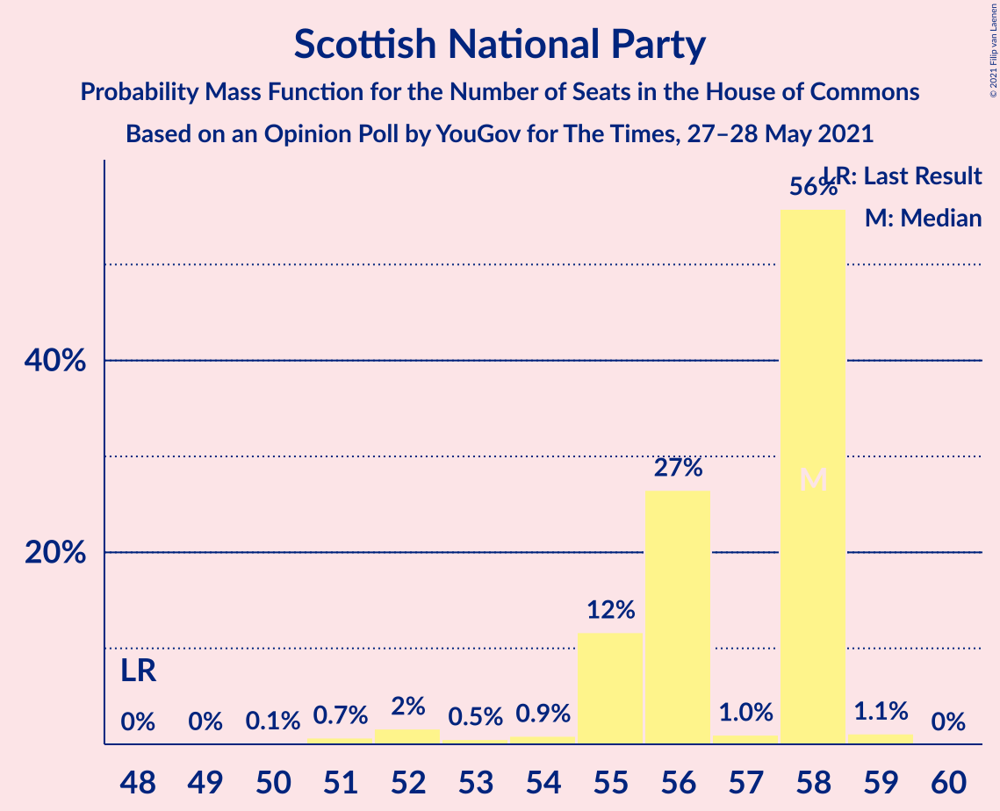

| Number of Seats | Probability | Accumulated | Special Marks |
|:---------------:|:-----------:|:-----------:|:-------------:|
| 48 | 0% | 100% | Last Result |
| 49 | 0% | 100% |  |
| 50 | 0.1% | 100% |  |
| 51 | 0.7% | 99.8% |  |
| 52 | 2% | 99.1% |  |
| 53 | 0.5% | 98% |  |
| 54 | 0.9% | 97% |  |
| 55 | 12% | 96% |  |
| 56 | 27% | 84% |  |
| 57 | 1.0% | 58% |  |
| 58 | 56% | 57% | Median |
| 59 | 1.1% | 1.1% |  |
| 60 | 0% | 0% |  |

### Brexit Party

*For a full overview of the results for this party, see the [Brexit Party](party-brexitparty.html) page.*

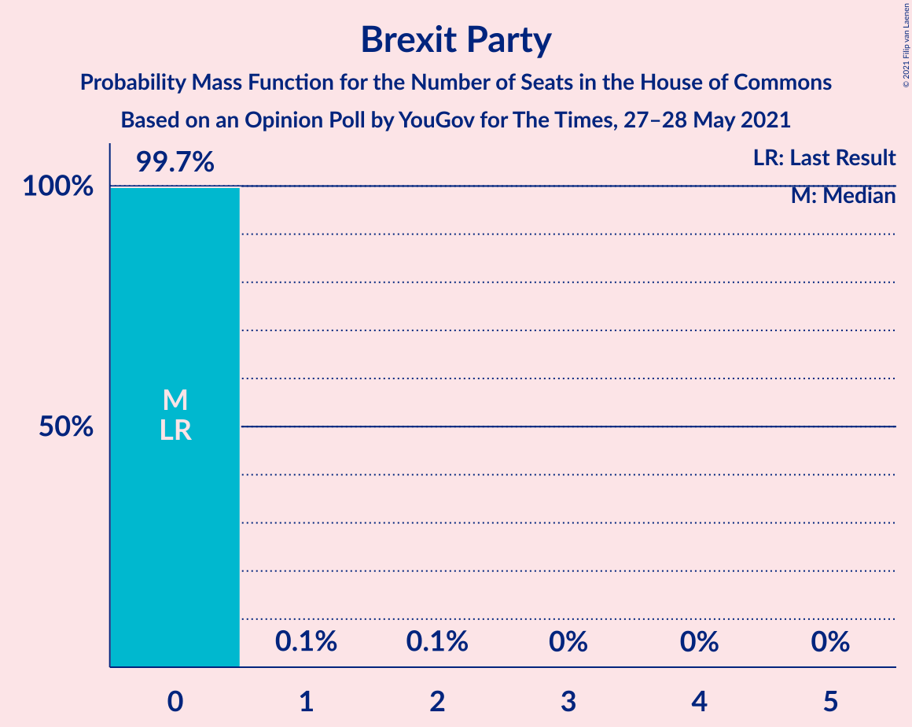

| Number of Seats | Probability | Accumulated | Special Marks |
|:---------------:|:-----------:|:-----------:|:-------------:|
| 0 | 99.7% | 100% | Last Result, Median |
| 1 | 0.1% | 0.3% |  |
| 2 | 0.1% | 0.1% |  |
| 3 | 0% | 0% |  |

### Plaid Cymru

*For a full overview of the results for this party, see the [Plaid Cymru](party-plaidcymru.html) page.*

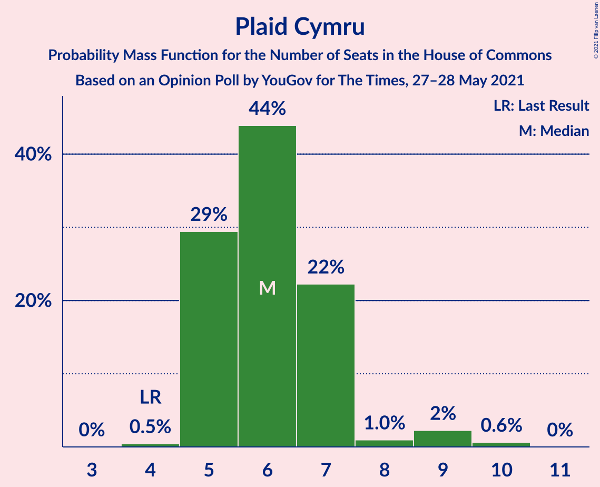

| Number of Seats | Probability | Accumulated | Special Marks |
|:---------------:|:-----------:|:-----------:|:-------------:|
| 4 | 0.5% | 100% | Last Result |
| 5 | 29% | 99.5% |  |
| 6 | 44% | 70% | Median |
| 7 | 22% | 26% |  |
| 8 | 1.0% | 4% |  |
| 9 | 2% | 3% |  |
| 10 | 0.6% | 0.6% |  |
| 11 | 0% | 0% |  |

## Coalitions

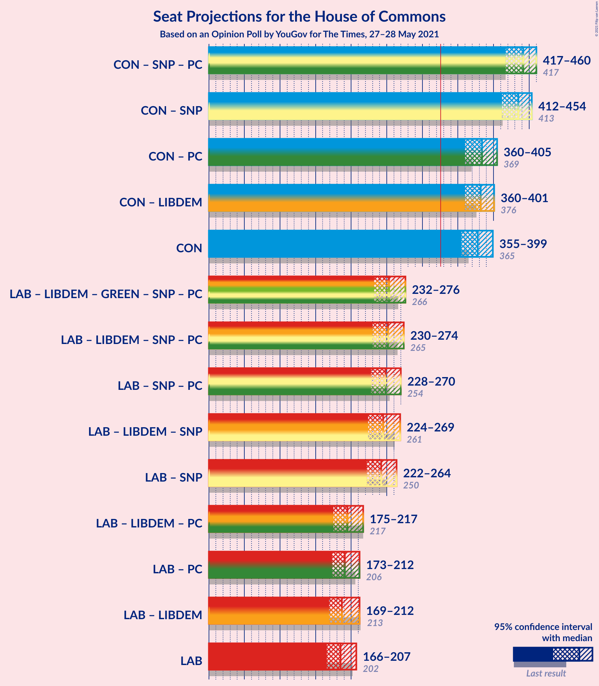

### Confidence Intervals

| Coalition | Last Result | Median | Majority? | 80% Confidence Interval | 90% Confidence Interval | 95% Confidence Interval | 99% Confidence Interval |
|:---------:|:-----------:|:------:|:---------:|:-----------------------:|:-----------------------:|:-----------------------:|:-----------------------:|
| Conservative Party – Scottish National Party – Plaid Cymru | 417 | 442 | 100% | 425–454 | 424–460 | 417–460 | 410–473 |
| Conservative Party – Scottish National Party | 413 | 435 | 100% | 419–447 | 418–454 | 412–454 | 404–467 |
| Conservative Party – Plaid Cymru | 369 | 384 | 100% | 367–399 | 367–405 | 360–405 | 352–418 |
| Conservative Party – Liberal Democrats | 376 | 382 | 100% | 366–394 | 365–401 | 360–401 | 351–414 |
| Conservative Party | 365 | 378 | 100% | 361–392 | 360–399 | 355–399 | 346–412 |
| Labour Party – Liberal Democrats – Green Party – Scottish National Party – Plaid Cymru | 266 | 253 | 0% | 239–270 | 232–271 | 232–276 | 219–285 |
| Labour Party – Liberal Democrats – Scottish National Party – Plaid Cymru | 265 | 252 | 0% | 237–268 | 230–270 | 230–274 | 217–284 |
| Labour Party – Scottish National Party – Plaid Cymru | 254 | 248 | 0% | 235–264 | 228–264 | 228–270 | 215–278 |
| Labour Party – Liberal Democrats – Scottish National Party | 261 | 245 | 0% | 231–262 | 224–263 | 224–269 | 211–278 |
| Labour Party – Scottish National Party | 250 | 242 | 0% | 229–257 | 222–258 | 222–264 | 209–273 |
| Labour Party – Liberal Democrats – Plaid Cymru | 217 | 195 | 0% | 183–210 | 175–212 | 175–217 | 162–226 |
| Labour Party – Plaid Cymru | 206 | 191 | 0% | 181–206 | 173–207 | 173–212 | 160–221 |
| Labour Party – Liberal Democrats | 213 | 187 | 0% | 176–204 | 169–205 | 169–212 | 156–220 |
| Labour Party | 202 | 185 | 0% | 174–199 | 167–202 | 166–207 | 154–215 |

### Conservative Party – Scottish National Party – Plaid Cymru

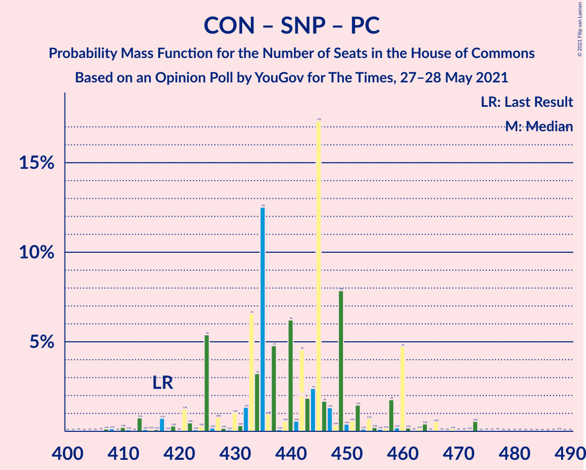

| Number of Seats | Probability | Accumulated | Special Marks |
|:---------------:|:-----------:|:-----------:|:-------------:|
| 402 | 0% | 100% |  |
| 403 | 0% | 99.9% |  |
| 404 | 0% | 99.9% |  |
| 405 | 0% | 99.9% |  |
| 406 | 0% | 99.9% |  |
| 407 | 0.1% | 99.8% |  |
| 408 | 0.1% | 99.7% |  |
| 409 | 0% | 99.6% |  |
| 410 | 0.2% | 99.6% |  |
| 411 | 0.1% | 99.3% |  |
| 412 | 0% | 99.3% |  |
| 413 | 0.7% | 99.2% |  |
| 414 | 0.1% | 98% |  |
| 415 | 0.1% | 98% |  |
| 416 | 0.1% | 98% |  |
| 417 | 0.7% | 98% | Last Result |
| 418 | 0.1% | 97% |  |
| 419 | 0.3% | 97% |  |
| 420 | 0% | 97% |  |
| 421 | 1.2% | 97% |  |
| 422 | 0.5% | 96% |  |
| 423 | 0.1% | 95% |  |
| 424 | 0.3% | 95% |  |
| 425 | 5% | 95% |  |
| 426 | 0.2% | 90% |  |
| 427 | 0.8% | 89% |  |
| 428 | 0.2% | 89% |  |
| 429 | 0.1% | 88% |  |
| 430 | 1.0% | 88% |  |
| 431 | 0.3% | 87% |  |
| 432 | 1.3% | 87% |  |
| 433 | 7% | 86% |  |
| 434 | 3% | 79% |  |
| 435 | 13% | 76% |  |
| 436 | 1.0% | 63% |  |
| 437 | 5% | 62% |  |
| 438 | 0.1% | 58% |  |
| 439 | 0.6% | 58% |  |
| 440 | 6% | 57% |  |
| 441 | 0.6% | 51% |  |
| 442 | 5% | 50% | Median |
| 443 | 2% | 46% |  |
| 444 | 2% | 44% |  |
| 445 | 17% | 41% |  |
| 446 | 2% | 24% |  |
| 447 | 1.3% | 22% |  |
| 448 | 0.3% | 21% |  |
| 449 | 8% | 21% |  |
| 450 | 0.4% | 13% |  |
| 451 | 0.6% | 12% |  |
| 452 | 1.5% | 12% |  |
| 453 | 0.1% | 10% |  |
| 454 | 0.7% | 10% |  |
| 455 | 0.2% | 10% |  |
| 456 | 0.1% | 9% |  |
| 457 | 0.1% | 9% |  |
| 458 | 2% | 9% |  |
| 459 | 0.2% | 7% |  |
| 460 | 5% | 7% |  |
| 461 | 0.2% | 2% |  |
| 462 | 0% | 2% |  |
| 463 | 0.1% | 2% |  |
| 464 | 0.4% | 2% |  |
| 465 | 0% | 2% |  |
| 466 | 0.5% | 2% |  |
| 467 | 0% | 1.1% |  |
| 468 | 0% | 1.1% |  |
| 469 | 0.1% | 1.1% |  |
| 470 | 0% | 0.9% |  |
| 471 | 0% | 0.9% |  |
| 472 | 0.1% | 0.9% |  |
| 473 | 0.6% | 0.8% |  |
| 474 | 0% | 0.2% |  |
| 475 | 0% | 0.2% |  |
| 476 | 0% | 0.2% |  |
| 477 | 0% | 0.2% |  |
| 478 | 0% | 0.1% |  |
| 479 | 0% | 0.1% |  |
| 480 | 0% | 0.1% |  |
| 481 | 0% | 0.1% |  |
| 482 | 0% | 0.1% |  |
| 483 | 0% | 0.1% |  |
| 484 | 0% | 0.1% |  |
| 485 | 0% | 0.1% |  |
| 486 | 0% | 0.1% |  |
| 487 | 0% | 0.1% |  |
| 488 | 0.1% | 0.1% |  |
| 489 | 0% | 0% |  |

### Conservative Party – Scottish National Party

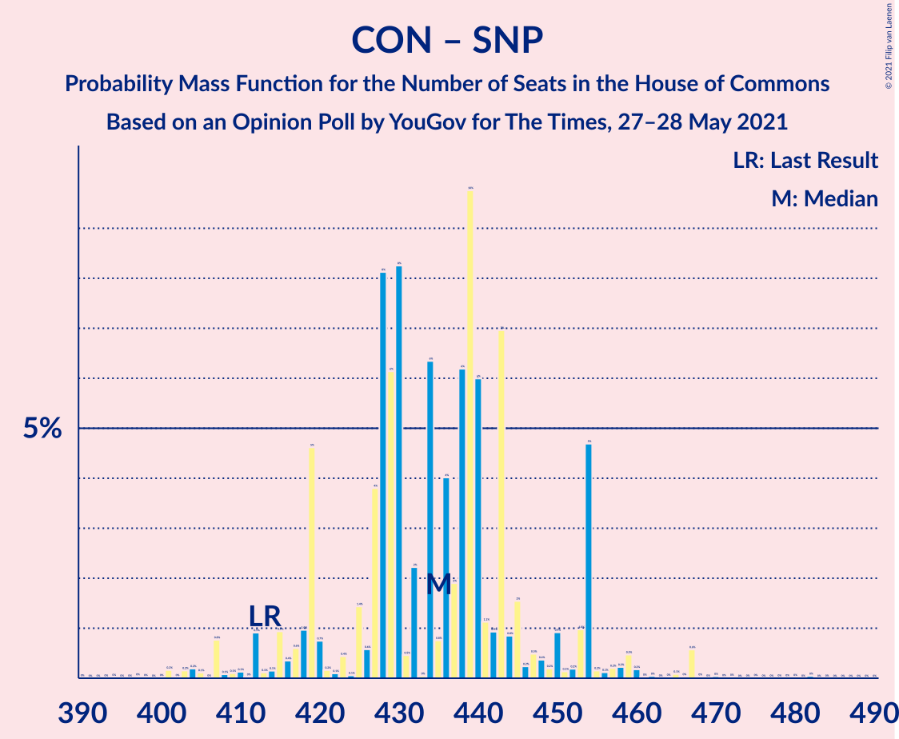

| Number of Seats | Probability | Accumulated | Special Marks |
|:---------------:|:-----------:|:-----------:|:-------------:|
| 397 | 0% | 100% |  |
| 398 | 0% | 99.9% |  |
| 399 | 0% | 99.9% |  |
| 400 | 0% | 99.9% |  |
| 401 | 0.2% | 99.9% |  |
| 402 | 0% | 99.7% |  |
| 403 | 0.2% | 99.7% |  |
| 404 | 0.2% | 99.6% |  |
| 405 | 0.1% | 99.4% |  |
| 406 | 0% | 99.3% |  |
| 407 | 0.8% | 99.2% |  |
| 408 | 0.1% | 98% |  |
| 409 | 0.1% | 98% |  |
| 410 | 0.1% | 98% |  |
| 411 | 0% | 98% |  |
| 412 | 0.9% | 98% |  |
| 413 | 0.1% | 97% | Last Result |
| 414 | 0.1% | 97% |  |
| 415 | 0.9% | 97% |  |
| 416 | 0.4% | 96% |  |
| 417 | 0.6% | 96% |  |
| 418 | 1.0% | 95% |  |
| 419 | 5% | 94% |  |
| 420 | 0.7% | 89% |  |
| 421 | 0.2% | 89% |  |
| 422 | 0.1% | 89% |  |
| 423 | 0.4% | 88% |  |
| 424 | 0.1% | 88% |  |
| 425 | 1.4% | 88% |  |
| 426 | 0.6% | 87% |  |
| 427 | 4% | 86% |  |
| 428 | 8% | 82% |  |
| 429 | 6% | 74% |  |
| 430 | 8% | 68% |  |
| 431 | 0.5% | 60% |  |
| 432 | 2% | 59% |  |
| 433 | 0% | 57% |  |
| 434 | 6% | 57% |  |
| 435 | 0.8% | 51% |  |
| 436 | 4% | 50% | Median |
| 437 | 2% | 46% |  |
| 438 | 6% | 44% |  |
| 439 | 10% | 38% |  |
| 440 | 6% | 28% |  |
| 441 | 1.1% | 22% |  |
| 442 | 0.9% | 21% |  |
| 443 | 7% | 20% |  |
| 444 | 0.8% | 13% |  |
| 445 | 2% | 12% |  |
| 446 | 0.2% | 11% |  |
| 447 | 0.5% | 10% |  |
| 448 | 0.4% | 10% |  |
| 449 | 0.2% | 9% |  |
| 450 | 0.9% | 9% |  |
| 451 | 0.1% | 8% |  |
| 452 | 0.2% | 8% |  |
| 453 | 1.0% | 8% |  |
| 454 | 5% | 7% |  |
| 455 | 0.2% | 2% |  |
| 456 | 0.1% | 2% |  |
| 457 | 0.2% | 2% |  |
| 458 | 0.2% | 2% |  |
| 459 | 0.5% | 2% |  |
| 460 | 0.2% | 1.2% |  |
| 461 | 0% | 1.0% |  |
| 462 | 0% | 1.0% |  |
| 463 | 0% | 0.9% |  |
| 464 | 0% | 0.9% |  |
| 465 | 0.1% | 0.9% |  |
| 466 | 0% | 0.8% |  |
| 467 | 0.6% | 0.8% |  |
| 468 | 0% | 0.2% |  |
| 469 | 0% | 0.2% |  |
| 470 | 0% | 0.2% |  |
| 471 | 0% | 0.1% |  |
| 472 | 0% | 0.1% |  |
| 473 | 0% | 0.1% |  |
| 474 | 0% | 0.1% |  |
| 475 | 0% | 0.1% |  |
| 476 | 0% | 0.1% |  |
| 477 | 0% | 0.1% |  |
| 478 | 0% | 0.1% |  |
| 479 | 0% | 0.1% |  |
| 480 | 0% | 0.1% |  |
| 481 | 0% | 0.1% |  |
| 482 | 0% | 0.1% |  |
| 483 | 0% | 0% |  |

### Conservative Party – Plaid Cymru

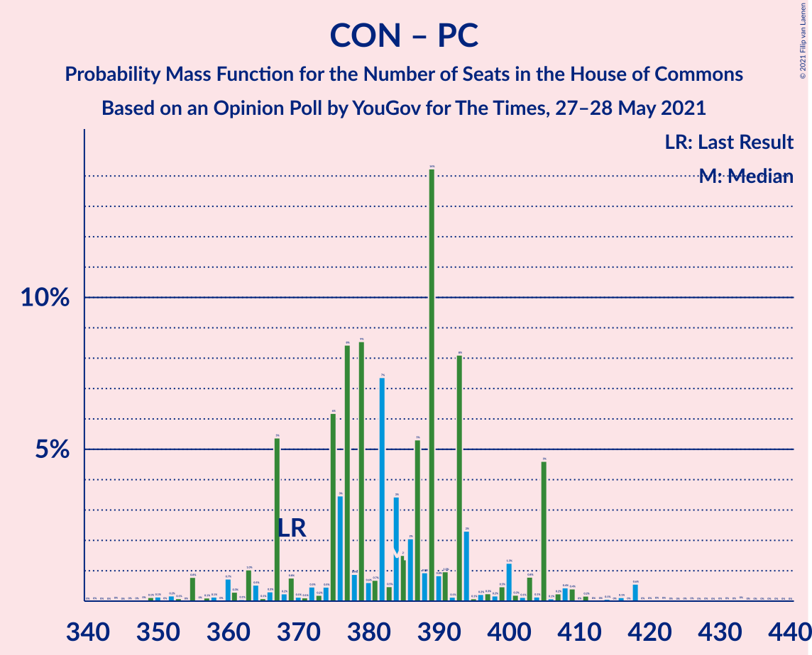

| Number of Seats | Probability | Accumulated | Special Marks |
|:---------------:|:-----------:|:-----------:|:-------------:|
| 344 | 0% | 100% |  |
| 345 | 0% | 99.9% |  |
| 346 | 0% | 99.9% |  |
| 347 | 0% | 99.9% |  |
| 348 | 0% | 99.9% |  |
| 349 | 0.1% | 99.8% |  |
| 350 | 0.1% | 99.7% |  |
| 351 | 0% | 99.6% |  |
| 352 | 0.2% | 99.6% |  |
| 353 | 0.1% | 99.4% |  |
| 354 | 0% | 99.3% |  |
| 355 | 0.8% | 99.3% |  |
| 356 | 0% | 98.5% |  |
| 357 | 0.1% | 98% |  |
| 358 | 0.1% | 98% |  |
| 359 | 0% | 98% |  |
| 360 | 0.7% | 98% |  |
| 361 | 0.3% | 97% |  |
| 362 | 0.1% | 97% |  |
| 363 | 1.0% | 97% |  |
| 364 | 0.5% | 96% |  |
| 365 | 0.1% | 96% |  |
| 366 | 0.3% | 95% |  |
| 367 | 5% | 95% |  |
| 368 | 0.2% | 90% |  |
| 369 | 0.8% | 89% | Last Result |
| 370 | 0.1% | 89% |  |
| 371 | 0.1% | 89% |  |
| 372 | 0.5% | 88% |  |
| 373 | 0.2% | 88% |  |
| 374 | 0.5% | 88% |  |
| 375 | 6% | 87% |  |
| 376 | 3% | 81% |  |
| 377 | 8% | 78% |  |
| 378 | 0.9% | 69% |  |
| 379 | 9% | 68% |  |
| 380 | 0.6% | 60% |  |
| 381 | 0.7% | 59% |  |
| 382 | 7% | 58% |  |
| 383 | 0.5% | 51% |  |
| 384 | 3% | 51% | Median |
| 385 | 2% | 47% |  |
| 386 | 2% | 46% |  |
| 387 | 5% | 44% |  |
| 388 | 0.9% | 38% |  |
| 389 | 14% | 37% |  |
| 390 | 0.8% | 23% |  |
| 391 | 1.0% | 22% |  |
| 392 | 0.1% | 21% |  |
| 393 | 8% | 21% |  |
| 394 | 2% | 13% |  |
| 395 | 0.1% | 11% |  |
| 396 | 0.2% | 11% |  |
| 397 | 0.3% | 10% |  |
| 398 | 0.2% | 10% |  |
| 399 | 0.5% | 10% |  |
| 400 | 1.3% | 10% |  |
| 401 | 0.2% | 8% |  |
| 402 | 0.1% | 8% |  |
| 403 | 0.8% | 8% |  |
| 404 | 0.1% | 7% |  |
| 405 | 5% | 7% |  |
| 406 | 0.1% | 2% |  |
| 407 | 0.2% | 2% |  |
| 408 | 0.4% | 2% |  |
| 409 | 0.4% | 2% |  |
| 410 | 0% | 1.2% |  |
| 411 | 0.2% | 1.2% |  |
| 412 | 0% | 1.0% |  |
| 413 | 0% | 1.0% |  |
| 414 | 0.1% | 1.0% |  |
| 415 | 0% | 0.9% |  |
| 416 | 0.1% | 0.9% |  |
| 417 | 0% | 0.8% |  |
| 418 | 0.6% | 0.8% |  |
| 419 | 0% | 0.2% |  |
| 420 | 0% | 0.2% |  |
| 421 | 0% | 0.2% |  |
| 422 | 0% | 0.2% |  |
| 423 | 0% | 0.1% |  |
| 424 | 0% | 0.1% |  |
| 425 | 0% | 0.1% |  |
| 426 | 0% | 0.1% |  |
| 427 | 0% | 0.1% |  |
| 428 | 0% | 0.1% |  |
| 429 | 0% | 0.1% |  |
| 430 | 0% | 0.1% |  |
| 431 | 0% | 0.1% |  |
| 432 | 0% | 0.1% |  |
| 433 | 0% | 0.1% |  |
| 434 | 0% | 0% |  |

### Conservative Party – Liberal Democrats

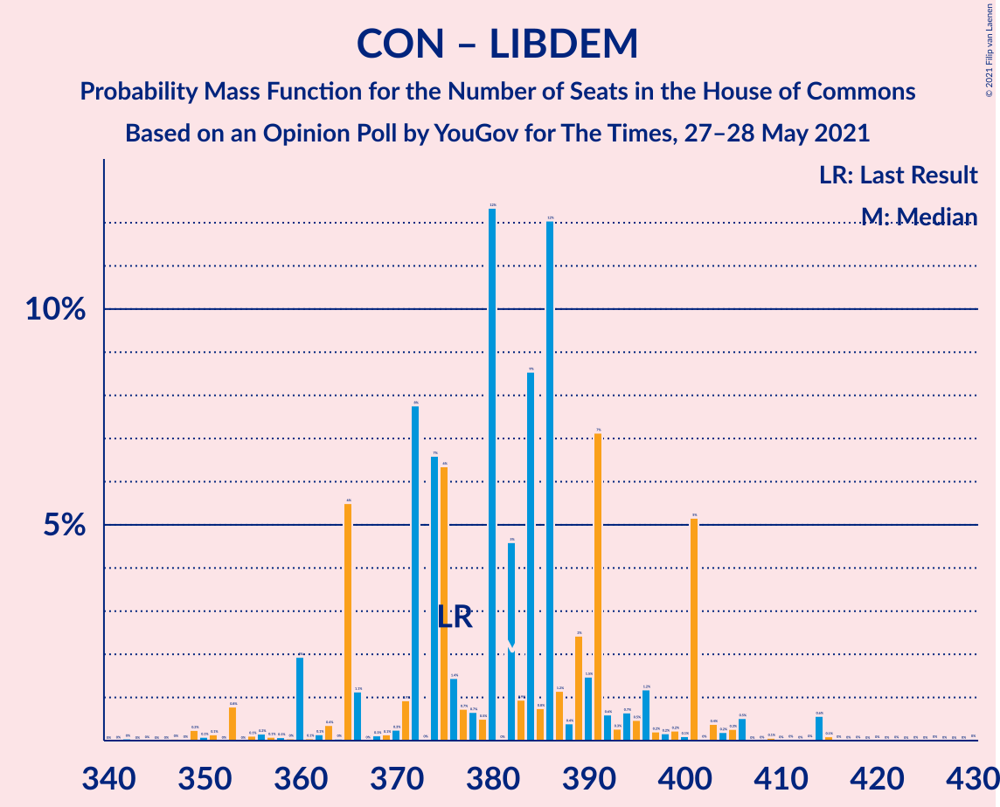

| Number of Seats | Probability | Accumulated | Special Marks |
|:---------------:|:-----------:|:-----------:|:-------------:|
| 342 | 0% | 100% |  |
| 343 | 0% | 99.9% |  |
| 344 | 0% | 99.9% |  |
| 345 | 0% | 99.9% |  |
| 346 | 0% | 99.9% |  |
| 347 | 0% | 99.9% |  |
| 348 | 0% | 99.9% |  |
| 349 | 0.2% | 99.8% |  |
| 350 | 0.1% | 99.6% |  |
| 351 | 0.1% | 99.5% |  |
| 352 | 0% | 99.4% |  |
| 353 | 0.8% | 99.4% |  |
| 354 | 0% | 98.6% |  |
| 355 | 0.1% | 98.6% |  |
| 356 | 0.2% | 98% |  |
| 357 | 0.1% | 98% |  |
| 358 | 0.1% | 98% |  |
| 359 | 0% | 98% |  |
| 360 | 2% | 98% |  |
| 361 | 0.1% | 96% |  |
| 362 | 0.1% | 96% |  |
| 363 | 0.4% | 96% |  |
| 364 | 0% | 96% |  |
| 365 | 6% | 96% |  |
| 366 | 1.1% | 90% |  |
| 367 | 0% | 89% |  |
| 368 | 0.1% | 89% |  |
| 369 | 0.1% | 89% |  |
| 370 | 0.3% | 89% |  |
| 371 | 0.9% | 88% |  |
| 372 | 8% | 87% |  |
| 373 | 0% | 80% |  |
| 374 | 7% | 80% |  |
| 375 | 6% | 73% |  |
| 376 | 1.4% | 67% | Last Result |
| 377 | 0.7% | 65% |  |
| 378 | 0.7% | 65% |  |
| 379 | 0.5% | 64% |  |
| 380 | 12% | 63% |  |
| 381 | 0% | 51% | Median |
| 382 | 5% | 51% |  |
| 383 | 0.9% | 46% |  |
| 384 | 9% | 45% |  |
| 385 | 0.8% | 37% |  |
| 386 | 12% | 36% |  |
| 387 | 1.2% | 24% |  |
| 388 | 0.4% | 23% |  |
| 389 | 2% | 23% |  |
| 390 | 1.5% | 20% |  |
| 391 | 7% | 19% |  |
| 392 | 0.6% | 11% |  |
| 393 | 0.3% | 11% |  |
| 394 | 0.7% | 11% |  |
| 395 | 0.5% | 10% |  |
| 396 | 1.2% | 9% |  |
| 397 | 0.2% | 8% |  |
| 398 | 0.2% | 8% |  |
| 399 | 0.2% | 8% |  |
| 400 | 0.1% | 8% |  |
| 401 | 5% | 8% |  |
| 402 | 0% | 2% |  |
| 403 | 0.4% | 2% |  |
| 404 | 0.2% | 2% |  |
| 405 | 0.3% | 2% |  |
| 406 | 0.5% | 2% |  |
| 407 | 0% | 1.0% |  |
| 408 | 0% | 1.0% |  |
| 409 | 0.1% | 1.0% |  |
| 410 | 0% | 0.9% |  |
| 411 | 0% | 0.9% |  |
| 412 | 0% | 0.9% |  |
| 413 | 0% | 0.9% |  |
| 414 | 0.6% | 0.9% |  |
| 415 | 0.1% | 0.3% |  |
| 416 | 0% | 0.2% |  |
| 417 | 0% | 0.2% |  |
| 418 | 0% | 0.1% |  |
| 419 | 0% | 0.1% |  |
| 420 | 0% | 0.1% |  |
| 421 | 0% | 0.1% |  |
| 422 | 0% | 0.1% |  |
| 423 | 0% | 0.1% |  |
| 424 | 0% | 0.1% |  |
| 425 | 0% | 0.1% |  |
| 426 | 0% | 0.1% |  |
| 427 | 0% | 0.1% |  |
| 428 | 0% | 0.1% |  |
| 429 | 0% | 0.1% |  |
| 430 | 0% | 0% |  |

### Conservative Party

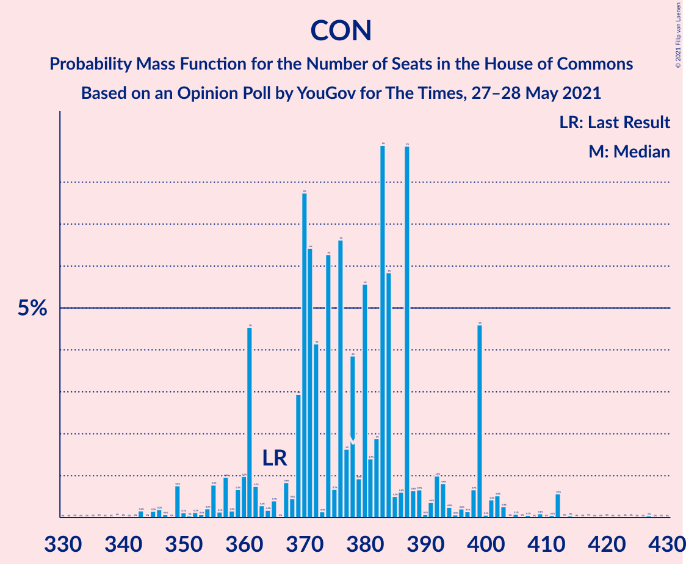

| Number of Seats | Probability | Accumulated | Special Marks |
|:---------------:|:-----------:|:-----------:|:-------------:|
| 339 | 0% | 100% |  |
| 340 | 0% | 99.9% |  |
| 341 | 0% | 99.9% |  |
| 342 | 0% | 99.9% |  |
| 343 | 0.2% | 99.9% |  |
| 344 | 0% | 99.7% |  |
| 345 | 0.2% | 99.7% |  |
| 346 | 0.2% | 99.6% |  |
| 347 | 0.1% | 99.4% |  |
| 348 | 0% | 99.3% |  |
| 349 | 0.8% | 99.3% |  |
| 350 | 0.1% | 98.5% |  |
| 351 | 0% | 98% |  |
| 352 | 0.1% | 98% |  |
| 353 | 0.1% | 98% |  |
| 354 | 0.2% | 98% |  |
| 355 | 0.8% | 98% |  |
| 356 | 0.1% | 97% |  |
| 357 | 1.0% | 97% |  |
| 358 | 0.2% | 96% |  |
| 359 | 0.7% | 96% |  |
| 360 | 1.0% | 95% |  |
| 361 | 5% | 94% |  |
| 362 | 0.7% | 90% |  |
| 363 | 0.3% | 89% |  |
| 364 | 0.2% | 89% |  |
| 365 | 0.4% | 89% | Last Result |
| 366 | 0% | 88% |  |
| 367 | 0.8% | 88% |  |
| 368 | 0.5% | 87% |  |
| 369 | 3% | 87% |  |
| 370 | 8% | 84% |  |
| 371 | 6% | 76% |  |
| 372 | 4% | 70% |  |
| 373 | 0.1% | 66% |  |
| 374 | 6% | 65% |  |
| 375 | 0.7% | 59% |  |
| 376 | 7% | 58% |  |
| 377 | 2% | 52% |  |
| 378 | 4% | 50% | Median |
| 379 | 0.9% | 46% |  |
| 380 | 6% | 45% |  |
| 381 | 1.4% | 40% |  |
| 382 | 2% | 38% |  |
| 383 | 9% | 37% |  |
| 384 | 6% | 28% |  |
| 385 | 0.5% | 22% |  |
| 386 | 0.6% | 21% |  |
| 387 | 9% | 21% |  |
| 388 | 0.6% | 12% |  |
| 389 | 0.7% | 11% |  |
| 390 | 0.1% | 11% |  |
| 391 | 0.4% | 10% |  |
| 392 | 1.0% | 10% |  |
| 393 | 0.8% | 9% |  |
| 394 | 0.2% | 8% |  |
| 395 | 0.1% | 8% |  |
| 396 | 0.2% | 8% |  |
| 397 | 0.1% | 8% |  |
| 398 | 0.7% | 8% |  |
| 399 | 5% | 7% |  |
| 400 | 0.1% | 2% |  |
| 401 | 0.4% | 2% |  |
| 402 | 0.5% | 2% |  |
| 403 | 0.3% | 1.4% |  |
| 404 | 0% | 1.1% |  |
| 405 | 0.1% | 1.1% |  |
| 406 | 0% | 1.0% |  |
| 407 | 0.1% | 1.0% |  |
| 408 | 0% | 0.9% |  |
| 409 | 0.1% | 0.9% |  |
| 410 | 0% | 0.8% |  |
| 411 | 0.1% | 0.8% |  |
| 412 | 0.6% | 0.8% |  |
| 413 | 0% | 0.2% |  |
| 414 | 0% | 0.2% |  |
| 415 | 0% | 0.1% |  |
| 416 | 0% | 0.1% |  |
| 417 | 0% | 0.1% |  |
| 418 | 0% | 0.1% |  |
| 419 | 0% | 0.1% |  |
| 420 | 0% | 0.1% |  |
| 421 | 0% | 0.1% |  |
| 422 | 0% | 0.1% |  |
| 423 | 0% | 0.1% |  |
| 424 | 0% | 0.1% |  |
| 425 | 0% | 0.1% |  |
| 426 | 0% | 0.1% |  |
| 427 | 0% | 0.1% |  |
| 428 | 0% | 0% |  |

### Labour Party – Liberal Democrats – Green Party – Scottish National Party – Plaid Cymru

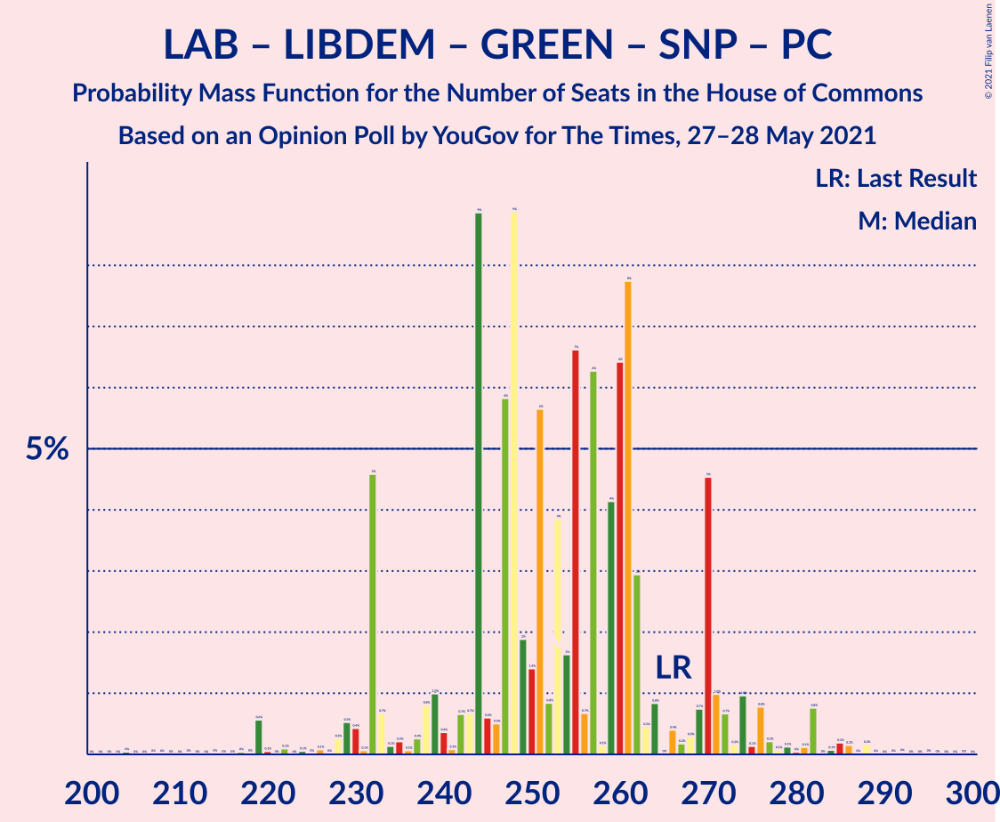

| Number of Seats | Probability | Accumulated | Special Marks |
|:---------------:|:-----------:|:-----------:|:-------------:|
| 204 | 0% | 100% |  |
| 205 | 0% | 99.9% |  |
| 206 | 0% | 99.9% |  |
| 207 | 0% | 99.9% |  |
| 208 | 0% | 99.9% |  |
| 209 | 0% | 99.9% |  |
| 210 | 0% | 99.9% |  |
| 211 | 0% | 99.9% |  |
| 212 | 0% | 99.9% |  |
| 213 | 0% | 99.9% |  |
| 214 | 0% | 99.9% |  |
| 215 | 0% | 99.9% |  |
| 216 | 0% | 99.9% |  |
| 217 | 0% | 99.9% |  |
| 218 | 0% | 99.8% |  |
| 219 | 0.6% | 99.8% |  |
| 220 | 0.1% | 99.2% |  |
| 221 | 0% | 99.2% |  |
| 222 | 0.1% | 99.2% |  |
| 223 | 0% | 99.1% |  |
| 224 | 0.1% | 99.1% |  |
| 225 | 0% | 99.0% |  |
| 226 | 0.1% | 99.0% |  |
| 227 | 0% | 98.9% |  |
| 228 | 0.3% | 98.9% |  |
| 229 | 0.5% | 98.6% |  |
| 230 | 0.4% | 98% |  |
| 231 | 0.1% | 98% |  |
| 232 | 5% | 98% |  |
| 233 | 0.7% | 93% |  |
| 234 | 0.1% | 92% |  |
| 235 | 0.2% | 92% |  |
| 236 | 0.1% | 92% |  |
| 237 | 0.3% | 92% |  |
| 238 | 0.8% | 92% |  |
| 239 | 1.0% | 91% |  |
| 240 | 0.4% | 90% |  |
| 241 | 0.1% | 90% |  |
| 242 | 0.7% | 89% |  |
| 243 | 0.7% | 89% |  |
| 244 | 9% | 88% |  |
| 245 | 0.6% | 79% |  |
| 246 | 0.5% | 79% |  |
| 247 | 6% | 78% |  |
| 248 | 9% | 72% |  |
| 249 | 2% | 63% |  |
| 250 | 1.4% | 62% |  |
| 251 | 6% | 60% |  |
| 252 | 0.8% | 54% |  |
| 253 | 4% | 54% |  |
| 254 | 2% | 50% | Median |
| 255 | 7% | 48% |  |
| 256 | 0.7% | 42% |  |
| 257 | 6% | 41% |  |
| 258 | 0.1% | 35% |  |
| 259 | 4% | 34% |  |
| 260 | 6% | 30% |  |
| 261 | 8% | 24% |  |
| 262 | 3% | 16% |  |
| 263 | 0.5% | 13% |  |
| 264 | 0.8% | 13% |  |
| 265 | 0% | 12% |  |
| 266 | 0.4% | 12% | Last Result |
| 267 | 0.2% | 11% |  |
| 268 | 0.3% | 11% |  |
| 269 | 0.7% | 11% |  |
| 270 | 5% | 10% |  |
| 271 | 1.0% | 6% |  |
| 272 | 0.7% | 5% |  |
| 273 | 0.2% | 4% |  |
| 274 | 1.0% | 4% |  |
| 275 | 0.1% | 3% |  |
| 276 | 0.8% | 3% |  |
| 277 | 0.2% | 2% |  |
| 278 | 0.1% | 2% |  |
| 279 | 0.1% | 2% |  |
| 280 | 0% | 2% |  |
| 281 | 0.1% | 2% |  |
| 282 | 0.8% | 1.5% |  |
| 283 | 0% | 0.7% |  |
| 284 | 0.1% | 0.7% |  |
| 285 | 0.2% | 0.6% |  |
| 286 | 0.2% | 0.4% |  |
| 287 | 0% | 0.3% |  |
| 288 | 0.2% | 0.3% |  |
| 289 | 0% | 0.1% |  |
| 290 | 0% | 0.1% |  |
| 291 | 0% | 0.1% |  |
| 292 | 0% | 0.1% |  |
| 293 | 0% | 0% |  |

### Labour Party – Liberal Democrats – Scottish National Party – Plaid Cymru

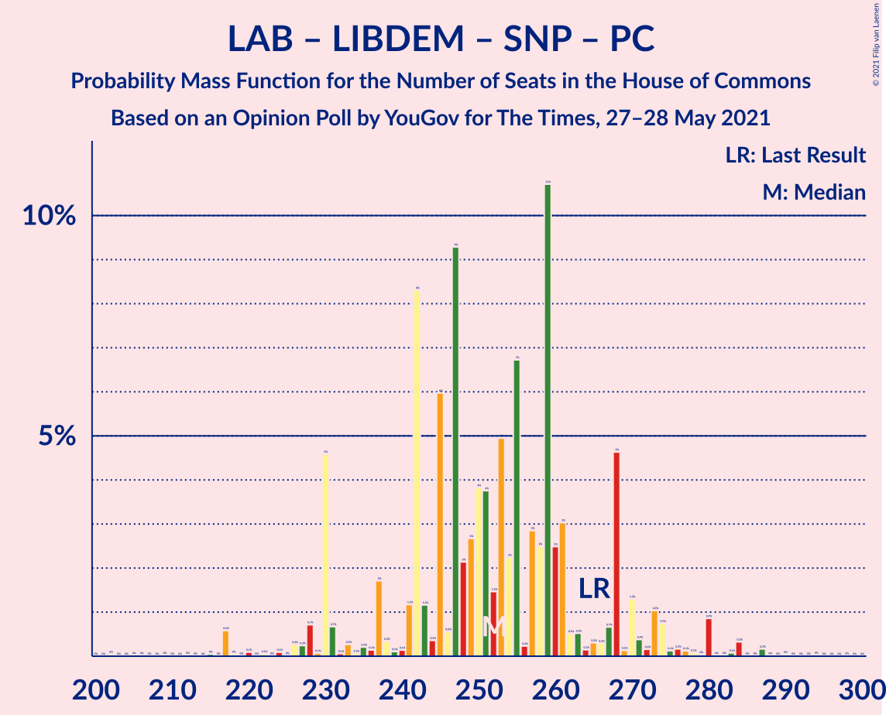

| Number of Seats | Probability | Accumulated | Special Marks |
|:---------------:|:-----------:|:-----------:|:-------------:|
| 202 | 0% | 100% |  |
| 203 | 0% | 99.9% |  |
| 204 | 0% | 99.9% |  |
| 205 | 0% | 99.9% |  |
| 206 | 0% | 99.9% |  |
| 207 | 0% | 99.9% |  |
| 208 | 0% | 99.9% |  |
| 209 | 0% | 99.9% |  |
| 210 | 0% | 99.9% |  |
| 211 | 0% | 99.9% |  |
| 212 | 0% | 99.9% |  |
| 213 | 0% | 99.9% |  |
| 214 | 0% | 99.9% |  |
| 215 | 0% | 99.9% |  |
| 216 | 0% | 99.8% |  |
| 217 | 0.6% | 99.8% |  |
| 218 | 0% | 99.2% |  |
| 219 | 0% | 99.2% |  |
| 220 | 0.1% | 99.2% |  |
| 221 | 0% | 99.1% |  |
| 222 | 0.1% | 99.1% |  |
| 223 | 0% | 99.0% |  |
| 224 | 0.1% | 99.0% |  |
| 225 | 0% | 98.9% |  |
| 226 | 0.3% | 98.9% |  |
| 227 | 0.2% | 98.6% |  |
| 228 | 0.7% | 98% |  |
| 229 | 0.1% | 98% |  |
| 230 | 5% | 98% |  |
| 231 | 0.7% | 93% |  |
| 232 | 0.1% | 92% |  |
| 233 | 0.3% | 92% |  |
| 234 | 0.1% | 92% |  |
| 235 | 0.2% | 92% |  |
| 236 | 0.1% | 92% |  |
| 237 | 2% | 92% |  |
| 238 | 0.3% | 90% |  |
| 239 | 0.1% | 90% |  |
| 240 | 0.1% | 89% |  |
| 241 | 1.2% | 89% |  |
| 242 | 8% | 88% |  |
| 243 | 1.2% | 80% |  |
| 244 | 0.4% | 79% |  |
| 245 | 6% | 78% |  |
| 246 | 0.6% | 72% |  |
| 247 | 9% | 72% |  |
| 248 | 2% | 63% |  |
| 249 | 3% | 60% |  |
| 250 | 4% | 58% |  |
| 251 | 4% | 54% |  |
| 252 | 1.5% | 50% | Median |
| 253 | 5% | 49% |  |
| 254 | 2% | 44% |  |
| 255 | 7% | 41% |  |
| 256 | 0.2% | 35% |  |
| 257 | 3% | 34% |  |
| 258 | 2% | 32% |  |
| 259 | 11% | 29% |  |
| 260 | 2% | 18% |  |
| 261 | 3% | 16% |  |
| 262 | 0.5% | 13% |  |
| 263 | 0.5% | 12% |  |
| 264 | 0.1% | 12% |  |
| 265 | 0.3% | 12% | Last Result |
| 266 | 0.3% | 11% |  |
| 267 | 0.7% | 11% |  |
| 268 | 5% | 10% |  |
| 269 | 0.1% | 6% |  |
| 270 | 1.3% | 6% |  |
| 271 | 0.4% | 4% |  |
| 272 | 0.2% | 4% |  |
| 273 | 1.0% | 4% |  |
| 274 | 0.7% | 3% |  |
| 275 | 0.1% | 2% |  |
| 276 | 0.2% | 2% |  |
| 277 | 0.1% | 2% |  |
| 278 | 0.1% | 2% |  |
| 279 | 0% | 2% |  |
| 280 | 0.9% | 2% |  |
| 281 | 0% | 0.7% |  |
| 282 | 0% | 0.7% |  |
| 283 | 0.1% | 0.7% |  |
| 284 | 0.3% | 0.6% |  |
| 285 | 0% | 0.3% |  |
| 286 | 0% | 0.3% |  |
| 287 | 0.2% | 0.3% |  |
| 288 | 0% | 0.1% |  |
| 289 | 0% | 0.1% |  |
| 290 | 0% | 0.1% |  |
| 291 | 0% | 0% |  |

### Labour Party – Scottish National Party – Plaid Cymru

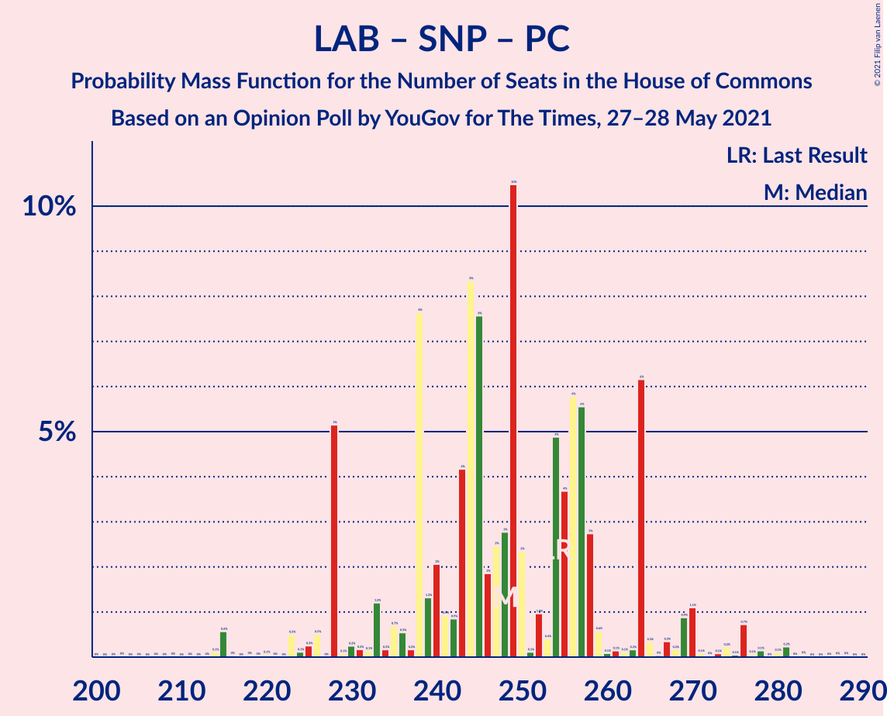

| Number of Seats | Probability | Accumulated | Special Marks |
|:---------------:|:-----------:|:-----------:|:-------------:|
| 200 | 0% | 100% |  |
| 201 | 0% | 99.9% |  |
| 202 | 0% | 99.9% |  |
| 203 | 0% | 99.9% |  |
| 204 | 0% | 99.9% |  |
| 205 | 0% | 99.9% |  |
| 206 | 0% | 99.9% |  |
| 207 | 0% | 99.9% |  |
| 208 | 0% | 99.9% |  |
| 209 | 0% | 99.9% |  |
| 210 | 0% | 99.9% |  |
| 211 | 0% | 99.9% |  |
| 212 | 0% | 99.9% |  |
| 213 | 0% | 99.8% |  |
| 214 | 0.1% | 99.8% |  |
| 215 | 0.6% | 99.7% |  |
| 216 | 0% | 99.1% |  |
| 217 | 0% | 99.1% |  |
| 218 | 0% | 99.1% |  |
| 219 | 0% | 99.1% |  |
| 220 | 0.1% | 99.1% |  |
| 221 | 0% | 99.0% |  |
| 222 | 0% | 99.0% |  |
| 223 | 0.5% | 99.0% |  |
| 224 | 0.1% | 98% |  |
| 225 | 0.3% | 98% |  |
| 226 | 0.5% | 98% |  |
| 227 | 0% | 98% |  |
| 228 | 5% | 98% |  |
| 229 | 0.1% | 92% |  |
| 230 | 0.2% | 92% |  |
| 231 | 0.2% | 92% |  |
| 232 | 0.1% | 92% |  |
| 233 | 1.2% | 92% |  |
| 234 | 0.2% | 91% |  |
| 235 | 0.7% | 90% |  |
| 236 | 0.5% | 90% |  |
| 237 | 0.2% | 89% |  |
| 238 | 8% | 89% |  |
| 239 | 1.3% | 81% |  |
| 240 | 2% | 80% |  |
| 241 | 0.9% | 78% |  |
| 242 | 0.9% | 77% |  |
| 243 | 4% | 76% |  |
| 244 | 8% | 72% |  |
| 245 | 8% | 64% |  |
| 246 | 2% | 56% |  |
| 247 | 2% | 54% |  |
| 248 | 3% | 52% |  |
| 249 | 10% | 49% | Median |
| 250 | 2% | 39% |  |
| 251 | 0.1% | 36% |  |
| 252 | 1.0% | 36% |  |
| 253 | 0.4% | 35% |  |
| 254 | 5% | 35% | Last Result |
| 255 | 4% | 30% |  |
| 256 | 6% | 26% |  |
| 257 | 6% | 20% |  |
| 258 | 3% | 15% |  |
| 259 | 0.6% | 12% |  |
| 260 | 0.1% | 11% |  |
| 261 | 0.1% | 11% |  |
| 262 | 0.1% | 11% |  |
| 263 | 0.2% | 11% |  |
| 264 | 6% | 11% |  |
| 265 | 0.3% | 5% |  |
| 266 | 0% | 4% |  |
| 267 | 0.3% | 4% |  |
| 268 | 0.2% | 4% |  |
| 269 | 0.9% | 4% |  |
| 270 | 1.1% | 3% |  |
| 271 | 0.1% | 2% |  |
| 272 | 0% | 2% |  |
| 273 | 0.1% | 2% |  |
| 274 | 0.2% | 2% |  |
| 275 | 0.1% | 1.5% |  |
| 276 | 0.7% | 1.4% |  |
| 277 | 0.1% | 0.7% |  |
| 278 | 0.1% | 0.6% |  |
| 279 | 0% | 0.5% |  |
| 280 | 0.1% | 0.5% |  |
| 281 | 0.2% | 0.4% |  |
| 282 | 0% | 0.2% |  |
| 283 | 0% | 0.1% |  |
| 284 | 0% | 0.1% |  |
| 285 | 0% | 0.1% |  |
| 286 | 0% | 0.1% |  |
| 287 | 0% | 0.1% |  |
| 288 | 0% | 0% |  |

### Labour Party – Liberal Democrats – Scottish National Party

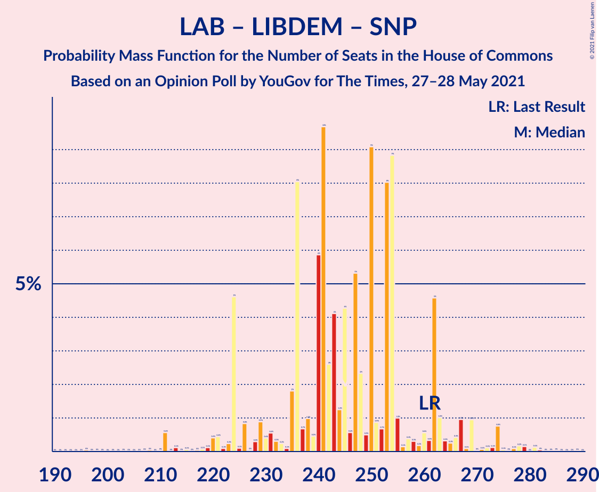

| Number of Seats | Probability | Accumulated | Special Marks |
|:---------------:|:-----------:|:-----------:|:-------------:|
| 196 | 0% | 100% |  |
| 197 | 0% | 99.9% |  |
| 198 | 0% | 99.9% |  |
| 199 | 0% | 99.9% |  |
| 200 | 0% | 99.9% |  |
| 201 | 0% | 99.9% |  |
| 202 | 0% | 99.9% |  |
| 203 | 0% | 99.9% |  |
| 204 | 0% | 99.9% |  |
| 205 | 0% | 99.9% |  |
| 206 | 0% | 99.9% |  |
| 207 | 0% | 99.9% |  |
| 208 | 0% | 99.9% |  |
| 209 | 0% | 99.8% |  |
| 210 | 0% | 99.8% |  |
| 211 | 0.6% | 99.8% |  |
| 212 | 0% | 99.2% |  |
| 213 | 0.1% | 99.2% |  |
| 214 | 0% | 99.1% |  |
| 215 | 0.1% | 99.1% |  |
| 216 | 0% | 99.0% |  |
| 217 | 0% | 99.0% |  |
| 218 | 0.1% | 99.0% |  |
| 219 | 0.1% | 98.9% |  |
| 220 | 0.4% | 98.8% |  |
| 221 | 0.4% | 98% |  |
| 222 | 0.1% | 98% |  |
| 223 | 0.2% | 98% |  |
| 224 | 5% | 98% |  |
| 225 | 0.1% | 93% |  |
| 226 | 0.8% | 93% |  |
| 227 | 0% | 92% |  |
| 228 | 0.3% | 92% |  |
| 229 | 0.9% | 92% |  |
| 230 | 0.4% | 91% |  |
| 231 | 0.6% | 90% |  |
| 232 | 0.3% | 90% |  |
| 233 | 0.2% | 90% |  |
| 234 | 0.1% | 89% |  |
| 235 | 2% | 89% |  |
| 236 | 8% | 87% |  |
| 237 | 0.7% | 79% |  |
| 238 | 1.0% | 79% |  |
| 239 | 0.5% | 78% |  |
| 240 | 6% | 77% |  |
| 241 | 10% | 71% |  |
| 242 | 3% | 62% |  |
| 243 | 4% | 59% |  |
| 244 | 1.2% | 55% |  |
| 245 | 4% | 54% |  |
| 246 | 0.6% | 49% | Median |
| 247 | 5% | 49% |  |
| 248 | 2% | 44% |  |
| 249 | 0.5% | 41% |  |
| 250 | 9% | 41% |  |
| 251 | 0.9% | 32% |  |
| 252 | 0.7% | 31% |  |
| 253 | 8% | 30% |  |
| 254 | 9% | 22% |  |
| 255 | 1.0% | 13% |  |
| 256 | 0.1% | 12% |  |
| 257 | 0.4% | 12% |  |
| 258 | 0.3% | 12% |  |
| 259 | 0.2% | 11% |  |
| 260 | 0.6% | 11% |  |
| 261 | 0.3% | 11% | Last Result |
| 262 | 5% | 10% |  |
| 263 | 1.0% | 6% |  |
| 264 | 0.3% | 5% |  |
| 265 | 0.3% | 5% |  |
| 266 | 0.4% | 4% |  |
| 267 | 1.0% | 4% |  |
| 268 | 0.1% | 3% |  |
| 269 | 0.9% | 3% |  |
| 270 | 0% | 2% |  |
| 271 | 0.1% | 2% |  |
| 272 | 0.1% | 2% |  |
| 273 | 0.1% | 2% |  |
| 274 | 0.8% | 2% |  |
| 275 | 0.1% | 0.8% |  |
| 276 | 0% | 0.7% |  |
| 277 | 0.1% | 0.7% |  |
| 278 | 0.2% | 0.6% |  |
| 279 | 0.1% | 0.4% |  |
| 280 | 0% | 0.3% |  |
| 281 | 0.1% | 0.3% |  |
| 282 | 0% | 0.1% |  |
| 283 | 0% | 0.1% |  |
| 284 | 0% | 0.1% |  |
| 285 | 0% | 0.1% |  |
| 286 | 0% | 0% |  |

### Labour Party – Scottish National Party

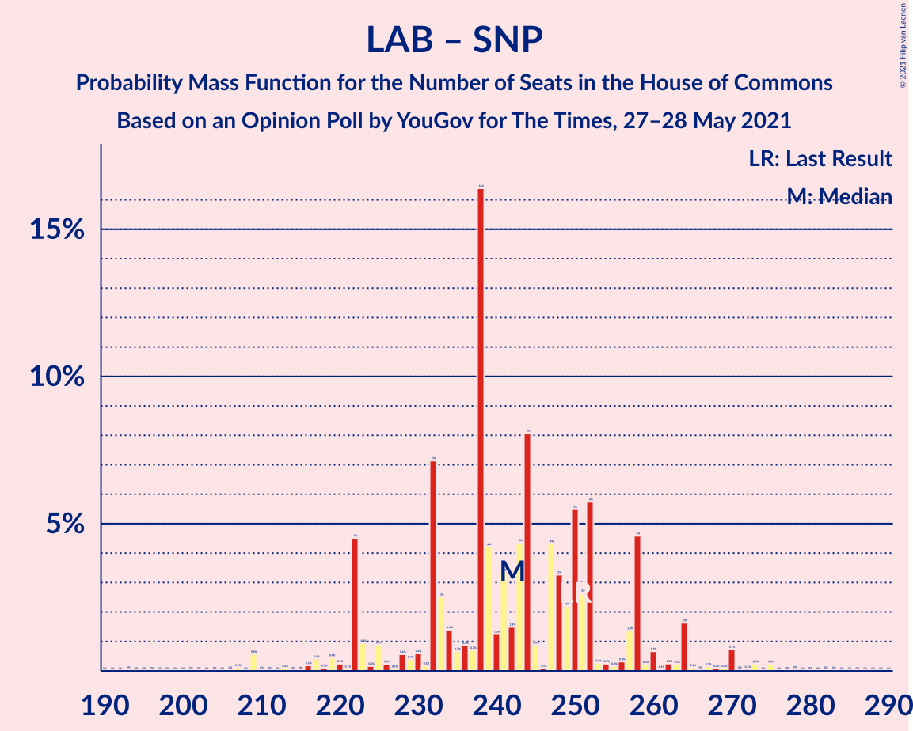

| Number of Seats | Probability | Accumulated | Special Marks |
|:---------------:|:-----------:|:-----------:|:-------------:|
| 194 | 0% | 100% |  |
| 195 | 0% | 99.9% |  |
| 196 | 0% | 99.9% |  |
| 197 | 0% | 99.9% |  |
| 198 | 0% | 99.9% |  |
| 199 | 0% | 99.9% |  |
| 200 | 0% | 99.9% |  |
| 201 | 0% | 99.9% |  |
| 202 | 0% | 99.9% |  |
| 203 | 0% | 99.9% |  |
| 204 | 0% | 99.9% |  |
| 205 | 0% | 99.9% |  |
| 206 | 0% | 99.9% |  |
| 207 | 0.1% | 99.8% |  |
| 208 | 0% | 99.7% |  |
| 209 | 0.6% | 99.7% |  |
| 210 | 0% | 99.1% |  |
| 211 | 0% | 99.1% |  |
| 212 | 0% | 99.1% |  |
| 213 | 0.1% | 99.1% |  |
| 214 | 0% | 99.0% |  |
| 215 | 0% | 99.0% |  |
| 216 | 0.2% | 99.0% |  |
| 217 | 0.4% | 98.8% |  |
| 218 | 0.1% | 98% |  |
| 219 | 0.4% | 98% |  |
| 220 | 0.2% | 98% |  |
| 221 | 0.1% | 98% |  |
| 222 | 5% | 98% |  |
| 223 | 0.9% | 93% |  |
| 224 | 0.2% | 92% |  |
| 225 | 0.9% | 92% |  |
| 226 | 0.2% | 91% |  |
| 227 | 0.1% | 91% |  |
| 228 | 0.6% | 91% |  |
| 229 | 0.4% | 90% |  |
| 230 | 0.6% | 90% |  |
| 231 | 0.2% | 89% |  |
| 232 | 7% | 89% |  |
| 233 | 3% | 82% |  |
| 234 | 1.4% | 79% |  |
| 235 | 0.7% | 78% |  |
| 236 | 0.9% | 77% |  |
| 237 | 0.7% | 76% |  |
| 238 | 16% | 76% |  |
| 239 | 4% | 59% |  |
| 240 | 1.3% | 55% |  |
| 241 | 3% | 54% |  |
| 242 | 1.5% | 50% |  |
| 243 | 4% | 49% | Median |
| 244 | 8% | 45% |  |
| 245 | 0.9% | 37% |  |
| 246 | 0.1% | 36% |  |
| 247 | 4% | 36% |  |
| 248 | 3% | 31% |  |
| 249 | 2% | 28% |  |
| 250 | 5% | 26% | Last Result |
| 251 | 3% | 20% |  |
| 252 | 6% | 18% |  |
| 253 | 0.3% | 12% |  |
| 254 | 0.2% | 12% |  |
| 255 | 0.2% | 11% |  |
| 256 | 0.3% | 11% |  |
| 257 | 1.4% | 11% |  |
| 258 | 5% | 10% |  |
| 259 | 0.2% | 5% |  |
| 260 | 0.7% | 5% |  |
| 261 | 0.1% | 4% |  |
| 262 | 0.2% | 4% |  |
| 263 | 0.2% | 4% |  |
| 264 | 2% | 4% |  |
| 265 | 0.1% | 2% |  |
| 266 | 0% | 2% |  |
| 267 | 0.1% | 2% |  |
| 268 | 0.1% | 2% |  |
| 269 | 0.1% | 2% |  |
| 270 | 0.7% | 1.5% |  |
| 271 | 0% | 0.7% |  |
| 272 | 0.1% | 0.7% |  |
| 273 | 0.2% | 0.6% |  |
| 274 | 0% | 0.4% |  |
| 275 | 0.2% | 0.4% |  |
| 276 | 0% | 0.2% |  |
| 277 | 0% | 0.2% |  |
| 278 | 0% | 0.1% |  |
| 279 | 0% | 0.1% |  |
| 280 | 0% | 0.1% |  |
| 281 | 0% | 0.1% |  |
| 282 | 0% | 0.1% |  |
| 283 | 0% | 0% |  |

### Labour Party – Liberal Democrats – Plaid Cymru

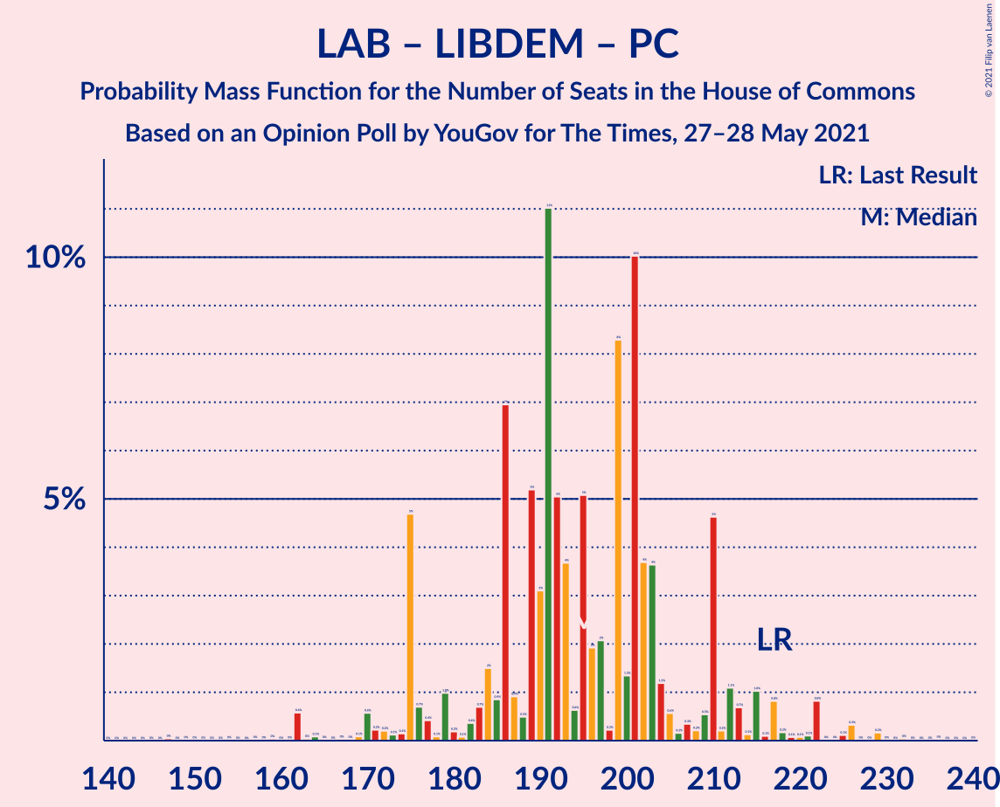

| Number of Seats | Probability | Accumulated | Special Marks |
|:---------------:|:-----------:|:-----------:|:-------------:|
| 147 | 0% | 100% |  |
| 148 | 0% | 99.9% |  |
| 149 | 0% | 99.9% |  |
| 150 | 0% | 99.9% |  |
| 151 | 0% | 99.9% |  |
| 152 | 0% | 99.9% |  |
| 153 | 0% | 99.9% |  |
| 154 | 0% | 99.9% |  |
| 155 | 0% | 99.9% |  |
| 156 | 0% | 99.9% |  |
| 157 | 0% | 99.9% |  |
| 158 | 0% | 99.9% |  |
| 159 | 0% | 99.9% |  |
| 160 | 0% | 99.8% |  |
| 161 | 0% | 99.8% |  |
| 162 | 0.6% | 99.8% |  |
| 163 | 0% | 99.2% |  |
| 164 | 0.1% | 99.2% |  |
| 165 | 0% | 99.1% |  |
| 166 | 0% | 99.1% |  |
| 167 | 0% | 99.1% |  |
| 168 | 0% | 99.0% |  |
| 169 | 0.1% | 99.0% |  |
| 170 | 0.6% | 98.9% |  |
| 171 | 0.2% | 98% |  |
| 172 | 0.2% | 98% |  |
| 173 | 0.1% | 98% |  |
| 174 | 0.1% | 98% |  |
| 175 | 5% | 98% |  |
| 176 | 0.7% | 93% |  |
| 177 | 0.4% | 92% |  |
| 178 | 0.1% | 92% |  |
| 179 | 1.0% | 92% |  |
| 180 | 0.2% | 91% |  |
| 181 | 0.1% | 91% |  |
| 182 | 0.4% | 90% |  |
| 183 | 0.7% | 90% |  |
| 184 | 2% | 89% |  |
| 185 | 0.9% | 88% |  |
| 186 | 7% | 87% |  |
| 187 | 0.9% | 80% |  |
| 188 | 0.5% | 79% |  |
| 189 | 5% | 79% |  |
| 190 | 3% | 74% |  |
| 191 | 11% | 70% |  |
| 192 | 5% | 59% |  |
| 193 | 4% | 54% |  |
| 194 | 0.6% | 51% | Median |
| 195 | 5% | 50% |  |
| 196 | 2% | 45% |  |
| 197 | 2% | 43% |  |
| 198 | 0.2% | 41% |  |
| 199 | 8% | 41% |  |
| 200 | 1.3% | 32% |  |
| 201 | 10% | 31% |  |
| 202 | 4% | 21% |  |
| 203 | 4% | 17% |  |
| 204 | 1.2% | 14% |  |
| 205 | 0.6% | 13% |  |
| 206 | 0.2% | 12% |  |
| 207 | 0.3% | 12% |  |
| 208 | 0.2% | 11% |  |
| 209 | 0.5% | 11% |  |
| 210 | 5% | 11% |  |
| 211 | 0.2% | 6% |  |
| 212 | 1.1% | 6% |  |
| 213 | 0.7% | 5% |  |
| 214 | 0.1% | 4% |  |
| 215 | 1.0% | 4% |  |
| 216 | 0.1% | 3% |  |
| 217 | 0.8% | 3% | Last Result |
| 218 | 0.2% | 2% |  |
| 219 | 0.1% | 2% |  |
| 220 | 0.1% | 2% |  |
| 221 | 0.1% | 2% |  |
| 222 | 0.8% | 2% |  |
| 223 | 0% | 0.8% |  |
| 224 | 0% | 0.7% |  |
| 225 | 0.1% | 0.7% |  |
| 226 | 0.3% | 0.6% |  |
| 227 | 0% | 0.3% |  |
| 228 | 0% | 0.3% |  |
| 229 | 0.2% | 0.3% |  |
| 230 | 0% | 0.1% |  |
| 231 | 0% | 0.1% |  |
| 232 | 0% | 0.1% |  |
| 233 | 0% | 0.1% |  |
| 234 | 0% | 0% |  |

### Labour Party – Plaid Cymru

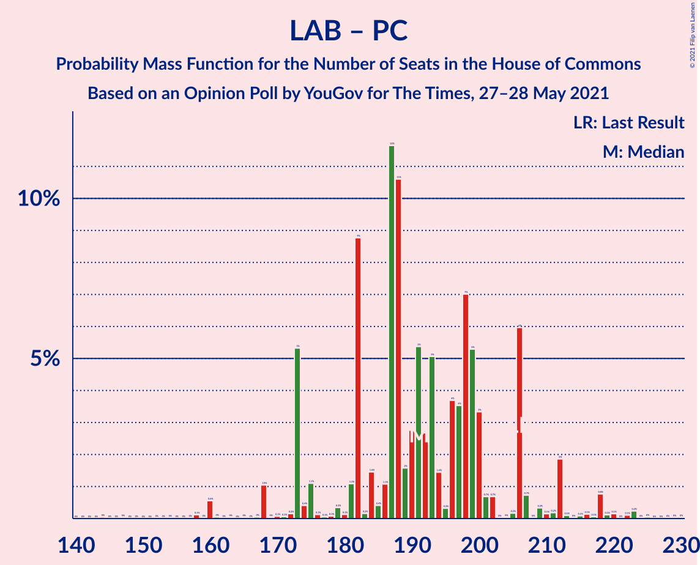

| Number of Seats | Probability | Accumulated | Special Marks |
|:---------------:|:-----------:|:-----------:|:-------------:|
| 145 | 0% | 100% |  |
| 146 | 0% | 99.9% |  |
| 147 | 0% | 99.9% |  |
| 148 | 0% | 99.9% |  |
| 149 | 0% | 99.9% |  |
| 150 | 0% | 99.9% |  |
| 151 | 0% | 99.9% |  |
| 152 | 0% | 99.9% |  |
| 153 | 0% | 99.9% |  |
| 154 | 0% | 99.9% |  |
| 155 | 0% | 99.9% |  |
| 156 | 0% | 99.9% |  |
| 157 | 0% | 99.9% |  |
| 158 | 0.1% | 99.8% |  |
| 159 | 0% | 99.7% |  |
| 160 | 0.6% | 99.7% |  |
| 161 | 0% | 99.1% |  |
| 162 | 0% | 99.1% |  |
| 163 | 0% | 99.1% |  |
| 164 | 0% | 99.1% |  |
| 165 | 0% | 99.1% |  |
| 166 | 0% | 99.0% |  |
| 167 | 0% | 99.0% |  |
| 168 | 1.0% | 99.0% |  |
| 169 | 0% | 98% |  |
| 170 | 0.1% | 98% |  |
| 171 | 0.1% | 98% |  |
| 172 | 0.2% | 98% |  |
| 173 | 5% | 98% |  |
| 174 | 0.4% | 92% |  |
| 175 | 1.1% | 92% |  |
| 176 | 0.1% | 91% |  |
| 177 | 0.1% | 91% |  |
| 178 | 0.1% | 91% |  |
| 179 | 0.3% | 91% |  |
| 180 | 0.1% | 90% |  |
| 181 | 1.1% | 90% |  |
| 182 | 9% | 89% |  |
| 183 | 0.2% | 80% |  |
| 184 | 1.5% | 80% |  |
| 185 | 0.4% | 79% |  |
| 186 | 1.1% | 78% |  |
| 187 | 12% | 77% |  |
| 188 | 11% | 65% |  |
| 189 | 2% | 55% |  |
| 190 | 3% | 53% |  |
| 191 | 5% | 50% | Median |
| 192 | 3% | 45% |  |
| 193 | 5% | 42% |  |
| 194 | 1.4% | 37% |  |
| 195 | 0.3% | 36% |  |
| 196 | 4% | 36% |  |
| 197 | 4% | 32% |  |
| 198 | 7% | 28% |  |
| 199 | 5% | 21% |  |
| 200 | 3% | 16% |  |
| 201 | 0.7% | 13% |  |
| 202 | 0.7% | 12% |  |
| 203 | 0% | 11% |  |
| 204 | 0% | 11% |  |
| 205 | 0.2% | 11% |  |
| 206 | 6% | 11% | Last Result |
| 207 | 0.7% | 5% |  |
| 208 | 0% | 4% |  |
| 209 | 0.3% | 4% |  |
| 210 | 0.1% | 4% |  |
| 211 | 0.2% | 4% |  |
| 212 | 2% | 4% |  |
| 213 | 0.1% | 2% |  |
| 214 | 0% | 2% |  |
| 215 | 0.1% | 2% |  |
| 216 | 0.1% | 2% |  |
| 217 | 0.1% | 2% |  |
| 218 | 0.8% | 2% |  |
| 219 | 0.1% | 0.8% |  |
| 220 | 0.1% | 0.7% |  |
| 221 | 0% | 0.5% |  |
| 222 | 0.1% | 0.5% |  |
| 223 | 0.2% | 0.4% |  |
| 224 | 0% | 0.2% |  |
| 225 | 0% | 0.1% |  |
| 226 | 0% | 0.1% |  |
| 227 | 0% | 0.1% |  |
| 228 | 0% | 0.1% |  |
| 229 | 0% | 0.1% |  |
| 230 | 0% | 0% |  |

### Labour Party – Liberal Democrats

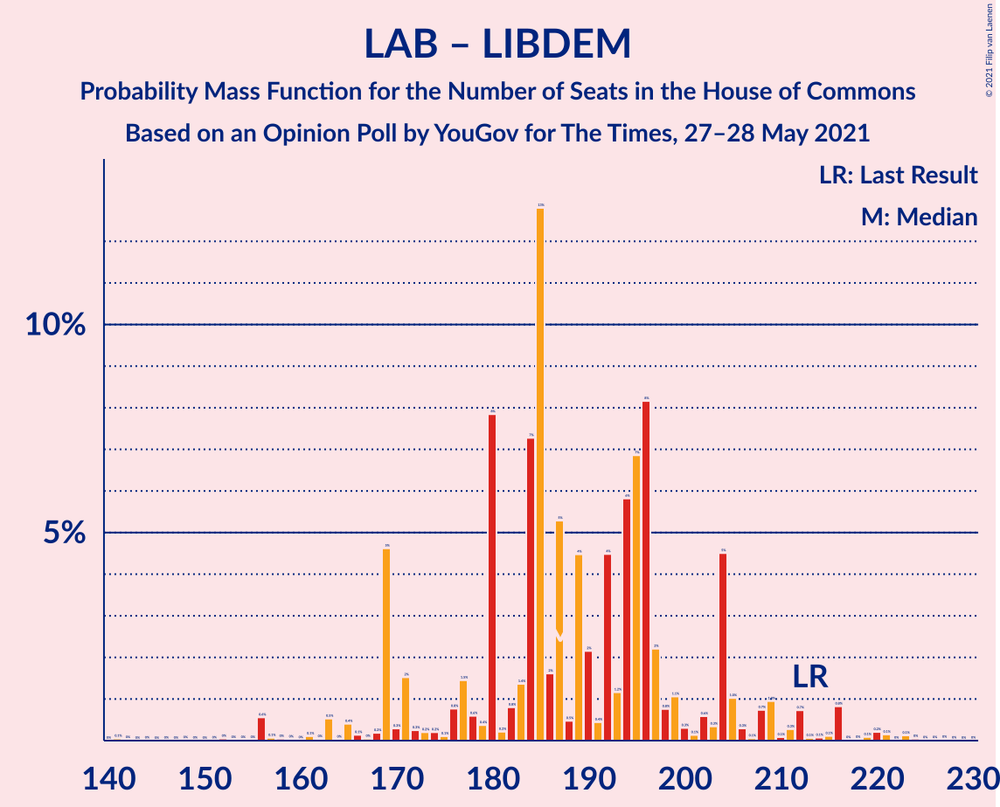

| Number of Seats | Probability | Accumulated | Special Marks |
|:---------------:|:-----------:|:-----------:|:-------------:|
| 141 | 0.1% | 100% |  |
| 142 | 0% | 99.9% |  |
| 143 | 0% | 99.9% |  |
| 144 | 0% | 99.9% |  |
| 145 | 0% | 99.9% |  |
| 146 | 0% | 99.9% |  |
| 147 | 0% | 99.9% |  |
| 148 | 0% | 99.9% |  |
| 149 | 0% | 99.9% |  |
| 150 | 0% | 99.9% |  |
| 151 | 0% | 99.9% |  |
| 152 | 0% | 99.9% |  |
| 153 | 0% | 99.8% |  |
| 154 | 0% | 99.8% |  |
| 155 | 0% | 99.8% |  |
| 156 | 0.6% | 99.8% |  |
| 157 | 0.1% | 99.2% |  |
| 158 | 0% | 99.1% |  |
| 159 | 0% | 99.1% |  |
| 160 | 0% | 99.1% |  |
| 161 | 0.1% | 99.0% |  |
| 162 | 0% | 98.9% |  |
| 163 | 0.5% | 98.9% |  |
| 164 | 0% | 98% |  |
| 165 | 0.4% | 98% |  |
| 166 | 0.1% | 98% |  |
| 167 | 0% | 98% |  |
| 168 | 0.2% | 98% |  |
| 169 | 5% | 98% |  |
| 170 | 0.3% | 93% |  |
| 171 | 2% | 93% |  |
| 172 | 0.3% | 91% |  |
| 173 | 0.2% | 91% |  |
| 174 | 0.2% | 91% |  |
| 175 | 0.1% | 90% |  |
| 176 | 0.8% | 90% |  |
| 177 | 1.5% | 90% |  |
| 178 | 0.6% | 88% |  |
| 179 | 0.4% | 88% |  |
| 180 | 8% | 87% |  |
| 181 | 0.2% | 79% |  |
| 182 | 0.8% | 79% |  |
| 183 | 1.4% | 78% |  |
| 184 | 7% | 77% |  |
| 185 | 13% | 70% |  |
| 186 | 2% | 57% |  |
| 187 | 5% | 55% |  |
| 188 | 0.5% | 50% | Median |
| 189 | 4% | 49% |  |
| 190 | 2% | 45% |  |
| 191 | 0.4% | 43% |  |
| 192 | 4% | 42% |  |
| 193 | 1.2% | 38% |  |
| 194 | 6% | 37% |  |
| 195 | 7% | 31% |  |
| 196 | 8% | 24% |  |
| 197 | 2% | 16% |  |
| 198 | 0.8% | 14% |  |
| 199 | 1.1% | 13% |  |
| 200 | 0.3% | 12% |  |
| 201 | 0.1% | 12% |  |
| 202 | 0.6% | 11% |  |
| 203 | 0.3% | 11% |  |
| 204 | 5% | 11% |  |
| 205 | 1.0% | 6% |  |
| 206 | 0.3% | 5% |  |
| 207 | 0.1% | 5% |  |
| 208 | 0.7% | 5% |  |
| 209 | 1.0% | 4% |  |
| 210 | 0.1% | 3% |  |
| 211 | 0.3% | 3% |  |
| 212 | 0.7% | 3% |  |
| 213 | 0.1% | 2% | Last Result |
| 214 | 0.1% | 2% |  |
| 215 | 0.1% | 2% |  |
| 216 | 0.8% | 2% |  |
| 217 | 0% | 0.8% |  |
| 218 | 0% | 0.8% |  |
| 219 | 0.1% | 0.7% |  |
| 220 | 0.2% | 0.6% |  |
| 221 | 0.1% | 0.4% |  |
| 222 | 0% | 0.3% |  |
| 223 | 0.1% | 0.3% |  |
| 224 | 0% | 0.2% |  |
| 225 | 0% | 0.1% |  |
| 226 | 0% | 0.1% |  |
| 227 | 0% | 0.1% |  |
| 228 | 0% | 0.1% |  |
| 229 | 0% | 0% |  |

### Labour Party

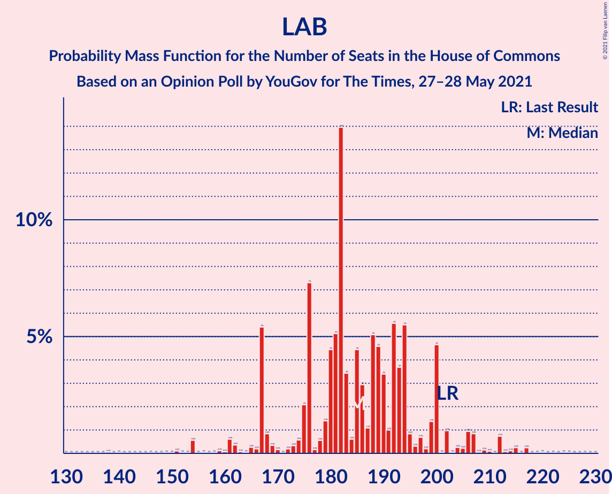

| Number of Seats | Probability | Accumulated | Special Marks |
|:---------------:|:-----------:|:-----------:|:-------------:|
| 138 | 0.1% | 100% |  |
| 139 | 0% | 99.9% |  |
| 140 | 0% | 99.9% |  |
| 141 | 0% | 99.9% |  |
| 142 | 0% | 99.9% |  |
| 143 | 0% | 99.9% |  |
| 144 | 0% | 99.9% |  |
| 145 | 0% | 99.9% |  |
| 146 | 0% | 99.9% |  |
| 147 | 0% | 99.9% |  |
| 148 | 0% | 99.9% |  |
| 149 | 0% | 99.9% |  |
| 150 | 0% | 99.9% |  |
| 151 | 0.1% | 99.8% |  |
| 152 | 0% | 99.7% |  |
| 153 | 0% | 99.7% |  |
| 154 | 0.6% | 99.7% |  |
| 155 | 0% | 99.1% |  |
| 156 | 0% | 99.1% |  |
| 157 | 0% | 99.1% |  |
| 158 | 0% | 99.1% |  |
| 159 | 0.1% | 99.0% |  |
| 160 | 0.1% | 98.9% |  |
| 161 | 0.6% | 98.9% |  |
| 162 | 0.4% | 98% |  |
| 163 | 0.1% | 98% |  |
| 164 | 0% | 98% |  |
| 165 | 0.3% | 98% |  |
| 166 | 0.2% | 98% |  |
| 167 | 5% | 97% |  |
| 168 | 0.8% | 92% |  |
| 169 | 0.3% | 91% |  |
| 170 | 0.2% | 91% |  |
| 171 | 0% | 91% |  |
| 172 | 0.2% | 91% |  |
| 173 | 0.3% | 90% |  |
| 174 | 0.6% | 90% |  |
| 175 | 2% | 89% |  |
| 176 | 7% | 87% |  |
| 177 | 0.2% | 80% |  |
| 178 | 0.6% | 80% |  |
| 179 | 1.4% | 79% |  |
| 180 | 4% | 78% |  |
| 181 | 5% | 74% |  |
| 182 | 14% | 68% |  |
| 183 | 3% | 54% |  |
| 184 | 0.6% | 51% |  |
| 185 | 4% | 50% | Median |
| 186 | 3% | 46% |  |
| 187 | 1.1% | 43% |  |
| 188 | 5% | 42% |  |
| 189 | 5% | 37% |  |
| 190 | 3% | 32% |  |
| 191 | 1.0% | 29% |  |
| 192 | 6% | 28% |  |
| 193 | 4% | 22% |  |
| 194 | 5% | 19% |  |
| 195 | 0.8% | 13% |  |
| 196 | 0.3% | 12% |  |
| 197 | 0.7% | 12% |  |
| 198 | 0.2% | 11% |  |
| 199 | 1.4% | 11% |  |
| 200 | 5% | 10% |  |
| 201 | 0% | 5% |  |
| 202 | 1.0% | 5% | Last Result |
| 203 | 0% | 4% |  |
| 204 | 0.3% | 4% |  |
| 205 | 0.2% | 4% |  |
| 206 | 0.9% | 4% |  |
| 207 | 0.8% | 3% |  |
| 208 | 0.1% | 2% |  |
| 209 | 0.1% | 2% |  |
| 210 | 0.1% | 2% |  |
| 211 | 0% | 2% |  |
| 212 | 0.7% | 2% |  |
| 213 | 0.1% | 0.8% |  |
| 214 | 0.1% | 0.8% |  |
| 215 | 0.2% | 0.6% |  |
| 216 | 0% | 0.4% |  |
| 217 | 0.2% | 0.4% |  |
| 218 | 0% | 0.2% |  |
| 219 | 0% | 0.2% |  |
| 220 | 0% | 0.1% |  |
| 221 | 0% | 0.1% |  |
| 222 | 0% | 0.1% |  |
| 223 | 0% | 0.1% |  |
| 224 | 0% | 0.1% |  |
| 225 | 0% | 0% |  |

## Technical Information

### Opinion Poll

+ **Polling firm:** YouGov
+ **Commissioner(s):** The Times
+ **Fieldwork period:** 27–28 May 2021

### Calculations

+ **Sample size:** 1646
+ **Simulations done:** 65,536
+ **Error estimate:** 1.22%

