# Opinion Poll by Deltapoll for Mail on Sunday, 10–12 June 2021

<a href="#voting-intentions">Voting Intentions</a> | <a href="#seats">Seats</a> | <a href="#coalitions">Coalitions</a> | <a href="#technical-information">Technical Information</a>

## Voting Intentions

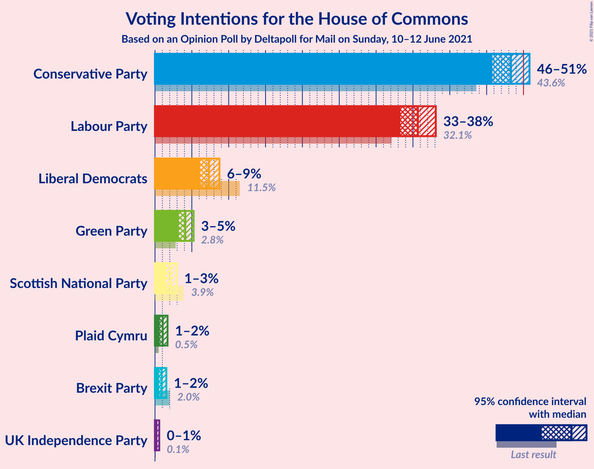

### Confidence Intervals

| Party | Last Result | Poll Result | 80% Confidence Interval | 90% Confidence Interval | 95% Confidence Interval | 99% Confidence Interval |
|:-----:|:-----------:|:-----------:|:-----------------------:|:-----------------------:|:-----------------------:|:-----------------------:|
| Conservative Party | 43.6% | 48.3% | 46.7–49.9% |46.2–50.4% |45.8–50.8% |45.0–51.6% |
| Labour Party | 32.1% | 35.7% | 34.1–37.3% |33.7–37.7% |33.3–38.1% |32.6–38.9% |
| Liberal Democrats | 11.5% | 7.3% | 6.5–8.3% |6.3–8.5% |6.1–8.7% |5.8–9.2% |
| Green Party | 2.8% | 4.1% | 3.5–4.9% |3.4–5.1% |3.2–5.2% |3.0–5.6% |
| Scottish National Party | 3.9% | 2.1% | 1.7–2.7% |1.6–2.8% |1.5–3.0% |1.3–3.2% |
| Plaid Cymru | 0.5% | 1.0% | 0.8–1.5% |0.7–1.6% |0.6–1.7% |0.5–1.9% |
| Brexit Party | 2.0% | 0.9% | 0.7–1.3% |0.6–1.4% |0.5–1.5% |0.4–1.8% |
| UK Independence Party | 0.1% | 0.2% | 0.1–0.4% |0.1–0.5% |0.1–0.6% |0.0–0.7% |

*Note:* The poll result column reflects the actual value used in the calculations. Published results may vary slightly, and in addition be rounded to fewer digits.

## Seats

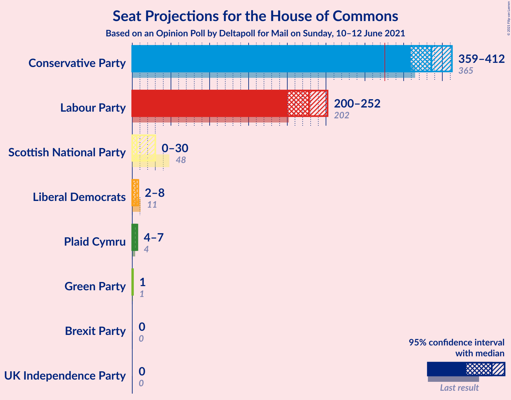

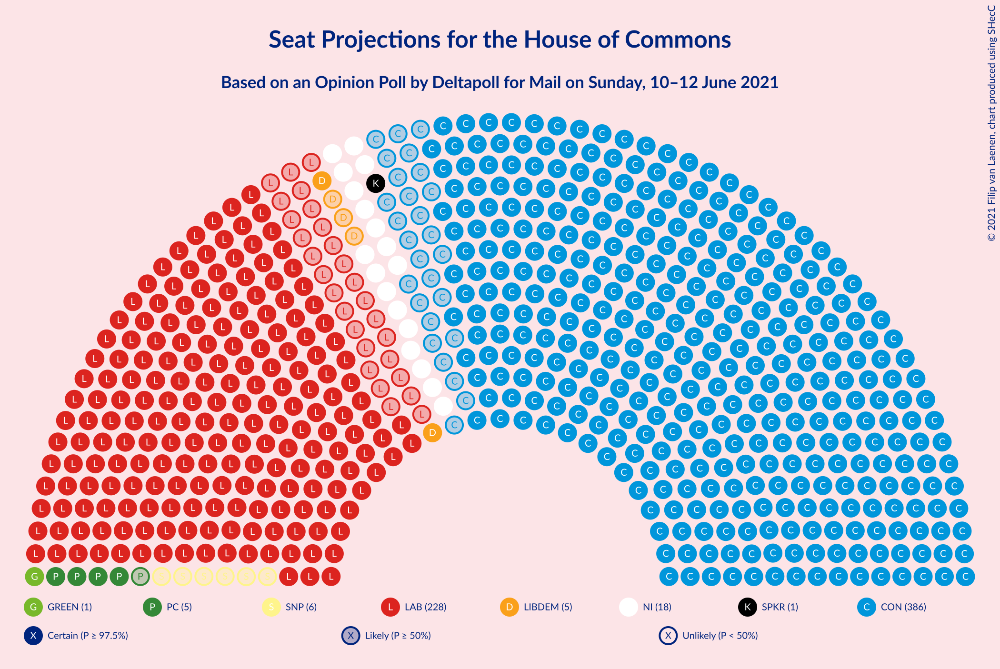

### Confidence Intervals

| Party | Last Result | Median | 80% Confidence Interval | 90% Confidence Interval | 95% Confidence Interval | 99% Confidence Interval |
|:-----:|:-----------:|:------:|:-----------------------:|:-----------------------:|:-----------------------:|:-----------------------:|
| <a href="#conservative-party">Conservative Party</a> | 365 | 386 | 362–400 |359–412 |359–412 |351–417 |
| <a href="#labour-party">Labour Party</a> | 202 | 228 | 203–242 |201–252 |200–252 |193–258 |
| <a href="#liberal-democrats">Liberal Democrats</a> | 11 | 5 | 3–7 |2–8 |2–8 |0–9 |
| <a href="#green-party">Green Party</a> | 1 | 1 | 1 |1 |1 |1 |
| <a href="#scottish-national-party">Scottish National Party</a> | 48 | 6 | 2–21 |1–28 |0–30 |0–39 |
| <a href="#plaid-cymru">Plaid Cymru</a> | 4 | 5 | 5–7 |4–7 |4–7 |4–9 |
| <a href="#brexit-party">Brexit Party</a> | 0 | 0 | 0 |0 |0 |0 |
| <a href="#uk-independence-party">UK Independence Party</a> | 0 | 0 | 0 |0 |0 |0 |

### Conservative Party

*For a full overview of the results for this party, see the [Conservative Party](party-conservativeparty.html) page.*

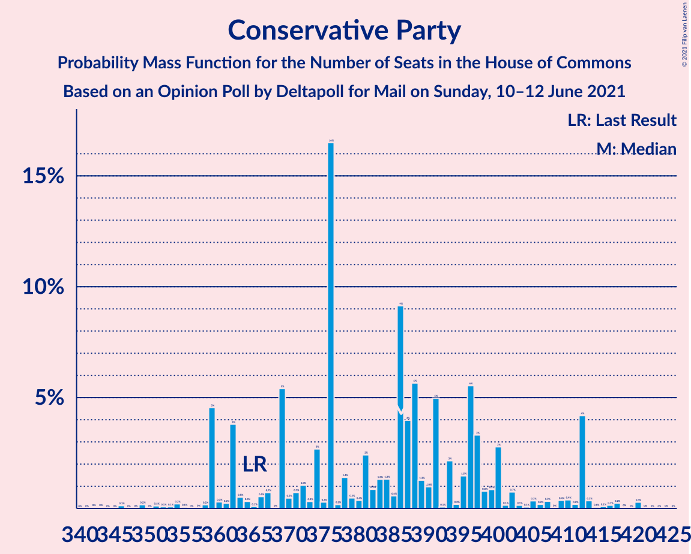

| Number of Seats | Probability | Accumulated | Special Marks |
|:---------------:|:-----------:|:-----------:|:-------------:|
| 342 | 0% | 100% |  |
| 343 | 0% | 99.9% |  |
| 344 | 0% | 99.9% |  |
| 345 | 0% | 99.9% |  |
| 346 | 0.1% | 99.9% |  |
| 347 | 0% | 99.7% |  |
| 348 | 0% | 99.7% |  |
| 349 | 0.2% | 99.7% |  |
| 350 | 0% | 99.6% |  |
| 351 | 0.1% | 99.5% |  |
| 352 | 0.1% | 99.4% |  |
| 353 | 0.1% | 99.4% |  |
| 354 | 0.2% | 99.3% |  |
| 355 | 0.1% | 99.1% |  |
| 356 | 0% | 99.0% |  |
| 357 | 0% | 99.0% |  |
| 358 | 0.2% | 99.0% |  |
| 359 | 5% | 98.8% |  |
| 360 | 0.3% | 94% |  |
| 361 | 0.2% | 94% |  |
| 362 | 4% | 94% |  |
| 363 | 0.5% | 90% |  |
| 364 | 0.3% | 89% |  |
| 365 | 0.1% | 89% | Last Result |
| 366 | 0.5% | 89% |  |
| 367 | 0.7% | 88% |  |
| 368 | 0% | 88% |  |
| 369 | 5% | 88% |  |
| 370 | 0.5% | 82% |  |
| 371 | 0.7% | 82% |  |
| 372 | 1.0% | 81% |  |
| 373 | 0.3% | 80% |  |
| 374 | 3% | 80% |  |
| 375 | 0.3% | 77% |  |
| 376 | 16% | 77% |  |
| 377 | 0.2% | 60% |  |
| 378 | 1.4% | 60% |  |
| 379 | 0.5% | 59% |  |
| 380 | 0.4% | 58% |  |
| 381 | 2% | 58% |  |
| 382 | 0.9% | 56% |  |
| 383 | 1.3% | 55% |  |
| 384 | 1.3% | 53% |  |
| 385 | 0.6% | 52% |  |
| 386 | 9% | 51% | Median |
| 387 | 4% | 42% |  |
| 388 | 6% | 38% |  |
| 389 | 1.3% | 33% |  |
| 390 | 1.0% | 31% |  |
| 391 | 5% | 30% |  |
| 392 | 0.1% | 25% |  |
| 393 | 2% | 25% |  |
| 394 | 0.2% | 23% |  |
| 395 | 1.5% | 23% |  |
| 396 | 6% | 22% |  |
| 397 | 3% | 16% |  |
| 398 | 0.8% | 13% |  |
| 399 | 0.9% | 12% |  |
| 400 | 3% | 11% |  |
| 401 | 0.1% | 8% |  |
| 402 | 0.7% | 8% |  |
| 403 | 0.1% | 7% |  |
| 404 | 0.1% | 7% |  |
| 405 | 0.3% | 7% |  |
| 406 | 0.2% | 7% |  |
| 407 | 0.3% | 7% |  |
| 408 | 0% | 6% |  |
| 409 | 0.4% | 6% |  |
| 410 | 0.4% | 6% |  |
| 411 | 0.2% | 6% |  |
| 412 | 4% | 5% |  |
| 413 | 0.3% | 1.2% |  |
| 414 | 0.1% | 0.9% |  |
| 415 | 0.1% | 0.8% |  |
| 416 | 0.1% | 0.7% |  |
| 417 | 0.2% | 0.6% |  |
| 418 | 0% | 0.4% |  |
| 419 | 0% | 0.3% |  |
| 420 | 0.3% | 0.3% |  |
| 421 | 0% | 0% |  |

### Labour Party

*For a full overview of the results for this party, see the [Labour Party](party-labourparty.html) page.*

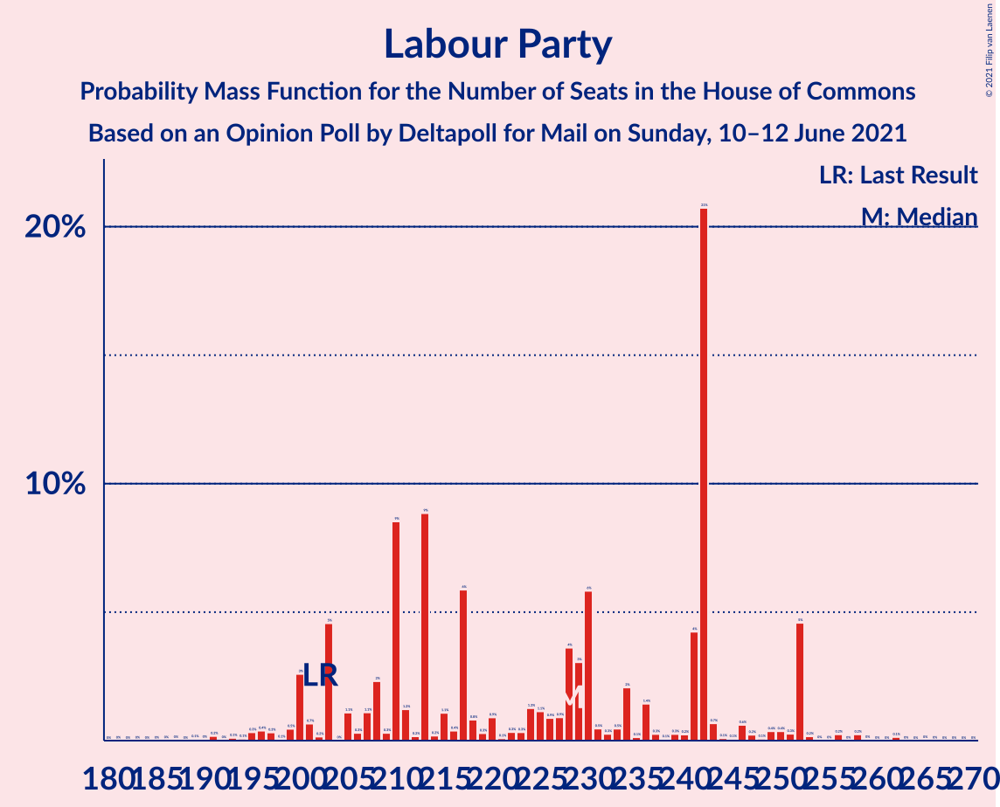

| Number of Seats | Probability | Accumulated | Special Marks |
|:---------------:|:-----------:|:-----------:|:-------------:|
| 184 | 0% | 100% |  |
| 185 | 0% | 99.9% |  |
| 186 | 0% | 99.9% |  |
| 187 | 0% | 99.9% |  |
| 188 | 0% | 99.9% |  |
| 189 | 0.1% | 99.9% |  |
| 190 | 0% | 99.8% |  |
| 191 | 0.2% | 99.8% |  |
| 192 | 0% | 99.6% |  |
| 193 | 0.1% | 99.6% |  |
| 194 | 0.1% | 99.4% |  |
| 195 | 0.3% | 99.4% |  |
| 196 | 0.4% | 99.0% |  |
| 197 | 0.3% | 98.7% |  |
| 198 | 0.1% | 98% |  |
| 199 | 0.5% | 98% |  |
| 200 | 3% | 98% |  |
| 201 | 0.7% | 95% |  |
| 202 | 0.2% | 95% | Last Result |
| 203 | 5% | 94% |  |
| 204 | 0% | 90% |  |
| 205 | 1.1% | 90% |  |
| 206 | 0.3% | 89% |  |
| 207 | 1.1% | 88% |  |
| 208 | 2% | 87% |  |
| 209 | 0.3% | 85% |  |
| 210 | 9% | 85% |  |
| 211 | 1.2% | 76% |  |
| 212 | 0.2% | 75% |  |
| 213 | 9% | 75% |  |
| 214 | 0.2% | 66% |  |
| 215 | 1.1% | 66% |  |
| 216 | 0.4% | 65% |  |
| 217 | 6% | 64% |  |
| 218 | 0.8% | 58% |  |
| 219 | 0.3% | 58% |  |
| 220 | 0.9% | 57% |  |
| 221 | 0.1% | 56% |  |
| 222 | 0.3% | 56% |  |
| 223 | 0.3% | 56% |  |
| 224 | 1.3% | 56% |  |
| 225 | 1.1% | 54% |  |
| 226 | 0.9% | 53% |  |
| 227 | 0.9% | 52% |  |
| 228 | 4% | 51% | Median |
| 229 | 3% | 48% |  |
| 230 | 6% | 45% |  |
| 231 | 0.5% | 39% |  |
| 232 | 0.3% | 38% |  |
| 233 | 0.5% | 38% |  |
| 234 | 2% | 38% |  |
| 235 | 0.1% | 36% |  |
| 236 | 1.4% | 36% |  |
| 237 | 0.3% | 34% |  |
| 238 | 0.1% | 34% |  |
| 239 | 0.3% | 34% |  |
| 240 | 0.2% | 34% |  |
| 241 | 4% | 33% |  |
| 242 | 21% | 29% |  |
| 243 | 0.7% | 8% |  |
| 244 | 0.1% | 8% |  |
| 245 | 0.1% | 8% |  |
| 246 | 0.6% | 7% |  |
| 247 | 0.2% | 7% |  |
| 248 | 0.1% | 7% |  |
| 249 | 0.4% | 7% |  |
| 250 | 0.4% | 6% |  |
| 251 | 0.3% | 6% |  |
| 252 | 5% | 6% |  |
| 253 | 0.2% | 1.0% |  |
| 254 | 0% | 0.8% |  |
| 255 | 0% | 0.8% |  |
| 256 | 0.2% | 0.8% |  |
| 257 | 0% | 0.5% |  |
| 258 | 0.2% | 0.5% |  |
| 259 | 0% | 0.3% |  |
| 260 | 0% | 0.2% |  |
| 261 | 0% | 0.2% |  |
| 262 | 0.1% | 0.2% |  |
| 263 | 0% | 0.1% |  |
| 264 | 0% | 0.1% |  |
| 265 | 0% | 0.1% |  |
| 266 | 0% | 0% |  |

### Liberal Democrats

*For a full overview of the results for this party, see the [Liberal Democrats](party-liberaldemocrats.html) page.*

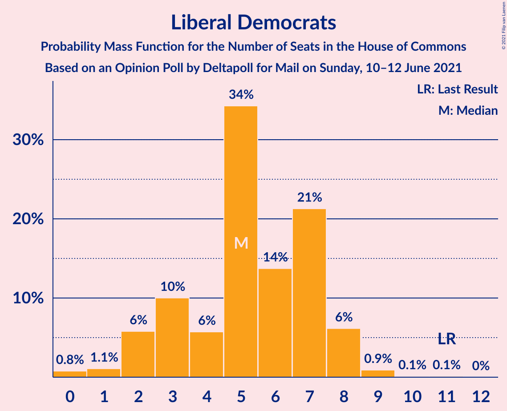

| Number of Seats | Probability | Accumulated | Special Marks |
|:---------------:|:-----------:|:-----------:|:-------------:|
| 0 | 0.8% | 100% |  |
| 1 | 1.1% | 99.2% |  |
| 2 | 6% | 98% |  |
| 3 | 10% | 92% |  |
| 4 | 6% | 82% |  |
| 5 | 34% | 77% | Median |
| 6 | 14% | 42% |  |
| 7 | 21% | 29% |  |
| 8 | 6% | 7% |  |
| 9 | 0.9% | 1.1% |  |
| 10 | 0.1% | 0.2% |  |
| 11 | 0.1% | 0.1% | Last Result |
| 12 | 0% | 0% |  |

### Green Party

*For a full overview of the results for this party, see the [Green Party](party-greenparty.html) page.*

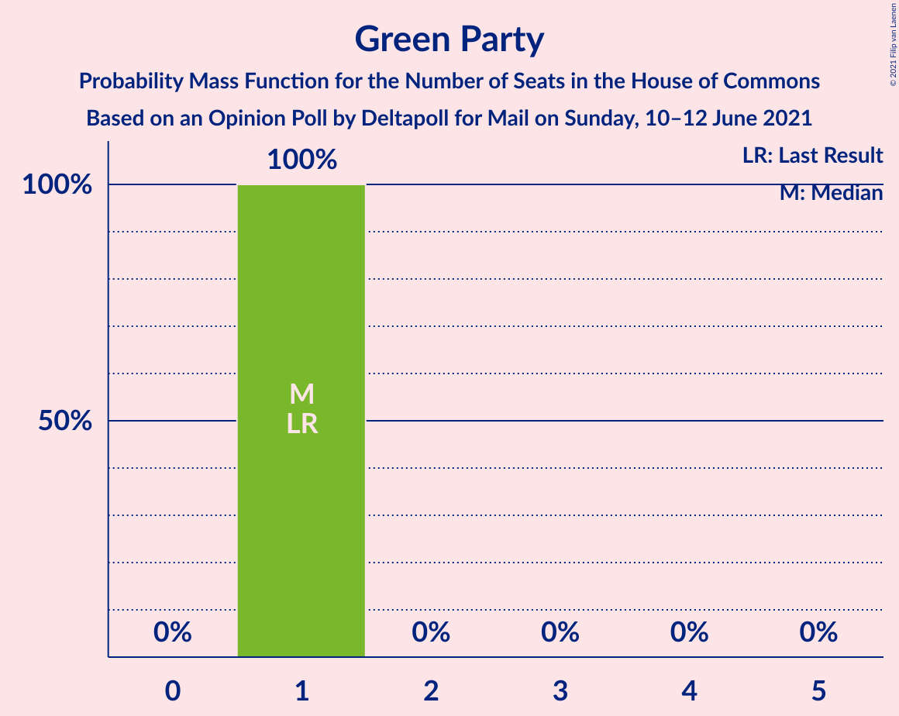

| Number of Seats | Probability | Accumulated | Special Marks |
|:---------------:|:-----------:|:-----------:|:-------------:|
| 1 | 100% | 100% | Last Result, Median |

### Scottish National Party

*For a full overview of the results for this party, see the [Scottish National Party](party-scottishnationalparty.html) page.*

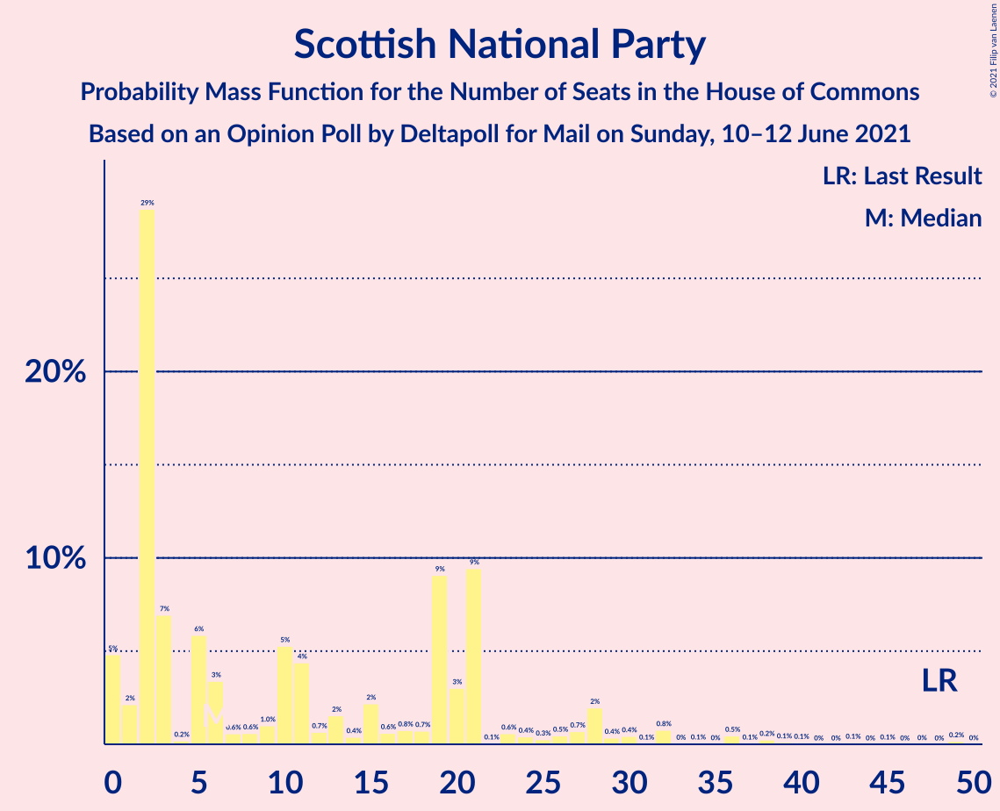

| Number of Seats | Probability | Accumulated | Special Marks |
|:---------------:|:-----------:|:-----------:|:-------------:|
| 0 | 5% | 100% |  |
| 1 | 2% | 95% |  |
| 2 | 29% | 93% |  |
| 3 | 7% | 64% |  |
| 4 | 0.2% | 57% |  |
| 5 | 6% | 57% |  |
| 6 | 3% | 51% | Median |
| 7 | 0.6% | 48% |  |
| 8 | 0.6% | 47% |  |
| 9 | 1.0% | 47% |  |
| 10 | 5% | 46% |  |
| 11 | 4% | 40% |  |
| 12 | 0.7% | 36% |  |
| 13 | 2% | 35% |  |
| 14 | 0.4% | 34% |  |
| 15 | 2% | 33% |  |
| 16 | 0.6% | 31% |  |
| 17 | 0.8% | 31% |  |
| 18 | 0.7% | 30% |  |
| 19 | 9% | 29% |  |
| 20 | 3% | 20% |  |
| 21 | 9% | 17% |  |
| 22 | 0.1% | 8% |  |
| 23 | 0.6% | 8% |  |
| 24 | 0.4% | 7% |  |
| 25 | 0.3% | 7% |  |
| 26 | 0.5% | 6% |  |
| 27 | 0.7% | 6% |  |
| 28 | 2% | 5% |  |
| 29 | 0.4% | 3% |  |
| 30 | 0.4% | 3% |  |
| 31 | 0.1% | 2% |  |
| 32 | 0.8% | 2% |  |
| 33 | 0% | 1.5% |  |
| 34 | 0.1% | 1.4% |  |
| 35 | 0% | 1.4% |  |
| 36 | 0.5% | 1.4% |  |
| 37 | 0.1% | 0.9% |  |
| 38 | 0.2% | 0.8% |  |
| 39 | 0.1% | 0.6% |  |
| 40 | 0.1% | 0.5% |  |
| 41 | 0% | 0.4% |  |
| 42 | 0% | 0.4% |  |
| 43 | 0.1% | 0.4% |  |
| 44 | 0% | 0.3% |  |
| 45 | 0.1% | 0.3% |  |
| 46 | 0% | 0.2% |  |
| 47 | 0% | 0.2% |  |
| 48 | 0% | 0.2% | Last Result |
| 49 | 0.2% | 0.2% |  |
| 50 | 0% | 0% |  |

### Plaid Cymru

*For a full overview of the results for this party, see the [Plaid Cymru](party-plaidcymru.html) page.*

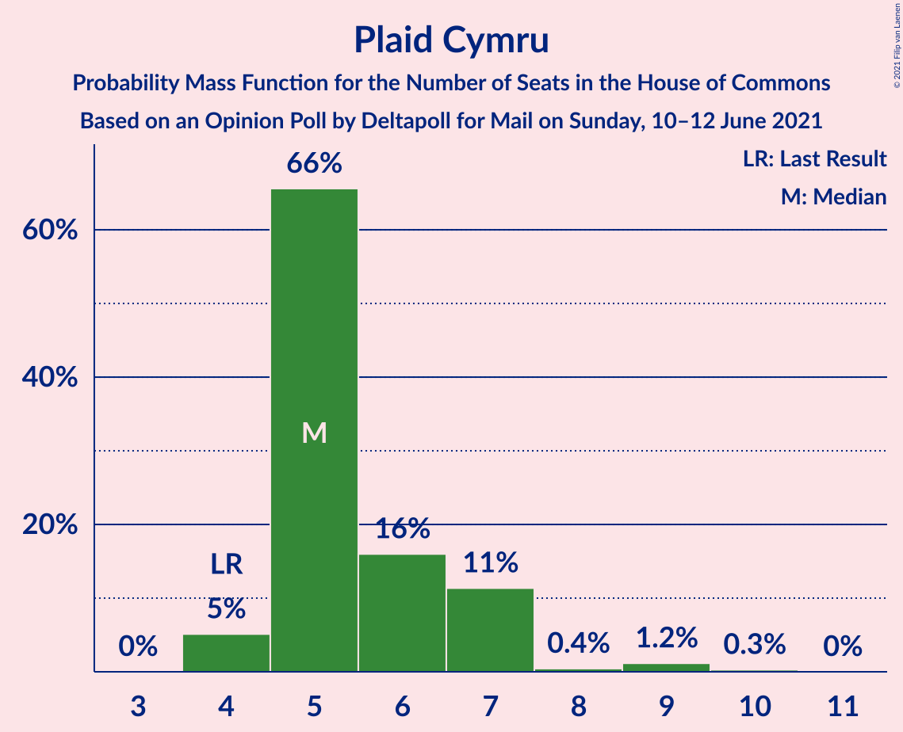

| Number of Seats | Probability | Accumulated | Special Marks |
|:---------------:|:-----------:|:-----------:|:-------------:|
| 4 | 5% | 100% | Last Result |
| 5 | 66% | 95% | Median |
| 6 | 16% | 29% |  |
| 7 | 11% | 13% |  |
| 8 | 0.4% | 2% |  |
| 9 | 1.2% | 1.4% |  |
| 10 | 0.3% | 0.3% |  |
| 11 | 0% | 0% |  |

### Brexit Party

*For a full overview of the results for this party, see the [Brexit Party](party-brexitparty.html) page.*

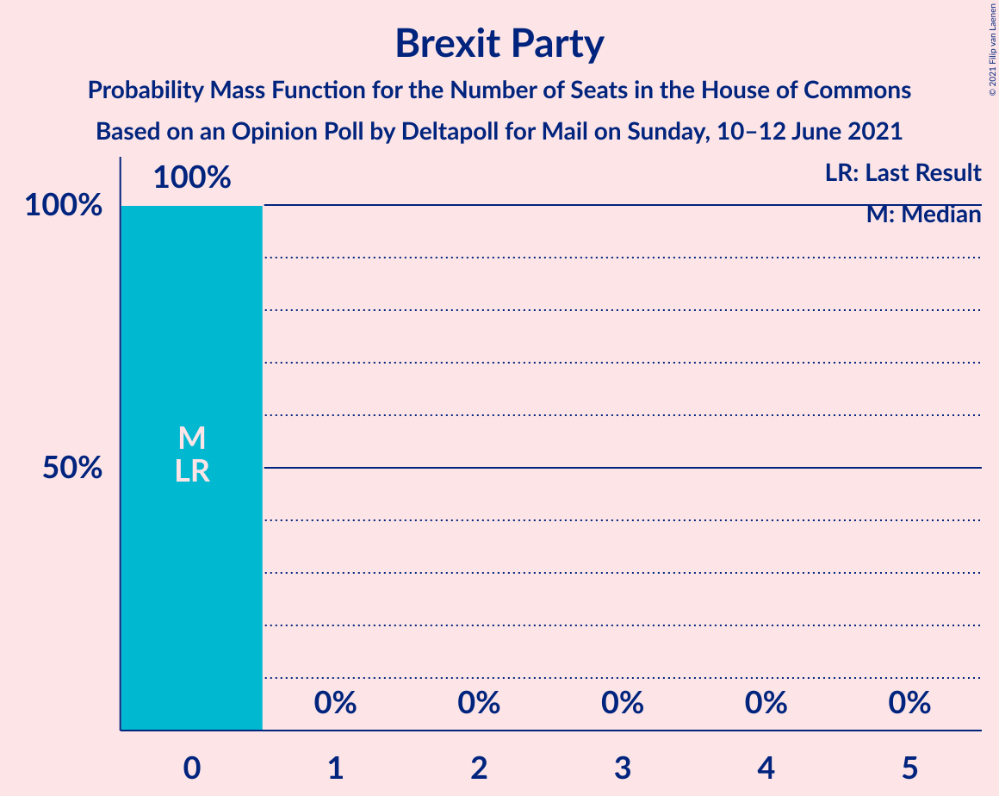

| Number of Seats | Probability | Accumulated | Special Marks |
|:---------------:|:-----------:|:-----------:|:-------------:|
| 0 | 100% | 100% | Last Result, Median |

### UK Independence Party

*For a full overview of the results for this party, see the [UK Independence Party](party-ukindependenceparty.html) page.*

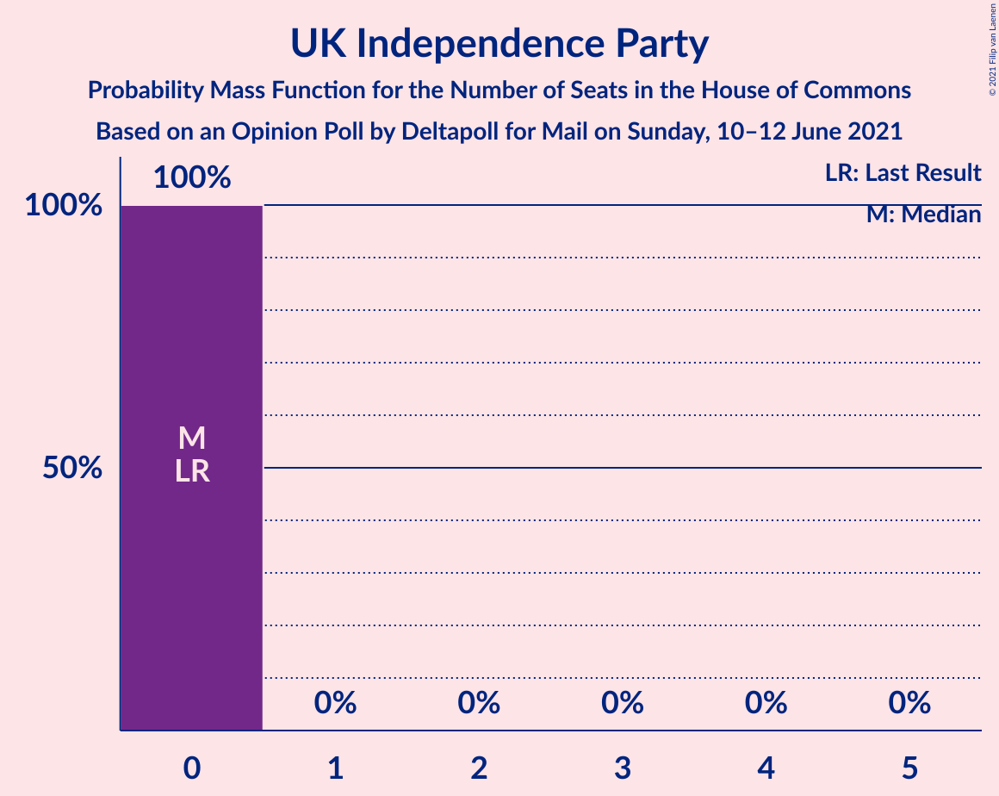

| Number of Seats | Probability | Accumulated | Special Marks |
|:---------------:|:-----------:|:-----------:|:-------------:|
| 0 | 100% | 100% | Last Result, Median |

## Coalitions

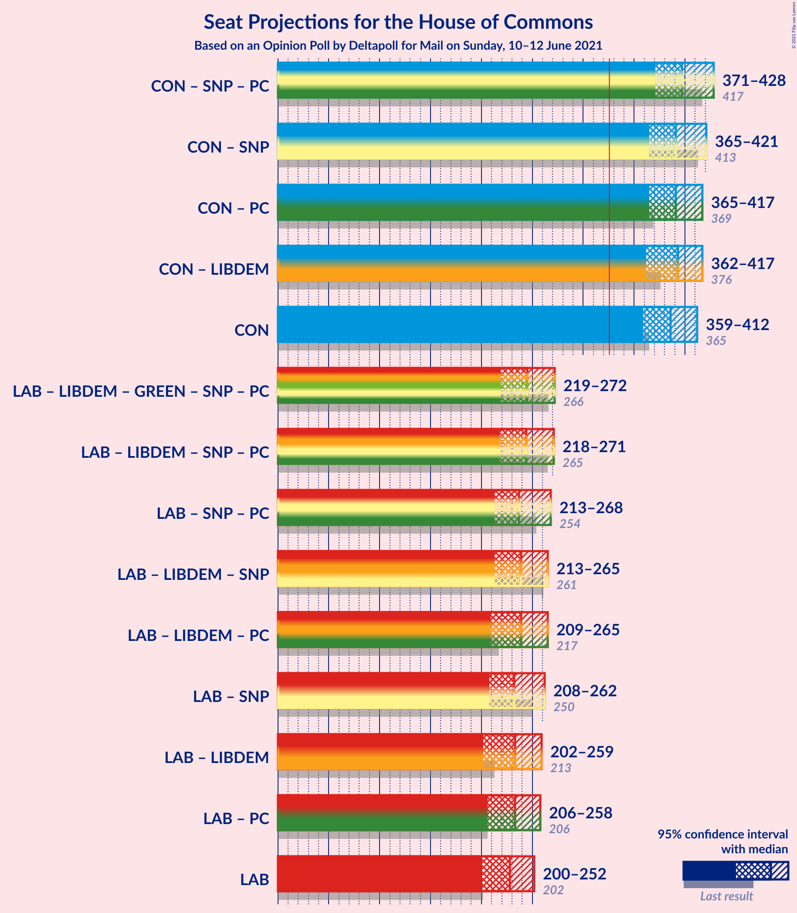

### Confidence Intervals

| Coalition | Last Result | Median | Majority? | 80% Confidence Interval | 90% Confidence Interval | 95% Confidence Interval | 99% Confidence Interval |
|:---------:|:-----------:|:------:|:---------:|:-----------------------:|:-----------------------:|:-----------------------:|:-----------------------:|
| Conservative Party – Scottish National Party – Plaid Cymru | 417 | 397 | 100% | 383–422 | 371–425 | 371–428 | 367–433 |
| Conservative Party – Scottish National Party | 413 | 391 | 100% | 378–417 | 366–418 | 365–421 | 362–428 |
| Conservative Party – Plaid Cymru | 369 | 391 | 100% | 368–406 | 365–417 | 365–417 | 356–423 |
| Conservative Party – Liberal Democrats | 376 | 393 | 100% | 369–407 | 362–417 | 362–417 | 357–422 |
| Conservative Party | 365 | 386 | 100% | 362–400 | 359–412 | 359–412 | 351–417 |
| Labour Party – Liberal Democrats – Green Party – Scottish National Party – Plaid Cymru | 266 | 245 | 0% | 231–269 | 219–272 | 219–272 | 214–280 |
| Labour Party – Liberal Democrats – Scottish National Party – Plaid Cymru | 265 | 244 | 0% | 230–268 | 218–271 | 218–271 | 213–279 |
| Labour Party – Scottish National Party – Plaid Cymru | 254 | 237 | 0% | 223–261 | 213–268 | 213–268 | 208–273 |
| Labour Party – Liberal Democrats – Scottish National Party | 261 | 239 | 0% | 224–262 | 213–265 | 213–265 | 207–274 |
| Labour Party – Liberal Democrats – Plaid Cymru | 217 | 239 | 0% | 213–252 | 212–264 | 209–265 | 202–268 |
| Labour Party – Scottish National Party | 250 | 232 | 0% | 217–255 | 208–262 | 208–262 | 202–268 |
| Labour Party – Liberal Democrats | 213 | 233 | 0% | 208–247 | 205–259 | 202–259 | 197–263 |
| Labour Party – Plaid Cymru | 206 | 233 | 0% | 209–247 | 207–257 | 206–258 | 199–263 |
| Labour Party | 202 | 228 | 0% | 203–242 | 201–252 | 200–252 | 193–258 |

### Conservative Party – Scottish National Party – Plaid Cymru

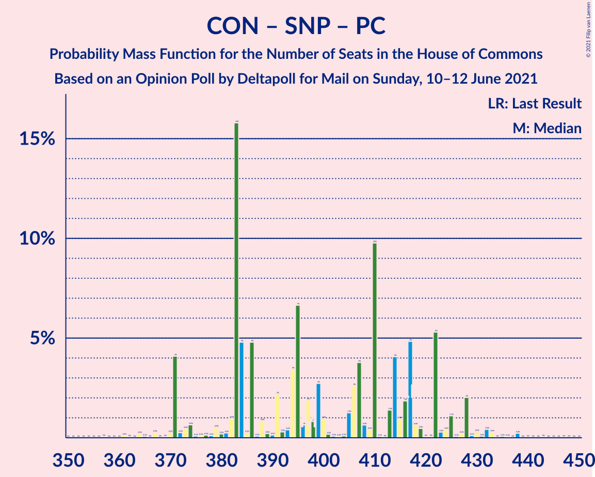

| Number of Seats | Probability | Accumulated | Special Marks |
|:---------------:|:-----------:|:-----------:|:-------------:|
| 357 | 0% | 100% |  |
| 358 | 0% | 99.9% |  |
| 359 | 0% | 99.9% |  |
| 360 | 0% | 99.9% |  |
| 361 | 0.1% | 99.9% |  |
| 362 | 0% | 99.8% |  |
| 363 | 0% | 99.8% |  |
| 364 | 0.2% | 99.8% |  |
| 365 | 0.1% | 99.6% |  |
| 366 | 0% | 99.5% |  |
| 367 | 0.3% | 99.5% |  |
| 368 | 0% | 99.2% |  |
| 369 | 0% | 99.2% |  |
| 370 | 0.2% | 99.2% |  |
| 371 | 4% | 98.9% |  |
| 372 | 0.3% | 95% |  |
| 373 | 0.4% | 95% |  |
| 374 | 0.6% | 94% |  |
| 375 | 0.1% | 93% |  |
| 376 | 0.1% | 93% |  |
| 377 | 0.1% | 93% |  |
| 378 | 0.1% | 93% |  |
| 379 | 0.5% | 93% |  |
| 380 | 0.2% | 93% |  |
| 381 | 0.2% | 92% |  |
| 382 | 1.0% | 92% |  |
| 383 | 16% | 91% |  |
| 384 | 5% | 75% |  |
| 385 | 0.2% | 71% |  |
| 386 | 5% | 70% |  |
| 387 | 0.1% | 66% |  |
| 388 | 0.8% | 65% |  |
| 389 | 0.2% | 65% |  |
| 390 | 0.1% | 64% |  |
| 391 | 2% | 64% |  |
| 392 | 0.3% | 62% |  |
| 393 | 0.4% | 62% |  |
| 394 | 3% | 61% |  |
| 395 | 7% | 58% |  |
| 396 | 0.6% | 51% |  |
| 397 | 2% | 51% | Median |
| 398 | 0.8% | 49% |  |
| 399 | 3% | 48% |  |
| 400 | 1.0% | 45% |  |
| 401 | 0.2% | 44% |  |
| 402 | 0.1% | 44% |  |
| 403 | 0.1% | 44% |  |
| 404 | 0.1% | 44% |  |
| 405 | 1.3% | 44% |  |
| 406 | 3% | 43% |  |
| 407 | 4% | 40% |  |
| 408 | 0.6% | 36% |  |
| 409 | 0.4% | 36% |  |
| 410 | 10% | 35% |  |
| 411 | 0.1% | 25% |  |
| 412 | 0% | 25% |  |
| 413 | 1.4% | 25% |  |
| 414 | 4% | 24% |  |
| 415 | 0.9% | 20% |  |
| 416 | 2% | 19% |  |
| 417 | 5% | 17% | Last Result |
| 418 | 0.6% | 12% |  |
| 419 | 0.5% | 12% |  |
| 420 | 0% | 11% |  |
| 421 | 0% | 11% |  |
| 422 | 5% | 11% |  |
| 423 | 0.3% | 6% |  |
| 424 | 0.4% | 5% |  |
| 425 | 1.1% | 5% |  |
| 426 | 0.1% | 4% |  |
| 427 | 0.2% | 4% |  |
| 428 | 2% | 4% |  |
| 429 | 0.1% | 2% |  |
| 430 | 0.3% | 2% |  |
| 431 | 0.1% | 1.3% |  |
| 432 | 0.4% | 1.2% |  |
| 433 | 0.3% | 0.8% |  |
| 434 | 0% | 0.5% |  |
| 435 | 0.1% | 0.5% |  |
| 436 | 0.1% | 0.4% |  |
| 437 | 0% | 0.4% |  |
| 438 | 0.2% | 0.3% |  |
| 439 | 0% | 0.1% |  |
| 440 | 0% | 0.1% |  |
| 441 | 0% | 0.1% |  |
| 442 | 0% | 0.1% |  |
| 443 | 0% | 0.1% |  |
| 444 | 0% | 0.1% |  |
| 445 | 0% | 0% |  |

### Conservative Party – Scottish National Party

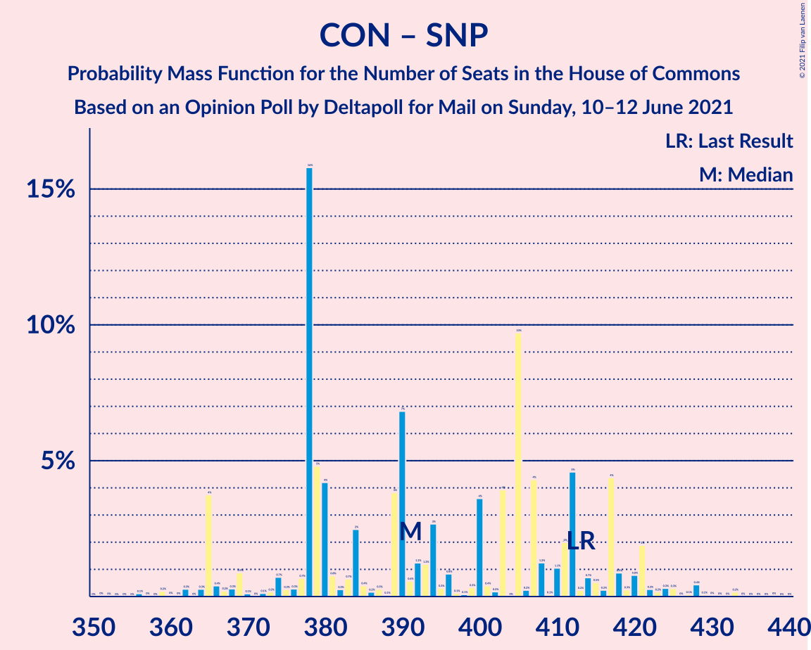

| Number of Seats | Probability | Accumulated | Special Marks |
|:---------------:|:-----------:|:-----------:|:-------------:|
| 351 | 0% | 100% |  |
| 352 | 0% | 99.9% |  |
| 353 | 0% | 99.9% |  |
| 354 | 0% | 99.9% |  |
| 355 | 0% | 99.9% |  |
| 356 | 0.1% | 99.9% |  |
| 357 | 0% | 99.8% |  |
| 358 | 0% | 99.8% |  |
| 359 | 0.2% | 99.8% |  |
| 360 | 0% | 99.6% |  |
| 361 | 0% | 99.5% |  |
| 362 | 0.3% | 99.5% |  |
| 363 | 0% | 99.2% |  |
| 364 | 0.3% | 99.2% |  |
| 365 | 4% | 98.9% |  |
| 366 | 0.4% | 95% |  |
| 367 | 0.2% | 95% |  |
| 368 | 0.3% | 95% |  |
| 369 | 0.9% | 94% |  |
| 370 | 0.1% | 93% |  |
| 371 | 0% | 93% |  |
| 372 | 0.1% | 93% |  |
| 373 | 0.2% | 93% |  |
| 374 | 0.7% | 93% |  |
| 375 | 0.3% | 92% |  |
| 376 | 0.3% | 92% |  |
| 377 | 0.7% | 92% |  |
| 378 | 16% | 91% |  |
| 379 | 5% | 75% |  |
| 380 | 4% | 70% |  |
| 381 | 0.8% | 66% |  |
| 382 | 0.3% | 65% |  |
| 383 | 0.7% | 65% |  |
| 384 | 2% | 65% |  |
| 385 | 0.4% | 62% |  |
| 386 | 0.2% | 62% |  |
| 387 | 0.3% | 62% |  |
| 388 | 0.1% | 61% |  |
| 389 | 4% | 61% |  |
| 390 | 7% | 57% |  |
| 391 | 0.6% | 51% |  |
| 392 | 1.2% | 50% | Median |
| 393 | 1.2% | 49% |  |
| 394 | 3% | 48% |  |
| 395 | 0.3% | 45% |  |
| 396 | 0.8% | 45% |  |
| 397 | 0.1% | 44% |  |
| 398 | 0.1% | 44% |  |
| 399 | 0.3% | 44% |  |
| 400 | 4% | 43% |  |
| 401 | 0.4% | 40% |  |
| 402 | 0.2% | 39% |  |
| 403 | 4% | 39% |  |
| 404 | 0% | 35% |  |
| 405 | 10% | 35% |  |
| 406 | 0.2% | 25% |  |
| 407 | 4% | 25% |  |
| 408 | 1.2% | 21% |  |
| 409 | 0.1% | 20% |  |
| 410 | 1.1% | 20% |  |
| 411 | 2% | 18% |  |
| 412 | 5% | 16% |  |
| 413 | 0.2% | 12% | Last Result |
| 414 | 0.7% | 12% |  |
| 415 | 0.5% | 11% |  |
| 416 | 0.2% | 10% |  |
| 417 | 4% | 10% |  |
| 418 | 0.9% | 6% |  |
| 419 | 0.3% | 5% |  |
| 420 | 0.8% | 5% |  |
| 421 | 2% | 4% |  |
| 422 | 0.3% | 2% |  |
| 423 | 0.2% | 2% |  |
| 424 | 0.3% | 2% |  |
| 425 | 0.3% | 1.3% |  |
| 426 | 0% | 1.0% |  |
| 427 | 0.1% | 0.9% |  |
| 428 | 0.4% | 0.9% |  |
| 429 | 0.1% | 0.4% |  |
| 430 | 0% | 0.4% |  |
| 431 | 0% | 0.3% |  |
| 432 | 0% | 0.3% |  |
| 433 | 0.2% | 0.3% |  |
| 434 | 0% | 0.1% |  |
| 435 | 0% | 0.1% |  |
| 436 | 0% | 0.1% |  |
| 437 | 0% | 0.1% |  |
| 438 | 0% | 0.1% |  |
| 439 | 0% | 0% |  |

### Conservative Party – Plaid Cymru

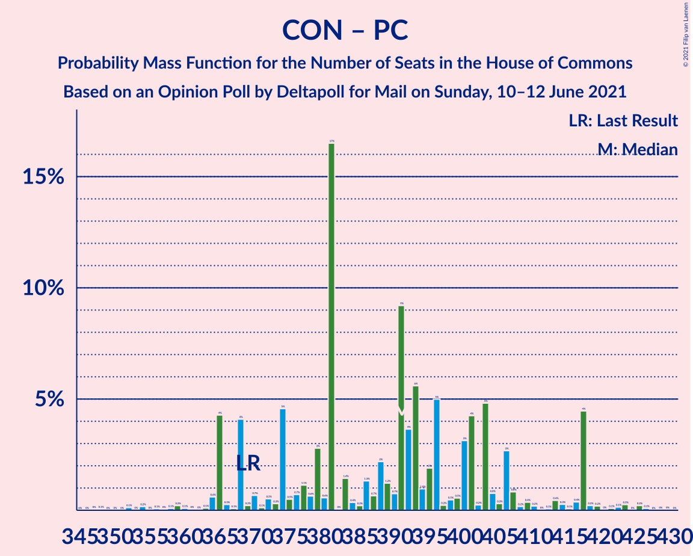

| Number of Seats | Probability | Accumulated | Special Marks |
|:---------------:|:-----------:|:-----------:|:-------------:|
| 347 | 0% | 100% |  |
| 348 | 0.1% | 99.9% |  |
| 349 | 0% | 99.9% |  |
| 350 | 0% | 99.9% |  |
| 351 | 0% | 99.9% |  |
| 352 | 0.1% | 99.9% |  |
| 353 | 0% | 99.7% |  |
| 354 | 0.2% | 99.7% |  |
| 355 | 0% | 99.6% |  |
| 356 | 0.1% | 99.5% |  |
| 357 | 0% | 99.5% |  |
| 358 | 0.1% | 99.4% |  |
| 359 | 0.2% | 99.4% |  |
| 360 | 0.1% | 99.1% |  |
| 361 | 0% | 99.1% |  |
| 362 | 0% | 99.0% |  |
| 363 | 0.1% | 99.0% |  |
| 364 | 0.6% | 98.9% |  |
| 365 | 4% | 98% |  |
| 366 | 0.3% | 94% |  |
| 367 | 0.1% | 94% |  |
| 368 | 4% | 94% |  |
| 369 | 0.2% | 90% | Last Result |
| 370 | 0.7% | 89% |  |
| 371 | 0.1% | 89% |  |
| 372 | 0.5% | 89% |  |
| 373 | 0.3% | 88% |  |
| 374 | 5% | 88% |  |
| 375 | 0.5% | 83% |  |
| 376 | 0.7% | 83% |  |
| 377 | 1.1% | 82% |  |
| 378 | 0.6% | 81% |  |
| 379 | 3% | 80% |  |
| 380 | 0.6% | 77% |  |
| 381 | 17% | 77% |  |
| 382 | 0% | 60% |  |
| 383 | 1.4% | 60% |  |
| 384 | 0.4% | 59% |  |
| 385 | 0.2% | 59% |  |
| 386 | 1.3% | 58% |  |
| 387 | 0.7% | 57% |  |
| 388 | 2% | 56% |  |
| 389 | 1.2% | 54% |  |
| 390 | 0.7% | 53% |  |
| 391 | 9% | 52% | Median |
| 392 | 4% | 43% |  |
| 393 | 6% | 39% |  |
| 394 | 1.0% | 34% |  |
| 395 | 2% | 33% |  |
| 396 | 5% | 31% |  |
| 397 | 0.2% | 26% |  |
| 398 | 0.5% | 26% |  |
| 399 | 0.5% | 25% |  |
| 400 | 3% | 25% |  |
| 401 | 4% | 22% |  |
| 402 | 0.2% | 17% |  |
| 403 | 5% | 17% |  |
| 404 | 0.8% | 12% |  |
| 405 | 0.3% | 11% |  |
| 406 | 3% | 11% |  |
| 407 | 0.8% | 8% |  |
| 408 | 0.2% | 8% |  |
| 409 | 0.4% | 8% |  |
| 410 | 0.2% | 7% |  |
| 411 | 0% | 7% |  |
| 412 | 0.1% | 7% |  |
| 413 | 0.4% | 7% |  |
| 414 | 0.3% | 6% |  |
| 415 | 0.1% | 6% |  |
| 416 | 0.4% | 6% |  |
| 417 | 4% | 6% |  |
| 418 | 0.2% | 1.3% |  |
| 419 | 0.2% | 1.0% |  |
| 420 | 0% | 0.9% |  |
| 421 | 0.1% | 0.8% |  |
| 422 | 0.1% | 0.7% |  |
| 423 | 0.3% | 0.6% |  |
| 424 | 0% | 0.4% |  |
| 425 | 0.2% | 0.3% |  |
| 426 | 0.1% | 0.1% |  |
| 427 | 0% | 0.1% |  |
| 428 | 0% | 0.1% |  |
| 429 | 0% | 0% |  |

### Conservative Party – Liberal Democrats

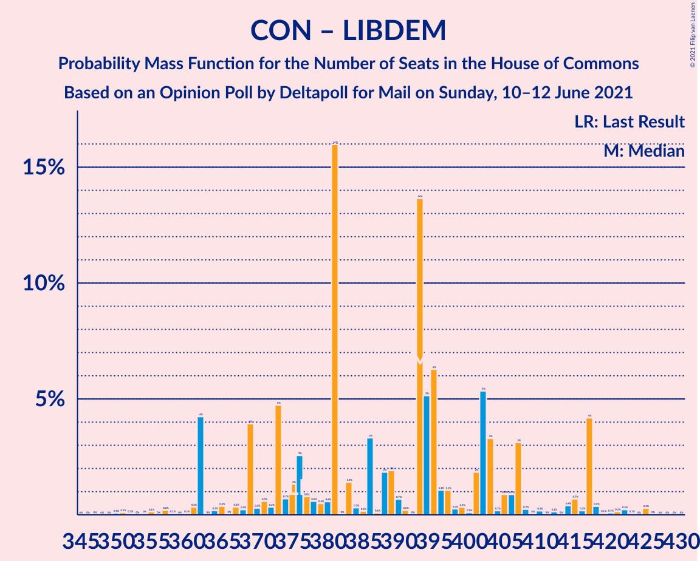

| Number of Seats | Probability | Accumulated | Special Marks |
|:---------------:|:-----------:|:-----------:|:-------------:|
| 347 | 0% | 100% |  |
| 348 | 0% | 99.9% |  |
| 349 | 0% | 99.9% |  |
| 350 | 0.1% | 99.9% |  |
| 351 | 0.1% | 99.9% |  |
| 352 | 0.1% | 99.8% |  |
| 353 | 0% | 99.7% |  |
| 354 | 0% | 99.7% |  |
| 355 | 0.1% | 99.7% |  |
| 356 | 0% | 99.5% |  |
| 357 | 0.2% | 99.5% |  |
| 358 | 0.1% | 99.3% |  |
| 359 | 0% | 99.3% |  |
| 360 | 0.1% | 99.3% |  |
| 361 | 0.3% | 99.2% |  |
| 362 | 4% | 98.9% |  |
| 363 | 0% | 95% |  |
| 364 | 0.2% | 95% |  |
| 365 | 0.4% | 94% |  |
| 366 | 0% | 94% |  |
| 367 | 0.3% | 94% |  |
| 368 | 0.2% | 94% |  |
| 369 | 4% | 94% |  |
| 370 | 0.3% | 90% |  |
| 371 | 0.6% | 89% |  |
| 372 | 0.3% | 89% |  |
| 373 | 5% | 88% |  |
| 374 | 0.7% | 84% |  |
| 375 | 1.3% | 83% |  |
| 376 | 3% | 82% | Last Result |
| 377 | 0.8% | 79% |  |
| 378 | 0.6% | 78% |  |
| 379 | 0.5% | 78% |  |
| 380 | 0.6% | 77% |  |
| 381 | 16% | 77% |  |
| 382 | 0% | 61% |  |
| 383 | 1.4% | 61% |  |
| 384 | 0.3% | 59% |  |
| 385 | 0.2% | 59% |  |
| 386 | 3% | 59% |  |
| 387 | 0.1% | 55% |  |
| 388 | 2% | 55% |  |
| 389 | 2% | 53% |  |
| 390 | 0.7% | 52% |  |
| 391 | 0.2% | 51% | Median |
| 392 | 0% | 51% |  |
| 393 | 14% | 51% |  |
| 394 | 5% | 37% |  |
| 395 | 6% | 32% |  |
| 396 | 1.1% | 26% |  |
| 397 | 1.1% | 25% |  |
| 398 | 0.3% | 24% |  |
| 399 | 0.3% | 23% |  |
| 400 | 0.1% | 23% |  |
| 401 | 2% | 23% |  |
| 402 | 5% | 21% |  |
| 403 | 3% | 16% |  |
| 404 | 0.2% | 12% |  |
| 405 | 0.9% | 12% |  |
| 406 | 0.9% | 11% |  |
| 407 | 3% | 10% |  |
| 408 | 0.2% | 7% |  |
| 409 | 0% | 7% |  |
| 410 | 0.2% | 7% |  |
| 411 | 0% | 7% |  |
| 412 | 0.1% | 7% |  |
| 413 | 0% | 7% |  |
| 414 | 0.4% | 7% |  |
| 415 | 0.7% | 6% |  |
| 416 | 0.2% | 6% |  |
| 417 | 4% | 5% |  |
| 418 | 0.4% | 1.3% |  |
| 419 | 0.1% | 0.9% |  |
| 420 | 0.1% | 0.8% |  |
| 421 | 0.1% | 0.7% |  |
| 422 | 0.2% | 0.6% |  |
| 423 | 0.1% | 0.4% |  |
| 424 | 0% | 0.3% |  |
| 425 | 0.3% | 0.3% |  |
| 426 | 0% | 0% |  |

### Conservative Party

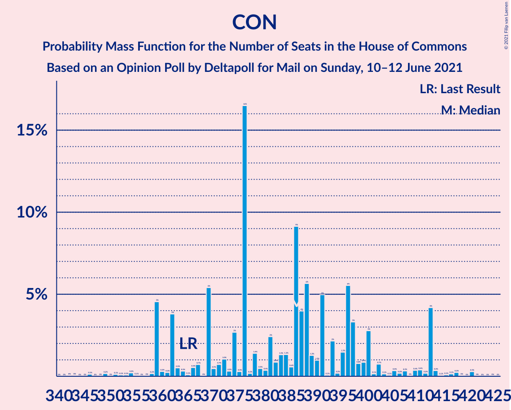

| Number of Seats | Probability | Accumulated | Special Marks |
|:---------------:|:-----------:|:-----------:|:-------------:|
| 342 | 0% | 100% |  |
| 343 | 0% | 99.9% |  |
| 344 | 0% | 99.9% |  |
| 345 | 0% | 99.9% |  |
| 346 | 0.1% | 99.9% |  |
| 347 | 0% | 99.7% |  |
| 348 | 0% | 99.7% |  |
| 349 | 0.2% | 99.7% |  |
| 350 | 0% | 99.6% |  |
| 351 | 0.1% | 99.5% |  |
| 352 | 0.1% | 99.4% |  |
| 353 | 0.1% | 99.4% |  |
| 354 | 0.2% | 99.3% |  |
| 355 | 0.1% | 99.1% |  |
| 356 | 0% | 99.0% |  |
| 357 | 0% | 99.0% |  |
| 358 | 0.2% | 99.0% |  |
| 359 | 5% | 98.8% |  |
| 360 | 0.3% | 94% |  |
| 361 | 0.2% | 94% |  |
| 362 | 4% | 94% |  |
| 363 | 0.5% | 90% |  |
| 364 | 0.3% | 89% |  |
| 365 | 0.1% | 89% | Last Result |
| 366 | 0.5% | 89% |  |
| 367 | 0.7% | 88% |  |
| 368 | 0% | 88% |  |
| 369 | 5% | 88% |  |
| 370 | 0.5% | 82% |  |
| 371 | 0.7% | 82% |  |
| 372 | 1.0% | 81% |  |
| 373 | 0.3% | 80% |  |
| 374 | 3% | 80% |  |
| 375 | 0.3% | 77% |  |
| 376 | 16% | 77% |  |
| 377 | 0.2% | 60% |  |
| 378 | 1.4% | 60% |  |
| 379 | 0.5% | 59% |  |
| 380 | 0.4% | 58% |  |
| 381 | 2% | 58% |  |
| 382 | 0.9% | 56% |  |
| 383 | 1.3% | 55% |  |
| 384 | 1.3% | 53% |  |
| 385 | 0.6% | 52% |  |
| 386 | 9% | 51% | Median |
| 387 | 4% | 42% |  |
| 388 | 6% | 38% |  |
| 389 | 1.3% | 33% |  |
| 390 | 1.0% | 31% |  |
| 391 | 5% | 30% |  |
| 392 | 0.1% | 25% |  |
| 393 | 2% | 25% |  |
| 394 | 0.2% | 23% |  |
| 395 | 1.5% | 23% |  |
| 396 | 6% | 22% |  |
| 397 | 3% | 16% |  |
| 398 | 0.8% | 13% |  |
| 399 | 0.9% | 12% |  |
| 400 | 3% | 11% |  |
| 401 | 0.1% | 8% |  |
| 402 | 0.7% | 8% |  |
| 403 | 0.1% | 7% |  |
| 404 | 0.1% | 7% |  |
| 405 | 0.3% | 7% |  |
| 406 | 0.2% | 7% |  |
| 407 | 0.3% | 7% |  |
| 408 | 0% | 6% |  |
| 409 | 0.4% | 6% |  |
| 410 | 0.4% | 6% |  |
| 411 | 0.2% | 6% |  |
| 412 | 4% | 5% |  |
| 413 | 0.3% | 1.2% |  |
| 414 | 0.1% | 0.9% |  |
| 415 | 0.1% | 0.8% |  |
| 416 | 0.1% | 0.7% |  |
| 417 | 0.2% | 0.6% |  |
| 418 | 0% | 0.4% |  |
| 419 | 0% | 0.3% |  |
| 420 | 0.3% | 0.3% |  |
| 421 | 0% | 0% |  |

### Labour Party – Liberal Democrats – Green Party – Scottish National Party – Plaid Cymru

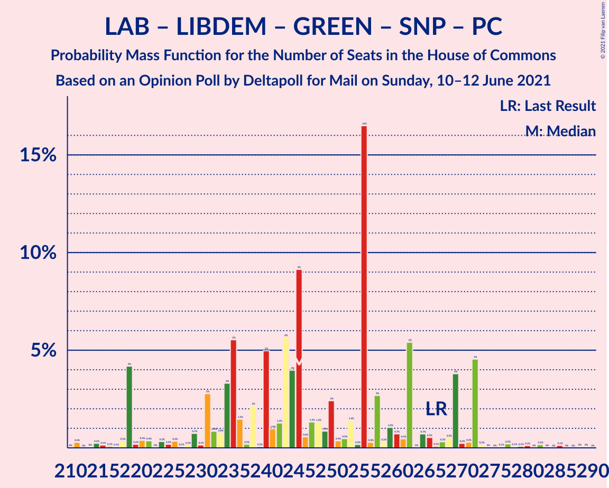

| Number of Seats | Probability | Accumulated | Special Marks |
|:---------------:|:-----------:|:-----------:|:-------------:|
| 211 | 0.3% | 100% |  |
| 212 | 0% | 99.7% |  |
| 213 | 0% | 99.7% |  |
| 214 | 0.2% | 99.6% |  |
| 215 | 0.1% | 99.4% |  |
| 216 | 0.1% | 99.3% |  |
| 217 | 0.1% | 99.2% |  |
| 218 | 0.3% | 99.1% |  |
| 219 | 4% | 98.8% |  |
| 220 | 0.2% | 95% |  |
| 221 | 0.4% | 94% |  |
| 222 | 0.4% | 94% |  |
| 223 | 0% | 94% |  |
| 224 | 0.3% | 94% |  |
| 225 | 0.2% | 93% |  |
| 226 | 0.3% | 93% |  |
| 227 | 0.1% | 93% |  |
| 228 | 0.1% | 93% |  |
| 229 | 0.7% | 93% |  |
| 230 | 0.1% | 92% |  |
| 231 | 3% | 92% |  |
| 232 | 0.9% | 89% |  |
| 233 | 0.8% | 88% |  |
| 234 | 3% | 87% |  |
| 235 | 6% | 84% |  |
| 236 | 1.5% | 78% |  |
| 237 | 0.2% | 77% |  |
| 238 | 2% | 77% |  |
| 239 | 0.1% | 75% |  |
| 240 | 5% | 75% |  |
| 241 | 1.0% | 70% |  |
| 242 | 1.3% | 69% |  |
| 243 | 6% | 67% |  |
| 244 | 4% | 62% |  |
| 245 | 9% | 58% | Median |
| 246 | 0.6% | 49% |  |
| 247 | 1.3% | 48% |  |
| 248 | 1.3% | 47% |  |
| 249 | 0.9% | 45% |  |
| 250 | 2% | 44% |  |
| 251 | 0.4% | 42% |  |
| 252 | 0.5% | 42% |  |
| 253 | 1.4% | 41% |  |
| 254 | 0.2% | 40% |  |
| 255 | 16% | 40% |  |
| 256 | 0.3% | 23% |  |
| 257 | 3% | 23% |  |
| 258 | 0.3% | 20% |  |
| 259 | 1.0% | 20% |  |
| 260 | 0.7% | 19% |  |
| 261 | 0.5% | 18% |  |
| 262 | 5% | 18% |  |
| 263 | 0% | 12% |  |
| 264 | 0.7% | 12% |  |
| 265 | 0.5% | 12% |  |
| 266 | 0.1% | 11% | Last Result |
| 267 | 0.3% | 11% |  |
| 268 | 0.5% | 11% |  |
| 269 | 4% | 10% |  |
| 270 | 0.2% | 6% |  |
| 271 | 0.3% | 6% |  |
| 272 | 5% | 6% |  |
| 273 | 0.2% | 1.2% |  |
| 274 | 0% | 1.0% |  |
| 275 | 0% | 1.0% |  |
| 276 | 0.1% | 1.0% |  |
| 277 | 0.2% | 0.9% |  |
| 278 | 0.1% | 0.7% |  |
| 279 | 0.1% | 0.6% |  |
| 280 | 0.1% | 0.6% |  |
| 281 | 0% | 0.5% |  |
| 282 | 0.2% | 0.4% |  |
| 283 | 0% | 0.3% |  |
| 284 | 0% | 0.3% |  |
| 285 | 0.1% | 0.3% |  |
| 286 | 0% | 0.1% |  |
| 287 | 0% | 0.1% |  |
| 288 | 0% | 0.1% |  |
| 289 | 0% | 0.1% |  |
| 290 | 0% | 0% |  |

### Labour Party – Liberal Democrats – Scottish National Party – Plaid Cymru

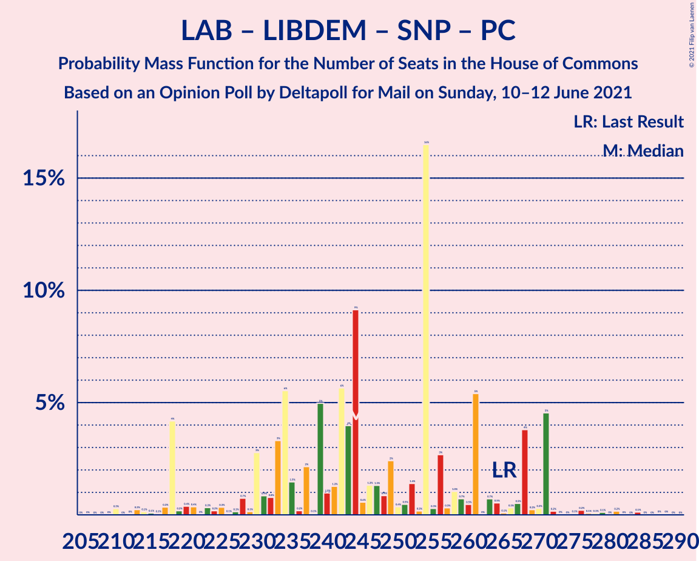

| Number of Seats | Probability | Accumulated | Special Marks |
|:---------------:|:-----------:|:-----------:|:-------------:|
| 210 | 0.3% | 100% |  |
| 211 | 0% | 99.7% |  |
| 212 | 0% | 99.7% |  |
| 213 | 0.2% | 99.6% |  |
| 214 | 0.1% | 99.4% |  |
| 215 | 0.1% | 99.3% |  |
| 216 | 0.1% | 99.2% |  |
| 217 | 0.3% | 99.1% |  |
| 218 | 4% | 98.8% |  |
| 219 | 0.2% | 95% |  |
| 220 | 0.4% | 94% |  |
| 221 | 0.4% | 94% |  |
| 222 | 0% | 94% |  |
| 223 | 0.3% | 94% |  |
| 224 | 0.2% | 93% |  |
| 225 | 0.3% | 93% |  |
| 226 | 0.1% | 93% |  |
| 227 | 0.1% | 93% |  |
| 228 | 0.7% | 93% |  |
| 229 | 0.1% | 92% |  |
| 230 | 3% | 92% |  |
| 231 | 0.9% | 89% |  |
| 232 | 0.8% | 88% |  |
| 233 | 3% | 87% |  |
| 234 | 6% | 84% |  |
| 235 | 1.5% | 78% |  |
| 236 | 0.2% | 77% |  |
| 237 | 2% | 77% |  |
| 238 | 0.1% | 75% |  |
| 239 | 5% | 75% |  |
| 240 | 1.0% | 70% |  |
| 241 | 1.3% | 69% |  |
| 242 | 6% | 67% |  |
| 243 | 4% | 62% |  |
| 244 | 9% | 58% | Median |
| 245 | 0.6% | 49% |  |
| 246 | 1.3% | 48% |  |
| 247 | 1.3% | 47% |  |
| 248 | 0.9% | 45% |  |
| 249 | 2% | 44% |  |
| 250 | 0.4% | 42% |  |
| 251 | 0.5% | 42% |  |
| 252 | 1.4% | 41% |  |
| 253 | 0.2% | 40% |  |
| 254 | 16% | 40% |  |
| 255 | 0.3% | 23% |  |
| 256 | 3% | 23% |  |
| 257 | 0.3% | 20% |  |
| 258 | 1.0% | 20% |  |
| 259 | 0.7% | 19% |  |
| 260 | 0.5% | 18% |  |
| 261 | 5% | 18% |  |
| 262 | 0% | 12% |  |
| 263 | 0.7% | 12% |  |
| 264 | 0.5% | 12% |  |
| 265 | 0.1% | 11% | Last Result |
| 266 | 0.3% | 11% |  |
| 267 | 0.5% | 11% |  |
| 268 | 4% | 10% |  |
| 269 | 0.2% | 6% |  |
| 270 | 0.3% | 6% |  |
| 271 | 5% | 6% |  |
| 272 | 0.2% | 1.2% |  |
| 273 | 0% | 1.0% |  |
| 274 | 0% | 1.0% |  |
| 275 | 0.1% | 1.0% |  |
| 276 | 0.2% | 0.9% |  |
| 277 | 0.1% | 0.7% |  |
| 278 | 0.1% | 0.6% |  |
| 279 | 0.1% | 0.6% |  |
| 280 | 0% | 0.5% |  |
| 281 | 0.2% | 0.4% |  |
| 282 | 0% | 0.3% |  |
| 283 | 0% | 0.3% |  |
| 284 | 0.1% | 0.3% |  |
| 285 | 0% | 0.1% |  |
| 286 | 0% | 0.1% |  |
| 287 | 0% | 0.1% |  |
| 288 | 0% | 0.1% |  |
| 289 | 0% | 0% |  |

### Labour Party – Scottish National Party – Plaid Cymru

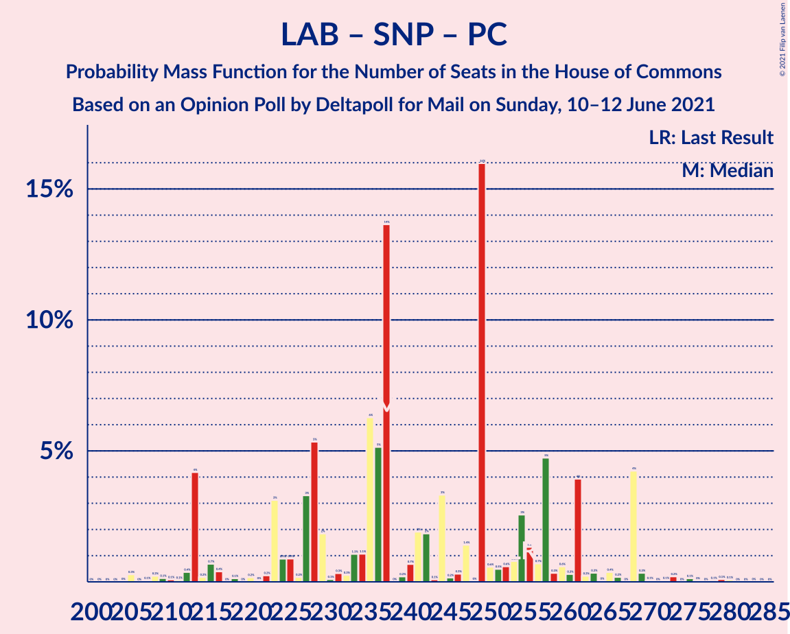

| Number of Seats | Probability | Accumulated | Special Marks |
|:---------------:|:-----------:|:-----------:|:-------------:|
| 205 | 0.3% | 100% |  |
| 206 | 0% | 99.7% |  |
| 207 | 0.1% | 99.7% |  |
| 208 | 0.2% | 99.6% |  |
| 209 | 0.1% | 99.4% |  |
| 210 | 0.1% | 99.3% |  |
| 211 | 0.1% | 99.2% |  |
| 212 | 0.4% | 99.1% |  |
| 213 | 4% | 98.7% |  |
| 214 | 0.2% | 95% |  |
| 215 | 0.7% | 94% |  |
| 216 | 0.4% | 94% |  |
| 217 | 0% | 93% |  |
| 218 | 0.1% | 93% |  |
| 219 | 0% | 93% |  |
| 220 | 0.2% | 93% |  |
| 221 | 0% | 93% |  |
| 222 | 0.2% | 93% |  |
| 223 | 3% | 93% |  |
| 224 | 0.9% | 90% |  |
| 225 | 0.9% | 89% |  |
| 226 | 0.2% | 88% |  |
| 227 | 3% | 88% |  |
| 228 | 5% | 84% |  |
| 229 | 2% | 79% |  |
| 230 | 0.1% | 77% |  |
| 231 | 0.3% | 77% |  |
| 232 | 0.3% | 77% |  |
| 233 | 1.1% | 76% |  |
| 234 | 1.1% | 75% |  |
| 235 | 6% | 74% |  |
| 236 | 5% | 68% |  |
| 237 | 14% | 63% |  |
| 238 | 0% | 49% |  |
| 239 | 0.2% | 49% | Median |
| 240 | 0.7% | 49% |  |
| 241 | 2% | 48% |  |
| 242 | 2% | 47% |  |
| 243 | 0.1% | 45% |  |
| 244 | 3% | 45% |  |
| 245 | 0.2% | 41% |  |
| 246 | 0.3% | 41% |  |
| 247 | 1.4% | 41% |  |
| 248 | 0% | 39% |  |
| 249 | 16% | 39% |  |
| 250 | 0.6% | 23% |  |
| 251 | 0.5% | 23% |  |
| 252 | 0.6% | 22% |  |
| 253 | 0.8% | 22% |  |
| 254 | 3% | 21% | Last Result |
| 255 | 1.3% | 18% |  |
| 256 | 0.7% | 17% |  |
| 257 | 5% | 16% |  |
| 258 | 0.3% | 12% |  |
| 259 | 0.6% | 11% |  |
| 260 | 0.3% | 11% |  |
| 261 | 4% | 10% |  |
| 262 | 0.2% | 6% |  |
| 263 | 0.3% | 6% |  |
| 264 | 0% | 6% |  |
| 265 | 0.4% | 6% |  |
| 266 | 0.2% | 6% |  |
| 267 | 0% | 5% |  |
| 268 | 4% | 5% |  |
| 269 | 0.3% | 1.1% |  |
| 270 | 0.1% | 0.8% |  |
| 271 | 0% | 0.7% |  |
| 272 | 0.1% | 0.7% |  |
| 273 | 0.2% | 0.7% |  |
| 274 | 0% | 0.5% |  |
| 275 | 0.1% | 0.5% |  |
| 276 | 0% | 0.3% |  |
| 277 | 0% | 0.3% |  |
| 278 | 0.1% | 0.3% |  |
| 279 | 0.1% | 0.2% |  |
| 280 | 0.1% | 0.1% |  |
| 281 | 0% | 0.1% |  |
| 282 | 0% | 0.1% |  |
| 283 | 0% | 0.1% |  |
| 284 | 0% | 0% |  |

### Labour Party – Liberal Democrats – Scottish National Party

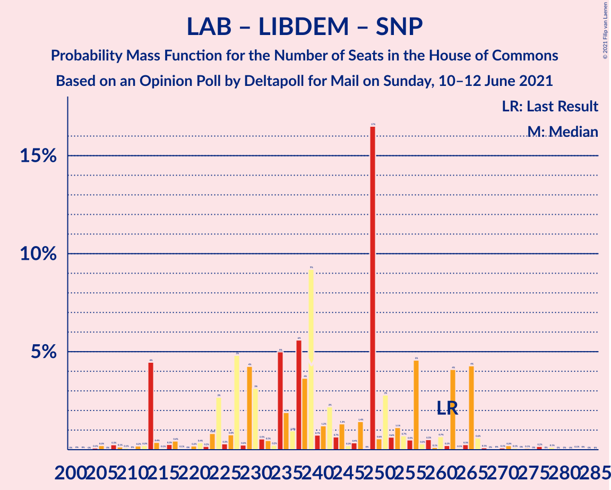

| Number of Seats | Probability | Accumulated | Special Marks |
|:---------------:|:-----------:|:-----------:|:-------------:|
| 202 | 0% | 100% |  |
| 203 | 0% | 99.9% |  |
| 204 | 0.1% | 99.9% |  |
| 205 | 0.2% | 99.9% |  |
| 206 | 0% | 99.7% |  |
| 207 | 0.3% | 99.6% |  |
| 208 | 0.1% | 99.4% |  |
| 209 | 0.1% | 99.3% |  |
| 210 | 0% | 99.2% |  |
| 211 | 0.2% | 99.1% |  |
| 212 | 0.2% | 99.0% |  |
| 213 | 4% | 98.7% |  |
| 214 | 0.4% | 94% |  |
| 215 | 0.1% | 94% |  |
| 216 | 0.3% | 94% |  |
| 217 | 0.4% | 94% |  |
| 218 | 0.1% | 93% |  |
| 219 | 0% | 93% |  |
| 220 | 0.2% | 93% |  |
| 221 | 0.4% | 93% |  |
| 222 | 0.2% | 92% |  |
| 223 | 0.8% | 92% |  |
| 224 | 3% | 92% |  |
| 225 | 0.3% | 89% |  |
| 226 | 0.8% | 89% |  |
| 227 | 5% | 88% |  |
| 228 | 0.2% | 83% |  |
| 229 | 4% | 83% |  |
| 230 | 3% | 78% |  |
| 231 | 0.5% | 75% |  |
| 232 | 0.5% | 75% |  |
| 233 | 0.2% | 74% |  |
| 234 | 5% | 74% |  |
| 235 | 2% | 69% |  |
| 236 | 1.0% | 67% |  |
| 237 | 6% | 66% |  |
| 238 | 4% | 61% |  |
| 239 | 9% | 57% | Median |
| 240 | 0.7% | 48% |  |
| 241 | 1.2% | 47% |  |
| 242 | 2% | 46% |  |
| 243 | 0.7% | 44% |  |
| 244 | 1.3% | 43% |  |
| 245 | 0.2% | 42% |  |
| 246 | 0.4% | 41% |  |
| 247 | 1.4% | 41% |  |
| 248 | 0% | 40% |  |
| 249 | 17% | 40% |  |
| 250 | 0.6% | 23% |  |
| 251 | 3% | 23% |  |
| 252 | 0.6% | 20% |  |
| 253 | 1.1% | 19% |  |
| 254 | 0.7% | 18% |  |
| 255 | 0.5% | 17% |  |
| 256 | 5% | 17% |  |
| 257 | 0.3% | 12% |  |
| 258 | 0.5% | 12% |  |
| 259 | 0.1% | 11% |  |
| 260 | 0.7% | 11% |  |
| 261 | 0.2% | 11% | Last Result |
| 262 | 4% | 10% |  |
| 263 | 0.1% | 6% |  |
| 264 | 0.3% | 6% |  |
| 265 | 4% | 6% |  |
| 266 | 0.6% | 2% |  |
| 267 | 0.1% | 1.1% |  |
| 268 | 0% | 1.0% |  |
| 269 | 0% | 1.0% |  |
| 270 | 0.1% | 0.9% |  |
| 271 | 0.2% | 0.9% |  |
| 272 | 0.1% | 0.6% |  |
| 273 | 0% | 0.6% |  |
| 274 | 0.1% | 0.5% |  |
| 275 | 0% | 0.5% |  |
| 276 | 0.2% | 0.4% |  |
| 277 | 0% | 0.3% |  |
| 278 | 0.1% | 0.3% |  |
| 279 | 0% | 0.1% |  |
| 280 | 0% | 0.1% |  |
| 281 | 0% | 0.1% |  |
| 282 | 0.1% | 0.1% |  |
| 283 | 0% | 0.1% |  |
| 284 | 0% | 0% |  |

### Labour Party – Liberal Democrats – Plaid Cymru

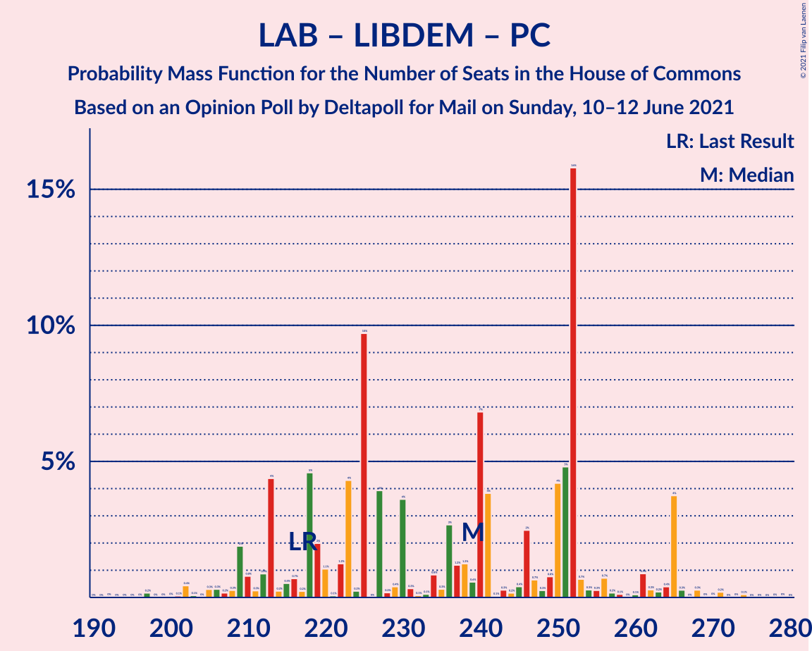

| Number of Seats | Probability | Accumulated | Special Marks |
|:---------------:|:-----------:|:-----------:|:-------------:|
| 192 | 0% | 100% |  |
| 193 | 0% | 99.9% |  |
| 194 | 0% | 99.9% |  |
| 195 | 0% | 99.9% |  |
| 196 | 0% | 99.9% |  |
| 197 | 0.2% | 99.9% |  |
| 198 | 0% | 99.7% |  |
| 199 | 0% | 99.7% |  |
| 200 | 0% | 99.7% |  |
| 201 | 0.1% | 99.6% |  |
| 202 | 0.4% | 99.6% |  |
| 203 | 0.1% | 99.1% |  |
| 204 | 0% | 99.1% |  |
| 205 | 0.3% | 99.0% |  |
| 206 | 0.3% | 98.7% |  |
| 207 | 0.2% | 98% |  |
| 208 | 0.3% | 98% |  |
| 209 | 2% | 98% |  |
| 210 | 0.8% | 96% |  |
| 211 | 0.3% | 95% |  |
| 212 | 0.9% | 95% |  |
| 213 | 4% | 94% |  |
| 214 | 0.2% | 90% |  |
| 215 | 0.5% | 90% |  |
| 216 | 0.7% | 89% |  |
| 217 | 0.2% | 88% | Last Result |
| 218 | 5% | 88% |  |
| 219 | 2% | 84% |  |
| 220 | 1.1% | 82% |  |
| 221 | 0.1% | 80% |  |
| 222 | 1.2% | 80% |  |
| 223 | 4% | 79% |  |
| 224 | 0.2% | 75% |  |
| 225 | 10% | 75% |  |
| 226 | 0% | 65% |  |
| 227 | 4% | 65% |  |
| 228 | 0.2% | 61% |  |
| 229 | 0.4% | 61% |  |
| 230 | 4% | 60% |  |
| 231 | 0.3% | 57% |  |
| 232 | 0.1% | 56% |  |
| 233 | 0.1% | 56% |  |
| 234 | 0.8% | 56% |  |
| 235 | 0.3% | 55% |  |
| 236 | 3% | 55% |  |
| 237 | 1.2% | 52% |  |
| 238 | 1.2% | 51% | Median |
| 239 | 0.6% | 50% |  |
| 240 | 7% | 49% |  |
| 241 | 4% | 43% |  |
| 242 | 0.1% | 39% |  |
| 243 | 0.3% | 39% |  |
| 244 | 0.2% | 38% |  |
| 245 | 0.4% | 38% |  |
| 246 | 2% | 38% |  |
| 247 | 0.7% | 35% |  |
| 248 | 0.3% | 35% |  |
| 249 | 0.8% | 35% |  |
| 250 | 4% | 34% |  |
| 251 | 5% | 30% |  |
| 252 | 16% | 25% |  |
| 253 | 0.7% | 9% |  |
| 254 | 0.3% | 8% |  |
| 255 | 0.3% | 8% |  |
| 256 | 0.7% | 8% |  |
| 257 | 0.2% | 7% |  |
| 258 | 0.1% | 7% |  |
| 259 | 0% | 7% |  |
| 260 | 0.1% | 7% |  |
| 261 | 0.9% | 7% |  |
| 262 | 0.3% | 6% |  |
| 263 | 0.2% | 5% |  |
| 264 | 0.4% | 5% |  |
| 265 | 4% | 5% |  |
| 266 | 0.3% | 1.1% |  |
| 267 | 0% | 0.8% |  |
| 268 | 0.3% | 0.8% |  |
| 269 | 0% | 0.5% |  |
| 270 | 0% | 0.5% |  |
| 271 | 0.2% | 0.4% |  |
| 272 | 0% | 0.2% |  |
| 273 | 0% | 0.2% |  |
| 274 | 0.1% | 0.2% |  |
| 275 | 0% | 0.1% |  |
| 276 | 0% | 0.1% |  |
| 277 | 0% | 0.1% |  |
| 278 | 0% | 0.1% |  |
| 279 | 0% | 0.1% |  |
| 280 | 0% | 0% |  |

### Labour Party – Scottish National Party

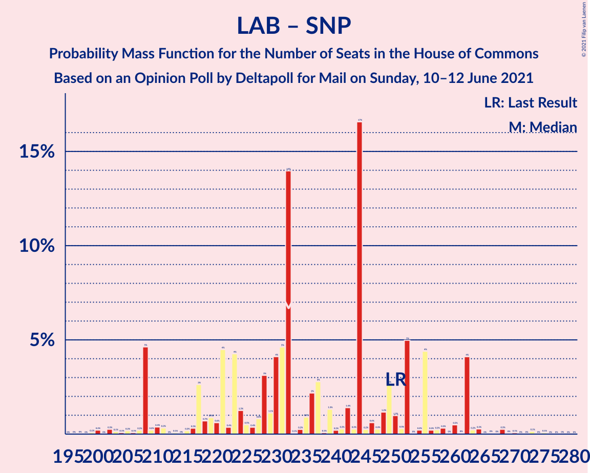

| Number of Seats | Probability | Accumulated | Special Marks |
|:---------------:|:-----------:|:-----------:|:-------------:|
| 197 | 0% | 100% |  |
| 198 | 0% | 99.9% |  |
| 199 | 0.1% | 99.9% |  |
| 200 | 0.2% | 99.9% |  |
| 201 | 0% | 99.7% |  |
| 202 | 0.3% | 99.7% |  |
| 203 | 0.1% | 99.4% |  |
| 204 | 0.1% | 99.3% |  |
| 205 | 0.2% | 99.2% |  |
| 206 | 0.1% | 99.0% |  |
| 207 | 0.2% | 98.9% |  |
| 208 | 5% | 98.7% |  |
| 209 | 0.2% | 94% |  |
| 210 | 0.4% | 94% |  |
| 211 | 0.3% | 94% |  |
| 212 | 0% | 93% |  |
| 213 | 0.1% | 93% |  |
| 214 | 0% | 93% |  |
| 215 | 0.2% | 93% |  |
| 216 | 0.3% | 93% |  |
| 217 | 3% | 93% |  |
| 218 | 0.7% | 90% |  |
| 219 | 0.9% | 89% |  |
| 220 | 0.6% | 88% |  |
| 221 | 4% | 88% |  |
| 222 | 0.4% | 83% |  |
| 223 | 4% | 83% |  |
| 224 | 1.3% | 79% |  |
| 225 | 0.5% | 77% |  |
| 226 | 0.4% | 77% |  |
| 227 | 0.8% | 77% |  |
| 228 | 3% | 76% |  |
| 229 | 1.1% | 73% |  |
| 230 | 4% | 72% |  |
| 231 | 5% | 67% |  |
| 232 | 14% | 63% |  |
| 233 | 0.1% | 49% |  |
| 234 | 0.2% | 49% | Median |
| 235 | 0.9% | 49% |  |
| 236 | 2% | 48% |  |
| 237 | 3% | 45% |  |
| 238 | 0.1% | 43% |  |
| 239 | 1.3% | 43% |  |
| 240 | 0.2% | 41% |  |
| 241 | 0.3% | 41% |  |
| 242 | 1.4% | 41% |  |
| 243 | 0.3% | 39% |  |
| 244 | 17% | 39% |  |
| 245 | 0.2% | 23% |  |
| 246 | 0.6% | 22% |  |
| 247 | 0.3% | 22% |  |
| 248 | 1.2% | 21% |  |
| 249 | 3% | 20% |  |
| 250 | 1.0% | 18% | Last Result |
| 251 | 0.3% | 17% |  |
| 252 | 5% | 16% |  |
| 253 | 0% | 11% |  |
| 254 | 0.2% | 11% |  |
| 255 | 4% | 11% |  |
| 256 | 0.2% | 7% |  |
| 257 | 0.2% | 6% |  |
| 258 | 0.3% | 6% |  |
| 259 | 0% | 6% |  |
| 260 | 0.5% | 6% |  |
| 261 | 0% | 5% |  |
| 262 | 4% | 5% |  |
| 263 | 0.2% | 1.2% |  |
| 264 | 0.3% | 1.0% |  |
| 265 | 0% | 0.7% |  |
| 266 | 0% | 0.7% |  |
| 267 | 0% | 0.7% |  |
| 268 | 0.3% | 0.7% |  |
| 269 | 0% | 0.4% |  |
| 270 | 0.1% | 0.4% |  |
| 271 | 0% | 0.3% |  |
| 272 | 0% | 0.3% |  |
| 273 | 0.1% | 0.3% |  |
| 274 | 0% | 0.1% |  |
| 275 | 0.1% | 0.1% |  |
| 276 | 0% | 0.1% |  |
| 277 | 0% | 0.1% |  |
| 278 | 0% | 0.1% |  |
| 279 | 0% | 0% |  |

### Labour Party – Liberal Democrats

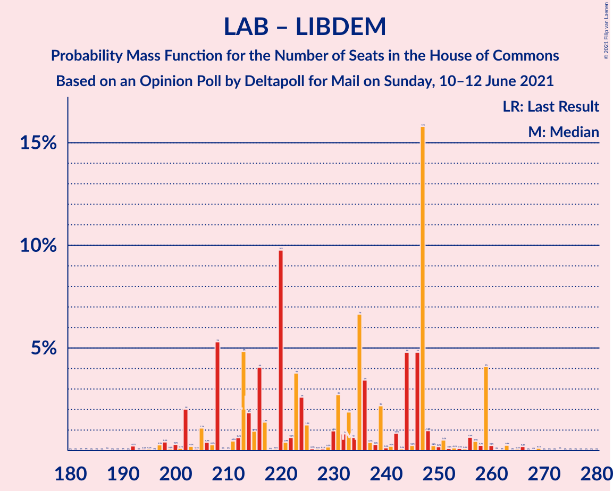

| Number of Seats | Probability | Accumulated | Special Marks |
|:---------------:|:-----------:|:-----------:|:-------------:|
| 186 | 0% | 100% |  |
| 187 | 0% | 99.9% |  |
| 188 | 0% | 99.9% |  |
| 189 | 0% | 99.9% |  |
| 190 | 0% | 99.9% |  |
| 191 | 0% | 99.9% |  |
| 192 | 0.2% | 99.9% |  |
| 193 | 0% | 99.7% |  |
| 194 | 0.1% | 99.6% |  |
| 195 | 0.1% | 99.6% |  |
| 196 | 0% | 99.5% |  |
| 197 | 0.3% | 99.5% |  |
| 198 | 0.4% | 99.2% |  |
| 199 | 0.1% | 98.8% |  |
| 200 | 0.3% | 98.7% |  |
| 201 | 0.1% | 98% |  |
| 202 | 2% | 98% |  |
| 203 | 0.2% | 96% |  |
| 204 | 0.1% | 96% |  |
| 205 | 1.1% | 96% |  |
| 206 | 0.4% | 95% |  |
| 207 | 0.3% | 95% |  |
| 208 | 5% | 94% |  |
| 209 | 0% | 89% |  |
| 210 | 0% | 89% |  |
| 211 | 0.5% | 89% |  |
| 212 | 0.6% | 88% |  |
| 213 | 5% | 88% | Last Result |
| 214 | 2% | 83% |  |
| 215 | 0.9% | 81% |  |
| 216 | 4% | 80% |  |
| 217 | 1.4% | 76% |  |
| 218 | 0% | 75% |  |
| 219 | 0.1% | 75% |  |
| 220 | 10% | 75% |  |
| 221 | 0.4% | 65% |  |
| 222 | 0.6% | 64% |  |
| 223 | 4% | 64% |  |
| 224 | 3% | 60% |  |
| 225 | 1.3% | 57% |  |
| 226 | 0.1% | 56% |  |
| 227 | 0.1% | 56% |  |
| 228 | 0.1% | 56% |  |
| 229 | 0.2% | 56% |  |
| 230 | 1.0% | 56% |  |
| 231 | 3% | 55% |  |
| 232 | 0.8% | 52% |  |
| 233 | 2% | 51% | Median |
| 234 | 0.6% | 49% |  |
| 235 | 7% | 49% |  |
| 236 | 3% | 42% |  |
| 237 | 0.4% | 39% |  |
| 238 | 0.3% | 38% |  |
| 239 | 2% | 38% |  |
| 240 | 0.1% | 36% |  |
| 241 | 0.2% | 36% |  |
| 242 | 0.8% | 35% |  |
| 243 | 0.1% | 35% |  |
| 244 | 5% | 34% |  |
| 245 | 0.2% | 30% |  |
| 246 | 5% | 29% |  |
| 247 | 16% | 25% |  |
| 248 | 1.0% | 9% |  |
| 249 | 0.2% | 8% |  |
| 250 | 0.2% | 8% |  |
| 251 | 0.5% | 7% |  |
| 252 | 0.1% | 7% |  |
| 253 | 0.1% | 7% |  |
| 254 | 0.1% | 7% |  |
| 255 | 0.1% | 7% |  |
| 256 | 0.6% | 7% |  |
| 257 | 0.4% | 6% |  |
| 258 | 0.3% | 5% |  |
| 259 | 4% | 5% |  |
| 260 | 0.2% | 1.1% |  |
| 261 | 0% | 0.8% |  |
| 262 | 0% | 0.8% |  |
| 263 | 0.3% | 0.8% |  |
| 264 | 0% | 0.5% |  |
| 265 | 0.1% | 0.5% |  |
| 266 | 0.2% | 0.4% |  |
| 267 | 0% | 0.2% |  |
| 268 | 0% | 0.2% |  |
| 269 | 0.1% | 0.2% |  |
| 270 | 0% | 0.1% |  |
| 271 | 0% | 0.1% |  |
| 272 | 0% | 0.1% |  |
| 273 | 0% | 0.1% |  |
| 274 | 0% | 0% |  |

### Labour Party – Plaid Cymru

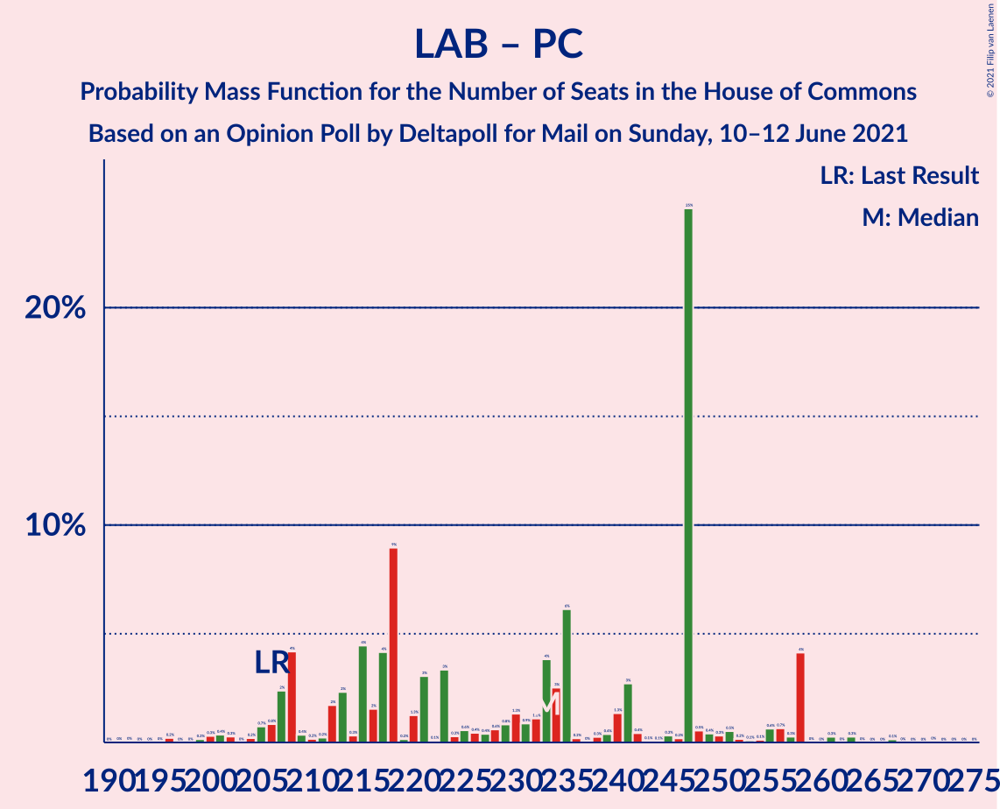

| Number of Seats | Probability | Accumulated | Special Marks |
|:---------------:|:-----------:|:-----------:|:-------------:|
| 191 | 0% | 100% |  |
| 192 | 0% | 99.9% |  |
| 193 | 0% | 99.9% |  |
| 194 | 0% | 99.9% |  |
| 195 | 0% | 99.9% |  |
| 196 | 0.2% | 99.9% |  |
| 197 | 0% | 99.6% |  |
| 198 | 0% | 99.6% |  |
| 199 | 0.2% | 99.6% |  |
| 200 | 0.3% | 99.5% |  |
| 201 | 0.4% | 99.2% |  |
| 202 | 0.3% | 98.8% |  |
| 203 | 0% | 98.6% |  |
| 204 | 0.2% | 98.5% |  |
| 205 | 0.7% | 98% |  |
| 206 | 0.8% | 98% | Last Result |
| 207 | 2% | 97% |  |
| 208 | 4% | 94% |  |
| 209 | 0.4% | 90% |  |
| 210 | 0.2% | 90% |  |
| 211 | 0.2% | 90% |  |
| 212 | 2% | 89% |  |
| 213 | 2% | 88% |  |
| 214 | 0.3% | 85% |  |
| 215 | 4% | 85% |  |
| 216 | 2% | 81% |  |
| 217 | 4% | 79% |  |
| 218 | 9% | 75% |  |
| 219 | 0.2% | 66% |  |
| 220 | 1.3% | 66% |  |
| 221 | 3% | 65% |  |
| 222 | 0.1% | 62% |  |
| 223 | 3% | 61% |  |
| 224 | 0.3% | 58% |  |
| 225 | 0.6% | 58% |  |
| 226 | 0.4% | 57% |  |
| 227 | 0.4% | 57% |  |
| 228 | 0.6% | 56% |  |
| 229 | 0.8% | 56% |  |
| 230 | 1.3% | 55% |  |
| 231 | 0.9% | 54% |  |
| 232 | 1.1% | 53% |  |
| 233 | 4% | 52% | Median |
| 234 | 3% | 48% |  |
| 235 | 6% | 45% |  |
| 236 | 0.2% | 39% |  |
| 237 | 0% | 39% |  |
| 238 | 0.3% | 39% |  |
| 239 | 0.4% | 39% |  |
| 240 | 1.3% | 38% |  |
| 241 | 3% | 37% |  |
| 242 | 0.4% | 34% |  |
| 243 | 0.1% | 34% |  |
| 244 | 0.1% | 34% |  |
| 245 | 0.3% | 34% |  |
| 246 | 0.2% | 33% |  |
| 247 | 25% | 33% |  |
| 248 | 0.5% | 9% |  |
| 249 | 0.4% | 8% |  |
| 250 | 0.3% | 8% |  |
| 251 | 0.5% | 7% |  |
| 252 | 0.2% | 7% |  |
| 253 | 0.1% | 7% |  |
| 254 | 0.1% | 7% |  |
| 255 | 0.6% | 6% |  |
| 256 | 0.7% | 6% |  |
| 257 | 0.3% | 5% |  |
| 258 | 4% | 5% |  |
| 259 | 0% | 0.8% |  |
| 260 | 0% | 0.8% |  |
| 261 | 0.3% | 0.8% |  |
| 262 | 0% | 0.5% |  |
| 263 | 0.3% | 0.5% |  |
| 264 | 0% | 0.2% |  |
| 265 | 0% | 0.2% |  |
| 266 | 0% | 0.2% |  |
| 267 | 0.1% | 0.2% |  |
| 268 | 0% | 0.1% |  |
| 269 | 0% | 0.1% |  |
| 270 | 0% | 0.1% |  |
| 271 | 0% | 0.1% |  |
| 272 | 0% | 0% |  |

### Labour Party

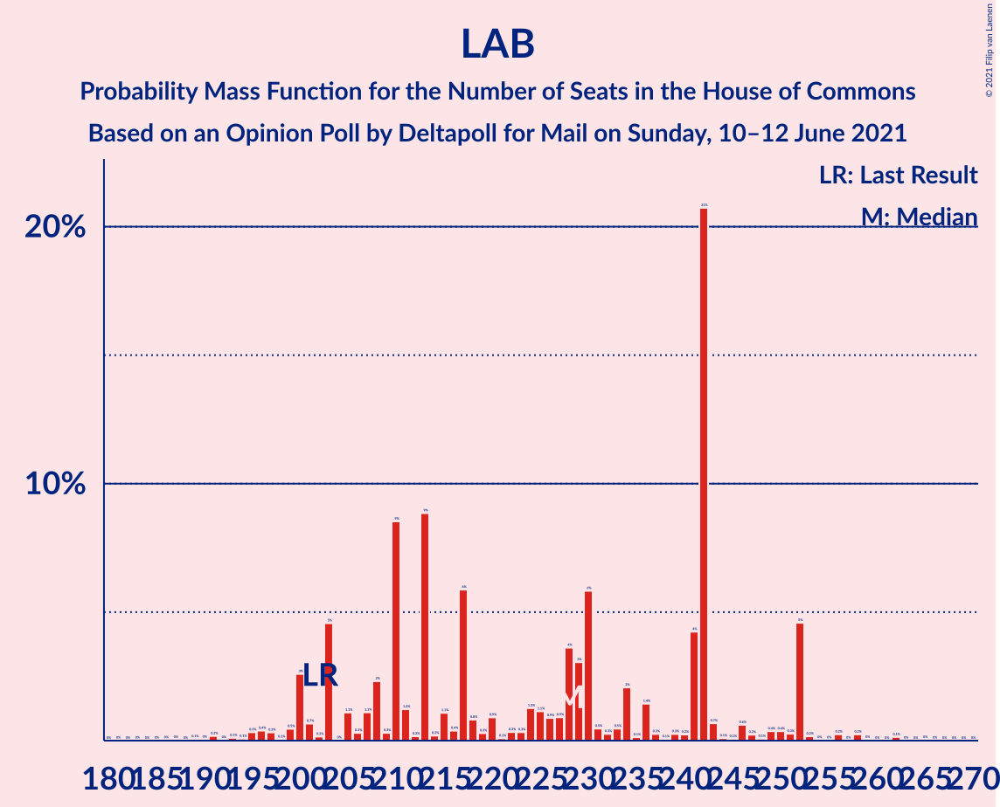

| Number of Seats | Probability | Accumulated | Special Marks |
|:---------------:|:-----------:|:-----------:|:-------------:|
| 184 | 0% | 100% |  |
| 185 | 0% | 99.9% |  |
| 186 | 0% | 99.9% |  |
| 187 | 0% | 99.9% |  |
| 188 | 0% | 99.9% |  |
| 189 | 0.1% | 99.9% |  |
| 190 | 0% | 99.8% |  |
| 191 | 0.2% | 99.8% |  |
| 192 | 0% | 99.6% |  |
| 193 | 0.1% | 99.6% |  |
| 194 | 0.1% | 99.4% |  |
| 195 | 0.3% | 99.4% |  |
| 196 | 0.4% | 99.0% |  |
| 197 | 0.3% | 98.7% |  |
| 198 | 0.1% | 98% |  |
| 199 | 0.5% | 98% |  |
| 200 | 3% | 98% |  |
| 201 | 0.7% | 95% |  |
| 202 | 0.2% | 95% | Last Result |
| 203 | 5% | 94% |  |
| 204 | 0% | 90% |  |
| 205 | 1.1% | 90% |  |
| 206 | 0.3% | 89% |  |
| 207 | 1.1% | 88% |  |
| 208 | 2% | 87% |  |
| 209 | 0.3% | 85% |  |
| 210 | 9% | 85% |  |
| 211 | 1.2% | 76% |  |
| 212 | 0.2% | 75% |  |
| 213 | 9% | 75% |  |
| 214 | 0.2% | 66% |  |
| 215 | 1.1% | 66% |  |
| 216 | 0.4% | 65% |  |
| 217 | 6% | 64% |  |
| 218 | 0.8% | 58% |  |
| 219 | 0.3% | 58% |  |
| 220 | 0.9% | 57% |  |
| 221 | 0.1% | 56% |  |
| 222 | 0.3% | 56% |  |
| 223 | 0.3% | 56% |  |
| 224 | 1.3% | 56% |  |
| 225 | 1.1% | 54% |  |
| 226 | 0.9% | 53% |  |
| 227 | 0.9% | 52% |  |
| 228 | 4% | 51% | Median |
| 229 | 3% | 48% |  |
| 230 | 6% | 45% |  |
| 231 | 0.5% | 39% |  |
| 232 | 0.3% | 38% |  |
| 233 | 0.5% | 38% |  |
| 234 | 2% | 38% |  |
| 235 | 0.1% | 36% |  |
| 236 | 1.4% | 36% |  |
| 237 | 0.3% | 34% |  |
| 238 | 0.1% | 34% |  |
| 239 | 0.3% | 34% |  |
| 240 | 0.2% | 34% |  |
| 241 | 4% | 33% |  |
| 242 | 21% | 29% |  |
| 243 | 0.7% | 8% |  |
| 244 | 0.1% | 8% |  |
| 245 | 0.1% | 8% |  |
| 246 | 0.6% | 7% |  |
| 247 | 0.2% | 7% |  |
| 248 | 0.1% | 7% |  |
| 249 | 0.4% | 7% |  |
| 250 | 0.4% | 6% |  |
| 251 | 0.3% | 6% |  |
| 252 | 5% | 6% |  |
| 253 | 0.2% | 1.0% |  |
| 254 | 0% | 0.8% |  |
| 255 | 0% | 0.8% |  |
| 256 | 0.2% | 0.8% |  |
| 257 | 0% | 0.5% |  |
| 258 | 0.2% | 0.5% |  |
| 259 | 0% | 0.3% |  |
| 260 | 0% | 0.2% |  |
| 261 | 0% | 0.2% |  |
| 262 | 0.1% | 0.2% |  |
| 263 | 0% | 0.1% |  |
| 264 | 0% | 0.1% |  |
| 265 | 0% | 0.1% |  |
| 266 | 0% | 0% |  |

## Technical Information

### Opinion Poll

+ **Polling firm:** Deltapoll
+ **Commissioner(s):** Mail on Sunday
+ **Fieldwork period:** 10–12 June 2021

### Calculations

+ **Sample size:** 1528
+ **Simulations done:** 131,072
+ **Error estimate:** 0.88%

