# Opinion Poll by YouGov for The Times, 16–17 June 2021

<a href="#voting-intentions">Voting Intentions</a> | <a href="#seats">Seats</a> | <a href="#coalitions">Coalitions</a> | <a href="#technical-information">Technical Information</a>

## Voting Intentions

### Confidence Intervals

| Party | Last Result | Poll Result | 80% Confidence Interval | 90% Confidence Interval | 95% Confidence Interval | 99% Confidence Interval |
|:-----:|:-----------:|:-----------:|:-----------------------:|:-----------------------:|:-----------------------:|:-----------------------:|
| Conservative Party | 43.6% | 46.3% | 44.7–48.0% |44.3–48.4% |43.9–48.8% |43.1–49.6% |
| Labour Party | 32.1% | 31.9% | 30.4–33.4% |30.0–33.9% |29.6–34.2% |28.9–35.0% |
| Liberal Democrats | 11.5% | 6.2% | 5.5–7.1% |5.3–7.3% |5.1–7.5% |4.8–7.9% |
| Green Party | 2.8% | 5.6% | 5.0–6.4% |4.8–6.7% |4.6–6.9% |4.3–7.3% |
| Scottish National Party | 3.9% | 5.1% | 4.5–5.9% |4.3–6.1% |4.1–6.3% |3.8–6.7% |
| Brexit Party | 2.0% | 1.8% | 1.4–2.3% |1.3–2.4% |1.2–2.6% |1.1–2.8% |
| Plaid Cymru | 0.5% | 1.0% | 0.7–1.4% |0.7–1.5% |0.6–1.6% |0.5–1.9% |

*Note:* The poll result column reflects the actual value used in the calculations. Published results may vary slightly, and in addition be rounded to fewer digits.

## Seats

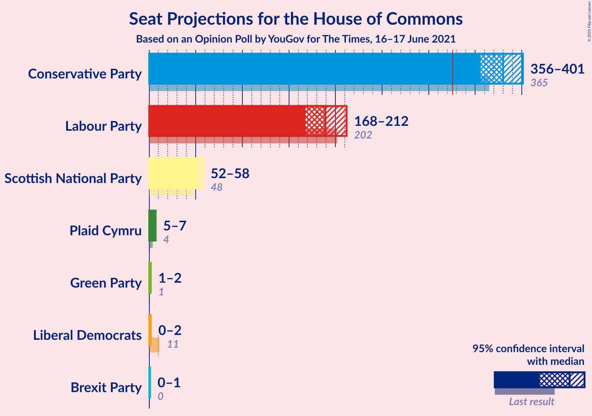

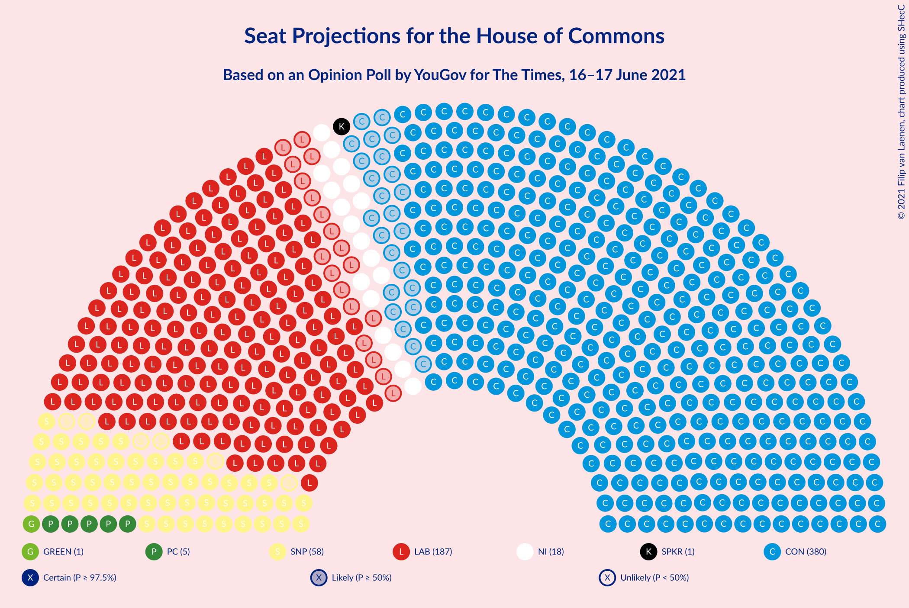

### Confidence Intervals

| Party | Last Result | Median | 80% Confidence Interval | 90% Confidence Interval | 95% Confidence Interval | 99% Confidence Interval |
|:-----:|:-----------:|:------:|:-----------------------:|:-----------------------:|:-----------------------:|:-----------------------:|
| <a href="#conservative-party">Conservative Party</a> | 365 | 380 | 363–392 |361–396 |356–401 |348–404 |
| <a href="#labour-party">Labour Party</a> | 202 | 189 | 177–204 |170–206 |168–212 |165–219 |
| <a href="#liberal-democrats">Liberal Democrats</a> | 11 | 0 | 0–1 |0–1 |0–2 |0–2 |
| <a href="#green-party">Green Party</a> | 1 | 1 | 1 |1–2 |1–2 |1–2 |
| <a href="#scottish-national-party">Scottish National Party</a> | 48 | 58 | 54–58 |52–58 |52–58 |51–58 |
| <a href="#brexit-party">Brexit Party</a> | 0 | 0 | 0 |0 |0–1 |0–2 |
| <a href="#plaid-cymru">Plaid Cymru</a> | 4 | 5 | 5–7 |5–7 |5–7 |4–9 |

### Conservative Party

*For a full overview of the results for this party, see the [Conservative Party](party-conservativeparty.html) page.*

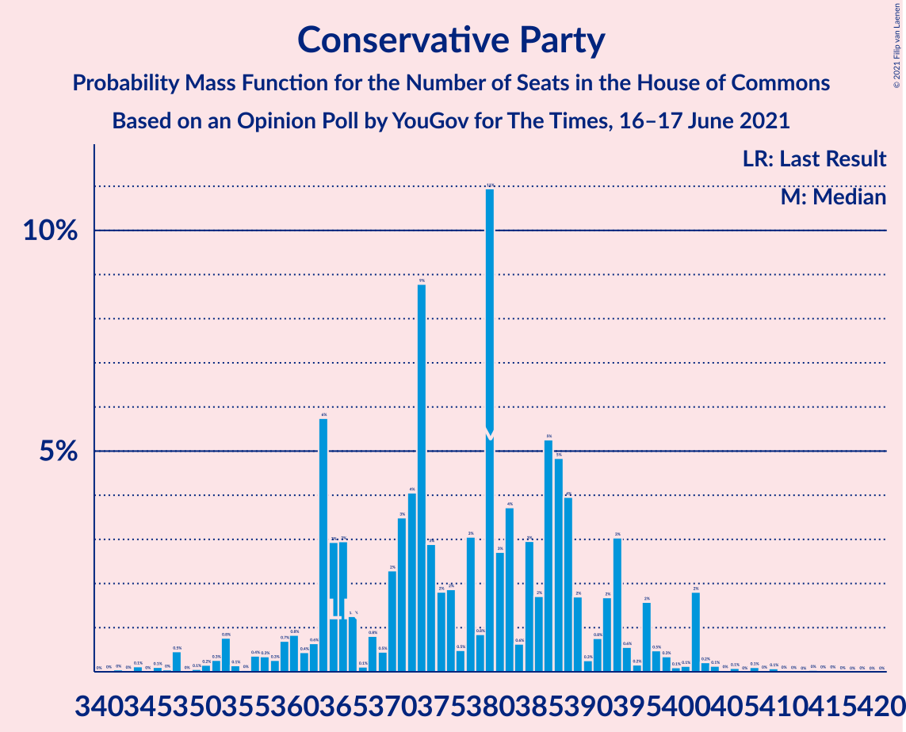

| Number of Seats | Probability | Accumulated | Special Marks |
|:---------------:|:-----------:|:-----------:|:-------------:|
| 341 | 0% | 100% |  |
| 342 | 0% | 99.9% |  |
| 343 | 0% | 99.9% |  |
| 344 | 0.1% | 99.9% |  |
| 345 | 0% | 99.7% |  |
| 346 | 0.1% | 99.7% |  |
| 347 | 0% | 99.6% |  |
| 348 | 0.5% | 99.6% |  |
| 349 | 0% | 99.1% |  |
| 350 | 0.1% | 99.1% |  |
| 351 | 0.2% | 99.0% |  |
| 352 | 0.3% | 98.9% |  |
| 353 | 0.8% | 98.6% |  |
| 354 | 0.1% | 98% |  |
| 355 | 0% | 98% |  |
| 356 | 0.4% | 98% |  |
| 357 | 0.3% | 97% |  |
| 358 | 0.3% | 97% |  |
| 359 | 0.7% | 97% |  |
| 360 | 0.8% | 96% |  |
| 361 | 0.4% | 95% |  |
| 362 | 0.6% | 95% |  |
| 363 | 6% | 94% |  |
| 364 | 3% | 88% |  |
| 365 | 3% | 85% | Last Result |
| 366 | 1.3% | 82% |  |
| 367 | 0.1% | 81% |  |
| 368 | 0.8% | 81% |  |
| 369 | 0.5% | 80% |  |
| 370 | 2% | 80% |  |
| 371 | 3% | 78% |  |
| 372 | 4% | 74% |  |
| 373 | 9% | 70% |  |
| 374 | 3% | 61% |  |
| 375 | 2% | 58% |  |
| 376 | 2% | 56% |  |
| 377 | 0.5% | 55% |  |
| 378 | 3% | 54% |  |
| 379 | 0.8% | 51% |  |
| 380 | 11% | 50% | Median |
| 381 | 3% | 39% |  |
| 382 | 4% | 37% |  |
| 383 | 0.6% | 33% |  |
| 384 | 3% | 32% |  |
| 385 | 2% | 29% |  |
| 386 | 5% | 28% |  |
| 387 | 5% | 22% |  |
| 388 | 4% | 17% |  |
| 389 | 2% | 13% |  |
| 390 | 0.3% | 12% |  |
| 391 | 0.8% | 12% |  |
| 392 | 2% | 11% |  |
| 393 | 3% | 9% |  |
| 394 | 0.6% | 6% |  |
| 395 | 0.2% | 5% |  |
| 396 | 2% | 5% |  |
| 397 | 0.5% | 4% |  |
| 398 | 0.3% | 3% |  |
| 399 | 0.1% | 3% |  |
| 400 | 0.1% | 3% |  |
| 401 | 2% | 3% |  |
| 402 | 0.2% | 0.9% |  |
| 403 | 0.1% | 0.6% |  |
| 404 | 0% | 0.5% |  |
| 405 | 0.1% | 0.5% |  |
| 406 | 0% | 0.4% |  |
| 407 | 0.1% | 0.4% |  |
| 408 | 0% | 0.3% |  |
| 409 | 0.1% | 0.3% |  |
| 410 | 0% | 0.2% |  |
| 411 | 0% | 0.2% |  |
| 412 | 0% | 0.2% |  |
| 413 | 0% | 0.2% |  |
| 414 | 0% | 0.1% |  |
| 415 | 0% | 0.1% |  |
| 416 | 0% | 0.1% |  |
| 417 | 0% | 0% |  |

### Labour Party

*For a full overview of the results for this party, see the [Labour Party](party-labourparty.html) page.*

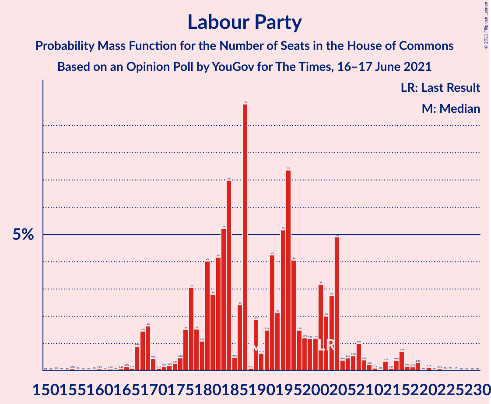

| Number of Seats | Probability | Accumulated | Special Marks |
|:---------------:|:-----------:|:-----------:|:-------------:|
| 152 | 0% | 100% |  |
| 153 | 0% | 99.9% |  |
| 154 | 0% | 99.9% |  |
| 155 | 0.1% | 99.9% |  |
| 156 | 0% | 99.8% |  |
| 157 | 0% | 99.8% |  |
| 158 | 0% | 99.8% |  |
| 159 | 0% | 99.8% |  |
| 160 | 0.1% | 99.7% |  |
| 161 | 0% | 99.7% |  |
| 162 | 0.1% | 99.7% |  |
| 163 | 0% | 99.6% |  |
| 164 | 0.1% | 99.6% |  |
| 165 | 0.1% | 99.5% |  |
| 166 | 0.1% | 99.4% |  |
| 167 | 0.9% | 99.3% |  |
| 168 | 1.5% | 98% |  |
| 169 | 2% | 97% |  |
| 170 | 0.4% | 95% |  |
| 171 | 0.1% | 95% |  |
| 172 | 0.2% | 95% |  |
| 173 | 0.2% | 95% |  |
| 174 | 0.3% | 94% |  |
| 175 | 0.5% | 94% |  |
| 176 | 2% | 94% |  |
| 177 | 3% | 92% |  |
| 178 | 2% | 89% |  |
| 179 | 1.1% | 88% |  |
| 180 | 4% | 86% |  |
| 181 | 3% | 82% |  |
| 182 | 4% | 80% |  |
| 183 | 5% | 76% |  |
| 184 | 7% | 70% |  |
| 185 | 0.5% | 63% |  |
| 186 | 2% | 63% |  |
| 187 | 10% | 60% |  |
| 188 | 0.1% | 51% |  |
| 189 | 2% | 51% | Median |
| 190 | 0.6% | 49% |  |
| 191 | 1.5% | 48% |  |
| 192 | 4% | 47% |  |
| 193 | 2% | 42% |  |
| 194 | 5% | 40% |  |
| 195 | 7% | 35% |  |
| 196 | 4% | 28% |  |
| 197 | 1.5% | 24% |  |
| 198 | 1.2% | 22% |  |
| 199 | 1.2% | 21% |  |
| 200 | 1.2% | 20% |  |
| 201 | 3% | 18% |  |
| 202 | 2% | 15% | Last Result |
| 203 | 3% | 13% |  |
| 204 | 5% | 11% |  |
| 205 | 0.4% | 6% |  |
| 206 | 0.5% | 5% |  |
| 207 | 0.5% | 5% |  |
| 208 | 1.0% | 4% |  |
| 209 | 0.4% | 3% |  |
| 210 | 0.2% | 3% |  |
| 211 | 0.1% | 3% |  |
| 212 | 0% | 3% |  |
| 213 | 0.3% | 2% |  |
| 214 | 0.1% | 2% |  |
| 215 | 0.4% | 2% |  |
| 216 | 0.7% | 2% |  |
| 217 | 0.2% | 1.0% |  |
| 218 | 0.1% | 0.8% |  |
| 219 | 0.3% | 0.7% |  |
| 220 | 0% | 0.4% |  |
| 221 | 0.1% | 0.4% |  |
| 222 | 0% | 0.2% |  |
| 223 | 0.1% | 0.2% |  |
| 224 | 0% | 0.2% |  |
| 225 | 0% | 0.1% |  |
| 226 | 0% | 0.1% |  |
| 227 | 0% | 0% |  |

### Liberal Democrats

*For a full overview of the results for this party, see the [Liberal Democrats](party-liberaldemocrats.html) page.*

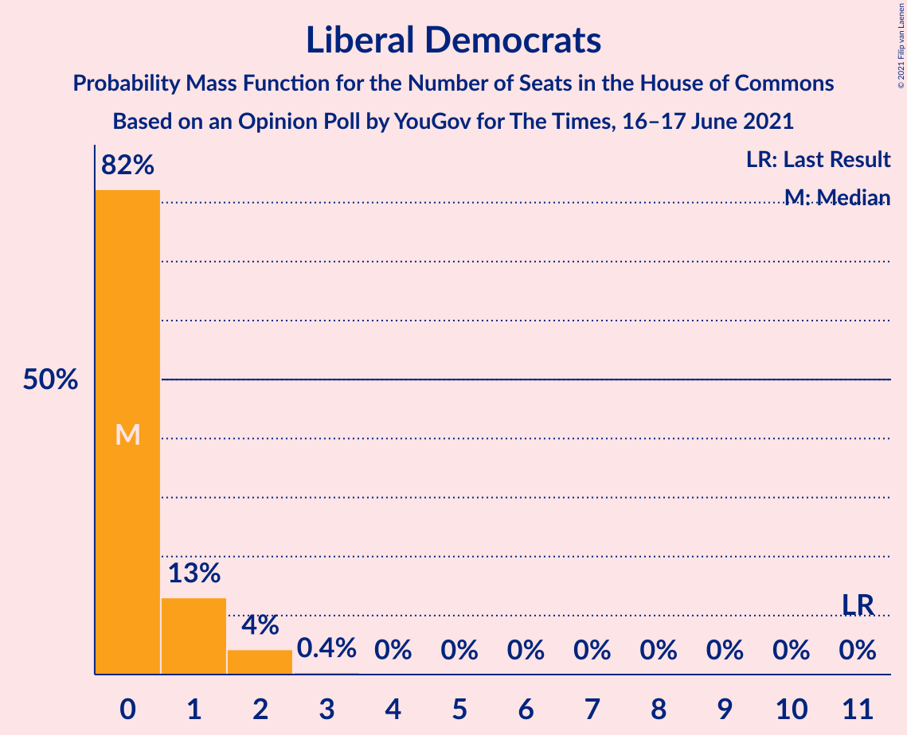

| Number of Seats | Probability | Accumulated | Special Marks |
|:---------------:|:-----------:|:-----------:|:-------------:|
| 0 | 82% | 100% | Median |
| 1 | 13% | 18% |  |
| 2 | 4% | 5% |  |
| 3 | 0.4% | 0.4% |  |
| 4 | 0% | 0% |  |
| 5 | 0% | 0% |  |
| 6 | 0% | 0% |  |
| 7 | 0% | 0% |  |
| 8 | 0% | 0% |  |
| 9 | 0% | 0% |  |
| 10 | 0% | 0% |  |
| 11 | 0% | 0% | Last Result |

### Green Party

*For a full overview of the results for this party, see the [Green Party](party-greenparty.html) page.*

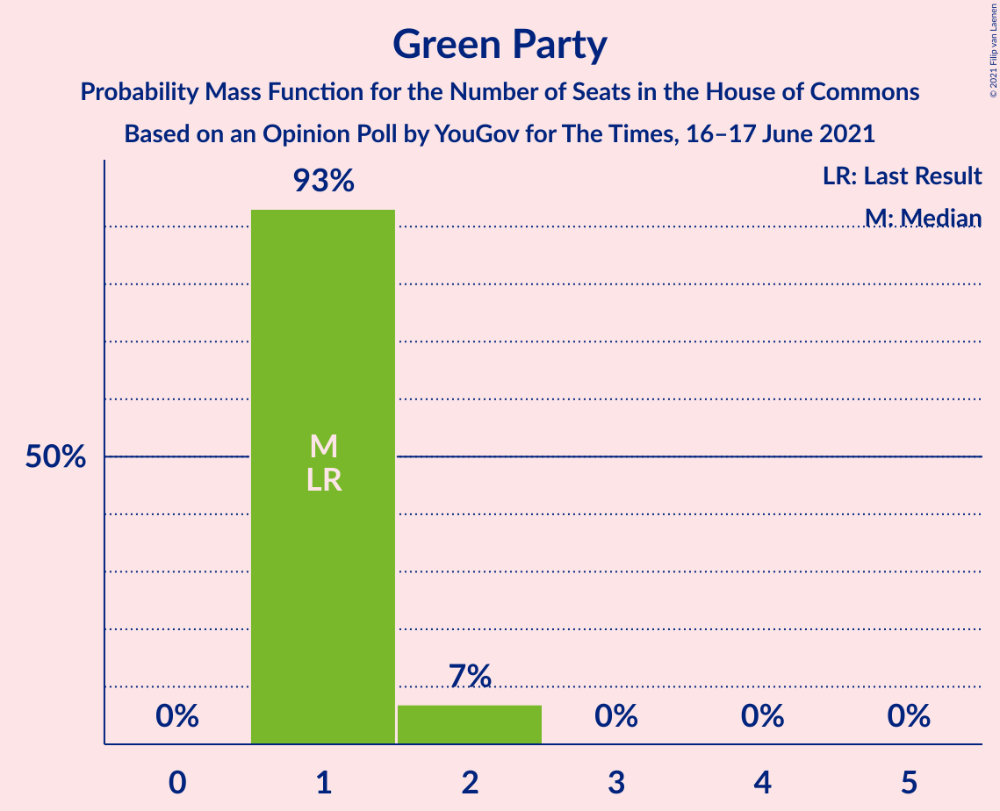

| Number of Seats | Probability | Accumulated | Special Marks |
|:---------------:|:-----------:|:-----------:|:-------------:|
| 1 | 93% | 100% | Last Result, Median |
| 2 | 7% | 7% |  |
| 3 | 0% | 0% |  |

### Scottish National Party

*For a full overview of the results for this party, see the [Scottish National Party](party-scottishnationalparty.html) page.*

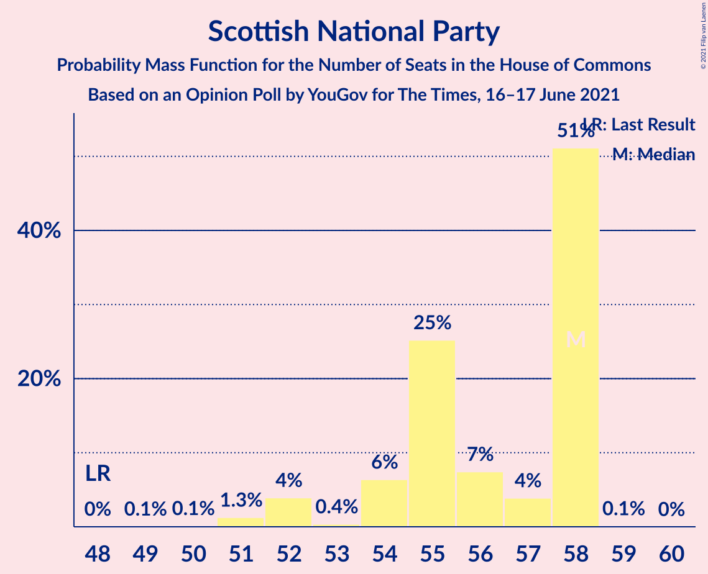

| Number of Seats | Probability | Accumulated | Special Marks |
|:---------------:|:-----------:|:-----------:|:-------------:|
| 48 | 0% | 100% | Last Result |
| 49 | 0.1% | 99.9% |  |
| 50 | 0.1% | 99.9% |  |
| 51 | 1.3% | 99.8% |  |
| 52 | 4% | 98% |  |
| 53 | 0.4% | 95% |  |
| 54 | 6% | 94% |  |
| 55 | 25% | 88% |  |
| 56 | 7% | 63% |  |
| 57 | 4% | 55% |  |
| 58 | 51% | 51% | Median |
| 59 | 0.1% | 0.1% |  |
| 60 | 0% | 0% |  |

### Brexit Party

*For a full overview of the results for this party, see the [Brexit Party](party-brexitparty.html) page.*

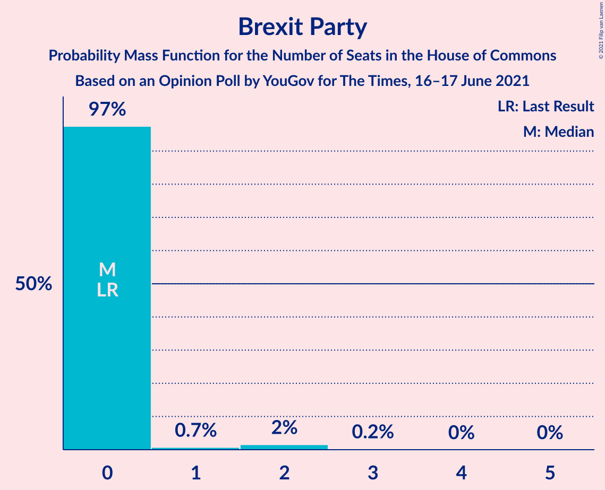

| Number of Seats | Probability | Accumulated | Special Marks |
|:---------------:|:-----------:|:-----------:|:-------------:|
| 0 | 97% | 100% | Last Result, Median |
| 1 | 0.7% | 3% |  |
| 2 | 2% | 2% |  |
| 3 | 0.2% | 0.3% |  |
| 4 | 0% | 0% |  |

### Plaid Cymru

*For a full overview of the results for this party, see the [Plaid Cymru](party-plaidcymru.html) page.*

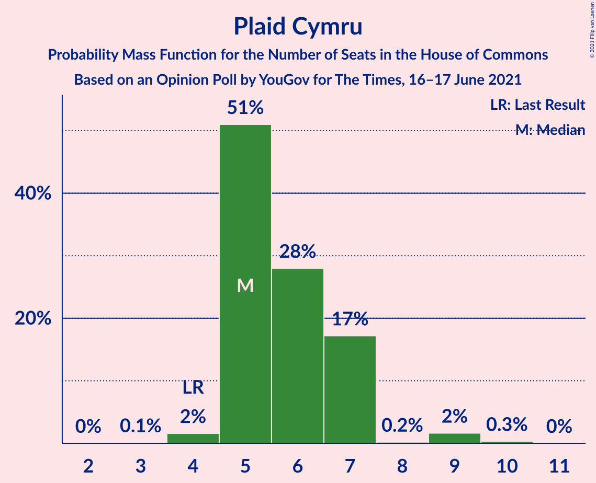

| Number of Seats | Probability | Accumulated | Special Marks |
|:---------------:|:-----------:|:-----------:|:-------------:|
| 3 | 0.1% | 100% |  |
| 4 | 2% | 99.9% | Last Result |
| 5 | 51% | 98% | Median |
| 6 | 28% | 47% |  |
| 7 | 17% | 19% |  |
| 8 | 0.2% | 2% |  |
| 9 | 2% | 2% |  |
| 10 | 0.3% | 0.3% |  |
| 11 | 0% | 0% |  |

## Coalitions

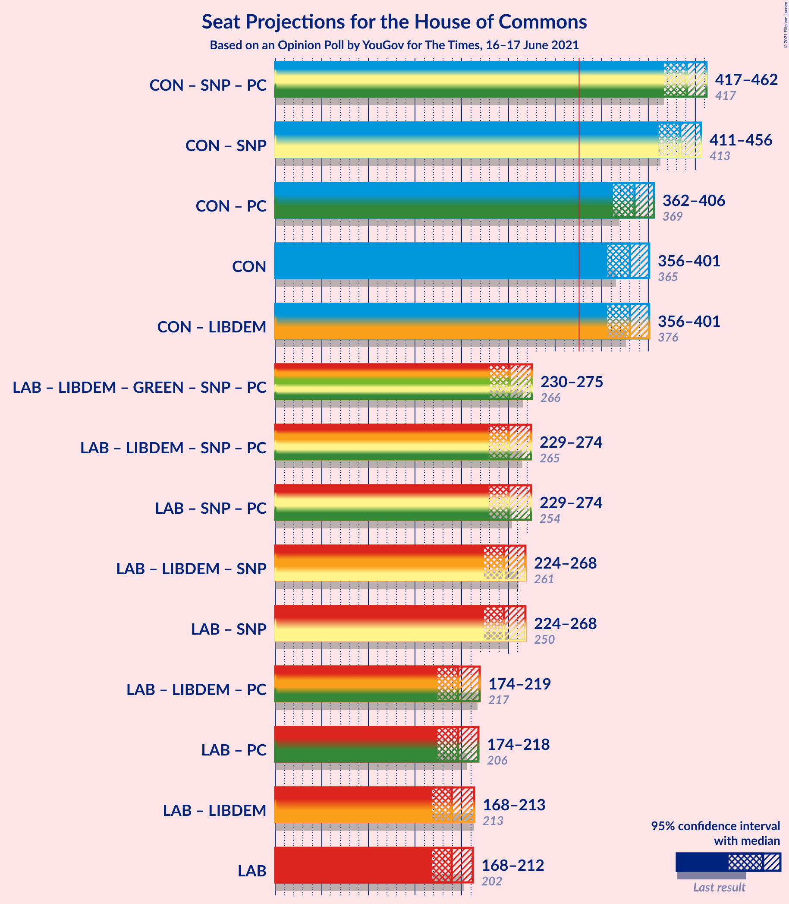

### Confidence Intervals

| Coalition | Last Result | Median | Majority? | 80% Confidence Interval | 90% Confidence Interval | 95% Confidence Interval | 99% Confidence Interval |
|:---------:|:-----------:|:------:|:---------:|:-----------------------:|:-----------------------:|:-----------------------:|:-----------------------:|
| Conservative Party – Scottish National Party – Plaid Cymru | 417 | 441 | 100% | 426–453 | 423–459 | 417–462 | 411–465 |
| Conservative Party – Scottish National Party | 413 | 434 | 100% | 421–447 | 418–454 | 411–456 | 406–458 |
| Conservative Party – Plaid Cymru | 369 | 385 | 100% | 368–398 | 367–402 | 362–406 | 353–411 |
| Conservative Party | 365 | 380 | 100% | 363–392 | 361–396 | 356–401 | 348–404 |
| Conservative Party – Liberal Democrats | 376 | 380 | 100% | 363–392 | 361–396 | 356–401 | 348–404 |
| Labour Party – Liberal Democrats – Green Party – Scottish National Party – Plaid Cymru | 266 | 251 | 0% | 239–268 | 235–270 | 230–275 | 226–283 |
| Labour Party – Liberal Democrats – Scottish National Party – Plaid Cymru | 265 | 250 | 0% | 238–267 | 233–269 | 229–274 | 225–282 |
| Labour Party – Scottish National Party – Plaid Cymru | 254 | 250 | 0% | 237–267 | 233–269 | 229–274 | 224–282 |
| Labour Party – Liberal Democrats – Scottish National Party | 261 | 245 | 0% | 232–262 | 227–263 | 224–268 | 219–277 |
| Labour Party – Scottish National Party | 250 | 245 | 0% | 232–262 | 227–262 | 224–268 | 218–277 |
| Labour Party – Liberal Democrats – Plaid Cymru | 217 | 196 | 0% | 183–209 | 175–212 | 174–219 | 171–224 |
| Labour Party – Plaid Cymru | 206 | 196 | 0% | 183–209 | 175–212 | 174–218 | 171–224 |
| Labour Party – Liberal Democrats | 213 | 189 | 0% | 177–204 | 170–207 | 168–213 | 165–219 |
| Labour Party | 202 | 189 | 0% | 177–204 | 170–206 | 168–212 | 165–219 |

### Conservative Party – Scottish National Party – Plaid Cymru

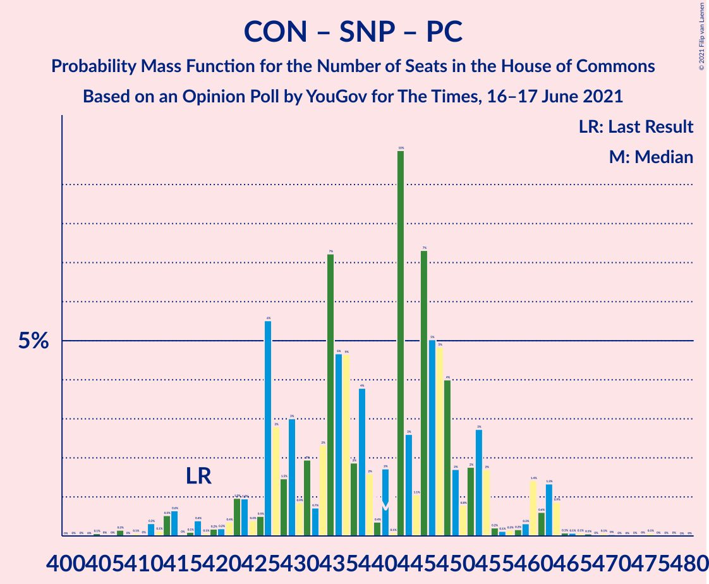

| Number of Seats | Probability | Accumulated | Special Marks |
|:---------------:|:-----------:|:-----------:|:-------------:|
| 404 | 0.1% | 100% |  |
| 405 | 0% | 99.9% |  |
| 406 | 0% | 99.9% |  |
| 407 | 0.2% | 99.8% |  |
| 408 | 0% | 99.7% |  |
| 409 | 0.1% | 99.7% |  |
| 410 | 0% | 99.6% |  |
| 411 | 0.3% | 99.6% |  |
| 412 | 0.1% | 99.3% |  |
| 413 | 0.5% | 99.1% |  |
| 414 | 0.6% | 98.6% |  |
| 415 | 0% | 98% |  |
| 416 | 0.1% | 98% |  |
| 417 | 0.4% | 98% | Last Result |
| 418 | 0.1% | 97% |  |
| 419 | 0.2% | 97% |  |
| 420 | 0.2% | 97% |  |
| 421 | 0.4% | 97% |  |
| 422 | 1.0% | 97% |  |
| 423 | 1.0% | 96% |  |
| 424 | 0.4% | 95% |  |
| 425 | 0.5% | 94% |  |
| 426 | 6% | 94% |  |
| 427 | 3% | 88% |  |
| 428 | 1.5% | 85% |  |
| 429 | 3% | 84% |  |
| 430 | 0.9% | 81% |  |
| 431 | 2% | 80% |  |
| 432 | 0.7% | 78% |  |
| 433 | 2% | 78% |  |
| 434 | 7% | 75% |  |
| 435 | 5% | 68% |  |
| 436 | 5% | 63% |  |
| 437 | 2% | 59% |  |
| 438 | 4% | 57% |  |
| 439 | 2% | 53% |  |
| 440 | 0.4% | 51% |  |
| 441 | 2% | 51% |  |
| 442 | 0.1% | 49% |  |
| 443 | 10% | 49% | Median |
| 444 | 3% | 39% |  |
| 445 | 1.1% | 37% |  |
| 446 | 7% | 36% |  |
| 447 | 5% | 28% |  |
| 448 | 5% | 23% |  |
| 449 | 4% | 19% |  |
| 450 | 2% | 15% |  |
| 451 | 0.8% | 13% |  |
| 452 | 2% | 12% |  |
| 453 | 3% | 10% |  |
| 454 | 2% | 8% |  |
| 455 | 0.2% | 6% |  |
| 456 | 0.1% | 6% |  |
| 457 | 0.2% | 5% |  |
| 458 | 0.2% | 5% |  |
| 459 | 0.3% | 5% |  |
| 460 | 1.4% | 5% |  |
| 461 | 0.6% | 3% |  |
| 462 | 1.3% | 3% |  |
| 463 | 0.9% | 1.5% |  |
| 464 | 0.1% | 0.6% |  |
| 465 | 0.1% | 0.5% |  |
| 466 | 0.1% | 0.5% |  |
| 467 | 0.1% | 0.4% |  |
| 468 | 0% | 0.3% |  |
| 469 | 0.1% | 0.3% |  |
| 470 | 0% | 0.2% |  |
| 471 | 0% | 0.2% |  |
| 472 | 0% | 0.2% |  |
| 473 | 0% | 0.2% |  |
| 474 | 0% | 0.2% |  |
| 475 | 0.1% | 0.2% |  |
| 476 | 0% | 0.1% |  |
| 477 | 0% | 0.1% |  |
| 478 | 0% | 0.1% |  |
| 479 | 0% | 0% |  |

### Conservative Party – Scottish National Party

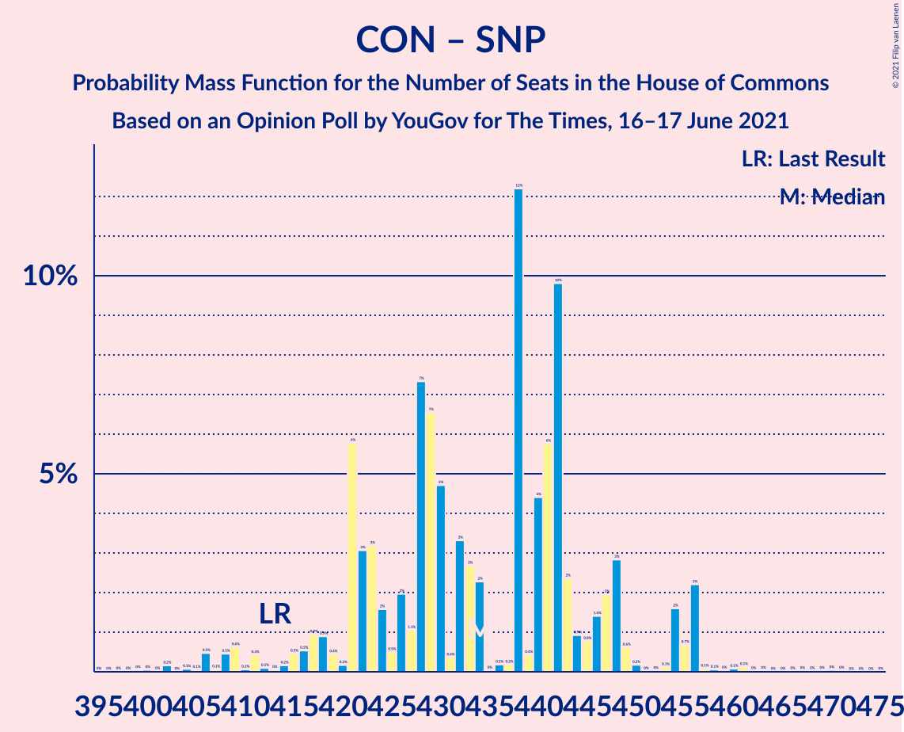

| Number of Seats | Probability | Accumulated | Special Marks |
|:---------------:|:-----------:|:-----------:|:-------------:|
| 398 | 0% | 100% |  |
| 399 | 0% | 99.9% |  |
| 400 | 0% | 99.9% |  |
| 401 | 0% | 99.8% |  |
| 402 | 0.2% | 99.8% |  |
| 403 | 0% | 99.7% |  |
| 404 | 0.1% | 99.7% |  |
| 405 | 0.1% | 99.6% |  |
| 406 | 0.5% | 99.5% |  |
| 407 | 0.1% | 99.1% |  |
| 408 | 0.5% | 99.0% |  |
| 409 | 0.6% | 98.6% |  |
| 410 | 0.1% | 98% |  |
| 411 | 0.4% | 98% |  |
| 412 | 0.1% | 97% |  |
| 413 | 0% | 97% | Last Result |
| 414 | 0.2% | 97% |  |
| 415 | 0.5% | 97% |  |
| 416 | 0.5% | 97% |  |
| 417 | 0.9% | 96% |  |
| 418 | 0.9% | 95% |  |
| 419 | 0.4% | 94% |  |
| 420 | 0.2% | 94% |  |
| 421 | 6% | 94% |  |
| 422 | 3% | 88% |  |
| 423 | 3% | 85% |  |
| 424 | 2% | 82% |  |
| 425 | 0.5% | 80% |  |
| 426 | 2% | 80% |  |
| 427 | 1.1% | 78% |  |
| 428 | 7% | 77% |  |
| 429 | 7% | 69% |  |
| 430 | 5% | 63% |  |
| 431 | 0.4% | 58% |  |
| 432 | 3% | 58% |  |
| 433 | 3% | 54% |  |
| 434 | 2% | 52% |  |
| 435 | 0% | 49% |  |
| 436 | 0.2% | 49% |  |
| 437 | 0.2% | 49% |  |
| 438 | 12% | 49% | Median |
| 439 | 0.4% | 37% |  |
| 440 | 4% | 36% |  |
| 441 | 6% | 32% |  |
| 442 | 10% | 26% |  |
| 443 | 2% | 16% |  |
| 444 | 0.9% | 14% |  |
| 445 | 0.8% | 13% |  |
| 446 | 1.4% | 12% |  |
| 447 | 2% | 11% |  |
| 448 | 3% | 9% |  |
| 449 | 0.6% | 6% |  |
| 450 | 0.2% | 5% |  |
| 451 | 0% | 5% |  |
| 452 | 0% | 5% |  |
| 453 | 0.1% | 5% |  |
| 454 | 2% | 5% |  |
| 455 | 0.7% | 4% |  |
| 456 | 2% | 3% |  |
| 457 | 0.1% | 0.6% |  |
| 458 | 0.1% | 0.6% |  |
| 459 | 0% | 0.5% |  |
| 460 | 0.1% | 0.5% |  |
| 461 | 0.1% | 0.4% |  |
| 462 | 0% | 0.3% |  |
| 463 | 0% | 0.2% |  |
| 464 | 0% | 0.2% |  |
| 465 | 0% | 0.2% |  |
| 466 | 0% | 0.2% |  |
| 467 | 0% | 0.2% |  |
| 468 | 0% | 0.2% |  |
| 469 | 0% | 0.1% |  |
| 470 | 0% | 0.1% |  |
| 471 | 0% | 0.1% |  |
| 472 | 0% | 0% |  |

### Conservative Party – Plaid Cymru

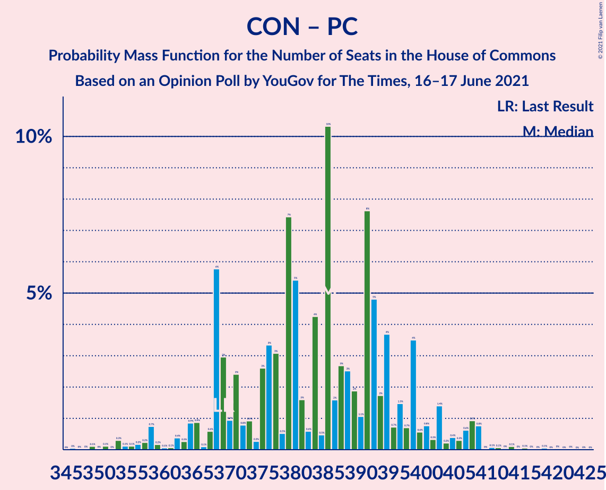

| Number of Seats | Probability | Accumulated | Special Marks |
|:---------------:|:-----------:|:-----------:|:-------------:|
| 346 | 0% | 100% |  |
| 347 | 0% | 99.9% |  |
| 348 | 0% | 99.9% |  |
| 349 | 0.1% | 99.9% |  |
| 350 | 0% | 99.8% |  |
| 351 | 0.1% | 99.7% |  |
| 352 | 0% | 99.6% |  |
| 353 | 0.3% | 99.6% |  |
| 354 | 0.1% | 99.3% |  |
| 355 | 0.1% | 99.2% |  |
| 356 | 0.2% | 99.1% |  |
| 357 | 0.2% | 98.9% |  |
| 358 | 0.7% | 98.7% |  |
| 359 | 0.2% | 98% |  |
| 360 | 0.1% | 98% |  |
| 361 | 0.1% | 98% |  |
| 362 | 0.4% | 98% |  |
| 363 | 0.3% | 97% |  |
| 364 | 0.9% | 97% |  |
| 365 | 0.9% | 96% |  |
| 366 | 0.1% | 95% |  |
| 367 | 0.6% | 95% |  |
| 368 | 6% | 95% |  |
| 369 | 3% | 89% | Last Result |
| 370 | 0.9% | 86% |  |
| 371 | 2% | 85% |  |
| 372 | 0.8% | 82% |  |
| 373 | 0.9% | 82% |  |
| 374 | 0.3% | 81% |  |
| 375 | 3% | 81% |  |
| 376 | 3% | 78% |  |
| 377 | 3% | 75% |  |
| 378 | 0.5% | 71% |  |
| 379 | 7% | 71% |  |
| 380 | 5% | 64% |  |
| 381 | 2% | 58% |  |
| 382 | 0.6% | 57% |  |
| 383 | 4% | 56% |  |
| 384 | 0.5% | 52% |  |
| 385 | 10% | 51% | Median |
| 386 | 2% | 41% |  |
| 387 | 3% | 39% |  |
| 388 | 3% | 37% |  |
| 389 | 2% | 34% |  |
| 390 | 1.1% | 32% |  |
| 391 | 8% | 31% |  |
| 392 | 5% | 24% |  |
| 393 | 2% | 19% |  |
| 394 | 4% | 17% |  |
| 395 | 0.7% | 13% |  |
| 396 | 1.5% | 13% |  |
| 397 | 0.7% | 11% |  |
| 398 | 4% | 10% |  |
| 399 | 0.6% | 7% |  |
| 400 | 0.8% | 6% |  |
| 401 | 0.3% | 6% |  |
| 402 | 1.4% | 5% |  |
| 403 | 0.2% | 4% |  |
| 404 | 0.4% | 4% |  |
| 405 | 0.3% | 3% |  |
| 406 | 0.6% | 3% |  |
| 407 | 0.9% | 2% |  |
| 408 | 0.8% | 1.4% |  |
| 409 | 0% | 0.6% |  |
| 410 | 0.1% | 0.6% |  |
| 411 | 0.1% | 0.5% |  |
| 412 | 0% | 0.4% |  |
| 413 | 0.1% | 0.4% |  |
| 414 | 0% | 0.3% |  |
| 415 | 0.1% | 0.3% |  |
| 416 | 0% | 0.2% |  |
| 417 | 0% | 0.2% |  |
| 418 | 0.1% | 0.2% |  |
| 419 | 0% | 0.1% |  |
| 420 | 0% | 0.1% |  |
| 421 | 0% | 0.1% |  |
| 422 | 0% | 0.1% |  |
| 423 | 0% | 0% |  |

### Conservative Party

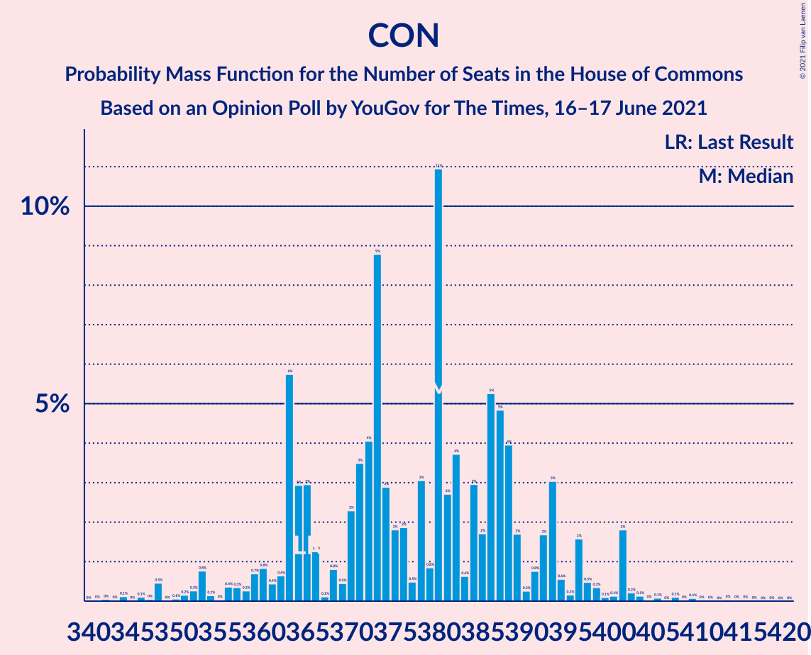

| Number of Seats | Probability | Accumulated | Special Marks |
|:---------------:|:-----------:|:-----------:|:-------------:|
| 341 | 0% | 100% |  |
| 342 | 0% | 99.9% |  |
| 343 | 0% | 99.9% |  |
| 344 | 0.1% | 99.9% |  |
| 345 | 0% | 99.7% |  |
| 346 | 0.1% | 99.7% |  |
| 347 | 0% | 99.6% |  |
| 348 | 0.5% | 99.6% |  |
| 349 | 0% | 99.1% |  |
| 350 | 0.1% | 99.1% |  |
| 351 | 0.2% | 99.0% |  |
| 352 | 0.3% | 98.9% |  |
| 353 | 0.8% | 98.6% |  |
| 354 | 0.1% | 98% |  |
| 355 | 0% | 98% |  |
| 356 | 0.4% | 98% |  |
| 357 | 0.3% | 97% |  |
| 358 | 0.3% | 97% |  |
| 359 | 0.7% | 97% |  |
| 360 | 0.8% | 96% |  |
| 361 | 0.4% | 95% |  |
| 362 | 0.6% | 95% |  |
| 363 | 6% | 94% |  |
| 364 | 3% | 88% |  |
| 365 | 3% | 85% | Last Result |
| 366 | 1.3% | 82% |  |
| 367 | 0.1% | 81% |  |
| 368 | 0.8% | 81% |  |
| 369 | 0.5% | 80% |  |
| 370 | 2% | 80% |  |
| 371 | 3% | 78% |  |
| 372 | 4% | 74% |  |
| 373 | 9% | 70% |  |
| 374 | 3% | 61% |  |
| 375 | 2% | 58% |  |
| 376 | 2% | 56% |  |
| 377 | 0.5% | 55% |  |
| 378 | 3% | 54% |  |
| 379 | 0.8% | 51% |  |
| 380 | 11% | 50% | Median |
| 381 | 3% | 39% |  |
| 382 | 4% | 37% |  |
| 383 | 0.6% | 33% |  |
| 384 | 3% | 32% |  |
| 385 | 2% | 29% |  |
| 386 | 5% | 28% |  |
| 387 | 5% | 22% |  |
| 388 | 4% | 17% |  |
| 389 | 2% | 13% |  |
| 390 | 0.3% | 12% |  |
| 391 | 0.8% | 12% |  |
| 392 | 2% | 11% |  |
| 393 | 3% | 9% |  |
| 394 | 0.6% | 6% |  |
| 395 | 0.2% | 5% |  |
| 396 | 2% | 5% |  |
| 397 | 0.5% | 4% |  |
| 398 | 0.3% | 3% |  |
| 399 | 0.1% | 3% |  |
| 400 | 0.1% | 3% |  |
| 401 | 2% | 3% |  |
| 402 | 0.2% | 0.9% |  |
| 403 | 0.1% | 0.6% |  |
| 404 | 0% | 0.5% |  |
| 405 | 0.1% | 0.5% |  |
| 406 | 0% | 0.4% |  |
| 407 | 0.1% | 0.4% |  |
| 408 | 0% | 0.3% |  |
| 409 | 0.1% | 0.3% |  |
| 410 | 0% | 0.2% |  |
| 411 | 0% | 0.2% |  |
| 412 | 0% | 0.2% |  |
| 413 | 0% | 0.2% |  |
| 414 | 0% | 0.1% |  |
| 415 | 0% | 0.1% |  |
| 416 | 0% | 0.1% |  |
| 417 | 0% | 0% |  |

### Conservative Party – Liberal Democrats

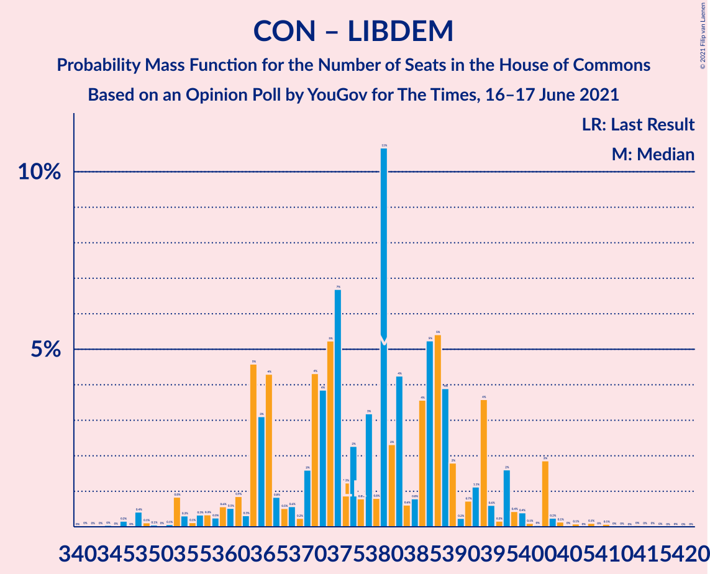

| Number of Seats | Probability | Accumulated | Special Marks |
|:---------------:|:-----------:|:-----------:|:-------------:|
| 341 | 0% | 100% |  |
| 342 | 0% | 99.9% |  |
| 343 | 0% | 99.9% |  |
| 344 | 0% | 99.9% |  |
| 345 | 0% | 99.8% |  |
| 346 | 0.2% | 99.8% |  |
| 347 | 0% | 99.6% |  |
| 348 | 0.4% | 99.6% |  |
| 349 | 0.1% | 99.2% |  |
| 350 | 0.1% | 99.1% |  |
| 351 | 0% | 99.1% |  |
| 352 | 0.1% | 99.0% |  |
| 353 | 0.8% | 99.0% |  |
| 354 | 0.3% | 98% |  |
| 355 | 0.1% | 98% |  |
| 356 | 0.3% | 98% |  |
| 357 | 0.3% | 97% |  |
| 358 | 0.3% | 97% |  |
| 359 | 0.6% | 97% |  |
| 360 | 0.5% | 96% |  |
| 361 | 0.9% | 96% |  |
| 362 | 0.3% | 95% |  |
| 363 | 5% | 94% |  |
| 364 | 3% | 90% |  |
| 365 | 4% | 87% |  |
| 366 | 0.8% | 83% |  |
| 367 | 0.5% | 82% |  |
| 368 | 0.6% | 81% |  |
| 369 | 0.2% | 81% |  |
| 370 | 2% | 80% |  |
| 371 | 4% | 79% |  |
| 372 | 4% | 74% |  |
| 373 | 5% | 71% |  |
| 374 | 7% | 65% |  |
| 375 | 1.2% | 59% |  |
| 376 | 2% | 57% | Last Result |
| 377 | 0.8% | 55% |  |
| 378 | 3% | 54% |  |
| 379 | 0.8% | 51% |  |
| 380 | 11% | 50% | Median |
| 381 | 2% | 40% |  |
| 382 | 4% | 37% |  |
| 383 | 0.6% | 33% |  |
| 384 | 0.8% | 32% |  |
| 385 | 4% | 32% |  |
| 386 | 5% | 28% |  |
| 387 | 5% | 23% |  |
| 388 | 4% | 17% |  |
| 389 | 2% | 14% |  |
| 390 | 0.2% | 12% |  |
| 391 | 0.7% | 12% |  |
| 392 | 1.1% | 11% |  |
| 393 | 4% | 10% |  |
| 394 | 0.6% | 6% |  |
| 395 | 0.2% | 6% |  |
| 396 | 2% | 5% |  |
| 397 | 0.4% | 4% |  |
| 398 | 0.4% | 3% |  |
| 399 | 0.1% | 3% |  |
| 400 | 0% | 3% |  |
| 401 | 2% | 3% |  |
| 402 | 0.2% | 0.9% |  |
| 403 | 0.1% | 0.7% |  |
| 404 | 0% | 0.5% |  |
| 405 | 0.1% | 0.5% |  |
| 406 | 0% | 0.4% |  |
| 407 | 0.1% | 0.4% |  |
| 408 | 0% | 0.3% |  |
| 409 | 0.1% | 0.3% |  |
| 410 | 0% | 0.2% |  |
| 411 | 0% | 0.2% |  |
| 412 | 0% | 0.2% |  |
| 413 | 0% | 0.2% |  |
| 414 | 0% | 0.1% |  |
| 415 | 0% | 0.1% |  |
| 416 | 0% | 0.1% |  |
| 417 | 0% | 0% |  |

### Labour Party – Liberal Democrats – Green Party – Scottish National Party – Plaid Cymru

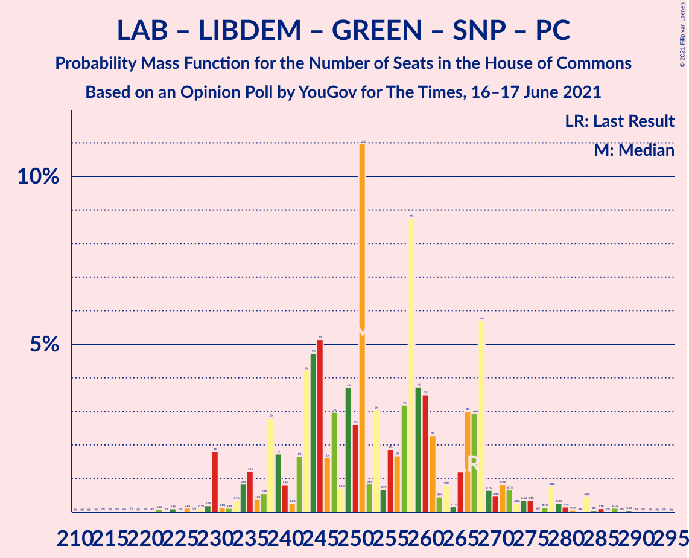

| Number of Seats | Probability | Accumulated | Special Marks |
|:---------------:|:-----------:|:-----------:|:-------------:|
| 214 | 0% | 100% |  |
| 215 | 0% | 99.9% |  |
| 216 | 0% | 99.9% |  |
| 217 | 0% | 99.9% |  |
| 218 | 0% | 99.9% |  |
| 219 | 0% | 99.8% |  |
| 220 | 0% | 99.8% |  |
| 221 | 0% | 99.8% |  |
| 222 | 0.1% | 99.8% |  |
| 223 | 0% | 99.7% |  |
| 224 | 0.1% | 99.7% |  |
| 225 | 0% | 99.6% |  |
| 226 | 0.1% | 99.6% |  |
| 227 | 0% | 99.5% |  |
| 228 | 0.1% | 99.4% |  |
| 229 | 0.2% | 99.3% |  |
| 230 | 2% | 99.1% |  |
| 231 | 0.1% | 97% |  |
| 232 | 0.1% | 97% |  |
| 233 | 0.3% | 97% |  |
| 234 | 0.8% | 97% |  |
| 235 | 1.2% | 96% |  |
| 236 | 0.4% | 95% |  |
| 237 | 0.6% | 94% |  |
| 238 | 3% | 94% |  |
| 239 | 2% | 91% |  |
| 240 | 0.8% | 89% |  |
| 241 | 0.3% | 88% |  |
| 242 | 2% | 88% |  |
| 243 | 4% | 86% |  |
| 244 | 5% | 82% |  |
| 245 | 5% | 77% |  |
| 246 | 2% | 72% |  |
| 247 | 3% | 71% |  |
| 248 | 0.7% | 68% |  |
| 249 | 4% | 67% |  |
| 250 | 3% | 63% |  |
| 251 | 11% | 61% |  |
| 252 | 0.8% | 50% |  |
| 253 | 3% | 49% | Median |
| 254 | 0.7% | 46% |  |
| 255 | 2% | 45% |  |
| 256 | 2% | 43% |  |
| 257 | 3% | 42% |  |
| 258 | 9% | 38% |  |
| 259 | 4% | 30% |  |
| 260 | 3% | 26% |  |
| 261 | 2% | 22% |  |
| 262 | 0.5% | 20% |  |
| 263 | 0.8% | 20% |  |
| 264 | 0.2% | 19% |  |
| 265 | 1.2% | 19% |  |
| 266 | 3% | 18% | Last Result |
| 267 | 3% | 15% |  |
| 268 | 6% | 12% |  |
| 269 | 0.7% | 6% |  |
| 270 | 0.5% | 5% |  |
| 271 | 0.8% | 5% |  |
| 272 | 0.7% | 4% |  |
| 273 | 0.3% | 3% |  |
| 274 | 0.4% | 3% |  |
| 275 | 0.4% | 3% |  |
| 276 | 0% | 2% |  |
| 277 | 0.1% | 2% |  |
| 278 | 0.8% | 2% |  |
| 279 | 0.3% | 1.4% |  |
| 280 | 0.2% | 1.1% |  |
| 281 | 0.1% | 1.0% |  |
| 282 | 0% | 0.9% |  |
| 283 | 0.5% | 0.9% |  |
| 284 | 0% | 0.4% |  |
| 285 | 0.1% | 0.4% |  |
| 286 | 0% | 0.3% |  |
| 287 | 0.1% | 0.3% |  |
| 288 | 0% | 0.1% |  |
| 289 | 0.1% | 0.1% |  |
| 290 | 0% | 0.1% |  |
| 291 | 0% | 0% |  |

### Labour Party – Liberal Democrats – Scottish National Party – Plaid Cymru

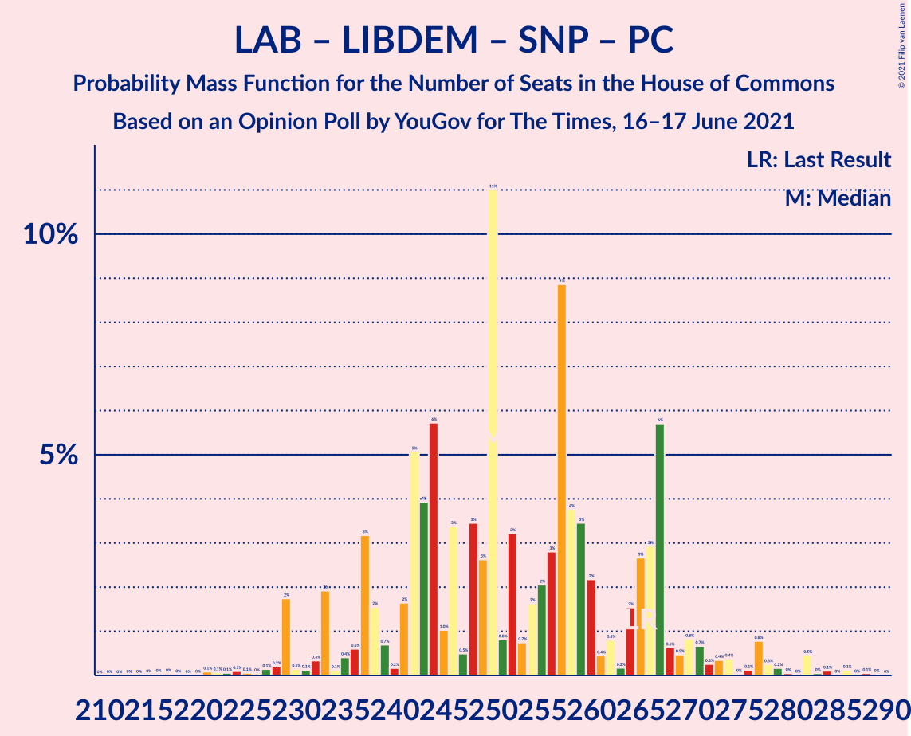

| Number of Seats | Probability | Accumulated | Special Marks |
|:---------------:|:-----------:|:-----------:|:-------------:|
| 213 | 0% | 100% |  |
| 214 | 0% | 99.9% |  |
| 215 | 0% | 99.9% |  |
| 216 | 0% | 99.9% |  |
| 217 | 0% | 99.9% |  |
| 218 | 0% | 99.8% |  |
| 219 | 0% | 99.8% |  |
| 220 | 0% | 99.8% |  |
| 221 | 0.1% | 99.8% |  |
| 222 | 0.1% | 99.7% |  |
| 223 | 0.1% | 99.7% |  |
| 224 | 0.1% | 99.6% |  |
| 225 | 0.1% | 99.5% |  |
| 226 | 0% | 99.4% |  |
| 227 | 0.1% | 99.4% |  |
| 228 | 0.2% | 99.3% |  |
| 229 | 2% | 99.1% |  |
| 230 | 0.1% | 97% |  |
| 231 | 0.1% | 97% |  |
| 232 | 0.3% | 97% |  |
| 233 | 2% | 97% |  |
| 234 | 0.1% | 95% |  |
| 235 | 0.4% | 95% |  |
| 236 | 0.6% | 94% |  |
| 237 | 3% | 94% |  |
| 238 | 2% | 90% |  |
| 239 | 0.7% | 89% |  |
| 240 | 0.2% | 88% |  |
| 241 | 2% | 88% |  |
| 242 | 5% | 86% |  |
| 243 | 4% | 81% |  |
| 244 | 6% | 77% |  |
| 245 | 1.0% | 72% |  |
| 246 | 3% | 71% |  |
| 247 | 0.5% | 67% |  |
| 248 | 3% | 67% |  |
| 249 | 3% | 63% |  |
| 250 | 11% | 61% |  |
| 251 | 0.8% | 50% |  |
| 252 | 3% | 49% | Median |
| 253 | 0.7% | 46% |  |
| 254 | 2% | 45% |  |
| 255 | 2% | 43% |  |
| 256 | 3% | 41% |  |
| 257 | 9% | 38% |  |
| 258 | 4% | 30% |  |
| 259 | 3% | 26% |  |
| 260 | 2% | 22% |  |
| 261 | 0.4% | 20% |  |
| 262 | 0.8% | 20% |  |
| 263 | 0.2% | 19% |  |
| 264 | 2% | 19% |  |
| 265 | 3% | 17% | Last Result |
| 266 | 3% | 15% |  |
| 267 | 6% | 12% |  |
| 268 | 0.6% | 6% |  |
| 269 | 0.5% | 5% |  |
| 270 | 0.8% | 5% |  |
| 271 | 0.7% | 4% |  |
| 272 | 0.3% | 3% |  |
| 273 | 0.4% | 3% |  |
| 274 | 0.4% | 3% |  |
| 275 | 0% | 2% |  |
| 276 | 0.1% | 2% |  |
| 277 | 0.8% | 2% |  |
| 278 | 0.3% | 1.4% |  |
| 279 | 0.2% | 1.1% |  |
| 280 | 0% | 1.0% |  |
| 281 | 0% | 0.9% |  |
| 282 | 0.5% | 0.9% |  |
| 283 | 0% | 0.4% |  |
| 284 | 0.1% | 0.4% |  |
| 285 | 0% | 0.3% |  |
| 286 | 0.1% | 0.3% |  |
| 287 | 0% | 0.1% |  |
| 288 | 0.1% | 0.1% |  |
| 289 | 0% | 0.1% |  |
| 290 | 0% | 0% |  |

### Labour Party – Scottish National Party – Plaid Cymru

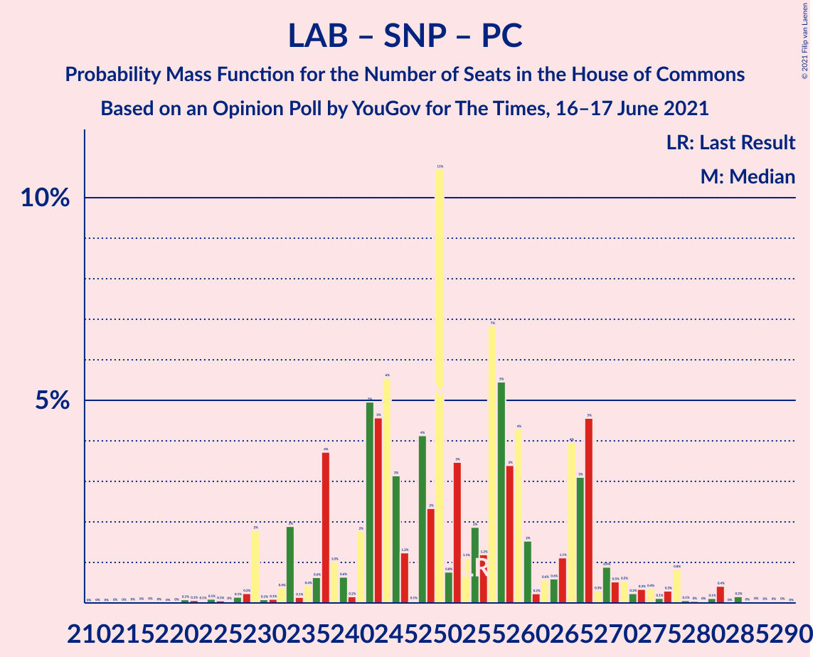

| Number of Seats | Probability | Accumulated | Special Marks |
|:---------------:|:-----------:|:-----------:|:-------------:|
| 213 | 0% | 100% |  |
| 214 | 0% | 99.9% |  |
| 215 | 0% | 99.9% |  |
| 216 | 0% | 99.9% |  |
| 217 | 0% | 99.9% |  |
| 218 | 0% | 99.8% |  |
| 219 | 0% | 99.8% |  |
| 220 | 0% | 99.8% |  |
| 221 | 0.1% | 99.8% |  |
| 222 | 0.1% | 99.7% |  |
| 223 | 0.1% | 99.7% |  |
| 224 | 0.1% | 99.6% |  |
| 225 | 0.1% | 99.5% |  |
| 226 | 0% | 99.4% |  |
| 227 | 0.1% | 99.4% |  |
| 228 | 0.2% | 99.2% |  |
| 229 | 2% | 99.0% |  |
| 230 | 0.1% | 97% |  |
| 231 | 0.1% | 97% |  |
| 232 | 0.4% | 97% |  |
| 233 | 2% | 97% |  |
| 234 | 0.1% | 95% |  |
| 235 | 0.4% | 95% |  |
| 236 | 0.6% | 94% |  |
| 237 | 4% | 94% |  |
| 238 | 1.0% | 90% |  |
| 239 | 0.6% | 89% |  |
| 240 | 0.2% | 88% |  |
| 241 | 2% | 88% |  |
| 242 | 5% | 86% |  |
| 243 | 5% | 81% |  |
| 244 | 6% | 77% |  |
| 245 | 3% | 71% |  |
| 246 | 1.2% | 68% |  |
| 247 | 0.1% | 67% |  |
| 248 | 4% | 67% |  |
| 249 | 2% | 63% |  |
| 250 | 11% | 60% |  |
| 251 | 0.8% | 50% |  |
| 252 | 3% | 49% | Median |
| 253 | 1.1% | 45% |  |
| 254 | 2% | 44% | Last Result |
| 255 | 1.2% | 42% |  |
| 256 | 7% | 41% |  |
| 257 | 5% | 34% |  |
| 258 | 3% | 29% |  |
| 259 | 4% | 25% |  |
| 260 | 2% | 21% |  |
| 261 | 0.2% | 20% |  |
| 262 | 0.6% | 19% |  |
| 263 | 0.6% | 19% |  |
| 264 | 1.1% | 18% |  |
| 265 | 4% | 17% |  |
| 266 | 3% | 13% |  |
| 267 | 5% | 10% |  |
| 268 | 0.3% | 5% |  |
| 269 | 0.9% | 5% |  |
| 270 | 0.5% | 4% |  |
| 271 | 0.5% | 4% |  |
| 272 | 0.2% | 3% |  |
| 273 | 0.3% | 3% |  |
| 274 | 0.4% | 3% |  |
| 275 | 0.1% | 2% |  |
| 276 | 0.3% | 2% |  |
| 277 | 0.8% | 2% |  |
| 278 | 0.1% | 1.0% |  |
| 279 | 0% | 1.0% |  |
| 280 | 0% | 0.9% |  |
| 281 | 0.1% | 0.9% |  |
| 282 | 0.4% | 0.8% |  |
| 283 | 0% | 0.4% |  |
| 284 | 0.2% | 0.4% |  |
| 285 | 0% | 0.2% |  |
| 286 | 0% | 0.2% |  |
| 287 | 0% | 0.1% |  |
| 288 | 0% | 0.1% |  |
| 289 | 0% | 0.1% |  |
| 290 | 0% | 0% |  |

### Labour Party – Liberal Democrats – Scottish National Party

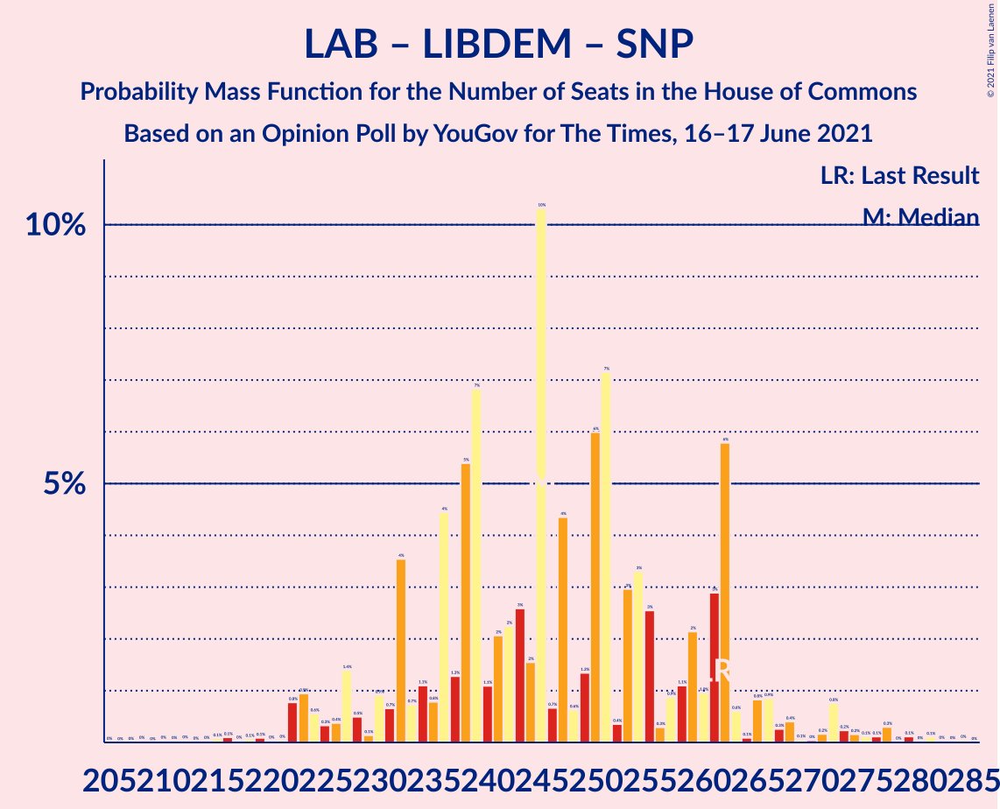

| Number of Seats | Probability | Accumulated | Special Marks |
|:---------------:|:-----------:|:-----------:|:-------------:|
| 207 | 0% | 100% |  |
| 208 | 0% | 99.9% |  |
| 209 | 0% | 99.9% |  |
| 210 | 0% | 99.9% |  |
| 211 | 0% | 99.9% |  |
| 212 | 0% | 99.9% |  |
| 213 | 0% | 99.8% |  |
| 214 | 0% | 99.8% |  |
| 215 | 0.1% | 99.8% |  |
| 216 | 0.1% | 99.7% |  |
| 217 | 0% | 99.6% |  |
| 218 | 0.1% | 99.6% |  |
| 219 | 0.1% | 99.5% |  |
| 220 | 0% | 99.4% |  |
| 221 | 0% | 99.4% |  |
| 222 | 0.8% | 99.3% |  |
| 223 | 0.9% | 98.6% |  |
| 224 | 0.6% | 98% |  |
| 225 | 0.3% | 97% |  |
| 226 | 0.4% | 97% |  |
| 227 | 1.4% | 96% |  |
| 228 | 0.5% | 95% |  |
| 229 | 0.1% | 94% |  |
| 230 | 0.9% | 94% |  |
| 231 | 0.7% | 93% |  |
| 232 | 4% | 93% |  |
| 233 | 0.7% | 89% |  |
| 234 | 1.1% | 88% |  |
| 235 | 0.8% | 87% |  |
| 236 | 4% | 87% |  |
| 237 | 1.3% | 82% |  |
| 238 | 5% | 81% |  |
| 239 | 7% | 75% |  |
| 240 | 1.1% | 69% |  |
| 241 | 2% | 68% |  |
| 242 | 2% | 65% |  |
| 243 | 3% | 63% |  |
| 244 | 2% | 61% |  |
| 245 | 10% | 59% |  |
| 246 | 0.7% | 49% |  |
| 247 | 4% | 48% | Median |
| 248 | 0.6% | 44% |  |
| 249 | 1.3% | 43% |  |
| 250 | 6% | 42% |  |
| 251 | 7% | 36% |  |
| 252 | 0.4% | 29% |  |
| 253 | 3% | 28% |  |
| 254 | 3% | 25% |  |
| 255 | 3% | 22% |  |
| 256 | 0.3% | 19% |  |
| 257 | 0.9% | 19% |  |
| 258 | 1.1% | 18% |  |
| 259 | 2% | 17% |  |
| 260 | 1.0% | 15% |  |
| 261 | 3% | 14% | Last Result |
| 262 | 6% | 11% |  |
| 263 | 0.6% | 5% |  |
| 264 | 0.1% | 5% |  |
| 265 | 0.8% | 5% |  |
| 266 | 0.9% | 4% |  |
| 267 | 0.3% | 3% |  |
| 268 | 0.4% | 3% |  |
| 269 | 0.1% | 2% |  |
| 270 | 0% | 2% |  |
| 271 | 0.2% | 2% |  |
| 272 | 0.8% | 2% |  |
| 273 | 0.2% | 1.3% |  |
| 274 | 0.2% | 1.1% |  |
| 275 | 0.1% | 0.9% |  |
| 276 | 0.1% | 0.8% |  |
| 277 | 0.3% | 0.7% |  |
| 278 | 0% | 0.4% |  |
| 279 | 0.1% | 0.4% |  |
| 280 | 0% | 0.3% |  |
| 281 | 0.1% | 0.2% |  |
| 282 | 0% | 0.1% |  |
| 283 | 0% | 0.1% |  |
| 284 | 0% | 0.1% |  |
| 285 | 0% | 0% |  |

### Labour Party – Scottish National Party

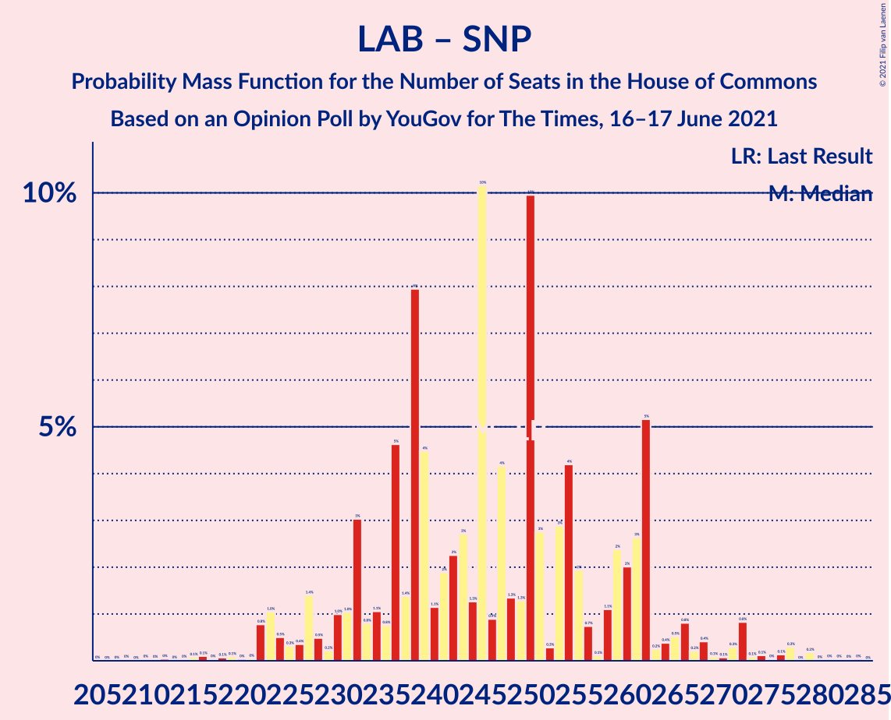

| Number of Seats | Probability | Accumulated | Special Marks |
|:---------------:|:-----------:|:-----------:|:-------------:|
| 207 | 0% | 100% |  |
| 208 | 0% | 99.9% |  |
| 209 | 0% | 99.9% |  |
| 210 | 0% | 99.9% |  |
| 211 | 0% | 99.9% |  |
| 212 | 0% | 99.9% |  |
| 213 | 0% | 99.8% |  |
| 214 | 0% | 99.8% |  |
| 215 | 0.1% | 99.8% |  |
| 216 | 0.1% | 99.7% |  |
| 217 | 0% | 99.6% |  |
| 218 | 0.1% | 99.6% |  |
| 219 | 0.1% | 99.5% |  |
| 220 | 0% | 99.4% |  |
| 221 | 0% | 99.4% |  |
| 222 | 0.8% | 99.3% |  |
| 223 | 1.0% | 98.6% |  |
| 224 | 0.5% | 98% |  |
| 225 | 0.3% | 97% |  |
| 226 | 0.4% | 97% |  |
| 227 | 1.4% | 96% |  |
| 228 | 0.5% | 95% |  |
| 229 | 0.2% | 94% |  |
| 230 | 1.0% | 94% |  |
| 231 | 1.0% | 93% |  |
| 232 | 3% | 92% |  |
| 233 | 0.8% | 89% |  |
| 234 | 1.1% | 88% |  |
| 235 | 0.8% | 87% |  |
| 236 | 5% | 87% |  |
| 237 | 1.4% | 82% |  |
| 238 | 8% | 81% |  |
| 239 | 4% | 73% |  |
| 240 | 1.1% | 68% |  |
| 241 | 2% | 67% |  |
| 242 | 2% | 65% |  |
| 243 | 3% | 63% |  |
| 244 | 1.3% | 60% |  |
| 245 | 10% | 59% |  |
| 246 | 0.9% | 49% |  |
| 247 | 4% | 48% | Median |
| 248 | 1.3% | 44% |  |
| 249 | 1.3% | 42% |  |
| 250 | 10% | 41% | Last Result |
| 251 | 3% | 31% |  |
| 252 | 0.3% | 28% |  |
| 253 | 3% | 28% |  |
| 254 | 4% | 25% |  |
| 255 | 2% | 21% |  |
| 256 | 0.7% | 19% |  |
| 257 | 0.1% | 18% |  |
| 258 | 1.1% | 18% |  |
| 259 | 2% | 17% |  |
| 260 | 2% | 15% |  |
| 261 | 3% | 13% |  |
| 262 | 5% | 10% |  |
| 263 | 0.2% | 5% |  |
| 264 | 0.4% | 5% |  |
| 265 | 0.5% | 4% |  |
| 266 | 0.8% | 4% |  |
| 267 | 0.2% | 3% |  |
| 268 | 0.4% | 3% |  |
| 269 | 0.1% | 2% |  |
| 270 | 0.1% | 2% |  |
| 271 | 0.3% | 2% |  |
| 272 | 0.8% | 2% |  |
| 273 | 0.1% | 1.0% |  |
| 274 | 0.1% | 0.9% |  |
| 275 | 0% | 0.8% |  |
| 276 | 0.1% | 0.8% |  |
| 277 | 0.3% | 0.6% |  |
| 278 | 0% | 0.4% |  |
| 279 | 0.2% | 0.4% |  |
| 280 | 0% | 0.2% |  |
| 281 | 0% | 0.2% |  |
| 282 | 0% | 0.1% |  |
| 283 | 0% | 0.1% |  |
| 284 | 0% | 0.1% |  |
| 285 | 0% | 0% |  |

### Labour Party – Liberal Democrats – Plaid Cymru

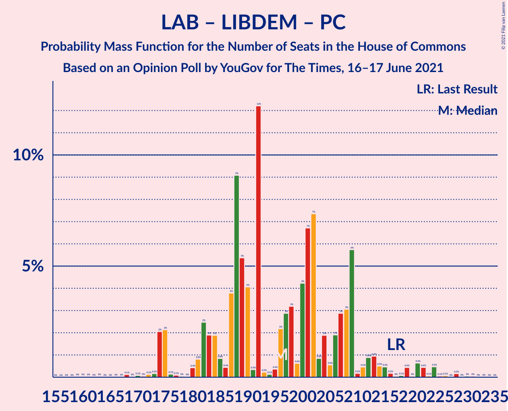

| Number of Seats | Probability | Accumulated | Special Marks |
|:---------------:|:-----------:|:-----------:|:-------------:|
| 159 | 0% | 100% |  |
| 160 | 0% | 99.9% |  |
| 161 | 0% | 99.9% |  |
| 162 | 0% | 99.9% |  |
| 163 | 0% | 99.8% |  |
| 164 | 0% | 99.8% |  |
| 165 | 0% | 99.8% |  |
| 166 | 0% | 99.8% |  |
| 167 | 0% | 99.8% |  |
| 168 | 0.1% | 99.7% |  |
| 169 | 0% | 99.6% |  |
| 170 | 0.1% | 99.6% |  |
| 171 | 0% | 99.5% |  |
| 172 | 0.1% | 99.5% |  |
| 173 | 0.2% | 99.3% |  |
| 174 | 2% | 99.2% |  |
| 175 | 2% | 97% |  |
| 176 | 0.1% | 95% |  |
| 177 | 0.1% | 95% |  |
| 178 | 0% | 95% |  |
| 179 | 0% | 95% |  |
| 180 | 0.4% | 95% |  |
| 181 | 0.8% | 94% |  |
| 182 | 2% | 93% |  |
| 183 | 2% | 91% |  |
| 184 | 2% | 89% |  |
| 185 | 0.8% | 87% |  |
| 186 | 0.4% | 86% |  |
| 187 | 4% | 86% |  |
| 188 | 9% | 82% |  |
| 189 | 5% | 73% |  |
| 190 | 4% | 68% |  |
| 191 | 0.3% | 64% |  |
| 192 | 12% | 63% |  |
| 193 | 0.2% | 51% |  |
| 194 | 0.1% | 51% | Median |
| 195 | 0.4% | 51% |  |
| 196 | 2% | 50% |  |
| 197 | 3% | 48% |  |
| 198 | 3% | 45% |  |
| 199 | 0.6% | 42% |  |
| 200 | 4% | 41% |  |
| 201 | 7% | 37% |  |
| 202 | 7% | 31% |  |
| 203 | 0.8% | 23% |  |
| 204 | 2% | 22% |  |
| 205 | 0.6% | 20% |  |
| 206 | 2% | 20% |  |
| 207 | 3% | 18% |  |
| 208 | 3% | 15% |  |
| 209 | 6% | 12% |  |
| 210 | 0.2% | 6% |  |
| 211 | 0.5% | 6% |  |
| 212 | 0.9% | 6% |  |
| 213 | 0.9% | 5% |  |
| 214 | 0.5% | 4% |  |
| 215 | 0.5% | 3% |  |
| 216 | 0.2% | 3% |  |
| 217 | 0% | 3% | Last Result |
| 218 | 0.1% | 3% |  |
| 219 | 0.4% | 3% |  |
| 220 | 0% | 2% |  |
| 221 | 0.6% | 2% |  |
| 222 | 0.4% | 1.4% |  |
| 223 | 0.1% | 1.0% |  |
| 224 | 0.5% | 0.9% |  |
| 225 | 0.1% | 0.5% |  |
| 226 | 0.1% | 0.4% |  |
| 227 | 0% | 0.3% |  |
| 228 | 0.2% | 0.3% |  |
| 229 | 0% | 0.2% |  |
| 230 | 0% | 0.2% |  |
| 231 | 0% | 0.1% |  |
| 232 | 0% | 0.1% |  |
| 233 | 0% | 0% |  |

### Labour Party – Plaid Cymru

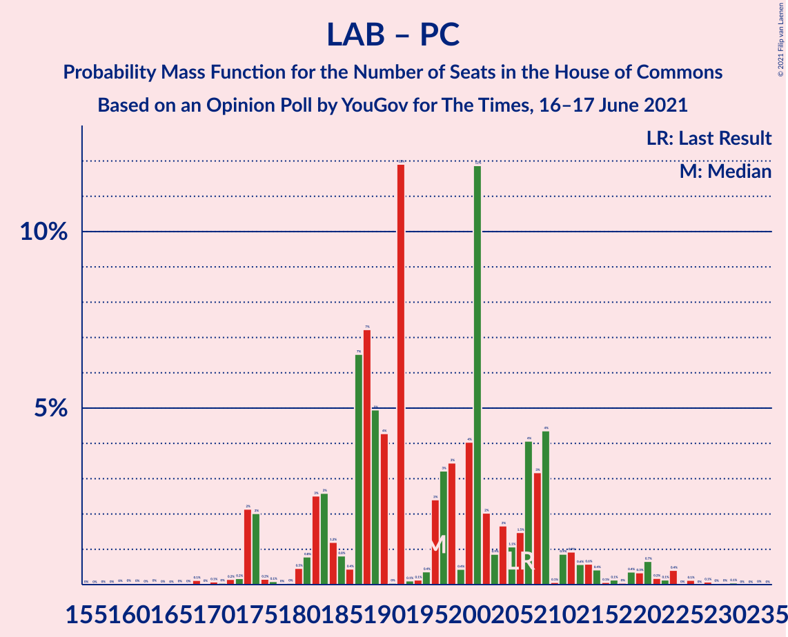

| Number of Seats | Probability | Accumulated | Special Marks |
|:---------------:|:-----------:|:-----------:|:-------------:|
| 159 | 0% | 100% |  |
| 160 | 0% | 99.9% |  |
| 161 | 0% | 99.9% |  |
| 162 | 0% | 99.9% |  |
| 163 | 0% | 99.8% |  |
| 164 | 0% | 99.8% |  |
| 165 | 0% | 99.8% |  |
| 166 | 0% | 99.8% |  |
| 167 | 0% | 99.8% |  |
| 168 | 0.1% | 99.7% |  |
| 169 | 0% | 99.6% |  |
| 170 | 0.1% | 99.6% |  |
| 171 | 0% | 99.5% |  |
| 172 | 0.2% | 99.5% |  |
| 173 | 0.2% | 99.3% |  |
| 174 | 2% | 99.1% |  |
| 175 | 2% | 97% |  |
| 176 | 0.2% | 95% |  |
| 177 | 0.1% | 95% |  |
| 178 | 0% | 95% |  |
| 179 | 0% | 95% |  |
| 180 | 0.5% | 95% |  |
| 181 | 0.8% | 94% |  |
| 182 | 3% | 93% |  |
| 183 | 3% | 91% |  |
| 184 | 1.2% | 88% |  |
| 185 | 0.8% | 87% |  |
| 186 | 0.4% | 86% |  |
| 187 | 7% | 86% |  |
| 188 | 7% | 79% |  |
| 189 | 5% | 72% |  |
| 190 | 4% | 67% |  |
| 191 | 0% | 63% |  |
| 192 | 12% | 63% |  |
| 193 | 0.1% | 51% |  |
| 194 | 0.1% | 51% | Median |
| 195 | 0.4% | 51% |  |
| 196 | 2% | 50% |  |
| 197 | 3% | 48% |  |
| 198 | 3% | 45% |  |
| 199 | 0.4% | 41% |  |
| 200 | 4% | 41% |  |
| 201 | 12% | 37% |  |
| 202 | 2% | 25% |  |
| 203 | 0.9% | 23% |  |
| 204 | 2% | 22% |  |
| 205 | 1.1% | 20% |  |
| 206 | 1.5% | 19% | Last Result |
| 207 | 4% | 18% |  |
| 208 | 3% | 14% |  |
| 209 | 4% | 11% |  |
| 210 | 0.1% | 6% |  |
| 211 | 0.9% | 6% |  |
| 212 | 0.9% | 5% |  |
| 213 | 0.6% | 4% |  |
| 214 | 0.6% | 4% |  |
| 215 | 0.4% | 3% |  |
| 216 | 0.1% | 3% |  |
| 217 | 0.1% | 3% |  |
| 218 | 0% | 3% |  |
| 219 | 0.4% | 2% |  |
| 220 | 0.3% | 2% |  |
| 221 | 0.7% | 2% |  |
| 222 | 0.2% | 1.1% |  |
| 223 | 0.1% | 0.9% |  |
| 224 | 0.4% | 0.8% |  |
| 225 | 0% | 0.4% |  |
| 226 | 0.1% | 0.4% |  |
| 227 | 0% | 0.2% |  |
| 228 | 0.1% | 0.2% |  |
| 229 | 0% | 0.2% |  |
| 230 | 0% | 0.1% |  |
| 231 | 0.1% | 0.1% |  |
| 232 | 0% | 0% |  |

### Labour Party – Liberal Democrats

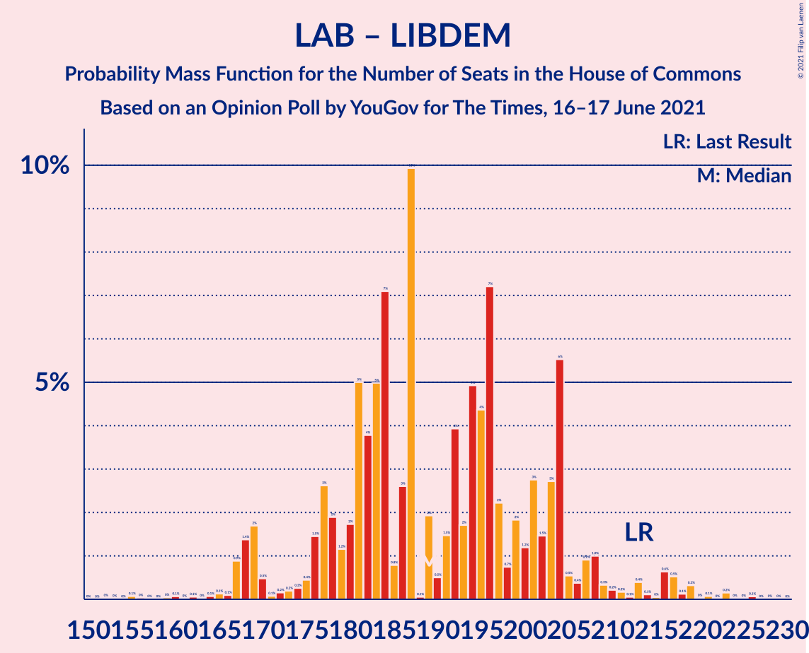

| Number of Seats | Probability | Accumulated | Special Marks |
|:---------------:|:-----------:|:-----------:|:-------------:|
| 152 | 0% | 100% |  |
| 153 | 0% | 99.9% |  |
| 154 | 0% | 99.9% |  |
| 155 | 0.1% | 99.9% |  |
| 156 | 0% | 99.8% |  |
| 157 | 0% | 99.8% |  |
| 158 | 0% | 99.8% |  |
| 159 | 0% | 99.8% |  |
| 160 | 0.1% | 99.8% |  |
| 161 | 0% | 99.7% |  |
| 162 | 0.1% | 99.7% |  |
| 163 | 0% | 99.6% |  |
| 164 | 0.1% | 99.6% |  |
| 165 | 0.1% | 99.5% |  |
| 166 | 0.1% | 99.4% |  |
| 167 | 0.9% | 99.3% |  |
| 168 | 1.4% | 98% |  |
| 169 | 2% | 97% |  |
| 170 | 0.5% | 95% |  |
| 171 | 0.1% | 95% |  |
| 172 | 0.2% | 95% |  |
| 173 | 0.2% | 95% |  |
| 174 | 0.3% | 94% |  |
| 175 | 0.4% | 94% |  |
| 176 | 1.5% | 94% |  |
| 177 | 3% | 92% |  |
| 178 | 2% | 90% |  |
| 179 | 1.2% | 88% |  |
| 180 | 2% | 87% |  |
| 181 | 5% | 85% |  |
| 182 | 4% | 80% |  |
| 183 | 5% | 76% |  |
| 184 | 7% | 71% |  |
| 185 | 0.8% | 64% |  |
| 186 | 3% | 63% |  |
| 187 | 10% | 61% |  |
| 188 | 0.1% | 51% |  |
| 189 | 2% | 51% | Median |
| 190 | 0.5% | 49% |  |
| 191 | 1.5% | 48% |  |
| 192 | 4% | 47% |  |
| 193 | 2% | 43% |  |
| 194 | 5% | 41% |  |
| 195 | 4% | 36% |  |
| 196 | 7% | 32% |  |
| 197 | 2% | 25% |  |
| 198 | 0.7% | 22% |  |
| 199 | 2% | 22% |  |
| 200 | 1.2% | 20% |  |
| 201 | 3% | 19% |  |
| 202 | 1.5% | 16% |  |
| 203 | 3% | 14% |  |
| 204 | 6% | 12% |  |
| 205 | 0.5% | 6% |  |
| 206 | 0.4% | 6% |  |
| 207 | 0.9% | 5% |  |
| 208 | 1.0% | 4% |  |
| 209 | 0.3% | 3% |  |
| 210 | 0.2% | 3% |  |
| 211 | 0.2% | 3% |  |
| 212 | 0.1% | 3% |  |
| 213 | 0.4% | 3% | Last Result |
| 214 | 0.1% | 2% |  |
| 215 | 0% | 2% |  |
| 216 | 0.6% | 2% |  |
| 217 | 0.5% | 1.4% |  |
| 218 | 0.1% | 0.9% |  |
| 219 | 0.3% | 0.7% |  |
| 220 | 0% | 0.4% |  |
| 221 | 0.1% | 0.4% |  |
| 222 | 0% | 0.3% |  |
| 223 | 0.2% | 0.3% |  |
| 224 | 0% | 0.2% |  |
| 225 | 0% | 0.1% |  |
| 226 | 0.1% | 0.1% |  |
| 227 | 0% | 0% |  |

### Labour Party

| Number of Seats | Probability | Accumulated | Special Marks |
|:---------------:|:-----------:|:-----------:|:-------------:|
| 152 | 0% | 100% |  |
| 153 | 0% | 99.9% |  |
| 154 | 0% | 99.9% |  |
| 155 | 0.1% | 99.9% |  |
| 156 | 0% | 99.8% |  |
| 157 | 0% | 99.8% |  |
| 158 | 0% | 99.8% |  |
| 159 | 0% | 99.8% |  |
| 160 | 0.1% | 99.7% |  |
| 161 | 0% | 99.7% |  |
| 162 | 0.1% | 99.7% |  |
| 163 | 0% | 99.6% |  |
| 164 | 0.1% | 99.6% |  |
| 165 | 0.1% | 99.5% |  |
| 166 | 0.1% | 99.4% |  |
| 167 | 0.9% | 99.3% |  |
| 168 | 1.5% | 98% |  |
| 169 | 2% | 97% |  |
| 170 | 0.4% | 95% |  |
| 171 | 0.1% | 95% |  |
| 172 | 0.2% | 95% |  |
| 173 | 0.2% | 95% |  |
| 174 | 0.3% | 94% |  |
| 175 | 0.5% | 94% |  |
| 176 | 2% | 94% |  |
| 177 | 3% | 92% |  |
| 178 | 2% | 89% |  |
| 179 | 1.1% | 88% |  |
| 180 | 4% | 86% |  |
| 181 | 3% | 82% |  |
| 182 | 4% | 80% |  |
| 183 | 5% | 76% |  |
| 184 | 7% | 70% |  |
| 185 | 0.5% | 63% |  |
| 186 | 2% | 63% |  |
| 187 | 10% | 60% |  |
| 188 | 0.1% | 51% |  |
| 189 | 2% | 51% | Median |
| 190 | 0.6% | 49% |  |
| 191 | 1.5% | 48% |  |
| 192 | 4% | 47% |  |
| 193 | 2% | 42% |  |
| 194 | 5% | 40% |  |
| 195 | 7% | 35% |  |
| 196 | 4% | 28% |  |
| 197 | 1.5% | 24% |  |
| 198 | 1.2% | 22% |  |
| 199 | 1.2% | 21% |  |
| 200 | 1.2% | 20% |  |
| 201 | 3% | 18% |  |
| 202 | 2% | 15% | Last Result |
| 203 | 3% | 13% |  |
| 204 | 5% | 11% |  |
| 205 | 0.4% | 6% |  |
| 206 | 0.5% | 5% |  |
| 207 | 0.5% | 5% |  |
| 208 | 1.0% | 4% |  |
| 209 | 0.4% | 3% |  |
| 210 | 0.2% | 3% |  |
| 211 | 0.1% | 3% |  |
| 212 | 0% | 3% |  |
| 213 | 0.3% | 2% |  |
| 214 | 0.1% | 2% |  |
| 215 | 0.4% | 2% |  |
| 216 | 0.7% | 2% |  |
| 217 | 0.2% | 1.0% |  |
| 218 | 0.1% | 0.8% |  |
| 219 | 0.3% | 0.7% |  |
| 220 | 0% | 0.4% |  |
| 221 | 0.1% | 0.4% |  |
| 222 | 0% | 0.2% |  |
| 223 | 0.1% | 0.2% |  |
| 224 | 0% | 0.2% |  |
| 225 | 0% | 0.1% |  |
| 226 | 0% | 0.1% |  |
| 227 | 0% | 0% |  |

## Technical Information

### Opinion Poll

+ **Polling firm:** YouGov
+ **Commissioner(s):** The Times
+ **Fieldwork period:** 16–17 June 2021

### Calculations

+ **Sample size:** 1580
+ **Simulations done:** 131,072
+ **Error estimate:** 1.08%

