# Opinion Poll by Deltapoll, 17–20 June 2021

<a href="#voting-intentions">Voting Intentions</a> | <a href="#seats">Seats</a> | <a href="#coalitions">Coalitions</a> | <a href="#technical-information">Technical Information</a>

## Voting Intentions

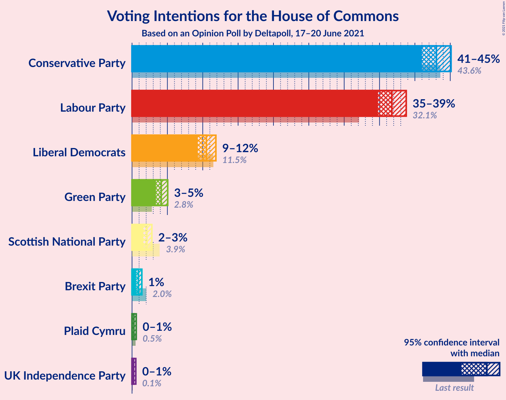

### Confidence Intervals

| Party | Last Result | Poll Result | 80% Confidence Interval | 90% Confidence Interval | 95% Confidence Interval | 99% Confidence Interval |
|:-----:|:-----------:|:-----------:|:-----------------------:|:-----------------------:|:-----------------------:|:-----------------------:|
| Conservative Party | 43.6% | 43.0% | 41.7–44.4% |41.3–44.8% |41.0–45.1% |40.3–45.8% |
| Labour Party | 32.1% | 36.7% | 35.5–38.1% |35.1–38.5% |34.8–38.8% |34.1–39.4% |
| Liberal Democrats | 11.5% | 10.5% | 9.7–11.4% |9.5–11.6% |9.3–11.9% |8.9–12.3% |
| Green Party | 2.8% | 4.1% | 3.6–4.7% |3.5–4.9% |3.4–5.0% |3.2–5.3% |
| Scottish National Party | 3.9% | 2.1% | 1.8–2.6% |1.7–2.7% |1.6–2.8% |1.4–3.0% |
| Brexit Party | 2.0% | 0.9% | 0.7–1.2% |0.6–1.3% |0.6–1.4% |0.5–1.6% |
| Plaid Cymru | 0.5% | 0.3% | 0.2–0.5% |0.1–0.5% |0.1–0.6% |0.1–0.7% |
| UK Independence Party | 0.1% | 0.2% | 0.1–0.4% |0.1–0.5% |0.1–0.5% |0.1–0.6% |

*Note:* The poll result column reflects the actual value used in the calculations. Published results may vary slightly, and in addition be rounded to fewer digits.

## Seats

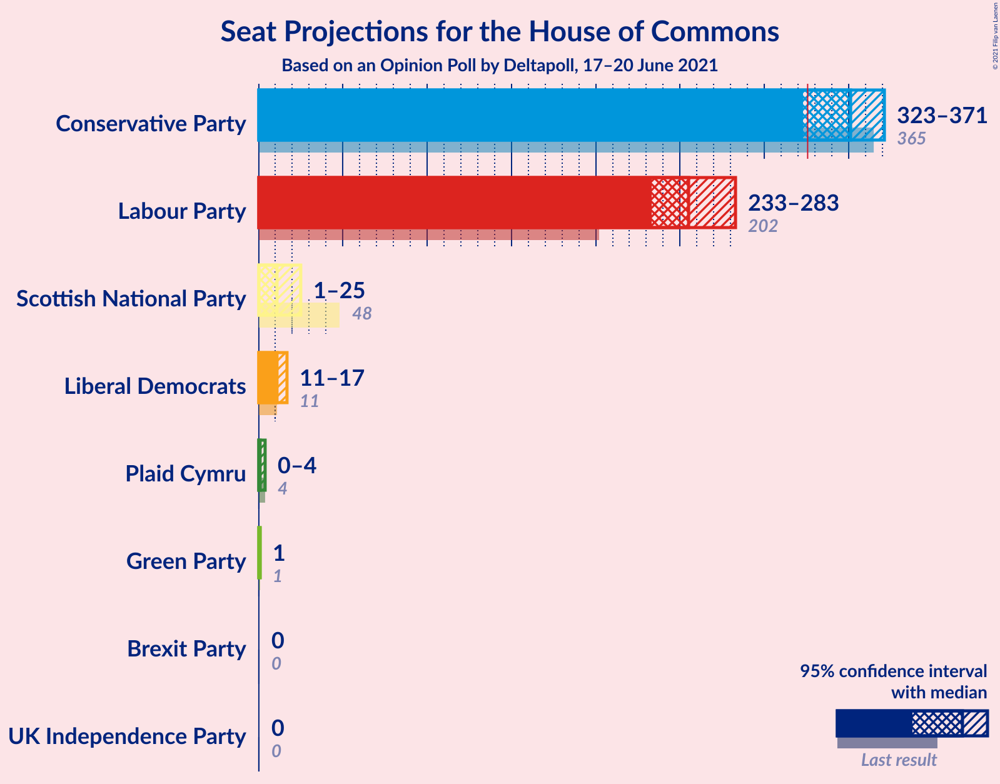

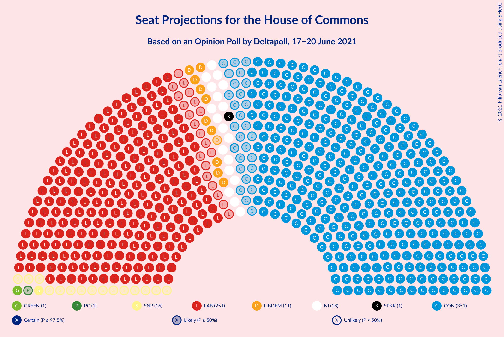

### Confidence Intervals

| Party | Last Result | Median | 80% Confidence Interval | 90% Confidence Interval | 95% Confidence Interval | 99% Confidence Interval |
|:-----:|:-----------:|:------:|:-----------------------:|:-----------------------:|:-----------------------:|:-----------------------:|
| <a href="#conservative-party">Conservative Party</a> | 365 | 351 | 335–360 |327–364 |324–372 |310–379 |
| <a href="#labour-party">Labour Party</a> | 202 | 251 | 243–267 |241–280 |231–283 |226–294 |
| <a href="#liberal-democrats">Liberal Democrats</a> | 11 | 11 | 11–13 |11–16 |10–16 |9–21 |
| <a href="#green-party">Green Party</a> | 1 | 1 | 1 |1 |1 |1 |
| <a href="#scottish-national-party">Scottish National Party</a> | 48 | 16 | 3–22 |1–24 |1–24 |1–33 |
| <a href="#brexit-party">Brexit Party</a> | 0 | 0 | 0 |0 |0 |0 |
| <a href="#plaid-cymru">Plaid Cymru</a> | 4 | 1 | 0–4 |0–4 |0–4 |0–5 |
| <a href="#uk-independence-party">UK Independence Party</a> | 0 | 0 | 0 |0 |0 |0 |

### Conservative Party

*For a full overview of the results for this party, see the [Conservative Party](party-conservativeparty.html) page.*

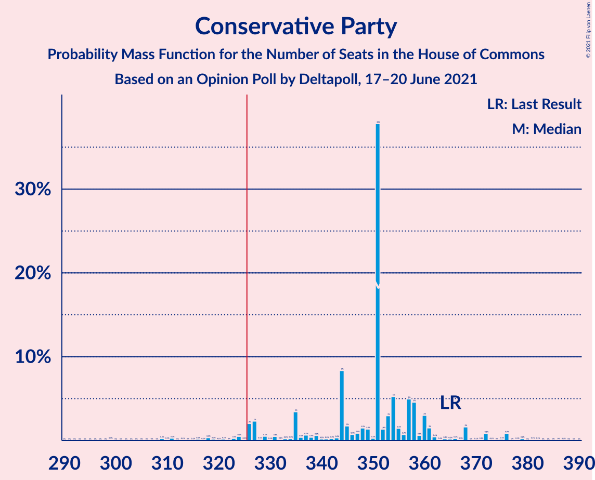

| Number of Seats | Probability | Accumulated | Special Marks |
|:---------------:|:-----------:|:-----------:|:-------------:|
| 299 | 0.1% | 100% |  |
| 300 | 0% | 99.9% |  |
| 301 | 0% | 99.9% |  |
| 302 | 0% | 99.9% |  |
| 303 | 0% | 99.9% |  |
| 304 | 0% | 99.9% |  |
| 305 | 0% | 99.9% |  |
| 306 | 0% | 99.9% |  |
| 307 | 0% | 99.9% |  |
| 308 | 0% | 99.8% |  |
| 309 | 0.2% | 99.8% |  |
| 310 | 0.1% | 99.6% |  |
| 311 | 0.3% | 99.5% |  |
| 312 | 0% | 99.2% |  |
| 313 | 0.1% | 99.2% |  |
| 314 | 0% | 99.1% |  |
| 315 | 0.1% | 99.1% |  |
| 316 | 0.1% | 99.1% |  |
| 317 | 0.1% | 98.9% |  |
| 318 | 0.3% | 98.9% |  |
| 319 | 0.2% | 98.5% |  |
| 320 | 0.1% | 98% |  |
| 321 | 0.2% | 98% |  |
| 322 | 0% | 98% |  |
| 323 | 0.3% | 98% |  |
| 324 | 0.5% | 98% |  |
| 325 | 0.1% | 97% |  |
| 326 | 2% | 97% | Majority |
| 327 | 2% | 95% |  |
| 328 | 0.1% | 93% |  |
| 329 | 0.5% | 93% |  |
| 330 | 0.1% | 92% |  |
| 331 | 0.5% | 92% |  |
| 332 | 0.1% | 92% |  |
| 333 | 0.2% | 92% |  |
| 334 | 0.2% | 91% |  |
| 335 | 3% | 91% |  |
| 336 | 0.4% | 88% |  |
| 337 | 0.7% | 87% |  |
| 338 | 0.4% | 87% |  |
| 339 | 0.6% | 86% |  |
| 340 | 0.2% | 86% |  |
| 341 | 0.2% | 85% |  |
| 342 | 0.2% | 85% |  |
| 343 | 0.3% | 85% |  |
| 344 | 8% | 85% |  |
| 345 | 2% | 76% |  |
| 346 | 0.7% | 75% |  |
| 347 | 0.9% | 74% |  |
| 348 | 1.5% | 73% |  |
| 349 | 1.4% | 72% |  |
| 350 | 0.3% | 70% |  |
| 351 | 38% | 70% | Median |
| 352 | 1.4% | 32% |  |
| 353 | 3% | 31% |  |
| 354 | 5% | 28% |  |
| 355 | 1.5% | 23% |  |
| 356 | 0.7% | 21% |  |
| 357 | 5% | 20% |  |
| 358 | 5% | 15% |  |
| 359 | 0.6% | 11% |  |
| 360 | 3% | 10% |  |
| 361 | 2% | 7% |  |
| 362 | 0.4% | 6% |  |
| 363 | 0.1% | 5% |  |
| 364 | 0.2% | 5% |  |
| 365 | 0.2% | 5% | Last Result |
| 366 | 0.2% | 5% |  |
| 367 | 0.1% | 5% |  |
| 368 | 2% | 4% |  |
| 369 | 0% | 3% |  |
| 370 | 0.1% | 3% |  |
| 371 | 0.1% | 3% |  |
| 372 | 0.8% | 3% |  |
| 373 | 0.1% | 2% |  |
| 374 | 0% | 2% |  |
| 375 | 0.1% | 2% |  |
| 376 | 0.9% | 2% |  |
| 377 | 0% | 0.7% |  |
| 378 | 0.1% | 0.7% |  |
| 379 | 0.2% | 0.6% |  |
| 380 | 0% | 0.4% |  |
| 381 | 0.1% | 0.4% |  |
| 382 | 0.1% | 0.2% |  |
| 383 | 0% | 0.2% |  |
| 384 | 0% | 0.2% |  |
| 385 | 0% | 0.2% |  |
| 386 | 0% | 0.1% |  |
| 387 | 0.1% | 0.1% |  |
| 388 | 0% | 0% |  |

### Labour Party

*For a full overview of the results for this party, see the [Labour Party](party-labourparty.html) page.*

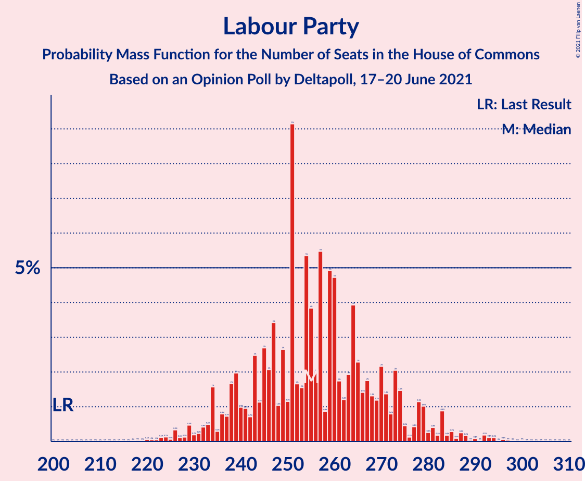

| Number of Seats | Probability | Accumulated | Special Marks |
|:---------------:|:-----------:|:-----------:|:-------------:|
| 202 | 0% | 100% | Last Result |
| 203 | 0% | 100% |  |
| 204 | 0% | 100% |  |
| 205 | 0% | 100% |  |
| 206 | 0% | 100% |  |
| 207 | 0% | 100% |  |
| 208 | 0% | 100% |  |
| 209 | 0% | 100% |  |
| 210 | 0% | 100% |  |
| 211 | 0% | 100% |  |
| 212 | 0% | 100% |  |
| 213 | 0% | 100% |  |
| 214 | 0% | 100% |  |
| 215 | 0% | 100% |  |
| 216 | 0% | 100% |  |
| 217 | 0% | 99.9% |  |
| 218 | 0% | 99.9% |  |
| 219 | 0% | 99.9% |  |
| 220 | 0.1% | 99.9% |  |
| 221 | 0% | 99.8% |  |
| 222 | 0% | 99.8% |  |
| 223 | 0.1% | 99.8% |  |
| 224 | 0% | 99.7% |  |
| 225 | 0.1% | 99.6% |  |
| 226 | 0.1% | 99.6% |  |
| 227 | 0.2% | 99.4% |  |
| 228 | 0.2% | 99.2% |  |
| 229 | 0.3% | 99.0% |  |
| 230 | 0.5% | 98.7% |  |
| 231 | 1.1% | 98% |  |
| 232 | 0.1% | 97% |  |
| 233 | 0.1% | 97% |  |
| 234 | 0% | 97% |  |
| 235 | 0% | 97% |  |
| 236 | 0.1% | 97% |  |
| 237 | 0.1% | 97% |  |
| 238 | 0.2% | 97% |  |
| 239 | 0.3% | 96% |  |
| 240 | 0.9% | 96% |  |
| 241 | 1.4% | 95% |  |
| 242 | 2% | 94% |  |
| 243 | 4% | 91% |  |
| 244 | 1.0% | 87% |  |
| 245 | 0.7% | 86% |  |
| 246 | 0.7% | 85% |  |
| 247 | 1.1% | 85% |  |
| 248 | 0.6% | 84% |  |
| 249 | 3% | 83% |  |
| 250 | 0.7% | 80% |  |
| 251 | 35% | 80% | Median |
| 252 | 3% | 45% |  |
| 253 | 3% | 42% |  |
| 254 | 4% | 38% |  |
| 255 | 4% | 35% |  |
| 256 | 2% | 31% |  |
| 257 | 10% | 29% |  |
| 258 | 0.5% | 19% |  |
| 259 | 0.1% | 18% |  |
| 260 | 0.2% | 18% |  |
| 261 | 0.5% | 18% |  |
| 262 | 2% | 18% |  |
| 263 | 0.6% | 15% |  |
| 264 | 0.3% | 15% |  |
| 265 | 4% | 15% |  |
| 266 | 0.4% | 11% |  |
| 267 | 0.8% | 10% |  |
| 268 | 1.1% | 10% |  |
| 269 | 0.1% | 8% |  |
| 270 | 2% | 8% |  |
| 271 | 0.3% | 7% |  |
| 272 | 0.2% | 6% |  |
| 273 | 0% | 6% |  |
| 274 | 0% | 6% |  |
| 275 | 0% | 6% |  |
| 276 | 0.1% | 6% |  |
| 277 | 0.3% | 6% |  |
| 278 | 0.6% | 6% |  |
| 279 | 0.1% | 5% |  |
| 280 | 0.2% | 5% |  |
| 281 | 2% | 5% |  |
| 282 | 0.2% | 3% |  |
| 283 | 0.6% | 3% |  |
| 284 | 0.6% | 2% |  |
| 285 | 0.2% | 1.4% |  |
| 286 | 0% | 1.1% |  |
| 287 | 0% | 1.1% |  |
| 288 | 0.1% | 1.1% |  |
| 289 | 0% | 1.0% |  |
| 290 | 0.1% | 1.0% |  |
| 291 | 0% | 0.9% |  |
| 292 | 0.1% | 0.9% |  |
| 293 | 0.2% | 0.7% |  |
| 294 | 0.3% | 0.6% |  |
| 295 | 0% | 0.3% |  |
| 296 | 0.2% | 0.3% |  |
| 297 | 0% | 0.1% |  |
| 298 | 0.1% | 0.1% |  |
| 299 | 0% | 0% |  |

### Liberal Democrats

*For a full overview of the results for this party, see the [Liberal Democrats](party-liberaldemocrats.html) page.*

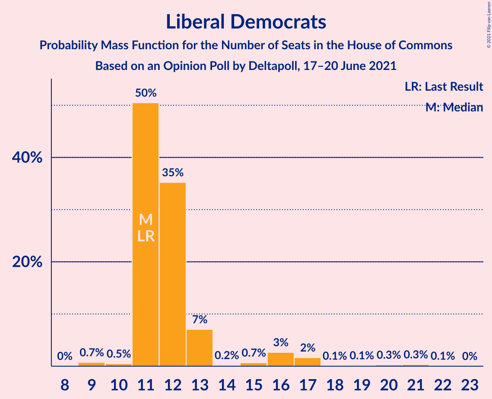

| Number of Seats | Probability | Accumulated | Special Marks |
|:---------------:|:-----------:|:-----------:|:-------------:|
| 9 | 0.5% | 100% |  |
| 10 | 2% | 99.5% |  |
| 11 | 60% | 97% | Last Result, Median |
| 12 | 21% | 37% |  |
| 13 | 10% | 16% |  |
| 14 | 0.7% | 6% |  |
| 15 | 0% | 5% |  |
| 16 | 4% | 5% |  |
| 17 | 0.7% | 2% |  |
| 18 | 0% | 1.1% |  |
| 19 | 0% | 1.1% |  |
| 20 | 0.2% | 1.0% |  |
| 21 | 0.8% | 0.9% |  |
| 22 | 0% | 0% |  |

### Green Party

*For a full overview of the results for this party, see the [Green Party](party-greenparty.html) page.*

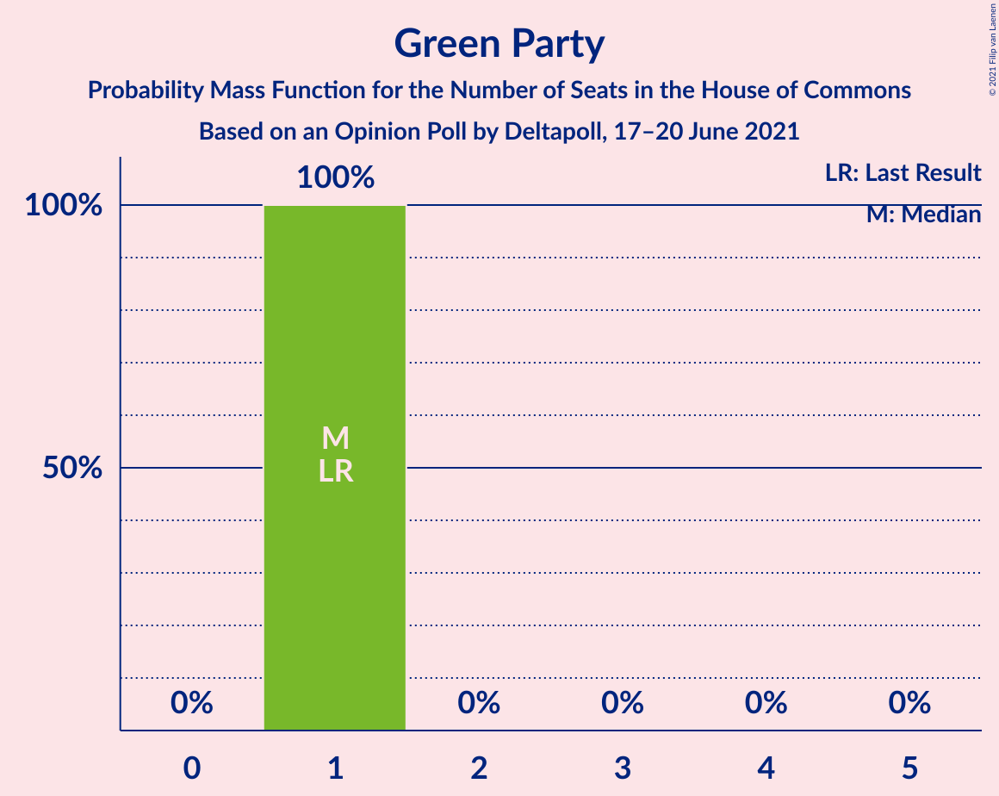

| Number of Seats | Probability | Accumulated | Special Marks |
|:---------------:|:-----------:|:-----------:|:-------------:|
| 1 | 100% | 100% | Last Result, Median |

### Scottish National Party

*For a full overview of the results for this party, see the [Scottish National Party](party-scottishnationalparty.html) page.*

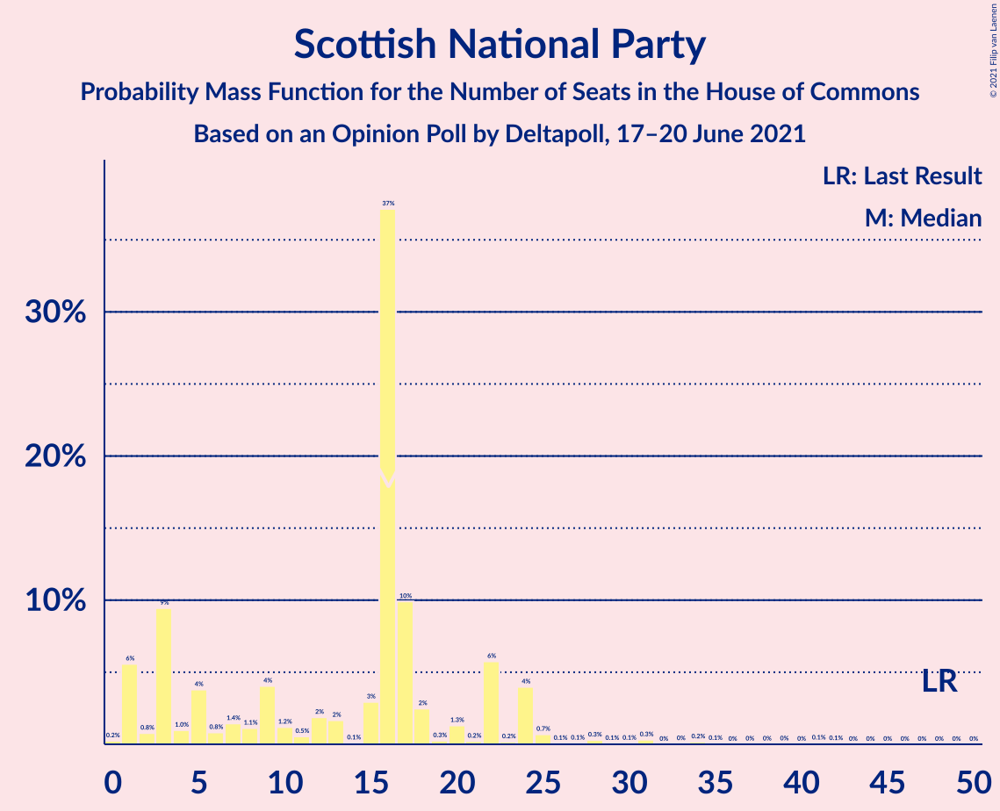

| Number of Seats | Probability | Accumulated | Special Marks |
|:---------------:|:-----------:|:-----------:|:-------------:|
| 0 | 0.2% | 100% |  |
| 1 | 6% | 99.8% |  |
| 2 | 0.8% | 94% |  |
| 3 | 9% | 93% |  |
| 4 | 1.0% | 84% |  |
| 5 | 4% | 83% |  |
| 6 | 0.8% | 79% |  |
| 7 | 1.4% | 78% |  |
| 8 | 1.1% | 77% |  |
| 9 | 4% | 76% |  |
| 10 | 1.2% | 72% |  |
| 11 | 0.5% | 71% |  |
| 12 | 2% | 70% |  |
| 13 | 2% | 68% |  |
| 14 | 0.1% | 66% |  |
| 15 | 3% | 66% |  |
| 16 | 37% | 63% | Median |
| 17 | 10% | 26% |  |
| 18 | 2% | 16% |  |
| 19 | 0.3% | 14% |  |
| 20 | 1.3% | 14% |  |
| 21 | 0.2% | 12% |  |
| 22 | 6% | 12% |  |
| 23 | 0.2% | 6% |  |
| 24 | 4% | 6% |  |
| 25 | 0.7% | 2% |  |
| 26 | 0.1% | 1.5% |  |
| 27 | 0.1% | 1.4% |  |
| 28 | 0.3% | 1.3% |  |
| 29 | 0.1% | 1.0% |  |
| 30 | 0.1% | 0.9% |  |
| 31 | 0.3% | 0.9% |  |
| 32 | 0% | 0.5% |  |
| 33 | 0% | 0.5% |  |
| 34 | 0.2% | 0.5% |  |
| 35 | 0.1% | 0.3% |  |
| 36 | 0% | 0.2% |  |
| 37 | 0% | 0.2% |  |
| 38 | 0% | 0.2% |  |
| 39 | 0% | 0.2% |  |
| 40 | 0% | 0.2% |  |
| 41 | 0.1% | 0.2% |  |
| 42 | 0.1% | 0.1% |  |
| 43 | 0% | 0% |  |
| 44 | 0% | 0% |  |
| 45 | 0% | 0% |  |
| 46 | 0% | 0% |  |
| 47 | 0% | 0% |  |
| 48 | 0% | 0% | Last Result |

### Brexit Party

*For a full overview of the results for this party, see the [Brexit Party](party-brexitparty.html) page.*

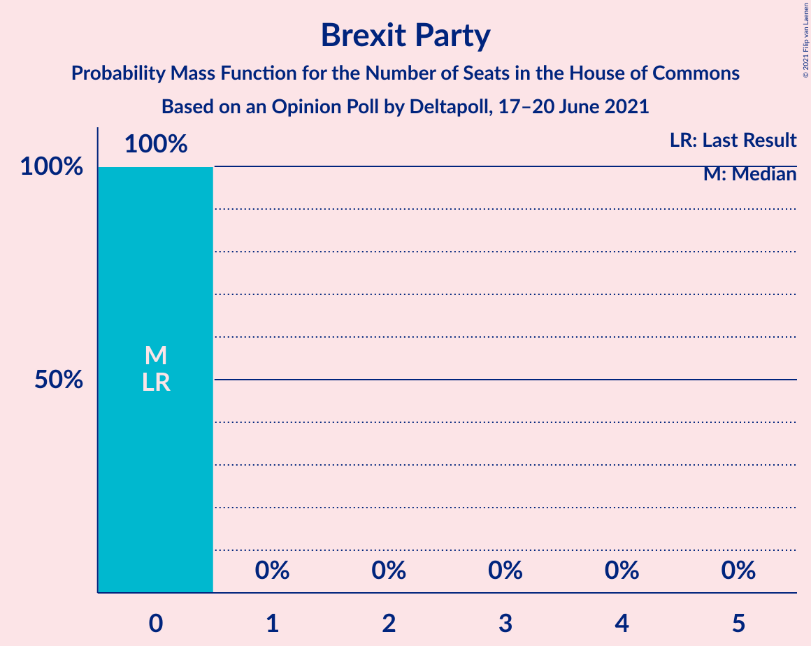

| Number of Seats | Probability | Accumulated | Special Marks |
|:---------------:|:-----------:|:-----------:|:-------------:|
| 0 | 100% | 100% | Last Result, Median |

### Plaid Cymru

*For a full overview of the results for this party, see the [Plaid Cymru](party-plaidcymru.html) page.*

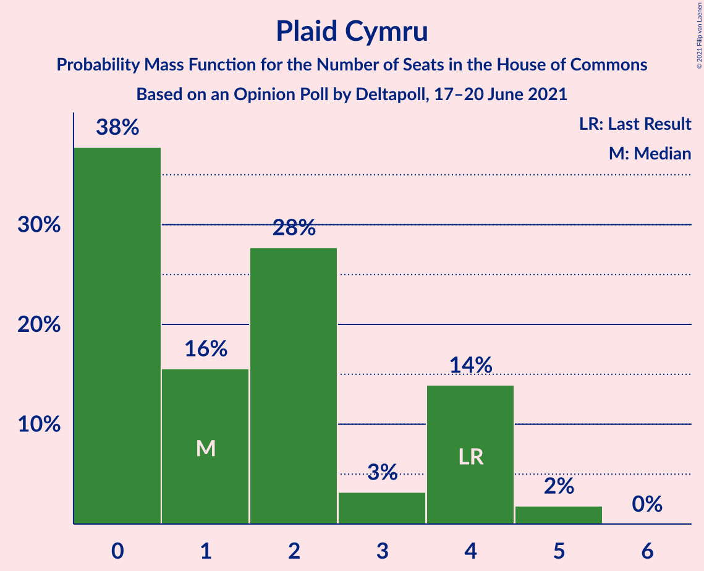

| Number of Seats | Probability | Accumulated | Special Marks |
|:---------------:|:-----------:|:-----------:|:-------------:|
| 0 | 29% | 100% |  |
| 1 | 39% | 71% | Median |
| 2 | 20% | 31% |  |
| 3 | 1.0% | 11% |  |
| 4 | 9% | 10% | Last Result |
| 5 | 2% | 2% |  |
| 6 | 0% | 0% |  |

### UK Independence Party

*For a full overview of the results for this party, see the [UK Independence Party](party-ukindependenceparty.html) page.*

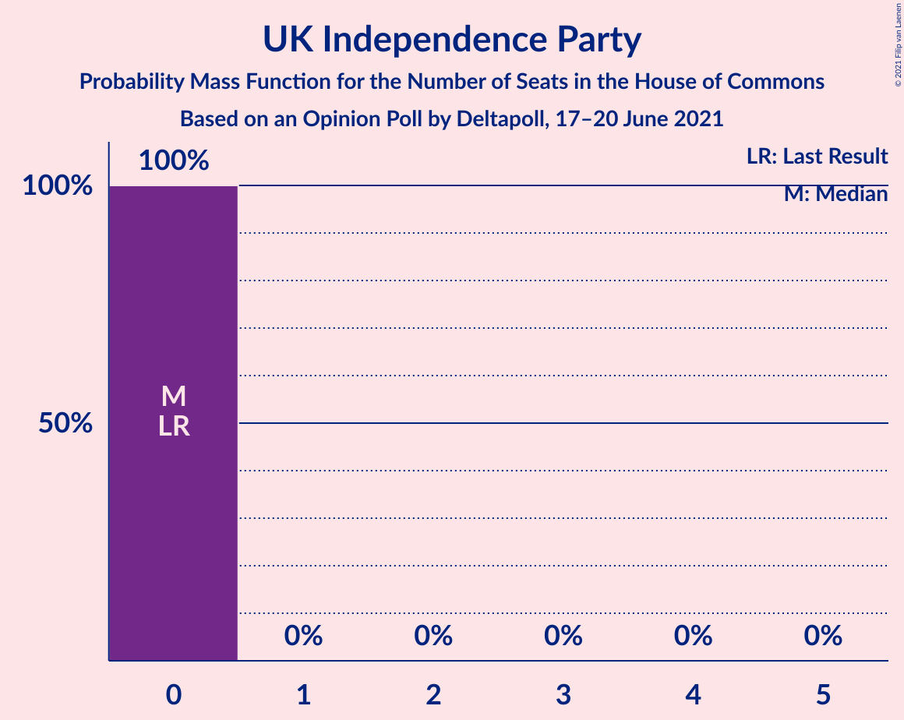

| Number of Seats | Probability | Accumulated | Special Marks |
|:---------------:|:-----------:|:-----------:|:-------------:|
| 0 | 100% | 100% | Last Result, Median |

## Coalitions

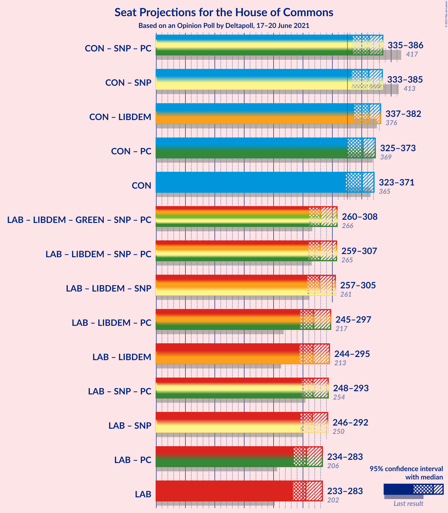

### Confidence Intervals

| Coalition | Last Result | Median | Majority? | 80% Confidence Interval | 90% Confidence Interval | 95% Confidence Interval | 99% Confidence Interval |
|:---------:|:-----------:|:------:|:---------:|:-----------------------:|:-----------------------:|:-----------------------:|:-----------------------:|
| Conservative Party – Scottish National Party – Plaid Cymru | 417 | 368 | 99.1% | 351–375 | 338–378 | 336–388 | 324–393 |
| Conservative Party – Scottish National Party | 413 | 367 | 99.0% | 351–375 | 336–376 | 334–388 | 322–391 |
| Conservative Party – Liberal Democrats | 376 | 362 | 99.3% | 346–371 | 338–377 | 336–384 | 325–390 |
| Conservative Party | 365 | 351 | 97% | 335–360 | 327–364 | 324–372 | 310–379 |
| Conservative Party – Plaid Cymru | 369 | 352 | 97% | 337–361 | 329–366 | 324–372 | 312–381 |
| Labour Party – Liberal Democrats – Green Party – Scottish National Party – Plaid Cymru | 266 | 280 | 0.1% | 271–296 | 267–304 | 259–307 | 252–321 |
| Labour Party – Liberal Democrats – Scottish National Party – Plaid Cymru | 265 | 279 | 0.1% | 270–295 | 266–303 | 258–306 | 251–320 |
| Labour Party – Liberal Democrats – Scottish National Party | 261 | 278 | 0.1% | 269–293 | 264–301 | 258–306 | 249–318 |
| Labour Party – Liberal Democrats – Plaid Cymru | 217 | 263 | 0% | 255–279 | 254–294 | 242–296 | 239–308 |
| Labour Party – Scottish National Party – Plaid Cymru | 254 | 268 | 0% | 259–284 | 253–292 | 246–294 | 240–305 |
| Labour Party – Liberal Democrats | 213 | 262 | 0% | 255–279 | 252–292 | 242–294 | 237–306 |
| Labour Party – Scottish National Party | 250 | 267 | 0% | 257–282 | 253–290 | 245–292 | 237–303 |
| Labour Party – Plaid Cymru | 206 | 252 | 0% | 243–268 | 242–282 | 231–284 | 228–296 |
| Labour Party | 202 | 251 | 0% | 243–267 | 241–280 | 231–283 | 226–294 |

### Conservative Party – Scottish National Party – Plaid Cymru

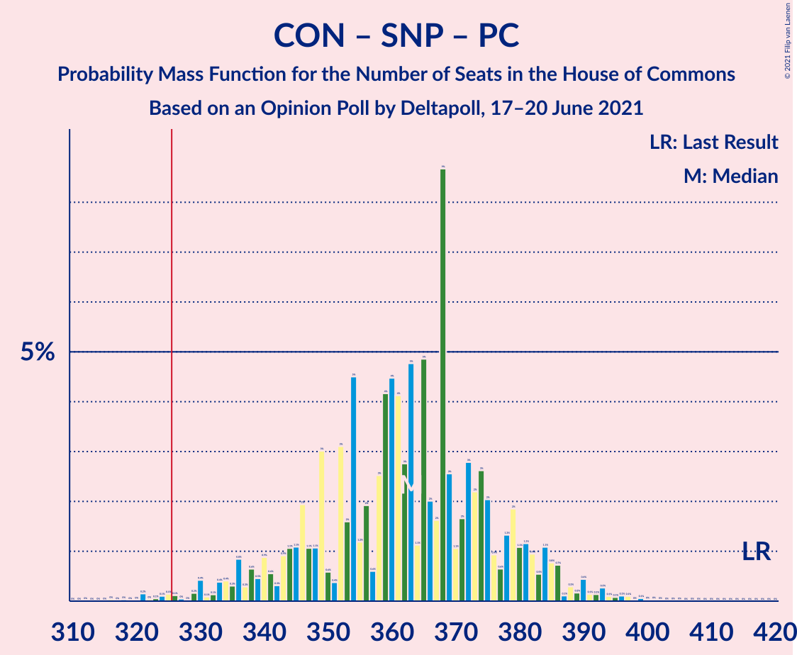

| Number of Seats | Probability | Accumulated | Special Marks |
|:---------------:|:-----------:|:-----------:|:-------------:|
| 312 | 0.1% | 100% |  |
| 313 | 0% | 99.9% |  |
| 314 | 0% | 99.9% |  |
| 315 | 0% | 99.9% |  |
| 316 | 0% | 99.9% |  |
| 317 | 0% | 99.9% |  |
| 318 | 0% | 99.9% |  |
| 319 | 0% | 99.9% |  |
| 320 | 0% | 99.8% |  |
| 321 | 0% | 99.8% |  |
| 322 | 0.1% | 99.8% |  |
| 323 | 0.1% | 99.7% |  |
| 324 | 0.5% | 99.6% |  |
| 325 | 0% | 99.1% |  |
| 326 | 0.1% | 99.1% | Majority |
| 327 | 0.1% | 99.0% |  |
| 328 | 0% | 98.9% |  |
| 329 | 0.2% | 98.9% |  |
| 330 | 0.1% | 98.7% |  |
| 331 | 0% | 98.6% |  |
| 332 | 0% | 98.6% |  |
| 333 | 0% | 98.5% |  |
| 334 | 0.6% | 98.5% |  |
| 335 | 0.4% | 98% |  |
| 336 | 0.6% | 98% |  |
| 337 | 0.2% | 97% |  |
| 338 | 2% | 97% |  |
| 339 | 0.2% | 95% |  |
| 340 | 0.3% | 95% |  |
| 341 | 0.7% | 94% |  |
| 342 | 0.1% | 94% |  |
| 343 | 0.1% | 93% |  |
| 344 | 2% | 93% |  |
| 345 | 0.3% | 92% |  |
| 346 | 0.1% | 91% |  |
| 347 | 0.2% | 91% |  |
| 348 | 0.3% | 91% |  |
| 349 | 0.1% | 91% |  |
| 350 | 0% | 91% |  |
| 351 | 0.8% | 91% |  |
| 352 | 1.1% | 90% |  |
| 353 | 0.4% | 89% |  |
| 354 | 4% | 88% |  |
| 355 | 2% | 85% |  |
| 356 | 0.5% | 83% |  |
| 357 | 0.8% | 82% |  |
| 358 | 0.2% | 82% |  |
| 359 | 0.1% | 81% |  |
| 360 | 0.6% | 81% |  |
| 361 | 7% | 81% |  |
| 362 | 4% | 74% |  |
| 363 | 8% | 70% |  |
| 364 | 1.0% | 62% |  |
| 365 | 1.0% | 61% |  |
| 366 | 3% | 60% |  |
| 367 | 3% | 57% |  |
| 368 | 35% | 54% | Median |
| 369 | 0.4% | 19% |  |
| 370 | 2% | 19% |  |
| 371 | 2% | 17% |  |
| 372 | 0.3% | 15% |  |
| 373 | 2% | 15% |  |
| 374 | 0.2% | 13% |  |
| 375 | 4% | 13% |  |
| 376 | 0.5% | 9% |  |
| 377 | 3% | 8% |  |
| 378 | 2% | 6% |  |
| 379 | 0.2% | 4% |  |
| 380 | 0.4% | 4% |  |
| 381 | 0.2% | 3% |  |
| 382 | 0.1% | 3% |  |
| 383 | 0.1% | 3% |  |
| 384 | 0% | 3% |  |
| 385 | 0% | 3% |  |
| 386 | 0.1% | 3% |  |
| 387 | 0.1% | 3% |  |
| 388 | 2% | 3% |  |
| 389 | 0.1% | 1.3% |  |
| 390 | 0.3% | 1.2% |  |
| 391 | 0.1% | 0.9% |  |
| 392 | 0.3% | 0.8% |  |
| 393 | 0.1% | 0.5% |  |
| 394 | 0.1% | 0.4% |  |
| 395 | 0.1% | 0.4% |  |
| 396 | 0% | 0.3% |  |
| 397 | 0% | 0.2% |  |
| 398 | 0% | 0.2% |  |
| 399 | 0% | 0.2% |  |
| 400 | 0% | 0.2% |  |
| 401 | 0.1% | 0.1% |  |
| 402 | 0% | 0.1% |  |
| 403 | 0% | 0.1% |  |
| 404 | 0% | 0% |  |
| 405 | 0% | 0% |  |
| 406 | 0% | 0% |  |
| 407 | 0% | 0% |  |
| 408 | 0% | 0% |  |
| 409 | 0% | 0% |  |
| 410 | 0% | 0% |  |
| 411 | 0% | 0% |  |
| 412 | 0% | 0% |  |
| 413 | 0% | 0% |  |
| 414 | 0% | 0% |  |
| 415 | 0% | 0% |  |
| 416 | 0% | 0% |  |
| 417 | 0% | 0% | Last Result |

### Conservative Party – Scottish National Party

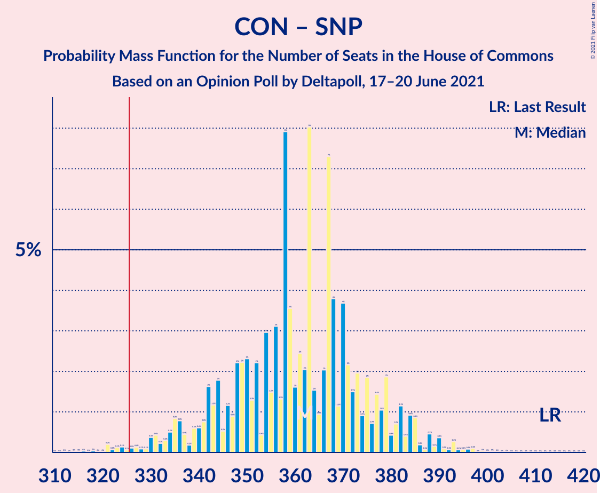

| Number of Seats | Probability | Accumulated | Special Marks |
|:---------------:|:-----------:|:-----------:|:-------------:|
| 312 | 0.1% | 100% |  |
| 313 | 0% | 99.9% |  |
| 314 | 0% | 99.9% |  |
| 315 | 0% | 99.9% |  |
| 316 | 0% | 99.8% |  |
| 317 | 0% | 99.8% |  |
| 318 | 0% | 99.8% |  |
| 319 | 0% | 99.8% |  |
| 320 | 0% | 99.8% |  |
| 321 | 0.3% | 99.8% |  |
| 322 | 0.2% | 99.5% |  |
| 323 | 0.1% | 99.3% |  |
| 324 | 0.2% | 99.2% |  |
| 325 | 0% | 99.0% |  |
| 326 | 0.1% | 99.0% | Majority |
| 327 | 0.3% | 98.9% |  |
| 328 | 0.1% | 98.7% |  |
| 329 | 0% | 98.6% |  |
| 330 | 0% | 98.6% |  |
| 331 | 0% | 98.5% |  |
| 332 | 0.3% | 98% |  |
| 333 | 0.1% | 98% |  |
| 334 | 0.9% | 98% |  |
| 335 | 0.1% | 97% |  |
| 336 | 3% | 97% |  |
| 337 | 0.5% | 94% |  |
| 338 | 0% | 94% |  |
| 339 | 0% | 94% |  |
| 340 | 0.1% | 94% |  |
| 341 | 0.6% | 94% |  |
| 342 | 0.1% | 93% |  |
| 343 | 0.1% | 93% |  |
| 344 | 2% | 93% |  |
| 345 | 0% | 91% |  |
| 346 | 0.2% | 91% |  |
| 347 | 0.2% | 91% |  |
| 348 | 0.1% | 91% |  |
| 349 | 0.2% | 91% |  |
| 350 | 0.3% | 90% |  |
| 351 | 1.0% | 90% |  |
| 352 | 5% | 89% |  |
| 353 | 0.1% | 84% |  |
| 354 | 0.1% | 84% |  |
| 355 | 2% | 84% |  |
| 356 | 1.2% | 82% |  |
| 357 | 0.2% | 81% |  |
| 358 | 0.1% | 81% |  |
| 359 | 1.0% | 81% |  |
| 360 | 3% | 80% |  |
| 361 | 10% | 77% |  |
| 362 | 4% | 67% |  |
| 363 | 5% | 63% |  |
| 364 | 1.4% | 58% |  |
| 365 | 2% | 57% |  |
| 366 | 2% | 55% |  |
| 367 | 35% | 53% | Median |
| 368 | 2% | 18% |  |
| 369 | 0.3% | 16% |  |
| 370 | 2% | 16% |  |
| 371 | 0.3% | 14% |  |
| 372 | 0.2% | 14% |  |
| 373 | 1.3% | 14% |  |
| 374 | 0.4% | 12% |  |
| 375 | 6% | 12% |  |
| 376 | 1.0% | 6% |  |
| 377 | 1.4% | 5% |  |
| 378 | 0.3% | 4% |  |
| 379 | 0.1% | 3% |  |
| 380 | 0% | 3% |  |
| 381 | 0% | 3% |  |
| 382 | 0% | 3% |  |
| 383 | 0% | 3% |  |
| 384 | 0% | 3% |  |
| 385 | 0% | 3% |  |
| 386 | 0.1% | 3% |  |
| 387 | 0.1% | 3% |  |
| 388 | 2% | 3% |  |
| 389 | 0.2% | 1.1% |  |
| 390 | 0.3% | 0.9% |  |
| 391 | 0.2% | 0.6% |  |
| 392 | 0.2% | 0.4% |  |
| 393 | 0% | 0.3% |  |
| 394 | 0% | 0.3% |  |
| 395 | 0% | 0.2% |  |
| 396 | 0% | 0.2% |  |
| 397 | 0% | 0.2% |  |
| 398 | 0% | 0.2% |  |
| 399 | 0% | 0.2% |  |
| 400 | 0% | 0.1% |  |
| 401 | 0.1% | 0.1% |  |
| 402 | 0% | 0% |  |
| 403 | 0% | 0% |  |
| 404 | 0% | 0% |  |
| 405 | 0% | 0% |  |
| 406 | 0% | 0% |  |
| 407 | 0% | 0% |  |
| 408 | 0% | 0% |  |
| 409 | 0% | 0% |  |
| 410 | 0% | 0% |  |
| 411 | 0% | 0% |  |
| 412 | 0% | 0% |  |
| 413 | 0% | 0% | Last Result |

### Conservative Party – Liberal Democrats

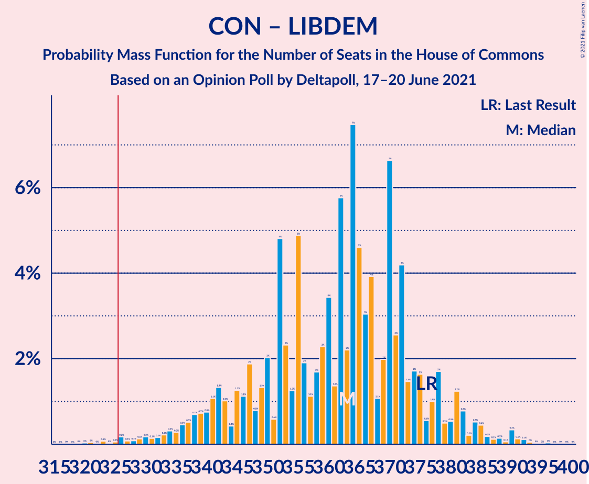

| Number of Seats | Probability | Accumulated | Special Marks |
|:---------------:|:-----------:|:-----------:|:-------------:|
| 319 | 0.1% | 100% |  |
| 320 | 0% | 99.9% |  |
| 321 | 0% | 99.8% |  |
| 322 | 0% | 99.8% |  |
| 323 | 0.3% | 99.8% |  |
| 324 | 0% | 99.6% |  |
| 325 | 0.2% | 99.5% |  |
| 326 | 0.1% | 99.3% | Majority |
| 327 | 0.1% | 99.2% |  |
| 328 | 0.1% | 99.1% |  |
| 329 | 0% | 99.0% |  |
| 330 | 0.4% | 98.9% |  |
| 331 | 0% | 98.5% |  |
| 332 | 0.1% | 98% |  |
| 333 | 0.2% | 98% |  |
| 334 | 0.1% | 98% |  |
| 335 | 0.2% | 98% |  |
| 336 | 0.7% | 98% |  |
| 337 | 0.1% | 97% |  |
| 338 | 2% | 97% |  |
| 339 | 0.2% | 95% |  |
| 340 | 0.6% | 95% |  |
| 341 | 0.1% | 94% |  |
| 342 | 2% | 94% |  |
| 343 | 0.3% | 92% |  |
| 344 | 0.1% | 92% |  |
| 345 | 0.2% | 92% |  |
| 346 | 3% | 92% |  |
| 347 | 0.1% | 88% |  |
| 348 | 0.5% | 88% |  |
| 349 | 0.1% | 88% |  |
| 350 | 0.3% | 87% |  |
| 351 | 0.5% | 87% |  |
| 352 | 0.3% | 87% |  |
| 353 | 0.2% | 86% |  |
| 354 | 0.4% | 86% |  |
| 355 | 2% | 86% |  |
| 356 | 8% | 84% |  |
| 357 | 0.7% | 76% |  |
| 358 | 0.7% | 76% |  |
| 359 | 2% | 75% |  |
| 360 | 0.8% | 73% |  |
| 361 | 0.3% | 72% |  |
| 362 | 35% | 71% | Median |
| 363 | 4% | 37% |  |
| 364 | 4% | 32% |  |
| 365 | 4% | 28% |  |
| 366 | 1.0% | 25% |  |
| 367 | 5% | 24% |  |
| 368 | 0.1% | 18% |  |
| 369 | 0.8% | 18% |  |
| 370 | 4% | 17% |  |
| 371 | 6% | 13% |  |
| 372 | 0.8% | 7% |  |
| 373 | 0.3% | 6% |  |
| 374 | 0.4% | 6% |  |
| 375 | 0.4% | 6% |  |
| 376 | 0.1% | 5% | Last Result |
| 377 | 0.5% | 5% |  |
| 378 | 0.2% | 5% |  |
| 379 | 2% | 5% |  |
| 380 | 0.1% | 3% |  |
| 381 | 0% | 3% |  |
| 382 | 0.1% | 3% |  |
| 383 | 0.1% | 3% |  |
| 384 | 0.1% | 3% |  |
| 385 | 0.7% | 2% |  |
| 386 | 0.2% | 2% |  |
| 387 | 0% | 2% |  |
| 388 | 0.9% | 2% |  |
| 389 | 0% | 0.7% |  |
| 390 | 0.3% | 0.7% |  |
| 391 | 0% | 0.3% |  |
| 392 | 0% | 0.3% |  |
| 393 | 0.1% | 0.3% |  |
| 394 | 0% | 0.2% |  |
| 395 | 0% | 0.2% |  |
| 396 | 0% | 0.2% |  |
| 397 | 0% | 0.1% |  |
| 398 | 0% | 0.1% |  |
| 399 | 0.1% | 0.1% |  |
| 400 | 0% | 0% |  |

### Conservative Party

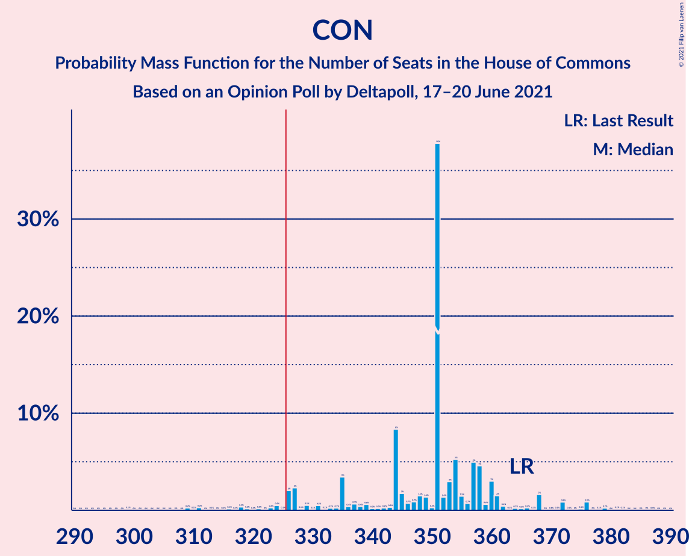

| Number of Seats | Probability | Accumulated | Special Marks |
|:---------------:|:-----------:|:-----------:|:-------------:|
| 299 | 0.1% | 100% |  |
| 300 | 0% | 99.9% |  |
| 301 | 0% | 99.9% |  |
| 302 | 0% | 99.9% |  |
| 303 | 0% | 99.9% |  |
| 304 | 0% | 99.9% |  |
| 305 | 0% | 99.9% |  |
| 306 | 0% | 99.9% |  |
| 307 | 0% | 99.9% |  |
| 308 | 0% | 99.8% |  |
| 309 | 0.2% | 99.8% |  |
| 310 | 0.1% | 99.6% |  |
| 311 | 0.3% | 99.5% |  |
| 312 | 0% | 99.2% |  |
| 313 | 0.1% | 99.2% |  |
| 314 | 0% | 99.1% |  |
| 315 | 0.1% | 99.1% |  |
| 316 | 0.1% | 99.1% |  |
| 317 | 0.1% | 98.9% |  |
| 318 | 0.3% | 98.9% |  |
| 319 | 0.2% | 98.5% |  |
| 320 | 0.1% | 98% |  |
| 321 | 0.2% | 98% |  |
| 322 | 0% | 98% |  |
| 323 | 0.3% | 98% |  |
| 324 | 0.5% | 98% |  |
| 325 | 0.1% | 97% |  |
| 326 | 2% | 97% | Majority |
| 327 | 2% | 95% |  |
| 328 | 0.1% | 93% |  |
| 329 | 0.5% | 93% |  |
| 330 | 0.1% | 92% |  |
| 331 | 0.5% | 92% |  |
| 332 | 0.1% | 92% |  |
| 333 | 0.2% | 92% |  |
| 334 | 0.2% | 91% |  |
| 335 | 3% | 91% |  |
| 336 | 0.4% | 88% |  |
| 337 | 0.7% | 87% |  |
| 338 | 0.4% | 87% |  |
| 339 | 0.6% | 86% |  |
| 340 | 0.2% | 86% |  |
| 341 | 0.2% | 85% |  |
| 342 | 0.2% | 85% |  |
| 343 | 0.3% | 85% |  |
| 344 | 8% | 85% |  |
| 345 | 2% | 76% |  |
| 346 | 0.7% | 75% |  |
| 347 | 0.9% | 74% |  |
| 348 | 1.5% | 73% |  |
| 349 | 1.4% | 72% |  |
| 350 | 0.3% | 70% |  |
| 351 | 38% | 70% | Median |
| 352 | 1.4% | 32% |  |
| 353 | 3% | 31% |  |
| 354 | 5% | 28% |  |
| 355 | 1.5% | 23% |  |
| 356 | 0.7% | 21% |  |
| 357 | 5% | 20% |  |
| 358 | 5% | 15% |  |
| 359 | 0.6% | 11% |  |
| 360 | 3% | 10% |  |
| 361 | 2% | 7% |  |
| 362 | 0.4% | 6% |  |
| 363 | 0.1% | 5% |  |
| 364 | 0.2% | 5% |  |
| 365 | 0.2% | 5% | Last Result |
| 366 | 0.2% | 5% |  |
| 367 | 0.1% | 5% |  |
| 368 | 2% | 4% |  |
| 369 | 0% | 3% |  |
| 370 | 0.1% | 3% |  |
| 371 | 0.1% | 3% |  |
| 372 | 0.8% | 3% |  |
| 373 | 0.1% | 2% |  |
| 374 | 0% | 2% |  |
| 375 | 0.1% | 2% |  |
| 376 | 0.9% | 2% |  |
| 377 | 0% | 0.7% |  |
| 378 | 0.1% | 0.7% |  |
| 379 | 0.2% | 0.6% |  |
| 380 | 0% | 0.4% |  |
| 381 | 0.1% | 0.4% |  |
| 382 | 0.1% | 0.2% |  |
| 383 | 0% | 0.2% |  |
| 384 | 0% | 0.2% |  |
| 385 | 0% | 0.2% |  |
| 386 | 0% | 0.1% |  |
| 387 | 0.1% | 0.1% |  |
| 388 | 0% | 0% |  |

### Conservative Party – Plaid Cymru

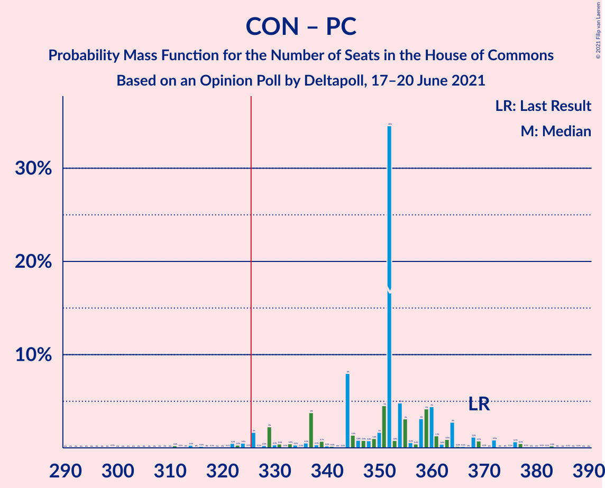

| Number of Seats | Probability | Accumulated | Special Marks |
|:---------------:|:-----------:|:-----------:|:-------------:|
| 299 | 0.1% | 100% |  |
| 300 | 0% | 99.9% |  |
| 301 | 0% | 99.9% |  |
| 302 | 0% | 99.9% |  |
| 303 | 0% | 99.9% |  |
| 304 | 0% | 99.9% |  |
| 305 | 0% | 99.9% |  |
| 306 | 0% | 99.9% |  |
| 307 | 0% | 99.9% |  |
| 308 | 0% | 99.9% |  |
| 309 | 0% | 99.8% |  |
| 310 | 0% | 99.8% |  |
| 311 | 0.2% | 99.8% |  |
| 312 | 0.1% | 99.6% |  |
| 313 | 0% | 99.5% |  |
| 314 | 0.3% | 99.5% |  |
| 315 | 0% | 99.2% |  |
| 316 | 0.2% | 99.1% |  |
| 317 | 0% | 99.0% |  |
| 318 | 0.1% | 98.9% |  |
| 319 | 0% | 98.9% |  |
| 320 | 0% | 98.9% |  |
| 321 | 0.1% | 98.8% |  |
| 322 | 0.5% | 98.8% |  |
| 323 | 0.3% | 98% |  |
| 324 | 0.5% | 98% |  |
| 325 | 0.1% | 97% |  |
| 326 | 2% | 97% | Majority |
| 327 | 0.1% | 96% |  |
| 328 | 0.3% | 96% |  |
| 329 | 2% | 95% |  |
| 330 | 0.3% | 93% |  |
| 331 | 0.4% | 93% |  |
| 332 | 0.1% | 92% |  |
| 333 | 0.4% | 92% |  |
| 334 | 0.3% | 92% |  |
| 335 | 0.1% | 92% |  |
| 336 | 0.5% | 91% |  |
| 337 | 4% | 91% |  |
| 338 | 0.3% | 87% |  |
| 339 | 0.7% | 87% |  |
| 340 | 0.2% | 86% |  |
| 341 | 0.2% | 86% |  |
| 342 | 0% | 86% |  |
| 343 | 0.1% | 86% |  |
| 344 | 8% | 86% |  |
| 345 | 1.4% | 78% |  |
| 346 | 0.8% | 76% |  |
| 347 | 0.8% | 75% |  |
| 348 | 0.8% | 75% |  |
| 349 | 1.0% | 74% |  |
| 350 | 2% | 73% |  |
| 351 | 5% | 71% |  |
| 352 | 35% | 67% | Median |
| 353 | 0.8% | 32% |  |
| 354 | 5% | 31% |  |
| 355 | 3% | 26% |  |
| 356 | 0.6% | 23% |  |
| 357 | 0.4% | 23% |  |
| 358 | 3% | 22% |  |
| 359 | 4% | 19% |  |
| 360 | 4% | 15% |  |
| 361 | 1.3% | 11% |  |
| 362 | 0.4% | 9% |  |
| 363 | 0.9% | 9% |  |
| 364 | 3% | 8% |  |
| 365 | 0.2% | 5% |  |
| 366 | 0.1% | 5% |  |
| 367 | 0% | 5% |  |
| 368 | 1.2% | 5% |  |
| 369 | 0.7% | 4% | Last Result |
| 370 | 0.1% | 3% |  |
| 371 | 0% | 3% |  |
| 372 | 0.9% | 3% |  |
| 373 | 0% | 2% |  |
| 374 | 0% | 2% |  |
| 375 | 0.1% | 2% |  |
| 376 | 0.7% | 2% |  |
| 377 | 0.5% | 1.2% |  |
| 378 | 0.1% | 0.7% |  |
| 379 | 0% | 0.6% |  |
| 380 | 0% | 0.6% |  |
| 381 | 0.1% | 0.6% |  |
| 382 | 0.1% | 0.5% |  |
| 383 | 0.2% | 0.4% |  |
| 384 | 0% | 0.2% |  |
| 385 | 0% | 0.2% |  |
| 386 | 0.1% | 0.2% |  |
| 387 | 0% | 0.1% |  |
| 388 | 0.1% | 0.1% |  |
| 389 | 0% | 0% |  |

### Labour Party – Liberal Democrats – Green Party – Scottish National Party – Plaid Cymru

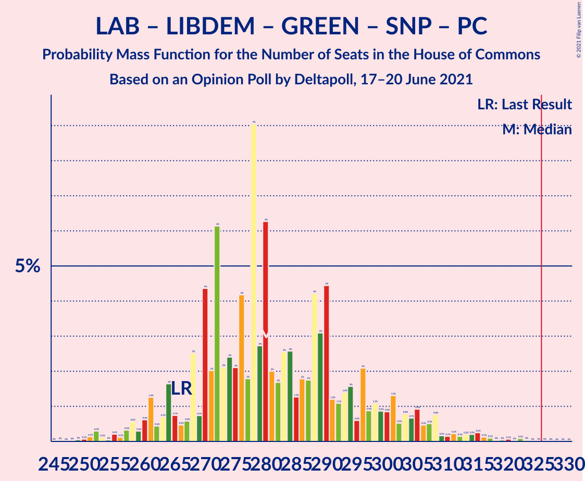

| Number of Seats | Probability | Accumulated | Special Marks |
|:---------------:|:-----------:|:-----------:|:-------------:|
| 244 | 0.1% | 100% |  |
| 245 | 0% | 99.9% |  |
| 246 | 0% | 99.9% |  |
| 247 | 0% | 99.8% |  |
| 248 | 0% | 99.8% |  |
| 249 | 0.1% | 99.8% |  |
| 250 | 0.1% | 99.8% |  |
| 251 | 0% | 99.6% |  |
| 252 | 0.2% | 99.6% |  |
| 253 | 0.1% | 99.4% |  |
| 254 | 0% | 99.3% |  |
| 255 | 0.9% | 99.3% |  |
| 256 | 0.1% | 98% |  |
| 257 | 0% | 98% |  |
| 258 | 0.1% | 98% |  |
| 259 | 0.8% | 98% |  |
| 260 | 0.1% | 97% |  |
| 261 | 0.1% | 97% |  |
| 262 | 0% | 97% |  |
| 263 | 2% | 97% |  |
| 264 | 0.1% | 96% |  |
| 265 | 0.2% | 95% |  |
| 266 | 0.2% | 95% | Last Result |
| 267 | 0.2% | 95% |  |
| 268 | 0.1% | 95% |  |
| 269 | 0.4% | 95% |  |
| 270 | 2% | 94% |  |
| 271 | 3% | 93% |  |
| 272 | 0.6% | 90% |  |
| 273 | 5% | 89% |  |
| 274 | 5% | 85% |  |
| 275 | 0.7% | 80% |  |
| 276 | 1.5% | 79% |  |
| 277 | 5% | 77% |  |
| 278 | 3% | 72% |  |
| 279 | 1.4% | 69% |  |
| 280 | 38% | 68% | Median |
| 281 | 0.3% | 30% |  |
| 282 | 1.4% | 30% |  |
| 283 | 1.5% | 28% |  |
| 284 | 0.9% | 27% |  |
| 285 | 0.7% | 26% |  |
| 286 | 2% | 25% |  |
| 287 | 8% | 24% |  |
| 288 | 0.3% | 15% |  |
| 289 | 0.2% | 15% |  |
| 290 | 0.2% | 15% |  |
| 291 | 0.2% | 15% |  |
| 292 | 0.6% | 14% |  |
| 293 | 0.4% | 14% |  |
| 294 | 0.7% | 13% |  |
| 295 | 0.4% | 13% |  |
| 296 | 3% | 12% |  |
| 297 | 0.2% | 9% |  |
| 298 | 0.2% | 9% |  |
| 299 | 0.1% | 8% |  |
| 300 | 0.5% | 8% |  |
| 301 | 0.1% | 8% |  |
| 302 | 0.5% | 8% |  |
| 303 | 0.1% | 7% |  |
| 304 | 2% | 7% |  |
| 305 | 2% | 5% |  |
| 306 | 0.1% | 3% |  |
| 307 | 0.5% | 3% |  |
| 308 | 0.3% | 2% |  |
| 309 | 0% | 2% |  |
| 310 | 0.2% | 2% |  |
| 311 | 0.1% | 2% |  |
| 312 | 0.2% | 2% |  |
| 313 | 0.3% | 1.5% |  |
| 314 | 0.1% | 1.1% |  |
| 315 | 0.1% | 1.1% |  |
| 316 | 0.1% | 0.9% |  |
| 317 | 0% | 0.9% |  |
| 318 | 0.1% | 0.9% |  |
| 319 | 0% | 0.8% |  |
| 320 | 0.3% | 0.8% |  |
| 321 | 0.1% | 0.5% |  |
| 322 | 0.2% | 0.4% |  |
| 323 | 0% | 0.2% |  |
| 324 | 0% | 0.2% |  |
| 325 | 0% | 0.1% |  |
| 326 | 0% | 0.1% | Majority |
| 327 | 0% | 0.1% |  |
| 328 | 0% | 0.1% |  |
| 329 | 0% | 0.1% |  |
| 330 | 0% | 0.1% |  |
| 331 | 0% | 0.1% |  |
| 332 | 0.1% | 0.1% |  |
| 333 | 0% | 0% |  |

### Labour Party – Liberal Democrats – Scottish National Party – Plaid Cymru

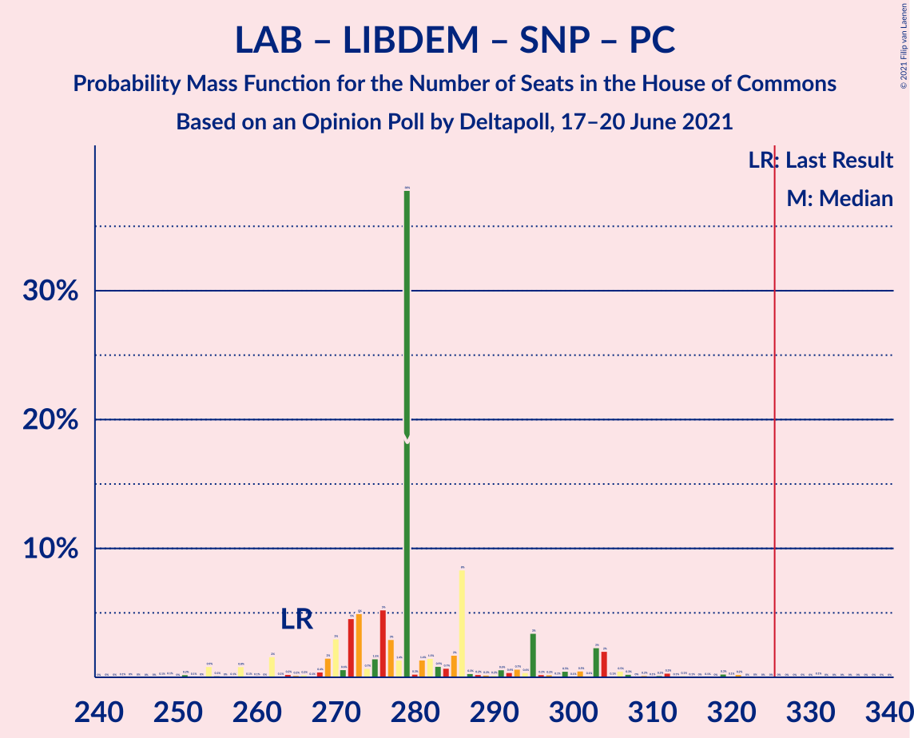

| Number of Seats | Probability | Accumulated | Special Marks |
|:---------------:|:-----------:|:-----------:|:-------------:|
| 243 | 0.1% | 100% |  |
| 244 | 0% | 99.9% |  |
| 245 | 0% | 99.9% |  |
| 246 | 0% | 99.8% |  |
| 247 | 0% | 99.8% |  |
| 248 | 0.1% | 99.8% |  |
| 249 | 0.1% | 99.8% |  |
| 250 | 0% | 99.6% |  |
| 251 | 0.2% | 99.6% |  |
| 252 | 0.1% | 99.4% |  |
| 253 | 0% | 99.3% |  |
| 254 | 0.9% | 99.3% |  |
| 255 | 0.1% | 98% |  |
| 256 | 0% | 98% |  |
| 257 | 0.1% | 98% |  |
| 258 | 0.8% | 98% |  |
| 259 | 0.1% | 97% |  |
| 260 | 0.1% | 97% |  |
| 261 | 0% | 97% |  |
| 262 | 2% | 97% |  |
| 263 | 0.1% | 96% |  |
| 264 | 0.2% | 95% |  |
| 265 | 0.2% | 95% | Last Result |
| 266 | 0.2% | 95% |  |
| 267 | 0.1% | 95% |  |
| 268 | 0.4% | 95% |  |
| 269 | 2% | 94% |  |
| 270 | 3% | 93% |  |
| 271 | 0.6% | 90% |  |
| 272 | 5% | 89% |  |
| 273 | 5% | 85% |  |
| 274 | 0.7% | 80% |  |
| 275 | 1.5% | 79% |  |
| 276 | 5% | 77% |  |
| 277 | 3% | 72% |  |
| 278 | 1.4% | 69% |  |
| 279 | 38% | 68% | Median |
| 280 | 0.3% | 30% |  |
| 281 | 1.4% | 30% |  |
| 282 | 1.5% | 28% |  |
| 283 | 0.9% | 27% |  |
| 284 | 0.7% | 26% |  |
| 285 | 2% | 25% |  |
| 286 | 8% | 24% |  |
| 287 | 0.3% | 15% |  |
| 288 | 0.2% | 15% |  |
| 289 | 0.2% | 15% |  |
| 290 | 0.2% | 15% |  |
| 291 | 0.6% | 14% |  |
| 292 | 0.4% | 14% |  |
| 293 | 0.7% | 13% |  |
| 294 | 0.4% | 13% |  |
| 295 | 3% | 12% |  |
| 296 | 0.2% | 9% |  |
| 297 | 0.2% | 9% |  |
| 298 | 0.1% | 8% |  |
| 299 | 0.5% | 8% |  |
| 300 | 0.1% | 8% |  |
| 301 | 0.5% | 8% |  |
| 302 | 0.1% | 7% |  |
| 303 | 2% | 7% |  |
| 304 | 2% | 5% |  |
| 305 | 0.1% | 3% |  |
| 306 | 0.5% | 3% |  |
| 307 | 0.3% | 2% |  |
| 308 | 0% | 2% |  |
| 309 | 0.2% | 2% |  |
| 310 | 0.1% | 2% |  |
| 311 | 0.2% | 2% |  |
| 312 | 0.3% | 1.5% |  |
| 313 | 0.1% | 1.1% |  |
| 314 | 0.1% | 1.1% |  |
| 315 | 0.1% | 0.9% |  |
| 316 | 0% | 0.9% |  |
| 317 | 0.1% | 0.9% |  |
| 318 | 0% | 0.8% |  |
| 319 | 0.3% | 0.8% |  |
| 320 | 0.1% | 0.5% |  |
| 321 | 0.2% | 0.4% |  |
| 322 | 0% | 0.2% |  |
| 323 | 0% | 0.2% |  |
| 324 | 0% | 0.1% |  |
| 325 | 0% | 0.1% |  |
| 326 | 0% | 0.1% | Majority |
| 327 | 0% | 0.1% |  |
| 328 | 0% | 0.1% |  |
| 329 | 0% | 0.1% |  |
| 330 | 0% | 0.1% |  |
| 331 | 0.1% | 0.1% |  |
| 332 | 0% | 0% |  |

### Labour Party – Liberal Democrats – Scottish National Party

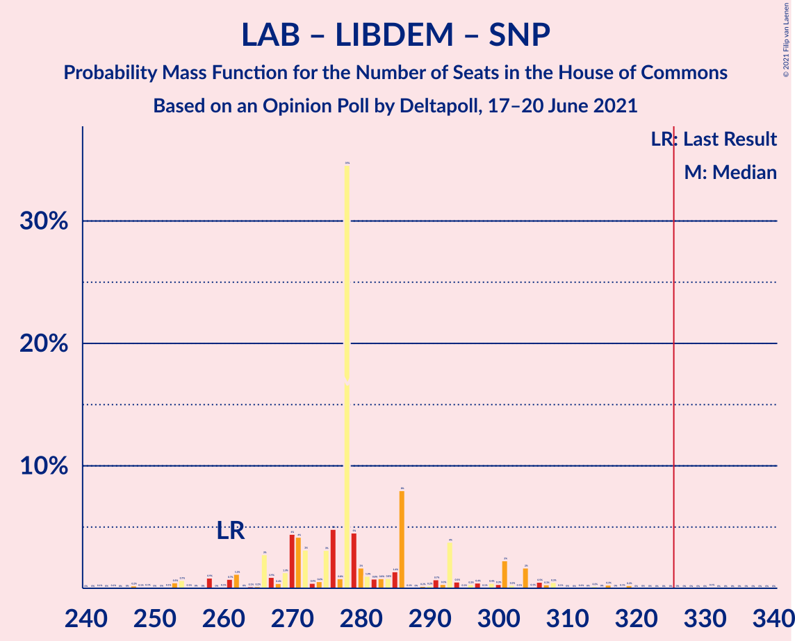

| Number of Seats | Probability | Accumulated | Special Marks |
|:---------------:|:-----------:|:-----------:|:-------------:|
| 242 | 0.1% | 100% |  |
| 243 | 0% | 99.9% |  |
| 244 | 0.1% | 99.9% |  |
| 245 | 0% | 99.8% |  |
| 246 | 0% | 99.8% |  |
| 247 | 0.2% | 99.8% |  |
| 248 | 0.1% | 99.6% |  |
| 249 | 0.1% | 99.5% |  |
| 250 | 0% | 99.4% |  |
| 251 | 0% | 99.4% |  |
| 252 | 0.1% | 99.4% |  |
| 253 | 0.5% | 99.3% |  |
| 254 | 0.7% | 98.8% |  |
| 255 | 0.1% | 98% |  |
| 256 | 0% | 98% |  |
| 257 | 0% | 98% |  |
| 258 | 0.9% | 98% |  |
| 259 | 0% | 97% |  |
| 260 | 0.1% | 97% |  |
| 261 | 0.7% | 97% | Last Result |
| 262 | 1.2% | 96% |  |
| 263 | 0% | 95% |  |
| 264 | 0.1% | 95% |  |
| 265 | 0.2% | 95% |  |
| 266 | 3% | 95% |  |
| 267 | 0.9% | 92% |  |
| 268 | 0.4% | 91% |  |
| 269 | 1.3% | 91% |  |
| 270 | 4% | 89% |  |
| 271 | 4% | 85% |  |
| 272 | 3% | 81% |  |
| 273 | 0.4% | 78% |  |
| 274 | 0.6% | 77% |  |
| 275 | 3% | 77% |  |
| 276 | 5% | 74% |  |
| 277 | 0.8% | 69% |  |
| 278 | 35% | 68% | Median |
| 279 | 5% | 33% |  |
| 280 | 2% | 29% |  |
| 281 | 1.0% | 27% |  |
| 282 | 0.8% | 26% |  |
| 283 | 0.8% | 25% |  |
| 284 | 0.8% | 25% |  |
| 285 | 1.4% | 24% |  |
| 286 | 8% | 22% |  |
| 287 | 0.1% | 14% |  |
| 288 | 0% | 14% |  |
| 289 | 0.2% | 14% |  |
| 290 | 0.2% | 14% |  |
| 291 | 0.7% | 14% |  |
| 292 | 0.3% | 13% |  |
| 293 | 4% | 13% |  |
| 294 | 0.5% | 9% |  |
| 295 | 0.1% | 9% |  |
| 296 | 0.3% | 8% |  |
| 297 | 0.4% | 8% |  |
| 298 | 0.1% | 8% |  |
| 299 | 0.4% | 8% |  |
| 300 | 0.3% | 7% |  |
| 301 | 2% | 7% |  |
| 302 | 0.3% | 5% |  |
| 303 | 0.1% | 4% |  |
| 304 | 2% | 4% |  |
| 305 | 0.1% | 3% |  |
| 306 | 0.5% | 3% |  |
| 307 | 0.3% | 2% |  |
| 308 | 0.5% | 2% |  |
| 309 | 0.1% | 1.2% |  |
| 310 | 0% | 1.2% |  |
| 311 | 0% | 1.1% |  |
| 312 | 0.1% | 1.1% |  |
| 313 | 0% | 1.1% |  |
| 314 | 0.2% | 1.0% |  |
| 315 | 0% | 0.9% |  |
| 316 | 0.3% | 0.8% |  |
| 317 | 0% | 0.5% |  |
| 318 | 0.1% | 0.5% |  |
| 319 | 0.2% | 0.4% |  |
| 320 | 0% | 0.2% |  |
| 321 | 0% | 0.2% |  |
| 322 | 0% | 0.2% |  |
| 323 | 0% | 0.1% |  |
| 324 | 0% | 0.1% |  |
| 325 | 0% | 0.1% |  |
| 326 | 0% | 0.1% | Majority |
| 327 | 0% | 0.1% |  |
| 328 | 0% | 0.1% |  |
| 329 | 0% | 0.1% |  |
| 330 | 0% | 0.1% |  |
| 331 | 0.1% | 0.1% |  |
| 332 | 0% | 0% |  |

### Labour Party – Liberal Democrats – Plaid Cymru

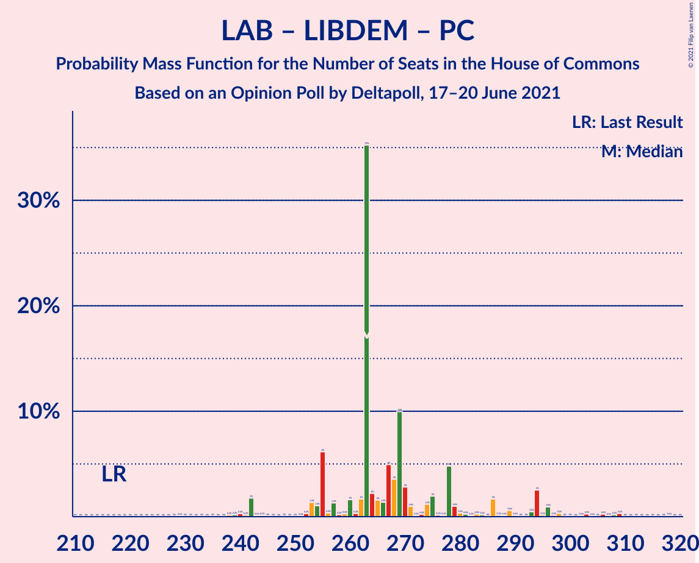

| Number of Seats | Probability | Accumulated | Special Marks |
|:---------------:|:-----------:|:-----------:|:-------------:|
| 217 | 0% | 100% | Last Result |
| 218 | 0% | 100% |  |
| 219 | 0% | 100% |  |
| 220 | 0% | 100% |  |
| 221 | 0% | 100% |  |
| 222 | 0% | 100% |  |
| 223 | 0% | 100% |  |
| 224 | 0% | 100% |  |
| 225 | 0% | 100% |  |
| 226 | 0% | 100% |  |
| 227 | 0% | 100% |  |
| 228 | 0% | 100% |  |
| 229 | 0.1% | 100% |  |
| 230 | 0% | 99.9% |  |
| 231 | 0% | 99.9% |  |
| 232 | 0% | 99.8% |  |
| 233 | 0% | 99.8% |  |
| 234 | 0% | 99.8% |  |
| 235 | 0% | 99.8% |  |
| 236 | 0% | 99.8% |  |
| 237 | 0% | 99.7% |  |
| 238 | 0.2% | 99.7% |  |
| 239 | 0.2% | 99.6% |  |
| 240 | 0.3% | 99.4% |  |
| 241 | 0.2% | 99.1% |  |
| 242 | 2% | 98.9% |  |
| 243 | 0.1% | 97% |  |
| 244 | 0.1% | 97% |  |
| 245 | 0% | 97% |  |
| 246 | 0% | 97% |  |
| 247 | 0% | 97% |  |
| 248 | 0% | 97% |  |
| 249 | 0% | 97% |  |
| 250 | 0% | 97% |  |
| 251 | 0.1% | 97% |  |
| 252 | 0.3% | 97% |  |
| 253 | 1.4% | 96% |  |
| 254 | 1.0% | 95% |  |
| 255 | 6% | 94% |  |
| 256 | 0.4% | 88% |  |
| 257 | 1.3% | 88% |  |
| 258 | 0.2% | 86% |  |
| 259 | 0.3% | 86% |  |
| 260 | 2% | 86% |  |
| 261 | 0.3% | 84% |  |
| 262 | 2% | 84% |  |
| 263 | 35% | 82% | Median |
| 264 | 2% | 47% |  |
| 265 | 2% | 45% |  |
| 266 | 1.4% | 43% |  |
| 267 | 5% | 42% |  |
| 268 | 4% | 37% |  |
| 269 | 10% | 33% |  |
| 270 | 3% | 23% |  |
| 271 | 1.0% | 20% |  |
| 272 | 0.1% | 19% |  |
| 273 | 0.2% | 19% |  |
| 274 | 1.2% | 19% |  |
| 275 | 2% | 18% |  |
| 276 | 0.1% | 16% |  |
| 277 | 0.1% | 16% |  |
| 278 | 5% | 16% |  |
| 279 | 1.0% | 11% |  |
| 280 | 0.3% | 10% |  |
| 281 | 0.2% | 10% |  |
| 282 | 0.1% | 9% |  |
| 283 | 0.2% | 9% |  |
| 284 | 0.2% | 9% |  |
| 285 | 0% | 9% |  |
| 286 | 2% | 9% |  |
| 287 | 0.1% | 7% |  |
| 288 | 0.1% | 7% |  |
| 289 | 0.6% | 7% |  |
| 290 | 0.1% | 6% |  |
| 291 | 0% | 6% |  |
| 292 | 0% | 6% |  |
| 293 | 0.5% | 6% |  |
| 294 | 3% | 6% |  |
| 295 | 0.1% | 3% |  |
| 296 | 0.9% | 3% |  |
| 297 | 0.1% | 2% |  |
| 298 | 0.3% | 2% |  |
| 299 | 0% | 2% |  |
| 300 | 0% | 1.5% |  |
| 301 | 0% | 1.4% |  |
| 302 | 0.1% | 1.4% |  |
| 303 | 0.3% | 1.3% |  |
| 304 | 0.1% | 1.1% |  |
| 305 | 0% | 1.0% |  |
| 306 | 0.2% | 1.0% |  |
| 307 | 0.1% | 0.8% |  |
| 308 | 0.2% | 0.7% |  |
| 309 | 0.3% | 0.5% |  |
| 310 | 0% | 0.2% |  |
| 311 | 0% | 0.2% |  |
| 312 | 0% | 0.2% |  |
| 313 | 0% | 0.2% |  |
| 314 | 0% | 0.2% |  |
| 315 | 0% | 0.2% |  |
| 316 | 0% | 0.1% |  |
| 317 | 0% | 0.1% |  |
| 318 | 0.1% | 0.1% |  |
| 319 | 0% | 0% |  |

### Labour Party – Scottish National Party – Plaid Cymru

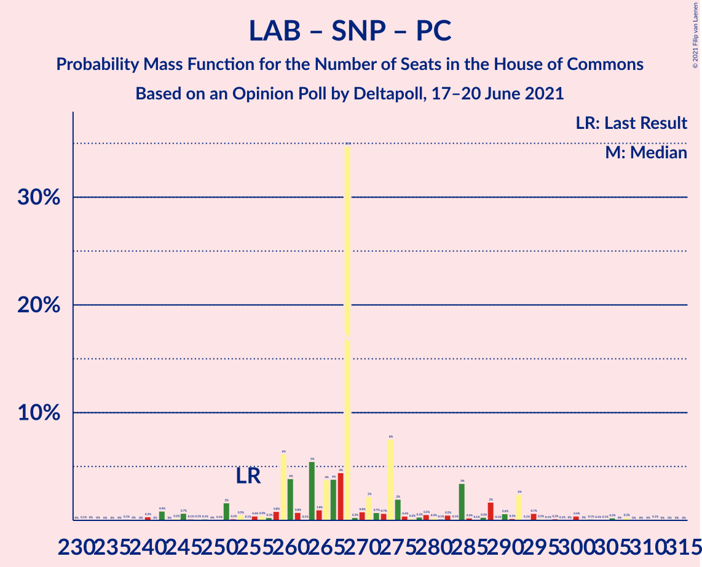

| Number of Seats | Probability | Accumulated | Special Marks |
|:---------------:|:-----------:|:-----------:|:-------------:|
| 231 | 0.1% | 100% |  |
| 232 | 0% | 99.9% |  |
| 233 | 0% | 99.9% |  |
| 234 | 0% | 99.9% |  |
| 235 | 0% | 99.8% |  |
| 236 | 0% | 99.8% |  |
| 237 | 0.1% | 99.8% |  |
| 238 | 0% | 99.7% |  |
| 239 | 0% | 99.7% |  |
| 240 | 0.3% | 99.7% |  |
| 241 | 0% | 99.3% |  |
| 242 | 0.9% | 99.3% |  |
| 243 | 0% | 98% |  |
| 244 | 0.2% | 98% |  |
| 245 | 0.7% | 98% |  |
| 246 | 0.1% | 98% |  |
| 247 | 0.1% | 97% |  |
| 248 | 0.1% | 97% |  |
| 249 | 0% | 97% |  |
| 250 | 0.1% | 97% |  |
| 251 | 2% | 97% |  |
| 252 | 0.2% | 95% |  |
| 253 | 0.5% | 95% |  |
| 254 | 0.1% | 95% | Last Result |
| 255 | 0.4% | 95% |  |
| 256 | 0.4% | 94% |  |
| 257 | 0.3% | 94% |  |
| 258 | 0.8% | 94% |  |
| 259 | 6% | 93% |  |
| 260 | 4% | 87% |  |
| 261 | 0.8% | 83% |  |
| 262 | 0.1% | 82% |  |
| 263 | 5% | 82% |  |
| 264 | 1.0% | 76% |  |
| 265 | 4% | 75% |  |
| 266 | 4% | 72% |  |
| 267 | 4% | 68% |  |
| 268 | 35% | 63% | Median |
| 269 | 0.3% | 29% |  |
| 270 | 0.8% | 28% |  |
| 271 | 2% | 27% |  |
| 272 | 0.7% | 25% |  |
| 273 | 0.7% | 24% |  |
| 274 | 8% | 24% |  |
| 275 | 2% | 16% |  |
| 276 | 0.4% | 14% |  |
| 277 | 0.2% | 14% |  |
| 278 | 0.3% | 14% |  |
| 279 | 0.5% | 13% |  |
| 280 | 0.3% | 13% |  |
| 281 | 0.1% | 13% |  |
| 282 | 0.5% | 12% |  |
| 283 | 0.1% | 12% |  |
| 284 | 3% | 12% |  |
| 285 | 0.2% | 8% |  |
| 286 | 0.1% | 8% |  |
| 287 | 0.3% | 8% |  |
| 288 | 2% | 8% |  |
| 289 | 0.1% | 6% |  |
| 290 | 0.6% | 6% |  |
| 291 | 0.2% | 5% |  |
| 292 | 2% | 5% |  |
| 293 | 0.1% | 3% |  |
| 294 | 0.7% | 3% |  |
| 295 | 0.2% | 2% |  |
| 296 | 0.1% | 2% |  |
| 297 | 0.2% | 2% |  |
| 298 | 0.1% | 2% |  |
| 299 | 0% | 2% |  |
| 300 | 0.4% | 1.5% |  |
| 301 | 0% | 1.1% |  |
| 302 | 0.1% | 1.0% |  |
| 303 | 0.1% | 0.9% |  |
| 304 | 0.1% | 0.8% |  |
| 305 | 0.2% | 0.7% |  |
| 306 | 0% | 0.5% |  |
| 307 | 0.3% | 0.4% |  |
| 308 | 0% | 0.2% |  |
| 309 | 0% | 0.2% |  |
| 310 | 0% | 0.2% |  |
| 311 | 0.1% | 0.1% |  |
| 312 | 0% | 0% |  |

### Labour Party – Liberal Democrats

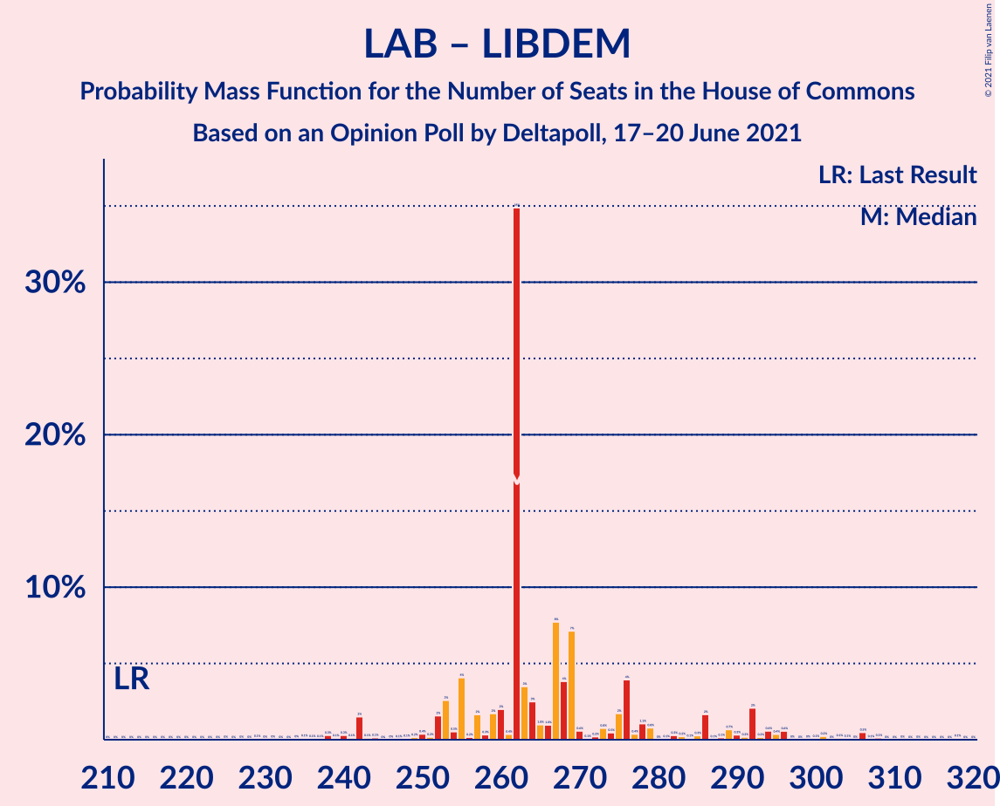

| Number of Seats | Probability | Accumulated | Special Marks |
|:---------------:|:-----------:|:-----------:|:-------------:|
| 213 | 0% | 100% | Last Result |
| 214 | 0% | 100% |  |
| 215 | 0% | 100% |  |
| 216 | 0% | 100% |  |
| 217 | 0% | 100% |  |
| 218 | 0% | 100% |  |
| 219 | 0% | 100% |  |
| 220 | 0% | 100% |  |
| 221 | 0% | 100% |  |
| 222 | 0% | 100% |  |
| 223 | 0% | 100% |  |
| 224 | 0% | 100% |  |
| 225 | 0% | 100% |  |
| 226 | 0% | 100% |  |
| 227 | 0% | 100% |  |
| 228 | 0% | 99.9% |  |
| 229 | 0.1% | 99.9% |  |
| 230 | 0% | 99.9% |  |
| 231 | 0% | 99.8% |  |
| 232 | 0% | 99.8% |  |
| 233 | 0% | 99.8% |  |
| 234 | 0% | 99.8% |  |
| 235 | 0.1% | 99.7% |  |
| 236 | 0.1% | 99.6% |  |
| 237 | 0.1% | 99.6% |  |
| 238 | 0.3% | 99.5% |  |
| 239 | 0.1% | 99.2% |  |
| 240 | 0.3% | 99.1% |  |
| 241 | 0.1% | 98.8% |  |
| 242 | 2% | 98.7% |  |
| 243 | 0.1% | 97% |  |
| 244 | 0.1% | 97% |  |
| 245 | 0% | 97% |  |
| 246 | 0% | 97% |  |
| 247 | 0.1% | 97% |  |
| 248 | 0.1% | 97% |  |
| 249 | 0.2% | 97% |  |
| 250 | 0.4% | 97% |  |
| 251 | 0.2% | 96% |  |
| 252 | 2% | 96% |  |
| 253 | 3% | 94% |  |
| 254 | 0.5% | 92% |  |
| 255 | 4% | 91% |  |
| 256 | 0.2% | 87% |  |
| 257 | 2% | 87% |  |
| 258 | 0.3% | 85% |  |
| 259 | 2% | 85% |  |
| 260 | 2% | 83% |  |
| 261 | 0.4% | 81% |  |
| 262 | 35% | 81% | Median |
| 263 | 3% | 46% |  |
| 264 | 3% | 43% |  |
| 265 | 1.0% | 40% |  |
| 266 | 1.0% | 39% |  |
| 267 | 8% | 38% |  |
| 268 | 4% | 30% |  |
| 269 | 7% | 26% |  |
| 270 | 0.6% | 19% |  |
| 271 | 0.1% | 19% |  |
| 272 | 0.2% | 19% |  |
| 273 | 0.8% | 18% |  |
| 274 | 0.5% | 18% |  |
| 275 | 2% | 17% |  |
| 276 | 4% | 15% |  |
| 277 | 0.4% | 12% |  |
| 278 | 1.1% | 11% |  |
| 279 | 0.8% | 10% |  |
| 280 | 0% | 9% |  |
| 281 | 0.1% | 9% |  |
| 282 | 0.3% | 9% |  |
| 283 | 0.2% | 9% |  |
| 284 | 0.1% | 9% |  |
| 285 | 0.3% | 9% |  |
| 286 | 2% | 8% |  |
| 287 | 0.1% | 7% |  |
| 288 | 0.1% | 7% |  |
| 289 | 0.7% | 6% |  |
| 290 | 0.3% | 6% |  |
| 291 | 0.2% | 5% |  |
| 292 | 2% | 5% |  |
| 293 | 0.2% | 3% |  |
| 294 | 0.6% | 3% |  |
| 295 | 0.4% | 2% |  |
| 296 | 0.6% | 2% |  |
| 297 | 0% | 1.5% |  |
| 298 | 0% | 1.5% |  |
| 299 | 0% | 1.4% |  |
| 300 | 0.1% | 1.4% |  |
| 301 | 0.2% | 1.3% |  |
| 302 | 0% | 1.1% |  |
| 303 | 0.1% | 1.1% |  |
| 304 | 0.1% | 1.0% |  |
| 305 | 0% | 0.9% |  |
| 306 | 0.5% | 0.9% |  |
| 307 | 0.1% | 0.4% |  |
| 308 | 0.1% | 0.3% |  |
| 309 | 0% | 0.2% |  |
| 310 | 0% | 0.2% |  |
| 311 | 0% | 0.2% |  |
| 312 | 0% | 0.1% |  |
| 313 | 0% | 0.1% |  |
| 314 | 0% | 0.1% |  |
| 315 | 0% | 0.1% |  |
| 316 | 0% | 0.1% |  |
| 317 | 0% | 0.1% |  |
| 318 | 0.1% | 0.1% |  |
| 319 | 0% | 0% |  |

### Labour Party – Scottish National Party

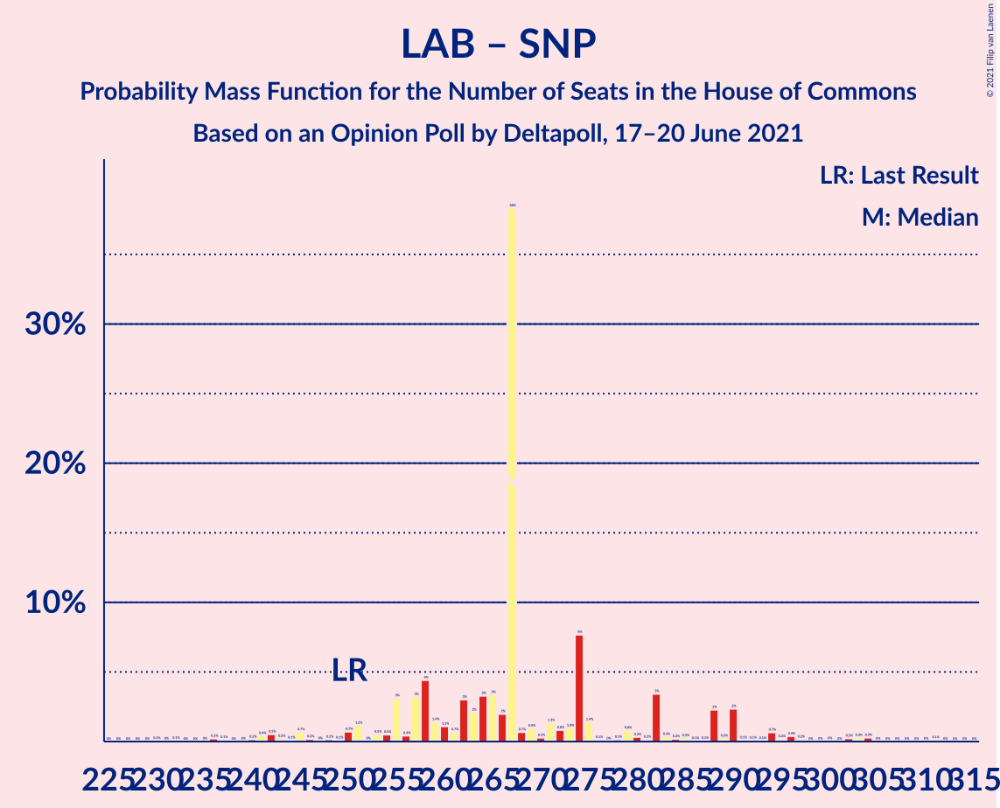

| Number of Seats | Probability | Accumulated | Special Marks |
|:---------------:|:-----------:|:-----------:|:-------------:|
| 230 | 0.1% | 100% |  |
| 231 | 0% | 99.9% |  |
| 232 | 0.1% | 99.9% |  |
| 233 | 0% | 99.8% |  |
| 234 | 0% | 99.8% |  |
| 235 | 0% | 99.8% |  |
| 236 | 0.2% | 99.8% |  |
| 237 | 0.1% | 99.6% |  |
| 238 | 0% | 99.5% |  |
| 239 | 0% | 99.5% |  |
| 240 | 0.2% | 99.4% |  |
| 241 | 0.4% | 99.3% |  |
| 242 | 0.5% | 98.9% |  |
| 243 | 0.2% | 98% |  |
| 244 | 0.1% | 98% |  |
| 245 | 0.7% | 98% |  |
| 246 | 0.2% | 97% |  |
| 247 | 0% | 97% |  |
| 248 | 0.2% | 97% |  |
| 249 | 0.1% | 97% |  |
| 250 | 0.7% | 97% | Last Result |
| 251 | 1.2% | 96% |  |
| 252 | 0% | 95% |  |
| 253 | 0.5% | 95% |  |
| 254 | 0.5% | 94% |  |
| 255 | 3% | 94% |  |
| 256 | 0.4% | 91% |  |
| 257 | 3% | 90% |  |
| 258 | 4% | 87% |  |
| 259 | 1.4% | 83% |  |
| 260 | 1.1% | 81% |  |
| 261 | 0.7% | 80% |  |
| 262 | 3% | 80% |  |
| 263 | 2% | 77% |  |
| 264 | 3% | 75% |  |
| 265 | 3% | 71% |  |
| 266 | 2% | 68% |  |
| 267 | 38% | 66% | Median |
| 268 | 0.7% | 28% |  |
| 269 | 0.9% | 27% |  |
| 270 | 0.3% | 26% |  |
| 271 | 1.3% | 26% |  |
| 272 | 0.8% | 24% |  |
| 273 | 1.0% | 24% |  |
| 274 | 8% | 23% |  |
| 275 | 1.4% | 15% |  |
| 276 | 0.1% | 13% |  |
| 277 | 0% | 13% |  |
| 278 | 0.1% | 13% |  |
| 279 | 0.8% | 13% |  |
| 280 | 0.3% | 12% |  |
| 281 | 0.2% | 12% |  |
| 282 | 3% | 12% |  |
| 283 | 0.4% | 8% |  |
| 284 | 0.2% | 8% |  |
| 285 | 0.3% | 8% |  |
| 286 | 0.1% | 8% |  |
| 287 | 0.1% | 8% |  |
| 288 | 2% | 8% |  |
| 289 | 0.2% | 5% |  |
| 290 | 2% | 5% |  |
| 291 | 0.1% | 3% |  |
| 292 | 0.1% | 3% |  |
| 293 | 0.1% | 2% |  |
| 294 | 0.7% | 2% |  |
| 295 | 0.2% | 2% |  |
| 296 | 0.4% | 2% |  |
| 297 | 0.2% | 1.2% |  |
| 298 | 0% | 1.0% |  |
| 299 | 0% | 1.0% |  |
| 300 | 0% | 1.0% |  |
| 301 | 0% | 1.0% |  |
| 302 | 0.2% | 1.0% |  |
| 303 | 0.3% | 0.7% |  |
| 304 | 0.3% | 0.5% |  |
| 305 | 0% | 0.2% |  |
| 306 | 0% | 0.2% |  |
| 307 | 0% | 0.2% |  |
| 308 | 0% | 0.2% |  |
| 309 | 0% | 0.2% |  |
| 310 | 0% | 0.1% |  |
| 311 | 0.1% | 0.1% |  |
| 312 | 0% | 0% |  |

### Labour Party – Plaid Cymru

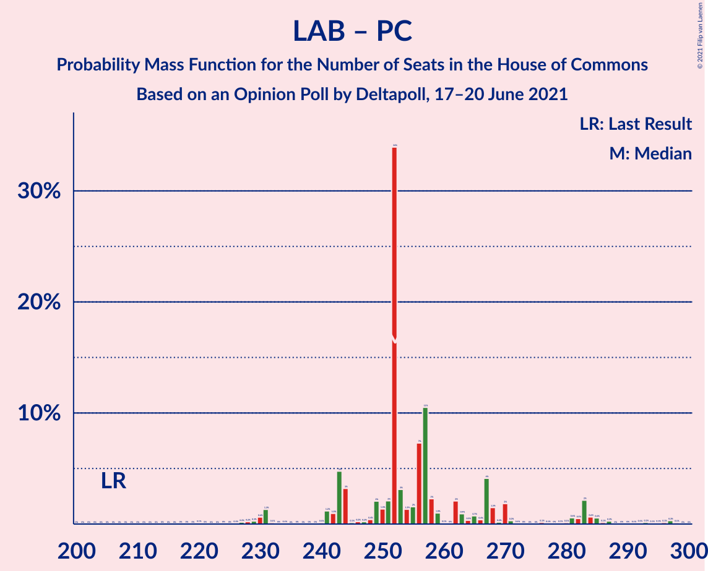

| Number of Seats | Probability | Accumulated | Special Marks |
|:---------------:|:-----------:|:-----------:|:-------------:|
| 206 | 0% | 100% | Last Result |
| 207 | 0% | 100% |  |
| 208 | 0% | 100% |  |
| 209 | 0% | 100% |  |
| 210 | 0% | 100% |  |
| 211 | 0% | 100% |  |
| 212 | 0% | 100% |  |
| 213 | 0% | 100% |  |
| 214 | 0% | 100% |  |
| 215 | 0% | 100% |  |
| 216 | 0% | 100% |  |
| 217 | 0% | 100% |  |
| 218 | 0% | 100% |  |
| 219 | 0% | 99.9% |  |
| 220 | 0.1% | 99.9% |  |
| 221 | 0% | 99.8% |  |
| 222 | 0% | 99.8% |  |
| 223 | 0% | 99.8% |  |
| 224 | 0% | 99.8% |  |
| 225 | 0% | 99.8% |  |
| 226 | 0.1% | 99.7% |  |
| 227 | 0.2% | 99.7% |  |
| 228 | 0.2% | 99.5% |  |
| 229 | 0.3% | 99.3% |  |
| 230 | 0.6% | 99.0% |  |
| 231 | 1.3% | 98% |  |
| 232 | 0.1% | 97% |  |
| 233 | 0% | 97% |  |
| 234 | 0.1% | 97% |  |
| 235 | 0% | 97% |  |
| 236 | 0% | 97% |  |
| 237 | 0% | 97% |  |
| 238 | 0% | 97% |  |
| 239 | 0% | 97% |  |
| 240 | 0.1% | 97% |  |
| 241 | 1.2% | 97% |  |
| 242 | 1.0% | 95% |  |
| 243 | 5% | 95% |  |
| 244 | 3% | 90% |  |
| 245 | 0.1% | 87% |  |
| 246 | 0.2% | 86% |  |
| 247 | 0.2% | 86% |  |
| 248 | 0.4% | 86% |  |
| 249 | 2% | 86% |  |
| 250 | 1.4% | 84% |  |
| 251 | 2% | 82% |  |
| 252 | 34% | 80% | Median |
| 253 | 3% | 46% |  |
| 254 | 1.3% | 43% |  |
| 255 | 2% | 42% |  |
| 256 | 7% | 40% |  |
| 257 | 11% | 33% |  |
| 258 | 2% | 22% |  |
| 259 | 1.0% | 20% |  |
| 260 | 0.1% | 19% |  |
| 261 | 0% | 19% |  |
| 262 | 2% | 19% |  |
| 263 | 0.9% | 17% |  |
| 264 | 0.3% | 16% |  |
| 265 | 0.7% | 16% |  |
| 266 | 0.4% | 15% |  |
| 267 | 4% | 14% |  |
| 268 | 1.5% | 10% |  |
| 269 | 0.2% | 9% |  |
| 270 | 2% | 9% |  |
| 271 | 0.3% | 7% |  |
| 272 | 0.1% | 7% |  |
| 273 | 0% | 6% |  |
| 274 | 0% | 6% |  |
| 275 | 0% | 6% |  |
| 276 | 0.1% | 6% |  |
| 277 | 0.1% | 6% |  |
| 278 | 0% | 6% |  |
| 279 | 0.1% | 6% |  |
| 280 | 0.1% | 6% |  |
| 281 | 0.6% | 6% |  |
| 282 | 0.5% | 5% |  |
| 283 | 2% | 5% |  |
| 284 | 0.6% | 3% |  |
| 285 | 0.6% | 2% |  |
| 286 | 0.1% | 2% |  |
| 287 | 0.3% | 1.4% |  |
| 288 | 0% | 1.1% |  |
| 289 | 0% | 1.1% |  |
| 290 | 0% | 1.1% |  |
| 291 | 0.1% | 1.1% |  |
| 292 | 0.1% | 1.0% |  |
| 293 | 0.1% | 0.9% |  |
| 294 | 0.1% | 0.7% |  |
| 295 | 0.1% | 0.7% |  |
| 296 | 0.1% | 0.6% |  |
| 297 | 0.3% | 0.4% |  |
| 298 | 0.1% | 0.1% |  |
| 299 | 0% | 0% |  |

### Labour Party

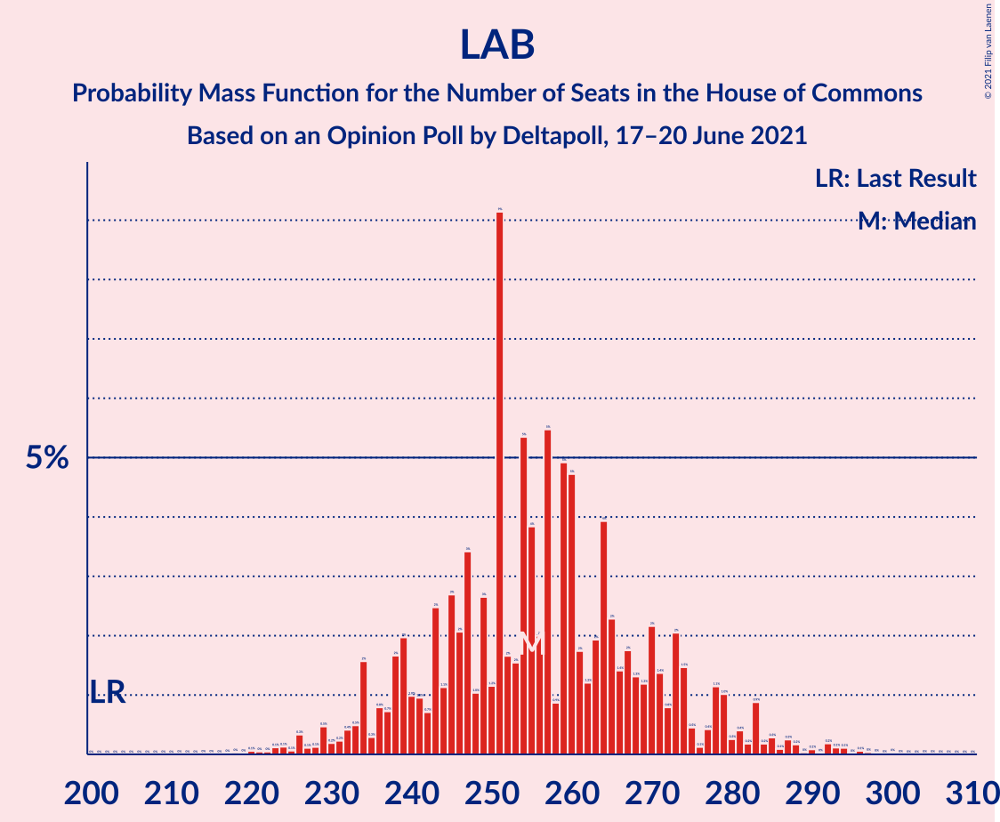

| Number of Seats | Probability | Accumulated | Special Marks |
|:---------------:|:-----------:|:-----------:|:-------------:|
| 202 | 0% | 100% | Last Result |
| 203 | 0% | 100% |  |
| 204 | 0% | 100% |  |
| 205 | 0% | 100% |  |
| 206 | 0% | 100% |  |
| 207 | 0% | 100% |  |
| 208 | 0% | 100% |  |
| 209 | 0% | 100% |  |
| 210 | 0% | 100% |  |
| 211 | 0% | 100% |  |
| 212 | 0% | 100% |  |
| 213 | 0% | 100% |  |
| 214 | 0% | 100% |  |
| 215 | 0% | 100% |  |
| 216 | 0% | 100% |  |
| 217 | 0% | 99.9% |  |
| 218 | 0% | 99.9% |  |
| 219 | 0% | 99.9% |  |
| 220 | 0.1% | 99.9% |  |
| 221 | 0% | 99.8% |  |
| 222 | 0% | 99.8% |  |
| 223 | 0.1% | 99.8% |  |
| 224 | 0% | 99.7% |  |
| 225 | 0.1% | 99.6% |  |
| 226 | 0.1% | 99.6% |  |
| 227 | 0.2% | 99.4% |  |
| 228 | 0.2% | 99.2% |  |
| 229 | 0.3% | 99.0% |  |
| 230 | 0.5% | 98.7% |  |
| 231 | 1.1% | 98% |  |
| 232 | 0.1% | 97% |  |
| 233 | 0.1% | 97% |  |
| 234 | 0% | 97% |  |
| 235 | 0% | 97% |  |
| 236 | 0.1% | 97% |  |
| 237 | 0.1% | 97% |  |
| 238 | 0.2% | 97% |  |
| 239 | 0.3% | 96% |  |
| 240 | 0.9% | 96% |  |
| 241 | 1.4% | 95% |  |
| 242 | 2% | 94% |  |
| 243 | 4% | 91% |  |
| 244 | 1.0% | 87% |  |
| 245 | 0.7% | 86% |  |
| 246 | 0.7% | 85% |  |
| 247 | 1.1% | 85% |  |
| 248 | 0.6% | 84% |  |
| 249 | 3% | 83% |  |
| 250 | 0.7% | 80% |  |
| 251 | 35% | 80% | Median |
| 252 | 3% | 45% |  |
| 253 | 3% | 42% |  |
| 254 | 4% | 38% |  |
| 255 | 4% | 35% |  |
| 256 | 2% | 31% |  |
| 257 | 10% | 29% |  |
| 258 | 0.5% | 19% |  |
| 259 | 0.1% | 18% |  |
| 260 | 0.2% | 18% |  |
| 261 | 0.5% | 18% |  |
| 262 | 2% | 18% |  |
| 263 | 0.6% | 15% |  |
| 264 | 0.3% | 15% |  |
| 265 | 4% | 15% |  |
| 266 | 0.4% | 11% |  |
| 267 | 0.8% | 10% |  |
| 268 | 1.1% | 10% |  |
| 269 | 0.1% | 8% |  |
| 270 | 2% | 8% |  |
| 271 | 0.3% | 7% |  |
| 272 | 0.2% | 6% |  |
| 273 | 0% | 6% |  |
| 274 | 0% | 6% |  |
| 275 | 0% | 6% |  |
| 276 | 0.1% | 6% |  |
| 277 | 0.3% | 6% |  |
| 278 | 0.6% | 6% |  |
| 279 | 0.1% | 5% |  |
| 280 | 0.2% | 5% |  |
| 281 | 2% | 5% |  |
| 282 | 0.2% | 3% |  |
| 283 | 0.6% | 3% |  |
| 284 | 0.6% | 2% |  |
| 285 | 0.2% | 1.4% |  |
| 286 | 0% | 1.1% |  |
| 287 | 0% | 1.1% |  |
| 288 | 0.1% | 1.1% |  |
| 289 | 0% | 1.0% |  |
| 290 | 0.1% | 1.0% |  |
| 291 | 0% | 0.9% |  |
| 292 | 0.1% | 0.9% |  |
| 293 | 0.2% | 0.7% |  |
| 294 | 0.3% | 0.6% |  |
| 295 | 0% | 0.3% |  |
| 296 | 0.2% | 0.3% |  |
| 297 | 0% | 0.1% |  |
| 298 | 0.1% | 0.1% |  |
| 299 | 0% | 0% |  |

## Technical Information

### Opinion Poll

+ **Polling firm:** Deltapoll
+ **Commissioner(s):** —
+ **Fieldwork period:** 17–20 June 2021

### Calculations

+ **Sample size:** 2226
+ **Simulations done:** 131,072
+ **Error estimate:** 1.10%

