# Opinion Poll by Savanta ComRes, 18–20 June 2021

<a href="#voting-intentions">Voting Intentions</a> | <a href="#seats">Seats</a> | <a href="#coalitions">Coalitions</a> | <a href="#technical-information">Technical Information</a>

## Voting Intentions

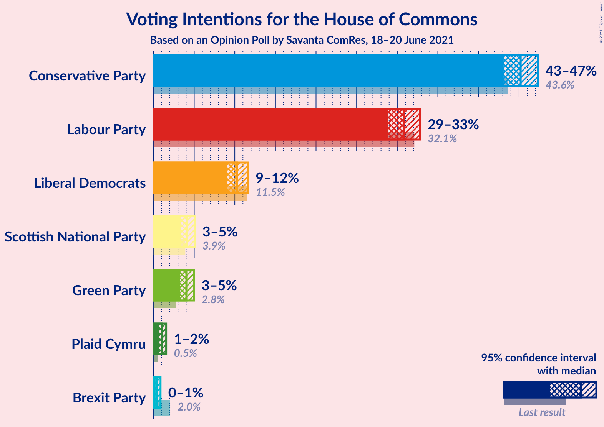

### Confidence Intervals

| Party | Last Result | Poll Result | 80% Confidence Interval | 90% Confidence Interval | 95% Confidence Interval | 99% Confidence Interval |
|:-----:|:-----------:|:-----------:|:-----------------------:|:-----------------------:|:-----------------------:|:-----------------------:|
| Conservative Party | 43.6% | 45.2% | 43.8–46.6% |43.4–47.0% |43.1–47.3% |42.4–48.0% |
| Labour Party | 32.1% | 30.8% | 29.6–32.1% |29.2–32.5% |28.9–32.8% |28.3–33.4% |
| Liberal Democrats | 11.5% | 10.3% | 9.4–11.1% |9.2–11.4% |9.0–11.6% |8.7–12.1% |
| Scottish National Party | 3.9% | 4.1% | 3.6–4.7% |3.5–4.9% |3.4–5.1% |3.1–5.4% |
| Green Party | 2.8% | 4.0% | 3.5–4.6% |3.4–4.8% |3.3–5.0% |3.0–5.3% |
| Plaid Cymru | 0.5% | 1.0% | 0.8–1.4% |0.7–1.5% |0.7–1.6% |0.6–1.7% |
| Brexit Party | 2.0% | 0.5% | 0.3–0.7% |0.3–0.8% |0.2–0.9% |0.2–1.0% |

*Note:* The poll result column reflects the actual value used in the calculations. Published results may vary slightly, and in addition be rounded to fewer digits.

## Seats

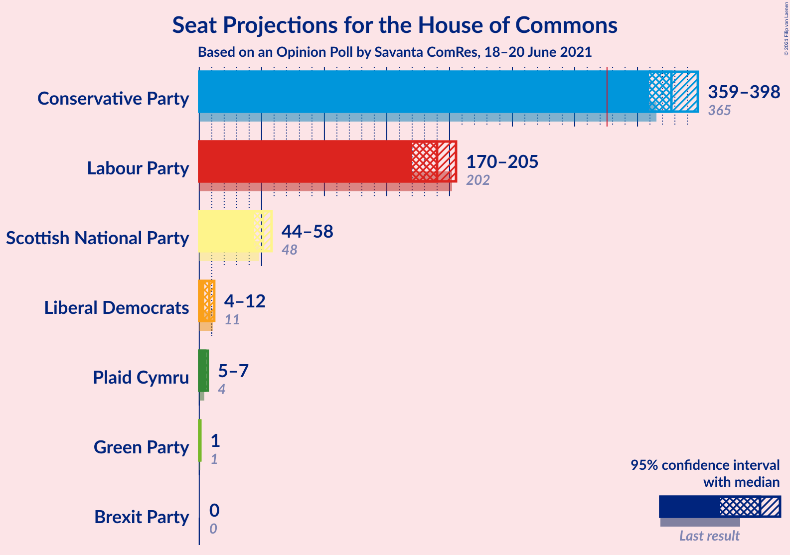

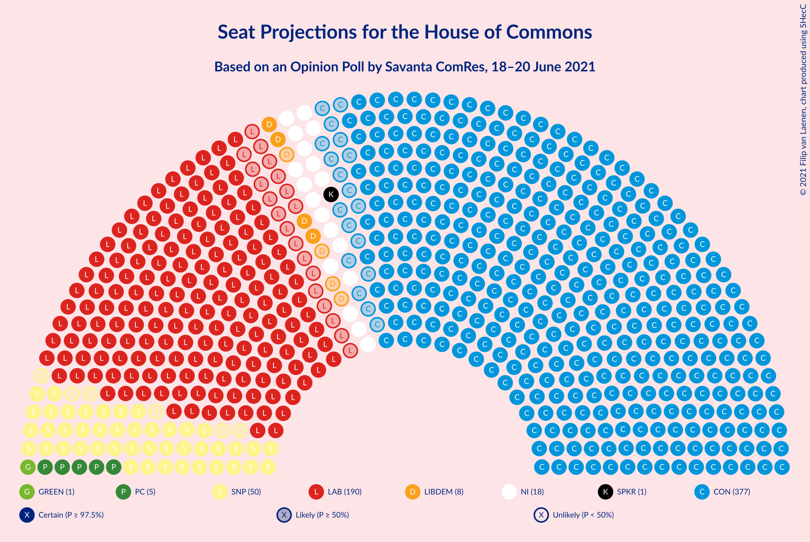

### Confidence Intervals

| Party | Last Result | Median | 80% Confidence Interval | 90% Confidence Interval | 95% Confidence Interval | 99% Confidence Interval |
|:-----:|:-----------:|:------:|:-----------------------:|:-----------------------:|:-----------------------:|:-----------------------:|
| <a href="#conservative-party">Conservative Party</a> | 365 | 377 | 366–389 |362–392 |359–398 |351–403 |
| <a href="#labour-party">Labour Party</a> | 202 | 190 | 178–198 |176–204 |170–205 |165–213 |
| <a href="#liberal-democrats">Liberal Democrats</a> | 11 | 8 | 6–10 |5–11 |4–12 |4–13 |
| <a href="#scottish-national-party">Scottish National Party</a> | 48 | 51 | 47–55 |45–56 |44–58 |38–58 |
| <a href="#green-party">Green Party</a> | 1 | 1 | 1 |1 |1 |1 |
| <a href="#plaid-cymru">Plaid Cymru</a> | 4 | 5 | 5–7 |5–7 |5–7 |4–9 |
| <a href="#brexit-party">Brexit Party</a> | 0 | 0 | 0 |0 |0 |0 |

### Conservative Party

*For a full overview of the results for this party, see the [Conservative Party](party-conservativeparty.html) page.*

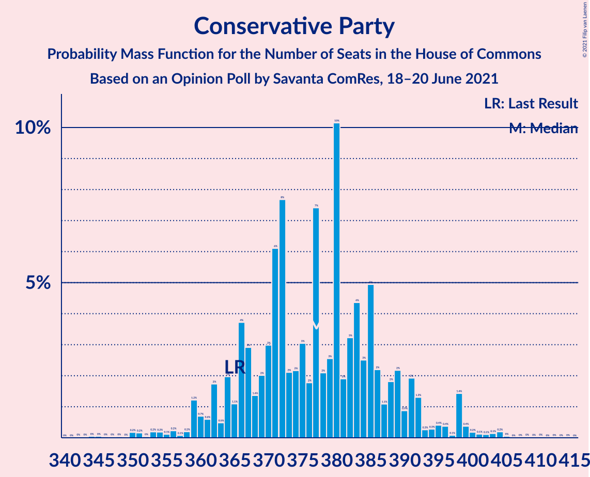

| Number of Seats | Probability | Accumulated | Special Marks |
|:---------------:|:-----------:|:-----------:|:-------------:|
| 342 | 0% | 100% |  |
| 343 | 0% | 99.9% |  |
| 344 | 0% | 99.9% |  |
| 345 | 0% | 99.9% |  |
| 346 | 0% | 99.8% |  |
| 347 | 0% | 99.8% |  |
| 348 | 0% | 99.7% |  |
| 349 | 0% | 99.7% |  |
| 350 | 0.2% | 99.7% |  |
| 351 | 0.2% | 99.5% |  |
| 352 | 0% | 99.3% |  |
| 353 | 0.2% | 99.3% |  |
| 354 | 0.2% | 99.1% |  |
| 355 | 0.1% | 98.9% |  |
| 356 | 0.2% | 98.8% |  |
| 357 | 0.1% | 98.6% |  |
| 358 | 0.2% | 98.5% |  |
| 359 | 1.2% | 98% |  |
| 360 | 0.7% | 97% |  |
| 361 | 0.6% | 96% |  |
| 362 | 2% | 96% |  |
| 363 | 0.5% | 94% |  |
| 364 | 2% | 94% |  |
| 365 | 1.1% | 92% | Last Result |
| 366 | 4% | 91% |  |
| 367 | 3% | 87% |  |
| 368 | 1.4% | 84% |  |
| 369 | 2% | 83% |  |
| 370 | 3% | 81% |  |
| 371 | 6% | 78% |  |
| 372 | 8% | 71% |  |
| 373 | 2% | 64% |  |
| 374 | 2% | 62% |  |
| 375 | 3% | 59% |  |
| 376 | 2% | 56% |  |
| 377 | 7% | 55% | Median |
| 378 | 2% | 47% |  |
| 379 | 3% | 45% |  |
| 380 | 10% | 43% |  |
| 381 | 2% | 32% |  |
| 382 | 3% | 31% |  |
| 383 | 4% | 27% |  |
| 384 | 3% | 23% |  |
| 385 | 5% | 20% |  |
| 386 | 2% | 16% |  |
| 387 | 1.1% | 13% |  |
| 388 | 2% | 12% |  |
| 389 | 2% | 10% |  |
| 390 | 0.9% | 8% |  |
| 391 | 2% | 7% |  |
| 392 | 1.3% | 5% |  |
| 393 | 0.3% | 4% |  |
| 394 | 0.3% | 4% |  |
| 395 | 0.4% | 4% |  |
| 396 | 0.4% | 3% |  |
| 397 | 0.1% | 3% |  |
| 398 | 1.4% | 3% |  |
| 399 | 0.4% | 1.3% |  |
| 400 | 0.2% | 0.9% |  |
| 401 | 0.1% | 0.7% |  |
| 402 | 0.1% | 0.6% |  |
| 403 | 0.1% | 0.5% |  |
| 404 | 0.2% | 0.4% |  |
| 405 | 0% | 0.2% |  |
| 406 | 0% | 0.1% |  |
| 407 | 0% | 0.1% |  |
| 408 | 0% | 0.1% |  |
| 409 | 0% | 0.1% |  |
| 410 | 0% | 0.1% |  |
| 411 | 0% | 0.1% |  |
| 412 | 0% | 0.1% |  |
| 413 | 0% | 0% |  |

### Labour Party

*For a full overview of the results for this party, see the [Labour Party](party-labourparty.html) page.*

| Number of Seats | Probability | Accumulated | Special Marks |
|:---------------:|:-----------:|:-----------:|:-------------:|
| 157 | 0% | 100% |  |
| 158 | 0% | 99.9% |  |
| 159 | 0% | 99.9% |  |
| 160 | 0% | 99.9% |  |
| 161 | 0.1% | 99.9% |  |
| 162 | 0% | 99.8% |  |
| 163 | 0.1% | 99.8% |  |
| 164 | 0.1% | 99.7% |  |
| 165 | 0.1% | 99.6% |  |
| 166 | 0.1% | 99.4% |  |
| 167 | 0.2% | 99.3% |  |
| 168 | 0.7% | 99.1% |  |
| 169 | 0.7% | 98% |  |
| 170 | 0.8% | 98% |  |
| 171 | 0.2% | 97% |  |
| 172 | 0% | 97% |  |
| 173 | 0.4% | 97% |  |
| 174 | 0.6% | 96% |  |
| 175 | 0.5% | 96% |  |
| 176 | 2% | 95% |  |
| 177 | 1.3% | 93% |  |
| 178 | 4% | 91% |  |
| 179 | 0.9% | 88% |  |
| 180 | 2% | 87% |  |
| 181 | 4% | 84% |  |
| 182 | 4% | 81% |  |
| 183 | 8% | 77% |  |
| 184 | 7% | 68% |  |
| 185 | 4% | 61% |  |
| 186 | 0.8% | 57% |  |
| 187 | 1.2% | 56% |  |
| 188 | 3% | 55% |  |
| 189 | 0.6% | 52% |  |
| 190 | 2% | 52% | Median |
| 191 | 13% | 50% |  |
| 192 | 2% | 37% |  |
| 193 | 9% | 35% |  |
| 194 | 2% | 27% |  |
| 195 | 6% | 25% |  |
| 196 | 4% | 19% |  |
| 197 | 4% | 15% |  |
| 198 | 1.3% | 11% |  |
| 199 | 0.8% | 10% |  |
| 200 | 1.2% | 9% |  |
| 201 | 0.7% | 8% |  |
| 202 | 0.9% | 7% | Last Result |
| 203 | 0.8% | 6% |  |
| 204 | 2% | 5% |  |
| 205 | 0.9% | 3% |  |
| 206 | 0.8% | 2% |  |
| 207 | 0.2% | 2% |  |
| 208 | 0.4% | 1.4% |  |
| 209 | 0.1% | 1.0% |  |
| 210 | 0.1% | 0.9% |  |
| 211 | 0.1% | 0.8% |  |
| 212 | 0.1% | 0.7% |  |
| 213 | 0.1% | 0.6% |  |
| 214 | 0% | 0.5% |  |
| 215 | 0.2% | 0.4% |  |
| 216 | 0.1% | 0.3% |  |
| 217 | 0% | 0.2% |  |
| 218 | 0% | 0.1% |  |
| 219 | 0% | 0.1% |  |
| 220 | 0% | 0.1% |  |
| 221 | 0% | 0.1% |  |
| 222 | 0% | 0.1% |  |
| 223 | 0% | 0.1% |  |
| 224 | 0% | 0% |  |

### Liberal Democrats

*For a full overview of the results for this party, see the [Liberal Democrats](party-liberaldemocrats.html) page.*

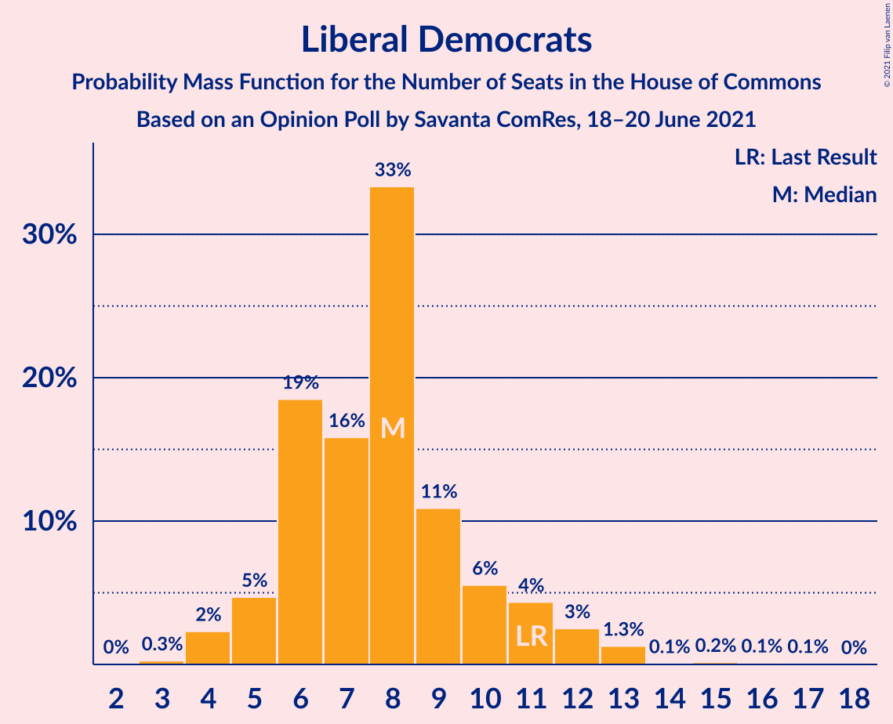

| Number of Seats | Probability | Accumulated | Special Marks |
|:---------------:|:-----------:|:-----------:|:-------------:|
| 3 | 0.3% | 100% |  |
| 4 | 2% | 99.7% |  |
| 5 | 5% | 97% |  |
| 6 | 19% | 93% |  |
| 7 | 16% | 74% |  |
| 8 | 33% | 58% | Median |
| 9 | 11% | 25% |  |
| 10 | 6% | 14% |  |
| 11 | 4% | 9% | Last Result |
| 12 | 3% | 4% |  |
| 13 | 1.3% | 2% |  |
| 14 | 0.1% | 0.4% |  |
| 15 | 0.2% | 0.4% |  |
| 16 | 0.1% | 0.2% |  |
| 17 | 0.1% | 0.1% |  |
| 18 | 0% | 0% |  |

### Scottish National Party

*For a full overview of the results for this party, see the [Scottish National Party](party-scottishnationalparty.html) page.*

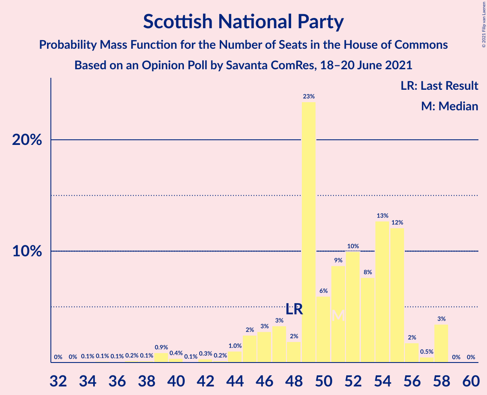

| Number of Seats | Probability | Accumulated | Special Marks |
|:---------------:|:-----------:|:-----------:|:-------------:|
| 33 | 0% | 100% |  |
| 34 | 0.1% | 99.9% |  |
| 35 | 0.1% | 99.9% |  |
| 36 | 0.1% | 99.8% |  |
| 37 | 0.2% | 99.7% |  |
| 38 | 0.1% | 99.5% |  |
| 39 | 0.9% | 99.4% |  |
| 40 | 0.4% | 98.5% |  |
| 41 | 0.1% | 98% |  |
| 42 | 0.3% | 98% |  |
| 43 | 0.2% | 98% |  |
| 44 | 1.0% | 98% |  |
| 45 | 2% | 97% |  |
| 46 | 3% | 94% |  |
| 47 | 3% | 91% |  |
| 48 | 2% | 88% | Last Result |
| 49 | 23% | 86% |  |
| 50 | 6% | 63% |  |
| 51 | 9% | 57% | Median |
| 52 | 10% | 48% |  |
| 53 | 8% | 38% |  |
| 54 | 13% | 31% |  |
| 55 | 12% | 18% |  |
| 56 | 2% | 6% |  |
| 57 | 0.5% | 4% |  |
| 58 | 3% | 3% |  |
| 59 | 0% | 0% |  |

### Green Party

*For a full overview of the results for this party, see the [Green Party](party-greenparty.html) page.*

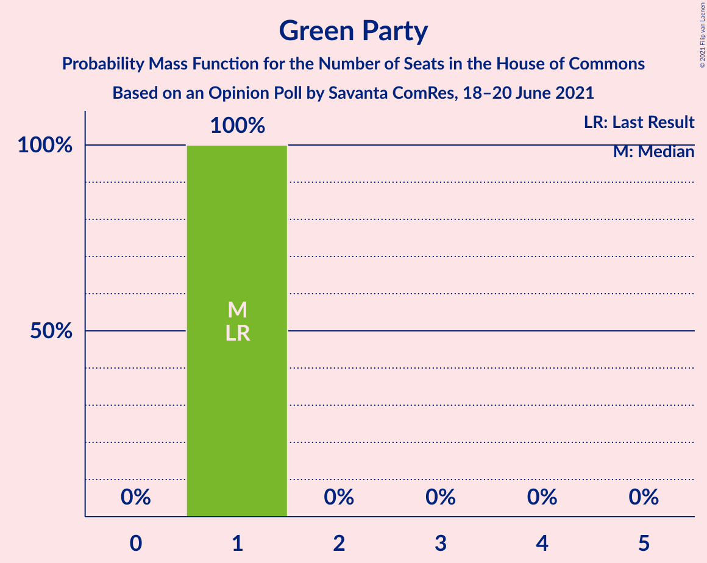

| Number of Seats | Probability | Accumulated | Special Marks |
|:---------------:|:-----------:|:-----------:|:-------------:|
| 1 | 100% | 100% | Last Result, Median |

### Plaid Cymru

*For a full overview of the results for this party, see the [Plaid Cymru](party-plaidcymru.html) page.*

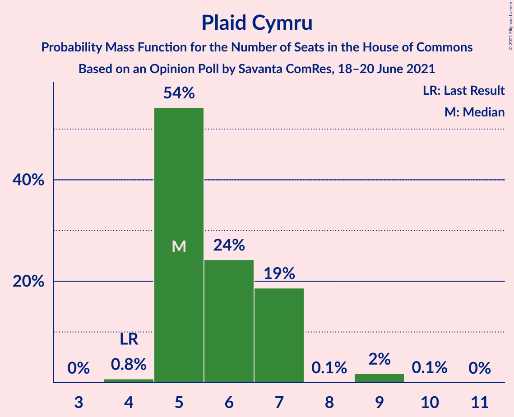

| Number of Seats | Probability | Accumulated | Special Marks |
|:---------------:|:-----------:|:-----------:|:-------------:|
| 4 | 0.8% | 100% | Last Result |
| 5 | 54% | 99.2% | Median |
| 6 | 24% | 45% |  |
| 7 | 19% | 21% |  |
| 8 | 0.1% | 2% |  |
| 9 | 2% | 2% |  |
| 10 | 0.1% | 0.1% |  |
| 11 | 0% | 0% |  |

### Brexit Party

*For a full overview of the results for this party, see the [Brexit Party](party-brexitparty.html) page.*

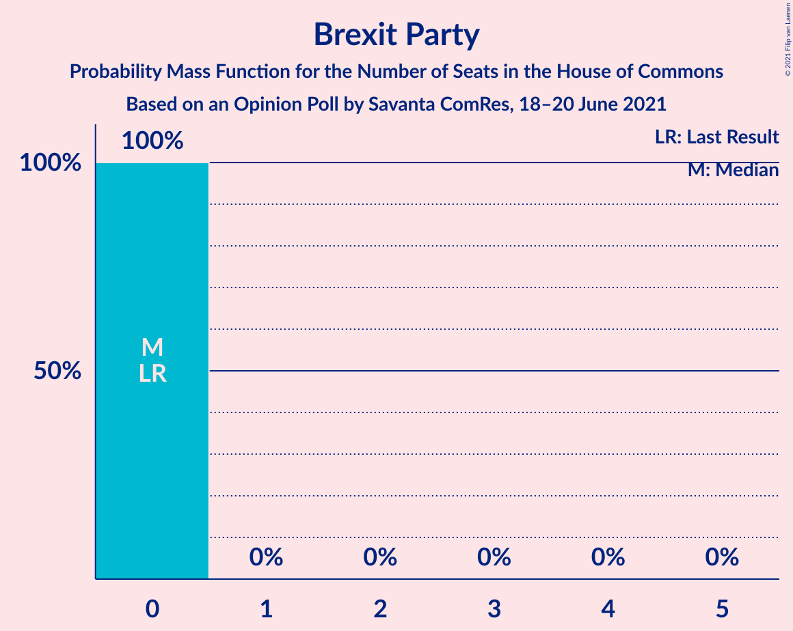

| Number of Seats | Probability | Accumulated | Special Marks |
|:---------------:|:-----------:|:-----------:|:-------------:|
| 0 | 100% | 100% | Last Result, Median |

## Coalitions

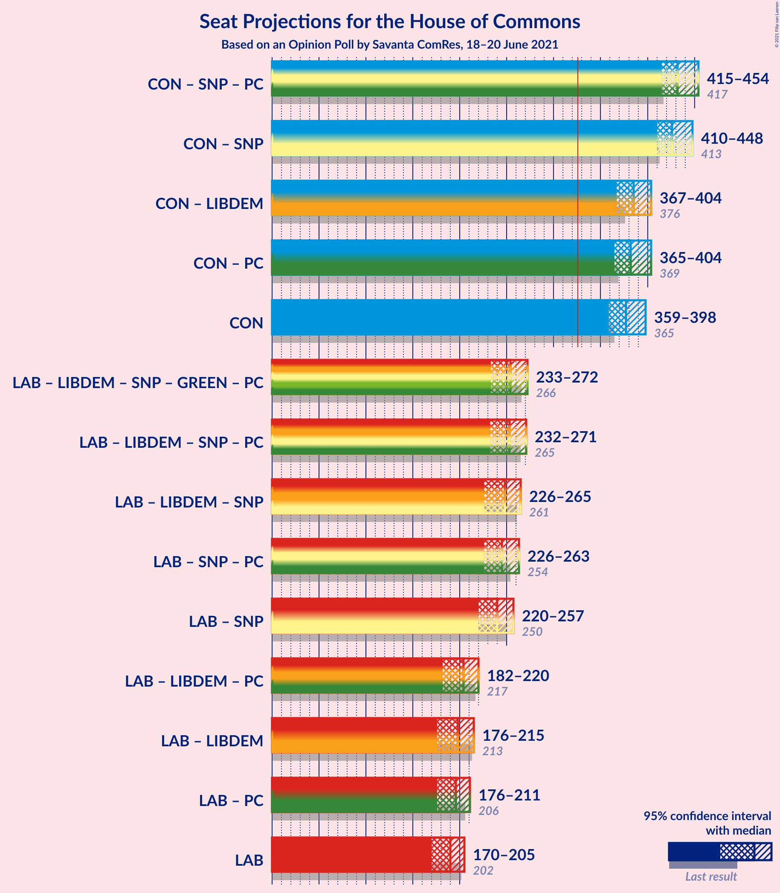

### Confidence Intervals

| Coalition | Last Result | Median | Majority? | 80% Confidence Interval | 90% Confidence Interval | 95% Confidence Interval | 99% Confidence Interval |
|:---------:|:-----------:|:------:|:---------:|:-----------------------:|:-----------------------:|:-----------------------:|:-----------------------:|
| Conservative Party – Scottish National Party – Plaid Cymru | 417 | 432 | 100% | 424–444 | 417–447 | 415–454 | 408–458 |
| Conservative Party – Scottish National Party | 413 | 426 | 100% | 418–438 | 411–441 | 410–448 | 403–452 |
| Conservative Party – Liberal Democrats | 376 | 385 | 100% | 373–397 | 370–402 | 367–404 | 358–410 |
| Conservative Party – Plaid Cymru | 369 | 382 | 100% | 372–395 | 367–398 | 365–404 | 356–408 |
| Conservative Party | 365 | 377 | 100% | 366–389 | 362–392 | 359–398 | 351–403 |
| Labour Party – Liberal Democrats – Scottish National Party – Green Party – Plaid Cymru | 266 | 254 | 0% | 242–265 | 239–269 | 233–272 | 228–280 |
| Labour Party – Liberal Democrats – Scottish National Party – Plaid Cymru | 265 | 253 | 0% | 241–264 | 238–268 | 232–271 | 227–279 |
| Labour Party – Liberal Democrats – Scottish National Party | 261 | 248 | 0% | 235–258 | 232–263 | 226–265 | 222–274 |
| Labour Party – Scottish National Party – Plaid Cymru | 254 | 245 | 0% | 233–257 | 228–260 | 226–263 | 220–272 |
| Labour Party – Scottish National Party | 250 | 240 | 0% | 227–251 | 223–254 | 220–257 | 213–266 |
| Labour Party – Liberal Democrats – Plaid Cymru | 217 | 204 | 0% | 192–212 | 189–219 | 182–220 | 178–227 |
| Labour Party – Liberal Democrats | 213 | 198 | 0% | 186–206 | 183–213 | 176–215 | 172–222 |
| Labour Party – Plaid Cymru | 206 | 196 | 0% | 184–203 | 181–209 | 176–211 | 171–219 |
| Labour Party | 202 | 190 | 0% | 178–198 | 176–204 | 170–205 | 165–213 |

### Conservative Party – Scottish National Party – Plaid Cymru

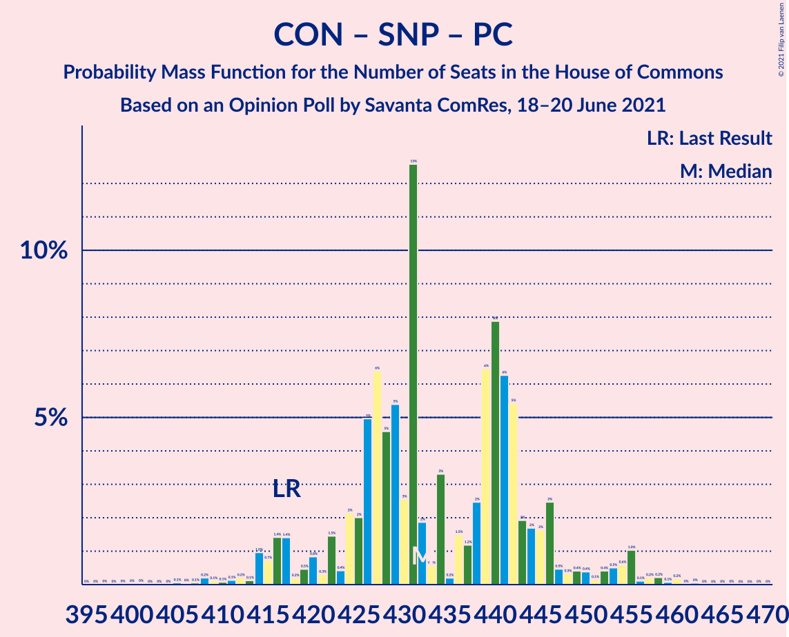

| Number of Seats | Probability | Accumulated | Special Marks |
|:---------------:|:-----------:|:-----------:|:-------------:|
| 399 | 0% | 100% |  |
| 400 | 0% | 99.9% |  |
| 401 | 0% | 99.9% |  |
| 402 | 0% | 99.9% |  |
| 403 | 0% | 99.9% |  |
| 404 | 0% | 99.9% |  |
| 405 | 0.1% | 99.9% |  |
| 406 | 0% | 99.8% |  |
| 407 | 0.1% | 99.8% |  |
| 408 | 0.2% | 99.7% |  |
| 409 | 0.1% | 99.5% |  |
| 410 | 0.1% | 99.4% |  |
| 411 | 0.1% | 99.3% |  |
| 412 | 0.2% | 99.2% |  |
| 413 | 0.1% | 99.0% |  |
| 414 | 1.0% | 98.8% |  |
| 415 | 0.7% | 98% |  |
| 416 | 1.4% | 97% |  |
| 417 | 1.4% | 96% | Last Result |
| 418 | 0.2% | 94% |  |
| 419 | 0.5% | 94% |  |
| 420 | 0.8% | 94% |  |
| 421 | 0.3% | 93% |  |
| 422 | 1.5% | 93% |  |
| 423 | 0.4% | 91% |  |
| 424 | 2% | 91% |  |
| 425 | 2% | 89% |  |
| 426 | 5% | 87% |  |
| 427 | 6% | 82% |  |
| 428 | 5% | 75% |  |
| 429 | 5% | 71% |  |
| 430 | 3% | 65% |  |
| 431 | 13% | 63% |  |
| 432 | 2% | 50% |  |
| 433 | 0.6% | 48% | Median |
| 434 | 3% | 48% |  |
| 435 | 0.2% | 44% |  |
| 436 | 1.5% | 44% |  |
| 437 | 1.2% | 43% |  |
| 438 | 2% | 41% |  |
| 439 | 6% | 39% |  |
| 440 | 8% | 32% |  |
| 441 | 6% | 25% |  |
| 442 | 5% | 18% |  |
| 443 | 2% | 13% |  |
| 444 | 2% | 11% |  |
| 445 | 2% | 9% |  |
| 446 | 2% | 8% |  |
| 447 | 0.5% | 5% |  |
| 448 | 0.3% | 5% |  |
| 449 | 0.4% | 4% |  |
| 450 | 0.4% | 4% |  |
| 451 | 0.1% | 4% |  |
| 452 | 0.4% | 3% |  |
| 453 | 0.5% | 3% |  |
| 454 | 0.6% | 3% |  |
| 455 | 1.0% | 2% |  |
| 456 | 0.1% | 0.9% |  |
| 457 | 0.2% | 0.8% |  |
| 458 | 0.2% | 0.6% |  |
| 459 | 0.1% | 0.4% |  |
| 460 | 0.2% | 0.3% |  |
| 461 | 0% | 0.1% |  |
| 462 | 0% | 0.1% |  |
| 463 | 0% | 0.1% |  |
| 464 | 0% | 0.1% |  |
| 465 | 0% | 0.1% |  |
| 466 | 0% | 0.1% |  |
| 467 | 0% | 0% |  |

### Conservative Party – Scottish National Party

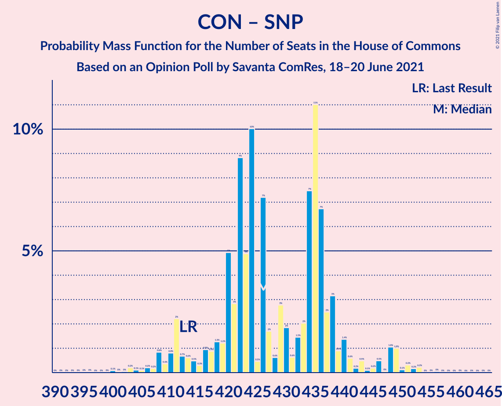

| Number of Seats | Probability | Accumulated | Special Marks |
|:---------------:|:-----------:|:-----------:|:-------------:|
| 393 | 0% | 100% |  |
| 394 | 0% | 99.9% |  |
| 395 | 0% | 99.9% |  |
| 396 | 0% | 99.9% |  |
| 397 | 0% | 99.9% |  |
| 398 | 0% | 99.9% |  |
| 399 | 0% | 99.9% |  |
| 400 | 0.1% | 99.8% |  |
| 401 | 0% | 99.8% |  |
| 402 | 0% | 99.7% |  |
| 403 | 0.2% | 99.7% |  |
| 404 | 0.1% | 99.5% |  |
| 405 | 0.1% | 99.4% |  |
| 406 | 0.2% | 99.3% |  |
| 407 | 0.2% | 99.1% |  |
| 408 | 0.8% | 98.9% |  |
| 409 | 0.4% | 98% |  |
| 410 | 0.8% | 98% |  |
| 411 | 2% | 97% |  |
| 412 | 0.7% | 95% |  |
| 413 | 0.6% | 94% | Last Result |
| 414 | 0.5% | 93% |  |
| 415 | 0.3% | 93% |  |
| 416 | 0.9% | 93% |  |
| 417 | 0.9% | 92% |  |
| 418 | 1.3% | 91% |  |
| 419 | 1.2% | 90% |  |
| 420 | 5% | 88% |  |
| 421 | 3% | 83% |  |
| 422 | 9% | 81% |  |
| 423 | 5% | 72% |  |
| 424 | 10% | 67% |  |
| 425 | 0.5% | 57% |  |
| 426 | 7% | 56% |  |
| 427 | 2% | 49% |  |
| 428 | 0.6% | 48% | Median |
| 429 | 3% | 47% |  |
| 430 | 2% | 44% |  |
| 431 | 0.6% | 42% |  |
| 432 | 1.5% | 42% |  |
| 433 | 2% | 40% |  |
| 434 | 7% | 38% |  |
| 435 | 11% | 31% |  |
| 436 | 7% | 20% |  |
| 437 | 2% | 13% |  |
| 438 | 3% | 10% |  |
| 439 | 0.9% | 7% |  |
| 440 | 1.4% | 6% |  |
| 441 | 0.6% | 5% |  |
| 442 | 0.2% | 4% |  |
| 443 | 0.5% | 4% |  |
| 444 | 0.1% | 4% |  |
| 445 | 0.2% | 4% |  |
| 446 | 0.5% | 4% |  |
| 447 | 0% | 3% |  |
| 448 | 1.0% | 3% |  |
| 449 | 1.0% | 2% |  |
| 450 | 0.1% | 0.9% |  |
| 451 | 0.3% | 0.8% |  |
| 452 | 0.2% | 0.5% |  |
| 453 | 0.2% | 0.3% |  |
| 454 | 0% | 0.1% |  |
| 455 | 0% | 0.1% |  |
| 456 | 0% | 0.1% |  |
| 457 | 0% | 0.1% |  |
| 458 | 0% | 0.1% |  |
| 459 | 0% | 0.1% |  |
| 460 | 0% | 0.1% |  |
| 461 | 0% | 0% |  |

### Conservative Party – Liberal Democrats

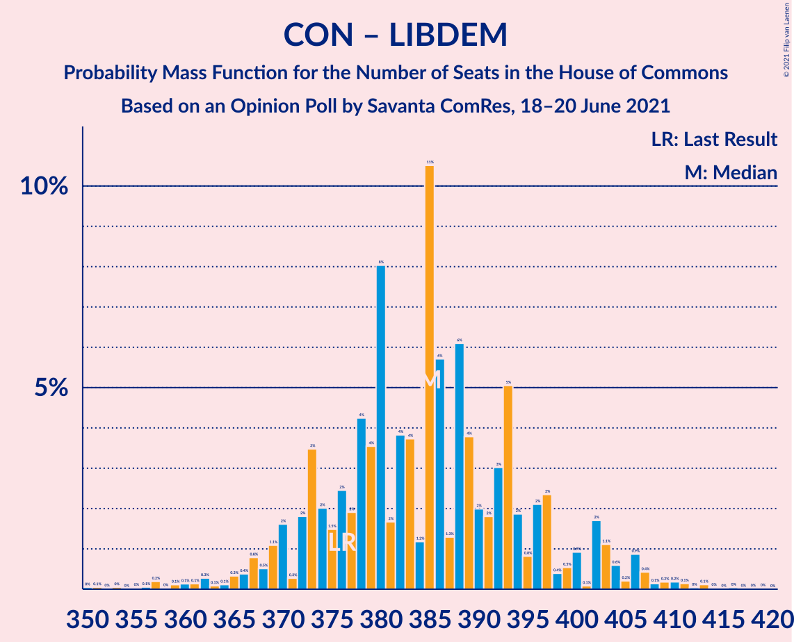

| Number of Seats | Probability | Accumulated | Special Marks |
|:---------------:|:-----------:|:-----------:|:-------------:|
| 350 | 0% | 100% |  |
| 351 | 0.1% | 99.9% |  |
| 352 | 0% | 99.9% |  |
| 353 | 0% | 99.8% |  |
| 354 | 0% | 99.8% |  |
| 355 | 0% | 99.8% |  |
| 356 | 0.1% | 99.8% |  |
| 357 | 0.2% | 99.7% |  |
| 358 | 0% | 99.5% |  |
| 359 | 0.1% | 99.5% |  |
| 360 | 0.1% | 99.4% |  |
| 361 | 0.1% | 99.2% |  |
| 362 | 0.3% | 99.1% |  |
| 363 | 0.1% | 98.8% |  |
| 364 | 0.1% | 98.7% |  |
| 365 | 0.3% | 98.6% |  |
| 366 | 0.4% | 98% |  |
| 367 | 0.8% | 98% |  |
| 368 | 0.5% | 97% |  |
| 369 | 1.1% | 97% |  |
| 370 | 2% | 96% |  |
| 371 | 0.3% | 94% |  |
| 372 | 2% | 94% |  |
| 373 | 3% | 92% |  |
| 374 | 2% | 88% |  |
| 375 | 1.5% | 86% |  |
| 376 | 2% | 85% | Last Result |
| 377 | 2% | 82% |  |
| 378 | 4% | 80% |  |
| 379 | 4% | 76% |  |
| 380 | 8% | 73% |  |
| 381 | 2% | 65% |  |
| 382 | 4% | 63% |  |
| 383 | 4% | 59% |  |
| 384 | 1.2% | 55% |  |
| 385 | 11% | 54% | Median |
| 386 | 6% | 44% |  |
| 387 | 1.3% | 38% |  |
| 388 | 6% | 37% |  |
| 389 | 4% | 31% |  |
| 390 | 2% | 27% |  |
| 391 | 2% | 25% |  |
| 392 | 3% | 23% |  |
| 393 | 5% | 20% |  |
| 394 | 2% | 15% |  |
| 395 | 0.8% | 13% |  |
| 396 | 2% | 12% |  |
| 397 | 2% | 10% |  |
| 398 | 0.4% | 8% |  |
| 399 | 0.5% | 7% |  |
| 400 | 0.9% | 7% |  |
| 401 | 0.1% | 6% |  |
| 402 | 2% | 6% |  |
| 403 | 1.1% | 4% |  |
| 404 | 0.6% | 3% |  |
| 405 | 0.2% | 2% |  |
| 406 | 0.9% | 2% |  |
| 407 | 0.4% | 1.4% |  |
| 408 | 0.1% | 1.0% |  |
| 409 | 0.2% | 0.8% |  |
| 410 | 0.2% | 0.7% |  |
| 411 | 0.1% | 0.5% |  |
| 412 | 0% | 0.3% |  |
| 413 | 0.1% | 0.3% |  |
| 414 | 0% | 0.2% |  |
| 415 | 0% | 0.1% |  |
| 416 | 0% | 0.1% |  |
| 417 | 0% | 0.1% |  |
| 418 | 0% | 0.1% |  |
| 419 | 0% | 0.1% |  |
| 420 | 0% | 0% |  |

### Conservative Party – Plaid Cymru

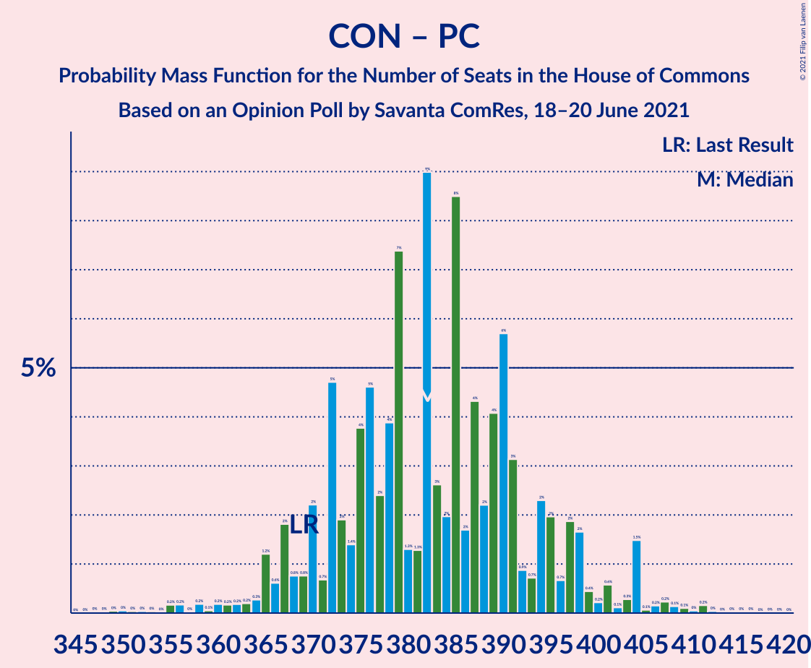

| Number of Seats | Probability | Accumulated | Special Marks |
|:---------------:|:-----------:|:-----------:|:-------------:|
| 347 | 0% | 100% |  |
| 348 | 0% | 99.9% |  |
| 349 | 0% | 99.9% |  |
| 350 | 0% | 99.9% |  |
| 351 | 0% | 99.8% |  |
| 352 | 0% | 99.8% |  |
| 353 | 0% | 99.7% |  |
| 354 | 0% | 99.7% |  |
| 355 | 0.2% | 99.7% |  |
| 356 | 0.2% | 99.5% |  |
| 357 | 0% | 99.4% |  |
| 358 | 0.2% | 99.3% |  |
| 359 | 0.1% | 99.2% |  |
| 360 | 0.2% | 99.1% |  |
| 361 | 0.2% | 98.9% |  |
| 362 | 0.2% | 98.8% |  |
| 363 | 0.2% | 98.6% |  |
| 364 | 0.3% | 98% |  |
| 365 | 1.2% | 98% |  |
| 366 | 0.6% | 97% |  |
| 367 | 2% | 96% |  |
| 368 | 0.8% | 94% |  |
| 369 | 0.8% | 94% | Last Result |
| 370 | 2% | 93% |  |
| 371 | 0.7% | 91% |  |
| 372 | 5% | 90% |  |
| 373 | 2% | 85% |  |
| 374 | 1.4% | 83% |  |
| 375 | 4% | 82% |  |
| 376 | 5% | 78% |  |
| 377 | 2% | 74% |  |
| 378 | 4% | 71% |  |
| 379 | 7% | 67% |  |
| 380 | 1.3% | 60% |  |
| 381 | 1.3% | 59% |  |
| 382 | 9% | 57% | Median |
| 383 | 3% | 48% |  |
| 384 | 2% | 46% |  |
| 385 | 8% | 44% |  |
| 386 | 2% | 35% |  |
| 387 | 4% | 34% |  |
| 388 | 2% | 29% |  |
| 389 | 4% | 27% |  |
| 390 | 6% | 23% |  |
| 391 | 3% | 17% |  |
| 392 | 0.9% | 14% |  |
| 393 | 0.7% | 13% |  |
| 394 | 2% | 13% |  |
| 395 | 2% | 10% |  |
| 396 | 0.7% | 8% |  |
| 397 | 2% | 8% |  |
| 398 | 2% | 6% |  |
| 399 | 0.4% | 4% |  |
| 400 | 0.2% | 4% |  |
| 401 | 0.6% | 4% |  |
| 402 | 0.1% | 3% |  |
| 403 | 0.3% | 3% |  |
| 404 | 1.5% | 3% |  |
| 405 | 0.1% | 1.1% |  |
| 406 | 0.2% | 1.0% |  |
| 407 | 0.2% | 0.8% |  |
| 408 | 0.1% | 0.6% |  |
| 409 | 0.1% | 0.5% |  |
| 410 | 0% | 0.4% |  |
| 411 | 0.2% | 0.3% |  |
| 412 | 0% | 0.2% |  |
| 413 | 0% | 0.1% |  |
| 414 | 0% | 0.1% |  |
| 415 | 0% | 0.1% |  |
| 416 | 0% | 0.1% |  |
| 417 | 0% | 0.1% |  |
| 418 | 0% | 0% |  |

### Conservative Party

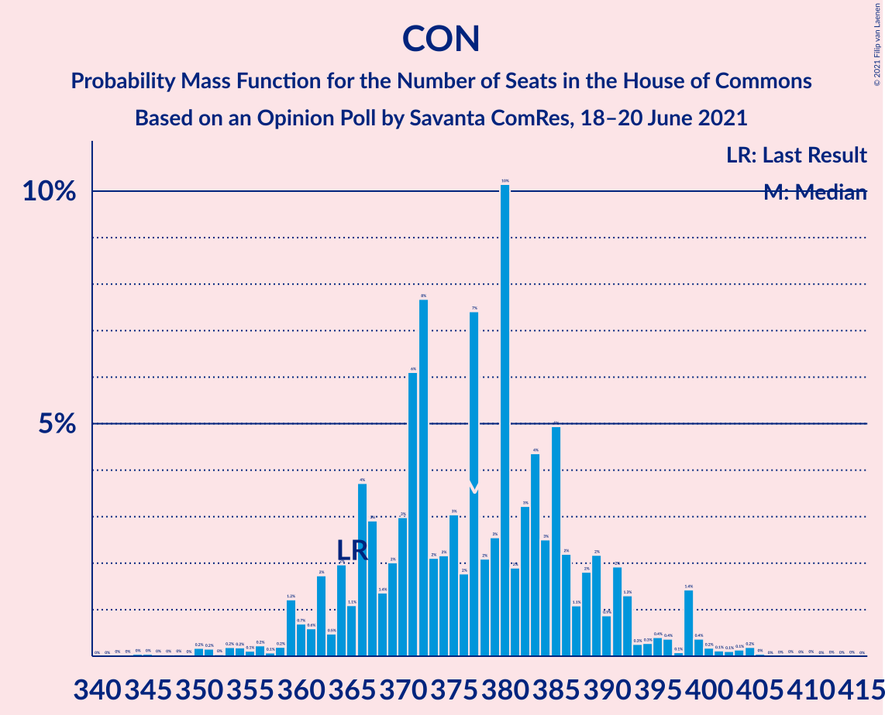

| Number of Seats | Probability | Accumulated | Special Marks |
|:---------------:|:-----------:|:-----------:|:-------------:|
| 342 | 0% | 100% |  |
| 343 | 0% | 99.9% |  |
| 344 | 0% | 99.9% |  |
| 345 | 0% | 99.9% |  |
| 346 | 0% | 99.8% |  |
| 347 | 0% | 99.8% |  |
| 348 | 0% | 99.7% |  |
| 349 | 0% | 99.7% |  |
| 350 | 0.2% | 99.7% |  |
| 351 | 0.2% | 99.5% |  |
| 352 | 0% | 99.3% |  |
| 353 | 0.2% | 99.3% |  |
| 354 | 0.2% | 99.1% |  |
| 355 | 0.1% | 98.9% |  |
| 356 | 0.2% | 98.8% |  |
| 357 | 0.1% | 98.6% |  |
| 358 | 0.2% | 98.5% |  |
| 359 | 1.2% | 98% |  |
| 360 | 0.7% | 97% |  |
| 361 | 0.6% | 96% |  |
| 362 | 2% | 96% |  |
| 363 | 0.5% | 94% |  |
| 364 | 2% | 94% |  |
| 365 | 1.1% | 92% | Last Result |
| 366 | 4% | 91% |  |
| 367 | 3% | 87% |  |
| 368 | 1.4% | 84% |  |
| 369 | 2% | 83% |  |
| 370 | 3% | 81% |  |
| 371 | 6% | 78% |  |
| 372 | 8% | 71% |  |
| 373 | 2% | 64% |  |
| 374 | 2% | 62% |  |
| 375 | 3% | 59% |  |
| 376 | 2% | 56% |  |
| 377 | 7% | 55% | Median |
| 378 | 2% | 47% |  |
| 379 | 3% | 45% |  |
| 380 | 10% | 43% |  |
| 381 | 2% | 32% |  |
| 382 | 3% | 31% |  |
| 383 | 4% | 27% |  |
| 384 | 3% | 23% |  |
| 385 | 5% | 20% |  |
| 386 | 2% | 16% |  |
| 387 | 1.1% | 13% |  |
| 388 | 2% | 12% |  |
| 389 | 2% | 10% |  |
| 390 | 0.9% | 8% |  |
| 391 | 2% | 7% |  |
| 392 | 1.3% | 5% |  |
| 393 | 0.3% | 4% |  |
| 394 | 0.3% | 4% |  |
| 395 | 0.4% | 4% |  |
| 396 | 0.4% | 3% |  |
| 397 | 0.1% | 3% |  |
| 398 | 1.4% | 3% |  |
| 399 | 0.4% | 1.3% |  |
| 400 | 0.2% | 0.9% |  |
| 401 | 0.1% | 0.7% |  |
| 402 | 0.1% | 0.6% |  |
| 403 | 0.1% | 0.5% |  |
| 404 | 0.2% | 0.4% |  |
| 405 | 0% | 0.2% |  |
| 406 | 0% | 0.1% |  |
| 407 | 0% | 0.1% |  |
| 408 | 0% | 0.1% |  |
| 409 | 0% | 0.1% |  |
| 410 | 0% | 0.1% |  |
| 411 | 0% | 0.1% |  |
| 412 | 0% | 0.1% |  |
| 413 | 0% | 0% |  |

### Labour Party – Liberal Democrats – Scottish National Party – Green Party – Plaid Cymru

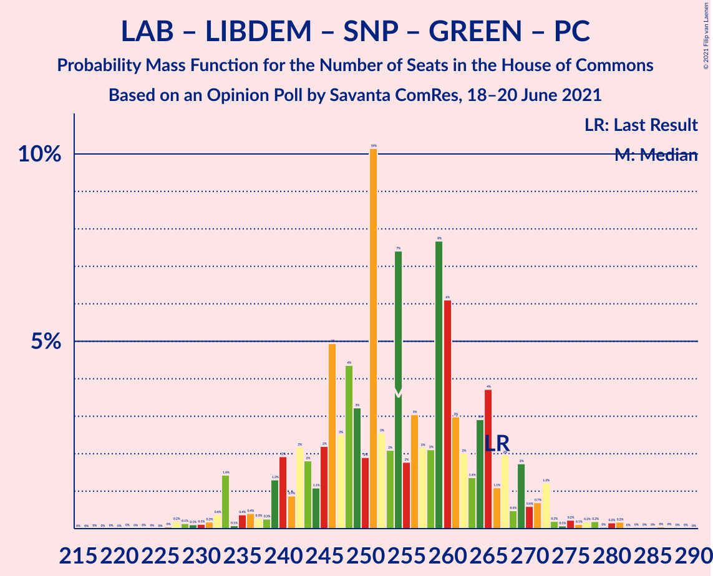

| Number of Seats | Probability | Accumulated | Special Marks |
|:---------------:|:-----------:|:-----------:|:-------------:|
| 219 | 0% | 100% |  |
| 220 | 0% | 99.9% |  |
| 221 | 0% | 99.9% |  |
| 222 | 0% | 99.9% |  |
| 223 | 0% | 99.9% |  |
| 224 | 0% | 99.9% |  |
| 225 | 0% | 99.9% |  |
| 226 | 0% | 99.9% |  |
| 227 | 0.2% | 99.8% |  |
| 228 | 0.1% | 99.6% |  |
| 229 | 0.1% | 99.5% |  |
| 230 | 0.1% | 99.4% |  |
| 231 | 0.2% | 99.3% |  |
| 232 | 0.4% | 99.1% |  |
| 233 | 1.4% | 98.7% |  |
| 234 | 0.1% | 97% |  |
| 235 | 0.4% | 97% |  |
| 236 | 0.4% | 97% |  |
| 237 | 0.3% | 96% |  |
| 238 | 0.3% | 96% |  |
| 239 | 1.3% | 96% |  |
| 240 | 2% | 95% |  |
| 241 | 0.9% | 93% |  |
| 242 | 2% | 92% |  |
| 243 | 2% | 90% |  |
| 244 | 1.1% | 88% |  |
| 245 | 2% | 87% |  |
| 246 | 5% | 84% |  |
| 247 | 3% | 80% |  |
| 248 | 4% | 77% |  |
| 249 | 3% | 73% |  |
| 250 | 2% | 69% |  |
| 251 | 10% | 68% |  |
| 252 | 3% | 57% |  |
| 253 | 2% | 55% |  |
| 254 | 7% | 53% |  |
| 255 | 2% | 45% | Median |
| 256 | 3% | 44% |  |
| 257 | 2% | 41% |  |
| 258 | 2% | 38% |  |
| 259 | 8% | 36% |  |
| 260 | 6% | 29% |  |
| 261 | 3% | 22% |  |
| 262 | 2% | 19% |  |
| 263 | 1.4% | 17% |  |
| 264 | 3% | 16% |  |
| 265 | 4% | 13% |  |
| 266 | 1.1% | 9% | Last Result |
| 267 | 2% | 8% |  |
| 268 | 0.5% | 6% |  |
| 269 | 2% | 6% |  |
| 270 | 0.6% | 4% |  |
| 271 | 0.7% | 4% |  |
| 272 | 1.2% | 3% |  |
| 273 | 0.2% | 2% |  |
| 274 | 0.1% | 1.5% |  |
| 275 | 0.2% | 1.4% |  |
| 276 | 0.1% | 1.2% |  |
| 277 | 0.2% | 1.1% |  |
| 278 | 0.2% | 0.9% |  |
| 279 | 0% | 0.7% |  |
| 280 | 0.2% | 0.7% |  |
| 281 | 0.2% | 0.5% |  |
| 282 | 0% | 0.3% |  |
| 283 | 0% | 0.3% |  |
| 284 | 0% | 0.3% |  |
| 285 | 0% | 0.2% |  |
| 286 | 0% | 0.2% |  |
| 287 | 0% | 0.1% |  |
| 288 | 0% | 0.1% |  |
| 289 | 0% | 0.1% |  |
| 290 | 0% | 0% |  |

### Labour Party – Liberal Democrats – Scottish National Party – Plaid Cymru

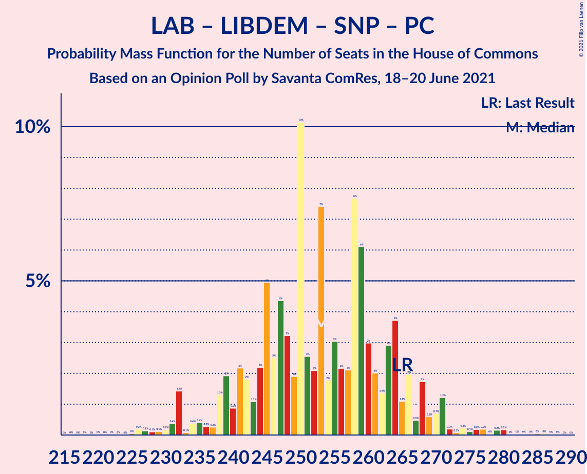

| Number of Seats | Probability | Accumulated | Special Marks |
|:---------------:|:-----------:|:-----------:|:-------------:|
| 218 | 0% | 100% |  |
| 219 | 0% | 99.9% |  |
| 220 | 0% | 99.9% |  |
| 221 | 0% | 99.9% |  |
| 222 | 0% | 99.9% |  |
| 223 | 0% | 99.9% |  |
| 224 | 0% | 99.9% |  |
| 225 | 0% | 99.9% |  |
| 226 | 0.2% | 99.8% |  |
| 227 | 0.1% | 99.6% |  |
| 228 | 0.1% | 99.5% |  |
| 229 | 0.1% | 99.4% |  |
| 230 | 0.2% | 99.3% |  |
| 231 | 0.4% | 99.1% |  |
| 232 | 1.4% | 98.7% |  |
| 233 | 0.1% | 97% |  |
| 234 | 0.4% | 97% |  |
| 235 | 0.4% | 97% |  |
| 236 | 0.3% | 96% |  |
| 237 | 0.3% | 96% |  |
| 238 | 1.3% | 96% |  |
| 239 | 2% | 95% |  |
| 240 | 0.9% | 93% |  |
| 241 | 2% | 92% |  |
| 242 | 2% | 90% |  |
| 243 | 1.1% | 88% |  |
| 244 | 2% | 87% |  |
| 245 | 5% | 84% |  |
| 246 | 3% | 80% |  |
| 247 | 4% | 77% |  |
| 248 | 3% | 73% |  |
| 249 | 2% | 69% |  |
| 250 | 10% | 68% |  |
| 251 | 3% | 57% |  |
| 252 | 2% | 55% |  |
| 253 | 7% | 53% |  |
| 254 | 2% | 45% | Median |
| 255 | 3% | 44% |  |
| 256 | 2% | 41% |  |
| 257 | 2% | 38% |  |
| 258 | 8% | 36% |  |
| 259 | 6% | 29% |  |
| 260 | 3% | 22% |  |
| 261 | 2% | 19% |  |
| 262 | 1.4% | 17% |  |
| 263 | 3% | 16% |  |
| 264 | 4% | 13% |  |
| 265 | 1.1% | 9% | Last Result |
| 266 | 2% | 8% |  |
| 267 | 0.5% | 6% |  |
| 268 | 2% | 6% |  |
| 269 | 0.6% | 4% |  |
| 270 | 0.7% | 4% |  |
| 271 | 1.2% | 3% |  |
| 272 | 0.2% | 2% |  |
| 273 | 0.1% | 1.5% |  |
| 274 | 0.2% | 1.4% |  |
| 275 | 0.1% | 1.2% |  |
| 276 | 0.2% | 1.1% |  |
| 277 | 0.2% | 0.9% |  |
| 278 | 0% | 0.7% |  |
| 279 | 0.2% | 0.7% |  |
| 280 | 0.2% | 0.5% |  |
| 281 | 0% | 0.3% |  |
| 282 | 0% | 0.3% |  |
| 283 | 0% | 0.3% |  |
| 284 | 0% | 0.2% |  |
| 285 | 0% | 0.2% |  |
| 286 | 0% | 0.1% |  |
| 287 | 0% | 0.1% |  |
| 288 | 0% | 0.1% |  |
| 289 | 0% | 0% |  |

### Labour Party – Liberal Democrats – Scottish National Party

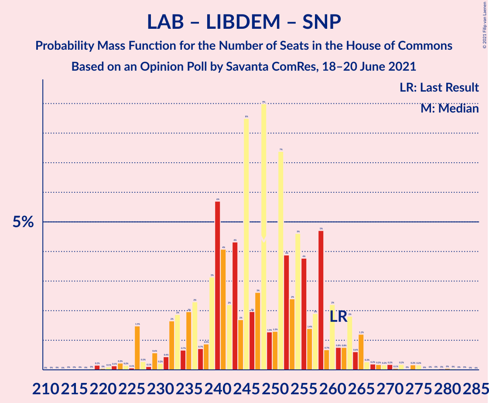

| Number of Seats | Probability | Accumulated | Special Marks |
|:---------------:|:-----------:|:-----------:|:-------------:|
| 213 | 0% | 100% |  |
| 214 | 0% | 99.9% |  |
| 215 | 0% | 99.9% |  |
| 216 | 0% | 99.9% |  |
| 217 | 0% | 99.9% |  |
| 218 | 0% | 99.9% |  |
| 219 | 0.2% | 99.8% |  |
| 220 | 0% | 99.7% |  |
| 221 | 0.1% | 99.6% |  |
| 222 | 0.1% | 99.5% |  |
| 223 | 0.2% | 99.4% |  |
| 224 | 0.2% | 99.2% |  |
| 225 | 0.1% | 99.0% |  |
| 226 | 1.5% | 98.9% |  |
| 227 | 0.3% | 97% |  |
| 228 | 0.1% | 97% |  |
| 229 | 0.6% | 97% |  |
| 230 | 0.2% | 96% |  |
| 231 | 0.4% | 96% |  |
| 232 | 2% | 96% |  |
| 233 | 2% | 94% |  |
| 234 | 0.7% | 92% |  |
| 235 | 2% | 92% |  |
| 236 | 2% | 90% |  |
| 237 | 0.7% | 87% |  |
| 238 | 0.9% | 87% |  |
| 239 | 3% | 86% |  |
| 240 | 6% | 83% |  |
| 241 | 4% | 77% |  |
| 242 | 2% | 73% |  |
| 243 | 4% | 71% |  |
| 244 | 2% | 66% |  |
| 245 | 8% | 65% |  |
| 246 | 2% | 56% |  |
| 247 | 3% | 54% |  |
| 248 | 9% | 52% |  |
| 249 | 1.3% | 43% | Median |
| 250 | 1.3% | 41% |  |
| 251 | 7% | 40% |  |
| 252 | 4% | 33% |  |
| 253 | 2% | 29% |  |
| 254 | 5% | 26% |  |
| 255 | 4% | 22% |  |
| 256 | 1.4% | 18% |  |
| 257 | 2% | 17% |  |
| 258 | 5% | 15% |  |
| 259 | 0.7% | 10% |  |
| 260 | 2% | 9% |  |
| 261 | 0.8% | 7% | Last Result |
| 262 | 0.8% | 6% |  |
| 263 | 2% | 6% |  |
| 264 | 0.6% | 4% |  |
| 265 | 1.2% | 3% |  |
| 266 | 0.3% | 2% |  |
| 267 | 0.2% | 2% |  |
| 268 | 0.2% | 1.4% |  |
| 269 | 0.2% | 1.2% |  |
| 270 | 0.2% | 1.1% |  |
| 271 | 0.1% | 0.9% |  |
| 272 | 0.2% | 0.8% |  |
| 273 | 0% | 0.7% |  |
| 274 | 0.2% | 0.6% |  |
| 275 | 0.2% | 0.5% |  |
| 276 | 0% | 0.3% |  |
| 277 | 0% | 0.3% |  |
| 278 | 0% | 0.3% |  |
| 279 | 0% | 0.2% |  |
| 280 | 0% | 0.2% |  |
| 281 | 0% | 0.1% |  |
| 282 | 0% | 0.1% |  |
| 283 | 0% | 0.1% |  |
| 284 | 0% | 0% |  |

### Labour Party – Scottish National Party – Plaid Cymru

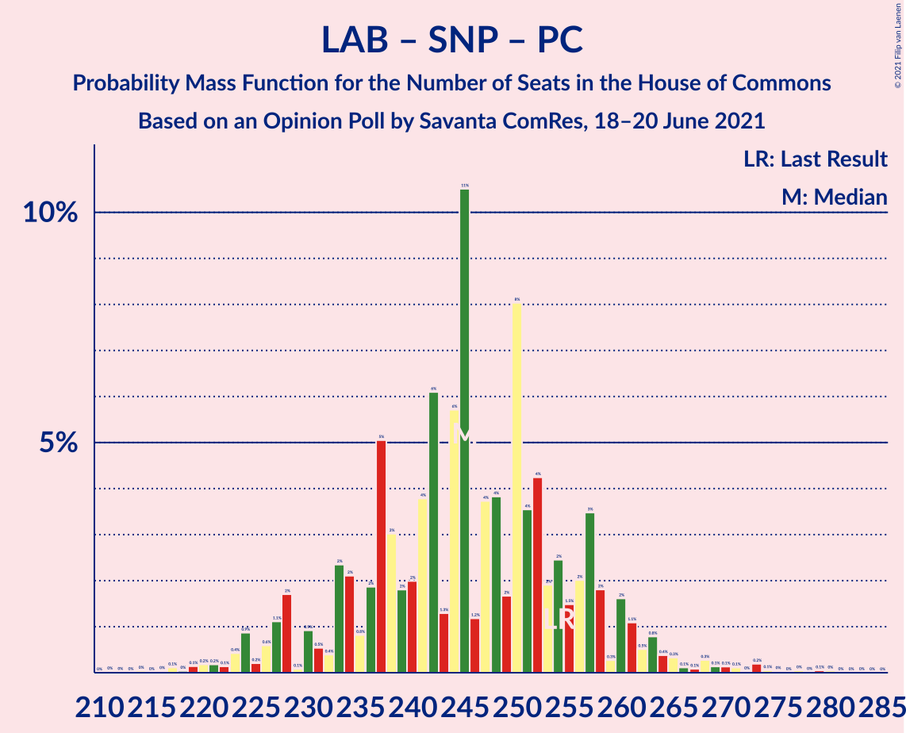

| Number of Seats | Probability | Accumulated | Special Marks |
|:---------------:|:-----------:|:-----------:|:-------------:|
| 211 | 0% | 100% |  |
| 212 | 0% | 99.9% |  |
| 213 | 0% | 99.9% |  |
| 214 | 0% | 99.9% |  |
| 215 | 0% | 99.9% |  |
| 216 | 0% | 99.9% |  |
| 217 | 0.1% | 99.8% |  |
| 218 | 0% | 99.7% |  |
| 219 | 0.1% | 99.7% |  |
| 220 | 0.2% | 99.5% |  |
| 221 | 0.2% | 99.3% |  |
| 222 | 0.1% | 99.2% |  |
| 223 | 0.4% | 99.0% |  |
| 224 | 0.9% | 98.6% |  |
| 225 | 0.2% | 98% |  |
| 226 | 0.6% | 98% |  |
| 227 | 1.1% | 97% |  |
| 228 | 2% | 96% |  |
| 229 | 0.1% | 94% |  |
| 230 | 0.9% | 94% |  |
| 231 | 0.5% | 93% |  |
| 232 | 0.4% | 93% |  |
| 233 | 2% | 92% |  |
| 234 | 2% | 90% |  |
| 235 | 0.8% | 88% |  |
| 236 | 2% | 87% |  |
| 237 | 5% | 85% |  |
| 238 | 3% | 80% |  |
| 239 | 2% | 77% |  |
| 240 | 2% | 75% |  |
| 241 | 4% | 73% |  |
| 242 | 6% | 69% |  |
| 243 | 1.3% | 63% |  |
| 244 | 6% | 62% |  |
| 245 | 11% | 56% |  |
| 246 | 1.2% | 46% | Median |
| 247 | 4% | 45% |  |
| 248 | 4% | 41% |  |
| 249 | 2% | 37% |  |
| 250 | 8% | 35% |  |
| 251 | 4% | 27% |  |
| 252 | 4% | 24% |  |
| 253 | 2% | 20% |  |
| 254 | 2% | 18% | Last Result |
| 255 | 1.5% | 15% |  |
| 256 | 2% | 14% |  |
| 257 | 3% | 12% |  |
| 258 | 2% | 8% |  |
| 259 | 0.3% | 6% |  |
| 260 | 2% | 6% |  |
| 261 | 1.1% | 4% |  |
| 262 | 0.5% | 3% |  |
| 263 | 0.8% | 3% |  |
| 264 | 0.4% | 2% |  |
| 265 | 0.3% | 2% |  |
| 266 | 0.1% | 1.4% |  |
| 267 | 0.1% | 1.3% |  |
| 268 | 0.3% | 1.2% |  |
| 269 | 0.1% | 0.9% |  |
| 270 | 0.1% | 0.8% |  |
| 271 | 0.1% | 0.6% |  |
| 272 | 0% | 0.5% |  |
| 273 | 0.2% | 0.5% |  |
| 274 | 0.1% | 0.3% |  |
| 275 | 0% | 0.2% |  |
| 276 | 0% | 0.2% |  |
| 277 | 0% | 0.2% |  |
| 278 | 0% | 0.2% |  |
| 279 | 0.1% | 0.1% |  |
| 280 | 0% | 0.1% |  |
| 281 | 0% | 0% |  |

### Labour Party – Scottish National Party

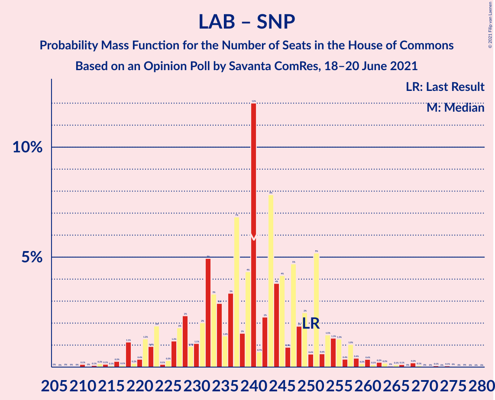

| Number of Seats | Probability | Accumulated | Special Marks |
|:---------------:|:-----------:|:-----------:|:-------------:|
| 205 | 0% | 100% |  |
| 206 | 0% | 99.9% |  |
| 207 | 0% | 99.9% |  |
| 208 | 0% | 99.9% |  |
| 209 | 0% | 99.9% |  |
| 210 | 0.1% | 99.9% |  |
| 211 | 0% | 99.7% |  |
| 212 | 0.1% | 99.7% |  |
| 213 | 0.2% | 99.6% |  |
| 214 | 0.1% | 99.5% |  |
| 215 | 0.1% | 99.3% |  |
| 216 | 0.3% | 99.3% |  |
| 217 | 0.1% | 99.0% |  |
| 218 | 1.1% | 98.9% |  |
| 219 | 0.2% | 98% |  |
| 220 | 0.4% | 98% |  |
| 221 | 1.3% | 97% |  |
| 222 | 0.9% | 96% |  |
| 223 | 2% | 95% |  |
| 224 | 0.1% | 93% |  |
| 225 | 0.3% | 93% |  |
| 226 | 1.2% | 93% |  |
| 227 | 2% | 92% |  |
| 228 | 2% | 90% |  |
| 229 | 0.9% | 87% |  |
| 230 | 1.1% | 86% |  |
| 231 | 2% | 85% |  |
| 232 | 5% | 83% |  |
| 233 | 3% | 78% |  |
| 234 | 3% | 75% |  |
| 235 | 1.4% | 72% |  |
| 236 | 3% | 71% |  |
| 237 | 7% | 67% |  |
| 238 | 2% | 61% |  |
| 239 | 4% | 59% |  |
| 240 | 12% | 55% |  |
| 241 | 0.7% | 43% | Median |
| 242 | 2% | 42% |  |
| 243 | 8% | 40% |  |
| 244 | 4% | 32% |  |
| 245 | 4% | 28% |  |
| 246 | 0.9% | 24% |  |
| 247 | 5% | 23% |  |
| 248 | 2% | 18% |  |
| 249 | 2% | 17% |  |
| 250 | 0.6% | 14% | Last Result |
| 251 | 5% | 13% |  |
| 252 | 0.6% | 8% |  |
| 253 | 1.5% | 8% |  |
| 254 | 1.3% | 6% |  |
| 255 | 1.3% | 5% |  |
| 256 | 0.4% | 4% |  |
| 257 | 1.0% | 3% |  |
| 258 | 0.4% | 2% |  |
| 259 | 0.2% | 2% |  |
| 260 | 0.4% | 2% |  |
| 261 | 0.1% | 1.3% |  |
| 262 | 0.2% | 1.2% |  |
| 263 | 0.2% | 0.9% |  |
| 264 | 0% | 0.8% |  |
| 265 | 0.1% | 0.7% |  |
| 266 | 0.1% | 0.6% |  |
| 267 | 0% | 0.5% |  |
| 268 | 0.2% | 0.5% |  |
| 269 | 0.1% | 0.3% |  |
| 270 | 0% | 0.2% |  |
| 271 | 0% | 0.2% |  |
| 272 | 0.1% | 0.2% |  |
| 273 | 0% | 0.1% |  |
| 274 | 0.1% | 0.1% |  |
| 275 | 0% | 0.1% |  |
| 276 | 0% | 0% |  |

### Labour Party – Liberal Democrats – Plaid Cymru

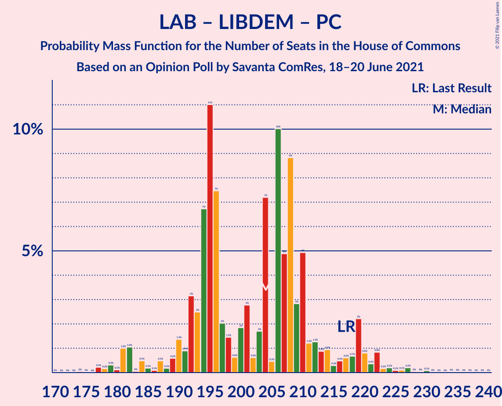

| Number of Seats | Probability | Accumulated | Special Marks |
|:---------------:|:-----------:|:-----------:|:-------------:|
| 170 | 0% | 100% |  |
| 171 | 0% | 99.9% |  |
| 172 | 0% | 99.9% |  |
| 173 | 0% | 99.9% |  |
| 174 | 0% | 99.9% |  |
| 175 | 0% | 99.9% |  |
| 176 | 0% | 99.9% |  |
| 177 | 0.2% | 99.9% |  |
| 178 | 0.2% | 99.7% |  |
| 179 | 0.3% | 99.5% |  |
| 180 | 0.1% | 99.2% |  |
| 181 | 1.0% | 99.1% |  |
| 182 | 1.0% | 98% |  |
| 183 | 0% | 97% |  |
| 184 | 0.5% | 97% |  |
| 185 | 0.2% | 96% |  |
| 186 | 0.1% | 96% |  |
| 187 | 0.5% | 96% |  |
| 188 | 0.2% | 96% |  |
| 189 | 0.6% | 96% |  |
| 190 | 1.4% | 95% |  |
| 191 | 0.9% | 94% |  |
| 192 | 3% | 93% |  |
| 193 | 2% | 90% |  |
| 194 | 7% | 87% |  |
| 195 | 11% | 80% |  |
| 196 | 7% | 69% |  |
| 197 | 2% | 62% |  |
| 198 | 1.5% | 60% |  |
| 199 | 0.6% | 58% |  |
| 200 | 2% | 58% |  |
| 201 | 3% | 56% |  |
| 202 | 0.6% | 53% |  |
| 203 | 2% | 52% | Median |
| 204 | 7% | 51% |  |
| 205 | 0.5% | 44% |  |
| 206 | 10% | 43% |  |
| 207 | 5% | 33% |  |
| 208 | 9% | 28% |  |
| 209 | 3% | 19% |  |
| 210 | 5% | 17% |  |
| 211 | 1.2% | 12% |  |
| 212 | 1.3% | 10% |  |
| 213 | 0.9% | 9% |  |
| 214 | 0.9% | 8% |  |
| 215 | 0.3% | 7% |  |
| 216 | 0.5% | 7% |  |
| 217 | 0.6% | 7% | Last Result |
| 218 | 0.7% | 6% |  |
| 219 | 2% | 5% |  |
| 220 | 0.8% | 3% |  |
| 221 | 0.4% | 2% |  |
| 222 | 0.8% | 2% |  |
| 223 | 0.2% | 1.1% |  |
| 224 | 0.2% | 0.9% |  |
| 225 | 0.1% | 0.7% |  |
| 226 | 0.1% | 0.6% |  |
| 227 | 0.2% | 0.5% |  |
| 228 | 0% | 0.3% |  |
| 229 | 0% | 0.3% |  |
| 230 | 0.1% | 0.2% |  |
| 231 | 0% | 0.2% |  |
| 232 | 0% | 0.1% |  |
| 233 | 0% | 0.1% |  |
| 234 | 0% | 0.1% |  |
| 235 | 0% | 0.1% |  |
| 236 | 0% | 0.1% |  |
| 237 | 0% | 0.1% |  |
| 238 | 0% | 0% |  |

### Labour Party – Liberal Democrats

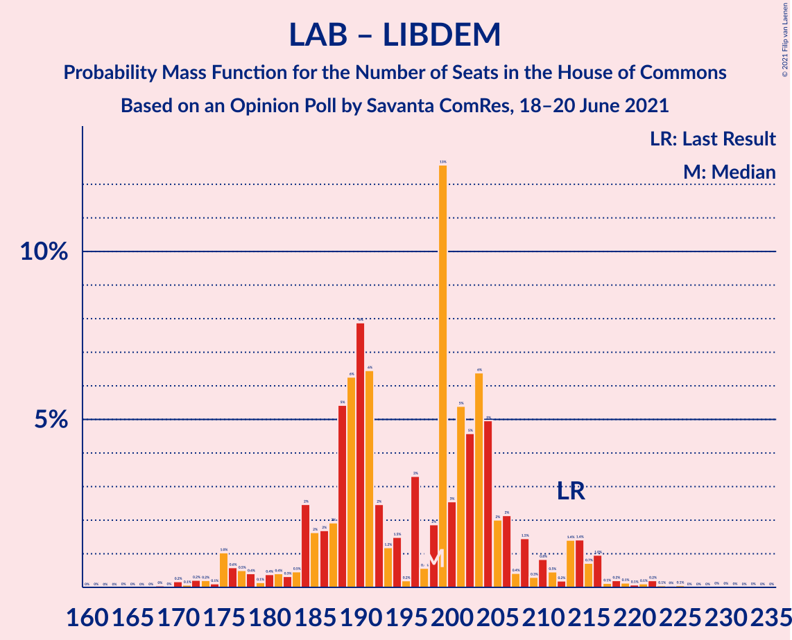

| Number of Seats | Probability | Accumulated | Special Marks |
|:---------------:|:-----------:|:-----------:|:-------------:|
| 164 | 0% | 100% |  |
| 165 | 0% | 99.9% |  |
| 166 | 0% | 99.9% |  |
| 167 | 0% | 99.9% |  |
| 168 | 0% | 99.9% |  |
| 169 | 0% | 99.9% |  |
| 170 | 0.2% | 99.9% |  |
| 171 | 0.1% | 99.7% |  |
| 172 | 0.2% | 99.6% |  |
| 173 | 0.2% | 99.4% |  |
| 174 | 0.1% | 99.2% |  |
| 175 | 1.0% | 99.1% |  |
| 176 | 0.6% | 98% |  |
| 177 | 0.5% | 97% |  |
| 178 | 0.4% | 97% |  |
| 179 | 0.1% | 97% |  |
| 180 | 0.4% | 96% |  |
| 181 | 0.4% | 96% |  |
| 182 | 0.3% | 96% |  |
| 183 | 0.5% | 95% |  |
| 184 | 2% | 95% |  |
| 185 | 2% | 92% |  |
| 186 | 2% | 91% |  |
| 187 | 2% | 89% |  |
| 188 | 5% | 87% |  |
| 189 | 6% | 82% |  |
| 190 | 8% | 75% |  |
| 191 | 6% | 68% |  |
| 192 | 2% | 61% |  |
| 193 | 1.2% | 59% |  |
| 194 | 1.5% | 57% |  |
| 195 | 0.2% | 56% |  |
| 196 | 3% | 56% |  |
| 197 | 0.6% | 52% |  |
| 198 | 2% | 52% | Median |
| 199 | 13% | 50% |  |
| 200 | 3% | 37% |  |
| 201 | 5% | 35% |  |
| 202 | 5% | 29% |  |
| 203 | 6% | 25% |  |
| 204 | 5% | 18% |  |
| 205 | 2% | 13% |  |
| 206 | 2% | 11% |  |
| 207 | 0.4% | 9% |  |
| 208 | 1.5% | 9% |  |
| 209 | 0.3% | 7% |  |
| 210 | 0.8% | 7% |  |
| 211 | 0.5% | 6% |  |
| 212 | 0.2% | 6% |  |
| 213 | 1.4% | 6% | Last Result |
| 214 | 1.4% | 4% |  |
| 215 | 0.7% | 3% |  |
| 216 | 1.0% | 2% |  |
| 217 | 0.1% | 1.2% |  |
| 218 | 0.2% | 1.0% |  |
| 219 | 0.1% | 0.8% |  |
| 220 | 0.1% | 0.7% |  |
| 221 | 0.1% | 0.6% |  |
| 222 | 0.2% | 0.5% |  |
| 223 | 0.1% | 0.3% |  |
| 224 | 0% | 0.2% |  |
| 225 | 0.1% | 0.2% |  |
| 226 | 0% | 0.1% |  |
| 227 | 0% | 0.1% |  |
| 228 | 0% | 0.1% |  |
| 229 | 0% | 0.1% |  |
| 230 | 0% | 0.1% |  |
| 231 | 0% | 0.1% |  |
| 232 | 0% | 0% |  |

### Labour Party – Plaid Cymru

| Number of Seats | Probability | Accumulated | Special Marks |
|:---------------:|:-----------:|:-----------:|:-------------:|
| 163 | 0% | 100% |  |
| 164 | 0% | 99.9% |  |
| 165 | 0% | 99.9% |  |
| 166 | 0% | 99.9% |  |
| 167 | 0% | 99.9% |  |
| 168 | 0.1% | 99.9% |  |
| 169 | 0.1% | 99.8% |  |
| 170 | 0.2% | 99.7% |  |
| 171 | 0.1% | 99.6% |  |
| 172 | 0.1% | 99.5% |  |
| 173 | 0.2% | 99.4% |  |
| 174 | 1.2% | 99.2% |  |
| 175 | 0.4% | 98% |  |
| 176 | 0.8% | 98% |  |
| 177 | 0% | 97% |  |
| 178 | 0.1% | 97% |  |
| 179 | 0.5% | 97% |  |
| 180 | 0.3% | 96% |  |
| 181 | 1.0% | 96% |  |
| 182 | 1.1% | 95% |  |
| 183 | 3% | 94% |  |
| 184 | 1.1% | 91% |  |
| 185 | 2% | 89% |  |
| 186 | 2% | 87% |  |
| 187 | 5% | 85% |  |
| 188 | 7% | 80% |  |
| 189 | 9% | 73% |  |
| 190 | 6% | 63% |  |
| 191 | 0.3% | 58% |  |
| 192 | 2% | 57% |  |
| 193 | 3% | 55% |  |
| 194 | 0.4% | 52% |  |
| 195 | 0.7% | 52% | Median |
| 196 | 8% | 51% |  |
| 197 | 2% | 44% |  |
| 198 | 12% | 42% |  |
| 199 | 0.3% | 30% |  |
| 200 | 9% | 29% |  |
| 201 | 5% | 21% |  |
| 202 | 1.5% | 16% |  |
| 203 | 5% | 14% |  |
| 204 | 0.7% | 10% |  |
| 205 | 0.5% | 9% |  |
| 206 | 2% | 9% | Last Result |
| 207 | 1.1% | 7% |  |
| 208 | 0.4% | 6% |  |
| 209 | 2% | 6% |  |
| 210 | 1.0% | 4% |  |
| 211 | 0.7% | 3% |  |
| 212 | 0.6% | 2% |  |
| 213 | 0.2% | 2% |  |
| 214 | 0.5% | 1.4% |  |
| 215 | 0.1% | 0.9% |  |
| 216 | 0.1% | 0.8% |  |
| 217 | 0.1% | 0.7% |  |
| 218 | 0.1% | 0.6% |  |
| 219 | 0% | 0.5% |  |
| 220 | 0.2% | 0.5% |  |
| 221 | 0.1% | 0.3% |  |
| 222 | 0.1% | 0.2% |  |
| 223 | 0% | 0.1% |  |
| 224 | 0% | 0.1% |  |
| 225 | 0% | 0.1% |  |
| 226 | 0% | 0.1% |  |
| 227 | 0% | 0.1% |  |
| 228 | 0% | 0.1% |  |
| 229 | 0% | 0% |  |

### Labour Party

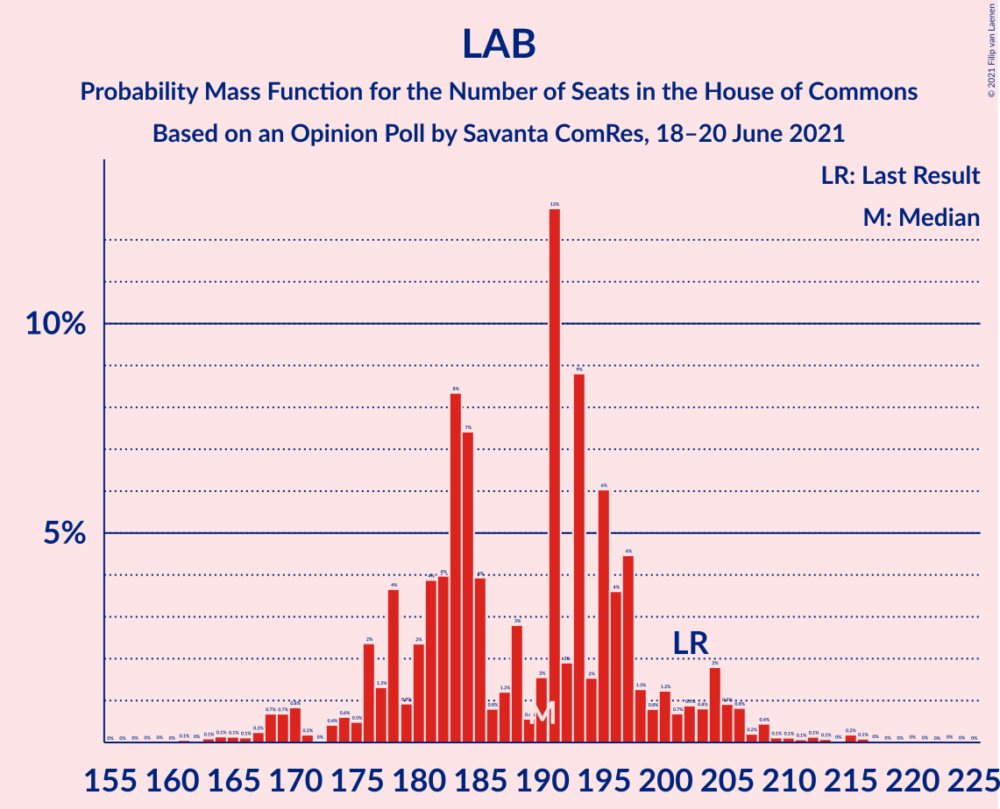

| Number of Seats | Probability | Accumulated | Special Marks |
|:---------------:|:-----------:|:-----------:|:-------------:|
| 157 | 0% | 100% |  |
| 158 | 0% | 99.9% |  |
| 159 | 0% | 99.9% |  |
| 160 | 0% | 99.9% |  |
| 161 | 0.1% | 99.9% |  |
| 162 | 0% | 99.8% |  |
| 163 | 0.1% | 99.8% |  |
| 164 | 0.1% | 99.7% |  |
| 165 | 0.1% | 99.6% |  |
| 166 | 0.1% | 99.4% |  |
| 167 | 0.2% | 99.3% |  |
| 168 | 0.7% | 99.1% |  |
| 169 | 0.7% | 98% |  |
| 170 | 0.8% | 98% |  |
| 171 | 0.2% | 97% |  |
| 172 | 0% | 97% |  |
| 173 | 0.4% | 97% |  |
| 174 | 0.6% | 96% |  |
| 175 | 0.5% | 96% |  |
| 176 | 2% | 95% |  |
| 177 | 1.3% | 93% |  |
| 178 | 4% | 91% |  |
| 179 | 0.9% | 88% |  |
| 180 | 2% | 87% |  |
| 181 | 4% | 84% |  |
| 182 | 4% | 81% |  |
| 183 | 8% | 77% |  |
| 184 | 7% | 68% |  |
| 185 | 4% | 61% |  |
| 186 | 0.8% | 57% |  |
| 187 | 1.2% | 56% |  |
| 188 | 3% | 55% |  |
| 189 | 0.6% | 52% |  |
| 190 | 2% | 52% | Median |
| 191 | 13% | 50% |  |
| 192 | 2% | 37% |  |
| 193 | 9% | 35% |  |
| 194 | 2% | 27% |  |
| 195 | 6% | 25% |  |
| 196 | 4% | 19% |  |
| 197 | 4% | 15% |  |
| 198 | 1.3% | 11% |  |
| 199 | 0.8% | 10% |  |
| 200 | 1.2% | 9% |  |
| 201 | 0.7% | 8% |  |
| 202 | 0.9% | 7% | Last Result |
| 203 | 0.8% | 6% |  |
| 204 | 2% | 5% |  |
| 205 | 0.9% | 3% |  |
| 206 | 0.8% | 2% |  |
| 207 | 0.2% | 2% |  |
| 208 | 0.4% | 1.4% |  |
| 209 | 0.1% | 1.0% |  |
| 210 | 0.1% | 0.9% |  |
| 211 | 0.1% | 0.8% |  |
| 212 | 0.1% | 0.7% |  |
| 213 | 0.1% | 0.6% |  |
| 214 | 0% | 0.5% |  |
| 215 | 0.2% | 0.4% |  |
| 216 | 0.1% | 0.3% |  |
| 217 | 0% | 0.2% |  |
| 218 | 0% | 0.1% |  |
| 219 | 0% | 0.1% |  |
| 220 | 0% | 0.1% |  |
| 221 | 0% | 0.1% |  |
| 222 | 0% | 0.1% |  |
| 223 | 0% | 0.1% |  |
| 224 | 0% | 0% |  |

## Technical Information

### Opinion Poll

+ **Polling firm:** Savanta ComRes
+ **Commissioner(s):** —
+ **Fieldwork period:** 18–20 June 2021

### Calculations

+ **Sample size:** 2155
+ **Simulations done:** 131,072
+ **Error estimate:** 1.36%

