# Opinion Poll by Redfield & Wilton Strategies, 21 June 2021

<a href="#voting-intentions">Voting Intentions</a> | <a href="#seats">Seats</a> | <a href="#coalitions">Coalitions</a> | <a href="#technical-information">Technical Information</a>

## Voting Intentions

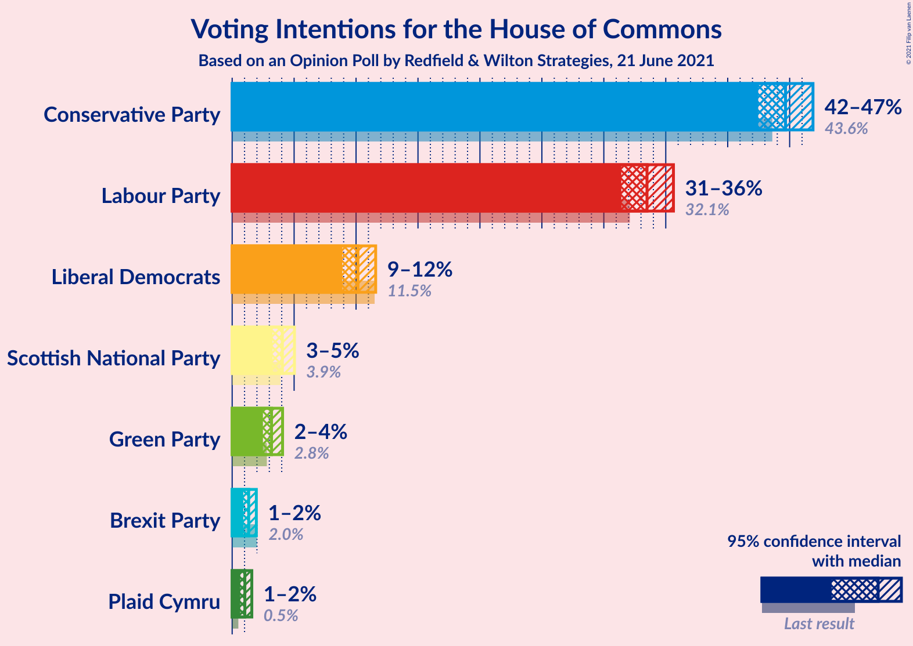

### Confidence Intervals

| Party | Last Result | Poll Result | 80% Confidence Interval | 90% Confidence Interval | 95% Confidence Interval | 99% Confidence Interval |
|:-----:|:-----------:|:-----------:|:-----------------------:|:-----------------------:|:-----------------------:|:-----------------------:|
| Conservative Party | 43.6% | 44.7% | 43.2–46.1% |42.8–46.5% |42.5–46.9% |41.8–47.6% |
| Labour Party | 32.1% | 33.5% | 32.1–34.9% |31.7–35.3% |31.4–35.6% |30.8–36.3% |
| Liberal Democrats | 11.5% | 10.2% | 9.3–11.1% |9.1–11.4% |8.9–11.6% |8.5–12.0% |
| Scottish National Party | 3.9% | 4.1% | 3.5–4.7% |3.4–4.9% |3.3–5.0% |3.0–5.3% |
| Green Party | 2.8% | 3.2% | 2.7–3.7% |2.6–3.9% |2.5–4.1% |2.3–4.4% |
| Brexit Party | 2.0% | 1.3% | 1.1–1.7% |1.0–1.9% |0.9–2.0% |0.8–2.2% |
| Plaid Cymru | 0.5% | 1.0% | 0.8–1.4% |0.7–1.5% |0.7–1.6% |0.6–1.8% |

*Note:* The poll result column reflects the actual value used in the calculations. Published results may vary slightly, and in addition be rounded to fewer digits.

## Seats

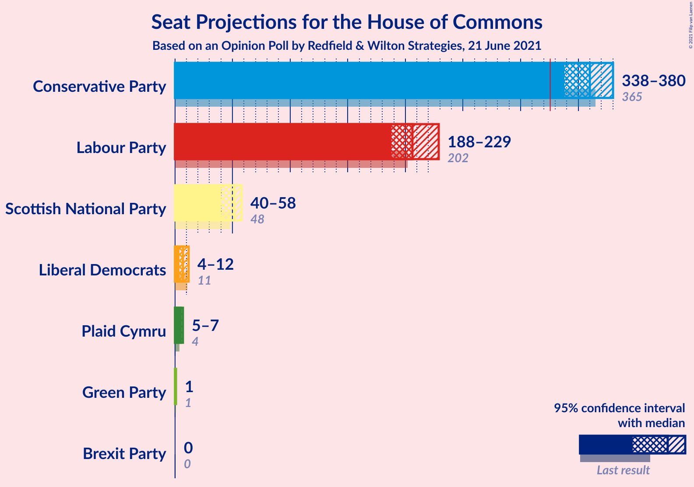

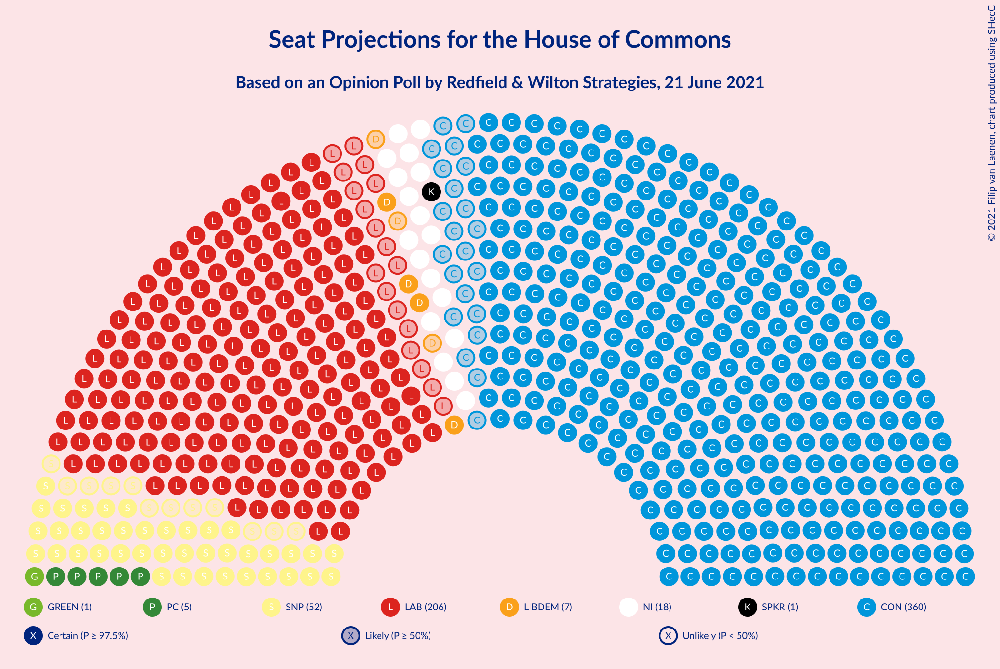

### Confidence Intervals

| Party | Last Result | Median | 80% Confidence Interval | 90% Confidence Interval | 95% Confidence Interval | 99% Confidence Interval |
|:-----:|:-----------:|:------:|:-----------------------:|:-----------------------:|:-----------------------:|:-----------------------:|
| <a href="#conservative-party">Conservative Party</a> | 365 | 360 | 347–372 |341–376 |338–380 |331–386 |
| <a href="#labour-party">Labour Party</a> | 202 | 206 | 194–219 |192–225 |188–229 |181–234 |
| <a href="#liberal-democrats">Liberal Democrats</a> | 11 | 7 | 6–10 |4–11 |4–12 |3–14 |
| <a href="#scottish-national-party">Scottish National Party</a> | 48 | 52 | 45–55 |42–56 |40–58 |33–58 |
| <a href="#green-party">Green Party</a> | 1 | 1 | 1 |1 |1 |1 |
| <a href="#brexit-party">Brexit Party</a> | 0 | 0 | 0 |0 |0 |0 |
| <a href="#plaid-cymru">Plaid Cymru</a> | 4 | 5 | 5–6 |5–7 |5–7 |4–9 |

### Conservative Party

*For a full overview of the results for this party, see the [Conservative Party](party-conservativeparty.html) page.*

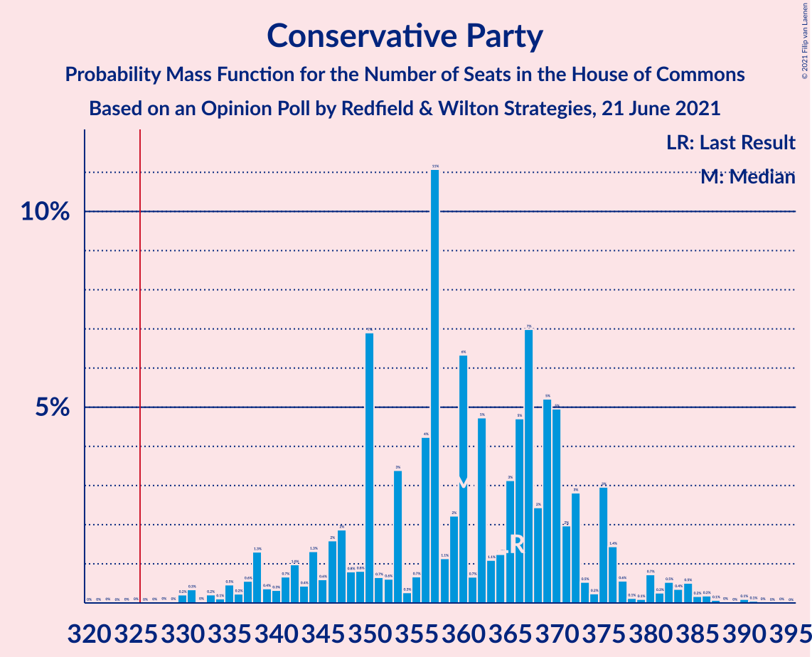

| Number of Seats | Probability | Accumulated | Special Marks |
|:---------------:|:-----------:|:-----------:|:-------------:|
| 320 | 0% | 100% |  |
| 321 | 0% | 99.9% |  |
| 322 | 0% | 99.9% |  |
| 323 | 0% | 99.9% |  |
| 324 | 0% | 99.9% |  |
| 325 | 0% | 99.9% |  |
| 326 | 0% | 99.9% | Majority |
| 327 | 0% | 99.9% |  |
| 328 | 0% | 99.8% |  |
| 329 | 0% | 99.8% |  |
| 330 | 0.2% | 99.8% |  |
| 331 | 0.3% | 99.6% |  |
| 332 | 0% | 99.2% |  |
| 333 | 0.2% | 99.2% |  |
| 334 | 0.1% | 99.0% |  |
| 335 | 0.5% | 98.9% |  |
| 336 | 0.2% | 98% |  |
| 337 | 0.6% | 98% |  |
| 338 | 1.3% | 98% |  |
| 339 | 0.4% | 96% |  |
| 340 | 0.3% | 96% |  |
| 341 | 0.7% | 96% |  |
| 342 | 1.0% | 95% |  |
| 343 | 0.4% | 94% |  |
| 344 | 1.3% | 94% |  |
| 345 | 0.6% | 92% |  |
| 346 | 2% | 92% |  |
| 347 | 2% | 90% |  |
| 348 | 0.8% | 88% |  |
| 349 | 0.8% | 87% |  |
| 350 | 7% | 87% |  |
| 351 | 0.7% | 80% |  |
| 352 | 0.6% | 79% |  |
| 353 | 3% | 78% |  |
| 354 | 0.3% | 75% |  |
| 355 | 0.7% | 75% |  |
| 356 | 4% | 74% |  |
| 357 | 11% | 70% |  |
| 358 | 1.1% | 59% |  |
| 359 | 2% | 58% |  |
| 360 | 6% | 55% | Median |
| 361 | 0.7% | 49% |  |
| 362 | 5% | 48% |  |
| 363 | 1.1% | 44% |  |
| 364 | 1.2% | 43% |  |
| 365 | 3% | 41% | Last Result |
| 366 | 5% | 38% |  |
| 367 | 7% | 33% |  |
| 368 | 2% | 26% |  |
| 369 | 5% | 24% |  |
| 370 | 5% | 19% |  |
| 371 | 2% | 14% |  |
| 372 | 3% | 12% |  |
| 373 | 0.5% | 9% |  |
| 374 | 0.2% | 9% |  |
| 375 | 3% | 8% |  |
| 376 | 1.4% | 5% |  |
| 377 | 0.6% | 4% |  |
| 378 | 0.1% | 3% |  |
| 379 | 0.1% | 3% |  |
| 380 | 0.7% | 3% |  |
| 381 | 0.3% | 2% |  |
| 382 | 0.5% | 2% |  |
| 383 | 0.4% | 2% |  |
| 384 | 0.5% | 1.2% |  |
| 385 | 0.2% | 0.7% |  |
| 386 | 0.2% | 0.5% |  |
| 387 | 0.1% | 0.4% |  |
| 388 | 0% | 0.3% |  |
| 389 | 0% | 0.3% |  |
| 390 | 0.1% | 0.2% |  |
| 391 | 0.1% | 0.1% |  |
| 392 | 0% | 0.1% |  |
| 393 | 0% | 0.1% |  |
| 394 | 0% | 0.1% |  |
| 395 | 0% | 0% |  |

### Labour Party

*For a full overview of the results for this party, see the [Labour Party](party-labourparty.html) page.*

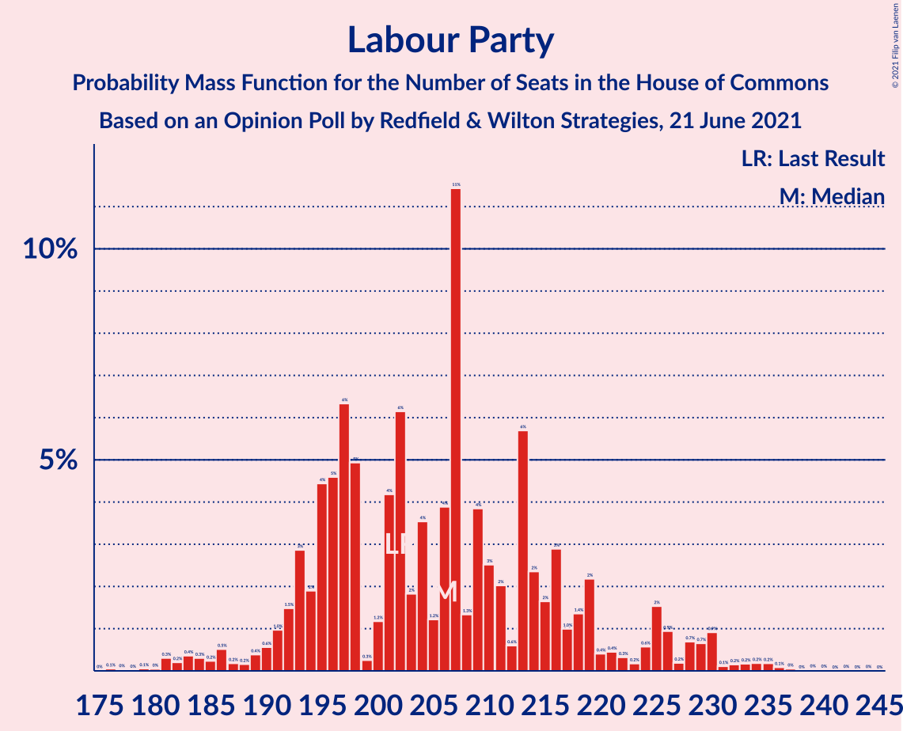

| Number of Seats | Probability | Accumulated | Special Marks |
|:---------------:|:-----------:|:-----------:|:-------------:|
| 176 | 0.1% | 100% |  |
| 177 | 0% | 99.9% |  |
| 178 | 0% | 99.9% |  |
| 179 | 0.1% | 99.9% |  |
| 180 | 0% | 99.8% |  |
| 181 | 0.3% | 99.8% |  |
| 182 | 0.2% | 99.5% |  |
| 183 | 0.4% | 99.2% |  |
| 184 | 0.3% | 98.9% |  |
| 185 | 0.2% | 98.6% |  |
| 186 | 0.5% | 98% |  |
| 187 | 0.2% | 98% |  |
| 188 | 0.2% | 98% |  |
| 189 | 0.4% | 97% |  |
| 190 | 0.6% | 97% |  |
| 191 | 1.0% | 97% |  |
| 192 | 1.5% | 96% |  |
| 193 | 3% | 94% |  |
| 194 | 2% | 91% |  |
| 195 | 4% | 89% |  |
| 196 | 5% | 85% |  |
| 197 | 6% | 80% |  |
| 198 | 5% | 74% |  |
| 199 | 0.3% | 69% |  |
| 200 | 1.2% | 69% |  |
| 201 | 4% | 68% |  |
| 202 | 6% | 63% | Last Result |
| 203 | 2% | 57% |  |
| 204 | 4% | 55% |  |
| 205 | 1.2% | 52% |  |
| 206 | 4% | 51% | Median |
| 207 | 11% | 47% |  |
| 208 | 1.3% | 35% |  |
| 209 | 4% | 34% |  |
| 210 | 3% | 30% |  |
| 211 | 2% | 28% |  |
| 212 | 0.6% | 26% |  |
| 213 | 6% | 25% |  |
| 214 | 2% | 19% |  |
| 215 | 2% | 17% |  |
| 216 | 3% | 15% |  |
| 217 | 1.0% | 12% |  |
| 218 | 1.4% | 11% |  |
| 219 | 2% | 10% |  |
| 220 | 0.4% | 8% |  |
| 221 | 0.4% | 8% |  |
| 222 | 0.3% | 7% |  |
| 223 | 0.2% | 7% |  |
| 224 | 0.6% | 7% |  |
| 225 | 2% | 6% |  |
| 226 | 0.9% | 4% |  |
| 227 | 0.2% | 4% |  |
| 228 | 0.7% | 3% |  |
| 229 | 0.7% | 3% |  |
| 230 | 0.9% | 2% |  |
| 231 | 0.1% | 1.1% |  |
| 232 | 0.2% | 1.0% |  |
| 233 | 0.2% | 0.8% |  |
| 234 | 0.2% | 0.6% |  |
| 235 | 0.2% | 0.4% |  |
| 236 | 0.1% | 0.3% |  |
| 237 | 0% | 0.2% |  |
| 238 | 0% | 0.1% |  |
| 239 | 0% | 0.1% |  |
| 240 | 0% | 0.1% |  |
| 241 | 0% | 0.1% |  |
| 242 | 0% | 0.1% |  |
| 243 | 0% | 0.1% |  |
| 244 | 0% | 0.1% |  |
| 245 | 0% | 0% |  |

### Liberal Democrats

*For a full overview of the results for this party, see the [Liberal Democrats](party-liberaldemocrats.html) page.*

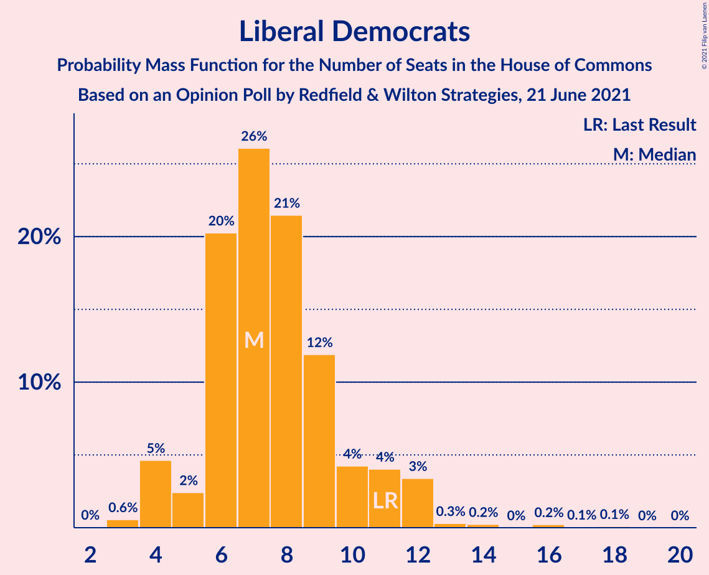

| Number of Seats | Probability | Accumulated | Special Marks |
|:---------------:|:-----------:|:-----------:|:-------------:|
| 3 | 0.6% | 100% |  |
| 4 | 5% | 99.4% |  |
| 5 | 2% | 95% |  |
| 6 | 20% | 92% |  |
| 7 | 26% | 72% | Median |
| 8 | 21% | 46% |  |
| 9 | 12% | 25% |  |
| 10 | 4% | 13% |  |
| 11 | 4% | 8% | Last Result |
| 12 | 3% | 4% |  |
| 13 | 0.3% | 0.9% |  |
| 14 | 0.2% | 0.6% |  |
| 15 | 0% | 0.4% |  |
| 16 | 0.2% | 0.4% |  |
| 17 | 0.1% | 0.2% |  |
| 18 | 0.1% | 0.1% |  |
| 19 | 0% | 0% |  |

### Scottish National Party

*For a full overview of the results for this party, see the [Scottish National Party](party-scottishnationalparty.html) page.*

| Number of Seats | Probability | Accumulated | Special Marks |
|:---------------:|:-----------:|:-----------:|:-------------:|
| 27 | 0% | 100% |  |
| 28 | 0% | 99.9% |  |
| 29 | 0% | 99.9% |  |
| 30 | 0% | 99.9% |  |
| 31 | 0% | 99.9% |  |
| 32 | 0.1% | 99.8% |  |
| 33 | 0.5% | 99.8% |  |
| 34 | 0.2% | 99.3% |  |
| 35 | 0% | 99.1% |  |
| 36 | 0.1% | 99.1% |  |
| 37 | 0.9% | 99.0% |  |
| 38 | 0.4% | 98% |  |
| 39 | 0.1% | 98% |  |
| 40 | 0.6% | 98% |  |
| 41 | 0.4% | 97% |  |
| 42 | 2% | 97% |  |
| 43 | 0.2% | 95% |  |
| 44 | 0.8% | 95% |  |
| 45 | 4% | 94% |  |
| 46 | 2% | 90% |  |
| 47 | 6% | 88% |  |
| 48 | 5% | 82% | Last Result |
| 49 | 5% | 77% |  |
| 50 | 7% | 72% |  |
| 51 | 12% | 64% |  |
| 52 | 7% | 52% | Median |
| 53 | 7% | 44% |  |
| 54 | 15% | 38% |  |
| 55 | 15% | 23% |  |
| 56 | 3% | 7% |  |
| 57 | 2% | 4% |  |
| 58 | 3% | 3% |  |
| 59 | 0% | 0% |  |

### Green Party

*For a full overview of the results for this party, see the [Green Party](party-greenparty.html) page.*

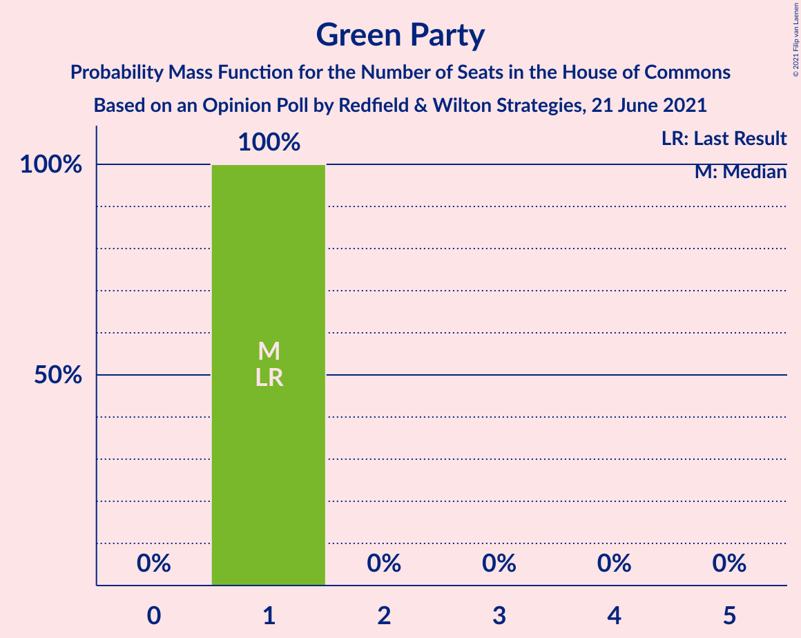

| Number of Seats | Probability | Accumulated | Special Marks |
|:---------------:|:-----------:|:-----------:|:-------------:|
| 1 | 100% | 100% | Last Result, Median |

### Brexit Party

*For a full overview of the results for this party, see the [Brexit Party](party-brexitparty.html) page.*

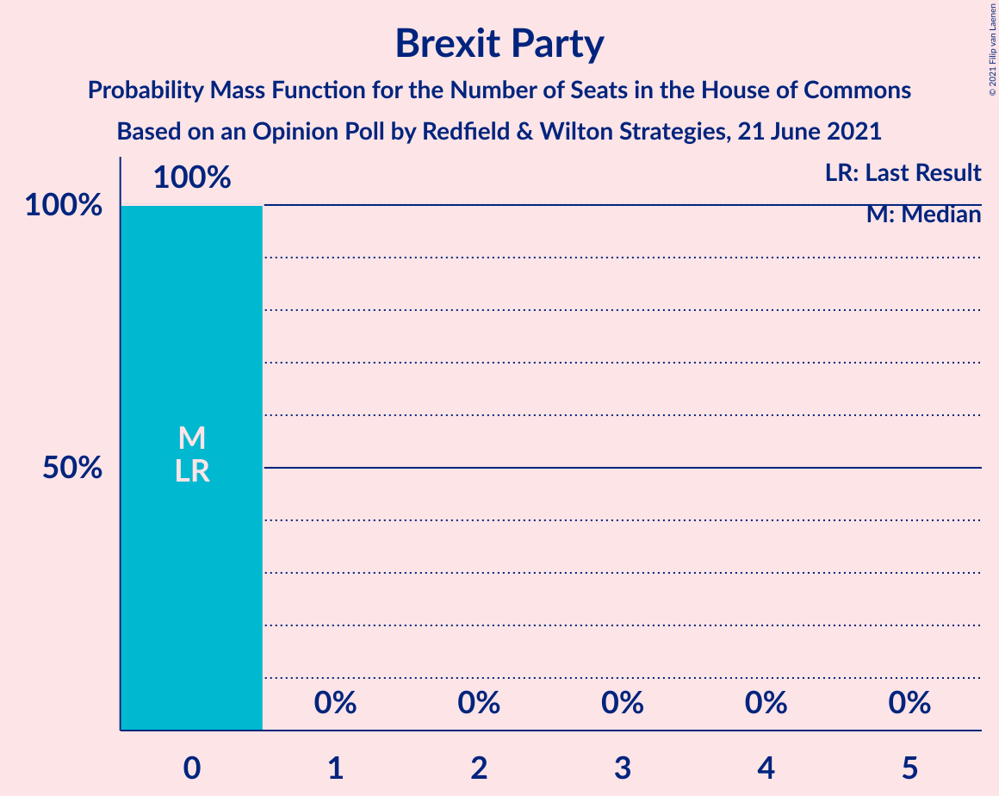

| Number of Seats | Probability | Accumulated | Special Marks |
|:---------------:|:-----------:|:-----------:|:-------------:|
| 0 | 100% | 100% | Last Result, Median |

### Plaid Cymru

*For a full overview of the results for this party, see the [Plaid Cymru](party-plaidcymru.html) page.*

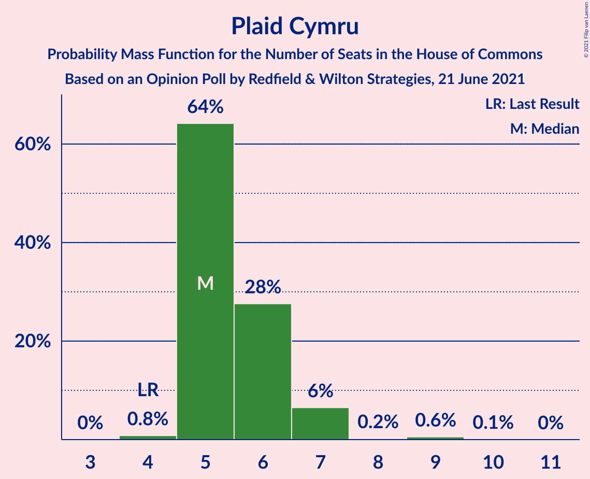

| Number of Seats | Probability | Accumulated | Special Marks |
|:---------------:|:-----------:|:-----------:|:-------------:|
| 4 | 0.8% | 100% | Last Result |
| 5 | 64% | 99.2% | Median |
| 6 | 28% | 35% |  |
| 7 | 6% | 7% |  |
| 8 | 0.2% | 0.9% |  |
| 9 | 0.6% | 0.7% |  |
| 10 | 0.1% | 0.1% |  |
| 11 | 0% | 0% |  |

## Coalitions

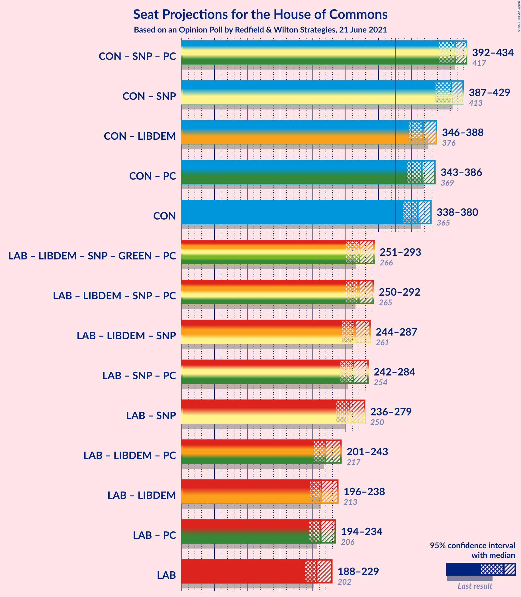

### Confidence Intervals

| Coalition | Last Result | Median | Majority? | 80% Confidence Interval | 90% Confidence Interval | 95% Confidence Interval | 99% Confidence Interval |
|:---------:|:-----------:|:------:|:---------:|:-----------------------:|:-----------------------:|:-----------------------:|:-----------------------:|
| Conservative Party – Scottish National Party – Plaid Cymru | 417 | 417 | 100% | 404–428 | 396–431 | 392–434 | 387–443 |
| Conservative Party – Scottish National Party | 413 | 411 | 100% | 399–423 | 390–425 | 387–429 | 381–437 |
| Conservative Party – Liberal Democrats | 376 | 368 | 100% | 354–380 | 349–384 | 346–388 | 339–395 |
| Conservative Party – Plaid Cymru | 369 | 366 | 100% | 352–377 | 347–382 | 343–386 | 336–393 |
| Conservative Party | 365 | 360 | 99.9% | 347–372 | 341–376 | 338–380 | 331–386 |
| Labour Party – Liberal Democrats – Scottish National Party – Green Party – Plaid Cymru | 266 | 271 | 0% | 259–284 | 255–290 | 251–293 | 245–300 |
| Labour Party – Liberal Democrats – Scottish National Party – Plaid Cymru | 265 | 270 | 0% | 258–283 | 254–289 | 250–292 | 244–299 |
| Labour Party – Liberal Democrats – Scottish National Party | 261 | 264 | 0% | 253–278 | 248–283 | 244–287 | 237–294 |
| Labour Party – Scottish National Party – Plaid Cymru | 254 | 262 | 0% | 250–276 | 246–281 | 242–284 | 235–291 |
| Labour Party – Scottish National Party | 250 | 256 | 0% | 244–271 | 240–275 | 236–279 | 229–285 |
| Labour Party – Liberal Democrats – Plaid Cymru | 217 | 219 | 0% | 207–231 | 205–240 | 201–243 | 193–249 |
| Labour Party – Liberal Democrats | 213 | 213 | 0% | 202–226 | 199–234 | 196–238 | 187–243 |
| Labour Party – Plaid Cymru | 206 | 212 | 0% | 200–224 | 198–230 | 194–234 | 188–239 |
| Labour Party | 202 | 206 | 0% | 194–219 | 192–225 | 188–229 | 181–234 |

### Conservative Party – Scottish National Party – Plaid Cymru

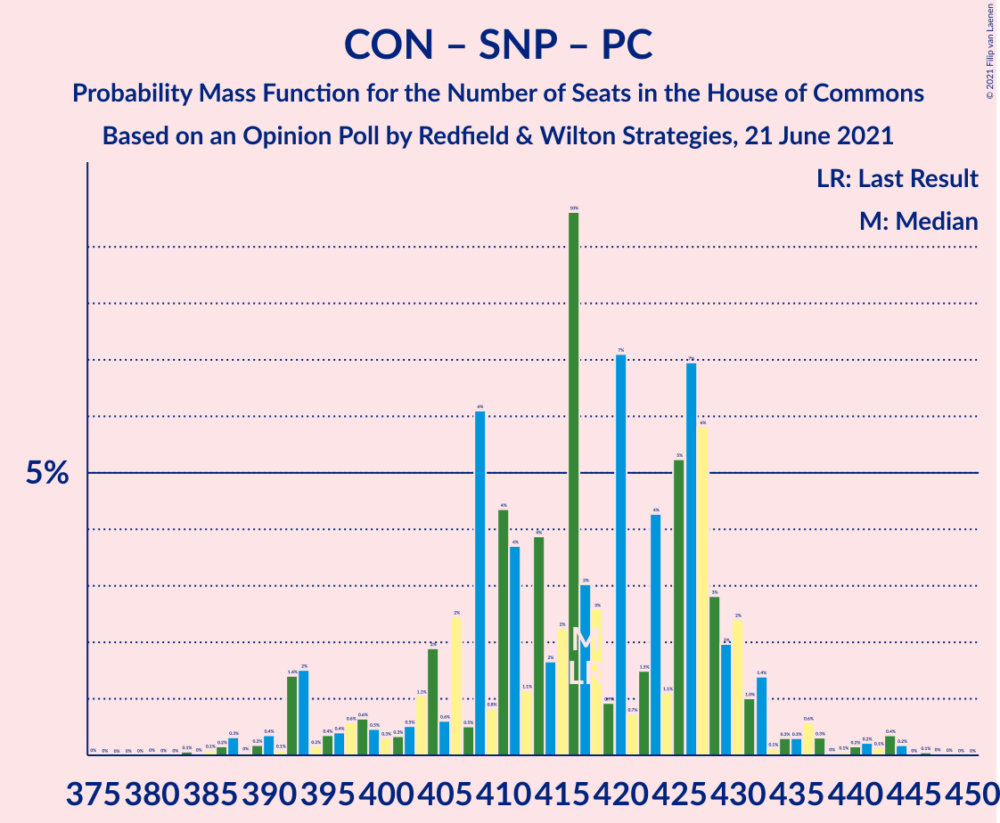

| Number of Seats | Probability | Accumulated | Special Marks |
|:---------------:|:-----------:|:-----------:|:-------------:|
| 376 | 0% | 100% |  |
| 377 | 0% | 99.9% |  |
| 378 | 0% | 99.9% |  |
| 379 | 0% | 99.9% |  |
| 380 | 0% | 99.9% |  |
| 381 | 0% | 99.9% |  |
| 382 | 0% | 99.9% |  |
| 383 | 0.1% | 99.9% |  |
| 384 | 0% | 99.8% |  |
| 385 | 0.1% | 99.8% |  |
| 386 | 0.2% | 99.7% |  |
| 387 | 0.3% | 99.5% |  |
| 388 | 0% | 99.2% |  |
| 389 | 0.2% | 99.2% |  |
| 390 | 0.4% | 99.0% |  |
| 391 | 0.1% | 98.6% |  |
| 392 | 1.4% | 98.5% |  |
| 393 | 2% | 97% |  |
| 394 | 0.2% | 96% |  |
| 395 | 0.4% | 95% |  |
| 396 | 0.4% | 95% |  |
| 397 | 0.6% | 95% |  |
| 398 | 0.6% | 94% |  |
| 399 | 0.5% | 93% |  |
| 400 | 0.3% | 93% |  |
| 401 | 0.3% | 93% |  |
| 402 | 0.5% | 92% |  |
| 403 | 1.1% | 92% |  |
| 404 | 2% | 91% |  |
| 405 | 0.6% | 89% |  |
| 406 | 2% | 88% |  |
| 407 | 0.5% | 86% |  |
| 408 | 6% | 85% |  |
| 409 | 0.8% | 79% |  |
| 410 | 4% | 78% |  |
| 411 | 4% | 74% |  |
| 412 | 1.1% | 70% |  |
| 413 | 4% | 69% |  |
| 414 | 2% | 65% |  |
| 415 | 2% | 64% |  |
| 416 | 10% | 61% |  |
| 417 | 3% | 52% | Last Result, Median |
| 418 | 3% | 49% |  |
| 419 | 0.9% | 46% |  |
| 420 | 7% | 45% |  |
| 421 | 0.7% | 38% |  |
| 422 | 1.5% | 37% |  |
| 423 | 4% | 36% |  |
| 424 | 1.1% | 32% |  |
| 425 | 5% | 31% |  |
| 426 | 7% | 25% |  |
| 427 | 6% | 18% |  |
| 428 | 3% | 13% |  |
| 429 | 2% | 10% |  |
| 430 | 2% | 8% |  |
| 431 | 1.0% | 5% |  |
| 432 | 1.4% | 4% |  |
| 433 | 0.1% | 3% |  |
| 434 | 0.3% | 3% |  |
| 435 | 0.3% | 2% |  |
| 436 | 0.6% | 2% |  |
| 437 | 0.3% | 2% |  |
| 438 | 0% | 1.3% |  |
| 439 | 0.1% | 1.3% |  |
| 440 | 0.2% | 1.2% |  |
| 441 | 0.2% | 1.0% |  |
| 442 | 0.1% | 0.8% |  |
| 443 | 0.4% | 0.7% |  |
| 444 | 0.2% | 0.3% |  |
| 445 | 0% | 0.2% |  |
| 446 | 0.1% | 0.1% |  |
| 447 | 0% | 0.1% |  |
| 448 | 0% | 0.1% |  |
| 449 | 0% | 0% |  |

### Conservative Party – Scottish National Party

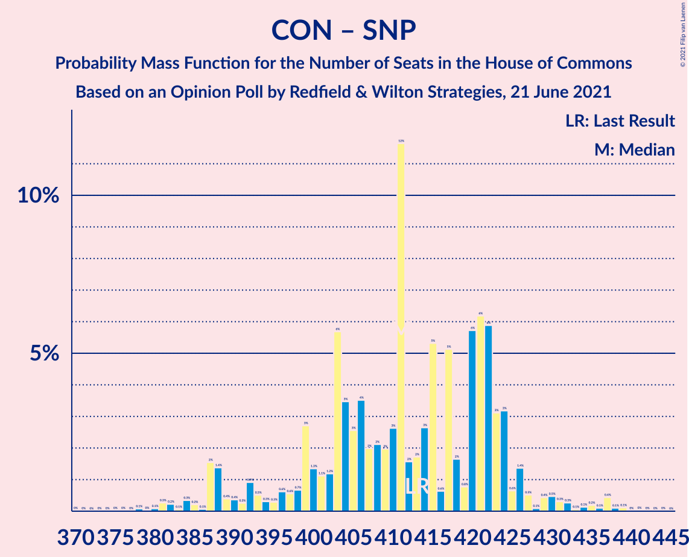

| Number of Seats | Probability | Accumulated | Special Marks |
|:---------------:|:-----------:|:-----------:|:-------------:|
| 371 | 0% | 100% |  |
| 372 | 0% | 99.9% |  |
| 373 | 0% | 99.9% |  |
| 374 | 0% | 99.9% |  |
| 375 | 0% | 99.9% |  |
| 376 | 0% | 99.9% |  |
| 377 | 0% | 99.9% |  |
| 378 | 0.1% | 99.9% |  |
| 379 | 0% | 99.8% |  |
| 380 | 0.1% | 99.8% |  |
| 381 | 0.3% | 99.7% |  |
| 382 | 0.2% | 99.4% |  |
| 383 | 0.1% | 99.2% |  |
| 384 | 0.3% | 99.1% |  |
| 385 | 0.2% | 98.8% |  |
| 386 | 0.1% | 98.6% |  |
| 387 | 2% | 98.5% |  |
| 388 | 1.4% | 97% |  |
| 389 | 0.4% | 96% |  |
| 390 | 0.4% | 95% |  |
| 391 | 0.3% | 95% |  |
| 392 | 0.9% | 95% |  |
| 393 | 0.5% | 94% |  |
| 394 | 0.3% | 93% |  |
| 395 | 0.3% | 93% |  |
| 396 | 0.6% | 93% |  |
| 397 | 0.6% | 92% |  |
| 398 | 0.7% | 91% |  |
| 399 | 3% | 91% |  |
| 400 | 1.3% | 88% |  |
| 401 | 1.1% | 87% |  |
| 402 | 1.2% | 86% |  |
| 403 | 6% | 84% |  |
| 404 | 3% | 79% |  |
| 405 | 3% | 75% |  |
| 406 | 4% | 73% |  |
| 407 | 2% | 69% |  |
| 408 | 2% | 67% |  |
| 409 | 2% | 65% |  |
| 410 | 3% | 63% |  |
| 411 | 12% | 60% |  |
| 412 | 2% | 49% | Median |
| 413 | 2% | 47% | Last Result |
| 414 | 3% | 46% |  |
| 415 | 5% | 43% |  |
| 416 | 0.6% | 38% |  |
| 417 | 5% | 37% |  |
| 418 | 2% | 32% |  |
| 419 | 0.8% | 30% |  |
| 420 | 6% | 29% |  |
| 421 | 6% | 24% |  |
| 422 | 6% | 17% |  |
| 423 | 3% | 12% |  |
| 424 | 3% | 8% |  |
| 425 | 0.6% | 5% |  |
| 426 | 1.4% | 5% |  |
| 427 | 0.5% | 3% |  |
| 428 | 0.1% | 3% |  |
| 429 | 0.4% | 3% |  |
| 430 | 0.5% | 2% |  |
| 431 | 0.3% | 2% |  |
| 432 | 0.3% | 1.5% |  |
| 433 | 0.1% | 1.2% |  |
| 434 | 0.1% | 1.2% |  |
| 435 | 0.2% | 1.0% |  |
| 436 | 0.1% | 0.8% |  |
| 437 | 0.4% | 0.7% |  |
| 438 | 0.1% | 0.3% |  |
| 439 | 0.1% | 0.2% |  |
| 440 | 0% | 0.1% |  |
| 441 | 0% | 0.1% |  |
| 442 | 0% | 0.1% |  |
| 443 | 0% | 0% |  |

### Conservative Party – Liberal Democrats

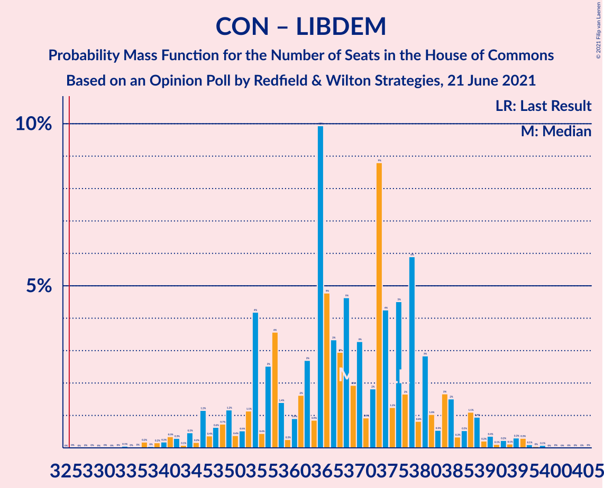

| Number of Seats | Probability | Accumulated | Special Marks |
|:---------------:|:-----------:|:-----------:|:-------------:|
| 329 | 0% | 100% |  |
| 330 | 0% | 99.9% |  |
| 331 | 0% | 99.9% |  |
| 332 | 0% | 99.9% |  |
| 333 | 0% | 99.9% |  |
| 334 | 0.1% | 99.9% |  |
| 335 | 0% | 99.8% |  |
| 336 | 0% | 99.8% |  |
| 337 | 0.2% | 99.8% |  |
| 338 | 0% | 99.6% |  |
| 339 | 0.2% | 99.6% |  |
| 340 | 0.2% | 99.4% |  |
| 341 | 0.3% | 99.2% |  |
| 342 | 0.3% | 98.9% |  |
| 343 | 0.1% | 98.6% |  |
| 344 | 0.5% | 98.5% |  |
| 345 | 0.2% | 98% |  |
| 346 | 1.2% | 98% |  |
| 347 | 0.4% | 97% |  |
| 348 | 0.6% | 96% |  |
| 349 | 0.7% | 96% |  |
| 350 | 1.2% | 95% |  |
| 351 | 0.4% | 94% |  |
| 352 | 0.5% | 93% |  |
| 353 | 1.1% | 93% |  |
| 354 | 4% | 92% |  |
| 355 | 0.4% | 88% |  |
| 356 | 3% | 87% |  |
| 357 | 4% | 85% |  |
| 358 | 1.4% | 81% |  |
| 359 | 0.3% | 80% |  |
| 360 | 0.9% | 79% |  |
| 361 | 2% | 78% |  |
| 362 | 3% | 77% |  |
| 363 | 0.9% | 74% |  |
| 364 | 10% | 73% |  |
| 365 | 5% | 63% |  |
| 366 | 3% | 59% |  |
| 367 | 3% | 55% | Median |
| 368 | 5% | 52% |  |
| 369 | 2% | 48% |  |
| 370 | 3% | 46% |  |
| 371 | 0.9% | 42% |  |
| 372 | 2% | 41% |  |
| 373 | 9% | 40% |  |
| 374 | 4% | 31% |  |
| 375 | 1.2% | 27% |  |
| 376 | 5% | 25% | Last Result |
| 377 | 2% | 21% |  |
| 378 | 6% | 19% |  |
| 379 | 0.8% | 13% |  |
| 380 | 3% | 12% |  |
| 381 | 1.0% | 10% |  |
| 382 | 0.5% | 9% |  |
| 383 | 2% | 8% |  |
| 384 | 2% | 6% |  |
| 385 | 0.3% | 5% |  |
| 386 | 0.5% | 5% |  |
| 387 | 1.1% | 4% |  |
| 388 | 0.9% | 3% |  |
| 389 | 0.2% | 2% |  |
| 390 | 0.4% | 2% |  |
| 391 | 0.1% | 1.4% |  |
| 392 | 0.2% | 1.3% |  |
| 393 | 0.1% | 1.1% |  |
| 394 | 0.3% | 0.9% |  |
| 395 | 0.3% | 0.6% |  |
| 396 | 0.1% | 0.3% |  |
| 397 | 0% | 0.2% |  |
| 398 | 0.1% | 0.2% |  |
| 399 | 0% | 0.1% |  |
| 400 | 0% | 0.1% |  |
| 401 | 0% | 0.1% |  |
| 402 | 0% | 0.1% |  |
| 403 | 0% | 0.1% |  |
| 404 | 0% | 0.1% |  |
| 405 | 0% | 0% |  |

### Conservative Party – Plaid Cymru

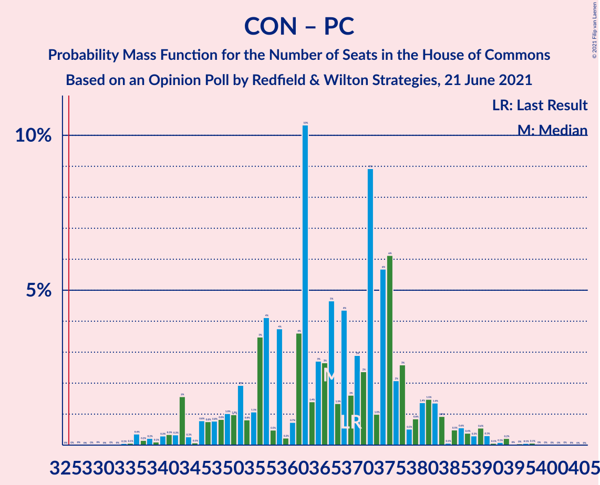

| Number of Seats | Probability | Accumulated | Special Marks |
|:---------------:|:-----------:|:-----------:|:-------------:|
| 326 | 0% | 100% | Majority |
| 327 | 0% | 99.9% |  |
| 328 | 0% | 99.9% |  |
| 329 | 0% | 99.9% |  |
| 330 | 0% | 99.9% |  |
| 331 | 0% | 99.9% |  |
| 332 | 0% | 99.9% |  |
| 333 | 0% | 99.9% |  |
| 334 | 0.1% | 99.8% |  |
| 335 | 0.1% | 99.8% |  |
| 336 | 0.4% | 99.7% |  |
| 337 | 0.2% | 99.4% |  |
| 338 | 0.2% | 99.2% |  |
| 339 | 0.1% | 99.0% |  |
| 340 | 0.3% | 98.9% |  |
| 341 | 0.3% | 98.6% |  |
| 342 | 0.3% | 98% |  |
| 343 | 2% | 98% |  |
| 344 | 0.3% | 96% |  |
| 345 | 0.1% | 96% |  |
| 346 | 0.8% | 96% |  |
| 347 | 0.8% | 95% |  |
| 348 | 0.8% | 94% |  |
| 349 | 0.8% | 94% |  |
| 350 | 1.0% | 93% |  |
| 351 | 1.0% | 92% |  |
| 352 | 2% | 91% |  |
| 353 | 0.8% | 89% |  |
| 354 | 1.1% | 88% |  |
| 355 | 3% | 87% |  |
| 356 | 4% | 84% |  |
| 357 | 0.5% | 79% |  |
| 358 | 4% | 79% |  |
| 359 | 0.2% | 75% |  |
| 360 | 0.7% | 75% |  |
| 361 | 4% | 74% |  |
| 362 | 10% | 71% |  |
| 363 | 1.4% | 60% |  |
| 364 | 3% | 59% |  |
| 365 | 3% | 56% | Median |
| 366 | 5% | 53% |  |
| 367 | 1.3% | 49% |  |
| 368 | 4% | 47% |  |
| 369 | 2% | 43% | Last Result |
| 370 | 3% | 41% |  |
| 371 | 2% | 39% |  |
| 372 | 9% | 36% |  |
| 373 | 1.0% | 27% |  |
| 374 | 6% | 26% |  |
| 375 | 6% | 21% |  |
| 376 | 2% | 14% |  |
| 377 | 3% | 12% |  |
| 378 | 0.5% | 10% |  |
| 379 | 0.8% | 9% |  |
| 380 | 1.4% | 8% |  |
| 381 | 1.5% | 7% |  |
| 382 | 1.4% | 6% |  |
| 383 | 0.9% | 4% |  |
| 384 | 0.1% | 3% |  |
| 385 | 0.5% | 3% |  |
| 386 | 0.6% | 3% |  |
| 387 | 0.4% | 2% |  |
| 388 | 0.3% | 2% |  |
| 389 | 0.6% | 2% |  |
| 390 | 0.3% | 1.0% |  |
| 391 | 0.1% | 0.7% |  |
| 392 | 0.1% | 0.6% |  |
| 393 | 0.2% | 0.5% |  |
| 394 | 0% | 0.3% |  |
| 395 | 0% | 0.3% |  |
| 396 | 0.1% | 0.2% |  |
| 397 | 0.1% | 0.2% |  |
| 398 | 0% | 0.1% |  |
| 399 | 0% | 0.1% |  |
| 400 | 0% | 0.1% |  |
| 401 | 0% | 0% |  |

### Conservative Party

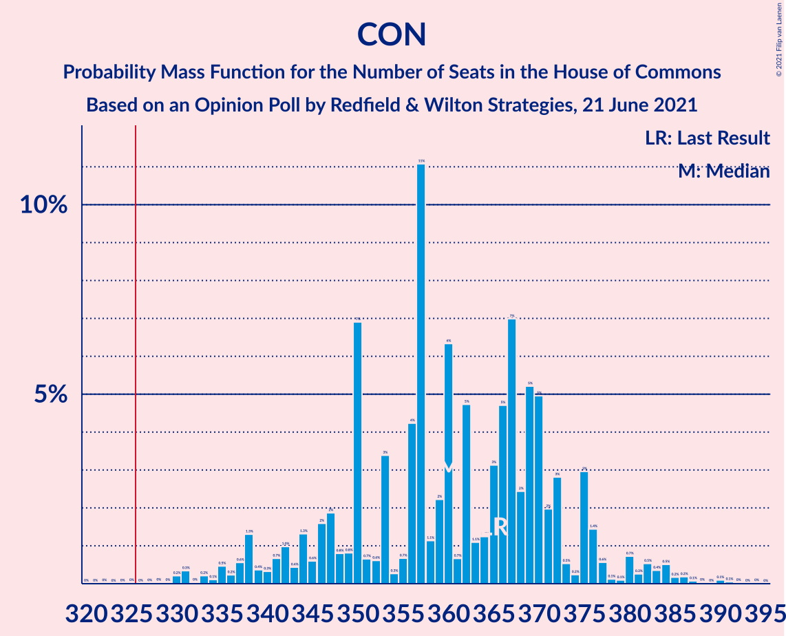

| Number of Seats | Probability | Accumulated | Special Marks |
|:---------------:|:-----------:|:-----------:|:-------------:|
| 320 | 0% | 100% |  |
| 321 | 0% | 99.9% |  |
| 322 | 0% | 99.9% |  |
| 323 | 0% | 99.9% |  |
| 324 | 0% | 99.9% |  |
| 325 | 0% | 99.9% |  |
| 326 | 0% | 99.9% | Majority |
| 327 | 0% | 99.9% |  |
| 328 | 0% | 99.8% |  |
| 329 | 0% | 99.8% |  |
| 330 | 0.2% | 99.8% |  |
| 331 | 0.3% | 99.6% |  |
| 332 | 0% | 99.2% |  |
| 333 | 0.2% | 99.2% |  |
| 334 | 0.1% | 99.0% |  |
| 335 | 0.5% | 98.9% |  |
| 336 | 0.2% | 98% |  |
| 337 | 0.6% | 98% |  |
| 338 | 1.3% | 98% |  |
| 339 | 0.4% | 96% |  |
| 340 | 0.3% | 96% |  |
| 341 | 0.7% | 96% |  |
| 342 | 1.0% | 95% |  |
| 343 | 0.4% | 94% |  |
| 344 | 1.3% | 94% |  |
| 345 | 0.6% | 92% |  |
| 346 | 2% | 92% |  |
| 347 | 2% | 90% |  |
| 348 | 0.8% | 88% |  |
| 349 | 0.8% | 87% |  |
| 350 | 7% | 87% |  |
| 351 | 0.7% | 80% |  |
| 352 | 0.6% | 79% |  |
| 353 | 3% | 78% |  |
| 354 | 0.3% | 75% |  |
| 355 | 0.7% | 75% |  |
| 356 | 4% | 74% |  |
| 357 | 11% | 70% |  |
| 358 | 1.1% | 59% |  |
| 359 | 2% | 58% |  |
| 360 | 6% | 55% | Median |
| 361 | 0.7% | 49% |  |
| 362 | 5% | 48% |  |
| 363 | 1.1% | 44% |  |
| 364 | 1.2% | 43% |  |
| 365 | 3% | 41% | Last Result |
| 366 | 5% | 38% |  |
| 367 | 7% | 33% |  |
| 368 | 2% | 26% |  |
| 369 | 5% | 24% |  |
| 370 | 5% | 19% |  |
| 371 | 2% | 14% |  |
| 372 | 3% | 12% |  |
| 373 | 0.5% | 9% |  |
| 374 | 0.2% | 9% |  |
| 375 | 3% | 8% |  |
| 376 | 1.4% | 5% |  |
| 377 | 0.6% | 4% |  |
| 378 | 0.1% | 3% |  |
| 379 | 0.1% | 3% |  |
| 380 | 0.7% | 3% |  |
| 381 | 0.3% | 2% |  |
| 382 | 0.5% | 2% |  |
| 383 | 0.4% | 2% |  |
| 384 | 0.5% | 1.2% |  |
| 385 | 0.2% | 0.7% |  |
| 386 | 0.2% | 0.5% |  |
| 387 | 0.1% | 0.4% |  |
| 388 | 0% | 0.3% |  |
| 389 | 0% | 0.3% |  |
| 390 | 0.1% | 0.2% |  |
| 391 | 0.1% | 0.1% |  |
| 392 | 0% | 0.1% |  |
| 393 | 0% | 0.1% |  |
| 394 | 0% | 0.1% |  |
| 395 | 0% | 0% |  |

### Labour Party – Liberal Democrats – Scottish National Party – Green Party – Plaid Cymru

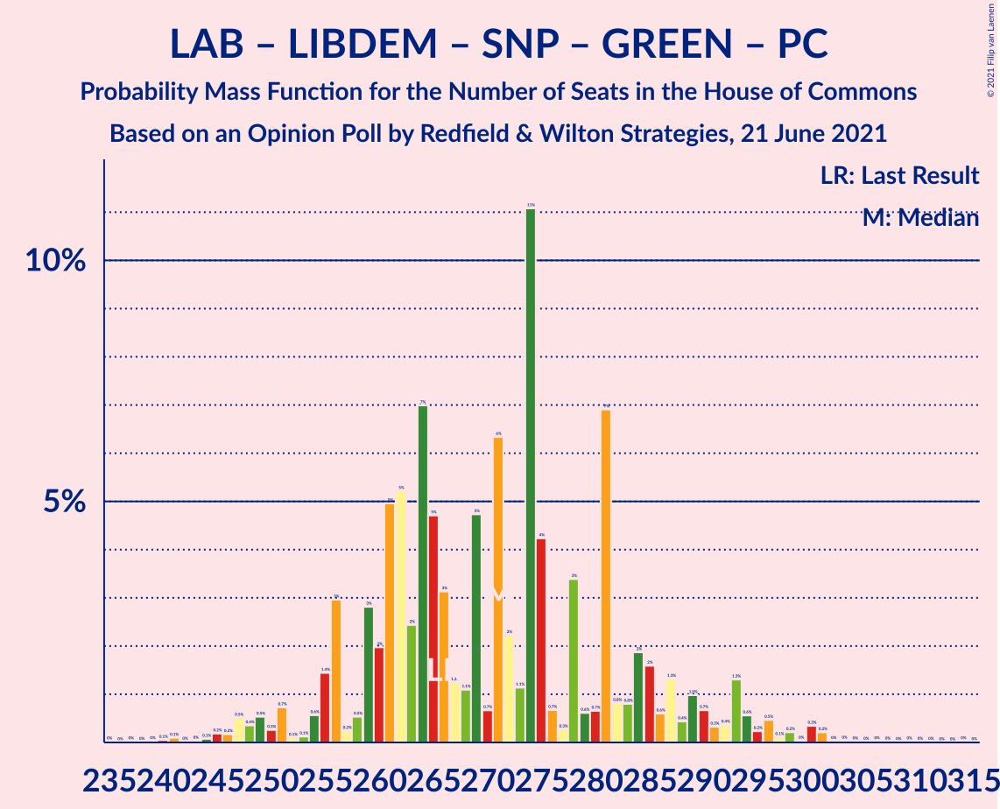

| Number of Seats | Probability | Accumulated | Special Marks |
|:---------------:|:-----------:|:-----------:|:-------------:|
| 237 | 0% | 100% |  |
| 238 | 0% | 99.9% |  |
| 239 | 0% | 99.9% |  |
| 240 | 0.1% | 99.9% |  |
| 241 | 0.1% | 99.9% |  |
| 242 | 0% | 99.8% |  |
| 243 | 0% | 99.7% |  |
| 244 | 0.1% | 99.7% |  |
| 245 | 0.2% | 99.6% |  |
| 246 | 0.2% | 99.5% |  |
| 247 | 0.5% | 99.3% |  |
| 248 | 0.4% | 98.8% |  |
| 249 | 0.5% | 98% |  |
| 250 | 0.3% | 98% |  |
| 251 | 0.7% | 98% |  |
| 252 | 0.1% | 97% |  |
| 253 | 0.1% | 97% |  |
| 254 | 0.6% | 97% |  |
| 255 | 1.4% | 96% |  |
| 256 | 3% | 95% |  |
| 257 | 0.2% | 92% |  |
| 258 | 0.5% | 91% |  |
| 259 | 3% | 91% |  |
| 260 | 2% | 88% |  |
| 261 | 5% | 86% |  |
| 262 | 5% | 81% |  |
| 263 | 2% | 76% |  |
| 264 | 7% | 74% |  |
| 265 | 5% | 67% |  |
| 266 | 3% | 62% | Last Result |
| 267 | 1.2% | 59% |  |
| 268 | 1.1% | 57% |  |
| 269 | 5% | 56% |  |
| 270 | 0.7% | 52% |  |
| 271 | 6% | 51% | Median |
| 272 | 2% | 45% |  |
| 273 | 1.1% | 42% |  |
| 274 | 11% | 41% |  |
| 275 | 4% | 30% |  |
| 276 | 0.7% | 26% |  |
| 277 | 0.3% | 25% |  |
| 278 | 3% | 25% |  |
| 279 | 0.6% | 22% |  |
| 280 | 0.7% | 21% |  |
| 281 | 7% | 20% |  |
| 282 | 0.8% | 13% |  |
| 283 | 0.8% | 13% |  |
| 284 | 2% | 12% |  |
| 285 | 2% | 10% |  |
| 286 | 0.6% | 8% |  |
| 287 | 1.3% | 8% |  |
| 288 | 0.4% | 6% |  |
| 289 | 1.0% | 6% |  |
| 290 | 0.7% | 5% |  |
| 291 | 0.3% | 4% |  |
| 292 | 0.4% | 4% |  |
| 293 | 1.3% | 4% |  |
| 294 | 0.6% | 2% |  |
| 295 | 0.2% | 2% |  |
| 296 | 0.5% | 2% |  |
| 297 | 0.1% | 1.1% |  |
| 298 | 0.2% | 1.0% |  |
| 299 | 0% | 0.8% |  |
| 300 | 0.3% | 0.8% |  |
| 301 | 0.2% | 0.4% |  |
| 302 | 0% | 0.2% |  |
| 303 | 0% | 0.2% |  |
| 304 | 0% | 0.2% |  |
| 305 | 0% | 0.1% |  |
| 306 | 0% | 0.1% |  |
| 307 | 0% | 0.1% |  |
| 308 | 0% | 0.1% |  |
| 309 | 0% | 0.1% |  |
| 310 | 0% | 0.1% |  |
| 311 | 0% | 0.1% |  |
| 312 | 0% | 0% |  |

### Labour Party – Liberal Democrats – Scottish National Party – Plaid Cymru

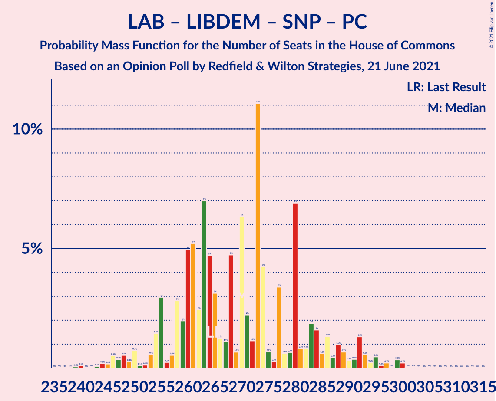

| Number of Seats | Probability | Accumulated | Special Marks |
|:---------------:|:-----------:|:-----------:|:-------------:|
| 236 | 0% | 100% |  |
| 237 | 0% | 99.9% |  |
| 238 | 0% | 99.9% |  |
| 239 | 0.1% | 99.9% |  |
| 240 | 0.1% | 99.9% |  |
| 241 | 0% | 99.8% |  |
| 242 | 0% | 99.7% |  |
| 243 | 0.1% | 99.7% |  |
| 244 | 0.2% | 99.6% |  |
| 245 | 0.2% | 99.5% |  |
| 246 | 0.5% | 99.3% |  |
| 247 | 0.4% | 98.8% |  |
| 248 | 0.5% | 98% |  |
| 249 | 0.3% | 98% |  |
| 250 | 0.7% | 98% |  |
| 251 | 0.1% | 97% |  |
| 252 | 0.1% | 97% |  |
| 253 | 0.6% | 97% |  |
| 254 | 1.4% | 96% |  |
| 255 | 3% | 95% |  |
| 256 | 0.2% | 92% |  |
| 257 | 0.5% | 91% |  |
| 258 | 3% | 91% |  |
| 259 | 2% | 88% |  |
| 260 | 5% | 86% |  |
| 261 | 5% | 81% |  |
| 262 | 2% | 76% |  |
| 263 | 7% | 74% |  |
| 264 | 5% | 67% |  |
| 265 | 3% | 62% | Last Result |
| 266 | 1.2% | 59% |  |
| 267 | 1.1% | 57% |  |
| 268 | 5% | 56% |  |
| 269 | 0.7% | 52% |  |
| 270 | 6% | 51% | Median |
| 271 | 2% | 45% |  |
| 272 | 1.1% | 42% |  |
| 273 | 11% | 41% |  |
| 274 | 4% | 30% |  |
| 275 | 0.7% | 26% |  |
| 276 | 0.3% | 25% |  |
| 277 | 3% | 25% |  |
| 278 | 0.6% | 22% |  |
| 279 | 0.7% | 21% |  |
| 280 | 7% | 20% |  |
| 281 | 0.8% | 13% |  |
| 282 | 0.8% | 13% |  |
| 283 | 2% | 12% |  |
| 284 | 2% | 10% |  |
| 285 | 0.6% | 8% |  |
| 286 | 1.3% | 8% |  |
| 287 | 0.4% | 6% |  |
| 288 | 1.0% | 6% |  |
| 289 | 0.7% | 5% |  |
| 290 | 0.3% | 4% |  |
| 291 | 0.4% | 4% |  |
| 292 | 1.3% | 4% |  |
| 293 | 0.6% | 2% |  |
| 294 | 0.2% | 2% |  |
| 295 | 0.5% | 2% |  |
| 296 | 0.1% | 1.1% |  |
| 297 | 0.2% | 1.0% |  |
| 298 | 0% | 0.8% |  |
| 299 | 0.3% | 0.8% |  |
| 300 | 0.2% | 0.4% |  |
| 301 | 0% | 0.2% |  |
| 302 | 0% | 0.2% |  |
| 303 | 0% | 0.2% |  |
| 304 | 0% | 0.1% |  |
| 305 | 0% | 0.1% |  |
| 306 | 0% | 0.1% |  |
| 307 | 0% | 0.1% |  |
| 308 | 0% | 0.1% |  |
| 309 | 0% | 0.1% |  |
| 310 | 0% | 0.1% |  |
| 311 | 0% | 0% |  |

### Labour Party – Liberal Democrats – Scottish National Party

| Number of Seats | Probability | Accumulated | Special Marks |
|:---------------:|:-----------:|:-----------:|:-------------:|
| 230 | 0% | 100% |  |
| 231 | 0% | 99.9% |  |
| 232 | 0% | 99.9% |  |
| 233 | 0.1% | 99.9% |  |
| 234 | 0.1% | 99.8% |  |
| 235 | 0% | 99.8% |  |
| 236 | 0% | 99.7% |  |
| 237 | 0.2% | 99.7% |  |
| 238 | 0.1% | 99.5% |  |
| 239 | 0.1% | 99.4% |  |
| 240 | 0.3% | 99.3% |  |
| 241 | 0.6% | 99.0% |  |
| 242 | 0.3% | 98% |  |
| 243 | 0.4% | 98% |  |
| 244 | 0.6% | 98% |  |
| 245 | 0.5% | 97% |  |
| 246 | 0.1% | 97% |  |
| 247 | 0.9% | 97% |  |
| 248 | 1.4% | 96% |  |
| 249 | 1.5% | 94% |  |
| 250 | 1.4% | 93% |  |
| 251 | 0.8% | 92% |  |
| 252 | 0.5% | 91% |  |
| 253 | 3% | 90% |  |
| 254 | 2% | 88% |  |
| 255 | 6% | 86% |  |
| 256 | 6% | 79% |  |
| 257 | 1.0% | 74% |  |
| 258 | 9% | 73% |  |
| 259 | 2% | 64% |  |
| 260 | 3% | 61% |  |
| 261 | 2% | 59% | Last Result |
| 262 | 4% | 57% |  |
| 263 | 1.3% | 53% |  |
| 264 | 5% | 51% |  |
| 265 | 3% | 47% | Median |
| 266 | 3% | 44% |  |
| 267 | 1.4% | 41% |  |
| 268 | 10% | 40% |  |
| 269 | 4% | 29% |  |
| 270 | 0.7% | 26% |  |
| 271 | 0.2% | 25% |  |
| 272 | 4% | 25% |  |
| 273 | 0.5% | 21% |  |
| 274 | 4% | 21% |  |
| 275 | 3% | 16% |  |
| 276 | 1.1% | 13% |  |
| 277 | 0.8% | 12% |  |
| 278 | 2% | 11% |  |
| 279 | 1.0% | 9% |  |
| 280 | 1.0% | 8% |  |
| 281 | 0.8% | 7% |  |
| 282 | 0.8% | 6% |  |
| 283 | 0.8% | 6% |  |
| 284 | 0.8% | 5% |  |
| 285 | 0.1% | 4% |  |
| 286 | 0.3% | 4% |  |
| 287 | 2% | 4% |  |
| 288 | 0.3% | 2% |  |
| 289 | 0.3% | 2% |  |
| 290 | 0.3% | 1.4% |  |
| 291 | 0.1% | 1.1% |  |
| 292 | 0.2% | 1.0% |  |
| 293 | 0.2% | 0.8% |  |
| 294 | 0.4% | 0.6% |  |
| 295 | 0.1% | 0.3% |  |
| 296 | 0.1% | 0.2% |  |
| 297 | 0% | 0.2% |  |
| 298 | 0% | 0.1% |  |
| 299 | 0% | 0.1% |  |
| 300 | 0% | 0.1% |  |
| 301 | 0% | 0.1% |  |
| 302 | 0% | 0.1% |  |
| 303 | 0% | 0.1% |  |
| 304 | 0% | 0.1% |  |
| 305 | 0% | 0% |  |

### Labour Party – Scottish National Party – Plaid Cymru

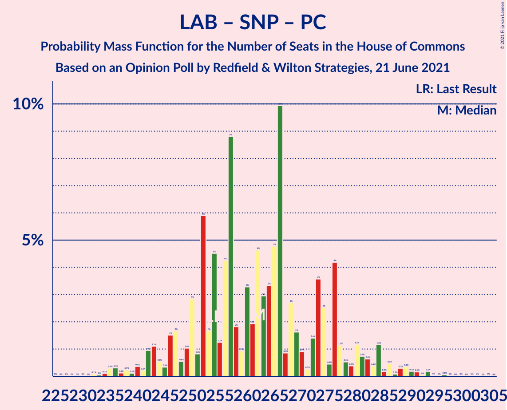

| Number of Seats | Probability | Accumulated | Special Marks |
|:---------------:|:-----------:|:-----------:|:-------------:|
| 226 | 0% | 100% |  |
| 227 | 0% | 99.9% |  |
| 228 | 0% | 99.9% |  |
| 229 | 0% | 99.9% |  |
| 230 | 0% | 99.9% |  |
| 231 | 0% | 99.9% |  |
| 232 | 0.1% | 99.9% |  |
| 233 | 0% | 99.8% |  |
| 234 | 0.1% | 99.8% |  |
| 235 | 0.3% | 99.7% |  |
| 236 | 0.3% | 99.4% |  |
| 237 | 0.1% | 99.1% |  |
| 238 | 0.2% | 98.9% |  |
| 239 | 0.1% | 98.7% |  |
| 240 | 0.4% | 98.6% |  |
| 241 | 0.2% | 98% |  |
| 242 | 0.9% | 98% |  |
| 243 | 1.1% | 97% |  |
| 244 | 0.5% | 96% |  |
| 245 | 0.3% | 95% |  |
| 246 | 2% | 95% |  |
| 247 | 2% | 94% |  |
| 248 | 0.5% | 92% |  |
| 249 | 1.0% | 91% |  |
| 250 | 3% | 90% |  |
| 251 | 0.8% | 88% |  |
| 252 | 6% | 87% |  |
| 253 | 2% | 81% |  |
| 254 | 5% | 79% | Last Result |
| 255 | 1.2% | 75% |  |
| 256 | 4% | 73% |  |
| 257 | 9% | 69% |  |
| 258 | 2% | 60% |  |
| 259 | 0.9% | 59% |  |
| 260 | 3% | 58% |  |
| 261 | 2% | 54% |  |
| 262 | 5% | 52% |  |
| 263 | 3% | 48% | Median |
| 264 | 3% | 45% |  |
| 265 | 5% | 41% |  |
| 266 | 10% | 37% |  |
| 267 | 0.9% | 27% |  |
| 268 | 3% | 26% |  |
| 269 | 2% | 23% |  |
| 270 | 0.9% | 22% |  |
| 271 | 0.3% | 21% |  |
| 272 | 1.4% | 20% |  |
| 273 | 4% | 19% |  |
| 274 | 3% | 15% |  |
| 275 | 0.4% | 13% |  |
| 276 | 4% | 12% |  |
| 277 | 1.1% | 8% |  |
| 278 | 0.5% | 7% |  |
| 279 | 0.4% | 7% |  |
| 280 | 1.2% | 6% |  |
| 281 | 0.7% | 5% |  |
| 282 | 0.6% | 4% |  |
| 283 | 0.4% | 4% |  |
| 284 | 1.2% | 3% |  |
| 285 | 0.2% | 2% |  |
| 286 | 0.5% | 2% |  |
| 287 | 0.1% | 1.5% |  |
| 288 | 0.3% | 1.4% |  |
| 289 | 0.3% | 1.1% |  |
| 290 | 0.2% | 0.8% |  |
| 291 | 0.2% | 0.6% |  |
| 292 | 0% | 0.4% |  |
| 293 | 0.2% | 0.4% |  |
| 294 | 0% | 0.2% |  |
| 295 | 0% | 0.2% |  |
| 296 | 0.1% | 0.2% |  |
| 297 | 0% | 0.1% |  |
| 298 | 0% | 0.1% |  |
| 299 | 0% | 0.1% |  |
| 300 | 0% | 0.1% |  |
| 301 | 0% | 0.1% |  |
| 302 | 0% | 0% |  |

### Labour Party – Scottish National Party

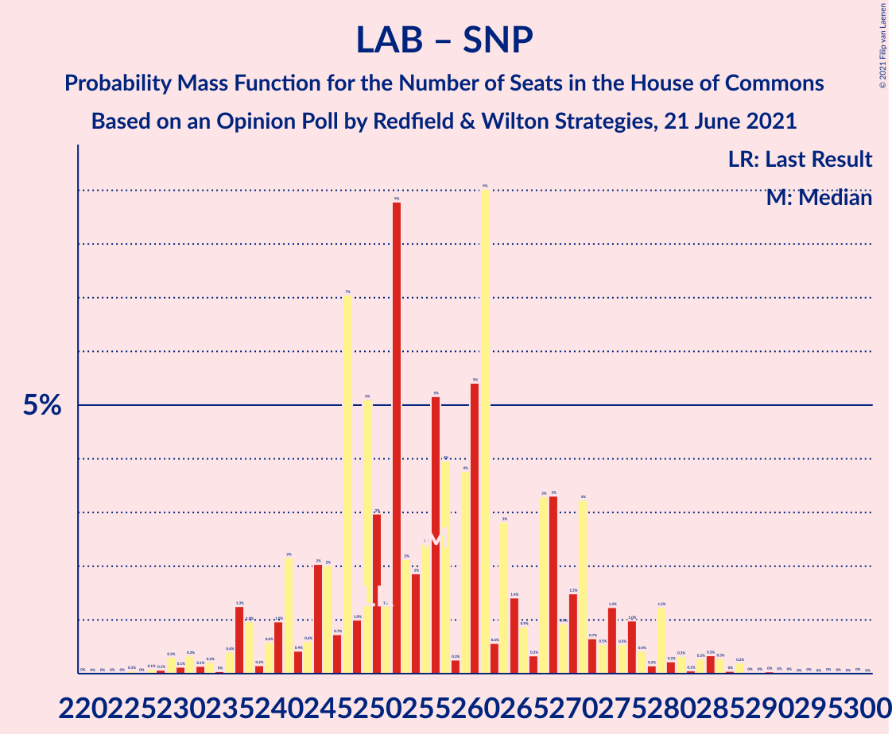

| Number of Seats | Probability | Accumulated | Special Marks |
|:---------------:|:-----------:|:-----------:|:-------------:|
| 220 | 0% | 100% |  |
| 221 | 0% | 99.9% |  |
| 222 | 0% | 99.9% |  |
| 223 | 0% | 99.9% |  |
| 224 | 0% | 99.9% |  |
| 225 | 0.1% | 99.9% |  |
| 226 | 0% | 99.9% |  |
| 227 | 0.1% | 99.8% |  |
| 228 | 0.1% | 99.8% |  |
| 229 | 0.3% | 99.7% |  |
| 230 | 0.1% | 99.4% |  |
| 231 | 0.3% | 99.3% |  |
| 232 | 0.1% | 98.9% |  |
| 233 | 0.2% | 98.8% |  |
| 234 | 0% | 98.6% |  |
| 235 | 0.4% | 98.5% |  |
| 236 | 1.3% | 98% |  |
| 237 | 1.0% | 97% |  |
| 238 | 0.2% | 96% |  |
| 239 | 0.6% | 96% |  |
| 240 | 1.0% | 95% |  |
| 241 | 2% | 94% |  |
| 242 | 0.4% | 92% |  |
| 243 | 0.6% | 92% |  |
| 244 | 2% | 91% |  |
| 245 | 2% | 89% |  |
| 246 | 0.7% | 87% |  |
| 247 | 7% | 86% |  |
| 248 | 1.0% | 79% |  |
| 249 | 5% | 78% |  |
| 250 | 3% | 73% | Last Result |
| 251 | 1.3% | 70% |  |
| 252 | 9% | 69% |  |
| 253 | 2% | 60% |  |
| 254 | 2% | 58% |  |
| 255 | 2% | 56% |  |
| 256 | 5% | 54% |  |
| 257 | 4% | 48% |  |
| 258 | 0.3% | 44% | Median |
| 259 | 4% | 44% |  |
| 260 | 5% | 40% |  |
| 261 | 9% | 35% |  |
| 262 | 0.6% | 26% |  |
| 263 | 3% | 25% |  |
| 264 | 1.4% | 23% |  |
| 265 | 0.9% | 21% |  |
| 266 | 0.3% | 20% |  |
| 267 | 3% | 20% |  |
| 268 | 3% | 17% |  |
| 269 | 0.9% | 13% |  |
| 270 | 1.5% | 12% |  |
| 271 | 3% | 11% |  |
| 272 | 0.7% | 8% |  |
| 273 | 0.5% | 7% |  |
| 274 | 1.2% | 7% |  |
| 275 | 0.5% | 5% |  |
| 276 | 1.0% | 5% |  |
| 277 | 0.4% | 4% |  |
| 278 | 0.2% | 3% |  |
| 279 | 1.2% | 3% |  |
| 280 | 0.2% | 2% |  |
| 281 | 0.3% | 2% |  |
| 282 | 0.1% | 1.4% |  |
| 283 | 0.3% | 1.4% |  |
| 284 | 0.3% | 1.1% |  |
| 285 | 0.3% | 0.8% |  |
| 286 | 0% | 0.5% |  |
| 287 | 0.2% | 0.4% |  |
| 288 | 0% | 0.2% |  |
| 289 | 0% | 0.2% |  |
| 290 | 0% | 0.2% |  |
| 291 | 0% | 0.1% |  |
| 292 | 0% | 0.1% |  |
| 293 | 0% | 0.1% |  |
| 294 | 0% | 0.1% |  |
| 295 | 0% | 0.1% |  |
| 296 | 0% | 0.1% |  |
| 297 | 0% | 0% |  |

### Labour Party – Liberal Democrats – Plaid Cymru

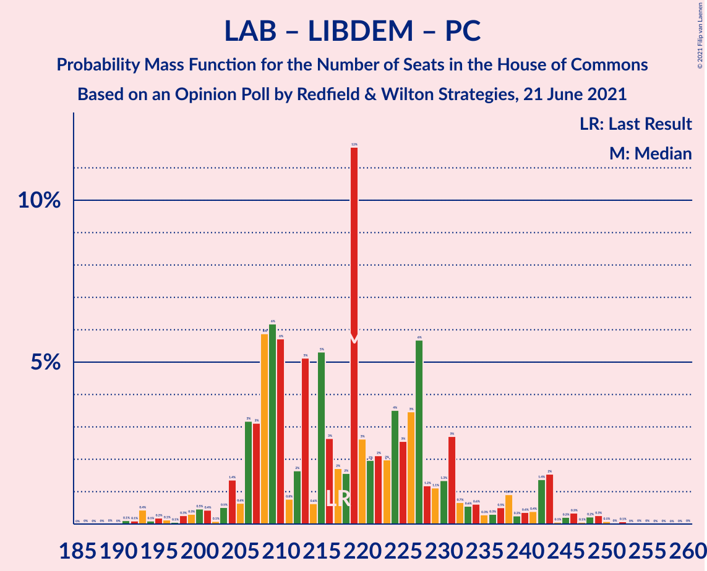

| Number of Seats | Probability | Accumulated | Special Marks |
|:---------------:|:-----------:|:-----------:|:-------------:|
| 188 | 0% | 100% |  |
| 189 | 0% | 99.9% |  |
| 190 | 0% | 99.9% |  |
| 191 | 0.1% | 99.9% |  |
| 192 | 0.1% | 99.8% |  |
| 193 | 0.4% | 99.7% |  |
| 194 | 0.1% | 99.3% |  |
| 195 | 0.2% | 99.2% |  |
| 196 | 0.1% | 99.0% |  |
| 197 | 0.1% | 98.8% |  |
| 198 | 0.3% | 98.8% |  |
| 199 | 0.3% | 98.5% |  |
| 200 | 0.5% | 98% |  |
| 201 | 0.4% | 98% |  |
| 202 | 0.1% | 97% |  |
| 203 | 0.5% | 97% |  |
| 204 | 1.4% | 97% |  |
| 205 | 0.6% | 95% |  |
| 206 | 3% | 95% |  |
| 207 | 3% | 92% |  |
| 208 | 6% | 88% |  |
| 209 | 6% | 83% |  |
| 210 | 6% | 76% |  |
| 211 | 0.8% | 71% |  |
| 212 | 2% | 70% |  |
| 213 | 5% | 68% |  |
| 214 | 0.6% | 63% |  |
| 215 | 5% | 62% |  |
| 216 | 3% | 57% |  |
| 217 | 2% | 54% | Last Result |
| 218 | 2% | 53% | Median |
| 219 | 12% | 51% |  |
| 220 | 3% | 40% |  |
| 221 | 2% | 37% |  |
| 222 | 2% | 35% |  |
| 223 | 2% | 33% |  |
| 224 | 4% | 31% |  |
| 225 | 3% | 27% |  |
| 226 | 3% | 25% |  |
| 227 | 6% | 21% |  |
| 228 | 1.2% | 16% |  |
| 229 | 1.1% | 14% |  |
| 230 | 1.3% | 13% |  |
| 231 | 3% | 12% |  |
| 232 | 0.7% | 9% |  |
| 233 | 0.6% | 9% |  |
| 234 | 0.6% | 8% |  |
| 235 | 0.3% | 7% |  |
| 236 | 0.3% | 7% |  |
| 237 | 0.5% | 7% |  |
| 238 | 0.9% | 6% |  |
| 239 | 0.3% | 5% |  |
| 240 | 0.4% | 5% |  |
| 241 | 0.4% | 5% |  |
| 242 | 1.4% | 4% |  |
| 243 | 2% | 3% |  |
| 244 | 0.1% | 1.5% |  |
| 245 | 0.2% | 1.4% |  |
| 246 | 0.3% | 1.2% |  |
| 247 | 0.1% | 0.9% |  |
| 248 | 0.2% | 0.8% |  |
| 249 | 0.3% | 0.6% |  |
| 250 | 0.1% | 0.3% |  |
| 251 | 0% | 0.2% |  |
| 252 | 0.1% | 0.2% |  |
| 253 | 0% | 0.1% |  |
| 254 | 0% | 0.1% |  |
| 255 | 0% | 0.1% |  |
| 256 | 0% | 0.1% |  |
| 257 | 0% | 0.1% |  |
| 258 | 0% | 0.1% |  |
| 259 | 0% | 0.1% |  |
| 260 | 0% | 0% |  |

### Labour Party – Liberal Democrats

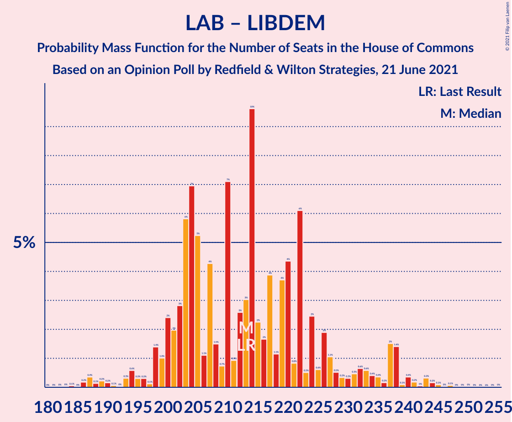

| Number of Seats | Probability | Accumulated | Special Marks |
|:---------------:|:-----------:|:-----------:|:-------------:|
| 182 | 0% | 100% |  |
| 183 | 0% | 99.9% |  |
| 184 | 0.1% | 99.9% |  |
| 185 | 0% | 99.9% |  |
| 186 | 0.2% | 99.8% |  |
| 187 | 0.4% | 99.7% |  |
| 188 | 0.1% | 99.3% |  |
| 189 | 0.2% | 99.2% |  |
| 190 | 0.2% | 99.0% |  |
| 191 | 0.1% | 98.8% |  |
| 192 | 0% | 98.7% |  |
| 193 | 0.3% | 98.7% |  |
| 194 | 0.6% | 98% |  |
| 195 | 0.3% | 98% |  |
| 196 | 0.3% | 98% |  |
| 197 | 0.1% | 97% |  |
| 198 | 1.4% | 97% |  |
| 199 | 1.0% | 96% |  |
| 200 | 2% | 95% |  |
| 201 | 2% | 92% |  |
| 202 | 3% | 90% |  |
| 203 | 6% | 87% |  |
| 204 | 7% | 82% |  |
| 205 | 5% | 75% |  |
| 206 | 1.1% | 69% |  |
| 207 | 4% | 68% |  |
| 208 | 1.5% | 64% |  |
| 209 | 0.7% | 63% |  |
| 210 | 7% | 62% |  |
| 211 | 0.9% | 55% |  |
| 212 | 3% | 54% |  |
| 213 | 3% | 51% | Last Result, Median |
| 214 | 10% | 48% |  |
| 215 | 2% | 39% |  |
| 216 | 2% | 36% |  |
| 217 | 4% | 35% |  |
| 218 | 1.1% | 31% |  |
| 219 | 4% | 30% |  |
| 220 | 4% | 26% |  |
| 221 | 0.8% | 22% |  |
| 222 | 6% | 21% |  |
| 223 | 0.5% | 15% |  |
| 224 | 2% | 14% |  |
| 225 | 0.6% | 12% |  |
| 226 | 2% | 11% |  |
| 227 | 1.1% | 9% |  |
| 228 | 0.5% | 8% |  |
| 229 | 0.3% | 8% |  |
| 230 | 0.3% | 7% |  |
| 231 | 0.5% | 7% |  |
| 232 | 0.6% | 7% |  |
| 233 | 0.6% | 6% |  |
| 234 | 0.4% | 5% |  |
| 235 | 0.4% | 5% |  |
| 236 | 0.2% | 5% |  |
| 237 | 2% | 4% |  |
| 238 | 1.4% | 3% |  |
| 239 | 0.1% | 1.5% |  |
| 240 | 0.4% | 1.4% |  |
| 241 | 0.2% | 1.0% |  |
| 242 | 0% | 0.8% |  |
| 243 | 0.3% | 0.8% |  |
| 244 | 0.2% | 0.5% |  |
| 245 | 0.1% | 0.3% |  |
| 246 | 0% | 0.2% |  |
| 247 | 0.1% | 0.2% |  |
| 248 | 0% | 0.1% |  |
| 249 | 0% | 0.1% |  |
| 250 | 0% | 0.1% |  |
| 251 | 0% | 0.1% |  |
| 252 | 0% | 0.1% |  |
| 253 | 0% | 0.1% |  |
| 254 | 0% | 0.1% |  |
| 255 | 0% | 0% |  |

### Labour Party – Plaid Cymru

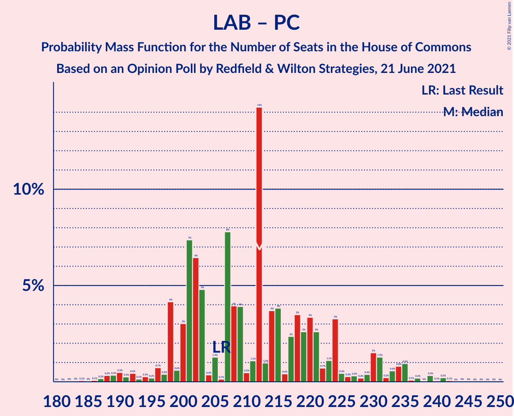

| Number of Seats | Probability | Accumulated | Special Marks |
|:---------------:|:-----------:|:-----------:|:-------------:|
| 182 | 0% | 100% |  |
| 183 | 0% | 99.9% |  |
| 184 | 0.1% | 99.9% |  |
| 185 | 0% | 99.8% |  |
| 186 | 0.1% | 99.8% |  |
| 187 | 0.2% | 99.7% |  |
| 188 | 0.3% | 99.6% |  |
| 189 | 0.3% | 99.2% |  |
| 190 | 0.5% | 98.9% |  |
| 191 | 0.3% | 98% |  |
| 192 | 0.4% | 98% |  |
| 193 | 0.1% | 98% |  |
| 194 | 0.3% | 98% |  |
| 195 | 0.2% | 97% |  |
| 196 | 0.7% | 97% |  |
| 197 | 0.4% | 96% |  |
| 198 | 4% | 96% |  |
| 199 | 0.6% | 92% |  |
| 200 | 3% | 91% |  |
| 201 | 7% | 88% |  |
| 202 | 6% | 81% |  |
| 203 | 5% | 74% |  |
| 204 | 0.4% | 70% |  |
| 205 | 1.3% | 69% |  |
| 206 | 0.1% | 68% | Last Result |
| 207 | 8% | 68% |  |
| 208 | 4% | 60% |  |
| 209 | 4% | 56% |  |
| 210 | 0.5% | 52% |  |
| 211 | 1.1% | 52% | Median |
| 212 | 14% | 51% |  |
| 213 | 1.0% | 36% |  |
| 214 | 4% | 35% |  |
| 215 | 4% | 32% |  |
| 216 | 0.4% | 28% |  |
| 217 | 2% | 27% |  |
| 218 | 3% | 25% |  |
| 219 | 3% | 22% |  |
| 220 | 3% | 19% |  |
| 221 | 3% | 16% |  |
| 222 | 0.7% | 13% |  |
| 223 | 1.1% | 12% |  |
| 224 | 3% | 11% |  |
| 225 | 0.4% | 8% |  |
| 226 | 0.3% | 8% |  |
| 227 | 0.3% | 7% |  |
| 228 | 0.2% | 7% |  |
| 229 | 0.4% | 7% |  |
| 230 | 2% | 6% |  |
| 231 | 1.3% | 5% |  |
| 232 | 0.2% | 4% |  |
| 233 | 0.6% | 3% |  |
| 234 | 0.8% | 3% |  |
| 235 | 0.9% | 2% |  |
| 236 | 0.1% | 1.1% |  |
| 237 | 0.2% | 1.0% |  |
| 238 | 0% | 0.8% |  |
| 239 | 0.3% | 0.8% |  |
| 240 | 0.1% | 0.5% |  |
| 241 | 0.2% | 0.4% |  |
| 242 | 0.1% | 0.2% |  |
| 243 | 0% | 0.1% |  |
| 244 | 0% | 0.1% |  |
| 245 | 0% | 0.1% |  |
| 246 | 0% | 0.1% |  |
| 247 | 0% | 0.1% |  |
| 248 | 0% | 0.1% |  |
| 249 | 0% | 0.1% |  |
| 250 | 0% | 0% |  |

### Labour Party

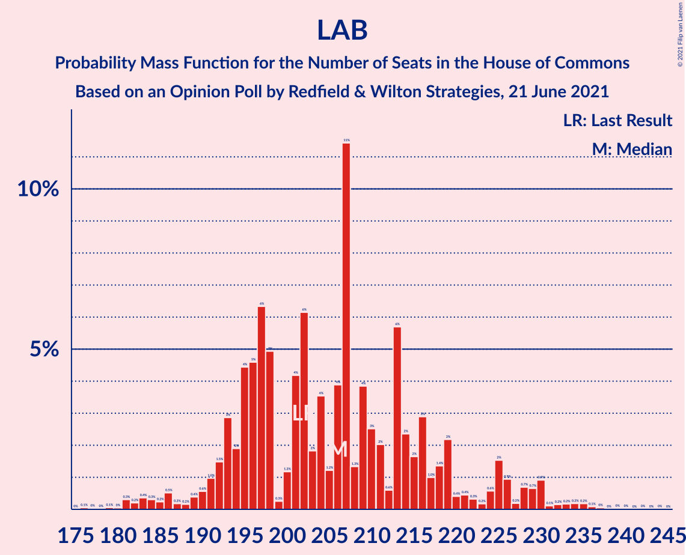

| Number of Seats | Probability | Accumulated | Special Marks |
|:---------------:|:-----------:|:-----------:|:-------------:|
| 176 | 0.1% | 100% |  |
| 177 | 0% | 99.9% |  |
| 178 | 0% | 99.9% |  |
| 179 | 0.1% | 99.9% |  |
| 180 | 0% | 99.8% |  |
| 181 | 0.3% | 99.8% |  |
| 182 | 0.2% | 99.5% |  |
| 183 | 0.4% | 99.2% |  |
| 184 | 0.3% | 98.9% |  |
| 185 | 0.2% | 98.6% |  |
| 186 | 0.5% | 98% |  |
| 187 | 0.2% | 98% |  |
| 188 | 0.2% | 98% |  |
| 189 | 0.4% | 97% |  |
| 190 | 0.6% | 97% |  |
| 191 | 1.0% | 97% |  |
| 192 | 1.5% | 96% |  |
| 193 | 3% | 94% |  |
| 194 | 2% | 91% |  |
| 195 | 4% | 89% |  |
| 196 | 5% | 85% |  |
| 197 | 6% | 80% |  |
| 198 | 5% | 74% |  |
| 199 | 0.3% | 69% |  |
| 200 | 1.2% | 69% |  |
| 201 | 4% | 68% |  |
| 202 | 6% | 63% | Last Result |
| 203 | 2% | 57% |  |
| 204 | 4% | 55% |  |
| 205 | 1.2% | 52% |  |
| 206 | 4% | 51% | Median |
| 207 | 11% | 47% |  |
| 208 | 1.3% | 35% |  |
| 209 | 4% | 34% |  |
| 210 | 3% | 30% |  |
| 211 | 2% | 28% |  |
| 212 | 0.6% | 26% |  |
| 213 | 6% | 25% |  |
| 214 | 2% | 19% |  |
| 215 | 2% | 17% |  |
| 216 | 3% | 15% |  |
| 217 | 1.0% | 12% |  |
| 218 | 1.4% | 11% |  |
| 219 | 2% | 10% |  |
| 220 | 0.4% | 8% |  |
| 221 | 0.4% | 8% |  |
| 222 | 0.3% | 7% |  |
| 223 | 0.2% | 7% |  |
| 224 | 0.6% | 7% |  |
| 225 | 2% | 6% |  |
| 226 | 0.9% | 4% |  |
| 227 | 0.2% | 4% |  |
| 228 | 0.7% | 3% |  |
| 229 | 0.7% | 3% |  |
| 230 | 0.9% | 2% |  |
| 231 | 0.1% | 1.1% |  |
| 232 | 0.2% | 1.0% |  |
| 233 | 0.2% | 0.8% |  |
| 234 | 0.2% | 0.6% |  |
| 235 | 0.2% | 0.4% |  |
| 236 | 0.1% | 0.3% |  |
| 237 | 0% | 0.2% |  |
| 238 | 0% | 0.1% |  |
| 239 | 0% | 0.1% |  |
| 240 | 0% | 0.1% |  |
| 241 | 0% | 0.1% |  |
| 242 | 0% | 0.1% |  |
| 243 | 0% | 0.1% |  |
| 244 | 0% | 0.1% |  |
| 245 | 0% | 0% |  |

## Technical Information

### Opinion Poll

+ **Polling firm:** Redfield & Wilton Strategies
+ **Commissioner(s):** —
+ **Fieldwork period:** 21 June 2021

### Calculations

+ **Sample size:** 1950
+ **Simulations done:** 131,072
+ **Error estimate:** 1.04%

