# Opinion Poll by Panelbase for Sunday Times, 2 July 2021

<a href="#voting-intentions">Voting Intentions</a> | <a href="#seats">Seats</a> | <a href="#coalitions">Coalitions</a> | <a href="#technical-information">Technical Information</a>

## Voting Intentions

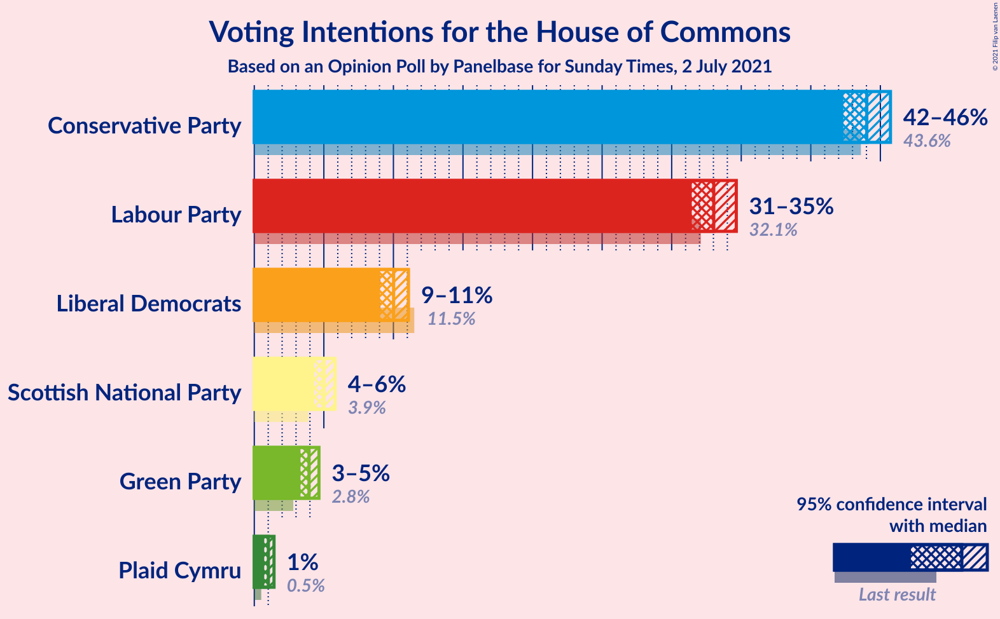

### Confidence Intervals

| Party | Last Result | Poll Result | 80% Confidence Interval | 90% Confidence Interval | 95% Confidence Interval | 99% Confidence Interval |
|:-----:|:-----------:|:-----------:|:-----------------------:|:-----------------------:|:-----------------------:|:-----------------------:|
| Conservative Party | 43.6% | 44.0% | 42.9–45.1% |42.6–45.5% |42.3–45.7% |41.8–46.2% |
| Labour Party | 32.1% | 33.0% | 32.0–34.1% |31.7–34.4% |31.4–34.6% |31.0–35.1% |
| Liberal Democrats | 11.5% | 10.0% | 9.4–10.7% |9.2–10.9% |9.0–11.1% |8.7–11.4% |
| Scottish National Party | 3.9% | 5.0% | 4.5–5.5% |4.4–5.7% |4.3–5.8% |4.1–6.1% |
| Green Party | 2.8% | 3.9% | 3.5–4.4% |3.4–4.5% |3.3–4.6% |3.1–4.9% |
| Plaid Cymru | 0.5% | 1.0% | 0.8–1.3% |0.8–1.4% |0.7–1.4% |0.6–1.6% |

*Note:* The poll result column reflects the actual value used in the calculations. Published results may vary slightly, and in addition be rounded to fewer digits.

## Seats

### Confidence Intervals

| Party | Last Result | Median | 80% Confidence Interval | 90% Confidence Interval | 95% Confidence Interval | 99% Confidence Interval |
|:-----:|:-----------:|:------:|:-----------------------:|:-----------------------:|:-----------------------:|:-----------------------:|
| <a href="#conservative-party">Conservative Party</a> | 365 | 368 | 368 |368 |368 |368 |
| <a href="#labour-party">Labour Party</a> | 202 | N/A | 202 |202 |202 |202 |
| <a href="#liberal-democrats">Liberal Democrats</a> | 11 | N/A | 4 |4 |4 |4 |
| <a href="#scottish-national-party">Scottish National Party</a> | 48 | N/A | 52 |52 |52 |52 |
| <a href="#green-party">Green Party</a> | 1 | N/A | 1 |1 |1 |1 |
| <a href="#plaid-cymru">Plaid Cymru</a> | 4 | N/A | 4 |4 |4 |4 |

### Conservative Party

*For a full overview of the results for this party, see the [Conservative Party](party-conservativeparty.html) page.*

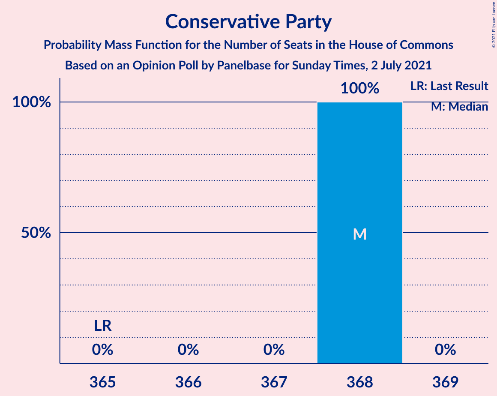

| Number of Seats | Probability | Accumulated | Special Marks |
|:---------------:|:-----------:|:-----------:|:-------------:|
| 365 | 0% | 100% | Last Result |
| 366 | 0% | 100% |  |
| 367 | 0% | 100% |  |
| 368 | 100% | 100% | Median |

### Labour Party

*For a full overview of the results for this party, see the [Labour Party](party-labourparty.html) page.*

### Liberal Democrats

*For a full overview of the results for this party, see the [Liberal Democrats](party-liberaldemocrats.html) page.*

### Scottish National Party

*For a full overview of the results for this party, see the [Scottish National Party](party-scottishnationalparty.html) page.*

### Green Party

*For a full overview of the results for this party, see the [Green Party](party-greenparty.html) page.*

### Plaid Cymru

*For a full overview of the results for this party, see the [Plaid Cymru](party-plaidcymru.html) page.*

## Coalitions

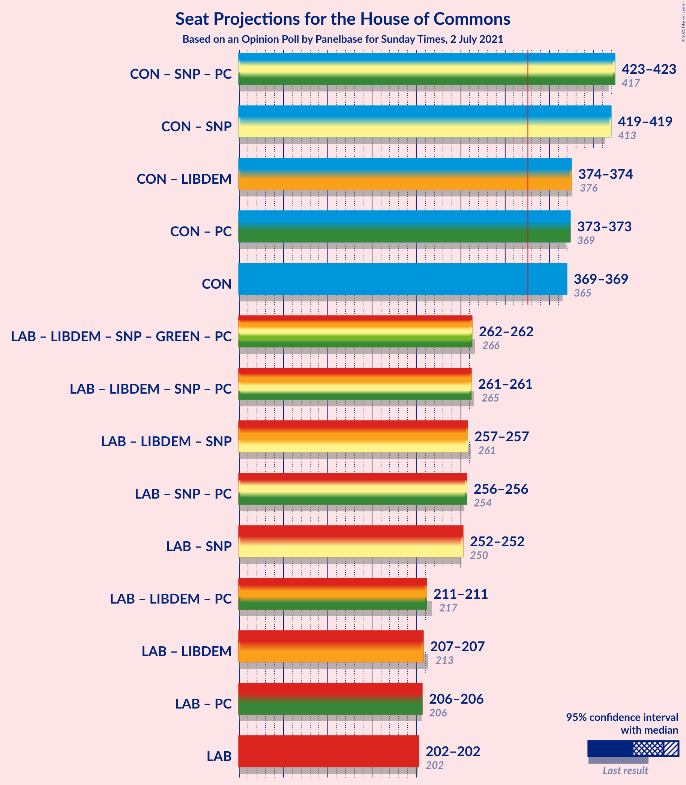

### Confidence Intervals

| Coalition | Last Result | Median | Majority? | 80% Confidence Interval | 90% Confidence Interval | 95% Confidence Interval | 99% Confidence Interval |
|:---------:|:-----------:|:------:|:---------:|:-----------------------:|:-----------------------:|:-----------------------:|:-----------------------:|
| Conservative Party – Scottish National Party – Plaid Cymru | 417 | 423 | 100% | 423 | 423 | 423 | 423 |
| Conservative Party – Scottish National Party | 413 | 419 | 100% | 419 | 419 | 419 | 419 |
| Conservative Party – Liberal Democrats | 376 | 374 | 100% | 374 | 374 | 374 | 374 |
| Conservative Party – Plaid Cymru | 369 | 373 | 100% | 373 | 373 | 373 | 373 |
| Conservative Party | 365 | 369 | 100% | 369 | 369 | 369 | 369 |
| Labour Party – Liberal Democrats – Scottish National Party – Green Party – Plaid Cymru | 266 | 262 | 0% | 262 | 262 | 262 | 262 |
| Labour Party – Liberal Democrats – Scottish National Party – Plaid Cymru | 265 | 261 | 0% | 261 | 261 | 261 | 261 |
| Labour Party – Liberal Democrats – Scottish National Party | 261 | 257 | 0% | 257 | 257 | 257 | 257 |
| Labour Party – Scottish National Party – Plaid Cymru | 254 | 256 | 0% | 256 | 256 | 256 | 256 |
| Labour Party – Scottish National Party | 250 | 252 | 0% | 252 | 252 | 252 | 252 |
| Labour Party – Liberal Democrats – Plaid Cymru | 217 | 211 | 0% | 211 | 211 | 211 | 211 |
| Labour Party – Liberal Democrats | 213 | 207 | 0% | 207 | 207 | 207 | 207 |
| Labour Party – Plaid Cymru | 206 | 206 | 0% | 206 | 206 | 206 | 206 |
| Labour Party | 202 | 202 | 0% | 202 | 202 | 202 | 202 |

### Conservative Party – Scottish National Party – Plaid Cymru

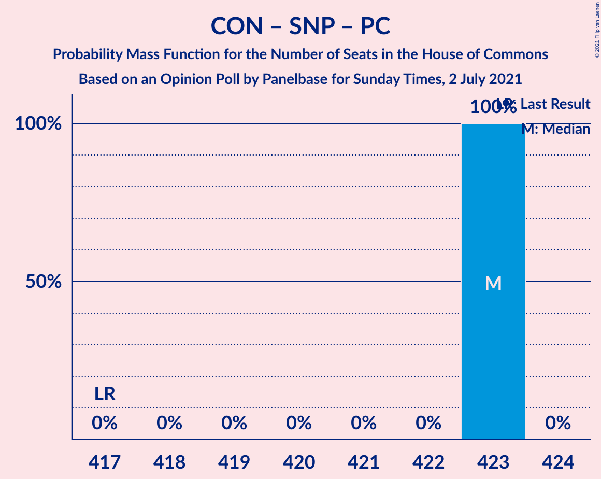

| Number of Seats | Probability | Accumulated | Special Marks |
|:---------------:|:-----------:|:-----------:|:-------------:|
| 417 | 0% | 100% | Last Result |
| 418 | 0% | 100% |  |
| 419 | 0% | 100% |  |
| 420 | 0% | 100% |  |
| 421 | 0% | 100% |  |
| 422 | 0% | 100% |  |
| 423 | 100% | 100% |  |

### Conservative Party – Scottish National Party

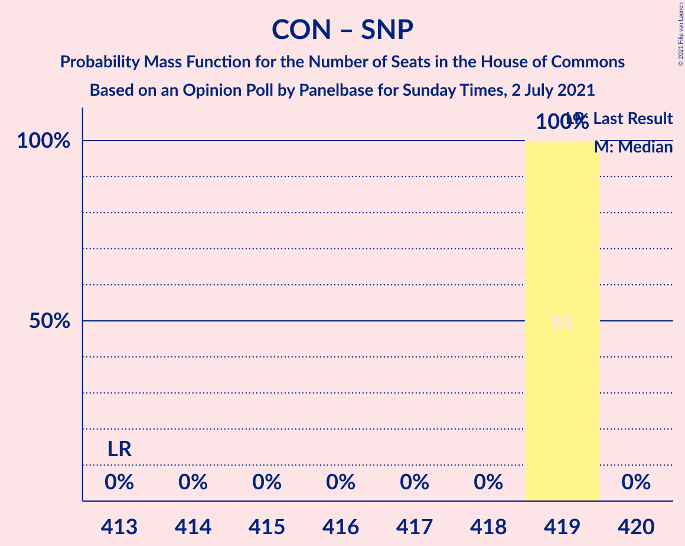

| Number of Seats | Probability | Accumulated | Special Marks |
|:---------------:|:-----------:|:-----------:|:-------------:|
| 413 | 0% | 100% | Last Result |
| 414 | 0% | 100% |  |
| 415 | 0% | 100% |  |
| 416 | 0% | 100% |  |
| 417 | 0% | 100% |  |
| 418 | 0% | 100% |  |
| 419 | 100% | 100% |  |

### Conservative Party – Liberal Democrats

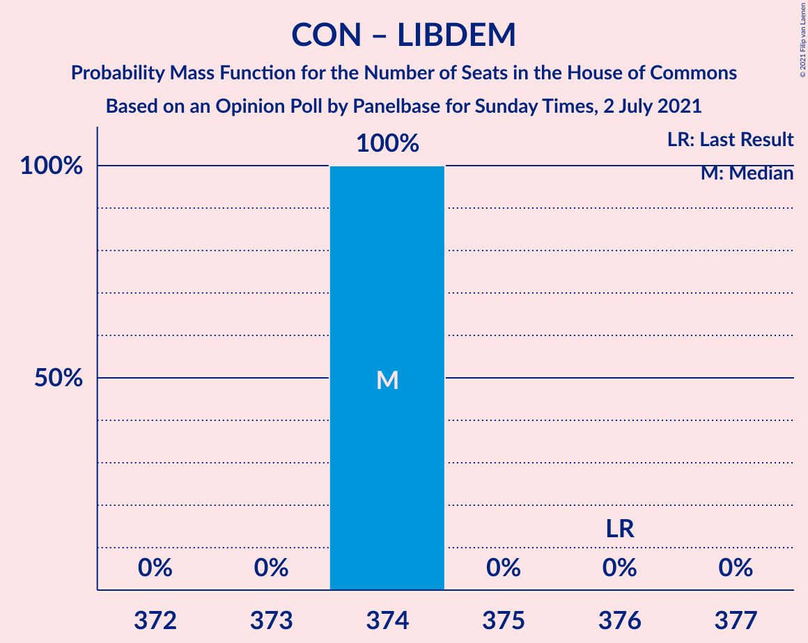

| Number of Seats | Probability | Accumulated | Special Marks |
|:---------------:|:-----------:|:-----------:|:-------------:|
| 374 | 100% | 100% |  |
| 375 | 0% | 0% |  |
| 376 | 0% | 0% | Last Result |

### Conservative Party – Plaid Cymru

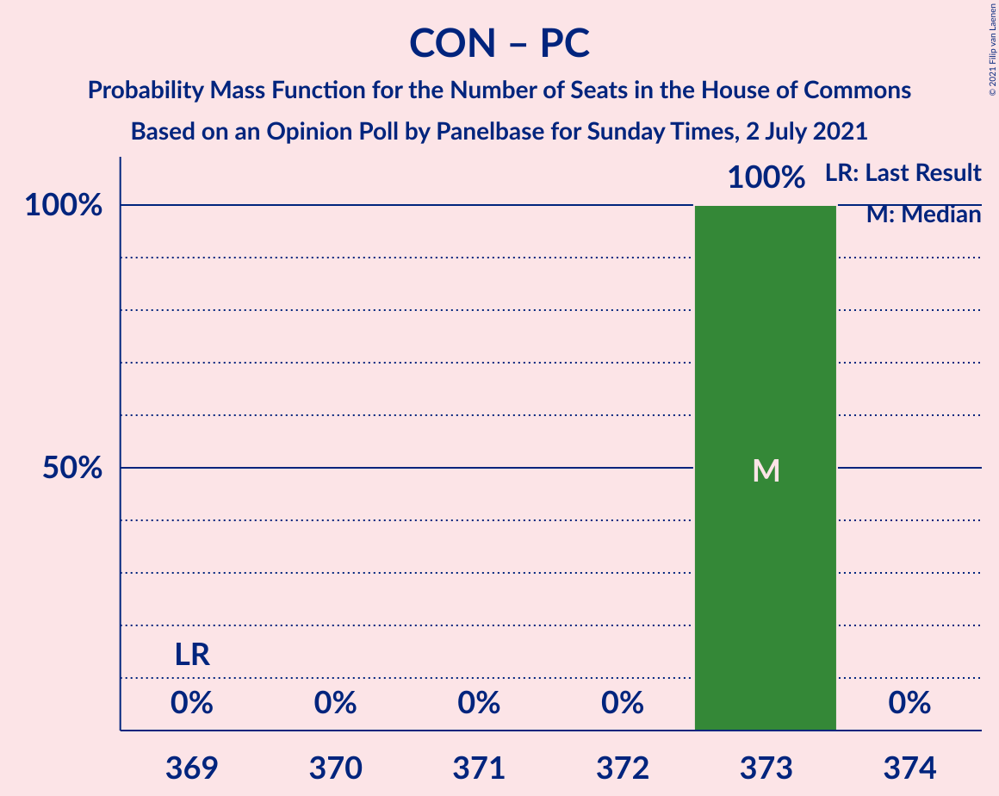

| Number of Seats | Probability | Accumulated | Special Marks |
|:---------------:|:-----------:|:-----------:|:-------------:|
| 369 | 0% | 100% | Last Result |
| 370 | 0% | 100% |  |
| 371 | 0% | 100% |  |
| 372 | 0% | 100% |  |
| 373 | 100% | 100% |  |

### Conservative Party

| Number of Seats | Probability | Accumulated | Special Marks |
|:---------------:|:-----------:|:-----------:|:-------------:|
| 365 | 0% | 100% | Last Result |
| 366 | 0% | 100% |  |
| 367 | 0% | 100% |  |
| 368 | 0% | 100% | Median |
| 369 | 100% | 100% |  |

### Labour Party – Liberal Democrats – Scottish National Party – Green Party – Plaid Cymru

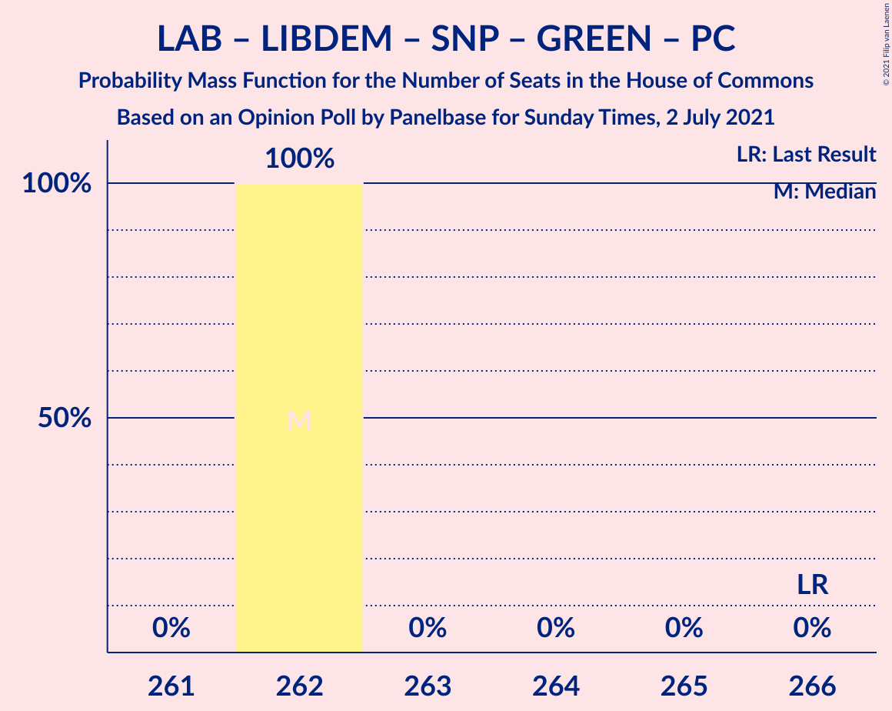

| Number of Seats | Probability | Accumulated | Special Marks |
|:---------------:|:-----------:|:-----------:|:-------------:|
| 262 | 100% | 100% |  |
| 263 | 0% | 0% |  |
| 264 | 0% | 0% |  |
| 265 | 0% | 0% |  |
| 266 | 0% | 0% | Last Result |

### Labour Party – Liberal Democrats – Scottish National Party – Plaid Cymru

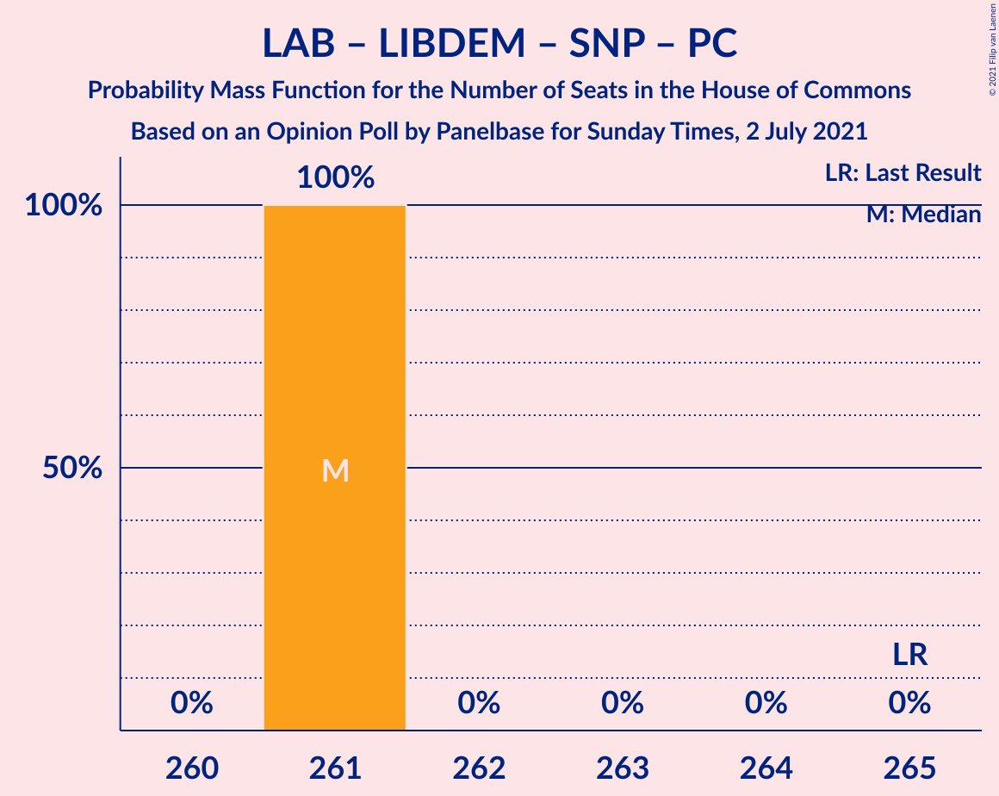

| Number of Seats | Probability | Accumulated | Special Marks |
|:---------------:|:-----------:|:-----------:|:-------------:|
| 261 | 100% | 100% |  |
| 262 | 0% | 0% |  |
| 263 | 0% | 0% |  |
| 264 | 0% | 0% |  |
| 265 | 0% | 0% | Last Result |

### Labour Party – Liberal Democrats – Scottish National Party

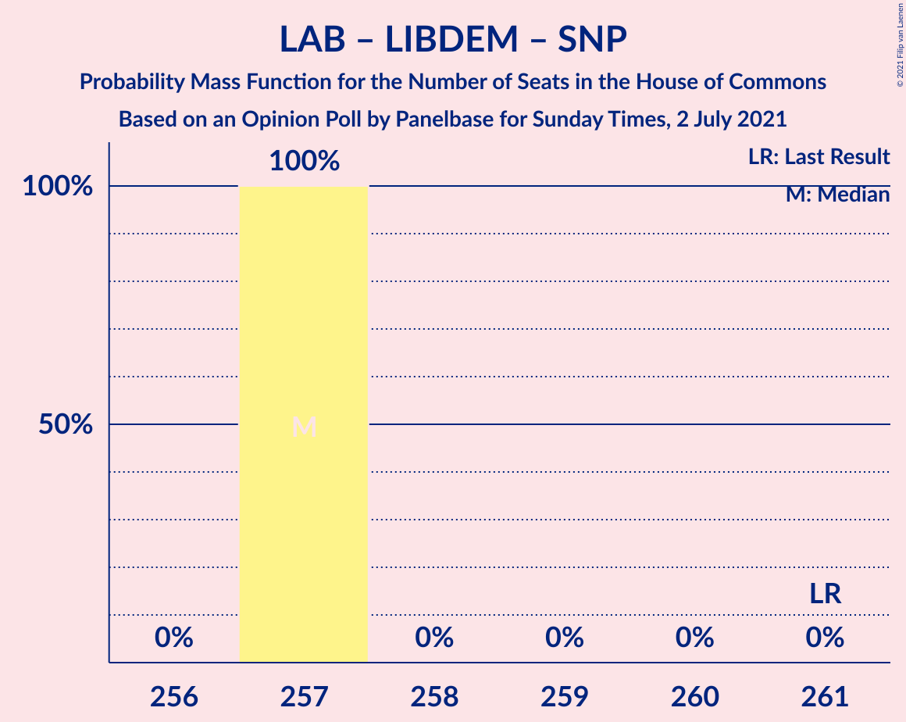

| Number of Seats | Probability | Accumulated | Special Marks |
|:---------------:|:-----------:|:-----------:|:-------------:|
| 257 | 100% | 100% |  |
| 258 | 0% | 0% |  |
| 259 | 0% | 0% |  |
| 260 | 0% | 0% |  |
| 261 | 0% | 0% | Last Result |

### Labour Party – Scottish National Party – Plaid Cymru

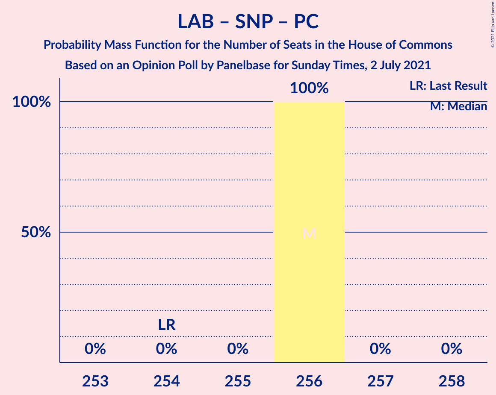

| Number of Seats | Probability | Accumulated | Special Marks |
|:---------------:|:-----------:|:-----------:|:-------------:|
| 254 | 0% | 100% | Last Result |
| 255 | 0% | 100% |  |
| 256 | 100% | 100% |  |

### Labour Party – Scottish National Party

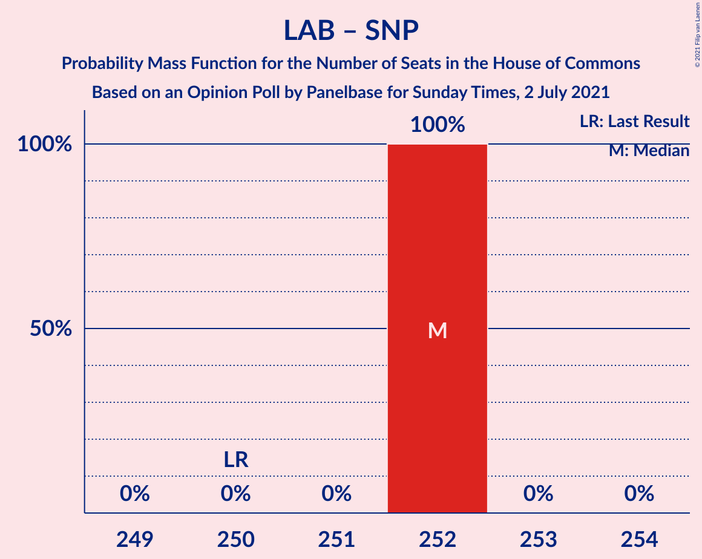

| Number of Seats | Probability | Accumulated | Special Marks |
|:---------------:|:-----------:|:-----------:|:-------------:|
| 250 | 0% | 100% | Last Result |
| 251 | 0% | 100% |  |
| 252 | 100% | 100% |  |

### Labour Party – Liberal Democrats – Plaid Cymru

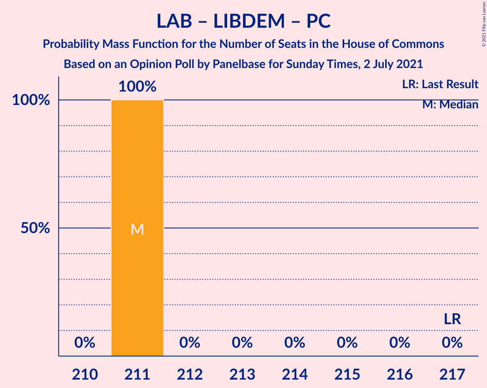

| Number of Seats | Probability | Accumulated | Special Marks |
|:---------------:|:-----------:|:-----------:|:-------------:|
| 211 | 100% | 100% |  |
| 212 | 0% | 0% |  |
| 213 | 0% | 0% |  |
| 214 | 0% | 0% |  |
| 215 | 0% | 0% |  |
| 216 | 0% | 0% |  |
| 217 | 0% | 0% | Last Result |

### Labour Party – Liberal Democrats

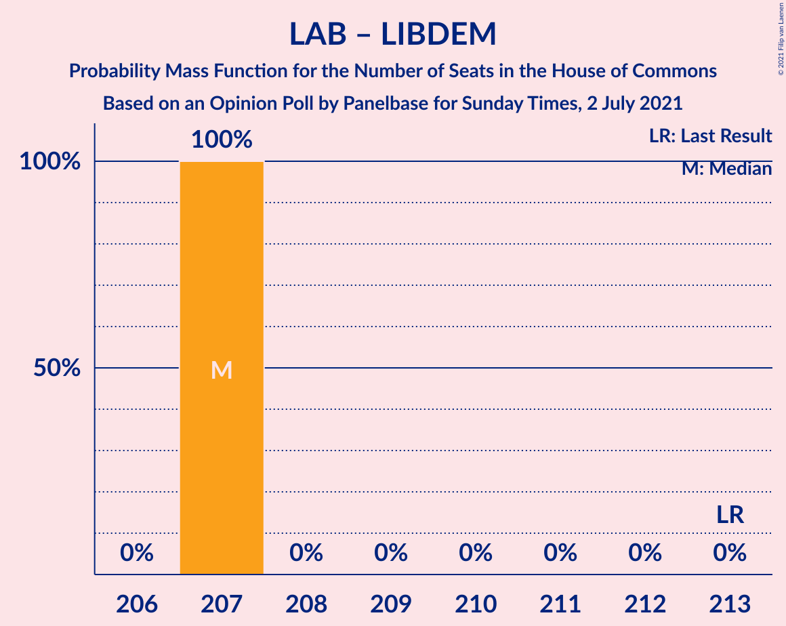

| Number of Seats | Probability | Accumulated | Special Marks |
|:---------------:|:-----------:|:-----------:|:-------------:|
| 207 | 100% | 100% |  |
| 208 | 0% | 0% |  |
| 209 | 0% | 0% |  |
| 210 | 0% | 0% |  |
| 211 | 0% | 0% |  |
| 212 | 0% | 0% |  |
| 213 | 0% | 0% | Last Result |

### Labour Party – Plaid Cymru

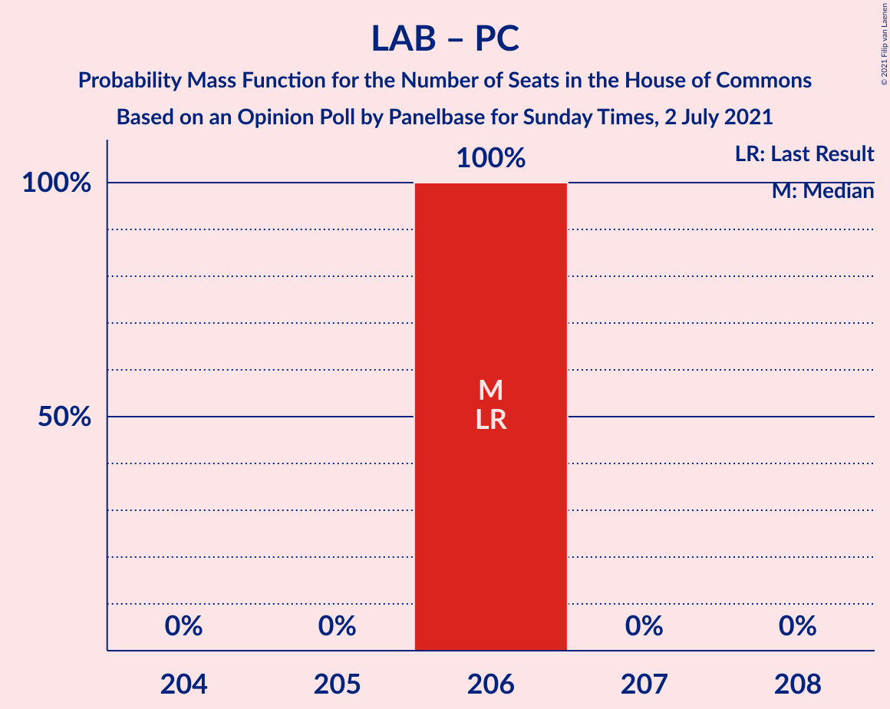

| Number of Seats | Probability | Accumulated | Special Marks |
|:---------------:|:-----------:|:-----------:|:-------------:|
| 206 | 100% | 100% | Last Result |

### Labour Party

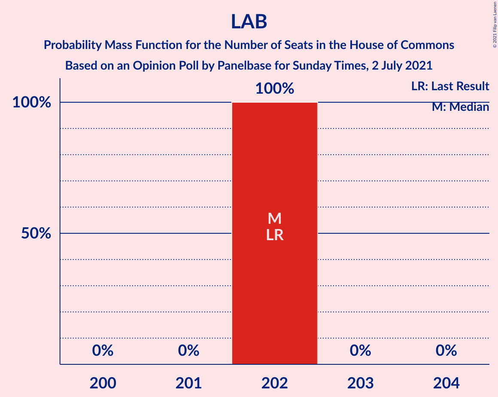

| Number of Seats | Probability | Accumulated | Special Marks |
|:---------------:|:-----------:|:-----------:|:-------------:|
| 202 | 100% | 100% | Last Result |

## Technical Information

### Opinion Poll

+ **Polling firm:** Panelbase
+ **Commissioner(s):** Sunday Times
+ **Fieldwork period:** 2 July 2021

### Calculations

+ **Sample size:** 3355
+ **Simulations done:** 1
+ **Error estimate:** 100.00%

