# Opinion Poll by Redfield & Wilton Strategies, 23 August 2021

<a href="#voting-intentions">Voting Intentions</a> | <a href="#seats">Seats</a> | <a href="#coalitions">Coalitions</a> | <a href="#technical-information">Technical Information</a>

## Voting Intentions

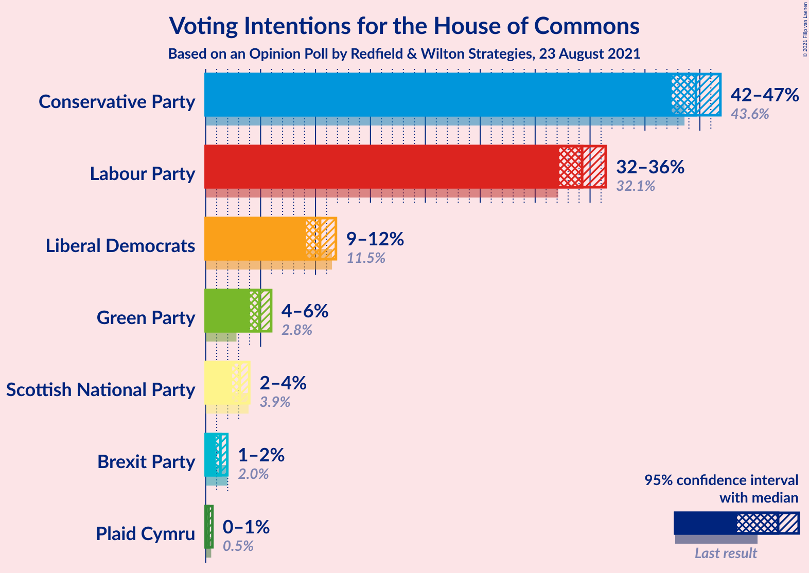

### Confidence Intervals

| Party | Last Result | Poll Result | 80% Confidence Interval | 90% Confidence Interval | 95% Confidence Interval | 99% Confidence Interval |
|:-----:|:-----------:|:-----------:|:-----------------------:|:-----------------------:|:-----------------------:|:-----------------------:|
| Conservative Party | 43.6% | 44.6% | 43.2–46.1% |42.8–46.5% |42.4–46.9% |41.7–47.6% |
| Labour Party | 32.1% | 34.3% | 32.9–35.7% |32.5–36.1% |32.2–36.4% |31.6–37.1% |
| Liberal Democrats | 11.5% | 10.4% | 9.6–11.4% |9.3–11.6% |9.1–11.9% |8.7–12.3% |
| Green Party | 2.8% | 4.9% | 4.3–5.6% |4.2–5.8% |4.0–6.0% |3.7–6.3% |
| Scottish National Party | 3.9% | 3.1% | 2.6–3.7% |2.5–3.8% |2.4–4.0% |2.2–4.3% |
| Brexit Party | 2.0% | 1.3% | 1.1–1.8% |1.0–1.9% |0.9–2.0% |0.8–2.2% |
| Plaid Cymru | 0.5% | 0.3% | 0.2–0.5% |0.1–0.5% |0.1–0.6% |0.1–0.7% |

*Note:* The poll result column reflects the actual value used in the calculations. Published results may vary slightly, and in addition be rounded to fewer digits.

## Seats

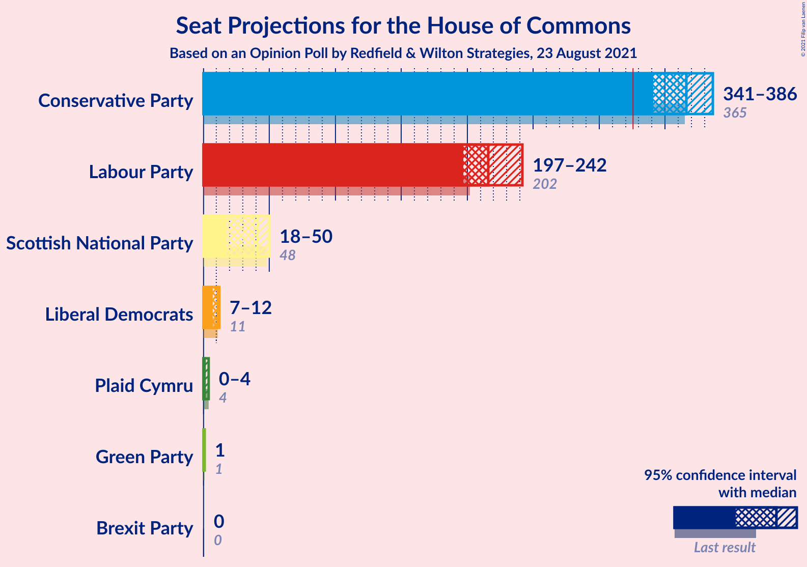

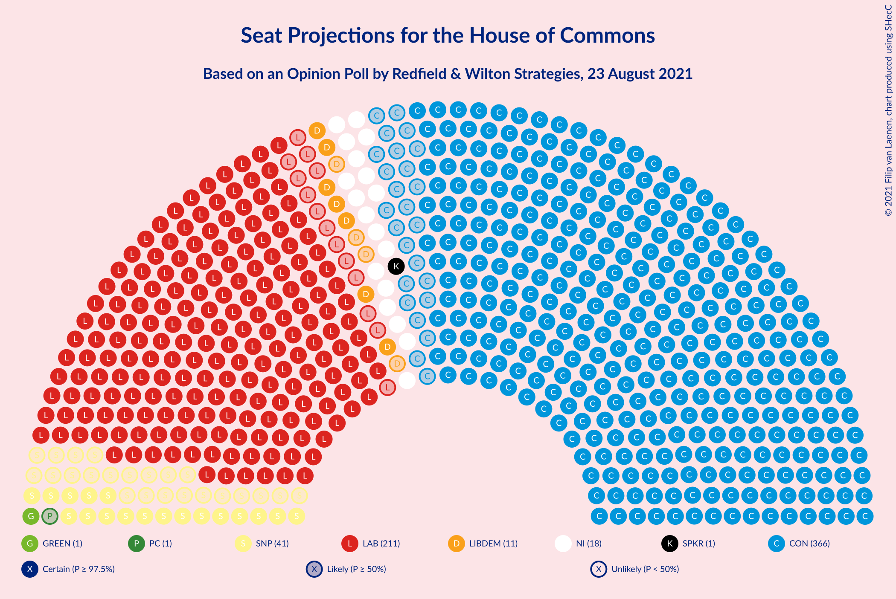

### Confidence Intervals

| Party | Last Result | Median | 80% Confidence Interval | 90% Confidence Interval | 95% Confidence Interval | 99% Confidence Interval |
|:-----:|:-----------:|:------:|:-----------------------:|:-----------------------:|:-----------------------:|:-----------------------:|
| <a href="#conservative-party">Conservative Party</a> | 365 | 366 | 347–378 |345–382 |341–386 |333–394 |
| <a href="#labour-party">Labour Party</a> | 202 | 216 | 204–231 |199–239 |197–242 |190–252 |
| <a href="#liberal-democrats">Liberal Democrats</a> | 11 | 11 | 8–12 |8–12 |7–12 |5–16 |
| <a href="#green-party">Green Party</a> | 1 | 1 | 1 |1 |1 |1 |
| <a href="#scottish-national-party">Scottish National Party</a> | 48 | 41 | 24–48 |20–49 |18–50 |15–54 |
| <a href="#brexit-party">Brexit Party</a> | 0 | 0 | 0 |0 |0 |0 |
| <a href="#plaid-cymru">Plaid Cymru</a> | 4 | 1 | 0–4 |0–4 |0–4 |0–5 |

### Conservative Party

*For a full overview of the results for this party, see the [Conservative Party](party-conservativeparty.html) page.*

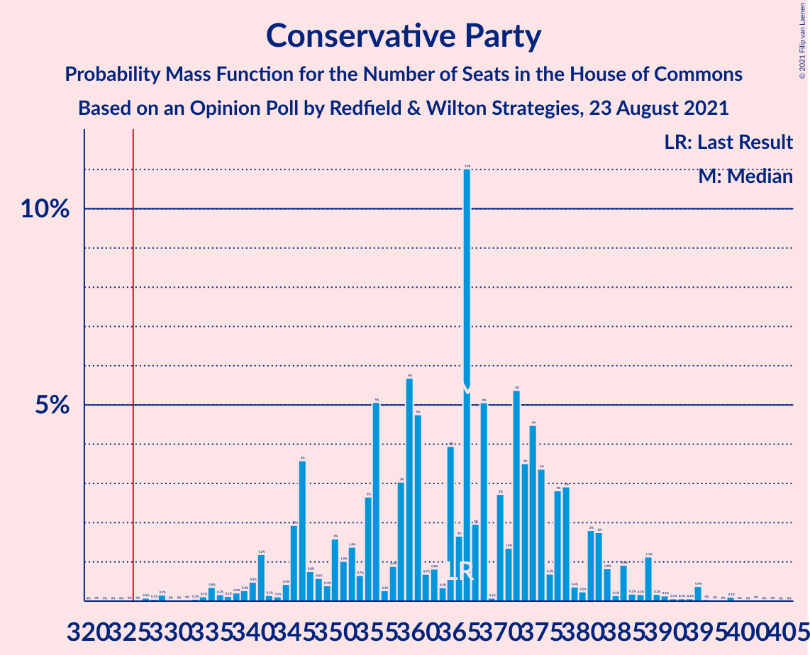

| Number of Seats | Probability | Accumulated | Special Marks |
|:---------------:|:-----------:|:-----------:|:-------------:|
| 321 | 0% | 100% |  |
| 322 | 0% | 99.9% |  |
| 323 | 0% | 99.9% |  |
| 324 | 0% | 99.9% |  |
| 325 | 0% | 99.9% |  |
| 326 | 0% | 99.9% | Majority |
| 327 | 0.1% | 99.9% |  |
| 328 | 0.1% | 99.8% |  |
| 329 | 0.2% | 99.8% |  |
| 330 | 0% | 99.6% |  |
| 331 | 0% | 99.6% |  |
| 332 | 0% | 99.6% |  |
| 333 | 0.1% | 99.5% |  |
| 334 | 0.1% | 99.5% |  |
| 335 | 0.4% | 99.3% |  |
| 336 | 0.2% | 99.0% |  |
| 337 | 0.1% | 98.8% |  |
| 338 | 0.2% | 98.7% |  |
| 339 | 0.3% | 98% |  |
| 340 | 0.5% | 98% |  |
| 341 | 1.2% | 98% |  |
| 342 | 0.1% | 97% |  |
| 343 | 0.1% | 96% |  |
| 344 | 0.4% | 96% |  |
| 345 | 2% | 96% |  |
| 346 | 4% | 94% |  |
| 347 | 0.8% | 90% |  |
| 348 | 0.6% | 90% |  |
| 349 | 0.4% | 89% |  |
| 350 | 2% | 89% |  |
| 351 | 1.0% | 87% |  |
| 352 | 1.4% | 86% |  |
| 353 | 0.7% | 85% |  |
| 354 | 3% | 84% |  |
| 355 | 5% | 81% |  |
| 356 | 0.3% | 76% |  |
| 357 | 0.9% | 76% |  |
| 358 | 3% | 75% |  |
| 359 | 6% | 72% |  |
| 360 | 5% | 66% |  |
| 361 | 0.7% | 62% |  |
| 362 | 0.8% | 61% |  |
| 363 | 0.3% | 60% |  |
| 364 | 4% | 60% |  |
| 365 | 2% | 56% | Last Result |
| 366 | 11% | 54% | Median |
| 367 | 2% | 43% |  |
| 368 | 5% | 41% |  |
| 369 | 0.1% | 36% |  |
| 370 | 3% | 36% |  |
| 371 | 1.4% | 33% |  |
| 372 | 5% | 32% |  |
| 373 | 4% | 27% |  |
| 374 | 4% | 23% |  |
| 375 | 3% | 19% |  |
| 376 | 0.7% | 15% |  |
| 377 | 3% | 14% |  |
| 378 | 3% | 12% |  |
| 379 | 0.4% | 9% |  |
| 380 | 0.2% | 8% |  |
| 381 | 2% | 8% |  |
| 382 | 2% | 6% |  |
| 383 | 0.8% | 5% |  |
| 384 | 0.1% | 4% |  |
| 385 | 0.9% | 4% |  |
| 386 | 0.2% | 3% |  |
| 387 | 0.2% | 2% |  |
| 388 | 1.1% | 2% |  |
| 389 | 0.2% | 1.2% |  |
| 390 | 0.1% | 1.0% |  |
| 391 | 0.1% | 0.9% |  |
| 392 | 0.1% | 0.8% |  |
| 393 | 0.1% | 0.7% |  |
| 394 | 0.4% | 0.7% |  |
| 395 | 0% | 0.3% |  |
| 396 | 0% | 0.2% |  |
| 397 | 0% | 0.2% |  |
| 398 | 0.1% | 0.2% |  |
| 399 | 0% | 0.1% |  |
| 400 | 0% | 0.1% |  |
| 401 | 0% | 0.1% |  |
| 402 | 0% | 0% |  |

### Labour Party

*For a full overview of the results for this party, see the [Labour Party](party-labourparty.html) page.*

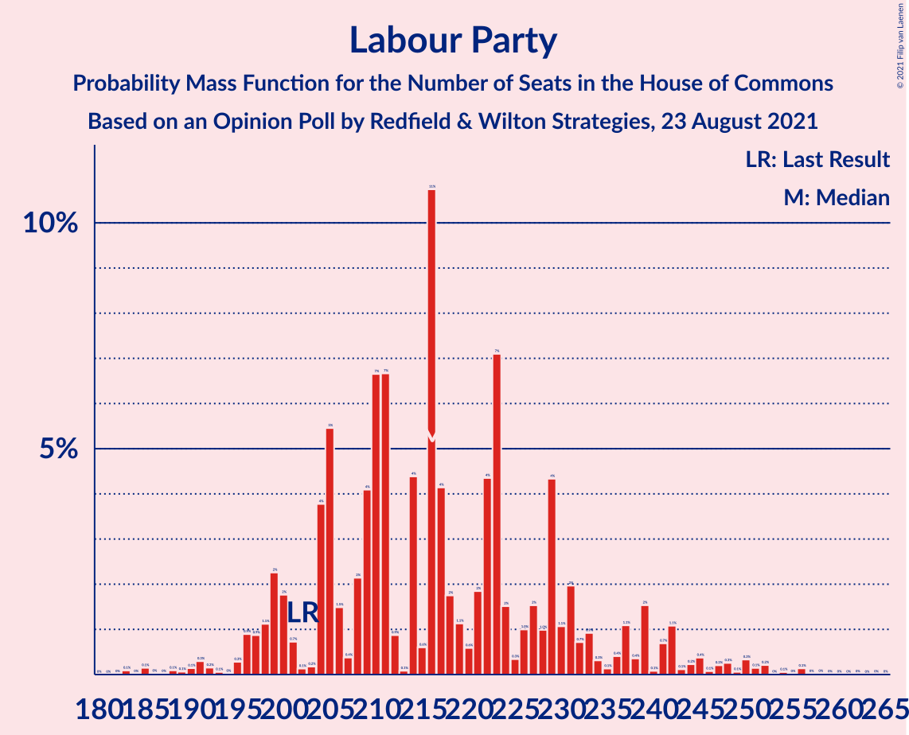

| Number of Seats | Probability | Accumulated | Special Marks |
|:---------------:|:-----------:|:-----------:|:-------------:|
| 183 | 0.1% | 100% |  |
| 184 | 0% | 99.9% |  |
| 185 | 0.1% | 99.9% |  |
| 186 | 0% | 99.7% |  |
| 187 | 0% | 99.7% |  |
| 188 | 0.1% | 99.7% |  |
| 189 | 0.1% | 99.6% |  |
| 190 | 0.1% | 99.5% |  |
| 191 | 0.3% | 99.4% |  |
| 192 | 0.2% | 99.1% |  |
| 193 | 0.1% | 98.9% |  |
| 194 | 0% | 98.9% |  |
| 195 | 0.3% | 98.8% |  |
| 196 | 0.9% | 98.6% |  |
| 197 | 0.9% | 98% |  |
| 198 | 1.1% | 97% |  |
| 199 | 2% | 96% |  |
| 200 | 2% | 93% |  |
| 201 | 0.7% | 92% |  |
| 202 | 0.1% | 91% | Last Result |
| 203 | 0.2% | 91% |  |
| 204 | 4% | 91% |  |
| 205 | 5% | 87% |  |
| 206 | 1.5% | 81% |  |
| 207 | 0.4% | 80% |  |
| 208 | 2% | 80% |  |
| 209 | 4% | 77% |  |
| 210 | 7% | 73% |  |
| 211 | 7% | 67% |  |
| 212 | 0.9% | 60% |  |
| 213 | 0.1% | 59% |  |
| 214 | 4% | 59% |  |
| 215 | 0.6% | 55% |  |
| 216 | 11% | 54% | Median |
| 217 | 4% | 43% |  |
| 218 | 2% | 39% |  |
| 219 | 1.1% | 37% |  |
| 220 | 0.6% | 36% |  |
| 221 | 2% | 36% |  |
| 222 | 4% | 34% |  |
| 223 | 7% | 29% |  |
| 224 | 2% | 22% |  |
| 225 | 0.3% | 21% |  |
| 226 | 1.0% | 21% |  |
| 227 | 2% | 20% |  |
| 228 | 1.0% | 18% |  |
| 229 | 4% | 17% |  |
| 230 | 1.1% | 13% |  |
| 231 | 2% | 12% |  |
| 232 | 0.7% | 10% |  |
| 233 | 0.9% | 9% |  |
| 234 | 0.3% | 8% |  |
| 235 | 0.1% | 8% |  |
| 236 | 0.4% | 8% |  |
| 237 | 1.1% | 7% |  |
| 238 | 0.4% | 6% |  |
| 239 | 2% | 6% |  |
| 240 | 0.1% | 4% |  |
| 241 | 0.7% | 4% |  |
| 242 | 1.1% | 3% |  |
| 243 | 0.1% | 2% |  |
| 244 | 0.2% | 2% |  |
| 245 | 0.4% | 2% |  |
| 246 | 0.1% | 2% |  |
| 247 | 0.2% | 2% |  |
| 248 | 0.3% | 1.3% |  |
| 249 | 0.1% | 1.1% |  |
| 250 | 0.3% | 1.0% |  |
| 251 | 0.1% | 0.7% |  |
| 252 | 0.2% | 0.5% |  |
| 253 | 0% | 0.3% |  |
| 254 | 0.1% | 0.3% |  |
| 255 | 0% | 0.2% |  |
| 256 | 0.1% | 0.2% |  |
| 257 | 0% | 0.1% |  |
| 258 | 0% | 0.1% |  |
| 259 | 0% | 0.1% |  |
| 260 | 0% | 0.1% |  |
| 261 | 0% | 0% |  |

### Liberal Democrats

*For a full overview of the results for this party, see the [Liberal Democrats](party-liberaldemocrats.html) page.*

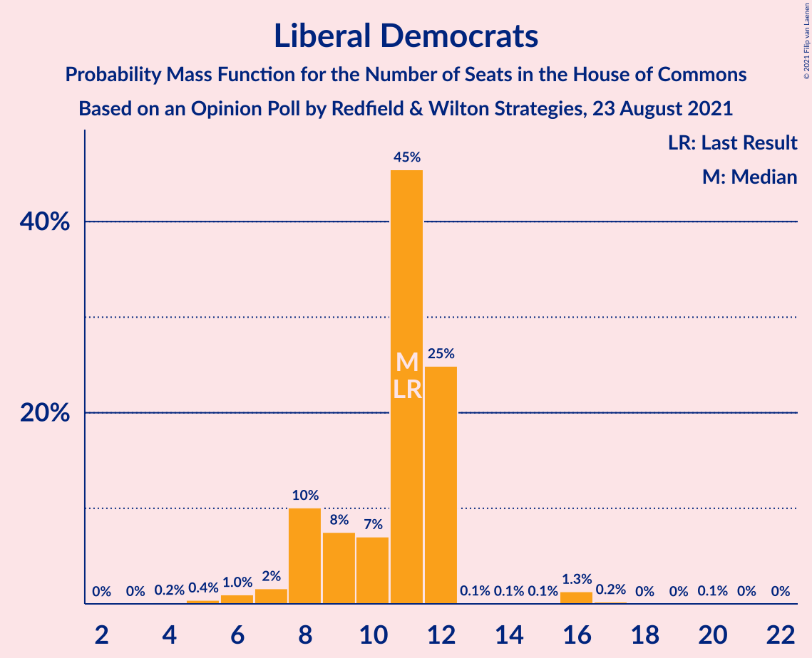

| Number of Seats | Probability | Accumulated | Special Marks |
|:---------------:|:-----------:|:-----------:|:-------------:|
| 4 | 0.2% | 100% |  |
| 5 | 0.4% | 99.8% |  |
| 6 | 1.0% | 99.4% |  |
| 7 | 2% | 98% |  |
| 8 | 10% | 97% |  |
| 9 | 8% | 87% |  |
| 10 | 7% | 79% |  |
| 11 | 45% | 72% | Last Result, Median |
| 12 | 25% | 27% |  |
| 13 | 0.1% | 2% |  |
| 14 | 0.1% | 2% |  |
| 15 | 0.1% | 2% |  |
| 16 | 1.3% | 2% |  |
| 17 | 0.2% | 0.4% |  |
| 18 | 0% | 0.2% |  |
| 19 | 0% | 0.1% |  |
| 20 | 0.1% | 0.1% |  |
| 21 | 0% | 0.1% |  |
| 22 | 0% | 0% |  |

### Green Party

*For a full overview of the results for this party, see the [Green Party](party-greenparty.html) page.*

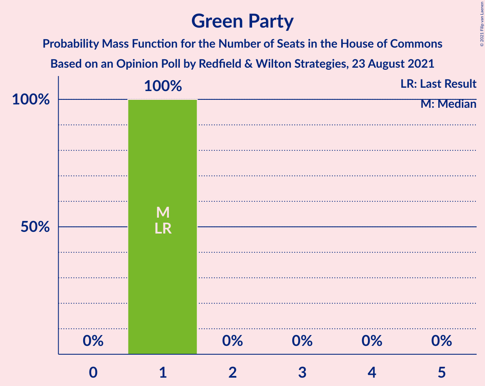

| Number of Seats | Probability | Accumulated | Special Marks |
|:---------------:|:-----------:|:-----------:|:-------------:|
| 1 | 100% | 100% | Last Result, Median |

### Scottish National Party

*For a full overview of the results for this party, see the [Scottish National Party](party-scottishnationalparty.html) page.*

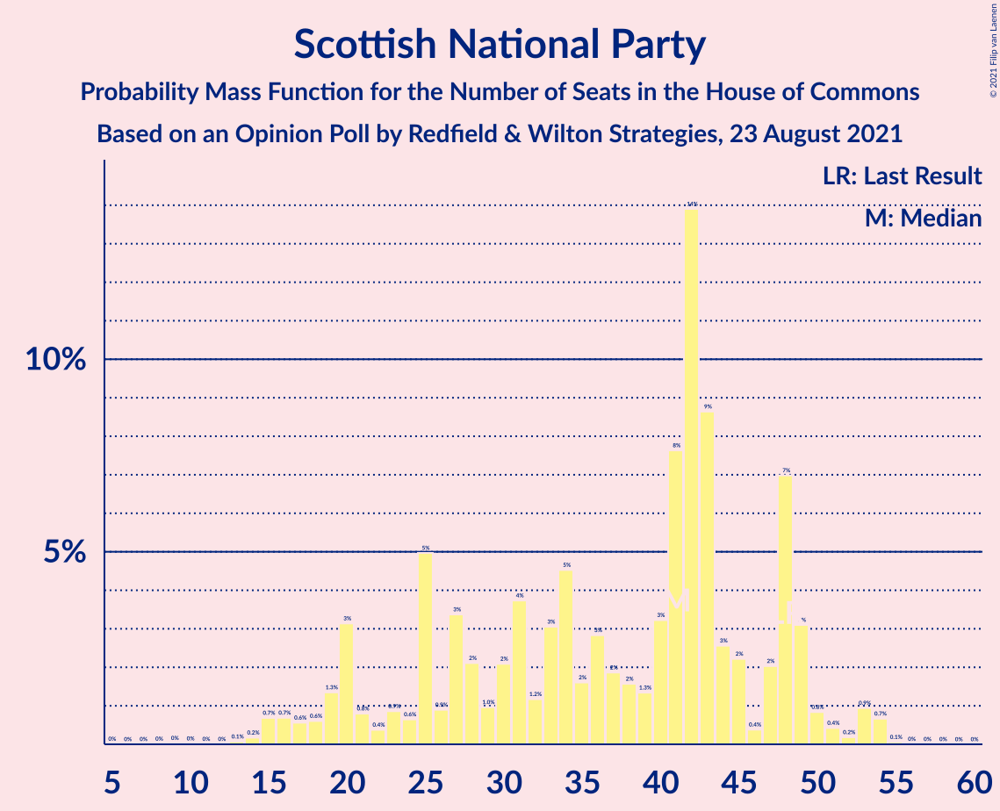

| Number of Seats | Probability | Accumulated | Special Marks |
|:---------------:|:-----------:|:-----------:|:-------------:|
| 9 | 0% | 100% |  |
| 10 | 0% | 99.9% |  |
| 11 | 0% | 99.9% |  |
| 12 | 0% | 99.9% |  |
| 13 | 0.1% | 99.9% |  |
| 14 | 0.2% | 99.8% |  |
| 15 | 0.7% | 99.6% |  |
| 16 | 0.7% | 99.0% |  |
| 17 | 0.6% | 98% |  |
| 18 | 0.6% | 98% |  |
| 19 | 1.3% | 97% |  |
| 20 | 3% | 96% |  |
| 21 | 0.8% | 93% |  |
| 22 | 0.4% | 92% |  |
| 23 | 0.9% | 91% |  |
| 24 | 0.6% | 91% |  |
| 25 | 5% | 90% |  |
| 26 | 0.9% | 85% |  |
| 27 | 3% | 84% |  |
| 28 | 2% | 81% |  |
| 29 | 1.0% | 79% |  |
| 30 | 2% | 78% |  |
| 31 | 4% | 76% |  |
| 32 | 1.2% | 72% |  |
| 33 | 3% | 71% |  |
| 34 | 5% | 68% |  |
| 35 | 2% | 63% |  |
| 36 | 3% | 61% |  |
| 37 | 2% | 59% |  |
| 38 | 2% | 57% |  |
| 39 | 1.3% | 55% |  |
| 40 | 3% | 54% |  |
| 41 | 8% | 51% | Median |
| 42 | 14% | 43% |  |
| 43 | 9% | 29% |  |
| 44 | 3% | 20% |  |
| 45 | 2% | 18% |  |
| 46 | 0.4% | 16% |  |
| 47 | 2% | 15% |  |
| 48 | 7% | 13% | Last Result |
| 49 | 3% | 6% |  |
| 50 | 0.8% | 3% |  |
| 51 | 0.4% | 2% |  |
| 52 | 0.2% | 2% |  |
| 53 | 0.9% | 2% |  |
| 54 | 0.7% | 0.7% |  |
| 55 | 0.1% | 0.1% |  |
| 56 | 0% | 0% |  |

### Brexit Party

*For a full overview of the results for this party, see the [Brexit Party](party-brexitparty.html) page.*

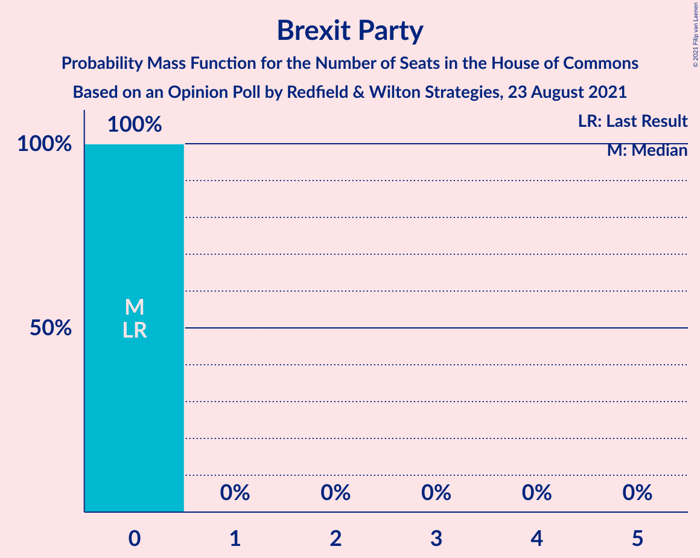

| Number of Seats | Probability | Accumulated | Special Marks |
|:---------------:|:-----------:|:-----------:|:-------------:|
| 0 | 100% | 100% | Last Result, Median |

### Plaid Cymru

*For a full overview of the results for this party, see the [Plaid Cymru](party-plaidcymru.html) page.*

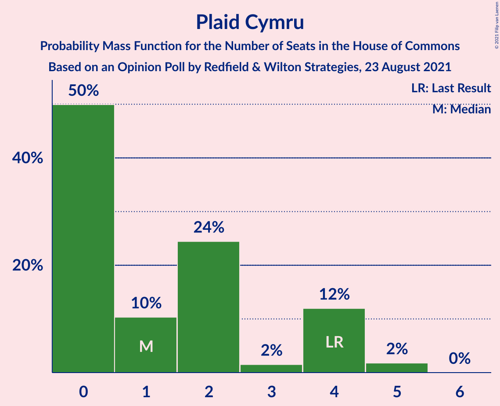

| Number of Seats | Probability | Accumulated | Special Marks |
|:---------------:|:-----------:|:-----------:|:-------------:|
| 0 | 50% | 100% |  |
| 1 | 10% | 50% | Median |
| 2 | 24% | 40% |  |
| 3 | 2% | 15% |  |
| 4 | 12% | 14% | Last Result |
| 5 | 2% | 2% |  |
| 6 | 0% | 0% |  |

## Coalitions

### Confidence Intervals

| Coalition | Last Result | Median | Majority? | 80% Confidence Interval | 90% Confidence Interval | 95% Confidence Interval | 99% Confidence Interval |
|:---------:|:-----------:|:------:|:---------:|:-----------------------:|:-----------------------:|:-----------------------:|:-----------------------:|
| Conservative Party – Scottish National Party – Plaid Cymru | 417 | 403 | 100% | 388–418 | 380–421 | 377–425 | 367–431 |
| Conservative Party – Scottish National Party | 413 | 402 | 100% | 386–417 | 377–420 | 375–424 | 367–429 |
| Conservative Party – Liberal Democrats | 376 | 376 | 100% | 359–388 | 354–393 | 351–397 | 343–403 |
| Conservative Party – Plaid Cymru | 369 | 367 | 99.9% | 349–381 | 346–383 | 342–388 | 334–394 |
| Conservative Party | 365 | 366 | 99.9% | 347–378 | 345–382 | 341–386 | 333–394 |
| Labour Party – Liberal Democrats – Green Party – Scottish National Party – Plaid Cymru | 266 | 265 | 0% | 253–284 | 249–286 | 245–290 | 237–298 |
| Labour Party – Liberal Democrats – Scottish National Party – Plaid Cymru | 265 | 264 | 0% | 252–283 | 248–285 | 244–289 | 236–297 |
| Labour Party – Liberal Democrats – Scottish National Party | 261 | 263 | 0% | 249–281 | 247–284 | 242–288 | 236–296 |
| Labour Party – Scottish National Party – Plaid Cymru | 254 | 254 | 0% | 242–271 | 237–276 | 233–279 | 227–287 |
| Labour Party – Scottish National Party | 250 | 252 | 0% | 238–269 | 236–272 | 233–277 | 226–287 |
| Labour Party – Liberal Democrats – Plaid Cymru | 217 | 228 | 0% | 213–244 | 210–253 | 206–255 | 201–263 |
| Labour Party – Liberal Democrats | 213 | 227 | 0% | 212–242 | 209–250 | 205–253 | 199–263 |
| Labour Party – Plaid Cymru | 206 | 218 | 0% | 204–234 | 199–241 | 197–243 | 191–252 |
| Labour Party | 202 | 216 | 0% | 204–231 | 199–239 | 197–242 | 190–252 |

### Conservative Party – Scottish National Party – Plaid Cymru

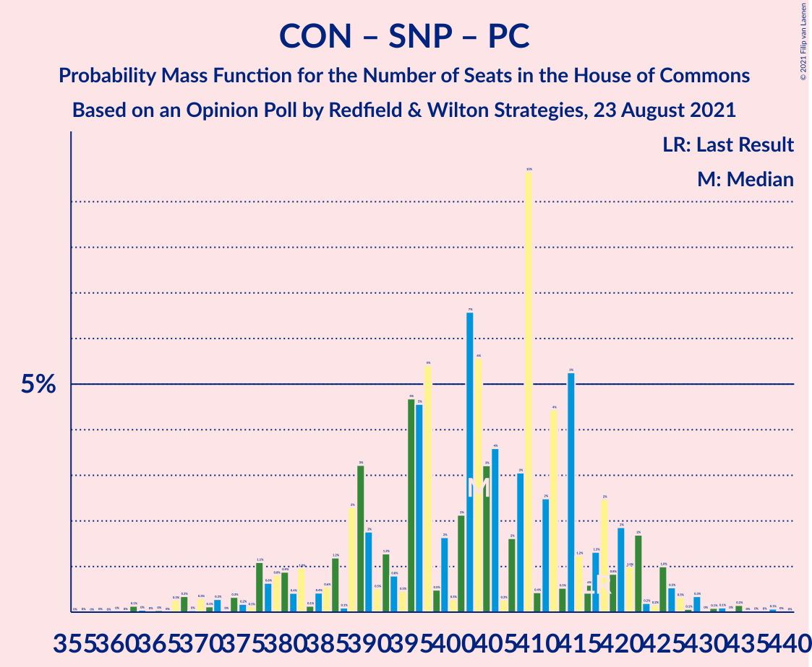

| Number of Seats | Probability | Accumulated | Special Marks |
|:---------------:|:-----------:|:-----------:|:-------------:|
| 356 | 0% | 100% |  |
| 357 | 0% | 99.9% |  |
| 358 | 0% | 99.9% |  |
| 359 | 0% | 99.9% |  |
| 360 | 0% | 99.9% |  |
| 361 | 0% | 99.9% |  |
| 362 | 0.1% | 99.9% |  |
| 363 | 0% | 99.8% |  |
| 364 | 0% | 99.7% |  |
| 365 | 0% | 99.7% |  |
| 366 | 0% | 99.6% |  |
| 367 | 0.3% | 99.6% |  |
| 368 | 0.3% | 99.4% |  |
| 369 | 0% | 99.0% |  |
| 370 | 0.3% | 99.0% |  |
| 371 | 0.1% | 98.7% |  |
| 372 | 0.3% | 98.6% |  |
| 373 | 0% | 98% |  |
| 374 | 0.3% | 98% |  |
| 375 | 0.2% | 98% |  |
| 376 | 0.1% | 98% |  |
| 377 | 1.1% | 98% |  |
| 378 | 0.6% | 97% |  |
| 379 | 0.8% | 96% |  |
| 380 | 0.9% | 95% |  |
| 381 | 0.4% | 94% |  |
| 382 | 1.0% | 94% |  |
| 383 | 0.1% | 93% |  |
| 384 | 0.4% | 93% |  |
| 385 | 0.6% | 92% |  |
| 386 | 1.2% | 92% |  |
| 387 | 0.1% | 91% |  |
| 388 | 2% | 90% |  |
| 389 | 3% | 88% |  |
| 390 | 2% | 85% |  |
| 391 | 0.5% | 83% |  |
| 392 | 1.3% | 83% |  |
| 393 | 0.8% | 81% |  |
| 394 | 0.5% | 81% |  |
| 395 | 5% | 80% |  |
| 396 | 5% | 75% |  |
| 397 | 5% | 71% |  |
| 398 | 0.5% | 65% |  |
| 399 | 2% | 65% |  |
| 400 | 0.3% | 63% |  |
| 401 | 2% | 63% |  |
| 402 | 7% | 61% |  |
| 403 | 6% | 54% |  |
| 404 | 3% | 49% |  |
| 405 | 4% | 46% |  |
| 406 | 0.3% | 42% |  |
| 407 | 2% | 42% |  |
| 408 | 3% | 40% | Median |
| 409 | 10% | 37% |  |
| 410 | 0.4% | 27% |  |
| 411 | 2% | 27% |  |
| 412 | 4% | 24% |  |
| 413 | 0.5% | 20% |  |
| 414 | 5% | 19% |  |
| 415 | 1.2% | 14% |  |
| 416 | 0.6% | 13% |  |
| 417 | 1.3% | 12% | Last Result |
| 418 | 2% | 11% |  |
| 419 | 0.8% | 9% |  |
| 420 | 2% | 8% |  |
| 421 | 1.0% | 6% |  |
| 422 | 2% | 5% |  |
| 423 | 0.2% | 3% |  |
| 424 | 0.2% | 3% |  |
| 425 | 1.0% | 3% |  |
| 426 | 0.5% | 2% |  |
| 427 | 0.3% | 1.3% |  |
| 428 | 0.1% | 1.0% |  |
| 429 | 0.3% | 0.9% |  |
| 430 | 0% | 0.6% |  |
| 431 | 0.1% | 0.6% |  |
| 432 | 0.1% | 0.5% |  |
| 433 | 0% | 0.4% |  |
| 434 | 0.2% | 0.3% |  |
| 435 | 0% | 0.2% |  |
| 436 | 0% | 0.2% |  |
| 437 | 0% | 0.1% |  |
| 438 | 0.1% | 0.1% |  |
| 439 | 0% | 0.1% |  |
| 440 | 0% | 0% |  |

### Conservative Party – Scottish National Party

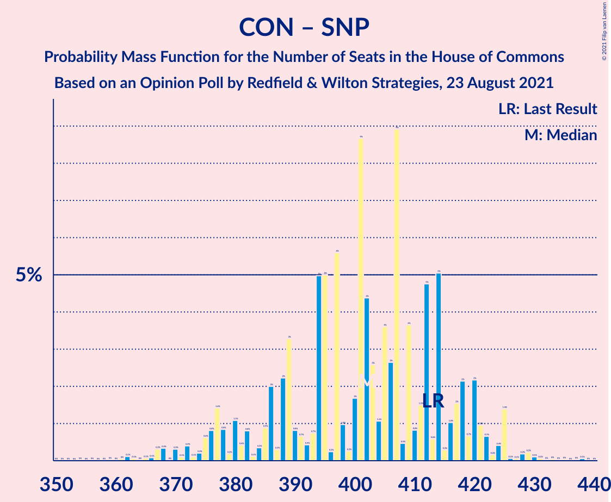

| Number of Seats | Probability | Accumulated | Special Marks |
|:---------------:|:-----------:|:-----------:|:-------------:|
| 354 | 0% | 100% |  |
| 355 | 0% | 99.9% |  |
| 356 | 0% | 99.9% |  |
| 357 | 0% | 99.9% |  |
| 358 | 0% | 99.9% |  |
| 359 | 0% | 99.9% |  |
| 360 | 0% | 99.9% |  |
| 361 | 0% | 99.9% |  |
| 362 | 0.1% | 99.8% |  |
| 363 | 0.1% | 99.7% |  |
| 364 | 0% | 99.7% |  |
| 365 | 0.1% | 99.7% |  |
| 366 | 0.1% | 99.6% |  |
| 367 | 0.3% | 99.5% |  |
| 368 | 0.3% | 99.2% |  |
| 369 | 0% | 98.9% |  |
| 370 | 0.3% | 98.8% |  |
| 371 | 0.1% | 98.5% |  |
| 372 | 0.4% | 98% |  |
| 373 | 0.1% | 98% |  |
| 374 | 0.2% | 98% |  |
| 375 | 0.6% | 98% |  |
| 376 | 0.8% | 97% |  |
| 377 | 1.4% | 96% |  |
| 378 | 0.8% | 95% |  |
| 379 | 0.2% | 94% |  |
| 380 | 1.1% | 94% |  |
| 381 | 0.4% | 93% |  |
| 382 | 0.8% | 92% |  |
| 383 | 0.1% | 92% |  |
| 384 | 0.3% | 91% |  |
| 385 | 0.9% | 91% |  |
| 386 | 2% | 90% |  |
| 387 | 0.3% | 88% |  |
| 388 | 2% | 88% |  |
| 389 | 3% | 86% |  |
| 390 | 0.8% | 82% |  |
| 391 | 0.7% | 82% |  |
| 392 | 0.4% | 81% |  |
| 393 | 0.7% | 80% |  |
| 394 | 5% | 80% |  |
| 395 | 5% | 75% |  |
| 396 | 0.2% | 70% |  |
| 397 | 6% | 70% |  |
| 398 | 1.0% | 64% |  |
| 399 | 0.3% | 63% |  |
| 400 | 2% | 63% |  |
| 401 | 9% | 61% |  |
| 402 | 4% | 52% |  |
| 403 | 3% | 48% |  |
| 404 | 1.1% | 45% |  |
| 405 | 4% | 44% |  |
| 406 | 3% | 41% |  |
| 407 | 9% | 38% | Median |
| 408 | 0.5% | 29% |  |
| 409 | 4% | 29% |  |
| 410 | 0.8% | 25% |  |
| 411 | 1.5% | 24% |  |
| 412 | 5% | 23% |  |
| 413 | 0.6% | 18% | Last Result |
| 414 | 5% | 17% |  |
| 415 | 0.3% | 12% |  |
| 416 | 1.0% | 12% |  |
| 417 | 2% | 11% |  |
| 418 | 2% | 9% |  |
| 419 | 0.7% | 7% |  |
| 420 | 2% | 7% |  |
| 421 | 1.0% | 4% |  |
| 422 | 0.7% | 4% |  |
| 423 | 0.2% | 3% |  |
| 424 | 0.4% | 3% |  |
| 425 | 1.4% | 2% |  |
| 426 | 0.1% | 0.9% |  |
| 427 | 0.1% | 0.9% |  |
| 428 | 0.2% | 0.8% |  |
| 429 | 0.2% | 0.6% |  |
| 430 | 0.1% | 0.4% |  |
| 431 | 0.1% | 0.3% |  |
| 432 | 0% | 0.2% |  |
| 433 | 0% | 0.2% |  |
| 434 | 0% | 0.2% |  |
| 435 | 0% | 0.2% |  |
| 436 | 0% | 0.1% |  |
| 437 | 0% | 0.1% |  |
| 438 | 0.1% | 0.1% |  |
| 439 | 0% | 0% |  |

### Conservative Party – Liberal Democrats

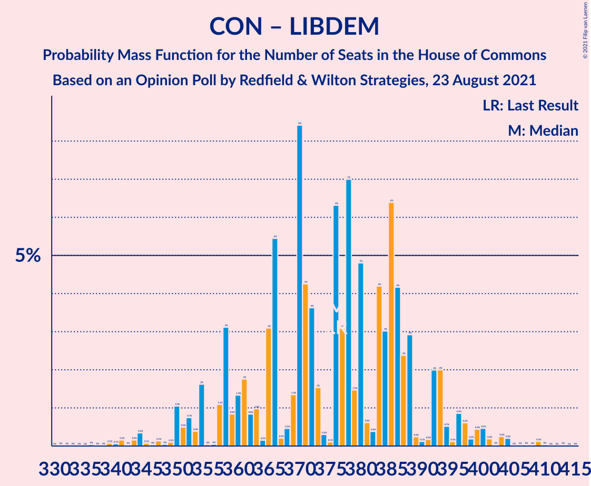

| Number of Seats | Probability | Accumulated | Special Marks |
|:---------------:|:-----------:|:-----------:|:-------------:|
| 332 | 0% | 100% |  |
| 333 | 0% | 99.9% |  |
| 334 | 0% | 99.9% |  |
| 335 | 0% | 99.9% |  |
| 336 | 0% | 99.9% |  |
| 337 | 0% | 99.9% |  |
| 338 | 0% | 99.9% |  |
| 339 | 0.1% | 99.9% |  |
| 340 | 0.1% | 99.8% |  |
| 341 | 0.2% | 99.7% |  |
| 342 | 0% | 99.6% |  |
| 343 | 0.2% | 99.5% |  |
| 344 | 0.3% | 99.4% |  |
| 345 | 0.1% | 99.0% |  |
| 346 | 0% | 99.0% |  |
| 347 | 0.1% | 98.9% |  |
| 348 | 0% | 98.8% |  |
| 349 | 0.1% | 98.8% |  |
| 350 | 1.0% | 98.7% |  |
| 351 | 0.5% | 98% |  |
| 352 | 0.7% | 97% |  |
| 353 | 0.4% | 96% |  |
| 354 | 2% | 96% |  |
| 355 | 0% | 94% |  |
| 356 | 0% | 94% |  |
| 357 | 1.1% | 94% |  |
| 358 | 3% | 93% |  |
| 359 | 0.8% | 90% |  |
| 360 | 1.3% | 89% |  |
| 361 | 2% | 88% |  |
| 362 | 0.8% | 86% |  |
| 363 | 1.0% | 85% |  |
| 364 | 0.2% | 84% |  |
| 365 | 3% | 84% |  |
| 366 | 5% | 81% |  |
| 367 | 0.2% | 76% |  |
| 368 | 0.5% | 75% |  |
| 369 | 1.3% | 75% |  |
| 370 | 8% | 74% |  |
| 371 | 4% | 65% |  |
| 372 | 4% | 61% |  |
| 373 | 2% | 57% |  |
| 374 | 0.3% | 56% |  |
| 375 | 0.1% | 55% |  |
| 376 | 6% | 55% | Last Result |
| 377 | 3% | 49% | Median |
| 378 | 7% | 46% |  |
| 379 | 1.5% | 39% |  |
| 380 | 5% | 38% |  |
| 381 | 0.6% | 33% |  |
| 382 | 0.4% | 32% |  |
| 383 | 4% | 32% |  |
| 384 | 3% | 28% |  |
| 385 | 6% | 25% |  |
| 386 | 4% | 18% |  |
| 387 | 2% | 14% |  |
| 388 | 3% | 12% |  |
| 389 | 0.2% | 9% |  |
| 390 | 0.1% | 8% |  |
| 391 | 0.2% | 8% |  |
| 392 | 2% | 8% |  |
| 393 | 2% | 6% |  |
| 394 | 0.5% | 4% |  |
| 395 | 0.1% | 4% |  |
| 396 | 0.9% | 3% |  |
| 397 | 0.6% | 3% |  |
| 398 | 0.2% | 2% |  |
| 399 | 0.4% | 2% |  |
| 400 | 0.5% | 1.4% |  |
| 401 | 0.2% | 0.9% |  |
| 402 | 0% | 0.8% |  |
| 403 | 0.2% | 0.7% |  |
| 404 | 0.2% | 0.5% |  |
| 405 | 0% | 0.3% |  |
| 406 | 0% | 0.3% |  |
| 407 | 0% | 0.3% |  |
| 408 | 0% | 0.2% |  |
| 409 | 0.1% | 0.2% |  |
| 410 | 0% | 0.1% |  |
| 411 | 0% | 0.1% |  |
| 412 | 0% | 0% |  |

### Conservative Party – Plaid Cymru

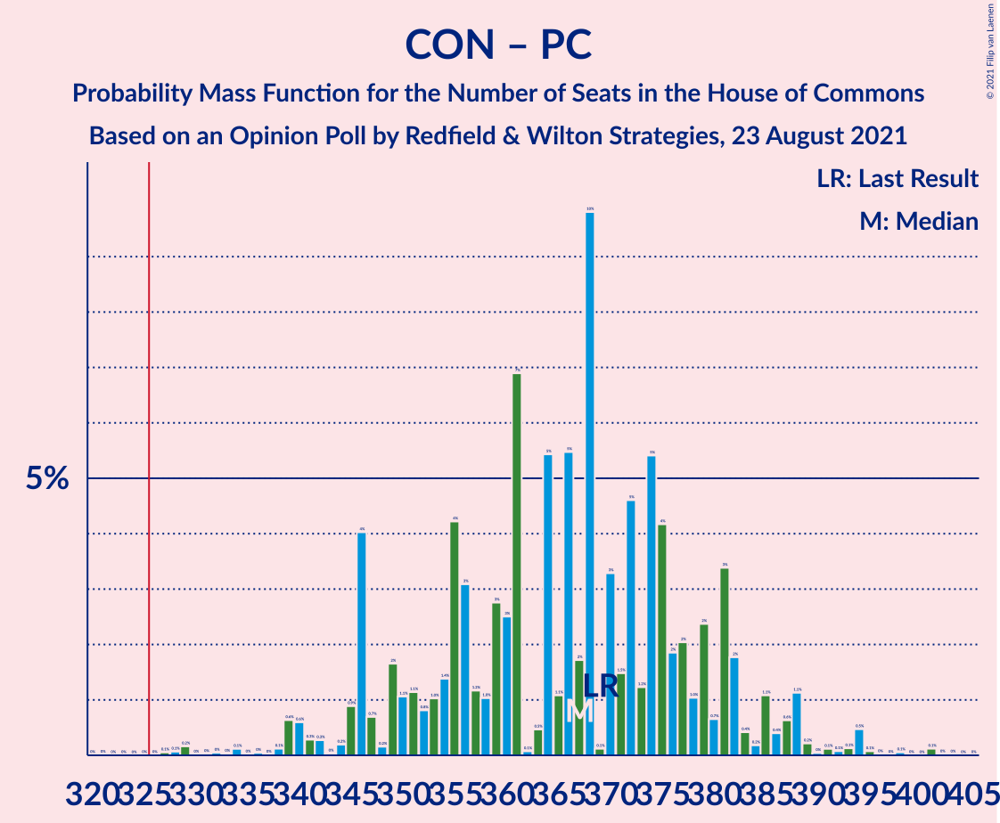

| Number of Seats | Probability | Accumulated | Special Marks |
|:---------------:|:-----------:|:-----------:|:-------------:|
| 322 | 0% | 100% |  |
| 323 | 0% | 99.9% |  |
| 324 | 0% | 99.9% |  |
| 325 | 0% | 99.9% |  |
| 326 | 0% | 99.9% | Majority |
| 327 | 0.1% | 99.9% |  |
| 328 | 0.1% | 99.9% |  |
| 329 | 0.2% | 99.8% |  |
| 330 | 0% | 99.6% |  |
| 331 | 0% | 99.6% |  |
| 332 | 0% | 99.6% |  |
| 333 | 0% | 99.6% |  |
| 334 | 0.1% | 99.5% |  |
| 335 | 0% | 99.4% |  |
| 336 | 0% | 99.4% |  |
| 337 | 0% | 99.4% |  |
| 338 | 0.1% | 99.3% |  |
| 339 | 0.6% | 99.2% |  |
| 340 | 0.6% | 98.6% |  |
| 341 | 0.3% | 98% |  |
| 342 | 0.3% | 98% |  |
| 343 | 0% | 97% |  |
| 344 | 0.2% | 97% |  |
| 345 | 0.9% | 97% |  |
| 346 | 4% | 96% |  |
| 347 | 0.7% | 92% |  |
| 348 | 0.2% | 92% |  |
| 349 | 2% | 91% |  |
| 350 | 1.1% | 90% |  |
| 351 | 1.1% | 89% |  |
| 352 | 0.8% | 88% |  |
| 353 | 1.0% | 87% |  |
| 354 | 1.4% | 86% |  |
| 355 | 4% | 84% |  |
| 356 | 3% | 80% |  |
| 357 | 1.2% | 77% |  |
| 358 | 1.0% | 76% |  |
| 359 | 3% | 75% |  |
| 360 | 3% | 72% |  |
| 361 | 7% | 70% |  |
| 362 | 0.1% | 63% |  |
| 363 | 0.5% | 63% |  |
| 364 | 5% | 62% |  |
| 365 | 1.1% | 57% |  |
| 366 | 5% | 56% |  |
| 367 | 2% | 50% | Median |
| 368 | 10% | 48% |  |
| 369 | 0.1% | 39% | Last Result |
| 370 | 3% | 39% |  |
| 371 | 1.5% | 35% |  |
| 372 | 5% | 34% |  |
| 373 | 1.2% | 29% |  |
| 374 | 5% | 28% |  |
| 375 | 4% | 23% |  |
| 376 | 2% | 18% |  |
| 377 | 2% | 16% |  |
| 378 | 1.0% | 14% |  |
| 379 | 2% | 13% |  |
| 380 | 0.7% | 11% |  |
| 381 | 3% | 10% |  |
| 382 | 2% | 7% |  |
| 383 | 0.4% | 5% |  |
| 384 | 0.2% | 5% |  |
| 385 | 1.1% | 5% |  |
| 386 | 0.4% | 4% |  |
| 387 | 0.6% | 3% |  |
| 388 | 1.1% | 3% |  |
| 389 | 0.2% | 1.4% |  |
| 390 | 0% | 1.2% |  |
| 391 | 0.1% | 1.1% |  |
| 392 | 0.1% | 1.0% |  |
| 393 | 0.1% | 0.9% |  |
| 394 | 0.5% | 0.8% |  |
| 395 | 0.1% | 0.3% |  |
| 396 | 0% | 0.3% |  |
| 397 | 0% | 0.2% |  |
| 398 | 0.1% | 0.2% |  |
| 399 | 0% | 0.2% |  |
| 400 | 0% | 0.2% |  |
| 401 | 0.1% | 0.2% |  |
| 402 | 0% | 0.1% |  |
| 403 | 0% | 0% |  |

### Conservative Party

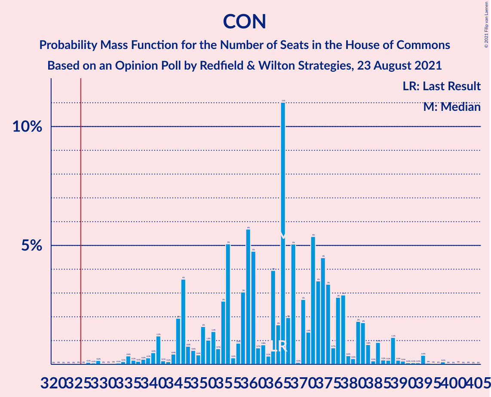

| Number of Seats | Probability | Accumulated | Special Marks |
|:---------------:|:-----------:|:-----------:|:-------------:|
| 321 | 0% | 100% |  |
| 322 | 0% | 99.9% |  |
| 323 | 0% | 99.9% |  |
| 324 | 0% | 99.9% |  |
| 325 | 0% | 99.9% |  |
| 326 | 0% | 99.9% | Majority |
| 327 | 0.1% | 99.9% |  |
| 328 | 0.1% | 99.8% |  |
| 329 | 0.2% | 99.8% |  |
| 330 | 0% | 99.6% |  |
| 331 | 0% | 99.6% |  |
| 332 | 0% | 99.6% |  |
| 333 | 0.1% | 99.5% |  |
| 334 | 0.1% | 99.5% |  |
| 335 | 0.4% | 99.3% |  |
| 336 | 0.2% | 99.0% |  |
| 337 | 0.1% | 98.8% |  |
| 338 | 0.2% | 98.7% |  |
| 339 | 0.3% | 98% |  |
| 340 | 0.5% | 98% |  |
| 341 | 1.2% | 98% |  |
| 342 | 0.1% | 97% |  |
| 343 | 0.1% | 96% |  |
| 344 | 0.4% | 96% |  |
| 345 | 2% | 96% |  |
| 346 | 4% | 94% |  |
| 347 | 0.8% | 90% |  |
| 348 | 0.6% | 90% |  |
| 349 | 0.4% | 89% |  |
| 350 | 2% | 89% |  |
| 351 | 1.0% | 87% |  |
| 352 | 1.4% | 86% |  |
| 353 | 0.7% | 85% |  |
| 354 | 3% | 84% |  |
| 355 | 5% | 81% |  |
| 356 | 0.3% | 76% |  |
| 357 | 0.9% | 76% |  |
| 358 | 3% | 75% |  |
| 359 | 6% | 72% |  |
| 360 | 5% | 66% |  |
| 361 | 0.7% | 62% |  |
| 362 | 0.8% | 61% |  |
| 363 | 0.3% | 60% |  |
| 364 | 4% | 60% |  |
| 365 | 2% | 56% | Last Result |
| 366 | 11% | 54% | Median |
| 367 | 2% | 43% |  |
| 368 | 5% | 41% |  |
| 369 | 0.1% | 36% |  |
| 370 | 3% | 36% |  |
| 371 | 1.4% | 33% |  |
| 372 | 5% | 32% |  |
| 373 | 4% | 27% |  |
| 374 | 4% | 23% |  |
| 375 | 3% | 19% |  |
| 376 | 0.7% | 15% |  |
| 377 | 3% | 14% |  |
| 378 | 3% | 12% |  |
| 379 | 0.4% | 9% |  |
| 380 | 0.2% | 8% |  |
| 381 | 2% | 8% |  |
| 382 | 2% | 6% |  |
| 383 | 0.8% | 5% |  |
| 384 | 0.1% | 4% |  |
| 385 | 0.9% | 4% |  |
| 386 | 0.2% | 3% |  |
| 387 | 0.2% | 2% |  |
| 388 | 1.1% | 2% |  |
| 389 | 0.2% | 1.2% |  |
| 390 | 0.1% | 1.0% |  |
| 391 | 0.1% | 0.9% |  |
| 392 | 0.1% | 0.8% |  |
| 393 | 0.1% | 0.7% |  |
| 394 | 0.4% | 0.7% |  |
| 395 | 0% | 0.3% |  |
| 396 | 0% | 0.2% |  |
| 397 | 0% | 0.2% |  |
| 398 | 0.1% | 0.2% |  |
| 399 | 0% | 0.1% |  |
| 400 | 0% | 0.1% |  |
| 401 | 0% | 0.1% |  |
| 402 | 0% | 0% |  |

### Labour Party – Liberal Democrats – Green Party – Scottish National Party – Plaid Cymru

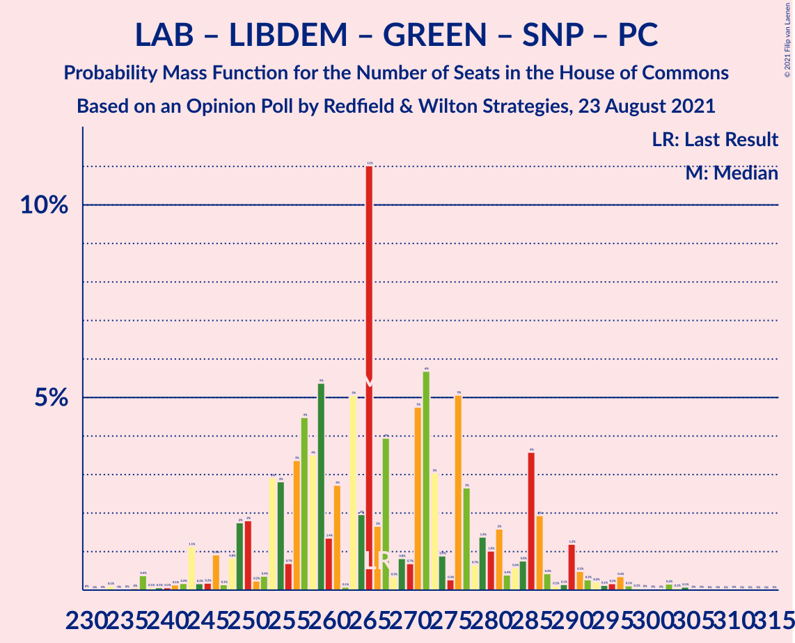

| Number of Seats | Probability | Accumulated | Special Marks |
|:---------------:|:-----------:|:-----------:|:-------------:|
| 230 | 0% | 100% |  |
| 231 | 0% | 99.9% |  |
| 232 | 0% | 99.9% |  |
| 233 | 0.1% | 99.9% |  |
| 234 | 0% | 99.8% |  |
| 235 | 0% | 99.8% |  |
| 236 | 0% | 99.8% |  |
| 237 | 0.4% | 99.7% |  |
| 238 | 0.1% | 99.3% |  |
| 239 | 0.1% | 99.3% |  |
| 240 | 0.1% | 99.2% |  |
| 241 | 0.1% | 99.1% |  |
| 242 | 0.2% | 99.0% |  |
| 243 | 1.1% | 98.8% |  |
| 244 | 0.2% | 98% |  |
| 245 | 0.2% | 98% |  |
| 246 | 0.9% | 97% |  |
| 247 | 0.1% | 96% |  |
| 248 | 0.8% | 96% |  |
| 249 | 2% | 95% |  |
| 250 | 2% | 94% |  |
| 251 | 0.2% | 92% |  |
| 252 | 0.4% | 92% |  |
| 253 | 3% | 91% |  |
| 254 | 3% | 88% |  |
| 255 | 0.7% | 86% |  |
| 256 | 3% | 85% |  |
| 257 | 4% | 81% |  |
| 258 | 4% | 77% |  |
| 259 | 5% | 73% |  |
| 260 | 1.4% | 68% |  |
| 261 | 3% | 67% |  |
| 262 | 0.1% | 64% |  |
| 263 | 5% | 64% |  |
| 264 | 2% | 59% |  |
| 265 | 11% | 57% |  |
| 266 | 2% | 46% | Last Result |
| 267 | 4% | 44% |  |
| 268 | 0.3% | 40% |  |
| 269 | 0.8% | 40% |  |
| 270 | 0.7% | 39% | Median |
| 271 | 5% | 38% |  |
| 272 | 6% | 34% |  |
| 273 | 3% | 28% |  |
| 274 | 0.9% | 25% |  |
| 275 | 0.3% | 24% |  |
| 276 | 5% | 24% |  |
| 277 | 3% | 19% |  |
| 278 | 0.7% | 16% |  |
| 279 | 1.4% | 15% |  |
| 280 | 1.0% | 14% |  |
| 281 | 2% | 13% |  |
| 282 | 0.4% | 11% |  |
| 283 | 0.6% | 11% |  |
| 284 | 0.8% | 10% |  |
| 285 | 4% | 10% |  |
| 286 | 2% | 6% |  |
| 287 | 0.4% | 4% |  |
| 288 | 0.1% | 4% |  |
| 289 | 0.1% | 4% |  |
| 290 | 1.2% | 3% |  |
| 291 | 0.5% | 2% |  |
| 292 | 0.3% | 2% |  |
| 293 | 0.2% | 2% |  |
| 294 | 0.1% | 1.3% |  |
| 295 | 0.2% | 1.2% |  |
| 296 | 0.4% | 1.0% |  |
| 297 | 0.1% | 0.7% |  |
| 298 | 0.1% | 0.5% |  |
| 299 | 0% | 0.5% |  |
| 300 | 0% | 0.4% |  |
| 301 | 0% | 0.4% |  |
| 302 | 0.2% | 0.4% |  |
| 303 | 0.1% | 0.2% |  |
| 304 | 0.1% | 0.2% |  |
| 305 | 0% | 0.1% |  |
| 306 | 0% | 0.1% |  |
| 307 | 0% | 0.1% |  |
| 308 | 0% | 0.1% |  |
| 309 | 0% | 0.1% |  |
| 310 | 0% | 0.1% |  |
| 311 | 0% | 0% |  |

### Labour Party – Liberal Democrats – Scottish National Party – Plaid Cymru

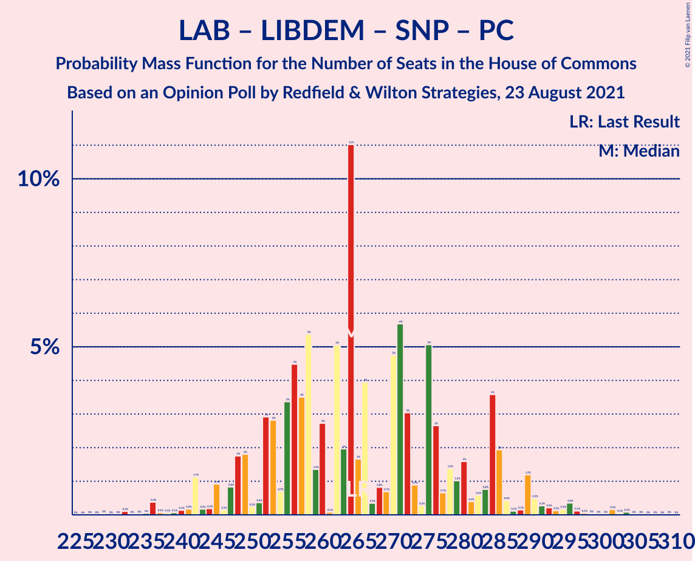

| Number of Seats | Probability | Accumulated | Special Marks |
|:---------------:|:-----------:|:-----------:|:-------------:|
| 229 | 0% | 100% |  |
| 230 | 0% | 99.9% |  |
| 231 | 0% | 99.9% |  |
| 232 | 0.1% | 99.9% |  |
| 233 | 0% | 99.8% |  |
| 234 | 0% | 99.8% |  |
| 235 | 0% | 99.8% |  |
| 236 | 0.4% | 99.7% |  |
| 237 | 0.1% | 99.3% |  |
| 238 | 0.1% | 99.3% |  |
| 239 | 0.1% | 99.2% |  |
| 240 | 0.1% | 99.1% |  |
| 241 | 0.2% | 99.0% |  |
| 242 | 1.1% | 98.8% |  |
| 243 | 0.2% | 98% |  |
| 244 | 0.2% | 98% |  |
| 245 | 0.9% | 97% |  |
| 246 | 0.1% | 96% |  |
| 247 | 0.8% | 96% |  |
| 248 | 2% | 95% |  |
| 249 | 2% | 94% |  |
| 250 | 0.2% | 92% |  |
| 251 | 0.4% | 92% |  |
| 252 | 3% | 91% |  |
| 253 | 3% | 88% |  |
| 254 | 0.7% | 86% |  |
| 255 | 3% | 85% |  |
| 256 | 4% | 81% |  |
| 257 | 4% | 77% |  |
| 258 | 5% | 73% |  |
| 259 | 1.4% | 68% |  |
| 260 | 3% | 67% |  |
| 261 | 0.1% | 64% |  |
| 262 | 5% | 64% |  |
| 263 | 2% | 59% |  |
| 264 | 11% | 57% |  |
| 265 | 2% | 46% | Last Result |
| 266 | 4% | 44% |  |
| 267 | 0.3% | 40% |  |
| 268 | 0.8% | 40% |  |
| 269 | 0.7% | 39% | Median |
| 270 | 5% | 38% |  |
| 271 | 6% | 34% |  |
| 272 | 3% | 28% |  |
| 273 | 0.9% | 25% |  |
| 274 | 0.3% | 24% |  |
| 275 | 5% | 24% |  |
| 276 | 3% | 19% |  |
| 277 | 0.7% | 16% |  |
| 278 | 1.4% | 15% |  |
| 279 | 1.0% | 14% |  |
| 280 | 2% | 13% |  |
| 281 | 0.4% | 11% |  |
| 282 | 0.6% | 11% |  |
| 283 | 0.8% | 10% |  |
| 284 | 4% | 10% |  |
| 285 | 2% | 6% |  |
| 286 | 0.4% | 4% |  |
| 287 | 0.1% | 4% |  |
| 288 | 0.1% | 4% |  |
| 289 | 1.2% | 3% |  |
| 290 | 0.5% | 2% |  |
| 291 | 0.3% | 2% |  |
| 292 | 0.2% | 2% |  |
| 293 | 0.1% | 1.3% |  |
| 294 | 0.2% | 1.2% |  |
| 295 | 0.4% | 1.0% |  |
| 296 | 0.1% | 0.7% |  |
| 297 | 0.1% | 0.5% |  |
| 298 | 0% | 0.5% |  |
| 299 | 0% | 0.4% |  |
| 300 | 0% | 0.4% |  |
| 301 | 0.2% | 0.4% |  |
| 302 | 0.1% | 0.2% |  |
| 303 | 0.1% | 0.2% |  |
| 304 | 0% | 0.1% |  |
| 305 | 0% | 0.1% |  |
| 306 | 0% | 0.1% |  |
| 307 | 0% | 0.1% |  |
| 308 | 0% | 0.1% |  |
| 309 | 0% | 0.1% |  |
| 310 | 0% | 0% |  |

### Labour Party – Liberal Democrats – Scottish National Party

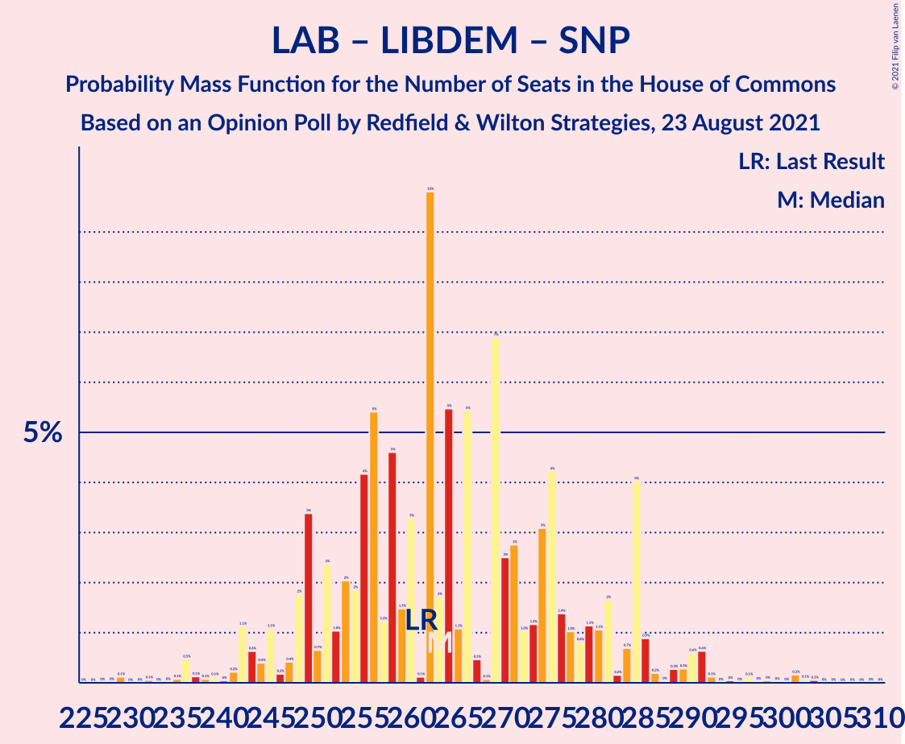

| Number of Seats | Probability | Accumulated | Special Marks |
|:---------------:|:-----------:|:-----------:|:-------------:|
| 228 | 0% | 100% |  |
| 229 | 0.1% | 99.9% |  |
| 230 | 0% | 99.8% |  |
| 231 | 0% | 99.8% |  |
| 232 | 0.1% | 99.8% |  |
| 233 | 0% | 99.8% |  |
| 234 | 0% | 99.8% |  |
| 235 | 0.1% | 99.7% |  |
| 236 | 0.5% | 99.7% |  |
| 237 | 0.1% | 99.2% |  |
| 238 | 0.1% | 99.1% |  |
| 239 | 0.1% | 99.0% |  |
| 240 | 0% | 98.9% |  |
| 241 | 0.2% | 98.8% |  |
| 242 | 1.1% | 98.6% |  |
| 243 | 0.6% | 97% |  |
| 244 | 0.4% | 97% |  |
| 245 | 1.1% | 96% |  |
| 246 | 0.2% | 95% |  |
| 247 | 0.4% | 95% |  |
| 248 | 2% | 95% |  |
| 249 | 3% | 93% |  |
| 250 | 0.7% | 90% |  |
| 251 | 2% | 89% |  |
| 252 | 1.0% | 87% |  |
| 253 | 2% | 86% |  |
| 254 | 2% | 84% |  |
| 255 | 4% | 82% |  |
| 256 | 5% | 77% |  |
| 257 | 1.2% | 72% |  |
| 258 | 5% | 71% |  |
| 259 | 1.5% | 66% |  |
| 260 | 3% | 65% |  |
| 261 | 0.1% | 61% | Last Result |
| 262 | 10% | 61% |  |
| 263 | 2% | 52% |  |
| 264 | 5% | 50% |  |
| 265 | 1.1% | 44% |  |
| 266 | 5% | 43% |  |
| 267 | 0.5% | 38% |  |
| 268 | 0.1% | 37% | Median |
| 269 | 7% | 37% |  |
| 270 | 3% | 30% |  |
| 271 | 3% | 28% |  |
| 272 | 1.0% | 25% |  |
| 273 | 1.2% | 24% |  |
| 274 | 3% | 23% |  |
| 275 | 4% | 20% |  |
| 276 | 1.4% | 16% |  |
| 277 | 1.0% | 14% |  |
| 278 | 0.8% | 13% |  |
| 279 | 1.1% | 12% |  |
| 280 | 1.1% | 11% |  |
| 281 | 2% | 10% |  |
| 282 | 0.2% | 9% |  |
| 283 | 0.7% | 8% |  |
| 284 | 4% | 8% |  |
| 285 | 0.9% | 4% |  |
| 286 | 0.2% | 3% |  |
| 287 | 0% | 3% |  |
| 288 | 0.3% | 3% |  |
| 289 | 0.3% | 2% |  |
| 290 | 0.6% | 2% |  |
| 291 | 0.6% | 1.4% |  |
| 292 | 0.1% | 0.8% |  |
| 293 | 0% | 0.7% |  |
| 294 | 0% | 0.6% |  |
| 295 | 0% | 0.6% |  |
| 296 | 0.1% | 0.6% |  |
| 297 | 0% | 0.5% |  |
| 298 | 0% | 0.4% |  |
| 299 | 0% | 0.4% |  |
| 300 | 0% | 0.4% |  |
| 301 | 0.2% | 0.4% |  |
| 302 | 0.1% | 0.2% |  |
| 303 | 0.1% | 0.1% |  |
| 304 | 0% | 0.1% |  |
| 305 | 0% | 0.1% |  |
| 306 | 0% | 0.1% |  |
| 307 | 0% | 0.1% |  |
| 308 | 0% | 0.1% |  |
| 309 | 0% | 0% |  |

### Labour Party – Scottish National Party – Plaid Cymru

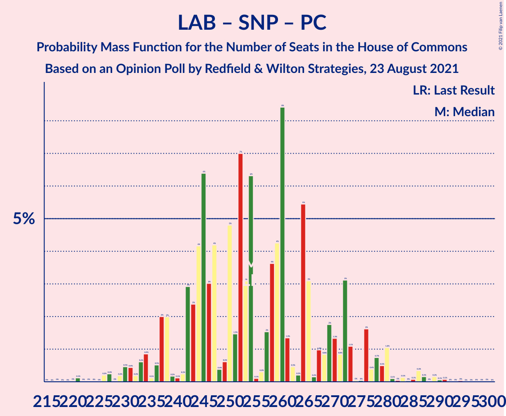

| Number of Seats | Probability | Accumulated | Special Marks |
|:---------------:|:-----------:|:-----------:|:-------------:|
| 219 | 0% | 100% |  |
| 220 | 0% | 99.9% |  |
| 221 | 0.1% | 99.9% |  |
| 222 | 0% | 99.8% |  |
| 223 | 0% | 99.8% |  |
| 224 | 0% | 99.7% |  |
| 225 | 0% | 99.7% |  |
| 226 | 0.2% | 99.7% |  |
| 227 | 0.2% | 99.5% |  |
| 228 | 0% | 99.3% |  |
| 229 | 0.2% | 99.2% |  |
| 230 | 0.5% | 99.1% |  |
| 231 | 0.4% | 98.6% |  |
| 232 | 0.2% | 98% |  |
| 233 | 0.6% | 98% |  |
| 234 | 0.9% | 97% |  |
| 235 | 0.1% | 97% |  |
| 236 | 0.5% | 96% |  |
| 237 | 2% | 96% |  |
| 238 | 2% | 94% |  |
| 239 | 0.2% | 92% |  |
| 240 | 0.1% | 92% |  |
| 241 | 0.2% | 92% |  |
| 242 | 3% | 91% |  |
| 243 | 2% | 88% |  |
| 244 | 4% | 86% |  |
| 245 | 6% | 82% |  |
| 246 | 3% | 75% |  |
| 247 | 4% | 72% |  |
| 248 | 0.4% | 68% |  |
| 249 | 0.6% | 68% |  |
| 250 | 5% | 67% |  |
| 251 | 1.5% | 62% |  |
| 252 | 7% | 61% |  |
| 253 | 3% | 54% |  |
| 254 | 6% | 51% | Last Result |
| 255 | 0.1% | 45% |  |
| 256 | 0.3% | 45% |  |
| 257 | 2% | 44% |  |
| 258 | 4% | 43% | Median |
| 259 | 4% | 39% |  |
| 260 | 8% | 35% |  |
| 261 | 1.3% | 26% |  |
| 262 | 0.5% | 25% |  |
| 263 | 0.2% | 25% |  |
| 264 | 5% | 24% |  |
| 265 | 3% | 19% |  |
| 266 | 0.2% | 16% |  |
| 267 | 1.0% | 16% |  |
| 268 | 0.8% | 15% |  |
| 269 | 2% | 14% |  |
| 270 | 1.3% | 12% |  |
| 271 | 0.8% | 11% |  |
| 272 | 3% | 10% |  |
| 273 | 1.1% | 7% |  |
| 274 | 0% | 6% |  |
| 275 | 0% | 6% |  |
| 276 | 2% | 6% |  |
| 277 | 0.4% | 4% |  |
| 278 | 0.7% | 4% |  |
| 279 | 0.5% | 3% |  |
| 280 | 1.0% | 2% |  |
| 281 | 0.1% | 1.3% |  |
| 282 | 0% | 1.2% |  |
| 283 | 0.1% | 1.2% |  |
| 284 | 0% | 1.1% |  |
| 285 | 0.1% | 1.0% |  |
| 286 | 0.3% | 1.0% |  |
| 287 | 0.2% | 0.6% |  |
| 288 | 0% | 0.5% |  |
| 289 | 0.2% | 0.4% |  |
| 290 | 0.1% | 0.3% |  |
| 291 | 0.1% | 0.2% |  |
| 292 | 0% | 0.1% |  |
| 293 | 0% | 0.1% |  |
| 294 | 0% | 0.1% |  |
| 295 | 0% | 0.1% |  |
| 296 | 0% | 0.1% |  |
| 297 | 0% | 0.1% |  |
| 298 | 0% | 0.1% |  |
| 299 | 0% | 0% |  |

### Labour Party – Scottish National Party

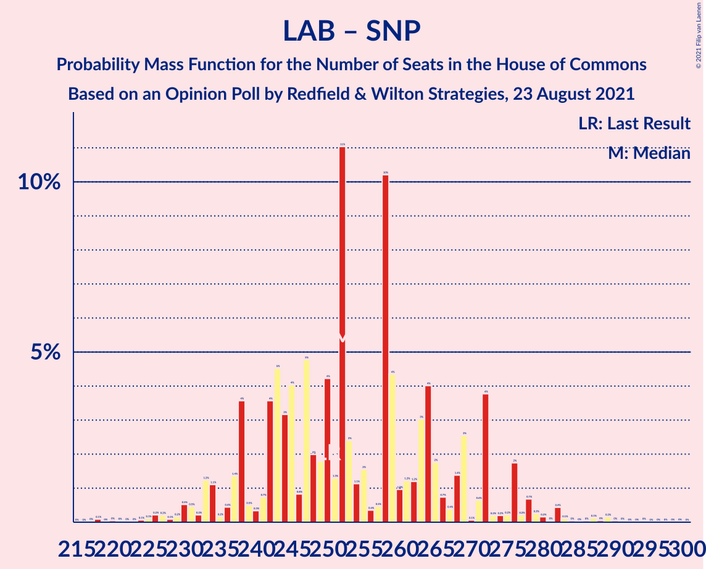

| Number of Seats | Probability | Accumulated | Special Marks |
|:---------------:|:-----------:|:-----------:|:-------------:|
| 217 | 0% | 100% |  |
| 218 | 0.1% | 99.9% |  |
| 219 | 0% | 99.9% |  |
| 220 | 0% | 99.8% |  |
| 221 | 0% | 99.8% |  |
| 222 | 0% | 99.8% |  |
| 223 | 0% | 99.7% |  |
| 224 | 0.1% | 99.7% |  |
| 225 | 0.1% | 99.7% |  |
| 226 | 0.2% | 99.6% |  |
| 227 | 0.2% | 99.3% |  |
| 228 | 0.1% | 99.1% |  |
| 229 | 0.2% | 99.1% |  |
| 230 | 0.5% | 98.9% |  |
| 231 | 0.5% | 98% |  |
| 232 | 0.2% | 98% |  |
| 233 | 1.2% | 98% |  |
| 234 | 1.1% | 96% |  |
| 235 | 0.2% | 95% |  |
| 236 | 0.4% | 95% |  |
| 237 | 1.4% | 95% |  |
| 238 | 4% | 93% |  |
| 239 | 0.5% | 90% |  |
| 240 | 0.3% | 89% |  |
| 241 | 0.7% | 89% |  |
| 242 | 4% | 88% |  |
| 243 | 5% | 85% |  |
| 244 | 3% | 80% |  |
| 245 | 4% | 77% |  |
| 246 | 0.8% | 73% |  |
| 247 | 5% | 72% |  |
| 248 | 2% | 67% |  |
| 249 | 2% | 65% |  |
| 250 | 4% | 64% | Last Result |
| 251 | 1.3% | 59% |  |
| 252 | 11% | 58% |  |
| 253 | 2% | 47% |  |
| 254 | 1.1% | 45% |  |
| 255 | 2% | 43% |  |
| 256 | 0.4% | 42% |  |
| 257 | 0.5% | 42% | Median |
| 258 | 10% | 41% |  |
| 259 | 4% | 31% |  |
| 260 | 1.0% | 27% |  |
| 261 | 1.2% | 26% |  |
| 262 | 1.2% | 24% |  |
| 263 | 3% | 23% |  |
| 264 | 4% | 20% |  |
| 265 | 2% | 16% |  |
| 266 | 0.7% | 14% |  |
| 267 | 0.4% | 14% |  |
| 268 | 1.4% | 13% |  |
| 269 | 3% | 12% |  |
| 270 | 0.1% | 9% |  |
| 271 | 0.6% | 9% |  |
| 272 | 4% | 9% |  |
| 273 | 0.2% | 5% |  |
| 274 | 0.2% | 5% |  |
| 275 | 0.2% | 4% |  |
| 276 | 2% | 4% |  |
| 277 | 0.2% | 3% |  |
| 278 | 0.7% | 2% |  |
| 279 | 0.3% | 2% |  |
| 280 | 0.2% | 1.4% |  |
| 281 | 0% | 1.2% |  |
| 282 | 0.4% | 1.2% |  |
| 283 | 0.1% | 0.7% |  |
| 284 | 0% | 0.6% |  |
| 285 | 0% | 0.6% |  |
| 286 | 0% | 0.6% |  |
| 287 | 0.1% | 0.5% |  |
| 288 | 0% | 0.4% |  |
| 289 | 0.2% | 0.3% |  |
| 290 | 0% | 0.2% |  |
| 291 | 0% | 0.2% |  |
| 292 | 0% | 0.1% |  |
| 293 | 0% | 0.1% |  |
| 294 | 0% | 0.1% |  |
| 295 | 0% | 0.1% |  |
| 296 | 0% | 0.1% |  |
| 297 | 0% | 0% |  |

### Labour Party – Liberal Democrats – Plaid Cymru

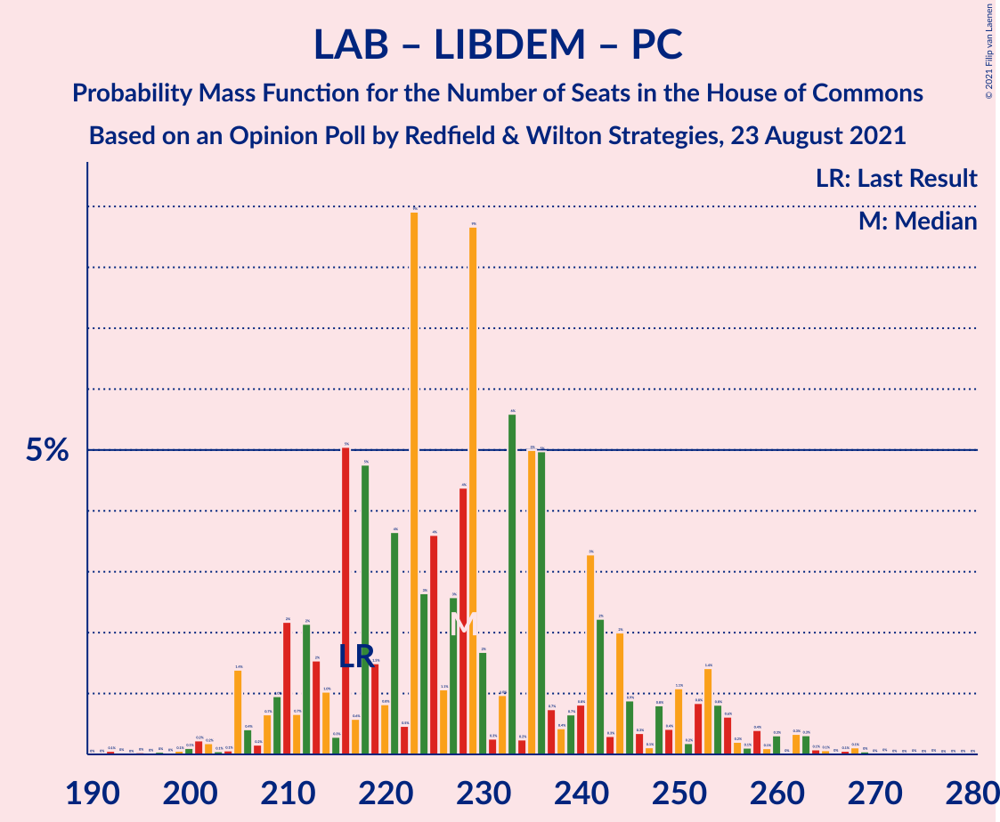

| Number of Seats | Probability | Accumulated | Special Marks |
|:---------------:|:-----------:|:-----------:|:-------------:|
| 192 | 0.1% | 100% |  |
| 193 | 0% | 99.9% |  |
| 194 | 0% | 99.9% |  |
| 195 | 0% | 99.9% |  |
| 196 | 0% | 99.8% |  |
| 197 | 0% | 99.8% |  |
| 198 | 0% | 99.8% |  |
| 199 | 0.1% | 99.8% |  |
| 200 | 0.1% | 99.7% |  |
| 201 | 0.2% | 99.6% |  |
| 202 | 0.2% | 99.4% |  |
| 203 | 0.1% | 99.2% |  |
| 204 | 0.1% | 99.1% |  |
| 205 | 1.4% | 99.1% |  |
| 206 | 0.4% | 98% |  |
| 207 | 0.2% | 97% |  |
| 208 | 0.7% | 97% |  |
| 209 | 1.0% | 96% |  |
| 210 | 2% | 96% |  |
| 211 | 0.7% | 93% |  |
| 212 | 2% | 93% |  |
| 213 | 2% | 91% |  |
| 214 | 1.0% | 89% |  |
| 215 | 0.3% | 88% |  |
| 216 | 5% | 88% |  |
| 217 | 0.6% | 83% | Last Result |
| 218 | 5% | 82% |  |
| 219 | 1.5% | 77% |  |
| 220 | 0.8% | 76% |  |
| 221 | 4% | 75% |  |
| 222 | 0.5% | 71% |  |
| 223 | 9% | 71% |  |
| 224 | 3% | 62% |  |
| 225 | 4% | 59% |  |
| 226 | 1.1% | 56% |  |
| 227 | 3% | 55% |  |
| 228 | 4% | 52% | Median |
| 229 | 9% | 48% |  |
| 230 | 2% | 39% |  |
| 231 | 0.3% | 37% |  |
| 232 | 1.0% | 37% |  |
| 233 | 6% | 36% |  |
| 234 | 0.2% | 30% |  |
| 235 | 5% | 30% |  |
| 236 | 5% | 25% |  |
| 237 | 0.7% | 20% |  |
| 238 | 0.4% | 20% |  |
| 239 | 0.7% | 19% |  |
| 240 | 0.8% | 18% |  |
| 241 | 3% | 18% |  |
| 242 | 2% | 14% |  |
| 243 | 0.3% | 12% |  |
| 244 | 2% | 12% |  |
| 245 | 0.9% | 10% |  |
| 246 | 0.3% | 9% |  |
| 247 | 0.1% | 9% |  |
| 248 | 0.8% | 8% |  |
| 249 | 0.4% | 8% |  |
| 250 | 1.1% | 7% |  |
| 251 | 0.2% | 6% |  |
| 252 | 0.8% | 6% |  |
| 253 | 1.4% | 5% |  |
| 254 | 0.8% | 4% |  |
| 255 | 0.6% | 3% |  |
| 256 | 0.2% | 2% |  |
| 257 | 0.1% | 2% |  |
| 258 | 0.4% | 2% |  |
| 259 | 0.1% | 2% |  |
| 260 | 0.3% | 1.5% |  |
| 261 | 0% | 1.2% |  |
| 262 | 0.3% | 1.1% |  |
| 263 | 0.3% | 0.8% |  |
| 264 | 0.1% | 0.5% |  |
| 265 | 0.1% | 0.4% |  |
| 266 | 0% | 0.3% |  |
| 267 | 0.1% | 0.3% |  |
| 268 | 0.1% | 0.3% |  |
| 269 | 0% | 0.2% |  |
| 270 | 0% | 0.1% |  |
| 271 | 0% | 0.1% |  |
| 272 | 0% | 0.1% |  |
| 273 | 0% | 0.1% |  |
| 274 | 0% | 0.1% |  |
| 275 | 0% | 0.1% |  |
| 276 | 0% | 0.1% |  |
| 277 | 0% | 0% |  |

### Labour Party – Liberal Democrats

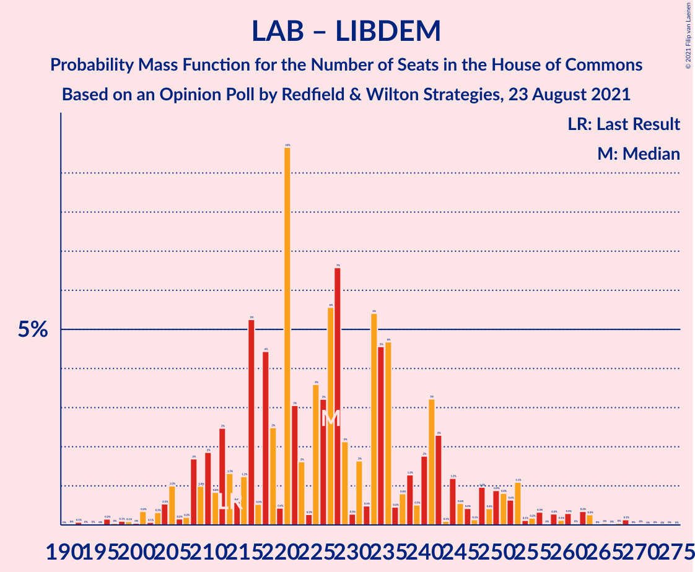

| Number of Seats | Probability | Accumulated | Special Marks |
|:---------------:|:-----------:|:-----------:|:-------------:|
| 191 | 0% | 100% |  |
| 192 | 0.1% | 99.9% |  |
| 193 | 0% | 99.9% |  |
| 194 | 0% | 99.9% |  |
| 195 | 0% | 99.8% |  |
| 196 | 0.2% | 99.8% |  |
| 197 | 0% | 99.7% |  |
| 198 | 0.1% | 99.6% |  |
| 199 | 0.1% | 99.5% |  |
| 200 | 0% | 99.4% |  |
| 201 | 0.3% | 99.4% |  |
| 202 | 0.1% | 99.0% |  |
| 203 | 0.3% | 99.0% |  |
| 204 | 0.5% | 98.7% |  |
| 205 | 1.0% | 98% |  |
| 206 | 0.2% | 97% |  |
| 207 | 0.2% | 97% |  |
| 208 | 2% | 97% |  |
| 209 | 1.0% | 95% |  |
| 210 | 2% | 94% |  |
| 211 | 0.8% | 92% |  |
| 212 | 2% | 91% |  |
| 213 | 1.3% | 89% | Last Result |
| 214 | 0.6% | 88% |  |
| 215 | 1.2% | 87% |  |
| 216 | 5% | 86% |  |
| 217 | 0.5% | 81% |  |
| 218 | 4% | 80% |  |
| 219 | 2% | 76% |  |
| 220 | 0.4% | 73% |  |
| 221 | 10% | 73% |  |
| 222 | 3% | 63% |  |
| 223 | 2% | 60% |  |
| 224 | 0.3% | 58% |  |
| 225 | 4% | 58% |  |
| 226 | 3% | 54% |  |
| 227 | 6% | 51% | Median |
| 228 | 7% | 46% |  |
| 229 | 2% | 39% |  |
| 230 | 0.3% | 37% |  |
| 231 | 2% | 37% |  |
| 232 | 0.5% | 35% |  |
| 233 | 5% | 35% |  |
| 234 | 5% | 29% |  |
| 235 | 5% | 25% |  |
| 236 | 0.5% | 20% |  |
| 237 | 0.8% | 19% |  |
| 238 | 1.3% | 19% |  |
| 239 | 0.5% | 17% |  |
| 240 | 2% | 17% |  |
| 241 | 3% | 15% |  |
| 242 | 2% | 12% |  |
| 243 | 0.1% | 10% |  |
| 244 | 1.2% | 9% |  |
| 245 | 0.6% | 8% |  |
| 246 | 0.4% | 8% |  |
| 247 | 0.1% | 7% |  |
| 248 | 1.0% | 7% |  |
| 249 | 0.4% | 6% |  |
| 250 | 0.9% | 6% |  |
| 251 | 0.8% | 5% |  |
| 252 | 0.6% | 4% |  |
| 253 | 1.1% | 3% |  |
| 254 | 0.1% | 2% |  |
| 255 | 0.2% | 2% |  |
| 256 | 0.3% | 2% |  |
| 257 | 0% | 2% |  |
| 258 | 0.3% | 2% |  |
| 259 | 0.1% | 1.4% |  |
| 260 | 0.3% | 1.3% |  |
| 261 | 0% | 1.0% |  |
| 262 | 0.3% | 1.0% |  |
| 263 | 0.3% | 0.6% |  |
| 264 | 0% | 0.4% |  |
| 265 | 0% | 0.4% |  |
| 266 | 0% | 0.3% |  |
| 267 | 0% | 0.3% |  |
| 268 | 0.1% | 0.2% |  |
| 269 | 0% | 0.1% |  |
| 270 | 0% | 0.1% |  |
| 271 | 0% | 0.1% |  |
| 272 | 0% | 0.1% |  |
| 273 | 0% | 0.1% |  |
| 274 | 0% | 0.1% |  |
| 275 | 0% | 0% |  |

### Labour Party – Plaid Cymru

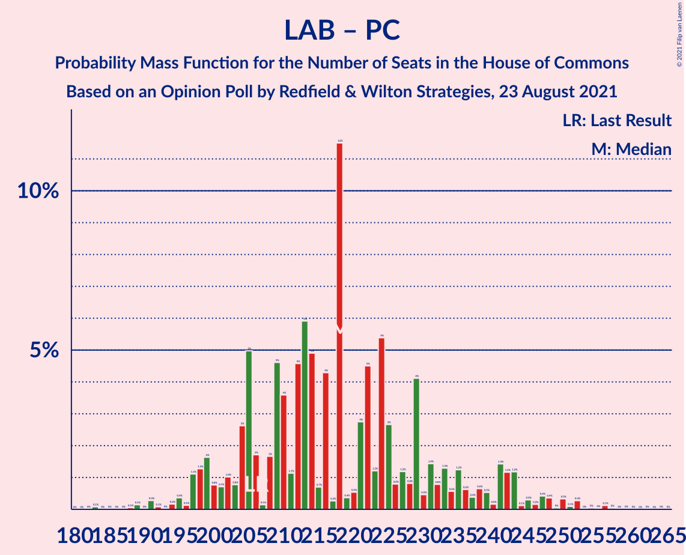

| Number of Seats | Probability | Accumulated | Special Marks |
|:---------------:|:-----------:|:-----------:|:-------------:|
| 183 | 0.1% | 100% |  |
| 184 | 0% | 99.9% |  |
| 185 | 0% | 99.9% |  |
| 186 | 0% | 99.9% |  |
| 187 | 0% | 99.9% |  |
| 188 | 0.1% | 99.8% |  |
| 189 | 0.1% | 99.8% |  |
| 190 | 0% | 99.6% |  |
| 191 | 0.3% | 99.6% |  |
| 192 | 0.1% | 99.4% |  |
| 193 | 0% | 99.3% |  |
| 194 | 0.2% | 99.3% |  |
| 195 | 0.4% | 99.1% |  |
| 196 | 0.1% | 98.7% |  |
| 197 | 1.1% | 98.6% |  |
| 198 | 1.3% | 97% |  |
| 199 | 2% | 96% |  |
| 200 | 0.8% | 95% |  |
| 201 | 0.7% | 94% |  |
| 202 | 1.0% | 93% |  |
| 203 | 0.8% | 92% |  |
| 204 | 3% | 91% |  |
| 205 | 5% | 89% |  |
| 206 | 2% | 84% | Last Result |
| 207 | 0.1% | 82% |  |
| 208 | 2% | 82% |  |
| 209 | 5% | 80% |  |
| 210 | 4% | 76% |  |
| 211 | 1.1% | 72% |  |
| 212 | 5% | 71% |  |
| 213 | 6% | 66% |  |
| 214 | 5% | 60% |  |
| 215 | 0.7% | 55% |  |
| 216 | 4% | 55% |  |
| 217 | 0.3% | 50% | Median |
| 218 | 12% | 50% |  |
| 219 | 0.4% | 39% |  |
| 220 | 0.5% | 38% |  |
| 221 | 3% | 38% |  |
| 222 | 5% | 35% |  |
| 223 | 1.2% | 31% |  |
| 224 | 5% | 29% |  |
| 225 | 3% | 24% |  |
| 226 | 0.8% | 21% |  |
| 227 | 1.2% | 20% |  |
| 228 | 0.8% | 19% |  |
| 229 | 4% | 18% |  |
| 230 | 0.5% | 14% |  |
| 231 | 1.4% | 14% |  |
| 232 | 0.8% | 12% |  |
| 233 | 1.3% | 12% |  |
| 234 | 0.6% | 10% |  |
| 235 | 1.2% | 10% |  |
| 236 | 0.6% | 9% |  |
| 237 | 0.4% | 8% |  |
| 238 | 0.6% | 8% |  |
| 239 | 0.5% | 7% |  |
| 240 | 0.2% | 6% |  |
| 241 | 1.4% | 6% |  |
| 242 | 1.2% | 5% |  |
| 243 | 1.2% | 4% |  |
| 244 | 0.1% | 2% |  |
| 245 | 0.3% | 2% |  |
| 246 | 0.2% | 2% |  |
| 247 | 0.4% | 2% |  |
| 248 | 0.4% | 1.5% |  |
| 249 | 0% | 1.1% |  |
| 250 | 0.3% | 1.0% |  |
| 251 | 0.1% | 0.7% |  |
| 252 | 0.3% | 0.6% |  |
| 253 | 0% | 0.4% |  |
| 254 | 0% | 0.3% |  |
| 255 | 0% | 0.3% |  |
| 256 | 0.1% | 0.3% |  |
| 257 | 0% | 0.1% |  |
| 258 | 0% | 0.1% |  |
| 259 | 0% | 0.1% |  |
| 260 | 0% | 0.1% |  |
| 261 | 0% | 0.1% |  |
| 262 | 0% | 0.1% |  |
| 263 | 0% | 0.1% |  |
| 264 | 0% | 0% |  |

### Labour Party

| Number of Seats | Probability | Accumulated | Special Marks |
|:---------------:|:-----------:|:-----------:|:-------------:|
| 183 | 0.1% | 100% |  |
| 184 | 0% | 99.9% |  |
| 185 | 0.1% | 99.9% |  |
| 186 | 0% | 99.7% |  |
| 187 | 0% | 99.7% |  |
| 188 | 0.1% | 99.7% |  |
| 189 | 0.1% | 99.6% |  |
| 190 | 0.1% | 99.5% |  |
| 191 | 0.3% | 99.4% |  |
| 192 | 0.2% | 99.1% |  |
| 193 | 0.1% | 98.9% |  |
| 194 | 0% | 98.9% |  |
| 195 | 0.3% | 98.8% |  |
| 196 | 0.9% | 98.6% |  |
| 197 | 0.9% | 98% |  |
| 198 | 1.1% | 97% |  |
| 199 | 2% | 96% |  |
| 200 | 2% | 93% |  |
| 201 | 0.7% | 92% |  |
| 202 | 0.1% | 91% | Last Result |
| 203 | 0.2% | 91% |  |
| 204 | 4% | 91% |  |
| 205 | 5% | 87% |  |
| 206 | 1.5% | 81% |  |
| 207 | 0.4% | 80% |  |
| 208 | 2% | 80% |  |
| 209 | 4% | 77% |  |
| 210 | 7% | 73% |  |
| 211 | 7% | 67% |  |
| 212 | 0.9% | 60% |  |
| 213 | 0.1% | 59% |  |
| 214 | 4% | 59% |  |
| 215 | 0.6% | 55% |  |
| 216 | 11% | 54% | Median |
| 217 | 4% | 43% |  |
| 218 | 2% | 39% |  |
| 219 | 1.1% | 37% |  |
| 220 | 0.6% | 36% |  |
| 221 | 2% | 36% |  |
| 222 | 4% | 34% |  |
| 223 | 7% | 29% |  |
| 224 | 2% | 22% |  |
| 225 | 0.3% | 21% |  |
| 226 | 1.0% | 21% |  |
| 227 | 2% | 20% |  |
| 228 | 1.0% | 18% |  |
| 229 | 4% | 17% |  |
| 230 | 1.1% | 13% |  |
| 231 | 2% | 12% |  |
| 232 | 0.7% | 10% |  |
| 233 | 0.9% | 9% |  |
| 234 | 0.3% | 8% |  |
| 235 | 0.1% | 8% |  |
| 236 | 0.4% | 8% |  |
| 237 | 1.1% | 7% |  |
| 238 | 0.4% | 6% |  |
| 239 | 2% | 6% |  |
| 240 | 0.1% | 4% |  |
| 241 | 0.7% | 4% |  |
| 242 | 1.1% | 3% |  |
| 243 | 0.1% | 2% |  |
| 244 | 0.2% | 2% |  |
| 245 | 0.4% | 2% |  |
| 246 | 0.1% | 2% |  |
| 247 | 0.2% | 2% |  |
| 248 | 0.3% | 1.3% |  |
| 249 | 0.1% | 1.1% |  |
| 250 | 0.3% | 1.0% |  |
| 251 | 0.1% | 0.7% |  |
| 252 | 0.2% | 0.5% |  |
| 253 | 0% | 0.3% |  |
| 254 | 0.1% | 0.3% |  |
| 255 | 0% | 0.2% |  |
| 256 | 0.1% | 0.2% |  |
| 257 | 0% | 0.1% |  |
| 258 | 0% | 0.1% |  |
| 259 | 0% | 0.1% |  |
| 260 | 0% | 0.1% |  |
| 261 | 0% | 0% |  |

## Technical Information

### Opinion Poll

+ **Polling firm:** Redfield & Wilton Strategies
+ **Commissioner(s):** —
+ **Fieldwork period:** 23 August 2021

### Calculations

+ **Sample size:** 1940
+ **Simulations done:** 131,072
+ **Error estimate:** 0.94%

