# Opinion Poll by Deltapoll for The Mail on Sunday, 13–15 October 2021

<a href="#voting-intentions">Voting Intentions</a> | <a href="#seats">Seats</a> | <a href="#coalitions">Coalitions</a> | <a href="#technical-information">Technical Information</a>

## Voting Intentions

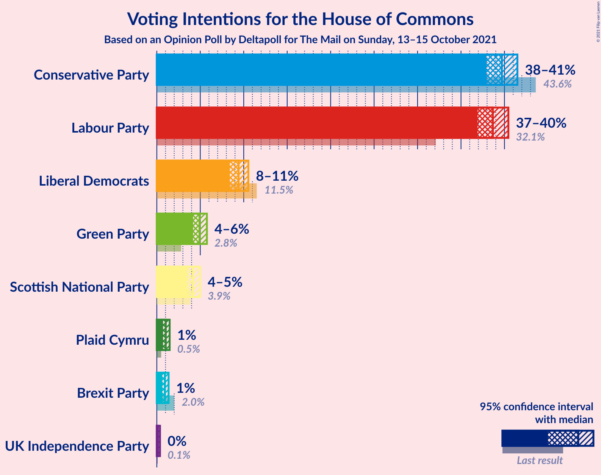

### Confidence Intervals

| Party | Last Result | Poll Result | 80% Confidence Interval | 90% Confidence Interval | 95% Confidence Interval | 99% Confidence Interval |
|:-----:|:-----------:|:-----------:|:-----------------------:|:-----------------------:|:-----------------------:|:-----------------------:|
| Conservative Party | 43.6% | 39.7% | 38.5–40.9% |38.2–41.2% |37.9–41.5% |37.4–42.1% |
| Labour Party | 32.1% | 38.7% | 37.5–39.8% |37.2–40.2% |36.9–40.5% |36.4–41.0% |
| Liberal Democrats | 11.5% | 9.4% | 8.7–10.2% |8.6–10.3% |8.4–10.5% |8.1–10.9% |
| Green Party | 2.8% | 4.9% | 4.4–5.5% |4.3–5.6% |4.2–5.8% |4.0–6.0% |
| Scottish National Party | 3.9% | 4.2% | 3.7–4.7% |3.6–4.9% |3.5–5.0% |3.3–5.2% |
| Plaid Cymru | 0.5% | 1.0% | 0.8–1.3% |0.8–1.4% |0.7–1.5% |0.6–1.6% |
| Brexit Party | 2.0% | 0.9% | 0.7–1.2% |0.7–1.3% |0.6–1.4% |0.5–1.5% |
| UK Independence Party | 0.1% | 0.1% | 0.1–0.3% |0.1–0.3% |0.0–0.4% |0.0–0.4% |

*Note:* The poll result column reflects the actual value used in the calculations. Published results may vary slightly, and in addition be rounded to fewer digits.

## Seats

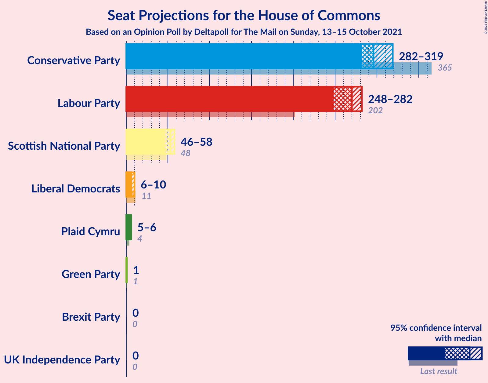

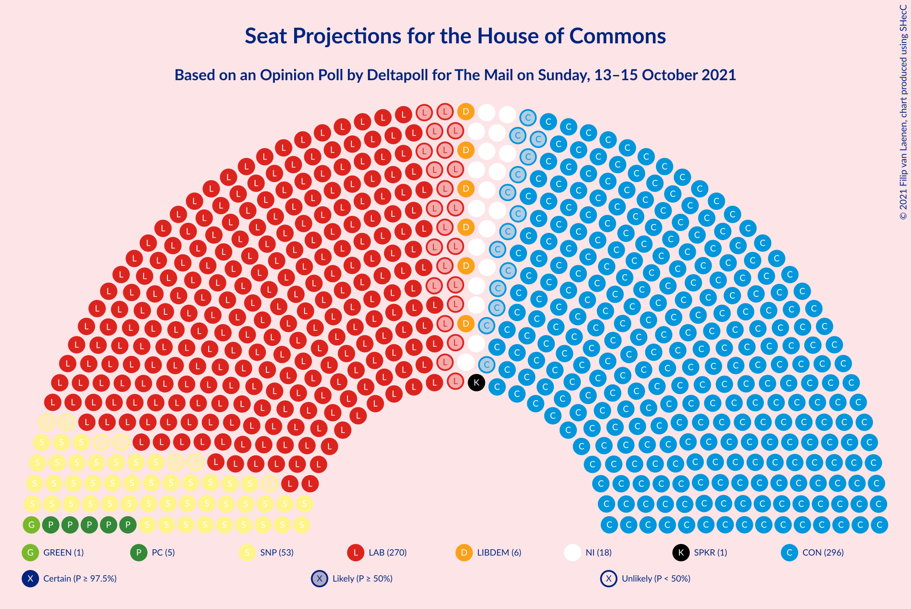

### Confidence Intervals

| Party | Last Result | Median | 80% Confidence Interval | 90% Confidence Interval | 95% Confidence Interval | 99% Confidence Interval |
|:-----:|:-----------:|:------:|:-----------------------:|:-----------------------:|:-----------------------:|:-----------------------:|
| <a href="#conservative-party">Conservative Party</a> | 365 | 296 | 286–309 |285–314 |282–319 |275–323 |
| <a href="#labour-party">Labour Party</a> | 202 | 270 | 254–279 |250–280 |248–282 |239–289 |
| <a href="#liberal-democrats">Liberal Democrats</a> | 11 | 6 | 6–9 |6–9 |6–10 |4–13 |
| <a href="#green-party">Green Party</a> | 1 | 1 | 1 |1 |1 |1 |
| <a href="#scottish-national-party">Scottish National Party</a> | 48 | 53 | 50–58 |49–58 |46–58 |38–58 |
| <a href="#plaid-cymru">Plaid Cymru</a> | 4 | 5 | 5 |5–6 |5–6 |5–7 |
| <a href="#brexit-party">Brexit Party</a> | 0 | 0 | 0 |0 |0 |0 |
| <a href="#uk-independence-party">UK Independence Party</a> | 0 | 0 | 0 |0 |0 |0 |

### Conservative Party

*For a full overview of the results for this party, see the [Conservative Party](party-conservativeparty.html) page.*

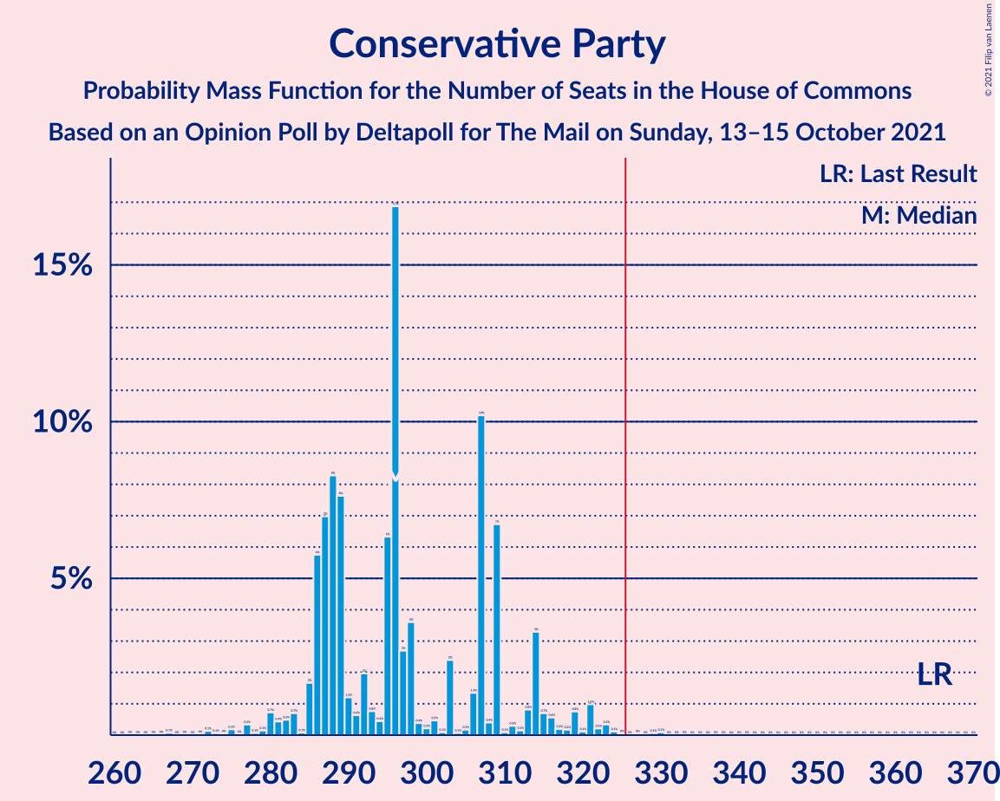

| Number of Seats | Probability | Accumulated | Special Marks |
|:---------------:|:-----------:|:-----------:|:-------------:|
| 265 | 0% | 100% |  |
| 266 | 0% | 99.9% |  |
| 267 | 0.1% | 99.9% |  |
| 268 | 0% | 99.9% |  |
| 269 | 0% | 99.8% |  |
| 270 | 0% | 99.8% |  |
| 271 | 0% | 99.8% |  |
| 272 | 0.1% | 99.8% |  |
| 273 | 0.1% | 99.7% |  |
| 274 | 0% | 99.6% |  |
| 275 | 0.2% | 99.6% |  |
| 276 | 0% | 99.4% |  |
| 277 | 0.3% | 99.3% |  |
| 278 | 0.1% | 99.0% |  |
| 279 | 0.1% | 98.9% |  |
| 280 | 0.7% | 98.8% |  |
| 281 | 0.4% | 98% |  |
| 282 | 0.5% | 98% |  |
| 283 | 0.7% | 97% |  |
| 284 | 0.1% | 96% |  |
| 285 | 2% | 96% |  |
| 286 | 6% | 95% |  |
| 287 | 7% | 89% |  |
| 288 | 8% | 82% |  |
| 289 | 8% | 74% |  |
| 290 | 1.2% | 66% |  |
| 291 | 0.6% | 65% |  |
| 292 | 2% | 64% |  |
| 293 | 0.8% | 62% |  |
| 294 | 0.4% | 61% |  |
| 295 | 6% | 61% |  |
| 296 | 17% | 55% | Median |
| 297 | 3% | 38% |  |
| 298 | 4% | 35% |  |
| 299 | 0.4% | 32% |  |
| 300 | 0.2% | 31% |  |
| 301 | 0.5% | 31% |  |
| 302 | 0.1% | 30% |  |
| 303 | 2% | 30% |  |
| 304 | 0.1% | 28% |  |
| 305 | 0.2% | 28% |  |
| 306 | 1.3% | 28% |  |
| 307 | 10% | 26% |  |
| 308 | 0.4% | 16% |  |
| 309 | 7% | 16% |  |
| 310 | 0.1% | 9% |  |
| 311 | 0.3% | 9% |  |
| 312 | 0.1% | 9% |  |
| 313 | 0.8% | 9% |  |
| 314 | 3% | 8% |  |
| 315 | 0.7% | 4% |  |
| 316 | 0.6% | 4% |  |
| 317 | 0.2% | 3% |  |
| 318 | 0.2% | 3% |  |
| 319 | 0.8% | 3% |  |
| 320 | 0.1% | 2% |  |
| 321 | 1.0% | 2% |  |
| 322 | 0.2% | 1.0% |  |
| 323 | 0.3% | 0.8% |  |
| 324 | 0.1% | 0.4% |  |
| 325 | 0% | 0.3% |  |
| 326 | 0% | 0.3% | Majority |
| 327 | 0% | 0.3% |  |
| 328 | 0% | 0.2% |  |
| 329 | 0.1% | 0.2% |  |
| 330 | 0.1% | 0.1% |  |
| 331 | 0% | 0.1% |  |
| 332 | 0% | 0.1% |  |
| 333 | 0% | 0% |  |
| 334 | 0% | 0% |  |
| 335 | 0% | 0% |  |
| 336 | 0% | 0% |  |
| 337 | 0% | 0% |  |
| 338 | 0% | 0% |  |
| 339 | 0% | 0% |  |
| 340 | 0% | 0% |  |
| 341 | 0% | 0% |  |
| 342 | 0% | 0% |  |
| 343 | 0% | 0% |  |
| 344 | 0% | 0% |  |
| 345 | 0% | 0% |  |
| 346 | 0% | 0% |  |
| 347 | 0% | 0% |  |
| 348 | 0% | 0% |  |
| 349 | 0% | 0% |  |
| 350 | 0% | 0% |  |
| 351 | 0% | 0% |  |
| 352 | 0% | 0% |  |
| 353 | 0% | 0% |  |
| 354 | 0% | 0% |  |
| 355 | 0% | 0% |  |
| 356 | 0% | 0% |  |
| 357 | 0% | 0% |  |
| 358 | 0% | 0% |  |
| 359 | 0% | 0% |  |
| 360 | 0% | 0% |  |
| 361 | 0% | 0% |  |
| 362 | 0% | 0% |  |
| 363 | 0% | 0% |  |
| 364 | 0% | 0% |  |
| 365 | 0% | 0% | Last Result |

### Labour Party

*For a full overview of the results for this party, see the [Labour Party](party-labourparty.html) page.*

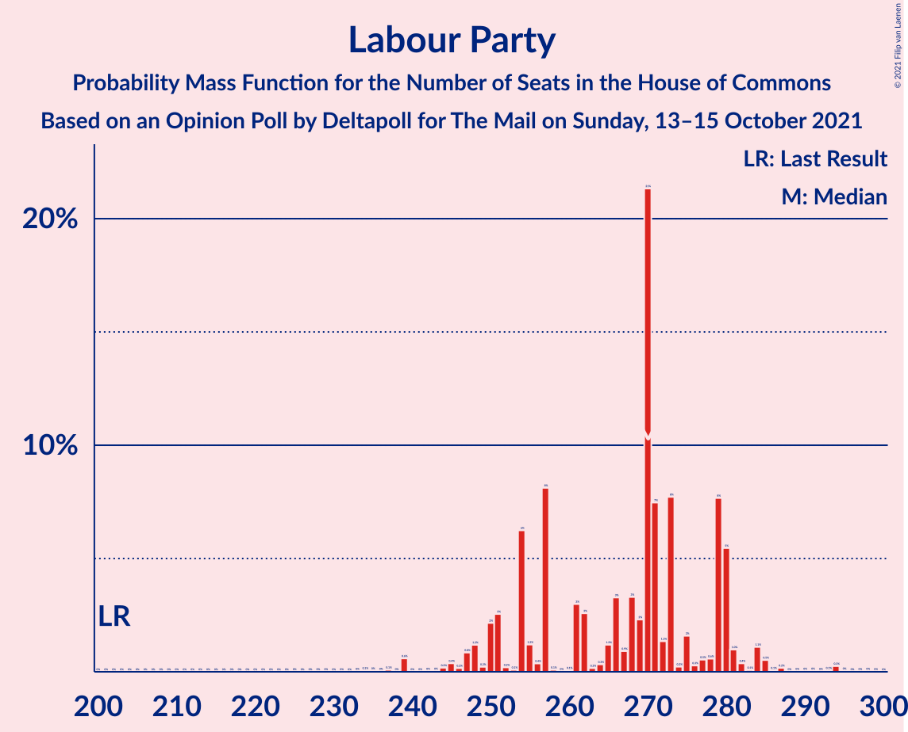

| Number of Seats | Probability | Accumulated | Special Marks |
|:---------------:|:-----------:|:-----------:|:-------------:|
| 202 | 0% | 100% | Last Result |
| 203 | 0% | 100% |  |
| 204 | 0% | 100% |  |
| 205 | 0% | 100% |  |
| 206 | 0% | 100% |  |
| 207 | 0% | 100% |  |
| 208 | 0% | 100% |  |
| 209 | 0% | 100% |  |
| 210 | 0% | 100% |  |
| 211 | 0% | 100% |  |
| 212 | 0% | 100% |  |
| 213 | 0% | 100% |  |
| 214 | 0% | 100% |  |
| 215 | 0% | 100% |  |
| 216 | 0% | 100% |  |
| 217 | 0% | 100% |  |
| 218 | 0% | 100% |  |
| 219 | 0% | 100% |  |
| 220 | 0% | 100% |  |
| 221 | 0% | 100% |  |
| 222 | 0% | 100% |  |
| 223 | 0% | 100% |  |
| 224 | 0% | 100% |  |
| 225 | 0% | 100% |  |
| 226 | 0% | 100% |  |
| 227 | 0% | 100% |  |
| 228 | 0% | 100% |  |
| 229 | 0% | 100% |  |
| 230 | 0% | 100% |  |
| 231 | 0% | 100% |  |
| 232 | 0% | 100% |  |
| 233 | 0% | 100% |  |
| 234 | 0.1% | 99.9% |  |
| 235 | 0% | 99.9% |  |
| 236 | 0% | 99.9% |  |
| 237 | 0.1% | 99.8% |  |
| 238 | 0% | 99.7% |  |
| 239 | 0.6% | 99.7% |  |
| 240 | 0% | 99.1% |  |
| 241 | 0% | 99.1% |  |
| 242 | 0% | 99.1% |  |
| 243 | 0% | 99.1% |  |
| 244 | 0.2% | 99.1% |  |
| 245 | 0.4% | 98.9% |  |
| 246 | 0.2% | 98.5% |  |
| 247 | 0.8% | 98% |  |
| 248 | 1.2% | 98% |  |
| 249 | 0.2% | 96% |  |
| 250 | 2% | 96% |  |
| 251 | 3% | 94% |  |
| 252 | 0.2% | 91% |  |
| 253 | 0.1% | 91% |  |
| 254 | 6% | 91% |  |
| 255 | 1.2% | 85% |  |
| 256 | 0.4% | 84% |  |
| 257 | 8% | 83% |  |
| 258 | 0.1% | 75% |  |
| 259 | 0% | 75% |  |
| 260 | 0.1% | 75% |  |
| 261 | 3% | 75% |  |
| 262 | 3% | 72% |  |
| 263 | 0.2% | 69% |  |
| 264 | 0.3% | 69% |  |
| 265 | 1.2% | 69% |  |
| 266 | 3% | 68% |  |
| 267 | 0.9% | 65% |  |
| 268 | 3% | 64% |  |
| 269 | 2% | 60% |  |
| 270 | 21% | 58% | Median |
| 271 | 7% | 37% |  |
| 272 | 1.3% | 29% |  |
| 273 | 8% | 28% |  |
| 274 | 0.2% | 20% |  |
| 275 | 2% | 20% |  |
| 276 | 0.3% | 18% |  |
| 277 | 0.5% | 18% |  |
| 278 | 0.6% | 17% |  |
| 279 | 8% | 17% |  |
| 280 | 5% | 9% |  |
| 281 | 1.0% | 4% |  |
| 282 | 0.4% | 3% |  |
| 283 | 0.1% | 2% |  |
| 284 | 1.1% | 2% |  |
| 285 | 0.5% | 1.3% |  |
| 286 | 0.1% | 0.7% |  |
| 287 | 0.2% | 0.7% |  |
| 288 | 0% | 0.5% |  |
| 289 | 0% | 0.5% |  |
| 290 | 0% | 0.5% |  |
| 291 | 0% | 0.5% |  |
| 292 | 0% | 0.4% |  |
| 293 | 0.1% | 0.4% |  |
| 294 | 0.3% | 0.3% |  |
| 295 | 0% | 0.1% |  |
| 296 | 0% | 0.1% |  |
| 297 | 0% | 0.1% |  |
| 298 | 0% | 0% |  |

### Liberal Democrats

*For a full overview of the results for this party, see the [Liberal Democrats](party-liberaldemocrats.html) page.*

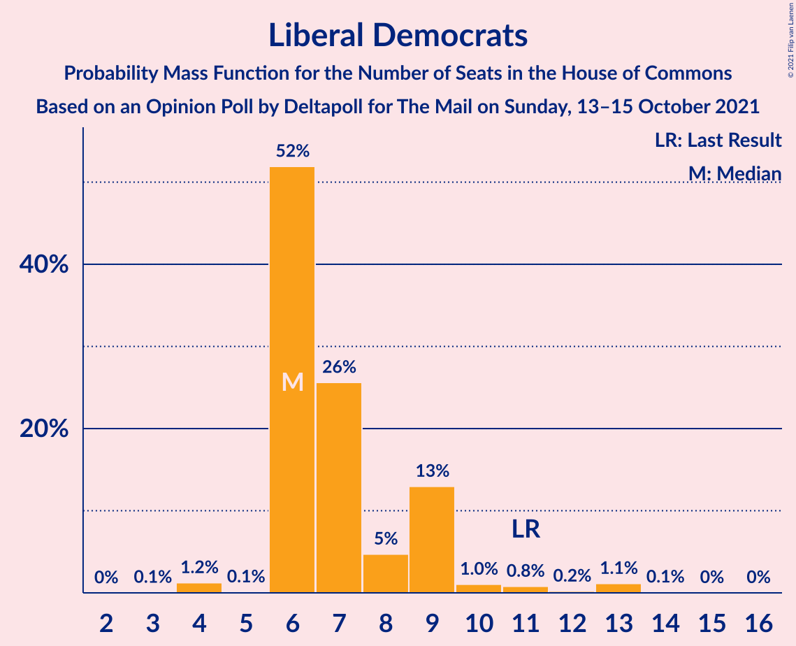

| Number of Seats | Probability | Accumulated | Special Marks |
|:---------------:|:-----------:|:-----------:|:-------------:|
| 3 | 0.1% | 100% |  |
| 4 | 1.2% | 99.9% |  |
| 5 | 0.1% | 98.7% |  |
| 6 | 52% | 98.6% | Median |
| 7 | 26% | 47% |  |
| 8 | 5% | 21% |  |
| 9 | 13% | 16% |  |
| 10 | 1.0% | 3% |  |
| 11 | 0.8% | 2% | Last Result |
| 12 | 0.2% | 2% |  |
| 13 | 1.1% | 1.3% |  |
| 14 | 0.1% | 0.2% |  |
| 15 | 0% | 0.1% |  |
| 16 | 0% | 0% |  |

### Green Party

*For a full overview of the results for this party, see the [Green Party](party-greenparty.html) page.*

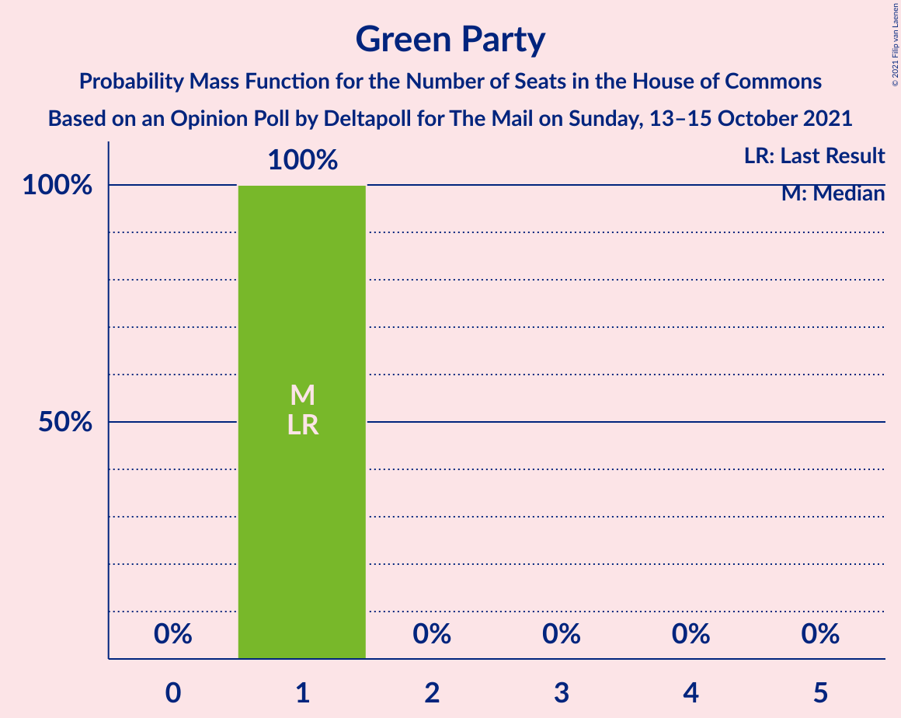

| Number of Seats | Probability | Accumulated | Special Marks |
|:---------------:|:-----------:|:-----------:|:-------------:|
| 1 | 100% | 100% | Last Result, Median |

### Scottish National Party

*For a full overview of the results for this party, see the [Scottish National Party](party-scottishnationalparty.html) page.*

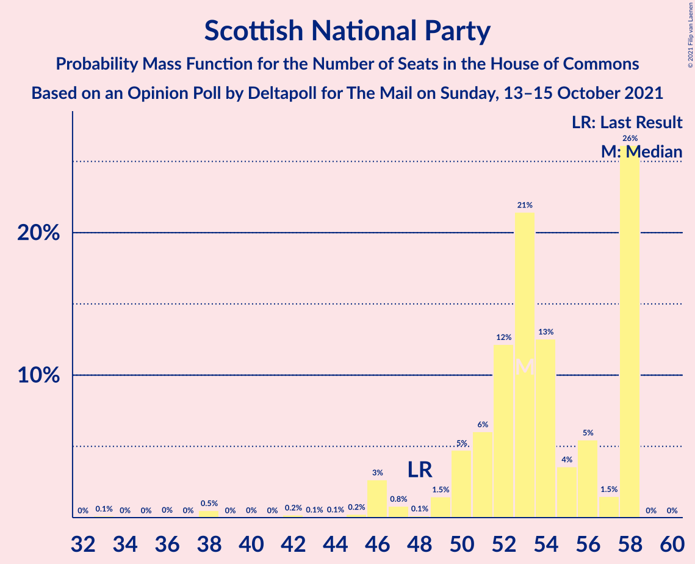

| Number of Seats | Probability | Accumulated | Special Marks |
|:---------------:|:-----------:|:-----------:|:-------------:|
| 33 | 0.1% | 100% |  |
| 34 | 0% | 99.9% |  |
| 35 | 0% | 99.9% |  |
| 36 | 0% | 99.9% |  |
| 37 | 0% | 99.8% |  |
| 38 | 0.5% | 99.8% |  |
| 39 | 0% | 99.3% |  |
| 40 | 0% | 99.3% |  |
| 41 | 0% | 99.3% |  |
| 42 | 0.2% | 99.3% |  |
| 43 | 0.1% | 99.1% |  |
| 44 | 0.1% | 99.0% |  |
| 45 | 0.2% | 98.9% |  |
| 46 | 3% | 98.7% |  |
| 47 | 0.8% | 96% |  |
| 48 | 0.1% | 95% | Last Result |
| 49 | 1.5% | 95% |  |
| 50 | 5% | 94% |  |
| 51 | 6% | 89% |  |
| 52 | 12% | 83% |  |
| 53 | 21% | 71% | Median |
| 54 | 13% | 49% |  |
| 55 | 4% | 37% |  |
| 56 | 5% | 33% |  |
| 57 | 1.5% | 28% |  |
| 58 | 26% | 26% |  |
| 59 | 0% | 0% |  |

### Plaid Cymru

*For a full overview of the results for this party, see the [Plaid Cymru](party-plaidcymru.html) page.*

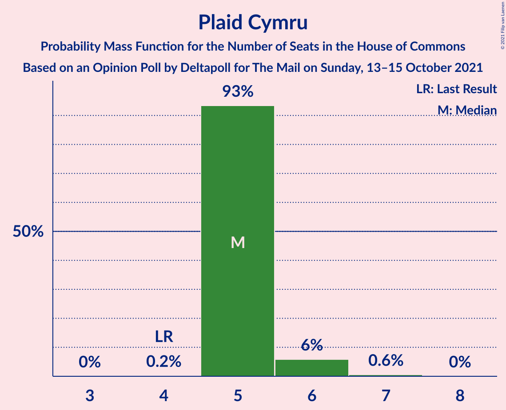

| Number of Seats | Probability | Accumulated | Special Marks |
|:---------------:|:-----------:|:-----------:|:-------------:|
| 4 | 0.2% | 100% | Last Result |
| 5 | 93% | 99.8% | Median |
| 6 | 6% | 6% |  |
| 7 | 0.6% | 0.6% |  |
| 8 | 0% | 0% |  |

### Brexit Party

*For a full overview of the results for this party, see the [Brexit Party](party-brexitparty.html) page.*

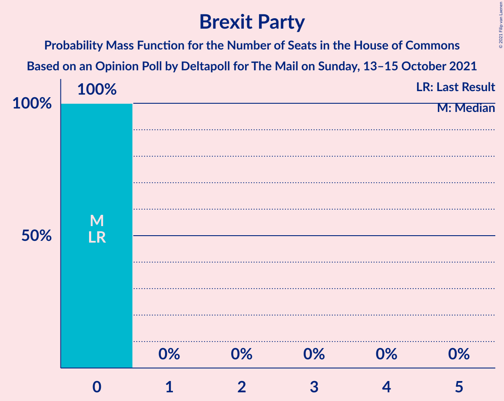

| Number of Seats | Probability | Accumulated | Special Marks |
|:---------------:|:-----------:|:-----------:|:-------------:|
| 0 | 100% | 100% | Last Result, Median |

### UK Independence Party

*For a full overview of the results for this party, see the [UK Independence Party](party-ukindependenceparty.html) page.*

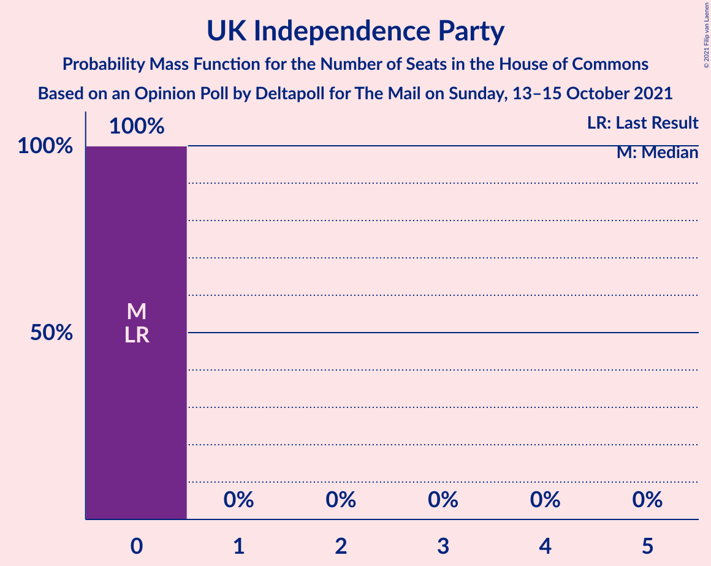

| Number of Seats | Probability | Accumulated | Special Marks |
|:---------------:|:-----------:|:-----------:|:-------------:|
| 0 | 100% | 100% | Last Result, Median |

## Coalitions

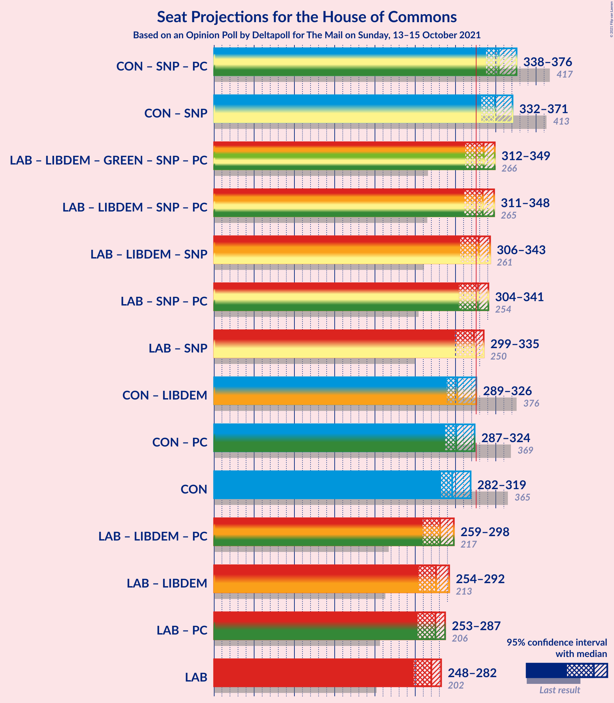

### Confidence Intervals

| Coalition | Last Result | Median | Majority? | 80% Confidence Interval | 90% Confidence Interval | 95% Confidence Interval | 99% Confidence Interval |
|:---------:|:-----------:|:------:|:---------:|:-----------------------:|:-----------------------:|:-----------------------:|:-----------------------:|
| Conservative Party – Scottish National Party – Plaid Cymru | 417 | 354 | 99.9% | 343–370 | 342–374 | 338–376 | 332–384 |
| Conservative Party – Scottish National Party | 413 | 349 | 99.5% | 338–365 | 337–369 | 332–371 | 327–379 |
| Labour Party – Liberal Democrats – Green Party – Scottish National Party – Plaid Cymru | 266 | 335 | 72% | 322–345 | 317–346 | 312–349 | 308–356 |
| Labour Party – Liberal Democrats – Scottish National Party – Plaid Cymru | 265 | 334 | 72% | 321–344 | 316–345 | 311–348 | 307–355 |
| Labour Party – Liberal Democrats – Scottish National Party | 261 | 329 | 69% | 316–339 | 311–340 | 306–343 | 302–350 |
| Labour Party – Scottish National Party – Plaid Cymru | 254 | 328 | 65% | 313–338 | 309–338 | 304–341 | 300–346 |
| Labour Party – Scottish National Party | 250 | 323 | 36% | 308–333 | 304–333 | 299–335 | 295–341 |
| Conservative Party – Liberal Democrats | 376 | 302 | 3% | 292–317 | 292–321 | 289–326 | 284–330 |
| Conservative Party – Plaid Cymru | 369 | 301 | 2% | 291–314 | 290–319 | 287–324 | 280–328 |
| Conservative Party | 365 | 296 | 0.3% | 286–309 | 285–314 | 282–319 | 275–323 |
| Labour Party – Liberal Democrats – Plaid Cymru | 217 | 281 | 0% | 265–292 | 261–293 | 259–298 | 251–303 |
| Labour Party – Liberal Democrats | 213 | 276 | 0% | 260–287 | 256–288 | 254–292 | 246–298 |
| Labour Party – Plaid Cymru | 206 | 275 | 0% | 259–284 | 255–285 | 253–287 | 244–294 |
| Labour Party | 202 | 270 | 0% | 254–279 | 250–280 | 248–282 | 239–289 |

### Conservative Party – Scottish National Party – Plaid Cymru

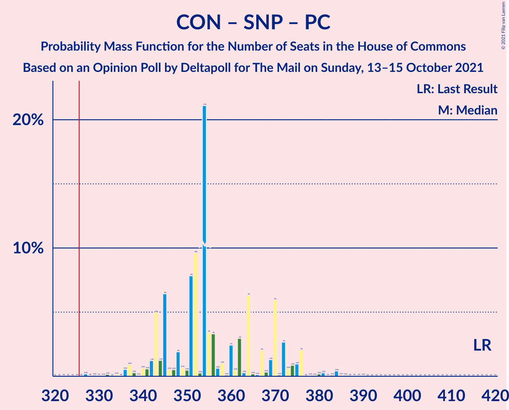

| Number of Seats | Probability | Accumulated | Special Marks |
|:---------------:|:-----------:|:-----------:|:-------------:|
| 324 | 0% | 100% |  |
| 325 | 0% | 99.9% |  |
| 326 | 0% | 99.9% | Majority |
| 327 | 0.2% | 99.9% |  |
| 328 | 0% | 99.7% |  |
| 329 | 0.1% | 99.7% |  |
| 330 | 0% | 99.6% |  |
| 331 | 0.1% | 99.6% |  |
| 332 | 0.1% | 99.5% |  |
| 333 | 0% | 99.4% |  |
| 334 | 0.1% | 99.3% |  |
| 335 | 0% | 99.2% |  |
| 336 | 0.5% | 99.2% |  |
| 337 | 0.9% | 98.6% |  |
| 338 | 0.3% | 98% |  |
| 339 | 0.1% | 97% |  |
| 340 | 0.6% | 97% |  |
| 341 | 0.6% | 97% |  |
| 342 | 1.2% | 96% |  |
| 343 | 5% | 95% |  |
| 344 | 1.2% | 90% |  |
| 345 | 6% | 89% |  |
| 346 | 0.5% | 82% |  |
| 347 | 0.5% | 82% |  |
| 348 | 2% | 81% |  |
| 349 | 0.7% | 79% |  |
| 350 | 0.5% | 79% |  |
| 351 | 8% | 78% |  |
| 352 | 10% | 70% |  |
| 353 | 0.3% | 61% |  |
| 354 | 21% | 61% | Median |
| 355 | 3% | 39% |  |
| 356 | 3% | 36% |  |
| 357 | 0.6% | 33% |  |
| 358 | 1.0% | 32% |  |
| 359 | 0.1% | 31% |  |
| 360 | 2% | 31% |  |
| 361 | 0.5% | 29% |  |
| 362 | 3% | 28% |  |
| 363 | 0.3% | 25% |  |
| 364 | 6% | 25% |  |
| 365 | 0.2% | 19% |  |
| 366 | 0.1% | 18% |  |
| 367 | 2% | 18% |  |
| 368 | 0.3% | 16% |  |
| 369 | 1.3% | 16% |  |
| 370 | 6% | 15% |  |
| 371 | 0.1% | 9% |  |
| 372 | 3% | 9% |  |
| 373 | 0.6% | 6% |  |
| 374 | 0.9% | 5% |  |
| 375 | 1.0% | 4% |  |
| 376 | 2% | 4% |  |
| 377 | 0% | 1.5% |  |
| 378 | 0.1% | 1.5% |  |
| 379 | 0.1% | 1.4% |  |
| 380 | 0.2% | 1.3% |  |
| 381 | 0.3% | 1.2% |  |
| 382 | 0% | 0.9% |  |
| 383 | 0.1% | 0.9% |  |
| 384 | 0.4% | 0.8% |  |
| 385 | 0.1% | 0.4% |  |
| 386 | 0.1% | 0.3% |  |
| 387 | 0% | 0.2% |  |
| 388 | 0% | 0.2% |  |
| 389 | 0% | 0.1% |  |
| 390 | 0.1% | 0.1% |  |
| 391 | 0% | 0% |  |
| 392 | 0% | 0% |  |
| 393 | 0% | 0% |  |
| 394 | 0% | 0% |  |
| 395 | 0% | 0% |  |
| 396 | 0% | 0% |  |
| 397 | 0% | 0% |  |
| 398 | 0% | 0% |  |
| 399 | 0% | 0% |  |
| 400 | 0% | 0% |  |
| 401 | 0% | 0% |  |
| 402 | 0% | 0% |  |
| 403 | 0% | 0% |  |
| 404 | 0% | 0% |  |
| 405 | 0% | 0% |  |
| 406 | 0% | 0% |  |
| 407 | 0% | 0% |  |
| 408 | 0% | 0% |  |
| 409 | 0% | 0% |  |
| 410 | 0% | 0% |  |
| 411 | 0% | 0% |  |
| 412 | 0% | 0% |  |
| 413 | 0% | 0% |  |
| 414 | 0% | 0% |  |
| 415 | 0% | 0% |  |
| 416 | 0% | 0% |  |
| 417 | 0% | 0% | Last Result |

### Conservative Party – Scottish National Party

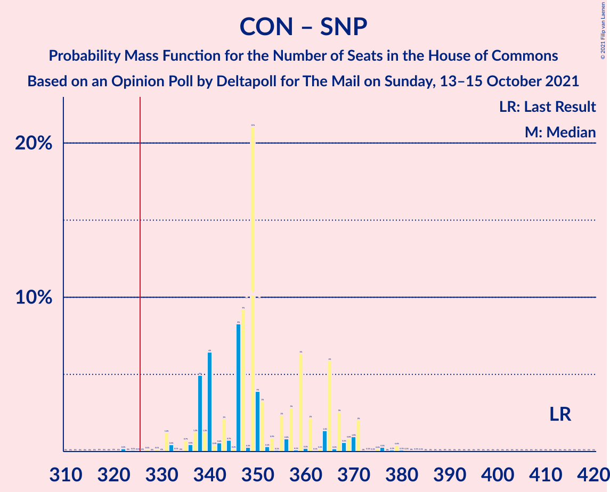

| Number of Seats | Probability | Accumulated | Special Marks |
|:---------------:|:-----------:|:-----------:|:-------------:|
| 319 | 0% | 100% |  |
| 320 | 0% | 99.9% |  |
| 321 | 0% | 99.9% |  |
| 322 | 0.2% | 99.9% |  |
| 323 | 0% | 99.7% |  |
| 324 | 0.1% | 99.7% |  |
| 325 | 0.1% | 99.6% |  |
| 326 | 0% | 99.5% | Majority |
| 327 | 0.1% | 99.5% |  |
| 328 | 0% | 99.4% |  |
| 329 | 0.1% | 99.3% |  |
| 330 | 0% | 99.2% |  |
| 331 | 1.2% | 99.2% |  |
| 332 | 0.4% | 98% |  |
| 333 | 0.1% | 97% |  |
| 334 | 0% | 97% |  |
| 335 | 0.7% | 97% |  |
| 336 | 0.5% | 97% |  |
| 337 | 1.3% | 96% |  |
| 338 | 5% | 95% |  |
| 339 | 1.3% | 90% |  |
| 340 | 6% | 89% |  |
| 341 | 0.4% | 82% |  |
| 342 | 0.6% | 82% |  |
| 343 | 2% | 81% |  |
| 344 | 0.7% | 79% |  |
| 345 | 0.2% | 78% |  |
| 346 | 8% | 78% |  |
| 347 | 9% | 70% |  |
| 348 | 0.3% | 61% |  |
| 349 | 21% | 60% | Median |
| 350 | 4% | 39% |  |
| 351 | 3% | 36% |  |
| 352 | 0.3% | 32% |  |
| 353 | 0.9% | 32% |  |
| 354 | 0.1% | 31% |  |
| 355 | 2% | 31% |  |
| 356 | 0.8% | 29% |  |
| 357 | 3% | 28% |  |
| 358 | 0.1% | 25% |  |
| 359 | 6% | 25% |  |
| 360 | 0.2% | 19% |  |
| 361 | 2% | 18% |  |
| 362 | 0.1% | 16% |  |
| 363 | 0.2% | 16% |  |
| 364 | 1.4% | 16% |  |
| 365 | 6% | 15% |  |
| 366 | 0.2% | 9% |  |
| 367 | 3% | 8% |  |
| 368 | 0.6% | 6% |  |
| 369 | 0.8% | 5% |  |
| 370 | 1.0% | 4% |  |
| 371 | 2% | 4% |  |
| 372 | 0% | 1.5% |  |
| 373 | 0.1% | 1.4% |  |
| 374 | 0.1% | 1.4% |  |
| 375 | 0.2% | 1.3% |  |
| 376 | 0.3% | 1.1% |  |
| 377 | 0% | 0.9% |  |
| 378 | 0.1% | 0.9% |  |
| 379 | 0.4% | 0.8% |  |
| 380 | 0.1% | 0.4% |  |
| 381 | 0.1% | 0.3% |  |
| 382 | 0% | 0.2% |  |
| 383 | 0.1% | 0.2% |  |
| 384 | 0.1% | 0.1% |  |
| 385 | 0% | 0% |  |
| 386 | 0% | 0% |  |
| 387 | 0% | 0% |  |
| 388 | 0% | 0% |  |
| 389 | 0% | 0% |  |
| 390 | 0% | 0% |  |
| 391 | 0% | 0% |  |
| 392 | 0% | 0% |  |
| 393 | 0% | 0% |  |
| 394 | 0% | 0% |  |
| 395 | 0% | 0% |  |
| 396 | 0% | 0% |  |
| 397 | 0% | 0% |  |
| 398 | 0% | 0% |  |
| 399 | 0% | 0% |  |
| 400 | 0% | 0% |  |
| 401 | 0% | 0% |  |
| 402 | 0% | 0% |  |
| 403 | 0% | 0% |  |
| 404 | 0% | 0% |  |
| 405 | 0% | 0% |  |
| 406 | 0% | 0% |  |
| 407 | 0% | 0% |  |
| 408 | 0% | 0% |  |
| 409 | 0% | 0% |  |
| 410 | 0% | 0% |  |
| 411 | 0% | 0% |  |
| 412 | 0% | 0% |  |
| 413 | 0% | 0% | Last Result |

### Labour Party – Liberal Democrats – Green Party – Scottish National Party – Plaid Cymru

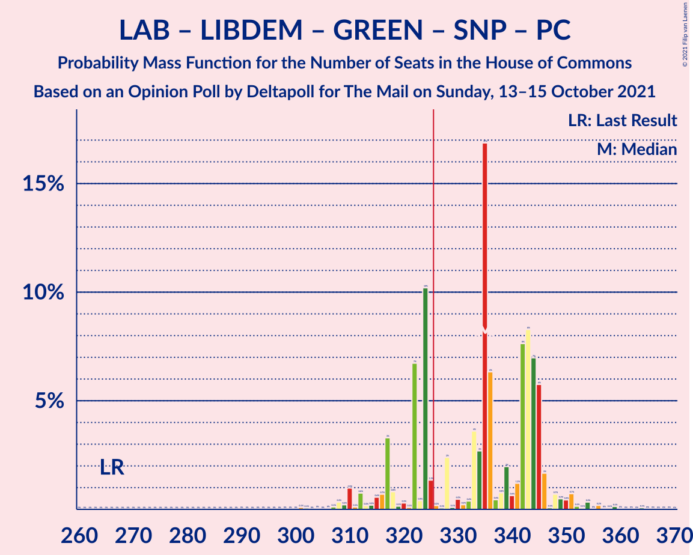

| Number of Seats | Probability | Accumulated | Special Marks |
|:---------------:|:-----------:|:-----------:|:-------------:|
| 266 | 0% | 100% | Last Result |
| 267 | 0% | 100% |  |
| 268 | 0% | 100% |  |
| 269 | 0% | 100% |  |
| 270 | 0% | 100% |  |
| 271 | 0% | 100% |  |
| 272 | 0% | 100% |  |
| 273 | 0% | 100% |  |
| 274 | 0% | 100% |  |
| 275 | 0% | 100% |  |
| 276 | 0% | 100% |  |
| 277 | 0% | 100% |  |
| 278 | 0% | 100% |  |
| 279 | 0% | 100% |  |
| 280 | 0% | 100% |  |
| 281 | 0% | 100% |  |
| 282 | 0% | 100% |  |
| 283 | 0% | 100% |  |
| 284 | 0% | 100% |  |
| 285 | 0% | 100% |  |
| 286 | 0% | 100% |  |
| 287 | 0% | 100% |  |
| 288 | 0% | 100% |  |
| 289 | 0% | 100% |  |
| 290 | 0% | 100% |  |
| 291 | 0% | 100% |  |
| 292 | 0% | 100% |  |
| 293 | 0% | 100% |  |
| 294 | 0% | 100% |  |
| 295 | 0% | 100% |  |
| 296 | 0% | 100% |  |
| 297 | 0% | 100% |  |
| 298 | 0% | 100% |  |
| 299 | 0% | 100% |  |
| 300 | 0% | 99.9% |  |
| 301 | 0.1% | 99.9% |  |
| 302 | 0.1% | 99.9% |  |
| 303 | 0% | 99.8% |  |
| 304 | 0% | 99.8% |  |
| 305 | 0% | 99.7% |  |
| 306 | 0% | 99.7% |  |
| 307 | 0.1% | 99.7% |  |
| 308 | 0.3% | 99.6% |  |
| 309 | 0.2% | 99.2% |  |
| 310 | 1.0% | 99.0% |  |
| 311 | 0.1% | 98% |  |
| 312 | 0.8% | 98% |  |
| 313 | 0.2% | 97% |  |
| 314 | 0.2% | 97% |  |
| 315 | 0.6% | 97% |  |
| 316 | 0.7% | 96% |  |
| 317 | 3% | 96% |  |
| 318 | 0.8% | 92% |  |
| 319 | 0.1% | 91% |  |
| 320 | 0.3% | 91% |  |
| 321 | 0.1% | 91% |  |
| 322 | 7% | 91% |  |
| 323 | 0.4% | 84% |  |
| 324 | 10% | 84% |  |
| 325 | 1.3% | 74% |  |
| 326 | 0.2% | 72% | Majority |
| 327 | 0.1% | 72% |  |
| 328 | 2% | 72% |  |
| 329 | 0.1% | 70% |  |
| 330 | 0.5% | 70% |  |
| 331 | 0.2% | 69% |  |
| 332 | 0.4% | 69% |  |
| 333 | 4% | 68% |  |
| 334 | 3% | 65% |  |
| 335 | 17% | 62% | Median |
| 336 | 6% | 45% |  |
| 337 | 0.4% | 39% |  |
| 338 | 0.8% | 39% |  |
| 339 | 2% | 38% |  |
| 340 | 0.6% | 36% |  |
| 341 | 1.2% | 35% |  |
| 342 | 8% | 34% |  |
| 343 | 8% | 26% |  |
| 344 | 7% | 18% |  |
| 345 | 6% | 11% |  |
| 346 | 2% | 5% |  |
| 347 | 0.1% | 4% |  |
| 348 | 0.7% | 4% |  |
| 349 | 0.5% | 3% |  |
| 350 | 0.4% | 2% |  |
| 351 | 0.7% | 2% |  |
| 352 | 0.1% | 1.2% |  |
| 353 | 0.1% | 1.1% |  |
| 354 | 0.3% | 1.0% |  |
| 355 | 0% | 0.7% |  |
| 356 | 0.2% | 0.6% |  |
| 357 | 0% | 0.4% |  |
| 358 | 0.1% | 0.4% |  |
| 359 | 0.1% | 0.3% |  |
| 360 | 0% | 0.2% |  |
| 361 | 0% | 0.2% |  |
| 362 | 0% | 0.2% |  |
| 363 | 0% | 0.2% |  |
| 364 | 0.1% | 0.1% |  |
| 365 | 0% | 0.1% |  |
| 366 | 0% | 0.1% |  |
| 367 | 0% | 0% |  |

### Labour Party – Liberal Democrats – Scottish National Party – Plaid Cymru

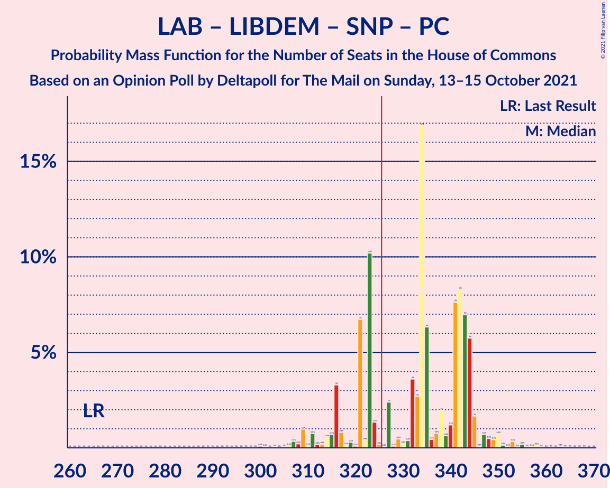

| Number of Seats | Probability | Accumulated | Special Marks |
|:---------------:|:-----------:|:-----------:|:-------------:|
| 265 | 0% | 100% | Last Result |
| 266 | 0% | 100% |  |
| 267 | 0% | 100% |  |
| 268 | 0% | 100% |  |
| 269 | 0% | 100% |  |
| 270 | 0% | 100% |  |
| 271 | 0% | 100% |  |
| 272 | 0% | 100% |  |
| 273 | 0% | 100% |  |
| 274 | 0% | 100% |  |
| 275 | 0% | 100% |  |
| 276 | 0% | 100% |  |
| 277 | 0% | 100% |  |
| 278 | 0% | 100% |  |
| 279 | 0% | 100% |  |
| 280 | 0% | 100% |  |
| 281 | 0% | 100% |  |
| 282 | 0% | 100% |  |
| 283 | 0% | 100% |  |
| 284 | 0% | 100% |  |
| 285 | 0% | 100% |  |
| 286 | 0% | 100% |  |
| 287 | 0% | 100% |  |
| 288 | 0% | 100% |  |
| 289 | 0% | 100% |  |
| 290 | 0% | 100% |  |
| 291 | 0% | 100% |  |
| 292 | 0% | 100% |  |
| 293 | 0% | 100% |  |
| 294 | 0% | 100% |  |
| 295 | 0% | 100% |  |
| 296 | 0% | 100% |  |
| 297 | 0% | 100% |  |
| 298 | 0% | 100% |  |
| 299 | 0% | 99.9% |  |
| 300 | 0.1% | 99.9% |  |
| 301 | 0.1% | 99.9% |  |
| 302 | 0% | 99.8% |  |
| 303 | 0% | 99.8% |  |
| 304 | 0% | 99.7% |  |
| 305 | 0% | 99.7% |  |
| 306 | 0.1% | 99.7% |  |
| 307 | 0.3% | 99.6% |  |
| 308 | 0.2% | 99.2% |  |
| 309 | 1.0% | 99.0% |  |
| 310 | 0.1% | 98% |  |
| 311 | 0.8% | 98% |  |
| 312 | 0.2% | 97% |  |
| 313 | 0.2% | 97% |  |
| 314 | 0.6% | 97% |  |
| 315 | 0.7% | 96% |  |
| 316 | 3% | 96% |  |
| 317 | 0.8% | 92% |  |
| 318 | 0.1% | 91% |  |
| 319 | 0.3% | 91% |  |
| 320 | 0.1% | 91% |  |
| 321 | 7% | 91% |  |
| 322 | 0.4% | 84% |  |
| 323 | 10% | 84% |  |
| 324 | 1.3% | 74% |  |
| 325 | 0.2% | 72% |  |
| 326 | 0.1% | 72% | Majority |
| 327 | 2% | 72% |  |
| 328 | 0.1% | 70% |  |
| 329 | 0.5% | 70% |  |
| 330 | 0.2% | 69% |  |
| 331 | 0.4% | 69% |  |
| 332 | 4% | 68% |  |
| 333 | 3% | 65% |  |
| 334 | 17% | 62% | Median |
| 335 | 6% | 45% |  |
| 336 | 0.4% | 39% |  |
| 337 | 0.8% | 39% |  |
| 338 | 2% | 38% |  |
| 339 | 0.6% | 36% |  |
| 340 | 1.2% | 35% |  |
| 341 | 8% | 34% |  |
| 342 | 8% | 26% |  |
| 343 | 7% | 18% |  |
| 344 | 6% | 11% |  |
| 345 | 2% | 5% |  |
| 346 | 0.1% | 4% |  |
| 347 | 0.7% | 4% |  |
| 348 | 0.5% | 3% |  |
| 349 | 0.4% | 2% |  |
| 350 | 0.7% | 2% |  |
| 351 | 0.1% | 1.2% |  |
| 352 | 0.1% | 1.1% |  |
| 353 | 0.3% | 1.0% |  |
| 354 | 0% | 0.7% |  |
| 355 | 0.2% | 0.6% |  |
| 356 | 0% | 0.4% |  |
| 357 | 0.1% | 0.4% |  |
| 358 | 0.1% | 0.3% |  |
| 359 | 0% | 0.2% |  |
| 360 | 0% | 0.2% |  |
| 361 | 0% | 0.2% |  |
| 362 | 0% | 0.2% |  |
| 363 | 0.1% | 0.1% |  |
| 364 | 0% | 0.1% |  |
| 365 | 0% | 0.1% |  |
| 366 | 0% | 0% |  |

### Labour Party – Liberal Democrats – Scottish National Party

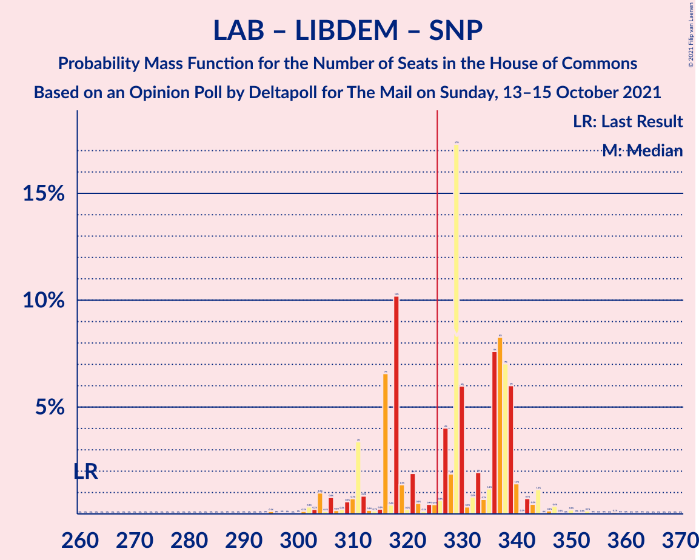

| Number of Seats | Probability | Accumulated | Special Marks |
|:---------------:|:-----------:|:-----------:|:-------------:|
| 261 | 0% | 100% | Last Result |
| 262 | 0% | 100% |  |
| 263 | 0% | 100% |  |
| 264 | 0% | 100% |  |
| 265 | 0% | 100% |  |
| 266 | 0% | 100% |  |
| 267 | 0% | 100% |  |
| 268 | 0% | 100% |  |
| 269 | 0% | 100% |  |
| 270 | 0% | 100% |  |
| 271 | 0% | 100% |  |
| 272 | 0% | 100% |  |
| 273 | 0% | 100% |  |
| 274 | 0% | 100% |  |
| 275 | 0% | 100% |  |
| 276 | 0% | 100% |  |
| 277 | 0% | 100% |  |
| 278 | 0% | 100% |  |
| 279 | 0% | 100% |  |
| 280 | 0% | 100% |  |
| 281 | 0% | 100% |  |
| 282 | 0% | 100% |  |
| 283 | 0% | 100% |  |
| 284 | 0% | 100% |  |
| 285 | 0% | 100% |  |
| 286 | 0% | 100% |  |
| 287 | 0% | 100% |  |
| 288 | 0% | 100% |  |
| 289 | 0% | 100% |  |
| 290 | 0% | 100% |  |
| 291 | 0% | 100% |  |
| 292 | 0% | 100% |  |
| 293 | 0% | 100% |  |
| 294 | 0% | 99.9% |  |
| 295 | 0.1% | 99.9% |  |
| 296 | 0% | 99.8% |  |
| 297 | 0% | 99.8% |  |
| 298 | 0% | 99.8% |  |
| 299 | 0% | 99.7% |  |
| 300 | 0% | 99.7% |  |
| 301 | 0.1% | 99.7% |  |
| 302 | 0.3% | 99.6% |  |
| 303 | 0.2% | 99.2% |  |
| 304 | 1.0% | 99.0% |  |
| 305 | 0.1% | 98% |  |
| 306 | 0.8% | 98% |  |
| 307 | 0.2% | 97% |  |
| 308 | 0.2% | 97% |  |
| 309 | 0.6% | 97% |  |
| 310 | 0.7% | 96% |  |
| 311 | 3% | 96% |  |
| 312 | 0.8% | 92% |  |
| 313 | 0.2% | 91% |  |
| 314 | 0.1% | 91% |  |
| 315 | 0.2% | 91% |  |
| 316 | 7% | 91% |  |
| 317 | 0.4% | 84% |  |
| 318 | 10% | 84% |  |
| 319 | 1.4% | 74% |  |
| 320 | 0.2% | 72% |  |
| 321 | 2% | 72% |  |
| 322 | 0.5% | 70% |  |
| 323 | 0.1% | 70% |  |
| 324 | 0.4% | 69% |  |
| 325 | 0.4% | 69% |  |
| 326 | 0.6% | 69% | Majority |
| 327 | 4% | 68% |  |
| 328 | 2% | 64% |  |
| 329 | 17% | 62% | Median |
| 330 | 6% | 45% |  |
| 331 | 0.3% | 39% |  |
| 332 | 0.8% | 38% |  |
| 333 | 2% | 38% |  |
| 334 | 0.7% | 36% |  |
| 335 | 1.2% | 35% |  |
| 336 | 8% | 34% |  |
| 337 | 8% | 26% |  |
| 338 | 7% | 18% |  |
| 339 | 6% | 11% |  |
| 340 | 1.4% | 5% |  |
| 341 | 0.1% | 4% |  |
| 342 | 0.7% | 4% |  |
| 343 | 0.5% | 3% |  |
| 344 | 1.1% | 2% |  |
| 345 | 0% | 1.2% |  |
| 346 | 0.1% | 1.2% |  |
| 347 | 0.4% | 1.1% |  |
| 348 | 0.1% | 0.7% |  |
| 349 | 0% | 0.6% |  |
| 350 | 0.2% | 0.6% |  |
| 351 | 0% | 0.4% |  |
| 352 | 0.1% | 0.4% |  |
| 353 | 0.1% | 0.3% |  |
| 354 | 0% | 0.2% |  |
| 355 | 0% | 0.2% |  |
| 356 | 0% | 0.2% |  |
| 357 | 0% | 0.2% |  |
| 358 | 0.1% | 0.1% |  |
| 359 | 0% | 0.1% |  |
| 360 | 0% | 0.1% |  |
| 361 | 0% | 0% |  |

### Labour Party – Scottish National Party – Plaid Cymru

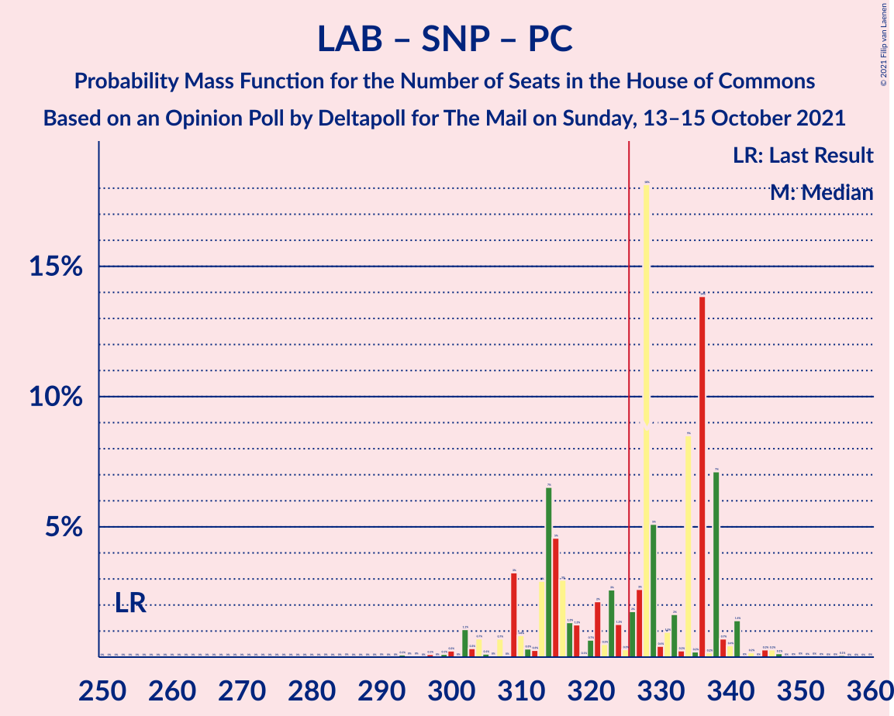

| Number of Seats | Probability | Accumulated | Special Marks |
|:---------------:|:-----------:|:-----------:|:-------------:|
| 254 | 0% | 100% | Last Result |
| 255 | 0% | 100% |  |
| 256 | 0% | 100% |  |
| 257 | 0% | 100% |  |
| 258 | 0% | 100% |  |
| 259 | 0% | 100% |  |
| 260 | 0% | 100% |  |
| 261 | 0% | 100% |  |
| 262 | 0% | 100% |  |
| 263 | 0% | 100% |  |
| 264 | 0% | 100% |  |
| 265 | 0% | 100% |  |
| 266 | 0% | 100% |  |
| 267 | 0% | 100% |  |
| 268 | 0% | 100% |  |
| 269 | 0% | 100% |  |
| 270 | 0% | 100% |  |
| 271 | 0% | 100% |  |
| 272 | 0% | 100% |  |
| 273 | 0% | 100% |  |
| 274 | 0% | 100% |  |
| 275 | 0% | 100% |  |
| 276 | 0% | 100% |  |
| 277 | 0% | 100% |  |
| 278 | 0% | 100% |  |
| 279 | 0% | 100% |  |
| 280 | 0% | 100% |  |
| 281 | 0% | 100% |  |
| 282 | 0% | 100% |  |
| 283 | 0% | 100% |  |
| 284 | 0% | 100% |  |
| 285 | 0% | 100% |  |
| 286 | 0% | 100% |  |
| 287 | 0% | 100% |  |
| 288 | 0% | 100% |  |
| 289 | 0% | 100% |  |
| 290 | 0% | 100% |  |
| 291 | 0% | 100% |  |
| 292 | 0% | 100% |  |
| 293 | 0.1% | 99.9% |  |
| 294 | 0% | 99.9% |  |
| 295 | 0% | 99.8% |  |
| 296 | 0% | 99.8% |  |
| 297 | 0.1% | 99.7% |  |
| 298 | 0% | 99.6% |  |
| 299 | 0.1% | 99.6% |  |
| 300 | 0.2% | 99.5% |  |
| 301 | 0% | 99.3% |  |
| 302 | 1.1% | 99.3% |  |
| 303 | 0.3% | 98% |  |
| 304 | 0.7% | 98% |  |
| 305 | 0.1% | 97% |  |
| 306 | 0% | 97% |  |
| 307 | 0.7% | 97% |  |
| 308 | 0% | 96% |  |
| 309 | 3% | 96% |  |
| 310 | 0.8% | 93% |  |
| 311 | 0.3% | 92% |  |
| 312 | 0.3% | 92% |  |
| 313 | 3% | 92% |  |
| 314 | 7% | 89% |  |
| 315 | 5% | 82% |  |
| 316 | 3% | 78% |  |
| 317 | 1.3% | 75% |  |
| 318 | 1.2% | 73% |  |
| 319 | 0.1% | 72% |  |
| 320 | 0.7% | 72% |  |
| 321 | 2% | 71% |  |
| 322 | 0.5% | 69% |  |
| 323 | 3% | 69% |  |
| 324 | 1.3% | 66% |  |
| 325 | 0.3% | 65% |  |
| 326 | 2% | 65% | Majority |
| 327 | 3% | 63% |  |
| 328 | 18% | 60% | Median |
| 329 | 5% | 42% |  |
| 330 | 0.4% | 37% |  |
| 331 | 1.0% | 36% |  |
| 332 | 2% | 36% |  |
| 333 | 0.2% | 34% |  |
| 334 | 9% | 34% |  |
| 335 | 0.2% | 25% |  |
| 336 | 14% | 25% |  |
| 337 | 0.2% | 11% |  |
| 338 | 7% | 11% |  |
| 339 | 0.7% | 4% |  |
| 340 | 0.4% | 3% |  |
| 341 | 1.4% | 3% |  |
| 342 | 0% | 1.2% |  |
| 343 | 0.2% | 1.2% |  |
| 344 | 0% | 1.0% |  |
| 345 | 0.3% | 1.0% |  |
| 346 | 0.3% | 0.7% |  |
| 347 | 0.1% | 0.4% |  |
| 348 | 0% | 0.3% |  |
| 349 | 0% | 0.3% |  |
| 350 | 0% | 0.3% |  |
| 351 | 0% | 0.2% |  |
| 352 | 0% | 0.2% |  |
| 353 | 0% | 0.1% |  |
| 354 | 0% | 0.1% |  |
| 355 | 0% | 0.1% |  |
| 356 | 0.1% | 0.1% |  |
| 357 | 0% | 0% |  |

### Labour Party – Scottish National Party

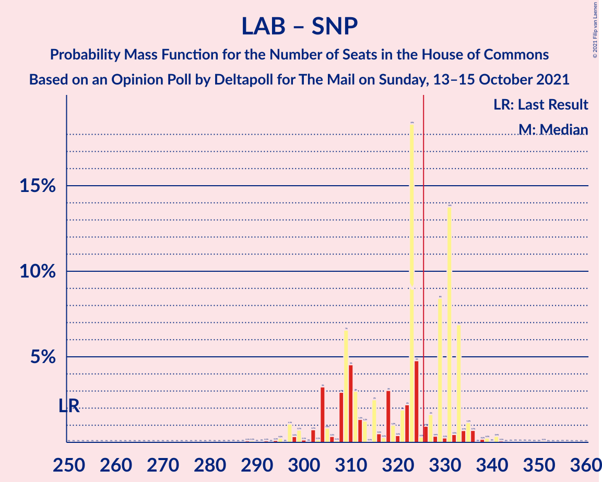

| Number of Seats | Probability | Accumulated | Special Marks |
|:---------------:|:-----------:|:-----------:|:-------------:|
| 250 | 0% | 100% | Last Result |
| 251 | 0% | 100% |  |
| 252 | 0% | 100% |  |
| 253 | 0% | 100% |  |
| 254 | 0% | 100% |  |
| 255 | 0% | 100% |  |
| 256 | 0% | 100% |  |
| 257 | 0% | 100% |  |
| 258 | 0% | 100% |  |
| 259 | 0% | 100% |  |
| 260 | 0% | 100% |  |
| 261 | 0% | 100% |  |
| 262 | 0% | 100% |  |
| 263 | 0% | 100% |  |
| 264 | 0% | 100% |  |
| 265 | 0% | 100% |  |
| 266 | 0% | 100% |  |
| 267 | 0% | 100% |  |
| 268 | 0% | 100% |  |
| 269 | 0% | 100% |  |
| 270 | 0% | 100% |  |
| 271 | 0% | 100% |  |
| 272 | 0% | 100% |  |
| 273 | 0% | 100% |  |
| 274 | 0% | 100% |  |
| 275 | 0% | 100% |  |
| 276 | 0% | 100% |  |
| 277 | 0% | 100% |  |
| 278 | 0% | 100% |  |
| 279 | 0% | 100% |  |
| 280 | 0% | 100% |  |
| 281 | 0% | 100% |  |
| 282 | 0% | 100% |  |
| 283 | 0% | 100% |  |
| 284 | 0% | 100% |  |
| 285 | 0% | 100% |  |
| 286 | 0% | 99.9% |  |
| 287 | 0% | 99.9% |  |
| 288 | 0.1% | 99.9% |  |
| 289 | 0.1% | 99.8% |  |
| 290 | 0% | 99.8% |  |
| 291 | 0% | 99.7% |  |
| 292 | 0.1% | 99.7% |  |
| 293 | 0% | 99.6% |  |
| 294 | 0.1% | 99.6% |  |
| 295 | 0.2% | 99.5% |  |
| 296 | 0% | 99.3% |  |
| 297 | 1.1% | 99.3% |  |
| 298 | 0.3% | 98% |  |
| 299 | 0.7% | 98% |  |
| 300 | 0.1% | 97% |  |
| 301 | 0% | 97% |  |
| 302 | 0.7% | 97% |  |
| 303 | 0.1% | 96% |  |
| 304 | 3% | 96% |  |
| 305 | 0.8% | 93% |  |
| 306 | 0.3% | 92% |  |
| 307 | 0.1% | 92% |  |
| 308 | 3% | 92% |  |
| 309 | 7% | 89% |  |
| 310 | 5% | 82% |  |
| 311 | 3% | 78% |  |
| 312 | 1.3% | 75% |  |
| 313 | 1.2% | 73% |  |
| 314 | 0.1% | 72% |  |
| 315 | 2% | 72% |  |
| 316 | 0.5% | 69% |  |
| 317 | 0.3% | 69% |  |
| 318 | 3% | 69% |  |
| 319 | 1.0% | 66% |  |
| 320 | 0.4% | 65% |  |
| 321 | 2% | 64% |  |
| 322 | 2% | 62% |  |
| 323 | 19% | 60% | Median |
| 324 | 5% | 42% |  |
| 325 | 0.3% | 37% |  |
| 326 | 0.9% | 36% | Majority |
| 327 | 2% | 36% |  |
| 328 | 0.4% | 34% |  |
| 329 | 8% | 34% |  |
| 330 | 0.3% | 25% |  |
| 331 | 14% | 25% |  |
| 332 | 0.5% | 11% |  |
| 333 | 7% | 11% |  |
| 334 | 0.7% | 4% |  |
| 335 | 1.2% | 3% |  |
| 336 | 0.7% | 2% |  |
| 337 | 0% | 1.2% |  |
| 338 | 0.2% | 1.2% |  |
| 339 | 0.3% | 1.0% |  |
| 340 | 0% | 0.8% |  |
| 341 | 0.4% | 0.7% |  |
| 342 | 0.1% | 0.4% |  |
| 343 | 0% | 0.3% |  |
| 344 | 0% | 0.3% |  |
| 345 | 0% | 0.3% |  |
| 346 | 0% | 0.2% |  |
| 347 | 0% | 0.2% |  |
| 348 | 0% | 0.2% |  |
| 349 | 0% | 0.1% |  |
| 350 | 0% | 0.1% |  |
| 351 | 0.1% | 0.1% |  |
| 352 | 0% | 0% |  |

### Conservative Party – Liberal Democrats

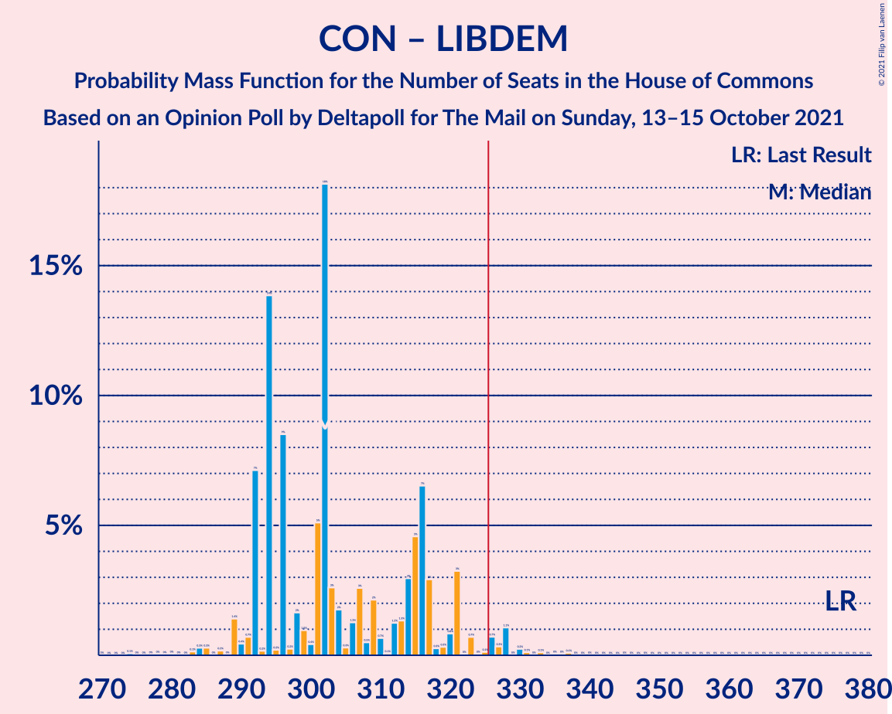

| Number of Seats | Probability | Accumulated | Special Marks |
|:---------------:|:-----------:|:-----------:|:-------------:|
| 274 | 0.1% | 100% |  |
| 275 | 0% | 99.9% |  |
| 276 | 0% | 99.9% |  |
| 277 | 0% | 99.9% |  |
| 278 | 0% | 99.9% |  |
| 279 | 0% | 99.8% |  |
| 280 | 0% | 99.8% |  |
| 281 | 0% | 99.7% |  |
| 282 | 0% | 99.7% |  |
| 283 | 0.1% | 99.7% |  |
| 284 | 0.3% | 99.6% |  |
| 285 | 0.3% | 99.3% |  |
| 286 | 0% | 99.0% |  |
| 287 | 0.2% | 99.0% |  |
| 288 | 0% | 98.8% |  |
| 289 | 1.4% | 98.8% |  |
| 290 | 0.4% | 97% |  |
| 291 | 0.7% | 97% |  |
| 292 | 7% | 96% |  |
| 293 | 0.2% | 89% |  |
| 294 | 14% | 89% |  |
| 295 | 0.2% | 75% |  |
| 296 | 9% | 75% |  |
| 297 | 0.2% | 66% |  |
| 298 | 2% | 66% |  |
| 299 | 1.0% | 64% |  |
| 300 | 0.4% | 64% |  |
| 301 | 5% | 63% |  |
| 302 | 18% | 58% | Median |
| 303 | 3% | 40% |  |
| 304 | 2% | 37% |  |
| 305 | 0.3% | 35% |  |
| 306 | 1.3% | 35% |  |
| 307 | 3% | 34% |  |
| 308 | 0.5% | 31% |  |
| 309 | 2% | 31% |  |
| 310 | 0.7% | 29% |  |
| 311 | 0.1% | 28% |  |
| 312 | 1.2% | 28% |  |
| 313 | 1.3% | 27% |  |
| 314 | 3% | 25% |  |
| 315 | 5% | 22% |  |
| 316 | 7% | 18% |  |
| 317 | 3% | 11% |  |
| 318 | 0.3% | 8% |  |
| 319 | 0.3% | 8% |  |
| 320 | 0.8% | 8% |  |
| 321 | 3% | 7% |  |
| 322 | 0% | 4% |  |
| 323 | 0.7% | 4% |  |
| 324 | 0% | 3% |  |
| 325 | 0.1% | 3% |  |
| 326 | 0.7% | 3% | Majority |
| 327 | 0.3% | 2% |  |
| 328 | 1.1% | 2% |  |
| 329 | 0% | 0.7% |  |
| 330 | 0.2% | 0.7% |  |
| 331 | 0.1% | 0.5% |  |
| 332 | 0% | 0.4% |  |
| 333 | 0.1% | 0.4% |  |
| 334 | 0% | 0.3% |  |
| 335 | 0% | 0.2% |  |
| 336 | 0% | 0.2% |  |
| 337 | 0.1% | 0.1% |  |
| 338 | 0% | 0.1% |  |
| 339 | 0% | 0% |  |
| 340 | 0% | 0% |  |
| 341 | 0% | 0% |  |
| 342 | 0% | 0% |  |
| 343 | 0% | 0% |  |
| 344 | 0% | 0% |  |
| 345 | 0% | 0% |  |
| 346 | 0% | 0% |  |
| 347 | 0% | 0% |  |
| 348 | 0% | 0% |  |
| 349 | 0% | 0% |  |
| 350 | 0% | 0% |  |
| 351 | 0% | 0% |  |
| 352 | 0% | 0% |  |
| 353 | 0% | 0% |  |
| 354 | 0% | 0% |  |
| 355 | 0% | 0% |  |
| 356 | 0% | 0% |  |
| 357 | 0% | 0% |  |
| 358 | 0% | 0% |  |
| 359 | 0% | 0% |  |
| 360 | 0% | 0% |  |
| 361 | 0% | 0% |  |
| 362 | 0% | 0% |  |
| 363 | 0% | 0% |  |
| 364 | 0% | 0% |  |
| 365 | 0% | 0% |  |
| 366 | 0% | 0% |  |
| 367 | 0% | 0% |  |
| 368 | 0% | 0% |  |
| 369 | 0% | 0% |  |
| 370 | 0% | 0% |  |
| 371 | 0% | 0% |  |
| 372 | 0% | 0% |  |
| 373 | 0% | 0% |  |
| 374 | 0% | 0% |  |
| 375 | 0% | 0% |  |
| 376 | 0% | 0% | Last Result |

### Conservative Party – Plaid Cymru

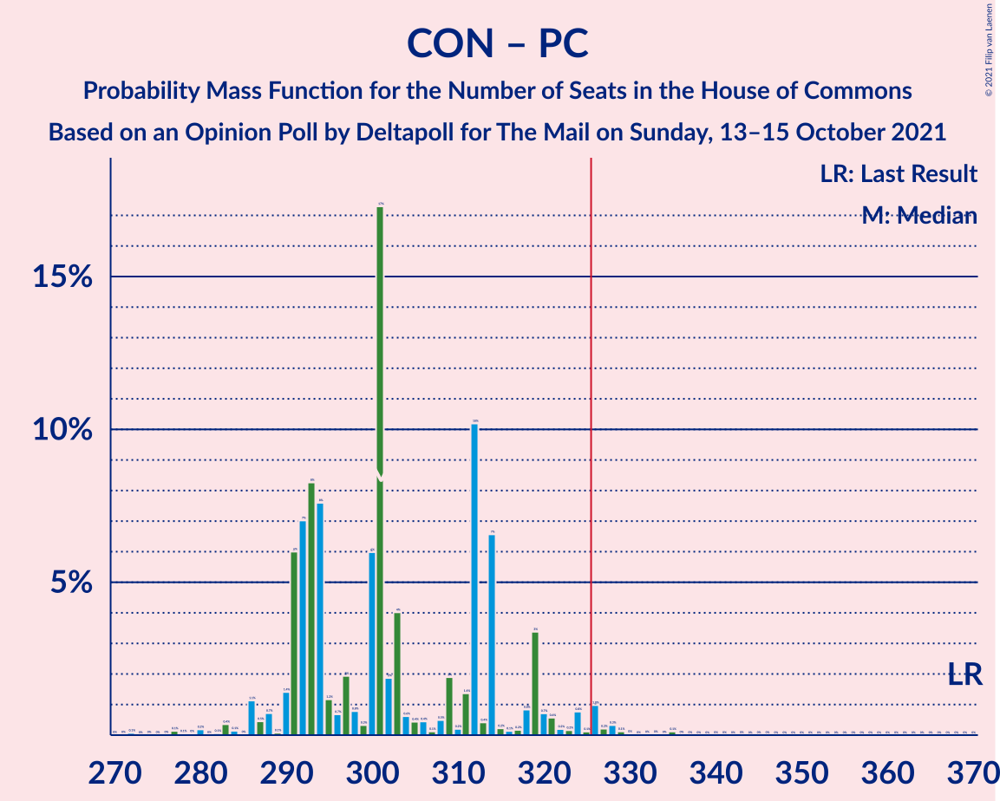

| Number of Seats | Probability | Accumulated | Special Marks |
|:---------------:|:-----------:|:-----------:|:-------------:|
| 270 | 0% | 100% |  |
| 271 | 0% | 99.9% |  |
| 272 | 0.1% | 99.9% |  |
| 273 | 0% | 99.9% |  |
| 274 | 0% | 99.8% |  |
| 275 | 0% | 99.8% |  |
| 276 | 0% | 99.8% |  |
| 277 | 0.1% | 99.8% |  |
| 278 | 0.1% | 99.7% |  |
| 279 | 0% | 99.6% |  |
| 280 | 0.2% | 99.6% |  |
| 281 | 0% | 99.4% |  |
| 282 | 0.1% | 99.4% |  |
| 283 | 0.4% | 99.3% |  |
| 284 | 0.1% | 98.9% |  |
| 285 | 0% | 98.8% |  |
| 286 | 1.1% | 98.8% |  |
| 287 | 0.5% | 98% |  |
| 288 | 0.7% | 97% |  |
| 289 | 0.1% | 96% |  |
| 290 | 1.4% | 96% |  |
| 291 | 6% | 95% |  |
| 292 | 7% | 89% |  |
| 293 | 8% | 82% |  |
| 294 | 8% | 74% |  |
| 295 | 1.2% | 66% |  |
| 296 | 0.7% | 65% |  |
| 297 | 2% | 64% |  |
| 298 | 0.8% | 62% |  |
| 299 | 0.3% | 62% |  |
| 300 | 6% | 61% |  |
| 301 | 17% | 55% | Median |
| 302 | 2% | 38% |  |
| 303 | 4% | 36% |  |
| 304 | 0.6% | 32% |  |
| 305 | 0.4% | 31% |  |
| 306 | 0.4% | 31% |  |
| 307 | 0.1% | 31% |  |
| 308 | 0.5% | 30% |  |
| 309 | 2% | 30% |  |
| 310 | 0.2% | 28% |  |
| 311 | 1.4% | 28% |  |
| 312 | 10% | 26% |  |
| 313 | 0.4% | 16% |  |
| 314 | 7% | 16% |  |
| 315 | 0.2% | 9% |  |
| 316 | 0.1% | 9% |  |
| 317 | 0.2% | 9% |  |
| 318 | 0.8% | 9% |  |
| 319 | 3% | 8% |  |
| 320 | 0.7% | 4% |  |
| 321 | 0.6% | 4% |  |
| 322 | 0.2% | 3% |  |
| 323 | 0.2% | 3% |  |
| 324 | 0.8% | 3% |  |
| 325 | 0.1% | 2% |  |
| 326 | 1.0% | 2% | Majority |
| 327 | 0.2% | 1.0% |  |
| 328 | 0.3% | 0.8% |  |
| 329 | 0.1% | 0.4% |  |
| 330 | 0% | 0.3% |  |
| 331 | 0% | 0.3% |  |
| 332 | 0% | 0.3% |  |
| 333 | 0% | 0.2% |  |
| 334 | 0% | 0.2% |  |
| 335 | 0.1% | 0.2% |  |
| 336 | 0% | 0.1% |  |
| 337 | 0% | 0.1% |  |
| 338 | 0% | 0% |  |
| 339 | 0% | 0% |  |
| 340 | 0% | 0% |  |
| 341 | 0% | 0% |  |
| 342 | 0% | 0% |  |
| 343 | 0% | 0% |  |
| 344 | 0% | 0% |  |
| 345 | 0% | 0% |  |
| 346 | 0% | 0% |  |
| 347 | 0% | 0% |  |
| 348 | 0% | 0% |  |
| 349 | 0% | 0% |  |
| 350 | 0% | 0% |  |
| 351 | 0% | 0% |  |
| 352 | 0% | 0% |  |
| 353 | 0% | 0% |  |
| 354 | 0% | 0% |  |
| 355 | 0% | 0% |  |
| 356 | 0% | 0% |  |
| 357 | 0% | 0% |  |
| 358 | 0% | 0% |  |
| 359 | 0% | 0% |  |
| 360 | 0% | 0% |  |
| 361 | 0% | 0% |  |
| 362 | 0% | 0% |  |
| 363 | 0% | 0% |  |
| 364 | 0% | 0% |  |
| 365 | 0% | 0% |  |
| 366 | 0% | 0% |  |
| 367 | 0% | 0% |  |
| 368 | 0% | 0% |  |
| 369 | 0% | 0% | Last Result |

### Conservative Party

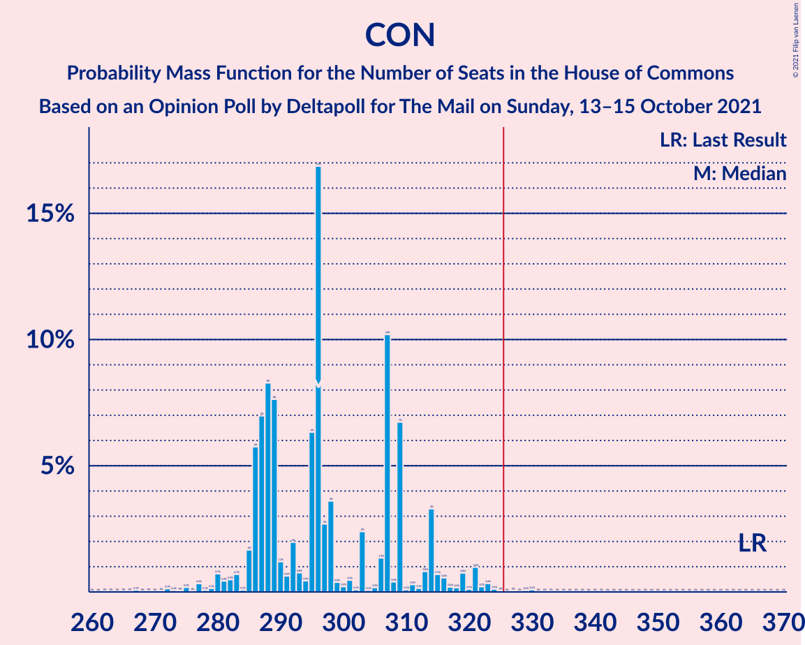

| Number of Seats | Probability | Accumulated | Special Marks |
|:---------------:|:-----------:|:-----------:|:-------------:|
| 265 | 0% | 100% |  |
| 266 | 0% | 99.9% |  |
| 267 | 0.1% | 99.9% |  |
| 268 | 0% | 99.9% |  |
| 269 | 0% | 99.8% |  |
| 270 | 0% | 99.8% |  |
| 271 | 0% | 99.8% |  |
| 272 | 0.1% | 99.8% |  |
| 273 | 0.1% | 99.7% |  |
| 274 | 0% | 99.6% |  |
| 275 | 0.2% | 99.6% |  |
| 276 | 0% | 99.4% |  |
| 277 | 0.3% | 99.3% |  |
| 278 | 0.1% | 99.0% |  |
| 279 | 0.1% | 98.9% |  |
| 280 | 0.7% | 98.8% |  |
| 281 | 0.4% | 98% |  |
| 282 | 0.5% | 98% |  |
| 283 | 0.7% | 97% |  |
| 284 | 0.1% | 96% |  |
| 285 | 2% | 96% |  |
| 286 | 6% | 95% |  |
| 287 | 7% | 89% |  |
| 288 | 8% | 82% |  |
| 289 | 8% | 74% |  |
| 290 | 1.2% | 66% |  |
| 291 | 0.6% | 65% |  |
| 292 | 2% | 64% |  |
| 293 | 0.8% | 62% |  |
| 294 | 0.4% | 61% |  |
| 295 | 6% | 61% |  |
| 296 | 17% | 55% | Median |
| 297 | 3% | 38% |  |
| 298 | 4% | 35% |  |
| 299 | 0.4% | 32% |  |
| 300 | 0.2% | 31% |  |
| 301 | 0.5% | 31% |  |
| 302 | 0.1% | 30% |  |
| 303 | 2% | 30% |  |
| 304 | 0.1% | 28% |  |
| 305 | 0.2% | 28% |  |
| 306 | 1.3% | 28% |  |
| 307 | 10% | 26% |  |
| 308 | 0.4% | 16% |  |
| 309 | 7% | 16% |  |
| 310 | 0.1% | 9% |  |
| 311 | 0.3% | 9% |  |
| 312 | 0.1% | 9% |  |
| 313 | 0.8% | 9% |  |
| 314 | 3% | 8% |  |
| 315 | 0.7% | 4% |  |
| 316 | 0.6% | 4% |  |
| 317 | 0.2% | 3% |  |
| 318 | 0.2% | 3% |  |
| 319 | 0.8% | 3% |  |
| 320 | 0.1% | 2% |  |
| 321 | 1.0% | 2% |  |
| 322 | 0.2% | 1.0% |  |
| 323 | 0.3% | 0.8% |  |
| 324 | 0.1% | 0.4% |  |
| 325 | 0% | 0.3% |  |
| 326 | 0% | 0.3% | Majority |
| 327 | 0% | 0.3% |  |
| 328 | 0% | 0.2% |  |
| 329 | 0.1% | 0.2% |  |
| 330 | 0.1% | 0.1% |  |
| 331 | 0% | 0.1% |  |
| 332 | 0% | 0.1% |  |
| 333 | 0% | 0% |  |
| 334 | 0% | 0% |  |
| 335 | 0% | 0% |  |
| 336 | 0% | 0% |  |
| 337 | 0% | 0% |  |
| 338 | 0% | 0% |  |
| 339 | 0% | 0% |  |
| 340 | 0% | 0% |  |
| 341 | 0% | 0% |  |
| 342 | 0% | 0% |  |
| 343 | 0% | 0% |  |
| 344 | 0% | 0% |  |
| 345 | 0% | 0% |  |
| 346 | 0% | 0% |  |
| 347 | 0% | 0% |  |
| 348 | 0% | 0% |  |
| 349 | 0% | 0% |  |
| 350 | 0% | 0% |  |
| 351 | 0% | 0% |  |
| 352 | 0% | 0% |  |
| 353 | 0% | 0% |  |
| 354 | 0% | 0% |  |
| 355 | 0% | 0% |  |
| 356 | 0% | 0% |  |
| 357 | 0% | 0% |  |
| 358 | 0% | 0% |  |
| 359 | 0% | 0% |  |
| 360 | 0% | 0% |  |
| 361 | 0% | 0% |  |
| 362 | 0% | 0% |  |
| 363 | 0% | 0% |  |
| 364 | 0% | 0% |  |
| 365 | 0% | 0% | Last Result |

### Labour Party – Liberal Democrats – Plaid Cymru

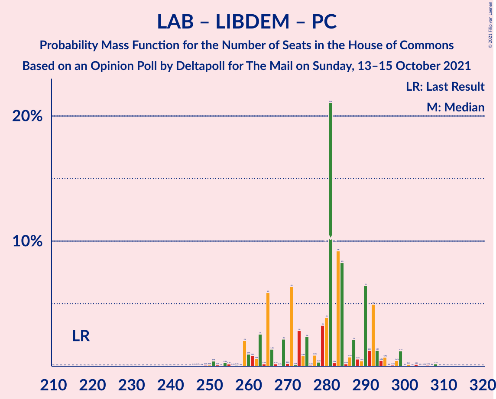

| Number of Seats | Probability | Accumulated | Special Marks |
|:---------------:|:-----------:|:-----------:|:-------------:|
| 217 | 0% | 100% | Last Result |
| 218 | 0% | 100% |  |
| 219 | 0% | 100% |  |
| 220 | 0% | 100% |  |
| 221 | 0% | 100% |  |
| 222 | 0% | 100% |  |
| 223 | 0% | 100% |  |
| 224 | 0% | 100% |  |
| 225 | 0% | 100% |  |
| 226 | 0% | 100% |  |
| 227 | 0% | 100% |  |
| 228 | 0% | 100% |  |
| 229 | 0% | 100% |  |
| 230 | 0% | 100% |  |
| 231 | 0% | 100% |  |
| 232 | 0% | 100% |  |
| 233 | 0% | 100% |  |
| 234 | 0% | 100% |  |
| 235 | 0% | 100% |  |
| 236 | 0% | 100% |  |
| 237 | 0% | 100% |  |
| 238 | 0% | 100% |  |
| 239 | 0% | 100% |  |
| 240 | 0% | 100% |  |
| 241 | 0% | 100% |  |
| 242 | 0% | 100% |  |
| 243 | 0% | 100% |  |
| 244 | 0% | 100% |  |
| 245 | 0% | 100% |  |
| 246 | 0.1% | 100% |  |
| 247 | 0.1% | 99.9% |  |
| 248 | 0% | 99.8% |  |
| 249 | 0.1% | 99.8% |  |
| 250 | 0.1% | 99.7% |  |
| 251 | 0.4% | 99.6% |  |
| 252 | 0.1% | 99.2% |  |
| 253 | 0% | 99.1% |  |
| 254 | 0.3% | 99.1% |  |
| 255 | 0.2% | 98.9% |  |
| 256 | 0.1% | 98.7% |  |
| 257 | 0.1% | 98.6% |  |
| 258 | 0% | 98.6% |  |
| 259 | 2% | 98.5% |  |
| 260 | 1.0% | 96% |  |
| 261 | 0.8% | 96% |  |
| 262 | 0.6% | 95% |  |
| 263 | 3% | 94% |  |
| 264 | 0.2% | 92% |  |
| 265 | 6% | 91% |  |
| 266 | 1.4% | 85% |  |
| 267 | 0.2% | 84% |  |
| 268 | 0.1% | 84% |  |
| 269 | 2% | 84% |  |
| 270 | 0.2% | 82% |  |
| 271 | 6% | 81% |  |
| 272 | 0.1% | 75% |  |
| 273 | 3% | 75% |  |
| 274 | 0.8% | 72% |  |
| 275 | 2% | 71% |  |
| 276 | 0.1% | 69% |  |
| 277 | 0.9% | 69% |  |
| 278 | 0.3% | 68% |  |
| 279 | 3% | 68% |  |
| 280 | 4% | 64% |  |
| 281 | 21% | 61% | Median |
| 282 | 0.3% | 40% |  |
| 283 | 9% | 39% |  |
| 284 | 8% | 30% |  |
| 285 | 0.2% | 22% |  |
| 286 | 0.7% | 22% |  |
| 287 | 2% | 21% |  |
| 288 | 0.6% | 19% |  |
| 289 | 0.4% | 18% |  |
| 290 | 6% | 18% |  |
| 291 | 1.3% | 11% |  |
| 292 | 5% | 10% |  |
| 293 | 1.3% | 5% |  |
| 294 | 0.5% | 4% |  |
| 295 | 0.7% | 3% |  |
| 296 | 0% | 3% |  |
| 297 | 0.1% | 3% |  |
| 298 | 0.4% | 3% |  |
| 299 | 1.2% | 2% |  |
| 300 | 0% | 0.8% |  |
| 301 | 0.1% | 0.8% |  |
| 302 | 0% | 0.7% |  |
| 303 | 0.1% | 0.6% |  |
| 304 | 0% | 0.5% |  |
| 305 | 0.1% | 0.5% |  |
| 306 | 0.1% | 0.4% |  |
| 307 | 0% | 0.3% |  |
| 308 | 0.2% | 0.3% |  |
| 309 | 0% | 0.1% |  |
| 310 | 0% | 0.1% |  |
| 311 | 0% | 0.1% |  |
| 312 | 0% | 0% |  |

### Labour Party – Liberal Democrats

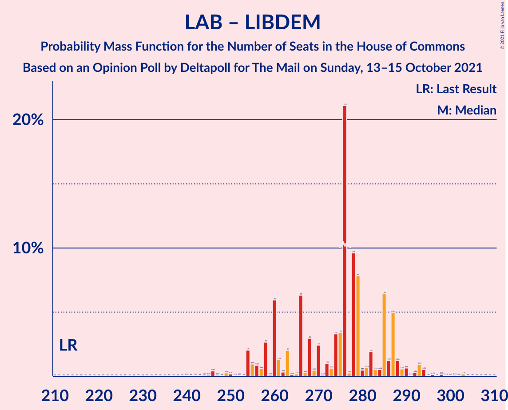

| Number of Seats | Probability | Accumulated | Special Marks |
|:---------------:|:-----------:|:-----------:|:-------------:|
| 213 | 0% | 100% | Last Result |
| 214 | 0% | 100% |  |
| 215 | 0% | 100% |  |
| 216 | 0% | 100% |  |
| 217 | 0% | 100% |  |
| 218 | 0% | 100% |  |
| 219 | 0% | 100% |  |
| 220 | 0% | 100% |  |
| 221 | 0% | 100% |  |
| 222 | 0% | 100% |  |
| 223 | 0% | 100% |  |
| 224 | 0% | 100% |  |
| 225 | 0% | 100% |  |
| 226 | 0% | 100% |  |
| 227 | 0% | 100% |  |
| 228 | 0% | 100% |  |
| 229 | 0% | 100% |  |
| 230 | 0% | 100% |  |
| 231 | 0% | 100% |  |
| 232 | 0% | 100% |  |
| 233 | 0% | 100% |  |
| 234 | 0% | 100% |  |
| 235 | 0% | 100% |  |
| 236 | 0% | 100% |  |
| 237 | 0% | 100% |  |
| 238 | 0% | 100% |  |
| 239 | 0% | 100% |  |
| 240 | 0.1% | 100% |  |
| 241 | 0% | 99.9% |  |
| 242 | 0% | 99.9% |  |
| 243 | 0% | 99.8% |  |
| 244 | 0.1% | 99.8% |  |
| 245 | 0.1% | 99.7% |  |
| 246 | 0.4% | 99.6% |  |
| 247 | 0.1% | 99.2% |  |
| 248 | 0% | 99.1% |  |
| 249 | 0.3% | 99.1% |  |
| 250 | 0.2% | 98.8% |  |
| 251 | 0.1% | 98.7% |  |
| 252 | 0.1% | 98.6% |  |
| 253 | 0% | 98.5% |  |
| 254 | 2% | 98.5% |  |
| 255 | 1.0% | 96% |  |
| 256 | 0.9% | 96% |  |
| 257 | 0.6% | 95% |  |
| 258 | 3% | 94% |  |
| 259 | 0.1% | 91% |  |
| 260 | 6% | 91% |  |
| 261 | 1.3% | 85% |  |
| 262 | 0.3% | 84% |  |
| 263 | 2% | 84% |  |
| 264 | 0.1% | 82% |  |
| 265 | 0.2% | 82% |  |
| 266 | 6% | 81% |  |
| 267 | 0.3% | 75% |  |
| 268 | 3% | 75% |  |
| 269 | 0.5% | 72% |  |
| 270 | 2% | 71% |  |
| 271 | 0.1% | 69% |  |
| 272 | 1.0% | 69% |  |
| 273 | 0.6% | 68% |  |
| 274 | 3% | 67% |  |
| 275 | 3% | 64% |  |
| 276 | 21% | 61% | Median |
| 277 | 0.3% | 39% |  |
| 278 | 10% | 39% |  |
| 279 | 8% | 30% |  |
| 280 | 0.5% | 22% |  |
| 281 | 0.7% | 21% |  |
| 282 | 2% | 21% |  |
| 283 | 0.5% | 19% |  |
| 284 | 0.5% | 18% |  |
| 285 | 6% | 18% |  |
| 286 | 1.2% | 11% |  |
| 287 | 5% | 10% |  |
| 288 | 1.2% | 5% |  |
| 289 | 0.6% | 4% |  |
| 290 | 0.6% | 3% |  |
| 291 | 0.1% | 3% |  |
| 292 | 0.3% | 3% |  |
| 293 | 0.9% | 2% |  |
| 294 | 0.5% | 1.4% |  |
| 295 | 0% | 0.8% |  |
| 296 | 0.1% | 0.8% |  |
| 297 | 0% | 0.7% |  |
| 298 | 0.1% | 0.6% |  |
| 299 | 0.1% | 0.5% |  |
| 300 | 0% | 0.4% |  |
| 301 | 0.1% | 0.4% |  |
| 302 | 0% | 0.3% |  |
| 303 | 0.2% | 0.3% |  |
| 304 | 0% | 0.1% |  |
| 305 | 0% | 0.1% |  |
| 306 | 0% | 0.1% |  |
| 307 | 0% | 0% |  |

### Labour Party – Plaid Cymru

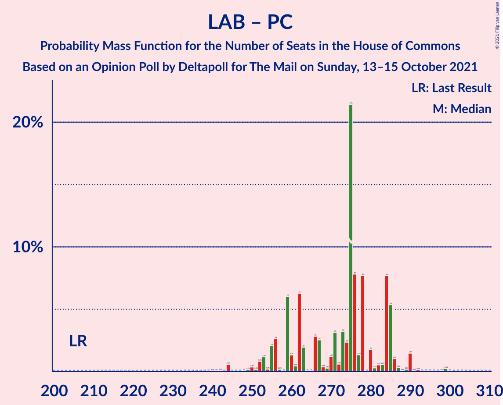

| Number of Seats | Probability | Accumulated | Special Marks |
|:---------------:|:-----------:|:-----------:|:-------------:|
| 206 | 0% | 100% | Last Result |
| 207 | 0% | 100% |  |
| 208 | 0% | 100% |  |
| 209 | 0% | 100% |  |
| 210 | 0% | 100% |  |
| 211 | 0% | 100% |  |
| 212 | 0% | 100% |  |
| 213 | 0% | 100% |  |
| 214 | 0% | 100% |  |
| 215 | 0% | 100% |  |
| 216 | 0% | 100% |  |
| 217 | 0% | 100% |  |
| 218 | 0% | 100% |  |
| 219 | 0% | 100% |  |
| 220 | 0% | 100% |  |
| 221 | 0% | 100% |  |
| 222 | 0% | 100% |  |
| 223 | 0% | 100% |  |
| 224 | 0% | 100% |  |
| 225 | 0% | 100% |  |
| 226 | 0% | 100% |  |
| 227 | 0% | 100% |  |
| 228 | 0% | 100% |  |
| 229 | 0% | 100% |  |
| 230 | 0% | 100% |  |
| 231 | 0% | 100% |  |
| 232 | 0% | 100% |  |
| 233 | 0% | 100% |  |
| 234 | 0% | 100% |  |
| 235 | 0% | 100% |  |
| 236 | 0% | 100% |  |
| 237 | 0% | 100% |  |
| 238 | 0% | 100% |  |
| 239 | 0% | 100% |  |
| 240 | 0.1% | 99.9% |  |
| 241 | 0% | 99.9% |  |
| 242 | 0.1% | 99.8% |  |
| 243 | 0% | 99.8% |  |
| 244 | 0.6% | 99.7% |  |
| 245 | 0% | 99.2% |  |
| 246 | 0% | 99.1% |  |
| 247 | 0% | 99.1% |  |
| 248 | 0% | 99.1% |  |
| 249 | 0.2% | 99.1% |  |
| 250 | 0.4% | 98.9% |  |
| 251 | 0.2% | 98.5% |  |
| 252 | 0.8% | 98% |  |
| 253 | 1.2% | 98% |  |
| 254 | 0.2% | 96% |  |
| 255 | 2% | 96% |  |
| 256 | 3% | 94% |  |
| 257 | 0.2% | 91% |  |
| 258 | 0% | 91% |  |
| 259 | 6% | 91% |  |
| 260 | 1.3% | 85% |  |
| 261 | 0.5% | 84% |  |
| 262 | 6% | 83% |  |
| 263 | 2% | 77% |  |
| 264 | 0% | 75% |  |
| 265 | 0% | 75% |  |
| 266 | 3% | 75% |  |
| 267 | 3% | 72% |  |
| 268 | 0.4% | 70% |  |
| 269 | 0.3% | 69% |  |
| 270 | 1.2% | 69% |  |
| 271 | 3% | 68% |  |
| 272 | 0.6% | 65% |  |
| 273 | 3% | 64% |  |
| 274 | 2% | 61% |  |
| 275 | 21% | 58% | Median |
| 276 | 8% | 37% |  |
| 277 | 1.4% | 29% |  |
| 278 | 8% | 28% |  |
| 279 | 0% | 20% |  |
| 280 | 2% | 20% |  |
| 281 | 0.3% | 18% |  |
| 282 | 0.5% | 18% |  |
| 283 | 0.6% | 17% |  |
| 284 | 8% | 17% |  |
| 285 | 5% | 9% |  |
| 286 | 1.0% | 4% |  |
| 287 | 0.3% | 3% |  |
| 288 | 0.1% | 2% |  |
| 289 | 0.2% | 2% |  |
| 290 | 1.5% | 2% |  |
| 291 | 0.1% | 0.8% |  |
| 292 | 0.2% | 0.7% |  |
| 293 | 0% | 0.5% |  |
| 294 | 0% | 0.5% |  |
| 295 | 0% | 0.5% |  |
| 296 | 0% | 0.5% |  |
| 297 | 0% | 0.4% |  |
| 298 | 0.1% | 0.4% |  |
| 299 | 0.3% | 0.3% |  |
| 300 | 0% | 0.1% |  |
| 301 | 0% | 0.1% |  |
| 302 | 0% | 0.1% |  |
| 303 | 0% | 0% |  |

### Labour Party

| Number of Seats | Probability | Accumulated | Special Marks |
|:---------------:|:-----------:|:-----------:|:-------------:|
| 202 | 0% | 100% | Last Result |
| 203 | 0% | 100% |  |
| 204 | 0% | 100% |  |
| 205 | 0% | 100% |  |
| 206 | 0% | 100% |  |
| 207 | 0% | 100% |  |
| 208 | 0% | 100% |  |
| 209 | 0% | 100% |  |
| 210 | 0% | 100% |  |
| 211 | 0% | 100% |  |
| 212 | 0% | 100% |  |
| 213 | 0% | 100% |  |
| 214 | 0% | 100% |  |
| 215 | 0% | 100% |  |
| 216 | 0% | 100% |  |
| 217 | 0% | 100% |  |
| 218 | 0% | 100% |  |
| 219 | 0% | 100% |  |
| 220 | 0% | 100% |  |
| 221 | 0% | 100% |  |
| 222 | 0% | 100% |  |
| 223 | 0% | 100% |  |
| 224 | 0% | 100% |  |
| 225 | 0% | 100% |  |
| 226 | 0% | 100% |  |
| 227 | 0% | 100% |  |
| 228 | 0% | 100% |  |
| 229 | 0% | 100% |  |
| 230 | 0% | 100% |  |
| 231 | 0% | 100% |  |
| 232 | 0% | 100% |  |
| 233 | 0% | 100% |  |
| 234 | 0.1% | 99.9% |  |
| 235 | 0% | 99.9% |  |
| 236 | 0% | 99.9% |  |
| 237 | 0.1% | 99.8% |  |
| 238 | 0% | 99.7% |  |
| 239 | 0.6% | 99.7% |  |
| 240 | 0% | 99.1% |  |
| 241 | 0% | 99.1% |  |
| 242 | 0% | 99.1% |  |
| 243 | 0% | 99.1% |  |
| 244 | 0.2% | 99.1% |  |
| 245 | 0.4% | 98.9% |  |
| 246 | 0.2% | 98.5% |  |
| 247 | 0.8% | 98% |  |
| 248 | 1.2% | 98% |  |
| 249 | 0.2% | 96% |  |
| 250 | 2% | 96% |  |
| 251 | 3% | 94% |  |
| 252 | 0.2% | 91% |  |
| 253 | 0.1% | 91% |  |
| 254 | 6% | 91% |  |
| 255 | 1.2% | 85% |  |
| 256 | 0.4% | 84% |  |
| 257 | 8% | 83% |  |
| 258 | 0.1% | 75% |  |
| 259 | 0% | 75% |  |
| 260 | 0.1% | 75% |  |
| 261 | 3% | 75% |  |
| 262 | 3% | 72% |  |
| 263 | 0.2% | 69% |  |
| 264 | 0.3% | 69% |  |
| 265 | 1.2% | 69% |  |
| 266 | 3% | 68% |  |
| 267 | 0.9% | 65% |  |
| 268 | 3% | 64% |  |
| 269 | 2% | 60% |  |
| 270 | 21% | 58% | Median |
| 271 | 7% | 37% |  |
| 272 | 1.3% | 29% |  |
| 273 | 8% | 28% |  |
| 274 | 0.2% | 20% |  |
| 275 | 2% | 20% |  |
| 276 | 0.3% | 18% |  |
| 277 | 0.5% | 18% |  |
| 278 | 0.6% | 17% |  |
| 279 | 8% | 17% |  |
| 280 | 5% | 9% |  |
| 281 | 1.0% | 4% |  |
| 282 | 0.4% | 3% |  |
| 283 | 0.1% | 2% |  |
| 284 | 1.1% | 2% |  |
| 285 | 0.5% | 1.3% |  |
| 286 | 0.1% | 0.7% |  |
| 287 | 0.2% | 0.7% |  |
| 288 | 0% | 0.5% |  |
| 289 | 0% | 0.5% |  |
| 290 | 0% | 0.5% |  |
| 291 | 0% | 0.5% |  |
| 292 | 0% | 0.4% |  |
| 293 | 0.1% | 0.4% |  |
| 294 | 0.3% | 0.3% |  |
| 295 | 0% | 0.1% |  |
| 296 | 0% | 0.1% |  |
| 297 | 0% | 0.1% |  |
| 298 | 0% | 0% |  |

## Technical Information

### Opinion Poll

+ **Polling firm:** Deltapoll
+ **Commissioner(s):** The Mail on Sunday
+ **Fieldwork period:** 13–15 October 2021

### Calculations

+ **Sample size:** 2912
+ **Simulations done:** 131,072
+ **Error estimate:** 1.19%

