# Opinion Poll by Savanta ComRes, 22–24 October 2021

<a href="#voting-intentions">Voting Intentions</a> | <a href="#seats">Seats</a> | <a href="#coalitions">Coalitions</a> | <a href="#technical-information">Technical Information</a>

## Voting Intentions

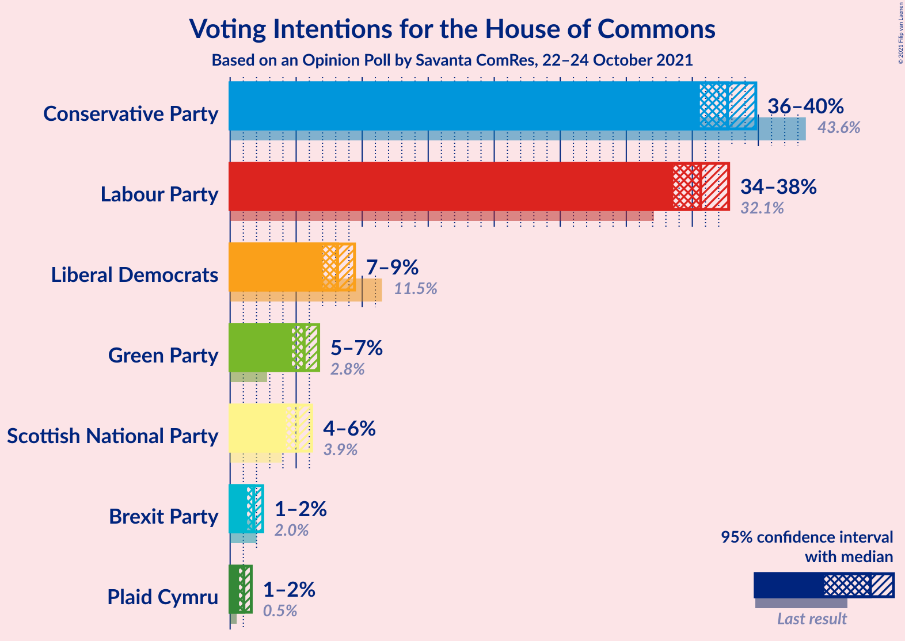

### Confidence Intervals

| Party | Last Result | Poll Result | 80% Confidence Interval | 90% Confidence Interval | 95% Confidence Interval | 99% Confidence Interval |
|:-----:|:-----------:|:-----------:|:-----------------------:|:-----------------------:|:-----------------------:|:-----------------------:|
| Conservative Party | 43.6% | 37.7% | 36.3–39.1% |35.9–39.5% |35.6–39.8% |34.9–40.5% |
| Labour Party | 32.1% | 35.6% | 34.3–37.0% |33.9–37.4% |33.6–37.8% |32.9–38.4% |
| Liberal Democrats | 11.5% | 8.1% | 7.4–9.0% |7.2–9.2% |7.0–9.4% |6.7–9.8% |
| Green Party | 2.8% | 5.6% | 5.0–6.3% |4.8–6.5% |4.7–6.7% |4.4–7.1% |
| Scottish National Party | 3.9% | 5.1% | 4.5–5.8% |4.4–6.0% |4.2–6.2% |4.0–6.5% |
| Brexit Party | 2.0% | 1.8% | 1.5–2.2% |1.4–2.4% |1.3–2.5% |1.1–2.7% |
| Plaid Cymru | 0.5% | 1.0% | 0.8–1.4% |0.7–1.5% |0.7–1.6% |0.6–1.8% |

*Note:* The poll result column reflects the actual value used in the calculations. Published results may vary slightly, and in addition be rounded to fewer digits.

## Seats

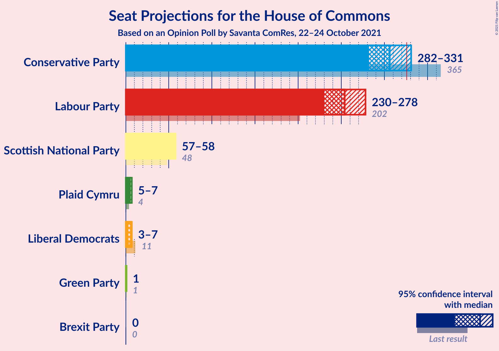

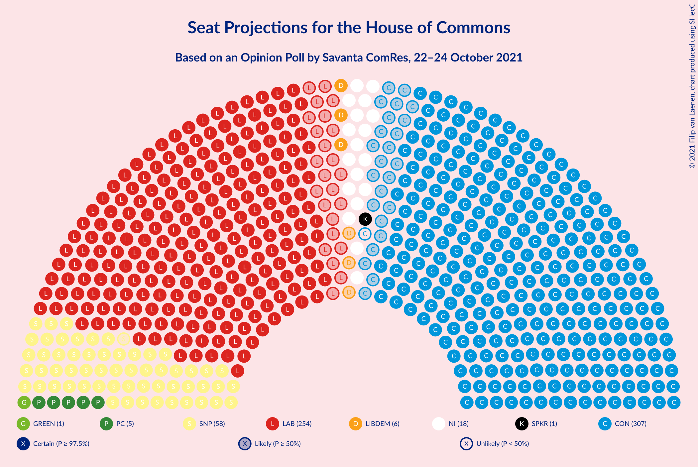

### Confidence Intervals

| Party | Last Result | Median | 80% Confidence Interval | 90% Confidence Interval | 95% Confidence Interval | 99% Confidence Interval |
|:-----:|:-----------:|:------:|:-----------------------:|:-----------------------:|:-----------------------:|:-----------------------:|
| <a href="#conservative-party">Conservative Party</a> | 365 | 306 | 286–322 |283–327 |282–331 |275–337 |
| <a href="#labour-party">Labour Party</a> | 202 | 254 | 239–275 |234–277 |230–278 |226–286 |
| <a href="#liberal-democrats">Liberal Democrats</a> | 11 | 6 | 4–6 |4–7 |3–7 |2–7 |
| <a href="#green-party">Green Party</a> | 1 | 1 | 1 |1 |1 |1 |
| <a href="#scottish-national-party">Scottish National Party</a> | 48 | 58 | 58 |58 |57–58 |54–58 |
| <a href="#brexit-party">Brexit Party</a> | 0 | 0 | 0 |0 |0 |0 |
| <a href="#plaid-cymru">Plaid Cymru</a> | 4 | 5 | 5–6 |5–7 |5–7 |5–7 |

### Conservative Party

*For a full overview of the results for this party, see the [Conservative Party](party-conservativeparty.html) page.*

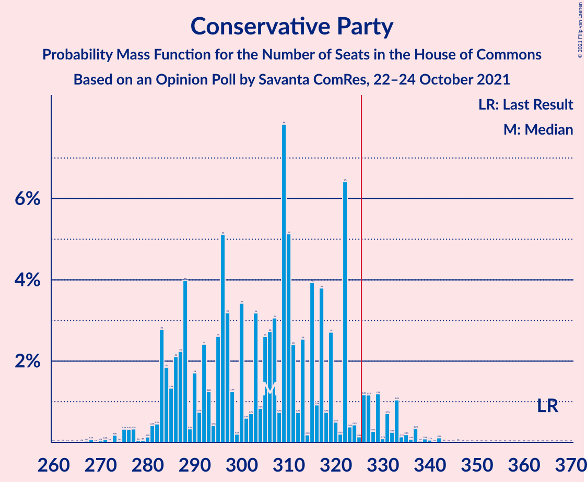

| Number of Seats | Probability | Accumulated | Special Marks |
|:---------------:|:-----------:|:-----------:|:-------------:|
| 267 | 0% | 100% |  |
| 268 | 0.1% | 99.9% |  |
| 269 | 0% | 99.8% |  |
| 270 | 0% | 99.8% |  |
| 271 | 0.1% | 99.8% |  |
| 272 | 0% | 99.7% |  |
| 273 | 0.2% | 99.7% |  |
| 274 | 0% | 99.5% |  |
| 275 | 0.3% | 99.5% |  |
| 276 | 0.3% | 99.2% |  |
| 277 | 0.3% | 98.9% |  |
| 278 | 0% | 98.5% |  |
| 279 | 0% | 98% |  |
| 280 | 0.1% | 98% |  |
| 281 | 0.4% | 98% |  |
| 282 | 0.5% | 98% |  |
| 283 | 3% | 97% |  |
| 284 | 2% | 95% |  |
| 285 | 1.3% | 93% |  |
| 286 | 2% | 91% |  |
| 287 | 2% | 89% |  |
| 288 | 4% | 87% |  |
| 289 | 0.3% | 83% |  |
| 290 | 2% | 83% |  |
| 291 | 0.7% | 81% |  |
| 292 | 2% | 80% |  |
| 293 | 1.2% | 78% |  |
| 294 | 0.4% | 77% |  |
| 295 | 3% | 76% |  |
| 296 | 5% | 74% |  |
| 297 | 3% | 69% |  |
| 298 | 1.3% | 65% |  |
| 299 | 0.2% | 64% |  |
| 300 | 3% | 64% |  |
| 301 | 0.6% | 60% |  |
| 302 | 0.7% | 60% |  |
| 303 | 3% | 59% |  |
| 304 | 0.8% | 56% |  |
| 305 | 3% | 55% |  |
| 306 | 3% | 53% | Median |
| 307 | 3% | 50% |  |
| 308 | 0.7% | 47% |  |
| 309 | 8% | 46% |  |
| 310 | 5% | 38% |  |
| 311 | 2% | 33% |  |
| 312 | 0.7% | 31% |  |
| 313 | 3% | 30% |  |
| 314 | 0.2% | 27% |  |
| 315 | 4% | 27% |  |
| 316 | 0.9% | 23% |  |
| 317 | 4% | 22% |  |
| 318 | 0.7% | 19% |  |
| 319 | 3% | 18% |  |
| 320 | 0.5% | 15% |  |
| 321 | 0.2% | 15% |  |
| 322 | 6% | 14% |  |
| 323 | 0.4% | 8% |  |
| 324 | 0.4% | 8% |  |
| 325 | 0.1% | 7% |  |
| 326 | 1.2% | 7% | Majority |
| 327 | 1.2% | 6% |  |
| 328 | 0.3% | 5% |  |
| 329 | 1.2% | 4% |  |
| 330 | 0.1% | 3% |  |
| 331 | 0.7% | 3% |  |
| 332 | 0.2% | 2% |  |
| 333 | 1.0% | 2% |  |
| 334 | 0.1% | 1.1% |  |
| 335 | 0.2% | 1.0% |  |
| 336 | 0.1% | 0.8% |  |
| 337 | 0.3% | 0.7% |  |
| 338 | 0% | 0.4% |  |
| 339 | 0.1% | 0.3% |  |
| 340 | 0.1% | 0.2% |  |
| 341 | 0% | 0.2% |  |
| 342 | 0.1% | 0.2% |  |
| 343 | 0% | 0.1% |  |
| 344 | 0% | 0.1% |  |
| 345 | 0% | 0% |  |
| 346 | 0% | 0% |  |
| 347 | 0% | 0% |  |
| 348 | 0% | 0% |  |
| 349 | 0% | 0% |  |
| 350 | 0% | 0% |  |
| 351 | 0% | 0% |  |
| 352 | 0% | 0% |  |
| 353 | 0% | 0% |  |
| 354 | 0% | 0% |  |
| 355 | 0% | 0% |  |
| 356 | 0% | 0% |  |
| 357 | 0% | 0% |  |
| 358 | 0% | 0% |  |
| 359 | 0% | 0% |  |
| 360 | 0% | 0% |  |
| 361 | 0% | 0% |  |
| 362 | 0% | 0% |  |
| 363 | 0% | 0% |  |
| 364 | 0% | 0% |  |
| 365 | 0% | 0% | Last Result |

### Labour Party

*For a full overview of the results for this party, see the [Labour Party](party-labourparty.html) page.*

| Number of Seats | Probability | Accumulated | Special Marks |
|:---------------:|:-----------:|:-----------:|:-------------:|
| 202 | 0% | 100% | Last Result |
| 203 | 0% | 100% |  |
| 204 | 0% | 100% |  |
| 205 | 0% | 100% |  |
| 206 | 0% | 100% |  |
| 207 | 0% | 100% |  |
| 208 | 0% | 100% |  |
| 209 | 0% | 100% |  |
| 210 | 0% | 100% |  |
| 211 | 0% | 100% |  |
| 212 | 0% | 100% |  |
| 213 | 0% | 100% |  |
| 214 | 0% | 100% |  |
| 215 | 0% | 100% |  |
| 216 | 0% | 100% |  |
| 217 | 0% | 100% |  |
| 218 | 0% | 99.9% |  |
| 219 | 0% | 99.9% |  |
| 220 | 0.1% | 99.9% |  |
| 221 | 0% | 99.9% |  |
| 222 | 0% | 99.8% |  |
| 223 | 0% | 99.8% |  |
| 224 | 0.1% | 99.8% |  |
| 225 | 0.1% | 99.7% |  |
| 226 | 0.4% | 99.6% |  |
| 227 | 0.1% | 99.2% |  |
| 228 | 0.1% | 99.1% |  |
| 229 | 1.0% | 99.0% |  |
| 230 | 0.9% | 98% |  |
| 231 | 0.1% | 97% |  |
| 232 | 0.2% | 97% |  |
| 233 | 0.6% | 97% |  |
| 234 | 2% | 96% |  |
| 235 | 0.4% | 94% |  |
| 236 | 1.2% | 94% |  |
| 237 | 1.1% | 93% |  |
| 238 | 0.6% | 92% |  |
| 239 | 5% | 91% |  |
| 240 | 0.1% | 86% |  |
| 241 | 0.4% | 86% |  |
| 242 | 2% | 85% |  |
| 243 | 0.8% | 83% |  |
| 244 | 4% | 82% |  |
| 245 | 1.2% | 78% |  |
| 246 | 0.6% | 77% |  |
| 247 | 0.4% | 76% |  |
| 248 | 4% | 76% |  |
| 249 | 3% | 72% |  |
| 250 | 4% | 69% |  |
| 251 | 0.6% | 65% |  |
| 252 | 7% | 65% |  |
| 253 | 1.0% | 58% |  |
| 254 | 7% | 57% | Median |
| 255 | 1.1% | 50% |  |
| 256 | 0.3% | 48% |  |
| 257 | 2% | 48% |  |
| 258 | 6% | 46% |  |
| 259 | 0.3% | 40% |  |
| 260 | 0.2% | 40% |  |
| 261 | 3% | 40% |  |
| 262 | 0.3% | 37% |  |
| 263 | 4% | 37% |  |
| 264 | 0.9% | 33% |  |
| 265 | 4% | 32% |  |
| 266 | 0.6% | 28% |  |
| 267 | 2% | 27% |  |
| 268 | 5% | 25% |  |
| 269 | 1.0% | 20% |  |
| 270 | 0.5% | 19% |  |
| 271 | 0.8% | 18% |  |
| 272 | 0.3% | 18% |  |
| 273 | 4% | 17% |  |
| 274 | 2% | 14% |  |
| 275 | 3% | 12% |  |
| 276 | 3% | 8% |  |
| 277 | 2% | 6% |  |
| 278 | 2% | 4% |  |
| 279 | 0.1% | 2% |  |
| 280 | 0.4% | 2% |  |
| 281 | 0.1% | 2% |  |
| 282 | 0.2% | 2% |  |
| 283 | 0.2% | 1.3% |  |
| 284 | 0.5% | 1.1% |  |
| 285 | 0% | 0.5% |  |
| 286 | 0.1% | 0.5% |  |
| 287 | 0.2% | 0.5% |  |
| 288 | 0% | 0.3% |  |
| 289 | 0.1% | 0.3% |  |
| 290 | 0% | 0.2% |  |
| 291 | 0.1% | 0.2% |  |
| 292 | 0% | 0.1% |  |
| 293 | 0% | 0% |  |

### Liberal Democrats

*For a full overview of the results for this party, see the [Liberal Democrats](party-liberaldemocrats.html) page.*

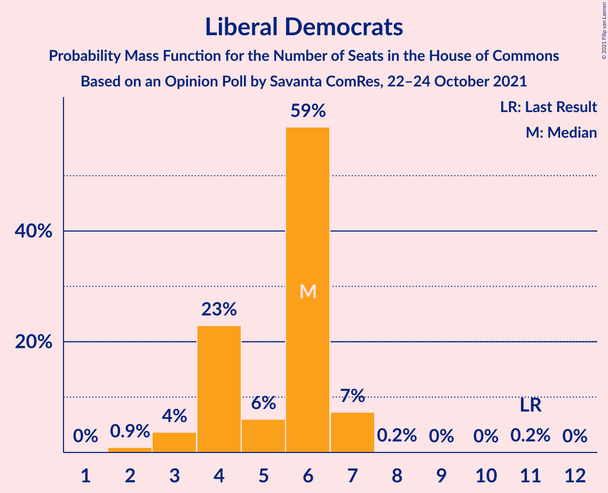

| Number of Seats | Probability | Accumulated | Special Marks |
|:---------------:|:-----------:|:-----------:|:-------------:|
| 2 | 0.9% | 100% |  |
| 3 | 4% | 99.1% |  |
| 4 | 23% | 95% |  |
| 5 | 6% | 72% |  |
| 6 | 59% | 66% | Median |
| 7 | 7% | 8% |  |
| 8 | 0.2% | 0.4% |  |
| 9 | 0% | 0.2% |  |
| 10 | 0% | 0.2% |  |
| 11 | 0.2% | 0.2% | Last Result |
| 12 | 0% | 0% |  |

### Green Party

*For a full overview of the results for this party, see the [Green Party](party-greenparty.html) page.*

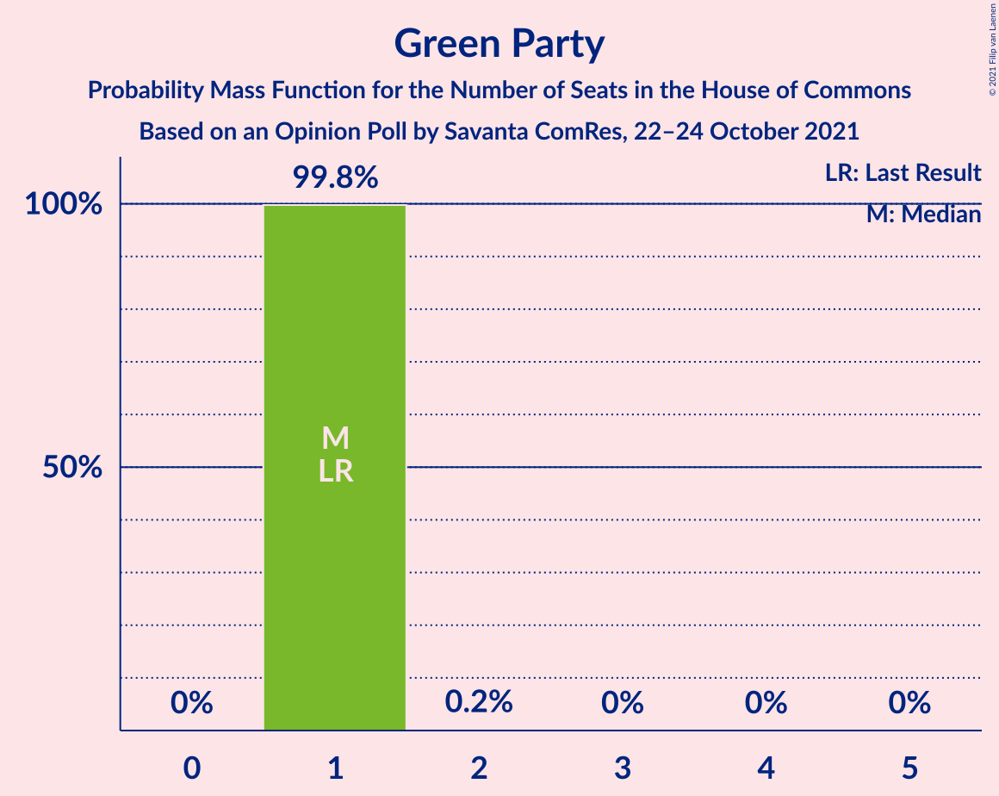

| Number of Seats | Probability | Accumulated | Special Marks |
|:---------------:|:-----------:|:-----------:|:-------------:|
| 1 | 99.8% | 100% | Last Result, Median |
| 2 | 0.2% | 0.2% |  |
| 3 | 0% | 0% |  |

### Scottish National Party

*For a full overview of the results for this party, see the [Scottish National Party](party-scottishnationalparty.html) page.*

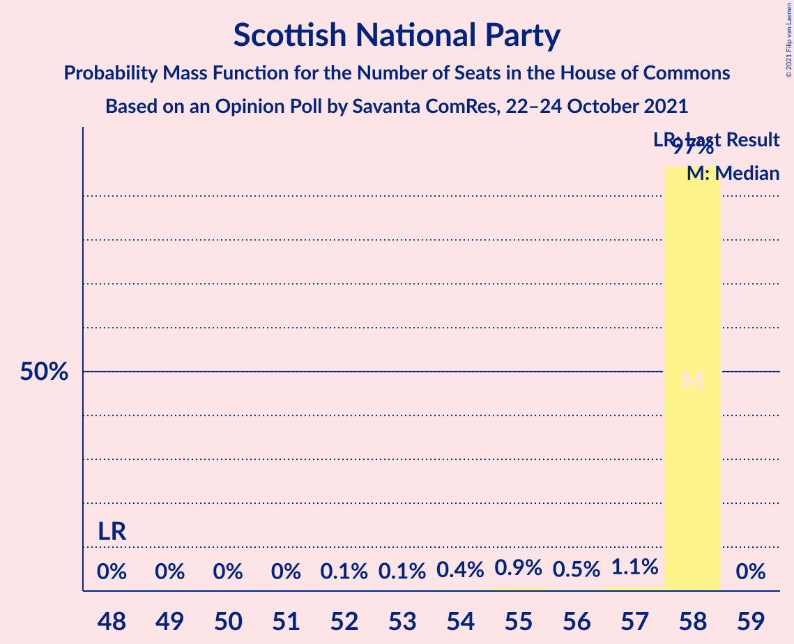

| Number of Seats | Probability | Accumulated | Special Marks |
|:---------------:|:-----------:|:-----------:|:-------------:|
| 48 | 0% | 100% | Last Result |
| 49 | 0% | 100% |  |
| 50 | 0% | 100% |  |
| 51 | 0% | 100% |  |
| 52 | 0.1% | 100% |  |
| 53 | 0% | 99.9% |  |
| 54 | 0.6% | 99.8% |  |
| 55 | 0.9% | 99.2% |  |
| 56 | 0.6% | 98% |  |
| 57 | 2% | 98% |  |
| 58 | 96% | 96% | Median |
| 59 | 0% | 0% |  |

### Brexit Party

*For a full overview of the results for this party, see the [Brexit Party](party-brexitparty.html) page.*

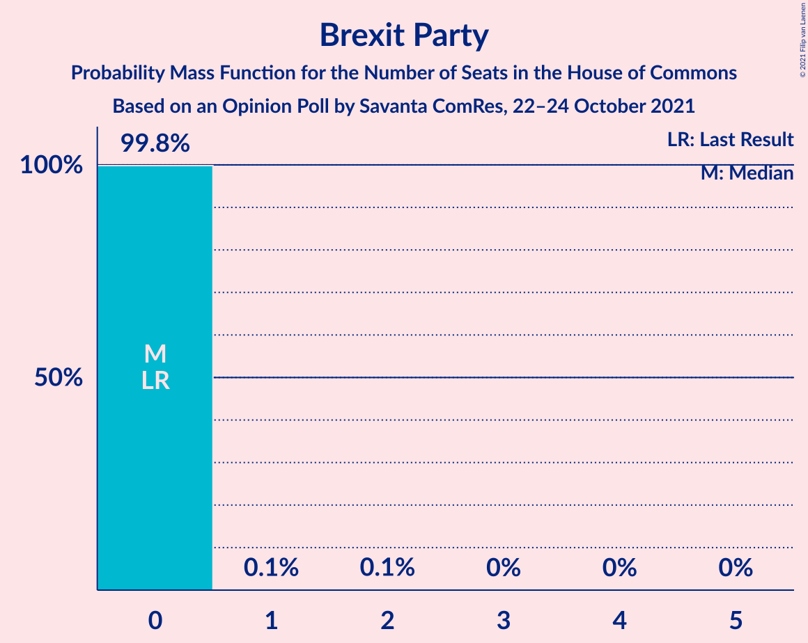

| Number of Seats | Probability | Accumulated | Special Marks |
|:---------------:|:-----------:|:-----------:|:-------------:|
| 0 | 99.8% | 100% | Last Result, Median |
| 1 | 0.1% | 0.2% |  |
| 2 | 0.1% | 0.1% |  |
| 3 | 0% | 0% |  |

### Plaid Cymru

*For a full overview of the results for this party, see the [Plaid Cymru](party-plaidcymru.html) page.*

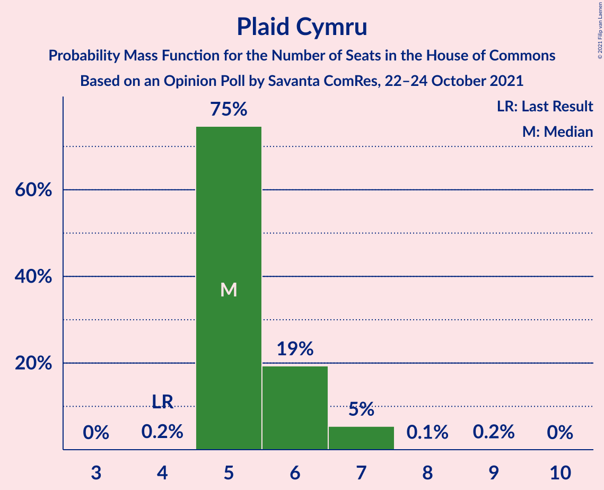

| Number of Seats | Probability | Accumulated | Special Marks |
|:---------------:|:-----------:|:-----------:|:-------------:|
| 4 | 0.4% | 100% | Last Result |
| 5 | 74% | 99.6% | Median |
| 6 | 18% | 26% |  |
| 7 | 7% | 7% |  |
| 8 | 0.1% | 0.3% |  |
| 9 | 0.1% | 0.2% |  |
| 10 | 0% | 0% |  |

## Coalitions

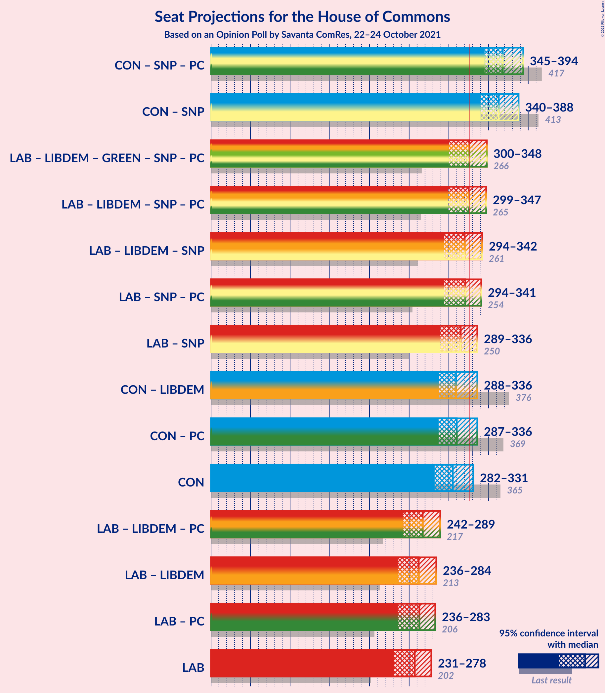

### Confidence Intervals

| Coalition | Last Result | Median | Majority? | 80% Confidence Interval | 90% Confidence Interval | 95% Confidence Interval | 99% Confidence Interval |
|:---------:|:-----------:|:------:|:---------:|:-----------------------:|:-----------------------:|:-----------------------:|:-----------------------:|
| Conservative Party – Scottish National Party – Plaid Cymru | 417 | 370 | 100% | 349–385 | 347–391 | 346–394 | 337–400 |
| Conservative Party – Scottish National Party | 413 | 364 | 99.9% | 344–380 | 341–385 | 340–389 | 332–395 |
| Labour Party – Liberal Democrats – Green Party – Scottish National Party – Plaid Cymru | 266 | 325 | 47% | 309–345 | 304–347 | 300–348 | 294–356 |
| Labour Party – Liberal Democrats – Scottish National Party – Plaid Cymru | 265 | 324 | 45% | 308–344 | 303–346 | 299–347 | 293–355 |
| Labour Party – Liberal Democrats – Scottish National Party | 261 | 318 | 36% | 303–339 | 297–341 | 294–342 | 288–350 |
| Labour Party – Scottish National Party – Plaid Cymru | 254 | 317 | 37% | 302–338 | 297–340 | 293–341 | 289–350 |
| Conservative Party – Liberal Democrats | 376 | 313 | 14% | 292–328 | 290–333 | 289–337 | 280–341 |
| Conservative Party – Plaid Cymru | 369 | 312 | 16% | 291–327 | 289–333 | 288–336 | 280–342 |
| Labour Party – Scottish National Party | 250 | 312 | 25% | 297–333 | 292–335 | 288–336 | 284–344 |
| Conservative Party | 365 | 306 | 7% | 286–322 | 283–327 | 282–331 | 275–337 |
| Labour Party – Liberal Democrats – Plaid Cymru | 217 | 266 | 0% | 250–286 | 245–288 | 241–289 | 235–298 |
| Labour Party – Liberal Democrats | 213 | 260 | 0% | 245–281 | 239–283 | 236–284 | 230–292 |
| Labour Party – Plaid Cymru | 206 | 259 | 0% | 244–280 | 239–282 | 235–283 | 231–292 |
| Labour Party | 202 | 254 | 0% | 239–275 | 234–277 | 230–278 | 226–286 |

### Conservative Party – Scottish National Party – Plaid Cymru

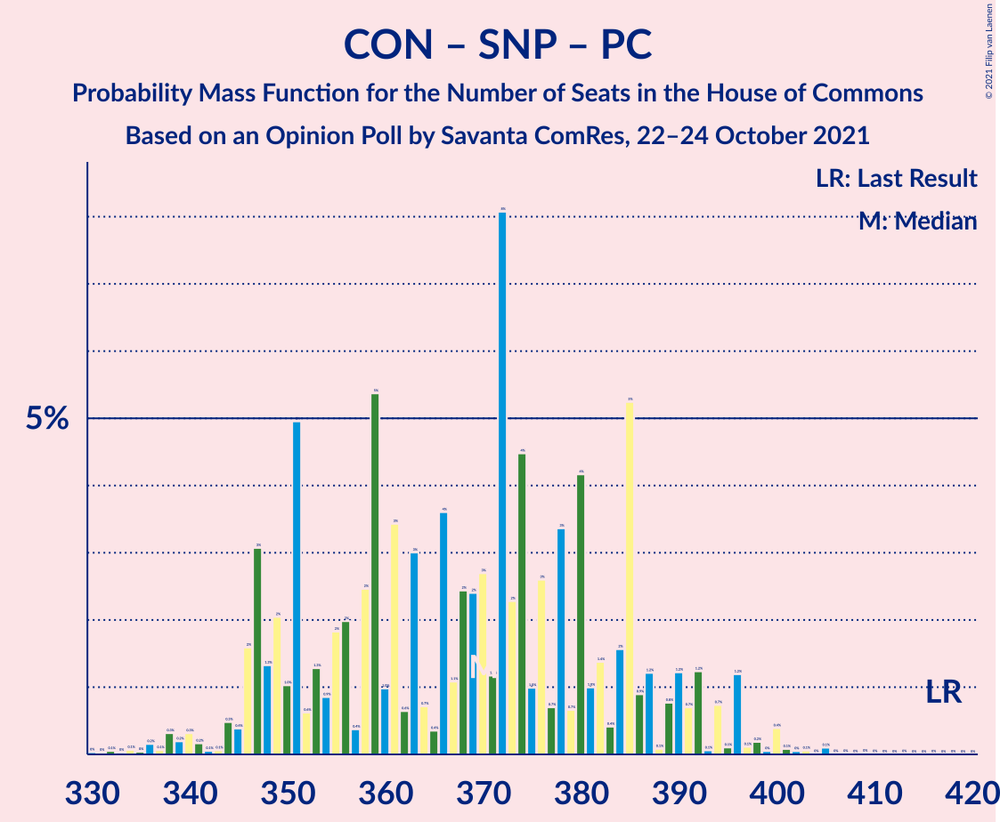

| Number of Seats | Probability | Accumulated | Special Marks |
|:---------------:|:-----------:|:-----------:|:-------------:|
| 330 | 0% | 100% |  |
| 331 | 0% | 99.9% |  |
| 332 | 0.1% | 99.9% |  |
| 333 | 0% | 99.8% |  |
| 334 | 0.1% | 99.8% |  |
| 335 | 0% | 99.7% |  |
| 336 | 0.2% | 99.7% |  |
| 337 | 0.1% | 99.6% |  |
| 338 | 0.3% | 99.5% |  |
| 339 | 0.2% | 99.2% |  |
| 340 | 0.3% | 99.0% |  |
| 341 | 0.2% | 98.7% |  |
| 342 | 0.1% | 98.5% |  |
| 343 | 0.1% | 98% |  |
| 344 | 0.5% | 98% |  |
| 345 | 0.4% | 98% |  |
| 346 | 2% | 98% |  |
| 347 | 3% | 96% |  |
| 348 | 1.3% | 93% |  |
| 349 | 2% | 92% |  |
| 350 | 1.0% | 89% |  |
| 351 | 5% | 88% |  |
| 352 | 0.6% | 84% |  |
| 353 | 1.3% | 83% |  |
| 354 | 0.9% | 82% |  |
| 355 | 2% | 81% |  |
| 356 | 2% | 79% |  |
| 357 | 0.4% | 77% |  |
| 358 | 2% | 77% |  |
| 359 | 5% | 74% |  |
| 360 | 1.0% | 69% |  |
| 361 | 3% | 68% |  |
| 362 | 0.6% | 64% |  |
| 363 | 3% | 64% |  |
| 364 | 0.7% | 61% |  |
| 365 | 0.4% | 60% |  |
| 366 | 4% | 60% |  |
| 367 | 1.1% | 56% |  |
| 368 | 2% | 55% |  |
| 369 | 2% | 52% | Median |
| 370 | 3% | 50% |  |
| 371 | 1.2% | 47% |  |
| 372 | 8% | 46% |  |
| 373 | 2% | 38% |  |
| 374 | 4% | 36% |  |
| 375 | 1.0% | 31% |  |
| 376 | 3% | 30% |  |
| 377 | 0.7% | 28% |  |
| 378 | 3% | 27% |  |
| 379 | 0.7% | 24% |  |
| 380 | 4% | 23% |  |
| 381 | 1.0% | 19% |  |
| 382 | 1.4% | 18% |  |
| 383 | 0.4% | 17% |  |
| 384 | 2% | 16% |  |
| 385 | 5% | 15% |  |
| 386 | 0.9% | 9% |  |
| 387 | 1.2% | 8% |  |
| 388 | 0.1% | 7% |  |
| 389 | 0.8% | 7% |  |
| 390 | 1.2% | 6% |  |
| 391 | 0.7% | 5% |  |
| 392 | 1.2% | 4% |  |
| 393 | 0.1% | 3% |  |
| 394 | 0.7% | 3% |  |
| 395 | 0.1% | 2% |  |
| 396 | 1.2% | 2% |  |
| 397 | 0.1% | 1.1% |  |
| 398 | 0.2% | 1.0% |  |
| 399 | 0% | 0.8% |  |
| 400 | 0.4% | 0.8% |  |
| 401 | 0.1% | 0.4% |  |
| 402 | 0% | 0.3% |  |
| 403 | 0.1% | 0.2% |  |
| 404 | 0% | 0.2% |  |
| 405 | 0.1% | 0.2% |  |
| 406 | 0% | 0.1% |  |
| 407 | 0% | 0.1% |  |
| 408 | 0% | 0% |  |
| 409 | 0% | 0% |  |
| 410 | 0% | 0% |  |
| 411 | 0% | 0% |  |
| 412 | 0% | 0% |  |
| 413 | 0% | 0% |  |
| 414 | 0% | 0% |  |
| 415 | 0% | 0% |  |
| 416 | 0% | 0% |  |
| 417 | 0% | 0% | Last Result |

### Conservative Party – Scottish National Party

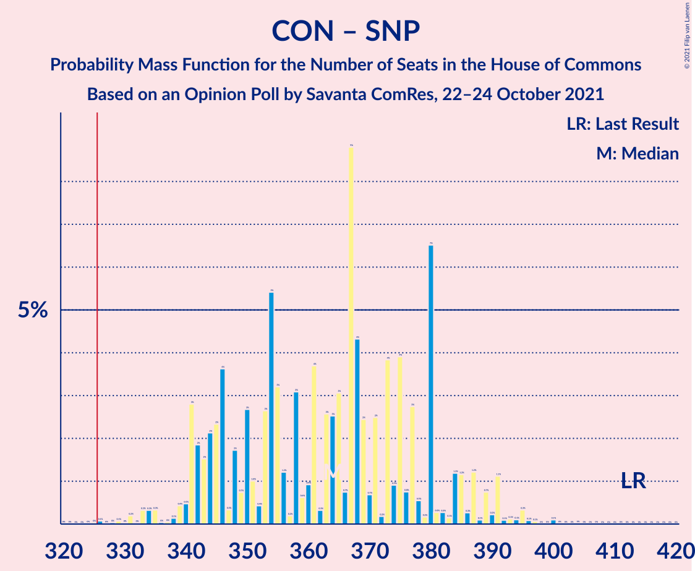

| Number of Seats | Probability | Accumulated | Special Marks |
|:---------------:|:-----------:|:-----------:|:-------------:|
| 325 | 0% | 100% |  |
| 326 | 0.1% | 99.9% | Majority |
| 327 | 0% | 99.8% |  |
| 328 | 0% | 99.8% |  |
| 329 | 0.1% | 99.8% |  |
| 330 | 0% | 99.7% |  |
| 331 | 0.2% | 99.7% |  |
| 332 | 0% | 99.5% |  |
| 333 | 0.3% | 99.5% |  |
| 334 | 0.3% | 99.2% |  |
| 335 | 0.3% | 98.8% |  |
| 336 | 0% | 98.5% |  |
| 337 | 0% | 98% |  |
| 338 | 0.1% | 98% |  |
| 339 | 0.4% | 98% |  |
| 340 | 0.5% | 98% |  |
| 341 | 3% | 97% |  |
| 342 | 2% | 95% |  |
| 343 | 2% | 93% |  |
| 344 | 2% | 91% |  |
| 345 | 2% | 89% |  |
| 346 | 4% | 87% |  |
| 347 | 0.3% | 83% |  |
| 348 | 2% | 83% |  |
| 349 | 0.7% | 81% |  |
| 350 | 3% | 80% |  |
| 351 | 1.0% | 78% |  |
| 352 | 0.4% | 77% |  |
| 353 | 3% | 76% |  |
| 354 | 5% | 74% |  |
| 355 | 3% | 68% |  |
| 356 | 1.2% | 65% |  |
| 357 | 0.2% | 64% |  |
| 358 | 3% | 64% |  |
| 359 | 0.6% | 60% |  |
| 360 | 0.9% | 60% |  |
| 361 | 4% | 59% |  |
| 362 | 0.3% | 55% |  |
| 363 | 3% | 55% |  |
| 364 | 3% | 52% | Median |
| 365 | 3% | 50% |  |
| 366 | 0.7% | 47% |  |
| 367 | 9% | 46% |  |
| 368 | 4% | 37% |  |
| 369 | 2% | 33% |  |
| 370 | 0.7% | 30% |  |
| 371 | 2% | 30% |  |
| 372 | 0.2% | 27% |  |
| 373 | 4% | 27% |  |
| 374 | 0.9% | 23% |  |
| 375 | 4% | 22% |  |
| 376 | 0.8% | 18% |  |
| 377 | 3% | 18% |  |
| 378 | 0.5% | 15% |  |
| 379 | 0.2% | 14% |  |
| 380 | 7% | 14% |  |
| 381 | 0.3% | 8% |  |
| 382 | 0.3% | 7% |  |
| 383 | 0.1% | 7% |  |
| 384 | 1.2% | 7% |  |
| 385 | 1.2% | 6% |  |
| 386 | 0.3% | 5% |  |
| 387 | 1.2% | 4% |  |
| 388 | 0.1% | 3% |  |
| 389 | 0.7% | 3% |  |
| 390 | 0.2% | 2% |  |
| 391 | 1.1% | 2% |  |
| 392 | 0.1% | 1.0% |  |
| 393 | 0.1% | 0.9% |  |
| 394 | 0.1% | 0.7% |  |
| 395 | 0.3% | 0.6% |  |
| 396 | 0.1% | 0.3% |  |
| 397 | 0.1% | 0.2% |  |
| 398 | 0% | 0.2% |  |
| 399 | 0% | 0.2% |  |
| 400 | 0.1% | 0.2% |  |
| 401 | 0% | 0.1% |  |
| 402 | 0% | 0% |  |
| 403 | 0% | 0% |  |
| 404 | 0% | 0% |  |
| 405 | 0% | 0% |  |
| 406 | 0% | 0% |  |
| 407 | 0% | 0% |  |
| 408 | 0% | 0% |  |
| 409 | 0% | 0% |  |
| 410 | 0% | 0% |  |
| 411 | 0% | 0% |  |
| 412 | 0% | 0% |  |
| 413 | 0% | 0% | Last Result |

### Labour Party – Liberal Democrats – Green Party – Scottish National Party – Plaid Cymru

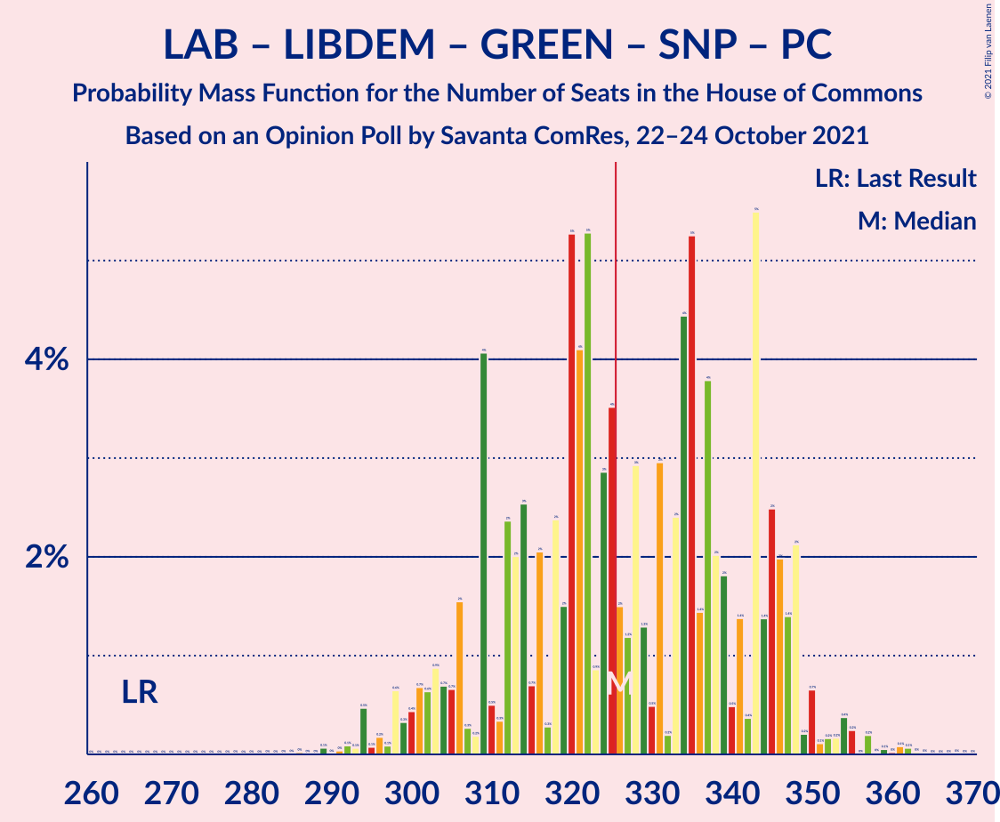

| Number of Seats | Probability | Accumulated | Special Marks |
|:---------------:|:-----------:|:-----------:|:-------------:|
| 266 | 0% | 100% | Last Result |
| 267 | 0% | 100% |  |
| 268 | 0% | 100% |  |
| 269 | 0% | 100% |  |
| 270 | 0% | 100% |  |
| 271 | 0% | 100% |  |
| 272 | 0% | 100% |  |
| 273 | 0% | 100% |  |
| 274 | 0% | 100% |  |
| 275 | 0% | 100% |  |
| 276 | 0% | 100% |  |
| 277 | 0% | 100% |  |
| 278 | 0% | 100% |  |
| 279 | 0% | 100% |  |
| 280 | 0% | 100% |  |
| 281 | 0% | 100% |  |
| 282 | 0% | 100% |  |
| 283 | 0% | 100% |  |
| 284 | 0% | 100% |  |
| 285 | 0% | 100% |  |
| 286 | 0% | 100% |  |
| 287 | 0% | 100% |  |
| 288 | 0% | 99.9% |  |
| 289 | 0.1% | 99.9% |  |
| 290 | 0% | 99.8% |  |
| 291 | 0.1% | 99.8% |  |
| 292 | 0.1% | 99.8% |  |
| 293 | 0% | 99.7% |  |
| 294 | 0.3% | 99.6% |  |
| 295 | 0.1% | 99.3% |  |
| 296 | 0.2% | 99.2% |  |
| 297 | 0.1% | 99.0% |  |
| 298 | 1.0% | 98.9% |  |
| 299 | 0.2% | 98% |  |
| 300 | 0.7% | 98% |  |
| 301 | 0.1% | 97% |  |
| 302 | 1.2% | 97% |  |
| 303 | 0.3% | 96% |  |
| 304 | 1.2% | 95% |  |
| 305 | 1.2% | 94% |  |
| 306 | 0.1% | 93% |  |
| 307 | 0.4% | 93% |  |
| 308 | 0.4% | 92% |  |
| 309 | 6% | 92% |  |
| 310 | 0.2% | 86% |  |
| 311 | 0.5% | 85% |  |
| 312 | 3% | 85% |  |
| 313 | 0.7% | 82% |  |
| 314 | 4% | 81% |  |
| 315 | 0.9% | 78% |  |
| 316 | 4% | 77% |  |
| 317 | 0.2% | 73% |  |
| 318 | 3% | 73% |  |
| 319 | 0.7% | 70% |  |
| 320 | 2% | 69% |  |
| 321 | 5% | 67% |  |
| 322 | 8% | 62% |  |
| 323 | 0.7% | 54% |  |
| 324 | 3% | 53% | Median |
| 325 | 3% | 50% |  |
| 326 | 3% | 47% | Majority |
| 327 | 0.8% | 45% |  |
| 328 | 3% | 44% |  |
| 329 | 0.7% | 41% |  |
| 330 | 0.6% | 40% |  |
| 331 | 3% | 40% |  |
| 332 | 0.2% | 36% |  |
| 333 | 1.3% | 36% |  |
| 334 | 3% | 35% |  |
| 335 | 5% | 31% |  |
| 336 | 3% | 26% |  |
| 337 | 0.4% | 24% |  |
| 338 | 1.3% | 23% |  |
| 339 | 2% | 22% |  |
| 340 | 0.7% | 20% |  |
| 341 | 2% | 19% |  |
| 342 | 0.3% | 17% |  |
| 343 | 4% | 17% |  |
| 344 | 2% | 13% |  |
| 345 | 2% | 11% |  |
| 346 | 2% | 8% |  |
| 347 | 2% | 7% |  |
| 348 | 2% | 5% |  |
| 349 | 0.3% | 2% |  |
| 350 | 0.3% | 2% |  |
| 351 | 0.1% | 2% |  |
| 352 | 0.1% | 2% |  |
| 353 | 0.2% | 1.5% |  |
| 354 | 0.5% | 1.3% |  |
| 355 | 0.3% | 0.8% |  |
| 356 | 0% | 0.5% |  |
| 357 | 0.2% | 0.5% |  |
| 358 | 0% | 0.3% |  |
| 359 | 0.1% | 0.3% |  |
| 360 | 0% | 0.2% |  |
| 361 | 0% | 0.2% |  |
| 362 | 0.1% | 0.2% |  |
| 363 | 0% | 0.1% |  |
| 364 | 0% | 0% |  |

### Labour Party – Liberal Democrats – Scottish National Party – Plaid Cymru

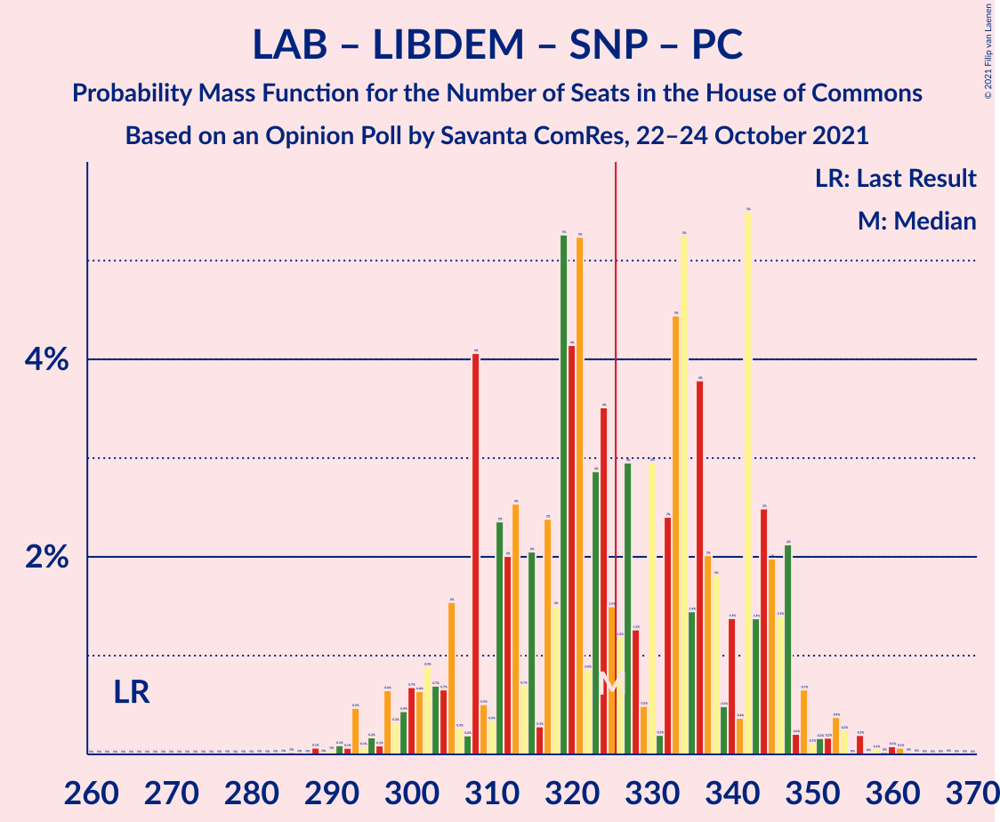

| Number of Seats | Probability | Accumulated | Special Marks |
|:---------------:|:-----------:|:-----------:|:-------------:|
| 265 | 0% | 100% | Last Result |
| 266 | 0% | 100% |  |
| 267 | 0% | 100% |  |
| 268 | 0% | 100% |  |
| 269 | 0% | 100% |  |
| 270 | 0% | 100% |  |
| 271 | 0% | 100% |  |
| 272 | 0% | 100% |  |
| 273 | 0% | 100% |  |
| 274 | 0% | 100% |  |
| 275 | 0% | 100% |  |
| 276 | 0% | 100% |  |
| 277 | 0% | 100% |  |
| 278 | 0% | 100% |  |
| 279 | 0% | 100% |  |
| 280 | 0% | 100% |  |
| 281 | 0% | 100% |  |
| 282 | 0% | 100% |  |
| 283 | 0% | 100% |  |
| 284 | 0% | 100% |  |
| 285 | 0% | 100% |  |
| 286 | 0% | 100% |  |
| 287 | 0% | 99.9% |  |
| 288 | 0.1% | 99.9% |  |
| 289 | 0% | 99.8% |  |
| 290 | 0.1% | 99.8% |  |
| 291 | 0.1% | 99.8% |  |
| 292 | 0% | 99.7% |  |
| 293 | 0.3% | 99.6% |  |
| 294 | 0.1% | 99.3% |  |
| 295 | 0.2% | 99.2% |  |
| 296 | 0.1% | 99.0% |  |
| 297 | 1.0% | 98.9% |  |
| 298 | 0.2% | 98% |  |
| 299 | 0.7% | 98% |  |
| 300 | 0.1% | 97% |  |
| 301 | 1.2% | 97% |  |
| 302 | 0.3% | 96% |  |
| 303 | 1.1% | 95% |  |
| 304 | 1.2% | 94% |  |
| 305 | 0.1% | 93% |  |
| 306 | 0.4% | 93% |  |
| 307 | 0.4% | 92% |  |
| 308 | 6% | 92% |  |
| 309 | 0.2% | 86% |  |
| 310 | 0.5% | 85% |  |
| 311 | 3% | 85% |  |
| 312 | 0.7% | 82% |  |
| 313 | 4% | 81% |  |
| 314 | 0.9% | 78% |  |
| 315 | 4% | 77% |  |
| 316 | 0.2% | 73% |  |
| 317 | 3% | 73% |  |
| 318 | 0.7% | 70% |  |
| 319 | 2% | 69% |  |
| 320 | 5% | 67% |  |
| 321 | 8% | 62% |  |
| 322 | 0.7% | 54% |  |
| 323 | 3% | 53% | Median |
| 324 | 3% | 50% |  |
| 325 | 3% | 47% |  |
| 326 | 0.8% | 45% | Majority |
| 327 | 3% | 44% |  |
| 328 | 0.6% | 41% |  |
| 329 | 0.6% | 40% |  |
| 330 | 3% | 40% |  |
| 331 | 0.2% | 36% |  |
| 332 | 1.3% | 36% |  |
| 333 | 3% | 35% |  |
| 334 | 5% | 31% |  |
| 335 | 3% | 26% |  |
| 336 | 0.4% | 24% |  |
| 337 | 1.2% | 23% |  |
| 338 | 2% | 22% |  |
| 339 | 0.7% | 20% |  |
| 340 | 2% | 19% |  |
| 341 | 0.3% | 17% |  |
| 342 | 4% | 17% |  |
| 343 | 2% | 13% |  |
| 344 | 2% | 11% |  |
| 345 | 2% | 8% |  |
| 346 | 2% | 7% |  |
| 347 | 2% | 5% |  |
| 348 | 0.3% | 2% |  |
| 349 | 0.3% | 2% |  |
| 350 | 0.1% | 2% |  |
| 351 | 0.1% | 2% |  |
| 352 | 0.2% | 1.5% |  |
| 353 | 0.5% | 1.3% |  |
| 354 | 0.3% | 0.8% |  |
| 355 | 0% | 0.5% |  |
| 356 | 0.2% | 0.5% |  |
| 357 | 0% | 0.3% |  |
| 358 | 0.1% | 0.3% |  |
| 359 | 0% | 0.2% |  |
| 360 | 0% | 0.2% |  |
| 361 | 0.1% | 0.2% |  |
| 362 | 0% | 0.1% |  |
| 363 | 0% | 0% |  |

### Labour Party – Liberal Democrats – Scottish National Party

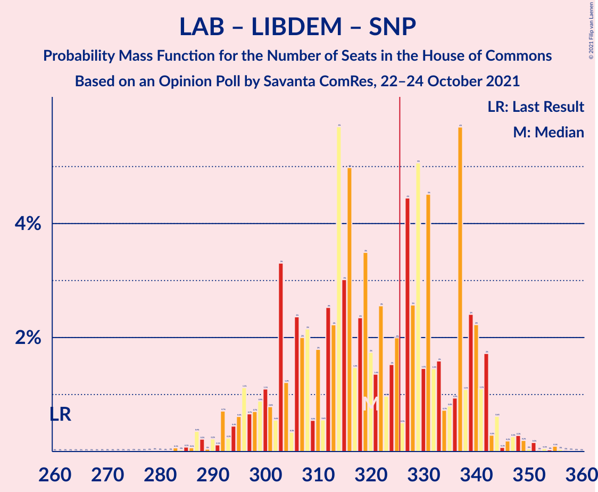

| Number of Seats | Probability | Accumulated | Special Marks |
|:---------------:|:-----------:|:-----------:|:-------------:|
| 261 | 0% | 100% | Last Result |
| 262 | 0% | 100% |  |
| 263 | 0% | 100% |  |
| 264 | 0% | 100% |  |
| 265 | 0% | 100% |  |
| 266 | 0% | 100% |  |
| 267 | 0% | 100% |  |
| 268 | 0% | 100% |  |
| 269 | 0% | 100% |  |
| 270 | 0% | 100% |  |
| 271 | 0% | 100% |  |
| 272 | 0% | 100% |  |
| 273 | 0% | 100% |  |
| 274 | 0% | 100% |  |
| 275 | 0% | 100% |  |
| 276 | 0% | 100% |  |
| 277 | 0% | 100% |  |
| 278 | 0% | 100% |  |
| 279 | 0% | 100% |  |
| 280 | 0% | 100% |  |
| 281 | 0% | 99.9% |  |
| 282 | 0% | 99.9% |  |
| 283 | 0.1% | 99.9% |  |
| 284 | 0% | 99.8% |  |
| 285 | 0.1% | 99.8% |  |
| 286 | 0% | 99.7% |  |
| 287 | 0% | 99.6% |  |
| 288 | 0.4% | 99.6% |  |
| 289 | 0.1% | 99.2% |  |
| 290 | 0.2% | 99.2% |  |
| 291 | 0.2% | 98.9% |  |
| 292 | 1.1% | 98.7% |  |
| 293 | 0.1% | 98% |  |
| 294 | 0.7% | 98% |  |
| 295 | 0.1% | 97% |  |
| 296 | 1.2% | 97% |  |
| 297 | 0.7% | 96% |  |
| 298 | 1.2% | 95% |  |
| 299 | 0.8% | 94% |  |
| 300 | 0.1% | 93% |  |
| 301 | 1.4% | 93% |  |
| 302 | 0.9% | 91% |  |
| 303 | 5% | 90% |  |
| 304 | 2% | 85% |  |
| 305 | 0.4% | 84% |  |
| 306 | 1.3% | 83% |  |
| 307 | 1.0% | 82% |  |
| 308 | 4% | 81% |  |
| 309 | 0.7% | 77% |  |
| 310 | 3% | 76% |  |
| 311 | 0.7% | 73% |  |
| 312 | 3% | 72% |  |
| 313 | 1.0% | 69% |  |
| 314 | 4% | 68% |  |
| 315 | 3% | 64% |  |
| 316 | 7% | 61% |  |
| 317 | 1.2% | 54% |  |
| 318 | 3% | 53% | Median |
| 319 | 3% | 50% |  |
| 320 | 3% | 47% |  |
| 321 | 0.8% | 44% |  |
| 322 | 3% | 44% |  |
| 323 | 0.3% | 40% |  |
| 324 | 0.7% | 40% |  |
| 325 | 3% | 39% |  |
| 326 | 0.7% | 36% | Majority |
| 327 | 3% | 35% |  |
| 328 | 1.0% | 32% |  |
| 329 | 5% | 31% |  |
| 330 | 2% | 26% |  |
| 331 | 0.4% | 23% |  |
| 332 | 2% | 23% |  |
| 333 | 2% | 21% |  |
| 334 | 0.8% | 19% |  |
| 335 | 1.3% | 18% |  |
| 336 | 0.6% | 17% |  |
| 337 | 5% | 16% |  |
| 338 | 1.0% | 11% |  |
| 339 | 2% | 10% |  |
| 340 | 2% | 8% |  |
| 341 | 2% | 6% |  |
| 342 | 2% | 4% |  |
| 343 | 0.2% | 2% |  |
| 344 | 0.4% | 2% |  |
| 345 | 0% | 2% |  |
| 346 | 0.1% | 2% |  |
| 347 | 0.4% | 1.4% |  |
| 348 | 0.2% | 1.0% |  |
| 349 | 0.3% | 0.8% |  |
| 350 | 0% | 0.5% |  |
| 351 | 0.2% | 0.5% |  |
| 352 | 0% | 0.3% |  |
| 353 | 0.1% | 0.3% |  |
| 354 | 0% | 0.2% |  |
| 355 | 0% | 0.2% |  |
| 356 | 0% | 0.1% |  |
| 357 | 0% | 0.1% |  |
| 358 | 0% | 0% |  |

### Labour Party – Scottish National Party – Plaid Cymru

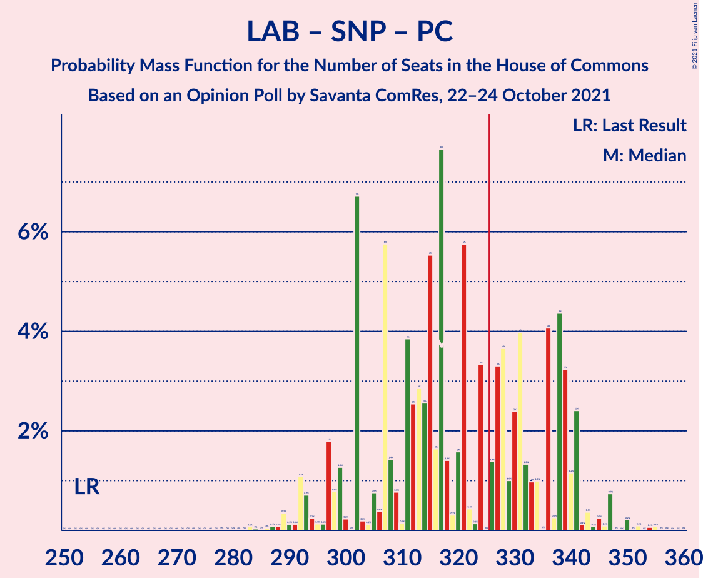

| Number of Seats | Probability | Accumulated | Special Marks |
|:---------------:|:-----------:|:-----------:|:-------------:|
| 254 | 0% | 100% | Last Result |
| 255 | 0% | 100% |  |
| 256 | 0% | 100% |  |
| 257 | 0% | 100% |  |
| 258 | 0% | 100% |  |
| 259 | 0% | 100% |  |
| 260 | 0% | 100% |  |
| 261 | 0% | 100% |  |
| 262 | 0% | 100% |  |
| 263 | 0% | 100% |  |
| 264 | 0% | 100% |  |
| 265 | 0% | 100% |  |
| 266 | 0% | 100% |  |
| 267 | 0% | 100% |  |
| 268 | 0% | 100% |  |
| 269 | 0% | 100% |  |
| 270 | 0% | 100% |  |
| 271 | 0% | 100% |  |
| 272 | 0% | 100% |  |
| 273 | 0% | 100% |  |
| 274 | 0% | 100% |  |
| 275 | 0% | 100% |  |
| 276 | 0% | 100% |  |
| 277 | 0% | 100% |  |
| 278 | 0% | 100% |  |
| 279 | 0% | 100% |  |
| 280 | 0% | 100% |  |
| 281 | 0% | 100% |  |
| 282 | 0% | 99.9% |  |
| 283 | 0.1% | 99.9% |  |
| 284 | 0% | 99.9% |  |
| 285 | 0% | 99.8% |  |
| 286 | 0% | 99.8% |  |
| 287 | 0.1% | 99.8% |  |
| 288 | 0.1% | 99.7% |  |
| 289 | 0.3% | 99.6% |  |
| 290 | 0.1% | 99.3% |  |
| 291 | 0.1% | 99.1% |  |
| 292 | 1.1% | 99.0% |  |
| 293 | 0.7% | 98% |  |
| 294 | 0.2% | 97% |  |
| 295 | 0.1% | 97% |  |
| 296 | 0.1% | 97% |  |
| 297 | 2% | 97% |  |
| 298 | 0.8% | 95% |  |
| 299 | 1.3% | 94% |  |
| 300 | 0.2% | 93% |  |
| 301 | 0% | 93% |  |
| 302 | 7% | 93% |  |
| 303 | 0.2% | 86% |  |
| 304 | 0.1% | 86% |  |
| 305 | 0.8% | 86% |  |
| 306 | 0.4% | 85% |  |
| 307 | 6% | 84% |  |
| 308 | 1.4% | 79% |  |
| 309 | 0.8% | 77% |  |
| 310 | 0.1% | 76% |  |
| 311 | 4% | 76% |  |
| 312 | 3% | 72% |  |
| 313 | 3% | 70% |  |
| 314 | 3% | 67% |  |
| 315 | 6% | 65% |  |
| 316 | 2% | 59% |  |
| 317 | 8% | 57% | Median |
| 318 | 1.4% | 50% |  |
| 319 | 0.3% | 48% |  |
| 320 | 2% | 48% |  |
| 321 | 6% | 46% |  |
| 322 | 0.4% | 41% |  |
| 323 | 0.1% | 40% |  |
| 324 | 3% | 40% |  |
| 325 | 0% | 37% |  |
| 326 | 1.4% | 37% | Majority |
| 327 | 3% | 35% |  |
| 328 | 4% | 32% |  |
| 329 | 1.0% | 28% |  |
| 330 | 2% | 27% |  |
| 331 | 4% | 25% |  |
| 332 | 1.3% | 21% |  |
| 333 | 1.0% | 20% |  |
| 334 | 1.0% | 19% |  |
| 335 | 0% | 18% |  |
| 336 | 4% | 18% |  |
| 337 | 0.3% | 14% |  |
| 338 | 4% | 13% |  |
| 339 | 3% | 9% |  |
| 340 | 1.2% | 6% |  |
| 341 | 2% | 5% |  |
| 342 | 0.1% | 2% |  |
| 343 | 0.4% | 2% |  |
| 344 | 0.1% | 2% |  |
| 345 | 0.2% | 2% |  |
| 346 | 0.1% | 1.3% |  |
| 347 | 0.7% | 1.3% |  |
| 348 | 0% | 0.5% |  |
| 349 | 0% | 0.5% |  |
| 350 | 0.2% | 0.5% |  |
| 351 | 0% | 0.3% |  |
| 352 | 0.1% | 0.3% |  |
| 353 | 0% | 0.2% |  |
| 354 | 0.1% | 0.2% |  |
| 355 | 0.1% | 0.1% |  |
| 356 | 0% | 0% |  |

### Conservative Party – Liberal Democrats

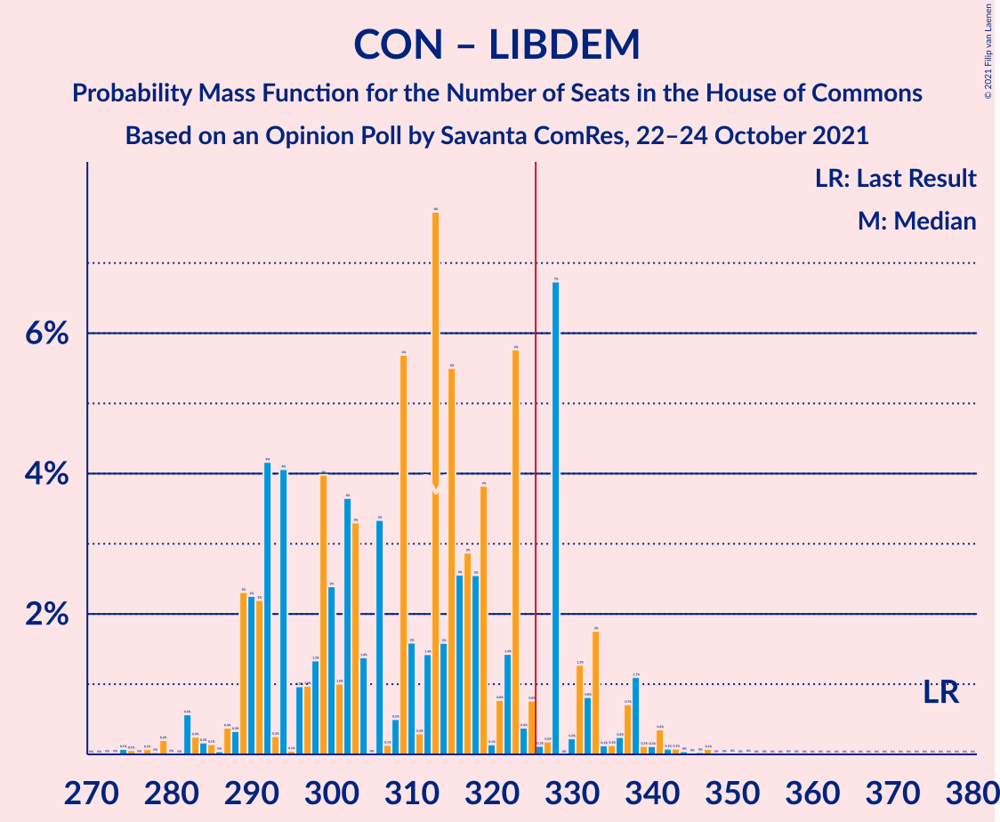

| Number of Seats | Probability | Accumulated | Special Marks |
|:---------------:|:-----------:|:-----------:|:-------------:|
| 274 | 0.1% | 100% |  |
| 275 | 0.1% | 99.9% |  |
| 276 | 0% | 99.8% |  |
| 277 | 0.1% | 99.8% |  |
| 278 | 0% | 99.7% |  |
| 279 | 0.2% | 99.7% |  |
| 280 | 0% | 99.5% |  |
| 281 | 0% | 99.5% |  |
| 282 | 0.6% | 99.5% |  |
| 283 | 0.3% | 98.9% |  |
| 284 | 0.2% | 98.7% |  |
| 285 | 0.1% | 98% |  |
| 286 | 0% | 98% |  |
| 287 | 0.4% | 98% |  |
| 288 | 0.3% | 98% |  |
| 289 | 2% | 98% |  |
| 290 | 2% | 95% |  |
| 291 | 2% | 93% |  |
| 292 | 4% | 91% |  |
| 293 | 0.3% | 87% |  |
| 294 | 4% | 86% |  |
| 295 | 0.1% | 82% |  |
| 296 | 1.0% | 82% |  |
| 297 | 1.0% | 81% |  |
| 298 | 1.3% | 80% |  |
| 299 | 4% | 79% |  |
| 300 | 2% | 75% |  |
| 301 | 1.0% | 73% |  |
| 302 | 4% | 72% |  |
| 303 | 3% | 68% |  |
| 304 | 1.4% | 65% |  |
| 305 | 0% | 63% |  |
| 306 | 3% | 63% |  |
| 307 | 0.1% | 60% |  |
| 308 | 0.5% | 60% |  |
| 309 | 6% | 59% |  |
| 310 | 2% | 54% |  |
| 311 | 0.3% | 52% |  |
| 312 | 1.4% | 52% | Median |
| 313 | 8% | 50% |  |
| 314 | 2% | 43% |  |
| 315 | 6% | 41% |  |
| 316 | 3% | 35% |  |
| 317 | 3% | 33% |  |
| 318 | 3% | 30% |  |
| 319 | 4% | 28% |  |
| 320 | 0.1% | 24% |  |
| 321 | 0.8% | 24% |  |
| 322 | 1.4% | 23% |  |
| 323 | 6% | 21% |  |
| 324 | 0.4% | 16% |  |
| 325 | 0.8% | 15% |  |
| 326 | 0.1% | 14% | Majority |
| 327 | 0.2% | 14% |  |
| 328 | 7% | 14% |  |
| 329 | 0% | 7% |  |
| 330 | 0.2% | 7% |  |
| 331 | 1.3% | 7% |  |
| 332 | 0.8% | 6% |  |
| 333 | 2% | 5% |  |
| 334 | 0.1% | 3% |  |
| 335 | 0.1% | 3% |  |
| 336 | 0.2% | 3% |  |
| 337 | 0.7% | 3% |  |
| 338 | 1.1% | 2% |  |
| 339 | 0.1% | 1.0% |  |
| 340 | 0.1% | 0.9% |  |
| 341 | 0.4% | 0.7% |  |
| 342 | 0.1% | 0.4% |  |
| 343 | 0.1% | 0.3% |  |
| 344 | 0% | 0.2% |  |
| 345 | 0% | 0.2% |  |
| 346 | 0% | 0.2% |  |
| 347 | 0.1% | 0.1% |  |
| 348 | 0% | 0.1% |  |
| 349 | 0% | 0.1% |  |
| 350 | 0% | 0% |  |
| 351 | 0% | 0% |  |
| 352 | 0% | 0% |  |
| 353 | 0% | 0% |  |
| 354 | 0% | 0% |  |
| 355 | 0% | 0% |  |
| 356 | 0% | 0% |  |
| 357 | 0% | 0% |  |
| 358 | 0% | 0% |  |
| 359 | 0% | 0% |  |
| 360 | 0% | 0% |  |
| 361 | 0% | 0% |  |
| 362 | 0% | 0% |  |
| 363 | 0% | 0% |  |
| 364 | 0% | 0% |  |
| 365 | 0% | 0% |  |
| 366 | 0% | 0% |  |
| 367 | 0% | 0% |  |
| 368 | 0% | 0% |  |
| 369 | 0% | 0% |  |
| 370 | 0% | 0% |  |
| 371 | 0% | 0% |  |
| 372 | 0% | 0% |  |
| 373 | 0% | 0% |  |
| 374 | 0% | 0% |  |
| 375 | 0% | 0% |  |
| 376 | 0% | 0% | Last Result |

### Conservative Party – Plaid Cymru

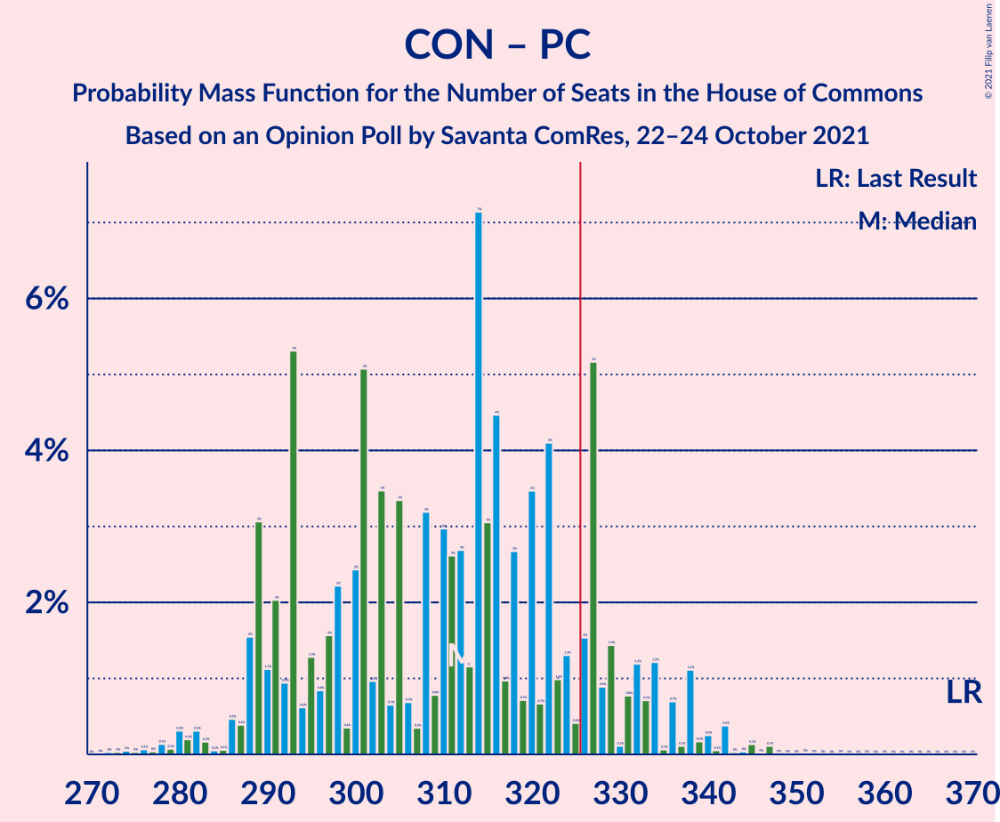

| Number of Seats | Probability | Accumulated | Special Marks |
|:---------------:|:-----------:|:-----------:|:-------------:|
| 272 | 0% | 100% |  |
| 273 | 0% | 99.9% |  |
| 274 | 0% | 99.9% |  |
| 275 | 0% | 99.8% |  |
| 276 | 0.1% | 99.8% |  |
| 277 | 0% | 99.7% |  |
| 278 | 0.1% | 99.7% |  |
| 279 | 0.1% | 99.6% |  |
| 280 | 0.3% | 99.5% |  |
| 281 | 0.2% | 99.2% |  |
| 282 | 0.3% | 99.0% |  |
| 283 | 0.2% | 98.7% |  |
| 284 | 0.1% | 98.5% |  |
| 285 | 0.1% | 98% |  |
| 286 | 0.5% | 98% |  |
| 287 | 0.4% | 98% |  |
| 288 | 2% | 98% |  |
| 289 | 3% | 96% |  |
| 290 | 1.1% | 93% |  |
| 291 | 2% | 92% |  |
| 292 | 0.9% | 90% |  |
| 293 | 5% | 89% |  |
| 294 | 0.6% | 84% |  |
| 295 | 1.3% | 83% |  |
| 296 | 0.8% | 82% |  |
| 297 | 2% | 81% |  |
| 298 | 2% | 79% |  |
| 299 | 0.4% | 77% |  |
| 300 | 2% | 77% |  |
| 301 | 5% | 74% |  |
| 302 | 1.0% | 69% |  |
| 303 | 3% | 68% |  |
| 304 | 0.7% | 65% |  |
| 305 | 3% | 64% |  |
| 306 | 0.7% | 61% |  |
| 307 | 0.3% | 60% |  |
| 308 | 3% | 60% |  |
| 309 | 0.8% | 56% |  |
| 310 | 3% | 56% |  |
| 311 | 3% | 53% | Median |
| 312 | 3% | 50% |  |
| 313 | 1.2% | 47% |  |
| 314 | 7% | 46% |  |
| 315 | 3% | 39% |  |
| 316 | 4% | 36% |  |
| 317 | 1.0% | 32% |  |
| 318 | 3% | 31% |  |
| 319 | 0.7% | 28% |  |
| 320 | 3% | 27% |  |
| 321 | 0.7% | 24% |  |
| 322 | 4% | 23% |  |
| 323 | 1.0% | 19% |  |
| 324 | 1.3% | 18% |  |
| 325 | 0.4% | 17% |  |
| 326 | 2% | 16% | Majority |
| 327 | 5% | 15% |  |
| 328 | 0.9% | 10% |  |
| 329 | 1.4% | 9% |  |
| 330 | 0.1% | 7% |  |
| 331 | 0.8% | 7% |  |
| 332 | 1.2% | 6% |  |
| 333 | 0.7% | 5% |  |
| 334 | 1.2% | 4% |  |
| 335 | 0.1% | 3% |  |
| 336 | 0.7% | 3% |  |
| 337 | 0.1% | 2% |  |
| 338 | 1.1% | 2% |  |
| 339 | 0.2% | 1.3% |  |
| 340 | 0.3% | 1.1% |  |
| 341 | 0.1% | 0.8% |  |
| 342 | 0.4% | 0.8% |  |
| 343 | 0% | 0.4% |  |
| 344 | 0% | 0.4% |  |
| 345 | 0.1% | 0.3% |  |
| 346 | 0% | 0.2% |  |
| 347 | 0.1% | 0.2% |  |
| 348 | 0% | 0.1% |  |
| 349 | 0% | 0.1% |  |
| 350 | 0% | 0.1% |  |
| 351 | 0% | 0% |  |
| 352 | 0% | 0% |  |
| 353 | 0% | 0% |  |
| 354 | 0% | 0% |  |
| 355 | 0% | 0% |  |
| 356 | 0% | 0% |  |
| 357 | 0% | 0% |  |
| 358 | 0% | 0% |  |
| 359 | 0% | 0% |  |
| 360 | 0% | 0% |  |
| 361 | 0% | 0% |  |
| 362 | 0% | 0% |  |
| 363 | 0% | 0% |  |
| 364 | 0% | 0% |  |
| 365 | 0% | 0% |  |
| 366 | 0% | 0% |  |
| 367 | 0% | 0% |  |
| 368 | 0% | 0% |  |
| 369 | 0% | 0% | Last Result |

### Labour Party – Scottish National Party

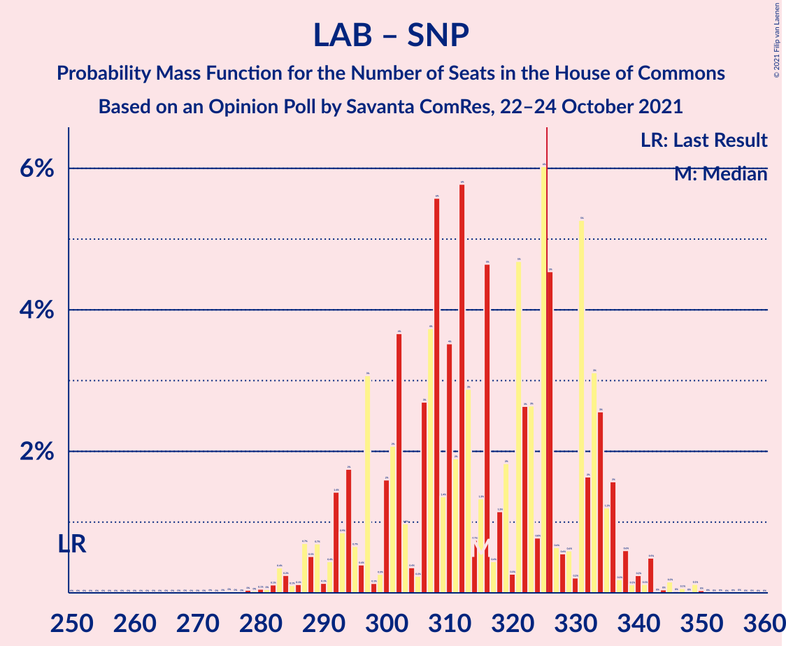

| Number of Seats | Probability | Accumulated | Special Marks |
|:---------------:|:-----------:|:-----------:|:-------------:|
| 250 | 0% | 100% | Last Result |
| 251 | 0% | 100% |  |
| 252 | 0% | 100% |  |
| 253 | 0% | 100% |  |
| 254 | 0% | 100% |  |
| 255 | 0% | 100% |  |
| 256 | 0% | 100% |  |
| 257 | 0% | 100% |  |
| 258 | 0% | 100% |  |
| 259 | 0% | 100% |  |
| 260 | 0% | 100% |  |
| 261 | 0% | 100% |  |
| 262 | 0% | 100% |  |
| 263 | 0% | 100% |  |
| 264 | 0% | 100% |  |
| 265 | 0% | 100% |  |
| 266 | 0% | 100% |  |
| 267 | 0% | 100% |  |
| 268 | 0% | 100% |  |
| 269 | 0% | 100% |  |
| 270 | 0% | 100% |  |
| 271 | 0% | 100% |  |
| 272 | 0% | 100% |  |
| 273 | 0% | 100% |  |
| 274 | 0% | 100% |  |
| 275 | 0% | 100% |  |
| 276 | 0% | 99.9% |  |
| 277 | 0% | 99.9% |  |
| 278 | 0.1% | 99.9% |  |
| 279 | 0% | 99.9% |  |
| 280 | 0.1% | 99.8% |  |
| 281 | 0% | 99.8% |  |
| 282 | 0.2% | 99.7% |  |
| 283 | 0% | 99.6% |  |
| 284 | 0.4% | 99.6% |  |
| 285 | 0.2% | 99.2% |  |
| 286 | 0.1% | 99.0% |  |
| 287 | 1.1% | 98.9% |  |
| 288 | 0.9% | 98% |  |
| 289 | 0% | 97% |  |
| 290 | 0.2% | 97% |  |
| 291 | 0.6% | 97% |  |
| 292 | 2% | 96% |  |
| 293 | 0.4% | 94% |  |
| 294 | 1.2% | 94% |  |
| 295 | 1.2% | 93% |  |
| 296 | 0.6% | 92% |  |
| 297 | 5% | 91% |  |
| 298 | 0.2% | 86% |  |
| 299 | 0.4% | 86% |  |
| 300 | 2% | 85% |  |
| 301 | 0.7% | 83% |  |
| 302 | 4% | 82% |  |
| 303 | 1.3% | 78% |  |
| 304 | 0.6% | 77% |  |
| 305 | 0.4% | 76% |  |
| 306 | 4% | 76% |  |
| 307 | 3% | 72% |  |
| 308 | 4% | 69% |  |
| 309 | 0.6% | 65% |  |
| 310 | 7% | 64% |  |
| 311 | 2% | 58% |  |
| 312 | 6% | 56% | Median |
| 313 | 1.3% | 50% |  |
| 314 | 0.9% | 48% |  |
| 315 | 2% | 47% |  |
| 316 | 5% | 46% |  |
| 317 | 0.3% | 40% |  |
| 318 | 0.2% | 40% |  |
| 319 | 3% | 40% |  |
| 320 | 0.3% | 37% |  |
| 321 | 4% | 36% |  |
| 322 | 0.9% | 32% |  |
| 323 | 4% | 32% |  |
| 324 | 0.6% | 27% |  |
| 325 | 2% | 27% |  |
| 326 | 5% | 25% | Majority |
| 327 | 0.7% | 20% |  |
| 328 | 0.5% | 19% |  |
| 329 | 0.8% | 18% |  |
| 330 | 0.3% | 18% |  |
| 331 | 4% | 17% |  |
| 332 | 2% | 13% |  |
| 333 | 3% | 11% |  |
| 334 | 2% | 8% |  |
| 335 | 2% | 6% |  |
| 336 | 2% | 4% |  |
| 337 | 0.1% | 2% |  |
| 338 | 0.4% | 2% |  |
| 339 | 0.2% | 2% |  |
| 340 | 0.2% | 1.5% |  |
| 341 | 0.2% | 1.2% |  |
| 342 | 0.5% | 1.1% |  |
| 343 | 0% | 0.5% |  |
| 344 | 0.1% | 0.5% |  |
| 345 | 0.2% | 0.5% |  |
| 346 | 0% | 0.3% |  |
| 347 | 0.1% | 0.3% |  |
| 348 | 0% | 0.2% |  |
| 349 | 0.1% | 0.2% |  |
| 350 | 0% | 0.1% |  |
| 351 | 0% | 0% |  |

### Conservative Party

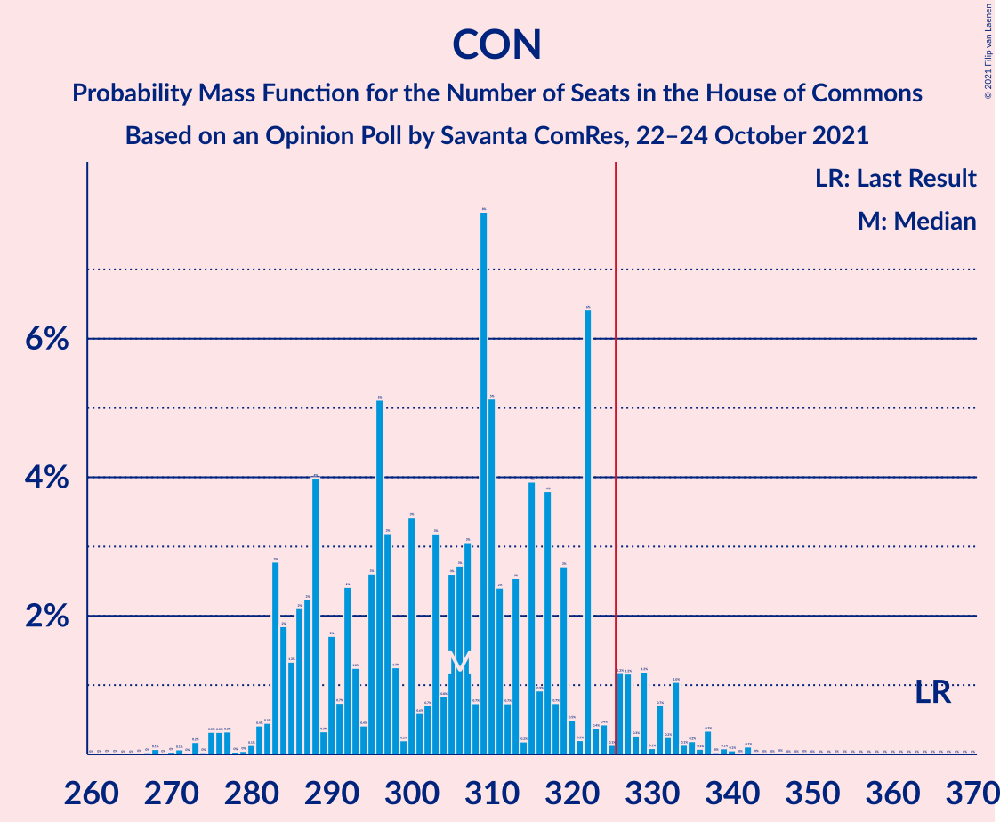

| Number of Seats | Probability | Accumulated | Special Marks |
|:---------------:|:-----------:|:-----------:|:-------------:|
| 267 | 0% | 100% |  |
| 268 | 0.1% | 99.9% |  |
| 269 | 0% | 99.8% |  |
| 270 | 0% | 99.8% |  |
| 271 | 0.1% | 99.8% |  |
| 272 | 0% | 99.7% |  |
| 273 | 0.2% | 99.7% |  |
| 274 | 0% | 99.5% |  |
| 275 | 0.3% | 99.5% |  |
| 276 | 0.3% | 99.2% |  |
| 277 | 0.3% | 98.9% |  |
| 278 | 0% | 98.5% |  |
| 279 | 0% | 98% |  |
| 280 | 0.1% | 98% |  |
| 281 | 0.4% | 98% |  |
| 282 | 0.5% | 98% |  |
| 283 | 3% | 97% |  |
| 284 | 2% | 95% |  |
| 285 | 1.3% | 93% |  |
| 286 | 2% | 91% |  |
| 287 | 2% | 89% |  |
| 288 | 4% | 87% |  |
| 289 | 0.3% | 83% |  |
| 290 | 2% | 83% |  |
| 291 | 0.7% | 81% |  |
| 292 | 2% | 80% |  |
| 293 | 1.2% | 78% |  |
| 294 | 0.4% | 77% |  |
| 295 | 3% | 76% |  |
| 296 | 5% | 74% |  |
| 297 | 3% | 69% |  |
| 298 | 1.3% | 65% |  |
| 299 | 0.2% | 64% |  |
| 300 | 3% | 64% |  |
| 301 | 0.6% | 60% |  |
| 302 | 0.7% | 60% |  |
| 303 | 3% | 59% |  |
| 304 | 0.8% | 56% |  |
| 305 | 3% | 55% |  |
| 306 | 3% | 53% | Median |
| 307 | 3% | 50% |  |
| 308 | 0.7% | 47% |  |
| 309 | 8% | 46% |  |
| 310 | 5% | 38% |  |
| 311 | 2% | 33% |  |
| 312 | 0.7% | 31% |  |
| 313 | 3% | 30% |  |
| 314 | 0.2% | 27% |  |
| 315 | 4% | 27% |  |
| 316 | 0.9% | 23% |  |
| 317 | 4% | 22% |  |
| 318 | 0.7% | 19% |  |
| 319 | 3% | 18% |  |
| 320 | 0.5% | 15% |  |
| 321 | 0.2% | 15% |  |
| 322 | 6% | 14% |  |
| 323 | 0.4% | 8% |  |
| 324 | 0.4% | 8% |  |
| 325 | 0.1% | 7% |  |
| 326 | 1.2% | 7% | Majority |
| 327 | 1.2% | 6% |  |
| 328 | 0.3% | 5% |  |
| 329 | 1.2% | 4% |  |
| 330 | 0.1% | 3% |  |
| 331 | 0.7% | 3% |  |
| 332 | 0.2% | 2% |  |
| 333 | 1.0% | 2% |  |
| 334 | 0.1% | 1.1% |  |
| 335 | 0.2% | 1.0% |  |
| 336 | 0.1% | 0.8% |  |
| 337 | 0.3% | 0.7% |  |
| 338 | 0% | 0.4% |  |
| 339 | 0.1% | 0.3% |  |
| 340 | 0.1% | 0.2% |  |
| 341 | 0% | 0.2% |  |
| 342 | 0.1% | 0.2% |  |
| 343 | 0% | 0.1% |  |
| 344 | 0% | 0.1% |  |
| 345 | 0% | 0% |  |
| 346 | 0% | 0% |  |
| 347 | 0% | 0% |  |
| 348 | 0% | 0% |  |
| 349 | 0% | 0% |  |
| 350 | 0% | 0% |  |
| 351 | 0% | 0% |  |
| 352 | 0% | 0% |  |
| 353 | 0% | 0% |  |
| 354 | 0% | 0% |  |
| 355 | 0% | 0% |  |
| 356 | 0% | 0% |  |
| 357 | 0% | 0% |  |
| 358 | 0% | 0% |  |
| 359 | 0% | 0% |  |
| 360 | 0% | 0% |  |
| 361 | 0% | 0% |  |
| 362 | 0% | 0% |  |
| 363 | 0% | 0% |  |
| 364 | 0% | 0% |  |
| 365 | 0% | 0% | Last Result |

### Labour Party – Liberal Democrats – Plaid Cymru

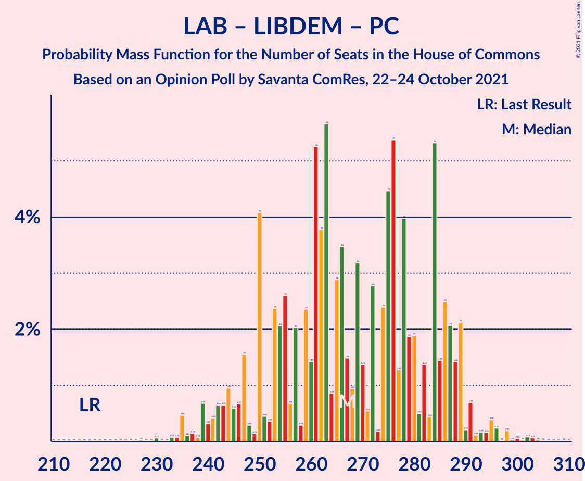

| Number of Seats | Probability | Accumulated | Special Marks |
|:---------------:|:-----------:|:-----------:|:-------------:|
| 217 | 0% | 100% | Last Result |
| 218 | 0% | 100% |  |
| 219 | 0% | 100% |  |
| 220 | 0% | 100% |  |
| 221 | 0% | 100% |  |
| 222 | 0% | 100% |  |
| 223 | 0% | 100% |  |
| 224 | 0% | 100% |  |
| 225 | 0% | 100% |  |
| 226 | 0% | 100% |  |
| 227 | 0% | 100% |  |
| 228 | 0% | 100% |  |
| 229 | 0% | 99.9% |  |
| 230 | 0.1% | 99.9% |  |
| 231 | 0% | 99.8% |  |
| 232 | 0% | 99.8% |  |
| 233 | 0.1% | 99.8% |  |
| 234 | 0.1% | 99.8% |  |
| 235 | 0.3% | 99.7% |  |
| 236 | 0.1% | 99.4% |  |
| 237 | 0.1% | 99.2% |  |
| 238 | 0.1% | 99.1% |  |
| 239 | 1.1% | 99.0% |  |
| 240 | 0.2% | 98% |  |
| 241 | 0.7% | 98% |  |
| 242 | 0.1% | 97% |  |
| 243 | 1.2% | 97% |  |
| 244 | 0.3% | 96% |  |
| 245 | 1.1% | 95% |  |
| 246 | 1.2% | 94% |  |
| 247 | 0.1% | 93% |  |
| 248 | 0.3% | 93% |  |
| 249 | 0.3% | 93% |  |
| 250 | 7% | 92% |  |
| 251 | 0.2% | 86% |  |
| 252 | 0.6% | 86% |  |
| 253 | 3% | 85% |  |
| 254 | 0.8% | 82% |  |
| 255 | 4% | 82% |  |
| 256 | 0.9% | 78% |  |
| 257 | 4% | 77% |  |
| 258 | 0.2% | 73% |  |
| 259 | 3% | 73% |  |
| 260 | 0.7% | 70% |  |
| 261 | 2% | 70% |  |
| 262 | 4% | 67% |  |
| 263 | 9% | 63% |  |
| 264 | 0.8% | 54% |  |
| 265 | 3% | 53% | Median |
| 266 | 3% | 50% |  |
| 267 | 3% | 48% |  |
| 268 | 0.3% | 45% |  |
| 269 | 4% | 45% |  |
| 270 | 0.9% | 41% |  |
| 271 | 0.6% | 40% |  |
| 272 | 3% | 40% |  |
| 273 | 0.2% | 36% |  |
| 274 | 1.2% | 36% |  |
| 275 | 3% | 35% |  |
| 276 | 5% | 32% |  |
| 277 | 3% | 26% |  |
| 278 | 0.4% | 24% |  |
| 279 | 1.0% | 23% |  |
| 280 | 3% | 22% |  |
| 281 | 0.7% | 20% |  |
| 282 | 2% | 19% |  |
| 283 | 0.3% | 17% |  |
| 284 | 4% | 17% |  |
| 285 | 2% | 13% |  |
| 286 | 2% | 11% |  |
| 287 | 2% | 9% |  |
| 288 | 2% | 7% |  |
| 289 | 2% | 5% |  |
| 290 | 0.3% | 2% |  |
| 291 | 0.4% | 2% |  |
| 292 | 0.1% | 2% |  |
| 293 | 0.1% | 2% |  |
| 294 | 0.2% | 1.5% |  |
| 295 | 0.5% | 1.3% |  |
| 296 | 0.3% | 0.8% |  |
| 297 | 0% | 0.5% |  |
| 298 | 0.2% | 0.5% |  |
| 299 | 0% | 0.3% |  |
| 300 | 0.1% | 0.3% |  |
| 301 | 0% | 0.2% |  |
| 302 | 0% | 0.2% |  |
| 303 | 0.1% | 0.2% |  |
| 304 | 0% | 0.1% |  |
| 305 | 0% | 0% |  |

### Labour Party – Liberal Democrats

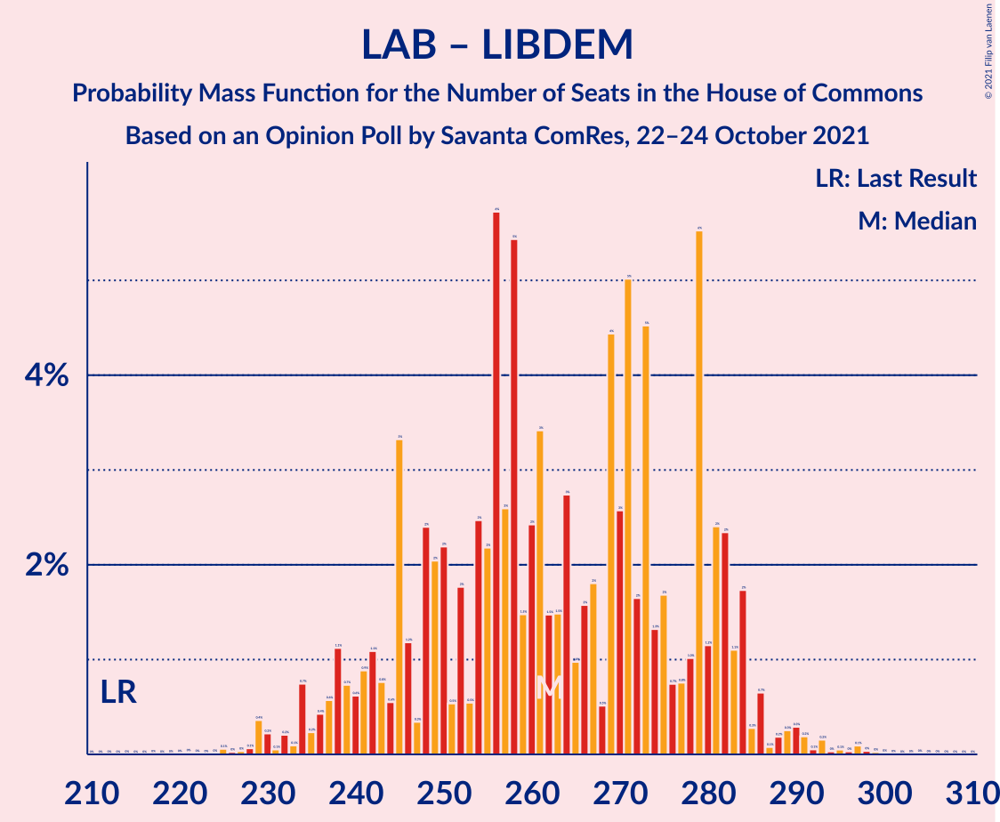

| Number of Seats | Probability | Accumulated | Special Marks |
|:---------------:|:-----------:|:-----------:|:-------------:|
| 213 | 0% | 100% | Last Result |
| 214 | 0% | 100% |  |
| 215 | 0% | 100% |  |
| 216 | 0% | 100% |  |
| 217 | 0% | 100% |  |
| 218 | 0% | 100% |  |
| 219 | 0% | 100% |  |
| 220 | 0% | 100% |  |
| 221 | 0% | 100% |  |
| 222 | 0% | 100% |  |
| 223 | 0% | 100% |  |
| 224 | 0% | 99.9% |  |
| 225 | 0.1% | 99.9% |  |
| 226 | 0% | 99.8% |  |
| 227 | 0.1% | 99.8% |  |
| 228 | 0% | 99.8% |  |
| 229 | 0.1% | 99.7% |  |
| 230 | 0.4% | 99.6% |  |
| 231 | 0.1% | 99.2% |  |
| 232 | 0.2% | 99.2% |  |
| 233 | 0.1% | 99.0% |  |
| 234 | 1.2% | 98.9% |  |
| 235 | 0.1% | 98% |  |
| 236 | 0.7% | 98% |  |
| 237 | 0.1% | 97% |  |
| 238 | 1.2% | 97% |  |
| 239 | 0.7% | 96% |  |
| 240 | 1.2% | 95% |  |
| 241 | 0.7% | 94% |  |
| 242 | 0.1% | 93% |  |
| 243 | 1.2% | 93% |  |
| 244 | 0.9% | 92% |  |
| 245 | 5% | 91% |  |
| 246 | 2% | 85% |  |
| 247 | 0.4% | 84% |  |
| 248 | 1.4% | 83% |  |
| 249 | 1.0% | 82% |  |
| 250 | 4% | 81% |  |
| 251 | 0.7% | 77% |  |
| 252 | 3% | 76% |  |
| 253 | 0.7% | 73% |  |
| 254 | 3% | 72% |  |
| 255 | 1.0% | 70% |  |
| 256 | 4% | 69% |  |
| 257 | 2% | 64% |  |
| 258 | 8% | 62% |  |
| 259 | 1.2% | 54% |  |
| 260 | 3% | 53% | Median |
| 261 | 2% | 50% |  |
| 262 | 2% | 48% |  |
| 263 | 1.1% | 45% |  |
| 264 | 4% | 44% |  |
| 265 | 0.3% | 40% |  |
| 266 | 0.7% | 40% |  |
| 267 | 3% | 39% |  |
| 268 | 0.6% | 36% |  |
| 269 | 3% | 36% |  |
| 270 | 1.0% | 32% |  |
| 271 | 5% | 31% |  |
| 272 | 2% | 26% |  |
| 273 | 0.4% | 23% |  |
| 274 | 2% | 23% |  |
| 275 | 2% | 21% |  |
| 276 | 0.9% | 19% |  |
| 277 | 1.3% | 18% |  |
| 278 | 0.6% | 17% |  |
| 279 | 5% | 16% |  |
| 280 | 1.0% | 12% |  |
| 281 | 2% | 10% |  |
| 282 | 2% | 8% |  |
| 283 | 2% | 6% |  |
| 284 | 2% | 4% |  |
| 285 | 0.2% | 2% |  |
| 286 | 0.4% | 2% |  |
| 287 | 0% | 2% |  |
| 288 | 0.1% | 2% |  |
| 289 | 0.4% | 1.4% |  |
| 290 | 0.2% | 1.1% |  |
| 291 | 0.3% | 0.8% |  |
| 292 | 0.1% | 0.5% |  |
| 293 | 0.2% | 0.5% |  |
| 294 | 0.1% | 0.3% |  |
| 295 | 0.1% | 0.3% |  |
| 296 | 0% | 0.2% |  |
| 297 | 0% | 0.2% |  |
| 298 | 0% | 0.1% |  |
| 299 | 0% | 0.1% |  |
| 300 | 0% | 0% |  |

### Labour Party – Plaid Cymru

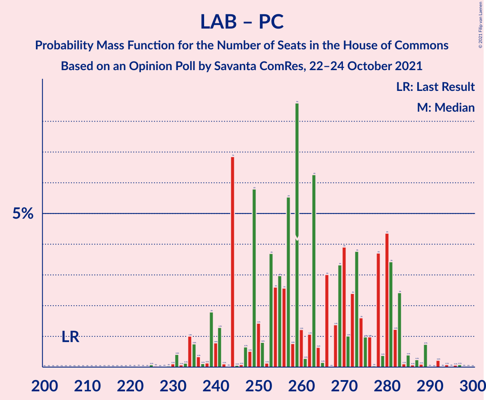

| Number of Seats | Probability | Accumulated | Special Marks |
|:---------------:|:-----------:|:-----------:|:-------------:|
| 206 | 0% | 100% | Last Result |
| 207 | 0% | 100% |  |
| 208 | 0% | 100% |  |
| 209 | 0% | 100% |  |
| 210 | 0% | 100% |  |
| 211 | 0% | 100% |  |
| 212 | 0% | 100% |  |
| 213 | 0% | 100% |  |
| 214 | 0% | 100% |  |
| 215 | 0% | 100% |  |
| 216 | 0% | 100% |  |
| 217 | 0% | 100% |  |
| 218 | 0% | 100% |  |
| 219 | 0% | 100% |  |
| 220 | 0% | 100% |  |
| 221 | 0% | 100% |  |
| 222 | 0% | 100% |  |
| 223 | 0% | 100% |  |
| 224 | 0% | 100% |  |
| 225 | 0.1% | 99.9% |  |
| 226 | 0% | 99.9% |  |
| 227 | 0% | 99.8% |  |
| 228 | 0% | 99.8% |  |
| 229 | 0% | 99.8% |  |
| 230 | 0.1% | 99.8% |  |
| 231 | 0.4% | 99.7% |  |
| 232 | 0.1% | 99.3% |  |
| 233 | 0.1% | 99.2% |  |
| 234 | 1.0% | 99.1% |  |
| 235 | 0.8% | 98% |  |
| 236 | 0.3% | 97% |  |
| 237 | 0.1% | 97% |  |
| 238 | 0.1% | 97% |  |
| 239 | 2% | 97% |  |
| 240 | 0.8% | 95% |  |
| 241 | 1.3% | 94% |  |
| 242 | 0.1% | 93% |  |
| 243 | 0% | 93% |  |
| 244 | 7% | 93% |  |
| 245 | 0.1% | 86% |  |
| 246 | 0.1% | 86% |  |
| 247 | 0.7% | 86% |  |
| 248 | 0.5% | 85% |  |
| 249 | 6% | 85% |  |
| 250 | 1.4% | 79% |  |
| 251 | 0.8% | 77% |  |
| 252 | 0.1% | 77% |  |
| 253 | 4% | 76% |  |
| 254 | 3% | 73% |  |
| 255 | 3% | 70% |  |
| 256 | 3% | 67% |  |
| 257 | 6% | 65% |  |
| 258 | 0.8% | 59% |  |
| 259 | 9% | 58% | Median |
| 260 | 1.2% | 50% |  |
| 261 | 0.3% | 48% |  |
| 262 | 1.1% | 48% |  |
| 263 | 6% | 47% |  |
| 264 | 0.6% | 41% |  |
| 265 | 0.2% | 40% |  |
| 266 | 3% | 40% |  |
| 267 | 0% | 37% |  |
| 268 | 1.4% | 37% |  |
| 269 | 3% | 36% |  |
| 270 | 4% | 32% |  |
| 271 | 1.0% | 28% |  |
| 272 | 2% | 27% |  |
| 273 | 4% | 25% |  |
| 274 | 2% | 21% |  |
| 275 | 1.0% | 20% |  |
| 276 | 1.0% | 19% |  |
| 277 | 0% | 18% |  |
| 278 | 4% | 18% |  |
| 279 | 0.4% | 14% |  |
| 280 | 4% | 14% |  |
| 281 | 3% | 9% |  |
| 282 | 1.2% | 6% |  |
| 283 | 2% | 5% |  |
| 284 | 0.1% | 2% |  |
| 285 | 0.4% | 2% |  |
| 286 | 0.1% | 2% |  |
| 287 | 0.2% | 2% |  |
| 288 | 0.1% | 1.4% |  |
| 289 | 0.7% | 1.3% |  |
| 290 | 0% | 0.5% |  |
| 291 | 0% | 0.5% |  |
| 292 | 0.2% | 0.5% |  |
| 293 | 0% | 0.3% |  |
| 294 | 0.1% | 0.3% |  |
| 295 | 0% | 0.2% |  |
| 296 | 0.1% | 0.2% |  |
| 297 | 0.1% | 0.1% |  |
| 298 | 0% | 0% |  |

### Labour Party

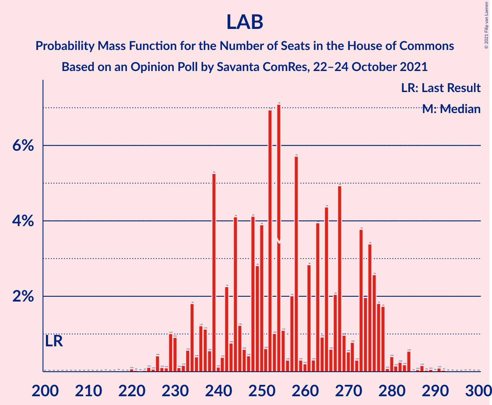

| Number of Seats | Probability | Accumulated | Special Marks |
|:---------------:|:-----------:|:-----------:|:-------------:|
| 202 | 0% | 100% | Last Result |
| 203 | 0% | 100% |  |
| 204 | 0% | 100% |  |
| 205 | 0% | 100% |  |
| 206 | 0% | 100% |  |
| 207 | 0% | 100% |  |
| 208 | 0% | 100% |  |
| 209 | 0% | 100% |  |
| 210 | 0% | 100% |  |
| 211 | 0% | 100% |  |
| 212 | 0% | 100% |  |
| 213 | 0% | 100% |  |
| 214 | 0% | 100% |  |
| 215 | 0% | 100% |  |
| 216 | 0% | 100% |  |
| 217 | 0% | 100% |  |
| 218 | 0% | 99.9% |  |
| 219 | 0% | 99.9% |  |
| 220 | 0.1% | 99.9% |  |
| 221 | 0% | 99.9% |  |
| 222 | 0% | 99.8% |  |
| 223 | 0% | 99.8% |  |
| 224 | 0.1% | 99.8% |  |
| 225 | 0.1% | 99.7% |  |
| 226 | 0.4% | 99.6% |  |
| 227 | 0.1% | 99.2% |  |
| 228 | 0.1% | 99.1% |  |
| 229 | 1.0% | 99.0% |  |
| 230 | 0.9% | 98% |  |
| 231 | 0.1% | 97% |  |
| 232 | 0.2% | 97% |  |
| 233 | 0.6% | 97% |  |
| 234 | 2% | 96% |  |
| 235 | 0.4% | 94% |  |
| 236 | 1.2% | 94% |  |
| 237 | 1.1% | 93% |  |
| 238 | 0.6% | 92% |  |
| 239 | 5% | 91% |  |
| 240 | 0.1% | 86% |  |
| 241 | 0.4% | 86% |  |
| 242 | 2% | 85% |  |
| 243 | 0.8% | 83% |  |
| 244 | 4% | 82% |  |
| 245 | 1.2% | 78% |  |
| 246 | 0.6% | 77% |  |
| 247 | 0.4% | 76% |  |
| 248 | 4% | 76% |  |
| 249 | 3% | 72% |  |
| 250 | 4% | 69% |  |
| 251 | 0.6% | 65% |  |
| 252 | 7% | 65% |  |
| 253 | 1.0% | 58% |  |
| 254 | 7% | 57% | Median |
| 255 | 1.1% | 50% |  |
| 256 | 0.3% | 48% |  |
| 257 | 2% | 48% |  |
| 258 | 6% | 46% |  |
| 259 | 0.3% | 40% |  |
| 260 | 0.2% | 40% |  |
| 261 | 3% | 40% |  |
| 262 | 0.3% | 37% |  |
| 263 | 4% | 37% |  |
| 264 | 0.9% | 33% |  |
| 265 | 4% | 32% |  |
| 266 | 0.6% | 28% |  |
| 267 | 2% | 27% |  |
| 268 | 5% | 25% |  |
| 269 | 1.0% | 20% |  |
| 270 | 0.5% | 19% |  |
| 271 | 0.8% | 18% |  |
| 272 | 0.3% | 18% |  |
| 273 | 4% | 17% |  |
| 274 | 2% | 14% |  |
| 275 | 3% | 12% |  |
| 276 | 3% | 8% |  |
| 277 | 2% | 6% |  |
| 278 | 2% | 4% |  |
| 279 | 0.1% | 2% |  |
| 280 | 0.4% | 2% |  |
| 281 | 0.1% | 2% |  |
| 282 | 0.2% | 2% |  |
| 283 | 0.2% | 1.3% |  |
| 284 | 0.5% | 1.1% |  |
| 285 | 0% | 0.5% |  |
| 286 | 0.1% | 0.5% |  |
| 287 | 0.2% | 0.5% |  |
| 288 | 0% | 0.3% |  |
| 289 | 0.1% | 0.3% |  |
| 290 | 0% | 0.2% |  |
| 291 | 0.1% | 0.2% |  |
| 292 | 0% | 0.1% |  |
| 293 | 0% | 0% |  |

## Technical Information

### Opinion Poll

+ **Polling firm:** Savanta ComRes
+ **Commissioner(s):** —
+ **Fieldwork period:** 22–24 October 2021

### Calculations

+ **Sample size:** 2015
+ **Simulations done:** 131,072
+ **Error estimate:** 1.37%

