# Opinion Poll by Deltapoll, 2–4 December 2021

<a href="#voting-intentions">Voting Intentions</a> | <a href="#seats">Seats</a> | <a href="#coalitions">Coalitions</a> | <a href="#technical-information">Technical Information</a>

## Voting Intentions

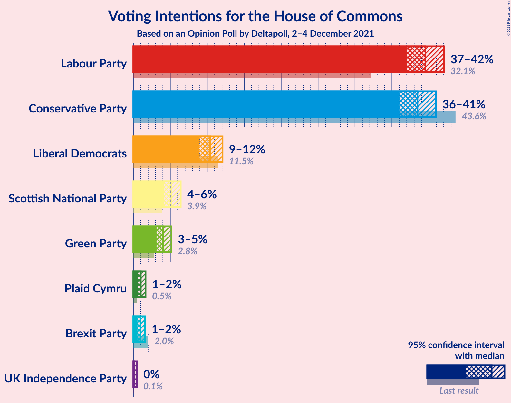

### Confidence Intervals

| Party | Last Result | Poll Result | 80% Confidence Interval | 90% Confidence Interval | 95% Confidence Interval | 99% Confidence Interval |
|:-----:|:-----------:|:-----------:|:-----------------------:|:-----------------------:|:-----------------------:|:-----------------------:|
| Labour Party | 32.1% | 39.5% | 37.9–41.2% |37.5–41.6% |37.1–42.1% |36.3–42.8% |
| Conservative Party | 43.6% | 38.5% | 36.9–40.1% |36.4–40.6% |36.0–41.0% |35.3–41.7% |
| Liberal Democrats | 11.5% | 10.4% | 9.4–11.5% |9.2–11.8% |8.9–12.1% |8.5–12.6% |
| Scottish National Party | 3.9% | 5.2% | 4.5–6.0% |4.3–6.2% |4.1–6.4% |3.9–6.8% |
| Green Party | 2.8% | 4.0% | 3.4–4.8% |3.3–5.0% |3.1–5.2% |2.9–5.5% |
| Plaid Cymru | 0.5% | 1.0% | 0.7–1.4% |0.7–1.6% |0.6–1.7% |0.5–1.9% |
| Brexit Party | 2.0% | 0.9% | 0.7–1.4% |0.6–1.5% |0.6–1.6% |0.5–1.8% |
| UK Independence Party | 0.1% | 0.1% | 0.1–0.4% |0.0–0.4% |0.0–0.5% |0.0–0.6% |

*Note:* The poll result column reflects the actual value used in the calculations. Published results may vary slightly, and in addition be rounded to fewer digits.

## Seats

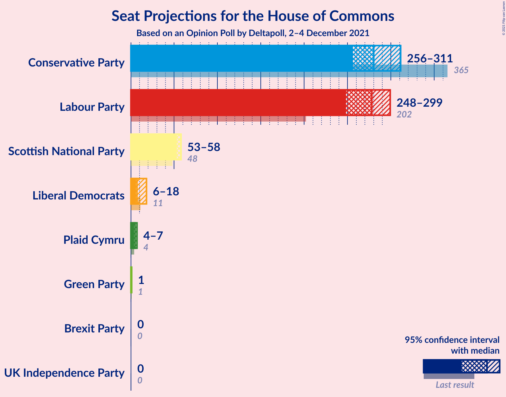

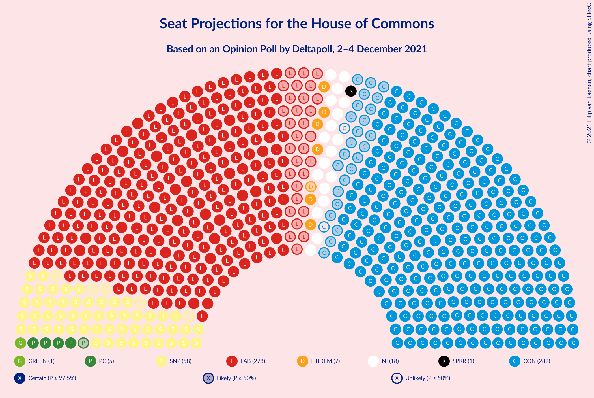

### Confidence Intervals

| Party | Last Result | Median | 80% Confidence Interval | 90% Confidence Interval | 95% Confidence Interval | 99% Confidence Interval |
|:-----:|:-----------:|:------:|:-----------------------:|:-----------------------:|:-----------------------:|:-----------------------:|
| <a href="#labour-party">Labour Party</a> | 202 | 278 | 261–292 |258–293 |248–299 |240–308 |
| <a href="#conservative-party">Conservative Party</a> | 365 | 280 | 268–298 |262–303 |256–311 |243–319 |
| <a href="#liberal-democrats">Liberal Democrats</a> | 11 | 7 | 6–17 |6–18 |6–18 |6–21 |
| <a href="#scottish-national-party">Scottish National Party</a> | 48 | 58 | 56–58 |55–58 |53–58 |49–58 |
| <a href="#green-party">Green Party</a> | 1 | 1 | 1 |1 |1 |1 |
| <a href="#plaid-cymru">Plaid Cymru</a> | 4 | 5 | 5–6 |5–6 |4–7 |4–7 |
| <a href="#brexit-party">Brexit Party</a> | 0 | 0 | 0 |0 |0 |0 |
| <a href="#uk-independence-party">UK Independence Party</a> | 0 | 0 | 0 |0 |0 |0 |

### Labour Party

*For a full overview of the results for this party, see the [Labour Party](party-labourparty.html) page.*

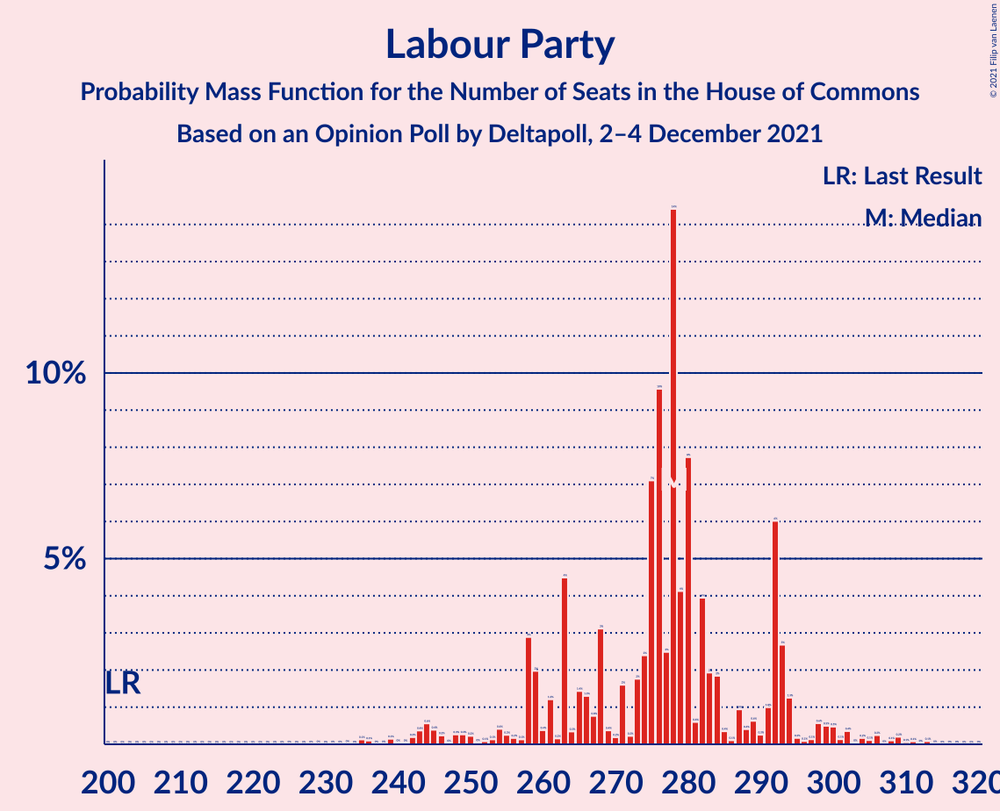

| Number of Seats | Probability | Accumulated | Special Marks |
|:---------------:|:-----------:|:-----------:|:-------------:|
| 202 | 0% | 100% | Last Result |
| 203 | 0% | 100% |  |
| 204 | 0% | 100% |  |
| 205 | 0% | 100% |  |
| 206 | 0% | 100% |  |
| 207 | 0% | 100% |  |
| 208 | 0% | 100% |  |
| 209 | 0% | 100% |  |
| 210 | 0% | 100% |  |
| 211 | 0% | 100% |  |
| 212 | 0% | 100% |  |
| 213 | 0% | 100% |  |
| 214 | 0% | 100% |  |
| 215 | 0% | 100% |  |
| 216 | 0% | 100% |  |
| 217 | 0% | 100% |  |
| 218 | 0% | 100% |  |
| 219 | 0% | 100% |  |
| 220 | 0% | 100% |  |
| 221 | 0% | 100% |  |
| 222 | 0% | 100% |  |
| 223 | 0% | 100% |  |
| 224 | 0% | 100% |  |
| 225 | 0% | 100% |  |
| 226 | 0% | 100% |  |
| 227 | 0% | 100% |  |
| 228 | 0% | 100% |  |
| 229 | 0% | 100% |  |
| 230 | 0% | 100% |  |
| 231 | 0% | 100% |  |
| 232 | 0% | 100% |  |
| 233 | 0% | 100% |  |
| 234 | 0% | 99.9% |  |
| 235 | 0.1% | 99.9% |  |
| 236 | 0.1% | 99.8% |  |
| 237 | 0% | 99.7% |  |
| 238 | 0% | 99.7% |  |
| 239 | 0.1% | 99.7% |  |
| 240 | 0% | 99.5% |  |
| 241 | 0% | 99.5% |  |
| 242 | 0.2% | 99.4% |  |
| 243 | 0.4% | 99.3% |  |
| 244 | 0.6% | 98.9% |  |
| 245 | 0.4% | 98% |  |
| 246 | 0.2% | 98% |  |
| 247 | 0% | 98% |  |
| 248 | 0.3% | 98% |  |
| 249 | 0.3% | 97% |  |
| 250 | 0.2% | 97% |  |
| 251 | 0% | 97% |  |
| 252 | 0.1% | 97% |  |
| 253 | 0.1% | 97% |  |
| 254 | 0.4% | 97% |  |
| 255 | 0.3% | 96% |  |
| 256 | 0.2% | 96% |  |
| 257 | 0.1% | 96% |  |
| 258 | 3% | 96% |  |
| 259 | 2% | 93% |  |
| 260 | 0.4% | 91% |  |
| 261 | 1.2% | 90% |  |
| 262 | 0.2% | 89% |  |
| 263 | 4% | 89% |  |
| 264 | 0.3% | 85% |  |
| 265 | 1.4% | 84% |  |
| 266 | 1.3% | 83% |  |
| 267 | 0.8% | 81% |  |
| 268 | 3% | 81% |  |
| 269 | 0.4% | 78% |  |
| 270 | 0.2% | 77% |  |
| 271 | 2% | 77% |  |
| 272 | 0.2% | 75% |  |
| 273 | 2% | 75% |  |
| 274 | 2% | 73% |  |
| 275 | 7% | 71% |  |
| 276 | 10% | 64% |  |
| 277 | 2% | 54% |  |
| 278 | 14% | 52% | Median |
| 279 | 4% | 37% |  |
| 280 | 8% | 33% |  |
| 281 | 0.6% | 26% |  |
| 282 | 4% | 25% |  |
| 283 | 2% | 21% |  |
| 284 | 2% | 19% |  |
| 285 | 0.4% | 17% |  |
| 286 | 0.1% | 17% |  |
| 287 | 0.9% | 17% |  |
| 288 | 0.4% | 16% |  |
| 289 | 0.6% | 15% |  |
| 290 | 0.3% | 15% |  |
| 291 | 1.0% | 15% |  |
| 292 | 6% | 14% |  |
| 293 | 3% | 8% |  |
| 294 | 1.3% | 5% |  |
| 295 | 0.2% | 4% |  |
| 296 | 0.1% | 3% |  |
| 297 | 0.1% | 3% |  |
| 298 | 0.6% | 3% |  |
| 299 | 0.5% | 3% |  |
| 300 | 0.5% | 2% |  |
| 301 | 0.1% | 2% |  |
| 302 | 0.4% | 2% |  |
| 303 | 0% | 1.2% |  |
| 304 | 0.2% | 1.1% |  |
| 305 | 0.1% | 1.0% |  |
| 306 | 0.2% | 0.9% |  |
| 307 | 0% | 0.6% |  |
| 308 | 0.1% | 0.6% |  |
| 309 | 0.2% | 0.5% |  |
| 310 | 0.1% | 0.3% |  |
| 311 | 0.1% | 0.2% |  |
| 312 | 0% | 0.2% |  |
| 313 | 0.1% | 0.1% |  |
| 314 | 0% | 0% |  |

### Conservative Party

*For a full overview of the results for this party, see the [Conservative Party](party-conservativeparty.html) page.*

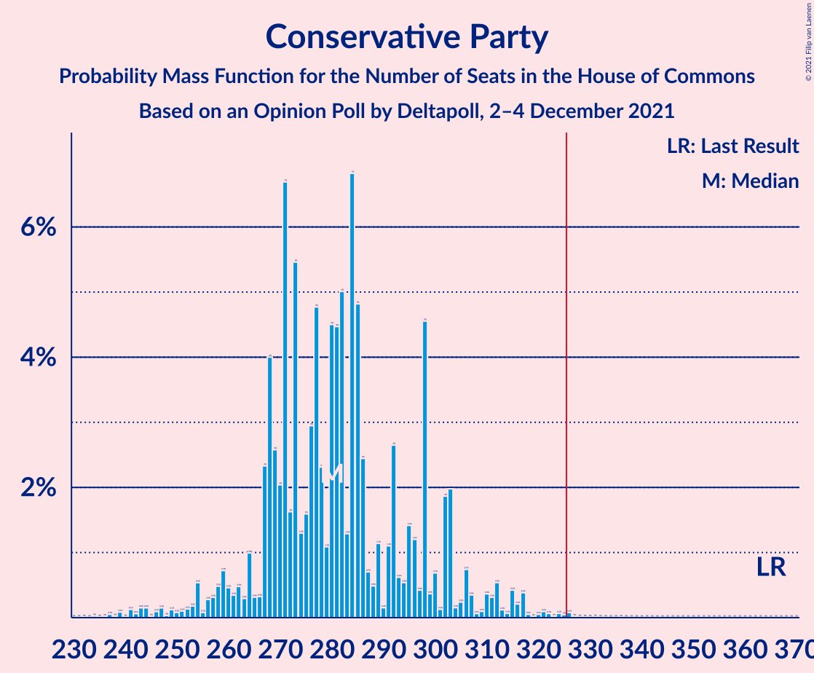

| Number of Seats | Probability | Accumulated | Special Marks |
|:---------------:|:-----------:|:-----------:|:-------------:|
| 235 | 0% | 100% |  |
| 236 | 0% | 99.9% |  |
| 237 | 0.1% | 99.9% |  |
| 238 | 0% | 99.9% |  |
| 239 | 0.1% | 99.9% |  |
| 240 | 0% | 99.8% |  |
| 241 | 0.1% | 99.8% |  |
| 242 | 0.1% | 99.6% |  |
| 243 | 0.2% | 99.6% |  |
| 244 | 0.2% | 99.4% |  |
| 245 | 0% | 99.3% |  |
| 246 | 0.1% | 99.2% |  |
| 247 | 0.1% | 99.2% |  |
| 248 | 0% | 99.0% |  |
| 249 | 0.1% | 99.0% |  |
| 250 | 0.1% | 98.9% |  |
| 251 | 0.1% | 98.8% |  |
| 252 | 0.1% | 98.7% |  |
| 253 | 0.2% | 98.5% |  |
| 254 | 0.5% | 98% |  |
| 255 | 0.1% | 98% |  |
| 256 | 0.3% | 98% |  |
| 257 | 0.3% | 97% |  |
| 258 | 0.5% | 97% |  |
| 259 | 0.7% | 97% |  |
| 260 | 0.5% | 96% |  |
| 261 | 0.3% | 95% |  |
| 262 | 0.5% | 95% |  |
| 263 | 0.3% | 95% |  |
| 264 | 1.0% | 94% |  |
| 265 | 0.3% | 93% |  |
| 266 | 0.3% | 93% |  |
| 267 | 2% | 93% |  |
| 268 | 4% | 90% |  |
| 269 | 3% | 86% |  |
| 270 | 2% | 84% |  |
| 271 | 7% | 82% |  |
| 272 | 2% | 75% |  |
| 273 | 5% | 73% |  |
| 274 | 1.3% | 68% |  |
| 275 | 2% | 67% |  |
| 276 | 3% | 65% |  |
| 277 | 5% | 62% |  |
| 278 | 2% | 57% |  |
| 279 | 1.1% | 55% |  |
| 280 | 5% | 54% | Median |
| 281 | 4% | 49% |  |
| 282 | 5% | 45% |  |
| 283 | 1.3% | 40% |  |
| 284 | 7% | 39% |  |
| 285 | 5% | 32% |  |
| 286 | 2% | 27% |  |
| 287 | 0.7% | 25% |  |
| 288 | 0.5% | 24% |  |
| 289 | 1.1% | 23% |  |
| 290 | 0.2% | 22% |  |
| 291 | 1.1% | 22% |  |
| 292 | 3% | 21% |  |
| 293 | 0.6% | 18% |  |
| 294 | 0.5% | 18% |  |
| 295 | 1.4% | 17% |  |
| 296 | 1.2% | 16% |  |
| 297 | 0.4% | 15% |  |
| 298 | 5% | 14% |  |
| 299 | 0.4% | 10% |  |
| 300 | 0.7% | 9% |  |
| 301 | 0.1% | 9% |  |
| 302 | 2% | 8% |  |
| 303 | 2% | 7% |  |
| 304 | 0.2% | 5% |  |
| 305 | 0.2% | 4% |  |
| 306 | 0.7% | 4% |  |
| 307 | 0.3% | 3% |  |
| 308 | 0.1% | 3% |  |
| 309 | 0.1% | 3% |  |
| 310 | 0.4% | 3% |  |
| 311 | 0.3% | 3% |  |
| 312 | 0.5% | 2% |  |
| 313 | 0.1% | 2% |  |
| 314 | 0.1% | 2% |  |
| 315 | 0.4% | 2% |  |
| 316 | 0.2% | 1.2% |  |
| 317 | 0.4% | 0.9% |  |
| 318 | 0.1% | 0.6% |  |
| 319 | 0% | 0.5% |  |
| 320 | 0.1% | 0.5% |  |
| 321 | 0.1% | 0.4% |  |
| 322 | 0.1% | 0.3% |  |
| 323 | 0% | 0.3% |  |
| 324 | 0.1% | 0.3% |  |
| 325 | 0% | 0.2% |  |
| 326 | 0.1% | 0.2% | Majority |
| 327 | 0% | 0.1% |  |
| 328 | 0% | 0.1% |  |
| 329 | 0% | 0% |  |
| 330 | 0% | 0% |  |
| 331 | 0% | 0% |  |
| 332 | 0% | 0% |  |
| 333 | 0% | 0% |  |
| 334 | 0% | 0% |  |
| 335 | 0% | 0% |  |
| 336 | 0% | 0% |  |
| 337 | 0% | 0% |  |
| 338 | 0% | 0% |  |
| 339 | 0% | 0% |  |
| 340 | 0% | 0% |  |
| 341 | 0% | 0% |  |
| 342 | 0% | 0% |  |
| 343 | 0% | 0% |  |
| 344 | 0% | 0% |  |
| 345 | 0% | 0% |  |
| 346 | 0% | 0% |  |
| 347 | 0% | 0% |  |
| 348 | 0% | 0% |  |
| 349 | 0% | 0% |  |
| 350 | 0% | 0% |  |
| 351 | 0% | 0% |  |
| 352 | 0% | 0% |  |
| 353 | 0% | 0% |  |
| 354 | 0% | 0% |  |
| 355 | 0% | 0% |  |
| 356 | 0% | 0% |  |
| 357 | 0% | 0% |  |
| 358 | 0% | 0% |  |
| 359 | 0% | 0% |  |
| 360 | 0% | 0% |  |
| 361 | 0% | 0% |  |
| 362 | 0% | 0% |  |
| 363 | 0% | 0% |  |
| 364 | 0% | 0% |  |
| 365 | 0% | 0% | Last Result |

### Liberal Democrats

*For a full overview of the results for this party, see the [Liberal Democrats](party-liberaldemocrats.html) page.*

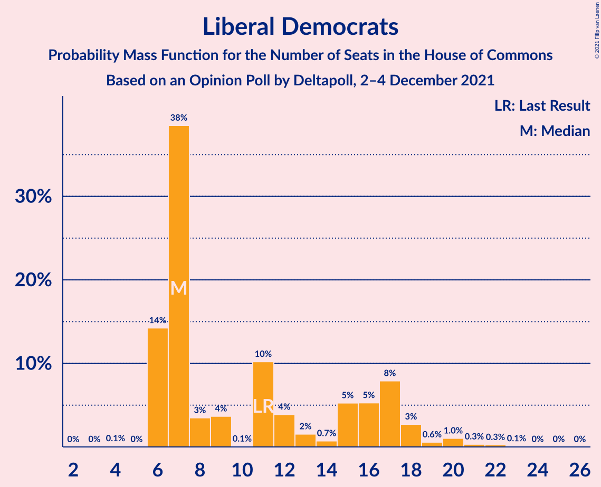

| Number of Seats | Probability | Accumulated | Special Marks |
|:---------------:|:-----------:|:-----------:|:-------------:|
| 4 | 0.1% | 100% |  |
| 5 | 0% | 99.9% |  |
| 6 | 14% | 99.9% |  |
| 7 | 38% | 86% | Median |
| 8 | 3% | 47% |  |
| 9 | 4% | 44% |  |
| 10 | 0.1% | 40% |  |
| 11 | 10% | 40% | Last Result |
| 12 | 4% | 30% |  |
| 13 | 2% | 26% |  |
| 14 | 0.7% | 24% |  |
| 15 | 5% | 24% |  |
| 16 | 5% | 18% |  |
| 17 | 8% | 13% |  |
| 18 | 3% | 5% |  |
| 19 | 0.6% | 2% |  |
| 20 | 1.0% | 2% |  |
| 21 | 0.3% | 0.8% |  |
| 22 | 0.3% | 0.4% |  |
| 23 | 0.1% | 0.2% |  |
| 24 | 0% | 0.1% |  |
| 25 | 0% | 0.1% |  |
| 26 | 0% | 0% |  |

### Scottish National Party

*For a full overview of the results for this party, see the [Scottish National Party](party-scottishnationalparty.html) page.*

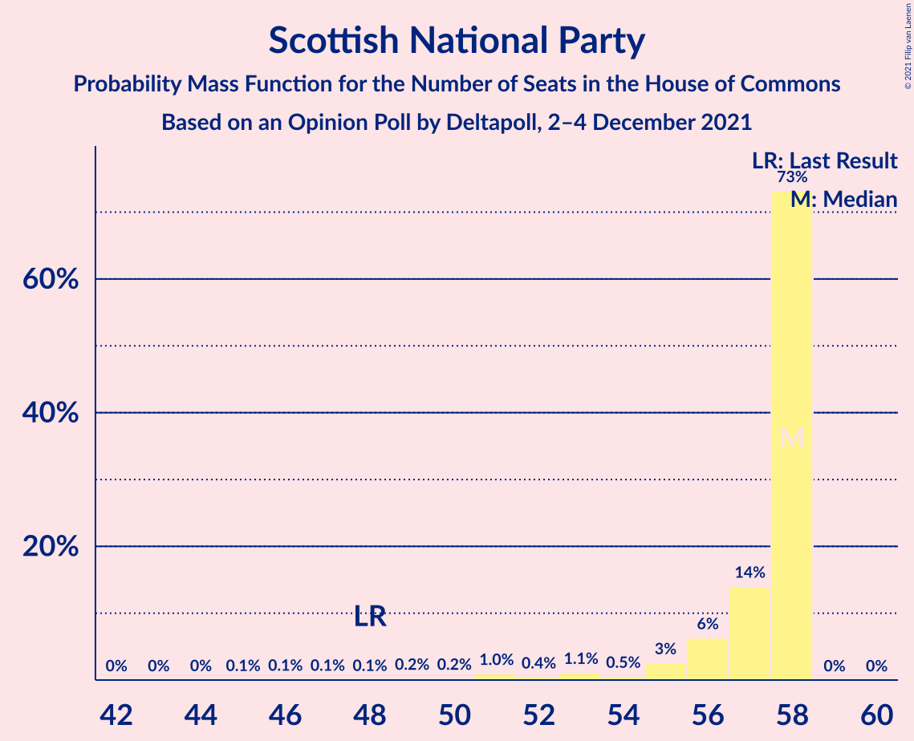

| Number of Seats | Probability | Accumulated | Special Marks |
|:---------------:|:-----------:|:-----------:|:-------------:|
| 42 | 0% | 100% |  |
| 43 | 0% | 99.9% |  |
| 44 | 0% | 99.9% |  |
| 45 | 0.1% | 99.9% |  |
| 46 | 0.1% | 99.8% |  |
| 47 | 0.1% | 99.7% |  |
| 48 | 0.1% | 99.6% | Last Result |
| 49 | 0.2% | 99.6% |  |
| 50 | 0.2% | 99.3% |  |
| 51 | 1.0% | 99.1% |  |
| 52 | 0.4% | 98% |  |
| 53 | 1.1% | 98% |  |
| 54 | 0.5% | 97% |  |
| 55 | 3% | 96% |  |
| 56 | 6% | 94% |  |
| 57 | 14% | 87% |  |
| 58 | 73% | 73% | Median |
| 59 | 0% | 0% |  |

### Green Party

*For a full overview of the results for this party, see the [Green Party](party-greenparty.html) page.*

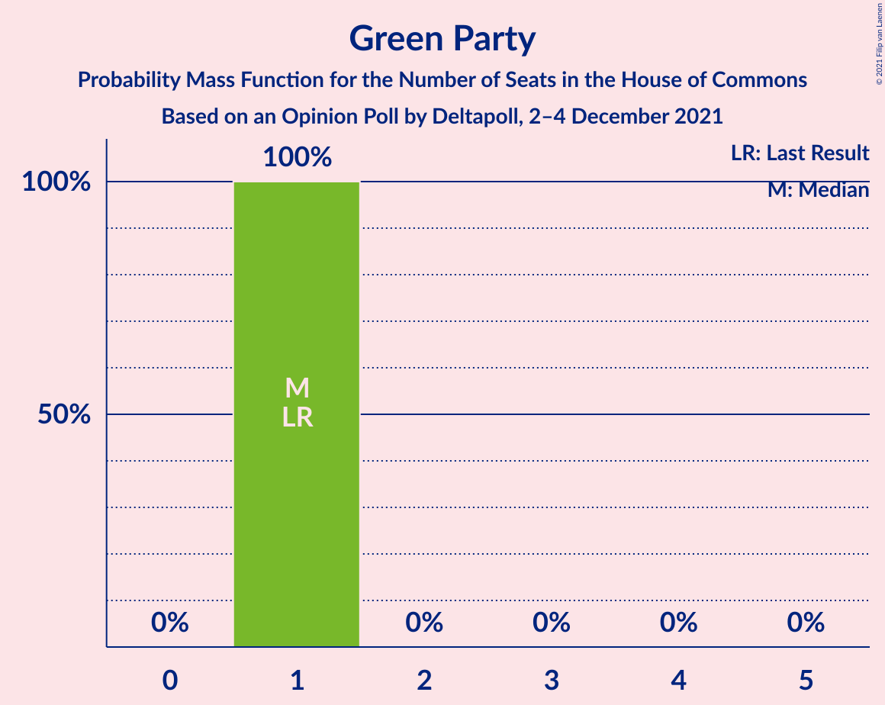

| Number of Seats | Probability | Accumulated | Special Marks |
|:---------------:|:-----------:|:-----------:|:-------------:|
| 1 | 100% | 100% | Last Result, Median |

### Plaid Cymru

*For a full overview of the results for this party, see the [Plaid Cymru](party-plaidcymru.html) page.*

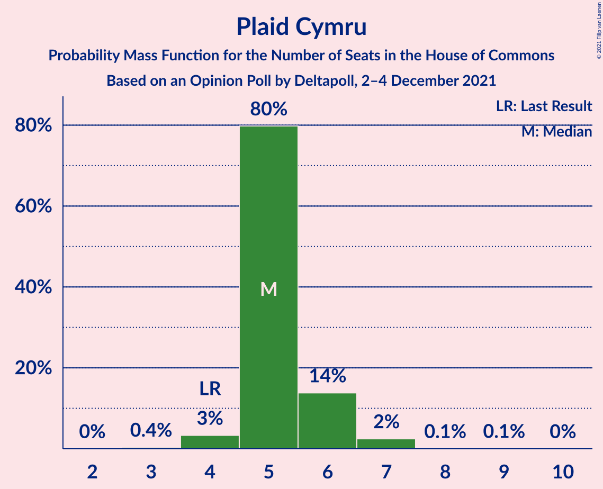

| Number of Seats | Probability | Accumulated | Special Marks |
|:---------------:|:-----------:|:-----------:|:-------------:|
| 3 | 0.4% | 100% |  |
| 4 | 3% | 99.6% | Last Result |
| 5 | 80% | 96% | Median |
| 6 | 14% | 16% |  |
| 7 | 2% | 3% |  |
| 8 | 0.1% | 0.2% |  |
| 9 | 0.1% | 0.1% |  |
| 10 | 0% | 0% |  |

### Brexit Party

*For a full overview of the results for this party, see the [Brexit Party](party-brexitparty.html) page.*

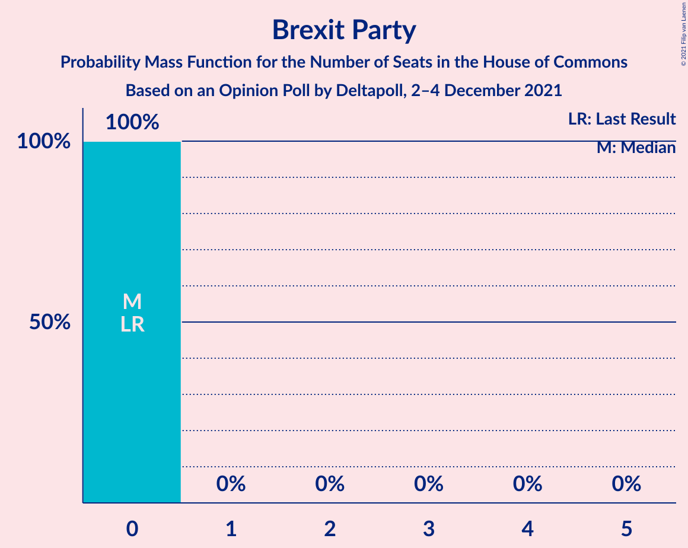

| Number of Seats | Probability | Accumulated | Special Marks |
|:---------------:|:-----------:|:-----------:|:-------------:|
| 0 | 100% | 100% | Last Result, Median |

### UK Independence Party

*For a full overview of the results for this party, see the [UK Independence Party](party-ukindependenceparty.html) page.*

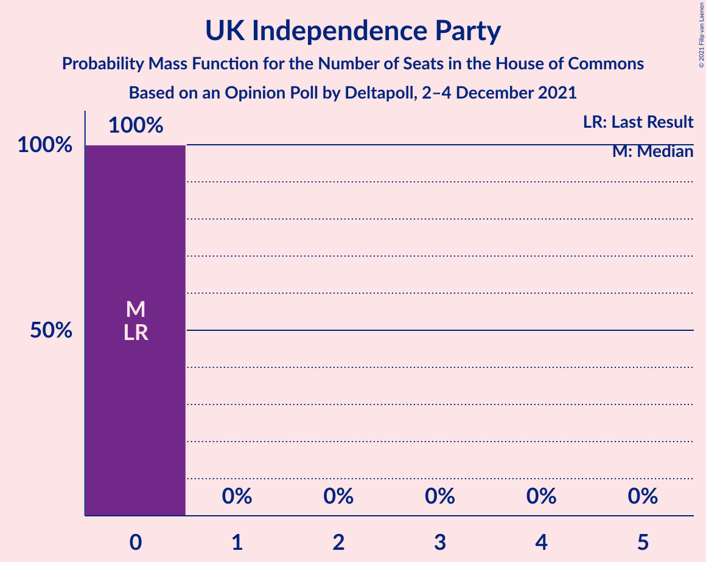

| Number of Seats | Probability | Accumulated | Special Marks |
|:---------------:|:-----------:|:-----------:|:-------------:|
| 0 | 100% | 100% | Last Result, Median |

## Coalitions

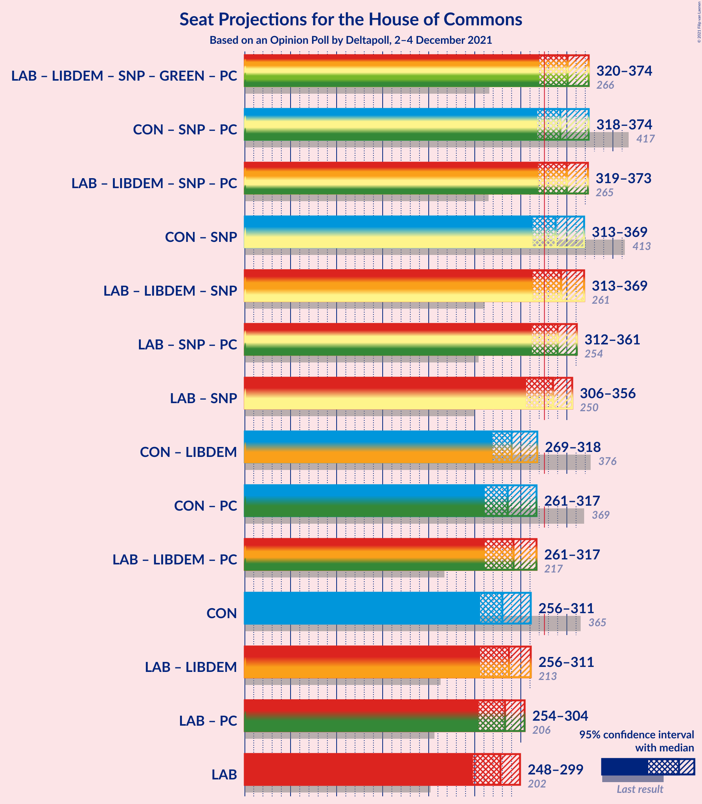

### Confidence Intervals

| Coalition | Last Result | Median | Majority? | 80% Confidence Interval | 90% Confidence Interval | 95% Confidence Interval | 99% Confidence Interval |
|:---------:|:-----------:|:------:|:---------:|:-----------------------:|:-----------------------:|:-----------------------:|:-----------------------:|
| Labour Party – Liberal Democrats – Scottish National Party – Green Party – Plaid Cymru | 266 | 351 | 96% | 333–363 | 328–369 | 320–374 | 312–387 |
| Conservative Party – Scottish National Party – Plaid Cymru | 417 | 343 | 94% | 330–361 | 324–366 | 318–374 | 306–382 |
| Labour Party – Liberal Democrats – Scottish National Party – Plaid Cymru | 265 | 350 | 96% | 332–362 | 327–368 | 319–373 | 311–386 |
| Conservative Party – Scottish National Party | 413 | 338 | 89% | 325–356 | 318–361 | 313–369 | 301–376 |
| Labour Party – Liberal Democrats – Scottish National Party | 261 | 344 | 91% | 327–357 | 322–363 | 313–369 | 305–381 |
| Labour Party – Scottish National Party – Plaid Cymru | 254 | 340 | 89% | 324–355 | 320–356 | 312–361 | 302–371 |
| Labour Party – Scottish National Party | 250 | 335 | 80% | 319–350 | 314–351 | 306–356 | 297–366 |
| Conservative Party – Liberal Democrats | 376 | 290 | 0.6% | 275–306 | 274–310 | 269–318 | 258–328 |
| Conservative Party – Plaid Cymru | 369 | 286 | 0.4% | 273–303 | 267–308 | 261–317 | 248–325 |
| Labour Party – Liberal Democrats – Plaid Cymru | 217 | 292 | 0.9% | 274–305 | 269–312 | 261–317 | 254–328 |
| Conservative Party | 365 | 280 | 0.2% | 268–298 | 262–303 | 256–311 | 243–319 |
| Labour Party – Liberal Democrats | 213 | 287 | 0.3% | 269–300 | 264–306 | 256–311 | 248–323 |
| Labour Party – Plaid Cymru | 206 | 283 | 0% | 266–297 | 263–298 | 254–304 | 246–313 |
| Labour Party | 202 | 278 | 0% | 261–292 | 258–293 | 248–299 | 240–308 |

### Labour Party – Liberal Democrats – Scottish National Party – Green Party – Plaid Cymru

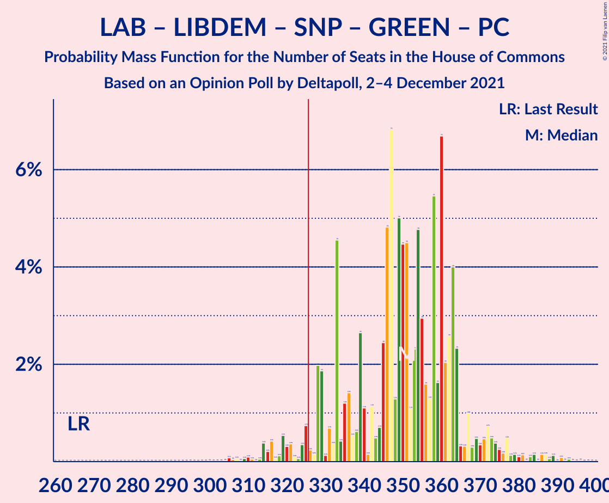

| Number of Seats | Probability | Accumulated | Special Marks |
|:---------------:|:-----------:|:-----------:|:-------------:|
| 266 | 0% | 100% | Last Result |
| 267 | 0% | 100% |  |
| 268 | 0% | 100% |  |
| 269 | 0% | 100% |  |
| 270 | 0% | 100% |  |
| 271 | 0% | 100% |  |
| 272 | 0% | 100% |  |
| 273 | 0% | 100% |  |
| 274 | 0% | 100% |  |
| 275 | 0% | 100% |  |
| 276 | 0% | 100% |  |
| 277 | 0% | 100% |  |
| 278 | 0% | 100% |  |
| 279 | 0% | 100% |  |
| 280 | 0% | 100% |  |
| 281 | 0% | 100% |  |
| 282 | 0% | 100% |  |
| 283 | 0% | 100% |  |
| 284 | 0% | 100% |  |
| 285 | 0% | 100% |  |
| 286 | 0% | 100% |  |
| 287 | 0% | 100% |  |
| 288 | 0% | 100% |  |
| 289 | 0% | 100% |  |
| 290 | 0% | 100% |  |
| 291 | 0% | 100% |  |
| 292 | 0% | 100% |  |
| 293 | 0% | 100% |  |
| 294 | 0% | 100% |  |
| 295 | 0% | 100% |  |
| 296 | 0% | 100% |  |
| 297 | 0% | 100% |  |
| 298 | 0% | 100% |  |
| 299 | 0% | 100% |  |
| 300 | 0% | 100% |  |
| 301 | 0% | 100% |  |
| 302 | 0% | 100% |  |
| 303 | 0% | 100% |  |
| 304 | 0% | 99.9% |  |
| 305 | 0.1% | 99.9% |  |
| 306 | 0% | 99.8% |  |
| 307 | 0.1% | 99.8% |  |
| 308 | 0% | 99.7% |  |
| 309 | 0.1% | 99.7% |  |
| 310 | 0.1% | 99.7% |  |
| 311 | 0.1% | 99.6% |  |
| 312 | 0% | 99.5% |  |
| 313 | 0.1% | 99.5% |  |
| 314 | 0.4% | 99.4% |  |
| 315 | 0.2% | 99.1% |  |
| 316 | 0.4% | 98.8% |  |
| 317 | 0.1% | 98% |  |
| 318 | 0.1% | 98% |  |
| 319 | 0.5% | 98% |  |
| 320 | 0.3% | 98% |  |
| 321 | 0.4% | 97% |  |
| 322 | 0.1% | 97% |  |
| 323 | 0.1% | 97% |  |
| 324 | 0.3% | 97% |  |
| 325 | 0.7% | 97% |  |
| 326 | 0.2% | 96% | Majority |
| 327 | 0.2% | 96% |  |
| 328 | 2% | 95% |  |
| 329 | 2% | 93% |  |
| 330 | 0.1% | 92% |  |
| 331 | 0.7% | 91% |  |
| 332 | 0.4% | 91% |  |
| 333 | 5% | 90% |  |
| 334 | 0.4% | 86% |  |
| 335 | 1.2% | 85% |  |
| 336 | 1.4% | 84% |  |
| 337 | 0.5% | 83% |  |
| 338 | 0.6% | 82% |  |
| 339 | 3% | 82% |  |
| 340 | 1.1% | 79% |  |
| 341 | 0.2% | 78% |  |
| 342 | 1.1% | 78% |  |
| 343 | 0.5% | 77% |  |
| 344 | 0.7% | 76% |  |
| 345 | 2% | 75% |  |
| 346 | 5% | 73% |  |
| 347 | 7% | 68% |  |
| 348 | 1.3% | 61% |  |
| 349 | 5% | 60% | Median |
| 350 | 4% | 55% |  |
| 351 | 5% | 51% |  |
| 352 | 1.1% | 46% |  |
| 353 | 2% | 45% |  |
| 354 | 5% | 43% |  |
| 355 | 3% | 38% |  |
| 356 | 2% | 35% |  |
| 357 | 1.3% | 33% |  |
| 358 | 5% | 32% |  |
| 359 | 2% | 27% |  |
| 360 | 7% | 25% |  |
| 361 | 2% | 18% |  |
| 362 | 3% | 16% |  |
| 363 | 4% | 14% |  |
| 364 | 2% | 10% |  |
| 365 | 0.3% | 7% |  |
| 366 | 0.3% | 7% |  |
| 367 | 1.0% | 7% |  |
| 368 | 0.3% | 6% |  |
| 369 | 0.5% | 5% |  |
| 370 | 0.3% | 5% |  |
| 371 | 0.5% | 5% |  |
| 372 | 0.7% | 4% |  |
| 373 | 0.5% | 3% |  |
| 374 | 0.4% | 3% |  |
| 375 | 0.3% | 2% |  |
| 376 | 0.2% | 2% |  |
| 377 | 0.5% | 2% |  |
| 378 | 0.1% | 2% |  |
| 379 | 0.1% | 1.4% |  |
| 380 | 0.1% | 1.3% |  |
| 381 | 0.1% | 1.2% |  |
| 382 | 0% | 1.0% |  |
| 383 | 0.1% | 1.0% |  |
| 384 | 0.1% | 0.9% |  |
| 385 | 0% | 0.8% |  |
| 386 | 0.1% | 0.7% |  |
| 387 | 0.2% | 0.6% |  |
| 388 | 0.1% | 0.4% |  |
| 389 | 0.1% | 0.4% |  |
| 390 | 0% | 0.2% |  |
| 391 | 0.1% | 0.2% |  |
| 392 | 0% | 0.1% |  |
| 393 | 0.1% | 0.1% |  |
| 394 | 0% | 0.1% |  |
| 395 | 0% | 0.1% |  |
| 396 | 0% | 0% |  |

### Conservative Party – Scottish National Party – Plaid Cymru

| Number of Seats | Probability | Accumulated | Special Marks |
|:---------------:|:-----------:|:-----------:|:-------------:|
| 297 | 0% | 100% |  |
| 298 | 0% | 99.9% |  |
| 299 | 0% | 99.9% |  |
| 300 | 0% | 99.9% |  |
| 301 | 0% | 99.9% |  |
| 302 | 0.1% | 99.8% |  |
| 303 | 0% | 99.7% |  |
| 304 | 0.1% | 99.7% |  |
| 305 | 0% | 99.6% |  |
| 306 | 0.2% | 99.6% |  |
| 307 | 0.2% | 99.4% |  |
| 308 | 0.1% | 99.2% |  |
| 309 | 0.1% | 99.1% |  |
| 310 | 0.1% | 99.0% |  |
| 311 | 0% | 98.9% |  |
| 312 | 0.2% | 98.9% |  |
| 313 | 0.1% | 98.8% |  |
| 314 | 0.2% | 98.7% |  |
| 315 | 0.5% | 98% |  |
| 316 | 0.1% | 98% |  |
| 317 | 0.2% | 98% |  |
| 318 | 0.2% | 98% |  |
| 319 | 0.4% | 97% |  |
| 320 | 0.5% | 97% |  |
| 321 | 0.6% | 97% |  |
| 322 | 0.6% | 96% |  |
| 323 | 0.4% | 95% |  |
| 324 | 0.2% | 95% |  |
| 325 | 0.4% | 95% |  |
| 326 | 1.1% | 94% | Majority |
| 327 | 0.9% | 93% |  |
| 328 | 0.7% | 92% |  |
| 329 | 0.3% | 92% |  |
| 330 | 2% | 91% |  |
| 331 | 6% | 89% |  |
| 332 | 0.8% | 83% |  |
| 333 | 6% | 82% |  |
| 334 | 3% | 76% |  |
| 335 | 3% | 73% |  |
| 336 | 2% | 70% |  |
| 337 | 2% | 67% |  |
| 338 | 2% | 66% |  |
| 339 | 3% | 64% |  |
| 340 | 1.1% | 62% |  |
| 341 | 6% | 61% |  |
| 342 | 1.1% | 54% |  |
| 343 | 4% | 53% | Median |
| 344 | 4% | 50% |  |
| 345 | 6% | 45% |  |
| 346 | 1.2% | 40% |  |
| 347 | 7% | 39% |  |
| 348 | 5% | 32% |  |
| 349 | 3% | 27% |  |
| 350 | 1.1% | 24% |  |
| 351 | 0.3% | 23% |  |
| 352 | 1.1% | 23% |  |
| 353 | 0.3% | 21% |  |
| 354 | 0.4% | 21% |  |
| 355 | 3% | 21% |  |
| 356 | 1.4% | 18% |  |
| 357 | 0.6% | 17% |  |
| 358 | 1.2% | 16% |  |
| 359 | 0.6% | 15% |  |
| 360 | 0.4% | 14% |  |
| 361 | 4% | 14% |  |
| 362 | 0.4% | 10% |  |
| 363 | 2% | 9% |  |
| 364 | 0.1% | 7% |  |
| 365 | 0.4% | 7% |  |
| 366 | 3% | 6% |  |
| 367 | 0.2% | 4% |  |
| 368 | 0.3% | 4% |  |
| 369 | 0.2% | 3% |  |
| 370 | 0.2% | 3% |  |
| 371 | 0.1% | 3% |  |
| 372 | 0.1% | 3% |  |
| 373 | 0.2% | 3% |  |
| 374 | 0.4% | 3% |  |
| 375 | 0.4% | 2% |  |
| 376 | 0.4% | 2% |  |
| 377 | 0.1% | 2% |  |
| 378 | 0.4% | 2% |  |
| 379 | 0.1% | 1.1% |  |
| 380 | 0.3% | 1.0% |  |
| 381 | 0.2% | 0.7% |  |
| 382 | 0% | 0.5% |  |
| 383 | 0.1% | 0.5% |  |
| 384 | 0% | 0.4% |  |
| 385 | 0.1% | 0.4% |  |
| 386 | 0% | 0.3% |  |
| 387 | 0.1% | 0.3% |  |
| 388 | 0.1% | 0.2% |  |
| 389 | 0.1% | 0.2% |  |
| 390 | 0% | 0.1% |  |
| 391 | 0% | 0% |  |
| 392 | 0% | 0% |  |
| 393 | 0% | 0% |  |
| 394 | 0% | 0% |  |
| 395 | 0% | 0% |  |
| 396 | 0% | 0% |  |
| 397 | 0% | 0% |  |
| 398 | 0% | 0% |  |
| 399 | 0% | 0% |  |
| 400 | 0% | 0% |  |
| 401 | 0% | 0% |  |
| 402 | 0% | 0% |  |
| 403 | 0% | 0% |  |
| 404 | 0% | 0% |  |
| 405 | 0% | 0% |  |
| 406 | 0% | 0% |  |
| 407 | 0% | 0% |  |
| 408 | 0% | 0% |  |
| 409 | 0% | 0% |  |
| 410 | 0% | 0% |  |
| 411 | 0% | 0% |  |
| 412 | 0% | 0% |  |
| 413 | 0% | 0% |  |
| 414 | 0% | 0% |  |
| 415 | 0% | 0% |  |
| 416 | 0% | 0% |  |
| 417 | 0% | 0% | Last Result |

### Labour Party – Liberal Democrats – Scottish National Party – Plaid Cymru

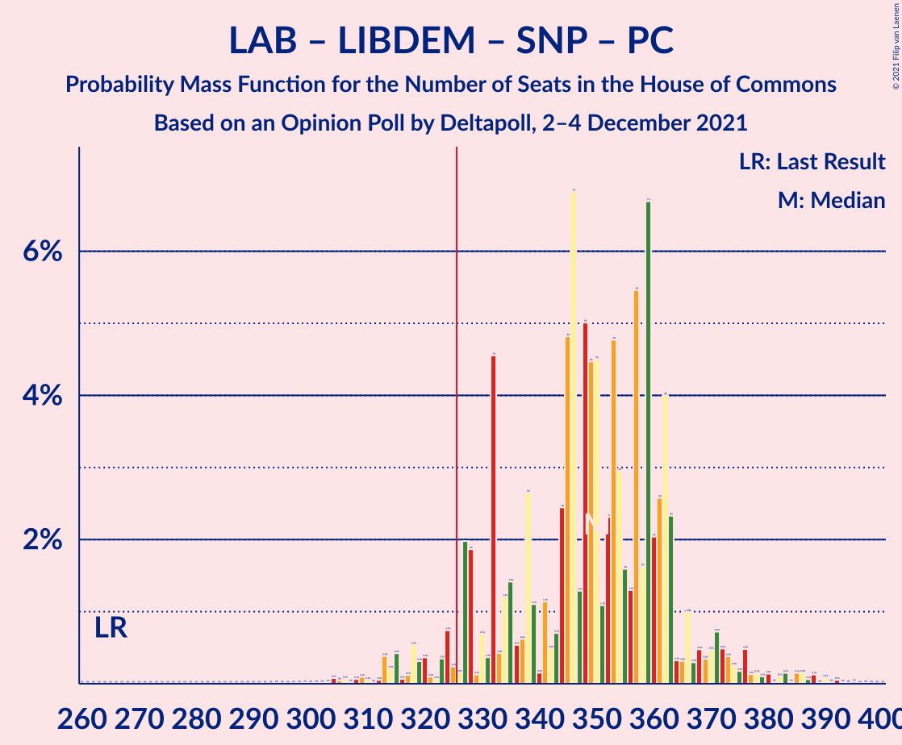

| Number of Seats | Probability | Accumulated | Special Marks |
|:---------------:|:-----------:|:-----------:|:-------------:|
| 265 | 0% | 100% | Last Result |
| 266 | 0% | 100% |  |
| 267 | 0% | 100% |  |
| 268 | 0% | 100% |  |
| 269 | 0% | 100% |  |
| 270 | 0% | 100% |  |
| 271 | 0% | 100% |  |
| 272 | 0% | 100% |  |
| 273 | 0% | 100% |  |
| 274 | 0% | 100% |  |
| 275 | 0% | 100% |  |
| 276 | 0% | 100% |  |
| 277 | 0% | 100% |  |
| 278 | 0% | 100% |  |
| 279 | 0% | 100% |  |
| 280 | 0% | 100% |  |
| 281 | 0% | 100% |  |
| 282 | 0% | 100% |  |
| 283 | 0% | 100% |  |
| 284 | 0% | 100% |  |
| 285 | 0% | 100% |  |
| 286 | 0% | 100% |  |
| 287 | 0% | 100% |  |
| 288 | 0% | 100% |  |
| 289 | 0% | 100% |  |
| 290 | 0% | 100% |  |
| 291 | 0% | 100% |  |
| 292 | 0% | 100% |  |
| 293 | 0% | 100% |  |
| 294 | 0% | 100% |  |
| 295 | 0% | 100% |  |
| 296 | 0% | 100% |  |
| 297 | 0% | 100% |  |
| 298 | 0% | 100% |  |
| 299 | 0% | 100% |  |
| 300 | 0% | 100% |  |
| 301 | 0% | 100% |  |
| 302 | 0% | 100% |  |
| 303 | 0% | 99.9% |  |
| 304 | 0.1% | 99.9% |  |
| 305 | 0% | 99.8% |  |
| 306 | 0.1% | 99.8% |  |
| 307 | 0% | 99.7% |  |
| 308 | 0.1% | 99.7% |  |
| 309 | 0.1% | 99.7% |  |
| 310 | 0.1% | 99.6% |  |
| 311 | 0% | 99.5% |  |
| 312 | 0.1% | 99.5% |  |
| 313 | 0.4% | 99.4% |  |
| 314 | 0.2% | 99.1% |  |
| 315 | 0.4% | 98.8% |  |
| 316 | 0.1% | 98% |  |
| 317 | 0.1% | 98% |  |
| 318 | 0.5% | 98% |  |
| 319 | 0.3% | 98% |  |
| 320 | 0.4% | 97% |  |
| 321 | 0.1% | 97% |  |
| 322 | 0.1% | 97% |  |
| 323 | 0.3% | 97% |  |
| 324 | 0.7% | 97% |  |
| 325 | 0.2% | 96% |  |
| 326 | 0.2% | 96% | Majority |
| 327 | 2% | 95% |  |
| 328 | 2% | 93% |  |
| 329 | 0.1% | 92% |  |
| 330 | 0.7% | 91% |  |
| 331 | 0.4% | 91% |  |
| 332 | 5% | 90% |  |
| 333 | 0.4% | 86% |  |
| 334 | 1.2% | 85% |  |
| 335 | 1.4% | 84% |  |
| 336 | 0.5% | 83% |  |
| 337 | 0.6% | 82% |  |
| 338 | 3% | 82% |  |
| 339 | 1.1% | 79% |  |
| 340 | 0.2% | 78% |  |
| 341 | 1.1% | 78% |  |
| 342 | 0.5% | 77% |  |
| 343 | 0.7% | 76% |  |
| 344 | 2% | 75% |  |
| 345 | 5% | 73% |  |
| 346 | 7% | 68% |  |
| 347 | 1.3% | 61% |  |
| 348 | 5% | 60% | Median |
| 349 | 4% | 55% |  |
| 350 | 5% | 51% |  |
| 351 | 1.1% | 46% |  |
| 352 | 2% | 45% |  |
| 353 | 5% | 43% |  |
| 354 | 3% | 38% |  |
| 355 | 2% | 35% |  |
| 356 | 1.3% | 33% |  |
| 357 | 5% | 32% |  |
| 358 | 2% | 27% |  |
| 359 | 7% | 25% |  |
| 360 | 2% | 18% |  |
| 361 | 3% | 16% |  |
| 362 | 4% | 14% |  |
| 363 | 2% | 10% |  |
| 364 | 0.3% | 7% |  |
| 365 | 0.3% | 7% |  |
| 366 | 1.0% | 7% |  |
| 367 | 0.3% | 6% |  |
| 368 | 0.5% | 5% |  |
| 369 | 0.3% | 5% |  |
| 370 | 0.5% | 5% |  |
| 371 | 0.7% | 4% |  |
| 372 | 0.5% | 3% |  |
| 373 | 0.4% | 3% |  |
| 374 | 0.3% | 2% |  |
| 375 | 0.2% | 2% |  |
| 376 | 0.5% | 2% |  |
| 377 | 0.1% | 2% |  |
| 378 | 0.1% | 1.4% |  |
| 379 | 0.1% | 1.3% |  |
| 380 | 0.1% | 1.2% |  |
| 381 | 0% | 1.0% |  |
| 382 | 0.1% | 1.0% |  |
| 383 | 0.1% | 0.9% |  |
| 384 | 0% | 0.8% |  |
| 385 | 0.1% | 0.7% |  |
| 386 | 0.2% | 0.6% |  |
| 387 | 0.1% | 0.4% |  |
| 388 | 0.1% | 0.4% |  |
| 389 | 0% | 0.2% |  |
| 390 | 0.1% | 0.2% |  |
| 391 | 0% | 0.1% |  |
| 392 | 0.1% | 0.1% |  |
| 393 | 0% | 0.1% |  |
| 394 | 0% | 0.1% |  |
| 395 | 0% | 0% |  |

### Conservative Party – Scottish National Party

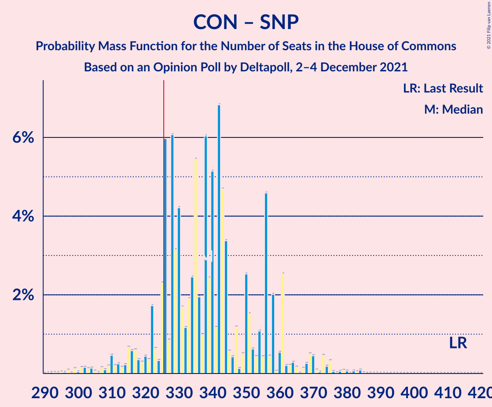

| Number of Seats | Probability | Accumulated | Special Marks |
|:---------------:|:-----------:|:-----------:|:-------------:|
| 292 | 0% | 100% |  |
| 293 | 0% | 99.9% |  |
| 294 | 0% | 99.9% |  |
| 295 | 0% | 99.9% |  |
| 296 | 0% | 99.8% |  |
| 297 | 0.1% | 99.8% |  |
| 298 | 0% | 99.7% |  |
| 299 | 0.1% | 99.7% |  |
| 300 | 0% | 99.6% |  |
| 301 | 0.2% | 99.6% |  |
| 302 | 0.2% | 99.4% |  |
| 303 | 0.1% | 99.2% |  |
| 304 | 0.1% | 99.1% |  |
| 305 | 0.1% | 99.0% |  |
| 306 | 0% | 98.9% |  |
| 307 | 0.1% | 98.9% |  |
| 308 | 0.1% | 98.7% |  |
| 309 | 0.2% | 98.7% |  |
| 310 | 0.5% | 98% |  |
| 311 | 0.2% | 98% |  |
| 312 | 0.2% | 98% |  |
| 313 | 0.2% | 98% |  |
| 314 | 0.2% | 97% |  |
| 315 | 0.7% | 97% |  |
| 316 | 0.6% | 97% |  |
| 317 | 0.6% | 96% |  |
| 318 | 0.3% | 95% |  |
| 319 | 0.3% | 95% |  |
| 320 | 0.4% | 95% |  |
| 321 | 0.4% | 94% |  |
| 322 | 2% | 94% |  |
| 323 | 0.6% | 92% |  |
| 324 | 0.3% | 92% |  |
| 325 | 2% | 91% |  |
| 326 | 6% | 89% | Majority |
| 327 | 0.8% | 83% |  |
| 328 | 6% | 82% |  |
| 329 | 3% | 76% |  |
| 330 | 4% | 73% |  |
| 331 | 2% | 69% |  |
| 332 | 1.2% | 67% |  |
| 333 | 2% | 66% |  |
| 334 | 2% | 64% |  |
| 335 | 5% | 61% |  |
| 336 | 2% | 56% |  |
| 337 | 1.0% | 54% |  |
| 338 | 6% | 53% | Median |
| 339 | 2% | 47% |  |
| 340 | 5% | 45% |  |
| 341 | 1.2% | 39% |  |
| 342 | 7% | 38% |  |
| 343 | 5% | 31% |  |
| 344 | 3% | 27% |  |
| 345 | 0.6% | 23% |  |
| 346 | 0.4% | 23% |  |
| 347 | 1.2% | 22% |  |
| 348 | 0.1% | 21% |  |
| 349 | 0.5% | 21% |  |
| 350 | 3% | 21% |  |
| 351 | 2% | 18% |  |
| 352 | 0.6% | 17% |  |
| 353 | 0.4% | 16% |  |
| 354 | 1.1% | 15% |  |
| 355 | 0.4% | 14% |  |
| 356 | 5% | 14% |  |
| 357 | 0.4% | 9% |  |
| 358 | 2% | 9% |  |
| 359 | 0.1% | 7% |  |
| 360 | 0.5% | 7% |  |
| 361 | 3% | 6% |  |
| 362 | 0.2% | 4% |  |
| 363 | 0.2% | 4% |  |
| 364 | 0.3% | 3% |  |
| 365 | 0.2% | 3% |  |
| 366 | 0% | 3% |  |
| 367 | 0.1% | 3% |  |
| 368 | 0.3% | 3% |  |
| 369 | 0.5% | 3% |  |
| 370 | 0.5% | 2% |  |
| 371 | 0.1% | 2% |  |
| 372 | 0% | 2% |  |
| 373 | 0.5% | 1.5% |  |
| 374 | 0.2% | 1.0% |  |
| 375 | 0.3% | 0.9% |  |
| 376 | 0.1% | 0.5% |  |
| 377 | 0% | 0.5% |  |
| 378 | 0.1% | 0.5% |  |
| 379 | 0.1% | 0.4% |  |
| 380 | 0.1% | 0.3% |  |
| 381 | 0% | 0.3% |  |
| 382 | 0.1% | 0.3% |  |
| 383 | 0% | 0.2% |  |
| 384 | 0.1% | 0.1% |  |
| 385 | 0% | 0.1% |  |
| 386 | 0% | 0% |  |
| 387 | 0% | 0% |  |
| 388 | 0% | 0% |  |
| 389 | 0% | 0% |  |
| 390 | 0% | 0% |  |
| 391 | 0% | 0% |  |
| 392 | 0% | 0% |  |
| 393 | 0% | 0% |  |
| 394 | 0% | 0% |  |
| 395 | 0% | 0% |  |
| 396 | 0% | 0% |  |
| 397 | 0% | 0% |  |
| 398 | 0% | 0% |  |
| 399 | 0% | 0% |  |
| 400 | 0% | 0% |  |
| 401 | 0% | 0% |  |
| 402 | 0% | 0% |  |
| 403 | 0% | 0% |  |
| 404 | 0% | 0% |  |
| 405 | 0% | 0% |  |
| 406 | 0% | 0% |  |
| 407 | 0% | 0% |  |
| 408 | 0% | 0% |  |
| 409 | 0% | 0% |  |
| 410 | 0% | 0% |  |
| 411 | 0% | 0% |  |
| 412 | 0% | 0% |  |
| 413 | 0% | 0% | Last Result |

### Labour Party – Liberal Democrats – Scottish National Party

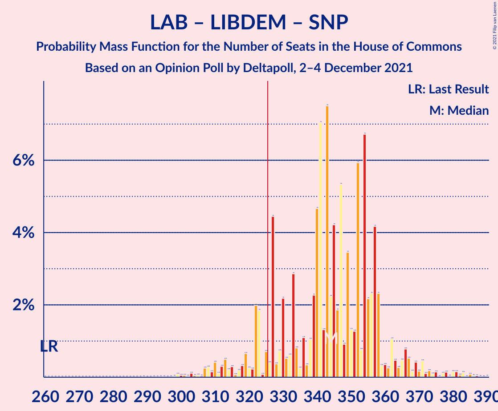

| Number of Seats | Probability | Accumulated | Special Marks |
|:---------------:|:-----------:|:-----------:|:-------------:|
| 261 | 0% | 100% | Last Result |
| 262 | 0% | 100% |  |
| 263 | 0% | 100% |  |
| 264 | 0% | 100% |  |
| 265 | 0% | 100% |  |
| 266 | 0% | 100% |  |
| 267 | 0% | 100% |  |
| 268 | 0% | 100% |  |
| 269 | 0% | 100% |  |
| 270 | 0% | 100% |  |
| 271 | 0% | 100% |  |
| 272 | 0% | 100% |  |
| 273 | 0% | 100% |  |
| 274 | 0% | 100% |  |
| 275 | 0% | 100% |  |
| 276 | 0% | 100% |  |
| 277 | 0% | 100% |  |
| 278 | 0% | 100% |  |
| 279 | 0% | 100% |  |
| 280 | 0% | 100% |  |
| 281 | 0% | 100% |  |
| 282 | 0% | 100% |  |
| 283 | 0% | 100% |  |
| 284 | 0% | 100% |  |
| 285 | 0% | 100% |  |
| 286 | 0% | 100% |  |
| 287 | 0% | 100% |  |
| 288 | 0% | 100% |  |
| 289 | 0% | 100% |  |
| 290 | 0% | 100% |  |
| 291 | 0% | 100% |  |
| 292 | 0% | 100% |  |
| 293 | 0% | 100% |  |
| 294 | 0% | 100% |  |
| 295 | 0% | 100% |  |
| 296 | 0% | 100% |  |
| 297 | 0% | 100% |  |
| 298 | 0% | 99.9% |  |
| 299 | 0.1% | 99.9% |  |
| 300 | 0.1% | 99.8% |  |
| 301 | 0.1% | 99.8% |  |
| 302 | 0% | 99.7% |  |
| 303 | 0.1% | 99.7% |  |
| 304 | 0% | 99.6% |  |
| 305 | 0.1% | 99.6% |  |
| 306 | 0% | 99.5% |  |
| 307 | 0.3% | 99.5% |  |
| 308 | 0.3% | 99.2% |  |
| 309 | 0.1% | 98.9% |  |
| 310 | 0.4% | 98.8% |  |
| 311 | 0.1% | 98% |  |
| 312 | 0.3% | 98% |  |
| 313 | 0.5% | 98% |  |
| 314 | 0.2% | 97% |  |
| 315 | 0.3% | 97% |  |
| 316 | 0.1% | 97% |  |
| 317 | 0.2% | 97% |  |
| 318 | 0.3% | 97% |  |
| 319 | 0.7% | 96% |  |
| 320 | 0.3% | 96% |  |
| 321 | 0.2% | 95% |  |
| 322 | 2% | 95% |  |
| 323 | 2% | 93% |  |
| 324 | 0.1% | 91% |  |
| 325 | 0.7% | 91% |  |
| 326 | 0.4% | 91% | Majority |
| 327 | 4% | 90% |  |
| 328 | 0.4% | 86% |  |
| 329 | 0.7% | 85% |  |
| 330 | 2% | 85% |  |
| 331 | 0.5% | 83% |  |
| 332 | 0.6% | 82% |  |
| 333 | 3% | 81% |  |
| 334 | 0.8% | 79% |  |
| 335 | 0.2% | 78% |  |
| 336 | 1.1% | 77% |  |
| 337 | 0.3% | 76% |  |
| 338 | 1.0% | 76% |  |
| 339 | 2% | 75% |  |
| 340 | 5% | 73% |  |
| 341 | 7% | 68% |  |
| 342 | 1.3% | 61% |  |
| 343 | 8% | 60% | Median |
| 344 | 2% | 52% |  |
| 345 | 4% | 50% |  |
| 346 | 2% | 46% |  |
| 347 | 5% | 44% |  |
| 348 | 0.9% | 39% |  |
| 349 | 3% | 38% |  |
| 350 | 1.3% | 34% |  |
| 351 | 1.3% | 33% |  |
| 352 | 6% | 32% |  |
| 353 | 0.8% | 26% |  |
| 354 | 7% | 25% |  |
| 355 | 2% | 18% |  |
| 356 | 2% | 16% |  |
| 357 | 4% | 14% |  |
| 358 | 2% | 10% |  |
| 359 | 0.3% | 7% |  |
| 360 | 0.3% | 7% |  |
| 361 | 0.3% | 7% |  |
| 362 | 1.1% | 6% |  |
| 363 | 0.5% | 5% |  |
| 364 | 0.3% | 5% |  |
| 365 | 0.5% | 5% |  |
| 366 | 0.8% | 4% |  |
| 367 | 0.5% | 3% |  |
| 368 | 0.2% | 3% |  |
| 369 | 0.4% | 3% |  |
| 370 | 0.2% | 2% |  |
| 371 | 0.5% | 2% |  |
| 372 | 0.1% | 2% |  |
| 373 | 0.2% | 1.4% |  |
| 374 | 0.1% | 1.3% |  |
| 375 | 0.1% | 1.2% |  |
| 376 | 0% | 1.0% |  |
| 377 | 0.1% | 1.0% |  |
| 378 | 0.1% | 0.9% |  |
| 379 | 0% | 0.8% |  |
| 380 | 0.2% | 0.7% |  |
| 381 | 0.2% | 0.6% |  |
| 382 | 0.1% | 0.4% |  |
| 383 | 0.1% | 0.4% |  |
| 384 | 0% | 0.2% |  |
| 385 | 0.1% | 0.2% |  |
| 386 | 0% | 0.1% |  |
| 387 | 0% | 0.1% |  |
| 388 | 0% | 0.1% |  |
| 389 | 0% | 0.1% |  |
| 390 | 0% | 0% |  |

### Labour Party – Scottish National Party – Plaid Cymru

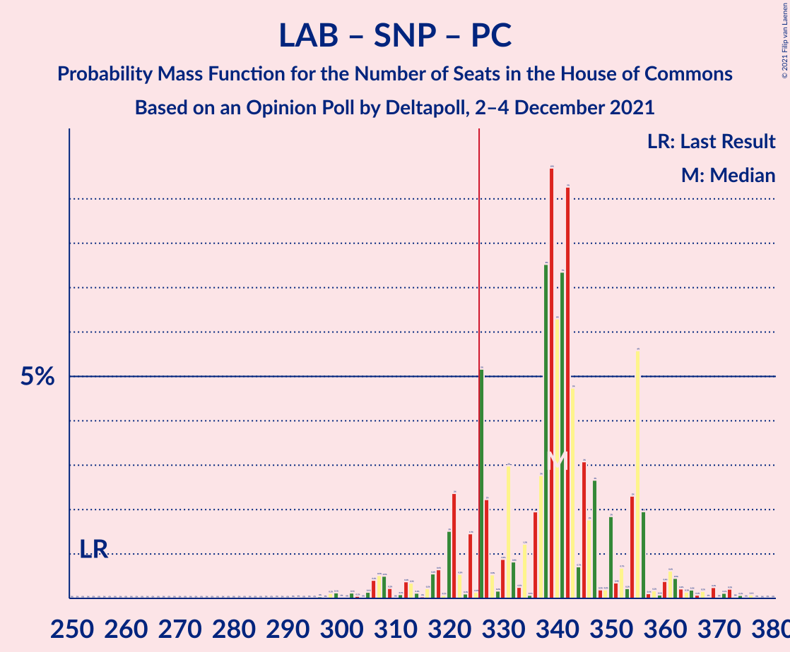

| Number of Seats | Probability | Accumulated | Special Marks |
|:---------------:|:-----------:|:-----------:|:-------------:|
| 254 | 0% | 100% | Last Result |
| 255 | 0% | 100% |  |
| 256 | 0% | 100% |  |
| 257 | 0% | 100% |  |
| 258 | 0% | 100% |  |
| 259 | 0% | 100% |  |
| 260 | 0% | 100% |  |
| 261 | 0% | 100% |  |
| 262 | 0% | 100% |  |
| 263 | 0% | 100% |  |
| 264 | 0% | 100% |  |
| 265 | 0% | 100% |  |
| 266 | 0% | 100% |  |
| 267 | 0% | 100% |  |
| 268 | 0% | 100% |  |
| 269 | 0% | 100% |  |
| 270 | 0% | 100% |  |
| 271 | 0% | 100% |  |
| 272 | 0% | 100% |  |
| 273 | 0% | 100% |  |
| 274 | 0% | 100% |  |
| 275 | 0% | 100% |  |
| 276 | 0% | 100% |  |
| 277 | 0% | 100% |  |
| 278 | 0% | 100% |  |
| 279 | 0% | 100% |  |
| 280 | 0% | 100% |  |
| 281 | 0% | 100% |  |
| 282 | 0% | 100% |  |
| 283 | 0% | 100% |  |
| 284 | 0% | 100% |  |
| 285 | 0% | 100% |  |
| 286 | 0% | 100% |  |
| 287 | 0% | 100% |  |
| 288 | 0% | 100% |  |
| 289 | 0% | 100% |  |
| 290 | 0% | 100% |  |
| 291 | 0% | 100% |  |
| 292 | 0% | 100% |  |
| 293 | 0% | 100% |  |
| 294 | 0% | 100% |  |
| 295 | 0% | 100% |  |
| 296 | 0% | 100% |  |
| 297 | 0% | 99.9% |  |
| 298 | 0.1% | 99.9% |  |
| 299 | 0.1% | 99.8% |  |
| 300 | 0% | 99.7% |  |
| 301 | 0% | 99.6% |  |
| 302 | 0.1% | 99.6% |  |
| 303 | 0.1% | 99.5% |  |
| 304 | 0% | 99.4% |  |
| 305 | 0.1% | 99.4% |  |
| 306 | 0.4% | 99.3% |  |
| 307 | 0.5% | 98.9% |  |
| 308 | 0.5% | 98% |  |
| 309 | 0.2% | 98% |  |
| 310 | 0% | 98% |  |
| 311 | 0.1% | 98% |  |
| 312 | 0.4% | 98% |  |
| 313 | 0.3% | 97% |  |
| 314 | 0.1% | 97% |  |
| 315 | 0% | 97% |  |
| 316 | 0.2% | 97% |  |
| 317 | 0.6% | 96% |  |
| 318 | 0.6% | 96% |  |
| 319 | 0.1% | 95% |  |
| 320 | 2% | 95% |  |
| 321 | 2% | 94% |  |
| 322 | 0.5% | 91% |  |
| 323 | 0.1% | 91% |  |
| 324 | 1.5% | 91% |  |
| 325 | 0.1% | 89% |  |
| 326 | 5% | 89% | Majority |
| 327 | 2% | 84% |  |
| 328 | 0.5% | 82% |  |
| 329 | 0.2% | 81% |  |
| 330 | 0.9% | 81% |  |
| 331 | 3% | 80% |  |
| 332 | 0.8% | 77% |  |
| 333 | 0.3% | 76% |  |
| 334 | 1.2% | 76% |  |
| 335 | 0.1% | 75% |  |
| 336 | 2% | 75% |  |
| 337 | 3% | 73% |  |
| 338 | 8% | 70% |  |
| 339 | 10% | 62% |  |
| 340 | 6% | 53% |  |
| 341 | 7% | 46% | Median |
| 342 | 9% | 39% |  |
| 343 | 5% | 30% |  |
| 344 | 0.7% | 25% |  |
| 345 | 3% | 24% |  |
| 346 | 2% | 21% |  |
| 347 | 3% | 19% |  |
| 348 | 0.2% | 17% |  |
| 349 | 0.2% | 17% |  |
| 350 | 2% | 16% |  |
| 351 | 0.4% | 15% |  |
| 352 | 0.7% | 14% |  |
| 353 | 0.2% | 14% |  |
| 354 | 2% | 13% |  |
| 355 | 6% | 11% |  |
| 356 | 2% | 5% |  |
| 357 | 0.1% | 3% |  |
| 358 | 0.2% | 3% |  |
| 359 | 0.1% | 3% |  |
| 360 | 0.4% | 3% |  |
| 361 | 0.6% | 3% |  |
| 362 | 0.5% | 2% |  |
| 363 | 0.2% | 2% |  |
| 364 | 0.1% | 1.4% |  |
| 365 | 0.2% | 1.3% |  |
| 366 | 0.1% | 1.1% |  |
| 367 | 0.2% | 1.0% |  |
| 368 | 0% | 0.9% |  |
| 369 | 0.2% | 0.8% |  |
| 370 | 0% | 0.6% |  |
| 371 | 0.1% | 0.6% |  |
| 372 | 0.2% | 0.4% |  |
| 373 | 0% | 0.2% |  |
| 374 | 0.1% | 0.2% |  |
| 375 | 0% | 0.1% |  |
| 376 | 0.1% | 0.1% |  |
| 377 | 0% | 0% |  |

### Labour Party – Scottish National Party

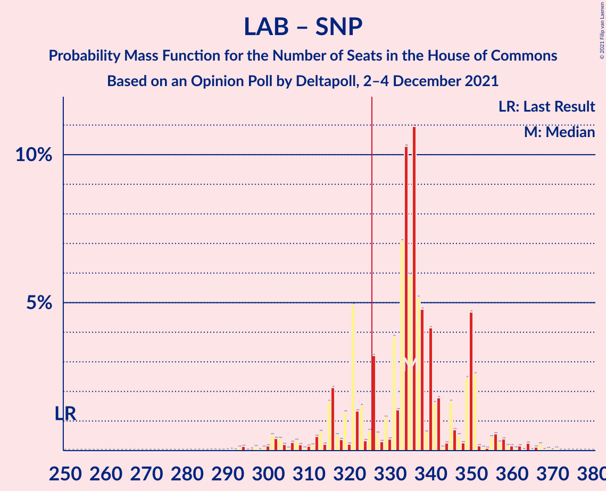

| Number of Seats | Probability | Accumulated | Special Marks |
|:---------------:|:-----------:|:-----------:|:-------------:|
| 250 | 0% | 100% | Last Result |
| 251 | 0% | 100% |  |
| 252 | 0% | 100% |  |
| 253 | 0% | 100% |  |
| 254 | 0% | 100% |  |
| 255 | 0% | 100% |  |
| 256 | 0% | 100% |  |
| 257 | 0% | 100% |  |
| 258 | 0% | 100% |  |
| 259 | 0% | 100% |  |
| 260 | 0% | 100% |  |
| 261 | 0% | 100% |  |
| 262 | 0% | 100% |  |
| 263 | 0% | 100% |  |
| 264 | 0% | 100% |  |
| 265 | 0% | 100% |  |
| 266 | 0% | 100% |  |
| 267 | 0% | 100% |  |
| 268 | 0% | 100% |  |
| 269 | 0% | 100% |  |
| 270 | 0% | 100% |  |
| 271 | 0% | 100% |  |
| 272 | 0% | 100% |  |
| 273 | 0% | 100% |  |
| 274 | 0% | 100% |  |
| 275 | 0% | 100% |  |
| 276 | 0% | 100% |  |
| 277 | 0% | 100% |  |
| 278 | 0% | 100% |  |
| 279 | 0% | 100% |  |
| 280 | 0% | 100% |  |
| 281 | 0% | 100% |  |
| 282 | 0% | 100% |  |
| 283 | 0% | 100% |  |
| 284 | 0% | 100% |  |
| 285 | 0% | 100% |  |
| 286 | 0% | 100% |  |
| 287 | 0% | 100% |  |
| 288 | 0% | 100% |  |
| 289 | 0% | 100% |  |
| 290 | 0% | 100% |  |
| 291 | 0% | 99.9% |  |
| 292 | 0% | 99.9% |  |
| 293 | 0.1% | 99.9% |  |
| 294 | 0.1% | 99.8% |  |
| 295 | 0% | 99.6% |  |
| 296 | 0% | 99.6% |  |
| 297 | 0.1% | 99.6% |  |
| 298 | 0% | 99.4% |  |
| 299 | 0.1% | 99.4% |  |
| 300 | 0.2% | 99.3% |  |
| 301 | 0.5% | 99.2% |  |
| 302 | 0.4% | 98.6% |  |
| 303 | 0.4% | 98% |  |
| 304 | 0.2% | 98% |  |
| 305 | 0.1% | 98% |  |
| 306 | 0.3% | 98% |  |
| 307 | 0.3% | 97% |  |
| 308 | 0.2% | 97% |  |
| 309 | 0.1% | 97% |  |
| 310 | 0.1% | 97% |  |
| 311 | 0.2% | 96% |  |
| 312 | 0.5% | 96% |  |
| 313 | 0.6% | 96% |  |
| 314 | 0.2% | 95% |  |
| 315 | 2% | 95% |  |
| 316 | 2% | 93% |  |
| 317 | 0.5% | 91% |  |
| 318 | 0.4% | 91% |  |
| 319 | 1.3% | 90% |  |
| 320 | 0.2% | 89% |  |
| 321 | 5% | 89% |  |
| 322 | 1.3% | 84% |  |
| 323 | 2% | 82% |  |
| 324 | 0.3% | 81% |  |
| 325 | 0.7% | 81% |  |
| 326 | 3% | 80% | Majority |
| 327 | 0.6% | 77% |  |
| 328 | 0.3% | 76% |  |
| 329 | 1.1% | 76% |  |
| 330 | 0.4% | 75% |  |
| 331 | 4% | 74% |  |
| 332 | 1.4% | 70% |  |
| 333 | 7% | 69% |  |
| 334 | 10% | 62% |  |
| 335 | 6% | 52% |  |
| 336 | 11% | 46% | Median |
| 337 | 5% | 35% |  |
| 338 | 5% | 30% |  |
| 339 | 0.6% | 25% |  |
| 340 | 4% | 24% |  |
| 341 | 2% | 20% |  |
| 342 | 2% | 19% |  |
| 343 | 0.1% | 17% |  |
| 344 | 0.3% | 17% |  |
| 345 | 2% | 16% |  |
| 346 | 0.7% | 15% |  |
| 347 | 0.5% | 14% |  |
| 348 | 0.3% | 13% |  |
| 349 | 2% | 13% |  |
| 350 | 5% | 11% |  |
| 351 | 3% | 6% |  |
| 352 | 0.2% | 3% |  |
| 353 | 0.1% | 3% |  |
| 354 | 0.1% | 3% |  |
| 355 | 0.5% | 3% |  |
| 356 | 0.6% | 3% |  |
| 357 | 0.3% | 2% |  |
| 358 | 0.4% | 2% |  |
| 359 | 0.2% | 1.4% |  |
| 360 | 0.2% | 1.3% |  |
| 361 | 0.1% | 1.1% |  |
| 362 | 0.2% | 1.0% |  |
| 363 | 0% | 0.9% |  |
| 364 | 0.2% | 0.8% |  |
| 365 | 0% | 0.6% |  |
| 366 | 0.1% | 0.6% |  |
| 367 | 0.2% | 0.4% |  |
| 368 | 0% | 0.2% |  |
| 369 | 0.1% | 0.2% |  |
| 370 | 0% | 0.1% |  |
| 371 | 0.1% | 0.1% |  |
| 372 | 0% | 0% |  |

### Conservative Party – Liberal Democrats

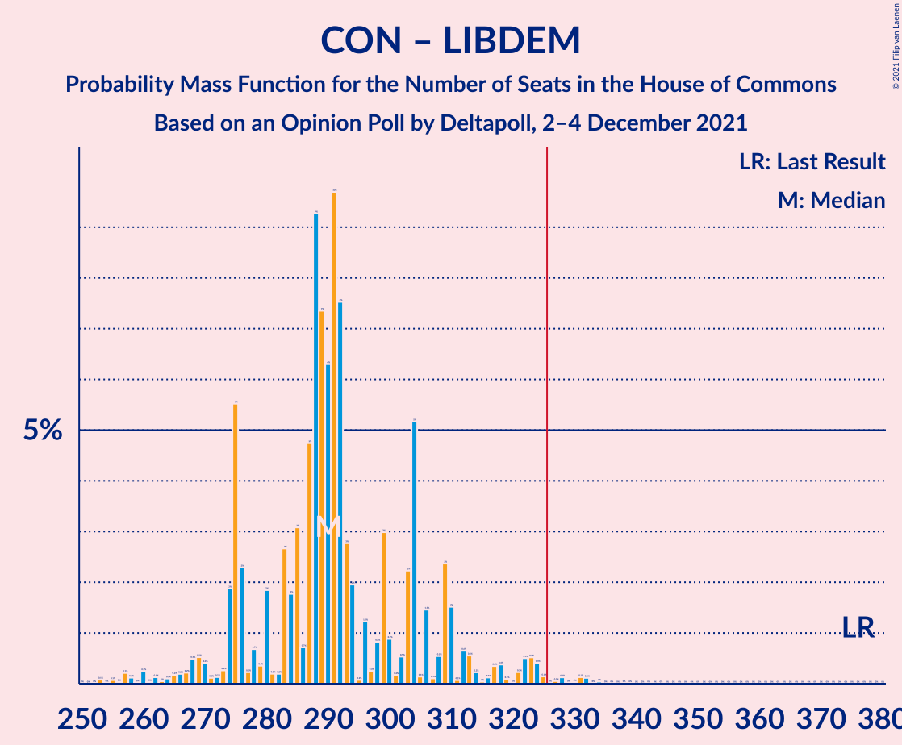

| Number of Seats | Probability | Accumulated | Special Marks |
|:---------------:|:-----------:|:-----------:|:-------------:|
| 253 | 0.1% | 100% |  |
| 254 | 0% | 99.9% |  |
| 255 | 0.1% | 99.9% |  |
| 256 | 0% | 99.8% |  |
| 257 | 0.2% | 99.8% |  |
| 258 | 0.1% | 99.6% |  |
| 259 | 0% | 99.4% |  |
| 260 | 0.2% | 99.4% |  |
| 261 | 0% | 99.2% |  |
| 262 | 0.1% | 99.1% |  |
| 263 | 0% | 99.0% |  |
| 264 | 0.1% | 99.0% |  |
| 265 | 0.2% | 98.9% |  |
| 266 | 0.2% | 98.7% |  |
| 267 | 0.2% | 98.5% |  |
| 268 | 0.5% | 98% |  |
| 269 | 0.5% | 98% |  |
| 270 | 0.4% | 97% |  |
| 271 | 0.1% | 97% |  |
| 272 | 0.1% | 97% |  |
| 273 | 0.3% | 97% |  |
| 274 | 2% | 96% |  |
| 275 | 6% | 94% |  |
| 276 | 2% | 89% |  |
| 277 | 0.2% | 87% |  |
| 278 | 0.7% | 86% |  |
| 279 | 0.4% | 86% |  |
| 280 | 2% | 85% |  |
| 281 | 0.2% | 84% |  |
| 282 | 0.2% | 83% |  |
| 283 | 3% | 83% |  |
| 284 | 2% | 81% |  |
| 285 | 3% | 79% |  |
| 286 | 0.7% | 76% |  |
| 287 | 5% | 75% | Median |
| 288 | 9% | 70% |  |
| 289 | 7% | 61% |  |
| 290 | 6% | 54% |  |
| 291 | 10% | 47% |  |
| 292 | 8% | 38% |  |
| 293 | 3% | 30% |  |
| 294 | 2% | 27% |  |
| 295 | 0.1% | 25% |  |
| 296 | 1.2% | 25% |  |
| 297 | 0.3% | 24% |  |
| 298 | 0.8% | 24% |  |
| 299 | 3% | 23% |  |
| 300 | 0.9% | 20% |  |
| 301 | 0.2% | 19% |  |
| 302 | 0.5% | 19% |  |
| 303 | 2% | 18% |  |
| 304 | 5% | 16% |  |
| 305 | 0.1% | 11% |  |
| 306 | 1.5% | 11% |  |
| 307 | 0.1% | 9% |  |
| 308 | 0.5% | 9% |  |
| 309 | 2% | 9% |  |
| 310 | 2% | 6% |  |
| 311 | 0.1% | 5% |  |
| 312 | 0.6% | 5% |  |
| 313 | 0.6% | 4% |  |
| 314 | 0.2% | 4% |  |
| 315 | 0% | 3% |  |
| 316 | 0.1% | 3% |  |
| 317 | 0.3% | 3% |  |
| 318 | 0.4% | 3% |  |
| 319 | 0.1% | 2% |  |
| 320 | 0% | 2% |  |
| 321 | 0.2% | 2% |  |
| 322 | 0.5% | 2% |  |
| 323 | 0.5% | 2% |  |
| 324 | 0.4% | 1.1% |  |
| 325 | 0.1% | 0.7% |  |
| 326 | 0% | 0.6% | Majority |
| 327 | 0.1% | 0.6% |  |
| 328 | 0.1% | 0.5% |  |
| 329 | 0% | 0.4% |  |
| 330 | 0% | 0.4% |  |
| 331 | 0.1% | 0.3% |  |
| 332 | 0.1% | 0.2% |  |
| 333 | 0% | 0.1% |  |
| 334 | 0% | 0.1% |  |
| 335 | 0% | 0% |  |
| 336 | 0% | 0% |  |
| 337 | 0% | 0% |  |
| 338 | 0% | 0% |  |
| 339 | 0% | 0% |  |
| 340 | 0% | 0% |  |
| 341 | 0% | 0% |  |
| 342 | 0% | 0% |  |
| 343 | 0% | 0% |  |
| 344 | 0% | 0% |  |
| 345 | 0% | 0% |  |
| 346 | 0% | 0% |  |
| 347 | 0% | 0% |  |
| 348 | 0% | 0% |  |
| 349 | 0% | 0% |  |
| 350 | 0% | 0% |  |
| 351 | 0% | 0% |  |
| 352 | 0% | 0% |  |
| 353 | 0% | 0% |  |
| 354 | 0% | 0% |  |
| 355 | 0% | 0% |  |
| 356 | 0% | 0% |  |
| 357 | 0% | 0% |  |
| 358 | 0% | 0% |  |
| 359 | 0% | 0% |  |
| 360 | 0% | 0% |  |
| 361 | 0% | 0% |  |
| 362 | 0% | 0% |  |
| 363 | 0% | 0% |  |
| 364 | 0% | 0% |  |
| 365 | 0% | 0% |  |
| 366 | 0% | 0% |  |
| 367 | 0% | 0% |  |
| 368 | 0% | 0% |  |
| 369 | 0% | 0% |  |
| 370 | 0% | 0% |  |
| 371 | 0% | 0% |  |
| 372 | 0% | 0% |  |
| 373 | 0% | 0% |  |
| 374 | 0% | 0% |  |
| 375 | 0% | 0% |  |
| 376 | 0% | 0% | Last Result |

### Conservative Party – Plaid Cymru

| Number of Seats | Probability | Accumulated | Special Marks |
|:---------------:|:-----------:|:-----------:|:-------------:|
| 240 | 0% | 100% |  |
| 241 | 0% | 99.9% |  |
| 242 | 0% | 99.9% |  |
| 243 | 0% | 99.9% |  |
| 244 | 0.1% | 99.9% |  |
| 245 | 0% | 99.8% |  |
| 246 | 0.1% | 99.8% |  |
| 247 | 0.1% | 99.6% |  |
| 248 | 0.2% | 99.6% |  |
| 249 | 0.2% | 99.4% |  |
| 250 | 0% | 99.3% |  |
| 251 | 0.1% | 99.2% |  |
| 252 | 0.2% | 99.2% |  |
| 253 | 0% | 99.0% |  |
| 254 | 0.1% | 99.0% |  |
| 255 | 0.1% | 98.9% |  |
| 256 | 0.1% | 98.8% |  |
| 257 | 0.2% | 98.7% |  |
| 258 | 0.1% | 98.5% |  |
| 259 | 0.5% | 98% |  |
| 260 | 0.1% | 98% |  |
| 261 | 0.4% | 98% |  |
| 262 | 0.2% | 97% |  |
| 263 | 0.5% | 97% |  |
| 264 | 0.8% | 97% |  |
| 265 | 0.5% | 96% |  |
| 266 | 0.3% | 95% |  |
| 267 | 0.5% | 95% |  |
| 268 | 1.1% | 95% |  |
| 269 | 0.3% | 94% |  |
| 270 | 0.3% | 93% |  |
| 271 | 0.3% | 93% |  |
| 272 | 2% | 93% |  |
| 273 | 4% | 90% |  |
| 274 | 2% | 86% |  |
| 275 | 2% | 84% |  |
| 276 | 7% | 82% |  |
| 277 | 0.8% | 75% |  |
| 278 | 6% | 74% |  |
| 279 | 1.3% | 68% |  |
| 280 | 1.3% | 67% |  |
| 281 | 3% | 66% |  |
| 282 | 0.9% | 62% |  |
| 283 | 5% | 61% |  |
| 284 | 2% | 56% |  |
| 285 | 4% | 54% | Median |
| 286 | 2% | 50% |  |
| 287 | 8% | 48% |  |
| 288 | 1.3% | 40% |  |
| 289 | 7% | 39% |  |
| 290 | 5% | 32% |  |
| 291 | 2% | 27% |  |
| 292 | 1.0% | 25% |  |
| 293 | 0.3% | 24% |  |
| 294 | 1.1% | 24% |  |
| 295 | 0.2% | 23% |  |
| 296 | 0.8% | 22% |  |
| 297 | 3% | 21% |  |
| 298 | 0.6% | 19% |  |
| 299 | 0.5% | 18% |  |
| 300 | 2% | 17% |  |
| 301 | 0.7% | 15% |  |
| 302 | 0.4% | 15% |  |
| 303 | 4% | 14% |  |
| 304 | 0.4% | 10% |  |
| 305 | 0.7% | 9% |  |
| 306 | 0.1% | 9% |  |
| 307 | 2% | 9% |  |
| 308 | 2% | 7% |  |
| 309 | 0.2% | 5% |  |
| 310 | 0.3% | 5% |  |
| 311 | 0.7% | 4% |  |
| 312 | 0.3% | 4% |  |
| 313 | 0.2% | 3% |  |
| 314 | 0.1% | 3% |  |
| 315 | 0.3% | 3% |  |
| 316 | 0.2% | 3% |  |
| 317 | 0.5% | 3% |  |
| 318 | 0.3% | 2% |  |
| 319 | 0.1% | 2% |  |
| 320 | 0.4% | 2% |  |
| 321 | 0.1% | 1.2% |  |
| 322 | 0.3% | 1.1% |  |
| 323 | 0.3% | 0.8% |  |
| 324 | 0% | 0.5% |  |
| 325 | 0.1% | 0.5% |  |
| 326 | 0% | 0.4% | Majority |
| 327 | 0.1% | 0.4% |  |
| 328 | 0% | 0.3% |  |
| 329 | 0.1% | 0.3% |  |
| 330 | 0.1% | 0.2% |  |
| 331 | 0.1% | 0.2% |  |
| 332 | 0% | 0.1% |  |
| 333 | 0% | 0.1% |  |
| 334 | 0% | 0% |  |
| 335 | 0% | 0% |  |
| 336 | 0% | 0% |  |
| 337 | 0% | 0% |  |
| 338 | 0% | 0% |  |
| 339 | 0% | 0% |  |
| 340 | 0% | 0% |  |
| 341 | 0% | 0% |  |
| 342 | 0% | 0% |  |
| 343 | 0% | 0% |  |
| 344 | 0% | 0% |  |
| 345 | 0% | 0% |  |
| 346 | 0% | 0% |  |
| 347 | 0% | 0% |  |
| 348 | 0% | 0% |  |
| 349 | 0% | 0% |  |
| 350 | 0% | 0% |  |
| 351 | 0% | 0% |  |
| 352 | 0% | 0% |  |
| 353 | 0% | 0% |  |
| 354 | 0% | 0% |  |
| 355 | 0% | 0% |  |
| 356 | 0% | 0% |  |
| 357 | 0% | 0% |  |
| 358 | 0% | 0% |  |
| 359 | 0% | 0% |  |
| 360 | 0% | 0% |  |
| 361 | 0% | 0% |  |
| 362 | 0% | 0% |  |
| 363 | 0% | 0% |  |
| 364 | 0% | 0% |  |
| 365 | 0% | 0% |  |
| 366 | 0% | 0% |  |
| 367 | 0% | 0% |  |
| 368 | 0% | 0% |  |
| 369 | 0% | 0% | Last Result |

### Labour Party – Liberal Democrats – Plaid Cymru

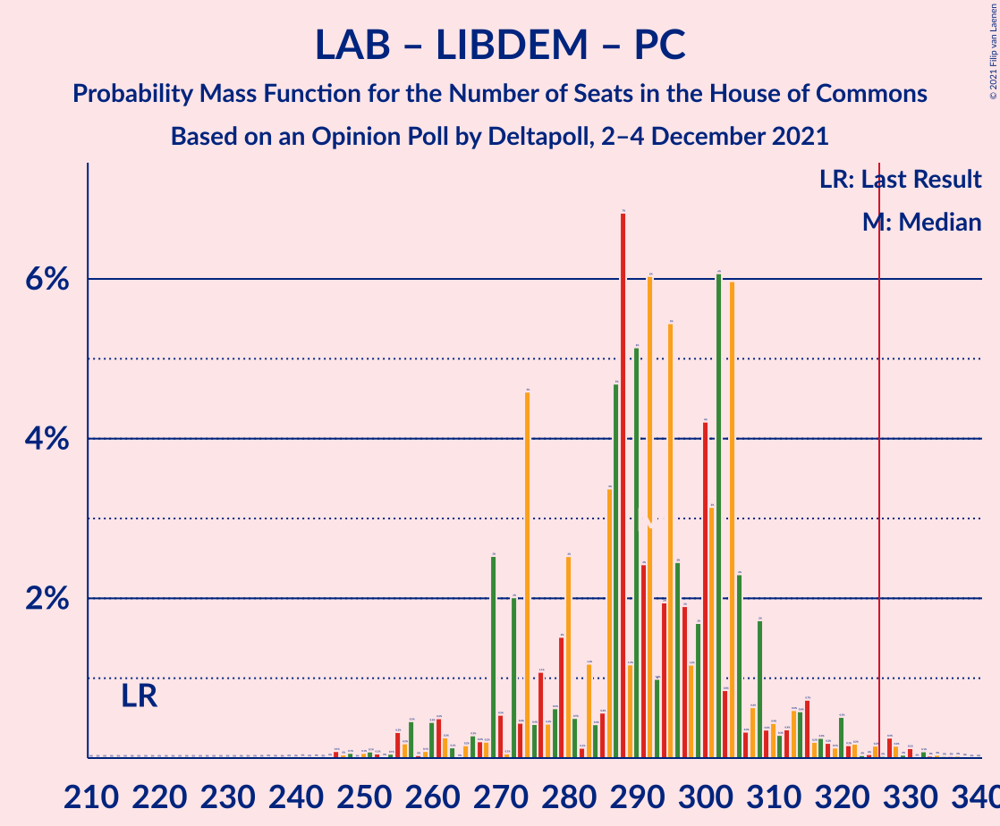

| Number of Seats | Probability | Accumulated | Special Marks |
|:---------------:|:-----------:|:-----------:|:-------------:|
| 217 | 0% | 100% | Last Result |
| 218 | 0% | 100% |  |
| 219 | 0% | 100% |  |
| 220 | 0% | 100% |  |
| 221 | 0% | 100% |  |
| 222 | 0% | 100% |  |
| 223 | 0% | 100% |  |
| 224 | 0% | 100% |  |
| 225 | 0% | 100% |  |
| 226 | 0% | 100% |  |
| 227 | 0% | 100% |  |
| 228 | 0% | 100% |  |
| 229 | 0% | 100% |  |
| 230 | 0% | 100% |  |
| 231 | 0% | 100% |  |
| 232 | 0% | 100% |  |
| 233 | 0% | 100% |  |
| 234 | 0% | 100% |  |
| 235 | 0% | 100% |  |
| 236 | 0% | 100% |  |
| 237 | 0% | 100% |  |
| 238 | 0% | 100% |  |
| 239 | 0% | 100% |  |
| 240 | 0% | 100% |  |
| 241 | 0% | 100% |  |
| 242 | 0% | 100% |  |
| 243 | 0% | 100% |  |
| 244 | 0% | 100% |  |
| 245 | 0% | 100% |  |
| 246 | 0.1% | 99.9% |  |
| 247 | 0% | 99.9% |  |
| 248 | 0.1% | 99.8% |  |
| 249 | 0% | 99.7% |  |
| 250 | 0.1% | 99.7% |  |
| 251 | 0.1% | 99.7% |  |
| 252 | 0.1% | 99.6% |  |
| 253 | 0% | 99.5% |  |
| 254 | 0.1% | 99.5% |  |
| 255 | 0.3% | 99.5% |  |
| 256 | 0.2% | 99.1% |  |
| 257 | 0.5% | 99.0% |  |
| 258 | 0% | 98.5% |  |
| 259 | 0.1% | 98% |  |
| 260 | 0.5% | 98% |  |
| 261 | 0.5% | 98% |  |
| 262 | 0.3% | 97% |  |
| 263 | 0.1% | 97% |  |
| 264 | 0% | 97% |  |
| 265 | 0.2% | 97% |  |
| 266 | 0.3% | 97% |  |
| 267 | 0.2% | 97% |  |
| 268 | 0.2% | 96% |  |
| 269 | 3% | 96% |  |
| 270 | 0.5% | 94% |  |
| 271 | 0.1% | 93% |  |
| 272 | 2% | 93% |  |
| 273 | 0.4% | 91% |  |
| 274 | 5% | 91% |  |
| 275 | 0.4% | 86% |  |
| 276 | 1.1% | 86% |  |
| 277 | 0.4% | 85% |  |
| 278 | 0.6% | 84% |  |
| 279 | 2% | 83% |  |
| 280 | 3% | 82% |  |
| 281 | 0.5% | 79% |  |
| 282 | 0.1% | 79% |  |
| 283 | 1.2% | 79% |  |
| 284 | 0.4% | 78% |  |
| 285 | 0.6% | 77% |  |
| 286 | 3% | 77% |  |
| 287 | 5% | 73% |  |
| 288 | 7% | 69% |  |
| 289 | 1.2% | 62% |  |
| 290 | 5% | 61% | Median |
| 291 | 2% | 55% |  |
| 292 | 6% | 53% |  |
| 293 | 1.0% | 47% |  |
| 294 | 2% | 46% |  |
| 295 | 5% | 44% |  |
| 296 | 2% | 39% |  |
| 297 | 2% | 36% |  |
| 298 | 1.2% | 34% |  |
| 299 | 2% | 33% |  |
| 300 | 4% | 31% |  |
| 301 | 3% | 27% |  |
| 302 | 6% | 24% |  |
| 303 | 0.8% | 18% |  |
| 304 | 6% | 17% |  |
| 305 | 2% | 11% |  |
| 306 | 0.3% | 9% |  |
| 307 | 0.6% | 8% |  |
| 308 | 2% | 8% |  |
| 309 | 0.4% | 6% |  |
| 310 | 0.4% | 6% |  |
| 311 | 0.3% | 5% |  |
| 312 | 0.4% | 5% |  |
| 313 | 0.6% | 5% |  |
| 314 | 0.6% | 4% |  |
| 315 | 0.7% | 3% |  |
| 316 | 0.2% | 3% |  |
| 317 | 0.3% | 3% |  |
| 318 | 0.2% | 2% |  |
| 319 | 0.1% | 2% |  |
| 320 | 0.5% | 2% |  |
| 321 | 0.2% | 1.5% |  |
| 322 | 0.2% | 1.3% |  |
| 323 | 0% | 1.1% |  |
| 324 | 0% | 1.1% |  |
| 325 | 0.2% | 1.0% |  |
| 326 | 0% | 0.9% | Majority |
| 327 | 0.3% | 0.9% |  |
| 328 | 0.2% | 0.6% |  |
| 329 | 0% | 0.4% |  |
| 330 | 0.1% | 0.4% |  |
| 331 | 0% | 0.3% |  |
| 332 | 0.1% | 0.3% |  |
| 333 | 0% | 0.2% |  |
| 334 | 0% | 0.2% |  |
| 335 | 0% | 0.1% |  |
| 336 | 0% | 0.1% |  |
| 337 | 0% | 0.1% |  |
| 338 | 0% | 0% |  |

### Conservative Party

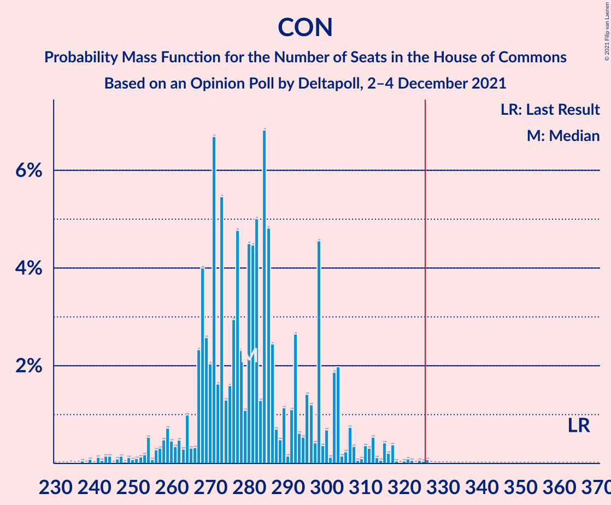

| Number of Seats | Probability | Accumulated | Special Marks |
|:---------------:|:-----------:|:-----------:|:-------------:|
| 235 | 0% | 100% |  |
| 236 | 0% | 99.9% |  |
| 237 | 0.1% | 99.9% |  |
| 238 | 0% | 99.9% |  |
| 239 | 0.1% | 99.9% |  |
| 240 | 0% | 99.8% |  |
| 241 | 0.1% | 99.8% |  |
| 242 | 0.1% | 99.6% |  |
| 243 | 0.2% | 99.6% |  |
| 244 | 0.2% | 99.4% |  |
| 245 | 0% | 99.3% |  |
| 246 | 0.1% | 99.2% |  |
| 247 | 0.1% | 99.2% |  |
| 248 | 0% | 99.0% |  |
| 249 | 0.1% | 99.0% |  |
| 250 | 0.1% | 98.9% |  |
| 251 | 0.1% | 98.8% |  |
| 252 | 0.1% | 98.7% |  |
| 253 | 0.2% | 98.5% |  |
| 254 | 0.5% | 98% |  |
| 255 | 0.1% | 98% |  |
| 256 | 0.3% | 98% |  |
| 257 | 0.3% | 97% |  |
| 258 | 0.5% | 97% |  |
| 259 | 0.7% | 97% |  |
| 260 | 0.5% | 96% |  |
| 261 | 0.3% | 95% |  |
| 262 | 0.5% | 95% |  |
| 263 | 0.3% | 95% |  |
| 264 | 1.0% | 94% |  |
| 265 | 0.3% | 93% |  |
| 266 | 0.3% | 93% |  |
| 267 | 2% | 93% |  |
| 268 | 4% | 90% |  |
| 269 | 3% | 86% |  |
| 270 | 2% | 84% |  |
| 271 | 7% | 82% |  |
| 272 | 2% | 75% |  |
| 273 | 5% | 73% |  |
| 274 | 1.3% | 68% |  |
| 275 | 2% | 67% |  |
| 276 | 3% | 65% |  |
| 277 | 5% | 62% |  |
| 278 | 2% | 57% |  |
| 279 | 1.1% | 55% |  |
| 280 | 5% | 54% | Median |
| 281 | 4% | 49% |  |
| 282 | 5% | 45% |  |
| 283 | 1.3% | 40% |  |
| 284 | 7% | 39% |  |
| 285 | 5% | 32% |  |
| 286 | 2% | 27% |  |
| 287 | 0.7% | 25% |  |
| 288 | 0.5% | 24% |  |
| 289 | 1.1% | 23% |  |
| 290 | 0.2% | 22% |  |
| 291 | 1.1% | 22% |  |
| 292 | 3% | 21% |  |
| 293 | 0.6% | 18% |  |
| 294 | 0.5% | 18% |  |
| 295 | 1.4% | 17% |  |
| 296 | 1.2% | 16% |  |
| 297 | 0.4% | 15% |  |
| 298 | 5% | 14% |  |
| 299 | 0.4% | 10% |  |
| 300 | 0.7% | 9% |  |
| 301 | 0.1% | 9% |  |
| 302 | 2% | 8% |  |
| 303 | 2% | 7% |  |
| 304 | 0.2% | 5% |  |
| 305 | 0.2% | 4% |  |
| 306 | 0.7% | 4% |  |
| 307 | 0.3% | 3% |  |
| 308 | 0.1% | 3% |  |
| 309 | 0.1% | 3% |  |
| 310 | 0.4% | 3% |  |
| 311 | 0.3% | 3% |  |
| 312 | 0.5% | 2% |  |
| 313 | 0.1% | 2% |  |
| 314 | 0.1% | 2% |  |
| 315 | 0.4% | 2% |  |
| 316 | 0.2% | 1.2% |  |
| 317 | 0.4% | 0.9% |  |
| 318 | 0.1% | 0.6% |  |
| 319 | 0% | 0.5% |  |
| 320 | 0.1% | 0.5% |  |
| 321 | 0.1% | 0.4% |  |
| 322 | 0.1% | 0.3% |  |
| 323 | 0% | 0.3% |  |
| 324 | 0.1% | 0.3% |  |
| 325 | 0% | 0.2% |  |
| 326 | 0.1% | 0.2% | Majority |
| 327 | 0% | 0.1% |  |
| 328 | 0% | 0.1% |  |
| 329 | 0% | 0% |  |
| 330 | 0% | 0% |  |
| 331 | 0% | 0% |  |
| 332 | 0% | 0% |  |
| 333 | 0% | 0% |  |
| 334 | 0% | 0% |  |
| 335 | 0% | 0% |  |
| 336 | 0% | 0% |  |
| 337 | 0% | 0% |  |
| 338 | 0% | 0% |  |
| 339 | 0% | 0% |  |
| 340 | 0% | 0% |  |
| 341 | 0% | 0% |  |
| 342 | 0% | 0% |  |
| 343 | 0% | 0% |  |
| 344 | 0% | 0% |  |
| 345 | 0% | 0% |  |
| 346 | 0% | 0% |  |
| 347 | 0% | 0% |  |
| 348 | 0% | 0% |  |
| 349 | 0% | 0% |  |
| 350 | 0% | 0% |  |
| 351 | 0% | 0% |  |
| 352 | 0% | 0% |  |
| 353 | 0% | 0% |  |
| 354 | 0% | 0% |  |
| 355 | 0% | 0% |  |
| 356 | 0% | 0% |  |
| 357 | 0% | 0% |  |
| 358 | 0% | 0% |  |
| 359 | 0% | 0% |  |
| 360 | 0% | 0% |  |
| 361 | 0% | 0% |  |
| 362 | 0% | 0% |  |
| 363 | 0% | 0% |  |
| 364 | 0% | 0% |  |
| 365 | 0% | 0% | Last Result |

### Labour Party – Liberal Democrats

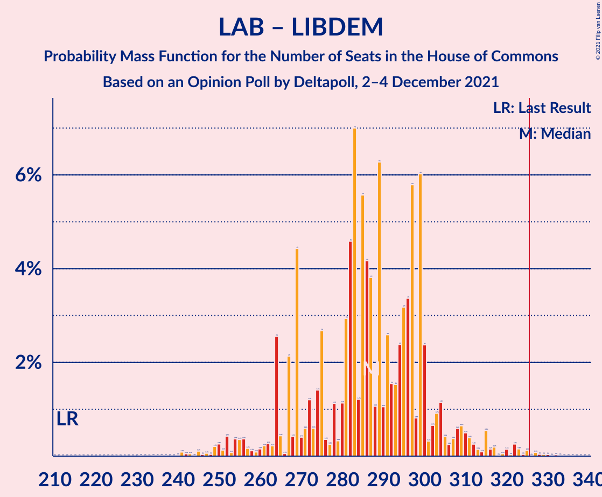

| Number of Seats | Probability | Accumulated | Special Marks |
|:---------------:|:-----------:|:-----------:|:-------------:|
| 213 | 0% | 100% | Last Result |
| 214 | 0% | 100% |  |
| 215 | 0% | 100% |  |
| 216 | 0% | 100% |  |
| 217 | 0% | 100% |  |
| 218 | 0% | 100% |  |
| 219 | 0% | 100% |  |
| 220 | 0% | 100% |  |
| 221 | 0% | 100% |  |
| 222 | 0% | 100% |  |
| 223 | 0% | 100% |  |
| 224 | 0% | 100% |  |
| 225 | 0% | 100% |  |
| 226 | 0% | 100% |  |
| 227 | 0% | 100% |  |
| 228 | 0% | 100% |  |
| 229 | 0% | 100% |  |
| 230 | 0% | 100% |  |
| 231 | 0% | 100% |  |
| 232 | 0% | 100% |  |
| 233 | 0% | 100% |  |
| 234 | 0% | 100% |  |
| 235 | 0% | 100% |  |
| 236 | 0% | 100% |  |
| 237 | 0% | 100% |  |
| 238 | 0% | 100% |  |
| 239 | 0% | 100% |  |
| 240 | 0% | 100% |  |
| 241 | 0.1% | 99.9% |  |
| 242 | 0.1% | 99.8% |  |
| 243 | 0.1% | 99.8% |  |
| 244 | 0% | 99.7% |  |
| 245 | 0.1% | 99.7% |  |
| 246 | 0% | 99.6% |  |
| 247 | 0.1% | 99.6% |  |
| 248 | 0% | 99.5% |  |
| 249 | 0.2% | 99.5% |  |
| 250 | 0.3% | 99.3% |  |
| 251 | 0.1% | 99.0% |  |
| 252 | 0.4% | 98.9% |  |
| 253 | 0.1% | 98% |  |
| 254 | 0.4% | 98% |  |
| 255 | 0.4% | 98% |  |
| 256 | 0.4% | 98% |  |
| 257 | 0.2% | 97% |  |
| 258 | 0.1% | 97% |  |
| 259 | 0.1% | 97% |  |
| 260 | 0.2% | 97% |  |
| 261 | 0.2% | 97% |  |
| 262 | 0.3% | 97% |  |
| 263 | 0.2% | 96% |  |
| 264 | 3% | 96% |  |
| 265 | 0.4% | 94% |  |
| 266 | 0.1% | 93% |  |
| 267 | 2% | 93% |  |
| 268 | 0.4% | 91% |  |
| 269 | 4% | 90% |  |
| 270 | 0.4% | 86% |  |
| 271 | 0.6% | 86% |  |
| 272 | 1.2% | 85% |  |
| 273 | 0.6% | 84% |  |
| 274 | 1.4% | 83% |  |
| 275 | 3% | 82% |  |
| 276 | 0.4% | 79% |  |
| 277 | 0.3% | 79% |  |
| 278 | 1.1% | 79% |  |
| 279 | 0.3% | 77% |  |
| 280 | 1.1% | 77% |  |
| 281 | 3% | 76% |  |
| 282 | 5% | 73% |  |
| 283 | 7% | 68% |  |
| 284 | 1.2% | 61% |  |
| 285 | 6% | 60% | Median |
| 286 | 4% | 55% |  |
| 287 | 4% | 50% |  |
| 288 | 1.1% | 47% |  |
| 289 | 6% | 46% |  |
| 290 | 1.1% | 39% |  |
| 291 | 3% | 38% |  |
| 292 | 2% | 36% |  |
| 293 | 2% | 34% |  |
| 294 | 2% | 33% |  |
| 295 | 3% | 30% |  |
| 296 | 3% | 27% |  |
| 297 | 6% | 24% |  |
| 298 | 0.8% | 18% |  |
| 299 | 6% | 17% |  |
| 300 | 2% | 11% |  |
| 301 | 0.3% | 9% |  |
| 302 | 0.7% | 8% |  |
| 303 | 0.9% | 8% |  |
| 304 | 1.1% | 7% |  |
| 305 | 0.4% | 6% |  |
| 306 | 0.2% | 5% |  |
| 307 | 0.4% | 5% |  |
| 308 | 0.6% | 5% |  |
| 309 | 0.6% | 4% |  |
| 310 | 0.5% | 3% |  |
| 311 | 0.4% | 3% |  |
| 312 | 0.3% | 2% |  |
| 313 | 0.1% | 2% |  |
| 314 | 0.1% | 2% |  |
| 315 | 0.5% | 2% |  |
| 316 | 0.2% | 1.4% |  |
| 317 | 0.2% | 1.3% |  |
| 318 | 0% | 1.1% |  |
| 319 | 0.1% | 1.1% |  |
| 320 | 0.1% | 1.0% |  |
| 321 | 0% | 0.9% |  |
| 322 | 0.3% | 0.9% |  |
| 323 | 0.2% | 0.6% |  |
| 324 | 0% | 0.4% |  |
| 325 | 0.1% | 0.4% |  |
| 326 | 0% | 0.3% | Majority |
| 327 | 0.1% | 0.3% |  |
| 328 | 0% | 0.2% |  |
| 329 | 0% | 0.2% |  |
| 330 | 0% | 0.1% |  |
| 331 | 0% | 0.1% |  |
| 332 | 0% | 0.1% |  |
| 333 | 0% | 0% |  |

### Labour Party – Plaid Cymru

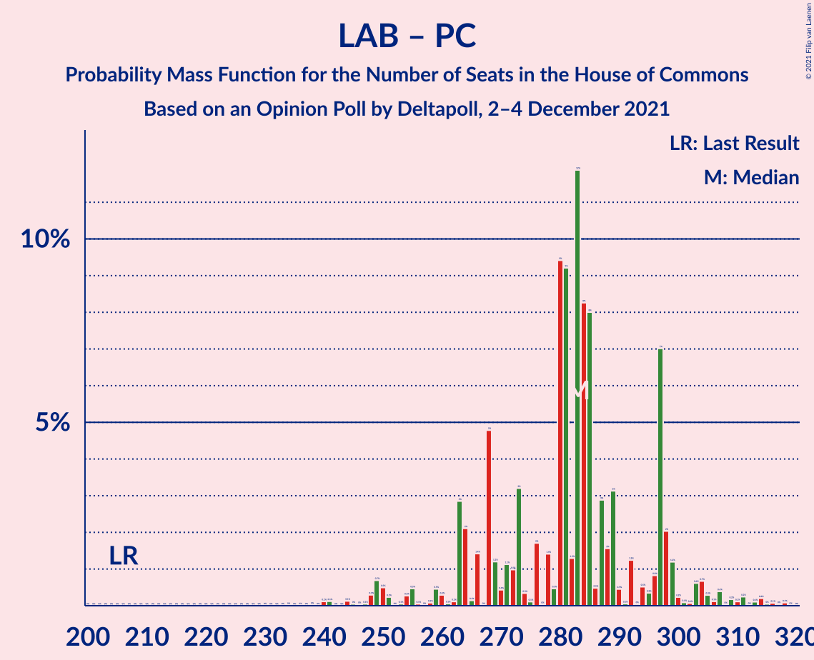

| Number of Seats | Probability | Accumulated | Special Marks |
|:---------------:|:-----------:|:-----------:|:-------------:|
| 206 | 0% | 100% | Last Result |
| 207 | 0% | 100% |  |
| 208 | 0% | 100% |  |
| 209 | 0% | 100% |  |
| 210 | 0% | 100% |  |
| 211 | 0% | 100% |  |
| 212 | 0% | 100% |  |
| 213 | 0% | 100% |  |
| 214 | 0% | 100% |  |
| 215 | 0% | 100% |  |
| 216 | 0% | 100% |  |
| 217 | 0% | 100% |  |
| 218 | 0% | 100% |  |
| 219 | 0% | 100% |  |
| 220 | 0% | 100% |  |
| 221 | 0% | 100% |  |
| 222 | 0% | 100% |  |
| 223 | 0% | 100% |  |
| 224 | 0% | 100% |  |
| 225 | 0% | 100% |  |
| 226 | 0% | 100% |  |
| 227 | 0% | 100% |  |
| 228 | 0% | 100% |  |
| 229 | 0% | 100% |  |
| 230 | 0% | 100% |  |
| 231 | 0% | 100% |  |
| 232 | 0% | 100% |  |
| 233 | 0% | 100% |  |
| 234 | 0% | 100% |  |
| 235 | 0% | 100% |  |
| 236 | 0% | 100% |  |
| 237 | 0% | 100% |  |
| 238 | 0% | 100% |  |
| 239 | 0% | 99.9% |  |
| 240 | 0.1% | 99.9% |  |
| 241 | 0.1% | 99.8% |  |
| 242 | 0% | 99.7% |  |
| 243 | 0% | 99.7% |  |
| 244 | 0.1% | 99.7% |  |
| 245 | 0% | 99.6% |  |
| 246 | 0% | 99.5% |  |
| 247 | 0.1% | 99.5% |  |
| 248 | 0.3% | 99.4% |  |
| 249 | 0.7% | 99.1% |  |
| 250 | 0.5% | 98% |  |
| 251 | 0.2% | 98% |  |
| 252 | 0% | 98% |  |
| 253 | 0.1% | 98% |  |
| 254 | 0.3% | 98% |  |
| 255 | 0.5% | 97% |  |
| 256 | 0.1% | 97% |  |
| 257 | 0% | 97% |  |
| 258 | 0.1% | 97% |  |
| 259 | 0.5% | 97% |  |
| 260 | 0.3% | 96% |  |
| 261 | 0.1% | 96% |  |
| 262 | 0.1% | 96% |  |
| 263 | 3% | 96% |  |
| 264 | 2% | 93% |  |
| 265 | 0.1% | 91% |  |
| 266 | 1.4% | 91% |  |
| 267 | 0% | 89% |  |
| 268 | 5% | 89% |  |
| 269 | 1.2% | 85% |  |
| 270 | 0.4% | 83% |  |
| 271 | 1.1% | 83% |  |
| 272 | 1.0% | 82% |  |
| 273 | 3% | 81% |  |
| 274 | 0.3% | 78% |  |
| 275 | 0.1% | 77% |  |
| 276 | 2% | 77% |  |
| 277 | 0% | 75% |  |
| 278 | 1.4% | 75% |  |
| 279 | 0.5% | 74% |  |
| 280 | 9% | 74% |  |
| 281 | 9% | 64% |  |
| 282 | 1.3% | 55% |  |
| 283 | 12% | 54% | Median |
| 284 | 8% | 42% |  |
| 285 | 8% | 33% |  |
| 286 | 0.5% | 25% |  |
| 287 | 3% | 25% |  |
| 288 | 2% | 22% |  |
| 289 | 3% | 21% |  |
| 290 | 0.5% | 17% |  |
| 291 | 0.1% | 17% |  |
| 292 | 1.2% | 17% |  |
| 293 | 0% | 16% |  |
| 294 | 0.5% | 16% |  |
| 295 | 0.3% | 15% |  |
| 296 | 0.8% | 15% |  |
| 297 | 7% | 14% |  |
| 298 | 2% | 7% |  |
| 299 | 1.2% | 5% |  |
| 300 | 0.2% | 4% |  |
| 301 | 0.1% | 3% |  |
| 302 | 0.1% | 3% |  |
| 303 | 0.6% | 3% |  |
| 304 | 0.7% | 3% |  |
| 305 | 0.3% | 2% |  |
| 306 | 0.1% | 2% |  |
| 307 | 0.4% | 2% |  |
| 308 | 0% | 1.2% |  |
| 309 | 0.2% | 1.1% |  |
| 310 | 0.1% | 1.0% |  |
| 311 | 0.2% | 0.9% |  |
| 312 | 0% | 0.6% |  |
| 313 | 0.1% | 0.6% |  |
| 314 | 0.2% | 0.5% |  |
| 315 | 0% | 0.3% |  |
| 316 | 0.1% | 0.2% |  |
| 317 | 0% | 0.2% |  |
| 318 | 0.1% | 0.1% |  |
| 319 | 0% | 0% |  |

### Labour Party

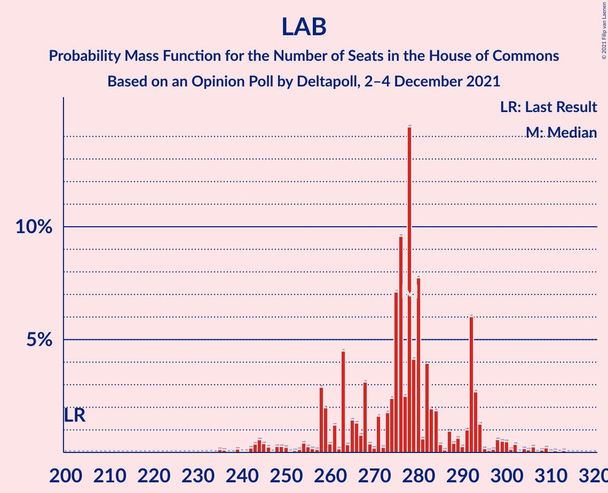

| Number of Seats | Probability | Accumulated | Special Marks |
|:---------------:|:-----------:|:-----------:|:-------------:|
| 202 | 0% | 100% | Last Result |
| 203 | 0% | 100% |  |
| 204 | 0% | 100% |  |
| 205 | 0% | 100% |  |
| 206 | 0% | 100% |  |
| 207 | 0% | 100% |  |
| 208 | 0% | 100% |  |
| 209 | 0% | 100% |  |
| 210 | 0% | 100% |  |
| 211 | 0% | 100% |  |
| 212 | 0% | 100% |  |
| 213 | 0% | 100% |  |
| 214 | 0% | 100% |  |
| 215 | 0% | 100% |  |
| 216 | 0% | 100% |  |
| 217 | 0% | 100% |  |
| 218 | 0% | 100% |  |
| 219 | 0% | 100% |  |
| 220 | 0% | 100% |  |
| 221 | 0% | 100% |  |
| 222 | 0% | 100% |  |
| 223 | 0% | 100% |  |
| 224 | 0% | 100% |  |
| 225 | 0% | 100% |  |
| 226 | 0% | 100% |  |
| 227 | 0% | 100% |  |
| 228 | 0% | 100% |  |
| 229 | 0% | 100% |  |
| 230 | 0% | 100% |  |
| 231 | 0% | 100% |  |
| 232 | 0% | 100% |  |
| 233 | 0% | 100% |  |
| 234 | 0% | 99.9% |  |
| 235 | 0.1% | 99.9% |  |
| 236 | 0.1% | 99.8% |  |
| 237 | 0% | 99.7% |  |
| 238 | 0% | 99.7% |  |
| 239 | 0.1% | 99.7% |  |
| 240 | 0% | 99.5% |  |
| 241 | 0% | 99.5% |  |
| 242 | 0.2% | 99.4% |  |
| 243 | 0.4% | 99.3% |  |
| 244 | 0.6% | 98.9% |  |
| 245 | 0.4% | 98% |  |
| 246 | 0.2% | 98% |  |
| 247 | 0% | 98% |  |
| 248 | 0.3% | 98% |  |
| 249 | 0.3% | 97% |  |
| 250 | 0.2% | 97% |  |
| 251 | 0% | 97% |  |
| 252 | 0.1% | 97% |  |
| 253 | 0.1% | 97% |  |
| 254 | 0.4% | 97% |  |
| 255 | 0.3% | 96% |  |
| 256 | 0.2% | 96% |  |
| 257 | 0.1% | 96% |  |
| 258 | 3% | 96% |  |
| 259 | 2% | 93% |  |
| 260 | 0.4% | 91% |  |
| 261 | 1.2% | 90% |  |
| 262 | 0.2% | 89% |  |
| 263 | 4% | 89% |  |
| 264 | 0.3% | 85% |  |
| 265 | 1.4% | 84% |  |
| 266 | 1.3% | 83% |  |
| 267 | 0.8% | 81% |  |
| 268 | 3% | 81% |  |
| 269 | 0.4% | 78% |  |
| 270 | 0.2% | 77% |  |
| 271 | 2% | 77% |  |
| 272 | 0.2% | 75% |  |
| 273 | 2% | 75% |  |
| 274 | 2% | 73% |  |
| 275 | 7% | 71% |  |
| 276 | 10% | 64% |  |
| 277 | 2% | 54% |  |
| 278 | 14% | 52% | Median |
| 279 | 4% | 37% |  |
| 280 | 8% | 33% |  |
| 281 | 0.6% | 26% |  |
| 282 | 4% | 25% |  |
| 283 | 2% | 21% |  |
| 284 | 2% | 19% |  |
| 285 | 0.4% | 17% |  |
| 286 | 0.1% | 17% |  |
| 287 | 0.9% | 17% |  |
| 288 | 0.4% | 16% |  |
| 289 | 0.6% | 15% |  |
| 290 | 0.3% | 15% |  |
| 291 | 1.0% | 15% |  |
| 292 | 6% | 14% |  |
| 293 | 3% | 8% |  |
| 294 | 1.3% | 5% |  |
| 295 | 0.2% | 4% |  |
| 296 | 0.1% | 3% |  |
| 297 | 0.1% | 3% |  |
| 298 | 0.6% | 3% |  |
| 299 | 0.5% | 3% |  |
| 300 | 0.5% | 2% |  |
| 301 | 0.1% | 2% |  |
| 302 | 0.4% | 2% |  |
| 303 | 0% | 1.2% |  |
| 304 | 0.2% | 1.1% |  |
| 305 | 0.1% | 1.0% |  |
| 306 | 0.2% | 0.9% |  |
| 307 | 0% | 0.6% |  |
| 308 | 0.1% | 0.6% |  |
| 309 | 0.2% | 0.5% |  |
| 310 | 0.1% | 0.3% |  |
| 311 | 0.1% | 0.2% |  |
| 312 | 0% | 0.2% |  |
| 313 | 0.1% | 0.1% |  |
| 314 | 0% | 0% |  |

## Technical Information

### Opinion Poll

+ **Polling firm:** Deltapoll
+ **Commissioner(s):** —
+ **Fieldwork period:** 2–4 December 2021

### Calculations

+ **Sample size:** 1490
+ **Simulations done:** 1,048,576
+ **Error estimate:** 2.56%

