# Opinion Poll by Opinium, 14–26 April 2022

<a href="#voting-intentions">Voting Intentions</a> | <a href="#seats">Seats</a> | <a href="#coalitions">Coalitions</a> | <a href="#technical-information">Technical Information</a>

## Voting Intentions

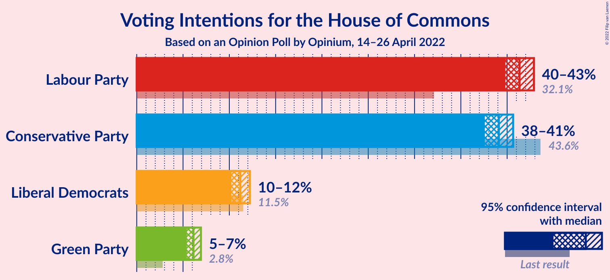

### Confidence Intervals

| Party | Last Result | Poll Result | 80% Confidence Interval | 90% Confidence Interval | 95% Confidence Interval | 99% Confidence Interval |
|:-----:|:-----------:|:-----------:|:-----------------------:|:-----------------------:|:-----------------------:|:-----------------------:|
| Labour Party | 32.1% | 41.3% | 40.3–42.4% |40.1–42.6% |39.8–42.9% |39.3–43.4% |
| Conservative Party | 43.6% | 39.1% | 38.1–40.1% |37.8–40.4% |37.6–40.6% |37.1–41.1% |
| Liberal Democrats | 11.5% | 11.2% | 10.6–11.9% |10.4–12.1% |10.2–12.2% |9.9–12.5% |
| Green Party | 2.8% | 6.1% | 5.7–6.6% |5.5–6.8% |5.4–6.9% |5.2–7.2% |

*Note:* The poll result column reflects the actual value used in the calculations. Published results may vary slightly, and in addition be rounded to fewer digits.

## Seats

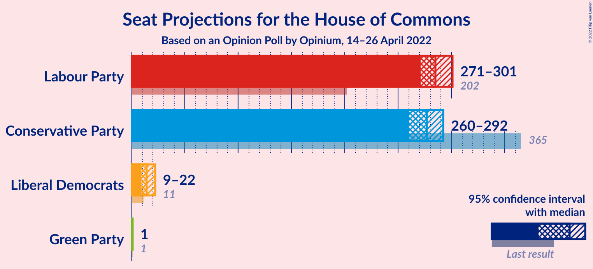

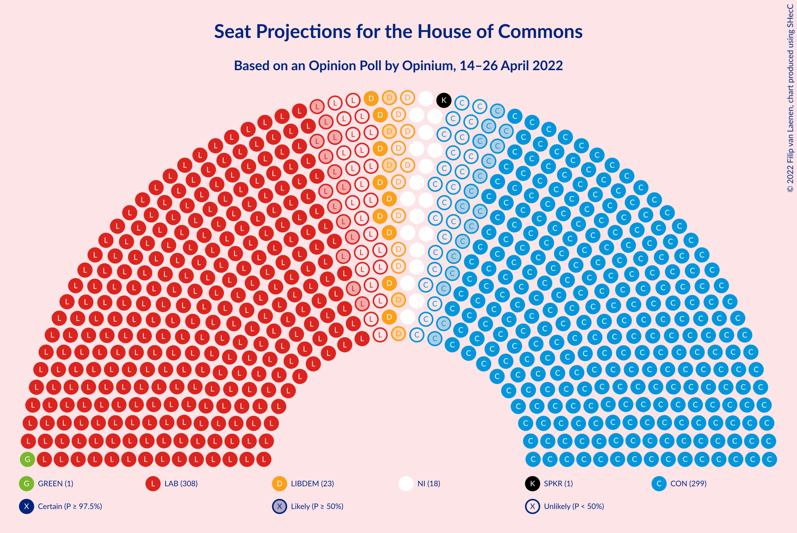

### Confidence Intervals

| Party | Last Result | Median | 80% Confidence Interval | 90% Confidence Interval | 95% Confidence Interval | 99% Confidence Interval |
|:-----:|:-----------:|:------:|:-----------------------:|:-----------------------:|:-----------------------:|:-----------------------:|
| <a href="#labour-party">Labour Party</a> | 202 | 285 | 279–297 |276–298 |271–301 |267–305 |
| <a href="#conservative-party">Conservative Party</a> | 365 | 277 | 265–286 |263–288 |260–292 |254–298 |
| <a href="#liberal-democrats">Liberal Democrats</a> | 11 | 14 | 9–20 |9–21 |9–22 |9–23 |
| <a href="#green-party">Green Party</a> | 1 | 1 | 1 |1 |1 |1 |

### Labour Party

*For a full overview of the results for this party, see the [Labour Party](party-labourparty.html) page.*

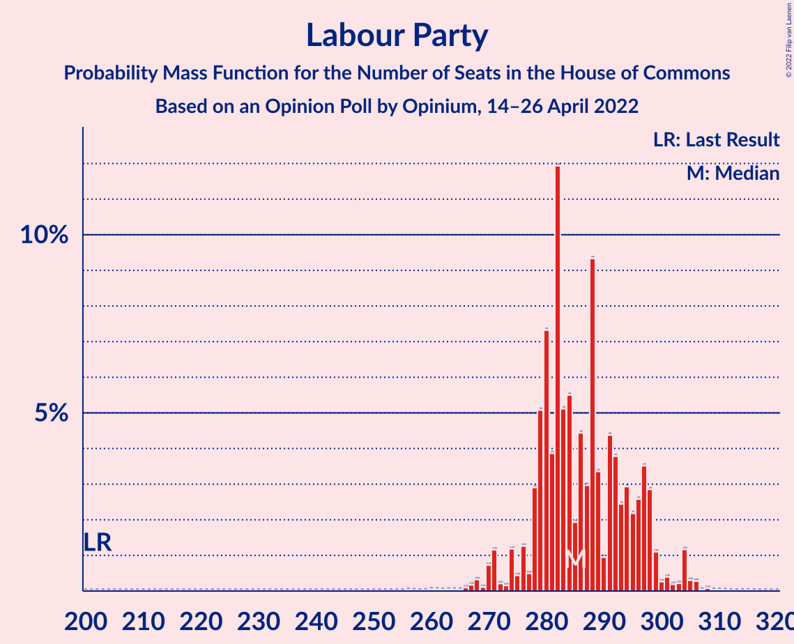

| Number of Seats | Probability | Accumulated | Special Marks |
|:---------------:|:-----------:|:-----------:|:-------------:|
| 202 | 0% | 100% | Last Result |
| 203 | 0% | 100% |  |
| 204 | 0% | 100% |  |
| 205 | 0% | 100% |  |
| 206 | 0% | 100% |  |
| 207 | 0% | 100% |  |
| 208 | 0% | 100% |  |
| 209 | 0% | 100% |  |
| 210 | 0% | 100% |  |
| 211 | 0% | 100% |  |
| 212 | 0% | 100% |  |
| 213 | 0% | 100% |  |
| 214 | 0% | 100% |  |
| 215 | 0% | 100% |  |
| 216 | 0% | 100% |  |
| 217 | 0% | 100% |  |
| 218 | 0% | 100% |  |
| 219 | 0% | 100% |  |
| 220 | 0% | 100% |  |
| 221 | 0% | 100% |  |
| 222 | 0% | 100% |  |
| 223 | 0% | 100% |  |
| 224 | 0% | 100% |  |
| 225 | 0% | 100% |  |
| 226 | 0% | 100% |  |
| 227 | 0% | 100% |  |
| 228 | 0% | 100% |  |
| 229 | 0% | 100% |  |
| 230 | 0% | 100% |  |
| 231 | 0% | 100% |  |
| 232 | 0% | 100% |  |
| 233 | 0% | 100% |  |
| 234 | 0% | 100% |  |
| 235 | 0% | 100% |  |
| 236 | 0% | 100% |  |
| 237 | 0% | 100% |  |
| 238 | 0% | 100% |  |
| 239 | 0% | 100% |  |
| 240 | 0% | 100% |  |
| 241 | 0% | 100% |  |
| 242 | 0% | 100% |  |
| 243 | 0% | 100% |  |
| 244 | 0% | 100% |  |
| 245 | 0% | 100% |  |
| 246 | 0% | 100% |  |
| 247 | 0% | 100% |  |
| 248 | 0% | 100% |  |
| 249 | 0% | 100% |  |
| 250 | 0% | 100% |  |
| 251 | 0% | 100% |  |
| 252 | 0% | 100% |  |
| 253 | 0% | 100% |  |
| 254 | 0% | 100% |  |
| 255 | 0% | 100% |  |
| 256 | 0% | 100% |  |
| 257 | 0% | 100% |  |
| 258 | 0% | 100% |  |
| 259 | 0% | 100% |  |
| 260 | 0% | 99.9% |  |
| 261 | 0% | 99.9% |  |
| 262 | 0% | 99.9% |  |
| 263 | 0% | 99.8% |  |
| 264 | 0% | 99.8% |  |
| 265 | 0% | 99.8% |  |
| 266 | 0.1% | 99.7% |  |
| 267 | 0.2% | 99.6% |  |
| 268 | 0.3% | 99.5% |  |
| 269 | 0.1% | 99.2% |  |
| 270 | 0.7% | 99.0% |  |
| 271 | 1.2% | 98% |  |
| 272 | 0.2% | 97% |  |
| 273 | 0.2% | 97% |  |
| 274 | 1.2% | 97% |  |
| 275 | 0.4% | 96% |  |
| 276 | 1.3% | 95% |  |
| 277 | 0.5% | 94% |  |
| 278 | 3% | 93% |  |
| 279 | 5% | 91% |  |
| 280 | 7% | 85% |  |
| 281 | 4% | 78% |  |
| 282 | 12% | 74% |  |
| 283 | 5% | 62% |  |
| 284 | 6% | 57% |  |
| 285 | 2% | 52% | Median |
| 286 | 4% | 50% |  |
| 287 | 3% | 45% |  |
| 288 | 9% | 42% |  |
| 289 | 3% | 33% |  |
| 290 | 0.9% | 30% |  |
| 291 | 4% | 29% |  |
| 292 | 4% | 24% |  |
| 293 | 2% | 21% |  |
| 294 | 3% | 18% |  |
| 295 | 2% | 15% |  |
| 296 | 3% | 13% |  |
| 297 | 4% | 10% |  |
| 298 | 3% | 7% |  |
| 299 | 1.1% | 4% |  |
| 300 | 0.3% | 3% |  |
| 301 | 0.4% | 3% |  |
| 302 | 0.2% | 2% |  |
| 303 | 0.2% | 2% |  |
| 304 | 1.2% | 2% |  |
| 305 | 0.3% | 0.8% |  |
| 306 | 0.3% | 0.5% |  |
| 307 | 0% | 0.2% |  |
| 308 | 0.1% | 0.2% |  |
| 309 | 0% | 0.1% |  |
| 310 | 0% | 0.1% |  |
| 311 | 0% | 0.1% |  |
| 312 | 0% | 0% |  |

### Conservative Party

*For a full overview of the results for this party, see the [Conservative Party](party-conservativeparty.html) page.*

| Number of Seats | Probability | Accumulated | Special Marks |
|:---------------:|:-----------:|:-----------:|:-------------:|
| 249 | 0% | 100% |  |
| 250 | 0% | 99.9% |  |
| 251 | 0.1% | 99.9% |  |
| 252 | 0.1% | 99.8% |  |
| 253 | 0.2% | 99.7% |  |
| 254 | 0.2% | 99.6% |  |
| 255 | 0.2% | 99.4% |  |
| 256 | 0.3% | 99.1% |  |
| 257 | 0.4% | 98.8% |  |
| 258 | 0.2% | 98% |  |
| 259 | 0.3% | 98% |  |
| 260 | 0.5% | 98% |  |
| 261 | 1.0% | 97% |  |
| 262 | 1.3% | 96% |  |
| 263 | 2% | 95% |  |
| 264 | 2% | 93% |  |
| 265 | 1.5% | 91% |  |
| 266 | 2% | 89% |  |
| 267 | 3% | 87% |  |
| 268 | 5% | 85% |  |
| 269 | 0.8% | 80% |  |
| 270 | 4% | 79% |  |
| 271 | 4% | 75% |  |
| 272 | 5% | 71% |  |
| 273 | 2% | 66% |  |
| 274 | 3% | 64% |  |
| 275 | 7% | 62% |  |
| 276 | 5% | 55% |  |
| 277 | 5% | 50% | Median |
| 278 | 2% | 45% |  |
| 279 | 6% | 43% |  |
| 280 | 4% | 37% |  |
| 281 | 7% | 33% |  |
| 282 | 2% | 26% |  |
| 283 | 5% | 24% |  |
| 284 | 4% | 19% |  |
| 285 | 3% | 15% |  |
| 286 | 2% | 11% |  |
| 287 | 3% | 10% |  |
| 288 | 3% | 7% |  |
| 289 | 0.1% | 4% |  |
| 290 | 0.8% | 4% |  |
| 291 | 0.6% | 3% |  |
| 292 | 0.9% | 3% |  |
| 293 | 0.1% | 2% |  |
| 294 | 0.2% | 2% |  |
| 295 | 0.5% | 2% |  |
| 296 | 0.4% | 1.0% |  |
| 297 | 0.1% | 0.6% |  |
| 298 | 0.2% | 0.5% |  |
| 299 | 0.1% | 0.4% |  |
| 300 | 0.1% | 0.3% |  |
| 301 | 0% | 0.2% |  |
| 302 | 0% | 0.2% |  |
| 303 | 0% | 0.1% |  |
| 304 | 0% | 0.1% |  |
| 305 | 0% | 0.1% |  |
| 306 | 0% | 0.1% |  |
| 307 | 0% | 0% |  |
| 308 | 0% | 0% |  |
| 309 | 0% | 0% |  |
| 310 | 0% | 0% |  |
| 311 | 0% | 0% |  |
| 312 | 0% | 0% |  |
| 313 | 0% | 0% |  |
| 314 | 0% | 0% |  |
| 315 | 0% | 0% |  |
| 316 | 0% | 0% |  |
| 317 | 0% | 0% |  |
| 318 | 0% | 0% |  |
| 319 | 0% | 0% |  |
| 320 | 0% | 0% |  |
| 321 | 0% | 0% |  |
| 322 | 0% | 0% |  |
| 323 | 0% | 0% |  |
| 324 | 0% | 0% |  |
| 325 | 0% | 0% |  |
| 326 | 0% | 0% | Majority |
| 327 | 0% | 0% |  |
| 328 | 0% | 0% |  |
| 329 | 0% | 0% |  |
| 330 | 0% | 0% |  |
| 331 | 0% | 0% |  |
| 332 | 0% | 0% |  |
| 333 | 0% | 0% |  |
| 334 | 0% | 0% |  |
| 335 | 0% | 0% |  |
| 336 | 0% | 0% |  |
| 337 | 0% | 0% |  |
| 338 | 0% | 0% |  |
| 339 | 0% | 0% |  |
| 340 | 0% | 0% |  |
| 341 | 0% | 0% |  |
| 342 | 0% | 0% |  |
| 343 | 0% | 0% |  |
| 344 | 0% | 0% |  |
| 345 | 0% | 0% |  |
| 346 | 0% | 0% |  |
| 347 | 0% | 0% |  |
| 348 | 0% | 0% |  |
| 349 | 0% | 0% |  |
| 350 | 0% | 0% |  |
| 351 | 0% | 0% |  |
| 352 | 0% | 0% |  |
| 353 | 0% | 0% |  |
| 354 | 0% | 0% |  |
| 355 | 0% | 0% |  |
| 356 | 0% | 0% |  |
| 357 | 0% | 0% |  |
| 358 | 0% | 0% |  |
| 359 | 0% | 0% |  |
| 360 | 0% | 0% |  |
| 361 | 0% | 0% |  |
| 362 | 0% | 0% |  |
| 363 | 0% | 0% |  |
| 364 | 0% | 0% |  |
| 365 | 0% | 0% | Last Result |

### Liberal Democrats

*For a full overview of the results for this party, see the [Liberal Democrats](party-liberaldemocrats.html) page.*

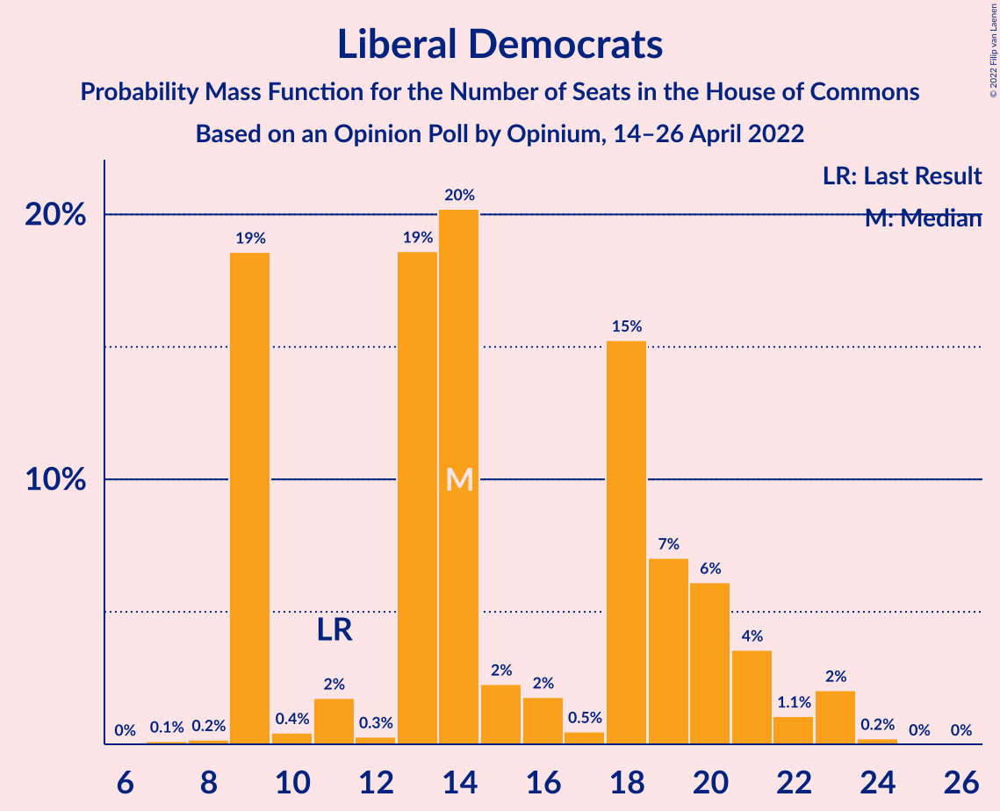

| Number of Seats | Probability | Accumulated | Special Marks |
|:---------------:|:-----------:|:-----------:|:-------------:|
| 7 | 0.1% | 100% |  |
| 8 | 0.2% | 99.9% |  |
| 9 | 19% | 99.7% |  |
| 10 | 0.4% | 81% |  |
| 11 | 2% | 81% | Last Result |
| 12 | 0.3% | 79% |  |
| 13 | 19% | 79% |  |
| 14 | 20% | 60% | Median |
| 15 | 2% | 40% |  |
| 16 | 2% | 38% |  |
| 17 | 0.5% | 36% |  |
| 18 | 15% | 35% |  |
| 19 | 7% | 20% |  |
| 20 | 6% | 13% |  |
| 21 | 4% | 7% |  |
| 22 | 1.1% | 3% |  |
| 23 | 2% | 2% |  |
| 24 | 0.2% | 0.2% |  |
| 25 | 0% | 0% |  |

### Green Party

*For a full overview of the results for this party, see the [Green Party](party-greenparty.html) page.*

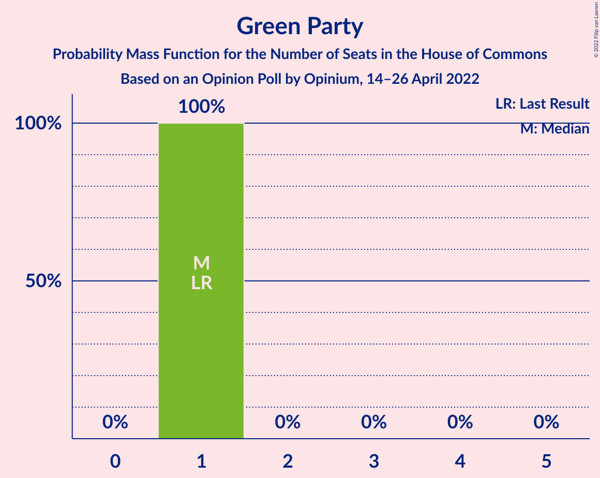

| Number of Seats | Probability | Accumulated | Special Marks |
|:---------------:|:-----------:|:-----------:|:-------------:|
| 1 | 100% | 100% | Last Result, Median |

## Coalitions

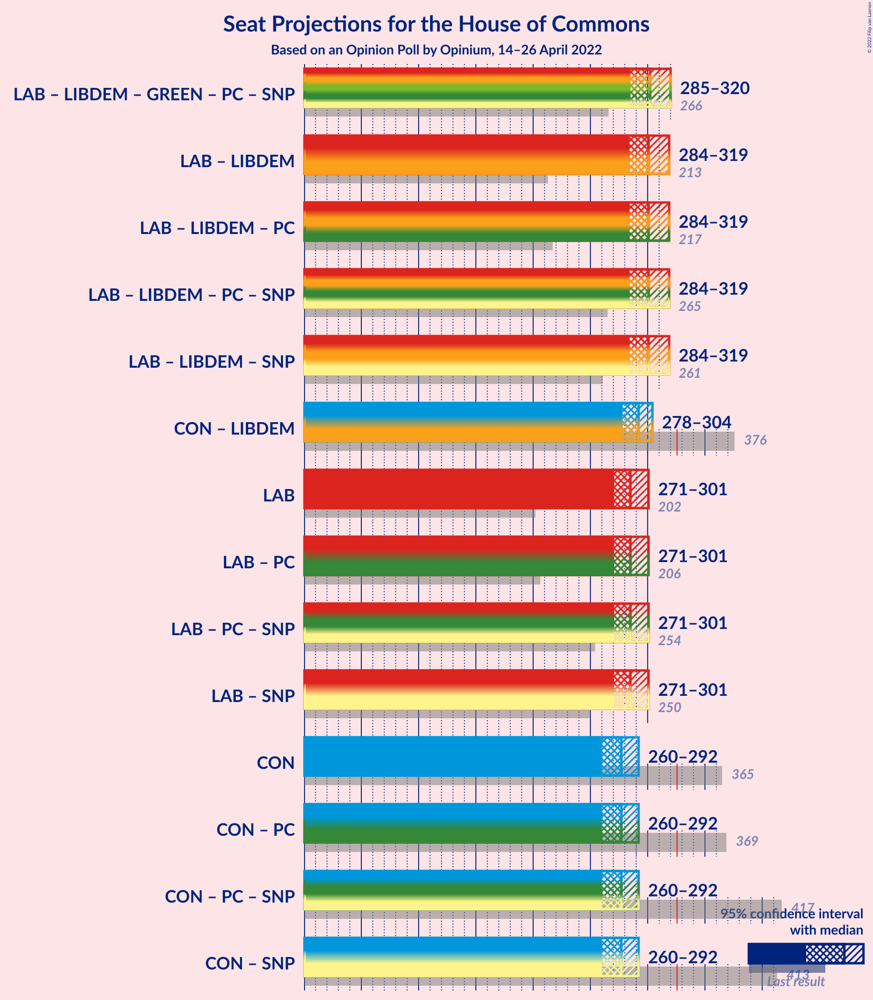

### Confidence Intervals

| Coalition | Last Result | Median | Majority? | 80% Confidence Interval | 90% Confidence Interval | 95% Confidence Interval | 99% Confidence Interval |
|:---------:|:-----------:|:------:|:---------:|:-----------------------:|:-----------------------:|:-----------------------:|:-----------------------:|
| Labour Party – Liberal Democrats | 213 | 301 | 0.4% | 290–313 | 288–316 | 284–319 | 278–325 |
| Conservative Party – Liberal Democrats | 376 | 292 | 0% | 282–298 | 280–301 | 278–304 | 273–309 |
| Labour Party | 202 | 285 | 0% | 279–297 | 276–298 | 271–301 | 267–305 |
| Conservative Party | 365 | 277 | 0% | 265–286 | 263–288 | 260–292 | 254–298 |

### Labour Party – Liberal Democrats

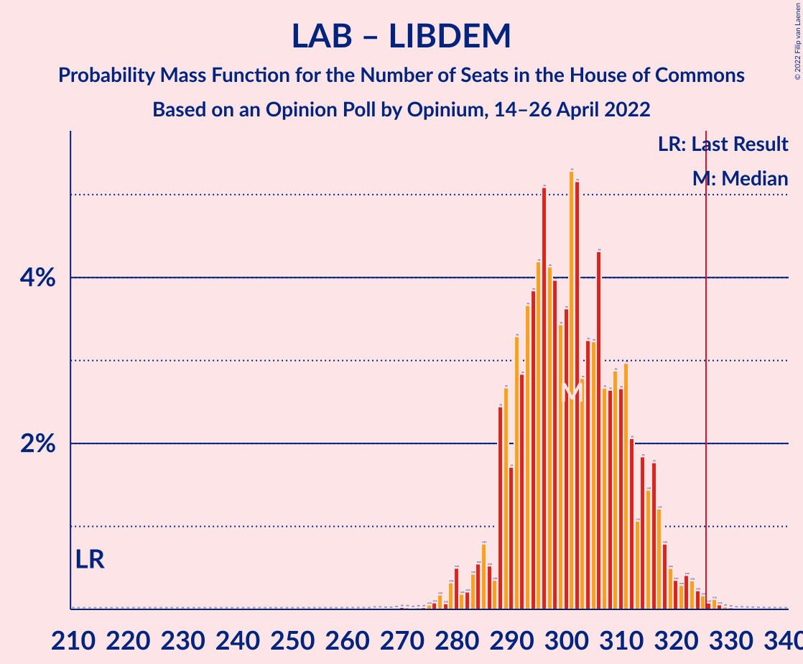

| Number of Seats | Probability | Accumulated | Special Marks |
|:---------------:|:-----------:|:-----------:|:-------------:|
| 213 | 0% | 100% | Last Result |
| 214 | 0% | 100% |  |
| 215 | 0% | 100% |  |
| 216 | 0% | 100% |  |
| 217 | 0% | 100% |  |
| 218 | 0% | 100% |  |
| 219 | 0% | 100% |  |
| 220 | 0% | 100% |  |
| 221 | 0% | 100% |  |
| 222 | 0% | 100% |  |
| 223 | 0% | 100% |  |
| 224 | 0% | 100% |  |
| 225 | 0% | 100% |  |
| 226 | 0% | 100% |  |
| 227 | 0% | 100% |  |
| 228 | 0% | 100% |  |
| 229 | 0% | 100% |  |
| 230 | 0% | 100% |  |
| 231 | 0% | 100% |  |
| 232 | 0% | 100% |  |
| 233 | 0% | 100% |  |
| 234 | 0% | 100% |  |
| 235 | 0% | 100% |  |
| 236 | 0% | 100% |  |
| 237 | 0% | 100% |  |
| 238 | 0% | 100% |  |
| 239 | 0% | 100% |  |
| 240 | 0% | 100% |  |
| 241 | 0% | 100% |  |
| 242 | 0% | 100% |  |
| 243 | 0% | 100% |  |
| 244 | 0% | 100% |  |
| 245 | 0% | 100% |  |
| 246 | 0% | 100% |  |
| 247 | 0% | 100% |  |
| 248 | 0% | 100% |  |
| 249 | 0% | 100% |  |
| 250 | 0% | 100% |  |
| 251 | 0% | 100% |  |
| 252 | 0% | 100% |  |
| 253 | 0% | 100% |  |
| 254 | 0% | 100% |  |
| 255 | 0% | 100% |  |
| 256 | 0% | 100% |  |
| 257 | 0% | 100% |  |
| 258 | 0% | 100% |  |
| 259 | 0% | 100% |  |
| 260 | 0% | 100% |  |
| 261 | 0% | 100% |  |
| 262 | 0% | 100% |  |
| 263 | 0% | 100% |  |
| 264 | 0% | 100% |  |
| 265 | 0% | 100% |  |
| 266 | 0% | 100% |  |
| 267 | 0% | 100% |  |
| 268 | 0% | 100% |  |
| 269 | 0% | 100% |  |
| 270 | 0% | 99.9% |  |
| 271 | 0% | 99.9% |  |
| 272 | 0% | 99.9% |  |
| 273 | 0% | 99.9% |  |
| 274 | 0% | 99.9% |  |
| 275 | 0.1% | 99.8% |  |
| 276 | 0.1% | 99.8% |  |
| 277 | 0.2% | 99.7% |  |
| 278 | 0.1% | 99.5% |  |
| 279 | 0.3% | 99.5% |  |
| 280 | 0.5% | 99.1% |  |
| 281 | 0.2% | 98.6% |  |
| 282 | 0.2% | 98% |  |
| 283 | 0.4% | 98% |  |
| 284 | 0.6% | 98% |  |
| 285 | 0.8% | 97% |  |
| 286 | 0.5% | 96% |  |
| 287 | 0.4% | 96% |  |
| 288 | 2% | 96% |  |
| 289 | 3% | 93% |  |
| 290 | 2% | 90% |  |
| 291 | 3% | 89% |  |
| 292 | 3% | 85% |  |
| 293 | 4% | 83% |  |
| 294 | 4% | 79% |  |
| 295 | 4% | 75% |  |
| 296 | 5% | 71% |  |
| 297 | 4% | 66% |  |
| 298 | 4% | 62% |  |
| 299 | 3% | 58% | Median |
| 300 | 4% | 54% |  |
| 301 | 5% | 51% |  |
| 302 | 5% | 45% |  |
| 303 | 3% | 40% |  |
| 304 | 3% | 37% |  |
| 305 | 3% | 34% |  |
| 306 | 4% | 31% |  |
| 307 | 3% | 27% |  |
| 308 | 3% | 24% |  |
| 309 | 3% | 21% |  |
| 310 | 3% | 18% |  |
| 311 | 3% | 16% |  |
| 312 | 2% | 13% |  |
| 313 | 1.1% | 11% |  |
| 314 | 2% | 10% |  |
| 315 | 1.4% | 8% |  |
| 316 | 2% | 6% |  |
| 317 | 1.2% | 5% |  |
| 318 | 0.8% | 3% |  |
| 319 | 0.5% | 3% |  |
| 320 | 0.4% | 2% |  |
| 321 | 0.3% | 2% |  |
| 322 | 0.4% | 2% |  |
| 323 | 0.3% | 1.1% |  |
| 324 | 0.2% | 0.8% |  |
| 325 | 0.2% | 0.5% |  |
| 326 | 0.1% | 0.4% | Majority |
| 327 | 0.1% | 0.3% |  |
| 328 | 0.1% | 0.2% |  |
| 329 | 0% | 0.1% |  |
| 330 | 0% | 0.1% |  |
| 331 | 0% | 0% |  |

### Conservative Party – Liberal Democrats

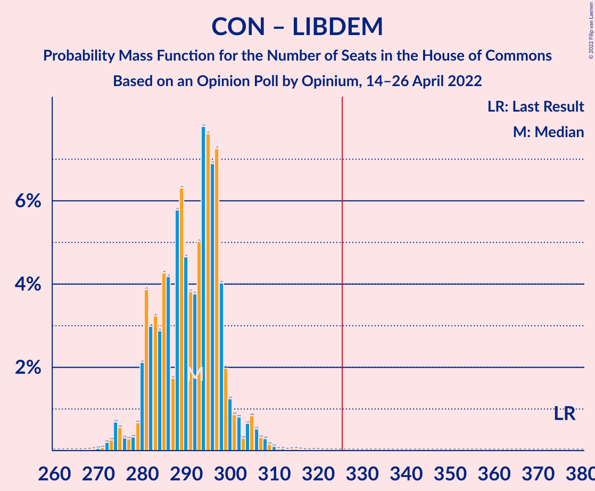

| Number of Seats | Probability | Accumulated | Special Marks |
|:---------------:|:-----------:|:-----------:|:-------------:|
| 267 | 0% | 100% |  |
| 268 | 0% | 99.9% |  |
| 269 | 0% | 99.9% |  |
| 270 | 0.1% | 99.9% |  |
| 271 | 0.1% | 99.8% |  |
| 272 | 0.2% | 99.8% |  |
| 273 | 0.3% | 99.6% |  |
| 274 | 0.7% | 99.3% |  |
| 275 | 0.6% | 98.6% |  |
| 276 | 0.3% | 98% |  |
| 277 | 0.3% | 98% |  |
| 278 | 0.3% | 98% |  |
| 279 | 0.7% | 97% |  |
| 280 | 2% | 97% |  |
| 281 | 4% | 94% |  |
| 282 | 3% | 91% |  |
| 283 | 3% | 88% |  |
| 284 | 3% | 84% |  |
| 285 | 4% | 81% |  |
| 286 | 4% | 77% |  |
| 287 | 2% | 73% |  |
| 288 | 6% | 71% |  |
| 289 | 6% | 65% |  |
| 290 | 5% | 59% |  |
| 291 | 4% | 54% | Median |
| 292 | 4% | 51% |  |
| 293 | 5% | 47% |  |
| 294 | 8% | 42% |  |
| 295 | 8% | 34% |  |
| 296 | 7% | 26% |  |
| 297 | 7% | 20% |  |
| 298 | 4% | 12% |  |
| 299 | 2% | 8% |  |
| 300 | 1.2% | 6% |  |
| 301 | 0.9% | 5% |  |
| 302 | 0.8% | 4% |  |
| 303 | 0.3% | 3% |  |
| 304 | 0.7% | 3% |  |
| 305 | 0.8% | 2% |  |
| 306 | 0.5% | 2% |  |
| 307 | 0.3% | 1.1% |  |
| 308 | 0.3% | 0.8% |  |
| 309 | 0.2% | 0.5% |  |
| 310 | 0.1% | 0.4% |  |
| 311 | 0% | 0.3% |  |
| 312 | 0% | 0.2% |  |
| 313 | 0% | 0.2% |  |
| 314 | 0% | 0.2% |  |
| 315 | 0% | 0.1% |  |
| 316 | 0% | 0.1% |  |
| 317 | 0% | 0.1% |  |
| 318 | 0% | 0% |  |
| 319 | 0% | 0% |  |
| 320 | 0% | 0% |  |
| 321 | 0% | 0% |  |
| 322 | 0% | 0% |  |
| 323 | 0% | 0% |  |
| 324 | 0% | 0% |  |
| 325 | 0% | 0% |  |
| 326 | 0% | 0% | Majority |
| 327 | 0% | 0% |  |
| 328 | 0% | 0% |  |
| 329 | 0% | 0% |  |
| 330 | 0% | 0% |  |
| 331 | 0% | 0% |  |
| 332 | 0% | 0% |  |
| 333 | 0% | 0% |  |
| 334 | 0% | 0% |  |
| 335 | 0% | 0% |  |
| 336 | 0% | 0% |  |
| 337 | 0% | 0% |  |
| 338 | 0% | 0% |  |
| 339 | 0% | 0% |  |
| 340 | 0% | 0% |  |
| 341 | 0% | 0% |  |
| 342 | 0% | 0% |  |
| 343 | 0% | 0% |  |
| 344 | 0% | 0% |  |
| 345 | 0% | 0% |  |
| 346 | 0% | 0% |  |
| 347 | 0% | 0% |  |
| 348 | 0% | 0% |  |
| 349 | 0% | 0% |  |
| 350 | 0% | 0% |  |
| 351 | 0% | 0% |  |
| 352 | 0% | 0% |  |
| 353 | 0% | 0% |  |
| 354 | 0% | 0% |  |
| 355 | 0% | 0% |  |
| 356 | 0% | 0% |  |
| 357 | 0% | 0% |  |
| 358 | 0% | 0% |  |
| 359 | 0% | 0% |  |
| 360 | 0% | 0% |  |
| 361 | 0% | 0% |  |
| 362 | 0% | 0% |  |
| 363 | 0% | 0% |  |
| 364 | 0% | 0% |  |
| 365 | 0% | 0% |  |
| 366 | 0% | 0% |  |
| 367 | 0% | 0% |  |
| 368 | 0% | 0% |  |
| 369 | 0% | 0% |  |
| 370 | 0% | 0% |  |
| 371 | 0% | 0% |  |
| 372 | 0% | 0% |  |
| 373 | 0% | 0% |  |
| 374 | 0% | 0% |  |
| 375 | 0% | 0% |  |
| 376 | 0% | 0% | Last Result |

### Labour Party

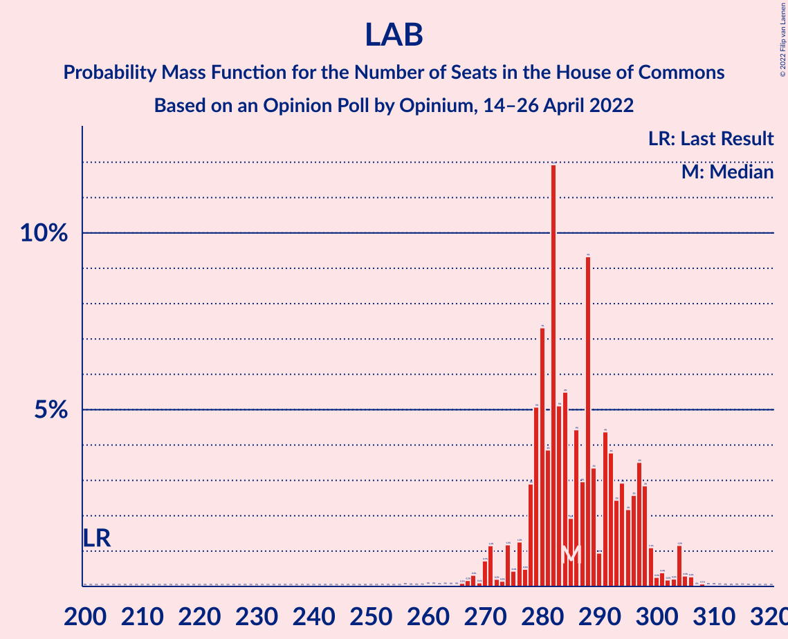

| Number of Seats | Probability | Accumulated | Special Marks |
|:---------------:|:-----------:|:-----------:|:-------------:|
| 202 | 0% | 100% | Last Result |
| 203 | 0% | 100% |  |
| 204 | 0% | 100% |  |
| 205 | 0% | 100% |  |
| 206 | 0% | 100% |  |
| 207 | 0% | 100% |  |
| 208 | 0% | 100% |  |
| 209 | 0% | 100% |  |
| 210 | 0% | 100% |  |
| 211 | 0% | 100% |  |
| 212 | 0% | 100% |  |
| 213 | 0% | 100% |  |
| 214 | 0% | 100% |  |
| 215 | 0% | 100% |  |
| 216 | 0% | 100% |  |
| 217 | 0% | 100% |  |
| 218 | 0% | 100% |  |
| 219 | 0% | 100% |  |
| 220 | 0% | 100% |  |
| 221 | 0% | 100% |  |
| 222 | 0% | 100% |  |
| 223 | 0% | 100% |  |
| 224 | 0% | 100% |  |
| 225 | 0% | 100% |  |
| 226 | 0% | 100% |  |
| 227 | 0% | 100% |  |
| 228 | 0% | 100% |  |
| 229 | 0% | 100% |  |
| 230 | 0% | 100% |  |
| 231 | 0% | 100% |  |
| 232 | 0% | 100% |  |
| 233 | 0% | 100% |  |
| 234 | 0% | 100% |  |
| 235 | 0% | 100% |  |
| 236 | 0% | 100% |  |
| 237 | 0% | 100% |  |
| 238 | 0% | 100% |  |
| 239 | 0% | 100% |  |
| 240 | 0% | 100% |  |
| 241 | 0% | 100% |  |
| 242 | 0% | 100% |  |
| 243 | 0% | 100% |  |
| 244 | 0% | 100% |  |
| 245 | 0% | 100% |  |
| 246 | 0% | 100% |  |
| 247 | 0% | 100% |  |
| 248 | 0% | 100% |  |
| 249 | 0% | 100% |  |
| 250 | 0% | 100% |  |
| 251 | 0% | 100% |  |
| 252 | 0% | 100% |  |
| 253 | 0% | 100% |  |
| 254 | 0% | 100% |  |
| 255 | 0% | 100% |  |
| 256 | 0% | 100% |  |
| 257 | 0% | 100% |  |
| 258 | 0% | 100% |  |
| 259 | 0% | 100% |  |
| 260 | 0% | 99.9% |  |
| 261 | 0% | 99.9% |  |
| 262 | 0% | 99.9% |  |
| 263 | 0% | 99.8% |  |
| 264 | 0% | 99.8% |  |
| 265 | 0% | 99.8% |  |
| 266 | 0.1% | 99.7% |  |
| 267 | 0.2% | 99.6% |  |
| 268 | 0.3% | 99.5% |  |
| 269 | 0.1% | 99.2% |  |
| 270 | 0.7% | 99.0% |  |
| 271 | 1.2% | 98% |  |
| 272 | 0.2% | 97% |  |
| 273 | 0.2% | 97% |  |
| 274 | 1.2% | 97% |  |
| 275 | 0.4% | 96% |  |
| 276 | 1.3% | 95% |  |
| 277 | 0.5% | 94% |  |
| 278 | 3% | 93% |  |
| 279 | 5% | 91% |  |
| 280 | 7% | 85% |  |
| 281 | 4% | 78% |  |
| 282 | 12% | 74% |  |
| 283 | 5% | 62% |  |
| 284 | 6% | 57% |  |
| 285 | 2% | 52% | Median |
| 286 | 4% | 50% |  |
| 287 | 3% | 45% |  |
| 288 | 9% | 42% |  |
| 289 | 3% | 33% |  |
| 290 | 0.9% | 30% |  |
| 291 | 4% | 29% |  |
| 292 | 4% | 24% |  |
| 293 | 2% | 21% |  |
| 294 | 3% | 18% |  |
| 295 | 2% | 15% |  |
| 296 | 3% | 13% |  |
| 297 | 4% | 10% |  |
| 298 | 3% | 7% |  |
| 299 | 1.1% | 4% |  |
| 300 | 0.3% | 3% |  |
| 301 | 0.4% | 3% |  |
| 302 | 0.2% | 2% |  |
| 303 | 0.2% | 2% |  |
| 304 | 1.2% | 2% |  |
| 305 | 0.3% | 0.8% |  |
| 306 | 0.3% | 0.5% |  |
| 307 | 0% | 0.2% |  |
| 308 | 0.1% | 0.2% |  |
| 309 | 0% | 0.1% |  |
| 310 | 0% | 0.1% |  |
| 311 | 0% | 0.1% |  |
| 312 | 0% | 0% |  |

### Conservative Party

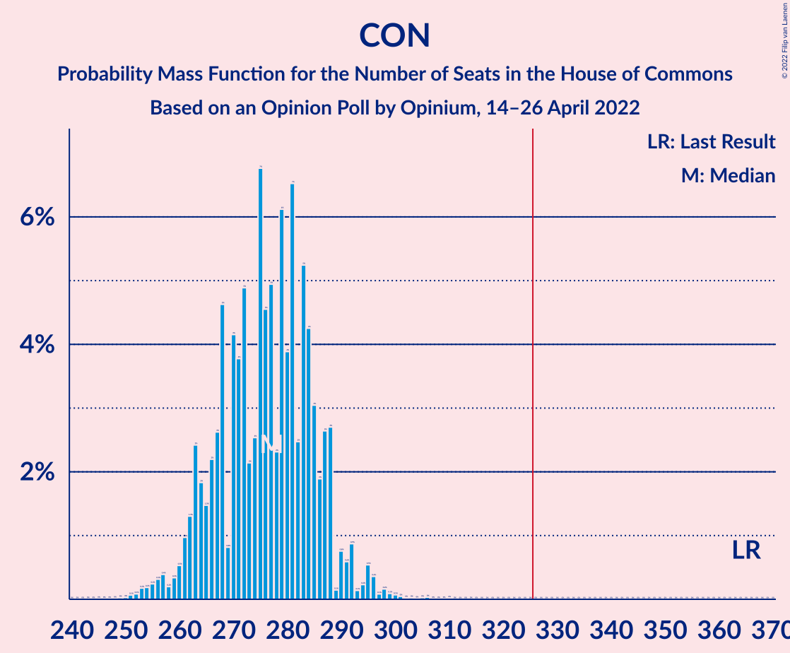

| Number of Seats | Probability | Accumulated | Special Marks |
|:---------------:|:-----------:|:-----------:|:-------------:|
| 249 | 0% | 100% |  |
| 250 | 0% | 99.9% |  |
| 251 | 0.1% | 99.9% |  |
| 252 | 0.1% | 99.8% |  |
| 253 | 0.2% | 99.7% |  |
| 254 | 0.2% | 99.6% |  |
| 255 | 0.2% | 99.4% |  |
| 256 | 0.3% | 99.1% |  |
| 257 | 0.4% | 98.8% |  |
| 258 | 0.2% | 98% |  |
| 259 | 0.3% | 98% |  |
| 260 | 0.5% | 98% |  |
| 261 | 1.0% | 97% |  |
| 262 | 1.3% | 96% |  |
| 263 | 2% | 95% |  |
| 264 | 2% | 93% |  |
| 265 | 1.5% | 91% |  |
| 266 | 2% | 89% |  |
| 267 | 3% | 87% |  |
| 268 | 5% | 85% |  |
| 269 | 0.8% | 80% |  |
| 270 | 4% | 79% |  |
| 271 | 4% | 75% |  |
| 272 | 5% | 71% |  |
| 273 | 2% | 66% |  |
| 274 | 3% | 64% |  |
| 275 | 7% | 62% |  |
| 276 | 5% | 55% |  |
| 277 | 5% | 50% | Median |
| 278 | 2% | 45% |  |
| 279 | 6% | 43% |  |
| 280 | 4% | 37% |  |
| 281 | 7% | 33% |  |
| 282 | 2% | 26% |  |
| 283 | 5% | 24% |  |
| 284 | 4% | 19% |  |
| 285 | 3% | 15% |  |
| 286 | 2% | 11% |  |
| 287 | 3% | 10% |  |
| 288 | 3% | 7% |  |
| 289 | 0.1% | 4% |  |
| 290 | 0.8% | 4% |  |
| 291 | 0.6% | 3% |  |
| 292 | 0.9% | 3% |  |
| 293 | 0.1% | 2% |  |
| 294 | 0.2% | 2% |  |
| 295 | 0.5% | 2% |  |
| 296 | 0.4% | 1.0% |  |
| 297 | 0.1% | 0.6% |  |
| 298 | 0.2% | 0.5% |  |
| 299 | 0.1% | 0.4% |  |
| 300 | 0.1% | 0.3% |  |
| 301 | 0% | 0.2% |  |
| 302 | 0% | 0.2% |  |
| 303 | 0% | 0.1% |  |
| 304 | 0% | 0.1% |  |
| 305 | 0% | 0.1% |  |
| 306 | 0% | 0.1% |  |
| 307 | 0% | 0% |  |
| 308 | 0% | 0% |  |
| 309 | 0% | 0% |  |
| 310 | 0% | 0% |  |
| 311 | 0% | 0% |  |
| 312 | 0% | 0% |  |
| 313 | 0% | 0% |  |
| 314 | 0% | 0% |  |
| 315 | 0% | 0% |  |
| 316 | 0% | 0% |  |
| 317 | 0% | 0% |  |
| 318 | 0% | 0% |  |
| 319 | 0% | 0% |  |
| 320 | 0% | 0% |  |
| 321 | 0% | 0% |  |
| 322 | 0% | 0% |  |
| 323 | 0% | 0% |  |
| 324 | 0% | 0% |  |
| 325 | 0% | 0% |  |
| 326 | 0% | 0% | Majority |
| 327 | 0% | 0% |  |
| 328 | 0% | 0% |  |
| 329 | 0% | 0% |  |
| 330 | 0% | 0% |  |
| 331 | 0% | 0% |  |
| 332 | 0% | 0% |  |
| 333 | 0% | 0% |  |
| 334 | 0% | 0% |  |
| 335 | 0% | 0% |  |
| 336 | 0% | 0% |  |
| 337 | 0% | 0% |  |
| 338 | 0% | 0% |  |
| 339 | 0% | 0% |  |
| 340 | 0% | 0% |  |
| 341 | 0% | 0% |  |
| 342 | 0% | 0% |  |
| 343 | 0% | 0% |  |
| 344 | 0% | 0% |  |
| 345 | 0% | 0% |  |
| 346 | 0% | 0% |  |
| 347 | 0% | 0% |  |
| 348 | 0% | 0% |  |
| 349 | 0% | 0% |  |
| 350 | 0% | 0% |  |
| 351 | 0% | 0% |  |
| 352 | 0% | 0% |  |
| 353 | 0% | 0% |  |
| 354 | 0% | 0% |  |
| 355 | 0% | 0% |  |
| 356 | 0% | 0% |  |
| 357 | 0% | 0% |  |
| 358 | 0% | 0% |  |
| 359 | 0% | 0% |  |
| 360 | 0% | 0% |  |
| 361 | 0% | 0% |  |
| 362 | 0% | 0% |  |
| 363 | 0% | 0% |  |
| 364 | 0% | 0% |  |
| 365 | 0% | 0% | Last Result |

## Technical Information

### Opinion Poll

+ **Polling firm:** Opinium
+ **Commissioner(s):** —
+ **Fieldwork period:** 14–26 April 2022

### Calculations

+ **Sample size:** 3933
+ **Simulations done:** 1,048,576
+ **Error estimate:** 0.14%

