# Opinion Poll by BMG Research for The Independent, 1 July 2022

<a href="#voting-intentions">Voting Intentions</a> | <a href="#seats">Seats</a> | <a href="#coalitions">Coalitions</a> | <a href="#technical-information">Technical Information</a>

## Voting Intentions

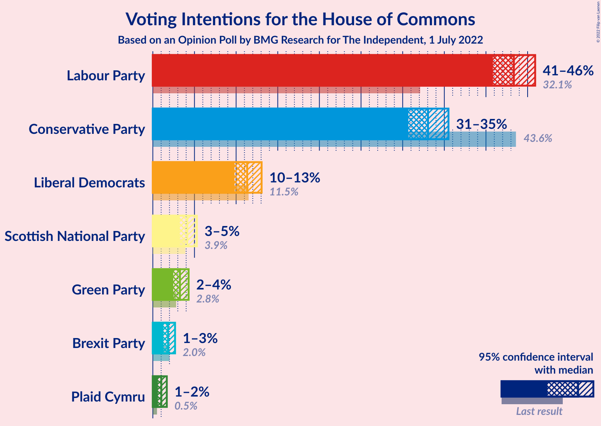

### Confidence Intervals

| Party | Last Result | Poll Result | 80% Confidence Interval | 90% Confidence Interval | 95% Confidence Interval | 99% Confidence Interval |
|:-----:|:-----------:|:-----------:|:-----------------------:|:-----------------------:|:-----------------------:|:-----------------------:|
| Labour Party | 32.1% | 43.4% | 41.7–45.0% |41.2–45.5% |40.8–45.9% |40.1–46.7% |
| Conservative Party | 43.6% | 33.0% | 31.5–34.6% |31.0–35.1% |30.7–35.5% |29.9–36.3% |
| Liberal Democrats | 11.5% | 11.3% | 10.3–12.5% |10.0–12.8% |9.8–13.1% |9.3–13.6% |
| Scottish National Party | 3.9% | 4.1% | 3.5–4.9% |3.4–5.1% |3.2–5.3% |3.0–5.7% |
| Green Party | 2.8% | 3.3% | 2.7–3.9% |2.6–4.1% |2.5–4.3% |2.2–4.6% |
| Brexit Party | 2.0% | 1.8% | 1.4–2.4% |1.3–2.5% |1.3–2.7% |1.1–2.9% |
| Plaid Cymru | 0.5% | 1.0% | 0.7–1.4% |0.7–1.6% |0.6–1.7% |0.5–1.9% |

*Note:* The poll result column reflects the actual value used in the calculations. Published results may vary slightly, and in addition be rounded to fewer digits.

## Seats

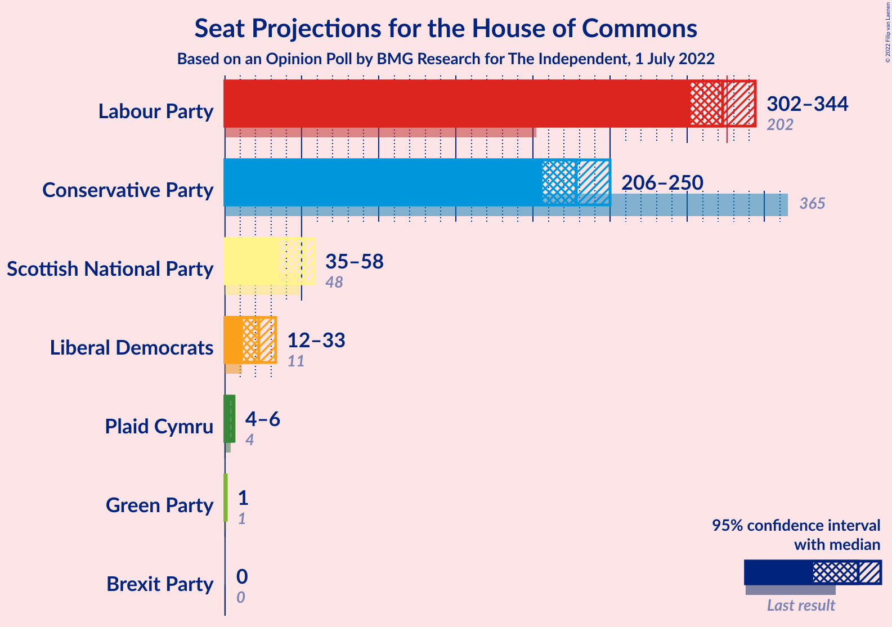

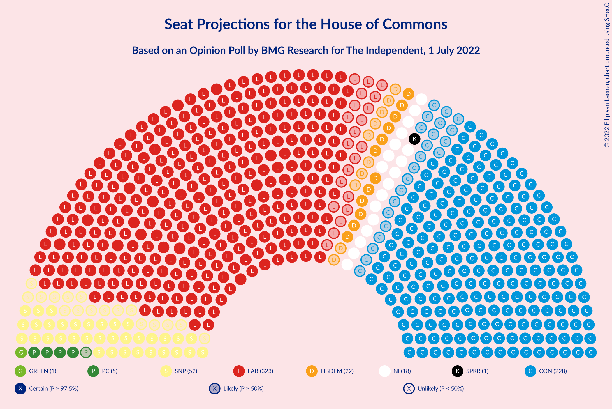

### Confidence Intervals

| Party | Last Result | Median | 80% Confidence Interval | 90% Confidence Interval | 95% Confidence Interval | 99% Confidence Interval |
|:-----:|:-----------:|:------:|:-----------------------:|:-----------------------:|:-----------------------:|:-----------------------:|
| <a href="#labour-party">Labour Party</a> | 202 | 323 | 312–336 |308–340 |302–344 |295–354 |
| <a href="#conservative-party">Conservative Party</a> | 365 | 228 | 216–240 |211–246 |206–250 |196–260 |
| <a href="#liberal-democrats">Liberal Democrats</a> | 11 | 22 | 17–28 |15–30 |12–33 |9–38 |
| <a href="#scottish-national-party">Scottish National Party</a> | 48 | 52 | 40–57 |38–58 |35–58 |30–58 |
| <a href="#green-party">Green Party</a> | 1 | 1 | 1 |1 |1 |1 |
| <a href="#brexit-party">Brexit Party</a> | 0 | 0 | 0 |0 |0 |0 |
| <a href="#plaid-cymru">Plaid Cymru</a> | 4 | 5 | 5 |4–6 |4–6 |3–7 |

### Labour Party

*For a full overview of the results for this party, see the [Labour Party](party-labourparty.html) page.*

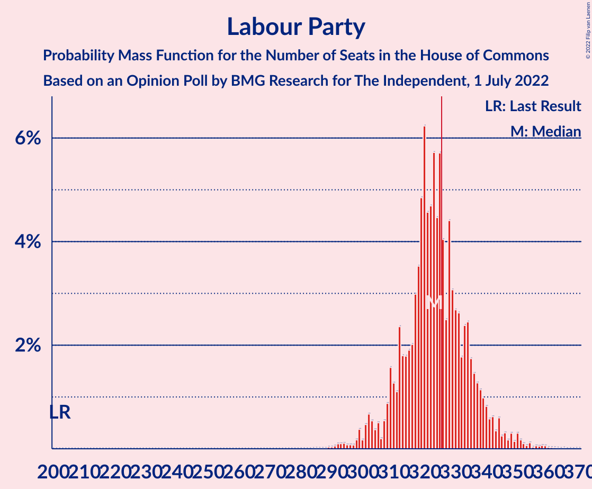

| Number of Seats | Probability | Accumulated | Special Marks |
|:---------------:|:-----------:|:-----------:|:-------------:|
| 202 | 0% | 100% | Last Result |
| 203 | 0% | 100% |  |
| 204 | 0% | 100% |  |
| 205 | 0% | 100% |  |
| 206 | 0% | 100% |  |
| 207 | 0% | 100% |  |
| 208 | 0% | 100% |  |
| 209 | 0% | 100% |  |
| 210 | 0% | 100% |  |
| 211 | 0% | 100% |  |
| 212 | 0% | 100% |  |
| 213 | 0% | 100% |  |
| 214 | 0% | 100% |  |
| 215 | 0% | 100% |  |
| 216 | 0% | 100% |  |
| 217 | 0% | 100% |  |
| 218 | 0% | 100% |  |
| 219 | 0% | 100% |  |
| 220 | 0% | 100% |  |
| 221 | 0% | 100% |  |
| 222 | 0% | 100% |  |
| 223 | 0% | 100% |  |
| 224 | 0% | 100% |  |
| 225 | 0% | 100% |  |
| 226 | 0% | 100% |  |
| 227 | 0% | 100% |  |
| 228 | 0% | 100% |  |
| 229 | 0% | 100% |  |
| 230 | 0% | 100% |  |
| 231 | 0% | 100% |  |
| 232 | 0% | 100% |  |
| 233 | 0% | 100% |  |
| 234 | 0% | 100% |  |
| 235 | 0% | 100% |  |
| 236 | 0% | 100% |  |
| 237 | 0% | 100% |  |
| 238 | 0% | 100% |  |
| 239 | 0% | 100% |  |
| 240 | 0% | 100% |  |
| 241 | 0% | 100% |  |
| 242 | 0% | 100% |  |
| 243 | 0% | 100% |  |
| 244 | 0% | 100% |  |
| 245 | 0% | 100% |  |
| 246 | 0% | 100% |  |
| 247 | 0% | 100% |  |
| 248 | 0% | 100% |  |
| 249 | 0% | 100% |  |
| 250 | 0% | 100% |  |
| 251 | 0% | 100% |  |
| 252 | 0% | 100% |  |
| 253 | 0% | 100% |  |
| 254 | 0% | 100% |  |
| 255 | 0% | 100% |  |
| 256 | 0% | 100% |  |
| 257 | 0% | 100% |  |
| 258 | 0% | 100% |  |
| 259 | 0% | 100% |  |
| 260 | 0% | 100% |  |
| 261 | 0% | 100% |  |
| 262 | 0% | 100% |  |
| 263 | 0% | 100% |  |
| 264 | 0% | 100% |  |
| 265 | 0% | 100% |  |
| 266 | 0% | 100% |  |
| 267 | 0% | 100% |  |
| 268 | 0% | 100% |  |
| 269 | 0% | 100% |  |
| 270 | 0% | 100% |  |
| 271 | 0% | 100% |  |
| 272 | 0% | 100% |  |
| 273 | 0% | 100% |  |
| 274 | 0% | 100% |  |
| 275 | 0% | 100% |  |
| 276 | 0% | 100% |  |
| 277 | 0% | 100% |  |
| 278 | 0% | 100% |  |
| 279 | 0% | 100% |  |
| 280 | 0% | 100% |  |
| 281 | 0% | 100% |  |
| 282 | 0% | 100% |  |
| 283 | 0% | 100% |  |
| 284 | 0% | 100% |  |
| 285 | 0% | 100% |  |
| 286 | 0% | 100% |  |
| 287 | 0% | 100% |  |
| 288 | 0% | 99.9% |  |
| 289 | 0% | 99.9% |  |
| 290 | 0% | 99.9% |  |
| 291 | 0.1% | 99.9% |  |
| 292 | 0.1% | 99.8% |  |
| 293 | 0.1% | 99.7% |  |
| 294 | 0.1% | 99.6% |  |
| 295 | 0.1% | 99.5% |  |
| 296 | 0.1% | 99.4% |  |
| 297 | 0.1% | 99.4% |  |
| 298 | 0.2% | 99.3% |  |
| 299 | 0.4% | 99.1% |  |
| 300 | 0.2% | 98.7% |  |
| 301 | 0.5% | 98.6% |  |
| 302 | 0.7% | 98% |  |
| 303 | 0.5% | 97% |  |
| 304 | 0.4% | 97% |  |
| 305 | 0.5% | 97% |  |
| 306 | 0.2% | 96% |  |
| 307 | 0.5% | 96% |  |
| 308 | 0.9% | 95% |  |
| 309 | 2% | 94% |  |
| 310 | 1.3% | 93% |  |
| 311 | 1.1% | 92% |  |
| 312 | 2% | 90% |  |
| 313 | 2% | 88% |  |
| 314 | 2% | 86% |  |
| 315 | 2% | 85% |  |
| 316 | 2% | 83% |  |
| 317 | 3% | 81% |  |
| 318 | 4% | 78% |  |
| 319 | 5% | 74% |  |
| 320 | 6% | 69% |  |
| 321 | 5% | 63% |  |
| 322 | 5% | 58% |  |
| 323 | 6% | 54% | Median |
| 324 | 4% | 48% |  |
| 325 | 6% | 44% |  |
| 326 | 4% | 38% | Majority |
| 327 | 2% | 34% |  |
| 328 | 4% | 31% |  |
| 329 | 3% | 27% |  |
| 330 | 3% | 24% |  |
| 331 | 3% | 21% |  |
| 332 | 2% | 19% |  |
| 333 | 2% | 17% |  |
| 334 | 2% | 14% |  |
| 335 | 2% | 12% |  |
| 336 | 1.5% | 10% |  |
| 337 | 1.3% | 9% |  |
| 338 | 1.1% | 7% |  |
| 339 | 1.0% | 6% |  |
| 340 | 0.8% | 5% |  |
| 341 | 0.6% | 5% |  |
| 342 | 0.6% | 4% |  |
| 343 | 0.3% | 3% |  |
| 344 | 0.6% | 3% |  |
| 345 | 0.2% | 2% |  |
| 346 | 0.3% | 2% |  |
| 347 | 0.2% | 2% |  |
| 348 | 0.3% | 2% |  |
| 349 | 0.1% | 1.3% |  |
| 350 | 0.3% | 1.2% |  |
| 351 | 0.2% | 0.9% |  |
| 352 | 0.1% | 0.7% |  |
| 353 | 0.1% | 0.6% |  |
| 354 | 0.1% | 0.6% |  |
| 355 | 0% | 0.4% |  |
| 356 | 0.1% | 0.4% |  |
| 357 | 0.1% | 0.3% |  |
| 358 | 0.1% | 0.3% |  |
| 359 | 0.1% | 0.2% |  |
| 360 | 0% | 0.2% |  |
| 361 | 0% | 0.1% |  |
| 362 | 0% | 0.1% |  |
| 363 | 0% | 0.1% |  |
| 364 | 0% | 0.1% |  |
| 365 | 0% | 0.1% |  |
| 366 | 0% | 0.1% |  |
| 367 | 0% | 0.1% |  |
| 368 | 0% | 0% |  |

### Conservative Party

*For a full overview of the results for this party, see the [Conservative Party](party-conservativeparty.html) page.*

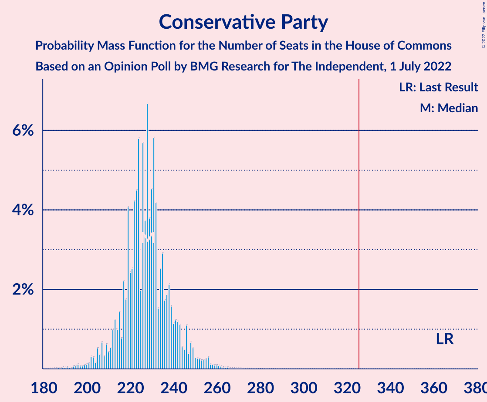

| Number of Seats | Probability | Accumulated | Special Marks |
|:---------------:|:-----------:|:-----------:|:-------------:|
| 184 | 0% | 100% |  |
| 185 | 0% | 99.9% |  |
| 186 | 0% | 99.9% |  |
| 187 | 0% | 99.9% |  |
| 188 | 0% | 99.9% |  |
| 189 | 0% | 99.9% |  |
| 190 | 0% | 99.8% |  |
| 191 | 0% | 99.8% |  |
| 192 | 0% | 99.7% |  |
| 193 | 0% | 99.7% |  |
| 194 | 0.1% | 99.7% |  |
| 195 | 0.1% | 99.6% |  |
| 196 | 0.1% | 99.5% |  |
| 197 | 0.1% | 99.4% |  |
| 198 | 0.1% | 99.3% |  |
| 199 | 0.1% | 99.3% |  |
| 200 | 0.1% | 99.2% |  |
| 201 | 0.2% | 99.0% |  |
| 202 | 0.3% | 98.9% |  |
| 203 | 0.3% | 98.6% |  |
| 204 | 0.2% | 98% |  |
| 205 | 0.5% | 98% |  |
| 206 | 0.4% | 98% |  |
| 207 | 0.7% | 97% |  |
| 208 | 0.3% | 97% |  |
| 209 | 0.6% | 96% |  |
| 210 | 0.4% | 96% |  |
| 211 | 0.5% | 95% |  |
| 212 | 1.0% | 95% |  |
| 213 | 1.2% | 94% |  |
| 214 | 1.0% | 92% |  |
| 215 | 1.4% | 91% |  |
| 216 | 0.8% | 90% |  |
| 217 | 2% | 89% |  |
| 218 | 2% | 87% |  |
| 219 | 4% | 85% |  |
| 220 | 2% | 81% |  |
| 221 | 3% | 79% |  |
| 222 | 4% | 76% |  |
| 223 | 4% | 72% |  |
| 224 | 6% | 68% |  |
| 225 | 2% | 62% |  |
| 226 | 6% | 60% |  |
| 227 | 4% | 54% |  |
| 228 | 7% | 50% | Median |
| 229 | 4% | 44% |  |
| 230 | 5% | 40% |  |
| 231 | 6% | 35% |  |
| 232 | 4% | 29% |  |
| 233 | 2% | 25% |  |
| 234 | 3% | 24% |  |
| 235 | 3% | 21% |  |
| 236 | 2% | 18% |  |
| 237 | 2% | 17% |  |
| 238 | 2% | 15% |  |
| 239 | 2% | 13% |  |
| 240 | 1.1% | 11% |  |
| 241 | 1.2% | 10% |  |
| 242 | 1.2% | 9% |  |
| 243 | 1.1% | 7% |  |
| 244 | 0.6% | 6% |  |
| 245 | 0.5% | 6% |  |
| 246 | 1.1% | 5% |  |
| 247 | 0.4% | 4% |  |
| 248 | 0.7% | 4% |  |
| 249 | 0.5% | 3% |  |
| 250 | 0.3% | 3% |  |
| 251 | 0.3% | 2% |  |
| 252 | 0.3% | 2% |  |
| 253 | 0.2% | 2% |  |
| 254 | 0.2% | 2% |  |
| 255 | 0.3% | 1.4% |  |
| 256 | 0.3% | 1.1% |  |
| 257 | 0.1% | 0.8% |  |
| 258 | 0.1% | 0.7% |  |
| 259 | 0.1% | 0.6% |  |
| 260 | 0.1% | 0.5% |  |
| 261 | 0.1% | 0.4% |  |
| 262 | 0.1% | 0.3% |  |
| 263 | 0% | 0.3% |  |
| 264 | 0% | 0.2% |  |
| 265 | 0% | 0.2% |  |
| 266 | 0% | 0.1% |  |
| 267 | 0% | 0.1% |  |
| 268 | 0% | 0.1% |  |
| 269 | 0% | 0.1% |  |
| 270 | 0% | 0.1% |  |
| 271 | 0% | 0% |  |
| 272 | 0% | 0% |  |
| 273 | 0% | 0% |  |
| 274 | 0% | 0% |  |
| 275 | 0% | 0% |  |
| 276 | 0% | 0% |  |
| 277 | 0% | 0% |  |
| 278 | 0% | 0% |  |
| 279 | 0% | 0% |  |
| 280 | 0% | 0% |  |
| 281 | 0% | 0% |  |
| 282 | 0% | 0% |  |
| 283 | 0% | 0% |  |
| 284 | 0% | 0% |  |
| 285 | 0% | 0% |  |
| 286 | 0% | 0% |  |
| 287 | 0% | 0% |  |
| 288 | 0% | 0% |  |
| 289 | 0% | 0% |  |
| 290 | 0% | 0% |  |
| 291 | 0% | 0% |  |
| 292 | 0% | 0% |  |
| 293 | 0% | 0% |  |
| 294 | 0% | 0% |  |
| 295 | 0% | 0% |  |
| 296 | 0% | 0% |  |
| 297 | 0% | 0% |  |
| 298 | 0% | 0% |  |
| 299 | 0% | 0% |  |
| 300 | 0% | 0% |  |
| 301 | 0% | 0% |  |
| 302 | 0% | 0% |  |
| 303 | 0% | 0% |  |
| 304 | 0% | 0% |  |
| 305 | 0% | 0% |  |
| 306 | 0% | 0% |  |
| 307 | 0% | 0% |  |
| 308 | 0% | 0% |  |
| 309 | 0% | 0% |  |
| 310 | 0% | 0% |  |
| 311 | 0% | 0% |  |
| 312 | 0% | 0% |  |
| 313 | 0% | 0% |  |
| 314 | 0% | 0% |  |
| 315 | 0% | 0% |  |
| 316 | 0% | 0% |  |
| 317 | 0% | 0% |  |
| 318 | 0% | 0% |  |
| 319 | 0% | 0% |  |
| 320 | 0% | 0% |  |
| 321 | 0% | 0% |  |
| 322 | 0% | 0% |  |
| 323 | 0% | 0% |  |
| 324 | 0% | 0% |  |
| 325 | 0% | 0% |  |
| 326 | 0% | 0% | Majority |
| 327 | 0% | 0% |  |
| 328 | 0% | 0% |  |
| 329 | 0% | 0% |  |
| 330 | 0% | 0% |  |
| 331 | 0% | 0% |  |
| 332 | 0% | 0% |  |
| 333 | 0% | 0% |  |
| 334 | 0% | 0% |  |
| 335 | 0% | 0% |  |
| 336 | 0% | 0% |  |
| 337 | 0% | 0% |  |
| 338 | 0% | 0% |  |
| 339 | 0% | 0% |  |
| 340 | 0% | 0% |  |
| 341 | 0% | 0% |  |
| 342 | 0% | 0% |  |
| 343 | 0% | 0% |  |
| 344 | 0% | 0% |  |
| 345 | 0% | 0% |  |
| 346 | 0% | 0% |  |
| 347 | 0% | 0% |  |
| 348 | 0% | 0% |  |
| 349 | 0% | 0% |  |
| 350 | 0% | 0% |  |
| 351 | 0% | 0% |  |
| 352 | 0% | 0% |  |
| 353 | 0% | 0% |  |
| 354 | 0% | 0% |  |
| 355 | 0% | 0% |  |
| 356 | 0% | 0% |  |
| 357 | 0% | 0% |  |
| 358 | 0% | 0% |  |
| 359 | 0% | 0% |  |
| 360 | 0% | 0% |  |
| 361 | 0% | 0% |  |
| 362 | 0% | 0% |  |
| 363 | 0% | 0% |  |
| 364 | 0% | 0% |  |
| 365 | 0% | 0% | Last Result |

### Liberal Democrats

*For a full overview of the results for this party, see the [Liberal Democrats](party-liberaldemocrats.html) page.*

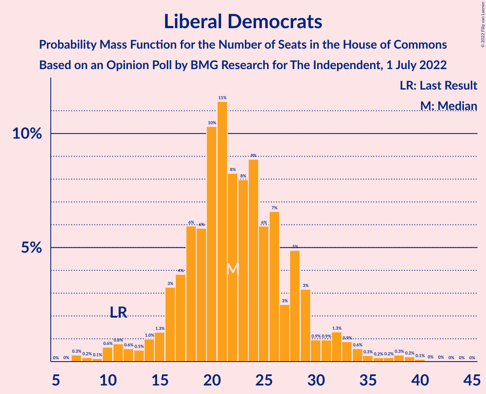

| Number of Seats | Probability | Accumulated | Special Marks |
|:---------------:|:-----------:|:-----------:|:-------------:|
| 7 | 0.3% | 100% |  |
| 8 | 0.2% | 99.7% |  |
| 9 | 0.1% | 99.5% |  |
| 10 | 0.6% | 99.4% |  |
| 11 | 0.8% | 98.8% | Last Result |
| 12 | 0.6% | 98% |  |
| 13 | 0.5% | 97% |  |
| 14 | 1.0% | 97% |  |
| 15 | 1.3% | 96% |  |
| 16 | 3% | 95% |  |
| 17 | 4% | 91% |  |
| 18 | 6% | 88% |  |
| 19 | 6% | 82% |  |
| 20 | 10% | 76% |  |
| 21 | 11% | 65% |  |
| 22 | 8% | 54% | Median |
| 23 | 8% | 46% |  |
| 24 | 9% | 38% |  |
| 25 | 6% | 29% |  |
| 26 | 7% | 23% |  |
| 27 | 3% | 16% |  |
| 28 | 5% | 14% |  |
| 29 | 3% | 9% |  |
| 30 | 0.9% | 6% |  |
| 31 | 0.9% | 5% |  |
| 32 | 1.3% | 4% |  |
| 33 | 0.9% | 3% |  |
| 34 | 0.6% | 2% |  |
| 35 | 0.3% | 1.3% |  |
| 36 | 0.2% | 1.0% |  |
| 37 | 0.2% | 0.8% |  |
| 38 | 0.3% | 0.7% |  |
| 39 | 0.2% | 0.4% |  |
| 40 | 0.1% | 0.2% |  |
| 41 | 0% | 0.1% |  |
| 42 | 0% | 0% |  |

### Scottish National Party

*For a full overview of the results for this party, see the [Scottish National Party](party-scottishnationalparty.html) page.*

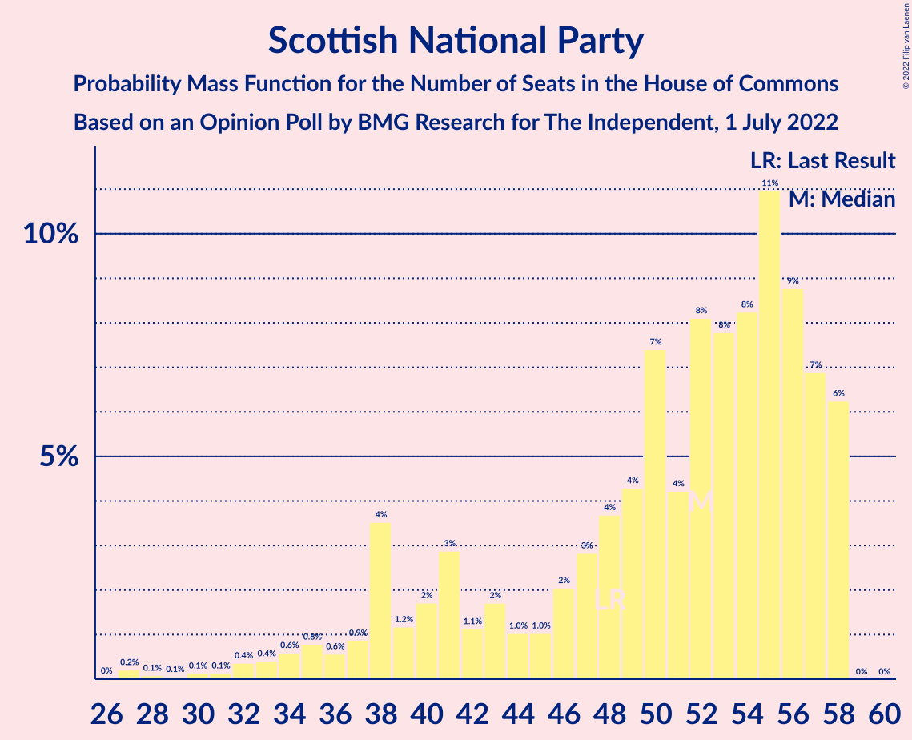

| Number of Seats | Probability | Accumulated | Special Marks |
|:---------------:|:-----------:|:-----------:|:-------------:|
| 26 | 0% | 100% |  |
| 27 | 0.2% | 99.9% |  |
| 28 | 0.1% | 99.7% |  |
| 29 | 0.1% | 99.6% |  |
| 30 | 0.1% | 99.6% |  |
| 31 | 0.1% | 99.4% |  |
| 32 | 0.4% | 99.3% |  |
| 33 | 0.4% | 98.9% |  |
| 34 | 0.6% | 98.5% |  |
| 35 | 0.8% | 98% |  |
| 36 | 0.6% | 97% |  |
| 37 | 0.9% | 97% |  |
| 38 | 4% | 96% |  |
| 39 | 1.2% | 92% |  |
| 40 | 2% | 91% |  |
| 41 | 3% | 89% |  |
| 42 | 1.1% | 86% |  |
| 43 | 2% | 85% |  |
| 44 | 1.0% | 84% |  |
| 45 | 1.0% | 83% |  |
| 46 | 2% | 82% |  |
| 47 | 3% | 79% |  |
| 48 | 4% | 77% | Last Result |
| 49 | 4% | 73% |  |
| 50 | 7% | 69% |  |
| 51 | 4% | 61% |  |
| 52 | 8% | 57% | Median |
| 53 | 8% | 49% |  |
| 54 | 8% | 41% |  |
| 55 | 11% | 33% |  |
| 56 | 9% | 22% |  |
| 57 | 7% | 13% |  |
| 58 | 6% | 6% |  |
| 59 | 0% | 0% |  |

### Green Party

*For a full overview of the results for this party, see the [Green Party](party-greenparty.html) page.*

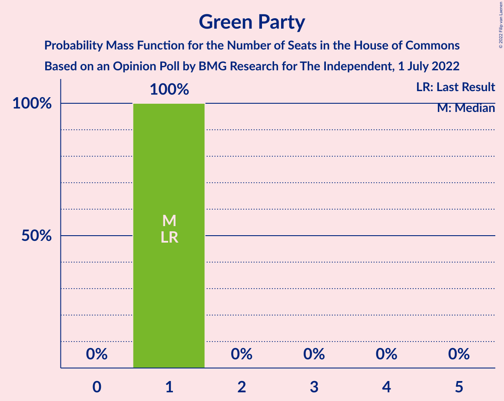

| Number of Seats | Probability | Accumulated | Special Marks |
|:---------------:|:-----------:|:-----------:|:-------------:|
| 1 | 100% | 100% | Last Result, Median |

### Brexit Party

*For a full overview of the results for this party, see the [Brexit Party](party-brexitparty.html) page.*

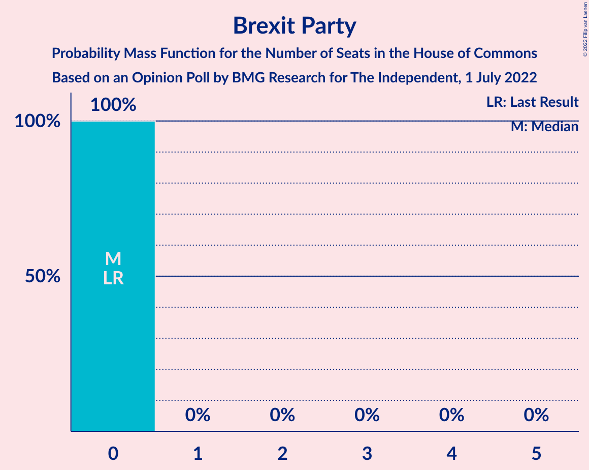

| Number of Seats | Probability | Accumulated | Special Marks |
|:---------------:|:-----------:|:-----------:|:-------------:|
| 0 | 100% | 100% | Last Result, Median |

### Plaid Cymru

*For a full overview of the results for this party, see the [Plaid Cymru](party-plaidcymru.html) page.*

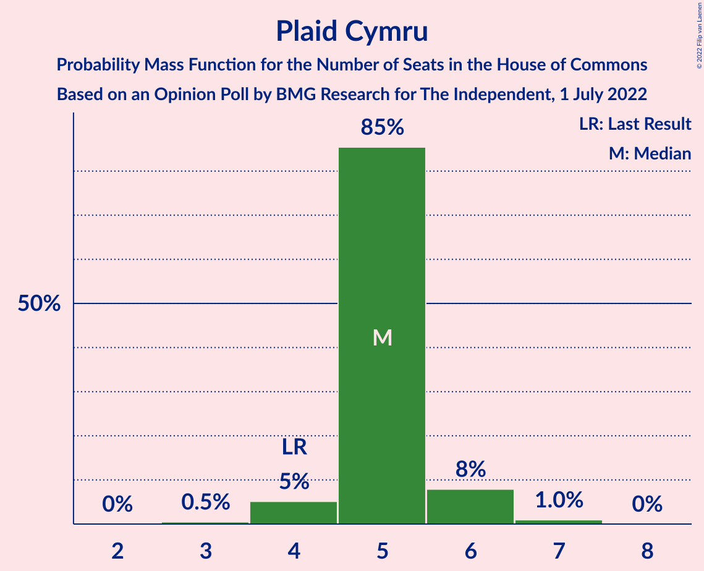

| Number of Seats | Probability | Accumulated | Special Marks |
|:---------------:|:-----------:|:-----------:|:-------------:|
| 3 | 0.5% | 100% |  |
| 4 | 5% | 99.5% | Last Result |
| 5 | 85% | 94% | Median |
| 6 | 8% | 9% |  |
| 7 | 1.0% | 1.0% |  |
| 8 | 0% | 0% |  |

## Coalitions

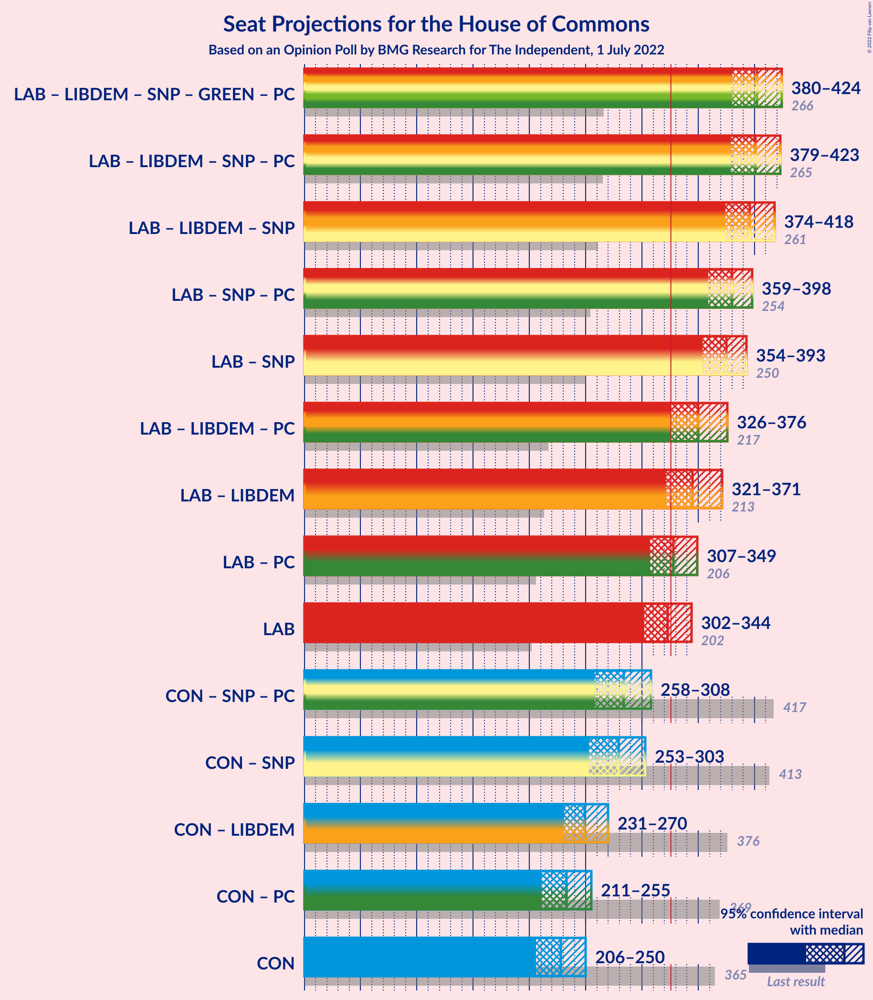

### Confidence Intervals

| Coalition | Last Result | Median | Majority? | 80% Confidence Interval | 90% Confidence Interval | 95% Confidence Interval | 99% Confidence Interval |
|:---------:|:-----------:|:------:|:---------:|:-----------------------:|:-----------------------:|:-----------------------:|:-----------------------:|
| Labour Party – Liberal Democrats – Scottish National Party – Green Party – Plaid Cymru | 266 | 402 | 100% | 390–414 | 384–419 | 380–424 | 371–434 |
| Labour Party – Liberal Democrats – Scottish National Party – Plaid Cymru | 265 | 401 | 100% | 389–413 | 383–418 | 379–423 | 370–433 |
| Labour Party – Liberal Democrats – Scottish National Party | 261 | 396 | 100% | 383–408 | 378–413 | 374–418 | 365–428 |
| Labour Party – Scottish National Party – Plaid Cymru | 254 | 380 | 100% | 368–389 | 363–393 | 359–398 | 352–407 |
| Labour Party – Scottish National Party | 250 | 375 | 100% | 363–384 | 358–388 | 354–393 | 347–401 |
| Labour Party – Liberal Democrats – Plaid Cymru | 217 | 350 | 98% | 336–366 | 331–371 | 326–376 | 318–387 |
| Labour Party – Liberal Democrats | 213 | 345 | 95% | 331–361 | 326–366 | 321–371 | 312–382 |
| Labour Party – Plaid Cymru | 206 | 328 | 63% | 317–341 | 313–345 | 307–349 | 300–359 |
| Labour Party | 202 | 323 | 38% | 312–336 | 308–340 | 302–344 | 295–354 |
| Conservative Party – Scottish National Party – Plaid Cymru | 417 | 284 | 0.1% | 268–298 | 263–303 | 258–308 | 247–317 |
| Conservative Party – Scottish National Party | 413 | 279 | 0% | 263–293 | 258–298 | 253–303 | 242–312 |
| Conservative Party – Liberal Democrats | 376 | 249 | 0% | 240–261 | 236–266 | 231–270 | 222–278 |
| Conservative Party – Plaid Cymru | 369 | 233 | 0% | 221–246 | 216–251 | 211–255 | 201–265 |
| Conservative Party | 365 | 228 | 0% | 216–240 | 211–246 | 206–250 | 196–260 |

### Labour Party – Liberal Democrats – Scottish National Party – Green Party – Plaid Cymru

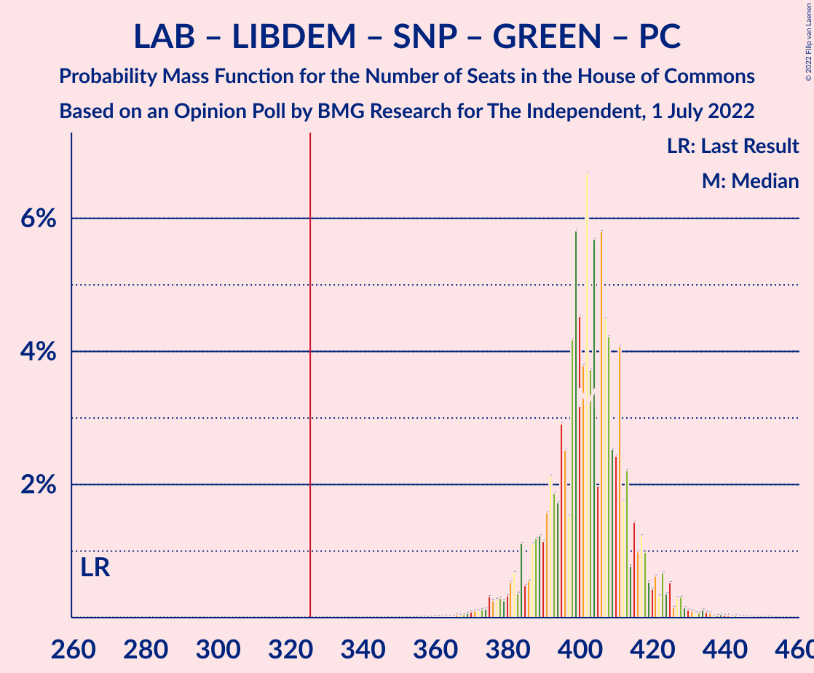

| Number of Seats | Probability | Accumulated | Special Marks |
|:---------------:|:-----------:|:-----------:|:-------------:|
| 266 | 0% | 100% | Last Result |
| 267 | 0% | 100% |  |
| 268 | 0% | 100% |  |
| 269 | 0% | 100% |  |
| 270 | 0% | 100% |  |
| 271 | 0% | 100% |  |
| 272 | 0% | 100% |  |
| 273 | 0% | 100% |  |
| 274 | 0% | 100% |  |
| 275 | 0% | 100% |  |
| 276 | 0% | 100% |  |
| 277 | 0% | 100% |  |
| 278 | 0% | 100% |  |
| 279 | 0% | 100% |  |
| 280 | 0% | 100% |  |
| 281 | 0% | 100% |  |
| 282 | 0% | 100% |  |
| 283 | 0% | 100% |  |
| 284 | 0% | 100% |  |
| 285 | 0% | 100% |  |
| 286 | 0% | 100% |  |
| 287 | 0% | 100% |  |
| 288 | 0% | 100% |  |
| 289 | 0% | 100% |  |
| 290 | 0% | 100% |  |
| 291 | 0% | 100% |  |
| 292 | 0% | 100% |  |
| 293 | 0% | 100% |  |
| 294 | 0% | 100% |  |
| 295 | 0% | 100% |  |
| 296 | 0% | 100% |  |
| 297 | 0% | 100% |  |
| 298 | 0% | 100% |  |
| 299 | 0% | 100% |  |
| 300 | 0% | 100% |  |
| 301 | 0% | 100% |  |
| 302 | 0% | 100% |  |
| 303 | 0% | 100% |  |
| 304 | 0% | 100% |  |
| 305 | 0% | 100% |  |
| 306 | 0% | 100% |  |
| 307 | 0% | 100% |  |
| 308 | 0% | 100% |  |
| 309 | 0% | 100% |  |
| 310 | 0% | 100% |  |
| 311 | 0% | 100% |  |
| 312 | 0% | 100% |  |
| 313 | 0% | 100% |  |
| 314 | 0% | 100% |  |
| 315 | 0% | 100% |  |
| 316 | 0% | 100% |  |
| 317 | 0% | 100% |  |
| 318 | 0% | 100% |  |
| 319 | 0% | 100% |  |
| 320 | 0% | 100% |  |
| 321 | 0% | 100% |  |
| 322 | 0% | 100% |  |
| 323 | 0% | 100% |  |
| 324 | 0% | 100% |  |
| 325 | 0% | 100% |  |
| 326 | 0% | 100% | Majority |
| 327 | 0% | 100% |  |
| 328 | 0% | 100% |  |
| 329 | 0% | 100% |  |
| 330 | 0% | 100% |  |
| 331 | 0% | 100% |  |
| 332 | 0% | 100% |  |
| 333 | 0% | 100% |  |
| 334 | 0% | 100% |  |
| 335 | 0% | 100% |  |
| 336 | 0% | 100% |  |
| 337 | 0% | 100% |  |
| 338 | 0% | 100% |  |
| 339 | 0% | 100% |  |
| 340 | 0% | 100% |  |
| 341 | 0% | 100% |  |
| 342 | 0% | 100% |  |
| 343 | 0% | 100% |  |
| 344 | 0% | 100% |  |
| 345 | 0% | 100% |  |
| 346 | 0% | 100% |  |
| 347 | 0% | 100% |  |
| 348 | 0% | 100% |  |
| 349 | 0% | 100% |  |
| 350 | 0% | 100% |  |
| 351 | 0% | 100% |  |
| 352 | 0% | 100% |  |
| 353 | 0% | 100% |  |
| 354 | 0% | 100% |  |
| 355 | 0% | 100% |  |
| 356 | 0% | 100% |  |
| 357 | 0% | 100% |  |
| 358 | 0% | 100% |  |
| 359 | 0% | 100% |  |
| 360 | 0% | 100% |  |
| 361 | 0% | 100% |  |
| 362 | 0% | 99.9% |  |
| 363 | 0% | 99.9% |  |
| 364 | 0% | 99.9% |  |
| 365 | 0% | 99.9% |  |
| 366 | 0% | 99.9% |  |
| 367 | 0% | 99.8% |  |
| 368 | 0% | 99.8% |  |
| 369 | 0.1% | 99.7% |  |
| 370 | 0.1% | 99.7% |  |
| 371 | 0.1% | 99.6% |  |
| 372 | 0.1% | 99.5% |  |
| 373 | 0.1% | 99.4% |  |
| 374 | 0.1% | 99.2% |  |
| 375 | 0.3% | 99.1% |  |
| 376 | 0.3% | 98.8% |  |
| 377 | 0.3% | 98.5% |  |
| 378 | 0.3% | 98% |  |
| 379 | 0.3% | 98% |  |
| 380 | 0.3% | 98% |  |
| 381 | 0.5% | 97% |  |
| 382 | 0.7% | 97% |  |
| 383 | 0.4% | 96% |  |
| 384 | 1.1% | 96% |  |
| 385 | 0.5% | 95% |  |
| 386 | 0.6% | 94% |  |
| 387 | 1.1% | 94% |  |
| 388 | 1.2% | 93% |  |
| 389 | 1.2% | 91% |  |
| 390 | 1.1% | 90% |  |
| 391 | 2% | 89% |  |
| 392 | 2% | 87% |  |
| 393 | 2% | 85% |  |
| 394 | 2% | 83% |  |
| 395 | 3% | 82% |  |
| 396 | 3% | 79% |  |
| 397 | 2% | 76% |  |
| 398 | 4% | 75% |  |
| 399 | 6% | 71% |  |
| 400 | 5% | 65% |  |
| 401 | 4% | 60% |  |
| 402 | 7% | 56% |  |
| 403 | 4% | 50% | Median |
| 404 | 6% | 46% |  |
| 405 | 2% | 40% |  |
| 406 | 6% | 38% |  |
| 407 | 4% | 32% |  |
| 408 | 4% | 28% |  |
| 409 | 3% | 24% |  |
| 410 | 2% | 21% |  |
| 411 | 4% | 19% |  |
| 412 | 2% | 15% |  |
| 413 | 2% | 13% |  |
| 414 | 0.8% | 11% |  |
| 415 | 1.4% | 10% |  |
| 416 | 1.0% | 9% |  |
| 417 | 1.2% | 8% |  |
| 418 | 1.0% | 6% |  |
| 419 | 0.5% | 5% |  |
| 420 | 0.4% | 5% |  |
| 421 | 0.6% | 4% |  |
| 422 | 0.3% | 4% |  |
| 423 | 0.7% | 3% |  |
| 424 | 0.4% | 3% |  |
| 425 | 0.5% | 2% |  |
| 426 | 0.2% | 2% |  |
| 427 | 0.3% | 2% |  |
| 428 | 0.3% | 1.4% |  |
| 429 | 0.2% | 1.1% |  |
| 430 | 0.1% | 1.0% |  |
| 431 | 0.1% | 0.8% |  |
| 432 | 0.1% | 0.7% |  |
| 433 | 0.1% | 0.7% |  |
| 434 | 0.1% | 0.6% |  |
| 435 | 0.1% | 0.5% |  |
| 436 | 0.1% | 0.4% |  |
| 437 | 0% | 0.3% |  |
| 438 | 0% | 0.3% |  |
| 439 | 0% | 0.3% |  |
| 440 | 0% | 0.2% |  |
| 441 | 0% | 0.2% |  |
| 442 | 0% | 0.1% |  |
| 443 | 0% | 0.1% |  |
| 444 | 0% | 0.1% |  |
| 445 | 0% | 0.1% |  |
| 446 | 0% | 0.1% |  |
| 447 | 0% | 0% |  |

### Labour Party – Liberal Democrats – Scottish National Party – Plaid Cymru

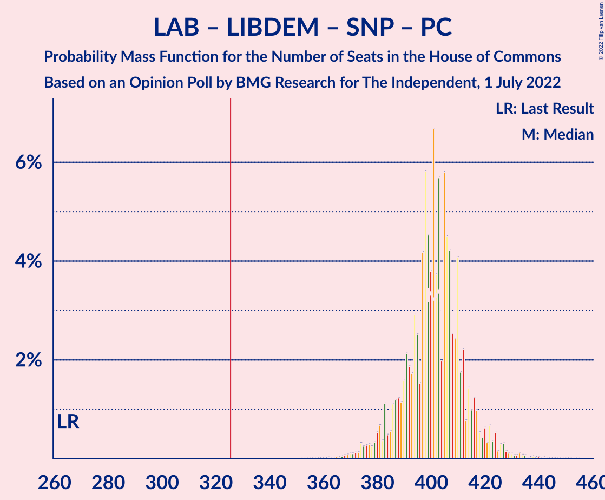

| Number of Seats | Probability | Accumulated | Special Marks |
|:---------------:|:-----------:|:-----------:|:-------------:|
| 265 | 0% | 100% | Last Result |
| 266 | 0% | 100% |  |
| 267 | 0% | 100% |  |
| 268 | 0% | 100% |  |
| 269 | 0% | 100% |  |
| 270 | 0% | 100% |  |
| 271 | 0% | 100% |  |
| 272 | 0% | 100% |  |
| 273 | 0% | 100% |  |
| 274 | 0% | 100% |  |
| 275 | 0% | 100% |  |
| 276 | 0% | 100% |  |
| 277 | 0% | 100% |  |
| 278 | 0% | 100% |  |
| 279 | 0% | 100% |  |
| 280 | 0% | 100% |  |
| 281 | 0% | 100% |  |
| 282 | 0% | 100% |  |
| 283 | 0% | 100% |  |
| 284 | 0% | 100% |  |
| 285 | 0% | 100% |  |
| 286 | 0% | 100% |  |
| 287 | 0% | 100% |  |
| 288 | 0% | 100% |  |
| 289 | 0% | 100% |  |
| 290 | 0% | 100% |  |
| 291 | 0% | 100% |  |
| 292 | 0% | 100% |  |
| 293 | 0% | 100% |  |
| 294 | 0% | 100% |  |
| 295 | 0% | 100% |  |
| 296 | 0% | 100% |  |
| 297 | 0% | 100% |  |
| 298 | 0% | 100% |  |
| 299 | 0% | 100% |  |
| 300 | 0% | 100% |  |
| 301 | 0% | 100% |  |
| 302 | 0% | 100% |  |
| 303 | 0% | 100% |  |
| 304 | 0% | 100% |  |
| 305 | 0% | 100% |  |
| 306 | 0% | 100% |  |
| 307 | 0% | 100% |  |
| 308 | 0% | 100% |  |
| 309 | 0% | 100% |  |
| 310 | 0% | 100% |  |
| 311 | 0% | 100% |  |
| 312 | 0% | 100% |  |
| 313 | 0% | 100% |  |
| 314 | 0% | 100% |  |
| 315 | 0% | 100% |  |
| 316 | 0% | 100% |  |
| 317 | 0% | 100% |  |
| 318 | 0% | 100% |  |
| 319 | 0% | 100% |  |
| 320 | 0% | 100% |  |
| 321 | 0% | 100% |  |
| 322 | 0% | 100% |  |
| 323 | 0% | 100% |  |
| 324 | 0% | 100% |  |
| 325 | 0% | 100% |  |
| 326 | 0% | 100% | Majority |
| 327 | 0% | 100% |  |
| 328 | 0% | 100% |  |
| 329 | 0% | 100% |  |
| 330 | 0% | 100% |  |
| 331 | 0% | 100% |  |
| 332 | 0% | 100% |  |
| 333 | 0% | 100% |  |
| 334 | 0% | 100% |  |
| 335 | 0% | 100% |  |
| 336 | 0% | 100% |  |
| 337 | 0% | 100% |  |
| 338 | 0% | 100% |  |
| 339 | 0% | 100% |  |
| 340 | 0% | 100% |  |
| 341 | 0% | 100% |  |
| 342 | 0% | 100% |  |
| 343 | 0% | 100% |  |
| 344 | 0% | 100% |  |
| 345 | 0% | 100% |  |
| 346 | 0% | 100% |  |
| 347 | 0% | 100% |  |
| 348 | 0% | 100% |  |
| 349 | 0% | 100% |  |
| 350 | 0% | 100% |  |
| 351 | 0% | 100% |  |
| 352 | 0% | 100% |  |
| 353 | 0% | 100% |  |
| 354 | 0% | 100% |  |
| 355 | 0% | 100% |  |
| 356 | 0% | 100% |  |
| 357 | 0% | 100% |  |
| 358 | 0% | 100% |  |
| 359 | 0% | 100% |  |
| 360 | 0% | 100% |  |
| 361 | 0% | 99.9% |  |
| 362 | 0% | 99.9% |  |
| 363 | 0% | 99.9% |  |
| 364 | 0% | 99.9% |  |
| 365 | 0% | 99.9% |  |
| 366 | 0% | 99.8% |  |
| 367 | 0% | 99.8% |  |
| 368 | 0.1% | 99.7% |  |
| 369 | 0.1% | 99.7% |  |
| 370 | 0.1% | 99.6% |  |
| 371 | 0.1% | 99.5% |  |
| 372 | 0.1% | 99.4% |  |
| 373 | 0.1% | 99.2% |  |
| 374 | 0.3% | 99.1% |  |
| 375 | 0.3% | 98.8% |  |
| 376 | 0.3% | 98.5% |  |
| 377 | 0.3% | 98% |  |
| 378 | 0.3% | 98% |  |
| 379 | 0.3% | 98% |  |
| 380 | 0.5% | 97% |  |
| 381 | 0.7% | 97% |  |
| 382 | 0.4% | 96% |  |
| 383 | 1.1% | 96% |  |
| 384 | 0.5% | 95% |  |
| 385 | 0.6% | 94% |  |
| 386 | 1.1% | 94% |  |
| 387 | 1.2% | 93% |  |
| 388 | 1.2% | 91% |  |
| 389 | 1.1% | 90% |  |
| 390 | 2% | 89% |  |
| 391 | 2% | 87% |  |
| 392 | 2% | 85% |  |
| 393 | 2% | 83% |  |
| 394 | 3% | 82% |  |
| 395 | 3% | 79% |  |
| 396 | 2% | 76% |  |
| 397 | 4% | 75% |  |
| 398 | 6% | 71% |  |
| 399 | 5% | 65% |  |
| 400 | 4% | 60% |  |
| 401 | 7% | 56% |  |
| 402 | 4% | 50% | Median |
| 403 | 6% | 46% |  |
| 404 | 2% | 40% |  |
| 405 | 6% | 38% |  |
| 406 | 4% | 32% |  |
| 407 | 4% | 28% |  |
| 408 | 3% | 24% |  |
| 409 | 2% | 21% |  |
| 410 | 4% | 19% |  |
| 411 | 2% | 15% |  |
| 412 | 2% | 13% |  |
| 413 | 0.8% | 11% |  |
| 414 | 1.4% | 10% |  |
| 415 | 1.0% | 9% |  |
| 416 | 1.2% | 8% |  |
| 417 | 1.0% | 6% |  |
| 418 | 0.5% | 5% |  |
| 419 | 0.4% | 5% |  |
| 420 | 0.6% | 4% |  |
| 421 | 0.3% | 4% |  |
| 422 | 0.7% | 3% |  |
| 423 | 0.4% | 3% |  |
| 424 | 0.5% | 2% |  |
| 425 | 0.2% | 2% |  |
| 426 | 0.3% | 2% |  |
| 427 | 0.3% | 1.4% |  |
| 428 | 0.2% | 1.1% |  |
| 429 | 0.1% | 1.0% |  |
| 430 | 0.1% | 0.8% |  |
| 431 | 0.1% | 0.7% |  |
| 432 | 0.1% | 0.7% |  |
| 433 | 0.1% | 0.6% |  |
| 434 | 0.1% | 0.5% |  |
| 435 | 0.1% | 0.4% |  |
| 436 | 0% | 0.3% |  |
| 437 | 0% | 0.3% |  |
| 438 | 0% | 0.3% |  |
| 439 | 0% | 0.2% |  |
| 440 | 0% | 0.2% |  |
| 441 | 0% | 0.1% |  |
| 442 | 0% | 0.1% |  |
| 443 | 0% | 0.1% |  |
| 444 | 0% | 0.1% |  |
| 445 | 0% | 0.1% |  |
| 446 | 0% | 0% |  |

### Labour Party – Liberal Democrats – Scottish National Party

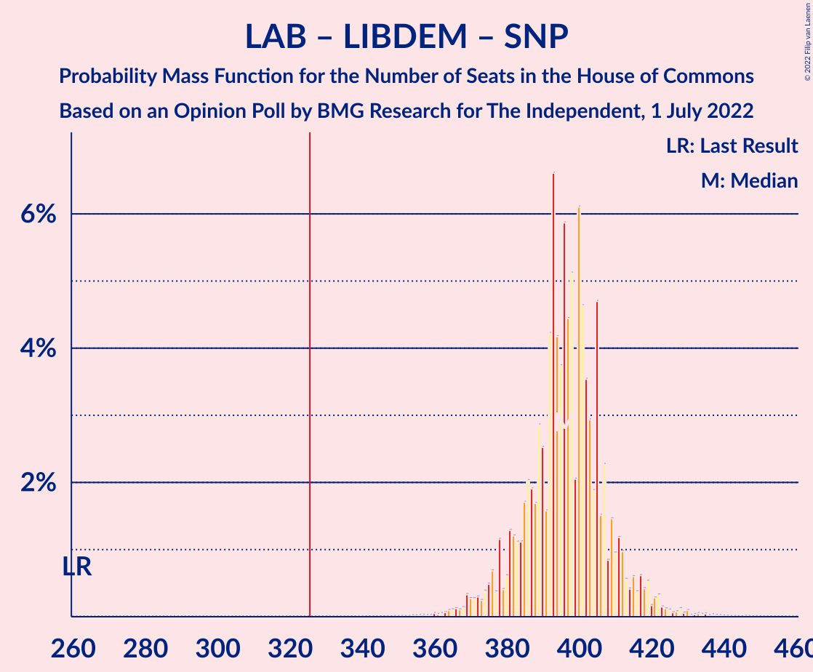

| Number of Seats | Probability | Accumulated | Special Marks |
|:---------------:|:-----------:|:-----------:|:-------------:|
| 261 | 0% | 100% | Last Result |
| 262 | 0% | 100% |  |
| 263 | 0% | 100% |  |
| 264 | 0% | 100% |  |
| 265 | 0% | 100% |  |
| 266 | 0% | 100% |  |
| 267 | 0% | 100% |  |
| 268 | 0% | 100% |  |
| 269 | 0% | 100% |  |
| 270 | 0% | 100% |  |
| 271 | 0% | 100% |  |
| 272 | 0% | 100% |  |
| 273 | 0% | 100% |  |
| 274 | 0% | 100% |  |
| 275 | 0% | 100% |  |
| 276 | 0% | 100% |  |
| 277 | 0% | 100% |  |
| 278 | 0% | 100% |  |
| 279 | 0% | 100% |  |
| 280 | 0% | 100% |  |
| 281 | 0% | 100% |  |
| 282 | 0% | 100% |  |
| 283 | 0% | 100% |  |
| 284 | 0% | 100% |  |
| 285 | 0% | 100% |  |
| 286 | 0% | 100% |  |
| 287 | 0% | 100% |  |
| 288 | 0% | 100% |  |
| 289 | 0% | 100% |  |
| 290 | 0% | 100% |  |
| 291 | 0% | 100% |  |
| 292 | 0% | 100% |  |
| 293 | 0% | 100% |  |
| 294 | 0% | 100% |  |
| 295 | 0% | 100% |  |
| 296 | 0% | 100% |  |
| 297 | 0% | 100% |  |
| 298 | 0% | 100% |  |
| 299 | 0% | 100% |  |
| 300 | 0% | 100% |  |
| 301 | 0% | 100% |  |
| 302 | 0% | 100% |  |
| 303 | 0% | 100% |  |
| 304 | 0% | 100% |  |
| 305 | 0% | 100% |  |
| 306 | 0% | 100% |  |
| 307 | 0% | 100% |  |
| 308 | 0% | 100% |  |
| 309 | 0% | 100% |  |
| 310 | 0% | 100% |  |
| 311 | 0% | 100% |  |
| 312 | 0% | 100% |  |
| 313 | 0% | 100% |  |
| 314 | 0% | 100% |  |
| 315 | 0% | 100% |  |
| 316 | 0% | 100% |  |
| 317 | 0% | 100% |  |
| 318 | 0% | 100% |  |
| 319 | 0% | 100% |  |
| 320 | 0% | 100% |  |
| 321 | 0% | 100% |  |
| 322 | 0% | 100% |  |
| 323 | 0% | 100% |  |
| 324 | 0% | 100% |  |
| 325 | 0% | 100% |  |
| 326 | 0% | 100% | Majority |
| 327 | 0% | 100% |  |
| 328 | 0% | 100% |  |
| 329 | 0% | 100% |  |
| 330 | 0% | 100% |  |
| 331 | 0% | 100% |  |
| 332 | 0% | 100% |  |
| 333 | 0% | 100% |  |
| 334 | 0% | 100% |  |
| 335 | 0% | 100% |  |
| 336 | 0% | 100% |  |
| 337 | 0% | 100% |  |
| 338 | 0% | 100% |  |
| 339 | 0% | 100% |  |
| 340 | 0% | 100% |  |
| 341 | 0% | 100% |  |
| 342 | 0% | 100% |  |
| 343 | 0% | 100% |  |
| 344 | 0% | 100% |  |
| 345 | 0% | 100% |  |
| 346 | 0% | 100% |  |
| 347 | 0% | 100% |  |
| 348 | 0% | 100% |  |
| 349 | 0% | 100% |  |
| 350 | 0% | 100% |  |
| 351 | 0% | 100% |  |
| 352 | 0% | 100% |  |
| 353 | 0% | 100% |  |
| 354 | 0% | 100% |  |
| 355 | 0% | 100% |  |
| 356 | 0% | 99.9% |  |
| 357 | 0% | 99.9% |  |
| 358 | 0% | 99.9% |  |
| 359 | 0% | 99.9% |  |
| 360 | 0% | 99.9% |  |
| 361 | 0% | 99.8% |  |
| 362 | 0% | 99.8% |  |
| 363 | 0.1% | 99.7% |  |
| 364 | 0.1% | 99.7% |  |
| 365 | 0.1% | 99.6% |  |
| 366 | 0.1% | 99.5% |  |
| 367 | 0.1% | 99.3% |  |
| 368 | 0.1% | 99.2% |  |
| 369 | 0.3% | 99.1% |  |
| 370 | 0.3% | 98.8% |  |
| 371 | 0.3% | 98% |  |
| 372 | 0.3% | 98% |  |
| 373 | 0.2% | 98% |  |
| 374 | 0.4% | 98% |  |
| 375 | 0.5% | 97% |  |
| 376 | 0.7% | 97% |  |
| 377 | 0.4% | 96% |  |
| 378 | 1.2% | 96% |  |
| 379 | 0.4% | 95% |  |
| 380 | 0.6% | 94% |  |
| 381 | 1.3% | 94% |  |
| 382 | 1.2% | 92% |  |
| 383 | 1.1% | 91% |  |
| 384 | 1.1% | 90% |  |
| 385 | 2% | 89% |  |
| 386 | 2% | 87% |  |
| 387 | 2% | 85% |  |
| 388 | 2% | 83% |  |
| 389 | 3% | 82% |  |
| 390 | 3% | 79% |  |
| 391 | 2% | 76% |  |
| 392 | 4% | 75% |  |
| 393 | 7% | 70% |  |
| 394 | 4% | 64% |  |
| 395 | 4% | 60% |  |
| 396 | 6% | 56% |  |
| 397 | 4% | 50% | Median |
| 398 | 5% | 46% |  |
| 399 | 2% | 40% |  |
| 400 | 6% | 38% |  |
| 401 | 5% | 32% |  |
| 402 | 4% | 28% |  |
| 403 | 3% | 24% |  |
| 404 | 2% | 21% |  |
| 405 | 5% | 19% |  |
| 406 | 2% | 15% |  |
| 407 | 2% | 13% |  |
| 408 | 0.8% | 11% |  |
| 409 | 1.5% | 10% |  |
| 410 | 0.9% | 8% |  |
| 411 | 1.2% | 8% |  |
| 412 | 1.0% | 6% |  |
| 413 | 0.6% | 5% |  |
| 414 | 0.4% | 5% |  |
| 415 | 0.6% | 4% |  |
| 416 | 0.4% | 4% |  |
| 417 | 0.6% | 3% |  |
| 418 | 0.4% | 3% |  |
| 419 | 0.5% | 2% |  |
| 420 | 0.2% | 2% |  |
| 421 | 0.3% | 2% |  |
| 422 | 0.3% | 1.4% |  |
| 423 | 0.1% | 1.1% |  |
| 424 | 0.1% | 1.0% |  |
| 425 | 0.1% | 0.8% |  |
| 426 | 0.1% | 0.7% |  |
| 427 | 0.1% | 0.7% |  |
| 428 | 0.1% | 0.6% |  |
| 429 | 0.1% | 0.5% |  |
| 430 | 0.1% | 0.4% |  |
| 431 | 0% | 0.3% |  |
| 432 | 0% | 0.3% |  |
| 433 | 0% | 0.3% |  |
| 434 | 0% | 0.2% |  |
| 435 | 0% | 0.2% |  |
| 436 | 0% | 0.1% |  |
| 437 | 0% | 0.1% |  |
| 438 | 0% | 0.1% |  |
| 439 | 0% | 0.1% |  |
| 440 | 0% | 0.1% |  |
| 441 | 0% | 0% |  |

### Labour Party – Scottish National Party – Plaid Cymru

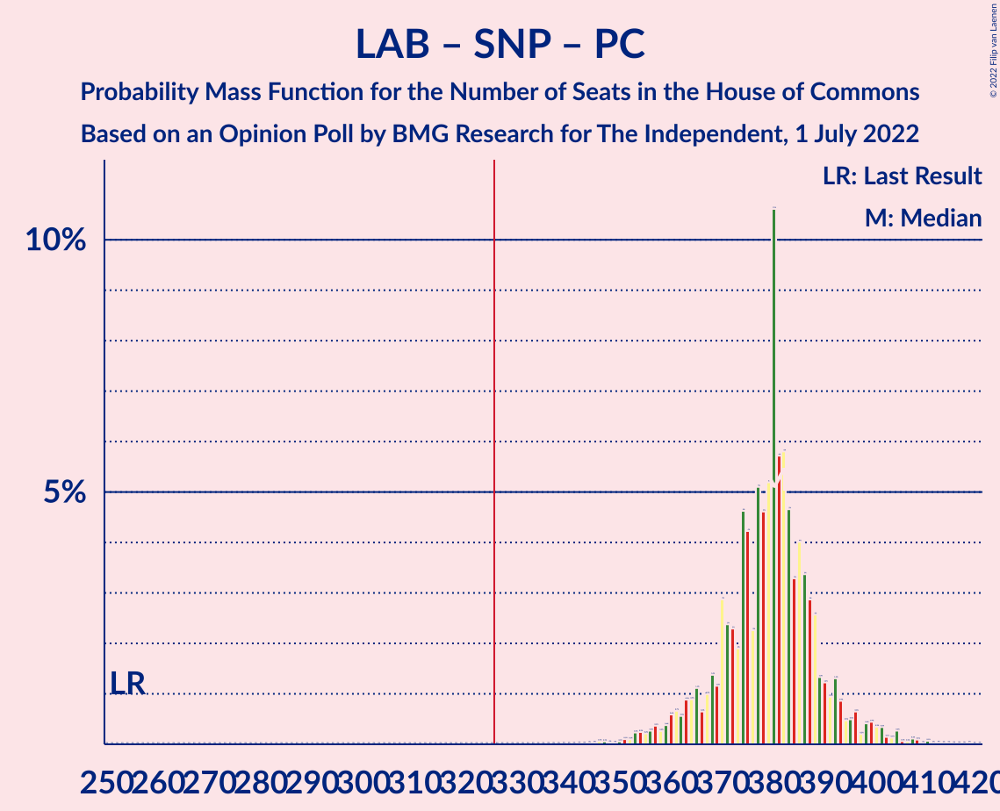

| Number of Seats | Probability | Accumulated | Special Marks |
|:---------------:|:-----------:|:-----------:|:-------------:|
| 254 | 0% | 100% | Last Result |
| 255 | 0% | 100% |  |
| 256 | 0% | 100% |  |
| 257 | 0% | 100% |  |
| 258 | 0% | 100% |  |
| 259 | 0% | 100% |  |
| 260 | 0% | 100% |  |
| 261 | 0% | 100% |  |
| 262 | 0% | 100% |  |
| 263 | 0% | 100% |  |
| 264 | 0% | 100% |  |
| 265 | 0% | 100% |  |
| 266 | 0% | 100% |  |
| 267 | 0% | 100% |  |
| 268 | 0% | 100% |  |
| 269 | 0% | 100% |  |
| 270 | 0% | 100% |  |
| 271 | 0% | 100% |  |
| 272 | 0% | 100% |  |
| 273 | 0% | 100% |  |
| 274 | 0% | 100% |  |
| 275 | 0% | 100% |  |
| 276 | 0% | 100% |  |
| 277 | 0% | 100% |  |
| 278 | 0% | 100% |  |
| 279 | 0% | 100% |  |
| 280 | 0% | 100% |  |
| 281 | 0% | 100% |  |
| 282 | 0% | 100% |  |
| 283 | 0% | 100% |  |
| 284 | 0% | 100% |  |
| 285 | 0% | 100% |  |
| 286 | 0% | 100% |  |
| 287 | 0% | 100% |  |
| 288 | 0% | 100% |  |
| 289 | 0% | 100% |  |
| 290 | 0% | 100% |  |
| 291 | 0% | 100% |  |
| 292 | 0% | 100% |  |
| 293 | 0% | 100% |  |
| 294 | 0% | 100% |  |
| 295 | 0% | 100% |  |
| 296 | 0% | 100% |  |
| 297 | 0% | 100% |  |
| 298 | 0% | 100% |  |
| 299 | 0% | 100% |  |
| 300 | 0% | 100% |  |
| 301 | 0% | 100% |  |
| 302 | 0% | 100% |  |
| 303 | 0% | 100% |  |
| 304 | 0% | 100% |  |
| 305 | 0% | 100% |  |
| 306 | 0% | 100% |  |
| 307 | 0% | 100% |  |
| 308 | 0% | 100% |  |
| 309 | 0% | 100% |  |
| 310 | 0% | 100% |  |
| 311 | 0% | 100% |  |
| 312 | 0% | 100% |  |
| 313 | 0% | 100% |  |
| 314 | 0% | 100% |  |
| 315 | 0% | 100% |  |
| 316 | 0% | 100% |  |
| 317 | 0% | 100% |  |
| 318 | 0% | 100% |  |
| 319 | 0% | 100% |  |
| 320 | 0% | 100% |  |
| 321 | 0% | 100% |  |
| 322 | 0% | 100% |  |
| 323 | 0% | 100% |  |
| 324 | 0% | 100% |  |
| 325 | 0% | 100% |  |
| 326 | 0% | 100% | Majority |
| 327 | 0% | 100% |  |
| 328 | 0% | 100% |  |
| 329 | 0% | 100% |  |
| 330 | 0% | 100% |  |
| 331 | 0% | 100% |  |
| 332 | 0% | 100% |  |
| 333 | 0% | 100% |  |
| 334 | 0% | 100% |  |
| 335 | 0% | 100% |  |
| 336 | 0% | 100% |  |
| 337 | 0% | 100% |  |
| 338 | 0% | 100% |  |
| 339 | 0% | 100% |  |
| 340 | 0% | 100% |  |
| 341 | 0% | 100% |  |
| 342 | 0% | 100% |  |
| 343 | 0% | 100% |  |
| 344 | 0% | 99.9% |  |
| 345 | 0% | 99.9% |  |
| 346 | 0.1% | 99.9% |  |
| 347 | 0.1% | 99.8% |  |
| 348 | 0% | 99.8% |  |
| 349 | 0% | 99.7% |  |
| 350 | 0.1% | 99.7% |  |
| 351 | 0.1% | 99.7% |  |
| 352 | 0.1% | 99.6% |  |
| 353 | 0.2% | 99.5% |  |
| 354 | 0.2% | 99.2% |  |
| 355 | 0.2% | 99.0% |  |
| 356 | 0.3% | 98.8% |  |
| 357 | 0.4% | 98% |  |
| 358 | 0.3% | 98% |  |
| 359 | 0.4% | 98% |  |
| 360 | 0.6% | 97% |  |
| 361 | 0.7% | 97% |  |
| 362 | 0.6% | 96% |  |
| 363 | 0.9% | 96% |  |
| 364 | 0.9% | 95% |  |
| 365 | 1.1% | 94% |  |
| 366 | 0.6% | 93% |  |
| 367 | 1.0% | 92% |  |
| 368 | 1.4% | 91% |  |
| 369 | 1.2% | 90% |  |
| 370 | 3% | 89% |  |
| 371 | 2% | 86% |  |
| 372 | 2% | 83% |  |
| 373 | 2% | 81% |  |
| 374 | 5% | 79% |  |
| 375 | 4% | 75% |  |
| 376 | 2% | 70% |  |
| 377 | 5% | 68% |  |
| 378 | 5% | 63% |  |
| 379 | 5% | 58% |  |
| 380 | 11% | 53% | Median |
| 381 | 6% | 43% |  |
| 382 | 6% | 37% |  |
| 383 | 5% | 31% |  |
| 384 | 3% | 26% |  |
| 385 | 4% | 23% |  |
| 386 | 3% | 19% |  |
| 387 | 3% | 16% |  |
| 388 | 3% | 13% |  |
| 389 | 1.3% | 10% |  |
| 390 | 1.2% | 9% |  |
| 391 | 0.9% | 8% |  |
| 392 | 1.3% | 7% |  |
| 393 | 0.9% | 5% |  |
| 394 | 0.5% | 5% |  |
| 395 | 0.5% | 4% |  |
| 396 | 0.6% | 4% |  |
| 397 | 0.2% | 3% |  |
| 398 | 0.4% | 3% |  |
| 399 | 0.4% | 2% |  |
| 400 | 0.3% | 2% |  |
| 401 | 0.3% | 2% |  |
| 402 | 0.1% | 1.2% |  |
| 403 | 0.1% | 1.0% |  |
| 404 | 0.3% | 0.9% |  |
| 405 | 0.1% | 0.6% |  |
| 406 | 0.1% | 0.6% |  |
| 407 | 0.1% | 0.5% |  |
| 408 | 0.1% | 0.4% |  |
| 409 | 0% | 0.3% |  |
| 410 | 0.1% | 0.3% |  |
| 411 | 0% | 0.2% |  |
| 412 | 0% | 0.2% |  |
| 413 | 0% | 0.2% |  |
| 414 | 0% | 0.1% |  |
| 415 | 0% | 0.1% |  |
| 416 | 0% | 0.1% |  |
| 417 | 0% | 0.1% |  |
| 418 | 0% | 0.1% |  |
| 419 | 0% | 0% |  |

### Labour Party – Scottish National Party

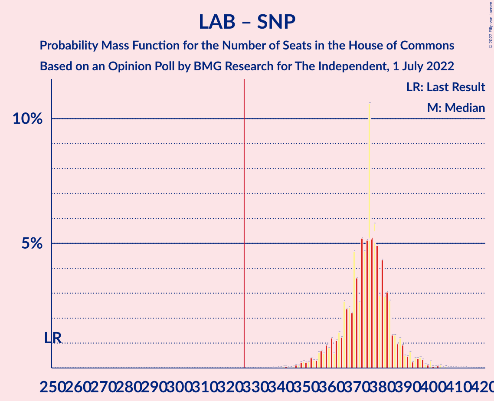

| Number of Seats | Probability | Accumulated | Special Marks |
|:---------------:|:-----------:|:-----------:|:-------------:|
| 250 | 0% | 100% | Last Result |
| 251 | 0% | 100% |  |
| 252 | 0% | 100% |  |
| 253 | 0% | 100% |  |
| 254 | 0% | 100% |  |
| 255 | 0% | 100% |  |
| 256 | 0% | 100% |  |
| 257 | 0% | 100% |  |
| 258 | 0% | 100% |  |
| 259 | 0% | 100% |  |
| 260 | 0% | 100% |  |
| 261 | 0% | 100% |  |
| 262 | 0% | 100% |  |
| 263 | 0% | 100% |  |
| 264 | 0% | 100% |  |
| 265 | 0% | 100% |  |
| 266 | 0% | 100% |  |
| 267 | 0% | 100% |  |
| 268 | 0% | 100% |  |
| 269 | 0% | 100% |  |
| 270 | 0% | 100% |  |
| 271 | 0% | 100% |  |
| 272 | 0% | 100% |  |
| 273 | 0% | 100% |  |
| 274 | 0% | 100% |  |
| 275 | 0% | 100% |  |
| 276 | 0% | 100% |  |
| 277 | 0% | 100% |  |
| 278 | 0% | 100% |  |
| 279 | 0% | 100% |  |
| 280 | 0% | 100% |  |
| 281 | 0% | 100% |  |
| 282 | 0% | 100% |  |
| 283 | 0% | 100% |  |
| 284 | 0% | 100% |  |
| 285 | 0% | 100% |  |
| 286 | 0% | 100% |  |
| 287 | 0% | 100% |  |
| 288 | 0% | 100% |  |
| 289 | 0% | 100% |  |
| 290 | 0% | 100% |  |
| 291 | 0% | 100% |  |
| 292 | 0% | 100% |  |
| 293 | 0% | 100% |  |
| 294 | 0% | 100% |  |
| 295 | 0% | 100% |  |
| 296 | 0% | 100% |  |
| 297 | 0% | 100% |  |
| 298 | 0% | 100% |  |
| 299 | 0% | 100% |  |
| 300 | 0% | 100% |  |
| 301 | 0% | 100% |  |
| 302 | 0% | 100% |  |
| 303 | 0% | 100% |  |
| 304 | 0% | 100% |  |
| 305 | 0% | 100% |  |
| 306 | 0% | 100% |  |
| 307 | 0% | 100% |  |
| 308 | 0% | 100% |  |
| 309 | 0% | 100% |  |
| 310 | 0% | 100% |  |
| 311 | 0% | 100% |  |
| 312 | 0% | 100% |  |
| 313 | 0% | 100% |  |
| 314 | 0% | 100% |  |
| 315 | 0% | 100% |  |
| 316 | 0% | 100% |  |
| 317 | 0% | 100% |  |
| 318 | 0% | 100% |  |
| 319 | 0% | 100% |  |
| 320 | 0% | 100% |  |
| 321 | 0% | 100% |  |
| 322 | 0% | 100% |  |
| 323 | 0% | 100% |  |
| 324 | 0% | 100% |  |
| 325 | 0% | 100% |  |
| 326 | 0% | 100% | Majority |
| 327 | 0% | 100% |  |
| 328 | 0% | 100% |  |
| 329 | 0% | 100% |  |
| 330 | 0% | 100% |  |
| 331 | 0% | 100% |  |
| 332 | 0% | 100% |  |
| 333 | 0% | 100% |  |
| 334 | 0% | 100% |  |
| 335 | 0% | 100% |  |
| 336 | 0% | 100% |  |
| 337 | 0% | 100% |  |
| 338 | 0% | 99.9% |  |
| 339 | 0% | 99.9% |  |
| 340 | 0% | 99.9% |  |
| 341 | 0.1% | 99.9% |  |
| 342 | 0.1% | 99.8% |  |
| 343 | 0% | 99.8% |  |
| 344 | 0% | 99.7% |  |
| 345 | 0.1% | 99.7% |  |
| 346 | 0.1% | 99.7% |  |
| 347 | 0.1% | 99.5% |  |
| 348 | 0.2% | 99.4% |  |
| 349 | 0.3% | 99.2% |  |
| 350 | 0.2% | 99.0% |  |
| 351 | 0.2% | 98.7% |  |
| 352 | 0.4% | 98% |  |
| 353 | 0.3% | 98% |  |
| 354 | 0.3% | 98% |  |
| 355 | 0.6% | 97% |  |
| 356 | 0.7% | 97% |  |
| 357 | 0.6% | 96% |  |
| 358 | 0.9% | 96% |  |
| 359 | 0.8% | 95% |  |
| 360 | 1.2% | 94% |  |
| 361 | 0.6% | 93% |  |
| 362 | 1.1% | 92% |  |
| 363 | 1.4% | 91% |  |
| 364 | 1.2% | 90% |  |
| 365 | 3% | 88% |  |
| 366 | 2% | 86% |  |
| 367 | 2% | 83% |  |
| 368 | 2% | 81% |  |
| 369 | 5% | 79% |  |
| 370 | 4% | 74% |  |
| 371 | 3% | 70% |  |
| 372 | 5% | 68% |  |
| 373 | 5% | 63% |  |
| 374 | 5% | 58% |  |
| 375 | 11% | 53% | Median |
| 376 | 5% | 42% |  |
| 377 | 6% | 37% |  |
| 378 | 5% | 31% |  |
| 379 | 3% | 26% |  |
| 380 | 4% | 23% |  |
| 381 | 3% | 19% |  |
| 382 | 3% | 16% |  |
| 383 | 3% | 13% |  |
| 384 | 1.3% | 10% |  |
| 385 | 1.3% | 9% |  |
| 386 | 1.0% | 8% |  |
| 387 | 1.2% | 7% |  |
| 388 | 0.9% | 5% |  |
| 389 | 0.5% | 5% |  |
| 390 | 0.5% | 4% |  |
| 391 | 0.6% | 4% |  |
| 392 | 0.2% | 3% |  |
| 393 | 0.4% | 3% |  |
| 394 | 0.4% | 2% |  |
| 395 | 0.4% | 2% |  |
| 396 | 0.3% | 2% |  |
| 397 | 0.1% | 1.2% |  |
| 398 | 0.1% | 1.0% |  |
| 399 | 0.3% | 0.9% |  |
| 400 | 0.1% | 0.6% |  |
| 401 | 0.1% | 0.6% |  |
| 402 | 0.1% | 0.5% |  |
| 403 | 0.1% | 0.4% |  |
| 404 | 0% | 0.3% |  |
| 405 | 0.1% | 0.3% |  |
| 406 | 0% | 0.2% |  |
| 407 | 0% | 0.2% |  |
| 408 | 0% | 0.2% |  |
| 409 | 0% | 0.1% |  |
| 410 | 0% | 0.1% |  |
| 411 | 0% | 0.1% |  |
| 412 | 0% | 0.1% |  |
| 413 | 0% | 0.1% |  |
| 414 | 0% | 0% |  |

### Labour Party – Liberal Democrats – Plaid Cymru

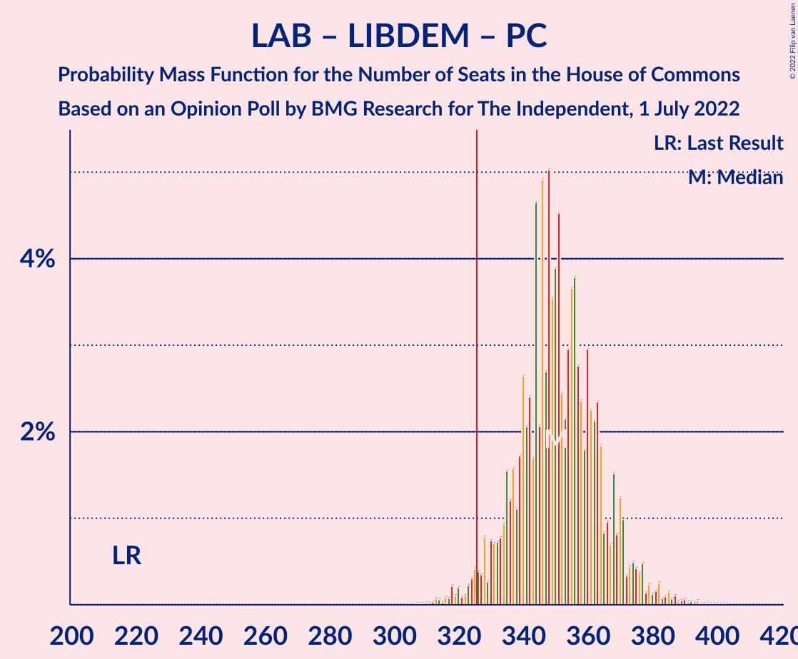

| Number of Seats | Probability | Accumulated | Special Marks |
|:---------------:|:-----------:|:-----------:|:-------------:|
| 217 | 0% | 100% | Last Result |
| 218 | 0% | 100% |  |
| 219 | 0% | 100% |  |
| 220 | 0% | 100% |  |
| 221 | 0% | 100% |  |
| 222 | 0% | 100% |  |
| 223 | 0% | 100% |  |
| 224 | 0% | 100% |  |
| 225 | 0% | 100% |  |
| 226 | 0% | 100% |  |
| 227 | 0% | 100% |  |
| 228 | 0% | 100% |  |
| 229 | 0% | 100% |  |
| 230 | 0% | 100% |  |
| 231 | 0% | 100% |  |
| 232 | 0% | 100% |  |
| 233 | 0% | 100% |  |
| 234 | 0% | 100% |  |
| 235 | 0% | 100% |  |
| 236 | 0% | 100% |  |
| 237 | 0% | 100% |  |
| 238 | 0% | 100% |  |
| 239 | 0% | 100% |  |
| 240 | 0% | 100% |  |
| 241 | 0% | 100% |  |
| 242 | 0% | 100% |  |
| 243 | 0% | 100% |  |
| 244 | 0% | 100% |  |
| 245 | 0% | 100% |  |
| 246 | 0% | 100% |  |
| 247 | 0% | 100% |  |
| 248 | 0% | 100% |  |
| 249 | 0% | 100% |  |
| 250 | 0% | 100% |  |
| 251 | 0% | 100% |  |
| 252 | 0% | 100% |  |
| 253 | 0% | 100% |  |
| 254 | 0% | 100% |  |
| 255 | 0% | 100% |  |
| 256 | 0% | 100% |  |
| 257 | 0% | 100% |  |
| 258 | 0% | 100% |  |
| 259 | 0% | 100% |  |
| 260 | 0% | 100% |  |
| 261 | 0% | 100% |  |
| 262 | 0% | 100% |  |
| 263 | 0% | 100% |  |
| 264 | 0% | 100% |  |
| 265 | 0% | 100% |  |
| 266 | 0% | 100% |  |
| 267 | 0% | 100% |  |
| 268 | 0% | 100% |  |
| 269 | 0% | 100% |  |
| 270 | 0% | 100% |  |
| 271 | 0% | 100% |  |
| 272 | 0% | 100% |  |
| 273 | 0% | 100% |  |
| 274 | 0% | 100% |  |
| 275 | 0% | 100% |  |
| 276 | 0% | 100% |  |
| 277 | 0% | 100% |  |
| 278 | 0% | 100% |  |
| 279 | 0% | 100% |  |
| 280 | 0% | 100% |  |
| 281 | 0% | 100% |  |
| 282 | 0% | 100% |  |
| 283 | 0% | 100% |  |
| 284 | 0% | 100% |  |
| 285 | 0% | 100% |  |
| 286 | 0% | 100% |  |
| 287 | 0% | 100% |  |
| 288 | 0% | 100% |  |
| 289 | 0% | 100% |  |
| 290 | 0% | 100% |  |
| 291 | 0% | 100% |  |
| 292 | 0% | 100% |  |
| 293 | 0% | 100% |  |
| 294 | 0% | 100% |  |
| 295 | 0% | 100% |  |
| 296 | 0% | 100% |  |
| 297 | 0% | 100% |  |
| 298 | 0% | 100% |  |
| 299 | 0% | 100% |  |
| 300 | 0% | 100% |  |
| 301 | 0% | 100% |  |
| 302 | 0% | 100% |  |
| 303 | 0% | 100% |  |
| 304 | 0% | 100% |  |
| 305 | 0% | 100% |  |
| 306 | 0% | 100% |  |
| 307 | 0% | 100% |  |
| 308 | 0% | 99.9% |  |
| 309 | 0% | 99.9% |  |
| 310 | 0% | 99.9% |  |
| 311 | 0% | 99.9% |  |
| 312 | 0% | 99.9% |  |
| 313 | 0.1% | 99.8% |  |
| 314 | 0.1% | 99.8% |  |
| 315 | 0% | 99.7% |  |
| 316 | 0.1% | 99.7% |  |
| 317 | 0.1% | 99.6% |  |
| 318 | 0.2% | 99.5% |  |
| 319 | 0.1% | 99.3% |  |
| 320 | 0.2% | 99.2% |  |
| 321 | 0.1% | 99.0% |  |
| 322 | 0.1% | 98.9% |  |
| 323 | 0.2% | 98.8% |  |
| 324 | 0.3% | 98.6% |  |
| 325 | 0.4% | 98% |  |
| 326 | 0.4% | 98% | Majority |
| 327 | 0.4% | 97% |  |
| 328 | 0.8% | 97% |  |
| 329 | 0.3% | 96% |  |
| 330 | 0.7% | 96% |  |
| 331 | 0.7% | 95% |  |
| 332 | 0.7% | 95% |  |
| 333 | 0.8% | 94% |  |
| 334 | 0.9% | 93% |  |
| 335 | 2% | 92% |  |
| 336 | 1.2% | 91% |  |
| 337 | 2% | 89% |  |
| 338 | 1.1% | 88% |  |
| 339 | 2% | 87% |  |
| 340 | 3% | 85% |  |
| 341 | 2% | 82% |  |
| 342 | 2% | 80% |  |
| 343 | 2% | 78% |  |
| 344 | 5% | 76% |  |
| 345 | 2% | 72% |  |
| 346 | 5% | 69% |  |
| 347 | 3% | 65% |  |
| 348 | 5% | 62% |  |
| 349 | 4% | 57% |  |
| 350 | 4% | 53% | Median |
| 351 | 5% | 49% |  |
| 352 | 2% | 45% |  |
| 353 | 2% | 42% |  |
| 354 | 3% | 40% |  |
| 355 | 4% | 37% |  |
| 356 | 4% | 34% |  |
| 357 | 3% | 30% |  |
| 358 | 2% | 27% |  |
| 359 | 2% | 25% |  |
| 360 | 3% | 23% |  |
| 361 | 2% | 20% |  |
| 362 | 2% | 18% |  |
| 363 | 2% | 16% |  |
| 364 | 2% | 13% |  |
| 365 | 0.8% | 11% |  |
| 366 | 1.0% | 11% |  |
| 367 | 0.7% | 10% |  |
| 368 | 2% | 9% |  |
| 369 | 0.8% | 7% |  |
| 370 | 1.2% | 7% |  |
| 371 | 1.0% | 5% |  |
| 372 | 0.3% | 4% |  |
| 373 | 0.4% | 4% |  |
| 374 | 0.5% | 4% |  |
| 375 | 0.4% | 3% |  |
| 376 | 0.4% | 3% |  |
| 377 | 0.5% | 2% |  |
| 378 | 0.1% | 2% |  |
| 379 | 0.2% | 2% |  |
| 380 | 0.1% | 1.5% |  |
| 381 | 0.2% | 1.4% |  |
| 382 | 0.3% | 1.2% |  |
| 383 | 0.1% | 0.9% |  |
| 384 | 0.1% | 0.9% |  |
| 385 | 0.1% | 0.8% |  |
| 386 | 0.1% | 0.6% |  |
| 387 | 0.1% | 0.6% |  |
| 388 | 0% | 0.5% |  |
| 389 | 0.1% | 0.4% |  |
| 390 | 0.1% | 0.4% |  |
| 391 | 0% | 0.3% |  |
| 392 | 0% | 0.3% |  |
| 393 | 0% | 0.2% |  |
| 394 | 0.1% | 0.2% |  |
| 395 | 0% | 0.1% |  |
| 396 | 0% | 0.1% |  |
| 397 | 0% | 0.1% |  |
| 398 | 0% | 0.1% |  |
| 399 | 0% | 0.1% |  |
| 400 | 0% | 0.1% |  |
| 401 | 0% | 0.1% |  |
| 402 | 0% | 0% |  |

### Labour Party – Liberal Democrats

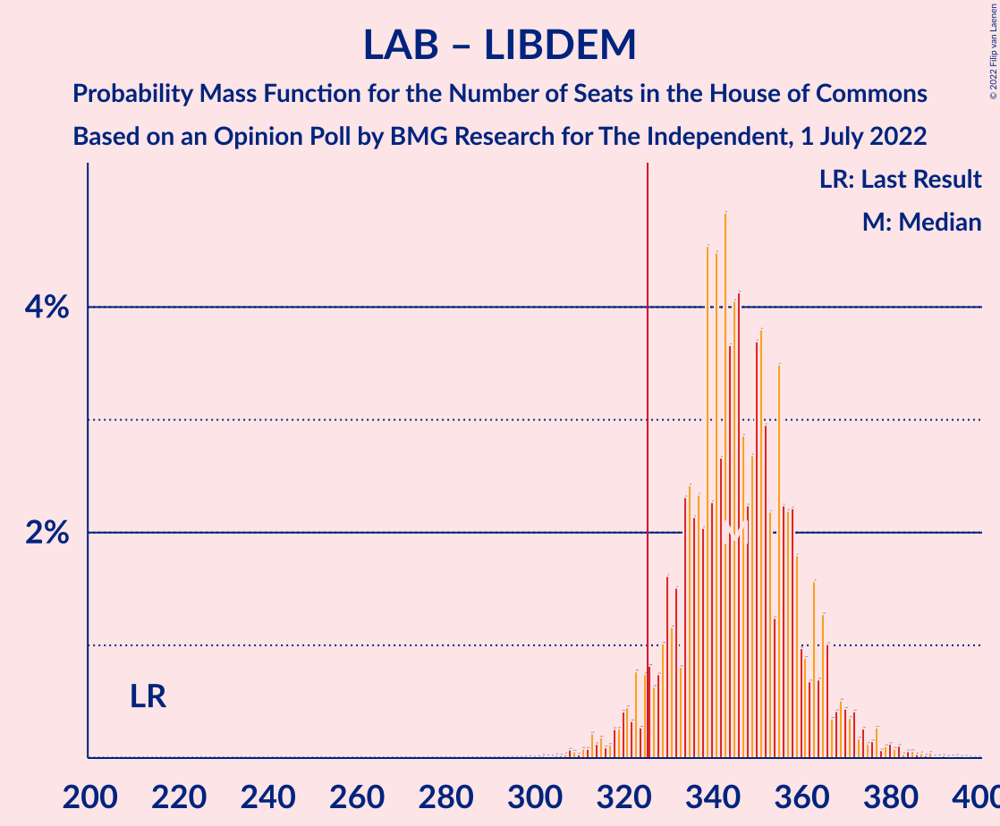

| Number of Seats | Probability | Accumulated | Special Marks |
|:---------------:|:-----------:|:-----------:|:-------------:|
| 213 | 0% | 100% | Last Result |
| 214 | 0% | 100% |  |
| 215 | 0% | 100% |  |
| 216 | 0% | 100% |  |
| 217 | 0% | 100% |  |
| 218 | 0% | 100% |  |
| 219 | 0% | 100% |  |
| 220 | 0% | 100% |  |
| 221 | 0% | 100% |  |
| 222 | 0% | 100% |  |
| 223 | 0% | 100% |  |
| 224 | 0% | 100% |  |
| 225 | 0% | 100% |  |
| 226 | 0% | 100% |  |
| 227 | 0% | 100% |  |
| 228 | 0% | 100% |  |
| 229 | 0% | 100% |  |
| 230 | 0% | 100% |  |
| 231 | 0% | 100% |  |
| 232 | 0% | 100% |  |
| 233 | 0% | 100% |  |
| 234 | 0% | 100% |  |
| 235 | 0% | 100% |  |
| 236 | 0% | 100% |  |
| 237 | 0% | 100% |  |
| 238 | 0% | 100% |  |
| 239 | 0% | 100% |  |
| 240 | 0% | 100% |  |
| 241 | 0% | 100% |  |
| 242 | 0% | 100% |  |
| 243 | 0% | 100% |  |
| 244 | 0% | 100% |  |
| 245 | 0% | 100% |  |
| 246 | 0% | 100% |  |
| 247 | 0% | 100% |  |
| 248 | 0% | 100% |  |
| 249 | 0% | 100% |  |
| 250 | 0% | 100% |  |
| 251 | 0% | 100% |  |
| 252 | 0% | 100% |  |
| 253 | 0% | 100% |  |
| 254 | 0% | 100% |  |
| 255 | 0% | 100% |  |
| 256 | 0% | 100% |  |
| 257 | 0% | 100% |  |
| 258 | 0% | 100% |  |
| 259 | 0% | 100% |  |
| 260 | 0% | 100% |  |
| 261 | 0% | 100% |  |
| 262 | 0% | 100% |  |
| 263 | 0% | 100% |  |
| 264 | 0% | 100% |  |
| 265 | 0% | 100% |  |
| 266 | 0% | 100% |  |
| 267 | 0% | 100% |  |
| 268 | 0% | 100% |  |
| 269 | 0% | 100% |  |
| 270 | 0% | 100% |  |
| 271 | 0% | 100% |  |
| 272 | 0% | 100% |  |
| 273 | 0% | 100% |  |
| 274 | 0% | 100% |  |
| 275 | 0% | 100% |  |
| 276 | 0% | 100% |  |
| 277 | 0% | 100% |  |
| 278 | 0% | 100% |  |
| 279 | 0% | 100% |  |
| 280 | 0% | 100% |  |
| 281 | 0% | 100% |  |
| 282 | 0% | 100% |  |
| 283 | 0% | 100% |  |
| 284 | 0% | 100% |  |
| 285 | 0% | 100% |  |
| 286 | 0% | 100% |  |
| 287 | 0% | 100% |  |
| 288 | 0% | 100% |  |
| 289 | 0% | 100% |  |
| 290 | 0% | 100% |  |
| 291 | 0% | 100% |  |
| 292 | 0% | 100% |  |
| 293 | 0% | 100% |  |
| 294 | 0% | 100% |  |
| 295 | 0% | 100% |  |
| 296 | 0% | 100% |  |
| 297 | 0% | 100% |  |
| 298 | 0% | 100% |  |
| 299 | 0% | 100% |  |
| 300 | 0% | 100% |  |
| 301 | 0% | 100% |  |
| 302 | 0% | 100% |  |
| 303 | 0% | 99.9% |  |
| 304 | 0% | 99.9% |  |
| 305 | 0% | 99.9% |  |
| 306 | 0% | 99.9% |  |
| 307 | 0% | 99.9% |  |
| 308 | 0.1% | 99.8% |  |
| 309 | 0.1% | 99.8% |  |
| 310 | 0% | 99.7% |  |
| 311 | 0.1% | 99.7% |  |
| 312 | 0.1% | 99.6% |  |
| 313 | 0.2% | 99.5% |  |
| 314 | 0.1% | 99.3% |  |
| 315 | 0.2% | 99.2% |  |
| 316 | 0.1% | 99.0% |  |
| 317 | 0.1% | 98.9% |  |
| 318 | 0.3% | 98.8% |  |
| 319 | 0.3% | 98.5% |  |
| 320 | 0.4% | 98% |  |
| 321 | 0.5% | 98% |  |
| 322 | 0.3% | 97% |  |
| 323 | 0.8% | 97% |  |
| 324 | 0.3% | 96% |  |
| 325 | 0.7% | 96% |  |
| 326 | 0.8% | 95% | Majority |
| 327 | 0.6% | 94% |  |
| 328 | 0.7% | 94% |  |
| 329 | 1.0% | 93% |  |
| 330 | 2% | 92% |  |
| 331 | 1.2% | 90% |  |
| 332 | 2% | 89% |  |
| 333 | 0.8% | 88% |  |
| 334 | 2% | 87% |  |
| 335 | 2% | 85% |  |
| 336 | 2% | 82% |  |
| 337 | 2% | 80% |  |
| 338 | 2% | 78% |  |
| 339 | 5% | 76% |  |
| 340 | 2% | 71% |  |
| 341 | 4% | 69% |  |
| 342 | 3% | 64% |  |
| 343 | 5% | 62% |  |
| 344 | 4% | 57% |  |
| 345 | 4% | 53% | Median |
| 346 | 4% | 49% |  |
| 347 | 3% | 45% |  |
| 348 | 2% | 42% |  |
| 349 | 3% | 40% |  |
| 350 | 4% | 37% |  |
| 351 | 4% | 34% |  |
| 352 | 3% | 30% |  |
| 353 | 2% | 27% |  |
| 354 | 1.2% | 25% |  |
| 355 | 3% | 23% |  |
| 356 | 2% | 20% |  |
| 357 | 2% | 18% |  |
| 358 | 2% | 16% |  |
| 359 | 2% | 13% |  |
| 360 | 1.0% | 11% |  |
| 361 | 0.9% | 11% |  |
| 362 | 0.7% | 10% |  |
| 363 | 2% | 9% |  |
| 364 | 0.7% | 7% |  |
| 365 | 1.3% | 7% |  |
| 366 | 1.0% | 5% |  |
| 367 | 0.3% | 4% |  |
| 368 | 0.4% | 4% |  |
| 369 | 0.5% | 4% |  |
| 370 | 0.4% | 3% |  |
| 371 | 0.4% | 3% |  |
| 372 | 0.4% | 2% |  |
| 373 | 0.2% | 2% |  |
| 374 | 0.3% | 2% |  |
| 375 | 0.1% | 1.5% |  |
| 376 | 0.1% | 1.4% |  |
| 377 | 0.3% | 1.2% |  |
| 378 | 0.1% | 0.9% |  |
| 379 | 0.1% | 0.9% |  |
| 380 | 0.1% | 0.8% |  |
| 381 | 0.1% | 0.6% |  |
| 382 | 0.1% | 0.6% |  |
| 383 | 0% | 0.5% |  |
| 384 | 0.1% | 0.4% |  |
| 385 | 0.1% | 0.4% |  |
| 386 | 0% | 0.3% |  |
| 387 | 0% | 0.3% |  |
| 388 | 0% | 0.2% |  |
| 389 | 0% | 0.2% |  |
| 390 | 0% | 0.1% |  |
| 391 | 0% | 0.1% |  |
| 392 | 0% | 0.1% |  |
| 393 | 0% | 0.1% |  |
| 394 | 0% | 0.1% |  |
| 395 | 0% | 0.1% |  |
| 396 | 0% | 0.1% |  |
| 397 | 0% | 0% |  |

### Labour Party – Plaid Cymru

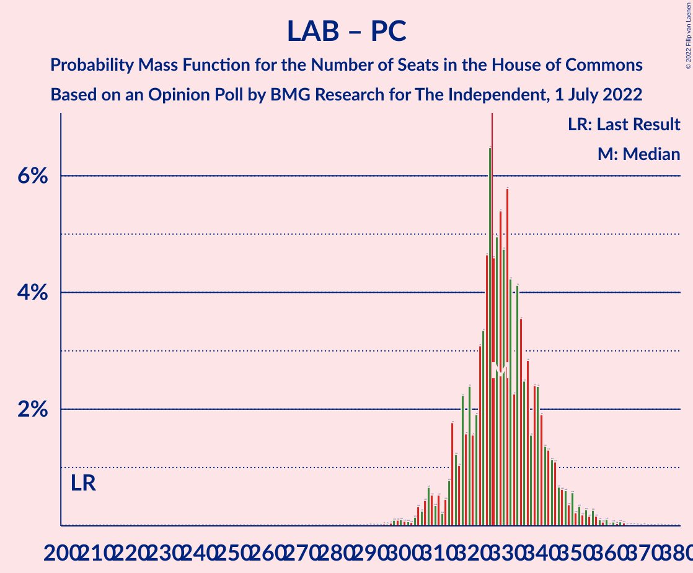

| Number of Seats | Probability | Accumulated | Special Marks |
|:---------------:|:-----------:|:-----------:|:-------------:|
| 206 | 0% | 100% | Last Result |
| 207 | 0% | 100% |  |
| 208 | 0% | 100% |  |
| 209 | 0% | 100% |  |
| 210 | 0% | 100% |  |
| 211 | 0% | 100% |  |
| 212 | 0% | 100% |  |
| 213 | 0% | 100% |  |
| 214 | 0% | 100% |  |
| 215 | 0% | 100% |  |
| 216 | 0% | 100% |  |
| 217 | 0% | 100% |  |
| 218 | 0% | 100% |  |
| 219 | 0% | 100% |  |
| 220 | 0% | 100% |  |
| 221 | 0% | 100% |  |
| 222 | 0% | 100% |  |
| 223 | 0% | 100% |  |
| 224 | 0% | 100% |  |
| 225 | 0% | 100% |  |
| 226 | 0% | 100% |  |
| 227 | 0% | 100% |  |
| 228 | 0% | 100% |  |
| 229 | 0% | 100% |  |
| 230 | 0% | 100% |  |
| 231 | 0% | 100% |  |
| 232 | 0% | 100% |  |
| 233 | 0% | 100% |  |
| 234 | 0% | 100% |  |
| 235 | 0% | 100% |  |
| 236 | 0% | 100% |  |
| 237 | 0% | 100% |  |
| 238 | 0% | 100% |  |
| 239 | 0% | 100% |  |
| 240 | 0% | 100% |  |
| 241 | 0% | 100% |  |
| 242 | 0% | 100% |  |
| 243 | 0% | 100% |  |
| 244 | 0% | 100% |  |
| 245 | 0% | 100% |  |
| 246 | 0% | 100% |  |
| 247 | 0% | 100% |  |
| 248 | 0% | 100% |  |
| 249 | 0% | 100% |  |
| 250 | 0% | 100% |  |
| 251 | 0% | 100% |  |
| 252 | 0% | 100% |  |
| 253 | 0% | 100% |  |
| 254 | 0% | 100% |  |
| 255 | 0% | 100% |  |
| 256 | 0% | 100% |  |
| 257 | 0% | 100% |  |
| 258 | 0% | 100% |  |
| 259 | 0% | 100% |  |
| 260 | 0% | 100% |  |
| 261 | 0% | 100% |  |
| 262 | 0% | 100% |  |
| 263 | 0% | 100% |  |
| 264 | 0% | 100% |  |
| 265 | 0% | 100% |  |
| 266 | 0% | 100% |  |
| 267 | 0% | 100% |  |
| 268 | 0% | 100% |  |
| 269 | 0% | 100% |  |
| 270 | 0% | 100% |  |
| 271 | 0% | 100% |  |
| 272 | 0% | 100% |  |
| 273 | 0% | 100% |  |
| 274 | 0% | 100% |  |
| 275 | 0% | 100% |  |
| 276 | 0% | 100% |  |
| 277 | 0% | 100% |  |
| 278 | 0% | 100% |  |
| 279 | 0% | 100% |  |
| 280 | 0% | 100% |  |
| 281 | 0% | 100% |  |
| 282 | 0% | 100% |  |
| 283 | 0% | 100% |  |
| 284 | 0% | 100% |  |
| 285 | 0% | 100% |  |
| 286 | 0% | 100% |  |
| 287 | 0% | 100% |  |
| 288 | 0% | 100% |  |
| 289 | 0% | 100% |  |
| 290 | 0% | 100% |  |
| 291 | 0% | 100% |  |
| 292 | 0% | 100% |  |
| 293 | 0% | 99.9% |  |
| 294 | 0% | 99.9% |  |
| 295 | 0% | 99.9% |  |
| 296 | 0% | 99.9% |  |
| 297 | 0.1% | 99.8% |  |
| 298 | 0.1% | 99.7% |  |
| 299 | 0.1% | 99.6% |  |
| 300 | 0.1% | 99.5% |  |
| 301 | 0.1% | 99.4% |  |
| 302 | 0.1% | 99.4% |  |
| 303 | 0.1% | 99.3% |  |
| 304 | 0.3% | 99.1% |  |
| 305 | 0.3% | 98.8% |  |
| 306 | 0.4% | 98.6% |  |
| 307 | 0.7% | 98% |  |
| 308 | 0.5% | 97% |  |
| 309 | 0.4% | 97% |  |
| 310 | 0.5% | 97% |  |
| 311 | 0.2% | 96% |  |
| 312 | 0.5% | 96% |  |
| 313 | 0.8% | 95% |  |
| 314 | 2% | 95% |  |
| 315 | 1.2% | 93% |  |
| 316 | 1.0% | 92% |  |
| 317 | 2% | 91% |  |
| 318 | 2% | 88% |  |
| 319 | 2% | 87% |  |
| 320 | 2% | 84% |  |
| 321 | 2% | 83% |  |
| 322 | 3% | 81% |  |
| 323 | 3% | 78% |  |
| 324 | 5% | 74% |  |
| 325 | 6% | 70% |  |
| 326 | 5% | 63% | Majority |
| 327 | 5% | 59% |  |
| 328 | 5% | 54% | Median |
| 329 | 5% | 48% |  |
| 330 | 6% | 44% |  |
| 331 | 4% | 38% |  |
| 332 | 2% | 34% |  |
| 333 | 4% | 31% |  |
| 334 | 4% | 27% |  |
| 335 | 2% | 24% |  |
| 336 | 3% | 21% |  |
| 337 | 2% | 18% |  |
| 338 | 2% | 17% |  |
| 339 | 2% | 14% |  |
| 340 | 2% | 12% |  |
| 341 | 1.4% | 10% |  |
| 342 | 1.3% | 9% |  |
| 343 | 1.1% | 7% |  |
| 344 | 1.1% | 6% |  |
| 345 | 0.7% | 5% |  |
| 346 | 0.6% | 5% |  |
| 347 | 0.6% | 4% |  |
| 348 | 0.4% | 3% |  |
| 349 | 0.6% | 3% |  |
| 350 | 0.2% | 2% |  |
| 351 | 0.3% | 2% |  |
| 352 | 0.2% | 2% |  |
| 353 | 0.3% | 2% |  |
| 354 | 0.2% | 1.3% |  |
| 355 | 0.3% | 1.2% |  |
| 356 | 0.2% | 0.9% |  |
| 357 | 0.1% | 0.7% |  |
| 358 | 0.1% | 0.6% |  |
| 359 | 0.1% | 0.5% |  |
| 360 | 0% | 0.4% |  |
| 361 | 0.1% | 0.4% |  |
| 362 | 0% | 0.3% |  |
| 363 | 0.1% | 0.3% |  |
| 364 | 0.1% | 0.2% |  |
| 365 | 0% | 0.2% |  |
| 366 | 0% | 0.1% |  |
| 367 | 0% | 0.1% |  |
| 368 | 0% | 0.1% |  |
| 369 | 0% | 0.1% |  |
| 370 | 0% | 0.1% |  |
| 371 | 0% | 0.1% |  |
| 372 | 0% | 0.1% |  |
| 373 | 0% | 0% |  |

### Labour Party

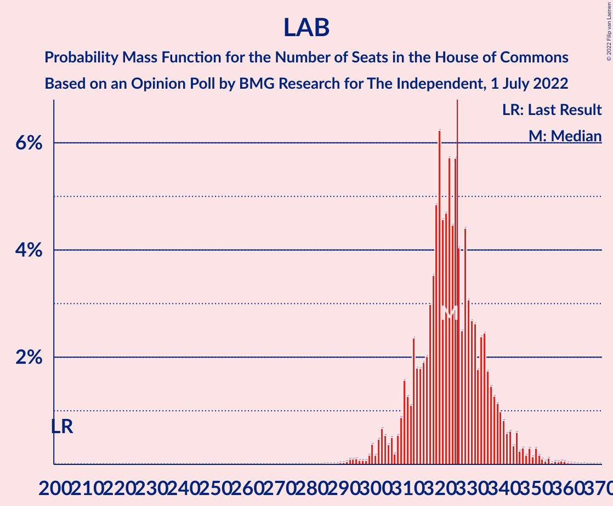

| Number of Seats | Probability | Accumulated | Special Marks |
|:---------------:|:-----------:|:-----------:|:-------------:|
| 202 | 0% | 100% | Last Result |
| 203 | 0% | 100% |  |
| 204 | 0% | 100% |  |
| 205 | 0% | 100% |  |
| 206 | 0% | 100% |  |
| 207 | 0% | 100% |  |
| 208 | 0% | 100% |  |
| 209 | 0% | 100% |  |
| 210 | 0% | 100% |  |
| 211 | 0% | 100% |  |
| 212 | 0% | 100% |  |
| 213 | 0% | 100% |  |
| 214 | 0% | 100% |  |
| 215 | 0% | 100% |  |
| 216 | 0% | 100% |  |
| 217 | 0% | 100% |  |
| 218 | 0% | 100% |  |
| 219 | 0% | 100% |  |
| 220 | 0% | 100% |  |
| 221 | 0% | 100% |  |
| 222 | 0% | 100% |  |
| 223 | 0% | 100% |  |
| 224 | 0% | 100% |  |
| 225 | 0% | 100% |  |
| 226 | 0% | 100% |  |
| 227 | 0% | 100% |  |
| 228 | 0% | 100% |  |
| 229 | 0% | 100% |  |
| 230 | 0% | 100% |  |
| 231 | 0% | 100% |  |
| 232 | 0% | 100% |  |
| 233 | 0% | 100% |  |
| 234 | 0% | 100% |  |
| 235 | 0% | 100% |  |
| 236 | 0% | 100% |  |
| 237 | 0% | 100% |  |
| 238 | 0% | 100% |  |
| 239 | 0% | 100% |  |
| 240 | 0% | 100% |  |
| 241 | 0% | 100% |  |
| 242 | 0% | 100% |  |
| 243 | 0% | 100% |  |
| 244 | 0% | 100% |  |
| 245 | 0% | 100% |  |
| 246 | 0% | 100% |  |
| 247 | 0% | 100% |  |
| 248 | 0% | 100% |  |
| 249 | 0% | 100% |  |
| 250 | 0% | 100% |  |
| 251 | 0% | 100% |  |
| 252 | 0% | 100% |  |
| 253 | 0% | 100% |  |
| 254 | 0% | 100% |  |
| 255 | 0% | 100% |  |
| 256 | 0% | 100% |  |
| 257 | 0% | 100% |  |
| 258 | 0% | 100% |  |
| 259 | 0% | 100% |  |
| 260 | 0% | 100% |  |
| 261 | 0% | 100% |  |
| 262 | 0% | 100% |  |
| 263 | 0% | 100% |  |
| 264 | 0% | 100% |  |
| 265 | 0% | 100% |  |
| 266 | 0% | 100% |  |
| 267 | 0% | 100% |  |
| 268 | 0% | 100% |  |
| 269 | 0% | 100% |  |
| 270 | 0% | 100% |  |
| 271 | 0% | 100% |  |
| 272 | 0% | 100% |  |
| 273 | 0% | 100% |  |
| 274 | 0% | 100% |  |
| 275 | 0% | 100% |  |
| 276 | 0% | 100% |  |
| 277 | 0% | 100% |  |
| 278 | 0% | 100% |  |
| 279 | 0% | 100% |  |
| 280 | 0% | 100% |  |
| 281 | 0% | 100% |  |
| 282 | 0% | 100% |  |
| 283 | 0% | 100% |  |
| 284 | 0% | 100% |  |
| 285 | 0% | 100% |  |
| 286 | 0% | 100% |  |
| 287 | 0% | 100% |  |
| 288 | 0% | 99.9% |  |
| 289 | 0% | 99.9% |  |
| 290 | 0% | 99.9% |  |
| 291 | 0.1% | 99.9% |  |
| 292 | 0.1% | 99.8% |  |
| 293 | 0.1% | 99.7% |  |
| 294 | 0.1% | 99.6% |  |
| 295 | 0.1% | 99.5% |  |
| 296 | 0.1% | 99.4% |  |
| 297 | 0.1% | 99.4% |  |
| 298 | 0.2% | 99.3% |  |
| 299 | 0.4% | 99.1% |  |
| 300 | 0.2% | 98.7% |  |
| 301 | 0.5% | 98.6% |  |
| 302 | 0.7% | 98% |  |
| 303 | 0.5% | 97% |  |
| 304 | 0.4% | 97% |  |
| 305 | 0.5% | 97% |  |
| 306 | 0.2% | 96% |  |
| 307 | 0.5% | 96% |  |
| 308 | 0.9% | 95% |  |
| 309 | 2% | 94% |  |
| 310 | 1.3% | 93% |  |
| 311 | 1.1% | 92% |  |
| 312 | 2% | 90% |  |
| 313 | 2% | 88% |  |
| 314 | 2% | 86% |  |
| 315 | 2% | 85% |  |
| 316 | 2% | 83% |  |
| 317 | 3% | 81% |  |
| 318 | 4% | 78% |  |
| 319 | 5% | 74% |  |
| 320 | 6% | 69% |  |
| 321 | 5% | 63% |  |
| 322 | 5% | 58% |  |
| 323 | 6% | 54% | Median |
| 324 | 4% | 48% |  |
| 325 | 6% | 44% |  |
| 326 | 4% | 38% | Majority |
| 327 | 2% | 34% |  |
| 328 | 4% | 31% |  |
| 329 | 3% | 27% |  |
| 330 | 3% | 24% |  |
| 331 | 3% | 21% |  |
| 332 | 2% | 19% |  |
| 333 | 2% | 17% |  |
| 334 | 2% | 14% |  |
| 335 | 2% | 12% |  |
| 336 | 1.5% | 10% |  |
| 337 | 1.3% | 9% |  |
| 338 | 1.1% | 7% |  |
| 339 | 1.0% | 6% |  |
| 340 | 0.8% | 5% |  |
| 341 | 0.6% | 5% |  |
| 342 | 0.6% | 4% |  |
| 343 | 0.3% | 3% |  |
| 344 | 0.6% | 3% |  |
| 345 | 0.2% | 2% |  |
| 346 | 0.3% | 2% |  |
| 347 | 0.2% | 2% |  |
| 348 | 0.3% | 2% |  |
| 349 | 0.1% | 1.3% |  |
| 350 | 0.3% | 1.2% |  |
| 351 | 0.2% | 0.9% |  |
| 352 | 0.1% | 0.7% |  |
| 353 | 0.1% | 0.6% |  |
| 354 | 0.1% | 0.6% |  |
| 355 | 0% | 0.4% |  |
| 356 | 0.1% | 0.4% |  |
| 357 | 0.1% | 0.3% |  |
| 358 | 0.1% | 0.3% |  |
| 359 | 0.1% | 0.2% |  |
| 360 | 0% | 0.2% |  |
| 361 | 0% | 0.1% |  |
| 362 | 0% | 0.1% |  |
| 363 | 0% | 0.1% |  |
| 364 | 0% | 0.1% |  |
| 365 | 0% | 0.1% |  |
| 366 | 0% | 0.1% |  |
| 367 | 0% | 0.1% |  |
| 368 | 0% | 0% |  |

### Conservative Party – Scottish National Party – Plaid Cymru

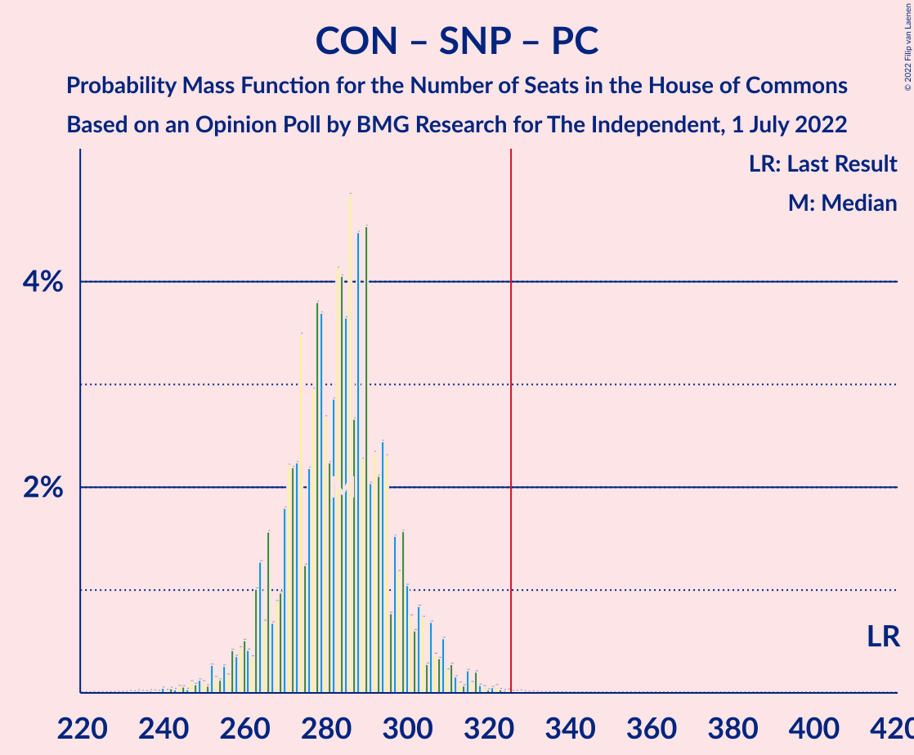

| Number of Seats | Probability | Accumulated | Special Marks |
|:---------------:|:-----------:|:-----------:|:-------------:|
| 233 | 0% | 100% |  |
| 234 | 0% | 99.9% |  |
| 235 | 0% | 99.9% |  |
| 236 | 0% | 99.9% |  |
| 237 | 0% | 99.9% |  |
| 238 | 0% | 99.9% |  |
| 239 | 0% | 99.9% |  |
| 240 | 0% | 99.9% |  |
| 241 | 0% | 99.8% |  |
| 242 | 0% | 99.8% |  |
| 243 | 0% | 99.7% |  |
| 244 | 0.1% | 99.7% |  |
| 245 | 0.1% | 99.6% |  |
| 246 | 0% | 99.6% |  |
| 247 | 0.1% | 99.5% |  |
| 248 | 0.1% | 99.4% |  |
| 249 | 0.1% | 99.4% |  |
| 250 | 0.1% | 99.2% |  |
| 251 | 0.1% | 99.1% |  |
| 252 | 0.3% | 99.1% |  |
| 253 | 0.1% | 98.8% |  |
| 254 | 0.1% | 98.6% |  |
| 255 | 0.3% | 98.5% |  |
| 256 | 0.2% | 98% |  |
| 257 | 0.4% | 98% |  |
| 258 | 0.4% | 98% |  |
| 259 | 0.4% | 97% |  |
| 260 | 0.5% | 97% |  |
| 261 | 0.4% | 96% |  |
| 262 | 0.3% | 96% |  |
| 263 | 1.0% | 96% |  |
| 264 | 1.3% | 95% |  |
| 265 | 0.7% | 93% |  |
| 266 | 2% | 93% |  |
| 267 | 0.7% | 91% |  |
| 268 | 0.9% | 90% |  |
| 269 | 1.0% | 89% |  |
| 270 | 2% | 89% |  |
| 271 | 2% | 87% |  |
| 272 | 2% | 84% |  |
| 273 | 2% | 82% |  |
| 274 | 3% | 80% |  |
| 275 | 1.2% | 77% |  |
| 276 | 2% | 75% |  |
| 277 | 3% | 73% |  |
| 278 | 4% | 70% |  |
| 279 | 4% | 66% |  |
| 280 | 3% | 63% |  |
| 281 | 2% | 60% |  |
| 282 | 3% | 58% |  |
| 283 | 4% | 55% |  |
| 284 | 4% | 51% |  |
| 285 | 4% | 47% | Median |
| 286 | 5% | 43% |  |
| 287 | 3% | 38% |  |
| 288 | 4% | 36% |  |
| 289 | 2% | 31% |  |
| 290 | 5% | 29% |  |
| 291 | 2% | 24% |  |
| 292 | 2% | 22% |  |
| 293 | 2% | 20% |  |
| 294 | 2% | 18% |  |
| 295 | 2% | 15% |  |
| 296 | 0.8% | 13% |  |
| 297 | 2% | 12% |  |
| 298 | 1.2% | 11% |  |
| 299 | 2% | 10% |  |
| 300 | 1.0% | 8% |  |
| 301 | 0.7% | 7% |  |
| 302 | 0.6% | 6% |  |
| 303 | 0.8% | 6% |  |
| 304 | 0.7% | 5% |  |
| 305 | 0.3% | 4% |  |
| 306 | 0.7% | 4% |  |
| 307 | 0.4% | 3% |  |
| 308 | 0.3% | 3% |  |
| 309 | 0.5% | 2% |  |
| 310 | 0.2% | 2% |  |
| 311 | 0.3% | 2% |  |
| 312 | 0.2% | 1.3% |  |
| 313 | 0.1% | 1.1% |  |
| 314 | 0.1% | 1.1% |  |
| 315 | 0.2% | 1.0% |  |
| 316 | 0.1% | 0.8% |  |
| 317 | 0.2% | 0.7% |  |
| 318 | 0.1% | 0.5% |  |
| 319 | 0.1% | 0.4% |  |
| 320 | 0% | 0.3% |  |
| 321 | 0.1% | 0.3% |  |
| 322 | 0.1% | 0.2% |  |
| 323 | 0% | 0.2% |  |
| 324 | 0% | 0.1% |  |
| 325 | 0% | 0.1% |  |
| 326 | 0% | 0.1% | Majority |
| 327 | 0% | 0.1% |  |
| 328 | 0% | 0.1% |  |
| 329 | 0% | 0% |  |
| 330 | 0% | 0% |  |
| 331 | 0% | 0% |  |
| 332 | 0% | 0% |  |
| 333 | 0% | 0% |  |
| 334 | 0% | 0% |  |
| 335 | 0% | 0% |  |
| 336 | 0% | 0% |  |
| 337 | 0% | 0% |  |
| 338 | 0% | 0% |  |
| 339 | 0% | 0% |  |
| 340 | 0% | 0% |  |
| 341 | 0% | 0% |  |
| 342 | 0% | 0% |  |
| 343 | 0% | 0% |  |
| 344 | 0% | 0% |  |
| 345 | 0% | 0% |  |
| 346 | 0% | 0% |  |
| 347 | 0% | 0% |  |
| 348 | 0% | 0% |  |
| 349 | 0% | 0% |  |
| 350 | 0% | 0% |  |
| 351 | 0% | 0% |  |
| 352 | 0% | 0% |  |
| 353 | 0% | 0% |  |
| 354 | 0% | 0% |  |
| 355 | 0% | 0% |  |
| 356 | 0% | 0% |  |
| 357 | 0% | 0% |  |
| 358 | 0% | 0% |  |
| 359 | 0% | 0% |  |
| 360 | 0% | 0% |  |
| 361 | 0% | 0% |  |
| 362 | 0% | 0% |  |
| 363 | 0% | 0% |  |
| 364 | 0% | 0% |  |
| 365 | 0% | 0% |  |
| 366 | 0% | 0% |  |
| 367 | 0% | 0% |  |
| 368 | 0% | 0% |  |
| 369 | 0% | 0% |  |
| 370 | 0% | 0% |  |
| 371 | 0% | 0% |  |
| 372 | 0% | 0% |  |
| 373 | 0% | 0% |  |
| 374 | 0% | 0% |  |
| 375 | 0% | 0% |  |
| 376 | 0% | 0% |  |
| 377 | 0% | 0% |  |
| 378 | 0% | 0% |  |
| 379 | 0% | 0% |  |
| 380 | 0% | 0% |  |
| 381 | 0% | 0% |  |
| 382 | 0% | 0% |  |
| 383 | 0% | 0% |  |
| 384 | 0% | 0% |  |
| 385 | 0% | 0% |  |
| 386 | 0% | 0% |  |
| 387 | 0% | 0% |  |
| 388 | 0% | 0% |  |
| 389 | 0% | 0% |  |
| 390 | 0% | 0% |  |
| 391 | 0% | 0% |  |
| 392 | 0% | 0% |  |
| 393 | 0% | 0% |  |
| 394 | 0% | 0% |  |
| 395 | 0% | 0% |  |
| 396 | 0% | 0% |  |
| 397 | 0% | 0% |  |
| 398 | 0% | 0% |  |
| 399 | 0% | 0% |  |
| 400 | 0% | 0% |  |
| 401 | 0% | 0% |  |
| 402 | 0% | 0% |  |
| 403 | 0% | 0% |  |
| 404 | 0% | 0% |  |
| 405 | 0% | 0% |  |
| 406 | 0% | 0% |  |
| 407 | 0% | 0% |  |
| 408 | 0% | 0% |  |
| 409 | 0% | 0% |  |
| 410 | 0% | 0% |  |
| 411 | 0% | 0% |  |
| 412 | 0% | 0% |  |
| 413 | 0% | 0% |  |
| 414 | 0% | 0% |  |
| 415 | 0% | 0% |  |
| 416 | 0% | 0% |  |
| 417 | 0% | 0% | Last Result |

### Conservative Party – Scottish National Party

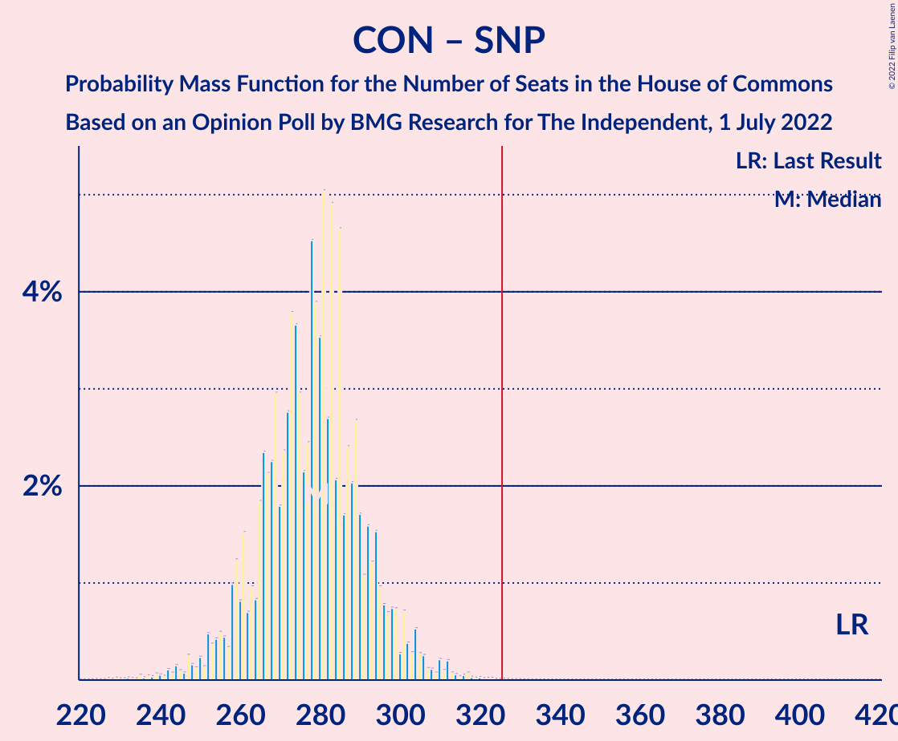

| Number of Seats | Probability | Accumulated | Special Marks |
|:---------------:|:-----------:|:-----------:|:-------------:|
| 228 | 0% | 100% |  |
| 229 | 0% | 99.9% |  |
| 230 | 0% | 99.9% |  |
| 231 | 0% | 99.9% |  |
| 232 | 0% | 99.9% |  |
| 233 | 0% | 99.9% |  |
| 234 | 0% | 99.9% |  |
| 235 | 0.1% | 99.9% |  |
| 236 | 0% | 99.8% |  |
| 237 | 0% | 99.8% |  |
| 238 | 0% | 99.7% |  |
| 239 | 0.1% | 99.7% |  |
| 240 | 0.1% | 99.6% |  |
| 241 | 0% | 99.6% |  |
| 242 | 0.1% | 99.5% |  |
| 243 | 0.1% | 99.4% |  |
| 244 | 0.1% | 99.4% |  |
| 245 | 0.1% | 99.2% |  |
| 246 | 0.1% | 99.1% |  |
| 247 | 0.3% | 99.1% |  |
| 248 | 0.2% | 98.8% |  |
| 249 | 0.1% | 98.6% |  |
| 250 | 0.2% | 98.5% |  |
| 251 | 0.1% | 98% |  |
| 252 | 0.5% | 98% |  |
| 253 | 0.4% | 98% |  |
| 254 | 0.4% | 97% |  |
| 255 | 0.5% | 97% |  |
| 256 | 0.4% | 96% |  |
| 257 | 0.3% | 96% |  |
| 258 | 1.0% | 96% |  |
| 259 | 1.2% | 95% |  |
| 260 | 0.8% | 93% |  |
| 261 | 2% | 93% |  |
| 262 | 0.7% | 91% |  |
| 263 | 1.0% | 90% |  |
| 264 | 0.8% | 89% |  |
| 265 | 2% | 89% |  |
| 266 | 2% | 87% |  |
| 267 | 2% | 84% |  |
| 268 | 2% | 82% |  |
| 269 | 3% | 80% |  |
| 270 | 2% | 77% |  |
| 271 | 2% | 75% |  |
| 272 | 3% | 73% |  |
| 273 | 4% | 70% |  |
| 274 | 4% | 66% |  |
| 275 | 3% | 63% |  |
| 276 | 2% | 60% |  |
| 277 | 2% | 58% |  |
| 278 | 5% | 55% |  |
| 279 | 4% | 51% |  |
| 280 | 4% | 47% | Median |
| 281 | 5% | 43% |  |
| 282 | 3% | 38% |  |
| 283 | 5% | 35% |  |
| 284 | 2% | 31% |  |
| 285 | 5% | 28% |  |
| 286 | 2% | 24% |  |
| 287 | 2% | 22% |  |
| 288 | 2% | 20% |  |
| 289 | 3% | 18% |  |
| 290 | 2% | 15% |  |
| 291 | 1.1% | 13% |  |
| 292 | 2% | 12% |  |
| 293 | 1.2% | 11% |  |
| 294 | 2% | 9% |  |
| 295 | 1.0% | 8% |  |
| 296 | 0.8% | 7% |  |
| 297 | 0.7% | 6% |  |
| 298 | 0.7% | 5% |  |
| 299 | 0.7% | 5% |  |
| 300 | 0.3% | 4% |  |
| 301 | 0.7% | 4% |  |
| 302 | 0.4% | 3% |  |
| 303 | 0.3% | 3% |  |
| 304 | 0.5% | 2% |  |
| 305 | 0.3% | 2% |  |
| 306 | 0.3% | 2% |  |
| 307 | 0.1% | 1.3% |  |
| 308 | 0.1% | 1.1% |  |
| 309 | 0.1% | 1.0% |  |
| 310 | 0.2% | 1.0% |  |
| 311 | 0.1% | 0.8% |  |
| 312 | 0.2% | 0.7% |  |
| 313 | 0.1% | 0.5% |  |
| 314 | 0.1% | 0.4% |  |
| 315 | 0% | 0.3% |  |
| 316 | 0% | 0.3% |  |
| 317 | 0.1% | 0.2% |  |
| 318 | 0% | 0.2% |  |
| 319 | 0% | 0.1% |  |
| 320 | 0% | 0.1% |  |
| 321 | 0% | 0.1% |  |
| 322 | 0% | 0.1% |  |
| 323 | 0% | 0.1% |  |
| 324 | 0% | 0% |  |
| 325 | 0% | 0% |  |
| 326 | 0% | 0% | Majority |
| 327 | 0% | 0% |  |
| 328 | 0% | 0% |  |
| 329 | 0% | 0% |  |
| 330 | 0% | 0% |  |
| 331 | 0% | 0% |  |
| 332 | 0% | 0% |  |
| 333 | 0% | 0% |  |
| 334 | 0% | 0% |  |
| 335 | 0% | 0% |  |
| 336 | 0% | 0% |  |
| 337 | 0% | 0% |  |
| 338 | 0% | 0% |  |
| 339 | 0% | 0% |  |
| 340 | 0% | 0% |  |
| 341 | 0% | 0% |  |
| 342 | 0% | 0% |  |
| 343 | 0% | 0% |  |
| 344 | 0% | 0% |  |
| 345 | 0% | 0% |  |
| 346 | 0% | 0% |  |
| 347 | 0% | 0% |  |
| 348 | 0% | 0% |  |
| 349 | 0% | 0% |  |
| 350 | 0% | 0% |  |
| 351 | 0% | 0% |  |
| 352 | 0% | 0% |  |
| 353 | 0% | 0% |  |
| 354 | 0% | 0% |  |
| 355 | 0% | 0% |  |
| 356 | 0% | 0% |  |
| 357 | 0% | 0% |  |
| 358 | 0% | 0% |  |
| 359 | 0% | 0% |  |
| 360 | 0% | 0% |  |
| 361 | 0% | 0% |  |
| 362 | 0% | 0% |  |
| 363 | 0% | 0% |  |
| 364 | 0% | 0% |  |
| 365 | 0% | 0% |  |
| 366 | 0% | 0% |  |
| 367 | 0% | 0% |  |
| 368 | 0% | 0% |  |
| 369 | 0% | 0% |  |
| 370 | 0% | 0% |  |
| 371 | 0% | 0% |  |
| 372 | 0% | 0% |  |
| 373 | 0% | 0% |  |
| 374 | 0% | 0% |  |
| 375 | 0% | 0% |  |
| 376 | 0% | 0% |  |
| 377 | 0% | 0% |  |
| 378 | 0% | 0% |  |
| 379 | 0% | 0% |  |
| 380 | 0% | 0% |  |
| 381 | 0% | 0% |  |
| 382 | 0% | 0% |  |
| 383 | 0% | 0% |  |
| 384 | 0% | 0% |  |
| 385 | 0% | 0% |  |
| 386 | 0% | 0% |  |
| 387 | 0% | 0% |  |
| 388 | 0% | 0% |  |
| 389 | 0% | 0% |  |
| 390 | 0% | 0% |  |
| 391 | 0% | 0% |  |
| 392 | 0% | 0% |  |
| 393 | 0% | 0% |  |
| 394 | 0% | 0% |  |
| 395 | 0% | 0% |  |
| 396 | 0% | 0% |  |
| 397 | 0% | 0% |  |
| 398 | 0% | 0% |  |
| 399 | 0% | 0% |  |
| 400 | 0% | 0% |  |
| 401 | 0% | 0% |  |
| 402 | 0% | 0% |  |
| 403 | 0% | 0% |  |
| 404 | 0% | 0% |  |
| 405 | 0% | 0% |  |
| 406 | 0% | 0% |  |
| 407 | 0% | 0% |  |
| 408 | 0% | 0% |  |
| 409 | 0% | 0% |  |
| 410 | 0% | 0% |  |
| 411 | 0% | 0% |  |
| 412 | 0% | 0% |  |
| 413 | 0% | 0% | Last Result |

### Conservative Party – Liberal Democrats

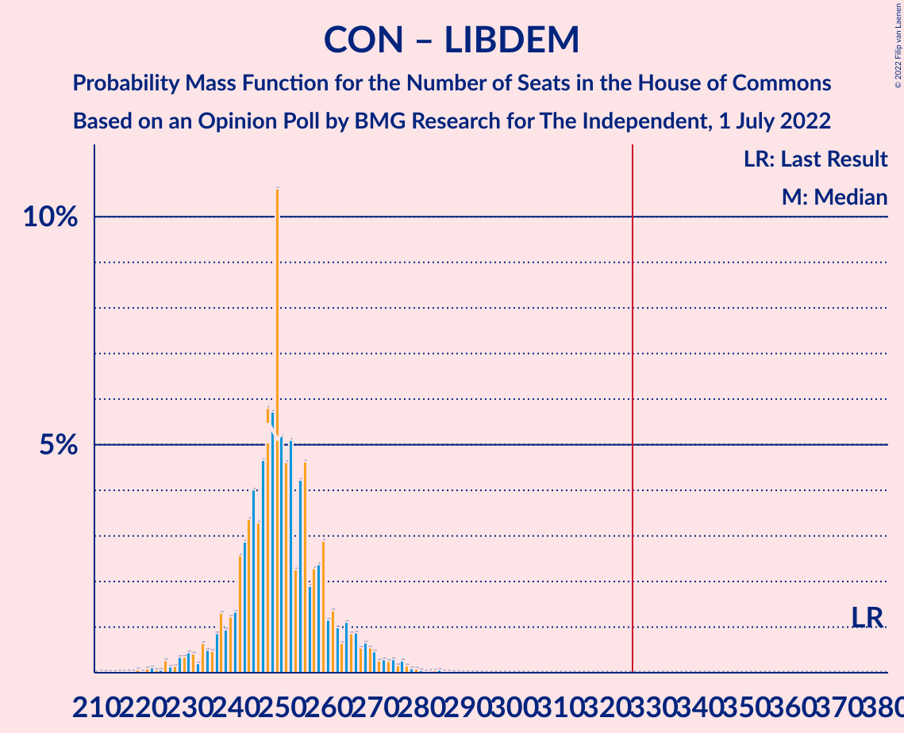

| Number of Seats | Probability | Accumulated | Special Marks |
|:---------------:|:-----------:|:-----------:|:-------------:|
| 211 | 0% | 100% |  |
| 212 | 0% | 99.9% |  |
| 213 | 0% | 99.9% |  |
| 214 | 0% | 99.9% |  |
| 215 | 0% | 99.9% |  |
| 216 | 0% | 99.9% |  |
| 217 | 0% | 99.8% |  |
| 218 | 0% | 99.8% |  |
| 219 | 0.1% | 99.8% |  |
| 220 | 0% | 99.7% |  |
| 221 | 0.1% | 99.7% |  |
| 222 | 0.1% | 99.6% |  |
| 223 | 0.1% | 99.5% |  |
| 224 | 0.1% | 99.4% |  |
| 225 | 0.3% | 99.4% |  |
| 226 | 0.1% | 99.1% |  |
| 227 | 0.1% | 99.0% |  |
| 228 | 0.3% | 98.8% |  |
| 229 | 0.3% | 98% |  |
| 230 | 0.4% | 98% |  |
| 231 | 0.4% | 98% |  |
| 232 | 0.2% | 97% |  |
| 233 | 0.6% | 97% |  |
| 234 | 0.5% | 96% |  |
| 235 | 0.5% | 96% |  |
| 236 | 0.9% | 95% |  |
| 237 | 1.3% | 95% |  |
| 238 | 0.9% | 93% |  |
| 239 | 1.2% | 92% |  |
| 240 | 1.3% | 91% |  |
| 241 | 3% | 90% |  |
| 242 | 3% | 87% |  |
| 243 | 3% | 84% |  |
| 244 | 4% | 81% |  |
| 245 | 3% | 77% |  |
| 246 | 5% | 74% |  |
| 247 | 6% | 69% |  |
| 248 | 6% | 63% |  |
| 249 | 11% | 57% |  |
| 250 | 5% | 47% | Median |
| 251 | 5% | 42% |  |
| 252 | 5% | 37% |  |
| 253 | 2% | 32% |  |
| 254 | 4% | 30% |  |
| 255 | 5% | 25% |  |
| 256 | 2% | 21% |  |
| 257 | 2% | 19% |  |
| 258 | 2% | 17% |  |
| 259 | 3% | 14% |  |
| 260 | 1.2% | 11% |  |
| 261 | 1.4% | 10% |  |
| 262 | 1.0% | 9% |  |
| 263 | 0.6% | 8% |  |
| 264 | 1.1% | 7% |  |
| 265 | 0.9% | 6% |  |
| 266 | 0.9% | 5% |  |
| 267 | 0.5% | 4% |  |
| 268 | 0.7% | 4% |  |
| 269 | 0.5% | 3% |  |
| 270 | 0.5% | 3% |  |
| 271 | 0.3% | 2% |  |
| 272 | 0.3% | 2% |  |
| 273 | 0.3% | 2% |  |
| 274 | 0.3% | 1.4% |  |
| 275 | 0.2% | 1.1% |  |
| 276 | 0.3% | 0.9% |  |
| 277 | 0.2% | 0.7% |  |
| 278 | 0.1% | 0.5% |  |
| 279 | 0.1% | 0.4% |  |
| 280 | 0.1% | 0.3% |  |
| 281 | 0% | 0.3% |  |
| 282 | 0% | 0.3% |  |
| 283 | 0% | 0.2% |  |
| 284 | 0.1% | 0.2% |  |
| 285 | 0% | 0.1% |  |
| 286 | 0% | 0.1% |  |
| 287 | 0% | 0.1% |  |
| 288 | 0% | 0% |  |
| 289 | 0% | 0% |  |
| 290 | 0% | 0% |  |
| 291 | 0% | 0% |  |
| 292 | 0% | 0% |  |
| 293 | 0% | 0% |  |
| 294 | 0% | 0% |  |
| 295 | 0% | 0% |  |
| 296 | 0% | 0% |  |
| 297 | 0% | 0% |  |
| 298 | 0% | 0% |  |
| 299 | 0% | 0% |  |
| 300 | 0% | 0% |  |
| 301 | 0% | 0% |  |
| 302 | 0% | 0% |  |
| 303 | 0% | 0% |  |
| 304 | 0% | 0% |  |
| 305 | 0% | 0% |  |
| 306 | 0% | 0% |  |
| 307 | 0% | 0% |  |
| 308 | 0% | 0% |  |
| 309 | 0% | 0% |  |
| 310 | 0% | 0% |  |
| 311 | 0% | 0% |  |
| 312 | 0% | 0% |  |
| 313 | 0% | 0% |  |
| 314 | 0% | 0% |  |
| 315 | 0% | 0% |  |
| 316 | 0% | 0% |  |
| 317 | 0% | 0% |  |
| 318 | 0% | 0% |  |
| 319 | 0% | 0% |  |
| 320 | 0% | 0% |  |
| 321 | 0% | 0% |  |
| 322 | 0% | 0% |  |
| 323 | 0% | 0% |  |
| 324 | 0% | 0% |  |
| 325 | 0% | 0% |  |
| 326 | 0% | 0% | Majority |
| 327 | 0% | 0% |  |
| 328 | 0% | 0% |  |
| 329 | 0% | 0% |  |
| 330 | 0% | 0% |  |
| 331 | 0% | 0% |  |
| 332 | 0% | 0% |  |
| 333 | 0% | 0% |  |
| 334 | 0% | 0% |  |
| 335 | 0% | 0% |  |
| 336 | 0% | 0% |  |
| 337 | 0% | 0% |  |
| 338 | 0% | 0% |  |
| 339 | 0% | 0% |  |
| 340 | 0% | 0% |  |
| 341 | 0% | 0% |  |
| 342 | 0% | 0% |  |
| 343 | 0% | 0% |  |
| 344 | 0% | 0% |  |
| 345 | 0% | 0% |  |
| 346 | 0% | 0% |  |
| 347 | 0% | 0% |  |
| 348 | 0% | 0% |  |
| 349 | 0% | 0% |  |
| 350 | 0% | 0% |  |
| 351 | 0% | 0% |  |
| 352 | 0% | 0% |  |
| 353 | 0% | 0% |  |
| 354 | 0% | 0% |  |
| 355 | 0% | 0% |  |
| 356 | 0% | 0% |  |
| 357 | 0% | 0% |  |
| 358 | 0% | 0% |  |
| 359 | 0% | 0% |  |
| 360 | 0% | 0% |  |
| 361 | 0% | 0% |  |
| 362 | 0% | 0% |  |
| 363 | 0% | 0% |  |
| 364 | 0% | 0% |  |
| 365 | 0% | 0% |  |
| 366 | 0% | 0% |  |
| 367 | 0% | 0% |  |
| 368 | 0% | 0% |  |
| 369 | 0% | 0% |  |
| 370 | 0% | 0% |  |
| 371 | 0% | 0% |  |
| 372 | 0% | 0% |  |
| 373 | 0% | 0% |  |
| 374 | 0% | 0% |  |
| 375 | 0% | 0% |  |
| 376 | 0% | 0% | Last Result |

### Conservative Party – Plaid Cymru

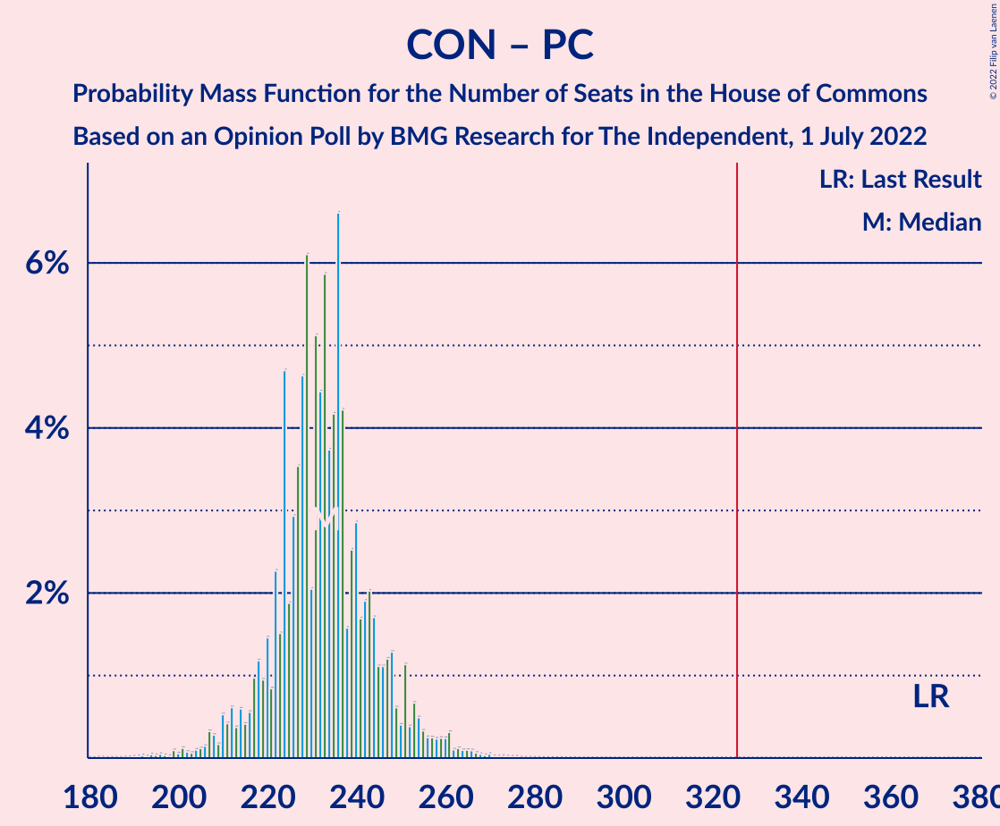

| Number of Seats | Probability | Accumulated | Special Marks |
|:---------------:|:-----------:|:-----------:|:-------------:|
| 189 | 0% | 100% |  |
| 190 | 0% | 99.9% |  |
| 191 | 0% | 99.9% |  |
| 192 | 0% | 99.9% |  |
| 193 | 0% | 99.9% |  |
| 194 | 0% | 99.9% |  |
| 195 | 0% | 99.8% |  |
| 196 | 0% | 99.8% |  |
| 197 | 0% | 99.7% |  |
| 198 | 0% | 99.7% |  |
| 199 | 0.1% | 99.7% |  |
| 200 | 0.1% | 99.6% |  |
| 201 | 0.1% | 99.5% |  |
| 202 | 0.1% | 99.4% |  |
| 203 | 0.1% | 99.3% |  |
| 204 | 0.1% | 99.3% |  |
| 205 | 0.1% | 99.2% |  |
| 206 | 0.1% | 99.0% |  |
| 207 | 0.3% | 98.9% |  |
| 208 | 0.3% | 98.6% |  |
| 209 | 0.2% | 98% |  |
| 210 | 0.5% | 98% |  |
| 211 | 0.4% | 98% |  |
| 212 | 0.6% | 97% |  |
| 213 | 0.4% | 97% |  |
| 214 | 0.6% | 96% |  |
| 215 | 0.4% | 96% |  |
| 216 | 0.6% | 95% |  |
| 217 | 1.0% | 95% |  |
| 218 | 1.2% | 94% |  |
| 219 | 0.9% | 92% |  |
| 220 | 1.5% | 92% |  |
| 221 | 0.8% | 90% |  |
| 222 | 2% | 89% |  |
| 223 | 2% | 87% |  |
| 224 | 5% | 85% |  |
| 225 | 2% | 81% |  |
| 226 | 3% | 79% |  |
| 227 | 4% | 76% |  |
| 228 | 5% | 72% |  |
| 229 | 6% | 68% |  |
| 230 | 2% | 62% |  |
| 231 | 5% | 60% |  |
| 232 | 4% | 54% |  |
| 233 | 6% | 50% | Median |
| 234 | 4% | 44% |  |
| 235 | 4% | 40% |  |
| 236 | 7% | 36% |  |
| 237 | 4% | 30% |  |
| 238 | 2% | 25% |  |
| 239 | 3% | 24% |  |
| 240 | 3% | 21% |  |
| 241 | 2% | 18% |  |
| 242 | 2% | 17% |  |
| 243 | 2% | 15% |  |
| 244 | 2% | 13% |  |
| 245 | 1.1% | 11% |  |
| 246 | 1.1% | 10% |  |
| 247 | 1.2% | 9% |  |
| 248 | 1.3% | 8% |  |
| 249 | 0.6% | 6% |  |
| 250 | 0.4% | 6% |  |
| 251 | 1.1% | 5% |  |
| 252 | 0.4% | 4% |  |
| 253 | 0.7% | 4% |  |
| 254 | 0.5% | 3% |  |
| 255 | 0.3% | 3% |  |
| 256 | 0.3% | 2% |  |
| 257 | 0.2% | 2% |  |
| 258 | 0.2% | 2% |  |
| 259 | 0.2% | 2% |  |
| 260 | 0.2% | 1.4% |  |
| 261 | 0.3% | 1.2% |  |
| 262 | 0.1% | 0.9% |  |
| 263 | 0.1% | 0.8% |  |
| 264 | 0.1% | 0.6% |  |
| 265 | 0.1% | 0.5% |  |
| 266 | 0.1% | 0.4% |  |
| 267 | 0.1% | 0.3% |  |
| 268 | 0% | 0.3% |  |
| 269 | 0% | 0.2% |  |
| 270 | 0% | 0.2% |  |
| 271 | 0% | 0.1% |  |
| 272 | 0% | 0.1% |  |
| 273 | 0% | 0.1% |  |
| 274 | 0% | 0.1% |  |
| 275 | 0% | 0.1% |  |
| 276 | 0% | 0% |  |
| 277 | 0% | 0% |  |
| 278 | 0% | 0% |  |
| 279 | 0% | 0% |  |
| 280 | 0% | 0% |  |
| 281 | 0% | 0% |  |
| 282 | 0% | 0% |  |
| 283 | 0% | 0% |  |
| 284 | 0% | 0% |  |
| 285 | 0% | 0% |  |
| 286 | 0% | 0% |  |
| 287 | 0% | 0% |  |
| 288 | 0% | 0% |  |
| 289 | 0% | 0% |  |
| 290 | 0% | 0% |  |
| 291 | 0% | 0% |  |
| 292 | 0% | 0% |  |
| 293 | 0% | 0% |  |
| 294 | 0% | 0% |  |
| 295 | 0% | 0% |  |
| 296 | 0% | 0% |  |
| 297 | 0% | 0% |  |
| 298 | 0% | 0% |  |
| 299 | 0% | 0% |  |
| 300 | 0% | 0% |  |
| 301 | 0% | 0% |  |
| 302 | 0% | 0% |  |
| 303 | 0% | 0% |  |
| 304 | 0% | 0% |  |
| 305 | 0% | 0% |  |
| 306 | 0% | 0% |  |
| 307 | 0% | 0% |  |
| 308 | 0% | 0% |  |
| 309 | 0% | 0% |  |
| 310 | 0% | 0% |  |
| 311 | 0% | 0% |  |
| 312 | 0% | 0% |  |
| 313 | 0% | 0% |  |
| 314 | 0% | 0% |  |
| 315 | 0% | 0% |  |
| 316 | 0% | 0% |  |
| 317 | 0% | 0% |  |
| 318 | 0% | 0% |  |
| 319 | 0% | 0% |  |
| 320 | 0% | 0% |  |
| 321 | 0% | 0% |  |
| 322 | 0% | 0% |  |
| 323 | 0% | 0% |  |
| 324 | 0% | 0% |  |
| 325 | 0% | 0% |  |
| 326 | 0% | 0% | Majority |
| 327 | 0% | 0% |  |
| 328 | 0% | 0% |  |
| 329 | 0% | 0% |  |
| 330 | 0% | 0% |  |
| 331 | 0% | 0% |  |
| 332 | 0% | 0% |  |
| 333 | 0% | 0% |  |
| 334 | 0% | 0% |  |
| 335 | 0% | 0% |  |
| 336 | 0% | 0% |  |
| 337 | 0% | 0% |  |
| 338 | 0% | 0% |  |
| 339 | 0% | 0% |  |
| 340 | 0% | 0% |  |
| 341 | 0% | 0% |  |
| 342 | 0% | 0% |  |
| 343 | 0% | 0% |  |
| 344 | 0% | 0% |  |
| 345 | 0% | 0% |  |
| 346 | 0% | 0% |  |
| 347 | 0% | 0% |  |
| 348 | 0% | 0% |  |
| 349 | 0% | 0% |  |
| 350 | 0% | 0% |  |
| 351 | 0% | 0% |  |
| 352 | 0% | 0% |  |
| 353 | 0% | 0% |  |
| 354 | 0% | 0% |  |
| 355 | 0% | 0% |  |
| 356 | 0% | 0% |  |
| 357 | 0% | 0% |  |
| 358 | 0% | 0% |  |
| 359 | 0% | 0% |  |
| 360 | 0% | 0% |  |
| 361 | 0% | 0% |  |
| 362 | 0% | 0% |  |
| 363 | 0% | 0% |  |
| 364 | 0% | 0% |  |
| 365 | 0% | 0% |  |
| 366 | 0% | 0% |  |
| 367 | 0% | 0% |  |
| 368 | 0% | 0% |  |
| 369 | 0% | 0% | Last Result |

### Conservative Party

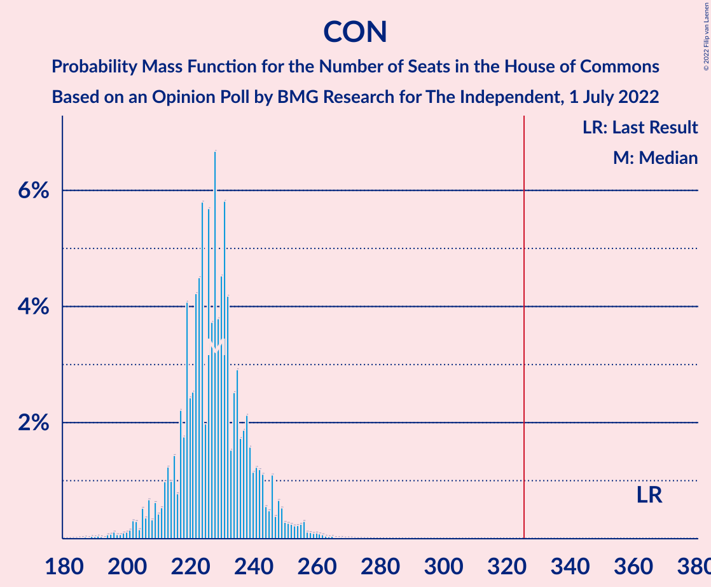

| Number of Seats | Probability | Accumulated | Special Marks |
|:---------------:|:-----------:|:-----------:|:-------------:|
| 184 | 0% | 100% |  |
| 185 | 0% | 99.9% |  |
| 186 | 0% | 99.9% |  |
| 187 | 0% | 99.9% |  |
| 188 | 0% | 99.9% |  |
| 189 | 0% | 99.9% |  |
| 190 | 0% | 99.8% |  |
| 191 | 0% | 99.8% |  |
| 192 | 0% | 99.7% |  |
| 193 | 0% | 99.7% |  |
| 194 | 0.1% | 99.7% |  |
| 195 | 0.1% | 99.6% |  |
| 196 | 0.1% | 99.5% |  |
| 197 | 0.1% | 99.4% |  |
| 198 | 0.1% | 99.3% |  |
| 199 | 0.1% | 99.3% |  |
| 200 | 0.1% | 99.2% |  |
| 201 | 0.2% | 99.0% |  |
| 202 | 0.3% | 98.9% |  |
| 203 | 0.3% | 98.6% |  |
| 204 | 0.2% | 98% |  |
| 205 | 0.5% | 98% |  |
| 206 | 0.4% | 98% |  |
| 207 | 0.7% | 97% |  |
| 208 | 0.3% | 97% |  |
| 209 | 0.6% | 96% |  |
| 210 | 0.4% | 96% |  |
| 211 | 0.5% | 95% |  |
| 212 | 1.0% | 95% |  |
| 213 | 1.2% | 94% |  |
| 214 | 1.0% | 92% |  |
| 215 | 1.4% | 91% |  |
| 216 | 0.8% | 90% |  |
| 217 | 2% | 89% |  |
| 218 | 2% | 87% |  |
| 219 | 4% | 85% |  |
| 220 | 2% | 81% |  |
| 221 | 3% | 79% |  |
| 222 | 4% | 76% |  |
| 223 | 4% | 72% |  |
| 224 | 6% | 68% |  |
| 225 | 2% | 62% |  |
| 226 | 6% | 60% |  |
| 227 | 4% | 54% |  |
| 228 | 7% | 50% | Median |
| 229 | 4% | 44% |  |
| 230 | 5% | 40% |  |
| 231 | 6% | 35% |  |
| 232 | 4% | 29% |  |
| 233 | 2% | 25% |  |
| 234 | 3% | 24% |  |
| 235 | 3% | 21% |  |
| 236 | 2% | 18% |  |
| 237 | 2% | 17% |  |
| 238 | 2% | 15% |  |
| 239 | 2% | 13% |  |
| 240 | 1.1% | 11% |  |
| 241 | 1.2% | 10% |  |
| 242 | 1.2% | 9% |  |
| 243 | 1.1% | 7% |  |
| 244 | 0.6% | 6% |  |
| 245 | 0.5% | 6% |  |
| 246 | 1.1% | 5% |  |
| 247 | 0.4% | 4% |  |
| 248 | 0.7% | 4% |  |
| 249 | 0.5% | 3% |  |
| 250 | 0.3% | 3% |  |
| 251 | 0.3% | 2% |  |
| 252 | 0.3% | 2% |  |
| 253 | 0.2% | 2% |  |
| 254 | 0.2% | 2% |  |
| 255 | 0.3% | 1.4% |  |
| 256 | 0.3% | 1.1% |  |
| 257 | 0.1% | 0.8% |  |
| 258 | 0.1% | 0.7% |  |
| 259 | 0.1% | 0.6% |  |
| 260 | 0.1% | 0.5% |  |
| 261 | 0.1% | 0.4% |  |
| 262 | 0.1% | 0.3% |  |
| 263 | 0% | 0.3% |  |
| 264 | 0% | 0.2% |  |
| 265 | 0% | 0.2% |  |
| 266 | 0% | 0.1% |  |
| 267 | 0% | 0.1% |  |
| 268 | 0% | 0.1% |  |
| 269 | 0% | 0.1% |  |
| 270 | 0% | 0.1% |  |
| 271 | 0% | 0% |  |
| 272 | 0% | 0% |  |
| 273 | 0% | 0% |  |
| 274 | 0% | 0% |  |
| 275 | 0% | 0% |  |
| 276 | 0% | 0% |  |
| 277 | 0% | 0% |  |
| 278 | 0% | 0% |  |
| 279 | 0% | 0% |  |
| 280 | 0% | 0% |  |
| 281 | 0% | 0% |  |
| 282 | 0% | 0% |  |
| 283 | 0% | 0% |  |
| 284 | 0% | 0% |  |
| 285 | 0% | 0% |  |
| 286 | 0% | 0% |  |
| 287 | 0% | 0% |  |
| 288 | 0% | 0% |  |
| 289 | 0% | 0% |  |
| 290 | 0% | 0% |  |
| 291 | 0% | 0% |  |
| 292 | 0% | 0% |  |
| 293 | 0% | 0% |  |
| 294 | 0% | 0% |  |
| 295 | 0% | 0% |  |
| 296 | 0% | 0% |  |
| 297 | 0% | 0% |  |
| 298 | 0% | 0% |  |
| 299 | 0% | 0% |  |
| 300 | 0% | 0% |  |
| 301 | 0% | 0% |  |
| 302 | 0% | 0% |  |
| 303 | 0% | 0% |  |
| 304 | 0% | 0% |  |
| 305 | 0% | 0% |  |
| 306 | 0% | 0% |  |
| 307 | 0% | 0% |  |
| 308 | 0% | 0% |  |
| 309 | 0% | 0% |  |
| 310 | 0% | 0% |  |
| 311 | 0% | 0% |  |
| 312 | 0% | 0% |  |
| 313 | 0% | 0% |  |
| 314 | 0% | 0% |  |
| 315 | 0% | 0% |  |
| 316 | 0% | 0% |  |
| 317 | 0% | 0% |  |
| 318 | 0% | 0% |  |
| 319 | 0% | 0% |  |
| 320 | 0% | 0% |  |
| 321 | 0% | 0% |  |
| 322 | 0% | 0% |  |
| 323 | 0% | 0% |  |
| 324 | 0% | 0% |  |
| 325 | 0% | 0% |  |
| 326 | 0% | 0% | Majority |
| 327 | 0% | 0% |  |
| 328 | 0% | 0% |  |
| 329 | 0% | 0% |  |
| 330 | 0% | 0% |  |
| 331 | 0% | 0% |  |
| 332 | 0% | 0% |  |
| 333 | 0% | 0% |  |
| 334 | 0% | 0% |  |
| 335 | 0% | 0% |  |
| 336 | 0% | 0% |  |
| 337 | 0% | 0% |  |
| 338 | 0% | 0% |  |
| 339 | 0% | 0% |  |
| 340 | 0% | 0% |  |
| 341 | 0% | 0% |  |
| 342 | 0% | 0% |  |
| 343 | 0% | 0% |  |
| 344 | 0% | 0% |  |
| 345 | 0% | 0% |  |
| 346 | 0% | 0% |  |
| 347 | 0% | 0% |  |
| 348 | 0% | 0% |  |
| 349 | 0% | 0% |  |
| 350 | 0% | 0% |  |
| 351 | 0% | 0% |  |
| 352 | 0% | 0% |  |
| 353 | 0% | 0% |  |
| 354 | 0% | 0% |  |
| 355 | 0% | 0% |  |
| 356 | 0% | 0% |  |
| 357 | 0% | 0% |  |
| 358 | 0% | 0% |  |
| 359 | 0% | 0% |  |
| 360 | 0% | 0% |  |
| 361 | 0% | 0% |  |
| 362 | 0% | 0% |  |
| 363 | 0% | 0% |  |
| 364 | 0% | 0% |  |
| 365 | 0% | 0% | Last Result |

## Technical Information

### Opinion Poll

+ **Polling firm:** BMG Research
+ **Commissioner(s):** The Independent
+ **Fieldwork period:** 1 July 2022

### Calculations

+ **Sample size:** 1474
+ **Simulations done:** 1,048,576
+ **Error estimate:** 0.49%

