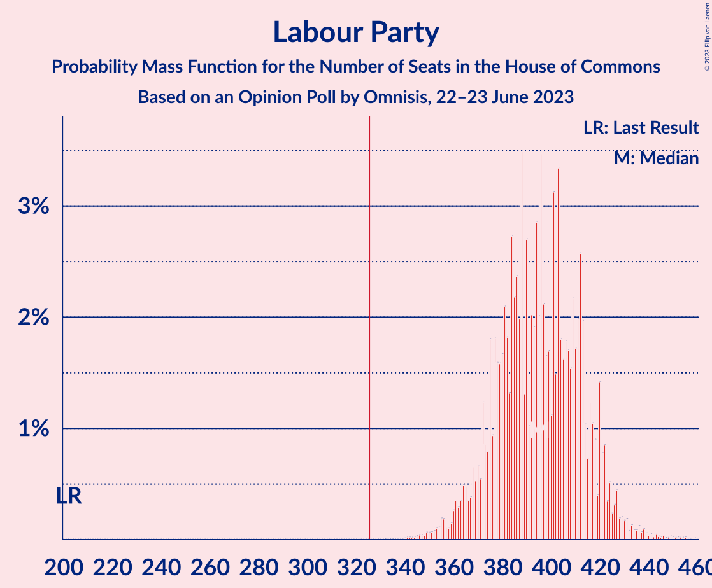

# Opinion Poll by Omnisis, 22–23 June 2023

<a href="#voting-intentions">Voting Intentions</a> | <a href="#seats">Seats</a> | <a href="#coalitions">Coalitions</a> | <a href="#technical-information">Technical Information</a>

## Voting Intentions

### Confidence Intervals

| Party | Last Result | Poll Result | 80% Confidence Interval | 90% Confidence Interval | 95% Confidence Interval | 99% Confidence Interval |
|:-----:|:-----------:|:-----------:|:-----------------------:|:-----------------------:|:-----------------------:|:-----------------------:|
| Labour Party | 32.1% | 49.3% | 47.5–51.1% |47.0–51.6% |46.5–52.0% |45.7–52.9% |
| Conservative Party | 43.6% | 28.3% | 26.7–30.0% |26.3–30.5% |25.9–30.9% |25.2–31.7% |
| Liberal Democrats | 11.5% | 9.4% | 8.4–10.5% |8.2–10.9% |7.9–11.2% |7.5–11.7% |
| Green Party | 2.8% | 4.9% | 4.2–5.8% |4.0–6.1% |3.9–6.3% |3.6–6.7% |
| Scottish National Party | 3.9% | 3.1% | 2.6–3.9% |2.4–4.1% |2.3–4.3% |2.1–4.6% |
| Brexit Party | 2.0% | 2.7% | 2.2–3.4% |2.1–3.6% |2.0–3.8% |1.8–4.2% |

*Note:* The poll result column reflects the actual value used in the calculations. Published results may vary slightly, and in addition be rounded to fewer digits.

## Seats

### Confidence Intervals

| Party | Last Result | Median | 80% Confidence Interval | 90% Confidence Interval | 95% Confidence Interval | 99% Confidence Interval |
|:-----:|:-----------:|:------:|:-----------------------:|:-----------------------:|:-----------------------:|:-----------------------:|
| <a href="#labour-party">Labour Party</a> | 202 | 395 | 375–416 |368–421 |363–426 |352–439 |
| <a href="#conservative-party">Conservative Party</a> | 365 | 177 | 155–197 |150–204 |144–210 |129–222 |
| <a href="#liberal-democrats">Liberal Democrats</a> | 11 | 21 | 14–26 |11–29 |10–31 |7–37 |
| <a href="#green-party">Green Party</a> | 1 | 1 | 1 |1 |1 |1–3 |
| <a href="#scottish-national-party">Scottish National Party</a> | 48 | 34 | 20–45 |18–48 |17–52 |13–55 |
| <a href="#brexit-party">Brexit Party</a> | 0 | 0 | 0 |0 |0 |0–2 |

### Labour Party

*For a full overview of the results for this party, see the [Labour Party](party-labourparty.html) page.*

| Number of Seats | Probability | Accumulated | Special Marks |
|:---------------:|:-----------:|:-----------:|:-------------:|
| 202 | 0% | 100% | Last Result |
| 203 | 0% | 100% |  |
| 204 | 0% | 100% |  |
| 205 | 0% | 100% |  |
| 206 | 0% | 100% |  |
| 207 | 0% | 100% |  |
| 208 | 0% | 100% |  |
| 209 | 0% | 100% |  |
| 210 | 0% | 100% |  |
| 211 | 0% | 100% |  |
| 212 | 0% | 100% |  |
| 213 | 0% | 100% |  |
| 214 | 0% | 100% |  |
| 215 | 0% | 100% |  |
| 216 | 0% | 100% |  |
| 217 | 0% | 100% |  |
| 218 | 0% | 100% |  |
| 219 | 0% | 100% |  |
| 220 | 0% | 100% |  |
| 221 | 0% | 100% |  |
| 222 | 0% | 100% |  |
| 223 | 0% | 100% |  |
| 224 | 0% | 100% |  |
| 225 | 0% | 100% |  |
| 226 | 0% | 100% |  |
| 227 | 0% | 100% |  |
| 228 | 0% | 100% |  |
| 229 | 0% | 100% |  |
| 230 | 0% | 100% |  |
| 231 | 0% | 100% |  |
| 232 | 0% | 100% |  |
| 233 | 0% | 100% |  |
| 234 | 0% | 100% |  |
| 235 | 0% | 100% |  |
| 236 | 0% | 100% |  |
| 237 | 0% | 100% |  |
| 238 | 0% | 100% |  |
| 239 | 0% | 100% |  |
| 240 | 0% | 100% |  |
| 241 | 0% | 100% |  |
| 242 | 0% | 100% |  |
| 243 | 0% | 100% |  |
| 244 | 0% | 100% |  |
| 245 | 0% | 100% |  |
| 246 | 0% | 100% |  |
| 247 | 0% | 100% |  |
| 248 | 0% | 100% |  |
| 249 | 0% | 100% |  |
| 250 | 0% | 100% |  |
| 251 | 0% | 100% |  |
| 252 | 0% | 100% |  |
| 253 | 0% | 100% |  |
| 254 | 0% | 100% |  |
| 255 | 0% | 100% |  |
| 256 | 0% | 100% |  |
| 257 | 0% | 100% |  |
| 258 | 0% | 100% |  |
| 259 | 0% | 100% |  |
| 260 | 0% | 100% |  |
| 261 | 0% | 100% |  |
| 262 | 0% | 100% |  |
| 263 | 0% | 100% |  |
| 264 | 0% | 100% |  |
| 265 | 0% | 100% |  |
| 266 | 0% | 100% |  |
| 267 | 0% | 100% |  |
| 268 | 0% | 100% |  |
| 269 | 0% | 100% |  |
| 270 | 0% | 100% |  |
| 271 | 0% | 100% |  |
| 272 | 0% | 100% |  |
| 273 | 0% | 100% |  |
| 274 | 0% | 100% |  |
| 275 | 0% | 100% |  |
| 276 | 0% | 100% |  |
| 277 | 0% | 100% |  |
| 278 | 0% | 100% |  |
| 279 | 0% | 100% |  |
| 280 | 0% | 100% |  |
| 281 | 0% | 100% |  |
| 282 | 0% | 100% |  |
| 283 | 0% | 100% |  |
| 284 | 0% | 100% |  |
| 285 | 0% | 100% |  |
| 286 | 0% | 100% |  |
| 287 | 0% | 100% |  |
| 288 | 0% | 100% |  |
| 289 | 0% | 100% |  |
| 290 | 0% | 100% |  |
| 291 | 0% | 100% |  |
| 292 | 0% | 100% |  |
| 293 | 0% | 100% |  |
| 294 | 0% | 100% |  |
| 295 | 0% | 100% |  |
| 296 | 0% | 100% |  |
| 297 | 0% | 100% |  |
| 298 | 0% | 100% |  |
| 299 | 0% | 100% |  |
| 300 | 0% | 100% |  |
| 301 | 0% | 100% |  |
| 302 | 0% | 100% |  |
| 303 | 0% | 100% |  |
| 304 | 0% | 100% |  |
| 305 | 0% | 100% |  |
| 306 | 0% | 100% |  |
| 307 | 0% | 100% |  |
| 308 | 0% | 100% |  |
| 309 | 0% | 100% |  |
| 310 | 0% | 100% |  |
| 311 | 0% | 100% |  |
| 312 | 0% | 100% |  |
| 313 | 0% | 100% |  |
| 314 | 0% | 100% |  |
| 315 | 0% | 100% |  |
| 316 | 0% | 100% |  |
| 317 | 0% | 100% |  |
| 318 | 0% | 100% |  |
| 319 | 0% | 100% |  |
| 320 | 0% | 100% |  |
| 321 | 0% | 100% |  |
| 322 | 0% | 100% |  |
| 323 | 0% | 100% |  |
| 324 | 0% | 100% |  |
| 325 | 0% | 100% |  |
| 326 | 0% | 100% | Majority |
| 327 | 0% | 100% |  |
| 328 | 0% | 100% |  |
| 329 | 0% | 100% |  |
| 330 | 0% | 100% |  |
| 331 | 0% | 100% |  |
| 332 | 0% | 100% |  |
| 333 | 0% | 100% |  |
| 334 | 0% | 100% |  |
| 335 | 0% | 100% |  |
| 336 | 0% | 100% |  |
| 337 | 0% | 100% |  |
| 338 | 0% | 100% |  |
| 339 | 0% | 100% |  |
| 340 | 0% | 100% |  |
| 341 | 0% | 100% |  |
| 342 | 0% | 99.9% |  |
| 343 | 0% | 99.9% |  |
| 344 | 0% | 99.9% |  |
| 345 | 0% | 99.9% |  |
| 346 | 0% | 99.9% |  |
| 347 | 0% | 99.8% |  |
| 348 | 0% | 99.8% |  |
| 349 | 0.1% | 99.7% |  |
| 350 | 0.1% | 99.7% |  |
| 351 | 0.1% | 99.6% |  |
| 352 | 0.1% | 99.5% |  |
| 353 | 0.1% | 99.5% |  |
| 354 | 0.1% | 99.4% |  |
| 355 | 0.2% | 99.3% |  |
| 356 | 0.2% | 99.1% |  |
| 357 | 0.1% | 98.9% |  |
| 358 | 0.1% | 98.8% |  |
| 359 | 0.1% | 98.7% |  |
| 360 | 0.3% | 98.5% |  |
| 361 | 0.4% | 98% |  |
| 362 | 0.3% | 98% |  |
| 363 | 0.3% | 98% |  |
| 364 | 0.5% | 97% |  |
| 365 | 0.5% | 97% |  |
| 366 | 0.4% | 96% |  |
| 367 | 0.4% | 96% |  |
| 368 | 0.7% | 96% |  |
| 369 | 0.5% | 95% |  |
| 370 | 0.7% | 94% |  |
| 371 | 0.5% | 94% |  |
| 372 | 1.2% | 93% |  |
| 373 | 0.9% | 92% |  |
| 374 | 0.8% | 91% |  |
| 375 | 2% | 90% |  |
| 376 | 0.9% | 88% |  |
| 377 | 2% | 88% |  |
| 378 | 2% | 86% |  |
| 379 | 2% | 84% |  |
| 380 | 2% | 83% |  |
| 381 | 2% | 81% |  |
| 382 | 2% | 79% |  |
| 383 | 1.3% | 77% |  |
| 384 | 3% | 76% |  |
| 385 | 2% | 73% |  |
| 386 | 2% | 71% |  |
| 387 | 2% | 68% |  |
| 388 | 3% | 66% |  |
| 389 | 1.3% | 63% |  |
| 390 | 3% | 62% |  |
| 391 | 1.0% | 59% |  |
| 392 | 2% | 58% |  |
| 393 | 2% | 56% |  |
| 394 | 3% | 54% |  |
| 395 | 2% | 51% | Median |
| 396 | 3% | 49% |  |
| 397 | 2% | 46% |  |
| 398 | 2% | 43% |  |
| 399 | 2% | 42% |  |
| 400 | 1.1% | 40% |  |
| 401 | 3% | 39% |  |
| 402 | 1.5% | 36% |  |
| 403 | 3% | 34% |  |
| 404 | 2% | 31% |  |
| 405 | 2% | 29% |  |
| 406 | 2% | 28% |  |
| 407 | 2% | 26% |  |
| 408 | 2% | 24% |  |
| 409 | 2% | 23% |  |
| 410 | 2% | 20% |  |
| 411 | 2% | 19% |  |
| 412 | 3% | 17% |  |
| 413 | 2% | 14% |  |
| 414 | 1.0% | 12% |  |
| 415 | 0.7% | 11% |  |
| 416 | 1.2% | 10% |  |
| 417 | 1.0% | 9% |  |
| 418 | 0.9% | 8% |  |
| 419 | 0.4% | 7% |  |
| 420 | 1.4% | 7% |  |
| 421 | 0.8% | 5% |  |
| 422 | 0.9% | 5% |  |
| 423 | 0.3% | 4% |  |
| 424 | 0.5% | 3% |  |
| 425 | 0.2% | 3% |  |
| 426 | 0.3% | 3% |  |
| 427 | 0.4% | 2% |  |
| 428 | 0.2% | 2% |  |
| 429 | 0.2% | 2% |  |
| 430 | 0.2% | 2% |  |
| 431 | 0.2% | 1.4% |  |
| 432 | 0.1% | 1.2% |  |
| 433 | 0.1% | 1.1% |  |
| 434 | 0.1% | 1.0% |  |
| 435 | 0.1% | 0.9% |  |
| 436 | 0.1% | 0.8% |  |
| 437 | 0.1% | 0.7% |  |
| 438 | 0.1% | 0.6% |  |
| 439 | 0.1% | 0.5% |  |
| 440 | 0% | 0.5% |  |
| 441 | 0% | 0.4% |  |
| 442 | 0% | 0.4% |  |
| 443 | 0.1% | 0.4% |  |
| 444 | 0% | 0.3% |  |
| 445 | 0% | 0.3% |  |
| 446 | 0% | 0.3% |  |
| 447 | 0% | 0.2% |  |
| 448 | 0% | 0.2% |  |
| 449 | 0% | 0.2% |  |
| 450 | 0% | 0.2% |  |
| 451 | 0% | 0.2% |  |
| 452 | 0% | 0.1% |  |
| 453 | 0% | 0.1% |  |
| 454 | 0% | 0.1% |  |
| 455 | 0% | 0.1% |  |
| 456 | 0% | 0.1% |  |
| 457 | 0% | 0.1% |  |
| 458 | 0% | 0.1% |  |
| 459 | 0% | 0% |  |

### Conservative Party

*For a full overview of the results for this party, see the [Conservative Party](party-conservativeparty.html) page.*

| Number of Seats | Probability | Accumulated | Special Marks |
|:---------------:|:-----------:|:-----------:|:-------------:|
| 109 | 0% | 100% |  |
| 110 | 0% | 99.9% |  |
| 111 | 0% | 99.9% |  |
| 112 | 0% | 99.9% |  |
| 113 | 0% | 99.9% |  |
| 114 | 0% | 99.9% |  |
| 115 | 0% | 99.9% |  |
| 116 | 0% | 99.9% |  |
| 117 | 0% | 99.9% |  |
| 118 | 0% | 99.8% |  |
| 119 | 0% | 99.8% |  |
| 120 | 0% | 99.8% |  |
| 121 | 0% | 99.8% |  |
| 122 | 0% | 99.8% |  |
| 123 | 0% | 99.7% |  |
| 124 | 0% | 99.7% |  |
| 125 | 0% | 99.7% |  |
| 126 | 0% | 99.6% |  |
| 127 | 0% | 99.6% |  |
| 128 | 0% | 99.6% |  |
| 129 | 0.1% | 99.5% |  |
| 130 | 0% | 99.5% |  |
| 131 | 0.1% | 99.4% |  |
| 132 | 0.1% | 99.4% |  |
| 133 | 0.1% | 99.3% |  |
| 134 | 0.1% | 99.2% |  |
| 135 | 0.2% | 99.1% |  |
| 136 | 0.1% | 99.0% |  |
| 137 | 0.2% | 98.8% |  |
| 138 | 0.2% | 98.7% |  |
| 139 | 0.2% | 98.5% |  |
| 140 | 0.2% | 98% |  |
| 141 | 0.1% | 98% |  |
| 142 | 0.2% | 98% |  |
| 143 | 0.2% | 98% |  |
| 144 | 0.4% | 98% |  |
| 145 | 0.2% | 97% |  |
| 146 | 0.4% | 97% |  |
| 147 | 0.3% | 97% |  |
| 148 | 0.4% | 96% |  |
| 149 | 0.5% | 96% |  |
| 150 | 0.9% | 95% |  |
| 151 | 0.5% | 94% |  |
| 152 | 1.3% | 94% |  |
| 153 | 1.0% | 93% |  |
| 154 | 1.2% | 92% |  |
| 155 | 1.2% | 90% |  |
| 156 | 2% | 89% |  |
| 157 | 1.1% | 88% |  |
| 158 | 1.2% | 87% |  |
| 159 | 2% | 85% |  |
| 160 | 2% | 84% |  |
| 161 | 2% | 82% |  |
| 162 | 2% | 80% |  |
| 163 | 2% | 78% |  |
| 164 | 2% | 77% |  |
| 165 | 3% | 74% |  |
| 166 | 3% | 72% |  |
| 167 | 3% | 69% |  |
| 168 | 1.3% | 66% |  |
| 169 | 2% | 64% |  |
| 170 | 1.4% | 62% |  |
| 171 | 2% | 61% |  |
| 172 | 1.4% | 59% |  |
| 173 | 2% | 58% |  |
| 174 | 1.3% | 56% |  |
| 175 | 2% | 54% |  |
| 176 | 2% | 53% |  |
| 177 | 2% | 51% | Median |
| 178 | 2% | 49% |  |
| 179 | 2% | 47% |  |
| 180 | 2% | 45% |  |
| 181 | 2% | 43% |  |
| 182 | 3% | 41% |  |
| 183 | 3% | 38% |  |
| 184 | 3% | 35% |  |
| 185 | 3% | 32% |  |
| 186 | 2% | 30% |  |
| 187 | 2% | 28% |  |
| 188 | 2% | 26% |  |
| 189 | 2% | 24% |  |
| 190 | 2% | 23% |  |
| 191 | 2% | 21% |  |
| 192 | 2% | 19% |  |
| 193 | 2% | 17% |  |
| 194 | 2% | 15% |  |
| 195 | 1.1% | 14% |  |
| 196 | 2% | 13% |  |
| 197 | 1.1% | 11% |  |
| 198 | 1.2% | 10% |  |
| 199 | 0.9% | 9% |  |
| 200 | 0.8% | 8% |  |
| 201 | 0.9% | 7% |  |
| 202 | 0.5% | 6% |  |
| 203 | 0.5% | 6% |  |
| 204 | 0.4% | 5% |  |
| 205 | 0.4% | 5% |  |
| 206 | 0.4% | 4% |  |
| 207 | 0.4% | 4% |  |
| 208 | 0.4% | 4% |  |
| 209 | 0.5% | 3% |  |
| 210 | 0.3% | 3% |  |
| 211 | 0.3% | 2% |  |
| 212 | 0.3% | 2% |  |
| 213 | 0.2% | 2% |  |
| 214 | 0.2% | 2% |  |
| 215 | 0.3% | 1.4% |  |
| 216 | 0.2% | 1.1% |  |
| 217 | 0.1% | 1.0% |  |
| 218 | 0.1% | 0.9% |  |
| 219 | 0.1% | 0.8% |  |
| 220 | 0.1% | 0.7% |  |
| 221 | 0.1% | 0.6% |  |
| 222 | 0.1% | 0.5% |  |
| 223 | 0.1% | 0.4% |  |
| 224 | 0.1% | 0.4% |  |
| 225 | 0.1% | 0.3% |  |
| 226 | 0% | 0.2% |  |
| 227 | 0% | 0.2% |  |
| 228 | 0% | 0.2% |  |
| 229 | 0% | 0.1% |  |
| 230 | 0% | 0.1% |  |
| 231 | 0% | 0.1% |  |
| 232 | 0% | 0.1% |  |
| 233 | 0% | 0.1% |  |
| 234 | 0% | 0% |  |
| 235 | 0% | 0% |  |
| 236 | 0% | 0% |  |
| 237 | 0% | 0% |  |
| 238 | 0% | 0% |  |
| 239 | 0% | 0% |  |
| 240 | 0% | 0% |  |
| 241 | 0% | 0% |  |
| 242 | 0% | 0% |  |
| 243 | 0% | 0% |  |
| 244 | 0% | 0% |  |
| 245 | 0% | 0% |  |
| 246 | 0% | 0% |  |
| 247 | 0% | 0% |  |
| 248 | 0% | 0% |  |
| 249 | 0% | 0% |  |
| 250 | 0% | 0% |  |
| 251 | 0% | 0% |  |
| 252 | 0% | 0% |  |
| 253 | 0% | 0% |  |
| 254 | 0% | 0% |  |
| 255 | 0% | 0% |  |
| 256 | 0% | 0% |  |
| 257 | 0% | 0% |  |
| 258 | 0% | 0% |  |
| 259 | 0% | 0% |  |
| 260 | 0% | 0% |  |
| 261 | 0% | 0% |  |
| 262 | 0% | 0% |  |
| 263 | 0% | 0% |  |
| 264 | 0% | 0% |  |
| 265 | 0% | 0% |  |
| 266 | 0% | 0% |  |
| 267 | 0% | 0% |  |
| 268 | 0% | 0% |  |
| 269 | 0% | 0% |  |
| 270 | 0% | 0% |  |
| 271 | 0% | 0% |  |
| 272 | 0% | 0% |  |
| 273 | 0% | 0% |  |
| 274 | 0% | 0% |  |
| 275 | 0% | 0% |  |
| 276 | 0% | 0% |  |
| 277 | 0% | 0% |  |
| 278 | 0% | 0% |  |
| 279 | 0% | 0% |  |
| 280 | 0% | 0% |  |
| 281 | 0% | 0% |  |
| 282 | 0% | 0% |  |
| 283 | 0% | 0% |  |
| 284 | 0% | 0% |  |
| 285 | 0% | 0% |  |
| 286 | 0% | 0% |  |
| 287 | 0% | 0% |  |
| 288 | 0% | 0% |  |
| 289 | 0% | 0% |  |
| 290 | 0% | 0% |  |
| 291 | 0% | 0% |  |
| 292 | 0% | 0% |  |
| 293 | 0% | 0% |  |
| 294 | 0% | 0% |  |
| 295 | 0% | 0% |  |
| 296 | 0% | 0% |  |
| 297 | 0% | 0% |  |
| 298 | 0% | 0% |  |
| 299 | 0% | 0% |  |
| 300 | 0% | 0% |  |
| 301 | 0% | 0% |  |
| 302 | 0% | 0% |  |
| 303 | 0% | 0% |  |
| 304 | 0% | 0% |  |
| 305 | 0% | 0% |  |
| 306 | 0% | 0% |  |
| 307 | 0% | 0% |  |
| 308 | 0% | 0% |  |
| 309 | 0% | 0% |  |
| 310 | 0% | 0% |  |
| 311 | 0% | 0% |  |
| 312 | 0% | 0% |  |
| 313 | 0% | 0% |  |
| 314 | 0% | 0% |  |
| 315 | 0% | 0% |  |
| 316 | 0% | 0% |  |
| 317 | 0% | 0% |  |
| 318 | 0% | 0% |  |
| 319 | 0% | 0% |  |
| 320 | 0% | 0% |  |
| 321 | 0% | 0% |  |
| 322 | 0% | 0% |  |
| 323 | 0% | 0% |  |
| 324 | 0% | 0% |  |
| 325 | 0% | 0% |  |
| 326 | 0% | 0% | Majority |
| 327 | 0% | 0% |  |
| 328 | 0% | 0% |  |
| 329 | 0% | 0% |  |
| 330 | 0% | 0% |  |
| 331 | 0% | 0% |  |
| 332 | 0% | 0% |  |
| 333 | 0% | 0% |  |
| 334 | 0% | 0% |  |
| 335 | 0% | 0% |  |
| 336 | 0% | 0% |  |
| 337 | 0% | 0% |  |
| 338 | 0% | 0% |  |
| 339 | 0% | 0% |  |
| 340 | 0% | 0% |  |
| 341 | 0% | 0% |  |
| 342 | 0% | 0% |  |
| 343 | 0% | 0% |  |
| 344 | 0% | 0% |  |
| 345 | 0% | 0% |  |
| 346 | 0% | 0% |  |
| 347 | 0% | 0% |  |
| 348 | 0% | 0% |  |
| 349 | 0% | 0% |  |
| 350 | 0% | 0% |  |
| 351 | 0% | 0% |  |
| 352 | 0% | 0% |  |
| 353 | 0% | 0% |  |
| 354 | 0% | 0% |  |
| 355 | 0% | 0% |  |
| 356 | 0% | 0% |  |
| 357 | 0% | 0% |  |
| 358 | 0% | 0% |  |
| 359 | 0% | 0% |  |
| 360 | 0% | 0% |  |
| 361 | 0% | 0% |  |
| 362 | 0% | 0% |  |
| 363 | 0% | 0% |  |
| 364 | 0% | 0% |  |
| 365 | 0% | 0% | Last Result |

### Liberal Democrats

*For a full overview of the results for this party, see the [Liberal Democrats](party-liberaldemocrats.html) page.*

| Number of Seats | Probability | Accumulated | Special Marks |
|:---------------:|:-----------:|:-----------:|:-------------:|
| 6 | 0.1% | 100% |  |
| 7 | 0.9% | 99.9% |  |
| 8 | 0.6% | 99.0% |  |
| 9 | 0.8% | 98% |  |
| 10 | 1.4% | 98% |  |
| 11 | 1.3% | 96% | Last Result |
| 12 | 2% | 95% |  |
| 13 | 1.1% | 92% |  |
| 14 | 1.4% | 91% |  |
| 15 | 3% | 90% |  |
| 16 | 3% | 87% |  |
| 17 | 5% | 83% |  |
| 18 | 5% | 78% |  |
| 19 | 8% | 73% |  |
| 20 | 9% | 64% |  |
| 21 | 5% | 55% | Median |
| 22 | 11% | 50% |  |
| 23 | 12% | 39% |  |
| 24 | 4% | 27% |  |
| 25 | 8% | 23% |  |
| 26 | 6% | 16% |  |
| 27 | 3% | 10% |  |
| 28 | 1.0% | 7% |  |
| 29 | 0.8% | 6% |  |
| 30 | 1.3% | 5% |  |
| 31 | 1.1% | 4% |  |
| 32 | 0.7% | 2% |  |
| 33 | 0.4% | 2% |  |
| 34 | 0.2% | 1.3% |  |
| 35 | 0.3% | 1.2% |  |
| 36 | 0.3% | 0.9% |  |
| 37 | 0.2% | 0.6% |  |
| 38 | 0.2% | 0.4% |  |
| 39 | 0.1% | 0.2% |  |
| 40 | 0.1% | 0.1% |  |
| 41 | 0% | 0% |  |

### Green Party

*For a full overview of the results for this party, see the [Green Party](party-greenparty.html) page.*

| Number of Seats | Probability | Accumulated | Special Marks |
|:---------------:|:-----------:|:-----------:|:-------------:|
| 1 | 98.6% | 100% | Last Result, Median |
| 2 | 0.8% | 1.4% |  |
| 3 | 0.5% | 0.5% |  |
| 4 | 0% | 0% |  |

### Scottish National Party

*For a full overview of the results for this party, see the [Scottish National Party](party-scottishnationalparty.html) page.*

| Number of Seats | Probability | Accumulated | Special Marks |
|:---------------:|:-----------:|:-----------:|:-------------:|
| 8 | 0.1% | 100% |  |
| 9 | 0.1% | 99.9% |  |
| 10 | 0.1% | 99.8% |  |
| 11 | 0.2% | 99.7% |  |
| 12 | 0% | 99.5% |  |
| 13 | 0.1% | 99.5% |  |
| 14 | 0.2% | 99.4% |  |
| 15 | 0.4% | 99.2% |  |
| 16 | 1.1% | 98.8% |  |
| 17 | 2% | 98% |  |
| 18 | 3% | 96% |  |
| 19 | 2% | 93% |  |
| 20 | 1.2% | 91% |  |
| 21 | 3% | 90% |  |
| 22 | 2% | 87% |  |
| 23 | 2% | 85% |  |
| 24 | 2% | 82% |  |
| 25 | 1.5% | 80% |  |
| 26 | 4% | 79% |  |
| 27 | 3% | 75% |  |
| 28 | 2% | 72% |  |
| 29 | 3% | 70% |  |
| 30 | 2% | 67% |  |
| 31 | 3% | 65% |  |
| 32 | 4% | 62% |  |
| 33 | 2% | 57% |  |
| 34 | 6% | 55% | Median |
| 35 | 2% | 49% |  |
| 36 | 5% | 47% |  |
| 37 | 4% | 42% |  |
| 38 | 4% | 38% |  |
| 39 | 4% | 35% |  |
| 40 | 3% | 30% |  |
| 41 | 5% | 27% |  |
| 42 | 3% | 23% |  |
| 43 | 3% | 19% |  |
| 44 | 4% | 16% |  |
| 45 | 3% | 12% |  |
| 46 | 2% | 9% |  |
| 47 | 1.1% | 6% |  |
| 48 | 1.2% | 5% | Last Result |
| 49 | 0.4% | 4% |  |
| 50 | 0.5% | 4% |  |
| 51 | 0.5% | 3% |  |
| 52 | 0.6% | 3% |  |
| 53 | 1.0% | 2% |  |
| 54 | 0.5% | 1.1% |  |
| 55 | 0.3% | 0.6% |  |
| 56 | 0.1% | 0.3% |  |
| 57 | 0.1% | 0.1% |  |
| 58 | 0% | 0% |  |

### Brexit Party

*For a full overview of the results for this party, see the [Brexit Party](party-brexitparty.html) page.*

| Number of Seats | Probability | Accumulated | Special Marks |
|:---------------:|:-----------:|:-----------:|:-------------:|
| 0 | 98.5% | 100% | Last Result, Median |
| 1 | 0.5% | 1.5% |  |
| 2 | 0.9% | 1.0% |  |
| 3 | 0.1% | 0.1% |  |
| 4 | 0% | 0% |  |

## Coalitions

### Confidence Intervals

| Coalition | Last Result | Median | Majority? | 80% Confidence Interval | 90% Confidence Interval | 95% Confidence Interval | 99% Confidence Interval |
|:---------:|:-----------:|:------:|:---------:|:-----------------------:|:-----------------------:|:-----------------------:|:-----------------------:|
| Labour Party – Liberal Democrats – Scottish National Party | 261 | 449 | 100% | 428–471 | 422–476 | 415–482 | 404–497 |
| Labour Party – Scottish National Party | 250 | 428 | 100% | 410–448 | 404–452 | 398–457 | 388–470 |
| Labour Party – Liberal Democrats | 213 | 416 | 100% | 392–440 | 385–446 | 379–452 | 366–467 |
| Labour Party | 202 | 395 | 100% | 375–416 | 368–421 | 363–426 | 352–439 |
| Conservative Party – Scottish National Party | 413 | 210 | 0% | 186–234 | 180–241 | 174–247 | 159–260 |
| Conservative Party – Liberal Democrats | 376 | 198 | 0% | 178–216 | 174–222 | 169–228 | 156–238 |
| Conservative Party | 365 | 177 | 0% | 155–197 | 150–204 | 144–210 | 129–222 |

### Labour Party – Liberal Democrats – Scottish National Party

| Number of Seats | Probability | Accumulated | Special Marks |
|:---------------:|:-----------:|:-----------:|:-------------:|
| 261 | 0% | 100% | Last Result |
| 262 | 0% | 100% |  |
| 263 | 0% | 100% |  |
| 264 | 0% | 100% |  |
| 265 | 0% | 100% |  |
| 266 | 0% | 100% |  |
| 267 | 0% | 100% |  |
| 268 | 0% | 100% |  |
| 269 | 0% | 100% |  |
| 270 | 0% | 100% |  |
| 271 | 0% | 100% |  |
| 272 | 0% | 100% |  |
| 273 | 0% | 100% |  |
| 274 | 0% | 100% |  |
| 275 | 0% | 100% |  |
| 276 | 0% | 100% |  |
| 277 | 0% | 100% |  |
| 278 | 0% | 100% |  |
| 279 | 0% | 100% |  |
| 280 | 0% | 100% |  |
| 281 | 0% | 100% |  |
| 282 | 0% | 100% |  |
| 283 | 0% | 100% |  |
| 284 | 0% | 100% |  |
| 285 | 0% | 100% |  |
| 286 | 0% | 100% |  |
| 287 | 0% | 100% |  |
| 288 | 0% | 100% |  |
| 289 | 0% | 100% |  |
| 290 | 0% | 100% |  |
| 291 | 0% | 100% |  |
| 292 | 0% | 100% |  |
| 293 | 0% | 100% |  |
| 294 | 0% | 100% |  |
| 295 | 0% | 100% |  |
| 296 | 0% | 100% |  |
| 297 | 0% | 100% |  |
| 298 | 0% | 100% |  |
| 299 | 0% | 100% |  |
| 300 | 0% | 100% |  |
| 301 | 0% | 100% |  |
| 302 | 0% | 100% |  |
| 303 | 0% | 100% |  |
| 304 | 0% | 100% |  |
| 305 | 0% | 100% |  |
| 306 | 0% | 100% |  |
| 307 | 0% | 100% |  |
| 308 | 0% | 100% |  |
| 309 | 0% | 100% |  |
| 310 | 0% | 100% |  |
| 311 | 0% | 100% |  |
| 312 | 0% | 100% |  |
| 313 | 0% | 100% |  |
| 314 | 0% | 100% |  |
| 315 | 0% | 100% |  |
| 316 | 0% | 100% |  |
| 317 | 0% | 100% |  |
| 318 | 0% | 100% |  |
| 319 | 0% | 100% |  |
| 320 | 0% | 100% |  |
| 321 | 0% | 100% |  |
| 322 | 0% | 100% |  |
| 323 | 0% | 100% |  |
| 324 | 0% | 100% |  |
| 325 | 0% | 100% |  |
| 326 | 0% | 100% | Majority |
| 327 | 0% | 100% |  |
| 328 | 0% | 100% |  |
| 329 | 0% | 100% |  |
| 330 | 0% | 100% |  |
| 331 | 0% | 100% |  |
| 332 | 0% | 100% |  |
| 333 | 0% | 100% |  |
| 334 | 0% | 100% |  |
| 335 | 0% | 100% |  |
| 336 | 0% | 100% |  |
| 337 | 0% | 100% |  |
| 338 | 0% | 100% |  |
| 339 | 0% | 100% |  |
| 340 | 0% | 100% |  |
| 341 | 0% | 100% |  |
| 342 | 0% | 100% |  |
| 343 | 0% | 100% |  |
| 344 | 0% | 100% |  |
| 345 | 0% | 100% |  |
| 346 | 0% | 100% |  |
| 347 | 0% | 100% |  |
| 348 | 0% | 100% |  |
| 349 | 0% | 100% |  |
| 350 | 0% | 100% |  |
| 351 | 0% | 100% |  |
| 352 | 0% | 100% |  |
| 353 | 0% | 100% |  |
| 354 | 0% | 100% |  |
| 355 | 0% | 100% |  |
| 356 | 0% | 100% |  |
| 357 | 0% | 100% |  |
| 358 | 0% | 100% |  |
| 359 | 0% | 100% |  |
| 360 | 0% | 100% |  |
| 361 | 0% | 100% |  |
| 362 | 0% | 100% |  |
| 363 | 0% | 100% |  |
| 364 | 0% | 100% |  |
| 365 | 0% | 100% |  |
| 366 | 0% | 100% |  |
| 367 | 0% | 100% |  |
| 368 | 0% | 100% |  |
| 369 | 0% | 100% |  |
| 370 | 0% | 100% |  |
| 371 | 0% | 100% |  |
| 372 | 0% | 100% |  |
| 373 | 0% | 100% |  |
| 374 | 0% | 100% |  |
| 375 | 0% | 100% |  |
| 376 | 0% | 100% |  |
| 377 | 0% | 100% |  |
| 378 | 0% | 100% |  |
| 379 | 0% | 100% |  |
| 380 | 0% | 100% |  |
| 381 | 0% | 100% |  |
| 382 | 0% | 100% |  |
| 383 | 0% | 100% |  |
| 384 | 0% | 100% |  |
| 385 | 0% | 100% |  |
| 386 | 0% | 100% |  |
| 387 | 0% | 100% |  |
| 388 | 0% | 100% |  |
| 389 | 0% | 100% |  |
| 390 | 0% | 100% |  |
| 391 | 0% | 100% |  |
| 392 | 0% | 100% |  |
| 393 | 0% | 100% |  |
| 394 | 0% | 99.9% |  |
| 395 | 0% | 99.9% |  |
| 396 | 0% | 99.9% |  |
| 397 | 0% | 99.9% |  |
| 398 | 0% | 99.9% |  |
| 399 | 0% | 99.8% |  |
| 400 | 0% | 99.8% |  |
| 401 | 0.1% | 99.8% |  |
| 402 | 0.1% | 99.7% |  |
| 403 | 0.1% | 99.6% |  |
| 404 | 0.1% | 99.6% |  |
| 405 | 0.1% | 99.5% |  |
| 406 | 0.1% | 99.4% |  |
| 407 | 0.1% | 99.3% |  |
| 408 | 0.1% | 99.2% |  |
| 409 | 0.1% | 99.1% |  |
| 410 | 0.2% | 99.0% |  |
| 411 | 0.3% | 98.9% |  |
| 412 | 0.3% | 98.6% |  |
| 413 | 0.3% | 98% |  |
| 414 | 0.3% | 98% |  |
| 415 | 0.3% | 98% |  |
| 416 | 0.3% | 97% |  |
| 417 | 0.5% | 97% |  |
| 418 | 0.4% | 97% |  |
| 419 | 0.4% | 96% |  |
| 420 | 0.4% | 96% |  |
| 421 | 0.4% | 96% |  |
| 422 | 0.4% | 95% |  |
| 423 | 0.5% | 95% |  |
| 424 | 0.5% | 94% |  |
| 425 | 0.9% | 94% |  |
| 426 | 0.8% | 93% |  |
| 427 | 0.9% | 92% |  |
| 428 | 1.2% | 91% |  |
| 429 | 1.1% | 90% |  |
| 430 | 2% | 89% |  |
| 431 | 1.1% | 87% |  |
| 432 | 2% | 86% |  |
| 433 | 2% | 84% |  |
| 434 | 2% | 83% |  |
| 435 | 2% | 81% |  |
| 436 | 2% | 79% |  |
| 437 | 2% | 77% |  |
| 438 | 1.5% | 76% |  |
| 439 | 2% | 74% |  |
| 440 | 2% | 72% |  |
| 441 | 3% | 70% |  |
| 442 | 3% | 67% |  |
| 443 | 3% | 65% |  |
| 444 | 3% | 62% |  |
| 445 | 2% | 59% |  |
| 446 | 2% | 57% |  |
| 447 | 2% | 55% |  |
| 448 | 2% | 53% |  |
| 449 | 2% | 51% |  |
| 450 | 2% | 49% | Median |
| 451 | 2% | 47% |  |
| 452 | 1.3% | 46% |  |
| 453 | 2% | 44% |  |
| 454 | 1.4% | 42% |  |
| 455 | 2% | 41% |  |
| 456 | 1.4% | 39% |  |
| 457 | 2% | 38% |  |
| 458 | 1.3% | 36% |  |
| 459 | 3% | 34% |  |
| 460 | 3% | 31% |  |
| 461 | 3% | 28% |  |
| 462 | 2% | 26% |  |
| 463 | 2% | 23% |  |
| 464 | 2% | 22% |  |
| 465 | 2% | 20% |  |
| 466 | 2% | 18% |  |
| 467 | 2% | 16% |  |
| 468 | 1.2% | 15% |  |
| 469 | 1.0% | 13% |  |
| 470 | 2% | 12% |  |
| 471 | 1.2% | 11% |  |
| 472 | 1.1% | 9% |  |
| 473 | 1.0% | 8% |  |
| 474 | 1.3% | 7% |  |
| 475 | 0.5% | 6% |  |
| 476 | 0.9% | 6% |  |
| 477 | 0.5% | 5% |  |
| 478 | 0.4% | 4% |  |
| 479 | 0.3% | 4% |  |
| 480 | 0.4% | 3% |  |
| 481 | 0.3% | 3% |  |
| 482 | 0.4% | 3% |  |
| 483 | 0.2% | 2% |  |
| 484 | 0.2% | 2% |  |
| 485 | 0.1% | 2% |  |
| 486 | 0.2% | 2% |  |
| 487 | 0.2% | 2% |  |
| 488 | 0.2% | 1.5% |  |
| 489 | 0.2% | 1.3% |  |
| 490 | 0.1% | 1.2% |  |
| 491 | 0.2% | 1.0% |  |
| 492 | 0.1% | 0.9% |  |
| 493 | 0.1% | 0.8% |  |
| 494 | 0.1% | 0.7% |  |
| 495 | 0.1% | 0.6% |  |
| 496 | 0% | 0.6% |  |
| 497 | 0.1% | 0.5% |  |
| 498 | 0% | 0.5% |  |
| 499 | 0% | 0.4% |  |
| 500 | 0% | 0.4% |  |
| 501 | 0% | 0.4% |  |
| 502 | 0% | 0.3% |  |
| 503 | 0% | 0.3% |  |
| 504 | 0% | 0.3% |  |
| 505 | 0% | 0.2% |  |
| 506 | 0% | 0.2% |  |
| 507 | 0% | 0.2% |  |
| 508 | 0% | 0.2% |  |
| 509 | 0% | 0.2% |  |
| 510 | 0% | 0.1% |  |
| 511 | 0% | 0.1% |  |
| 512 | 0% | 0.1% |  |
| 513 | 0% | 0.1% |  |
| 514 | 0% | 0.1% |  |
| 515 | 0% | 0.1% |  |
| 516 | 0% | 0.1% |  |
| 517 | 0% | 0.1% |  |
| 518 | 0% | 0% |  |

### Labour Party – Scottish National Party

| Number of Seats | Probability | Accumulated | Special Marks |
|:---------------:|:-----------:|:-----------:|:-------------:|
| 250 | 0% | 100% | Last Result |
| 251 | 0% | 100% |  |
| 252 | 0% | 100% |  |
| 253 | 0% | 100% |  |
| 254 | 0% | 100% |  |
| 255 | 0% | 100% |  |
| 256 | 0% | 100% |  |
| 257 | 0% | 100% |  |
| 258 | 0% | 100% |  |
| 259 | 0% | 100% |  |
| 260 | 0% | 100% |  |
| 261 | 0% | 100% |  |
| 262 | 0% | 100% |  |
| 263 | 0% | 100% |  |
| 264 | 0% | 100% |  |
| 265 | 0% | 100% |  |
| 266 | 0% | 100% |  |
| 267 | 0% | 100% |  |
| 268 | 0% | 100% |  |
| 269 | 0% | 100% |  |
| 270 | 0% | 100% |  |
| 271 | 0% | 100% |  |
| 272 | 0% | 100% |  |
| 273 | 0% | 100% |  |
| 274 | 0% | 100% |  |
| 275 | 0% | 100% |  |
| 276 | 0% | 100% |  |
| 277 | 0% | 100% |  |
| 278 | 0% | 100% |  |
| 279 | 0% | 100% |  |
| 280 | 0% | 100% |  |
| 281 | 0% | 100% |  |
| 282 | 0% | 100% |  |
| 283 | 0% | 100% |  |
| 284 | 0% | 100% |  |
| 285 | 0% | 100% |  |
| 286 | 0% | 100% |  |
| 287 | 0% | 100% |  |
| 288 | 0% | 100% |  |
| 289 | 0% | 100% |  |
| 290 | 0% | 100% |  |
| 291 | 0% | 100% |  |
| 292 | 0% | 100% |  |
| 293 | 0% | 100% |  |
| 294 | 0% | 100% |  |
| 295 | 0% | 100% |  |
| 296 | 0% | 100% |  |
| 297 | 0% | 100% |  |
| 298 | 0% | 100% |  |
| 299 | 0% | 100% |  |
| 300 | 0% | 100% |  |
| 301 | 0% | 100% |  |
| 302 | 0% | 100% |  |
| 303 | 0% | 100% |  |
| 304 | 0% | 100% |  |
| 305 | 0% | 100% |  |
| 306 | 0% | 100% |  |
| 307 | 0% | 100% |  |
| 308 | 0% | 100% |  |
| 309 | 0% | 100% |  |
| 310 | 0% | 100% |  |
| 311 | 0% | 100% |  |
| 312 | 0% | 100% |  |
| 313 | 0% | 100% |  |
| 314 | 0% | 100% |  |
| 315 | 0% | 100% |  |
| 316 | 0% | 100% |  |
| 317 | 0% | 100% |  |
| 318 | 0% | 100% |  |
| 319 | 0% | 100% |  |
| 320 | 0% | 100% |  |
| 321 | 0% | 100% |  |
| 322 | 0% | 100% |  |
| 323 | 0% | 100% |  |
| 324 | 0% | 100% |  |
| 325 | 0% | 100% |  |
| 326 | 0% | 100% | Majority |
| 327 | 0% | 100% |  |
| 328 | 0% | 100% |  |
| 329 | 0% | 100% |  |
| 330 | 0% | 100% |  |
| 331 | 0% | 100% |  |
| 332 | 0% | 100% |  |
| 333 | 0% | 100% |  |
| 334 | 0% | 100% |  |
| 335 | 0% | 100% |  |
| 336 | 0% | 100% |  |
| 337 | 0% | 100% |  |
| 338 | 0% | 100% |  |
| 339 | 0% | 100% |  |
| 340 | 0% | 100% |  |
| 341 | 0% | 100% |  |
| 342 | 0% | 100% |  |
| 343 | 0% | 100% |  |
| 344 | 0% | 100% |  |
| 345 | 0% | 100% |  |
| 346 | 0% | 100% |  |
| 347 | 0% | 100% |  |
| 348 | 0% | 100% |  |
| 349 | 0% | 100% |  |
| 350 | 0% | 100% |  |
| 351 | 0% | 100% |  |
| 352 | 0% | 100% |  |
| 353 | 0% | 100% |  |
| 354 | 0% | 100% |  |
| 355 | 0% | 100% |  |
| 356 | 0% | 100% |  |
| 357 | 0% | 100% |  |
| 358 | 0% | 100% |  |
| 359 | 0% | 100% |  |
| 360 | 0% | 100% |  |
| 361 | 0% | 100% |  |
| 362 | 0% | 100% |  |
| 363 | 0% | 100% |  |
| 364 | 0% | 100% |  |
| 365 | 0% | 100% |  |
| 366 | 0% | 100% |  |
| 367 | 0% | 100% |  |
| 368 | 0% | 100% |  |
| 369 | 0% | 100% |  |
| 370 | 0% | 100% |  |
| 371 | 0% | 100% |  |
| 372 | 0% | 100% |  |
| 373 | 0% | 100% |  |
| 374 | 0% | 100% |  |
| 375 | 0% | 100% |  |
| 376 | 0% | 100% |  |
| 377 | 0% | 100% |  |
| 378 | 0% | 100% |  |
| 379 | 0% | 99.9% |  |
| 380 | 0% | 99.9% |  |
| 381 | 0% | 99.9% |  |
| 382 | 0% | 99.9% |  |
| 383 | 0% | 99.9% |  |
| 384 | 0.1% | 99.8% |  |
| 385 | 0.1% | 99.8% |  |
| 386 | 0.1% | 99.7% |  |
| 387 | 0.1% | 99.6% |  |
| 388 | 0.1% | 99.6% |  |
| 389 | 0.1% | 99.5% |  |
| 390 | 0.1% | 99.4% |  |
| 391 | 0.1% | 99.2% |  |
| 392 | 0.2% | 99.1% |  |
| 393 | 0.2% | 99.0% |  |
| 394 | 0.2% | 98.8% |  |
| 395 | 0.2% | 98.6% |  |
| 396 | 0.4% | 98% |  |
| 397 | 0.3% | 98% |  |
| 398 | 0.3% | 98% |  |
| 399 | 0.4% | 97% |  |
| 400 | 0.4% | 97% |  |
| 401 | 0.5% | 97% |  |
| 402 | 0.3% | 96% |  |
| 403 | 0.5% | 96% |  |
| 404 | 0.4% | 95% |  |
| 405 | 0.6% | 95% |  |
| 406 | 0.9% | 94% |  |
| 407 | 0.8% | 93% |  |
| 408 | 1.0% | 93% |  |
| 409 | 1.2% | 92% |  |
| 410 | 1.5% | 90% |  |
| 411 | 1.2% | 89% |  |
| 412 | 1.4% | 88% |  |
| 413 | 2% | 86% |  |
| 414 | 2% | 85% |  |
| 415 | 2% | 83% |  |
| 416 | 2% | 81% |  |
| 417 | 3% | 79% |  |
| 418 | 2% | 76% |  |
| 419 | 2% | 74% |  |
| 420 | 3% | 71% |  |
| 421 | 3% | 69% |  |
| 422 | 2% | 65% |  |
| 423 | 2% | 63% |  |
| 424 | 3% | 61% |  |
| 425 | 2% | 58% |  |
| 426 | 2% | 57% |  |
| 427 | 3% | 55% |  |
| 428 | 2% | 52% |  |
| 429 | 2% | 50% | Median |
| 430 | 1.2% | 48% |  |
| 431 | 3% | 46% |  |
| 432 | 2% | 44% |  |
| 433 | 2% | 42% |  |
| 434 | 2% | 40% |  |
| 435 | 2% | 38% |  |
| 436 | 2% | 36% |  |
| 437 | 3% | 34% |  |
| 438 | 3% | 31% |  |
| 439 | 2% | 28% |  |
| 440 | 3% | 27% |  |
| 441 | 2% | 24% |  |
| 442 | 2% | 22% |  |
| 443 | 2% | 20% |  |
| 444 | 2% | 17% |  |
| 445 | 2% | 16% |  |
| 446 | 2% | 14% |  |
| 447 | 2% | 12% |  |
| 448 | 2% | 10% |  |
| 449 | 1.2% | 8% |  |
| 450 | 0.9% | 7% |  |
| 451 | 0.7% | 6% |  |
| 452 | 0.6% | 5% |  |
| 453 | 0.5% | 5% |  |
| 454 | 0.6% | 4% |  |
| 455 | 0.5% | 4% |  |
| 456 | 0.4% | 3% |  |
| 457 | 0.4% | 3% |  |
| 458 | 0.3% | 2% |  |
| 459 | 0.2% | 2% |  |
| 460 | 0.2% | 2% |  |
| 461 | 0.2% | 2% |  |
| 462 | 0.2% | 1.5% |  |
| 463 | 0.2% | 1.3% |  |
| 464 | 0.1% | 1.1% |  |
| 465 | 0.2% | 1.0% |  |
| 466 | 0.1% | 0.8% |  |
| 467 | 0.1% | 0.7% |  |
| 468 | 0.1% | 0.7% |  |
| 469 | 0.1% | 0.6% |  |
| 470 | 0.1% | 0.5% |  |
| 471 | 0% | 0.5% |  |
| 472 | 0% | 0.5% |  |
| 473 | 0% | 0.4% |  |
| 474 | 0% | 0.4% |  |
| 475 | 0% | 0.4% |  |
| 476 | 0% | 0.3% |  |
| 477 | 0% | 0.3% |  |
| 478 | 0% | 0.3% |  |
| 479 | 0% | 0.3% |  |
| 480 | 0% | 0.2% |  |
| 481 | 0% | 0.2% |  |
| 482 | 0% | 0.2% |  |
| 483 | 0% | 0.1% |  |
| 484 | 0% | 0.1% |  |
| 485 | 0% | 0.1% |  |
| 486 | 0% | 0.1% |  |
| 487 | 0% | 0.1% |  |
| 488 | 0% | 0.1% |  |
| 489 | 0% | 0% |  |

### Labour Party – Liberal Democrats

| Number of Seats | Probability | Accumulated | Special Marks |
|:---------------:|:-----------:|:-----------:|:-------------:|
| 213 | 0% | 100% | Last Result |
| 214 | 0% | 100% |  |
| 215 | 0% | 100% |  |
| 216 | 0% | 100% |  |
| 217 | 0% | 100% |  |
| 218 | 0% | 100% |  |
| 219 | 0% | 100% |  |
| 220 | 0% | 100% |  |
| 221 | 0% | 100% |  |
| 222 | 0% | 100% |  |
| 223 | 0% | 100% |  |
| 224 | 0% | 100% |  |
| 225 | 0% | 100% |  |
| 226 | 0% | 100% |  |
| 227 | 0% | 100% |  |
| 228 | 0% | 100% |  |
| 229 | 0% | 100% |  |
| 230 | 0% | 100% |  |
| 231 | 0% | 100% |  |
| 232 | 0% | 100% |  |
| 233 | 0% | 100% |  |
| 234 | 0% | 100% |  |
| 235 | 0% | 100% |  |
| 236 | 0% | 100% |  |
| 237 | 0% | 100% |  |
| 238 | 0% | 100% |  |
| 239 | 0% | 100% |  |
| 240 | 0% | 100% |  |
| 241 | 0% | 100% |  |
| 242 | 0% | 100% |  |
| 243 | 0% | 100% |  |
| 244 | 0% | 100% |  |
| 245 | 0% | 100% |  |
| 246 | 0% | 100% |  |
| 247 | 0% | 100% |  |
| 248 | 0% | 100% |  |
| 249 | 0% | 100% |  |
| 250 | 0% | 100% |  |
| 251 | 0% | 100% |  |
| 252 | 0% | 100% |  |
| 253 | 0% | 100% |  |
| 254 | 0% | 100% |  |
| 255 | 0% | 100% |  |
| 256 | 0% | 100% |  |
| 257 | 0% | 100% |  |
| 258 | 0% | 100% |  |
| 259 | 0% | 100% |  |
| 260 | 0% | 100% |  |
| 261 | 0% | 100% |  |
| 262 | 0% | 100% |  |
| 263 | 0% | 100% |  |
| 264 | 0% | 100% |  |
| 265 | 0% | 100% |  |
| 266 | 0% | 100% |  |
| 267 | 0% | 100% |  |
| 268 | 0% | 100% |  |
| 269 | 0% | 100% |  |
| 270 | 0% | 100% |  |
| 271 | 0% | 100% |  |
| 272 | 0% | 100% |  |
| 273 | 0% | 100% |  |
| 274 | 0% | 100% |  |
| 275 | 0% | 100% |  |
| 276 | 0% | 100% |  |
| 277 | 0% | 100% |  |
| 278 | 0% | 100% |  |
| 279 | 0% | 100% |  |
| 280 | 0% | 100% |  |
| 281 | 0% | 100% |  |
| 282 | 0% | 100% |  |
| 283 | 0% | 100% |  |
| 284 | 0% | 100% |  |
| 285 | 0% | 100% |  |
| 286 | 0% | 100% |  |
| 287 | 0% | 100% |  |
| 288 | 0% | 100% |  |
| 289 | 0% | 100% |  |
| 290 | 0% | 100% |  |
| 291 | 0% | 100% |  |
| 292 | 0% | 100% |  |
| 293 | 0% | 100% |  |
| 294 | 0% | 100% |  |
| 295 | 0% | 100% |  |
| 296 | 0% | 100% |  |
| 297 | 0% | 100% |  |
| 298 | 0% | 100% |  |
| 299 | 0% | 100% |  |
| 300 | 0% | 100% |  |
| 301 | 0% | 100% |  |
| 302 | 0% | 100% |  |
| 303 | 0% | 100% |  |
| 304 | 0% | 100% |  |
| 305 | 0% | 100% |  |
| 306 | 0% | 100% |  |
| 307 | 0% | 100% |  |
| 308 | 0% | 100% |  |
| 309 | 0% | 100% |  |
| 310 | 0% | 100% |  |
| 311 | 0% | 100% |  |
| 312 | 0% | 100% |  |
| 313 | 0% | 100% |  |
| 314 | 0% | 100% |  |
| 315 | 0% | 100% |  |
| 316 | 0% | 100% |  |
| 317 | 0% | 100% |  |
| 318 | 0% | 100% |  |
| 319 | 0% | 100% |  |
| 320 | 0% | 100% |  |
| 321 | 0% | 100% |  |
| 322 | 0% | 100% |  |
| 323 | 0% | 100% |  |
| 324 | 0% | 100% |  |
| 325 | 0% | 100% |  |
| 326 | 0% | 100% | Majority |
| 327 | 0% | 100% |  |
| 328 | 0% | 100% |  |
| 329 | 0% | 100% |  |
| 330 | 0% | 100% |  |
| 331 | 0% | 100% |  |
| 332 | 0% | 100% |  |
| 333 | 0% | 100% |  |
| 334 | 0% | 100% |  |
| 335 | 0% | 100% |  |
| 336 | 0% | 100% |  |
| 337 | 0% | 100% |  |
| 338 | 0% | 100% |  |
| 339 | 0% | 100% |  |
| 340 | 0% | 100% |  |
| 341 | 0% | 100% |  |
| 342 | 0% | 100% |  |
| 343 | 0% | 100% |  |
| 344 | 0% | 100% |  |
| 345 | 0% | 100% |  |
| 346 | 0% | 100% |  |
| 347 | 0% | 100% |  |
| 348 | 0% | 100% |  |
| 349 | 0% | 100% |  |
| 350 | 0% | 100% |  |
| 351 | 0% | 100% |  |
| 352 | 0% | 100% |  |
| 353 | 0% | 100% |  |
| 354 | 0% | 99.9% |  |
| 355 | 0% | 99.9% |  |
| 356 | 0% | 99.9% |  |
| 357 | 0% | 99.9% |  |
| 358 | 0% | 99.9% |  |
| 359 | 0% | 99.9% |  |
| 360 | 0% | 99.8% |  |
| 361 | 0% | 99.8% |  |
| 362 | 0% | 99.8% |  |
| 363 | 0% | 99.7% |  |
| 364 | 0% | 99.7% |  |
| 365 | 0.1% | 99.6% |  |
| 366 | 0.1% | 99.6% |  |
| 367 | 0.1% | 99.5% |  |
| 368 | 0.1% | 99.4% |  |
| 369 | 0.1% | 99.4% |  |
| 370 | 0.1% | 99.3% |  |
| 371 | 0.1% | 99.1% |  |
| 372 | 0.2% | 99.0% |  |
| 373 | 0.1% | 98.8% |  |
| 374 | 0.2% | 98.7% |  |
| 375 | 0.3% | 98% |  |
| 376 | 0.2% | 98% |  |
| 377 | 0.1% | 98% |  |
| 378 | 0.3% | 98% |  |
| 379 | 0.3% | 98% |  |
| 380 | 0.4% | 97% |  |
| 381 | 0.4% | 97% |  |
| 382 | 0.5% | 97% |  |
| 383 | 0.4% | 96% |  |
| 384 | 0.4% | 96% |  |
| 385 | 0.5% | 95% |  |
| 386 | 0.4% | 95% |  |
| 387 | 0.9% | 94% |  |
| 388 | 1.0% | 93% |  |
| 389 | 0.8% | 92% |  |
| 390 | 0.6% | 92% |  |
| 391 | 0.8% | 91% |  |
| 392 | 1.3% | 90% |  |
| 393 | 1.1% | 89% |  |
| 394 | 0.9% | 88% |  |
| 395 | 1.1% | 87% |  |
| 396 | 1.0% | 86% |  |
| 397 | 1.3% | 85% |  |
| 398 | 1.2% | 84% |  |
| 399 | 2% | 82% |  |
| 400 | 2% | 80% |  |
| 401 | 1.2% | 79% |  |
| 402 | 2% | 77% |  |
| 403 | 2% | 76% |  |
| 404 | 1.3% | 74% |  |
| 405 | 2% | 73% |  |
| 406 | 2% | 71% |  |
| 407 | 2% | 69% |  |
| 408 | 2% | 67% |  |
| 409 | 2% | 65% |  |
| 410 | 2% | 63% |  |
| 411 | 2% | 61% |  |
| 412 | 2% | 59% |  |
| 413 | 2% | 57% |  |
| 414 | 2% | 55% |  |
| 415 | 2% | 53% |  |
| 416 | 2% | 51% | Median |
| 417 | 2% | 48% |  |
| 418 | 2% | 46% |  |
| 419 | 2% | 44% |  |
| 420 | 1.2% | 42% |  |
| 421 | 2% | 41% |  |
| 422 | 2% | 39% |  |
| 423 | 2% | 37% |  |
| 424 | 2% | 35% |  |
| 425 | 2% | 34% |  |
| 426 | 2% | 31% |  |
| 427 | 2% | 30% |  |
| 428 | 2% | 28% |  |
| 429 | 2% | 26% |  |
| 430 | 1.1% | 24% |  |
| 431 | 1.3% | 23% |  |
| 432 | 1.4% | 22% |  |
| 433 | 2% | 20% |  |
| 434 | 2% | 19% |  |
| 435 | 2% | 17% |  |
| 436 | 1.1% | 15% |  |
| 437 | 1.0% | 14% |  |
| 438 | 1.4% | 13% |  |
| 439 | 1.1% | 12% |  |
| 440 | 0.9% | 11% |  |
| 441 | 1.1% | 10% |  |
| 442 | 0.8% | 8% |  |
| 443 | 0.9% | 8% |  |
| 444 | 0.6% | 7% |  |
| 445 | 0.5% | 6% |  |
| 446 | 0.7% | 6% |  |
| 447 | 0.5% | 5% |  |
| 448 | 0.7% | 4% |  |
| 449 | 0.4% | 4% |  |
| 450 | 0.3% | 3% |  |
| 451 | 0.3% | 3% |  |
| 452 | 0.3% | 3% |  |
| 453 | 0.3% | 2% |  |
| 454 | 0.3% | 2% |  |
| 455 | 0.2% | 2% |  |
| 456 | 0.2% | 2% |  |
| 457 | 0.2% | 1.4% |  |
| 458 | 0.1% | 1.3% |  |
| 459 | 0.1% | 1.2% |  |
| 460 | 0.1% | 1.1% |  |
| 461 | 0.1% | 1.0% |  |
| 462 | 0.1% | 0.9% |  |
| 463 | 0% | 0.8% |  |
| 464 | 0.1% | 0.8% |  |
| 465 | 0.1% | 0.6% |  |
| 466 | 0% | 0.6% |  |
| 467 | 0.1% | 0.5% |  |
| 468 | 0% | 0.4% |  |
| 469 | 0% | 0.4% |  |
| 470 | 0% | 0.4% |  |
| 471 | 0% | 0.3% |  |
| 472 | 0% | 0.3% |  |
| 473 | 0% | 0.3% |  |
| 474 | 0% | 0.3% |  |
| 475 | 0% | 0.2% |  |
| 476 | 0% | 0.2% |  |
| 477 | 0% | 0.2% |  |
| 478 | 0% | 0.2% |  |
| 479 | 0% | 0.2% |  |
| 480 | 0% | 0.1% |  |
| 481 | 0% | 0.1% |  |
| 482 | 0% | 0.1% |  |
| 483 | 0% | 0.1% |  |
| 484 | 0% | 0.1% |  |
| 485 | 0% | 0.1% |  |
| 486 | 0% | 0.1% |  |
| 487 | 0% | 0.1% |  |
| 488 | 0% | 0% |  |

### Labour Party

| Number of Seats | Probability | Accumulated | Special Marks |
|:---------------:|:-----------:|:-----------:|:-------------:|
| 202 | 0% | 100% | Last Result |
| 203 | 0% | 100% |  |
| 204 | 0% | 100% |  |
| 205 | 0% | 100% |  |
| 206 | 0% | 100% |  |
| 207 | 0% | 100% |  |
| 208 | 0% | 100% |  |
| 209 | 0% | 100% |  |
| 210 | 0% | 100% |  |
| 211 | 0% | 100% |  |
| 212 | 0% | 100% |  |
| 213 | 0% | 100% |  |
| 214 | 0% | 100% |  |
| 215 | 0% | 100% |  |
| 216 | 0% | 100% |  |
| 217 | 0% | 100% |  |
| 218 | 0% | 100% |  |
| 219 | 0% | 100% |  |
| 220 | 0% | 100% |  |
| 221 | 0% | 100% |  |
| 222 | 0% | 100% |  |
| 223 | 0% | 100% |  |
| 224 | 0% | 100% |  |
| 225 | 0% | 100% |  |
| 226 | 0% | 100% |  |
| 227 | 0% | 100% |  |
| 228 | 0% | 100% |  |
| 229 | 0% | 100% |  |
| 230 | 0% | 100% |  |
| 231 | 0% | 100% |  |
| 232 | 0% | 100% |  |
| 233 | 0% | 100% |  |
| 234 | 0% | 100% |  |
| 235 | 0% | 100% |  |
| 236 | 0% | 100% |  |
| 237 | 0% | 100% |  |
| 238 | 0% | 100% |  |
| 239 | 0% | 100% |  |
| 240 | 0% | 100% |  |
| 241 | 0% | 100% |  |
| 242 | 0% | 100% |  |
| 243 | 0% | 100% |  |
| 244 | 0% | 100% |  |
| 245 | 0% | 100% |  |
| 246 | 0% | 100% |  |
| 247 | 0% | 100% |  |
| 248 | 0% | 100% |  |
| 249 | 0% | 100% |  |
| 250 | 0% | 100% |  |
| 251 | 0% | 100% |  |
| 252 | 0% | 100% |  |
| 253 | 0% | 100% |  |
| 254 | 0% | 100% |  |
| 255 | 0% | 100% |  |
| 256 | 0% | 100% |  |
| 257 | 0% | 100% |  |
| 258 | 0% | 100% |  |
| 259 | 0% | 100% |  |
| 260 | 0% | 100% |  |
| 261 | 0% | 100% |  |
| 262 | 0% | 100% |  |
| 263 | 0% | 100% |  |
| 264 | 0% | 100% |  |
| 265 | 0% | 100% |  |
| 266 | 0% | 100% |  |
| 267 | 0% | 100% |  |
| 268 | 0% | 100% |  |
| 269 | 0% | 100% |  |
| 270 | 0% | 100% |  |
| 271 | 0% | 100% |  |
| 272 | 0% | 100% |  |
| 273 | 0% | 100% |  |
| 274 | 0% | 100% |  |
| 275 | 0% | 100% |  |
| 276 | 0% | 100% |  |
| 277 | 0% | 100% |  |
| 278 | 0% | 100% |  |
| 279 | 0% | 100% |  |
| 280 | 0% | 100% |  |
| 281 | 0% | 100% |  |
| 282 | 0% | 100% |  |
| 283 | 0% | 100% |  |
| 284 | 0% | 100% |  |
| 285 | 0% | 100% |  |
| 286 | 0% | 100% |  |
| 287 | 0% | 100% |  |
| 288 | 0% | 100% |  |
| 289 | 0% | 100% |  |
| 290 | 0% | 100% |  |
| 291 | 0% | 100% |  |
| 292 | 0% | 100% |  |
| 293 | 0% | 100% |  |
| 294 | 0% | 100% |  |
| 295 | 0% | 100% |  |
| 296 | 0% | 100% |  |
| 297 | 0% | 100% |  |
| 298 | 0% | 100% |  |
| 299 | 0% | 100% |  |
| 300 | 0% | 100% |  |
| 301 | 0% | 100% |  |
| 302 | 0% | 100% |  |
| 303 | 0% | 100% |  |
| 304 | 0% | 100% |  |
| 305 | 0% | 100% |  |
| 306 | 0% | 100% |  |
| 307 | 0% | 100% |  |
| 308 | 0% | 100% |  |
| 309 | 0% | 100% |  |
| 310 | 0% | 100% |  |
| 311 | 0% | 100% |  |
| 312 | 0% | 100% |  |
| 313 | 0% | 100% |  |
| 314 | 0% | 100% |  |
| 315 | 0% | 100% |  |
| 316 | 0% | 100% |  |
| 317 | 0% | 100% |  |
| 318 | 0% | 100% |  |
| 319 | 0% | 100% |  |
| 320 | 0% | 100% |  |
| 321 | 0% | 100% |  |
| 322 | 0% | 100% |  |
| 323 | 0% | 100% |  |
| 324 | 0% | 100% |  |
| 325 | 0% | 100% |  |
| 326 | 0% | 100% | Majority |
| 327 | 0% | 100% |  |
| 328 | 0% | 100% |  |
| 329 | 0% | 100% |  |
| 330 | 0% | 100% |  |
| 331 | 0% | 100% |  |
| 332 | 0% | 100% |  |
| 333 | 0% | 100% |  |
| 334 | 0% | 100% |  |
| 335 | 0% | 100% |  |
| 336 | 0% | 100% |  |
| 337 | 0% | 100% |  |
| 338 | 0% | 100% |  |
| 339 | 0% | 100% |  |
| 340 | 0% | 100% |  |
| 341 | 0% | 100% |  |
| 342 | 0% | 99.9% |  |
| 343 | 0% | 99.9% |  |
| 344 | 0% | 99.9% |  |
| 345 | 0% | 99.9% |  |
| 346 | 0% | 99.9% |  |
| 347 | 0% | 99.8% |  |
| 348 | 0% | 99.8% |  |
| 349 | 0.1% | 99.7% |  |
| 350 | 0.1% | 99.7% |  |
| 351 | 0.1% | 99.6% |  |
| 352 | 0.1% | 99.5% |  |
| 353 | 0.1% | 99.5% |  |
| 354 | 0.1% | 99.4% |  |
| 355 | 0.2% | 99.3% |  |
| 356 | 0.2% | 99.1% |  |
| 357 | 0.1% | 98.9% |  |
| 358 | 0.1% | 98.8% |  |
| 359 | 0.1% | 98.7% |  |
| 360 | 0.3% | 98.5% |  |
| 361 | 0.4% | 98% |  |
| 362 | 0.3% | 98% |  |
| 363 | 0.3% | 98% |  |
| 364 | 0.5% | 97% |  |
| 365 | 0.5% | 97% |  |
| 366 | 0.4% | 96% |  |
| 367 | 0.4% | 96% |  |
| 368 | 0.7% | 96% |  |
| 369 | 0.5% | 95% |  |
| 370 | 0.7% | 94% |  |
| 371 | 0.5% | 94% |  |
| 372 | 1.2% | 93% |  |
| 373 | 0.9% | 92% |  |
| 374 | 0.8% | 91% |  |
| 375 | 2% | 90% |  |
| 376 | 0.9% | 88% |  |
| 377 | 2% | 88% |  |
| 378 | 2% | 86% |  |
| 379 | 2% | 84% |  |
| 380 | 2% | 83% |  |
| 381 | 2% | 81% |  |
| 382 | 2% | 79% |  |
| 383 | 1.3% | 77% |  |
| 384 | 3% | 76% |  |
| 385 | 2% | 73% |  |
| 386 | 2% | 71% |  |
| 387 | 2% | 68% |  |
| 388 | 3% | 66% |  |
| 389 | 1.3% | 63% |  |
| 390 | 3% | 62% |  |
| 391 | 1.0% | 59% |  |
| 392 | 2% | 58% |  |
| 393 | 2% | 56% |  |
| 394 | 3% | 54% |  |
| 395 | 2% | 51% | Median |
| 396 | 3% | 49% |  |
| 397 | 2% | 46% |  |
| 398 | 2% | 43% |  |
| 399 | 2% | 42% |  |
| 400 | 1.1% | 40% |  |
| 401 | 3% | 39% |  |
| 402 | 1.5% | 36% |  |
| 403 | 3% | 34% |  |
| 404 | 2% | 31% |  |
| 405 | 2% | 29% |  |
| 406 | 2% | 28% |  |
| 407 | 2% | 26% |  |
| 408 | 2% | 24% |  |
| 409 | 2% | 23% |  |
| 410 | 2% | 20% |  |
| 411 | 2% | 19% |  |
| 412 | 3% | 17% |  |
| 413 | 2% | 14% |  |
| 414 | 1.0% | 12% |  |
| 415 | 0.7% | 11% |  |
| 416 | 1.2% | 10% |  |
| 417 | 1.0% | 9% |  |
| 418 | 0.9% | 8% |  |
| 419 | 0.4% | 7% |  |
| 420 | 1.4% | 7% |  |
| 421 | 0.8% | 5% |  |
| 422 | 0.9% | 5% |  |
| 423 | 0.3% | 4% |  |
| 424 | 0.5% | 3% |  |
| 425 | 0.2% | 3% |  |
| 426 | 0.3% | 3% |  |
| 427 | 0.4% | 2% |  |
| 428 | 0.2% | 2% |  |
| 429 | 0.2% | 2% |  |
| 430 | 0.2% | 2% |  |
| 431 | 0.2% | 1.4% |  |
| 432 | 0.1% | 1.2% |  |
| 433 | 0.1% | 1.1% |  |
| 434 | 0.1% | 1.0% |  |
| 435 | 0.1% | 0.9% |  |
| 436 | 0.1% | 0.8% |  |
| 437 | 0.1% | 0.7% |  |
| 438 | 0.1% | 0.6% |  |
| 439 | 0.1% | 0.5% |  |
| 440 | 0% | 0.5% |  |
| 441 | 0% | 0.4% |  |
| 442 | 0% | 0.4% |  |
| 443 | 0.1% | 0.4% |  |
| 444 | 0% | 0.3% |  |
| 445 | 0% | 0.3% |  |
| 446 | 0% | 0.3% |  |
| 447 | 0% | 0.2% |  |
| 448 | 0% | 0.2% |  |
| 449 | 0% | 0.2% |  |
| 450 | 0% | 0.2% |  |
| 451 | 0% | 0.2% |  |
| 452 | 0% | 0.1% |  |
| 453 | 0% | 0.1% |  |
| 454 | 0% | 0.1% |  |
| 455 | 0% | 0.1% |  |
| 456 | 0% | 0.1% |  |
| 457 | 0% | 0.1% |  |
| 458 | 0% | 0.1% |  |
| 459 | 0% | 0% |  |

### Conservative Party – Scottish National Party

| Number of Seats | Probability | Accumulated | Special Marks |
|:---------------:|:-----------:|:-----------:|:-------------:|
| 139 | 0% | 100% |  |
| 140 | 0% | 99.9% |  |
| 141 | 0% | 99.9% |  |
| 142 | 0% | 99.9% |  |
| 143 | 0% | 99.9% |  |
| 144 | 0% | 99.9% |  |
| 145 | 0% | 99.9% |  |
| 146 | 0% | 99.9% |  |
| 147 | 0% | 99.9% |  |
| 148 | 0% | 99.8% |  |
| 149 | 0% | 99.8% |  |
| 150 | 0% | 99.8% |  |
| 151 | 0% | 99.8% |  |
| 152 | 0% | 99.8% |  |
| 153 | 0% | 99.7% |  |
| 154 | 0% | 99.7% |  |
| 155 | 0% | 99.7% |  |
| 156 | 0% | 99.7% |  |
| 157 | 0% | 99.6% |  |
| 158 | 0% | 99.6% |  |
| 159 | 0.1% | 99.6% |  |
| 160 | 0% | 99.5% |  |
| 161 | 0.1% | 99.4% |  |
| 162 | 0.1% | 99.4% |  |
| 163 | 0% | 99.2% |  |
| 164 | 0.1% | 99.2% |  |
| 165 | 0.1% | 99.1% |  |
| 166 | 0.1% | 99.0% |  |
| 167 | 0.1% | 98.9% |  |
| 168 | 0.1% | 98.8% |  |
| 169 | 0.2% | 98.7% |  |
| 170 | 0.2% | 98.6% |  |
| 171 | 0.2% | 98% |  |
| 172 | 0.3% | 98% |  |
| 173 | 0.3% | 98% |  |
| 174 | 0.3% | 98% |  |
| 175 | 0.3% | 97% |  |
| 176 | 0.3% | 97% |  |
| 177 | 0.4% | 97% |  |
| 178 | 0.7% | 96% |  |
| 179 | 0.5% | 96% |  |
| 180 | 0.8% | 95% |  |
| 181 | 0.6% | 94% |  |
| 182 | 0.6% | 94% |  |
| 183 | 0.9% | 93% |  |
| 184 | 0.9% | 92% |  |
| 185 | 1.1% | 91% |  |
| 186 | 1.0% | 90% |  |
| 187 | 1.1% | 89% |  |
| 188 | 1.4% | 88% |  |
| 189 | 1.0% | 87% |  |
| 190 | 1.1% | 86% |  |
| 191 | 2% | 85% |  |
| 192 | 2% | 83% |  |
| 193 | 2% | 81% |  |
| 194 | 1.4% | 80% |  |
| 195 | 1.3% | 78% |  |
| 196 | 1.0% | 77% |  |
| 197 | 2% | 76% |  |
| 198 | 2% | 74% |  |
| 199 | 2% | 72% |  |
| 200 | 2% | 70% |  |
| 201 | 2% | 68% |  |
| 202 | 2% | 66% |  |
| 203 | 2% | 65% |  |
| 204 | 2% | 63% |  |
| 205 | 2% | 61% |  |
| 206 | 1.2% | 59% |  |
| 207 | 2% | 58% |  |
| 208 | 2% | 56% |  |
| 209 | 2% | 54% |  |
| 210 | 2% | 52% |  |
| 211 | 2% | 49% | Median |
| 212 | 2% | 47% |  |
| 213 | 2% | 44% |  |
| 214 | 2% | 43% |  |
| 215 | 2% | 41% |  |
| 216 | 2% | 39% |  |
| 217 | 2% | 37% |  |
| 218 | 2% | 35% |  |
| 219 | 2% | 33% |  |
| 220 | 2% | 31% |  |
| 221 | 2% | 29% |  |
| 222 | 1.3% | 27% |  |
| 223 | 2% | 26% |  |
| 224 | 2% | 24% |  |
| 225 | 1.2% | 22% |  |
| 226 | 2% | 21% |  |
| 227 | 2% | 20% |  |
| 228 | 1.2% | 18% |  |
| 229 | 1.3% | 16% |  |
| 230 | 1.0% | 15% |  |
| 231 | 1.1% | 14% |  |
| 232 | 0.9% | 13% |  |
| 233 | 1.1% | 12% |  |
| 234 | 1.3% | 11% |  |
| 235 | 0.8% | 10% |  |
| 236 | 0.6% | 9% |  |
| 237 | 0.8% | 8% |  |
| 238 | 1.0% | 7% |  |
| 239 | 0.9% | 6% |  |
| 240 | 0.4% | 6% |  |
| 241 | 0.5% | 5% |  |
| 242 | 0.4% | 5% |  |
| 243 | 0.5% | 4% |  |
| 244 | 0.5% | 4% |  |
| 245 | 0.3% | 3% |  |
| 246 | 0.4% | 3% |  |
| 247 | 0.3% | 3% |  |
| 248 | 0.3% | 2% |  |
| 249 | 0.1% | 2% |  |
| 250 | 0.2% | 2% |  |
| 251 | 0.3% | 2% |  |
| 252 | 0.2% | 2% |  |
| 253 | 0.1% | 1.3% |  |
| 254 | 0.2% | 1.1% |  |
| 255 | 0.1% | 1.0% |  |
| 256 | 0.1% | 0.9% |  |
| 257 | 0.1% | 0.7% |  |
| 258 | 0.1% | 0.6% |  |
| 259 | 0.1% | 0.6% |  |
| 260 | 0.1% | 0.5% |  |
| 261 | 0.1% | 0.4% |  |
| 262 | 0% | 0.4% |  |
| 263 | 0% | 0.3% |  |
| 264 | 0% | 0.3% |  |
| 265 | 0% | 0.2% |  |
| 266 | 0% | 0.2% |  |
| 267 | 0% | 0.2% |  |
| 268 | 0% | 0.1% |  |
| 269 | 0% | 0.1% |  |
| 270 | 0% | 0.1% |  |
| 271 | 0% | 0.1% |  |
| 272 | 0% | 0.1% |  |
| 273 | 0% | 0.1% |  |
| 274 | 0% | 0% |  |
| 275 | 0% | 0% |  |
| 276 | 0% | 0% |  |
| 277 | 0% | 0% |  |
| 278 | 0% | 0% |  |
| 279 | 0% | 0% |  |
| 280 | 0% | 0% |  |
| 281 | 0% | 0% |  |
| 282 | 0% | 0% |  |
| 283 | 0% | 0% |  |
| 284 | 0% | 0% |  |
| 285 | 0% | 0% |  |
| 286 | 0% | 0% |  |
| 287 | 0% | 0% |  |
| 288 | 0% | 0% |  |
| 289 | 0% | 0% |  |
| 290 | 0% | 0% |  |
| 291 | 0% | 0% |  |
| 292 | 0% | 0% |  |
| 293 | 0% | 0% |  |
| 294 | 0% | 0% |  |
| 295 | 0% | 0% |  |
| 296 | 0% | 0% |  |
| 297 | 0% | 0% |  |
| 298 | 0% | 0% |  |
| 299 | 0% | 0% |  |
| 300 | 0% | 0% |  |
| 301 | 0% | 0% |  |
| 302 | 0% | 0% |  |
| 303 | 0% | 0% |  |
| 304 | 0% | 0% |  |
| 305 | 0% | 0% |  |
| 306 | 0% | 0% |  |
| 307 | 0% | 0% |  |
| 308 | 0% | 0% |  |
| 309 | 0% | 0% |  |
| 310 | 0% | 0% |  |
| 311 | 0% | 0% |  |
| 312 | 0% | 0% |  |
| 313 | 0% | 0% |  |
| 314 | 0% | 0% |  |
| 315 | 0% | 0% |  |
| 316 | 0% | 0% |  |
| 317 | 0% | 0% |  |
| 318 | 0% | 0% |  |
| 319 | 0% | 0% |  |
| 320 | 0% | 0% |  |
| 321 | 0% | 0% |  |
| 322 | 0% | 0% |  |
| 323 | 0% | 0% |  |
| 324 | 0% | 0% |  |
| 325 | 0% | 0% |  |
| 326 | 0% | 0% | Majority |
| 327 | 0% | 0% |  |
| 328 | 0% | 0% |  |
| 329 | 0% | 0% |  |
| 330 | 0% | 0% |  |
| 331 | 0% | 0% |  |
| 332 | 0% | 0% |  |
| 333 | 0% | 0% |  |
| 334 | 0% | 0% |  |
| 335 | 0% | 0% |  |
| 336 | 0% | 0% |  |
| 337 | 0% | 0% |  |
| 338 | 0% | 0% |  |
| 339 | 0% | 0% |  |
| 340 | 0% | 0% |  |
| 341 | 0% | 0% |  |
| 342 | 0% | 0% |  |
| 343 | 0% | 0% |  |
| 344 | 0% | 0% |  |
| 345 | 0% | 0% |  |
| 346 | 0% | 0% |  |
| 347 | 0% | 0% |  |
| 348 | 0% | 0% |  |
| 349 | 0% | 0% |  |
| 350 | 0% | 0% |  |
| 351 | 0% | 0% |  |
| 352 | 0% | 0% |  |
| 353 | 0% | 0% |  |
| 354 | 0% | 0% |  |
| 355 | 0% | 0% |  |
| 356 | 0% | 0% |  |
| 357 | 0% | 0% |  |
| 358 | 0% | 0% |  |
| 359 | 0% | 0% |  |
| 360 | 0% | 0% |  |
| 361 | 0% | 0% |  |
| 362 | 0% | 0% |  |
| 363 | 0% | 0% |  |
| 364 | 0% | 0% |  |
| 365 | 0% | 0% |  |
| 366 | 0% | 0% |  |
| 367 | 0% | 0% |  |
| 368 | 0% | 0% |  |
| 369 | 0% | 0% |  |
| 370 | 0% | 0% |  |
| 371 | 0% | 0% |  |
| 372 | 0% | 0% |  |
| 373 | 0% | 0% |  |
| 374 | 0% | 0% |  |
| 375 | 0% | 0% |  |
| 376 | 0% | 0% |  |
| 377 | 0% | 0% |  |
| 378 | 0% | 0% |  |
| 379 | 0% | 0% |  |
| 380 | 0% | 0% |  |
| 381 | 0% | 0% |  |
| 382 | 0% | 0% |  |
| 383 | 0% | 0% |  |
| 384 | 0% | 0% |  |
| 385 | 0% | 0% |  |
| 386 | 0% | 0% |  |
| 387 | 0% | 0% |  |
| 388 | 0% | 0% |  |
| 389 | 0% | 0% |  |
| 390 | 0% | 0% |  |
| 391 | 0% | 0% |  |
| 392 | 0% | 0% |  |
| 393 | 0% | 0% |  |
| 394 | 0% | 0% |  |
| 395 | 0% | 0% |  |
| 396 | 0% | 0% |  |
| 397 | 0% | 0% |  |
| 398 | 0% | 0% |  |
| 399 | 0% | 0% |  |
| 400 | 0% | 0% |  |
| 401 | 0% | 0% |  |
| 402 | 0% | 0% |  |
| 403 | 0% | 0% |  |
| 404 | 0% | 0% |  |
| 405 | 0% | 0% |  |
| 406 | 0% | 0% |  |
| 407 | 0% | 0% |  |
| 408 | 0% | 0% |  |
| 409 | 0% | 0% |  |
| 410 | 0% | 0% |  |
| 411 | 0% | 0% |  |
| 412 | 0% | 0% |  |
| 413 | 0% | 0% | Last Result |

### Conservative Party – Liberal Democrats

| Number of Seats | Probability | Accumulated | Special Marks |
|:---------------:|:-----------:|:-----------:|:-------------:|
| 138 | 0% | 100% |  |
| 139 | 0% | 99.9% |  |
| 140 | 0% | 99.9% |  |
| 141 | 0% | 99.9% |  |
| 142 | 0% | 99.9% |  |
| 143 | 0% | 99.9% |  |
| 144 | 0% | 99.9% |  |
| 145 | 0% | 99.8% |  |
| 146 | 0% | 99.8% |  |
| 147 | 0% | 99.8% |  |
| 148 | 0% | 99.7% |  |
| 149 | 0% | 99.7% |  |
| 150 | 0% | 99.7% |  |
| 151 | 0% | 99.7% |  |
| 152 | 0% | 99.6% |  |
| 153 | 0% | 99.6% |  |
| 154 | 0% | 99.6% |  |
| 155 | 0% | 99.5% |  |
| 156 | 0.1% | 99.5% |  |
| 157 | 0.1% | 99.5% |  |
| 158 | 0.1% | 99.4% |  |
| 159 | 0.1% | 99.3% |  |
| 160 | 0.1% | 99.3% |  |
| 161 | 0.2% | 99.2% |  |
| 162 | 0.1% | 99.0% |  |
| 163 | 0.2% | 98.9% |  |
| 164 | 0.2% | 98.7% |  |
| 165 | 0.2% | 98% |  |
| 166 | 0.2% | 98% |  |
| 167 | 0.2% | 98% |  |
| 168 | 0.3% | 98% |  |
| 169 | 0.4% | 98% |  |
| 170 | 0.4% | 97% |  |
| 171 | 0.5% | 97% |  |
| 172 | 0.6% | 96% |  |
| 173 | 0.5% | 96% |  |
| 174 | 0.6% | 95% |  |
| 175 | 0.8% | 95% |  |
| 176 | 0.9% | 94% |  |
| 177 | 1.2% | 93% |  |
| 178 | 2% | 92% |  |
| 179 | 2% | 90% |  |
| 180 | 2% | 88% |  |
| 181 | 2% | 86% |  |
| 182 | 2% | 84% |  |
| 183 | 2% | 82% |  |
| 184 | 2% | 80% |  |
| 185 | 2% | 78% |  |
| 186 | 3% | 76% |  |
| 187 | 2% | 73% |  |
| 188 | 3% | 72% |  |
| 189 | 3% | 69% |  |
| 190 | 2% | 66% |  |
| 191 | 2% | 64% |  |
| 192 | 2% | 62% |  |
| 193 | 2% | 60% |  |
| 194 | 2% | 58% |  |
| 195 | 3% | 56% |  |
| 196 | 1.2% | 53% |  |
| 197 | 2% | 52% |  |
| 198 | 2% | 50% | Median |
| 199 | 3% | 48% |  |
| 200 | 2% | 45% |  |
| 201 | 2% | 43% |  |
| 202 | 3% | 42% |  |
| 203 | 2% | 39% |  |
| 204 | 2% | 37% |  |
| 205 | 3% | 34% |  |
| 206 | 3% | 31% |  |
| 207 | 2% | 28% |  |
| 208 | 2% | 26% |  |
| 209 | 3% | 24% |  |
| 210 | 2% | 21% |  |
| 211 | 2% | 19% |  |
| 212 | 2% | 17% |  |
| 213 | 2% | 15% |  |
| 214 | 1.4% | 14% |  |
| 215 | 1.2% | 12% |  |
| 216 | 1.5% | 11% |  |
| 217 | 1.2% | 10% |  |
| 218 | 1.0% | 8% |  |
| 219 | 0.8% | 7% |  |
| 220 | 0.9% | 7% |  |
| 221 | 0.6% | 6% |  |
| 222 | 0.4% | 5% |  |
| 223 | 0.5% | 5% |  |
| 224 | 0.3% | 4% |  |
| 225 | 0.5% | 4% |  |
| 226 | 0.4% | 3% |  |
| 227 | 0.4% | 3% |  |
| 228 | 0.3% | 3% |  |
| 229 | 0.3% | 2% |  |
| 230 | 0.4% | 2% |  |
| 231 | 0.2% | 2% |  |
| 232 | 0.2% | 1.4% |  |
| 233 | 0.2% | 1.2% |  |
| 234 | 0.1% | 1.0% |  |
| 235 | 0.1% | 0.9% |  |
| 236 | 0.1% | 0.7% |  |
| 237 | 0.1% | 0.6% |  |
| 238 | 0.1% | 0.5% |  |
| 239 | 0.1% | 0.4% |  |
| 240 | 0.1% | 0.4% |  |
| 241 | 0.1% | 0.3% |  |
| 242 | 0.1% | 0.2% |  |
| 243 | 0% | 0.2% |  |
| 244 | 0% | 0.1% |  |
| 245 | 0% | 0.1% |  |
| 246 | 0% | 0.1% |  |
| 247 | 0% | 0.1% |  |
| 248 | 0% | 0.1% |  |
| 249 | 0% | 0% |  |
| 250 | 0% | 0% |  |
| 251 | 0% | 0% |  |
| 252 | 0% | 0% |  |
| 253 | 0% | 0% |  |
| 254 | 0% | 0% |  |
| 255 | 0% | 0% |  |
| 256 | 0% | 0% |  |
| 257 | 0% | 0% |  |
| 258 | 0% | 0% |  |
| 259 | 0% | 0% |  |
| 260 | 0% | 0% |  |
| 261 | 0% | 0% |  |
| 262 | 0% | 0% |  |
| 263 | 0% | 0% |  |
| 264 | 0% | 0% |  |
| 265 | 0% | 0% |  |
| 266 | 0% | 0% |  |
| 267 | 0% | 0% |  |
| 268 | 0% | 0% |  |
| 269 | 0% | 0% |  |
| 270 | 0% | 0% |  |
| 271 | 0% | 0% |  |
| 272 | 0% | 0% |  |
| 273 | 0% | 0% |  |
| 274 | 0% | 0% |  |
| 275 | 0% | 0% |  |
| 276 | 0% | 0% |  |
| 277 | 0% | 0% |  |
| 278 | 0% | 0% |  |
| 279 | 0% | 0% |  |
| 280 | 0% | 0% |  |
| 281 | 0% | 0% |  |
| 282 | 0% | 0% |  |
| 283 | 0% | 0% |  |
| 284 | 0% | 0% |  |
| 285 | 0% | 0% |  |
| 286 | 0% | 0% |  |
| 287 | 0% | 0% |  |
| 288 | 0% | 0% |  |
| 289 | 0% | 0% |  |
| 290 | 0% | 0% |  |
| 291 | 0% | 0% |  |
| 292 | 0% | 0% |  |
| 293 | 0% | 0% |  |
| 294 | 0% | 0% |  |
| 295 | 0% | 0% |  |
| 296 | 0% | 0% |  |
| 297 | 0% | 0% |  |
| 298 | 0% | 0% |  |
| 299 | 0% | 0% |  |
| 300 | 0% | 0% |  |
| 301 | 0% | 0% |  |
| 302 | 0% | 0% |  |
| 303 | 0% | 0% |  |
| 304 | 0% | 0% |  |
| 305 | 0% | 0% |  |
| 306 | 0% | 0% |  |
| 307 | 0% | 0% |  |
| 308 | 0% | 0% |  |
| 309 | 0% | 0% |  |
| 310 | 0% | 0% |  |
| 311 | 0% | 0% |  |
| 312 | 0% | 0% |  |
| 313 | 0% | 0% |  |
| 314 | 0% | 0% |  |
| 315 | 0% | 0% |  |
| 316 | 0% | 0% |  |
| 317 | 0% | 0% |  |
| 318 | 0% | 0% |  |
| 319 | 0% | 0% |  |
| 320 | 0% | 0% |  |
| 321 | 0% | 0% |  |
| 322 | 0% | 0% |  |
| 323 | 0% | 0% |  |
| 324 | 0% | 0% |  |
| 325 | 0% | 0% |  |
| 326 | 0% | 0% | Majority |
| 327 | 0% | 0% |  |
| 328 | 0% | 0% |  |
| 329 | 0% | 0% |  |
| 330 | 0% | 0% |  |
| 331 | 0% | 0% |  |
| 332 | 0% | 0% |  |
| 333 | 0% | 0% |  |
| 334 | 0% | 0% |  |
| 335 | 0% | 0% |  |
| 336 | 0% | 0% |  |
| 337 | 0% | 0% |  |
| 338 | 0% | 0% |  |
| 339 | 0% | 0% |  |
| 340 | 0% | 0% |  |
| 341 | 0% | 0% |  |
| 342 | 0% | 0% |  |
| 343 | 0% | 0% |  |
| 344 | 0% | 0% |  |
| 345 | 0% | 0% |  |
| 346 | 0% | 0% |  |
| 347 | 0% | 0% |  |
| 348 | 0% | 0% |  |
| 349 | 0% | 0% |  |
| 350 | 0% | 0% |  |
| 351 | 0% | 0% |  |
| 352 | 0% | 0% |  |
| 353 | 0% | 0% |  |
| 354 | 0% | 0% |  |
| 355 | 0% | 0% |  |
| 356 | 0% | 0% |  |
| 357 | 0% | 0% |  |
| 358 | 0% | 0% |  |
| 359 | 0% | 0% |  |
| 360 | 0% | 0% |  |
| 361 | 0% | 0% |  |
| 362 | 0% | 0% |  |
| 363 | 0% | 0% |  |
| 364 | 0% | 0% |  |
| 365 | 0% | 0% |  |
| 366 | 0% | 0% |  |
| 367 | 0% | 0% |  |
| 368 | 0% | 0% |  |
| 369 | 0% | 0% |  |
| 370 | 0% | 0% |  |
| 371 | 0% | 0% |  |
| 372 | 0% | 0% |  |
| 373 | 0% | 0% |  |
| 374 | 0% | 0% |  |
| 375 | 0% | 0% |  |
| 376 | 0% | 0% | Last Result |

### Conservative Party

| Number of Seats | Probability | Accumulated | Special Marks |
|:---------------:|:-----------:|:-----------:|:-------------:|
| 109 | 0% | 100% |  |
| 110 | 0% | 99.9% |  |
| 111 | 0% | 99.9% |  |
| 112 | 0% | 99.9% |  |
| 113 | 0% | 99.9% |  |
| 114 | 0% | 99.9% |  |
| 115 | 0% | 99.9% |  |
| 116 | 0% | 99.9% |  |
| 117 | 0% | 99.9% |  |
| 118 | 0% | 99.8% |  |
| 119 | 0% | 99.8% |  |
| 120 | 0% | 99.8% |  |
| 121 | 0% | 99.8% |  |
| 122 | 0% | 99.8% |  |
| 123 | 0% | 99.7% |  |
| 124 | 0% | 99.7% |  |
| 125 | 0% | 99.7% |  |
| 126 | 0% | 99.6% |  |
| 127 | 0% | 99.6% |  |
| 128 | 0% | 99.6% |  |
| 129 | 0.1% | 99.5% |  |
| 130 | 0% | 99.5% |  |
| 131 | 0.1% | 99.4% |  |
| 132 | 0.1% | 99.4% |  |
| 133 | 0.1% | 99.3% |  |
| 134 | 0.1% | 99.2% |  |
| 135 | 0.2% | 99.1% |  |
| 136 | 0.1% | 99.0% |  |
| 137 | 0.2% | 98.8% |  |
| 138 | 0.2% | 98.7% |  |
| 139 | 0.2% | 98.5% |  |
| 140 | 0.2% | 98% |  |
| 141 | 0.1% | 98% |  |
| 142 | 0.2% | 98% |  |
| 143 | 0.2% | 98% |  |
| 144 | 0.4% | 98% |  |
| 145 | 0.2% | 97% |  |
| 146 | 0.4% | 97% |  |
| 147 | 0.3% | 97% |  |
| 148 | 0.4% | 96% |  |
| 149 | 0.5% | 96% |  |
| 150 | 0.9% | 95% |  |
| 151 | 0.5% | 94% |  |
| 152 | 1.3% | 94% |  |
| 153 | 1.0% | 93% |  |
| 154 | 1.2% | 92% |  |
| 155 | 1.2% | 90% |  |
| 156 | 2% | 89% |  |
| 157 | 1.1% | 88% |  |
| 158 | 1.2% | 87% |  |
| 159 | 2% | 85% |  |
| 160 | 2% | 84% |  |
| 161 | 2% | 82% |  |
| 162 | 2% | 80% |  |
| 163 | 2% | 78% |  |
| 164 | 2% | 77% |  |
| 165 | 3% | 74% |  |
| 166 | 3% | 72% |  |
| 167 | 3% | 69% |  |
| 168 | 1.3% | 66% |  |
| 169 | 2% | 64% |  |
| 170 | 1.4% | 62% |  |
| 171 | 2% | 61% |  |
| 172 | 1.4% | 59% |  |
| 173 | 2% | 58% |  |
| 174 | 1.3% | 56% |  |
| 175 | 2% | 54% |  |
| 176 | 2% | 53% |  |
| 177 | 2% | 51% | Median |
| 178 | 2% | 49% |  |
| 179 | 2% | 47% |  |
| 180 | 2% | 45% |  |
| 181 | 2% | 43% |  |
| 182 | 3% | 41% |  |
| 183 | 3% | 38% |  |
| 184 | 3% | 35% |  |
| 185 | 3% | 32% |  |
| 186 | 2% | 30% |  |
| 187 | 2% | 28% |  |
| 188 | 2% | 26% |  |
| 189 | 2% | 24% |  |
| 190 | 2% | 23% |  |
| 191 | 2% | 21% |  |
| 192 | 2% | 19% |  |
| 193 | 2% | 17% |  |
| 194 | 2% | 15% |  |
| 195 | 1.1% | 14% |  |
| 196 | 2% | 13% |  |
| 197 | 1.1% | 11% |  |
| 198 | 1.2% | 10% |  |
| 199 | 0.9% | 9% |  |
| 200 | 0.8% | 8% |  |
| 201 | 0.9% | 7% |  |
| 202 | 0.5% | 6% |  |
| 203 | 0.5% | 6% |  |
| 204 | 0.4% | 5% |  |
| 205 | 0.4% | 5% |  |
| 206 | 0.4% | 4% |  |
| 207 | 0.4% | 4% |  |
| 208 | 0.4% | 4% |  |
| 209 | 0.5% | 3% |  |
| 210 | 0.3% | 3% |  |
| 211 | 0.3% | 2% |  |
| 212 | 0.3% | 2% |  |
| 213 | 0.2% | 2% |  |
| 214 | 0.2% | 2% |  |
| 215 | 0.3% | 1.4% |  |
| 216 | 0.2% | 1.1% |  |
| 217 | 0.1% | 1.0% |  |
| 218 | 0.1% | 0.9% |  |
| 219 | 0.1% | 0.8% |  |
| 220 | 0.1% | 0.7% |  |
| 221 | 0.1% | 0.6% |  |
| 222 | 0.1% | 0.5% |  |
| 223 | 0.1% | 0.4% |  |
| 224 | 0.1% | 0.4% |  |
| 225 | 0.1% | 0.3% |  |
| 226 | 0% | 0.2% |  |
| 227 | 0% | 0.2% |  |
| 228 | 0% | 0.2% |  |
| 229 | 0% | 0.1% |  |
| 230 | 0% | 0.1% |  |
| 231 | 0% | 0.1% |  |
| 232 | 0% | 0.1% |  |
| 233 | 0% | 0.1% |  |
| 234 | 0% | 0% |  |
| 235 | 0% | 0% |  |
| 236 | 0% | 0% |  |
| 237 | 0% | 0% |  |
| 238 | 0% | 0% |  |
| 239 | 0% | 0% |  |
| 240 | 0% | 0% |  |
| 241 | 0% | 0% |  |
| 242 | 0% | 0% |  |
| 243 | 0% | 0% |  |
| 244 | 0% | 0% |  |
| 245 | 0% | 0% |  |
| 246 | 0% | 0% |  |
| 247 | 0% | 0% |  |
| 248 | 0% | 0% |  |
| 249 | 0% | 0% |  |
| 250 | 0% | 0% |  |
| 251 | 0% | 0% |  |
| 252 | 0% | 0% |  |
| 253 | 0% | 0% |  |
| 254 | 0% | 0% |  |
| 255 | 0% | 0% |  |
| 256 | 0% | 0% |  |
| 257 | 0% | 0% |  |
| 258 | 0% | 0% |  |
| 259 | 0% | 0% |  |
| 260 | 0% | 0% |  |
| 261 | 0% | 0% |  |
| 262 | 0% | 0% |  |
| 263 | 0% | 0% |  |
| 264 | 0% | 0% |  |
| 265 | 0% | 0% |  |
| 266 | 0% | 0% |  |
| 267 | 0% | 0% |  |
| 268 | 0% | 0% |  |
| 269 | 0% | 0% |  |
| 270 | 0% | 0% |  |
| 271 | 0% | 0% |  |
| 272 | 0% | 0% |  |
| 273 | 0% | 0% |  |
| 274 | 0% | 0% |  |
| 275 | 0% | 0% |  |
| 276 | 0% | 0% |  |
| 277 | 0% | 0% |  |
| 278 | 0% | 0% |  |
| 279 | 0% | 0% |  |
| 280 | 0% | 0% |  |
| 281 | 0% | 0% |  |
| 282 | 0% | 0% |  |
| 283 | 0% | 0% |  |
| 284 | 0% | 0% |  |
| 285 | 0% | 0% |  |
| 286 | 0% | 0% |  |
| 287 | 0% | 0% |  |
| 288 | 0% | 0% |  |
| 289 | 0% | 0% |  |
| 290 | 0% | 0% |  |
| 291 | 0% | 0% |  |
| 292 | 0% | 0% |  |
| 293 | 0% | 0% |  |
| 294 | 0% | 0% |  |
| 295 | 0% | 0% |  |
| 296 | 0% | 0% |  |
| 297 | 0% | 0% |  |
| 298 | 0% | 0% |  |
| 299 | 0% | 0% |  |
| 300 | 0% | 0% |  |
| 301 | 0% | 0% |  |
| 302 | 0% | 0% |  |
| 303 | 0% | 0% |  |
| 304 | 0% | 0% |  |
| 305 | 0% | 0% |  |
| 306 | 0% | 0% |  |
| 307 | 0% | 0% |  |
| 308 | 0% | 0% |  |
| 309 | 0% | 0% |  |
| 310 | 0% | 0% |  |
| 311 | 0% | 0% |  |
| 312 | 0% | 0% |  |
| 313 | 0% | 0% |  |
| 314 | 0% | 0% |  |
| 315 | 0% | 0% |  |
| 316 | 0% | 0% |  |
| 317 | 0% | 0% |  |
| 318 | 0% | 0% |  |
| 319 | 0% | 0% |  |
| 320 | 0% | 0% |  |
| 321 | 0% | 0% |  |
| 322 | 0% | 0% |  |
| 323 | 0% | 0% |  |
| 324 | 0% | 0% |  |
| 325 | 0% | 0% |  |
| 326 | 0% | 0% | Majority |
| 327 | 0% | 0% |  |
| 328 | 0% | 0% |  |
| 329 | 0% | 0% |  |
| 330 | 0% | 0% |  |
| 331 | 0% | 0% |  |
| 332 | 0% | 0% |  |
| 333 | 0% | 0% |  |
| 334 | 0% | 0% |  |
| 335 | 0% | 0% |  |
| 336 | 0% | 0% |  |
| 337 | 0% | 0% |  |
| 338 | 0% | 0% |  |
| 339 | 0% | 0% |  |
| 340 | 0% | 0% |  |
| 341 | 0% | 0% |  |
| 342 | 0% | 0% |  |
| 343 | 0% | 0% |  |
| 344 | 0% | 0% |  |
| 345 | 0% | 0% |  |
| 346 | 0% | 0% |  |
| 347 | 0% | 0% |  |
| 348 | 0% | 0% |  |
| 349 | 0% | 0% |  |
| 350 | 0% | 0% |  |
| 351 | 0% | 0% |  |
| 352 | 0% | 0% |  |
| 353 | 0% | 0% |  |
| 354 | 0% | 0% |  |
| 355 | 0% | 0% |  |
| 356 | 0% | 0% |  |
| 357 | 0% | 0% |  |
| 358 | 0% | 0% |  |
| 359 | 0% | 0% |  |
| 360 | 0% | 0% |  |
| 361 | 0% | 0% |  |
| 362 | 0% | 0% |  |
| 363 | 0% | 0% |  |
| 364 | 0% | 0% |  |
| 365 | 0% | 0% | Last Result |

## Technical Information

### Opinion Poll

+ **Polling firm:** Omnisis
+ **Commissioner(s):** —
+ **Fieldwork period:** 22–23 June 2023

### Calculations

+ **Sample size:** 1274
+ **Simulations done:** 1,048,576
+ **Error estimate:** 0.50%

