# Poll Average

<a href="#voting-intentions">Voting Intentions</a> | <a href="#seats">Seats</a> | <a href="#coalitions">Coalitions</a> | <a href="#technical-information">Technical Information</a>

## Summary

The table below lists the polls on which the average is based. They are the most recent polls (less than 90 days old) registered and analyzed so far.

| Period     | Polling firm/Commissioner(s) | CON | LAB | LIBDEM | SNP | UKIP | GREEN | PC | BREXIT | ChUK |
|:----------:|:----------------------------:|:--:|:--:|:--:|:--:|:--:|:--:|:--:|:--:|:--:|
| 8 June 2017 | General Election | 42.4%   317 | 40.0%   262 | 7.4%   12 | 3.0%   35 | 1.8%   0 | 1.6%   1 | 0.5%   4 | 0.0%   0 | 0.0%   0 |
| N/A | Poll Average | 29–37%   321–332 | 23–28%   163–164 | 14–18%   47–55 | 2–5%   53–54 | 1–2%   0 | 3–8%   4 | 0–2%   4–12 | 10–17%   20–31 | 0–1%   0 |
| [2–3 September 2019](2019-09-03-YouGov.html) | YouGov   The Times | 33–37%   321–332 | 23–27%   163–164 | 14–18%   47–55 | 3–5%   53–54 | 1–2%   0 | 6–8%   4 | 1–2%   4–12 | 9–13%   20–31 | 0–1%   0 |
| [29–31 August 2019](2019-08-31-Deltapoll.html) | Deltapoll   The Mail on Sunday | N/A   N/A | N/A   N/A | N/A   N/A | N/A   N/A | N/A   N/A | N/A   N/A | N/A   N/A | N/A   N/A | N/A   N/A |
| [29–30 August 2019](2019-08-30-Survation.html) | Survation   Daily Mail | N/A   N/A | N/A   N/A | N/A   N/A | N/A   N/A | N/A   N/A | N/A   N/A | N/A   N/A | N/A   N/A | N/A   N/A |
| [21–23 August 2019](2019-08-23-Opinium.html) | Opinium   The Observer | N/A   N/A | N/A   N/A | N/A   N/A | N/A   N/A | N/A   N/A | N/A   N/A | N/A   N/A | N/A   N/A | N/A   N/A |
| [15–19 August 2019](2019-08-19-KantarPublic.html) | Kantar Public | N/A   N/A | N/A   N/A | N/A   N/A | N/A   N/A | N/A   N/A | N/A   N/A | N/A   N/A | N/A   N/A | N/A   N/A |
| [7–12 August 2019](2019-08-12-BMGResearch.html) | BMG Research   The Independent | N/A   N/A | N/A   N/A | N/A   N/A | N/A   N/A | N/A   N/A | N/A   N/A | N/A   N/A | N/A   N/A | N/A   N/A |
| [9–11 August 2019](2019-08-11-ComRes.html) | ComRes   Daily Telegraph | 29–33%   N/A | 25–29%   N/A | 14–18%   N/A | 2–4%   N/A | 1–2%   N/A | 3–5%   N/A | 0–1%   N/A | 14–18%   N/A | 0–1%   N/A |
| 8 June 2017 | General Election | 42.4%   317 | 40.0%   262 | 7.4%   12 | 3.0%   35 | 1.8%   0 | 1.6%   1 | 0.5%   4 | 0.0%   0 | 0.0%   0 |

Only polls for which at least the sample size has been published are included in the table above.

**Legend:**
+ **Top half of each row:** Voting intentions (95% confidence interval)
+ **Bottom half of each row:** Seat projections for the House of Commons (95% confidence interval)
+ **CON:** Conservative Party
+ **LAB:** Labour Party
+ **LIBDEM:** Liberal Democrats
+ **SNP:** Scottish National Party
+ **UKIP:** UK Independence Party
+ **GREEN:** Green Party
+ **PC:** Plaid Cymru
+ **BREXIT:** Brexit Party
+ **ChUK:** Change UK
+ **N/A (single party):** Party not included the published results
+ **N/A (entire row):** Calculation for this opinion poll not started yet

## Voting Intentions

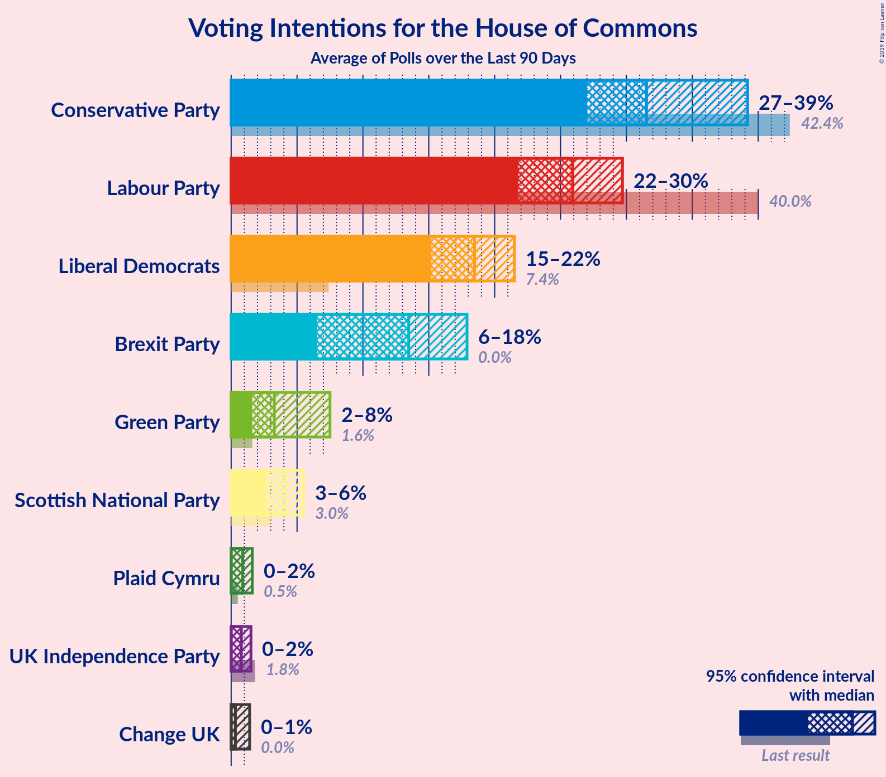

### Confidence Intervals

| Party | Last Result | Median | 80% Confidence Interval | 90% Confidence Interval | 95% Confidence Interval | 99% Confidence Interval |
|:-----:|:-----------:|:------:|:-----------------------:|:-----------------------:|:-----------------------:|:-----------------------:|
| <a href="#conservative-party">Conservative Party</a> | 42.4% | 32.7% | 30.0–35.8% |29.5–36.4% | 29.1–36.8% | 28.5–37.6% |
| <a href="#labour-party">Labour Party</a> | 40.0% | 25.9% | 24.0–27.7% |23.6–28.1% | 23.2–28.5% | 22.5–29.2% |
| <a href="#liberal-democrats">Liberal Democrats</a> | 7.4% | 15.9% | 14.9–17.1% |14.6–17.4% | 14.3–17.7% | 13.8–18.3% |
| <a href="#scottish-national-party">Scottish National Party</a> | 3.0% | 3.5% | 2.7–4.4% |2.5–4.7% | 2.4–4.9% | 2.2–5.2% |
| <a href="#uk-independence-party">UK Independence Party</a> | 1.8% | 1.0% | 0.8–1.3% |0.7–1.5% | 0.6–1.6% | 0.5–1.8% |
| <a href="#green-party">Green Party</a> | 1.6% | 5.4% | 3.6–7.5% |3.5–7.8% | 3.3–8.1% | 3.1–8.5% |
| <a href="#plaid-cymru">Plaid Cymru</a> | 0.5% | 0.6% | 0.2–1.2% |0.2–1.4% | 0.1–1.5% | 0.1–1.7% |
| <a href="#brexit-party">Brexit Party</a> | 0.0% | 13.5% | 10.3–16.6% |10.0–17.0% | 9.7–17.3% | 9.2–17.9% |
| <a href="#change-uk">Change UK</a> | 0.0% | 0.3% | 0.2–0.5% |0.1–0.5% | 0.1–0.6% | 0.1–0.7% |

### Conservative Party

*For a full overview of the results for this party, see the [Conservative Party](party-conservativeparty.html) page.*

| Voting Intentions | Probability | Accumulated | Special Marks |
|:-----------------:|:-----------:|:-----------:|:-------------:|
| 26.5–27.5% | 0% | 100% |  |
| 27.5–28.5% | 0.5% | 100% |  |
| 28.5–29.5% | 4% | 99.4% |  |
| 29.5–30.5% | 14% | 95% |  |
| 30.5–31.5% | 18% | 81% |  |
| 31.5–32.5% | 11% | 62% |  |
| 32.5–33.5% | 8% | 51% | Median |
| 33.5–34.5% | 14% | 44% |  |
| 34.5–35.5% | 16% | 30% |  |
| 35.5–36.5% | 10% | 14% |  |
| 36.5–37.5% | 3% | 4% |  |
| 37.5–38.5% | 0.5% | 0.6% |  |
| 38.5–39.5% | 0% | 0% |  |
| 39.5–40.5% | 0% | 0% |  |
| 40.5–41.5% | 0% | 0% |  |
| 41.5–42.5% | 0% | 0% | Last Result |

### Labour Party

*For a full overview of the results for this party, see the [Labour Party](party-labourparty.html) page.*

| Voting Intentions | Probability | Accumulated | Special Marks |
|:-----------------:|:-----------:|:-----------:|:-------------:|
| 20.5–21.5% | 0% | 100% |  |
| 21.5–22.5% | 0.6% | 100% |  |
| 22.5–23.5% | 4% | 99.4% |  |
| 23.5–24.5% | 14% | 95% |  |
| 24.5–25.5% | 22% | 81% |  |
| 25.5–26.5% | 25% | 59% | Median |
| 26.5–27.5% | 22% | 34% |  |
| 27.5–28.5% | 10% | 12% |  |
| 28.5–29.5% | 2% | 2% |  |
| 29.5–30.5% | 0.2% | 0.2% |  |
| 30.5–31.5% | 0% | 0% |  |
| 31.5–32.5% | 0% | 0% |  |
| 32.5–33.5% | 0% | 0% |  |
| 33.5–34.5% | 0% | 0% |  |
| 34.5–35.5% | 0% | 0% |  |
| 35.5–36.5% | 0% | 0% |  |
| 36.5–37.5% | 0% | 0% |  |
| 37.5–38.5% | 0% | 0% |  |
| 38.5–39.5% | 0% | 0% |  |
| 39.5–40.5% | 0% | 0% | Last Result |

### Liberal Democrats

*For a full overview of the results for this party, see the [Liberal Democrats](party-liberaldemocrats.html) page.*

| Voting Intentions | Probability | Accumulated | Special Marks |
|:-----------------:|:-----------:|:-----------:|:-------------:|
| 6.5–7.5% | 0% | 100% | Last Result |
| 7.5–8.5% | 0% | 100% |  |
| 8.5–9.5% | 0% | 100% |  |
| 9.5–10.5% | 0% | 100% |  |
| 10.5–11.5% | 0% | 100% |  |
| 11.5–12.5% | 0% | 100% |  |
| 12.5–13.5% | 0.2% | 100% |  |
| 13.5–14.5% | 5% | 99.8% |  |
| 14.5–15.5% | 27% | 95% |  |
| 15.5–16.5% | 44% | 68% | Median |
| 16.5–17.5% | 21% | 24% |  |
| 17.5–18.5% | 3% | 3% |  |
| 18.5–19.5% | 0.2% | 0.2% |  |
| 19.5–20.5% | 0% | 0% |  |

### Scottish National Party

*For a full overview of the results for this party, see the [Scottish National Party](party-scottishnationalparty.html) page.*

| Voting Intentions | Probability | Accumulated | Special Marks |
|:-----------------:|:-----------:|:-----------:|:-------------:|
| 0.5–1.5% | 0% | 100% |  |
| 1.5–2.5% | 5% | 100% |  |
| 2.5–3.5% | 49% | 95% | Last Result, Median |
| 3.5–4.5% | 39% | 46% |  |
| 4.5–5.5% | 7% | 7% |  |
| 5.5–6.5% | 0.1% | 0.1% |  |
| 6.5–7.5% | 0% | 0% |  |

### UK Independence Party

*For a full overview of the results for this party, see the [UK Independence Party](party-ukindependenceparty.html) page.*

| Voting Intentions | Probability | Accumulated | Special Marks |
|:-----------------:|:-----------:|:-----------:|:-------------:|
| 0.0–0.5% | 0.8% | 100% |  |
| 0.5–1.5% | 97% | 99.2% | Median |
| 1.5–2.5% | 3% | 3% | Last Result |
| 2.5–3.5% | 0% | 0% |  |

### Green Party

*For a full overview of the results for this party, see the [Green Party](party-greenparty.html) page.*

| Voting Intentions | Probability | Accumulated | Special Marks |
|:-----------------:|:-----------:|:-----------:|:-------------:|
| 1.5–2.5% | 0% | 100% | Last Result |
| 2.5–3.5% | 7% | 100% |  |
| 3.5–4.5% | 37% | 93% |  |
| 4.5–5.5% | 6% | 55% | Median |
| 5.5–6.5% | 12% | 50% |  |
| 6.5–7.5% | 28% | 38% |  |
| 7.5–8.5% | 9% | 10% |  |
| 8.5–9.5% | 0.5% | 0.5% |  |
| 9.5–10.5% | 0% | 0% |  |

### Plaid Cymru

*For a full overview of the results for this party, see the [Plaid Cymru](party-plaidcymru.html) page.*

| Voting Intentions | Probability | Accumulated | Special Marks |
|:-----------------:|:-----------:|:-----------:|:-------------:|
| 0.0–0.5% | 49% | 100% |  |
| 0.5–1.5% | 50% | 51% | Last Result, Median |
| 1.5–2.5% | 1.5% | 1.5% |  |
| 2.5–3.5% | 0% | 0% |  |

### Brexit Party

*For a full overview of the results for this party, see the [Brexit Party](party-brexitparty.html) page.*

| Voting Intentions | Probability | Accumulated | Special Marks |
|:-----------------:|:-----------:|:-----------:|:-------------:|
| 0.0–0.5% | 0% | 100% | Last Result |
| 0.5–1.5% | 0% | 100% |  |
| 1.5–2.5% | 0% | 100% |  |
| 2.5–3.5% | 0% | 100% |  |
| 3.5–4.5% | 0% | 100% |  |
| 4.5–5.5% | 0% | 100% |  |
| 5.5–6.5% | 0% | 100% |  |
| 6.5–7.5% | 0% | 100% |  |
| 7.5–8.5% | 0% | 100% |  |
| 8.5–9.5% | 1.5% | 100% |  |
| 9.5–10.5% | 13% | 98.5% |  |
| 10.5–11.5% | 24% | 85% |  |
| 11.5–12.5% | 10% | 61% |  |
| 12.5–13.5% | 1.2% | 51% |  |
| 13.5–14.5% | 2% | 50% | Median |
| 14.5–15.5% | 14% | 48% |  |
| 15.5–16.5% | 23% | 34% |  |
| 16.5–17.5% | 10% | 11% |  |
| 17.5–18.5% | 1.3% | 1.3% |  |
| 18.5–19.5% | 0% | 0% |  |
| 19.5–20.5% | 0% | 0% |  |

### Change UK

*For a full overview of the results for this party, see the [Change UK](party-changeuk.html) page.*

| Voting Intentions | Probability | Accumulated | Special Marks |
|:-----------------:|:-----------:|:-----------:|:-------------:|
| 0.0–0.5% | 95% | 100% | Last Result, Median |
| 0.5–1.5% | 5% | 5% |  |
| 1.5–2.5% | 0% | 0% |  |

## Seats

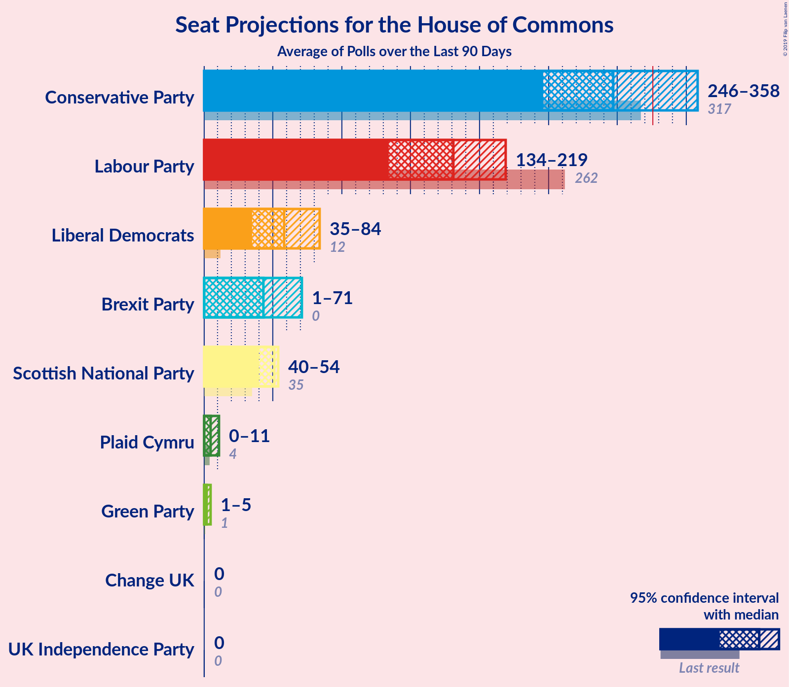

### Confidence Intervals

| Party | Last Result | Median | 80% Confidence Interval | 90% Confidence Interval | 95% Confidence Interval | 99% Confidence Interval |
|:-----:|:-----------:|:------:|:-----------------------:|:-----------------------:|:-----------------------:|:-----------------------:|
| <a href="#conservative-party">Conservative Party</a> | 317 | 321 | 321 |321–332 | 321–332 | 321–332 |
| <a href="#labour-party">Labour Party</a> | 262 | 163 | 163 |163–164 | 163–164 | 163–164 |
| <a href="#liberal-democrats">Liberal Democrats</a> | 12 | 55 | 55 |47–55 | 47–55 | 47–55 |
| <a href="#scottish-national-party">Scottish National Party</a> | 35 | 54 | 54 |53–54 | 53–54 | 53–54 |
| <a href="#uk-independence-party">UK Independence Party</a> | 0 | 0 | 0 |0 | 0 | 0 |
| <a href="#green-party">Green Party</a> | 1 | 4 | 4 |4 | 4 | 4 |
| <a href="#plaid-cymru">Plaid Cymru</a> | 4 | 4 | 4 |4–12 | 4–12 | 4–12 |
| <a href="#brexit-party">Brexit Party</a> | 0 | 31 | 31 |20–31 | 20–31 | 20–31 |
| <a href="#change-uk">Change UK</a> | 0 | 0 | 0 |0 | 0 | 0 |

### Conservative Party

*For a full overview of the results for this party, see the [Conservative Party](party-conservativeparty.html) page.*

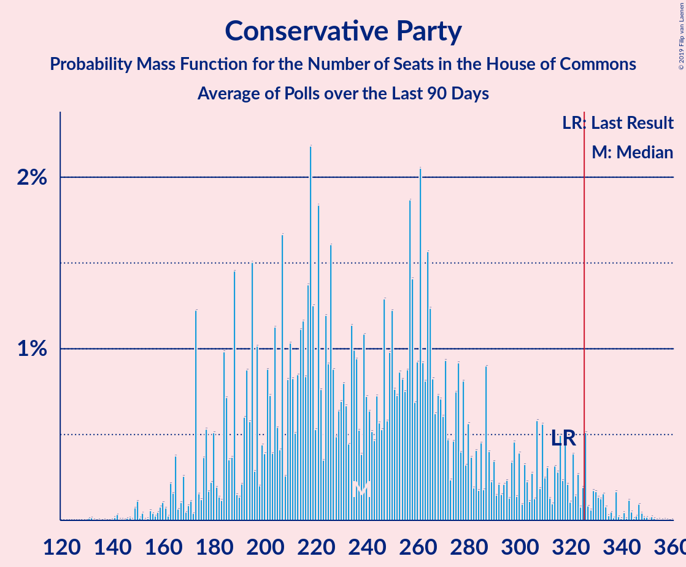

| Number of Seats | Probability | Accumulated | Special Marks |
|:---------------:|:-----------:|:-----------:|:-------------:|
| 317 | 0% | 100% | Last Result |
| 318 | 0% | 100% |  |
| 319 | 0% | 100% |  |
| 320 | 0% | 100% |  |
| 321 | 94% | 100% | Median |
| 322 | 0% | 6% |  |
| 323 | 0% | 6% |  |
| 324 | 0% | 6% |  |
| 325 | 0% | 6% |  |
| 326 | 0% | 6% | Majority |
| 327 | 0% | 6% |  |
| 328 | 0% | 6% |  |
| 329 | 0% | 6% |  |
| 330 | 0% | 6% |  |
| 331 | 0% | 6% |  |
| 332 | 6% | 6% |  |
| 333 | 0% | 0% |  |

### Labour Party

*For a full overview of the results for this party, see the [Labour Party](party-labourparty.html) page.*

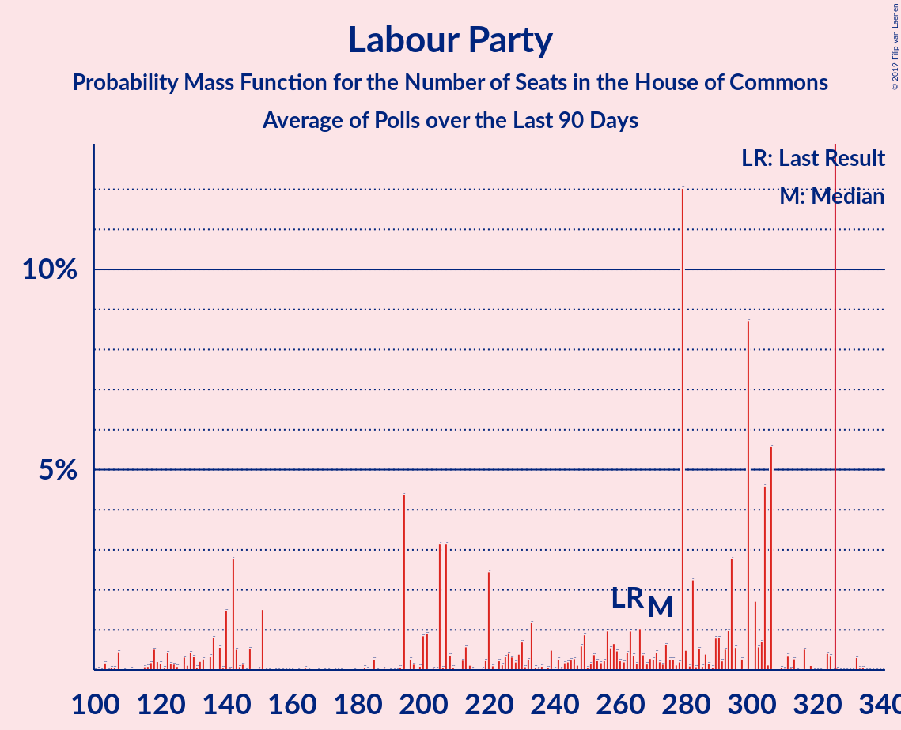

| Number of Seats | Probability | Accumulated | Special Marks |
|:---------------:|:-----------:|:-----------:|:-------------:|
| 163 | 94% | 100% | Median |
| 164 | 6% | 6% |  |
| 165 | 0% | 0% |  |
| 166 | 0% | 0% |  |
| 167 | 0% | 0% |  |
| 168 | 0% | 0% |  |
| 169 | 0% | 0% |  |
| 170 | 0% | 0% |  |
| 171 | 0% | 0% |  |
| 172 | 0% | 0% |  |
| 173 | 0% | 0% |  |
| 174 | 0% | 0% |  |
| 175 | 0% | 0% |  |
| 176 | 0% | 0% |  |
| 177 | 0% | 0% |  |
| 178 | 0% | 0% |  |
| 179 | 0% | 0% |  |
| 180 | 0% | 0% |  |
| 181 | 0% | 0% |  |
| 182 | 0% | 0% |  |
| 183 | 0% | 0% |  |
| 184 | 0% | 0% |  |
| 185 | 0% | 0% |  |
| 186 | 0% | 0% |  |
| 187 | 0% | 0% |  |
| 188 | 0% | 0% |  |
| 189 | 0% | 0% |  |
| 190 | 0% | 0% |  |
| 191 | 0% | 0% |  |
| 192 | 0% | 0% |  |
| 193 | 0% | 0% |  |
| 194 | 0% | 0% |  |
| 195 | 0% | 0% |  |
| 196 | 0% | 0% |  |
| 197 | 0% | 0% |  |
| 198 | 0% | 0% |  |
| 199 | 0% | 0% |  |
| 200 | 0% | 0% |  |
| 201 | 0% | 0% |  |
| 202 | 0% | 0% |  |
| 203 | 0% | 0% |  |
| 204 | 0% | 0% |  |
| 205 | 0% | 0% |  |
| 206 | 0% | 0% |  |
| 207 | 0% | 0% |  |
| 208 | 0% | 0% |  |
| 209 | 0% | 0% |  |
| 210 | 0% | 0% |  |
| 211 | 0% | 0% |  |
| 212 | 0% | 0% |  |
| 213 | 0% | 0% |  |
| 214 | 0% | 0% |  |
| 215 | 0% | 0% |  |
| 216 | 0% | 0% |  |
| 217 | 0% | 0% |  |
| 218 | 0% | 0% |  |
| 219 | 0% | 0% |  |
| 220 | 0% | 0% |  |
| 221 | 0% | 0% |  |
| 222 | 0% | 0% |  |
| 223 | 0% | 0% |  |
| 224 | 0% | 0% |  |
| 225 | 0% | 0% |  |
| 226 | 0% | 0% |  |
| 227 | 0% | 0% |  |
| 228 | 0% | 0% |  |
| 229 | 0% | 0% |  |
| 230 | 0% | 0% |  |
| 231 | 0% | 0% |  |
| 232 | 0% | 0% |  |
| 233 | 0% | 0% |  |
| 234 | 0% | 0% |  |
| 235 | 0% | 0% |  |
| 236 | 0% | 0% |  |
| 237 | 0% | 0% |  |
| 238 | 0% | 0% |  |
| 239 | 0% | 0% |  |
| 240 | 0% | 0% |  |
| 241 | 0% | 0% |  |
| 242 | 0% | 0% |  |
| 243 | 0% | 0% |  |
| 244 | 0% | 0% |  |
| 245 | 0% | 0% |  |
| 246 | 0% | 0% |  |
| 247 | 0% | 0% |  |
| 248 | 0% | 0% |  |
| 249 | 0% | 0% |  |
| 250 | 0% | 0% |  |
| 251 | 0% | 0% |  |
| 252 | 0% | 0% |  |
| 253 | 0% | 0% |  |
| 254 | 0% | 0% |  |
| 255 | 0% | 0% |  |
| 256 | 0% | 0% |  |
| 257 | 0% | 0% |  |
| 258 | 0% | 0% |  |
| 259 | 0% | 0% |  |
| 260 | 0% | 0% |  |
| 261 | 0% | 0% |  |
| 262 | 0% | 0% | Last Result |

### Liberal Democrats

*For a full overview of the results for this party, see the [Liberal Democrats](party-liberaldemocrats.html) page.*

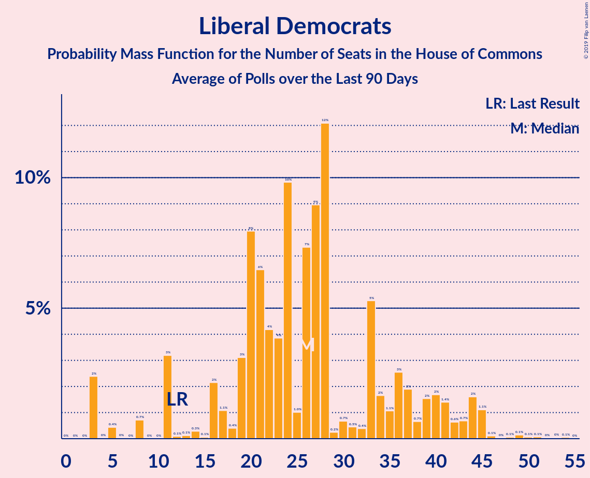

| Number of Seats | Probability | Accumulated | Special Marks |
|:---------------:|:-----------:|:-----------:|:-------------:|
| 12 | 0% | 100% | Last Result |
| 13 | 0% | 100% |  |
| 14 | 0% | 100% |  |
| 15 | 0% | 100% |  |
| 16 | 0% | 100% |  |
| 17 | 0% | 100% |  |
| 18 | 0% | 100% |  |
| 19 | 0% | 100% |  |
| 20 | 0% | 100% |  |
| 21 | 0% | 100% |  |
| 22 | 0% | 100% |  |
| 23 | 0% | 100% |  |
| 24 | 0% | 100% |  |
| 25 | 0% | 100% |  |
| 26 | 0% | 100% |  |
| 27 | 0% | 100% |  |
| 28 | 0% | 100% |  |
| 29 | 0% | 100% |  |
| 30 | 0% | 100% |  |
| 31 | 0% | 100% |  |
| 32 | 0% | 100% |  |
| 33 | 0% | 100% |  |
| 34 | 0% | 100% |  |
| 35 | 0% | 100% |  |
| 36 | 0% | 100% |  |
| 37 | 0% | 100% |  |
| 38 | 0% | 100% |  |
| 39 | 0% | 100% |  |
| 40 | 0% | 100% |  |
| 41 | 0% | 100% |  |
| 42 | 0% | 100% |  |
| 43 | 0% | 100% |  |
| 44 | 0% | 100% |  |
| 45 | 0% | 100% |  |
| 46 | 0% | 100% |  |
| 47 | 6% | 100% |  |
| 48 | 0% | 94% |  |
| 49 | 0% | 94% |  |
| 50 | 0% | 94% |  |
| 51 | 0% | 94% |  |
| 52 | 0% | 94% |  |
| 53 | 0% | 94% |  |
| 54 | 0% | 94% |  |
| 55 | 94% | 94% | Median |
| 56 | 0% | 0% |  |

### Scottish National Party

*For a full overview of the results for this party, see the [Scottish National Party](party-scottishnationalparty.html) page.*

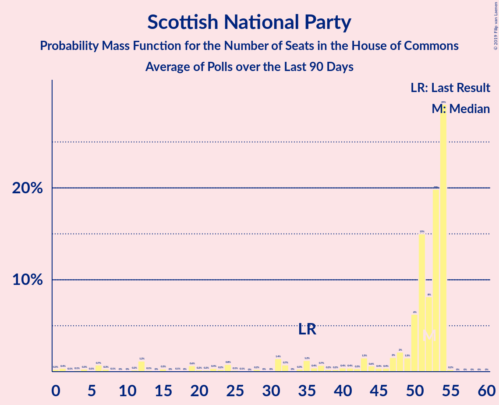

| Number of Seats | Probability | Accumulated | Special Marks |
|:---------------:|:-----------:|:-----------:|:-------------:|
| 35 | 0% | 100% | Last Result |
| 36 | 0% | 100% |  |
| 37 | 0% | 100% |  |
| 38 | 0% | 100% |  |
| 39 | 0% | 100% |  |
| 40 | 0% | 100% |  |
| 41 | 0% | 100% |  |
| 42 | 0% | 100% |  |
| 43 | 0% | 100% |  |
| 44 | 0% | 100% |  |
| 45 | 0% | 100% |  |
| 46 | 0% | 100% |  |
| 47 | 0% | 100% |  |
| 48 | 0% | 100% |  |
| 49 | 0% | 100% |  |
| 50 | 0% | 100% |  |
| 51 | 0% | 100% |  |
| 52 | 0% | 100% |  |
| 53 | 6% | 100% |  |
| 54 | 94% | 94% | Median |
| 55 | 0% | 0% |  |

### UK Independence Party

*For a full overview of the results for this party, see the [UK Independence Party](party-ukindependenceparty.html) page.*

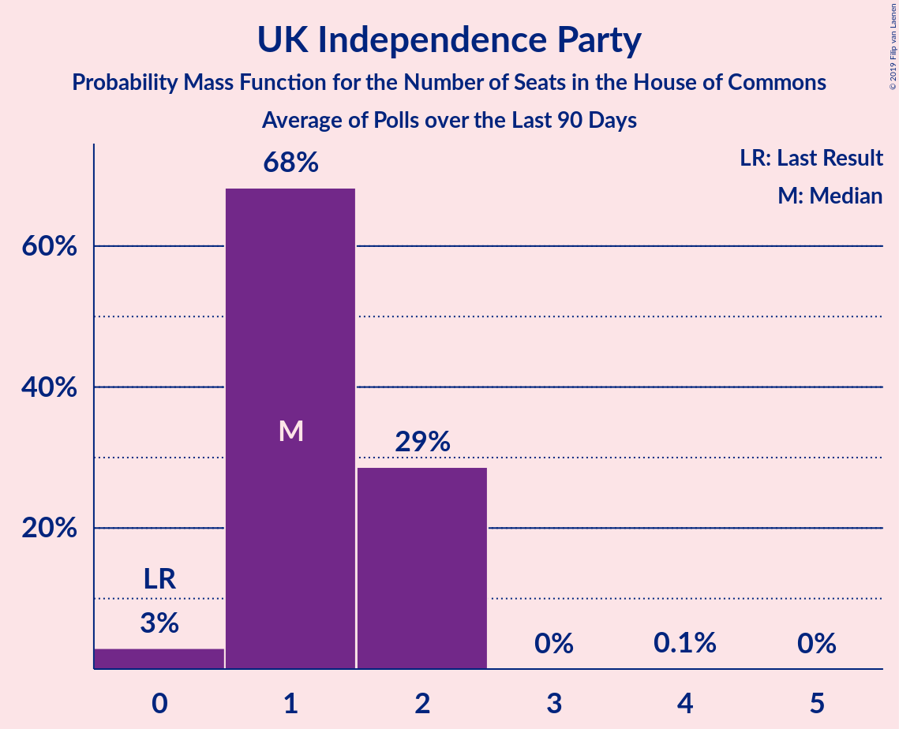

| Number of Seats | Probability | Accumulated | Special Marks |
|:---------------:|:-----------:|:-----------:|:-------------:|
| 0 | 100% | 100% | Last Result, Median |

### Green Party

*For a full overview of the results for this party, see the [Green Party](party-greenparty.html) page.*

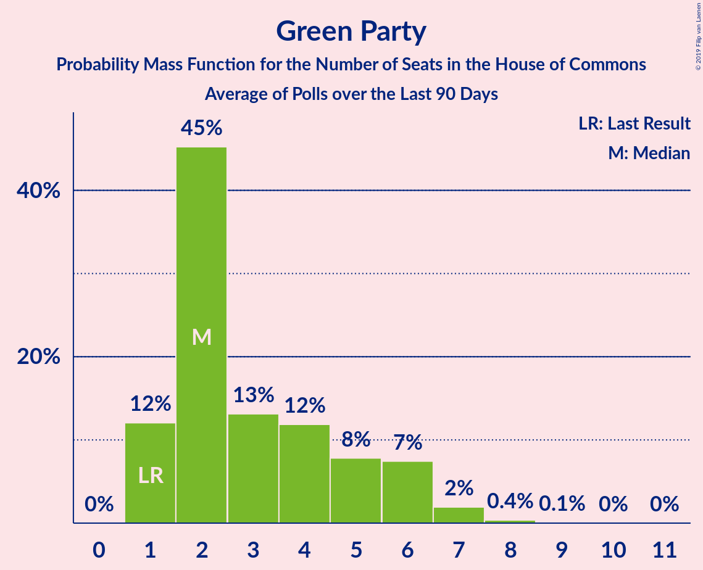

| Number of Seats | Probability | Accumulated | Special Marks |
|:---------------:|:-----------:|:-----------:|:-------------:|
| 1 | 0% | 100% | Last Result |
| 2 | 0% | 100% |  |
| 3 | 0% | 100% |  |
| 4 | 100% | 100% | Median |

### Plaid Cymru

*For a full overview of the results for this party, see the [Plaid Cymru](party-plaidcymru.html) page.*

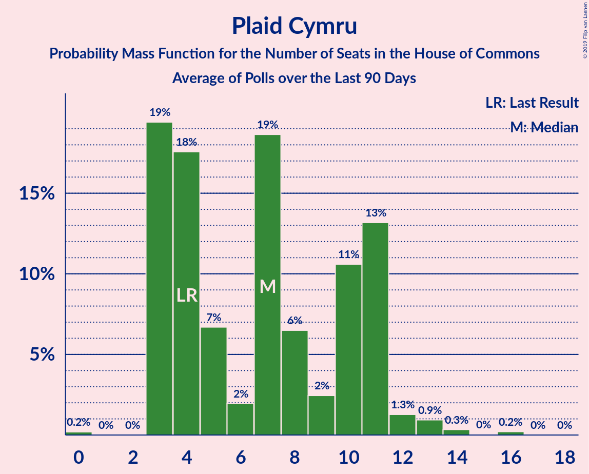

| Number of Seats | Probability | Accumulated | Special Marks |
|:---------------:|:-----------:|:-----------:|:-------------:|
| 4 | 94% | 100% | Last Result, Median |
| 5 | 0% | 6% |  |
| 6 | 0% | 6% |  |
| 7 | 0% | 6% |  |
| 8 | 0% | 6% |  |
| 9 | 0% | 6% |  |
| 10 | 0% | 6% |  |
| 11 | 0% | 6% |  |
| 12 | 6% | 6% |  |
| 13 | 0% | 0% |  |

### Brexit Party

*For a full overview of the results for this party, see the [Brexit Party](party-brexitparty.html) page.*

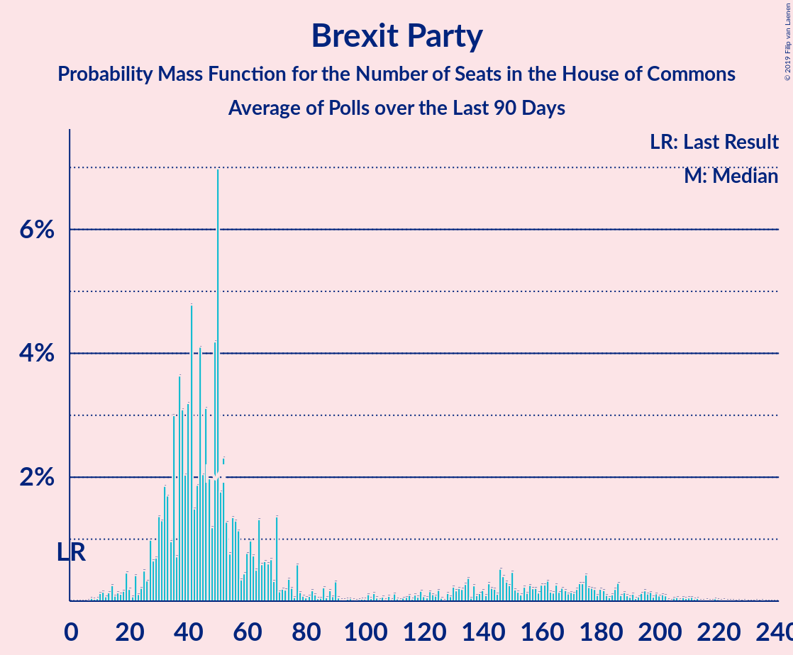

| Number of Seats | Probability | Accumulated | Special Marks |
|:---------------:|:-----------:|:-----------:|:-------------:|
| 0 | 0% | 100% | Last Result |
| 1 | 0% | 100% |  |
| 2 | 0% | 100% |  |
| 3 | 0% | 100% |  |
| 4 | 0% | 100% |  |
| 5 | 0% | 100% |  |
| 6 | 0% | 100% |  |
| 7 | 0% | 100% |  |
| 8 | 0% | 100% |  |
| 9 | 0% | 100% |  |
| 10 | 0% | 100% |  |
| 11 | 0% | 100% |  |
| 12 | 0% | 100% |  |
| 13 | 0% | 100% |  |
| 14 | 0% | 100% |  |
| 15 | 0% | 100% |  |
| 16 | 0% | 100% |  |
| 17 | 0% | 100% |  |
| 18 | 0% | 100% |  |
| 19 | 0% | 100% |  |
| 20 | 6% | 100% |  |
| 21 | 0% | 94% |  |
| 22 | 0% | 94% |  |
| 23 | 0% | 94% |  |
| 24 | 0% | 94% |  |
| 25 | 0% | 94% |  |
| 26 | 0% | 94% |  |
| 27 | 0% | 94% |  |
| 28 | 0% | 94% |  |
| 29 | 0% | 94% |  |
| 30 | 0% | 94% |  |
| 31 | 94% | 94% | Median |
| 32 | 0% | 0% |  |

### Change UK

*For a full overview of the results for this party, see the [Change UK](party-changeuk.html) page.*

| Number of Seats | Probability | Accumulated | Special Marks |
|:---------------:|:-----------:|:-----------:|:-------------:|
| 0 | 100% | 100% | Last Result, Median |

## Coalitions

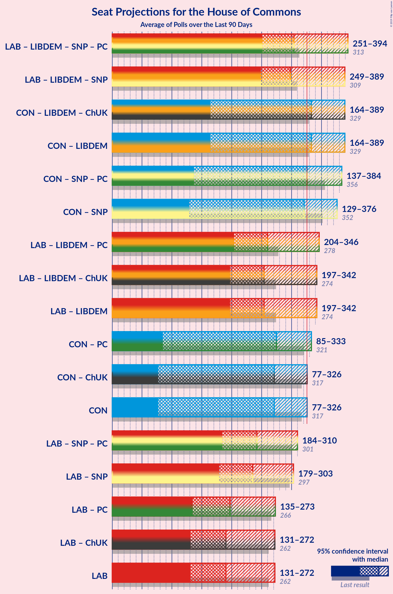

### Confidence Intervals

| Coalition | Last Result | Median | Majority? | 80% Confidence Interval | 90% Confidence Interval | 95% Confidence Interval | 99% Confidence Interval |
|:---------:|:-----------:|:------:|:---------:|:-----------------------:|:-----------------------:|:-----------------------:|:-----------------------:|
| Conservative Party – Scottish National Party – Plaid Cymru | 356 | 379 | 100% | 379 | 379–397 | 379–397 | 379–397 |
| Conservative Party – Liberal Democrats – Change UK | 329 | 376 | 100% | 376 | 376–379 | 376–379 | 376–379 |
| Conservative Party – Liberal Democrats | 329 | 376 | 100% | 376 | 376–379 | 376–379 | 376–379 |
| Conservative Party – Plaid Cymru | 321 | 325 | 6% | 325 | 325–344 | 325–344 | 325–344 |
| Conservative Party | 317 | 321 | 6% | 321 | 321–332 | 321–332 | 321–332 |

### Conservative Party – Scottish National Party – Plaid Cymru

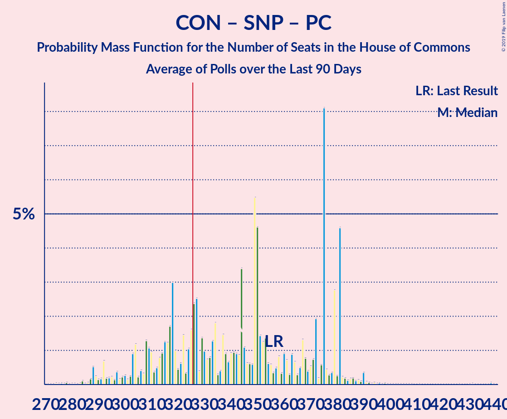

| Number of Seats | Probability | Accumulated | Special Marks |
|:---------------:|:-----------:|:-----------:|:-------------:|
| 356 | 0% | 100% | Last Result |
| 357 | 0% | 100% |  |
| 358 | 0% | 100% |  |
| 359 | 0% | 100% |  |
| 360 | 0% | 100% |  |
| 361 | 0% | 100% |  |
| 362 | 0% | 100% |  |
| 363 | 0% | 100% |  |
| 364 | 0% | 100% |  |
| 365 | 0% | 100% |  |
| 366 | 0% | 100% |  |
| 367 | 0% | 100% |  |
| 368 | 0% | 100% |  |
| 369 | 0% | 100% |  |
| 370 | 0% | 100% |  |
| 371 | 0% | 100% |  |
| 372 | 0% | 100% |  |
| 373 | 0% | 100% |  |
| 374 | 0% | 100% |  |
| 375 | 0% | 100% |  |
| 376 | 0% | 100% |  |
| 377 | 0% | 100% |  |
| 378 | 0% | 100% |  |
| 379 | 94% | 100% | Median |
| 380 | 0% | 6% |  |
| 381 | 0% | 6% |  |
| 382 | 0% | 6% |  |
| 383 | 0% | 6% |  |
| 384 | 0% | 6% |  |
| 385 | 0% | 6% |  |
| 386 | 0% | 6% |  |
| 387 | 0% | 6% |  |
| 388 | 0% | 6% |  |
| 389 | 0% | 6% |  |
| 390 | 0% | 6% |  |
| 391 | 0% | 6% |  |
| 392 | 0% | 6% |  |
| 393 | 0% | 6% |  |
| 394 | 0% | 6% |  |
| 395 | 0% | 6% |  |
| 396 | 0% | 6% |  |
| 397 | 6% | 6% |  |
| 398 | 0% | 0% |  |

### Conservative Party – Liberal Democrats – Change UK

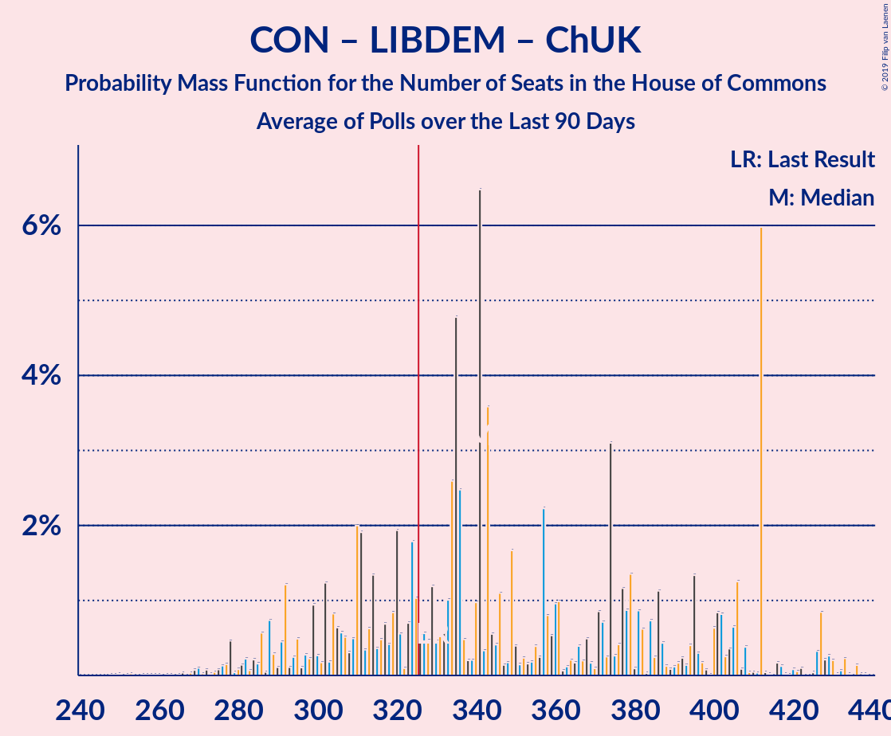

| Number of Seats | Probability | Accumulated | Special Marks |
|:---------------:|:-----------:|:-----------:|:-------------:|
| 329 | 0% | 100% | Last Result |
| 330 | 0% | 100% |  |
| 331 | 0% | 100% |  |
| 332 | 0% | 100% |  |
| 333 | 0% | 100% |  |
| 334 | 0% | 100% |  |
| 335 | 0% | 100% |  |
| 336 | 0% | 100% |  |
| 337 | 0% | 100% |  |
| 338 | 0% | 100% |  |
| 339 | 0% | 100% |  |
| 340 | 0% | 100% |  |
| 341 | 0% | 100% |  |
| 342 | 0% | 100% |  |
| 343 | 0% | 100% |  |
| 344 | 0% | 100% |  |
| 345 | 0% | 100% |  |
| 346 | 0% | 100% |  |
| 347 | 0% | 100% |  |
| 348 | 0% | 100% |  |
| 349 | 0% | 100% |  |
| 350 | 0% | 100% |  |
| 351 | 0% | 100% |  |
| 352 | 0% | 100% |  |
| 353 | 0% | 100% |  |
| 354 | 0% | 100% |  |
| 355 | 0% | 100% |  |
| 356 | 0% | 100% |  |
| 357 | 0% | 100% |  |
| 358 | 0% | 100% |  |
| 359 | 0% | 100% |  |
| 360 | 0% | 100% |  |
| 361 | 0% | 100% |  |
| 362 | 0% | 100% |  |
| 363 | 0% | 100% |  |
| 364 | 0% | 100% |  |
| 365 | 0% | 100% |  |
| 366 | 0% | 100% |  |
| 367 | 0% | 100% |  |
| 368 | 0% | 100% |  |
| 369 | 0% | 100% |  |
| 370 | 0% | 100% |  |
| 371 | 0% | 100% |  |
| 372 | 0% | 100% |  |
| 373 | 0% | 100% |  |
| 374 | 0% | 100% |  |
| 375 | 0% | 100% |  |
| 376 | 94% | 100% | Median |
| 377 | 0% | 6% |  |
| 378 | 0% | 6% |  |
| 379 | 6% | 6% |  |
| 380 | 0% | 0% |  |

### Conservative Party – Liberal Democrats

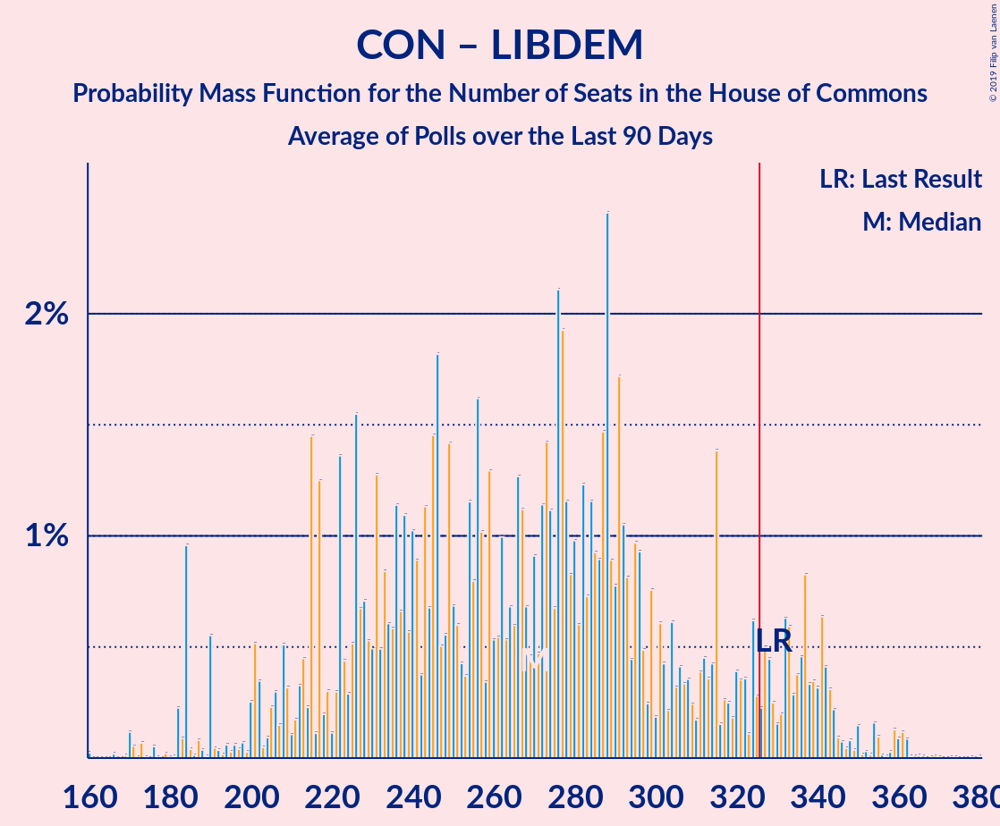

| Number of Seats | Probability | Accumulated | Special Marks |
|:---------------:|:-----------:|:-----------:|:-------------:|
| 329 | 0% | 100% | Last Result |
| 330 | 0% | 100% |  |
| 331 | 0% | 100% |  |
| 332 | 0% | 100% |  |
| 333 | 0% | 100% |  |
| 334 | 0% | 100% |  |
| 335 | 0% | 100% |  |
| 336 | 0% | 100% |  |
| 337 | 0% | 100% |  |
| 338 | 0% | 100% |  |
| 339 | 0% | 100% |  |
| 340 | 0% | 100% |  |
| 341 | 0% | 100% |  |
| 342 | 0% | 100% |  |
| 343 | 0% | 100% |  |
| 344 | 0% | 100% |  |
| 345 | 0% | 100% |  |
| 346 | 0% | 100% |  |
| 347 | 0% | 100% |  |
| 348 | 0% | 100% |  |
| 349 | 0% | 100% |  |
| 350 | 0% | 100% |  |
| 351 | 0% | 100% |  |
| 352 | 0% | 100% |  |
| 353 | 0% | 100% |  |
| 354 | 0% | 100% |  |
| 355 | 0% | 100% |  |
| 356 | 0% | 100% |  |
| 357 | 0% | 100% |  |
| 358 | 0% | 100% |  |
| 359 | 0% | 100% |  |
| 360 | 0% | 100% |  |
| 361 | 0% | 100% |  |
| 362 | 0% | 100% |  |
| 363 | 0% | 100% |  |
| 364 | 0% | 100% |  |
| 365 | 0% | 100% |  |
| 366 | 0% | 100% |  |
| 367 | 0% | 100% |  |
| 368 | 0% | 100% |  |
| 369 | 0% | 100% |  |
| 370 | 0% | 100% |  |
| 371 | 0% | 100% |  |
| 372 | 0% | 100% |  |
| 373 | 0% | 100% |  |
| 374 | 0% | 100% |  |
| 375 | 0% | 100% |  |
| 376 | 94% | 100% | Median |
| 377 | 0% | 6% |  |
| 378 | 0% | 6% |  |
| 379 | 6% | 6% |  |
| 380 | 0% | 0% |  |

### Conservative Party – Plaid Cymru

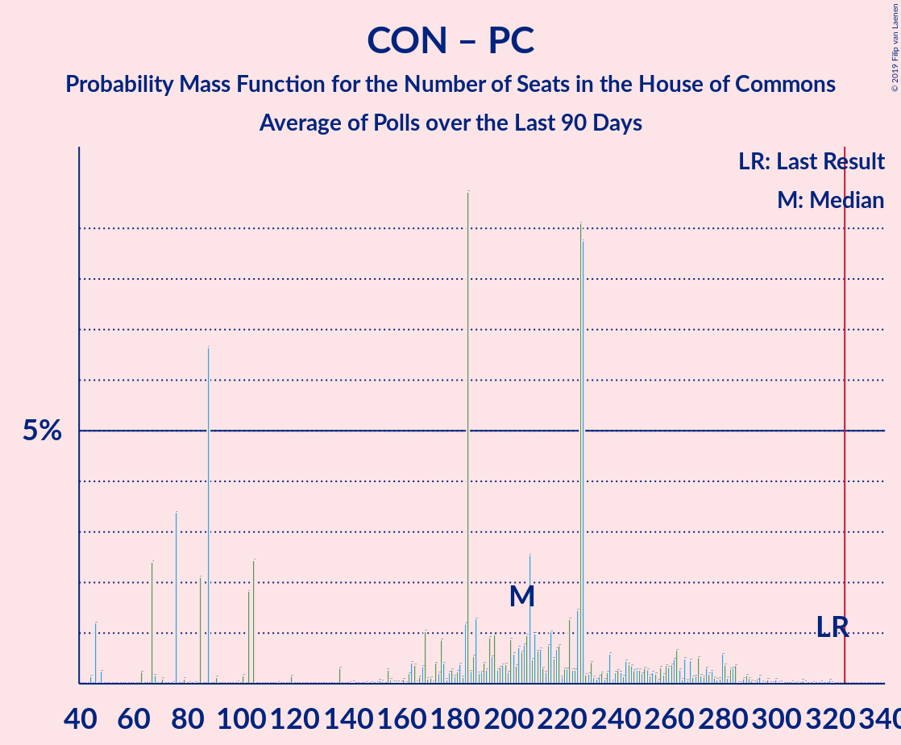

| Number of Seats | Probability | Accumulated | Special Marks |
|:---------------:|:-----------:|:-----------:|:-------------:|
| 321 | 0% | 100% | Last Result |
| 322 | 0% | 100% |  |
| 323 | 0% | 100% |  |
| 324 | 0% | 100% |  |
| 325 | 94% | 100% | Median |
| 326 | 0% | 6% | Majority |
| 327 | 0% | 6% |  |
| 328 | 0% | 6% |  |
| 329 | 0% | 6% |  |
| 330 | 0% | 6% |  |
| 331 | 0% | 6% |  |
| 332 | 0% | 6% |  |
| 333 | 0% | 6% |  |
| 334 | 0% | 6% |  |
| 335 | 0% | 6% |  |
| 336 | 0% | 6% |  |
| 337 | 0% | 6% |  |
| 338 | 0% | 6% |  |
| 339 | 0% | 6% |  |
| 340 | 0% | 6% |  |
| 341 | 0% | 6% |  |
| 342 | 0% | 6% |  |
| 343 | 0% | 6% |  |
| 344 | 6% | 6% |  |
| 345 | 0% | 0% |  |

### Conservative Party

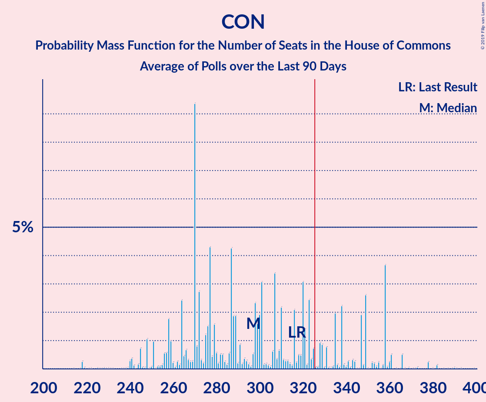

| Number of Seats | Probability | Accumulated | Special Marks |
|:---------------:|:-----------:|:-----------:|:-------------:|
| 317 | 0% | 100% | Last Result |
| 318 | 0% | 100% |  |
| 319 | 0% | 100% |  |
| 320 | 0% | 100% |  |
| 321 | 94% | 100% | Median |
| 322 | 0% | 6% |  |
| 323 | 0% | 6% |  |
| 324 | 0% | 6% |  |
| 325 | 0% | 6% |  |
| 326 | 0% | 6% | Majority |
| 327 | 0% | 6% |  |
| 328 | 0% | 6% |  |
| 329 | 0% | 6% |  |
| 330 | 0% | 6% |  |
| 331 | 0% | 6% |  |
| 332 | 6% | 6% |  |
| 333 | 0% | 0% |  |

## Technical Information

+ **Number of polls included in this average:** 7
+ **Lowest number of simulations done in a poll included in this average:** 0
+ **Total number of simulations done in the polls included in this average:** 16
+ **Error estimate:** 1.14%
