# Poll Average

<a href="#voting-intentions">Voting Intentions</a> | <a href="#seats">Seats</a> | <a href="#coalitions">Coalitions</a> | <a href="#technical-information">Technical Information</a>

## Summary

The table below lists the polls on which the average is based. They are the most recent polls (less than 90 days old) registered and analyzed so far.

| Period     | Polling firm/Commissioner(s) | CON | LAB | LIBDEM | SNP | UKIP | GREEN | PC |
|:----------:|:----------------------------:|:--:|:--:|:--:|:--:|:--:|:--:|:--:|
| 8 June 2017 | General Election | 42.4%   317 | 40.0%   262 | 7.4%   12 | 3.0%   35 | 1.8%   0 | 1.6%   1 | 0.5%   4 |
| N/A | Poll Average | 35–44%   247–334 | 36–42%   235–310 | 6–11%   2–28 | 3–6%   22–58 | 3–9%   0–2 | 2–6%   1–3 | 0–2%   0–8 |
| [6–7 December 2018](2018-12-07-YouGov.html) | YouGov | 36–41%   270–319 | 35–40%   244–278 | 9–12%   18–24 | 3–5%   40–56 | 2–4%   0 | 3–5%   1 | 0–1%   4–5 |
| [5–6 December 2018](2018-12-06-KantarPublic.html) | Kantar Public | 35–40%   247–321 | 35–40%   234–303 | 7–11%   12–28 | 3–5%   38–57 | 4–6%   1 | 4–6%   1–3 | 1–2%   3–8 |
| [30 November–5 December 2018](2018-12-05-IpsosMORI.html) | Ipsos MORI | 35–41%   243–324 | 35–41%   233–305 | 7–11%   12–28 | 3–5%   36–57 | 3–5%   0–1 | 4–6%   1–3 | 1–2%   3–8 |
| [30 November–2 December 2018](2018-12-02-ComRes.html) | ComRes   Sunday Express | 36–40%   249–309 | 38–42%   260–326 | 8–10%   18–28 | 2–4%   9–51 | 5–7%   1 | 2–4%   1 | 0–1%   0–3 |
| [14–15 November 2018](2018-11-15-Opinium.html) | Opinium | 33–39%   238–303 | 36–42%   255–316 | 6–9%   4–20 | 4–6%   54–58 | 7–10%   1–2 | 2–4%   1–2 | 1–2%   4–8 |
| [2–7 November 2018](2018-11-07-Panelbase.html) | Panelbase   Constitutional Commission | 37–42%   259–320 | 37–42%   242–298 | 7–9%   9–22 | 3–5%   39–57 | 4–6%   1 | 2–4%   1 | 1–2%   4–8 |
| [20 October–2 November 2018](2018-11-02-Survation.html) | Survation   Channel 4 | 39–40%   276–297 | 40–42%   277–305 | 8–9%   16–20 | 3%   24–41 | 3%   0 | 2%   1 | N/A   N/A |
| [26–28 October 2018](2018-10-28-ICMResearch.html) | ICM Research | 38–42%   273–335 | 36–40%   235–299 | 8–10%   16–27 | 2–4%   9–50 | 4–6%   1 | 2–4%   1 | 1–2%   4–8 |
| [24–26 October 2018](2018-10-26-Deltapoll.html) | Deltapoll   Mirror | 40–46%   277–353 | 37–43%   227–295 | 5–8%   0–14 | 3–5%   26–58 | 4–7%   1 | 1–3%   1 | 0–1%   0–5 |
| [3–5 October 2018](2018-10-05-BMGResearch.html) | BMG Research   The Independent | 35–40%   243–313 | 36–41%   240–303 | 9–12%   18–30 | 3–5%   41–56 | 3–5%   0–1 | 3–5%   1–2 | 1–2%   3–8 |
| 8 June 2017 | General Election | 42.4%   317 | 40.0%   262 | 7.4%   12 | 3.0%   35 | 1.8%   0 | 1.6%   1 | 0.5%   4 |

Only polls for which at least the sample size has been published are included in the table above.

**Legend:**
+ **Top half of each row:** Voting intentions (95% confidence interval)
+ **Bottom half of each row:** Seat projections for the House of Commons (95% confidence interval)
+ **CON:** Conservative Party
+ **LAB:** Labour Party
+ **LIBDEM:** Liberal Democrats
+ **SNP:** Scottish National Party
+ **UKIP:** UK Independence Party
+ **GREEN:** Green Party
+ **PC:** Plaid Cymru
+ **N/A (single party):** Party not included the published results
+ **N/A (entire row):** Calculation for this opinion poll not started yet

## Voting Intentions

### Confidence Intervals

| Party | Last Result | Median | 80% Confidence Interval | 90% Confidence Interval | 95% Confidence Interval | 99% Confidence Interval |
|:-----:|:-----------:|:------:|:-----------------------:|:-----------------------:|:-----------------------:|:-----------------------:|
| <a href="#conservative-party">Conservative Party</a> | 42.4% | 38.8% | 36.2–41.5% |35.5–42.8% | 34.9–43.8% | 33.7–45.3% |
| <a href="#labour-party">Labour Party</a> | 40.0% | 39.0% | 36.9–40.9% |36.3–41.3% | 35.8–41.6% | 34.9–42.6% |
| <a href="#liberal-democrats">Liberal Democrats</a> | 7.4% | 8.6% | 6.6–10.3% |6.0–10.8% | 5.5–11.1% | 4.9–11.7% |
| <a href="#scottish-national-party">Scottish National Party</a> | 3.0% | 3.9% | 2.9–5.0% |2.8–5.3% | 2.6–5.6% | 2.4–6.2% |
| <a href="#uk-independence-party">UK Independence Party</a> | 1.8% | 4.7% | 3.1–7.0% |2.9–8.0% | 2.8–8.6% | 2.5–9.4% |
| <a href="#green-party">Green Party</a> | 1.6% | 3.3% | 2.0–5.1% |1.9–5.5% | 1.7–5.8% | 1.4–6.4% |
| <a href="#plaid-cymru">Plaid Cymru</a> | 0.5% | 0.9% | 0.3–1.3% |0.2–1.5% | 0.2–1.6% | 0.1–1.9% |

### Conservative Party

*For a full overview of the results for this party, see the [Conservative Party](party-conservativeparty.html) page.*

| Voting Intentions | Probability | Accumulated | Special Marks |
|:-----------------:|:-----------:|:-----------:|:-------------:|
| 31.5–32.5% | 0% | 100% |  |
| 32.5–33.5% | 0.3% | 99.9% |  |
| 33.5–34.5% | 1.3% | 99.6% |  |
| 34.5–35.5% | 4% | 98% |  |
| 35.5–36.5% | 8% | 95% |  |
| 36.5–37.5% | 14% | 87% |  |
| 37.5–38.5% | 17% | 73% |  |
| 38.5–39.5% | 19% | 55% | Median |
| 39.5–40.5% | 19% | 36% |  |
| 40.5–41.5% | 7% | 17% |  |
| 41.5–42.5% | 4% | 10% | Last Result |
| 42.5–43.5% | 3% | 6% |  |
| 43.5–44.5% | 2% | 3% |  |
| 44.5–45.5% | 0.9% | 1.3% |  |
| 45.5–46.5% | 0.3% | 0.4% |  |
| 46.5–47.5% | 0.1% | 0.1% |  |
| 47.5–48.5% | 0% | 0% |  |

### Labour Party

*For a full overview of the results for this party, see the [Labour Party](party-labourparty.html) page.*

| Voting Intentions | Probability | Accumulated | Special Marks |
|:-----------------:|:-----------:|:-----------:|:-------------:|
| 32.5–33.5% | 0% | 100% |  |
| 33.5–34.5% | 0.2% | 100% |  |
| 34.5–35.5% | 1.3% | 99.7% |  |
| 35.5–36.5% | 5% | 98% |  |
| 36.5–37.5% | 13% | 93% |  |
| 37.5–38.5% | 21% | 81% |  |
| 38.5–39.5% | 23% | 60% | Median |
| 39.5–40.5% | 19% | 37% | Last Result |
| 40.5–41.5% | 15% | 18% |  |
| 41.5–42.5% | 2% | 3% |  |
| 42.5–43.5% | 0.5% | 0.6% |  |
| 43.5–44.5% | 0.1% | 0.1% |  |
| 44.5–45.5% | 0% | 0% |  |

### Liberal Democrats

*For a full overview of the results for this party, see the [Liberal Democrats](party-liberaldemocrats.html) page.*

| Voting Intentions | Probability | Accumulated | Special Marks |
|:-----------------:|:-----------:|:-----------:|:-------------:|
| 2.5–3.5% | 0% | 100% |  |
| 3.5–4.5% | 0.1% | 100% |  |
| 4.5–5.5% | 2% | 99.9% |  |
| 5.5–6.5% | 7% | 97% |  |
| 6.5–7.5% | 11% | 90% | Last Result |
| 7.5–8.5% | 27% | 79% |  |
| 8.5–9.5% | 26% | 52% | Median |
| 9.5–10.5% | 19% | 26% |  |
| 10.5–11.5% | 6% | 7% |  |
| 11.5–12.5% | 0.8% | 0.8% |  |
| 12.5–13.5% | 0% | 0% |  |

### Scottish National Party

*For a full overview of the results for this party, see the [Scottish National Party](party-scottishnationalparty.html) page.*

| Voting Intentions | Probability | Accumulated | Special Marks |
|:-----------------:|:-----------:|:-----------:|:-------------:|
| 0.5–1.5% | 0% | 100% |  |
| 1.5–2.5% | 2% | 100% |  |
| 2.5–3.5% | 36% | 98% | Last Result |
| 3.5–4.5% | 42% | 63% | Median |
| 4.5–5.5% | 18% | 20% |  |
| 5.5–6.5% | 3% | 3% |  |
| 6.5–7.5% | 0.2% | 0.2% |  |
| 7.5–8.5% | 0% | 0% |  |

### UK Independence Party

*For a full overview of the results for this party, see the [UK Independence Party](party-ukindependenceparty.html) page.*

| Voting Intentions | Probability | Accumulated | Special Marks |
|:-----------------:|:-----------:|:-----------:|:-------------:|
| 0.5–1.5% | 0% | 100% |  |
| 1.5–2.5% | 0.8% | 100% | Last Result |
| 2.5–3.5% | 21% | 99.2% |  |
| 3.5–4.5% | 22% | 78% |  |
| 4.5–5.5% | 30% | 56% | Median |
| 5.5–6.5% | 14% | 26% |  |
| 6.5–7.5% | 5% | 12% |  |
| 7.5–8.5% | 5% | 7% |  |
| 8.5–9.5% | 2% | 3% |  |
| 9.5–10.5% | 0.3% | 0.3% |  |
| 10.5–11.5% | 0% | 0% |  |

### Green Party

*For a full overview of the results for this party, see the [Green Party](party-greenparty.html) page.*

| Voting Intentions | Probability | Accumulated | Special Marks |
|:-----------------:|:-----------:|:-----------:|:-------------:|
| 0.0–0.5% | 0% | 100% |  |
| 0.5–1.5% | 1.2% | 100% |  |
| 1.5–2.5% | 21% | 98.8% | Last Result |
| 2.5–3.5% | 36% | 77% | Median |
| 3.5–4.5% | 23% | 42% |  |
| 4.5–5.5% | 14% | 19% |  |
| 5.5–6.5% | 4% | 4% |  |
| 6.5–7.5% | 0.3% | 0.3% |  |
| 7.5–8.5% | 0% | 0% |  |

### Plaid Cymru

*For a full overview of the results for this party, see the [Plaid Cymru](party-plaidcymru.html) page.*

| Voting Intentions | Probability | Accumulated | Special Marks |
|:-----------------:|:-----------:|:-----------:|:-------------:|
| 0.0–0.5% | 22% | 100% |  |
| 0.5–1.5% | 75% | 78% | Last Result, Median |
| 1.5–2.5% | 3% | 3% |  |
| 2.5–3.5% | 0% | 0% |  |

## Seats

### Confidence Intervals

| Party | Last Result | Median | 80% Confidence Interval | 90% Confidence Interval | 95% Confidence Interval | 99% Confidence Interval |
|:-----:|:-----------:|:------:|:-----------------------:|:-----------------------:|:-----------------------:|:-----------------------:|
| <a href="#conservative-party">Conservative Party</a> | 317 | 286 | 258–318 |252–328 | 247–334 | 239–348 |
| <a href="#labour-party">Labour Party</a> | 262 | 276 | 246–300 |239–306 | 235–310 | 227–322 |
| <a href="#liberal-democrats">Liberal Democrats</a> | 12 | 18 | 8–26 |4–27 | 2–28 | 0–29 |
| <a href="#scottish-national-party">Scottish National Party</a> | 35 | 51 | 29–57 |26–58 | 22–58 | 9–58 |
| <a href="#uk-independence-party">UK Independence Party</a> | 0 | 1 | 0–1 |0–1 | 0–2 | 0–2 |
| <a href="#green-party">Green Party</a> | 1 | 1 | 1–2 |1–2 | 1–3 | 1–3 |
| <a href="#plaid-cymru">Plaid Cymru</a> | 4 | 5 | 0–6 |0–8 | 0–8 | 0–9 |

### Conservative Party

*For a full overview of the results for this party, see the [Conservative Party](party-conservativeparty.html) page.*

| Number of Seats | Probability | Accumulated | Special Marks |
|:---------------:|:-----------:|:-----------:|:-------------:|
| 228 | 0% | 100% |  |
| 229 | 0% | 99.9% |  |
| 230 | 0% | 99.9% |  |
| 231 | 0% | 99.9% |  |
| 232 | 0% | 99.9% |  |
| 233 | 0% | 99.8% |  |
| 234 | 0% | 99.8% |  |
| 235 | 0.1% | 99.8% |  |
| 236 | 0% | 99.7% |  |
| 237 | 0.1% | 99.7% |  |
| 238 | 0.1% | 99.6% |  |
| 239 | 0.1% | 99.5% |  |
| 240 | 0.1% | 99.4% |  |
| 241 | 0.2% | 99.3% |  |
| 242 | 0.3% | 99.1% |  |
| 243 | 0.2% | 98.8% |  |
| 244 | 0.2% | 98.5% |  |
| 245 | 0.3% | 98% |  |
| 246 | 0.4% | 98% |  |
| 247 | 0.3% | 98% |  |
| 248 | 0.3% | 97% |  |
| 249 | 0.5% | 97% |  |
| 250 | 0.6% | 96% |  |
| 251 | 0.6% | 96% |  |
| 252 | 0.5% | 95% |  |
| 253 | 0.6% | 95% |  |
| 254 | 1.2% | 94% |  |
| 255 | 0.8% | 93% |  |
| 256 | 1.0% | 92% |  |
| 257 | 1.0% | 91% |  |
| 258 | 1.0% | 90% |  |
| 259 | 2% | 89% |  |
| 260 | 1.0% | 87% |  |
| 261 | 1.4% | 86% |  |
| 262 | 1.1% | 84% |  |
| 263 | 2% | 83% |  |
| 264 | 1.4% | 82% |  |
| 265 | 2% | 80% |  |
| 266 | 1.3% | 79% |  |
| 267 | 1.1% | 78% |  |
| 268 | 1.1% | 77% |  |
| 269 | 1.2% | 75% |  |
| 270 | 1.1% | 74% |  |
| 271 | 0.8% | 73% |  |
| 272 | 1.1% | 72% |  |
| 273 | 2% | 71% |  |
| 274 | 1.3% | 69% |  |
| 275 | 1.0% | 68% |  |
| 276 | 1.2% | 67% |  |
| 277 | 2% | 66% |  |
| 278 | 1.4% | 64% |  |
| 279 | 1.2% | 62% |  |
| 280 | 0.8% | 61% |  |
| 281 | 1.3% | 61% |  |
| 282 | 2% | 59% |  |
| 283 | 2% | 57% |  |
| 284 | 2% | 55% |  |
| 285 | 2% | 53% |  |
| 286 | 2% | 51% | Median |
| 287 | 1.2% | 49% |  |
| 288 | 2% | 48% |  |
| 289 | 2% | 47% |  |
| 290 | 1.2% | 45% |  |
| 291 | 2% | 44% |  |
| 292 | 1.3% | 42% |  |
| 293 | 1.1% | 41% |  |
| 294 | 1.0% | 40% |  |
| 295 | 1.4% | 39% |  |
| 296 | 1.1% | 37% |  |
| 297 | 1.3% | 36% |  |
| 298 | 10% | 35% |  |
| 299 | 0.8% | 25% |  |
| 300 | 2% | 24% |  |
| 301 | 0.8% | 22% |  |
| 302 | 0.7% | 21% |  |
| 303 | 0.7% | 21% |  |
| 304 | 0.6% | 20% |  |
| 305 | 0.7% | 19% |  |
| 306 | 0.8% | 19% |  |
| 307 | 0.6% | 18% |  |
| 308 | 1.1% | 17% |  |
| 309 | 1.1% | 16% |  |
| 310 | 0.6% | 15% |  |
| 311 | 0.5% | 15% |  |
| 312 | 0.8% | 14% |  |
| 313 | 0.7% | 13% |  |
| 314 | 0.8% | 13% |  |
| 315 | 0.5% | 12% |  |
| 316 | 0.5% | 11% |  |
| 317 | 0.7% | 11% | Last Result |
| 318 | 0.4% | 10% |  |
| 319 | 1.1% | 10% |  |
| 320 | 0.4% | 9% |  |
| 321 | 0.6% | 8% |  |
| 322 | 0.4% | 8% |  |
| 323 | 0.6% | 7% |  |
| 324 | 0.4% | 7% |  |
| 325 | 0.3% | 6% |  |
| 326 | 0.6% | 6% | Majority |
| 327 | 0.2% | 5% |  |
| 328 | 0.4% | 5% |  |
| 329 | 0.5% | 5% |  |
| 330 | 0.3% | 4% |  |
| 331 | 0.4% | 4% |  |
| 332 | 0.4% | 3% |  |
| 333 | 0.3% | 3% |  |
| 334 | 0.3% | 3% |  |
| 335 | 0.3% | 2% |  |
| 336 | 0.2% | 2% |  |
| 337 | 0.1% | 2% |  |
| 338 | 0.2% | 2% |  |
| 339 | 0.1% | 2% |  |
| 340 | 0.3% | 2% |  |
| 341 | 0.2% | 1.3% |  |
| 342 | 0.1% | 1.1% |  |
| 343 | 0.1% | 1.0% |  |
| 344 | 0.1% | 0.9% |  |
| 345 | 0.1% | 0.8% |  |
| 346 | 0.1% | 0.7% |  |
| 347 | 0.1% | 0.6% |  |
| 348 | 0% | 0.5% |  |
| 349 | 0.1% | 0.5% |  |
| 350 | 0% | 0.4% |  |
| 351 | 0.1% | 0.4% |  |
| 352 | 0% | 0.3% |  |
| 353 | 0% | 0.3% |  |
| 354 | 0.1% | 0.2% |  |
| 355 | 0% | 0.2% |  |
| 356 | 0% | 0.1% |  |
| 357 | 0% | 0.1% |  |
| 358 | 0% | 0.1% |  |
| 359 | 0% | 0.1% |  |
| 360 | 0% | 0.1% |  |
| 361 | 0% | 0.1% |  |
| 362 | 0% | 0.1% |  |
| 363 | 0% | 0.1% |  |
| 364 | 0% | 0% |  |

### Labour Party

*For a full overview of the results for this party, see the [Labour Party](party-labourparty.html) page.*

| Number of Seats | Probability | Accumulated | Special Marks |
|:---------------:|:-----------:|:-----------:|:-------------:|
| 216 | 0% | 100% |  |
| 217 | 0% | 99.9% |  |
| 218 | 0% | 99.9% |  |
| 219 | 0% | 99.9% |  |
| 220 | 0% | 99.9% |  |
| 221 | 0% | 99.9% |  |
| 222 | 0.1% | 99.9% |  |
| 223 | 0% | 99.8% |  |
| 224 | 0% | 99.8% |  |
| 225 | 0.1% | 99.7% |  |
| 226 | 0.1% | 99.6% |  |
| 227 | 0.1% | 99.6% |  |
| 228 | 0.3% | 99.5% |  |
| 229 | 0.2% | 99.2% |  |
| 230 | 0.1% | 99.0% |  |
| 231 | 0.2% | 98.9% |  |
| 232 | 0.2% | 98.7% |  |
| 233 | 0.2% | 98.5% |  |
| 234 | 0.4% | 98% |  |
| 235 | 0.5% | 98% |  |
| 236 | 0.5% | 97% |  |
| 237 | 0.4% | 97% |  |
| 238 | 1.0% | 96% |  |
| 239 | 0.7% | 95% |  |
| 240 | 0.6% | 95% |  |
| 241 | 0.5% | 94% |  |
| 242 | 0.6% | 94% |  |
| 243 | 0.6% | 93% |  |
| 244 | 0.8% | 92% |  |
| 245 | 0.5% | 92% |  |
| 246 | 1.2% | 91% |  |
| 247 | 0.7% | 90% |  |
| 248 | 0.8% | 89% |  |
| 249 | 0.7% | 88% |  |
| 250 | 0.6% | 88% |  |
| 251 | 1.0% | 87% |  |
| 252 | 0.3% | 86% |  |
| 253 | 0.3% | 86% |  |
| 254 | 1.5% | 86% |  |
| 255 | 11% | 84% |  |
| 256 | 1.1% | 74% |  |
| 257 | 0.6% | 73% |  |
| 258 | 1.3% | 72% |  |
| 259 | 1.2% | 71% |  |
| 260 | 1.3% | 69% |  |
| 261 | 1.2% | 68% |  |
| 262 | 0.8% | 67% | Last Result |
| 263 | 1.0% | 66% |  |
| 264 | 1.1% | 65% |  |
| 265 | 1.1% | 64% |  |
| 266 | 1.4% | 63% |  |
| 267 | 0.5% | 62% |  |
| 268 | 0.8% | 61% |  |
| 269 | 2% | 60% |  |
| 270 | 1.4% | 59% |  |
| 271 | 1.1% | 57% |  |
| 272 | 1.4% | 56% |  |
| 273 | 1.0% | 55% |  |
| 274 | 1.3% | 54% |  |
| 275 | 1.4% | 53% |  |
| 276 | 1.5% | 51% | Median |
| 277 | 1.2% | 50% |  |
| 278 | 2% | 49% |  |
| 279 | 1.0% | 46% |  |
| 280 | 1.3% | 45% |  |
| 281 | 1.4% | 44% |  |
| 282 | 2% | 43% |  |
| 283 | 2% | 41% |  |
| 284 | 1.5% | 39% |  |
| 285 | 1.4% | 38% |  |
| 286 | 2% | 36% |  |
| 287 | 1.5% | 35% |  |
| 288 | 2% | 33% |  |
| 289 | 2% | 31% |  |
| 290 | 2% | 29% |  |
| 291 | 2% | 27% |  |
| 292 | 2% | 24% |  |
| 293 | 2% | 23% |  |
| 294 | 2% | 21% |  |
| 295 | 1.5% | 19% |  |
| 296 | 2% | 17% |  |
| 297 | 2% | 15% |  |
| 298 | 1.0% | 14% |  |
| 299 | 2% | 13% |  |
| 300 | 1.2% | 11% |  |
| 301 | 1.4% | 10% |  |
| 302 | 1.1% | 8% |  |
| 303 | 0.7% | 7% |  |
| 304 | 0.7% | 7% |  |
| 305 | 0.6% | 6% |  |
| 306 | 1.0% | 5% |  |
| 307 | 0.5% | 4% |  |
| 308 | 0.3% | 4% |  |
| 309 | 0.5% | 3% |  |
| 310 | 0.4% | 3% |  |
| 311 | 0.4% | 2% |  |
| 312 | 0.4% | 2% |  |
| 313 | 0.2% | 2% |  |
| 314 | 0.1% | 2% |  |
| 315 | 0.2% | 1.5% |  |
| 316 | 0.2% | 1.2% |  |
| 317 | 0% | 1.0% |  |
| 318 | 0.1% | 1.0% |  |
| 319 | 0.1% | 0.9% |  |
| 320 | 0.2% | 0.8% |  |
| 321 | 0.1% | 0.6% |  |
| 322 | 0.1% | 0.5% |  |
| 323 | 0% | 0.4% |  |
| 324 | 0% | 0.4% |  |
| 325 | 0% | 0.3% |  |
| 326 | 0% | 0.3% | Majority |
| 327 | 0% | 0.3% |  |
| 328 | 0% | 0.2% |  |
| 329 | 0% | 0.2% |  |
| 330 | 0% | 0.2% |  |
| 331 | 0% | 0.2% |  |
| 332 | 0.1% | 0.1% |  |
| 333 | 0% | 0.1% |  |
| 334 | 0% | 0.1% |  |
| 335 | 0% | 0.1% |  |
| 336 | 0% | 0.1% |  |
| 337 | 0% | 0% |  |

### Liberal Democrats

*For a full overview of the results for this party, see the [Liberal Democrats](party-liberaldemocrats.html) page.*

| Number of Seats | Probability | Accumulated | Special Marks |
|:---------------:|:-----------:|:-----------:|:-------------:|
| 0 | 1.2% | 100% |  |
| 1 | 0.8% | 98.8% |  |
| 2 | 1.4% | 98% |  |
| 3 | 1.3% | 97% |  |
| 4 | 2% | 95% |  |
| 5 | 0.8% | 93% |  |
| 6 | 1.2% | 92% |  |
| 7 | 0.9% | 91% |  |
| 8 | 1.0% | 90% |  |
| 9 | 0.7% | 89% |  |
| 10 | 3% | 89% |  |
| 11 | 3% | 86% |  |
| 12 | 3% | 83% | Last Result |
| 13 | 3% | 80% |  |
| 14 | 2% | 77% |  |
| 15 | 3% | 75% |  |
| 16 | 3% | 72% |  |
| 17 | 10% | 69% |  |
| 18 | 14% | 59% | Median |
| 19 | 4% | 45% |  |
| 20 | 4% | 41% |  |
| 21 | 4% | 36% |  |
| 22 | 3% | 33% |  |
| 23 | 5% | 30% |  |
| 24 | 4% | 25% |  |
| 25 | 6% | 21% |  |
| 26 | 5% | 15% |  |
| 27 | 6% | 10% |  |
| 28 | 3% | 4% |  |
| 29 | 0.7% | 1.1% |  |
| 30 | 0.3% | 0.4% |  |
| 31 | 0.1% | 0.2% |  |
| 32 | 0% | 0.1% |  |
| 33 | 0% | 0.1% |  |
| 34 | 0% | 0% |  |

### Scottish National Party

*For a full overview of the results for this party, see the [Scottish National Party](party-scottishnationalparty.html) page.*

| Number of Seats | Probability | Accumulated | Special Marks |
|:---------------:|:-----------:|:-----------:|:-------------:|
| 4 | 0% | 100% |  |
| 5 | 0% | 99.9% |  |
| 6 | 0.1% | 99.9% |  |
| 7 | 0.1% | 99.8% |  |
| 8 | 0.1% | 99.7% |  |
| 9 | 0.3% | 99.7% |  |
| 10 | 0% | 99.4% |  |
| 11 | 0% | 99.4% |  |
| 12 | 0% | 99.3% |  |
| 13 | 0.1% | 99.3% |  |
| 14 | 0.1% | 99.2% |  |
| 15 | 0.1% | 99.1% |  |
| 16 | 0.1% | 99.0% |  |
| 17 | 0.1% | 98.9% |  |
| 18 | 0.1% | 98.8% |  |
| 19 | 0.3% | 98.8% |  |
| 20 | 0.2% | 98% |  |
| 21 | 0.3% | 98% |  |
| 22 | 0.6% | 98% |  |
| 23 | 0.5% | 97% |  |
| 24 | 0.6% | 97% |  |
| 25 | 0.4% | 96% |  |
| 26 | 2% | 96% |  |
| 27 | 0.9% | 94% |  |
| 28 | 3% | 93% |  |
| 29 | 2% | 90% |  |
| 30 | 0.6% | 88% |  |
| 31 | 0.5% | 87% |  |
| 32 | 0.9% | 87% |  |
| 33 | 0.6% | 86% |  |
| 34 | 0.3% | 85% |  |
| 35 | 1.1% | 85% | Last Result |
| 36 | 0.5% | 84% |  |
| 37 | 0.4% | 83% |  |
| 38 | 3% | 83% |  |
| 39 | 3% | 80% |  |
| 40 | 3% | 77% |  |
| 41 | 1.5% | 75% |  |
| 42 | 0.8% | 73% |  |
| 43 | 0.7% | 72% |  |
| 44 | 2% | 72% |  |
| 45 | 2% | 70% |  |
| 46 | 2% | 68% |  |
| 47 | 3% | 66% |  |
| 48 | 3% | 63% |  |
| 49 | 2% | 60% |  |
| 50 | 5% | 58% |  |
| 51 | 8% | 53% | Median |
| 52 | 7% | 45% |  |
| 53 | 3% | 38% |  |
| 54 | 6% | 36% |  |
| 55 | 4% | 29% |  |
| 56 | 12% | 25% |  |
| 57 | 5% | 12% |  |
| 58 | 7% | 7% |  |
| 59 | 0% | 0% |  |

### UK Independence Party

*For a full overview of the results for this party, see the [UK Independence Party](party-ukindependenceparty.html) page.*

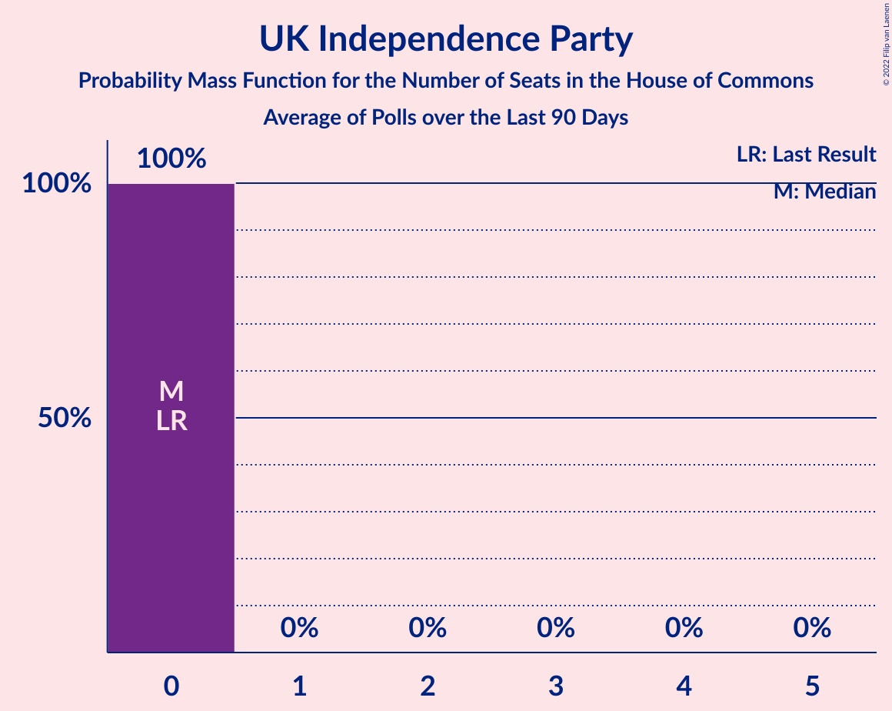

| Number of Seats | Probability | Accumulated | Special Marks |
|:---------------:|:-----------:|:-----------:|:-------------:|
| 0 | 22% | 100% | Last Result |
| 1 | 73% | 78% | Median |
| 2 | 4% | 4% |  |
| 3 | 0% | 0% |  |

### Green Party

*For a full overview of the results for this party, see the [Green Party](party-greenparty.html) page.*

| Number of Seats | Probability | Accumulated | Special Marks |
|:---------------:|:-----------:|:-----------:|:-------------:|
| 1 | 80% | 100% | Last Result, Median |
| 2 | 18% | 20% |  |
| 3 | 3% | 3% |  |
| 4 | 0.1% | 0.1% |  |
| 5 | 0% | 0% |  |

### Plaid Cymru

*For a full overview of the results for this party, see the [Plaid Cymru](party-plaidcymru.html) page.*

| Number of Seats | Probability | Accumulated | Special Marks |
|:---------------:|:-----------:|:-----------:|:-------------:|
| 0 | 11% | 100% |  |
| 1 | 4% | 89% |  |
| 2 | 3% | 85% |  |
| 3 | 4% | 82% |  |
| 4 | 19% | 78% | Last Result |
| 5 | 49% | 59% | Median |
| 6 | 3% | 11% |  |
| 7 | 1.2% | 8% |  |
| 8 | 6% | 7% |  |
| 9 | 0.4% | 0.7% |  |
| 10 | 0.2% | 0.3% |  |
| 11 | 0% | 0.1% |  |
| 12 | 0% | 0.1% |  |
| 13 | 0% | 0% |  |

## Coalitions

### Confidence Intervals

| Coalition | Last Result | Median | Majority? | 80% Confidence Interval | 90% Confidence Interval | 95% Confidence Interval | 99% Confidence Interval |
|:---------:|:-----------:|:------:|:---------:|:-----------------------:|:-----------------------:|:-----------------------:|:-----------------------:|
| Conservative Party – Scottish National Party – Plaid Cymru | 356 | 335 | 63% | 309–367 | 303–375 | 297–385 | 283–399 |
| Labour Party – Liberal Democrats – Scottish National Party – Plaid Cymru | 313 | 343 | 80% | 312–372 | 302–377 | 296–383 | 282–391 |
| Conservative Party – Scottish National Party | 352 | 330 | 58% | 306–363 | 300–372 | 294–383 | 282–397 |
| Labour Party – Liberal Democrats – Scottish National Party | 309 | 340 | 77% | 308–368 | 299–374 | 292–378 | 280–386 |
| Labour Party – Scottish National Party – Plaid Cymru | 301 | 325 | 50% | 297–352 | 288–359 | 283–365 | 274–375 |
| Labour Party – Scottish National Party | 297 | 323 | 45% | 292–348 | 284–355 | 279–360 | 270–370 |
| Conservative Party – Liberal Democrats | 329 | 304 | 16% | 277–333 | 270–342 | 265–347 | 255–356 |
| Conservative Party – Plaid Cymru | 321 | 289 | 8% | 261–322 | 256–331 | 251–338 | 243–350 |
| Labour Party – Liberal Democrats – Plaid Cymru | 278 | 299 | 8% | 267–323 | 258–330 | 247–335 | 233–347 |
| Conservative Party | 317 | 286 | 6% | 258–318 | 252–328 | 247–334 | 239–348 |
| Labour Party – Liberal Democrats | 274 | 295 | 5% | 263–320 | 255–326 | 244–332 | 231–346 |
| Labour Party – Plaid Cymru | 266 | 281 | 0.4% | 251–303 | 243–309 | 240–314 | 230–325 |
| Labour Party | 262 | 276 | 0.3% | 246–300 | 239–306 | 235–310 | 227–322 |

### Conservative Party – Scottish National Party – Plaid Cymru

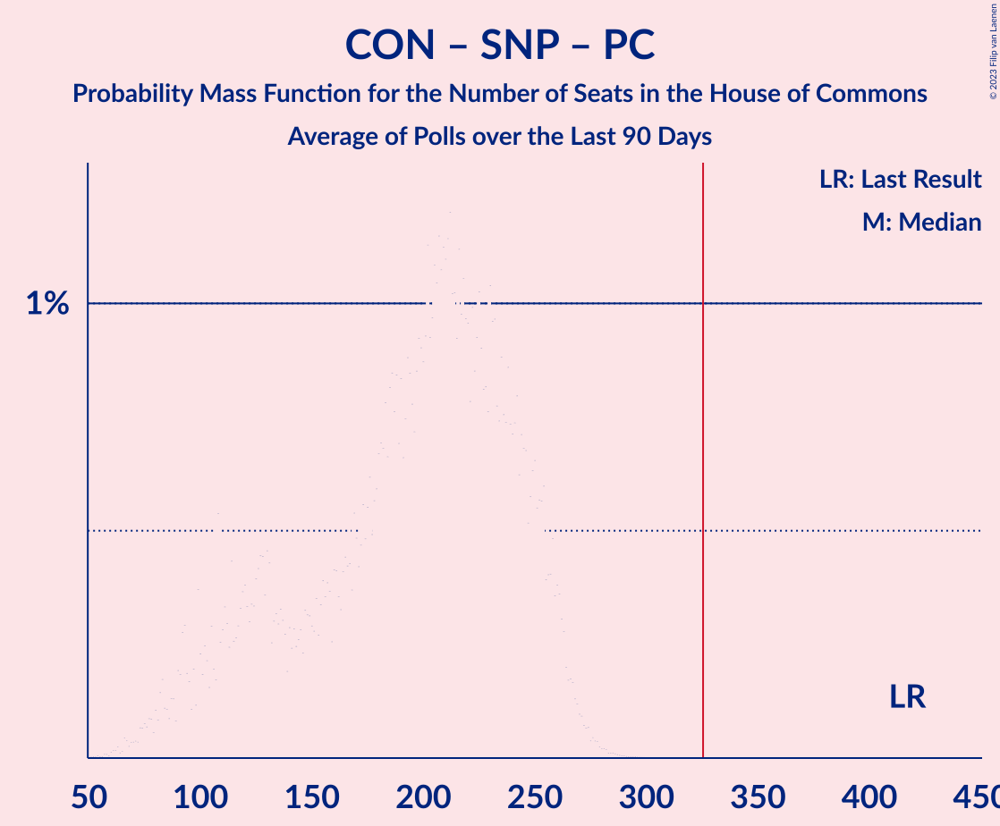

| Number of Seats | Probability | Accumulated | Special Marks |
|:---------------:|:-----------:|:-----------:|:-------------:|
| 268 | 0% | 100% |  |
| 269 | 0% | 99.9% |  |
| 270 | 0% | 99.9% |  |
| 271 | 0% | 99.9% |  |
| 272 | 0% | 99.9% |  |
| 273 | 0.1% | 99.9% |  |
| 274 | 0% | 99.8% |  |
| 275 | 0% | 99.8% |  |
| 276 | 0% | 99.8% |  |
| 277 | 0% | 99.8% |  |
| 278 | 0% | 99.8% |  |
| 279 | 0% | 99.7% |  |
| 280 | 0% | 99.7% |  |
| 281 | 0% | 99.7% |  |
| 282 | 0% | 99.6% |  |
| 283 | 0.1% | 99.6% |  |
| 284 | 0% | 99.5% |  |
| 285 | 0.1% | 99.5% |  |
| 286 | 0.1% | 99.3% |  |
| 287 | 0.2% | 99.2% |  |
| 288 | 0.1% | 99.0% |  |
| 289 | 0.1% | 98.9% |  |
| 290 | 0.1% | 98.9% |  |
| 291 | 0.2% | 98.8% |  |
| 292 | 0.2% | 98.6% |  |
| 293 | 0.1% | 98% |  |
| 294 | 0.2% | 98% |  |
| 295 | 0.2% | 98% |  |
| 296 | 0.3% | 98% |  |
| 297 | 0.2% | 98% |  |
| 298 | 0.3% | 97% |  |
| 299 | 0.4% | 97% |  |
| 300 | 0.5% | 97% |  |
| 301 | 0.6% | 96% |  |
| 302 | 0.3% | 96% |  |
| 303 | 0.4% | 95% |  |
| 304 | 0.7% | 95% |  |
| 305 | 0.9% | 94% |  |
| 306 | 0.8% | 93% |  |
| 307 | 0.8% | 93% |  |
| 308 | 0.8% | 92% |  |
| 309 | 1.2% | 91% |  |
| 310 | 1.1% | 90% |  |
| 311 | 2% | 89% |  |
| 312 | 1.3% | 87% |  |
| 313 | 1.3% | 85% |  |
| 314 | 2% | 84% |  |
| 315 | 2% | 83% |  |
| 316 | 2% | 81% |  |
| 317 | 2% | 79% |  |
| 318 | 2% | 76% |  |
| 319 | 1.1% | 75% |  |
| 320 | 1.5% | 73% |  |
| 321 | 2% | 72% |  |
| 322 | 2% | 70% |  |
| 323 | 2% | 68% |  |
| 324 | 2% | 66% |  |
| 325 | 1.5% | 64% |  |
| 326 | 2% | 63% | Majority |
| 327 | 1.2% | 61% |  |
| 328 | 1.1% | 60% |  |
| 329 | 1.5% | 59% |  |
| 330 | 1.4% | 58% |  |
| 331 | 0.9% | 56% |  |
| 332 | 2% | 55% |  |
| 333 | 1.4% | 53% |  |
| 334 | 2% | 52% |  |
| 335 | 2% | 50% |  |
| 336 | 1.2% | 49% |  |
| 337 | 1.1% | 47% |  |
| 338 | 0.7% | 46% |  |
| 339 | 1.1% | 46% |  |
| 340 | 1.1% | 44% |  |
| 341 | 1.2% | 43% |  |
| 342 | 1.0% | 42% | Median |
| 343 | 0.7% | 41% |  |
| 344 | 1.0% | 40% |  |
| 345 | 0.7% | 39% |  |
| 346 | 1.1% | 39% |  |
| 347 | 1.0% | 38% |  |
| 348 | 0.9% | 37% |  |
| 349 | 0.9% | 36% |  |
| 350 | 1.0% | 35% |  |
| 351 | 1.1% | 34% |  |
| 352 | 0.8% | 33% |  |
| 353 | 1.1% | 32% |  |
| 354 | 0.8% | 31% |  |
| 355 | 1.2% | 30% |  |
| 356 | 0.8% | 29% | Last Result |
| 357 | 1.1% | 28% |  |
| 358 | 10% | 27% |  |
| 359 | 0.9% | 17% |  |
| 360 | 0.8% | 16% |  |
| 361 | 0.8% | 15% |  |
| 362 | 0.7% | 14% |  |
| 363 | 1.2% | 14% |  |
| 364 | 0.8% | 13% |  |
| 365 | 0.7% | 12% |  |
| 366 | 0.7% | 11% |  |
| 367 | 0.9% | 10% |  |
| 368 | 0.6% | 10% |  |
| 369 | 0.6% | 9% |  |
| 370 | 0.4% | 8% |  |
| 371 | 0.9% | 8% |  |
| 372 | 0.6% | 7% |  |
| 373 | 0.8% | 6% |  |
| 374 | 0.4% | 6% |  |
| 375 | 0.4% | 5% |  |
| 376 | 0.3% | 5% |  |
| 377 | 0.3% | 4% |  |
| 378 | 0.4% | 4% |  |
| 379 | 0.2% | 4% |  |
| 380 | 0.1% | 4% |  |
| 381 | 0.2% | 3% |  |
| 382 | 0.3% | 3% |  |
| 383 | 0.2% | 3% |  |
| 384 | 0.1% | 3% |  |
| 385 | 0.1% | 3% |  |
| 386 | 0.1% | 2% |  |
| 387 | 0.1% | 2% |  |
| 388 | 0.2% | 2% |  |
| 389 | 0.1% | 2% |  |
| 390 | 0.3% | 2% |  |
| 391 | 0.2% | 2% |  |
| 392 | 0.1% | 1.4% |  |
| 393 | 0.2% | 1.3% |  |
| 394 | 0.1% | 1.2% |  |
| 395 | 0.2% | 1.1% |  |
| 396 | 0.1% | 0.9% |  |
| 397 | 0.2% | 0.8% |  |
| 398 | 0.1% | 0.6% |  |
| 399 | 0.2% | 0.5% |  |
| 400 | 0.1% | 0.4% |  |
| 401 | 0.1% | 0.3% |  |
| 402 | 0% | 0.2% |  |
| 403 | 0% | 0.2% |  |
| 404 | 0% | 0.2% |  |
| 405 | 0% | 0.1% |  |
| 406 | 0% | 0.1% |  |
| 407 | 0% | 0.1% |  |
| 408 | 0% | 0.1% |  |
| 409 | 0% | 0.1% |  |
| 410 | 0% | 0.1% |  |
| 411 | 0% | 0% |  |

### Labour Party – Liberal Democrats – Scottish National Party – Plaid Cymru

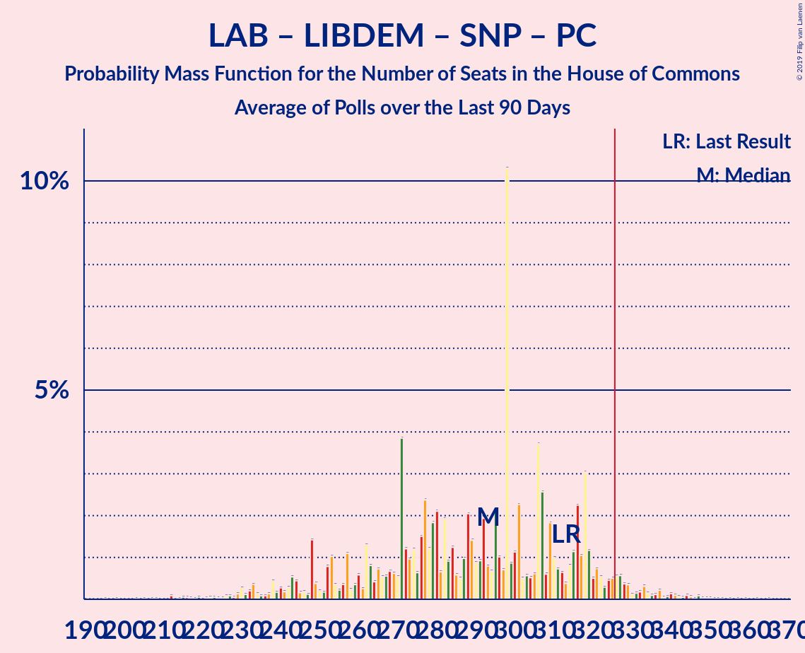

| Number of Seats | Probability | Accumulated | Special Marks |
|:---------------:|:-----------:|:-----------:|:-------------:|
| 267 | 0% | 100% |  |
| 268 | 0% | 99.9% |  |
| 269 | 0% | 99.9% |  |
| 270 | 0% | 99.9% |  |
| 271 | 0% | 99.9% |  |
| 272 | 0% | 99.9% |  |
| 273 | 0% | 99.9% |  |
| 274 | 0% | 99.9% |  |
| 275 | 0% | 99.9% |  |
| 276 | 0.1% | 99.8% |  |
| 277 | 0% | 99.8% |  |
| 278 | 0% | 99.7% |  |
| 279 | 0.1% | 99.7% |  |
| 280 | 0% | 99.6% |  |
| 281 | 0.1% | 99.6% |  |
| 282 | 0% | 99.5% |  |
| 283 | 0.1% | 99.5% |  |
| 284 | 0.1% | 99.4% |  |
| 285 | 0.1% | 99.3% |  |
| 286 | 0.1% | 99.2% |  |
| 287 | 0.1% | 99.1% |  |
| 288 | 0.1% | 99.0% |  |
| 289 | 0.2% | 98.9% |  |
| 290 | 0.3% | 98.7% |  |
| 291 | 0.1% | 98% |  |
| 292 | 0.2% | 98% |  |
| 293 | 0.1% | 98% |  |
| 294 | 0.2% | 98% |  |
| 295 | 0.3% | 98% |  |
| 296 | 0.3% | 98% |  |
| 297 | 0.3% | 97% |  |
| 298 | 0.4% | 97% |  |
| 299 | 0.4% | 97% |  |
| 300 | 0.3% | 96% |  |
| 301 | 0.6% | 96% |  |
| 302 | 0.4% | 95% |  |
| 303 | 0.2% | 95% |  |
| 304 | 0.6% | 95% |  |
| 305 | 0.3% | 94% |  |
| 306 | 0.4% | 94% |  |
| 307 | 0.6% | 93% |  |
| 308 | 0.4% | 93% |  |
| 309 | 0.6% | 92% |  |
| 310 | 0.4% | 92% |  |
| 311 | 0.8% | 91% |  |
| 312 | 0.9% | 91% |  |
| 313 | 0.6% | 90% | Last Result |
| 314 | 0.5% | 89% |  |
| 315 | 0.5% | 89% |  |
| 316 | 0.8% | 88% |  |
| 317 | 0.6% | 87% |  |
| 318 | 0.8% | 87% |  |
| 319 | 0.5% | 86% |  |
| 320 | 0.6% | 85% |  |
| 321 | 1.2% | 85% |  |
| 322 | 0.9% | 83% |  |
| 323 | 0.6% | 83% |  |
| 324 | 0.8% | 82% |  |
| 325 | 0.7% | 81% |  |
| 326 | 0.6% | 80% | Majority |
| 327 | 0.8% | 80% |  |
| 328 | 0.6% | 79% |  |
| 329 | 1.0% | 78% |  |
| 330 | 2% | 77% |  |
| 331 | 1.1% | 76% |  |
| 332 | 0.6% | 75% |  |
| 333 | 11% | 74% |  |
| 334 | 1.1% | 63% |  |
| 335 | 1.4% | 62% |  |
| 336 | 0.9% | 61% |  |
| 337 | 1.5% | 60% |  |
| 338 | 1.0% | 59% |  |
| 339 | 2% | 57% |  |
| 340 | 2% | 56% |  |
| 341 | 2% | 54% |  |
| 342 | 1.1% | 52% |  |
| 343 | 1.3% | 51% |  |
| 344 | 2% | 50% |  |
| 345 | 2% | 48% |  |
| 346 | 2% | 46% |  |
| 347 | 2% | 44% |  |
| 348 | 2% | 42% |  |
| 349 | 0.9% | 40% |  |
| 350 | 1.0% | 39% | Median |
| 351 | 1.2% | 38% |  |
| 352 | 2% | 37% |  |
| 353 | 2% | 35% |  |
| 354 | 1.1% | 33% |  |
| 355 | 1.1% | 32% |  |
| 356 | 2% | 31% |  |
| 357 | 1.0% | 30% |  |
| 358 | 1.4% | 29% |  |
| 359 | 0.6% | 27% |  |
| 360 | 1.4% | 27% |  |
| 361 | 1.3% | 25% |  |
| 362 | 1.0% | 24% |  |
| 363 | 1.3% | 23% |  |
| 364 | 1.3% | 22% |  |
| 365 | 1.4% | 20% |  |
| 366 | 1.5% | 19% |  |
| 367 | 2% | 18% |  |
| 368 | 0.7% | 16% |  |
| 369 | 1.3% | 15% |  |
| 370 | 1.3% | 14% |  |
| 371 | 2% | 13% |  |
| 372 | 0.9% | 10% |  |
| 373 | 1.0% | 9% |  |
| 374 | 0.9% | 8% |  |
| 375 | 0.9% | 7% |  |
| 376 | 1.1% | 7% |  |
| 377 | 0.5% | 6% |  |
| 378 | 0.5% | 5% |  |
| 379 | 0.7% | 5% |  |
| 380 | 0.5% | 4% |  |
| 381 | 0.4% | 3% |  |
| 382 | 0.3% | 3% |  |
| 383 | 0.4% | 3% |  |
| 384 | 0.4% | 2% |  |
| 385 | 0.3% | 2% |  |
| 386 | 0.3% | 2% |  |
| 387 | 0.2% | 1.3% |  |
| 388 | 0.3% | 1.1% |  |
| 389 | 0.1% | 0.8% |  |
| 390 | 0.1% | 0.6% |  |
| 391 | 0.1% | 0.6% |  |
| 392 | 0.1% | 0.4% |  |
| 393 | 0.1% | 0.4% |  |
| 394 | 0% | 0.3% |  |
| 395 | 0.1% | 0.3% |  |
| 396 | 0% | 0.2% |  |
| 397 | 0% | 0.2% |  |
| 398 | 0% | 0.1% |  |
| 399 | 0% | 0.1% |  |
| 400 | 0% | 0.1% |  |
| 401 | 0% | 0.1% |  |
| 402 | 0% | 0.1% |  |
| 403 | 0% | 0% |  |

### Conservative Party – Scottish National Party

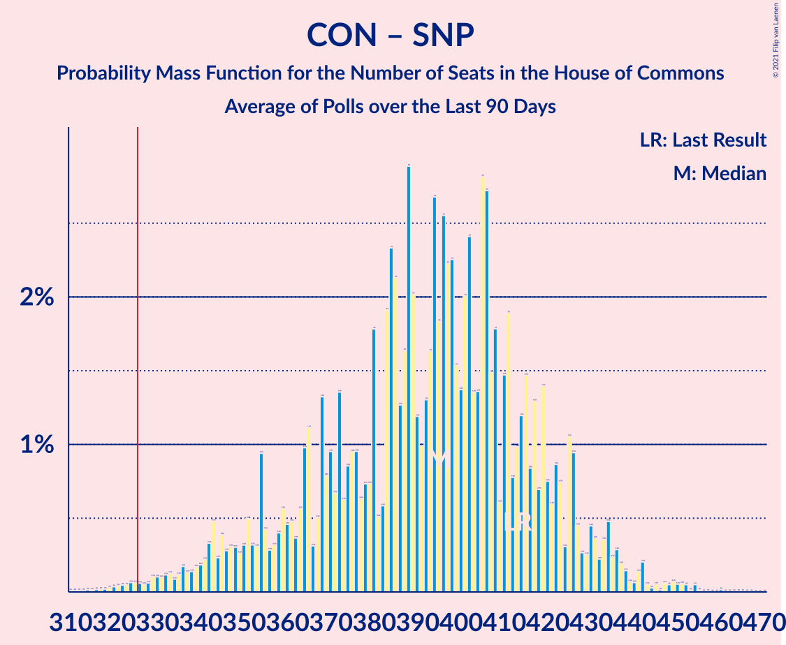

| Number of Seats | Probability | Accumulated | Special Marks |
|:---------------:|:-----------:|:-----------:|:-------------:|
| 268 | 0% | 100% |  |
| 269 | 0% | 99.9% |  |
| 270 | 0% | 99.9% |  |
| 271 | 0% | 99.9% |  |
| 272 | 0.1% | 99.9% |  |
| 273 | 0% | 99.8% |  |
| 274 | 0% | 99.8% |  |
| 275 | 0% | 99.8% |  |
| 276 | 0% | 99.8% |  |
| 277 | 0% | 99.8% |  |
| 278 | 0% | 99.7% |  |
| 279 | 0% | 99.7% |  |
| 280 | 0.1% | 99.7% |  |
| 281 | 0% | 99.6% |  |
| 282 | 0.1% | 99.5% |  |
| 283 | 0.1% | 99.5% |  |
| 284 | 0.1% | 99.4% |  |
| 285 | 0.2% | 99.3% |  |
| 286 | 0.2% | 99.2% |  |
| 287 | 0.1% | 98.9% |  |
| 288 | 0.1% | 98.8% |  |
| 289 | 0.1% | 98.7% |  |
| 290 | 0.2% | 98.6% |  |
| 291 | 0.2% | 98% |  |
| 292 | 0.2% | 98% |  |
| 293 | 0.3% | 98% |  |
| 294 | 0.2% | 98% |  |
| 295 | 0.5% | 97% |  |
| 296 | 0.4% | 97% |  |
| 297 | 0.3% | 97% |  |
| 298 | 0.4% | 96% |  |
| 299 | 0.6% | 96% |  |
| 300 | 0.6% | 95% |  |
| 301 | 0.9% | 95% |  |
| 302 | 0.6% | 94% |  |
| 303 | 0.9% | 93% |  |
| 304 | 1.0% | 92% |  |
| 305 | 0.7% | 91% |  |
| 306 | 0.9% | 91% |  |
| 307 | 1.1% | 90% |  |
| 308 | 0.8% | 89% |  |
| 309 | 2% | 88% |  |
| 310 | 2% | 86% |  |
| 311 | 2% | 84% |  |
| 312 | 2% | 82% |  |
| 313 | 2% | 80% |  |
| 314 | 2% | 78% |  |
| 315 | 2% | 76% |  |
| 316 | 2% | 75% |  |
| 317 | 2% | 73% |  |
| 318 | 2% | 71% |  |
| 319 | 1.2% | 69% |  |
| 320 | 2% | 68% |  |
| 321 | 2% | 66% |  |
| 322 | 2% | 64% |  |
| 323 | 2% | 62% |  |
| 324 | 2% | 61% |  |
| 325 | 2% | 59% |  |
| 326 | 1.2% | 58% | Majority |
| 327 | 2% | 56% |  |
| 328 | 1.4% | 55% |  |
| 329 | 2% | 53% |  |
| 330 | 2% | 51% |  |
| 331 | 1.2% | 49% |  |
| 332 | 1.3% | 48% |  |
| 333 | 0.7% | 47% |  |
| 334 | 1.3% | 46% |  |
| 335 | 1.2% | 45% |  |
| 336 | 1.3% | 43% |  |
| 337 | 1.1% | 42% | Median |
| 338 | 0.6% | 41% |  |
| 339 | 0.8% | 40% |  |
| 340 | 0.6% | 40% |  |
| 341 | 1.2% | 39% |  |
| 342 | 1.0% | 38% |  |
| 343 | 0.9% | 37% |  |
| 344 | 0.9% | 36% |  |
| 345 | 1.0% | 35% |  |
| 346 | 0.9% | 34% |  |
| 347 | 0.8% | 33% |  |
| 348 | 1.3% | 32% |  |
| 349 | 0.7% | 31% |  |
| 350 | 1.1% | 30% |  |
| 351 | 0.8% | 29% |  |
| 352 | 1.1% | 28% | Last Result |
| 353 | 0.7% | 27% |  |
| 354 | 10% | 27% |  |
| 355 | 0.6% | 16% |  |
| 356 | 0.5% | 16% |  |
| 357 | 0.7% | 15% |  |
| 358 | 0.8% | 15% |  |
| 359 | 1.2% | 14% |  |
| 360 | 0.8% | 12% |  |
| 361 | 0.6% | 12% |  |
| 362 | 0.9% | 11% |  |
| 363 | 0.8% | 10% |  |
| 364 | 0.5% | 9% |  |
| 365 | 0.4% | 9% |  |
| 366 | 0.7% | 9% |  |
| 367 | 0.5% | 8% |  |
| 368 | 0.7% | 7% |  |
| 369 | 0.7% | 7% |  |
| 370 | 0.3% | 6% |  |
| 371 | 0.6% | 6% |  |
| 372 | 0.3% | 5% |  |
| 373 | 0.5% | 5% |  |
| 374 | 0.3% | 4% |  |
| 375 | 0.2% | 4% |  |
| 376 | 0.3% | 4% |  |
| 377 | 0.2% | 4% |  |
| 378 | 0.2% | 3% |  |
| 379 | 0.1% | 3% |  |
| 380 | 0.1% | 3% |  |
| 381 | 0.1% | 3% |  |
| 382 | 0.3% | 3% |  |
| 383 | 0.2% | 3% |  |
| 384 | 0.1% | 2% |  |
| 385 | 0.1% | 2% |  |
| 386 | 0.3% | 2% |  |
| 387 | 0.1% | 2% |  |
| 388 | 0.2% | 2% |  |
| 389 | 0.2% | 1.4% |  |
| 390 | 0.1% | 1.3% |  |
| 391 | 0.1% | 1.2% |  |
| 392 | 0.1% | 1.1% |  |
| 393 | 0.1% | 1.0% |  |
| 394 | 0.1% | 0.9% |  |
| 395 | 0.1% | 0.7% |  |
| 396 | 0.1% | 0.6% |  |
| 397 | 0.1% | 0.6% |  |
| 398 | 0.1% | 0.4% |  |
| 399 | 0% | 0.3% |  |
| 400 | 0.1% | 0.3% |  |
| 401 | 0% | 0.2% |  |
| 402 | 0% | 0.2% |  |
| 403 | 0% | 0.2% |  |
| 404 | 0% | 0.1% |  |
| 405 | 0% | 0.1% |  |
| 406 | 0% | 0.1% |  |
| 407 | 0% | 0.1% |  |
| 408 | 0% | 0.1% |  |
| 409 | 0% | 0% |  |

### Labour Party – Liberal Democrats – Scottish National Party

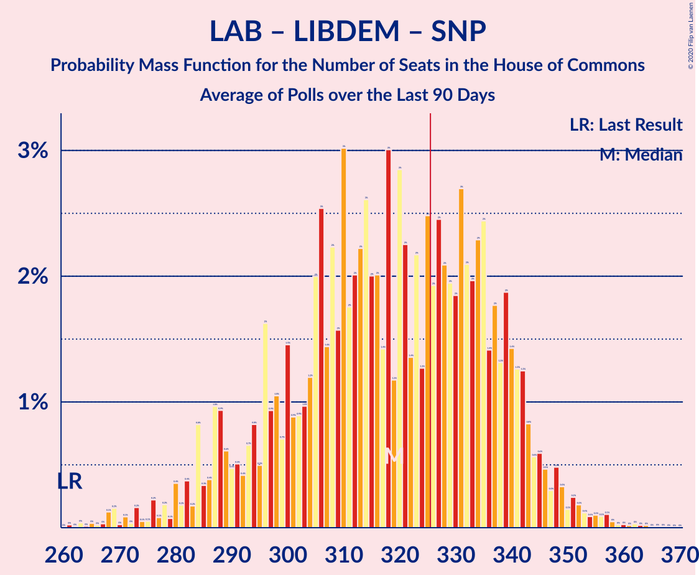

| Number of Seats | Probability | Accumulated | Special Marks |
|:---------------:|:-----------:|:-----------:|:-------------:|
| 266 | 0% | 100% |  |
| 267 | 0% | 99.9% |  |
| 268 | 0% | 99.9% |  |
| 269 | 0% | 99.9% |  |
| 270 | 0% | 99.9% |  |
| 271 | 0% | 99.9% |  |
| 272 | 0% | 99.9% |  |
| 273 | 0% | 99.8% |  |
| 274 | 0% | 99.8% |  |
| 275 | 0.1% | 99.8% |  |
| 276 | 0% | 99.7% |  |
| 277 | 0.1% | 99.7% |  |
| 278 | 0% | 99.6% |  |
| 279 | 0% | 99.6% |  |
| 280 | 0.2% | 99.5% |  |
| 281 | 0.1% | 99.4% |  |
| 282 | 0.1% | 99.3% |  |
| 283 | 0.1% | 99.2% |  |
| 284 | 0.1% | 99.2% |  |
| 285 | 0.2% | 99.1% |  |
| 286 | 0.1% | 98.8% |  |
| 287 | 0.2% | 98.7% |  |
| 288 | 0.2% | 98.5% |  |
| 289 | 0.1% | 98% |  |
| 290 | 0.2% | 98% |  |
| 291 | 0.3% | 98% |  |
| 292 | 0.2% | 98% |  |
| 293 | 0.4% | 97% |  |
| 294 | 0.4% | 97% |  |
| 295 | 0.4% | 97% |  |
| 296 | 0.4% | 96% |  |
| 297 | 0.4% | 96% |  |
| 298 | 0.3% | 95% |  |
| 299 | 0.4% | 95% |  |
| 300 | 0.4% | 95% |  |
| 301 | 0.6% | 94% |  |
| 302 | 0.4% | 94% |  |
| 303 | 0.4% | 93% |  |
| 304 | 0.8% | 93% |  |
| 305 | 0.4% | 92% |  |
| 306 | 0.6% | 92% |  |
| 307 | 0.5% | 91% |  |
| 308 | 1.0% | 91% |  |
| 309 | 0.4% | 90% | Last Result |
| 310 | 0.7% | 89% |  |
| 311 | 1.0% | 88% |  |
| 312 | 0.5% | 88% |  |
| 313 | 0.7% | 87% |  |
| 314 | 0.5% | 86% |  |
| 315 | 0.4% | 86% |  |
| 316 | 1.1% | 85% |  |
| 317 | 0.8% | 84% |  |
| 318 | 1.0% | 84% |  |
| 319 | 0.7% | 83% |  |
| 320 | 0.6% | 82% |  |
| 321 | 0.9% | 81% |  |
| 322 | 0.8% | 80% |  |
| 323 | 0.7% | 79% |  |
| 324 | 1.0% | 79% |  |
| 325 | 1.0% | 78% |  |
| 326 | 1.0% | 77% | Majority |
| 327 | 0.8% | 76% |  |
| 328 | 0.6% | 75% |  |
| 329 | 10% | 74% |  |
| 330 | 1.4% | 64% |  |
| 331 | 1.2% | 63% |  |
| 332 | 1.2% | 61% |  |
| 333 | 1.2% | 60% |  |
| 334 | 1.4% | 59% |  |
| 335 | 1.0% | 58% |  |
| 336 | 0.8% | 57% |  |
| 337 | 1.5% | 56% |  |
| 338 | 1.0% | 54% |  |
| 339 | 2% | 53% |  |
| 340 | 2% | 52% |  |
| 341 | 2% | 50% |  |
| 342 | 1.2% | 48% |  |
| 343 | 2% | 47% |  |
| 344 | 2% | 45% |  |
| 345 | 2% | 43% | Median |
| 346 | 2% | 42% |  |
| 347 | 2% | 39% |  |
| 348 | 2% | 37% |  |
| 349 | 1.0% | 35% |  |
| 350 | 1.2% | 34% |  |
| 351 | 2% | 33% |  |
| 352 | 1.3% | 31% |  |
| 353 | 2% | 30% |  |
| 354 | 1.0% | 28% |  |
| 355 | 2% | 27% |  |
| 356 | 1.3% | 26% |  |
| 357 | 1.0% | 25% |  |
| 358 | 1.4% | 24% |  |
| 359 | 1.2% | 22% |  |
| 360 | 1.3% | 21% |  |
| 361 | 1.3% | 20% |  |
| 362 | 1.2% | 18% |  |
| 363 | 0.9% | 17% |  |
| 364 | 1.0% | 16% |  |
| 365 | 1.5% | 15% |  |
| 366 | 2% | 14% |  |
| 367 | 1.3% | 12% |  |
| 368 | 1.0% | 11% |  |
| 369 | 1.3% | 10% |  |
| 370 | 1.0% | 8% |  |
| 371 | 1.4% | 7% |  |
| 372 | 0.6% | 6% |  |
| 373 | 0.4% | 5% |  |
| 374 | 0.6% | 5% |  |
| 375 | 0.5% | 5% |  |
| 376 | 0.8% | 4% |  |
| 377 | 0.4% | 3% |  |
| 378 | 0.4% | 3% |  |
| 379 | 0.5% | 2% |  |
| 380 | 0.3% | 2% |  |
| 381 | 0.2% | 2% |  |
| 382 | 0.2% | 1.4% |  |
| 383 | 0.4% | 1.2% |  |
| 384 | 0.1% | 0.9% |  |
| 385 | 0.1% | 0.7% |  |
| 386 | 0.1% | 0.6% |  |
| 387 | 0.1% | 0.5% |  |
| 388 | 0.1% | 0.4% |  |
| 389 | 0.1% | 0.3% |  |
| 390 | 0.1% | 0.3% |  |
| 391 | 0% | 0.2% |  |
| 392 | 0% | 0.2% |  |
| 393 | 0% | 0.1% |  |
| 394 | 0% | 0.1% |  |
| 395 | 0% | 0.1% |  |
| 396 | 0% | 0.1% |  |
| 397 | 0% | 0.1% |  |
| 398 | 0% | 0% |  |

### Labour Party – Scottish National Party – Plaid Cymru

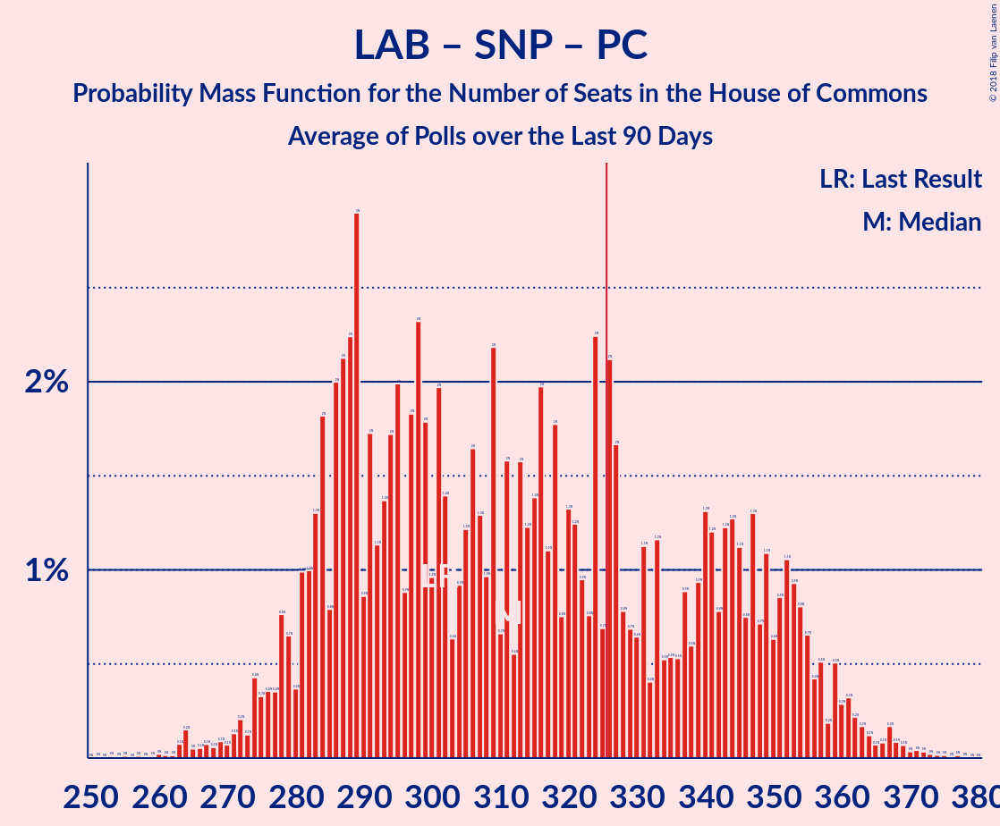

| Number of Seats | Probability | Accumulated | Special Marks |
|:---------------:|:-----------:|:-----------:|:-------------:|
| 263 | 0% | 100% |  |
| 264 | 0% | 99.9% |  |
| 265 | 0% | 99.9% |  |
| 266 | 0% | 99.9% |  |
| 267 | 0% | 99.9% |  |
| 268 | 0% | 99.9% |  |
| 269 | 0.1% | 99.8% |  |
| 270 | 0% | 99.8% |  |
| 271 | 0% | 99.8% |  |
| 272 | 0.1% | 99.7% |  |
| 273 | 0% | 99.7% |  |
| 274 | 0.2% | 99.6% |  |
| 275 | 0.1% | 99.5% |  |
| 276 | 0.1% | 99.4% |  |
| 277 | 0.1% | 99.3% |  |
| 278 | 0.3% | 99.1% |  |
| 279 | 0.4% | 98.9% |  |
| 280 | 0.2% | 98% |  |
| 281 | 0.3% | 98% |  |
| 282 | 0.3% | 98% |  |
| 283 | 0.4% | 98% |  |
| 284 | 0.4% | 97% |  |
| 285 | 0.3% | 97% |  |
| 286 | 0.6% | 97% |  |
| 287 | 0.6% | 96% |  |
| 288 | 0.8% | 95% |  |
| 289 | 0.5% | 95% |  |
| 290 | 0.4% | 94% |  |
| 291 | 0.5% | 94% |  |
| 292 | 0.9% | 93% |  |
| 293 | 0.6% | 92% |  |
| 294 | 0.5% | 92% |  |
| 295 | 0.5% | 91% |  |
| 296 | 0.5% | 91% |  |
| 297 | 0.8% | 90% |  |
| 298 | 0.6% | 89% |  |
| 299 | 0.7% | 89% |  |
| 300 | 1.3% | 88% |  |
| 301 | 0.9% | 87% | Last Result |
| 302 | 0.9% | 86% |  |
| 303 | 0.7% | 85% |  |
| 304 | 0.9% | 84% |  |
| 305 | 0.7% | 83% |  |
| 306 | 0.7% | 83% |  |
| 307 | 0.6% | 82% |  |
| 308 | 0.5% | 81% |  |
| 309 | 1.1% | 81% |  |
| 310 | 0.7% | 80% |  |
| 311 | 1.0% | 79% |  |
| 312 | 1.0% | 78% |  |
| 313 | 2% | 77% |  |
| 314 | 2% | 76% |  |
| 315 | 11% | 74% |  |
| 316 | 1.1% | 63% |  |
| 317 | 1.0% | 62% |  |
| 318 | 0.7% | 61% |  |
| 319 | 1.4% | 61% |  |
| 320 | 2% | 59% |  |
| 321 | 2% | 58% |  |
| 322 | 1.4% | 56% |  |
| 323 | 2% | 54% |  |
| 324 | 2% | 53% |  |
| 325 | 1.4% | 51% |  |
| 326 | 2% | 50% | Majority |
| 327 | 2% | 47% |  |
| 328 | 2% | 45% |  |
| 329 | 2% | 43% |  |
| 330 | 1.5% | 41% |  |
| 331 | 0.9% | 39% |  |
| 332 | 1.3% | 38% | Median |
| 333 | 2% | 37% |  |
| 334 | 2% | 35% |  |
| 335 | 1.4% | 33% |  |
| 336 | 1.0% | 31% |  |
| 337 | 1.4% | 31% |  |
| 338 | 1.2% | 29% |  |
| 339 | 2% | 28% |  |
| 340 | 1.2% | 26% |  |
| 341 | 2% | 25% |  |
| 342 | 0.9% | 23% |  |
| 343 | 0.9% | 23% |  |
| 344 | 2% | 22% |  |
| 345 | 1.3% | 20% |  |
| 346 | 2% | 19% |  |
| 347 | 1.5% | 17% |  |
| 348 | 1.1% | 15% |  |
| 349 | 1.0% | 14% |  |
| 350 | 1.2% | 13% |  |
| 351 | 1.0% | 12% |  |
| 352 | 1.0% | 11% |  |
| 353 | 0.7% | 10% |  |
| 354 | 0.9% | 9% |  |
| 355 | 0.9% | 8% |  |
| 356 | 0.8% | 7% |  |
| 357 | 0.7% | 7% |  |
| 358 | 0.4% | 6% |  |
| 359 | 0.5% | 6% |  |
| 360 | 0.6% | 5% |  |
| 361 | 0.4% | 4% |  |
| 362 | 0.3% | 4% |  |
| 363 | 0.4% | 4% |  |
| 364 | 0.6% | 3% |  |
| 365 | 0.3% | 3% |  |
| 366 | 0.2% | 2% |  |
| 367 | 0.2% | 2% |  |
| 368 | 0.4% | 2% |  |
| 369 | 0.4% | 2% |  |
| 370 | 0.2% | 1.3% |  |
| 371 | 0.1% | 1.1% |  |
| 372 | 0.1% | 1.0% |  |
| 373 | 0.2% | 0.9% |  |
| 374 | 0.1% | 0.7% |  |
| 375 | 0.2% | 0.6% |  |
| 376 | 0% | 0.4% |  |
| 377 | 0.1% | 0.4% |  |
| 378 | 0.1% | 0.3% |  |
| 379 | 0% | 0.2% |  |
| 380 | 0% | 0.2% |  |
| 381 | 0% | 0.2% |  |
| 382 | 0% | 0.2% |  |
| 383 | 0% | 0.1% |  |
| 384 | 0% | 0.1% |  |
| 385 | 0% | 0.1% |  |
| 386 | 0% | 0% |  |

### Labour Party – Scottish National Party

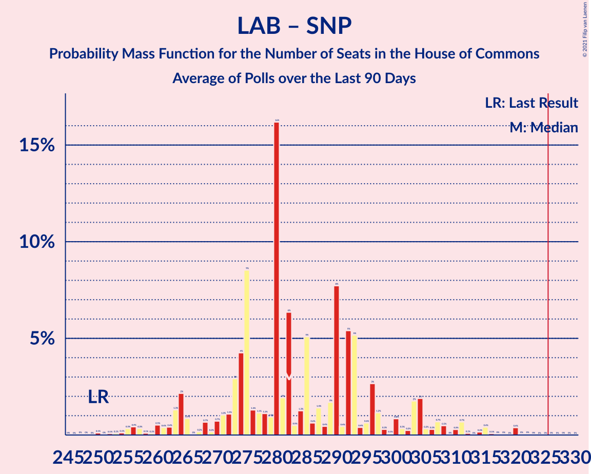

| Number of Seats | Probability | Accumulated | Special Marks |
|:---------------:|:-----------:|:-----------:|:-------------:|
| 259 | 0% | 100% |  |
| 260 | 0% | 99.9% |  |
| 261 | 0% | 99.9% |  |
| 262 | 0% | 99.9% |  |
| 263 | 0% | 99.9% |  |
| 264 | 0.1% | 99.9% |  |
| 265 | 0% | 99.8% |  |
| 266 | 0% | 99.8% |  |
| 267 | 0.1% | 99.8% |  |
| 268 | 0% | 99.7% |  |
| 269 | 0.1% | 99.6% |  |
| 270 | 0.1% | 99.6% |  |
| 271 | 0.2% | 99.5% |  |
| 272 | 0.2% | 99.3% |  |
| 273 | 0.3% | 99.2% |  |
| 274 | 0.4% | 98.9% |  |
| 275 | 0.1% | 98.5% |  |
| 276 | 0.3% | 98% |  |
| 277 | 0.2% | 98% |  |
| 278 | 0.3% | 98% |  |
| 279 | 0.5% | 98% |  |
| 280 | 0.3% | 97% |  |
| 281 | 0.5% | 97% |  |
| 282 | 0.5% | 96% |  |
| 283 | 0.6% | 96% |  |
| 284 | 0.8% | 95% |  |
| 285 | 0.4% | 95% |  |
| 286 | 0.5% | 94% |  |
| 287 | 0.9% | 94% |  |
| 288 | 0.6% | 93% |  |
| 289 | 0.5% | 92% |  |
| 290 | 0.6% | 92% |  |
| 291 | 0.4% | 91% |  |
| 292 | 0.7% | 91% |  |
| 293 | 0.9% | 90% |  |
| 294 | 0.4% | 89% |  |
| 295 | 0.9% | 89% |  |
| 296 | 0.8% | 88% |  |
| 297 | 1.2% | 87% | Last Result |
| 298 | 0.7% | 86% |  |
| 299 | 1.0% | 85% |  |
| 300 | 0.7% | 84% |  |
| 301 | 0.5% | 83% |  |
| 302 | 0.7% | 83% |  |
| 303 | 0.5% | 82% |  |
| 304 | 0.9% | 82% |  |
| 305 | 1.0% | 81% |  |
| 306 | 0.9% | 80% |  |
| 307 | 1.0% | 79% |  |
| 308 | 1.2% | 78% |  |
| 309 | 1.2% | 76% |  |
| 310 | 0.9% | 75% |  |
| 311 | 10% | 74% |  |
| 312 | 0.9% | 64% |  |
| 313 | 1.2% | 63% |  |
| 314 | 2% | 62% |  |
| 315 | 0.9% | 60% |  |
| 316 | 1.4% | 59% |  |
| 317 | 1.0% | 58% |  |
| 318 | 1.0% | 57% |  |
| 319 | 1.0% | 56% |  |
| 320 | 1.3% | 55% |  |
| 321 | 2% | 54% |  |
| 322 | 1.2% | 51% |  |
| 323 | 2% | 50% |  |
| 324 | 2% | 48% |  |
| 325 | 1.5% | 46% |  |
| 326 | 2% | 45% | Majority |
| 327 | 2% | 43% | Median |
| 328 | 3% | 41% |  |
| 329 | 3% | 38% |  |
| 330 | 2% | 36% |  |
| 331 | 1.5% | 34% |  |
| 332 | 1.4% | 32% |  |
| 333 | 2% | 31% |  |
| 334 | 2% | 29% |  |
| 335 | 1.3% | 28% |  |
| 336 | 1.1% | 26% |  |
| 337 | 1.2% | 25% |  |
| 338 | 1.1% | 24% |  |
| 339 | 2% | 23% |  |
| 340 | 1.3% | 21% |  |
| 341 | 2% | 20% |  |
| 342 | 2% | 18% |  |
| 343 | 1.1% | 16% |  |
| 344 | 2% | 15% |  |
| 345 | 1.0% | 14% |  |
| 346 | 1.1% | 13% |  |
| 347 | 1.0% | 12% |  |
| 348 | 0.7% | 11% |  |
| 349 | 1.1% | 10% |  |
| 350 | 1.0% | 9% |  |
| 351 | 1.1% | 8% |  |
| 352 | 0.6% | 7% |  |
| 353 | 0.3% | 6% |  |
| 354 | 0.7% | 6% |  |
| 355 | 0.6% | 5% |  |
| 356 | 0.5% | 5% |  |
| 357 | 0.4% | 4% |  |
| 358 | 0.4% | 4% |  |
| 359 | 0.5% | 3% |  |
| 360 | 0.4% | 3% |  |
| 361 | 0.3% | 2% |  |
| 362 | 0.1% | 2% |  |
| 363 | 0.4% | 2% |  |
| 364 | 0.3% | 2% |  |
| 365 | 0.2% | 1.3% |  |
| 366 | 0.1% | 1.1% |  |
| 367 | 0.1% | 1.0% |  |
| 368 | 0.2% | 0.9% |  |
| 369 | 0.1% | 0.7% |  |
| 370 | 0.2% | 0.6% |  |
| 371 | 0% | 0.4% |  |
| 372 | 0.1% | 0.4% |  |
| 373 | 0.1% | 0.3% |  |
| 374 | 0% | 0.2% |  |
| 375 | 0% | 0.2% |  |
| 376 | 0% | 0.2% |  |
| 377 | 0% | 0.2% |  |
| 378 | 0% | 0.1% |  |
| 379 | 0% | 0.1% |  |
| 380 | 0% | 0.1% |  |
| 381 | 0% | 0% |  |

### Conservative Party – Liberal Democrats

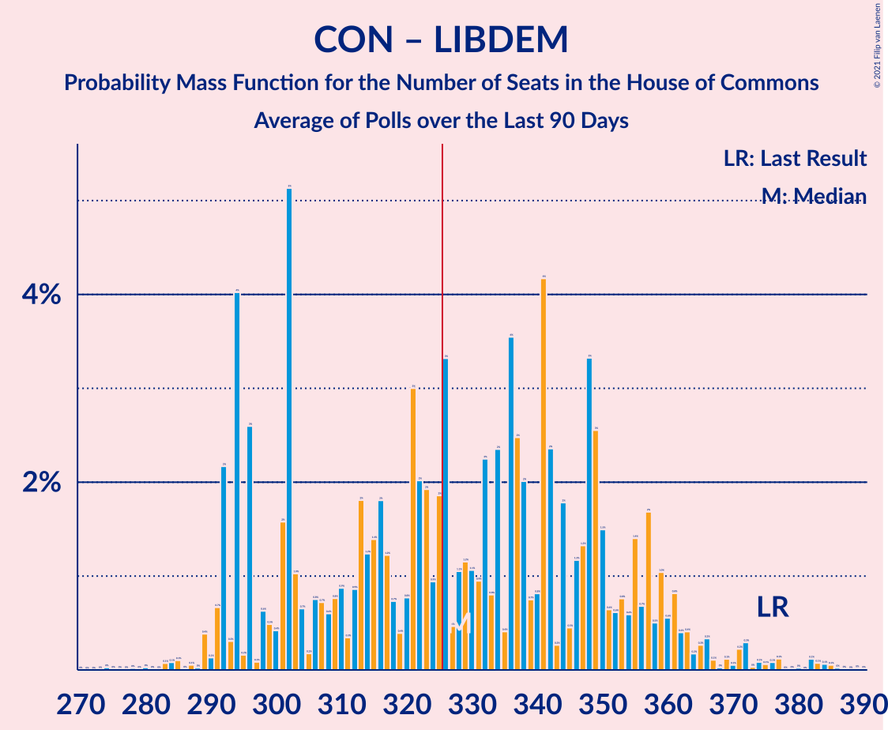

| Number of Seats | Probability | Accumulated | Special Marks |
|:---------------:|:-----------:|:-----------:|:-------------:|
| 245 | 0% | 100% |  |
| 246 | 0% | 99.9% |  |
| 247 | 0% | 99.9% |  |
| 248 | 0% | 99.9% |  |
| 249 | 0% | 99.8% |  |
| 250 | 0% | 99.8% |  |
| 251 | 0% | 99.8% |  |
| 252 | 0.1% | 99.8% |  |
| 253 | 0.1% | 99.7% |  |
| 254 | 0% | 99.6% |  |
| 255 | 0.3% | 99.6% |  |
| 256 | 0.1% | 99.3% |  |
| 257 | 0.2% | 99.3% |  |
| 258 | 0.2% | 99.1% |  |
| 259 | 0.1% | 98.9% |  |
| 260 | 0.2% | 98.8% |  |
| 261 | 0.5% | 98.6% |  |
| 262 | 0.2% | 98% |  |
| 263 | 0.2% | 98% |  |
| 264 | 0.2% | 98% |  |
| 265 | 0.4% | 98% |  |
| 266 | 0.6% | 97% |  |
| 267 | 0.4% | 97% |  |
| 268 | 0.3% | 96% |  |
| 269 | 0.3% | 96% |  |
| 270 | 0.7% | 95% |  |
| 271 | 0.5% | 95% |  |
| 272 | 0.4% | 94% |  |
| 273 | 0.9% | 94% |  |
| 274 | 0.9% | 93% |  |
| 275 | 0.8% | 92% |  |
| 276 | 0.8% | 91% |  |
| 277 | 1.0% | 91% |  |
| 278 | 0.7% | 90% |  |
| 279 | 1.1% | 89% |  |
| 280 | 1.2% | 88% |  |
| 281 | 1.1% | 87% |  |
| 282 | 1.1% | 85% |  |
| 283 | 1.2% | 84% |  |
| 284 | 2% | 83% |  |
| 285 | 1.2% | 81% |  |
| 286 | 2% | 80% |  |
| 287 | 0.9% | 78% |  |
| 288 | 1.2% | 77% |  |
| 289 | 2% | 76% |  |
| 290 | 1.2% | 74% |  |
| 291 | 1.4% | 73% |  |
| 292 | 1.1% | 72% |  |
| 293 | 1.3% | 70% |  |
| 294 | 1.2% | 69% |  |
| 295 | 2% | 68% |  |
| 296 | 3% | 66% |  |
| 297 | 1.0% | 64% |  |
| 298 | 1.3% | 63% |  |
| 299 | 1.2% | 61% |  |
| 300 | 2% | 60% |  |
| 301 | 2% | 58% |  |
| 302 | 2% | 56% |  |
| 303 | 2% | 54% |  |
| 304 | 2% | 52% | Median |
| 305 | 2% | 50% |  |
| 306 | 2% | 48% |  |
| 307 | 1.2% | 46% |  |
| 308 | 1.2% | 45% |  |
| 309 | 2% | 44% |  |
| 310 | 1.1% | 42% |  |
| 311 | 1.3% | 40% |  |
| 312 | 1.0% | 39% |  |
| 313 | 1.0% | 38% |  |
| 314 | 1.2% | 37% |  |
| 315 | 1.3% | 36% |  |
| 316 | 11% | 35% |  |
| 317 | 1.3% | 24% |  |
| 318 | 1.2% | 23% |  |
| 319 | 0.7% | 21% |  |
| 320 | 0.7% | 21% |  |
| 321 | 1.1% | 20% |  |
| 322 | 0.5% | 19% |  |
| 323 | 0.6% | 18% |  |
| 324 | 0.6% | 18% |  |
| 325 | 0.8% | 17% |  |
| 326 | 0.9% | 16% | Majority |
| 327 | 0.6% | 15% |  |
| 328 | 1.0% | 15% |  |
| 329 | 0.8% | 14% | Last Result |
| 330 | 1.3% | 13% |  |
| 331 | 0.7% | 12% |  |
| 332 | 0.5% | 11% |  |
| 333 | 0.9% | 11% |  |
| 334 | 0.5% | 10% |  |
| 335 | 0.5% | 9% |  |
| 336 | 0.5% | 9% |  |
| 337 | 0.6% | 8% |  |
| 338 | 0.8% | 8% |  |
| 339 | 0.5% | 7% |  |
| 340 | 0.4% | 6% |  |
| 341 | 0.5% | 6% |  |
| 342 | 0.5% | 5% |  |
| 343 | 0.9% | 5% |  |
| 344 | 0.6% | 4% |  |
| 345 | 0.2% | 3% |  |
| 346 | 0.4% | 3% |  |
| 347 | 0.4% | 3% |  |
| 348 | 0.2% | 2% |  |
| 349 | 0.3% | 2% |  |
| 350 | 0.2% | 2% |  |
| 351 | 0.4% | 2% |  |
| 352 | 0.3% | 1.1% |  |
| 353 | 0.1% | 0.8% |  |
| 354 | 0.1% | 0.7% |  |
| 355 | 0.1% | 0.6% |  |
| 356 | 0.1% | 0.5% |  |
| 357 | 0% | 0.4% |  |
| 358 | 0.1% | 0.3% |  |
| 359 | 0% | 0.3% |  |
| 360 | 0% | 0.2% |  |
| 361 | 0.1% | 0.2% |  |
| 362 | 0% | 0.2% |  |
| 363 | 0% | 0.1% |  |
| 364 | 0% | 0.1% |  |
| 365 | 0% | 0.1% |  |
| 366 | 0% | 0.1% |  |
| 367 | 0% | 0.1% |  |
| 368 | 0% | 0% |  |

### Conservative Party – Plaid Cymru

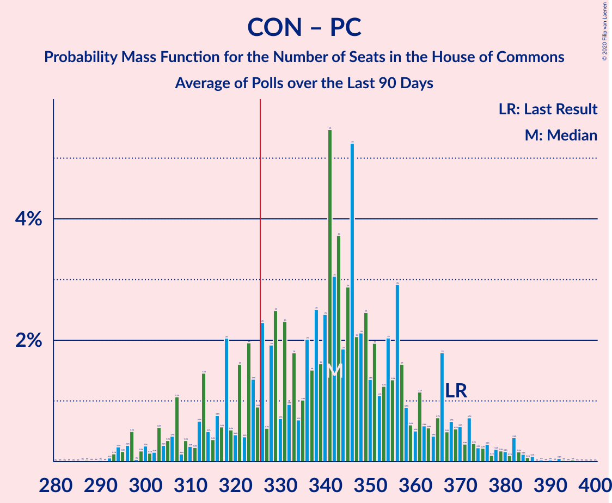

| Number of Seats | Probability | Accumulated | Special Marks |
|:---------------:|:-----------:|:-----------:|:-------------:|
| 233 | 0% | 100% |  |
| 234 | 0% | 99.9% |  |
| 235 | 0% | 99.9% |  |
| 236 | 0% | 99.9% |  |
| 237 | 0% | 99.9% |  |
| 238 | 0% | 99.8% |  |
| 239 | 0% | 99.8% |  |
| 240 | 0.1% | 99.8% |  |
| 241 | 0.1% | 99.7% |  |
| 242 | 0.1% | 99.6% |  |
| 243 | 0.1% | 99.6% |  |
| 244 | 0.2% | 99.5% |  |
| 245 | 0.1% | 99.3% |  |
| 246 | 0.2% | 99.2% |  |
| 247 | 0.3% | 99.0% |  |
| 248 | 0.2% | 98.7% |  |
| 249 | 0.3% | 98% |  |
| 250 | 0.4% | 98% |  |
| 251 | 0.5% | 98% |  |
| 252 | 0.3% | 97% |  |
| 253 | 0.4% | 97% |  |
| 254 | 0.9% | 97% |  |
| 255 | 0.6% | 96% |  |
| 256 | 0.5% | 95% |  |
| 257 | 0.4% | 95% |  |
| 258 | 0.6% | 94% |  |
| 259 | 2% | 94% |  |
| 260 | 0.9% | 92% |  |
| 261 | 1.2% | 91% |  |
| 262 | 1.1% | 90% |  |
| 263 | 1.4% | 89% |  |
| 264 | 2% | 87% |  |
| 265 | 1.3% | 86% |  |
| 266 | 1.1% | 85% |  |
| 267 | 1.1% | 83% |  |
| 268 | 1.3% | 82% |  |
| 269 | 1.2% | 81% |  |
| 270 | 2% | 80% |  |
| 271 | 1.2% | 78% |  |
| 272 | 1.1% | 77% |  |
| 273 | 1.2% | 76% |  |
| 274 | 1.2% | 75% |  |
| 275 | 1.5% | 74% |  |
| 276 | 1.0% | 72% |  |
| 277 | 2% | 71% |  |
| 278 | 2% | 70% |  |
| 279 | 1.2% | 68% |  |
| 280 | 1.1% | 66% |  |
| 281 | 2% | 65% |  |
| 282 | 2% | 64% |  |
| 283 | 2% | 62% |  |
| 284 | 2% | 59% |  |
| 285 | 1.5% | 57% |  |
| 286 | 1.5% | 56% |  |
| 287 | 2% | 54% |  |
| 288 | 2% | 53% |  |
| 289 | 2% | 51% |  |
| 290 | 1.3% | 49% |  |
| 291 | 1.4% | 48% | Median |
| 292 | 1.4% | 46% |  |
| 293 | 1.0% | 45% |  |
| 294 | 0.9% | 44% |  |
| 295 | 1.2% | 43% |  |
| 296 | 1.1% | 42% |  |
| 297 | 1.3% | 41% |  |
| 298 | 1.2% | 39% |  |
| 299 | 1.0% | 38% |  |
| 300 | 1.2% | 37% |  |
| 301 | 0.9% | 36% |  |
| 302 | 10% | 35% |  |
| 303 | 0.9% | 25% |  |
| 304 | 1.0% | 24% |  |
| 305 | 1.0% | 23% |  |
| 306 | 0.9% | 22% |  |
| 307 | 0.7% | 21% |  |
| 308 | 0.8% | 20% |  |
| 309 | 0.9% | 20% |  |
| 310 | 0.6% | 19% |  |
| 311 | 0.7% | 18% |  |
| 312 | 1.0% | 17% |  |
| 313 | 0.9% | 16% |  |
| 314 | 1.1% | 15% |  |
| 315 | 0.4% | 14% |  |
| 316 | 0.5% | 14% |  |
| 317 | 0.6% | 13% |  |
| 318 | 0.5% | 13% |  |
| 319 | 0.9% | 12% |  |
| 320 | 0.6% | 11% |  |
| 321 | 0.5% | 11% | Last Result |
| 322 | 0.8% | 10% |  |
| 323 | 0.8% | 9% |  |
| 324 | 0.6% | 9% |  |
| 325 | 0.3% | 8% |  |
| 326 | 0.7% | 8% | Majority |
| 327 | 0.4% | 7% |  |
| 328 | 0.4% | 7% |  |
| 329 | 0.6% | 6% |  |
| 330 | 0.3% | 6% |  |
| 331 | 0.4% | 5% |  |
| 332 | 0.3% | 5% |  |
| 333 | 0.3% | 5% |  |
| 334 | 0.4% | 4% |  |
| 335 | 0.4% | 4% |  |
| 336 | 0.4% | 3% |  |
| 337 | 0.4% | 3% |  |
| 338 | 0.2% | 3% |  |
| 339 | 0.3% | 2% |  |
| 340 | 0.2% | 2% |  |
| 341 | 0.1% | 2% |  |
| 342 | 0.2% | 2% |  |
| 343 | 0.2% | 1.5% |  |
| 344 | 0.1% | 1.3% |  |
| 345 | 0.2% | 1.1% |  |
| 346 | 0.1% | 0.9% |  |
| 347 | 0.1% | 0.8% |  |
| 348 | 0.1% | 0.8% |  |
| 349 | 0.1% | 0.7% |  |
| 350 | 0.2% | 0.6% |  |
| 351 | 0% | 0.5% |  |
| 352 | 0% | 0.4% |  |
| 353 | 0.1% | 0.4% |  |
| 354 | 0% | 0.3% |  |
| 355 | 0.1% | 0.3% |  |
| 356 | 0% | 0.2% |  |
| 357 | 0% | 0.2% |  |
| 358 | 0% | 0.2% |  |
| 359 | 0% | 0.1% |  |
| 360 | 0% | 0.1% |  |
| 361 | 0% | 0.1% |  |
| 362 | 0% | 0.1% |  |
| 363 | 0% | 0.1% |  |
| 364 | 0% | 0.1% |  |
| 365 | 0% | 0% |  |

### Labour Party – Liberal Democrats – Plaid Cymru

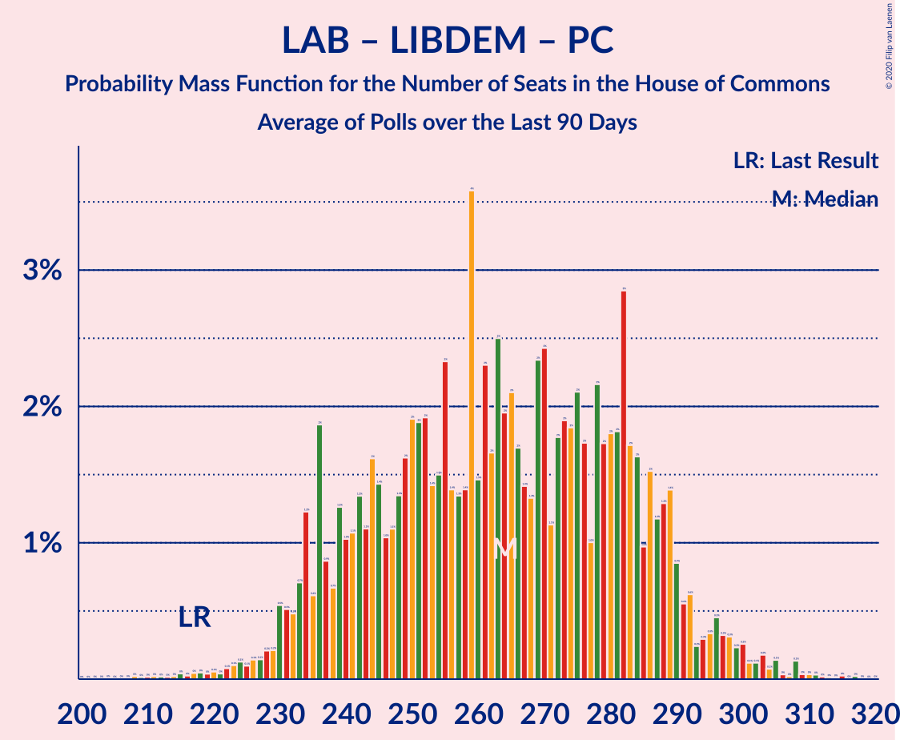

| Number of Seats | Probability | Accumulated | Special Marks |
|:---------------:|:-----------:|:-----------:|:-------------:|
| 222 | 0% | 100% |  |
| 223 | 0% | 99.9% |  |
| 224 | 0% | 99.9% |  |
| 225 | 0% | 99.9% |  |
| 226 | 0% | 99.9% |  |
| 227 | 0% | 99.9% |  |
| 228 | 0% | 99.8% |  |
| 229 | 0% | 99.8% |  |
| 230 | 0.1% | 99.8% |  |
| 231 | 0% | 99.7% |  |
| 232 | 0.1% | 99.7% |  |
| 233 | 0.1% | 99.6% |  |
| 234 | 0.1% | 99.4% |  |
| 235 | 0.1% | 99.4% |  |
| 236 | 0.1% | 99.3% |  |
| 237 | 0.1% | 99.1% |  |
| 238 | 0.1% | 99.0% |  |
| 239 | 0.1% | 98.9% |  |
| 240 | 0.1% | 98.8% |  |
| 241 | 0.2% | 98.7% |  |
| 242 | 0.2% | 98.6% |  |
| 243 | 0.1% | 98% |  |
| 244 | 0.3% | 98% |  |
| 245 | 0.1% | 98% |  |
| 246 | 0.1% | 98% |  |
| 247 | 0.3% | 98% |  |
| 248 | 0.2% | 97% |  |
| 249 | 0.1% | 97% |  |
| 250 | 0.1% | 97% |  |
| 251 | 0.2% | 97% |  |
| 252 | 0.2% | 97% |  |
| 253 | 0.2% | 97% |  |
| 254 | 0.3% | 96% |  |
| 255 | 0.2% | 96% |  |
| 256 | 0.3% | 96% |  |
| 257 | 0.5% | 96% |  |
| 258 | 0.2% | 95% |  |
| 259 | 0.6% | 95% |  |
| 260 | 0.3% | 94% |  |
| 261 | 0.7% | 94% |  |
| 262 | 0.6% | 93% |  |
| 263 | 0.6% | 93% |  |
| 264 | 0.5% | 92% |  |
| 265 | 0.4% | 91% |  |
| 266 | 0.4% | 91% |  |
| 267 | 0.8% | 91% |  |
| 268 | 0.9% | 90% |  |
| 269 | 0.6% | 89% |  |
| 270 | 0.9% | 88% |  |
| 271 | 0.8% | 87% |  |
| 272 | 1.1% | 87% |  |
| 273 | 0.8% | 85% |  |
| 274 | 0.5% | 85% |  |
| 275 | 0.6% | 84% |  |
| 276 | 1.0% | 83% |  |
| 277 | 10% | 82% |  |
| 278 | 1.1% | 72% | Last Result |
| 279 | 0.9% | 71% |  |
| 280 | 1.1% | 70% |  |
| 281 | 0.8% | 69% |  |
| 282 | 1.1% | 69% |  |
| 283 | 1.0% | 67% |  |
| 284 | 0.8% | 66% |  |
| 285 | 0.9% | 66% |  |
| 286 | 1.0% | 65% |  |
| 287 | 1.0% | 64% |  |
| 288 | 0.9% | 63% |  |
| 289 | 1.2% | 62% |  |
| 290 | 0.7% | 61% |  |
| 291 | 0.7% | 60% |  |
| 292 | 0.8% | 59% |  |
| 293 | 1.2% | 59% |  |
| 294 | 1.3% | 57% |  |
| 295 | 1.1% | 56% |  |
| 296 | 1.3% | 55% |  |
| 297 | 1.0% | 54% |  |
| 298 | 1.0% | 53% |  |
| 299 | 2% | 52% | Median |
| 300 | 2% | 50% |  |
| 301 | 2% | 48% |  |
| 302 | 2% | 46% |  |
| 303 | 2% | 44% |  |
| 304 | 1.3% | 43% |  |
| 305 | 2% | 42% |  |
| 306 | 2% | 40% |  |
| 307 | 2% | 38% |  |
| 308 | 2% | 37% |  |
| 309 | 2% | 35% |  |
| 310 | 2% | 33% |  |
| 311 | 2% | 32% |  |
| 312 | 2% | 30% |  |
| 313 | 2% | 28% |  |
| 314 | 1.4% | 26% |  |
| 315 | 2% | 24% |  |
| 316 | 2% | 23% |  |
| 317 | 2% | 21% |  |
| 318 | 2% | 19% |  |
| 319 | 2% | 17% |  |
| 320 | 2% | 15% |  |
| 321 | 2% | 13% |  |
| 322 | 1.0% | 12% |  |
| 323 | 0.9% | 11% |  |
| 324 | 0.8% | 10% |  |
| 325 | 0.8% | 9% |  |
| 326 | 1.0% | 8% | Majority |
| 327 | 0.9% | 7% |  |
| 328 | 0.6% | 6% |  |
| 329 | 0.7% | 6% |  |
| 330 | 0.5% | 5% |  |
| 331 | 0.6% | 5% |  |
| 332 | 0.4% | 4% |  |
| 333 | 0.4% | 4% |  |
| 334 | 0.3% | 3% |  |
| 335 | 0.4% | 3% |  |
| 336 | 0.2% | 2% |  |
| 337 | 0.3% | 2% |  |
| 338 | 0.2% | 2% |  |
| 339 | 0.2% | 2% |  |
| 340 | 0.2% | 2% |  |
| 341 | 0.1% | 1.3% |  |
| 342 | 0.1% | 1.3% |  |
| 343 | 0.1% | 1.1% |  |
| 344 | 0.2% | 1.1% |  |
| 345 | 0.2% | 0.8% |  |
| 346 | 0% | 0.6% |  |
| 347 | 0.1% | 0.6% |  |
| 348 | 0.1% | 0.5% |  |
| 349 | 0% | 0.4% |  |
| 350 | 0.1% | 0.4% |  |
| 351 | 0% | 0.3% |  |
| 352 | 0% | 0.3% |  |
| 353 | 0% | 0.3% |  |
| 354 | 0% | 0.2% |  |
| 355 | 0% | 0.2% |  |
| 356 | 0% | 0.2% |  |
| 357 | 0% | 0.2% |  |
| 358 | 0.1% | 0.2% |  |
| 359 | 0% | 0.1% |  |
| 360 | 0% | 0.1% |  |
| 361 | 0% | 0.1% |  |
| 362 | 0% | 0.1% |  |
| 363 | 0% | 0% |  |

### Conservative Party

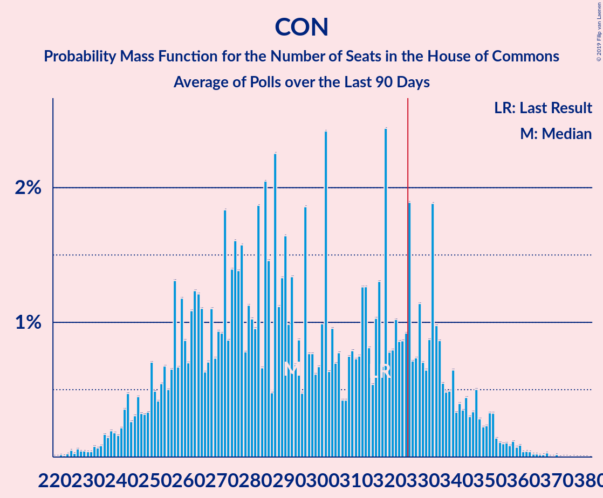

| Number of Seats | Probability | Accumulated | Special Marks |
|:---------------:|:-----------:|:-----------:|:-------------:|
| 228 | 0% | 100% |  |
| 229 | 0% | 99.9% |  |
| 230 | 0% | 99.9% |  |
| 231 | 0% | 99.9% |  |
| 232 | 0% | 99.9% |  |
| 233 | 0% | 99.8% |  |
| 234 | 0% | 99.8% |  |
| 235 | 0.1% | 99.8% |  |
| 236 | 0% | 99.7% |  |
| 237 | 0.1% | 99.7% |  |
| 238 | 0.1% | 99.6% |  |
| 239 | 0.1% | 99.5% |  |
| 240 | 0.1% | 99.4% |  |
| 241 | 0.2% | 99.3% |  |
| 242 | 0.3% | 99.1% |  |
| 243 | 0.2% | 98.8% |  |
| 244 | 0.2% | 98.5% |  |
| 245 | 0.3% | 98% |  |
| 246 | 0.4% | 98% |  |
| 247 | 0.3% | 98% |  |
| 248 | 0.3% | 97% |  |
| 249 | 0.5% | 97% |  |
| 250 | 0.6% | 96% |  |
| 251 | 0.6% | 96% |  |
| 252 | 0.5% | 95% |  |
| 253 | 0.6% | 95% |  |
| 254 | 1.2% | 94% |  |
| 255 | 0.8% | 93% |  |
| 256 | 1.0% | 92% |  |
| 257 | 1.0% | 91% |  |
| 258 | 1.0% | 90% |  |
| 259 | 2% | 89% |  |
| 260 | 1.0% | 87% |  |
| 261 | 1.4% | 86% |  |
| 262 | 1.1% | 84% |  |
| 263 | 2% | 83% |  |
| 264 | 1.4% | 82% |  |
| 265 | 2% | 80% |  |
| 266 | 1.3% | 79% |  |
| 267 | 1.1% | 78% |  |
| 268 | 1.1% | 77% |  |
| 269 | 1.2% | 75% |  |
| 270 | 1.1% | 74% |  |
| 271 | 0.8% | 73% |  |
| 272 | 1.1% | 72% |  |
| 273 | 2% | 71% |  |
| 274 | 1.3% | 69% |  |
| 275 | 1.0% | 68% |  |
| 276 | 1.2% | 67% |  |
| 277 | 2% | 66% |  |
| 278 | 1.4% | 64% |  |
| 279 | 1.2% | 62% |  |
| 280 | 0.8% | 61% |  |
| 281 | 1.3% | 61% |  |
| 282 | 2% | 59% |  |
| 283 | 2% | 57% |  |
| 284 | 2% | 55% |  |
| 285 | 2% | 53% |  |
| 286 | 2% | 51% | Median |
| 287 | 1.2% | 49% |  |
| 288 | 2% | 48% |  |
| 289 | 2% | 47% |  |
| 290 | 1.2% | 45% |  |
| 291 | 2% | 44% |  |
| 292 | 1.3% | 42% |  |
| 293 | 1.1% | 41% |  |
| 294 | 1.0% | 40% |  |
| 295 | 1.4% | 39% |  |
| 296 | 1.1% | 37% |  |
| 297 | 1.3% | 36% |  |
| 298 | 10% | 35% |  |
| 299 | 0.8% | 25% |  |
| 300 | 2% | 24% |  |
| 301 | 0.8% | 22% |  |
| 302 | 0.7% | 21% |  |
| 303 | 0.7% | 21% |  |
| 304 | 0.6% | 20% |  |
| 305 | 0.7% | 19% |  |
| 306 | 0.8% | 19% |  |
| 307 | 0.6% | 18% |  |
| 308 | 1.1% | 17% |  |
| 309 | 1.1% | 16% |  |
| 310 | 0.6% | 15% |  |
| 311 | 0.5% | 15% |  |
| 312 | 0.8% | 14% |  |
| 313 | 0.7% | 13% |  |
| 314 | 0.8% | 13% |  |
| 315 | 0.5% | 12% |  |
| 316 | 0.5% | 11% |  |
| 317 | 0.7% | 11% | Last Result |
| 318 | 0.4% | 10% |  |
| 319 | 1.1% | 10% |  |
| 320 | 0.4% | 9% |  |
| 321 | 0.6% | 8% |  |
| 322 | 0.4% | 8% |  |
| 323 | 0.6% | 7% |  |
| 324 | 0.4% | 7% |  |
| 325 | 0.3% | 6% |  |
| 326 | 0.6% | 6% | Majority |
| 327 | 0.2% | 5% |  |
| 328 | 0.4% | 5% |  |
| 329 | 0.5% | 5% |  |
| 330 | 0.3% | 4% |  |
| 331 | 0.4% | 4% |  |
| 332 | 0.4% | 3% |  |
| 333 | 0.3% | 3% |  |
| 334 | 0.3% | 3% |  |
| 335 | 0.3% | 2% |  |
| 336 | 0.2% | 2% |  |
| 337 | 0.1% | 2% |  |
| 338 | 0.2% | 2% |  |
| 339 | 0.1% | 2% |  |
| 340 | 0.3% | 2% |  |
| 341 | 0.2% | 1.3% |  |
| 342 | 0.1% | 1.1% |  |
| 343 | 0.1% | 1.0% |  |
| 344 | 0.1% | 0.9% |  |
| 345 | 0.1% | 0.8% |  |
| 346 | 0.1% | 0.7% |  |
| 347 | 0.1% | 0.6% |  |
| 348 | 0% | 0.5% |  |
| 349 | 0.1% | 0.5% |  |
| 350 | 0% | 0.4% |  |
| 351 | 0.1% | 0.4% |  |
| 352 | 0% | 0.3% |  |
| 353 | 0% | 0.3% |  |
| 354 | 0.1% | 0.2% |  |
| 355 | 0% | 0.2% |  |
| 356 | 0% | 0.1% |  |
| 357 | 0% | 0.1% |  |
| 358 | 0% | 0.1% |  |
| 359 | 0% | 0.1% |  |
| 360 | 0% | 0.1% |  |
| 361 | 0% | 0.1% |  |
| 362 | 0% | 0.1% |  |
| 363 | 0% | 0.1% |  |
| 364 | 0% | 0% |  |

### Labour Party – Liberal Democrats

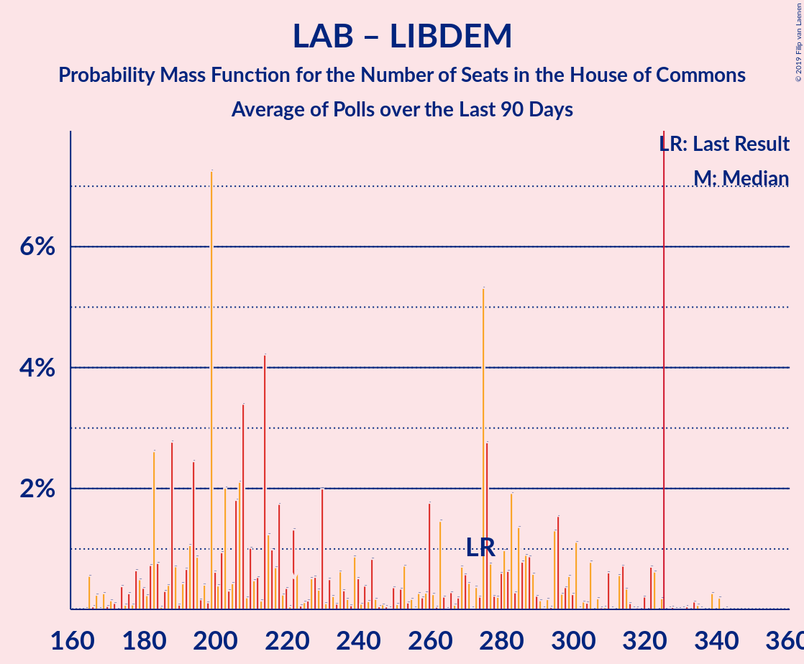

| Number of Seats | Probability | Accumulated | Special Marks |
|:---------------:|:-----------:|:-----------:|:-------------:|
| 220 | 0% | 100% |  |
| 221 | 0% | 99.9% |  |
| 222 | 0% | 99.9% |  |
| 223 | 0% | 99.9% |  |
| 224 | 0% | 99.9% |  |
| 225 | 0% | 99.9% |  |
| 226 | 0% | 99.9% |  |
| 227 | 0% | 99.8% |  |
| 228 | 0% | 99.8% |  |
| 229 | 0.1% | 99.8% |  |
| 230 | 0.1% | 99.7% |  |
| 231 | 0.2% | 99.6% |  |
| 232 | 0.1% | 99.5% |  |
| 233 | 0.2% | 99.4% |  |
| 234 | 0.1% | 99.2% |  |
| 235 | 0.2% | 99.1% |  |
| 236 | 0.1% | 98.9% |  |
| 237 | 0.1% | 98.8% |  |
| 238 | 0.1% | 98.7% |  |
| 239 | 0.2% | 98.6% |  |
| 240 | 0.3% | 98% |  |
| 241 | 0.1% | 98% |  |
| 242 | 0.2% | 98% |  |
| 243 | 0.1% | 98% |  |
| 244 | 0.1% | 98% |  |
| 245 | 0.1% | 97% |  |
| 246 | 0.2% | 97% |  |
| 247 | 0.2% | 97% |  |
| 248 | 0.3% | 97% |  |
| 249 | 0.2% | 97% |  |
| 250 | 0.2% | 96% |  |
| 251 | 0.2% | 96% |  |
| 252 | 0.4% | 96% |  |
| 253 | 0.3% | 96% |  |
| 254 | 0.4% | 95% |  |
| 255 | 0.4% | 95% |  |
| 256 | 0.5% | 95% |  |
| 257 | 0.8% | 94% |  |
| 258 | 0.7% | 93% |  |
| 259 | 0.7% | 93% |  |
| 260 | 0.4% | 92% |  |
| 261 | 0.6% | 92% |  |
| 262 | 0.6% | 91% |  |
| 263 | 0.9% | 90% |  |
| 264 | 0.6% | 89% |  |
| 265 | 0.8% | 89% |  |
| 266 | 0.8% | 88% |  |
| 267 | 0.7% | 87% |  |
| 268 | 1.1% | 86% |  |
| 269 | 0.8% | 85% |  |
| 270 | 0.7% | 85% |  |
| 271 | 0.9% | 84% |  |
| 272 | 0.8% | 83% |  |
| 273 | 10% | 82% |  |
| 274 | 0.8% | 72% | Last Result |
| 275 | 1.2% | 71% |  |
| 276 | 0.7% | 70% |  |
| 277 | 1.1% | 69% |  |
| 278 | 1.0% | 68% |  |
| 279 | 0.9% | 67% |  |
| 280 | 0.9% | 66% |  |
| 281 | 1.0% | 65% |  |
| 282 | 1.1% | 64% |  |
| 283 | 0.7% | 63% |  |
| 284 | 1.1% | 62% |  |
| 285 | 0.9% | 61% |  |
| 286 | 0.8% | 60% |  |
| 287 | 0.8% | 59% |  |
| 288 | 1.0% | 59% |  |
| 289 | 1.4% | 58% |  |
| 290 | 0.9% | 56% |  |
| 291 | 1.1% | 55% |  |
| 292 | 0.7% | 54% |  |
| 293 | 1.3% | 53% |  |
| 294 | 1.3% | 52% | Median |
| 295 | 2% | 51% |  |
| 296 | 2% | 49% |  |
| 297 | 2% | 47% |  |
| 298 | 1.5% | 46% |  |
| 299 | 1.3% | 44% |  |
| 300 | 1.2% | 43% |  |
| 301 | 1.4% | 42% |  |
| 302 | 1.2% | 40% |  |
| 303 | 1.4% | 39% |  |
| 304 | 1.5% | 38% |  |
| 305 | 2% | 36% |  |
| 306 | 2% | 35% |  |
| 307 | 2% | 33% |  |
| 308 | 2% | 31% |  |
| 309 | 1.3% | 28% |  |
| 310 | 1.2% | 27% |  |
| 311 | 2% | 26% |  |
| 312 | 2% | 24% |  |
| 313 | 2% | 23% |  |
| 314 | 2% | 20% |  |
| 315 | 2% | 19% |  |
| 316 | 2% | 17% |  |
| 317 | 1.3% | 15% |  |
| 318 | 1.5% | 14% |  |
| 319 | 1.4% | 12% |  |
| 320 | 1.0% | 11% |  |
| 321 | 1.1% | 10% |  |
| 322 | 0.9% | 9% |  |
| 323 | 0.7% | 8% |  |
| 324 | 0.6% | 7% |  |
| 325 | 0.9% | 6% |  |
| 326 | 0.5% | 5% | Majority |
| 327 | 0.3% | 5% |  |
| 328 | 0.4% | 5% |  |
| 329 | 0.6% | 4% |  |
| 330 | 0.4% | 4% |  |
| 331 | 0.4% | 3% |  |
| 332 | 0.3% | 3% |  |
| 333 | 0.2% | 2% |  |
| 334 | 0.3% | 2% |  |
| 335 | 0.2% | 2% |  |
| 336 | 0.2% | 2% |  |
| 337 | 0.1% | 2% |  |
| 338 | 0.2% | 2% |  |
| 339 | 0.2% | 1.4% |  |
| 340 | 0.1% | 1.2% |  |
| 341 | 0.1% | 1.1% |  |
| 342 | 0.1% | 1.1% |  |
| 343 | 0.2% | 1.0% |  |
| 344 | 0.1% | 0.8% |  |
| 345 | 0.1% | 0.7% |  |
| 346 | 0% | 0.5% |  |
| 347 | 0.1% | 0.5% |  |
| 348 | 0% | 0.4% |  |
| 349 | 0% | 0.4% |  |
| 350 | 0% | 0.3% |  |
| 351 | 0% | 0.3% |  |
| 352 | 0% | 0.3% |  |
| 353 | 0% | 0.2% |  |
| 354 | 0% | 0.2% |  |
| 355 | 0% | 0.2% |  |
| 356 | 0% | 0.2% |  |
| 357 | 0.1% | 0.2% |  |
| 358 | 0% | 0.1% |  |
| 359 | 0% | 0.1% |  |
| 360 | 0% | 0.1% |  |
| 361 | 0% | 0.1% |  |
| 362 | 0% | 0.1% |  |
| 363 | 0% | 0% |  |

### Labour Party – Plaid Cymru

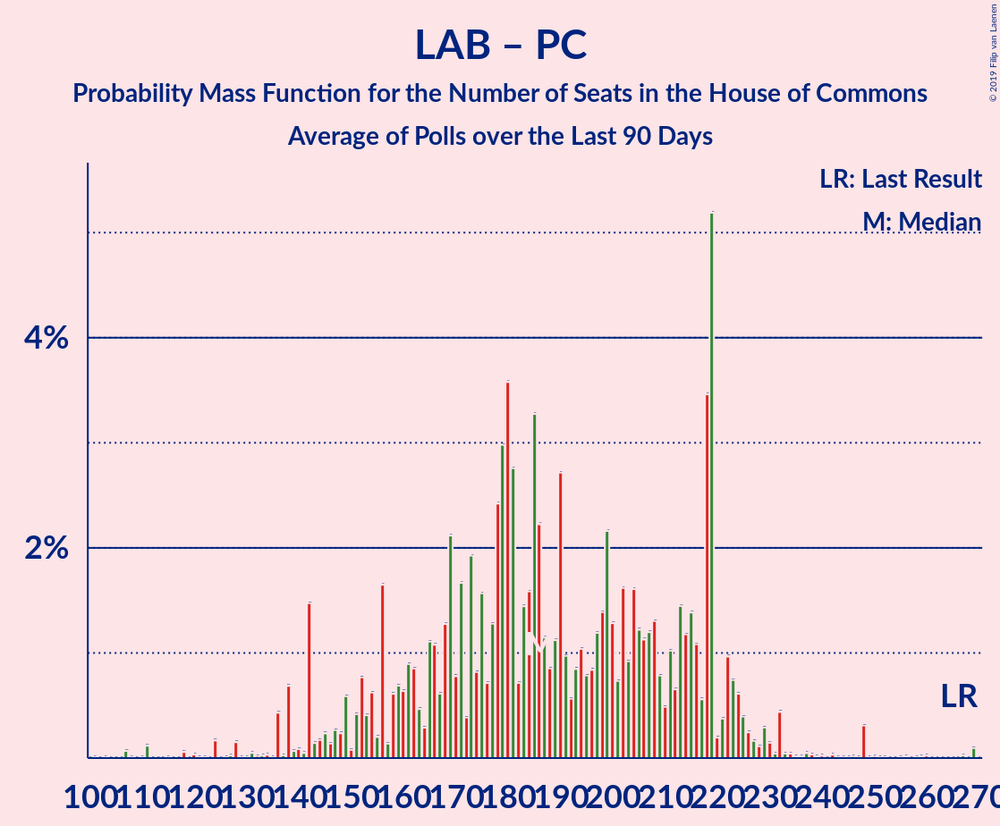

| Number of Seats | Probability | Accumulated | Special Marks |
|:---------------:|:-----------:|:-----------:|:-------------:|
| 218 | 0% | 100% |  |
| 219 | 0% | 99.9% |  |
| 220 | 0% | 99.9% |  |
| 221 | 0% | 99.9% |  |
| 222 | 0% | 99.9% |  |
| 223 | 0% | 99.9% |  |
| 224 | 0% | 99.9% |  |
| 225 | 0% | 99.8% |  |
| 226 | 0% | 99.8% |  |
| 227 | 0% | 99.8% |  |
| 228 | 0.1% | 99.8% |  |
| 229 | 0.1% | 99.6% |  |
| 230 | 0.1% | 99.5% |  |
| 231 | 0.2% | 99.4% |  |
| 232 | 0.1% | 99.2% |  |
| 233 | 0.1% | 99.1% |  |
| 234 | 0.2% | 99.0% |  |
| 235 | 0.1% | 98.8% |  |
| 236 | 0.3% | 98.7% |  |
| 237 | 0.1% | 98% |  |
| 238 | 0.3% | 98% |  |
| 239 | 0.1% | 98% |  |
| 240 | 0.4% | 98% |  |
| 241 | 0.6% | 97% |  |
| 242 | 1.0% | 97% |  |
| 243 | 1.1% | 96% |  |
| 244 | 0.8% | 95% |  |
| 245 | 0.4% | 94% |  |
| 246 | 0.4% | 94% |  |
| 247 | 0.4% | 93% |  |
| 248 | 1.0% | 93% |  |
| 249 | 0.5% | 92% |  |
| 250 | 0.4% | 91% |  |
| 251 | 2% | 91% |  |
| 252 | 1.0% | 89% |  |
| 253 | 0.6% | 88% |  |
| 254 | 0.7% | 88% |  |
| 255 | 0.7% | 87% |  |
| 256 | 0.3% | 86% |  |
| 257 | 0.1% | 86% |  |
| 258 | 0.5% | 86% |  |
| 259 | 11% | 85% |  |
| 260 | 1.3% | 74% |  |
| 261 | 1.3% | 73% |  |
| 262 | 0.5% | 72% |  |
| 263 | 1.1% | 71% |  |
| 264 | 0.9% | 70% |  |
| 265 | 1.4% | 69% |  |
| 266 | 1.2% | 68% | Last Result |
| 267 | 0.9% | 66% |  |
| 268 | 0.7% | 65% |  |
| 269 | 2% | 65% |  |
| 270 | 1.3% | 63% |  |
| 271 | 1.0% | 62% |  |
| 272 | 0.5% | 61% |  |
| 273 | 0.5% | 60% |  |
| 274 | 1.4% | 60% |  |
| 275 | 2% | 58% |  |
| 276 | 2% | 56% |  |
| 277 | 1.4% | 55% |  |
| 278 | 0.9% | 54% |  |
| 279 | 1.1% | 53% |  |
| 280 | 1.3% | 52% |  |
| 281 | 2% | 50% | Median |
| 282 | 1.1% | 49% |  |
| 283 | 3% | 47% |  |
| 284 | 1.1% | 45% |  |
| 285 | 1.0% | 44% |  |
| 286 | 1.4% | 43% |  |
| 287 | 2% | 41% |  |
| 288 | 3% | 39% |  |
| 289 | 2% | 36% |  |
| 290 | 2% | 35% |  |
| 291 | 2% | 33% |  |
| 292 | 1.3% | 31% |  |
| 293 | 2% | 30% |  |
| 294 | 2% | 28% |  |
| 295 | 3% | 26% |  |
| 296 | 2% | 23% |  |
| 297 | 2% | 21% |  |
| 298 | 2% | 19% |  |
| 299 | 2% | 17% |  |
| 300 | 1.3% | 15% |  |
| 301 | 2% | 14% |  |
| 302 | 1.4% | 12% |  |
| 303 | 0.7% | 10% |  |
| 304 | 1.1% | 9% |  |
| 305 | 0.7% | 8% |  |
| 306 | 1.2% | 8% |  |
| 307 | 0.7% | 6% |  |
| 308 | 0.6% | 6% |  |
| 309 | 0.3% | 5% |  |
| 310 | 0.7% | 5% |  |
| 311 | 0.9% | 4% |  |
| 312 | 0.5% | 3% |  |
| 313 | 0.3% | 3% |  |
| 314 | 0.3% | 3% |  |
| 315 | 0.3% | 2% |  |
| 316 | 0.4% | 2% |  |
| 317 | 0.3% | 2% |  |
| 318 | 0.1% | 1.3% |  |
| 319 | 0.2% | 1.2% |  |
| 320 | 0.2% | 1.1% |  |
| 321 | 0.1% | 0.8% |  |
| 322 | 0.1% | 0.7% |  |
| 323 | 0.1% | 0.7% |  |
| 324 | 0.1% | 0.6% |  |
| 325 | 0.1% | 0.5% |  |
| 326 | 0.1% | 0.4% | Majority |
| 327 | 0.1% | 0.4% |  |
| 328 | 0.1% | 0.3% |  |
| 329 | 0.1% | 0.3% |  |
| 330 | 0% | 0.2% |  |
| 331 | 0% | 0.2% |  |
| 332 | 0% | 0.2% |  |
| 333 | 0.1% | 0.2% |  |
| 334 | 0% | 0.1% |  |
| 335 | 0% | 0.1% |  |
| 336 | 0% | 0.1% |  |
| 337 | 0% | 0.1% |  |
| 338 | 0% | 0% |  |

### Labour Party

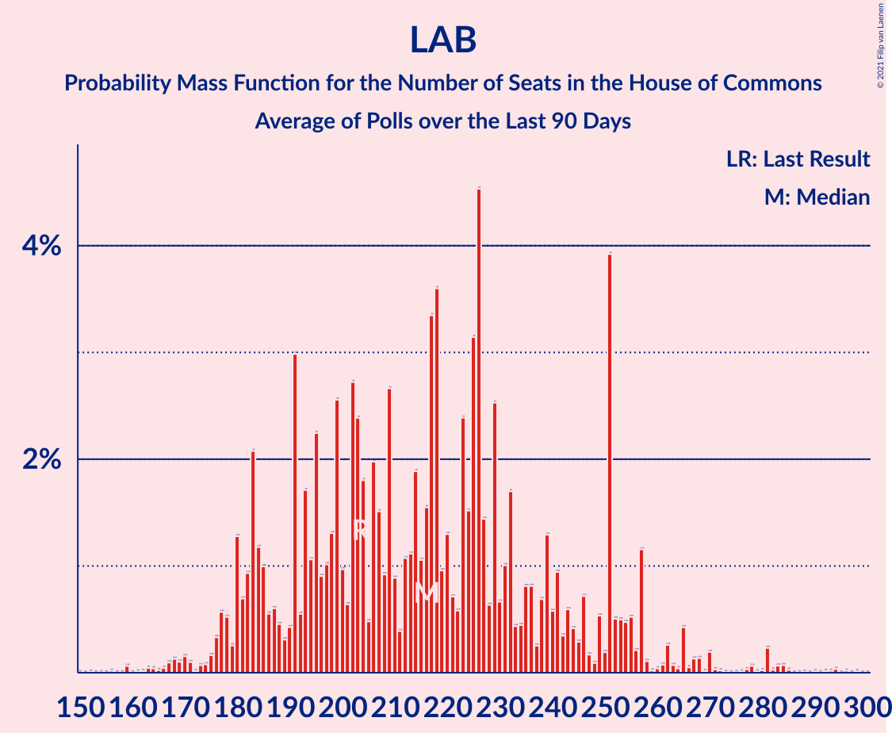

| Number of Seats | Probability | Accumulated | Special Marks |
|:---------------:|:-----------:|:-----------:|:-------------:|
| 216 | 0% | 100% |  |
| 217 | 0% | 99.9% |  |
| 218 | 0% | 99.9% |  |
| 219 | 0% | 99.9% |  |
| 220 | 0% | 99.9% |  |
| 221 | 0% | 99.9% |  |
| 222 | 0.1% | 99.9% |  |
| 223 | 0% | 99.8% |  |
| 224 | 0% | 99.8% |  |
| 225 | 0.1% | 99.7% |  |
| 226 | 0.1% | 99.6% |  |
| 227 | 0.1% | 99.6% |  |
| 228 | 0.3% | 99.5% |  |
| 229 | 0.2% | 99.2% |  |
| 230 | 0.1% | 99.0% |  |
| 231 | 0.2% | 98.9% |  |
| 232 | 0.2% | 98.7% |  |
| 233 | 0.2% | 98.5% |  |
| 234 | 0.4% | 98% |  |
| 235 | 0.5% | 98% |  |
| 236 | 0.5% | 97% |  |
| 237 | 0.4% | 97% |  |
| 238 | 1.0% | 96% |  |
| 239 | 0.7% | 95% |  |
| 240 | 0.6% | 95% |  |
| 241 | 0.5% | 94% |  |
| 242 | 0.6% | 94% |  |
| 243 | 0.6% | 93% |  |
| 244 | 0.8% | 92% |  |
| 245 | 0.5% | 92% |  |
| 246 | 1.2% | 91% |  |
| 247 | 0.7% | 90% |  |
| 248 | 0.8% | 89% |  |
| 249 | 0.7% | 88% |  |
| 250 | 0.6% | 88% |  |
| 251 | 1.0% | 87% |  |
| 252 | 0.3% | 86% |  |
| 253 | 0.3% | 86% |  |
| 254 | 1.5% | 86% |  |
| 255 | 11% | 84% |  |
| 256 | 1.1% | 74% |  |
| 257 | 0.6% | 73% |  |
| 258 | 1.3% | 72% |  |
| 259 | 1.2% | 71% |  |
| 260 | 1.3% | 69% |  |
| 261 | 1.2% | 68% |  |
| 262 | 0.8% | 67% | Last Result |
| 263 | 1.0% | 66% |  |
| 264 | 1.1% | 65% |  |
| 265 | 1.1% | 64% |  |
| 266 | 1.4% | 63% |  |
| 267 | 0.5% | 62% |  |
| 268 | 0.8% | 61% |  |
| 269 | 2% | 60% |  |
| 270 | 1.4% | 59% |  |
| 271 | 1.1% | 57% |  |
| 272 | 1.4% | 56% |  |
| 273 | 1.0% | 55% |  |
| 274 | 1.3% | 54% |  |
| 275 | 1.4% | 53% |  |
| 276 | 1.5% | 51% | Median |
| 277 | 1.2% | 50% |  |
| 278 | 2% | 49% |  |
| 279 | 1.0% | 46% |  |
| 280 | 1.3% | 45% |  |
| 281 | 1.4% | 44% |  |
| 282 | 2% | 43% |  |
| 283 | 2% | 41% |  |
| 284 | 1.5% | 39% |  |
| 285 | 1.4% | 38% |  |
| 286 | 2% | 36% |  |
| 287 | 1.5% | 35% |  |
| 288 | 2% | 33% |  |
| 289 | 2% | 31% |  |
| 290 | 2% | 29% |  |
| 291 | 2% | 27% |  |
| 292 | 2% | 24% |  |
| 293 | 2% | 23% |  |
| 294 | 2% | 21% |  |
| 295 | 1.5% | 19% |  |
| 296 | 2% | 17% |  |
| 297 | 2% | 15% |  |
| 298 | 1.0% | 14% |  |
| 299 | 2% | 13% |  |
| 300 | 1.2% | 11% |  |
| 301 | 1.4% | 10% |  |
| 302 | 1.1% | 8% |  |
| 303 | 0.7% | 7% |  |
| 304 | 0.7% | 7% |  |
| 305 | 0.6% | 6% |  |
| 306 | 1.0% | 5% |  |
| 307 | 0.5% | 4% |  |
| 308 | 0.3% | 4% |  |
| 309 | 0.5% | 3% |  |
| 310 | 0.4% | 3% |  |
| 311 | 0.4% | 2% |  |
| 312 | 0.4% | 2% |  |
| 313 | 0.2% | 2% |  |
| 314 | 0.1% | 2% |  |
| 315 | 0.2% | 1.5% |  |
| 316 | 0.2% | 1.2% |  |
| 317 | 0% | 1.0% |  |
| 318 | 0.1% | 1.0% |  |
| 319 | 0.1% | 0.9% |  |
| 320 | 0.2% | 0.8% |  |
| 321 | 0.1% | 0.6% |  |
| 322 | 0.1% | 0.5% |  |
| 323 | 0% | 0.4% |  |
| 324 | 0% | 0.4% |  |
| 325 | 0% | 0.3% |  |
| 326 | 0% | 0.3% | Majority |
| 327 | 0% | 0.3% |  |
| 328 | 0% | 0.2% |  |
| 329 | 0% | 0.2% |  |
| 330 | 0% | 0.2% |  |
| 331 | 0% | 0.2% |  |
| 332 | 0.1% | 0.1% |  |
| 333 | 0% | 0.1% |  |
| 334 | 0% | 0.1% |  |
| 335 | 0% | 0.1% |  |
| 336 | 0% | 0.1% |  |
| 337 | 0% | 0% |  |

## Technical Information

+ **Number of polls included in this average:** 10
+ **Lowest number of simulations done in a poll included in this average:** 1,024
+ **Total number of simulations done in the polls included in this average:** 8,127,488
+ **Error estimate:** 2.62%
