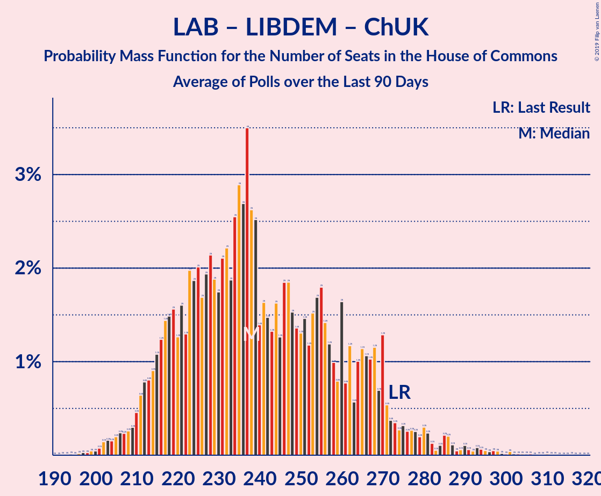

# Poll Average

<a href="#voting-intentions">Voting Intentions</a> | <a href="#seats">Seats</a> | <a href="#coalitions">Coalitions</a> | <a href="#technical-information">Technical Information</a>

## Summary

The table below lists the polls on which the average is based. They are the most recent polls (less than 90 days old) registered and analyzed so far.

| Period     | Polling firm/Commissioner(s) | CON | LAB | LIBDEM | SNP | UKIP | GREEN | PC | BREXIT | ChUK |
|:----------:|:----------------------------:|:--:|:--:|:--:|:--:|:--:|:--:|:--:|:--:|:--:|
| 8 June 2017 | General Election | 42.4%   317 | 40.0%   262 | 7.4%   12 | 3.0%   35 | 1.8%   0 | 1.6%   1 | 0.5%   4 | 0.0%   0 | 0.0%   0 |
| N/A | Poll Average | 25–40%   169–376 | 22–27%   126–220 | 14–25%   39–103 | 3–6%   39–54 | 0–1%   0 | 2–5%   1–3 | 0–1%   0–7 | 9–18%   7–125 | 0–1%   0 |
| [14–15 October 2019](2019-10-15-YouGov.html) | YouGov   The Times | N/A   N/A | N/A   N/A | N/A   N/A | N/A   N/A | N/A   N/A | N/A   N/A | N/A   N/A | N/A   N/A | N/A   N/A |
| [10–15 October 2019](2019-10-15-KantarPublic.html) | Kantar Public | N/A   N/A | N/A   N/A | N/A   N/A | N/A   N/A | N/A   N/A | N/A   N/A | N/A   N/A | N/A   N/A | N/A   N/A |
| [9–11 October 2019](2019-10-11-Panelbase.html) | Panelbase   The Sunday Times | N/A   N/A | N/A   N/A | N/A   N/A | N/A   N/A | N/A   N/A | N/A   N/A | N/A   N/A | N/A   N/A | N/A   N/A |
| [9–10 October 2019](2019-10-10-ComRes.html) | ComRes   Daily Express | N/A   N/A | N/A   N/A | N/A   N/A | N/A   N/A | N/A   N/A | N/A   N/A | N/A   N/A | N/A   N/A | N/A   N/A |
| [3–4 October 2019](2019-10-04-Opinium.html) | Opinium   The Observer | 36–41%   339–381 | 21–25%   123–168 | 14–17%   37–48 | 4–6%   51–55 | 1–2%   0 | 3–5%   1–3 | 0–1%   0–4 | 11–14%   18–40 | 0–1%   0 |
| [1–4 October 2019](2019-10-04-BMGResearch.html) | BMG Research   The Independent | N/A   N/A | N/A   N/A | N/A   N/A | N/A   N/A | N/A   N/A | N/A   N/A | N/A   N/A | N/A   N/A | N/A   N/A |
| [25 September 2019](2019-09-25-Survation.html) | Survation   Daily Mail | 24–30%   153–271 | 21–27%   130–233 | 20–25%   75–107 | 3–5%   48–54 | N/A   N/A | 2–4%   1–2 | N/A   N/A | 14–18%   48–142 | N/A   N/A |
| [13–16 September 2019](2019-09-16-IpsosMORI.html) | Ipsos MORI   Evening Standard | 30–36%   260–340 | 22–27%   135–219 | 21–26%   71–94 | 3–5%   34–52 | 0–1%   0 | 3–5%   1–4 | 0–1%   2–9 | 8–12%   5–29 | 0–1%   0 |
| 8 June 2017 | General Election | 42.4%   317 | 40.0%   262 | 7.4%   12 | 3.0%   35 | 1.8%   0 | 1.6%   1 | 0.5%   4 | 0.0%   0 | 0.0%   0 |

Only polls for which at least the sample size has been published are included in the table above.

**Legend:**
+ **Top half of each row:** Voting intentions (95% confidence interval)
+ **Bottom half of each row:** Seat projections for the House of Commons (95% confidence interval)
+ **CON:** Conservative Party
+ **LAB:** Labour Party
+ **LIBDEM:** Liberal Democrats
+ **SNP:** Scottish National Party
+ **UKIP:** UK Independence Party
+ **GREEN:** Green Party
+ **PC:** Plaid Cymru
+ **BREXIT:** Brexit Party
+ **ChUK:** Change UK
+ **N/A (single party):** Party not included the published results
+ **N/A (entire row):** Calculation for this opinion poll not started yet

## Voting Intentions

### Confidence Intervals

| Party | Last Result | Median | 80% Confidence Interval | 90% Confidence Interval | 95% Confidence Interval | 99% Confidence Interval |
|:-----:|:-----------:|:------:|:-----------------------:|:-----------------------:|:-----------------------:|:-----------------------:|
| <a href="#conservative-party">Conservative Party</a> | 42.4% | 33.2% | 26.3–39.1% |25.6–39.6% | 25.0–40.1% | 24.1–40.9% |
| <a href="#labour-party">Labour Party</a> | 40.0% | 23.8% | 22.3–25.6% |21.9–26.1% | 21.5–26.6% | 20.8–27.5% |
| <a href="#liberal-democrats">Liberal Democrats</a> | 7.4% | 21.6% | 14.8–24.1% |14.4–24.7% | 14.1–25.2% | 13.5–26.2% |
| <a href="#scottish-national-party">Scottish National Party</a> | 3.0% | 4.2% | 3.1–5.4% |2.9–5.7% | 2.7–5.9% | 2.4–6.3% |
| <a href="#uk-independence-party">UK Independence Party</a> | 1.8% | 0.7% | 0.2–1.2% |0.2–1.3% | 0.1–1.4% | 0.1–1.6% |
| <a href="#green-party">Green Party</a> | 1.6% | 3.8% | 2.7–4.6% |2.5–4.9% | 2.3–5.1% | 2.0–5.6% |
| <a href="#plaid-cymru">Plaid Cymru</a> | 0.5% | 0.4% | 0.2–0.9% |0.2–1.0% | 0.1–1.2% | 0.1–1.4% |
| <a href="#brexit-party">Brexit Party</a> | 0.0% | 12.2% | 9.6–16.7% |9.1–17.3% | 8.8–17.8% | 8.2–18.7% |
| <a href="#change-uk">Change UK</a> | 0.0% | 0.3% | 0.2–0.6% |0.1–0.7% | 0.1–0.8% | 0.1–1.0% |

### Conservative Party

*For a full overview of the results for this party, see the [Conservative Party](party-conservativeparty.html) page.*

| Voting Intentions | Probability | Accumulated | Special Marks |
|:-----------------:|:-----------:|:-----------:|:-------------:|
| 21.5–22.5% | 0% | 100% |  |
| 22.5–23.5% | 0.2% | 100% |  |
| 23.5–24.5% | 1.0% | 99.8% |  |
| 24.5–25.5% | 4% | 98.8% |  |
| 25.5–26.5% | 7% | 95% |  |
| 26.5–27.5% | 9% | 88% |  |
| 27.5–28.5% | 7% | 78% |  |
| 28.5–29.5% | 4% | 71% |  |
| 29.5–30.5% | 2% | 68% |  |
| 30.5–31.5% | 3% | 66% |  |
| 31.5–32.5% | 7% | 62% |  |
| 32.5–33.5% | 9% | 56% | Median |
| 33.5–34.5% | 8% | 47% |  |
| 34.5–35.5% | 4% | 40% |  |
| 35.5–36.5% | 3% | 35% |  |
| 36.5–37.5% | 6% | 33% |  |
| 37.5–38.5% | 11% | 27% |  |
| 38.5–39.5% | 11% | 16% |  |
| 39.5–40.5% | 5% | 6% |  |
| 40.5–41.5% | 0.9% | 1.0% |  |
| 41.5–42.5% | 0.1% | 0.1% | Last Result |
| 42.5–43.5% | 0% | 0% |  |

### Labour Party

*For a full overview of the results for this party, see the [Labour Party](party-labourparty.html) page.*

| Voting Intentions | Probability | Accumulated | Special Marks |
|:-----------------:|:-----------:|:-----------:|:-------------:|
| 18.5–19.5% | 0% | 100% |  |
| 19.5–20.5% | 0.2% | 100% |  |
| 20.5–21.5% | 2% | 99.8% |  |
| 21.5–22.5% | 12% | 97% |  |
| 22.5–23.5% | 27% | 85% |  |
| 23.5–24.5% | 29% | 58% | Median |
| 24.5–25.5% | 18% | 28% |  |
| 25.5–26.5% | 8% | 10% |  |
| 26.5–27.5% | 2% | 3% |  |
| 27.5–28.5% | 0.4% | 0.5% |  |
| 28.5–29.5% | 0% | 0.1% |  |
| 29.5–30.5% | 0% | 0% |  |
| 30.5–31.5% | 0% | 0% |  |
| 31.5–32.5% | 0% | 0% |  |
| 32.5–33.5% | 0% | 0% |  |
| 33.5–34.5% | 0% | 0% |  |
| 34.5–35.5% | 0% | 0% |  |
| 35.5–36.5% | 0% | 0% |  |
| 36.5–37.5% | 0% | 0% |  |
| 37.5–38.5% | 0% | 0% |  |
| 38.5–39.5% | 0% | 0% |  |
| 39.5–40.5% | 0% | 0% | Last Result |

### Liberal Democrats

*For a full overview of the results for this party, see the [Liberal Democrats](party-liberaldemocrats.html) page.*

| Voting Intentions | Probability | Accumulated | Special Marks |
|:-----------------:|:-----------:|:-----------:|:-------------:|
| 6.5–7.5% | 0% | 100% | Last Result |
| 7.5–8.5% | 0% | 100% |  |
| 8.5–9.5% | 0% | 100% |  |
| 9.5–10.5% | 0% | 100% |  |
| 10.5–11.5% | 0% | 100% |  |
| 11.5–12.5% | 0% | 100% |  |
| 12.5–13.5% | 0.5% | 100% |  |
| 13.5–14.5% | 6% | 99.5% |  |
| 14.5–15.5% | 15% | 93% |  |
| 15.5–16.5% | 10% | 78% |  |
| 16.5–17.5% | 2% | 68% |  |
| 17.5–18.5% | 0.2% | 67% |  |
| 18.5–19.5% | 0.9% | 67% |  |
| 19.5–20.5% | 4% | 66% |  |
| 20.5–21.5% | 11% | 62% |  |
| 21.5–22.5% | 17% | 51% | Median |
| 22.5–23.5% | 17% | 34% |  |
| 23.5–24.5% | 11% | 17% |  |
| 24.5–25.5% | 5% | 6% |  |
| 25.5–26.5% | 1.3% | 2% |  |
| 26.5–27.5% | 0.2% | 0.3% |  |
| 27.5–28.5% | 0% | 0% |  |

### Scottish National Party

*For a full overview of the results for this party, see the [Scottish National Party](party-scottishnationalparty.html) page.*

| Voting Intentions | Probability | Accumulated | Special Marks |
|:-----------------:|:-----------:|:-----------:|:-------------:|
| 0.5–1.5% | 0% | 100% |  |
| 1.5–2.5% | 1.1% | 100% |  |
| 2.5–3.5% | 23% | 98.9% | Last Result |
| 3.5–4.5% | 38% | 76% | Median |
| 4.5–5.5% | 31% | 38% |  |
| 5.5–6.5% | 7% | 7% |  |
| 6.5–7.5% | 0.1% | 0.1% |  |
| 7.5–8.5% | 0% | 0% |  |

### UK Independence Party

*For a full overview of the results for this party, see the [UK Independence Party](party-ukindependenceparty.html) page.*

| Voting Intentions | Probability | Accumulated | Special Marks |
|:-----------------:|:-----------:|:-----------:|:-------------:|
| 0.0–0.5% | 40% | 100% |  |
| 0.5–1.5% | 59% | 60% | Median |
| 1.5–2.5% | 1.1% | 1.1% | Last Result |
| 2.5–3.5% | 0% | 0% |  |

### Green Party

*For a full overview of the results for this party, see the [Green Party](party-greenparty.html) page.*

| Voting Intentions | Probability | Accumulated | Special Marks |
|:-----------------:|:-----------:|:-----------:|:-------------:|
| 0.5–1.5% | 0% | 100% |  |
| 1.5–2.5% | 6% | 100% | Last Result |
| 2.5–3.5% | 32% | 94% |  |
| 3.5–4.5% | 50% | 62% | Median |
| 4.5–5.5% | 11% | 12% |  |
| 5.5–6.5% | 0.5% | 0.5% |  |
| 6.5–7.5% | 0% | 0% |  |

### Plaid Cymru

*For a full overview of the results for this party, see the [Plaid Cymru](party-plaidcymru.html) page.*

| Voting Intentions | Probability | Accumulated | Special Marks |
|:-----------------:|:-----------:|:-----------:|:-------------:|
| 0.0–0.5% | 64% | 100% | Median |
| 0.5–1.5% | 36% | 36% | Last Result |
| 1.5–2.5% | 0.2% | 0.2% |  |
| 2.5–3.5% | 0% | 0% |  |

### Brexit Party

*For a full overview of the results for this party, see the [Brexit Party](party-brexitparty.html) page.*

| Voting Intentions | Probability | Accumulated | Special Marks |
|:-----------------:|:-----------:|:-----------:|:-------------:|
| 0.0–0.5% | 0% | 100% | Last Result |
| 0.5–1.5% | 0% | 100% |  |
| 1.5–2.5% | 0% | 100% |  |
| 2.5–3.5% | 0% | 100% |  |
| 3.5–4.5% | 0% | 100% |  |
| 4.5–5.5% | 0% | 100% |  |
| 5.5–6.5% | 0% | 100% |  |
| 6.5–7.5% | 0.1% | 100% |  |
| 7.5–8.5% | 1.4% | 99.9% |  |
| 8.5–9.5% | 8% | 98.5% |  |
| 9.5–10.5% | 14% | 91% |  |
| 10.5–11.5% | 14% | 77% |  |
| 11.5–12.5% | 19% | 63% | Median |
| 12.5–13.5% | 10% | 44% |  |
| 13.5–14.5% | 4% | 34% |  |
| 14.5–15.5% | 8% | 30% |  |
| 15.5–16.5% | 11% | 23% |  |
| 16.5–17.5% | 8% | 11% |  |
| 17.5–18.5% | 3% | 4% |  |
| 18.5–19.5% | 0.6% | 0.6% |  |
| 19.5–20.5% | 0.1% | 0.1% |  |
| 20.5–21.5% | 0% | 0% |  |

### Change UK

*For a full overview of the results for this party, see the [Change UK](party-changeuk.html) page.*

| Voting Intentions | Probability | Accumulated | Special Marks |
|:-----------------:|:-----------:|:-----------:|:-------------:|
| 0.0–0.5% | 88% | 100% | Last Result, Median |
| 0.5–1.5% | 12% | 12% |  |
| 1.5–2.5% | 0% | 0% |  |

## Seats

### Confidence Intervals

| Party | Last Result | Median | 80% Confidence Interval | 90% Confidence Interval | 95% Confidence Interval | 99% Confidence Interval |
|:-----:|:-----------:|:------:|:-----------------------:|:-----------------------:|:-----------------------:|:-----------------------:|
| <a href="#conservative-party">Conservative Party</a> | 317 | 307 | 205–368 |185–373 | 169–376 | 145–384 |
| <a href="#labour-party">Labour Party</a> | 262 | 164 | 134–205 |130–213 | 126–220 | 121–240 |
| <a href="#liberal-democrats">Liberal Democrats</a> | 12 | 81 | 43–94 |42–99 | 39–103 | 36–110 |
| <a href="#scottish-national-party">Scottish National Party</a> | 35 | 51 | 48–54 |43–54 | 39–54 | 34–55 |
| <a href="#uk-independence-party">UK Independence Party</a> | 0 | 0 | 0 |0 | 0 | 0 |
| <a href="#green-party">Green Party</a> | 1 | 1 | 1–2 |1–2 | 1–3 | 1–4 |
| <a href="#plaid-cymru">Plaid Cymru</a> | 4 | 3 | 0–7 |0–7 | 0–7 | 0–10 |
| <a href="#brexit-party">Brexit Party</a> | 0 | 28 | 8–99 |7–113 | 7–125 | 4–148 |
| <a href="#change-uk">Change UK</a> | 0 | 0 | 0 |0 | 0 | 0 |

### Conservative Party

*For a full overview of the results for this party, see the [Conservative Party](party-conservativeparty.html) page.*

| Number of Seats | Probability | Accumulated | Special Marks |
|:---------------:|:-----------:|:-----------:|:-------------:|
| 119 | 0% | 100% |  |
| 120 | 0% | 99.9% |  |
| 121 | 0% | 99.9% |  |
| 122 | 0% | 99.9% |  |
| 123 | 0% | 99.9% |  |
| 124 | 0% | 99.9% |  |
| 125 | 0% | 99.9% |  |
| 126 | 0% | 99.9% |  |
| 127 | 0% | 99.9% |  |
| 128 | 0% | 99.9% |  |
| 129 | 0% | 99.9% |  |
| 130 | 0% | 99.8% |  |
| 131 | 0% | 99.8% |  |
| 132 | 0% | 99.8% |  |
| 133 | 0% | 99.8% |  |
| 134 | 0% | 99.8% |  |
| 135 | 0% | 99.7% |  |
| 136 | 0% | 99.7% |  |
| 137 | 0% | 99.7% |  |
| 138 | 0% | 99.7% |  |
| 139 | 0.1% | 99.7% |  |
| 140 | 0% | 99.6% |  |
| 141 | 0% | 99.6% |  |
| 142 | 0% | 99.6% |  |
| 143 | 0% | 99.5% |  |
| 144 | 0% | 99.5% |  |
| 145 | 0% | 99.5% |  |
| 146 | 0% | 99.5% |  |
| 147 | 0.1% | 99.4% |  |
| 148 | 0.1% | 99.4% |  |
| 149 | 0% | 99.3% |  |
| 150 | 0% | 99.3% |  |
| 151 | 0% | 99.2% |  |
| 152 | 0% | 99.2% |  |
| 153 | 0.1% | 99.2% |  |
| 154 | 0.1% | 99.1% |  |
| 155 | 0.1% | 99.1% |  |
| 156 | 0% | 98.9% |  |
| 157 | 0.1% | 98.9% |  |
| 158 | 0.1% | 98.8% |  |
| 159 | 0.1% | 98.7% |  |
| 160 | 0.1% | 98.6% |  |
| 161 | 0.1% | 98% |  |
| 162 | 0.2% | 98% |  |
| 163 | 0.2% | 98% |  |
| 164 | 0.2% | 98% |  |
| 165 | 0.1% | 98% |  |
| 166 | 0.1% | 98% |  |
| 167 | 0.1% | 98% |  |
| 168 | 0% | 98% |  |
| 169 | 0.1% | 98% |  |
| 170 | 0.1% | 97% |  |
| 171 | 0.1% | 97% |  |
| 172 | 0.1% | 97% |  |
| 173 | 0.1% | 97% |  |
| 174 | 0.1% | 97% |  |
| 175 | 0.1% | 97% |  |
| 176 | 0.2% | 97% |  |
| 177 | 0.2% | 97% |  |
| 178 | 0.2% | 96% |  |
| 179 | 0.1% | 96% |  |
| 180 | 0.1% | 96% |  |
| 181 | 0.2% | 96% |  |
| 182 | 0.2% | 96% |  |
| 183 | 0.2% | 96% |  |
| 184 | 0.4% | 95% |  |
| 185 | 0.2% | 95% |  |
| 186 | 0.2% | 95% |  |
| 187 | 0.3% | 95% |  |
| 188 | 0.2% | 94% |  |
| 189 | 0.3% | 94% |  |
| 190 | 0.2% | 94% |  |
| 191 | 0.1% | 94% |  |
| 192 | 0.3% | 94% |  |
| 193 | 0.2% | 93% |  |
| 194 | 0.1% | 93% |  |
| 195 | 0.2% | 93% |  |
| 196 | 0.2% | 93% |  |
| 197 | 0.2% | 92% |  |
| 198 | 0.1% | 92% |  |
| 199 | 0.2% | 92% |  |
| 200 | 0.1% | 92% |  |
| 201 | 0.4% | 92% |  |
| 202 | 0.3% | 91% |  |
| 203 | 0.3% | 91% |  |
| 204 | 0.5% | 91% |  |
| 205 | 0.5% | 90% |  |
| 206 | 0.6% | 90% |  |
| 207 | 0.2% | 89% |  |
| 208 | 0.5% | 89% |  |
| 209 | 0.4% | 89% |  |
| 210 | 0.2% | 88% |  |
| 211 | 0.2% | 88% |  |
| 212 | 0.3% | 88% |  |
| 213 | 0.7% | 87% |  |
| 214 | 0.2% | 87% |  |
| 215 | 0.5% | 87% |  |
| 216 | 0.4% | 86% |  |
| 217 | 0.1% | 86% |  |
| 218 | 0.5% | 85% |  |
| 219 | 0.2% | 85% |  |
| 220 | 0.4% | 85% |  |
| 221 | 0.8% | 84% |  |
| 222 | 0.5% | 84% |  |
| 223 | 0.4% | 83% |  |
| 224 | 0.7% | 83% |  |
| 225 | 0.4% | 82% |  |
| 226 | 0.8% | 82% |  |
| 227 | 0.5% | 81% |  |
| 228 | 0.4% | 80% |  |
| 229 | 0.3% | 80% |  |
| 230 | 0.3% | 80% |  |
| 231 | 0.5% | 79% |  |
| 232 | 0.6% | 79% |  |
| 233 | 0.5% | 78% |  |
| 234 | 0.8% | 78% |  |
| 235 | 0.6% | 77% |  |
| 236 | 0.5% | 76% |  |
| 237 | 0.5% | 76% |  |
| 238 | 0.3% | 75% |  |
| 239 | 0.6% | 75% |  |
| 240 | 0.5% | 75% |  |
| 241 | 0.5% | 74% |  |
| 242 | 0.2% | 74% |  |
| 243 | 0.5% | 73% |  |
| 244 | 0.3% | 73% |  |
| 245 | 0.4% | 73% |  |
| 246 | 0.2% | 72% |  |
| 247 | 0.4% | 72% |  |
| 248 | 0.2% | 72% |  |
| 249 | 0.2% | 71% |  |
| 250 | 0.2% | 71% |  |
| 251 | 0.3% | 71% |  |
| 252 | 0.1% | 71% |  |
| 253 | 0.2% | 71% |  |
| 254 | 0.5% | 70% |  |
| 255 | 0.3% | 70% |  |
| 256 | 0.3% | 70% |  |
| 257 | 0.8% | 69% |  |
| 258 | 0.2% | 69% |  |
| 259 | 0.2% | 68% |  |
| 260 | 0.3% | 68% |  |
| 261 | 0.2% | 68% |  |
| 262 | 0.2% | 68% |  |
| 263 | 0.2% | 68% |  |
| 264 | 0.2% | 67% |  |
| 265 | 0.1% | 67% |  |
| 266 | 0.1% | 67% |  |
| 267 | 0.1% | 67% |  |
| 268 | 1.2% | 67% |  |
| 269 | 0.6% | 66% |  |
| 270 | 0.2% | 65% |  |
| 271 | 1.1% | 65% |  |
| 272 | 0.1% | 64% |  |
| 273 | 0.1% | 64% |  |
| 274 | 0.1% | 63% |  |
| 275 | 0.1% | 63% |  |
| 276 | 0.2% | 63% |  |
| 277 | 0.1% | 63% |  |
| 278 | 0.2% | 63% |  |
| 279 | 0.1% | 63% |  |
| 280 | 0.4% | 63% |  |
| 281 | 0.7% | 62% |  |
| 282 | 0% | 62% |  |
| 283 | 0.1% | 62% |  |
| 284 | 0.1% | 61% |  |
| 285 | 0% | 61% |  |
| 286 | 0.2% | 61% |  |
| 287 | 0.1% | 61% |  |
| 288 | 0.1% | 61% |  |
| 289 | 0.4% | 61% |  |
| 290 | 0% | 61% |  |
| 291 | 0.1% | 61% |  |
| 292 | 0% | 61% |  |
| 293 | 0.1% | 61% |  |
| 294 | 0% | 60% |  |
| 295 | 0.1% | 60% |  |
| 296 | 0.2% | 60% |  |
| 297 | 0.1% | 60% |  |
| 298 | 0.1% | 60% |  |
| 299 | 0% | 60% |  |
| 300 | 5% | 60% |  |
| 301 | 0% | 55% |  |
| 302 | 0% | 55% |  |
| 303 | 0.1% | 55% |  |
| 304 | 0.2% | 55% |  |
| 305 | 0.1% | 55% |  |
| 306 | 0.5% | 55% |  |
| 307 | 7% | 54% | Median |
| 308 | 0.1% | 47% |  |
| 309 | 0% | 47% |  |
| 310 | 0.3% | 47% |  |
| 311 | 0% | 47% |  |
| 312 | 0.7% | 47% |  |
| 313 | 0.2% | 46% |  |
| 314 | 0.1% | 46% |  |
| 315 | 2% | 46% |  |
| 316 | 1.1% | 44% |  |
| 317 | 0.2% | 43% | Last Result |
| 318 | 0.4% | 43% |  |
| 319 | 0% | 42% |  |
| 320 | 0% | 42% |  |
| 321 | 0% | 42% |  |
| 322 | 0.2% | 42% |  |
| 323 | 0.2% | 42% |  |
| 324 | 0% | 42% |  |
| 325 | 0% | 42% |  |
| 326 | 0.3% | 42% | Majority |
| 327 | 0.1% | 42% |  |
| 328 | 0.8% | 42% |  |
| 329 | 0.7% | 41% |  |
| 330 | 0.1% | 40% |  |
| 331 | 0.3% | 40% |  |
| 332 | 0.5% | 40% |  |
| 333 | 0% | 39% |  |
| 334 | 0.2% | 39% |  |
| 335 | 0.6% | 39% |  |
| 336 | 0.2% | 38% |  |
| 337 | 2% | 38% |  |
| 338 | 0.2% | 36% |  |
| 339 | 0.8% | 36% |  |
| 340 | 2% | 35% |  |
| 341 | 0% | 33% |  |
| 342 | 4% | 33% |  |
| 343 | 0.2% | 29% |  |
| 344 | 0.4% | 29% |  |
| 345 | 0.1% | 28% |  |
| 346 | 0.1% | 28% |  |
| 347 | 0.2% | 28% |  |
| 348 | 0.4% | 28% |  |
| 349 | 3% | 28% |  |
| 350 | 0.4% | 25% |  |
| 351 | 0.3% | 24% |  |
| 352 | 2% | 24% |  |
| 353 | 0.6% | 22% |  |
| 354 | 0.3% | 21% |  |
| 355 | 0.2% | 21% |  |
| 356 | 0.1% | 21% |  |
| 357 | 0% | 21% |  |
| 358 | 4% | 21% |  |
| 359 | 0.1% | 17% |  |
| 360 | 0.5% | 17% |  |
| 361 | 0.1% | 17% |  |
| 362 | 0.2% | 17% |  |
| 363 | 2% | 16% |  |
| 364 | 2% | 15% |  |
| 365 | 0.5% | 13% |  |
| 366 | 0.2% | 12% |  |
| 367 | 0.3% | 12% |  |
| 368 | 6% | 12% |  |
| 369 | 0.3% | 6% |  |
| 370 | 0.2% | 6% |  |
| 371 | 0.1% | 5% |  |
| 372 | 0.1% | 5% |  |
| 373 | 0.6% | 5% |  |
| 374 | 0.6% | 4% |  |
| 375 | 1.0% | 4% |  |
| 376 | 0.5% | 3% |  |
| 377 | 0.1% | 2% |  |
| 378 | 0.3% | 2% |  |
| 379 | 1.0% | 2% |  |
| 380 | 0.1% | 1.0% |  |
| 381 | 0.1% | 0.9% |  |
| 382 | 0.1% | 0.8% |  |
| 383 | 0.1% | 0.7% |  |
| 384 | 0.3% | 0.6% |  |
| 385 | 0.2% | 0.3% |  |
| 386 | 0% | 0.1% |  |
| 387 | 0% | 0.1% |  |
| 388 | 0% | 0.1% |  |
| 389 | 0% | 0.1% |  |
| 390 | 0% | 0.1% |  |
| 391 | 0% | 0.1% |  |
| 392 | 0% | 0.1% |  |
| 393 | 0% | 0.1% |  |
| 394 | 0% | 0.1% |  |
| 395 | 0% | 0% |  |

### Labour Party

*For a full overview of the results for this party, see the [Labour Party](party-labourparty.html) page.*

| Number of Seats | Probability | Accumulated | Special Marks |
|:---------------:|:-----------:|:-----------:|:-------------:|
| 108 | 0% | 100% |  |
| 109 | 0% | 99.9% |  |
| 110 | 0% | 99.9% |  |
| 111 | 0% | 99.9% |  |
| 112 | 0% | 99.9% |  |
| 113 | 0% | 99.9% |  |
| 114 | 0% | 99.8% |  |
| 115 | 0% | 99.8% |  |
| 116 | 0% | 99.8% |  |
| 117 | 0.1% | 99.8% |  |
| 118 | 0% | 99.7% |  |
| 119 | 0% | 99.6% |  |
| 120 | 0% | 99.6% |  |
| 121 | 0.2% | 99.6% |  |
| 122 | 0.2% | 99.4% |  |
| 123 | 0.9% | 99.2% |  |
| 124 | 0.2% | 98% |  |
| 125 | 0.1% | 98% |  |
| 126 | 0.6% | 98% |  |
| 127 | 0.3% | 97% |  |
| 128 | 0.9% | 97% |  |
| 129 | 0.5% | 96% |  |
| 130 | 0.8% | 96% |  |
| 131 | 2% | 95% |  |
| 132 | 0.4% | 93% |  |
| 133 | 0.7% | 92% |  |
| 134 | 6% | 92% |  |
| 135 | 3% | 85% |  |
| 136 | 1.5% | 83% |  |
| 137 | 0.3% | 81% |  |
| 138 | 0.5% | 81% |  |
| 139 | 0.6% | 80% |  |
| 140 | 2% | 80% |  |
| 141 | 0.8% | 78% |  |
| 142 | 0.4% | 77% |  |
| 143 | 0.9% | 77% |  |
| 144 | 0.2% | 76% |  |
| 145 | 0.7% | 76% |  |
| 146 | 0.4% | 75% |  |
| 147 | 0.2% | 75% |  |
| 148 | 0.7% | 75% |  |
| 149 | 0.8% | 74% |  |
| 150 | 0.7% | 73% |  |
| 151 | 1.2% | 72% |  |
| 152 | 0.3% | 71% |  |
| 153 | 1.0% | 71% |  |
| 154 | 0.6% | 70% |  |
| 155 | 0.7% | 69% |  |
| 156 | 0.9% | 69% |  |
| 157 | 2% | 68% |  |
| 158 | 0.5% | 65% |  |
| 159 | 7% | 65% |  |
| 160 | 1.0% | 57% |  |
| 161 | 2% | 56% |  |
| 162 | 0.6% | 54% |  |
| 163 | 1.3% | 54% |  |
| 164 | 4% | 52% | Median |
| 165 | 0.8% | 48% |  |
| 166 | 1.2% | 48% |  |
| 167 | 2% | 46% |  |
| 168 | 3% | 45% |  |
| 169 | 0.6% | 42% |  |
| 170 | 1.1% | 41% |  |
| 171 | 0.6% | 40% |  |
| 172 | 1.0% | 40% |  |
| 173 | 2% | 39% |  |
| 174 | 0.5% | 36% |  |
| 175 | 0.7% | 36% |  |
| 176 | 1.0% | 35% |  |
| 177 | 8% | 34% |  |
| 178 | 0.4% | 27% |  |
| 179 | 0.8% | 26% |  |
| 180 | 0.5% | 25% |  |
| 181 | 5% | 25% |  |
| 182 | 0.5% | 19% |  |
| 183 | 0.6% | 19% |  |
| 184 | 0.2% | 18% |  |
| 185 | 0.3% | 18% |  |
| 186 | 0.3% | 18% |  |
| 187 | 0.5% | 17% |  |
| 188 | 0.8% | 17% |  |
| 189 | 0.6% | 16% |  |
| 190 | 0.3% | 15% |  |
| 191 | 0.6% | 15% |  |
| 192 | 0.3% | 14% |  |
| 193 | 0.3% | 14% |  |
| 194 | 0.3% | 14% |  |
| 195 | 0.4% | 14% |  |
| 196 | 0.5% | 13% |  |
| 197 | 0.8% | 13% |  |
| 198 | 0.7% | 12% |  |
| 199 | 0.3% | 11% |  |
| 200 | 0.2% | 11% |  |
| 201 | 0.2% | 11% |  |
| 202 | 0.2% | 11% |  |
| 203 | 0.2% | 10% |  |
| 204 | 0.1% | 10% |  |
| 205 | 0.5% | 10% |  |
| 206 | 0.4% | 10% |  |
| 207 | 1.3% | 9% |  |
| 208 | 1.2% | 8% |  |
| 209 | 0.2% | 7% |  |
| 210 | 0.6% | 6% |  |
| 211 | 0.3% | 6% |  |
| 212 | 0.4% | 6% |  |
| 213 | 0.2% | 5% |  |
| 214 | 0.2% | 5% |  |
| 215 | 0.2% | 5% |  |
| 216 | 0.1% | 5% |  |
| 217 | 0.1% | 4% |  |
| 218 | 0.6% | 4% |  |
| 219 | 1.2% | 4% |  |
| 220 | 0.3% | 3% |  |
| 221 | 0.2% | 2% |  |
| 222 | 0.2% | 2% |  |
| 223 | 0.2% | 2% |  |
| 224 | 0.1% | 2% |  |
| 225 | 0.2% | 2% |  |
| 226 | 0.1% | 1.5% |  |
| 227 | 0.1% | 1.4% |  |
| 228 | 0.1% | 1.3% |  |
| 229 | 0% | 1.1% |  |
| 230 | 0% | 1.1% |  |
| 231 | 0.1% | 1.0% |  |
| 232 | 0% | 0.9% |  |
| 233 | 0.1% | 0.9% |  |
| 234 | 0% | 0.8% |  |
| 235 | 0% | 0.8% |  |
| 236 | 0.1% | 0.7% |  |
| 237 | 0% | 0.6% |  |
| 238 | 0% | 0.6% |  |
| 239 | 0.1% | 0.6% |  |
| 240 | 0.1% | 0.5% |  |
| 241 | 0% | 0.4% |  |
| 242 | 0% | 0.4% |  |
| 243 | 0% | 0.4% |  |
| 244 | 0% | 0.3% |  |
| 245 | 0% | 0.3% |  |
| 246 | 0% | 0.3% |  |
| 247 | 0% | 0.3% |  |
| 248 | 0% | 0.2% |  |
| 249 | 0% | 0.2% |  |
| 250 | 0% | 0.1% |  |
| 251 | 0% | 0.1% |  |
| 252 | 0% | 0.1% |  |
| 253 | 0% | 0.1% |  |
| 254 | 0% | 0.1% |  |
| 255 | 0% | 0.1% |  |
| 256 | 0% | 0.1% |  |
| 257 | 0% | 0% |  |
| 258 | 0% | 0% |  |
| 259 | 0% | 0% |  |
| 260 | 0% | 0% |  |
| 261 | 0% | 0% |  |
| 262 | 0% | 0% | Last Result |

### Liberal Democrats

*For a full overview of the results for this party, see the [Liberal Democrats](party-liberaldemocrats.html) page.*

| Number of Seats | Probability | Accumulated | Special Marks |
|:---------------:|:-----------:|:-----------:|:-------------:|
| 12 | 0% | 100% | Last Result |
| 13 | 0% | 100% |  |
| 14 | 0% | 100% |  |
| 15 | 0% | 100% |  |
| 16 | 0% | 100% |  |
| 17 | 0% | 100% |  |
| 18 | 0% | 100% |  |
| 19 | 0% | 100% |  |
| 20 | 0% | 100% |  |
| 21 | 0% | 100% |  |
| 22 | 0% | 100% |  |
| 23 | 0% | 100% |  |
| 24 | 0% | 100% |  |
| 25 | 0% | 100% |  |
| 26 | 0% | 100% |  |
| 27 | 0% | 100% |  |
| 28 | 0% | 100% |  |
| 29 | 0% | 100% |  |
| 30 | 0% | 100% |  |
| 31 | 0% | 100% |  |
| 32 | 0% | 100% |  |
| 33 | 0% | 100% |  |
| 34 | 0.4% | 100% |  |
| 35 | 0.1% | 99.6% |  |
| 36 | 0.2% | 99.6% |  |
| 37 | 0.6% | 99.3% |  |
| 38 | 0.7% | 98.7% |  |
| 39 | 0.7% | 98% |  |
| 40 | 0.8% | 97% |  |
| 41 | 0.6% | 96% |  |
| 42 | 1.2% | 96% |  |
| 43 | 6% | 95% |  |
| 44 | 0.6% | 89% |  |
| 45 | 4% | 88% |  |
| 46 | 0.1% | 84% |  |
| 47 | 15% | 84% |  |
| 48 | 2% | 69% |  |
| 49 | 0.7% | 67% |  |
| 50 | 0% | 67% |  |
| 51 | 0% | 67% |  |
| 52 | 0% | 67% |  |
| 53 | 0% | 67% |  |
| 54 | 0% | 67% |  |
| 55 | 0% | 67% |  |
| 56 | 0% | 67% |  |
| 57 | 0% | 67% |  |
| 58 | 0% | 67% |  |
| 59 | 0% | 67% |  |
| 60 | 0% | 67% |  |
| 61 | 0% | 67% |  |
| 62 | 0% | 67% |  |
| 63 | 0.2% | 67% |  |
| 64 | 0% | 66% |  |
| 65 | 0% | 66% |  |
| 66 | 0% | 66% |  |
| 67 | 0.2% | 66% |  |
| 68 | 0% | 66% |  |
| 69 | 0.3% | 66% |  |
| 70 | 0.1% | 66% |  |
| 71 | 0.2% | 66% |  |
| 72 | 0.2% | 66% |  |
| 73 | 1.3% | 65% |  |
| 74 | 1.0% | 64% |  |
| 75 | 0.9% | 63% |  |
| 76 | 3% | 62% |  |
| 77 | 3% | 60% |  |
| 78 | 1.3% | 57% |  |
| 79 | 1.2% | 55% |  |
| 80 | 3% | 54% |  |
| 81 | 2% | 51% | Median |
| 82 | 9% | 49% |  |
| 83 | 5% | 40% |  |
| 84 | 2% | 35% |  |
| 85 | 6% | 33% |  |
| 86 | 2% | 26% |  |
| 87 | 3% | 25% |  |
| 88 | 2% | 22% |  |
| 89 | 3% | 20% |  |
| 90 | 1.4% | 17% |  |
| 91 | 1.5% | 15% |  |
| 92 | 1.1% | 14% |  |
| 93 | 1.3% | 13% |  |
| 94 | 2% | 12% |  |
| 95 | 0.9% | 10% |  |
| 96 | 0.7% | 9% |  |
| 97 | 1.2% | 8% |  |
| 98 | 1.3% | 7% |  |
| 99 | 1.1% | 6% |  |
| 100 | 0.6% | 5% |  |
| 101 | 0.8% | 4% |  |
| 102 | 0.5% | 3% |  |
| 103 | 0.4% | 3% |  |
| 104 | 0.5% | 2% |  |
| 105 | 0.4% | 2% |  |
| 106 | 0.3% | 1.3% |  |
| 107 | 0.2% | 1.0% |  |
| 108 | 0.1% | 0.7% |  |
| 109 | 0.1% | 0.6% |  |
| 110 | 0% | 0.5% |  |
| 111 | 0.1% | 0.5% |  |
| 112 | 0.1% | 0.4% |  |
| 113 | 0.1% | 0.3% |  |
| 114 | 0% | 0.3% |  |
| 115 | 0.1% | 0.2% |  |
| 116 | 0% | 0.2% |  |
| 117 | 0% | 0.1% |  |
| 118 | 0% | 0.1% |  |
| 119 | 0% | 0.1% |  |
| 120 | 0% | 0% |  |

### Scottish National Party

*For a full overview of the results for this party, see the [Scottish National Party](party-scottishnationalparty.html) page.*

| Number of Seats | Probability | Accumulated | Special Marks |
|:---------------:|:-----------:|:-----------:|:-------------:|
| 31 | 0% | 100% |  |
| 32 | 0.1% | 99.9% |  |
| 33 | 0.2% | 99.8% |  |
| 34 | 0.6% | 99.6% |  |
| 35 | 0% | 99.0% | Last Result |
| 36 | 0% | 99.0% |  |
| 37 | 0% | 98.9% |  |
| 38 | 1.3% | 98.9% |  |
| 39 | 0.8% | 98% |  |
| 40 | 0.1% | 97% |  |
| 41 | 0.8% | 97% |  |
| 42 | 0% | 96% |  |
| 43 | 1.2% | 96% |  |
| 44 | 0.6% | 95% |  |
| 45 | 0.2% | 94% |  |
| 46 | 0.5% | 94% |  |
| 47 | 2% | 93% |  |
| 48 | 3% | 92% |  |
| 49 | 15% | 89% |  |
| 50 | 1.0% | 74% |  |
| 51 | 34% | 73% | Median |
| 52 | 8% | 39% |  |
| 53 | 3% | 32% |  |
| 54 | 27% | 29% |  |
| 55 | 2% | 2% |  |
| 56 | 0% | 0% |  |

### UK Independence Party

*For a full overview of the results for this party, see the [UK Independence Party](party-ukindependenceparty.html) page.*

| Number of Seats | Probability | Accumulated | Special Marks |
|:---------------:|:-----------:|:-----------:|:-------------:|
| 0 | 100% | 100% | Last Result, Median |

### Green Party

*For a full overview of the results for this party, see the [Green Party](party-greenparty.html) page.*

| Number of Seats | Probability | Accumulated | Special Marks |
|:---------------:|:-----------:|:-----------:|:-------------:|
| 1 | 64% | 100% | Last Result, Median |
| 2 | 33% | 36% |  |
| 3 | 2% | 3% |  |
| 4 | 1.5% | 1.5% |  |
| 5 | 0% | 0% |  |

### Plaid Cymru

*For a full overview of the results for this party, see the [Plaid Cymru](party-plaidcymru.html) page.*

| Number of Seats | Probability | Accumulated | Special Marks |
|:---------------:|:-----------:|:-----------:|:-------------:|
| 0 | 36% | 100% |  |
| 1 | 0% | 64% |  |
| 2 | 1.0% | 64% |  |
| 3 | 24% | 63% | Median |
| 4 | 17% | 39% | Last Result |
| 5 | 0.6% | 22% |  |
| 6 | 0.3% | 22% |  |
| 7 | 20% | 21% |  |
| 8 | 0.2% | 2% |  |
| 9 | 0.8% | 1.4% |  |
| 10 | 0.5% | 0.6% |  |
| 11 | 0.1% | 0.1% |  |
| 12 | 0% | 0.1% |  |
| 13 | 0% | 0% |  |

### Brexit Party

*For a full overview of the results for this party, see the [Brexit Party](party-brexitparty.html) page.*

| Number of Seats | Probability | Accumulated | Special Marks |
|:---------------:|:-----------:|:-----------:|:-------------:|
| 0 | 0% | 100% | Last Result |
| 1 | 0% | 100% |  |
| 2 | 0% | 100% |  |
| 3 | 0.4% | 100% |  |
| 4 | 0.1% | 99.6% |  |
| 5 | 0.8% | 99.5% |  |
| 6 | 0.2% | 98.7% |  |
| 7 | 7% | 98% |  |
| 8 | 7% | 92% |  |
| 9 | 0.3% | 85% |  |
| 10 | 0.9% | 85% |  |
| 11 | 0% | 84% |  |
| 12 | 3% | 84% |  |
| 13 | 1.4% | 81% |  |
| 14 | 0.6% | 80% |  |
| 15 | 0.6% | 79% |  |
| 16 | 0.9% | 79% |  |
| 17 | 1.0% | 78% |  |
| 18 | 0.7% | 77% |  |
| 19 | 5% | 76% |  |
| 20 | 7% | 71% |  |
| 21 | 4% | 65% |  |
| 22 | 0.4% | 61% |  |
| 23 | 0.8% | 61% |  |
| 24 | 2% | 60% |  |
| 25 | 1.4% | 57% |  |
| 26 | 2% | 56% |  |
| 27 | 3% | 54% |  |
| 28 | 10% | 51% | Median |
| 29 | 2% | 41% |  |
| 30 | 0.3% | 39% |  |
| 31 | 1.0% | 39% |  |
| 32 | 0.3% | 38% |  |
| 33 | 2% | 38% |  |
| 34 | 0.4% | 35% |  |
| 35 | 0.2% | 35% |  |
| 36 | 0.1% | 35% |  |
| 37 | 0.1% | 35% |  |
| 38 | 0.1% | 35% |  |
| 39 | 0.2% | 35% |  |
| 40 | 0.4% | 34% |  |
| 41 | 0.3% | 34% |  |
| 42 | 0.1% | 34% |  |
| 43 | 0.1% | 34% |  |
| 44 | 0.1% | 34% |  |
| 45 | 0.1% | 33% |  |
| 46 | 0.1% | 33% |  |
| 47 | 0.1% | 33% |  |
| 48 | 0.5% | 33% |  |
| 49 | 0.2% | 33% |  |
| 50 | 0.2% | 32% |  |
| 51 | 0.2% | 32% |  |
| 52 | 0.3% | 32% |  |
| 53 | 0.2% | 32% |  |
| 54 | 0.4% | 31% |  |
| 55 | 0.3% | 31% |  |
| 56 | 0.2% | 31% |  |
| 57 | 0.2% | 31% |  |
| 58 | 0.2% | 30% |  |
| 59 | 0.2% | 30% |  |
| 60 | 0.4% | 30% |  |
| 61 | 0.2% | 30% |  |
| 62 | 0.2% | 30% |  |
| 63 | 0.5% | 29% |  |
| 64 | 0.3% | 29% |  |
| 65 | 0.6% | 29% |  |
| 66 | 0.4% | 28% |  |
| 67 | 0.3% | 28% |  |
| 68 | 0.3% | 27% |  |
| 69 | 0.5% | 27% |  |
| 70 | 0.6% | 26% |  |
| 71 | 0.3% | 26% |  |
| 72 | 0.4% | 25% |  |
| 73 | 0.3% | 25% |  |
| 74 | 0.5% | 25% |  |
| 75 | 0.3% | 24% |  |
| 76 | 0.4% | 24% |  |
| 77 | 0.6% | 24% |  |
| 78 | 0.9% | 23% |  |
| 79 | 0.2% | 22% |  |
| 80 | 0.6% | 22% |  |
| 81 | 0.5% | 21% |  |
| 82 | 1.0% | 21% |  |
| 83 | 0.7% | 20% |  |
| 84 | 0.4% | 19% |  |
| 85 | 0.2% | 19% |  |
| 86 | 0.7% | 19% |  |
| 87 | 0.5% | 18% |  |
| 88 | 0.9% | 17% |  |
| 89 | 0.5% | 16% |  |
| 90 | 1.3% | 16% |  |
| 91 | 0.3% | 15% |  |
| 92 | 0.4% | 14% |  |
| 93 | 0.7% | 14% |  |
| 94 | 0.6% | 13% |  |
| 95 | 0.2% | 13% |  |
| 96 | 0.6% | 12% |  |
| 97 | 0.4% | 12% |  |
| 98 | 0.8% | 11% |  |
| 99 | 0.7% | 11% |  |
| 100 | 0.2% | 10% |  |
| 101 | 0.4% | 10% |  |
| 102 | 0.2% | 9% |  |
| 103 | 0.7% | 9% |  |
| 104 | 0.5% | 8% |  |
| 105 | 0.5% | 8% |  |
| 106 | 0.4% | 7% |  |
| 107 | 0.5% | 7% |  |
| 108 | 0.4% | 7% |  |
| 109 | 0.2% | 6% |  |
| 110 | 0.3% | 6% |  |
| 111 | 0.2% | 6% |  |
| 112 | 0.3% | 6% |  |
| 113 | 0.3% | 5% |  |
| 114 | 0.3% | 5% |  |
| 115 | 0.2% | 5% |  |
| 116 | 0.1% | 4% |  |
| 117 | 0.2% | 4% |  |
| 118 | 0.4% | 4% |  |
| 119 | 0.1% | 4% |  |
| 120 | 0.2% | 4% |  |
| 121 | 0.4% | 3% |  |
| 122 | 0.2% | 3% |  |
| 123 | 0.2% | 3% |  |
| 124 | 0.1% | 3% |  |
| 125 | 0.1% | 3% |  |
| 126 | 0.1% | 2% |  |
| 127 | 0.1% | 2% |  |
| 128 | 0.1% | 2% |  |
| 129 | 0.1% | 2% |  |
| 130 | 0.1% | 2% |  |
| 131 | 0.1% | 2% |  |
| 132 | 0.1% | 2% |  |
| 133 | 0.1% | 2% |  |
| 134 | 0.1% | 2% |  |
| 135 | 0.1% | 2% |  |
| 136 | 0% | 1.5% |  |
| 137 | 0.1% | 1.4% |  |
| 138 | 0.1% | 1.4% |  |
| 139 | 0.2% | 1.2% |  |
| 140 | 0.1% | 1.1% |  |
| 141 | 0.1% | 1.0% |  |
| 142 | 0.2% | 0.9% |  |
| 143 | 0% | 0.7% |  |
| 144 | 0.1% | 0.7% |  |
| 145 | 0% | 0.6% |  |
| 146 | 0% | 0.6% |  |
| 147 | 0% | 0.6% |  |
| 148 | 0.1% | 0.5% |  |
| 149 | 0% | 0.5% |  |
| 150 | 0.1% | 0.4% |  |
| 151 | 0.1% | 0.4% |  |
| 152 | 0.1% | 0.3% |  |
| 153 | 0% | 0.3% |  |
| 154 | 0% | 0.3% |  |
| 155 | 0% | 0.2% |  |
| 156 | 0% | 0.2% |  |
| 157 | 0% | 0.2% |  |
| 158 | 0% | 0.2% |  |
| 159 | 0% | 0.1% |  |
| 160 | 0% | 0.1% |  |
| 161 | 0% | 0.1% |  |
| 162 | 0% | 0.1% |  |
| 163 | 0% | 0.1% |  |
| 164 | 0% | 0.1% |  |
| 165 | 0% | 0.1% |  |
| 166 | 0% | 0.1% |  |
| 167 | 0% | 0.1% |  |
| 168 | 0% | 0.1% |  |
| 169 | 0% | 0.1% |  |
| 170 | 0% | 0% |  |

### Change UK

*For a full overview of the results for this party, see the [Change UK](party-changeuk.html) page.*

| Number of Seats | Probability | Accumulated | Special Marks |
|:---------------:|:-----------:|:-----------:|:-------------:|
| 0 | 100% | 100% | Last Result, Median |

## Coalitions

### Confidence Intervals

| Coalition | Last Result | Median | Majority? | 80% Confidence Interval | 90% Confidence Interval | 95% Confidence Interval | 99% Confidence Interval |
|:---------:|:-----------:|:------:|:---------:|:-----------------------:|:-----------------------:|:-----------------------:|:-----------------------:|
| Conservative Party – Scottish National Party – Plaid Cymru | 356 | 365 | 64% | 257–422 | 236–426 | 221–433 | 196–438 |
| Conservative Party – Scottish National Party | 352 | 358 | 63% | 257–422 | 236–425 | 221–430 | 196–436 |
| Conservative Party – Liberal Democrats – Change UK | 329 | 389 | 75% | 298–415 | 280–419 | 264–420 | 243–429 |
| Conservative Party – Liberal Democrats | 329 | 389 | 75% | 298–415 | 280–419 | 264–420 | 243–429 |
| Conservative Party – Plaid Cymru | 321 | 314 | 42% | 205–368 | 185–373 | 169–379 | 145–387 |
| Conservative Party – Change UK | 317 | 307 | 42% | 205–368 | 185–373 | 169–376 | 145–384 |
| Conservative Party | 317 | 307 | 42% | 205–368 | 185–373 | 169–376 | 145–384 |
| Labour Party – Liberal Democrats – Scottish National Party – Plaid Cymru | 313 | 297 | 17% | 235–342 | 231–351 | 225–365 | 219–387 |
| Labour Party – Liberal Democrats – Scottish National Party | 309 | 294 | 17% | 235–342 | 230–350 | 224–365 | 216–386 |
| Labour Party – Liberal Democrats – Plaid Cymru | 278 | 248 | 1.0% | 181–291 | 177–300 | 171–313 | 165–335 |
| Labour Party – Liberal Democrats – Change UK | 274 | 245 | 1.0% | 181–290 | 176–299 | 170–313 | 162–335 |
| Labour Party – Liberal Democrats | 274 | 245 | 1.0% | 181–290 | 176–299 | 170–313 | 162–335 |
| Labour Party – Scottish National Party – Plaid Cymru | 301 | 216 | 0% | 187–257 | 185–266 | 181–273 | 174–291 |
| Labour Party – Scottish National Party | 297 | 216 | 0% | 185–256 | 183–264 | 179–270 | 173–291 |
| Labour Party – Plaid Cymru | 266 | 164 | 0% | 134–206 | 132–215 | 128–223 | 122–240 |
| Labour Party – Change UK | 262 | 164 | 0% | 134–205 | 130–213 | 126–220 | 121–240 |
| Labour Party | 262 | 164 | 0% | 134–205 | 130–213 | 126–220 | 121–240 |

### Conservative Party – Scottish National Party – Plaid Cymru

| Number of Seats | Probability | Accumulated | Special Marks |
|:---------------:|:-----------:|:-----------:|:-------------:|
| 170 | 0% | 100% |  |
| 171 | 0% | 99.9% |  |
| 172 | 0% | 99.9% |  |
| 173 | 0% | 99.9% |  |
| 174 | 0% | 99.9% |  |
| 175 | 0% | 99.9% |  |
| 176 | 0% | 99.9% |  |
| 177 | 0% | 99.9% |  |
| 178 | 0% | 99.9% |  |
| 179 | 0% | 99.9% |  |
| 180 | 0% | 99.9% |  |
| 181 | 0% | 99.8% |  |
| 182 | 0% | 99.8% |  |
| 183 | 0% | 99.8% |  |
| 184 | 0% | 99.8% |  |
| 185 | 0% | 99.8% |  |
| 186 | 0% | 99.8% |  |
| 187 | 0% | 99.7% |  |
| 188 | 0% | 99.7% |  |
| 189 | 0% | 99.7% |  |
| 190 | 0% | 99.7% |  |
| 191 | 0% | 99.6% |  |
| 192 | 0% | 99.6% |  |
| 193 | 0% | 99.6% |  |
| 194 | 0% | 99.5% |  |
| 195 | 0% | 99.5% |  |
| 196 | 0% | 99.5% |  |
| 197 | 0% | 99.5% |  |
| 198 | 0.1% | 99.4% |  |
| 199 | 0.1% | 99.4% |  |
| 200 | 0% | 99.3% |  |
| 201 | 0% | 99.3% |  |
| 202 | 0% | 99.2% |  |
| 203 | 0% | 99.2% |  |
| 204 | 0% | 99.2% |  |
| 205 | 0% | 99.1% |  |
| 206 | 0.1% | 99.1% |  |
| 207 | 0% | 99.0% |  |
| 208 | 0.1% | 98.9% |  |
| 209 | 0.1% | 98.8% |  |
| 210 | 0.1% | 98.7% |  |
| 211 | 0.1% | 98.6% |  |
| 212 | 0.1% | 98% |  |
| 213 | 0.2% | 98% |  |
| 214 | 0.1% | 98% |  |
| 215 | 0.1% | 98% |  |
| 216 | 0.1% | 98% |  |
| 217 | 0.1% | 98% |  |
| 218 | 0.1% | 98% |  |
| 219 | 0% | 98% |  |
| 220 | 0.1% | 98% |  |
| 221 | 0.2% | 98% |  |
| 222 | 0.1% | 97% |  |
| 223 | 0.1% | 97% |  |
| 224 | 0.1% | 97% |  |
| 225 | 0.1% | 97% |  |
| 226 | 0.1% | 97% |  |
| 227 | 0.1% | 97% |  |
| 228 | 0.2% | 97% |  |
| 229 | 0.2% | 97% |  |
| 230 | 0.2% | 96% |  |
| 231 | 0.1% | 96% |  |
| 232 | 0.2% | 96% |  |
| 233 | 0.2% | 96% |  |
| 234 | 0.2% | 96% |  |
| 235 | 0.4% | 96% |  |
| 236 | 0.2% | 95% |  |
| 237 | 0.2% | 95% |  |
| 238 | 0.2% | 95% |  |
| 239 | 0.2% | 94% |  |
| 240 | 0.3% | 94% |  |
| 241 | 0.2% | 94% |  |
| 242 | 0.1% | 94% |  |
| 243 | 0.3% | 94% |  |
| 244 | 0.2% | 93% |  |
| 245 | 0.1% | 93% |  |
| 246 | 0.2% | 93% |  |
| 247 | 0.3% | 93% |  |
| 248 | 0.1% | 92% |  |
| 249 | 0.1% | 92% |  |
| 250 | 0.1% | 92% |  |
| 251 | 0.3% | 92% |  |
| 252 | 0.4% | 92% |  |
| 253 | 0.2% | 91% |  |
| 254 | 0.3% | 91% |  |
| 255 | 0.5% | 91% |  |
| 256 | 0.3% | 90% |  |
| 257 | 0.6% | 90% |  |
| 258 | 0.2% | 90% |  |
| 259 | 0.5% | 89% |  |
| 260 | 0.4% | 89% |  |
| 261 | 0.3% | 88% |  |
| 262 | 0.2% | 88% |  |
| 263 | 0.4% | 88% |  |
| 264 | 0.3% | 87% |  |
| 265 | 0.2% | 87% |  |
| 266 | 0.5% | 87% |  |
| 267 | 0.7% | 86% |  |
| 268 | 0.2% | 86% |  |
| 269 | 0.4% | 86% |  |
| 270 | 0.2% | 85% |  |
| 271 | 0.4% | 85% |  |
| 272 | 0.6% | 85% |  |
| 273 | 0.6% | 84% |  |
| 274 | 0.5% | 83% |  |
| 275 | 0.9% | 83% |  |
| 276 | 0.4% | 82% |  |
| 277 | 0.5% | 82% |  |
| 278 | 0.5% | 81% |  |
| 279 | 0.3% | 81% |  |
| 280 | 0.2% | 80% |  |
| 281 | 0.4% | 80% |  |
| 282 | 0.7% | 80% |  |
| 283 | 0.5% | 79% |  |
| 284 | 0.4% | 78% |  |
| 285 | 1.0% | 78% |  |
| 286 | 0.3% | 77% |  |
| 287 | 0.4% | 77% |  |
| 288 | 0.5% | 76% |  |
| 289 | 0.7% | 76% |  |
| 290 | 0.6% | 75% |  |
| 291 | 0.5% | 75% |  |
| 292 | 0.2% | 74% |  |
| 293 | 0.2% | 74% |  |
| 294 | 0.5% | 74% |  |
| 295 | 0.5% | 73% |  |
| 296 | 0.3% | 73% |  |
| 297 | 0.2% | 72% |  |
| 298 | 0.2% | 72% |  |
| 299 | 0.3% | 72% |  |
| 300 | 0.2% | 72% |  |
| 301 | 0.3% | 71% |  |
| 302 | 0.3% | 71% |  |
| 303 | 0.3% | 71% |  |
| 304 | 0.2% | 71% |  |
| 305 | 0.1% | 70% |  |
| 306 | 0.2% | 70% |  |
| 307 | 0.3% | 70% |  |
| 308 | 0.6% | 70% |  |
| 309 | 0.5% | 69% |  |
| 310 | 0.2% | 69% |  |
| 311 | 0.3% | 68% |  |
| 312 | 0.4% | 68% |  |
| 313 | 0.2% | 68% |  |
| 314 | 0.1% | 68% |  |
| 315 | 0.2% | 67% |  |
| 316 | 0.1% | 67% |  |
| 317 | 0.1% | 67% |  |
| 318 | 0.2% | 67% |  |
| 319 | 0.1% | 67% |  |
| 320 | 0.3% | 67% |  |
| 321 | 1.2% | 67% |  |
| 322 | 0.1% | 65% |  |
| 323 | 1.0% | 65% |  |
| 324 | 0.5% | 64% |  |
| 325 | 0.1% | 64% |  |
| 326 | 0.1% | 64% | Majority |
| 327 | 0.1% | 63% |  |
| 328 | 0.1% | 63% |  |
| 329 | 0% | 63% |  |
| 330 | 0.1% | 63% |  |
| 331 | 0.2% | 63% |  |
| 332 | 0% | 63% |  |
| 333 | 0.1% | 63% |  |
| 334 | 0.2% | 63% |  |
| 335 | 0.4% | 63% |  |
| 336 | 0% | 62% |  |
| 337 | 0.7% | 62% |  |
| 338 | 0% | 61% |  |
| 339 | 0.1% | 61% |  |
| 340 | 0.2% | 61% |  |
| 341 | 0% | 61% |  |
| 342 | 0.1% | 61% |  |
| 343 | 0.4% | 61% |  |
| 344 | 0.1% | 61% |  |
| 345 | 0% | 60% |  |
| 346 | 0.1% | 60% |  |
| 347 | 0% | 60% |  |
| 348 | 0.1% | 60% |  |
| 349 | 0% | 60% |  |
| 350 | 0.2% | 60% |  |
| 351 | 0.1% | 60% |  |
| 352 | 0% | 60% |  |
| 353 | 0.1% | 60% |  |
| 354 | 0.2% | 60% |  |
| 355 | 0.1% | 60% |  |
| 356 | 5% | 60% | Last Result |
| 357 | 0.4% | 55% |  |
| 358 | 0.5% | 54% |  |
| 359 | 0% | 54% |  |
| 360 | 0% | 54% |  |
| 361 | 0.4% | 54% | Median |
| 362 | 0.2% | 53% |  |
| 363 | 0% | 53% |  |
| 364 | 0% | 53% |  |
| 365 | 7% | 53% |  |
| 366 | 0.1% | 46% |  |
| 367 | 2% | 46% |  |
| 368 | 0.2% | 44% |  |
| 369 | 1.4% | 44% |  |
| 370 | 0.1% | 43% |  |
| 371 | 0.8% | 43% |  |
| 372 | 0.2% | 42% |  |
| 373 | 2% | 42% |  |
| 374 | 0.5% | 40% |  |
| 375 | 0.1% | 40% |  |
| 376 | 0% | 39% |  |
| 377 | 0.3% | 39% |  |
| 378 | 0% | 39% |  |
| 379 | 0% | 39% |  |
| 380 | 0.7% | 39% |  |
| 381 | 0.2% | 38% |  |
| 382 | 0.2% | 38% |  |
| 383 | 0% | 38% |  |
| 384 | 0% | 38% |  |
| 385 | 0.1% | 38% |  |
| 386 | 0% | 38% |  |
| 387 | 0.3% | 38% |  |
| 388 | 1.1% | 37% |  |
| 389 | 0% | 36% |  |
| 390 | 0.1% | 36% |  |
| 391 | 0% | 36% |  |
| 392 | 2% | 36% |  |
| 393 | 0.6% | 34% |  |
| 394 | 0.1% | 33% |  |
| 395 | 0% | 33% |  |
| 396 | 2% | 33% |  |
| 397 | 0.1% | 31% |  |
| 398 | 0.1% | 31% |  |
| 399 | 2% | 31% |  |
| 400 | 0.4% | 29% |  |
| 401 | 3% | 28% |  |
| 402 | 0.2% | 25% |  |
| 403 | 0.3% | 25% |  |
| 404 | 0.2% | 25% |  |
| 405 | 0.8% | 25% |  |
| 406 | 2% | 24% |  |
| 407 | 0.7% | 22% |  |
| 408 | 0.1% | 21% |  |
| 409 | 4% | 21% |  |
| 410 | 0.1% | 17% |  |
| 411 | 0% | 17% |  |
| 412 | 0.1% | 17% |  |
| 413 | 0.1% | 17% |  |
| 414 | 0.1% | 17% |  |
| 415 | 0.6% | 17% |  |
| 416 | 0.1% | 16% |  |
| 417 | 0.2% | 16% |  |
| 418 | 0.9% | 16% |  |
| 419 | 1.0% | 15% |  |
| 420 | 2% | 14% |  |
| 421 | 0.4% | 12% |  |
| 422 | 6% | 12% |  |
| 423 | 0.3% | 6% |  |
| 424 | 0.2% | 6% |  |
| 425 | 0.6% | 6% |  |
| 426 | 0.2% | 5% |  |
| 427 | 0.4% | 5% |  |
| 428 | 0.1% | 4% |  |
| 429 | 1.2% | 4% |  |
| 430 | 0.3% | 3% |  |
| 431 | 0.2% | 3% |  |
| 432 | 0.2% | 3% |  |
| 433 | 1.3% | 3% |  |
| 434 | 0.1% | 1.3% |  |
| 435 | 0.3% | 1.2% |  |
| 436 | 0.1% | 0.9% |  |
| 437 | 0.1% | 0.8% |  |
| 438 | 0.3% | 0.7% |  |
| 439 | 0% | 0.4% |  |
| 440 | 0.1% | 0.4% |  |
| 441 | 0% | 0.3% |  |
| 442 | 0.2% | 0.3% |  |
| 443 | 0% | 0.1% |  |
| 444 | 0% | 0.1% |  |
| 445 | 0% | 0.1% |  |
| 446 | 0% | 0.1% |  |
| 447 | 0% | 0.1% |  |
| 448 | 0% | 0.1% |  |
| 449 | 0% | 0% |  |

### Conservative Party – Scottish National Party

| Number of Seats | Probability | Accumulated | Special Marks |
|:---------------:|:-----------:|:-----------:|:-------------:|
| 170 | 0% | 100% |  |
| 171 | 0% | 99.9% |  |
| 172 | 0% | 99.9% |  |
| 173 | 0% | 99.9% |  |
| 174 | 0% | 99.9% |  |
| 175 | 0% | 99.9% |  |
| 176 | 0% | 99.9% |  |
| 177 | 0% | 99.9% |  |
| 178 | 0% | 99.9% |  |
| 179 | 0% | 99.9% |  |
| 180 | 0% | 99.9% |  |
| 181 | 0% | 99.8% |  |
| 182 | 0% | 99.8% |  |
| 183 | 0% | 99.8% |  |
| 184 | 0% | 99.8% |  |
| 185 | 0% | 99.8% |  |
| 186 | 0% | 99.8% |  |
| 187 | 0% | 99.7% |  |
| 188 | 0% | 99.7% |  |
| 189 | 0% | 99.7% |  |
| 190 | 0% | 99.7% |  |
| 191 | 0% | 99.6% |  |
| 192 | 0% | 99.6% |  |
| 193 | 0% | 99.6% |  |
| 194 | 0% | 99.5% |  |
| 195 | 0% | 99.5% |  |
| 196 | 0% | 99.5% |  |
| 197 | 0% | 99.5% |  |
| 198 | 0.1% | 99.4% |  |
| 199 | 0.1% | 99.4% |  |
| 200 | 0% | 99.3% |  |
| 201 | 0% | 99.3% |  |
| 202 | 0% | 99.2% |  |
| 203 | 0% | 99.2% |  |
| 204 | 0% | 99.2% |  |
| 205 | 0% | 99.1% |  |
| 206 | 0.1% | 99.1% |  |
| 207 | 0% | 99.0% |  |
| 208 | 0.1% | 98.9% |  |
| 209 | 0.1% | 98.8% |  |
| 210 | 0.1% | 98.7% |  |
| 211 | 0.1% | 98.6% |  |
| 212 | 0.1% | 98% |  |
| 213 | 0.2% | 98% |  |
| 214 | 0.1% | 98% |  |
| 215 | 0.1% | 98% |  |
| 216 | 0.1% | 98% |  |
| 217 | 0.1% | 98% |  |
| 218 | 0.1% | 98% |  |
| 219 | 0% | 98% |  |
| 220 | 0.1% | 98% |  |
| 221 | 0.2% | 98% |  |
| 222 | 0.1% | 97% |  |
| 223 | 0.1% | 97% |  |
| 224 | 0.1% | 97% |  |
| 225 | 0.1% | 97% |  |
| 226 | 0.1% | 97% |  |
| 227 | 0.1% | 97% |  |
| 228 | 0.2% | 97% |  |
| 229 | 0.2% | 97% |  |
| 230 | 0.2% | 96% |  |
| 231 | 0.1% | 96% |  |
| 232 | 0.2% | 96% |  |
| 233 | 0.2% | 96% |  |
| 234 | 0.2% | 96% |  |
| 235 | 0.4% | 96% |  |
| 236 | 0.2% | 95% |  |
| 237 | 0.2% | 95% |  |
| 238 | 0.2% | 95% |  |
| 239 | 0.2% | 94% |  |
| 240 | 0.3% | 94% |  |
| 241 | 0.2% | 94% |  |
| 242 | 0.1% | 94% |  |
| 243 | 0.3% | 94% |  |
| 244 | 0.2% | 93% |  |
| 245 | 0.1% | 93% |  |
| 246 | 0.2% | 93% |  |
| 247 | 0.3% | 93% |  |
| 248 | 0.1% | 92% |  |
| 249 | 0.1% | 92% |  |
| 250 | 0.1% | 92% |  |
| 251 | 0.3% | 92% |  |
| 252 | 0.4% | 92% |  |
| 253 | 0.2% | 91% |  |
| 254 | 0.3% | 91% |  |
| 255 | 0.5% | 91% |  |
| 256 | 0.3% | 90% |  |
| 257 | 0.6% | 90% |  |
| 258 | 0.2% | 90% |  |
| 259 | 0.5% | 89% |  |
| 260 | 0.4% | 89% |  |
| 261 | 0.3% | 88% |  |
| 262 | 0.2% | 88% |  |
| 263 | 0.4% | 88% |  |
| 264 | 0.3% | 87% |  |
| 265 | 0.2% | 87% |  |
| 266 | 0.5% | 87% |  |
| 267 | 0.7% | 86% |  |
| 268 | 0.2% | 86% |  |
| 269 | 0.4% | 86% |  |
| 270 | 0.2% | 85% |  |
| 271 | 0.4% | 85% |  |
| 272 | 0.6% | 85% |  |
| 273 | 0.6% | 84% |  |
| 274 | 0.5% | 83% |  |
| 275 | 0.9% | 83% |  |
| 276 | 0.4% | 82% |  |
| 277 | 0.5% | 82% |  |
| 278 | 0.6% | 81% |  |
| 279 | 0.3% | 80% |  |
| 280 | 0.2% | 80% |  |
| 281 | 0.4% | 80% |  |
| 282 | 0.7% | 80% |  |
| 283 | 0.5% | 79% |  |
| 284 | 0.4% | 78% |  |
| 285 | 1.0% | 78% |  |
| 286 | 0.3% | 77% |  |
| 287 | 0.4% | 77% |  |
| 288 | 0.5% | 76% |  |
| 289 | 0.7% | 76% |  |
| 290 | 0.6% | 75% |  |
| 291 | 0.5% | 75% |  |
| 292 | 0.2% | 74% |  |
| 293 | 0.2% | 74% |  |
| 294 | 0.5% | 74% |  |
| 295 | 0.5% | 73% |  |
| 296 | 0.3% | 73% |  |
| 297 | 0.3% | 72% |  |
| 298 | 0.2% | 72% |  |
| 299 | 0.3% | 72% |  |
| 300 | 0.2% | 72% |  |
| 301 | 0.2% | 71% |  |
| 302 | 0.3% | 71% |  |
| 303 | 0.3% | 71% |  |
| 304 | 0.2% | 71% |  |
| 305 | 0.4% | 70% |  |
| 306 | 0.3% | 70% |  |
| 307 | 0.4% | 70% |  |
| 308 | 0.8% | 69% |  |
| 309 | 0.1% | 68% |  |
| 310 | 0.2% | 68% |  |
| 311 | 0.3% | 68% |  |
| 312 | 0.2% | 68% |  |
| 313 | 0.2% | 68% |  |
| 314 | 0.1% | 67% |  |
| 315 | 0.2% | 67% |  |
| 316 | 0.1% | 67% |  |
| 317 | 1.1% | 67% |  |
| 318 | 0.1% | 66% |  |
| 319 | 0.1% | 66% |  |
| 320 | 2% | 66% |  |
| 321 | 0.2% | 64% |  |
| 322 | 0.1% | 64% |  |
| 323 | 0.1% | 64% |  |
| 324 | 0.2% | 64% |  |
| 325 | 0.1% | 64% |  |
| 326 | 0.1% | 63% | Majority |
| 327 | 0.4% | 63% |  |
| 328 | 0.1% | 63% |  |
| 329 | 0% | 63% |  |
| 330 | 0.9% | 63% |  |
| 331 | 0.4% | 62% |  |
| 332 | 0.1% | 62% |  |
| 333 | 0% | 61% |  |
| 334 | 0.1% | 61% |  |
| 335 | 0% | 61% |  |
| 336 | 0% | 61% |  |
| 337 | 0.2% | 61% |  |
| 338 | 0.1% | 61% |  |
| 339 | 0.1% | 61% |  |
| 340 | 0.5% | 61% |  |
| 341 | 0% | 60% |  |
| 342 | 0% | 60% |  |
| 343 | 0% | 60% |  |
| 344 | 0.3% | 60% |  |
| 345 | 0% | 60% |  |
| 346 | 0.1% | 60% |  |
| 347 | 0% | 60% |  |
| 348 | 0.2% | 60% |  |
| 349 | 5% | 60% |  |
| 350 | 0% | 54% |  |
| 351 | 0.3% | 54% |  |
| 352 | 0% | 54% | Last Result |
| 353 | 0% | 54% |  |
| 354 | 0.3% | 54% |  |
| 355 | 0.2% | 54% |  |
| 356 | 0% | 53% |  |
| 357 | 0% | 53% |  |
| 358 | 6% | 53% | Median |
| 359 | 0.4% | 47% |  |
| 360 | 0% | 47% |  |
| 361 | 0.5% | 46% |  |
| 362 | 0.1% | 46% |  |
| 363 | 0.2% | 46% |  |
| 364 | 2% | 46% |  |
| 365 | 2% | 44% |  |
| 366 | 0% | 42% |  |
| 367 | 0.7% | 42% |  |
| 368 | 0.1% | 42% |  |
| 369 | 2% | 42% |  |
| 370 | 0.4% | 40% |  |
| 371 | 0% | 39% |  |
| 372 | 0% | 39% |  |
| 373 | 0.3% | 39% |  |
| 374 | 0% | 39% |  |
| 375 | 0.3% | 39% |  |
| 376 | 0.7% | 39% |  |
| 377 | 0% | 38% |  |
| 378 | 0% | 38% |  |
| 379 | 0.1% | 38% |  |
| 380 | 0% | 38% |  |
| 381 | 0.3% | 38% |  |
| 382 | 0.2% | 38% |  |
| 383 | 0% | 38% |  |
| 384 | 0% | 38% |  |
| 385 | 1.1% | 38% |  |
| 386 | 0% | 36% |  |
| 387 | 0.2% | 36% |  |
| 388 | 0.1% | 36% |  |
| 389 | 2% | 36% |  |
| 390 | 0.2% | 34% |  |
| 391 | 0.1% | 34% |  |
| 392 | 0.2% | 34% |  |
| 393 | 0.6% | 33% |  |
| 394 | 0.1% | 33% |  |
| 395 | 0% | 33% |  |
| 396 | 4% | 33% |  |
| 397 | 0.2% | 29% |  |
| 398 | 0.3% | 29% |  |
| 399 | 0.4% | 28% |  |
| 400 | 0.2% | 28% |  |
| 401 | 3% | 28% |  |
| 402 | 0.6% | 25% |  |
| 403 | 0% | 24% |  |
| 404 | 0.4% | 24% |  |
| 405 | 0.3% | 24% |  |
| 406 | 2% | 24% |  |
| 407 | 0.5% | 21% |  |
| 408 | 0.1% | 21% |  |
| 409 | 4% | 21% |  |
| 410 | 0.1% | 17% |  |
| 411 | 0% | 17% |  |
| 412 | 0.1% | 17% |  |
| 413 | 0.1% | 17% |  |
| 414 | 0.3% | 17% |  |
| 415 | 0.6% | 17% |  |
| 416 | 0.2% | 16% |  |
| 417 | 2% | 16% |  |
| 418 | 1.0% | 14% |  |
| 419 | 1.0% | 13% |  |
| 420 | 0.2% | 12% |  |
| 421 | 0.3% | 12% |  |
| 422 | 6% | 12% |  |
| 423 | 0.2% | 6% |  |
| 424 | 0.1% | 5% |  |
| 425 | 0.5% | 5% |  |
| 426 | 0.9% | 5% |  |
| 427 | 0.6% | 4% |  |
| 428 | 0.1% | 3% |  |
| 429 | 0.4% | 3% |  |
| 430 | 0.5% | 3% |  |
| 431 | 0.2% | 2% |  |
| 432 | 0.3% | 2% |  |
| 433 | 1.0% | 2% |  |
| 434 | 0% | 1.0% |  |
| 435 | 0.4% | 0.9% |  |
| 436 | 0.1% | 0.6% |  |
| 437 | 0.1% | 0.4% |  |
| 438 | 0% | 0.3% |  |
| 439 | 0.2% | 0.3% |  |
| 440 | 0% | 0.1% |  |
| 441 | 0% | 0.1% |  |
| 442 | 0% | 0.1% |  |
| 443 | 0% | 0.1% |  |
| 444 | 0% | 0.1% |  |
| 445 | 0% | 0.1% |  |
| 446 | 0% | 0.1% |  |
| 447 | 0% | 0% |  |

### Conservative Party – Liberal Democrats – Change UK

| Number of Seats | Probability | Accumulated | Special Marks |
|:---------------:|:-----------:|:-----------:|:-------------:|
| 224 | 0% | 100% |  |
| 225 | 0% | 99.9% |  |
| 226 | 0% | 99.9% |  |
| 227 | 0% | 99.9% |  |
| 228 | 0% | 99.9% |  |
| 229 | 0% | 99.9% |  |
| 230 | 0% | 99.8% |  |
| 231 | 0% | 99.8% |  |
| 232 | 0% | 99.8% |  |
| 233 | 0% | 99.8% |  |
| 234 | 0% | 99.7% |  |
| 235 | 0% | 99.7% |  |
| 236 | 0% | 99.7% |  |
| 237 | 0% | 99.7% |  |
| 238 | 0% | 99.7% |  |
| 239 | 0% | 99.6% |  |
| 240 | 0% | 99.6% |  |
| 241 | 0% | 99.6% |  |
| 242 | 0% | 99.6% |  |
| 243 | 0% | 99.5% |  |
| 244 | 0% | 99.5% |  |
| 245 | 0% | 99.5% |  |
| 246 | 0.1% | 99.4% |  |
| 247 | 0% | 99.4% |  |
| 248 | 0.1% | 99.3% |  |
| 249 | 0.1% | 99.3% |  |
| 250 | 0.1% | 99.2% |  |
| 251 | 0.1% | 99.1% |  |
| 252 | 0.1% | 99.1% |  |
| 253 | 0.1% | 99.0% |  |
| 254 | 0.2% | 98.9% |  |
| 255 | 0.1% | 98.7% |  |
| 256 | 0.1% | 98.6% |  |
| 257 | 0.2% | 98% |  |
| 258 | 0.1% | 98% |  |
| 259 | 0.1% | 98% |  |
| 260 | 0.1% | 98% |  |
| 261 | 0.1% | 98% |  |
| 262 | 0.1% | 98% |  |
| 263 | 0.2% | 98% |  |
| 264 | 0.1% | 98% |  |
| 265 | 0.1% | 97% |  |
| 266 | 0.1% | 97% |  |
| 267 | 0.2% | 97% |  |
| 268 | 0.1% | 97% |  |
| 269 | 0.1% | 97% |  |
| 270 | 0.2% | 97% |  |
| 271 | 0.2% | 97% |  |
| 272 | 0.1% | 96% |  |
| 273 | 0.2% | 96% |  |
| 274 | 0.2% | 96% |  |
| 275 | 0.1% | 96% |  |
| 276 | 0.2% | 96% |  |
| 277 | 0.1% | 96% |  |
| 278 | 0.2% | 96% |  |
| 279 | 0.1% | 95% |  |
| 280 | 0.3% | 95% |  |
| 281 | 0.6% | 95% |  |
| 282 | 0.2% | 94% |  |
| 283 | 0.4% | 94% |  |
| 284 | 0.3% | 94% |  |
| 285 | 0.3% | 93% |  |
| 286 | 0.2% | 93% |  |
| 287 | 0.1% | 93% |  |
| 288 | 0.2% | 93% |  |
| 289 | 0.5% | 93% |  |
| 290 | 0.2% | 92% |  |
| 291 | 0.2% | 92% |  |
| 292 | 0.2% | 92% |  |
| 293 | 0.1% | 92% |  |
| 294 | 0.3% | 91% |  |
| 295 | 0.2% | 91% |  |
| 296 | 0.3% | 91% |  |
| 297 | 0.4% | 91% |  |
| 298 | 0.4% | 90% |  |
| 299 | 0.2% | 90% |  |
| 300 | 0.4% | 90% |  |
| 301 | 0.7% | 89% |  |
| 302 | 0.5% | 89% |  |
| 303 | 0.3% | 88% |  |
| 304 | 0.7% | 88% |  |
| 305 | 0.5% | 87% |  |
| 306 | 0.8% | 87% |  |
| 307 | 1.0% | 86% |  |
| 308 | 0.7% | 85% |  |
| 309 | 0.4% | 84% |  |
| 310 | 0.3% | 84% |  |
| 311 | 0.5% | 83% |  |
| 312 | 0.4% | 83% |  |
| 313 | 0.4% | 83% |  |
| 314 | 0.5% | 82% |  |
| 315 | 0.9% | 82% |  |
| 316 | 0.5% | 81% |  |
| 317 | 0.9% | 80% |  |
| 318 | 0.6% | 79% |  |
| 319 | 0.6% | 79% |  |
| 320 | 0.4% | 78% |  |
| 321 | 0.3% | 78% |  |
| 322 | 0.9% | 77% |  |
| 323 | 0.7% | 77% |  |
| 324 | 0.4% | 76% |  |
| 325 | 0.6% | 75% |  |
| 326 | 0.6% | 75% | Majority |
| 327 | 0.5% | 74% |  |
| 328 | 0.3% | 74% |  |
| 329 | 0.3% | 73% | Last Result |
| 330 | 0.3% | 73% |  |
| 331 | 0.6% | 73% |  |
| 332 | 0.3% | 72% |  |
| 333 | 0.2% | 72% |  |
| 334 | 0.2% | 72% |  |
| 335 | 0.3% | 71% |  |
| 336 | 0.3% | 71% |  |
| 337 | 0.4% | 71% |  |
| 338 | 0.3% | 71% |  |
| 339 | 0.4% | 70% |  |
| 340 | 0.7% | 70% |  |
| 341 | 0.4% | 69% |  |
| 342 | 0.3% | 69% |  |
| 343 | 0.3% | 68% |  |
| 344 | 0.1% | 68% |  |
| 345 | 2% | 68% |  |
| 346 | 0.3% | 66% |  |
| 347 | 0.2% | 66% |  |
| 348 | 0.1% | 66% |  |
| 349 | 0.1% | 66% |  |
| 350 | 0.1% | 65% |  |
| 351 | 0% | 65% |  |
| 352 | 0.3% | 65% |  |
| 353 | 0.2% | 65% |  |
| 354 | 0% | 65% |  |
| 355 | 0.1% | 65% |  |
| 356 | 0.2% | 65% |  |
| 357 | 0.9% | 65% |  |
| 358 | 0.5% | 64% |  |
| 359 | 0.2% | 63% |  |
| 360 | 1.0% | 63% |  |
| 361 | 0.1% | 62% |  |
| 362 | 0% | 62% |  |
| 363 | 0.2% | 62% |  |
| 364 | 0.2% | 62% |  |
| 365 | 0% | 61% |  |
| 366 | 0.5% | 61% |  |
| 367 | 0% | 61% |  |
| 368 | 0.1% | 61% |  |
| 369 | 0% | 61% |  |
| 370 | 0% | 61% |  |
| 371 | 0.1% | 61% |  |
| 372 | 0% | 61% |  |
| 373 | 0.2% | 61% |  |
| 374 | 0% | 60% |  |
| 375 | 0.1% | 60% |  |
| 376 | 0% | 60% |  |
| 377 | 0% | 60% |  |
| 378 | 0% | 60% |  |
| 379 | 0.9% | 60% |  |
| 380 | 0% | 59% |  |
| 381 | 0% | 59% |  |
| 382 | 0.1% | 59% |  |
| 383 | 0.1% | 59% |  |
| 384 | 0.3% | 59% |  |
| 385 | 5% | 59% |  |
| 386 | 0.3% | 54% |  |
| 387 | 0.6% | 54% |  |
| 388 | 0.3% | 53% | Median |
| 389 | 10% | 53% |  |
| 390 | 0.4% | 42% |  |
| 391 | 0.2% | 42% |  |
| 392 | 0.8% | 42% |  |
| 393 | 2% | 41% |  |
| 394 | 3% | 39% |  |
| 395 | 0.3% | 36% |  |
| 396 | 0.4% | 36% |  |
| 397 | 0.2% | 36% |  |
| 398 | 0.9% | 35% |  |
| 399 | 4% | 34% |  |
| 400 | 0.4% | 30% |  |
| 401 | 4% | 30% |  |
| 402 | 0.4% | 26% |  |
| 403 | 0.1% | 25% |  |
| 404 | 0.1% | 25% |  |
| 405 | 0.1% | 25% |  |
| 406 | 1.3% | 25% |  |
| 407 | 0.3% | 24% |  |
| 408 | 0.4% | 24% |  |
| 409 | 0.4% | 23% |  |
| 410 | 3% | 23% |  |
| 411 | 2% | 20% |  |
| 412 | 1.2% | 18% |  |
| 413 | 1.2% | 17% |  |
| 414 | 0.2% | 16% |  |
| 415 | 7% | 15% |  |
| 416 | 1.1% | 9% |  |
| 417 | 0.4% | 8% |  |
| 418 | 0.5% | 7% |  |
| 419 | 2% | 7% |  |
| 420 | 2% | 5% |  |
| 421 | 0.3% | 2% |  |
| 422 | 0.7% | 2% |  |
| 423 | 0% | 1.4% |  |
| 424 | 0.2% | 1.4% |  |
| 425 | 0% | 1.1% |  |
| 426 | 0% | 1.1% |  |
| 427 | 0.5% | 1.1% |  |
| 428 | 0% | 0.6% |  |
| 429 | 0.2% | 0.6% |  |
| 430 | 0% | 0.4% |  |
| 431 | 0% | 0.3% |  |
| 432 | 0.1% | 0.3% |  |
| 433 | 0.1% | 0.2% |  |
| 434 | 0% | 0.1% |  |
| 435 | 0% | 0% |  |

### Conservative Party – Liberal Democrats

| Number of Seats | Probability | Accumulated | Special Marks |
|:---------------:|:-----------:|:-----------:|:-------------:|
| 224 | 0% | 100% |  |
| 225 | 0% | 99.9% |  |
| 226 | 0% | 99.9% |  |
| 227 | 0% | 99.9% |  |
| 228 | 0% | 99.9% |  |
| 229 | 0% | 99.9% |  |
| 230 | 0% | 99.8% |  |
| 231 | 0% | 99.8% |  |
| 232 | 0% | 99.8% |  |
| 233 | 0% | 99.8% |  |
| 234 | 0% | 99.7% |  |
| 235 | 0% | 99.7% |  |
| 236 | 0% | 99.7% |  |
| 237 | 0% | 99.7% |  |
| 238 | 0% | 99.7% |  |
| 239 | 0% | 99.6% |  |
| 240 | 0% | 99.6% |  |
| 241 | 0% | 99.6% |  |
| 242 | 0% | 99.6% |  |
| 243 | 0% | 99.5% |  |
| 244 | 0% | 99.5% |  |
| 245 | 0% | 99.5% |  |
| 246 | 0.1% | 99.4% |  |
| 247 | 0% | 99.4% |  |
| 248 | 0.1% | 99.3% |  |
| 249 | 0.1% | 99.3% |  |
| 250 | 0.1% | 99.2% |  |
| 251 | 0.1% | 99.1% |  |
| 252 | 0.1% | 99.1% |  |
| 253 | 0.1% | 99.0% |  |
| 254 | 0.2% | 98.9% |  |
| 255 | 0.1% | 98.7% |  |
| 256 | 0.1% | 98.6% |  |
| 257 | 0.2% | 98% |  |
| 258 | 0.1% | 98% |  |
| 259 | 0.1% | 98% |  |
| 260 | 0.1% | 98% |  |
| 261 | 0.1% | 98% |  |
| 262 | 0.1% | 98% |  |
| 263 | 0.2% | 98% |  |
| 264 | 0.1% | 98% |  |
| 265 | 0.1% | 97% |  |
| 266 | 0.1% | 97% |  |
| 267 | 0.2% | 97% |  |
| 268 | 0.1% | 97% |  |
| 269 | 0.1% | 97% |  |
| 270 | 0.2% | 97% |  |
| 271 | 0.2% | 97% |  |
| 272 | 0.1% | 96% |  |
| 273 | 0.2% | 96% |  |
| 274 | 0.2% | 96% |  |
| 275 | 0.1% | 96% |  |
| 276 | 0.2% | 96% |  |
| 277 | 0.1% | 96% |  |
| 278 | 0.2% | 96% |  |
| 279 | 0.1% | 95% |  |
| 280 | 0.3% | 95% |  |
| 281 | 0.6% | 95% |  |
| 282 | 0.2% | 94% |  |
| 283 | 0.4% | 94% |  |
| 284 | 0.3% | 94% |  |
| 285 | 0.3% | 93% |  |
| 286 | 0.2% | 93% |  |
| 287 | 0.1% | 93% |  |
| 288 | 0.2% | 93% |  |
| 289 | 0.5% | 93% |  |
| 290 | 0.2% | 92% |  |
| 291 | 0.2% | 92% |  |
| 292 | 0.2% | 92% |  |
| 293 | 0.1% | 92% |  |
| 294 | 0.3% | 91% |  |
| 295 | 0.2% | 91% |  |
| 296 | 0.3% | 91% |  |
| 297 | 0.4% | 91% |  |
| 298 | 0.4% | 90% |  |
| 299 | 0.2% | 90% |  |
| 300 | 0.4% | 90% |  |
| 301 | 0.7% | 89% |  |
| 302 | 0.5% | 89% |  |
| 303 | 0.3% | 88% |  |
| 304 | 0.7% | 88% |  |
| 305 | 0.5% | 87% |  |
| 306 | 0.8% | 87% |  |
| 307 | 1.0% | 86% |  |
| 308 | 0.7% | 85% |  |
| 309 | 0.4% | 84% |  |
| 310 | 0.3% | 84% |  |
| 311 | 0.5% | 83% |  |
| 312 | 0.4% | 83% |  |
| 313 | 0.4% | 83% |  |
| 314 | 0.5% | 82% |  |
| 315 | 0.9% | 82% |  |
| 316 | 0.5% | 81% |  |
| 317 | 0.9% | 80% |  |
| 318 | 0.6% | 79% |  |
| 319 | 0.6% | 79% |  |
| 320 | 0.4% | 78% |  |
| 321 | 0.3% | 78% |  |
| 322 | 0.9% | 77% |  |
| 323 | 0.7% | 77% |  |
| 324 | 0.4% | 76% |  |
| 325 | 0.6% | 75% |  |
| 326 | 0.6% | 75% | Majority |
| 327 | 0.5% | 74% |  |
| 328 | 0.3% | 74% |  |
| 329 | 0.3% | 73% | Last Result |
| 330 | 0.3% | 73% |  |
| 331 | 0.6% | 73% |  |
| 332 | 0.3% | 72% |  |
| 333 | 0.2% | 72% |  |
| 334 | 0.2% | 72% |  |
| 335 | 0.3% | 71% |  |
| 336 | 0.3% | 71% |  |
| 337 | 0.4% | 71% |  |
| 338 | 0.3% | 71% |  |
| 339 | 0.4% | 70% |  |
| 340 | 0.7% | 70% |  |
| 341 | 0.4% | 69% |  |
| 342 | 0.3% | 69% |  |
| 343 | 0.3% | 68% |  |
| 344 | 0.1% | 68% |  |
| 345 | 2% | 68% |  |
| 346 | 0.3% | 66% |  |
| 347 | 0.2% | 66% |  |
| 348 | 0.1% | 66% |  |
| 349 | 0.1% | 66% |  |
| 350 | 0.1% | 65% |  |
| 351 | 0% | 65% |  |
| 352 | 0.3% | 65% |  |
| 353 | 0.2% | 65% |  |
| 354 | 0% | 65% |  |
| 355 | 0.1% | 65% |  |
| 356 | 0.2% | 65% |  |
| 357 | 0.9% | 65% |  |
| 358 | 0.5% | 64% |  |
| 359 | 0.2% | 63% |  |
| 360 | 1.0% | 63% |  |
| 361 | 0.1% | 62% |  |
| 362 | 0% | 62% |  |
| 363 | 0.2% | 62% |  |
| 364 | 0.2% | 62% |  |
| 365 | 0% | 61% |  |
| 366 | 0.5% | 61% |  |
| 367 | 0% | 61% |  |
| 368 | 0.1% | 61% |  |
| 369 | 0% | 61% |  |
| 370 | 0% | 61% |  |
| 371 | 0.1% | 61% |  |
| 372 | 0% | 61% |  |
| 373 | 0.2% | 61% |  |
| 374 | 0% | 60% |  |
| 375 | 0.1% | 60% |  |
| 376 | 0% | 60% |  |
| 377 | 0% | 60% |  |
| 378 | 0% | 60% |  |
| 379 | 0.9% | 60% |  |
| 380 | 0% | 59% |  |
| 381 | 0% | 59% |  |
| 382 | 0.1% | 59% |  |
| 383 | 0.1% | 59% |  |
| 384 | 0.3% | 59% |  |
| 385 | 5% | 59% |  |
| 386 | 0.3% | 54% |  |
| 387 | 0.6% | 54% |  |
| 388 | 0.3% | 53% | Median |
| 389 | 10% | 53% |  |
| 390 | 0.4% | 42% |  |
| 391 | 0.2% | 42% |  |
| 392 | 0.8% | 42% |  |
| 393 | 2% | 41% |  |
| 394 | 3% | 39% |  |
| 395 | 0.3% | 36% |  |
| 396 | 0.4% | 36% |  |
| 397 | 0.2% | 36% |  |
| 398 | 0.9% | 35% |  |
| 399 | 4% | 34% |  |
| 400 | 0.4% | 30% |  |
| 401 | 4% | 30% |  |
| 402 | 0.4% | 26% |  |
| 403 | 0.1% | 25% |  |
| 404 | 0.1% | 25% |  |
| 405 | 0.1% | 25% |  |
| 406 | 1.3% | 25% |  |
| 407 | 0.3% | 24% |  |
| 408 | 0.4% | 24% |  |
| 409 | 0.4% | 23% |  |
| 410 | 3% | 23% |  |
| 411 | 2% | 20% |  |
| 412 | 1.2% | 18% |  |
| 413 | 1.2% | 17% |  |
| 414 | 0.2% | 16% |  |
| 415 | 7% | 15% |  |
| 416 | 1.1% | 9% |  |
| 417 | 0.4% | 8% |  |
| 418 | 0.5% | 7% |  |
| 419 | 2% | 7% |  |
| 420 | 2% | 5% |  |
| 421 | 0.3% | 2% |  |
| 422 | 0.7% | 2% |  |
| 423 | 0% | 1.4% |  |
| 424 | 0.2% | 1.4% |  |
| 425 | 0% | 1.1% |  |
| 426 | 0% | 1.1% |  |
| 427 | 0.5% | 1.1% |  |
| 428 | 0% | 0.6% |  |
| 429 | 0.2% | 0.6% |  |
| 430 | 0% | 0.4% |  |
| 431 | 0% | 0.3% |  |
| 432 | 0.1% | 0.3% |  |
| 433 | 0.1% | 0.2% |  |
| 434 | 0% | 0.1% |  |
| 435 | 0% | 0% |  |

### Conservative Party – Plaid Cymru

| Number of Seats | Probability | Accumulated | Special Marks |
|:---------------:|:-----------:|:-----------:|:-------------:|
| 119 | 0% | 100% |  |
| 120 | 0% | 99.9% |  |
| 121 | 0% | 99.9% |  |
| 122 | 0% | 99.9% |  |
| 123 | 0% | 99.9% |  |
| 124 | 0% | 99.9% |  |
| 125 | 0% | 99.9% |  |
| 126 | 0% | 99.9% |  |
| 127 | 0% | 99.9% |  |
| 128 | 0% | 99.9% |  |
| 129 | 0% | 99.9% |  |
| 130 | 0% | 99.8% |  |
| 131 | 0% | 99.8% |  |
| 132 | 0% | 99.8% |  |
| 133 | 0% | 99.8% |  |
| 134 | 0% | 99.8% |  |
| 135 | 0% | 99.7% |  |
| 136 | 0% | 99.7% |  |
| 137 | 0% | 99.7% |  |
| 138 | 0% | 99.7% |  |
| 139 | 0.1% | 99.7% |  |
| 140 | 0% | 99.6% |  |
| 141 | 0% | 99.6% |  |
| 142 | 0% | 99.6% |  |
| 143 | 0% | 99.5% |  |
| 144 | 0% | 99.5% |  |
| 145 | 0% | 99.5% |  |
| 146 | 0% | 99.5% |  |
| 147 | 0.1% | 99.4% |  |
| 148 | 0.1% | 99.4% |  |
| 149 | 0% | 99.3% |  |
| 150 | 0% | 99.3% |  |
| 151 | 0% | 99.2% |  |
| 152 | 0% | 99.2% |  |
| 153 | 0.1% | 99.2% |  |
| 154 | 0.1% | 99.1% |  |
| 155 | 0.1% | 99.1% |  |
| 156 | 0% | 98.9% |  |
| 157 | 0.1% | 98.9% |  |
| 158 | 0.1% | 98.8% |  |
| 159 | 0.1% | 98.7% |  |
| 160 | 0.1% | 98.6% |  |
| 161 | 0.1% | 98% |  |
| 162 | 0.2% | 98% |  |
| 163 | 0.2% | 98% |  |
| 164 | 0.2% | 98% |  |
| 165 | 0.1% | 98% |  |
| 166 | 0.1% | 98% |  |
| 167 | 0.1% | 98% |  |
| 168 | 0% | 98% |  |
| 169 | 0.1% | 98% |  |
| 170 | 0.1% | 97% |  |
| 171 | 0.1% | 97% |  |
| 172 | 0.1% | 97% |  |
| 173 | 0.1% | 97% |  |
| 174 | 0.1% | 97% |  |
| 175 | 0.1% | 97% |  |
| 176 | 0.2% | 97% |  |
| 177 | 0.2% | 97% |  |
| 178 | 0.2% | 96% |  |
| 179 | 0.1% | 96% |  |
| 180 | 0.1% | 96% |  |
| 181 | 0.2% | 96% |  |
| 182 | 0.2% | 96% |  |
| 183 | 0.2% | 96% |  |
| 184 | 0.4% | 95% |  |
| 185 | 0.2% | 95% |  |
| 186 | 0.2% | 95% |  |
| 187 | 0.3% | 95% |  |
| 188 | 0.2% | 94% |  |
| 189 | 0.3% | 94% |  |
| 190 | 0.2% | 94% |  |
| 191 | 0.1% | 94% |  |
| 192 | 0.3% | 94% |  |
| 193 | 0.2% | 93% |  |
| 194 | 0.1% | 93% |  |
| 195 | 0.2% | 93% |  |
| 196 | 0.2% | 93% |  |
| 197 | 0.2% | 92% |  |
| 198 | 0.1% | 92% |  |
| 199 | 0.2% | 92% |  |
| 200 | 0.1% | 92% |  |
| 201 | 0.4% | 92% |  |
| 202 | 0.3% | 91% |  |
| 203 | 0.3% | 91% |  |
| 204 | 0.5% | 91% |  |
| 205 | 0.5% | 90% |  |
| 206 | 0.6% | 90% |  |
| 207 | 0.2% | 89% |  |
| 208 | 0.5% | 89% |  |
| 209 | 0.4% | 89% |  |
| 210 | 0.2% | 88% |  |
| 211 | 0.2% | 88% |  |
| 212 | 0.3% | 88% |  |
| 213 | 0.7% | 87% |  |
| 214 | 0.2% | 87% |  |
| 215 | 0.5% | 87% |  |
| 216 | 0.4% | 86% |  |
| 217 | 0.1% | 86% |  |
| 218 | 0.5% | 85% |  |
| 219 | 0.2% | 85% |  |
| 220 | 0.4% | 85% |  |
| 221 | 0.8% | 84% |  |
| 222 | 0.5% | 84% |  |
| 223 | 0.4% | 83% |  |
| 224 | 0.7% | 83% |  |
| 225 | 0.4% | 82% |  |
| 226 | 0.8% | 82% |  |
| 227 | 0.4% | 81% |  |
| 228 | 0.4% | 80% |  |
| 229 | 0.3% | 80% |  |
| 230 | 0.3% | 80% |  |
| 231 | 0.5% | 79% |  |
| 232 | 0.6% | 79% |  |
| 233 | 0.5% | 78% |  |
| 234 | 0.8% | 78% |  |
| 235 | 0.6% | 77% |  |
| 236 | 0.5% | 76% |  |
| 237 | 0.5% | 76% |  |
| 238 | 0.3% | 75% |  |
| 239 | 0.5% | 75% |  |
| 240 | 0.5% | 75% |  |
| 241 | 0.5% | 74% |  |
| 242 | 0.2% | 74% |  |
| 243 | 0.5% | 73% |  |
| 244 | 0.3% | 73% |  |
| 245 | 0.4% | 73% |  |
| 246 | 0.2% | 72% |  |
| 247 | 0.4% | 72% |  |
| 248 | 0.1% | 72% |  |
| 249 | 0.2% | 72% |  |
| 250 | 0.1% | 71% |  |
| 251 | 0.3% | 71% |  |
| 252 | 0.2% | 71% |  |
| 253 | 0.2% | 71% |  |
| 254 | 0.2% | 71% |  |
| 255 | 0.2% | 70% |  |
| 256 | 0.3% | 70% |  |
| 257 | 0.7% | 70% |  |
| 258 | 0.5% | 69% |  |
| 259 | 0.2% | 69% |  |
| 260 | 0.1% | 68% |  |
| 261 | 0.2% | 68% |  |
| 262 | 0.2% | 68% |  |
| 263 | 0.2% | 68% |  |
| 264 | 0.3% | 68% |  |
| 265 | 0.1% | 67% |  |
| 266 | 0.1% | 67% |  |
| 267 | 0.2% | 67% |  |
| 268 | 0.1% | 67% |  |
| 269 | 0.2% | 67% |  |
| 270 | 0.2% | 67% |  |
| 271 | 0.3% | 66% |  |
| 272 | 1.1% | 66% |  |
| 273 | 0.5% | 65% |  |
| 274 | 1.0% | 65% |  |
| 275 | 0.1% | 64% |  |
| 276 | 0.1% | 63% |  |
| 277 | 0.1% | 63% |  |
| 278 | 0.1% | 63% |  |
| 279 | 0.1% | 63% |  |
| 280 | 0.1% | 63% |  |
| 281 | 0% | 63% |  |
| 282 | 0.2% | 63% |  |
| 283 | 0.1% | 63% |  |
| 284 | 0.4% | 63% |  |
| 285 | 0% | 62% |  |
| 286 | 0.1% | 62% |  |
| 287 | 0% | 62% |  |
| 288 | 0.7% | 62% |  |
| 289 | 0.2% | 61% |  |
| 290 | 0% | 61% |  |
| 291 | 0.1% | 61% |  |
| 292 | 0.4% | 61% |  |
| 293 | 0% | 61% |  |
| 294 | 0% | 61% |  |
| 295 | 0% | 61% |  |
| 296 | 0% | 61% |  |
| 297 | 0.1% | 61% |  |
| 298 | 0% | 60% |  |
| 299 | 0% | 60% |  |
| 300 | 0% | 60% |  |
| 301 | 0.1% | 60% |  |
| 302 | 0% | 60% |  |
| 303 | 0% | 60% |  |
| 304 | 0% | 60% |  |
| 305 | 0.1% | 60% |  |
| 306 | 0.5% | 60% |  |
| 307 | 5% | 60% |  |
| 308 | 0% | 55% |  |
| 309 | 0.1% | 55% |  |
| 310 | 0.3% | 55% | Median |
| 311 | 0% | 54% |  |
| 312 | 0.1% | 54% |  |
| 313 | 0% | 54% |  |
| 314 | 7% | 54% |  |
| 315 | 0.5% | 47% |  |
| 316 | 0.1% | 46% |  |
| 317 | 0.1% | 46% |  |
| 318 | 2% | 46% |  |
| 319 | 0.2% | 45% |  |
| 320 | 1.3% | 45% |  |
| 321 | 0.4% | 43% | Last Result |
| 322 | 0.3% | 43% |  |
| 323 | 0% | 43% |  |
| 324 | 0.1% | 42% |  |
| 325 | 0% | 42% |  |
| 326 | 0.2% | 42% | Majority |
| 327 | 0.2% | 42% |  |
| 328 | 0% | 42% |  |
| 329 | 0% | 42% |  |
| 330 | 0.3% | 42% |  |
| 331 | 0.1% | 42% |  |
| 332 | 0.8% | 42% |  |
| 333 | 0.7% | 41% |  |
| 334 | 0% | 40% |  |
| 335 | 0.3% | 40% |  |
| 336 | 0.5% | 40% |  |
| 337 | 0.1% | 39% |  |
| 338 | 0.5% | 39% |  |
| 339 | 1.5% | 39% |  |
| 340 | 1.3% | 37% |  |
| 341 | 0.6% | 36% |  |
| 342 | 2% | 35% |  |
| 343 | 2% | 34% |  |
| 344 | 0.2% | 31% |  |
| 345 | 2% | 31% |  |
| 346 | 0.3% | 29% |  |
| 347 | 0.2% | 29% |  |
| 348 | 0.3% | 28% |  |
| 349 | 3% | 28% |  |
| 350 | 0.2% | 25% |  |
| 351 | 0.5% | 25% |  |
| 352 | 2% | 25% |  |
| 353 | 0.7% | 22% |  |
| 354 | 0.2% | 22% |  |
| 355 | 0.1% | 21% |  |
| 356 | 0.1% | 21% |  |
| 357 | 0% | 21% |  |
| 358 | 4% | 21% |  |
| 359 | 0.1% | 18% |  |
| 360 | 0.1% | 17% |  |
| 361 | 0.1% | 17% |  |
| 362 | 0.1% | 17% |  |
| 363 | 0.1% | 17% |  |
| 364 | 2% | 17% |  |
| 365 | 0.4% | 15% |  |
| 366 | 2% | 14% |  |
| 367 | 0.5% | 13% |  |
| 368 | 6% | 12% |  |
| 369 | 0.3% | 6% |  |
| 370 | 0.2% | 6% |  |
| 371 | 0.2% | 6% |  |
| 372 | 0.2% | 6% |  |
| 373 | 0.5% | 5% |  |
| 374 | 0.1% | 5% |  |
| 375 | 0.8% | 5% |  |
| 376 | 0.3% | 4% |  |
| 377 | 0.6% | 4% |  |
| 378 | 0.5% | 3% |  |
| 379 | 1.4% | 3% |  |
| 380 | 0.1% | 1.3% |  |
| 381 | 0.1% | 1.2% |  |
| 382 | 0.2% | 1.0% |  |
| 383 | 0.1% | 0.8% |  |
| 384 | 0.1% | 0.7% |  |
| 385 | 0% | 0.6% |  |
| 386 | 0.1% | 0.6% |  |
| 387 | 0.2% | 0.5% |  |
| 388 | 0.2% | 0.3% |  |
| 389 | 0% | 0.1% |  |
| 390 | 0% | 0.1% |  |
| 391 | 0% | 0.1% |  |
| 392 | 0% | 0.1% |  |
| 393 | 0% | 0.1% |  |
| 394 | 0% | 0.1% |  |
| 395 | 0% | 0.1% |  |
| 396 | 0% | 0% |  |

### Conservative Party – Change UK

| Number of Seats | Probability | Accumulated | Special Marks |
|:---------------:|:-----------:|:-----------:|:-------------:|
| 119 | 0% | 100% |  |
| 120 | 0% | 99.9% |  |
| 121 | 0% | 99.9% |  |
| 122 | 0% | 99.9% |  |
| 123 | 0% | 99.9% |  |
| 124 | 0% | 99.9% |  |
| 125 | 0% | 99.9% |  |
| 126 | 0% | 99.9% |  |
| 127 | 0% | 99.9% |  |
| 128 | 0% | 99.9% |  |
| 129 | 0% | 99.9% |  |
| 130 | 0% | 99.8% |  |
| 131 | 0% | 99.8% |  |
| 132 | 0% | 99.8% |  |
| 133 | 0% | 99.8% |  |
| 134 | 0% | 99.8% |  |
| 135 | 0% | 99.7% |  |
| 136 | 0% | 99.7% |  |
| 137 | 0% | 99.7% |  |
| 138 | 0% | 99.7% |  |
| 139 | 0.1% | 99.7% |  |
| 140 | 0% | 99.6% |  |
| 141 | 0% | 99.6% |  |
| 142 | 0% | 99.6% |  |
| 143 | 0% | 99.5% |  |
| 144 | 0% | 99.5% |  |
| 145 | 0% | 99.5% |  |
| 146 | 0% | 99.5% |  |
| 147 | 0.1% | 99.4% |  |
| 148 | 0.1% | 99.4% |  |
| 149 | 0% | 99.3% |  |
| 150 | 0% | 99.3% |  |
| 151 | 0% | 99.2% |  |
| 152 | 0% | 99.2% |  |
| 153 | 0.1% | 99.2% |  |
| 154 | 0.1% | 99.1% |  |
| 155 | 0.1% | 99.1% |  |
| 156 | 0% | 98.9% |  |
| 157 | 0.1% | 98.9% |  |
| 158 | 0.1% | 98.8% |  |
| 159 | 0.1% | 98.7% |  |
| 160 | 0.1% | 98.6% |  |
| 161 | 0.1% | 98% |  |
| 162 | 0.2% | 98% |  |
| 163 | 0.2% | 98% |  |
| 164 | 0.2% | 98% |  |
| 165 | 0.1% | 98% |  |
| 166 | 0.1% | 98% |  |
| 167 | 0.1% | 98% |  |
| 168 | 0% | 98% |  |
| 169 | 0.1% | 98% |  |
| 170 | 0.1% | 97% |  |
| 171 | 0.1% | 97% |  |
| 172 | 0.1% | 97% |  |
| 173 | 0.1% | 97% |  |
| 174 | 0.1% | 97% |  |
| 175 | 0.1% | 97% |  |
| 176 | 0.2% | 97% |  |
| 177 | 0.2% | 97% |  |
| 178 | 0.2% | 96% |  |
| 179 | 0.1% | 96% |  |
| 180 | 0.1% | 96% |  |
| 181 | 0.2% | 96% |  |
| 182 | 0.2% | 96% |  |
| 183 | 0.2% | 96% |  |
| 184 | 0.4% | 95% |  |
| 185 | 0.2% | 95% |  |
| 186 | 0.2% | 95% |  |
| 187 | 0.3% | 95% |  |
| 188 | 0.2% | 94% |  |
| 189 | 0.3% | 94% |  |
| 190 | 0.2% | 94% |  |
| 191 | 0.1% | 94% |  |
| 192 | 0.3% | 94% |  |
| 193 | 0.2% | 93% |  |
| 194 | 0.1% | 93% |  |
| 195 | 0.2% | 93% |  |
| 196 | 0.2% | 93% |  |
| 197 | 0.2% | 92% |  |
| 198 | 0.1% | 92% |  |
| 199 | 0.2% | 92% |  |
| 200 | 0.1% | 92% |  |
| 201 | 0.4% | 92% |  |
| 202 | 0.3% | 91% |  |
| 203 | 0.3% | 91% |  |
| 204 | 0.5% | 91% |  |
| 205 | 0.5% | 90% |  |
| 206 | 0.6% | 90% |  |
| 207 | 0.2% | 89% |  |
| 208 | 0.5% | 89% |  |
| 209 | 0.4% | 89% |  |
| 210 | 0.2% | 88% |  |
| 211 | 0.2% | 88% |  |
| 212 | 0.3% | 88% |  |
| 213 | 0.7% | 87% |  |
| 214 | 0.2% | 87% |  |
| 215 | 0.5% | 87% |  |
| 216 | 0.4% | 86% |  |
| 217 | 0.1% | 86% |  |
| 218 | 0.5% | 85% |  |
| 219 | 0.2% | 85% |  |
| 220 | 0.4% | 85% |  |
| 221 | 0.8% | 84% |  |
| 222 | 0.5% | 84% |  |
| 223 | 0.4% | 83% |  |
| 224 | 0.7% | 83% |  |
| 225 | 0.4% | 82% |  |
| 226 | 0.8% | 82% |  |
| 227 | 0.5% | 81% |  |
| 228 | 0.4% | 80% |  |
| 229 | 0.3% | 80% |  |
| 230 | 0.3% | 80% |  |
| 231 | 0.5% | 79% |  |
| 232 | 0.6% | 79% |  |
| 233 | 0.5% | 78% |  |
| 234 | 0.8% | 78% |  |
| 235 | 0.6% | 77% |  |
| 236 | 0.5% | 76% |  |
| 237 | 0.5% | 76% |  |
| 238 | 0.3% | 75% |  |
| 239 | 0.6% | 75% |  |
| 240 | 0.5% | 75% |  |
| 241 | 0.5% | 74% |  |
| 242 | 0.2% | 74% |  |
| 243 | 0.5% | 73% |  |
| 244 | 0.3% | 73% |  |
| 245 | 0.4% | 73% |  |
| 246 | 0.2% | 72% |  |
| 247 | 0.4% | 72% |  |
| 248 | 0.2% | 72% |  |
| 249 | 0.2% | 71% |  |
| 250 | 0.2% | 71% |  |
| 251 | 0.3% | 71% |  |
| 252 | 0.1% | 71% |  |
| 253 | 0.2% | 71% |  |
| 254 | 0.5% | 70% |  |
| 255 | 0.3% | 70% |  |
| 256 | 0.3% | 70% |  |
| 257 | 0.8% | 69% |  |
| 258 | 0.2% | 69% |  |
| 259 | 0.2% | 68% |  |
| 260 | 0.3% | 68% |  |
| 261 | 0.2% | 68% |  |
| 262 | 0.2% | 68% |  |
| 263 | 0.2% | 68% |  |
| 264 | 0.2% | 67% |  |
| 265 | 0.1% | 67% |  |
| 266 | 0.1% | 67% |  |
| 267 | 0.1% | 67% |  |
| 268 | 1.2% | 67% |  |
| 269 | 0.6% | 66% |  |
| 270 | 0.2% | 65% |  |
| 271 | 1.1% | 65% |  |
| 272 | 0.1% | 64% |  |
| 273 | 0.1% | 64% |  |
| 274 | 0.1% | 63% |  |
| 275 | 0.1% | 63% |  |
| 276 | 0.2% | 63% |  |
| 277 | 0.1% | 63% |  |
| 278 | 0.2% | 63% |  |
| 279 | 0.1% | 63% |  |
| 280 | 0.4% | 63% |  |
| 281 | 0.7% | 62% |  |
| 282 | 0% | 62% |  |
| 283 | 0.1% | 62% |  |
| 284 | 0.1% | 61% |  |
| 285 | 0% | 61% |  |
| 286 | 0.2% | 61% |  |
| 287 | 0.1% | 61% |  |
| 288 | 0.1% | 61% |  |
| 289 | 0.4% | 61% |  |
| 290 | 0% | 61% |  |
| 291 | 0.1% | 61% |  |
| 292 | 0% | 61% |  |
| 293 | 0.1% | 61% |  |
| 294 | 0% | 60% |  |
| 295 | 0.1% | 60% |  |
| 296 | 0.2% | 60% |  |
| 297 | 0.1% | 60% |  |
| 298 | 0.1% | 60% |  |
| 299 | 0% | 60% |  |
| 300 | 5% | 60% |  |
| 301 | 0% | 55% |  |
| 302 | 0% | 55% |  |
| 303 | 0.1% | 55% |  |
| 304 | 0.2% | 55% |  |
| 305 | 0.1% | 55% |  |
| 306 | 0.5% | 55% |  |
| 307 | 7% | 54% | Median |
| 308 | 0.1% | 47% |  |
| 309 | 0% | 47% |  |
| 310 | 0.3% | 47% |  |
| 311 | 0% | 47% |  |
| 312 | 0.7% | 47% |  |
| 313 | 0.2% | 46% |  |
| 314 | 0.1% | 46% |  |
| 315 | 2% | 46% |  |
| 316 | 1.1% | 44% |  |
| 317 | 0.2% | 43% | Last Result |
| 318 | 0.4% | 43% |  |
| 319 | 0% | 42% |  |
| 320 | 0% | 42% |  |
| 321 | 0% | 42% |  |
| 322 | 0.2% | 42% |  |
| 323 | 0.2% | 42% |  |
| 324 | 0% | 42% |  |
| 325 | 0% | 42% |  |
| 326 | 0.3% | 42% | Majority |
| 327 | 0.1% | 42% |  |
| 328 | 0.8% | 42% |  |
| 329 | 0.7% | 41% |  |
| 330 | 0.1% | 40% |  |
| 331 | 0.3% | 40% |  |
| 332 | 0.5% | 40% |  |
| 333 | 0% | 39% |  |
| 334 | 0.2% | 39% |  |
| 335 | 0.6% | 39% |  |
| 336 | 0.2% | 38% |  |
| 337 | 2% | 38% |  |
| 338 | 0.2% | 36% |  |
| 339 | 0.8% | 36% |  |
| 340 | 2% | 35% |  |
| 341 | 0% | 33% |  |
| 342 | 4% | 33% |  |
| 343 | 0.2% | 29% |  |
| 344 | 0.4% | 29% |  |
| 345 | 0.1% | 28% |  |
| 346 | 0.1% | 28% |  |
| 347 | 0.2% | 28% |  |
| 348 | 0.4% | 28% |  |
| 349 | 3% | 28% |  |
| 350 | 0.4% | 25% |  |
| 351 | 0.3% | 24% |  |
| 352 | 2% | 24% |  |
| 353 | 0.6% | 22% |  |
| 354 | 0.3% | 21% |  |
| 355 | 0.2% | 21% |  |
| 356 | 0.1% | 21% |  |
| 357 | 0% | 21% |  |
| 358 | 4% | 21% |  |
| 359 | 0.1% | 17% |  |
| 360 | 0.5% | 17% |  |
| 361 | 0.1% | 17% |  |
| 362 | 0.2% | 17% |  |
| 363 | 2% | 16% |  |
| 364 | 2% | 15% |  |
| 365 | 0.5% | 13% |  |
| 366 | 0.2% | 12% |  |
| 367 | 0.3% | 12% |  |
| 368 | 6% | 12% |  |
| 369 | 0.3% | 6% |  |
| 370 | 0.2% | 6% |  |
| 371 | 0.1% | 5% |  |
| 372 | 0.1% | 5% |  |
| 373 | 0.6% | 5% |  |
| 374 | 0.6% | 4% |  |
| 375 | 1.0% | 4% |  |
| 376 | 0.5% | 3% |  |
| 377 | 0.1% | 2% |  |
| 378 | 0.3% | 2% |  |
| 379 | 1.0% | 2% |  |
| 380 | 0.1% | 1.0% |  |
| 381 | 0.1% | 0.9% |  |
| 382 | 0.1% | 0.8% |  |
| 383 | 0.1% | 0.7% |  |
| 384 | 0.3% | 0.6% |  |
| 385 | 0.2% | 0.3% |  |
| 386 | 0% | 0.1% |  |
| 387 | 0% | 0.1% |  |
| 388 | 0% | 0.1% |  |
| 389 | 0% | 0.1% |  |
| 390 | 0% | 0.1% |  |
| 391 | 0% | 0.1% |  |
| 392 | 0% | 0.1% |  |
| 393 | 0% | 0.1% |  |
| 394 | 0% | 0.1% |  |
| 395 | 0% | 0% |  |

### Conservative Party

| Number of Seats | Probability | Accumulated | Special Marks |
|:---------------:|:-----------:|:-----------:|:-------------:|
| 119 | 0% | 100% |  |
| 120 | 0% | 99.9% |  |
| 121 | 0% | 99.9% |  |
| 122 | 0% | 99.9% |  |
| 123 | 0% | 99.9% |  |
| 124 | 0% | 99.9% |  |
| 125 | 0% | 99.9% |  |
| 126 | 0% | 99.9% |  |
| 127 | 0% | 99.9% |  |
| 128 | 0% | 99.9% |  |
| 129 | 0% | 99.9% |  |
| 130 | 0% | 99.8% |  |
| 131 | 0% | 99.8% |  |
| 132 | 0% | 99.8% |  |
| 133 | 0% | 99.8% |  |
| 134 | 0% | 99.8% |  |
| 135 | 0% | 99.7% |  |
| 136 | 0% | 99.7% |  |
| 137 | 0% | 99.7% |  |
| 138 | 0% | 99.7% |  |
| 139 | 0.1% | 99.7% |  |
| 140 | 0% | 99.6% |  |
| 141 | 0% | 99.6% |  |
| 142 | 0% | 99.6% |  |
| 143 | 0% | 99.5% |  |
| 144 | 0% | 99.5% |  |
| 145 | 0% | 99.5% |  |
| 146 | 0% | 99.5% |  |
| 147 | 0.1% | 99.4% |  |
| 148 | 0.1% | 99.4% |  |
| 149 | 0% | 99.3% |  |
| 150 | 0% | 99.3% |  |
| 151 | 0% | 99.2% |  |
| 152 | 0% | 99.2% |  |
| 153 | 0.1% | 99.2% |  |
| 154 | 0.1% | 99.1% |  |
| 155 | 0.1% | 99.1% |  |
| 156 | 0% | 98.9% |  |
| 157 | 0.1% | 98.9% |  |
| 158 | 0.1% | 98.8% |  |
| 159 | 0.1% | 98.7% |  |
| 160 | 0.1% | 98.6% |  |
| 161 | 0.1% | 98% |  |
| 162 | 0.2% | 98% |  |
| 163 | 0.2% | 98% |  |
| 164 | 0.2% | 98% |  |
| 165 | 0.1% | 98% |  |
| 166 | 0.1% | 98% |  |
| 167 | 0.1% | 98% |  |
| 168 | 0% | 98% |  |
| 169 | 0.1% | 98% |  |
| 170 | 0.1% | 97% |  |
| 171 | 0.1% | 97% |  |
| 172 | 0.1% | 97% |  |
| 173 | 0.1% | 97% |  |
| 174 | 0.1% | 97% |  |
| 175 | 0.1% | 97% |  |
| 176 | 0.2% | 97% |  |
| 177 | 0.2% | 97% |  |
| 178 | 0.2% | 96% |  |
| 179 | 0.1% | 96% |  |
| 180 | 0.1% | 96% |  |
| 181 | 0.2% | 96% |  |
| 182 | 0.2% | 96% |  |
| 183 | 0.2% | 96% |  |
| 184 | 0.4% | 95% |  |
| 185 | 0.2% | 95% |  |
| 186 | 0.2% | 95% |  |
| 187 | 0.3% | 95% |  |
| 188 | 0.2% | 94% |  |
| 189 | 0.3% | 94% |  |
| 190 | 0.2% | 94% |  |
| 191 | 0.1% | 94% |  |
| 192 | 0.3% | 94% |  |
| 193 | 0.2% | 93% |  |
| 194 | 0.1% | 93% |  |
| 195 | 0.2% | 93% |  |
| 196 | 0.2% | 93% |  |
| 197 | 0.2% | 92% |  |
| 198 | 0.1% | 92% |  |
| 199 | 0.2% | 92% |  |
| 200 | 0.1% | 92% |  |
| 201 | 0.4% | 92% |  |
| 202 | 0.3% | 91% |  |
| 203 | 0.3% | 91% |  |
| 204 | 0.5% | 91% |  |
| 205 | 0.5% | 90% |  |
| 206 | 0.6% | 90% |  |
| 207 | 0.2% | 89% |  |
| 208 | 0.5% | 89% |  |
| 209 | 0.4% | 89% |  |
| 210 | 0.2% | 88% |  |
| 211 | 0.2% | 88% |  |
| 212 | 0.3% | 88% |  |
| 213 | 0.7% | 87% |  |
| 214 | 0.2% | 87% |  |
| 215 | 0.5% | 87% |  |
| 216 | 0.4% | 86% |  |
| 217 | 0.1% | 86% |  |
| 218 | 0.5% | 85% |  |
| 219 | 0.2% | 85% |  |
| 220 | 0.4% | 85% |  |
| 221 | 0.8% | 84% |  |
| 222 | 0.5% | 84% |  |
| 223 | 0.4% | 83% |  |
| 224 | 0.7% | 83% |  |
| 225 | 0.4% | 82% |  |
| 226 | 0.8% | 82% |  |
| 227 | 0.5% | 81% |  |
| 228 | 0.4% | 80% |  |
| 229 | 0.3% | 80% |  |
| 230 | 0.3% | 80% |  |
| 231 | 0.5% | 79% |  |
| 232 | 0.6% | 79% |  |
| 233 | 0.5% | 78% |  |
| 234 | 0.8% | 78% |  |
| 235 | 0.6% | 77% |  |
| 236 | 0.5% | 76% |  |
| 237 | 0.5% | 76% |  |
| 238 | 0.3% | 75% |  |
| 239 | 0.6% | 75% |  |
| 240 | 0.5% | 75% |  |
| 241 | 0.5% | 74% |  |
| 242 | 0.2% | 74% |  |
| 243 | 0.5% | 73% |  |
| 244 | 0.3% | 73% |  |
| 245 | 0.4% | 73% |  |
| 246 | 0.2% | 72% |  |
| 247 | 0.4% | 72% |  |
| 248 | 0.2% | 72% |  |
| 249 | 0.2% | 71% |  |
| 250 | 0.2% | 71% |  |
| 251 | 0.3% | 71% |  |
| 252 | 0.1% | 71% |  |
| 253 | 0.2% | 71% |  |
| 254 | 0.5% | 70% |  |
| 255 | 0.3% | 70% |  |
| 256 | 0.3% | 70% |  |
| 257 | 0.8% | 69% |  |
| 258 | 0.2% | 69% |  |
| 259 | 0.2% | 68% |  |
| 260 | 0.3% | 68% |  |
| 261 | 0.2% | 68% |  |
| 262 | 0.2% | 68% |  |
| 263 | 0.2% | 68% |  |
| 264 | 0.2% | 67% |  |
| 265 | 0.1% | 67% |  |
| 266 | 0.1% | 67% |  |
| 267 | 0.1% | 67% |  |
| 268 | 1.2% | 67% |  |
| 269 | 0.6% | 66% |  |
| 270 | 0.2% | 65% |  |
| 271 | 1.1% | 65% |  |
| 272 | 0.1% | 64% |  |
| 273 | 0.1% | 64% |  |
| 274 | 0.1% | 63% |  |
| 275 | 0.1% | 63% |  |
| 276 | 0.2% | 63% |  |
| 277 | 0.1% | 63% |  |
| 278 | 0.2% | 63% |  |
| 279 | 0.1% | 63% |  |
| 280 | 0.4% | 63% |  |
| 281 | 0.7% | 62% |  |
| 282 | 0% | 62% |  |
| 283 | 0.1% | 62% |  |
| 284 | 0.1% | 61% |  |
| 285 | 0% | 61% |  |
| 286 | 0.2% | 61% |  |
| 287 | 0.1% | 61% |  |
| 288 | 0.1% | 61% |  |
| 289 | 0.4% | 61% |  |
| 290 | 0% | 61% |  |
| 291 | 0.1% | 61% |  |
| 292 | 0% | 61% |  |
| 293 | 0.1% | 61% |  |
| 294 | 0% | 60% |  |
| 295 | 0.1% | 60% |  |
| 296 | 0.2% | 60% |  |
| 297 | 0.1% | 60% |  |
| 298 | 0.1% | 60% |  |
| 299 | 0% | 60% |  |
| 300 | 5% | 60% |  |
| 301 | 0% | 55% |  |
| 302 | 0% | 55% |  |
| 303 | 0.1% | 55% |  |
| 304 | 0.2% | 55% |  |
| 305 | 0.1% | 55% |  |
| 306 | 0.5% | 55% |  |
| 307 | 7% | 54% | Median |
| 308 | 0.1% | 47% |  |
| 309 | 0% | 47% |  |
| 310 | 0.3% | 47% |  |
| 311 | 0% | 47% |  |
| 312 | 0.7% | 47% |  |
| 313 | 0.2% | 46% |  |
| 314 | 0.1% | 46% |  |
| 315 | 2% | 46% |  |
| 316 | 1.1% | 44% |  |
| 317 | 0.2% | 43% | Last Result |
| 318 | 0.4% | 43% |  |
| 319 | 0% | 42% |  |
| 320 | 0% | 42% |  |
| 321 | 0% | 42% |  |
| 322 | 0.2% | 42% |  |
| 323 | 0.2% | 42% |  |
| 324 | 0% | 42% |  |
| 325 | 0% | 42% |  |
| 326 | 0.3% | 42% | Majority |
| 327 | 0.1% | 42% |  |
| 328 | 0.8% | 42% |  |
| 329 | 0.7% | 41% |  |
| 330 | 0.1% | 40% |  |
| 331 | 0.3% | 40% |  |
| 332 | 0.5% | 40% |  |
| 333 | 0% | 39% |  |
| 334 | 0.2% | 39% |  |
| 335 | 0.6% | 39% |  |
| 336 | 0.2% | 38% |  |
| 337 | 2% | 38% |  |
| 338 | 0.2% | 36% |  |
| 339 | 0.8% | 36% |  |
| 340 | 2% | 35% |  |
| 341 | 0% | 33% |  |
| 342 | 4% | 33% |  |
| 343 | 0.2% | 29% |  |
| 344 | 0.4% | 29% |  |
| 345 | 0.1% | 28% |  |
| 346 | 0.1% | 28% |  |
| 347 | 0.2% | 28% |  |
| 348 | 0.4% | 28% |  |
| 349 | 3% | 28% |  |
| 350 | 0.4% | 25% |  |
| 351 | 0.3% | 24% |  |
| 352 | 2% | 24% |  |
| 353 | 0.6% | 22% |  |
| 354 | 0.3% | 21% |  |
| 355 | 0.2% | 21% |  |
| 356 | 0.1% | 21% |  |
| 357 | 0% | 21% |  |
| 358 | 4% | 21% |  |
| 359 | 0.1% | 17% |  |
| 360 | 0.5% | 17% |  |
| 361 | 0.1% | 17% |  |
| 362 | 0.2% | 17% |  |
| 363 | 2% | 16% |  |
| 364 | 2% | 15% |  |
| 365 | 0.5% | 13% |  |
| 366 | 0.2% | 12% |  |
| 367 | 0.3% | 12% |  |
| 368 | 6% | 12% |  |
| 369 | 0.3% | 6% |  |
| 370 | 0.2% | 6% |  |
| 371 | 0.1% | 5% |  |
| 372 | 0.1% | 5% |  |
| 373 | 0.6% | 5% |  |
| 374 | 0.6% | 4% |  |
| 375 | 1.0% | 4% |  |
| 376 | 0.5% | 3% |  |
| 377 | 0.1% | 2% |  |
| 378 | 0.3% | 2% |  |
| 379 | 1.0% | 2% |  |
| 380 | 0.1% | 1.0% |  |
| 381 | 0.1% | 0.9% |  |
| 382 | 0.1% | 0.8% |  |
| 383 | 0.1% | 0.7% |  |
| 384 | 0.3% | 0.6% |  |
| 385 | 0.2% | 0.3% |  |
| 386 | 0% | 0.1% |  |
| 387 | 0% | 0.1% |  |
| 388 | 0% | 0.1% |  |
| 389 | 0% | 0.1% |  |
| 390 | 0% | 0.1% |  |
| 391 | 0% | 0.1% |  |
| 392 | 0% | 0.1% |  |
| 393 | 0% | 0.1% |  |
| 394 | 0% | 0.1% |  |
| 395 | 0% | 0% |  |

### Labour Party – Liberal Democrats – Scottish National Party – Plaid Cymru

| Number of Seats | Probability | Accumulated | Special Marks |
|:---------------:|:-----------:|:-----------:|:-------------:|
| 208 | 0% | 100% |  |
| 209 | 0% | 99.9% |  |
| 210 | 0% | 99.9% |  |
| 211 | 0% | 99.9% |  |
| 212 | 0% | 99.9% |  |
| 213 | 0% | 99.9% |  |
| 214 | 0.1% | 99.8% |  |
| 215 | 0% | 99.8% |  |
| 216 | 0.1% | 99.8% |  |
| 217 | 0% | 99.6% |  |
| 218 | 0% | 99.6% |  |
| 219 | 0.3% | 99.6% |  |
| 220 | 0.3% | 99.3% |  |
| 221 | 0.3% | 99.1% |  |
| 222 | 0.1% | 98.8% |  |
| 223 | 0.2% | 98.7% |  |
| 224 | 0.2% | 98% |  |
| 225 | 0.9% | 98% |  |
| 226 | 0.6% | 97% |  |
| 227 | 1.3% | 97% |  |
| 228 | 0.1% | 96% |  |
| 229 | 0.1% | 96% |  |
| 230 | 0.1% | 95% |  |
| 231 | 0.3% | 95% |  |
| 232 | 0.5% | 95% |  |
| 233 | 0.2% | 94% |  |
| 234 | 0.4% | 94% |  |
| 235 | 8% | 94% |  |
| 236 | 0.4% | 86% |  |
| 237 | 1.1% | 86% |  |
| 238 | 0.1% | 85% |  |
| 239 | 0.1% | 85% |  |
| 240 | 0.1% | 84% |  |
| 241 | 0.7% | 84% |  |
| 242 | 0.3% | 84% |  |
| 243 | 0.3% | 83% |  |
| 244 | 0% | 83% |  |
| 245 | 0.1% | 83% |  |
| 246 | 0.3% | 83% |  |
| 247 | 0.1% | 83% |  |
| 248 | 0.4% | 82% |  |
| 249 | 0.3% | 82% |  |
| 250 | 0.2% | 82% |  |
| 251 | 0.3% | 81% |  |
| 252 | 0.1% | 81% |  |
| 253 | 4% | 81% |  |
| 254 | 0.2% | 78% |  |
| 255 | 0.1% | 77% |  |
| 256 | 0.4% | 77% |  |
| 257 | 0.2% | 77% |  |
| 258 | 0.1% | 77% |  |
| 259 | 0.1% | 77% |  |
| 260 | 2% | 77% |  |
| 261 | 5% | 74% |  |
| 262 | 0.4% | 69% |  |
| 263 | 0.4% | 69% |  |
| 264 | 0% | 69% |  |
| 265 | 0.2% | 69% |  |
| 266 | 0.3% | 69% |  |
| 267 | 4% | 68% |  |
| 268 | 0.1% | 64% |  |
| 269 | 4% | 64% |  |
| 270 | 0.2% | 61% |  |
| 271 | 0.1% | 60% |  |
| 272 | 0.4% | 60% |  |
| 273 | 0.5% | 60% |  |
| 274 | 0.2% | 59% |  |
| 275 | 0.1% | 59% |  |
| 276 | 0.2% | 59% |  |
| 277 | 0.2% | 59% |  |
| 278 | 0.2% | 59% |  |
| 279 | 0.2% | 58% |  |
| 280 | 0.3% | 58% |  |
| 281 | 0.3% | 58% |  |
| 282 | 0.3% | 58% |  |
| 283 | 0.3% | 57% |  |
| 284 | 0.9% | 57% |  |
| 285 | 0.1% | 56% |  |
| 286 | 1.4% | 56% |  |
| 287 | 0.4% | 55% |  |
| 288 | 0.5% | 54% |  |
| 289 | 0.5% | 54% |  |
| 290 | 0.4% | 53% |  |
| 291 | 0.8% | 53% |  |
| 292 | 0.2% | 52% |  |
| 293 | 0.3% | 52% |  |
| 294 | 0.5% | 52% |  |
| 295 | 0.4% | 51% |  |
| 296 | 0.4% | 51% |  |
| 297 | 2% | 50% |  |
| 298 | 0.6% | 48% |  |
| 299 | 0.4% | 48% | Median |
| 300 | 1.2% | 47% |  |
| 301 | 1.0% | 46% |  |
| 302 | 0.2% | 45% |  |
| 303 | 2% | 45% |  |
| 304 | 0.9% | 43% |  |
| 305 | 0.9% | 42% |  |
| 306 | 0.3% | 41% |  |
| 307 | 0.6% | 40% |  |
| 308 | 0.3% | 40% |  |
| 309 | 0.5% | 40% |  |
| 310 | 0.8% | 39% |  |
| 311 | 0.6% | 38% |  |
| 312 | 0.4% | 38% |  |
| 313 | 1.2% | 37% | Last Result |
| 314 | 0.5% | 36% |  |
| 315 | 0.6% | 36% |  |
| 316 | 0.4% | 35% |  |
| 317 | 7% | 35% |  |
| 318 | 0.8% | 27% |  |
| 319 | 0.4% | 27% |  |
| 320 | 1.0% | 26% |  |
| 321 | 0.6% | 25% |  |
| 322 | 5% | 25% |  |
| 323 | 0.4% | 19% |  |
| 324 | 0.7% | 19% |  |
| 325 | 0.7% | 18% |  |
| 326 | 0.4% | 17% | Majority |
| 327 | 0.3% | 17% |  |
| 328 | 0.3% | 17% |  |
| 329 | 0.4% | 16% |  |
| 330 | 0.4% | 16% |  |
| 331 | 0.6% | 16% |  |
| 332 | 0.2% | 15% |  |
| 333 | 0.3% | 15% |  |
| 334 | 0.7% | 14% |  |
| 335 | 0.5% | 14% |  |
| 336 | 0.8% | 13% |  |
| 337 | 0.3% | 12% |  |
| 338 | 0.2% | 12% |  |
| 339 | 1.1% | 12% |  |
| 340 | 0.2% | 11% |  |
| 341 | 0.2% | 11% |  |
| 342 | 0.5% | 10% |  |
| 343 | 0.2% | 10% |  |
| 344 | 0.2% | 10% |  |
| 345 | 0.4% | 9% |  |
| 346 | 0.3% | 9% |  |
| 347 | 0.4% | 9% |  |
| 348 | 0.3% | 8% |  |
| 349 | 2% | 8% |  |
| 350 | 0.6% | 6% |  |
| 351 | 0.2% | 5% |  |
| 352 | 0.3% | 5% |  |
| 353 | 0.2% | 5% |  |
| 354 | 0.2% | 4% |  |
| 355 | 0.3% | 4% |  |
| 356 | 0% | 4% |  |
| 357 | 0.2% | 4% |  |
| 358 | 0.2% | 4% |  |
| 359 | 0.1% | 3% |  |
| 360 | 0.1% | 3% |  |
| 361 | 0.2% | 3% |  |
| 362 | 0.2% | 3% |  |
| 363 | 0.1% | 3% |  |
| 364 | 0.1% | 3% |  |
| 365 | 0.2% | 3% |  |
| 366 | 0.1% | 2% |  |
| 367 | 0.2% | 2% |  |
| 368 | 0.1% | 2% |  |
| 369 | 0.3% | 2% |  |
| 370 | 0.2% | 2% |  |
| 371 | 0.1% | 1.4% |  |
| 372 | 0.1% | 1.4% |  |
| 373 | 0.1% | 1.3% |  |
| 374 | 0.1% | 1.2% |  |
| 375 | 0.1% | 1.2% |  |
| 376 | 0.1% | 1.1% |  |
| 377 | 0.1% | 1.0% |  |
| 378 | 0.1% | 0.9% |  |
| 379 | 0.1% | 0.8% |  |
| 380 | 0% | 0.8% |  |
| 381 | 0.1% | 0.7% |  |
| 382 | 0% | 0.7% |  |
| 383 | 0% | 0.6% |  |
| 384 | 0% | 0.6% |  |
| 385 | 0% | 0.6% |  |
| 386 | 0% | 0.5% |  |
| 387 | 0% | 0.5% |  |
| 388 | 0% | 0.5% |  |
| 389 | 0% | 0.4% |  |
| 390 | 0% | 0.4% |  |
| 391 | 0% | 0.4% |  |
| 392 | 0% | 0.4% |  |
| 393 | 0.1% | 0.3% |  |
| 394 | 0% | 0.3% |  |
| 395 | 0% | 0.2% |  |
| 396 | 0% | 0.2% |  |
| 397 | 0% | 0.2% |  |
| 398 | 0% | 0.2% |  |
| 399 | 0% | 0.2% |  |
| 400 | 0% | 0.1% |  |
| 401 | 0% | 0.1% |  |
| 402 | 0% | 0.1% |  |
| 403 | 0% | 0.1% |  |
| 404 | 0% | 0.1% |  |
| 405 | 0% | 0.1% |  |
| 406 | 0% | 0.1% |  |
| 407 | 0% | 0.1% |  |
| 408 | 0% | 0% |  |

### Labour Party – Liberal Democrats – Scottish National Party

| Number of Seats | Probability | Accumulated | Special Marks |
|:---------------:|:-----------:|:-----------:|:-------------:|
| 205 | 0% | 100% |  |
| 206 | 0% | 99.9% |  |
| 207 | 0% | 99.9% |  |
| 208 | 0% | 99.9% |  |
| 209 | 0% | 99.9% |  |
| 210 | 0% | 99.9% |  |
| 211 | 0.1% | 99.9% |  |
| 212 | 0% | 99.8% |  |
| 213 | 0% | 99.8% |  |
| 214 | 0% | 99.8% |  |
| 215 | 0% | 99.7% |  |
| 216 | 0.3% | 99.7% |  |
| 217 | 0.3% | 99.4% |  |
| 218 | 0.3% | 99.2% |  |
| 219 | 0.1% | 98.9% |  |
| 220 | 0.1% | 98.8% |  |
| 221 | 0.1% | 98.7% |  |
| 222 | 0.1% | 98.6% |  |
| 223 | 0.6% | 98% |  |
| 224 | 1.1% | 98% |  |
| 225 | 0.9% | 97% |  |
| 226 | 0.1% | 96% |  |
| 227 | 0.4% | 96% |  |
| 228 | 0.1% | 95% |  |
| 229 | 0.1% | 95% |  |
| 230 | 0.1% | 95% |  |
| 231 | 0.4% | 95% |  |
| 232 | 2% | 95% |  |
| 233 | 0.2% | 92% |  |
| 234 | 0.6% | 92% |  |
| 235 | 6% | 92% |  |
| 236 | 0.4% | 86% |  |
| 237 | 0.9% | 85% |  |
| 238 | 0.2% | 84% |  |
| 239 | 0.4% | 84% |  |
| 240 | 0.1% | 84% |  |
| 241 | 0.4% | 84% |  |
| 242 | 0.2% | 83% |  |
| 243 | 0.2% | 83% |  |
| 244 | 0.1% | 83% |  |
| 245 | 0.1% | 83% |  |
| 246 | 0.3% | 83% |  |
| 247 | 0.1% | 82% |  |
| 248 | 0.4% | 82% |  |
| 249 | 0.3% | 82% |  |
| 250 | 0.3% | 81% |  |
| 251 | 0.3% | 81% |  |
| 252 | 0.2% | 81% |  |
| 253 | 4% | 81% |  |
| 254 | 0.1% | 77% |  |
| 255 | 0.1% | 77% |  |
| 256 | 0.2% | 77% |  |
| 257 | 0.2% | 77% |  |
| 258 | 2% | 76% |  |
| 259 | 0.1% | 74% |  |
| 260 | 2% | 74% |  |
| 261 | 3% | 72% |  |
| 262 | 0.3% | 69% |  |
| 263 | 1.5% | 69% |  |
| 264 | 2% | 67% |  |
| 265 | 0.2% | 65% |  |
| 266 | 1.3% | 64% |  |
| 267 | 0.1% | 63% |  |
| 268 | 0.1% | 63% |  |
| 269 | 3% | 63% |  |
| 270 | 0.3% | 60% |  |
| 271 | 0.1% | 60% |  |
| 272 | 0.2% | 60% |  |
| 273 | 0.6% | 60% |  |
| 274 | 0.1% | 59% |  |
| 275 | 0.1% | 59% |  |
| 276 | 0.3% | 59% |  |
| 277 | 0.2% | 59% |  |
| 278 | 0.2% | 58% |  |
| 279 | 0.2% | 58% |  |
| 280 | 0.9% | 58% |  |
| 281 | 0.3% | 57% |  |
| 282 | 1.3% | 57% |  |
| 283 | 0.4% | 55% |  |
| 284 | 0.4% | 55% |  |
| 285 | 0.4% | 55% |  |
| 286 | 0.6% | 54% |  |
| 287 | 0.4% | 54% |  |
| 288 | 0.5% | 53% |  |
| 289 | 0.4% | 53% |  |
| 290 | 0.4% | 52% |  |
| 291 | 0.5% | 52% |  |
| 292 | 0.2% | 52% |  |
| 293 | 0.4% | 51% |  |
| 294 | 2% | 51% |  |
| 295 | 0.2% | 49% |  |
| 296 | 0.4% | 49% | Median |
| 297 | 1.0% | 49% |  |
| 298 | 1.0% | 48% |  |
| 299 | 2% | 47% |  |
| 300 | 1.1% | 45% |  |
| 301 | 0.7% | 44% |  |
| 302 | 0.5% | 43% |  |
| 303 | 0.6% | 43% |  |
| 304 | 1.1% | 42% |  |
| 305 | 1.0% | 41% |  |
| 306 | 0.4% | 40% |  |
| 307 | 0.7% | 40% |  |
| 308 | 0.2% | 39% |  |
| 309 | 0.5% | 39% | Last Result |
| 310 | 7% | 38% |  |
| 311 | 0.6% | 31% |  |
| 312 | 0.4% | 30% |  |
| 313 | 1.0% | 30% |  |
| 314 | 0.5% | 29% |  |
| 315 | 6% | 29% |  |
| 316 | 0.3% | 23% |  |
| 317 | 0.6% | 23% |  |
| 318 | 0.8% | 22% |  |
| 319 | 0.4% | 21% |  |
| 320 | 1.4% | 21% |  |
| 321 | 0.5% | 20% |  |
| 322 | 0.5% | 19% |  |
| 323 | 0.5% | 19% |  |
| 324 | 0.3% | 18% |  |
| 325 | 0.5% | 18% |  |
| 326 | 0.3% | 17% | Majority |
| 327 | 0.3% | 17% |  |
| 328 | 0.3% | 17% |  |
| 329 | 0.3% | 16% |  |
| 330 | 0.4% | 16% |  |
| 331 | 0.7% | 16% |  |
| 332 | 0.9% | 15% |  |
| 333 | 0.8% | 14% |  |
| 334 | 0.7% | 13% |  |
| 335 | 0.6% | 13% |  |
| 336 | 0.5% | 12% |  |
| 337 | 0.3% | 11% |  |
| 338 | 0.3% | 11% |  |
| 339 | 0.3% | 11% |  |
| 340 | 0.2% | 10% |  |
| 341 | 0.2% | 10% |  |
| 342 | 0.4% | 10% |  |
| 343 | 0.2% | 10% |  |
| 344 | 0.2% | 10% |  |
| 345 | 2% | 9% |  |
| 346 | 1.5% | 7% |  |
| 347 | 0.5% | 6% |  |
| 348 | 0.2% | 6% |  |
| 349 | 0.1% | 5% |  |
| 350 | 0.3% | 5% |  |
| 351 | 0.2% | 5% |  |
| 352 | 0.3% | 5% |  |
| 353 | 0.2% | 4% |  |
| 354 | 0.1% | 4% |  |
| 355 | 0.3% | 4% |  |
| 356 | 0.1% | 4% |  |
| 357 | 0.3% | 4% |  |
| 358 | 0.2% | 4% |  |
| 359 | 0.1% | 3% |  |
| 360 | 0.1% | 3% |  |
| 361 | 0.2% | 3% |  |
| 362 | 0.1% | 3% |  |
| 363 | 0.2% | 3% |  |
| 364 | 0.1% | 3% |  |
| 365 | 0.2% | 3% |  |
| 366 | 0.3% | 2% |  |
| 367 | 0.2% | 2% |  |
| 368 | 0.1% | 2% |  |
| 369 | 0.3% | 2% |  |
| 370 | 0.1% | 1.5% |  |
| 371 | 0.1% | 1.4% |  |
| 372 | 0.1% | 1.3% |  |
| 373 | 0% | 1.3% |  |
| 374 | 0.1% | 1.2% |  |
| 375 | 0.1% | 1.2% |  |
| 376 | 0.1% | 1.1% |  |
| 377 | 0.1% | 1.0% |  |
| 378 | 0.1% | 0.9% |  |
| 379 | 0.1% | 0.8% |  |
| 380 | 0% | 0.8% |  |
| 381 | 0.1% | 0.7% |  |
| 382 | 0% | 0.7% |  |
| 383 | 0.1% | 0.6% |  |
| 384 | 0% | 0.6% |  |
| 385 | 0% | 0.6% |  |
| 386 | 0% | 0.5% |  |
| 387 | 0% | 0.5% |  |
| 388 | 0% | 0.5% |  |
| 389 | 0% | 0.4% |  |
| 390 | 0% | 0.4% |  |
| 391 | 0% | 0.4% |  |
| 392 | 0% | 0.4% |  |
| 393 | 0.1% | 0.3% |  |
| 394 | 0% | 0.3% |  |
| 395 | 0% | 0.2% |  |
| 396 | 0% | 0.2% |  |
| 397 | 0% | 0.2% |  |
| 398 | 0% | 0.2% |  |
| 399 | 0% | 0.2% |  |
| 400 | 0% | 0.1% |  |
| 401 | 0% | 0.1% |  |
| 402 | 0% | 0.1% |  |
| 403 | 0% | 0.1% |  |
| 404 | 0% | 0.1% |  |
| 405 | 0% | 0.1% |  |
| 406 | 0% | 0.1% |  |
| 407 | 0% | 0.1% |  |
| 408 | 0% | 0% |  |

### Labour Party – Liberal Democrats – Plaid Cymru

| Number of Seats | Probability | Accumulated | Special Marks |
|:---------------:|:-----------:|:-----------:|:-------------:|
| 154 | 0% | 100% |  |
| 155 | 0% | 99.9% |  |
| 156 | 0% | 99.9% |  |
| 157 | 0% | 99.9% |  |
| 158 | 0% | 99.9% |  |
| 159 | 0.1% | 99.9% |  |
| 160 | 0% | 99.8% |  |
| 161 | 0.1% | 99.8% |  |
| 162 | 0% | 99.7% |  |
| 163 | 0% | 99.7% |  |
| 164 | 0.1% | 99.7% |  |
| 165 | 0.3% | 99.6% |  |
| 166 | 0% | 99.3% |  |
| 167 | 0.1% | 99.3% |  |
| 168 | 0.1% | 99.2% |  |
| 169 | 0.6% | 99.1% |  |
| 170 | 0.2% | 98.5% |  |
| 171 | 0.9% | 98% |  |
| 172 | 0.2% | 97% |  |
| 173 | 1.0% | 97% |  |
| 174 | 0.5% | 96% |  |
| 175 | 0.1% | 96% |  |
| 176 | 0.4% | 96% |  |
| 177 | 0.4% | 95% |  |
| 178 | 0.5% | 95% |  |
| 179 | 0.2% | 94% |  |
| 180 | 0.3% | 94% |  |
| 181 | 8% | 94% |  |
| 182 | 1.0% | 86% |  |
| 183 | 0.3% | 85% |  |
| 184 | 0.2% | 85% |  |
| 185 | 0.1% | 85% |  |
| 186 | 0.4% | 85% |  |
| 187 | 0.7% | 84% |  |
| 188 | 0.3% | 84% |  |
| 189 | 0.2% | 83% |  |
| 190 | 0.1% | 83% |  |
| 191 | 0.1% | 83% |  |
| 192 | 0.2% | 83% |  |
| 193 | 0.2% | 83% |  |
| 194 | 0.1% | 83% |  |
| 195 | 0.7% | 83% |  |
| 196 | 0.3% | 82% |  |
| 197 | 0.2% | 82% |  |
| 198 | 0.3% | 81% |  |
| 199 | 0% | 81% |  |
| 200 | 0% | 81% |  |
| 201 | 0.1% | 81% |  |
| 202 | 4% | 81% |  |
| 203 | 0.4% | 77% |  |
| 204 | 0.1% | 77% |  |
| 205 | 0.1% | 77% |  |
| 206 | 2% | 77% |  |
| 207 | 2% | 75% |  |
| 208 | 0% | 73% |  |
| 209 | 3% | 73% |  |
| 210 | 0.2% | 70% |  |
| 211 | 0.2% | 69% |  |
| 212 | 0.2% | 69% |  |
| 213 | 0.2% | 69% |  |
| 214 | 0.2% | 69% |  |
| 215 | 2% | 69% |  |
| 216 | 0.1% | 66% |  |
| 217 | 0.3% | 66% |  |
| 218 | 3% | 66% |  |
| 219 | 0.1% | 63% |  |
| 220 | 0.2% | 63% |  |
| 221 | 1.3% | 63% |  |
| 222 | 0.1% | 61% |  |
| 223 | 0.5% | 61% |  |
| 224 | 0.2% | 61% |  |
| 225 | 0.4% | 60% |  |
| 226 | 0.2% | 60% |  |
| 227 | 0.2% | 60% |  |
| 228 | 0.7% | 60% |  |
| 229 | 0.3% | 59% |  |
| 230 | 0.5% | 59% |  |
| 231 | 0.2% | 58% |  |
| 232 | 0.2% | 58% |  |
| 233 | 0.8% | 58% |  |
| 234 | 0.1% | 57% |  |
| 235 | 0.4% | 57% |  |
| 236 | 0.2% | 56% |  |
| 237 | 0.3% | 56% |  |
| 238 | 0.4% | 56% |  |
| 239 | 0.6% | 56% |  |
| 240 | 0.5% | 55% |  |
| 241 | 0.3% | 54% |  |
| 242 | 0.4% | 54% |  |
| 243 | 0.3% | 54% |  |
| 244 | 0.5% | 53% |  |
| 245 | 1.0% | 53% |  |
| 246 | 1.4% | 52% |  |
| 247 | 0.4% | 50% |  |
| 248 | 2% | 50% | Median |
| 249 | 0.8% | 48% |  |
| 250 | 0.9% | 47% |  |
| 251 | 0.4% | 46% |  |
| 252 | 1.0% | 46% |  |
| 253 | 1.1% | 45% |  |
| 254 | 2% | 44% |  |
| 255 | 0.4% | 42% |  |
| 256 | 1.1% | 42% |  |
| 257 | 0.2% | 40% |  |
| 258 | 0.6% | 40% |  |
| 259 | 1.2% | 40% |  |
| 260 | 0.9% | 38% |  |
| 261 | 0.8% | 37% |  |
| 262 | 0.3% | 37% |  |
| 263 | 0.3% | 36% |  |
| 264 | 0.7% | 36% |  |
| 265 | 0.4% | 35% |  |
| 266 | 7% | 35% |  |
| 267 | 0.6% | 28% |  |
| 268 | 0.4% | 27% |  |
| 269 | 0.9% | 27% |  |
| 270 | 0.8% | 26% |  |
| 271 | 0.4% | 25% |  |
| 272 | 0.3% | 24% |  |
| 273 | 6% | 24% |  |
| 274 | 0.5% | 18% |  |
| 275 | 0.3% | 17% |  |
| 276 | 0.4% | 17% |  |
| 277 | 0.2% | 17% |  |
| 278 | 0.5% | 16% | Last Result |
| 279 | 0.5% | 16% |  |
| 280 | 0.8% | 16% |  |
| 281 | 0.3% | 15% |  |
| 282 | 0.5% | 14% |  |
| 283 | 0.4% | 14% |  |
| 284 | 0.4% | 14% |  |
| 285 | 0.8% | 13% |  |
| 286 | 0.4% | 12% |  |
| 287 | 0.3% | 12% |  |
| 288 | 0.4% | 12% |  |
| 289 | 0.3% | 11% |  |
| 290 | 0.8% | 11% |  |
| 291 | 0.4% | 10% |  |
| 292 | 0.2% | 10% |  |
| 293 | 0.1% | 10% |  |
| 294 | 0.4% | 9% |  |
| 295 | 0.3% | 9% |  |
| 296 | 0.6% | 9% |  |
| 297 | 0.1% | 8% |  |
| 298 | 0.5% | 8% |  |
| 299 | 0.6% | 8% |  |
| 300 | 2% | 7% |  |
| 301 | 0.3% | 5% |  |
| 302 | 0.2% | 5% |  |
| 303 | 0.2% | 4% |  |
| 304 | 0.2% | 4% |  |
| 305 | 0.1% | 4% |  |
| 306 | 0.3% | 4% |  |
| 307 | 0.2% | 4% |  |
| 308 | 0.2% | 3% |  |
| 309 | 0.1% | 3% |  |
| 310 | 0.2% | 3% |  |
| 311 | 0.1% | 3% |  |
| 312 | 0.2% | 3% |  |
| 313 | 0.3% | 3% |  |
| 314 | 0.1% | 2% |  |
| 315 | 0.1% | 2% |  |
| 316 | 0.2% | 2% |  |
| 317 | 0.1% | 2% |  |
| 318 | 0.3% | 2% |  |
| 319 | 0.1% | 2% |  |
| 320 | 0.1% | 2% |  |
| 321 | 0.1% | 1.4% |  |
| 322 | 0.1% | 1.4% |  |
| 323 | 0.1% | 1.2% |  |
| 324 | 0.1% | 1.1% |  |
| 325 | 0.1% | 1.0% |  |
| 326 | 0.1% | 1.0% | Majority |
| 327 | 0.1% | 0.9% |  |
| 328 | 0.1% | 0.8% |  |
| 329 | 0% | 0.8% |  |
| 330 | 0% | 0.7% |  |
| 331 | 0.1% | 0.7% |  |
| 332 | 0.1% | 0.6% |  |
| 333 | 0% | 0.6% |  |
| 334 | 0% | 0.6% |  |
| 335 | 0% | 0.5% |  |
| 336 | 0% | 0.5% |  |
| 337 | 0% | 0.4% |  |
| 338 | 0% | 0.4% |  |
| 339 | 0% | 0.4% |  |
| 340 | 0% | 0.4% |  |
| 341 | 0% | 0.4% |  |
| 342 | 0.1% | 0.3% |  |
| 343 | 0% | 0.3% |  |
| 344 | 0% | 0.2% |  |
| 345 | 0% | 0.2% |  |
| 346 | 0% | 0.2% |  |
| 347 | 0% | 0.2% |  |
| 348 | 0% | 0.2% |  |
| 349 | 0% | 0.1% |  |
| 350 | 0% | 0.1% |  |
| 351 | 0% | 0.1% |  |
| 352 | 0% | 0.1% |  |
| 353 | 0% | 0.1% |  |
| 354 | 0% | 0.1% |  |
| 355 | 0% | 0.1% |  |
| 356 | 0% | 0.1% |  |
| 357 | 0% | 0% |  |

### Labour Party – Liberal Democrats – Change UK

| Number of Seats | Probability | Accumulated | Special Marks |
|:---------------:|:-----------:|:-----------:|:-------------:|
| 151 | 0% | 100% |  |
| 152 | 0% | 99.9% |  |
| 153 | 0% | 99.9% |  |
| 154 | 0% | 99.9% |  |
| 155 | 0% | 99.9% |  |
| 156 | 0.1% | 99.9% |  |
| 157 | 0% | 99.8% |  |
| 158 | 0% | 99.8% |  |
| 159 | 0% | 99.8% |  |
| 160 | 0% | 99.8% |  |
| 161 | 0.1% | 99.8% |  |
| 162 | 0.2% | 99.7% |  |
| 163 | 0.1% | 99.5% |  |
| 164 | 0.1% | 99.4% |  |
| 165 | 0.1% | 99.3% |  |
| 166 | 0.6% | 99.3% |  |
| 167 | 0.1% | 98.7% |  |
| 168 | 0.1% | 98.6% |  |
| 169 | 0.2% | 98% |  |
| 170 | 0.7% | 98% |  |
| 171 | 1.3% | 97% |  |
| 172 | 0% | 96% |  |
| 173 | 0.8% | 96% |  |
| 174 | 0.1% | 95% |  |
| 175 | 0.3% | 95% |  |
| 176 | 0.1% | 95% |  |
| 177 | 0.4% | 95% |  |
| 178 | 2% | 95% |  |
| 179 | 0.2% | 92% |  |
| 180 | 0.6% | 92% |  |
| 181 | 6% | 92% |  |
| 182 | 0.9% | 86% |  |
| 183 | 0.1% | 85% |  |
| 184 | 0.3% | 85% |  |
| 185 | 0.4% | 85% |  |
| 186 | 0.4% | 84% |  |
| 187 | 0.5% | 84% |  |
| 188 | 0.1% | 83% |  |
| 189 | 0.1% | 83% |  |
| 190 | 0.1% | 83% |  |
| 191 | 0.1% | 83% |  |
| 192 | 0.2% | 83% |  |
| 193 | 0.3% | 83% |  |
| 194 | 0.1% | 82% |  |
| 195 | 0.7% | 82% |  |
| 196 | 0.2% | 82% |  |
| 197 | 0.2% | 82% |  |
| 198 | 0.3% | 81% |  |
| 199 | 0.1% | 81% |  |
| 200 | 0.3% | 81% |  |
| 201 | 0.1% | 81% |  |
| 202 | 4% | 81% |  |
| 203 | 0.2% | 77% |  |
| 204 | 2% | 77% |  |
| 205 | 0.1% | 75% |  |
| 206 | 2% | 75% |  |
| 207 | 0.3% | 73% |  |
| 208 | 0.2% | 73% |  |
| 209 | 3% | 72% |  |
| 210 | 0.3% | 69% |  |
| 211 | 0.1% | 69% |  |
| 212 | 0.1% | 69% |  |
| 213 | 0.3% | 69% |  |
| 214 | 0.1% | 68% |  |
| 215 | 5% | 68% |  |
| 216 | 0.4% | 63% |  |
| 217 | 0.2% | 63% |  |
| 218 | 1.3% | 63% |  |
| 219 | 0.3% | 61% |  |
| 220 | 0.2% | 61% |  |
| 221 | 0.2% | 61% |  |
| 222 | 0% | 61% |  |
| 223 | 0.1% | 61% |  |
| 224 | 0.7% | 61% |  |
| 225 | 0.4% | 60% |  |
| 226 | 0.2% | 59% |  |
| 227 | 0.2% | 59% |  |
| 228 | 0.2% | 59% |  |
| 229 | 0.9% | 59% |  |
| 230 | 0.6% | 58% |  |
| 231 | 0.2% | 57% |  |
| 232 | 0.2% | 57% |  |
| 233 | 0.2% | 57% |  |
| 234 | 0.1% | 57% |  |
| 235 | 0.7% | 57% |  |
| 236 | 0.4% | 56% |  |
| 237 | 0.2% | 56% |  |
| 238 | 0.5% | 55% |  |
| 239 | 0.4% | 55% |  |
| 240 | 0.5% | 55% |  |
| 241 | 1.1% | 54% |  |
| 242 | 1.3% | 53% |  |
| 243 | 0.2% | 52% |  |
| 244 | 0.4% | 51% |  |
| 245 | 2% | 51% | Median |
| 246 | 0.8% | 49% |  |
| 247 | 0.4% | 48% |  |
| 248 | 0.7% | 48% |  |
| 249 | 0.8% | 47% |  |
| 250 | 2% | 46% |  |
| 251 | 0.8% | 45% |  |
| 252 | 0.9% | 44% |  |
| 253 | 1.0% | 43% |  |
| 254 | 1.1% | 42% |  |
| 255 | 0.4% | 41% |  |
| 256 | 0.6% | 40% |  |
| 257 | 0.2% | 40% |  |
| 258 | 0.8% | 40% |  |
| 259 | 8% | 39% |  |
| 260 | 0.7% | 31% |  |
| 261 | 1.1% | 30% |  |
| 262 | 0.6% | 29% |  |
| 263 | 0.5% | 29% |  |
| 264 | 0.5% | 28% |  |
| 265 | 0.3% | 28% |  |
| 266 | 6% | 27% |  |
| 267 | 0.6% | 22% |  |
| 268 | 0.4% | 21% |  |
| 269 | 1.3% | 21% |  |
| 270 | 0.4% | 20% |  |
| 271 | 0.4% | 19% |  |
| 272 | 0.5% | 19% |  |
| 273 | 0.6% | 18% |  |
| 274 | 0.5% | 18% | Last Result |
| 275 | 0.3% | 17% |  |
| 276 | 0.2% | 17% |  |
| 277 | 0.3% | 17% |  |
| 278 | 0.4% | 16% |  |
| 279 | 0.5% | 16% |  |
| 280 | 0.8% | 15% |  |
| 281 | 0.3% | 15% |  |
| 282 | 0.9% | 14% |  |
| 283 | 1.0% | 13% |  |
| 284 | 0.4% | 13% |  |
| 285 | 0.8% | 12% |  |
| 286 | 0.4% | 11% |  |
| 287 | 0.3% | 11% |  |
| 288 | 0.2% | 11% |  |
| 289 | 0.3% | 10% |  |
| 290 | 0.1% | 10% |  |
| 291 | 0.3% | 10% |  |
| 292 | 0.1% | 10% |  |
| 293 | 0.2% | 10% |  |
| 294 | 0.8% | 9% |  |
| 295 | 0.7% | 9% |  |
| 296 | 2% | 8% |  |
| 297 | 1.0% | 6% |  |
| 298 | 0.1% | 5% |  |
| 299 | 0.3% | 5% |  |
| 300 | 0.2% | 5% |  |
| 301 | 0.3% | 5% |  |
| 302 | 0.3% | 5% |  |
| 303 | 0.2% | 4% |  |
| 304 | 0.3% | 4% |  |
| 305 | 0.1% | 4% |  |
| 306 | 0.2% | 4% |  |
| 307 | 0.2% | 4% |  |
| 308 | 0.2% | 3% |  |
| 309 | 0.1% | 3% |  |
| 310 | 0.2% | 3% |  |
| 311 | 0.1% | 3% |  |
| 312 | 0.2% | 3% |  |
| 313 | 0.2% | 3% |  |
| 314 | 0.1% | 2% |  |
| 315 | 0.1% | 2% |  |
| 316 | 0.2% | 2% |  |
| 317 | 0.1% | 2% |  |
| 318 | 0.3% | 2% |  |
| 319 | 0.2% | 2% |  |
| 320 | 0.1% | 1.4% |  |
| 321 | 0.1% | 1.3% |  |
| 322 | 0.1% | 1.2% |  |
| 323 | 0% | 1.1% |  |
| 324 | 0.1% | 1.1% |  |
| 325 | 0.1% | 1.0% |  |
| 326 | 0.1% | 1.0% | Majority |
| 327 | 0.1% | 0.9% |  |
| 328 | 0.1% | 0.8% |  |
| 329 | 0% | 0.8% |  |
| 330 | 0% | 0.7% |  |
| 331 | 0% | 0.7% |  |
| 332 | 0.1% | 0.6% |  |
| 333 | 0% | 0.6% |  |
| 334 | 0% | 0.6% |  |
| 335 | 0% | 0.5% |  |
| 336 | 0% | 0.5% |  |
| 337 | 0% | 0.4% |  |
| 338 | 0% | 0.4% |  |
| 339 | 0% | 0.4% |  |
| 340 | 0% | 0.4% |  |
| 341 | 0% | 0.4% |  |
| 342 | 0.1% | 0.3% |  |
| 343 | 0% | 0.3% |  |
| 344 | 0% | 0.2% |  |
| 345 | 0% | 0.2% |  |
| 346 | 0% | 0.2% |  |
| 347 | 0% | 0.2% |  |
| 348 | 0% | 0.2% |  |
| 349 | 0% | 0.1% |  |
| 350 | 0% | 0.1% |  |
| 351 | 0% | 0.1% |  |
| 352 | 0% | 0.1% |  |
| 353 | 0% | 0.1% |  |
| 354 | 0% | 0.1% |  |
| 355 | 0% | 0.1% |  |
| 356 | 0% | 0.1% |  |
| 357 | 0% | 0% |  |

### Labour Party – Liberal Democrats

| Number of Seats | Probability | Accumulated | Special Marks |
|:---------------:|:-----------:|:-----------:|:-------------:|
| 151 | 0% | 100% |  |
| 152 | 0% | 99.9% |  |
| 153 | 0% | 99.9% |  |
| 154 | 0% | 99.9% |  |
| 155 | 0% | 99.9% |  |
| 156 | 0.1% | 99.9% |  |
| 157 | 0% | 99.8% |  |
| 158 | 0% | 99.8% |  |
| 159 | 0% | 99.8% |  |
| 160 | 0% | 99.8% |  |
| 161 | 0.1% | 99.8% |  |
| 162 | 0.2% | 99.7% |  |
| 163 | 0.1% | 99.5% |  |
| 164 | 0.1% | 99.4% |  |
| 165 | 0.1% | 99.3% |  |
| 166 | 0.6% | 99.3% |  |
| 167 | 0.1% | 98.7% |  |
| 168 | 0.1% | 98.6% |  |
| 169 | 0.2% | 98% |  |
| 170 | 0.7% | 98% |  |
| 171 | 1.3% | 97% |  |
| 172 | 0% | 96% |  |
| 173 | 0.8% | 96% |  |
| 174 | 0.1% | 95% |  |
| 175 | 0.3% | 95% |  |
| 176 | 0.1% | 95% |  |
| 177 | 0.4% | 95% |  |
| 178 | 2% | 95% |  |
| 179 | 0.2% | 92% |  |
| 180 | 0.6% | 92% |  |
| 181 | 6% | 92% |  |
| 182 | 0.9% | 86% |  |
| 183 | 0.1% | 85% |  |
| 184 | 0.3% | 85% |  |
| 185 | 0.4% | 85% |  |
| 186 | 0.4% | 84% |  |
| 187 | 0.5% | 84% |  |
| 188 | 0.1% | 83% |  |
| 189 | 0.1% | 83% |  |
| 190 | 0.1% | 83% |  |
| 191 | 0.1% | 83% |  |
| 192 | 0.2% | 83% |  |
| 193 | 0.3% | 83% |  |
| 194 | 0.1% | 82% |  |
| 195 | 0.7% | 82% |  |
| 196 | 0.2% | 82% |  |
| 197 | 0.2% | 82% |  |
| 198 | 0.3% | 81% |  |
| 199 | 0.1% | 81% |  |
| 200 | 0.3% | 81% |  |
| 201 | 0.1% | 81% |  |
| 202 | 4% | 81% |  |
| 203 | 0.2% | 77% |  |
| 204 | 2% | 77% |  |
| 205 | 0.1% | 75% |  |
| 206 | 2% | 75% |  |
| 207 | 0.3% | 73% |  |
| 208 | 0.2% | 73% |  |
| 209 | 3% | 72% |  |
| 210 | 0.3% | 69% |  |
| 211 | 0.1% | 69% |  |
| 212 | 0.1% | 69% |  |
| 213 | 0.3% | 69% |  |
| 214 | 0.1% | 68% |  |
| 215 | 5% | 68% |  |
| 216 | 0.4% | 63% |  |
| 217 | 0.2% | 63% |  |
| 218 | 1.3% | 63% |  |
| 219 | 0.3% | 61% |  |
| 220 | 0.2% | 61% |  |
| 221 | 0.2% | 61% |  |
| 222 | 0% | 61% |  |
| 223 | 0.1% | 61% |  |
| 224 | 0.7% | 61% |  |
| 225 | 0.4% | 60% |  |
| 226 | 0.2% | 59% |  |
| 227 | 0.2% | 59% |  |
| 228 | 0.2% | 59% |  |
| 229 | 0.9% | 59% |  |
| 230 | 0.6% | 58% |  |
| 231 | 0.2% | 57% |  |
| 232 | 0.2% | 57% |  |
| 233 | 0.2% | 57% |  |
| 234 | 0.1% | 57% |  |
| 235 | 0.7% | 57% |  |
| 236 | 0.4% | 56% |  |
| 237 | 0.2% | 56% |  |
| 238 | 0.5% | 55% |  |
| 239 | 0.4% | 55% |  |
| 240 | 0.5% | 55% |  |
| 241 | 1.1% | 54% |  |
| 242 | 1.3% | 53% |  |
| 243 | 0.2% | 52% |  |
| 244 | 0.4% | 51% |  |
| 245 | 2% | 51% | Median |
| 246 | 0.8% | 49% |  |
| 247 | 0.4% | 48% |  |
| 248 | 0.7% | 48% |  |
| 249 | 0.8% | 47% |  |
| 250 | 2% | 46% |  |
| 251 | 0.8% | 45% |  |
| 252 | 0.9% | 44% |  |
| 253 | 1.0% | 43% |  |
| 254 | 1.1% | 42% |  |
| 255 | 0.4% | 41% |  |
| 256 | 0.6% | 40% |  |
| 257 | 0.2% | 40% |  |
| 258 | 0.8% | 40% |  |
| 259 | 8% | 39% |  |
| 260 | 0.7% | 31% |  |
| 261 | 1.1% | 30% |  |
| 262 | 0.6% | 29% |  |
| 263 | 0.5% | 29% |  |
| 264 | 0.5% | 28% |  |
| 265 | 0.3% | 28% |  |
| 266 | 6% | 27% |  |
| 267 | 0.6% | 22% |  |
| 268 | 0.4% | 21% |  |
| 269 | 1.3% | 21% |  |
| 270 | 0.4% | 20% |  |
| 271 | 0.4% | 19% |  |
| 272 | 0.5% | 19% |  |
| 273 | 0.6% | 18% |  |
| 274 | 0.5% | 18% | Last Result |
| 275 | 0.3% | 17% |  |
| 276 | 0.2% | 17% |  |
| 277 | 0.3% | 17% |  |
| 278 | 0.4% | 16% |  |
| 279 | 0.5% | 16% |  |
| 280 | 0.8% | 15% |  |
| 281 | 0.3% | 15% |  |
| 282 | 0.9% | 14% |  |
| 283 | 1.0% | 13% |  |
| 284 | 0.4% | 13% |  |
| 285 | 0.8% | 12% |  |
| 286 | 0.4% | 11% |  |
| 287 | 0.3% | 11% |  |
| 288 | 0.2% | 11% |  |
| 289 | 0.3% | 10% |  |
| 290 | 0.1% | 10% |  |
| 291 | 0.3% | 10% |  |
| 292 | 0.1% | 10% |  |
| 293 | 0.2% | 10% |  |
| 294 | 0.8% | 9% |  |
| 295 | 0.7% | 9% |  |
| 296 | 2% | 8% |  |
| 297 | 1.0% | 6% |  |
| 298 | 0.1% | 5% |  |
| 299 | 0.3% | 5% |  |
| 300 | 0.2% | 5% |  |
| 301 | 0.3% | 5% |  |
| 302 | 0.3% | 5% |  |
| 303 | 0.2% | 4% |  |
| 304 | 0.3% | 4% |  |
| 305 | 0.1% | 4% |  |
| 306 | 0.2% | 4% |  |
| 307 | 0.2% | 4% |  |
| 308 | 0.2% | 3% |  |
| 309 | 0.1% | 3% |  |
| 310 | 0.2% | 3% |  |
| 311 | 0.1% | 3% |  |
| 312 | 0.2% | 3% |  |
| 313 | 0.2% | 3% |  |
| 314 | 0.1% | 2% |  |
| 315 | 0.1% | 2% |  |
| 316 | 0.2% | 2% |  |
| 317 | 0.1% | 2% |  |
| 318 | 0.3% | 2% |  |
| 319 | 0.2% | 2% |  |
| 320 | 0.1% | 1.4% |  |
| 321 | 0.1% | 1.3% |  |
| 322 | 0.1% | 1.2% |  |
| 323 | 0% | 1.1% |  |
| 324 | 0.1% | 1.1% |  |
| 325 | 0.1% | 1.0% |  |
| 326 | 0.1% | 1.0% | Majority |
| 327 | 0.1% | 0.9% |  |
| 328 | 0.1% | 0.8% |  |
| 329 | 0% | 0.8% |  |
| 330 | 0% | 0.7% |  |
| 331 | 0% | 0.7% |  |
| 332 | 0.1% | 0.6% |  |
| 333 | 0% | 0.6% |  |
| 334 | 0% | 0.6% |  |
| 335 | 0% | 0.5% |  |
| 336 | 0% | 0.5% |  |
| 337 | 0% | 0.4% |  |
| 338 | 0% | 0.4% |  |
| 339 | 0% | 0.4% |  |
| 340 | 0% | 0.4% |  |
| 341 | 0% | 0.4% |  |
| 342 | 0.1% | 0.3% |  |
| 343 | 0% | 0.3% |  |
| 344 | 0% | 0.2% |  |
| 345 | 0% | 0.2% |  |
| 346 | 0% | 0.2% |  |
| 347 | 0% | 0.2% |  |
| 348 | 0% | 0.2% |  |
| 349 | 0% | 0.1% |  |
| 350 | 0% | 0.1% |  |
| 351 | 0% | 0.1% |  |
| 352 | 0% | 0.1% |  |
| 353 | 0% | 0.1% |  |
| 354 | 0% | 0.1% |  |
| 355 | 0% | 0.1% |  |
| 356 | 0% | 0.1% |  |
| 357 | 0% | 0% |  |

### Labour Party – Scottish National Party – Plaid Cymru

| Number of Seats | Probability | Accumulated | Special Marks |
|:---------------:|:-----------:|:-----------:|:-------------:|
| 161 | 0% | 100% |  |
| 162 | 0% | 99.9% |  |
| 163 | 0% | 99.9% |  |
| 164 | 0% | 99.9% |  |
| 165 | 0% | 99.9% |  |
| 166 | 0% | 99.9% |  |
| 167 | 0% | 99.9% |  |
| 168 | 0% | 99.8% |  |
| 169 | 0% | 99.8% |  |
| 170 | 0% | 99.8% |  |
| 171 | 0.1% | 99.7% |  |
| 172 | 0.1% | 99.7% |  |
| 173 | 0.1% | 99.6% |  |
| 174 | 0.1% | 99.5% |  |
| 175 | 0.1% | 99.5% |  |
| 176 | 0.2% | 99.3% |  |
| 177 | 0.5% | 99.2% |  |
| 178 | 0.1% | 98.6% |  |
| 179 | 0.3% | 98.5% |  |
| 180 | 0.5% | 98% |  |
| 181 | 0.8% | 98% |  |
| 182 | 0.9% | 97% |  |
| 183 | 0.4% | 96% |  |
| 184 | 0.3% | 96% |  |
| 185 | 0.8% | 95% |  |
| 186 | 0.7% | 95% |  |
| 187 | 5% | 94% |  |
| 188 | 8% | 89% |  |
| 189 | 0.2% | 81% |  |
| 190 | 0.4% | 81% |  |
| 191 | 0.9% | 81% |  |
| 192 | 0.5% | 80% |  |
| 193 | 1.2% | 79% |  |
| 194 | 1.4% | 78% |  |
| 195 | 1.4% | 77% |  |
| 196 | 0.8% | 75% |  |
| 197 | 0.5% | 75% |  |
| 198 | 0.5% | 74% |  |
| 199 | 0.7% | 74% |  |
| 200 | 0.6% | 73% |  |
| 201 | 1.3% | 72% |  |
| 202 | 0.7% | 71% |  |
| 203 | 0.9% | 70% |  |
| 204 | 1.4% | 69% |  |
| 205 | 0.6% | 68% |  |
| 206 | 0.6% | 67% |  |
| 207 | 0.5% | 67% |  |
| 208 | 0.4% | 66% |  |
| 209 | 0.8% | 66% |  |
| 210 | 4% | 65% |  |
| 211 | 0.5% | 61% |  |
| 212 | 0.9% | 61% |  |
| 213 | 5% | 60% |  |
| 214 | 3% | 55% |  |
| 215 | 0.9% | 52% |  |
| 216 | 3% | 51% |  |
| 217 | 1.2% | 48% |  |
| 218 | 1.0% | 47% | Median |
| 219 | 0.8% | 46% |  |
| 220 | 0.6% | 45% |  |
| 221 | 2% | 44% |  |
| 222 | 3% | 43% |  |
| 223 | 0.8% | 40% |  |
| 224 | 0.9% | 39% |  |
| 225 | 0.5% | 38% |  |
| 226 | 2% | 38% |  |
| 227 | 0.8% | 36% |  |
| 228 | 1.0% | 35% |  |
| 229 | 1.0% | 34% |  |
| 230 | 0.6% | 33% |  |
| 231 | 0.9% | 33% |  |
| 232 | 0.2% | 32% |  |
| 233 | 0.9% | 32% |  |
| 234 | 0.7% | 31% |  |
| 235 | 7% | 30% |  |
| 236 | 0.3% | 23% |  |
| 237 | 6% | 23% |  |
| 238 | 0.6% | 18% |  |
| 239 | 0.2% | 17% |  |
| 240 | 0.7% | 17% |  |
| 241 | 0.2% | 16% |  |
| 242 | 0.4% | 16% |  |
| 243 | 0.4% | 15% |  |
| 244 | 0.2% | 15% |  |
| 245 | 0.3% | 15% |  |
| 246 | 0.9% | 14% |  |
| 247 | 0.5% | 13% |  |
| 248 | 0.7% | 13% |  |
| 249 | 0.5% | 12% |  |
| 250 | 0.4% | 12% |  |
| 251 | 0.2% | 11% |  |
| 252 | 0.3% | 11% |  |
| 253 | 0.2% | 11% |  |
| 254 | 0.2% | 11% |  |
| 255 | 0.2% | 11% |  |
| 256 | 0.1% | 10% |  |
| 257 | 0.5% | 10% |  |
| 258 | 0.5% | 10% |  |
| 259 | 0.8% | 9% |  |
| 260 | 1.1% | 8% |  |
| 261 | 0.6% | 7% |  |
| 262 | 0.3% | 7% |  |
| 263 | 0.8% | 6% |  |
| 264 | 0.2% | 6% |  |
| 265 | 0.2% | 5% |  |
| 266 | 0.3% | 5% |  |
| 267 | 0.4% | 5% |  |
| 268 | 0.1% | 5% |  |
| 269 | 0.2% | 4% |  |
| 270 | 0.1% | 4% |  |
| 271 | 0.1% | 4% |  |
| 272 | 1.3% | 4% |  |
| 273 | 0.6% | 3% |  |
| 274 | 0.4% | 2% |  |
| 275 | 0.1% | 2% |  |
| 276 | 0.2% | 2% |  |
| 277 | 0% | 2% |  |
| 278 | 0.2% | 1.5% |  |
| 279 | 0.2% | 1.3% |  |
| 280 | 0% | 1.1% |  |
| 281 | 0.1% | 1.1% |  |
| 282 | 0.1% | 1.0% |  |
| 283 | 0% | 1.0% |  |
| 284 | 0.1% | 1.0% |  |
| 285 | 0% | 0.9% |  |
| 286 | 0% | 0.9% |  |
| 287 | 0.1% | 0.8% |  |
| 288 | 0% | 0.7% |  |
| 289 | 0.1% | 0.7% |  |
| 290 | 0.1% | 0.6% |  |
| 291 | 0.1% | 0.5% |  |
| 292 | 0% | 0.5% |  |
| 293 | 0% | 0.4% |  |
| 294 | 0% | 0.4% |  |
| 295 | 0% | 0.4% |  |
| 296 | 0% | 0.3% |  |
| 297 | 0.1% | 0.3% |  |
| 298 | 0% | 0.3% |  |
| 299 | 0% | 0.2% |  |
| 300 | 0% | 0.2% |  |
| 301 | 0% | 0.1% | Last Result |
| 302 | 0% | 0.1% |  |
| 303 | 0% | 0.1% |  |
| 304 | 0% | 0.1% |  |
| 305 | 0% | 0.1% |  |
| 306 | 0% | 0.1% |  |
| 307 | 0% | 0.1% |  |
| 308 | 0% | 0.1% |  |
| 309 | 0% | 0% |  |

### Labour Party – Scottish National Party

| Number of Seats | Probability | Accumulated | Special Marks |
|:---------------:|:-----------:|:-----------:|:-------------:|
| 161 | 0% | 100% |  |
| 162 | 0% | 99.9% |  |
| 163 | 0% | 99.9% |  |
| 164 | 0% | 99.9% |  |
| 165 | 0% | 99.9% |  |
| 166 | 0% | 99.9% |  |
| 167 | 0% | 99.8% |  |
| 168 | 0% | 99.8% |  |
| 169 | 0% | 99.8% |  |
| 170 | 0% | 99.7% |  |
| 171 | 0.1% | 99.7% |  |
| 172 | 0.1% | 99.6% |  |
| 173 | 0.2% | 99.5% |  |
| 174 | 0.3% | 99.3% |  |
| 175 | 0.1% | 99.0% |  |
| 176 | 0.2% | 98.9% |  |
| 177 | 0.5% | 98.7% |  |
| 178 | 0.6% | 98% |  |
| 179 | 0.6% | 98% |  |
| 180 | 0.3% | 97% |  |
| 181 | 0.4% | 97% |  |
| 182 | 1.0% | 96% |  |
| 183 | 0.6% | 95% |  |
| 184 | 4% | 95% |  |
| 185 | 2% | 90% |  |
| 186 | 0.3% | 88% |  |
| 187 | 1.0% | 88% |  |
| 188 | 6% | 87% |  |
| 189 | 0.4% | 80% |  |
| 190 | 0.9% | 80% |  |
| 191 | 0.4% | 79% |  |
| 192 | 1.0% | 79% |  |
| 193 | 0.9% | 78% |  |
| 194 | 0.7% | 77% |  |
| 195 | 2% | 76% |  |
| 196 | 0.5% | 74% |  |
| 197 | 1.3% | 74% |  |
| 198 | 0.5% | 73% |  |
| 199 | 0.8% | 72% |  |
| 200 | 2% | 71% |  |
| 201 | 0.6% | 70% |  |
| 202 | 0.4% | 69% |  |
| 203 | 0.3% | 69% |  |
| 204 | 1.0% | 68% |  |
| 205 | 0.8% | 67% |  |
| 206 | 0.7% | 67% |  |
| 207 | 0.5% | 66% |  |
| 208 | 0.3% | 65% |  |
| 209 | 0.5% | 65% |  |
| 210 | 5% | 65% |  |
| 211 | 3% | 59% |  |
| 212 | 0.7% | 56% |  |
| 213 | 3% | 55% |  |
| 214 | 1.3% | 53% |  |
| 215 | 0.8% | 51% | Median |
| 216 | 3% | 51% |  |
| 217 | 1.2% | 47% |  |
| 218 | 1.0% | 46% |  |
| 219 | 0.8% | 45% |  |
| 220 | 0.5% | 44% |  |
| 221 | 2% | 44% |  |
| 222 | 4% | 42% |  |
| 223 | 1.2% | 38% |  |
| 224 | 1.1% | 37% |  |
| 225 | 0.3% | 36% |  |
| 226 | 0.5% | 36% |  |
| 227 | 0.8% | 35% |  |
| 228 | 7% | 34% |  |
| 229 | 1.0% | 27% |  |
| 230 | 6% | 26% |  |
| 231 | 0.9% | 20% |  |
| 232 | 0.2% | 20% |  |
| 233 | 0.9% | 19% |  |
| 234 | 0.7% | 18% |  |
| 235 | 0.3% | 18% |  |
| 236 | 0.3% | 17% |  |
| 237 | 0.4% | 17% |  |
| 238 | 0.4% | 17% |  |
| 239 | 0.2% | 16% |  |
| 240 | 0.3% | 16% |  |
| 241 | 0.2% | 16% |  |
| 242 | 0.9% | 16% |  |
| 243 | 0.4% | 15% |  |
| 244 | 0.2% | 14% |  |
| 245 | 0.3% | 14% |  |
| 246 | 0.4% | 14% |  |
| 247 | 0.5% | 13% |  |
| 248 | 0.7% | 13% |  |
| 249 | 0.6% | 12% |  |
| 250 | 0.3% | 11% |  |
| 251 | 0.1% | 11% |  |
| 252 | 0.3% | 11% |  |
| 253 | 0.1% | 11% |  |
| 254 | 0.3% | 11% |  |
| 255 | 0.1% | 10% |  |
| 256 | 1.2% | 10% |  |
| 257 | 1.3% | 9% |  |
| 258 | 0.6% | 8% |  |
| 259 | 0.4% | 7% |  |
| 260 | 0.3% | 7% |  |
| 261 | 0.6% | 6% |  |
| 262 | 0.3% | 6% |  |
| 263 | 0.5% | 6% |  |
| 264 | 0.2% | 5% |  |
| 265 | 0.2% | 5% |  |
| 266 | 0.2% | 5% |  |
| 267 | 0.1% | 4% |  |
| 268 | 1.2% | 4% |  |
| 269 | 0.7% | 3% |  |
| 270 | 0.1% | 3% |  |
| 271 | 0.1% | 2% |  |
| 272 | 0.2% | 2% |  |
| 273 | 0.2% | 2% |  |
| 274 | 0.3% | 2% |  |
| 275 | 0.2% | 2% |  |
| 276 | 0.2% | 2% |  |
| 277 | 0% | 1.3% |  |
| 278 | 0.1% | 1.3% |  |
| 279 | 0% | 1.1% |  |
| 280 | 0% | 1.1% |  |
| 281 | 0.1% | 1.1% |  |
| 282 | 0% | 1.0% |  |
| 283 | 0% | 1.0% |  |
| 284 | 0.1% | 1.0% |  |
| 285 | 0% | 0.9% |  |
| 286 | 0% | 0.8% |  |
| 287 | 0.1% | 0.8% |  |
| 288 | 0% | 0.7% |  |
| 289 | 0.1% | 0.7% |  |
| 290 | 0.1% | 0.6% |  |
| 291 | 0.1% | 0.5% |  |
| 292 | 0% | 0.4% |  |
| 293 | 0% | 0.4% |  |
| 294 | 0% | 0.4% |  |
| 295 | 0% | 0.4% |  |
| 296 | 0% | 0.3% |  |
| 297 | 0.1% | 0.3% | Last Result |
| 298 | 0% | 0.3% |  |
| 299 | 0% | 0.2% |  |
| 300 | 0% | 0.2% |  |
| 301 | 0% | 0.1% |  |
| 302 | 0% | 0.1% |  |
| 303 | 0% | 0.1% |  |
| 304 | 0% | 0.1% |  |
| 305 | 0% | 0.1% |  |
| 306 | 0% | 0.1% |  |
| 307 | 0% | 0.1% |  |
| 308 | 0% | 0.1% |  |
| 309 | 0% | 0% |  |

### Labour Party – Plaid Cymru

| Number of Seats | Probability | Accumulated | Special Marks |
|:---------------:|:-----------:|:-----------:|:-------------:|
| 109 | 0% | 100% |  |
| 110 | 0% | 99.9% |  |
| 111 | 0% | 99.9% |  |
| 112 | 0% | 99.9% |  |
| 113 | 0% | 99.9% |  |
| 114 | 0% | 99.9% |  |
| 115 | 0% | 99.9% |  |
| 116 | 0% | 99.8% |  |
| 117 | 0% | 99.8% |  |
| 118 | 0.1% | 99.8% |  |
| 119 | 0% | 99.7% |  |
| 120 | 0.1% | 99.7% |  |
| 121 | 0% | 99.6% |  |
| 122 | 0.1% | 99.6% |  |
| 123 | 0.3% | 99.5% |  |
| 124 | 0.3% | 99.2% |  |
| 125 | 0.2% | 98.9% |  |
| 126 | 0.6% | 98.7% |  |
| 127 | 0.3% | 98% |  |
| 128 | 0.8% | 98% |  |
| 129 | 0.7% | 97% |  |
| 130 | 0.4% | 96% |  |
| 131 | 0.8% | 96% |  |
| 132 | 0.4% | 95% |  |
| 133 | 0.8% | 95% |  |
| 134 | 8% | 94% |  |
| 135 | 0.3% | 86% |  |
| 136 | 0.6% | 86% |  |
| 137 | 0.2% | 85% |  |
| 138 | 3% | 85% |  |
| 139 | 2% | 82% |  |
| 140 | 2% | 80% |  |
| 141 | 0.7% | 79% |  |
| 142 | 0.5% | 78% |  |
| 143 | 0.9% | 78% |  |
| 144 | 0.4% | 77% |  |
| 145 | 0.3% | 76% |  |
| 146 | 0.3% | 76% |  |
| 147 | 0.4% | 76% |  |
| 148 | 0.7% | 75% |  |
| 149 | 1.1% | 75% |  |
| 150 | 0.5% | 73% |  |
| 151 | 0.7% | 73% |  |
| 152 | 0.2% | 72% |  |
| 153 | 0.5% | 72% |  |
| 154 | 0.6% | 72% |  |
| 155 | 1.2% | 71% |  |
| 156 | 0.6% | 70% |  |
| 157 | 1.1% | 69% |  |
| 158 | 0.5% | 68% |  |
| 159 | 6% | 68% |  |
| 160 | 3% | 61% |  |
| 161 | 0.5% | 59% |  |
| 162 | 1.1% | 58% |  |
| 163 | 3% | 57% |  |
| 164 | 5% | 55% |  |
| 165 | 0.6% | 49% |  |
| 166 | 2% | 49% |  |
| 167 | 1.3% | 47% | Median |
| 168 | 3% | 46% |  |
| 169 | 0.9% | 43% |  |
| 170 | 1.4% | 42% |  |
| 171 | 0.9% | 41% |  |
| 172 | 0.8% | 40% |  |
| 173 | 0.9% | 39% |  |
| 174 | 0.5% | 38% |  |
| 175 | 0.5% | 38% |  |
| 176 | 1.0% | 37% |  |
| 177 | 2% | 36% |  |
| 178 | 0.5% | 34% |  |
| 179 | 0.9% | 33% |  |
| 180 | 0.9% | 33% |  |
| 181 | 0.6% | 32% |  |
| 182 | 0.5% | 31% |  |
| 183 | 0.6% | 31% |  |
| 184 | 7% | 30% |  |
| 185 | 0.3% | 23% |  |
| 186 | 0.3% | 23% |  |
| 187 | 0.3% | 23% |  |
| 188 | 5% | 22% |  |
| 189 | 0.5% | 17% |  |
| 190 | 0.6% | 16% |  |
| 191 | 0.2% | 16% |  |
| 192 | 0.3% | 16% |  |
| 193 | 0.2% | 15% |  |
| 194 | 0.5% | 15% |  |
| 195 | 0.7% | 15% |  |
| 196 | 0.4% | 14% |  |
| 197 | 1.4% | 14% |  |
| 198 | 0.5% | 12% |  |
| 199 | 0.4% | 12% |  |
| 200 | 0.2% | 11% |  |
| 201 | 0.3% | 11% |  |
| 202 | 0.2% | 11% |  |
| 203 | 0.2% | 11% |  |
| 204 | 0.2% | 10% |  |
| 205 | 0.2% | 10% |  |
| 206 | 0.4% | 10% |  |
| 207 | 0.5% | 10% |  |
| 208 | 0.8% | 9% |  |
| 209 | 0.2% | 8% |  |
| 210 | 0.6% | 8% |  |
| 211 | 1.1% | 8% |  |
| 212 | 0.2% | 6% |  |
| 213 | 0.2% | 6% |  |
| 214 | 0.9% | 6% |  |
| 215 | 0.3% | 5% |  |
| 216 | 0.3% | 5% |  |
| 217 | 0.1% | 5% |  |
| 218 | 0.2% | 4% |  |
| 219 | 0.1% | 4% |  |
| 220 | 0.1% | 4% |  |
| 221 | 0.2% | 4% |  |
| 222 | 0.6% | 4% |  |
| 223 | 1.3% | 3% |  |
| 224 | 0.2% | 2% |  |
| 225 | 0.3% | 2% |  |
| 226 | 0.1% | 2% |  |
| 227 | 0.2% | 2% |  |
| 228 | 0.1% | 1.3% |  |
| 229 | 0% | 1.2% |  |
| 230 | 0% | 1.2% |  |
| 231 | 0.1% | 1.2% |  |
| 232 | 0.1% | 1.0% |  |
| 233 | 0.1% | 0.9% |  |
| 234 | 0% | 0.8% |  |
| 235 | 0% | 0.8% |  |
| 236 | 0.1% | 0.8% |  |
| 237 | 0% | 0.7% |  |
| 238 | 0% | 0.6% |  |
| 239 | 0.1% | 0.6% |  |
| 240 | 0.1% | 0.5% |  |
| 241 | 0% | 0.4% |  |
| 242 | 0% | 0.4% |  |
| 243 | 0% | 0.4% |  |
| 244 | 0% | 0.3% |  |
| 245 | 0% | 0.3% |  |
| 246 | 0% | 0.3% |  |
| 247 | 0% | 0.3% |  |
| 248 | 0% | 0.2% |  |
| 249 | 0% | 0.2% |  |
| 250 | 0% | 0.1% |  |
| 251 | 0% | 0.1% |  |
| 252 | 0% | 0.1% |  |
| 253 | 0% | 0.1% |  |
| 254 | 0% | 0.1% |  |
| 255 | 0% | 0.1% |  |
| 256 | 0% | 0.1% |  |
| 257 | 0% | 0% |  |
| 258 | 0% | 0% |  |
| 259 | 0% | 0% |  |
| 260 | 0% | 0% |  |
| 261 | 0% | 0% |  |
| 262 | 0% | 0% |  |
| 263 | 0% | 0% |  |
| 264 | 0% | 0% |  |
| 265 | 0% | 0% |  |
| 266 | 0% | 0% | Last Result |

### Labour Party – Change UK

| Number of Seats | Probability | Accumulated | Special Marks |
|:---------------:|:-----------:|:-----------:|:-------------:|
| 108 | 0% | 100% |  |
| 109 | 0% | 99.9% |  |
| 110 | 0% | 99.9% |  |
| 111 | 0% | 99.9% |  |
| 112 | 0% | 99.9% |  |
| 113 | 0% | 99.9% |  |
| 114 | 0% | 99.8% |  |
| 115 | 0% | 99.8% |  |
| 116 | 0% | 99.8% |  |
| 117 | 0.1% | 99.8% |  |
| 118 | 0% | 99.7% |  |
| 119 | 0% | 99.6% |  |
| 120 | 0% | 99.6% |  |
| 121 | 0.2% | 99.6% |  |
| 122 | 0.2% | 99.4% |  |
| 123 | 0.9% | 99.2% |  |
| 124 | 0.2% | 98% |  |
| 125 | 0.1% | 98% |  |
| 126 | 0.6% | 98% |  |
| 127 | 0.3% | 97% |  |
| 128 | 0.9% | 97% |  |
| 129 | 0.5% | 96% |  |
| 130 | 0.8% | 96% |  |
| 131 | 2% | 95% |  |
| 132 | 0.4% | 93% |  |
| 133 | 0.7% | 92% |  |
| 134 | 6% | 92% |  |
| 135 | 3% | 85% |  |
| 136 | 1.5% | 83% |  |
| 137 | 0.3% | 81% |  |
| 138 | 0.5% | 81% |  |
| 139 | 0.6% | 80% |  |
| 140 | 2% | 80% |  |
| 141 | 0.8% | 78% |  |
| 142 | 0.4% | 77% |  |
| 143 | 0.9% | 77% |  |
| 144 | 0.2% | 76% |  |
| 145 | 0.7% | 76% |  |
| 146 | 0.4% | 75% |  |
| 147 | 0.2% | 75% |  |
| 148 | 0.7% | 75% |  |
| 149 | 0.8% | 74% |  |
| 150 | 0.7% | 73% |  |
| 151 | 1.2% | 72% |  |
| 152 | 0.3% | 71% |  |
| 153 | 1.0% | 71% |  |
| 154 | 0.6% | 70% |  |
| 155 | 0.7% | 69% |  |
| 156 | 0.9% | 69% |  |
| 157 | 2% | 68% |  |
| 158 | 0.5% | 65% |  |
| 159 | 7% | 65% |  |
| 160 | 1.0% | 57% |  |
| 161 | 2% | 56% |  |
| 162 | 0.6% | 54% |  |
| 163 | 1.3% | 54% |  |
| 164 | 4% | 52% | Median |
| 165 | 0.8% | 48% |  |
| 166 | 1.2% | 48% |  |
| 167 | 2% | 46% |  |
| 168 | 3% | 45% |  |
| 169 | 0.6% | 42% |  |
| 170 | 1.1% | 41% |  |
| 171 | 0.6% | 40% |  |
| 172 | 1.0% | 40% |  |
| 173 | 2% | 39% |  |
| 174 | 0.5% | 36% |  |
| 175 | 0.7% | 36% |  |
| 176 | 1.0% | 35% |  |
| 177 | 8% | 34% |  |
| 178 | 0.4% | 27% |  |
| 179 | 0.8% | 26% |  |
| 180 | 0.5% | 25% |  |
| 181 | 5% | 25% |  |
| 182 | 0.5% | 19% |  |
| 183 | 0.6% | 19% |  |
| 184 | 0.2% | 18% |  |
| 185 | 0.3% | 18% |  |
| 186 | 0.3% | 18% |  |
| 187 | 0.5% | 17% |  |
| 188 | 0.8% | 17% |  |
| 189 | 0.6% | 16% |  |
| 190 | 0.3% | 15% |  |
| 191 | 0.6% | 15% |  |
| 192 | 0.3% | 14% |  |
| 193 | 0.3% | 14% |  |
| 194 | 0.3% | 14% |  |
| 195 | 0.4% | 14% |  |
| 196 | 0.5% | 13% |  |
| 197 | 0.8% | 13% |  |
| 198 | 0.7% | 12% |  |
| 199 | 0.3% | 11% |  |
| 200 | 0.2% | 11% |  |
| 201 | 0.2% | 11% |  |
| 202 | 0.2% | 11% |  |
| 203 | 0.2% | 10% |  |
| 204 | 0.1% | 10% |  |
| 205 | 0.5% | 10% |  |
| 206 | 0.4% | 10% |  |
| 207 | 1.3% | 9% |  |
| 208 | 1.2% | 8% |  |
| 209 | 0.2% | 7% |  |
| 210 | 0.6% | 6% |  |
| 211 | 0.3% | 6% |  |
| 212 | 0.4% | 6% |  |
| 213 | 0.2% | 5% |  |
| 214 | 0.2% | 5% |  |
| 215 | 0.2% | 5% |  |
| 216 | 0.1% | 5% |  |
| 217 | 0.1% | 4% |  |
| 218 | 0.6% | 4% |  |
| 219 | 1.2% | 4% |  |
| 220 | 0.3% | 3% |  |
| 221 | 0.2% | 2% |  |
| 222 | 0.2% | 2% |  |
| 223 | 0.2% | 2% |  |
| 224 | 0.1% | 2% |  |
| 225 | 0.2% | 2% |  |
| 226 | 0.1% | 1.5% |  |
| 227 | 0.1% | 1.4% |  |
| 228 | 0.1% | 1.3% |  |
| 229 | 0% | 1.1% |  |
| 230 | 0% | 1.1% |  |
| 231 | 0.1% | 1.0% |  |
| 232 | 0% | 0.9% |  |
| 233 | 0.1% | 0.9% |  |
| 234 | 0% | 0.8% |  |
| 235 | 0% | 0.8% |  |
| 236 | 0.1% | 0.7% |  |
| 237 | 0% | 0.6% |  |
| 238 | 0% | 0.6% |  |
| 239 | 0.1% | 0.6% |  |
| 240 | 0.1% | 0.5% |  |
| 241 | 0% | 0.4% |  |
| 242 | 0% | 0.4% |  |
| 243 | 0% | 0.4% |  |
| 244 | 0% | 0.3% |  |
| 245 | 0% | 0.3% |  |
| 246 | 0% | 0.3% |  |
| 247 | 0% | 0.3% |  |
| 248 | 0% | 0.2% |  |
| 249 | 0% | 0.2% |  |
| 250 | 0% | 0.1% |  |
| 251 | 0% | 0.1% |  |
| 252 | 0% | 0.1% |  |
| 253 | 0% | 0.1% |  |
| 254 | 0% | 0.1% |  |
| 255 | 0% | 0.1% |  |
| 256 | 0% | 0.1% |  |
| 257 | 0% | 0% |  |
| 258 | 0% | 0% |  |
| 259 | 0% | 0% |  |
| 260 | 0% | 0% |  |
| 261 | 0% | 0% |  |
| 262 | 0% | 0% | Last Result |

### Labour Party

| Number of Seats | Probability | Accumulated | Special Marks |
|:---------------:|:-----------:|:-----------:|:-------------:|
| 108 | 0% | 100% |  |
| 109 | 0% | 99.9% |  |
| 110 | 0% | 99.9% |  |
| 111 | 0% | 99.9% |  |
| 112 | 0% | 99.9% |  |
| 113 | 0% | 99.9% |  |
| 114 | 0% | 99.8% |  |
| 115 | 0% | 99.8% |  |
| 116 | 0% | 99.8% |  |
| 117 | 0.1% | 99.8% |  |
| 118 | 0% | 99.7% |  |
| 119 | 0% | 99.6% |  |
| 120 | 0% | 99.6% |  |
| 121 | 0.2% | 99.6% |  |
| 122 | 0.2% | 99.4% |  |
| 123 | 0.9% | 99.2% |  |
| 124 | 0.2% | 98% |  |
| 125 | 0.1% | 98% |  |
| 126 | 0.6% | 98% |  |
| 127 | 0.3% | 97% |  |
| 128 | 0.9% | 97% |  |
| 129 | 0.5% | 96% |  |
| 130 | 0.8% | 96% |  |
| 131 | 2% | 95% |  |
| 132 | 0.4% | 93% |  |
| 133 | 0.7% | 92% |  |
| 134 | 6% | 92% |  |
| 135 | 3% | 85% |  |
| 136 | 1.5% | 83% |  |
| 137 | 0.3% | 81% |  |
| 138 | 0.5% | 81% |  |
| 139 | 0.6% | 80% |  |
| 140 | 2% | 80% |  |
| 141 | 0.8% | 78% |  |
| 142 | 0.4% | 77% |  |
| 143 | 0.9% | 77% |  |
| 144 | 0.2% | 76% |  |
| 145 | 0.7% | 76% |  |
| 146 | 0.4% | 75% |  |
| 147 | 0.2% | 75% |  |
| 148 | 0.7% | 75% |  |
| 149 | 0.8% | 74% |  |
| 150 | 0.7% | 73% |  |
| 151 | 1.2% | 72% |  |
| 152 | 0.3% | 71% |  |
| 153 | 1.0% | 71% |  |
| 154 | 0.6% | 70% |  |
| 155 | 0.7% | 69% |  |
| 156 | 0.9% | 69% |  |
| 157 | 2% | 68% |  |
| 158 | 0.5% | 65% |  |
| 159 | 7% | 65% |  |
| 160 | 1.0% | 57% |  |
| 161 | 2% | 56% |  |
| 162 | 0.6% | 54% |  |
| 163 | 1.3% | 54% |  |
| 164 | 4% | 52% | Median |
| 165 | 0.8% | 48% |  |
| 166 | 1.2% | 48% |  |
| 167 | 2% | 46% |  |
| 168 | 3% | 45% |  |
| 169 | 0.6% | 42% |  |
| 170 | 1.1% | 41% |  |
| 171 | 0.6% | 40% |  |
| 172 | 1.0% | 40% |  |
| 173 | 2% | 39% |  |
| 174 | 0.5% | 36% |  |
| 175 | 0.7% | 36% |  |
| 176 | 1.0% | 35% |  |
| 177 | 8% | 34% |  |
| 178 | 0.4% | 27% |  |
| 179 | 0.8% | 26% |  |
| 180 | 0.5% | 25% |  |
| 181 | 5% | 25% |  |
| 182 | 0.5% | 19% |  |
| 183 | 0.6% | 19% |  |
| 184 | 0.2% | 18% |  |
| 185 | 0.3% | 18% |  |
| 186 | 0.3% | 18% |  |
| 187 | 0.5% | 17% |  |
| 188 | 0.8% | 17% |  |
| 189 | 0.6% | 16% |  |
| 190 | 0.3% | 15% |  |
| 191 | 0.6% | 15% |  |
| 192 | 0.3% | 14% |  |
| 193 | 0.3% | 14% |  |
| 194 | 0.3% | 14% |  |
| 195 | 0.4% | 14% |  |
| 196 | 0.5% | 13% |  |
| 197 | 0.8% | 13% |  |
| 198 | 0.7% | 12% |  |
| 199 | 0.3% | 11% |  |
| 200 | 0.2% | 11% |  |
| 201 | 0.2% | 11% |  |
| 202 | 0.2% | 11% |  |
| 203 | 0.2% | 10% |  |
| 204 | 0.1% | 10% |  |
| 205 | 0.5% | 10% |  |
| 206 | 0.4% | 10% |  |
| 207 | 1.3% | 9% |  |
| 208 | 1.2% | 8% |  |
| 209 | 0.2% | 7% |  |
| 210 | 0.6% | 6% |  |
| 211 | 0.3% | 6% |  |
| 212 | 0.4% | 6% |  |
| 213 | 0.2% | 5% |  |
| 214 | 0.2% | 5% |  |
| 215 | 0.2% | 5% |  |
| 216 | 0.1% | 5% |  |
| 217 | 0.1% | 4% |  |
| 218 | 0.6% | 4% |  |
| 219 | 1.2% | 4% |  |
| 220 | 0.3% | 3% |  |
| 221 | 0.2% | 2% |  |
| 222 | 0.2% | 2% |  |
| 223 | 0.2% | 2% |  |
| 224 | 0.1% | 2% |  |
| 225 | 0.2% | 2% |  |
| 226 | 0.1% | 1.5% |  |
| 227 | 0.1% | 1.4% |  |
| 228 | 0.1% | 1.3% |  |
| 229 | 0% | 1.1% |  |
| 230 | 0% | 1.1% |  |
| 231 | 0.1% | 1.0% |  |
| 232 | 0% | 0.9% |  |
| 233 | 0.1% | 0.9% |  |
| 234 | 0% | 0.8% |  |
| 235 | 0% | 0.8% |  |
| 236 | 0.1% | 0.7% |  |
| 237 | 0% | 0.6% |  |
| 238 | 0% | 0.6% |  |
| 239 | 0.1% | 0.6% |  |
| 240 | 0.1% | 0.5% |  |
| 241 | 0% | 0.4% |  |
| 242 | 0% | 0.4% |  |
| 243 | 0% | 0.4% |  |
| 244 | 0% | 0.3% |  |
| 245 | 0% | 0.3% |  |
| 246 | 0% | 0.3% |  |
| 247 | 0% | 0.3% |  |
| 248 | 0% | 0.2% |  |
| 249 | 0% | 0.2% |  |
| 250 | 0% | 0.1% |  |
| 251 | 0% | 0.1% |  |
| 252 | 0% | 0.1% |  |
| 253 | 0% | 0.1% |  |
| 254 | 0% | 0.1% |  |
| 255 | 0% | 0.1% |  |
| 256 | 0% | 0.1% |  |
| 257 | 0% | 0% |  |
| 258 | 0% | 0% |  |
| 259 | 0% | 0% |  |
| 260 | 0% | 0% |  |
| 261 | 0% | 0% |  |
| 262 | 0% | 0% | Last Result |

## Technical Information

+ **Number of polls included in this average:** 8
+ **Lowest number of simulations done in a poll included in this average:** 0
+ **Total number of simulations done in the polls included in this average:** 1,179,648
+ **Error estimate:** 2.87%
