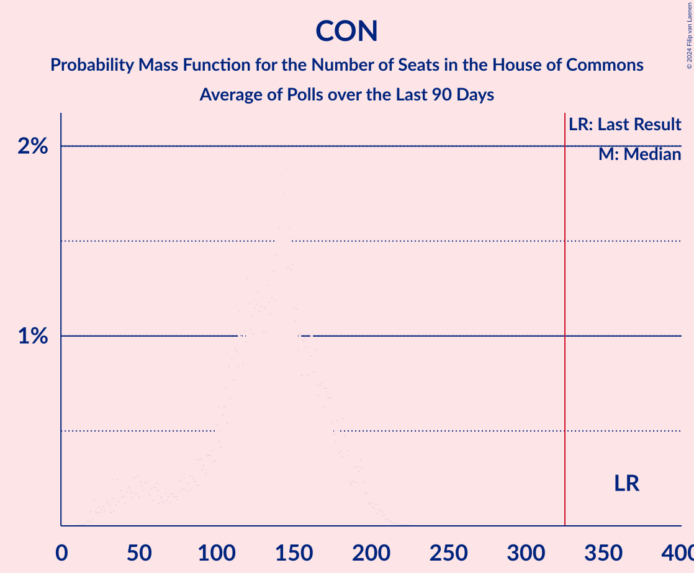

# Poll Average

<a href="#voting-intentions">Voting Intentions</a> | <a href="#seats">Seats</a> | <a href="#coalitions">Coalitions</a> | <a href="#technical-information">Technical Information</a>

## Summary

The table below lists the polls on which the average is based. They are the most recent polls (less than 90 days old) registered and analyzed so far.

| Period     | Polling firm/Commissioner(s) | CON | LAB | LIBDEM | SNP | GREEN | BREXIT | PC | SPKR | UKIP | ChUK | NI |
|:----------:|:----------------------------:|:--:|:--:|:--:|:--:|:--:|:--:|:--:|:--:|:--:|:--:|:--:|
| 12 December 2019 | General Election | 43.6%   365 | 32.1%   202 | 11.5%   11 | 3.9%   48 | 2.8%   1 | 2.0%   0 | 0.5%   4 | 0.1%   1 | 0.1%   0 | 0.0%   0 | 0.0%   18 |
| N/A | Poll Average | 22–27%   79–165 | 46–54%   381–477 | 8–12%   18–45 | 2–5%   21–57 | 3–6%   1–2 | 4–6%   0–4 | 1–2%   4–6 | N/A   1 | N/A   N/A | N/A   N/A | N/A   18 |
| [18–19 January 2024](2024-01-19-WeThink.html) | We Think | 22–27%   73–165 | 48–54%   398–482 | 8–12%   17–42 | 2–4%   19–52 | 3–6%   1 | 4–6%   0–4 | N/A   N/A | N/A   1 | N/A   N/A | N/A   N/A | N/A   18 |
| [17–18 January 2024](2024-01-18-TechneUK.html) | Techne UK | N/A   N/A | N/A   N/A | N/A   N/A | N/A   N/A | N/A   N/A | N/A   N/A | N/A   N/A | N/A   N/A | N/A   N/A | N/A   N/A | N/A   N/A |
| [16–17 January 2024](2024-01-17-YouGov.html) | YouGov   The Times | N/A   N/A | N/A   N/A | N/A   N/A | N/A   N/A | N/A   N/A | N/A   N/A | N/A   N/A | N/A   N/A | N/A   N/A | N/A   N/A | N/A   N/A |
| [11–15 January 2024](2024-01-15-LordAshcroft.html) | Lord Ashcroft | N/A   N/A | N/A   N/A | N/A   N/A | N/A   N/A | N/A   N/A | N/A   N/A | N/A   N/A | N/A   N/A | N/A   N/A | N/A   N/A | N/A   N/A |
| [12–15 January 2024](2024-01-15-Deltapoll.html) | Deltapoll | N/A   N/A | N/A   N/A | N/A   N/A | N/A   N/A | N/A   N/A | N/A   N/A | N/A   N/A | N/A   N/A | N/A   N/A | N/A   N/A | N/A   N/A |
| [12–14 January 2024](2024-01-14-Savanta.html) | Savanta | N/A   N/A | N/A   N/A | N/A   N/A | N/A   N/A | N/A   N/A | N/A   N/A | N/A   N/A | N/A   N/A | N/A   N/A | N/A   N/A | N/A   N/A |
| [14 January 2024](2024-01-14-RedfieldWiltonStrategies.html) | Redfield & Wilton Strategies | N/A   N/A | N/A   N/A | N/A   N/A | N/A   N/A | N/A   N/A | N/A   N/A | N/A   N/A | N/A   N/A | N/A   N/A | N/A   N/A | N/A   N/A |
| [10–12 January 2024](2024-01-12-Opinium.html) | Opinium   The Observer | N/A   N/A | N/A   N/A | N/A   N/A | N/A   N/A | N/A   N/A | N/A   N/A | N/A   N/A | N/A   N/A | N/A   N/A | N/A   N/A | N/A   N/A |
| [9–11 January 2024](2024-01-11-MoreinCommon.html) | More in Common   Times Radio | N/A   N/A | N/A   N/A | N/A   N/A | N/A   N/A | N/A   N/A | N/A   N/A | N/A   N/A | N/A   N/A | N/A   N/A | N/A   N/A | N/A   N/A |
| [28 December 2023](2023-12-28-PeoplePolling.html) | PeoplePolling   GB News | 23–26%   93–165 | 46–50%   376–440 | 9–12%   21–47 | 3–5%   38–57 | 4–6%   1–2 | 4–6%   0–4 | 1–2%   4–6 | N/A   1 | N/A   N/A | N/A   N/A | N/A   18 |
| 12 December 2019 | General Election | 43.6%   365 | 32.1%   202 | 11.5%   11 | 3.9%   48 | 2.8%   1 | 2.0%   0 | 0.5%   4 | 0.1%   1 | 0.1%   0 | 0.0%   0 | 0.0%   18 |

Only polls for which at least the sample size has been published are included in the table above.

**Legend:**
+ **Top half of each row:** Voting intentions (95% confidence interval)
+ **Bottom half of each row:** Seat projections for the House of Commons (95% confidence interval)
+ **CON:** Conservative Party
+ **LAB:** Labour Party
+ **LIBDEM:** Liberal Democrats
+ **SNP:** Scottish National Party
+ **GREEN:** Green Party
+ **BREXIT:** Brexit Party
+ **PC:** Plaid Cymru
+ **SPKR:** Speaker
+ **UKIP:** UK Independence Party
+ **ChUK:** Change UK
+ **NI:** Northern Irish Parties
+ **N/A (single party):** Party not included the published results
+ **N/A (entire row):** Calculation for this opinion poll not started yet

## Voting Intentions

### Confidence Intervals

| Party | Last Result | Median | 80% Confidence Interval | 90% Confidence Interval | 95% Confidence Interval | 99% Confidence Interval |
|:-----:|:-----------:|:------:|:-----------------------:|:-----------------------:|:-----------------------:|:-----------------------:|
| <a href="#conservative-party">Conservative Party</a> | 43.6% | 24.5% | 23.1–26.1% |22.7–26.5% | 22.3–26.9% | 21.6–27.8% |
| <a href="#labour-party">Labour Party</a> | 32.1% | 49.4% | 46.9–52.7% |46.4–53.4% | 45.9–53.9% | 45.1–54.9% |
| <a href="#liberal-democrats">Liberal Democrats</a> | 11.5% | 10.3% | 9.0–11.4% |8.6–11.7% | 8.3–12.0% | 7.8–12.5% |
| <a href="#scottish-national-party">Scottish National Party</a> | 3.9% | 3.8% | 2.8–4.7% |2.6–4.9% | 2.5–5.1% | 2.2–5.5% |
| <a href="#green-party">Green Party</a> | 2.8% | 4.7% | 3.7–5.5% |3.5–5.7% | 3.3–5.9% | 2.9–6.3% |
| <a href="#brexit-party">Brexit Party</a> | 2.0% | 4.7% | 4.0–5.5% |3.8–5.7% | 3.7–6.0% | 3.4–6.4% |
| <a href="#plaid-cymru">Plaid Cymru</a> | 0.5% | 1.1% | 0.8–1.5% |0.8–1.6% | 0.7–1.7% | 0.6–1.9% |
| <a href="#speaker">Speaker</a> | 0.1% | N/A | N/A |N/A | N/A | N/A |
| <a href="#uk-independence-party">UK Independence Party</a> | 0.1% | N/A | N/A |N/A | N/A | N/A |
| <a href="#change-uk">Change UK</a> | 0.0% | N/A | N/A |N/A | N/A | N/A |
| <a href="#northern-irish-parties">Northern Irish Parties</a> | 0.0% | N/A | N/A |N/A | N/A | N/A |

### Conservative Party

*For a full overview of the results for this party, see the [Conservative Party](party-conservativeparty.html) page.*

| Voting Intentions | Probability | Accumulated | Special Marks |
|:-----------------:|:-----------:|:-----------:|:-------------:|
| 19.5–20.5% | 0% | 100% |  |
| 20.5–21.5% | 0.4% | 100% |  |
| 21.5–22.5% | 4% | 99.6% |  |
| 22.5–23.5% | 15% | 96% |  |
| 23.5–24.5% | 32% | 81% |  |
| 24.5–25.5% | 30% | 49% | Median |
| 25.5–26.5% | 15% | 19% |  |
| 26.5–27.5% | 4% | 5% |  |
| 27.5–28.5% | 0.7% | 0.8% |  |
| 28.5–29.5% | 0.1% | 0.1% |  |
| 29.5–30.5% | 0% | 0% |  |
| 30.5–31.5% | 0% | 0% |  |
| 31.5–32.5% | 0% | 0% |  |
| 32.5–33.5% | 0% | 0% |  |
| 33.5–34.5% | 0% | 0% |  |
| 34.5–35.5% | 0% | 0% |  |
| 35.5–36.5% | 0% | 0% |  |
| 36.5–37.5% | 0% | 0% |  |
| 37.5–38.5% | 0% | 0% |  |
| 38.5–39.5% | 0% | 0% |  |
| 39.5–40.5% | 0% | 0% |  |
| 40.5–41.5% | 0% | 0% |  |
| 41.5–42.5% | 0% | 0% |  |
| 42.5–43.5% | 0% | 0% |  |
| 43.5–44.5% | 0% | 0% | Last Result |

### Labour Party

*For a full overview of the results for this party, see the [Labour Party](party-labourparty.html) page.*

| Voting Intentions | Probability | Accumulated | Special Marks |
|:-----------------:|:-----------:|:-----------:|:-------------:|
| 31.5–32.5% | 0% | 100% | Last Result |
| 32.5–33.5% | 0% | 100% |  |
| 33.5–34.5% | 0% | 100% |  |
| 34.5–35.5% | 0% | 100% |  |
| 35.5–36.5% | 0% | 100% |  |
| 36.5–37.5% | 0% | 100% |  |
| 37.5–38.5% | 0% | 100% |  |
| 38.5–39.5% | 0% | 100% |  |
| 39.5–40.5% | 0% | 100% |  |
| 40.5–41.5% | 0% | 100% |  |
| 41.5–42.5% | 0% | 100% |  |
| 42.5–43.5% | 0% | 100% |  |
| 43.5–44.5% | 0.1% | 100% |  |
| 44.5–45.5% | 1.1% | 99.9% |  |
| 45.5–46.5% | 5% | 98.8% |  |
| 46.5–47.5% | 14% | 93% |  |
| 47.5–48.5% | 17% | 80% |  |
| 48.5–49.5% | 14% | 62% | Median |
| 49.5–50.5% | 12% | 48% |  |
| 50.5–51.5% | 13% | 36% |  |
| 51.5–52.5% | 12% | 23% |  |
| 52.5–53.5% | 7% | 11% |  |
| 53.5–54.5% | 3% | 4% |  |
| 54.5–55.5% | 0.8% | 1.0% |  |
| 55.5–56.5% | 0.1% | 0.2% |  |
| 56.5–57.5% | 0% | 0% |  |

### Liberal Democrats

*For a full overview of the results for this party, see the [Liberal Democrats](party-liberaldemocrats.html) page.*

| Voting Intentions | Probability | Accumulated | Special Marks |
|:-----------------:|:-----------:|:-----------:|:-------------:|
| 5.5–6.5% | 0% | 100% |  |
| 6.5–7.5% | 0.2% | 100% |  |
| 7.5–8.5% | 4% | 99.8% |  |
| 8.5–9.5% | 20% | 96% |  |
| 9.5–10.5% | 38% | 76% | Median |
| 10.5–11.5% | 31% | 38% |  |
| 11.5–12.5% | 7% | 7% | Last Result |
| 12.5–13.5% | 0.4% | 0.4% |  |
| 13.5–14.5% | 0% | 0% |  |

### Scottish National Party

*For a full overview of the results for this party, see the [Scottish National Party](party-scottishnationalparty.html) page.*

| Voting Intentions | Probability | Accumulated | Special Marks |
|:-----------------:|:-----------:|:-----------:|:-------------:|
| 0.5–1.5% | 0% | 100% |  |
| 1.5–2.5% | 3% | 100% |  |
| 2.5–3.5% | 33% | 97% |  |
| 3.5–4.5% | 48% | 63% | Last Result, Median |
| 4.5–5.5% | 15% | 16% |  |
| 5.5–6.5% | 0.4% | 0.4% |  |
| 6.5–7.5% | 0% | 0% |  |

### Green Party

*For a full overview of the results for this party, see the [Green Party](party-greenparty.html) page.*

| Voting Intentions | Probability | Accumulated | Special Marks |
|:-----------------:|:-----------:|:-----------:|:-------------:|
| 1.5–2.5% | 0% | 100% |  |
| 2.5–3.5% | 6% | 100% | Last Result |
| 3.5–4.5% | 38% | 94% |  |
| 4.5–5.5% | 47% | 55% | Median |
| 5.5–6.5% | 8% | 9% |  |
| 6.5–7.5% | 0.1% | 0.1% |  |
| 7.5–8.5% | 0% | 0% |  |

### Brexit Party

*For a full overview of the results for this party, see the [Brexit Party](party-brexitparty.html) page.*

| Voting Intentions | Probability | Accumulated | Special Marks |
|:-----------------:|:-----------:|:-----------:|:-------------:|
| 1.5–2.5% | 0% | 100% | Last Result |
| 2.5–3.5% | 1.3% | 100% |  |
| 3.5–4.5% | 38% | 98.7% |  |
| 4.5–5.5% | 53% | 61% | Median |
| 5.5–6.5% | 8% | 8% |  |
| 6.5–7.5% | 0.3% | 0.3% |  |
| 7.5–8.5% | 0% | 0% |  |

### Plaid Cymru

*For a full overview of the results for this party, see the [Plaid Cymru](party-plaidcymru.html) page.*

| Voting Intentions | Probability | Accumulated | Special Marks |
|:-----------------:|:-----------:|:-----------:|:-------------:|
| 0.0–0.5% | 0.2% | 100% |  |
| 0.5–1.5% | 94% | 99.8% | Last Result, Median |
| 1.5–2.5% | 5% | 5% |  |
| 2.5–3.5% | 0% | 0% |  |

## Seats

### Confidence Intervals

| Party | Last Result | Median | 80% Confidence Interval | 90% Confidence Interval | 95% Confidence Interval | 99% Confidence Interval |
|:-----:|:-----------:|:------:|:-----------------------:|:-----------------------:|:-----------------------:|:-----------------------:|
| <a href="#conservative-party">Conservative Party</a> | 365 | 131 | 96–154 |87–160 | 79–165 | 69–177 |
| <a href="#labour-party">Labour Party</a> | 202 | 417 | 391–459 |386–469 | 381–477 | 370–488 |
| <a href="#liberal-democrats">Liberal Democrats</a> | 11 | 31 | 21–39 |20–41 | 18–45 | 15–50 |
| <a href="#scottish-national-party">Scottish National Party</a> | 48 | 44 | 27–55 |22–57 | 21–57 | 17–58 |
| <a href="#green-party">Green Party</a> | 1 | 1 | 1 |1 | 1–2 | 1–3 |
| <a href="#brexit-party">Brexit Party</a> | 0 | 3 | 0–3 |0–3 | 0–4 | 0–4 |
| <a href="#plaid-cymru">Plaid Cymru</a> | 4 | 5 | 5 |5 | 4–6 | 4–6 |
| <a href="#speaker">Speaker</a> | 1 | 1 | 1 |1 | 1 | 1 |
| <a href="#uk-independence-party">UK Independence Party</a> | 0 | N/A | N/A |N/A | N/A | N/A |
| <a href="#change-uk">Change UK</a> | 0 | N/A | N/A |N/A | N/A | N/A |
| <a href="#northern-irish-parties">Northern Irish Parties</a> | 18 | 18 | 18 |18 | 18 | 18 |

### Conservative Party

*For a full overview of the results for this party, see the [Conservative Party](party-conservativeparty.html) page.*

| Number of Seats | Probability | Accumulated | Special Marks |
|:---------------:|:-----------:|:-----------:|:-------------:|
| 57 | 0% | 100% |  |
| 58 | 0% | 99.9% |  |
| 59 | 0% | 99.9% |  |
| 60 | 0% | 99.9% |  |
| 61 | 0% | 99.9% |  |
| 62 | 0.1% | 99.9% |  |
| 63 | 0% | 99.8% |  |
| 64 | 0% | 99.8% |  |
| 65 | 0% | 99.7% |  |
| 66 | 0.1% | 99.7% |  |
| 67 | 0.1% | 99.6% |  |
| 68 | 0.1% | 99.6% |  |
| 69 | 0.1% | 99.5% |  |
| 70 | 0.2% | 99.4% |  |
| 71 | 0.2% | 99.2% |  |
| 72 | 0.2% | 99.1% |  |
| 73 | 0.2% | 98.9% |  |
| 74 | 0.1% | 98.7% |  |
| 75 | 0.2% | 98.5% |  |
| 76 | 0.2% | 98% |  |
| 77 | 0.2% | 98% |  |
| 78 | 0.2% | 98% |  |
| 79 | 0.2% | 98% |  |
| 80 | 0.4% | 97% |  |
| 81 | 0.2% | 97% |  |
| 82 | 0.4% | 97% |  |
| 83 | 0.4% | 96% |  |
| 84 | 0.4% | 96% |  |
| 85 | 0.3% | 96% |  |
| 86 | 0.3% | 95% |  |
| 87 | 0.4% | 95% |  |
| 88 | 0.3% | 95% |  |
| 89 | 0.4% | 94% |  |
| 90 | 0.5% | 94% |  |
| 91 | 0.7% | 93% |  |
| 92 | 0.6% | 93% |  |
| 93 | 0.6% | 92% |  |
| 94 | 0.6% | 92% |  |
| 95 | 0.7% | 91% |  |
| 96 | 0.6% | 90% |  |
| 97 | 0.8% | 90% |  |
| 98 | 0.9% | 89% |  |
| 99 | 0.7% | 88% |  |
| 100 | 0.7% | 87% |  |
| 101 | 0.7% | 87% |  |
| 102 | 0.8% | 86% |  |
| 103 | 0.9% | 85% |  |
| 104 | 0.8% | 84% |  |
| 105 | 1.2% | 83% |  |
| 106 | 0.8% | 82% |  |
| 107 | 1.1% | 81% |  |
| 108 | 1.3% | 80% |  |
| 109 | 1.0% | 79% |  |
| 110 | 1.1% | 78% |  |
| 111 | 1.0% | 77% |  |
| 112 | 1.1% | 76% |  |
| 113 | 0.7% | 75% |  |
| 114 | 1.4% | 74% |  |
| 115 | 1.2% | 73% |  |
| 116 | 0.9% | 71% |  |
| 117 | 1.0% | 71% |  |
| 118 | 1.0% | 70% |  |
| 119 | 1.5% | 69% |  |
| 120 | 1.1% | 67% |  |
| 121 | 2% | 66% |  |
| 122 | 1.1% | 64% |  |
| 123 | 1.1% | 63% |  |
| 124 | 1.2% | 62% |  |
| 125 | 1.3% | 61% |  |
| 126 | 2% | 59% |  |
| 127 | 2% | 58% |  |
| 128 | 1.2% | 56% |  |
| 129 | 1.3% | 55% |  |
| 130 | 2% | 53% |  |
| 131 | 2% | 52% | Median |
| 132 | 0.8% | 50% |  |
| 133 | 2% | 49% |  |
| 134 | 1.3% | 47% |  |
| 135 | 2% | 46% |  |
| 136 | 1.4% | 43% |  |
| 137 | 2% | 42% |  |
| 138 | 2% | 40% |  |
| 139 | 2% | 38% |  |
| 140 | 2% | 36% |  |
| 141 | 2% | 34% |  |
| 142 | 2% | 32% |  |
| 143 | 2% | 30% |  |
| 144 | 2% | 28% |  |
| 145 | 2% | 26% |  |
| 146 | 3% | 24% |  |
| 147 | 1.1% | 21% |  |
| 148 | 1.5% | 20% |  |
| 149 | 2% | 19% |  |
| 150 | 2% | 17% |  |
| 151 | 1.1% | 15% |  |
| 152 | 1.2% | 14% |  |
| 153 | 1.2% | 13% |  |
| 154 | 2% | 11% |  |
| 155 | 1.2% | 10% |  |
| 156 | 0.9% | 8% |  |
| 157 | 0.6% | 7% |  |
| 158 | 0.9% | 7% |  |
| 159 | 0.8% | 6% |  |
| 160 | 0.7% | 5% |  |
| 161 | 0.5% | 4% |  |
| 162 | 0.5% | 4% |  |
| 163 | 0.3% | 3% |  |
| 164 | 0.5% | 3% |  |
| 165 | 0.4% | 3% |  |
| 166 | 0.3% | 2% |  |
| 167 | 0.1% | 2% |  |
| 168 | 0.2% | 2% |  |
| 169 | 0.3% | 2% |  |
| 170 | 0.2% | 1.3% |  |
| 171 | 0.2% | 1.2% |  |
| 172 | 0.1% | 1.0% |  |
| 173 | 0.1% | 0.9% |  |
| 174 | 0.1% | 0.8% |  |
| 175 | 0.1% | 0.7% |  |
| 176 | 0.1% | 0.6% |  |
| 177 | 0.1% | 0.5% |  |
| 178 | 0.1% | 0.4% |  |
| 179 | 0.1% | 0.4% |  |
| 180 | 0% | 0.3% |  |
| 181 | 0% | 0.3% |  |
| 182 | 0% | 0.2% |  |
| 183 | 0% | 0.2% |  |
| 184 | 0% | 0.1% |  |
| 185 | 0% | 0.1% |  |
| 186 | 0% | 0.1% |  |
| 187 | 0% | 0.1% |  |
| 188 | 0% | 0.1% |  |
| 189 | 0% | 0% |  |
| 190 | 0% | 0% |  |
| 191 | 0% | 0% |  |
| 192 | 0% | 0% |  |
| 193 | 0% | 0% |  |
| 194 | 0% | 0% |  |
| 195 | 0% | 0% |  |
| 196 | 0% | 0% |  |
| 197 | 0% | 0% |  |
| 198 | 0% | 0% |  |
| 199 | 0% | 0% |  |
| 200 | 0% | 0% |  |
| 201 | 0% | 0% |  |
| 202 | 0% | 0% |  |
| 203 | 0% | 0% |  |
| 204 | 0% | 0% |  |
| 205 | 0% | 0% |  |
| 206 | 0% | 0% |  |
| 207 | 0% | 0% |  |
| 208 | 0% | 0% |  |
| 209 | 0% | 0% |  |
| 210 | 0% | 0% |  |
| 211 | 0% | 0% |  |
| 212 | 0% | 0% |  |
| 213 | 0% | 0% |  |
| 214 | 0% | 0% |  |
| 215 | 0% | 0% |  |
| 216 | 0% | 0% |  |
| 217 | 0% | 0% |  |
| 218 | 0% | 0% |  |
| 219 | 0% | 0% |  |
| 220 | 0% | 0% |  |
| 221 | 0% | 0% |  |
| 222 | 0% | 0% |  |
| 223 | 0% | 0% |  |
| 224 | 0% | 0% |  |
| 225 | 0% | 0% |  |
| 226 | 0% | 0% |  |
| 227 | 0% | 0% |  |
| 228 | 0% | 0% |  |
| 229 | 0% | 0% |  |
| 230 | 0% | 0% |  |
| 231 | 0% | 0% |  |
| 232 | 0% | 0% |  |
| 233 | 0% | 0% |  |
| 234 | 0% | 0% |  |
| 235 | 0% | 0% |  |
| 236 | 0% | 0% |  |
| 237 | 0% | 0% |  |
| 238 | 0% | 0% |  |
| 239 | 0% | 0% |  |
| 240 | 0% | 0% |  |
| 241 | 0% | 0% |  |
| 242 | 0% | 0% |  |
| 243 | 0% | 0% |  |
| 244 | 0% | 0% |  |
| 245 | 0% | 0% |  |
| 246 | 0% | 0% |  |
| 247 | 0% | 0% |  |
| 248 | 0% | 0% |  |
| 249 | 0% | 0% |  |
| 250 | 0% | 0% |  |
| 251 | 0% | 0% |  |
| 252 | 0% | 0% |  |
| 253 | 0% | 0% |  |
| 254 | 0% | 0% |  |
| 255 | 0% | 0% |  |
| 256 | 0% | 0% |  |
| 257 | 0% | 0% |  |
| 258 | 0% | 0% |  |
| 259 | 0% | 0% |  |
| 260 | 0% | 0% |  |
| 261 | 0% | 0% |  |
| 262 | 0% | 0% |  |
| 263 | 0% | 0% |  |
| 264 | 0% | 0% |  |
| 265 | 0% | 0% |  |
| 266 | 0% | 0% |  |
| 267 | 0% | 0% |  |
| 268 | 0% | 0% |  |
| 269 | 0% | 0% |  |
| 270 | 0% | 0% |  |
| 271 | 0% | 0% |  |
| 272 | 0% | 0% |  |
| 273 | 0% | 0% |  |
| 274 | 0% | 0% |  |
| 275 | 0% | 0% |  |
| 276 | 0% | 0% |  |
| 277 | 0% | 0% |  |
| 278 | 0% | 0% |  |
| 279 | 0% | 0% |  |
| 280 | 0% | 0% |  |
| 281 | 0% | 0% |  |
| 282 | 0% | 0% |  |
| 283 | 0% | 0% |  |
| 284 | 0% | 0% |  |
| 285 | 0% | 0% |  |
| 286 | 0% | 0% |  |
| 287 | 0% | 0% |  |
| 288 | 0% | 0% |  |
| 289 | 0% | 0% |  |
| 290 | 0% | 0% |  |
| 291 | 0% | 0% |  |
| 292 | 0% | 0% |  |
| 293 | 0% | 0% |  |
| 294 | 0% | 0% |  |
| 295 | 0% | 0% |  |
| 296 | 0% | 0% |  |
| 297 | 0% | 0% |  |
| 298 | 0% | 0% |  |
| 299 | 0% | 0% |  |
| 300 | 0% | 0% |  |
| 301 | 0% | 0% |  |
| 302 | 0% | 0% |  |
| 303 | 0% | 0% |  |
| 304 | 0% | 0% |  |
| 305 | 0% | 0% |  |
| 306 | 0% | 0% |  |
| 307 | 0% | 0% |  |
| 308 | 0% | 0% |  |
| 309 | 0% | 0% |  |
| 310 | 0% | 0% |  |
| 311 | 0% | 0% |  |
| 312 | 0% | 0% |  |
| 313 | 0% | 0% |  |
| 314 | 0% | 0% |  |
| 315 | 0% | 0% |  |
| 316 | 0% | 0% |  |
| 317 | 0% | 0% |  |
| 318 | 0% | 0% |  |
| 319 | 0% | 0% |  |
| 320 | 0% | 0% |  |
| 321 | 0% | 0% |  |
| 322 | 0% | 0% |  |
| 323 | 0% | 0% |  |
| 324 | 0% | 0% |  |
| 325 | 0% | 0% |  |
| 326 | 0% | 0% | Majority |
| 327 | 0% | 0% |  |
| 328 | 0% | 0% |  |
| 329 | 0% | 0% |  |
| 330 | 0% | 0% |  |
| 331 | 0% | 0% |  |
| 332 | 0% | 0% |  |
| 333 | 0% | 0% |  |
| 334 | 0% | 0% |  |
| 335 | 0% | 0% |  |
| 336 | 0% | 0% |  |
| 337 | 0% | 0% |  |
| 338 | 0% | 0% |  |
| 339 | 0% | 0% |  |
| 340 | 0% | 0% |  |
| 341 | 0% | 0% |  |
| 342 | 0% | 0% |  |
| 343 | 0% | 0% |  |
| 344 | 0% | 0% |  |
| 345 | 0% | 0% |  |
| 346 | 0% | 0% |  |
| 347 | 0% | 0% |  |
| 348 | 0% | 0% |  |
| 349 | 0% | 0% |  |
| 350 | 0% | 0% |  |
| 351 | 0% | 0% |  |
| 352 | 0% | 0% |  |
| 353 | 0% | 0% |  |
| 354 | 0% | 0% |  |
| 355 | 0% | 0% |  |
| 356 | 0% | 0% |  |
| 357 | 0% | 0% |  |
| 358 | 0% | 0% |  |
| 359 | 0% | 0% |  |
| 360 | 0% | 0% |  |
| 361 | 0% | 0% |  |
| 362 | 0% | 0% |  |
| 363 | 0% | 0% |  |
| 364 | 0% | 0% |  |
| 365 | 0% | 0% | Last Result |

### Labour Party

*For a full overview of the results for this party, see the [Labour Party](party-labourparty.html) page.*

| Number of Seats | Probability | Accumulated | Special Marks |
|:---------------:|:-----------:|:-----------:|:-------------:|
| 202 | 0% | 100% | Last Result |
| 203 | 0% | 100% |  |
| 204 | 0% | 100% |  |
| 205 | 0% | 100% |  |
| 206 | 0% | 100% |  |
| 207 | 0% | 100% |  |
| 208 | 0% | 100% |  |
| 209 | 0% | 100% |  |
| 210 | 0% | 100% |  |
| 211 | 0% | 100% |  |
| 212 | 0% | 100% |  |
| 213 | 0% | 100% |  |
| 214 | 0% | 100% |  |
| 215 | 0% | 100% |  |
| 216 | 0% | 100% |  |
| 217 | 0% | 100% |  |
| 218 | 0% | 100% |  |
| 219 | 0% | 100% |  |
| 220 | 0% | 100% |  |
| 221 | 0% | 100% |  |
| 222 | 0% | 100% |  |
| 223 | 0% | 100% |  |
| 224 | 0% | 100% |  |
| 225 | 0% | 100% |  |
| 226 | 0% | 100% |  |
| 227 | 0% | 100% |  |
| 228 | 0% | 100% |  |
| 229 | 0% | 100% |  |
| 230 | 0% | 100% |  |
| 231 | 0% | 100% |  |
| 232 | 0% | 100% |  |
| 233 | 0% | 100% |  |
| 234 | 0% | 100% |  |
| 235 | 0% | 100% |  |
| 236 | 0% | 100% |  |
| 237 | 0% | 100% |  |
| 238 | 0% | 100% |  |
| 239 | 0% | 100% |  |
| 240 | 0% | 100% |  |
| 241 | 0% | 100% |  |
| 242 | 0% | 100% |  |
| 243 | 0% | 100% |  |
| 244 | 0% | 100% |  |
| 245 | 0% | 100% |  |
| 246 | 0% | 100% |  |
| 247 | 0% | 100% |  |
| 248 | 0% | 100% |  |
| 249 | 0% | 100% |  |
| 250 | 0% | 100% |  |
| 251 | 0% | 100% |  |
| 252 | 0% | 100% |  |
| 253 | 0% | 100% |  |
| 254 | 0% | 100% |  |
| 255 | 0% | 100% |  |
| 256 | 0% | 100% |  |
| 257 | 0% | 100% |  |
| 258 | 0% | 100% |  |
| 259 | 0% | 100% |  |
| 260 | 0% | 100% |  |
| 261 | 0% | 100% |  |
| 262 | 0% | 100% |  |
| 263 | 0% | 100% |  |
| 264 | 0% | 100% |  |
| 265 | 0% | 100% |  |
| 266 | 0% | 100% |  |
| 267 | 0% | 100% |  |
| 268 | 0% | 100% |  |
| 269 | 0% | 100% |  |
| 270 | 0% | 100% |  |
| 271 | 0% | 100% |  |
| 272 | 0% | 100% |  |
| 273 | 0% | 100% |  |
| 274 | 0% | 100% |  |
| 275 | 0% | 100% |  |
| 276 | 0% | 100% |  |
| 277 | 0% | 100% |  |
| 278 | 0% | 100% |  |
| 279 | 0% | 100% |  |
| 280 | 0% | 100% |  |
| 281 | 0% | 100% |  |
| 282 | 0% | 100% |  |
| 283 | 0% | 100% |  |
| 284 | 0% | 100% |  |
| 285 | 0% | 100% |  |
| 286 | 0% | 100% |  |
| 287 | 0% | 100% |  |
| 288 | 0% | 100% |  |
| 289 | 0% | 100% |  |
| 290 | 0% | 100% |  |
| 291 | 0% | 100% |  |
| 292 | 0% | 100% |  |
| 293 | 0% | 100% |  |
| 294 | 0% | 100% |  |
| 295 | 0% | 100% |  |
| 296 | 0% | 100% |  |
| 297 | 0% | 100% |  |
| 298 | 0% | 100% |  |
| 299 | 0% | 100% |  |
| 300 | 0% | 100% |  |
| 301 | 0% | 100% |  |
| 302 | 0% | 100% |  |
| 303 | 0% | 100% |  |
| 304 | 0% | 100% |  |
| 305 | 0% | 100% |  |
| 306 | 0% | 100% |  |
| 307 | 0% | 100% |  |
| 308 | 0% | 100% |  |
| 309 | 0% | 100% |  |
| 310 | 0% | 100% |  |
| 311 | 0% | 100% |  |
| 312 | 0% | 100% |  |
| 313 | 0% | 100% |  |
| 314 | 0% | 100% |  |
| 315 | 0% | 100% |  |
| 316 | 0% | 100% |  |
| 317 | 0% | 100% |  |
| 318 | 0% | 100% |  |
| 319 | 0% | 100% |  |
| 320 | 0% | 100% |  |
| 321 | 0% | 100% |  |
| 322 | 0% | 100% |  |
| 323 | 0% | 100% |  |
| 324 | 0% | 100% |  |
| 325 | 0% | 100% |  |
| 326 | 0% | 100% | Majority |
| 327 | 0% | 100% |  |
| 328 | 0% | 100% |  |
| 329 | 0% | 100% |  |
| 330 | 0% | 100% |  |
| 331 | 0% | 100% |  |
| 332 | 0% | 100% |  |
| 333 | 0% | 100% |  |
| 334 | 0% | 100% |  |
| 335 | 0% | 100% |  |
| 336 | 0% | 100% |  |
| 337 | 0% | 100% |  |
| 338 | 0% | 100% |  |
| 339 | 0% | 100% |  |
| 340 | 0% | 100% |  |
| 341 | 0% | 100% |  |
| 342 | 0% | 100% |  |
| 343 | 0% | 100% |  |
| 344 | 0% | 100% |  |
| 345 | 0% | 100% |  |
| 346 | 0% | 100% |  |
| 347 | 0% | 100% |  |
| 348 | 0% | 100% |  |
| 349 | 0% | 100% |  |
| 350 | 0% | 100% |  |
| 351 | 0% | 100% |  |
| 352 | 0% | 100% |  |
| 353 | 0% | 100% |  |
| 354 | 0% | 100% |  |
| 355 | 0% | 100% |  |
| 356 | 0% | 100% |  |
| 357 | 0% | 100% |  |
| 358 | 0% | 100% |  |
| 359 | 0% | 100% |  |
| 360 | 0% | 100% |  |
| 361 | 0% | 99.9% |  |
| 362 | 0% | 99.9% |  |
| 363 | 0% | 99.9% |  |
| 364 | 0% | 99.9% |  |
| 365 | 0% | 99.8% |  |
| 366 | 0% | 99.8% |  |
| 367 | 0.1% | 99.7% |  |
| 368 | 0% | 99.7% |  |
| 369 | 0.1% | 99.6% |  |
| 370 | 0.1% | 99.5% |  |
| 371 | 0.1% | 99.4% |  |
| 372 | 0.1% | 99.3% |  |
| 373 | 0.1% | 99.2% |  |
| 374 | 0.1% | 99.1% |  |
| 375 | 0.2% | 99.0% |  |
| 376 | 0.2% | 98.8% |  |
| 377 | 0.1% | 98.7% |  |
| 378 | 0.2% | 98.5% |  |
| 379 | 0.3% | 98% |  |
| 380 | 0.3% | 98% |  |
| 381 | 0.3% | 98% |  |
| 382 | 0.4% | 97% |  |
| 383 | 0.6% | 97% |  |
| 384 | 0.7% | 96% |  |
| 385 | 0.7% | 96% |  |
| 386 | 0.5% | 95% |  |
| 387 | 1.3% | 95% |  |
| 388 | 0.7% | 93% |  |
| 389 | 1.2% | 92% |  |
| 390 | 1.0% | 91% |  |
| 391 | 1.4% | 90% |  |
| 392 | 2% | 89% |  |
| 393 | 1.2% | 87% |  |
| 394 | 2% | 86% |  |
| 395 | 1.4% | 83% |  |
| 396 | 2% | 82% |  |
| 397 | 1.5% | 80% |  |
| 398 | 1.4% | 79% |  |
| 399 | 2% | 77% |  |
| 400 | 2% | 75% |  |
| 401 | 1.3% | 73% |  |
| 402 | 1.3% | 72% |  |
| 403 | 1.3% | 71% |  |
| 404 | 2% | 69% |  |
| 405 | 1.4% | 68% |  |
| 406 | 2% | 66% |  |
| 407 | 1.3% | 64% |  |
| 408 | 1.3% | 63% |  |
| 409 | 2% | 61% |  |
| 410 | 1.2% | 59% |  |
| 411 | 1.1% | 58% |  |
| 412 | 2% | 57% |  |
| 413 | 1.2% | 55% |  |
| 414 | 1.5% | 54% |  |
| 415 | 1.2% | 53% |  |
| 416 | 1.1% | 51% |  |
| 417 | 1.0% | 50% | Median |
| 418 | 1.0% | 49% |  |
| 419 | 2% | 48% |  |
| 420 | 1.2% | 46% |  |
| 421 | 1.2% | 45% |  |
| 422 | 1.1% | 44% |  |
| 423 | 0.9% | 43% |  |
| 424 | 1.0% | 42% |  |
| 425 | 1.2% | 41% |  |
| 426 | 0.9% | 40% |  |
| 427 | 1.3% | 39% |  |
| 428 | 1.3% | 37% |  |
| 429 | 1.2% | 36% |  |
| 430 | 1.0% | 35% |  |
| 431 | 0.9% | 34% |  |
| 432 | 0.5% | 33% |  |
| 433 | 0.8% | 33% |  |
| 434 | 0.7% | 32% |  |
| 435 | 0.9% | 31% |  |
| 436 | 1.1% | 30% |  |
| 437 | 1.0% | 29% |  |
| 438 | 2% | 28% |  |
| 439 | 1.2% | 26% |  |
| 440 | 0.8% | 25% |  |
| 441 | 0.3% | 24% |  |
| 442 | 0.5% | 24% |  |
| 443 | 1.0% | 24% |  |
| 444 | 0.9% | 23% |  |
| 445 | 0.9% | 22% |  |
| 446 | 0.9% | 21% |  |
| 447 | 0.7% | 20% |  |
| 448 | 1.1% | 19% |  |
| 449 | 0.9% | 18% |  |
| 450 | 0.8% | 17% |  |
| 451 | 0.8% | 16% |  |
| 452 | 1.0% | 16% |  |
| 453 | 0.5% | 15% |  |
| 454 | 0.9% | 14% |  |
| 455 | 0.8% | 13% |  |
| 456 | 0.7% | 12% |  |
| 457 | 0.6% | 12% |  |
| 458 | 0.5% | 11% |  |
| 459 | 0.8% | 11% |  |
| 460 | 0.8% | 10% |  |
| 461 | 0.5% | 9% |  |
| 462 | 0.6% | 9% |  |
| 463 | 0.4% | 8% |  |
| 464 | 0.6% | 7% |  |
| 465 | 0.3% | 7% |  |
| 466 | 0.5% | 6% |  |
| 467 | 0.5% | 6% |  |
| 468 | 0.4% | 6% |  |
| 469 | 0.4% | 5% |  |
| 470 | 0.3% | 5% |  |
| 471 | 0.3% | 4% |  |
| 472 | 0.5% | 4% |  |
| 473 | 0.4% | 4% |  |
| 474 | 0.3% | 3% |  |
| 475 | 0.2% | 3% |  |
| 476 | 0.2% | 3% |  |
| 477 | 0.2% | 3% |  |
| 478 | 0.3% | 2% |  |
| 479 | 0.2% | 2% |  |
| 480 | 0.2% | 2% |  |
| 481 | 0.2% | 2% |  |
| 482 | 0.3% | 1.5% |  |
| 483 | 0.1% | 1.2% |  |
| 484 | 0.1% | 1.1% |  |
| 485 | 0.2% | 1.0% |  |
| 486 | 0.1% | 0.8% |  |
| 487 | 0.1% | 0.7% |  |
| 488 | 0.1% | 0.6% |  |
| 489 | 0.1% | 0.5% |  |
| 490 | 0.1% | 0.4% |  |
| 491 | 0.1% | 0.3% |  |
| 492 | 0.1% | 0.2% |  |
| 493 | 0% | 0.2% |  |
| 494 | 0% | 0.1% |  |
| 495 | 0% | 0.1% |  |
| 496 | 0% | 0.1% |  |
| 497 | 0% | 0.1% |  |
| 498 | 0% | 0.1% |  |
| 499 | 0% | 0% |  |

### Liberal Democrats

*For a full overview of the results for this party, see the [Liberal Democrats](party-liberaldemocrats.html) page.*

| Number of Seats | Probability | Accumulated | Special Marks |
|:---------------:|:-----------:|:-----------:|:-------------:|
| 10 | 0.1% | 100% |  |
| 11 | 0% | 99.9% | Last Result |
| 12 | 0.1% | 99.8% |  |
| 13 | 0% | 99.8% |  |
| 14 | 0.1% | 99.8% |  |
| 15 | 0.3% | 99.7% |  |
| 16 | 0.4% | 99.4% |  |
| 17 | 0.7% | 99.0% |  |
| 18 | 1.3% | 98% |  |
| 19 | 2% | 97% |  |
| 20 | 2% | 95% |  |
| 21 | 3% | 93% |  |
| 22 | 4% | 90% |  |
| 23 | 5% | 86% |  |
| 24 | 4% | 81% |  |
| 25 | 4% | 78% |  |
| 26 | 5% | 74% |  |
| 27 | 7% | 69% |  |
| 28 | 4% | 63% |  |
| 29 | 3% | 58% |  |
| 30 | 4% | 55% |  |
| 31 | 4% | 51% | Median |
| 32 | 5% | 47% |  |
| 33 | 6% | 43% |  |
| 34 | 5% | 37% |  |
| 35 | 6% | 31% |  |
| 36 | 4% | 25% |  |
| 37 | 6% | 21% |  |
| 38 | 3% | 15% |  |
| 39 | 3% | 12% |  |
| 40 | 2% | 8% |  |
| 41 | 2% | 7% |  |
| 42 | 1.0% | 5% |  |
| 43 | 0.8% | 4% |  |
| 44 | 0.3% | 3% |  |
| 45 | 0.4% | 3% |  |
| 46 | 0.5% | 2% |  |
| 47 | 0.3% | 2% |  |
| 48 | 0.4% | 2% |  |
| 49 | 0.3% | 1.2% |  |
| 50 | 0.5% | 0.9% |  |
| 51 | 0.2% | 0.4% |  |
| 52 | 0.1% | 0.1% |  |
| 53 | 0% | 0.1% |  |
| 54 | 0% | 0.1% |  |
| 55 | 0% | 0% |  |

### Scottish National Party

*For a full overview of the results for this party, see the [Scottish National Party](party-scottishnationalparty.html) page.*

| Number of Seats | Probability | Accumulated | Special Marks |
|:---------------:|:-----------:|:-----------:|:-------------:|
| 12 | 0% | 100% |  |
| 13 | 0% | 99.9% |  |
| 14 | 0% | 99.9% |  |
| 15 | 0.1% | 99.9% |  |
| 16 | 0.2% | 99.8% |  |
| 17 | 0.4% | 99.6% |  |
| 18 | 0.3% | 99.2% |  |
| 19 | 0.3% | 98.8% |  |
| 20 | 0.7% | 98% |  |
| 21 | 2% | 98% |  |
| 22 | 2% | 96% |  |
| 23 | 0.7% | 95% |  |
| 24 | 0.7% | 94% |  |
| 25 | 2% | 93% |  |
| 26 | 0.9% | 91% |  |
| 27 | 2% | 90% |  |
| 28 | 0.6% | 88% |  |
| 29 | 2% | 88% |  |
| 30 | 1.4% | 86% |  |
| 31 | 0.7% | 84% |  |
| 32 | 2% | 84% |  |
| 33 | 0.5% | 81% |  |
| 34 | 5% | 81% |  |
| 35 | 1.1% | 76% |  |
| 36 | 4% | 75% |  |
| 37 | 2% | 71% |  |
| 38 | 3% | 69% |  |
| 39 | 2% | 65% |  |
| 40 | 3% | 64% |  |
| 41 | 4% | 60% |  |
| 42 | 2% | 57% |  |
| 43 | 3% | 54% |  |
| 44 | 4% | 51% | Median |
| 45 | 2% | 47% |  |
| 46 | 3% | 45% |  |
| 47 | 1.2% | 41% |  |
| 48 | 3% | 40% | Last Result |
| 49 | 2% | 37% |  |
| 50 | 2% | 35% |  |
| 51 | 5% | 33% |  |
| 52 | 6% | 28% |  |
| 53 | 6% | 22% |  |
| 54 | 5% | 16% |  |
| 55 | 4% | 12% |  |
| 56 | 3% | 8% |  |
| 57 | 4% | 5% |  |
| 58 | 1.2% | 1.2% |  |
| 59 | 0% | 0% |  |

### Green Party

*For a full overview of the results for this party, see the [Green Party](party-greenparty.html) page.*

| Number of Seats | Probability | Accumulated | Special Marks |
|:---------------:|:-----------:|:-----------:|:-------------:|
| 1 | 96% | 100% | Last Result, Median |
| 2 | 3% | 4% |  |
| 3 | 0.6% | 0.6% |  |
| 4 | 0% | 0% |  |

### Brexit Party

*For a full overview of the results for this party, see the [Brexit Party](party-brexitparty.html) page.*

| Number of Seats | Probability | Accumulated | Special Marks |
|:---------------:|:-----------:|:-----------:|:-------------:|
| 0 | 12% | 100% | Last Result |
| 1 | 3% | 88% |  |
| 2 | 22% | 85% |  |
| 3 | 60% | 63% | Median |
| 4 | 4% | 4% |  |
| 5 | 0.1% | 0.1% |  |
| 6 | 0% | 0% |  |

### Plaid Cymru

*For a full overview of the results for this party, see the [Plaid Cymru](party-plaidcymru.html) page.*

| Number of Seats | Probability | Accumulated | Special Marks |
|:---------------:|:-----------:|:-----------:|:-------------:|
| 3 | 0.2% | 100% |  |
| 4 | 4% | 99.8% | Last Result |
| 5 | 92% | 95% | Median |
| 6 | 3% | 3% |  |
| 7 | 0.2% | 0.2% |  |
| 8 | 0% | 0% |  |

### Speaker

*For a full overview of the results for this party, see the [Speaker](party-speaker.html) page.*

| Number of Seats | Probability | Accumulated | Special Marks |
|:---------------:|:-----------:|:-----------:|:-------------:|
| 1 | 100% | 100% | Last Result, Median |

### UK Independence Party

*For a full overview of the results for this party, see the [UK Independence Party](party-ukindependenceparty.html) page.*

### Change UK

*For a full overview of the results for this party, see the [Change UK](party-changeuk.html) page.*

### Northern Irish Parties

*For a full overview of the results for this party, see the [Northern Irish Parties](party-northernirishparties.html) page.*

| Number of Seats | Probability | Accumulated | Special Marks |
|:---------------:|:-----------:|:-----------:|:-------------:|
| 18 | 100% | 100% | Last Result, Median |

## Coalitions

### Confidence Intervals

| Coalition | Last Result | Median | Majority? | 80% Confidence Interval | 90% Confidence Interval | 95% Confidence Interval | 99% Confidence Interval |
|:---------:|:-----------:|:------:|:---------:|:-----------------------:|:-----------------------:|:-----------------------:|:-----------------------:|
| Labour Party – Liberal Democrats – Scottish National Party – Green Party – Plaid Cymru | 266 | 495 | 100% | 472–528 | 466–537 | 461–544 | 449–555 |
| Labour Party – Liberal Democrats – Scottish National Party – Plaid Cymru | 265 | 494 | 100% | 471–527 | 465–536 | 460–543 | 448–554 |
| Labour Party – Liberal Democrats – Scottish National Party | 261 | 491 | 100% | 468–526 | 462–535 | 457–543 | 446–554 |
| Labour Party – Liberal Democrats – Plaid Cymru | 217 | 449 | 100% | 423–491 | 418–501 | 412–511 | 400–524 |
| Labour Party – Liberal Democrats | 213 | 447 | 100% | 419–491 | 414–501 | 408–511 | 395–524 |
| Labour Party – Scottish National Party – Plaid Cymru | 254 | 462 | 100% | 444–494 | 439–503 | 435–510 | 424–519 |
| Labour Party – Scottish National Party | 250 | 459 | 100% | 440–493 | 436–502 | 431–510 | 420–519 |
| Labour Party – Plaid Cymru | 206 | 419 | 100% | 395–459 | 390–469 | 386–477 | 374–488 |
| Labour Party | 202 | 417 | 100% | 391–459 | 386–469 | 381–477 | 370–488 |
| Conservative Party – Scottish National Party – Plaid Cymru | 417 | 178 | 0% | 132–206 | 121–212 | 112–218 | 98–230 |
| Conservative Party – Scottish National Party | 413 | 175 | 0% | 132–202 | 121–208 | 112–214 | 98–226 |
| Conservative Party – Liberal Democrats | 376 | 163 | 0% | 129–181 | 120–186 | 112–191 | 104–201 |
| Conservative Party – Plaid Cymru | 369 | 135 | 0% | 97–158 | 87–163 | 79–168 | 69–180 |
| Conservative Party | 365 | 131 | 0% | 96–154 | 87–160 | 79–165 | 69–177 |

### Labour Party – Liberal Democrats – Scottish National Party – Green Party – Plaid Cymru

| Number of Seats | Probability | Accumulated | Special Marks |
|:---------------:|:-----------:|:-----------:|:-------------:|
| 266 | 0% | 100% | Last Result |
| 267 | 0% | 100% |  |
| 268 | 0% | 100% |  |
| 269 | 0% | 100% |  |
| 270 | 0% | 100% |  |
| 271 | 0% | 100% |  |
| 272 | 0% | 100% |  |
| 273 | 0% | 100% |  |
| 274 | 0% | 100% |  |
| 275 | 0% | 100% |  |
| 276 | 0% | 100% |  |
| 277 | 0% | 100% |  |
| 278 | 0% | 100% |  |
| 279 | 0% | 100% |  |
| 280 | 0% | 100% |  |
| 281 | 0% | 100% |  |
| 282 | 0% | 100% |  |
| 283 | 0% | 100% |  |
| 284 | 0% | 100% |  |
| 285 | 0% | 100% |  |
| 286 | 0% | 100% |  |
| 287 | 0% | 100% |  |
| 288 | 0% | 100% |  |
| 289 | 0% | 100% |  |
| 290 | 0% | 100% |  |
| 291 | 0% | 100% |  |
| 292 | 0% | 100% |  |
| 293 | 0% | 100% |  |
| 294 | 0% | 100% |  |
| 295 | 0% | 100% |  |
| 296 | 0% | 100% |  |
| 297 | 0% | 100% |  |
| 298 | 0% | 100% |  |
| 299 | 0% | 100% |  |
| 300 | 0% | 100% |  |
| 301 | 0% | 100% |  |
| 302 | 0% | 100% |  |
| 303 | 0% | 100% |  |
| 304 | 0% | 100% |  |
| 305 | 0% | 100% |  |
| 306 | 0% | 100% |  |
| 307 | 0% | 100% |  |
| 308 | 0% | 100% |  |
| 309 | 0% | 100% |  |
| 310 | 0% | 100% |  |
| 311 | 0% | 100% |  |
| 312 | 0% | 100% |  |
| 313 | 0% | 100% |  |
| 314 | 0% | 100% |  |
| 315 | 0% | 100% |  |
| 316 | 0% | 100% |  |
| 317 | 0% | 100% |  |
| 318 | 0% | 100% |  |
| 319 | 0% | 100% |  |
| 320 | 0% | 100% |  |
| 321 | 0% | 100% |  |
| 322 | 0% | 100% |  |
| 323 | 0% | 100% |  |
| 324 | 0% | 100% |  |
| 325 | 0% | 100% |  |
| 326 | 0% | 100% | Majority |
| 327 | 0% | 100% |  |
| 328 | 0% | 100% |  |
| 329 | 0% | 100% |  |
| 330 | 0% | 100% |  |
| 331 | 0% | 100% |  |
| 332 | 0% | 100% |  |
| 333 | 0% | 100% |  |
| 334 | 0% | 100% |  |
| 335 | 0% | 100% |  |
| 336 | 0% | 100% |  |
| 337 | 0% | 100% |  |
| 338 | 0% | 100% |  |
| 339 | 0% | 100% |  |
| 340 | 0% | 100% |  |
| 341 | 0% | 100% |  |
| 342 | 0% | 100% |  |
| 343 | 0% | 100% |  |
| 344 | 0% | 100% |  |
| 345 | 0% | 100% |  |
| 346 | 0% | 100% |  |
| 347 | 0% | 100% |  |
| 348 | 0% | 100% |  |
| 349 | 0% | 100% |  |
| 350 | 0% | 100% |  |
| 351 | 0% | 100% |  |
| 352 | 0% | 100% |  |
| 353 | 0% | 100% |  |
| 354 | 0% | 100% |  |
| 355 | 0% | 100% |  |
| 356 | 0% | 100% |  |
| 357 | 0% | 100% |  |
| 358 | 0% | 100% |  |
| 359 | 0% | 100% |  |
| 360 | 0% | 100% |  |
| 361 | 0% | 100% |  |
| 362 | 0% | 100% |  |
| 363 | 0% | 100% |  |
| 364 | 0% | 100% |  |
| 365 | 0% | 100% |  |
| 366 | 0% | 100% |  |
| 367 | 0% | 100% |  |
| 368 | 0% | 100% |  |
| 369 | 0% | 100% |  |
| 370 | 0% | 100% |  |
| 371 | 0% | 100% |  |
| 372 | 0% | 100% |  |
| 373 | 0% | 100% |  |
| 374 | 0% | 100% |  |
| 375 | 0% | 100% |  |
| 376 | 0% | 100% |  |
| 377 | 0% | 100% |  |
| 378 | 0% | 100% |  |
| 379 | 0% | 100% |  |
| 380 | 0% | 100% |  |
| 381 | 0% | 100% |  |
| 382 | 0% | 100% |  |
| 383 | 0% | 100% |  |
| 384 | 0% | 100% |  |
| 385 | 0% | 100% |  |
| 386 | 0% | 100% |  |
| 387 | 0% | 100% |  |
| 388 | 0% | 100% |  |
| 389 | 0% | 100% |  |
| 390 | 0% | 100% |  |
| 391 | 0% | 100% |  |
| 392 | 0% | 100% |  |
| 393 | 0% | 100% |  |
| 394 | 0% | 100% |  |
| 395 | 0% | 100% |  |
| 396 | 0% | 100% |  |
| 397 | 0% | 100% |  |
| 398 | 0% | 100% |  |
| 399 | 0% | 100% |  |
| 400 | 0% | 100% |  |
| 401 | 0% | 100% |  |
| 402 | 0% | 100% |  |
| 403 | 0% | 100% |  |
| 404 | 0% | 100% |  |
| 405 | 0% | 100% |  |
| 406 | 0% | 100% |  |
| 407 | 0% | 100% |  |
| 408 | 0% | 100% |  |
| 409 | 0% | 100% |  |
| 410 | 0% | 100% |  |
| 411 | 0% | 100% |  |
| 412 | 0% | 100% |  |
| 413 | 0% | 100% |  |
| 414 | 0% | 100% |  |
| 415 | 0% | 100% |  |
| 416 | 0% | 100% |  |
| 417 | 0% | 100% |  |
| 418 | 0% | 100% |  |
| 419 | 0% | 100% |  |
| 420 | 0% | 100% |  |
| 421 | 0% | 100% |  |
| 422 | 0% | 100% |  |
| 423 | 0% | 100% |  |
| 424 | 0% | 100% |  |
| 425 | 0% | 100% |  |
| 426 | 0% | 100% |  |
| 427 | 0% | 100% |  |
| 428 | 0% | 100% |  |
| 429 | 0% | 100% |  |
| 430 | 0% | 100% |  |
| 431 | 0% | 100% |  |
| 432 | 0% | 100% |  |
| 433 | 0% | 100% |  |
| 434 | 0% | 100% |  |
| 435 | 0% | 100% |  |
| 436 | 0% | 100% |  |
| 437 | 0% | 99.9% |  |
| 438 | 0% | 99.9% |  |
| 439 | 0% | 99.9% |  |
| 440 | 0% | 99.9% |  |
| 441 | 0% | 99.9% |  |
| 442 | 0% | 99.9% |  |
| 443 | 0% | 99.8% |  |
| 444 | 0% | 99.8% |  |
| 445 | 0% | 99.8% |  |
| 446 | 0% | 99.7% |  |
| 447 | 0% | 99.7% |  |
| 448 | 0.1% | 99.6% |  |
| 449 | 0.1% | 99.6% |  |
| 450 | 0.1% | 99.5% |  |
| 451 | 0.1% | 99.4% |  |
| 452 | 0.1% | 99.3% |  |
| 453 | 0.1% | 99.2% |  |
| 454 | 0.1% | 99.1% |  |
| 455 | 0.2% | 99.0% |  |
| 456 | 0.2% | 98.8% |  |
| 457 | 0.1% | 98.5% |  |
| 458 | 0.3% | 98% |  |
| 459 | 0.2% | 98% |  |
| 460 | 0.3% | 98% |  |
| 461 | 0.4% | 98% |  |
| 462 | 0.5% | 97% |  |
| 463 | 0.4% | 97% |  |
| 464 | 0.5% | 96% |  |
| 465 | 0.6% | 96% |  |
| 466 | 0.7% | 95% |  |
| 467 | 0.7% | 95% |  |
| 468 | 0.9% | 94% |  |
| 469 | 0.8% | 93% |  |
| 470 | 0.8% | 92% |  |
| 471 | 0.9% | 91% |  |
| 472 | 1.2% | 90% |  |
| 473 | 2% | 89% |  |
| 474 | 1.1% | 88% |  |
| 475 | 1.5% | 87% |  |
| 476 | 1.4% | 85% |  |
| 477 | 1.4% | 84% |  |
| 478 | 2% | 82% |  |
| 479 | 1.4% | 80% |  |
| 480 | 1.1% | 79% |  |
| 481 | 3% | 78% |  |
| 482 | 2% | 75% |  |
| 483 | 2% | 73% |  |
| 484 | 3% | 71% |  |
| 485 | 2% | 69% |  |
| 486 | 2% | 67% |  |
| 487 | 2% | 65% |  |
| 488 | 2% | 63% |  |
| 489 | 2% | 61% |  |
| 490 | 2% | 59% |  |
| 491 | 2% | 57% |  |
| 492 | 2% | 55% |  |
| 493 | 2% | 54% |  |
| 494 | 2% | 52% |  |
| 495 | 1.2% | 50% |  |
| 496 | 2% | 49% |  |
| 497 | 1.0% | 47% |  |
| 498 | 2% | 46% | Median |
| 499 | 1.3% | 44% |  |
| 500 | 1.3% | 43% |  |
| 501 | 2% | 42% |  |
| 502 | 2% | 40% |  |
| 503 | 1.0% | 38% |  |
| 504 | 1.3% | 37% |  |
| 505 | 1.2% | 36% |  |
| 506 | 2% | 34% |  |
| 507 | 1.0% | 32% |  |
| 508 | 0.6% | 31% |  |
| 509 | 1.3% | 31% |  |
| 510 | 2% | 29% |  |
| 511 | 0.9% | 28% |  |
| 512 | 1.1% | 27% |  |
| 513 | 0.8% | 26% |  |
| 514 | 1.2% | 25% |  |
| 515 | 0.9% | 24% |  |
| 516 | 0.9% | 23% |  |
| 517 | 1.5% | 22% |  |
| 518 | 1.2% | 20% |  |
| 519 | 0.8% | 19% |  |
| 520 | 1.1% | 18% |  |
| 521 | 1.3% | 17% |  |
| 522 | 0.8% | 16% |  |
| 523 | 1.0% | 15% |  |
| 524 | 0.6% | 14% |  |
| 525 | 0.9% | 13% |  |
| 526 | 0.7% | 12% |  |
| 527 | 1.1% | 12% |  |
| 528 | 0.8% | 11% |  |
| 529 | 0.6% | 10% |  |
| 530 | 0.7% | 9% |  |
| 531 | 0.8% | 9% |  |
| 532 | 0.8% | 8% |  |
| 533 | 0.3% | 7% |  |
| 534 | 0.7% | 7% |  |
| 535 | 0.5% | 6% |  |
| 536 | 0.4% | 6% |  |
| 537 | 0.4% | 5% |  |
| 538 | 0.3% | 5% |  |
| 539 | 0.4% | 5% |  |
| 540 | 0.2% | 4% |  |
| 541 | 0.3% | 4% |  |
| 542 | 0.4% | 4% |  |
| 543 | 0.4% | 3% |  |
| 544 | 0.3% | 3% |  |
| 545 | 0.3% | 2% |  |
| 546 | 0.1% | 2% |  |
| 547 | 0.3% | 2% |  |
| 548 | 0.2% | 2% |  |
| 549 | 0.2% | 2% |  |
| 550 | 0.2% | 1.3% |  |
| 551 | 0.1% | 1.2% |  |
| 552 | 0.2% | 1.0% |  |
| 553 | 0.1% | 0.8% |  |
| 554 | 0.1% | 0.7% |  |
| 555 | 0.1% | 0.6% |  |
| 556 | 0.1% | 0.5% |  |
| 557 | 0% | 0.4% |  |
| 558 | 0.1% | 0.3% |  |
| 559 | 0% | 0.3% |  |
| 560 | 0.1% | 0.2% |  |
| 561 | 0% | 0.2% |  |
| 562 | 0% | 0.2% |  |
| 563 | 0% | 0.1% |  |
| 564 | 0% | 0.1% |  |
| 565 | 0% | 0.1% |  |
| 566 | 0% | 0.1% |  |
| 567 | 0% | 0.1% |  |
| 568 | 0% | 0% |  |

### Labour Party – Liberal Democrats – Scottish National Party – Plaid Cymru

| Number of Seats | Probability | Accumulated | Special Marks |
|:---------------:|:-----------:|:-----------:|:-------------:|
| 265 | 0% | 100% | Last Result |
| 266 | 0% | 100% |  |
| 267 | 0% | 100% |  |
| 268 | 0% | 100% |  |
| 269 | 0% | 100% |  |
| 270 | 0% | 100% |  |
| 271 | 0% | 100% |  |
| 272 | 0% | 100% |  |
| 273 | 0% | 100% |  |
| 274 | 0% | 100% |  |
| 275 | 0% | 100% |  |
| 276 | 0% | 100% |  |
| 277 | 0% | 100% |  |
| 278 | 0% | 100% |  |
| 279 | 0% | 100% |  |
| 280 | 0% | 100% |  |
| 281 | 0% | 100% |  |
| 282 | 0% | 100% |  |
| 283 | 0% | 100% |  |
| 284 | 0% | 100% |  |
| 285 | 0% | 100% |  |
| 286 | 0% | 100% |  |
| 287 | 0% | 100% |  |
| 288 | 0% | 100% |  |
| 289 | 0% | 100% |  |
| 290 | 0% | 100% |  |
| 291 | 0% | 100% |  |
| 292 | 0% | 100% |  |
| 293 | 0% | 100% |  |
| 294 | 0% | 100% |  |
| 295 | 0% | 100% |  |
| 296 | 0% | 100% |  |
| 297 | 0% | 100% |  |
| 298 | 0% | 100% |  |
| 299 | 0% | 100% |  |
| 300 | 0% | 100% |  |
| 301 | 0% | 100% |  |
| 302 | 0% | 100% |  |
| 303 | 0% | 100% |  |
| 304 | 0% | 100% |  |
| 305 | 0% | 100% |  |
| 306 | 0% | 100% |  |
| 307 | 0% | 100% |  |
| 308 | 0% | 100% |  |
| 309 | 0% | 100% |  |
| 310 | 0% | 100% |  |
| 311 | 0% | 100% |  |
| 312 | 0% | 100% |  |
| 313 | 0% | 100% |  |
| 314 | 0% | 100% |  |
| 315 | 0% | 100% |  |
| 316 | 0% | 100% |  |
| 317 | 0% | 100% |  |
| 318 | 0% | 100% |  |
| 319 | 0% | 100% |  |
| 320 | 0% | 100% |  |
| 321 | 0% | 100% |  |
| 322 | 0% | 100% |  |
| 323 | 0% | 100% |  |
| 324 | 0% | 100% |  |
| 325 | 0% | 100% |  |
| 326 | 0% | 100% | Majority |
| 327 | 0% | 100% |  |
| 328 | 0% | 100% |  |
| 329 | 0% | 100% |  |
| 330 | 0% | 100% |  |
| 331 | 0% | 100% |  |
| 332 | 0% | 100% |  |
| 333 | 0% | 100% |  |
| 334 | 0% | 100% |  |
| 335 | 0% | 100% |  |
| 336 | 0% | 100% |  |
| 337 | 0% | 100% |  |
| 338 | 0% | 100% |  |
| 339 | 0% | 100% |  |
| 340 | 0% | 100% |  |
| 341 | 0% | 100% |  |
| 342 | 0% | 100% |  |
| 343 | 0% | 100% |  |
| 344 | 0% | 100% |  |
| 345 | 0% | 100% |  |
| 346 | 0% | 100% |  |
| 347 | 0% | 100% |  |
| 348 | 0% | 100% |  |
| 349 | 0% | 100% |  |
| 350 | 0% | 100% |  |
| 351 | 0% | 100% |  |
| 352 | 0% | 100% |  |
| 353 | 0% | 100% |  |
| 354 | 0% | 100% |  |
| 355 | 0% | 100% |  |
| 356 | 0% | 100% |  |
| 357 | 0% | 100% |  |
| 358 | 0% | 100% |  |
| 359 | 0% | 100% |  |
| 360 | 0% | 100% |  |
| 361 | 0% | 100% |  |
| 362 | 0% | 100% |  |
| 363 | 0% | 100% |  |
| 364 | 0% | 100% |  |
| 365 | 0% | 100% |  |
| 366 | 0% | 100% |  |
| 367 | 0% | 100% |  |
| 368 | 0% | 100% |  |
| 369 | 0% | 100% |  |
| 370 | 0% | 100% |  |
| 371 | 0% | 100% |  |
| 372 | 0% | 100% |  |
| 373 | 0% | 100% |  |
| 374 | 0% | 100% |  |
| 375 | 0% | 100% |  |
| 376 | 0% | 100% |  |
| 377 | 0% | 100% |  |
| 378 | 0% | 100% |  |
| 379 | 0% | 100% |  |
| 380 | 0% | 100% |  |
| 381 | 0% | 100% |  |
| 382 | 0% | 100% |  |
| 383 | 0% | 100% |  |
| 384 | 0% | 100% |  |
| 385 | 0% | 100% |  |
| 386 | 0% | 100% |  |
| 387 | 0% | 100% |  |
| 388 | 0% | 100% |  |
| 389 | 0% | 100% |  |
| 390 | 0% | 100% |  |
| 391 | 0% | 100% |  |
| 392 | 0% | 100% |  |
| 393 | 0% | 100% |  |
| 394 | 0% | 100% |  |
| 395 | 0% | 100% |  |
| 396 | 0% | 100% |  |
| 397 | 0% | 100% |  |
| 398 | 0% | 100% |  |
| 399 | 0% | 100% |  |
| 400 | 0% | 100% |  |
| 401 | 0% | 100% |  |
| 402 | 0% | 100% |  |
| 403 | 0% | 100% |  |
| 404 | 0% | 100% |  |
| 405 | 0% | 100% |  |
| 406 | 0% | 100% |  |
| 407 | 0% | 100% |  |
| 408 | 0% | 100% |  |
| 409 | 0% | 100% |  |
| 410 | 0% | 100% |  |
| 411 | 0% | 100% |  |
| 412 | 0% | 100% |  |
| 413 | 0% | 100% |  |
| 414 | 0% | 100% |  |
| 415 | 0% | 100% |  |
| 416 | 0% | 100% |  |
| 417 | 0% | 100% |  |
| 418 | 0% | 100% |  |
| 419 | 0% | 100% |  |
| 420 | 0% | 100% |  |
| 421 | 0% | 100% |  |
| 422 | 0% | 100% |  |
| 423 | 0% | 100% |  |
| 424 | 0% | 100% |  |
| 425 | 0% | 100% |  |
| 426 | 0% | 100% |  |
| 427 | 0% | 100% |  |
| 428 | 0% | 100% |  |
| 429 | 0% | 100% |  |
| 430 | 0% | 100% |  |
| 431 | 0% | 100% |  |
| 432 | 0% | 100% |  |
| 433 | 0% | 100% |  |
| 434 | 0% | 100% |  |
| 435 | 0% | 100% |  |
| 436 | 0% | 99.9% |  |
| 437 | 0% | 99.9% |  |
| 438 | 0% | 99.9% |  |
| 439 | 0% | 99.9% |  |
| 440 | 0% | 99.9% |  |
| 441 | 0% | 99.9% |  |
| 442 | 0% | 99.8% |  |
| 443 | 0% | 99.8% |  |
| 444 | 0% | 99.8% |  |
| 445 | 0.1% | 99.7% |  |
| 446 | 0% | 99.7% |  |
| 447 | 0.1% | 99.6% |  |
| 448 | 0.1% | 99.6% |  |
| 449 | 0.1% | 99.5% |  |
| 450 | 0.1% | 99.4% |  |
| 451 | 0.1% | 99.3% |  |
| 452 | 0.1% | 99.2% |  |
| 453 | 0.1% | 99.1% |  |
| 454 | 0.2% | 99.0% |  |
| 455 | 0.2% | 98.8% |  |
| 456 | 0.1% | 98.5% |  |
| 457 | 0.3% | 98% |  |
| 458 | 0.2% | 98% |  |
| 459 | 0.3% | 98% |  |
| 460 | 0.4% | 98% |  |
| 461 | 0.5% | 97% |  |
| 462 | 0.4% | 97% |  |
| 463 | 0.5% | 96% |  |
| 464 | 0.6% | 96% |  |
| 465 | 0.7% | 95% |  |
| 466 | 0.7% | 95% |  |
| 467 | 0.9% | 94% |  |
| 468 | 0.8% | 93% |  |
| 469 | 0.8% | 92% |  |
| 470 | 1.0% | 91% |  |
| 471 | 1.2% | 90% |  |
| 472 | 2% | 89% |  |
| 473 | 1.1% | 88% |  |
| 474 | 1.5% | 86% |  |
| 475 | 1.4% | 85% |  |
| 476 | 1.4% | 84% |  |
| 477 | 2% | 82% |  |
| 478 | 1.4% | 80% |  |
| 479 | 1.1% | 79% |  |
| 480 | 3% | 78% |  |
| 481 | 2% | 75% |  |
| 482 | 2% | 73% |  |
| 483 | 3% | 71% |  |
| 484 | 2% | 69% |  |
| 485 | 2% | 67% |  |
| 486 | 2% | 65% |  |
| 487 | 2% | 63% |  |
| 488 | 2% | 61% |  |
| 489 | 2% | 59% |  |
| 490 | 2% | 57% |  |
| 491 | 2% | 55% |  |
| 492 | 2% | 54% |  |
| 493 | 2% | 52% |  |
| 494 | 1.2% | 50% |  |
| 495 | 2% | 49% |  |
| 496 | 1.1% | 47% |  |
| 497 | 2% | 46% | Median |
| 498 | 1.3% | 44% |  |
| 499 | 1.4% | 43% |  |
| 500 | 2% | 42% |  |
| 501 | 2% | 40% |  |
| 502 | 1.0% | 38% |  |
| 503 | 1.3% | 37% |  |
| 504 | 1.2% | 36% |  |
| 505 | 2% | 34% |  |
| 506 | 0.9% | 32% |  |
| 507 | 0.6% | 31% |  |
| 508 | 1.3% | 30% |  |
| 509 | 2% | 29% |  |
| 510 | 0.9% | 28% |  |
| 511 | 1.1% | 27% |  |
| 512 | 0.9% | 26% |  |
| 513 | 1.2% | 25% |  |
| 514 | 1.1% | 23% |  |
| 515 | 0.9% | 22% |  |
| 516 | 1.4% | 22% |  |
| 517 | 1.3% | 20% |  |
| 518 | 0.8% | 19% |  |
| 519 | 1.0% | 18% |  |
| 520 | 1.3% | 17% |  |
| 521 | 0.8% | 16% |  |
| 522 | 1.0% | 15% |  |
| 523 | 0.7% | 14% |  |
| 524 | 0.9% | 13% |  |
| 525 | 0.7% | 12% |  |
| 526 | 1.0% | 12% |  |
| 527 | 0.8% | 11% |  |
| 528 | 0.6% | 10% |  |
| 529 | 0.7% | 9% |  |
| 530 | 0.7% | 9% |  |
| 531 | 0.8% | 8% |  |
| 532 | 0.3% | 7% |  |
| 533 | 0.7% | 7% |  |
| 534 | 0.5% | 6% |  |
| 535 | 0.3% | 6% |  |
| 536 | 0.4% | 5% |  |
| 537 | 0.3% | 5% |  |
| 538 | 0.4% | 4% |  |
| 539 | 0.2% | 4% |  |
| 540 | 0.3% | 4% |  |
| 541 | 0.4% | 4% |  |
| 542 | 0.4% | 3% |  |
| 543 | 0.3% | 3% |  |
| 544 | 0.3% | 2% |  |
| 545 | 0.1% | 2% |  |
| 546 | 0.3% | 2% |  |
| 547 | 0.2% | 2% |  |
| 548 | 0.2% | 2% |  |
| 549 | 0.2% | 1.3% |  |
| 550 | 0.1% | 1.2% |  |
| 551 | 0.2% | 1.0% |  |
| 552 | 0.1% | 0.8% |  |
| 553 | 0.1% | 0.7% |  |
| 554 | 0.1% | 0.6% |  |
| 555 | 0.1% | 0.5% |  |
| 556 | 0% | 0.4% |  |
| 557 | 0% | 0.3% |  |
| 558 | 0.1% | 0.3% |  |
| 559 | 0% | 0.2% |  |
| 560 | 0% | 0.2% |  |
| 561 | 0% | 0.2% |  |
| 562 | 0% | 0.1% |  |
| 563 | 0% | 0.1% |  |
| 564 | 0% | 0.1% |  |
| 565 | 0% | 0.1% |  |
| 566 | 0% | 0.1% |  |
| 567 | 0% | 0% |  |

### Labour Party – Liberal Democrats – Scottish National Party

| Number of Seats | Probability | Accumulated | Special Marks |
|:---------------:|:-----------:|:-----------:|:-------------:|
| 261 | 0% | 100% | Last Result |
| 262 | 0% | 100% |  |
| 263 | 0% | 100% |  |
| 264 | 0% | 100% |  |
| 265 | 0% | 100% |  |
| 266 | 0% | 100% |  |
| 267 | 0% | 100% |  |
| 268 | 0% | 100% |  |
| 269 | 0% | 100% |  |
| 270 | 0% | 100% |  |
| 271 | 0% | 100% |  |
| 272 | 0% | 100% |  |
| 273 | 0% | 100% |  |
| 274 | 0% | 100% |  |
| 275 | 0% | 100% |  |
| 276 | 0% | 100% |  |
| 277 | 0% | 100% |  |
| 278 | 0% | 100% |  |
| 279 | 0% | 100% |  |
| 280 | 0% | 100% |  |
| 281 | 0% | 100% |  |
| 282 | 0% | 100% |  |
| 283 | 0% | 100% |  |
| 284 | 0% | 100% |  |
| 285 | 0% | 100% |  |
| 286 | 0% | 100% |  |
| 287 | 0% | 100% |  |
| 288 | 0% | 100% |  |
| 289 | 0% | 100% |  |
| 290 | 0% | 100% |  |
| 291 | 0% | 100% |  |
| 292 | 0% | 100% |  |
| 293 | 0% | 100% |  |
| 294 | 0% | 100% |  |
| 295 | 0% | 100% |  |
| 296 | 0% | 100% |  |
| 297 | 0% | 100% |  |
| 298 | 0% | 100% |  |
| 299 | 0% | 100% |  |
| 300 | 0% | 100% |  |
| 301 | 0% | 100% |  |
| 302 | 0% | 100% |  |
| 303 | 0% | 100% |  |
| 304 | 0% | 100% |  |
| 305 | 0% | 100% |  |
| 306 | 0% | 100% |  |
| 307 | 0% | 100% |  |
| 308 | 0% | 100% |  |
| 309 | 0% | 100% |  |
| 310 | 0% | 100% |  |
| 311 | 0% | 100% |  |
| 312 | 0% | 100% |  |
| 313 | 0% | 100% |  |
| 314 | 0% | 100% |  |
| 315 | 0% | 100% |  |
| 316 | 0% | 100% |  |
| 317 | 0% | 100% |  |
| 318 | 0% | 100% |  |
| 319 | 0% | 100% |  |
| 320 | 0% | 100% |  |
| 321 | 0% | 100% |  |
| 322 | 0% | 100% |  |
| 323 | 0% | 100% |  |
| 324 | 0% | 100% |  |
| 325 | 0% | 100% |  |
| 326 | 0% | 100% | Majority |
| 327 | 0% | 100% |  |
| 328 | 0% | 100% |  |
| 329 | 0% | 100% |  |
| 330 | 0% | 100% |  |
| 331 | 0% | 100% |  |
| 332 | 0% | 100% |  |
| 333 | 0% | 100% |  |
| 334 | 0% | 100% |  |
| 335 | 0% | 100% |  |
| 336 | 0% | 100% |  |
| 337 | 0% | 100% |  |
| 338 | 0% | 100% |  |
| 339 | 0% | 100% |  |
| 340 | 0% | 100% |  |
| 341 | 0% | 100% |  |
| 342 | 0% | 100% |  |
| 343 | 0% | 100% |  |
| 344 | 0% | 100% |  |
| 345 | 0% | 100% |  |
| 346 | 0% | 100% |  |
| 347 | 0% | 100% |  |
| 348 | 0% | 100% |  |
| 349 | 0% | 100% |  |
| 350 | 0% | 100% |  |
| 351 | 0% | 100% |  |
| 352 | 0% | 100% |  |
| 353 | 0% | 100% |  |
| 354 | 0% | 100% |  |
| 355 | 0% | 100% |  |
| 356 | 0% | 100% |  |
| 357 | 0% | 100% |  |
| 358 | 0% | 100% |  |
| 359 | 0% | 100% |  |
| 360 | 0% | 100% |  |
| 361 | 0% | 100% |  |
| 362 | 0% | 100% |  |
| 363 | 0% | 100% |  |
| 364 | 0% | 100% |  |
| 365 | 0% | 100% |  |
| 366 | 0% | 100% |  |
| 367 | 0% | 100% |  |
| 368 | 0% | 100% |  |
| 369 | 0% | 100% |  |
| 370 | 0% | 100% |  |
| 371 | 0% | 100% |  |
| 372 | 0% | 100% |  |
| 373 | 0% | 100% |  |
| 374 | 0% | 100% |  |
| 375 | 0% | 100% |  |
| 376 | 0% | 100% |  |
| 377 | 0% | 100% |  |
| 378 | 0% | 100% |  |
| 379 | 0% | 100% |  |
| 380 | 0% | 100% |  |
| 381 | 0% | 100% |  |
| 382 | 0% | 100% |  |
| 383 | 0% | 100% |  |
| 384 | 0% | 100% |  |
| 385 | 0% | 100% |  |
| 386 | 0% | 100% |  |
| 387 | 0% | 100% |  |
| 388 | 0% | 100% |  |
| 389 | 0% | 100% |  |
| 390 | 0% | 100% |  |
| 391 | 0% | 100% |  |
| 392 | 0% | 100% |  |
| 393 | 0% | 100% |  |
| 394 | 0% | 100% |  |
| 395 | 0% | 100% |  |
| 396 | 0% | 100% |  |
| 397 | 0% | 100% |  |
| 398 | 0% | 100% |  |
| 399 | 0% | 100% |  |
| 400 | 0% | 100% |  |
| 401 | 0% | 100% |  |
| 402 | 0% | 100% |  |
| 403 | 0% | 100% |  |
| 404 | 0% | 100% |  |
| 405 | 0% | 100% |  |
| 406 | 0% | 100% |  |
| 407 | 0% | 100% |  |
| 408 | 0% | 100% |  |
| 409 | 0% | 100% |  |
| 410 | 0% | 100% |  |
| 411 | 0% | 100% |  |
| 412 | 0% | 100% |  |
| 413 | 0% | 100% |  |
| 414 | 0% | 100% |  |
| 415 | 0% | 100% |  |
| 416 | 0% | 100% |  |
| 417 | 0% | 100% |  |
| 418 | 0% | 100% |  |
| 419 | 0% | 100% |  |
| 420 | 0% | 100% |  |
| 421 | 0% | 100% |  |
| 422 | 0% | 100% |  |
| 423 | 0% | 100% |  |
| 424 | 0% | 100% |  |
| 425 | 0% | 100% |  |
| 426 | 0% | 100% |  |
| 427 | 0% | 100% |  |
| 428 | 0% | 100% |  |
| 429 | 0% | 100% |  |
| 430 | 0% | 100% |  |
| 431 | 0% | 100% |  |
| 432 | 0% | 100% |  |
| 433 | 0% | 100% |  |
| 434 | 0% | 100% |  |
| 435 | 0% | 99.9% |  |
| 436 | 0% | 99.9% |  |
| 437 | 0% | 99.9% |  |
| 438 | 0% | 99.9% |  |
| 439 | 0% | 99.9% |  |
| 440 | 0% | 99.8% |  |
| 441 | 0% | 99.8% |  |
| 442 | 0% | 99.8% |  |
| 443 | 0.1% | 99.7% |  |
| 444 | 0.1% | 99.6% |  |
| 445 | 0.1% | 99.6% |  |
| 446 | 0.1% | 99.5% |  |
| 447 | 0.1% | 99.4% |  |
| 448 | 0.1% | 99.3% |  |
| 449 | 0.1% | 99.2% |  |
| 450 | 0.2% | 99.1% |  |
| 451 | 0.1% | 99.0% |  |
| 452 | 0.2% | 98.8% |  |
| 453 | 0.1% | 98.6% |  |
| 454 | 0.2% | 98% |  |
| 455 | 0.3% | 98% |  |
| 456 | 0.3% | 98% |  |
| 457 | 0.3% | 98% |  |
| 458 | 0.3% | 97% |  |
| 459 | 0.5% | 97% |  |
| 460 | 0.5% | 97% |  |
| 461 | 0.5% | 96% |  |
| 462 | 0.7% | 96% |  |
| 463 | 0.7% | 95% |  |
| 464 | 0.6% | 94% |  |
| 465 | 0.8% | 94% |  |
| 466 | 1.1% | 93% |  |
| 467 | 2% | 92% |  |
| 468 | 1.0% | 90% |  |
| 469 | 1.3% | 89% |  |
| 470 | 1.4% | 88% |  |
| 471 | 1.5% | 86% |  |
| 472 | 2% | 85% |  |
| 473 | 1.3% | 83% |  |
| 474 | 1.3% | 82% |  |
| 475 | 3% | 81% |  |
| 476 | 1.4% | 78% |  |
| 477 | 2% | 76% |  |
| 478 | 3% | 75% |  |
| 479 | 2% | 72% |  |
| 480 | 2% | 70% |  |
| 481 | 2% | 68% |  |
| 482 | 2% | 66% |  |
| 483 | 2% | 64% |  |
| 484 | 2% | 62% |  |
| 485 | 2% | 61% |  |
| 486 | 2% | 59% |  |
| 487 | 2% | 57% |  |
| 488 | 2% | 55% |  |
| 489 | 1.4% | 53% |  |
| 490 | 1.5% | 52% |  |
| 491 | 1.5% | 50% |  |
| 492 | 2% | 49% | Median |
| 493 | 1.2% | 47% |  |
| 494 | 1.2% | 46% |  |
| 495 | 2% | 45% |  |
| 496 | 2% | 43% |  |
| 497 | 1.5% | 41% |  |
| 498 | 0.8% | 40% |  |
| 499 | 1.1% | 39% |  |
| 500 | 2% | 38% |  |
| 501 | 0.8% | 35% |  |
| 502 | 0.6% | 35% |  |
| 503 | 2% | 34% |  |
| 504 | 1.1% | 32% |  |
| 505 | 1.1% | 31% |  |
| 506 | 1.0% | 30% |  |
| 507 | 0.6% | 29% |  |
| 508 | 1.2% | 29% |  |
| 509 | 1.4% | 27% |  |
| 510 | 1.0% | 26% |  |
| 511 | 1.2% | 25% |  |
| 512 | 1.3% | 24% |  |
| 513 | 1.0% | 22% |  |
| 514 | 1.0% | 21% |  |
| 515 | 0.8% | 20% |  |
| 516 | 1.2% | 20% |  |
| 517 | 1.1% | 18% |  |
| 518 | 0.7% | 17% |  |
| 519 | 1.1% | 17% |  |
| 520 | 1.1% | 16% |  |
| 521 | 1.0% | 14% |  |
| 522 | 0.9% | 13% |  |
| 523 | 0.5% | 13% |  |
| 524 | 0.9% | 12% |  |
| 525 | 0.7% | 11% |  |
| 526 | 0.8% | 10% |  |
| 527 | 0.7% | 10% |  |
| 528 | 0.7% | 9% |  |
| 529 | 0.6% | 8% |  |
| 530 | 0.6% | 8% |  |
| 531 | 0.8% | 7% |  |
| 532 | 0.3% | 6% |  |
| 533 | 0.5% | 6% |  |
| 534 | 0.4% | 6% |  |
| 535 | 0.3% | 5% |  |
| 536 | 0.3% | 5% |  |
| 537 | 0.3% | 5% |  |
| 538 | 0.4% | 4% |  |
| 539 | 0.2% | 4% |  |
| 540 | 0.3% | 4% |  |
| 541 | 0.3% | 3% |  |
| 542 | 0.4% | 3% |  |
| 543 | 0.2% | 3% |  |
| 544 | 0.3% | 2% |  |
| 545 | 0.1% | 2% |  |
| 546 | 0.3% | 2% |  |
| 547 | 0.2% | 2% |  |
| 548 | 0.2% | 1.5% |  |
| 549 | 0.2% | 1.3% |  |
| 550 | 0.1% | 1.1% |  |
| 551 | 0.2% | 1.0% |  |
| 552 | 0.1% | 0.8% |  |
| 553 | 0.1% | 0.6% |  |
| 554 | 0.1% | 0.5% |  |
| 555 | 0.1% | 0.5% |  |
| 556 | 0% | 0.4% |  |
| 557 | 0% | 0.3% |  |
| 558 | 0.1% | 0.3% |  |
| 559 | 0% | 0.2% |  |
| 560 | 0% | 0.2% |  |
| 561 | 0% | 0.2% |  |
| 562 | 0% | 0.1% |  |
| 563 | 0% | 0.1% |  |
| 564 | 0% | 0.1% |  |
| 565 | 0% | 0.1% |  |
| 566 | 0% | 0.1% |  |
| 567 | 0% | 0% |  |

### Labour Party – Liberal Democrats – Plaid Cymru

| Number of Seats | Probability | Accumulated | Special Marks |
|:---------------:|:-----------:|:-----------:|:-------------:|
| 217 | 0% | 100% | Last Result |
| 218 | 0% | 100% |  |
| 219 | 0% | 100% |  |
| 220 | 0% | 100% |  |
| 221 | 0% | 100% |  |
| 222 | 0% | 100% |  |
| 223 | 0% | 100% |  |
| 224 | 0% | 100% |  |
| 225 | 0% | 100% |  |
| 226 | 0% | 100% |  |
| 227 | 0% | 100% |  |
| 228 | 0% | 100% |  |
| 229 | 0% | 100% |  |
| 230 | 0% | 100% |  |
| 231 | 0% | 100% |  |
| 232 | 0% | 100% |  |
| 233 | 0% | 100% |  |
| 234 | 0% | 100% |  |
| 235 | 0% | 100% |  |
| 236 | 0% | 100% |  |
| 237 | 0% | 100% |  |
| 238 | 0% | 100% |  |
| 239 | 0% | 100% |  |
| 240 | 0% | 100% |  |
| 241 | 0% | 100% |  |
| 242 | 0% | 100% |  |
| 243 | 0% | 100% |  |
| 244 | 0% | 100% |  |
| 245 | 0% | 100% |  |
| 246 | 0% | 100% |  |
| 247 | 0% | 100% |  |
| 248 | 0% | 100% |  |
| 249 | 0% | 100% |  |
| 250 | 0% | 100% |  |
| 251 | 0% | 100% |  |
| 252 | 0% | 100% |  |
| 253 | 0% | 100% |  |
| 254 | 0% | 100% |  |
| 255 | 0% | 100% |  |
| 256 | 0% | 100% |  |
| 257 | 0% | 100% |  |
| 258 | 0% | 100% |  |
| 259 | 0% | 100% |  |
| 260 | 0% | 100% |  |
| 261 | 0% | 100% |  |
| 262 | 0% | 100% |  |
| 263 | 0% | 100% |  |
| 264 | 0% | 100% |  |
| 265 | 0% | 100% |  |
| 266 | 0% | 100% |  |
| 267 | 0% | 100% |  |
| 268 | 0% | 100% |  |
| 269 | 0% | 100% |  |
| 270 | 0% | 100% |  |
| 271 | 0% | 100% |  |
| 272 | 0% | 100% |  |
| 273 | 0% | 100% |  |
| 274 | 0% | 100% |  |
| 275 | 0% | 100% |  |
| 276 | 0% | 100% |  |
| 277 | 0% | 100% |  |
| 278 | 0% | 100% |  |
| 279 | 0% | 100% |  |
| 280 | 0% | 100% |  |
| 281 | 0% | 100% |  |
| 282 | 0% | 100% |  |
| 283 | 0% | 100% |  |
| 284 | 0% | 100% |  |
| 285 | 0% | 100% |  |
| 286 | 0% | 100% |  |
| 287 | 0% | 100% |  |
| 288 | 0% | 100% |  |
| 289 | 0% | 100% |  |
| 290 | 0% | 100% |  |
| 291 | 0% | 100% |  |
| 292 | 0% | 100% |  |
| 293 | 0% | 100% |  |
| 294 | 0% | 100% |  |
| 295 | 0% | 100% |  |
| 296 | 0% | 100% |  |
| 297 | 0% | 100% |  |
| 298 | 0% | 100% |  |
| 299 | 0% | 100% |  |
| 300 | 0% | 100% |  |
| 301 | 0% | 100% |  |
| 302 | 0% | 100% |  |
| 303 | 0% | 100% |  |
| 304 | 0% | 100% |  |
| 305 | 0% | 100% |  |
| 306 | 0% | 100% |  |
| 307 | 0% | 100% |  |
| 308 | 0% | 100% |  |
| 309 | 0% | 100% |  |
| 310 | 0% | 100% |  |
| 311 | 0% | 100% |  |
| 312 | 0% | 100% |  |
| 313 | 0% | 100% |  |
| 314 | 0% | 100% |  |
| 315 | 0% | 100% |  |
| 316 | 0% | 100% |  |
| 317 | 0% | 100% |  |
| 318 | 0% | 100% |  |
| 319 | 0% | 100% |  |
| 320 | 0% | 100% |  |
| 321 | 0% | 100% |  |
| 322 | 0% | 100% |  |
| 323 | 0% | 100% |  |
| 324 | 0% | 100% |  |
| 325 | 0% | 100% |  |
| 326 | 0% | 100% | Majority |
| 327 | 0% | 100% |  |
| 328 | 0% | 100% |  |
| 329 | 0% | 100% |  |
| 330 | 0% | 100% |  |
| 331 | 0% | 100% |  |
| 332 | 0% | 100% |  |
| 333 | 0% | 100% |  |
| 334 | 0% | 100% |  |
| 335 | 0% | 100% |  |
| 336 | 0% | 100% |  |
| 337 | 0% | 100% |  |
| 338 | 0% | 100% |  |
| 339 | 0% | 100% |  |
| 340 | 0% | 100% |  |
| 341 | 0% | 100% |  |
| 342 | 0% | 100% |  |
| 343 | 0% | 100% |  |
| 344 | 0% | 100% |  |
| 345 | 0% | 100% |  |
| 346 | 0% | 100% |  |
| 347 | 0% | 100% |  |
| 348 | 0% | 100% |  |
| 349 | 0% | 100% |  |
| 350 | 0% | 100% |  |
| 351 | 0% | 100% |  |
| 352 | 0% | 100% |  |
| 353 | 0% | 100% |  |
| 354 | 0% | 100% |  |
| 355 | 0% | 100% |  |
| 356 | 0% | 100% |  |
| 357 | 0% | 100% |  |
| 358 | 0% | 100% |  |
| 359 | 0% | 100% |  |
| 360 | 0% | 100% |  |
| 361 | 0% | 100% |  |
| 362 | 0% | 100% |  |
| 363 | 0% | 100% |  |
| 364 | 0% | 100% |  |
| 365 | 0% | 100% |  |
| 366 | 0% | 100% |  |
| 367 | 0% | 100% |  |
| 368 | 0% | 100% |  |
| 369 | 0% | 100% |  |
| 370 | 0% | 100% |  |
| 371 | 0% | 100% |  |
| 372 | 0% | 100% |  |
| 373 | 0% | 100% |  |
| 374 | 0% | 100% |  |
| 375 | 0% | 100% |  |
| 376 | 0% | 100% |  |
| 377 | 0% | 100% |  |
| 378 | 0% | 100% |  |
| 379 | 0% | 100% |  |
| 380 | 0% | 100% |  |
| 381 | 0% | 100% |  |
| 382 | 0% | 100% |  |
| 383 | 0% | 100% |  |
| 384 | 0% | 100% |  |
| 385 | 0% | 100% |  |
| 386 | 0% | 100% |  |
| 387 | 0% | 100% |  |
| 388 | 0% | 100% |  |
| 389 | 0% | 99.9% |  |
| 390 | 0% | 99.9% |  |
| 391 | 0% | 99.9% |  |
| 392 | 0% | 99.9% |  |
| 393 | 0% | 99.8% |  |
| 394 | 0% | 99.8% |  |
| 395 | 0% | 99.8% |  |
| 396 | 0% | 99.7% |  |
| 397 | 0% | 99.7% |  |
| 398 | 0.1% | 99.7% |  |
| 399 | 0.1% | 99.6% |  |
| 400 | 0.1% | 99.5% |  |
| 401 | 0.1% | 99.4% |  |
| 402 | 0.1% | 99.3% |  |
| 403 | 0.1% | 99.2% |  |
| 404 | 0.1% | 99.1% |  |
| 405 | 0.2% | 99.0% |  |
| 406 | 0.2% | 98.9% |  |
| 407 | 0.2% | 98.7% |  |
| 408 | 0.2% | 98.6% |  |
| 409 | 0.1% | 98% |  |
| 410 | 0.3% | 98% |  |
| 411 | 0.2% | 98% |  |
| 412 | 0.5% | 98% |  |
| 413 | 0.4% | 97% |  |
| 414 | 0.4% | 97% |  |
| 415 | 0.5% | 97% |  |
| 416 | 0.4% | 96% |  |
| 417 | 0.5% | 96% |  |
| 418 | 0.5% | 95% |  |
| 419 | 0.5% | 95% |  |
| 420 | 1.1% | 94% |  |
| 421 | 1.0% | 93% |  |
| 422 | 0.6% | 92% |  |
| 423 | 1.5% | 91% |  |
| 424 | 1.1% | 90% |  |
| 425 | 0.9% | 89% |  |
| 426 | 1.0% | 88% |  |
| 427 | 1.0% | 87% |  |
| 428 | 1.4% | 86% |  |
| 429 | 3% | 84% |  |
| 430 | 2% | 82% |  |
| 431 | 0.8% | 80% |  |
| 432 | 2% | 79% |  |
| 433 | 1.1% | 78% |  |
| 434 | 2% | 76% |  |
| 435 | 1.4% | 74% |  |
| 436 | 2% | 73% |  |
| 437 | 2% | 71% |  |
| 438 | 1.4% | 69% |  |
| 439 | 0.9% | 67% |  |
| 440 | 2% | 66% |  |
| 441 | 1.4% | 65% |  |
| 442 | 2% | 63% |  |
| 443 | 2% | 61% |  |
| 444 | 2% | 59% |  |
| 445 | 2% | 58% |  |
| 446 | 1.2% | 56% |  |
| 447 | 1.4% | 55% |  |
| 448 | 2% | 53% |  |
| 449 | 1.3% | 51% |  |
| 450 | 1.0% | 50% |  |
| 451 | 0.8% | 49% |  |
| 452 | 2% | 48% |  |
| 453 | 1.4% | 46% | Median |
| 454 | 0.9% | 45% |  |
| 455 | 1.3% | 44% |  |
| 456 | 0.9% | 43% |  |
| 457 | 1.3% | 42% |  |
| 458 | 2% | 40% |  |
| 459 | 0.9% | 39% |  |
| 460 | 0.5% | 38% |  |
| 461 | 0.9% | 37% |  |
| 462 | 0.9% | 36% |  |
| 463 | 2% | 36% |  |
| 464 | 1.0% | 34% |  |
| 465 | 0.8% | 33% |  |
| 466 | 1.1% | 32% |  |
| 467 | 0.9% | 31% |  |
| 468 | 0.9% | 30% |  |
| 469 | 1.2% | 29% |  |
| 470 | 1.0% | 28% |  |
| 471 | 1.2% | 27% |  |
| 472 | 1.0% | 26% |  |
| 473 | 0.8% | 25% |  |
| 474 | 0.7% | 24% |  |
| 475 | 1.3% | 23% |  |
| 476 | 0.8% | 22% |  |
| 477 | 0.6% | 21% |  |
| 478 | 0.9% | 20% |  |
| 479 | 1.0% | 20% |  |
| 480 | 0.8% | 19% |  |
| 481 | 0.7% | 18% |  |
| 482 | 0.5% | 17% |  |
| 483 | 0.6% | 17% |  |
| 484 | 0.8% | 16% |  |
| 485 | 1.0% | 15% |  |
| 486 | 0.8% | 14% |  |
| 487 | 0.6% | 13% |  |
| 488 | 0.7% | 13% |  |
| 489 | 0.6% | 12% |  |
| 490 | 0.8% | 11% |  |
| 491 | 0.6% | 10% |  |
| 492 | 0.4% | 10% |  |
| 493 | 0.5% | 9% |  |
| 494 | 0.6% | 9% |  |
| 495 | 0.6% | 8% |  |
| 496 | 0.5% | 8% |  |
| 497 | 0.3% | 7% |  |
| 498 | 0.5% | 7% |  |
| 499 | 0.4% | 6% |  |
| 500 | 0.5% | 6% |  |
| 501 | 0.6% | 6% |  |
| 502 | 0.3% | 5% |  |
| 503 | 0.2% | 5% |  |
| 504 | 0.3% | 4% |  |
| 505 | 0.4% | 4% |  |
| 506 | 0.2% | 4% |  |
| 507 | 0.2% | 3% |  |
| 508 | 0.3% | 3% |  |
| 509 | 0.3% | 3% |  |
| 510 | 0.2% | 3% |  |
| 511 | 0.2% | 3% |  |
| 512 | 0.2% | 2% |  |
| 513 | 0.2% | 2% |  |
| 514 | 0.1% | 2% |  |
| 515 | 0.2% | 2% |  |
| 516 | 0.1% | 2% |  |
| 517 | 0.2% | 1.4% |  |
| 518 | 0.1% | 1.3% |  |
| 519 | 0.1% | 1.1% |  |
| 520 | 0.1% | 1.0% |  |
| 521 | 0.1% | 0.9% |  |
| 522 | 0.1% | 0.8% |  |
| 523 | 0.1% | 0.7% |  |
| 524 | 0.1% | 0.6% |  |
| 525 | 0.1% | 0.5% |  |
| 526 | 0.1% | 0.4% |  |
| 527 | 0% | 0.3% |  |
| 528 | 0% | 0.3% |  |
| 529 | 0% | 0.3% |  |
| 530 | 0% | 0.2% |  |
| 531 | 0% | 0.2% |  |
| 532 | 0% | 0.1% |  |
| 533 | 0% | 0.1% |  |
| 534 | 0% | 0.1% |  |
| 535 | 0% | 0.1% |  |
| 536 | 0% | 0.1% |  |
| 537 | 0% | 0.1% |  |
| 538 | 0% | 0% |  |

### Labour Party – Liberal Democrats

| Number of Seats | Probability | Accumulated | Special Marks |
|:---------------:|:-----------:|:-----------:|:-------------:|
| 213 | 0% | 100% | Last Result |
| 214 | 0% | 100% |  |
| 215 | 0% | 100% |  |
| 216 | 0% | 100% |  |
| 217 | 0% | 100% |  |
| 218 | 0% | 100% |  |
| 219 | 0% | 100% |  |
| 220 | 0% | 100% |  |
| 221 | 0% | 100% |  |
| 222 | 0% | 100% |  |
| 223 | 0% | 100% |  |
| 224 | 0% | 100% |  |
| 225 | 0% | 100% |  |
| 226 | 0% | 100% |  |
| 227 | 0% | 100% |  |
| 228 | 0% | 100% |  |
| 229 | 0% | 100% |  |
| 230 | 0% | 100% |  |
| 231 | 0% | 100% |  |
| 232 | 0% | 100% |  |
| 233 | 0% | 100% |  |
| 234 | 0% | 100% |  |
| 235 | 0% | 100% |  |
| 236 | 0% | 100% |  |
| 237 | 0% | 100% |  |
| 238 | 0% | 100% |  |
| 239 | 0% | 100% |  |
| 240 | 0% | 100% |  |
| 241 | 0% | 100% |  |
| 242 | 0% | 100% |  |
| 243 | 0% | 100% |  |
| 244 | 0% | 100% |  |
| 245 | 0% | 100% |  |
| 246 | 0% | 100% |  |
| 247 | 0% | 100% |  |
| 248 | 0% | 100% |  |
| 249 | 0% | 100% |  |
| 250 | 0% | 100% |  |
| 251 | 0% | 100% |  |
| 252 | 0% | 100% |  |
| 253 | 0% | 100% |  |
| 254 | 0% | 100% |  |
| 255 | 0% | 100% |  |
| 256 | 0% | 100% |  |
| 257 | 0% | 100% |  |
| 258 | 0% | 100% |  |
| 259 | 0% | 100% |  |
| 260 | 0% | 100% |  |
| 261 | 0% | 100% |  |
| 262 | 0% | 100% |  |
| 263 | 0% | 100% |  |
| 264 | 0% | 100% |  |
| 265 | 0% | 100% |  |
| 266 | 0% | 100% |  |
| 267 | 0% | 100% |  |
| 268 | 0% | 100% |  |
| 269 | 0% | 100% |  |
| 270 | 0% | 100% |  |
| 271 | 0% | 100% |  |
| 272 | 0% | 100% |  |
| 273 | 0% | 100% |  |
| 274 | 0% | 100% |  |
| 275 | 0% | 100% |  |
| 276 | 0% | 100% |  |
| 277 | 0% | 100% |  |
| 278 | 0% | 100% |  |
| 279 | 0% | 100% |  |
| 280 | 0% | 100% |  |
| 281 | 0% | 100% |  |
| 282 | 0% | 100% |  |
| 283 | 0% | 100% |  |
| 284 | 0% | 100% |  |
| 285 | 0% | 100% |  |
| 286 | 0% | 100% |  |
| 287 | 0% | 100% |  |
| 288 | 0% | 100% |  |
| 289 | 0% | 100% |  |
| 290 | 0% | 100% |  |
| 291 | 0% | 100% |  |
| 292 | 0% | 100% |  |
| 293 | 0% | 100% |  |
| 294 | 0% | 100% |  |
| 295 | 0% | 100% |  |
| 296 | 0% | 100% |  |
| 297 | 0% | 100% |  |
| 298 | 0% | 100% |  |
| 299 | 0% | 100% |  |
| 300 | 0% | 100% |  |
| 301 | 0% | 100% |  |
| 302 | 0% | 100% |  |
| 303 | 0% | 100% |  |
| 304 | 0% | 100% |  |
| 305 | 0% | 100% |  |
| 306 | 0% | 100% |  |
| 307 | 0% | 100% |  |
| 308 | 0% | 100% |  |
| 309 | 0% | 100% |  |
| 310 | 0% | 100% |  |
| 311 | 0% | 100% |  |
| 312 | 0% | 100% |  |
| 313 | 0% | 100% |  |
| 314 | 0% | 100% |  |
| 315 | 0% | 100% |  |
| 316 | 0% | 100% |  |
| 317 | 0% | 100% |  |
| 318 | 0% | 100% |  |
| 319 | 0% | 100% |  |
| 320 | 0% | 100% |  |
| 321 | 0% | 100% |  |
| 322 | 0% | 100% |  |
| 323 | 0% | 100% |  |
| 324 | 0% | 100% |  |
| 325 | 0% | 100% |  |
| 326 | 0% | 100% | Majority |
| 327 | 0% | 100% |  |
| 328 | 0% | 100% |  |
| 329 | 0% | 100% |  |
| 330 | 0% | 100% |  |
| 331 | 0% | 100% |  |
| 332 | 0% | 100% |  |
| 333 | 0% | 100% |  |
| 334 | 0% | 100% |  |
| 335 | 0% | 100% |  |
| 336 | 0% | 100% |  |
| 337 | 0% | 100% |  |
| 338 | 0% | 100% |  |
| 339 | 0% | 100% |  |
| 340 | 0% | 100% |  |
| 341 | 0% | 100% |  |
| 342 | 0% | 100% |  |
| 343 | 0% | 100% |  |
| 344 | 0% | 100% |  |
| 345 | 0% | 100% |  |
| 346 | 0% | 100% |  |
| 347 | 0% | 100% |  |
| 348 | 0% | 100% |  |
| 349 | 0% | 100% |  |
| 350 | 0% | 100% |  |
| 351 | 0% | 100% |  |
| 352 | 0% | 100% |  |
| 353 | 0% | 100% |  |
| 354 | 0% | 100% |  |
| 355 | 0% | 100% |  |
| 356 | 0% | 100% |  |
| 357 | 0% | 100% |  |
| 358 | 0% | 100% |  |
| 359 | 0% | 100% |  |
| 360 | 0% | 100% |  |
| 361 | 0% | 100% |  |
| 362 | 0% | 100% |  |
| 363 | 0% | 100% |  |
| 364 | 0% | 100% |  |
| 365 | 0% | 100% |  |
| 366 | 0% | 100% |  |
| 367 | 0% | 100% |  |
| 368 | 0% | 100% |  |
| 369 | 0% | 100% |  |
| 370 | 0% | 100% |  |
| 371 | 0% | 100% |  |
| 372 | 0% | 100% |  |
| 373 | 0% | 100% |  |
| 374 | 0% | 100% |  |
| 375 | 0% | 100% |  |
| 376 | 0% | 100% |  |
| 377 | 0% | 100% |  |
| 378 | 0% | 100% |  |
| 379 | 0% | 100% |  |
| 380 | 0% | 100% |  |
| 381 | 0% | 100% |  |
| 382 | 0% | 100% |  |
| 383 | 0% | 100% |  |
| 384 | 0% | 99.9% |  |
| 385 | 0% | 99.9% |  |
| 386 | 0% | 99.9% |  |
| 387 | 0% | 99.9% |  |
| 388 | 0% | 99.9% |  |
| 389 | 0% | 99.8% |  |
| 390 | 0% | 99.8% |  |
| 391 | 0% | 99.8% |  |
| 392 | 0% | 99.7% |  |
| 393 | 0% | 99.7% |  |
| 394 | 0.1% | 99.7% |  |
| 395 | 0.1% | 99.6% |  |
| 396 | 0.1% | 99.5% |  |
| 397 | 0.1% | 99.4% |  |
| 398 | 0.1% | 99.3% |  |
| 399 | 0.1% | 99.2% |  |
| 400 | 0.1% | 99.1% |  |
| 401 | 0.1% | 99.0% |  |
| 402 | 0.1% | 98.9% |  |
| 403 | 0.2% | 98.7% |  |
| 404 | 0.1% | 98.6% |  |
| 405 | 0.3% | 98% |  |
| 406 | 0.1% | 98% |  |
| 407 | 0.4% | 98% |  |
| 408 | 0.4% | 98% |  |
| 409 | 0.3% | 97% |  |
| 410 | 0.5% | 97% |  |
| 411 | 0.4% | 96% |  |
| 412 | 0.5% | 96% |  |
| 413 | 0.4% | 96% |  |
| 414 | 0.5% | 95% |  |
| 415 | 1.0% | 95% |  |
| 416 | 1.0% | 94% |  |
| 417 | 0.6% | 93% |  |
| 418 | 1.3% | 92% |  |
| 419 | 1.0% | 91% |  |
| 420 | 0.9% | 90% |  |
| 421 | 0.8% | 89% |  |
| 422 | 0.9% | 88% |  |
| 423 | 1.4% | 87% |  |
| 424 | 3% | 86% |  |
| 425 | 2% | 83% |  |
| 426 | 0.8% | 82% |  |
| 427 | 2% | 81% |  |
| 428 | 1.0% | 79% |  |
| 429 | 2% | 78% |  |
| 430 | 1.4% | 76% |  |
| 431 | 2% | 75% |  |
| 432 | 2% | 73% |  |
| 433 | 1.3% | 71% |  |
| 434 | 1.0% | 70% |  |
| 435 | 2% | 69% |  |
| 436 | 1.4% | 67% |  |
| 437 | 2% | 66% |  |
| 438 | 1.4% | 64% |  |
| 439 | 2% | 63% |  |
| 440 | 1.1% | 61% |  |
| 441 | 2% | 60% |  |
| 442 | 2% | 58% |  |
| 443 | 2% | 56% |  |
| 444 | 1.2% | 54% |  |
| 445 | 1.0% | 53% |  |
| 446 | 0.9% | 52% |  |
| 447 | 2% | 51% |  |
| 448 | 2% | 49% | Median |
| 449 | 0.9% | 48% |  |
| 450 | 1.4% | 47% |  |
| 451 | 0.7% | 45% |  |
| 452 | 1.4% | 45% |  |
| 453 | 1.4% | 43% |  |
| 454 | 0.9% | 42% |  |
| 455 | 0.9% | 41% |  |
| 456 | 0.8% | 40% |  |
| 457 | 0.9% | 39% |  |
| 458 | 2% | 39% |  |
| 459 | 1.0% | 37% |  |
| 460 | 0.6% | 36% |  |
| 461 | 0.9% | 35% |  |
| 462 | 0.7% | 34% |  |
| 463 | 1.4% | 34% |  |
| 464 | 1.1% | 32% |  |
| 465 | 1.0% | 31% |  |
| 466 | 1.3% | 30% |  |
| 467 | 0.8% | 29% |  |
| 468 | 0.6% | 28% |  |
| 469 | 1.0% | 27% |  |
| 470 | 0.9% | 26% |  |
| 471 | 0.9% | 26% |  |
| 472 | 0.9% | 25% |  |
| 473 | 0.8% | 24% |  |
| 474 | 0.7% | 23% |  |
| 475 | 1.3% | 22% |  |
| 476 | 0.8% | 21% |  |
| 477 | 0.6% | 20% |  |
| 478 | 0.7% | 19% |  |
| 479 | 0.9% | 19% |  |
| 480 | 0.7% | 18% |  |
| 481 | 0.7% | 17% |  |
| 482 | 0.6% | 16% |  |
| 483 | 0.6% | 16% |  |
| 484 | 0.8% | 15% |  |
| 485 | 0.9% | 14% |  |
| 486 | 0.8% | 14% |  |
| 487 | 0.5% | 13% |  |
| 488 | 0.7% | 12% |  |
| 489 | 0.5% | 12% |  |
| 490 | 0.8% | 11% |  |
| 491 | 0.6% | 10% |  |
| 492 | 0.4% | 10% |  |
| 493 | 0.4% | 9% |  |
| 494 | 0.6% | 9% |  |
| 495 | 0.6% | 8% |  |
| 496 | 0.5% | 8% |  |
| 497 | 0.3% | 7% |  |
| 498 | 0.5% | 7% |  |
| 499 | 0.4% | 6% |  |
| 500 | 0.4% | 6% |  |
| 501 | 0.6% | 5% |  |
| 502 | 0.3% | 5% |  |
| 503 | 0.2% | 5% |  |
| 504 | 0.3% | 4% |  |
| 505 | 0.4% | 4% |  |
| 506 | 0.2% | 4% |  |
| 507 | 0.2% | 3% |  |
| 508 | 0.3% | 3% |  |
| 509 | 0.3% | 3% |  |
| 510 | 0.2% | 3% |  |
| 511 | 0.2% | 3% |  |
| 512 | 0.2% | 2% |  |
| 513 | 0.2% | 2% |  |
| 514 | 0.1% | 2% |  |
| 515 | 0.2% | 2% |  |
| 516 | 0.1% | 2% |  |
| 517 | 0.2% | 1.4% |  |
| 518 | 0.1% | 1.3% |  |
| 519 | 0.1% | 1.1% |  |
| 520 | 0.1% | 1.0% |  |
| 521 | 0.1% | 0.9% |  |
| 522 | 0.1% | 0.8% |  |
| 523 | 0.1% | 0.6% |  |
| 524 | 0.1% | 0.6% |  |
| 525 | 0.1% | 0.5% |  |
| 526 | 0.1% | 0.4% |  |
| 527 | 0% | 0.3% |  |
| 528 | 0% | 0.3% |  |
| 529 | 0% | 0.3% |  |
| 530 | 0% | 0.2% |  |
| 531 | 0% | 0.2% |  |
| 532 | 0% | 0.1% |  |
| 533 | 0% | 0.1% |  |
| 534 | 0% | 0.1% |  |
| 535 | 0% | 0.1% |  |
| 536 | 0% | 0.1% |  |
| 537 | 0% | 0.1% |  |
| 538 | 0% | 0% |  |

### Labour Party – Scottish National Party – Plaid Cymru

| Number of Seats | Probability | Accumulated | Special Marks |
|:---------------:|:-----------:|:-----------:|:-------------:|
| 254 | 0% | 100% | Last Result |
| 255 | 0% | 100% |  |
| 256 | 0% | 100% |  |
| 257 | 0% | 100% |  |
| 258 | 0% | 100% |  |
| 259 | 0% | 100% |  |
| 260 | 0% | 100% |  |
| 261 | 0% | 100% |  |
| 262 | 0% | 100% |  |
| 263 | 0% | 100% |  |
| 264 | 0% | 100% |  |
| 265 | 0% | 100% |  |
| 266 | 0% | 100% |  |
| 267 | 0% | 100% |  |
| 268 | 0% | 100% |  |
| 269 | 0% | 100% |  |
| 270 | 0% | 100% |  |
| 271 | 0% | 100% |  |
| 272 | 0% | 100% |  |
| 273 | 0% | 100% |  |
| 274 | 0% | 100% |  |
| 275 | 0% | 100% |  |
| 276 | 0% | 100% |  |
| 277 | 0% | 100% |  |
| 278 | 0% | 100% |  |
| 279 | 0% | 100% |  |
| 280 | 0% | 100% |  |
| 281 | 0% | 100% |  |
| 282 | 0% | 100% |  |
| 283 | 0% | 100% |  |
| 284 | 0% | 100% |  |
| 285 | 0% | 100% |  |
| 286 | 0% | 100% |  |
| 287 | 0% | 100% |  |
| 288 | 0% | 100% |  |
| 289 | 0% | 100% |  |
| 290 | 0% | 100% |  |
| 291 | 0% | 100% |  |
| 292 | 0% | 100% |  |
| 293 | 0% | 100% |  |
| 294 | 0% | 100% |  |
| 295 | 0% | 100% |  |
| 296 | 0% | 100% |  |
| 297 | 0% | 100% |  |
| 298 | 0% | 100% |  |
| 299 | 0% | 100% |  |
| 300 | 0% | 100% |  |
| 301 | 0% | 100% |  |
| 302 | 0% | 100% |  |
| 303 | 0% | 100% |  |
| 304 | 0% | 100% |  |
| 305 | 0% | 100% |  |
| 306 | 0% | 100% |  |
| 307 | 0% | 100% |  |
| 308 | 0% | 100% |  |
| 309 | 0% | 100% |  |
| 310 | 0% | 100% |  |
| 311 | 0% | 100% |  |
| 312 | 0% | 100% |  |
| 313 | 0% | 100% |  |
| 314 | 0% | 100% |  |
| 315 | 0% | 100% |  |
| 316 | 0% | 100% |  |
| 317 | 0% | 100% |  |
| 318 | 0% | 100% |  |
| 319 | 0% | 100% |  |
| 320 | 0% | 100% |  |
| 321 | 0% | 100% |  |
| 322 | 0% | 100% |  |
| 323 | 0% | 100% |  |
| 324 | 0% | 100% |  |
| 325 | 0% | 100% |  |
| 326 | 0% | 100% | Majority |
| 327 | 0% | 100% |  |
| 328 | 0% | 100% |  |
| 329 | 0% | 100% |  |
| 330 | 0% | 100% |  |
| 331 | 0% | 100% |  |
| 332 | 0% | 100% |  |
| 333 | 0% | 100% |  |
| 334 | 0% | 100% |  |
| 335 | 0% | 100% |  |
| 336 | 0% | 100% |  |
| 337 | 0% | 100% |  |
| 338 | 0% | 100% |  |
| 339 | 0% | 100% |  |
| 340 | 0% | 100% |  |
| 341 | 0% | 100% |  |
| 342 | 0% | 100% |  |
| 343 | 0% | 100% |  |
| 344 | 0% | 100% |  |
| 345 | 0% | 100% |  |
| 346 | 0% | 100% |  |
| 347 | 0% | 100% |  |
| 348 | 0% | 100% |  |
| 349 | 0% | 100% |  |
| 350 | 0% | 100% |  |
| 351 | 0% | 100% |  |
| 352 | 0% | 100% |  |
| 353 | 0% | 100% |  |
| 354 | 0% | 100% |  |
| 355 | 0% | 100% |  |
| 356 | 0% | 100% |  |
| 357 | 0% | 100% |  |
| 358 | 0% | 100% |  |
| 359 | 0% | 100% |  |
| 360 | 0% | 100% |  |
| 361 | 0% | 100% |  |
| 362 | 0% | 100% |  |
| 363 | 0% | 100% |  |
| 364 | 0% | 100% |  |
| 365 | 0% | 100% |  |
| 366 | 0% | 100% |  |
| 367 | 0% | 100% |  |
| 368 | 0% | 100% |  |
| 369 | 0% | 100% |  |
| 370 | 0% | 100% |  |
| 371 | 0% | 100% |  |
| 372 | 0% | 100% |  |
| 373 | 0% | 100% |  |
| 374 | 0% | 100% |  |
| 375 | 0% | 100% |  |
| 376 | 0% | 100% |  |
| 377 | 0% | 100% |  |
| 378 | 0% | 100% |  |
| 379 | 0% | 100% |  |
| 380 | 0% | 100% |  |
| 381 | 0% | 100% |  |
| 382 | 0% | 100% |  |
| 383 | 0% | 100% |  |
| 384 | 0% | 100% |  |
| 385 | 0% | 100% |  |
| 386 | 0% | 100% |  |
| 387 | 0% | 100% |  |
| 388 | 0% | 100% |  |
| 389 | 0% | 100% |  |
| 390 | 0% | 100% |  |
| 391 | 0% | 100% |  |
| 392 | 0% | 100% |  |
| 393 | 0% | 100% |  |
| 394 | 0% | 100% |  |
| 395 | 0% | 100% |  |
| 396 | 0% | 100% |  |
| 397 | 0% | 100% |  |
| 398 | 0% | 100% |  |
| 399 | 0% | 100% |  |
| 400 | 0% | 100% |  |
| 401 | 0% | 100% |  |
| 402 | 0% | 100% |  |
| 403 | 0% | 100% |  |
| 404 | 0% | 100% |  |
| 405 | 0% | 100% |  |
| 406 | 0% | 100% |  |
| 407 | 0% | 100% |  |
| 408 | 0% | 100% |  |
| 409 | 0% | 100% |  |
| 410 | 0% | 100% |  |
| 411 | 0% | 100% |  |
| 412 | 0% | 100% |  |
| 413 | 0% | 100% |  |
| 414 | 0% | 100% |  |
| 415 | 0% | 99.9% |  |
| 416 | 0% | 99.9% |  |
| 417 | 0% | 99.9% |  |
| 418 | 0% | 99.9% |  |
| 419 | 0% | 99.8% |  |
| 420 | 0.1% | 99.8% |  |
| 421 | 0.1% | 99.8% |  |
| 422 | 0.1% | 99.7% |  |
| 423 | 0.1% | 99.6% |  |
| 424 | 0.1% | 99.5% |  |
| 425 | 0.1% | 99.4% |  |
| 426 | 0.1% | 99.3% |  |
| 427 | 0.1% | 99.2% |  |
| 428 | 0.2% | 99.1% |  |
| 429 | 0.2% | 98.8% |  |
| 430 | 0.1% | 98.7% |  |
| 431 | 0.3% | 98.6% |  |
| 432 | 0.2% | 98% |  |
| 433 | 0.3% | 98% |  |
| 434 | 0.3% | 98% |  |
| 435 | 0.3% | 98% |  |
| 436 | 0.5% | 97% |  |
| 437 | 0.5% | 97% |  |
| 438 | 0.5% | 96% |  |
| 439 | 0.9% | 96% |  |
| 440 | 0.9% | 95% |  |
| 441 | 0.9% | 94% |  |
| 442 | 1.1% | 93% |  |
| 443 | 2% | 92% |  |
| 444 | 1.1% | 90% |  |
| 445 | 2% | 89% |  |
| 446 | 2% | 87% |  |
| 447 | 2% | 85% |  |
| 448 | 3% | 84% |  |
| 449 | 3% | 81% |  |
| 450 | 3% | 78% |  |
| 451 | 2% | 75% |  |
| 452 | 2% | 73% |  |
| 453 | 3% | 71% |  |
| 454 | 2% | 68% |  |
| 455 | 2% | 66% |  |
| 456 | 2% | 64% |  |
| 457 | 2% | 62% |  |
| 458 | 3% | 60% |  |
| 459 | 2% | 57% |  |
| 460 | 2% | 55% |  |
| 461 | 2% | 54% |  |
| 462 | 2% | 51% |  |
| 463 | 2% | 49% |  |
| 464 | 2% | 48% |  |
| 465 | 2% | 46% |  |
| 466 | 2% | 44% | Median |
| 467 | 0.9% | 42% |  |
| 468 | 2% | 41% |  |
| 469 | 1.2% | 39% |  |
| 470 | 2% | 38% |  |
| 471 | 0.6% | 36% |  |
| 472 | 1.1% | 36% |  |
| 473 | 0.5% | 35% |  |
| 474 | 1.0% | 34% |  |
| 475 | 1.2% | 33% |  |
| 476 | 1.1% | 32% |  |
| 477 | 1.5% | 31% |  |
| 478 | 0.8% | 29% |  |
| 479 | 1.1% | 29% |  |
| 480 | 1.3% | 28% |  |
| 481 | 1.3% | 26% |  |
| 482 | 2% | 25% |  |
| 483 | 1.5% | 23% |  |
| 484 | 1.2% | 22% |  |
| 485 | 1.2% | 20% |  |
| 486 | 1.5% | 19% |  |
| 487 | 1.0% | 18% |  |
| 488 | 1.3% | 17% |  |
| 489 | 1.4% | 16% |  |
| 490 | 0.9% | 14% |  |
| 491 | 0.9% | 13% |  |
| 492 | 1.0% | 12% |  |
| 493 | 0.9% | 11% |  |
| 494 | 1.0% | 10% |  |
| 495 | 0.7% | 9% |  |
| 496 | 1.0% | 9% |  |
| 497 | 0.6% | 8% |  |
| 498 | 0.5% | 7% |  |
| 499 | 0.5% | 7% |  |
| 500 | 0.5% | 6% |  |
| 501 | 0.3% | 6% |  |
| 502 | 0.3% | 5% |  |
| 503 | 0.5% | 5% |  |
| 504 | 0.2% | 5% |  |
| 505 | 0.3% | 4% |  |
| 506 | 0.3% | 4% |  |
| 507 | 0.3% | 4% |  |
| 508 | 0.3% | 3% |  |
| 509 | 0.4% | 3% |  |
| 510 | 0.3% | 3% |  |
| 511 | 0.4% | 2% |  |
| 512 | 0.3% | 2% |  |
| 513 | 0.3% | 2% |  |
| 514 | 0.3% | 1.5% |  |
| 515 | 0.2% | 1.2% |  |
| 516 | 0.2% | 1.0% |  |
| 517 | 0.1% | 0.8% |  |
| 518 | 0.1% | 0.7% |  |
| 519 | 0.1% | 0.5% |  |
| 520 | 0.1% | 0.4% |  |
| 521 | 0.1% | 0.3% |  |
| 522 | 0.1% | 0.2% |  |
| 523 | 0% | 0.2% |  |
| 524 | 0% | 0.1% |  |
| 525 | 0% | 0.1% |  |
| 526 | 0% | 0.1% |  |
| 527 | 0% | 0.1% |  |
| 528 | 0% | 0% |  |

### Labour Party – Scottish National Party

| Number of Seats | Probability | Accumulated | Special Marks |
|:---------------:|:-----------:|:-----------:|:-------------:|
| 250 | 0% | 100% | Last Result |
| 251 | 0% | 100% |  |
| 252 | 0% | 100% |  |
| 253 | 0% | 100% |  |
| 254 | 0% | 100% |  |
| 255 | 0% | 100% |  |
| 256 | 0% | 100% |  |
| 257 | 0% | 100% |  |
| 258 | 0% | 100% |  |
| 259 | 0% | 100% |  |
| 260 | 0% | 100% |  |
| 261 | 0% | 100% |  |
| 262 | 0% | 100% |  |
| 263 | 0% | 100% |  |
| 264 | 0% | 100% |  |
| 265 | 0% | 100% |  |
| 266 | 0% | 100% |  |
| 267 | 0% | 100% |  |
| 268 | 0% | 100% |  |
| 269 | 0% | 100% |  |
| 270 | 0% | 100% |  |
| 271 | 0% | 100% |  |
| 272 | 0% | 100% |  |
| 273 | 0% | 100% |  |
| 274 | 0% | 100% |  |
| 275 | 0% | 100% |  |
| 276 | 0% | 100% |  |
| 277 | 0% | 100% |  |
| 278 | 0% | 100% |  |
| 279 | 0% | 100% |  |
| 280 | 0% | 100% |  |
| 281 | 0% | 100% |  |
| 282 | 0% | 100% |  |
| 283 | 0% | 100% |  |
| 284 | 0% | 100% |  |
| 285 | 0% | 100% |  |
| 286 | 0% | 100% |  |
| 287 | 0% | 100% |  |
| 288 | 0% | 100% |  |
| 289 | 0% | 100% |  |
| 290 | 0% | 100% |  |
| 291 | 0% | 100% |  |
| 292 | 0% | 100% |  |
| 293 | 0% | 100% |  |
| 294 | 0% | 100% |  |
| 295 | 0% | 100% |  |
| 296 | 0% | 100% |  |
| 297 | 0% | 100% |  |
| 298 | 0% | 100% |  |
| 299 | 0% | 100% |  |
| 300 | 0% | 100% |  |
| 301 | 0% | 100% |  |
| 302 | 0% | 100% |  |
| 303 | 0% | 100% |  |
| 304 | 0% | 100% |  |
| 305 | 0% | 100% |  |
| 306 | 0% | 100% |  |
| 307 | 0% | 100% |  |
| 308 | 0% | 100% |  |
| 309 | 0% | 100% |  |
| 310 | 0% | 100% |  |
| 311 | 0% | 100% |  |
| 312 | 0% | 100% |  |
| 313 | 0% | 100% |  |
| 314 | 0% | 100% |  |
| 315 | 0% | 100% |  |
| 316 | 0% | 100% |  |
| 317 | 0% | 100% |  |
| 318 | 0% | 100% |  |
| 319 | 0% | 100% |  |
| 320 | 0% | 100% |  |
| 321 | 0% | 100% |  |
| 322 | 0% | 100% |  |
| 323 | 0% | 100% |  |
| 324 | 0% | 100% |  |
| 325 | 0% | 100% |  |
| 326 | 0% | 100% | Majority |
| 327 | 0% | 100% |  |
| 328 | 0% | 100% |  |
| 329 | 0% | 100% |  |
| 330 | 0% | 100% |  |
| 331 | 0% | 100% |  |
| 332 | 0% | 100% |  |
| 333 | 0% | 100% |  |
| 334 | 0% | 100% |  |
| 335 | 0% | 100% |  |
| 336 | 0% | 100% |  |
| 337 | 0% | 100% |  |
| 338 | 0% | 100% |  |
| 339 | 0% | 100% |  |
| 340 | 0% | 100% |  |
| 341 | 0% | 100% |  |
| 342 | 0% | 100% |  |
| 343 | 0% | 100% |  |
| 344 | 0% | 100% |  |
| 345 | 0% | 100% |  |
| 346 | 0% | 100% |  |
| 347 | 0% | 100% |  |
| 348 | 0% | 100% |  |
| 349 | 0% | 100% |  |
| 350 | 0% | 100% |  |
| 351 | 0% | 100% |  |
| 352 | 0% | 100% |  |
| 353 | 0% | 100% |  |
| 354 | 0% | 100% |  |
| 355 | 0% | 100% |  |
| 356 | 0% | 100% |  |
| 357 | 0% | 100% |  |
| 358 | 0% | 100% |  |
| 359 | 0% | 100% |  |
| 360 | 0% | 100% |  |
| 361 | 0% | 100% |  |
| 362 | 0% | 100% |  |
| 363 | 0% | 100% |  |
| 364 | 0% | 100% |  |
| 365 | 0% | 100% |  |
| 366 | 0% | 100% |  |
| 367 | 0% | 100% |  |
| 368 | 0% | 100% |  |
| 369 | 0% | 100% |  |
| 370 | 0% | 100% |  |
| 371 | 0% | 100% |  |
| 372 | 0% | 100% |  |
| 373 | 0% | 100% |  |
| 374 | 0% | 100% |  |
| 375 | 0% | 100% |  |
| 376 | 0% | 100% |  |
| 377 | 0% | 100% |  |
| 378 | 0% | 100% |  |
| 379 | 0% | 100% |  |
| 380 | 0% | 100% |  |
| 381 | 0% | 100% |  |
| 382 | 0% | 100% |  |
| 383 | 0% | 100% |  |
| 384 | 0% | 100% |  |
| 385 | 0% | 100% |  |
| 386 | 0% | 100% |  |
| 387 | 0% | 100% |  |
| 388 | 0% | 100% |  |
| 389 | 0% | 100% |  |
| 390 | 0% | 100% |  |
| 391 | 0% | 100% |  |
| 392 | 0% | 100% |  |
| 393 | 0% | 100% |  |
| 394 | 0% | 100% |  |
| 395 | 0% | 100% |  |
| 396 | 0% | 100% |  |
| 397 | 0% | 100% |  |
| 398 | 0% | 100% |  |
| 399 | 0% | 100% |  |
| 400 | 0% | 100% |  |
| 401 | 0% | 100% |  |
| 402 | 0% | 100% |  |
| 403 | 0% | 100% |  |
| 404 | 0% | 100% |  |
| 405 | 0% | 100% |  |
| 406 | 0% | 100% |  |
| 407 | 0% | 100% |  |
| 408 | 0% | 100% |  |
| 409 | 0% | 100% |  |
| 410 | 0% | 100% |  |
| 411 | 0% | 100% |  |
| 412 | 0% | 99.9% |  |
| 413 | 0% | 99.9% |  |
| 414 | 0% | 99.9% |  |
| 415 | 0% | 99.9% |  |
| 416 | 0.1% | 99.8% |  |
| 417 | 0% | 99.8% |  |
| 418 | 0.1% | 99.7% |  |
| 419 | 0.1% | 99.7% |  |
| 420 | 0.1% | 99.6% |  |
| 421 | 0.1% | 99.5% |  |
| 422 | 0.1% | 99.4% |  |
| 423 | 0.2% | 99.2% |  |
| 424 | 0.1% | 99.1% |  |
| 425 | 0.1% | 98.9% |  |
| 426 | 0.2% | 98.9% |  |
| 427 | 0.2% | 98.7% |  |
| 428 | 0.3% | 98.5% |  |
| 429 | 0.2% | 98% |  |
| 430 | 0.2% | 98% |  |
| 431 | 0.3% | 98% |  |
| 432 | 0.4% | 97% |  |
| 433 | 0.4% | 97% |  |
| 434 | 0.7% | 97% |  |
| 435 | 0.6% | 96% |  |
| 436 | 0.7% | 95% |  |
| 437 | 0.9% | 95% |  |
| 438 | 1.5% | 94% |  |
| 439 | 0.9% | 92% |  |
| 440 | 2% | 91% |  |
| 441 | 2% | 90% |  |
| 442 | 2% | 88% |  |
| 443 | 3% | 87% |  |
| 444 | 3% | 84% |  |
| 445 | 2% | 81% |  |
| 446 | 2% | 79% |  |
| 447 | 2% | 77% |  |
| 448 | 3% | 75% |  |
| 449 | 2% | 72% |  |
| 450 | 1.4% | 69% |  |
| 451 | 2% | 68% |  |
| 452 | 2% | 66% |  |
| 453 | 3% | 63% |  |
| 454 | 2% | 61% |  |
| 455 | 2% | 59% |  |
| 456 | 2% | 57% |  |
| 457 | 2% | 56% |  |
| 458 | 2% | 54% |  |
| 459 | 2% | 52% |  |
| 460 | 1.4% | 50% |  |
| 461 | 3% | 48% | Median |
| 462 | 1.5% | 46% |  |
| 463 | 2% | 44% |  |
| 464 | 2% | 43% |  |
| 465 | 2% | 41% |  |
| 466 | 1.1% | 39% |  |
| 467 | 0.8% | 38% |  |
| 468 | 0.6% | 37% |  |
| 469 | 0.8% | 36% |  |
| 470 | 1.1% | 36% |  |
| 471 | 0.4% | 35% |  |
| 472 | 1.2% | 34% |  |
| 473 | 0.5% | 33% |  |
| 474 | 1.1% | 33% |  |
| 475 | 1.0% | 31% |  |
| 476 | 1.4% | 31% |  |
| 477 | 2% | 29% |  |
| 478 | 1.2% | 27% |  |
| 479 | 1.1% | 26% |  |
| 480 | 1.2% | 25% |  |
| 481 | 1.4% | 24% |  |
| 482 | 1.4% | 23% |  |
| 483 | 1.3% | 21% |  |
| 484 | 1.2% | 20% |  |
| 485 | 1.2% | 19% |  |
| 486 | 1.3% | 17% |  |
| 487 | 0.9% | 16% |  |
| 488 | 1.0% | 15% |  |
| 489 | 1.2% | 14% |  |
| 490 | 0.7% | 13% |  |
| 491 | 0.8% | 12% |  |
| 492 | 0.9% | 12% |  |
| 493 | 0.8% | 11% |  |
| 494 | 1.0% | 10% |  |
| 495 | 0.7% | 9% |  |
| 496 | 0.9% | 8% |  |
| 497 | 0.5% | 7% |  |
| 498 | 0.4% | 7% |  |
| 499 | 0.4% | 6% |  |
| 500 | 0.4% | 6% |  |
| 501 | 0.3% | 6% |  |
| 502 | 0.3% | 5% |  |
| 503 | 0.5% | 5% |  |
| 504 | 0.2% | 4% |  |
| 505 | 0.3% | 4% |  |
| 506 | 0.3% | 4% |  |
| 507 | 0.3% | 4% |  |
| 508 | 0.3% | 3% |  |
| 509 | 0.4% | 3% |  |
| 510 | 0.3% | 3% |  |
| 511 | 0.4% | 2% |  |
| 512 | 0.3% | 2% |  |
| 513 | 0.2% | 2% |  |
| 514 | 0.3% | 1.5% |  |
| 515 | 0.2% | 1.2% |  |
| 516 | 0.2% | 1.0% |  |
| 517 | 0.1% | 0.8% |  |
| 518 | 0.1% | 0.7% |  |
| 519 | 0.1% | 0.5% |  |
| 520 | 0.1% | 0.4% |  |
| 521 | 0.1% | 0.3% |  |
| 522 | 0% | 0.2% |  |
| 523 | 0% | 0.2% |  |
| 524 | 0% | 0.1% |  |
| 525 | 0% | 0.1% |  |
| 526 | 0% | 0.1% |  |
| 527 | 0% | 0.1% |  |
| 528 | 0% | 0% |  |

### Labour Party – Plaid Cymru

| Number of Seats | Probability | Accumulated | Special Marks |
|:---------------:|:-----------:|:-----------:|:-------------:|
| 206 | 0% | 100% | Last Result |
| 207 | 0% | 100% |  |
| 208 | 0% | 100% |  |
| 209 | 0% | 100% |  |
| 210 | 0% | 100% |  |
| 211 | 0% | 100% |  |
| 212 | 0% | 100% |  |
| 213 | 0% | 100% |  |
| 214 | 0% | 100% |  |
| 215 | 0% | 100% |  |
| 216 | 0% | 100% |  |
| 217 | 0% | 100% |  |
| 218 | 0% | 100% |  |
| 219 | 0% | 100% |  |
| 220 | 0% | 100% |  |
| 221 | 0% | 100% |  |
| 222 | 0% | 100% |  |
| 223 | 0% | 100% |  |
| 224 | 0% | 100% |  |
| 225 | 0% | 100% |  |
| 226 | 0% | 100% |  |
| 227 | 0% | 100% |  |
| 228 | 0% | 100% |  |
| 229 | 0% | 100% |  |
| 230 | 0% | 100% |  |
| 231 | 0% | 100% |  |
| 232 | 0% | 100% |  |
| 233 | 0% | 100% |  |
| 234 | 0% | 100% |  |
| 235 | 0% | 100% |  |
| 236 | 0% | 100% |  |
| 237 | 0% | 100% |  |
| 238 | 0% | 100% |  |
| 239 | 0% | 100% |  |
| 240 | 0% | 100% |  |
| 241 | 0% | 100% |  |
| 242 | 0% | 100% |  |
| 243 | 0% | 100% |  |
| 244 | 0% | 100% |  |
| 245 | 0% | 100% |  |
| 246 | 0% | 100% |  |
| 247 | 0% | 100% |  |
| 248 | 0% | 100% |  |
| 249 | 0% | 100% |  |
| 250 | 0% | 100% |  |
| 251 | 0% | 100% |  |
| 252 | 0% | 100% |  |
| 253 | 0% | 100% |  |
| 254 | 0% | 100% |  |
| 255 | 0% | 100% |  |
| 256 | 0% | 100% |  |
| 257 | 0% | 100% |  |
| 258 | 0% | 100% |  |
| 259 | 0% | 100% |  |
| 260 | 0% | 100% |  |
| 261 | 0% | 100% |  |
| 262 | 0% | 100% |  |
| 263 | 0% | 100% |  |
| 264 | 0% | 100% |  |
| 265 | 0% | 100% |  |
| 266 | 0% | 100% |  |
| 267 | 0% | 100% |  |
| 268 | 0% | 100% |  |
| 269 | 0% | 100% |  |
| 270 | 0% | 100% |  |
| 271 | 0% | 100% |  |
| 272 | 0% | 100% |  |
| 273 | 0% | 100% |  |
| 274 | 0% | 100% |  |
| 275 | 0% | 100% |  |
| 276 | 0% | 100% |  |
| 277 | 0% | 100% |  |
| 278 | 0% | 100% |  |
| 279 | 0% | 100% |  |
| 280 | 0% | 100% |  |
| 281 | 0% | 100% |  |
| 282 | 0% | 100% |  |
| 283 | 0% | 100% |  |
| 284 | 0% | 100% |  |
| 285 | 0% | 100% |  |
| 286 | 0% | 100% |  |
| 287 | 0% | 100% |  |
| 288 | 0% | 100% |  |
| 289 | 0% | 100% |  |
| 290 | 0% | 100% |  |
| 291 | 0% | 100% |  |
| 292 | 0% | 100% |  |
| 293 | 0% | 100% |  |
| 294 | 0% | 100% |  |
| 295 | 0% | 100% |  |
| 296 | 0% | 100% |  |
| 297 | 0% | 100% |  |
| 298 | 0% | 100% |  |
| 299 | 0% | 100% |  |
| 300 | 0% | 100% |  |
| 301 | 0% | 100% |  |
| 302 | 0% | 100% |  |
| 303 | 0% | 100% |  |
| 304 | 0% | 100% |  |
| 305 | 0% | 100% |  |
| 306 | 0% | 100% |  |
| 307 | 0% | 100% |  |
| 308 | 0% | 100% |  |
| 309 | 0% | 100% |  |
| 310 | 0% | 100% |  |
| 311 | 0% | 100% |  |
| 312 | 0% | 100% |  |
| 313 | 0% | 100% |  |
| 314 | 0% | 100% |  |
| 315 | 0% | 100% |  |
| 316 | 0% | 100% |  |
| 317 | 0% | 100% |  |
| 318 | 0% | 100% |  |
| 319 | 0% | 100% |  |
| 320 | 0% | 100% |  |
| 321 | 0% | 100% |  |
| 322 | 0% | 100% |  |
| 323 | 0% | 100% |  |
| 324 | 0% | 100% |  |
| 325 | 0% | 100% |  |
| 326 | 0% | 100% | Majority |
| 327 | 0% | 100% |  |
| 328 | 0% | 100% |  |
| 329 | 0% | 100% |  |
| 330 | 0% | 100% |  |
| 331 | 0% | 100% |  |
| 332 | 0% | 100% |  |
| 333 | 0% | 100% |  |
| 334 | 0% | 100% |  |
| 335 | 0% | 100% |  |
| 336 | 0% | 100% |  |
| 337 | 0% | 100% |  |
| 338 | 0% | 100% |  |
| 339 | 0% | 100% |  |
| 340 | 0% | 100% |  |
| 341 | 0% | 100% |  |
| 342 | 0% | 100% |  |
| 343 | 0% | 100% |  |
| 344 | 0% | 100% |  |
| 345 | 0% | 100% |  |
| 346 | 0% | 100% |  |
| 347 | 0% | 100% |  |
| 348 | 0% | 100% |  |
| 349 | 0% | 100% |  |
| 350 | 0% | 100% |  |
| 351 | 0% | 100% |  |
| 352 | 0% | 100% |  |
| 353 | 0% | 100% |  |
| 354 | 0% | 100% |  |
| 355 | 0% | 100% |  |
| 356 | 0% | 100% |  |
| 357 | 0% | 100% |  |
| 358 | 0% | 100% |  |
| 359 | 0% | 100% |  |
| 360 | 0% | 100% |  |
| 361 | 0% | 100% |  |
| 362 | 0% | 100% |  |
| 363 | 0% | 100% |  |
| 364 | 0% | 100% |  |
| 365 | 0% | 100% |  |
| 366 | 0% | 99.9% |  |
| 367 | 0% | 99.9% |  |
| 368 | 0% | 99.9% |  |
| 369 | 0.1% | 99.9% |  |
| 370 | 0% | 99.8% |  |
| 371 | 0% | 99.8% |  |
| 372 | 0.1% | 99.7% |  |
| 373 | 0.1% | 99.6% |  |
| 374 | 0.1% | 99.6% |  |
| 375 | 0.1% | 99.5% |  |
| 376 | 0.1% | 99.4% |  |
| 377 | 0.1% | 99.3% |  |
| 378 | 0.1% | 99.2% |  |
| 379 | 0.2% | 99.1% |  |
| 380 | 0.2% | 98.9% |  |
| 381 | 0.2% | 98.8% |  |
| 382 | 0.1% | 98.6% |  |
| 383 | 0.2% | 98% |  |
| 384 | 0.3% | 98% |  |
| 385 | 0.3% | 98% |  |
| 386 | 0.3% | 98% |  |
| 387 | 0.4% | 97% |  |
| 388 | 0.6% | 97% |  |
| 389 | 0.7% | 96% |  |
| 390 | 0.8% | 96% |  |
| 391 | 0.6% | 95% |  |
| 392 | 1.3% | 94% |  |
| 393 | 0.9% | 93% |  |
| 394 | 1.3% | 92% |  |
| 395 | 1.0% | 91% |  |
| 396 | 1.4% | 90% |  |
| 397 | 2% | 88% |  |
| 398 | 1.3% | 86% |  |
| 399 | 2% | 85% |  |
| 400 | 2% | 83% |  |
| 401 | 2% | 81% |  |
| 402 | 2% | 79% |  |
| 403 | 2% | 77% |  |
| 404 | 2% | 76% |  |
| 405 | 2% | 74% |  |
| 406 | 2% | 72% |  |
| 407 | 1.3% | 70% |  |
| 408 | 1.5% | 69% |  |
| 409 | 2% | 67% |  |
| 410 | 2% | 66% |  |
| 411 | 3% | 64% |  |
| 412 | 1.3% | 61% |  |
| 413 | 1.4% | 60% |  |
| 414 | 2% | 59% |  |
| 415 | 2% | 56% |  |
| 416 | 1.2% | 55% |  |
| 417 | 1.5% | 53% |  |
| 418 | 1.1% | 52% |  |
| 419 | 2% | 51% |  |
| 420 | 1.3% | 49% |  |
| 421 | 1.4% | 48% |  |
| 422 | 1.3% | 46% | Median |
| 423 | 1.0% | 45% |  |
| 424 | 1.2% | 44% |  |
| 425 | 1.1% | 43% |  |
| 426 | 1.0% | 42% |  |
| 427 | 1.2% | 41% |  |
| 428 | 1.3% | 39% |  |
| 429 | 1.3% | 38% |  |
| 430 | 1.1% | 37% |  |
| 431 | 0.6% | 36% |  |
| 432 | 0.8% | 35% |  |
| 433 | 0.8% | 34% |  |
| 434 | 0.8% | 33% |  |
| 435 | 1.1% | 33% |  |
| 436 | 1.2% | 32% |  |
| 437 | 0.9% | 30% |  |
| 438 | 2% | 29% |  |
| 439 | 1.4% | 28% |  |
| 440 | 0.7% | 26% |  |
| 441 | 0.4% | 26% |  |
| 442 | 0.6% | 25% |  |
| 443 | 1.2% | 25% |  |
| 444 | 1.0% | 23% |  |
| 445 | 1.0% | 22% |  |
| 446 | 1.0% | 21% |  |
| 447 | 0.7% | 20% |  |
| 448 | 1.0% | 20% |  |
| 449 | 1.0% | 19% |  |
| 450 | 0.8% | 18% |  |
| 451 | 0.9% | 17% |  |
| 452 | 1.0% | 16% |  |
| 453 | 0.5% | 15% |  |
| 454 | 0.9% | 14% |  |
| 455 | 0.8% | 13% |  |
| 456 | 0.7% | 13% |  |
| 457 | 0.6% | 12% |  |
| 458 | 0.5% | 11% |  |
| 459 | 0.8% | 11% |  |
| 460 | 0.8% | 10% |  |
| 461 | 0.6% | 9% |  |
| 462 | 0.6% | 9% |  |
| 463 | 0.5% | 8% |  |
| 464 | 0.6% | 7% |  |
| 465 | 0.4% | 7% |  |
| 466 | 0.5% | 7% |  |
| 467 | 0.5% | 6% |  |
| 468 | 0.4% | 6% |  |
| 469 | 0.4% | 5% |  |
| 470 | 0.3% | 5% |  |
| 471 | 0.3% | 4% |  |
| 472 | 0.5% | 4% |  |
| 473 | 0.4% | 4% |  |
| 474 | 0.3% | 3% |  |
| 475 | 0.2% | 3% |  |
| 476 | 0.2% | 3% |  |
| 477 | 0.2% | 3% |  |
| 478 | 0.3% | 2% |  |
| 479 | 0.2% | 2% |  |
| 480 | 0.2% | 2% |  |
| 481 | 0.2% | 2% |  |
| 482 | 0.3% | 1.5% |  |
| 483 | 0.1% | 1.2% |  |
| 484 | 0.1% | 1.1% |  |
| 485 | 0.2% | 1.0% |  |
| 486 | 0.1% | 0.8% |  |
| 487 | 0.1% | 0.7% |  |
| 488 | 0.1% | 0.6% |  |
| 489 | 0.1% | 0.5% |  |
| 490 | 0.1% | 0.4% |  |
| 491 | 0.1% | 0.3% |  |
| 492 | 0.1% | 0.2% |  |
| 493 | 0% | 0.2% |  |
| 494 | 0% | 0.1% |  |
| 495 | 0% | 0.1% |  |
| 496 | 0% | 0.1% |  |
| 497 | 0% | 0.1% |  |
| 498 | 0% | 0.1% |  |
| 499 | 0% | 0% |  |

### Labour Party

| Number of Seats | Probability | Accumulated | Special Marks |
|:---------------:|:-----------:|:-----------:|:-------------:|
| 202 | 0% | 100% | Last Result |
| 203 | 0% | 100% |  |
| 204 | 0% | 100% |  |
| 205 | 0% | 100% |  |
| 206 | 0% | 100% |  |
| 207 | 0% | 100% |  |
| 208 | 0% | 100% |  |
| 209 | 0% | 100% |  |
| 210 | 0% | 100% |  |
| 211 | 0% | 100% |  |
| 212 | 0% | 100% |  |
| 213 | 0% | 100% |  |
| 214 | 0% | 100% |  |
| 215 | 0% | 100% |  |
| 216 | 0% | 100% |  |
| 217 | 0% | 100% |  |
| 218 | 0% | 100% |  |
| 219 | 0% | 100% |  |
| 220 | 0% | 100% |  |
| 221 | 0% | 100% |  |
| 222 | 0% | 100% |  |
| 223 | 0% | 100% |  |
| 224 | 0% | 100% |  |
| 225 | 0% | 100% |  |
| 226 | 0% | 100% |  |
| 227 | 0% | 100% |  |
| 228 | 0% | 100% |  |
| 229 | 0% | 100% |  |
| 230 | 0% | 100% |  |
| 231 | 0% | 100% |  |
| 232 | 0% | 100% |  |
| 233 | 0% | 100% |  |
| 234 | 0% | 100% |  |
| 235 | 0% | 100% |  |
| 236 | 0% | 100% |  |
| 237 | 0% | 100% |  |
| 238 | 0% | 100% |  |
| 239 | 0% | 100% |  |
| 240 | 0% | 100% |  |
| 241 | 0% | 100% |  |
| 242 | 0% | 100% |  |
| 243 | 0% | 100% |  |
| 244 | 0% | 100% |  |
| 245 | 0% | 100% |  |
| 246 | 0% | 100% |  |
| 247 | 0% | 100% |  |
| 248 | 0% | 100% |  |
| 249 | 0% | 100% |  |
| 250 | 0% | 100% |  |
| 251 | 0% | 100% |  |
| 252 | 0% | 100% |  |
| 253 | 0% | 100% |  |
| 254 | 0% | 100% |  |
| 255 | 0% | 100% |  |
| 256 | 0% | 100% |  |
| 257 | 0% | 100% |  |
| 258 | 0% | 100% |  |
| 259 | 0% | 100% |  |
| 260 | 0% | 100% |  |
| 261 | 0% | 100% |  |
| 262 | 0% | 100% |  |
| 263 | 0% | 100% |  |
| 264 | 0% | 100% |  |
| 265 | 0% | 100% |  |
| 266 | 0% | 100% |  |
| 267 | 0% | 100% |  |
| 268 | 0% | 100% |  |
| 269 | 0% | 100% |  |
| 270 | 0% | 100% |  |
| 271 | 0% | 100% |  |
| 272 | 0% | 100% |  |
| 273 | 0% | 100% |  |
| 274 | 0% | 100% |  |
| 275 | 0% | 100% |  |
| 276 | 0% | 100% |  |
| 277 | 0% | 100% |  |
| 278 | 0% | 100% |  |
| 279 | 0% | 100% |  |
| 280 | 0% | 100% |  |
| 281 | 0% | 100% |  |
| 282 | 0% | 100% |  |
| 283 | 0% | 100% |  |
| 284 | 0% | 100% |  |
| 285 | 0% | 100% |  |
| 286 | 0% | 100% |  |
| 287 | 0% | 100% |  |
| 288 | 0% | 100% |  |
| 289 | 0% | 100% |  |
| 290 | 0% | 100% |  |
| 291 | 0% | 100% |  |
| 292 | 0% | 100% |  |
| 293 | 0% | 100% |  |
| 294 | 0% | 100% |  |
| 295 | 0% | 100% |  |
| 296 | 0% | 100% |  |
| 297 | 0% | 100% |  |
| 298 | 0% | 100% |  |
| 299 | 0% | 100% |  |
| 300 | 0% | 100% |  |
| 301 | 0% | 100% |  |
| 302 | 0% | 100% |  |
| 303 | 0% | 100% |  |
| 304 | 0% | 100% |  |
| 305 | 0% | 100% |  |
| 306 | 0% | 100% |  |
| 307 | 0% | 100% |  |
| 308 | 0% | 100% |  |
| 309 | 0% | 100% |  |
| 310 | 0% | 100% |  |
| 311 | 0% | 100% |  |
| 312 | 0% | 100% |  |
| 313 | 0% | 100% |  |
| 314 | 0% | 100% |  |
| 315 | 0% | 100% |  |
| 316 | 0% | 100% |  |
| 317 | 0% | 100% |  |
| 318 | 0% | 100% |  |
| 319 | 0% | 100% |  |
| 320 | 0% | 100% |  |
| 321 | 0% | 100% |  |
| 322 | 0% | 100% |  |
| 323 | 0% | 100% |  |
| 324 | 0% | 100% |  |
| 325 | 0% | 100% |  |
| 326 | 0% | 100% | Majority |
| 327 | 0% | 100% |  |
| 328 | 0% | 100% |  |
| 329 | 0% | 100% |  |
| 330 | 0% | 100% |  |
| 331 | 0% | 100% |  |
| 332 | 0% | 100% |  |
| 333 | 0% | 100% |  |
| 334 | 0% | 100% |  |
| 335 | 0% | 100% |  |
| 336 | 0% | 100% |  |
| 337 | 0% | 100% |  |
| 338 | 0% | 100% |  |
| 339 | 0% | 100% |  |
| 340 | 0% | 100% |  |
| 341 | 0% | 100% |  |
| 342 | 0% | 100% |  |
| 343 | 0% | 100% |  |
| 344 | 0% | 100% |  |
| 345 | 0% | 100% |  |
| 346 | 0% | 100% |  |
| 347 | 0% | 100% |  |
| 348 | 0% | 100% |  |
| 349 | 0% | 100% |  |
| 350 | 0% | 100% |  |
| 351 | 0% | 100% |  |
| 352 | 0% | 100% |  |
| 353 | 0% | 100% |  |
| 354 | 0% | 100% |  |
| 355 | 0% | 100% |  |
| 356 | 0% | 100% |  |
| 357 | 0% | 100% |  |
| 358 | 0% | 100% |  |
| 359 | 0% | 100% |  |
| 360 | 0% | 100% |  |
| 361 | 0% | 99.9% |  |
| 362 | 0% | 99.9% |  |
| 363 | 0% | 99.9% |  |
| 364 | 0% | 99.9% |  |
| 365 | 0% | 99.8% |  |
| 366 | 0% | 99.8% |  |
| 367 | 0.1% | 99.7% |  |
| 368 | 0% | 99.7% |  |
| 369 | 0.1% | 99.6% |  |
| 370 | 0.1% | 99.5% |  |
| 371 | 0.1% | 99.4% |  |
| 372 | 0.1% | 99.3% |  |
| 373 | 0.1% | 99.2% |  |
| 374 | 0.1% | 99.1% |  |
| 375 | 0.2% | 99.0% |  |
| 376 | 0.2% | 98.8% |  |
| 377 | 0.1% | 98.7% |  |
| 378 | 0.2% | 98.5% |  |
| 379 | 0.3% | 98% |  |
| 380 | 0.3% | 98% |  |
| 381 | 0.3% | 98% |  |
| 382 | 0.4% | 97% |  |
| 383 | 0.6% | 97% |  |
| 384 | 0.7% | 96% |  |
| 385 | 0.7% | 96% |  |
| 386 | 0.5% | 95% |  |
| 387 | 1.3% | 95% |  |
| 388 | 0.7% | 93% |  |
| 389 | 1.2% | 92% |  |
| 390 | 1.0% | 91% |  |
| 391 | 1.4% | 90% |  |
| 392 | 2% | 89% |  |
| 393 | 1.2% | 87% |  |
| 394 | 2% | 86% |  |
| 395 | 1.4% | 83% |  |
| 396 | 2% | 82% |  |
| 397 | 1.5% | 80% |  |
| 398 | 1.4% | 79% |  |
| 399 | 2% | 77% |  |
| 400 | 2% | 75% |  |
| 401 | 1.3% | 73% |  |
| 402 | 1.3% | 72% |  |
| 403 | 1.3% | 71% |  |
| 404 | 2% | 69% |  |
| 405 | 1.4% | 68% |  |
| 406 | 2% | 66% |  |
| 407 | 1.3% | 64% |  |
| 408 | 1.3% | 63% |  |
| 409 | 2% | 61% |  |
| 410 | 1.2% | 59% |  |
| 411 | 1.1% | 58% |  |
| 412 | 2% | 57% |  |
| 413 | 1.2% | 55% |  |
| 414 | 1.5% | 54% |  |
| 415 | 1.2% | 53% |  |
| 416 | 1.1% | 51% |  |
| 417 | 1.0% | 50% | Median |
| 418 | 1.0% | 49% |  |
| 419 | 2% | 48% |  |
| 420 | 1.2% | 46% |  |
| 421 | 1.2% | 45% |  |
| 422 | 1.1% | 44% |  |
| 423 | 0.9% | 43% |  |
| 424 | 1.0% | 42% |  |
| 425 | 1.2% | 41% |  |
| 426 | 0.9% | 40% |  |
| 427 | 1.3% | 39% |  |
| 428 | 1.3% | 37% |  |
| 429 | 1.2% | 36% |  |
| 430 | 1.0% | 35% |  |
| 431 | 0.9% | 34% |  |
| 432 | 0.5% | 33% |  |
| 433 | 0.8% | 33% |  |
| 434 | 0.7% | 32% |  |
| 435 | 0.9% | 31% |  |
| 436 | 1.1% | 30% |  |
| 437 | 1.0% | 29% |  |
| 438 | 2% | 28% |  |
| 439 | 1.2% | 26% |  |
| 440 | 0.8% | 25% |  |
| 441 | 0.3% | 24% |  |
| 442 | 0.5% | 24% |  |
| 443 | 1.0% | 24% |  |
| 444 | 0.9% | 23% |  |
| 445 | 0.9% | 22% |  |
| 446 | 0.9% | 21% |  |
| 447 | 0.7% | 20% |  |
| 448 | 1.1% | 19% |  |
| 449 | 0.9% | 18% |  |
| 450 | 0.8% | 17% |  |
| 451 | 0.8% | 16% |  |
| 452 | 1.0% | 16% |  |
| 453 | 0.5% | 15% |  |
| 454 | 0.9% | 14% |  |
| 455 | 0.8% | 13% |  |
| 456 | 0.7% | 12% |  |
| 457 | 0.6% | 12% |  |
| 458 | 0.5% | 11% |  |
| 459 | 0.8% | 11% |  |
| 460 | 0.8% | 10% |  |
| 461 | 0.5% | 9% |  |
| 462 | 0.6% | 9% |  |
| 463 | 0.4% | 8% |  |
| 464 | 0.6% | 7% |  |
| 465 | 0.3% | 7% |  |
| 466 | 0.5% | 6% |  |
| 467 | 0.5% | 6% |  |
| 468 | 0.4% | 6% |  |
| 469 | 0.4% | 5% |  |
| 470 | 0.3% | 5% |  |
| 471 | 0.3% | 4% |  |
| 472 | 0.5% | 4% |  |
| 473 | 0.4% | 4% |  |
| 474 | 0.3% | 3% |  |
| 475 | 0.2% | 3% |  |
| 476 | 0.2% | 3% |  |
| 477 | 0.2% | 3% |  |
| 478 | 0.3% | 2% |  |
| 479 | 0.2% | 2% |  |
| 480 | 0.2% | 2% |  |
| 481 | 0.2% | 2% |  |
| 482 | 0.3% | 1.5% |  |
| 483 | 0.1% | 1.2% |  |
| 484 | 0.1% | 1.1% |  |
| 485 | 0.2% | 1.0% |  |
| 486 | 0.1% | 0.8% |  |
| 487 | 0.1% | 0.7% |  |
| 488 | 0.1% | 0.6% |  |
| 489 | 0.1% | 0.5% |  |
| 490 | 0.1% | 0.4% |  |
| 491 | 0.1% | 0.3% |  |
| 492 | 0.1% | 0.2% |  |
| 493 | 0% | 0.2% |  |
| 494 | 0% | 0.1% |  |
| 495 | 0% | 0.1% |  |
| 496 | 0% | 0.1% |  |
| 497 | 0% | 0.1% |  |
| 498 | 0% | 0.1% |  |
| 499 | 0% | 0% |  |

### Conservative Party – Scottish National Party – Plaid Cymru

| Number of Seats | Probability | Accumulated | Special Marks |
|:---------------:|:-----------:|:-----------:|:-------------:|
| 85 | 0% | 100% |  |
| 86 | 0% | 99.9% |  |
| 87 | 0% | 99.9% |  |
| 88 | 0% | 99.9% |  |
| 89 | 0% | 99.9% |  |
| 90 | 0% | 99.9% |  |
| 91 | 0% | 99.9% |  |
| 92 | 0% | 99.8% |  |
| 93 | 0% | 99.8% |  |
| 94 | 0.1% | 99.8% |  |
| 95 | 0% | 99.7% |  |
| 96 | 0.1% | 99.7% |  |
| 97 | 0.1% | 99.6% |  |
| 98 | 0.1% | 99.5% |  |
| 99 | 0.1% | 99.5% |  |
| 100 | 0.1% | 99.4% |  |
| 101 | 0.1% | 99.2% |  |
| 102 | 0.1% | 99.2% |  |
| 103 | 0.1% | 99.0% |  |
| 104 | 0.2% | 98.9% |  |
| 105 | 0.1% | 98.7% |  |
| 106 | 0.1% | 98.6% |  |
| 107 | 0.2% | 98% |  |
| 108 | 0.1% | 98% |  |
| 109 | 0.3% | 98% |  |
| 110 | 0.2% | 98% |  |
| 111 | 0.1% | 98% |  |
| 112 | 0.2% | 98% |  |
| 113 | 0.2% | 97% |  |
| 114 | 0.3% | 97% |  |
| 115 | 0.1% | 97% |  |
| 116 | 0.2% | 97% |  |
| 117 | 0.4% | 97% |  |
| 118 | 0.3% | 96% |  |
| 119 | 0.2% | 96% |  |
| 120 | 0.3% | 96% |  |
| 121 | 0.4% | 95% |  |
| 122 | 0.6% | 95% |  |
| 123 | 0.2% | 94% |  |
| 124 | 0.4% | 94% |  |
| 125 | 0.3% | 94% |  |
| 126 | 0.6% | 93% |  |
| 127 | 0.5% | 93% |  |
| 128 | 0.4% | 92% |  |
| 129 | 0.6% | 92% |  |
| 130 | 0.5% | 91% |  |
| 131 | 0.4% | 91% |  |
| 132 | 0.7% | 90% |  |
| 133 | 0.6% | 90% |  |
| 134 | 0.5% | 89% |  |
| 135 | 0.6% | 89% |  |
| 136 | 0.6% | 88% |  |
| 137 | 0.5% | 88% |  |
| 138 | 1.0% | 87% |  |
| 139 | 0.8% | 86% |  |
| 140 | 0.7% | 85% |  |
| 141 | 0.5% | 85% |  |
| 142 | 0.7% | 84% |  |
| 143 | 0.6% | 83% |  |
| 144 | 0.9% | 83% |  |
| 145 | 0.8% | 82% |  |
| 146 | 0.6% | 81% |  |
| 147 | 0.8% | 81% |  |
| 148 | 0.6% | 80% |  |
| 149 | 1.3% | 79% |  |
| 150 | 0.7% | 78% |  |
| 151 | 1.1% | 77% |  |
| 152 | 0.7% | 76% |  |
| 153 | 0.9% | 75% |  |
| 154 | 0.9% | 74% |  |
| 155 | 0.7% | 73% |  |
| 156 | 0.8% | 73% |  |
| 157 | 0.9% | 72% |  |
| 158 | 0.8% | 71% |  |
| 159 | 1.3% | 70% |  |
| 160 | 1.1% | 69% |  |
| 161 | 0.7% | 68% |  |
| 162 | 1.4% | 67% |  |
| 163 | 0.7% | 66% |  |
| 164 | 0.8% | 65% |  |
| 165 | 0.9% | 64% |  |
| 166 | 0.6% | 63% |  |
| 167 | 1.4% | 63% |  |
| 168 | 1.0% | 61% |  |
| 169 | 1.0% | 60% |  |
| 170 | 1.1% | 59% |  |
| 171 | 0.9% | 58% |  |
| 172 | 0.7% | 57% |  |
| 173 | 1.0% | 57% |  |
| 174 | 2% | 56% |  |
| 175 | 1.1% | 54% |  |
| 176 | 0.6% | 53% |  |
| 177 | 2% | 52% |  |
| 178 | 1.1% | 51% |  |
| 179 | 2% | 50% |  |
| 180 | 0.8% | 47% | Median |
| 181 | 1.2% | 47% |  |
| 182 | 1.3% | 45% |  |
| 183 | 2% | 44% |  |
| 184 | 1.4% | 42% |  |
| 185 | 1.3% | 41% |  |
| 186 | 2% | 40% |  |
| 187 | 1.2% | 38% |  |
| 188 | 1.5% | 37% |  |
| 189 | 2% | 35% |  |
| 190 | 1.0% | 33% |  |
| 191 | 2% | 32% |  |
| 192 | 1.2% | 30% |  |
| 193 | 0.8% | 29% |  |
| 194 | 2% | 28% |  |
| 195 | 2% | 26% |  |
| 196 | 1.1% | 25% |  |
| 197 | 1.2% | 23% |  |
| 198 | 2% | 22% |  |
| 199 | 2% | 20% |  |
| 200 | 0.8% | 19% |  |
| 201 | 2% | 18% |  |
| 202 | 3% | 17% |  |
| 203 | 1.2% | 14% |  |
| 204 | 0.9% | 13% |  |
| 205 | 0.8% | 12% |  |
| 206 | 1.0% | 11% |  |
| 207 | 0.9% | 10% |  |
| 208 | 1.3% | 9% |  |
| 209 | 0.7% | 8% |  |
| 210 | 0.9% | 7% |  |
| 211 | 0.8% | 6% |  |
| 212 | 0.5% | 5% |  |
| 213 | 0.5% | 5% |  |
| 214 | 0.4% | 4% |  |
| 215 | 0.4% | 4% |  |
| 216 | 0.5% | 4% |  |
| 217 | 0.3% | 3% |  |
| 218 | 0.4% | 3% |  |
| 219 | 0.4% | 2% |  |
| 220 | 0.1% | 2% |  |
| 221 | 0.2% | 2% |  |
| 222 | 0.2% | 2% |  |
| 223 | 0.1% | 1.4% |  |
| 224 | 0.1% | 1.3% |  |
| 225 | 0.2% | 1.1% |  |
| 226 | 0.1% | 1.0% |  |
| 227 | 0.1% | 0.8% |  |
| 228 | 0.1% | 0.8% |  |
| 229 | 0% | 0.7% |  |
| 230 | 0.1% | 0.6% |  |
| 231 | 0.1% | 0.5% |  |
| 232 | 0.1% | 0.4% |  |
| 233 | 0.1% | 0.3% |  |
| 234 | 0% | 0.3% |  |
| 235 | 0% | 0.3% |  |
| 236 | 0% | 0.2% |  |
| 237 | 0% | 0.2% |  |
| 238 | 0% | 0.2% |  |
| 239 | 0% | 0.1% |  |
| 240 | 0% | 0.1% |  |
| 241 | 0% | 0.1% |  |
| 242 | 0% | 0.1% |  |
| 243 | 0% | 0.1% |  |
| 244 | 0% | 0% |  |
| 245 | 0% | 0% |  |
| 246 | 0% | 0% |  |
| 247 | 0% | 0% |  |
| 248 | 0% | 0% |  |
| 249 | 0% | 0% |  |
| 250 | 0% | 0% |  |
| 251 | 0% | 0% |  |
| 252 | 0% | 0% |  |
| 253 | 0% | 0% |  |
| 254 | 0% | 0% |  |
| 255 | 0% | 0% |  |
| 256 | 0% | 0% |  |
| 257 | 0% | 0% |  |
| 258 | 0% | 0% |  |
| 259 | 0% | 0% |  |
| 260 | 0% | 0% |  |
| 261 | 0% | 0% |  |
| 262 | 0% | 0% |  |
| 263 | 0% | 0% |  |
| 264 | 0% | 0% |  |
| 265 | 0% | 0% |  |
| 266 | 0% | 0% |  |
| 267 | 0% | 0% |  |
| 268 | 0% | 0% |  |
| 269 | 0% | 0% |  |
| 270 | 0% | 0% |  |
| 271 | 0% | 0% |  |
| 272 | 0% | 0% |  |
| 273 | 0% | 0% |  |
| 274 | 0% | 0% |  |
| 275 | 0% | 0% |  |
| 276 | 0% | 0% |  |
| 277 | 0% | 0% |  |
| 278 | 0% | 0% |  |
| 279 | 0% | 0% |  |
| 280 | 0% | 0% |  |
| 281 | 0% | 0% |  |
| 282 | 0% | 0% |  |
| 283 | 0% | 0% |  |
| 284 | 0% | 0% |  |
| 285 | 0% | 0% |  |
| 286 | 0% | 0% |  |
| 287 | 0% | 0% |  |
| 288 | 0% | 0% |  |
| 289 | 0% | 0% |  |
| 290 | 0% | 0% |  |
| 291 | 0% | 0% |  |
| 292 | 0% | 0% |  |
| 293 | 0% | 0% |  |
| 294 | 0% | 0% |  |
| 295 | 0% | 0% |  |
| 296 | 0% | 0% |  |
| 297 | 0% | 0% |  |
| 298 | 0% | 0% |  |
| 299 | 0% | 0% |  |
| 300 | 0% | 0% |  |
| 301 | 0% | 0% |  |
| 302 | 0% | 0% |  |
| 303 | 0% | 0% |  |
| 304 | 0% | 0% |  |
| 305 | 0% | 0% |  |
| 306 | 0% | 0% |  |
| 307 | 0% | 0% |  |
| 308 | 0% | 0% |  |
| 309 | 0% | 0% |  |
| 310 | 0% | 0% |  |
| 311 | 0% | 0% |  |
| 312 | 0% | 0% |  |
| 313 | 0% | 0% |  |
| 314 | 0% | 0% |  |
| 315 | 0% | 0% |  |
| 316 | 0% | 0% |  |
| 317 | 0% | 0% |  |
| 318 | 0% | 0% |  |
| 319 | 0% | 0% |  |
| 320 | 0% | 0% |  |
| 321 | 0% | 0% |  |
| 322 | 0% | 0% |  |
| 323 | 0% | 0% |  |
| 324 | 0% | 0% |  |
| 325 | 0% | 0% |  |
| 326 | 0% | 0% | Majority |
| 327 | 0% | 0% |  |
| 328 | 0% | 0% |  |
| 329 | 0% | 0% |  |
| 330 | 0% | 0% |  |
| 331 | 0% | 0% |  |
| 332 | 0% | 0% |  |
| 333 | 0% | 0% |  |
| 334 | 0% | 0% |  |
| 335 | 0% | 0% |  |
| 336 | 0% | 0% |  |
| 337 | 0% | 0% |  |
| 338 | 0% | 0% |  |
| 339 | 0% | 0% |  |
| 340 | 0% | 0% |  |
| 341 | 0% | 0% |  |
| 342 | 0% | 0% |  |
| 343 | 0% | 0% |  |
| 344 | 0% | 0% |  |
| 345 | 0% | 0% |  |
| 346 | 0% | 0% |  |
| 347 | 0% | 0% |  |
| 348 | 0% | 0% |  |
| 349 | 0% | 0% |  |
| 350 | 0% | 0% |  |
| 351 | 0% | 0% |  |
| 352 | 0% | 0% |  |
| 353 | 0% | 0% |  |
| 354 | 0% | 0% |  |
| 355 | 0% | 0% |  |
| 356 | 0% | 0% |  |
| 357 | 0% | 0% |  |
| 358 | 0% | 0% |  |
| 359 | 0% | 0% |  |
| 360 | 0% | 0% |  |
| 361 | 0% | 0% |  |
| 362 | 0% | 0% |  |
| 363 | 0% | 0% |  |
| 364 | 0% | 0% |  |
| 365 | 0% | 0% |  |
| 366 | 0% | 0% |  |
| 367 | 0% | 0% |  |
| 368 | 0% | 0% |  |
| 369 | 0% | 0% |  |
| 370 | 0% | 0% |  |
| 371 | 0% | 0% |  |
| 372 | 0% | 0% |  |
| 373 | 0% | 0% |  |
| 374 | 0% | 0% |  |
| 375 | 0% | 0% |  |
| 376 | 0% | 0% |  |
| 377 | 0% | 0% |  |
| 378 | 0% | 0% |  |
| 379 | 0% | 0% |  |
| 380 | 0% | 0% |  |
| 381 | 0% | 0% |  |
| 382 | 0% | 0% |  |
| 383 | 0% | 0% |  |
| 384 | 0% | 0% |  |
| 385 | 0% | 0% |  |
| 386 | 0% | 0% |  |
| 387 | 0% | 0% |  |
| 388 | 0% | 0% |  |
| 389 | 0% | 0% |  |
| 390 | 0% | 0% |  |
| 391 | 0% | 0% |  |
| 392 | 0% | 0% |  |
| 393 | 0% | 0% |  |
| 394 | 0% | 0% |  |
| 395 | 0% | 0% |  |
| 396 | 0% | 0% |  |
| 397 | 0% | 0% |  |
| 398 | 0% | 0% |  |
| 399 | 0% | 0% |  |
| 400 | 0% | 0% |  |
| 401 | 0% | 0% |  |
| 402 | 0% | 0% |  |
| 403 | 0% | 0% |  |
| 404 | 0% | 0% |  |
| 405 | 0% | 0% |  |
| 406 | 0% | 0% |  |
| 407 | 0% | 0% |  |
| 408 | 0% | 0% |  |
| 409 | 0% | 0% |  |
| 410 | 0% | 0% |  |
| 411 | 0% | 0% |  |
| 412 | 0% | 0% |  |
| 413 | 0% | 0% |  |
| 414 | 0% | 0% |  |
| 415 | 0% | 0% |  |
| 416 | 0% | 0% |  |
| 417 | 0% | 0% | Last Result |

### Conservative Party – Scottish National Party

| Number of Seats | Probability | Accumulated | Special Marks |
|:---------------:|:-----------:|:-----------:|:-------------:|
| 85 | 0% | 100% |  |
| 86 | 0% | 99.9% |  |
| 87 | 0% | 99.9% |  |
| 88 | 0% | 99.9% |  |
| 89 | 0% | 99.9% |  |
| 90 | 0% | 99.9% |  |
| 91 | 0% | 99.9% |  |
| 92 | 0% | 99.8% |  |
| 93 | 0% | 99.8% |  |
| 94 | 0.1% | 99.8% |  |
| 95 | 0% | 99.7% |  |
| 96 | 0.1% | 99.7% |  |
| 97 | 0.1% | 99.6% |  |
| 98 | 0.1% | 99.5% |  |
| 99 | 0.1% | 99.5% |  |
| 100 | 0.1% | 99.4% |  |
| 101 | 0.1% | 99.2% |  |
| 102 | 0.1% | 99.2% |  |
| 103 | 0.1% | 99.0% |  |
| 104 | 0.2% | 98.9% |  |
| 105 | 0.1% | 98.7% |  |
| 106 | 0.1% | 98.6% |  |
| 107 | 0.2% | 98% |  |
| 108 | 0.1% | 98% |  |
| 109 | 0.3% | 98% |  |
| 110 | 0.2% | 98% |  |
| 111 | 0.1% | 98% |  |
| 112 | 0.2% | 98% |  |
| 113 | 0.2% | 97% |  |
| 114 | 0.3% | 97% |  |
| 115 | 0.1% | 97% |  |
| 116 | 0.2% | 97% |  |
| 117 | 0.4% | 97% |  |
| 118 | 0.3% | 96% |  |
| 119 | 0.2% | 96% |  |
| 120 | 0.3% | 96% |  |
| 121 | 0.4% | 95% |  |
| 122 | 0.6% | 95% |  |
| 123 | 0.2% | 94% |  |
| 124 | 0.5% | 94% |  |
| 125 | 0.4% | 94% |  |
| 126 | 0.6% | 93% |  |
| 127 | 0.5% | 93% |  |
| 128 | 0.4% | 92% |  |
| 129 | 0.7% | 92% |  |
| 130 | 0.4% | 91% |  |
| 131 | 0.4% | 91% |  |
| 132 | 0.7% | 90% |  |
| 133 | 0.6% | 89% |  |
| 134 | 0.5% | 89% |  |
| 135 | 0.6% | 88% |  |
| 136 | 0.6% | 88% |  |
| 137 | 0.6% | 87% |  |
| 138 | 1.0% | 87% |  |
| 139 | 1.0% | 86% |  |
| 140 | 0.7% | 85% |  |
| 141 | 0.5% | 84% |  |
| 142 | 0.6% | 83% |  |
| 143 | 0.6% | 83% |  |
| 144 | 1.0% | 82% |  |
| 145 | 0.9% | 81% |  |
| 146 | 0.7% | 80% |  |
| 147 | 0.8% | 80% |  |
| 148 | 0.7% | 79% |  |
| 149 | 1.3% | 78% |  |
| 150 | 0.8% | 77% |  |
| 151 | 1.1% | 76% |  |
| 152 | 0.6% | 75% |  |
| 153 | 0.9% | 74% |  |
| 154 | 1.3% | 73% |  |
| 155 | 0.6% | 72% |  |
| 156 | 0.9% | 71% |  |
| 157 | 1.5% | 71% |  |
| 158 | 0.7% | 69% |  |
| 159 | 1.0% | 68% |  |
| 160 | 1.2% | 67% |  |
| 161 | 0.7% | 66% |  |
| 162 | 2% | 66% |  |
| 163 | 1.0% | 64% |  |
| 164 | 0.9% | 63% |  |
| 165 | 0.8% | 62% |  |
| 166 | 0.7% | 61% |  |
| 167 | 0.9% | 61% |  |
| 168 | 1.3% | 60% |  |
| 169 | 1.2% | 58% |  |
| 170 | 1.2% | 57% |  |
| 171 | 0.9% | 56% |  |
| 172 | 1.1% | 55% |  |
| 173 | 1.1% | 54% |  |
| 174 | 2% | 53% |  |
| 175 | 1.2% | 51% | Median |
| 176 | 0.7% | 50% |  |
| 177 | 1.4% | 49% |  |
| 178 | 2% | 47% |  |
| 179 | 2% | 46% |  |
| 180 | 0.9% | 44% |  |
| 181 | 2% | 43% |  |
| 182 | 1.3% | 41% |  |
| 183 | 2% | 39% |  |
| 184 | 2% | 38% |  |
| 185 | 1.2% | 36% |  |
| 186 | 2% | 34% |  |
| 187 | 1.3% | 33% |  |
| 188 | 0.8% | 31% |  |
| 189 | 3% | 31% |  |
| 190 | 2% | 28% |  |
| 191 | 1.1% | 26% |  |
| 192 | 1.3% | 25% |  |
| 193 | 2% | 24% |  |
| 194 | 2% | 22% |  |
| 195 | 0.8% | 20% |  |
| 196 | 2% | 19% |  |
| 197 | 3% | 18% |  |
| 198 | 1.3% | 15% |  |
| 199 | 0.8% | 14% |  |
| 200 | 1.0% | 13% |  |
| 201 | 1.1% | 12% |  |
| 202 | 1.0% | 11% |  |
| 203 | 1.4% | 10% |  |
| 204 | 0.8% | 8% |  |
| 205 | 1.0% | 8% |  |
| 206 | 0.9% | 7% |  |
| 207 | 0.6% | 6% |  |
| 208 | 0.5% | 5% |  |
| 209 | 0.5% | 5% |  |
| 210 | 0.4% | 4% |  |
| 211 | 0.6% | 4% |  |
| 212 | 0.3% | 3% |  |
| 213 | 0.4% | 3% |  |
| 214 | 0.5% | 3% |  |
| 215 | 0.1% | 2% |  |
| 216 | 0.2% | 2% |  |
| 217 | 0.2% | 2% |  |
| 218 | 0.2% | 2% |  |
| 219 | 0.2% | 1.4% |  |
| 220 | 0.2% | 1.2% |  |
| 221 | 0.1% | 1.0% |  |
| 222 | 0.1% | 0.9% |  |
| 223 | 0.1% | 0.8% |  |
| 224 | 0.1% | 0.7% |  |
| 225 | 0.1% | 0.7% |  |
| 226 | 0.1% | 0.5% |  |
| 227 | 0.1% | 0.4% |  |
| 228 | 0.1% | 0.4% |  |
| 229 | 0% | 0.3% |  |
| 230 | 0% | 0.3% |  |
| 231 | 0% | 0.2% |  |
| 232 | 0% | 0.2% |  |
| 233 | 0% | 0.2% |  |
| 234 | 0% | 0.1% |  |
| 235 | 0% | 0.1% |  |
| 236 | 0% | 0.1% |  |
| 237 | 0% | 0.1% |  |
| 238 | 0% | 0.1% |  |
| 239 | 0% | 0% |  |
| 240 | 0% | 0% |  |
| 241 | 0% | 0% |  |
| 242 | 0% | 0% |  |
| 243 | 0% | 0% |  |
| 244 | 0% | 0% |  |
| 245 | 0% | 0% |  |
| 246 | 0% | 0% |  |
| 247 | 0% | 0% |  |
| 248 | 0% | 0% |  |
| 249 | 0% | 0% |  |
| 250 | 0% | 0% |  |
| 251 | 0% | 0% |  |
| 252 | 0% | 0% |  |
| 253 | 0% | 0% |  |
| 254 | 0% | 0% |  |
| 255 | 0% | 0% |  |
| 256 | 0% | 0% |  |
| 257 | 0% | 0% |  |
| 258 | 0% | 0% |  |
| 259 | 0% | 0% |  |
| 260 | 0% | 0% |  |
| 261 | 0% | 0% |  |
| 262 | 0% | 0% |  |
| 263 | 0% | 0% |  |
| 264 | 0% | 0% |  |
| 265 | 0% | 0% |  |
| 266 | 0% | 0% |  |
| 267 | 0% | 0% |  |
| 268 | 0% | 0% |  |
| 269 | 0% | 0% |  |
| 270 | 0% | 0% |  |
| 271 | 0% | 0% |  |
| 272 | 0% | 0% |  |
| 273 | 0% | 0% |  |
| 274 | 0% | 0% |  |
| 275 | 0% | 0% |  |
| 276 | 0% | 0% |  |
| 277 | 0% | 0% |  |
| 278 | 0% | 0% |  |
| 279 | 0% | 0% |  |
| 280 | 0% | 0% |  |
| 281 | 0% | 0% |  |
| 282 | 0% | 0% |  |
| 283 | 0% | 0% |  |
| 284 | 0% | 0% |  |
| 285 | 0% | 0% |  |
| 286 | 0% | 0% |  |
| 287 | 0% | 0% |  |
| 288 | 0% | 0% |  |
| 289 | 0% | 0% |  |
| 290 | 0% | 0% |  |
| 291 | 0% | 0% |  |
| 292 | 0% | 0% |  |
| 293 | 0% | 0% |  |
| 294 | 0% | 0% |  |
| 295 | 0% | 0% |  |
| 296 | 0% | 0% |  |
| 297 | 0% | 0% |  |
| 298 | 0% | 0% |  |
| 299 | 0% | 0% |  |
| 300 | 0% | 0% |  |
| 301 | 0% | 0% |  |
| 302 | 0% | 0% |  |
| 303 | 0% | 0% |  |
| 304 | 0% | 0% |  |
| 305 | 0% | 0% |  |
| 306 | 0% | 0% |  |
| 307 | 0% | 0% |  |
| 308 | 0% | 0% |  |
| 309 | 0% | 0% |  |
| 310 | 0% | 0% |  |
| 311 | 0% | 0% |  |
| 312 | 0% | 0% |  |
| 313 | 0% | 0% |  |
| 314 | 0% | 0% |  |
| 315 | 0% | 0% |  |
| 316 | 0% | 0% |  |
| 317 | 0% | 0% |  |
| 318 | 0% | 0% |  |
| 319 | 0% | 0% |  |
| 320 | 0% | 0% |  |
| 321 | 0% | 0% |  |
| 322 | 0% | 0% |  |
| 323 | 0% | 0% |  |
| 324 | 0% | 0% |  |
| 325 | 0% | 0% |  |
| 326 | 0% | 0% | Majority |
| 327 | 0% | 0% |  |
| 328 | 0% | 0% |  |
| 329 | 0% | 0% |  |
| 330 | 0% | 0% |  |
| 331 | 0% | 0% |  |
| 332 | 0% | 0% |  |
| 333 | 0% | 0% |  |
| 334 | 0% | 0% |  |
| 335 | 0% | 0% |  |
| 336 | 0% | 0% |  |
| 337 | 0% | 0% |  |
| 338 | 0% | 0% |  |
| 339 | 0% | 0% |  |
| 340 | 0% | 0% |  |
| 341 | 0% | 0% |  |
| 342 | 0% | 0% |  |
| 343 | 0% | 0% |  |
| 344 | 0% | 0% |  |
| 345 | 0% | 0% |  |
| 346 | 0% | 0% |  |
| 347 | 0% | 0% |  |
| 348 | 0% | 0% |  |
| 349 | 0% | 0% |  |
| 350 | 0% | 0% |  |
| 351 | 0% | 0% |  |
| 352 | 0% | 0% |  |
| 353 | 0% | 0% |  |
| 354 | 0% | 0% |  |
| 355 | 0% | 0% |  |
| 356 | 0% | 0% |  |
| 357 | 0% | 0% |  |
| 358 | 0% | 0% |  |
| 359 | 0% | 0% |  |
| 360 | 0% | 0% |  |
| 361 | 0% | 0% |  |
| 362 | 0% | 0% |  |
| 363 | 0% | 0% |  |
| 364 | 0% | 0% |  |
| 365 | 0% | 0% |  |
| 366 | 0% | 0% |  |
| 367 | 0% | 0% |  |
| 368 | 0% | 0% |  |
| 369 | 0% | 0% |  |
| 370 | 0% | 0% |  |
| 371 | 0% | 0% |  |
| 372 | 0% | 0% |  |
| 373 | 0% | 0% |  |
| 374 | 0% | 0% |  |
| 375 | 0% | 0% |  |
| 376 | 0% | 0% |  |
| 377 | 0% | 0% |  |
| 378 | 0% | 0% |  |
| 379 | 0% | 0% |  |
| 380 | 0% | 0% |  |
| 381 | 0% | 0% |  |
| 382 | 0% | 0% |  |
| 383 | 0% | 0% |  |
| 384 | 0% | 0% |  |
| 385 | 0% | 0% |  |
| 386 | 0% | 0% |  |
| 387 | 0% | 0% |  |
| 388 | 0% | 0% |  |
| 389 | 0% | 0% |  |
| 390 | 0% | 0% |  |
| 391 | 0% | 0% |  |
| 392 | 0% | 0% |  |
| 393 | 0% | 0% |  |
| 394 | 0% | 0% |  |
| 395 | 0% | 0% |  |
| 396 | 0% | 0% |  |
| 397 | 0% | 0% |  |
| 398 | 0% | 0% |  |
| 399 | 0% | 0% |  |
| 400 | 0% | 0% |  |
| 401 | 0% | 0% |  |
| 402 | 0% | 0% |  |
| 403 | 0% | 0% |  |
| 404 | 0% | 0% |  |
| 405 | 0% | 0% |  |
| 406 | 0% | 0% |  |
| 407 | 0% | 0% |  |
| 408 | 0% | 0% |  |
| 409 | 0% | 0% |  |
| 410 | 0% | 0% |  |
| 411 | 0% | 0% |  |
| 412 | 0% | 0% |  |
| 413 | 0% | 0% | Last Result |

### Conservative Party – Liberal Democrats

| Number of Seats | Probability | Accumulated | Special Marks |
|:---------------:|:-----------:|:-----------:|:-------------:|
| 95 | 0% | 100% |  |
| 96 | 0% | 99.9% |  |
| 97 | 0% | 99.9% |  |
| 98 | 0% | 99.9% |  |
| 99 | 0% | 99.9% |  |
| 100 | 0% | 99.8% |  |
| 101 | 0.1% | 99.8% |  |
| 102 | 0.1% | 99.7% |  |
| 103 | 0.1% | 99.7% |  |
| 104 | 0.1% | 99.5% |  |
| 105 | 0.2% | 99.4% |  |
| 106 | 0.2% | 99.2% |  |
| 107 | 0.2% | 99.0% |  |
| 108 | 0.2% | 98.8% |  |
| 109 | 0.2% | 98.6% |  |
| 110 | 0.4% | 98% |  |
| 111 | 0.4% | 98% |  |
| 112 | 0.2% | 98% |  |
| 113 | 0.4% | 97% |  |
| 114 | 0.2% | 97% |  |
| 115 | 0.4% | 97% |  |
| 116 | 0.3% | 96% |  |
| 117 | 0.3% | 96% |  |
| 118 | 0.4% | 96% |  |
| 119 | 0.3% | 95% |  |
| 120 | 0.3% | 95% |  |
| 121 | 0.2% | 95% |  |
| 122 | 0.3% | 95% |  |
| 123 | 0.4% | 94% |  |
| 124 | 0.3% | 94% |  |
| 125 | 0.6% | 94% |  |
| 126 | 0.6% | 93% |  |
| 127 | 1.0% | 92% |  |
| 128 | 0.8% | 91% |  |
| 129 | 1.0% | 91% |  |
| 130 | 0.9% | 90% |  |
| 131 | 0.7% | 89% |  |
| 132 | 0.7% | 88% |  |
| 133 | 1.3% | 87% |  |
| 134 | 1.0% | 86% |  |
| 135 | 0.7% | 85% |  |
| 136 | 1.3% | 85% |  |
| 137 | 0.9% | 83% |  |
| 138 | 1.3% | 82% |  |
| 139 | 1.3% | 81% |  |
| 140 | 1.4% | 80% |  |
| 141 | 1.5% | 78% |  |
| 142 | 1.2% | 77% |  |
| 143 | 2% | 76% |  |
| 144 | 0.9% | 74% |  |
| 145 | 1.1% | 73% |  |
| 146 | 1.2% | 72% |  |
| 147 | 1.3% | 71% |  |
| 148 | 0.9% | 69% |  |
| 149 | 1.3% | 68% |  |
| 150 | 0.7% | 67% |  |
| 151 | 0.9% | 66% |  |
| 152 | 0.8% | 66% |  |
| 153 | 0.6% | 65% |  |
| 154 | 0.7% | 64% |  |
| 155 | 0.7% | 63% |  |
| 156 | 2% | 63% |  |
| 157 | 1.2% | 61% |  |
| 158 | 2% | 60% |  |
| 159 | 1.0% | 58% |  |
| 160 | 2% | 57% |  |
| 161 | 2% | 55% |  |
| 162 | 2% | 53% | Median |
| 163 | 2% | 51% |  |
| 164 | 2% | 49% |  |
| 165 | 2% | 47% |  |
| 166 | 2% | 45% |  |
| 167 | 2% | 43% |  |
| 168 | 3% | 41% |  |
| 169 | 2% | 39% |  |
| 170 | 2% | 37% |  |
| 171 | 2% | 35% |  |
| 172 | 2% | 33% |  |
| 173 | 3% | 30% |  |
| 174 | 2% | 28% |  |
| 175 | 2% | 26% |  |
| 176 | 3% | 24% |  |
| 177 | 3% | 21% |  |
| 178 | 2% | 18% |  |
| 179 | 2% | 15% |  |
| 180 | 2% | 13% |  |
| 181 | 2% | 12% |  |
| 182 | 0.9% | 10% |  |
| 183 | 1.4% | 9% |  |
| 184 | 1.3% | 7% |  |
| 185 | 0.6% | 6% |  |
| 186 | 0.7% | 5% |  |
| 187 | 0.9% | 5% |  |
| 188 | 0.4% | 4% |  |
| 189 | 0.4% | 3% |  |
| 190 | 0.4% | 3% |  |
| 191 | 0.3% | 3% |  |
| 192 | 0.3% | 2% |  |
| 193 | 0.3% | 2% |  |
| 194 | 0.2% | 2% |  |
| 195 | 0.2% | 1.5% |  |
| 196 | 0.1% | 1.3% |  |
| 197 | 0.2% | 1.2% |  |
| 198 | 0.2% | 1.0% |  |
| 199 | 0.1% | 0.8% |  |
| 200 | 0.1% | 0.7% |  |
| 201 | 0.1% | 0.6% |  |
| 202 | 0.1% | 0.5% |  |
| 203 | 0.1% | 0.4% |  |
| 204 | 0% | 0.3% |  |
| 205 | 0.1% | 0.2% |  |
| 206 | 0% | 0.2% |  |
| 207 | 0% | 0.1% |  |
| 208 | 0% | 0.1% |  |
| 209 | 0% | 0.1% |  |
| 210 | 0% | 0.1% |  |
| 211 | 0% | 0% |  |
| 212 | 0% | 0% |  |
| 213 | 0% | 0% |  |
| 214 | 0% | 0% |  |
| 215 | 0% | 0% |  |
| 216 | 0% | 0% |  |
| 217 | 0% | 0% |  |
| 218 | 0% | 0% |  |
| 219 | 0% | 0% |  |
| 220 | 0% | 0% |  |
| 221 | 0% | 0% |  |
| 222 | 0% | 0% |  |
| 223 | 0% | 0% |  |
| 224 | 0% | 0% |  |
| 225 | 0% | 0% |  |
| 226 | 0% | 0% |  |
| 227 | 0% | 0% |  |
| 228 | 0% | 0% |  |
| 229 | 0% | 0% |  |
| 230 | 0% | 0% |  |
| 231 | 0% | 0% |  |
| 232 | 0% | 0% |  |
| 233 | 0% | 0% |  |
| 234 | 0% | 0% |  |
| 235 | 0% | 0% |  |
| 236 | 0% | 0% |  |
| 237 | 0% | 0% |  |
| 238 | 0% | 0% |  |
| 239 | 0% | 0% |  |
| 240 | 0% | 0% |  |
| 241 | 0% | 0% |  |
| 242 | 0% | 0% |  |
| 243 | 0% | 0% |  |
| 244 | 0% | 0% |  |
| 245 | 0% | 0% |  |
| 246 | 0% | 0% |  |
| 247 | 0% | 0% |  |
| 248 | 0% | 0% |  |
| 249 | 0% | 0% |  |
| 250 | 0% | 0% |  |
| 251 | 0% | 0% |  |
| 252 | 0% | 0% |  |
| 253 | 0% | 0% |  |
| 254 | 0% | 0% |  |
| 255 | 0% | 0% |  |
| 256 | 0% | 0% |  |
| 257 | 0% | 0% |  |
| 258 | 0% | 0% |  |
| 259 | 0% | 0% |  |
| 260 | 0% | 0% |  |
| 261 | 0% | 0% |  |
| 262 | 0% | 0% |  |
| 263 | 0% | 0% |  |
| 264 | 0% | 0% |  |
| 265 | 0% | 0% |  |
| 266 | 0% | 0% |  |
| 267 | 0% | 0% |  |
| 268 | 0% | 0% |  |
| 269 | 0% | 0% |  |
| 270 | 0% | 0% |  |
| 271 | 0% | 0% |  |
| 272 | 0% | 0% |  |
| 273 | 0% | 0% |  |
| 274 | 0% | 0% |  |
| 275 | 0% | 0% |  |
| 276 | 0% | 0% |  |
| 277 | 0% | 0% |  |
| 278 | 0% | 0% |  |
| 279 | 0% | 0% |  |
| 280 | 0% | 0% |  |
| 281 | 0% | 0% |  |
| 282 | 0% | 0% |  |
| 283 | 0% | 0% |  |
| 284 | 0% | 0% |  |
| 285 | 0% | 0% |  |
| 286 | 0% | 0% |  |
| 287 | 0% | 0% |  |
| 288 | 0% | 0% |  |
| 289 | 0% | 0% |  |
| 290 | 0% | 0% |  |
| 291 | 0% | 0% |  |
| 292 | 0% | 0% |  |
| 293 | 0% | 0% |  |
| 294 | 0% | 0% |  |
| 295 | 0% | 0% |  |
| 296 | 0% | 0% |  |
| 297 | 0% | 0% |  |
| 298 | 0% | 0% |  |
| 299 | 0% | 0% |  |
| 300 | 0% | 0% |  |
| 301 | 0% | 0% |  |
| 302 | 0% | 0% |  |
| 303 | 0% | 0% |  |
| 304 | 0% | 0% |  |
| 305 | 0% | 0% |  |
| 306 | 0% | 0% |  |
| 307 | 0% | 0% |  |
| 308 | 0% | 0% |  |
| 309 | 0% | 0% |  |
| 310 | 0% | 0% |  |
| 311 | 0% | 0% |  |
| 312 | 0% | 0% |  |
| 313 | 0% | 0% |  |
| 314 | 0% | 0% |  |
| 315 | 0% | 0% |  |
| 316 | 0% | 0% |  |
| 317 | 0% | 0% |  |
| 318 | 0% | 0% |  |
| 319 | 0% | 0% |  |
| 320 | 0% | 0% |  |
| 321 | 0% | 0% |  |
| 322 | 0% | 0% |  |
| 323 | 0% | 0% |  |
| 324 | 0% | 0% |  |
| 325 | 0% | 0% |  |
| 326 | 0% | 0% | Majority |
| 327 | 0% | 0% |  |
| 328 | 0% | 0% |  |
| 329 | 0% | 0% |  |
| 330 | 0% | 0% |  |
| 331 | 0% | 0% |  |
| 332 | 0% | 0% |  |
| 333 | 0% | 0% |  |
| 334 | 0% | 0% |  |
| 335 | 0% | 0% |  |
| 336 | 0% | 0% |  |
| 337 | 0% | 0% |  |
| 338 | 0% | 0% |  |
| 339 | 0% | 0% |  |
| 340 | 0% | 0% |  |
| 341 | 0% | 0% |  |
| 342 | 0% | 0% |  |
| 343 | 0% | 0% |  |
| 344 | 0% | 0% |  |
| 345 | 0% | 0% |  |
| 346 | 0% | 0% |  |
| 347 | 0% | 0% |  |
| 348 | 0% | 0% |  |
| 349 | 0% | 0% |  |
| 350 | 0% | 0% |  |
| 351 | 0% | 0% |  |
| 352 | 0% | 0% |  |
| 353 | 0% | 0% |  |
| 354 | 0% | 0% |  |
| 355 | 0% | 0% |  |
| 356 | 0% | 0% |  |
| 357 | 0% | 0% |  |
| 358 | 0% | 0% |  |
| 359 | 0% | 0% |  |
| 360 | 0% | 0% |  |
| 361 | 0% | 0% |  |
| 362 | 0% | 0% |  |
| 363 | 0% | 0% |  |
| 364 | 0% | 0% |  |
| 365 | 0% | 0% |  |
| 366 | 0% | 0% |  |
| 367 | 0% | 0% |  |
| 368 | 0% | 0% |  |
| 369 | 0% | 0% |  |
| 370 | 0% | 0% |  |
| 371 | 0% | 0% |  |
| 372 | 0% | 0% |  |
| 373 | 0% | 0% |  |
| 374 | 0% | 0% |  |
| 375 | 0% | 0% |  |
| 376 | 0% | 0% | Last Result |

### Conservative Party – Plaid Cymru

| Number of Seats | Probability | Accumulated | Special Marks |
|:---------------:|:-----------:|:-----------:|:-------------:|
| 57 | 0% | 100% |  |
| 58 | 0% | 99.9% |  |
| 59 | 0% | 99.9% |  |
| 60 | 0% | 99.9% |  |
| 61 | 0% | 99.9% |  |
| 62 | 0.1% | 99.9% |  |
| 63 | 0% | 99.8% |  |
| 64 | 0% | 99.8% |  |
| 65 | 0% | 99.7% |  |
| 66 | 0.1% | 99.7% |  |
| 67 | 0.1% | 99.6% |  |
| 68 | 0.1% | 99.6% |  |
| 69 | 0.1% | 99.5% |  |
| 70 | 0.2% | 99.4% |  |
| 71 | 0.2% | 99.2% |  |
| 72 | 0.2% | 99.1% |  |
| 73 | 0.2% | 98.9% |  |
| 74 | 0.1% | 98.7% |  |
| 75 | 0.2% | 98.6% |  |
| 76 | 0.2% | 98% |  |
| 77 | 0.2% | 98% |  |
| 78 | 0.2% | 98% |  |
| 79 | 0.2% | 98% |  |
| 80 | 0.3% | 97% |  |
| 81 | 0.2% | 97% |  |
| 82 | 0.3% | 97% |  |
| 83 | 0.3% | 97% |  |
| 84 | 0.4% | 96% |  |
| 85 | 0.3% | 96% |  |
| 86 | 0.3% | 96% |  |
| 87 | 0.4% | 95% |  |
| 88 | 0.3% | 95% |  |
| 89 | 0.4% | 95% |  |
| 90 | 0.4% | 94% |  |
| 91 | 0.6% | 94% |  |
| 92 | 0.5% | 93% |  |
| 93 | 0.6% | 93% |  |
| 94 | 0.5% | 92% |  |
| 95 | 0.6% | 92% |  |
| 96 | 0.7% | 91% |  |
| 97 | 0.8% | 90% |  |
| 98 | 0.6% | 90% |  |
| 99 | 0.6% | 89% |  |
| 100 | 0.7% | 88% |  |
| 101 | 0.7% | 88% |  |
| 102 | 0.8% | 87% |  |
| 103 | 1.0% | 86% |  |
| 104 | 1.0% | 85% |  |
| 105 | 0.9% | 84% |  |
| 106 | 0.7% | 83% |  |
| 107 | 1.0% | 83% |  |
| 108 | 1.1% | 82% |  |
| 109 | 0.7% | 81% |  |
| 110 | 1.3% | 80% |  |
| 111 | 0.8% | 79% |  |
| 112 | 0.8% | 78% |  |
| 113 | 1.1% | 77% |  |
| 114 | 2% | 76% |  |
| 115 | 1.1% | 74% |  |
| 116 | 1.0% | 73% |  |
| 117 | 1.1% | 72% |  |
| 118 | 0.8% | 71% |  |
| 119 | 1.2% | 70% |  |
| 120 | 1.3% | 69% |  |
| 121 | 0.8% | 68% |  |
| 122 | 0.8% | 67% |  |
| 123 | 1.0% | 66% |  |
| 124 | 1.3% | 65% |  |
| 125 | 0.6% | 64% |  |
| 126 | 2% | 63% |  |
| 127 | 0.9% | 61% |  |
| 128 | 1.0% | 60% |  |
| 129 | 1.1% | 59% |  |
| 130 | 1.4% | 58% |  |
| 131 | 1.3% | 56% |  |
| 132 | 2% | 55% |  |
| 133 | 1.2% | 53% |  |
| 134 | 1.2% | 52% |  |
| 135 | 2% | 51% |  |
| 136 | 2% | 49% | Median |
| 137 | 1.5% | 47% |  |
| 138 | 2% | 45% |  |
| 139 | 2% | 44% |  |
| 140 | 2% | 42% |  |
| 141 | 1.4% | 40% |  |
| 142 | 2% | 39% |  |
| 143 | 2% | 36% |  |
| 144 | 2% | 34% |  |
| 145 | 2% | 33% |  |
| 146 | 2% | 30% |  |
| 147 | 2% | 29% |  |
| 148 | 2% | 27% |  |
| 149 | 3% | 25% |  |
| 150 | 2% | 23% |  |
| 151 | 3% | 21% |  |
| 152 | 1.3% | 18% |  |
| 153 | 1.4% | 17% |  |
| 154 | 2% | 16% |  |
| 155 | 2% | 14% |  |
| 156 | 1.4% | 12% |  |
| 157 | 0.9% | 11% |  |
| 158 | 1.1% | 10% |  |
| 159 | 1.4% | 9% |  |
| 160 | 1.1% | 7% |  |
| 161 | 0.7% | 6% |  |
| 162 | 0.4% | 6% |  |
| 163 | 0.5% | 5% |  |
| 164 | 0.8% | 5% |  |
| 165 | 0.5% | 4% |  |
| 166 | 0.3% | 3% |  |
| 167 | 0.4% | 3% |  |
| 168 | 0.3% | 3% |  |
| 169 | 0.3% | 2% |  |
| 170 | 0.4% | 2% |  |
| 171 | 0.3% | 2% |  |
| 172 | 0.1% | 1.5% |  |
| 173 | 0.1% | 1.4% |  |
| 174 | 0.2% | 1.3% |  |
| 175 | 0.1% | 1.0% |  |
| 176 | 0.1% | 0.9% |  |
| 177 | 0.1% | 0.8% |  |
| 178 | 0.1% | 0.7% |  |
| 179 | 0.1% | 0.6% |  |
| 180 | 0.1% | 0.5% |  |
| 181 | 0.1% | 0.4% |  |
| 182 | 0.1% | 0.4% |  |
| 183 | 0.1% | 0.3% |  |
| 184 | 0% | 0.2% |  |
| 185 | 0% | 0.2% |  |
| 186 | 0% | 0.2% |  |
| 187 | 0% | 0.1% |  |
| 188 | 0% | 0.1% |  |
| 189 | 0% | 0.1% |  |
| 190 | 0% | 0.1% |  |
| 191 | 0% | 0% |  |
| 192 | 0% | 0% |  |
| 193 | 0% | 0% |  |
| 194 | 0% | 0% |  |
| 195 | 0% | 0% |  |
| 196 | 0% | 0% |  |
| 197 | 0% | 0% |  |
| 198 | 0% | 0% |  |
| 199 | 0% | 0% |  |
| 200 | 0% | 0% |  |
| 201 | 0% | 0% |  |
| 202 | 0% | 0% |  |
| 203 | 0% | 0% |  |
| 204 | 0% | 0% |  |
| 205 | 0% | 0% |  |
| 206 | 0% | 0% |  |
| 207 | 0% | 0% |  |
| 208 | 0% | 0% |  |
| 209 | 0% | 0% |  |
| 210 | 0% | 0% |  |
| 211 | 0% | 0% |  |
| 212 | 0% | 0% |  |
| 213 | 0% | 0% |  |
| 214 | 0% | 0% |  |
| 215 | 0% | 0% |  |
| 216 | 0% | 0% |  |
| 217 | 0% | 0% |  |
| 218 | 0% | 0% |  |
| 219 | 0% | 0% |  |
| 220 | 0% | 0% |  |
| 221 | 0% | 0% |  |
| 222 | 0% | 0% |  |
| 223 | 0% | 0% |  |
| 224 | 0% | 0% |  |
| 225 | 0% | 0% |  |
| 226 | 0% | 0% |  |
| 227 | 0% | 0% |  |
| 228 | 0% | 0% |  |
| 229 | 0% | 0% |  |
| 230 | 0% | 0% |  |
| 231 | 0% | 0% |  |
| 232 | 0% | 0% |  |
| 233 | 0% | 0% |  |
| 234 | 0% | 0% |  |
| 235 | 0% | 0% |  |
| 236 | 0% | 0% |  |
| 237 | 0% | 0% |  |
| 238 | 0% | 0% |  |
| 239 | 0% | 0% |  |
| 240 | 0% | 0% |  |
| 241 | 0% | 0% |  |
| 242 | 0% | 0% |  |
| 243 | 0% | 0% |  |
| 244 | 0% | 0% |  |
| 245 | 0% | 0% |  |
| 246 | 0% | 0% |  |
| 247 | 0% | 0% |  |
| 248 | 0% | 0% |  |
| 249 | 0% | 0% |  |
| 250 | 0% | 0% |  |
| 251 | 0% | 0% |  |
| 252 | 0% | 0% |  |
| 253 | 0% | 0% |  |
| 254 | 0% | 0% |  |
| 255 | 0% | 0% |  |
| 256 | 0% | 0% |  |
| 257 | 0% | 0% |  |
| 258 | 0% | 0% |  |
| 259 | 0% | 0% |  |
| 260 | 0% | 0% |  |
| 261 | 0% | 0% |  |
| 262 | 0% | 0% |  |
| 263 | 0% | 0% |  |
| 264 | 0% | 0% |  |
| 265 | 0% | 0% |  |
| 266 | 0% | 0% |  |
| 267 | 0% | 0% |  |
| 268 | 0% | 0% |  |
| 269 | 0% | 0% |  |
| 270 | 0% | 0% |  |
| 271 | 0% | 0% |  |
| 272 | 0% | 0% |  |
| 273 | 0% | 0% |  |
| 274 | 0% | 0% |  |
| 275 | 0% | 0% |  |
| 276 | 0% | 0% |  |
| 277 | 0% | 0% |  |
| 278 | 0% | 0% |  |
| 279 | 0% | 0% |  |
| 280 | 0% | 0% |  |
| 281 | 0% | 0% |  |
| 282 | 0% | 0% |  |
| 283 | 0% | 0% |  |
| 284 | 0% | 0% |  |
| 285 | 0% | 0% |  |
| 286 | 0% | 0% |  |
| 287 | 0% | 0% |  |
| 288 | 0% | 0% |  |
| 289 | 0% | 0% |  |
| 290 | 0% | 0% |  |
| 291 | 0% | 0% |  |
| 292 | 0% | 0% |  |
| 293 | 0% | 0% |  |
| 294 | 0% | 0% |  |
| 295 | 0% | 0% |  |
| 296 | 0% | 0% |  |
| 297 | 0% | 0% |  |
| 298 | 0% | 0% |  |
| 299 | 0% | 0% |  |
| 300 | 0% | 0% |  |
| 301 | 0% | 0% |  |
| 302 | 0% | 0% |  |
| 303 | 0% | 0% |  |
| 304 | 0% | 0% |  |
| 305 | 0% | 0% |  |
| 306 | 0% | 0% |  |
| 307 | 0% | 0% |  |
| 308 | 0% | 0% |  |
| 309 | 0% | 0% |  |
| 310 | 0% | 0% |  |
| 311 | 0% | 0% |  |
| 312 | 0% | 0% |  |
| 313 | 0% | 0% |  |
| 314 | 0% | 0% |  |
| 315 | 0% | 0% |  |
| 316 | 0% | 0% |  |
| 317 | 0% | 0% |  |
| 318 | 0% | 0% |  |
| 319 | 0% | 0% |  |
| 320 | 0% | 0% |  |
| 321 | 0% | 0% |  |
| 322 | 0% | 0% |  |
| 323 | 0% | 0% |  |
| 324 | 0% | 0% |  |
| 325 | 0% | 0% |  |
| 326 | 0% | 0% | Majority |
| 327 | 0% | 0% |  |
| 328 | 0% | 0% |  |
| 329 | 0% | 0% |  |
| 330 | 0% | 0% |  |
| 331 | 0% | 0% |  |
| 332 | 0% | 0% |  |
| 333 | 0% | 0% |  |
| 334 | 0% | 0% |  |
| 335 | 0% | 0% |  |
| 336 | 0% | 0% |  |
| 337 | 0% | 0% |  |
| 338 | 0% | 0% |  |
| 339 | 0% | 0% |  |
| 340 | 0% | 0% |  |
| 341 | 0% | 0% |  |
| 342 | 0% | 0% |  |
| 343 | 0% | 0% |  |
| 344 | 0% | 0% |  |
| 345 | 0% | 0% |  |
| 346 | 0% | 0% |  |
| 347 | 0% | 0% |  |
| 348 | 0% | 0% |  |
| 349 | 0% | 0% |  |
| 350 | 0% | 0% |  |
| 351 | 0% | 0% |  |
| 352 | 0% | 0% |  |
| 353 | 0% | 0% |  |
| 354 | 0% | 0% |  |
| 355 | 0% | 0% |  |
| 356 | 0% | 0% |  |
| 357 | 0% | 0% |  |
| 358 | 0% | 0% |  |
| 359 | 0% | 0% |  |
| 360 | 0% | 0% |  |
| 361 | 0% | 0% |  |
| 362 | 0% | 0% |  |
| 363 | 0% | 0% |  |
| 364 | 0% | 0% |  |
| 365 | 0% | 0% |  |
| 366 | 0% | 0% |  |
| 367 | 0% | 0% |  |
| 368 | 0% | 0% |  |
| 369 | 0% | 0% | Last Result |

### Conservative Party

| Number of Seats | Probability | Accumulated | Special Marks |
|:---------------:|:-----------:|:-----------:|:-------------:|
| 57 | 0% | 100% |  |
| 58 | 0% | 99.9% |  |
| 59 | 0% | 99.9% |  |
| 60 | 0% | 99.9% |  |
| 61 | 0% | 99.9% |  |
| 62 | 0.1% | 99.9% |  |
| 63 | 0% | 99.8% |  |
| 64 | 0% | 99.8% |  |
| 65 | 0% | 99.7% |  |
| 66 | 0.1% | 99.7% |  |
| 67 | 0.1% | 99.6% |  |
| 68 | 0.1% | 99.6% |  |
| 69 | 0.1% | 99.5% |  |
| 70 | 0.2% | 99.4% |  |
| 71 | 0.2% | 99.2% |  |
| 72 | 0.2% | 99.1% |  |
| 73 | 0.2% | 98.9% |  |
| 74 | 0.1% | 98.7% |  |
| 75 | 0.2% | 98.5% |  |
| 76 | 0.2% | 98% |  |
| 77 | 0.2% | 98% |  |
| 78 | 0.2% | 98% |  |
| 79 | 0.2% | 98% |  |
| 80 | 0.4% | 97% |  |
| 81 | 0.2% | 97% |  |
| 82 | 0.4% | 97% |  |
| 83 | 0.4% | 96% |  |
| 84 | 0.4% | 96% |  |
| 85 | 0.3% | 96% |  |
| 86 | 0.3% | 95% |  |
| 87 | 0.4% | 95% |  |
| 88 | 0.3% | 95% |  |
| 89 | 0.4% | 94% |  |
| 90 | 0.5% | 94% |  |
| 91 | 0.7% | 93% |  |
| 92 | 0.6% | 93% |  |
| 93 | 0.6% | 92% |  |
| 94 | 0.6% | 92% |  |
| 95 | 0.7% | 91% |  |
| 96 | 0.6% | 90% |  |
| 97 | 0.8% | 90% |  |
| 98 | 0.9% | 89% |  |
| 99 | 0.7% | 88% |  |
| 100 | 0.7% | 87% |  |
| 101 | 0.7% | 87% |  |
| 102 | 0.8% | 86% |  |
| 103 | 0.9% | 85% |  |
| 104 | 0.8% | 84% |  |
| 105 | 1.2% | 83% |  |
| 106 | 0.8% | 82% |  |
| 107 | 1.1% | 81% |  |
| 108 | 1.3% | 80% |  |
| 109 | 1.0% | 79% |  |
| 110 | 1.1% | 78% |  |
| 111 | 1.0% | 77% |  |
| 112 | 1.1% | 76% |  |
| 113 | 0.7% | 75% |  |
| 114 | 1.4% | 74% |  |
| 115 | 1.2% | 73% |  |
| 116 | 0.9% | 71% |  |
| 117 | 1.0% | 71% |  |
| 118 | 1.0% | 70% |  |
| 119 | 1.5% | 69% |  |
| 120 | 1.1% | 67% |  |
| 121 | 2% | 66% |  |
| 122 | 1.1% | 64% |  |
| 123 | 1.1% | 63% |  |
| 124 | 1.2% | 62% |  |
| 125 | 1.3% | 61% |  |
| 126 | 2% | 59% |  |
| 127 | 2% | 58% |  |
| 128 | 1.2% | 56% |  |
| 129 | 1.3% | 55% |  |
| 130 | 2% | 53% |  |
| 131 | 2% | 52% | Median |
| 132 | 0.8% | 50% |  |
| 133 | 2% | 49% |  |
| 134 | 1.3% | 47% |  |
| 135 | 2% | 46% |  |
| 136 | 1.4% | 43% |  |
| 137 | 2% | 42% |  |
| 138 | 2% | 40% |  |
| 139 | 2% | 38% |  |
| 140 | 2% | 36% |  |
| 141 | 2% | 34% |  |
| 142 | 2% | 32% |  |
| 143 | 2% | 30% |  |
| 144 | 2% | 28% |  |
| 145 | 2% | 26% |  |
| 146 | 3% | 24% |  |
| 147 | 1.1% | 21% |  |
| 148 | 1.5% | 20% |  |
| 149 | 2% | 19% |  |
| 150 | 2% | 17% |  |
| 151 | 1.1% | 15% |  |
| 152 | 1.2% | 14% |  |
| 153 | 1.2% | 13% |  |
| 154 | 2% | 11% |  |
| 155 | 1.2% | 10% |  |
| 156 | 0.9% | 8% |  |
| 157 | 0.6% | 7% |  |
| 158 | 0.9% | 7% |  |
| 159 | 0.8% | 6% |  |
| 160 | 0.7% | 5% |  |
| 161 | 0.5% | 4% |  |
| 162 | 0.5% | 4% |  |
| 163 | 0.3% | 3% |  |
| 164 | 0.5% | 3% |  |
| 165 | 0.4% | 3% |  |
| 166 | 0.3% | 2% |  |
| 167 | 0.1% | 2% |  |
| 168 | 0.2% | 2% |  |
| 169 | 0.3% | 2% |  |
| 170 | 0.2% | 1.3% |  |
| 171 | 0.2% | 1.2% |  |
| 172 | 0.1% | 1.0% |  |
| 173 | 0.1% | 0.9% |  |
| 174 | 0.1% | 0.8% |  |
| 175 | 0.1% | 0.7% |  |
| 176 | 0.1% | 0.6% |  |
| 177 | 0.1% | 0.5% |  |
| 178 | 0.1% | 0.4% |  |
| 179 | 0.1% | 0.4% |  |
| 180 | 0% | 0.3% |  |
| 181 | 0% | 0.3% |  |
| 182 | 0% | 0.2% |  |
| 183 | 0% | 0.2% |  |
| 184 | 0% | 0.1% |  |
| 185 | 0% | 0.1% |  |
| 186 | 0% | 0.1% |  |
| 187 | 0% | 0.1% |  |
| 188 | 0% | 0.1% |  |
| 189 | 0% | 0% |  |
| 190 | 0% | 0% |  |
| 191 | 0% | 0% |  |
| 192 | 0% | 0% |  |
| 193 | 0% | 0% |  |
| 194 | 0% | 0% |  |
| 195 | 0% | 0% |  |
| 196 | 0% | 0% |  |
| 197 | 0% | 0% |  |
| 198 | 0% | 0% |  |
| 199 | 0% | 0% |  |
| 200 | 0% | 0% |  |
| 201 | 0% | 0% |  |
| 202 | 0% | 0% |  |
| 203 | 0% | 0% |  |
| 204 | 0% | 0% |  |
| 205 | 0% | 0% |  |
| 206 | 0% | 0% |  |
| 207 | 0% | 0% |  |
| 208 | 0% | 0% |  |
| 209 | 0% | 0% |  |
| 210 | 0% | 0% |  |
| 211 | 0% | 0% |  |
| 212 | 0% | 0% |  |
| 213 | 0% | 0% |  |
| 214 | 0% | 0% |  |
| 215 | 0% | 0% |  |
| 216 | 0% | 0% |  |
| 217 | 0% | 0% |  |
| 218 | 0% | 0% |  |
| 219 | 0% | 0% |  |
| 220 | 0% | 0% |  |
| 221 | 0% | 0% |  |
| 222 | 0% | 0% |  |
| 223 | 0% | 0% |  |
| 224 | 0% | 0% |  |
| 225 | 0% | 0% |  |
| 226 | 0% | 0% |  |
| 227 | 0% | 0% |  |
| 228 | 0% | 0% |  |
| 229 | 0% | 0% |  |
| 230 | 0% | 0% |  |
| 231 | 0% | 0% |  |
| 232 | 0% | 0% |  |
| 233 | 0% | 0% |  |
| 234 | 0% | 0% |  |
| 235 | 0% | 0% |  |
| 236 | 0% | 0% |  |
| 237 | 0% | 0% |  |
| 238 | 0% | 0% |  |
| 239 | 0% | 0% |  |
| 240 | 0% | 0% |  |
| 241 | 0% | 0% |  |
| 242 | 0% | 0% |  |
| 243 | 0% | 0% |  |
| 244 | 0% | 0% |  |
| 245 | 0% | 0% |  |
| 246 | 0% | 0% |  |
| 247 | 0% | 0% |  |
| 248 | 0% | 0% |  |
| 249 | 0% | 0% |  |
| 250 | 0% | 0% |  |
| 251 | 0% | 0% |  |
| 252 | 0% | 0% |  |
| 253 | 0% | 0% |  |
| 254 | 0% | 0% |  |
| 255 | 0% | 0% |  |
| 256 | 0% | 0% |  |
| 257 | 0% | 0% |  |
| 258 | 0% | 0% |  |
| 259 | 0% | 0% |  |
| 260 | 0% | 0% |  |
| 261 | 0% | 0% |  |
| 262 | 0% | 0% |  |
| 263 | 0% | 0% |  |
| 264 | 0% | 0% |  |
| 265 | 0% | 0% |  |
| 266 | 0% | 0% |  |
| 267 | 0% | 0% |  |
| 268 | 0% | 0% |  |
| 269 | 0% | 0% |  |
| 270 | 0% | 0% |  |
| 271 | 0% | 0% |  |
| 272 | 0% | 0% |  |
| 273 | 0% | 0% |  |
| 274 | 0% | 0% |  |
| 275 | 0% | 0% |  |
| 276 | 0% | 0% |  |
| 277 | 0% | 0% |  |
| 278 | 0% | 0% |  |
| 279 | 0% | 0% |  |
| 280 | 0% | 0% |  |
| 281 | 0% | 0% |  |
| 282 | 0% | 0% |  |
| 283 | 0% | 0% |  |
| 284 | 0% | 0% |  |
| 285 | 0% | 0% |  |
| 286 | 0% | 0% |  |
| 287 | 0% | 0% |  |
| 288 | 0% | 0% |  |
| 289 | 0% | 0% |  |
| 290 | 0% | 0% |  |
| 291 | 0% | 0% |  |
| 292 | 0% | 0% |  |
| 293 | 0% | 0% |  |
| 294 | 0% | 0% |  |
| 295 | 0% | 0% |  |
| 296 | 0% | 0% |  |
| 297 | 0% | 0% |  |
| 298 | 0% | 0% |  |
| 299 | 0% | 0% |  |
| 300 | 0% | 0% |  |
| 301 | 0% | 0% |  |
| 302 | 0% | 0% |  |
| 303 | 0% | 0% |  |
| 304 | 0% | 0% |  |
| 305 | 0% | 0% |  |
| 306 | 0% | 0% |  |
| 307 | 0% | 0% |  |
| 308 | 0% | 0% |  |
| 309 | 0% | 0% |  |
| 310 | 0% | 0% |  |
| 311 | 0% | 0% |  |
| 312 | 0% | 0% |  |
| 313 | 0% | 0% |  |
| 314 | 0% | 0% |  |
| 315 | 0% | 0% |  |
| 316 | 0% | 0% |  |
| 317 | 0% | 0% |  |
| 318 | 0% | 0% |  |
| 319 | 0% | 0% |  |
| 320 | 0% | 0% |  |
| 321 | 0% | 0% |  |
| 322 | 0% | 0% |  |
| 323 | 0% | 0% |  |
| 324 | 0% | 0% |  |
| 325 | 0% | 0% |  |
| 326 | 0% | 0% | Majority |
| 327 | 0% | 0% |  |
| 328 | 0% | 0% |  |
| 329 | 0% | 0% |  |
| 330 | 0% | 0% |  |
| 331 | 0% | 0% |  |
| 332 | 0% | 0% |  |
| 333 | 0% | 0% |  |
| 334 | 0% | 0% |  |
| 335 | 0% | 0% |  |
| 336 | 0% | 0% |  |
| 337 | 0% | 0% |  |
| 338 | 0% | 0% |  |
| 339 | 0% | 0% |  |
| 340 | 0% | 0% |  |
| 341 | 0% | 0% |  |
| 342 | 0% | 0% |  |
| 343 | 0% | 0% |  |
| 344 | 0% | 0% |  |
| 345 | 0% | 0% |  |
| 346 | 0% | 0% |  |
| 347 | 0% | 0% |  |
| 348 | 0% | 0% |  |
| 349 | 0% | 0% |  |
| 350 | 0% | 0% |  |
| 351 | 0% | 0% |  |
| 352 | 0% | 0% |  |
| 353 | 0% | 0% |  |
| 354 | 0% | 0% |  |
| 355 | 0% | 0% |  |
| 356 | 0% | 0% |  |
| 357 | 0% | 0% |  |
| 358 | 0% | 0% |  |
| 359 | 0% | 0% |  |
| 360 | 0% | 0% |  |
| 361 | 0% | 0% |  |
| 362 | 0% | 0% |  |
| 363 | 0% | 0% |  |
| 364 | 0% | 0% |  |
| 365 | 0% | 0% | Last Result |

## Technical Information

+ **Number of polls included in this average:** 10
+ **Lowest number of simulations done in a poll included in this average:** 0
+ **Total number of simulations done in the polls included in this average:** 2,097,152
+ **Error estimate:** 0.85%
