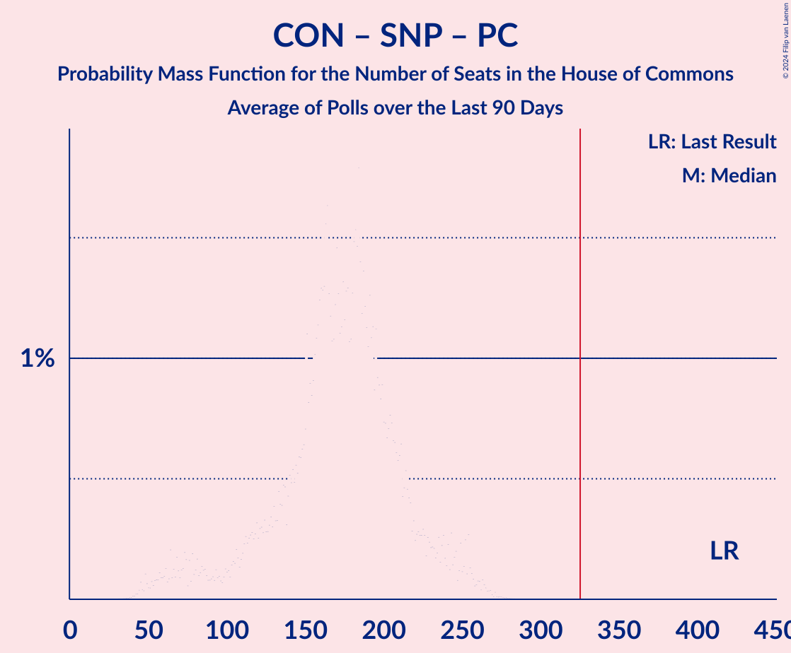

# Poll Average

<a href="#voting-intentions">Voting Intentions</a> | <a href="#seats">Seats</a> | <a href="#coalitions">Coalitions</a> | <a href="#technical-information">Technical Information</a>

## Summary

The table below lists the polls on which the average is based. They are the most recent polls (less than 90 days old) registered and analyzed so far.

| Period     | Polling firm/Commissioner(s) | CON | LAB | LIBDEM | SNP | UKIP | GREEN | PC |
|:----------:|:----------------------------:|:--:|:--:|:--:|:--:|:--:|:--:|:--:|
| 8 June 2017 | General Election | 42.4%   317 | 40.0%   262 | 7.4%   12 | 3.0%   35 | 1.8%   0 | 1.6%   1 | 0.5%   4 |
| N/A | Poll Average | 34–43%   242–347 | 33–42%   211–319 | 7–11%   9–29 | 2–5%   9–56 | 3–8%   0–2 | 2–5%   1–2 | 0–2%   0–8 |
| [1–5 February 2019](2019-02-05-IpsosMORI.html) | Ipsos MORI | 35–41%   241–321 | 35–41%   232–305 | 8–12%   16–32 | 3–5%   37–57 | 3–5%   0–1 | 2–4%   1–2 | 1–2%   3–9 |
| [3–4 February 2019](2019-02-04-YouGov.html) | YouGov   The Times | 39–43%   304–351 | 32–36%   203–245 | 9–11%   16–30 | 3–5%   42–56 | 3–5%   0–1 | 3–5%   1–2 | 0–1%   2–6 |
| [30 January–1 February 2019](2019-02-01-Opinium.html) | Opinium   The Observer | 39–43%   312–358 | 32–36%   203–244 | 7–9%   7–21 | 3–5%   41–57 | 6–8%   1–2 | 3–5%   1–2 | 1–2%   5–8 |
| [30 January 2019](2019-01-30-Survation.html) | Survation   Daily Mail | 35–41%   246–329 | 36–42%   239–313 | 8–11%   15–29 | 2–4%   18–52 | 3–5%   0–1 | 1–3%   1 | N/A   N/A |
| [16–18 January 2019](2019-01-18-ICMResearch.html) | ICM Research | 37–41%   262–317 | 38–42%   256–321 | 8–10%   16–27 | 2–4%   8–50 | 4–6%   1 | 2–4%   1 | 0–1%   0–3 |
| [10–17 January 2019](2019-01-17-NumberCruncherPolitics.html) | Number Cruncher Politics | 38–45%   269–347 | 36–42%   229–314 | 7–10%   6–25 | 2–4%   3–54 | 3–5%   0–1 | 1–3%   1 | 1–2%   3–8 |
| [16–17 January 2019](2019-01-17-ComRes.html) | ComRes   Sunday Express | 36–40%   260–326 | 35–39%   236–303 | 9–11%   21–29 | 2–4%   13–50 | 5–7%   1 | 2–4%   1 | 1–2%   3–8 |
| [10–14 January 2019](2019-01-14-KantarPublic.html) | Kantar Public | 32–38%   229–299 | 35–41%   254–319 | 7–11%   14–30 | 3–5%   39–57 | 5–8%   1 | 3–5%   1–3 | 1–2%   3–8 |
| [10–11 December 2018](2018-12-11-Populus.html) | Populus | 36–40%   253–305 | 39–43%   271–333 | 6–8%   7–19 | 2–4%   7–54 | 5–7%   1 | 2–4%   1 | 1–2%   4–8 |
| 8 June 2017 | General Election | 42.4%   317 | 40.0%   262 | 7.4%   12 | 3.0%   35 | 1.8%   0 | 1.6%   1 | 0.5%   4 |

Only polls for which at least the sample size has been published are included in the table above.

**Legend:**
+ **Top half of each row:** Voting intentions (95% confidence interval)
+ **Bottom half of each row:** Seat projections for the House of Commons (95% confidence interval)
+ **CON:** Conservative Party
+ **LAB:** Labour Party
+ **LIBDEM:** Liberal Democrats
+ **SNP:** Scottish National Party
+ **UKIP:** UK Independence Party
+ **GREEN:** Green Party
+ **PC:** Plaid Cymru
+ **N/A (single party):** Party not included the published results
+ **N/A (entire row):** Calculation for this opinion poll not started yet

## Voting Intentions

### Confidence Intervals

| Party | Last Result | Median | 80% Confidence Interval | 90% Confidence Interval | 95% Confidence Interval | 99% Confidence Interval |
|:-----:|:-----------:|:------:|:-----------------------:|:-----------------------:|:-----------------------:|:-----------------------:|
| <a href="#conservative-party">Conservative Party</a> | 42.4% | 38.8% | 35.8–41.8% |34.7–42.5% | 33.9–43.0% | 32.6–44.2% |
| <a href="#labour-party">Labour Party</a> | 40.0% | 38.1% | 33.9–41.0% |33.2–41.6% | 32.7–42.1% | 31.8–43.0% |
| <a href="#liberal-democrats">Liberal Democrats</a> | 7.4% | 9.0% | 7.3–10.5% |6.9–10.9% | 6.7–11.2% | 6.2–11.9% |
| <a href="#scottish-national-party">Scottish National Party</a> | 3.0% | 3.5% | 2.7–4.5% |2.5–4.8% | 2.4–5.0% | 2.1–5.5% |
| <a href="#uk-independence-party">UK Independence Party</a> | 1.8% | 5.1% | 3.7–6.9% |3.4–7.3% | 3.2–7.6% | 2.9–8.1% |
| <a href="#green-party">Green Party</a> | 1.6% | 3.2% | 2.0–4.3% |1.8–4.6% | 1.6–4.8% | 1.3–5.2% |
| <a href="#plaid-cymru">Plaid Cymru</a> | 0.5% | 1.0% | 0.4–1.4% |0.3–1.5% | 0.2–1.6% | 0.1–1.9% |

### Conservative Party

*For a full overview of the results for this party, see the [Conservative Party](party-conservativeparty.html) page.*

| Voting Intentions | Probability | Accumulated | Special Marks |
|:-----------------:|:-----------:|:-----------:|:-------------:|
| 29.5–30.5% | 0% | 100% |  |
| 30.5–31.5% | 0.1% | 100% |  |
| 31.5–32.5% | 0.4% | 99.9% |  |
| 32.5–33.5% | 1.3% | 99.5% |  |
| 33.5–34.5% | 3% | 98% |  |
| 34.5–35.5% | 4% | 96% |  |
| 35.5–36.5% | 7% | 91% |  |
| 36.5–37.5% | 13% | 84% |  |
| 37.5–38.5% | 17% | 71% |  |
| 38.5–39.5% | 16% | 54% | Median |
| 39.5–40.5% | 13% | 38% |  |
| 40.5–41.5% | 12% | 25% |  |
| 41.5–42.5% | 8% | 13% | Last Result |
| 42.5–43.5% | 3% | 5% |  |
| 43.5–44.5% | 1.0% | 1.3% |  |
| 44.5–45.5% | 0.2% | 0.3% |  |
| 45.5–46.5% | 0% | 0% |  |
| 46.5–47.5% | 0% | 0% |  |

### Labour Party

*For a full overview of the results for this party, see the [Labour Party](party-labourparty.html) page.*

| Voting Intentions | Probability | Accumulated | Special Marks |
|:-----------------:|:-----------:|:-----------:|:-------------:|
| 29.5–30.5% | 0% | 100% |  |
| 30.5–31.5% | 0.2% | 100% |  |
| 31.5–32.5% | 2% | 99.8% |  |
| 32.5–33.5% | 6% | 98% |  |
| 33.5–34.5% | 8% | 93% |  |
| 34.5–35.5% | 7% | 84% |  |
| 35.5–36.5% | 8% | 77% |  |
| 36.5–37.5% | 11% | 69% |  |
| 37.5–38.5% | 13% | 58% | Median |
| 38.5–39.5% | 15% | 44% |  |
| 39.5–40.5% | 14% | 30% | Last Result |
| 40.5–41.5% | 10% | 16% |  |
| 41.5–42.5% | 4% | 5% |  |
| 42.5–43.5% | 1.0% | 1.2% |  |
| 43.5–44.5% | 0.1% | 0.2% |  |
| 44.5–45.5% | 0% | 0% |  |

### Liberal Democrats

*For a full overview of the results for this party, see the [Liberal Democrats](party-liberaldemocrats.html) page.*

| Voting Intentions | Probability | Accumulated | Special Marks |
|:-----------------:|:-----------:|:-----------:|:-------------:|
| 4.5–5.5% | 0% | 100% |  |
| 5.5–6.5% | 2% | 100% |  |
| 6.5–7.5% | 12% | 98% | Last Result |
| 7.5–8.5% | 22% | 86% |  |
| 8.5–9.5% | 29% | 64% | Median |
| 9.5–10.5% | 25% | 34% |  |
| 10.5–11.5% | 9% | 10% |  |
| 11.5–12.5% | 1.0% | 1.1% |  |
| 12.5–13.5% | 0.1% | 0.1% |  |
| 13.5–14.5% | 0% | 0% |  |

### Scottish National Party

*For a full overview of the results for this party, see the [Scottish National Party](party-scottishnationalparty.html) page.*

| Voting Intentions | Probability | Accumulated | Special Marks |
|:-----------------:|:-----------:|:-----------:|:-------------:|
| 0.5–1.5% | 0% | 100% |  |
| 1.5–2.5% | 6% | 100% |  |
| 2.5–3.5% | 48% | 94% | Last Result, Median |
| 3.5–4.5% | 36% | 46% |  |
| 4.5–5.5% | 9% | 9% |  |
| 5.5–6.5% | 0.4% | 0.4% |  |
| 6.5–7.5% | 0% | 0% |  |

### UK Independence Party

*For a full overview of the results for this party, see the [UK Independence Party](party-ukindependenceparty.html) page.*

| Voting Intentions | Probability | Accumulated | Special Marks |
|:-----------------:|:-----------:|:-----------:|:-------------:|
| 1.5–2.5% | 0.1% | 100% | Last Result |
| 2.5–3.5% | 7% | 99.9% |  |
| 3.5–4.5% | 30% | 93% |  |
| 4.5–5.5% | 22% | 63% | Median |
| 5.5–6.5% | 24% | 41% |  |
| 6.5–7.5% | 14% | 16% |  |
| 7.5–8.5% | 3% | 3% |  |
| 8.5–9.5% | 0.1% | 0.1% |  |
| 9.5–10.5% | 0% | 0% |  |

### Green Party

*For a full overview of the results for this party, see the [Green Party](party-greenparty.html) page.*

| Voting Intentions | Probability | Accumulated | Special Marks |
|:-----------------:|:-----------:|:-----------:|:-------------:|
| 0.0–0.5% | 0% | 100% |  |
| 0.5–1.5% | 2% | 100% |  |
| 1.5–2.5% | 21% | 98% | Last Result |
| 2.5–3.5% | 43% | 77% | Median |
| 3.5–4.5% | 29% | 34% |  |
| 4.5–5.5% | 5% | 5% |  |
| 5.5–6.5% | 0.1% | 0.1% |  |
| 6.5–7.5% | 0% | 0% |  |

### Plaid Cymru

*For a full overview of the results for this party, see the [Plaid Cymru](party-plaidcymru.html) page.*

| Voting Intentions | Probability | Accumulated | Special Marks |
|:-----------------:|:-----------:|:-----------:|:-------------:|
| 0.0–0.5% | 15% | 100% |  |
| 0.5–1.5% | 81% | 85% | Last Result, Median |
| 1.5–2.5% | 4% | 4% |  |
| 2.5–3.5% | 0% | 0% |  |

## Seats

### Confidence Intervals

| Party | Last Result | Median | 80% Confidence Interval | 90% Confidence Interval | 95% Confidence Interval | 99% Confidence Interval |
|:-----:|:-----------:|:------:|:-----------------------:|:-----------------------:|:-----------------------:|:-----------------------:|
| <a href="#conservative-party">Conservative Party</a> | 317 | 291 | 257–334 |249–340 | 242–347 | 233–357 |
| <a href="#labour-party">Labour Party</a> | 262 | 272 | 224–306 |218–312 | 211–319 | 203–332 |
| <a href="#liberal-democrats">Liberal Democrats</a> | 12 | 21 | 14–27 |12–28 | 9–29 | 6–32 |
| <a href="#scottish-national-party">Scottish National Party</a> | 35 | 47 | 25–54 |16–55 | 9–56 | 3–57 |
| <a href="#uk-independence-party">UK Independence Party</a> | 0 | 1 | 1 |0–1 | 0–2 | 0–2 |
| <a href="#green-party">Green Party</a> | 1 | 1 | 1 |1–2 | 1–2 | 1–2 |
| <a href="#plaid-cymru">Plaid Cymru</a> | 4 | 5 | 1–7 |0–8 | 0–8 | 0–9 |

### Conservative Party

*For a full overview of the results for this party, see the [Conservative Party](party-conservativeparty.html) page.*

| Number of Seats | Probability | Accumulated | Special Marks |
|:---------------:|:-----------:|:-----------:|:-------------:|
| 220 | 0% | 100% |  |
| 221 | 0% | 99.9% |  |
| 222 | 0% | 99.9% |  |
| 223 | 0% | 99.9% |  |
| 224 | 0% | 99.9% |  |
| 225 | 0% | 99.9% |  |
| 226 | 0% | 99.8% |  |
| 227 | 0.1% | 99.8% |  |
| 228 | 0% | 99.8% |  |
| 229 | 0% | 99.7% |  |
| 230 | 0% | 99.7% |  |
| 231 | 0% | 99.6% |  |
| 232 | 0.1% | 99.6% |  |
| 233 | 0.1% | 99.5% |  |
| 234 | 0.1% | 99.4% |  |
| 235 | 0.2% | 99.4% |  |
| 236 | 0.1% | 99.2% |  |
| 237 | 0.2% | 99.0% |  |
| 238 | 0.2% | 98.8% |  |
| 239 | 0.2% | 98.7% |  |
| 240 | 0.2% | 98.5% |  |
| 241 | 0.4% | 98% |  |
| 242 | 0.5% | 98% |  |
| 243 | 0.3% | 97% |  |
| 244 | 0.3% | 97% |  |
| 245 | 0.4% | 97% |  |
| 246 | 0.3% | 96% |  |
| 247 | 0.3% | 96% |  |
| 248 | 0.3% | 96% |  |
| 249 | 0.7% | 95% |  |
| 250 | 0.5% | 95% |  |
| 251 | 0.4% | 94% |  |
| 252 | 0.5% | 94% |  |
| 253 | 0.7% | 93% |  |
| 254 | 0.5% | 93% |  |
| 255 | 0.7% | 92% |  |
| 256 | 1.3% | 91% |  |
| 257 | 0.7% | 90% |  |
| 258 | 1.2% | 89% |  |
| 259 | 0.9% | 88% |  |
| 260 | 0.7% | 87% |  |
| 261 | 1.1% | 87% |  |
| 262 | 1.2% | 86% |  |
| 263 | 1.2% | 84% |  |
| 264 | 1.1% | 83% |  |
| 265 | 0.6% | 82% |  |
| 266 | 0.7% | 82% |  |
| 267 | 1.1% | 81% |  |
| 268 | 0.8% | 80% |  |
| 269 | 0.8% | 79% |  |
| 270 | 0.8% | 78% |  |
| 271 | 2% | 77% |  |
| 272 | 0.9% | 76% |  |
| 273 | 1.4% | 75% |  |
| 274 | 2% | 73% |  |
| 275 | 1.3% | 72% |  |
| 276 | 2% | 70% |  |
| 277 | 0.9% | 69% |  |
| 278 | 1.1% | 68% |  |
| 279 | 1.0% | 67% |  |
| 280 | 1.0% | 66% |  |
| 281 | 2% | 65% |  |
| 282 | 0.7% | 63% |  |
| 283 | 2% | 62% |  |
| 284 | 2% | 60% |  |
| 285 | 0.5% | 59% |  |
| 286 | 2% | 58% |  |
| 287 | 1.0% | 56% |  |
| 288 | 1.1% | 55% |  |
| 289 | 2% | 54% |  |
| 290 | 1.0% | 52% |  |
| 291 | 1.5% | 51% | Median |
| 292 | 0.8% | 50% |  |
| 293 | 0.8% | 49% |  |
| 294 | 0.5% | 48% |  |
| 295 | 2% | 48% |  |
| 296 | 0.8% | 46% |  |
| 297 | 0.8% | 45% |  |
| 298 | 0.6% | 44% |  |
| 299 | 0.8% | 44% |  |
| 300 | 1.0% | 43% |  |
| 301 | 1.3% | 42% |  |
| 302 | 0.7% | 40% |  |
| 303 | 1.0% | 40% |  |
| 304 | 0.7% | 39% |  |
| 305 | 0.9% | 38% |  |
| 306 | 0.6% | 37% |  |
| 307 | 0.6% | 37% |  |
| 308 | 0.7% | 36% |  |
| 309 | 1.0% | 35% |  |
| 310 | 0.8% | 34% |  |
| 311 | 1.0% | 33% |  |
| 312 | 1.1% | 33% |  |
| 313 | 1.0% | 31% |  |
| 314 | 1.0% | 30% |  |
| 315 | 0.6% | 29% |  |
| 316 | 1.1% | 29% |  |
| 317 | 1.1% | 28% | Last Result |
| 318 | 0.7% | 27% |  |
| 319 | 1.2% | 26% |  |
| 320 | 1.3% | 25% |  |
| 321 | 1.0% | 23% |  |
| 322 | 1.1% | 22% |  |
| 323 | 1.0% | 21% |  |
| 324 | 0.9% | 20% |  |
| 325 | 1.1% | 19% |  |
| 326 | 2% | 18% | Majority |
| 327 | 0.9% | 17% |  |
| 328 | 0.8% | 16% |  |
| 329 | 0.9% | 15% |  |
| 330 | 0.9% | 14% |  |
| 331 | 0.9% | 13% |  |
| 332 | 0.8% | 12% |  |
| 333 | 1.2% | 11% |  |
| 334 | 1.4% | 10% |  |
| 335 | 1.0% | 9% |  |
| 336 | 0.8% | 8% |  |
| 337 | 0.6% | 7% |  |
| 338 | 0.5% | 6% |  |
| 339 | 0.5% | 6% |  |
| 340 | 0.5% | 5% |  |
| 341 | 0.5% | 5% |  |
| 342 | 0.4% | 4% |  |
| 343 | 0.5% | 4% |  |
| 344 | 0.2% | 3% |  |
| 345 | 0.3% | 3% |  |
| 346 | 0.4% | 3% |  |
| 347 | 0.4% | 3% |  |
| 348 | 0.3% | 2% |  |
| 349 | 0.3% | 2% |  |
| 350 | 0.3% | 2% |  |
| 351 | 0.2% | 1.4% |  |
| 352 | 0.2% | 1.2% |  |
| 353 | 0.1% | 1.0% |  |
| 354 | 0.1% | 0.9% |  |
| 355 | 0.1% | 0.8% |  |
| 356 | 0.1% | 0.7% |  |
| 357 | 0.1% | 0.6% |  |
| 358 | 0.1% | 0.5% |  |
| 359 | 0.1% | 0.4% |  |
| 360 | 0% | 0.3% |  |
| 361 | 0% | 0.3% |  |
| 362 | 0% | 0.2% |  |
| 363 | 0% | 0.2% |  |
| 364 | 0% | 0.2% |  |
| 365 | 0% | 0.1% |  |
| 366 | 0% | 0.1% |  |
| 367 | 0% | 0.1% |  |
| 368 | 0% | 0.1% |  |
| 369 | 0% | 0.1% |  |
| 370 | 0% | 0.1% |  |
| 371 | 0% | 0% |  |

### Labour Party

*For a full overview of the results for this party, see the [Labour Party](party-labourparty.html) page.*

| Number of Seats | Probability | Accumulated | Special Marks |
|:---------------:|:-----------:|:-----------:|:-------------:|
| 190 | 0% | 100% |  |
| 191 | 0% | 99.9% |  |
| 192 | 0% | 99.9% |  |
| 193 | 0% | 99.9% |  |
| 194 | 0% | 99.9% |  |
| 195 | 0% | 99.9% |  |
| 196 | 0% | 99.8% |  |
| 197 | 0% | 99.8% |  |
| 198 | 0% | 99.8% |  |
| 199 | 0% | 99.8% |  |
| 200 | 0.1% | 99.7% |  |
| 201 | 0.1% | 99.7% |  |
| 202 | 0.1% | 99.6% |  |
| 203 | 0.1% | 99.5% |  |
| 204 | 0.2% | 99.4% |  |
| 205 | 0.2% | 99.2% |  |
| 206 | 0.3% | 99.1% |  |
| 207 | 0.3% | 98.8% |  |
| 208 | 0.4% | 98% |  |
| 209 | 0.3% | 98% |  |
| 210 | 0.2% | 98% |  |
| 211 | 0.1% | 98% |  |
| 212 | 0.2% | 97% |  |
| 213 | 0.3% | 97% |  |
| 214 | 0.3% | 97% |  |
| 215 | 0.3% | 97% |  |
| 216 | 0.5% | 96% |  |
| 217 | 0.5% | 96% |  |
| 218 | 0.7% | 95% |  |
| 219 | 0.7% | 94% |  |
| 220 | 0.5% | 94% |  |
| 221 | 0.5% | 93% |  |
| 222 | 0.6% | 93% |  |
| 223 | 1.0% | 92% |  |
| 224 | 2% | 91% |  |
| 225 | 2% | 90% |  |
| 226 | 1.0% | 88% |  |
| 227 | 0.8% | 87% |  |
| 228 | 0.6% | 86% |  |
| 229 | 0.9% | 85% |  |
| 230 | 1.0% | 84% |  |
| 231 | 0.9% | 83% |  |
| 232 | 0.6% | 83% |  |
| 233 | 0.5% | 82% |  |
| 234 | 0.5% | 81% |  |
| 235 | 2% | 81% |  |
| 236 | 2% | 79% |  |
| 237 | 0.9% | 78% |  |
| 238 | 1.1% | 77% |  |
| 239 | 0.8% | 76% |  |
| 240 | 0.6% | 75% |  |
| 241 | 0.5% | 74% |  |
| 242 | 0.3% | 74% |  |
| 243 | 0.4% | 73% |  |
| 244 | 0.5% | 73% |  |
| 245 | 0.5% | 72% |  |
| 246 | 0.5% | 72% |  |
| 247 | 0.7% | 71% |  |
| 248 | 0.5% | 71% |  |
| 249 | 0.6% | 70% |  |
| 250 | 0.6% | 70% |  |
| 251 | 0.7% | 69% |  |
| 252 | 1.0% | 68% |  |
| 253 | 0.5% | 67% |  |
| 254 | 0.6% | 67% |  |
| 255 | 0.9% | 66% |  |
| 256 | 0.5% | 65% |  |
| 257 | 0.8% | 65% |  |
| 258 | 0.6% | 64% |  |
| 259 | 1.4% | 64% |  |
| 260 | 2% | 62% |  |
| 261 | 1.1% | 60% |  |
| 262 | 1.1% | 59% | Last Result |
| 263 | 0.6% | 58% |  |
| 264 | 1.4% | 58% |  |
| 265 | 0.4% | 56% |  |
| 266 | 0.4% | 56% |  |
| 267 | 0.9% | 56% |  |
| 268 | 0.6% | 55% |  |
| 269 | 1.4% | 54% |  |
| 270 | 1.0% | 53% |  |
| 271 | 1.0% | 52% |  |
| 272 | 1.1% | 51% | Median |
| 273 | 2% | 50% |  |
| 274 | 0.8% | 48% |  |
| 275 | 0.7% | 47% |  |
| 276 | 0.3% | 47% |  |
| 277 | 1.3% | 46% |  |
| 278 | 1.0% | 45% |  |
| 279 | 1.3% | 44% |  |
| 280 | 1.2% | 43% |  |
| 281 | 1.1% | 42% |  |
| 282 | 2% | 40% |  |
| 283 | 1.4% | 39% |  |
| 284 | 2% | 37% |  |
| 285 | 0.9% | 35% |  |
| 286 | 1.2% | 34% |  |
| 287 | 0.9% | 33% |  |
| 288 | 1.5% | 32% |  |
| 289 | 1.0% | 31% |  |
| 290 | 0.9% | 30% |  |
| 291 | 3% | 29% |  |
| 292 | 2% | 26% |  |
| 293 | 1.0% | 25% |  |
| 294 | 2% | 24% |  |
| 295 | 1.1% | 22% |  |
| 296 | 1.2% | 21% |  |
| 297 | 0.9% | 19% |  |
| 298 | 1.0% | 18% |  |
| 299 | 1.0% | 17% |  |
| 300 | 2% | 16% |  |
| 301 | 0.9% | 15% |  |
| 302 | 1.0% | 14% |  |
| 303 | 0.8% | 13% |  |
| 304 | 1.0% | 12% |  |
| 305 | 0.9% | 11% |  |
| 306 | 0.9% | 10% |  |
| 307 | 1.0% | 9% |  |
| 308 | 0.5% | 8% |  |
| 309 | 2% | 8% |  |
| 310 | 0.4% | 6% |  |
| 311 | 0.4% | 6% |  |
| 312 | 0.4% | 5% |  |
| 313 | 0.5% | 5% |  |
| 314 | 0.3% | 4% |  |
| 315 | 0.1% | 4% |  |
| 316 | 0.3% | 4% |  |
| 317 | 0.5% | 4% |  |
| 318 | 0.4% | 3% |  |
| 319 | 0.6% | 3% |  |
| 320 | 0.1% | 2% |  |
| 321 | 0.4% | 2% |  |
| 322 | 0.1% | 2% |  |
| 323 | 0.1% | 2% |  |
| 324 | 0.2% | 1.4% |  |
| 325 | 0.1% | 1.2% |  |
| 326 | 0.1% | 1.1% | Majority |
| 327 | 0.2% | 1.0% |  |
| 328 | 0.1% | 0.8% |  |
| 329 | 0.1% | 0.7% |  |
| 330 | 0.1% | 0.6% |  |
| 331 | 0.1% | 0.6% |  |
| 332 | 0.1% | 0.5% |  |
| 333 | 0% | 0.5% |  |
| 334 | 0% | 0.4% |  |
| 335 | 0.1% | 0.4% |  |
| 336 | 0.1% | 0.3% |  |
| 337 | 0% | 0.2% |  |
| 338 | 0% | 0.2% |  |
| 339 | 0% | 0.2% |  |
| 340 | 0% | 0.1% |  |
| 341 | 0% | 0.1% |  |
| 342 | 0.1% | 0.1% |  |
| 343 | 0% | 0.1% |  |
| 344 | 0% | 0% |  |

### Liberal Democrats

*For a full overview of the results for this party, see the [Liberal Democrats](party-liberaldemocrats.html) page.*

| Number of Seats | Probability | Accumulated | Special Marks |
|:---------------:|:-----------:|:-----------:|:-------------:|
| 3 | 0.1% | 100% |  |
| 4 | 0.1% | 99.9% |  |
| 5 | 0.3% | 99.8% |  |
| 6 | 0.4% | 99.6% |  |
| 7 | 0.2% | 99.2% |  |
| 8 | 0.9% | 99.0% |  |
| 9 | 0.6% | 98% |  |
| 10 | 0.4% | 97% |  |
| 11 | 1.0% | 97% |  |
| 12 | 2% | 96% | Last Result |
| 13 | 3% | 94% |  |
| 14 | 5% | 91% |  |
| 15 | 6% | 86% |  |
| 16 | 6% | 80% |  |
| 17 | 5% | 74% |  |
| 18 | 3% | 69% |  |
| 19 | 4% | 65% |  |
| 20 | 7% | 62% |  |
| 21 | 8% | 55% | Median |
| 22 | 3% | 47% |  |
| 23 | 4% | 44% |  |
| 24 | 5% | 40% |  |
| 25 | 6% | 35% |  |
| 26 | 8% | 29% |  |
| 27 | 11% | 20% |  |
| 28 | 5% | 10% |  |
| 29 | 2% | 4% |  |
| 30 | 1.2% | 2% |  |
| 31 | 0.3% | 0.9% |  |
| 32 | 0.2% | 0.5% |  |
| 33 | 0.1% | 0.3% |  |
| 34 | 0.1% | 0.2% |  |
| 35 | 0.1% | 0.1% |  |
| 36 | 0% | 0.1% |  |
| 37 | 0% | 0% |  |

### Scottish National Party

*For a full overview of the results for this party, see the [Scottish National Party](party-scottishnationalparty.html) page.*

| Number of Seats | Probability | Accumulated | Special Marks |
|:---------------:|:-----------:|:-----------:|:-------------:|
| 0 | 0.1% | 100% |  |
| 1 | 0.1% | 99.9% |  |
| 2 | 0.1% | 99.8% |  |
| 3 | 0.2% | 99.7% |  |
| 4 | 0.2% | 99.5% |  |
| 5 | 0.3% | 99.3% |  |
| 6 | 0.3% | 99.0% |  |
| 7 | 0.4% | 98.7% |  |
| 8 | 0.4% | 98% |  |
| 9 | 0.6% | 98% |  |
| 10 | 0.1% | 97% |  |
| 11 | 0.1% | 97% |  |
| 12 | 0.2% | 97% |  |
| 13 | 0.6% | 97% |  |
| 14 | 0.5% | 96% |  |
| 15 | 0.7% | 96% |  |
| 16 | 0.6% | 95% |  |
| 17 | 0.3% | 95% |  |
| 18 | 0.1% | 94% |  |
| 19 | 0.5% | 94% |  |
| 20 | 0.4% | 94% |  |
| 21 | 1.0% | 93% |  |
| 22 | 0.6% | 92% |  |
| 23 | 1.1% | 92% |  |
| 24 | 0.5% | 91% |  |
| 25 | 0.9% | 90% |  |
| 26 | 1.1% | 89% |  |
| 27 | 1.4% | 88% |  |
| 28 | 2% | 87% |  |
| 29 | 3% | 85% |  |
| 30 | 1.3% | 82% |  |
| 31 | 0.2% | 80% |  |
| 32 | 2% | 80% |  |
| 33 | 0.2% | 78% |  |
| 34 | 0.7% | 78% |  |
| 35 | 0.9% | 77% | Last Result |
| 36 | 1.5% | 76% |  |
| 37 | 0.5% | 75% |  |
| 38 | 3% | 74% |  |
| 39 | 2% | 71% |  |
| 40 | 3% | 69% |  |
| 41 | 3% | 66% |  |
| 42 | 2% | 63% |  |
| 43 | 1.3% | 62% |  |
| 44 | 3% | 60% |  |
| 45 | 3% | 58% |  |
| 46 | 2% | 55% |  |
| 47 | 5% | 53% | Median |
| 48 | 6% | 48% |  |
| 49 | 3% | 43% |  |
| 50 | 7% | 39% |  |
| 51 | 9% | 33% |  |
| 52 | 6% | 24% |  |
| 53 | 3% | 18% |  |
| 54 | 7% | 14% |  |
| 55 | 3% | 7% |  |
| 56 | 2% | 5% |  |
| 57 | 2% | 2% |  |
| 58 | 0.2% | 0.2% |  |
| 59 | 0% | 0% |  |

### UK Independence Party

*For a full overview of the results for this party, see the [UK Independence Party](party-ukindependenceparty.html) page.*

| Number of Seats | Probability | Accumulated | Special Marks |
|:---------------:|:-----------:|:-----------:|:-------------:|
| 0 | 7% | 100% | Last Result |
| 1 | 88% | 93% | Median |
| 2 | 5% | 5% |  |
| 3 | 0% | 0% |  |

### Green Party

*For a full overview of the results for this party, see the [Green Party](party-greenparty.html) page.*

| Number of Seats | Probability | Accumulated | Special Marks |
|:---------------:|:-----------:|:-----------:|:-------------:|
| 1 | 91% | 100% | Last Result, Median |
| 2 | 8% | 9% |  |
| 3 | 0.3% | 0.3% |  |
| 4 | 0% | 0% |  |

### Plaid Cymru

*For a full overview of the results for this party, see the [Plaid Cymru](party-plaidcymru.html) page.*

| Number of Seats | Probability | Accumulated | Special Marks |
|:---------------:|:-----------:|:-----------:|:-------------:|
| 0 | 7% | 100% |  |
| 1 | 3% | 93% |  |
| 2 | 3% | 90% |  |
| 3 | 7% | 87% |  |
| 4 | 8% | 80% | Last Result |
| 5 | 58% | 72% | Median |
| 6 | 4% | 14% |  |
| 7 | 1.4% | 11% |  |
| 8 | 8% | 9% |  |
| 9 | 0.5% | 1.0% |  |
| 10 | 0.3% | 0.5% |  |
| 11 | 0.1% | 0.2% |  |
| 12 | 0.1% | 0.1% |  |
| 13 | 0% | 0.1% |  |
| 14 | 0.1% | 0.1% |  |
| 15 | 0% | 0% |  |

## Coalitions

### Confidence Intervals

| Coalition | Last Result | Median | Majority? | 80% Confidence Interval | 90% Confidence Interval | 95% Confidence Interval | 99% Confidence Interval |
|:---------:|:-----------:|:------:|:---------:|:-----------------------:|:-----------------------:|:-----------------------:|:-----------------------:|
| Conservative Party – Scottish National Party – Plaid Cymru | 356 | 335 | 61% | 304–387 | 296–394 | 291–400 | 279–411 |
| Conservative Party – Scottish National Party | 352 | 331 | 57% | 300–382 | 292–389 | 288–394 | 275–405 |
| Labour Party – Liberal Democrats – Scottish National Party – Plaid Cymru | 313 | 338 | 62% | 296–373 | 289–380 | 283–387 | 272–397 |
| Labour Party – Liberal Democrats – Scottish National Party | 309 | 334 | 58% | 291–369 | 284–376 | 278–382 | 267–392 |
| Conservative Party – Liberal Democrats | 329 | 315 | 38% | 279–352 | 272–359 | 267–365 | 257–375 |
| Labour Party – Scottish National Party – Plaid Cymru | 301 | 315 | 38% | 278–351 | 271–358 | 265–363 | 255–372 |
| Labour Party – Scottish National Party | 297 | 313 | 35% | 273–346 | 266–353 | 260–358 | 250–368 |
| Conservative Party – Plaid Cymru | 321 | 296 | 23% | 261–339 | 254–346 | 247–352 | 237–363 |
| Conservative Party | 317 | 291 | 18% | 257–334 | 249–340 | 242–347 | 233–357 |
| Labour Party – Liberal Democrats – Plaid Cymru | 278 | 298 | 15% | 248–329 | 241–338 | 235–342 | 224–355 |
| Labour Party – Liberal Democrats | 274 | 294 | 11% | 242–326 | 235–333 | 230–338 | 218–351 |
| Labour Party – Plaid Cymru | 266 | 275 | 2% | 229–310 | 223–316 | 216–323 | 208–336 |
| Labour Party | 262 | 272 | 1.1% | 224–306 | 218–312 | 211–319 | 203–332 |

### Conservative Party – Scottish National Party – Plaid Cymru

| Number of Seats | Probability | Accumulated | Special Marks |
|:---------------:|:-----------:|:-----------:|:-------------:|
| 262 | 0% | 100% |  |
| 263 | 0% | 99.9% |  |
| 264 | 0% | 99.9% |  |
| 265 | 0% | 99.9% |  |
| 266 | 0% | 99.9% |  |
| 267 | 0% | 99.9% |  |
| 268 | 0% | 99.9% |  |
| 269 | 0% | 99.9% |  |
| 270 | 0% | 99.9% |  |
| 271 | 0% | 99.9% |  |
| 272 | 0% | 99.8% |  |
| 273 | 0% | 99.8% |  |
| 274 | 0% | 99.8% |  |
| 275 | 0% | 99.7% |  |
| 276 | 0% | 99.7% |  |
| 277 | 0% | 99.7% |  |
| 278 | 0% | 99.6% |  |
| 279 | 0.1% | 99.6% |  |
| 280 | 0.1% | 99.4% |  |
| 281 | 0.1% | 99.4% |  |
| 282 | 0.1% | 99.3% |  |
| 283 | 0.1% | 99.2% |  |
| 284 | 0.2% | 99.1% |  |
| 285 | 0.1% | 99.0% |  |
| 286 | 0.2% | 98.9% |  |
| 287 | 0.1% | 98.6% |  |
| 288 | 0.3% | 98% |  |
| 289 | 0.4% | 98% |  |
| 290 | 0.2% | 98% |  |
| 291 | 0.2% | 98% |  |
| 292 | 0.5% | 97% |  |
| 293 | 0.4% | 97% |  |
| 294 | 0.4% | 97% |  |
| 295 | 0.9% | 96% |  |
| 296 | 0.3% | 95% |  |
| 297 | 0.9% | 95% |  |
| 298 | 0.5% | 94% |  |
| 299 | 0.6% | 94% |  |
| 300 | 0.5% | 93% |  |
| 301 | 0.7% | 92% |  |
| 302 | 0.5% | 92% |  |
| 303 | 0.8% | 91% |  |
| 304 | 1.3% | 90% |  |
| 305 | 0.5% | 89% |  |
| 306 | 2% | 88% |  |
| 307 | 0.8% | 87% |  |
| 308 | 2% | 86% |  |
| 309 | 1.3% | 84% |  |
| 310 | 1.1% | 83% |  |
| 311 | 1.3% | 82% |  |
| 312 | 1.3% | 80% |  |
| 313 | 1.5% | 79% |  |
| 314 | 1.4% | 77% |  |
| 315 | 1.4% | 76% |  |
| 316 | 1.4% | 75% |  |
| 317 | 1.5% | 73% |  |
| 318 | 2% | 72% |  |
| 319 | 1.2% | 69% |  |
| 320 | 0.6% | 68% |  |
| 321 | 1.1% | 68% |  |
| 322 | 1.5% | 67% |  |
| 323 | 1.3% | 65% |  |
| 324 | 1.4% | 64% |  |
| 325 | 1.3% | 62% |  |
| 326 | 2% | 61% | Majority |
| 327 | 2% | 59% |  |
| 328 | 1.0% | 58% |  |
| 329 | 1.3% | 57% |  |
| 330 | 1.1% | 56% |  |
| 331 | 0.8% | 55% |  |
| 332 | 0.7% | 54% |  |
| 333 | 1.1% | 53% |  |
| 334 | 1.2% | 52% |  |
| 335 | 1.0% | 51% |  |
| 336 | 0.6% | 50% |  |
| 337 | 1.2% | 49% |  |
| 338 | 0.8% | 48% |  |
| 339 | 0.8% | 47% |  |
| 340 | 1.0% | 46% |  |
| 341 | 1.3% | 45% |  |
| 342 | 0.8% | 44% |  |
| 343 | 0.8% | 43% | Median |
| 344 | 2% | 43% |  |
| 345 | 0.8% | 41% |  |
| 346 | 0.9% | 40% |  |
| 347 | 1.1% | 39% |  |
| 348 | 0.5% | 38% |  |
| 349 | 0.9% | 38% |  |
| 350 | 0.6% | 37% |  |
| 351 | 0.8% | 36% |  |
| 352 | 0.8% | 35% |  |
| 353 | 0.9% | 34% |  |
| 354 | 0.5% | 33% |  |
| 355 | 0.8% | 33% |  |
| 356 | 0.3% | 32% | Last Result |
| 357 | 0.5% | 32% |  |
| 358 | 0.9% | 32% |  |
| 359 | 0.3% | 31% |  |
| 360 | 0.6% | 30% |  |
| 361 | 0.5% | 30% |  |
| 362 | 0.4% | 29% |  |
| 363 | 0.6% | 29% |  |
| 364 | 0.6% | 28% |  |
| 365 | 0.5% | 28% |  |
| 366 | 0.7% | 27% |  |
| 367 | 1.0% | 26% |  |
| 368 | 0.8% | 25% |  |
| 369 | 0.7% | 25% |  |
| 370 | 0.6% | 24% |  |
| 371 | 0.9% | 23% |  |
| 372 | 0.5% | 22% |  |
| 373 | 0.4% | 22% |  |
| 374 | 0.8% | 22% |  |
| 375 | 1.0% | 21% |  |
| 376 | 0.7% | 20% |  |
| 377 | 0.7% | 19% |  |
| 378 | 1.1% | 18% |  |
| 379 | 0.9% | 17% |  |
| 380 | 1.1% | 16% |  |
| 381 | 1.0% | 15% |  |
| 382 | 0.8% | 14% |  |
| 383 | 0.7% | 13% |  |
| 384 | 0.6% | 13% |  |
| 385 | 0.8% | 12% |  |
| 386 | 0.7% | 11% |  |
| 387 | 0.8% | 11% |  |
| 388 | 0.7% | 10% |  |
| 389 | 1.2% | 9% |  |
| 390 | 0.6% | 8% |  |
| 391 | 0.4% | 7% |  |
| 392 | 0.8% | 7% |  |
| 393 | 0.7% | 6% |  |
| 394 | 0.5% | 5% |  |
| 395 | 0.5% | 5% |  |
| 396 | 0.6% | 4% |  |
| 397 | 0.5% | 4% |  |
| 398 | 0.3% | 3% |  |
| 399 | 0.4% | 3% |  |
| 400 | 0.2% | 3% |  |
| 401 | 0.2% | 2% |  |
| 402 | 0.2% | 2% |  |
| 403 | 0.3% | 2% |  |
| 404 | 0.2% | 2% |  |
| 405 | 0.2% | 2% |  |
| 406 | 0.3% | 1.4% |  |
| 407 | 0.2% | 1.1% |  |
| 408 | 0.2% | 0.9% |  |
| 409 | 0.1% | 0.8% |  |
| 410 | 0.1% | 0.7% |  |
| 411 | 0.1% | 0.5% |  |
| 412 | 0.1% | 0.5% |  |
| 413 | 0% | 0.4% |  |
| 414 | 0.1% | 0.3% |  |
| 415 | 0% | 0.3% |  |
| 416 | 0% | 0.2% |  |
| 417 | 0% | 0.2% |  |
| 418 | 0% | 0.2% |  |
| 419 | 0% | 0.1% |  |
| 420 | 0% | 0.1% |  |
| 421 | 0% | 0.1% |  |
| 422 | 0% | 0.1% |  |
| 423 | 0% | 0.1% |  |
| 424 | 0% | 0% |  |

### Conservative Party – Scottish National Party

| Number of Seats | Probability | Accumulated | Special Marks |
|:---------------:|:-----------:|:-----------:|:-------------:|
| 261 | 0% | 100% |  |
| 262 | 0% | 99.9% |  |
| 263 | 0% | 99.9% |  |
| 264 | 0% | 99.9% |  |
| 265 | 0% | 99.9% |  |
| 266 | 0% | 99.9% |  |
| 267 | 0% | 99.9% |  |
| 268 | 0% | 99.8% |  |
| 269 | 0% | 99.8% |  |
| 270 | 0% | 99.8% |  |
| 271 | 0% | 99.8% |  |
| 272 | 0% | 99.7% |  |
| 273 | 0% | 99.7% |  |
| 274 | 0.2% | 99.7% |  |
| 275 | 0% | 99.5% |  |
| 276 | 0.1% | 99.5% |  |
| 277 | 0.1% | 99.4% |  |
| 278 | 0.1% | 99.3% |  |
| 279 | 0.1% | 99.2% |  |
| 280 | 0.1% | 99.1% |  |
| 281 | 0.2% | 99.0% |  |
| 282 | 0.1% | 98.8% |  |
| 283 | 0.2% | 98.7% |  |
| 284 | 0.3% | 98.5% |  |
| 285 | 0.2% | 98% |  |
| 286 | 0.1% | 98% |  |
| 287 | 0.2% | 98% |  |
| 288 | 0.5% | 98% |  |
| 289 | 0.4% | 97% |  |
| 290 | 0.8% | 97% |  |
| 291 | 0.3% | 96% |  |
| 292 | 1.1% | 96% |  |
| 293 | 0.4% | 94% |  |
| 294 | 0.6% | 94% |  |
| 295 | 0.4% | 93% |  |
| 296 | 0.7% | 93% |  |
| 297 | 0.5% | 92% |  |
| 298 | 0.5% | 92% |  |
| 299 | 0.8% | 91% |  |
| 300 | 0.7% | 91% |  |
| 301 | 2% | 90% |  |
| 302 | 1.3% | 88% |  |
| 303 | 1.4% | 87% |  |
| 304 | 1.1% | 85% |  |
| 305 | 0.9% | 84% |  |
| 306 | 1.2% | 83% |  |
| 307 | 1.4% | 82% |  |
| 308 | 2% | 81% |  |
| 309 | 1.5% | 79% |  |
| 310 | 1.4% | 77% |  |
| 311 | 0.9% | 76% |  |
| 312 | 1.2% | 75% |  |
| 313 | 1.1% | 74% |  |
| 314 | 2% | 73% |  |
| 315 | 0.6% | 71% |  |
| 316 | 2% | 71% |  |
| 317 | 1.5% | 69% |  |
| 318 | 3% | 67% |  |
| 319 | 1.4% | 64% |  |
| 320 | 0.9% | 63% |  |
| 321 | 1.3% | 62% |  |
| 322 | 0.7% | 61% |  |
| 323 | 0.7% | 60% |  |
| 324 | 1.3% | 60% |  |
| 325 | 1.4% | 58% |  |
| 326 | 0.7% | 57% | Majority |
| 327 | 1.4% | 56% |  |
| 328 | 1.1% | 55% |  |
| 329 | 2% | 54% |  |
| 330 | 1.5% | 52% |  |
| 331 | 0.7% | 50% |  |
| 332 | 0.5% | 50% |  |
| 333 | 0.6% | 49% |  |
| 334 | 0.7% | 49% |  |
| 335 | 0.7% | 48% |  |
| 336 | 2% | 47% |  |
| 337 | 0.8% | 45% |  |
| 338 | 0.9% | 45% | Median |
| 339 | 2% | 44% |  |
| 340 | 1.0% | 42% |  |
| 341 | 0.9% | 41% |  |
| 342 | 0.7% | 40% |  |
| 343 | 0.9% | 39% |  |
| 344 | 0.7% | 38% |  |
| 345 | 0.6% | 38% |  |
| 346 | 0.8% | 37% |  |
| 347 | 1.1% | 36% |  |
| 348 | 1.0% | 35% |  |
| 349 | 0.7% | 34% |  |
| 350 | 0.5% | 33% |  |
| 351 | 0.5% | 33% |  |
| 352 | 0.6% | 32% | Last Result |
| 353 | 0.7% | 32% |  |
| 354 | 0.4% | 31% |  |
| 355 | 0.7% | 31% |  |
| 356 | 0.4% | 30% |  |
| 357 | 0.4% | 30% |  |
| 358 | 0.7% | 29% |  |
| 359 | 0.4% | 28% |  |
| 360 | 0.6% | 28% |  |
| 361 | 0.7% | 27% |  |
| 362 | 1.0% | 27% |  |
| 363 | 0.8% | 26% |  |
| 364 | 0.6% | 25% |  |
| 365 | 0.7% | 24% |  |
| 366 | 0.9% | 24% |  |
| 367 | 0.5% | 23% |  |
| 368 | 0.5% | 22% |  |
| 369 | 0.9% | 22% |  |
| 370 | 0.8% | 21% |  |
| 371 | 0.7% | 20% |  |
| 372 | 0.9% | 19% |  |
| 373 | 1.0% | 18% |  |
| 374 | 0.9% | 17% |  |
| 375 | 1.0% | 17% |  |
| 376 | 0.8% | 15% |  |
| 377 | 1.1% | 15% |  |
| 378 | 0.8% | 14% |  |
| 379 | 0.5% | 13% |  |
| 380 | 0.8% | 12% |  |
| 381 | 0.7% | 11% |  |
| 382 | 1.0% | 11% |  |
| 383 | 0.8% | 10% |  |
| 384 | 1.2% | 9% |  |
| 385 | 0.6% | 8% |  |
| 386 | 0.4% | 7% |  |
| 387 | 1.0% | 7% |  |
| 388 | 0.7% | 6% |  |
| 389 | 0.4% | 5% |  |
| 390 | 0.4% | 5% |  |
| 391 | 0.6% | 4% |  |
| 392 | 0.5% | 4% |  |
| 393 | 0.4% | 3% |  |
| 394 | 0.4% | 3% |  |
| 395 | 0.1% | 2% |  |
| 396 | 0.2% | 2% |  |
| 397 | 0.2% | 2% |  |
| 398 | 0.3% | 2% |  |
| 399 | 0.2% | 2% |  |
| 400 | 0.2% | 1.5% |  |
| 401 | 0.3% | 1.3% |  |
| 402 | 0.2% | 1.0% |  |
| 403 | 0.2% | 0.9% |  |
| 404 | 0.1% | 0.7% |  |
| 405 | 0.1% | 0.6% |  |
| 406 | 0.1% | 0.5% |  |
| 407 | 0.1% | 0.4% |  |
| 408 | 0% | 0.3% |  |
| 409 | 0.1% | 0.3% |  |
| 410 | 0% | 0.2% |  |
| 411 | 0% | 0.2% |  |
| 412 | 0% | 0.2% |  |
| 413 | 0% | 0.1% |  |
| 414 | 0% | 0.1% |  |
| 415 | 0% | 0.1% |  |
| 416 | 0% | 0.1% |  |
| 417 | 0% | 0.1% |  |
| 418 | 0% | 0% |  |

### Labour Party – Liberal Democrats – Scottish National Party – Plaid Cymru

| Number of Seats | Probability | Accumulated | Special Marks |
|:---------------:|:-----------:|:-----------:|:-------------:|
| 260 | 0% | 100% |  |
| 261 | 0% | 99.9% |  |
| 262 | 0% | 99.9% |  |
| 263 | 0% | 99.9% |  |
| 264 | 0% | 99.9% |  |
| 265 | 0% | 99.9% |  |
| 266 | 0% | 99.9% |  |
| 267 | 0% | 99.8% |  |
| 268 | 0% | 99.8% |  |
| 269 | 0% | 99.8% |  |
| 270 | 0% | 99.7% |  |
| 271 | 0.1% | 99.7% |  |
| 272 | 0.1% | 99.6% |  |
| 273 | 0.1% | 99.5% |  |
| 274 | 0.1% | 99.4% |  |
| 275 | 0.1% | 99.3% |  |
| 276 | 0.1% | 99.2% |  |
| 277 | 0.2% | 99.1% |  |
| 278 | 0.1% | 98.9% |  |
| 279 | 0.3% | 98.8% |  |
| 280 | 0.2% | 98% |  |
| 281 | 0.2% | 98% |  |
| 282 | 0.4% | 98% |  |
| 283 | 0.4% | 98% |  |
| 284 | 0.3% | 97% |  |
| 285 | 0.3% | 97% |  |
| 286 | 0.3% | 97% |  |
| 287 | 0.4% | 96% |  |
| 288 | 0.6% | 96% |  |
| 289 | 0.4% | 95% |  |
| 290 | 0.4% | 95% |  |
| 291 | 0.7% | 95% |  |
| 292 | 0.5% | 94% |  |
| 293 | 0.6% | 93% |  |
| 294 | 0.9% | 93% |  |
| 295 | 1.0% | 92% |  |
| 296 | 1.5% | 91% |  |
| 297 | 1.1% | 89% |  |
| 298 | 0.8% | 88% |  |
| 299 | 0.9% | 88% |  |
| 300 | 0.8% | 87% |  |
| 301 | 1.1% | 86% |  |
| 302 | 0.9% | 85% |  |
| 303 | 1.0% | 84% |  |
| 304 | 1.3% | 83% |  |
| 305 | 1.1% | 81% |  |
| 306 | 0.9% | 80% |  |
| 307 | 1.0% | 79% |  |
| 308 | 1.2% | 78% |  |
| 309 | 1.0% | 77% |  |
| 310 | 1.3% | 76% |  |
| 311 | 1.3% | 75% |  |
| 312 | 0.7% | 74% |  |
| 313 | 1.0% | 73% | Last Result |
| 314 | 1.0% | 72% |  |
| 315 | 0.7% | 71% |  |
| 316 | 1.0% | 70% |  |
| 317 | 1.2% | 69% |  |
| 318 | 1.1% | 68% |  |
| 319 | 0.9% | 67% |  |
| 320 | 0.8% | 66% |  |
| 321 | 1.0% | 65% |  |
| 322 | 0.7% | 64% |  |
| 323 | 0.6% | 64% |  |
| 324 | 0.6% | 63% |  |
| 325 | 0.8% | 63% |  |
| 326 | 0.6% | 62% | Majority |
| 327 | 0.9% | 61% |  |
| 328 | 1.1% | 60% |  |
| 329 | 1.3% | 59% |  |
| 330 | 1.3% | 58% |  |
| 331 | 0.5% | 56% |  |
| 332 | 0.6% | 56% |  |
| 333 | 0.7% | 55% |  |
| 334 | 0.6% | 55% |  |
| 335 | 2% | 54% |  |
| 336 | 0.4% | 52% |  |
| 337 | 0.9% | 52% |  |
| 338 | 1.0% | 51% |  |
| 339 | 2% | 50% |  |
| 340 | 0.8% | 48% |  |
| 341 | 2% | 47% |  |
| 342 | 1.0% | 46% |  |
| 343 | 1.0% | 45% |  |
| 344 | 2% | 44% |  |
| 345 | 0.6% | 41% | Median |
| 346 | 1.2% | 41% |  |
| 347 | 2% | 39% |  |
| 348 | 0.9% | 37% |  |
| 349 | 2% | 37% |  |
| 350 | 0.9% | 35% |  |
| 351 | 0.8% | 34% |  |
| 352 | 1.0% | 33% |  |
| 353 | 0.8% | 32% |  |
| 354 | 2% | 31% |  |
| 355 | 1.4% | 29% |  |
| 356 | 2% | 28% |  |
| 357 | 1.2% | 26% |  |
| 358 | 0.8% | 25% |  |
| 359 | 2% | 24% |  |
| 360 | 0.8% | 22% |  |
| 361 | 0.9% | 21% |  |
| 362 | 0.7% | 20% |  |
| 363 | 1.2% | 20% |  |
| 364 | 0.8% | 19% |  |
| 365 | 0.5% | 18% |  |
| 366 | 1.2% | 17% |  |
| 367 | 1.1% | 16% |  |
| 368 | 1.1% | 15% |  |
| 369 | 1.2% | 14% |  |
| 370 | 0.7% | 13% |  |
| 371 | 0.9% | 12% |  |
| 372 | 1.1% | 11% |  |
| 373 | 0.7% | 10% |  |
| 374 | 1.3% | 9% |  |
| 375 | 0.7% | 8% |  |
| 376 | 0.6% | 7% |  |
| 377 | 0.5% | 7% |  |
| 378 | 0.5% | 6% |  |
| 379 | 0.4% | 6% |  |
| 380 | 0.6% | 5% |  |
| 381 | 0.6% | 5% |  |
| 382 | 0.4% | 4% |  |
| 383 | 0.3% | 4% |  |
| 384 | 0.4% | 4% |  |
| 385 | 0.3% | 3% |  |
| 386 | 0.2% | 3% |  |
| 387 | 0.4% | 3% |  |
| 388 | 0.4% | 2% |  |
| 389 | 0.3% | 2% |  |
| 390 | 0.2% | 2% |  |
| 391 | 0.1% | 1.4% |  |
| 392 | 0.2% | 1.2% |  |
| 393 | 0.1% | 1.0% |  |
| 394 | 0.2% | 0.9% |  |
| 395 | 0.1% | 0.7% |  |
| 396 | 0.1% | 0.6% |  |
| 397 | 0.1% | 0.5% |  |
| 398 | 0% | 0.4% |  |
| 399 | 0% | 0.4% |  |
| 400 | 0% | 0.3% |  |
| 401 | 0.1% | 0.3% |  |
| 402 | 0.1% | 0.3% |  |
| 403 | 0% | 0.2% |  |
| 404 | 0.1% | 0.2% |  |
| 405 | 0% | 0.1% |  |
| 406 | 0% | 0.1% |  |
| 407 | 0% | 0.1% |  |
| 408 | 0% | 0.1% |  |
| 409 | 0% | 0% |  |

### Labour Party – Liberal Democrats – Scottish National Party

| Number of Seats | Probability | Accumulated | Special Marks |
|:---------------:|:-----------:|:-----------:|:-------------:|
| 254 | 0% | 100% |  |
| 255 | 0% | 99.9% |  |
| 256 | 0% | 99.9% |  |
| 257 | 0% | 99.9% |  |
| 258 | 0% | 99.9% |  |
| 259 | 0% | 99.9% |  |
| 260 | 0% | 99.9% |  |
| 261 | 0% | 99.8% |  |
| 262 | 0% | 99.8% |  |
| 263 | 0.1% | 99.8% |  |
| 264 | 0% | 99.7% |  |
| 265 | 0.1% | 99.7% |  |
| 266 | 0.1% | 99.6% |  |
| 267 | 0.1% | 99.5% |  |
| 268 | 0.1% | 99.4% |  |
| 269 | 0.1% | 99.3% |  |
| 270 | 0.1% | 99.2% |  |
| 271 | 0.1% | 99.1% |  |
| 272 | 0.2% | 99.0% |  |
| 273 | 0.1% | 98.8% |  |
| 274 | 0.3% | 98.7% |  |
| 275 | 0.2% | 98% |  |
| 276 | 0.2% | 98% |  |
| 277 | 0.4% | 98% |  |
| 278 | 0.4% | 98% |  |
| 279 | 0.3% | 97% |  |
| 280 | 0.2% | 97% |  |
| 281 | 0.4% | 97% |  |
| 282 | 0.4% | 96% |  |
| 283 | 0.5% | 96% |  |
| 284 | 0.5% | 95% |  |
| 285 | 0.4% | 95% |  |
| 286 | 0.6% | 94% |  |
| 287 | 0.7% | 94% |  |
| 288 | 0.8% | 93% |  |
| 289 | 0.6% | 92% |  |
| 290 | 0.8% | 92% |  |
| 291 | 1.4% | 91% |  |
| 292 | 1.0% | 90% |  |
| 293 | 0.8% | 89% |  |
| 294 | 0.9% | 88% |  |
| 295 | 1.0% | 87% |  |
| 296 | 0.8% | 86% |  |
| 297 | 0.8% | 85% |  |
| 298 | 1.2% | 84% |  |
| 299 | 1.0% | 83% |  |
| 300 | 0.9% | 82% |  |
| 301 | 1.2% | 81% |  |
| 302 | 1.0% | 80% |  |
| 303 | 1.0% | 79% |  |
| 304 | 1.1% | 78% |  |
| 305 | 1.1% | 77% |  |
| 306 | 1.1% | 76% |  |
| 307 | 0.9% | 75% |  |
| 308 | 0.9% | 74% |  |
| 309 | 1.3% | 73% | Last Result |
| 310 | 0.8% | 72% |  |
| 311 | 0.9% | 71% |  |
| 312 | 0.8% | 70% |  |
| 313 | 1.2% | 69% |  |
| 314 | 0.6% | 68% |  |
| 315 | 0.8% | 67% |  |
| 316 | 1.1% | 66% |  |
| 317 | 0.7% | 65% |  |
| 318 | 0.6% | 65% |  |
| 319 | 0.8% | 64% |  |
| 320 | 0.6% | 63% |  |
| 321 | 0.7% | 63% |  |
| 322 | 0.6% | 62% |  |
| 323 | 1.0% | 61% |  |
| 324 | 0.6% | 60% |  |
| 325 | 1.5% | 60% |  |
| 326 | 0.6% | 58% | Majority |
| 327 | 0.7% | 58% |  |
| 328 | 0.9% | 57% |  |
| 329 | 1.2% | 56% |  |
| 330 | 0.6% | 55% |  |
| 331 | 0.7% | 54% |  |
| 332 | 0.9% | 54% |  |
| 333 | 1.3% | 53% |  |
| 334 | 2% | 51% |  |
| 335 | 2% | 50% |  |
| 336 | 1.2% | 48% |  |
| 337 | 1.4% | 47% |  |
| 338 | 0.8% | 46% |  |
| 339 | 0.9% | 45% |  |
| 340 | 1.0% | 44% | Median |
| 341 | 1.0% | 43% |  |
| 342 | 1.3% | 42% |  |
| 343 | 1.2% | 41% |  |
| 344 | 3% | 39% |  |
| 345 | 0.7% | 36% |  |
| 346 | 1.0% | 36% |  |
| 347 | 2% | 35% |  |
| 348 | 0.7% | 33% |  |
| 349 | 2% | 32% |  |
| 350 | 1.4% | 31% |  |
| 351 | 1.2% | 29% |  |
| 352 | 0.9% | 28% |  |
| 353 | 2% | 27% |  |
| 354 | 1.2% | 25% |  |
| 355 | 2% | 24% |  |
| 356 | 1.0% | 23% |  |
| 357 | 0.5% | 22% |  |
| 358 | 1.3% | 21% |  |
| 359 | 0.9% | 20% |  |
| 360 | 0.7% | 19% |  |
| 361 | 1.0% | 18% |  |
| 362 | 1.1% | 17% |  |
| 363 | 1.3% | 16% |  |
| 364 | 0.9% | 15% |  |
| 365 | 0.7% | 14% |  |
| 366 | 2% | 13% |  |
| 367 | 1.1% | 12% |  |
| 368 | 0.6% | 11% |  |
| 369 | 1.4% | 10% |  |
| 370 | 0.7% | 9% |  |
| 371 | 0.7% | 8% |  |
| 372 | 0.6% | 7% |  |
| 373 | 0.5% | 7% |  |
| 374 | 0.6% | 6% |  |
| 375 | 0.6% | 6% |  |
| 376 | 0.6% | 5% |  |
| 377 | 0.3% | 5% |  |
| 378 | 0.4% | 4% |  |
| 379 | 0.4% | 4% |  |
| 380 | 0.4% | 3% |  |
| 381 | 0.3% | 3% |  |
| 382 | 0.4% | 3% |  |
| 383 | 0.4% | 2% |  |
| 384 | 0.4% | 2% |  |
| 385 | 0.2% | 2% |  |
| 386 | 0.1% | 1.4% |  |
| 387 | 0.2% | 1.3% |  |
| 388 | 0.1% | 1.1% |  |
| 389 | 0.2% | 0.9% |  |
| 390 | 0.1% | 0.7% |  |
| 391 | 0.1% | 0.6% |  |
| 392 | 0.1% | 0.5% |  |
| 393 | 0% | 0.4% |  |
| 394 | 0.1% | 0.4% |  |
| 395 | 0% | 0.3% |  |
| 396 | 0% | 0.3% |  |
| 397 | 0.1% | 0.3% |  |
| 398 | 0% | 0.2% |  |
| 399 | 0.1% | 0.2% |  |
| 400 | 0% | 0.1% |  |
| 401 | 0% | 0.1% |  |
| 402 | 0% | 0.1% |  |
| 403 | 0% | 0.1% |  |
| 404 | 0% | 0.1% |  |
| 405 | 0% | 0% |  |

### Conservative Party – Liberal Democrats

| Number of Seats | Probability | Accumulated | Special Marks |
|:---------------:|:-----------:|:-----------:|:-------------:|
| 245 | 0% | 100% |  |
| 246 | 0% | 99.9% |  |
| 247 | 0% | 99.9% |  |
| 248 | 0% | 99.9% |  |
| 249 | 0% | 99.9% |  |
| 250 | 0% | 99.9% |  |
| 251 | 0% | 99.8% |  |
| 252 | 0% | 99.8% |  |
| 253 | 0% | 99.8% |  |
| 254 | 0.1% | 99.7% |  |
| 255 | 0% | 99.6% |  |
| 256 | 0.1% | 99.6% |  |
| 257 | 0.1% | 99.5% |  |
| 258 | 0.1% | 99.5% |  |
| 259 | 0.1% | 99.4% |  |
| 260 | 0.1% | 99.3% |  |
| 261 | 0.2% | 99.1% |  |
| 262 | 0.2% | 98.9% |  |
| 263 | 0.2% | 98.7% |  |
| 264 | 0.3% | 98.5% |  |
| 265 | 0.4% | 98% |  |
| 266 | 0.2% | 98% |  |
| 267 | 0.3% | 98% |  |
| 268 | 0.3% | 97% |  |
| 269 | 0.5% | 97% |  |
| 270 | 0.6% | 96% |  |
| 271 | 0.5% | 96% |  |
| 272 | 0.5% | 95% |  |
| 273 | 0.8% | 95% |  |
| 274 | 0.5% | 94% |  |
| 275 | 0.7% | 93% |  |
| 276 | 0.8% | 93% |  |
| 277 | 1.0% | 92% |  |
| 278 | 0.7% | 91% |  |
| 279 | 0.9% | 90% |  |
| 280 | 0.9% | 89% |  |
| 281 | 1.0% | 89% |  |
| 282 | 0.8% | 88% |  |
| 283 | 0.7% | 87% |  |
| 284 | 1.2% | 86% |  |
| 285 | 1.3% | 85% |  |
| 286 | 1.3% | 84% |  |
| 287 | 1.0% | 82% |  |
| 288 | 0.9% | 81% |  |
| 289 | 2% | 80% |  |
| 290 | 2% | 78% |  |
| 291 | 2% | 77% |  |
| 292 | 1.4% | 75% |  |
| 293 | 0.7% | 74% |  |
| 294 | 1.3% | 73% |  |
| 295 | 1.2% | 72% |  |
| 296 | 1.3% | 71% |  |
| 297 | 1.3% | 70% |  |
| 298 | 1.1% | 68% |  |
| 299 | 0.8% | 67% |  |
| 300 | 0.9% | 66% |  |
| 301 | 1.1% | 66% |  |
| 302 | 0.7% | 64% |  |
| 303 | 0.9% | 64% |  |
| 304 | 2% | 63% |  |
| 305 | 0.9% | 61% |  |
| 306 | 1.0% | 60% |  |
| 307 | 2% | 59% |  |
| 308 | 1.1% | 57% |  |
| 309 | 0.8% | 56% |  |
| 310 | 1.4% | 55% |  |
| 311 | 0.9% | 54% |  |
| 312 | 1.0% | 53% | Median |
| 313 | 1.0% | 52% |  |
| 314 | 0.5% | 51% |  |
| 315 | 2% | 50% |  |
| 316 | 2% | 48% |  |
| 317 | 1.4% | 47% |  |
| 318 | 0.8% | 45% |  |
| 319 | 1.0% | 45% |  |
| 320 | 1.0% | 44% |  |
| 321 | 1.1% | 43% |  |
| 322 | 0.4% | 41% |  |
| 323 | 0.7% | 41% |  |
| 324 | 1.2% | 40% |  |
| 325 | 0.9% | 39% |  |
| 326 | 0.6% | 38% | Majority |
| 327 | 0.7% | 38% |  |
| 328 | 0.6% | 37% |  |
| 329 | 0.8% | 36% | Last Result |
| 330 | 0.9% | 35% |  |
| 331 | 1.0% | 35% |  |
| 332 | 0.7% | 34% |  |
| 333 | 0.7% | 33% |  |
| 334 | 0.8% | 32% |  |
| 335 | 1.0% | 31% |  |
| 336 | 1.4% | 30% |  |
| 337 | 1.0% | 29% |  |
| 338 | 1.3% | 28% |  |
| 339 | 1.4% | 27% |  |
| 340 | 1.2% | 25% |  |
| 341 | 1.3% | 24% |  |
| 342 | 1.1% | 23% |  |
| 343 | 0.9% | 22% |  |
| 344 | 2% | 21% |  |
| 345 | 1.3% | 19% |  |
| 346 | 1.4% | 18% |  |
| 347 | 1.0% | 17% |  |
| 348 | 1.2% | 16% |  |
| 349 | 2% | 14% |  |
| 350 | 1.4% | 12% |  |
| 351 | 1.0% | 11% |  |
| 352 | 1.1% | 10% |  |
| 353 | 0.9% | 9% |  |
| 354 | 0.6% | 8% |  |
| 355 | 0.7% | 8% |  |
| 356 | 0.6% | 7% |  |
| 357 | 0.6% | 6% |  |
| 358 | 0.5% | 6% |  |
| 359 | 0.4% | 5% |  |
| 360 | 0.6% | 5% |  |
| 361 | 0.5% | 4% |  |
| 362 | 0.3% | 4% |  |
| 363 | 0.4% | 3% |  |
| 364 | 0.4% | 3% |  |
| 365 | 0.3% | 3% |  |
| 366 | 0.3% | 2% |  |
| 367 | 0.3% | 2% |  |
| 368 | 0.2% | 2% |  |
| 369 | 0.1% | 1.4% |  |
| 370 | 0.2% | 1.2% |  |
| 371 | 0.1% | 1.0% |  |
| 372 | 0.1% | 0.9% |  |
| 373 | 0.2% | 0.8% |  |
| 374 | 0.1% | 0.6% |  |
| 375 | 0.1% | 0.5% |  |
| 376 | 0.1% | 0.4% |  |
| 377 | 0% | 0.3% |  |
| 378 | 0% | 0.3% |  |
| 379 | 0% | 0.2% |  |
| 380 | 0% | 0.2% |  |
| 381 | 0% | 0.2% |  |
| 382 | 0% | 0.1% |  |
| 383 | 0% | 0.1% |  |
| 384 | 0% | 0.1% |  |
| 385 | 0% | 0.1% |  |
| 386 | 0% | 0.1% |  |
| 387 | 0% | 0.1% |  |
| 388 | 0% | 0% |  |

### Labour Party – Scottish National Party – Plaid Cymru

| Number of Seats | Probability | Accumulated | Special Marks |
|:---------------:|:-----------:|:-----------:|:-------------:|
| 243 | 0% | 100% |  |
| 244 | 0% | 99.9% |  |
| 245 | 0% | 99.9% |  |
| 246 | 0% | 99.9% |  |
| 247 | 0% | 99.9% |  |
| 248 | 0% | 99.9% |  |
| 249 | 0% | 99.9% |  |
| 250 | 0% | 99.8% |  |
| 251 | 0% | 99.8% |  |
| 252 | 0% | 99.8% |  |
| 253 | 0.1% | 99.7% |  |
| 254 | 0.1% | 99.6% |  |
| 255 | 0.1% | 99.6% |  |
| 256 | 0.2% | 99.5% |  |
| 257 | 0.1% | 99.3% |  |
| 258 | 0.1% | 99.2% |  |
| 259 | 0.2% | 99.1% |  |
| 260 | 0.2% | 98.9% |  |
| 261 | 0.2% | 98.7% |  |
| 262 | 0.2% | 98.6% |  |
| 263 | 0.3% | 98% |  |
| 264 | 0.3% | 98% |  |
| 265 | 0.4% | 98% |  |
| 266 | 0.5% | 97% |  |
| 267 | 0.3% | 97% |  |
| 268 | 0.4% | 97% |  |
| 269 | 0.4% | 96% |  |
| 270 | 0.4% | 96% |  |
| 271 | 0.8% | 95% |  |
| 272 | 0.3% | 95% |  |
| 273 | 0.7% | 94% |  |
| 274 | 0.5% | 94% |  |
| 275 | 0.7% | 93% |  |
| 276 | 0.8% | 92% |  |
| 277 | 0.8% | 92% |  |
| 278 | 1.0% | 91% |  |
| 279 | 1.1% | 90% |  |
| 280 | 1.5% | 89% |  |
| 281 | 2% | 87% |  |
| 282 | 1.0% | 85% |  |
| 283 | 0.9% | 84% |  |
| 284 | 2% | 83% |  |
| 285 | 1.3% | 82% |  |
| 286 | 1.4% | 80% |  |
| 287 | 0.8% | 79% |  |
| 288 | 1.1% | 78% |  |
| 289 | 1.4% | 77% |  |
| 290 | 1.2% | 76% |  |
| 291 | 1.2% | 74% |  |
| 292 | 1.4% | 73% |  |
| 293 | 1.1% | 72% |  |
| 294 | 1.2% | 71% |  |
| 295 | 1.0% | 69% |  |
| 296 | 1.0% | 68% |  |
| 297 | 0.7% | 67% |  |
| 298 | 0.7% | 67% |  |
| 299 | 0.9% | 66% |  |
| 300 | 0.7% | 65% |  |
| 301 | 0.9% | 64% | Last Result |
| 302 | 0.6% | 63% |  |
| 303 | 1.0% | 63% |  |
| 304 | 0.6% | 62% |  |
| 305 | 0.8% | 61% |  |
| 306 | 1.0% | 60% |  |
| 307 | 0.9% | 59% |  |
| 308 | 0.5% | 59% |  |
| 309 | 1.1% | 58% |  |
| 310 | 1.1% | 57% |  |
| 311 | 1.2% | 56% |  |
| 312 | 0.6% | 55% |  |
| 313 | 1.3% | 54% |  |
| 314 | 1.2% | 53% |  |
| 315 | 2% | 51% |  |
| 316 | 0.5% | 50% |  |
| 317 | 1.1% | 49% |  |
| 318 | 1.2% | 48% |  |
| 319 | 0.8% | 47% |  |
| 320 | 1.4% | 46% |  |
| 321 | 0.8% | 45% |  |
| 322 | 1.1% | 44% |  |
| 323 | 3% | 43% |  |
| 324 | 1.2% | 40% | Median |
| 325 | 0.9% | 39% |  |
| 326 | 1.3% | 38% | Majority |
| 327 | 0.8% | 37% |  |
| 328 | 0.9% | 36% |  |
| 329 | 1.3% | 35% |  |
| 330 | 0.9% | 34% |  |
| 331 | 0.8% | 33% |  |
| 332 | 0.9% | 32% |  |
| 333 | 1.2% | 31% |  |
| 334 | 1.5% | 30% |  |
| 335 | 1.2% | 28% |  |
| 336 | 1.1% | 27% |  |
| 337 | 0.7% | 26% |  |
| 338 | 1.4% | 26% |  |
| 339 | 2% | 24% |  |
| 340 | 2% | 23% |  |
| 341 | 2% | 21% |  |
| 342 | 1.0% | 19% |  |
| 343 | 0.8% | 18% |  |
| 344 | 1.4% | 17% |  |
| 345 | 1.0% | 16% |  |
| 346 | 1.2% | 15% |  |
| 347 | 1.0% | 14% |  |
| 348 | 0.8% | 13% |  |
| 349 | 0.9% | 12% |  |
| 350 | 1.1% | 11% |  |
| 351 | 0.8% | 10% |  |
| 352 | 0.6% | 9% |  |
| 353 | 0.8% | 9% |  |
| 354 | 0.9% | 8% |  |
| 355 | 0.6% | 7% |  |
| 356 | 0.6% | 6% |  |
| 357 | 0.8% | 6% |  |
| 358 | 0.6% | 5% |  |
| 359 | 0.5% | 4% |  |
| 360 | 0.6% | 4% |  |
| 361 | 0.3% | 3% |  |
| 362 | 0.4% | 3% |  |
| 363 | 0.3% | 3% |  |
| 364 | 0.3% | 2% |  |
| 365 | 0.4% | 2% |  |
| 366 | 0.3% | 2% |  |
| 367 | 0.2% | 1.3% |  |
| 368 | 0.2% | 1.2% |  |
| 369 | 0.1% | 0.9% |  |
| 370 | 0.1% | 0.8% |  |
| 371 | 0.1% | 0.7% |  |
| 372 | 0.1% | 0.6% |  |
| 373 | 0.1% | 0.5% |  |
| 374 | 0% | 0.4% |  |
| 375 | 0.1% | 0.4% |  |
| 376 | 0.1% | 0.3% |  |
| 377 | 0.1% | 0.3% |  |
| 378 | 0% | 0.2% |  |
| 379 | 0% | 0.2% |  |
| 380 | 0% | 0.1% |  |
| 381 | 0% | 0.1% |  |
| 382 | 0% | 0.1% |  |
| 383 | 0% | 0.1% |  |
| 384 | 0% | 0.1% |  |
| 385 | 0% | 0% |  |

### Labour Party – Scottish National Party

| Number of Seats | Probability | Accumulated | Special Marks |
|:---------------:|:-----------:|:-----------:|:-------------:|
| 238 | 0% | 100% |  |
| 239 | 0% | 99.9% |  |
| 240 | 0% | 99.9% |  |
| 241 | 0% | 99.9% |  |
| 242 | 0% | 99.9% |  |
| 243 | 0% | 99.9% |  |
| 244 | 0% | 99.8% |  |
| 245 | 0% | 99.8% |  |
| 246 | 0% | 99.8% |  |
| 247 | 0.1% | 99.7% |  |
| 248 | 0.1% | 99.7% |  |
| 249 | 0.1% | 99.6% |  |
| 250 | 0.1% | 99.5% |  |
| 251 | 0.2% | 99.4% |  |
| 252 | 0.1% | 99.3% |  |
| 253 | 0.2% | 99.2% |  |
| 254 | 0.2% | 99.0% |  |
| 255 | 0.2% | 98.9% |  |
| 256 | 0.1% | 98.7% |  |
| 257 | 0.2% | 98.6% |  |
| 258 | 0.3% | 98% |  |
| 259 | 0.3% | 98% |  |
| 260 | 0.4% | 98% |  |
| 261 | 0.5% | 97% |  |
| 262 | 0.3% | 97% |  |
| 263 | 0.4% | 97% |  |
| 264 | 0.3% | 96% |  |
| 265 | 0.6% | 96% |  |
| 266 | 0.7% | 95% |  |
| 267 | 0.3% | 95% |  |
| 268 | 0.6% | 94% |  |
| 269 | 0.5% | 94% |  |
| 270 | 0.7% | 93% |  |
| 271 | 1.0% | 92% |  |
| 272 | 0.7% | 91% |  |
| 273 | 1.0% | 91% |  |
| 274 | 1.0% | 90% |  |
| 275 | 1.2% | 89% |  |
| 276 | 1.5% | 87% |  |
| 277 | 1.1% | 86% |  |
| 278 | 1.3% | 85% |  |
| 279 | 1.5% | 84% |  |
| 280 | 1.1% | 82% |  |
| 281 | 1.4% | 81% |  |
| 282 | 1.3% | 80% |  |
| 283 | 1.1% | 78% |  |
| 284 | 2% | 77% |  |
| 285 | 0.9% | 76% |  |
| 286 | 1.3% | 75% |  |
| 287 | 1.1% | 73% |  |
| 288 | 1.1% | 72% |  |
| 289 | 1.3% | 71% |  |
| 290 | 0.8% | 70% |  |
| 291 | 0.8% | 69% |  |
| 292 | 0.8% | 68% |  |
| 293 | 0.7% | 67% |  |
| 294 | 0.9% | 67% |  |
| 295 | 0.4% | 66% |  |
| 296 | 1.1% | 65% |  |
| 297 | 0.6% | 64% | Last Result |
| 298 | 0.7% | 64% |  |
| 299 | 1.0% | 63% |  |
| 300 | 0.7% | 62% |  |
| 301 | 0.5% | 61% |  |
| 302 | 0.7% | 61% |  |
| 303 | 1.0% | 60% |  |
| 304 | 0.5% | 59% |  |
| 305 | 0.9% | 59% |  |
| 306 | 1.2% | 58% |  |
| 307 | 1.1% | 57% |  |
| 308 | 2% | 55% |  |
| 309 | 0.9% | 54% |  |
| 310 | 0.9% | 53% |  |
| 311 | 0.8% | 52% |  |
| 312 | 0.7% | 51% |  |
| 313 | 2% | 50% |  |
| 314 | 2% | 49% |  |
| 315 | 1.4% | 47% |  |
| 316 | 0.7% | 46% |  |
| 317 | 1.2% | 45% |  |
| 318 | 0.8% | 44% |  |
| 319 | 0.8% | 43% | Median |
| 320 | 1.4% | 42% |  |
| 321 | 0.6% | 41% |  |
| 322 | 0.8% | 40% |  |
| 323 | 3% | 39% |  |
| 324 | 1.1% | 37% |  |
| 325 | 0.5% | 35% |  |
| 326 | 1.4% | 35% | Majority |
| 327 | 0.6% | 33% |  |
| 328 | 1.2% | 33% |  |
| 329 | 1.4% | 32% |  |
| 330 | 1.0% | 30% |  |
| 331 | 1.1% | 29% |  |
| 332 | 0.8% | 28% |  |
| 333 | 1.4% | 27% |  |
| 334 | 2% | 26% |  |
| 335 | 1.3% | 24% |  |
| 336 | 1.3% | 22% |  |
| 337 | 2% | 21% |  |
| 338 | 1.1% | 19% |  |
| 339 | 1.3% | 18% |  |
| 340 | 1.3% | 17% |  |
| 341 | 1.0% | 16% |  |
| 342 | 1.0% | 15% |  |
| 343 | 0.8% | 14% |  |
| 344 | 0.9% | 13% |  |
| 345 | 1.1% | 12% |  |
| 346 | 1.1% | 11% |  |
| 347 | 0.8% | 10% |  |
| 348 | 0.9% | 9% |  |
| 349 | 0.9% | 8% |  |
| 350 | 0.7% | 7% |  |
| 351 | 0.7% | 7% |  |
| 352 | 0.7% | 6% |  |
| 353 | 0.5% | 5% |  |
| 354 | 0.5% | 5% |  |
| 355 | 0.7% | 4% |  |
| 356 | 0.3% | 4% |  |
| 357 | 0.4% | 3% |  |
| 358 | 0.4% | 3% |  |
| 359 | 0.3% | 2% |  |
| 360 | 0.4% | 2% |  |
| 361 | 0.3% | 2% |  |
| 362 | 0.2% | 1.4% |  |
| 363 | 0.3% | 1.2% |  |
| 364 | 0.1% | 1.0% |  |
| 365 | 0.2% | 0.8% |  |
| 366 | 0.1% | 0.7% |  |
| 367 | 0.1% | 0.6% |  |
| 368 | 0.1% | 0.5% |  |
| 369 | 0% | 0.4% |  |
| 370 | 0.1% | 0.4% |  |
| 371 | 0.1% | 0.3% |  |
| 372 | 0.1% | 0.3% |  |
| 373 | 0% | 0.2% |  |
| 374 | 0% | 0.2% |  |
| 375 | 0% | 0.1% |  |
| 376 | 0% | 0.1% |  |
| 377 | 0% | 0.1% |  |
| 378 | 0% | 0.1% |  |
| 379 | 0% | 0.1% |  |
| 380 | 0% | 0% |  |

### Conservative Party – Plaid Cymru

| Number of Seats | Probability | Accumulated | Special Marks |
|:---------------:|:-----------:|:-----------:|:-------------:|
| 225 | 0% | 100% |  |
| 226 | 0% | 99.9% |  |
| 227 | 0% | 99.9% |  |
| 228 | 0% | 99.9% |  |
| 229 | 0% | 99.9% |  |
| 230 | 0.1% | 99.9% |  |
| 231 | 0% | 99.8% |  |
| 232 | 0.1% | 99.8% |  |
| 233 | 0% | 99.7% |  |
| 234 | 0% | 99.7% |  |
| 235 | 0.1% | 99.7% |  |
| 236 | 0% | 99.6% |  |
| 237 | 0.1% | 99.6% |  |
| 238 | 0.1% | 99.5% |  |
| 239 | 0.1% | 99.4% |  |
| 240 | 0.2% | 99.3% |  |
| 241 | 0.2% | 99.1% |  |
| 242 | 0.2% | 98.9% |  |
| 243 | 0.2% | 98.8% |  |
| 244 | 0.2% | 98.6% |  |
| 245 | 0.3% | 98% |  |
| 246 | 0.5% | 98% |  |
| 247 | 0.4% | 98% |  |
| 248 | 0.3% | 97% |  |
| 249 | 0.3% | 97% |  |
| 250 | 0.5% | 97% |  |
| 251 | 0.3% | 96% |  |
| 252 | 0.4% | 96% |  |
| 253 | 0.4% | 95% |  |
| 254 | 0.6% | 95% |  |
| 255 | 0.6% | 94% |  |
| 256 | 0.4% | 94% |  |
| 257 | 0.7% | 93% |  |
| 258 | 0.6% | 93% |  |
| 259 | 0.6% | 92% |  |
| 260 | 0.6% | 91% |  |
| 261 | 1.4% | 91% |  |
| 262 | 0.7% | 89% |  |
| 263 | 1.1% | 89% |  |
| 264 | 2% | 88% |  |
| 265 | 0.7% | 86% |  |
| 266 | 0.9% | 85% |  |
| 267 | 1.2% | 84% |  |
| 268 | 1.2% | 83% |  |
| 269 | 0.8% | 82% |  |
| 270 | 0.8% | 81% |  |
| 271 | 1.0% | 80% |  |
| 272 | 1.3% | 80% |  |
| 273 | 0.7% | 78% |  |
| 274 | 0.8% | 77% |  |
| 275 | 1.4% | 77% |  |
| 276 | 1.0% | 75% |  |
| 277 | 2% | 74% |  |
| 278 | 1.1% | 73% |  |
| 279 | 1.4% | 72% |  |
| 280 | 2% | 70% |  |
| 281 | 1.5% | 69% |  |
| 282 | 0.7% | 67% |  |
| 283 | 1.4% | 66% |  |
| 284 | 1.2% | 65% |  |
| 285 | 0.6% | 64% |  |
| 286 | 3% | 63% |  |
| 287 | 1.2% | 60% |  |
| 288 | 1.3% | 59% |  |
| 289 | 1.1% | 58% |  |
| 290 | 1.0% | 57% |  |
| 291 | 0.8% | 56% |  |
| 292 | 0.8% | 55% |  |
| 293 | 1.1% | 54% |  |
| 294 | 1.4% | 53% |  |
| 295 | 1.4% | 52% |  |
| 296 | 2% | 50% | Median |
| 297 | 1.3% | 48% |  |
| 298 | 1.0% | 47% |  |
| 299 | 0.9% | 46% |  |
| 300 | 0.4% | 45% |  |
| 301 | 1.1% | 44% |  |
| 302 | 0.6% | 43% |  |
| 303 | 0.8% | 43% |  |
| 304 | 0.6% | 42% |  |
| 305 | 1.4% | 41% |  |
| 306 | 0.7% | 40% |  |
| 307 | 0.8% | 39% |  |
| 308 | 0.7% | 38% |  |
| 309 | 0.7% | 38% |  |
| 310 | 0.6% | 37% |  |
| 311 | 0.9% | 36% |  |
| 312 | 0.6% | 36% |  |
| 313 | 0.7% | 35% |  |
| 314 | 1.0% | 34% |  |
| 315 | 0.6% | 33% |  |
| 316 | 0.8% | 33% |  |
| 317 | 1.3% | 32% |  |
| 318 | 0.8% | 31% |  |
| 319 | 0.8% | 30% |  |
| 320 | 0.8% | 29% |  |
| 321 | 1.2% | 28% | Last Result |
| 322 | 0.9% | 27% |  |
| 323 | 0.9% | 26% |  |
| 324 | 1.1% | 25% |  |
| 325 | 1.2% | 24% |  |
| 326 | 1.1% | 23% | Majority |
| 327 | 1.0% | 22% |  |
| 328 | 0.9% | 21% |  |
| 329 | 1.3% | 20% |  |
| 330 | 1.0% | 19% |  |
| 331 | 1.2% | 18% |  |
| 332 | 0.9% | 17% |  |
| 333 | 0.8% | 16% |  |
| 334 | 0.8% | 15% |  |
| 335 | 1.0% | 14% |  |
| 336 | 0.8% | 13% |  |
| 337 | 0.7% | 12% |  |
| 338 | 1.2% | 11% |  |
| 339 | 1.3% | 10% |  |
| 340 | 0.8% | 9% |  |
| 341 | 0.8% | 8% |  |
| 342 | 0.8% | 7% |  |
| 343 | 0.6% | 7% |  |
| 344 | 0.5% | 6% |  |
| 345 | 0.4% | 6% |  |
| 346 | 0.6% | 5% |  |
| 347 | 0.5% | 5% |  |
| 348 | 0.4% | 4% |  |
| 349 | 0.3% | 4% |  |
| 350 | 0.3% | 3% |  |
| 351 | 0.4% | 3% |  |
| 352 | 0.3% | 3% |  |
| 353 | 0.4% | 2% |  |
| 354 | 0.2% | 2% |  |
| 355 | 0.3% | 2% |  |
| 356 | 0.2% | 1.5% |  |
| 357 | 0.2% | 1.3% |  |
| 358 | 0.1% | 1.1% |  |
| 359 | 0.1% | 1.0% |  |
| 360 | 0.1% | 0.8% |  |
| 361 | 0.1% | 0.7% |  |
| 362 | 0.1% | 0.6% |  |
| 363 | 0.1% | 0.5% |  |
| 364 | 0.1% | 0.5% |  |
| 365 | 0.1% | 0.4% |  |
| 366 | 0% | 0.3% |  |
| 367 | 0.1% | 0.3% |  |
| 368 | 0% | 0.2% |  |
| 369 | 0% | 0.2% |  |
| 370 | 0% | 0.1% |  |
| 371 | 0% | 0.1% |  |
| 372 | 0% | 0.1% |  |
| 373 | 0% | 0.1% |  |
| 374 | 0% | 0.1% |  |
| 375 | 0% | 0.1% |  |
| 376 | 0% | 0% |  |

### Conservative Party

| Number of Seats | Probability | Accumulated | Special Marks |
|:---------------:|:-----------:|:-----------:|:-------------:|
| 220 | 0% | 100% |  |
| 221 | 0% | 99.9% |  |
| 222 | 0% | 99.9% |  |
| 223 | 0% | 99.9% |  |
| 224 | 0% | 99.9% |  |
| 225 | 0% | 99.9% |  |
| 226 | 0% | 99.8% |  |
| 227 | 0.1% | 99.8% |  |
| 228 | 0% | 99.8% |  |
| 229 | 0% | 99.7% |  |
| 230 | 0% | 99.7% |  |
| 231 | 0% | 99.6% |  |
| 232 | 0.1% | 99.6% |  |
| 233 | 0.1% | 99.5% |  |
| 234 | 0.1% | 99.4% |  |
| 235 | 0.2% | 99.4% |  |
| 236 | 0.1% | 99.2% |  |
| 237 | 0.2% | 99.0% |  |
| 238 | 0.2% | 98.8% |  |
| 239 | 0.2% | 98.7% |  |
| 240 | 0.2% | 98.5% |  |
| 241 | 0.4% | 98% |  |
| 242 | 0.5% | 98% |  |
| 243 | 0.3% | 97% |  |
| 244 | 0.3% | 97% |  |
| 245 | 0.4% | 97% |  |
| 246 | 0.3% | 96% |  |
| 247 | 0.3% | 96% |  |
| 248 | 0.3% | 96% |  |
| 249 | 0.7% | 95% |  |
| 250 | 0.5% | 95% |  |
| 251 | 0.4% | 94% |  |
| 252 | 0.5% | 94% |  |
| 253 | 0.7% | 93% |  |
| 254 | 0.5% | 93% |  |
| 255 | 0.7% | 92% |  |
| 256 | 1.3% | 91% |  |
| 257 | 0.7% | 90% |  |
| 258 | 1.2% | 89% |  |
| 259 | 0.9% | 88% |  |
| 260 | 0.7% | 87% |  |
| 261 | 1.1% | 87% |  |
| 262 | 1.2% | 86% |  |
| 263 | 1.2% | 84% |  |
| 264 | 1.1% | 83% |  |
| 265 | 0.6% | 82% |  |
| 266 | 0.7% | 82% |  |
| 267 | 1.1% | 81% |  |
| 268 | 0.8% | 80% |  |
| 269 | 0.8% | 79% |  |
| 270 | 0.8% | 78% |  |
| 271 | 2% | 77% |  |
| 272 | 0.9% | 76% |  |
| 273 | 1.4% | 75% |  |
| 274 | 2% | 73% |  |
| 275 | 1.3% | 72% |  |
| 276 | 2% | 70% |  |
| 277 | 0.9% | 69% |  |
| 278 | 1.1% | 68% |  |
| 279 | 1.0% | 67% |  |
| 280 | 1.0% | 66% |  |
| 281 | 2% | 65% |  |
| 282 | 0.7% | 63% |  |
| 283 | 2% | 62% |  |
| 284 | 2% | 60% |  |
| 285 | 0.5% | 59% |  |
| 286 | 2% | 58% |  |
| 287 | 1.0% | 56% |  |
| 288 | 1.1% | 55% |  |
| 289 | 2% | 54% |  |
| 290 | 1.0% | 52% |  |
| 291 | 1.5% | 51% | Median |
| 292 | 0.8% | 50% |  |
| 293 | 0.8% | 49% |  |
| 294 | 0.5% | 48% |  |
| 295 | 2% | 48% |  |
| 296 | 0.8% | 46% |  |
| 297 | 0.8% | 45% |  |
| 298 | 0.6% | 44% |  |
| 299 | 0.8% | 44% |  |
| 300 | 1.0% | 43% |  |
| 301 | 1.3% | 42% |  |
| 302 | 0.7% | 40% |  |
| 303 | 1.0% | 40% |  |
| 304 | 0.7% | 39% |  |
| 305 | 0.9% | 38% |  |
| 306 | 0.6% | 37% |  |
| 307 | 0.6% | 37% |  |
| 308 | 0.7% | 36% |  |
| 309 | 1.0% | 35% |  |
| 310 | 0.8% | 34% |  |
| 311 | 1.0% | 33% |  |
| 312 | 1.1% | 33% |  |
| 313 | 1.0% | 31% |  |
| 314 | 1.0% | 30% |  |
| 315 | 0.6% | 29% |  |
| 316 | 1.1% | 29% |  |
| 317 | 1.1% | 28% | Last Result |
| 318 | 0.7% | 27% |  |
| 319 | 1.2% | 26% |  |
| 320 | 1.3% | 25% |  |
| 321 | 1.0% | 23% |  |
| 322 | 1.1% | 22% |  |
| 323 | 1.0% | 21% |  |
| 324 | 0.9% | 20% |  |
| 325 | 1.1% | 19% |  |
| 326 | 2% | 18% | Majority |
| 327 | 0.9% | 17% |  |
| 328 | 0.8% | 16% |  |
| 329 | 0.9% | 15% |  |
| 330 | 0.9% | 14% |  |
| 331 | 0.9% | 13% |  |
| 332 | 0.8% | 12% |  |
| 333 | 1.2% | 11% |  |
| 334 | 1.4% | 10% |  |
| 335 | 1.0% | 9% |  |
| 336 | 0.8% | 8% |  |
| 337 | 0.6% | 7% |  |
| 338 | 0.5% | 6% |  |
| 339 | 0.5% | 6% |  |
| 340 | 0.5% | 5% |  |
| 341 | 0.5% | 5% |  |
| 342 | 0.4% | 4% |  |
| 343 | 0.5% | 4% |  |
| 344 | 0.2% | 3% |  |
| 345 | 0.3% | 3% |  |
| 346 | 0.4% | 3% |  |
| 347 | 0.4% | 3% |  |
| 348 | 0.3% | 2% |  |
| 349 | 0.3% | 2% |  |
| 350 | 0.3% | 2% |  |
| 351 | 0.2% | 1.4% |  |
| 352 | 0.2% | 1.2% |  |
| 353 | 0.1% | 1.0% |  |
| 354 | 0.1% | 0.9% |  |
| 355 | 0.1% | 0.8% |  |
| 356 | 0.1% | 0.7% |  |
| 357 | 0.1% | 0.6% |  |
| 358 | 0.1% | 0.5% |  |
| 359 | 0.1% | 0.4% |  |
| 360 | 0% | 0.3% |  |
| 361 | 0% | 0.3% |  |
| 362 | 0% | 0.2% |  |
| 363 | 0% | 0.2% |  |
| 364 | 0% | 0.2% |  |
| 365 | 0% | 0.1% |  |
| 366 | 0% | 0.1% |  |
| 367 | 0% | 0.1% |  |
| 368 | 0% | 0.1% |  |
| 369 | 0% | 0.1% |  |
| 370 | 0% | 0.1% |  |
| 371 | 0% | 0% |  |

### Labour Party – Liberal Democrats – Plaid Cymru

| Number of Seats | Probability | Accumulated | Special Marks |
|:---------------:|:-----------:|:-----------:|:-------------:|
| 213 | 0% | 100% |  |
| 214 | 0% | 99.9% |  |
| 215 | 0% | 99.9% |  |
| 216 | 0% | 99.9% |  |
| 217 | 0% | 99.9% |  |
| 218 | 0% | 99.9% |  |
| 219 | 0% | 99.8% |  |
| 220 | 0.1% | 99.8% |  |
| 221 | 0.1% | 99.7% |  |
| 222 | 0% | 99.7% |  |
| 223 | 0.1% | 99.6% |  |
| 224 | 0.1% | 99.6% |  |
| 225 | 0.1% | 99.5% |  |
| 226 | 0.2% | 99.4% |  |
| 227 | 0.1% | 99.2% |  |
| 228 | 0.2% | 99.1% |  |
| 229 | 0.2% | 98.9% |  |
| 230 | 0.2% | 98.6% |  |
| 231 | 0.2% | 98% |  |
| 232 | 0.3% | 98% |  |
| 233 | 0.2% | 98% |  |
| 234 | 0.1% | 98% |  |
| 235 | 0.3% | 98% |  |
| 236 | 0.3% | 97% |  |
| 237 | 0.5% | 97% |  |
| 238 | 0.5% | 97% |  |
| 239 | 0.5% | 96% |  |
| 240 | 0.4% | 96% |  |
| 241 | 0.4% | 95% |  |
| 242 | 0.9% | 95% |  |
| 243 | 0.7% | 94% |  |
| 244 | 0.5% | 93% |  |
| 245 | 0.8% | 93% |  |
| 246 | 1.0% | 92% |  |
| 247 | 0.8% | 91% |  |
| 248 | 1.0% | 90% |  |
| 249 | 0.7% | 89% |  |
| 250 | 0.8% | 88% |  |
| 251 | 0.6% | 88% |  |
| 252 | 0.8% | 87% |  |
| 253 | 1.0% | 86% |  |
| 254 | 1.0% | 85% |  |
| 255 | 1.0% | 84% |  |
| 256 | 0.8% | 83% |  |
| 257 | 1.1% | 82% |  |
| 258 | 1.0% | 81% |  |
| 259 | 0.7% | 80% |  |
| 260 | 0.8% | 80% |  |
| 261 | 0.9% | 79% |  |
| 262 | 0.6% | 78% |  |
| 263 | 0.6% | 77% |  |
| 264 | 0.8% | 77% |  |
| 265 | 0.7% | 76% |  |
| 266 | 0.6% | 75% |  |
| 267 | 0.8% | 75% |  |
| 268 | 1.0% | 74% |  |
| 269 | 0.9% | 73% |  |
| 270 | 0.6% | 72% |  |
| 271 | 0.4% | 72% |  |
| 272 | 0.7% | 71% |  |
| 273 | 0.3% | 71% |  |
| 274 | 0.4% | 70% |  |
| 275 | 0.6% | 70% |  |
| 276 | 0.5% | 69% |  |
| 277 | 0.6% | 69% |  |
| 278 | 0.8% | 68% | Last Result |
| 279 | 0.5% | 67% |  |
| 280 | 0.7% | 67% |  |
| 281 | 0.8% | 66% |  |
| 282 | 1.0% | 65% |  |
| 283 | 0.9% | 64% |  |
| 284 | 0.8% | 63% |  |
| 285 | 0.7% | 63% |  |
| 286 | 0.6% | 62% |  |
| 287 | 0.9% | 61% |  |
| 288 | 0.8% | 60% |  |
| 289 | 1.0% | 60% |  |
| 290 | 1.0% | 59% |  |
| 291 | 2% | 58% |  |
| 292 | 1.0% | 56% |  |
| 293 | 0.6% | 55% |  |
| 294 | 2% | 54% |  |
| 295 | 0.7% | 53% |  |
| 296 | 0.7% | 52% |  |
| 297 | 0.8% | 51% |  |
| 298 | 0.9% | 50% | Median |
| 299 | 0.8% | 50% |  |
| 300 | 1.3% | 49% |  |
| 301 | 2% | 47% |  |
| 302 | 0.8% | 46% |  |
| 303 | 1.2% | 45% |  |
| 304 | 0.7% | 44% |  |
| 305 | 1.5% | 43% |  |
| 306 | 2% | 42% |  |
| 307 | 0.6% | 40% |  |
| 308 | 0.7% | 39% |  |
| 309 | 1.2% | 39% |  |
| 310 | 1.1% | 37% |  |
| 311 | 2% | 36% |  |
| 312 | 3% | 35% |  |
| 313 | 1.3% | 32% |  |
| 314 | 1.4% | 31% |  |
| 315 | 0.8% | 29% |  |
| 316 | 2% | 28% |  |
| 317 | 1.1% | 27% |  |
| 318 | 1.2% | 26% |  |
| 319 | 1.0% | 24% |  |
| 320 | 1.4% | 23% |  |
| 321 | 2% | 22% |  |
| 322 | 2% | 20% |  |
| 323 | 1.4% | 19% |  |
| 324 | 1.1% | 17% |  |
| 325 | 0.8% | 16% |  |
| 326 | 1.4% | 15% | Majority |
| 327 | 1.3% | 14% |  |
| 328 | 1.3% | 13% |  |
| 329 | 1.4% | 11% |  |
| 330 | 0.6% | 10% |  |
| 331 | 0.9% | 9% |  |
| 332 | 0.4% | 8% |  |
| 333 | 0.7% | 8% |  |
| 334 | 0.6% | 7% |  |
| 335 | 0.5% | 7% |  |
| 336 | 0.5% | 6% |  |
| 337 | 0.5% | 6% |  |
| 338 | 0.9% | 5% |  |
| 339 | 0.3% | 4% |  |
| 340 | 0.9% | 4% |  |
| 341 | 0.3% | 3% |  |
| 342 | 0.5% | 3% |  |
| 343 | 0.2% | 2% |  |
| 344 | 0.1% | 2% |  |
| 345 | 0.2% | 2% |  |
| 346 | 0.3% | 2% |  |
| 347 | 0.2% | 1.5% |  |
| 348 | 0.1% | 1.3% |  |
| 349 | 0.2% | 1.2% |  |
| 350 | 0.1% | 1.0% |  |
| 351 | 0.1% | 0.9% |  |
| 352 | 0.1% | 0.8% |  |
| 353 | 0.1% | 0.7% |  |
| 354 | 0.1% | 0.6% |  |
| 355 | 0% | 0.5% |  |
| 356 | 0.2% | 0.5% |  |
| 357 | 0% | 0.3% |  |
| 358 | 0% | 0.3% |  |
| 359 | 0% | 0.2% |  |
| 360 | 0% | 0.2% |  |
| 361 | 0% | 0.2% |  |
| 362 | 0% | 0.2% |  |
| 363 | 0% | 0.2% |  |
| 364 | 0% | 0.1% |  |
| 365 | 0% | 0.1% |  |
| 366 | 0% | 0.1% |  |
| 367 | 0% | 0.1% |  |
| 368 | 0% | 0.1% |  |
| 369 | 0% | 0% |  |

### Labour Party – Liberal Democrats

| Number of Seats | Probability | Accumulated | Special Marks |
|:---------------:|:-----------:|:-----------:|:-------------:|
| 207 | 0% | 100% |  |
| 208 | 0% | 99.9% |  |
| 209 | 0% | 99.9% |  |
| 210 | 0% | 99.9% |  |
| 211 | 0% | 99.9% |  |
| 212 | 0% | 99.9% |  |
| 213 | 0% | 99.8% |  |
| 214 | 0% | 99.8% |  |
| 215 | 0.1% | 99.8% |  |
| 216 | 0% | 99.7% |  |
| 217 | 0.1% | 99.6% |  |
| 218 | 0.1% | 99.6% |  |
| 219 | 0.1% | 99.5% |  |
| 220 | 0.1% | 99.4% |  |
| 221 | 0.2% | 99.3% |  |
| 222 | 0.2% | 99.1% |  |
| 223 | 0.3% | 99.0% |  |
| 224 | 0.2% | 98.7% |  |
| 225 | 0.1% | 98.5% |  |
| 226 | 0.2% | 98% |  |
| 227 | 0.3% | 98% |  |
| 228 | 0.1% | 98% |  |
| 229 | 0.2% | 98% |  |
| 230 | 0.3% | 98% |  |
| 231 | 0.3% | 97% |  |
| 232 | 0.4% | 97% |  |
| 233 | 0.6% | 97% |  |
| 234 | 0.6% | 96% |  |
| 235 | 0.3% | 95% |  |
| 236 | 0.6% | 95% |  |
| 237 | 0.7% | 94% |  |
| 238 | 0.7% | 94% |  |
| 239 | 0.4% | 93% |  |
| 240 | 1.0% | 93% |  |
| 241 | 0.8% | 92% |  |
| 242 | 0.8% | 91% |  |
| 243 | 0.8% | 90% |  |
| 244 | 0.7% | 89% |  |
| 245 | 0.9% | 89% |  |
| 246 | 0.7% | 88% |  |
| 247 | 0.6% | 87% |  |
| 248 | 0.7% | 86% |  |
| 249 | 1.1% | 86% |  |
| 250 | 1.0% | 85% |  |
| 251 | 0.8% | 84% |  |
| 252 | 1.1% | 83% |  |
| 253 | 0.7% | 82% |  |
| 254 | 0.7% | 81% |  |
| 255 | 0.9% | 80% |  |
| 256 | 0.8% | 79% |  |
| 257 | 0.5% | 78% |  |
| 258 | 0.6% | 78% |  |
| 259 | 0.9% | 77% |  |
| 260 | 0.6% | 76% |  |
| 261 | 0.8% | 76% |  |
| 262 | 0.8% | 75% |  |
| 263 | 0.9% | 74% |  |
| 264 | 0.7% | 73% |  |
| 265 | 0.5% | 73% |  |
| 266 | 0.6% | 72% |  |
| 267 | 0.6% | 72% |  |
| 268 | 0.4% | 71% |  |
| 269 | 0.6% | 71% |  |
| 270 | 0.7% | 70% |  |
| 271 | 0.3% | 69% |  |
| 272 | 0.9% | 69% |  |
| 273 | 0.4% | 68% |  |
| 274 | 0.3% | 68% | Last Result |
| 275 | 0.5% | 67% |  |
| 276 | 0.6% | 67% |  |
| 277 | 0.9% | 66% |  |
| 278 | 0.9% | 65% |  |
| 279 | 0.8% | 65% |  |
| 280 | 0.9% | 64% |  |
| 281 | 0.9% | 63% |  |
| 282 | 0.5% | 62% |  |
| 283 | 0.9% | 61% |  |
| 284 | 0.8% | 61% |  |
| 285 | 1.0% | 60% |  |
| 286 | 2% | 59% |  |
| 287 | 0.8% | 57% |  |
| 288 | 0.9% | 56% |  |
| 289 | 1.3% | 55% |  |
| 290 | 1.0% | 54% |  |
| 291 | 0.6% | 53% |  |
| 292 | 0.8% | 52% |  |
| 293 | 1.1% | 52% | Median |
| 294 | 0.6% | 50% |  |
| 295 | 1.0% | 50% |  |
| 296 | 1.3% | 49% |  |
| 297 | 1.2% | 48% |  |
| 298 | 0.9% | 46% |  |
| 299 | 1.0% | 46% |  |
| 300 | 0.9% | 45% |  |
| 301 | 1.2% | 44% |  |
| 302 | 0.7% | 42% |  |
| 303 | 1.4% | 42% |  |
| 304 | 2% | 40% |  |
| 305 | 1.3% | 39% |  |
| 306 | 2% | 37% |  |
| 307 | 1.4% | 36% |  |
| 308 | 1.4% | 34% |  |
| 309 | 1.0% | 33% |  |
| 310 | 0.8% | 32% |  |
| 311 | 1.4% | 31% |  |
| 312 | 2% | 30% |  |
| 313 | 1.4% | 28% |  |
| 314 | 1.2% | 26% |  |
| 315 | 2% | 25% |  |
| 316 | 1.5% | 23% |  |
| 317 | 1.5% | 22% |  |
| 318 | 1.4% | 20% |  |
| 319 | 1.2% | 19% |  |
| 320 | 1.2% | 18% |  |
| 321 | 1.4% | 17% |  |
| 322 | 2% | 15% |  |
| 323 | 0.9% | 14% |  |
| 324 | 1.4% | 13% |  |
| 325 | 0.6% | 11% |  |
| 326 | 1.5% | 11% | Majority |
| 327 | 0.8% | 9% |  |
| 328 | 0.6% | 8% |  |
| 329 | 0.4% | 8% |  |
| 330 | 0.5% | 7% |  |
| 331 | 0.6% | 7% |  |
| 332 | 0.5% | 6% |  |
| 333 | 0.8% | 6% |  |
| 334 | 0.3% | 5% |  |
| 335 | 1.0% | 5% |  |
| 336 | 0.3% | 4% |  |
| 337 | 0.4% | 3% |  |
| 338 | 0.4% | 3% |  |
| 339 | 0.2% | 2% |  |
| 340 | 0.2% | 2% |  |
| 341 | 0.3% | 2% |  |
| 342 | 0.3% | 2% |  |
| 343 | 0.2% | 1.5% |  |
| 344 | 0.2% | 1.3% |  |
| 345 | 0.1% | 1.1% |  |
| 346 | 0.2% | 1.0% |  |
| 347 | 0.1% | 0.8% |  |
| 348 | 0.1% | 0.7% |  |
| 349 | 0.1% | 0.6% |  |
| 350 | 0.1% | 0.6% |  |
| 351 | 0.1% | 0.5% |  |
| 352 | 0.1% | 0.4% |  |
| 353 | 0% | 0.3% |  |
| 354 | 0% | 0.3% |  |
| 355 | 0% | 0.3% |  |
| 356 | 0% | 0.3% |  |
| 357 | 0% | 0.2% |  |
| 358 | 0% | 0.2% |  |
| 359 | 0% | 0.2% |  |
| 360 | 0% | 0.1% |  |
| 361 | 0% | 0.1% |  |
| 362 | 0% | 0.1% |  |
| 363 | 0% | 0.1% |  |
| 364 | 0% | 0.1% |  |
| 365 | 0% | 0.1% |  |
| 366 | 0% | 0.1% |  |
| 367 | 0% | 0.1% |  |
| 368 | 0% | 0% |  |

### Labour Party – Plaid Cymru

| Number of Seats | Probability | Accumulated | Special Marks |
|:---------------:|:-----------:|:-----------:|:-------------:|
| 196 | 0% | 100% |  |
| 197 | 0% | 99.9% |  |
| 198 | 0% | 99.9% |  |
| 199 | 0% | 99.9% |  |
| 200 | 0% | 99.9% |  |
| 201 | 0% | 99.8% |  |
| 202 | 0% | 99.8% |  |
| 203 | 0% | 99.8% |  |
| 204 | 0% | 99.8% |  |
| 205 | 0% | 99.7% |  |
| 206 | 0.1% | 99.7% |  |
| 207 | 0% | 99.6% |  |
| 208 | 0.1% | 99.6% |  |
| 209 | 0.1% | 99.5% |  |
| 210 | 0.2% | 99.3% |  |
| 211 | 0.3% | 99.1% |  |
| 212 | 0.4% | 98.8% |  |
| 213 | 0.4% | 98% |  |
| 214 | 0.3% | 98% |  |
| 215 | 0.1% | 98% |  |
| 216 | 0.1% | 98% |  |
| 217 | 0.3% | 97% |  |
| 218 | 0.4% | 97% |  |
| 219 | 0.3% | 97% |  |
| 220 | 0.3% | 97% |  |
| 221 | 0.3% | 96% |  |
| 222 | 0.7% | 96% |  |
| 223 | 0.8% | 95% |  |
| 224 | 0.6% | 94% |  |
| 225 | 0.3% | 94% |  |
| 226 | 0.3% | 93% |  |
| 227 | 0.7% | 93% |  |
| 228 | 1.4% | 92% |  |
| 229 | 2% | 91% |  |
| 230 | 2% | 89% |  |
| 231 | 0.7% | 87% |  |
| 232 | 0.6% | 87% |  |
| 233 | 0.9% | 86% |  |
| 234 | 1.0% | 85% |  |
| 235 | 0.9% | 84% |  |
| 236 | 0.9% | 83% |  |
| 237 | 0.6% | 82% |  |
| 238 | 0.3% | 82% |  |
| 239 | 0.9% | 82% |  |
| 240 | 2% | 81% |  |
| 241 | 2% | 79% |  |
| 242 | 1.1% | 77% |  |
| 243 | 1.1% | 76% |  |
| 244 | 0.7% | 75% |  |
| 245 | 0.5% | 74% |  |
| 246 | 0.4% | 74% |  |
| 247 | 0.5% | 73% |  |
| 248 | 0.4% | 73% |  |
| 249 | 0.4% | 72% |  |
| 250 | 0.3% | 72% |  |
| 251 | 0.5% | 72% |  |
| 252 | 0.6% | 71% |  |
| 253 | 0.8% | 71% |  |
| 254 | 0.6% | 70% |  |
| 255 | 0.7% | 69% |  |
| 256 | 0.8% | 69% |  |
| 257 | 0.8% | 68% |  |
| 258 | 0.5% | 67% |  |
| 259 | 0.9% | 66% |  |
| 260 | 1.0% | 65% |  |
| 261 | 0.5% | 64% |  |
| 262 | 0.7% | 64% |  |
| 263 | 0.9% | 63% |  |
| 264 | 1.5% | 62% |  |
| 265 | 2% | 61% |  |
| 266 | 0.6% | 59% | Last Result |
| 267 | 0.9% | 58% |  |
| 268 | 0.5% | 57% |  |
| 269 | 1.0% | 57% |  |
| 270 | 0.7% | 56% |  |
| 271 | 0.7% | 55% |  |
| 272 | 0.6% | 54% |  |
| 273 | 1.1% | 54% |  |
| 274 | 2% | 53% |  |
| 275 | 0.9% | 51% |  |
| 276 | 0.7% | 50% |  |
| 277 | 0.7% | 49% | Median |
| 278 | 0.6% | 48% |  |
| 279 | 1.1% | 48% |  |
| 280 | 0.8% | 47% |  |
| 281 | 0.7% | 46% |  |
| 282 | 2% | 45% |  |
| 283 | 1.1% | 43% |  |
| 284 | 2% | 42% |  |
| 285 | 1.1% | 40% |  |
| 286 | 2% | 39% |  |
| 287 | 1.4% | 38% |  |
| 288 | 1.2% | 36% |  |
| 289 | 1.0% | 35% |  |
| 290 | 0.5% | 34% |  |
| 291 | 3% | 34% |  |
| 292 | 1.0% | 31% |  |
| 293 | 2% | 30% |  |
| 294 | 1.2% | 28% |  |
| 295 | 1.4% | 27% |  |
| 296 | 1.4% | 26% |  |
| 297 | 2% | 24% |  |
| 298 | 1.0% | 23% |  |
| 299 | 1.0% | 22% |  |
| 300 | 1.5% | 21% |  |
| 301 | 1.4% | 19% |  |
| 302 | 1.1% | 18% |  |
| 303 | 0.9% | 17% |  |
| 304 | 1.1% | 16% |  |
| 305 | 1.1% | 15% |  |
| 306 | 0.7% | 14% |  |
| 307 | 0.9% | 13% |  |
| 308 | 0.9% | 12% |  |
| 309 | 1.0% | 11% |  |
| 310 | 0.7% | 10% |  |
| 311 | 0.5% | 9% |  |
| 312 | 0.9% | 9% |  |
| 313 | 0.5% | 8% |  |
| 314 | 2% | 8% |  |
| 315 | 0.4% | 6% |  |
| 316 | 0.4% | 5% |  |
| 317 | 0.5% | 5% |  |
| 318 | 0.4% | 4% |  |
| 319 | 0.2% | 4% |  |
| 320 | 0.1% | 4% |  |
| 321 | 0.4% | 3% |  |
| 322 | 0.2% | 3% |  |
| 323 | 0.5% | 3% |  |
| 324 | 0.6% | 2% |  |
| 325 | 0.1% | 2% |  |
| 326 | 0.2% | 2% | Majority |
| 327 | 0.1% | 2% |  |
| 328 | 0.1% | 1.4% |  |
| 329 | 0.2% | 1.3% |  |
| 330 | 0.1% | 1.1% |  |
| 331 | 0.1% | 1.0% |  |
| 332 | 0.2% | 0.9% |  |
| 333 | 0.1% | 0.7% |  |
| 334 | 0.1% | 0.6% |  |
| 335 | 0% | 0.5% |  |
| 336 | 0.1% | 0.5% |  |
| 337 | 0.1% | 0.5% |  |
| 338 | 0% | 0.4% |  |
| 339 | 0.1% | 0.4% |  |
| 340 | 0.1% | 0.3% |  |
| 341 | 0.1% | 0.2% |  |
| 342 | 0% | 0.1% |  |
| 343 | 0% | 0.1% |  |
| 344 | 0% | 0.1% |  |
| 345 | 0% | 0.1% |  |
| 346 | 0% | 0.1% |  |
| 347 | 0% | 0.1% |  |
| 348 | 0% | 0% |  |

### Labour Party

| Number of Seats | Probability | Accumulated | Special Marks |
|:---------------:|:-----------:|:-----------:|:-------------:|
| 190 | 0% | 100% |  |
| 191 | 0% | 99.9% |  |
| 192 | 0% | 99.9% |  |
| 193 | 0% | 99.9% |  |
| 194 | 0% | 99.9% |  |
| 195 | 0% | 99.9% |  |
| 196 | 0% | 99.8% |  |
| 197 | 0% | 99.8% |  |
| 198 | 0% | 99.8% |  |
| 199 | 0% | 99.8% |  |
| 200 | 0.1% | 99.7% |  |
| 201 | 0.1% | 99.7% |  |
| 202 | 0.1% | 99.6% |  |
| 203 | 0.1% | 99.5% |  |
| 204 | 0.2% | 99.4% |  |
| 205 | 0.2% | 99.2% |  |
| 206 | 0.3% | 99.1% |  |
| 207 | 0.3% | 98.8% |  |
| 208 | 0.4% | 98% |  |
| 209 | 0.3% | 98% |  |
| 210 | 0.2% | 98% |  |
| 211 | 0.1% | 98% |  |
| 212 | 0.2% | 97% |  |
| 213 | 0.3% | 97% |  |
| 214 | 0.3% | 97% |  |
| 215 | 0.3% | 97% |  |
| 216 | 0.5% | 96% |  |
| 217 | 0.5% | 96% |  |
| 218 | 0.7% | 95% |  |
| 219 | 0.7% | 94% |  |
| 220 | 0.5% | 94% |  |
| 221 | 0.5% | 93% |  |
| 222 | 0.6% | 93% |  |
| 223 | 1.0% | 92% |  |
| 224 | 2% | 91% |  |
| 225 | 2% | 90% |  |
| 226 | 1.0% | 88% |  |
| 227 | 0.8% | 87% |  |
| 228 | 0.6% | 86% |  |
| 229 | 0.9% | 85% |  |
| 230 | 1.0% | 84% |  |
| 231 | 0.9% | 83% |  |
| 232 | 0.6% | 83% |  |
| 233 | 0.5% | 82% |  |
| 234 | 0.5% | 81% |  |
| 235 | 2% | 81% |  |
| 236 | 2% | 79% |  |
| 237 | 0.9% | 78% |  |
| 238 | 1.1% | 77% |  |
| 239 | 0.8% | 76% |  |
| 240 | 0.6% | 75% |  |
| 241 | 0.5% | 74% |  |
| 242 | 0.3% | 74% |  |
| 243 | 0.4% | 73% |  |
| 244 | 0.5% | 73% |  |
| 245 | 0.5% | 72% |  |
| 246 | 0.5% | 72% |  |
| 247 | 0.7% | 71% |  |
| 248 | 0.5% | 71% |  |
| 249 | 0.6% | 70% |  |
| 250 | 0.6% | 70% |  |
| 251 | 0.7% | 69% |  |
| 252 | 1.0% | 68% |  |
| 253 | 0.5% | 67% |  |
| 254 | 0.6% | 67% |  |
| 255 | 0.9% | 66% |  |
| 256 | 0.5% | 65% |  |
| 257 | 0.8% | 65% |  |
| 258 | 0.6% | 64% |  |
| 259 | 1.4% | 64% |  |
| 260 | 2% | 62% |  |
| 261 | 1.1% | 60% |  |
| 262 | 1.1% | 59% | Last Result |
| 263 | 0.6% | 58% |  |
| 264 | 1.4% | 58% |  |
| 265 | 0.4% | 56% |  |
| 266 | 0.4% | 56% |  |
| 267 | 0.9% | 56% |  |
| 268 | 0.6% | 55% |  |
| 269 | 1.4% | 54% |  |
| 270 | 1.0% | 53% |  |
| 271 | 1.0% | 52% |  |
| 272 | 1.1% | 51% | Median |
| 273 | 2% | 50% |  |
| 274 | 0.8% | 48% |  |
| 275 | 0.7% | 47% |  |
| 276 | 0.3% | 47% |  |
| 277 | 1.3% | 46% |  |
| 278 | 1.0% | 45% |  |
| 279 | 1.3% | 44% |  |
| 280 | 1.2% | 43% |  |
| 281 | 1.1% | 42% |  |
| 282 | 2% | 40% |  |
| 283 | 1.4% | 39% |  |
| 284 | 2% | 37% |  |
| 285 | 0.9% | 35% |  |
| 286 | 1.2% | 34% |  |
| 287 | 0.9% | 33% |  |
| 288 | 1.5% | 32% |  |
| 289 | 1.0% | 31% |  |
| 290 | 0.9% | 30% |  |
| 291 | 3% | 29% |  |
| 292 | 2% | 26% |  |
| 293 | 1.0% | 25% |  |
| 294 | 2% | 24% |  |
| 295 | 1.1% | 22% |  |
| 296 | 1.2% | 21% |  |
| 297 | 0.9% | 19% |  |
| 298 | 1.0% | 18% |  |
| 299 | 1.0% | 17% |  |
| 300 | 2% | 16% |  |
| 301 | 0.9% | 15% |  |
| 302 | 1.0% | 14% |  |
| 303 | 0.8% | 13% |  |
| 304 | 1.0% | 12% |  |
| 305 | 0.9% | 11% |  |
| 306 | 0.9% | 10% |  |
| 307 | 1.0% | 9% |  |
| 308 | 0.5% | 8% |  |
| 309 | 2% | 8% |  |
| 310 | 0.4% | 6% |  |
| 311 | 0.4% | 6% |  |
| 312 | 0.4% | 5% |  |
| 313 | 0.5% | 5% |  |
| 314 | 0.3% | 4% |  |
| 315 | 0.1% | 4% |  |
| 316 | 0.3% | 4% |  |
| 317 | 0.5% | 4% |  |
| 318 | 0.4% | 3% |  |
| 319 | 0.6% | 3% |  |
| 320 | 0.1% | 2% |  |
| 321 | 0.4% | 2% |  |
| 322 | 0.1% | 2% |  |
| 323 | 0.1% | 2% |  |
| 324 | 0.2% | 1.4% |  |
| 325 | 0.1% | 1.2% |  |
| 326 | 0.1% | 1.1% | Majority |
| 327 | 0.2% | 1.0% |  |
| 328 | 0.1% | 0.8% |  |
| 329 | 0.1% | 0.7% |  |
| 330 | 0.1% | 0.6% |  |
| 331 | 0.1% | 0.6% |  |
| 332 | 0.1% | 0.5% |  |
| 333 | 0% | 0.5% |  |
| 334 | 0% | 0.4% |  |
| 335 | 0.1% | 0.4% |  |
| 336 | 0.1% | 0.3% |  |
| 337 | 0% | 0.2% |  |
| 338 | 0% | 0.2% |  |
| 339 | 0% | 0.2% |  |
| 340 | 0% | 0.1% |  |
| 341 | 0% | 0.1% |  |
| 342 | 0.1% | 0.1% |  |
| 343 | 0% | 0.1% |  |
| 344 | 0% | 0% |  |

## Technical Information

+ **Number of polls included in this average:** 9
+ **Lowest number of simulations done in a poll included in this average:** 131,072
+ **Total number of simulations done in the polls included in this average:** 5,242,880
+ **Error estimate:** 2.09%
