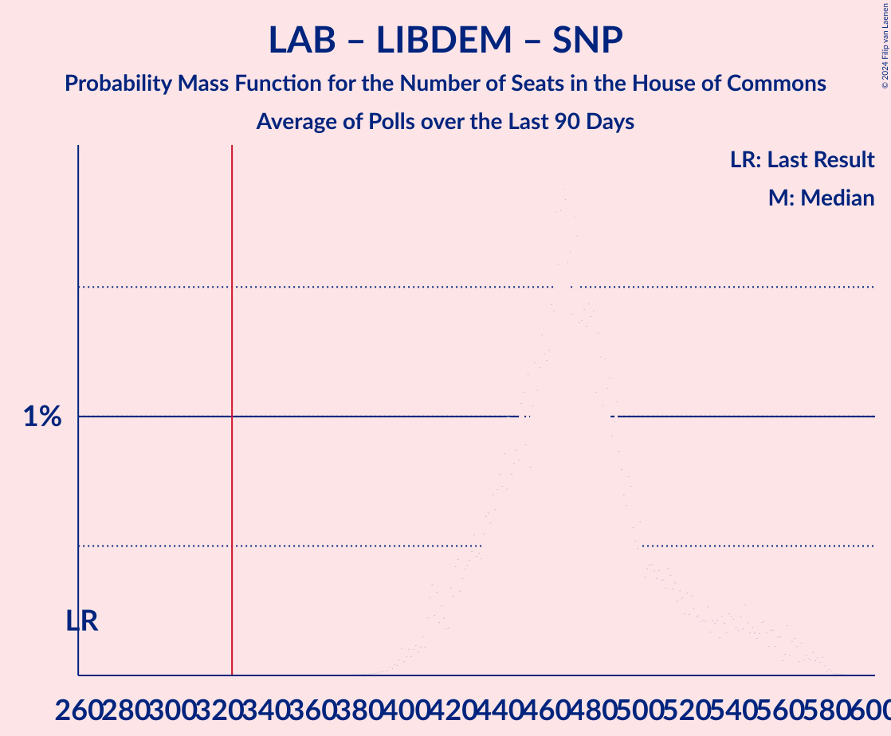

# Poll Average

<a href="#voting-intentions">Voting Intentions</a> | <a href="#seats">Seats</a> | <a href="#coalitions">Coalitions</a> | <a href="#technical-information">Technical Information</a>

## Summary

The table below lists the polls on which the average is based. They are the most recent polls (less than 90 days old) registered and analyzed so far.

| Period     | Polling firm/Commissioner(s) | CON | LAB | LIBDEM | SNP | GREEN | BREXIT | PC | SPKR | UKIP | ChUK | NI |
|:----------:|:----------------------------:|:--:|:--:|:--:|:--:|:--:|:--:|:--:|:--:|:--:|:--:|:--:|
| 12 December 2019 | General Election | 43.6%   365 | 32.1%   202 | 11.5%   11 | 3.9%   48 | 2.8%   1 | 2.0%   0 | 0.5%   4 | 0.1%   1 | 0.1%   0 | 0.0%   0 | 0.0%   18 |
| N/A | Poll Average | 38–46%   285–375 | 30–40%   181–278 | 6–14%   0–23 | 3–7%   27–59 | 3–7%   1 | 0–2%   0 | 0–2%   0–7 | N/A   1 | 0–1%   0 | N/A   N/A | N/A   18 |
| [23–26 July 2021](2021-07-26-Deltapoll.html) | Deltapoll | 41–46%   304–364 | 36–41%   220–280 | 5–8%   0–5 | 2–4%   16–53 | 4–6%   1 | 1–2%   0 | 1–2%   5–7 | N/A   1 | 0–1%   0 | N/A   N/A | N/A   18 |
| [23–25 July 2021](2021-07-25-SavantaComRes.html) | Savanta ComRes | 39–43%   305–355 | 33–37%   211–258 | 9–12%   6–16 | 3–5%   43–58 | 2–4%   1 | N/A   N/A | N/A   N/A | N/A   1 | N/A   N/A | N/A   N/A | N/A   18 |
| [25 July 2021](2021-07-25-RedfieldWiltonStrategies.html) | Redfield & Wilton Strategies | 39–43%   293–346 | 35–39%   226–275 | 8–11%   4–11 | 3–5%   42–58 | 4–6%   1 | 1–2%   0 | 0–1%   0–5 | N/A   1 | N/A   N/A | N/A   N/A | N/A   18 |
| [23 July 2021](2021-07-23-Survation.html) | Survation | 36–42%   268–339 | 34–40%   227–291 | 8–12%   5–21 | 3–6%   33–58 | 3–5%   1 | N/A   N/A | 1–2%   4–7 | N/A   1 | N/A   N/A | N/A   N/A | N/A   18 |
| [22–23 July 2021](2021-07-23-Opinium.html) | Opinium   The Observer | 41–46%   318–364 | 33–38%   202–245 | 7–9%   1–6 | 4–6%   54–58 | 3–5%   1 | N/A   N/A | 1–2%   5–7 | N/A   1 | N/A   N/A | N/A   N/A | N/A   18 |
| [20–21 July 2021](2021-07-21-YouGov.html) | YouGov   The Times | 37–42%   285–342 | 33–38%   219–274 | 8–11%   4–11 | 4–6%   54–58 | 5–8%   1–2 | 1–2%   0 | 1–2%   5–7 | N/A   1 | N/A   N/A | N/A   N/A | N/A   18 |
| [7–12 July 2021](2021-07-12-Kantar.html) | Kantar | 42–48%   330–391 | 29–34%   167–222 | 10–14%   6–21 | 5–8%   53–59 | 2–4%   1 | 0–1%   0 | 1–2%   4–9 | N/A   1 | 0–1%   0 | N/A   N/A | N/A   18 |
| [2–8 July 2021](2021-07-08-IpsosMORI.html) | Ipsos MORI   Evening Standard | 38–44%   305–368 | 29–35%   182–242 | 11–16%   8–30 | 5–8%   55–59 | 4–6%   1 | 0–1%   0 | 1–2%   5–10 | N/A   1 | 0–1%   0 | N/A   N/A | N/A   18 |
| 12 December 2019 | General Election | 43.6%   365 | 32.1%   202 | 11.5%   11 | 3.9%   48 | 2.8%   1 | 2.0%   0 | 0.5%   4 | 0.1%   1 | 0.1%   0 | 0.0%   0 | 0.0%   18 |

Only polls for which at least the sample size has been published are included in the table above.

**Legend:**
+ **Top half of each row:** Voting intentions (95% confidence interval)
+ **Bottom half of each row:** Seat projections for the House of Commons (95% confidence interval)
+ **CON:** Conservative Party
+ **LAB:** Labour Party
+ **LIBDEM:** Liberal Democrats
+ **SNP:** Scottish National Party
+ **GREEN:** Green Party
+ **BREXIT:** Brexit Party
+ **PC:** Plaid Cymru
+ **SPKR:** Speaker
+ **UKIP:** UK Independence Party
+ **ChUK:** Change UK
+ **NI:** Northern Irish Parties
+ **N/A (single party):** Party not included the published results
+ **N/A (entire row):** Calculation for this opinion poll not started yet

## Voting Intentions

### Confidence Intervals

| Party | Last Result | Median | 80% Confidence Interval | 90% Confidence Interval | 95% Confidence Interval | 99% Confidence Interval |
|:-----:|:-----------:|:------:|:-----------------------:|:-----------------------:|:-----------------------:|:-----------------------:|
| <a href="#conservative-party">Conservative Party</a> | 43.6% | 41.4% | 38.8–44.8% |38.1–45.5% | 37.6–46.1% | 36.5–47.3% |
| <a href="#labour-party">Labour Party</a> | 32.1% | 35.4% | 31.2–38.6% |30.4–39.3% | 29.7–39.9% | 28.6–41.0% |
| <a href="#liberal-democrats">Liberal Democrats</a> | 11.5% | 9.7% | 6.8–13.1% |6.1–13.8% | 5.8–14.4% | 5.2–15.3% |
| <a href="#scottish-national-party">Scottish National Party</a> | 3.9% | 4.7% | 3.3–6.4% |3.0–6.8% | 2.8–7.2% | 2.4–7.8% |
| <a href="#green-party">Green Party</a> | 2.8% | 4.4% | 3.1–6.1% |2.8–6.7% | 2.7–7.0% | 2.3–7.6% |
| <a href="#brexit-party">Brexit Party</a> | 2.0% | 1.0% | 0.2–1.9% |0.1–2.0% | 0.1–2.2% | 0.0–2.5% |
| <a href="#plaid-cymru">Plaid Cymru</a> | 0.5% | 1.0% | 0.4–1.5% |0.3–1.6% | 0.2–1.7% | 0.1–2.0% |
| <a href="#speaker">Speaker</a> | 0.1% | N/A | N/A |N/A | N/A | N/A |
| <a href="#uk-independence-party">UK Independence Party</a> | 0.1% | 0.2% | 0.1–0.4% |0.0–0.5% | 0.0–0.6% | 0.0–0.7% |
| <a href="#change-uk">Change UK</a> | 0.0% | N/A | N/A |N/A | N/A | N/A |
| <a href="#northern-irish-parties">Northern Irish Parties</a> | 0.0% | N/A | N/A |N/A | N/A | N/A |

### Conservative Party

*For a full overview of the results for this party, see the [Conservative Party](party-conservativeparty.html) page.*

| Voting Intentions | Probability | Accumulated | Special Marks |
|:-----------------:|:-----------:|:-----------:|:-------------:|
| 33.5–34.5% | 0% | 100% |  |
| 34.5–35.5% | 0.1% | 100% |  |
| 35.5–36.5% | 0.4% | 99.9% |  |
| 36.5–37.5% | 2% | 99.5% |  |
| 37.5–38.5% | 5% | 98% |  |
| 38.5–39.5% | 11% | 92% |  |
| 39.5–40.5% | 16% | 81% |  |
| 40.5–41.5% | 16% | 65% | Median |
| 41.5–42.5% | 13% | 49% |  |
| 42.5–43.5% | 12% | 35% |  |
| 43.5–44.5% | 11% | 23% | Last Result |
| 44.5–45.5% | 7% | 12% |  |
| 45.5–46.5% | 3% | 5% |  |
| 46.5–47.5% | 1.1% | 1.5% |  |
| 47.5–48.5% | 0.3% | 0.3% |  |
| 48.5–49.5% | 0.1% | 0.1% |  |
| 49.5–50.5% | 0% | 0% |  |

### Labour Party

*For a full overview of the results for this party, see the [Labour Party](party-labourparty.html) page.*

| Voting Intentions | Probability | Accumulated | Special Marks |
|:-----------------:|:-----------:|:-----------:|:-------------:|
| 26.5–27.5% | 0.1% | 100% |  |
| 27.5–28.5% | 0.4% | 99.9% |  |
| 28.5–29.5% | 2% | 99.6% |  |
| 29.5–30.5% | 4% | 98% |  |
| 30.5–31.5% | 6% | 94% |  |
| 31.5–32.5% | 7% | 88% | Last Result |
| 32.5–33.5% | 7% | 81% |  |
| 33.5–34.5% | 11% | 74% |  |
| 34.5–35.5% | 15% | 63% | Median |
| 35.5–36.5% | 15% | 48% |  |
| 36.5–37.5% | 13% | 32% |  |
| 37.5–38.5% | 10% | 20% |  |
| 38.5–39.5% | 6% | 10% |  |
| 39.5–40.5% | 3% | 4% |  |
| 40.5–41.5% | 0.9% | 1.0% |  |
| 41.5–42.5% | 0.2% | 0.2% |  |
| 42.5–43.5% | 0% | 0% |  |

### Liberal Democrats

*For a full overview of the results for this party, see the [Liberal Democrats](party-liberaldemocrats.html) page.*

| Voting Intentions | Probability | Accumulated | Special Marks |
|:-----------------:|:-----------:|:-----------:|:-------------:|
| 3.5–4.5% | 0% | 100% |  |
| 4.5–5.5% | 1.4% | 100% |  |
| 5.5–6.5% | 7% | 98.6% |  |
| 6.5–7.5% | 6% | 92% |  |
| 7.5–8.5% | 11% | 86% |  |
| 8.5–9.5% | 20% | 74% |  |
| 9.5–10.5% | 20% | 54% | Median |
| 10.5–11.5% | 11% | 33% |  |
| 11.5–12.5% | 8% | 23% | Last Result |
| 12.5–13.5% | 8% | 15% |  |
| 13.5–14.5% | 5% | 7% |  |
| 14.5–15.5% | 2% | 2% |  |
| 15.5–16.5% | 0.3% | 0.3% |  |
| 16.5–17.5% | 0% | 0% |  |

### Scottish National Party

*For a full overview of the results for this party, see the [Scottish National Party](party-scottishnationalparty.html) page.*

| Voting Intentions | Probability | Accumulated | Special Marks |
|:-----------------:|:-----------:|:-----------:|:-------------:|
| 0.5–1.5% | 0% | 100% |  |
| 1.5–2.5% | 0.9% | 100% |  |
| 2.5–3.5% | 13% | 99.1% |  |
| 3.5–4.5% | 32% | 86% | Last Result |
| 4.5–5.5% | 28% | 54% | Median |
| 5.5–6.5% | 18% | 26% |  |
| 6.5–7.5% | 7% | 8% |  |
| 7.5–8.5% | 1.0% | 1.1% |  |
| 8.5–9.5% | 0.1% | 0.1% |  |
| 9.5–10.5% | 0% | 0% |  |

### Green Party

*For a full overview of the results for this party, see the [Green Party](party-greenparty.html) page.*

| Voting Intentions | Probability | Accumulated | Special Marks |
|:-----------------:|:-----------:|:-----------:|:-------------:|
| 0.5–1.5% | 0% | 100% |  |
| 1.5–2.5% | 1.4% | 100% |  |
| 2.5–3.5% | 22% | 98.6% | Last Result |
| 3.5–4.5% | 33% | 76% | Median |
| 4.5–5.5% | 27% | 44% |  |
| 5.5–6.5% | 11% | 17% |  |
| 6.5–7.5% | 5% | 6% |  |
| 7.5–8.5% | 0.6% | 0.6% |  |
| 8.5–9.5% | 0% | 0% |  |

### Brexit Party

*For a full overview of the results for this party, see the [Brexit Party](party-brexitparty.html) page.*

| Voting Intentions | Probability | Accumulated | Special Marks |
|:-----------------:|:-----------:|:-----------:|:-------------:|
| 0.0–0.5% | 33% | 100% |  |
| 0.5–1.5% | 44% | 67% | Median |
| 1.5–2.5% | 22% | 23% | Last Result |
| 2.5–3.5% | 0.3% | 0.3% |  |
| 3.5–4.5% | 0% | 0% |  |

### Plaid Cymru

*For a full overview of the results for this party, see the [Plaid Cymru](party-plaidcymru.html) page.*

| Voting Intentions | Probability | Accumulated | Special Marks |
|:-----------------:|:-----------:|:-----------:|:-------------:|
| 0.0–0.5% | 15% | 100% |  |
| 0.5–1.5% | 79% | 85% | Last Result, Median |
| 1.5–2.5% | 6% | 6% |  |
| 2.5–3.5% | 0% | 0% |  |

### UK Independence Party

*For a full overview of the results for this party, see the [UK Independence Party](party-ukindependenceparty.html) page.*

| Voting Intentions | Probability | Accumulated | Special Marks |
|:-----------------:|:-----------:|:-----------:|:-------------:|
| 0.0–0.5% | 97% | 100% | Last Result, Median |
| 0.5–1.5% | 3% | 3% |  |
| 1.5–2.5% | 0% | 0% |  |

## Seats

### Confidence Intervals

| Party | Last Result | Median | 80% Confidence Interval | 90% Confidence Interval | 95% Confidence Interval | 99% Confidence Interval |
|:-----:|:-----------:|:------:|:-----------------------:|:-----------------------:|:-----------------------:|:-----------------------:|
| <a href="#conservative-party">Conservative Party</a> | 365 | 331 | 302–359 |292–367 | 285–375 | 272–387 |
| <a href="#labour-party">Labour Party</a> | 202 | 234 | 199–266 |189–274 | 181–278 | 169–290 |
| <a href="#liberal-democrats">Liberal Democrats</a> | 11 | 7 | 2–19 |0–20 | 0–23 | 0–28 |
| <a href="#scottish-national-party">Scottish National Party</a> | 48 | 57 | 42–58 |32–58 | 27–59 | 19–59 |
| <a href="#green-party">Green Party</a> | 1 | 1 | 1 |1 | 1 | 1–2 |
| <a href="#brexit-party">Brexit Party</a> | 0 | 0 | 0 |0 | 0 | 0 |
| <a href="#plaid-cymru">Plaid Cymru</a> | 4 | 5 | 2–7 |0–7 | 0–7 | 0–10 |
| <a href="#speaker">Speaker</a> | 1 | 1 | 1 |1 | 1 | 1 |
| <a href="#uk-independence-party">UK Independence Party</a> | 0 | 0 | 0 |0 | 0 | 0 |
| <a href="#change-uk">Change UK</a> | 0 | N/A | N/A |N/A | N/A | N/A |
| <a href="#northern-irish-parties">Northern Irish Parties</a> | 18 | 18 | 18 |18 | 18 | 18 |

### Conservative Party

*For a full overview of the results for this party, see the [Conservative Party](party-conservativeparty.html) page.*

| Number of Seats | Probability | Accumulated | Special Marks |
|:---------------:|:-----------:|:-----------:|:-------------:|
| 256 | 0% | 100% |  |
| 257 | 0% | 99.9% |  |
| 258 | 0% | 99.9% |  |
| 259 | 0% | 99.9% |  |
| 260 | 0% | 99.9% |  |
| 261 | 0% | 99.9% |  |
| 262 | 0% | 99.9% |  |
| 263 | 0% | 99.9% |  |
| 264 | 0% | 99.8% |  |
| 265 | 0% | 99.8% |  |
| 266 | 0% | 99.8% |  |
| 267 | 0% | 99.7% |  |
| 268 | 0% | 99.7% |  |
| 269 | 0.1% | 99.7% |  |
| 270 | 0% | 99.6% |  |
| 271 | 0.1% | 99.6% |  |
| 272 | 0.1% | 99.5% |  |
| 273 | 0.1% | 99.4% |  |
| 274 | 0.1% | 99.3% |  |
| 275 | 0.1% | 99.3% |  |
| 276 | 0.2% | 99.2% |  |
| 277 | 0.1% | 99.0% |  |
| 278 | 0.1% | 98.9% |  |
| 279 | 0.1% | 98.8% |  |
| 280 | 0.2% | 98.6% |  |
| 281 | 0.2% | 98% |  |
| 282 | 0.1% | 98% |  |
| 283 | 0.2% | 98% |  |
| 284 | 0.3% | 98% |  |
| 285 | 0.6% | 98% |  |
| 286 | 0.3% | 97% |  |
| 287 | 0.3% | 97% |  |
| 288 | 0.3% | 96% |  |
| 289 | 0.4% | 96% |  |
| 290 | 0.3% | 96% |  |
| 291 | 0.3% | 95% |  |
| 292 | 0.3% | 95% |  |
| 293 | 0.5% | 95% |  |
| 294 | 0.4% | 94% |  |
| 295 | 0.5% | 94% |  |
| 296 | 0.6% | 93% |  |
| 297 | 0.5% | 93% |  |
| 298 | 0.5% | 92% |  |
| 299 | 0.4% | 92% |  |
| 300 | 0.5% | 91% |  |
| 301 | 0.5% | 91% |  |
| 302 | 0.7% | 90% |  |
| 303 | 0.9% | 90% |  |
| 304 | 0.7% | 89% |  |
| 305 | 0.8% | 88% |  |
| 306 | 1.3% | 87% |  |
| 307 | 1.0% | 86% |  |
| 308 | 0.7% | 85% |  |
| 309 | 0.9% | 84% |  |
| 310 | 1.2% | 83% |  |
| 311 | 2% | 82% |  |
| 312 | 1.0% | 81% |  |
| 313 | 1.1% | 80% |  |
| 314 | 1.2% | 79% |  |
| 315 | 1.1% | 77% |  |
| 316 | 1.4% | 76% |  |
| 317 | 2% | 75% |  |
| 318 | 1.3% | 73% |  |
| 319 | 2% | 72% |  |
| 320 | 1.0% | 70% |  |
| 321 | 1.3% | 69% |  |
| 322 | 2% | 68% |  |
| 323 | 0.9% | 66% |  |
| 324 | 2% | 65% |  |
| 325 | 2% | 63% |  |
| 326 | 3% | 62% | Majority |
| 327 | 3% | 59% |  |
| 328 | 2% | 56% |  |
| 329 | 2% | 54% |  |
| 330 | 2% | 52% |  |
| 331 | 2% | 50% | Median |
| 332 | 1.4% | 48% |  |
| 333 | 2% | 47% |  |
| 334 | 2% | 45% |  |
| 335 | 2% | 43% |  |
| 336 | 2% | 41% |  |
| 337 | 2% | 40% |  |
| 338 | 2% | 38% |  |
| 339 | 2% | 36% |  |
| 340 | 2% | 33% |  |
| 341 | 1.4% | 32% |  |
| 342 | 2% | 30% |  |
| 343 | 1.2% | 28% |  |
| 344 | 1.4% | 27% |  |
| 345 | 1.3% | 25% |  |
| 346 | 1.2% | 24% |  |
| 347 | 1.4% | 23% |  |
| 348 | 2% | 22% |  |
| 349 | 2% | 19% |  |
| 350 | 1.3% | 18% |  |
| 351 | 0.7% | 16% |  |
| 352 | 0.7% | 16% |  |
| 353 | 0.7% | 15% |  |
| 354 | 0.7% | 14% |  |
| 355 | 0.7% | 13% |  |
| 356 | 0.9% | 13% |  |
| 357 | 0.5% | 12% |  |
| 358 | 0.6% | 11% |  |
| 359 | 1.1% | 11% |  |
| 360 | 0.5% | 10% |  |
| 361 | 1.0% | 9% |  |
| 362 | 0.4% | 8% |  |
| 363 | 0.5% | 8% |  |
| 364 | 0.7% | 7% |  |
| 365 | 0.6% | 7% | Last Result |
| 366 | 0.3% | 6% |  |
| 367 | 1.0% | 6% |  |
| 368 | 0.7% | 5% |  |
| 369 | 0.2% | 4% |  |
| 370 | 0.3% | 4% |  |
| 371 | 0.2% | 4% |  |
| 372 | 0.4% | 3% |  |
| 373 | 0.3% | 3% |  |
| 374 | 0.3% | 3% |  |
| 375 | 0.3% | 3% |  |
| 376 | 0.2% | 2% |  |
| 377 | 0.3% | 2% |  |
| 378 | 0.2% | 2% |  |
| 379 | 0.2% | 1.4% |  |
| 380 | 0.2% | 1.3% |  |
| 381 | 0% | 1.0% |  |
| 382 | 0.1% | 1.0% |  |
| 383 | 0.2% | 0.9% |  |
| 384 | 0.1% | 0.7% |  |
| 385 | 0% | 0.6% |  |
| 386 | 0% | 0.5% |  |
| 387 | 0.1% | 0.5% |  |
| 388 | 0% | 0.4% |  |
| 389 | 0.1% | 0.4% |  |
| 390 | 0% | 0.4% |  |
| 391 | 0.1% | 0.3% |  |
| 392 | 0.1% | 0.3% |  |
| 393 | 0% | 0.2% |  |
| 394 | 0.1% | 0.2% |  |
| 395 | 0% | 0.1% |  |
| 396 | 0% | 0.1% |  |
| 397 | 0% | 0.1% |  |
| 398 | 0% | 0.1% |  |
| 399 | 0% | 0.1% |  |
| 400 | 0% | 0.1% |  |
| 401 | 0% | 0.1% |  |
| 402 | 0% | 0% |  |

### Labour Party

*For a full overview of the results for this party, see the [Labour Party](party-labourparty.html) page.*

| Number of Seats | Probability | Accumulated | Special Marks |
|:---------------:|:-----------:|:-----------:|:-------------:|
| 157 | 0% | 100% |  |
| 158 | 0% | 99.9% |  |
| 159 | 0% | 99.9% |  |
| 160 | 0% | 99.9% |  |
| 161 | 0% | 99.9% |  |
| 162 | 0% | 99.9% |  |
| 163 | 0.1% | 99.9% |  |
| 164 | 0% | 99.8% |  |
| 165 | 0% | 99.8% |  |
| 166 | 0.1% | 99.8% |  |
| 167 | 0.1% | 99.7% |  |
| 168 | 0.1% | 99.6% |  |
| 169 | 0.1% | 99.5% |  |
| 170 | 0% | 99.5% |  |
| 171 | 0% | 99.5% |  |
| 172 | 0% | 99.4% |  |
| 173 | 0% | 99.4% |  |
| 174 | 0.1% | 99.4% |  |
| 175 | 0.2% | 99.3% |  |
| 176 | 0.1% | 99.1% |  |
| 177 | 0.2% | 99.0% |  |
| 178 | 0.3% | 98.8% |  |
| 179 | 0.1% | 98.5% |  |
| 180 | 0.3% | 98% |  |
| 181 | 0.7% | 98% |  |
| 182 | 0.6% | 97% |  |
| 183 | 0.3% | 97% |  |
| 184 | 0.4% | 96% |  |
| 185 | 0.2% | 96% |  |
| 186 | 0.4% | 96% |  |
| 187 | 0.3% | 96% |  |
| 188 | 0.1% | 95% |  |
| 189 | 0.2% | 95% |  |
| 190 | 0.2% | 95% |  |
| 191 | 0.4% | 95% |  |
| 192 | 0.6% | 94% |  |
| 193 | 1.3% | 94% |  |
| 194 | 0.5% | 92% |  |
| 195 | 0.6% | 92% |  |
| 196 | 0.5% | 91% |  |
| 197 | 0.5% | 91% |  |
| 198 | 0.2% | 90% |  |
| 199 | 0.8% | 90% |  |
| 200 | 0.7% | 89% |  |
| 201 | 1.0% | 89% |  |
| 202 | 1.0% | 88% | Last Result |
| 203 | 0.7% | 87% |  |
| 204 | 0.5% | 86% |  |
| 205 | 0.4% | 85% |  |
| 206 | 0.5% | 85% |  |
| 207 | 0.5% | 84% |  |
| 208 | 0.5% | 84% |  |
| 209 | 0.9% | 83% |  |
| 210 | 0.7% | 82% |  |
| 211 | 0.7% | 82% |  |
| 212 | 0.6% | 81% |  |
| 213 | 0.5% | 80% |  |
| 214 | 0.6% | 80% |  |
| 215 | 0.9% | 79% |  |
| 216 | 2% | 78% |  |
| 217 | 1.3% | 77% |  |
| 218 | 0.8% | 75% |  |
| 219 | 1.2% | 75% |  |
| 220 | 1.5% | 73% |  |
| 221 | 0.6% | 72% |  |
| 222 | 2% | 71% |  |
| 223 | 2% | 70% |  |
| 224 | 1.3% | 68% |  |
| 225 | 3% | 67% |  |
| 226 | 3% | 64% |  |
| 227 | 2% | 61% |  |
| 228 | 1.3% | 60% |  |
| 229 | 2% | 58% |  |
| 230 | 2% | 56% |  |
| 231 | 2% | 54% |  |
| 232 | 1.4% | 53% |  |
| 233 | 1.1% | 51% |  |
| 234 | 1.3% | 50% | Median |
| 235 | 2% | 49% |  |
| 236 | 2% | 47% |  |
| 237 | 1.1% | 45% |  |
| 238 | 1.1% | 44% |  |
| 239 | 1.3% | 43% |  |
| 240 | 1.2% | 42% |  |
| 241 | 1.3% | 41% |  |
| 242 | 1.2% | 39% |  |
| 243 | 1.2% | 38% |  |
| 244 | 2% | 37% |  |
| 245 | 2% | 35% |  |
| 246 | 1.4% | 33% |  |
| 247 | 1.0% | 32% |  |
| 248 | 1.1% | 31% |  |
| 249 | 1.4% | 30% |  |
| 250 | 2% | 28% |  |
| 251 | 2% | 27% |  |
| 252 | 1.2% | 25% |  |
| 253 | 1.2% | 24% |  |
| 254 | 2% | 23% |  |
| 255 | 1.3% | 20% |  |
| 256 | 2% | 19% |  |
| 257 | 1.2% | 17% |  |
| 258 | 1.1% | 16% |  |
| 259 | 0.7% | 15% |  |
| 260 | 0.5% | 14% |  |
| 261 | 0.5% | 14% |  |
| 262 | 0.6% | 13% |  |
| 263 | 0.8% | 13% |  |
| 264 | 0.8% | 12% |  |
| 265 | 0.6% | 11% |  |
| 266 | 0.7% | 11% |  |
| 267 | 0.8% | 10% |  |
| 268 | 0.7% | 9% |  |
| 269 | 1.1% | 8% |  |
| 270 | 0.5% | 7% |  |
| 271 | 0.6% | 7% |  |
| 272 | 0.5% | 6% |  |
| 273 | 0.5% | 6% |  |
| 274 | 0.4% | 5% |  |
| 275 | 1.0% | 5% |  |
| 276 | 0.8% | 4% |  |
| 277 | 0.4% | 3% |  |
| 278 | 0.3% | 3% |  |
| 279 | 0.2% | 2% |  |
| 280 | 0.2% | 2% |  |
| 281 | 0.1% | 2% |  |
| 282 | 0.1% | 2% |  |
| 283 | 0.1% | 2% |  |
| 284 | 0.2% | 1.4% |  |
| 285 | 0.2% | 1.3% |  |
| 286 | 0.1% | 1.1% |  |
| 287 | 0.2% | 1.0% |  |
| 288 | 0.1% | 0.8% |  |
| 289 | 0.1% | 0.7% |  |
| 290 | 0.1% | 0.6% |  |
| 291 | 0.1% | 0.5% |  |
| 292 | 0.1% | 0.4% |  |
| 293 | 0% | 0.3% |  |
| 294 | 0% | 0.3% |  |
| 295 | 0% | 0.2% |  |
| 296 | 0% | 0.2% |  |
| 297 | 0% | 0.2% |  |
| 298 | 0% | 0.2% |  |
| 299 | 0% | 0.1% |  |
| 300 | 0% | 0.1% |  |
| 301 | 0% | 0.1% |  |
| 302 | 0% | 0.1% |  |
| 303 | 0% | 0.1% |  |
| 304 | 0% | 0.1% |  |
| 305 | 0% | 0% |  |

### Liberal Democrats

*For a full overview of the results for this party, see the [Liberal Democrats](party-liberaldemocrats.html) page.*

| Number of Seats | Probability | Accumulated | Special Marks |
|:---------------:|:-----------:|:-----------:|:-------------:|
| 0 | 7% | 100% |  |
| 1 | 3% | 93% |  |
| 2 | 4% | 90% |  |
| 3 | 5% | 86% |  |
| 4 | 6% | 81% |  |
| 5 | 1.3% | 75% |  |
| 6 | 18% | 74% |  |
| 7 | 14% | 56% | Median |
| 8 | 9% | 42% |  |
| 9 | 5% | 33% |  |
| 10 | 2% | 28% |  |
| 11 | 3% | 26% | Last Result |
| 12 | 4% | 24% |  |
| 13 | 2% | 20% |  |
| 14 | 1.0% | 18% |  |
| 15 | 0.7% | 17% |  |
| 16 | 2% | 17% |  |
| 17 | 3% | 14% |  |
| 18 | 0.8% | 11% |  |
| 19 | 3% | 11% |  |
| 20 | 3% | 7% |  |
| 21 | 1.0% | 4% |  |
| 22 | 0.6% | 3% |  |
| 23 | 0.7% | 3% |  |
| 24 | 0.2% | 2% |  |
| 25 | 0.5% | 2% |  |
| 26 | 0.2% | 1.4% |  |
| 27 | 0.4% | 1.2% |  |
| 28 | 0.3% | 0.8% |  |
| 29 | 0% | 0.4% |  |
| 30 | 0.1% | 0.4% |  |
| 31 | 0.1% | 0.3% |  |
| 32 | 0.1% | 0.2% |  |
| 33 | 0% | 0.1% |  |
| 34 | 0% | 0.1% |  |
| 35 | 0% | 0.1% |  |
| 36 | 0% | 0% |  |

### Scottish National Party

*For a full overview of the results for this party, see the [Scottish National Party](party-scottishnationalparty.html) page.*

| Number of Seats | Probability | Accumulated | Special Marks |
|:---------------:|:-----------:|:-----------:|:-------------:|
| 8 | 0% | 100% |  |
| 9 | 0% | 99.9% |  |
| 10 | 0% | 99.9% |  |
| 11 | 0% | 99.9% |  |
| 12 | 0% | 99.9% |  |
| 13 | 0% | 99.9% |  |
| 14 | 0.1% | 99.8% |  |
| 15 | 0.1% | 99.8% |  |
| 16 | 0% | 99.7% |  |
| 17 | 0% | 99.7% |  |
| 18 | 0.1% | 99.6% |  |
| 19 | 0.2% | 99.6% |  |
| 20 | 0.1% | 99.4% |  |
| 21 | 0.2% | 99.2% |  |
| 22 | 0.4% | 99.0% |  |
| 23 | 0.3% | 98.7% |  |
| 24 | 0.3% | 98% |  |
| 25 | 0.3% | 98% |  |
| 26 | 0.1% | 98% |  |
| 27 | 0.6% | 98% |  |
| 28 | 0.6% | 97% |  |
| 29 | 0.2% | 96% |  |
| 30 | 0.5% | 96% |  |
| 31 | 0.3% | 96% |  |
| 32 | 1.0% | 95% |  |
| 33 | 0.7% | 94% |  |
| 34 | 0.3% | 94% |  |
| 35 | 0.3% | 93% |  |
| 36 | 0.3% | 93% |  |
| 37 | 0.2% | 93% |  |
| 38 | 0.5% | 93% |  |
| 39 | 0.2% | 92% |  |
| 40 | 0.8% | 92% |  |
| 41 | 0.5% | 91% |  |
| 42 | 0.6% | 91% |  |
| 43 | 1.0% | 90% |  |
| 44 | 0.7% | 89% |  |
| 45 | 1.1% | 88% |  |
| 46 | 2% | 87% |  |
| 47 | 2% | 86% |  |
| 48 | 2% | 84% | Last Result |
| 49 | 2% | 82% |  |
| 50 | 2% | 80% |  |
| 51 | 2% | 78% |  |
| 52 | 3% | 76% |  |
| 53 | 5% | 73% |  |
| 54 | 5% | 68% |  |
| 55 | 6% | 63% |  |
| 56 | 6% | 57% |  |
| 57 | 4% | 50% | Median |
| 58 | 44% | 47% |  |
| 59 | 3% | 3% |  |
| 60 | 0% | 0% |  |

### Green Party

*For a full overview of the results for this party, see the [Green Party](party-greenparty.html) page.*

| Number of Seats | Probability | Accumulated | Special Marks |
|:---------------:|:-----------:|:-----------:|:-------------:|
| 1 | 98% | 100% | Last Result, Median |
| 2 | 2% | 2% |  |
| 3 | 0% | 0% |  |

### Brexit Party

*For a full overview of the results for this party, see the [Brexit Party](party-brexitparty.html) page.*

| Number of Seats | Probability | Accumulated | Special Marks |
|:---------------:|:-----------:|:-----------:|:-------------:|
| 0 | 100% | 100% | Last Result, Median |

### Plaid Cymru

*For a full overview of the results for this party, see the [Plaid Cymru](party-plaidcymru.html) page.*

| Number of Seats | Probability | Accumulated | Special Marks |
|:---------------:|:-----------:|:-----------:|:-------------:|
| 0 | 6% | 100% |  |
| 1 | 2% | 94% |  |
| 2 | 4% | 92% |  |
| 3 | 1.0% | 89% |  |
| 4 | 4% | 88% | Last Result |
| 5 | 55% | 84% | Median |
| 6 | 17% | 29% |  |
| 7 | 10% | 12% |  |
| 8 | 0.4% | 2% |  |
| 9 | 1.0% | 2% |  |
| 10 | 0.8% | 0.9% |  |
| 11 | 0.1% | 0.1% |  |
| 12 | 0% | 0% |  |

### Speaker

*For a full overview of the results for this party, see the [Speaker](party-speaker.html) page.*

| Number of Seats | Probability | Accumulated | Special Marks |
|:---------------:|:-----------:|:-----------:|:-------------:|
| 1 | 100% | 100% | Last Result, Median |

### UK Independence Party

*For a full overview of the results for this party, see the [UK Independence Party](party-ukindependenceparty.html) page.*

| Number of Seats | Probability | Accumulated | Special Marks |
|:---------------:|:-----------:|:-----------:|:-------------:|
| 0 | 100% | 100% | Last Result, Median |

### Change UK

*For a full overview of the results for this party, see the [Change UK](party-changeuk.html) page.*

### Northern Irish Parties

*For a full overview of the results for this party, see the [Northern Irish Parties](party-northernirishparties.html) page.*

| Number of Seats | Probability | Accumulated | Special Marks |
|:---------------:|:-----------:|:-----------:|:-------------:|
| 18 | 100% | 100% | Last Result, Median |

## Coalitions

### Confidence Intervals

| Coalition | Last Result | Median | Majority? | 80% Confidence Interval | 90% Confidence Interval | 95% Confidence Interval | 99% Confidence Interval |
|:---------:|:-----------:|:------:|:---------:|:-----------------------:|:-----------------------:|:-----------------------:|:-----------------------:|
| Conservative Party – Scottish National Party – Plaid Cymru | 417 | 388 | 99.6% | 357–421 | 348–430 | 341–438 | 327–450 |
| Conservative Party – Scottish National Party | 413 | 384 | 99.2% | 354–415 | 344–425 | 336–432 | 322–444 |
| Conservative Party – Liberal Democrats | 376 | 340 | 72% | 309–368 | 300–378 | 294–385 | 283–397 |
| Conservative Party – Plaid Cymru | 369 | 335 | 67% | 306–365 | 296–373 | 290–380 | 277–392 |
| Conservative Party | 365 | 331 | 62% | 302–359 | 292–367 | 285–375 | 272–387 |
| Labour Party – Liberal Democrats – Scottish National Party – Green Party – Plaid Cymru | 266 | 300 | 13% | 272–329 | 264–339 | 256–346 | 244–359 |
| Labour Party – Liberal Democrats – Scottish National Party – Plaid Cymru | 265 | 299 | 12% | 271–328 | 263–338 | 255–345 | 243–358 |
| Labour Party – Liberal Democrats – Scottish National Party | 261 | 294 | 9% | 265–324 | 257–334 | 250–340 | 238–353 |
| Labour Party – Scottish National Party – Plaid Cymru | 254 | 289 | 7% | 261–321 | 252–330 | 245–336 | 233–346 |
| Labour Party – Scottish National Party | 250 | 285 | 5% | 255–316 | 246–325 | 239–331 | 227–341 |
| Labour Party – Liberal Democrats – Plaid Cymru | 217 | 245 | 0% | 215–276 | 205–286 | 198–294 | 186–308 |
| Labour Party – Liberal Democrats | 213 | 241 | 0% | 209–272 | 200–282 | 192–289 | 180–303 |
| Labour Party – Plaid Cymru | 206 | 237 | 0% | 205–271 | 196–278 | 187–283 | 175–295 |
| Labour Party | 202 | 234 | 0% | 199–266 | 189–274 | 181–278 | 169–290 |

### Conservative Party – Scottish National Party – Plaid Cymru

| Number of Seats | Probability | Accumulated | Special Marks |
|:---------------:|:-----------:|:-----------:|:-------------:|
| 310 | 0% | 100% |  |
| 311 | 0% | 99.9% |  |
| 312 | 0% | 99.9% |  |
| 313 | 0% | 99.9% |  |
| 314 | 0% | 99.9% |  |
| 315 | 0% | 99.9% |  |
| 316 | 0% | 99.9% |  |
| 317 | 0% | 99.9% |  |
| 318 | 0% | 99.9% |  |
| 319 | 0% | 99.8% |  |
| 320 | 0% | 99.8% |  |
| 321 | 0% | 99.8% |  |
| 322 | 0% | 99.7% |  |
| 323 | 0% | 99.7% |  |
| 324 | 0.1% | 99.7% |  |
| 325 | 0% | 99.6% |  |
| 326 | 0.1% | 99.6% | Majority |
| 327 | 0% | 99.5% |  |
| 328 | 0.1% | 99.5% |  |
| 329 | 0.1% | 99.4% |  |
| 330 | 0.1% | 99.3% |  |
| 331 | 0.1% | 99.2% |  |
| 332 | 0.1% | 99.2% |  |
| 333 | 0.1% | 99.0% |  |
| 334 | 0.2% | 98.9% |  |
| 335 | 0.1% | 98.8% |  |
| 336 | 0.2% | 98.6% |  |
| 337 | 0.2% | 98% |  |
| 338 | 0.2% | 98% |  |
| 339 | 0.2% | 98% |  |
| 340 | 0.2% | 98% |  |
| 341 | 0.2% | 98% |  |
| 342 | 0.3% | 97% |  |
| 343 | 0.3% | 97% |  |
| 344 | 0.3% | 97% |  |
| 345 | 0.2% | 97% |  |
| 346 | 0.3% | 96% |  |
| 347 | 0.4% | 96% |  |
| 348 | 0.7% | 96% |  |
| 349 | 0.5% | 95% |  |
| 350 | 0.6% | 94% |  |
| 351 | 0.5% | 94% |  |
| 352 | 0.6% | 93% |  |
| 353 | 0.4% | 93% |  |
| 354 | 0.7% | 92% |  |
| 355 | 0.5% | 92% |  |
| 356 | 0.7% | 91% |  |
| 357 | 0.6% | 90% |  |
| 358 | 0.6% | 90% |  |
| 359 | 0.9% | 89% |  |
| 360 | 0.7% | 88% |  |
| 361 | 0.8% | 88% |  |
| 362 | 0.5% | 87% |  |
| 363 | 1.1% | 86% |  |
| 364 | 1.3% | 85% |  |
| 365 | 0.8% | 84% |  |
| 366 | 1.2% | 83% |  |
| 367 | 1.4% | 82% |  |
| 368 | 2% | 81% |  |
| 369 | 2% | 79% |  |
| 370 | 2% | 77% |  |
| 371 | 1.2% | 76% |  |
| 372 | 2% | 75% |  |
| 373 | 1.5% | 73% |  |
| 374 | 2% | 72% |  |
| 375 | 1.1% | 70% |  |
| 376 | 1.4% | 69% |  |
| 377 | 1.3% | 67% |  |
| 378 | 1.4% | 66% |  |
| 379 | 1.3% | 65% |  |
| 380 | 2% | 63% |  |
| 381 | 2% | 61% |  |
| 382 | 1.3% | 60% |  |
| 383 | 1.2% | 59% |  |
| 384 | 1.4% | 57% |  |
| 385 | 2% | 56% |  |
| 386 | 2% | 54% |  |
| 387 | 1.4% | 52% |  |
| 388 | 2% | 51% |  |
| 389 | 2% | 49% |  |
| 390 | 3% | 46% |  |
| 391 | 2% | 43% |  |
| 392 | 1.4% | 42% |  |
| 393 | 2% | 40% | Median |
| 394 | 2% | 39% |  |
| 395 | 2% | 36% |  |
| 396 | 1.1% | 34% |  |
| 397 | 1.2% | 33% |  |
| 398 | 2% | 32% |  |
| 399 | 1.5% | 30% |  |
| 400 | 1.3% | 29% |  |
| 401 | 2% | 28% |  |
| 402 | 2% | 26% |  |
| 403 | 1.4% | 24% |  |
| 404 | 0.9% | 23% |  |
| 405 | 0.8% | 22% |  |
| 406 | 0.7% | 21% |  |
| 407 | 0.9% | 21% |  |
| 408 | 0.9% | 20% |  |
| 409 | 0.9% | 19% |  |
| 410 | 1.0% | 18% |  |
| 411 | 0.8% | 17% |  |
| 412 | 1.3% | 16% |  |
| 413 | 0.6% | 15% |  |
| 414 | 0.7% | 14% |  |
| 415 | 0.7% | 13% |  |
| 416 | 0.7% | 13% |  |
| 417 | 0.5% | 12% | Last Result |
| 418 | 0.4% | 12% |  |
| 419 | 0.5% | 11% |  |
| 420 | 0.6% | 11% |  |
| 421 | 0.5% | 10% |  |
| 422 | 0.4% | 10% |  |
| 423 | 0.4% | 9% |  |
| 424 | 1.0% | 9% |  |
| 425 | 0.7% | 8% |  |
| 426 | 0.4% | 7% |  |
| 427 | 0.6% | 7% |  |
| 428 | 0.4% | 6% |  |
| 429 | 0.3% | 6% |  |
| 430 | 0.7% | 6% |  |
| 431 | 0.6% | 5% |  |
| 432 | 0.5% | 4% |  |
| 433 | 0.2% | 4% |  |
| 434 | 0.2% | 4% |  |
| 435 | 0.1% | 3% |  |
| 436 | 0.3% | 3% |  |
| 437 | 0.4% | 3% |  |
| 438 | 0.3% | 3% |  |
| 439 | 0.3% | 2% |  |
| 440 | 0.4% | 2% |  |
| 441 | 0.2% | 2% |  |
| 442 | 0.1% | 1.4% |  |
| 443 | 0.2% | 1.3% |  |
| 444 | 0.1% | 1.1% |  |
| 445 | 0% | 1.0% |  |
| 446 | 0.1% | 0.9% |  |
| 447 | 0.2% | 0.8% |  |
| 448 | 0.1% | 0.6% |  |
| 449 | 0% | 0.6% |  |
| 450 | 0.1% | 0.5% |  |
| 451 | 0% | 0.5% |  |
| 452 | 0% | 0.4% |  |
| 453 | 0% | 0.4% |  |
| 454 | 0% | 0.4% |  |
| 455 | 0.1% | 0.3% |  |
| 456 | 0% | 0.3% |  |
| 457 | 0% | 0.2% |  |
| 458 | 0% | 0.2% |  |
| 459 | 0.1% | 0.2% |  |
| 460 | 0% | 0.1% |  |
| 461 | 0% | 0.1% |  |
| 462 | 0% | 0.1% |  |
| 463 | 0% | 0.1% |  |
| 464 | 0% | 0.1% |  |
| 465 | 0% | 0% |  |

### Conservative Party – Scottish National Party

| Number of Seats | Probability | Accumulated | Special Marks |
|:---------------:|:-----------:|:-----------:|:-------------:|
| 305 | 0% | 100% |  |
| 306 | 0% | 99.9% |  |
| 307 | 0% | 99.9% |  |
| 308 | 0% | 99.9% |  |
| 309 | 0% | 99.9% |  |
| 310 | 0% | 99.9% |  |
| 311 | 0% | 99.9% |  |
| 312 | 0% | 99.9% |  |
| 313 | 0% | 99.9% |  |
| 314 | 0% | 99.8% |  |
| 315 | 0% | 99.8% |  |
| 316 | 0% | 99.8% |  |
| 317 | 0% | 99.7% |  |
| 318 | 0% | 99.7% |  |
| 319 | 0% | 99.7% |  |
| 320 | 0% | 99.6% |  |
| 321 | 0.1% | 99.6% |  |
| 322 | 0.1% | 99.5% |  |
| 323 | 0.1% | 99.4% |  |
| 324 | 0.1% | 99.4% |  |
| 325 | 0.1% | 99.3% |  |
| 326 | 0.1% | 99.2% | Majority |
| 327 | 0.1% | 99.1% |  |
| 328 | 0.1% | 99.0% |  |
| 329 | 0.2% | 98.9% |  |
| 330 | 0.1% | 98.7% |  |
| 331 | 0.1% | 98.6% |  |
| 332 | 0.2% | 98% |  |
| 333 | 0.2% | 98% |  |
| 334 | 0.2% | 98% |  |
| 335 | 0.2% | 98% |  |
| 336 | 0.2% | 98% |  |
| 337 | 0.2% | 97% |  |
| 338 | 0.4% | 97% |  |
| 339 | 0.2% | 97% |  |
| 340 | 0.2% | 97% |  |
| 341 | 0.3% | 96% |  |
| 342 | 0.4% | 96% |  |
| 343 | 0.6% | 96% |  |
| 344 | 0.4% | 95% |  |
| 345 | 0.5% | 95% |  |
| 346 | 0.4% | 94% |  |
| 347 | 0.5% | 94% |  |
| 348 | 0.3% | 93% |  |
| 349 | 0.7% | 93% |  |
| 350 | 0.5% | 92% |  |
| 351 | 0.7% | 92% |  |
| 352 | 0.4% | 91% |  |
| 353 | 0.5% | 90% |  |
| 354 | 0.9% | 90% |  |
| 355 | 0.8% | 89% |  |
| 356 | 0.8% | 88% |  |
| 357 | 0.5% | 87% |  |
| 358 | 0.9% | 87% |  |
| 359 | 1.1% | 86% |  |
| 360 | 0.8% | 85% |  |
| 361 | 1.3% | 84% |  |
| 362 | 0.9% | 83% |  |
| 363 | 1.3% | 82% |  |
| 364 | 2% | 81% |  |
| 365 | 1.3% | 79% |  |
| 366 | 1.0% | 78% |  |
| 367 | 2% | 77% |  |
| 368 | 2% | 75% |  |
| 369 | 2% | 74% |  |
| 370 | 1.2% | 72% |  |
| 371 | 1.1% | 71% |  |
| 372 | 2% | 69% |  |
| 373 | 1.2% | 68% |  |
| 374 | 2% | 67% |  |
| 375 | 2% | 65% |  |
| 376 | 2% | 63% |  |
| 377 | 1.0% | 62% |  |
| 378 | 1.1% | 61% |  |
| 379 | 1.4% | 60% |  |
| 380 | 3% | 58% |  |
| 381 | 0.9% | 56% |  |
| 382 | 2% | 55% |  |
| 383 | 2% | 53% |  |
| 384 | 3% | 51% |  |
| 385 | 3% | 49% |  |
| 386 | 2% | 46% |  |
| 387 | 2% | 44% |  |
| 388 | 3% | 42% | Median |
| 389 | 1.3% | 40% |  |
| 390 | 2% | 38% |  |
| 391 | 1.4% | 37% |  |
| 392 | 2% | 35% |  |
| 393 | 2% | 34% |  |
| 394 | 2% | 32% |  |
| 395 | 1.5% | 30% |  |
| 396 | 2% | 28% |  |
| 397 | 2% | 26% |  |
| 398 | 1.2% | 25% |  |
| 399 | 0.9% | 23% |  |
| 400 | 1.2% | 23% |  |
| 401 | 0.8% | 21% |  |
| 402 | 1.0% | 21% |  |
| 403 | 0.9% | 20% |  |
| 404 | 1.1% | 19% |  |
| 405 | 1.0% | 18% |  |
| 406 | 1.0% | 17% |  |
| 407 | 1.1% | 16% |  |
| 408 | 0.9% | 15% |  |
| 409 | 0.5% | 14% |  |
| 410 | 0.8% | 13% |  |
| 411 | 0.4% | 12% |  |
| 412 | 0.5% | 12% |  |
| 413 | 0.5% | 11% | Last Result |
| 414 | 0.5% | 11% |  |
| 415 | 0.7% | 10% |  |
| 416 | 0.4% | 10% |  |
| 417 | 0.9% | 9% |  |
| 418 | 0.3% | 8% |  |
| 419 | 0.8% | 8% |  |
| 420 | 0.4% | 7% |  |
| 421 | 0.3% | 7% |  |
| 422 | 0.6% | 7% |  |
| 423 | 0.5% | 6% |  |
| 424 | 0.2% | 5% |  |
| 425 | 0.8% | 5% |  |
| 426 | 0.6% | 4% |  |
| 427 | 0.3% | 4% |  |
| 428 | 0.2% | 4% |  |
| 429 | 0.1% | 3% |  |
| 430 | 0.4% | 3% |  |
| 431 | 0.3% | 3% |  |
| 432 | 0.2% | 3% |  |
| 433 | 0.3% | 2% |  |
| 434 | 0.4% | 2% |  |
| 435 | 0.2% | 2% |  |
| 436 | 0.2% | 1.5% |  |
| 437 | 0.2% | 1.2% |  |
| 438 | 0.1% | 1.1% |  |
| 439 | 0.1% | 1.0% |  |
| 440 | 0.1% | 0.9% |  |
| 441 | 0.1% | 0.8% |  |
| 442 | 0.2% | 0.7% |  |
| 443 | 0% | 0.5% |  |
| 444 | 0% | 0.5% |  |
| 445 | 0% | 0.5% |  |
| 446 | 0% | 0.4% |  |
| 447 | 0.1% | 0.4% |  |
| 448 | 0% | 0.4% |  |
| 449 | 0.1% | 0.3% |  |
| 450 | 0% | 0.3% |  |
| 451 | 0% | 0.2% |  |
| 452 | 0% | 0.2% |  |
| 453 | 0% | 0.1% |  |
| 454 | 0% | 0.1% |  |
| 455 | 0% | 0.1% |  |
| 456 | 0% | 0.1% |  |
| 457 | 0% | 0.1% |  |
| 458 | 0% | 0% |  |

### Conservative Party – Liberal Democrats

| Number of Seats | Probability | Accumulated | Special Marks |
|:---------------:|:-----------:|:-----------:|:-------------:|
| 270 | 0% | 100% |  |
| 271 | 0% | 99.9% |  |
| 272 | 0% | 99.9% |  |
| 273 | 0% | 99.9% |  |
| 274 | 0% | 99.9% |  |
| 275 | 0% | 99.9% |  |
| 276 | 0% | 99.9% |  |
| 277 | 0% | 99.8% |  |
| 278 | 0% | 99.8% |  |
| 279 | 0% | 99.8% |  |
| 280 | 0.1% | 99.8% |  |
| 281 | 0% | 99.7% |  |
| 282 | 0% | 99.7% |  |
| 283 | 0.1% | 99.6% |  |
| 284 | 0.1% | 99.5% |  |
| 285 | 0.1% | 99.4% |  |
| 286 | 0.1% | 99.3% |  |
| 287 | 0.1% | 99.3% |  |
| 288 | 0.1% | 99.2% |  |
| 289 | 0.2% | 99.1% |  |
| 290 | 0.1% | 98.9% |  |
| 291 | 0.3% | 98.8% |  |
| 292 | 0.7% | 98% |  |
| 293 | 0.2% | 98% |  |
| 294 | 0.3% | 98% |  |
| 295 | 0.2% | 97% |  |
| 296 | 0.4% | 97% |  |
| 297 | 0.3% | 97% |  |
| 298 | 0.3% | 96% |  |
| 299 | 0.5% | 96% |  |
| 300 | 0.5% | 95% |  |
| 301 | 0.3% | 95% |  |
| 302 | 0.6% | 95% |  |
| 303 | 0.6% | 94% |  |
| 304 | 0.7% | 93% |  |
| 305 | 0.4% | 93% |  |
| 306 | 0.5% | 92% |  |
| 307 | 0.4% | 92% |  |
| 308 | 0.5% | 91% |  |
| 309 | 1.1% | 91% |  |
| 310 | 0.5% | 90% |  |
| 311 | 0.6% | 89% |  |
| 312 | 0.7% | 89% |  |
| 313 | 2% | 88% |  |
| 314 | 0.8% | 86% |  |
| 315 | 0.8% | 86% |  |
| 316 | 0.6% | 85% |  |
| 317 | 2% | 84% |  |
| 318 | 1.2% | 83% |  |
| 319 | 1.0% | 81% |  |
| 320 | 0.8% | 80% |  |
| 321 | 1.4% | 80% |  |
| 322 | 1.1% | 78% |  |
| 323 | 2% | 77% |  |
| 324 | 2% | 75% |  |
| 325 | 0.9% | 73% |  |
| 326 | 1.3% | 72% | Majority |
| 327 | 1.2% | 71% |  |
| 328 | 2% | 70% |  |
| 329 | 1.0% | 67% |  |
| 330 | 0.9% | 66% |  |
| 331 | 2% | 66% |  |
| 332 | 2% | 63% |  |
| 333 | 1.4% | 62% |  |
| 334 | 2% | 60% |  |
| 335 | 1.1% | 59% |  |
| 336 | 2% | 58% |  |
| 337 | 1.4% | 56% |  |
| 338 | 2% | 54% | Median |
| 339 | 1.3% | 52% |  |
| 340 | 2% | 51% |  |
| 341 | 2% | 49% |  |
| 342 | 2% | 47% |  |
| 343 | 2% | 44% |  |
| 344 | 2% | 42% |  |
| 345 | 3% | 40% |  |
| 346 | 2% | 37% |  |
| 347 | 2% | 35% |  |
| 348 | 2% | 33% |  |
| 349 | 2% | 31% |  |
| 350 | 2% | 28% |  |
| 351 | 2% | 27% |  |
| 352 | 0.9% | 25% |  |
| 353 | 1.0% | 24% |  |
| 354 | 0.7% | 23% |  |
| 355 | 1.2% | 22% |  |
| 356 | 0.9% | 21% |  |
| 357 | 0.9% | 20% |  |
| 358 | 1.1% | 19% |  |
| 359 | 0.7% | 18% |  |
| 360 | 0.6% | 17% |  |
| 361 | 0.7% | 17% |  |
| 362 | 0.5% | 16% |  |
| 363 | 0.7% | 16% |  |
| 364 | 0.9% | 15% |  |
| 365 | 0.8% | 14% |  |
| 366 | 2% | 13% |  |
| 367 | 0.5% | 11% |  |
| 368 | 0.8% | 11% |  |
| 369 | 0.3% | 10% |  |
| 370 | 0.3% | 10% |  |
| 371 | 0.7% | 9% |  |
| 372 | 0.6% | 9% |  |
| 373 | 0.9% | 8% |  |
| 374 | 0.8% | 7% |  |
| 375 | 0.6% | 6% |  |
| 376 | 0.3% | 6% | Last Result |
| 377 | 0.2% | 5% |  |
| 378 | 0.2% | 5% |  |
| 379 | 0.2% | 5% |  |
| 380 | 0.5% | 5% |  |
| 381 | 0.2% | 4% |  |
| 382 | 0.2% | 4% |  |
| 383 | 0.4% | 4% |  |
| 384 | 0.6% | 3% |  |
| 385 | 0.5% | 3% |  |
| 386 | 0.3% | 2% |  |
| 387 | 0.3% | 2% |  |
| 388 | 0.2% | 2% |  |
| 389 | 0.3% | 1.4% |  |
| 390 | 0.3% | 1.2% |  |
| 391 | 0.2% | 0.9% |  |
| 392 | 0.1% | 0.7% |  |
| 393 | 0.1% | 0.7% |  |
| 394 | 0% | 0.6% |  |
| 395 | 0% | 0.6% |  |
| 396 | 0% | 0.6% |  |
| 397 | 0.1% | 0.5% |  |
| 398 | 0.1% | 0.5% |  |
| 399 | 0.1% | 0.4% |  |
| 400 | 0% | 0.3% |  |
| 401 | 0.1% | 0.2% |  |
| 402 | 0% | 0.2% |  |
| 403 | 0% | 0.2% |  |
| 404 | 0.1% | 0.1% |  |
| 405 | 0% | 0.1% |  |
| 406 | 0% | 0.1% |  |
| 407 | 0% | 0.1% |  |
| 408 | 0% | 0.1% |  |
| 409 | 0% | 0.1% |  |
| 410 | 0% | 0.1% |  |
| 411 | 0% | 0% |  |

### Conservative Party – Plaid Cymru

| Number of Seats | Probability | Accumulated | Special Marks |
|:---------------:|:-----------:|:-----------:|:-------------:|
| 261 | 0% | 100% |  |
| 262 | 0% | 99.9% |  |
| 263 | 0% | 99.9% |  |
| 264 | 0% | 99.9% |  |
| 265 | 0% | 99.9% |  |
| 266 | 0% | 99.9% |  |
| 267 | 0% | 99.9% |  |
| 268 | 0% | 99.9% |  |
| 269 | 0% | 99.8% |  |
| 270 | 0% | 99.8% |  |
| 271 | 0% | 99.8% |  |
| 272 | 0% | 99.7% |  |
| 273 | 0% | 99.7% |  |
| 274 | 0.1% | 99.7% |  |
| 275 | 0.1% | 99.6% |  |
| 276 | 0.1% | 99.6% |  |
| 277 | 0.1% | 99.5% |  |
| 278 | 0.1% | 99.4% |  |
| 279 | 0.1% | 99.4% |  |
| 280 | 0.1% | 99.3% |  |
| 281 | 0.2% | 99.2% |  |
| 282 | 0.1% | 99.0% |  |
| 283 | 0.1% | 98.9% |  |
| 284 | 0.2% | 98.8% |  |
| 285 | 0.2% | 98.6% |  |
| 286 | 0.3% | 98% |  |
| 287 | 0.1% | 98% |  |
| 288 | 0.2% | 98% |  |
| 289 | 0.3% | 98% |  |
| 290 | 0.5% | 98% |  |
| 291 | 0.4% | 97% |  |
| 292 | 0.4% | 97% |  |
| 293 | 0.3% | 96% |  |
| 294 | 0.4% | 96% |  |
| 295 | 0.4% | 96% |  |
| 296 | 0.4% | 95% |  |
| 297 | 0.4% | 95% |  |
| 298 | 0.6% | 94% |  |
| 299 | 0.5% | 94% |  |
| 300 | 0.5% | 93% |  |
| 301 | 0.6% | 93% |  |
| 302 | 0.5% | 92% |  |
| 303 | 0.6% | 92% |  |
| 304 | 0.5% | 91% |  |
| 305 | 0.5% | 91% |  |
| 306 | 0.5% | 90% |  |
| 307 | 0.6% | 90% |  |
| 308 | 0.8% | 89% |  |
| 309 | 0.9% | 88% |  |
| 310 | 1.2% | 87% |  |
| 311 | 1.2% | 86% |  |
| 312 | 1.1% | 85% |  |
| 313 | 1.1% | 84% |  |
| 314 | 1.0% | 83% |  |
| 315 | 0.9% | 82% |  |
| 316 | 2% | 81% |  |
| 317 | 1.4% | 79% |  |
| 318 | 0.9% | 78% |  |
| 319 | 1.2% | 77% |  |
| 320 | 1.3% | 75% |  |
| 321 | 1.3% | 74% |  |
| 322 | 1.4% | 73% |  |
| 323 | 1.5% | 71% |  |
| 324 | 2% | 70% |  |
| 325 | 1.0% | 68% |  |
| 326 | 1.1% | 67% | Majority |
| 327 | 2% | 66% |  |
| 328 | 2% | 64% |  |
| 329 | 2% | 63% |  |
| 330 | 1.4% | 61% |  |
| 331 | 3% | 60% |  |
| 332 | 3% | 57% |  |
| 333 | 2% | 54% |  |
| 334 | 1.4% | 52% |  |
| 335 | 2% | 51% |  |
| 336 | 3% | 49% | Median |
| 337 | 2% | 47% |  |
| 338 | 2% | 44% |  |
| 339 | 2% | 42% |  |
| 340 | 2% | 40% |  |
| 341 | 2% | 39% |  |
| 342 | 1.4% | 37% |  |
| 343 | 2% | 36% |  |
| 344 | 2% | 34% |  |
| 345 | 2% | 32% |  |
| 346 | 1.1% | 30% |  |
| 347 | 2% | 29% |  |
| 348 | 1.1% | 27% |  |
| 349 | 1.3% | 26% |  |
| 350 | 1.3% | 25% |  |
| 351 | 1.0% | 24% |  |
| 352 | 1.4% | 23% |  |
| 353 | 2% | 21% |  |
| 354 | 2% | 20% |  |
| 355 | 1.0% | 18% |  |
| 356 | 0.9% | 17% |  |
| 357 | 0.7% | 16% |  |
| 358 | 0.8% | 15% |  |
| 359 | 0.6% | 14% |  |
| 360 | 0.8% | 14% |  |
| 361 | 0.7% | 13% |  |
| 362 | 0.7% | 12% |  |
| 363 | 0.6% | 11% |  |
| 364 | 0.6% | 11% |  |
| 365 | 0.5% | 10% |  |
| 366 | 1.1% | 10% |  |
| 367 | 0.7% | 9% |  |
| 368 | 0.4% | 8% |  |
| 369 | 0.8% | 8% | Last Result |
| 370 | 0.3% | 7% |  |
| 371 | 0.4% | 7% |  |
| 372 | 0.8% | 6% |  |
| 373 | 0.7% | 5% |  |
| 374 | 0.4% | 5% |  |
| 375 | 0.3% | 4% |  |
| 376 | 0.1% | 4% |  |
| 377 | 0.4% | 4% |  |
| 378 | 0.3% | 3% |  |
| 379 | 0.5% | 3% |  |
| 380 | 0.3% | 3% |  |
| 381 | 0.2% | 2% |  |
| 382 | 0.4% | 2% |  |
| 383 | 0.2% | 2% |  |
| 384 | 0.2% | 2% |  |
| 385 | 0.2% | 1.4% |  |
| 386 | 0.2% | 1.2% |  |
| 387 | 0% | 1.0% |  |
| 388 | 0.2% | 1.0% |  |
| 389 | 0.1% | 0.8% |  |
| 390 | 0.1% | 0.7% |  |
| 391 | 0% | 0.6% |  |
| 392 | 0.1% | 0.5% |  |
| 393 | 0% | 0.5% |  |
| 394 | 0% | 0.5% |  |
| 395 | 0.1% | 0.4% |  |
| 396 | 0.1% | 0.4% |  |
| 397 | 0% | 0.3% |  |
| 398 | 0.1% | 0.3% |  |
| 399 | 0% | 0.2% |  |
| 400 | 0.1% | 0.2% |  |
| 401 | 0.1% | 0.1% |  |
| 402 | 0% | 0.1% |  |
| 403 | 0% | 0.1% |  |
| 404 | 0% | 0.1% |  |
| 405 | 0% | 0.1% |  |
| 406 | 0% | 0.1% |  |
| 407 | 0% | 0% |  |

### Conservative Party

| Number of Seats | Probability | Accumulated | Special Marks |
|:---------------:|:-----------:|:-----------:|:-------------:|
| 256 | 0% | 100% |  |
| 257 | 0% | 99.9% |  |
| 258 | 0% | 99.9% |  |
| 259 | 0% | 99.9% |  |
| 260 | 0% | 99.9% |  |
| 261 | 0% | 99.9% |  |
| 262 | 0% | 99.9% |  |
| 263 | 0% | 99.9% |  |
| 264 | 0% | 99.8% |  |
| 265 | 0% | 99.8% |  |
| 266 | 0% | 99.8% |  |
| 267 | 0% | 99.7% |  |
| 268 | 0% | 99.7% |  |
| 269 | 0.1% | 99.7% |  |
| 270 | 0% | 99.6% |  |
| 271 | 0.1% | 99.6% |  |
| 272 | 0.1% | 99.5% |  |
| 273 | 0.1% | 99.4% |  |
| 274 | 0.1% | 99.3% |  |
| 275 | 0.1% | 99.3% |  |
| 276 | 0.2% | 99.2% |  |
| 277 | 0.1% | 99.0% |  |
| 278 | 0.1% | 98.9% |  |
| 279 | 0.1% | 98.8% |  |
| 280 | 0.2% | 98.6% |  |
| 281 | 0.2% | 98% |  |
| 282 | 0.1% | 98% |  |
| 283 | 0.2% | 98% |  |
| 284 | 0.3% | 98% |  |
| 285 | 0.6% | 98% |  |
| 286 | 0.3% | 97% |  |
| 287 | 0.3% | 97% |  |
| 288 | 0.3% | 96% |  |
| 289 | 0.4% | 96% |  |
| 290 | 0.3% | 96% |  |
| 291 | 0.3% | 95% |  |
| 292 | 0.3% | 95% |  |
| 293 | 0.5% | 95% |  |
| 294 | 0.4% | 94% |  |
| 295 | 0.5% | 94% |  |
| 296 | 0.6% | 93% |  |
| 297 | 0.5% | 93% |  |
| 298 | 0.5% | 92% |  |
| 299 | 0.4% | 92% |  |
| 300 | 0.5% | 91% |  |
| 301 | 0.5% | 91% |  |
| 302 | 0.7% | 90% |  |
| 303 | 0.9% | 90% |  |
| 304 | 0.7% | 89% |  |
| 305 | 0.8% | 88% |  |
| 306 | 1.3% | 87% |  |
| 307 | 1.0% | 86% |  |
| 308 | 0.7% | 85% |  |
| 309 | 0.9% | 84% |  |
| 310 | 1.2% | 83% |  |
| 311 | 2% | 82% |  |
| 312 | 1.0% | 81% |  |
| 313 | 1.1% | 80% |  |
| 314 | 1.2% | 79% |  |
| 315 | 1.1% | 77% |  |
| 316 | 1.4% | 76% |  |
| 317 | 2% | 75% |  |
| 318 | 1.3% | 73% |  |
| 319 | 2% | 72% |  |
| 320 | 1.0% | 70% |  |
| 321 | 1.3% | 69% |  |
| 322 | 2% | 68% |  |
| 323 | 0.9% | 66% |  |
| 324 | 2% | 65% |  |
| 325 | 2% | 63% |  |
| 326 | 3% | 62% | Majority |
| 327 | 3% | 59% |  |
| 328 | 2% | 56% |  |
| 329 | 2% | 54% |  |
| 330 | 2% | 52% |  |
| 331 | 2% | 50% | Median |
| 332 | 1.4% | 48% |  |
| 333 | 2% | 47% |  |
| 334 | 2% | 45% |  |
| 335 | 2% | 43% |  |
| 336 | 2% | 41% |  |
| 337 | 2% | 40% |  |
| 338 | 2% | 38% |  |
| 339 | 2% | 36% |  |
| 340 | 2% | 33% |  |
| 341 | 1.4% | 32% |  |
| 342 | 2% | 30% |  |
| 343 | 1.2% | 28% |  |
| 344 | 1.4% | 27% |  |
| 345 | 1.3% | 25% |  |
| 346 | 1.2% | 24% |  |
| 347 | 1.4% | 23% |  |
| 348 | 2% | 22% |  |
| 349 | 2% | 19% |  |
| 350 | 1.3% | 18% |  |
| 351 | 0.7% | 16% |  |
| 352 | 0.7% | 16% |  |
| 353 | 0.7% | 15% |  |
| 354 | 0.7% | 14% |  |
| 355 | 0.7% | 13% |  |
| 356 | 0.9% | 13% |  |
| 357 | 0.5% | 12% |  |
| 358 | 0.6% | 11% |  |
| 359 | 1.1% | 11% |  |
| 360 | 0.5% | 10% |  |
| 361 | 1.0% | 9% |  |
| 362 | 0.4% | 8% |  |
| 363 | 0.5% | 8% |  |
| 364 | 0.7% | 7% |  |
| 365 | 0.6% | 7% | Last Result |
| 366 | 0.3% | 6% |  |
| 367 | 1.0% | 6% |  |
| 368 | 0.7% | 5% |  |
| 369 | 0.2% | 4% |  |
| 370 | 0.3% | 4% |  |
| 371 | 0.2% | 4% |  |
| 372 | 0.4% | 3% |  |
| 373 | 0.3% | 3% |  |
| 374 | 0.3% | 3% |  |
| 375 | 0.3% | 3% |  |
| 376 | 0.2% | 2% |  |
| 377 | 0.3% | 2% |  |
| 378 | 0.2% | 2% |  |
| 379 | 0.2% | 1.4% |  |
| 380 | 0.2% | 1.3% |  |
| 381 | 0% | 1.0% |  |
| 382 | 0.1% | 1.0% |  |
| 383 | 0.2% | 0.9% |  |
| 384 | 0.1% | 0.7% |  |
| 385 | 0% | 0.6% |  |
| 386 | 0% | 0.5% |  |
| 387 | 0.1% | 0.5% |  |
| 388 | 0% | 0.4% |  |
| 389 | 0.1% | 0.4% |  |
| 390 | 0% | 0.4% |  |
| 391 | 0.1% | 0.3% |  |
| 392 | 0.1% | 0.3% |  |
| 393 | 0% | 0.2% |  |
| 394 | 0.1% | 0.2% |  |
| 395 | 0% | 0.1% |  |
| 396 | 0% | 0.1% |  |
| 397 | 0% | 0.1% |  |
| 398 | 0% | 0.1% |  |
| 399 | 0% | 0.1% |  |
| 400 | 0% | 0.1% |  |
| 401 | 0% | 0.1% |  |
| 402 | 0% | 0% |  |

### Labour Party – Liberal Democrats – Scottish National Party – Green Party – Plaid Cymru

| Number of Seats | Probability | Accumulated | Special Marks |
|:---------------:|:-----------:|:-----------:|:-------------:|
| 230 | 0% | 100% |  |
| 231 | 0% | 99.9% |  |
| 232 | 0% | 99.9% |  |
| 233 | 0% | 99.9% |  |
| 234 | 0% | 99.9% |  |
| 235 | 0% | 99.9% |  |
| 236 | 0% | 99.9% |  |
| 237 | 0.1% | 99.9% |  |
| 238 | 0% | 99.8% |  |
| 239 | 0.1% | 99.8% |  |
| 240 | 0.1% | 99.7% |  |
| 241 | 0% | 99.7% |  |
| 242 | 0.1% | 99.6% |  |
| 243 | 0% | 99.6% |  |
| 244 | 0.1% | 99.6% |  |
| 245 | 0% | 99.5% |  |
| 246 | 0% | 99.5% |  |
| 247 | 0.1% | 99.4% |  |
| 248 | 0.2% | 99.3% |  |
| 249 | 0.1% | 99.1% |  |
| 250 | 0% | 99.0% |  |
| 251 | 0.2% | 99.0% |  |
| 252 | 0.2% | 98.7% |  |
| 253 | 0.2% | 98.6% |  |
| 254 | 0.3% | 98% |  |
| 255 | 0.2% | 98% |  |
| 256 | 0.3% | 98% |  |
| 257 | 0.3% | 97% |  |
| 258 | 0.3% | 97% |  |
| 259 | 0.4% | 97% |  |
| 260 | 0.2% | 97% |  |
| 261 | 0.3% | 96% |  |
| 262 | 0.2% | 96% |  |
| 263 | 0.7% | 96% |  |
| 264 | 1.0% | 95% |  |
| 265 | 0.3% | 94% |  |
| 266 | 0.6% | 94% | Last Result |
| 267 | 0.7% | 93% |  |
| 268 | 0.5% | 93% |  |
| 269 | 0.4% | 92% |  |
| 270 | 1.0% | 92% |  |
| 271 | 0.5% | 91% |  |
| 272 | 1.1% | 90% |  |
| 273 | 0.6% | 89% |  |
| 274 | 0.6% | 89% |  |
| 275 | 1.0% | 88% |  |
| 276 | 0.8% | 87% |  |
| 277 | 0.7% | 86% |  |
| 278 | 0.8% | 85% |  |
| 279 | 0.8% | 85% |  |
| 280 | 0.8% | 84% |  |
| 281 | 1.3% | 83% |  |
| 282 | 2% | 82% |  |
| 283 | 2% | 80% |  |
| 284 | 1.5% | 78% |  |
| 285 | 1.4% | 76% |  |
| 286 | 1.5% | 75% |  |
| 287 | 2% | 73% |  |
| 288 | 2% | 72% |  |
| 289 | 2% | 70% |  |
| 290 | 1.5% | 68% |  |
| 291 | 2% | 67% |  |
| 292 | 2% | 65% |  |
| 293 | 2% | 62% |  |
| 294 | 2% | 60% |  |
| 295 | 2% | 59% |  |
| 296 | 2% | 57% |  |
| 297 | 1.4% | 55% |  |
| 298 | 2% | 54% |  |
| 299 | 1.4% | 52% |  |
| 300 | 2% | 50% |  |
| 301 | 2% | 49% |  |
| 302 | 2% | 46% |  |
| 303 | 2% | 44% |  |
| 304 | 3% | 43% | Median |
| 305 | 3% | 40% |  |
| 306 | 2% | 37% |  |
| 307 | 2% | 36% |  |
| 308 | 1.0% | 34% |  |
| 309 | 2% | 33% |  |
| 310 | 1.3% | 31% |  |
| 311 | 0.9% | 30% |  |
| 312 | 1.5% | 29% |  |
| 313 | 1.3% | 28% |  |
| 314 | 2% | 26% |  |
| 315 | 1.3% | 25% |  |
| 316 | 1.1% | 23% |  |
| 317 | 1.2% | 22% |  |
| 318 | 1.1% | 21% |  |
| 319 | 0.9% | 20% |  |
| 320 | 2% | 19% |  |
| 321 | 1.1% | 17% |  |
| 322 | 0.8% | 16% |  |
| 323 | 0.7% | 16% |  |
| 324 | 0.9% | 15% |  |
| 325 | 1.3% | 14% |  |
| 326 | 0.8% | 13% | Majority |
| 327 | 0.6% | 12% |  |
| 328 | 0.9% | 11% |  |
| 329 | 0.7% | 10% |  |
| 330 | 0.5% | 10% |  |
| 331 | 0.5% | 9% |  |
| 332 | 0.4% | 9% |  |
| 333 | 0.5% | 8% |  |
| 334 | 0.5% | 8% |  |
| 335 | 0.6% | 7% |  |
| 336 | 0.5% | 7% |  |
| 337 | 0.4% | 6% |  |
| 338 | 0.5% | 6% |  |
| 339 | 0.3% | 5% |  |
| 340 | 0.3% | 5% |  |
| 341 | 0.3% | 5% |  |
| 342 | 0.4% | 4% |  |
| 343 | 0.3% | 4% |  |
| 344 | 0.3% | 4% |  |
| 345 | 0.3% | 3% |  |
| 346 | 0.6% | 3% |  |
| 347 | 0.3% | 2% |  |
| 348 | 0.2% | 2% |  |
| 349 | 0.1% | 2% |  |
| 350 | 0.2% | 2% |  |
| 351 | 0.2% | 2% |  |
| 352 | 0.1% | 1.4% |  |
| 353 | 0.1% | 1.2% |  |
| 354 | 0.1% | 1.1% |  |
| 355 | 0.2% | 1.0% |  |
| 356 | 0.1% | 0.8% |  |
| 357 | 0.1% | 0.7% |  |
| 358 | 0.1% | 0.7% |  |
| 359 | 0.1% | 0.6% |  |
| 360 | 0.1% | 0.5% |  |
| 361 | 0% | 0.4% |  |
| 362 | 0.1% | 0.4% |  |
| 363 | 0% | 0.3% |  |
| 364 | 0% | 0.3% |  |
| 365 | 0% | 0.2% |  |
| 366 | 0% | 0.2% |  |
| 367 | 0% | 0.2% |  |
| 368 | 0% | 0.2% |  |
| 369 | 0% | 0.1% |  |
| 370 | 0% | 0.1% |  |
| 371 | 0% | 0.1% |  |
| 372 | 0% | 0.1% |  |
| 373 | 0% | 0.1% |  |
| 374 | 0% | 0.1% |  |
| 375 | 0% | 0% |  |

### Labour Party – Liberal Democrats – Scottish National Party – Plaid Cymru

| Number of Seats | Probability | Accumulated | Special Marks |
|:---------------:|:-----------:|:-----------:|:-------------:|
| 229 | 0% | 100% |  |
| 230 | 0% | 99.9% |  |
| 231 | 0% | 99.9% |  |
| 232 | 0% | 99.9% |  |
| 233 | 0% | 99.9% |  |
| 234 | 0% | 99.9% |  |
| 235 | 0% | 99.9% |  |
| 236 | 0.1% | 99.9% |  |
| 237 | 0% | 99.8% |  |
| 238 | 0.1% | 99.8% |  |
| 239 | 0.1% | 99.7% |  |
| 240 | 0% | 99.7% |  |
| 241 | 0.1% | 99.6% |  |
| 242 | 0% | 99.6% |  |
| 243 | 0.1% | 99.6% |  |
| 244 | 0% | 99.5% |  |
| 245 | 0% | 99.5% |  |
| 246 | 0.1% | 99.4% |  |
| 247 | 0.2% | 99.3% |  |
| 248 | 0.1% | 99.1% |  |
| 249 | 0% | 99.0% |  |
| 250 | 0.2% | 99.0% |  |
| 251 | 0.2% | 98.7% |  |
| 252 | 0.2% | 98.6% |  |
| 253 | 0.3% | 98% |  |
| 254 | 0.2% | 98% |  |
| 255 | 0.3% | 98% |  |
| 256 | 0.3% | 97% |  |
| 257 | 0.3% | 97% |  |
| 258 | 0.4% | 97% |  |
| 259 | 0.2% | 97% |  |
| 260 | 0.3% | 96% |  |
| 261 | 0.2% | 96% |  |
| 262 | 0.7% | 96% |  |
| 263 | 1.0% | 95% |  |
| 264 | 0.3% | 94% |  |
| 265 | 0.6% | 94% | Last Result |
| 266 | 0.7% | 93% |  |
| 267 | 0.5% | 93% |  |
| 268 | 0.4% | 92% |  |
| 269 | 1.0% | 92% |  |
| 270 | 0.5% | 91% |  |
| 271 | 1.1% | 90% |  |
| 272 | 0.6% | 89% |  |
| 273 | 0.6% | 89% |  |
| 274 | 1.0% | 88% |  |
| 275 | 0.8% | 87% |  |
| 276 | 0.7% | 86% |  |
| 277 | 0.8% | 85% |  |
| 278 | 0.8% | 85% |  |
| 279 | 0.8% | 84% |  |
| 280 | 1.3% | 83% |  |
| 281 | 2% | 82% |  |
| 282 | 2% | 80% |  |
| 283 | 1.5% | 78% |  |
| 284 | 1.4% | 76% |  |
| 285 | 1.5% | 75% |  |
| 286 | 2% | 73% |  |
| 287 | 2% | 72% |  |
| 288 | 2% | 70% |  |
| 289 | 1.5% | 68% |  |
| 290 | 2% | 67% |  |
| 291 | 2% | 65% |  |
| 292 | 2% | 62% |  |
| 293 | 2% | 60% |  |
| 294 | 2% | 58% |  |
| 295 | 2% | 57% |  |
| 296 | 1.4% | 55% |  |
| 297 | 2% | 54% |  |
| 298 | 1.4% | 52% |  |
| 299 | 2% | 50% |  |
| 300 | 2% | 49% |  |
| 301 | 2% | 46% |  |
| 302 | 2% | 44% |  |
| 303 | 3% | 43% | Median |
| 304 | 3% | 40% |  |
| 305 | 2% | 37% |  |
| 306 | 2% | 36% |  |
| 307 | 1.1% | 34% |  |
| 308 | 2% | 33% |  |
| 309 | 1.3% | 31% |  |
| 310 | 1.0% | 30% |  |
| 311 | 1.5% | 29% |  |
| 312 | 1.3% | 28% |  |
| 313 | 2% | 26% |  |
| 314 | 1.2% | 24% |  |
| 315 | 1.1% | 23% |  |
| 316 | 1.2% | 22% |  |
| 317 | 1.1% | 21% |  |
| 318 | 1.0% | 20% |  |
| 319 | 2% | 19% |  |
| 320 | 1.1% | 17% |  |
| 321 | 0.8% | 16% |  |
| 322 | 0.7% | 16% |  |
| 323 | 1.0% | 15% |  |
| 324 | 1.2% | 14% |  |
| 325 | 0.8% | 13% |  |
| 326 | 0.7% | 12% | Majority |
| 327 | 0.9% | 11% |  |
| 328 | 0.7% | 10% |  |
| 329 | 0.5% | 10% |  |
| 330 | 0.5% | 9% |  |
| 331 | 0.4% | 9% |  |
| 332 | 0.5% | 8% |  |
| 333 | 0.5% | 8% |  |
| 334 | 0.6% | 7% |  |
| 335 | 0.5% | 7% |  |
| 336 | 0.4% | 6% |  |
| 337 | 0.5% | 6% |  |
| 338 | 0.3% | 5% |  |
| 339 | 0.3% | 5% |  |
| 340 | 0.3% | 5% |  |
| 341 | 0.4% | 4% |  |
| 342 | 0.3% | 4% |  |
| 343 | 0.3% | 4% |  |
| 344 | 0.3% | 3% |  |
| 345 | 0.5% | 3% |  |
| 346 | 0.3% | 2% |  |
| 347 | 0.2% | 2% |  |
| 348 | 0.1% | 2% |  |
| 349 | 0.2% | 2% |  |
| 350 | 0.2% | 2% |  |
| 351 | 0.1% | 1.4% |  |
| 352 | 0.1% | 1.2% |  |
| 353 | 0.1% | 1.1% |  |
| 354 | 0.2% | 1.0% |  |
| 355 | 0.1% | 0.8% |  |
| 356 | 0.1% | 0.7% |  |
| 357 | 0.1% | 0.7% |  |
| 358 | 0.1% | 0.6% |  |
| 359 | 0.1% | 0.5% |  |
| 360 | 0% | 0.4% |  |
| 361 | 0.1% | 0.4% |  |
| 362 | 0% | 0.3% |  |
| 363 | 0% | 0.3% |  |
| 364 | 0% | 0.2% |  |
| 365 | 0% | 0.2% |  |
| 366 | 0% | 0.2% |  |
| 367 | 0% | 0.2% |  |
| 368 | 0% | 0.1% |  |
| 369 | 0% | 0.1% |  |
| 370 | 0% | 0.1% |  |
| 371 | 0% | 0.1% |  |
| 372 | 0% | 0.1% |  |
| 373 | 0% | 0.1% |  |
| 374 | 0% | 0% |  |

### Labour Party – Liberal Democrats – Scottish National Party

| Number of Seats | Probability | Accumulated | Special Marks |
|:---------------:|:-----------:|:-----------:|:-------------:|
| 224 | 0% | 100% |  |
| 225 | 0% | 99.9% |  |
| 226 | 0% | 99.9% |  |
| 227 | 0% | 99.9% |  |
| 228 | 0% | 99.9% |  |
| 229 | 0.1% | 99.9% |  |
| 230 | 0.1% | 99.9% |  |
| 231 | 0% | 99.8% |  |
| 232 | 0.1% | 99.8% |  |
| 233 | 0% | 99.7% |  |
| 234 | 0.1% | 99.7% |  |
| 235 | 0.1% | 99.6% |  |
| 236 | 0% | 99.6% |  |
| 237 | 0% | 99.5% |  |
| 238 | 0.1% | 99.5% |  |
| 239 | 0% | 99.5% |  |
| 240 | 0.1% | 99.4% |  |
| 241 | 0.1% | 99.3% |  |
| 242 | 0.2% | 99.2% |  |
| 243 | 0% | 99.0% |  |
| 244 | 0.2% | 99.0% |  |
| 245 | 0.2% | 98.8% |  |
| 246 | 0.2% | 98.6% |  |
| 247 | 0.2% | 98% |  |
| 248 | 0.4% | 98% |  |
| 249 | 0.2% | 98% |  |
| 250 | 0.3% | 98% |  |
| 251 | 0.4% | 97% |  |
| 252 | 0.3% | 97% |  |
| 253 | 0.4% | 97% |  |
| 254 | 0.1% | 96% |  |
| 255 | 0.3% | 96% |  |
| 256 | 0.4% | 96% |  |
| 257 | 0.7% | 95% |  |
| 258 | 0.8% | 95% |  |
| 259 | 0.4% | 94% |  |
| 260 | 0.3% | 93% |  |
| 261 | 0.8% | 93% | Last Result |
| 262 | 0.5% | 92% |  |
| 263 | 0.7% | 92% |  |
| 264 | 1.1% | 91% |  |
| 265 | 0.5% | 90% |  |
| 266 | 0.6% | 90% |  |
| 267 | 0.6% | 89% |  |
| 268 | 0.7% | 88% |  |
| 269 | 0.7% | 88% |  |
| 270 | 0.8% | 87% |  |
| 271 | 0.6% | 86% |  |
| 272 | 0.8% | 86% |  |
| 273 | 0.7% | 85% |  |
| 274 | 0.9% | 84% |  |
| 275 | 1.0% | 83% |  |
| 276 | 2% | 82% |  |
| 277 | 2% | 80% |  |
| 278 | 2% | 78% |  |
| 279 | 1.1% | 77% |  |
| 280 | 1.3% | 76% |  |
| 281 | 1.3% | 74% |  |
| 282 | 1.2% | 73% |  |
| 283 | 2% | 72% |  |
| 284 | 1.3% | 70% |  |
| 285 | 2% | 69% |  |
| 286 | 2% | 67% |  |
| 287 | 2% | 65% |  |
| 288 | 2% | 63% |  |
| 289 | 2% | 61% |  |
| 290 | 2% | 59% |  |
| 291 | 2% | 58% |  |
| 292 | 2% | 56% |  |
| 293 | 2% | 54% |  |
| 294 | 2% | 51% |  |
| 295 | 2% | 49% |  |
| 296 | 1.3% | 47% |  |
| 297 | 2% | 46% |  |
| 298 | 3% | 45% | Median |
| 299 | 3% | 42% |  |
| 300 | 1.3% | 39% |  |
| 301 | 2% | 38% |  |
| 302 | 2% | 36% |  |
| 303 | 1.4% | 34% |  |
| 304 | 1.0% | 33% |  |
| 305 | 1.0% | 32% |  |
| 306 | 2% | 31% |  |
| 307 | 2% | 29% |  |
| 308 | 2% | 28% |  |
| 309 | 1.2% | 26% |  |
| 310 | 1.3% | 25% |  |
| 311 | 1.1% | 24% |  |
| 312 | 0.9% | 23% |  |
| 313 | 1.4% | 22% |  |
| 314 | 2% | 20% |  |
| 315 | 0.9% | 18% |  |
| 316 | 0.9% | 18% |  |
| 317 | 1.1% | 17% |  |
| 318 | 1.0% | 16% |  |
| 319 | 1.1% | 15% |  |
| 320 | 1.2% | 14% |  |
| 321 | 0.8% | 12% |  |
| 322 | 0.8% | 12% |  |
| 323 | 0.5% | 11% |  |
| 324 | 0.5% | 10% |  |
| 325 | 0.5% | 10% |  |
| 326 | 0.5% | 9% | Majority |
| 327 | 0.6% | 9% |  |
| 328 | 0.5% | 8% |  |
| 329 | 0.6% | 8% |  |
| 330 | 0.5% | 7% |  |
| 331 | 0.5% | 7% |  |
| 332 | 0.6% | 6% |  |
| 333 | 0.4% | 5% |  |
| 334 | 0.4% | 5% |  |
| 335 | 0.4% | 5% |  |
| 336 | 0.4% | 4% |  |
| 337 | 0.3% | 4% |  |
| 338 | 0.4% | 4% |  |
| 339 | 0.4% | 3% |  |
| 340 | 0.5% | 3% |  |
| 341 | 0.3% | 2% |  |
| 342 | 0.2% | 2% |  |
| 343 | 0.1% | 2% |  |
| 344 | 0.3% | 2% |  |
| 345 | 0.2% | 2% |  |
| 346 | 0.1% | 1.4% |  |
| 347 | 0.1% | 1.2% |  |
| 348 | 0.1% | 1.1% |  |
| 349 | 0.2% | 1.0% |  |
| 350 | 0.1% | 0.8% |  |
| 351 | 0.1% | 0.7% |  |
| 352 | 0.1% | 0.6% |  |
| 353 | 0.1% | 0.6% |  |
| 354 | 0.1% | 0.5% |  |
| 355 | 0% | 0.4% |  |
| 356 | 0.1% | 0.4% |  |
| 357 | 0% | 0.3% |  |
| 358 | 0% | 0.3% |  |
| 359 | 0% | 0.2% |  |
| 360 | 0% | 0.2% |  |
| 361 | 0% | 0.2% |  |
| 362 | 0% | 0.2% |  |
| 363 | 0% | 0.1% |  |
| 364 | 0% | 0.1% |  |
| 365 | 0% | 0.1% |  |
| 366 | 0% | 0.1% |  |
| 367 | 0% | 0.1% |  |
| 368 | 0% | 0.1% |  |
| 369 | 0% | 0% |  |

### Labour Party – Scottish National Party – Plaid Cymru

| Number of Seats | Probability | Accumulated | Special Marks |
|:---------------:|:-----------:|:-----------:|:-------------:|
| 220 | 0% | 100% |  |
| 221 | 0% | 99.9% |  |
| 222 | 0% | 99.9% |  |
| 223 | 0% | 99.9% |  |
| 224 | 0% | 99.9% |  |
| 225 | 0% | 99.9% |  |
| 226 | 0.1% | 99.9% |  |
| 227 | 0% | 99.9% |  |
| 228 | 0% | 99.8% |  |
| 229 | 0.1% | 99.8% |  |
| 230 | 0% | 99.8% |  |
| 231 | 0.1% | 99.7% |  |
| 232 | 0.1% | 99.6% |  |
| 233 | 0.1% | 99.5% |  |
| 234 | 0% | 99.5% |  |
| 235 | 0% | 99.4% |  |
| 236 | 0% | 99.4% |  |
| 237 | 0.1% | 99.4% |  |
| 238 | 0.1% | 99.3% |  |
| 239 | 0.2% | 99.3% |  |
| 240 | 0.3% | 99.1% |  |
| 241 | 0.3% | 98.8% |  |
| 242 | 0.2% | 98.6% |  |
| 243 | 0.3% | 98% |  |
| 244 | 0.3% | 98% |  |
| 245 | 0.5% | 98% |  |
| 246 | 0.6% | 97% |  |
| 247 | 0.4% | 97% |  |
| 248 | 0.2% | 96% |  |
| 249 | 0.2% | 96% |  |
| 250 | 0.5% | 96% |  |
| 251 | 0.2% | 95% |  |
| 252 | 0.2% | 95% |  |
| 253 | 0.2% | 95% |  |
| 254 | 0.3% | 95% | Last Result |
| 255 | 0.6% | 94% |  |
| 256 | 0.8% | 94% |  |
| 257 | 0.9% | 93% |  |
| 258 | 0.6% | 92% |  |
| 259 | 0.7% | 91% |  |
| 260 | 0.4% | 91% |  |
| 261 | 0.3% | 90% |  |
| 262 | 0.8% | 90% |  |
| 263 | 0.5% | 89% |  |
| 264 | 2% | 89% |  |
| 265 | 0.9% | 87% |  |
| 266 | 1.0% | 86% |  |
| 267 | 0.7% | 85% |  |
| 268 | 0.5% | 84% |  |
| 269 | 0.8% | 83% |  |
| 270 | 0.7% | 83% |  |
| 271 | 0.8% | 82% |  |
| 272 | 1.2% | 81% |  |
| 273 | 1.0% | 80% |  |
| 274 | 0.9% | 79% |  |
| 275 | 1.3% | 78% |  |
| 276 | 0.8% | 77% |  |
| 277 | 1.2% | 76% |  |
| 278 | 1.1% | 75% |  |
| 279 | 2% | 74% |  |
| 280 | 2% | 72% |  |
| 281 | 2% | 70% |  |
| 282 | 2% | 67% |  |
| 283 | 2% | 65% |  |
| 284 | 2% | 63% |  |
| 285 | 3% | 61% |  |
| 286 | 2% | 58% |  |
| 287 | 2% | 56% |  |
| 288 | 2% | 54% |  |
| 289 | 2% | 52% |  |
| 290 | 2% | 49% |  |
| 291 | 1.2% | 48% |  |
| 292 | 2% | 46% |  |
| 293 | 1.5% | 45% |  |
| 294 | 2% | 43% |  |
| 295 | 1.1% | 41% |  |
| 296 | 1.4% | 40% | Median |
| 297 | 1.3% | 39% |  |
| 298 | 2% | 37% |  |
| 299 | 2% | 36% |  |
| 300 | 0.9% | 34% |  |
| 301 | 1.1% | 33% |  |
| 302 | 2% | 32% |  |
| 303 | 1.2% | 30% |  |
| 304 | 1.3% | 28% |  |
| 305 | 0.9% | 27% |  |
| 306 | 2% | 26% |  |
| 307 | 2% | 24% |  |
| 308 | 1.1% | 23% |  |
| 309 | 1.3% | 21% |  |
| 310 | 0.8% | 20% |  |
| 311 | 1.0% | 19% |  |
| 312 | 1.1% | 18% |  |
| 313 | 2% | 17% |  |
| 314 | 0.6% | 16% |  |
| 315 | 0.8% | 15% |  |
| 316 | 0.8% | 14% |  |
| 317 | 1.5% | 13% |  |
| 318 | 0.7% | 12% |  |
| 319 | 0.6% | 11% |  |
| 320 | 0.5% | 11% |  |
| 321 | 1.1% | 10% |  |
| 322 | 0.5% | 9% |  |
| 323 | 0.5% | 9% |  |
| 324 | 0.5% | 8% |  |
| 325 | 0.4% | 8% |  |
| 326 | 0.7% | 7% | Majority |
| 327 | 0.6% | 6% |  |
| 328 | 0.6% | 6% |  |
| 329 | 0.3% | 5% |  |
| 330 | 0.5% | 5% |  |
| 331 | 0.5% | 5% |  |
| 332 | 0.3% | 4% |  |
| 333 | 0.3% | 4% |  |
| 334 | 0.4% | 3% |  |
| 335 | 0.2% | 3% |  |
| 336 | 0.3% | 3% |  |
| 337 | 0.2% | 2% |  |
| 338 | 0.7% | 2% |  |
| 339 | 0.3% | 2% |  |
| 340 | 0.1% | 1.2% |  |
| 341 | 0.2% | 1.1% |  |
| 342 | 0.1% | 0.9% |  |
| 343 | 0.1% | 0.8% |  |
| 344 | 0.1% | 0.7% |  |
| 345 | 0.1% | 0.7% |  |
| 346 | 0.1% | 0.6% |  |
| 347 | 0.1% | 0.5% |  |
| 348 | 0% | 0.4% |  |
| 349 | 0% | 0.3% |  |
| 350 | 0.1% | 0.3% |  |
| 351 | 0% | 0.2% |  |
| 352 | 0% | 0.2% |  |
| 353 | 0% | 0.2% |  |
| 354 | 0% | 0.1% |  |
| 355 | 0% | 0.1% |  |
| 356 | 0% | 0.1% |  |
| 357 | 0% | 0.1% |  |
| 358 | 0% | 0.1% |  |
| 359 | 0% | 0.1% |  |
| 360 | 0% | 0.1% |  |
| 361 | 0% | 0% |  |

### Labour Party – Scottish National Party

| Number of Seats | Probability | Accumulated | Special Marks |
|:---------------:|:-----------:|:-----------:|:-------------:|
| 213 | 0% | 100% |  |
| 214 | 0% | 99.9% |  |
| 215 | 0% | 99.9% |  |
| 216 | 0% | 99.9% |  |
| 217 | 0% | 99.9% |  |
| 218 | 0% | 99.9% |  |
| 219 | 0% | 99.9% |  |
| 220 | 0% | 99.9% |  |
| 221 | 0.1% | 99.9% |  |
| 222 | 0% | 99.8% |  |
| 223 | 0% | 99.8% |  |
| 224 | 0% | 99.8% |  |
| 225 | 0.1% | 99.7% |  |
| 226 | 0.1% | 99.6% |  |
| 227 | 0.1% | 99.5% |  |
| 228 | 0% | 99.5% |  |
| 229 | 0% | 99.4% |  |
| 230 | 0.1% | 99.4% |  |
| 231 | 0.1% | 99.3% |  |
| 232 | 0% | 99.3% |  |
| 233 | 0.1% | 99.3% |  |
| 234 | 0.3% | 99.1% |  |
| 235 | 0.3% | 98.8% |  |
| 236 | 0.2% | 98.6% |  |
| 237 | 0.1% | 98% |  |
| 238 | 0.4% | 98% |  |
| 239 | 0.6% | 98% |  |
| 240 | 0.5% | 97% |  |
| 241 | 0.3% | 97% |  |
| 242 | 0.3% | 96% |  |
| 243 | 0.2% | 96% |  |
| 244 | 0.4% | 96% |  |
| 245 | 0.5% | 96% |  |
| 246 | 0.2% | 95% |  |
| 247 | 0.2% | 95% |  |
| 248 | 0.3% | 95% |  |
| 249 | 0.5% | 94% |  |
| 250 | 0.4% | 94% | Last Result |
| 251 | 1.3% | 93% |  |
| 252 | 0.5% | 92% |  |
| 253 | 0.5% | 92% |  |
| 254 | 0.6% | 91% |  |
| 255 | 0.4% | 90% |  |
| 256 | 0.7% | 90% |  |
| 257 | 0.9% | 89% |  |
| 258 | 0.7% | 88% |  |
| 259 | 1.2% | 88% |  |
| 260 | 0.8% | 87% |  |
| 261 | 1.0% | 86% |  |
| 262 | 0.6% | 85% |  |
| 263 | 0.6% | 84% |  |
| 264 | 0.8% | 84% |  |
| 265 | 0.6% | 83% |  |
| 266 | 0.6% | 82% |  |
| 267 | 0.9% | 81% |  |
| 268 | 0.9% | 81% |  |
| 269 | 1.1% | 80% |  |
| 270 | 0.8% | 79% |  |
| 271 | 0.8% | 78% |  |
| 272 | 1.1% | 77% |  |
| 273 | 1.3% | 76% |  |
| 274 | 2% | 74% |  |
| 275 | 1.4% | 72% |  |
| 276 | 1.2% | 71% |  |
| 277 | 2% | 70% |  |
| 278 | 2% | 67% |  |
| 279 | 1.5% | 65% |  |
| 280 | 3% | 63% |  |
| 281 | 3% | 61% |  |
| 282 | 2% | 58% |  |
| 283 | 3% | 56% |  |
| 284 | 2% | 54% |  |
| 285 | 2% | 52% |  |
| 286 | 1.3% | 50% |  |
| 287 | 2% | 48% |  |
| 288 | 1.4% | 46% |  |
| 289 | 2% | 45% |  |
| 290 | 1.3% | 43% |  |
| 291 | 2% | 42% | Median |
| 292 | 1.3% | 41% |  |
| 293 | 2% | 39% |  |
| 294 | 2% | 37% |  |
| 295 | 1.1% | 36% |  |
| 296 | 1.4% | 35% |  |
| 297 | 2% | 33% |  |
| 298 | 1.1% | 31% |  |
| 299 | 2% | 30% |  |
| 300 | 1.2% | 29% |  |
| 301 | 2% | 28% |  |
| 302 | 1.5% | 26% |  |
| 303 | 2% | 24% |  |
| 304 | 1.3% | 23% |  |
| 305 | 0.8% | 21% |  |
| 306 | 1.0% | 21% |  |
| 307 | 1.5% | 20% |  |
| 308 | 1.5% | 18% |  |
| 309 | 0.7% | 17% |  |
| 310 | 1.1% | 16% |  |
| 311 | 1.0% | 15% |  |
| 312 | 1.4% | 14% |  |
| 313 | 0.7% | 13% |  |
| 314 | 1.1% | 12% |  |
| 315 | 0.7% | 11% |  |
| 316 | 0.7% | 10% |  |
| 317 | 0.4% | 9% |  |
| 318 | 0.5% | 9% |  |
| 319 | 0.5% | 9% |  |
| 320 | 0.6% | 8% |  |
| 321 | 0.7% | 7% |  |
| 322 | 0.6% | 7% |  |
| 323 | 0.6% | 6% |  |
| 324 | 0.3% | 6% |  |
| 325 | 0.5% | 5% |  |
| 326 | 0.6% | 5% | Majority |
| 327 | 0.4% | 4% |  |
| 328 | 0.3% | 4% |  |
| 329 | 0.4% | 3% |  |
| 330 | 0.2% | 3% |  |
| 331 | 0.3% | 3% |  |
| 332 | 0.3% | 2% |  |
| 333 | 0.6% | 2% |  |
| 334 | 0.3% | 2% |  |
| 335 | 0.2% | 1.2% |  |
| 336 | 0.1% | 1.0% |  |
| 337 | 0.1% | 0.9% |  |
| 338 | 0.1% | 0.8% |  |
| 339 | 0.1% | 0.7% |  |
| 340 | 0.1% | 0.7% |  |
| 341 | 0.1% | 0.6% |  |
| 342 | 0.1% | 0.5% |  |
| 343 | 0.1% | 0.4% |  |
| 344 | 0% | 0.3% |  |
| 345 | 0.1% | 0.3% |  |
| 346 | 0% | 0.2% |  |
| 347 | 0% | 0.2% |  |
| 348 | 0% | 0.2% |  |
| 349 | 0% | 0.1% |  |
| 350 | 0% | 0.1% |  |
| 351 | 0% | 0.1% |  |
| 352 | 0% | 0.1% |  |
| 353 | 0% | 0.1% |  |
| 354 | 0% | 0.1% |  |
| 355 | 0% | 0.1% |  |
| 356 | 0% | 0% |  |

### Labour Party – Liberal Democrats – Plaid Cymru

| Number of Seats | Probability | Accumulated | Special Marks |
|:---------------:|:-----------:|:-----------:|:-------------:|
| 173 | 0% | 100% |  |
| 174 | 0% | 99.9% |  |
| 175 | 0% | 99.9% |  |
| 176 | 0% | 99.9% |  |
| 177 | 0% | 99.9% |  |
| 178 | 0% | 99.9% |  |
| 179 | 0% | 99.8% |  |
| 180 | 0% | 99.8% |  |
| 181 | 0.1% | 99.7% |  |
| 182 | 0% | 99.7% |  |
| 183 | 0.1% | 99.6% |  |
| 184 | 0% | 99.6% |  |
| 185 | 0% | 99.6% |  |
| 186 | 0% | 99.5% |  |
| 187 | 0% | 99.5% |  |
| 188 | 0.2% | 99.5% |  |
| 189 | 0.1% | 99.3% |  |
| 190 | 0.1% | 99.2% |  |
| 191 | 0.1% | 99.1% |  |
| 192 | 0.1% | 99.0% |  |
| 193 | 0.2% | 98.9% |  |
| 194 | 0.2% | 98.8% |  |
| 195 | 0.2% | 98.5% |  |
| 196 | 0.4% | 98% |  |
| 197 | 0.3% | 98% |  |
| 198 | 0.2% | 98% |  |
| 199 | 0.3% | 97% |  |
| 200 | 0.4% | 97% |  |
| 201 | 0.1% | 97% |  |
| 202 | 0.2% | 97% |  |
| 203 | 0.3% | 96% |  |
| 204 | 0.6% | 96% |  |
| 205 | 0.8% | 96% |  |
| 206 | 0.2% | 95% |  |
| 207 | 0.5% | 94% |  |
| 208 | 0.6% | 94% |  |
| 209 | 0.3% | 93% |  |
| 210 | 0.4% | 93% |  |
| 211 | 0.8% | 93% |  |
| 212 | 0.3% | 92% |  |
| 213 | 1.0% | 91% |  |
| 214 | 0.4% | 91% |  |
| 215 | 0.7% | 90% |  |
| 216 | 0.6% | 89% |  |
| 217 | 0.5% | 89% | Last Result |
| 218 | 0.5% | 88% |  |
| 219 | 0.5% | 88% |  |
| 220 | 0.8% | 87% |  |
| 221 | 0.5% | 87% |  |
| 222 | 0.9% | 86% |  |
| 223 | 1.1% | 85% |  |
| 224 | 1.1% | 84% |  |
| 225 | 1.1% | 83% |  |
| 226 | 1.2% | 82% |  |
| 227 | 0.9% | 81% |  |
| 228 | 1.0% | 80% |  |
| 229 | 0.8% | 79% |  |
| 230 | 1.2% | 78% |  |
| 231 | 1.0% | 77% |  |
| 232 | 1.4% | 76% |  |
| 233 | 2% | 74% |  |
| 234 | 2% | 72% |  |
| 235 | 2% | 70% |  |
| 236 | 2% | 68% |  |
| 237 | 2% | 66% |  |
| 238 | 2% | 64% |  |
| 239 | 1.2% | 63% |  |
| 240 | 1.5% | 61% |  |
| 241 | 1.3% | 60% |  |
| 242 | 2% | 59% |  |
| 243 | 2% | 56% |  |
| 244 | 1.5% | 54% |  |
| 245 | 3% | 53% |  |
| 246 | 3% | 50% | Median |
| 247 | 2% | 47% |  |
| 248 | 1.5% | 46% |  |
| 249 | 1.0% | 44% |  |
| 250 | 3% | 43% |  |
| 251 | 1.4% | 41% |  |
| 252 | 1.1% | 39% |  |
| 253 | 1.0% | 38% |  |
| 254 | 2% | 37% |  |
| 255 | 2% | 36% |  |
| 256 | 1.3% | 34% |  |
| 257 | 1.1% | 32% |  |
| 258 | 1.5% | 31% |  |
| 259 | 1.1% | 30% |  |
| 260 | 1.2% | 29% |  |
| 261 | 2% | 27% |  |
| 262 | 1.4% | 26% |  |
| 263 | 2% | 24% |  |
| 264 | 1.0% | 23% |  |
| 265 | 1.3% | 22% |  |
| 266 | 1.5% | 20% |  |
| 267 | 1.2% | 19% |  |
| 268 | 0.9% | 18% |  |
| 269 | 1.3% | 17% |  |
| 270 | 0.7% | 16% |  |
| 271 | 1.1% | 15% |  |
| 272 | 0.9% | 14% |  |
| 273 | 0.5% | 13% |  |
| 274 | 0.8% | 12% |  |
| 275 | 0.8% | 12% |  |
| 276 | 0.9% | 11% |  |
| 277 | 0.4% | 10% |  |
| 278 | 0.4% | 9% |  |
| 279 | 0.7% | 9% |  |
| 280 | 0.5% | 8% |  |
| 281 | 0.7% | 8% |  |
| 282 | 0.3% | 7% |  |
| 283 | 0.5% | 7% |  |
| 284 | 0.4% | 6% |  |
| 285 | 0.5% | 6% |  |
| 286 | 0.4% | 5% |  |
| 287 | 0.6% | 5% |  |
| 288 | 0.4% | 4% |  |
| 289 | 0.3% | 4% |  |
| 290 | 0.2% | 4% |  |
| 291 | 0.2% | 3% |  |
| 292 | 0.4% | 3% |  |
| 293 | 0.2% | 3% |  |
| 294 | 0.2% | 3% |  |
| 295 | 0.2% | 2% |  |
| 296 | 0.2% | 2% |  |
| 297 | 0.2% | 2% |  |
| 298 | 0.2% | 2% |  |
| 299 | 0.1% | 2% |  |
| 300 | 0.1% | 1.4% |  |
| 301 | 0.2% | 1.3% |  |
| 302 | 0.1% | 1.1% |  |
| 303 | 0.1% | 1.0% |  |
| 304 | 0.1% | 0.9% |  |
| 305 | 0.1% | 0.8% |  |
| 306 | 0.1% | 0.7% |  |
| 307 | 0.1% | 0.6% |  |
| 308 | 0.1% | 0.6% |  |
| 309 | 0.1% | 0.5% |  |
| 310 | 0% | 0.4% |  |
| 311 | 0.1% | 0.4% |  |
| 312 | 0% | 0.3% |  |
| 313 | 0% | 0.3% |  |
| 314 | 0% | 0.3% |  |
| 315 | 0% | 0.2% |  |
| 316 | 0% | 0.2% |  |
| 317 | 0% | 0.2% |  |
| 318 | 0% | 0.1% |  |
| 319 | 0% | 0.1% |  |
| 320 | 0% | 0.1% |  |
| 321 | 0% | 0.1% |  |
| 322 | 0% | 0.1% |  |
| 323 | 0% | 0.1% |  |
| 324 | 0% | 0.1% |  |
| 325 | 0% | 0.1% |  |
| 326 | 0% | 0% | Majority |

### Labour Party – Liberal Democrats

| Number of Seats | Probability | Accumulated | Special Marks |
|:---------------:|:-----------:|:-----------:|:-------------:|
| 166 | 0% | 100% |  |
| 167 | 0% | 99.9% |  |
| 168 | 0% | 99.9% |  |
| 169 | 0% | 99.9% |  |
| 170 | 0% | 99.9% |  |
| 171 | 0.1% | 99.9% |  |
| 172 | 0% | 99.8% |  |
| 173 | 0% | 99.8% |  |
| 174 | 0% | 99.8% |  |
| 175 | 0.1% | 99.7% |  |
| 176 | 0% | 99.7% |  |
| 177 | 0% | 99.6% |  |
| 178 | 0% | 99.6% |  |
| 179 | 0% | 99.6% |  |
| 180 | 0.1% | 99.5% |  |
| 181 | 0% | 99.5% |  |
| 182 | 0.1% | 99.4% |  |
| 183 | 0.2% | 99.4% |  |
| 184 | 0.1% | 99.2% |  |
| 185 | 0% | 99.1% |  |
| 186 | 0.1% | 99.0% |  |
| 187 | 0.2% | 98.9% |  |
| 188 | 0.1% | 98.7% |  |
| 189 | 0.2% | 98.6% |  |
| 190 | 0.4% | 98% |  |
| 191 | 0.3% | 98% |  |
| 192 | 0.3% | 98% |  |
| 193 | 0.4% | 97% |  |
| 194 | 0.2% | 97% |  |
| 195 | 0.1% | 97% |  |
| 196 | 0.3% | 97% |  |
| 197 | 0.2% | 96% |  |
| 198 | 0.5% | 96% |  |
| 199 | 0.6% | 96% |  |
| 200 | 0.7% | 95% |  |
| 201 | 0.3% | 94% |  |
| 202 | 0.4% | 94% |  |
| 203 | 0.6% | 94% |  |
| 204 | 0.4% | 93% |  |
| 205 | 0.7% | 93% |  |
| 206 | 1.0% | 92% |  |
| 207 | 0.4% | 91% |  |
| 208 | 0.4% | 91% |  |
| 209 | 0.5% | 90% |  |
| 210 | 0.6% | 90% |  |
| 211 | 0.5% | 89% |  |
| 212 | 0.4% | 89% |  |
| 213 | 0.5% | 88% | Last Result |
| 214 | 0.7% | 88% |  |
| 215 | 0.7% | 87% |  |
| 216 | 0.7% | 86% |  |
| 217 | 0.6% | 86% |  |
| 218 | 1.3% | 85% |  |
| 219 | 0.8% | 84% |  |
| 220 | 1.0% | 83% |  |
| 221 | 0.9% | 82% |  |
| 222 | 0.9% | 81% |  |
| 223 | 1.0% | 80% |  |
| 224 | 0.8% | 79% |  |
| 225 | 0.9% | 78% |  |
| 226 | 1.0% | 77% |  |
| 227 | 1.4% | 76% |  |
| 228 | 2% | 75% |  |
| 229 | 2% | 73% |  |
| 230 | 1.3% | 72% |  |
| 231 | 2% | 70% |  |
| 232 | 2% | 69% |  |
| 233 | 1.4% | 67% |  |
| 234 | 1.4% | 65% |  |
| 235 | 2% | 64% |  |
| 236 | 2% | 62% |  |
| 237 | 2% | 59% |  |
| 238 | 2% | 58% |  |
| 239 | 1.3% | 56% |  |
| 240 | 3% | 55% |  |
| 241 | 2% | 52% | Median |
| 242 | 2% | 50% |  |
| 243 | 1.4% | 48% |  |
| 244 | 2% | 47% |  |
| 245 | 2% | 45% |  |
| 246 | 1.3% | 43% |  |
| 247 | 1.2% | 41% |  |
| 248 | 1.1% | 40% |  |
| 249 | 2% | 39% |  |
| 250 | 2% | 37% |  |
| 251 | 1.1% | 36% |  |
| 252 | 1.4% | 34% |  |
| 253 | 1.3% | 33% |  |
| 254 | 1.3% | 32% |  |
| 255 | 1.1% | 30% |  |
| 256 | 2% | 29% |  |
| 257 | 1.3% | 28% |  |
| 258 | 2% | 26% |  |
| 259 | 1.3% | 25% |  |
| 260 | 1.4% | 23% |  |
| 261 | 1.5% | 22% |  |
| 262 | 2% | 20% |  |
| 263 | 1.3% | 19% |  |
| 264 | 1.2% | 17% |  |
| 265 | 0.8% | 16% |  |
| 266 | 1.2% | 16% |  |
| 267 | 1.0% | 14% |  |
| 268 | 0.5% | 13% |  |
| 269 | 0.7% | 13% |  |
| 270 | 0.7% | 12% |  |
| 271 | 0.8% | 11% |  |
| 272 | 0.6% | 11% |  |
| 273 | 0.5% | 10% |  |
| 274 | 0.7% | 9% |  |
| 275 | 0.5% | 9% |  |
| 276 | 0.7% | 8% |  |
| 277 | 0.4% | 8% |  |
| 278 | 0.6% | 7% |  |
| 279 | 0.5% | 7% |  |
| 280 | 0.6% | 6% |  |
| 281 | 0.5% | 5% |  |
| 282 | 0.7% | 5% |  |
| 283 | 0.4% | 4% |  |
| 284 | 0.3% | 4% |  |
| 285 | 0.2% | 4% |  |
| 286 | 0.3% | 3% |  |
| 287 | 0.3% | 3% |  |
| 288 | 0.3% | 3% |  |
| 289 | 0.2% | 3% |  |
| 290 | 0.2% | 2% |  |
| 291 | 0.2% | 2% |  |
| 292 | 0.2% | 2% |  |
| 293 | 0.2% | 2% |  |
| 294 | 0.2% | 2% |  |
| 295 | 0.1% | 1.4% |  |
| 296 | 0.2% | 1.2% |  |
| 297 | 0.1% | 1.1% |  |
| 298 | 0.1% | 1.0% |  |
| 299 | 0.1% | 0.8% |  |
| 300 | 0.1% | 0.7% |  |
| 301 | 0.1% | 0.7% |  |
| 302 | 0.1% | 0.6% |  |
| 303 | 0% | 0.5% |  |
| 304 | 0.1% | 0.5% |  |
| 305 | 0% | 0.4% |  |
| 306 | 0.1% | 0.4% |  |
| 307 | 0% | 0.3% |  |
| 308 | 0% | 0.3% |  |
| 309 | 0% | 0.2% |  |
| 310 | 0% | 0.2% |  |
| 311 | 0% | 0.2% |  |
| 312 | 0% | 0.2% |  |
| 313 | 0% | 0.1% |  |
| 314 | 0% | 0.1% |  |
| 315 | 0% | 0.1% |  |
| 316 | 0% | 0.1% |  |
| 317 | 0% | 0.1% |  |
| 318 | 0% | 0.1% |  |
| 319 | 0% | 0.1% |  |
| 320 | 0% | 0.1% |  |
| 321 | 0% | 0% |  |

### Labour Party – Plaid Cymru

| Number of Seats | Probability | Accumulated | Special Marks |
|:---------------:|:-----------:|:-----------:|:-------------:|
| 162 | 0% | 100% |  |
| 163 | 0% | 99.9% |  |
| 164 | 0% | 99.9% |  |
| 165 | 0% | 99.9% |  |
| 166 | 0% | 99.9% |  |
| 167 | 0% | 99.9% |  |
| 168 | 0% | 99.9% |  |
| 169 | 0% | 99.9% |  |
| 170 | 0% | 99.9% |  |
| 171 | 0% | 99.8% |  |
| 172 | 0.1% | 99.8% |  |
| 173 | 0.1% | 99.7% |  |
| 174 | 0.1% | 99.6% |  |
| 175 | 0% | 99.5% |  |
| 176 | 0% | 99.5% |  |
| 177 | 0% | 99.5% |  |
| 178 | 0% | 99.5% |  |
| 179 | 0% | 99.4% |  |
| 180 | 0.1% | 99.4% |  |
| 181 | 0.1% | 99.3% |  |
| 182 | 0.3% | 99.1% |  |
| 183 | 0.1% | 98.9% |  |
| 184 | 0.2% | 98.8% |  |
| 185 | 0.3% | 98.7% |  |
| 186 | 0.3% | 98% |  |
| 187 | 0.7% | 98% |  |
| 188 | 0.6% | 97% |  |
| 189 | 0.5% | 97% |  |
| 190 | 0.3% | 96% |  |
| 191 | 0.3% | 96% |  |
| 192 | 0.3% | 96% |  |
| 193 | 0% | 95% |  |
| 194 | 0.2% | 95% |  |
| 195 | 0.1% | 95% |  |
| 196 | 0.3% | 95% |  |
| 197 | 0.7% | 95% |  |
| 198 | 0.7% | 94% |  |
| 199 | 1.1% | 93% |  |
| 200 | 0.7% | 92% |  |
| 201 | 0.6% | 92% |  |
| 202 | 0.5% | 91% |  |
| 203 | 0.3% | 91% |  |
| 204 | 0.2% | 90% |  |
| 205 | 0.2% | 90% |  |
| 206 | 2% | 90% | Last Result |
| 207 | 1.2% | 88% |  |
| 208 | 0.8% | 87% |  |
| 209 | 0.7% | 86% |  |
| 210 | 0.4% | 85% |  |
| 211 | 0.3% | 85% |  |
| 212 | 0.6% | 85% |  |
| 213 | 0.6% | 84% |  |
| 214 | 1.0% | 84% |  |
| 215 | 0.7% | 82% |  |
| 216 | 0.5% | 82% |  |
| 217 | 1.1% | 81% |  |
| 218 | 0.5% | 80% |  |
| 219 | 0.7% | 80% |  |
| 220 | 0.6% | 79% |  |
| 221 | 1.0% | 78% |  |
| 222 | 2% | 77% |  |
| 223 | 2% | 76% |  |
| 224 | 1.1% | 74% |  |
| 225 | 2% | 73% |  |
| 226 | 2% | 71% |  |
| 227 | 2% | 69% |  |
| 228 | 2% | 67% |  |
| 229 | 2% | 65% |  |
| 230 | 3% | 64% |  |
| 231 | 2% | 61% |  |
| 232 | 1.5% | 59% |  |
| 233 | 1.2% | 57% |  |
| 234 | 2% | 56% |  |
| 235 | 2% | 54% |  |
| 236 | 2% | 52% |  |
| 237 | 1.4% | 50% |  |
| 238 | 1.0% | 49% |  |
| 239 | 0.8% | 48% | Median |
| 240 | 2% | 47% |  |
| 241 | 2% | 45% |  |
| 242 | 0.6% | 43% |  |
| 243 | 0.9% | 42% |  |
| 244 | 2% | 41% |  |
| 245 | 1.0% | 39% |  |
| 246 | 1.2% | 39% |  |
| 247 | 1.0% | 37% |  |
| 248 | 2% | 36% |  |
| 249 | 2% | 35% |  |
| 250 | 2% | 33% |  |
| 251 | 1.0% | 31% |  |
| 252 | 0.9% | 30% |  |
| 253 | 0.9% | 29% |  |
| 254 | 2% | 28% |  |
| 255 | 2% | 27% |  |
| 256 | 1.4% | 25% |  |
| 257 | 0.9% | 23% |  |
| 258 | 0.9% | 22% |  |
| 259 | 2% | 21% |  |
| 260 | 1.3% | 19% |  |
| 261 | 1.1% | 18% |  |
| 262 | 0.8% | 17% |  |
| 263 | 1.4% | 16% |  |
| 264 | 0.5% | 14% |  |
| 265 | 0.4% | 14% |  |
| 266 | 0.5% | 13% |  |
| 267 | 0.5% | 13% |  |
| 268 | 0.7% | 13% |  |
| 269 | 1.1% | 12% |  |
| 270 | 0.7% | 11% |  |
| 271 | 0.5% | 10% |  |
| 272 | 0.9% | 9% |  |
| 273 | 0.7% | 9% |  |
| 274 | 1.0% | 8% |  |
| 275 | 0.3% | 7% |  |
| 276 | 0.6% | 7% |  |
| 277 | 0.4% | 6% |  |
| 278 | 0.5% | 6% |  |
| 279 | 0.3% | 5% |  |
| 280 | 0.9% | 5% |  |
| 281 | 0.9% | 4% |  |
| 282 | 0.3% | 3% |  |
| 283 | 0.3% | 3% |  |
| 284 | 0.2% | 2% |  |
| 285 | 0.3% | 2% |  |
| 286 | 0.1% | 2% |  |
| 287 | 0.1% | 2% |  |
| 288 | 0.1% | 2% |  |
| 289 | 0.2% | 1.4% |  |
| 290 | 0.2% | 1.3% |  |
| 291 | 0.1% | 1.1% |  |
| 292 | 0.2% | 1.0% |  |
| 293 | 0.1% | 0.8% |  |
| 294 | 0.1% | 0.7% |  |
| 295 | 0.1% | 0.6% |  |
| 296 | 0.1% | 0.5% |  |
| 297 | 0.1% | 0.4% |  |
| 298 | 0% | 0.3% |  |
| 299 | 0.1% | 0.3% |  |
| 300 | 0% | 0.2% |  |
| 301 | 0% | 0.2% |  |
| 302 | 0% | 0.2% |  |
| 303 | 0% | 0.2% |  |
| 304 | 0% | 0.1% |  |
| 305 | 0% | 0.1% |  |
| 306 | 0% | 0.1% |  |
| 307 | 0% | 0.1% |  |
| 308 | 0% | 0.1% |  |
| 309 | 0% | 0.1% |  |
| 310 | 0% | 0% |  |

### Labour Party

| Number of Seats | Probability | Accumulated | Special Marks |
|:---------------:|:-----------:|:-----------:|:-------------:|
| 157 | 0% | 100% |  |
| 158 | 0% | 99.9% |  |
| 159 | 0% | 99.9% |  |
| 160 | 0% | 99.9% |  |
| 161 | 0% | 99.9% |  |
| 162 | 0% | 99.9% |  |
| 163 | 0.1% | 99.9% |  |
| 164 | 0% | 99.8% |  |
| 165 | 0% | 99.8% |  |
| 166 | 0.1% | 99.8% |  |
| 167 | 0.1% | 99.7% |  |
| 168 | 0.1% | 99.6% |  |
| 169 | 0.1% | 99.5% |  |
| 170 | 0% | 99.5% |  |
| 171 | 0% | 99.5% |  |
| 172 | 0% | 99.4% |  |
| 173 | 0% | 99.4% |  |
| 174 | 0.1% | 99.4% |  |
| 175 | 0.2% | 99.3% |  |
| 176 | 0.1% | 99.1% |  |
| 177 | 0.2% | 99.0% |  |
| 178 | 0.3% | 98.8% |  |
| 179 | 0.1% | 98.5% |  |
| 180 | 0.3% | 98% |  |
| 181 | 0.7% | 98% |  |
| 182 | 0.6% | 97% |  |
| 183 | 0.3% | 97% |  |
| 184 | 0.4% | 96% |  |
| 185 | 0.2% | 96% |  |
| 186 | 0.4% | 96% |  |
| 187 | 0.3% | 96% |  |
| 188 | 0.1% | 95% |  |
| 189 | 0.2% | 95% |  |
| 190 | 0.2% | 95% |  |
| 191 | 0.4% | 95% |  |
| 192 | 0.6% | 94% |  |
| 193 | 1.3% | 94% |  |
| 194 | 0.5% | 92% |  |
| 195 | 0.6% | 92% |  |
| 196 | 0.5% | 91% |  |
| 197 | 0.5% | 91% |  |
| 198 | 0.2% | 90% |  |
| 199 | 0.8% | 90% |  |
| 200 | 0.7% | 89% |  |
| 201 | 1.0% | 89% |  |
| 202 | 1.0% | 88% | Last Result |
| 203 | 0.7% | 87% |  |
| 204 | 0.5% | 86% |  |
| 205 | 0.4% | 85% |  |
| 206 | 0.5% | 85% |  |
| 207 | 0.5% | 84% |  |
| 208 | 0.5% | 84% |  |
| 209 | 0.9% | 83% |  |
| 210 | 0.7% | 82% |  |
| 211 | 0.7% | 82% |  |
| 212 | 0.6% | 81% |  |
| 213 | 0.5% | 80% |  |
| 214 | 0.6% | 80% |  |
| 215 | 0.9% | 79% |  |
| 216 | 2% | 78% |  |
| 217 | 1.3% | 77% |  |
| 218 | 0.8% | 75% |  |
| 219 | 1.2% | 75% |  |
| 220 | 1.5% | 73% |  |
| 221 | 0.6% | 72% |  |
| 222 | 2% | 71% |  |
| 223 | 2% | 70% |  |
| 224 | 1.3% | 68% |  |
| 225 | 3% | 67% |  |
| 226 | 3% | 64% |  |
| 227 | 2% | 61% |  |
| 228 | 1.3% | 60% |  |
| 229 | 2% | 58% |  |
| 230 | 2% | 56% |  |
| 231 | 2% | 54% |  |
| 232 | 1.4% | 53% |  |
| 233 | 1.1% | 51% |  |
| 234 | 1.3% | 50% | Median |
| 235 | 2% | 49% |  |
| 236 | 2% | 47% |  |
| 237 | 1.1% | 45% |  |
| 238 | 1.1% | 44% |  |
| 239 | 1.3% | 43% |  |
| 240 | 1.2% | 42% |  |
| 241 | 1.3% | 41% |  |
| 242 | 1.2% | 39% |  |
| 243 | 1.2% | 38% |  |
| 244 | 2% | 37% |  |
| 245 | 2% | 35% |  |
| 246 | 1.4% | 33% |  |
| 247 | 1.0% | 32% |  |
| 248 | 1.1% | 31% |  |
| 249 | 1.4% | 30% |  |
| 250 | 2% | 28% |  |
| 251 | 2% | 27% |  |
| 252 | 1.2% | 25% |  |
| 253 | 1.2% | 24% |  |
| 254 | 2% | 23% |  |
| 255 | 1.3% | 20% |  |
| 256 | 2% | 19% |  |
| 257 | 1.2% | 17% |  |
| 258 | 1.1% | 16% |  |
| 259 | 0.7% | 15% |  |
| 260 | 0.5% | 14% |  |
| 261 | 0.5% | 14% |  |
| 262 | 0.6% | 13% |  |
| 263 | 0.8% | 13% |  |
| 264 | 0.8% | 12% |  |
| 265 | 0.6% | 11% |  |
| 266 | 0.7% | 11% |  |
| 267 | 0.8% | 10% |  |
| 268 | 0.7% | 9% |  |
| 269 | 1.1% | 8% |  |
| 270 | 0.5% | 7% |  |
| 271 | 0.6% | 7% |  |
| 272 | 0.5% | 6% |  |
| 273 | 0.5% | 6% |  |
| 274 | 0.4% | 5% |  |
| 275 | 1.0% | 5% |  |
| 276 | 0.8% | 4% |  |
| 277 | 0.4% | 3% |  |
| 278 | 0.3% | 3% |  |
| 279 | 0.2% | 2% |  |
| 280 | 0.2% | 2% |  |
| 281 | 0.1% | 2% |  |
| 282 | 0.1% | 2% |  |
| 283 | 0.1% | 2% |  |
| 284 | 0.2% | 1.4% |  |
| 285 | 0.2% | 1.3% |  |
| 286 | 0.1% | 1.1% |  |
| 287 | 0.2% | 1.0% |  |
| 288 | 0.1% | 0.8% |  |
| 289 | 0.1% | 0.7% |  |
| 290 | 0.1% | 0.6% |  |
| 291 | 0.1% | 0.5% |  |
| 292 | 0.1% | 0.4% |  |
| 293 | 0% | 0.3% |  |
| 294 | 0% | 0.3% |  |
| 295 | 0% | 0.2% |  |
| 296 | 0% | 0.2% |  |
| 297 | 0% | 0.2% |  |
| 298 | 0% | 0.2% |  |
| 299 | 0% | 0.1% |  |
| 300 | 0% | 0.1% |  |
| 301 | 0% | 0.1% |  |
| 302 | 0% | 0.1% |  |
| 303 | 0% | 0.1% |  |
| 304 | 0% | 0.1% |  |
| 305 | 0% | 0% |  |

## Technical Information

+ **Number of polls included in this average:** 8
+ **Lowest number of simulations done in a poll included in this average:** 1,048,576
+ **Total number of simulations done in the polls included in this average:** 8,388,608
+ **Error estimate:** 1.33%
