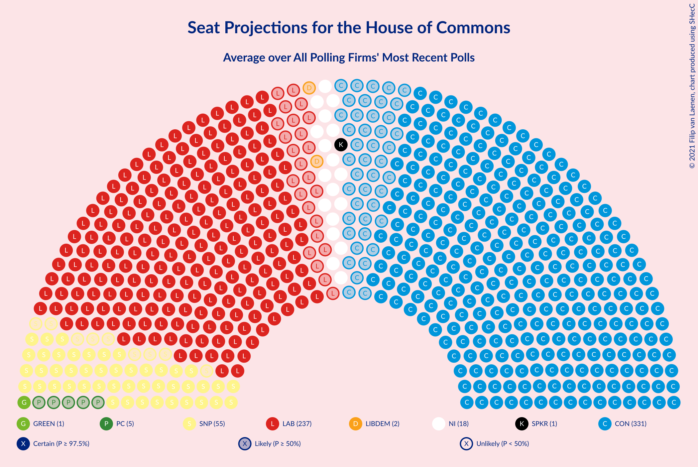
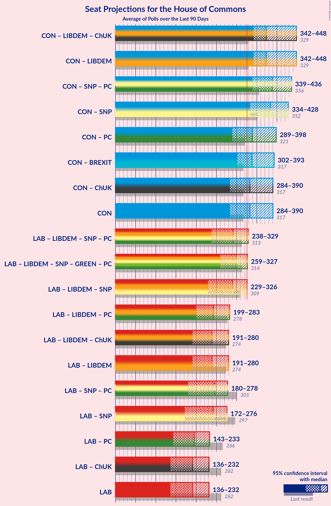

# Overview

The table below lists the most recent polls (less than 90 days old) registered and analyzed so far.

| Period     | Polling firm/Commissioner(s) | CON | LAB | LIBDEM | SNP | GREEN | BREXIT | PC | SPKR | UKIP | ChUK | NI |
|:----------:|:----------------------------:|:--:|:--:|:--:|:--:|:--:|:--:|:--:|:--:|:--:|:--:|:--:|
| 12 December 2019 | General Election | 43.6%   365 | 32.1%   202 | 11.5%   11 | 3.9%   48 | 2.8%   1 | 2.0%   0 | 0.5%   4 | 0.1%   1 | 0.1%   0 | 0.0%   0 | 0.0%   18 |
| N/A | [Poll Average](average.html) | 40–48%   299–373 | 34–40%   202–267 | 5–10%   0–8 | 3–7%   45–58 | 1–5%   1 | 0–1%   0 | 0–2%   0–6 | N/A   1 | 0%   0 | N/A   N/A | N/A   18 |
| [12 August 2020](2020-08-12-RedfieldWiltonStrategies.html) | Redfield & Wilton Strategies | 42–46%   314–363 | 34–39%   210–256 | 8–10%   3–9 | 3–5%   42–58 | 2–4%   1 | N/A   N/A | 0–1%   0–4 | N/A   1 | N/A   N/A | N/A   N/A | N/A   18 |
| [4–5 August 2020](2020-08-05-YouGov.html) | YouGov   The Times | 41–45%   300–355 | 34–39%   209–263 | 7–10%   1–6 | 4–6%   53–58 | 3–5%   1 | 1%   0 | 1–2%   5–7 | N/A   1 | N/A   N/A | N/A   N/A | N/A   18 |
| [30 July–4 August 2020](2020-08-04-IpsosMORI.html) | Ipsos MORI   Evening Standard | 43–49%   312–373 | 35–41%   198–259 | 5–8%   0–2 | 4–7%   50–58 | 3–5%   1 | 0–1%   0 | 0–1%   0–5 | N/A   1 | N/A   N/A | N/A   N/A | N/A   18 |
| [31 July–3 August 2020](2020-08-03-Survation.html) | Survation | 42–48%   319–383 | 33–39%   194–254 | 7–10%   0–8 | 3–5%   33–58 | 3–5%   1 | 0–1%   0 | 0–1%   0–5 | N/A   1 | N/A   N/A | N/A   N/A | N/A   18 |
| [31 July 2020](2020-07-31-Opinium.html) | Opinium   The Observer | 40–44%   289–338 | 37–41%   228–276 | 5–7%   0–3 | 5–7%   58 | 2–4%   1 | N/A   N/A | 1–2%   5–6 | N/A   1 | 0%   0 | N/A   N/A | N/A   18 |
| [17–19 July 2020](2020-07-19-SavantaComRes.html) | Savanta ComRes | 42–46%   313–361 | 35–39%   208–254 | 5–7%   0–2 | 4–6%   54–58 | 1–2%   0–1 | 1%   0 | 1–2%   5–7 | N/A   1 | N/A   N/A | N/A   N/A | N/A   18 |
| [9–13 July 2020](2020-07-13-Kantar.html) | Kantar | N/A   N/A | N/A   N/A | N/A   N/A | N/A   N/A | N/A   N/A | N/A   N/A | N/A   N/A | N/A   N/A | N/A   N/A | N/A   N/A | N/A   N/A |
| 12 December 2019 | General Election | 43.6%   365 | 32.1%   202 | 11.5%   11 | 3.9%   48 | 2.8%   1 | 2.0%   0 | 0.5%   4 | 0.1%   1 | 0.1%   0 | 0.0%   0 | 0.0%   18 |

Only polls for which at least the sample size has been published are included in the table above.

**Legend:**
+ **Top half of each row:** Voting intentions (95% confidence interval)
+ **Bottom half of each row:** Seat projections for the House of Commons (95% confidence interval)
+ **CON:** Conservative Party
+ **LAB:** Labour Party
+ **LIBDEM:** Liberal Democrats
+ **SNP:** Scottish National Party
+ **GREEN:** Green Party
+ **BREXIT:** Brexit Party
+ **PC:** Plaid Cymru
+ **SPKR:** Speaker
+ **UKIP:** UK Independence Party
+ **ChUK:** Change UK
+ **NI:** Northern Irish Parties
+ **N/A (single party):** Party not included the published results
+ **N/A (entire row):** Calculation for this opinion poll not started yet

