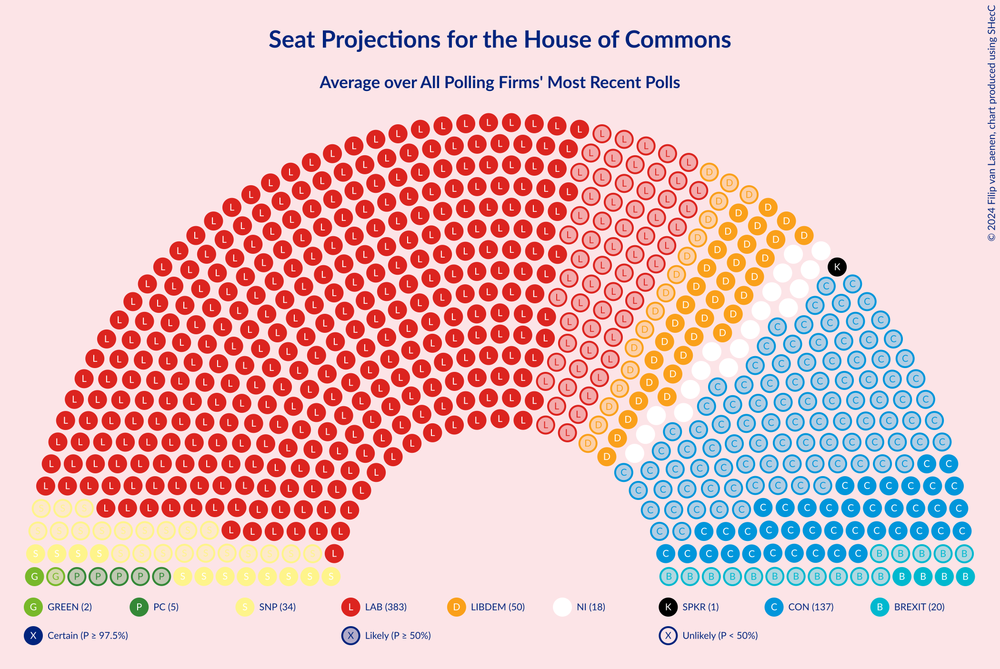

# Overview

The table below lists the most recent polls (less than 90 days old) registered and analyzed so far.

| Period     | Polling firm/Commissioner(s) | CON | LAB | LIBDEM | SNP | GREEN | BREXIT | PC | SPKR | UKIP | ChUK | NI |
|:----------:|:----------------------------:|:--:|:--:|:--:|:--:|:--:|:--:|:--:|:--:|:--:|:--:|:--:|
| 12 December 2019 | General Election | 43.6%   365 | 32.1%   202 | 11.5%   11 | 3.9%   48 | 2.8%   1 | 2.0%   0 | 0.5%   4 | 0.1%   1 | 0.1%   0 | 0.0%   0 | 0.0%   18 |
| N/A | [Poll Average](average.html) | 19–29%   44–202 | 41–49%   343–478 | 8–15%   20–76 | 2–6%   10–58 | 4–8%   1–3 | 6–10%   3–23 | 0–2%   0–6 | N/A   1 | N/A   N/A | N/A   N/A | N/A   18 |
| [21–25 June 2024](2024-06-25-Survation.html) | Survation   Good Morning Britain | 17–22%   32–126 | 42–48%   404–491 | 11–16%   51–81 | 1–3%   6–40 | 3–6%   1–2 | 5–8%   3–21 | 0–1%   0–5 | N/A   1 | N/A   N/A | N/A   N/A | N/A   18 |
| [21–24 June 2024](2024-06-24-Verian.html) | Verian | 21–26%   79–178 | 39–46%   331–425 | 11–16%   40–74 | 2–5%   22–55 | 6–9%   1–4 | 6–10%   6–26 | N/A   N/A | N/A   1 | N/A   N/A | N/A   N/A | N/A   18 |
| [21–24 June 2024](2024-06-24-Savanta.html) | Savanta   The Telegraph | 21–25%   82–153 | 44–48%   384–452 | 10–12%   30–52 | 3–4%   27–52 | 3–5%   1 | 6–8%   4–18 | N/A   N/A | N/A   1 | N/A   N/A | N/A   N/A | N/A   18 |
| [21–24 June 2024](2024-06-24-RedfieldWiltonStrategies.html) | Redfield & Wilton Strategies | 19–21%   47–72 | 45–48%   428–453 | 13–14%   61–71 | 3–4%   34–41 | 5–6%   1–2 | 9–10%   20–23 | 0%   0–3 | N/A   1 | N/A   N/A | N/A   N/A | N/A   18 |
| [21–24 June 2024](2024-06-24-JLPartners.html) | JL Partners   The Rest is Politics | 25–29%   142–207 | 42–47%   329–394 | 11–14%   26–51 | 3–4%   24–52 | 3–5%   1 | 6–8%   4–20 | 0–1%   0–4 | N/A   1 | N/A   N/A | N/A   N/A | N/A   18 |
| [21–24 June 2024](2024-06-24-IpsosMORI.html) | Ipsos MORI | 19–23%   44–129 | 44–49%   378–457 | 11–14%   35–68 | 4–7%   51–58 | 5–8%   1–3 | 6–9%   4–20 | N/A   N/A | N/A   1 | N/A   N/A | N/A   N/A | N/A   18 |
| [21–24 June 2024](2024-06-24-Deltapoll.html) | Deltapoll | 19–23%   37–115 | 45–50%   412–486 | 13–16%   55–79 | 2–3%   8–34 | 3–6%   1–2 | 6–9%   4–20 | N/A   N/A | N/A   1 | N/A   N/A | N/A   N/A | N/A   18 |
| [21–23 June 2024](2024-06-23-MoreinCommon.html) | More in Common | 26–30%   154–217 | 43–48%   347–410 | 10–13%   23–42 | 2–3%   6–34 | 3–5%   1 | 6–8%   4–20 | 0–1%   0–4 | N/A   1 | N/A   N/A | N/A   N/A | N/A   18 |
| [20–21 June 2024](2024-06-21-WeThink.html) | We Think | 22–27%   93–182 | 44–50%   371–457 | 7–11%   14–38 | 2–4%   21–55 | 5–8%   1–3 | 5–8%   3–17 | 1–2%   4–6 | N/A   1 | N/A   N/A | N/A   N/A | N/A   18 |
| [19–21 June 2024](2024-06-21-Opinium.html) | Opinium   The Observer | 20–24%   59–145 | 41–47%   359–443 | 11–15%   46–73 | 2–4%   27–53 | 6–9%   3–5 | 6–9%   6–22 | 1–2%   4–7 | N/A   1 | N/A   N/A | N/A   N/A | N/A   18 |
| [19–20 June 2024](2024-06-20-YouGov.html) | YouGov   The Times | N/A   N/A | N/A   N/A | N/A   N/A | N/A   N/A | N/A   N/A | N/A   N/A | N/A   N/A | N/A   N/A | N/A   N/A | N/A   N/A | N/A   N/A |
| [19–20 June 2024](2024-06-20-WhitestoneInsight.html) | Whitestone Insight   Daily Express/Daily Mirror | N/A   N/A | N/A   N/A | N/A   N/A | N/A   N/A | N/A   N/A | N/A   N/A | N/A   N/A | N/A   N/A | N/A   N/A | N/A   N/A | N/A   N/A |
| [19–20 June 2024](2024-06-20-TechneUK.html) | Techne UK | N/A   N/A | N/A   N/A | N/A   N/A | N/A   N/A | N/A   N/A | N/A   N/A | N/A   N/A | N/A   N/A | N/A   N/A | N/A   N/A | N/A   N/A |
| [17–19 June 2024](2024-06-19-Norstat.html) | Norstat | N/A   N/A | N/A   N/A | N/A   N/A | N/A   N/A | N/A   N/A | N/A   N/A | N/A   N/A | N/A   N/A | N/A   N/A | N/A   N/A | N/A   N/A |
| [18–19 June 2024](2024-06-19-BMGResearch.html) | BMG Research   The i | N/A   N/A | N/A   N/A | N/A   N/A | N/A   N/A | N/A   N/A | N/A   N/A | N/A   N/A | N/A   N/A | N/A   N/A | N/A   N/A | N/A   N/A |
| [18 June 2024](2024-06-18-PeoplePolling.html) | PeoplePolling   GB News | N/A   N/A | N/A   N/A | N/A   N/A | N/A   N/A | N/A   N/A | N/A   N/A | N/A   N/A | N/A   N/A | N/A   N/A | N/A   N/A | N/A   N/A |
| [13–17 June 2024](2024-06-17-LordAshcroft.html) | Lord Ashcroft | N/A   N/A | N/A   N/A | N/A   N/A | N/A   N/A | N/A   N/A | N/A   N/A | N/A   N/A | N/A   N/A | N/A   N/A | N/A   N/A | N/A   N/A |
| [14–17 June 2024](2024-06-17-Focaldata.html) | Focaldata | N/A   N/A | N/A   N/A | N/A   N/A | N/A   N/A | N/A   N/A | N/A   N/A | N/A   N/A | N/A   N/A | N/A   N/A | N/A   N/A | N/A   N/A |
| 12 December 2019 | General Election | 43.6%   365 | 32.1%   202 | 11.5%   11 | 3.9%   48 | 2.8%   1 | 2.0%   0 | 0.5%   4 | 0.1%   1 | 0.1%   0 | 0.0%   0 | 0.0%   18 |

Only polls for which at least the sample size has been published are included in the table above.

**Legend:**
+ **Top half of each row:** Voting intentions (95% confidence interval)
+ **Bottom half of each row:** Seat projections for the House of Commons (95% confidence interval)
+ **CON:** Conservative Party
+ **LAB:** Labour Party
+ **LIBDEM:** Liberal Democrats
+ **SNP:** Scottish National Party
+ **GREEN:** Green Party
+ **BREXIT:** Brexit Party
+ **PC:** Plaid Cymru
+ **SPKR:** Speaker
+ **UKIP:** UK Independence Party
+ **ChUK:** Change UK
+ **NI:** Northern Irish Parties
+ **N/A (single party):** Party not included the published results
+ **N/A (entire row):** Calculation for this opinion poll not started yet

