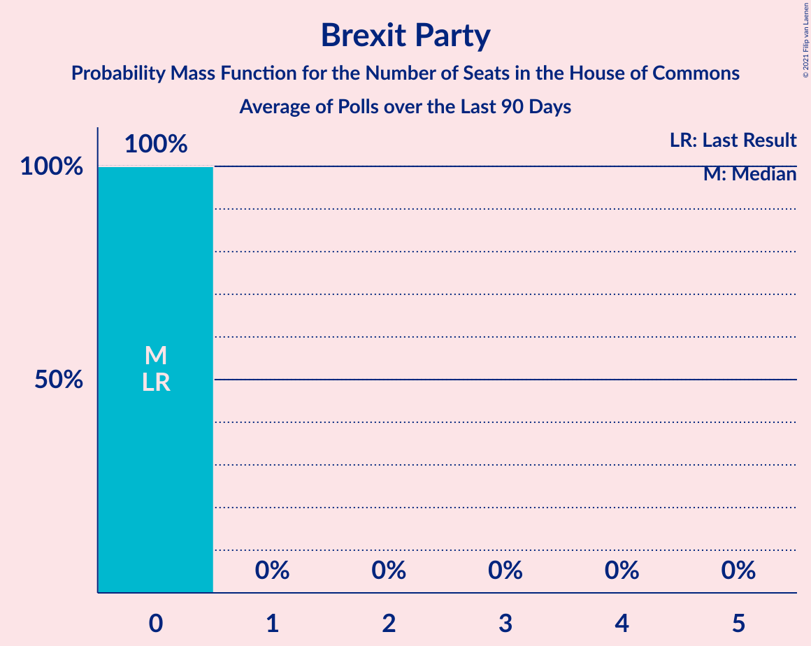

# Brexit Party

<a href="#voting-intentions">Voting Intentions</a> | <a href="#seats">Seats</a>

## Voting Intentions

Last result: **2.0%** (General Election of 12 December 2019)

### Confidence Intervals

| Period     | Polling firm/Commissioner(s) | Median | 80% Confidence Interval | 90% Confidence Interval | 95% Confidence Interval | 99% Confidence Interval |
|:----------:|:----------------:|:-----------:|:-----------------------:|:-----------------------:|:-----------------------:|:-----------------------:|
| N/A | [Poll Average](average.html) | 1.0% | 0.3–1.6% | 0.1–1.8% | 0.1–1.9% | 0.0–2.2% |
| [17 May 2021](2021-05-17-RedfieldWiltonStrategies.html) | Redfield & Wilton Strategies | 0.9% | 0.7–1.2% | 0.6–1.3% | 0.5–1.4% | 0.5–1.6% |
| [14–16 May 2021](2021-05-16-SavantaComRes.html) | Savanta ComRes | 0.9% | 0.7–1.2% | 0.6–1.3% | 0.6–1.4% | 0.5–1.6% |
| [13–14 May 2021](2021-05-14-Opinium.html) | Opinium   The Observer | 0.1% | 0.0–0.3% | 0.0–0.3% | 0.0–0.4% | 0.0–0.5% |
| [11–12 May 2021](2021-05-12-YouGov.html) | YouGov | 0.9% | 0.6–1.3% | 0.6–1.4% | 0.5–1.5% | 0.4–1.7% |
| [10 May 2021](2021-05-10-RedfieldWiltonStrategies.html) | Redfield & Wilton Strategies | 0.9% | 0.7–1.2% | 0.6–1.3% | 0.5–1.4% | 0.5–1.6% |
| [7–9 May 2021](2021-05-09-SavantaComRes.html) | Savanta ComRes | 0.0% | N/A | N/A | N/A | N/A |
| [4–5 May 2021](2021-05-05-YouGov.html) | YouGov   The Times | 1.3% | N/A | N/A | N/A | N/A |
| [4–5 May 2021](2021-05-05-Panelbase.html) | Panelbase | 0.0% | N/A | N/A | N/A | N/A |
| [3 May 2021](2021-05-03-RedfieldWiltonStrategies.html) | Redfield & Wilton Strategies | 1.4% | N/A | N/A | N/A | N/A |
| [2 May 2021](2021-05-02-SavantaComRes.html) | Savanta ComRes | 0.0% | N/A | N/A | N/A | N/A |
| [28–30 April 2021](2021-04-30-Opinium.html) | Opinium   The Observer | 0.1% | 0.0–0.3% | 0.0–0.3% | 0.0–0.4% | 0.0–0.5% |
| [29–30 April 2021](2021-04-30-Focaldata.html) | Focaldata   The Sunday Times | 1.3% | 1.0–1.8% | 0.9–1.9% | 0.9–2.0% | 0.7–2.3% |
| [27–29 April 2021](2021-04-29-Survation.html) | Survation   Daily Mail | 0.0% | N/A | N/A | N/A | N/A |
| [28–29 April 2021](2021-04-29-NumberCruncherPolitics.html) | Number Cruncher Politics | 0.9% | 0.6–1.5% | 0.5–1.6% | 0.5–1.8% | 0.4–2.0% |
| [27–28 April 2021](2021-04-28-YouGov.html) | YouGov   The Times | 1.4% | N/A | N/A | N/A | N/A |
| [26 April 2021](2021-04-26-RedfieldWiltonStrategies.html) | Redfield & Wilton Strategies | 1.3% | N/A | N/A | N/A | N/A |
| [22–26 April 2021](2021-04-26-Kantar.html) | Kantar | 1.3% | 1.0–1.9% | 0.9–2.0% | 0.8–2.2% | 0.6–2.5% |
| [22–26 April 2021](2021-04-26-BMGResearch.html) | BMG Research   The Independent | 1.4% | 1.1–1.9% | 1.0–2.0% | 0.9–2.1% | 0.8–2.4% |
| [23–25 April 2021](2021-04-25-SavantaComRes.html) | Savanta ComRes | 0.9% | N/A | N/A | N/A | N/A |
| [21–23 April 2021](2021-04-23-Opinium.html) | Opinium   The Observer | 0.1% | N/A | N/A | N/A | N/A |
| [21–22 April 2021](2021-04-22-YouGov.html) | YouGov   The Times | 0.9% | N/A | N/A | N/A | N/A |
| [16–22 April 2021](2021-04-22-IpsosMORI.html) | Ipsos MORI   Evening Standard | 0.9% | 0.7–1.5% | 0.6–1.6% | 0.5–1.7% | 0.4–2.0% |
| [15–19 April 2021](2021-04-19-Survation.html) | Survation | 0.0% | N/A | N/A | N/A | N/A |
| [19 April 2021](2021-04-19-RedfieldWiltonStrategies.html) | Redfield & Wilton Strategies | 1.3% | N/A | N/A | N/A | N/A |
| [16–18 April 2021](2021-04-18-SavantaComRes.html) | Savanta ComRes | 0.4% | N/A | N/A | N/A | N/A |
| [13–14 April 2021](2021-04-14-YouGov.html) | YouGov | 1.3% | N/A | N/A | N/A | N/A |
| [12 April 2021](2021-04-12-RedfieldWiltonStrategies.html) | Redfield & Wilton Strategies | 1.3% | N/A | N/A | N/A | N/A |
| [9–11 April 2021](2021-04-11-SavantaComRes.html) | Savanta ComRes | 0.9% | N/A | N/A | N/A | N/A |
| [8–10 April 2021](2021-04-10-Survation.html) | Survation | 0.0% | N/A | N/A | N/A | N/A |
| [8–10 April 2021](2021-04-10-Deltapoll.html) | Deltapoll   The Mail on Sunday | 1.8% | N/A | N/A | N/A | N/A |
| [8–9 April 2021](2021-04-09-Opinium.html) | Opinium   The Observer | 0.1% | N/A | N/A | N/A | N/A |
| [7–8 April 2021](2021-04-08-YouGov.html) | YouGov   The Times | 1.4% | N/A | N/A | N/A | N/A |
| [5 April 2021](2021-04-05-RedfieldWiltonStrategies.html) | Redfield & Wilton Strategies | 0.9% | N/A | N/A | N/A | N/A |
| [2–4 April 2021](2021-04-04-SavantaComRes.html) | Savanta ComRes | 0.9% | N/A | N/A | N/A | N/A |
| [1 April 2021](2021-04-01-YouGov.html) | YouGov   The Times | 1.4% | N/A | N/A | N/A | N/A |
| [29 March 2021](2021-03-29-RedfieldWiltonStrategies.html) | Redfield & Wilton Strategies | 0.9% | N/A | N/A | N/A | N/A |
| [25–29 March 2021](2021-03-29-Kantar.html) | Kantar | 0.9% | N/A | N/A | N/A | N/A |
| [25–27 March 2021](2021-03-27-Deltapoll.html) | Deltapoll   Mail on Sunday | 1.4% | N/A | N/A | N/A | N/A |
| [25–26 March 2021](2021-03-26-YouGov.html) | YouGov   The Times | 1.4% | N/A | N/A | N/A | N/A |
| [25–26 March 2021](2021-03-26-Opinium.html) | Opinium   The Observer | 0.5% | N/A | N/A | N/A | N/A |
| [22 March 2021](2021-03-22-RedfieldWiltonStrategies.html) | Redfield & Wilton Strategies | 0.9% | N/A | N/A | N/A | N/A |
| [19–21 March 2021](2021-03-21-SavantaComRes.html) | Savanta ComRes | 0.0% | N/A | N/A | N/A | N/A |
| [18–19 March 2021](2021-03-19-YouGov.html) | YouGov   The Times | 1.3% | N/A | N/A | N/A | N/A |
| [16–19 March 2021](2021-03-19-BMGResearch.html) | BMG Research   The Independent | 1.4% | N/A | N/A | N/A | N/A |
| [12–16 March 2021](2021-03-16-NumberCruncherPolitics.html) | Number Cruncher Politics | 0.9% | N/A | N/A | N/A | N/A |
| [15 March 2021](2021-03-15-RedfieldWiltonStrategies.html) | Redfield & Wilton Strategies | 1.3% | 1.1–1.7% | 1.0–1.9% | 0.9–2.0% | 0.8–2.2% |
| [14 March 2021](2021-03-14-SavantaComRes.html) | Savanta ComRes | 0.0% | N/A | N/A | N/A | N/A |
| [11–12 March 2021](2021-03-12-Opinium.html) | Opinium   The Observer | 0.1% | 0.0–0.3% | 0.0–0.3% | 0.0–0.4% | 0.0–0.5% |
| [5–12 March 2021](2021-03-12-IpsosMORI.html) | Ipsos MORI   Evening Standard | 0.1% | 0.0–0.4% | 0.0–0.5% | 0.0–0.6% | 0.0–0.7% |
| [9–10 March 2021](2021-03-10-YouGov.html) | YouGov   The Times | 1.4% | 1.0–1.8% | 1.0–1.9% | 0.9–2.0% | 0.8–2.3% |
| [9–10 March 2021](2021-03-10-Survation.html) | Survation   Sunday Mirror | 0.4% | 0.2–0.8% | 0.2–0.9% | 0.2–1.0% | 0.1–1.2% |
| [8 March 2021](2021-03-08-RedfieldWiltonStrategies.html) | Redfield & Wilton Strategies | 1.3% | 1.1–1.7% | 1.0–1.9% | 0.9–2.0% | 0.8–2.2% |
| [5–7 March 2021](2021-03-07-SavantaComRes.html) | Savanta ComRes | 1.3% | 1.0–1.7% | 1.0–1.8% | 0.9–1.9% | 0.8–2.1% |
| [3–4 March 2021](2021-03-04-YouGov.html) | YouGov   The Times | 1.3% | 1.0–1.8% | 0.9–1.9% | 0.9–2.0% | 0.7–2.2% |
| [1 March 2021](2021-03-01-RedfieldWiltonStrategies.html) | Redfield & Wilton Strategies | 0.9% | 0.6–1.3% | 0.6–1.4% | 0.5–1.5% | 0.4–1.7% |
| [26–28 February 2021](2021-02-28-SavantaComRes.html) | Savanta ComRes | 1.3% | 1.0–1.7% | 1.0–1.8% | 0.9–1.9% | 0.8–2.1% |
| [25–26 February 2021](2021-02-26-YouGov.html) | YouGov   The Times | 1.4% | N/A | N/A | N/A | N/A |
| [24–26 February 2021](2021-02-26-Opinium.html) | Opinium   The Observer | 0.1% | N/A | N/A | N/A | N/A |
| [24–26 February 2021](2021-02-26-Deltapoll.html) | Deltapoll   Mail on Sunday | 1.4% | 1.1–1.9% | 1.0–2.0% | 0.9–2.1% | 0.8–2.4% |
| [23–25 February 2021](2021-02-25-Survation.html) | Survation | 0.0% | N/A | N/A | N/A | N/A |
| [22 February 2021](2021-02-22-RedfieldWiltonStrategies.html) | Redfield & Wilton Strategies | 1.3% | 1.1–1.7% | 1.0–1.9% | 0.9–2.0% | 0.8–2.2% |
| [18–22 February 2021](2021-02-22-Kantar.html) | Kantar | 1.3% | 1.0–1.9% | 0.9–2.1% | 0.8–2.2% | 0.7–2.5% |
| [19–21 February 2021](2021-02-21-SavantaComRes.html) | Savanta ComRes | 1.3% | N/A | N/A | N/A | N/A |
| [17–18 February 2021](2021-02-18-YouGov.html) | YouGov   The Times | 1.4% | 1.1–1.8% | 1.0–2.0% | 0.9–2.1% | 0.8–2.3% |
| [15 February 2021](2021-02-15-RedfieldWiltonStrategies.html) | Redfield & Wilton Strategies | 0.9% | 0.7–1.2% | 0.6–1.3% | 0.5–1.4% | 0.5–1.6% |
| [12–14 February 2021](2021-02-14-SavantaComRes.html) | Savanta ComRes | 0.9% | 0.7–1.2% | 0.6–1.3% | 0.6–1.4% | 0.5–1.6% |
| [11–12 February 2021](2021-02-12-Opinium.html) | Opinium   The Observer | 0.1% | 0.0–0.3% | 0.0–0.3% | 0.0–0.4% | 0.0–0.5% |
| [9–10 February 2021](2021-02-10-YouGov.html) | YouGov   The Times | 1.3% | 1.0–1.8% | 0.9–1.9% | 0.9–2.0% | 0.7–2.2% |
| [8 February 2021](2021-02-08-RedfieldWiltonStrategies.html) | Redfield & Wilton Strategies | 0.9% | 0.6–1.2% | 0.6–1.3% | 0.5–1.4% | 0.4–1.6% |
| [5–7 February 2021](2021-02-07-SavantaComRes.html) | Savanta ComRes | 0.0% | N/A | N/A | N/A | N/A |
| [5–6 February 2021](2021-02-06-Survation.html) | Survation | 0.0% | N/A | N/A | N/A | N/A |
| [4 February 2021](2021-02-04-IpsosMORI.html) | Ipsos MORI   Evening Standard | 0.1% | 0.0–0.4% | 0.0–0.5% | 0.0–0.5% | 0.0–0.7% |
| [2–3 February 2021](2021-02-03-YouGov.html) | YouGov   The Times | 1.3% | 1.0–1.8% | 1.0–1.9% | 0.9–2.0% | 0.8–2.3% |
| [2 February 2021](2021-02-02-FindOutNow.html) | Find Out Now | 1.3% | N/A | N/A | N/A | N/A |
| [1 February 2021](2021-02-01-RedfieldWiltonStrategies.html) | Redfield & Wilton Strategies | 1.3% | 1.1–1.7% | 1.0–1.9% | 0.9–2.0% | 0.8–2.2% |
| [1 February 2021](2021-02-01-NumberCruncherPolitics.html) | Number Cruncher Politics   ITV | 1.3% | 1.1–1.7% | 1.0–1.9% | 0.9–2.0% | 0.8–2.2% |
| [29–31 January 2021](2021-01-31-SavantaComRes.html) | Savanta ComRes | 0.0% | N/A | N/A | N/A | N/A |
| [28–29 January 2021](2021-01-29-Opinium.html) | Opinium   The Observer | 0.5% | 0.3–0.7% | 0.3–0.8% | 0.2–0.9% | 0.2–1.0% |
| [26–27 January 2021](2021-01-27-YouGov.html) | YouGov   The Times | 1.4% | 1.1–1.8% | 1.0–2.0% | 0.9–2.1% | 0.8–2.3% |
| [25 January 2021](2021-01-25-RedfieldWiltonStrategies.html) | Redfield & Wilton Strategies | 1.3% | 1.1–1.7% | 1.0–1.9% | 0.9–2.0% | 0.8–2.2% |
| [21–25 January 2021](2021-01-25-Kantar.html) | Kantar | 0.9% | 0.7–1.4% | 0.6–1.6% | 0.5–1.7% | 0.4–2.0% |
| [22–24 January 2021](2021-01-24-SavantaComRes.html) | Savanta ComRes | 0.0% | N/A | N/A | N/A | N/A |
| [21–23 January 2021](2021-01-23-Deltapoll.html) | Deltapoll | 0.9% | 0.7–1.3% | 0.6–1.4% | 0.5–1.5% | 0.4–1.7% |
| [21–22 January 2021](2021-01-22-YouGov.html) | YouGov   The Times | 1.8% | 1.5–2.3% | 1.4–2.5% | 1.3–2.6% | 1.1–2.9% |
| [18 January 2021](2021-01-18-RedfieldWiltonStrategies.html) | Redfield & Wilton Strategies | 0.9% | 0.7–1.2% | 0.6–1.3% | 0.5–1.4% | 0.5–1.6% |
| [15–17 January 2021](2021-01-17-SavantaComRes.html) | Savanta ComRes | 0.9% | 0.7–1.3% | 0.6–1.4% | 0.6–1.4% | 0.5–1.6% |
| [14–15 January 2021](2021-01-15-Opinium.html) | Opinium   The Observer | 0.0% | N/A | N/A | N/A | N/A |
| [13–14 January 2021](2021-01-14-YouGov.html) | YouGov   The Times | 1.4% | 1.1–1.8% | 1.0–2.0% | 0.9–2.1% | 0.8–2.3% |
| [12–13 January 2021](2021-01-13-Survation.html) | Survation | 0.4% | 0.2–0.8% | 0.2–0.9% | 0.2–1.0% | 0.1–1.2% |
| [11 January 2021](2021-01-11-RedfieldWiltonStrategies.html) | Redfield & Wilton Strategies | 0.9% | 0.7–1.2% | 0.6–1.3% | 0.5–1.4% | 0.5–1.6% |
| [8–10 January 2021](2021-01-10-SavantaComRes.html) | Savanta ComRes | 0.9% | 0.7–1.3% | 0.6–1.4% | 0.5–1.6% | 0.4–1.8% |
| [6–7 January 2021](2021-01-07-Opinium.html) | Opinium   The Observer | 0.0% | N/A | N/A | N/A | N/A |
| [4–5 January 2021](2021-01-05-YouGov.html) | YouGov   The Times | 1.3% | 1.0–1.8% | 0.9–1.9% | 0.9–2.0% | 0.7–2.2% |
| [26–30 December 2020](2020-12-30-Deltapoll.html) | Deltapoll   Daily Mirror | 1.4% | 1.1–1.8% | 1.0–2.0% | 0.9–2.1% | 0.8–2.3% |
| [4–29 December 2020](2020-12-29-Focaldata.html) | Focaldata | 1.8% | 1.7–1.9% | 1.6–2.0% | 1.6–2.0% | 1.6–2.0% |
| [21–22 December 2020](2020-12-22-YouGov.html) | YouGov   The Times | 1.8% | 1.4–2.3% | 1.4–2.5% | 1.3–2.6% | 1.1–2.9% |
| [22 December 2020](2020-12-22-Survation.html) | Survation | 0.4% | 0.2–0.8% | 0.2–0.9% | 0.2–1.0% | 0.1–1.3% |
| [18–21 December 2020](2020-12-21-SavantaComRes.html) | Savanta ComRes | 0.9% | 0.6–1.3% | 0.5–1.4% | 0.5–1.5% | 0.4–1.7% |
| [16–17 December 2020](2020-12-17-Opinium.html) | Opinium   The Observer | 0.0% | N/A | N/A | N/A | N/A |
| [15–16 December 2020](2020-12-16-YouGov.html) | YouGov   The Times | 1.8% | 1.5–2.3% | 1.4–2.4% | 1.3–2.5% | 1.1–2.8% |
| [10–14 December 2020](2020-12-14-Kantar.html) | Kantar | 1.4% | 1.0–1.9% | 0.9–2.1% | 0.8–2.2% | 0.7–2.5% |
| [11–13 December 2020](2020-12-13-SavantaComRes.html) | Savanta ComRes | 1.8% | 1.4–2.4% | 1.3–2.6% | 1.2–2.7% | 1.1–3.1% |
| [4–10 December 2020](2020-12-10-Survation.html) | Survation | 0.4% | 0.3–0.6% | 0.3–0.7% | 0.3–0.7% | 0.2–0.8% |
| [4–10 December 2020](2020-12-10-IpsosMORI.html) | Ipsos MORI   Evening Standard | 0.1% | 0.0–0.4% | 0.0–0.5% | 0.0–0.6% | 0.0–0.7% |
| [8–9 December 2020](2020-12-09-YouGov.html) | YouGov   The Times | 2.3% | 1.9–2.8% | 1.7–3.0% | 1.6–3.1% | 1.5–3.4% |
| [8 December 2020](2020-12-08-Opinium.html) | Opinium   The Observer | 0.1% | 0.1–0.2% | 0.1–0.2% | 0.1–0.2% | 0.0–0.3% |
| [3–4 December 2020](2020-12-04-Opinium.html) | Opinium   The Observer | 0.0% | N/A | N/A | N/A | N/A |
| [2–3 December 2020](2020-12-03-YouGov.html) | YouGov   The Times | 1.4% | 1.1–1.8% | 1.0–2.0% | 0.9–2.1% | 0.8–2.3% |
| [2 December 2020](2020-12-02-RedfieldWiltonStrategies.html) | Redfield & Wilton Strategies | 0.0% | N/A | N/A | N/A | N/A |
| [27–29 November 2020](2020-11-29-SavantaComRes.html) | Savanta ComRes | 1.3% | 1.0–1.8% | 0.9–1.9% | 0.8–2.0% | 0.7–2.3% |
| [20–28 November 2020](2020-11-28-NumberCruncherPolitics.html) | Number Cruncher Politics | 1.8% | 1.3–2.4% | 1.2–2.6% | 1.1–2.8% | 0.9–3.2% |
| [26–28 November 2020](2020-11-28-Deltapoll.html) | Deltapoll   Daily Mail | 1.4% | 1.1–1.9% | 1.0–2.0% | 0.9–2.2% | 0.8–2.4% |
| [26–27 November 2020](2020-11-27-YouGov.html) | YouGov   The Times | 2.3% | 1.9–2.8% | 1.7–3.0% | 1.6–3.1% | 1.5–3.4% |
| [20–22 November 2020](2020-11-22-SavantaComRes.html) | Savanta ComRes | 1.4% | 1.0–1.9% | 0.9–2.1% | 0.9–2.2% | 0.7–2.5% |
| [19–20 November 2020](2020-11-20-Opinium.html) | Opinium   The Observer | 0.0% | N/A | N/A | N/A | N/A |
| [19 November 2020](2020-11-19-RedfieldWiltonStrategies.html) | Redfield & Wilton Strategies | 0.0% | N/A | N/A | N/A | N/A |
| [17–18 November 2020](2020-11-18-YouGov.html) | YouGov   The Times | 1.8% | 1.4–2.3% | 1.3–2.4% | 1.2–2.5% | 1.1–2.8% |
| [13–15 November 2020](2020-11-15-SavantaComRes.html) | Savanta ComRes | 0.9% | 0.7–1.2% | 0.6–1.3% | 0.5–1.4% | 0.5–1.6% |
| [11–12 November 2020](2020-11-12-YouGov.html) | YouGov   The Times | 1.8% | 1.5–2.4% | 1.4–2.5% | 1.3–2.6% | 1.1–2.9% |
| [11 November 2020](2020-11-11-RedfieldWiltonStrategies.html) | Redfield & Wilton Strategies | 0.0% | N/A | N/A | N/A | N/A |
| [6–9 November 2020](2020-11-09-SavantaComRes.html) | Savanta ComRes | 0.9% | 0.7–1.2% | 0.6–1.3% | 0.6–1.4% | 0.5–1.6% |
| [5–9 November 2020](2020-11-09-Kantar.html) | Kantar | 0.9% | 0.6–1.4% | 0.5–1.5% | 0.5–1.7% | 0.4–1.9% |
| [5–6 November 2020](2020-11-06-Survation.html) | Survation | 0.9% | 0.6–1.4% | 0.5–1.6% | 0.5–1.7% | 0.4–2.0% |
| [5–6 November 2020](2020-11-06-Opinium.html) | Opinium   The Observer | 0.0% | N/A | N/A | N/A | N/A |
| [4–5 November 2020](2020-11-05-YouGov.html) | YouGov   The Times | 2.8% | 2.3–3.4% | 2.2–3.5% | 2.1–3.7% | 1.9–4.0% |
| [28–29 October 2020](2020-10-29-YouGov.html) | YouGov | 1.8% | 1.4–2.3% | 1.3–2.5% | 1.3–2.6% | 1.1–2.9% |
| [28 October 2020](2020-10-28-RedfieldWiltonStrategies.html) | Redfield & Wilton Strategies | 0.0% | N/A | N/A | N/A | N/A |
| [22–28 October 2020](2020-10-28-IpsosMORI.html) | Ipsos MORI   Evening Standard | 0.4% | 0.2–0.8% | 0.2–0.9% | 0.2–1.0% | 0.1–1.3% |
| [23–26 October 2020](2020-10-26-SavantaComRes.html) | Savanta ComRes | 0.9% | 0.7–1.2% | 0.6–1.4% | 0.6–1.4% | 0.5–1.6% |
| [22–24 October 2020](2020-10-24-Deltapoll.html) | Deltapoll   The Mail on Sunday | 1.3% | 1.0–1.8% | 0.9–1.9% | 0.9–2.0% | 0.7–2.3% |
| [22–23 October 2020](2020-10-23-Opinium.html) | Opinium   The Observer | 0.0% | N/A | N/A | N/A | N/A |
| [21–22 October 2020](2020-10-22-YouGov.html) | YouGov   The Times | 1.3% | 1.0–1.7% | 0.9–1.9% | 0.8–2.0% | 0.7–2.2% |
| [21 October 2020](2020-10-21-RedfieldWiltonStrategies.html) | Redfield & Wilton Strategies | 0.0% | N/A | N/A | N/A | N/A |
| [16–18 October 2020](2020-10-18-SavantaComRes.html) | Savanta ComRes | 0.9% | 0.7–1.2% | 0.6–1.3% | 0.6–1.4% | 0.5–1.6% |
| [9–17 October 2020](2020-10-17-NumberCruncherPolitics.html) | Number Cruncher Politics   Peston | 1.8% | 1.5–2.2% | 1.4–2.4% | 1.3–2.5% | 1.1–2.7% |
| [14–15 October 2020](2020-10-15-YouGov.html) | YouGov   The Times | 2.2% | 1.8–2.8% | 1.7–3.0% | 1.6–3.1% | 1.4–3.4% |
| [9–11 October 2020](2020-10-11-SavantaComRes.html) | Savanta ComRes | 1.3% | 1.0–1.7% | 1.0–1.8% | 0.9–1.9% | 0.8–2.1% |
| [8–9 October 2020](2020-10-09-Opinium.html) | Opinium   The Observer | 0.0% | N/A | N/A | N/A | N/A |
| [6–7 October 2020](2020-10-07-YouGov.html) | YouGov   The Times | 1.4% | 1.1–1.8% | 1.0–1.9% | 0.9–2.1% | 0.8–2.3% |
| [6–7 October 2020](2020-10-07-RedfieldWiltonStrategies.html) | Redfield & Wilton Strategies | 0.0% | N/A | N/A | N/A | N/A |
| [5–6 October 2020](2020-10-06-Survation.html) | Survation | 0.4% | 0.2–0.8% | 0.2–0.9% | 0.2–1.0% | 0.1–1.2% |
| [2–4 October 2020](2020-10-04-SavantaComRes.html) | Savanta ComRes | 0.9% | 0.7–1.2% | 0.6–1.3% | 0.5–1.4% | 0.5–1.6% |
| [30 September–1 October 2020](2020-10-01-RedfieldWiltonStrategies.html) | Redfield & Wilton Strategies | 0.0% | N/A | N/A | N/A | N/A |
| [29–30 September 2020](2020-09-30-YouGov.html) | YouGov   The Times | 1.8% | 1.5–2.3% | 1.4–2.5% | 1.3–2.6% | 1.1–2.9% |
| [25–28 September 2020](2020-09-28-SavantaComRes.html) | Savanta ComRes | 0.9% | 0.7–1.2% | 0.6–1.3% | 0.5–1.4% | 0.5–1.6% |
| [23–25 September 2020](2020-09-25-Opinium.html) | Opinium   The Observer | 0.0% | N/A | N/A | N/A | N/A |
| [24–25 September 2020](2020-09-25-Deltapoll.html) | Deltapoll   The Mail on Sunday | 1.3% | 1.0–1.8% | 0.9–1.9% | 0.9–2.0% | 0.7–2.3% |
| [23–24 September 2020](2020-09-24-YouGov.html) | YouGov   The Times | 1.3% | 1.0–1.8% | 0.9–1.9% | 0.9–2.0% | 0.7–2.3% |
| [22–23 September 2020](2020-09-23-RedfieldWiltonStrategies.html) | Redfield & Wilton Strategies | 0.0% | N/A | N/A | N/A | N/A |
| [17–21 September 2020](2020-09-21-Kantar.html) | Kantar | 1.3% | 0.9–1.9% | 0.9–2.0% | 0.8–2.2% | 0.6–2.5% |
| [18–20 September 2020](2020-09-20-SavantaComRes.html) | Savanta ComRes | 1.3% | 1.0–1.7% | 1.0–1.8% | 0.9–1.9% | 0.8–2.1% |
| [11–18 September 2020](2020-09-18-IpsosMORI.html) | Ipsos MORI   Evening Standard | 0.0% | N/A | N/A | N/A | N/A |
| [16–17 September 2020](2020-09-17-YouGov.html) | YouGov   The Times | 1.3% | 1.0–1.8% | 0.9–1.9% | 0.9–2.0% | 0.7–2.3% |
| [15–16 September 2020](2020-09-16-Survation.html) | Survation | 0.4% | 0.2–0.8% | 0.2–0.9% | 0.2–1.0% | 0.1–1.3% |
| [15–16 September 2020](2020-09-16-RedfieldWiltonStrategies.html) | Redfield & Wilton Strategies | 0.0% | N/A | N/A | N/A | N/A |
| [11 September 2020](2020-09-11-Opinium.html) | Opinium   The Observer | 0.0% | N/A | N/A | N/A | N/A |
| [8–9 September 2020](2020-09-09-YouGov.html) | YouGov   The Times | 1.3% | 1.0–1.8% | 0.9–1.9% | 0.9–2.0% | 0.7–2.3% |
| [4–8 September 2020](2020-09-08-NumberCruncherPolitics.html) | Number Cruncher Politics   Bloomberg | 0.9% | 0.6–1.4% | 0.5–1.6% | 0.5–1.7% | 0.4–2.0% |
| [3–4 September 2020](2020-09-04-YouGov.html) | YouGov   The Times | 1.3% | 1.0–1.8% | 0.9–1.9% | 0.9–2.0% | 0.7–2.3% |
| [2–4 September 2020](2020-09-04-Survation.html) | Survation | 0.4% | 0.2–0.8% | 0.2–0.9% | 0.2–1.0% | 0.1–1.2% |
| [1–2 September 2020](2020-09-02-RedfieldWiltonStrategies.html) | Redfield & Wilton Strategies | 0.0% | N/A | N/A | N/A | N/A |
| [26–28 August 2020](2020-08-28-Opinium.html) | Opinium   The Observer | 0.0% | N/A | N/A | N/A | N/A |
| [24–25 August 2020](2020-08-25-YouGov.html) | YouGov   The Times | 1.4% | 1.1–1.8% | 1.0–1.9% | 0.9–2.0% | 0.8–2.3% |
| [24 August 2020](2020-08-24-RedfieldWiltonStrategies.html) | Redfield & Wilton Strategies | 0.0% | N/A | N/A | N/A | N/A |
| [21 August 2020](2020-08-21-Survation.html) | Survation | 0.4% | 0.2–0.8% | 0.2–0.9% | 0.2–1.0% | 0.1–1.3% |
| [18–19 August 2020](2020-08-19-YouGov.html) | YouGov   The Times | 1.8% | 1.4–2.3% | 1.3–2.4% | 1.2–2.5% | 1.1–2.8% |
| [19 August 2020](2020-08-19-RedfieldWiltonStrategies.html) | Redfield & Wilton Strategies | 0.0% | N/A | N/A | N/A | N/A |
| [14–16 August 2020](2020-08-16-SavantaComRes.html) | Savanta ComRes | 0.9% | 0.7–1.2% | 0.6–1.3% | 0.5–1.4% | 0.5–1.6% |
| [13–14 August 2020](2020-08-14-Opinium.html) | Opinium   The Observer | 1.3% | 1.0–1.7% | 0.9–1.8% | 0.9–1.9% | 0.8–2.1% |
| [11–12 August 2020](2020-08-12-YouGov.html) | YouGov   The Times | 1.3% | 1.0–1.8% | 0.9–1.9% | 0.9–2.0% | 0.7–2.3% |
| [12 August 2020](2020-08-12-RedfieldWiltonStrategies.html) | Redfield & Wilton Strategies | 0.0% | N/A | N/A | N/A | N/A |
| [6–10 August 2020](2020-08-10-Kantar.html) | Kantar | 1.3% | 1.0–1.9% | 0.9–2.1% | 0.8–2.2% | 0.7–2.5% |
| [4–5 August 2020](2020-08-05-YouGov.html) | YouGov   The Times | 0.9% | 0.7–1.3% | 0.6–1.4% | 0.5–1.5% | 0.4–1.7% |
| [30 July–4 August 2020](2020-08-04-IpsosMORI.html) | Ipsos MORI   Evening Standard | 0.4% | 0.2–0.8% | 0.2–0.9% | 0.2–1.0% | 0.1–1.3% |
| [31 July–3 August 2020](2020-08-03-Survation.html) | Survation | 0.1% | 0.0–0.4% | 0.0–0.5% | 0.0–0.6% | 0.0–0.7% |
| [31 July 2020](2020-07-31-YouGov.html) | YouGov   The Times | 1.3% | 1.0–1.8% | 0.9–1.9% | 0.9–2.0% | 0.7–2.3% |
| [31 July 2020](2020-07-31-Opinium.html) | Opinium   The Observer | 0.0% | N/A | N/A | N/A | N/A |
| [29 July 2020](2020-07-29-RedfieldWiltonStrategies.html) | Redfield & Wilton Strategies | 0.0% | N/A | N/A | N/A | N/A |
| [23–24 July 2020](2020-07-24-Opinium.html) | Opinium   The Observer | 0.0% | N/A | N/A | N/A | N/A |
| [22–23 July 2020](2020-07-23-YouGov.html) | YouGov   The Times | 1.3% | 1.0–1.8% | 0.9–1.9% | 0.9–2.0% | 0.7–2.2% |
| [22 July 2020](2020-07-22-RedfieldWiltonStrategies.html) | Redfield & Wilton Strategies | 0.0% | N/A | N/A | N/A | N/A |
| [17–19 July 2020](2020-07-19-SavantaComRes.html) | Savanta ComRes | 0.9% | 0.7–1.2% | 0.6–1.3% | 0.5–1.4% | 0.5–1.6% |
| [15–17 July 2020](2020-07-17-Opinium.html) | Opinium   The Observer | 0.0% | N/A | N/A | N/A | N/A |
| [15 July 2020](2020-07-15-RedfieldWiltonStrategies.html) | Redfield & Wilton Strategies | 0.0% | N/A | N/A | N/A | N/A |
| [9–13 July 2020](2020-07-13-Kantar.html) | Kantar | 0.9% | 0.6–1.4% | 0.5–1.5% | 0.5–1.7% | 0.4–1.9% |
| [10–12 July 2020](2020-07-12-Survation.html) | Survation | 0.5% | 0.3–0.7% | 0.3–0.8% | 0.2–0.9% | 0.2–1.0% |
| [9–10 July 2020](2020-07-10-Opinium.html) | Opinium   The Observer | 0.0% | N/A | N/A | N/A | N/A |
| [9–10 July 2020](2020-07-10-Deltapoll.html) | Deltapoll | 1.3% | 1.0–1.7% | 0.9–1.9% | 0.8–2.0% | 0.7–2.2% |
| [8–9 July 2020](2020-07-09-YouGov.html) | YouGov | 0.9% | 0.6–1.3% | 0.6–1.4% | 0.5–1.5% | 0.4–1.7% |
| [8 July 2020](2020-07-08-RedfieldWiltonStrategies.html) | Redfield & Wilton Strategies | 0.0% | N/A | N/A | N/A | N/A |
| [3–6 July 2020](2020-07-06-Survation.html) | Survation | 0.1% | 0.0–0.4% | 0.0–0.5% | 0.0–0.6% | 0.0–0.7% |
| [1–3 July 2020](2020-07-03-Opinium.html) | Opinium   The Observer | 0.0% | N/A | N/A | N/A | N/A |
| [2–3 July 2020](2020-07-03-Deltapoll.html) | Deltapoll   The Mail on Sunday | 1.9% | 1.5–2.4% | 1.4–2.6% | 1.3–2.7% | 1.1–3.0% |
| [1 July 2020](2020-07-01-RedfieldWiltonStrategies.html) | Redfield & Wilton Strategies   Election Maps UK | 0.0% | N/A | N/A | N/A | N/A |
| [26–28 June 2020](2020-06-28-YouGov.html) | YouGov   The Times | 0.9% | 0.6–1.3% | 0.6–1.4% | 0.5–1.5% | 0.4–1.7% |
| [25–26 June 2020](2020-06-26-Opinium.html) | Opinium   The Observer | 0.0% | N/A | N/A | N/A | N/A |
| [24–25 June 2020](2020-06-25-Survation.html) | Survation | 0.1% | 0.0–0.3% | 0.0–0.3% | 0.0–0.4% | 0.0–0.5% |
| [25 June 2020](2020-06-25-RedfieldWiltonStrategies.html) | Redfield & Wilton Strategies   Election Maps UK | 0.0% | N/A | N/A | N/A | N/A |
| [18–19 June 2020](2020-06-19-Opinium.html) | Opinium   The Observer | 0.0% | N/A | N/A | N/A | N/A |
| [18 June 2020](2020-06-18-RedfieldWiltonStrategies.html) | Redfield & Wilton Strategies | 0.0% | N/A | N/A | N/A | N/A |
| [11–15 June 2020](2020-06-15-Kantar.html) | Kantar | 0.9% | 0.6–1.4% | 0.6–1.6% | 0.5–1.7% | 0.4–2.0% |
| [12–14 June 2020](2020-06-14-SavantaComRes.html) | Savanta ComRes   The Daily Telegraph | 0.0% | N/A | N/A | N/A | N/A |
| [11–12 June 2020](2020-06-12-YouGov.html) | YouGov   The Times | 0.9% | 0.7–1.3% | 0.6–1.4% | 0.5–1.5% | 0.5–1.7% |
| [11–12 June 2020](2020-06-12-Opinium.html) | Opinium   The Observer | 0.0% | N/A | N/A | N/A | N/A |
| [11 June 2020](2020-06-11-RedfieldWiltonStrategies.html) | Redfield & Wilton Strategies | 0.0% | N/A | N/A | N/A | N/A |
| [9–10 June 2020](2020-06-10-Survation.html) | Survation | 0.5% | 0.3–0.9% | 0.2–1.0% | 0.2–1.1% | 0.1–1.4% |
| [5–10 June 2020](2020-06-10-IpsosMORI.html) | Ipsos MORI   Evening Standard | 0.1% | 0.0–0.4% | 0.0–0.5% | 0.0–0.5% | 0.0–0.7% |
| [4–5 June 2020](2020-06-05-Opinium.html) | Opinium   The Observer | 0.0% | N/A | N/A | N/A | N/A |
| [4–5 June 2020](2020-06-05-Deltapoll.html) | Deltapoll | 1.4% | 1.0–1.8% | 0.9–2.0% | 0.9–2.1% | 0.7–2.3% |
| [3 June 2020](2020-06-03-Survation.html) | Survation | 0.4% | 0.2–0.8% | 0.2–0.9% | 0.2–1.0% | 0.1–1.2% |
| [3 June 2020](2020-06-03-RedfieldWiltonStrategies.html) | Redfield & Wilton Strategies | 0.0% | N/A | N/A | N/A | N/A |
| [29–30 May 2020](2020-05-30-YouGov.html) | YouGov   The Times | 0.9% | 0.6–1.2% | 0.6–1.4% | 0.5–1.5% | 0.4–1.7% |
| [28–29 May 2020](2020-05-29-Opinium.html) | Opinium   The Observer | 0.1% | 0.0–0.3% | 0.0–0.3% | 0.0–0.4% | 0.0–0.5% |
| [27–28 May 2020](2020-05-28-Deltapoll.html) | Deltapoll   The Mail on Sunday | 0.9% | 0.7–1.3% | 0.6–1.5% | 0.5–1.6% | 0.5–1.8% |
| [26–27 May 2020](2020-05-27-YouGov.html) | YouGov   Datapraxis | 1.3% | 1.0–1.7% | 1.0–1.8% | 0.9–1.9% | 0.8–2.1% |
| [27 May 2020](2020-05-27-RedfieldWiltonStrategies.html) | Redfield & Wilton Strategies | 1.3% | 1.0–1.8% | 0.9–1.9% | 0.8–2.0% | 0.7–2.3% |
| [25–26 May 2020](2020-05-26-YouGov.html) | YouGov   The Times | 0.9% | 0.6–1.3% | 0.6–1.4% | 0.5–1.5% | 0.4–1.7% |
| [22–26 May 2020](2020-05-26-Survation.html) | Survation | 0.1% | 0.0–0.4% | 0.0–0.5% | 0.0–0.5% | 0.0–0.7% |
| [21–22 May 2020](2020-05-22-Opinium.html) | Opinium   The Observer | 0.1% | 0.0–0.3% | 0.0–0.3% | 0.0–0.4% | 0.0–0.5% |
| [18–19 May 2020](2020-05-19-YouGov.html) | YouGov   The Times | 0.9% | 0.7–1.3% | 0.6–1.4% | 0.5–1.5% | 0.4–1.7% |
| [15–17 May 2020](2020-05-17-SavantaComRes.html) | Savanta ComRes | 0.9% | 0.7–1.2% | 0.6–1.3% | 0.5–1.4% | 0.5–1.6% |
| [15 May 2020](2020-05-15-RedfieldWiltonStrategies.html) | Redfield & Wilton Strategies | 0.1% | 0.1–0.4% | 0.0–0.4% | 0.0–0.5% | 0.0–0.6% |
| [13–14 May 2020](2020-05-14-Opinium.html) | Opinium   The Observer | 0.1% | 0.0–0.4% | 0.0–0.5% | 0.0–0.5% | 0.0–0.7% |
| [5–11 May 2020](2020-05-11-Kantar.html) | Kantar | 0.9% | 0.6–1.4% | 0.5–1.5% | 0.5–1.6% | 0.4–1.9% |
| [5–7 May 2020](2020-05-07-Opinium.html) | Opinium   The Observer | 0.1% | 0.0–0.4% | 0.0–0.5% | 0.0–0.5% | 0.0–0.7% |
| [5–6 May 2020](2020-05-06-YouGov.html) | YouGov   The Times | 1.4% | 1.1–1.8% | 1.0–1.9% | 0.9–2.1% | 0.8–2.3% |
| [6 May 2020](2020-05-06-RedfieldWiltonStrategies.html) | Redfield & Wilton Strategies | 0.0% | N/A | N/A | N/A | N/A |
| [27 April–1 May 2020](2020-05-01-Opinium.html) | Opinium   The Observer | 0.1% | 0.0–0.4% | 0.0–0.5% | 0.0–0.5% | 0.0–0.7% |
| [27–28 April 2020](2020-04-28-Survation.html) | Survation | 0.4% | 0.2–0.8% | 0.2–0.9% | 0.2–1.0% | 0.1–1.2% |
| [26 April 2020](2020-04-26-RedfieldWiltonStrategies.html) | Redfield & Wilton Strategies | 0.0% | N/A | N/A | N/A | N/A |
| [21–23 April 2020](2020-04-23-Opinium.html) | Opinium   The Observer | 0.1% | 0.0–0.3% | 0.0–0.3% | 0.0–0.4% | 0.0–0.5% |
| [16–20 April 2020](2020-04-20-Kantar.html) | Kantar | 0.5% | 0.3–0.9% | 0.2–1.0% | 0.2–1.1% | 0.1–1.3% |
| [16–17 April 2020](2020-04-17-YouGov.html) | YouGov   The Times | 0.5% | 0.3–0.7% | 0.3–0.8% | 0.2–0.9% | 0.2–1.0% |
| [17 April 2020](2020-04-17-RedfieldWiltonStrategies.html) | Redfield & Wilton Strategies | 0.0% | N/A | N/A | N/A | N/A |
| [15–17 April 2020](2020-04-17-Opinium.html) | Opinium | 0.1% | 0.0–0.3% | 0.0–0.3% | 0.0–0.4% | 0.0–0.5% |
| [7–9 April 2020](2020-04-09-Opinium.html) | Opinium | 0.1% | 0.0–0.3% | 0.0–0.3% | 0.0–0.4% | 0.0–0.5% |
| [7–9 April 2020](2020-04-09-BMGResearch.html) | BMG Research   The Independent | 0.9% | 0.7–1.4% | 0.6–1.5% | 0.6–1.6% | 0.5–1.8% |
| [1–3 April 2020](2020-04-03-Opinium.html) | Opinium | 0.1% | 0.0–0.3% | 0.0–0.3% | 0.0–0.4% | 0.0–0.5% |
| [1–2 April 2020](2020-04-02-YouGov.html) | YouGov   The Times | 0.4% | 0.3–0.7% | 0.2–0.8% | 0.2–0.9% | 0.2–1.1% |
| [1–2 April 2020](2020-04-02-RedfieldWiltonStrategies.html) | Redfield & Wilton Strategies | 0.0% | N/A | N/A | N/A | N/A |
| [26–27 March 2020](2020-03-27-Opinium.html) | Opinium | 0.1% | 0.0–0.3% | 0.0–0.3% | 0.0–0.4% | 0.0–0.5% |
| [24–26 March 2020](2020-03-26-NumberCruncherPolitics.html) | Number Cruncher Politics   Bloomberg | 0.9% | 0.6–1.4% | 0.5–1.6% | 0.5–1.7% | 0.4–2.0% |
| [23 March 2020](2020-03-23-RedfieldWiltonStrategies.html) | Redfield & Wilton Strategies | 0.0% | N/A | N/A | N/A | N/A |
| [19–20 March 2020](2020-03-20-Opinium.html) | Opinium   The Observer | 0.1% | 0.0–0.3% | 0.0–0.3% | 0.0–0.4% | 0.0–0.5% |
| [13–16 March 2020](2020-03-16-IpsosMORI.html) | Ipsos MORI | 0.1% | 0.0–0.4% | 0.0–0.5% | 0.0–0.6% | 0.0–0.7% |
| [12–13 March 2020](2020-03-13-Opinium.html) | Opinium   The Observer | 0.1% | 0.0–0.3% | 0.0–0.3% | 0.0–0.4% | 0.0–0.5% |
| [5–9 March 2020](2020-03-09-Kantar.html) | Kantar | 0.4% | 0.3–0.8% | 0.2–0.9% | 0.2–1.0% | 0.1–1.2% |
| [3–6 March 2020](2020-03-06-BMGResearch.html) | BMG Research   The Independent | 1.4% | 1.1–1.9% | 1.0–2.0% | 0.9–2.1% | 0.8–2.4% |
| [19–20 February 2020](2020-02-20-SavantaComRes.html) | Savanta ComRes   Sunday Express | 1.3% | 1.1–1.7% | 1.0–1.8% | 0.9–2.0% | 0.8–2.2% |
| [12–14 February 2020](2020-02-14-Opinium.html) | Opinium   The Observer | 0.9% | 0.6–1.2% | 0.6–1.3% | 0.5–1.4% | 0.4–1.6% |
| [12 February 2020](2020-02-12-RedfieldWiltonStrategies.html) | Redfield & Wilton Strategies | 0.0% | N/A | N/A | N/A | N/A |
| [9–10 February 2020](2020-02-10-YouGov.html) | YouGov   The Times | 0.9% | 0.7–1.3% | 0.6–1.4% | 0.5–1.5% | 0.5–1.7% |
| [4–7 February 2020](2020-02-07-BMGResearch.html) | BMG Research   The Independent | 1.4% | 1.1–1.9% | 1.0–2.0% | 0.9–2.2% | 0.8–2.4% |
| [31 January–3 February 2020](2020-02-03-IpsosMORI.html) | Ipsos MORI   Evening Standard | 0.4% | 0.2–0.8% | 0.2–0.9% | 0.2–1.0% | 0.1–1.3% |
| [31 January–2 February 2020](2020-02-02-YouGov.html) | YouGov   The Times | 0.9% | 0.7–1.3% | 0.6–1.4% | 0.5–1.5% | 0.4–1.7% |
| [30–31 January 2020](2020-01-31-Survation.html) | Survation   The Times | 1.3% | 0.9–1.9% | 0.9–2.1% | 0.8–2.2% | 0.6–2.6% |
| [24–26 January 2020](2020-01-26-YouGov.html) | YouGov   The Times | 0.9% | 0.6–1.3% | 0.6–1.4% | 0.5–1.5% | 0.4–1.7% |
| [15–17 January 2020](2020-01-17-Opinium.html) | Opinium | 1.3% | 1.1–1.8% | 1.0–1.9% | 0.9–2.0% | 0.8–2.2% |
| [8–10 January 2020](2020-01-10-BMGResearch.html) | BMG Research   The Independent | 1.9% | 1.5–2.4% | 1.4–2.5% | 1.3–2.7% | 1.1–3.0% |

### Probability Mass Function

The following table shows the probability mass function per percentage block of voting intentions for the [poll average](average.html) for Brexit Party.

| Voting Intentions | Probability | Accumulated | Special Marks |
|:-----------------:|:-----------:|:-----------:|:-------------:|
| 0.0–0.5% | 13% | 100% |  |
| 0.5–1.5% | 75% | 87% | Median |
| 1.5–2.5% | 12% | 12% | Last Result |
| 2.5–3.5% | 0.1% | 0.1% |  |
| 3.5–4.5% | 0% | 0% |  |

## Seats

Last result: **0** seats (General Election of 12 December 2019)

### Confidence Intervals

| Period     | Polling firm/Commissioner(s) | Median | 80% Confidence Interval | 90% Confidence Interval | 95% Confidence Interval | 99% Confidence Interval |
|:----------:|:----------------:|:------:|:-----------------------:|:-----------------------:|:-----------------------:|:-----------------------:|
| N/A | [Poll Average](average.html) | 0 | 0 | 0 | 0 | 0 |
| [17 May 2021](2021-05-17-RedfieldWiltonStrategies.html) | Redfield & Wilton Strategies | 0 | 0 | 0 | 0 | 0 |
| [14–16 May 2021](2021-05-16-SavantaComRes.html) | Savanta ComRes | 0 | 0 | 0 | 0 | 0 |
| [13–14 May 2021](2021-05-14-Opinium.html) | Opinium   The Observer | 0 | 0 | 0 | 0 | 0 |
| [11–12 May 2021](2021-05-12-YouGov.html) | YouGov | 0 | 0 | 0 | 0 | 0 |
| [10 May 2021](2021-05-10-RedfieldWiltonStrategies.html) | Redfield & Wilton Strategies | 0 | 0 | 0 | 0 | 0 |
| [7–9 May 2021](2021-05-09-SavantaComRes.html) | Savanta ComRes |  |  |  |  |  |
| [4–5 May 2021](2021-05-05-YouGov.html) | YouGov   The Times |  |  |  |  |  |
| [4–5 May 2021](2021-05-05-Panelbase.html) | Panelbase |  |  |  |  |  |
| [3 May 2021](2021-05-03-RedfieldWiltonStrategies.html) | Redfield & Wilton Strategies |  |  |  |  |  |
| [2 May 2021](2021-05-02-SavantaComRes.html) | Savanta ComRes |  |  |  |  |  |
| [28–30 April 2021](2021-04-30-Opinium.html) | Opinium   The Observer | 0 | 0 | 0 | 0 | 0 |
| [29–30 April 2021](2021-04-30-Focaldata.html) | Focaldata   The Sunday Times | 0 | 0 | 0 | 0 | 0 |
| [27–29 April 2021](2021-04-29-Survation.html) | Survation   Daily Mail |  |  |  |  |  |
| [28–29 April 2021](2021-04-29-NumberCruncherPolitics.html) | Number Cruncher Politics | 0 | 0 | 0 | 0 | 0 |
| [27–28 April 2021](2021-04-28-YouGov.html) | YouGov   The Times |  |  |  |  |  |
| [26 April 2021](2021-04-26-RedfieldWiltonStrategies.html) | Redfield & Wilton Strategies |  |  |  |  |  |
| [22–26 April 2021](2021-04-26-Kantar.html) | Kantar | 0 | 0 | 0 | 0 | 0 |
| [22–26 April 2021](2021-04-26-BMGResearch.html) | BMG Research   The Independent | 0 | 0 | 0 | 0 | 0 |
| [23–25 April 2021](2021-04-25-SavantaComRes.html) | Savanta ComRes |  |  |  |  |  |
| [21–23 April 2021](2021-04-23-Opinium.html) | Opinium   The Observer |  |  |  |  |  |
| [21–22 April 2021](2021-04-22-YouGov.html) | YouGov   The Times |  |  |  |  |  |
| [16–22 April 2021](2021-04-22-IpsosMORI.html) | Ipsos MORI   Evening Standard | 0 | 0 | 0 | 0 | 0 |
| [15–19 April 2021](2021-04-19-Survation.html) | Survation |  |  |  |  |  |
| [19 April 2021](2021-04-19-RedfieldWiltonStrategies.html) | Redfield & Wilton Strategies |  |  |  |  |  |
| [16–18 April 2021](2021-04-18-SavantaComRes.html) | Savanta ComRes |  |  |  |  |  |
| [13–14 April 2021](2021-04-14-YouGov.html) | YouGov |  |  |  |  |  |
| [12 April 2021](2021-04-12-RedfieldWiltonStrategies.html) | Redfield & Wilton Strategies |  |  |  |  |  |
| [9–11 April 2021](2021-04-11-SavantaComRes.html) | Savanta ComRes |  |  |  |  |  |
| [8–10 April 2021](2021-04-10-Survation.html) | Survation |  |  |  |  |  |
| [8–10 April 2021](2021-04-10-Deltapoll.html) | Deltapoll   The Mail on Sunday |  |  |  |  |  |
| [8–9 April 2021](2021-04-09-Opinium.html) | Opinium   The Observer |  |  |  |  |  |
| [7–8 April 2021](2021-04-08-YouGov.html) | YouGov   The Times |  |  |  |  |  |
| [5 April 2021](2021-04-05-RedfieldWiltonStrategies.html) | Redfield & Wilton Strategies |  |  |  |  |  |
| [2–4 April 2021](2021-04-04-SavantaComRes.html) | Savanta ComRes |  |  |  |  |  |
| [1 April 2021](2021-04-01-YouGov.html) | YouGov   The Times |  |  |  |  |  |
| [29 March 2021](2021-03-29-RedfieldWiltonStrategies.html) | Redfield & Wilton Strategies |  |  |  |  |  |
| [25–29 March 2021](2021-03-29-Kantar.html) | Kantar |  |  |  |  |  |
| [25–27 March 2021](2021-03-27-Deltapoll.html) | Deltapoll   Mail on Sunday |  |  |  |  |  |
| [25–26 March 2021](2021-03-26-YouGov.html) | YouGov   The Times |  |  |  |  |  |
| [25–26 March 2021](2021-03-26-Opinium.html) | Opinium   The Observer |  |  |  |  |  |
| [22 March 2021](2021-03-22-RedfieldWiltonStrategies.html) | Redfield & Wilton Strategies |  |  |  |  |  |
| [19–21 March 2021](2021-03-21-SavantaComRes.html) | Savanta ComRes |  |  |  |  |  |
| [18–19 March 2021](2021-03-19-YouGov.html) | YouGov   The Times |  |  |  |  |  |
| [16–19 March 2021](2021-03-19-BMGResearch.html) | BMG Research   The Independent |  |  |  |  |  |
| [12–16 March 2021](2021-03-16-NumberCruncherPolitics.html) | Number Cruncher Politics |  |  |  |  |  |
| [15 March 2021](2021-03-15-RedfieldWiltonStrategies.html) | Redfield & Wilton Strategies | 0 | 0 | 0 | 0 | 0 |
| [14 March 2021](2021-03-14-SavantaComRes.html) | Savanta ComRes |  |  |  |  |  |
| [11–12 March 2021](2021-03-12-Opinium.html) | Opinium   The Observer | 0 | 0 | 0 | 0 | 0 |
| [5–12 March 2021](2021-03-12-IpsosMORI.html) | Ipsos MORI   Evening Standard | 0 | 0 | 0 | 0 | 0 |
| [9–10 March 2021](2021-03-10-YouGov.html) | YouGov   The Times | 0 | 0 | 0 | 0 | 0 |
| [9–10 March 2021](2021-03-10-Survation.html) | Survation   Sunday Mirror | 0 | 0 | 0 | 0 | 0 |
| [8 March 2021](2021-03-08-RedfieldWiltonStrategies.html) | Redfield & Wilton Strategies | 0 | 0 | 0 | 0 | 0 |
| [5–7 March 2021](2021-03-07-SavantaComRes.html) | Savanta ComRes | 0 | 0 | 0 | 0 | 0 |
| [3–4 March 2021](2021-03-04-YouGov.html) | YouGov   The Times | 0 | 0 | 0 | 0 | 0 |
| [1 March 2021](2021-03-01-RedfieldWiltonStrategies.html) | Redfield & Wilton Strategies | 0 | 0 | 0 | 0 | 0 |
| [26–28 February 2021](2021-02-28-SavantaComRes.html) | Savanta ComRes | 0 | 0 | 0 | 0 | 0 |
| [25–26 February 2021](2021-02-26-YouGov.html) | YouGov   The Times |  |  |  |  |  |
| [24–26 February 2021](2021-02-26-Opinium.html) | Opinium   The Observer |  |  |  |  |  |
| [24–26 February 2021](2021-02-26-Deltapoll.html) | Deltapoll   Mail on Sunday | 0 | 0 | 0 | 0 | 0 |
| [23–25 February 2021](2021-02-25-Survation.html) | Survation |  |  |  |  |  |
| [22 February 2021](2021-02-22-RedfieldWiltonStrategies.html) | Redfield & Wilton Strategies | 0 | 0 | 0 | 0 | 0 |
| [18–22 February 2021](2021-02-22-Kantar.html) | Kantar | 0 | 0 | 0 | 0 | 0 |
| [19–21 February 2021](2021-02-21-SavantaComRes.html) | Savanta ComRes |  |  |  |  |  |
| [17–18 February 2021](2021-02-18-YouGov.html) | YouGov   The Times | 0 | 0 | 0 | 0 | 0 |
| [15 February 2021](2021-02-15-RedfieldWiltonStrategies.html) | Redfield & Wilton Strategies | 0 | 0 | 0 | 0 | 0 |
| [12–14 February 2021](2021-02-14-SavantaComRes.html) | Savanta ComRes | 0 | 0 | 0 | 0 | 0 |
| [11–12 February 2021](2021-02-12-Opinium.html) | Opinium   The Observer | 0 | 0 | 0 | 0 | 0 |
| [9–10 February 2021](2021-02-10-YouGov.html) | YouGov   The Times | 0 | 0 | 0 | 0 | 0 |
| [8 February 2021](2021-02-08-RedfieldWiltonStrategies.html) | Redfield & Wilton Strategies | 0 | 0 | 0 | 0 | 0 |
| [5–7 February 2021](2021-02-07-SavantaComRes.html) | Savanta ComRes |  |  |  |  |  |
| [5–6 February 2021](2021-02-06-Survation.html) | Survation |  |  |  |  |  |
| [4 February 2021](2021-02-04-IpsosMORI.html) | Ipsos MORI   Evening Standard | 0 | 0 | 0 | 0 | 0 |
| [2–3 February 2021](2021-02-03-YouGov.html) | YouGov   The Times | 0 | 0 | 0 | 0 | 0 |
| [2 February 2021](2021-02-02-FindOutNow.html) | Find Out Now |  |  |  |  |  |
| [1 February 2021](2021-02-01-RedfieldWiltonStrategies.html) | Redfield & Wilton Strategies | 0 | 0 | 0 | 0 | 0 |
| [1 February 2021](2021-02-01-NumberCruncherPolitics.html) | Number Cruncher Politics   ITV | 0 | 0 | 0 | 0 | 0 |
| [29–31 January 2021](2021-01-31-SavantaComRes.html) | Savanta ComRes |  |  |  |  |  |
| [28–29 January 2021](2021-01-29-Opinium.html) | Opinium   The Observer | 0 | 0 | 0 | 0 | 0 |
| [26–27 January 2021](2021-01-27-YouGov.html) | YouGov   The Times | 0 | 0 | 0 | 0 | 0 |
| [25 January 2021](2021-01-25-RedfieldWiltonStrategies.html) | Redfield & Wilton Strategies | 0 | 0 | 0 | 0 | 0 |
| [21–25 January 2021](2021-01-25-Kantar.html) | Kantar | 0 | 0 | 0 | 0 | 0 |
| [22–24 January 2021](2021-01-24-SavantaComRes.html) | Savanta ComRes |  |  |  |  |  |
| [21–23 January 2021](2021-01-23-Deltapoll.html) | Deltapoll | 0 | 0 | 0 | 0 | 0 |
| [21–22 January 2021](2021-01-22-YouGov.html) | YouGov   The Times | 0 | 0 | 0 | 0 | 0 |
| [18 January 2021](2021-01-18-RedfieldWiltonStrategies.html) | Redfield & Wilton Strategies | 0 | 0 | 0 | 0 | 0 |
| [15–17 January 2021](2021-01-17-SavantaComRes.html) | Savanta ComRes | 0 | 0 | 0 | 0 | 0 |
| [14–15 January 2021](2021-01-15-Opinium.html) | Opinium   The Observer |  |  |  |  |  |
| [13–14 January 2021](2021-01-14-YouGov.html) | YouGov   The Times | 0 | 0 | 0 | 0 | 0 |
| [12–13 January 2021](2021-01-13-Survation.html) | Survation | 0 | 0 | 0 | 0 | 0 |
| [11 January 2021](2021-01-11-RedfieldWiltonStrategies.html) | Redfield & Wilton Strategies | 0 | 0 | 0 | 0 | 0 |
| [8–10 January 2021](2021-01-10-SavantaComRes.html) | Savanta ComRes | 0 | 0 | 0 | 0 | 0 |
| [6–7 January 2021](2021-01-07-Opinium.html) | Opinium   The Observer |  |  |  |  |  |
| [4–5 January 2021](2021-01-05-YouGov.html) | YouGov   The Times | 0 | 0 | 0 | 0 | 0 |
| [26–30 December 2020](2020-12-30-Deltapoll.html) | Deltapoll   Daily Mirror | 0 | 0 | 0 | 0 | 0 |
| [4–29 December 2020](2020-12-29-Focaldata.html) | Focaldata | 0 | 0 | 0 | 0 | 0 |
| [21–22 December 2020](2020-12-22-YouGov.html) | YouGov   The Times | 0 | 0 | 0 | 0 | 0 |
| [22 December 2020](2020-12-22-Survation.html) | Survation | 0 | 0 | 0 | 0 | 0 |
| [18–21 December 2020](2020-12-21-SavantaComRes.html) | Savanta ComRes | 0 | 0 | 0 | 0 | 0 |
| [16–17 December 2020](2020-12-17-Opinium.html) | Opinium   The Observer |  |  |  |  |  |
| [15–16 December 2020](2020-12-16-YouGov.html) | YouGov   The Times | 0 | 0 | 0 | 0 | 0 |
| [10–14 December 2020](2020-12-14-Kantar.html) | Kantar | 0 | 0 | 0 | 0 | 0 |
| [11–13 December 2020](2020-12-13-SavantaComRes.html) | Savanta ComRes | 0 | 0 | 0 | 0 | 0–1 |
| [4–10 December 2020](2020-12-10-Survation.html) | Survation | 0 | 0 | 0 | 0 | 0 |
| [4–10 December 2020](2020-12-10-IpsosMORI.html) | Ipsos MORI   Evening Standard | 0 | 0 | 0 | 0 | 0 |
| [8–9 December 2020](2020-12-09-YouGov.html) | YouGov   The Times | 0 | 0 | 0 | 0–1 | 0–2 |
| [8 December 2020](2020-12-08-Opinium.html) | Opinium   The Observer | 0 | 0 | 0 | 0 | 0 |
| [3–4 December 2020](2020-12-04-Opinium.html) | Opinium   The Observer |  |  |  |  |  |
| [2–3 December 2020](2020-12-03-YouGov.html) | YouGov   The Times | 0 | 0 | 0 | 0 | 0 |
| [2 December 2020](2020-12-02-RedfieldWiltonStrategies.html) | Redfield & Wilton Strategies |  |  |  |  |  |
| [27–29 November 2020](2020-11-29-SavantaComRes.html) | Savanta ComRes | 0 | 0 | 0 | 0 | 0 |
| [20–28 November 2020](2020-11-28-NumberCruncherPolitics.html) | Number Cruncher Politics | 0 | 0 | 0 | 0 | 0–2 |
| [26–28 November 2020](2020-11-28-Deltapoll.html) | Deltapoll   Daily Mail | 0 | 0 | 0 | 0 | 0 |
| [26–27 November 2020](2020-11-27-YouGov.html) | YouGov   The Times | 0 | 0 | 0 | 0 | 0–2 |
| [20–22 November 2020](2020-11-22-SavantaComRes.html) | Savanta ComRes | 0 | 0 | 0 | 0 | 0 |
| [19–20 November 2020](2020-11-20-Opinium.html) | Opinium   The Observer |  |  |  |  |  |
| [19 November 2020](2020-11-19-RedfieldWiltonStrategies.html) | Redfield & Wilton Strategies |  |  |  |  |  |
| [17–18 November 2020](2020-11-18-YouGov.html) | YouGov   The Times | 0 | 0 | 0 | 0 | 0 |
| [13–15 November 2020](2020-11-15-SavantaComRes.html) | Savanta ComRes | 0 | 0 | 0 | 0 | 0 |
| [11–12 November 2020](2020-11-12-YouGov.html) | YouGov   The Times | 0 | 0 | 0 | 0 | 0 |
| [11 November 2020](2020-11-11-RedfieldWiltonStrategies.html) | Redfield & Wilton Strategies |  |  |  |  |  |
| [6–9 November 2020](2020-11-09-SavantaComRes.html) | Savanta ComRes | 0 | 0 | 0 | 0 | 0 |
| [5–9 November 2020](2020-11-09-Kantar.html) | Kantar | 0 | 0 | 0 | 0 | 0 |
| [5–6 November 2020](2020-11-06-Survation.html) | Survation | 0 | 0 | 0 | 0 | 0 |
| [5–6 November 2020](2020-11-06-Opinium.html) | Opinium   The Observer |  |  |  |  |  |
| [4–5 November 2020](2020-11-05-YouGov.html) | YouGov   The Times | 0 | 0 | 0–2 | 0–2 | 0–3 |
| [28–29 October 2020](2020-10-29-YouGov.html) | YouGov | 0 | 0 | 0 | 0 | 0 |
| [28 October 2020](2020-10-28-RedfieldWiltonStrategies.html) | Redfield & Wilton Strategies |  |  |  |  |  |
| [22–28 October 2020](2020-10-28-IpsosMORI.html) | Ipsos MORI   Evening Standard | 0 | 0 | 0 | 0 | 0 |
| [23–26 October 2020](2020-10-26-SavantaComRes.html) | Savanta ComRes | 0 | 0 | 0 | 0 | 0 |
| [22–24 October 2020](2020-10-24-Deltapoll.html) | Deltapoll   The Mail on Sunday | 0 | 0 | 0 | 0 | 0 |
| [22–23 October 2020](2020-10-23-Opinium.html) | Opinium   The Observer |  |  |  |  |  |
| [21–22 October 2020](2020-10-22-YouGov.html) | YouGov   The Times | 0 | 0 | 0 | 0 | 0 |
| [21 October 2020](2020-10-21-RedfieldWiltonStrategies.html) | Redfield & Wilton Strategies |  |  |  |  |  |
| [16–18 October 2020](2020-10-18-SavantaComRes.html) | Savanta ComRes | 0 | 0 | 0 | 0 | 0 |
| [9–17 October 2020](2020-10-17-NumberCruncherPolitics.html) | Number Cruncher Politics   Peston | 0 | 0 | 0 | 0 | 0 |
| [14–15 October 2020](2020-10-15-YouGov.html) | YouGov   The Times | 0 | 0 | 0 | 0 | 0–2 |
| [9–11 October 2020](2020-10-11-SavantaComRes.html) | Savanta ComRes | 0 | 0 | 0 | 0 | 0 |
| [8–9 October 2020](2020-10-09-Opinium.html) | Opinium   The Observer |  |  |  |  |  |
| [6–7 October 2020](2020-10-07-YouGov.html) | YouGov   The Times | 0 | 0 | 0 | 0 | 0 |
| [6–7 October 2020](2020-10-07-RedfieldWiltonStrategies.html) | Redfield & Wilton Strategies |  |  |  |  |  |
| [5–6 October 2020](2020-10-06-Survation.html) | Survation | 0 | 0 | 0 | 0 | 0 |
| [2–4 October 2020](2020-10-04-SavantaComRes.html) | Savanta ComRes | 0 | 0 | 0 | 0 | 0 |
| [30 September–1 October 2020](2020-10-01-RedfieldWiltonStrategies.html) | Redfield & Wilton Strategies |  |  |  |  |  |
| [29–30 September 2020](2020-09-30-YouGov.html) | YouGov   The Times | 0 | 0 | 0 | 0 | 0 |
| [25–28 September 2020](2020-09-28-SavantaComRes.html) | Savanta ComRes | 0 | 0 | 0 | 0 | 0 |
| [23–25 September 2020](2020-09-25-Opinium.html) | Opinium   The Observer |  |  |  |  |  |
| [24–25 September 2020](2020-09-25-Deltapoll.html) | Deltapoll   The Mail on Sunday | 0 | 0 | 0 | 0 | 0 |
| [23–24 September 2020](2020-09-24-YouGov.html) | YouGov   The Times | 0 | 0 | 0 | 0 | 0 |
| [22–23 September 2020](2020-09-23-RedfieldWiltonStrategies.html) | Redfield & Wilton Strategies |  |  |  |  |  |
| [17–21 September 2020](2020-09-21-Kantar.html) | Kantar | 0 | 0 | 0 | 0 | 0 |
| [18–20 September 2020](2020-09-20-SavantaComRes.html) | Savanta ComRes | 0 | 0 | 0 | 0 | 0 |
| [11–18 September 2020](2020-09-18-IpsosMORI.html) | Ipsos MORI   Evening Standard |  |  |  |  |  |
| [16–17 September 2020](2020-09-17-YouGov.html) | YouGov   The Times | 0 | 0 | 0 | 0 | 0 |
| [15–16 September 2020](2020-09-16-Survation.html) | Survation | 0 | 0 | 0 | 0 | 0 |
| [15–16 September 2020](2020-09-16-RedfieldWiltonStrategies.html) | Redfield & Wilton Strategies |  |  |  |  |  |
| [11 September 2020](2020-09-11-Opinium.html) | Opinium   The Observer |  |  |  |  |  |
| [8–9 September 2020](2020-09-09-YouGov.html) | YouGov   The Times | 0 | 0 | 0 | 0 | 0 |
| [4–8 September 2020](2020-09-08-NumberCruncherPolitics.html) | Number Cruncher Politics   Bloomberg | 0 | 0 | 0 | 0 | 0 |
| [3–4 September 2020](2020-09-04-YouGov.html) | YouGov   The Times | 0 | 0 | 0 | 0 | 0 |
| [2–4 September 2020](2020-09-04-Survation.html) | Survation | 0 | 0 | 0 | 0 | 0 |
| [1–2 September 2020](2020-09-02-RedfieldWiltonStrategies.html) | Redfield & Wilton Strategies |  |  |  |  |  |
| [26–28 August 2020](2020-08-28-Opinium.html) | Opinium   The Observer |  |  |  |  |  |
| [24–25 August 2020](2020-08-25-YouGov.html) | YouGov   The Times | 0 | 0 | 0 | 0 | 0 |
| [24 August 2020](2020-08-24-RedfieldWiltonStrategies.html) | Redfield & Wilton Strategies |  |  |  |  |  |
| [21 August 2020](2020-08-21-Survation.html) | Survation | 0 | 0 | 0 | 0 | 0 |
| [18–19 August 2020](2020-08-19-YouGov.html) | YouGov   The Times | 0 | 0 | 0 | 0 | 0 |
| [19 August 2020](2020-08-19-RedfieldWiltonStrategies.html) | Redfield & Wilton Strategies |  |  |  |  |  |
| [14–16 August 2020](2020-08-16-SavantaComRes.html) | Savanta ComRes | 0 | 0 | 0 | 0 | 0 |
| [13–14 August 2020](2020-08-14-Opinium.html) | Opinium   The Observer | 0 | 0 | 0 | 0 | 0 |
| [11–12 August 2020](2020-08-12-YouGov.html) | YouGov   The Times | 0 | 0 | 0 | 0 | 0 |
| [12 August 2020](2020-08-12-RedfieldWiltonStrategies.html) | Redfield & Wilton Strategies |  |  |  |  |  |
| [6–10 August 2020](2020-08-10-Kantar.html) | Kantar | 0 | 0 | 0 | 0 | 0 |
| [4–5 August 2020](2020-08-05-YouGov.html) | YouGov   The Times | 0 | 0 | 0 | 0 | 0 |
| [30 July–4 August 2020](2020-08-04-IpsosMORI.html) | Ipsos MORI   Evening Standard | 0 | 0 | 0 | 0 | 0 |
| [31 July–3 August 2020](2020-08-03-Survation.html) | Survation | 0 | 0 | 0 | 0 | 0 |
| [31 July 2020](2020-07-31-YouGov.html) | YouGov   The Times | 0 | 0 | 0 | 0 | 0 |
| [31 July 2020](2020-07-31-Opinium.html) | Opinium   The Observer |  |  |  |  |  |
| [29 July 2020](2020-07-29-RedfieldWiltonStrategies.html) | Redfield & Wilton Strategies |  |  |  |  |  |
| [23–24 July 2020](2020-07-24-Opinium.html) | Opinium   The Observer |  |  |  |  |  |
| [22–23 July 2020](2020-07-23-YouGov.html) | YouGov   The Times | 0 | 0 | 0 | 0 | 0 |
| [22 July 2020](2020-07-22-RedfieldWiltonStrategies.html) | Redfield & Wilton Strategies |  |  |  |  |  |
| [17–19 July 2020](2020-07-19-SavantaComRes.html) | Savanta ComRes | 0 | 0 | 0 | 0 | 0 |
| [15–17 July 2020](2020-07-17-Opinium.html) | Opinium   The Observer |  |  |  |  |  |
| [15 July 2020](2020-07-15-RedfieldWiltonStrategies.html) | Redfield & Wilton Strategies |  |  |  |  |  |
| [9–13 July 2020](2020-07-13-Kantar.html) | Kantar | 0 | 0 | 0 | 0 | 0 |
| [10–12 July 2020](2020-07-12-Survation.html) | Survation | 0 | 0 | 0 | 0 | 0 |
| [9–10 July 2020](2020-07-10-Opinium.html) | Opinium   The Observer |  |  |  |  |  |
| [9–10 July 2020](2020-07-10-Deltapoll.html) | Deltapoll | 0 | 0 | 0 | 0 | 0 |
| [8–9 July 2020](2020-07-09-YouGov.html) | YouGov | 0 | 0 | 0 | 0 | 0 |
| [8 July 2020](2020-07-08-RedfieldWiltonStrategies.html) | Redfield & Wilton Strategies |  |  |  |  |  |
| [3–6 July 2020](2020-07-06-Survation.html) | Survation | 0 | 0 | 0 | 0 | 0 |
| [1–3 July 2020](2020-07-03-Opinium.html) | Opinium   The Observer |  |  |  |  |  |
| [2–3 July 2020](2020-07-03-Deltapoll.html) | Deltapoll   The Mail on Sunday | 0 | 0 | 0 | 0 | 0 |
| [1 July 2020](2020-07-01-RedfieldWiltonStrategies.html) | Redfield & Wilton Strategies   Election Maps UK |  |  |  |  |  |
| [26–28 June 2020](2020-06-28-YouGov.html) | YouGov   The Times | 0 | 0 | 0 | 0 | 0 |
| [25–26 June 2020](2020-06-26-Opinium.html) | Opinium   The Observer |  |  |  |  |  |
| [24–25 June 2020](2020-06-25-Survation.html) | Survation | 0 | 0 | 0 | 0 | 0 |
| [25 June 2020](2020-06-25-RedfieldWiltonStrategies.html) | Redfield & Wilton Strategies   Election Maps UK |  |  |  |  |  |
| [18–19 June 2020](2020-06-19-Opinium.html) | Opinium   The Observer |  |  |  |  |  |
| [18 June 2020](2020-06-18-RedfieldWiltonStrategies.html) | Redfield & Wilton Strategies |  |  |  |  |  |
| [11–15 June 2020](2020-06-15-Kantar.html) | Kantar | 0 | 0 | 0 | 0 | 0 |
| [12–14 June 2020](2020-06-14-SavantaComRes.html) | Savanta ComRes   The Daily Telegraph |  |  |  |  |  |
| [11–12 June 2020](2020-06-12-YouGov.html) | YouGov   The Times | 0 | 0 | 0 | 0 | 0 |
| [11–12 June 2020](2020-06-12-Opinium.html) | Opinium   The Observer |  |  |  |  |  |
| [11 June 2020](2020-06-11-RedfieldWiltonStrategies.html) | Redfield & Wilton Strategies |  |  |  |  |  |
| [9–10 June 2020](2020-06-10-Survation.html) | Survation | 0 | 0 | 0 | 0 | 0 |
| [5–10 June 2020](2020-06-10-IpsosMORI.html) | Ipsos MORI   Evening Standard | 0 | 0 | 0 | 0 | 0 |
| [4–5 June 2020](2020-06-05-Opinium.html) | Opinium   The Observer |  |  |  |  |  |
| [4–5 June 2020](2020-06-05-Deltapoll.html) | Deltapoll | 0 | 0 | 0 | 0 | 0 |
| [3 June 2020](2020-06-03-Survation.html) | Survation | 0 | 0 | 0 | 0 | 0 |
| [3 June 2020](2020-06-03-RedfieldWiltonStrategies.html) | Redfield & Wilton Strategies |  |  |  |  |  |
| [29–30 May 2020](2020-05-30-YouGov.html) | YouGov   The Times | 0 | 0 | 0 | 0 | 0 |
| [28–29 May 2020](2020-05-29-Opinium.html) | Opinium   The Observer | 0 | 0 | 0 | 0 | 0 |
| [27–28 May 2020](2020-05-28-Deltapoll.html) | Deltapoll   The Mail on Sunday | 0 | 0 | 0 | 0 | 0 |
| [26–27 May 2020](2020-05-27-YouGov.html) | YouGov   Datapraxis | 0 | 0 | 0 | 0 | 0 |
| [27 May 2020](2020-05-27-RedfieldWiltonStrategies.html) | Redfield & Wilton Strategies | 0 | 0 | 0 | 0 | 0 |
| [25–26 May 2020](2020-05-26-YouGov.html) | YouGov   The Times | 0 | 0 | 0 | 0 | 0 |
| [22–26 May 2020](2020-05-26-Survation.html) | Survation | 0 | 0 | 0 | 0 | 0 |
| [21–22 May 2020](2020-05-22-Opinium.html) | Opinium   The Observer | 0 | 0 | 0 | 0 | 0 |
| [18–19 May 2020](2020-05-19-YouGov.html) | YouGov   The Times | 0 | 0 | 0 | 0 | 0 |
| [15–17 May 2020](2020-05-17-SavantaComRes.html) | Savanta ComRes | 0 | 0 | 0 | 0 | 0 |
| [15 May 2020](2020-05-15-RedfieldWiltonStrategies.html) | Redfield & Wilton Strategies | 0 | 0 | 0 | 0 | 0 |
| [13–14 May 2020](2020-05-14-Opinium.html) | Opinium   The Observer | 0 | 0 | 0 | 0 | 0 |
| [5–11 May 2020](2020-05-11-Kantar.html) | Kantar | 0 | 0 | 0 | 0 | 0 |
| [5–7 May 2020](2020-05-07-Opinium.html) | Opinium   The Observer | 0 | 0 | 0 | 0 | 0 |
| [5–6 May 2020](2020-05-06-YouGov.html) | YouGov   The Times | 0 | 0 | 0 | 0 | 0 |
| [6 May 2020](2020-05-06-RedfieldWiltonStrategies.html) | Redfield & Wilton Strategies |  |  |  |  |  |
| [27 April–1 May 2020](2020-05-01-Opinium.html) | Opinium   The Observer | 0 | 0 | 0 | 0 | 0 |
| [27–28 April 2020](2020-04-28-Survation.html) | Survation | 0 | 0 | 0 | 0 | 0 |
| [26 April 2020](2020-04-26-RedfieldWiltonStrategies.html) | Redfield & Wilton Strategies |  |  |  |  |  |
| [21–23 April 2020](2020-04-23-Opinium.html) | Opinium   The Observer | 0 | 0 | 0 | 0 | 0 |
| [16–20 April 2020](2020-04-20-Kantar.html) | Kantar | 0 | 0 | 0 | 0 | 0 |
| [16–17 April 2020](2020-04-17-YouGov.html) | YouGov   The Times | 0 | 0 | 0 | 0 | 0 |
| [17 April 2020](2020-04-17-RedfieldWiltonStrategies.html) | Redfield & Wilton Strategies |  |  |  |  |  |
| [15–17 April 2020](2020-04-17-Opinium.html) | Opinium | 0 | 0 | 0 | 0 | 0 |
| [7–9 April 2020](2020-04-09-Opinium.html) | Opinium | 0 | 0 | 0 | 0 | 0 |
| [7–9 April 2020](2020-04-09-BMGResearch.html) | BMG Research   The Independent | 0 | 0 | 0 | 0 | 0 |
| [1–3 April 2020](2020-04-03-Opinium.html) | Opinium | 0 | 0 | 0 | 0 | 0 |
| [1–2 April 2020](2020-04-02-YouGov.html) | YouGov   The Times | 0 | 0 | 0 | 0 | 0 |
| [1–2 April 2020](2020-04-02-RedfieldWiltonStrategies.html) | Redfield & Wilton Strategies |  |  |  |  |  |
| [26–27 March 2020](2020-03-27-Opinium.html) | Opinium | 0 | 0 | 0 | 0 | 0 |
| [24–26 March 2020](2020-03-26-NumberCruncherPolitics.html) | Number Cruncher Politics   Bloomberg | 0 | 0 | 0 | 0 | 0 |
| [23 March 2020](2020-03-23-RedfieldWiltonStrategies.html) | Redfield & Wilton Strategies |  |  |  |  |  |
| [19–20 March 2020](2020-03-20-Opinium.html) | Opinium   The Observer | 0 | 0 | 0 | 0 | 0 |
| [13–16 March 2020](2020-03-16-IpsosMORI.html) | Ipsos MORI | 0 | 0 | 0 | 0 | 0 |
| [12–13 March 2020](2020-03-13-Opinium.html) | Opinium   The Observer | 0 | 0 | 0 | 0 | 0 |
| [5–9 March 2020](2020-03-09-Kantar.html) | Kantar | 0 | 0 | 0 | 0 | 0 |
| [3–6 March 2020](2020-03-06-BMGResearch.html) | BMG Research   The Independent | 0 | 0 | 0 | 0 | 0 |
| [19–20 February 2020](2020-02-20-SavantaComRes.html) | Savanta ComRes   Sunday Express | 0 | 0 | 0 | 0 | 0 |
| [12–14 February 2020](2020-02-14-Opinium.html) | Opinium   The Observer | 0 | 0 | 0 | 0 | 0 |
| [12 February 2020](2020-02-12-RedfieldWiltonStrategies.html) | Redfield & Wilton Strategies |  |  |  |  |  |
| [9–10 February 2020](2020-02-10-YouGov.html) | YouGov   The Times | 0 | 0 | 0 | 0 | 0 |
| [4–7 February 2020](2020-02-07-BMGResearch.html) | BMG Research   The Independent | 0 | 0 | 0 | 0 | 0 |
| [31 January–3 February 2020](2020-02-03-IpsosMORI.html) | Ipsos MORI   Evening Standard | 0 | 0 | 0 | 0 | 0 |
| [31 January–2 February 2020](2020-02-02-YouGov.html) | YouGov   The Times | 0 | 0 | 0 | 0 | 0 |
| [30–31 January 2020](2020-01-31-Survation.html) | Survation   The Times | 0 | 0 | 0 | 0 | 0 |
| [24–26 January 2020](2020-01-26-YouGov.html) | YouGov   The Times | 0 | 0 | 0 | 0 | 0 |
| [15–17 January 2020](2020-01-17-Opinium.html) | Opinium | 0 | 0 | 0 | 0 | 0 |
| [8–10 January 2020](2020-01-10-BMGResearch.html) | BMG Research   The Independent | 0 | 0 | 0–1 | 0–2 | 0–3 |

### Probability Mass Function

The following table shows the probability mass function per seat for the [poll average](average.html) for Brexit Party.

| Number of Seats | Probability | Accumulated | Special Marks |
|:---------------:|:-----------:|:-----------:|:-------------:|
| 0 | 100% | 100% | Last Result, Median |

