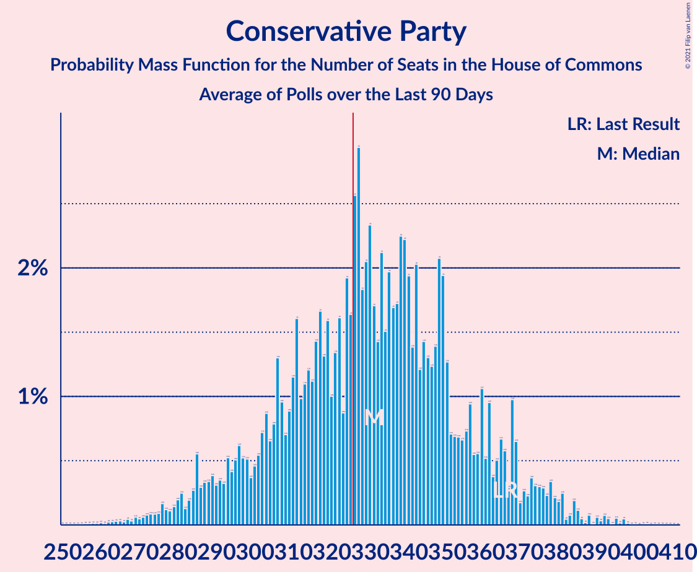

# Conservative Party

<a href="#voting-intentions">Voting Intentions</a> | <a href="#seats">Seats</a>

## Voting Intentions

Last result: **42.4%** (General Election of 8 June 2017)

### Confidence Intervals

| Period     | Polling firm/Commissioner(s) | Median | 80% Confidence Interval | 90% Confidence Interval | 95% Confidence Interval | 99% Confidence Interval |
|:----------:|:----------------:|:-----------:|:-----------------------:|:-----------------------:|:-----------------------:|:-----------------------:|
| N/A | [Poll Average](average.html) | 23.8% | 20.1–28.0% | 19.7–28.6% | 19.3–29.1% | 18.7–29.9% |
| [4–6 June 2019](2019-06-06-YouGov.html) | YouGov   The Times | 17.9% | N/A | N/A | N/A | N/A |
| [28–30 May 2019](2019-05-30-Opinium.html) | Opinium   The Observer | 17.0% | N/A | N/A | N/A | N/A |
| [29–30 May 2019](2019-05-30-Deltapoll.html) | Deltapoll   The Mail on Sunday | 19.6% | N/A | N/A | N/A | N/A |
| [28–29 May 2019](2019-05-29-YouGov.html) | YouGov   The Times | 18.9% | 17.8–20.2% | 17.5–20.5% | 17.2–20.9% | 16.6–21.5% |
| [22 May 2019](2019-05-22-Survation.html) | Survation   Daily Mail | 27.9% | 26.7–29.2% | 26.3–29.6% | 26.0–29.9% | 25.4–30.6% |
| [14–21 May 2019](2019-05-21-Panelbase.html) | Panelbase   The Sunday Times | 21.0% | 19.9–22.2% | 19.6–22.5% | 19.3–22.8% | 18.7–23.4% |
| [17–20 May 2019](2019-05-20-Opinium.html) | Opinium   The Times | 22.4% | 21.2–23.6% | 20.9–24.0% | 20.6–24.3% | 20.1–24.9% |
| [8–17 May 2019](2019-05-17-YouGov.html) | YouGov   Best for Britain and Hope Not Hate | 24.0% | 23.4–24.6% | 23.3–24.7% | 23.1–24.9% | 22.9–25.2% |
| [17 May 2019](2019-05-17-Survation.html) | Survation   Daily Mail | 26.7% | 25.0–28.6% | 24.5–29.1% | 24.1–29.5% | 23.2–30.4% |
| [14–16 May 2019](2019-05-16-Opinium.html) | Opinium   The Observer | 22.2% | 21.0–23.4% | 20.7–23.7% | 20.4–24.0% | 19.8–24.6% |
| [13–14 May 2019](2019-05-14-YouGov.html) | YouGov   The Times | 24.8% | 23.4–26.2% | 23.1–26.6% | 22.7–26.9% | 22.1–27.6% |
| [10–14 May 2019](2019-05-14-IpsosMORI.html) | Ipsos MORI | 24.3% | 22.6–26.0% | 22.2–26.5% | 21.8–26.9% | 21.0–27.8% |
| [9–13 May 2019](2019-05-13-KantarPublic.html) | Kantar Public | 25.0% | 23.4–26.7% | 23.0–27.2% | 22.6–27.6% | 21.8–28.4% |
| [9–13 May 2019](2019-05-13-HanburyStrategy.html) | Hanbury Strategy | 20.8% | 19.7–22.0% | 19.3–22.3% | 19.1–22.6% | 18.5–23.2% |
| [10–12 May 2019](2019-05-12-ComRes.html) | ComRes   Daily Telegraph | 20.4% | 19.3–21.6% | 19.0–21.9% | 18.7–22.2% | 18.2–22.8% |
| [8–10 May 2019](2019-05-10-Opinium.html) | Opinium   The Observer | 22.0% | 20.8–23.2% | 20.5–23.5% | 20.2–23.8% | 19.6–24.4% |
| [7–10 May 2019](2019-05-10-BMGResearch.html) | BMG Research | 27.0% | 25.6–28.5% | 25.2–28.9% | 24.8–29.3% | 24.2–30.0% |
| [8–9 May 2019](2019-05-09-YouGov.html) | YouGov   The Times | 24.2% | 23.1–25.4% | 22.8–25.8% | 22.5–26.1% | 21.9–26.7% |
| [9 May 2019](2019-05-09-ComRes.html) | ComRes   Brexit Express | 18.8% | 17.7–20.0% | 17.5–20.3% | 17.2–20.6% | 16.7–21.2% |
| [3–7 May 2019](2019-05-07-Opinium.html) | Opinium | 25.0% | 23.6–26.5% | 23.2–26.9% | 22.9–27.2% | 22.3–27.9% |
| [29–30 April 2019](2019-04-30-YouGov.html) | YouGov | 28.7% | 27.3–30.2% | 26.9–30.6% | 26.6–31.0% | 25.9–31.7% |
| [23–24 April 2019](2019-04-24-YouGov.html) | YouGov   The Times | 27.0% | 25.7–28.3% | 25.3–28.7% | 25.0–29.1% | 24.3–29.8% |
| [18–24 April 2019](2019-04-24-Panelbase.html) | Panelbase   The Sunday Times | 26.7% | 25.5–28.0% | 25.2–28.4% | 24.9–28.7% | 24.3–29.4% |
| [21–23 April 2019](2019-04-23-Opinium.html) | Opinium   The Observer | 26.0% | 24.5–27.7% | 24.0–28.2% | 23.6–28.6% | 22.9–29.4% |
| [16–17 April 2019](2019-04-17-YouGov.html) | YouGov   The Times | 29.0% | 27.6–30.4% | 27.3–30.8% | 26.9–31.2% | 26.3–31.9% |
| [17 April 2019](2019-04-17-OnePoll.html) | OnePoll   The Sun on Sunday | 24.0% | 22.8–25.3% | 22.5–25.6% | 22.2–25.9% | 21.6–26.5% |
| [16–17 April 2019](2019-04-17-ORB.html) | ORB   The Telegraph | 26.0% | 24.6–27.5% | 24.2–27.9% | 23.9–28.2% | 23.2–28.9% |
| [9–12 April 2019](2019-04-12-Opinium.html) | Opinium   The Observer | 29.0% | 27.7–30.3% | 27.4–30.7% | 27.1–31.0% | 26.4–31.7% |
| [4–8 April 2019](2019-04-08-KantarPublic.html) | Kantar Public | 31.7% | 29.9–33.4% | 29.5–33.9% | 29.1–34.4% | 28.2–35.2% |
| [5–8 April 2019](2019-04-08-HanburyStrategy.html) | Hanbury Strategy   Open Europe | 30.7% | 29.4–32.1% | 29.0–32.4% | 28.7–32.8% | 28.1–33.4% |
| [3–6 April 2019](2019-04-06-Survation.html) | Survation | 36.6% | 35.8–37.4% | 35.6–37.7% | 35.4–37.9% | 35.1–38.3% |
| [2–5 April 2019](2019-04-05-BMGResearch.html) | BMG Research   The Independent | 35.3% | 33.8–36.9% | 33.3–37.4% | 33.0–37.8% | 32.2–38.6% |
| [2–3 April 2019](2019-04-03-YouGov.html) | YouGov | 32.0% | N/A | N/A | N/A | N/A |
| [28–30 March 2019](2019-03-30-Deltapoll.html) | Deltapoll   The Mail on Sunday | 35.6% | 33.7–37.6% | 33.2–38.2% | 32.7–38.7% | 31.8–39.6% |
| [28–29 March 2019](2019-03-29-Opinium.html) | Opinium   The Observer | 34.9% | 33.6–36.3% | 33.2–36.7% | 32.8–37.0% | 32.2–37.7% |
| [24–25 March 2019](2019-03-25-YouGov.html) | YouGov   The Times | 36.0% | N/A | N/A | N/A | N/A |
| [20–22 March 2019](2019-03-22-Opinium.html) | Opinium   The Observer | 36.0% | 34.6–37.4% | 34.3–37.8% | 33.9–38.1% | 33.3–38.8% |
| [15–19 March 2019](2019-03-19-IpsosMORI.html) | Ipsos MORI | 38.0% | 36.1–39.9% | 35.6–40.5% | 35.1–41.0% | 34.2–41.9% |
| [14–15 March 2019](2019-03-15-YouGov.html) | YouGov   The Times | 35.7% | N/A | N/A | N/A | N/A |
| [15 March 2019](2019-03-15-Survation.html) | Survation   Daily Mail | 35.3% | 33.3–37.2% | 32.8–37.8% | 32.4–38.3% | 31.5–39.2% |
| [12–15 March 2019](2019-03-15-Opinium.html) | Opinium   The Observer | 38.0% | 36.6–39.4% | 36.2–39.8% | 35.9–40.2% | 35.2–40.9% |
| [7–11 March 2019](2019-03-11-KantarPublic.html) | Kantar Public | 41.4% | 39.6–43.3% | 39.0–43.8% | 38.6–44.3% | 37.7–45.2% |
| [4–8 March 2019](2019-03-08-BMGResearch.html) | BMG Research | 39.0% | 37.4–40.6% | 36.9–41.1% | 36.5–41.5% | 35.8–42.3% |
| [3–4 March 2019](2019-03-04-YouGov.html) | YouGov   The Times | 40.0% | N/A | N/A | N/A | N/A |
| [26 February–1 March 2019](2019-03-01-Opinium.html) | Opinium   The Observer | 39.6% | 38.2–41.0% | 37.8–41.4% | 37.4–41.8% | 36.7–42.5% |
| [22–23 February 2019](2019-02-23-YouGov.html) | YouGov   The Times | 41.0% | N/A | N/A | N/A | N/A |
| [21–23 February 2019](2019-02-23-Deltapoll.html) | Deltapoll   The Mail on Sunday | 43.3% | 41.4–45.3% | 40.8–45.9% | 40.3–46.4% | 39.4–47.4% |
| [18–19 February 2019](2019-02-19-YouGov.html) | YouGov   The Times | 41.4% | 40.0–42.9% | 39.6–43.3% | 39.2–43.7% | 38.5–44.4% |
| [18 February 2019](2019-02-18-Survation.html) | Survation   Daily Mail | 39.6% | 37.6–41.6% | 37.1–42.1% | 36.6–42.6% | 35.7–43.6% |
| [13–15 February 2019](2019-02-15-Opinium.html) | Opinium   The Observer | 37.3% | 35.9–38.7% | 35.5–39.1% | 35.2–39.4% | 34.5–40.1% |
| [7–11 February 2019](2019-02-11-KantarPublic.html) | Kantar Public | 40.0% | 38.2–41.9% | 37.6–42.4% | 37.2–42.9% | 36.3–43.8% |
| [4–8 February 2019](2019-02-08-BMGResearch.html) | BMG Research | 37.6% | N/A | N/A | N/A | N/A |
| [1–5 February 2019](2019-02-05-IpsosMORI.html) | Ipsos MORI | 37.6% | 35.7–39.6% | 35.1–40.2% | 34.7–40.7% | 33.7–41.6% |
| [3–4 February 2019](2019-02-04-YouGov.html) | YouGov   The Times | 41.0% | 39.6–42.5% | 39.1–42.9% | 38.8–43.3% | 38.1–44.0% |
| [30 January–1 February 2019](2019-02-01-Opinium.html) | Opinium   The Observer | 41.0% | 39.6–42.4% | 39.2–42.8% | 38.8–43.2% | 38.1–43.9% |
| [30 January 2019](2019-01-30-Survation.html) | Survation   Daily Mail | 38.4% | 36.5–40.4% | 35.9–40.9% | 35.5–41.4% | 34.6–42.4% |
| [23–25 January 2019](2019-01-25-Opinium.html) | Opinium   People’s Vote | 40.0% | 38.6–41.4% | 38.2–41.8% | 37.8–42.2% | 37.2–42.8% |
| [16–18 January 2019](2019-01-18-Opinium.html) | Opinium   The Observer | 36.3% | 34.9–37.7% | 34.5–38.1% | 34.2–38.4% | 33.6–39.1% |
| [16–18 January 2019](2019-01-18-ICMResearch.html) | ICM Research | 38.9% | 37.5–40.3% | 37.1–40.7% | 36.8–41.0% | 36.2–41.7% |
| [10–17 January 2019](2019-01-17-NumberCruncherPolitics.html) | Number Cruncher Politics   Politico | 41.5% | 39.5–43.5% | 39.0–44.0% | 38.5–44.5% | 37.6–45.5% |
| [16–17 January 2019](2019-01-17-ComRes.html) | ComRes   Sunday Express | 38.0% | 36.6–39.4% | 36.2–39.8% | 35.9–40.1% | 35.3–40.8% |
| [14–15 January 2019](2019-01-15-ComRes.html) | ComRes   Daily Express | 37.4% | 36.0–38.8% | 35.6–39.2% | 35.3–39.5% | 34.6–40.2% |
| [13–14 January 2019](2019-01-14-YouGov.html) | YouGov   The Times | 39.0% | 37.5–40.5% | 37.1–41.0% | 36.7–41.3% | 36.0–42.1% |
| [10–14 January 2019](2019-01-14-KantarPublic.html) | Kantar Public | 35.0% | 33.2–36.9% | 32.7–37.4% | 32.2–37.9% | 31.4–38.8% |
| [10–11 January 2019](2019-01-11-Survation.html) | Survation   Daily Mail | 37.6% | 35.7–39.6% | 35.1–40.2% | 34.7–40.6% | 33.8–41.6% |
| [8–11 January 2019](2019-01-11-BMGResearch.html) | BMG Research   The Independent | 36.0% | N/A | N/A | N/A | N/A |
| [6–7 January 2019](2019-01-07-YouGov.html) | YouGov   The Times | 41.4% | 39.9–43.0% | 39.4–43.4% | 39.1–43.8% | 38.3–44.6% |
| [21 December 2018–4 January 2019](2019-01-04-YouGov.html) | YouGov   People’s Vote | 40.8% | 40.4–41.2% | 40.3–41.3% | 40.2–41.4% | 40.0–41.6% |
| [18–20 December 2018](2018-12-20-Opinium.html) | Opinium | 38.9% | 37.5–40.4% | 37.1–40.8% | 36.8–41.1% | 36.1–41.8% |
| [16–17 December 2018](2018-12-17-YouGov.html) | YouGov   The Times | 41.0% | 39.5–42.6% | 39.0–43.0% | 38.7–43.4% | 37.9–44.2% |
| [12–14 December 2018](2018-12-14-YouGov.html) | YouGov   People’s Vote | 40.4% | 39.5–41.3% | 39.3–41.6% | 39.1–41.8% | 38.6–42.2% |
| [13–14 December 2018](2018-12-14-Opinium.html) | Opinium   The Observer | 37.9% | 36.5–39.3% | 36.1–39.7% | 35.8–40.0% | 35.1–40.7% |
| [10–11 December 2018](2018-12-11-Populus.html) | Populus | 37.8% | 36.4–39.2% | 36.0–39.6% | 35.7–39.9% | 35.0–40.6% |
| [6–7 December 2018](2018-12-07-YouGov.html) | YouGov   The Sunday Times | 38.8% | 37.3–40.4% | 36.8–40.8% | 36.5–41.2% | 35.7–41.9% |
| [5–6 December 2018](2018-12-06-KantarPublic.html) | Kantar Public | 37.6% | 35.8–39.4% | 35.3–40.0% | 34.9–40.4% | 34.0–41.3% |
| [30 November–5 December 2018](2018-12-05-IpsosMORI.html) | Ipsos MORI | 38.0% | 36.1–40.0% | 35.6–40.5% | 35.1–41.0% | 34.2–42.0% |
| [3–4 December 2018](2018-12-04-YouGov.html) | YouGov   The Times | 39.6% | 38.0–41.2% | 37.6–41.6% | 37.2–42.0% | 36.5–42.8% |
| [30 November–2 December 2018](2018-12-02-ComRes.html) | ComRes   Sunday Express | 37.6% | 36.3–39.0% | 35.9–39.4% | 35.6–39.8% | 34.9–40.5% |
| [26–27 November 2018](2018-11-27-YouGov.html) | YouGov   The Times | 40.4% | 38.9–41.9% | 38.5–42.4% | 38.1–42.8% | 37.4–43.5% |
| [18–19 November 2018](2018-11-19-YouGov.html) | YouGov   The Times | 39.8% | 38.3–41.4% | 37.8–41.8% | 37.5–42.2% | 36.7–42.9% |
| [14–15 November 2018](2018-11-15-Opinium.html) | Opinium | 36.0% | 34.3–37.8% | 33.8–38.3% | 33.4–38.8% | 32.5–39.6% |
| [14–15 November 2018](2018-11-15-ComRes.html) | ComRes   Sunday Express | 36.0% | 34.6–37.4% | 34.2–37.8% | 33.9–38.1% | 33.3–38.8% |
| [8–12 November 2018](2018-11-12-KantarPublic.html) | Kantar Public | 40.0% | 38.2–41.9% | 37.7–42.4% | 37.2–42.9% | 36.3–43.8% |
| [2–7 November 2018](2018-11-07-Panelbase.html) | Panelbase   Constitutional Commission | 39.5% | 38.1–40.9% | 37.7–41.3% | 37.4–41.6% | 36.7–42.3% |
| [4–5 November 2018](2018-11-05-YouGov.html) | YouGov   The Times | 41.4% | 39.9–43.0% | 39.4–43.4% | 39.0–43.8% | 38.3–44.6% |
| [20 October–2 November 2018](2018-11-02-Survation.html) | Survation   Channel 4 | 39.8% | 39.4–40.3% | 39.2–40.4% | 39.1–40.5% | 38.9–40.7% |
| [29–30 October 2018](2018-10-30-YouGov.html) | YouGov   The Times | 41.7% | 40.2–43.3% | 39.8–43.8% | 39.4–44.2% | 38.6–44.9% |
| [26–28 October 2018](2018-10-28-ICMResearch.html) | ICM Research | 40.3% | 38.9–41.7% | 38.5–42.1% | 38.2–42.4% | 37.5–43.1% |
| [24–26 October 2018](2018-10-26-Deltapoll.html) | Deltapoll   Mirror | 42.8% | 40.8–44.8% | 40.2–45.3% | 39.8–45.8% | 38.8–46.8% |
| [22–23 October 2018](2018-10-23-YouGov.html) | YouGov   The Times | 41.3% | 39.8–42.8% | 39.4–43.2% | 39.0–43.6% | 38.3–44.3% |
| [19–22 October 2018](2018-10-22-IpsosMORI.html) | Ipsos MORI | 38.5% | 36.6–40.5% | 36.1–41.0% | 35.6–41.5% | 34.7–42.4% |
| [14–15 October 2018](2018-10-15-YouGov.html) | YouGov   The Times | 41.8% | 40.3–43.4% | 39.9–43.9% | 39.5–44.2% | 38.7–45.0% |
| [11–15 October 2018](2018-10-15-KantarPublic.html) | Kantar Public | 41.0% | 39.1–42.9% | 38.6–43.4% | 38.1–43.9% | 37.2–44.8% |
| [11–12 October 2018](2018-10-12-Opinium.html) | Opinium   The Observer | 40.6% | 39.2–42.0% | 38.8–42.4% | 38.5–42.8% | 37.8–43.5% |
| [10 October 2018](2018-10-10-Survation.html) | Survation | 39.6% | 37.7–41.6% | 37.1–42.2% | 36.7–42.7% | 35.7–43.7% |
| [8–9 October 2018](2018-10-09-YouGov.html) | YouGov   The Times | 41.0% | 39.4–42.6% | 39.0–43.0% | 38.6–43.4% | 37.9–44.1% |
| [4–7 October 2018](2018-10-07-BMGResearch.html) | BMG Research | 37.0% | 35.4–38.6% | 35.0–39.1% | 34.6–39.5% | 33.9–40.3% |
| [3–5 October 2018](2018-10-05-Opinium.html) | Opinium   The Observer | 39.4% | 38.0–40.8% | 37.6–41.2% | 37.3–41.6% | 36.6–42.2% |
| [3–5 October 2018](2018-10-05-BMGResearch.html) | BMG Research   The Independent | 37.9% | 36.3–39.6% | 35.9–40.0% | 35.5–40.4% | 34.8–41.2% |
| [30 September–1 October 2018](2018-10-01-YouGov.html) | YouGov   The Times | 42.4% | 40.9–44.0% | 40.4–44.5% | 40.0–44.9% | 39.3–45.6% |
| [28–29 September 2018](2018-09-29-BMGResearch.html) | BMG Research   HuffPost UK | 34.7% | 32.9–36.5% | 32.4–37.0% | 32.0–37.4% | 31.2–38.3% |
| [26–28 September 2018](2018-09-28-Opinium.html) | Opinium   The Observer | 39.7% | 38.3–41.1% | 37.9–41.5% | 37.6–41.9% | 36.9–42.5% |
| [26–27 September 2018](2018-09-27-ComRes.html) | ComRes   Sunday Express | 39.3% | 37.9–40.7% | 37.5–41.1% | 37.2–41.4% | 36.5–42.1% |
| [24–25 September 2018](2018-09-25-YouGov.html) | YouGov   The Times | 42.3% | 40.8–43.9% | 40.3–44.4% | 39.9–44.8% | 39.2–45.5% |
| [21–24 September 2018](2018-09-24-ICMResearch.html) | ICM Research   The Guardian | 40.8% | 39.4–42.2% | 39.0–42.6% | 38.6–43.0% | 38.0–43.6% |
| [21–22 September 2018](2018-09-22-BMGResearch.html) | BMG Research   HuffPost UK | 38.2% | 36.2–40.2% | 35.7–40.7% | 35.2–41.2% | 34.3–42.2% |
| [18–20 September 2018](2018-09-20-Opinium.html) | Opinium | 36.6% | 35.3–38.0% | 34.9–38.4% | 34.6–38.8% | 33.9–39.5% |
| [18–19 September 2018](2018-09-19-YouGov.html) | YouGov   The Times | 40.0% | 38.8–41.3% | 38.4–41.6% | 38.1–42.0% | 37.5–42.6% |
| [14–18 September 2018](2018-09-18-IpsosMORI.html) | Ipsos MORI | 38.9% | 37.0–40.8% | 36.5–41.4% | 36.0–41.8% | 35.1–42.8% |
| [12–13 September 2018](2018-09-13-YouGov.html) | YouGov   The Times | 40.4% | 38.9–42.0% | 38.4–42.5% | 38.1–42.8% | 37.3–43.6% |
| [11–13 September 2018](2018-09-13-Opinium.html) | Opinium   The Observer | 39.4% | 38.0–40.8% | 37.6–41.2% | 37.3–41.5% | 36.6–42.2% |
| [6–10 September 2018](2018-09-10-KantarPublic.html) | Kantar Public | 40.3% | 38.4–42.2% | 37.9–42.8% | 37.5–43.2% | 36.6–44.1% |
| [7–9 September 2018](2018-09-09-ICMResearch.html) | ICM Research   The Guardian | 41.9% | 40.5–43.3% | 40.1–43.7% | 39.8–44.0% | 39.1–44.7% |
| [7 September 2018](2018-09-07-Survation.html) | Survation   Daily Mail | 38.4% | 36.5–40.4% | 36.0–40.9% | 35.5–41.4% | 34.6–42.4% |
| [4–7 September 2018](2018-09-07-BMGResearch.html) | BMG Research   The Independent | 36.9% | 35.4–38.5% | 34.9–39.0% | 34.5–39.4% | 33.8–40.1% |
| [3–4 September 2018](2018-09-04-YouGov.html) | YouGov   The Times | 39.0% | 37.5–40.4% | 37.1–40.8% | 36.8–41.2% | 36.1–41.9% |
| [31 August–1 September 2018](2018-09-01-Survation.html) | Survation | 37.0% | 35.1–38.9% | 34.5–39.5% | 34.0–40.0% | 33.2–40.9% |
| [28–29 August 2018](2018-08-29-YouGov.html) | YouGov   The Times | 39.4% | 37.9–41.0% | 37.5–41.4% | 37.1–41.8% | 36.4–42.6% |
| [20–21 August 2018](2018-08-21-YouGov.html) | YouGov   The Times | 39.6% | 38.1–41.1% | 37.7–41.6% | 37.3–42.0% | 36.6–42.7% |
| [17–19 August 2018](2018-08-19-ICMResearch.html) | ICM Research   The Guardian | 39.1% | 37.8–40.5% | 37.4–41.0% | 37.0–41.3% | 36.4–42.0% |
| [14–17 August 2018](2018-08-17-Opinium.html) | Opinium   The Observer | 39.0% | 37.6–40.4% | 37.2–40.8% | 36.9–41.2% | 36.2–41.8% |
| [14–16 August 2018](2018-08-16-Deltapoll.html) | Deltapoll   The Sun on Sunday | 36.7% | 35.3–38.1% | 34.9–38.5% | 34.5–38.9% | 33.9–39.6% |
| [13–14 August 2018](2018-08-14-YouGov.html) | YouGov   The Times | 40.6% | 39.1–42.2% | 38.6–42.6% | 38.3–43.0% | 37.5–43.7% |
| [9–13 August 2018](2018-08-13-NumberCruncherPolitics.html) | Number Cruncher Politics | 38.4% | 36.5–40.4% | 36.0–40.9% | 35.5–41.4% | 34.6–42.4% |
| [9–13 August 2018](2018-08-13-KantarPublic.html) | Kantar Public | 39.2% | 37.4–41.1% | 36.9–41.7% | 36.4–42.1% | 35.5–43.0% |
| [6–10 August 2018](2018-08-10-BMGResearch.html) | BMG Research   The Independent | 37.2% | 35.6–38.8% | 35.2–39.3% | 34.8–39.7% | 34.0–40.5% |
| [8–9 August 2018](2018-08-09-YouGov.html) | YouGov   The Times | 39.0% | 37.5–40.5% | 37.0–41.0% | 36.7–41.4% | 36.0–42.1% |
| [3–5 August 2018](2018-08-05-ICMResearch.html) | ICM Research   The Guardian | 39.2% | 37.8–40.6% | 37.4–41.0% | 37.1–41.3% | 36.4–42.0% |
| [30–31 July 2018](2018-07-31-YouGov.html) | YouGov   The Times | 38.0% | 36.5–39.5% | 36.1–40.0% | 35.7–40.3% | 35.0–41.1% |
| [20–24 July 2018](2018-07-24-IpsosMORI.html) | Ipsos MORI | 37.6% | 35.7–39.6% | 35.2–40.2% | 34.7–40.6% | 33.8–41.6% |
| [22–23 July 2018](2018-07-23-YouGov.html) | YouGov   The Times | 38.3% | 36.8–39.9% | 36.4–40.3% | 36.0–40.7% | 35.3–41.4% |
| [20–22 July 2018](2018-07-22-ICMResearch.html) | ICM Research | 39.5% | 38.1–40.9% | 37.7–41.3% | 37.4–41.7% | 36.7–42.3% |
| [19–20 July 2018](2018-07-20-YouGov.html) | YouGov   The Times | 38.0% | 36.5–39.6% | 36.1–40.0% | 35.7–40.4% | 35.0–41.1% |
| [16–17 July 2018](2018-07-17-YouGov.html) | YouGov   The Times | 36.3% | 34.8–37.8% | 34.4–38.2% | 34.0–38.6% | 33.3–39.4% |
| [12–14 July 2018](2018-07-14-Deltapoll.html) | Deltapoll   The Sun on Sunday | 37.0% | 35.4–38.6% | 34.9–39.1% | 34.6–39.5% | 33.8–40.3% |
| [10–13 July 2018](2018-07-13-Opinium.html) | Opinium   The Observer | 35.7% | 34.3–37.1% | 33.9–37.4% | 33.6–37.8% | 32.9–38.5% |
| [10–11 July 2018](2018-07-11-YouGov.html) | YouGov   The Times | 37.0% | 35.5–38.5% | 35.1–38.9% | 34.8–39.3% | 34.1–40.0% |
| [8–9 July 2018](2018-07-09-YouGov.html) | YouGov   The Times | 39.0% | 37.5–40.6% | 37.1–41.0% | 36.7–41.4% | 36.0–42.1% |
| [5–9 July 2018](2018-07-09-KantarPublic.html) | Kantar Public | 40.0% | 38.1–41.9% | 37.5–42.4% | 37.1–42.9% | 36.2–43.9% |
| [6–9 July 2018](2018-07-09-ICMResearch.html) | ICM Research   The Guardian | 40.9% | 39.5–42.3% | 39.1–42.7% | 38.7–43.1% | 38.1–43.7% |
| [7 July 2018](2018-07-07-Survation.html) | Survation | 38.4% | 36.5–40.4% | 35.9–41.0% | 35.5–41.5% | 34.6–42.4% |
| [3–5 July 2018](2018-07-05-BMGResearch.html) | BMG Research | 40.1% | 38.5–41.7% | 38.0–42.2% | 37.7–42.6% | 36.9–43.4% |
| [3–4 July 2018](2018-07-04-YouGov.html) | YouGov   The Times | 41.0% | 39.5–42.6% | 39.0–43.0% | 38.7–43.4% | 37.9–44.2% |
| [22–27 June 2018](2018-06-27-IpsosMORI.html) | Ipsos MORI | 41.0% | 39.1–43.0% | 38.5–43.6% | 38.1–44.1% | 37.1–45.0% |
| [25–26 June 2018](2018-06-26-YouGov.html) | YouGov   The Times | 42.0% | 40.5–43.6% | 40.0–44.0% | 39.6–44.4% | 38.9–45.2% |
| [22–24 June 2018](2018-06-24-ICMResearch.html) | ICM Research   The Guardian | 40.9% | 39.5–42.3% | 39.1–42.7% | 38.7–43.1% | 38.1–43.7% |
| [19–20 June 2018](2018-06-20-Survation.html) | Survation   Good Morning Britain | 41.9% | 39.9–43.9% | 39.4–44.4% | 38.9–44.9% | 38.0–45.9% |
| [18–19 June 2018](2018-06-19-YouGov.html) | YouGov   The Times | 41.6% | 40.0–43.2% | 39.6–43.6% | 39.2–44.0% | 38.5–44.8% |
| [11–12 June 2018](2018-06-12-YouGov.html) | YouGov   The Times | 42.3% | 40.7–43.9% | 40.3–44.3% | 39.9–44.7% | 39.2–45.5% |
| [8–10 June 2018](2018-06-10-ICMResearch.html) | ICM Research   The Guardian | 42.2% | 40.8–43.6% | 40.4–44.0% | 40.1–44.4% | 39.4–45.1% |
| [5–8 June 2018](2018-06-08-BMGResearch.html) | BMG Research   The Independent | 38.3% | 36.7–39.9% | 36.2–40.4% | 35.8–40.8% | 35.1–41.5% |
| [5–7 June 2018](2018-06-07-Opinium.html) | Opinium   The Observer | 41.2% | 39.8–42.6% | 39.4–43.0% | 39.0–43.4% | 38.4–44.1% |
| [4–5 June 2018](2018-06-05-YouGov.html) | YouGov   The Times | 44.3% | 42.8–45.9% | 42.3–46.4% | 41.9–46.8% | 41.2–47.6% |
| [31 May–4 June 2018](2018-06-04-Survation.html) | Survation | 41.4% | 40.0–42.8% | 39.6–43.2% | 39.3–43.6% | 38.6–44.3% |
| [28–29 May 2018](2018-05-29-YouGov.html) | YouGov   The Times | 41.6% | 40.0–43.1% | 39.6–43.6% | 39.2–43.9% | 38.5–44.7% |
| [25–29 May 2018](2018-05-29-ICMResearch.html) | ICM Research   The Guardian | 42.6% | 41.1–44.0% | 40.7–44.4% | 40.4–44.7% | 39.7–45.4% |
| [18–22 May 2018](2018-05-22-IpsosMORI.html) | Ipsos MORI | 40.2% | 38.2–42.2% | 37.7–42.8% | 37.2–43.3% | 36.3–44.2% |
| [20–21 May 2018](2018-05-21-YouGov.html) | YouGov   The Times | 42.4% | 40.9–44.0% | 40.4–44.4% | 40.0–44.8% | 39.3–45.6% |
| [16–17 May 2018](2018-05-17-ComRes.html) | ComRes   Daily Mail | 41.0% | 39.6–42.4% | 39.2–42.8% | 38.9–43.1% | 38.2–43.8% |
| [15–16 May 2018](2018-05-16-Opinium.html) | Opinium   The Observer | 42.6% | 41.2–44.0% | 40.8–44.4% | 40.4–44.7% | 39.7–45.4% |
| [13–14 May 2018](2018-05-14-YouGov.html) | YouGov   The Times | 43.0% | 41.5–44.6% | 41.0–45.1% | 40.6–45.5% | 39.9–46.2% |
| [11–13 May 2018](2018-05-13-ICMResearch.html) | ICM Research   The Guardian | 42.5% | 41.1–43.9% | 40.7–44.3% | 40.4–44.6% | 39.7–45.3% |
| [8–10 May 2018](2018-05-10-Survation.html) | Survation | 41.0% | 39.4–42.6% | 39.0–43.1% | 38.6–43.5% | 37.9–44.2% |
| [8–9 May 2018](2018-05-09-YouGov.html) | YouGov   The Times | 43.4% | 41.9–45.0% | 41.4–45.5% | 41.1–45.9% | 40.3–46.6% |
| [1–4 May 2018](2018-05-04-BMGResearch.html) | BMG Research   The Independent | 38.9% | 37.3–40.6% | 36.8–41.1% | 36.4–41.5% | 35.7–42.3% |
| [30 April–1 May 2018](2018-05-01-YouGov.html) | YouGov   The Times | 42.9% | 41.3–44.5% | 40.8–44.9% | 40.5–45.3% | 39.7–46.1% |
| [27–29 April 2018](2018-04-29-ICMResearch.html) | ICM Research   The Guardian | 41.9% | 40.5–43.3% | 40.1–43.7% | 39.8–44.1% | 39.1–44.7% |
| [27–29 April 2018](2018-04-29-ComRes.html) | ComRes   Daily Express | 39.5% | 38.1–40.9% | 37.7–41.3% | 37.4–41.7% | 36.7–42.3% |
| [24–25 April 2018](2018-04-25-YouGov.html) | YouGov   The Times | 43.0% | 41.4–44.6% | 41.0–45.0% | 40.6–45.4% | 39.9–46.1% |
| [20–24 April 2018](2018-04-24-IpsosMORI.html) | Ipsos MORI | 41.0% | 39.1–43.1% | 38.5–43.6% | 38.0–44.1% | 37.1–45.1% |
| [16–17 April 2018](2018-04-17-YouGov.html) | YouGov   The Times | 43.0% | 41.4–44.6% | 41.0–45.0% | 40.6–45.4% | 39.8–46.2% |
| [14 April 2018](2018-04-14-Survation.html) | Survation   The Mail on Sunday | 39.6% | 38.2–41.0% | 37.8–41.4% | 37.5–41.7% | 36.9–42.4% |
| [10–13 April 2018](2018-04-13-BMGResearch.html) | BMG Research | 39.2% | 37.6–40.8% | 37.2–41.2% | 36.8–41.6% | 36.0–42.4% |
| [10–12 April 2018](2018-04-12-Opinium.html) | Opinium   The Observer | 40.0% | 38.6–41.4% | 38.2–41.8% | 37.9–42.2% | 37.2–42.8% |
| [11–12 April 2018](2018-04-12-ComRes.html) | ComRes   Sunday Express | 40.0% | 38.6–41.4% | 38.2–41.8% | 37.9–42.1% | 37.2–42.8% |
| [9–10 April 2018](2018-04-10-YouGov.html) | YouGov   The Times | 40.0% | 38.5–41.6% | 38.0–42.0% | 37.7–42.4% | 36.9–43.2% |
| [6–8 April 2018](2018-04-08-ICMResearch.html) | ICM Research   The Guardian | 41.8% | 40.3–43.4% | 39.8–43.8% | 39.4–44.2% | 38.7–44.9% |
| [4–5 April 2018](2018-04-05-YouGov.html) | YouGov   The Times | 41.6% | 40.0–43.1% | 39.6–43.6% | 39.2–44.0% | 38.5–44.7% |
| [27 March–5 April 2018](2018-04-05-NumberCruncherPolitics.html) | Number Cruncher Politics | 42.9% | 41.0–44.9% | 40.4–45.5% | 39.9–46.0% | 39.0–46.9% |
| [26–27 March 2018](2018-03-27-YouGov.html) | YouGov   The Times | 43.5% | 41.9–45.0% | 41.5–45.5% | 41.1–45.9% | 40.3–46.6% |
| [16–18 March 2018](2018-03-18-ICMResearch.html) | ICM Research   The Guardian | 43.5% | 42.0–45.1% | 41.5–45.6% | 41.2–46.0% | 40.4–46.7% |
| [13–16 March 2018](2018-03-16-BMGResearch.html) | BMG Research | 37.9% | 36.5–39.4% | 36.0–39.8% | 35.7–40.2% | 35.0–40.9% |
| [14–15 March 2018](2018-03-15-YouGov.html) | YouGov   The Times | 42.0% | 40.6–43.4% | 40.2–43.8% | 39.8–44.2% | 39.2–44.9% |
| [13–15 March 2018](2018-03-15-Opinium.html) | Opinium   The Observer | 41.9% | 40.5–43.3% | 40.1–43.7% | 39.7–44.1% | 39.1–44.7% |
| [7–8 March 2018](2018-03-08-Survation.html) | Survation   Good Morning Britain | 36.5% | 34.6–38.5% | 34.1–39.0% | 33.6–39.5% | 32.7–40.4% |
| [2–7 March 2018](2018-03-07-IpsosMORI.html) | Ipsos MORI | 42.9% | 40.9–44.9% | 40.3–45.5% | 39.9–46.0% | 38.9–46.9% |
| [5–6 March 2018](2018-03-06-YouGov.html) | YouGov   The Times | 41.0% | 39.5–42.6% | 39.0–43.0% | 38.7–43.4% | 37.9–44.2% |
| [2–4 March 2018](2018-03-04-ICMResearch.html) | ICM Research   The Guardian | 42.8% | 41.4–44.2% | 41.0–44.6% | 40.7–45.0% | 40.0–45.7% |
| [26–27 February 2018](2018-02-27-YouGov.html) | YouGov   The Times | 41.0% | 39.4–42.5% | 39.0–43.0% | 38.6–43.4% | 37.9–44.1% |
| [19–20 February 2018](2018-02-20-YouGov.html) | YouGov   The Times | 39.9% | 38.3–41.4% | 37.9–41.9% | 37.5–42.3% | 36.8–43.0% |
| [16–19 February 2018](2018-02-19-ICMResearch.html) | ICM Research   The Guardian | 41.8% | 40.3–43.4% | 39.8–43.8% | 39.5–44.2% | 38.7–45.0% |
| [12–13 February 2018](2018-02-13-YouGov.html) | YouGov   The Times | 40.4% | 38.9–42.0% | 38.4–42.4% | 38.0–42.8% | 37.3–43.5% |
| [6–12 February 2018](2018-02-12-KantarPublic.html) | Kantar Public | 39.4% | 38.1–40.7% | 37.8–41.0% | 37.4–41.3% | 36.9–42.0% |
| [6–9 February 2018](2018-02-09-BMGResearch.html) | BMG Research | 39.9% | 38.3–41.5% | 37.8–42.0% | 37.4–42.4% | 36.7–43.2% |
| [6–8 February 2018](2018-02-08-Opinium.html) | Opinium   The Observer | 41.6% | 40.2–43.0% | 39.8–43.4% | 39.5–43.8% | 38.8–44.5% |
| [5–6 February 2018](2018-02-06-YouGov.html) | YouGov   The Times | 43.0% | 41.6–44.4% | 41.2–44.8% | 40.8–45.2% | 40.2–45.9% |
| [2–4 February 2018](2018-02-04-ICMResearch.html) | ICM Research   The Guardian | 40.9% | 39.5–42.3% | 39.1–42.7% | 38.8–43.1% | 38.1–43.8% |
| [28–29 January 2018](2018-01-29-YouGov.html) | YouGov   The Times | 42.0% | 40.5–43.6% | 40.0–44.0% | 39.6–44.4% | 38.9–45.1% |
| [26–29 January 2018](2018-01-29-Survation.html) | Survation | 39.9% | 38.0–41.9% | 37.5–42.4% | 37.0–42.9% | 36.1–43.9% |
| [19–23 January 2018](2018-01-23-IpsosMORI.html) | Ipsos MORI | 39.0% | 37.1–41.0% | 36.5–41.5% | 36.0–42.0% | 35.1–43.0% |
| [10–19 January 2018](2018-01-19-ICMResearch.html) | ICM Research   The Guardian | 40.9% | 39.9–41.9% | 39.6–42.2% | 39.4–42.4% | 38.9–42.9% |
| [16–17 January 2018](2018-01-17-YouGov.html) | YouGov   The Times | 41.3% | 39.8–42.9% | 39.4–43.3% | 39.0–43.7% | 38.3–44.5% |
| [12–14 January 2018](2018-01-14-ICMResearch.html) | ICM Research   The Guardian | 40.3% | 38.9–41.7% | 38.5–42.1% | 38.2–42.5% | 37.5–43.1% |
| [11–12 January 2018](2018-01-12-Opinium.html) | Opinium   The Observer | 40.3% | 38.9–41.7% | 38.5–42.1% | 38.1–42.5% | 37.5–43.1% |
| [9–12 January 2018](2018-01-12-BMGResearch.html) | BMG Research | 40.0% | 38.4–41.6% | 37.9–42.1% | 37.5–42.5% | 36.8–43.3% |
| [7–8 January 2018](2018-01-08-YouGov.html) | YouGov   The Times | 40.3% | 38.8–41.9% | 38.3–42.3% | 38.0–42.7% | 37.2–43.4% |

### Probability Mass Function

The following table shows the probability mass function per percentage block of voting intentions for the [poll average](average.html) for Conservative Party.

| Voting Intentions | Probability | Accumulated | Special Marks |
|:-----------------:|:-----------:|:-----------:|:-------------:|
| 16.5–17.5% | 0% | 100% |  |
| 17.5–18.5% | 0.3% | 100% |  |
| 18.5–19.5% | 4% | 99.7% |  |
| 19.5–20.5% | 13% | 96% |  |
| 20.5–21.5% | 17% | 82% |  |
| 21.5–22.5% | 9% | 65% |  |
| 22.5–23.5% | 5% | 57% |  |
| 23.5–24.5% | 8% | 51% | Median |
| 24.5–25.5% | 9% | 44% |  |
| 25.5–26.5% | 10% | 34% |  |
| 26.5–27.5% | 11% | 25% |  |
| 27.5–28.5% | 9% | 14% |  |
| 28.5–29.5% | 4% | 5% |  |
| 29.5–30.5% | 0.9% | 1.0% |  |
| 30.5–31.5% | 0.1% | 0.1% |  |
| 31.5–32.5% | 0% | 0% |  |
| 32.5–33.5% | 0% | 0% |  |
| 33.5–34.5% | 0% | 0% |  |
| 34.5–35.5% | 0% | 0% |  |
| 35.5–36.5% | 0% | 0% |  |
| 36.5–37.5% | 0% | 0% |  |
| 37.5–38.5% | 0% | 0% |  |
| 38.5–39.5% | 0% | 0% |  |
| 39.5–40.5% | 0% | 0% |  |
| 40.5–41.5% | 0% | 0% |  |
| 41.5–42.5% | 0% | 0% | Last Result |

## Seats

Last result: **317** seats (General Election of 8 June 2017)

### Confidence Intervals

| Period     | Polling firm/Commissioner(s) | Median | 80% Confidence Interval | 90% Confidence Interval | 95% Confidence Interval | 99% Confidence Interval |
|:----------:|:----------------:|:------:|:-----------------------:|:-----------------------:|:-----------------------:|:-----------------------:|
| N/A | [Poll Average](average.html) | 166 | 78–219 | 72–229 | 67–235 | 56–254 |
| [4–6 June 2019](2019-06-06-YouGov.html) | YouGov   The Times |  |  |  |  |  |
| [28–30 May 2019](2019-05-30-Opinium.html) | Opinium   The Observer |  |  |  |  |  |
| [29–30 May 2019](2019-05-30-Deltapoll.html) | Deltapoll   The Mail on Sunday |  |  |  |  |  |
| [28–29 May 2019](2019-05-29-YouGov.html) | YouGov   The Times | 58 | 44–80 | 42–85 | 40–90 | 36–105 |
| [22 May 2019](2019-05-22-Survation.html) | Survation   Daily Mail | 216 | 202–232 | 196–235 | 192–241 | 185–248 |
| [14–21 May 2019](2019-05-21-Panelbase.html) | Panelbase   The Sunday Times | 95 | 73–112 | 67–120 | 65–125 | 50–141 |
| [17–20 May 2019](2019-05-20-Opinium.html) | Opinium   The Times | 82 | 74–101 | 71–107 | 70–110 | 63–121 |
| [8–17 May 2019](2019-05-17-YouGov.html) | YouGov   Best for Britain and Hope Not Hate | 162 | 143–176 | 139–179 | 136–185 | 126–190 |
| [17 May 2019](2019-05-17-Survation.html) | Survation   Daily Mail | 207 | 183–237 | 174–240 | 172–243 | 159–268 |
| [14–16 May 2019](2019-05-16-Opinium.html) | Opinium   The Observer | 88 | 68–102 | 66–110 | 62–116 | 56–124 |
| [13–14 May 2019](2019-05-14-YouGov.html) | YouGov   The Times | 169 | 144–214 | 134–221 | 127–232 | 116–243 |
| [10–14 May 2019](2019-05-14-IpsosMORI.html) | Ipsos MORI | 183 | 145–221 | 141–233 | 140–247 | 115–266 |
| [9–13 May 2019](2019-05-13-KantarPublic.html) | Kantar Public | 179 | 150–204 | 142–211 | 139–211 | 124–220 |
| [9–13 May 2019](2019-05-13-HanburyStrategy.html) | Hanbury Strategy | 97 | 77–120 | 70–126 | 64–130 | 54–144 |
| [10–12 May 2019](2019-05-12-ComRes.html) | ComRes   Daily Telegraph | 87 | 67–108 | 60–114 | 59–119 | 50–128 |
| [8–10 May 2019](2019-05-10-Opinium.html) | Opinium   The Observer | 116 | 85–129 | 78–135 | 75–142 | 68–148 |
| [7–10 May 2019](2019-05-10-BMGResearch.html) | BMG Research | 209 | 191–231 | 187–241 | 182–248 | 174–262 |
| [8–9 May 2019](2019-05-09-YouGov.html) | YouGov   The Times | 170 | 126–199 | 121–212 | 120–218 | 114–232 |
| [9 May 2019](2019-05-09-ComRes.html) | ComRes   Brexit Express | 67 | 50–90 | 46–95 | 42–97 | 35–108 |
| [3–7 May 2019](2019-05-07-Opinium.html) | Opinium | 175 | 152–200 | 148–212 | 139–218 | 123–237 |
| [29–30 April 2019](2019-04-30-YouGov.html) | YouGov | 244 | 215–276 | 204–278 | 195–282 | 185–294 |
| [23–24 April 2019](2019-04-24-YouGov.html) | YouGov   The Times | 222 | 200–244 | 190–248 | 188–252 | 179–264 |
| [18–24 April 2019](2019-04-24-Panelbase.html) | Panelbase   The Sunday Times | 208 | 189–221 | 184–225 | 179–229 | 168–234 |
| [21–23 April 2019](2019-04-23-Opinium.html) | Opinium   The Observer | 206 | 171–226 | 159–234 | 151–238 | 139–247 |
| [16–17 April 2019](2019-04-17-YouGov.html) | YouGov   The Times | 245 | 232–281 | 228–284 | 223–296 | 214–299 |
| [17 April 2019](2019-04-17-OnePoll.html) | OnePoll   The Sun on Sunday | 186 | 165–205 | 163–211 | 155–217 | 142–227 |
| [16–17 April 2019](2019-04-17-ORB.html) | ORB   The Telegraph | 221 | 201–251 | 197–263 | 194–276 | 183–281 |
| [9–12 April 2019](2019-04-12-Opinium.html) | Opinium   The Observer | 223 | 211–238 | 207–242 | 201–246 | 192–254 |
| [4–8 April 2019](2019-04-08-KantarPublic.html) | Kantar Public | 247 | 227–269 | 221–279 | 215–288 | 207–303 |
| [5–8 April 2019](2019-04-08-HanburyStrategy.html) | Hanbury Strategy   Open Europe | 223 | 207–236 | 202–239 | 197–243 | 191–250 |
| [3–6 April 2019](2019-04-06-Survation.html) | Survation | 261 | 250–268 | 249–270 | 248–273 | 245–277 |
| [2–5 April 2019](2019-04-05-BMGResearch.html) | BMG Research   The Independent | 283 | 253–308 | 248–311 | 245–314 | 237–321 |
| [2–3 April 2019](2019-04-03-YouGov.html) | YouGov |  |  |  |  |  |
| [28–30 March 2019](2019-03-30-Deltapoll.html) | Deltapoll   The Mail on Sunday | 262 | 241–284 | 234–293 | 231–305 | 218–317 |
| [28–29 March 2019](2019-03-29-Opinium.html) | Opinium   The Observer | 271 | 251–305 | 248–312 | 247–315 | 240–321 |
| [24–25 March 2019](2019-03-25-YouGov.html) | YouGov   The Times |  |  |  |  |  |
| [20–22 March 2019](2019-03-22-Opinium.html) | Opinium   The Observer | 299 | 272–317 | 264–319 | 259–320 | 254–327 |
| [15–19 March 2019](2019-03-19-IpsosMORI.html) | Ipsos MORI | 316 | 281–333 | 271–343 | 264–347 | 254–356 |
| [14–15 March 2019](2019-03-15-YouGov.html) | YouGov   The Times |  |  |  |  |  |
| [15 March 2019](2019-03-15-Survation.html) | Survation   Daily Mail | 255 | 238–281 | 234–291 | 228–299 | 217–314 |
| [12–15 March 2019](2019-03-15-Opinium.html) | Opinium   The Observer | 317 | 291–326 | 285–330 | 284–333 | 271–340 |
| [7–11 March 2019](2019-03-11-KantarPublic.html) | Kantar Public | 349 | 326–369 | 323–373 | 317–375 | 310–384 |
| [4–8 March 2019](2019-03-08-BMGResearch.html) | BMG Research | 321 | 300–337 | 290–341 | 284–350 | 269–357 |
| [3–4 March 2019](2019-03-04-YouGov.html) | YouGov   The Times |  |  |  |  |  |
| [26 February–1 March 2019](2019-03-01-Opinium.html) | Opinium   The Observer | 303 | 303 | 303 | 303–311 | 303–346 |
| [22–23 February 2019](2019-02-23-YouGov.html) | YouGov   The Times |  |  |  |  |  |
| [21–23 February 2019](2019-02-23-Deltapoll.html) | Deltapoll   The Mail on Sunday | 338 | 338–355 | 338–355 | 338–399 | 283–399 |
| [18–19 February 2019](2019-02-19-YouGov.html) | YouGov   The Times | 333 | 317–350 | 313–355 | 311–362 | 305–369 |
| [18 February 2019](2019-02-18-Survation.html) | Survation   Daily Mail | 318 | 291–342 | 280–346 | 270–350 | 260–364 |
| [13–15 February 2019](2019-02-15-Opinium.html) | Opinium   The Observer | 262 | 252–303 | 252–320 | 252–321 | 243–321 |
| [7–11 February 2019](2019-02-11-KantarPublic.html) | Kantar Public | 311 | 291–340 | 279–346 | 279–350 | 262–362 |
| [4–8 February 2019](2019-02-08-BMGResearch.html) | BMG Research |  |  |  |  |  |
| [1–5 February 2019](2019-02-05-IpsosMORI.html) | Ipsos MORI | 280 | 251–312 | 247–316 | 241–321 | 235–331 |
| [3–4 February 2019](2019-02-04-YouGov.html) | YouGov   The Times | 325 | 312–342 | 309–347 | 304–351 | 292–362 |
| [30 January–1 February 2019](2019-02-01-Opinium.html) | Opinium   The Observer | 334 | 320–349 | 316–354 | 312–358 | 300–367 |
| [30 January 2019](2019-01-30-Survation.html) | Survation   Daily Mail | 283 | 257–316 | 251–324 | 246–329 | 239–338 |
| [23–25 January 2019](2019-01-25-Opinium.html) | Opinium   People’s Vote | 318 | 301–335 | 290–340 | 282–342 | 274–350 |
| [16–18 January 2019](2019-01-18-Opinium.html) | Opinium   The Observer | 265 | 249–282 | 247–286 | 245–295 | 238–303 |
| [16–18 January 2019](2019-01-18-ICMResearch.html) | ICM Research | 286 | 269–306 | 263–312 | 262–317 | 254–329 |
| [10–17 January 2019](2019-01-17-NumberCruncherPolitics.html) | Number Cruncher Politics   Politico | 313 | 279–337 | 274–343 | 269–347 | 258–357 |
| [16–17 January 2019](2019-01-17-ComRes.html) | ComRes   Sunday Express | 291 | 273–319 | 266–323 | 260–326 | 255–333 |
| [14–15 January 2019](2019-01-15-ComRes.html) | ComRes   Daily Express | 275 | 259–298 | 255–304 | 251–309 | 244–323 |
| [13–14 January 2019](2019-01-14-YouGov.html) | YouGov   The Times | 313 | 299–326 | 290–330 | 285–339 | 271–346 |
| [10–14 January 2019](2019-01-14-KantarPublic.html) | Kantar Public | 256 | 238–283 | 234–291 | 229–299 | 222–313 |
| [10–11 January 2019](2019-01-11-Survation.html) | Survation   Daily Mail | 265 | 247–293 | 242–302 | 237–311 | 228–325 |
| [8–11 January 2019](2019-01-11-BMGResearch.html) | BMG Research   The Independent |  |  |  |  |  |
| [6–7 January 2019](2019-01-07-YouGov.html) | YouGov   The Times | 321 | 311–340 | 309–342 | 300–346 | 279–365 |
| [21 December 2018–4 January 2019](2019-01-04-YouGov.html) | YouGov   People’s Vote | 326 | 319–332 | 318–333 | 317–333 | 316–335 |
| [18–20 December 2018](2018-12-20-Opinium.html) | Opinium | 294 | 273–318 | 268–323 | 264–329 | 257–335 |
| [16–17 December 2018](2018-12-17-YouGov.html) | YouGov   The Times | 306 | 282–327 | 276–331 | 270–335 | 262–344 |
| [12–14 December 2018](2018-12-14-YouGov.html) | YouGov   People’s Vote | 309 | 298–317 | 294–321 | 291–322 | 285–328 |
| [13–14 December 2018](2018-12-14-Opinium.html) | Opinium   The Observer | 276 | 259–298 | 254–306 | 252–312 | 244–321 |
| [10–11 December 2018](2018-12-11-Populus.html) | Populus | 274 | 258–291 | 256–300 | 253–305 | 246–315 |
| [6–7 December 2018](2018-12-07-YouGov.html) | YouGov   The Sunday Times | 285 | 261–311 | 256–314 | 253–318 | 247–325 |
| [5–6 December 2018](2018-12-06-KantarPublic.html) | Kantar Public | 277 | 255–311 | 251–317 | 247–321 | 238–330 |
| [30 November–5 December 2018](2018-12-05-IpsosMORI.html) | Ipsos MORI | 280 | 254–312 | 250–319 | 243–324 | 237–333 |
| [3–4 December 2018](2018-12-04-YouGov.html) | YouGov   The Times | 300 | 272–320 | 266–324 | 260–328 | 253–334 |
| [30 November–2 December 2018](2018-12-02-ComRes.html) | ComRes   Sunday Express | 272 | 257–294 | 252–302 | 249–307 | 243–318 |
| [26–27 November 2018](2018-11-27-YouGov.html) | YouGov   The Times | 322 | 303–336 | 295–342 | 289–345 | 277–356 |
| [18–19 November 2018](2018-11-19-YouGov.html) | YouGov   The Times | 316 | 289–332 | 282–337 | 275–341 | 265–348 |
| [14–15 November 2018](2018-11-15-Opinium.html) | Opinium | 263 | 246–287 | 242–296 | 238–303 | 230–316 |
| [14–15 November 2018](2018-11-15-ComRes.html) | ComRes   Sunday Express | 260 | 245–276 | 242–282 | 239–288 | 231–299 |
| [8–12 November 2018](2018-11-12-KantarPublic.html) | Kantar Public | 298 | 266–322 | 262–328 | 258–332 | 248–342 |
| [2–7 November 2018](2018-11-07-Panelbase.html) | Panelbase   Constitutional Commission | 283 | 266–309 | 262–315 | 259–320 | 252–326 |
| [4–5 November 2018](2018-11-05-YouGov.html) | YouGov   The Times | 323 | 299–338 | 292–343 | 284–347 | 273–356 |
| [20 October–2 November 2018](2018-11-02-Survation.html) | Survation   Channel 4 | 285 | 280–293 | 278–296 | 276–297 | 274–302 |
| [29–30 October 2018](2018-10-30-YouGov.html) | YouGov   The Times | 316 | 288–335 | 282–338 | 276–342 | 268–349 |
| [26–28 October 2018](2018-10-28-ICMResearch.html) | ICM Research | 309 | 284–330 | 277–332 | 273–335 | 263–342 |
| [24–26 October 2018](2018-10-26-Deltapoll.html) | Deltapoll   Mirror | 319 | 292–342 | 284–348 | 277–353 | 265–363 |
| [22–23 October 2018](2018-10-23-YouGov.html) | YouGov   The Times | 319 | 304–333 | 297–336 | 290–340 | 278–349 |
| [19–22 October 2018](2018-10-22-IpsosMORI.html) | Ipsos MORI | 300 | 260–319 | 259–324 | 252–330 | 244–340 |
| [14–15 October 2018](2018-10-15-YouGov.html) | YouGov   The Times | 326 | 307–341 | 296–343 | 292–351 | 278–359 |
| [11–15 October 2018](2018-10-15-KantarPublic.html) | Kantar Public | 317 | 292–337 | 285–343 | 276–349 | 263–360 |
| [11–12 October 2018](2018-10-12-Opinium.html) | Opinium   The Observer | 319 | 299–332 | 293–335 | 286–339 | 274–347 |
| [10 October 2018](2018-10-10-Survation.html) | Survation | 299 | 268–328 | 264–333 | 259–337 | 249–348 |
| [8–9 October 2018](2018-10-09-YouGov.html) | YouGov   The Times | 315 | 292–330 | 287–334 | 280–338 | 268–348 |
| [4–7 October 2018](2018-10-07-BMGResearch.html) | BMG Research | 271 | 250–300 | 245–306 | 241–312 | 235–323 |
| [3–5 October 2018](2018-10-05-Opinium.html) | Opinium   The Observer | 293 | 271–318 | 269–326 | 266–331 | 263–338 |
| [3–5 October 2018](2018-10-05-BMGResearch.html) | BMG Research   The Independent | 267 | 252–294 | 246–302 | 243–313 | 237–319 |
| [30 September–1 October 2018](2018-10-01-YouGov.html) | YouGov   The Times | 330 | 314–347 | 307–353 | 301–357 | 288–366 |
| [28–29 September 2018](2018-09-29-BMGResearch.html) | BMG Research   HuffPost UK | 241 | 223–258 | 218–266 | 214–274 | 204–289 |
| [26–28 September 2018](2018-09-28-Opinium.html) | Opinium   The Observer | 310 | 285–324 | 278–329 | 270–331 | 261–339 |
| [26–27 September 2018](2018-09-27-ComRes.html) | ComRes   Sunday Express | 282 | 265–307 | 261–313 | 257–319 | 250–329 |
| [24–25 September 2018](2018-09-25-YouGov.html) | YouGov   The Times | 322 | 307–338 | 299–343 | 296–348 | 282–360 |
| [21–24 September 2018](2018-09-24-ICMResearch.html) | ICM Research   The Guardian | 302 | 278–327 | 272–331 | 269–333 | 262–339 |
| [21–22 September 2018](2018-09-22-BMGResearch.html) | BMG Research   HuffPost UK | 278 | 253–310 | 248–317 | 243–322 | 235–331 |
| [18–20 September 2018](2018-09-20-Opinium.html) | Opinium | 264 | 250–287 | 246–293 | 243–299 | 238–311 |
| [18–19 September 2018](2018-09-19-YouGov.html) | YouGov   The Times | 307 | 293–318 | 287–322 | 278–325 | 272–332 |
| [14–18 September 2018](2018-09-18-IpsosMORI.html) | Ipsos MORI | 298 | 262–324 | 255–328 | 251–333 | 241–343 |
| [12–13 September 2018](2018-09-13-YouGov.html) | YouGov   The Times | 317 | 292–329 | 282–335 | 276–340 | 264–344 |
| [11–13 September 2018](2018-09-13-Opinium.html) | Opinium   The Observer | 297 | 273–320 | 268–324 | 265–328 | 260–335 |
| [6–10 September 2018](2018-09-10-KantarPublic.html) | Kantar Public | 315 | 291–336 | 284–344 | 275–350 | 261–360 |
| [7–9 September 2018](2018-09-09-ICMResearch.html) | ICM Research   The Guardian | 325 | 298–338 | 293–340 | 285–345 | 278–354 |
| [7 September 2018](2018-09-07-Survation.html) | Survation   Daily Mail | 294 | 263–324 | 258–329 | 253–334 | 244–343 |
| [4–7 September 2018](2018-09-07-BMGResearch.html) | BMG Research   The Independent | 275 | 263–300 | 260–313 | 256–320 | 245–332 |
| [3–4 September 2018](2018-09-04-YouGov.html) | YouGov   The Times | 308 | 287–320 | 279–324 | 274–327 | 262–336 |
| [31 August–1 September 2018](2018-09-01-Survation.html) | Survation | 271 | 252–296 | 246–306 | 242–314 | 232–329 |
| [28–29 August 2018](2018-08-29-YouGov.html) | YouGov   The Times | 297 | 273–322 | 268–327 | 263–330 | 255–337 |
| [20–21 August 2018](2018-08-21-YouGov.html) | YouGov   The Times | 307 | 282–323 | 274–327 | 268–331 | 259–338 |
| [17–19 August 2018](2018-08-19-ICMResearch.html) | ICM Research   The Guardian | 296 | 274–317 | 270–326 | 267–330 | 260–338 |
| [14–17 August 2018](2018-08-17-Opinium.html) | Opinium   The Observer | 300 | 274–320 | 269–325 | 266–328 | 259–335 |
| [14–16 August 2018](2018-08-16-Deltapoll.html) | Deltapoll   The Sun on Sunday | 271 | 253–288 | 247–294 | 244–299 | 239–310 |
| [13–14 August 2018](2018-08-14-YouGov.html) | YouGov   The Times | 318 | 290–335 | 283–338 | 278–343 | 269–350 |
| [9–13 August 2018](2018-08-13-NumberCruncherPolitics.html) | Number Cruncher Politics | 270 | 249–299 | 244–308 | 240–317 | 231–326 |
| [9–13 August 2018](2018-08-13-KantarPublic.html) | Kantar Public | 292 | 264–320 | 258–326 | 253–329 | 244–338 |
| [6–10 August 2018](2018-08-10-BMGResearch.html) | BMG Research   The Independent | 267 | 251–293 | 248–301 | 242–308 | 236–321 |
| [8–9 August 2018](2018-08-09-YouGov.html) | YouGov   The Times | 311 | 287–324 | 281–329 | 274–332 | 263–341 |
| [3–5 August 2018](2018-08-05-ICMResearch.html) | ICM Research   The Guardian | 280 | 264–305 | 262–308 | 257–318 | 251–326 |
| [30–31 July 2018](2018-07-31-YouGov.html) | YouGov   The Times | 282 | 259–306 | 255–312 | 252–318 | 245–326 |
| [20–24 July 2018](2018-07-24-IpsosMORI.html) | Ipsos MORI | 278 | 254–310 | 248–315 | 243–320 | 235–331 |
| [22–23 July 2018](2018-07-23-YouGov.html) | YouGov   The Times | 282 | 258–307 | 255–316 | 250–321 | 244–326 |
| [20–22 July 2018](2018-07-22-ICMResearch.html) | ICM Research | 286 | 269–310 | 264–317 | 261–323 | 255–333 |
| [19–20 July 2018](2018-07-20-YouGov.html) | YouGov   The Times | 272 | 252–296 | 249–305 | 247–309 | 241–318 |
| [16–17 July 2018](2018-07-17-YouGov.html) | YouGov   The Times | 251 | 239–268 | 234–274 | 231–278 | 224–292 |
| [12–14 July 2018](2018-07-14-Deltapoll.html) | Deltapoll   The Sun on Sunday | 263 | 248–282 | 243–287 | 239–293 | 232–307 |
| [10–13 July 2018](2018-07-13-Opinium.html) | Opinium   The Observer | 256 | 243–271 | 240–278 | 237–282 | 229–295 |
| [10–11 July 2018](2018-07-11-YouGov.html) | YouGov   The Times | 264 | 251–290 | 246–297 | 242–303 | 237–314 |
| [8–9 July 2018](2018-07-09-YouGov.html) | YouGov   The Times | 284 | 263–315 | 259–320 | 256–324 | 248–331 |
| [5–9 July 2018](2018-07-09-KantarPublic.html) | Kantar Public | 303 | 268–325 | 262–330 | 258–335 | 250–344 |
| [6–9 July 2018](2018-07-09-ICMResearch.html) | ICM Research   The Guardian | 310 | 286–332 | 279–335 | 274–337 | 266–344 |
| [7 July 2018](2018-07-07-Survation.html) | Survation | 269 | 250–303 | 245–312 | 240–319 | 231–329 |
| [3–5 July 2018](2018-07-05-BMGResearch.html) | BMG Research | 317 | 277–330 | 274–333 | 267–333 | 259–340 |
| [3–4 July 2018](2018-07-04-YouGov.html) | YouGov   The Times | 299 | 272–323 | 266–329 | 262–332 | 255–339 |
| [22–27 June 2018](2018-06-27-IpsosMORI.html) | Ipsos MORI | 322 | 285–337 | 274–344 | 270–349 | 259–360 |
| [25–26 June 2018](2018-06-26-YouGov.html) | YouGov   The Times | 320 | 298–334 | 292–340 | 290–344 | 272–351 |
| [22–24 June 2018](2018-06-24-ICMResearch.html) | ICM Research   The Guardian | 301 | 280–328 | 272–330 | 270–335 | 261–339 |
| [19–20 June 2018](2018-06-20-Survation.html) | Survation   Good Morning Britain | 319 | 285–339 | 276–343 | 270–350 | 260–360 |
| [18–19 June 2018](2018-06-19-YouGov.html) | YouGov   The Times | 309 | 279–325 | 273–332 | 266–336 | 261–344 |
| [11–12 June 2018](2018-06-12-YouGov.html) | YouGov   The Times | 321 | 295–342 | 284–345 | 276–345 | 264–354 |
| [8–10 June 2018](2018-06-10-ICMResearch.html) | ICM Research   The Guardian | 323 | 292–331 | 286–336 | 279–340 | 272–344 |
| [5–8 June 2018](2018-06-08-BMGResearch.html) | BMG Research   The Independent | 270 | 256–294 | 253–297 | 249–305 | 239–320 |
| [5–7 June 2018](2018-06-07-Opinium.html) | Opinium   The Observer | 301 | 284–324 | 276–327 | 272–329 | 264–336 |
| [4–5 June 2018](2018-06-05-YouGov.html) | YouGov   The Times | 339 | 324–357 | 319–362 | 313–368 | 301–376 |
| [31 May–4 June 2018](2018-06-04-Survation.html) | Survation | 300 | 280–325 | 274–332 | 270–335 | 262–340 |
| [28–29 May 2018](2018-05-29-YouGov.html) | YouGov   The Times | 312 | 284–326 | 276–329 | 272–335 | 263–339 |
| [25–29 May 2018](2018-05-29-ICMResearch.html) | ICM Research   The Guardian | 322 | 298–339 | 291–342 | 287–346 | 277–352 |
| [18–22 May 2018](2018-05-22-IpsosMORI.html) | Ipsos MORI | 285 | 260–317 | 256–321 | 249–327 | 245–338 |
| [20–21 May 2018](2018-05-21-YouGov.html) | YouGov   The Times | 323 | 299–337 | 290–343 | 284–346 | 272–354 |
| [16–17 May 2018](2018-05-17-ComRes.html) | ComRes   Daily Mail | 299 | 279–322 | 275–330 | 271–335 | 264–342 |
| [15–16 May 2018](2018-05-16-Opinium.html) | Opinium   The Observer | 329 | 312–340 | 304–343 | 300–346 | 287–354 |
| [13–14 May 2018](2018-05-14-YouGov.html) | YouGov   The Times | 334 | 317–350 | 303–356 | 296–360 | 291–369 |
| [11–13 May 2018](2018-05-13-ICMResearch.html) | ICM Research   The Guardian | 318 | 298–339 | 294–340 | 287–345 | 278–355 |
| [8–10 May 2018](2018-05-10-Survation.html) | Survation | 304 | 277–329 | 275–333 | 268–336 | 261–344 |
| [8–9 May 2018](2018-05-09-YouGov.html) | YouGov   The Times | 325 | 306–343 | 299–348 | 294–350 | 278–359 |
| [1–4 May 2018](2018-05-04-BMGResearch.html) | BMG Research   The Independent | 280 | 257–305 | 255–313 | 249–318 | 243–329 |
| [30 April–1 May 2018](2018-05-01-YouGov.html) | YouGov   The Times | 328 | 305–346 | 295–348 | 291–352 | 277–363 |
| [27–29 April 2018](2018-04-29-ICMResearch.html) | ICM Research   The Guardian | 323 | 299–339 | 291–342 | 287–345 | 276–352 |
| [27–29 April 2018](2018-04-29-ComRes.html) | ComRes   Daily Express | 293 | 271–319 | 263–327 | 262–330 | 256–333 |
| [24–25 April 2018](2018-04-25-YouGov.html) | YouGov   The Times | 330 | 307–345 | 304–350 | 295–355 | 285–365 |
| [20–24 April 2018](2018-04-24-IpsosMORI.html) | Ipsos MORI | 290 | 266–333 | 257–334 | 256–335 | 249–342 |
| [16–17 April 2018](2018-04-17-YouGov.html) | YouGov   The Times | 328 | 312–346 | 303–351 | 297–354 | 282–362 |
| [14 April 2018](2018-04-14-Survation.html) | Survation   The Mail on Sunday | 285 | 263–305 | 260–314 | 258–318 | 249–326 |
| [10–13 April 2018](2018-04-13-BMGResearch.html) | BMG Research | 299 | 263–316 | 254–318 | 250–321 | 244–331 |
| [10–12 April 2018](2018-04-12-Opinium.html) | Opinium   The Observer | 291 | 269–313 | 266–320 | 263–325 | 255–332 |
| [11–12 April 2018](2018-04-12-ComRes.html) | ComRes   Sunday Express | 294 | 271–316 | 269–318 | 267–325 | 261–336 |
| [9–10 April 2018](2018-04-10-YouGov.html) | YouGov   The Times | 288 | 266–312 | 261–318 | 255–328 | 251–331 |
| [6–8 April 2018](2018-04-08-ICMResearch.html) | ICM Research   The Guardian | 312 | 285–333 | 280–339 | 276–344 | 268–349 |
| [4–5 April 2018](2018-04-05-YouGov.html) | YouGov   The Times | 305 | 279–330 | 275–335 | 271–340 | 263–346 |
| [27 March–5 April 2018](2018-04-05-NumberCruncherPolitics.html) | Number Cruncher Politics | 326 | 300–344 | 290–350 | 284–355 | 269–368 |
| [26–27 March 2018](2018-03-27-YouGov.html) | YouGov   The Times | 333 | 308–348 | 302–352 | 296–356 | 284–365 |
| [16–18 March 2018](2018-03-18-ICMResearch.html) | ICM Research   The Guardian | 327 | 298–340 | 290–344 | 284–348 | 273–355 |
| [13–16 March 2018](2018-03-16-BMGResearch.html) | BMG Research | 262 | 249–286 | 246–296 | 242–297 | 237–310 |
| [14–15 March 2018](2018-03-15-YouGov.html) | YouGov   The Times | 318 | 295–332 | 288–336 | 283–339 | 271–343 |
| [13–15 March 2018](2018-03-15-Opinium.html) | Opinium   The Observer | 319 | 293–330 | 286–336 | 281–339 | 271–346 |
| [7–8 March 2018](2018-03-08-Survation.html) | Survation   Good Morning Britain | 250 | 230–273 | 228–276 | 222–283 | 203–296 |
| [2–7 March 2018](2018-03-07-IpsosMORI.html) | Ipsos MORI | 304 | 277–335 | 271–339 | 266–343 | 257–352 |
| [5–6 March 2018](2018-03-06-YouGov.html) | YouGov   The Times | 282 | 267–306 | 265–315 | 260–320 | 252–333 |
| [2–4 March 2018](2018-03-04-ICMResearch.html) | ICM Research   The Guardian | 307 | 288–336 | 283–345 | 281–345 | 273–347 |
| [26–27 February 2018](2018-02-27-YouGov.html) | YouGov   The Times | 290 | 269–309 | 262–323 | 259–329 | 254–335 |
| [19–20 February 2018](2018-02-20-YouGov.html) | YouGov   The Times | 284 | 261–306 | 254–312 | 251–315 | 244–329 |
| [16–19 February 2018](2018-02-19-ICMResearch.html) | ICM Research   The Guardian | 291 | 275–316 | 268–323 | 263–331 | 254–341 |
| [12–13 February 2018](2018-02-13-YouGov.html) | YouGov   The Times | 292 | 270–314 | 267–326 | 261–328 | 256–338 |
| [6–12 February 2018](2018-02-12-KantarPublic.html) | Kantar Public | 285 | 267–303 | 262–312 | 261–318 | 253–323 |
| [6–9 February 2018](2018-02-09-BMGResearch.html) | BMG Research | 297 | 280–325 | 275–334 | 271–340 | 265–346 |
| [6–8 February 2018](2018-02-08-Opinium.html) | Opinium   The Observer | 321 | 300–337 | 285–338 | 279–341 | 270–344 |
| [5–6 February 2018](2018-02-06-YouGov.html) | YouGov   The Times | 332 | 308–348 | 304–351 | 302–353 | 289–362 |
| [2–4 February 2018](2018-02-04-ICMResearch.html) | ICM Research   The Guardian | 284 | 271–306 | 267–314 | 264–321 | 259–339 |
| [28–29 January 2018](2018-01-29-YouGov.html) | YouGov   The Times | 302 | 282–326 | 274–333 | 272–339 | 265–345 |
| [26–29 January 2018](2018-01-29-Survation.html) | Survation | 279 | 266–306 | 259–319 | 254–334 | 243–340 |
| [19–23 January 2018](2018-01-23-IpsosMORI.html) | Ipsos MORI | 269 | 247–293 | 242–308 | 240–312 | 227–323 |
| [10–19 January 2018](2018-01-19-ICMResearch.html) | ICM Research   The Guardian | 300 | 284–317 | 280–324 | 278–328 | 272–334 |
| [16–17 January 2018](2018-01-17-YouGov.html) | YouGov   The Times | 289 | 272–310 | 269–318 | 265–320 | 253–332 |
| [12–14 January 2018](2018-01-14-ICMResearch.html) | ICM Research   The Guardian | 288 | 275–315 | 270–325 | 266–332 | 260–335 |
| [11–12 January 2018](2018-01-12-Opinium.html) | Opinium   The Observer | 294 | 276–320 | 271–326 | 268–329 | 261–336 |
| [9–12 January 2018](2018-01-12-BMGResearch.html) | BMG Research | 287 | 268–313 | 263–320 | 258–328 | 250–337 |
| [7–8 January 2018](2018-01-08-YouGov.html) | YouGov   The Times | 279 | 261–306 | 256–313 | 252–320 | 245–329 |

### Probability Mass Function

The following table shows the probability mass function per seat for the [poll average](average.html) for Conservative Party.

| Number of Seats | Probability | Accumulated | Special Marks |
|:---------------:|:-----------:|:-----------:|:-------------:|
| 45 | 0% | 100% |  |
| 46 | 0% | 99.9% |  |
| 47 | 0% | 99.9% |  |
| 48 | 0% | 99.9% |  |
| 49 | 0% | 99.9% |  |
| 50 | 0% | 99.8% |  |
| 51 | 0.1% | 99.8% |  |
| 52 | 0.1% | 99.7% |  |
| 53 | 0% | 99.7% |  |
| 54 | 0.1% | 99.6% |  |
| 55 | 0% | 99.6% |  |
| 56 | 0.1% | 99.6% |  |
| 57 | 0.1% | 99.4% |  |
| 58 | 0.1% | 99.4% |  |
| 59 | 0.2% | 99.3% |  |
| 60 | 0.2% | 99.0% |  |
| 61 | 0.1% | 98.8% |  |
| 62 | 0.1% | 98.6% |  |
| 63 | 0.1% | 98.5% |  |
| 64 | 0.2% | 98% |  |
| 65 | 0.3% | 98% |  |
| 66 | 0.2% | 98% |  |
| 67 | 0.8% | 98% |  |
| 68 | 0.5% | 97% |  |
| 69 | 0.5% | 96% |  |
| 70 | 0.4% | 96% |  |
| 71 | 0.5% | 96% |  |
| 72 | 0.2% | 95% |  |
| 73 | 1.0% | 95% |  |
| 74 | 0.6% | 94% |  |
| 75 | 2% | 93% |  |
| 76 | 0.6% | 91% |  |
| 77 | 0.4% | 91% |  |
| 78 | 0.3% | 90% |  |
| 79 | 0.7% | 90% |  |
| 80 | 0.7% | 89% |  |
| 81 | 1.1% | 89% |  |
| 82 | 0.6% | 87% |  |
| 83 | 0.5% | 87% |  |
| 84 | 1.2% | 86% |  |
| 85 | 1.0% | 85% |  |
| 86 | 0.4% | 84% |  |
| 87 | 0.9% | 84% |  |
| 88 | 0.6% | 83% |  |
| 89 | 0.8% | 82% |  |
| 90 | 0.5% | 81% |  |
| 91 | 0.9% | 81% |  |
| 92 | 1.4% | 80% |  |
| 93 | 0.5% | 79% |  |
| 94 | 1.2% | 78% |  |
| 95 | 1.3% | 77% |  |
| 96 | 1.0% | 76% |  |
| 97 | 0.4% | 75% |  |
| 98 | 1.4% | 74% |  |
| 99 | 1.3% | 73% |  |
| 100 | 0.3% | 72% |  |
| 101 | 1.1% | 71% |  |
| 102 | 1.0% | 70% |  |
| 103 | 0.4% | 69% |  |
| 104 | 0.7% | 69% |  |
| 105 | 0.6% | 68% |  |
| 106 | 1.1% | 67% |  |
| 107 | 0.5% | 66% |  |
| 108 | 0.9% | 66% |  |
| 109 | 1.0% | 65% |  |
| 110 | 0.6% | 64% |  |
| 111 | 0.3% | 63% |  |
| 112 | 0.4% | 63% |  |
| 113 | 0.3% | 62% |  |
| 114 | 0.9% | 62% |  |
| 115 | 0.2% | 61% |  |
| 116 | 0.4% | 61% |  |
| 117 | 0.4% | 61% |  |
| 118 | 0.3% | 60% |  |
| 119 | 0.4% | 60% |  |
| 120 | 0.3% | 60% |  |
| 121 | 0.3% | 59% |  |
| 122 | 0.2% | 59% |  |
| 123 | 0.3% | 59% |  |
| 124 | 0.3% | 58% |  |
| 125 | 0.2% | 58% |  |
| 126 | 0.1% | 58% |  |
| 127 | 0.1% | 58% |  |
| 128 | 0.2% | 58% |  |
| 129 | 0.2% | 58% |  |
| 130 | 0.1% | 57% |  |
| 131 | 0.1% | 57% |  |
| 132 | 0% | 57% |  |
| 133 | 0.1% | 57% |  |
| 134 | 0% | 57% |  |
| 135 | 0.1% | 57% |  |
| 136 | 0% | 57% |  |
| 137 | 0.1% | 57% |  |
| 138 | 0.1% | 57% |  |
| 139 | 0.1% | 57% |  |
| 140 | 0.1% | 57% |  |
| 141 | 0.6% | 57% |  |
| 142 | 0.5% | 56% |  |
| 143 | 0.4% | 55% |  |
| 144 | 0.1% | 55% |  |
| 145 | 0.1% | 55% |  |
| 146 | 0.1% | 55% |  |
| 147 | 0.1% | 55% |  |
| 148 | 0.2% | 55% |  |
| 149 | 0.1% | 54% |  |
| 150 | 0.7% | 54% |  |
| 151 | 0.3% | 54% |  |
| 152 | 0.1% | 53% |  |
| 153 | 0.2% | 53% |  |
| 154 | 0.1% | 53% |  |
| 155 | 0.2% | 53% |  |
| 156 | 0.1% | 53% |  |
| 157 | 0.1% | 53% |  |
| 158 | 0.4% | 53% |  |
| 159 | 0.2% | 52% |  |
| 160 | 0.5% | 52% |  |
| 161 | 0.2% | 52% |  |
| 162 | 0.4% | 51% |  |
| 163 | 0.1% | 51% |  |
| 164 | 0.2% | 51% |  |
| 165 | 0.6% | 51% |  |
| 166 | 0.2% | 50% | Median |
| 167 | 1.0% | 50% |  |
| 168 | 0.4% | 49% |  |
| 169 | 0.7% | 48% |  |
| 170 | 0.2% | 48% |  |
| 171 | 0.4% | 48% |  |
| 172 | 0.6% | 47% |  |
| 173 | 0.2% | 47% |  |
| 174 | 1.5% | 46% |  |
| 175 | 0.2% | 45% |  |
| 176 | 0.1% | 45% |  |
| 177 | 1.1% | 45% |  |
| 178 | 0.3% | 44% |  |
| 179 | 0.3% | 43% |  |
| 180 | 0.6% | 43% |  |
| 181 | 0.3% | 42% |  |
| 182 | 0.7% | 42% |  |
| 183 | 0.2% | 41% |  |
| 184 | 0.2% | 41% |  |
| 185 | 0.5% | 41% |  |
| 186 | 0.2% | 41% |  |
| 187 | 0.6% | 40% |  |
| 188 | 2% | 40% |  |
| 189 | 1.0% | 38% |  |
| 190 | 0.6% | 37% |  |
| 191 | 0.7% | 36% |  |
| 192 | 0.4% | 36% |  |
| 193 | 0.6% | 35% |  |
| 194 | 1.1% | 35% |  |
| 195 | 0.7% | 34% |  |
| 196 | 0.6% | 33% |  |
| 197 | 0.5% | 32% |  |
| 198 | 0.7% | 32% |  |
| 199 | 2% | 31% |  |
| 200 | 0.6% | 30% |  |
| 201 | 0.8% | 29% |  |
| 202 | 1.1% | 28% |  |
| 203 | 0.5% | 27% |  |
| 204 | 2% | 27% |  |
| 205 | 0.9% | 24% |  |
| 206 | 1.1% | 24% |  |
| 207 | 1.2% | 22% |  |
| 208 | 0.5% | 21% |  |
| 209 | 0.7% | 21% |  |
| 210 | 0.4% | 20% |  |
| 211 | 1.4% | 20% |  |
| 212 | 1.2% | 18% |  |
| 213 | 0.8% | 17% |  |
| 214 | 1.2% | 16% |  |
| 215 | 1.2% | 15% |  |
| 216 | 1.2% | 14% |  |
| 217 | 1.4% | 13% |  |
| 218 | 0.8% | 11% |  |
| 219 | 0.5% | 10% |  |
| 220 | 0.8% | 10% |  |
| 221 | 0.5% | 9% |  |
| 222 | 0.3% | 9% |  |
| 223 | 0.3% | 8% |  |
| 224 | 0.2% | 8% |  |
| 225 | 0.3% | 8% |  |
| 226 | 0.3% | 7% |  |
| 227 | 0.6% | 7% |  |
| 228 | 0.8% | 7% |  |
| 229 | 1.0% | 6% |  |
| 230 | 0.2% | 5% |  |
| 231 | 0.8% | 5% |  |
| 232 | 0.8% | 4% |  |
| 233 | 0.2% | 3% |  |
| 234 | 0.2% | 3% |  |
| 235 | 0.2% | 3% |  |
| 236 | 0.1% | 2% |  |
| 237 | 0.1% | 2% |  |
| 238 | 0.2% | 2% |  |
| 239 | 0.1% | 2% |  |
| 240 | 0.2% | 2% |  |
| 241 | 0.4% | 2% |  |
| 242 | 0.1% | 1.3% |  |
| 243 | 0.2% | 1.3% |  |
| 244 | 0.1% | 1.1% |  |
| 245 | 0% | 0.9% |  |
| 246 | 0.1% | 0.9% |  |
| 247 | 0% | 0.9% |  |
| 248 | 0.1% | 0.8% |  |
| 249 | 0% | 0.7% |  |
| 250 | 0% | 0.6% |  |
| 251 | 0.1% | 0.6% |  |
| 252 | 0% | 0.6% |  |
| 253 | 0% | 0.5% |  |
| 254 | 0.1% | 0.5% |  |
| 255 | 0% | 0.5% |  |
| 256 | 0% | 0.5% |  |
| 257 | 0.1% | 0.4% |  |
| 258 | 0.1% | 0.4% |  |
| 259 | 0% | 0.3% |  |
| 260 | 0% | 0.3% |  |
| 261 | 0% | 0.3% |  |
| 262 | 0% | 0.2% |  |
| 263 | 0% | 0.2% |  |
| 264 | 0% | 0.2% |  |
| 265 | 0% | 0.2% |  |
| 266 | 0.1% | 0.2% |  |
| 267 | 0% | 0.1% |  |
| 268 | 0% | 0.1% |  |
| 269 | 0% | 0.1% |  |
| 270 | 0% | 0.1% |  |
| 271 | 0% | 0.1% |  |
| 272 | 0% | 0% |  |
| 273 | 0% | 0% |  |
| 274 | 0% | 0% |  |
| 275 | 0% | 0% |  |
| 276 | 0% | 0% |  |
| 277 | 0% | 0% |  |
| 278 | 0% | 0% |  |
| 279 | 0% | 0% |  |
| 280 | 0% | 0% |  |
| 281 | 0% | 0% |  |
| 282 | 0% | 0% |  |
| 283 | 0% | 0% |  |
| 284 | 0% | 0% |  |
| 285 | 0% | 0% |  |
| 286 | 0% | 0% |  |
| 287 | 0% | 0% |  |
| 288 | 0% | 0% |  |
| 289 | 0% | 0% |  |
| 290 | 0% | 0% |  |
| 291 | 0% | 0% |  |
| 292 | 0% | 0% |  |
| 293 | 0% | 0% |  |
| 294 | 0% | 0% |  |
| 295 | 0% | 0% |  |
| 296 | 0% | 0% |  |
| 297 | 0% | 0% |  |
| 298 | 0% | 0% |  |
| 299 | 0% | 0% |  |
| 300 | 0% | 0% |  |
| 301 | 0% | 0% |  |
| 302 | 0% | 0% |  |
| 303 | 0% | 0% |  |
| 304 | 0% | 0% |  |
| 305 | 0% | 0% |  |
| 306 | 0% | 0% |  |
| 307 | 0% | 0% |  |
| 308 | 0% | 0% |  |
| 309 | 0% | 0% |  |
| 310 | 0% | 0% |  |
| 311 | 0% | 0% |  |
| 312 | 0% | 0% |  |
| 313 | 0% | 0% |  |
| 314 | 0% | 0% |  |
| 315 | 0% | 0% |  |
| 316 | 0% | 0% |  |
| 317 | 0% | 0% | Last Result |

