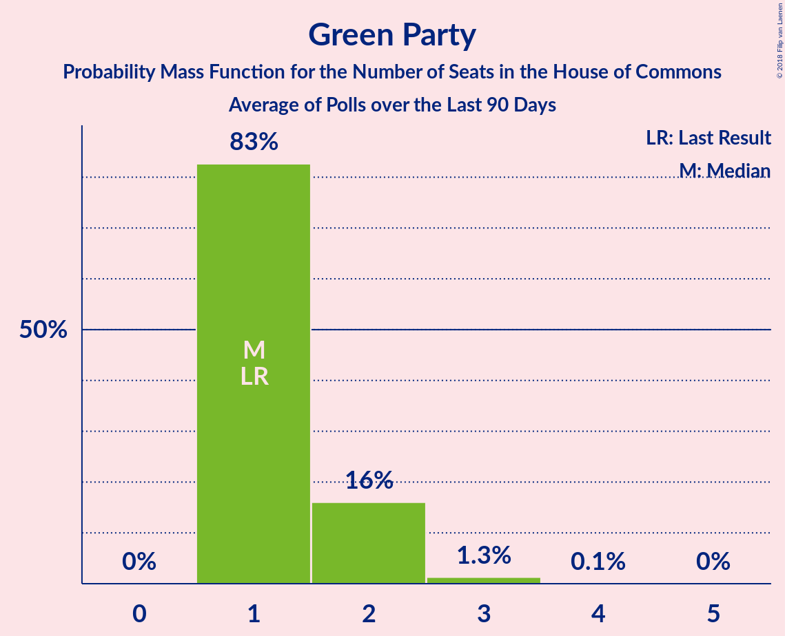

# Green Party

<a href="#voting-intentions">Voting Intentions</a> | <a href="#seats">Seats</a>

## Voting Intentions

Last result: **2.8%** (General Election of 12 December 2019)

### Confidence Intervals

| Period     | Polling firm/Commissioner(s) | Median | 80% Confidence Interval | 90% Confidence Interval | 95% Confidence Interval | 99% Confidence Interval |
|:----------:|:----------------:|:-----------:|:-----------------------:|:-----------------------:|:-----------------------:|:-----------------------:|
| N/A | [Poll Average](average.html) | 3.6% | 1.7–5.6% | 1.5–5.8% | 1.3–5.9% | 1.2–6.1% |
| [20–21 October 2022](2022-10-21-YouGov.html) | YouGov   The Times | 3.2% | N/A | N/A | N/A | N/A |
| [19–20 October 2022](2022-10-20-TechneUK.html) | Techne UK | 4.0% | N/A | N/A | N/A | N/A |
| [20 October 2022](2022-10-20-PeoplePolling.html) | PeoplePolling   GB News | 5.0% | N/A | N/A | N/A | N/A |
| [20 October 2022](2022-10-20-Omnisis.html) | Omnisis | 3.2% | N/A | N/A | N/A | N/A |
| [18–19 October 2022](2022-10-19-Survation.html) | Survation | 2.5% | 2.0–3.1% | 1.8–3.3% | 1.7–3.5% | 1.5–3.9% |
| [19 October 2022](2022-10-19-RedfieldWiltonStrategies.html) | Redfield & Wilton Strategies | 3.3% | N/A | N/A | N/A | N/A |
| [13–17 October 2022](2022-10-17-Deltapoll.html) | Deltapoll | 3.3% | 2.7–4.2% | 2.5–4.4% | 2.4–4.6% | 2.1–5.0% |
| [14–16 October 2022](2022-10-16-SavantaComRes.html) | Savanta ComRes | 1.6% | 1.3–2.0% | 1.2–2.1% | 1.1–2.2% | 1.0–2.4% |
| [16 October 2022](2022-10-16-RedfieldWiltonStrategies.html) | Redfield & Wilton Strategies | 4.0% | 3.5–4.7% | 3.4–4.9% | 3.2–5.0% | 3.0–5.3% |
| [13–14 October 2022](2022-10-14-Omnisis.html) | Omnisis | 4.0% | 3.4–4.8% | 3.2–5.0% | 3.0–5.2% | 2.8–5.6% |
| [12–13 October 2022](2022-10-13-TechneUK.html) | Techne UK | 4.8% | N/A | N/A | N/A | N/A |
| [13 October 2022](2022-10-13-RedfieldWiltonStrategies.html) | Redfield & Wilton Strategies | 2.3% | N/A | N/A | N/A | N/A |
| [11–12 October 2022](2022-10-12-YouGov.html) | YouGov   The Times | 5.6% | N/A | N/A | N/A | N/A |
| [12 October 2022](2022-10-12-PeoplePolling.html) | PeoplePolling   GB News | 4.8% | N/A | N/A | N/A | N/A |
| [5–12 October 2022](2022-10-12-IpsosMORI.html) | Ipsos MORI   Evening Standard | 6.5% | N/A | N/A | N/A | N/A |
| [7–9 October 2022](2022-10-09-SavantaComRes.html) | Savanta ComRes | 3.1% | N/A | N/A | N/A | N/A |
| [9 October 2022](2022-10-09-RedfieldWiltonStrategies.html) | Redfield & Wilton Strategies | 3.2% | N/A | N/A | N/A | N/A |
| [6–7 October 2022](2022-10-07-YouGov.html) | YouGov   The Times | 4.8% | 4.2–5.5% | 4.0–5.8% | 3.9–5.9% | 3.6–6.3% |
| [5–7 October 2022](2022-10-07-Opinium.html) | Opinium   The Observer | 4.8% | 4.2–5.5% | 4.1–5.7% | 3.9–5.9% | 3.7–6.2% |
| [6–7 October 2022](2022-10-07-Omnisis.html) | Omnisis | 4.0% | 3.4–4.8% | 3.2–5.1% | 3.1–5.3% | 2.8–5.7% |
| [6–7 October 2022](2022-10-07-Deltapoll.html) | Deltapoll | 3.3% | 2.7–4.2% | 2.5–4.4% | 2.4–4.6% | 2.1–5.1% |
| [5–6 October 2022](2022-10-06-TechneUK.html) | Techne UK | 4.8% | 4.1–5.5% | 4.0–5.7% | 3.8–5.9% | 3.6–6.3% |
| [6 October 2022](2022-10-06-PeoplePolling.html) | PeoplePolling   GB News | 5.7% | 5.0–6.6% | 4.8–6.8% | 4.6–7.0% | 4.3–7.5% |
| [5 October 2022](2022-10-05-RedfieldWiltonStrategies.html) | Redfield & Wilton Strategies | 4.0% | 3.4–4.8% | 3.3–5.0% | 3.1–5.2% | 2.9–5.6% |
| [2 October 2022](2022-10-02-SavantaComRes.html) | Savanta ComRes | 2.3% | 2.0–2.8% | 1.9–3.0% | 1.8–3.1% | 1.6–3.3% |
| [2 October 2022](2022-10-02-RedfieldWiltonStrategies.html) | Redfield & Wilton Strategies | 4.0% | 3.5–4.6% | 3.3–4.8% | 3.2–5.0% | 3.0–5.3% |
| [29–30 September 2022](2022-09-30-Opinium.html) | Opinium   The Observer | 4.8% | 4.2–5.6% | 4.0–5.9% | 3.8–6.1% | 3.6–6.5% |
| [29–30 September 2022](2022-09-30-Omnisis.html) | Omnisis | 4.1% | 3.4–4.9% | 3.2–5.1% | 3.1–5.3% | 2.8–5.7% |
| [28–29 September 2022](2022-09-29-YouGov.html) | YouGov   The Times | 4.9% | 4.3–5.7% | 4.1–5.9% | 4.0–6.1% | 3.7–6.4% |
| [28–29 September 2022](2022-09-29-TechneUK.html) | Techne UK | 4.8% | 4.2–5.6% | 4.0–5.8% | 3.9–6.0% | 3.6–6.4% |
| [29 September 2022](2022-09-29-Survation.html) | Survation | 0.8% | 0.6–1.3% | 0.5–1.5% | 0.4–1.6% | 0.3–1.9% |
| [28–29 September 2022](2022-09-29-RedfieldWiltonStrategies.html) | Redfield & Wilton Strategies | 3.2% | 2.8–3.7% | 2.7–3.9% | 2.6–4.0% | 2.4–4.3% |
| [28–29 September 2022](2022-09-29-PeoplePolling.html) | PeoplePolling   GB News | 6.5% | 5.9–7.3% | 5.7–7.5% | 5.6–7.7% | 5.3–8.0% |
| [27–29 September 2022](2022-09-29-Deltapoll.html) | Deltapoll   Daily Mirror | 3.3% | 2.7–3.9% | 2.6–4.1% | 2.5–4.3% | 2.3–4.6% |
| [27–29 September 2022](2022-09-29-BMGResearch.html) | BMG Research | 4.0% | 3.3–4.9% | 3.1–5.2% | 2.9–5.4% | 2.6–5.9% |
| [23–27 September 2022](2022-09-27-FindOutNow.html) | FindOutNow   Channel 4 | 5.7% | 5.4–6.0% | 5.3–6.1% | 5.2–6.1% | 5.1–6.3% |
| [23–26 September 2022](2022-09-26-Omnisis.html) | Omnisis | 4.0% | N/A | N/A | N/A | N/A |
| [22–26 September 2022](2022-09-26-Kantar.html) | Kantar | 3.3% | 2.7–4.1% | 2.5–4.3% | 2.4–4.5% | 2.1–5.0% |
| [23–25 September 2022](2022-09-25-YouGov.html) | YouGov   The Times | 5.7% | N/A | N/A | N/A | N/A |
| [23–25 September 2022](2022-09-25-SavantaComRes.html) | Savanta ComRes | 3.1% | 2.5–4.0% | 2.4–4.2% | 2.2–4.4% | 2.0–4.8% |
| [25 September 2022](2022-09-25-RedfieldWiltonStrategies.html) | Redfield & Wilton Strategies | 4.9% | N/A | N/A | N/A | N/A |
| [22–25 September 2022](2022-09-25-Deltapoll.html) | Deltapoll | 3.2% | N/A | N/A | N/A | N/A |
| [21–23 September 2022](2022-09-23-Opinium.html) | Opinium | 5.6% | N/A | N/A | N/A | N/A |
| [21–22 September 2022](2022-09-22-YouGov.html) | YouGov   The Times | 6.5% | N/A | N/A | N/A | N/A |
| [21–22 September 2022](2022-09-22-TechneUK.html) | Techne UK | 3.9% | N/A | N/A | N/A | N/A |
| [21 September 2022](2022-09-21-RedfieldWiltonStrategies.html) | Redfield & Wilton Strategies | 4.0% | N/A | N/A | N/A | N/A |
| [21 September 2022](2022-09-21-PeoplePolling.html) | PeoplePolling   GB News | 6.5% | N/A | N/A | N/A | N/A |
| [16–20 September 2022](2022-09-20-Deltapoll.html) | Deltapoll | 4.9% | 4.3–5.6% | 4.2–5.8% | 4.0–6.0% | 3.8–6.3% |
| [18 September 2022](2022-09-18-RedfieldWiltonStrategies.html) | Redfield & Wilton Strategies | 4.1% | 3.5–4.7% | 3.4–4.9% | 3.3–5.0% | 3.0–5.4% |
| [15–16 September 2022](2022-09-16-SavantaComRes.html) | Savanta ComRes   Labour List | 3.2% | N/A | N/A | N/A | N/A |
| [14–15 September 2022](2022-09-15-TechneUK.html) | Techne UK | 3.9% | 3.4–4.6% | 3.2–4.8% | 3.1–5.0% | 2.8–5.3% |
| [7–15 September 2022](2022-09-15-IpsosMORI.html) | Ipsos MORI | 6.3% | 5.4–7.5% | 5.2–7.8% | 5.0–8.1% | 4.6–8.6% |
| [13 September 2022](2022-09-13-PeoplePolling.html) | PeoplePolling   GB News | 4.9% | 4.2–5.9% | 4.0–6.1% | 3.9–6.3% | 3.5–6.8% |
| [11–12 September 2022](2022-09-12-YouGov.html) | YouGov   The Times | 5.7% | 5.0–6.5% | 4.8–6.7% | 4.7–6.9% | 4.4–7.3% |
| [9–12 September 2022](2022-09-12-Deltapoll.html) | Deltapoll | 3.3% | N/A | N/A | N/A | N/A |
| [11 September 2022](2022-09-11-SavantaComRes.html) | Savanta ComRes   Daily Mail | 2.3% | 2.0–2.8% | 1.9–3.0% | 1.8–3.1% | 1.6–3.3% |
| [7–8 September 2022](2022-09-08-TechneUK.html) | Techne UK | 3.2% | N/A | N/A | N/A | N/A |
| [6–7 September 2022](2022-09-07-YouGov.html) | YouGov   The Times | 5.6% | N/A | N/A | N/A | N/A |
| [7 September 2022](2022-09-07-RedfieldWiltonStrategies.html) | Redfield & Wilton Strategies | 4.8% | N/A | N/A | N/A | N/A |
| [7 September 2022](2022-09-07-PeoplePolling.html) | PeoplePolling   GB News | 5.7% | N/A | N/A | N/A | N/A |
| [4 September 2022](2022-09-04-RedfieldWiltonStrategies.html) | Redfield & Wilton Strategies | 4.8% | N/A | N/A | N/A | N/A |
| [1–2 September 2022](2022-09-02-TechneUK.html) | Techne UK | 3.9% | 3.4–4.6% | 3.2–4.8% | 3.1–5.0% | 2.8–5.3% |
| [1–2 September 2022](2022-09-02-Opinium.html) | Opinium   The Observer | 4.7% | 4.0–5.5% | 3.9–5.7% | 3.7–5.9% | 3.4–6.3% |
| [2 September 2022](2022-09-02-Deltapoll.html) | Deltapoll | 4.9% | N/A | N/A | N/A | N/A |
| [1 September 2022](2022-09-01-YouGov.html) | YouGov | 4.9% | N/A | N/A | N/A | N/A |
| [31 August 2022](2022-08-31-Survation.html) | Survation | 2.4% | 1.8–3.1% | 1.7–3.4% | 1.6–3.5% | 1.4–3.9% |
| [31 August 2022](2022-08-31-RedfieldWiltonStrategies.html) | Redfield & Wilton Strategies | 5.6% | 5.0–6.4% | 4.8–6.6% | 4.7–6.8% | 4.4–7.1% |
| [30 August 2022](2022-08-30-PeoplePolling.html) | PeoplePolling   GB News | 5.6% | 4.8–6.6% | 4.6–6.9% | 4.4–7.1% | 4.1–7.6% |
| [26–30 August 2022](2022-08-30-Deltapoll.html) | Deltapoll   The Mirror | 3.2% | 2.7–3.9% | 2.6–4.1% | 2.4–4.2% | 2.2–4.6% |
| [28 August 2022](2022-08-28-RedfieldWiltonStrategies.html) | Redfield & Wilton Strategies | 3.3% | N/A | N/A | N/A | N/A |
| [24–25 August 2022](2022-08-25-TechneUK.html) | Techne UK | 4.8% | 4.2–5.5% | 4.0–5.8% | 3.8–5.9% | 3.6–6.3% |
| [24–25 August 2022](2022-08-25-RedfieldWiltonStrategies.html) | Redfield & Wilton Strategies | 4.0% | N/A | N/A | N/A | N/A |
| [23–24 August 2022](2022-08-24-YouGov.html) | YouGov   The Times | 5.7% | 5.0–6.4% | 4.9–6.6% | 4.7–6.8% | 4.4–7.2% |
| [22 August 2022](2022-08-22-PeoplePolling.html) | PeoplePolling   GB News | 4.9% | N/A | N/A | N/A | N/A |
| [18–22 August 2022](2022-08-22-Kantar.html) | Kantar | 4.8% | 4.1–5.8% | 3.9–6.1% | 3.7–6.3% | 3.4–6.8% |
| [19–22 August 2022](2022-08-22-Deltapoll.html) | Deltapoll | 4.8% | N/A | N/A | N/A | N/A |
| [21 August 2022](2022-08-21-RedfieldWiltonStrategies.html) | Redfield & Wilton Strategies | 4.0% | N/A | N/A | N/A | N/A |
| [18–19 August 2022](2022-08-19-Opinium.html) | Opinium   The Observer | 5.7% | 5.0–6.5% | 4.8–6.7% | 4.6–7.0% | 4.3–7.4% |
| [16–18 August 2022](2022-08-18-BMGResearch.html) | BMG Research | 3.3% | 2.8–3.9% | 2.7–4.0% | 2.6–4.2% | 2.4–4.5% |
| [16–17 August 2022](2022-08-17-YouGov.html) | YouGov   The Times | 5.6% | N/A | N/A | N/A | N/A |
| [14 August 2022](2022-08-14-RedfieldWiltonStrategies.html) | Redfield & Wilton Strategies | 4.0% | N/A | N/A | N/A | N/A |
| [10–12 August 2022](2022-08-12-TechneUK.html) | Techne UK | 3.9% | N/A | N/A | N/A | N/A |
| [9–10 August 2022](2022-08-10-YouGov.html) | YouGov   The Times | 4.9% | N/A | N/A | N/A | N/A |
| [8 August 2022](2022-08-08-RedfieldWiltonStrategies.html) | Redfield & Wilton Strategies | 4.0% | N/A | N/A | N/A | N/A |
| [3–8 August 2022](2022-08-08-Opinium.html) | Opinium   The Observer | 4.7% | N/A | N/A | N/A | N/A |
| [4–5 August 2022](2022-08-05-YouGov.html) | YouGov   The Times | 6.5% | N/A | N/A | N/A | N/A |
| [3–4 August 2022](2022-08-04-TechneUK.html) | Techne UK | 4.0% | N/A | N/A | N/A | N/A |
| [4 August 2022](2022-08-04-RedfieldWiltonStrategies.html) | Redfield & Wilton Strategies | 3.2% | N/A | N/A | N/A | N/A |
| [1 August 2022](2022-08-01-Kantar.html) | Kantar | 6.5% | N/A | N/A | N/A | N/A |
| [31 July 2022](2022-07-31-RedfieldWiltonStrategies.html) | Redfield & Wilton Strategies | 5.7% | N/A | N/A | N/A | N/A |
| [27–28 July 2022](2022-07-28-YouGov.html) | YouGov   The Times | 5.7% | N/A | N/A | N/A | N/A |
| [27–28 July 2022](2022-07-28-TechneUK.html) | Techne UK | 4.8% | N/A | N/A | N/A | N/A |
| [27 July 2022](2022-07-27-RedfieldWiltonStrategies.html) | Redfield & Wilton Strategies | 4.1% | N/A | N/A | N/A | N/A |
| [21–27 July 2022](2022-07-27-IpsosMORI.html) | Ipsos MORI   Evening Standard | 6.5% | 5.6–7.6% | 5.3–7.9% | 5.1–8.2% | 4.7–8.7% |
| [22–24 July 2022](2022-07-24-SavantaComRes.html) | Savanta ComRes   The Independent | 3.3% | 2.8–3.8% | 2.7–4.0% | 2.6–4.1% | 2.4–4.4% |
| [24 July 2022](2022-07-24-RedfieldWiltonStrategies.html) | Redfield & Wilton Strategies | 4.0% | N/A | N/A | N/A | N/A |
| [21–23 July 2022](2022-07-23-Deltapoll.html) | Deltapoll   Mail on Sunday | 4.9% | N/A | N/A | N/A | N/A |
| [21–22 July 2022](2022-07-22-YouGov.html) | YouGov   The Times | 6.4% | N/A | N/A | N/A | N/A |
| [21–22 July 2022](2022-07-22-Opinium.html) | Opinium   The Observer | 5.5% | 4.9–6.2% | 4.7–6.5% | 4.6–6.6% | 4.3–7.0% |
| [21 July 2022](2022-07-21-TechneUK.html) | Techne UK | 4.8% | N/A | N/A | N/A | N/A |
| [21 July 2022](2022-07-21-SavantaComRes.html) | Savanta ComRes   Daily Express | 2.4% | N/A | N/A | N/A | N/A |
| [20–21 July 2022](2022-07-21-RedfieldWiltonStrategies.html) | Redfield & Wilton Strategies | 4.0% | 3.4–4.8% | 3.3–5.0% | 3.1–5.2% | 2.9–5.6% |
| [14–18 July 2022](2022-07-18-Kantar.html) | Kantar | 5.7% | 4.9–6.8% | 4.7–7.1% | 4.5–7.3% | 4.1–7.9% |
| [15–17 July 2022](2022-07-17-SavantaComRes.html) | Savanta ComRes | 3.2% | 2.7–3.8% | 2.6–4.0% | 2.5–4.1% | 2.3–4.4% |
| [17 July 2022](2022-07-17-RedfieldWiltonStrategies.html) | Redfield & Wilton Strategies | 4.0% | N/A | N/A | N/A | N/A |
| [13–14 July 2022](2022-07-14-YouGov.html) | YouGov   The Times | 5.7% | 5.0–6.5% | 4.8–6.7% | 4.7–6.9% | 4.4–7.3% |
| [14 July 2022](2022-07-14-TechneUK.html) | Techne UK | 4.8% | N/A | N/A | N/A | N/A |
| [12–14 July 2022](2022-07-14-JLPartners.html) | J&L Partners   The Sunday Telegraph | 4.8% | 4.4–5.3% | 4.3–5.4% | 4.2–5.5% | 4.0–5.7% |
| [8–10 July 2022](2022-07-10-SavantaComRes.html) | Savanta ComRes | 3.2% | 2.8–3.8% | 2.7–3.9% | 2.5–4.1% | 2.3–4.3% |
| [10 July 2022](2022-07-10-RedfieldWiltonStrategies.html) | Redfield & Wilton Strategies | 4.1% | 3.5–4.7% | 3.4–4.9% | 3.3–5.0% | 3.0–5.4% |
| [6–8 July 2022](2022-07-08-Opinium.html) | Opinium   The Observer | 4.8% | 4.2–5.4% | 4.0–5.6% | 3.9–5.8% | 3.6–6.1% |
| [6–7 July 2022](2022-07-07-YouGov.html) | YouGov   The Times | 4.8% | N/A | N/A | N/A | N/A |
| [7 July 2022](2022-07-07-TechneUK.html) | Techne UK | 4.8% | N/A | N/A | N/A | N/A |
| [7 July 2022](2022-07-07-RedfieldWiltonStrategies.html) | Redfield & Wilton Strategies | 5.5% | N/A | N/A | N/A | N/A |
| [6 July 2022](2022-07-06-Survation.html) | Survation | 2.3% | 1.8–3.1% | 1.7–3.3% | 1.6–3.5% | 1.4–3.9% |
| [1–3 July 2022](2022-07-03-SavantaComRes.html) | Savanta ComRes | 2.4% | N/A | N/A | N/A | N/A |
| [3 July 2022](2022-07-03-RedfieldWiltonStrategies.html) | Redfield & Wilton Strategies | 4.1% | N/A | N/A | N/A | N/A |
| [1 July 2022](2022-07-01-BMGResearch.html) | BMG Research   The Independent | 3.3% | 2.7–3.9% | 2.6–4.1% | 2.5–4.3% | 2.2–4.6% |
| [29–30 June 2022](2022-06-30-TechneUK.html) | Techne UK | 4.0% | 3.4–4.7% | 3.2–4.9% | 3.1–5.0% | 2.9–5.4% |
| [29–30 June 2022](2022-06-30-RedfieldWiltonStrategies.html) | Redfield & Wilton Strategies | 4.0% | 3.4–4.8% | 3.3–5.0% | 3.1–5.2% | 2.9–5.6% |
| [28–29 June 2022](2022-06-29-YouGov.html) | YouGov   The Times | 4.9% | 4.3–5.6% | 4.1–5.9% | 3.9–6.1% | 3.6–6.4% |
| [22–29 June 2022](2022-06-29-IpsosMORI.html) | Ipsos MORI | 4.7% | 4.0–5.7% | 3.8–6.0% | 3.6–6.2% | 3.3–6.7% |
| [27 June 2022](2022-06-27-Survation.html) | Survation | 1.6% | 1.2–2.2% | 1.1–2.4% | 1.0–2.6% | 0.8–2.9% |
| [24–26 June 2022](2022-06-26-SavantaComRes.html) | Savanta ComRes   The Independent | 4.0% | 3.5–4.6% | 3.4–4.8% | 3.2–4.9% | 3.0–5.2% |
| [26 June 2022](2022-06-26-RedfieldWiltonStrategies.html) | Redfield & Wilton Strategies | 3.2% | N/A | N/A | N/A | N/A |
| [22–24 June 2022](2022-06-24-Opinium.html) | Opinium   The Observer | 4.8% | 4.2–5.4% | 4.0–5.6% | 3.9–5.8% | 3.6–6.1% |
| [22–23 June 2022](2022-06-23-YouGov.html) | YouGov   The Times | 6.4% | N/A | N/A | N/A | N/A |
| [22–23 June 2022](2022-06-23-TechneUK.html) | Techne UK | 4.8% | N/A | N/A | N/A | N/A |
| [22 June 2022](2022-06-22-RedfieldWiltonStrategies.html) | Redfield & Wilton Strategies | 4.0% | N/A | N/A | N/A | N/A |
| [16–20 June 2022](2022-06-20-Kantar.html) | Kantar | 4.2% | 3.5–5.0% | 3.3–5.3% | 3.1–5.5% | 2.8–6.0% |
| [17–19 June 2022](2022-06-19-SavantaComRes.html) | Savanta ComRes | 4.1% | N/A | N/A | N/A | N/A |
| [19 June 2022](2022-06-19-RedfieldWiltonStrategies.html) | Redfield & Wilton Strategies | 4.1% | N/A | N/A | N/A | N/A |
| [15–16 June 2022](2022-06-16-YouGov.html) | YouGov   The Times | 5.0% | N/A | N/A | N/A | N/A |
| [15–16 June 2022](2022-06-16-TechneUK.html) | Techne UK | 4.0% | N/A | N/A | N/A | N/A |
| [15 June 2022](2022-06-15-RedfieldWiltonStrategies.html) | Redfield & Wilton Strategies | 3.2% | N/A | N/A | N/A | N/A |
| [10–12 June 2022](2022-06-12-SavantaComRes.html) | Savanta ComRes | 3.2% | N/A | N/A | N/A | N/A |
| [12 June 2022](2022-06-12-RedfieldWiltonStrategies.html) | Redfield & Wilton Strategies | 4.7% | N/A | N/A | N/A | N/A |
| [10 June 2022](2022-06-10-TechneUK.html) | Techne UK | 4.8% | N/A | N/A | N/A | N/A |
| [10 June 2022](2022-06-10-Survation.html) | Survation | 2.4% | N/A | N/A | N/A | N/A |
| [8–10 June 2022](2022-06-10-Opinium.html) | Opinium   The Observer | 4.8% | N/A | N/A | N/A | N/A |
| [8–9 June 2022](2022-06-09-YouGov.html) | YouGov   The Times | 5.7% | N/A | N/A | N/A | N/A |
| [8–9 June 2022](2022-06-09-RedfieldWiltonStrategies.html) | Redfield & Wilton Strategies | 4.0% | N/A | N/A | N/A | N/A |
| [5 June 2022](2022-06-05-RedfieldWiltonStrategies.html) | Redfield & Wilton Strategies | 5.7% | N/A | N/A | N/A | N/A |
| [1–3 June 2022](2022-06-03-YouGov.html) | YouGov   The Times | 6.6% | N/A | N/A | N/A | N/A |
| [1 June 2022](2022-06-01-TechneUK.html) | Techne UK | 4.8% | 4.2–5.5% | 4.0–5.7% | 3.8–5.9% | 3.6–6.3% |
| [1 June 2022](2022-06-01-RedfieldWiltonStrategies.html) | Redfield & Wilton Strategies | 4.9% | 4.3–5.6% | 4.2–5.8% | 4.0–6.0% | 3.8–6.3% |
| [27–29 May 2022](2022-05-29-SavantaComRes.html) | Savanta ComRes | 2.4% | 2.1–2.9% | 2.0–3.1% | 1.9–3.2% | 1.7–3.4% |
| [29 May 2022](2022-05-29-RedfieldWiltonStrategies.html) | Redfield & Wilton Strategies | 4.0% | 3.4–4.6% | 3.3–4.8% | 3.2–4.9% | 2.9–5.2% |
| [25–27 May 2022](2022-05-27-Opinium.html) | Opinium   The Observer | 6.3% | 5.6–7.2% | 5.4–7.5% | 5.2–7.7% | 4.8–8.1% |
| [25–26 May 2022](2022-05-26-TechneUK.html) | Techne UK | 4.8% | 4.2–5.5% | 4.0–5.8% | 3.8–6.0% | 3.6–6.3% |
| [24–25 May 2022](2022-05-25-YouGov.html) | YouGov   The Times | 5.7% | 5.0–6.5% | 4.8–6.7% | 4.7–6.9% | 4.4–7.3% |
| [25 May 2022](2022-05-25-RedfieldWiltonStrategies.html) | Redfield & Wilton Strategies | 4.0% | N/A | N/A | N/A | N/A |
| [19–23 May 2022](2022-05-23-Kantar.html) | Kantar | 6.5% | 5.7–7.6% | 5.4–8.0% | 5.2–8.2% | 4.8–8.8% |
| [22 May 2022](2022-05-22-RedfieldWiltonStrategies.html) | Redfield & Wilton Strategies | 4.1% | N/A | N/A | N/A | N/A |
| [18–19 May 2022](2022-05-19-YouGov.html) | YouGov   The Times | 5.7% | 5.0–6.5% | 4.8–6.7% | 4.6–6.9% | 4.3–7.3% |
| [18–19 May 2022](2022-05-19-TechneUK.html) | Techne UK | 4.8% | 4.1–5.5% | 4.0–5.7% | 3.8–5.9% | 3.6–6.3% |
| [18–19 May 2022](2022-05-19-SavantaComRes.html) | Savanta ComRes   Daily Mail | 3.2% | N/A | N/A | N/A | N/A |
| [18 May 2022](2022-05-18-RedfieldWiltonStrategies.html) | Redfield & Wilton Strategies | 3.3% | 2.7–3.9% | 2.6–4.1% | 2.5–4.3% | 2.2–4.7% |
| [11–17 May 2022](2022-05-17-IpsosMORI.html) | Ipsos MORI | 4.1% | 3.4–5.0% | 3.2–5.2% | 3.0–5.5% | 2.7–6.0% |
| [13–15 May 2022](2022-05-15-SavantaComRes.html) | Savanta ComRes | 3.2% | 2.8–3.7% | 2.6–3.9% | 2.5–4.0% | 2.3–4.3% |
| [15 May 2022](2022-05-15-RedfieldWiltonStrategies.html) | Redfield & Wilton Strategies | 4.6% | N/A | N/A | N/A | N/A |
| [11–13 May 2022](2022-05-13-Opinium.html) | Opinium   The Observer | 5.5% | 4.8–6.3% | 4.6–6.6% | 4.4–6.8% | 4.1–7.2% |
| [11–12 May 2022](2022-05-12-TechneUK.html) | Techne UK | 4.8% | N/A | N/A | N/A | N/A |
| [10–11 May 2022](2022-05-11-YouGov.html) | YouGov   The Times | 4.9% | N/A | N/A | N/A | N/A |
| [6–8 May 2022](2022-05-08-SavantaComRes.html) | Savanta ComRes | 2.4% | N/A | N/A | N/A | N/A |
| [8 May 2022](2022-05-08-RedfieldWiltonStrategies.html) | Redfield & Wilton Strategies | 5.7% | N/A | N/A | N/A | N/A |
| [5–6 May 2022](2022-05-06-YouGov.html) | YouGov   The Times | 6.5% | N/A | N/A | N/A | N/A |
| [4–5 May 2022](2022-05-05-TechneUK.html) | Techne UK | 4.0% | N/A | N/A | N/A | N/A |
| [29 April–1 May 2022](2022-05-01-SavantaComRes.html) | Savanta ComRes | 3.2% | N/A | N/A | N/A | N/A |
| [1 May 2022](2022-05-01-RedfieldWiltonStrategies.html) | Redfield & Wilton Strategies | 4.0% | N/A | N/A | N/A | N/A |
| [27–28 April 2022](2022-04-28-TechneUK.html) | Techne UK | 4.8% | 4.2–5.5% | 4.0–5.7% | 3.8–5.9% | 3.6–6.3% |
| [20–28 April 2022](2022-04-28-IpsosMORI.html) | Ipsos MORI | 5.6% | 4.8–6.7% | 4.6–7.0% | 4.3–7.3% | 4.0–7.8% |
| [26–27 April 2022](2022-04-27-YouGov.html) | YouGov   The Times | 4.9% | 4.3–5.7% | 4.1–5.9% | 4.0–6.1% | 3.7–6.4% |
| [22–26 April 2022](2022-04-26-Survation.html) | Survation | 3.2% | 2.8–3.7% | 2.7–3.9% | 2.6–4.0% | 2.4–4.3% |
| [14–26 April 2022](2022-04-26-Opinium.html) | Opinium | 6.1% | 5.7–6.6% | 5.5–6.8% | 5.4–6.9% | 5.2–7.2% |
| [22–24 April 2022](2022-04-24-SavantaComRes.html) | Savanta ComRes | 2.4% | 2.0–2.9% | 1.9–3.0% | 1.8–3.1% | 1.7–3.4% |
| [24 April 2022](2022-04-24-RedfieldWiltonStrategies.html) | Redfield & Wilton Strategies | 3.3% | 2.8–3.8% | 2.7–4.0% | 2.5–4.1% | 2.3–4.4% |
| [20–22 April 2022](2022-04-22-Opinium.html) | Opinium   The Observer | 6.4% | N/A | N/A | N/A | N/A |
| [20–21 April 2022](2022-04-21-TechneUK.html) | Techne UK | 4.0% | N/A | N/A | N/A | N/A |
| [19–20 April 2022](2022-04-20-YouGov.html) | YouGov   The Times | 6.5% | 5.8–7.2% | 5.6–7.5% | 5.5–7.7% | 5.2–8.0% |
| [17 April 2022](2022-04-17-RedfieldWiltonStrategies.html) | Redfield & Wilton Strategies | 4.0% | 3.5–4.6% | 3.3–4.8% | 3.2–5.0% | 3.0–5.3% |
| [13–14 April 2022](2022-04-14-YouGov.html) | YouGov   The Times | 5.7% | N/A | N/A | N/A | N/A |
| [13–14 April 2022](2022-04-14-Deltapoll.html) | Deltapoll   Mail on Sunday | 4.9% | 4.2–5.7% | 4.0–5.9% | 3.9–6.1% | 3.6–6.5% |
| [12–13 April 2022](2022-04-13-TechneUK.html) | Techne UK | 3.9% | 3.4–4.6% | 3.2–4.8% | 3.1–5.0% | 2.8–5.3% |
| [7–11 April 2022](2022-04-11-Kantar.html) | Kantar | 5.7% | 4.9–6.7% | 4.6–7.0% | 4.5–7.2% | 4.1–7.8% |
| [8–10 April 2022](2022-04-10-SavantaComRes.html) | Savanta ComRes | 3.3% | 2.8–3.8% | 2.7–4.0% | 2.6–4.1% | 2.4–4.4% |
| [10 April 2022](2022-04-10-RedfieldWiltonStrategies.html) | Redfield & Wilton Strategies | 4.0% | N/A | N/A | N/A | N/A |
| [6–8 April 2022](2022-04-08-Opinium.html) | Opinium   The Observer | 5.5% | 4.9–6.2% | 4.7–6.4% | 4.5–6.6% | 4.3–6.9% |
| [6–7 April 2022](2022-04-07-YouGov.html) | YouGov   The Times | 5.7% | N/A | N/A | N/A | N/A |
| [6–7 April 2022](2022-04-07-TechneUK.html) | Techne UK | 3.1% | N/A | N/A | N/A | N/A |
| [1–3 April 2022](2022-04-03-SavantaComRes.html) | Savanta ComRes | 3.1% | 2.7–3.7% | 2.6–3.8% | 2.5–4.0% | 2.3–4.2% |
| [3 April 2022](2022-04-03-RedfieldWiltonStrategies.html) | Redfield & Wilton Strategies | 3.2% | 2.8–3.8% | 2.6–4.0% | 2.5–4.1% | 2.3–4.4% |
| [1 April 2022](2022-04-01-TechneUK.html) | Techne UK | 3.9% | N/A | N/A | N/A | N/A |
| [30–31 March 2022](2022-03-31-TechneUK.html) | Techne UK | 3.9% | N/A | N/A | N/A | N/A |
| [29–30 March 2022](2022-03-30-YouGov.html) | YouGov   The Times | 4.9% | 4.3–5.6% | 4.1–5.8% | 4.0–5.9% | 3.7–6.3% |
| [28–30 March 2022](2022-03-30-Survation.html) | Survation | 2.4% | 2.0–2.9% | 1.9–3.0% | 1.8–3.1% | 1.6–3.4% |
| [25–27 March 2022](2022-03-27-SavantaComRes.html) | Savanta ComRes | 2.4% | 2.0–2.9% | 1.9–3.0% | 1.8–3.1% | 1.7–3.4% |
| [27 March 2022](2022-03-27-RedfieldWiltonStrategies.html) | Redfield & Wilton Strategies | 4.1% | 3.5–4.7% | 3.4–4.9% | 3.3–5.0% | 3.0–5.4% |
| [23–25 March 2022](2022-03-25-Opinium.html) | Opinium   The Observer | 5.5% | 4.9–6.2% | 4.7–6.4% | 4.6–6.6% | 4.3–7.0% |
| [23–24 March 2022](2022-03-24-YouGov.html) | YouGov | 5.7% | 5.0–6.5% | 4.8–6.7% | 4.7–6.9% | 4.4–7.3% |
| [23–24 March 2022](2022-03-24-TechneUK.html) | Techne UK | 3.9% | N/A | N/A | N/A | N/A |
| [22–23 March 2022](2022-03-23-YouGov.html) | YouGov | 6.5% | N/A | N/A | N/A | N/A |
| [17–21 March 2022](2022-03-21-Kantar.html) | Kantar | 4.9% | 4.1–5.9% | 3.9–6.2% | 3.7–6.4% | 3.4–6.9% |
| [20 March 2022](2022-03-20-RedfieldWiltonStrategies.html) | Redfield & Wilton Strategies | 5.6% | 5.0–6.4% | 4.8–6.6% | 4.7–6.8% | 4.4–7.1% |
| [16–17 March 2022](2022-03-17-YouGov.html) | YouGov   The Times | 5.7% | N/A | N/A | N/A | N/A |
| [16–17 March 2022](2022-03-17-TechneUK.html) | Techne UK | 4.8% | N/A | N/A | N/A | N/A |
| [9–16 March 2022](2022-03-16-IpsosMORI.html) | Ipsos MORI   Evening Standard | 5.5% | 4.6–6.5% | 4.4–6.8% | 4.2–7.1% | 3.9–7.6% |
| [11–13 March 2022](2022-03-13-SavantaComRes.html) | Savanta ComRes | 2.4% | 2.0–2.9% | 1.9–3.0% | 1.8–3.1% | 1.7–3.4% |
| [13 March 2022](2022-03-13-RedfieldWiltonStrategies.html) | Redfield & Wilton Strategies | 4.8% | N/A | N/A | N/A | N/A |
| [9–11 March 2022](2022-03-11-Opinium.html) | Opinium   The Observer | 5.6% | 5.0–6.3% | 4.8–6.5% | 4.6–6.7% | 4.4–7.0% |
| [8–11 March 2022](2022-03-11-Deltapoll.html) | Deltapoll | 4.1% | 3.6–4.7% | 3.4–4.9% | 3.3–5.1% | 3.0–5.4% |
| [9–10 March 2022](2022-03-10-TechneUK.html) | Techne UK | 4.8% | N/A | N/A | N/A | N/A |
| [8–9 March 2022](2022-03-09-YouGov.html) | YouGov   The Times | 5.7% | N/A | N/A | N/A | N/A |
| [7 March 2022](2022-03-07-RedfieldWiltonStrategies.html) | Redfield & Wilton Strategies | 4.0% | N/A | N/A | N/A | N/A |
| [4–6 March 2022](2022-03-06-SavantaComRes.html) | Savanta ComRes | 3.1% | N/A | N/A | N/A | N/A |
| [3–4 March 2022](2022-03-04-YouGov.html) | YouGov   The Times | 6.6% | N/A | N/A | N/A | N/A |
| [2–3 March 2022](2022-03-03-TechneUK.html) | Techne UK | 4.8% | 4.2–5.5% | 4.0–5.8% | 3.8–5.9% | 3.6–6.3% |
| [28 February 2022](2022-02-28-RedfieldWiltonStrategies.html) | Redfield & Wilton Strategies | 4.0% | 3.5–4.7% | 3.4–4.9% | 3.2–5.0% | 3.0–5.3% |
| [21–28 February 2022](2022-02-28-NumberCruncherPolitics.html) | Number Cruncher Politics   ITV | 4.8% | 4.2–5.4% | 4.0–5.6% | 3.9–5.8% | 3.6–6.2% |
| [25–27 February 2022](2022-02-27-SavantaComRes.html) | Savanta ComRes | 2.4% | 2.0–2.9% | 1.9–3.0% | 1.8–3.2% | 1.7–3.4% |
| [24–25 February 2022](2022-02-25-YouGov.html) | YouGov   The Times | 4.8% | 4.2–5.5% | 4.0–5.7% | 3.9–5.9% | 3.6–6.3% |
| [23–25 February 2022](2022-02-25-Opinium.html) | Opinium   The Observer | 4.8% | 4.2–5.5% | 4.1–5.7% | 3.9–5.8% | 3.7–6.2% |
| [23–24 February 2022](2022-02-24-TechneUK.html) | Techne UK | 4.8% | 4.1–5.5% | 4.0–5.7% | 3.8–5.9% | 3.6–6.3% |
| [17–21 February 2022](2022-02-21-Survation.html) | Survation | 2.4% | 2.0–2.9% | 1.9–3.0% | 1.8–3.2% | 1.6–3.4% |
| [21 February 2022](2022-02-21-RedfieldWiltonStrategies.html) | Redfield & Wilton Strategies | 5.7% | 5.0–6.4% | 4.9–6.6% | 4.7–6.8% | 4.4–7.2% |
| [17–21 February 2022](2022-02-21-Kantar.html) | Kantar | 4.8% | 4.1–5.8% | 3.9–6.1% | 3.7–6.3% | 3.4–6.8% |
| [18–20 February 2022](2022-02-20-SavantaComRes.html) | Savanta ComRes   The Independent | 4.0% | 3.5–4.6% | 3.3–4.7% | 3.2–4.9% | 3.0–5.2% |
| [16–17 February 2022](2022-02-17-YouGov.html) | YouGov   The Times | 4.9% | 4.3–5.6% | 4.1–5.9% | 3.9–6.0% | 3.7–6.4% |
| [16–17 February 2022](2022-02-17-TechneUK.html) | Techne UK | 4.7% | 4.1–5.5% | 3.9–5.7% | 3.8–5.9% | 3.5–6.3% |
| [14 February 2022](2022-02-14-RedfieldWiltonStrategies.html) | Redfield & Wilton Strategies | 4.9% | 4.3–5.6% | 4.2–5.8% | 4.0–6.0% | 3.7–6.3% |
| [11–13 February 2022](2022-02-13-SavantaComRes.html) | Savanta ComRes | 3.1% | 2.5–4.0% | 2.4–4.2% | 2.2–4.4% | 2.0–4.8% |
| [10–11 February 2022](2022-02-11-YouGov.html) | YouGov   The Times | 6.4% | N/A | N/A | N/A | N/A |
| [9–11 February 2022](2022-02-11-Opinium.html) | Opinium   The Observer | 4.8% | 4.1–5.6% | 4.0–5.8% | 3.8–6.0% | 3.5–6.4% |
| [8–9 February 2022](2022-02-09-TechneUK.html) | Techne UK | 4.6% | N/A | N/A | N/A | N/A |
| [7 February 2022](2022-02-07-RedfieldWiltonStrategies.html) | Redfield & Wilton Strategies | 4.9% | N/A | N/A | N/A | N/A |
| [4–6 February 2022](2022-02-06-SavantaComRes.html) | Savanta ComRes | 3.9% | N/A | N/A | N/A | N/A |
| [3–4 February 2022](2022-02-04-Deltapoll.html) | Deltapoll   The Sun on Sunday | 4.1% | 3.5–4.8% | 3.3–5.0% | 3.2–5.2% | 2.9–5.6% |
| [1–2 February 2022](2022-02-02-YouGov.html) | YouGov   The Times | 4.9% | N/A | N/A | N/A | N/A |
| [1–2 February 2022](2022-02-02-TechneUK.html) | Techne UK | 4.6% | N/A | N/A | N/A | N/A |
| [31 January 2022](2022-01-31-RedfieldWiltonStrategies.html) | Redfield & Wilton Strategies | 4.9% | 4.3–5.6% | 4.2–5.8% | 4.0–6.0% | 3.7–6.3% |
| [28–30 January 2022](2022-01-30-SavantaComRes.html) | Savanta ComRes | 2.3% | 2.0–2.8% | 1.9–2.9% | 1.8–3.0% | 1.6–3.3% |
| [28 January 2022](2022-01-28-TechneUK.html) | Techne UK | 4.9% | 4.2–5.6% | 4.1–5.9% | 3.9–6.0% | 3.6–6.4% |
| [27–28 January 2022](2022-01-28-Opinium.html) | Opinium   The Observer | 4.0% | 3.4–4.7% | 3.3–4.9% | 3.1–5.1% | 2.9–5.4% |
| [26–27 January 2022](2022-01-27-YouGov.html) | YouGov   The Times | 5.7% | 5.0–6.5% | 4.8–6.7% | 4.6–6.9% | 4.3–7.3% |
| [25–27 January 2022](2022-01-27-Deltapoll.html) | Deltapoll   Daily Mirror | 4.9% | 4.2–5.7% | 4.1–5.9% | 3.9–6.1% | 3.6–6.5% |
| [25 January 2022](2022-01-25-Survation.html) | Survation   Daily Mail | 2.4% | 1.9–3.1% | 1.8–3.3% | 1.6–3.5% | 1.4–3.9% |
| [19–25 January 2022](2022-01-25-IpsosMORI.html) | Ipsos MORI   Evening Standard | 7.2% | 6.2–8.3% | 6.0–8.6% | 5.7–8.9% | 5.3–9.5% |
| [24 January 2022](2022-01-24-RedfieldWiltonStrategies.html) | Redfield & Wilton Strategies | 4.0% | N/A | N/A | N/A | N/A |
| [20–24 January 2022](2022-01-24-Kantar.html) | Kantar | 5.6% | 4.8–6.7% | 4.6–7.0% | 4.4–7.2% | 4.0–7.7% |
| [21–23 January 2022](2022-01-23-SavantaComRes.html) | Savanta ComRes | 3.2% | N/A | N/A | N/A | N/A |
| [11–23 January 2022](2022-01-23-JLPartnersPolls.html) | JL Partners Polls   Sunday Times | 6.4% | 5.9–6.9% | 5.8–7.0% | 5.7–7.1% | 5.5–7.4% |
| [20–21 January 2022](2022-01-21-YouGov.html) | YouGov   The Times | 6.6% | N/A | N/A | N/A | N/A |
| [14–17 January 2022](2022-01-17-Survation.html) | Survation   38 Degrees | 2.4% | 2.0–2.9% | 1.9–3.1% | 1.8–3.2% | 1.7–3.5% |
| [17 January 2022](2022-01-17-RedfieldWiltonStrategies.html) | Redfield & Wilton Strategies | 5.7% | 5.1–6.5% | 4.9–6.7% | 4.8–6.8% | 4.5–7.2% |
| [14–16 January 2022](2022-01-16-SavantaComRes.html) | Savanta ComRes | 3.1% | 2.7–3.7% | 2.6–3.8% | 2.5–4.0% | 2.3–4.3% |
| [12–16 January 2022](2022-01-16-Deltapoll.html) | Deltapoll | 4.1% | 3.7–4.5% | 3.6–4.6% | 3.5–4.7% | 3.3–5.0% |
| [13–14 January 2022](2022-01-14-YouGov.html) | YouGov   The Times | 4.9% | 4.3–5.7% | 4.1–5.9% | 3.9–6.1% | 3.7–6.4% |
| [13–14 January 2022](2022-01-14-SavantaComRes.html) | Savanta ComRes | 3.1% | N/A | N/A | N/A | N/A |
| [12–14 January 2022](2022-01-14-Opinium.html) | Opinium   The Observer | 4.7% | 4.0–5.6% | 3.8–5.8% | 3.7–6.0% | 3.4–6.5% |
| [12–13 January 2022](2022-01-13-YouGov.html) | YouGov   The Times | 5.0% | N/A | N/A | N/A | N/A |
| [12–13 January 2022](2022-01-13-Focaldata.html) | Focaldata | 3.3% | 2.7–4.1% | 2.5–4.4% | 2.3–4.6% | 2.1–5.0% |
| [13 January 2022](2022-01-13-FindOutNow.html) | Find Out Now | 6.5% | 5.9–7.3% | 5.7–7.5% | 5.5–7.7% | 5.2–8.1% |
| [11–12 January 2022](2022-01-12-YouGov.html) | YouGov   The Times | 5.8% | N/A | N/A | N/A | N/A |
| [10 January 2022](2022-01-10-RedfieldWiltonStrategies.html) | Redfield & Wilton Strategies | 4.0% | N/A | N/A | N/A | N/A |
| [7–9 January 2022](2022-01-09-SavantaComRes.html) | Savanta ComRes | 3.2% | N/A | N/A | N/A | N/A |
| [6–7 January 2022](2022-01-07-YouGov.html) | YouGov   The Times | 4.9% | N/A | N/A | N/A | N/A |
| [5–7 January 2022](2022-01-07-Opinium.html) | Opinium   The Observer | 4.0% | N/A | N/A | N/A | N/A |
| [3 January 2022](2022-01-03-RedfieldWiltonStrategies.html) | Redfield & Wilton Strategies | 4.1% | N/A | N/A | N/A | N/A |
| [23–30 December 2021](2021-12-30-Deltapoll.html) | Deltapoll   The Mail on Sunday | 3.2% | 2.7–3.9% | 2.6–4.1% | 2.5–4.3% | 2.2–4.6% |
| [21–23 December 2021](2021-12-23-Opinium.html) | Opinium   The Observer | 4.7% | 4.0–5.5% | 3.8–5.8% | 3.6–6.0% | 3.3–6.5% |
| [20–21 December 2021](2021-12-21-Focaldata.html) | Focaldata | 3.2% | 2.6–4.0% | 2.4–4.3% | 2.3–4.5% | 2.0–4.9% |
| [19–20 December 2021](2021-12-20-YouGov.html) | YouGov   The Times | 6.5% | 5.8–7.3% | 5.6–7.6% | 5.4–7.8% | 5.1–8.2% |
| [20 December 2021](2021-12-20-RedfieldWiltonStrategies.html) | Redfield & Wilton Strategies | 4.8% | 4.3–5.5% | 4.1–5.7% | 4.0–5.9% | 3.7–6.3% |
| [17–19 December 2021](2021-12-19-SavantaComRes.html) | Savanta ComRes | 4.0% | 3.4–4.6% | 3.3–4.7% | 3.2–4.9% | 3.0–5.2% |
| [16 December 2021](2021-12-16-SavantaComRes.html) | Savanta ComRes   The Daily Express | 3.2% | N/A | N/A | N/A | N/A |
| [14–15 December 2021](2021-12-15-YouGov.html) | YouGov   The Times | 5.7% | 5.0–6.5% | 4.8–6.8% | 4.7–7.0% | 4.4–7.3% |
| [14–15 December 2021](2021-12-15-FindOutNow.html) | Find Out Now   The Telegraph | 8.4% | 7.3–9.6% | 7.0–10.0% | 6.8–10.3% | 6.3–10.9% |
| [13–14 December 2021](2021-12-14-Survation.html) | Survation   38 Degrees | 3.3% | 2.9–3.9% | 2.7–4.1% | 2.6–4.2% | 2.4–4.5% |
| [8–13 December 2021](2021-12-13-YouGov.html) | YouGov   Fabian Society | 6.7% | N/A | N/A | N/A | N/A |
| [13 December 2021](2021-12-13-RedfieldWiltonStrategies.html) | Redfield & Wilton Strategies | 5.8% | 5.2–6.6% | 5.0–6.8% | 4.8–7.0% | 4.6–7.4% |
| [9–13 December 2021](2021-12-13-Kantar.html) | Kantar | 5.7% | 4.8–6.7% | 4.6–7.0% | 4.4–7.3% | 4.1–7.8% |
| [10–11 December 2021](2021-12-11-Survation.html) | Survation   GMB | 4.1% | 3.5–5.0% | 3.3–5.2% | 3.1–5.4% | 2.8–5.9% |
| [9–10 December 2021](2021-12-10-YouGov.html) | YouGov   The Times | 5.8% | 5.1–6.6% | 4.9–6.8% | 4.7–7.0% | 4.4–7.4% |
| [9–10 December 2021](2021-12-10-SavantaComRes.html) | Savanta ComRes   Daily Mail | 3.2% | 2.7–3.7% | 2.6–3.9% | 2.5–4.0% | 2.3–4.3% |
| [8–10 December 2021](2021-12-10-Opinium.html) | Opinium   The Observer | 4.0% | 3.4–4.6% | 3.3–4.8% | 3.2–4.9% | 3.0–5.2% |
| [3–10 December 2021](2021-12-10-IpsosMORI.html) | Ipsos MORI   Evening Standard | 5.5% | 4.7–6.6% | 4.5–6.9% | 4.3–7.1% | 3.9–7.7% |
| [8–9 December 2021](2021-12-09-YouGov.html) | YouGov   The Times | 5.7% | N/A | N/A | N/A | N/A |
| [8–9 December 2021](2021-12-09-Survation.html) | Survation   The Mirror | 3.3% | 2.7–4.0% | 2.5–4.3% | 2.4–4.5% | 2.1–4.9% |
| [9 December 2021](2021-12-09-Focaldata.html) | Focaldata   Times Radio | 5.1% | 4.3–6.1% | 4.1–6.4% | 3.9–6.6% | 3.5–7.1% |
| [8 December 2021](2021-12-08-RedfieldWiltonStrategies.html) | Redfield & Wilton Strategies | 4.9% | 4.3–5.8% | 4.1–6.0% | 3.9–6.2% | 3.6–6.6% |
| [6 December 2021](2021-12-06-RedfieldWiltonStrategies.html) | Redfield & Wilton Strategies | 4.9% | N/A | N/A | N/A | N/A |
| [3–5 December 2021](2021-12-05-SavantaComRes.html) | Savanta ComRes | 3.9% | N/A | N/A | N/A | N/A |
| [2–4 December 2021](2021-12-04-Deltapoll.html) | Deltapoll | 4.0% | 3.4–4.8% | 3.3–5.0% | 3.1–5.2% | 2.9–5.5% |
| [1–2 December 2021](2021-12-02-YouGov.html) | YouGov   The Times | 7.4% | 6.6–8.4% | 6.4–8.6% | 6.2–8.8% | 5.9–9.3% |
| [1 December 2021](2021-12-01-Survation.html) | Survation | 2.4% | N/A | N/A | N/A | N/A |
| [29 November 2021](2021-11-29-RedfieldWiltonStrategies.html) | Redfield & Wilton Strategies | 4.9% | 4.3–5.6% | 4.1–5.8% | 4.0–5.9% | 3.7–6.3% |
| [26–28 November 2021](2021-11-28-SavantaComRes.html) | Savanta ComRes | 3.9% | 3.4–4.5% | 3.3–4.7% | 3.2–4.9% | 2.9–5.2% |
| [24–26 November 2021](2021-11-26-Opinium.html) | Opinium   The Observer | 4.7% | 4.1–5.4% | 4.0–5.5% | 3.8–5.7% | 3.6–6.1% |
| [24–25 November 2021](2021-11-25-YouGov.html) | YouGov   The Times | 6.6% | 5.9–7.5% | 5.7–7.7% | 5.5–7.9% | 5.2–8.4% |
| [18–22 November 2021](2021-11-22-Kantar.html) | Kantar | 4.1% | 3.4–5.0% | 3.2–5.2% | 3.1–5.5% | 2.8–5.9% |
| [19–21 November 2021](2021-11-21-SavantaComRes.html) | Savanta ComRes | 4.0% | 3.5–4.6% | 3.4–4.8% | 3.2–4.9% | 3.0–5.2% |
| [21 November 2021](2021-11-21-RedfieldWiltonStrategies.html) | Redfield & Wilton Strategies | 4.9% | 4.3–5.6% | 4.2–5.8% | 4.0–6.0% | 3.7–6.3% |
| [10–19 November 2021](2021-11-19-Panelbase.html) | Panelbase | 4.7% | 4.3–5.2% | 4.2–5.3% | 4.1–5.5% | 3.9–5.7% |
| [17–18 November 2021](2021-11-18-YouGov.html) | YouGov   The Times | 8.2% | N/A | N/A | N/A | N/A |
| [11–15 November 2021](2021-11-15-Survation.html) | Survation   38 Degrees | 3.2% | 2.8–3.6% | 2.7–3.8% | 2.6–3.9% | 2.4–4.1% |
| [15 November 2021](2021-11-15-RedfieldWiltonStrategies.html) | Redfield & Wilton Strategies | 4.1% | N/A | N/A | N/A | N/A |
| [11–12 November 2021](2021-11-12-SavantaComRes.html) | Savanta ComRes   Daily Mail | 4.0% | N/A | N/A | N/A | N/A |
| [10–12 November 2021](2021-11-12-Opinium.html) | Opinium   The Observer | 5.5% | 4.8–6.5% | 4.5–6.8% | 4.3–7.0% | 4.0–7.5% |
| [10–11 November 2021](2021-11-11-YouGov.html) | YouGov   The Times | 8.1% | N/A | N/A | N/A | N/A |
| [10 November 2021](2021-11-10-RedfieldWiltonStrategies.html) | Redfield & Wilton Strategies | 5.0% | N/A | N/A | N/A | N/A |
| [8 November 2021](2021-11-08-RedfieldWiltonStrategies.html) | Redfield & Wilton Strategies | 4.9% | N/A | N/A | N/A | N/A |
| [5–7 November 2021](2021-11-07-SavantaComRes.html) | Savanta ComRes | 3.2% | N/A | N/A | N/A | N/A |
| [5–6 November 2021](2021-11-06-Opinium.html) | Opinium   The Observer | 4.8% | N/A | N/A | N/A | N/A |
| [3–5 November 2021](2021-11-05-Deltapoll.html) | Deltapoll | 5.0% | 4.3–5.8% | 4.1–6.0% | 4.0–6.2% | 3.7–6.6% |
| [3–4 November 2021](2021-11-04-YouGov.html) | YouGov   The Times | 7.4% | N/A | N/A | N/A | N/A |
| [4 November 2021](2021-11-04-IpsosMORI.html) | Ipsos MORI   Evening Standard | 8.9% | 7.8–10.2% | 7.5–10.5% | 7.3–10.9% | 6.8–11.5% |
| [1 November 2021](2021-11-01-RedfieldWiltonStrategies.html) | Redfield & Wilton Strategies | 4.8% | N/A | N/A | N/A | N/A |
| [29–31 October 2021](2021-10-31-SavantaComRes.html) | Savanta ComRes | 3.2% | N/A | N/A | N/A | N/A |
| [27–29 October 2021](2021-10-29-Opinium.html) | Opinium   The Observer | 5.5% | N/A | N/A | N/A | N/A |
| [27–28 October 2021](2021-10-28-YouGov.html) | YouGov   The Times | 8.1% | N/A | N/A | N/A | N/A |
| [25 October 2021](2021-10-25-RedfieldWiltonStrategies.html) | Redfield & Wilton Strategies | 4.9% | N/A | N/A | N/A | N/A |
| [22–24 October 2021](2021-10-24-SavantaComRes.html) | Savanta ComRes | 5.6% | N/A | N/A | N/A | N/A |
| [20–21 October 2021](2021-10-21-YouGov.html) | YouGov   The Times | 8.1% | N/A | N/A | N/A | N/A |
| [18 October 2021](2021-10-18-RedfieldWiltonStrategies.html) | Redfield & Wilton Strategies | 4.0% | N/A | N/A | N/A | N/A |
| [11–18 October 2021](2021-10-18-NumberCruncherPolitics.html) | Number Cruncher Politics | 7.4% | 6.4–8.6% | 6.1–8.9% | 5.9–9.2% | 5.4–9.8% |
| [14–18 October 2021](2021-10-18-Kantar.html) | Kantar | 6.6% | N/A | N/A | N/A | N/A |
| [15–17 October 2021](2021-10-17-SavantaComRes.html) | Savanta ComRes | 4.0% | N/A | N/A | N/A | N/A |
| [13–15 October 2021](2021-10-15-Opinium.html) | Opinium   The Observer | 3.9% | N/A | N/A | N/A | N/A |
| [13–15 October 2021](2021-10-15-Deltapoll.html) | Deltapoll   The Mail on Sunday | 4.9% | N/A | N/A | N/A | N/A |
| [12–13 October 2021](2021-10-13-YouGov.html) | YouGov | 6.5% | N/A | N/A | N/A | N/A |
| [11 October 2021](2021-10-11-RedfieldWiltonStrategies.html) | Redfield & Wilton Strategies | 4.9% | N/A | N/A | N/A | N/A |
| [8–10 October 2021](2021-10-10-SavantaComRes.html) | Savanta ComRes | 3.9% | N/A | N/A | N/A | N/A |
| [6–7 October 2021](2021-10-07-Survation.html) | Survation   Sunday Mirror | 4.1% | N/A | N/A | N/A | N/A |
| [5–6 October 2021](2021-10-06-YouGov.html) | YouGov   The Times | 7.3% | N/A | N/A | N/A | N/A |
| [4 October 2021](2021-10-04-RedfieldWiltonStrategies.html) | Redfield & Wilton Strategies | 3.2% | N/A | N/A | N/A | N/A |
| [1–3 October 2021](2021-10-03-SavantaComRes.html) | Savanta ComRes | 3.1% | N/A | N/A | N/A | N/A |
| [1 October 2021](2021-10-01-Opinium.html) | Opinium   The Observer | 4.8% | N/A | N/A | N/A | N/A |
| [28–29 September 2021](2021-09-29-YouGov.html) | YouGov   The Times | 7.5% | N/A | N/A | N/A | N/A |
| [29 September 2021](2021-09-29-Survation.html) | Survation | 3.9% | N/A | N/A | N/A | N/A |
| [27 September 2021](2021-09-27-RedfieldWiltonStrategies.html) | Redfield & Wilton Strategies | 4.0% | N/A | N/A | N/A | N/A |
| [23–27 September 2021](2021-09-27-Kantar.html) | Kantar | 4.9% | N/A | N/A | N/A | N/A |
| [22–23 September 2021](2021-09-23-YouGov.html) | YouGov   The Times | 7.3% | N/A | N/A | N/A | N/A |
| [17–23 September 2021](2021-09-23-IpsosMORI.html) | Ipsos MORI   Evening Standard | 4.8% | N/A | N/A | N/A | N/A |
| [21–22 September 2021](2021-09-22-Survation.html) | Survation | 3.1% | N/A | N/A | N/A | N/A |
| [20 September 2021](2021-09-20-RedfieldWiltonStrategies.html) | Redfield & Wilton Strategies | 5.7% | N/A | N/A | N/A | N/A |
| [17–19 September 2021](2021-09-19-SavantaComRes.html) | Savanta ComRes | 4.0% | N/A | N/A | N/A | N/A |
| [16–17 September 2021](2021-09-17-Opinium.html) | Opinium   The Observer | 4.8% | N/A | N/A | N/A | N/A |
| [15–16 September 2021](2021-09-16-YouGov.html) | YouGov   The Times | 5.8% | N/A | N/A | N/A | N/A |
| [9–16 September 2021](2021-09-16-Panelbase.html) | Panelbase | 3.9% | N/A | N/A | N/A | N/A |
| [10–14 September 2021](2021-09-14-Survation.html) | Survation | 4.0% | N/A | N/A | N/A | N/A |
| [13 September 2021](2021-09-13-RedfieldWiltonStrategies.html) | Redfield & Wilton Strategies | 4.8% | N/A | N/A | N/A | N/A |
| [10–12 September 2021](2021-09-12-SavantaComRes.html) | Savanta ComRes | 4.6% | N/A | N/A | N/A | N/A |
| [9–11 September 2021](2021-09-11-Opinium.html) | Opinium   The Observer | 4.7% | N/A | N/A | N/A | N/A |
| [8–9 September 2021](2021-09-09-YouGov.html) | YouGov   The Times | 7.4% | N/A | N/A | N/A | N/A |
| [6 September 2021](2021-09-06-RedfieldWiltonStrategies.html) | Redfield & Wilton Strategies | 4.8% | N/A | N/A | N/A | N/A |
| [3–5 September 2021](2021-09-05-SavantaComRes.html) | Savanta ComRes | 3.1% | N/A | N/A | N/A | N/A |
| [2–3 September 2021](2021-09-03-YouGov.html) | YouGov   The Times | 8.0% | N/A | N/A | N/A | N/A |
| [2–3 September 2021](2021-09-03-Opinium.html) | Opinium   The Observer | 4.8% | N/A | N/A | N/A | N/A |
| [2–3 September 2021](2021-09-03-Deltapoll.html) | Deltapoll   The Sun on Sunday | 5.8% | N/A | N/A | N/A | N/A |
| [27–29 August 2021](2021-08-29-SavantaComRes.html) | Savanta ComRes | 4.0% | N/A | N/A | N/A | N/A |
| [29 August 2021](2021-08-29-RedfieldWiltonStrategies.html) | Redfield & Wilton Strategies | 4.1% | N/A | N/A | N/A | N/A |
| [25–26 August 2021](2021-08-26-YouGov.html) | YouGov   The Times | 7.4% | N/A | N/A | N/A | N/A |
| [23 August 2021](2021-08-23-RedfieldWiltonStrategies.html) | Redfield & Wilton Strategies | 4.9% | N/A | N/A | N/A | N/A |
| [19–23 August 2021](2021-08-23-Kantar.html) | Kantar | 4.1% | N/A | N/A | N/A | N/A |
| [20–22 August 2021](2021-08-22-SavantaComRes.html) | Savanta ComRes | 3.2% | N/A | N/A | N/A | N/A |
| [19–20 August 2021](2021-08-20-Opinium.html) | Opinium   The Observer | 4.8% | N/A | N/A | N/A | N/A |
| [17–18 August 2021](2021-08-18-YouGov.html) | YouGov   The Times | 6.4% | N/A | N/A | N/A | N/A |
| [16 August 2021](2021-08-16-RedfieldWiltonStrategies.html) | Redfield & Wilton Strategies | 4.0% | N/A | N/A | N/A | N/A |
| [13–15 August 2021](2021-08-15-SavantaComRes.html) | Savanta ComRes | 3.2% | N/A | N/A | N/A | N/A |
| [11–12 August 2021](2021-08-12-YouGov.html) | YouGov   The Times | 5.7% | 5.1–6.4% | 4.9–6.6% | 4.8–6.8% | 4.5–7.1% |
| [9 August 2021](2021-08-09-RedfieldWiltonStrategies.html) | Redfield & Wilton Strategies | 4.8% | 4.2–5.5% | 4.1–5.7% | 3.9–5.8% | 3.7–6.2% |
| [9 August 2021](2021-08-09-IpsosMORI.html) | Ipsos MORI   Evening Standard | 6.3% | 5.5–7.4% | 5.2–7.7% | 5.0–8.0% | 4.6–8.5% |
| [6–8 August 2021](2021-08-08-SavantaComRes.html) | Savanta ComRes | 3.2% | N/A | N/A | N/A | N/A |
| [5–6 August 2021](2021-08-06-YouGov.html) | YouGov   The Times | 5.7% | N/A | N/A | N/A | N/A |
| [5–6 August 2021](2021-08-06-Opinium.html) | Opinium   The Observer | 3.9% | 3.4–4.6% | 3.3–4.7% | 3.2–4.9% | 2.9–5.2% |
| [2 August 2021](2021-08-02-RedfieldWiltonStrategies.html) | Redfield & Wilton Strategies | 4.8% | 4.2–5.5% | 4.1–5.7% | 3.9–5.8% | 3.7–6.2% |
| [1 August 2021](2021-08-01-SavantaComRes.html) | Savanta ComRes | 4.8% | N/A | N/A | N/A | N/A |
| [28–29 July 2021](2021-07-29-YouGov.html) | YouGov   The Times | 7.3% | 6.5–8.2% | 6.3–8.5% | 6.1–8.7% | 5.7–9.1% |
| [23–26 July 2021](2021-07-26-Deltapoll.html) | Deltapoll | 4.9% | 4.3–5.7% | 4.1–5.9% | 3.9–6.1% | 3.6–6.5% |
| [23–25 July 2021](2021-07-25-SavantaComRes.html) | Savanta ComRes | 3.2% | 2.7–3.7% | 2.6–3.9% | 2.5–4.0% | 2.3–4.3% |
| [25 July 2021](2021-07-25-RedfieldWiltonStrategies.html) | Redfield & Wilton Strategies | 4.8% | 4.2–5.5% | 4.1–5.7% | 3.9–5.9% | 3.7–6.2% |
| [23 July 2021](2021-07-23-Survation.html) | Survation | 4.0% | 3.3–4.9% | 3.1–5.2% | 2.9–5.4% | 2.6–5.9% |
| [22–23 July 2021](2021-07-23-Opinium.html) | Opinium   The Observer | 3.9% | 3.4–4.6% | 3.3–4.7% | 3.2–4.9% | 2.9–5.2% |
| [20–21 July 2021](2021-07-21-YouGov.html) | YouGov   The Times | 6.5% | 5.7–7.3% | 5.5–7.6% | 5.3–7.8% | 5.0–8.2% |
| [19–20 July 2021](2021-07-20-Survation.html) | Survation | 4.0% | 3.3–4.9% | 3.1–5.2% | 3.0–5.4% | 2.7–5.9% |
| [19 July 2021](2021-07-19-RedfieldWiltonStrategies.html) | Redfield & Wilton Strategies | 4.1% | 3.5–4.7% | 3.4–4.9% | 3.3–5.0% | 3.0–5.4% |
| [16–18 July 2021](2021-07-18-SavantaComRes.html) | Savanta ComRes | 4.0% | N/A | N/A | N/A | N/A |
| [15–16 July 2021](2021-07-16-YouGov.html) | YouGov   The Times | 4.9% | 4.3–5.7% | 4.1–5.9% | 4.0–6.1% | 3.7–6.4% |
| [5–13 July 2021](2021-07-13-Survation.html) | Survation | 4.7% | 4.2–5.4% | 4.0–5.6% | 3.9–5.7% | 3.6–6.1% |
| [12 July 2021](2021-07-12-RedfieldWiltonStrategies.html) | Redfield & Wilton Strategies | 4.8% | 4.3–5.5% | 4.1–5.7% | 4.0–5.9% | 3.7–6.2% |
| [7–12 July 2021](2021-07-12-Kantar.html) | Kantar | 3.2% | 2.6–4.0% | 2.4–4.3% | 2.3–4.5% | 2.0–4.9% |
| [9–11 July 2021](2021-07-11-SavantaComRes.html) | Savanta ComRes | 4.7% | 4.1–5.3% | 4.0–5.5% | 3.9–5.7% | 3.6–6.0% |
| [8–9 July 2021](2021-07-09-Opinium.html) | Opinium   The Observer | 4.8% | 4.2–5.4% | 4.0–5.6% | 3.9–5.8% | 3.6–6.1% |
| [7–8 July 2021](2021-07-08-YouGov.html) | YouGov   The Times | 5.7% | 5.1–6.4% | 4.9–6.6% | 4.8–6.8% | 4.5–7.2% |
| [2–8 July 2021](2021-07-08-IpsosMORI.html) | Ipsos MORI   Evening Standard | 4.8% | 4.0–5.7% | 3.8–6.0% | 3.6–6.3% | 3.3–6.8% |
| [5 July 2021](2021-07-05-RedfieldWiltonStrategies.html) | Redfield & Wilton Strategies | 4.8% | 4.2–5.5% | 4.1–5.7% | 3.9–5.9% | 3.7–6.2% |
| [2–4 July 2021](2021-07-04-SavantaComRes.html) | Savanta ComRes | 3.2% | 2.8–3.8% | 2.6–3.9% | 2.5–4.1% | 2.3–4.3% |
| [2 July 2021](2021-07-02-Panelbase.html) | Panelbase   Sunday Times | 3.9% | N/A | N/A | N/A | N/A |
| [29–30 June 2021](2021-06-30-YouGov.html) | YouGov   The Times | 4.9% | 4.3–5.6% | 4.1–5.8% | 3.9–6.0% | 3.7–6.4% |
| [28 June 2021](2021-06-28-RedfieldWiltonStrategies.html) | Redfield & Wilton Strategies | 4.1% | 3.5–4.7% | 3.4–4.9% | 3.3–5.0% | 3.0–5.4% |
| [25–27 June 2021](2021-06-27-SavantaComRes.html) | Savanta ComRes | 4.0% | 3.4–4.6% | 3.3–4.7% | 3.2–4.9% | 3.0–5.2% |
| [25–26 June 2021](2021-06-26-Survation.html) | Survation | 3.9% | 3.2–4.9% | 3.0–5.1% | 2.9–5.3% | 2.6–5.8% |
| [23–25 June 2021](2021-06-25-Opinium.html) | Opinium   The Observer | 3.9% | 3.4–4.6% | 3.3–4.7% | 3.2–4.9% | 2.9–5.2% |
| [23–24 June 2021](2021-06-24-YouGov.html) | YouGov   The Times | 5.7% | 5.0–6.5% | 4.8–6.7% | 4.7–6.9% | 4.4–7.3% |
| [21 June 2021](2021-06-21-RedfieldWiltonStrategies.html) | Redfield & Wilton Strategies | 3.2% | N/A | N/A | N/A | N/A |
| [18–20 June 2021](2021-06-20-SavantaComRes.html) | Savanta ComRes | 4.0% | 3.5–4.6% | 3.4–4.8% | 3.3–5.0% | 3.0–5.3% |
| [17–20 June 2021](2021-06-20-Deltapoll.html) | Deltapoll | 4.1% | 3.6–4.7% | 3.5–4.9% | 3.4–5.0% | 3.2–5.3% |
| [16–17 June 2021](2021-06-17-YouGov.html) | YouGov   The Times | 5.6% | N/A | N/A | N/A | N/A |
| [11–15 June 2021](2021-06-15-Survation.html) | Survation | 5.6% | 5.0–6.3% | 4.8–6.6% | 4.7–6.7% | 4.4–7.1% |
| [7–14 June 2021](2021-06-14-NumberCruncherPolitics.html) | Number Cruncher Politics | 5.6% | 4.9–6.4% | 4.7–6.7% | 4.5–6.9% | 4.2–7.3% |
| [11–13 June 2021](2021-06-13-SavantaComRes.html) | Savanta ComRes | 4.8% | N/A | N/A | N/A | N/A |
| [13 June 2021](2021-06-13-RedfieldWiltonStrategies.html) | Redfield & Wilton Strategies | 4.0% | N/A | N/A | N/A | N/A |
| [10–12 June 2021](2021-06-12-Deltapoll.html) | Deltapoll   Mail on Sunday | 4.1% | N/A | N/A | N/A | N/A |
| [10–11 June 2021](2021-06-11-Opinium.html) | Opinium   The Observer | 5.5% | N/A | N/A | N/A | N/A |
| [9–10 June 2021](2021-06-10-YouGov.html) | YouGov   The Times | 7.2% | N/A | N/A | N/A | N/A |
| [9–10 June 2021](2021-06-10-Survation.html) | Survation | 4.0% | N/A | N/A | N/A | N/A |
| [7 June 2021](2021-06-07-RedfieldWiltonStrategies.html) | Redfield & Wilton Strategies | 4.0% | N/A | N/A | N/A | N/A |
| [3–7 June 2021](2021-06-07-Kantar.html) | Kantar | 4.8% | 4.1–5.7% | 3.8–6.0% | 3.7–6.2% | 3.3–6.7% |
| [4–6 June 2021](2021-06-06-SavantaComRes.html) | Savanta ComRes | 4.0% | N/A | N/A | N/A | N/A |
| [2–3 June 2021](2021-06-03-YouGov.html) | YouGov   The Times | 7.3% | N/A | N/A | N/A | N/A |
| [3 June 2021](2021-06-03-IpsosMORI.html) | Ipsos MORI   Evening Standard | 5.7% | 4.8–6.8% | 4.6–7.1% | 4.4–7.3% | 4.0–7.9% |
| [1–2 June 2021](2021-06-02-Survation.html) | Survation | 4.8% | N/A | N/A | N/A | N/A |
| [31 May 2021](2021-05-31-RedfieldWiltonStrategies.html) | Redfield & Wilton Strategies | 4.0% | N/A | N/A | N/A | N/A |
| [28–30 May 2021](2021-05-30-SavantaComRes.html) | Savanta ComRes | 4.0% | N/A | N/A | N/A | N/A |
| [27–28 May 2021](2021-05-28-YouGov.html) | YouGov   The Times | 6.6% | N/A | N/A | N/A | N/A |
| [27–28 May 2021](2021-05-28-Survation.html) | Survation   Daily Mail | 3.9% | N/A | N/A | N/A | N/A |
| [27–28 May 2021](2021-05-28-Opinium.html) | Opinium   The Observer | 4.0% | N/A | N/A | N/A | N/A |
| [27–28 May 2021](2021-05-28-NumberCruncherPolitics.html) | Number Cruncher Politics | 6.5% | N/A | N/A | N/A | N/A |
| [25–26 May 2021](2021-05-26-Survation.html) | Survation | 4.8% | N/A | N/A | N/A | N/A |
| [24 May 2021](2021-05-24-RedfieldWiltonStrategies.html) | Redfield & Wilton Strategies | 4.0% | N/A | N/A | N/A | N/A |
| [21–23 May 2021](2021-05-23-SavantaComRes.html) | Savanta ComRes | 3.1% | N/A | N/A | N/A | N/A |
| [19–20 May 2021](2021-05-20-YouGov.html) | YouGov   The Times | 6.5% | N/A | N/A | N/A | N/A |
| [17 May 2021](2021-05-17-RedfieldWiltonStrategies.html) | Redfield & Wilton Strategies | 4.8% | 4.2–5.5% | 4.1–5.7% | 3.9–5.9% | 3.7–6.2% |
| [14–16 May 2021](2021-05-16-SavantaComRes.html) | Savanta ComRes | 4.0% | 3.5–4.6% | 3.4–4.8% | 3.3–5.0% | 3.0–5.3% |
| [13–14 May 2021](2021-05-14-Opinium.html) | Opinium   The Observer | 5.6% | 5.0–6.4% | 4.8–6.6% | 4.7–6.8% | 4.4–7.1% |
| [11–12 May 2021](2021-05-12-YouGov.html) | YouGov | 6.4% | 5.7–7.3% | 5.5–7.5% | 5.3–7.8% | 5.0–8.2% |
| [10 May 2021](2021-05-10-RedfieldWiltonStrategies.html) | Redfield & Wilton Strategies | 4.0% | 3.5–4.6% | 3.3–4.8% | 3.2–5.0% | 3.0–5.3% |
| [7–9 May 2021](2021-05-09-SavantaComRes.html) | Savanta ComRes | 3.1% | N/A | N/A | N/A | N/A |
| [4–5 May 2021](2021-05-05-YouGov.html) | YouGov   The Times | 4.8% | N/A | N/A | N/A | N/A |
| [4–5 May 2021](2021-05-05-Panelbase.html) | Panelbase | 3.9% | 3.2–4.8% | 3.0–5.1% | 2.9–5.3% | 2.6–5.8% |
| [3 May 2021](2021-05-03-RedfieldWiltonStrategies.html) | Redfield & Wilton Strategies | 4.1% | N/A | N/A | N/A | N/A |
| [2 May 2021](2021-05-02-SavantaComRes.html) | Savanta ComRes | 3.2% | 2.7–3.7% | 2.6–3.9% | 2.5–4.1% | 2.3–4.3% |
| [28–30 April 2021](2021-04-30-Opinium.html) | Opinium   The Observer | 3.2% | 2.8–3.8% | 2.7–4.0% | 2.5–4.1% | 2.3–4.4% |
| [29–30 April 2021](2021-04-30-Focaldata.html) | Focaldata   The Sunday Times | 3.2% | 2.7–3.9% | 2.6–4.1% | 2.5–4.3% | 2.2–4.6% |
| [27–29 April 2021](2021-04-29-Survation.html) | Survation   Daily Mail | 4.7% | 4.0–5.7% | 3.7–5.9% | 3.6–6.2% | 3.3–6.6% |
| [28–29 April 2021](2021-04-29-NumberCruncherPolitics.html) | Number Cruncher Politics | 5.7% | 4.9–6.8% | 4.6–7.1% | 4.5–7.4% | 4.1–7.9% |
| [27–28 April 2021](2021-04-28-YouGov.html) | YouGov   The Times | 5.7% | N/A | N/A | N/A | N/A |
| [26 April 2021](2021-04-26-RedfieldWiltonStrategies.html) | Redfield & Wilton Strategies | 3.2% | N/A | N/A | N/A | N/A |
| [22–26 April 2021](2021-04-26-Kantar.html) | Kantar | 5.6% | 4.8–6.6% | 4.6–6.9% | 4.4–7.2% | 4.0–7.7% |
| [22–26 April 2021](2021-04-26-BMGResearch.html) | BMG Research   The Independent | 4.9% | 4.2–5.7% | 4.0–5.9% | 3.9–6.1% | 3.6–6.5% |
| [23–25 April 2021](2021-04-25-SavantaComRes.html) | Savanta ComRes | 2.4% | N/A | N/A | N/A | N/A |
| [21–23 April 2021](2021-04-23-Opinium.html) | Opinium   The Observer | 4.0% | N/A | N/A | N/A | N/A |
| [21–22 April 2021](2021-04-22-YouGov.html) | YouGov   The Times | 5.6% | N/A | N/A | N/A | N/A |
| [16–22 April 2021](2021-04-22-IpsosMORI.html) | Ipsos MORI   Evening Standard | 4.0% | 3.3–4.9% | 3.1–5.1% | 3.0–5.3% | 2.7–5.8% |
| [15–19 April 2021](2021-04-19-Survation.html) | Survation | 5.5% | N/A | N/A | N/A | N/A |
| [19 April 2021](2021-04-19-RedfieldWiltonStrategies.html) | Redfield & Wilton Strategies | 3.1% | N/A | N/A | N/A | N/A |
| [16–18 April 2021](2021-04-18-SavantaComRes.html) | Savanta ComRes | 3.2% | N/A | N/A | N/A | N/A |
| [13–14 April 2021](2021-04-14-YouGov.html) | YouGov | 6.5% | N/A | N/A | N/A | N/A |
| [12 April 2021](2021-04-12-RedfieldWiltonStrategies.html) | Redfield & Wilton Strategies | 4.0% | N/A | N/A | N/A | N/A |
| [9–11 April 2021](2021-04-11-SavantaComRes.html) | Savanta ComRes | 3.2% | N/A | N/A | N/A | N/A |
| [8–10 April 2021](2021-04-10-Survation.html) | Survation | 3.2% | N/A | N/A | N/A | N/A |
| [8–10 April 2021](2021-04-10-Deltapoll.html) | Deltapoll   The Mail on Sunday | 3.3% | N/A | N/A | N/A | N/A |
| [8–9 April 2021](2021-04-09-Opinium.html) | Opinium   The Observer | 3.2% | N/A | N/A | N/A | N/A |
| [7–8 April 2021](2021-04-08-YouGov.html) | YouGov   The Times | 4.9% | N/A | N/A | N/A | N/A |
| [5 April 2021](2021-04-05-RedfieldWiltonStrategies.html) | Redfield & Wilton Strategies | 4.0% | N/A | N/A | N/A | N/A |
| [2–4 April 2021](2021-04-04-SavantaComRes.html) | Savanta ComRes | 2.4% | N/A | N/A | N/A | N/A |
| [1 April 2021](2021-04-01-YouGov.html) | YouGov   The Times | 4.8% | N/A | N/A | N/A | N/A |
| [29 March 2021](2021-03-29-RedfieldWiltonStrategies.html) | Redfield & Wilton Strategies | 3.2% | N/A | N/A | N/A | N/A |
| [25–29 March 2021](2021-03-29-Kantar.html) | Kantar | 3.2% | N/A | N/A | N/A | N/A |
| [25–27 March 2021](2021-03-27-Deltapoll.html) | Deltapoll   Mail on Sunday | 3.3% | N/A | N/A | N/A | N/A |
| [25–26 March 2021](2021-03-26-YouGov.html) | YouGov   The Times | 5.7% | N/A | N/A | N/A | N/A |
| [25–26 March 2021](2021-03-26-Opinium.html) | Opinium   The Observer | 4.0% | N/A | N/A | N/A | N/A |
| [22 March 2021](2021-03-22-RedfieldWiltonStrategies.html) | Redfield & Wilton Strategies | 4.8% | N/A | N/A | N/A | N/A |
| [19–21 March 2021](2021-03-21-SavantaComRes.html) | Savanta ComRes | 2.4% | N/A | N/A | N/A | N/A |
| [18–19 March 2021](2021-03-19-YouGov.html) | YouGov   The Times | 5.6% | N/A | N/A | N/A | N/A |
| [16–19 March 2021](2021-03-19-BMGResearch.html) | BMG Research   The Independent | 4.8% | N/A | N/A | N/A | N/A |
| [12–16 March 2021](2021-03-16-NumberCruncherPolitics.html) | Number Cruncher Politics | 4.0% | N/A | N/A | N/A | N/A |
| [15 March 2021](2021-03-15-RedfieldWiltonStrategies.html) | Redfield & Wilton Strategies | 4.1% | 3.5–4.7% | 3.4–4.9% | 3.3–5.0% | 3.0–5.4% |
| [14 March 2021](2021-03-14-SavantaComRes.html) | Savanta ComRes | 3.2% | 2.7–3.7% | 2.6–3.9% | 2.5–4.1% | 2.3–4.3% |
| [11–12 March 2021](2021-03-12-Opinium.html) | Opinium   The Observer | 3.2% | 2.7–3.8% | 2.6–3.9% | 2.5–4.1% | 2.3–4.4% |
| [5–12 March 2021](2021-03-12-IpsosMORI.html) | Ipsos MORI   Evening Standard | 3.9% | 3.2–4.8% | 3.0–5.1% | 2.9–5.3% | 2.6–5.8% |
| [9–10 March 2021](2021-03-10-YouGov.html) | YouGov   The Times | 5.0% | 4.3–5.7% | 4.2–6.0% | 4.0–6.1% | 3.7–6.5% |
| [9–10 March 2021](2021-03-10-Survation.html) | Survation   Sunday Mirror | 3.9% | 3.2–4.8% | 3.0–5.1% | 2.9–5.3% | 2.6–5.8% |
| [8 March 2021](2021-03-08-RedfieldWiltonStrategies.html) | Redfield & Wilton Strategies | 3.2% | 2.8–3.8% | 2.6–4.0% | 2.5–4.1% | 2.3–4.4% |
| [5–7 March 2021](2021-03-07-SavantaComRes.html) | Savanta ComRes | 3.1% | 2.7–3.7% | 2.6–3.8% | 2.5–4.0% | 2.3–4.3% |
| [3–4 March 2021](2021-03-04-YouGov.html) | YouGov   The Times | 5.7% | 5.0–6.5% | 4.8–6.7% | 4.6–6.9% | 4.3–7.3% |
| [1 March 2021](2021-03-01-RedfieldWiltonStrategies.html) | Redfield & Wilton Strategies | 2.4% | 1.9–3.0% | 1.8–3.1% | 1.7–3.3% | 1.5–3.6% |
| [26–28 February 2021](2021-02-28-SavantaComRes.html) | Savanta ComRes | 2.4% | 2.0–2.9% | 1.9–3.0% | 1.8–3.1% | 1.7–3.4% |
| [25–26 February 2021](2021-02-26-YouGov.html) | YouGov   The Times | 5.7% | N/A | N/A | N/A | N/A |
| [24–26 February 2021](2021-02-26-Opinium.html) | Opinium   The Observer | 3.2% | N/A | N/A | N/A | N/A |
| [24–26 February 2021](2021-02-26-Deltapoll.html) | Deltapoll   Mail on Sunday | 3.4% | 2.9–4.1% | 2.7–4.3% | 2.6–4.5% | 2.3–4.8% |
| [23–25 February 2021](2021-02-25-Survation.html) | Survation | 4.8% | N/A | N/A | N/A | N/A |
| [22 February 2021](2021-02-22-RedfieldWiltonStrategies.html) | Redfield & Wilton Strategies | 4.0% | 3.5–4.6% | 3.3–4.8% | 3.2–5.0% | 3.0–5.3% |
| [18–22 February 2021](2021-02-22-Kantar.html) | Kantar | 5.0% | 4.2–5.9% | 4.0–6.2% | 3.8–6.4% | 3.5–6.9% |
| [19–21 February 2021](2021-02-21-SavantaComRes.html) | Savanta ComRes | 2.4% | N/A | N/A | N/A | N/A |
| [17–18 February 2021](2021-02-18-YouGov.html) | YouGov   The Times | 4.8% | 4.2–5.6% | 4.0–5.8% | 3.9–6.0% | 3.6–6.4% |
| [15 February 2021](2021-02-15-RedfieldWiltonStrategies.html) | Redfield & Wilton Strategies | 4.0% | 3.5–4.6% | 3.3–4.8% | 3.2–5.0% | 3.0–5.3% |
| [12–14 February 2021](2021-02-14-SavantaComRes.html) | Savanta ComRes | 2.4% | 2.0–2.9% | 1.9–3.0% | 1.8–3.1% | 1.7–3.4% |
| [11–12 February 2021](2021-02-12-Opinium.html) | Opinium   The Observer | 4.0% | 3.5–4.6% | 3.3–4.8% | 3.2–4.9% | 3.0–5.3% |
| [9–10 February 2021](2021-02-10-YouGov.html) | YouGov   The Times | 5.5% | 4.9–6.3% | 4.7–6.6% | 4.5–6.8% | 4.2–7.2% |
| [8 February 2021](2021-02-08-RedfieldWiltonStrategies.html) | Redfield & Wilton Strategies | 3.2% | 2.8–3.8% | 2.6–3.9% | 2.5–4.1% | 2.3–4.4% |
| [5–7 February 2021](2021-02-07-SavantaComRes.html) | Savanta ComRes | 3.1% | 2.7–3.7% | 2.6–3.8% | 2.5–4.0% | 2.3–4.3% |
| [5–6 February 2021](2021-02-06-Survation.html) | Survation | 5.7% | 4.8–6.7% | 4.6–7.0% | 4.4–7.3% | 4.0–7.8% |
| [4 February 2021](2021-02-04-IpsosMORI.html) | Ipsos MORI   Evening Standard | 6.4% | 5.5–7.5% | 5.2–7.8% | 5.0–8.0% | 4.6–8.6% |
| [2–3 February 2021](2021-02-03-YouGov.html) | YouGov   The Times | 4.8% | 4.2–5.5% | 4.0–5.7% | 3.8–5.9% | 3.6–6.3% |
| [2 February 2021](2021-02-02-FindOutNow.html) | Find Out Now | 4.8% | N/A | N/A | N/A | N/A |
| [1 February 2021](2021-02-01-RedfieldWiltonStrategies.html) | Redfield & Wilton Strategies | 3.2% | 2.8–3.8% | 2.6–4.0% | 2.5–4.1% | 2.3–4.4% |
| [1 February 2021](2021-02-01-NumberCruncherPolitics.html) | Number Cruncher Politics   ITV | 4.0% | 3.5–4.6% | 3.3–4.8% | 3.2–5.0% | 3.0–5.3% |
| [29–31 January 2021](2021-01-31-SavantaComRes.html) | Savanta ComRes | 2.4% | 2.0–2.9% | 1.9–3.0% | 1.8–3.1% | 1.6–3.4% |
| [28–29 January 2021](2021-01-29-Opinium.html) | Opinium   The Observer | 3.3% | 2.8–3.8% | 2.7–4.0% | 2.5–4.1% | 2.3–4.4% |
| [26–27 January 2021](2021-01-27-YouGov.html) | YouGov   The Times | 3.2% | 2.7–3.9% | 2.6–4.0% | 2.5–4.2% | 2.3–4.5% |
| [25 January 2021](2021-01-25-RedfieldWiltonStrategies.html) | Redfield & Wilton Strategies | 3.2% | 2.7–3.7% | 2.6–3.9% | 2.5–4.1% | 2.3–4.4% |
| [21–25 January 2021](2021-01-25-Kantar.html) | Kantar | 4.0% | 3.4–4.9% | 3.2–5.2% | 3.0–5.4% | 2.7–5.9% |
| [22–24 January 2021](2021-01-24-SavantaComRes.html) | Savanta ComRes | 2.4% | 2.0–2.9% | 1.9–3.0% | 1.8–3.1% | 1.6–3.4% |
| [21–23 January 2021](2021-01-23-Deltapoll.html) | Deltapoll | 2.4% | 2.0–3.0% | 1.9–3.2% | 1.8–3.3% | 1.6–3.6% |
| [21–22 January 2021](2021-01-22-YouGov.html) | YouGov   The Times | 4.9% | 4.3–5.6% | 4.1–5.8% | 3.9–6.0% | 3.6–6.4% |
| [18 January 2021](2021-01-18-RedfieldWiltonStrategies.html) | Redfield & Wilton Strategies | 4.0% | 3.5–4.7% | 3.4–4.9% | 3.2–5.0% | 3.0–5.3% |
| [15–17 January 2021](2021-01-17-SavantaComRes.html) | Savanta ComRes | 2.4% | 2.0–2.9% | 1.9–3.1% | 1.8–3.2% | 1.6–3.5% |
| [14–15 January 2021](2021-01-15-Opinium.html) | Opinium   The Observer | 3.2% | 2.7–3.8% | 2.6–3.9% | 2.5–4.1% | 2.3–4.4% |
| [13–14 January 2021](2021-01-14-YouGov.html) | YouGov   The Times | 4.9% | 4.3–5.7% | 4.1–5.9% | 4.0–6.1% | 3.7–6.4% |
| [12–13 January 2021](2021-01-13-Survation.html) | Survation | 3.9% | 3.2–4.8% | 3.1–5.1% | 2.9–5.3% | 2.6–5.8% |
| [11 January 2021](2021-01-11-RedfieldWiltonStrategies.html) | Redfield & Wilton Strategies | 4.0% | 3.5–4.7% | 3.4–4.9% | 3.2–5.0% | 3.0–5.3% |
| [8–10 January 2021](2021-01-10-SavantaComRes.html) | Savanta ComRes | 3.2% | 2.7–3.9% | 2.6–4.1% | 2.4–4.2% | 2.2–4.6% |
| [6–7 January 2021](2021-01-07-Opinium.html) | Opinium   The Observer | 3.2% | 2.8–3.8% | 2.6–4.0% | 2.5–4.1% | 2.3–4.4% |
| [4–5 January 2021](2021-01-05-YouGov.html) | YouGov   The Times | 4.8% | 4.2–5.5% | 4.0–5.7% | 3.8–5.9% | 3.6–6.3% |
| [26–30 December 2020](2020-12-30-Deltapoll.html) | Deltapoll   Daily Mirror | 4.2% | 3.6–4.9% | 3.4–5.1% | 3.3–5.3% | 3.0–5.7% |
| [4–29 December 2020](2020-12-29-Focaldata.html) | Focaldata | 5.6% | 5.4–5.9% | 5.4–5.9% | 5.3–6.0% | 5.2–6.1% |
| [21–22 December 2020](2020-12-22-YouGov.html) | YouGov   The Times | 4.1% | 3.5–4.8% | 3.4–5.0% | 3.2–5.2% | 3.0–5.5% |
| [22 December 2020](2020-12-22-Survation.html) | Survation | 3.1% | 2.5–3.9% | 2.3–4.2% | 2.2–4.4% | 1.9–4.8% |
| [18–21 December 2020](2020-12-21-SavantaComRes.html) | Savanta ComRes | 3.2% | 2.7–3.9% | 2.5–4.1% | 2.4–4.3% | 2.2–4.6% |
| [16–17 December 2020](2020-12-17-Opinium.html) | Opinium   The Observer | 3.3% | 2.8–3.9% | 2.7–4.0% | 2.6–4.2% | 2.3–4.5% |
| [15–16 December 2020](2020-12-16-YouGov.html) | YouGov   The Times | 4.9% | 4.3–5.6% | 4.1–5.8% | 4.0–6.0% | 3.7–6.3% |
| [10–14 December 2020](2020-12-14-Kantar.html) | Kantar | 2.5% | 2.0–3.2% | 1.8–3.4% | 1.7–3.6% | 1.5–3.9% |
| [11–13 December 2020](2020-12-13-SavantaComRes.html) | Savanta ComRes | 4.1% | 3.4–4.9% | 3.3–5.1% | 3.1–5.3% | 2.8–5.7% |
| [4–10 December 2020](2020-12-10-Survation.html) | Survation | 4.0% | 3.6–4.5% | 3.5–4.6% | 3.4–4.7% | 3.2–4.9% |
| [4–10 December 2020](2020-12-10-IpsosMORI.html) | Ipsos MORI   Evening Standard | 4.0% | 3.3–4.9% | 3.1–5.1% | 2.9–5.3% | 2.6–5.8% |
| [8–9 December 2020](2020-12-09-YouGov.html) | YouGov   The Times | 4.9% | 4.3–5.7% | 4.1–5.9% | 4.0–6.1% | 3.7–6.5% |
| [8 December 2020](2020-12-08-Opinium.html) | Opinium   The Observer | 3.3% | 3.0–3.6% | 2.9–3.7% | 2.9–3.7% | 2.8–3.9% |
| [3–4 December 2020](2020-12-04-Opinium.html) | Opinium   The Observer | 2.4% | 2.0–2.9% | 1.9–3.0% | 1.8–3.2% | 1.6–3.4% |
| [2–3 December 2020](2020-12-03-YouGov.html) | YouGov   The Times | 4.0% | 3.5–4.7% | 3.3–4.9% | 3.2–5.1% | 2.9–5.5% |
| [2 December 2020](2020-12-02-RedfieldWiltonStrategies.html) | Redfield & Wilton Strategies | 4.7% | 4.1–5.4% | 4.0–5.6% | 3.9–5.7% | 3.6–6.1% |
| [27–29 November 2020](2020-11-29-SavantaComRes.html) | Savanta ComRes | 2.4% | 1.9–3.0% | 1.8–3.2% | 1.7–3.3% | 1.5–3.6% |
| [20–28 November 2020](2020-11-28-NumberCruncherPolitics.html) | Number Cruncher Politics | 4.1% | 3.4–5.1% | 3.2–5.3% | 3.0–5.6% | 2.7–6.1% |
| [26–28 November 2020](2020-11-28-Deltapoll.html) | Deltapoll   Daily Mail | 3.4% | 2.8–4.1% | 2.7–4.3% | 2.5–4.4% | 2.3–4.8% |
| [26–27 November 2020](2020-11-27-YouGov.html) | YouGov   The Times | 4.0% | 3.5–4.8% | 3.3–5.0% | 3.2–5.1% | 2.9–5.5% |
| [20–22 November 2020](2020-11-22-SavantaComRes.html) | Savanta ComRes | 3.2% | 2.7–4.0% | 2.5–4.2% | 2.4–4.4% | 2.1–4.8% |
| [19–20 November 2020](2020-11-20-Opinium.html) | Opinium   The Observer | 3.2% | 2.8–3.8% | 2.6–4.0% | 2.5–4.1% | 2.3–4.4% |
| [19 November 2020](2020-11-19-RedfieldWiltonStrategies.html) | Redfield & Wilton Strategies | 3.1% | 2.7–3.7% | 2.6–3.8% | 2.5–3.9% | 2.3–4.2% |
| [17–18 November 2020](2020-11-18-YouGov.html) | YouGov   The Times | 4.8% | 4.2–5.6% | 4.0–5.8% | 3.9–6.0% | 3.6–6.4% |
| [13–15 November 2020](2020-11-15-SavantaComRes.html) | Savanta ComRes | 3.2% | 2.8–3.8% | 2.7–4.0% | 2.6–4.1% | 2.3–4.4% |
| [11–12 November 2020](2020-11-12-YouGov.html) | YouGov   The Times | 4.1% | 3.5–4.8% | 3.3–5.0% | 3.2–5.2% | 2.9–5.5% |
| [11 November 2020](2020-11-11-RedfieldWiltonStrategies.html) | Redfield & Wilton Strategies | 4.0% | 3.5–4.5% | 3.4–4.7% | 3.3–4.8% | 3.0–5.1% |
| [6–9 November 2020](2020-11-09-SavantaComRes.html) | Savanta ComRes | 4.0% | 3.5–4.6% | 3.4–4.8% | 3.3–5.0% | 3.0–5.3% |
| [5–9 November 2020](2020-11-09-Kantar.html) | Kantar | 4.1% | 3.4–5.0% | 3.2–5.2% | 3.1–5.4% | 2.8–5.9% |
| [5–6 November 2020](2020-11-06-Survation.html) | Survation | 3.2% | 2.6–4.0% | 2.4–4.2% | 2.2–4.4% | 2.0–4.9% |
| [5–6 November 2020](2020-11-06-Opinium.html) | Opinium   The Observer | 2.4% | 2.0–2.9% | 1.9–3.0% | 1.8–3.1% | 1.6–3.4% |
| [4–5 November 2020](2020-11-05-YouGov.html) | YouGov   The Times | 3.3% | 2.8–3.9% | 2.6–4.1% | 2.5–4.3% | 2.3–4.6% |
| [28–29 October 2020](2020-10-29-YouGov.html) | YouGov | 4.1% | 3.5–4.8% | 3.4–5.0% | 3.2–5.2% | 3.0–5.6% |
| [28 October 2020](2020-10-28-RedfieldWiltonStrategies.html) | Redfield & Wilton Strategies | 3.2% | 2.8–3.7% | 2.7–3.8% | 2.6–3.9% | 2.4–4.1% |
| [22–28 October 2020](2020-10-28-IpsosMORI.html) | Ipsos MORI   Evening Standard | 3.9% | 3.2–4.9% | 3.0–5.1% | 2.9–5.3% | 2.6–5.8% |
| [23–26 October 2020](2020-10-26-SavantaComRes.html) | Savanta ComRes | 2.4% | 2.0–2.9% | 1.9–3.0% | 1.8–3.2% | 1.7–3.4% |
| [22–24 October 2020](2020-10-24-Deltapoll.html) | Deltapoll   The Mail on Sunday | 2.4% | 2.0–3.0% | 1.9–3.2% | 1.8–3.3% | 1.6–3.6% |
| [22–23 October 2020](2020-10-23-Opinium.html) | Opinium   The Observer | 4.0% | 3.5–4.6% | 3.4–4.8% | 3.2–5.0% | 3.0–5.3% |
| [21–22 October 2020](2020-10-22-YouGov.html) | YouGov   The Times | 4.0% | 3.4–4.6% | 3.2–4.8% | 3.1–5.0% | 2.9–5.4% |
| [21 October 2020](2020-10-21-RedfieldWiltonStrategies.html) | Redfield & Wilton Strategies | 3.2% | 2.8–3.7% | 2.7–3.8% | 2.6–3.9% | 2.4–4.1% |
| [16–18 October 2020](2020-10-18-SavantaComRes.html) | Savanta ComRes | 2.4% | 2.0–2.9% | 1.9–3.0% | 1.8–3.1% | 1.6–3.3% |
| [9–17 October 2020](2020-10-17-NumberCruncherPolitics.html) | Number Cruncher Politics   Peston | 4.9% | 4.3–5.5% | 4.1–5.7% | 4.0–5.9% | 3.7–6.2% |
| [14–15 October 2020](2020-10-15-YouGov.html) | YouGov   The Times | 4.9% | 4.2–5.6% | 4.1–5.8% | 3.9–6.0% | 3.6–6.4% |
| [9–11 October 2020](2020-10-11-SavantaComRes.html) | Savanta ComRes | 3.2% | 2.7–3.7% | 2.6–3.9% | 2.5–4.0% | 2.3–4.3% |
| [8–9 October 2020](2020-10-09-Opinium.html) | Opinium   The Observer | 2.4% | 2.0–2.9% | 1.9–3.0% | 1.8–3.2% | 1.6–3.4% |
| [6–7 October 2020](2020-10-07-YouGov.html) | YouGov   The Times | 4.8% | 4.2–5.6% | 4.0–5.8% | 3.9–6.0% | 3.6–6.3% |
| [6–7 October 2020](2020-10-07-RedfieldWiltonStrategies.html) | Redfield & Wilton Strategies | 3.2% | 2.7–3.7% | 2.6–3.9% | 2.5–4.1% | 2.3–4.3% |
| [5–6 October 2020](2020-10-06-Survation.html) | Survation | 3.2% | 2.6–4.0% | 2.4–4.3% | 2.3–4.5% | 2.0–4.9% |
| [2–4 October 2020](2020-10-04-SavantaComRes.html) | Savanta ComRes | 3.1% | 2.7–3.7% | 2.6–3.9% | 2.5–4.0% | 2.3–4.3% |
| [30 September–1 October 2020](2020-10-01-RedfieldWiltonStrategies.html) | Redfield & Wilton Strategies | 4.0% | 3.6–4.4% | 3.5–4.6% | 3.4–4.7% | 3.2–4.9% |
| [29–30 September 2020](2020-09-30-YouGov.html) | YouGov   The Times | 4.1% | 3.5–4.8% | 3.4–5.0% | 3.2–5.2% | 3.0–5.5% |
| [25–28 September 2020](2020-09-28-SavantaComRes.html) | Savanta ComRes | 2.4% | 2.0–2.9% | 1.9–3.0% | 1.8–3.2% | 1.6–3.4% |
| [23–25 September 2020](2020-09-25-Opinium.html) | Opinium   The Observer | 3.2% | 2.7–3.8% | 2.6–3.9% | 2.5–4.1% | 2.3–4.4% |
| [24–25 September 2020](2020-09-25-Deltapoll.html) | Deltapoll   The Mail on Sunday | 3.2% | 2.7–3.9% | 2.6–4.1% | 2.5–4.3% | 2.2–4.6% |
| [23–24 September 2020](2020-09-24-YouGov.html) | YouGov   The Times | 4.0% | 3.4–4.7% | 3.3–4.9% | 3.1–5.1% | 2.9–5.4% |
| [22–23 September 2020](2020-09-23-RedfieldWiltonStrategies.html) | Redfield & Wilton Strategies | 4.0% | 3.5–4.6% | 3.4–4.7% | 3.3–4.9% | 3.1–5.1% |
| [17–21 September 2020](2020-09-21-Kantar.html) | Kantar | 3.2% | 2.6–4.0% | 2.4–4.2% | 2.3–4.4% | 2.0–4.8% |
| [18–20 September 2020](2020-09-20-SavantaComRes.html) | Savanta ComRes | 2.4% | 2.0–2.9% | 1.9–3.0% | 1.8–3.1% | 1.6–3.4% |
| [11–18 September 2020](2020-09-18-IpsosMORI.html) | Ipsos MORI   Evening Standard | 4.0% | 3.3–4.9% | 3.1–5.2% | 2.9–5.4% | 2.6–5.9% |
| [16–17 September 2020](2020-09-17-YouGov.html) | YouGov   The Times | 4.0% | 3.4–4.7% | 3.3–4.9% | 3.1–5.1% | 2.9–5.5% |
| [15–16 September 2020](2020-09-16-Survation.html) | Survation | 3.1% | 2.5–4.0% | 2.4–4.2% | 2.2–4.4% | 2.0–4.9% |
| [15–16 September 2020](2020-09-16-RedfieldWiltonStrategies.html) | Redfield & Wilton Strategies | 3.9% | 3.4–4.4% | 3.3–4.6% | 3.2–4.7% | 3.0–5.0% |
| [11 September 2020](2020-09-11-Opinium.html) | Opinium   The Observer | 3.2% | 2.7–3.8% | 2.6–3.9% | 2.5–4.1% | 2.3–4.4% |
| [8–9 September 2020](2020-09-09-YouGov.html) | YouGov   The Times | 3.2% | 2.7–3.9% | 2.6–4.1% | 2.5–4.3% | 2.2–4.6% |
| [4–8 September 2020](2020-09-08-NumberCruncherPolitics.html) | Number Cruncher Politics   Bloomberg | 4.0% | 3.3–4.9% | 3.1–5.2% | 2.9–5.4% | 2.6–5.9% |
| [3–4 September 2020](2020-09-04-YouGov.html) | YouGov   The Times | 3.2% | 2.7–3.9% | 2.6–4.0% | 2.4–4.2% | 2.2–4.5% |
| [2–4 September 2020](2020-09-04-Survation.html) | Survation | 3.1% | 2.5–3.9% | 2.3–4.1% | 2.2–4.4% | 2.0–4.8% |
| [1–2 September 2020](2020-09-02-RedfieldWiltonStrategies.html) | Redfield & Wilton Strategies | 3.2% | 2.8–3.7% | 2.7–3.8% | 2.6–4.0% | 2.4–4.2% |
| [26–28 August 2020](2020-08-28-Opinium.html) | Opinium   The Observer | 2.5% | 2.1–3.0% | 2.0–3.2% | 1.9–3.3% | 1.7–3.6% |
| [24–25 August 2020](2020-08-25-YouGov.html) | YouGov   The Times | 3.2% | 2.7–3.8% | 2.6–4.0% | 2.4–4.2% | 2.2–4.5% |
| [24 August 2020](2020-08-24-RedfieldWiltonStrategies.html) | Redfield & Wilton Strategies | 3.9% | 3.4–4.6% | 3.3–4.7% | 3.2–4.9% | 2.9–5.2% |
| [21 August 2020](2020-08-21-Survation.html) | Survation | 3.1% | 2.5–4.0% | 2.3–4.2% | 2.2–4.4% | 2.0–4.8% |
| [18–19 August 2020](2020-08-19-YouGov.html) | YouGov   The Times | 4.8% | 4.2–5.6% | 4.0–5.8% | 3.9–6.0% | 3.6–6.4% |
| [19 August 2020](2020-08-19-RedfieldWiltonStrategies.html) | Redfield & Wilton Strategies | 3.2% | 2.7–3.7% | 2.6–3.9% | 2.5–4.1% | 2.3–4.3% |
| [14–16 August 2020](2020-08-16-SavantaComRes.html) | Savanta ComRes | 2.4% | 2.0–2.9% | 1.9–3.0% | 1.8–3.2% | 1.6–3.4% |
| [13–14 August 2020](2020-08-14-Opinium.html) | Opinium   The Observer | 2.4% | 2.0–2.9% | 1.9–3.0% | 1.8–3.2% | 1.6–3.4% |
| [11–12 August 2020](2020-08-12-YouGov.html) | YouGov   The Times | 4.0% | 3.5–4.7% | 3.3–4.9% | 3.2–5.1% | 2.9–5.5% |
| [12 August 2020](2020-08-12-RedfieldWiltonStrategies.html) | Redfield & Wilton Strategies | 3.2% | 2.7–3.7% | 2.6–3.9% | 2.5–4.1% | 2.3–4.3% |
| [6–10 August 2020](2020-08-10-Kantar.html) | Kantar | 2.4% | 1.9–3.1% | 1.8–3.3% | 1.7–3.5% | 1.4–3.9% |
| [4–5 August 2020](2020-08-05-YouGov.html) | YouGov   The Times | 4.0% | 3.4–4.7% | 3.3–4.9% | 3.2–5.1% | 2.9–5.5% |
| [30 July–4 August 2020](2020-08-04-IpsosMORI.html) | Ipsos MORI   Evening Standard | 4.0% | 3.3–4.9% | 3.1–5.2% | 2.9–5.4% | 2.6–5.9% |
| [31 July–3 August 2020](2020-08-03-Survation.html) | Survation | 4.0% | 3.3–4.9% | 3.1–5.2% | 2.9–5.4% | 2.6–5.9% |
| [31 July 2020](2020-07-31-YouGov.html) | YouGov   The Times | 4.1% | 3.5–4.8% | 3.3–5.0% | 3.2–5.2% | 2.9–5.5% |
| [31 July 2020](2020-07-31-Opinium.html) | Opinium   The Observer | 3.2% | 2.7–3.8% | 2.6–3.9% | 2.5–4.1% | 2.3–4.4% |
| [29 July 2020](2020-07-29-RedfieldWiltonStrategies.html) | Redfield & Wilton Strategies | 3.2% | 2.7–3.7% | 2.6–3.9% | 2.5–4.1% | 2.3–4.3% |
| [23–24 July 2020](2020-07-24-Opinium.html) | Opinium   The Observer | 3.2% | 2.7–3.8% | 2.6–3.9% | 2.5–4.1% | 2.3–4.4% |
| [22–23 July 2020](2020-07-23-YouGov.html) | YouGov   The Times | 3.2% | 2.7–3.9% | 2.6–4.1% | 2.5–4.2% | 2.3–4.6% |
| [22 July 2020](2020-07-22-RedfieldWiltonStrategies.html) | Redfield & Wilton Strategies | 3.9% | 3.4–4.6% | 3.3–4.7% | 3.2–4.9% | 2.9–5.2% |
| [17–19 July 2020](2020-07-19-SavantaComRes.html) | Savanta ComRes | 1.6% | 1.3–2.0% | 1.2–2.1% | 1.1–2.3% | 1.0–2.5% |
| [15–17 July 2020](2020-07-17-Opinium.html) | Opinium   The Observer | 3.2% | 2.7–3.8% | 2.6–3.9% | 2.5–4.1% | 2.3–4.4% |
| [15 July 2020](2020-07-15-RedfieldWiltonStrategies.html) | Redfield & Wilton Strategies | 3.2% | 2.7–3.7% | 2.6–3.9% | 2.5–4.1% | 2.3–4.3% |
| [9–13 July 2020](2020-07-13-Kantar.html) | Kantar | 1.5% | 1.2–2.1% | 1.1–2.3% | 1.0–2.5% | 0.8–2.8% |
| [10–12 July 2020](2020-07-12-Survation.html) | Survation | 4.0% | 3.5–4.6% | 3.3–4.8% | 3.2–4.9% | 3.0–5.2% |
| [9–10 July 2020](2020-07-10-Opinium.html) | Opinium   The Observer | 3.2% | 2.8–3.8% | 2.6–4.0% | 2.5–4.1% | 2.3–4.4% |
| [9–10 July 2020](2020-07-10-Deltapoll.html) | Deltapoll | 2.3% | 1.8–2.9% | 1.7–3.0% | 1.6–3.2% | 1.4–3.5% |
| [8–9 July 2020](2020-07-09-YouGov.html) | YouGov | 2.4% | 2.0–3.0% | 1.8–3.1% | 1.8–3.3% | 1.6–3.6% |
| [8 July 2020](2020-07-08-RedfieldWiltonStrategies.html) | Redfield & Wilton Strategies | 3.2% | 2.7–3.7% | 2.6–3.9% | 2.5–4.1% | 2.3–4.3% |
| [3–6 July 2020](2020-07-06-Survation.html) | Survation | 3.2% | 2.6–4.0% | 2.4–4.3% | 2.3–4.5% | 2.0–4.9% |
| [1–3 July 2020](2020-07-03-Opinium.html) | Opinium   The Observer | 3.2% | 2.8–3.8% | 2.6–4.0% | 2.5–4.1% | 2.3–4.4% |
| [2–3 July 2020](2020-07-03-Deltapoll.html) | Deltapoll   The Mail on Sunday | 4.1% | 3.5–4.9% | 3.4–5.1% | 3.2–5.3% | 2.9–5.7% |
| [1 July 2020](2020-07-01-RedfieldWiltonStrategies.html) | Redfield & Wilton Strategies   Election Maps UK | 4.0% | 3.5–4.6% | 3.3–4.8% | 3.2–5.0% | 3.0–5.3% |
| [26–28 June 2020](2020-06-28-YouGov.html) | YouGov   The Times | 3.2% | 2.7–3.9% | 2.6–4.0% | 2.4–4.2% | 2.2–4.5% |
| [25–26 June 2020](2020-06-26-Opinium.html) | Opinium   The Observer | 3.2% | 2.7–3.8% | 2.6–3.9% | 2.5–4.1% | 2.3–4.4% |
| [24–25 June 2020](2020-06-25-Survation.html) | Survation | 3.2% | 2.7–3.7% | 2.6–3.9% | 2.5–4.1% | 2.3–4.3% |
| [25 June 2020](2020-06-25-RedfieldWiltonStrategies.html) | Redfield & Wilton Strategies   Election Maps UK | 3.2% | 2.7–3.7% | 2.6–3.9% | 2.5–4.1% | 2.3–4.3% |
| [18–19 June 2020](2020-06-19-Opinium.html) | Opinium   The Observer | 2.3% | 2.0–2.8% | 1.8–3.0% | 1.8–3.1% | 1.6–3.4% |
| [18 June 2020](2020-06-18-RedfieldWiltonStrategies.html) | Redfield & Wilton Strategies | 3.2% | 2.7–3.7% | 2.6–3.9% | 2.5–4.1% | 2.3–4.3% |
| [11–15 June 2020](2020-06-15-Kantar.html) | Kantar | 3.3% | 2.7–4.1% | 2.5–4.3% | 2.4–4.5% | 2.1–5.0% |
| [12–14 June 2020](2020-06-14-SavantaComRes.html) | Savanta ComRes   The Daily Telegraph | 2.3% | 2.0–2.8% | 1.9–3.0% | 1.8–3.1% | 1.6–3.3% |
| [11–12 June 2020](2020-06-12-YouGov.html) | YouGov   The Times | 3.1% | 2.7–3.8% | 2.5–3.9% | 2.4–4.1% | 2.2–4.4% |
| [11–12 June 2020](2020-06-12-Opinium.html) | Opinium   The Observer | 1.6% | 1.3–2.1% | 1.2–2.2% | 1.1–2.3% | 1.0–2.5% |
| [11 June 2020](2020-06-11-RedfieldWiltonStrategies.html) | Redfield & Wilton Strategies | 3.1% | 2.6–3.7% | 2.4–3.9% | 2.3–4.1% | 2.1–4.5% |
| [9–10 June 2020](2020-06-10-Survation.html) | Survation | 3.2% | 2.6–4.0% | 2.4–4.2% | 2.3–4.4% | 2.0–4.8% |
| [5–10 June 2020](2020-06-10-IpsosMORI.html) | Ipsos MORI   Evening Standard | 2.4% | 1.9–3.1% | 1.7–3.3% | 1.6–3.5% | 1.4–3.9% |
| [4–5 June 2020](2020-06-05-Opinium.html) | Opinium   The Observer | 2.4% | 2.0–2.9% | 1.9–3.1% | 1.8–3.2% | 1.6–3.5% |
| [4–5 June 2020](2020-06-05-Deltapoll.html) | Deltapoll | 3.3% | 2.8–4.0% | 2.6–4.2% | 2.5–4.4% | 2.3–4.7% |
| [3 June 2020](2020-06-03-Survation.html) | Survation | 3.2% | 2.6–4.0% | 2.4–4.3% | 2.3–4.5% | 2.0–4.9% |
| [3 June 2020](2020-06-03-RedfieldWiltonStrategies.html) | Redfield & Wilton Strategies | 3.9% | 3.3–4.6% | 3.2–4.8% | 3.0–5.0% | 2.8–5.4% |
| [29–30 May 2020](2020-05-30-YouGov.html) | YouGov   The Times | 4.0% | 3.5–4.7% | 3.3–4.9% | 3.2–5.1% | 2.9–5.5% |
| [28–29 May 2020](2020-05-29-Opinium.html) | Opinium   The Observer | 2.4% | 2.0–2.9% | 1.9–3.1% | 1.8–3.2% | 1.7–3.5% |
| [27–28 May 2020](2020-05-28-Deltapoll.html) | Deltapoll   The Mail on Sunday | 3.3% | 2.7–3.9% | 2.6–4.1% | 2.5–4.3% | 2.3–4.6% |
| [26–27 May 2020](2020-05-27-YouGov.html) | YouGov   Datapraxis | 3.2% | 2.7–3.8% | 2.6–3.9% | 2.5–4.1% | 2.3–4.3% |
| [27 May 2020](2020-05-27-RedfieldWiltonStrategies.html) | Redfield & Wilton Strategies | 2.3% | 1.9–2.9% | 1.8–3.1% | 1.7–3.2% | 1.5–3.5% |
| [25–26 May 2020](2020-05-26-YouGov.html) | YouGov   The Times | 3.2% | 2.7–3.8% | 2.5–4.0% | 2.4–4.2% | 2.2–4.5% |
| [22–26 May 2020](2020-05-26-Survation.html) | Survation | 3.1% | 2.5–3.9% | 2.3–4.2% | 2.2–4.4% | 2.0–4.8% |
| [21–22 May 2020](2020-05-22-Opinium.html) | Opinium   The Observer | 2.5% | 2.1–3.0% | 2.0–3.1% | 1.8–3.2% | 1.7–3.5% |
| [18–19 May 2020](2020-05-19-YouGov.html) | YouGov   The Times | 4.0% | 3.4–4.7% | 3.3–4.9% | 3.1–5.0% | 2.9–5.4% |
| [15–17 May 2020](2020-05-17-SavantaComRes.html) | Savanta ComRes | 3.3% | 2.8–3.9% | 2.7–4.0% | 2.6–4.2% | 2.4–4.5% |
| [15 May 2020](2020-05-15-RedfieldWiltonStrategies.html) | Redfield & Wilton Strategies | 2.4% | 1.9–2.9% | 1.8–3.1% | 1.7–3.3% | 1.5–3.6% |
| [13–14 May 2020](2020-05-14-Opinium.html) | Opinium   The Observer | 2.4% | 1.9–3.1% | 1.7–3.3% | 1.6–3.5% | 1.4–3.9% |
| [5–11 May 2020](2020-05-11-Kantar.html) | Kantar | 1.5% | 1.1–2.1% | 1.0–2.3% | 1.0–2.4% | 0.8–2.8% |
| [5–7 May 2020](2020-05-07-Opinium.html) | Opinium   The Observer | 4.0% | 3.3–4.9% | 3.1–5.1% | 2.9–5.4% | 2.7–5.8% |
| [5–6 May 2020](2020-05-06-YouGov.html) | YouGov   The Times | 4.0% | 3.4–4.7% | 3.3–4.9% | 3.2–5.1% | 2.9–5.4% |
| [6 May 2020](2020-05-06-RedfieldWiltonStrategies.html) | Redfield & Wilton Strategies | 4.0% | 3.4–4.7% | 3.2–4.9% | 3.1–5.1% | 2.8–5.5% |
| [27 April–1 May 2020](2020-05-01-Opinium.html) | Opinium   The Observer | 2.4% | 1.9–3.1% | 1.7–3.3% | 1.6–3.5% | 1.4–3.9% |
| [27–28 April 2020](2020-04-28-Survation.html) | Survation | 4.0% | 3.3–4.9% | 3.1–5.2% | 2.9–5.4% | 2.6–5.9% |
| [26 April 2020](2020-04-26-RedfieldWiltonStrategies.html) | Redfield & Wilton Strategies | 3.2% | 2.7–3.8% | 2.5–4.0% | 2.4–4.2% | 2.1–4.5% |
| [21–23 April 2020](2020-04-23-Opinium.html) | Opinium   The Observer | 2.4% | 2.0–2.9% | 1.9–3.0% | 1.8–3.2% | 1.6–3.4% |
| [16–20 April 2020](2020-04-20-Kantar.html) | Kantar | 3.1% | 2.5–3.9% | 2.3–4.1% | 2.2–4.3% | 2.0–4.7% |
| [16–17 April 2020](2020-04-17-YouGov.html) | YouGov   The Times | 2.4% | 2.0–2.9% | 1.9–3.0% | 1.8–3.1% | 1.6–3.4% |
| [17 April 2020](2020-04-17-RedfieldWiltonStrategies.html) | Redfield & Wilton Strategies | 2.3% | 1.9–2.9% | 1.8–3.1% | 1.7–3.3% | 1.5–3.6% |
| [15–17 April 2020](2020-04-17-Opinium.html) | Opinium | 2.4% | 2.0–2.9% | 1.9–3.0% | 1.8–3.2% | 1.6–3.4% |
| [7–9 April 2020](2020-04-09-Opinium.html) | Opinium | 3.2% | 2.7–3.8% | 2.6–3.9% | 2.5–4.1% | 2.3–4.4% |
| [7–9 April 2020](2020-04-09-BMGResearch.html) | BMG Research   The Independent | 4.9% | 4.3–5.7% | 4.1–5.9% | 3.9–6.1% | 3.6–6.5% |
| [1–3 April 2020](2020-04-03-Opinium.html) | Opinium | 2.3% | 2.0–2.9% | 1.8–3.0% | 1.8–3.1% | 1.6–3.4% |
| [1–2 April 2020](2020-04-02-YouGov.html) | YouGov   The Times | 4.0% | 3.4–4.7% | 3.3–4.9% | 3.1–5.1% | 2.9–5.4% |
| [1–2 April 2020](2020-04-02-RedfieldWiltonStrategies.html) | Redfield & Wilton Strategies | 3.2% | 2.7–3.7% | 2.6–3.9% | 2.5–4.1% | 2.3–4.3% |
| [26–27 March 2020](2020-03-27-Opinium.html) | Opinium | 2.4% | 2.0–2.9% | 1.9–3.1% | 1.8–3.2% | 1.6–3.4% |
| [24–26 March 2020](2020-03-26-NumberCruncherPolitics.html) | Number Cruncher Politics   Bloomberg | 3.2% | 2.6–4.1% | 2.4–4.3% | 2.3–4.5% | 2.0–5.0% |
| [23 March 2020](2020-03-23-RedfieldWiltonStrategies.html) | Redfield & Wilton Strategies | 4.0% | 3.4–4.7% | 3.2–4.9% | 3.1–5.1% | 2.8–5.5% |
| [19–20 March 2020](2020-03-20-Opinium.html) | Opinium   The Observer | 2.4% | 2.0–2.9% | 1.9–3.0% | 1.8–3.2% | 1.6–3.4% |
| [13–16 March 2020](2020-03-16-IpsosMORI.html) | Ipsos MORI | 3.1% | 2.5–4.0% | 2.3–4.2% | 2.2–4.4% | 2.0–4.8% |
| [12–13 March 2020](2020-03-13-Opinium.html) | Opinium   The Observer | 4.0% | 3.5–4.6% | 3.3–4.8% | 3.2–5.0% | 3.0–5.3% |
| [5–9 March 2020](2020-03-09-Kantar.html) | Kantar | 1.6% | 1.2–2.1% | 1.1–2.3% | 1.0–2.5% | 0.8–2.8% |
| [3–6 March 2020](2020-03-06-BMGResearch.html) | BMG Research   The Independent | 4.9% | 4.3–5.7% | 4.1–6.0% | 3.9–6.2% | 3.6–6.6% |
| [19–20 February 2020](2020-02-20-SavantaComRes.html) | Savanta ComRes   Sunday Express | 3.2% | 2.8–3.8% | 2.6–4.0% | 2.5–4.1% | 2.3–4.4% |
| [12–14 February 2020](2020-02-14-Opinium.html) | Opinium   The Observer | 3.2% | 2.7–3.8% | 2.6–3.9% | 2.5–4.1% | 2.3–4.4% |
| [12 February 2020](2020-02-12-RedfieldWiltonStrategies.html) | Redfield & Wilton Strategies | 3.2% | 2.6–3.9% | 2.4–4.1% | 2.3–4.3% | 2.1–4.7% |
| [9–10 February 2020](2020-02-10-YouGov.html) | YouGov   The Times | 4.8% | 4.2–5.6% | 4.1–5.8% | 3.9–6.0% | 3.6–6.4% |
| [4–7 February 2020](2020-02-07-BMGResearch.html) | BMG Research   The Independent | 6.5% | 5.8–7.5% | 5.5–7.7% | 5.3–7.9% | 5.0–8.4% |
| [31 January–3 February 2020](2020-02-03-IpsosMORI.html) | Ipsos MORI   Evening Standard | 4.0% | 3.3–4.9% | 3.1–5.2% | 2.9–5.4% | 2.6–5.9% |
| [31 January–2 February 2020](2020-02-02-YouGov.html) | YouGov   The Times | 4.0% | 3.4–4.8% | 3.3–5.0% | 3.2–5.1% | 2.9–5.5% |
| [30–31 January 2020](2020-01-31-Survation.html) | Survation   The Times | 2.3% | 1.8–3.1% | 1.7–3.3% | 1.6–3.5% | 1.3–3.9% |
| [24–26 January 2020](2020-01-26-YouGov.html) | YouGov   The Times | 3.2% | 2.7–3.8% | 2.5–4.0% | 2.4–4.2% | 2.2–4.5% |
| [15–17 January 2020](2020-01-17-Opinium.html) | Opinium | 3.2% | 2.7–3.8% | 2.6–4.0% | 2.5–4.1% | 2.3–4.4% |
| [8–10 January 2020](2020-01-10-BMGResearch.html) | BMG Research   The Independent | 4.1% | 3.5–4.9% | 3.4–5.1% | 3.2–5.3% | 2.9–5.7% |

### Probability Mass Function

The following table shows the probability mass function per percentage block of voting intentions for the [poll average](average.html) for Green Party.

| Voting Intentions | Probability | Accumulated | Special Marks |
|:-----------------:|:-----------:|:-----------:|:-------------:|
| 0.0–0.5% | 0% | 100% |  |
| 0.5–1.5% | 7% | 100% |  |
| 1.5–2.5% | 17% | 93% |  |
| 2.5–3.5% | 26% | 77% | Last Result |
| 3.5–4.5% | 22% | 51% | Median |
| 4.5–5.5% | 17% | 29% |  |
| 5.5–6.5% | 11% | 11% |  |
| 6.5–7.5% | 0% | 0% |  |

## Seats

Last result: **1** seats (General Election of 12 December 2019)

### Confidence Intervals

| Period     | Polling firm/Commissioner(s) | Median | 80% Confidence Interval | 90% Confidence Interval | 95% Confidence Interval | 99% Confidence Interval |
|:----------:|:----------------:|:------:|:-----------------------:|:-----------------------:|:-----------------------:|:-----------------------:|
| N/A | [Poll Average](average.html) | 1 | 0–1 | 0–1 | 0–1 | 0–1 |
| [20–21 October 2022](2022-10-21-YouGov.html) | YouGov   The Times |  |  |  |  |  |
| [19–20 October 2022](2022-10-20-TechneUK.html) | Techne UK |  |  |  |  |  |
| [20 October 2022](2022-10-20-PeoplePolling.html) | PeoplePolling   GB News |  |  |  |  |  |
| [20 October 2022](2022-10-20-Omnisis.html) | Omnisis |  |  |  |  |  |
| [18–19 October 2022](2022-10-19-Survation.html) | Survation | 1 | 1 | 0–1 | 0–1 | 0–1 |
| [19 October 2022](2022-10-19-RedfieldWiltonStrategies.html) | Redfield & Wilton Strategies |  |  |  |  |  |
| [13–17 October 2022](2022-10-17-Deltapoll.html) | Deltapoll | 1 | 1 | 1 | 1 | 1 |
| [14–16 October 2022](2022-10-16-SavantaComRes.html) | Savanta ComRes | 0 | 0–1 | 0–1 | 0–1 | 0–1 |
| [16 October 2022](2022-10-16-RedfieldWiltonStrategies.html) | Redfield & Wilton Strategies | 1 | 1 | 1 | 1 | 1 |
| [13–14 October 2022](2022-10-14-Omnisis.html) | Omnisis | 1 | 1 | 1 | 1 | 1 |
| [12–13 October 2022](2022-10-13-TechneUK.html) | Techne UK |  |  |  |  |  |
| [13 October 2022](2022-10-13-RedfieldWiltonStrategies.html) | Redfield & Wilton Strategies |  |  |  |  |  |
| [11–12 October 2022](2022-10-12-YouGov.html) | YouGov   The Times |  |  |  |  |  |
| [12 October 2022](2022-10-12-PeoplePolling.html) | PeoplePolling   GB News |  |  |  |  |  |
| [5–12 October 2022](2022-10-12-IpsosMORI.html) | Ipsos MORI   Evening Standard |  |  |  |  |  |
| [7–9 October 2022](2022-10-09-SavantaComRes.html) | Savanta ComRes |  |  |  |  |  |
| [9 October 2022](2022-10-09-RedfieldWiltonStrategies.html) | Redfield & Wilton Strategies |  |  |  |  |  |
| [6–7 October 2022](2022-10-07-YouGov.html) | YouGov   The Times | 1 | 1 | 1 | 1–2 | 1–2 |
| [5–7 October 2022](2022-10-07-Opinium.html) | Opinium   The Observer | 1 | 1 | 1 | 1 | 1–2 |
| [6–7 October 2022](2022-10-07-Omnisis.html) | Omnisis | 1 | 1 | 1 | 1 | 1 |
| [6–7 October 2022](2022-10-07-Deltapoll.html) | Deltapoll | 1 | 1 | 1 | 1 | 1 |
| [5–6 October 2022](2022-10-06-TechneUK.html) | Techne UK | 1 | 1 | 1 | 1 | 1–2 |
| [6 October 2022](2022-10-06-PeoplePolling.html) | PeoplePolling   GB News | 1 | 1–2 | 1–2 | 1–2 | 1–3 |
| [5 October 2022](2022-10-05-RedfieldWiltonStrategies.html) | Redfield & Wilton Strategies | 1 | 1 | 1 | 1 | 1 |
| [2 October 2022](2022-10-02-SavantaComRes.html) | Savanta ComRes | 1 | 1 | 1 | 1 | 0–1 |
| [2 October 2022](2022-10-02-RedfieldWiltonStrategies.html) | Redfield & Wilton Strategies | 1 | 1 | 1 | 1 | 1 |
| [29–30 September 2022](2022-09-30-Opinium.html) | Opinium   The Observer | 1 | 1 | 1 | 1 | 1–2 |
| [29–30 September 2022](2022-09-30-Omnisis.html) | Omnisis | 1 | 1 | 1 | 1 | 1 |
| [28–29 September 2022](2022-09-29-YouGov.html) | YouGov   The Times | 1 | 1 | 1 | 1 | 1–2 |
| [28–29 September 2022](2022-09-29-TechneUK.html) | Techne UK | 1 | 1 | 1 | 1 | 1–2 |
| [29 September 2022](2022-09-29-Survation.html) | Survation | 0 | 0 | 0 | 0 | 0–1 |
| [28–29 September 2022](2022-09-29-RedfieldWiltonStrategies.html) | Redfield & Wilton Strategies | 1 | 1 | 1 | 1 | 1 |
| [28–29 September 2022](2022-09-29-PeoplePolling.html) | PeoplePolling   GB News | 2 | 2–3 | 1–3 | 1–3 | 1–3 |
| [27–29 September 2022](2022-09-29-Deltapoll.html) | Deltapoll   Daily Mirror | 1 | 1 | 1 | 1 | 1 |
| [27–29 September 2022](2022-09-29-BMGResearch.html) | BMG Research | 1 | 1 | 1 | 1 | 1 |
| [23–27 September 2022](2022-09-27-FindOutNow.html) | FindOutNow   Channel 4 | 1 | 1 | 1 | 1 | 1–2 |
| [23–26 September 2022](2022-09-26-Omnisis.html) | Omnisis |  |  |  |  |  |
| [22–26 September 2022](2022-09-26-Kantar.html) | Kantar | 1 | 1 | 1 | 1 | 1 |
| [23–25 September 2022](2022-09-25-YouGov.html) | YouGov   The Times |  |  |  |  |  |
| [23–25 September 2022](2022-09-25-SavantaComRes.html) | Savanta ComRes | 1 | 1 | 1 | 1 | 1 |
| [25 September 2022](2022-09-25-RedfieldWiltonStrategies.html) | Redfield & Wilton Strategies |  |  |  |  |  |
| [22–25 September 2022](2022-09-25-Deltapoll.html) | Deltapoll |  |  |  |  |  |
| [21–23 September 2022](2022-09-23-Opinium.html) | Opinium |  |  |  |  |  |
| [21–22 September 2022](2022-09-22-YouGov.html) | YouGov   The Times |  |  |  |  |  |
| [21–22 September 2022](2022-09-22-TechneUK.html) | Techne UK |  |  |  |  |  |
| [21 September 2022](2022-09-21-RedfieldWiltonStrategies.html) | Redfield & Wilton Strategies |  |  |  |  |  |
| [21 September 2022](2022-09-21-PeoplePolling.html) | PeoplePolling   GB News |  |  |  |  |  |
| [16–20 September 2022](2022-09-20-Deltapoll.html) | Deltapoll | 1 | 1 | 1 | 1 | 1 |
| [18 September 2022](2022-09-18-RedfieldWiltonStrategies.html) | Redfield & Wilton Strategies | 1 | 1 | 1 | 1 | 1 |
| [15–16 September 2022](2022-09-16-SavantaComRes.html) | Savanta ComRes   Labour List |  |  |  |  |  |
| [14–15 September 2022](2022-09-15-TechneUK.html) | Techne UK | 1 | 1 | 1 | 1 | 1 |
| [7–15 September 2022](2022-09-15-IpsosMORI.html) | Ipsos MORI | 1 | 1–3 | 1–3 | 1–3 | 1–4 |
| [13 September 2022](2022-09-13-PeoplePolling.html) | PeoplePolling   GB News | 1 | 1 | 1 | 1 | 1–2 |
| [11–12 September 2022](2022-09-12-YouGov.html) | YouGov   The Times | 1 | 1 | 1 | 1 | 1–2 |
| [9–12 September 2022](2022-09-12-Deltapoll.html) | Deltapoll |  |  |  |  |  |
| [11 September 2022](2022-09-11-SavantaComRes.html) | Savanta ComRes   Daily Mail | 1 | 1 | 1 | 1 | 1 |
| [7–8 September 2022](2022-09-08-TechneUK.html) | Techne UK |  |  |  |  |  |
| [6–7 September 2022](2022-09-07-YouGov.html) | YouGov   The Times |  |  |  |  |  |
| [7 September 2022](2022-09-07-RedfieldWiltonStrategies.html) | Redfield & Wilton Strategies |  |  |  |  |  |
| [7 September 2022](2022-09-07-PeoplePolling.html) | PeoplePolling   GB News |  |  |  |  |  |
| [4 September 2022](2022-09-04-RedfieldWiltonStrategies.html) | Redfield & Wilton Strategies |  |  |  |  |  |
| [1–2 September 2022](2022-09-02-TechneUK.html) | Techne UK | 1 | 1 | 1 | 1 | 1 |
| [1–2 September 2022](2022-09-02-Opinium.html) | Opinium   The Observer | 1 | 1 | 1 | 1 | 1 |
| [2 September 2022](2022-09-02-Deltapoll.html) | Deltapoll |  |  |  |  |  |
| [1 September 2022](2022-09-01-YouGov.html) | YouGov |  |  |  |  |  |
| [31 August 2022](2022-08-31-Survation.html) | Survation | 1 | 1 | 1 | 1 | 0–1 |
| [31 August 2022](2022-08-31-RedfieldWiltonStrategies.html) | Redfield & Wilton Strategies | 1 | 1 | 1 | 1 | 1–2 |
| [30 August 2022](2022-08-30-PeoplePolling.html) | PeoplePolling   GB News | 1 | 1–3 | 1–3 | 1–3 | 1–3 |
| [26–30 August 2022](2022-08-30-Deltapoll.html) | Deltapoll   The Mirror | 1 | 1 | 1 | 1 | 1 |
| [28 August 2022](2022-08-28-RedfieldWiltonStrategies.html) | Redfield & Wilton Strategies |  |  |  |  |  |
| [24–25 August 2022](2022-08-25-TechneUK.html) | Techne UK | 1 | 1 | 1 | 1 | 1 |
| [24–25 August 2022](2022-08-25-RedfieldWiltonStrategies.html) | Redfield & Wilton Strategies |  |  |  |  |  |
| [23–24 August 2022](2022-08-24-YouGov.html) | YouGov   The Times | 1 | 1 | 1 | 1 | 1–2 |
| [22 August 2022](2022-08-22-PeoplePolling.html) | PeoplePolling   GB News |  |  |  |  |  |
| [18–22 August 2022](2022-08-22-Kantar.html) | Kantar | 1 | 1 | 1 | 1 | 1 |
| [19–22 August 2022](2022-08-22-Deltapoll.html) | Deltapoll |  |  |  |  |  |
| [21 August 2022](2022-08-21-RedfieldWiltonStrategies.html) | Redfield & Wilton Strategies |  |  |  |  |  |
| [18–19 August 2022](2022-08-19-Opinium.html) | Opinium   The Observer | 1 | 1 | 1 | 1 | 1–2 |
| [16–18 August 2022](2022-08-18-BMGResearch.html) | BMG Research | 1 | 1 | 1 | 1 | 1 |
| [16–17 August 2022](2022-08-17-YouGov.html) | YouGov   The Times |  |  |  |  |  |
| [14 August 2022](2022-08-14-RedfieldWiltonStrategies.html) | Redfield & Wilton Strategies |  |  |  |  |  |
| [10–12 August 2022](2022-08-12-TechneUK.html) | Techne UK |  |  |  |  |  |
| [9–10 August 2022](2022-08-10-YouGov.html) | YouGov   The Times |  |  |  |  |  |
| [8 August 2022](2022-08-08-RedfieldWiltonStrategies.html) | Redfield & Wilton Strategies |  |  |  |  |  |
| [3–8 August 2022](2022-08-08-Opinium.html) | Opinium   The Observer |  |  |  |  |  |
| [4–5 August 2022](2022-08-05-YouGov.html) | YouGov   The Times |  |  |  |  |  |
| [3–4 August 2022](2022-08-04-TechneUK.html) | Techne UK |  |  |  |  |  |
| [4 August 2022](2022-08-04-RedfieldWiltonStrategies.html) | Redfield & Wilton Strategies |  |  |  |  |  |
| [1 August 2022](2022-08-01-Kantar.html) | Kantar |  |  |  |  |  |
| [31 July 2022](2022-07-31-RedfieldWiltonStrategies.html) | Redfield & Wilton Strategies |  |  |  |  |  |
| [27–28 July 2022](2022-07-28-YouGov.html) | YouGov   The Times |  |  |  |  |  |
| [27–28 July 2022](2022-07-28-TechneUK.html) | Techne UK |  |  |  |  |  |
| [27 July 2022](2022-07-27-RedfieldWiltonStrategies.html) | Redfield & Wilton Strategies |  |  |  |  |  |
| [21–27 July 2022](2022-07-27-IpsosMORI.html) | Ipsos MORI   Evening Standard | 1 | 1–3 | 1–3 | 1–3 | 1–3 |
| [22–24 July 2022](2022-07-24-SavantaComRes.html) | Savanta ComRes   The Independent | 1 | 1 | 1 | 1 | 1 |
| [24 July 2022](2022-07-24-RedfieldWiltonStrategies.html) | Redfield & Wilton Strategies |  |  |  |  |  |
| [21–23 July 2022](2022-07-23-Deltapoll.html) | Deltapoll   Mail on Sunday |  |  |  |  |  |
| [21–22 July 2022](2022-07-22-YouGov.html) | YouGov   The Times |  |  |  |  |  |
| [21–22 July 2022](2022-07-22-Opinium.html) | Opinium   The Observer | 1 | 1 | 1 | 1 | 1 |
| [21 July 2022](2022-07-21-TechneUK.html) | Techne UK |  |  |  |  |  |
| [21 July 2022](2022-07-21-SavantaComRes.html) | Savanta ComRes   Daily Express |  |  |  |  |  |
| [20–21 July 2022](2022-07-21-RedfieldWiltonStrategies.html) | Redfield & Wilton Strategies | 1 | 1 | 1 | 1 | 1 |
| [14–18 July 2022](2022-07-18-Kantar.html) | Kantar | 1 | 1 | 1 | 1 | 1–2 |
| [15–17 July 2022](2022-07-17-SavantaComRes.html) | Savanta ComRes | 1 | 1 | 1 | 1 | 1 |
| [17 July 2022](2022-07-17-RedfieldWiltonStrategies.html) | Redfield & Wilton Strategies |  |  |  |  |  |
| [13–14 July 2022](2022-07-14-YouGov.html) | YouGov   The Times | 1 | 1 | 1–2 | 1–2 | 1–3 |
| [14 July 2022](2022-07-14-TechneUK.html) | Techne UK |  |  |  |  |  |
| [12–14 July 2022](2022-07-14-JLPartners.html) | J&L Partners   The Sunday Telegraph | 1 | 1 | 1 | 1 | 1 |
| [8–10 July 2022](2022-07-10-SavantaComRes.html) | Savanta ComRes | 1 | 1 | 1 | 1 | 1 |
| [10 July 2022](2022-07-10-RedfieldWiltonStrategies.html) | Redfield & Wilton Strategies | 1 | 1 | 1 | 1 | 1 |
| [6–8 July 2022](2022-07-08-Opinium.html) | Opinium   The Observer | 1 | 1 | 1 | 1 | 1 |
| [6–7 July 2022](2022-07-07-YouGov.html) | YouGov   The Times |  |  |  |  |  |
| [7 July 2022](2022-07-07-TechneUK.html) | Techne UK |  |  |  |  |  |
| [7 July 2022](2022-07-07-RedfieldWiltonStrategies.html) | Redfield & Wilton Strategies |  |  |  |  |  |
| [6 July 2022](2022-07-06-Survation.html) | Survation | 1 | 1 | 1 | 1 | 0–1 |
| [1–3 July 2022](2022-07-03-SavantaComRes.html) | Savanta ComRes |  |  |  |  |  |
| [3 July 2022](2022-07-03-RedfieldWiltonStrategies.html) | Redfield & Wilton Strategies |  |  |  |  |  |
| [1 July 2022](2022-07-01-BMGResearch.html) | BMG Research   The Independent | 1 | 1 | 1 | 1 | 1 |
| [29–30 June 2022](2022-06-30-TechneUK.html) | Techne UK | 1 | 1 | 1 | 1 | 1 |
| [29–30 June 2022](2022-06-30-RedfieldWiltonStrategies.html) | Redfield & Wilton Strategies | 1 | 1 | 1 | 1 | 1 |
| [28–29 June 2022](2022-06-29-YouGov.html) | YouGov   The Times | 1 | 1 | 1 | 1 | 1 |
| [22–29 June 2022](2022-06-29-IpsosMORI.html) | Ipsos MORI | 1 | 1 | 1 | 1 | 1–2 |
| [27 June 2022](2022-06-27-Survation.html) | Survation | 1 | 0–1 | 0–1 | 0–1 | 0–1 |
| [24–26 June 2022](2022-06-26-SavantaComRes.html) | Savanta ComRes   The Independent | 1 | 1 | 1 | 1 | 1 |
| [26 June 2022](2022-06-26-RedfieldWiltonStrategies.html) | Redfield & Wilton Strategies |  |  |  |  |  |
| [22–24 June 2022](2022-06-24-Opinium.html) | Opinium   The Observer | 1 | 1 | 1 | 1 | 1 |
| [22–23 June 2022](2022-06-23-YouGov.html) | YouGov   The Times |  |  |  |  |  |
| [22–23 June 2022](2022-06-23-TechneUK.html) | Techne UK |  |  |  |  |  |
| [22 June 2022](2022-06-22-RedfieldWiltonStrategies.html) | Redfield & Wilton Strategies |  |  |  |  |  |
| [16–20 June 2022](2022-06-20-Kantar.html) | Kantar | 1 | 1 | 1 | 1 | 1 |
| [17–19 June 2022](2022-06-19-SavantaComRes.html) | Savanta ComRes |  |  |  |  |  |
| [19 June 2022](2022-06-19-RedfieldWiltonStrategies.html) | Redfield & Wilton Strategies |  |  |  |  |  |
| [15–16 June 2022](2022-06-16-YouGov.html) | YouGov   The Times |  |  |  |  |  |
| [15–16 June 2022](2022-06-16-TechneUK.html) | Techne UK |  |  |  |  |  |
| [15 June 2022](2022-06-15-RedfieldWiltonStrategies.html) | Redfield & Wilton Strategies |  |  |  |  |  |
| [10–12 June 2022](2022-06-12-SavantaComRes.html) | Savanta ComRes |  |  |  |  |  |
| [12 June 2022](2022-06-12-RedfieldWiltonStrategies.html) | Redfield & Wilton Strategies |  |  |  |  |  |
| [10 June 2022](2022-06-10-TechneUK.html) | Techne UK |  |  |  |  |  |
| [10 June 2022](2022-06-10-Survation.html) | Survation |  |  |  |  |  |
| [8–10 June 2022](2022-06-10-Opinium.html) | Opinium   The Observer |  |  |  |  |  |
| [8–9 June 2022](2022-06-09-YouGov.html) | YouGov   The Times |  |  |  |  |  |
| [8–9 June 2022](2022-06-09-RedfieldWiltonStrategies.html) | Redfield & Wilton Strategies |  |  |  |  |  |
| [5 June 2022](2022-06-05-RedfieldWiltonStrategies.html) | Redfield & Wilton Strategies |  |  |  |  |  |
| [1–3 June 2022](2022-06-03-YouGov.html) | YouGov   The Times |  |  |  |  |  |
| [1 June 2022](2022-06-01-TechneUK.html) | Techne UK | 1 | 1 | 1 | 1 | 1 |
| [1 June 2022](2022-06-01-RedfieldWiltonStrategies.html) | Redfield & Wilton Strategies | 1 | 1 | 1 | 1 | 1 |
| [27–29 May 2022](2022-05-29-SavantaComRes.html) | Savanta ComRes | 1 | 1 | 1 | 1 | 1 |
| [29 May 2022](2022-05-29-RedfieldWiltonStrategies.html) | Redfield & Wilton Strategies | 1 | 1 | 1 | 1 | 1 |
| [25–27 May 2022](2022-05-27-Opinium.html) | Opinium   The Observer | 1 | 1 | 1–2 | 1–3 | 1–4 |
| [25–26 May 2022](2022-05-26-TechneUK.html) | Techne UK | 1 | 1 | 1 | 1 | 1 |
| [24–25 May 2022](2022-05-25-YouGov.html) | YouGov   The Times | 1 | 1 | 1 | 1 | 1–2 |
| [25 May 2022](2022-05-25-RedfieldWiltonStrategies.html) | Redfield & Wilton Strategies |  |  |  |  |  |
| [19–23 May 2022](2022-05-23-Kantar.html) | Kantar | 1 | 1–2 | 1–3 | 1–3 | 1–4 |
| [22 May 2022](2022-05-22-RedfieldWiltonStrategies.html) | Redfield & Wilton Strategies |  |  |  |  |  |
| [18–19 May 2022](2022-05-19-YouGov.html) | YouGov   The Times | 1 | 1 | 1 | 1 | 1–2 |
| [18–19 May 2022](2022-05-19-TechneUK.html) | Techne UK | 1 | 1 | 1 | 1 | 1 |
| [18–19 May 2022](2022-05-19-SavantaComRes.html) | Savanta ComRes   Daily Mail |  |  |  |  |  |
| [18 May 2022](2022-05-18-RedfieldWiltonStrategies.html) | Redfield & Wilton Strategies | 1 | 1 | 1 | 1 | 1 |
| [11–17 May 2022](2022-05-17-IpsosMORI.html) | Ipsos MORI | 1 | 1 | 1 | 1 | 1 |
| [13–15 May 2022](2022-05-15-SavantaComRes.html) | Savanta ComRes | 1 | 1 | 1 | 1 | 1 |
| [15 May 2022](2022-05-15-RedfieldWiltonStrategies.html) | Redfield & Wilton Strategies |  |  |  |  |  |
| [11–13 May 2022](2022-05-13-Opinium.html) | Opinium   The Observer | 1 | 1 | 1 | 1 | 1 |
| [11–12 May 2022](2022-05-12-TechneUK.html) | Techne UK |  |  |  |  |  |
| [10–11 May 2022](2022-05-11-YouGov.html) | YouGov   The Times |  |  |  |  |  |
| [6–8 May 2022](2022-05-08-SavantaComRes.html) | Savanta ComRes |  |  |  |  |  |
| [8 May 2022](2022-05-08-RedfieldWiltonStrategies.html) | Redfield & Wilton Strategies |  |  |  |  |  |
| [5–6 May 2022](2022-05-06-YouGov.html) | YouGov   The Times |  |  |  |  |  |
| [4–5 May 2022](2022-05-05-TechneUK.html) | Techne UK |  |  |  |  |  |
| [29 April–1 May 2022](2022-05-01-SavantaComRes.html) | Savanta ComRes |  |  |  |  |  |
| [1 May 2022](2022-05-01-RedfieldWiltonStrategies.html) | Redfield & Wilton Strategies |  |  |  |  |  |
| [27–28 April 2022](2022-04-28-TechneUK.html) | Techne UK | 1 | 1 | 1 | 1 | 1 |
| [20–28 April 2022](2022-04-28-IpsosMORI.html) | Ipsos MORI | 1 | 1 | 1 | 1 | 1–2 |
| [26–27 April 2022](2022-04-27-YouGov.html) | YouGov   The Times | 1 | 1 | 1 | 1 | 1 |
| [22–26 April 2022](2022-04-26-Survation.html) | Survation | 1 | 1 | 1 | 1 | 1 |
| [14–26 April 2022](2022-04-26-Opinium.html) | Opinium | 1 | 1 | 1 | 1 | 1 |
| [22–24 April 2022](2022-04-24-SavantaComRes.html) | Savanta ComRes | 1 | 1 | 1 | 1 | 1 |
| [24 April 2022](2022-04-24-RedfieldWiltonStrategies.html) | Redfield & Wilton Strategies | 1 | 1 | 1 | 1 | 1 |
| [20–22 April 2022](2022-04-22-Opinium.html) | Opinium   The Observer |  |  |  |  |  |
| [20–21 April 2022](2022-04-21-TechneUK.html) | Techne UK |  |  |  |  |  |
| [19–20 April 2022](2022-04-20-YouGov.html) | YouGov   The Times | 1 | 1 | 1 | 1–2 | 1–3 |
| [17 April 2022](2022-04-17-RedfieldWiltonStrategies.html) | Redfield & Wilton Strategies | 1 | 1 | 1 | 1 | 1 |
| [13–14 April 2022](2022-04-14-YouGov.html) | YouGov   The Times |  |  |  |  |  |
| [13–14 April 2022](2022-04-14-Deltapoll.html) | Deltapoll   Mail on Sunday | 1 | 1 | 1 | 1 | 1 |
| [12–13 April 2022](2022-04-13-TechneUK.html) | Techne UK | 1 | 1 | 1 | 1 | 1 |
| [7–11 April 2022](2022-04-11-Kantar.html) | Kantar | 1 | 1 | 1 | 1 | 1–2 |
| [8–10 April 2022](2022-04-10-SavantaComRes.html) | Savanta ComRes | 1 | 1 | 1 | 1 | 1 |
| [10 April 2022](2022-04-10-RedfieldWiltonStrategies.html) | Redfield & Wilton Strategies |  |  |  |  |  |
| [6–8 April 2022](2022-04-08-Opinium.html) | Opinium   The Observer | 1 | 1 | 1 | 1 | 1 |
| [6–7 April 2022](2022-04-07-YouGov.html) | YouGov   The Times |  |  |  |  |  |
| [6–7 April 2022](2022-04-07-TechneUK.html) | Techne UK |  |  |  |  |  |
| [1–3 April 2022](2022-04-03-SavantaComRes.html) | Savanta ComRes | 1 | 1 | 1 | 1 | 1 |
| [3 April 2022](2022-04-03-RedfieldWiltonStrategies.html) | Redfield & Wilton Strategies | 1 | 1 | 1 | 1 | 1 |
| [1 April 2022](2022-04-01-TechneUK.html) | Techne UK |  |  |  |  |  |
| [30–31 March 2022](2022-03-31-TechneUK.html) | Techne UK |  |  |  |  |  |
| [29–30 March 2022](2022-03-30-YouGov.html) | YouGov   The Times | 1 | 1 | 1 | 1 | 1 |
| [28–30 March 2022](2022-03-30-Survation.html) | Survation | 1 | 1 | 1 | 1 | 1 |
| [25–27 March 2022](2022-03-27-SavantaComRes.html) | Savanta ComRes | 1 | 1 | 1 | 1 | 1 |
| [27 March 2022](2022-03-27-RedfieldWiltonStrategies.html) | Redfield & Wilton Strategies | 1 | 1 | 1 | 1 | 1 |
| [23–25 March 2022](2022-03-25-Opinium.html) | Opinium   The Observer | 1 | 1 | 1 | 1 | 1 |
| [23–24 March 2022](2022-03-24-YouGov.html) | YouGov | 1 | 1 | 1 | 1 | 1 |
| [23–24 March 2022](2022-03-24-TechneUK.html) | Techne UK |  |  |  |  |  |
| [22–23 March 2022](2022-03-23-YouGov.html) | YouGov |  |  |  |  |  |
| [17–21 March 2022](2022-03-21-Kantar.html) | Kantar | 1 | 1 | 1 | 1 | 1 |
| [20 March 2022](2022-03-20-RedfieldWiltonStrategies.html) | Redfield & Wilton Strategies | 1 | 1 | 1 | 1 | 1 |
| [16–17 March 2022](2022-03-17-YouGov.html) | YouGov   The Times |  |  |  |  |  |
| [16–17 March 2022](2022-03-17-TechneUK.html) | Techne UK |  |  |  |  |  |
| [9–16 March 2022](2022-03-16-IpsosMORI.html) | Ipsos MORI   Evening Standard | 1 | 1 | 1 | 1 | 1–2 |
| [11–13 March 2022](2022-03-13-SavantaComRes.html) | Savanta ComRes | 1 | 1 | 1 | 1 | 1 |
| [13 March 2022](2022-03-13-RedfieldWiltonStrategies.html) | Redfield & Wilton Strategies |  |  |  |  |  |
| [9–11 March 2022](2022-03-11-Opinium.html) | Opinium   The Observer | 1 | 1 | 1 | 1 | 1 |
| [8–11 March 2022](2022-03-11-Deltapoll.html) | Deltapoll | 1 | 1 | 1 | 1 | 1 |
| [9–10 March 2022](2022-03-10-TechneUK.html) | Techne UK |  |  |  |  |  |
| [8–9 March 2022](2022-03-09-YouGov.html) | YouGov   The Times |  |  |  |  |  |
| [7 March 2022](2022-03-07-RedfieldWiltonStrategies.html) | Redfield & Wilton Strategies |  |  |  |  |  |
| [4–6 March 2022](2022-03-06-SavantaComRes.html) | Savanta ComRes |  |  |  |  |  |
| [3–4 March 2022](2022-03-04-YouGov.html) | YouGov   The Times |  |  |  |  |  |
| [2–3 March 2022](2022-03-03-TechneUK.html) | Techne UK | 1 | 1 | 1 | 1 | 1 |
| [28 February 2022](2022-02-28-RedfieldWiltonStrategies.html) | Redfield & Wilton Strategies | 1 | 1 | 1 | 1 | 1 |
| [21–28 February 2022](2022-02-28-NumberCruncherPolitics.html) | Number Cruncher Politics   ITV | 1 | 1 | 1 | 1 | 1 |
| [25–27 February 2022](2022-02-27-SavantaComRes.html) | Savanta ComRes | 1 | 1 | 1 | 1 | 1 |
| [24–25 February 2022](2022-02-25-YouGov.html) | YouGov   The Times | 1 | 1 | 1 | 1 | 1 |
| [23–25 February 2022](2022-02-25-Opinium.html) | Opinium   The Observer | 1 | 1 | 1 | 1 | 1 |
| [23–24 February 2022](2022-02-24-TechneUK.html) | Techne UK | 1 | 1 | 1 | 1 | 1 |
| [17–21 February 2022](2022-02-21-Survation.html) | Survation | 1 | 1 | 1 | 1 | 1 |
| [21 February 2022](2022-02-21-RedfieldWiltonStrategies.html) | Redfield & Wilton Strategies | 1 | 1 | 1 | 1 | 1 |
| [17–21 February 2022](2022-02-21-Kantar.html) | Kantar | 1 | 1 | 1 | 1 | 1 |
| [18–20 February 2022](2022-02-20-SavantaComRes.html) | Savanta ComRes   The Independent | 1 | 1 | 1 | 1 | 1 |
| [16–17 February 2022](2022-02-17-YouGov.html) | YouGov   The Times | 1 | 1 | 1 | 1 | 1 |
| [16–17 February 2022](2022-02-17-TechneUK.html) | Techne UK | 1 | 1 | 1 | 1 | 1 |
| [14 February 2022](2022-02-14-RedfieldWiltonStrategies.html) | Redfield & Wilton Strategies | 1 | 1 | 1 | 1 | 1 |
| [11–13 February 2022](2022-02-13-SavantaComRes.html) | Savanta ComRes | 1 | 1 | 1 | 1 | 1 |
| [10–11 February 2022](2022-02-11-YouGov.html) | YouGov   The Times |  |  |  |  |  |
| [9–11 February 2022](2022-02-11-Opinium.html) | Opinium   The Observer | 1 | 1 | 1 | 1 | 1 |
| [8–9 February 2022](2022-02-09-TechneUK.html) | Techne UK |  |  |  |  |  |
| [7 February 2022](2022-02-07-RedfieldWiltonStrategies.html) | Redfield & Wilton Strategies |  |  |  |  |  |
| [4–6 February 2022](2022-02-06-SavantaComRes.html) | Savanta ComRes |  |  |  |  |  |
| [3–4 February 2022](2022-02-04-Deltapoll.html) | Deltapoll   The Sun on Sunday | 1 | 1 | 1 | 1 | 1 |
| [1–2 February 2022](2022-02-02-YouGov.html) | YouGov   The Times |  |  |  |  |  |
| [1–2 February 2022](2022-02-02-TechneUK.html) | Techne UK |  |  |  |  |  |
| [31 January 2022](2022-01-31-RedfieldWiltonStrategies.html) | Redfield & Wilton Strategies | 1 | 1 | 1 | 1 | 1 |
| [28–30 January 2022](2022-01-30-SavantaComRes.html) | Savanta ComRes | 1 | 1 | 1 | 1 | 1 |
| [28 January 2022](2022-01-28-TechneUK.html) | Techne UK | 1 | 1 | 1 | 1 | 1 |
| [27–28 January 2022](2022-01-28-Opinium.html) | Opinium   The Observer | 1 | 1 | 1 | 1 | 1 |
| [26–27 January 2022](2022-01-27-YouGov.html) | YouGov   The Times | 1 | 1 | 1 | 1 | 1–2 |
| [25–27 January 2022](2022-01-27-Deltapoll.html) | Deltapoll   Daily Mirror | 1 | 1 | 1 | 1 | 1 |
| [25 January 2022](2022-01-25-Survation.html) | Survation   Daily Mail | 1 | 1 | 1 | 1 | 1 |
| [19–25 January 2022](2022-01-25-IpsosMORI.html) | Ipsos MORI   Evening Standard | 2 | 1–3 | 1–4 | 1–4 | 1–4 |
| [24 January 2022](2022-01-24-RedfieldWiltonStrategies.html) | Redfield & Wilton Strategies |  |  |  |  |  |
| [20–24 January 2022](2022-01-24-Kantar.html) | Kantar | 1 | 1 | 1 | 1 | 1 |
| [21–23 January 2022](2022-01-23-SavantaComRes.html) | Savanta ComRes |  |  |  |  |  |
| [11–23 January 2022](2022-01-23-JLPartnersPolls.html) | JL Partners Polls   Sunday Times | 1 | 1 | 1 | 1 | 1–2 |
| [20–21 January 2022](2022-01-21-YouGov.html) | YouGov   The Times |  |  |  |  |  |
| [14–17 January 2022](2022-01-17-Survation.html) | Survation   38 Degrees | 1 | 1 | 1 | 1 | 1 |
| [17 January 2022](2022-01-17-RedfieldWiltonStrategies.html) | Redfield & Wilton Strategies | 1 | 1 | 1 | 1 | 1–2 |
| [14–16 January 2022](2022-01-16-SavantaComRes.html) | Savanta ComRes | 1 | 1 | 1 | 1 | 1 |
| [12–16 January 2022](2022-01-16-Deltapoll.html) | Deltapoll | 1 | 1 | 1 | 1 | 1 |
| [13–14 January 2022](2022-01-14-YouGov.html) | YouGov   The Times | 1 | 1 | 1 | 1 | 1 |
| [13–14 January 2022](2022-01-14-SavantaComRes.html) | Savanta ComRes |  |  |  |  |  |
| [12–14 January 2022](2022-01-14-Opinium.html) | Opinium   The Observer | 1 | 1 | 1 | 1 | 1 |
| [12–13 January 2022](2022-01-13-YouGov.html) | YouGov   The Times |  |  |  |  |  |
| [12–13 January 2022](2022-01-13-Focaldata.html) | Focaldata | 1 | 1 | 1 | 1 | 1 |
| [13 January 2022](2022-01-13-FindOutNow.html) | Find Out Now | 2 | 1–3 | 1–3 | 1–3 | 1–3 |
| [11–12 January 2022](2022-01-12-YouGov.html) | YouGov   The Times |  |  |  |  |  |
| [10 January 2022](2022-01-10-RedfieldWiltonStrategies.html) | Redfield & Wilton Strategies |  |  |  |  |  |
| [7–9 January 2022](2022-01-09-SavantaComRes.html) | Savanta ComRes |  |  |  |  |  |
| [6–7 January 2022](2022-01-07-YouGov.html) | YouGov   The Times |  |  |  |  |  |
| [5–7 January 2022](2022-01-07-Opinium.html) | Opinium   The Observer |  |  |  |  |  |
| [3 January 2022](2022-01-03-RedfieldWiltonStrategies.html) | Redfield & Wilton Strategies |  |  |  |  |  |
| [23–30 December 2021](2021-12-30-Deltapoll.html) | Deltapoll   The Mail on Sunday | 1 | 1 | 1 | 1 | 1 |
| [21–23 December 2021](2021-12-23-Opinium.html) | Opinium   The Observer | 1 | 1 | 1 | 1 | 1 |
| [20–21 December 2021](2021-12-21-Focaldata.html) | Focaldata | 1 | 1 | 1 | 1 | 1 |
| [19–20 December 2021](2021-12-20-YouGov.html) | YouGov   The Times | 1 | 1–3 | 1–3 | 1–4 | 1–4 |
| [20 December 2021](2021-12-20-RedfieldWiltonStrategies.html) | Redfield & Wilton Strategies | 1 | 1 | 1 | 1 | 1 |
| [17–19 December 2021](2021-12-19-SavantaComRes.html) | Savanta ComRes | 1 | 1 | 1 | 1 | 1 |
| [16 December 2021](2021-12-16-SavantaComRes.html) | Savanta ComRes   The Daily Express |  |  |  |  |  |
| [14–15 December 2021](2021-12-15-YouGov.html) | YouGov   The Times | 1 | 1 | 1 | 1 | 1–2 |
| [14–15 December 2021](2021-12-15-FindOutNow.html) | Find Out Now   The Telegraph | 3 | 1–4 | 1–4 | 1–4 | 1–4 |
| [13–14 December 2021](2021-12-14-Survation.html) | Survation   38 Degrees | 1 | 1 | 1 | 1 | 1 |
| [8–13 December 2021](2021-12-13-YouGov.html) | YouGov   Fabian Society |  |  |  |  |  |
| [13 December 2021](2021-12-13-RedfieldWiltonStrategies.html) | Redfield & Wilton Strategies | 1 | 1 | 1 | 1 | 1 |
| [9–13 December 2021](2021-12-13-Kantar.html) | Kantar | 1 | 1 | 1 | 1 | 1–2 |
| [10–11 December 2021](2021-12-11-Survation.html) | Survation   GMB | 1 | 1 | 1 | 1 | 1 |
| [9–10 December 2021](2021-12-10-YouGov.html) | YouGov   The Times | 1 | 1 | 1 | 1 | 1–2 |
| [9–10 December 2021](2021-12-10-SavantaComRes.html) | Savanta ComRes   Daily Mail | 1 | 1 | 1 | 1 | 1 |
| [8–10 December 2021](2021-12-10-Opinium.html) | Opinium   The Observer | 1 | 1 | 1 | 1 | 1 |
| [3–10 December 2021](2021-12-10-IpsosMORI.html) | Ipsos MORI   Evening Standard | 1 | 1 | 1 | 1 | 1–2 |
| [8–9 December 2021](2021-12-09-YouGov.html) | YouGov   The Times |  |  |  |  |  |
| [8–9 December 2021](2021-12-09-Survation.html) | Survation   The Mirror | 1 | 1 | 1 | 1 | 1 |
| [9 December 2021](2021-12-09-Focaldata.html) | Focaldata   Times Radio | 1 | 1 | 1 | 1 | 1 |
| [8 December 2021](2021-12-08-RedfieldWiltonStrategies.html) | Redfield & Wilton Strategies | 1 | 1 | 1 | 1 | 1 |
| [6 December 2021](2021-12-06-RedfieldWiltonStrategies.html) | Redfield & Wilton Strategies |  |  |  |  |  |
| [3–5 December 2021](2021-12-05-SavantaComRes.html) | Savanta ComRes |  |  |  |  |  |
| [2–4 December 2021](2021-12-04-Deltapoll.html) | Deltapoll | 1 | 1 | 1 | 1 | 1 |
| [1–2 December 2021](2021-12-02-YouGov.html) | YouGov   The Times | 2 | 1–2 | 1–3 | 1–3 | 1–4 |
| [1 December 2021](2021-12-01-Survation.html) | Survation |  |  |  |  |  |
| [29 November 2021](2021-11-29-RedfieldWiltonStrategies.html) | Redfield & Wilton Strategies | 1 | 1 | 1 | 1 | 1 |
| [26–28 November 2021](2021-11-28-SavantaComRes.html) | Savanta ComRes | 1 | 1 | 1 | 1 | 1 |
| [24–26 November 2021](2021-11-26-Opinium.html) | Opinium   The Observer | 1 | 1 | 1 | 1 | 1 |
| [24–25 November 2021](2021-11-25-YouGov.html) | YouGov   The Times | 1 | 1 | 1–2 | 1–2 | 1–3 |
| [18–22 November 2021](2021-11-22-Kantar.html) | Kantar | 1 | 1 | 1 | 1 | 1 |
| [19–21 November 2021](2021-11-21-SavantaComRes.html) | Savanta ComRes | 1 | 1 | 1 | 1 | 1 |
| [21 November 2021](2021-11-21-RedfieldWiltonStrategies.html) | Redfield & Wilton Strategies | 1 | 1 | 1 | 1 | 1 |
| [10–19 November 2021](2021-11-19-Panelbase.html) | Panelbase | 1 | 1 | 1 | 1 | 1 |
| [17–18 November 2021](2021-11-18-YouGov.html) | YouGov   The Times |  |  |  |  |  |
| [11–15 November 2021](2021-11-15-Survation.html) | Survation   38 Degrees | 1 | 1 | 1 | 1 | 1 |
| [15 November 2021](2021-11-15-RedfieldWiltonStrategies.html) | Redfield & Wilton Strategies |  |  |  |  |  |
| [11–12 November 2021](2021-11-12-SavantaComRes.html) | Savanta ComRes   Daily Mail |  |  |  |  |  |
| [10–12 November 2021](2021-11-12-Opinium.html) | Opinium   The Observer | 1 | 1 | 1 | 1 | 1 |
| [10–11 November 2021](2021-11-11-YouGov.html) | YouGov   The Times |  |  |  |  |  |
| [10 November 2021](2021-11-10-RedfieldWiltonStrategies.html) | Redfield & Wilton Strategies |  |  |  |  |  |
| [8 November 2021](2021-11-08-RedfieldWiltonStrategies.html) | Redfield & Wilton Strategies |  |  |  |  |  |
| [5–7 November 2021](2021-11-07-SavantaComRes.html) | Savanta ComRes |  |  |  |  |  |
| [5–6 November 2021](2021-11-06-Opinium.html) | Opinium   The Observer |  |  |  |  |  |
| [3–5 November 2021](2021-11-05-Deltapoll.html) | Deltapoll | 1 | 1 | 1 | 1 | 1 |
| [3–4 November 2021](2021-11-04-YouGov.html) | YouGov   The Times |  |  |  |  |  |
| [4 November 2021](2021-11-04-IpsosMORI.html) | Ipsos MORI   Evening Standard | 4 | 1–4 | 1–4 | 1–4 | 1–4 |
| [1 November 2021](2021-11-01-RedfieldWiltonStrategies.html) | Redfield & Wilton Strategies |  |  |  |  |  |
| [29–31 October 2021](2021-10-31-SavantaComRes.html) | Savanta ComRes |  |  |  |  |  |
| [27–29 October 2021](2021-10-29-Opinium.html) | Opinium   The Observer |  |  |  |  |  |
| [27–28 October 2021](2021-10-28-YouGov.html) | YouGov   The Times |  |  |  |  |  |
| [25 October 2021](2021-10-25-RedfieldWiltonStrategies.html) | Redfield & Wilton Strategies |  |  |  |  |  |
| [22–24 October 2021](2021-10-24-SavantaComRes.html) | Savanta ComRes |  |  |  |  |  |
| [20–21 October 2021](2021-10-21-YouGov.html) | YouGov   The Times |  |  |  |  |  |
| [18 October 2021](2021-10-18-RedfieldWiltonStrategies.html) | Redfield & Wilton Strategies |  |  |  |  |  |
| [11–18 October 2021](2021-10-18-NumberCruncherPolitics.html) | Number Cruncher Politics | 2 | 1–2 | 1–2 | 1–2 | 1–4 |
| [14–18 October 2021](2021-10-18-Kantar.html) | Kantar |  |  |  |  |  |
| [15–17 October 2021](2021-10-17-SavantaComRes.html) | Savanta ComRes |  |  |  |  |  |
| [13–15 October 2021](2021-10-15-Opinium.html) | Opinium   The Observer |  |  |  |  |  |
| [13–15 October 2021](2021-10-15-Deltapoll.html) | Deltapoll   The Mail on Sunday |  |  |  |  |  |
| [12–13 October 2021](2021-10-13-YouGov.html) | YouGov |  |  |  |  |  |
| [11 October 2021](2021-10-11-RedfieldWiltonStrategies.html) | Redfield & Wilton Strategies |  |  |  |  |  |
| [8–10 October 2021](2021-10-10-SavantaComRes.html) | Savanta ComRes |  |  |  |  |  |
| [6–7 October 2021](2021-10-07-Survation.html) | Survation   Sunday Mirror |  |  |  |  |  |
| [5–6 October 2021](2021-10-06-YouGov.html) | YouGov   The Times |  |  |  |  |  |
| [4 October 2021](2021-10-04-RedfieldWiltonStrategies.html) | Redfield & Wilton Strategies |  |  |  |  |  |
| [1–3 October 2021](2021-10-03-SavantaComRes.html) | Savanta ComRes |  |  |  |  |  |
| [1 October 2021](2021-10-01-Opinium.html) | Opinium   The Observer |  |  |  |  |  |
| [28–29 September 2021](2021-09-29-YouGov.html) | YouGov   The Times |  |  |  |  |  |
| [29 September 2021](2021-09-29-Survation.html) | Survation |  |  |  |  |  |
| [27 September 2021](2021-09-27-RedfieldWiltonStrategies.html) | Redfield & Wilton Strategies |  |  |  |  |  |
| [23–27 September 2021](2021-09-27-Kantar.html) | Kantar |  |  |  |  |  |
| [22–23 September 2021](2021-09-23-YouGov.html) | YouGov   The Times |  |  |  |  |  |
| [17–23 September 2021](2021-09-23-IpsosMORI.html) | Ipsos MORI   Evening Standard |  |  |  |  |  |
| [21–22 September 2021](2021-09-22-Survation.html) | Survation |  |  |  |  |  |
| [20 September 2021](2021-09-20-RedfieldWiltonStrategies.html) | Redfield & Wilton Strategies |  |  |  |  |  |
| [17–19 September 2021](2021-09-19-SavantaComRes.html) | Savanta ComRes |  |  |  |  |  |
| [16–17 September 2021](2021-09-17-Opinium.html) | Opinium   The Observer |  |  |  |  |  |
| [15–16 September 2021](2021-09-16-YouGov.html) | YouGov   The Times |  |  |  |  |  |
| [9–16 September 2021](2021-09-16-Panelbase.html) | Panelbase |  |  |  |  |  |
| [10–14 September 2021](2021-09-14-Survation.html) | Survation |  |  |  |  |  |
| [13 September 2021](2021-09-13-RedfieldWiltonStrategies.html) | Redfield & Wilton Strategies |  |  |  |  |  |
| [10–12 September 2021](2021-09-12-SavantaComRes.html) | Savanta ComRes |  |  |  |  |  |
| [9–11 September 2021](2021-09-11-Opinium.html) | Opinium   The Observer |  |  |  |  |  |
| [8–9 September 2021](2021-09-09-YouGov.html) | YouGov   The Times |  |  |  |  |  |
| [6 September 2021](2021-09-06-RedfieldWiltonStrategies.html) | Redfield & Wilton Strategies |  |  |  |  |  |
| [3–5 September 2021](2021-09-05-SavantaComRes.html) | Savanta ComRes |  |  |  |  |  |
| [2–3 September 2021](2021-09-03-YouGov.html) | YouGov   The Times |  |  |  |  |  |
| [2–3 September 2021](2021-09-03-Opinium.html) | Opinium   The Observer |  |  |  |  |  |
| [2–3 September 2021](2021-09-03-Deltapoll.html) | Deltapoll   The Sun on Sunday |  |  |  |  |  |
| [27–29 August 2021](2021-08-29-SavantaComRes.html) | Savanta ComRes |  |  |  |  |  |
| [29 August 2021](2021-08-29-RedfieldWiltonStrategies.html) | Redfield & Wilton Strategies |  |  |  |  |  |
| [25–26 August 2021](2021-08-26-YouGov.html) | YouGov   The Times |  |  |  |  |  |
| [23 August 2021](2021-08-23-RedfieldWiltonStrategies.html) | Redfield & Wilton Strategies |  |  |  |  |  |
| [19–23 August 2021](2021-08-23-Kantar.html) | Kantar |  |  |  |  |  |
| [20–22 August 2021](2021-08-22-SavantaComRes.html) | Savanta ComRes |  |  |  |  |  |
| [19–20 August 2021](2021-08-20-Opinium.html) | Opinium   The Observer |  |  |  |  |  |
| [17–18 August 2021](2021-08-18-YouGov.html) | YouGov   The Times |  |  |  |  |  |
| [16 August 2021](2021-08-16-RedfieldWiltonStrategies.html) | Redfield & Wilton Strategies |  |  |  |  |  |
| [13–15 August 2021](2021-08-15-SavantaComRes.html) | Savanta ComRes |  |  |  |  |  |
| [11–12 August 2021](2021-08-12-YouGov.html) | YouGov   The Times | 1 | 1 | 1 | 1 | 1–2 |
| [9 August 2021](2021-08-09-RedfieldWiltonStrategies.html) | Redfield & Wilton Strategies | 1 | 1 | 1 | 1 | 1 |
| [9 August 2021](2021-08-09-IpsosMORI.html) | Ipsos MORI   Evening Standard | 1 | 1–2 | 1–2 | 1–2 | 1–2 |
| [6–8 August 2021](2021-08-08-SavantaComRes.html) | Savanta ComRes |  |  |  |  |  |
| [5–6 August 2021](2021-08-06-YouGov.html) | YouGov   The Times |  |  |  |  |  |
| [5–6 August 2021](2021-08-06-Opinium.html) | Opinium   The Observer | 1 | 1 | 1 | 1 | 1 |
| [2 August 2021](2021-08-02-RedfieldWiltonStrategies.html) | Redfield & Wilton Strategies | 1 | 1 | 1 | 1 | 1 |
| [1 August 2021](2021-08-01-SavantaComRes.html) | Savanta ComRes |  |  |  |  |  |
| [28–29 July 2021](2021-07-29-YouGov.html) | YouGov   The Times | 1 | 1–2 | 1–2 | 1–2 | 1–3 |
| [23–26 July 2021](2021-07-26-Deltapoll.html) | Deltapoll | 1 | 1 | 1 | 1 | 1 |
| [23–25 July 2021](2021-07-25-SavantaComRes.html) | Savanta ComRes | 1 | 1 | 1 | 1 | 1 |
| [25 July 2021](2021-07-25-RedfieldWiltonStrategies.html) | Redfield & Wilton Strategies | 1 | 1 | 1 | 1 | 1 |
| [23 July 2021](2021-07-23-Survation.html) | Survation | 1 | 1 | 1 | 1 | 1 |
| [22–23 July 2021](2021-07-23-Opinium.html) | Opinium   The Observer | 1 | 1 | 1 | 1 | 1 |
| [20–21 July 2021](2021-07-21-YouGov.html) | YouGov   The Times | 1 | 1–2 | 1–2 | 1–2 | 1–2 |
| [19–20 July 2021](2021-07-20-Survation.html) | Survation | 1 | 1 | 1 | 1 | 1 |
| [19 July 2021](2021-07-19-RedfieldWiltonStrategies.html) | Redfield & Wilton Strategies | 1 | 1 | 1 | 1 | 1 |
| [16–18 July 2021](2021-07-18-SavantaComRes.html) | Savanta ComRes |  |  |  |  |  |
| [15–16 July 2021](2021-07-16-YouGov.html) | YouGov   The Times | 1 | 1 | 1 | 1 | 1 |
| [5–13 July 2021](2021-07-13-Survation.html) | Survation | 1 | 1 | 1 | 1 | 1 |
| [12 July 2021](2021-07-12-RedfieldWiltonStrategies.html) | Redfield & Wilton Strategies | 1 | 1 | 1 | 1 | 1 |
| [7–12 July 2021](2021-07-12-Kantar.html) | Kantar | 1 | 1 | 1 | 1 | 1 |
| [9–11 July 2021](2021-07-11-SavantaComRes.html) | Savanta ComRes | 1 | 1 | 1 | 1 | 1 |
| [8–9 July 2021](2021-07-09-Opinium.html) | Opinium   The Observer | 1 | 1 | 1 | 1 | 1 |
| [7–8 July 2021](2021-07-08-YouGov.html) | YouGov   The Times | 1 | 1–2 | 1–2 | 1–2 | 1–2 |
| [2–8 July 2021](2021-07-08-IpsosMORI.html) | Ipsos MORI   Evening Standard | 1 | 1 | 1 | 1 | 1–2 |
| [5 July 2021](2021-07-05-RedfieldWiltonStrategies.html) | Redfield & Wilton Strategies | 1 | 1 | 1 | 1 | 1 |
| [2–4 July 2021](2021-07-04-SavantaComRes.html) | Savanta ComRes | 1 | 1 | 1 | 1 | 1 |
| [2 July 2021](2021-07-02-Panelbase.html) | Panelbase   Sunday Times |  |  |  |  |  |
| [29–30 June 2021](2021-06-30-YouGov.html) | YouGov   The Times | 1 | 1 | 1 | 1 | 1 |
| [28 June 2021](2021-06-28-RedfieldWiltonStrategies.html) | Redfield & Wilton Strategies | 1 | 1 | 1 | 1 | 1 |
| [25–27 June 2021](2021-06-27-SavantaComRes.html) | Savanta ComRes | 1 | 1 | 1 | 1 | 1 |
| [25–26 June 2021](2021-06-26-Survation.html) | Survation | 1 | 1 | 1 | 1 | 1 |
| [23–25 June 2021](2021-06-25-Opinium.html) | Opinium   The Observer | 1 | 1 | 1 | 1 | 1 |
| [23–24 June 2021](2021-06-24-YouGov.html) | YouGov   The Times | 1 | 1 | 1–2 | 1–2 | 1–2 |
| [21 June 2021](2021-06-21-RedfieldWiltonStrategies.html) | Redfield & Wilton Strategies |  |  |  |  |  |
| [18–20 June 2021](2021-06-20-SavantaComRes.html) | Savanta ComRes | 1 | 1 | 1 | 1 | 1 |
| [17–20 June 2021](2021-06-20-Deltapoll.html) | Deltapoll | 1 | 1 | 1 | 1 | 1 |
| [16–17 June 2021](2021-06-17-YouGov.html) | YouGov   The Times |  |  |  |  |  |
| [11–15 June 2021](2021-06-15-Survation.html) | Survation | 1 | 1 | 1 | 1 | 1–2 |
| [7–14 June 2021](2021-06-14-NumberCruncherPolitics.html) | Number Cruncher Politics | 1 | 1 | 1 | 1 | 1–2 |
| [11–13 June 2021](2021-06-13-SavantaComRes.html) | Savanta ComRes |  |  |  |  |  |
| [13 June 2021](2021-06-13-RedfieldWiltonStrategies.html) | Redfield & Wilton Strategies |  |  |  |  |  |
| [10–12 June 2021](2021-06-12-Deltapoll.html) | Deltapoll   Mail on Sunday |  |  |  |  |  |
| [10–11 June 2021](2021-06-11-Opinium.html) | Opinium   The Observer |  |  |  |  |  |
| [9–10 June 2021](2021-06-10-YouGov.html) | YouGov   The Times |  |  |  |  |  |
| [9–10 June 2021](2021-06-10-Survation.html) | Survation |  |  |  |  |  |
| [7 June 2021](2021-06-07-RedfieldWiltonStrategies.html) | Redfield & Wilton Strategies |  |  |  |  |  |
| [3–7 June 2021](2021-06-07-Kantar.html) | Kantar | 1 | 1 | 1 | 1 | 1–2 |
| [4–6 June 2021](2021-06-06-SavantaComRes.html) | Savanta ComRes |  |  |  |  |  |
| [2–3 June 2021](2021-06-03-YouGov.html) | YouGov   The Times |  |  |  |  |  |
| [3 June 2021](2021-06-03-IpsosMORI.html) | Ipsos MORI   Evening Standard | 1 | 1 | 1 | 1–2 | 1–2 |
| [1–2 June 2021](2021-06-02-Survation.html) | Survation |  |  |  |  |  |
| [31 May 2021](2021-05-31-RedfieldWiltonStrategies.html) | Redfield & Wilton Strategies |  |  |  |  |  |
| [28–30 May 2021](2021-05-30-SavantaComRes.html) | Savanta ComRes |  |  |  |  |  |
| [27–28 May 2021](2021-05-28-YouGov.html) | YouGov   The Times |  |  |  |  |  |
| [27–28 May 2021](2021-05-28-Survation.html) | Survation   Daily Mail |  |  |  |  |  |
| [27–28 May 2021](2021-05-28-Opinium.html) | Opinium   The Observer |  |  |  |  |  |
| [27–28 May 2021](2021-05-28-NumberCruncherPolitics.html) | Number Cruncher Politics |  |  |  |  |  |
| [25–26 May 2021](2021-05-26-Survation.html) | Survation |  |  |  |  |  |
| [24 May 2021](2021-05-24-RedfieldWiltonStrategies.html) | Redfield & Wilton Strategies |  |  |  |  |  |
| [21–23 May 2021](2021-05-23-SavantaComRes.html) | Savanta ComRes |  |  |  |  |  |
| [19–20 May 2021](2021-05-20-YouGov.html) | YouGov   The Times |  |  |  |  |  |
| [17 May 2021](2021-05-17-RedfieldWiltonStrategies.html) | Redfield & Wilton Strategies | 1 | 1 | 1 | 1 | 1 |
| [14–16 May 2021](2021-05-16-SavantaComRes.html) | Savanta ComRes | 1 | 1 | 1 | 1 | 1 |
| [13–14 May 2021](2021-05-14-Opinium.html) | Opinium   The Observer | 1 | 1 | 1–2 | 1–2 | 1–2 |
| [11–12 May 2021](2021-05-12-YouGov.html) | YouGov | 2 | 1–2 | 1–2 | 1–2 | 1–2 |
| [10 May 2021](2021-05-10-RedfieldWiltonStrategies.html) | Redfield & Wilton Strategies | 1 | 1 | 1 | 1 | 1 |
| [7–9 May 2021](2021-05-09-SavantaComRes.html) | Savanta ComRes |  |  |  |  |  |
| [4–5 May 2021](2021-05-05-YouGov.html) | YouGov   The Times |  |  |  |  |  |
| [4–5 May 2021](2021-05-05-Panelbase.html) | Panelbase | 1 | 1 | 1 | 1 | 1 |
| [3 May 2021](2021-05-03-RedfieldWiltonStrategies.html) | Redfield & Wilton Strategies |  |  |  |  |  |
| [2 May 2021](2021-05-02-SavantaComRes.html) | Savanta ComRes | 1 | 1 | 1 | 1 | 1 |
| [28–30 April 2021](2021-04-30-Opinium.html) | Opinium   The Observer | 1 | 1 | 1 | 1 | 1 |
| [29–30 April 2021](2021-04-30-Focaldata.html) | Focaldata   The Sunday Times | 1 | 1 | 1 | 1 | 1 |
| [27–29 April 2021](2021-04-29-Survation.html) | Survation   Daily Mail | 1 | 1 | 1 | 1 | 1 |
| [28–29 April 2021](2021-04-29-NumberCruncherPolitics.html) | Number Cruncher Politics | 1 | 1 | 1 | 1–2 | 1–2 |
| [27–28 April 2021](2021-04-28-YouGov.html) | YouGov   The Times |  |  |  |  |  |
| [26 April 2021](2021-04-26-RedfieldWiltonStrategies.html) | Redfield & Wilton Strategies |  |  |  |  |  |
| [22–26 April 2021](2021-04-26-Kantar.html) | Kantar | 1 | 1 | 1 | 1 | 1–2 |
| [22–26 April 2021](2021-04-26-BMGResearch.html) | BMG Research   The Independent | 1 | 1 | 1 | 1 | 1 |
| [23–25 April 2021](2021-04-25-SavantaComRes.html) | Savanta ComRes |  |  |  |  |  |
| [21–23 April 2021](2021-04-23-Opinium.html) | Opinium   The Observer |  |  |  |  |  |
| [21–22 April 2021](2021-04-22-YouGov.html) | YouGov   The Times |  |  |  |  |  |
| [16–22 April 2021](2021-04-22-IpsosMORI.html) | Ipsos MORI   Evening Standard | 1 | 1 | 1 | 1 | 1 |
| [15–19 April 2021](2021-04-19-Survation.html) | Survation |  |  |  |  |  |
| [19 April 2021](2021-04-19-RedfieldWiltonStrategies.html) | Redfield & Wilton Strategies |  |  |  |  |  |
| [16–18 April 2021](2021-04-18-SavantaComRes.html) | Savanta ComRes |  |  |  |  |  |
| [13–14 April 2021](2021-04-14-YouGov.html) | YouGov |  |  |  |  |  |
| [12 April 2021](2021-04-12-RedfieldWiltonStrategies.html) | Redfield & Wilton Strategies |  |  |  |  |  |
| [9–11 April 2021](2021-04-11-SavantaComRes.html) | Savanta ComRes |  |  |  |  |  |
| [8–10 April 2021](2021-04-10-Survation.html) | Survation |  |  |  |  |  |
| [8–10 April 2021](2021-04-10-Deltapoll.html) | Deltapoll   The Mail on Sunday |  |  |  |  |  |
| [8–9 April 2021](2021-04-09-Opinium.html) | Opinium   The Observer |  |  |  |  |  |
| [7–8 April 2021](2021-04-08-YouGov.html) | YouGov   The Times |  |  |  |  |  |
| [5 April 2021](2021-04-05-RedfieldWiltonStrategies.html) | Redfield & Wilton Strategies |  |  |  |  |  |
| [2–4 April 2021](2021-04-04-SavantaComRes.html) | Savanta ComRes |  |  |  |  |  |
| [1 April 2021](2021-04-01-YouGov.html) | YouGov   The Times |  |  |  |  |  |
| [29 March 2021](2021-03-29-RedfieldWiltonStrategies.html) | Redfield & Wilton Strategies |  |  |  |  |  |
| [25–29 March 2021](2021-03-29-Kantar.html) | Kantar |  |  |  |  |  |
| [25–27 March 2021](2021-03-27-Deltapoll.html) | Deltapoll   Mail on Sunday |  |  |  |  |  |
| [25–26 March 2021](2021-03-26-YouGov.html) | YouGov   The Times |  |  |  |  |  |
| [25–26 March 2021](2021-03-26-Opinium.html) | Opinium   The Observer |  |  |  |  |  |
| [22 March 2021](2021-03-22-RedfieldWiltonStrategies.html) | Redfield & Wilton Strategies |  |  |  |  |  |
| [19–21 March 2021](2021-03-21-SavantaComRes.html) | Savanta ComRes |  |  |  |  |  |
| [18–19 March 2021](2021-03-19-YouGov.html) | YouGov   The Times |  |  |  |  |  |
| [16–19 March 2021](2021-03-19-BMGResearch.html) | BMG Research   The Independent |  |  |  |  |  |
| [12–16 March 2021](2021-03-16-NumberCruncherPolitics.html) | Number Cruncher Politics |  |  |  |  |  |
| [15 March 2021](2021-03-15-RedfieldWiltonStrategies.html) | Redfield & Wilton Strategies | 1 | 1 | 1 | 1 | 1 |
| [14 March 2021](2021-03-14-SavantaComRes.html) | Savanta ComRes | 1 | 1 | 1 | 1 | 1 |
| [11–12 March 2021](2021-03-12-Opinium.html) | Opinium   The Observer | 1 | 1 | 1 | 1 | 1 |
| [5–12 March 2021](2021-03-12-IpsosMORI.html) | Ipsos MORI   Evening Standard | 1 | 1 | 1 | 1 | 1 |
| [9–10 March 2021](2021-03-10-YouGov.html) | YouGov   The Times | 1 | 1 | 1 | 1 | 1 |
| [9–10 March 2021](2021-03-10-Survation.html) | Survation   Sunday Mirror | 1 | 1 | 1 | 1 | 1 |
| [8 March 2021](2021-03-08-RedfieldWiltonStrategies.html) | Redfield & Wilton Strategies | 1 | 1 | 1 | 1 | 1 |
| [5–7 March 2021](2021-03-07-SavantaComRes.html) | Savanta ComRes | 1 | 1 | 1 | 1 | 1 |
| [3–4 March 2021](2021-03-04-YouGov.html) | YouGov   The Times | 1 | 1 | 1 | 1 | 1–2 |
| [1 March 2021](2021-03-01-RedfieldWiltonStrategies.html) | Redfield & Wilton Strategies | 1 | 1 | 1 | 1 | 1 |
| [26–28 February 2021](2021-02-28-SavantaComRes.html) | Savanta ComRes | 1 | 1 | 1 | 1 | 1 |
| [25–26 February 2021](2021-02-26-YouGov.html) | YouGov   The Times |  |  |  |  |  |
| [24–26 February 2021](2021-02-26-Opinium.html) | Opinium   The Observer |  |  |  |  |  |
| [24–26 February 2021](2021-02-26-Deltapoll.html) | Deltapoll   Mail on Sunday | 1 | 1 | 1 | 1 | 1 |
| [23–25 February 2021](2021-02-25-Survation.html) | Survation |  |  |  |  |  |
| [22 February 2021](2021-02-22-RedfieldWiltonStrategies.html) | Redfield & Wilton Strategies | 1 | 1 | 1 | 1 | 1 |
| [18–22 February 2021](2021-02-22-Kantar.html) | Kantar | 1 | 1 | 1 | 1 | 1–2 |
| [19–21 February 2021](2021-02-21-SavantaComRes.html) | Savanta ComRes |  |  |  |  |  |
| [17–18 February 2021](2021-02-18-YouGov.html) | YouGov   The Times | 1 | 1 | 1 | 1 | 1 |
| [15 February 2021](2021-02-15-RedfieldWiltonStrategies.html) | Redfield & Wilton Strategies | 1 | 1 | 1 | 1 | 1 |
| [12–14 February 2021](2021-02-14-SavantaComRes.html) | Savanta ComRes | 1 | 1 | 1 | 1 | 1 |
| [11–12 February 2021](2021-02-12-Opinium.html) | Opinium   The Observer | 1 | 1 | 1 | 1 | 1 |
| [9–10 February 2021](2021-02-10-YouGov.html) | YouGov   The Times | 1 | 1 | 1 | 1 | 1 |
| [8 February 2021](2021-02-08-RedfieldWiltonStrategies.html) | Redfield & Wilton Strategies | 1 | 1 | 1 | 1 | 1 |
| [5–7 February 2021](2021-02-07-SavantaComRes.html) | Savanta ComRes | 1 | 1 | 1 | 1 | 1 |
| [5–6 February 2021](2021-02-06-Survation.html) | Survation | 1 | 1 | 1–2 | 1–2 | 1–2 |
| [4 February 2021](2021-02-04-IpsosMORI.html) | Ipsos MORI   Evening Standard | 1 | 1 | 1 | 1–2 | 1–2 |
| [2–3 February 2021](2021-02-03-YouGov.html) | YouGov   The Times | 1 | 1 | 1 | 1 | 1 |
| [2 February 2021](2021-02-02-FindOutNow.html) | Find Out Now |  |  |  |  |  |
| [1 February 2021](2021-02-01-RedfieldWiltonStrategies.html) | Redfield & Wilton Strategies | 1 | 1 | 1 | 1 | 1 |
| [1 February 2021](2021-02-01-NumberCruncherPolitics.html) | Number Cruncher Politics   ITV | 1 | 1 | 1 | 1 | 1 |
| [29–31 January 2021](2021-01-31-SavantaComRes.html) | Savanta ComRes | 1 | 1 | 1 | 1 | 1 |
| [28–29 January 2021](2021-01-29-Opinium.html) | Opinium   The Observer | 1 | 1 | 1 | 1 | 1 |
| [26–27 January 2021](2021-01-27-YouGov.html) | YouGov   The Times | 1 | 1 | 1 | 1 | 1 |
| [25 January 2021](2021-01-25-RedfieldWiltonStrategies.html) | Redfield & Wilton Strategies | 1 | 1 | 1 | 1 | 1 |
| [21–25 January 2021](2021-01-25-Kantar.html) | Kantar | 1 | 1 | 1 | 1 | 1 |
| [22–24 January 2021](2021-01-24-SavantaComRes.html) | Savanta ComRes | 1 | 1 | 1 | 1 | 1 |
| [21–23 January 2021](2021-01-23-Deltapoll.html) | Deltapoll | 1 | 1 | 1 | 1 | 1 |
| [21–22 January 2021](2021-01-22-YouGov.html) | YouGov   The Times | 1 | 1 | 1 | 1 | 1 |
| [18 January 2021](2021-01-18-RedfieldWiltonStrategies.html) | Redfield & Wilton Strategies | 1 | 1 | 1 | 1 | 1 |
| [15–17 January 2021](2021-01-17-SavantaComRes.html) | Savanta ComRes | 1 | 1 | 1 | 1 | 1 |
| [14–15 January 2021](2021-01-15-Opinium.html) | Opinium   The Observer | 1 | 1 | 1 | 1 | 1 |
| [13–14 January 2021](2021-01-14-YouGov.html) | YouGov   The Times | 1 | 1 | 1 | 1 | 1 |
| [12–13 January 2021](2021-01-13-Survation.html) | Survation | 1 | 1 | 1 | 1 | 1 |
| [11 January 2021](2021-01-11-RedfieldWiltonStrategies.html) | Redfield & Wilton Strategies | 1 | 1 | 1 | 1 | 1 |
| [8–10 January 2021](2021-01-10-SavantaComRes.html) | Savanta ComRes | 1 | 1 | 1 | 1 | 1 |
| [6–7 January 2021](2021-01-07-Opinium.html) | Opinium   The Observer | 1 | 1 | 1 | 1 | 1 |
| [4–5 January 2021](2021-01-05-YouGov.html) | YouGov   The Times | 1 | 1 | 1 | 1 | 1 |
| [26–30 December 2020](2020-12-30-Deltapoll.html) | Deltapoll   Daily Mirror | 1 | 1 | 1 | 1 | 1 |
| [4–29 December 2020](2020-12-29-Focaldata.html) | Focaldata | 1 | 1 | 1 | 1 | 1 |
| [21–22 December 2020](2020-12-22-YouGov.html) | YouGov   The Times | 1 | 1 | 1 | 1 | 1 |
| [22 December 2020](2020-12-22-Survation.html) | Survation | 1 | 1 | 1 | 1 | 1 |
| [18–21 December 2020](2020-12-21-SavantaComRes.html) | Savanta ComRes | 1 | 1 | 1 | 1 | 1 |
| [16–17 December 2020](2020-12-17-Opinium.html) | Opinium   The Observer | 1 | 1 | 1 | 1 | 1 |
| [15–16 December 2020](2020-12-16-YouGov.html) | YouGov   The Times | 1 | 1 | 1 | 1 | 1 |
| [10–14 December 2020](2020-12-14-Kantar.html) | Kantar | 1 | 1 | 1 | 1 | 1 |
| [11–13 December 2020](2020-12-13-SavantaComRes.html) | Savanta ComRes | 1 | 1 | 1 | 1 | 1 |
| [4–10 December 2020](2020-12-10-Survation.html) | Survation | 1 | 1 | 1 | 1 | 1 |
| [4–10 December 2020](2020-12-10-IpsosMORI.html) | Ipsos MORI   Evening Standard | 1 | 1 | 1 | 1 | 1 |
| [8–9 December 2020](2020-12-09-YouGov.html) | YouGov   The Times | 1 | 1 | 1 | 1 | 1 |
| [8 December 2020](2020-12-08-Opinium.html) | Opinium   The Observer | 1 | 1 | 1 | 1 | 1 |
| [3–4 December 2020](2020-12-04-Opinium.html) | Opinium   The Observer | 1 | 1 | 1 | 1 | 1 |
| [2–3 December 2020](2020-12-03-YouGov.html) | YouGov   The Times | 1 | 1 | 1 | 1 | 1 |
| [2 December 2020](2020-12-02-RedfieldWiltonStrategies.html) | Redfield & Wilton Strategies | 1 | 1 | 1 | 1 | 1 |
| [27–29 November 2020](2020-11-29-SavantaComRes.html) | Savanta ComRes | 1 | 1 | 1 | 1 | 1 |
| [20–28 November 2020](2020-11-28-NumberCruncherPolitics.html) | Number Cruncher Politics | 1 | 1 | 1 | 1 | 1 |
| [26–28 November 2020](2020-11-28-Deltapoll.html) | Deltapoll   Daily Mail | 1 | 1 | 1 | 1 | 1 |
| [26–27 November 2020](2020-11-27-YouGov.html) | YouGov   The Times | 1 | 1 | 1 | 1 | 1 |
| [20–22 November 2020](2020-11-22-SavantaComRes.html) | Savanta ComRes | 1 | 1 | 1 | 1 | 1 |
| [19–20 November 2020](2020-11-20-Opinium.html) | Opinium   The Observer | 1 | 1 | 1 | 1 | 1 |
| [19 November 2020](2020-11-19-RedfieldWiltonStrategies.html) | Redfield & Wilton Strategies | 1 | 1 | 1 | 1 | 1 |
| [17–18 November 2020](2020-11-18-YouGov.html) | YouGov   The Times | 1 | 1 | 1 | 1 | 1 |
| [13–15 November 2020](2020-11-15-SavantaComRes.html) | Savanta ComRes | 1 | 1 | 1 | 1 | 1 |
| [11–12 November 2020](2020-11-12-YouGov.html) | YouGov   The Times | 1 | 1 | 1 | 1 | 1 |
| [11 November 2020](2020-11-11-RedfieldWiltonStrategies.html) | Redfield & Wilton Strategies | 1 | 1 | 1 | 1 | 1 |
| [6–9 November 2020](2020-11-09-SavantaComRes.html) | Savanta ComRes | 1 | 1 | 1 | 1 | 1 |
| [5–9 November 2020](2020-11-09-Kantar.html) | Kantar | 1 | 1 | 1 | 1 | 1 |
| [5–6 November 2020](2020-11-06-Survation.html) | Survation | 1 | 1 | 1 | 1 | 1 |
| [5–6 November 2020](2020-11-06-Opinium.html) | Opinium   The Observer | 1 | 1 | 1 | 1 | 1 |
| [4–5 November 2020](2020-11-05-YouGov.html) | YouGov   The Times | 1 | 1 | 1 | 1 | 1 |
| [28–29 October 2020](2020-10-29-YouGov.html) | YouGov | 1 | 1 | 1 | 1 | 1 |
| [28 October 2020](2020-10-28-RedfieldWiltonStrategies.html) | Redfield & Wilton Strategies | 1 | 1 | 1 | 1 | 1 |
| [22–28 October 2020](2020-10-28-IpsosMORI.html) | Ipsos MORI   Evening Standard | 1 | 1 | 1 | 1 | 1 |
| [23–26 October 2020](2020-10-26-SavantaComRes.html) | Savanta ComRes | 1 | 1 | 1 | 1 | 1 |
| [22–24 October 2020](2020-10-24-Deltapoll.html) | Deltapoll   The Mail on Sunday | 1 | 1 | 1 | 1 | 1 |
| [22–23 October 2020](2020-10-23-Opinium.html) | Opinium   The Observer | 1 | 1 | 1 | 1 | 1 |
| [21–22 October 2020](2020-10-22-YouGov.html) | YouGov   The Times | 1 | 1 | 1 | 1 | 1 |
| [21 October 2020](2020-10-21-RedfieldWiltonStrategies.html) | Redfield & Wilton Strategies | 1 | 1 | 1 | 1 | 1 |
| [16–18 October 2020](2020-10-18-SavantaComRes.html) | Savanta ComRes | 1 | 1 | 1 | 1 | 1 |
| [9–17 October 2020](2020-10-17-NumberCruncherPolitics.html) | Number Cruncher Politics   Peston | 1 | 1 | 1 | 1 | 1 |
| [14–15 October 2020](2020-10-15-YouGov.html) | YouGov   The Times | 1 | 1 | 1 | 1 | 1 |
| [9–11 October 2020](2020-10-11-SavantaComRes.html) | Savanta ComRes | 1 | 1 | 1 | 1 | 1 |
| [8–9 October 2020](2020-10-09-Opinium.html) | Opinium   The Observer | 1 | 1 | 1 | 1 | 1 |
| [6–7 October 2020](2020-10-07-YouGov.html) | YouGov   The Times | 1 | 1 | 1 | 1 | 1 |
| [6–7 October 2020](2020-10-07-RedfieldWiltonStrategies.html) | Redfield & Wilton Strategies | 1 | 1 | 1 | 1 | 1 |
| [5–6 October 2020](2020-10-06-Survation.html) | Survation | 1 | 1 | 1 | 1 | 1 |
| [2–4 October 2020](2020-10-04-SavantaComRes.html) | Savanta ComRes | 1 | 1 | 1 | 1 | 1 |
| [30 September–1 October 2020](2020-10-01-RedfieldWiltonStrategies.html) | Redfield & Wilton Strategies | 1 | 1 | 1 | 1 | 1 |
| [29–30 September 2020](2020-09-30-YouGov.html) | YouGov   The Times | 1 | 1 | 1 | 1 | 1 |
| [25–28 September 2020](2020-09-28-SavantaComRes.html) | Savanta ComRes | 1 | 1 | 1 | 1 | 1 |
| [23–25 September 2020](2020-09-25-Opinium.html) | Opinium   The Observer | 1 | 1 | 1 | 1 | 1 |
| [24–25 September 2020](2020-09-25-Deltapoll.html) | Deltapoll   The Mail on Sunday | 1 | 1 | 1 | 1 | 1 |
| [23–24 September 2020](2020-09-24-YouGov.html) | YouGov   The Times | 1 | 1 | 1 | 1 | 1 |
| [22–23 September 2020](2020-09-23-RedfieldWiltonStrategies.html) | Redfield & Wilton Strategies | 1 | 1 | 1 | 1 | 1 |
| [17–21 September 2020](2020-09-21-Kantar.html) | Kantar | 1 | 1 | 1 | 1 | 1 |
| [18–20 September 2020](2020-09-20-SavantaComRes.html) | Savanta ComRes | 1 | 1 | 1 | 1 | 1 |
| [11–18 September 2020](2020-09-18-IpsosMORI.html) | Ipsos MORI   Evening Standard | 1 | 1 | 1 | 1 | 1 |
| [16–17 September 2020](2020-09-17-YouGov.html) | YouGov   The Times | 1 | 1 | 1 | 1 | 1 |
| [15–16 September 2020](2020-09-16-Survation.html) | Survation | 1 | 1 | 1 | 1 | 1 |
| [15–16 September 2020](2020-09-16-RedfieldWiltonStrategies.html) | Redfield & Wilton Strategies | 1 | 1 | 1 | 1 | 1 |
| [11 September 2020](2020-09-11-Opinium.html) | Opinium   The Observer | 1 | 1 | 1 | 1 | 1 |
| [8–9 September 2020](2020-09-09-YouGov.html) | YouGov   The Times | 1 | 1 | 1 | 1 | 1 |
| [4–8 September 2020](2020-09-08-NumberCruncherPolitics.html) | Number Cruncher Politics   Bloomberg | 1 | 1 | 1 | 1 | 1 |
| [3–4 September 2020](2020-09-04-YouGov.html) | YouGov   The Times | 1 | 1 | 1 | 1 | 1 |
| [2–4 September 2020](2020-09-04-Survation.html) | Survation | 1 | 1 | 1 | 1 | 1 |
| [1–2 September 2020](2020-09-02-RedfieldWiltonStrategies.html) | Redfield & Wilton Strategies | 1 | 1 | 1 | 1 | 1 |
| [26–28 August 2020](2020-08-28-Opinium.html) | Opinium   The Observer | 1 | 1 | 1 | 1 | 1 |
| [24–25 August 2020](2020-08-25-YouGov.html) | YouGov   The Times | 1 | 1 | 1 | 1 | 1 |
| [24 August 2020](2020-08-24-RedfieldWiltonStrategies.html) | Redfield & Wilton Strategies | 1 | 1 | 1 | 1 | 1 |
| [21 August 2020](2020-08-21-Survation.html) | Survation | 1 | 1 | 1 | 1 | 1 |
| [18–19 August 2020](2020-08-19-YouGov.html) | YouGov   The Times | 1 | 1 | 1 | 1 | 1 |
| [19 August 2020](2020-08-19-RedfieldWiltonStrategies.html) | Redfield & Wilton Strategies | 1 | 1 | 1 | 1 | 1 |
| [14–16 August 2020](2020-08-16-SavantaComRes.html) | Savanta ComRes | 1 | 1 | 1 | 1 | 1 |
| [13–14 August 2020](2020-08-14-Opinium.html) | Opinium   The Observer | 1 | 1 | 1 | 1 | 1 |
| [11–12 August 2020](2020-08-12-YouGov.html) | YouGov   The Times | 1 | 1 | 1 | 1 | 1 |
| [12 August 2020](2020-08-12-RedfieldWiltonStrategies.html) | Redfield & Wilton Strategies | 1 | 1 | 1 | 1 | 1 |
| [6–10 August 2020](2020-08-10-Kantar.html) | Kantar | 1 | 1 | 1 | 1 | 1 |
| [4–5 August 2020](2020-08-05-YouGov.html) | YouGov   The Times | 1 | 1 | 1 | 1 | 1 |
| [30 July–4 August 2020](2020-08-04-IpsosMORI.html) | Ipsos MORI   Evening Standard | 1 | 1 | 1 | 1 | 1 |
| [31 July–3 August 2020](2020-08-03-Survation.html) | Survation | 1 | 1 | 1 | 1 | 1 |
| [31 July 2020](2020-07-31-YouGov.html) | YouGov   The Times | 1 | 1 | 1 | 1 | 1 |
| [31 July 2020](2020-07-31-Opinium.html) | Opinium   The Observer | 1 | 1 | 1 | 1 | 1 |
| [29 July 2020](2020-07-29-RedfieldWiltonStrategies.html) | Redfield & Wilton Strategies | 1 | 1 | 1 | 1 | 1 |
| [23–24 July 2020](2020-07-24-Opinium.html) | Opinium   The Observer | 1 | 1 | 1 | 1 | 1 |
| [22–23 July 2020](2020-07-23-YouGov.html) | YouGov   The Times | 1 | 1 | 1 | 1 | 1 |
| [22 July 2020](2020-07-22-RedfieldWiltonStrategies.html) | Redfield & Wilton Strategies | 1 | 1 | 1 | 1 | 1 |
| [17–19 July 2020](2020-07-19-SavantaComRes.html) | Savanta ComRes | 1 | 1 | 1 | 0–1 | 0–1 |
| [15–17 July 2020](2020-07-17-Opinium.html) | Opinium   The Observer | 1 | 1 | 1 | 1 | 1 |
| [15 July 2020](2020-07-15-RedfieldWiltonStrategies.html) | Redfield & Wilton Strategies | 1 | 1 | 1 | 1 | 1 |
| [9–13 July 2020](2020-07-13-Kantar.html) | Kantar | 1 | 0–1 | 0–1 | 0–1 | 0–1 |
| [10–12 July 2020](2020-07-12-Survation.html) | Survation | 1 | 1 | 1 | 1 | 1 |
| [9–10 July 2020](2020-07-10-Opinium.html) | Opinium   The Observer | 1 | 1 | 1 | 1 | 1 |
| [9–10 July 2020](2020-07-10-Deltapoll.html) | Deltapoll | 1 | 1 | 1 | 1 | 1 |
| [8–9 July 2020](2020-07-09-YouGov.html) | YouGov | 1 | 1 | 1 | 1 | 1 |
| [8 July 2020](2020-07-08-RedfieldWiltonStrategies.html) | Redfield & Wilton Strategies | 1 | 1 | 1 | 1 | 1 |
| [3–6 July 2020](2020-07-06-Survation.html) | Survation | 1 | 1 | 1 | 1 | 1 |
| [1–3 July 2020](2020-07-03-Opinium.html) | Opinium   The Observer | 1 | 1 | 1 | 1 | 1 |
| [2–3 July 2020](2020-07-03-Deltapoll.html) | Deltapoll   The Mail on Sunday | 1 | 1 | 1 | 1 | 1 |
| [1 July 2020](2020-07-01-RedfieldWiltonStrategies.html) | Redfield & Wilton Strategies   Election Maps UK | 1 | 1 | 1 | 1 | 1 |
| [26–28 June 2020](2020-06-28-YouGov.html) | YouGov   The Times | 1 | 1 | 1 | 1 | 1 |
| [25–26 June 2020](2020-06-26-Opinium.html) | Opinium   The Observer | 1 | 1 | 1 | 1 | 1 |
| [24–25 June 2020](2020-06-25-Survation.html) | Survation | 1 | 1 | 1 | 1 | 1 |
| [25 June 2020](2020-06-25-RedfieldWiltonStrategies.html) | Redfield & Wilton Strategies   Election Maps UK | 1 | 1 | 1 | 1 | 1 |
| [18–19 June 2020](2020-06-19-Opinium.html) | Opinium   The Observer | 1 | 1 | 1 | 1 | 1 |
| [18 June 2020](2020-06-18-RedfieldWiltonStrategies.html) | Redfield & Wilton Strategies | 1 | 1 | 1 | 1 | 1 |
| [11–15 June 2020](2020-06-15-Kantar.html) | Kantar | 1 | 1 | 1 | 1 | 1 |
| [12–14 June 2020](2020-06-14-SavantaComRes.html) | Savanta ComRes   The Daily Telegraph | 1 | 1 | 1 | 1 | 1 |
| [11–12 June 2020](2020-06-12-YouGov.html) | YouGov   The Times | 1 | 1 | 1 | 1 | 1 |
| [11–12 June 2020](2020-06-12-Opinium.html) | Opinium   The Observer | 1 | 0–1 | 0–1 | 0–1 | 0–1 |
| [11 June 2020](2020-06-11-RedfieldWiltonStrategies.html) | Redfield & Wilton Strategies | 1 | 1 | 1 | 1 | 1 |
| [9–10 June 2020](2020-06-10-Survation.html) | Survation | 1 | 1 | 1 | 1 | 1 |
| [5–10 June 2020](2020-06-10-IpsosMORI.html) | Ipsos MORI   Evening Standard | 1 | 1 | 1 | 1 | 1 |
| [4–5 June 2020](2020-06-05-Opinium.html) | Opinium   The Observer | 1 | 1 | 1 | 1 | 1 |
| [4–5 June 2020](2020-06-05-Deltapoll.html) | Deltapoll | 1 | 1 | 1 | 1 | 1 |
| [3 June 2020](2020-06-03-Survation.html) | Survation | 1 | 1 | 1 | 1 | 1 |
| [3 June 2020](2020-06-03-RedfieldWiltonStrategies.html) | Redfield & Wilton Strategies | 1 | 1 | 1 | 1 | 1 |
| [29–30 May 2020](2020-05-30-YouGov.html) | YouGov   The Times | 1 | 1 | 1 | 1 | 1 |
| [28–29 May 2020](2020-05-29-Opinium.html) | Opinium   The Observer | 1 | 1 | 1 | 1 | 1 |
| [27–28 May 2020](2020-05-28-Deltapoll.html) | Deltapoll   The Mail on Sunday | 1 | 1 | 1 | 1 | 1 |
| [26–27 May 2020](2020-05-27-YouGov.html) | YouGov   Datapraxis | 1 | 1 | 1 | 1 | 1 |
| [27 May 2020](2020-05-27-RedfieldWiltonStrategies.html) | Redfield & Wilton Strategies | 1 | 1 | 1 | 1 | 1 |
| [25–26 May 2020](2020-05-26-YouGov.html) | YouGov   The Times | 1 | 1 | 1 | 1 | 1 |
| [22–26 May 2020](2020-05-26-Survation.html) | Survation | 1 | 1 | 1 | 1 | 1 |
| [21–22 May 2020](2020-05-22-Opinium.html) | Opinium   The Observer | 1 | 1 | 1 | 1 | 1 |
| [18–19 May 2020](2020-05-19-YouGov.html) | YouGov   The Times | 1 | 1 | 1 | 1 | 1 |
| [15–17 May 2020](2020-05-17-SavantaComRes.html) | Savanta ComRes | 1 | 1 | 1 | 1 | 1 |
| [15 May 2020](2020-05-15-RedfieldWiltonStrategies.html) | Redfield & Wilton Strategies | 1 | 1 | 1 | 1 | 1 |
| [13–14 May 2020](2020-05-14-Opinium.html) | Opinium   The Observer | 1 | 1 | 1 | 1 | 1 |
| [5–11 May 2020](2020-05-11-Kantar.html) | Kantar | 1 | 1 | 0–1 | 0–1 | 0–1 |
| [5–7 May 2020](2020-05-07-Opinium.html) | Opinium   The Observer | 1 | 1 | 1 | 1 | 1 |
| [5–6 May 2020](2020-05-06-YouGov.html) | YouGov   The Times | 1 | 1 | 1 | 1 | 1 |
| [6 May 2020](2020-05-06-RedfieldWiltonStrategies.html) | Redfield & Wilton Strategies | 1 | 1 | 1 | 1 | 1 |
| [27 April–1 May 2020](2020-05-01-Opinium.html) | Opinium   The Observer | 1 | 1 | 1 | 1 | 1 |
| [27–28 April 2020](2020-04-28-Survation.html) | Survation | 1 | 1 | 1 | 1 | 1 |
| [26 April 2020](2020-04-26-RedfieldWiltonStrategies.html) | Redfield & Wilton Strategies | 1 | 1 | 1 | 1 | 1 |
| [21–23 April 2020](2020-04-23-Opinium.html) | Opinium   The Observer | 1 | 1 | 1 | 1 | 1 |
| [16–20 April 2020](2020-04-20-Kantar.html) | Kantar | 1 | 1 | 1 | 1 | 1 |
| [16–17 April 2020](2020-04-17-YouGov.html) | YouGov   The Times | 1 | 1 | 1 | 1 | 1 |
| [17 April 2020](2020-04-17-RedfieldWiltonStrategies.html) | Redfield & Wilton Strategies | 1 | 1 | 1 | 1 | 1 |
| [15–17 April 2020](2020-04-17-Opinium.html) | Opinium | 1 | 1 | 1 | 1 | 1 |
| [7–9 April 2020](2020-04-09-Opinium.html) | Opinium | 1 | 1 | 1 | 1 | 1 |
| [7–9 April 2020](2020-04-09-BMGResearch.html) | BMG Research   The Independent | 1 | 1 | 1 | 1 | 1–2 |
| [1–3 April 2020](2020-04-03-Opinium.html) | Opinium | 1 | 1 | 1 | 1 | 1 |
| [1–2 April 2020](2020-04-02-YouGov.html) | YouGov   The Times | 1 | 1 | 1 | 1 | 1 |
| [1–2 April 2020](2020-04-02-RedfieldWiltonStrategies.html) | Redfield & Wilton Strategies | 1 | 1 | 1 | 1 | 1 |
| [26–27 March 2020](2020-03-27-Opinium.html) | Opinium | 1 | 1 | 1 | 1 | 1 |
| [24–26 March 2020](2020-03-26-NumberCruncherPolitics.html) | Number Cruncher Politics   Bloomberg | 1 | 1 | 1 | 1 | 1 |
| [23 March 2020](2020-03-23-RedfieldWiltonStrategies.html) | Redfield & Wilton Strategies | 1 | 1 | 1 | 1 | 1 |
| [19–20 March 2020](2020-03-20-Opinium.html) | Opinium   The Observer | 1 | 1 | 1 | 1 | 1 |
| [13–16 March 2020](2020-03-16-IpsosMORI.html) | Ipsos MORI | 1 | 1 | 1 | 1 | 1 |
| [12–13 March 2020](2020-03-13-Opinium.html) | Opinium   The Observer | 1 | 1 | 1 | 1 | 1 |
| [5–9 March 2020](2020-03-09-Kantar.html) | Kantar | 1 | 1 | 1 | 1 | 0–1 |
| [3–6 March 2020](2020-03-06-BMGResearch.html) | BMG Research   The Independent | 1 | 1 | 1 | 1–2 | 1–2 |
| [19–20 February 2020](2020-02-20-SavantaComRes.html) | Savanta ComRes   Sunday Express | 1 | 1 | 1 | 1 | 1 |
| [12–14 February 2020](2020-02-14-Opinium.html) | Opinium   The Observer | 1 | 1 | 1 | 1 | 1 |
| [12 February 2020](2020-02-12-RedfieldWiltonStrategies.html) | Redfield & Wilton Strategies | 1 | 1 | 1 | 1 | 1 |
| [9–10 February 2020](2020-02-10-YouGov.html) | YouGov   The Times | 1 | 1 | 1 | 1 | 1–2 |
| [4–7 February 2020](2020-02-07-BMGResearch.html) | BMG Research   The Independent | 2 | 1–2 | 1–2 | 1–2 | 1–2 |
| [31 January–3 February 2020](2020-02-03-IpsosMORI.html) | Ipsos MORI   Evening Standard | 1 | 1 | 1 | 1 | 1 |
| [31 January–2 February 2020](2020-02-02-YouGov.html) | YouGov   The Times | 1 | 1 | 1 | 1 | 1 |
| [30–31 January 2020](2020-01-31-Survation.html) | Survation   The Times | 1 | 1 | 1 | 1 | 1 |
| [24–26 January 2020](2020-01-26-YouGov.html) | YouGov   The Times | 1 | 1 | 1 | 1 | 1 |
| [15–17 January 2020](2020-01-17-Opinium.html) | Opinium | 1 | 1 | 1 | 1 | 1 |
| [8–10 January 2020](2020-01-10-BMGResearch.html) | BMG Research   The Independent | 1 | 1 | 1 | 1 | 1 |

### Probability Mass Function

The following table shows the probability mass function per seat for the [poll average](average.html) for Green Party.

| Number of Seats | Probability | Accumulated | Special Marks |
|:---------------:|:-----------:|:-----------:|:-------------:|
| 0 | 11% | 100% |  |
| 1 | 89% | 89% | Last Result, Median |
| 2 | 0.1% | 0.2% |  |
| 3 | 0% | 0% |  |

