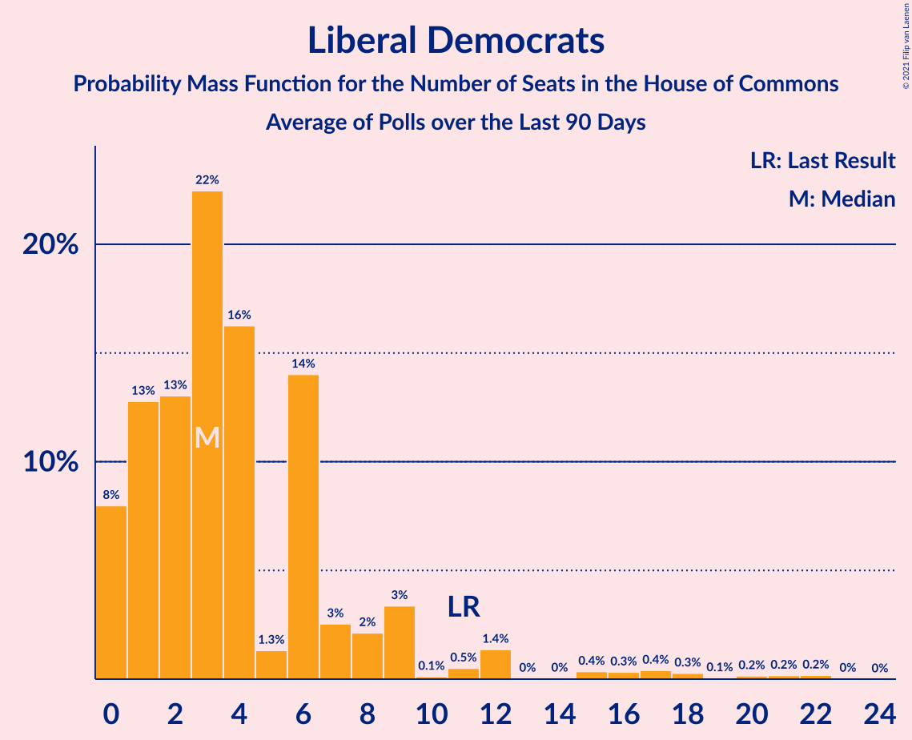

# Liberal Democrats

<a href="#voting-intentions">Voting Intentions</a> | <a href="#seats">Seats</a>

## Voting Intentions

Last result: **7.4%** (General Election of 8 June 2017)

### Confidence Intervals

| Period     | Polling firm/Commissioner(s) | Median | 80% Confidence Interval | 90% Confidence Interval | 95% Confidence Interval | 99% Confidence Interval |
|:----------:|:----------------:|:-----------:|:-----------------------:|:-----------------------:|:-----------------------:|:-----------------------:|
| N/A | [Poll Average](average.html) | 8.6% | 6.6–10.3% | 6.0–10.8% | 5.5–11.1% | 4.9–11.7% |
| [6–7 December 2018](2018-12-07-YouGov.html) | YouGov | 10.2% | 9.3–11.2% | 9.1–11.5% | 8.9–11.8% | 8.4–12.3% |
| [5–6 December 2018](2018-12-06-KantarPublic.html) | Kantar Public | 8.9% | 7.9–10.1% | 7.7–10.4% | 7.4–10.7% | 7.0–11.3% |
| [30 November–5 December 2018](2018-12-05-IpsosMORI.html) | Ipsos MORI | 9.0% | 7.9–10.2% | 7.6–10.5% | 7.4–10.9% | 6.9–11.5% |
| [3–4 December 2018](2018-12-04-YouGov.html) | YouGov   The Times | 8.9% | 8.1–9.9% | 7.8–10.2% | 7.6–10.4% | 7.2–10.9% |
| [30 November–2 December 2018](2018-12-02-ComRes.html) | ComRes   Sunday Express | 9.1% | 8.4–10.0% | 8.1–10.3% | 8.0–10.5% | 7.6–10.9% |
| [26–27 November 2018](2018-11-27-YouGov.html) | YouGov   The Times | 10.1% | 9.2–11.1% | 8.9–11.3% | 8.7–11.6% | 8.3–12.1% |
| [18–19 November 2018](2018-11-19-YouGov.html) | YouGov   The Times | 8.1% | 7.3–9.1% | 7.1–9.3% | 6.9–9.6% | 6.6–10.0% |
| [14–15 November 2018](2018-11-15-Opinium.html) | Opinium | 7.0% | 6.1–8.0% | 5.9–8.3% | 5.7–8.6% | 5.3–9.1% |
| [14–15 November 2018](2018-11-15-ComRes.html) | ComRes   Sunday Express | 9.0% | 8.2–9.9% | 8.0–10.1% | 7.8–10.3% | 7.5–10.8% |
| [8–12 November 2018](2018-11-12-KantarPublic.html) | Kantar Public | 8.0% | 7.1–9.1% | 6.8–9.5% | 6.6–9.7% | 6.2–10.3% |
| [2–7 November 2018](2018-11-07-Panelbase.html) | Panelbase   Constitutional Commission | 7.9% | 7.2–8.7% | 7.0–8.9% | 6.8–9.2% | 6.4–9.6% |
| [4–5 November 2018](2018-11-05-YouGov.html) | YouGov   The Times | 8.1% | 7.3–9.0% | 7.0–9.3% | 6.8–9.5% | 6.5–10.0% |
| [20 October–2 November 2018](2018-11-02-Survation.html) | Survation   Channel 4 | 8.2% | 7.9–8.4% | 7.8–8.5% | 7.8–8.6% | 7.7–8.7% |
| [29–30 October 2018](2018-10-30-YouGov.html) | YouGov   The Times | 7.1% | 6.3–8.0% | 6.1–8.2% | 5.9–8.4% | 5.6–8.9% |
| [26–28 October 2018](2018-10-28-ICMResearch.html) | ICM Research | 9.1% | 8.3–10.0% | 8.1–10.2% | 7.9–10.4% | 7.6–10.8% |
| [24–26 October 2018](2018-10-26-Deltapoll.html) | Deltapoll   Mirror | 6.0% | 5.1–7.1% | 4.9–7.4% | 4.7–7.6% | 4.3–8.2% |
| [22–23 October 2018](2018-10-23-YouGov.html) | YouGov   The Times | 8.0% | 7.3–8.9% | 7.1–9.2% | 6.9–9.4% | 6.5–9.8% |
| [19–22 October 2018](2018-10-22-IpsosMORI.html) | Ipsos MORI | 9.9% | 8.8–11.2% | 8.5–11.5% | 8.2–11.8% | 7.7–12.5% |
| [14–15 October 2018](2018-10-15-YouGov.html) | YouGov   The Times | 9.2% | 8.3–10.1% | 8.1–10.4% | 7.8–10.7% | 7.5–11.1% |
| [11–15 October 2018](2018-10-15-KantarPublic.html) | Kantar Public | 10.0% | 8.9–11.3% | 8.6–11.6% | 8.4–11.9% | 7.9–12.5% |
| [11–12 October 2018](2018-10-12-Opinium.html) | Opinium   The Observer | 7.9% | 7.2–8.7% | 7.0–9.0% | 6.8–9.2% | 6.5–9.6% |
| [10 October 2018](2018-10-10-Survation.html) | Survation | 6.9% | 6.0–8.1% | 5.7–8.4% | 5.5–8.7% | 5.1–9.3% |
| [8–9 October 2018](2018-10-09-YouGov.html) | YouGov   The Times | 9.0% | 8.1–10.0% | 7.9–10.2% | 7.7–10.5% | 7.3–11.0% |
| [3–5 October 2018](2018-10-05-Opinium.html) | Opinium   The Observer | 7.1% | 6.4–7.9% | 6.2–8.1% | 6.0–8.3% | 5.7–8.7% |
| [3–5 October 2018](2018-10-05-BMGResearch.html) | BMG Research   The Independent | 10.0% | 9.0–11.1% | 8.8–11.3% | 8.6–11.6% | 8.1–12.1% |
| [30 September–1 October 2018](2018-10-01-YouGov.html) | YouGov   The Times | 9.1% | 8.2–10.1% | 8.0–10.3% | 7.8–10.6% | 7.4–11.1% |
| [28–29 September 2018](2018-09-29-BMGResearch.html) | BMG Research   HuffPost UK | 11.9% | 10.8–13.2% | 10.4–13.5% | 10.2–13.9% | 9.7–14.5% |
| [26–28 September 2018](2018-09-28-Opinium.html) | Opinium   The Observer | 9.2% | 8.4–10.0% | 8.2–10.3% | 8.0–10.5% | 7.6–10.9% |
| [26–27 September 2018](2018-09-27-ComRes.html) | ComRes   Sunday Express | 9.1% | 8.3–10.0% | 8.1–10.2% | 7.9–10.4% | 7.6–10.9% |
| [24–25 September 2018](2018-09-25-YouGov.html) | YouGov   The Times | 11.1% | 10.1–12.1% | 9.9–12.4% | 9.6–12.7% | 9.2–13.2% |
| [21–24 September 2018](2018-09-24-ICMResearch.html) | ICM Research   The Guardian | 9.0% | 8.2–9.8% | 8.0–10.1% | 7.8–10.3% | 7.4–10.7% |
| [21–22 September 2018](2018-09-22-BMGResearch.html) | BMG Research   HuffPost UK | 10.0% | 8.9–11.4% | 8.6–11.7% | 8.3–12.1% | 7.8–12.7% |
| [18–20 September 2018](2018-09-20-Opinium.html) | Opinium | 8.9% | 8.1–9.8% | 7.9–10.0% | 7.7–10.2% | 7.4–10.7% |
| [18–19 September 2018](2018-09-19-YouGov.html) | YouGov   The Times | 11.0% | 10.2–11.8% | 10.0–12.1% | 9.8–12.3% | 9.5–12.7% |
| [14–18 September 2018](2018-09-18-IpsosMORI.html) | Ipsos MORI | 13.0% | 11.8–14.4% | 11.4–14.8% | 11.1–15.2% | 10.5–15.9% |
| [12–13 September 2018](2018-09-13-YouGov.html) | YouGov   The Times | 11.1% | 10.2–12.2% | 9.9–12.5% | 9.7–12.7% | 9.2–13.3% |
| [11–13 September 2018](2018-09-13-Opinium.html) | Opinium   The Observer | 7.1% | 6.4–7.8% | 6.2–8.1% | 6.0–8.3% | 5.7–8.7% |
| [6–10 September 2018](2018-09-10-KantarPublic.html) | Kantar Public | 10.1% | 9.0–11.4% | 8.7–11.7% | 8.5–12.0% | 8.0–12.6% |
| [7–9 September 2018](2018-09-09-ICMResearch.html) | ICM Research   The Guardian | 8.0% | 7.3–8.8% | 7.1–9.1% | 6.9–9.3% | 6.6–9.7% |
| [7 September 2018](2018-09-07-Survation.html) | Survation   Daily Mail | 10.1% | 9.0–11.4% | 8.7–11.8% | 8.4–12.1% | 7.9–12.7% |
| [4–7 September 2018](2018-09-07-BMGResearch.html) | BMG Research   The Independent | 11.0% | 10.0–12.1% | 9.7–12.4% | 9.5–12.6% | 9.0–13.2% |
| [3–4 September 2018](2018-09-04-YouGov.html) | YouGov   The Times | 11.0% | 10.1–12.0% | 9.9–12.3% | 9.6–12.5% | 9.3–13.0% |
| [31 August–1 September 2018](2018-09-01-Survation.html) | Survation | 6.0% | 5.1–7.1% | 4.9–7.4% | 4.7–7.6% | 4.3–8.2% |
| [28–29 August 2018](2018-08-29-YouGov.html) | YouGov   The Times | 10.1% | 9.2–11.1% | 8.9–11.4% | 8.7–11.6% | 8.3–12.1% |
| [20–21 August 2018](2018-08-21-YouGov.html) | YouGov   The Times | 8.9% | 8.1–9.8% | 7.8–10.1% | 7.6–10.3% | 7.3–10.8% |
| [17–19 August 2018](2018-08-19-ICMResearch.html) | ICM Research   The Guardian | 7.8% | 7.1–8.6% | 6.9–8.9% | 6.7–9.1% | 6.4–9.5% |
| [14–17 August 2018](2018-08-17-Opinium.html) | Opinium   The Observer | 7.0% | 6.3–7.8% | 6.1–8.0% | 5.9–8.2% | 5.6–8.6% |
| [14–16 August 2018](2018-08-16-Deltapoll.html) | Deltapoll   The Sun on Sunday | 7.9% | 7.2–8.8% | 7.0–9.0% | 6.8–9.2% | 6.4–9.7% |
| [13–14 August 2018](2018-08-14-YouGov.html) | YouGov   The Times | 7.9% | 7.1–8.8% | 6.9–9.1% | 6.7–9.3% | 6.3–9.8% |
| [9–13 August 2018](2018-08-13-NumberCruncherPolitics.html) | Number Cruncher Politics | 8.1% | 7.1–9.3% | 6.8–9.6% | 6.6–9.9% | 6.1–10.5% |
| [9–13 August 2018](2018-08-13-KantarPublic.html) | Kantar Public | 8.8% | 7.8–10.0% | 7.6–10.4% | 7.3–10.7% | 6.9–11.2% |
| [6–10 August 2018](2018-08-10-BMGResearch.html) | BMG Research   The Independent | 10.1% | 9.1–11.1% | 8.9–11.4% | 8.6–11.7% | 8.2–12.2% |
| [8–9 August 2018](2018-08-09-YouGov.html) | YouGov   The Times | 10.0% | 9.1–11.0% | 8.9–11.3% | 8.7–11.6% | 8.3–12.1% |
| [3–5 August 2018](2018-08-05-ICMResearch.html) | ICM Research   The Guardian | 7.0% | 6.3–7.8% | 6.2–8.0% | 6.0–8.2% | 5.7–8.6% |
| [30–31 July 2018](2018-07-31-YouGov.html) | YouGov   The Times | 10.0% | 9.1–11.0% | 8.9–11.3% | 8.7–11.5% | 8.3–12.0% |
| [20–24 July 2018](2018-07-24-IpsosMORI.html) | Ipsos MORI | 9.9% | 8.8–11.2% | 8.5–11.5% | 8.2–11.9% | 7.7–12.5% |
| [22–23 July 2018](2018-07-23-YouGov.html) | YouGov   The Times | 10.1% | 9.2–11.1% | 8.9–11.4% | 8.7–11.6% | 8.3–12.1% |
| [20–22 July 2018](2018-07-22-ICMResearch.html) | ICM Research | 7.9% | 7.2–8.7% | 7.0–9.0% | 6.8–9.2% | 6.5–9.6% |
| [19–20 July 2018](2018-07-20-YouGov.html) | YouGov   The Times | 9.0% | 8.1–10.0% | 7.9–10.2% | 7.7–10.5% | 7.3–10.9% |
| [16–17 July 2018](2018-07-17-YouGov.html) | YouGov   The Times | 9.1% | 8.2–10.0% | 8.0–10.3% | 7.8–10.5% | 7.4–11.0% |
| [12–14 July 2018](2018-07-14-Deltapoll.html) | Deltapoll   The Sun on Sunday | 7.0% | 6.2–7.9% | 6.0–8.2% | 5.8–8.4% | 5.5–8.9% |
| [10–13 July 2018](2018-07-13-Opinium.html) | Opinium   The Observer | 7.9% | 7.2–8.8% | 7.0–9.0% | 6.8–9.2% | 6.5–9.6% |
| [10–11 July 2018](2018-07-11-YouGov.html) | YouGov   The Times | 10.0% | 9.1–11.0% | 8.9–11.2% | 8.7–11.5% | 8.3–12.0% |
| [8–9 July 2018](2018-07-09-YouGov.html) | YouGov   The Times | 9.0% | 8.1–10.0% | 7.9–10.2% | 7.7–10.5% | 7.3–10.9% |
| [5–9 July 2018](2018-07-09-KantarPublic.html) | Kantar Public | 9.0% | 8.0–10.2% | 7.7–10.6% | 7.5–10.9% | 7.0–11.5% |
| [6–9 July 2018](2018-07-09-ICMResearch.html) | ICM Research   The Guardian | 9.0% | 8.2–9.9% | 8.0–10.1% | 7.8–10.3% | 7.5–10.8% |
| [7 July 2018](2018-07-07-Survation.html) | Survation | 10.1% | 9.0–11.4% | 8.7–11.8% | 8.4–12.2% | 7.9–12.8% |
| [3–5 July 2018](2018-07-05-BMGResearch.html) | BMG Research | 10.3% | 9.3–11.3% | 9.1–11.6% | 8.8–11.9% | 8.4–12.4% |
| [3–4 July 2018](2018-07-04-YouGov.html) | YouGov   The Times | 9.0% | 8.2–10.0% | 7.9–10.3% | 7.7–10.5% | 7.3–11.0% |
| [22–27 June 2018](2018-06-27-IpsosMORI.html) | Ipsos MORI | 7.0% | 6.1–8.2% | 5.8–8.5% | 5.6–8.7% | 5.2–9.3% |
| [25–26 June 2018](2018-06-26-YouGov.html) | YouGov   The Times | 9.0% | 8.1–10.0% | 7.9–10.2% | 7.7–10.5% | 7.3–11.0% |
| [22–24 June 2018](2018-06-24-ICMResearch.html) | ICM Research   The Guardian | 9.0% | 8.2–9.9% | 8.0–10.1% | 7.8–10.3% | 7.5–10.8% |
| [19–20 June 2018](2018-06-20-Survation.html) | Survation   Good Morning Britain | 7.1% | 6.2–8.3% | 5.9–8.6% | 5.7–8.9% | 5.3–9.5% |
| [18–19 June 2018](2018-06-19-YouGov.html) | YouGov   The Times | 8.9% | 8.0–9.9% | 7.8–10.2% | 7.6–10.4% | 7.2–10.9% |
| [11–12 June 2018](2018-06-12-YouGov.html) | YouGov   The Times | 8.1% | 7.3–9.0% | 7.0–9.3% | 6.8–9.5% | 6.5–10.0% |
| [8–10 June 2018](2018-06-10-ICMResearch.html) | ICM Research   The Guardian | 8.0% | 7.3–8.9% | 7.1–9.1% | 6.9–9.3% | 6.6–9.7% |
| [5–8 June 2018](2018-06-08-BMGResearch.html) | BMG Research   The Independent | 11.1% | 10.1–12.2% | 9.8–12.5% | 9.6–12.8% | 9.1–13.3% |
| [5–7 June 2018](2018-06-07-Opinium.html) | Opinium   The Observer | 6.9% | 6.2–7.7% | 6.0–7.9% | 5.9–8.1% | 5.5–8.5% |
| [4–5 June 2018](2018-06-05-YouGov.html) | YouGov   The Times | 8.0% | 7.2–9.0% | 7.0–9.2% | 6.8–9.5% | 6.4–9.9% |
| [31 May–4 June 2018](2018-06-04-Survation.html) | Survation | 9.1% | 8.3–10.0% | 8.1–10.2% | 7.9–10.4% | 7.5–10.9% |
| [28–29 May 2018](2018-05-29-YouGov.html) | YouGov   The Times | 8.9% | 8.1–9.9% | 7.8–10.2% | 7.6–10.4% | 7.3–10.9% |
| [25–29 May 2018](2018-05-29-ICMResearch.html) | ICM Research   The Guardian | 7.9% | 7.2–8.8% | 7.0–9.0% | 6.8–9.2% | 6.5–9.6% |
| [18–22 May 2018](2018-05-22-IpsosMORI.html) | Ipsos MORI | 7.0% | 6.1–8.1% | 5.8–8.5% | 5.6–8.7% | 5.2–9.3% |
| [20–21 May 2018](2018-05-21-YouGov.html) | YouGov   The Times | 9.1% | 8.2–10.1% | 8.0–10.3% | 7.8–10.6% | 7.4–11.1% |
| [16–17 May 2018](2018-05-17-ComRes.html) | ComRes   Daily Mail | 7.0% | 6.3–7.8% | 6.1–8.0% | 6.0–8.2% | 5.7–8.6% |
| [15–16 May 2018](2018-05-16-Opinium.html) | Opinium   The Observer | 5.9% | 5.3–6.7% | 5.1–6.9% | 5.0–7.1% | 4.7–7.4% |
| [13–14 May 2018](2018-05-14-YouGov.html) | YouGov   The Times | 9.0% | 8.1–10.0% | 7.9–10.2% | 7.7–10.5% | 7.3–11.0% |
| [11–13 May 2018](2018-05-13-ICMResearch.html) | ICM Research   The Guardian | 7.9% | 7.2–8.7% | 7.0–9.0% | 6.8–9.2% | 6.5–9.6% |
| [8–10 May 2018](2018-05-10-Survation.html) | Survation | 8.0% | 7.2–9.0% | 7.0–9.2% | 6.8–9.5% | 6.4–9.9% |
| [8–9 May 2018](2018-05-09-YouGov.html) | YouGov   The Times | 9.1% | 8.2–10.1% | 8.0–10.3% | 7.8–10.6% | 7.4–11.1% |
| [1–4 May 2018](2018-05-04-BMGResearch.html) | BMG Research   The Independent | 10.0% | 9.0–11.1% | 8.8–11.4% | 8.6–11.7% | 8.1–12.2% |
| [30 April–1 May 2018](2018-05-01-YouGov.html) | YouGov   The Times | 7.1% | 6.4–8.0% | 6.2–8.3% | 6.0–8.5% | 5.6–9.0% |
| [27–29 April 2018](2018-04-29-ICMResearch.html) | ICM Research   The Guardian | 8.0% | 7.3–8.8% | 7.1–9.1% | 6.9–9.3% | 6.6–9.7% |
| [27–29 April 2018](2018-04-29-ComRes.html) | ComRes   Daily Express | 8.9% | 8.1–9.7% | 7.9–10.0% | 7.7–10.2% | 7.3–10.6% |
| [24–25 April 2018](2018-04-25-YouGov.html) | YouGov   The Times | 8.0% | 7.2–8.9% | 7.0–9.1% | 6.8–9.4% | 6.4–9.8% |
| [20–24 April 2018](2018-04-24-IpsosMORI.html) | Ipsos MORI | 10.0% | 8.8–11.3% | 8.5–11.6% | 8.2–12.0% | 7.7–12.6% |
| [16–17 April 2018](2018-04-17-YouGov.html) | YouGov   The Times | 8.0% | 7.2–8.9% | 6.9–9.2% | 6.8–9.4% | 6.4–9.9% |
| [14 April 2018](2018-04-14-Survation.html) | Survation   The Mail on Sunday | 8.9% | 8.2–9.8% | 8.0–10.0% | 7.8–10.2% | 7.4–10.7% |
| [10–13 April 2018](2018-04-13-BMGResearch.html) | BMG Research | 11.1% | 10.1–12.2% | 9.8–12.5% | 9.6–12.7% | 9.2–13.3% |
| [10–12 April 2018](2018-04-12-Opinium.html) | Opinium   The Observer | 7.0% | 6.3–7.8% | 6.1–8.0% | 6.0–8.2% | 5.7–8.6% |
| [11–12 April 2018](2018-04-12-ComRes.html) | ComRes   Sunday Express | 7.0% | 6.3–7.8% | 6.1–8.0% | 6.0–8.2% | 5.7–8.6% |
| [9–10 April 2018](2018-04-10-YouGov.html) | YouGov   The Times | 9.0% | 8.2–10.0% | 7.9–10.3% | 7.7–10.5% | 7.3–11.0% |
| [6–8 April 2018](2018-04-08-ICMResearch.html) | ICM Research   The Guardian | 7.0% | 6.2–7.8% | 6.0–8.1% | 5.8–8.3% | 5.5–8.7% |
| [4–5 April 2018](2018-04-05-YouGov.html) | YouGov   The Times | 6.9% | 6.2–7.8% | 6.0–8.0% | 5.8–8.2% | 5.5–8.7% |
| [27 March–5 April 2018](2018-04-05-NumberCruncherPolitics.html) | Number Cruncher Politics | 8.0% | 7.0–9.2% | 6.7–9.5% | 6.5–9.8% | 6.1–10.4% |
| [26–27 March 2018](2018-03-27-YouGov.html) | YouGov   The Times | 8.1% | 7.3–9.0% | 7.0–9.3% | 6.9–9.5% | 6.5–10.0% |
| [16–18 March 2018](2018-03-18-ICMResearch.html) | ICM Research   The Guardian | 7.9% | 7.1–8.8% | 6.9–9.1% | 6.7–9.3% | 6.3–9.8% |
| [13–16 March 2018](2018-03-16-BMGResearch.html) | BMG Research | 10.0% | 9.1–10.9% | 8.9–11.2% | 8.7–11.4% | 8.3–11.9% |
| [14–15 March 2018](2018-03-15-YouGov.html) | YouGov   The Times | 7.0% | 6.3–7.8% | 6.1–8.0% | 6.0–8.2% | 5.6–8.6% |
| [13–15 March 2018](2018-03-15-Opinium.html) | Opinium   The Observer | 6.0% | 5.4–6.7% | 5.2–7.0% | 5.0–7.1% | 4.7–7.5% |
| [7–8 March 2018](2018-03-08-Survation.html) | Survation   Good Morning Britain | 8.9% | 7.8–10.1% | 7.5–10.5% | 7.3–10.8% | 6.8–11.4% |
| [2–7 March 2018](2018-03-07-IpsosMORI.html) | Ipsos MORI | 6.0% | 5.2–7.1% | 4.9–7.4% | 4.7–7.7% | 4.3–8.2% |
| [5–6 March 2018](2018-03-06-YouGov.html) | YouGov   The Times | 7.0% | 6.2–7.9% | 6.1–8.1% | 5.9–8.4% | 5.5–8.8% |
| [2–4 March 2018](2018-03-04-ICMResearch.html) | ICM Research   The Guardian | 6.9% | 6.3–7.7% | 6.1–8.0% | 5.9–8.1% | 5.6–8.5% |
| [26–27 February 2018](2018-02-27-YouGov.html) | YouGov   The Times | 7.0% | 6.2–7.8% | 6.0–8.1% | 5.9–8.3% | 5.5–8.7% |
| [19–20 February 2018](2018-02-20-YouGov.html) | YouGov   The Times | 8.0% | 7.2–8.9% | 7.0–9.2% | 6.8–9.4% | 6.4–9.9% |
| [16–19 February 2018](2018-02-19-ICMResearch.html) | ICM Research   The Guardian | 7.0% | 6.2–7.8% | 6.0–8.1% | 5.9–8.3% | 5.5–8.7% |
| [12–13 February 2018](2018-02-13-YouGov.html) | YouGov   The Times | 8.1% | 7.2–9.0% | 7.0–9.3% | 6.8–9.5% | 6.5–9.9% |
| [6–12 February 2018](2018-02-12-KantarPublic.html) | Kantar Public | 8.1% | 7.4–8.8% | 7.2–9.1% | 7.1–9.2% | 6.8–9.6% |
| [6–9 February 2018](2018-02-09-BMGResearch.html) | BMG Research | 8.0% | 7.1–8.9% | 6.9–9.2% | 6.7–9.4% | 6.3–9.9% |
| [6–8 February 2018](2018-02-08-Opinium.html) | Opinium   The Observer | 6.9% | 6.3–7.7% | 6.1–8.0% | 5.9–8.2% | 5.6–8.5% |
| [5–6 February 2018](2018-02-06-YouGov.html) | YouGov   The Times | 8.0% | 7.3–8.8% | 7.1–9.1% | 6.9–9.3% | 6.6–9.7% |
| [2–4 February 2018](2018-02-04-ICMResearch.html) | ICM Research   The Guardian | 8.0% | 7.2–8.8% | 7.0–9.0% | 6.9–9.2% | 6.5–9.6% |
| [28–29 January 2018](2018-01-29-YouGov.html) | YouGov   The Times | 6.0% | 5.3–6.8% | 5.1–7.0% | 4.9–7.2% | 4.6–7.7% |
| [26–29 January 2018](2018-01-29-Survation.html) | Survation | 8.0% | 7.0–9.2% | 6.8–9.5% | 6.5–9.8% | 6.1–10.4% |
| [19–23 January 2018](2018-01-23-IpsosMORI.html) | Ipsos MORI | 9.0% | 8.0–10.3% | 7.7–10.6% | 7.4–10.9% | 6.9–11.6% |
| [10–19 January 2018](2018-01-19-ICMResearch.html) | ICM Research   The Guardian | 7.0% | 6.5–7.5% | 6.3–7.7% | 6.2–7.8% | 6.0–8.1% |
| [16–17 January 2018](2018-01-17-YouGov.html) | YouGov   The Times | 7.1% | 6.3–7.9% | 6.1–8.2% | 5.9–8.4% | 5.6–8.8% |
| [12–14 January 2018](2018-01-14-ICMResearch.html) | ICM Research   The Guardian | 7.1% | 6.4–7.8% | 6.2–8.1% | 6.0–8.3% | 5.7–8.7% |
| [11–12 January 2018](2018-01-12-Opinium.html) | Opinium   The Observer | 6.0% | 5.4–6.8% | 5.2–7.0% | 5.1–7.2% | 4.8–7.5% |
| [9–12 January 2018](2018-01-12-BMGResearch.html) | BMG Research | 8.0% | 7.2–9.0% | 6.9–9.2% | 6.7–9.5% | 6.4–10.0% |
| [7–8 January 2018](2018-01-08-YouGov.html) | YouGov   The Times | 9.1% | 8.2–10.0% | 8.0–10.3% | 7.8–10.6% | 7.4–11.1% |

### Probability Mass Function

The following table shows the probability mass function per percentage block of voting intentions for the [poll average](average.html) for Liberal Democrats.

| Voting Intentions | Probability | Accumulated | Special Marks |
|:-----------------:|:-----------:|:-----------:|:-------------:|
| 2.5–3.5% | 0% | 100% |  |
| 3.5–4.5% | 0.1% | 100% |  |
| 4.5–5.5% | 2% | 99.9% |  |
| 5.5–6.5% | 7% | 97% |  |
| 6.5–7.5% | 11% | 90% | Last Result |
| 7.5–8.5% | 27% | 79% |  |
| 8.5–9.5% | 26% | 52% | Median |
| 9.5–10.5% | 19% | 26% |  |
| 10.5–11.5% | 6% | 7% |  |
| 11.5–12.5% | 0.8% | 0.8% |  |
| 12.5–13.5% | 0% | 0% |  |

## Seats

Last result: **12** seats (General Election of 8 June 2017)

### Confidence Intervals

| Period     | Polling firm/Commissioner(s) | Median | 80% Confidence Interval | 90% Confidence Interval | 95% Confidence Interval | 99% Confidence Interval |
|:----------:|:----------------:|:------:|:-----------------------:|:-----------------------:|:-----------------------:|:-----------------------:|
| N/A | [Poll Average](average.html) | 19 | 8–27 | 4–28 | 2–28 | 0–30 |
| [6–7 December 2018](2018-12-07-YouGov.html) | YouGov | 26 | 22–28 | 20–29 | 18–30 | 16–32 |
| [5–6 December 2018](2018-12-06-KantarPublic.html) | Kantar Public | 22 | 15–27 | 13–27 | 12–28 | 11–29 |
| [30 November–5 December 2018](2018-12-05-IpsosMORI.html) | Ipsos MORI | 22 | 14–27 | 13–27 | 12–28 | 10–30 |
| [3–4 December 2018](2018-12-04-YouGov.html) | YouGov   The Times | 19 | 14–26 | 13–27 | 12–27 | 11–28 |
| [30 November–2 December 2018](2018-12-02-ComRes.html) | ComRes   Sunday Express | 25 | 19–28 | 18–28 | 18–28 | 16–29 |
| [26–27 November 2018](2018-11-27-YouGov.html) | YouGov   The Times | 26 | 21–29 | 20–30 | 19–30 | 17–32 |
| [18–19 November 2018](2018-11-19-YouGov.html) | YouGov   The Times | 17 | 13–22 | 12–24 | 10–25 | 6–27 |
| [14–15 November 2018](2018-11-15-Opinium.html) | Opinium | 11 | 8–16 | 4–18 | 4–20 | 2–23 |
| [14–15 November 2018](2018-11-15-ComRes.html) | ComRes   Sunday Express | 24 | 19–27 | 18–27 | 17–28 | 15–29 |
| [8–12 November 2018](2018-11-12-KantarPublic.html) | Kantar Public | 15 | 10–21 | 8–23 | 7–25 | 4–27 |
| [2–7 November 2018](2018-11-07-Panelbase.html) | Panelbase   Constitutional Commission | 15 | 11–19 | 10–21 | 9–22 | 5–25 |
| [4–5 November 2018](2018-11-05-YouGov.html) | YouGov   The Times | 16 | 11–21 | 9–22 | 7–23 | 5–26 |
| [20 October–2 November 2018](2018-11-02-Survation.html) | Survation   Channel 4 | 17 | 17–19 | 17–20 | 16–20 | 16–21 |
| [29–30 October 2018](2018-10-30-YouGov.html) | YouGov   The Times | 10 | 5–16 | 4–17 | 3–18 | 2–20 |
| [26–28 October 2018](2018-10-28-ICMResearch.html) | ICM Research | 21 | 17–25 | 16–26 | 16–27 | 14–27 |
| [24–26 October 2018](2018-10-26-Deltapoll.html) | Deltapoll   Mirror | 4 | 0–10 | 0–12 | 0–14 | 0–16 |
| [22–23 October 2018](2018-10-23-YouGov.html) | YouGov   The Times | 13 | 9–17 | 7–18 | 6–19 | 4–22 |
| [19–22 October 2018](2018-10-22-IpsosMORI.html) | Ipsos MORI | 25 | 19–28 | 17–30 | 16–31 | 13–34 |
| [14–15 October 2018](2018-10-15-YouGov.html) | YouGov   The Times | 20 | 16–26 | 15–26 | 14–27 | 12–28 |
| [11–15 October 2018](2018-10-15-KantarPublic.html) | Kantar Public | 25 | 18–28 | 17–29 | 15–30 | 13–32 |
| [11–12 October 2018](2018-10-12-Opinium.html) | Opinium   The Observer | 14 | 11–19 | 10–20 | 7–21 | 5–24 |
| [10 October 2018](2018-10-10-Survation.html) | Survation | 11 | 4–17 | 2–18 | 2–20 | 1–24 |
| [8–9 October 2018](2018-10-09-YouGov.html) | YouGov   The Times | 20 | 15–24 | 13–25 | 13–26 | 11–27 |
| [3–5 October 2018](2018-10-05-Opinium.html) | Opinium   The Observer | 14 | 9–16 | 8–16 | 5–17 | 3–20 |
| [3–5 October 2018](2018-10-05-BMGResearch.html) | BMG Research   The Independent | 26 | 21–28 | 19–29 | 18–30 | 15–32 |
| [30 September–1 October 2018](2018-10-01-YouGov.html) | YouGov   The Times | 20 | 16–25 | 15–26 | 14–27 | 11–28 |
| [28–29 September 2018](2018-09-29-BMGResearch.html) | BMG Research   HuffPost UK | 33 | 28–39 | 27–41 | 27–43 | 24–44 |
| [26–28 September 2018](2018-09-28-Opinium.html) | Opinium   The Observer | 22 | 17–26 | 15–27 | 14–28 | 13–28 |
| [26–27 September 2018](2018-09-27-ComRes.html) | ComRes   Sunday Express | 21 | 18–27 | 17–28 | 17–28 | 15–28 |
| [24–25 September 2018](2018-09-25-YouGov.html) | YouGov   The Times | 27 | 23–30 | 22–31 | 21–31 | 19–33 |
| [21–24 September 2018](2018-09-24-ICMResearch.html) | ICM Research   The Guardian | 21 | 17–26 | 16–26 | 16–27 | 14–28 |
| [21–22 September 2018](2018-09-22-BMGResearch.html) | BMG Research   HuffPost UK | 26 | 22–29 | 18–31 | 16–33 | 13–36 |
| [18–20 September 2018](2018-09-20-Opinium.html) | Opinium | 23 | 17–27 | 15–27 | 14–27 | 12–28 |
| [18–19 September 2018](2018-09-19-YouGov.html) | YouGov   The Times | 28 | 25–30 | 24–31 | 24–32 | 21–33 |
| [14–18 September 2018](2018-09-18-IpsosMORI.html) | Ipsos MORI | 35 | 30–41 | 28–42 | 28–43 | 27–47 |
| [12–13 September 2018](2018-09-13-YouGov.html) | YouGov   The Times | 28 | 25–32 | 25–33 | 23–33 | 20–36 |
| [11–13 September 2018](2018-09-13-Opinium.html) | Opinium   The Observer | 11 | 5–15 | 4–16 | 4–17 | 2–19 |
| [6–10 September 2018](2018-09-10-KantarPublic.html) | Kantar Public | 26 | 20–30 | 18–31 | 17–32 | 14–33 |
| [7–9 September 2018](2018-09-09-ICMResearch.html) | ICM Research   The Guardian | 16 | 14–20 | 11–21 | 10–22 | 7–25 |
| [7 September 2018](2018-09-07-Survation.html) | Survation   Daily Mail | 27 | 21–29 | 20–30 | 18–32 | 16–35 |
| [4–7 September 2018](2018-09-07-BMGResearch.html) | BMG Research   The Independent | 31 | 29–35 | 28–36 | 27–38 | 25–39 |
| [3–4 September 2018](2018-09-04-YouGov.html) | YouGov   The Times | 28 | 25–31 | 24–32 | 23–33 | 20–36 |
| [31 August–1 September 2018](2018-09-01-Survation.html) | Survation | 9 | 3–15 | 2–16 | 1–16 | 0–20 |
| [28–29 August 2018](2018-08-29-YouGov.html) | YouGov   The Times | 26 | 21–28 | 21–29 | 20–30 | 16–32 |
| [20–21 August 2018](2018-08-21-YouGov.html) | YouGov   The Times | 20 | 14–25 | 13–26 | 12–27 | 11–28 |
| [17–19 August 2018](2018-08-19-ICMResearch.html) | ICM Research   The Guardian | 17 | 15–21 | 13–22 | 12–24 | 9–26 |
| [14–17 August 2018](2018-08-17-Opinium.html) | Opinium   The Observer | 11 | 5–15 | 4–16 | 4–17 | 2–19 |
| [14–16 August 2018](2018-08-16-Deltapoll.html) | Deltapoll   The Sun on Sunday | 18 | 15–24 | 14–25 | 13–25 | 10–27 |
| [13–14 August 2018](2018-08-14-YouGov.html) | YouGov   The Times | 16 | 12–20 | 9–22 | 7–23 | 5–26 |
| [9–13 August 2018](2018-08-13-NumberCruncherPolitics.html) | Number Cruncher Politics | 16 | 11–23 | 10–25 | 8–26 | 4–28 |
| [9–13 August 2018](2018-08-13-KantarPublic.html) | Kantar Public | 20 | 13–26 | 12–27 | 12–27 | 9–28 |
| [6–10 August 2018](2018-08-10-BMGResearch.html) | BMG Research   The Independent | 28 | 25–30 | 23–30 | 21–31 | 19–34 |
| [8–9 August 2018](2018-08-09-YouGov.html) | YouGov   The Times | 26 | 20–28 | 19–30 | 18–31 | 15–32 |
| [3–5 August 2018](2018-08-05-ICMResearch.html) | ICM Research   The Guardian | 12 | 6–15 | 5–16 | 4–17 | 3–20 |
| [30–31 July 2018](2018-07-31-YouGov.html) | YouGov   The Times | 27 | 23–28 | 21–29 | 20–30 | 17–32 |
| [20–24 July 2018](2018-07-24-IpsosMORI.html) | Ipsos MORI | 26 | 20–29 | 17–30 | 16–31 | 13–35 |
| [22–23 July 2018](2018-07-23-YouGov.html) | YouGov   The Times | 27 | 22–28 | 21–29 | 19–30 | 18–32 |
| [20–22 July 2018](2018-07-22-ICMResearch.html) | ICM Research | 17 | 15–21 | 13–22 | 12–23 | 9–26 |
| [19–20 July 2018](2018-07-20-YouGov.html) | YouGov   The Times | 21 | 15–26 | 13–27 | 12–27 | 11–28 |
| [16–17 July 2018](2018-07-17-YouGov.html) | YouGov   The Times | 24 | 19–28 | 18–28 | 16–29 | 13–30 |
| [12–14 July 2018](2018-07-14-Deltapoll.html) | Deltapoll   The Sun on Sunday | 15 | 9–18 | 7–19 | 5–21 | 3–24 |
| [10–13 July 2018](2018-07-13-Opinium.html) | Opinium   The Observer | 17 | 12–23 | 12–24 | 11–25 | 10–27 |
| [10–11 July 2018](2018-07-11-YouGov.html) | YouGov   The Times | 27 | 24–29 | 22–30 | 21–30 | 18–33 |
| [8–9 July 2018](2018-07-09-YouGov.html) | YouGov   The Times | 22 | 17–27 | 15–28 | 14–28 | 12–28 |
| [5–9 July 2018](2018-07-09-KantarPublic.html) | Kantar Public | 20 | 14–26 | 13–27 | 12–27 | 9–29 |
| [6–9 July 2018](2018-07-09-ICMResearch.html) | ICM Research   The Guardian | 21 | 17–26 | 17–26 | 16–27 | 15–28 |
| [7 July 2018](2018-07-07-Survation.html) | Survation | 27 | 21–29 | 19–30 | 17–31 | 15–35 |
| [3–5 July 2018](2018-07-05-BMGResearch.html) | BMG Research | 25 | 21–27 | 21–28 | 20–28 | 17–30 |
| [3–4 July 2018](2018-07-04-YouGov.html) | YouGov   The Times | 20 | 16–26 | 15–26 | 14–27 | 11–28 |
| [22–27 June 2018](2018-06-27-IpsosMORI.html) | Ipsos MORI | 11 | 4–16 | 3–17 | 2–20 | 1–22 |
| [25–26 June 2018](2018-06-26-YouGov.html) | YouGov   The Times | 17 | 14–23 | 12–25 | 12–26 | 9–28 |
| [22–24 June 2018](2018-06-24-ICMResearch.html) | ICM Research   The Guardian | 21 | 17–26 | 16–26 | 16–27 | 15–28 |
| [19–20 June 2018](2018-06-20-Survation.html) | Survation   Good Morning Britain | 10 | 3–16 | 2–17 | 2–19 | 0–22 |
| [18–19 June 2018](2018-06-19-YouGov.html) | YouGov   The Times | 20 | 14–24 | 14–25 | 14–26 | 11–28 |
| [11–12 June 2018](2018-06-12-YouGov.html) | YouGov   The Times | 15 | 11–21 | 8–21 | 7–21 | 5–25 |
| [8–10 June 2018](2018-06-10-ICMResearch.html) | ICM Research   The Guardian | 17 | 14–19 | 11–20 | 10–21 | 6–24 |
| [5–8 June 2018](2018-06-08-BMGResearch.html) | BMG Research   The Independent | 29 | 27–33 | 26–34 | 25–36 | 22–39 |
| [5–7 June 2018](2018-06-07-Opinium.html) | Opinium   The Observer | 6 | 2–10 | 2–11 | 2–12 | 2–13 |
| [4–5 June 2018](2018-06-05-YouGov.html) | YouGov   The Times | 15 | 8–19 | 6–20 | 6–21 | 3–23 |
| [31 May–4 June 2018](2018-06-04-Survation.html) | Survation | 19 | 16–24 | 15–25 | 15–26 | 14–27 |
| [28–29 May 2018](2018-05-29-YouGov.html) | YouGov   The Times | 15 | 14–23 | 14–25 | 14–25 | 14–26 |
| [25–29 May 2018](2018-05-29-ICMResearch.html) | ICM Research   The Guardian | 10 | 10–15 | 10–15 | 4–16 | 4–20 |
| [18–22 May 2018](2018-05-22-IpsosMORI.html) | Ipsos MORI | 16 | 16 | 14–18 | 12–18 | 10–18 |
| [20–21 May 2018](2018-05-21-YouGov.html) | YouGov   The Times | 19 | 15–24 | 14–26 | 14–26 | 11–27 |
| [16–17 May 2018](2018-05-17-ComRes.html) | ComRes   Daily Mail | 13 | 13 | 9–13 | 6–13 | 4–15 |
| [15–16 May 2018](2018-05-16-Opinium.html) | Opinium   The Observer | 0 | 0–6 | 0–10 | 0–10 | 0–12 |
| [13–14 May 2018](2018-05-14-YouGov.html) | YouGov   The Times | 20 | 16–24 | 15–25 | 15–26 | 13–28 |
| [11–13 May 2018](2018-05-13-ICMResearch.html) | ICM Research   The Guardian | 11 | 11 | 11 | 11–12 | 11–16 |
| [8–10 May 2018](2018-05-10-Survation.html) | Survation | 16 | 12–20 | 10–21 | 8–22 | 6–25 |
| [8–9 May 2018](2018-05-09-YouGov.html) | YouGov   The Times | 21 | 19–21 | 19–21 | 19–21 | 15–27 |
| [1–4 May 2018](2018-05-04-BMGResearch.html) | BMG Research   The Independent | 27 | 24–28 | 21–28 | 21–28 | 21–28 |
| [30 April–1 May 2018](2018-05-01-YouGov.html) | YouGov   The Times | 9 | 4–16 | 3–16 | 3–17 | 2–19 |
| [27–29 April 2018](2018-04-29-ICMResearch.html) | ICM Research   The Guardian | 15 | 15–21 | 15–21 | 15–21 | 7–21 |
| [27–29 April 2018](2018-04-29-ComRes.html) | ComRes   Daily Express | 23 | 23–28 | 23–28 | 23–28 | 23–28 |
| [24–25 April 2018](2018-04-25-YouGov.html) | YouGov   The Times | 8 | 8–19 | 7–19 | 7–24 | 6–24 |
| [20–24 April 2018](2018-04-24-IpsosMORI.html) | Ipsos MORI | 19 | 19–28 | 19–28 | 19–34 | 19–34 |
| [16–17 April 2018](2018-04-17-YouGov.html) | YouGov   The Times | 16 | 16–19 | 16–19 | 14–19 | 7–20 |
| [14 April 2018](2018-04-14-Survation.html) | Survation   The Mail on Sunday | 15 | 12–20 | 12–20 | 12–22 | 11–22 |
| [10–13 April 2018](2018-04-13-BMGResearch.html) | BMG Research | 27 | 27 | 27 | 27 | 27 |
| [10–12 April 2018](2018-04-12-Opinium.html) | Opinium   The Observer | 11 | 5–14 | 2–17 | 2–17 | 2–21 |
| [11–12 April 2018](2018-04-12-ComRes.html) | ComRes   Sunday Express | 14 | 12–18 | 12–18 | 9–18 | 6–18 |
| [9–10 April 2018](2018-04-10-YouGov.html) | YouGov   The Times | 18 | 18 | 18 | 16–18 | 15–18 |
| [6–8 April 2018](2018-04-08-ICMResearch.html) | ICM Research   The Guardian | 12 | 12–16 | 9–21 | 4–21 | 4–21 |
| [4–5 April 2018](2018-04-05-YouGov.html) | YouGov   The Times | 15 | 11–15 | 9–15 | 9–19 | 9–19 |
| [27 March–5 April 2018](2018-04-05-NumberCruncherPolitics.html) | Number Cruncher Politics | 12 | 12 | 8–12 | 5–16 | 5–25 |
| [26–27 March 2018](2018-03-27-YouGov.html) | YouGov   The Times | 20 | 18–20 | 18–20 | 18–20 | 11–22 |
| [16–18 March 2018](2018-03-18-ICMResearch.html) | ICM Research   The Guardian | 15 | 8–17 | 8–19 | 7–20 | 4–21 |
| [13–16 March 2018](2018-03-16-BMGResearch.html) | BMG Research | 28 | 25–28 | 25–28 | 25–28 | 25–28 |
| [14–15 March 2018](2018-03-15-YouGov.html) | YouGov   The Times | 8 | 3–8 | 3–8 | 3–8 | 3–8 |
| [13–15 March 2018](2018-03-15-Opinium.html) | Opinium   The Observer | 8 | 2–9 | 2–12 | 2–12 | 0–15 |
| [7–8 March 2018](2018-03-08-Survation.html) | Survation   Good Morning Britain | 26 | 26 | 26–28 | 20–29 | 12–30 |
| [2–7 March 2018](2018-03-07-IpsosMORI.html) | Ipsos MORI | 4 | 1–4 | 1–4 | 1–4 | 0–8 |
| [5–6 March 2018](2018-03-06-YouGov.html) | YouGov   The Times | 14 | 6–14 | 6–14 | 6–14 | 2–16 |
| [2–4 March 2018](2018-03-04-ICMResearch.html) | ICM Research   The Guardian | 12 | 7–12 | 7–12 | 7–12 | 4–19 |
| [26–27 February 2018](2018-02-27-YouGov.html) | YouGov   The Times | 15 | 8–15 | 8–15 | 8–15 | 2–19 |
| [19–20 February 2018](2018-02-20-YouGov.html) | YouGov   The Times | 16 | 12–20 | 11–21 | 9–22 | 6–25 |
| [16–19 February 2018](2018-02-19-ICMResearch.html) | ICM Research   The Guardian | 8 | 8–16 | 4–16 | 4–16 | 4–16 |
| [12–13 February 2018](2018-02-13-YouGov.html) | YouGov   The Times | 16 | 15–21 | 13–23 | 10–24 | 8–26 |
| [6–12 February 2018](2018-02-12-KantarPublic.html) | Kantar Public | 15 | 13–24 | 13–24 | 13–24 | 4–24 |
| [6–9 February 2018](2018-02-09-BMGResearch.html) | BMG Research | 18 | 9–23 | 9–23 | 9–23 | 9–29 |
| [6–8 February 2018](2018-02-08-Opinium.html) | Opinium   The Observer | 16 | 5–16 | 1–16 | 1–16 | 1–16 |
| [5–6 February 2018](2018-02-06-YouGov.html) | YouGov   The Times | 18 | 16–20 | 16–23 | 4–23 | 4–23 |
| [2–4 February 2018](2018-02-04-ICMResearch.html) | ICM Research   The Guardian | 16 | 16–20 | 16–20 | 16–26 | 14–26 |
| [28–29 January 2018](2018-01-29-YouGov.html) | YouGov   The Times | 4 | 1–8 | 0–11 | 0–13 | 0–14 |
| [26–29 January 2018](2018-01-29-Survation.html) | Survation | 17 | 13–23 | 13–24 | 13–29 | 11–29 |
| [19–23 January 2018](2018-01-23-IpsosMORI.html) | Ipsos MORI | 22 | 22 | 22–23 | 11–23 | 11–30 |
| [10–19 January 2018](2018-01-19-ICMResearch.html) | ICM Research   The Guardian | 11 | 11–16 | 11–16 | 11–16 | 9–17 |
| [16–17 January 2018](2018-01-17-YouGov.html) | YouGov   The Times | 9 | 5–16 | 4–16 | 3–17 | 2–20 |
| [12–14 January 2018](2018-01-14-ICMResearch.html) | ICM Research   The Guardian | 13 | 6–13 | 6–13 | 6–13 | 6–20 |
| [11–12 January 2018](2018-01-12-Opinium.html) | Opinium   The Observer | 12 | 7–12 | 5–12 | 5–13 | 0–17 |
| [9–12 January 2018](2018-01-12-BMGResearch.html) | BMG Research | 17 | 17 | 15–17 | 15–19 | 13–19 |
| [7–8 January 2018](2018-01-08-YouGov.html) | YouGov   The Times | 25 | 19–27 | 19–27 | 19–27 | 19–27 |

### Probability Mass Function

The following table shows the probability mass function per seat for the [poll average](average.html) for Liberal Democrats.

| Number of Seats | Probability | Accumulated | Special Marks |
|:---------------:|:-----------:|:-----------:|:-------------:|
| 0 | 1.2% | 100% |  |
| 1 | 0.8% | 98.8% |  |
| 2 | 1.4% | 98% |  |
| 3 | 1.3% | 97% |  |
| 4 | 2% | 95% |  |
| 5 | 0.8% | 93% |  |
| 6 | 1.2% | 92% |  |
| 7 | 0.9% | 91% |  |
| 8 | 1.0% | 90% |  |
| 9 | 0.7% | 89% |  |
| 10 | 3% | 89% |  |
| 11 | 3% | 86% |  |
| 12 | 3% | 83% | Last Result |
| 13 | 3% | 80% |  |
| 14 | 2% | 77% |  |
| 15 | 3% | 75% |  |
| 16 | 3% | 72% |  |
| 17 | 10% | 69% |  |
| 18 | 5% | 59% |  |
| 19 | 5% | 54% | Median |
| 20 | 4% | 49% |  |
| 21 | 4% | 45% |  |
| 22 | 3% | 41% |  |
| 23 | 5% | 38% |  |
| 24 | 5% | 33% |  |
| 25 | 7% | 28% |  |
| 26 | 7% | 21% |  |
| 27 | 8% | 14% |  |
| 28 | 4% | 6% |  |
| 29 | 1.1% | 2% |  |
| 30 | 0.4% | 0.8% |  |
| 31 | 0.2% | 0.4% |  |
| 32 | 0.1% | 0.2% |  |
| 33 | 0% | 0.1% |  |
| 34 | 0% | 0.1% |  |
| 35 | 0% | 0% |  |

