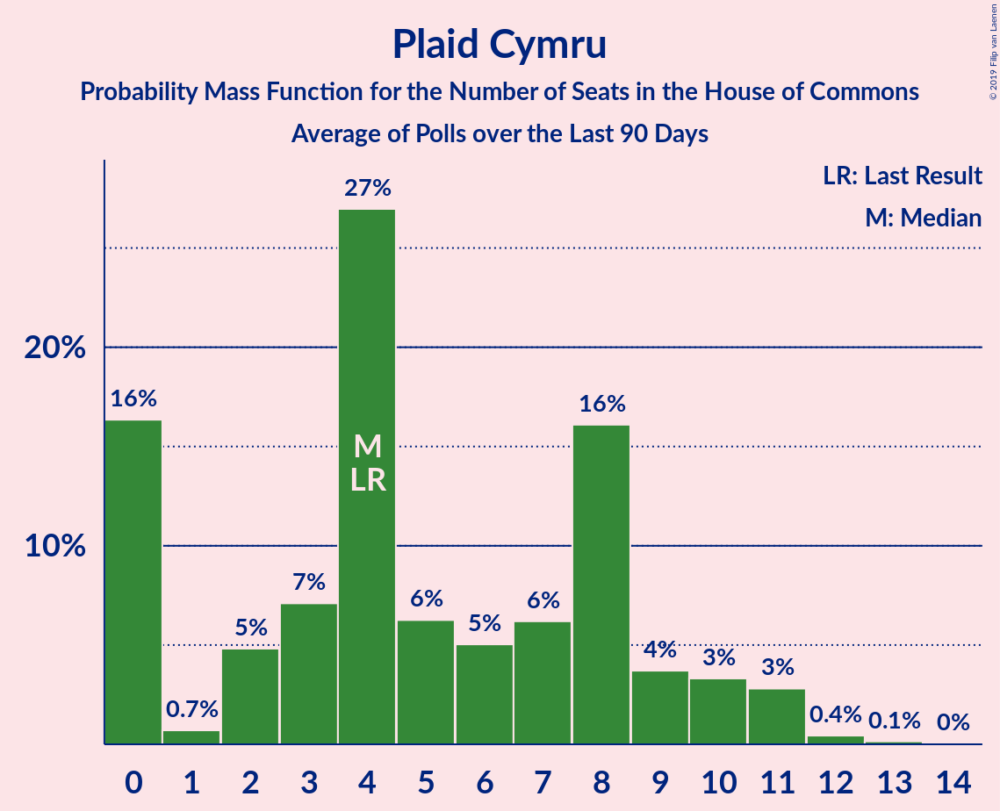

# Plaid Cymru

<a href="#voting-intentions">Voting Intentions</a> | <a href="#seats">Seats</a>

## Voting Intentions

Last result: **0.5%** (General Election of 8 June 2017)

### Confidence Intervals

| Period     | Polling firm/Commissioner(s) | Median | 80% Confidence Interval | 90% Confidence Interval | 95% Confidence Interval | 99% Confidence Interval |
|:----------:|:----------------:|:-----------:|:-----------------------:|:-----------------------:|:-----------------------:|:-----------------------:|
| N/A | [Poll Average](average.html) | 0.9% | 0.4–1.3% | 0.3–1.5% | 0.2–1.6% | 0.1–1.8% |
| [14–15 November 2018](2018-11-15-ComRes.html) | ComRes   Sunday Express | 1.0% | 0.8–1.4% | 0.7–1.5% | 0.6–1.5% | 0.5–1.7% |
| [8–12 November 2018](2018-11-12-KantarPublic.html) | Kantar Public | 1.0% | 0.7–1.4% | 0.6–1.6% | 0.5–1.7% | 0.4–2.0% |
| [4–5 November 2018](2018-11-05-YouGov.html) | YouGov   Times | 0.6% | 0.4–0.9% | 0.4–1.0% | 0.3–1.1% | 0.3–1.3% |
| [29–30 October 2018](2018-10-30-YouGov.html) | YouGov   Times | 0.6% | 0.4–0.9% | 0.4–1.0% | 0.3–1.1% | 0.3–1.3% |
| [26–28 October 2018](2018-10-28-ICM.html) | ICM | 1.0% | 0.8–1.4% | 0.7–1.5% | 0.7–1.6% | 0.6–1.8% |
| [24–26 October 2018](2018-10-26-Deltapoll.html) | Deltapoll   Mirror | 0.3% | 0.2–0.7% | 0.1–0.8% | 0.1–0.9% | 0.1–1.1% |
| [22–23 October 2018](2018-10-23-YouGov.html) | YouGov   Times | 0.9% | 0.7–1.2% | 0.6–1.4% | 0.5–1.4% | 0.5–1.6% |
| [19–22 October 2018](2018-10-22-IpsosMORI.html) | Ipsos MORI | 1.0% | 0.7–1.5% | 0.6–1.6% | 0.5–1.8% | 0.4–2.0% |
| [14–15 October 2018](2018-10-15-YouGov.html) | YouGov   Times | 0.6% | 0.4–0.9% | 0.4–1.0% | 0.3–1.1% | 0.3–1.3% |
| [11–15 October 2018](2018-10-15-KantarPublic.html) | Kantar Public | 1.0% | 0.7–1.5% | 0.6–1.6% | 0.5–1.7% | 0.4–2.0% |
| [11–12 October 2018](2018-10-12-Opinium.html) | Opinium   The Observer | 1.0% | 0.8–1.4% | 0.7–1.4% | 0.6–1.5% | 0.5–1.7% |
| [10 October 2018](2018-10-10-Survation.html) | Survation | 0.0% | N/A | N/A | N/A | N/A |
| [8–9 October 2018](2018-10-09-YouGov.html) | YouGov   Times | 0.7% | 0.5–1.1% | 0.5–1.2% | 0.4–1.3% | 0.3–1.5% |
| [3–5 October 2018](2018-10-05-Opinium.html) | Opinium   The Observer | 1.0% | 0.8–1.4% | 0.7–1.4% | 0.6–1.5% | 0.5–1.7% |
| [3–5 October 2018](2018-10-05-BMGResearch.html) | BMG Research   Independent | 1.0% | 0.7–1.4% | 0.7–1.5% | 0.6–1.6% | 0.5–1.9% |
| [30 September–1 October 2018](2018-10-01-YouGov.html) | YouGov   Times | 0.6% | 0.4–0.9% | 0.3–1.0% | 0.3–1.1% | 0.2–1.2% |
| [28–29 September 2018](2018-09-29-BMGResearch.html) | BMG Research   HuffPost UK | 1.0% | 0.7–1.5% | 0.6–1.6% | 0.6–1.7% | 0.5–2.0% |
| [26–28 September 2018](2018-09-28-Opinium.html) | Opinium   The Observer | 0.2% | 0.2–0.5% | 0.1–0.5% | 0.1–0.6% | 0.1–0.7% |
| [26–27 September 2018](2018-09-27-ComRes.html) | ComRes   Sunday Express | 0.2% | 0.2–0.5% | 0.1–0.5% | 0.1–0.6% | 0.1–0.7% |
| [24–25 September 2018](2018-09-25-YouGov.html) | YouGov   Times | 0.6% | 0.4–0.9% | 0.3–1.0% | 0.3–1.1% | 0.2–1.2% |

### Probability Mass Function

The following table shows the probability mass function per percentage block of voting intentions for the [poll average](average.html) for Plaid Cymru.

| Voting Intentions | Probability | Accumulated | Special Marks |
|:-----------------:|:-----------:|:-----------:|:-------------:|
| 0.0–0.5% | 15% | 100% |  |
| 0.5–1.5% | 82% | 85% | Last Result, Median |
| 1.5–2.5% | 3% | 3% |  |
| 2.5–3.5% | 0% | 0% |  |

## Seats

Last result: **4** seats (General Election of 8 June 2017)

### Confidence Intervals

| Period     | Polling firm/Commissioner(s) | Median | 80% Confidence Interval | 90% Confidence Interval | 95% Confidence Interval | 99% Confidence Interval |
|:----------:|:----------------:|:------:|:-----------------------:|:-----------------------:|:-----------------------:|:-----------------------:|
| N/A | [Poll Average](average.html) | 5 | 3–5 | 0–7 | 0–8 | 0–8 |
| [14–15 November 2018](2018-11-15-ComRes.html) | ComRes   Sunday Express | 5 | 4–5 | 4–6 | 4–8 | 3–8 |
| [8–12 November 2018](2018-11-12-KantarPublic.html) | Kantar Public | 5 | 4–8 | 4–8 | 3–8 | 2–10 |
| [4–5 November 2018](2018-11-05-YouGov.html) | YouGov   Times | 4 | 2–5 | 2–5 | 1–5 | 0–5 |
| [29–30 October 2018](2018-10-30-YouGov.html) | YouGov   Times | 4 | 2–5 | 2–5 | 1–5 | 0–5 |
| [26–28 October 2018](2018-10-28-ICM.html) | ICM | 5 | 3–5 | 2–5 | 2–5 | 2–5 |
| [24–26 October 2018](2018-10-26-Deltapoll.html) | Deltapoll   Mirror | 4 | 0–4 | 0–4 | 0–5 | 0–5 |
| [22–23 October 2018](2018-10-23-YouGov.html) | YouGov   Times | 5 | 4–6 | 4–7 | 4–8 | 3–8 |
| [19–22 October 2018](2018-10-22-IpsosMORI.html) | Ipsos MORI | 5 | 4–8 | 3–8 | 3–8 | 2–10 |
| [14–15 October 2018](2018-10-15-YouGov.html) | YouGov   Times | 4 | 2–5 | 2–5 | 0–5 | 0–6 |
| [11–15 October 2018](2018-10-15-KantarPublic.html) | Kantar Public | 5 | 4–8 | 3–8 | 3–9 | 2–10 |
| [11–12 October 2018](2018-10-12-Opinium.html) | Opinium   The Observer | 5 | 5–6 | 5–7 | 5–7 | 5–7 |
| [10 October 2018](2018-10-10-Survation.html) | Survation |  |  |  |  |  |
| [8–9 October 2018](2018-10-09-YouGov.html) | YouGov   Times | 5 | 3–5 | 3–5 | 2–5 | 1–8 |
| [3–5 October 2018](2018-10-05-Opinium.html) | Opinium   The Observer | 5 | 5 | 4–6 | 4–8 | 4–8 |
| [3–5 October 2018](2018-10-05-BMGResearch.html) | BMG Research   Independent | 5 | 3–6 | 3–8 | 3–8 | 3–9 |
| [30 September–1 October 2018](2018-10-01-YouGov.html) | YouGov   Times | 3 | 2–5 | 1–5 | 0–5 | 0–5 |
| [28–29 September 2018](2018-09-29-BMGResearch.html) | BMG Research   HuffPost UK | 5 | 3–8 | 3–8 | 3–8 | 2–9 |
| [26–28 September 2018](2018-09-28-Opinium.html) | Opinium   The Observer | 0 | 0–3 | 0–3 | 0–3 | 0–5 |
| [26–27 September 2018](2018-09-27-ComRes.html) | ComRes   Sunday Express | 0 | 0–2 | 0–3 | 0–3 | 0–4 |
| [24–25 September 2018](2018-09-25-YouGov.html) | YouGov   Times | 3 | 2–5 | 1–5 | 0–5 | 0–5 |

### Probability Mass Function

The following table shows the probability mass function per seat for the [poll average](average.html) for Plaid Cymru.

| Number of Seats | Probability | Accumulated | Special Marks |
|:---------------:|:-----------:|:-----------:|:-------------:|
| 0 | 6% | 100% |  |
| 1 | 0.6% | 94% |  |
| 2 | 3% | 94% |  |
| 3 | 9% | 91% |  |
| 4 | 14% | 82% | Last Result |
| 5 | 60% | 68% | Median |
| 6 | 2% | 8% |  |
| 7 | 2% | 6% |  |
| 8 | 4% | 4% |  |
| 9 | 0.3% | 0.5% |  |
| 10 | 0.1% | 0.2% |  |
| 11 | 0% | 0.1% |  |
| 12 | 0% | 0.1% |  |
| 13 | 0% | 0% |  |

