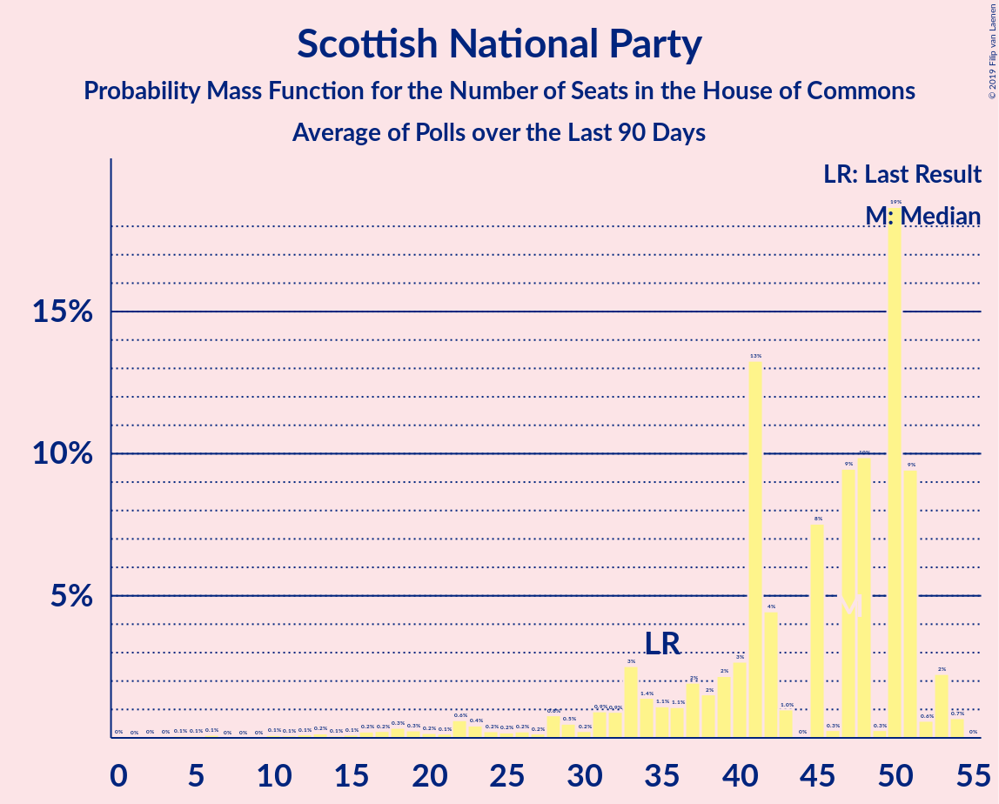

# Scottish National Party

<a href="#voting-intentions">Voting Intentions</a> | <a href="#seats">Seats</a>

## Voting Intentions

Last result: **3.9%** (General Election of 12 December 2019)

### Confidence Intervals

| Period     | Polling firm/Commissioner(s) | Median | 80% Confidence Interval | 90% Confidence Interval | 95% Confidence Interval | 99% Confidence Interval |
|:----------:|:----------------:|:-----------:|:-----------------------:|:-----------------------:|:-----------------------:|:-----------------------:|
| N/A | [Poll Average](average.html) | 3.8% | 2.8–4.7% | 2.6–4.9% | 2.5–5.1% | 2.2–5.5% |
| [18–19 January 2024](2024-01-19-WeThink.html) | We Think | 3.2% | 2.6–4.0% | 2.5–4.3% | 2.3–4.5% | 2.1–4.9% |
| [17–18 January 2024](2024-01-18-TechneUK.html) | Techne UK | 3.2% | N/A | N/A | N/A | N/A |
| [16–17 January 2024](2024-01-17-YouGov.html) | YouGov   The Times | 3.3% | N/A | N/A | N/A | N/A |
| [11–15 January 2024](2024-01-15-LordAshcroft.html) | Lord Ashcroft | 2.1% | N/A | N/A | N/A | N/A |
| [12–15 January 2024](2024-01-15-Deltapoll.html) | Deltapoll | 3.2% | N/A | N/A | N/A | N/A |
| [12–14 January 2024](2024-01-14-Savanta.html) | Savanta | 3.1% | N/A | N/A | N/A | N/A |
| [14 January 2024](2024-01-14-RedfieldWiltonStrategies.html) | Redfield & Wilton Strategies | 3.2% | N/A | N/A | N/A | N/A |
| [11–12 January 2024](2024-01-12-WeThink.html) | We Think | 3.3% | N/A | N/A | N/A | N/A |
| [10–12 January 2024](2024-01-12-Opinium.html) | Opinium   The Observer | 4.2% | N/A | N/A | N/A | N/A |
| [10–11 January 2024](2024-01-11-YouGov.html) | YouGov   The Times | 3.3% | N/A | N/A | N/A | N/A |
| [10–11 January 2024](2024-01-11-TechneUK.html) | Techne UK | 3.2% | N/A | N/A | N/A | N/A |
| [9–11 January 2024](2024-01-11-MoreinCommon.html) | More in Common   Times Radio | 3.2% | N/A | N/A | N/A | N/A |
| [5–7 January 2024](2024-01-07-Savanta.html) | Savanta | 3.1% | N/A | N/A | N/A | N/A |
| [7 January 2024](2024-01-07-RedfieldWiltonStrategies.html) | Redfield & Wilton Strategies | 3.2% | N/A | N/A | N/A | N/A |
| [4–5 January 2024](2024-01-05-WeThink.html) | We Think | 2.2% | N/A | N/A | N/A | N/A |
| [2–3 January 2024](2024-01-03-YouGov.html) | YouGov   The Times | 3.2% | N/A | N/A | N/A | N/A |
| [28–30 December 2023](2023-12-30-WeThink.html) | We Think | 3.2% | 2.6–4.0% | 2.4–4.2% | 2.3–4.4% | 2.1–4.8% |
| [22–29 December 2023](2023-12-29-Deltapoll.html) | Deltapoll   The Mirror | 2.1% | 1.7–2.7% | 1.6–2.9% | 1.5–3.0% | 1.3–3.3% |
| [28 December 2023](2023-12-28-PeoplePolling.html) | PeoplePolling   GB News | 4.3% | 3.7–4.9% | 3.6–5.1% | 3.4–5.3% | 3.2–5.6% |
| [22 December 2023](2023-12-22-WeThink.html) | We Think | 3.2% | 2.6–4.0% | 2.4–4.2% | 2.3–4.4% | 2.0–4.8% |
| [20–21 December 2023](2023-12-21-TechneUK.html) | Techne UK | 3.2% | 2.7–3.9% | 2.5–4.1% | 2.4–4.2% | 2.2–4.6% |
| [19–20 December 2023](2023-12-20-YouGov.html) | YouGov   The Times | 3.3% | N/A | N/A | N/A | N/A |
| [15–18 December 2023](2023-12-18-Survation.html) | Survation | 2.1% | 1.6–2.8% | 1.5–3.0% | 1.4–3.2% | 1.2–3.6% |
| [15–17 December 2023](2023-12-17-Savanta.html) | Savanta | 3.2% | 2.8–3.7% | 2.6–3.9% | 2.5–4.0% | 2.3–4.3% |
| [17 December 2023](2023-12-17-RedfieldWiltonStrategies.html) | Redfield & Wilton Strategies | 4.3% | 3.7–5.0% | 3.6–5.2% | 3.5–5.3% | 3.2–5.7% |
| [14–15 December 2023](2023-12-15-WeThink.html) | We Think | 3.2% | 2.6–4.0% | 2.4–4.3% | 2.3–4.5% | 2.0–4.9% |
| [13–15 December 2023](2023-12-15-Opinium.html) | Opinium   The Observer | 3.2% | 2.7–3.9% | 2.5–4.1% | 2.4–4.3% | 2.2–4.7% |
| [13–14 December 2023](2023-12-14-TechneUK.html) | Techne UK | 3.2% | 2.7–3.9% | 2.5–4.1% | 2.4–4.2% | 2.2–4.6% |
| [12–14 December 2023](2023-12-14-MoreinCommon.html) | More in Common | 4.2% | 3.7–4.9% | 3.5–5.0% | 3.4–5.2% | 3.2–5.5% |
| [12–13 December 2023](2023-12-13-YouGov.html) | YouGov   The Times | 3.3% | 2.8–3.9% | 2.7–4.0% | 2.6–4.2% | 2.3–4.5% |
| [8–11 December 2023](2023-12-11-Deltapoll.html) | Deltapoll | 3.2% | 2.5–4.0% | 2.4–4.3% | 2.2–4.5% | 2.0–4.9% |
| [8–10 December 2023](2023-12-10-Savanta.html) | Savanta | 3.2% | 2.7–3.7% | 2.6–3.9% | 2.5–4.1% | 2.3–4.3% |
| [10 December 2023](2023-12-10-RedfieldWiltonStrategies.html) | Redfield & Wilton Strategies | 2.2% | 1.8–2.7% | 1.7–2.8% | 1.6–2.9% | 1.4–3.2% |
| [7–8 December 2023](2023-12-08-WeThink.html) | We Think | 2.1% | N/A | N/A | N/A | N/A |
| [6–7 December 2023](2023-12-07-YouGov.html) | YouGov   The Times | 3.3% | N/A | N/A | N/A | N/A |
| [6–7 December 2023](2023-12-07-TechneUK.html) | Techne UK | 3.2% | N/A | N/A | N/A | N/A |
| [1–7 December 2023](2023-12-07-IpsosMORI.html) | Ipsos MORI | 3.2% | 2.5–4.0% | 2.4–4.3% | 2.2–4.5% | 2.0–4.9% |
| [4 December 2023](2023-12-04-MoreinCommon.html) | More in Common | 3.1% | 2.7–3.7% | 2.5–3.9% | 2.4–4.0% | 2.2–4.3% |
| [1–4 December 2023](2023-12-04-Deltapoll.html) | Deltapoll | 3.1% | 2.5–4.0% | 2.3–4.2% | 2.2–4.5% | 2.0–4.9% |
| [1–3 December 2023](2023-12-03-Savanta.html) | Savanta | 3.2% | 2.7–3.7% | 2.6–3.9% | 2.5–4.0% | 2.3–4.3% |
| [3 December 2023](2023-12-03-RedfieldWiltonStrategies.html) | Redfield & Wilton Strategies | 3.2% | 2.7–3.8% | 2.6–4.0% | 2.5–4.1% | 2.3–4.4% |
| [1 December 2023](2023-12-01-WeThink.html) | We Think | 3.1% | 2.5–3.9% | 2.4–4.1% | 2.2–4.4% | 2.0–4.8% |
| [29–30 November 2023](2023-11-30-YouGov.html) | YouGov   The Times | 4.3% | 3.7–5.0% | 3.6–5.2% | 3.5–5.3% | 3.2–5.6% |
| [29–30 November 2023](2023-11-30-TechneUK.html) | Techne UK | 3.2% | 2.7–3.9% | 2.5–4.1% | 2.4–4.2% | 2.2–4.6% |
| [28–30 November 2023](2023-11-30-BMGResearch.html) | BMG Research   The i | 0.0% | N/A | N/A | N/A | N/A |
| [24–27 November 2023](2023-11-27-MoreinCommon.html) | More in Common   Times Radio | 3.2% | 2.7–3.9% | 2.5–4.1% | 2.4–4.3% | 2.1–4.7% |
| [24–27 November 2023](2023-11-27-Deltapoll.html) | Deltapoll | 3.2% | 2.7–3.8% | 2.6–3.9% | 2.5–4.1% | 2.3–4.4% |
| [24–26 November 2023](2023-11-26-Savanta.html) | Savanta | 3.1% | 2.7–3.7% | 2.6–3.8% | 2.5–3.9% | 2.3–4.2% |
| [26 November 2023](2023-11-26-RedfieldWiltonStrategies.html) | Redfield & Wilton Strategies | 3.2% | 2.7–3.8% | 2.6–3.9% | 2.5–4.1% | 2.3–4.4% |
| [23–24 November 2023](2023-11-24-WeThink.html) | We Think | 3.2% | 2.6–4.1% | 2.5–4.3% | 2.3–4.5% | 2.1–4.9% |
| [22–24 November 2023](2023-11-24-Opinium.html) | Opinium   The Observer | 3.2% | 2.7–3.9% | 2.5–4.1% | 2.4–4.3% | 2.2–4.7% |
| [22–23 November 2023](2023-11-23-YouGov.html) | YouGov   The Times | 4.2% | 3.7–4.9% | 3.6–5.1% | 3.4–5.2% | 3.2–5.6% |
| [22–23 November 2023](2023-11-23-TechneUK.html) | Techne UK | 3.2% | 2.7–3.8% | 2.5–4.0% | 2.4–4.2% | 2.2–4.5% |
| [16–20 November 2023](2023-11-20-Deltapoll.html) | Deltapoll | 3.2% | 2.7–3.9% | 2.5–4.1% | 2.4–4.3% | 2.2–4.6% |
| [17–19 November 2023](2023-11-19-Savanta.html) | Savanta | 3.1% | 2.7–3.7% | 2.6–3.8% | 2.5–3.9% | 2.3–4.2% |
| [19 November 2023](2023-11-19-RedfieldWiltonStrategies.html) | Redfield & Wilton Strategies | 4.2% | 3.5–5.1% | 3.3–5.3% | 3.1–5.5% | 2.9–6.0% |
| [16–17 November 2023](2023-11-17-WeThink.html) | We Think | 3.2% | 2.6–4.0% | 2.5–4.3% | 2.3–4.5% | 2.1–4.9% |
| [15–17 November 2023](2023-11-17-Opinium.html) | Opinium   The Observer | 3.2% | 2.7–3.9% | 2.5–4.1% | 2.4–4.3% | 2.1–4.7% |
| [15–17 November 2023](2023-11-17-MoreinCommon.html) | More in Common | 3.2% | 2.7–3.7% | 2.6–3.9% | 2.5–4.1% | 2.3–4.3% |
| [15–16 November 2023](2023-11-16-TechneUK.html) | Techne UK | 2.2% | 1.7–2.7% | 1.6–2.9% | 1.5–3.0% | 1.4–3.3% |
| [14–15 November 2023](2023-11-15-YouGov.html) | YouGov   The Times | 4.3% | 3.8–4.9% | 3.7–5.1% | 3.6–5.2% | 3.3–5.5% |
| [14 November 2023](2023-11-14-PeoplePolling.html) | PeoplePolling   GB News | 3.2% | 2.7–3.9% | 2.5–4.1% | 2.4–4.3% | 2.2–4.6% |
| [13–14 November 2023](2023-11-14-FindOutNow.html) | Find Out Now   The Mirror | 5.4% | 4.8–6.1% | 4.6–6.3% | 4.5–6.5% | 4.2–6.8% |
| [10–13 November 2023](2023-11-13-Deltapoll.html) | Deltapoll | 3.1% | 2.7–3.7% | 2.5–3.9% | 2.4–4.1% | 2.2–4.4% |
| [10–12 November 2023](2023-11-12-Savanta.html) | Savanta | 2.1% | 1.8–2.6% | 1.7–2.7% | 1.6–2.8% | 1.4–3.0% |
| [12 November 2023](2023-11-12-RedfieldWiltonStrategies.html) | Redfield & Wilton Strategies | 3.2% | 2.7–3.8% | 2.6–3.9% | 2.5–4.1% | 2.3–4.4% |
| [9–10 November 2023](2023-11-10-WeThink.html) | We Think | 3.1% | 2.6–3.9% | 2.4–4.2% | 2.3–4.4% | 2.0–4.8% |
| [8–10 November 2023](2023-11-10-Opinium.html) | Opinium   The Observer | 3.2% | 2.7–3.9% | 2.5–4.1% | 2.4–4.3% | 2.1–4.7% |
| [8–9 November 2023](2023-11-09-TechneUK.html) | Techne UK | 2.1% | 1.7–2.7% | 1.6–2.9% | 1.5–3.0% | 1.3–3.3% |
| [7–8 November 2023](2023-11-08-YouGov.html) | YouGov   The Times | 3.2% | 2.7–3.7% | 2.6–3.9% | 2.5–4.1% | 2.3–4.3% |
| [8 November 2023](2023-11-08-LordAshcroft.html) | Lord Ashcroft | 2.1% | 1.8–2.5% | 1.7–2.7% | 1.6–2.8% | 1.4–3.0% |
| [1–8 November 2023](2023-11-08-IpsosMORI.html) | Ipsos MORI | 5.1% | 4.3–6.1% | 4.0–6.4% | 3.9–6.6% | 3.5–7.2% |
| [3–6 November 2023](2023-11-06-Deltapoll.html) | Deltapoll | 3.1% | 2.5–4.0% | 2.3–4.3% | 2.2–4.5% | 2.0–4.9% |
| [3–5 November 2023](2023-11-05-Savanta.html) | Savanta | 2.0% | 1.6–2.7% | 1.4–2.9% | 1.3–3.1% | 1.1–3.5% |
| [5 November 2023](2023-11-05-RedfieldWiltonStrategies.html) | Redfield & Wilton Strategies | 2.1% | 1.8–2.6% | 1.6–2.8% | 1.6–2.9% | 1.4–3.1% |
| [2–3 November 2023](2023-11-03-WeThink.html) | We Think | 3.2% | 2.6–4.0% | 2.5–4.3% | 2.3–4.5% | 2.1–4.9% |
| [3 November 2023](2023-11-03-Survation.html) | Survation   UK Spirits Alliance | 3.1% | 2.9–3.3% | 2.9–3.4% | 2.8–3.5% | 2.7–3.6% |
| [1–2 November 2023](2023-11-02-TechneUK.html) | Techne UK | 2.1% | 1.7–2.7% | 1.6–2.8% | 1.5–3.0% | 1.3–3.2% |
| [2 November 2023](2023-11-02-MoreinCommon.html) | More in Common | 3.2% | 2.7–3.7% | 2.6–3.9% | 2.5–4.0% | 2.3–4.3% |
| [31 October–1 November 2023](2023-11-01-YouGov.html) | YouGov | 3.2% | 2.7–3.9% | 2.5–4.1% | 2.4–4.3% | 2.2–4.6% |
| [31 October 2023](2023-10-31-FindOutNow.html) | Find Out Now | 4.2% | 3.7–4.8% | 3.6–5.0% | 3.4–5.1% | 3.2–5.4% |
| [27–30 October 2023](2023-10-30-Deltapoll.html) | Deltapoll | 2.2% | 1.7–2.7% | 1.6–2.9% | 1.5–3.0% | 1.3–3.4% |
| [27–29 October 2023](2023-10-29-Savanta.html) | Savanta | 2.1% | 1.7–2.6% | 1.6–2.7% | 1.6–2.9% | 1.4–3.1% |
| [29 October 2023](2023-10-29-RedfieldWiltonStrategies.html) | Redfield & Wilton Strategies | 3.1% | 2.7–3.7% | 2.5–3.9% | 2.4–4.0% | 2.2–4.3% |
| [26–27 October 2023](2023-10-27-WeThink.html) | We Think | 3.2% | 2.6–4.0% | 2.5–4.2% | 2.3–4.4% | 2.1–4.8% |
| [25–27 October 2023](2023-10-27-Opinium.html) | Opinium   The Observer | 3.2% | 2.7–3.9% | 2.5–4.1% | 2.4–4.3% | 2.1–4.6% |
| [25–26 October 2023](2023-10-26-TechneUK.html) | Techne UK | 3.2% | 2.7–3.8% | 2.5–4.0% | 2.4–4.2% | 2.2–4.5% |
| [24–25 October 2023](2023-10-25-YouGov.html) | YouGov | 4.2% | 3.6–5.0% | 3.5–5.2% | 3.3–5.4% | 3.0–5.8% |
| [23 October 2023](2023-10-23-PeoplePolling.html) | PeoplePolling   GB News | 0.0% | N/A | N/A | N/A | N/A |
| [20–22 October 2023](2023-10-22-Savanta.html) | Savanta | 2.1% | 1.7–2.5% | 1.6–2.7% | 1.6–2.8% | 1.4–3.0% |
| [22 October 2023](2023-10-22-RedfieldWiltonStrategies.html) | Redfield & Wilton Strategies | 2.1% | 1.7–2.6% | 1.6–2.7% | 1.6–2.9% | 1.4–3.1% |
| [19–20 October 2023](2023-10-20-WeThink.html) | We Think | 2.1% | 1.7–2.8% | 1.5–3.0% | 1.4–3.2% | 1.2–3.5% |
| [19–20 October 2023](2023-10-20-Deltapoll.html) | Deltapoll | 2.2% | 1.7–2.9% | 1.5–3.1% | 1.4–3.3% | 1.2–3.7% |
| [18–19 October 2023](2023-10-19-TechneUK.html) | Techne UK | 3.1% | 2.6–3.8% | 2.5–4.0% | 2.4–4.1% | 2.2–4.5% |
| [17–18 October 2023](2023-10-18-YouGov.html) | YouGov   The Times | 3.2% | 2.6–3.8% | 2.5–4.0% | 2.4–4.2% | 2.1–4.5% |
| [11–18 October 2023](2023-10-18-IpsosMORI.html) | Ipsos MORI | 4.2% | 3.4–5.1% | 3.2–5.4% | 3.1–5.6% | 2.8–6.1% |
| [14–16 October 2023](2023-10-16-MoreinCommon.html) | More in Common | 3.1% | 2.7–3.6% | 2.6–3.8% | 2.5–3.9% | 2.3–4.2% |
| [13–16 October 2023](2023-10-16-Deltapoll.html) | Deltapoll | 2.1% | 1.7–2.7% | 1.6–2.8% | 1.5–2.9% | 1.3–3.2% |
| [13–15 October 2023](2023-10-15-Savanta.html) | Savanta | 3.1% | 2.7–3.7% | 2.6–3.8% | 2.5–3.9% | 2.3–4.2% |
| [15 October 2023](2023-10-15-RedfieldWiltonStrategies.html) | Redfield & Wilton Strategies | 1.1% | 0.8–1.4% | 0.7–1.5% | 0.7–1.6% | 0.6–1.8% |
| [12–13 October 2023](2023-10-13-WeThink.html) | We Think | 3.2% | 2.6–3.9% | 2.4–4.2% | 2.3–4.4% | 2.0–4.8% |
| [12–13 October 2023](2023-10-13-Opinium.html) | Opinium   The Observer | 3.2% | 2.6–3.9% | 2.5–4.1% | 2.4–4.2% | 2.1–4.6% |
| [11–12 October 2023](2023-10-12-YouGov.html) | YouGov   The Times | 4.3% | 3.7–4.9% | 3.6–5.1% | 3.4–5.3% | 3.2–5.6% |
| [11–12 October 2023](2023-10-12-TechneUK.html) | Techne UK | 3.1% | 2.6–3.8% | 2.5–4.0% | 2.4–4.1% | 2.2–4.5% |
| [11–12 October 2023](2023-10-12-BMGResearch.html) | BMG Research   The i | 2.1% | 1.7–2.7% | 1.6–2.9% | 1.5–3.0% | 1.3–3.3% |
| [9 October 2023](2023-10-09-RedfieldWiltonStrategies.html) | Redfield & Wilton Strategies | 1.1% | 0.8–1.4% | 0.7–1.5% | 0.7–1.6% | 0.6–1.8% |
| [6–8 October 2023](2023-10-08-Savanta.html) | Savanta | 2.1% | 1.7–2.6% | 1.6–2.7% | 1.5–2.8% | 1.4–3.1% |
| [5–7 October 2023](2023-10-07-Deltapoll.html) | Deltapoll   Mail on Sunday | 3.2% | 2.6–3.8% | 2.5–4.0% | 2.4–4.2% | 2.1–4.6% |
| [5–6 October 2023](2023-10-06-WeThink.html) | We Think | 2.1% | 1.6–2.7% | 1.5–2.9% | 1.4–3.0% | 1.2–3.4% |
| [6 October 2023](2023-10-06-Opinium.html) | Opinium   The Observer | 3.1% | 2.6–3.9% | 2.4–4.1% | 2.3–4.2% | 2.1–4.6% |
| [4–5 October 2023](2023-10-05-YouGov.html) | YouGov | 4.2% | 3.7–4.9% | 3.5–5.1% | 3.4–5.2% | 3.2–5.5% |
| [4–5 October 2023](2023-10-05-TechneUK.html) | Techne UK | 3.2% | 2.7–3.8% | 2.5–4.0% | 2.4–4.2% | 2.2–4.5% |
| [4–5 October 2023](2023-10-05-BMGResearch.html) | BMG Research   The i | 2.1% | 1.7–2.7% | 1.6–2.9% | 1.5–3.0% | 1.3–3.3% |
| [2 October 2023](2023-10-02-Deltapoll.html) | Deltapoll | 3.2% | 2.6–3.8% | 2.5–4.0% | 2.4–4.2% | 2.1–4.6% |
| [1 October 2023](2023-10-01-Savanta.html) | Savanta | 3.1% | 2.7–3.7% | 2.5–3.8% | 2.4–4.0% | 2.3–4.3% |
| [1 October 2023](2023-10-01-RedfieldWiltonStrategies.html) | Redfield & Wilton Strategies | 3.2% | 2.7–3.7% | 2.6–3.9% | 2.5–4.0% | 2.2–4.3% |
| [28–29 September 2023](2023-09-29-WeThink.html) | We Think | 3.2% | 2.6–3.9% | 2.5–4.2% | 2.3–4.3% | 2.1–4.7% |
| [27–29 September 2023](2023-09-29-Opinium.html) | Opinium   The Observer | 3.2% | 2.7–3.8% | 2.6–3.9% | 2.5–4.1% | 2.3–4.4% |
| [26–27 September 2023](2023-09-27-YouGov.html) | YouGov   The Times | 3.2% | 2.7–3.8% | 2.6–3.9% | 2.5–4.1% | 2.3–4.4% |
| [26–27 September 2023](2023-09-27-TechneUK.html) | Techne UK | 3.1% | 2.6–3.8% | 2.5–4.0% | 2.4–4.1% | 2.2–4.5% |
| [11–25 September 2023](2023-09-25-Survation.html) | Survation   38 Degrees | 3.6% | 3.4–3.9% | 3.3–3.9% | 3.3–4.0% | 3.2–4.1% |
| [22–25 September 2023](2023-09-25-Deltapoll.html) | Deltapoll | 4.2% | 3.7–4.8% | 3.6–5.0% | 3.5–5.1% | 3.2–5.4% |
| [22–24 September 2023](2023-09-24-Savanta.html) | Savanta | 2.1% | 1.7–2.6% | 1.6–2.7% | 1.5–2.8% | 1.4–3.0% |
| [24 September 2023](2023-09-24-RedfieldWiltonStrategies.html) | Redfield & Wilton Strategies | 2.1% | 1.7–2.6% | 1.6–2.8% | 1.6–2.9% | 1.4–3.1% |
| [21–22 September 2023](2023-09-22-YouGov.html) | YouGov   The Times | 4.2% | 3.7–4.8% | 3.5–5.0% | 3.4–5.2% | 3.2–5.5% |
| [21–22 September 2023](2023-09-22-WeThink.html) | We Think | 3.1% | 2.6–3.9% | 2.4–4.1% | 2.3–4.3% | 2.1–4.7% |
| [20–21 September 2023](2023-09-21-TechneUK.html) | Techne UK | 3.1% | 2.6–3.8% | 2.5–4.0% | 2.4–4.1% | 2.1–4.5% |
| [18–20 September 2023](2023-09-20-MoreinCommon.html) | More in Common | 3.2% | 2.6–3.9% | 2.5–4.1% | 2.4–4.3% | 2.1–4.7% |
| [15–17 September 2023](2023-09-17-Savanta.html) | Savanta | 3.1% | 2.7–3.6% | 2.5–3.8% | 2.4–3.9% | 2.2–4.2% |
| [17 September 2023](2023-09-17-RedfieldWiltonStrategies.html) | Redfield & Wilton Strategies | 3.1% | 2.7–3.7% | 2.6–3.9% | 2.5–4.0% | 2.2–4.3% |
| [14–15 September 2023](2023-09-15-WeThink.html) | We Think | 3.2% | 2.6–3.9% | 2.4–4.1% | 2.3–4.3% | 2.1–4.7% |
| [13–15 September 2023](2023-09-15-Opinium.html) | Opinium   The Observer | 3.2% | 2.6–3.9% | 2.5–4.1% | 2.3–4.3% | 2.1–4.6% |
| [11–15 September 2023](2023-09-15-Deltapoll.html) | Deltapoll | 4.3% | 3.7–4.9% | 3.6–5.1% | 3.4–5.3% | 3.2–5.6% |
| [13–14 September 2023](2023-09-14-YouGov.html) | YouGov   The Times | 3.2% | N/A | N/A | N/A | N/A |
| [13–14 September 2023](2023-09-14-TechneUK.html) | Techne UK | 3.1% | N/A | N/A | N/A | N/A |
| [9–12 September 2023](2023-09-12-IpsosMORI.html) | Ipsos MORI | 4.1% | 3.4–5.1% | 3.2–5.4% | 3.1–5.6% | 2.7–6.1% |
| [10 September 2023](2023-09-10-RedfieldWiltonStrategies.html) | Redfield & Wilton Strategies | 4.2% | 3.7–4.8% | 3.5–5.0% | 3.4–5.2% | 3.1–5.5% |
| [7–8 September 2023](2023-09-08-YouGov.html) | YouGov   The Times | 4.2% | 3.7–4.8% | 3.5–5.0% | 3.4–5.2% | 3.2–5.5% |
| [7–8 September 2023](2023-09-08-WeThink.html) | We Think | 3.1% | 2.6–3.9% | 2.4–4.1% | 2.3–4.3% | 2.1–4.7% |
| [6–7 September 2023](2023-09-07-TechneUK.html) | Techne UK | 3.2% | 2.7–3.8% | 2.5–4.0% | 2.4–4.2% | 2.2–4.5% |
| [4 September 2023](2023-09-04-Kantar.html) | Kantar | 5.1% | 4.4–6.2% | 4.1–6.5% | 4.0–6.7% | 3.6–7.2% |
| [1–4 September 2023](2023-09-04-Deltapoll.html) | Deltapoll | 3.2% | 2.7–3.8% | 2.6–3.9% | 2.5–4.1% | 2.3–4.4% |
| [1–3 September 2023](2023-09-03-Savanta.html) | Savanta | 3.1% | 2.7–3.6% | 2.5–3.8% | 2.4–3.9% | 2.2–4.2% |
| [3 September 2023](2023-09-03-RedfieldWiltonStrategies.html) | Redfield & Wilton Strategies | 3.1% | 2.7–3.7% | 2.5–3.9% | 2.4–4.0% | 2.2–4.3% |
| [1 September 2023](2023-09-01-WeThink.html) | We Think | 3.2% | 2.6–3.9% | 2.5–4.1% | 2.3–4.3% | 2.1–4.7% |
| [1 September 2023](2023-09-01-Survation.html) | Survation   Greenpeace | 3.1% | 3.0–3.3% | 2.9–3.3% | 2.9–3.4% | 2.8–3.5% |
| [1 September 2023](2023-09-01-Opinium.html) | Opinium   The Observer | 3.2% | 2.7–3.9% | 2.5–4.1% | 2.4–4.3% | 2.1–4.7% |
| [30–31 August 2023](2023-08-31-YouGov.html) | YouGov   The Times | 4.2% | 3.6–5.0% | 3.5–5.2% | 3.3–5.4% | 3.0–5.8% |
| [30–31 August 2023](2023-08-31-TechneUK.html) | Techne UK | 3.2% | 2.7–3.8% | 2.5–4.0% | 2.4–4.2% | 2.2–4.5% |
| [25–27 August 2023](2023-08-27-Savanta.html) | Savanta | 3.1% | 2.7–3.7% | 2.6–3.8% | 2.5–4.0% | 2.3–4.3% |
| [27 August 2023](2023-08-27-RedfieldWiltonStrategies.html) | Redfield & Wilton Strategies | 3.1% | 2.6–3.7% | 2.5–3.8% | 2.4–4.0% | 2.2–4.3% |
| [24–25 August 2023](2023-08-25-Deltapoll.html) | Deltapoll | 3.1% | 2.5–3.9% | 2.3–4.1% | 2.1–4.3% | 1.9–4.7% |
| [23–24 August 2023](2023-08-24-WeThink.html) | We Think | 3.2% | 2.6–3.9% | 2.5–4.1% | 2.3–4.3% | 2.1–4.6% |
| [22–23 August 2023](2023-08-23-YouGov.html) | YouGov   The Times | 3.2% | 2.7–3.8% | 2.6–3.9% | 2.5–4.1% | 2.3–4.4% |
| [22–23 August 2023](2023-08-23-BMGResearch.html) | BMG Research   The i | 3.2% | 2.6–3.9% | 2.5–4.1% | 2.3–4.3% | 2.1–4.7% |
| [17–21 August 2023](2023-08-21-Deltapoll.html) | Deltapoll   Mail on Sunday | 3.1% | 2.6–3.8% | 2.5–4.0% | 2.4–4.2% | 2.1–4.5% |
| [20 August 2023](2023-08-20-RedfieldWiltonStrategies.html) | Redfield & Wilton Strategies | 3.2% | 2.7–3.7% | 2.6–3.9% | 2.5–4.1% | 2.3–4.4% |
| [17–18 August 2023](2023-08-18-YouGov.html) | YouGov   The Times | 3.1% | 2.7–3.7% | 2.6–3.9% | 2.5–4.0% | 2.3–4.3% |
| [16–18 August 2023](2023-08-18-Opinium.html) | Opinium   The Observer | 3.2% | 2.7–4.0% | 2.5–4.2% | 2.4–4.3% | 2.2–4.7% |
| [18 August 2023](2023-08-18-Omnisis.html) | Omnisis | 3.1% | 2.6–3.8% | 2.4–4.0% | 2.3–4.2% | 2.0–4.6% |
| [14–16 August 2023](2023-08-16-MoreinCommon.html) | More in Common | 4.2% | 3.7–4.8% | 3.5–5.0% | 3.4–5.2% | 3.1–5.5% |
| [13 August 2023](2023-08-13-RedfieldWiltonStrategies.html) | Redfield & Wilton Strategies | 4.2% | 3.6–4.8% | 3.5–5.0% | 3.3–5.2% | 3.1–5.5% |
| [10–11 August 2023](2023-08-11-Omnisis.html) | Omnisis | 3.1% | N/A | N/A | N/A | N/A |
| [9–11 August 2023](2023-08-11-Deltapoll.html) | Deltapoll   Mail on Sunday | 2.1% | 1.6–2.6% | 1.5–2.8% | 1.4–2.9% | 1.3–3.2% |
| [4–7 August 2023](2023-08-07-Deltapoll.html) | Deltapoll | 3.1% | N/A | N/A | N/A | N/A |
| [6 August 2023](2023-08-06-RedfieldWiltonStrategies.html) | Redfield & Wilton Strategies | 3.2% | N/A | N/A | N/A | N/A |
| [2–4 August 2023](2023-08-04-Opinium.html) | Opinium   The Observer | 3.3% | 2.7–4.0% | 2.6–4.2% | 2.5–4.4% | 2.2–4.7% |
| [3–4 August 2023](2023-08-04-Omnisis.html) | Omnisis | 3.2% | N/A | N/A | N/A | N/A |
| [2–3 August 2023](2023-08-03-YouGov.html) | YouGov   The Times | 3.1% | 2.7–3.7% | 2.6–3.8% | 2.5–4.0% | 2.3–4.2% |
| [2–3 August 2023](2023-08-03-TechneUK.html) | Techne UK | 3.2% | 2.7–3.8% | 2.5–4.0% | 2.4–4.2% | 2.2–4.5% |
| [28–31 July 2023](2023-07-31-Deltapoll.html) | Deltapoll | 3.2% | 2.7–3.8% | 2.5–4.0% | 2.4–4.2% | 2.2–4.5% |
| [30 July 2023](2023-07-30-RedfieldWiltonStrategies.html) | Redfield & Wilton Strategies | 4.2% | 3.6–4.8% | 3.5–5.0% | 3.3–5.2% | 3.1–5.5% |
| [28 July 2023](2023-07-28-Omnisis.html) | Omnisis | 3.1% | 2.6–3.9% | 2.4–4.1% | 2.3–4.3% | 2.1–4.6% |
| [26–27 July 2023](2023-07-27-TechneUK.html) | Techne UK | 3.2% | 2.7–3.9% | 2.5–4.1% | 2.4–4.2% | 2.2–4.6% |
| [25–26 July 2023](2023-07-26-YouGov.html) | YouGov   The Times | 3.2% | 2.7–3.8% | 2.6–3.9% | 2.5–4.1% | 2.3–4.4% |
| [25–26 July 2023](2023-07-26-BMGResearch.html) | BMG Research   The i | 3.2% | 2.7–3.9% | 2.5–4.0% | 2.4–4.2% | 2.1–4.6% |
| [21–24 July 2023](2023-07-24-Deltapoll.html) | Deltapoll | 3.1% | N/A | N/A | N/A | N/A |
| [21–23 July 2023](2023-07-23-Savanta.html) | Savanta | 3.1% | 2.7–3.6% | 2.5–3.8% | 2.4–3.9% | 2.2–4.2% |
| [23 July 2023](2023-07-23-RedfieldWiltonStrategies.html) | Redfield & Wilton Strategies | 2.1% | N/A | N/A | N/A | N/A |
| [19–23 July 2023](2023-07-23-IpsosMORI.html) | Ipsos MORI   Evening Standard | 3.1% | 2.5–3.9% | 2.3–4.1% | 2.2–4.3% | 2.0–4.8% |
| [19–21 July 2023](2023-07-21-Opinium.html) | Opinium   The Observer | 3.2% | 2.7–3.9% | 2.5–4.1% | 2.4–4.3% | 2.2–4.7% |
| [20–21 July 2023](2023-07-21-Omnisis.html) | Omnisis | 3.1% | N/A | N/A | N/A | N/A |
| [19–20 July 2023](2023-07-20-YouGov.html) | YouGov   The Times | 3.2% | N/A | N/A | N/A | N/A |
| [19–20 July 2023](2023-07-20-TechneUK.html) | Techne UK | 3.2% | 2.7–3.8% | 2.5–4.0% | 2.4–4.2% | 2.2–4.5% |
| [18 July 2023](2023-07-18-MoreinCommon.html) | More in Common | 4.1% | 3.6–4.9% | 3.4–5.1% | 3.2–5.3% | 3.0–5.6% |
| [14–17 July 2023](2023-07-17-Deltapoll.html) | Deltapoll | 3.2% | 2.5–4.0% | 2.4–4.3% | 2.2–4.5% | 2.0–5.0% |
| [14–16 July 2023](2023-07-16-Savanta.html) | Savanta | 3.1% | N/A | N/A | N/A | N/A |
| [16 July 2023](2023-07-16-RedfieldWiltonStrategies.html) | Redfield & Wilton Strategies | 3.2% | 2.7–3.7% | 2.6–3.9% | 2.5–4.1% | 2.3–4.4% |
| [14–16 July 2023](2023-07-16-MoreinCommon.html) | More in Common | 4.2% | N/A | N/A | N/A | N/A |
| [13–14 July 2023](2023-07-14-Omnisis.html) | Omnisis | 3.2% | 2.6–3.9% | 2.5–4.1% | 2.3–4.3% | 2.1–4.6% |
| [12–13 July 2023](2023-07-13-TechneUK.html) | Techne UK | 3.2% | N/A | N/A | N/A | N/A |
| [10–11 July 2023](2023-07-11-YouGov.html) | YouGov   The Times | 4.2% | 3.6–4.8% | 3.5–5.0% | 3.4–5.2% | 3.1–5.5% |
| [7–10 July 2023](2023-07-10-Deltapoll.html) | Deltapoll | 4.2% | N/A | N/A | N/A | N/A |
| [7–9 July 2023](2023-07-09-Survation.html) | Survation | 3.1% | 2.4–4.0% | 2.2–4.3% | 2.1–4.5% | 1.8–5.0% |
| [7–9 July 2023](2023-07-09-Savanta.html) | Savanta | 3.1% | 2.7–3.6% | 2.5–3.8% | 2.4–3.9% | 2.3–4.2% |
| [9 July 2023](2023-07-09-RedfieldWiltonStrategies.html) | Redfield & Wilton Strategies | 4.1% | N/A | N/A | N/A | N/A |
| [5–7 July 2023](2023-07-07-Opinium.html) | Opinium   The Observer | 3.2% | 2.7–3.9% | 2.6–4.1% | 2.4–4.3% | 2.2–4.7% |
| [6–7 July 2023](2023-07-07-Omnisis.html) | Omnisis | 3.1% | 2.5–3.8% | 2.4–4.0% | 2.3–4.2% | 2.0–4.6% |
| [5–6 July 2023](2023-07-06-YouGov.html) | YouGov   The Times | 3.2% | 2.8–3.8% | 2.6–4.0% | 2.5–4.1% | 2.3–4.4% |
| [5–6 July 2023](2023-07-06-TechneUK.html) | Techne UK | 3.1% | 2.6–3.8% | 2.5–4.0% | 2.4–4.1% | 2.2–4.5% |
| [3 July 2023](2023-07-03-Deltapoll.html) | Deltapoll | 4.1% | 3.5–4.9% | 3.4–5.1% | 3.2–5.3% | 3.0–5.7% |
| [2 July 2023](2023-07-02-Survation.html) | Survation | 3.1% | N/A | N/A | N/A | N/A |
| [2 July 2023](2023-07-02-Savanta.html) | Savanta | 3.1% | 2.6–3.6% | 2.5–3.8% | 2.4–3.9% | 2.2–4.2% |
| [2 July 2023](2023-07-02-RedfieldWiltonStrategies.html) | Redfield & Wilton Strategies | 3.1% | 2.7–3.7% | 2.5–3.9% | 2.4–4.0% | 2.2–4.3% |
| [29–30 June 2023](2023-06-30-Omnisis.html) | Omnisis | 4.2% | 3.6–5.0% | 3.4–5.3% | 3.2–5.5% | 3.0–5.9% |
| [28–29 June 2023](2023-06-29-TechneUK.html) | Techne UK | 3.1% | 2.6–3.8% | 2.5–4.0% | 2.4–4.1% | 2.2–4.5% |
| [27–29 June 2023](2023-06-29-BMGResearch.html) | BMG Research   The i | 3.2% | 2.6–3.8% | 2.5–4.0% | 2.4–4.2% | 2.1–4.6% |
| [27–28 June 2023](2023-06-28-YouGov.html) | YouGov   The Times | 3.2% | 2.7–3.7% | 2.6–3.9% | 2.5–4.1% | 2.3–4.3% |
| [23–26 June 2023](2023-06-26-Survation.html) | Survation | 3.1% | 2.7–3.8% | 2.6–3.9% | 2.5–4.1% | 2.3–4.4% |
| [23–26 June 2023](2023-06-26-Deltapoll.html) | Deltapoll | 4.2% | 3.5–5.2% | 3.3–5.4% | 3.2–5.7% | 2.9–6.1% |
| [23–25 June 2023](2023-06-25-Savanta.html) | Savanta | 4.1% | 3.6–4.7% | 3.5–4.9% | 3.4–5.1% | 3.2–5.4% |
| [25 June 2023](2023-06-25-RedfieldWiltonStrategies.html) | Redfield & Wilton Strategies | 3.1% | 2.7–3.7% | 2.5–3.9% | 2.4–4.0% | 2.2–4.3% |
| [21–23 June 2023](2023-06-23-Opinium.html) | Opinium   The Observer | 2.1% | 1.8–2.7% | 1.7–2.8% | 1.6–3.0% | 1.5–3.2% |
| [22–23 June 2023](2023-06-23-Omnisis.html) | Omnisis | 3.1% | 2.6–3.9% | 2.4–4.1% | 2.3–4.3% | 2.1–4.6% |
| [21–22 June 2023](2023-06-22-TechneUK.html) | Techne UK | 3.1% | 2.6–3.8% | 2.5–4.0% | 2.4–4.1% | 2.1–4.5% |
| [20–21 June 2023](2023-06-21-YouGov.html) | YouGov   The Times | 3.1% | 2.7–3.7% | 2.6–3.8% | 2.5–4.0% | 2.3–4.3% |
| [14–20 June 2023](2023-06-20-IpsosMORI.html) | Ipsos MORI   Evening Standard | 4.0% | 3.3–4.9% | 3.1–5.2% | 2.9–5.4% | 2.6–5.9% |
| [15–19 June 2023](2023-06-19-Survation.html) | Survation | 3.1% | 2.5–3.9% | 2.3–4.1% | 2.1–4.3% | 1.9–4.8% |
| [15–19 June 2023](2023-06-19-MoreinCommon.html) | More in Common | 4.2% | 3.6–5.0% | 3.4–5.2% | 3.3–5.3% | 3.0–5.7% |
| [16–19 June 2023](2023-06-19-Deltapoll.html) | Deltapoll | 4.2% | N/A | N/A | N/A | N/A |
| [16–18 June 2023](2023-06-18-Savanta.html) | Savanta | 3.1% | 2.7–3.6% | 2.5–3.8% | 2.4–3.9% | 2.2–4.2% |
| [18 June 2023](2023-06-18-RedfieldWiltonStrategies.html) | Redfield & Wilton Strategies | 3.1% | N/A | N/A | N/A | N/A |
| [15–16 June 2023](2023-06-16-YouGov.html) | YouGov   The Times | 4.2% | N/A | N/A | N/A | N/A |
| [15–16 June 2023](2023-06-16-Omnisis.html) | Omnisis | 3.1% | N/A | N/A | N/A | N/A |
| [14–15 June 2023](2023-06-15-TechneUK.html) | Techne UK | 3.2% | N/A | N/A | N/A | N/A |
| [9–12 June 2023](2023-06-12-Deltapoll.html) | Deltapoll | 4.1% | 3.5–5.1% | 3.3–5.4% | 3.1–5.6% | 2.8–6.1% |
| [2–11 June 2023](2023-06-11-YouGov.html) | YouGov   Times Radio | 4.2% | N/A | N/A | N/A | N/A |
| [9–11 June 2023](2023-06-11-Savanta.html) | Savanta | 4.2% | N/A | N/A | N/A | N/A |
| [11 June 2023](2023-06-11-RedfieldWiltonStrategies.html) | Redfield & Wilton Strategies | 3.1% | 2.6–3.7% | 2.5–3.8% | 2.4–4.0% | 2.2–4.3% |
| [7–9 June 2023](2023-06-09-Opinium.html) | Opinium   The Observer | 3.2% | 2.7–3.9% | 2.6–4.1% | 2.4–4.3% | 2.2–4.6% |
| [8–9 June 2023](2023-06-09-Omnisis.html) | Omnisis | 3.2% | 2.6–3.9% | 2.4–4.1% | 2.3–4.3% | 2.1–4.7% |
| [7–8 June 2023](2023-06-08-TechneUK.html) | Techne UK | 3.1% | 2.6–3.8% | 2.5–4.0% | 2.4–4.1% | 2.1–4.5% |
| [6–7 June 2023](2023-06-07-YouGov.html) | YouGov   The Times | 4.2% | N/A | N/A | N/A | N/A |
| [2–5 June 2023](2023-06-05-Deltapoll.html) | Deltapoll | 3.1% | N/A | N/A | N/A | N/A |
| [2–4 June 2023](2023-06-04-Savanta.html) | Savanta | 3.1% | 2.7–3.7% | 2.6–3.9% | 2.5–4.0% | 2.3–4.3% |
| [4 June 2023](2023-06-04-RedfieldWiltonStrategies.html) | Redfield & Wilton Strategies | 3.1% | N/A | N/A | N/A | N/A |
| [1–2 June 2023](2023-06-02-Omnisis.html) | Omnisis | 3.2% | N/A | N/A | N/A | N/A |
| [1 June 2023](2023-06-01-TechneUK.html) | Techne UK | 3.1% | N/A | N/A | N/A | N/A |
| [30–31 May 2023](2023-05-31-YouGov.html) | YouGov   The Times | 3.2% | 2.7–3.8% | 2.6–4.0% | 2.5–4.1% | 2.3–4.4% |
| [30–31 May 2023](2023-05-31-BMGResearch.html) | BMG Research   The i | 4.2% | 3.6–5.0% | 3.4–5.2% | 3.3–5.4% | 3.0–5.8% |
| [26–28 May 2023](2023-05-28-Savanta.html) | Savanta | 3.1% | 2.7–3.7% | 2.6–3.8% | 2.5–4.0% | 2.3–4.2% |
| [28 May 2023](2023-05-28-RedfieldWiltonStrategies.html) | Redfield & Wilton Strategies | 3.1% | 2.6–3.7% | 2.5–3.8% | 2.4–4.0% | 2.2–4.3% |
| [25–26 May 2023](2023-05-26-YouGov.html) | YouGov   The Times | 4.2% | N/A | N/A | N/A | N/A |
| [23–26 May 2023](2023-05-26-Opinium.html) | Opinium   The Observer | 3.2% | 2.7–3.7% | 2.6–3.9% | 2.5–4.0% | 2.3–4.3% |
| [25–26 May 2023](2023-05-26-Omnisis.html) | Omnisis | 3.1% | 2.6–3.9% | 2.4–4.1% | 2.3–4.2% | 2.1–4.6% |
| [24–25 May 2023](2023-05-25-TechneUK.html) | Techne UK | 3.1% | 2.6–3.8% | 2.5–3.9% | 2.4–4.1% | 2.1–4.4% |
| [18–22 May 2023](2023-05-22-Kantar.html) | Kantar | 4.1% | 3.4–5.0% | 3.3–5.3% | 3.1–5.5% | 2.8–5.9% |
| [19–22 May 2023](2023-05-22-Deltapoll.html) | Deltapoll | 4.2% | 3.6–4.9% | 3.4–5.1% | 3.3–5.3% | 3.0–5.7% |
| [19–21 May 2023](2023-05-21-Savanta.html) | Savanta | 3.1% | 2.6–3.7% | 2.5–3.8% | 2.4–4.0% | 2.2–4.3% |
| [21 May 2023](2023-05-21-RedfieldWiltonStrategies.html) | Redfield & Wilton Strategies | 4.2% | 3.6–4.8% | 3.5–5.0% | 3.3–5.2% | 3.1–5.5% |
| [17–18 May 2023](2023-05-18-YouGov.html) | YouGov   The Times | 3.2% | 2.7–3.7% | 2.6–3.9% | 2.5–4.0% | 2.3–4.3% |
| [17–18 May 2023](2023-05-18-TechneUK.html) | Techne UK | 3.1% | 2.6–3.8% | 2.5–3.9% | 2.4–4.1% | 2.1–4.4% |
| [17–18 May 2023](2023-05-18-Omnisis.html) | Omnisis | 3.2% | 2.6–3.9% | 2.5–4.1% | 2.3–4.3% | 2.1–4.6% |
| [10–16 May 2023](2023-05-16-IpsosMORI.html) | Ipsos MORI   Evening Standard | 4.0% | 3.4–5.1% | 3.2–5.3% | 3.0–5.6% | 2.7–6.0% |
| [12–15 May 2023](2023-05-15-MoreinCommon.html) | More in Common | 3.1% | 2.6–3.7% | 2.5–3.8% | 2.4–4.0% | 2.2–4.3% |
| [12–15 May 2023](2023-05-15-Deltapoll.html) | Deltapoll | 3.2% | 2.6–3.8% | 2.5–4.0% | 2.4–4.2% | 2.1–4.5% |
| [12–14 May 2023](2023-05-14-Savanta.html) | Savanta | 3.1% | 2.7–3.7% | 2.6–3.8% | 2.5–4.0% | 2.3–4.3% |
| [14 May 2023](2023-05-14-RedfieldWiltonStrategies.html) | Redfield & Wilton Strategies | 4.2% | 3.6–5.0% | 3.4–5.2% | 3.3–5.4% | 3.0–5.8% |
| [10–12 May 2023](2023-05-12-Opinium.html) | Opinium   The Observer | 3.2% | 2.7–3.7% | 2.6–3.9% | 2.5–4.0% | 2.3–4.3% |
| [11–12 May 2023](2023-05-12-Omnisis.html) | Omnisis | 3.2% | 2.6–3.9% | 2.5–4.1% | 2.3–4.3% | 2.1–4.6% |
| [10–11 May 2023](2023-05-11-TechneUK.html) | Techne UK | 3.1% | 2.6–3.8% | 2.5–4.0% | 2.4–4.1% | 2.2–4.5% |
| [9–10 May 2023](2023-05-10-YouGov.html) | YouGov   The Times | 3.2% | N/A | N/A | N/A | N/A |
| [5–9 May 2023](2023-05-09-Deltapoll.html) | Deltapoll | 3.2% | N/A | N/A | N/A | N/A |
| [5–7 May 2023](2023-05-07-Savanta.html) | Savanta | 4.1% | N/A | N/A | N/A | N/A |
| [7 May 2023](2023-05-07-RedfieldWiltonStrategies.html) | Redfield & Wilton Strategies | 3.1% | N/A | N/A | N/A | N/A |
| [4–5 May 2023](2023-05-05-Omnisis.html) | Omnisis | 4.2% | 3.6–4.9% | 3.4–5.1% | 3.3–5.3% | 3.0–5.7% |
| [3–4 May 2023](2023-05-04-YouGov.html) | YouGov   The Times | 4.2% | 3.7–4.9% | 3.5–5.1% | 3.4–5.2% | 3.2–5.6% |
| [3–4 May 2023](2023-05-04-BMGResearch.html) | BMG Research   The i | 3.1% | 2.6–3.8% | 2.5–4.0% | 2.3–4.2% | 2.1–4.5% |
| [2–3 May 2023](2023-05-03-TechneUK.html) | Techne UK | 3.1% | 2.6–3.7% | 2.4–3.9% | 2.3–4.1% | 2.1–4.4% |
| [2 May 2023](2023-05-02-Deltapoll.html) | Deltapoll | 4.2% | 3.6–4.9% | 3.4–5.1% | 3.3–5.3% | 3.0–5.7% |
| [28–30 April 2023](2023-04-30-Savanta.html) | Savanta | 4.2% | 3.7–4.8% | 3.5–4.9% | 3.4–5.1% | 3.2–5.4% |
| [30 April 2023](2023-04-30-RedfieldWiltonStrategies.html) | Redfield & Wilton Strategies | 2.1% | 1.7–2.6% | 1.6–2.7% | 1.5–2.9% | 1.4–3.1% |
| [24–28 April 2023](2023-04-28-Survation.html) | Survation | 3.0% | 2.4–4.0% | 2.2–4.2% | 2.0–4.5% | 1.8–5.0% |
| [26–28 April 2023](2023-04-28-Opinium.html) | Opinium   The Observer | 3.2% | 2.7–3.9% | 2.5–4.1% | 2.4–4.3% | 2.1–4.6% |
| [27–28 April 2023](2023-04-28-Omnisis.html) | Omnisis | 4.2% | 3.6–5.0% | 3.4–5.2% | 3.2–5.4% | 2.9–5.9% |
| [26–27 April 2023](2023-04-27-YouGov.html) | YouGov   The Times | 4.2% | 3.7–4.8% | 3.5–5.0% | 3.4–5.2% | 3.2–5.5% |
| [26–27 April 2023](2023-04-27-TechneUK.html) | Techne UK | 3.2% | 2.7–3.8% | 2.5–4.0% | 2.4–4.1% | 2.2–4.5% |
| [26–27 April 2023](2023-04-27-Omnisis.html) | Omnisis | 4.1% | N/A | N/A | N/A | N/A |
| [24–26 April 2023](2023-04-26-Deltapoll.html) | Deltapoll | 4.2% | 3.6–5.0% | 3.5–5.2% | 3.3–5.4% | 3.1–5.8% |
| [21–23 April 2023](2023-04-23-Savanta.html) | Savanta | 3.2% | N/A | N/A | N/A | N/A |
| [23 April 2023](2023-04-23-RedfieldWiltonStrategies.html) | Redfield & Wilton Strategies | 3.1% | 2.7–3.8% | 2.6–3.9% | 2.5–4.1% | 2.3–4.4% |
| [20–21 April 2023](2023-04-21-Omnisis.html) | Omnisis | 4.2% | 3.6–5.1% | 3.4–5.3% | 3.3–5.5% | 3.0–5.9% |
| [20 April 2023](2023-04-20-TechneUK.html) | Techne UK | 3.1% | 2.6–3.7% | 2.4–3.9% | 2.3–4.1% | 2.1–4.4% |
| [19–20 April 2023](2023-04-20-Omnisis.html) | Omnisis | 4.2% | N/A | N/A | N/A | N/A |
| [18–19 April 2023](2023-04-19-YouGov.html) | YouGov   The Times | 2.1% | N/A | N/A | N/A | N/A |
| [13–17 April 2023](2023-04-17-Deltapoll.html) | Deltapoll | 4.2% | 3.6–5.0% | 3.4–5.2% | 3.3–5.3% | 3.0–5.7% |
| [14–16 April 2023](2023-04-16-Savanta.html) | Savanta | 3.1% | 2.7–3.7% | 2.6–3.8% | 2.5–4.0% | 2.3–4.3% |
| [16 April 2023](2023-04-16-RedfieldWiltonStrategies.html) | Redfield & Wilton Strategies | 4.1% | N/A | N/A | N/A | N/A |
| [12–14 April 2023](2023-04-14-Opinium.html) | Opinium   The Observer | 3.2% | 2.6–3.9% | 2.5–4.1% | 2.3–4.3% | 2.1–4.7% |
| [12–13 April 2023](2023-04-13-YouGov.html) | YouGov   The Times | 3.1% | N/A | N/A | N/A | N/A |
| [12–13 April 2023](2023-04-13-TechneUK.html) | Techne UK | 3.1% | N/A | N/A | N/A | N/A |
| [12–13 April 2023](2023-04-13-Omnisis.html) | Omnisis | 4.2% | N/A | N/A | N/A | N/A |
| [6–11 April 2023](2023-04-11-MoreinCommon.html) | More in Common | 3.1% | 2.7–3.7% | 2.5–3.8% | 2.4–4.0% | 2.2–4.3% |
| [9 April 2023](2023-04-09-RedfieldWiltonStrategies.html) | Redfield & Wilton Strategies | 3.1% | N/A | N/A | N/A | N/A |
| [5–6 April 2023](2023-04-06-YouGov.html) | YouGov   The Times | 4.2% | N/A | N/A | N/A | N/A |
| [5–6 April 2023](2023-04-06-TechneUK.html) | Techne UK | 3.1% | N/A | N/A | N/A | N/A |
| [5–6 April 2023](2023-04-06-Opinium.html) | Opinium   The Observer | 3.1% | N/A | N/A | N/A | N/A |
| [5–6 April 2023](2023-04-06-Omnisis.html) | Omnisis | 3.2% | N/A | N/A | N/A | N/A |
| [3 April 2023](2023-04-03-Deltapoll.html) | Deltapoll | 4.2% | N/A | N/A | N/A | N/A |
| [2 April 2023](2023-04-02-Survation.html) | Survation | 4.1% | 3.4–5.0% | 3.2–5.3% | 3.0–5.5% | 2.7–6.0% |
| [2 April 2023](2023-04-02-Savanta.html) | Savanta | 3.1% | N/A | N/A | N/A | N/A |
| [2 April 2023](2023-04-02-RedfieldWiltonStrategies.html) | Redfield & Wilton Strategies | 4.2% | N/A | N/A | N/A | N/A |
| [29–31 March 2023](2023-03-31-Opinium.html) | Opinium   The Observer | 3.2% | 2.7–3.8% | 2.6–3.9% | 2.5–4.1% | 2.3–4.4% |
| [29–30 March 2023](2023-03-30-YouGov.html) | YouGov   The Times | 3.2% | 2.7–3.7% | 2.6–3.9% | 2.5–4.1% | 2.3–4.4% |
| [29–30 March 2023](2023-03-30-TechneUK.html) | Techne UK | 3.1% | 2.6–3.8% | 2.5–3.9% | 2.4–4.1% | 2.1–4.4% |
| [29 March 2023](2023-03-29-PeoplePolling.html) | PeoplePolling   GB News | 5.3% | 4.5–6.2% | 4.3–6.5% | 4.1–6.7% | 3.8–7.2% |
| [28–29 March 2023](2023-03-29-Omnisis.html) | Omnisis | 3.1% | 2.6–3.8% | 2.4–4.0% | 2.3–4.2% | 2.1–4.6% |
| [22–29 March 2023](2023-03-29-IpsosMORI.html) | Ipsos MORI   Evening Standard | 5.1% | 4.3–6.1% | 4.1–6.4% | 3.9–6.7% | 3.5–7.2% |
| [24–27 March 2023](2023-03-27-Deltapoll.html) | Deltapoll | 4.1% | 3.6–4.9% | 3.4–5.1% | 3.2–5.3% | 3.0–5.7% |
| [24–26 March 2023](2023-03-26-Savanta.html) | Savanta | 4.1% | 3.7–4.8% | 3.5–5.0% | 3.4–5.2% | 3.2–5.5% |
| [26 March 2023](2023-03-26-RedfieldWiltonStrategies.html) | Redfield & Wilton Strategies | 3.2% | 2.7–3.7% | 2.6–3.9% | 2.5–4.1% | 2.3–4.4% |
| [23–24 March 2023](2023-03-24-Survation.html) | Survation | 4.1% | 3.3–5.1% | 3.1–5.4% | 2.9–5.7% | 2.6–6.2% |
| [23–24 March 2023](2023-03-24-Omnisis.html) | Omnisis | 3.1% | N/A | N/A | N/A | N/A |
| [22–23 March 2023](2023-03-23-TechneUK.html) | Techne UK | 4.2% | 3.6–4.9% | 3.4–5.1% | 3.3–5.3% | 3.0–5.6% |
| [21–22 March 2023](2023-03-22-YouGov.html) | YouGov   The Times | 3.2% | 2.7–3.7% | 2.6–3.9% | 2.5–4.1% | 2.3–4.3% |
| [22 March 2023](2023-03-22-PeoplePolling.html) | PeoplePolling   GB News | 4.3% | 3.7–5.3% | 3.5–5.5% | 3.3–5.8% | 3.0–6.2% |
| [17–20 March 2023](2023-03-20-Survation.html) | Survation | 4.0% | 3.3–5.1% | 3.1–5.4% | 2.9–5.7% | 2.5–6.2% |
| [17–20 March 2023](2023-03-20-Deltapoll.html) | Deltapoll | 4.1% | 3.4–5.0% | 3.2–5.3% | 3.1–5.5% | 2.8–6.0% |
| [17–19 March 2023](2023-03-19-Savanta.html) | Savanta | 3.1% | 2.6–3.6% | 2.5–3.8% | 2.4–3.9% | 2.2–4.2% |
| [19 March 2023](2023-03-19-RedfieldWiltonStrategies.html) | Redfield & Wilton Strategies | 4.1% | 3.6–4.8% | 3.4–5.0% | 3.3–5.1% | 3.1–5.4% |
| [16–17 March 2023](2023-03-17-PeoplePolling.html) | PeoplePolling   GB News | 5.3% | N/A | N/A | N/A | N/A |
| [15–17 March 2023](2023-03-17-Opinium.html) | Opinium   The Observer | 3.2% | 2.6–3.9% | 2.5–4.1% | 2.3–4.3% | 2.1–4.6% |
| [15–16 March 2023](2023-03-16-YouGov.html) | YouGov   The Times | 4.2% | N/A | N/A | N/A | N/A |
| [15–16 March 2023](2023-03-16-TechneUK.html) | Techne UK | 3.1% | N/A | N/A | N/A | N/A |
| [15–16 March 2023](2023-03-16-BMGResearch.html) | BMG Research | 4.2% | 3.6–4.9% | 3.4–5.2% | 3.3–5.3% | 3.0–5.7% |
| [13–15 March 2023](2023-03-15-Survation.html) | Survation | 3.0% | N/A | N/A | N/A | N/A |
| [15 March 2023](2023-03-15-Omnisis.html) | Omnisis | 3.3% | 2.6–4.2% | 2.4–4.5% | 2.3–4.7% | 2.0–5.2% |
| [10–13 March 2023](2023-03-13-Deltapoll.html) | Deltapoll | 3.1% | N/A | N/A | N/A | N/A |
| [10–12 March 2023](2023-03-12-Savanta.html) | Savanta | 3.1% | N/A | N/A | N/A | N/A |
| [12 March 2023](2023-03-12-RedfieldWiltonStrategies.html) | Redfield & Wilton Strategies | 3.1% | N/A | N/A | N/A | N/A |
| [8–10 March 2023](2023-03-10-Opinium.html) | Opinium | 3.1% | N/A | N/A | N/A | N/A |
| [8–9 March 2023](2023-03-09-TechneUK.html) | Techne UK | 3.2% | N/A | N/A | N/A | N/A |
| [8–9 March 2023](2023-03-09-Omnisis.html) | Omnisis | 4.2% | N/A | N/A | N/A | N/A |
| [7–8 March 2023](2023-03-08-YouGov.html) | YouGov   The Times | 4.2% | N/A | N/A | N/A | N/A |
| [8 March 2023](2023-03-08-PeoplePolling.html) | PeoplePolling   GB News | 4.2% | N/A | N/A | N/A | N/A |
| [2–6 March 2023](2023-03-06-Deltapoll.html) | Deltapoll | 4.2% | N/A | N/A | N/A | N/A |
| [3–5 March 2023](2023-03-05-Savanta.html) | Savanta | 4.1% | N/A | N/A | N/A | N/A |
| [5 March 2023](2023-03-05-RedfieldWiltonStrategies.html) | Redfield & Wilton Strategies | 3.2% | N/A | N/A | N/A | N/A |
| [2–3 March 2023](2023-03-03-Survation.html) | Survation | 3.1% | N/A | N/A | N/A | N/A |
| [1–3 March 2023](2023-03-03-Opinium.html) | Opinium   The Observer | 3.2% | N/A | N/A | N/A | N/A |
| [2–3 March 2023](2023-03-03-Omnisis.html) | Omnisis | 4.2% | N/A | N/A | N/A | N/A |
| [1–3 March 2023](2023-03-03-FindOutNow.html) | Find Out Now   Daily Telegraph | 4.1% | 3.6–5.0% | 3.4–5.2% | 3.3–5.4% | 3.0–5.8% |
| [1–2 March 2023](2023-03-02-TechneUK.html) | Techne UK | 3.2% | N/A | N/A | N/A | N/A |
| [1 March 2023](2023-03-01-YouGov.html) | YouGov   The Times | 4.2% | N/A | N/A | N/A | N/A |
| [1 March 2023](2023-03-01-PeoplePolling.html) | PeoplePolling   GB News | 5.2% | N/A | N/A | N/A | N/A |
| [1 March 2023](2023-03-01-IpsosMORI.html) | Ipsos MORI   Evening Standard | 6.1% | 5.3–7.3% | 5.0–7.6% | 4.8–7.8% | 4.4–8.4% |
| [24–27 February 2023](2023-02-27-Deltapoll.html) | Deltapoll | 3.2% | 2.6–4.0% | 2.4–4.2% | 2.2–4.4% | 2.0–4.9% |
| [24–26 February 2023](2023-02-26-Savanta.html) | Savanta | 4.2% | 3.7–4.8% | 3.5–5.0% | 3.4–5.1% | 3.2–5.4% |
| [26 February 2023](2023-02-26-RedfieldWiltonStrategies.html) | Redfield & Wilton Strategies | 3.2% | 2.7–3.7% | 2.6–3.9% | 2.5–4.1% | 2.3–4.3% |
| [22–23 February 2023](2023-02-23-TechneUK.html) | Techne UK | 3.1% | 2.6–3.8% | 2.5–3.9% | 2.4–4.1% | 2.1–4.4% |
| [22–23 February 2023](2023-02-23-Omnisis.html) | Omnisis | 4.2% | 3.6–5.1% | 3.4–5.3% | 3.2–5.6% | 2.9–6.0% |
| [21–23 February 2023](2023-02-23-BMGResearch.html) | BMG Research | 4.2% | 3.6–4.9% | 3.4–5.2% | 3.3–5.3% | 3.0–5.7% |
| [21–22 February 2023](2023-02-22-YouGov.html) | YouGov   The Times | 4.2% | 3.7–4.9% | 3.6–5.1% | 3.4–5.3% | 3.2–5.6% |
| [22 February 2023](2023-02-22-PeoplePolling.html) | PeoplePolling   GB News | 5.4% | 4.6–6.4% | 4.4–6.7% | 4.2–6.9% | 3.9–7.4% |
| [16–20 February 2023](2023-02-20-Kantar.html) | Kantar | 5.3% | 4.5–6.3% | 4.3–6.6% | 4.1–6.8% | 3.7–7.3% |
| [17–20 February 2023](2023-02-20-Deltapoll.html) | Deltapoll | 4.1% | 3.5–5.1% | 3.3–5.4% | 3.1–5.6% | 2.8–6.1% |
| [17–19 February 2023](2023-02-19-Savanta.html) | Savanta | 3.1% | 2.7–3.7% | 2.6–3.9% | 2.5–4.0% | 2.3–4.3% |
| [18 February 2023](2023-02-18-RedfieldWiltonStrategies.html) | Redfield & Wilton Strategies | 3.1% | 2.7–3.7% | 2.5–3.9% | 2.4–4.0% | 2.2–4.3% |
| [15–17 February 2023](2023-02-17-Opinium.html) | Opinium   The Observer | 4.2% | 3.6–5.0% | 3.4–5.2% | 3.3–5.4% | 3.0–5.8% |
| [15–16 February 2023](2023-02-16-TechneUK.html) | Techne UK | 3.1% | 2.6–3.8% | 2.5–4.0% | 2.4–4.1% | 2.2–4.5% |
| [10–16 February 2023](2023-02-16-Survation.html) | Survation | 3.1% | 2.9–3.4% | 2.8–3.5% | 2.7–3.6% | 2.6–3.8% |
| [15–16 February 2023](2023-02-16-Omnisis.html) | Omnisis | 3.2% | 2.6–3.9% | 2.5–4.1% | 2.3–4.3% | 2.1–4.7% |
| [14–15 February 2023](2023-02-15-YouGov.html) | YouGov   The Times | 4.2% | 3.7–4.8% | 3.5–5.0% | 3.4–5.2% | 3.2–5.5% |
| [15 February 2023](2023-02-15-PeoplePolling.html) | PeoplePolling   GB News | 5.3% | 4.5–6.2% | 4.3–6.5% | 4.1–6.8% | 3.7–7.3% |
| [10–13 February 2023](2023-02-13-Deltapoll.html) | Deltapoll | 5.2% | N/A | N/A | N/A | N/A |
| [10–12 February 2023](2023-02-12-Savanta.html) | Savanta | 3.1% | N/A | N/A | N/A | N/A |
| [12 February 2023](2023-02-12-RedfieldWiltonStrategies.html) | Redfield & Wilton Strategies | 4.2% | N/A | N/A | N/A | N/A |
| [10–12 February 2023](2023-02-12-Focaldata.html) | Focaldata | 3.1% | 2.5–3.9% | 2.3–4.2% | 2.2–4.4% | 1.9–4.8% |
| [9–10 February 2023](2023-02-10-Omnisis.html) | Omnisis | 4.2% | N/A | N/A | N/A | N/A |
| [8–9 February 2023](2023-02-09-YouGov.html) | YouGov   The Times | 4.2% | N/A | N/A | N/A | N/A |
| [8–9 February 2023](2023-02-09-TechneUK.html) | Techne UK | 4.2% | N/A | N/A | N/A | N/A |
| [8–9 February 2023](2023-02-09-PeoplePolling.html) | PeoplePolling   GB News | 4.2% | N/A | N/A | N/A | N/A |
| [1–6 February 2023](2023-02-06-Survation.html) | Survation | 4.2% | 3.7–4.9% | 3.5–5.1% | 3.4–5.3% | 3.2–5.6% |
| [3–6 February 2023](2023-02-06-Deltapoll.html) | Deltapoll | 4.2% | N/A | N/A | N/A | N/A |
| [3–5 February 2023](2023-02-05-Savanta.html) | Savanta | 3.1% | N/A | N/A | N/A | N/A |
| [5 February 2023](2023-02-05-RedfieldWiltonStrategies.html) | Redfield & Wilton Strategies | 3.1% | N/A | N/A | N/A | N/A |
| [2–3 February 2023](2023-02-03-Omnisis.html) | Omnisis | 4.2% | N/A | N/A | N/A | N/A |
| [1–2 February 2023](2023-02-02-TechneUK.html) | Techne UK | 4.2% | N/A | N/A | N/A | N/A |
| [1 February 2023](2023-02-01-YouGov.html) | YouGov   The Times | 4.2% | N/A | N/A | N/A | N/A |
| [1 February 2023](2023-02-01-PeoplePolling.html) | PeoplePolling   GB News | 5.3% | N/A | N/A | N/A | N/A |
| [26–30 January 2023](2023-01-30-Deltapoll.html) | Deltapoll | 4.1% | 3.5–5.1% | 3.3–5.4% | 3.1–5.6% | 2.8–6.1% |
| [29 January 2023](2023-01-29-Savanta.html) | Savanta | 3.1% | 2.7–3.7% | 2.5–3.9% | 2.4–4.0% | 2.2–4.3% |
| [29 January 2023](2023-01-29-RedfieldWiltonStrategies.html) | Redfield & Wilton Strategies | 4.2% | 3.6–4.8% | 3.5–5.0% | 3.4–5.2% | 3.1–5.5% |
| [26–27 January 2023](2023-01-27-Omnisis.html) | Omnisis | 3.1% | 2.6–3.9% | 2.4–4.1% | 2.3–4.3% | 2.1–4.6% |
| [25–26 January 2023](2023-01-26-TechneUK.html) | Techne UK | 4.2% | 3.6–4.9% | 3.4–5.1% | 3.3–5.3% | 3.0–5.7% |
| [24–26 January 2023](2023-01-26-BMGResearch.html) | BMG Research | 4.2% | 3.6–5.0% | 3.4–5.2% | 3.3–5.4% | 3.0–5.8% |
| [24–25 January 2023](2023-01-25-YouGov.html) | YouGov   The Times | 4.2% | 3.7–4.8% | 3.5–5.0% | 3.4–5.2% | 3.1–5.5% |
| [18–25 January 2023](2023-01-25-IpsosMORI.html) | Ipsos MORI | 6.1% | 5.2–7.2% | 5.0–7.5% | 4.8–7.8% | 4.4–8.4% |
| [24 January 2023](2023-01-24-PeoplePolling.html) | PeoplePolling   GB News | 6.3% | 5.5–7.3% | 5.3–7.6% | 5.1–7.8% | 4.7–8.3% |
| [22 January 2023](2023-01-22-RedfieldWiltonStrategies.html) | Redfield & Wilton Strategies | 5.2% | N/A | N/A | N/A | N/A |
| [19–21 January 2023](2023-01-21-Deltapoll.html) | Deltapoll | 4.2% | N/A | N/A | N/A | N/A |
| [19–20 January 2023](2023-01-20-Omnisis.html) | Omnisis | 4.2% | N/A | N/A | N/A | N/A |
| [18–19 January 2023](2023-01-19-YouGov.html) | YouGov   The Times | 4.2% | N/A | N/A | N/A | N/A |
| [18–19 January 2023](2023-01-19-TechneUK.html) | Techne UK | 4.2% | N/A | N/A | N/A | N/A |
| [18 January 2023](2023-01-18-PeoplePolling.html) | PeoplePolling   GB News | 5.3% | N/A | N/A | N/A | N/A |
| [17–18 January 2023](2023-01-18-Focaldata.html) | Focaldata   Sam Freedman | 3.2% | 2.6–4.0% | 2.4–4.3% | 2.2–4.5% | 2.0–4.9% |
| [12–16 January 2023](2023-01-16-Deltapoll.html) | Deltapoll | 5.2% | N/A | N/A | N/A | N/A |
| [15 January 2023](2023-01-15-RedfieldWiltonStrategies.html) | Redfield & Wilton Strategies | 4.2% | N/A | N/A | N/A | N/A |
| [11–13 January 2023](2023-01-13-Opinium.html) | Opinium   The Observer | 3.1% | 2.7–3.7% | 2.5–3.9% | 2.4–4.0% | 2.2–4.3% |
| [11–12 January 2023](2023-01-12-TechneUK.html) | Techne UK | 4.2% | N/A | N/A | N/A | N/A |
| [11–12 January 2023](2023-01-12-Omnisis.html) | Omnisis | 4.1% | N/A | N/A | N/A | N/A |
| [11 January 2023](2023-01-11-YouGov.html) | YouGov   The Times | 5.3% | N/A | N/A | N/A | N/A |
| [11 January 2023](2023-01-11-PeoplePolling.html) | PeoplePolling   GB News | 5.1% | N/A | N/A | N/A | N/A |
| [8 January 2023](2023-01-08-RedfieldWiltonStrategies.html) | Redfield & Wilton Strategies | 4.2% | N/A | N/A | N/A | N/A |
| [5–7 January 2023](2023-01-07-Deltapoll.html) | Deltapoll | 3.2% | N/A | N/A | N/A | N/A |
| [5–6 January 2023](2023-01-06-Omnisis.html) | Omnisis | 4.1% | N/A | N/A | N/A | N/A |
| [4–5 January 2023](2023-01-05-YouGov.html) | YouGov   The Times | 5.2% | N/A | N/A | N/A | N/A |
| [4–5 January 2023](2023-01-05-TechneUK.html) | Techne UK | 4.2% | N/A | N/A | N/A | N/A |
| [4 January 2023](2023-01-04-PeoplePolling.html) | PeoplePolling   GB News | 5.2% | N/A | N/A | N/A | N/A |
| [2–3 January 2023](2023-01-03-RedfieldWiltonStrategies.html) | Redfield & Wilton Strategies | 4.1% | N/A | N/A | N/A | N/A |
| [28 December 2022](2022-12-28-PeoplePolling.html) | PeoplePolling   GB News | 6.4% | N/A | N/A | N/A | N/A |
| [21–22 December 2022](2022-12-22-TechneUK.html) | Techne UK | 4.2% | 3.6–4.9% | 3.4–5.1% | 3.3–5.3% | 3.0–5.7% |
| [22 December 2022](2022-12-22-Omnisis.html) | Omnisis | 4.2% | 3.6–5.1% | 3.4–5.3% | 3.2–5.5% | 2.9–6.0% |
| [20–21 December 2022](2022-12-21-YouGov.html) | YouGov   The Times | 4.2% | N/A | N/A | N/A | N/A |
| [21 December 2022](2022-12-21-PeoplePolling.html) | PeoplePolling   GB News | 5.4% | 4.6–6.4% | 4.4–6.7% | 4.2–7.0% | 3.9–7.5% |
| [16–18 December 2022](2022-12-18-Savanta.html) | Savanta | 5.2% | 4.6–5.9% | 4.4–6.1% | 4.3–6.2% | 4.0–6.6% |
| [14–16 December 2022](2022-12-16-Opinium.html) | Opinium   The Observer | 3.1% | 2.6–3.8% | 2.5–4.0% | 2.3–4.2% | 2.1–4.6% |
| [15–16 December 2022](2022-12-16-Omnisis.html) | Omnisis | 5.3% | N/A | N/A | N/A | N/A |
| [14–15 December 2022](2022-12-15-YouGov.html) | YouGov   The Times | 5.4% | 4.7–6.2% | 4.5–6.4% | 4.3–6.6% | 4.1–7.0% |
| [14–15 December 2022](2022-12-15-TechneUK.html) | Techne UK | 3.1% | 2.6–3.8% | 2.5–4.0% | 2.4–4.1% | 2.2–4.5% |
| [14 December 2022](2022-12-14-PeoplePolling.html) | PeoplePolling   GB News | 5.3% | 4.6–6.4% | 4.4–6.7% | 4.2–6.9% | 3.9–7.4% |
| [7–13 December 2022](2022-12-13-IpsosMORI.html) | Ipsos MORI | 5.1% | 4.4–6.2% | 4.1–6.5% | 3.9–6.7% | 3.6–7.2% |
| [9–12 December 2022](2022-12-12-Kantar.html) | Kantar | 5.2% | 4.4–6.2% | 4.2–6.5% | 4.0–6.7% | 3.6–7.2% |
| [9–12 December 2022](2022-12-12-Deltapoll.html) | Deltapoll | 5.0% | 4.3–6.0% | 4.0–6.3% | 3.9–6.6% | 3.5–7.1% |
| [9–11 December 2022](2022-12-11-Savanta.html) | Savanta | 3.1% | 2.7–3.7% | 2.6–3.8% | 2.5–4.0% | 2.3–4.3% |
| [11 December 2022](2022-12-11-RedfieldWiltonStrategies.html) | Redfield & Wilton Strategies | 3.1% | 2.6–3.7% | 2.5–3.8% | 2.4–4.0% | 2.2–4.3% |
| [8–9 December 2022](2022-12-09-Omnisis.html) | Omnisis | 2.1% | N/A | N/A | N/A | N/A |
| [7–8 December 2022](2022-12-08-TechneUK.html) | Techne UK | 4.2% | N/A | N/A | N/A | N/A |
| [6–7 December 2022](2022-12-07-YouGov.html) | YouGov   The Times | 4.2% | N/A | N/A | N/A | N/A |
| [7 December 2022](2022-12-07-PeoplePolling.html) | PeoplePolling   GB News | 5.4% | N/A | N/A | N/A | N/A |
| [2–5 December 2022](2022-12-05-Savanta.html) | Savanta | 0.0% | N/A | N/A | N/A | N/A |
| [1–5 December 2022](2022-12-05-Deltapoll.html) | Deltapoll | 4.2% | N/A | N/A | N/A | N/A |
| [2–4 December 2022](2022-12-04-Savanta.html) | Savanta | 4.1% | N/A | N/A | N/A | N/A |
| [4 December 2022](2022-12-04-RedfieldWiltonStrategies.html) | Redfield & Wilton Strategies | 3.1% | N/A | N/A | N/A | N/A |
| [2 December 2022](2022-12-02-Opinium.html) | Opinium   The Observer | 4.2% | N/A | N/A | N/A | N/A |
| [1–2 December 2022](2022-12-02-Omnisis.html) | Omnisis | 4.1% | N/A | N/A | N/A | N/A |
| [1 December 2022](2022-12-01-TechneUK.html) | Techne UK | 4.1% | N/A | N/A | N/A | N/A |
| [1 December 2022](2022-12-01-BMGResearch.html) | BMG Research   The i | 4.1% | 3.5–4.9% | 3.4–5.1% | 3.2–5.3% | 3.0–5.6% |
| [29–30 November 2022](2022-11-30-YouGov.html) | YouGov   The Times | 4.2% | 3.7–5.0% | 3.5–5.3% | 3.4–5.4% | 3.1–5.8% |
| [30 November 2022](2022-11-30-PeoplePolling.html) | PeoplePolling   GB News | 5.3% | 4.6–6.4% | 4.4–6.7% | 4.2–6.9% | 3.8–7.4% |
| [24–28 November 2022](2022-11-28-Deltapoll.html) | Deltapoll | 3.1% | 2.5–4.0% | 2.4–4.2% | 2.2–4.4% | 2.0–4.8% |
| [25–27 November 2022](2022-11-27-SavantaComRes.html) | Savanta ComRes | 4.1% | 3.6–4.8% | 3.5–5.0% | 3.4–5.1% | 3.2–5.5% |
| [27 November 2022](2022-11-27-RedfieldWiltonStrategies.html) | Redfield & Wilton Strategies | 3.1% | 2.7–3.8% | 2.6–3.9% | 2.5–4.1% | 2.3–4.4% |
| [23–24 November 2022](2022-11-24-TechneUK.html) | Techne UK | 4.0% | 3.5–4.7% | 3.3–4.9% | 3.2–5.1% | 2.9–5.5% |
| [23–24 November 2022](2022-11-24-Omnisis.html) | Omnisis | 3.1% | 2.5–3.9% | 2.4–4.1% | 2.2–4.3% | 2.0–4.7% |
| [22–23 November 2022](2022-11-23-YouGov.html) | YouGov   The Times | 4.2% | N/A | N/A | N/A | N/A |
| [23 November 2022](2022-11-23-PeoplePolling.html) | PeoplePolling | 5.2% | N/A | N/A | N/A | N/A |
| [17–21 November 2022](2022-11-21-Kantar.html) | Kantar | 5.2% | 4.5–6.2% | 4.2–6.5% | 4.0–6.8% | 3.7–7.3% |
| [18–20 November 2022](2022-11-20-SavantaComRes.html) | Savanta ComRes   Independent | 3.1% | N/A | N/A | N/A | N/A |
| [20 November 2022](2022-11-20-RedfieldWiltonStrategies.html) | Redfield & Wilton Strategies | 4.1% | N/A | N/A | N/A | N/A |
| [17–19 November 2022](2022-11-19-Deltapoll.html) | Deltapoll   The Mail on Sunday | 3.1% | N/A | N/A | N/A | N/A |
| [18 November 2022](2022-11-18-PeoplePolling.html) | PeoplePolling   GB News | 5.2% | N/A | N/A | N/A | N/A |
| [17–18 November 2022](2022-11-18-Opinium.html) | Opinium   The Observer | 3.2% | 2.6–3.9% | 2.5–4.1% | 2.4–4.2% | 2.1–4.6% |
| [17–18 November 2022](2022-11-18-Omnisis.html) | Omnisis | 5.1% | N/A | N/A | N/A | N/A |
| [17 November 2022](2022-11-17-TechneUK.html) | Techne UK | 4.0% | N/A | N/A | N/A | N/A |
| [16–17 November 2022](2022-11-17-RedfieldWiltonStrategies.html) | Redfield & Wilton Strategies | 5.2% | N/A | N/A | N/A | N/A |
| [15–16 November 2022](2022-11-16-YouGov.html) | YouGov   The Times | 5.2% | N/A | N/A | N/A | N/A |
| [9–16 November 2022](2022-11-16-IpsosMORI.html) | Ipsos MORI   Evening Standard | 5.1% | 4.4–6.2% | 4.2–6.6% | 4.0–6.8% | 3.6–7.3% |
| [10–14 November 2022](2022-11-14-Deltapoll.html) | Deltapoll | 5.2% | N/A | N/A | N/A | N/A |
| [13 November 2022](2022-11-13-RedfieldWiltonStrategies.html) | Redfield & Wilton Strategies | 3.1% | N/A | N/A | N/A | N/A |
| [11 November 2022](2022-11-11-Omnisis.html) | Omnisis | 3.2% | 2.6–3.9% | 2.4–4.2% | 2.3–4.4% | 2.0–4.8% |
| [9–10 November 2022](2022-11-10-YouGov.html) | YouGov   The Times | 5.2% | N/A | N/A | N/A | N/A |
| [9–10 November 2022](2022-11-10-TechneUK.html) | Techne UK | 4.0% | 3.5–4.7% | 3.3–4.9% | 3.2–5.1% | 2.9–5.5% |
| [9–10 November 2022](2022-11-10-RedfieldWiltonStrategies.html) | Redfield & Wilton Strategies | 3.1% | 2.6–3.8% | 2.4–4.0% | 2.3–4.1% | 2.1–4.5% |
| [9 November 2022](2022-11-09-PeoplePolling.html) | PeoplePolling   GB News | 5.3% | 4.6–6.3% | 4.3–6.6% | 4.2–6.9% | 3.8–7.4% |
| [4–7 November 2022](2022-11-07-Deltapoll.html) | Deltapoll | 4.1% | 3.4–5.0% | 3.2–5.3% | 3.0–5.5% | 2.7–6.0% |
| [6 November 2022](2022-11-06-RedfieldWiltonStrategies.html) | Redfield & Wilton Strategies | 4.1% | N/A | N/A | N/A | N/A |
| [2–4 November 2022](2022-11-04-Opinium.html) | Opinium   The Observer | 4.1% | 3.5–4.8% | 3.3–5.0% | 3.2–5.2% | 2.9–5.6% |
| [3–4 November 2022](2022-11-04-Omnisis.html) | Omnisis | 4.2% | N/A | N/A | N/A | N/A |
| [2–3 November 2022](2022-11-03-TechneUK.html) | Techne UK | 4.1% | N/A | N/A | N/A | N/A |
| [1–3 November 2022](2022-11-03-Survation.html) | Survation | 4.3% | 3.6–5.2% | 3.4–5.5% | 3.2–5.7% | 2.9–6.2% |
| [2–3 November 2022](2022-11-03-RedfieldWiltonStrategies.html) | Redfield & Wilton Strategies | 3.1% | N/A | N/A | N/A | N/A |
| [1–2 November 2022](2022-11-02-YouGov.html) | YouGov   The Times | 4.1% | 3.6–4.8% | 3.4–5.0% | 3.2–5.2% | 3.0–5.6% |
| [1 November 2022](2022-11-01-PeoplePolling.html) | PeoplePolling   GB News | 5.2% | N/A | N/A | N/A | N/A |
| [24–31 October 2022](2022-10-31-YouGov.html) | YouGov   Ben W. Ansell | 4.2% | N/A | N/A | N/A | N/A |
| [28–31 October 2022](2022-10-31-Deltapoll.html) | Deltapoll | 4.2% | 3.6–4.9% | 3.4–5.1% | 3.3–5.3% | 3.0–5.7% |
| [30 October 2022](2022-10-30-RedfieldWiltonStrategies.html) | Redfield & Wilton Strategies | 4.1% | 3.6–4.8% | 3.4–4.9% | 3.3–5.1% | 3.1–5.4% |
| [28–30 October 2022](2022-10-30-Focaldata.html) | Focaldata   Best for Britain | 4.1% | 3.6–4.8% | 3.4–5.0% | 3.3–5.1% | 3.1–5.4% |
| [26–28 October 2022](2022-10-28-Opinium.html) | Opinium   The Observer | 4.0% | 3.5–4.9% | 3.4–5.1% | 3.2–5.3% | 3.0–5.6% |
| [27–28 October 2022](2022-10-28-Omnisis.html) | Omnisis | 4.1% | 3.5–4.9% | 3.3–5.1% | 3.1–5.3% | 2.9–5.7% |
| [26–27 October 2022](2022-10-27-TechneUK.html) | Techne UK | 4.0% | 3.5–4.8% | 3.3–5.0% | 3.2–5.1% | 2.9–5.5% |
| [26–27 October 2022](2022-10-27-Survation.html) | Survation | 5.1% | 4.5–5.8% | 4.3–6.0% | 4.2–6.2% | 3.9–6.5% |
| [25–26 October 2022](2022-10-26-YouGov.html) | YouGov   The Times | 5.2% | 4.5–6.0% | 4.4–6.2% | 4.2–6.4% | 3.9–6.8% |
| [25–26 October 2022](2022-10-26-RedfieldWiltonStrategies.html) | Redfield & Wilton Strategies | 4.1% | N/A | N/A | N/A | N/A |
| [26 October 2022](2022-10-26-PeoplePolling.html) | PeoplePolling   GB News | 5.2% | 4.4–6.1% | 4.2–6.4% | 4.1–6.6% | 3.7–7.1% |
| [20–26 October 2022](2022-10-26-Focaldata.html) | Focaldata   Best for Britain | 4.1% | N/A | N/A | N/A | N/A |
| [24–26 October 2022](2022-10-26-BMGResearch.html) | BMG Research   Independent | 4.1% | 3.5–4.8% | 3.4–5.1% | 3.2–5.2% | 3.0–5.6% |
| [21–23 October 2022](2022-10-23-SavantaComRes.html) | Savanta ComRes   Independent | 4.0% | 3.5–4.7% | 3.4–4.8% | 3.2–5.0% | 3.0–5.3% |
| [23 October 2022](2022-10-23-RedfieldWiltonStrategies.html) | Redfield & Wilton Strategies | 3.1% | N/A | N/A | N/A | N/A |
| [22–23 October 2022](2022-10-23-Deltapoll.html) | Deltapoll   Sky News | 4.1% | N/A | N/A | N/A | N/A |
| [21–22 October 2022](2022-10-22-Omnisis.html) | Omnisis | 4.1% | N/A | N/A | N/A | N/A |
| [20–21 October 2022](2022-10-21-YouGov.html) | YouGov   The Times | 4.2% | 3.6–4.9% | 3.4–5.1% | 3.3–5.2% | 3.0–5.6% |
| [19–21 October 2022](2022-10-21-Opinium.html) | Opinium   The Observer | 3.2% | N/A | N/A | N/A | N/A |
| [19–21 October 2022](2022-10-21-JLPartners.html) | JL Partners | 5.1% | N/A | N/A | N/A | N/A |
| [19–20 October 2022](2022-10-20-TechneUK.html) | Techne UK | 4.0% | 3.5–4.7% | 3.3–4.9% | 3.2–5.1% | 2.9–5.5% |
| [20 October 2022](2022-10-20-PeoplePolling.html) | PeoplePolling   GB News | 5.2% | 4.5–6.2% | 4.3–6.4% | 4.1–6.7% | 3.8–7.1% |
| [20 October 2022](2022-10-20-Omnisis.html) | Omnisis | 4.1% | 3.5–4.9% | 3.3–5.1% | 3.1–5.3% | 2.9–5.7% |
| [18–19 October 2022](2022-10-19-Survation.html) | Survation | 4.1% | 3.5–4.9% | 3.3–5.2% | 3.1–5.4% | 2.8–5.8% |
| [19 October 2022](2022-10-19-RedfieldWiltonStrategies.html) | Redfield & Wilton Strategies | 4.1% | 3.7–4.7% | 3.6–4.9% | 3.4–5.0% | 3.2–5.3% |
| [13–17 October 2022](2022-10-17-Deltapoll.html) | Deltapoll | 4.1% | 3.5–5.1% | 3.3–5.4% | 3.1–5.6% | 2.8–6.1% |
| [14–16 October 2022](2022-10-16-SavantaComRes.html) | Savanta ComRes | 4.0% | 3.6–4.7% | 3.4–4.8% | 3.3–5.0% | 3.1–5.3% |
| [16 October 2022](2022-10-16-RedfieldWiltonStrategies.html) | Redfield & Wilton Strategies | 4.1% | 3.6–4.8% | 3.5–5.0% | 3.3–5.1% | 3.1–5.5% |
| [13–14 October 2022](2022-10-14-Omnisis.html) | Omnisis | 3.0% | 2.5–3.7% | 2.3–3.9% | 2.2–4.1% | 2.0–4.5% |
| [12–13 October 2022](2022-10-13-TechneUK.html) | Techne UK | 4.0% | N/A | N/A | N/A | N/A |
| [13 October 2022](2022-10-13-RedfieldWiltonStrategies.html) | Redfield & Wilton Strategies | 4.0% | N/A | N/A | N/A | N/A |
| [11–12 October 2022](2022-10-12-YouGov.html) | YouGov   The Times | 5.1% | N/A | N/A | N/A | N/A |
| [12 October 2022](2022-10-12-PeoplePolling.html) | PeoplePolling   GB News | 6.2% | N/A | N/A | N/A | N/A |
| [5–12 October 2022](2022-10-12-IpsosMORI.html) | Ipsos MORI   Evening Standard | 4.1% | 3.4–5.1% | 3.2–5.3% | 3.0–5.6% | 2.7–6.1% |
| [7–9 October 2022](2022-10-09-SavantaComRes.html) | Savanta ComRes | 4.0% | N/A | N/A | N/A | N/A |
| [9 October 2022](2022-10-09-RedfieldWiltonStrategies.html) | Redfield & Wilton Strategies | 3.1% | N/A | N/A | N/A | N/A |
| [6–7 October 2022](2022-10-07-YouGov.html) | YouGov   The Times | 5.1% | 4.5–5.9% | 4.3–6.1% | 4.1–6.3% | 3.9–6.7% |
| [5–7 October 2022](2022-10-07-Opinium.html) | Opinium   The Observer | 3.1% | 2.6–3.6% | 2.5–3.8% | 2.4–3.9% | 2.2–4.2% |
| [6–7 October 2022](2022-10-07-Omnisis.html) | Omnisis | 3.1% | 2.6–3.8% | 2.4–4.0% | 2.3–4.2% | 2.1–4.6% |
| [6–7 October 2022](2022-10-07-Deltapoll.html) | Deltapoll | 4.1% | 3.5–5.2% | 3.3–5.4% | 3.1–5.7% | 2.8–6.2% |
| [5–6 October 2022](2022-10-06-TechneUK.html) | Techne UK | 4.0% | 3.5–4.7% | 3.3–4.9% | 3.2–5.1% | 2.9–5.5% |
| [6 October 2022](2022-10-06-PeoplePolling.html) | PeoplePolling   GB News | 5.2% | 4.5–6.1% | 4.3–6.3% | 4.2–6.5% | 3.9–6.9% |
| [5 October 2022](2022-10-05-RedfieldWiltonStrategies.html) | Redfield & Wilton Strategies | 4.1% | 3.6–4.9% | 3.4–5.2% | 3.3–5.3% | 3.0–5.7% |
| [2 October 2022](2022-10-02-SavantaComRes.html) | Savanta ComRes | 3.0% | 2.6–3.5% | 2.5–3.7% | 2.3–3.8% | 2.2–4.1% |
| [2 October 2022](2022-10-02-RedfieldWiltonStrategies.html) | Redfield & Wilton Strategies | 5.1% | 4.5–5.9% | 4.4–6.1% | 4.2–6.2% | 4.0–6.6% |
| [29–30 September 2022](2022-09-30-Opinium.html) | Opinium   The Observer | 4.1% | 3.5–4.8% | 3.3–5.0% | 3.2–5.2% | 2.9–5.6% |
| [29–30 September 2022](2022-09-30-Omnisis.html) | Omnisis | 5.1% | 4.4–6.0% | 4.2–6.3% | 4.1–6.5% | 3.7–7.0% |
| [28–29 September 2022](2022-09-29-YouGov.html) | YouGov   The Times | 5.2% | 4.6–6.0% | 4.4–6.2% | 4.2–6.4% | 3.9–6.8% |
| [28–29 September 2022](2022-09-29-TechneUK.html) | Techne UK | 4.1% | 3.5–4.8% | 3.3–5.0% | 3.2–5.1% | 2.9–5.5% |
| [29 September 2022](2022-09-29-Survation.html) | Survation | 5.1% | 4.3–6.0% | 4.1–6.3% | 3.9–6.6% | 3.6–7.0% |
| [28–29 September 2022](2022-09-29-RedfieldWiltonStrategies.html) | Redfield & Wilton Strategies | 3.1% | 2.7–3.6% | 2.6–3.7% | 2.5–3.9% | 2.3–4.1% |
| [28–29 September 2022](2022-09-29-PeoplePolling.html) | PeoplePolling   GB News | 5.2% | 4.7–5.9% | 4.5–6.1% | 4.4–6.3% | 4.1–6.6% |
| [27–29 September 2022](2022-09-29-Deltapoll.html) | Deltapoll   Daily Mirror | 4.2% | 3.6–4.9% | 3.4–5.1% | 3.3–5.3% | 3.0–5.6% |
| [27–29 September 2022](2022-09-29-BMGResearch.html) | BMG Research | 0.0% | 0.2–0.7% | 0.1–0.8% | 0.1–0.9% | 0.1–1.1% |
| [23–26 September 2022](2022-09-26-Omnisis.html) | Omnisis | 4.1% | N/A | N/A | N/A | N/A |
| [22–26 September 2022](2022-09-26-Kantar.html) | Kantar | 5.2% | 4.5–6.2% | 4.2–6.5% | 4.1–6.7% | 3.7–7.2% |
| [23–25 September 2022](2022-09-25-YouGov.html) | YouGov   The Times | 4.1% | N/A | N/A | N/A | N/A |
| [23–25 September 2022](2022-09-25-SavantaComRes.html) | Savanta ComRes | 5.0% | 4.2–6.0% | 4.0–6.3% | 3.8–6.5% | 3.5–7.0% |
| [25 September 2022](2022-09-25-RedfieldWiltonStrategies.html) | Redfield & Wilton Strategies | 4.1% | N/A | N/A | N/A | N/A |
| [22–25 September 2022](2022-09-25-Deltapoll.html) | Deltapoll | 4.1% | N/A | N/A | N/A | N/A |
| [21–23 September 2022](2022-09-23-Opinium.html) | Opinium | 4.1% | N/A | N/A | N/A | N/A |
| [21–22 September 2022](2022-09-22-YouGov.html) | YouGov   The Times | 5.2% | N/A | N/A | N/A | N/A |
| [21–22 September 2022](2022-09-22-TechneUK.html) | Techne UK | 4.1% | N/A | N/A | N/A | N/A |
| [21 September 2022](2022-09-21-RedfieldWiltonStrategies.html) | Redfield & Wilton Strategies | 4.1% | N/A | N/A | N/A | N/A |
| [21 September 2022](2022-09-21-PeoplePolling.html) | PeoplePolling   GB News | 6.2% | N/A | N/A | N/A | N/A |
| [16–20 September 2022](2022-09-20-Deltapoll.html) | Deltapoll | 4.2% | 3.6–4.8% | 3.5–5.0% | 3.4–5.1% | 3.1–5.5% |
| [18 September 2022](2022-09-18-RedfieldWiltonStrategies.html) | Redfield & Wilton Strategies | 4.1% | 3.6–4.8% | 3.5–5.0% | 3.4–5.2% | 3.1–5.5% |
| [15–16 September 2022](2022-09-16-SavantaComRes.html) | Savanta ComRes   Labour List | 0.0% | N/A | N/A | N/A | N/A |
| [14–15 September 2022](2022-09-15-TechneUK.html) | Techne UK | 4.1% | 3.5–4.8% | 3.3–5.0% | 3.2–5.1% | 2.9–5.5% |
| [7–15 September 2022](2022-09-15-IpsosMORI.html) | Ipsos MORI | 5.1% | 4.3–6.1% | 4.1–6.4% | 3.9–6.7% | 3.6–7.2% |
| [13 September 2022](2022-09-13-PeoplePolling.html) | PeoplePolling   GB News | 4.2% | 3.5–5.0% | 3.3–5.3% | 3.2–5.5% | 2.9–5.9% |
| [11–12 September 2022](2022-09-12-YouGov.html) | YouGov   The Times | 4.1% | 3.6–4.9% | 3.4–5.1% | 3.3–5.2% | 3.0–5.6% |
| [9–12 September 2022](2022-09-12-Deltapoll.html) | Deltapoll | 4.2% | N/A | N/A | N/A | N/A |
| [11 September 2022](2022-09-11-SavantaComRes.html) | Savanta ComRes   Daily Mail | 0.0% | N/A | N/A | N/A | N/A |
| [7–8 September 2022](2022-09-08-TechneUK.html) | Techne UK | 4.0% | N/A | N/A | N/A | N/A |
| [6–7 September 2022](2022-09-07-YouGov.html) | YouGov   The Times | 5.1% | N/A | N/A | N/A | N/A |
| [7 September 2022](2022-09-07-RedfieldWiltonStrategies.html) | Redfield & Wilton Strategies | 5.1% | N/A | N/A | N/A | N/A |
| [7 September 2022](2022-09-07-PeoplePolling.html) | PeoplePolling   GB News | 5.2% | N/A | N/A | N/A | N/A |
| [4 September 2022](2022-09-04-RedfieldWiltonStrategies.html) | Redfield & Wilton Strategies | 5.1% | N/A | N/A | N/A | N/A |
| [1–2 September 2022](2022-09-02-TechneUK.html) | Techne UK | 4.0% | 3.5–4.7% | 3.3–4.9% | 3.2–5.1% | 2.9–5.5% |
| [1–2 September 2022](2022-09-02-Opinium.html) | Opinium   The Observer | 4.0% | 3.4–4.7% | 3.3–5.0% | 3.1–5.1% | 2.9–5.5% |
| [2 September 2022](2022-09-02-Deltapoll.html) | Deltapoll | 5.2% | N/A | N/A | N/A | N/A |
| [1 September 2022](2022-09-01-YouGov.html) | YouGov | 5.2% | N/A | N/A | N/A | N/A |
| [31 August 2022](2022-08-31-Survation.html) | Survation | 4.0% | 3.3–5.0% | 3.1–5.2% | 3.0–5.5% | 2.7–5.9% |
| [31 August 2022](2022-08-31-RedfieldWiltonStrategies.html) | Redfield & Wilton Strategies | 4.1% | 3.6–4.7% | 3.4–4.9% | 3.3–5.1% | 3.0–5.4% |
| [30 August 2022](2022-08-30-PeoplePolling.html) | PeoplePolling   GB News | 5.2% | 4.4–6.1% | 4.2–6.4% | 4.0–6.6% | 3.7–7.1% |
| [26–30 August 2022](2022-08-30-Deltapoll.html) | Deltapoll   The Mirror | 4.1% | 3.5–4.8% | 3.4–5.1% | 3.2–5.2% | 3.0–5.6% |
| [28 August 2022](2022-08-28-RedfieldWiltonStrategies.html) | Redfield & Wilton Strategies | 3.1% | N/A | N/A | N/A | N/A |
| [24–25 August 2022](2022-08-25-TechneUK.html) | Techne UK | 4.0% | 3.5–4.8% | 3.3–5.0% | 3.2–5.1% | 2.9–5.5% |
| [24–25 August 2022](2022-08-25-RedfieldWiltonStrategies.html) | Redfield & Wilton Strategies | 4.1% | N/A | N/A | N/A | N/A |
| [23–24 August 2022](2022-08-24-YouGov.html) | YouGov   The Times | 5.2% | 4.6–5.9% | 4.4–6.1% | 4.3–6.2% | 4.0–6.6% |
| [22 August 2022](2022-08-22-PeoplePolling.html) | PeoplePolling   GB News | 6.2% | N/A | N/A | N/A | N/A |
| [18–22 August 2022](2022-08-22-Kantar.html) | Kantar | 4.1% | 3.4–5.0% | 3.2–5.2% | 3.0–5.4% | 2.8–5.9% |
| [19–22 August 2022](2022-08-22-Deltapoll.html) | Deltapoll | 5.2% | N/A | N/A | N/A | N/A |
| [21 August 2022](2022-08-21-RedfieldWiltonStrategies.html) | Redfield & Wilton Strategies | 5.0% | N/A | N/A | N/A | N/A |
| [18–19 August 2022](2022-08-19-Opinium.html) | Opinium   The Observer | 3.1% | 2.6–3.7% | 2.4–3.9% | 2.3–4.1% | 2.1–4.4% |
| [16–18 August 2022](2022-08-18-BMGResearch.html) | BMG Research | 5.2% | 4.6–5.9% | 4.5–6.1% | 4.3–6.3% | 4.1–6.6% |
| [16–17 August 2022](2022-08-17-YouGov.html) | YouGov   The Times | 5.1% | N/A | N/A | N/A | N/A |
| [14 August 2022](2022-08-14-RedfieldWiltonStrategies.html) | Redfield & Wilton Strategies | 4.1% | N/A | N/A | N/A | N/A |
| [10–12 August 2022](2022-08-12-TechneUK.html) | Techne UK | 4.1% | N/A | N/A | N/A | N/A |
| [9–10 August 2022](2022-08-10-YouGov.html) | YouGov   The Times | 5.2% | N/A | N/A | N/A | N/A |
| [8 August 2022](2022-08-08-RedfieldWiltonStrategies.html) | Redfield & Wilton Strategies | 4.1% | N/A | N/A | N/A | N/A |
| [3–8 August 2022](2022-08-08-Opinium.html) | Opinium   The Observer | 4.0% | N/A | N/A | N/A | N/A |
| [4–5 August 2022](2022-08-05-YouGov.html) | YouGov   The Times | 5.2% | N/A | N/A | N/A | N/A |
| [3–4 August 2022](2022-08-04-TechneUK.html) | Techne UK | 4.0% | N/A | N/A | N/A | N/A |
| [4 August 2022](2022-08-04-RedfieldWiltonStrategies.html) | Redfield & Wilton Strategies | 4.1% | N/A | N/A | N/A | N/A |
| [1 August 2022](2022-08-01-Kantar.html) | Kantar | 6.2% | N/A | N/A | N/A | N/A |
| [31 July 2022](2022-07-31-RedfieldWiltonStrategies.html) | Redfield & Wilton Strategies | 4.2% | N/A | N/A | N/A | N/A |
| [27–28 July 2022](2022-07-28-YouGov.html) | YouGov   The Times | 5.2% | N/A | N/A | N/A | N/A |
| [27–28 July 2022](2022-07-28-TechneUK.html) | Techne UK | 4.1% | N/A | N/A | N/A | N/A |
| [27 July 2022](2022-07-27-RedfieldWiltonStrategies.html) | Redfield & Wilton Strategies | 4.1% | N/A | N/A | N/A | N/A |
| [21–27 July 2022](2022-07-27-IpsosMORI.html) | Ipsos MORI   Evening Standard | 5.1% | 4.3–6.1% | 4.1–6.4% | 3.9–6.6% | 3.6–7.1% |
| [22–24 July 2022](2022-07-24-SavantaComRes.html) | Savanta ComRes   The Independent | 3.1% | 2.7–3.7% | 2.6–3.8% | 2.5–4.0% | 2.3–4.2% |
| [24 July 2022](2022-07-24-RedfieldWiltonStrategies.html) | Redfield & Wilton Strategies | 4.1% | N/A | N/A | N/A | N/A |
| [21–23 July 2022](2022-07-23-Deltapoll.html) | Deltapoll   Mail on Sunday | 4.2% | N/A | N/A | N/A | N/A |
| [21–22 July 2022](2022-07-22-YouGov.html) | YouGov   The Times | 4.1% | N/A | N/A | N/A | N/A |
| [21–22 July 2022](2022-07-22-Opinium.html) | Opinium   The Observer | 3.0% | 2.5–3.6% | 2.4–3.7% | 2.3–3.9% | 2.1–4.1% |
| [21 July 2022](2022-07-21-TechneUK.html) | Techne UK | 4.1% | N/A | N/A | N/A | N/A |
| [21 July 2022](2022-07-21-SavantaComRes.html) | Savanta ComRes   Daily Express | 3.1% | N/A | N/A | N/A | N/A |
| [20–21 July 2022](2022-07-21-RedfieldWiltonStrategies.html) | Redfield & Wilton Strategies | 3.1% | 2.6–3.7% | 2.4–3.9% | 2.3–4.1% | 2.1–4.5% |
| [14–18 July 2022](2022-07-18-Kantar.html) | Kantar | 4.2% | 3.5–5.1% | 3.3–5.4% | 3.1–5.6% | 2.8–6.1% |
| [15–17 July 2022](2022-07-17-SavantaComRes.html) | Savanta ComRes | 4.1% | 3.6–4.7% | 3.4–4.9% | 3.3–5.1% | 3.0–5.4% |
| [17 July 2022](2022-07-17-RedfieldWiltonStrategies.html) | Redfield & Wilton Strategies | 4.1% | N/A | N/A | N/A | N/A |
| [13–14 July 2022](2022-07-14-YouGov.html) | YouGov   The Times | 4.1% | 3.6–4.8% | 3.4–5.0% | 3.3–5.2% | 3.0–5.6% |
| [14 July 2022](2022-07-14-TechneUK.html) | Techne UK | 4.1% | N/A | N/A | N/A | N/A |
| [12–14 July 2022](2022-07-14-JLPartners.html) | JL Partners   The Sunday Telegraph | 4.1% | N/A | N/A | N/A | N/A |
| [11–12 July 2022](2022-07-12-Omnisis.html) | Omnisis   The Byline Times | 5.2% | N/A | N/A | N/A | N/A |
| [8–10 July 2022](2022-07-10-SavantaComRes.html) | Savanta ComRes | 4.1% | 3.6–4.7% | 3.5–4.9% | 3.4–5.1% | 3.1–5.4% |
| [10 July 2022](2022-07-10-RedfieldWiltonStrategies.html) | Redfield & Wilton Strategies | 4.2% | 3.6–4.8% | 3.5–5.0% | 3.4–5.2% | 3.1–5.5% |
| [6–8 July 2022](2022-07-08-Opinium.html) | Opinium   The Observer | 3.0% | 2.6–3.6% | 2.5–3.8% | 2.4–3.9% | 2.2–4.2% |
| [6–7 July 2022](2022-07-07-YouGov.html) | YouGov   The Times | 5.1% | N/A | N/A | N/A | N/A |
| [7 July 2022](2022-07-07-TechneUK.html) | Techne UK | 4.1% | N/A | N/A | N/A | N/A |
| [7 July 2022](2022-07-07-RedfieldWiltonStrategies.html) | Redfield & Wilton Strategies | 3.1% | N/A | N/A | N/A | N/A |
| [6 July 2022](2022-07-06-Survation.html) | Survation | 5.1% | 4.3–6.1% | 4.1–6.4% | 3.9–6.6% | 3.6–7.1% |
| [1–3 July 2022](2022-07-03-SavantaComRes.html) | Savanta ComRes | 4.1% | N/A | N/A | N/A | N/A |
| [3 July 2022](2022-07-03-RedfieldWiltonStrategies.html) | Redfield & Wilton Strategies | 3.1% | N/A | N/A | N/A | N/A |
| [1 July 2022](2022-07-01-Omnisis.html) | Omnisis   The Byline Times | 4.2% | N/A | N/A | N/A | N/A |
| [1 July 2022](2022-07-01-BMGResearch.html) | BMG Research   The Independent | 4.1% | 3.5–4.9% | 3.4–5.1% | 3.2–5.3% | 3.0–5.7% |
| [29–30 June 2022](2022-06-30-TechneUK.html) | Techne UK | 4.0% | 3.5–4.7% | 3.3–4.9% | 3.2–5.1% | 2.9–5.5% |
| [29–30 June 2022](2022-06-30-RedfieldWiltonStrategies.html) | Redfield & Wilton Strategies | 5.1% | 4.5–6.0% | 4.3–6.3% | 4.2–6.5% | 3.9–6.9% |
| [28–29 June 2022](2022-06-29-YouGov.html) | YouGov   The Times | 5.2% | 4.5–6.0% | 4.4–6.2% | 4.2–6.4% | 3.9–6.8% |
| [22–29 June 2022](2022-06-29-IpsosMORI.html) | Ipsos MORI | 5.1% | 4.3–6.1% | 4.1–6.4% | 3.9–6.6% | 3.6–7.1% |
| [27 June 2022](2022-06-27-Survation.html) | Survation | 3.1% | 2.5–3.9% | 2.3–4.1% | 2.2–4.3% | 1.9–4.8% |
| [24–26 June 2022](2022-06-26-SavantaComRes.html) | Savanta ComRes   The Independent | 5.1% | 4.5–5.7% | 4.4–5.9% | 4.2–6.1% | 4.0–6.4% |
| [26 June 2022](2022-06-26-RedfieldWiltonStrategies.html) | Redfield & Wilton Strategies | 4.1% | N/A | N/A | N/A | N/A |
| [22–24 June 2022](2022-06-24-Opinium.html) | Opinium   The Observer | 4.1% | 3.5–4.7% | 3.4–4.9% | 3.3–5.0% | 3.0–5.3% |
| [22–23 June 2022](2022-06-23-YouGov.html) | YouGov   The Times | 4.1% | N/A | N/A | N/A | N/A |
| [22–23 June 2022](2022-06-23-TechneUK.html) | Techne UK | 4.0% | N/A | N/A | N/A | N/A |
| [22 June 2022](2022-06-22-RedfieldWiltonStrategies.html) | Redfield & Wilton Strategies | 4.1% | N/A | N/A | N/A | N/A |
| [16–20 June 2022](2022-06-20-Kantar.html) | Kantar | 4.3% | 3.6–5.2% | 3.4–5.4% | 3.2–5.6% | 2.9–6.1% |
| [17–19 June 2022](2022-06-19-SavantaComRes.html) | Savanta ComRes | 4.1% | N/A | N/A | N/A | N/A |
| [19 June 2022](2022-06-19-RedfieldWiltonStrategies.html) | Redfield & Wilton Strategies | 4.1% | N/A | N/A | N/A | N/A |
| [15–16 June 2022](2022-06-16-YouGov.html) | YouGov   The Times | 4.1% | N/A | N/A | N/A | N/A |
| [15–16 June 2022](2022-06-16-TechneUK.html) | Techne UK | 4.0% | N/A | N/A | N/A | N/A |
| [15 June 2022](2022-06-15-RedfieldWiltonStrategies.html) | Redfield & Wilton Strategies | 3.1% | N/A | N/A | N/A | N/A |
| [10–12 June 2022](2022-06-12-SavantaComRes.html) | Savanta ComRes | 4.1% | N/A | N/A | N/A | N/A |
| [12 June 2022](2022-06-12-RedfieldWiltonStrategies.html) | Redfield & Wilton Strategies | 5.0% | N/A | N/A | N/A | N/A |
| [10 June 2022](2022-06-10-TechneUK.html) | Techne UK | 4.0% | N/A | N/A | N/A | N/A |
| [10 June 2022](2022-06-10-Survation.html) | Survation | 4.0% | N/A | N/A | N/A | N/A |
| [8–10 June 2022](2022-06-10-Opinium.html) | Opinium   The Observer | 3.0% | N/A | N/A | N/A | N/A |
| [8–9 June 2022](2022-06-09-YouGov.html) | YouGov   The Times | 5.1% | N/A | N/A | N/A | N/A |
| [8–9 June 2022](2022-06-09-RedfieldWiltonStrategies.html) | Redfield & Wilton Strategies | 4.1% | N/A | N/A | N/A | N/A |
| [5 June 2022](2022-06-05-RedfieldWiltonStrategies.html) | Redfield & Wilton Strategies | 4.1% | N/A | N/A | N/A | N/A |
| [1–3 June 2022](2022-06-03-YouGov.html) | YouGov   The Times | 5.2% | N/A | N/A | N/A | N/A |
| [1 June 2022](2022-06-01-TechneUK.html) | Techne UK | 4.0% | 3.5–4.7% | 3.3–4.9% | 3.2–5.1% | 2.9–5.5% |
| [1 June 2022](2022-06-01-RedfieldWiltonStrategies.html) | Redfield & Wilton Strategies | 4.1% | 3.7–4.8% | 3.5–5.0% | 3.4–5.2% | 3.2–5.5% |
| [30–31 May 2022](2022-05-31-Omnisis.html) | Omnisis   The Byline Times | 4.2% | N/A | N/A | N/A | N/A |
| [27–29 May 2022](2022-05-29-SavantaComRes.html) | Savanta ComRes | 4.1% | 3.6–4.8% | 3.5–4.9% | 3.4–5.1% | 3.1–5.4% |
| [29 May 2022](2022-05-29-RedfieldWiltonStrategies.html) | Redfield & Wilton Strategies | 3.0% | 2.6–3.6% | 2.5–3.8% | 2.3–3.9% | 2.1–4.2% |
| [25–27 May 2022](2022-05-27-Opinium.html) | Opinium   The Observer | 4.0% | 3.4–4.8% | 3.3–5.0% | 3.1–5.2% | 2.9–5.5% |
| [25–26 May 2022](2022-05-26-TechneUK.html) | Techne UK | 4.0% | 3.5–4.8% | 3.3–5.0% | 3.2–5.1% | 2.9–5.5% |
| [25–26 May 2022](2022-05-26-Omnisis.html) | Omnisis   The Byline Times | 4.2% | N/A | N/A | N/A | N/A |
| [24–25 May 2022](2022-05-25-YouGov.html) | YouGov   The Times | 4.1% | 3.6–4.8% | 3.4–5.0% | 3.3–5.2% | 3.0–5.6% |
| [25 May 2022](2022-05-25-RedfieldWiltonStrategies.html) | Redfield & Wilton Strategies | 4.1% | N/A | N/A | N/A | N/A |
| [19–23 May 2022](2022-05-23-Kantar.html) | Kantar | 3.2% | 2.6–4.0% | 2.4–4.2% | 2.3–4.4% | 2.0–4.9% |
| [22 May 2022](2022-05-22-RedfieldWiltonStrategies.html) | Redfield & Wilton Strategies | 4.1% | N/A | N/A | N/A | N/A |
| [18–19 May 2022](2022-05-19-YouGov.html) | YouGov   The Times | 5.2% | 4.6–6.0% | 4.4–6.2% | 4.2–6.4% | 3.9–6.8% |
| [18–19 May 2022](2022-05-19-TechneUK.html) | Techne UK | 4.0% | 3.5–4.7% | 3.3–4.9% | 3.2–5.1% | 2.9–5.5% |
| [18–19 May 2022](2022-05-19-SavantaComRes.html) | Savanta ComRes   Daily Mail | 4.1% | N/A | N/A | N/A | N/A |
| [18 May 2022](2022-05-18-RedfieldWiltonStrategies.html) | Redfield & Wilton Strategies | 4.2% | 3.6–4.9% | 3.4–5.1% | 3.2–5.3% | 3.0–5.7% |
| [11–17 May 2022](2022-05-17-IpsosMORI.html) | Ipsos MORI | 5.2% | 4.4–6.2% | 4.1–6.5% | 3.9–6.7% | 3.6–7.3% |
| [13–15 May 2022](2022-05-15-SavantaComRes.html) | Savanta ComRes | 4.1% | 3.6–4.7% | 3.4–4.9% | 3.3–5.0% | 3.1–5.3% |
| [15 May 2022](2022-05-15-RedfieldWiltonStrategies.html) | Redfield & Wilton Strategies | 4.0% | N/A | N/A | N/A | N/A |
| [11–13 May 2022](2022-05-13-Opinium.html) | Opinium   The Observer | 4.1% | 3.5–4.8% | 3.3–5.0% | 3.2–5.2% | 2.9–5.6% |
| [11–12 May 2022](2022-05-12-TechneUK.html) | Techne UK | 4.0% | N/A | N/A | N/A | N/A |
| [10–11 May 2022](2022-05-11-YouGov.html) | YouGov   The Times | 4.1% | N/A | N/A | N/A | N/A |
| [6–8 May 2022](2022-05-08-SavantaComRes.html) | Savanta ComRes | 4.1% | N/A | N/A | N/A | N/A |
| [8 May 2022](2022-05-08-RedfieldWiltonStrategies.html) | Redfield & Wilton Strategies | 5.1% | N/A | N/A | N/A | N/A |
| [5–6 May 2022](2022-05-06-YouGov.html) | YouGov   The Times | 5.2% | N/A | N/A | N/A | N/A |
| [4–5 May 2022](2022-05-05-TechneUK.html) | Techne UK | 4.0% | N/A | N/A | N/A | N/A |
| [29 April–1 May 2022](2022-05-01-SavantaComRes.html) | Savanta ComRes | 4.1% | N/A | N/A | N/A | N/A |
| [1 May 2022](2022-05-01-RedfieldWiltonStrategies.html) | Redfield & Wilton Strategies | 4.0% | N/A | N/A | N/A | N/A |
| [27–28 April 2022](2022-04-28-TechneUK.html) | Techne UK | 4.0% | 3.5–4.7% | 3.3–4.9% | 3.2–5.1% | 2.9–5.5% |
| [20–28 April 2022](2022-04-28-IpsosMORI.html) | Ipsos MORI | 5.1% | 4.3–6.2% | 4.1–6.4% | 3.9–6.7% | 3.6–7.2% |
| [26–27 April 2022](2022-04-27-YouGov.html) | YouGov   The Times | 5.2% | 4.6–6.0% | 4.4–6.2% | 4.3–6.4% | 4.0–6.8% |
| [22–26 April 2022](2022-04-26-Survation.html) | Survation | 4.1% | 3.7–4.7% | 3.5–4.9% | 3.4–5.0% | 3.2–5.3% |
| [14–26 April 2022](2022-04-26-Opinium.html) | Opinium | 0.0% | N/A | N/A | N/A | N/A |
| [22–24 April 2022](2022-04-24-SavantaComRes.html) | Savanta ComRes | 4.1% | 3.6–4.7% | 3.4–4.9% | 3.3–5.0% | 3.1–5.3% |
| [24 April 2022](2022-04-24-RedfieldWiltonStrategies.html) | Redfield & Wilton Strategies | 4.1% | 3.6–4.8% | 3.4–5.0% | 3.3–5.1% | 3.1–5.4% |
| [20–22 April 2022](2022-04-22-Opinium.html) | Opinium   The Observer | 4.1% | N/A | N/A | N/A | N/A |
| [20–21 April 2022](2022-04-21-TechneUK.html) | Techne UK | 4.0% | N/A | N/A | N/A | N/A |
| [19–20 April 2022](2022-04-20-YouGov.html) | YouGov   The Times | 4.1% | 3.6–4.8% | 3.5–4.9% | 3.3–5.1% | 3.1–5.4% |
| [17 April 2022](2022-04-17-RedfieldWiltonStrategies.html) | Redfield & Wilton Strategies | 5.1% | 4.5–5.9% | 4.4–6.1% | 4.2–6.2% | 4.0–6.6% |
| [13–14 April 2022](2022-04-14-YouGov.html) | YouGov   The Times | 4.2% | N/A | N/A | N/A | N/A |
| [13–14 April 2022](2022-04-14-Deltapoll.html) | Deltapoll   Mail on Sunday | 5.2% | 4.5–6.0% | 4.3–6.2% | 4.2–6.4% | 3.9–6.9% |
| [12–13 April 2022](2022-04-13-TechneUK.html) | Techne UK | 4.0% | 3.5–4.7% | 3.3–4.9% | 3.2–5.1% | 2.9–5.5% |
| [7–11 April 2022](2022-04-11-Kantar.html) | Kantar | 5.1% | 4.4–6.1% | 4.2–6.4% | 4.0–6.6% | 3.6–7.1% |
| [8–10 April 2022](2022-04-10-SavantaComRes.html) | Savanta ComRes | 4.1% | 3.6–4.8% | 3.5–5.0% | 3.4–5.1% | 3.2–5.4% |
| [10 April 2022](2022-04-10-RedfieldWiltonStrategies.html) | Redfield & Wilton Strategies | 4.1% | N/A | N/A | N/A | N/A |
| [6–8 April 2022](2022-04-08-Opinium.html) | Opinium   The Observer | 4.0% | 3.5–4.6% | 3.3–4.8% | 3.2–5.0% | 3.0–5.3% |
| [6–8 April 2022](2022-04-08-Omnisis.html) | Omnisis   The Byline Times | 4.2% | N/A | N/A | N/A | N/A |
| [6–7 April 2022](2022-04-07-YouGov.html) | YouGov   The Times | 4.2% | N/A | N/A | N/A | N/A |
| [6–7 April 2022](2022-04-07-TechneUK.html) | Techne UK | 4.0% | N/A | N/A | N/A | N/A |
| [1–3 April 2022](2022-04-03-SavantaComRes.html) | Savanta ComRes | 5.0% | 4.5–5.7% | 4.3–5.8% | 4.2–6.0% | 3.9–6.3% |
| [3 April 2022](2022-04-03-RedfieldWiltonStrategies.html) | Redfield & Wilton Strategies | 3.1% | 2.6–3.6% | 2.5–3.8% | 2.4–3.9% | 2.2–4.2% |
| [1 April 2022](2022-04-01-TechneUK.html) | Techne UK | 5.1% | N/A | N/A | N/A | N/A |
| [30–31 March 2022](2022-03-31-TechneUK.html) | Techne UK | 5.1% | N/A | N/A | N/A | N/A |
| [29–30 March 2022](2022-03-30-YouGov.html) | YouGov   The Times | 6.2% | 5.6–7.0% | 5.4–7.2% | 5.2–7.4% | 4.9–7.8% |
| [28–30 March 2022](2022-03-30-Survation.html) | Survation | 4.1% | 3.5–4.7% | 3.4–4.9% | 3.3–5.0% | 3.0–5.3% |
| [25–27 March 2022](2022-03-27-SavantaComRes.html) | Savanta ComRes | 5.1% | 4.5–5.8% | 4.4–6.0% | 4.3–6.1% | 4.0–6.4% |
| [27 March 2022](2022-03-27-RedfieldWiltonStrategies.html) | Redfield & Wilton Strategies | 6.2% | 5.6–7.0% | 5.4–7.2% | 5.2–7.4% | 4.9–7.8% |
| [23–25 March 2022](2022-03-25-Opinium.html) | Opinium   The Observer | 4.0% | 3.5–4.6% | 3.3–4.8% | 3.2–5.0% | 3.0–5.3% |
| [23–24 March 2022](2022-03-24-YouGov.html) | YouGov | 4.1% | 3.6–4.8% | 3.4–5.0% | 3.3–5.2% | 3.0–5.5% |
| [23–24 March 2022](2022-03-24-TechneUK.html) | Techne UK | 4.1% | N/A | N/A | N/A | N/A |
| [22–23 March 2022](2022-03-23-YouGov.html) | YouGov | 4.2% | N/A | N/A | N/A | N/A |
| [17–21 March 2022](2022-03-21-Kantar.html) | Kantar | 3.1% | 2.5–3.9% | 2.3–4.2% | 2.2–4.4% | 1.9–4.8% |
| [20 March 2022](2022-03-20-RedfieldWiltonStrategies.html) | Redfield & Wilton Strategies | 4.1% | 3.6–4.8% | 3.4–4.9% | 3.3–5.1% | 3.1–5.4% |
| [16–17 March 2022](2022-03-17-YouGov.html) | YouGov   The Times | 5.1% | N/A | N/A | N/A | N/A |
| [16–17 March 2022](2022-03-17-TechneUK.html) | Techne UK | 4.0% | N/A | N/A | N/A | N/A |
| [9–16 March 2022](2022-03-16-IpsosMORI.html) | Ipsos MORI   Evening Standard | 5.1% | 4.3–6.1% | 4.1–6.4% | 3.9–6.6% | 3.5–7.2% |
| [11–13 March 2022](2022-03-13-SavantaComRes.html) | Savanta ComRes | 4.0% | 3.6–4.7% | 3.4–4.9% | 3.3–5.0% | 3.1–5.3% |
| [13 March 2022](2022-03-13-RedfieldWiltonStrategies.html) | Redfield & Wilton Strategies | 4.0% | N/A | N/A | N/A | N/A |
| [9–11 March 2022](2022-03-11-Opinium.html) | Opinium   The Observer | 4.0% | 3.5–4.7% | 3.4–4.9% | 3.3–5.0% | 3.0–5.3% |
| [8–11 March 2022](2022-03-11-Deltapoll.html) | Deltapoll | 5.2% | 4.6–5.9% | 4.4–6.1% | 4.3–6.3% | 4.0–6.6% |
| [9–10 March 2022](2022-03-10-TechneUK.html) | Techne UK | 4.1% | N/A | N/A | N/A | N/A |
| [8–9 March 2022](2022-03-09-YouGov.html) | YouGov   The Times | 4.2% | N/A | N/A | N/A | N/A |
| [7 March 2022](2022-03-07-RedfieldWiltonStrategies.html) | Redfield & Wilton Strategies | 4.1% | N/A | N/A | N/A | N/A |
| [4–6 March 2022](2022-03-06-SavantaComRes.html) | Savanta ComRes | 5.0% | N/A | N/A | N/A | N/A |
| [3–4 March 2022](2022-03-04-YouGov.html) | YouGov   The Times | 5.2% | N/A | N/A | N/A | N/A |
| [2–3 March 2022](2022-03-03-TechneUK.html) | Techne UK | 4.0% | 3.5–4.7% | 3.3–4.9% | 3.2–5.1% | 2.9–5.5% |
| [28 February 2022](2022-02-28-RedfieldWiltonStrategies.html) | Redfield & Wilton Strategies | 5.2% | 4.6–5.9% | 4.4–6.1% | 4.3–6.3% | 4.0–6.6% |
| [21–28 February 2022](2022-02-28-NumberCruncherPolitics.html) | Number Cruncher Politics   ITV | 5.1% | 4.5–5.8% | 4.3–6.0% | 4.2–6.1% | 3.9–6.5% |
| [25–27 February 2022](2022-02-27-SavantaComRes.html) | Savanta ComRes | 4.1% | 3.6–4.7% | 3.4–4.9% | 3.3–5.0% | 3.1–5.3% |
| [24–25 February 2022](2022-02-25-YouGov.html) | YouGov   The Times | 5.1% | 4.5–5.9% | 4.3–6.1% | 4.1–6.2% | 3.8–6.6% |
| [23–25 February 2022](2022-02-25-Opinium.html) | Opinium   The Observer | 4.1% | 3.6–4.7% | 3.5–4.9% | 3.3–5.1% | 3.1–5.4% |
| [23–24 February 2022](2022-02-24-TechneUK.html) | Techne UK | 4.0% | 3.5–4.7% | 3.3–4.9% | 3.2–5.1% | 2.9–5.5% |
| [22–23 February 2022](2022-02-23-Omnisis.html) | Omnisis   The Byline Times | 5.2% | N/A | N/A | N/A | N/A |
| [17–21 February 2022](2022-02-21-Survation.html) | Survation | 4.1% | 3.6–4.7% | 3.4–4.9% | 3.3–5.0% | 3.1–5.4% |
| [21 February 2022](2022-02-21-RedfieldWiltonStrategies.html) | Redfield & Wilton Strategies | 5.1% | 4.5–5.9% | 4.4–6.1% | 4.2–6.2% | 4.0–6.6% |
| [17–21 February 2022](2022-02-21-Kantar.html) | Kantar | 4.1% | 3.4–5.0% | 3.2–5.2% | 3.0–5.5% | 2.7–5.9% |
| [18–20 February 2022](2022-02-20-SavantaComRes.html) | Savanta ComRes   The Independent | 4.0% | 3.6–4.6% | 3.4–4.8% | 3.3–5.0% | 3.1–5.3% |
| [16–17 February 2022](2022-02-17-YouGov.html) | YouGov   The Times | 4.2% | 3.6–4.9% | 3.4–5.1% | 3.3–5.2% | 3.0–5.6% |
| [16–17 February 2022](2022-02-17-TechneUK.html) | Techne UK | 4.0% | 3.4–4.7% | 3.3–4.9% | 3.1–5.1% | 2.9–5.5% |
| [14 February 2022](2022-02-14-RedfieldWiltonStrategies.html) | Redfield & Wilton Strategies | 4.2% | 3.6–4.8% | 3.5–5.0% | 3.4–5.2% | 3.1–5.5% |
| [11–13 February 2022](2022-02-13-SavantaComRes.html) | Savanta ComRes | 4.0% | 3.3–4.9% | 3.1–5.2% | 3.0–5.4% | 2.7–5.9% |
| [10–11 February 2022](2022-02-11-YouGov.html) | YouGov   The Times | 5.1% | N/A | N/A | N/A | N/A |
| [9–11 February 2022](2022-02-11-Opinium.html) | Opinium   The Observer | 3.1% | 2.5–3.7% | 2.4–3.9% | 2.3–4.1% | 2.1–4.4% |
| [8–9 February 2022](2022-02-09-TechneUK.html) | Techne UK | 3.9% | N/A | N/A | N/A | N/A |
| [7 February 2022](2022-02-07-RedfieldWiltonStrategies.html) | Redfield & Wilton Strategies | 4.1% | N/A | N/A | N/A | N/A |
| [4–6 February 2022](2022-02-06-SavantaComRes.html) | Savanta ComRes | 0.0% | N/A | N/A | N/A | N/A |
| [3–4 February 2022](2022-02-04-Deltapoll.html) | Deltapoll   The Sun on Sunday | 4.1% | 3.6–4.9% | 3.4–5.1% | 3.2–5.3% | 3.0–5.6% |
| [1–2 February 2022](2022-02-02-YouGov.html) | YouGov   The Times | 5.1% | N/A | N/A | N/A | N/A |
| [1–2 February 2022](2022-02-02-TechneUK.html) | Techne UK | 3.9% | N/A | N/A | N/A | N/A |
| [31 January 2022](2022-01-31-RedfieldWiltonStrategies.html) | Redfield & Wilton Strategies | 4.1% | 3.6–4.8% | 3.5–5.0% | 3.4–5.2% | 3.1–5.5% |
| [28–30 January 2022](2022-01-30-SavantaComRes.html) | Savanta ComRes | 4.0% | 3.5–4.6% | 3.4–4.7% | 3.2–4.9% | 3.0–5.2% |
| [28 January 2022](2022-01-28-TechneUK.html) | Techne UK | 4.1% | 3.5–4.8% | 3.4–5.0% | 3.2–5.2% | 3.0–5.6% |
| [27–28 January 2022](2022-01-28-Opinium.html) | Opinium   The Observer | 5.0% | 4.5–5.9% | 4.3–6.1% | 4.1–6.3% | 3.8–6.7% |
| [26–27 January 2022](2022-01-27-YouGov.html) | YouGov   The Times | 5.2% | 4.5–6.0% | 4.3–6.2% | 4.2–6.4% | 3.9–6.8% |
| [26–27 January 2022](2022-01-27-Omnisis.html) | Omnisis   The Byline Times | 5.2% | N/A | N/A | N/A | N/A |
| [25–27 January 2022](2022-01-27-Deltapoll.html) | Deltapoll   Daily Mirror | 5.2% | 4.5–6.1% | 4.4–6.3% | 4.2–6.5% | 3.9–6.9% |
| [25 January 2022](2022-01-25-Survation.html) | Survation   Daily Mail | 5.1% | 4.4–6.1% | 4.2–6.4% | 4.0–6.6% | 3.6–7.1% |
| [19–25 January 2022](2022-01-25-IpsosMORI.html) | Ipsos MORI   Evening Standard | 4.1% | 3.4–5.0% | 3.2–5.2% | 3.0–5.5% | 2.7–5.9% |
| [24 January 2022](2022-01-24-RedfieldWiltonStrategies.html) | Redfield & Wilton Strategies | 5.1% | N/A | N/A | N/A | N/A |
| [20–24 January 2022](2022-01-24-Kantar.html) | Kantar | 5.2% | 4.4–6.1% | 4.2–6.4% | 4.0–6.7% | 3.6–7.2% |
| [21–23 January 2022](2022-01-23-SavantaComRes.html) | Savanta ComRes | 5.1% | N/A | N/A | N/A | N/A |
| [11–23 January 2022](2022-01-23-JLPartners.html) | JL Partners   Sunday Times | 5.2% | N/A | N/A | N/A | N/A |
| [20–21 January 2022](2022-01-21-YouGov.html) | YouGov   The Times | 5.2% | N/A | N/A | N/A | N/A |
| [20 January 2022](2022-01-20-Omnisis.html) | Omnisis   The Byline Times | 5.2% | N/A | N/A | N/A | N/A |
| [14–17 January 2022](2022-01-17-Survation.html) | Survation   38 Degrees | 4.1% | 3.6–4.7% | 3.4–4.9% | 3.3–5.1% | 3.1–5.4% |
| [17 January 2022](2022-01-17-RedfieldWiltonStrategies.html) | Redfield & Wilton Strategies | 4.2% | 3.6–4.8% | 3.5–5.0% | 3.4–5.2% | 3.1–5.5% |
| [14–16 January 2022](2022-01-16-SavantaComRes.html) | Savanta ComRes | 5.0% | 4.4–5.6% | 4.3–5.8% | 4.1–6.0% | 3.9–6.3% |
| [12–16 January 2022](2022-01-16-Deltapoll.html) | Deltapoll | 5.2% | 4.8–5.7% | 4.7–5.8% | 4.6–6.0% | 4.4–6.2% |
| [13–14 January 2022](2022-01-14-YouGov.html) | YouGov   The Times | 5.2% | 4.6–6.0% | 4.4–6.2% | 4.2–6.4% | 3.9–6.8% |
| [13–14 January 2022](2022-01-14-SavantaComRes.html) | Savanta ComRes | 4.0% | N/A | N/A | N/A | N/A |
| [12–14 January 2022](2022-01-14-Opinium.html) | Opinium   The Observer | 4.1% | 3.4–4.9% | 3.2–5.1% | 3.1–5.3% | 2.8–5.7% |
| [12–13 January 2022](2022-01-13-YouGov.html) | YouGov   The Times | 5.3% | N/A | N/A | N/A | N/A |
| [12–13 January 2022](2022-01-13-Focaldata.html) | Focaldata | 3.1% | 2.5–3.9% | 2.3–4.1% | 2.1–4.4% | 1.9–4.8% |
| [13 January 2022](2022-01-13-FindOutNow.html) | Find Out Now | 5.2% | 4.6–5.9% | 4.5–6.1% | 4.3–6.3% | 4.1–6.6% |
| [11–12 January 2022](2022-01-12-YouGov.html) | YouGov   The Times | 5.2% | N/A | N/A | N/A | N/A |
| [10 January 2022](2022-01-10-RedfieldWiltonStrategies.html) | Redfield & Wilton Strategies | 4.1% | N/A | N/A | N/A | N/A |
| [7–9 January 2022](2022-01-09-SavantaComRes.html) | Savanta ComRes | 5.0% | N/A | N/A | N/A | N/A |
| [6–7 January 2022](2022-01-07-YouGov.html) | YouGov   The Times | 5.2% | N/A | N/A | N/A | N/A |
| [5–7 January 2022](2022-01-07-Opinium.html) | Opinium   The Observer | 4.0% | N/A | N/A | N/A | N/A |
| [3 January 2022](2022-01-03-RedfieldWiltonStrategies.html) | Redfield & Wilton Strategies | 5.2% | N/A | N/A | N/A | N/A |
| [23–30 December 2021](2021-12-30-Deltapoll.html) | Deltapoll   The Mail on Sunday | 5.2% | 4.6–6.1% | 4.4–6.3% | 4.2–6.5% | 3.9–6.9% |
| [21–23 December 2021](2021-12-23-Opinium.html) | Opinium   The Observer | 5.0% | 4.3–5.9% | 4.1–6.2% | 3.9–6.4% | 3.6–6.8% |
| [20–21 December 2021](2021-12-21-Focaldata.html) | Focaldata | 4.0% | 3.4–5.0% | 3.2–5.3% | 3.0–5.5% | 2.7–6.0% |
| [19–20 December 2021](2021-12-20-YouGov.html) | YouGov   The Times | 6.2% | 5.5–7.0% | 5.3–7.3% | 5.2–7.5% | 4.8–7.9% |
| [20 December 2021](2021-12-20-RedfieldWiltonStrategies.html) | Redfield & Wilton Strategies | 5.2% | 4.6–5.9% | 4.4–6.1% | 4.3–6.2% | 4.0–6.6% |
| [17–19 December 2021](2021-12-19-SavantaComRes.html) | Savanta ComRes | 4.1% | 3.5–4.7% | 3.4–4.8% | 3.3–5.0% | 3.0–5.3% |
| [16 December 2021](2021-12-16-SavantaComRes.html) | Savanta ComRes   The Daily Express | 5.2% | N/A | N/A | N/A | N/A |
| [14–15 December 2021](2021-12-15-YouGov.html) | YouGov   The Times | 5.2% | 4.6–6.0% | 4.4–6.2% | 4.2–6.4% | 3.9–6.8% |
| [14–15 December 2021](2021-12-15-FindOutNow.html) | Find Out Now   The Telegraph | 2.1% | 1.6–2.8% | 1.5–3.0% | 1.4–3.2% | 1.2–3.6% |
| [13–14 December 2021](2021-12-14-Survation.html) | Survation   38 Degrees | 5.2% | 4.7–6.0% | 4.5–6.2% | 4.4–6.4% | 4.1–6.8% |
| [8–13 December 2021](2021-12-13-YouGov.html) | YouGov   Fabian Society | 5.3% | N/A | N/A | N/A | N/A |
| [13 December 2021](2021-12-13-RedfieldWiltonStrategies.html) | Redfield & Wilton Strategies | 4.2% | 3.7–5.0% | 3.6–5.1% | 3.5–5.3% | 3.2–5.6% |
| [9–13 December 2021](2021-12-13-Kantar.html) | Kantar | 3.1% | 2.5–4.0% | 2.4–4.2% | 2.2–4.4% | 2.0–4.8% |
| [10–11 December 2021](2021-12-11-Survation.html) | Survation   GMB | 5.2% | 4.5–6.2% | 4.3–6.4% | 4.1–6.7% | 3.7–7.1% |
| [9–10 December 2021](2021-12-10-YouGov.html) | YouGov   The Times | 4.2% | 3.6–4.9% | 3.5–5.1% | 3.3–5.3% | 3.1–5.6% |
| [9–10 December 2021](2021-12-10-SavantaComRes.html) | Savanta ComRes   Daily Mail | 5.0% | 4.5–5.8% | 4.4–6.0% | 4.2–6.1% | 4.0–6.5% |
| [8–10 December 2021](2021-12-10-Opinium.html) | Opinium   The Observer | 5.0% | 4.5–5.7% | 4.3–5.9% | 4.2–6.1% | 3.9–6.4% |
| [3–10 December 2021](2021-12-10-IpsosMORI.html) | Ipsos MORI   Evening Standard | 5.0% | 4.2–6.0% | 4.0–6.3% | 3.8–6.6% | 3.5–7.1% |
| [8–9 December 2021](2021-12-09-YouGov.html) | YouGov   The Times | 5.2% | N/A | N/A | N/A | N/A |
| [8–9 December 2021](2021-12-09-Survation.html) | Survation   The Mirror | 4.1% | 3.5–5.0% | 3.3–5.2% | 3.1–5.5% | 2.8–5.9% |
| [9 December 2021](2021-12-09-Focaldata.html) | Focaldata   Times Radio | 5.4% | 4.5–6.4% | 4.3–6.7% | 4.1–7.0% | 3.8–7.5% |
| [8 December 2021](2021-12-08-RedfieldWiltonStrategies.html) | Redfield & Wilton Strategies | 4.2% | 3.6–4.9% | 3.4–5.2% | 3.2–5.3% | 3.0–5.7% |
| [6 December 2021](2021-12-06-RedfieldWiltonStrategies.html) | Redfield & Wilton Strategies | 4.1% | N/A | N/A | N/A | N/A |
| [3–5 December 2021](2021-12-05-SavantaComRes.html) | Savanta ComRes | 4.1% | N/A | N/A | N/A | N/A |
| [2–4 December 2021](2021-12-04-Deltapoll.html) | Deltapoll | 5.2% | 4.5–6.0% | 4.3–6.2% | 4.1–6.4% | 3.9–6.8% |
| [1–2 December 2021](2021-12-02-YouGov.html) | YouGov   The Times | 5.3% | 4.6–6.1% | 4.5–6.3% | 4.3–6.5% | 4.0–6.9% |
| [1 December 2021](2021-12-01-Survation.html) | Survation | 5.2% | N/A | N/A | N/A | N/A |
| [29 November 2021](2021-11-29-RedfieldWiltonStrategies.html) | Redfield & Wilton Strategies | 4.1% | 3.6–4.8% | 3.5–5.0% | 3.3–5.1% | 3.1–5.5% |
| [26–28 November 2021](2021-11-28-SavantaComRes.html) | Savanta ComRes | 5.0% | 4.4–5.7% | 4.3–5.9% | 4.1–6.1% | 3.9–6.4% |
| [24–26 November 2021](2021-11-26-Opinium.html) | Opinium   The Observer | 5.0% | 4.5–5.7% | 4.3–5.9% | 4.1–6.1% | 3.9–6.5% |
| [24–25 November 2021](2021-11-25-YouGov.html) | YouGov   The Times | 5.3% | 4.6–6.1% | 4.5–6.3% | 4.3–6.5% | 4.0–6.9% |
| [18–22 November 2021](2021-11-22-Kantar.html) | Kantar | 4.2% | 3.5–5.1% | 3.3–5.3% | 3.1–5.6% | 2.8–6.0% |
| [19–21 November 2021](2021-11-21-SavantaComRes.html) | Savanta ComRes | 4.0% | 3.6–4.7% | 3.4–4.8% | 3.3–5.0% | 3.1–5.3% |
| [21 November 2021](2021-11-21-RedfieldWiltonStrategies.html) | Redfield & Wilton Strategies | 4.1% | 3.6–4.8% | 3.5–5.0% | 3.4–5.2% | 3.1–5.5% |
| [10–19 November 2021](2021-11-19-Panelbase.html) | Panelbase | 4.0% | 3.7–4.5% | 3.6–4.6% | 3.5–4.7% | 3.3–4.9% |
| [17–18 November 2021](2021-11-18-YouGov.html) | YouGov   The Times | 4.2% | N/A | N/A | N/A | N/A |
| [11–15 November 2021](2021-11-15-Survation.html) | Survation   38 Degrees | 5.1% | 4.6–5.6% | 4.5–5.8% | 4.4–5.9% | 4.1–6.2% |
| [15 November 2021](2021-11-15-RedfieldWiltonStrategies.html) | Redfield & Wilton Strategies | 4.1% | N/A | N/A | N/A | N/A |
| [11–12 November 2021](2021-11-12-SavantaComRes.html) | Savanta ComRes   Daily Mail | 5.0% | N/A | N/A | N/A | N/A |
| [10–12 November 2021](2021-11-12-Opinium.html) | Opinium   The Observer | 5.1% | 4.4–6.0% | 4.1–6.3% | 4.0–6.5% | 3.6–7.0% |
| [10–11 November 2021](2021-11-11-YouGov.html) | YouGov   The Times | 5.2% | N/A | N/A | N/A | N/A |
| [10 November 2021](2021-11-10-RedfieldWiltonStrategies.html) | Redfield & Wilton Strategies | 4.1% | N/A | N/A | N/A | N/A |
| [8 November 2021](2021-11-08-RedfieldWiltonStrategies.html) | Redfield & Wilton Strategies | 5.2% | N/A | N/A | N/A | N/A |
| [5–7 November 2021](2021-11-07-SavantaComRes.html) | Savanta ComRes | 5.1% | N/A | N/A | N/A | N/A |
| [5–6 November 2021](2021-11-06-Opinium.html) | Opinium   The Observer | 5.1% | N/A | N/A | N/A | N/A |
| [3–5 November 2021](2021-11-05-Deltapoll.html) | Deltapoll | 3.1% | 2.6–3.8% | 2.5–4.0% | 2.4–4.2% | 2.1–4.5% |
| [3–4 November 2021](2021-11-04-YouGov.html) | YouGov   The Times | 5.3% | N/A | N/A | N/A | N/A |
| [4 November 2021](2021-11-04-IpsosMORI.html) | Ipsos MORI   Evening Standard | 5.1% | 4.3–6.1% | 4.1–6.4% | 3.9–6.7% | 3.6–7.2% |
| [1 November 2021](2021-11-01-RedfieldWiltonStrategies.html) | Redfield & Wilton Strategies | 4.1% | N/A | N/A | N/A | N/A |
| [29–31 October 2021](2021-10-31-SavantaComRes.html) | Savanta ComRes | 5.1% | N/A | N/A | N/A | N/A |
| [27–29 October 2021](2021-10-29-Opinium.html) | Opinium   The Observer | 5.0% | N/A | N/A | N/A | N/A |
| [27–28 October 2021](2021-10-28-YouGov.html) | YouGov   The Times | 5.1% | N/A | N/A | N/A | N/A |
| [25 October 2021](2021-10-25-RedfieldWiltonStrategies.html) | Redfield & Wilton Strategies | 4.1% | N/A | N/A | N/A | N/A |
| [22–24 October 2021](2021-10-24-SavantaComRes.html) | Savanta ComRes | 5.1% | N/A | N/A | N/A | N/A |
| [20–21 October 2021](2021-10-21-YouGov.html) | YouGov   The Times | 5.2% | N/A | N/A | N/A | N/A |
| [18 October 2021](2021-10-18-RedfieldWiltonStrategies.html) | Redfield & Wilton Strategies | 4.1% | N/A | N/A | N/A | N/A |
| [11–18 October 2021](2021-10-18-NumberCruncherPolitics.html) | Number Cruncher Politics | 6.2% | 5.4–7.5% | 5.2–7.8% | 5.0–8.1% | 4.6–8.6% |
| [14–18 October 2021](2021-10-18-Kantar.html) | Kantar | 5.2% | N/A | N/A | N/A | N/A |
| [15–17 October 2021](2021-10-17-SavantaComRes.html) | Savanta ComRes | 4.1% | N/A | N/A | N/A | N/A |
| [13–15 October 2021](2021-10-15-Opinium.html) | Opinium   The Observer | 5.1% | N/A | N/A | N/A | N/A |
| [13–15 October 2021](2021-10-15-Deltapoll.html) | Deltapoll   The Mail on Sunday | 4.2% | N/A | N/A | N/A | N/A |
| [12–13 October 2021](2021-10-13-YouGov.html) | YouGov | 4.1% | N/A | N/A | N/A | N/A |
| [11 October 2021](2021-10-11-RedfieldWiltonStrategies.html) | Redfield & Wilton Strategies | 4.1% | N/A | N/A | N/A | N/A |
| [8–10 October 2021](2021-10-10-SavantaComRes.html) | Savanta ComRes | 5.0% | N/A | N/A | N/A | N/A |
| [6–7 October 2021](2021-10-07-Survation.html) | Survation   Sunday Mirror | 4.2% | N/A | N/A | N/A | N/A |
| [5–6 October 2021](2021-10-06-YouGov.html) | YouGov   The Times | 6.2% | N/A | N/A | N/A | N/A |
| [4 October 2021](2021-10-04-RedfieldWiltonStrategies.html) | Redfield & Wilton Strategies | 4.1% | N/A | N/A | N/A | N/A |
| [1–3 October 2021](2021-10-03-SavantaComRes.html) | Savanta ComRes | 5.0% | N/A | N/A | N/A | N/A |
| [1 October 2021](2021-10-01-Opinium.html) | Opinium   The Observer | 6.1% | N/A | N/A | N/A | N/A |
| [28–29 September 2021](2021-09-29-YouGov.html) | YouGov   The Times | 5.2% | N/A | N/A | N/A | N/A |
| [29 September 2021](2021-09-29-Survation.html) | Survation | 5.1% | N/A | N/A | N/A | N/A |
| [27 September 2021](2021-09-27-RedfieldWiltonStrategies.html) | Redfield & Wilton Strategies | 4.1% | N/A | N/A | N/A | N/A |
| [23–27 September 2021](2021-09-27-Kantar.html) | Kantar | 4.2% | N/A | N/A | N/A | N/A |
| [22–23 September 2021](2021-09-23-YouGov.html) | YouGov   The Times | 4.2% | N/A | N/A | N/A | N/A |
| [17–23 September 2021](2021-09-23-IpsosMORI.html) | Ipsos MORI   Evening Standard | 6.1% | N/A | N/A | N/A | N/A |
| [21–22 September 2021](2021-09-22-Survation.html) | Survation | 4.0% | N/A | N/A | N/A | N/A |
| [20 September 2021](2021-09-20-RedfieldWiltonStrategies.html) | Redfield & Wilton Strategies | 4.1% | N/A | N/A | N/A | N/A |
| [17–19 September 2021](2021-09-19-SavantaComRes.html) | Savanta ComRes | 4.0% | N/A | N/A | N/A | N/A |
| [16–17 September 2021](2021-09-17-Opinium.html) | Opinium   The Observer | 5.1% | N/A | N/A | N/A | N/A |
| [15–16 September 2021](2021-09-16-YouGov.html) | YouGov   The Times | 5.2% | N/A | N/A | N/A | N/A |
| [9–16 September 2021](2021-09-16-Panelbase.html) | Panelbase | 4.0% | N/A | N/A | N/A | N/A |
| [10–14 September 2021](2021-09-14-Survation.html) | Survation | 4.1% | N/A | N/A | N/A | N/A |
| [13 September 2021](2021-09-13-RedfieldWiltonStrategies.html) | Redfield & Wilton Strategies | 4.1% | N/A | N/A | N/A | N/A |
| [10–12 September 2021](2021-09-12-SavantaComRes.html) | Savanta ComRes | 4.0% | N/A | N/A | N/A | N/A |
| [9–11 September 2021](2021-09-11-Opinium.html) | Opinium   The Observer | 5.1% | N/A | N/A | N/A | N/A |
| [8–9 September 2021](2021-09-09-YouGov.html) | YouGov   The Times | 5.3% | N/A | N/A | N/A | N/A |
| [6 September 2021](2021-09-06-RedfieldWiltonStrategies.html) | Redfield & Wilton Strategies | 4.1% | N/A | N/A | N/A | N/A |
| [3–5 September 2021](2021-09-05-SavantaComRes.html) | Savanta ComRes | 4.0% | N/A | N/A | N/A | N/A |
| [2–3 September 2021](2021-09-03-YouGov.html) | YouGov   The Times | 5.1% | N/A | N/A | N/A | N/A |
| [2–3 September 2021](2021-09-03-Opinium.html) | Opinium   The Observer | 6.1% | N/A | N/A | N/A | N/A |
| [2–3 September 2021](2021-09-03-Deltapoll.html) | Deltapoll   The Sun on Sunday | 3.2% | N/A | N/A | N/A | N/A |
| [27–29 August 2021](2021-08-29-SavantaComRes.html) | Savanta ComRes | 4.1% | N/A | N/A | N/A | N/A |
| [29 August 2021](2021-08-29-RedfieldWiltonStrategies.html) | Redfield & Wilton Strategies | 4.1% | N/A | N/A | N/A | N/A |
| [25–26 August 2021](2021-08-26-YouGov.html) | YouGov   The Times | 5.2% | N/A | N/A | N/A | N/A |
| [23 August 2021](2021-08-23-RedfieldWiltonStrategies.html) | Redfield & Wilton Strategies | 3.1% | N/A | N/A | N/A | N/A |
| [19–23 August 2021](2021-08-23-Kantar.html) | Kantar | 4.2% | N/A | N/A | N/A | N/A |
| [20–22 August 2021](2021-08-22-SavantaComRes.html) | Savanta ComRes | 4.0% | N/A | N/A | N/A | N/A |
| [19–20 August 2021](2021-08-20-Opinium.html) | Opinium   The Observer | 6.1% | N/A | N/A | N/A | N/A |
| [17–18 August 2021](2021-08-18-YouGov.html) | YouGov   The Times | 5.1% | N/A | N/A | N/A | N/A |
| [16 August 2021](2021-08-16-RedfieldWiltonStrategies.html) | Redfield & Wilton Strategies | 5.1% | N/A | N/A | N/A | N/A |
| [13–15 August 2021](2021-08-15-SavantaComRes.html) | Savanta ComRes | 4.0% | N/A | N/A | N/A | N/A |
| [11–12 August 2021](2021-08-12-YouGov.html) | YouGov   The Times | 5.1% | 4.6–5.9% | 4.5–6.1% | 4.3–6.2% | 4.1–6.6% |
| [9 August 2021](2021-08-09-RedfieldWiltonStrategies.html) | Redfield & Wilton Strategies | 4.1% | 3.5–4.7% | 3.4–4.9% | 3.3–5.0% | 3.0–5.4% |
| [9 August 2021](2021-08-09-IpsosMORI.html) | Ipsos MORI   Evening Standard | 6.1% | 5.2–7.1% | 5.0–7.4% | 4.8–7.7% | 4.4–8.2% |
| [6–8 August 2021](2021-08-08-SavantaComRes.html) | Savanta ComRes | 4.1% | N/A | N/A | N/A | N/A |
| [5–6 August 2021](2021-08-06-YouGov.html) | YouGov   The Times | 5.2% | N/A | N/A | N/A | N/A |
| [5–6 August 2021](2021-08-06-Opinium.html) | Opinium   The Observer | 6.1% | 5.4–6.8% | 5.2–7.0% | 5.1–7.2% | 4.8–7.6% |
| [2 August 2021](2021-08-02-RedfieldWiltonStrategies.html) | Redfield & Wilton Strategies | 4.1% | 3.5–4.7% | 3.4–4.9% | 3.3–5.0% | 3.0–5.4% |
| [1 August 2021](2021-08-01-SavantaComRes.html) | Savanta ComRes | 4.1% | N/A | N/A | N/A | N/A |
| [28–29 July 2021](2021-07-29-YouGov.html) | YouGov   The Times | 4.1% | 3.5–4.8% | 3.4–5.0% | 3.2–5.2% | 3.0–5.6% |
| [23–26 July 2021](2021-07-26-Deltapoll.html) | Deltapoll | 3.1% | 2.6–3.8% | 2.5–4.0% | 2.3–4.1% | 2.1–4.5% |
| [23–25 July 2021](2021-07-25-SavantaComRes.html) | Savanta ComRes | 4.0% | 3.6–4.7% | 3.4–4.8% | 3.3–5.0% | 3.1–5.3% |
| [25 July 2021](2021-07-25-RedfieldWiltonStrategies.html) | Redfield & Wilton Strategies | 4.1% | 3.6–4.7% | 3.4–4.9% | 3.3–5.1% | 3.1–5.4% |
| [23 July 2021](2021-07-23-Survation.html) | Survation | 4.1% | 3.4–5.0% | 3.2–5.3% | 3.0–5.5% | 2.7–6.0% |
| [22–23 July 2021](2021-07-23-Opinium.html) | Opinium   The Observer | 5.1% | 4.5–5.7% | 4.3–5.9% | 4.2–6.1% | 3.9–6.5% |
| [20–21 July 2021](2021-07-21-YouGov.html) | YouGov   The Times | 5.2% | 4.5–5.9% | 4.3–6.2% | 4.2–6.4% | 3.9–6.8% |
| [19–20 July 2021](2021-07-20-Survation.html) | Survation | 4.0% | 3.3–4.9% | 3.1–5.2% | 3.0–5.4% | 2.7–5.9% |
| [19 July 2021](2021-07-19-RedfieldWiltonStrategies.html) | Redfield & Wilton Strategies | 4.1% | 3.6–4.8% | 3.5–5.0% | 3.4–5.2% | 3.1–5.5% |
| [16–18 July 2021](2021-07-18-SavantaComRes.html) | Savanta ComRes | 4.1% | N/A | N/A | N/A | N/A |
| [15–16 July 2021](2021-07-16-YouGov.html) | YouGov   The Times | 4.1% | 3.6–4.8% | 3.4–5.0% | 3.3–5.2% | 3.0–5.6% |
| [5–13 July 2021](2021-07-13-Survation.html) | Survation | 5.0% | 4.5–5.7% | 4.3–5.9% | 4.2–6.1% | 3.9–6.4% |
| [12 July 2021](2021-07-12-RedfieldWiltonStrategies.html) | Redfield & Wilton Strategies | 4.1% | 3.6–4.8% | 3.4–5.0% | 3.3–5.1% | 3.1–5.4% |
| [7–12 July 2021](2021-07-12-Kantar.html) | Kantar | 6.1% | 5.2–7.2% | 5.0–7.5% | 4.8–7.7% | 4.4–8.3% |
| [9–11 July 2021](2021-07-11-SavantaComRes.html) | Savanta ComRes | 4.0% | 3.5–4.6% | 3.4–4.8% | 3.3–5.0% | 3.0–5.3% |
| [8–9 July 2021](2021-07-09-Opinium.html) | Opinium   The Observer | 5.1% | 4.5–5.8% | 4.3–6.0% | 4.2–6.1% | 3.9–6.5% |
| [7–8 July 2021](2021-07-08-YouGov.html) | YouGov   The Times | 5.2% | 4.6–5.9% | 4.5–6.1% | 4.3–6.3% | 4.0–6.6% |
| [2–8 July 2021](2021-07-08-IpsosMORI.html) | Ipsos MORI   Evening Standard | 6.1% | 5.3–7.2% | 5.0–7.5% | 4.8–7.8% | 4.4–8.3% |
| [5 July 2021](2021-07-05-RedfieldWiltonStrategies.html) | Redfield & Wilton Strategies | 4.1% | 3.6–4.7% | 3.4–4.9% | 3.3–5.1% | 3.1–5.4% |
| [2–4 July 2021](2021-07-04-SavantaComRes.html) | Savanta ComRes | 3.1% | 2.6–3.6% | 2.5–3.8% | 2.4–3.9% | 2.2–4.2% |
| [2 July 2021](2021-07-02-Panelbase.html) | Panelbase   Sunday Times | 5.0% | N/A | N/A | N/A | N/A |
| [29–30 June 2021](2021-06-30-YouGov.html) | YouGov   The Times | 5.1% | 4.5–5.9% | 4.3–6.1% | 4.2–6.3% | 3.9–6.7% |
| [28 June 2021](2021-06-28-RedfieldWiltonStrategies.html) | Redfield & Wilton Strategies | 5.1% | 4.6–5.9% | 4.4–6.1% | 4.3–6.3% | 4.0–6.6% |
| [25–27 June 2021](2021-06-27-SavantaComRes.html) | Savanta ComRes | 4.0% | 3.5–4.7% | 3.4–4.8% | 3.3–5.0% | 3.0–5.3% |
| [25–26 June 2021](2021-06-26-Survation.html) | Survation | 3.0% | 2.4–3.9% | 2.3–4.1% | 2.1–4.3% | 1.9–4.7% |
| [23–25 June 2021](2021-06-25-Opinium.html) | Opinium   The Observer | 5.1% | 4.5–5.7% | 4.3–5.9% | 4.2–6.1% | 3.9–6.5% |
| [23–24 June 2021](2021-06-24-YouGov.html) | YouGov   The Times | 5.2% | 4.6–6.0% | 4.4–6.2% | 4.2–6.4% | 3.9–6.8% |
| [21 June 2021](2021-06-21-RedfieldWiltonStrategies.html) | Redfield & Wilton Strategies | 4.1% | N/A | N/A | N/A | N/A |
| [18–20 June 2021](2021-06-20-SavantaComRes.html) | Savanta ComRes | 4.1% | 3.6–4.7% | 3.5–4.9% | 3.4–5.1% | 3.1–5.4% |
| [17–20 June 2021](2021-06-20-Deltapoll.html) | Deltapoll | 2.1% | 1.8–2.6% | 1.7–2.7% | 1.6–2.8% | 1.4–3.0% |
| [16–17 June 2021](2021-06-17-YouGov.html) | YouGov   The Times | 5.1% | N/A | N/A | N/A | N/A |
| [11–15 June 2021](2021-06-15-Survation.html) | Survation | 4.1% | 3.6–4.8% | 3.4–4.9% | 3.3–5.1% | 3.1–5.4% |
| [7–14 June 2021](2021-06-14-NumberCruncherPolitics.html) | Number Cruncher Politics | 5.1% | 4.4–5.9% | 4.3–6.2% | 4.1–6.4% | 3.8–6.8% |
| [11–13 June 2021](2021-06-13-SavantaComRes.html) | Savanta ComRes | 5.1% | N/A | N/A | N/A | N/A |
| [13 June 2021](2021-06-13-RedfieldWiltonStrategies.html) | Redfield & Wilton Strategies | 4.1% | N/A | N/A | N/A | N/A |
| [10–12 June 2021](2021-06-12-Deltapoll.html) | Deltapoll   Mail on Sunday | 2.1% | N/A | N/A | N/A | N/A |
| [10–11 June 2021](2021-06-11-Opinium.html) | Opinium   The Observer | 6.0% | N/A | N/A | N/A | N/A |
| [9–10 June 2021](2021-06-10-YouGov.html) | YouGov   The Times | 5.1% | N/A | N/A | N/A | N/A |
| [9–10 June 2021](2021-06-10-Survation.html) | Survation | 4.1% | N/A | N/A | N/A | N/A |
| [7 June 2021](2021-06-07-RedfieldWiltonStrategies.html) | Redfield & Wilton Strategies | 5.1% | N/A | N/A | N/A | N/A |
| [3–7 June 2021](2021-06-07-Kantar.html) | Kantar | 4.1% | 3.4–4.9% | 3.2–5.2% | 3.0–5.4% | 2.7–5.9% |
| [4–6 June 2021](2021-06-06-SavantaComRes.html) | Savanta ComRes | 4.1% | N/A | N/A | N/A | N/A |
| [2–3 June 2021](2021-06-03-YouGov.html) | YouGov   The Times | 4.1% | N/A | N/A | N/A | N/A |
| [3 June 2021](2021-06-03-IpsosMORI.html) | Ipsos MORI   Evening Standard | 5.1% | 4.4–6.2% | 4.2–6.5% | 4.0–6.8% | 3.6–7.3% |
| [1–2 June 2021](2021-06-02-Survation.html) | Survation | 4.0% | N/A | N/A | N/A | N/A |
| [31 May 2021](2021-05-31-RedfieldWiltonStrategies.html) | Redfield & Wilton Strategies | 4.1% | N/A | N/A | N/A | N/A |
| [28–30 May 2021](2021-05-30-SavantaComRes.html) | Savanta ComRes | 4.1% | N/A | N/A | N/A | N/A |
| [27–28 May 2021](2021-05-28-YouGov.html) | YouGov   The Times | 5.2% | N/A | N/A | N/A | N/A |
| [27–28 May 2021](2021-05-28-Survation.html) | Survation   Daily Mail | 5.0% | N/A | N/A | N/A | N/A |
| [27–28 May 2021](2021-05-28-Opinium.html) | Opinium   The Observer | 5.1% | N/A | N/A | N/A | N/A |
| [27–28 May 2021](2021-05-28-NumberCruncherPolitics.html) | Number Cruncher Politics | 5.1% | N/A | N/A | N/A | N/A |
| [25–26 May 2021](2021-05-26-Survation.html) | Survation | 4.1% | N/A | N/A | N/A | N/A |
| [24 May 2021](2021-05-24-RedfieldWiltonStrategies.html) | Redfield & Wilton Strategies | 4.1% | N/A | N/A | N/A | N/A |
| [21–23 May 2021](2021-05-23-SavantaComRes.html) | Savanta ComRes | 4.0% | N/A | N/A | N/A | N/A |
| [19–20 May 2021](2021-05-20-YouGov.html) | YouGov   The Times | 5.2% | N/A | N/A | N/A | N/A |
| [17 May 2021](2021-05-17-RedfieldWiltonStrategies.html) | Redfield & Wilton Strategies | 4.1% | 3.6–4.7% | 3.4–4.9% | 3.3–5.1% | 3.1–5.4% |
| [14–16 May 2021](2021-05-16-SavantaComRes.html) | Savanta ComRes | 4.1% | 3.6–4.7% | 3.4–4.9% | 3.3–5.0% | 3.1–5.3% |
| [13–14 May 2021](2021-05-14-Opinium.html) | Opinium   The Observer | 5.1% | 4.5–5.8% | 4.4–6.0% | 4.2–6.2% | 3.9–6.6% |
| [11–12 May 2021](2021-05-12-YouGov.html) | YouGov | 5.1% | 4.5–5.9% | 4.3–6.1% | 4.1–6.3% | 3.9–6.7% |
| [10 May 2021](2021-05-10-RedfieldWiltonStrategies.html) | Redfield & Wilton Strategies | 4.1% | 3.6–4.7% | 3.4–4.9% | 3.3–5.1% | 3.1–5.4% |
| [7–9 May 2021](2021-05-09-SavantaComRes.html) | Savanta ComRes | 5.0% | N/A | N/A | N/A | N/A |
| [4–5 May 2021](2021-05-05-YouGov.html) | YouGov   The Times | 5.1% | N/A | N/A | N/A | N/A |
| [4–5 May 2021](2021-05-05-Panelbase.html) | Panelbase | 4.0% | 3.3–5.0% | 3.1–5.2% | 3.0–5.5% | 2.7–5.9% |
| [3 May 2021](2021-05-03-RedfieldWiltonStrategies.html) | Redfield & Wilton Strategies | 4.1% | N/A | N/A | N/A | N/A |
| [2 May 2021](2021-05-02-SavantaComRes.html) | Savanta ComRes | 4.0% | 3.6–4.7% | 3.4–4.9% | 3.3–5.1% | 3.1–5.4% |
| [28–30 April 2021](2021-04-30-Opinium.html) | Opinium   The Observer | 5.1% | 4.5–5.9% | 4.4–6.1% | 4.2–6.2% | 4.0–6.6% |
| [29–30 April 2021](2021-04-30-Focaldata.html) | Focaldata   The Sunday Times | 4.1% | 3.6–4.9% | 3.4–5.1% | 3.3–5.3% | 3.0–5.7% |
| [27–29 April 2021](2021-04-29-Survation.html) | Survation   Daily Mail | 4.0% | 3.4–4.9% | 3.2–5.2% | 3.0–5.4% | 2.7–5.9% |
| [28–29 April 2021](2021-04-29-NumberCruncherPolitics.html) | Number Cruncher Politics | 5.1% | 4.4–6.3% | 4.2–6.6% | 4.0–6.8% | 3.6–7.3% |
| [27–28 April 2021](2021-04-28-YouGov.html) | YouGov   The Times | 4.1% | N/A | N/A | N/A | N/A |
| [26 April 2021](2021-04-26-RedfieldWiltonStrategies.html) | Redfield & Wilton Strategies | 5.1% | N/A | N/A | N/A | N/A |
| [22–26 April 2021](2021-04-26-Kantar.html) | Kantar | 5.1% | 4.4–6.1% | 4.1–6.4% | 4.0–6.6% | 3.6–7.1% |
| [22–26 April 2021](2021-04-26-BMGResearch.html) | BMG Research   The Independent | 4.1% | 3.6–5.0% | 3.4–5.2% | 3.3–5.3% | 3.0–5.7% |
| [23–25 April 2021](2021-04-25-SavantaComRes.html) | Savanta ComRes | 5.1% | N/A | N/A | N/A | N/A |
| [21–23 April 2021](2021-04-23-Opinium.html) | Opinium   The Observer | 6.1% | N/A | N/A | N/A | N/A |
| [21–22 April 2021](2021-04-22-YouGov.html) | YouGov   The Times | 5.2% | N/A | N/A | N/A | N/A |
| [16–22 April 2021](2021-04-22-IpsosMORI.html) | Ipsos MORI   Evening Standard | 6.2% | 5.3–7.2% | 5.1–7.5% | 4.8–7.8% | 4.5–8.3% |
| [15–19 April 2021](2021-04-19-Survation.html) | Survation | 4.0% | N/A | N/A | N/A | N/A |
| [19 April 2021](2021-04-19-RedfieldWiltonStrategies.html) | Redfield & Wilton Strategies | 4.0% | N/A | N/A | N/A | N/A |
| [16–18 April 2021](2021-04-18-SavantaComRes.html) | Savanta ComRes | 5.1% | N/A | N/A | N/A | N/A |
| [13–14 April 2021](2021-04-14-YouGov.html) | YouGov | 5.2% | N/A | N/A | N/A | N/A |
| [12 April 2021](2021-04-12-RedfieldWiltonStrategies.html) | Redfield & Wilton Strategies | 4.1% | N/A | N/A | N/A | N/A |
| [9–11 April 2021](2021-04-11-SavantaComRes.html) | Savanta ComRes | 5.1% | N/A | N/A | N/A | N/A |
| [8–10 April 2021](2021-04-10-Survation.html) | Survation | 3.0% | N/A | N/A | N/A | N/A |
| [8–10 April 2021](2021-04-10-Deltapoll.html) | Deltapoll   The Mail on Sunday | 2.1% | N/A | N/A | N/A | N/A |
| [8–9 April 2021](2021-04-09-Opinium.html) | Opinium   The Observer | 6.0% | N/A | N/A | N/A | N/A |
| [7–8 April 2021](2021-04-08-YouGov.html) | YouGov   The Times | 5.1% | N/A | N/A | N/A | N/A |
| [5 April 2021](2021-04-05-RedfieldWiltonStrategies.html) | Redfield & Wilton Strategies | 4.1% | N/A | N/A | N/A | N/A |
| [2–4 April 2021](2021-04-04-SavantaComRes.html) | Savanta ComRes | 4.1% | N/A | N/A | N/A | N/A |
| [1 April 2021](2021-04-01-YouGov.html) | YouGov   The Times | 5.2% | N/A | N/A | N/A | N/A |
| [29 March 2021](2021-03-29-RedfieldWiltonStrategies.html) | Redfield & Wilton Strategies | 4.1% | N/A | N/A | N/A | N/A |
| [25–29 March 2021](2021-03-29-Kantar.html) | Kantar | 7.1% | N/A | N/A | N/A | N/A |
| [25–27 March 2021](2021-03-27-Deltapoll.html) | Deltapoll   Mail on Sunday | 2.1% | N/A | N/A | N/A | N/A |
| [25–26 March 2021](2021-03-26-YouGov.html) | YouGov   The Times | 5.2% | N/A | N/A | N/A | N/A |
| [25–26 March 2021](2021-03-26-Opinium.html) | Opinium   The Observer | 6.2% | N/A | N/A | N/A | N/A |
| [22 March 2021](2021-03-22-RedfieldWiltonStrategies.html) | Redfield & Wilton Strategies | 4.0% | N/A | N/A | N/A | N/A |
| [19–21 March 2021](2021-03-21-SavantaComRes.html) | Savanta ComRes | 4.0% | N/A | N/A | N/A | N/A |
| [18–19 March 2021](2021-03-19-YouGov.html) | YouGov   The Times | 5.2% | N/A | N/A | N/A | N/A |
| [16–19 March 2021](2021-03-19-BMGResearch.html) | BMG Research   The Independent | 4.1% | N/A | N/A | N/A | N/A |
| [12–16 March 2021](2021-03-16-NumberCruncherPolitics.html) | Number Cruncher Politics | 5.1% | N/A | N/A | N/A | N/A |
| [15 March 2021](2021-03-15-RedfieldWiltonStrategies.html) | Redfield & Wilton Strategies | 4.1% | 3.6–4.8% | 3.5–5.0% | 3.4–5.2% | 3.1–5.5% |
| [14 March 2021](2021-03-14-SavantaComRes.html) | Savanta ComRes | 4.0% | 3.5–4.7% | 3.4–4.8% | 3.2–5.0% | 3.0–5.3% |
| [11–12 March 2021](2021-03-12-Opinium.html) | Opinium   The Observer | 5.1% | 4.6–5.9% | 4.4–6.1% | 4.3–6.2% | 4.0–6.6% |
| [5–12 March 2021](2021-03-12-IpsosMORI.html) | Ipsos MORI   Evening Standard | 5.0% | 4.2–6.0% | 4.0–6.3% | 3.8–6.6% | 3.5–7.1% |
| [9–10 March 2021](2021-03-10-YouGov.html) | YouGov   The Times | 4.1% | 3.7–5.0% | 3.5–5.2% | 3.4–5.3% | 3.1–5.7% |
| [9–10 March 2021](2021-03-10-Survation.html) | Survation   Sunday Mirror | 5.0% | 4.2–6.0% | 4.0–6.3% | 3.8–6.5% | 3.5–7.0% |
| [8 March 2021](2021-03-08-RedfieldWiltonStrategies.html) | Redfield & Wilton Strategies | 4.1% | 3.6–4.7% | 3.4–4.9% | 3.3–5.1% | 3.1–5.4% |
| [5–7 March 2021](2021-03-07-SavantaComRes.html) | Savanta ComRes | 4.0% | 3.5–4.6% | 3.4–4.8% | 3.2–4.9% | 3.0–5.2% |
| [3–4 March 2021](2021-03-04-YouGov.html) | YouGov   The Times | 5.2% | 4.5–6.0% | 4.4–6.2% | 4.2–6.4% | 3.9–6.8% |
| [1 March 2021](2021-03-01-RedfieldWiltonStrategies.html) | Redfield & Wilton Strategies | 4.1% | 3.5–4.8% | 3.3–5.0% | 3.2–5.2% | 2.9–5.6% |
| [26–28 February 2021](2021-02-28-SavantaComRes.html) | Savanta ComRes | 4.1% | 3.6–4.7% | 3.4–4.9% | 3.3–5.0% | 3.1–5.3% |
| [25–26 February 2021](2021-02-26-YouGov.html) | YouGov   The Times | 5.2% | N/A | N/A | N/A | N/A |
| [24–26 February 2021](2021-02-26-Opinium.html) | Opinium   The Observer | 6.1% | N/A | N/A | N/A | N/A |
| [24–26 February 2021](2021-02-26-Deltapoll.html) | Deltapoll   Mail on Sunday | 2.1% | 1.7–2.7% | 1.6–2.9% | 1.5–3.0% | 1.3–3.3% |
| [23–25 February 2021](2021-02-25-Survation.html) | Survation | 5.1% | N/A | N/A | N/A | N/A |
| [22 February 2021](2021-02-22-RedfieldWiltonStrategies.html) | Redfield & Wilton Strategies | 4.1% | 3.6–4.8% | 3.4–4.9% | 3.3–5.1% | 3.1–5.4% |
| [18–22 February 2021](2021-02-22-Kantar.html) | Kantar | 4.2% | 3.5–5.1% | 3.3–5.4% | 3.1–5.6% | 2.8–6.1% |
| [19–21 February 2021](2021-02-21-SavantaComRes.html) | Savanta ComRes | 4.1% | N/A | N/A | N/A | N/A |
| [17–18 February 2021](2021-02-18-YouGov.html) | YouGov   The Times | 5.1% | 4.5–5.9% | 4.3–6.1% | 4.2–6.3% | 3.9–6.7% |
| [15 February 2021](2021-02-15-RedfieldWiltonStrategies.html) | Redfield & Wilton Strategies | 5.1% | 4.5–5.8% | 4.3–6.0% | 4.2–6.1% | 3.9–6.5% |
| [12–14 February 2021](2021-02-14-SavantaComRes.html) | Savanta ComRes | 4.1% | 3.6–4.7% | 3.4–4.9% | 3.3–5.0% | 3.1–5.3% |
| [11–12 February 2021](2021-02-12-Opinium.html) | Opinium   The Observer | 5.1% | 4.5–5.8% | 4.3–6.0% | 4.2–6.2% | 3.9–6.5% |
| [9–10 February 2021](2021-02-10-YouGov.html) | YouGov   The Times | 5.0% | 4.4–5.8% | 4.2–6.0% | 4.1–6.2% | 3.8–6.6% |
| [8 February 2021](2021-02-08-RedfieldWiltonStrategies.html) | Redfield & Wilton Strategies | 5.1% | 4.5–5.8% | 4.3–6.0% | 4.2–6.2% | 3.9–6.5% |
| [5–7 February 2021](2021-02-07-SavantaComRes.html) | Savanta ComRes | 4.0% | 3.5–4.6% | 3.4–4.8% | 3.2–4.9% | 3.0–5.2% |
| [5–6 February 2021](2021-02-06-Survation.html) | Survation | 5.1% | 4.4–6.2% | 4.1–6.5% | 3.9–6.7% | 3.6–7.3% |
| [4 February 2021](2021-02-04-IpsosMORI.html) | Ipsos MORI   Evening Standard | 5.0% | 4.2–6.0% | 4.0–6.3% | 3.8–6.5% | 3.5–7.0% |
| [2–3 February 2021](2021-02-03-YouGov.html) | YouGov   The Times | 5.1% | 4.4–5.9% | 4.3–6.1% | 4.1–6.3% | 3.8–6.6% |
| [2 February 2021](2021-02-02-FindOutNow.html) | Find Out Now | 6.2% | N/A | N/A | N/A | N/A |
| [1 February 2021](2021-02-01-RedfieldWiltonStrategies.html) | Redfield & Wilton Strategies | 5.1% | 4.6–5.9% | 4.4–6.1% | 4.3–6.3% | 4.0–6.6% |
| [1 February 2021](2021-02-01-NumberCruncherPolitics.html) | Number Cruncher Politics   ITV | 5.1% | 4.5–5.9% | 4.4–6.1% | 4.2–6.2% | 4.0–6.6% |
| [29–31 January 2021](2021-01-31-SavantaComRes.html) | Savanta ComRes | 5.1% | 4.5–5.7% | 4.3–5.9% | 4.2–6.1% | 3.9–6.4% |
| [28–29 January 2021](2021-01-29-Opinium.html) | Opinium   The Observer | 5.2% | 4.6–5.9% | 4.4–6.1% | 4.3–6.2% | 4.0–6.6% |
| [26–27 January 2021](2021-01-27-YouGov.html) | YouGov   The Times | 5.1% | 4.5–5.9% | 4.3–6.1% | 4.2–6.3% | 3.9–6.7% |
| [25 January 2021](2021-01-25-RedfieldWiltonStrategies.html) | Redfield & Wilton Strategies | 5.1% | 4.5–5.8% | 4.3–6.0% | 4.2–6.2% | 3.9–6.5% |
| [21–25 January 2021](2021-01-25-Kantar.html) | Kantar | 4.1% | 3.4–5.0% | 3.2–5.3% | 3.1–5.5% | 2.8–6.0% |
| [22–24 January 2021](2021-01-24-SavantaComRes.html) | Savanta ComRes | 5.1% | 4.5–5.7% | 4.3–5.9% | 4.2–6.1% | 3.9–6.4% |
| [21–23 January 2021](2021-01-23-Deltapoll.html) | Deltapoll | 4.2% | 3.6–4.9% | 3.4–5.1% | 3.3–5.3% | 3.0–5.7% |
| [21–22 January 2021](2021-01-22-YouGov.html) | YouGov   The Times | 5.2% | 4.5–5.9% | 4.3–6.2% | 4.2–6.4% | 3.9–6.8% |
| [18 January 2021](2021-01-18-RedfieldWiltonStrategies.html) | Redfield & Wilton Strategies | 4.1% | 3.6–4.8% | 3.5–5.0% | 3.3–5.1% | 3.1–5.5% |
| [15–17 January 2021](2021-01-17-SavantaComRes.html) | Savanta ComRes | 5.1% | 4.6–5.9% | 4.4–6.1% | 4.2–6.3% | 4.0–6.6% |
| [14–15 January 2021](2021-01-15-Opinium.html) | Opinium   The Observer | 6.1% | 5.5–6.9% | 5.3–7.1% | 5.2–7.3% | 4.9–7.7% |
| [13–14 January 2021](2021-01-14-YouGov.html) | YouGov   The Times | 5.1% | 4.6–6.0% | 4.4–6.2% | 4.2–6.4% | 3.9–6.8% |
| [12–13 January 2021](2021-01-13-Survation.html) | Survation | 4.0% | 3.3–5.0% | 3.1–5.2% | 3.0–5.4% | 2.7–5.9% |
| [11 January 2021](2021-01-11-RedfieldWiltonStrategies.html) | Redfield & Wilton Strategies | 5.1% | 4.6–5.9% | 4.4–6.1% | 4.3–6.2% | 4.0–6.6% |
| [8–10 January 2021](2021-01-10-SavantaComRes.html) | Savanta ComRes | 4.1% | 3.5–4.8% | 3.3–5.0% | 3.2–5.2% | 2.9–5.6% |
| [6–7 January 2021](2021-01-07-Opinium.html) | Opinium   The Observer | 5.1% | 4.5–5.8% | 4.4–6.0% | 4.2–6.2% | 4.0–6.6% |
| [4–5 January 2021](2021-01-05-YouGov.html) | YouGov   The Times | 5.1% | 4.5–5.9% | 4.3–6.1% | 4.1–6.3% | 3.8–6.6% |
| [26–30 December 2020](2020-12-30-Deltapoll.html) | Deltapoll   Daily Mirror | 5.2% | 4.7–6.2% | 4.5–6.4% | 4.3–6.6% | 4.0–7.0% |
| [4–29 December 2020](2020-12-29-Focaldata.html) | Focaldata | 4.1% | 3.9–4.3% | 3.9–4.4% | 3.9–4.4% | 3.8–4.5% |
| [21–22 December 2020](2020-12-22-YouGov.html) | YouGov   The Times | 5.2% | 4.6–6.0% | 4.4–6.2% | 4.3–6.4% | 4.0–6.8% |
| [22 December 2020](2020-12-22-Survation.html) | Survation | 5.0% | 4.2–6.0% | 4.0–6.3% | 3.8–6.6% | 3.5–7.1% |
| [18–21 December 2020](2020-12-21-SavantaComRes.html) | Savanta ComRes | 5.1% | 4.4–5.9% | 4.2–6.1% | 4.0–6.3% | 3.7–6.8% |
| [16–17 December 2020](2020-12-17-Opinium.html) | Opinium   The Observer | 5.2% | 4.6–5.9% | 4.4–6.1% | 4.3–6.3% | 4.0–6.6% |
| [15–16 December 2020](2020-12-16-YouGov.html) | YouGov   The Times | 5.2% | 4.6–5.9% | 4.4–6.1% | 4.3–6.3% | 4.0–6.7% |
| [10–14 December 2020](2020-12-14-Kantar.html) | Kantar | 5.2% | 4.4–6.1% | 4.2–6.4% | 4.0–6.7% | 3.7–7.1% |
| [11–13 December 2020](2020-12-13-SavantaComRes.html) | Savanta ComRes | 5.2% | 4.5–6.1% | 4.3–6.3% | 4.1–6.6% | 3.8–7.0% |
| [4–10 December 2020](2020-12-10-Survation.html) | Survation | 5.1% | 4.6–5.6% | 4.5–5.7% | 4.4–5.9% | 4.2–6.1% |
| [4–10 December 2020](2020-12-10-IpsosMORI.html) | Ipsos MORI   Evening Standard | 5.0% | 4.3–6.1% | 4.0–6.3% | 3.9–6.6% | 3.5–7.1% |
| [8–9 December 2020](2020-12-09-YouGov.html) | YouGov   The Times | 5.2% | 4.6–6.0% | 4.4–6.2% | 4.2–6.4% | 3.9–6.8% |
| [8 December 2020](2020-12-08-Opinium.html) | Opinium   The Observer | 5.1% | 4.9–5.6% | 4.8–5.7% | 4.7–5.8% | 4.6–6.0% |
| [3–4 December 2020](2020-12-04-Opinium.html) | Opinium   The Observer | 6.2% | 5.5–6.9% | 5.3–7.1% | 5.2–7.3% | 4.9–7.7% |
| [2–3 December 2020](2020-12-03-YouGov.html) | YouGov   The Times | 5.1% | 4.5–6.0% | 4.4–6.2% | 4.2–6.4% | 3.9–6.8% |
| [2 December 2020](2020-12-02-RedfieldWiltonStrategies.html) | Redfield & Wilton Strategies | 5.0% | 4.4–5.7% | 4.3–5.9% | 4.1–6.1% | 3.9–6.4% |
| [27–29 November 2020](2020-11-29-SavantaComRes.html) | Savanta ComRes | 5.1% | 4.4–5.9% | 4.2–6.2% | 4.1–6.4% | 3.7–6.8% |
| [20–28 November 2020](2020-11-28-NumberCruncherPolitics.html) | Number Cruncher Politics | 5.2% | 4.5–6.3% | 4.2–6.6% | 4.0–6.9% | 3.7–7.4% |
| [26–28 November 2020](2020-11-28-Deltapoll.html) | Deltapoll   Daily Mail | 4.3% | 3.7–5.0% | 3.5–5.3% | 3.3–5.5% | 3.1–5.8% |
| [26–27 November 2020](2020-11-27-YouGov.html) | YouGov   The Times | 6.2% | 5.5–7.0% | 5.3–7.3% | 5.1–7.5% | 4.8–7.9% |
| [20–22 November 2020](2020-11-22-SavantaComRes.html) | Savanta ComRes | 5.2% | 4.4–6.1% | 4.2–6.3% | 4.1–6.5% | 3.7–7.0% |
| [19–20 November 2020](2020-11-20-Opinium.html) | Opinium   The Observer | 6.0% | 5.5–7.0% | 5.4–7.2% | 5.2–7.4% | 4.9–7.7% |
| [19 November 2020](2020-11-19-RedfieldWiltonStrategies.html) | Redfield & Wilton Strategies | 5.0% | 4.5–5.7% | 4.4–5.8% | 4.2–6.0% | 4.0–6.3% |
| [17–18 November 2020](2020-11-18-YouGov.html) | YouGov   The Times | 6.2% | 5.5–7.0% | 5.3–7.2% | 5.1–7.4% | 4.8–7.8% |
| [13–15 November 2020](2020-11-15-SavantaComRes.html) | Savanta ComRes | 5.1% | 4.6–5.9% | 4.4–6.1% | 4.3–6.2% | 4.0–6.6% |
| [11–12 November 2020](2020-11-12-YouGov.html) | YouGov   The Times | 5.2% | 4.5–6.0% | 4.4–6.2% | 4.2–6.4% | 3.9–6.8% |
| [11 November 2020](2020-11-11-RedfieldWiltonStrategies.html) | Redfield & Wilton Strategies | 5.1% | 4.5–5.7% | 4.4–5.8% | 4.3–6.0% | 4.0–6.3% |
| [6–9 November 2020](2020-11-09-SavantaComRes.html) | Savanta ComRes | 5.1% | 4.6–5.8% | 4.4–6.0% | 4.3–6.2% | 4.0–6.5% |
| [5–9 November 2020](2020-11-09-Kantar.html) | Kantar | 5.2% | 4.5–6.2% | 4.3–6.5% | 4.1–6.7% | 3.7–7.2% |
| [5–6 November 2020](2020-11-06-Survation.html) | Survation | 5.1% | 4.3–6.1% | 4.1–6.4% | 3.9–6.7% | 3.6–7.2% |
| [5–6 November 2020](2020-11-06-Opinium.html) | Opinium   The Observer | 5.1% | 4.5–5.8% | 4.3–6.0% | 4.2–6.1% | 3.9–6.5% |
| [4–5 November 2020](2020-11-05-YouGov.html) | YouGov   The Times | 5.2% | 4.6–6.0% | 4.4–6.2% | 4.2–6.4% | 3.9–6.8% |
| [30 October–2 November 2020](2020-11-02-SavantaComRes.html) | Savanta ComRes | 5.1% | N/A | N/A | N/A | N/A |
| [28–29 October 2020](2020-10-29-YouGov.html) | YouGov | 5.2% | 4.6–6.0% | 4.4–6.3% | 4.3–6.4% | 4.0–6.8% |
| [28 October 2020](2020-10-28-RedfieldWiltonStrategies.html) | Redfield & Wilton Strategies | 4.0% | 3.6–4.6% | 3.5–4.7% | 3.4–4.8% | 3.2–5.1% |
| [22–28 October 2020](2020-10-28-IpsosMORI.html) | Ipsos MORI   Evening Standard | 6.1% | 5.2–7.1% | 4.9–7.5% | 4.7–7.7% | 4.3–8.3% |
| [23–26 October 2020](2020-10-26-SavantaComRes.html) | Savanta ComRes | 4.1% | 3.6–4.7% | 3.4–4.9% | 3.3–5.0% | 3.1–5.4% |
| [22–24 October 2020](2020-10-24-Deltapoll.html) | Deltapoll   The Mail on Sunday | 3.1% | 2.6–3.7% | 2.4–3.9% | 2.3–4.1% | 2.1–4.4% |
| [22–23 October 2020](2020-10-23-Opinium.html) | Opinium   The Observer | 5.1% | 4.6–5.9% | 4.4–6.1% | 4.2–6.2% | 4.0–6.6% |
| [21–22 October 2020](2020-10-22-YouGov.html) | YouGov   The Times | 5.1% | 4.4–5.8% | 4.3–6.1% | 4.1–6.2% | 3.8–6.6% |
| [21 October 2020](2020-10-21-RedfieldWiltonStrategies.html) | Redfield & Wilton Strategies | 5.0% | 4.6–5.6% | 4.5–5.8% | 4.3–5.9% | 4.1–6.2% |
| [16–18 October 2020](2020-10-18-SavantaComRes.html) | Savanta ComRes | 4.1% | 3.6–4.7% | 3.4–4.8% | 3.3–5.0% | 3.1–5.3% |
| [9–17 October 2020](2020-10-17-NumberCruncherPolitics.html) | Number Cruncher Politics   Peston | 5.2% | 4.6–5.9% | 4.4–6.1% | 4.3–6.2% | 4.0–6.6% |
| [14–15 October 2020](2020-10-15-YouGov.html) | YouGov   The Times | 5.2% | 4.5–6.0% | 4.3–6.2% | 4.2–6.4% | 3.9–6.8% |
| [9–11 October 2020](2020-10-11-SavantaComRes.html) | Savanta ComRes | 5.1% | 4.5–5.8% | 4.3–5.9% | 4.2–6.1% | 3.9–6.4% |
| [8–9 October 2020](2020-10-09-Opinium.html) | Opinium   The Observer | 6.2% | 5.5–6.9% | 5.3–7.1% | 5.2–7.3% | 4.9–7.7% |
| [6–7 October 2020](2020-10-07-YouGov.html) | YouGov   The Times | 5.2% | 4.5–6.0% | 4.3–6.2% | 4.2–6.4% | 3.9–6.8% |
| [6–7 October 2020](2020-10-07-RedfieldWiltonStrategies.html) | Redfield & Wilton Strategies | 4.0% | 3.6–4.7% | 3.4–4.9% | 3.3–5.1% | 3.1–5.4% |
| [5–6 October 2020](2020-10-06-Survation.html) | Survation | 4.1% | 3.4–5.0% | 3.2–5.3% | 3.0–5.5% | 2.7–6.0% |
| [2–4 October 2020](2020-10-04-SavantaComRes.html) | Savanta ComRes | 4.0% | 3.5–4.6% | 3.4–4.8% | 3.2–5.0% | 3.0–5.3% |
| [30 September–1 October 2020](2020-10-01-RedfieldWiltonStrategies.html) | Redfield & Wilton Strategies | 5.1% | 4.7–5.6% | 4.6–5.7% | 4.5–5.8% | 4.3–6.1% |
| [29–30 September 2020](2020-09-30-YouGov.html) | YouGov   The Times | 5.2% | 4.5–5.9% | 4.3–6.2% | 4.2–6.4% | 3.9–6.8% |
| [25–28 September 2020](2020-09-28-SavantaComRes.html) | Savanta ComRes | 5.1% | 4.6–5.8% | 4.4–6.0% | 4.3–6.2% | 4.0–6.5% |
| [23–25 September 2020](2020-09-25-Opinium.html) | Opinium   The Observer | 6.1% | 5.5–6.9% | 5.3–7.1% | 5.1–7.3% | 4.8–7.6% |
| [24–25 September 2020](2020-09-25-Deltapoll.html) | Deltapoll   The Mail on Sunday | 5.2% | 4.6–6.0% | 4.4–6.3% | 4.2–6.5% | 3.9–6.9% |
| [23–24 September 2020](2020-09-24-YouGov.html) | YouGov   The Times | 4.1% | 3.5–4.8% | 3.4–5.0% | 3.2–5.2% | 3.0–5.6% |
| [22–23 September 2020](2020-09-23-RedfieldWiltonStrategies.html) | Redfield & Wilton Strategies | 4.0% | 3.6–4.6% | 3.5–4.8% | 3.4–5.0% | 3.2–5.2% |
| [17–21 September 2020](2020-09-21-Kantar.html) | Kantar | 4.1% | 3.4–5.0% | 3.2–5.2% | 3.1–5.5% | 2.8–5.9% |
| [18–20 September 2020](2020-09-20-SavantaComRes.html) | Savanta ComRes | 5.1% | 4.5–5.8% | 4.4–6.0% | 4.2–6.1% | 4.0–6.5% |
| [11–18 September 2020](2020-09-18-IpsosMORI.html) | Ipsos MORI   Evening Standard | 6.1% | 5.2–7.2% | 5.0–7.5% | 4.8–7.8% | 4.4–8.3% |
| [16–17 September 2020](2020-09-17-YouGov.html) | YouGov   The Times | 4.1% | 3.6–4.9% | 3.4–5.1% | 3.2–5.2% | 3.0–5.6% |
| [15–16 September 2020](2020-09-16-Survation.html) | Survation | 5.1% | 4.3–6.1% | 4.0–6.4% | 3.9–6.6% | 3.5–7.1% |
| [15–16 September 2020](2020-09-16-RedfieldWiltonStrategies.html) | Redfield & Wilton Strategies | 5.0% | 4.5–5.6% | 4.3–5.8% | 4.2–5.9% | 3.9–6.2% |
| [11 September 2020](2020-09-11-Opinium.html) | Opinium   The Observer | 5.1% | 4.6–5.9% | 4.4–6.1% | 4.2–6.2% | 4.0–6.6% |
| [8–9 September 2020](2020-09-09-YouGov.html) | YouGov   The Times | 5.1% | 4.6–6.0% | 4.4–6.2% | 4.2–6.4% | 3.9–6.8% |
| [4–8 September 2020](2020-09-08-NumberCruncherPolitics.html) | Number Cruncher Politics   Bloomberg | 5.1% | 4.3–6.1% | 4.1–6.4% | 3.9–6.7% | 3.5–7.2% |
| [3–4 September 2020](2020-09-04-YouGov.html) | YouGov   The Times | 6.1% | 5.4–6.9% | 5.2–7.2% | 5.0–7.4% | 4.7–7.8% |
| [2–4 September 2020](2020-09-04-Survation.html) | Survation | 5.0% | 4.3–6.0% | 4.0–6.3% | 3.9–6.6% | 3.5–7.1% |
| [1–2 September 2020](2020-09-02-RedfieldWiltonStrategies.html) | Redfield & Wilton Strategies | 4.0% | 3.6–4.6% | 3.5–4.8% | 3.4–4.9% | 3.2–5.2% |
| [26–28 August 2020](2020-08-28-Opinium.html) | Opinium   The Observer | 5.3% | 4.7–6.1% | 4.6–6.2% | 4.4–6.4% | 4.1–6.8% |
| [24–25 August 2020](2020-08-25-YouGov.html) | YouGov   The Times | 5.1% | 4.5–5.9% | 4.3–6.1% | 4.1–6.3% | 3.8–6.7% |
| [24 August 2020](2020-08-24-RedfieldWiltonStrategies.html) | Redfield & Wilton Strategies | 4.0% | 3.5–4.7% | 3.4–4.9% | 3.3–5.0% | 3.0–5.3% |
| [21 August 2020](2020-08-21-Survation.html) | Survation | 5.1% | 4.3–6.1% | 4.0–6.4% | 3.8–6.6% | 3.5–7.1% |
| [18–19 August 2020](2020-08-19-YouGov.html) | YouGov   The Times | 5.1% | 4.5–5.9% | 4.3–6.2% | 4.2–6.4% | 3.9–6.7% |
| [19 August 2020](2020-08-19-RedfieldWiltonStrategies.html) | Redfield & Wilton Strategies | 4.0% | 3.6–4.7% | 3.4–4.9% | 3.3–5.1% | 3.1–5.4% |
| [14–16 August 2020](2020-08-16-SavantaComRes.html) | Savanta ComRes | 4.1% | 3.5–4.7% | 3.4–4.8% | 3.3–5.0% | 3.0–5.3% |
| [13–14 August 2020](2020-08-14-Opinium.html) | Opinium   The Observer | 5.1% | 4.5–5.8% | 4.3–6.0% | 4.2–6.2% | 3.9–6.5% |
| [11–12 August 2020](2020-08-12-YouGov.html) | YouGov   The Times | 6.2% | 5.5–7.0% | 5.3–7.3% | 5.1–7.5% | 4.8–7.9% |
| [12 August 2020](2020-08-12-RedfieldWiltonStrategies.html) | Redfield & Wilton Strategies | 4.0% | 3.6–4.7% | 3.4–4.9% | 3.3–5.1% | 3.1–5.4% |
| [6–10 August 2020](2020-08-10-Kantar.html) | Kantar | 6.2% | 5.4–7.3% | 5.2–7.6% | 5.0–7.8% | 4.6–8.3% |
| [4–5 August 2020](2020-08-05-YouGov.html) | YouGov   The Times | 5.1% | 4.5–5.9% | 4.3–6.1% | 4.1–6.3% | 3.8–6.7% |
| [30 July–4 August 2020](2020-08-04-IpsosMORI.html) | Ipsos MORI   Evening Standard | 5.1% | 4.3–6.1% | 4.1–6.4% | 3.9–6.6% | 3.5–7.1% |
| [31 July–3 August 2020](2020-08-03-Survation.html) | Survation | 4.1% | 3.4–5.0% | 3.2–5.3% | 3.0–5.5% | 2.7–6.0% |
| [31 July 2020](2020-07-31-YouGov.html) | YouGov   The Times | 5.1% | 4.6–6.0% | 4.4–6.2% | 4.2–6.4% | 3.9–6.8% |
| [31 July 2020](2020-07-31-Opinium.html) | Opinium   The Observer | 6.1% | 5.5–6.9% | 5.3–7.1% | 5.1–7.3% | 4.8–7.7% |
| [29 July 2020](2020-07-29-RedfieldWiltonStrategies.html) | Redfield & Wilton Strategies | 4.0% | 3.6–4.7% | 3.4–4.9% | 3.3–5.1% | 3.1–5.4% |
| [23–24 July 2020](2020-07-24-Opinium.html) | Opinium   The Observer | 5.1% | 4.5–5.8% | 4.3–6.0% | 4.2–6.2% | 3.9–6.5% |
| [22–23 July 2020](2020-07-23-YouGov.html) | YouGov   The Times | 5.1% | 4.5–5.9% | 4.3–6.1% | 4.1–6.3% | 3.8–6.7% |
| [22 July 2020](2020-07-22-RedfieldWiltonStrategies.html) | Redfield & Wilton Strategies | 4.0% | 3.5–4.6% | 3.3–4.8% | 3.2–5.0% | 3.0–5.3% |
| [17–19 July 2020](2020-07-19-SavantaComRes.html) | Savanta ComRes | 5.1% | 4.5–5.8% | 4.4–6.0% | 4.2–6.2% | 4.0–6.5% |
| [15–17 July 2020](2020-07-17-Opinium.html) | Opinium   The Observer | 6.1% | 5.5–6.9% | 5.3–7.1% | 5.1–7.3% | 4.8–7.6% |
| [15 July 2020](2020-07-15-RedfieldWiltonStrategies.html) | Redfield & Wilton Strategies | 4.0% | 3.6–4.7% | 3.4–4.9% | 3.3–5.1% | 3.1–5.4% |
| [9–13 July 2020](2020-07-13-Kantar.html) | Kantar | 5.1% | 4.3–6.0% | 4.1–6.3% | 3.9–6.5% | 3.6–7.0% |
| [10–12 July 2020](2020-07-12-Survation.html) | Survation | 4.1% | 3.6–4.7% | 3.4–4.9% | 3.3–5.0% | 3.0–5.4% |
| [9–10 July 2020](2020-07-10-Opinium.html) | Opinium   The Observer | 6.2% | 5.5–6.9% | 5.3–7.1% | 5.2–7.3% | 4.9–7.7% |
| [9–10 July 2020](2020-07-10-Deltapoll.html) | Deltapoll | 4.9% | 4.2–5.7% | 4.1–5.9% | 3.9–6.1% | 3.6–6.5% |
| [8–9 July 2020](2020-07-09-YouGov.html) | YouGov | 5.1% | 4.5–5.9% | 4.3–6.1% | 4.1–6.3% | 3.8–6.7% |
| [8 July 2020](2020-07-08-RedfieldWiltonStrategies.html) | Redfield & Wilton Strategies | 4.0% | 3.5–4.7% | 3.4–4.8% | 3.2–5.0% | 3.0–5.3% |
| [3–6 July 2020](2020-07-06-Survation.html) | Survation | 4.0% | 3.4–5.0% | 3.2–5.3% | 3.0–5.5% | 2.7–6.0% |
| [1–3 July 2020](2020-07-03-Opinium.html) | Opinium   The Observer | 5.1% | 4.5–5.8% | 4.4–6.0% | 4.2–6.2% | 4.0–6.6% |
| [2–3 July 2020](2020-07-03-Deltapoll.html) | Deltapoll   The Mail on Sunday | 3.2% | 2.6–3.8% | 2.5–4.0% | 2.4–4.2% | 2.1–4.5% |
| [1 July 2020](2020-07-01-RedfieldWiltonStrategies.html) | Redfield & Wilton Strategies   Election Maps UK | 4.0% | 3.6–4.7% | 3.4–4.9% | 3.3–5.1% | 3.1–5.4% |
| [26–28 June 2020](2020-06-28-YouGov.html) | YouGov   The Times | 5.1% | 4.5–5.9% | 4.3–6.1% | 4.1–6.3% | 3.8–6.7% |
| [25–26 June 2020](2020-06-26-Opinium.html) | Opinium   The Observer | 5.1% | 4.5–5.8% | 4.3–6.0% | 4.2–6.2% | 3.9–6.5% |
| [24–25 June 2020](2020-06-25-Survation.html) | Survation | 5.0% | 4.5–5.7% | 4.3–5.9% | 4.2–6.1% | 3.9–6.4% |
| [25 June 2020](2020-06-25-RedfieldWiltonStrategies.html) | Redfield & Wilton Strategies   Election Maps UK | 4.0% | 3.6–4.7% | 3.4–4.9% | 3.3–5.1% | 3.1–5.4% |
| [18–19 June 2020](2020-06-19-Opinium.html) | Opinium   The Observer | 5.0% | 4.4–5.7% | 4.2–5.9% | 4.1–6.0% | 3.8–6.4% |
| [18 June 2020](2020-06-18-RedfieldWiltonStrategies.html) | Redfield & Wilton Strategies | 4.0% | 3.5–4.7% | 3.4–4.8% | 3.2–5.0% | 3.0–5.3% |
| [11–15 June 2020](2020-06-15-Kantar.html) | Kantar | 5.1% | 4.5–6.2% | 4.2–6.5% | 4.1–6.7% | 3.7–7.2% |
| [12–14 June 2020](2020-06-14-SavantaComRes.html) | Savanta ComRes   The Daily Telegraph | 5.0% | 4.5–5.7% | 4.3–5.9% | 4.2–6.1% | 3.9–6.4% |
| [11–12 June 2020](2020-06-12-YouGov.html) | YouGov   The Times | 5.1% | 4.4–5.8% | 4.3–6.1% | 4.1–6.2% | 3.8–6.6% |
| [11–12 June 2020](2020-06-12-Opinium.html) | Opinium   The Observer | 5.1% | 4.6–5.9% | 4.4–6.1% | 4.3–6.2% | 4.0–6.6% |
| [11 June 2020](2020-06-11-RedfieldWiltonStrategies.html) | Redfield & Wilton Strategies | 5.0% | 4.3–5.8% | 4.1–6.0% | 4.0–6.2% | 3.7–6.6% |
| [9–10 June 2020](2020-06-10-Survation.html) | Survation | 5.1% | 4.3–6.1% | 4.1–6.3% | 3.9–6.6% | 3.6–7.1% |
| [5–10 June 2020](2020-06-10-IpsosMORI.html) | Ipsos MORI   Evening Standard | 4.0% | 3.3–4.9% | 3.1–5.2% | 3.0–5.4% | 2.7–5.8% |
| [4–5 June 2020](2020-06-05-Opinium.html) | Opinium   The Observer | 5.1% | 4.5–5.8% | 4.4–6.0% | 4.2–6.2% | 4.0–6.6% |
| [4–5 June 2020](2020-06-05-Deltapoll.html) | Deltapoll | 2.1% | 1.7–2.7% | 1.6–2.8% | 1.5–3.0% | 1.3–3.3% |
| [3 June 2020](2020-06-03-Survation.html) | Survation | 4.1% | 3.4–5.0% | 3.2–5.3% | 3.0–5.5% | 2.7–6.0% |
| [3 June 2020](2020-06-03-RedfieldWiltonStrategies.html) | Redfield & Wilton Strategies | 4.0% | 3.4–4.7% | 3.2–4.9% | 3.1–5.1% | 2.8–5.5% |
| [29–30 May 2020](2020-05-30-YouGov.html) | YouGov   The Times | 5.1% | 4.5–5.9% | 4.3–6.1% | 4.2–6.3% | 3.9–6.7% |
| [28–29 May 2020](2020-05-29-Opinium.html) | Opinium   The Observer | 5.1% | 4.5–5.8% | 4.4–6.0% | 4.2–6.2% | 3.9–6.5% |
| [27–28 May 2020](2020-05-28-Deltapoll.html) | Deltapoll   The Mail on Sunday | 3.1% | 2.6–3.7% | 2.4–3.9% | 2.3–4.1% | 2.1–4.4% |
| [26–27 May 2020](2020-05-27-YouGov.html) | YouGov   Datapraxis | 5.1% | 4.5–5.7% | 4.3–5.9% | 4.2–6.1% | 3.9–6.5% |
| [27 May 2020](2020-05-27-RedfieldWiltonStrategies.html) | Redfield & Wilton Strategies | 5.0% | 4.3–5.8% | 4.1–6.0% | 4.0–6.2% | 3.7–6.6% |
| [25–26 May 2020](2020-05-26-YouGov.html) | YouGov   The Times | 5.1% | 4.4–5.9% | 4.3–6.1% | 4.1–6.3% | 3.8–6.7% |
| [22–26 May 2020](2020-05-26-Survation.html) | Survation | 5.1% | 4.3–6.1% | 4.1–6.3% | 3.9–6.6% | 3.5–7.1% |
| [21–22 May 2020](2020-05-22-Opinium.html) | Opinium   The Observer | 5.1% | 4.6–5.9% | 4.4–6.1% | 4.3–6.2% | 4.0–6.6% |
| [18–19 May 2020](2020-05-19-YouGov.html) | YouGov   The Times | 5.1% | 4.4–5.8% | 4.3–6.0% | 4.1–6.2% | 3.8–6.6% |
| [15–17 May 2020](2020-05-17-SavantaComRes.html) | Savanta ComRes | 4.1% | 3.6–4.8% | 3.5–5.0% | 3.4–5.1% | 3.2–5.5% |
| [15 May 2020](2020-05-15-RedfieldWiltonStrategies.html) | Redfield & Wilton Strategies | 4.0% | 3.4–4.8% | 3.3–5.0% | 3.1–5.2% | 2.9–5.5% |
| [13–14 May 2020](2020-05-14-Opinium.html) | Opinium   The Observer | 5.1% | 4.3–6.1% | 4.1–6.3% | 3.9–6.6% | 3.6–7.1% |
| [5–11 May 2020](2020-05-11-Kantar.html) | Kantar | 5.0% | 4.3–6.0% | 4.1–6.2% | 3.9–6.5% | 3.6–7.0% |
| [5–7 May 2020](2020-05-07-Opinium.html) | Opinium   The Observer | 5.0% | 4.3–6.0% | 4.0–6.3% | 3.9–6.6% | 3.5–7.1% |
| [5–6 May 2020](2020-05-06-YouGov.html) | YouGov   The Times | 4.1% | 3.5–4.8% | 3.3–5.0% | 3.2–5.2% | 3.0–5.5% |
| [6 May 2020](2020-05-06-RedfieldWiltonStrategies.html) | Redfield & Wilton Strategies | 4.0% | 3.5–4.8% | 3.3–5.0% | 3.2–5.2% | 2.9–5.5% |
| [27 April–1 May 2020](2020-05-01-Opinium.html) | Opinium   The Observer | 5.0% | 4.3–6.0% | 4.0–6.3% | 3.9–6.5% | 3.5–7.0% |
| [27–28 April 2020](2020-04-28-Survation.html) | Survation | 4.1% | 3.4–5.0% | 3.2–5.3% | 3.0–5.5% | 2.7–6.0% |
| [26 April 2020](2020-04-26-RedfieldWiltonStrategies.html) | Redfield & Wilton Strategies | 5.0% | 4.4–5.9% | 4.2–6.1% | 4.0–6.3% | 3.7–6.7% |
| [21–23 April 2020](2020-04-23-Opinium.html) | Opinium   The Observer | 5.1% | 4.5–5.8% | 4.3–6.0% | 4.2–6.2% | 3.9–6.5% |
| [16–20 April 2020](2020-04-20-Kantar.html) | Kantar | 4.0% | 3.3–4.9% | 3.1–5.1% | 3.0–5.3% | 2.7–5.8% |
| [16–17 April 2020](2020-04-17-YouGov.html) | YouGov   The Times | 4.1% | 3.6–4.7% | 3.4–4.9% | 3.3–5.0% | 3.0–5.3% |
| [17 April 2020](2020-04-17-RedfieldWiltonStrategies.html) | Redfield & Wilton Strategies | 4.0% | 3.4–4.7% | 3.2–4.9% | 3.1–5.1% | 2.8–5.5% |
| [15–17 April 2020](2020-04-17-Opinium.html) | Opinium | 5.1% | 4.5–5.8% | 4.4–6.0% | 4.2–6.2% | 4.0–6.6% |
| [7–9 April 2020](2020-04-09-Opinium.html) | Opinium | 5.1% | 4.5–5.8% | 4.3–6.0% | 4.2–6.2% | 3.9–6.5% |
| [7–9 April 2020](2020-04-09-BMGResearch.html) | BMG Research   The Independent | 3.1% | 2.6–3.8% | 2.5–4.0% | 2.4–4.2% | 2.1–4.5% |
| [1–3 April 2020](2020-04-03-Opinium.html) | Opinium | 5.0% | 4.5–5.7% | 4.3–5.9% | 4.1–6.1% | 3.9–6.4% |
| [1–2 April 2020](2020-04-02-YouGov.html) | YouGov   The Times | 5.1% | 4.5–5.9% | 4.3–6.1% | 4.1–6.3% | 3.8–6.7% |
| [1–2 April 2020](2020-04-02-RedfieldWiltonStrategies.html) | Redfield & Wilton Strategies | 4.0% | 3.5–4.7% | 3.4–4.8% | 3.2–5.0% | 3.0–5.3% |
| [26–27 March 2020](2020-03-27-Opinium.html) | Opinium | 5.0% | 4.5–5.8% | 4.4–6.0% | 4.2–6.2% | 4.0–6.5% |
| [24–26 March 2020](2020-03-26-NumberCruncherPolitics.html) | Number Cruncher Politics   Bloomberg | 4.0% | 3.4–5.1% | 3.2–5.3% | 3.1–5.6% | 2.8–6.1% |
| [23 March 2020](2020-03-23-RedfieldWiltonStrategies.html) | Redfield & Wilton Strategies | 5.1% | 4.4–5.9% | 4.2–6.1% | 4.0–6.3% | 3.7–6.7% |
| [19–20 March 2020](2020-03-20-Opinium.html) | Opinium   The Observer | 5.1% | 4.5–5.8% | 4.3–6.0% | 4.2–6.1% | 3.9–6.5% |
| [13–16 March 2020](2020-03-16-IpsosMORI.html) | Ipsos MORI | 4.0% | 3.3–5.0% | 3.1–5.2% | 3.0–5.4% | 2.7–5.9% |
| [12–13 March 2020](2020-03-13-Opinium.html) | Opinium   The Observer | 5.1% | 4.5–5.8% | 4.3–6.0% | 4.2–6.2% | 3.9–6.5% |
| [5–9 March 2020](2020-03-09-Kantar.html) | Kantar | 4.1% | 3.4–5.0% | 3.2–5.2% | 3.1–5.4% | 2.8–5.9% |
| [3–6 March 2020](2020-03-06-BMGResearch.html) | BMG Research   The Independent | 3.1% | 2.6–3.8% | 2.5–4.0% | 2.3–4.2% | 2.1–4.5% |
| [19–20 February 2020](2020-02-20-SavantaComRes.html) | Savanta ComRes   Sunday Express | 4.1% | 3.6–4.7% | 3.4–4.9% | 3.3–5.1% | 3.1–5.4% |
| [12–14 February 2020](2020-02-14-Opinium.html) | Opinium   The Observer | 6.1% | 5.5–6.9% | 5.3–7.1% | 5.1–7.3% | 4.8–7.6% |
| [12 February 2020](2020-02-12-RedfieldWiltonStrategies.html) | Redfield & Wilton Strategies | 4.1% | 3.4–4.9% | 3.2–5.1% | 3.1–5.3% | 2.8–5.8% |
| [9–10 February 2020](2020-02-10-YouGov.html) | YouGov   The Times | 4.1% | 3.6–4.8% | 3.4–5.0% | 3.2–5.2% | 3.0–5.5% |
| [4–7 February 2020](2020-02-07-BMGResearch.html) | BMG Research   The Independent | 5.2% | 4.5–6.0% | 4.3–6.3% | 4.2–6.5% | 3.9–6.9% |
| [31 January–3 February 2020](2020-02-03-IpsosMORI.html) | Ipsos MORI   Evening Standard | 4.1% | 3.4–5.0% | 3.2–5.3% | 3.0–5.5% | 2.7–6.0% |
| [31 January–2 February 2020](2020-02-02-YouGov.html) | YouGov   The Times | 4.1% | 3.5–4.8% | 3.3–5.0% | 3.2–5.2% | 2.9–5.6% |
| [30–31 January 2020](2020-01-31-Survation.html) | Survation   The Times | 5.1% | 4.3–6.2% | 4.1–6.5% | 3.9–6.7% | 3.6–7.2% |
| [24–26 January 2020](2020-01-26-YouGov.html) | YouGov   The Times | 5.1% | 4.4–5.9% | 4.3–6.1% | 4.1–6.3% | 3.8–6.7% |
| [15–17 January 2020](2020-01-17-Opinium.html) | Opinium | 5.1% | 4.5–5.8% | 4.4–6.1% | 4.2–6.2% | 4.0–6.6% |
| [8–10 January 2020](2020-01-10-BMGResearch.html) | BMG Research   The Independent | 3.1% | 2.6–3.8% | 2.5–4.0% | 2.4–4.2% | 2.1–4.5% |

### Probability Mass Function

The following table shows the probability mass function per percentage block of voting intentions for the [poll average](average.html) for Scottish National Party.

| Voting Intentions | Probability | Accumulated | Special Marks |
|:-----------------:|:-----------:|:-----------:|:-------------:|
| 0.5–1.5% | 0% | 100% |  |
| 1.5–2.5% | 3% | 100% |  |
| 2.5–3.5% | 33% | 97% |  |
| 3.5–4.5% | 48% | 63% | Last Result, Median |
| 4.5–5.5% | 15% | 16% |  |
| 5.5–6.5% | 0.4% | 0.4% |  |
| 6.5–7.5% | 0% | 0% |  |

## Seats

Last result: **48** seats (General Election of 12 December 2019)

### Confidence Intervals

| Period     | Polling firm/Commissioner(s) | Median | 80% Confidence Interval | 90% Confidence Interval | 95% Confidence Interval | 99% Confidence Interval |
|:----------:|:----------------:|:------:|:-----------------------:|:-----------------------:|:-----------------------:|:-----------------------:|
| N/A | [Poll Average](average.html) | 44 | 27–55 | 22–57 | 21–57 | 17–58 |
| [18–19 January 2024](2024-01-19-WeThink.html) | We Think | 36 | 22–45 | 21–48 | 19–52 | 16–55 |
| [17–18 January 2024](2024-01-18-TechneUK.html) | Techne UK |  |  |  |  |  |
| [16–17 January 2024](2024-01-17-YouGov.html) | YouGov   The Times |  |  |  |  |  |
| [11–15 January 2024](2024-01-15-LordAshcroft.html) | Lord Ashcroft |  |  |  |  |  |
| [12–15 January 2024](2024-01-15-Deltapoll.html) | Deltapoll |  |  |  |  |  |
| [12–14 January 2024](2024-01-14-Savanta.html) | Savanta |  |  |  |  |  |
| [14 January 2024](2024-01-14-RedfieldWiltonStrategies.html) | Redfield & Wilton Strategies |  |  |  |  |  |
| [11–12 January 2024](2024-01-12-WeThink.html) | We Think |  |  |  |  |  |
| [10–12 January 2024](2024-01-12-Opinium.html) | Opinium   The Observer |  |  |  |  |  |
| [10–11 January 2024](2024-01-11-YouGov.html) | YouGov   The Times |  |  |  |  |  |
| [10–11 January 2024](2024-01-11-TechneUK.html) | Techne UK |  |  |  |  |  |
| [9–11 January 2024](2024-01-11-MoreinCommon.html) | More in Common   Times Radio |  |  |  |  |  |
| [5–7 January 2024](2024-01-07-Savanta.html) | Savanta |  |  |  |  |  |
| [7 January 2024](2024-01-07-RedfieldWiltonStrategies.html) | Redfield & Wilton Strategies |  |  |  |  |  |
| [4–5 January 2024](2024-01-05-WeThink.html) | We Think |  |  |  |  |  |
| [2–3 January 2024](2024-01-03-YouGov.html) | YouGov   The Times |  |  |  |  |  |
| [28–30 December 2023](2023-12-30-WeThink.html) | We Think | 38 | 24–49 | 19–52 | 18–54 | 13–56 |
| [22–29 December 2023](2023-12-29-Deltapoll.html) | Deltapoll   The Mirror | 12 | 5–26 | 3–30 | 3–31 | 1–36 |
| [28 December 2023](2023-12-28-PeoplePolling.html) | PeoplePolling   GB News | 52 | 42–57 | 40–57 | 38–57 | 34–58 |
| [22 December 2023](2023-12-22-WeThink.html) | We Think | 39 | 26–49 | 19–51 | 17–53 | 10–56 |
| [20–21 December 2023](2023-12-21-TechneUK.html) | Techne UK | 38 | 27–45 | 24–49 | 22–51 | 18–54 |
| [19–20 December 2023](2023-12-20-YouGov.html) | YouGov   The Times |  |  |  |  |  |
| [15–18 December 2023](2023-12-18-Survation.html) | Survation | 15 | 4–28 | 3–31 | 1–36 | 0–43 |
| [15–17 December 2023](2023-12-17-Savanta.html) | Savanta | 38 | 28–45 | 24–48 | 21–51 | 18–54 |
| [17 December 2023](2023-12-17-RedfieldWiltonStrategies.html) | Redfield & Wilton Strategies | 52 | 43–56 | 41–57 | 41–58 | 38–58 |
| [14–15 December 2023](2023-12-15-WeThink.html) | We Think | 36 | 22–46 | 19–51 | 17–53 | 14–56 |
| [13–15 December 2023](2023-12-15-Opinium.html) | Opinium   The Observer | 40 | 28–50 | 24–53 | 20–54 | 15–56 |
| [13–14 December 2023](2023-12-14-TechneUK.html) | Techne UK | 36 | 28–43 | 24–47 | 22–49 | 18–53 |
| [12–14 December 2023](2023-12-14-MoreinCommon.html) | More in Common | 53 | 43–57 | 41–57 | 40–58 | 35–58 |
| [12–13 December 2023](2023-12-13-YouGov.html) | YouGov   The Times | 37 | 29–45 | 26–48 | 23–51 | 21–54 |
| [8–11 December 2023](2023-12-11-Deltapoll.html) | Deltapoll | 38 | 25–52 | 19–54 | 15–56 | 8–57 |
| [8–10 December 2023](2023-12-10-Savanta.html) | Savanta | 38 | 26–45 | 23–50 | 20–51 | 18–53 |
| [10 December 2023](2023-12-10-RedfieldWiltonStrategies.html) | Redfield & Wilton Strategies | 16 | 8–26 | 6–31 | 5–32 | 3–36 |
| [7–8 December 2023](2023-12-08-WeThink.html) | We Think |  |  |  |  |  |
| [6–7 December 2023](2023-12-07-YouGov.html) | YouGov   The Times |  |  |  |  |  |
| [6–7 December 2023](2023-12-07-TechneUK.html) | Techne UK |  |  |  |  |  |
| [1–7 December 2023](2023-12-07-IpsosMORI.html) | Ipsos MORI | 40 | 26–49 | 21–51 | 18–52 | 14–56 |
| [4 December 2023](2023-12-04-MoreinCommon.html) | More in Common | 37 | 27–47 | 23–49 | 21–50 | 15–53 |
| [1–4 December 2023](2023-12-04-Deltapoll.html) | Deltapoll | 38 | 23–49 | 18–51 | 16–53 | 9–56 |
| [1–3 December 2023](2023-12-03-Savanta.html) | Savanta | 36 | 27–44 | 23–48 | 20–50 | 17–53 |
| [3 December 2023](2023-12-03-RedfieldWiltonStrategies.html) | Redfield & Wilton Strategies | 38 | 29–45 | 25–48 | 21–49 | 17–53 |
| [1 December 2023](2023-12-01-WeThink.html) | We Think | 36 | 20–49 | 17–53 | 16–54 | 9–57 |
| [29–30 November 2023](2023-11-30-YouGov.html) | YouGov   The Times | 53 | 43–57 | 41–57 | 39–57 | 35–58 |
| [29–30 November 2023](2023-11-30-TechneUK.html) | Techne UK | 36 | 26–43 | 22–47 | 21–50 | 18–53 |
| [28–30 November 2023](2023-11-30-BMGResearch.html) | BMG Research   The i |  |  |  |  |  |
| [24–27 November 2023](2023-11-27-MoreinCommon.html) | More in Common   Times Radio | 36 | 23–46 | 18–50 | 17–52 | 12–55 |
| [24–27 November 2023](2023-11-27-Deltapoll.html) | Deltapoll | 36 | 28–46 | 23–49 | 20–51 | 17–54 |
| [24–26 November 2023](2023-11-26-Savanta.html) | Savanta | 36 | 26–42 | 23–45 | 20–48 | 17–52 |
| [26 November 2023](2023-11-26-RedfieldWiltonStrategies.html) | Redfield & Wilton Strategies | 36 | 25–41 | 22–45 | 20–48 | 17–52 |
| [23–24 November 2023](2023-11-24-WeThink.html) | We Think | 38 | 23–48 | 19–50 | 17–52 | 13–55 |
| [22–24 November 2023](2023-11-24-Opinium.html) | Opinium   The Observer | 38 | 27–48 | 22–51 | 19–53 | 16–56 |
| [22–23 November 2023](2023-11-23-YouGov.html) | YouGov   The Times | 52 | 43–57 | 41–57 | 39–58 | 36–58 |
| [22–23 November 2023](2023-11-23-TechneUK.html) | Techne UK | 34 | 26–41 | 24–43 | 22–47 | 19–52 |
| [16–20 November 2023](2023-11-20-Deltapoll.html) | Deltapoll | 36 | 24–46 | 19–49 | 18–52 | 15–55 |
| [17–19 November 2023](2023-11-19-Savanta.html) | Savanta | 36 | 26–42 | 22–45 | 19–48 | 17–52 |
| [19 November 2023](2023-11-19-RedfieldWiltonStrategies.html) | Redfield & Wilton Strategies | 49 | 41–54 | 38–56 | 36–56 | 32–57 |
| [16–17 November 2023](2023-11-17-WeThink.html) | We Think | 36 | 22–46 | 19–50 | 18–52 | 15–56 |
| [15–17 November 2023](2023-11-17-Opinium.html) | Opinium   The Observer | 39 | 28–49 | 23–51 | 20–52 | 15–55 |
| [15–17 November 2023](2023-11-17-MoreinCommon.html) | More in Common | 37 | 28–47 | 24–49 | 21–50 | 15–52 |
| [15–16 November 2023](2023-11-16-TechneUK.html) | Techne UK | 19 | 12–27 | 7–30 | 5–34 | 2–36 |
| [14–15 November 2023](2023-11-15-YouGov.html) | YouGov   The Times | 52 | 43–57 | 41–57 | 40–57 | 36–58 |
| [14 November 2023](2023-11-14-PeoplePolling.html) | PeoplePolling   GB News | 34 | 25–43 | 24–45 | 23–46 | 20–53 |
| [13–14 November 2023](2023-11-14-FindOutNow.html) | Find Out Now   The Mirror | 57 | 55–58 | 54–58 | 53–58 | 48–58 |
| [10–13 November 2023](2023-11-13-Deltapoll.html) | Deltapoll | 34 | 22–46 | 18–48 | 17–48 | 16–51 |
| [10–12 November 2023](2023-11-12-Savanta.html) | Savanta | 14 | 7–20 | 4–23 | 4–27 | 1–31 |
| [12 November 2023](2023-11-12-RedfieldWiltonStrategies.html) | Redfield & Wilton Strategies | 37 | 27–43 | 23–47 | 19–49 | 17–52 |
| [9–10 November 2023](2023-11-10-WeThink.html) | We Think | 35 | 21–45 | 19–48 | 17–52 | 15–55 |
| [8–10 November 2023](2023-11-10-Opinium.html) | Opinium   The Observer | 38 | 26–48 | 22–51 | 19–53 | 16–55 |
| [8–9 November 2023](2023-11-09-TechneUK.html) | Techne UK | 16 | 7–24 | 5–27 | 5–34 | 1–37 |
| [7–8 November 2023](2023-11-08-YouGov.html) | YouGov   The Times | 34 | 25–42 | 22–44 | 21–46 | 18–51 |
| [8 November 2023](2023-11-08-LordAshcroft.html) | Lord Ashcroft | 15 | 7–23 | 6–26 | 4–29 | 3–32 |
| [1–8 November 2023](2023-11-08-IpsosMORI.html) | Ipsos MORI | 56 | 50–58 | 47–58 | 43–58 | 40–58 |
| [3–6 November 2023](2023-11-06-Deltapoll.html) | Deltapoll | 36 | 23–43 | 19–48 | 15–51 | 13–55 |
| [3–5 November 2023](2023-11-05-Savanta.html) | Savanta | 11 | 3–26 | 3–31 | 0–33 | 0–41 |
| [5 November 2023](2023-11-05-RedfieldWiltonStrategies.html) | Redfield & Wilton Strategies | 13 | 6–21 | 4–25 | 3–29 | 1–33 |
| [2–3 November 2023](2023-11-03-WeThink.html) | We Think | 36 | 21–48 | 18–52 | 17–53 | 11–57 |
| [3 November 2023](2023-11-03-Survation.html) | Survation   UK Spirits Alliance | 31 | 29–37 | 28–38 | 26–38 | 24–40 |
| [1–2 November 2023](2023-11-02-TechneUK.html) | Techne UK | 16 | 6–24 | 5–28 | 4–32 | 1–36 |
| [2 November 2023](2023-11-02-MoreinCommon.html) | More in Common | 35 | 24–44 | 21–47 | 18–50 | 16–53 |
| [31 October–1 November 2023](2023-11-01-YouGov.html) | YouGov | 38 | 27–47 | 23–51 | 21–53 | 17–56 |
| [31 October 2023](2023-10-31-FindOutNow.html) | Find Out Now | 51 | 41–55 | 40–56 | 38–57 | 36–58 |
| [27–30 October 2023](2023-10-30-Deltapoll.html) | Deltapoll | 16 | 7–24 | 5–29 | 4–33 | 1–36 |
| [27–29 October 2023](2023-10-29-Savanta.html) | Savanta | 11 | 5–19 | 4–23 | 3–26 | 1–33 |
| [29 October 2023](2023-10-29-RedfieldWiltonStrategies.html) | Redfield & Wilton Strategies | 36 | 25–41 | 22–43 | 19–46 | 16–49 |
| [26–27 October 2023](2023-10-27-WeThink.html) | We Think | 36 | 22–46 | 19–51 | 17–53 | 14–56 |
| [25–27 October 2023](2023-10-27-Opinium.html) | Opinium   The Observer | 38 | 26–49 | 22–52 | 18–53 | 15–56 |
| [25–26 October 2023](2023-10-26-TechneUK.html) | Techne UK | 34 | 24–43 | 21–45 | 19–49 | 16–53 |
| [24–25 October 2023](2023-10-25-YouGov.html) | YouGov | 48 | 41–55 | 38–57 | 36–57 | 31–58 |
| [23 October 2023](2023-10-23-PeoplePolling.html) | PeoplePolling   GB News |  |  |  |  |  |
| [20–22 October 2023](2023-10-22-Savanta.html) | Savanta | 11 | 6–19 | 4–23 | 3–26 | 1–31 |
| [22 October 2023](2023-10-22-RedfieldWiltonStrategies.html) | Redfield & Wilton Strategies | 15 | 7–24 | 5–27 | 4–31 | 2–36 |
| [19–20 October 2023](2023-10-20-WeThink.html) | We Think | 15 | 5–24 | 3–29 | 1–34 | 0–38 |
| [19–20 October 2023](2023-10-20-Deltapoll.html) | Deltapoll | 16 | 5–28 | 3–32 | 1–36 | 0–42 |
| [18–19 October 2023](2023-10-19-TechneUK.html) | Techne UK | 36 | 24–43 | 20–47 | 18–50 | 16–53 |
| [17–18 October 2023](2023-10-18-YouGov.html) | YouGov   The Times | 35 | 22–44 | 20–46 | 18–49 | 16–54 |
| [11–18 October 2023](2023-10-18-IpsosMORI.html) | Ipsos MORI | 49 | 40–56 | 38–56 | 34–57 | 29–58 |
| [14–16 October 2023](2023-10-16-MoreinCommon.html) | More in Common | 35 | 26–43 | 22–47 | 20–49 | 14–51 |
| [13–16 October 2023](2023-10-16-Deltapoll.html) | Deltapoll | 13 | 5–21 | 3–24 | 2–29 | 0–34 |
| [13–15 October 2023](2023-10-15-Savanta.html) | Savanta | 33 | 24–43 | 21–46 | 18–49 | 16–52 |
| [15 October 2023](2023-10-15-RedfieldWiltonStrategies.html) | Redfield & Wilton Strategies | 0 | 0–3 | 0–3 | 0–4 | 0–7 |
| [12–13 October 2023](2023-10-13-WeThink.html) | We Think | 37 | 21–49 | 18–53 | 17–54 | 10–57 |
| [12–13 October 2023](2023-10-13-Opinium.html) | Opinium   The Observer | 35 | 23–46 | 19–51 | 17–53 | 12–56 |
| [11–12 October 2023](2023-10-12-YouGov.html) | YouGov   The Times | 50 | 43–56 | 41–57 | 38–57 | 34–58 |
| [11–12 October 2023](2023-10-12-TechneUK.html) | Techne UK | 34 | 22–44 | 20–46 | 18–50 | 16–54 |
| [11–12 October 2023](2023-10-12-BMGResearch.html) | BMG Research   The i | 11 | 4–25 | 3–28 | 3–31 | 0–37 |
| [9 October 2023](2023-10-09-RedfieldWiltonStrategies.html) | Redfield & Wilton Strategies | 0 | 0–3 | 0–4 | 0–5 | 0–8 |
| [6–8 October 2023](2023-10-08-Savanta.html) | Savanta | 10 | 4–19 | 3–22 | 3–26 | 1–31 |
| [5–7 October 2023](2023-10-07-Deltapoll.html) | Deltapoll   Mail on Sunday | 38 | 23–47 | 18–49 | 18–50 | 14–54 |
| [5–6 October 2023](2023-10-06-WeThink.html) | We Think | 14 | 4–26 | 3–31 | 3–33 | 0–40 |
| [6 October 2023](2023-10-06-Opinium.html) | Opinium   The Observer | 36 | 23–48 | 19–51 | 17–53 | 10–56 |
| [4–5 October 2023](2023-10-05-YouGov.html) | YouGov | 51 | 41–56 | 40–57 | 38–57 | 34–58 |
| [4–5 October 2023](2023-10-05-TechneUK.html) | Techne UK | 36 | 24–43 | 21–47 | 18–50 | 16–53 |
| [4–5 October 2023](2023-10-05-BMGResearch.html) | BMG Research   The i | 11 | 4–23 | 3–28 | 3–31 | 0–36 |
| [2 October 2023](2023-10-02-Deltapoll.html) | Deltapoll | 36 | 22–43 | 19–47 | 18–49 | 15–53 |
| [1 October 2023](2023-10-01-Savanta.html) | Savanta | 34 | 24–41 | 20–43 | 19–46 | 16–51 |
| [1 October 2023](2023-10-01-RedfieldWiltonStrategies.html) | Redfield & Wilton Strategies | 35 | 25–43 | 22–47 | 18–49 | 15–52 |
| [28–29 September 2023](2023-09-29-WeThink.html) | We Think | 34 | 21–44 | 19–48 | 16–51 | 14–55 |
| [27–29 September 2023](2023-09-29-Opinium.html) | Opinium   The Observer | 38 | 28–49 | 27–50 | 24–52 | 17–54 |
| [26–27 September 2023](2023-09-27-YouGov.html) | YouGov   The Times | 36 | 26–41 | 23–45 | 21–48 | 18–52 |
| [26–27 September 2023](2023-09-27-TechneUK.html) | Techne UK | 35 | 23–44 | 19–48 | 18–51 | 15–54 |
| [11–25 September 2023](2023-09-25-Survation.html) | Survation   38 Degrees | 41 | 38–43 | 36–43 | 35–45 | 33–48 |
| [22–25 September 2023](2023-09-25-Deltapoll.html) | Deltapoll | 53 | 43–56 | 41–57 | 40–57 | 34–58 |
| [22–24 September 2023](2023-09-24-Savanta.html) | Savanta | 11 | 5–21 | 3–25 | 3–28 | 2–33 |
| [24 September 2023](2023-09-24-RedfieldWiltonStrategies.html) | Redfield & Wilton Strategies | 13 | 6–23 | 4–28 | 3–31 | 3–35 |
| [21–22 September 2023](2023-09-22-YouGov.html) | YouGov   The Times | 53 | 44–57 | 41–57 | 40–58 | 36–58 |
| [21–22 September 2023](2023-09-22-WeThink.html) | We Think | 36 | 20–47 | 18–52 | 16–53 | 10–56 |
| [20–21 September 2023](2023-09-21-TechneUK.html) | Techne UK | 36 | 22–43 | 19–48 | 18–51 | 15–53 |
| [18–20 September 2023](2023-09-20-MoreinCommon.html) | More in Common | 34 | 25–45 | 23–48 | 22–49 | 19–55 |
| [15–17 September 2023](2023-09-17-Savanta.html) | Savanta | 34 | 24–41 | 21–41 | 19–44 | 17–49 |
| [17 September 2023](2023-09-17-RedfieldWiltonStrategies.html) | Redfield & Wilton Strategies | 36 | 26–43 | 22–45 | 19–48 | 16–50 |
| [14–15 September 2023](2023-09-15-WeThink.html) | We Think | 36 | 22–46 | 19–50 | 17–52 | 11–55 |
| [13–15 September 2023](2023-09-15-Opinium.html) | Opinium   The Observer | 38 | 27–49 | 22–51 | 18–53 | 15–56 |
| [11–15 September 2023](2023-09-15-Deltapoll.html) | Deltapoll | 49 | 42–55 | 38–57 | 38–57 | 34–58 |
| [13–14 September 2023](2023-09-14-YouGov.html) | YouGov   The Times |  |  |  |  |  |
| [13–14 September 2023](2023-09-14-TechneUK.html) | Techne UK |  |  |  |  |  |
| [9–12 September 2023](2023-09-12-IpsosMORI.html) | Ipsos MORI | 50 | 39–56 | 38–57 | 34–58 | 29–58 |
| [10 September 2023](2023-09-10-RedfieldWiltonStrategies.html) | Redfield & Wilton Strategies | 49 | 41–55 | 39–56 | 38–57 | 34–58 |
| [7–8 September 2023](2023-09-08-YouGov.html) | YouGov   The Times | 51 | 41–56 | 39–57 | 38–57 | 34–58 |
| [7–8 September 2023](2023-09-08-WeThink.html) | We Think | 36 | 21–46 | 19–50 | 17–53 | 14–56 |
| [6–7 September 2023](2023-09-07-TechneUK.html) | Techne UK | 35 | 23–44 | 21–46 | 19–51 | 16–54 |
| [4 September 2023](2023-09-04-Kantar.html) | Kantar | 56 | 51–58 | 49–58 | 47–58 | 41–58 |
| [1–4 September 2023](2023-09-04-Deltapoll.html) | Deltapoll | 34 | 25–43 | 20–44 | 19–46 | 15–53 |
| [1–3 September 2023](2023-09-03-Savanta.html) | Savanta | 33 | 23–43 | 19–45 | 18–48 | 16–52 |
| [3 September 2023](2023-09-03-RedfieldWiltonStrategies.html) | Redfield & Wilton Strategies | 35 | 24–42 | 21–45 | 18–48 | 15–50 |
| [1 September 2023](2023-09-01-WeThink.html) | We Think | 36 | 22–44 | 20–48 | 18–51 | 15–54 |
| [1 September 2023](2023-09-01-Survation.html) | Survation   Greenpeace | 31 | 31–35 | 28–36 | 28–37 | 26–38 |
| [1 September 2023](2023-09-01-Opinium.html) | Opinium   The Observer | 38 | 25–51 | 20–53 | 18–55 | 12–57 |
| [30–31 August 2023](2023-08-31-YouGov.html) | YouGov   The Times | 52 | 42–57 | 40–58 | 38–58 | 33–58 |
| [30–31 August 2023](2023-08-31-TechneUK.html) | Techne UK | 36 | 25–43 | 22–46 | 20–50 | 17–53 |
| [25–27 August 2023](2023-08-27-Savanta.html) | Savanta | 33 | 23–43 | 18–45 | 18–46 | 15–52 |
| [27 August 2023](2023-08-27-RedfieldWiltonStrategies.html) | Redfield & Wilton Strategies | 34 | 23–41 | 20–45 | 18–48 | 15–51 |
| [24–25 August 2023](2023-08-25-Deltapoll.html) | Deltapoll | 31 | 18–43 | 16–48 | 10–51 | 7–54 |
| [23–24 August 2023](2023-08-24-WeThink.html) | We Think | 34 | 22–43 | 19–46 | 17–50 | 15–54 |
| [22–23 August 2023](2023-08-23-YouGov.html) | YouGov   The Times | 38 | 27–45 | 24–48 | 22–52 | 18–54 |
| [22–23 August 2023](2023-08-23-BMGResearch.html) | BMG Research   The i | 34 | 21–47 | 18–51 | 16–53 | 10–56 |
| [17–21 August 2023](2023-08-21-Deltapoll.html) | Deltapoll   Mail on Sunday | 34 | 22–43 | 20–45 | 18–46 | 16–53 |
| [20 August 2023](2023-08-20-RedfieldWiltonStrategies.html) | Redfield & Wilton Strategies | 38 | 28–45 | 23–48 | 20–49 | 16–51 |
| [17–18 August 2023](2023-08-18-YouGov.html) | YouGov   The Times | 36 | 25–44 | 21–46 | 19–49 | 17–53 |
| [16–18 August 2023](2023-08-18-Opinium.html) | Opinium   The Observer | 40 | 29–50 | 24–52 | 20–54 | 16–56 |
| [18 August 2023](2023-08-18-Omnisis.html) | Omnisis | 35 | 21–46 | 18–51 | 16–53 | 10–56 |
| [14–16 August 2023](2023-08-16-MoreinCommon.html) | More in Common | 51 | 41–56 | 40–57 | 38–57 | 33–58 |
| [13 August 2023](2023-08-13-RedfieldWiltonStrategies.html) | Redfield & Wilton Strategies | 47 | 40–55 | 38–56 | 35–57 | 31–57 |
| [10–11 August 2023](2023-08-11-Omnisis.html) | Omnisis |  |  |  |  |  |
| [9–11 August 2023](2023-08-11-Deltapoll.html) | Deltapoll   Mail on Sunday | 11 | 4–22 | 3–26 | 3–30 | 0–35 |
| [4–7 August 2023](2023-08-07-Deltapoll.html) | Deltapoll |  |  |  |  |  |
| [6 August 2023](2023-08-06-RedfieldWiltonStrategies.html) | Redfield & Wilton Strategies |  |  |  |  |  |
| [2–4 August 2023](2023-08-04-Opinium.html) | Opinium   The Observer | 41 | 30–52 | 26–53 | 22–55 | 17–57 |
| [3–4 August 2023](2023-08-04-Omnisis.html) | Omnisis |  |  |  |  |  |
| [2–3 August 2023](2023-08-03-YouGov.html) | YouGov   The Times | 34 | 24–41 | 22–44 | 20–45 | 17–50 |
| [2–3 August 2023](2023-08-03-TechneUK.html) | Techne UK | 35 | 23–44 | 20–47 | 18–51 | 16–54 |
| [28–31 July 2023](2023-07-31-Deltapoll.html) | Deltapoll | 34 | 22–41 | 20–44 | 18–46 | 16–52 |
| [30 July 2023](2023-07-30-RedfieldWiltonStrategies.html) | Redfield & Wilton Strategies | 51 | 43–56 | 41–57 | 39–58 | 33–58 |
| [28 July 2023](2023-07-28-Omnisis.html) | Omnisis | 34 | 21–43 | 19–46 | 17–49 | 15–54 |
| [26–27 July 2023](2023-07-27-TechneUK.html) | Techne UK | 36 | 24–45 | 21–48 | 19–51 | 17–54 |
| [25–26 July 2023](2023-07-26-YouGov.html) | YouGov   The Times | 36 | 26–44 | 22–46 | 20–48 | 17–53 |
| [25–26 July 2023](2023-07-26-BMGResearch.html) | BMG Research   The i | 36 | 24–43 | 19–48 | 17–49 | 14–51 |
| [21–24 July 2023](2023-07-24-Deltapoll.html) | Deltapoll |  |  |  |  |  |
| [21–23 July 2023](2023-07-23-Savanta.html) | Savanta | 32 | 21–42 | 19–44 | 18–45 | 16–51 |
| [23 July 2023](2023-07-23-RedfieldWiltonStrategies.html) | Redfield & Wilton Strategies |  |  |  |  |  |
| [19–23 July 2023](2023-07-23-IpsosMORI.html) | Ipsos MORI   Evening Standard | 35 | 18–45 | 17–50 | 16–52 | 8–55 |
| [19–21 July 2023](2023-07-21-Opinium.html) | Opinium   The Observer | 38 | 27–48 | 23–51 | 19–53 | 16–55 |
| [20–21 July 2023](2023-07-21-Omnisis.html) | Omnisis |  |  |  |  |  |
| [19–20 July 2023](2023-07-20-YouGov.html) | YouGov   The Times |  |  |  |  |  |
| [19–20 July 2023](2023-07-20-TechneUK.html) | Techne UK | 36 | 24–43 | 21–47 | 18–50 | 16–53 |
| [18 July 2023](2023-07-18-MoreinCommon.html) | More in Common | 50 | 41–55 | 38–56 | 35–57 | 31–58 |
| [14–17 July 2023](2023-07-17-Deltapoll.html) | Deltapoll | 34 | 22–43 | 18–46 | 16–51 | 14–55 |
| [14–16 July 2023](2023-07-16-Savanta.html) | Savanta |  |  |  |  |  |
| [16 July 2023](2023-07-16-RedfieldWiltonStrategies.html) | Redfield & Wilton Strategies | 36 | 25–41 | 21–45 | 19–48 | 16–50 |
| [14–16 July 2023](2023-07-16-MoreinCommon.html) | More in Common |  |  |  |  |  |
| [13–14 July 2023](2023-07-14-Omnisis.html) | Omnisis | 34 | 22–44 | 20–47 | 18–51 | 15–54 |
| [12–13 July 2023](2023-07-13-TechneUK.html) | Techne UK |  |  |  |  |  |
| [10–11 July 2023](2023-07-11-YouGov.html) | YouGov   The Times | 52 | 41–56 | 41–57 | 39–58 | 36–58 |
| [7–10 July 2023](2023-07-10-Deltapoll.html) | Deltapoll |  |  |  |  |  |
| [7–9 July 2023](2023-07-09-Survation.html) | Survation | 34 | 18–47 | 16–50 | 13–53 | 7–56 |
| [7–9 July 2023](2023-07-09-Savanta.html) | Savanta | 33 | 22–43 | 19–45 | 17–48 | 13–52 |
| [9 July 2023](2023-07-09-RedfieldWiltonStrategies.html) | Redfield & Wilton Strategies |  |  |  |  |  |
| [5–7 July 2023](2023-07-07-Opinium.html) | Opinium   The Observer | 38 | 25–50 | 20–53 | 18–54 | 13–57 |
| [6–7 July 2023](2023-07-07-Omnisis.html) | Omnisis | 33 | 21–43 | 18–46 | 17–46 | 15–53 |
| [5–6 July 2023](2023-07-06-YouGov.html) | YouGov   The Times | 35 | 25–43 | 23–45 | 22–46 | 20–52 |
| [5–6 July 2023](2023-07-06-TechneUK.html) | Techne UK | 34 | 22–43 | 19–45 | 18–48 | 16–53 |
| [3 July 2023](2023-07-03-Deltapoll.html) | Deltapoll | 47 | 38–55 | 36–57 | 34–57 | 29–58 |
| [2 July 2023](2023-07-02-Survation.html) | Survation |  |  |  |  |  |
| [2 July 2023](2023-07-02-Savanta.html) | Savanta | 33 | 22–41 | 19–43 | 18–45 | 16–51 |
| [2 July 2023](2023-07-02-RedfieldWiltonStrategies.html) | Redfield & Wilton Strategies | 33 | 22–41 | 19–43 | 18–46 | 16–51 |
| [29–30 June 2023](2023-06-30-Omnisis.html) | Omnisis | 50 | 40–57 | 38–57 | 36–57 | 29–58 |
| [28–29 June 2023](2023-06-29-TechneUK.html) | Techne UK | 34 | 22–43 | 19–45 | 18–49 | 15–53 |
| [27–29 June 2023](2023-06-29-BMGResearch.html) | BMG Research   The i | 35 | 23–47 | 19–50 | 17–52 | 11–55 |
| [27–28 June 2023](2023-06-28-YouGov.html) | YouGov   The Times | 34 | 26–43 | 22–45 | 21–48 | 18–52 |
| [23–26 June 2023](2023-06-26-Survation.html) | Survation | 34 | 24–43 | 19–46 | 18–48 | 16–52 |
| [23–26 June 2023](2023-06-26-Deltapoll.html) | Deltapoll | 48 | 38–55 | 34–57 | 34–57 | 27–58 |
| [23–25 June 2023](2023-06-25-Savanta.html) | Savanta | 53 | 43–57 | 40–57 | 38–58 | 34–58 |
| [25 June 2023](2023-06-25-RedfieldWiltonStrategies.html) | Redfield & Wilton Strategies | 36 | 26–42 | 22–45 | 19–48 | 16–50 |
| [21–23 June 2023](2023-06-23-Opinium.html) | Opinium   The Observer | 16 | 8–24 | 7–29 | 5–32 | 3–38 |
| [22–23 June 2023](2023-06-23-Omnisis.html) | Omnisis | 34 | 20–45 | 18–48 | 17–52 | 13–55 |
| [21–22 June 2023](2023-06-22-TechneUK.html) | Techne UK | 33 | 22–44 | 18–48 | 17–51 | 11–54 |
| [20–21 June 2023](2023-06-21-YouGov.html) | YouGov   The Times | 34 | 26–40 | 24–42 | 22–43 | 20–49 |
| [14–20 June 2023](2023-06-20-IpsosMORI.html) | Ipsos MORI   Evening Standard | 47 | 37–55 | 34–56 | 32–57 | 24–58 |
| [15–19 June 2023](2023-06-19-Survation.html) | Survation | 32 | 18–44 | 16–49 | 12–52 | 7–55 |
| [15–19 June 2023](2023-06-19-MoreinCommon.html) | More in Common | 51 | 40–56 | 38–57 | 35–57 | 31–58 |
| [16–19 June 2023](2023-06-19-Deltapoll.html) | Deltapoll |  |  |  |  |  |
| [16–18 June 2023](2023-06-18-Savanta.html) | Savanta | 33 | 23–41 | 19–43 | 18–45 | 16–51 |
| [18 June 2023](2023-06-18-RedfieldWiltonStrategies.html) | Redfield & Wilton Strategies |  |  |  |  |  |
| [15–16 June 2023](2023-06-16-YouGov.html) | YouGov   The Times |  |  |  |  |  |
| [15–16 June 2023](2023-06-16-Omnisis.html) | Omnisis |  |  |  |  |  |
| [14–15 June 2023](2023-06-15-TechneUK.html) | Techne UK |  |  |  |  |  |
| [9–12 June 2023](2023-06-12-Deltapoll.html) | Deltapoll | 52 | 40–57 | 37–57 | 33–58 | 27–58 |
| [2–11 June 2023](2023-06-11-YouGov.html) | YouGov   Times Radio |  |  |  |  |  |
| [9–11 June 2023](2023-06-11-Savanta.html) | Savanta |  |  |  |  |  |
| [11 June 2023](2023-06-11-RedfieldWiltonStrategies.html) | Redfield & Wilton Strategies | 33 | 22–41 | 19–45 | 17–48 | 11–50 |
| [7–9 June 2023](2023-06-09-Opinium.html) | Opinium   The Observer | 37 | 26–48 | 22–51 | 19–53 | 12–55 |
| [8–9 June 2023](2023-06-09-Omnisis.html) | Omnisis | 34 | 21–44 | 18–47 | 17–51 | 12–55 |
| [7–8 June 2023](2023-06-08-TechneUK.html) | Techne UK | 36 | 25–48 | 21–49 | 18–51 | 12–54 |
| [6–7 June 2023](2023-06-07-YouGov.html) | YouGov   The Times |  |  |  |  |  |
| [2–5 June 2023](2023-06-05-Deltapoll.html) | Deltapoll |  |  |  |  |  |
| [2–4 June 2023](2023-06-04-Savanta.html) | Savanta | 33 | 23–42 | 20–45 | 18–49 | 13–52 |
| [4 June 2023](2023-06-04-RedfieldWiltonStrategies.html) | Redfield & Wilton Strategies |  |  |  |  |  |
| [1–2 June 2023](2023-06-02-Omnisis.html) | Omnisis |  |  |  |  |  |
| [1 June 2023](2023-06-01-TechneUK.html) | Techne UK |  |  |  |  |  |
| [30–31 May 2023](2023-05-31-YouGov.html) | YouGov   The Times | 36 | 27–43 | 24–47 | 21–50 | 18–53 |
| [30–31 May 2023](2023-05-31-BMGResearch.html) | BMG Research   The i | 53 | 42–57 | 40–58 | 38–58 | 31–58 |
| [26–28 May 2023](2023-05-28-Savanta.html) | Savanta | 35 | 23–45 | 20–48 | 17–51 | 12–54 |
| [28 May 2023](2023-05-28-RedfieldWiltonStrategies.html) | Redfield & Wilton Strategies | 35 | 25–43 | 21–47 | 18–49 | 15–52 |
| [25–26 May 2023](2023-05-26-YouGov.html) | YouGov   The Times |  |  |  |  |  |
| [23–26 May 2023](2023-05-26-Opinium.html) | Opinium   The Observer | 37 | 27–46 | 22–50 | 19–53 | 17–55 |
| [25–26 May 2023](2023-05-26-Omnisis.html) | Omnisis | 34 | 19–44 | 18–47 | 16–51 | 11–54 |
| [24–25 May 2023](2023-05-25-TechneUK.html) | Techne UK | 34 | 22–44 | 19–48 | 17–51 | 11–54 |
| [18–22 May 2023](2023-05-22-Kantar.html) | Kantar | 52 | 41–57 | 38–58 | 35–58 | 29–58 |
| [19–22 May 2023](2023-05-22-Deltapoll.html) | Deltapoll | 50 | 41–56 | 36–57 | 34–57 | 27–58 |
| [19–21 May 2023](2023-05-21-Savanta.html) | Savanta | 32 | 20–44 | 18–46 | 17–48 | 12–53 |
| [21 May 2023](2023-05-21-RedfieldWiltonStrategies.html) | Redfield & Wilton Strategies | 50 | 43–55 | 40–56 | 38–56 | 34–57 |
| [17–18 May 2023](2023-05-18-YouGov.html) | YouGov   The Times | 38 | 29–43 | 25–48 | 22–49 | 17–52 |
| [17–18 May 2023](2023-05-18-TechneUK.html) | Techne UK | 33 | 20–44 | 18–47 | 17–51 | 11–54 |
| [17–18 May 2023](2023-05-18-Omnisis.html) | Omnisis | 34 | 22–44 | 20–47 | 18–51 | 16–54 |
| [10–16 May 2023](2023-05-16-IpsosMORI.html) | Ipsos MORI   Evening Standard | 49 | 40–56 | 36–57 | 34–57 | 28–58 |
| [12–15 May 2023](2023-05-15-MoreinCommon.html) | More in Common | 35 | 25–45 | 22–48 | 18–49 | 11–52 |
| [12–15 May 2023](2023-05-15-Deltapoll.html) | Deltapoll | 33 | 20–43 | 18–47 | 16–50 | 11–53 |
| [12–14 May 2023](2023-05-14-Savanta.html) | Savanta | 33 | 22–44 | 19–45 | 18–47 | 15–53 |
| [14 May 2023](2023-05-14-RedfieldWiltonStrategies.html) | Redfield & Wilton Strategies | 52 | 41–57 | 40–58 | 37–58 | 32–58 |
| [10–12 May 2023](2023-05-12-Opinium.html) | Opinium   The Observer | 35 | 26–44 | 22–48 | 20–51 | 16–53 |
| [11–12 May 2023](2023-05-12-Omnisis.html) | Omnisis | 32 | 21–42 | 20–44 | 18–46 | 16–52 |
| [10–11 May 2023](2023-05-11-TechneUK.html) | Techne UK | 35 | 23–43 | 18–47 | 17–50 | 14–53 |
| [9–10 May 2023](2023-05-10-YouGov.html) | YouGov   The Times |  |  |  |  |  |
| [5–9 May 2023](2023-05-09-Deltapoll.html) | Deltapoll |  |  |  |  |  |
| [5–7 May 2023](2023-05-07-Savanta.html) | Savanta |  |  |  |  |  |
| [7 May 2023](2023-05-07-RedfieldWiltonStrategies.html) | Redfield & Wilton Strategies |  |  |  |  |  |
| [4–5 May 2023](2023-05-05-Omnisis.html) | Omnisis | 50 | 43–55 | 41–56 | 38–57 | 31–58 |
| [3–4 May 2023](2023-05-04-YouGov.html) | YouGov   The Times | 53 | 43–57 | 41–57 | 40–58 | 36–58 |
| [3–4 May 2023](2023-05-04-BMGResearch.html) | BMG Research   The i | 35 | 23–46 | 19–50 | 17–52 | 11–55 |
| [2–3 May 2023](2023-05-03-TechneUK.html) | Techne UK | 34 | 22–44 | 18–48 | 17–51 | 11–54 |
| [2 May 2023](2023-05-02-Deltapoll.html) | Deltapoll | 50 | 41–56 | 36–57 | 35–58 | 31–58 |
| [28–30 April 2023](2023-04-30-Savanta.html) | Savanta | 53 | 44–57 | 41–57 | 39–58 | 34–58 |
| [30 April 2023](2023-04-30-RedfieldWiltonStrategies.html) | Redfield & Wilton Strategies | 12 | 6–20 | 4–25 | 3–28 | 1–32 |
| [24–28 April 2023](2023-04-28-Survation.html) | Survation | 34 | 18–48 | 16–51 | 11–53 | 7–56 |
| [26–28 April 2023](2023-04-28-Opinium.html) | Opinium   The Observer | 36 | 24–46 | 20–51 | 18–52 | 15–56 |
| [27–28 April 2023](2023-04-28-Omnisis.html) | Omnisis | 52 | 41–57 | 38–58 | 34–58 | 29–58 |
| [26–27 April 2023](2023-04-27-YouGov.html) | YouGov   The Times | 53 | 45–57 | 42–58 | 41–58 | 36–58 |
| [26–27 April 2023](2023-04-27-TechneUK.html) | Techne UK | 35 | 22–47 | 19–51 | 17–53 | 11–55 |
| [26–27 April 2023](2023-04-27-Omnisis.html) | Omnisis |  |  |  |  |  |
| [24–26 April 2023](2023-04-26-Deltapoll.html) | Deltapoll | 54 | 44–57 | 40–58 | 37–58 | 30–58 |
| [21–23 April 2023](2023-04-23-Savanta.html) | Savanta |  |  |  |  |  |
| [23 April 2023](2023-04-23-RedfieldWiltonStrategies.html) | Redfield & Wilton Strategies | 34 | 24–43 | 20–46 | 18–50 | 15–53 |
| [20–21 April 2023](2023-04-21-Omnisis.html) | Omnisis | 51 | 43–57 | 41–57 | 38–58 | 30–58 |
| [20 April 2023](2023-04-20-TechneUK.html) | Techne UK | 33 | 21–45 | 17–50 | 14–52 | 9–55 |
| [19–20 April 2023](2023-04-20-Omnisis.html) | Omnisis |  |  |  |  |  |
| [18–19 April 2023](2023-04-19-YouGov.html) | YouGov   The Times |  |  |  |  |  |
| [13–17 April 2023](2023-04-17-Deltapoll.html) | Deltapoll | 53 | 44–57 | 41–58 | 37–58 | 32–58 |
| [14–16 April 2023](2023-04-16-Savanta.html) | Savanta | 35 | 23–45 | 19–47 | 17–50 | 12–54 |
| [16 April 2023](2023-04-16-RedfieldWiltonStrategies.html) | Redfield & Wilton Strategies |  |  |  |  |  |
| [12–14 April 2023](2023-04-14-Opinium.html) | Opinium   The Observer | 37 | 24–50 | 20–52 | 17–54 | 11–57 |
| [12–13 April 2023](2023-04-13-YouGov.html) | YouGov   The Times |  |  |  |  |  |
| [12–13 April 2023](2023-04-13-TechneUK.html) | Techne UK |  |  |  |  |  |
| [12–13 April 2023](2023-04-13-Omnisis.html) | Omnisis |  |  |  |  |  |
| [6–11 April 2023](2023-04-11-MoreinCommon.html) | More in Common | 33 | 22–44 | 19–46 | 17–50 | 12–53 |
| [9 April 2023](2023-04-09-RedfieldWiltonStrategies.html) | Redfield & Wilton Strategies |  |  |  |  |  |
| [5–6 April 2023](2023-04-06-YouGov.html) | YouGov   The Times |  |  |  |  |  |
| [5–6 April 2023](2023-04-06-TechneUK.html) | Techne UK |  |  |  |  |  |
| [5–6 April 2023](2023-04-06-Opinium.html) | Opinium   The Observer |  |  |  |  |  |
| [5–6 April 2023](2023-04-06-Omnisis.html) | Omnisis |  |  |  |  |  |
| [3 April 2023](2023-04-03-Deltapoll.html) | Deltapoll |  |  |  |  |  |
| [2 April 2023](2023-04-02-Survation.html) | Survation | 52 | 39–57 | 35–58 | 32–58 | 22–58 |
| [2 April 2023](2023-04-02-Savanta.html) | Savanta |  |  |  |  |  |
| [2 April 2023](2023-04-02-RedfieldWiltonStrategies.html) | Redfield & Wilton Strategies |  |  |  |  |  |
| [29–31 March 2023](2023-03-31-Opinium.html) | Opinium   The Observer | 34 | 24–46 | 22–50 | 19–52 | 16–54 |
| [29–30 March 2023](2023-03-30-YouGov.html) | YouGov   The Times | 36 | 24–44 | 21–46 | 19–48 | 17–53 |
| [29–30 March 2023](2023-03-30-TechneUK.html) | Techne UK | 33 | 20–45 | 18–47 | 16–51 | 10–54 |
| [29 March 2023](2023-03-29-PeoplePolling.html) | PeoplePolling   GB News | 58 | 56–58 | 54–58 | 53–58 | 47–58 |
| [28–29 March 2023](2023-03-29-Omnisis.html) | Omnisis | 33 | 20–44 | 18–46 | 16–48 | 13–53 |
| [22–29 March 2023](2023-03-29-IpsosMORI.html) | Ipsos MORI   Evening Standard | 56 | 47–58 | 44–58 | 41–58 | 37–58 |
| [24–27 March 2023](2023-03-27-Deltapoll.html) | Deltapoll | 52 | 40–57 | 37–57 | 35–58 | 29–58 |
| [24–26 March 2023](2023-03-26-Savanta.html) | Savanta | 53 | 44–57 | 41–57 | 39–57 | 33–58 |
| [26 March 2023](2023-03-26-RedfieldWiltonStrategies.html) | Redfield & Wilton Strategies | 34 | 23–43 | 20–45 | 18–47 | 16–52 |
| [23–24 March 2023](2023-03-24-Survation.html) | Survation | 53 | 38–58 | 33–58 | 30–58 | 20–58 |
| [23–24 March 2023](2023-03-24-Omnisis.html) | Omnisis |  |  |  |  |  |
| [22–23 March 2023](2023-03-23-TechneUK.html) | Techne UK | 53 | 42–57 | 39–57 | 36–58 | 31–58 |
| [21–22 March 2023](2023-03-22-YouGov.html) | YouGov   The Times | 34 | 24–41 | 22–43 | 21–44 | 18–48 |
| [22 March 2023](2023-03-22-PeoplePolling.html) | PeoplePolling   GB News | 53 | 41–58 | 39–58 | 38–58 | 34–58 |
| [17–20 March 2023](2023-03-20-Survation.html) | Survation | 52 | 37–57 | 32–58 | 28–58 | 18–58 |
| [17–20 March 2023](2023-03-20-Deltapoll.html) | Deltapoll | 53 | 39–57 | 36–58 | 32–58 | 24–58 |
| [17–19 March 2023](2023-03-19-Savanta.html) | Savanta | 33 | 22–44 | 18–46 | 17–49 | 11–53 |
| [19 March 2023](2023-03-19-RedfieldWiltonStrategies.html) | Redfield & Wilton Strategies | 48 | 40–55 | 38–56 | 36–57 | 33–58 |
| [16–17 March 2023](2023-03-17-PeoplePolling.html) | PeoplePolling   GB News |  |  |  |  |  |
| [15–17 March 2023](2023-03-17-Opinium.html) | Opinium   The Observer | 38 | 23–49 | 18–52 | 16–54 | 10–56 |
| [15–16 March 2023](2023-03-16-YouGov.html) | YouGov   The Times |  |  |  |  |  |
| [15–16 March 2023](2023-03-16-TechneUK.html) | Techne UK |  |  |  |  |  |
| [15–16 March 2023](2023-03-16-BMGResearch.html) | BMG Research | 53 | 44–57 | 40–57 | 38–58 | 31–58 |
| [13–15 March 2023](2023-03-15-Survation.html) | Survation |  |  |  |  |  |
| [15 March 2023](2023-03-15-Omnisis.html) | Omnisis | 41 | 25–51 | 21–54 | 18–55 | 13–57 |
| [10–13 March 2023](2023-03-13-Deltapoll.html) | Deltapoll |  |  |  |  |  |
| [10–12 March 2023](2023-03-12-Savanta.html) | Savanta |  |  |  |  |  |
| [12 March 2023](2023-03-12-RedfieldWiltonStrategies.html) | Redfield & Wilton Strategies |  |  |  |  |  |
| [8–10 March 2023](2023-03-10-Opinium.html) | Opinium |  |  |  |  |  |
| [8–9 March 2023](2023-03-09-TechneUK.html) | Techne UK |  |  |  |  |  |
| [8–9 March 2023](2023-03-09-Omnisis.html) | Omnisis |  |  |  |  |  |
| [7–8 March 2023](2023-03-08-YouGov.html) | YouGov   The Times |  |  |  |  |  |
| [8 March 2023](2023-03-08-PeoplePolling.html) | PeoplePolling   GB News |  |  |  |  |  |
| [2–6 March 2023](2023-03-06-Deltapoll.html) | Deltapoll |  |  |  |  |  |
| [3–5 March 2023](2023-03-05-Savanta.html) | Savanta |  |  |  |  |  |
| [5 March 2023](2023-03-05-RedfieldWiltonStrategies.html) | Redfield & Wilton Strategies |  |  |  |  |  |
| [2–3 March 2023](2023-03-03-Survation.html) | Survation |  |  |  |  |  |
| [1–3 March 2023](2023-03-03-Opinium.html) | Opinium   The Observer |  |  |  |  |  |
| [2–3 March 2023](2023-03-03-Omnisis.html) | Omnisis |  |  |  |  |  |
| [1–3 March 2023](2023-03-03-FindOutNow.html) | Find Out Now   Daily Telegraph | 48 | 40–56 | 38–57 | 36–57 | 30–58 |
| [1–2 March 2023](2023-03-02-TechneUK.html) | Techne UK |  |  |  |  |  |
| [1 March 2023](2023-03-01-YouGov.html) | YouGov   The Times |  |  |  |  |  |
| [1 March 2023](2023-03-01-PeoplePolling.html) | PeoplePolling   GB News |  |  |  |  |  |
| [1 March 2023](2023-03-01-IpsosMORI.html) | Ipsos MORI   Evening Standard | 58 | 55–58 | 54–58 | 53–58 | 47–58 |
| [24–27 February 2023](2023-02-27-Deltapoll.html) | Deltapoll | 36 | 17–48 | 16–53 | 11–55 | 8–57 |
| [24–26 February 2023](2023-02-26-Savanta.html) | Savanta | 53 | 44–57 | 43–57 | 40–58 | 34–58 |
| [26 February 2023](2023-02-26-RedfieldWiltonStrategies.html) | Redfield & Wilton Strategies | 32 | 22–41 | 21–43 | 20–45 | 17–47 |
| [22–23 February 2023](2023-02-23-TechneUK.html) | Techne UK | 36 | 20–44 | 18–46 | 17–47 | 15–53 |
| [22–23 February 2023](2023-02-23-Omnisis.html) | Omnisis | 48 | 38–56 | 36–57 | 34–57 | 28–58 |
| [21–23 February 2023](2023-02-23-BMGResearch.html) | BMG Research | 52 | 42–57 | 38–57 | 35–58 | 30–58 |
| [21–22 February 2023](2023-02-22-YouGov.html) | YouGov   The Times | 52 | 43–56 | 41–57 | 39–57 | 34–58 |
| [22 February 2023](2023-02-22-PeoplePolling.html) | PeoplePolling   GB News | 57 | 54–58 | 53–58 | 48–58 | 45–58 |
| [16–20 February 2023](2023-02-20-Kantar.html) | Kantar | 58 | 53–58 | 53–58 | 48–58 | 43–58 |
| [17–20 February 2023](2023-02-20-Deltapoll.html) | Deltapoll | 47 | 38–56 | 34–57 | 31–57 | 22–58 |
| [17–19 February 2023](2023-02-19-Savanta.html) | Savanta | 33 | 22–44 | 19–47 | 17–50 | 12–54 |
| [18 February 2023](2023-02-18-RedfieldWiltonStrategies.html) | Redfield & Wilton Strategies | 32 | 22–40 | 21–41 | 20–44 | 17–46 |
| [15–17 February 2023](2023-02-17-Opinium.html) | Opinium   The Observer | 54 | 43–57 | 41–58 | 37–58 | 31–58 |
| [15–16 February 2023](2023-02-16-TechneUK.html) | Techne UK | 36 | 21–45 | 18–46 | 17–48 | 15–53 |
| [10–16 February 2023](2023-02-16-Survation.html) | Survation | 34 | 25–40 | 23–42 | 21–42 | 18–45 |
| [15–16 February 2023](2023-02-16-Omnisis.html) | Omnisis | 34 | 21–44 | 19–46 | 17–50 | 15–54 |
| [14–15 February 2023](2023-02-15-YouGov.html) | YouGov   The Times | 46 | 39–54 | 37–55 | 35–56 | 32–57 |
| [15 February 2023](2023-02-15-PeoplePolling.html) | PeoplePolling   GB News | 57 | 53–58 | 48–58 | 46–58 | 43–58 |
| [10–13 February 2023](2023-02-13-Deltapoll.html) | Deltapoll |  |  |  |  |  |
| [10–12 February 2023](2023-02-12-Savanta.html) | Savanta |  |  |  |  |  |
| [12 February 2023](2023-02-12-RedfieldWiltonStrategies.html) | Redfield & Wilton Strategies |  |  |  |  |  |
| [10–12 February 2023](2023-02-12-Focaldata.html) | Focaldata | 33 | 18–46 | 16–48 | 15–53 | 8–55 |
| [9–10 February 2023](2023-02-10-Omnisis.html) | Omnisis |  |  |  |  |  |
| [8–9 February 2023](2023-02-09-YouGov.html) | YouGov   The Times |  |  |  |  |  |
| [8–9 February 2023](2023-02-09-TechneUK.html) | Techne UK |  |  |  |  |  |
| [8–9 February 2023](2023-02-09-PeoplePolling.html) | PeoplePolling   GB News |  |  |  |  |  |
| [1–6 February 2023](2023-02-06-Survation.html) | Survation | 52 | 43–57 | 41–57 | 41–58 | 38–58 |
| [3–6 February 2023](2023-02-06-Deltapoll.html) | Deltapoll |  |  |  |  |  |
| [3–5 February 2023](2023-02-05-Savanta.html) | Savanta |  |  |  |  |  |
| [5 February 2023](2023-02-05-RedfieldWiltonStrategies.html) | Redfield & Wilton Strategies |  |  |  |  |  |
| [2–3 February 2023](2023-02-03-Omnisis.html) | Omnisis |  |  |  |  |  |
| [1–2 February 2023](2023-02-02-TechneUK.html) | Techne UK |  |  |  |  |  |
| [1 February 2023](2023-02-01-YouGov.html) | YouGov   The Times |  |  |  |  |  |
| [1 February 2023](2023-02-01-PeoplePolling.html) | PeoplePolling   GB News |  |  |  |  |  |
| [26–30 January 2023](2023-01-30-Deltapoll.html) | Deltapoll | 52 | 40–57 | 35–58 | 31–58 | 24–58 |
| [29 January 2023](2023-01-29-Savanta.html) | Savanta | 34 | 22–44 | 20–45 | 18–47 | 16–53 |
| [29 January 2023](2023-01-29-RedfieldWiltonStrategies.html) | Redfield & Wilton Strategies | 48 | 42–55 | 39–56 | 37–57 | 32–57 |
| [26–27 January 2023](2023-01-27-Omnisis.html) | Omnisis | 36 | 22–45 | 19–46 | 17–48 | 15–53 |
| [25–26 January 2023](2023-01-26-TechneUK.html) | Techne UK | 50 | 42–56 | 40–57 | 37–57 | 33–58 |
| [24–26 January 2023](2023-01-26-BMGResearch.html) | BMG Research | 53 | 43–57 | 40–57 | 36–58 | 31–58 |
| [24–25 January 2023](2023-01-25-YouGov.html) | YouGov   The Times | 52 | 42–57 | 40–57 | 38–57 | 34–58 |
| [18–25 January 2023](2023-01-25-IpsosMORI.html) | Ipsos MORI | 58 | 56–58 | 55–58 | 54–58 | 50–58 |
| [24 January 2023](2023-01-24-PeoplePolling.html) | PeoplePolling   GB News | 58 | 57–58 | 55–58 | 54–58 | 52–58 |
| [22 January 2023](2023-01-22-RedfieldWiltonStrategies.html) | Redfield & Wilton Strategies |  |  |  |  |  |
| [19–21 January 2023](2023-01-21-Deltapoll.html) | Deltapoll |  |  |  |  |  |
| [19–20 January 2023](2023-01-20-Omnisis.html) | Omnisis |  |  |  |  |  |
| [18–19 January 2023](2023-01-19-YouGov.html) | YouGov   The Times |  |  |  |  |  |
| [18–19 January 2023](2023-01-19-TechneUK.html) | Techne UK |  |  |  |  |  |
| [18 January 2023](2023-01-18-PeoplePolling.html) | PeoplePolling   GB News |  |  |  |  |  |
| [17–18 January 2023](2023-01-18-Focaldata.html) | Focaldata   Sam Freedman | 34 | 20–45 | 17–46 | 17–53 | 16–55 |
| [12–16 January 2023](2023-01-16-Deltapoll.html) | Deltapoll |  |  |  |  |  |
| [15 January 2023](2023-01-15-RedfieldWiltonStrategies.html) | Redfield & Wilton Strategies |  |  |  |  |  |
| [11–13 January 2023](2023-01-13-Opinium.html) | Opinium   The Observer | 34 | 23–44 | 19–47 | 18–50 | 14–54 |
| [11–12 January 2023](2023-01-12-TechneUK.html) | Techne UK |  |  |  |  |  |
| [11–12 January 2023](2023-01-12-Omnisis.html) | Omnisis |  |  |  |  |  |
| [11 January 2023](2023-01-11-YouGov.html) | YouGov   The Times |  |  |  |  |  |
| [11 January 2023](2023-01-11-PeoplePolling.html) | PeoplePolling   GB News |  |  |  |  |  |
| [8 January 2023](2023-01-08-RedfieldWiltonStrategies.html) | Redfield & Wilton Strategies |  |  |  |  |  |
| [5–7 January 2023](2023-01-07-Deltapoll.html) | Deltapoll |  |  |  |  |  |
| [5–6 January 2023](2023-01-06-Omnisis.html) | Omnisis |  |  |  |  |  |
| [4–5 January 2023](2023-01-05-YouGov.html) | YouGov   The Times |  |  |  |  |  |
| [4–5 January 2023](2023-01-05-TechneUK.html) | Techne UK |  |  |  |  |  |
| [4 January 2023](2023-01-04-PeoplePolling.html) | PeoplePolling   GB News |  |  |  |  |  |
| [2–3 January 2023](2023-01-03-RedfieldWiltonStrategies.html) | Redfield & Wilton Strategies |  |  |  |  |  |
| [28 December 2022](2022-12-28-PeoplePolling.html) | PeoplePolling   GB News |  |  |  |  |  |
| [21–22 December 2022](2022-12-22-TechneUK.html) | Techne UK | 53 | 44–57 | 42–57 | 39–58 | 33–58 |
| [22 December 2022](2022-12-22-Omnisis.html) | Omnisis | 46 | 39–55 | 38–56 | 36–57 | 28–58 |
| [20–21 December 2022](2022-12-21-YouGov.html) | YouGov   The Times |  |  |  |  |  |
| [21 December 2022](2022-12-21-PeoplePolling.html) | PeoplePolling   GB News | 57 | 54–58 | 53–58 | 48–58 | 45–58 |
| [16–18 December 2022](2022-12-18-Savanta.html) | Savanta | 57 | 55–58 | 54–58 | 53–58 | 48–58 |
| [14–16 December 2022](2022-12-16-Opinium.html) | Opinium   The Observer | 35 | 21–47 | 18–52 | 17–53 | 11–56 |
| [15–16 December 2022](2022-12-16-Omnisis.html) | Omnisis |  |  |  |  |  |
| [14–15 December 2022](2022-12-15-YouGov.html) | YouGov   The Times | 57 | 53–58 | 51–58 | 48–58 | 45–58 |
| [14–15 December 2022](2022-12-15-TechneUK.html) | Techne UK | 34 | 21–45 | 18–48 | 17–51 | 14–54 |
| [14 December 2022](2022-12-14-PeoplePolling.html) | PeoplePolling   GB News | 58 | 54–58 | 53–58 | 50–58 | 46–58 |
| [7–13 December 2022](2022-12-13-IpsosMORI.html) | Ipsos MORI | 55 | 46–58 | 42–58 | 41–58 | 38–58 |
| [9–12 December 2022](2022-12-12-Kantar.html) | Kantar | 57 | 52–58 | 48–58 | 46–58 | 41–58 |
| [9–12 December 2022](2022-12-12-Deltapoll.html) | Deltapoll | 57 | 54–58 | 53–58 | 50–58 | 43–58 |
| [9–11 December 2022](2022-12-11-Savanta.html) | Savanta | 35 | 23–45 | 19–47 | 18–50 | 15–54 |
| [11 December 2022](2022-12-11-RedfieldWiltonStrategies.html) | Redfield & Wilton Strategies | 33 | 20–44 | 18–46 | 17–48 | 14–53 |
| [8–9 December 2022](2022-12-09-Omnisis.html) | Omnisis |  |  |  |  |  |
| [7–8 December 2022](2022-12-08-TechneUK.html) | Techne UK |  |  |  |  |  |
| [6–7 December 2022](2022-12-07-YouGov.html) | YouGov   The Times |  |  |  |  |  |
| [7 December 2022](2022-12-07-PeoplePolling.html) | PeoplePolling   GB News |  |  |  |  |  |
| [2–5 December 2022](2022-12-05-Savanta.html) | Savanta |  |  |  |  |  |
| [1–5 December 2022](2022-12-05-Deltapoll.html) | Deltapoll |  |  |  |  |  |
| [2–4 December 2022](2022-12-04-Savanta.html) | Savanta |  |  |  |  |  |
| [4 December 2022](2022-12-04-RedfieldWiltonStrategies.html) | Redfield & Wilton Strategies |  |  |  |  |  |
| [2 December 2022](2022-12-02-Opinium.html) | Opinium   The Observer |  |  |  |  |  |
| [1–2 December 2022](2022-12-02-Omnisis.html) | Omnisis |  |  |  |  |  |
| [1 December 2022](2022-12-01-TechneUK.html) | Techne UK |  |  |  |  |  |
| [1 December 2022](2022-12-01-BMGResearch.html) | BMG Research   The i | 51 | 40–57 | 38–57 | 34–58 | 30–58 |
| [29–30 November 2022](2022-11-30-YouGov.html) | YouGov   The Times | 50 | 41–56 | 39–57 | 36–57 | 33–58 |
| [30 November 2022](2022-11-30-PeoplePolling.html) | PeoplePolling   GB News | 57 | 54–58 | 52–58 | 48–58 | 45–58 |
| [24–28 November 2022](2022-11-28-Deltapoll.html) | Deltapoll | 31 | 17–44 | 16–49 | 11–52 | 8–55 |
| [25–27 November 2022](2022-11-27-SavantaComRes.html) | Savanta ComRes | 49 | 41–55 | 38–57 | 36–57 | 34–58 |
| [27 November 2022](2022-11-27-RedfieldWiltonStrategies.html) | Redfield & Wilton Strategies | 34 | 23–41 | 20–43 | 18–45 | 16–51 |
| [23–24 November 2022](2022-11-24-TechneUK.html) | Techne UK | 47 | 38–55 | 36–55 | 34–57 | 27–58 |
| [23–24 November 2022](2022-11-24-Omnisis.html) | Omnisis | 34 | 21–44 | 18–46 | 16–49 | 14–54 |
| [22–23 November 2022](2022-11-23-YouGov.html) | YouGov   The Times |  |  |  |  |  |
| [23 November 2022](2022-11-23-PeoplePolling.html) | PeoplePolling |  |  |  |  |  |
| [17–21 November 2022](2022-11-21-Kantar.html) | Kantar | 58 | 54–58 | 53–58 | 50–58 | 44–58 |
| [18–20 November 2022](2022-11-20-SavantaComRes.html) | Savanta ComRes   Independent |  |  |  |  |  |
| [20 November 2022](2022-11-20-RedfieldWiltonStrategies.html) | Redfield & Wilton Strategies |  |  |  |  |  |
| [17–19 November 2022](2022-11-19-Deltapoll.html) | Deltapoll   The Mail on Sunday |  |  |  |  |  |
| [18 November 2022](2022-11-18-PeoplePolling.html) | PeoplePolling   GB News |  |  |  |  |  |
| [17–18 November 2022](2022-11-18-Opinium.html) | Opinium   The Observer | 35 | 21–46 | 18–49 | 17–52 | 11–55 |
| [17–18 November 2022](2022-11-18-Omnisis.html) | Omnisis |  |  |  |  |  |
| [17 November 2022](2022-11-17-TechneUK.html) | Techne UK |  |  |  |  |  |
| [16–17 November 2022](2022-11-17-RedfieldWiltonStrategies.html) | Redfield & Wilton Strategies |  |  |  |  |  |
| [15–16 November 2022](2022-11-16-YouGov.html) | YouGov   The Times |  |  |  |  |  |
| [9–16 November 2022](2022-11-16-IpsosMORI.html) | Ipsos MORI   Evening Standard | 56 | 50–58 | 46–58 | 46–58 | 41–58 |
| [10–14 November 2022](2022-11-14-Deltapoll.html) | Deltapoll |  |  |  |  |  |
| [13 November 2022](2022-11-13-RedfieldWiltonStrategies.html) | Redfield & Wilton Strategies |  |  |  |  |  |
| [11 November 2022](2022-11-11-Omnisis.html) | Omnisis | 37 | 21–46 | 18–46 | 16–50 | 11–54 |
| [9–10 November 2022](2022-11-10-YouGov.html) | YouGov   The Times |  |  |  |  |  |
| [9–10 November 2022](2022-11-10-TechneUK.html) | Techne UK | 48 | 40–55 | 37–56 | 34–57 | 28–58 |
| [9–10 November 2022](2022-11-10-RedfieldWiltonStrategies.html) | Redfield & Wilton Strategies | 31 | 19–41 | 17–43 | 16–45 | 11–51 |
| [9 November 2022](2022-11-09-PeoplePolling.html) | PeoplePolling   GB News | 58 | 56–58 | 54–58 | 53–58 | 46–58 |
| [4–7 November 2022](2022-11-07-Deltapoll.html) | Deltapoll | 51 | 39–57 | 35–58 | 31–58 | 23–58 |
| [6 November 2022](2022-11-06-RedfieldWiltonStrategies.html) | Redfield & Wilton Strategies |  |  |  |  |  |
| [2–4 November 2022](2022-11-04-Opinium.html) | Opinium   The Observer | 52 | 43–57 | 39–57 | 36–58 | 31–58 |
| [3–4 November 2022](2022-11-04-Omnisis.html) | Omnisis |  |  |  |  |  |
| [2–3 November 2022](2022-11-03-TechneUK.html) | Techne UK |  |  |  |  |  |
| [1–3 November 2022](2022-11-03-Survation.html) | Survation | 48 | 40–56 | 37–57 | 35–57 | 25–58 |
| [2–3 November 2022](2022-11-03-RedfieldWiltonStrategies.html) | Redfield & Wilton Strategies |  |  |  |  |  |
| [1–2 November 2022](2022-11-02-YouGov.html) | YouGov   The Times | 46 | 39–54 | 36–55 | 34–57 | 29–57 |
| [1 November 2022](2022-11-01-PeoplePolling.html) | PeoplePolling   GB News |  |  |  |  |  |
| [24–31 October 2022](2022-10-31-YouGov.html) | YouGov   Ben W. Ansell |  |  |  |  |  |
| [28–31 October 2022](2022-10-31-Deltapoll.html) | Deltapoll | 46 | 38–54 | 37–55 | 35–56 | 25–57 |
| [30 October 2022](2022-10-30-RedfieldWiltonStrategies.html) | Redfield & Wilton Strategies | 46 | 40–54 | 37–55 | 36–56 | 30–57 |
| [28–30 October 2022](2022-10-30-Focaldata.html) | Focaldata   Best for Britain | 48 | 42–55 | 40–55 | 37–57 | 32–57 |
| [26–28 October 2022](2022-10-28-Opinium.html) | Opinium   The Observer | 53 | 42–57 | 40–58 | 37–58 | 31–58 |
| [27–28 October 2022](2022-10-28-Omnisis.html) | Omnisis | 46 | 39–53 | 36–55 | 33–56 | 26–57 |
| [26–27 October 2022](2022-10-27-TechneUK.html) | Techne UK | 45 | 38–54 | 34–55 | 34–57 | 27–57 |
| [26–27 October 2022](2022-10-27-Survation.html) | Survation | 55 | 51–58 | 48–58 | 46–58 | 45–58 |
| [25–26 October 2022](2022-10-26-YouGov.html) | YouGov   The Times | 56 | 48–58 | 46–58 | 45–58 | 42–58 |
| [25–26 October 2022](2022-10-26-RedfieldWiltonStrategies.html) | Redfield & Wilton Strategies |  |  |  |  |  |
| [26 October 2022](2022-10-26-PeoplePolling.html) | PeoplePolling   GB News | 56 | 48–58 | 46–58 | 44–58 | 40–58 |
| [20–26 October 2022](2022-10-26-Focaldata.html) | Focaldata   Best for Britain |  |  |  |  |  |
| [24–26 October 2022](2022-10-26-BMGResearch.html) | BMG Research   Independent | 46 | 38–55 | 35–56 | 34–57 | 28–58 |
| [21–23 October 2022](2022-10-23-SavantaComRes.html) | Savanta ComRes   Independent | 46 | 40–54 | 38–55 | 37–55 | 32–57 |
| [23 October 2022](2022-10-23-RedfieldWiltonStrategies.html) | Redfield & Wilton Strategies |  |  |  |  |  |
| [22–23 October 2022](2022-10-23-Deltapoll.html) | Deltapoll   Sky News |  |  |  |  |  |
| [21–22 October 2022](2022-10-22-Omnisis.html) | Omnisis |  |  |  |  |  |
| [20–21 October 2022](2022-10-21-YouGov.html) | YouGov   The Times | 42 | 34–50 | 31–53 | 27–54 | 25–55 |
| [19–21 October 2022](2022-10-21-Opinium.html) | Opinium   The Observer |  |  |  |  |  |
| [19–21 October 2022](2022-10-21-JLPartners.html) | JL Partners |  |  |  |  |  |
| [19–20 October 2022](2022-10-20-TechneUK.html) | Techne UK | 43 | 34–52 | 32–54 | 30–55 | 25–57 |
| [20 October 2022](2022-10-20-PeoplePolling.html) | PeoplePolling   GB News | 54 | 44–57 | 43–58 | 40–58 | 36–58 |
| [20 October 2022](2022-10-20-Omnisis.html) | Omnisis | 43 | 35–48 | 32–53 | 30–54 | 27–56 |
| [18–19 October 2022](2022-10-19-Survation.html) | Survation | 42 | 34–53 | 32–55 | 29–56 | 25–57 |
| [19 October 2022](2022-10-19-RedfieldWiltonStrategies.html) | Redfield & Wilton Strategies | 40 | 34–46 | 34–49 | 32–51 | 27–54 |
| [13–17 October 2022](2022-10-17-Deltapoll.html) | Deltapoll | 45 | 37–53 | 32–55 | 30–56 | 26–57 |
| [14–16 October 2022](2022-10-16-SavantaComRes.html) | Savanta ComRes | 44 | 36–52 | 34–53 | 34–54 | 29–56 |
| [16 October 2022](2022-10-16-RedfieldWiltonStrategies.html) | Redfield & Wilton Strategies | 41 | 34–47 | 32–51 | 29–53 | 25–55 |
| [13–14 October 2022](2022-10-14-Omnisis.html) | Omnisis | 32 | 18–42 | 17–45 | 16–48 | 10–53 |
| [12–13 October 2022](2022-10-13-TechneUK.html) | Techne UK |  |  |  |  |  |
| [13 October 2022](2022-10-13-RedfieldWiltonStrategies.html) | Redfield & Wilton Strategies |  |  |  |  |  |
| [11–12 October 2022](2022-10-12-YouGov.html) | YouGov   The Times |  |  |  |  |  |
| [12 October 2022](2022-10-12-PeoplePolling.html) | PeoplePolling   GB News |  |  |  |  |  |
| [5–12 October 2022](2022-10-12-IpsosMORI.html) | Ipsos MORI   Evening Standard | 49 | 38–57 | 34–57 | 32–58 | 23–58 |
| [7–9 October 2022](2022-10-09-SavantaComRes.html) | Savanta ComRes |  |  |  |  |  |
| [9 October 2022](2022-10-09-RedfieldWiltonStrategies.html) | Redfield & Wilton Strategies |  |  |  |  |  |
| [6–7 October 2022](2022-10-07-YouGov.html) | YouGov   The Times | 55 | 48–58 | 46–58 | 45–58 | 42–58 |
| [5–7 October 2022](2022-10-07-Opinium.html) | Opinium   The Observer | 34 | 22–41 | 20–43 | 18–45 | 16–51 |
| [6–7 October 2022](2022-10-07-Omnisis.html) | Omnisis | 32 | 21–42 | 20–44 | 18–46 | 16–52 |
| [6–7 October 2022](2022-10-07-Deltapoll.html) | Deltapoll | 46 | 36–55 | 34–56 | 32–57 | 22–58 |
| [5–6 October 2022](2022-10-06-TechneUK.html) | Techne UK | 47 | 39–55 | 36–57 | 34–57 | 29–58 |
| [6 October 2022](2022-10-06-PeoplePolling.html) | PeoplePolling   GB News | 55 | 48–58 | 46–58 | 46–58 | 43–58 |
| [5 October 2022](2022-10-05-RedfieldWiltonStrategies.html) | Redfield & Wilton Strategies | 43 | 34–53 | 32–54 | 29–55 | 25–57 |
| [2 October 2022](2022-10-02-SavantaComRes.html) | Savanta ComRes | 32 | 22–38 | 21–40 | 19–43 | 16–46 |
| [2 October 2022](2022-10-02-RedfieldWiltonStrategies.html) | Redfield & Wilton Strategies | 55 | 48–57 | 46–58 | 44–58 | 42–58 |
| [29–30 September 2022](2022-09-30-Opinium.html) | Opinium   The Observer | 52 | 42–57 | 39–57 | 36–58 | 30–58 |
| [29–30 September 2022](2022-09-30-Omnisis.html) | Omnisis | 54 | 46–57 | 44–57 | 43–58 | 39–58 |
| [28–29 September 2022](2022-09-29-YouGov.html) | YouGov   The Times | 53 | 46–57 | 46–57 | 45–58 | 43–58 |
| [28–29 September 2022](2022-09-29-TechneUK.html) | Techne UK | 48 | 38–55 | 36–57 | 34–57 | 30–58 |
| [29 September 2022](2022-09-29-Survation.html) | Survation | 56 | 49–58 | 43–58 | 41–58 | 38–58 |
| [28–29 September 2022](2022-09-29-RedfieldWiltonStrategies.html) | Redfield & Wilton Strategies | 32 | 23–41 | 19–41 | 18–43 | 15–48 |
| [28–29 September 2022](2022-09-29-PeoplePolling.html) | PeoplePolling   GB News | 56 | 53–58 | 50–58 | 48–58 | 45–58 |
| [27–29 September 2022](2022-09-29-Deltapoll.html) | Deltapoll   Daily Mirror | 48 | 41–55 | 36–57 | 34–57 | 29–58 |
| [27–29 September 2022](2022-09-29-BMGResearch.html) | BMG Research | 0 | 0 | 0 | 0 | 0 |
| [23–26 September 2022](2022-09-26-Omnisis.html) | Omnisis |  |  |  |  |  |
| [22–26 September 2022](2022-09-26-Kantar.html) | Kantar | 58 | 56–58 | 53–58 | 50–58 | 47–58 |
| [23–25 September 2022](2022-09-25-YouGov.html) | YouGov   The Times |  |  |  |  |  |
| [23–25 September 2022](2022-09-25-SavantaComRes.html) | Savanta ComRes | 57 | 52–58 | 50–58 | 48–58 | 41–58 |
| [25 September 2022](2022-09-25-RedfieldWiltonStrategies.html) | Redfield & Wilton Strategies |  |  |  |  |  |
| [22–25 September 2022](2022-09-25-Deltapoll.html) | Deltapoll |  |  |  |  |  |
| [21–23 September 2022](2022-09-23-Opinium.html) | Opinium |  |  |  |  |  |
| [21–22 September 2022](2022-09-22-YouGov.html) | YouGov   The Times |  |  |  |  |  |
| [21–22 September 2022](2022-09-22-TechneUK.html) | Techne UK |  |  |  |  |  |
| [21 September 2022](2022-09-21-RedfieldWiltonStrategies.html) | Redfield & Wilton Strategies |  |  |  |  |  |
| [21 September 2022](2022-09-21-PeoplePolling.html) | PeoplePolling   GB News |  |  |  |  |  |
| [16–20 September 2022](2022-09-20-Deltapoll.html) | Deltapoll | 53 | 44–57 | 40–58 | 38–58 | 34–58 |
| [18 September 2022](2022-09-18-RedfieldWiltonStrategies.html) | Redfield & Wilton Strategies | 53 | 42–57 | 38–58 | 37–58 | 32–58 |
| [15–16 September 2022](2022-09-16-SavantaComRes.html) | Savanta ComRes   Labour List |  |  |  |  |  |
| [14–15 September 2022](2022-09-15-TechneUK.html) | Techne UK | 54 | 42–58 | 38–58 | 35–58 | 31–58 |
| [7–15 September 2022](2022-09-15-IpsosMORI.html) | Ipsos MORI | 56 | 52–58 | 51–58 | 50–58 | 45–58 |
| [13 September 2022](2022-09-13-PeoplePolling.html) | PeoplePolling   GB News | 54 | 44–58 | 41–58 | 38–58 | 32–58 |
| [11–12 September 2022](2022-09-12-YouGov.html) | YouGov   The Times | 53 | 42–57 | 39–58 | 37–58 | 32–58 |
| [9–12 September 2022](2022-09-12-Deltapoll.html) | Deltapoll |  |  |  |  |  |
| [11 September 2022](2022-09-11-SavantaComRes.html) | Savanta ComRes   Daily Mail |  |  |  |  |  |
| [7–8 September 2022](2022-09-08-TechneUK.html) | Techne UK |  |  |  |  |  |
| [6–7 September 2022](2022-09-07-YouGov.html) | YouGov   The Times |  |  |  |  |  |
| [7 September 2022](2022-09-07-RedfieldWiltonStrategies.html) | Redfield & Wilton Strategies |  |  |  |  |  |
| [7 September 2022](2022-09-07-PeoplePolling.html) | PeoplePolling   GB News |  |  |  |  |  |
| [4 September 2022](2022-09-04-RedfieldWiltonStrategies.html) | Redfield & Wilton Strategies |  |  |  |  |  |
| [1–2 September 2022](2022-09-02-TechneUK.html) | Techne UK | 51 | 40–56 | 38–57 | 36–57 | 30–58 |
| [1–2 September 2022](2022-09-02-Opinium.html) | Opinium   The Observer | 53 | 45–56 | 41–57 | 37–58 | 33–58 |
| [2 September 2022](2022-09-02-Deltapoll.html) | Deltapoll |  |  |  |  |  |
| [1 September 2022](2022-09-01-YouGov.html) | YouGov |  |  |  |  |  |
| [31 August 2022](2022-08-31-Survation.html) | Survation | 53 | 36–57 | 34–58 | 31–58 | 26–58 |
| [31 August 2022](2022-08-31-RedfieldWiltonStrategies.html) | Redfield & Wilton Strategies | 51 | 41–55 | 39–56 | 38–57 | 33–58 |
| [30 August 2022](2022-08-30-PeoplePolling.html) | PeoplePolling   GB News | 58 | 55–58 | 54–58 | 52–58 | 46–58 |
| [26–30 August 2022](2022-08-30-Deltapoll.html) | Deltapoll   The Mirror | 50 | 41–56 | 38–57 | 35–57 | 29–58 |
| [28 August 2022](2022-08-28-RedfieldWiltonStrategies.html) | Redfield & Wilton Strategies |  |  |  |  |  |
| [24–25 August 2022](2022-08-25-TechneUK.html) | Techne UK | 53 | 41–57 | 38–58 | 36–58 | 31–58 |
| [24–25 August 2022](2022-08-25-RedfieldWiltonStrategies.html) | Redfield & Wilton Strategies |  |  |  |  |  |
| [23–24 August 2022](2022-08-24-YouGov.html) | YouGov   The Times | 58 | 56–58 | 55–58 | 54–58 | 52–58 |
| [22 August 2022](2022-08-22-PeoplePolling.html) | PeoplePolling   GB News |  |  |  |  |  |
| [18–22 August 2022](2022-08-22-Kantar.html) | Kantar | 52 | 40–55 | 37–56 | 34–56 | 28–58 |
| [19–22 August 2022](2022-08-22-Deltapoll.html) | Deltapoll |  |  |  |  |  |
| [21 August 2022](2022-08-21-RedfieldWiltonStrategies.html) | Redfield & Wilton Strategies |  |  |  |  |  |
| [18–19 August 2022](2022-08-19-Opinium.html) | Opinium   The Observer | 37 | 27–51 | 22–53 | 18–55 | 10–57 |
| [16–18 August 2022](2022-08-18-BMGResearch.html) | BMG Research | 58 | 55–58 | 54–58 | 53–58 | 50–58 |
| [16–17 August 2022](2022-08-17-YouGov.html) | YouGov   The Times |  |  |  |  |  |
| [14 August 2022](2022-08-14-RedfieldWiltonStrategies.html) | Redfield & Wilton Strategies |  |  |  |  |  |
| [10–12 August 2022](2022-08-12-TechneUK.html) | Techne UK |  |  |  |  |  |
| [9–10 August 2022](2022-08-10-YouGov.html) | YouGov   The Times |  |  |  |  |  |
| [8 August 2022](2022-08-08-RedfieldWiltonStrategies.html) | Redfield & Wilton Strategies |  |  |  |  |  |
| [3–8 August 2022](2022-08-08-Opinium.html) | Opinium   The Observer |  |  |  |  |  |
| [4–5 August 2022](2022-08-05-YouGov.html) | YouGov   The Times |  |  |  |  |  |
| [3–4 August 2022](2022-08-04-TechneUK.html) | Techne UK |  |  |  |  |  |
| [4 August 2022](2022-08-04-RedfieldWiltonStrategies.html) | Redfield & Wilton Strategies |  |  |  |  |  |
| [1 August 2022](2022-08-01-Kantar.html) | Kantar |  |  |  |  |  |
| [31 July 2022](2022-07-31-RedfieldWiltonStrategies.html) | Redfield & Wilton Strategies |  |  |  |  |  |
| [27–28 July 2022](2022-07-28-YouGov.html) | YouGov   The Times |  |  |  |  |  |
| [27–28 July 2022](2022-07-28-TechneUK.html) | Techne UK |  |  |  |  |  |
| [27 July 2022](2022-07-27-RedfieldWiltonStrategies.html) | Redfield & Wilton Strategies |  |  |  |  |  |
| [21–27 July 2022](2022-07-27-IpsosMORI.html) | Ipsos MORI   Evening Standard | 58 | 53–58 | 51–58 | 47–58 | 41–58 |
| [22–24 July 2022](2022-07-24-SavantaComRes.html) | Savanta ComRes   The Independent | 37 | 29–43 | 26–47 | 22–48 | 17–51 |
| [24 July 2022](2022-07-24-RedfieldWiltonStrategies.html) | Redfield & Wilton Strategies |  |  |  |  |  |
| [21–23 July 2022](2022-07-23-Deltapoll.html) | Deltapoll   Mail on Sunday |  |  |  |  |  |
| [21–22 July 2022](2022-07-22-YouGov.html) | YouGov   The Times |  |  |  |  |  |
| [21–22 July 2022](2022-07-22-Opinium.html) | Opinium   The Observer | 37 | 27–47 | 22–49 | 19–52 | 13–53 |
| [21 July 2022](2022-07-21-TechneUK.html) | Techne UK |  |  |  |  |  |
| [21 July 2022](2022-07-21-SavantaComRes.html) | Savanta ComRes   Daily Express |  |  |  |  |  |
| [20–21 July 2022](2022-07-21-RedfieldWiltonStrategies.html) | Redfield & Wilton Strategies | 32 | 17–44 | 12–49 | 10–53 | 8–56 |
| [14–18 July 2022](2022-07-18-Kantar.html) | Kantar | 52 | 46–56 | 44–56 | 40–57 | 34–57 |
| [15–17 July 2022](2022-07-17-SavantaComRes.html) | Savanta ComRes | 52 | 41–56 | 39–57 | 37–58 | 33–58 |
| [17 July 2022](2022-07-17-RedfieldWiltonStrategies.html) | Redfield & Wilton Strategies |  |  |  |  |  |
| [13–14 July 2022](2022-07-14-YouGov.html) | YouGov   The Times | 51 | 45–55 | 41–56 | 39–56 | 35–57 |
| [14 July 2022](2022-07-14-TechneUK.html) | Techne UK |  |  |  |  |  |
| [12–14 July 2022](2022-07-14-JLPartners.html) | JL Partners   The Sunday Telegraph |  |  |  |  |  |
| [11–12 July 2022](2022-07-12-Omnisis.html) | Omnisis   The Byline Times |  |  |  |  |  |
| [8–10 July 2022](2022-07-10-SavantaComRes.html) | Savanta ComRes | 51 | 42–55 | 41–56 | 40–57 | 35–58 |
| [10 July 2022](2022-07-10-RedfieldWiltonStrategies.html) | Redfield & Wilton Strategies | 51 | 42–56 | 39–56 | 38–57 | 34–58 |
| [6–8 July 2022](2022-07-08-Opinium.html) | Opinium   The Observer | 37 | 27–47 | 24–50 | 20–52 | 13–54 |
| [6–7 July 2022](2022-07-07-YouGov.html) | YouGov   The Times |  |  |  |  |  |
| [7 July 2022](2022-07-07-TechneUK.html) | Techne UK |  |  |  |  |  |
| [7 July 2022](2022-07-07-RedfieldWiltonStrategies.html) | Redfield & Wilton Strategies |  |  |  |  |  |
| [6 July 2022](2022-07-06-Survation.html) | Survation | 57 | 53–58 | 49–58 | 46–58 | 40–58 |
| [1–3 July 2022](2022-07-03-SavantaComRes.html) | Savanta ComRes |  |  |  |  |  |
| [3 July 2022](2022-07-03-RedfieldWiltonStrategies.html) | Redfield & Wilton Strategies |  |  |  |  |  |
| [1 July 2022](2022-07-01-Omnisis.html) | Omnisis   The Byline Times |  |  |  |  |  |
| [1 July 2022](2022-07-01-BMGResearch.html) | BMG Research   The Independent | 52 | 40–57 | 38–58 | 35–58 | 30–58 |
| [29–30 June 2022](2022-06-30-TechneUK.html) | Techne UK | 52 | 44–56 | 40–56 | 37–56 | 32–57 |
| [29–30 June 2022](2022-06-30-RedfieldWiltonStrategies.html) | Redfield & Wilton Strategies | 56 | 53–58 | 52–58 | 51–58 | 49–58 |
| [28–29 June 2022](2022-06-29-YouGov.html) | YouGov   The Times | 56 | 53–58 | 53–58 | 52–58 | 51–58 |
| [22–29 June 2022](2022-06-29-IpsosMORI.html) | Ipsos MORI | 54 | 52–57 | 50–57 | 49–58 | 43–58 |
| [27 June 2022](2022-06-27-Survation.html) | Survation | 32 | 15–48 | 11–52 | 9–54 | 5–57 |
| [24–26 June 2022](2022-06-26-SavantaComRes.html) | Savanta ComRes   The Independent | 58 | 57–58 | 56–58 | 55–58 | 52–58 |
| [26 June 2022](2022-06-26-RedfieldWiltonStrategies.html) | Redfield & Wilton Strategies |  |  |  |  |  |
| [22–24 June 2022](2022-06-24-Opinium.html) | Opinium   The Observer | 55 | 46–57 | 45–58 | 42–58 | 35–58 |
| [22–23 June 2022](2022-06-23-YouGov.html) | YouGov   The Times |  |  |  |  |  |
| [22–23 June 2022](2022-06-23-TechneUK.html) | Techne UK |  |  |  |  |  |
| [22 June 2022](2022-06-22-RedfieldWiltonStrategies.html) | Redfield & Wilton Strategies |  |  |  |  |  |
| [16–20 June 2022](2022-06-20-Kantar.html) | Kantar | 53 | 47–56 | 43–57 | 39–57 | 31–58 |
| [17–19 June 2022](2022-06-19-SavantaComRes.html) | Savanta ComRes |  |  |  |  |  |
| [19 June 2022](2022-06-19-RedfieldWiltonStrategies.html) | Redfield & Wilton Strategies |  |  |  |  |  |
| [15–16 June 2022](2022-06-16-YouGov.html) | YouGov   The Times |  |  |  |  |  |
| [15–16 June 2022](2022-06-16-TechneUK.html) | Techne UK |  |  |  |  |  |
| [15 June 2022](2022-06-15-RedfieldWiltonStrategies.html) | Redfield & Wilton Strategies |  |  |  |  |  |
| [10–12 June 2022](2022-06-12-SavantaComRes.html) | Savanta ComRes |  |  |  |  |  |
| [12 June 2022](2022-06-12-RedfieldWiltonStrategies.html) | Redfield & Wilton Strategies |  |  |  |  |  |
| [10 June 2022](2022-06-10-TechneUK.html) | Techne UK |  |  |  |  |  |
| [10 June 2022](2022-06-10-Survation.html) | Survation |  |  |  |  |  |
| [8–10 June 2022](2022-06-10-Opinium.html) | Opinium   The Observer |  |  |  |  |  |
| [8–9 June 2022](2022-06-09-YouGov.html) | YouGov   The Times |  |  |  |  |  |
| [8–9 June 2022](2022-06-09-RedfieldWiltonStrategies.html) | Redfield & Wilton Strategies |  |  |  |  |  |
| [5 June 2022](2022-06-05-RedfieldWiltonStrategies.html) | Redfield & Wilton Strategies |  |  |  |  |  |
| [1–3 June 2022](2022-06-03-YouGov.html) | YouGov   The Times |  |  |  |  |  |
| [1 June 2022](2022-06-01-TechneUK.html) | Techne UK | 52 | 43–56 | 39–57 | 37–57 | 32–58 |
| [1 June 2022](2022-06-01-RedfieldWiltonStrategies.html) | Redfield & Wilton Strategies | 52 | 45–56 | 42–57 | 39–57 | 35–58 |
| [30–31 May 2022](2022-05-31-Omnisis.html) | Omnisis   The Byline Times |  |  |  |  |  |
| [27–29 May 2022](2022-05-29-SavantaComRes.html) | Savanta ComRes | 53 | 43–56 | 40–57 | 38–58 | 35–58 |
| [29 May 2022](2022-05-29-RedfieldWiltonStrategies.html) | Redfield & Wilton Strategies | 32 | 21–43 | 15–47 | 12–50 | 9–54 |
| [25–27 May 2022](2022-05-27-Opinium.html) | Opinium   The Observer | 55 | 47–57 | 45–58 | 42–58 | 35–58 |
| [25–26 May 2022](2022-05-26-TechneUK.html) | Techne UK | 54 | 43–57 | 39–58 | 37–58 | 32–58 |
| [25–26 May 2022](2022-05-26-Omnisis.html) | Omnisis   The Byline Times |  |  |  |  |  |
| [24–25 May 2022](2022-05-25-YouGov.html) | YouGov   The Times | 53 | 45–56 | 40–57 | 38–57 | 35–58 |
| [25 May 2022](2022-05-25-RedfieldWiltonStrategies.html) | Redfield & Wilton Strategies |  |  |  |  |  |
| [19–23 May 2022](2022-05-23-Kantar.html) | Kantar | 45 | 27–50 | 21–52 | 14–54 | 8–56 |
| [22 May 2022](2022-05-22-RedfieldWiltonStrategies.html) | Redfield & Wilton Strategies |  |  |  |  |  |
| [18–19 May 2022](2022-05-19-YouGov.html) | YouGov   The Times | 57 | 55–58 | 54–58 | 52–58 | 50–58 |
| [18–19 May 2022](2022-05-19-TechneUK.html) | Techne UK | 55 | 45–58 | 40–58 | 37–58 | 32–58 |
| [18–19 May 2022](2022-05-19-SavantaComRes.html) | Savanta ComRes   Daily Mail |  |  |  |  |  |
| [18 May 2022](2022-05-18-RedfieldWiltonStrategies.html) | Redfield & Wilton Strategies | 52 | 43–56 | 39–57 | 37–57 | 32–58 |
| [11–17 May 2022](2022-05-17-IpsosMORI.html) | Ipsos MORI | 57 | 53–58 | 52–58 | 50–58 | 45–58 |
| [13–15 May 2022](2022-05-15-SavantaComRes.html) | Savanta ComRes | 54 | 44–57 | 40–58 | 38–58 | 34–58 |
| [15 May 2022](2022-05-15-RedfieldWiltonStrategies.html) | Redfield & Wilton Strategies |  |  |  |  |  |
| [11–13 May 2022](2022-05-13-Opinium.html) | Opinium   The Observer | 53 | 46–57 | 43–57 | 39–58 | 34–58 |
| [11–12 May 2022](2022-05-12-TechneUK.html) | Techne UK |  |  |  |  |  |
| [10–11 May 2022](2022-05-11-YouGov.html) | YouGov   The Times |  |  |  |  |  |
| [6–8 May 2022](2022-05-08-SavantaComRes.html) | Savanta ComRes |  |  |  |  |  |
| [8 May 2022](2022-05-08-RedfieldWiltonStrategies.html) | Redfield & Wilton Strategies |  |  |  |  |  |
| [5–6 May 2022](2022-05-06-YouGov.html) | YouGov   The Times |  |  |  |  |  |
| [4–5 May 2022](2022-05-05-TechneUK.html) | Techne UK |  |  |  |  |  |
| [29 April–1 May 2022](2022-05-01-SavantaComRes.html) | Savanta ComRes |  |  |  |  |  |
| [1 May 2022](2022-05-01-RedfieldWiltonStrategies.html) | Redfield & Wilton Strategies |  |  |  |  |  |
| [27–28 April 2022](2022-04-28-TechneUK.html) | Techne UK | 55 | 45–58 | 40–58 | 36–58 | 31–58 |
| [20–28 April 2022](2022-04-28-IpsosMORI.html) | Ipsos MORI | 58 | 55–58 | 53–58 | 49–58 | 42–58 |
| [26–27 April 2022](2022-04-27-YouGov.html) | YouGov   The Times | 58 | 56–58 | 55–58 | 54–58 | 51–58 |
| [22–26 April 2022](2022-04-26-Survation.html) | Survation | 54 | 46–57 | 42–58 | 40–58 | 36–58 |
| [14–26 April 2022](2022-04-26-Opinium.html) | Opinium |  |  |  |  |  |
| [22–24 April 2022](2022-04-24-SavantaComRes.html) | Savanta ComRes | 54 | 44–57 | 40–57 | 38–58 | 34–58 |
| [24 April 2022](2022-04-24-RedfieldWiltonStrategies.html) | Redfield & Wilton Strategies | 53 | 40–57 | 38–58 | 36–58 | 31–58 |
| [20–22 April 2022](2022-04-22-Opinium.html) | Opinium   The Observer |  |  |  |  |  |
| [20–21 April 2022](2022-04-21-TechneUK.html) | Techne UK |  |  |  |  |  |
| [19–20 April 2022](2022-04-20-YouGov.html) | YouGov   The Times | 56 | 48–58 | 45–58 | 41–58 | 36–58 |
| [17 April 2022](2022-04-17-RedfieldWiltonStrategies.html) | Redfield & Wilton Strategies | 58 | 56–58 | 55–58 | 54–58 | 51–58 |
| [13–14 April 2022](2022-04-14-YouGov.html) | YouGov   The Times |  |  |  |  |  |
| [13–14 April 2022](2022-04-14-Deltapoll.html) | Deltapoll   Mail on Sunday | 57 | 55–58 | 54–58 | 52–58 | 49–58 |
| [12–13 April 2022](2022-04-13-TechneUK.html) | Techne UK | 55 | 43–58 | 40–58 | 37–58 | 31–58 |
| [7–11 April 2022](2022-04-11-Kantar.html) | Kantar | 58 | 55–58 | 54–58 | 52–58 | 46–58 |
| [8–10 April 2022](2022-04-10-SavantaComRes.html) | Savanta ComRes | 56 | 47–58 | 43–58 | 40–58 | 35–58 |
| [10 April 2022](2022-04-10-RedfieldWiltonStrategies.html) | Redfield & Wilton Strategies |  |  |  |  |  |
| [6–8 April 2022](2022-04-08-Opinium.html) | Opinium   The Observer | 56 | 48–58 | 45–58 | 41–58 | 35–58 |
| [6–8 April 2022](2022-04-08-Omnisis.html) | Omnisis   The Byline Times |  |  |  |  |  |
| [6–7 April 2022](2022-04-07-YouGov.html) | YouGov   The Times |  |  |  |  |  |
| [6–7 April 2022](2022-04-07-TechneUK.html) | Techne UK |  |  |  |  |  |
| [1–3 April 2022](2022-04-03-SavantaComRes.html) | Savanta ComRes | 58 | 56–58 | 55–58 | 54–58 | 52–58 |
| [3 April 2022](2022-04-03-RedfieldWiltonStrategies.html) | Redfield & Wilton Strategies | 32 | 22–45 | 16–49 | 12–51 | 9–55 |
| [1 April 2022](2022-04-01-TechneUK.html) | Techne UK |  |  |  |  |  |
| [30–31 March 2022](2022-03-31-TechneUK.html) | Techne UK |  |  |  |  |  |
| [29–30 March 2022](2022-03-30-YouGov.html) | YouGov   The Times | 58 | 58 | 58 | 58 | 58 |
| [28–30 March 2022](2022-03-30-Survation.html) | Survation | 54 | 43–57 | 40–58 | 37–58 | 32–58 |
| [25–27 March 2022](2022-03-27-SavantaComRes.html) | Savanta ComRes | 58 | 56–58 | 55–58 | 55–58 | 52–58 |
| [27 March 2022](2022-03-27-RedfieldWiltonStrategies.html) | Redfield & Wilton Strategies | 58 | 58 | 58 | 58 | 58 |
| [23–25 March 2022](2022-03-25-Opinium.html) | Opinium   The Observer | 56 | 48–58 | 44–58 | 40–58 | 34–58 |
| [23–24 March 2022](2022-03-24-YouGov.html) | YouGov | 55 | 46–58 | 42–58 | 39–58 | 34–58 |
| [23–24 March 2022](2022-03-24-TechneUK.html) | Techne UK |  |  |  |  |  |
| [22–23 March 2022](2022-03-23-YouGov.html) | YouGov |  |  |  |  |  |
| [17–21 March 2022](2022-03-21-Kantar.html) | Kantar | 39 | 19–49 | 16–53 | 13–55 | 6–56 |
| [20 March 2022](2022-03-20-RedfieldWiltonStrategies.html) | Redfield & Wilton Strategies | 53 | 44–57 | 39–58 | 37–58 | 33–58 |
| [16–17 March 2022](2022-03-17-YouGov.html) | YouGov   The Times |  |  |  |  |  |
| [16–17 March 2022](2022-03-17-TechneUK.html) | Techne UK |  |  |  |  |  |
| [9–16 March 2022](2022-03-16-IpsosMORI.html) | Ipsos MORI   Evening Standard | 58 | 56–58 | 54–58 | 51–58 | 45–58 |
| [11–13 March 2022](2022-03-13-SavantaComRes.html) | Savanta ComRes | 55 | 46–58 | 42–58 | 39–58 | 34–58 |
| [13 March 2022](2022-03-13-RedfieldWiltonStrategies.html) | Redfield & Wilton Strategies |  |  |  |  |  |
| [9–11 March 2022](2022-03-11-Opinium.html) | Opinium   The Observer | 57 | 50–58 | 47–58 | 43–58 | 35–58 |
| [8–11 March 2022](2022-03-11-Deltapoll.html) | Deltapoll | 58 | 57–58 | 56–58 | 55–58 | 51–58 |
| [9–10 March 2022](2022-03-10-TechneUK.html) | Techne UK |  |  |  |  |  |
| [8–9 March 2022](2022-03-09-YouGov.html) | YouGov   The Times |  |  |  |  |  |
| [7 March 2022](2022-03-07-RedfieldWiltonStrategies.html) | Redfield & Wilton Strategies |  |  |  |  |  |
| [4–6 March 2022](2022-03-06-SavantaComRes.html) | Savanta ComRes |  |  |  |  |  |
| [3–4 March 2022](2022-03-04-YouGov.html) | YouGov   The Times |  |  |  |  |  |
| [2–3 March 2022](2022-03-03-TechneUK.html) | Techne UK | 55 | 45–58 | 41–58 | 37–58 | 33–58 |
| [28 February 2022](2022-02-28-RedfieldWiltonStrategies.html) | Redfield & Wilton Strategies | 57 | 55–58 | 54–58 | 53–58 | 50–58 |
| [21–28 February 2022](2022-02-28-NumberCruncherPolitics.html) | Number Cruncher Politics   ITV | 58 | 57–58 | 56–58 | 55–58 | 51–58 |
| [25–27 February 2022](2022-02-27-SavantaComRes.html) | Savanta ComRes | 54 | 43–57 | 40–58 | 38–58 | 32–58 |
| [24–25 February 2022](2022-02-25-YouGov.html) | YouGov   The Times | 58 | 57–58 | 57–58 | 55–58 | 52–58 |
| [23–25 February 2022](2022-02-25-Opinium.html) | Opinium   The Observer | 54 | 46–57 | 44–58 | 41–58 | 35–58 |
| [23–24 February 2022](2022-02-24-TechneUK.html) | Techne UK | 56 | 46–58 | 40–58 | 37–58 | 32–58 |
| [22–23 February 2022](2022-02-23-Omnisis.html) | Omnisis   The Byline Times |  |  |  |  |  |
| [17–21 February 2022](2022-02-21-Survation.html) | Survation | 54 | 43–57 | 40–58 | 37–58 | 32–58 |
| [21 February 2022](2022-02-21-RedfieldWiltonStrategies.html) | Redfield & Wilton Strategies | 58 | 56–58 | 55–58 | 54–58 | 51–58 |
| [17–21 February 2022](2022-02-21-Kantar.html) | Kantar | 53 | 40–56 | 37–57 | 34–58 | 27–58 |
| [18–20 February 2022](2022-02-20-SavantaComRes.html) | Savanta ComRes   The Independent | 54 | 45–57 | 41–57 | 38–58 | 35–58 |
| [16–17 February 2022](2022-02-17-YouGov.html) | YouGov   The Times | 55 | 46–58 | 43–58 | 38–58 | 34–58 |
| [16–17 February 2022](2022-02-17-TechneUK.html) | Techne UK | 55 | 45–58 | 40–58 | 37–58 | 32–58 |
| [14 February 2022](2022-02-14-RedfieldWiltonStrategies.html) | Redfield & Wilton Strategies | 55 | 47–57 | 44–58 | 41–58 | 35–58 |
| [11–13 February 2022](2022-02-13-SavantaComRes.html) | Savanta ComRes | 53 | 39–58 | 36–58 | 33–58 | 27–58 |
| [10–11 February 2022](2022-02-11-YouGov.html) | YouGov   The Times |  |  |  |  |  |
| [9–11 February 2022](2022-02-11-Opinium.html) | Opinium   The Observer | 37 | 26–50 | 22–53 | 18–55 | 10–56 |
| [8–9 February 2022](2022-02-09-TechneUK.html) | Techne UK |  |  |  |  |  |
| [7 February 2022](2022-02-07-RedfieldWiltonStrategies.html) | Redfield & Wilton Strategies |  |  |  |  |  |
| [4–6 February 2022](2022-02-06-SavantaComRes.html) | Savanta ComRes |  |  |  |  |  |
| [3–4 February 2022](2022-02-04-Deltapoll.html) | Deltapoll   The Sun on Sunday | 53 | 40–58 | 38–58 | 35–58 | 30–58 |
| [1–2 February 2022](2022-02-02-YouGov.html) | YouGov   The Times |  |  |  |  |  |
| [1–2 February 2022](2022-02-02-TechneUK.html) | Techne UK |  |  |  |  |  |
| [31 January 2022](2022-01-31-RedfieldWiltonStrategies.html) | Redfield & Wilton Strategies | 54 | 44–57 | 40–58 | 38–58 | 34–58 |
| [28–30 January 2022](2022-01-30-SavantaComRes.html) | Savanta ComRes | 53 | 42–57 | 40–57 | 37–58 | 32–58 |
| [28 January 2022](2022-01-28-TechneUK.html) | Techne UK | 53 | 47–56 | 42–57 | 40–57 | 35–58 |
| [27–28 January 2022](2022-01-28-Opinium.html) | Opinium   The Observer | 58 | 57–58 | 57–58 | 55–58 | 52–58 |
| [26–27 January 2022](2022-01-27-YouGov.html) | YouGov   The Times | 58 | 56–58 | 55–58 | 54–58 | 51–58 |
| [26–27 January 2022](2022-01-27-Omnisis.html) | Omnisis   The Byline Times |  |  |  |  |  |
| [25–27 January 2022](2022-01-27-Deltapoll.html) | Deltapoll   Daily Mirror | 58 | 56–58 | 55–58 | 53–58 | 50–58 |
| [25 January 2022](2022-01-25-Survation.html) | Survation   Daily Mail | 58 | 55–58 | 53–58 | 51–58 | 45–58 |
| [19–25 January 2022](2022-01-25-IpsosMORI.html) | Ipsos MORI   Evening Standard | 51 | 40–56 | 37–57 | 35–57 | 28–58 |
| [24 January 2022](2022-01-24-RedfieldWiltonStrategies.html) | Redfield & Wilton Strategies |  |  |  |  |  |
| [20–24 January 2022](2022-01-24-Kantar.html) | Kantar | 58 | 55–58 | 54–58 | 51–58 | 46–58 |
| [21–23 January 2022](2022-01-23-SavantaComRes.html) | Savanta ComRes |  |  |  |  |  |
| [11–23 January 2022](2022-01-23-JLPartners.html) | JL Partners   Sunday Times |  |  |  |  |  |
| [20–21 January 2022](2022-01-21-YouGov.html) | YouGov   The Times |  |  |  |  |  |
| [20 January 2022](2022-01-20-Omnisis.html) | Omnisis   The Byline Times |  |  |  |  |  |
| [14–17 January 2022](2022-01-17-Survation.html) | Survation   38 Degrees | 52 | 40–57 | 39–57 | 37–58 | 31–58 |
| [17 January 2022](2022-01-17-RedfieldWiltonStrategies.html) | Redfield & Wilton Strategies | 54 | 44–57 | 42–58 | 39–58 | 33–58 |
| [14–16 January 2022](2022-01-16-SavantaComRes.html) | Savanta ComRes | 58 | 55–58 | 55–58 | 53–58 | 50–58 |
| [12–16 January 2022](2022-01-16-Deltapoll.html) | Deltapoll | 58 | 56–58 | 55–58 | 55–58 | 54–58 |
| [13–14 January 2022](2022-01-14-YouGov.html) | YouGov   The Times | 58 | 56–58 | 55–58 | 54–58 | 51–58 |
| [13–14 January 2022](2022-01-14-SavantaComRes.html) | Savanta ComRes |  |  |  |  |  |
| [12–14 January 2022](2022-01-14-Opinium.html) | Opinium   The Observer | 55 | 44–58 | 40–58 | 37–58 | 30–58 |
| [12–13 January 2022](2022-01-13-YouGov.html) | YouGov   The Times |  |  |  |  |  |
| [12–13 January 2022](2022-01-13-Focaldata.html) | Focaldata | 33 | 17–48 | 11–52 | 9–54 | 6–57 |
| [13 January 2022](2022-01-13-FindOutNow.html) | Find Out Now | 58 | 55–58 | 54–58 | 53–58 | 50–58 |
| [11–12 January 2022](2022-01-12-YouGov.html) | YouGov   The Times |  |  |  |  |  |
| [10 January 2022](2022-01-10-RedfieldWiltonStrategies.html) | Redfield & Wilton Strategies |  |  |  |  |  |
| [7–9 January 2022](2022-01-09-SavantaComRes.html) | Savanta ComRes |  |  |  |  |  |
| [6–7 January 2022](2022-01-07-YouGov.html) | YouGov   The Times |  |  |  |  |  |
| [5–7 January 2022](2022-01-07-Opinium.html) | Opinium   The Observer |  |  |  |  |  |
| [3 January 2022](2022-01-03-RedfieldWiltonStrategies.html) | Redfield & Wilton Strategies |  |  |  |  |  |
| [23–30 December 2021](2021-12-30-Deltapoll.html) | Deltapoll   The Mail on Sunday | 58 | 56–58 | 55–58 | 54–58 | 49–58 |
| [21–23 December 2021](2021-12-23-Opinium.html) | Opinium   The Observer | 58 | 55–58 | 54–58 | 52–58 | 47–58 |
| [20–21 December 2021](2021-12-21-Focaldata.html) | Focaldata | 55 | 40–58 | 36–58 | 32–58 | 26–58 |
| [19–20 December 2021](2021-12-20-YouGov.html) | YouGov   The Times | 58 | 57–58 | 56–58 | 56–58 | 56–58 |
| [20 December 2021](2021-12-20-RedfieldWiltonStrategies.html) | Redfield & Wilton Strategies | 56 | 53–58 | 52–58 | 52–58 | 50–58 |
| [17–19 December 2021](2021-12-19-SavantaComRes.html) | Savanta ComRes | 52 | 48–56 | 46–56 | 43–56 | 37–57 |
| [16 December 2021](2021-12-16-SavantaComRes.html) | Savanta ComRes   The Daily Express |  |  |  |  |  |
| [14–15 December 2021](2021-12-15-YouGov.html) | YouGov   The Times | 58 | 57–58 | 56–58 | 55–58 | 53–58 |
| [14–15 December 2021](2021-12-15-FindOutNow.html) | Find Out Now   The Telegraph | 13 | 4–32 | 3–36 | 2–39 | 0–51 |
| [13–14 December 2021](2021-12-14-Survation.html) | Survation   38 Degrees | 58 | 57–58 | 57–58 | 57–58 | 54–58 |
| [8–13 December 2021](2021-12-13-YouGov.html) | YouGov   Fabian Society |  |  |  |  |  |
| [13 December 2021](2021-12-13-RedfieldWiltonStrategies.html) | Redfield & Wilton Strategies | 55 | 49–57 | 46–58 | 43–58 | 38–58 |
| [9–13 December 2021](2021-12-13-Kantar.html) | Kantar | 35 | 19–50 | 16–53 | 10–55 | 6–57 |
| [10–11 December 2021](2021-12-11-Survation.html) | Survation   GMB | 58 | 57–58 | 56–58 | 55–58 | 50–58 |
| [9–10 December 2021](2021-12-10-YouGov.html) | YouGov   The Times | 56 | 47–58 | 43–58 | 41–58 | 35–58 |
| [9–10 December 2021](2021-12-10-SavantaComRes.html) | Savanta ComRes   Daily Mail | 58 | 58 | 57–58 | 56–58 | 54–58 |
| [8–10 December 2021](2021-12-10-Opinium.html) | Opinium   The Observer | 58 | 57–58 | 57–58 | 55–58 | 53–58 |
| [3–10 December 2021](2021-12-10-IpsosMORI.html) | Ipsos MORI   Evening Standard | 58 | 55–58 | 52–58 | 49–58 | 44–58 |
| [8–9 December 2021](2021-12-09-YouGov.html) | YouGov   The Times |  |  |  |  |  |
| [8–9 December 2021](2021-12-09-Survation.html) | Survation   The Mirror | 55 | 42–58 | 37–58 | 34–58 | 29–58 |
| [9 December 2021](2021-12-09-Focaldata.html) | Focaldata   Times Radio | 58 | 56–58 | 55–58 | 53–58 | 45–58 |
| [8 December 2021](2021-12-08-RedfieldWiltonStrategies.html) | Redfield & Wilton Strategies | 53 | 45–57 | 40–58 | 37–58 | 33–58 |
| [6 December 2021](2021-12-06-RedfieldWiltonStrategies.html) | Redfield & Wilton Strategies |  |  |  |  |  |
| [3–5 December 2021](2021-12-05-SavantaComRes.html) | Savanta ComRes |  |  |  |  |  |
| [2–4 December 2021](2021-12-04-Deltapoll.html) | Deltapoll | 58 | 56–58 | 55–58 | 53–58 | 49–58 |
| [1–2 December 2021](2021-12-02-YouGov.html) | YouGov   The Times | 58 | 58 | 57–58 | 56–58 | 54–58 |
| [1 December 2021](2021-12-01-Survation.html) | Survation |  |  |  |  |  |
| [29 November 2021](2021-11-29-RedfieldWiltonStrategies.html) | Redfield & Wilton Strategies | 53 | 46–58 | 43–58 | 41–58 | 35–58 |
| [26–28 November 2021](2021-11-28-SavantaComRes.html) | Savanta ComRes | 58 | 58 | 58 | 56–58 | 54–58 |
| [24–26 November 2021](2021-11-26-Opinium.html) | Opinium   The Observer | 58 | 58 | 57–58 | 57–58 | 54–58 |
| [24–25 November 2021](2021-11-25-YouGov.html) | YouGov   The Times | 58 | 58 | 58 | 56–58 | 54–58 |
| [18–22 November 2021](2021-11-22-Kantar.html) | Kantar | 53 | 44–58 | 39–58 | 35–58 | 29–58 |
| [19–21 November 2021](2021-11-21-SavantaComRes.html) | Savanta ComRes | 54 | 47–58 | 43–58 | 39–58 | 34–58 |
| [21 November 2021](2021-11-21-RedfieldWiltonStrategies.html) | Redfield & Wilton Strategies | 55 | 48–58 | 46–58 | 42–58 | 36–58 |
| [10–19 November 2021](2021-11-19-Panelbase.html) | Panelbase | 54 | 48–58 | 46–58 | 44–58 | 38–58 |
| [17–18 November 2021](2021-11-18-YouGov.html) | YouGov   The Times |  |  |  |  |  |
| [11–15 November 2021](2021-11-15-Survation.html) | Survation   38 Degrees | 58 | 57–58 | 57–58 | 56–58 | 54–58 |
| [15 November 2021](2021-11-15-RedfieldWiltonStrategies.html) | Redfield & Wilton Strategies |  |  |  |  |  |
| [11–12 November 2021](2021-11-12-SavantaComRes.html) | Savanta ComRes   Daily Mail |  |  |  |  |  |
| [10–12 November 2021](2021-11-12-Opinium.html) | Opinium   The Observer | 58 | 57–58 | 56–58 | 53–58 | 49–58 |
| [10–11 November 2021](2021-11-11-YouGov.html) | YouGov   The Times |  |  |  |  |  |
| [10 November 2021](2021-11-10-RedfieldWiltonStrategies.html) | Redfield & Wilton Strategies |  |  |  |  |  |
| [8 November 2021](2021-11-08-RedfieldWiltonStrategies.html) | Redfield & Wilton Strategies |  |  |  |  |  |
| [5–7 November 2021](2021-11-07-SavantaComRes.html) | Savanta ComRes |  |  |  |  |  |
| [5–6 November 2021](2021-11-06-Opinium.html) | Opinium   The Observer |  |  |  |  |  |
| [3–5 November 2021](2021-11-05-Deltapoll.html) | Deltapoll | 38 | 20–51 | 18–53 | 14–54 | 10–56 |
| [3–4 November 2021](2021-11-04-YouGov.html) | YouGov   The Times |  |  |  |  |  |
| [4 November 2021](2021-11-04-IpsosMORI.html) | Ipsos MORI   Evening Standard | 58 | 57–58 | 55–58 | 53–58 | 48–58 |
| [1 November 2021](2021-11-01-RedfieldWiltonStrategies.html) | Redfield & Wilton Strategies |  |  |  |  |  |
| [29–31 October 2021](2021-10-31-SavantaComRes.html) | Savanta ComRes |  |  |  |  |  |
| [27–29 October 2021](2021-10-29-Opinium.html) | Opinium   The Observer |  |  |  |  |  |
| [27–28 October 2021](2021-10-28-YouGov.html) | YouGov   The Times |  |  |  |  |  |
| [25 October 2021](2021-10-25-RedfieldWiltonStrategies.html) | Redfield & Wilton Strategies |  |  |  |  |  |
| [22–24 October 2021](2021-10-24-SavantaComRes.html) | Savanta ComRes |  |  |  |  |  |
| [20–21 October 2021](2021-10-21-YouGov.html) | YouGov   The Times |  |  |  |  |  |
| [18 October 2021](2021-10-18-RedfieldWiltonStrategies.html) | Redfield & Wilton Strategies |  |  |  |  |  |
| [11–18 October 2021](2021-10-18-NumberCruncherPolitics.html) | Number Cruncher Politics | 58 | 58 | 58–59 | 58–59 | 55–59 |
| [14–18 October 2021](2021-10-18-Kantar.html) | Kantar |  |  |  |  |  |
| [15–17 October 2021](2021-10-17-SavantaComRes.html) | Savanta ComRes |  |  |  |  |  |
| [13–15 October 2021](2021-10-15-Opinium.html) | Opinium   The Observer |  |  |  |  |  |
| [13–15 October 2021](2021-10-15-Deltapoll.html) | Deltapoll   The Mail on Sunday |  |  |  |  |  |
| [12–13 October 2021](2021-10-13-YouGov.html) | YouGov |  |  |  |  |  |
| [11 October 2021](2021-10-11-RedfieldWiltonStrategies.html) | Redfield & Wilton Strategies |  |  |  |  |  |
| [8–10 October 2021](2021-10-10-SavantaComRes.html) | Savanta ComRes |  |  |  |  |  |
| [6–7 October 2021](2021-10-07-Survation.html) | Survation   Sunday Mirror |  |  |  |  |  |
| [5–6 October 2021](2021-10-06-YouGov.html) | YouGov   The Times |  |  |  |  |  |
| [4 October 2021](2021-10-04-RedfieldWiltonStrategies.html) | Redfield & Wilton Strategies |  |  |  |  |  |
| [1–3 October 2021](2021-10-03-SavantaComRes.html) | Savanta ComRes |  |  |  |  |  |
| [1 October 2021](2021-10-01-Opinium.html) | Opinium   The Observer |  |  |  |  |  |
| [28–29 September 2021](2021-09-29-YouGov.html) | YouGov   The Times |  |  |  |  |  |
| [29 September 2021](2021-09-29-Survation.html) | Survation |  |  |  |  |  |
| [27 September 2021](2021-09-27-RedfieldWiltonStrategies.html) | Redfield & Wilton Strategies |  |  |  |  |  |
| [23–27 September 2021](2021-09-27-Kantar.html) | Kantar |  |  |  |  |  |
| [22–23 September 2021](2021-09-23-YouGov.html) | YouGov   The Times |  |  |  |  |  |
| [17–23 September 2021](2021-09-23-IpsosMORI.html) | Ipsos MORI   Evening Standard |  |  |  |  |  |
| [21–22 September 2021](2021-09-22-Survation.html) | Survation |  |  |  |  |  |
| [20 September 2021](2021-09-20-RedfieldWiltonStrategies.html) | Redfield & Wilton Strategies |  |  |  |  |  |
| [17–19 September 2021](2021-09-19-SavantaComRes.html) | Savanta ComRes |  |  |  |  |  |
| [16–17 September 2021](2021-09-17-Opinium.html) | Opinium   The Observer |  |  |  |  |  |
| [15–16 September 2021](2021-09-16-YouGov.html) | YouGov   The Times |  |  |  |  |  |
| [9–16 September 2021](2021-09-16-Panelbase.html) | Panelbase |  |  |  |  |  |
| [10–14 September 2021](2021-09-14-Survation.html) | Survation |  |  |  |  |  |
| [13 September 2021](2021-09-13-RedfieldWiltonStrategies.html) | Redfield & Wilton Strategies |  |  |  |  |  |
| [10–12 September 2021](2021-09-12-SavantaComRes.html) | Savanta ComRes |  |  |  |  |  |
| [9–11 September 2021](2021-09-11-Opinium.html) | Opinium   The Observer |  |  |  |  |  |
| [8–9 September 2021](2021-09-09-YouGov.html) | YouGov   The Times |  |  |  |  |  |
| [6 September 2021](2021-09-06-RedfieldWiltonStrategies.html) | Redfield & Wilton Strategies |  |  |  |  |  |
| [3–5 September 2021](2021-09-05-SavantaComRes.html) | Savanta ComRes |  |  |  |  |  |
| [2–3 September 2021](2021-09-03-YouGov.html) | YouGov   The Times |  |  |  |  |  |
| [2–3 September 2021](2021-09-03-Opinium.html) | Opinium   The Observer |  |  |  |  |  |
| [2–3 September 2021](2021-09-03-Deltapoll.html) | Deltapoll   The Sun on Sunday |  |  |  |  |  |
| [27–29 August 2021](2021-08-29-SavantaComRes.html) | Savanta ComRes |  |  |  |  |  |
| [29 August 2021](2021-08-29-RedfieldWiltonStrategies.html) | Redfield & Wilton Strategies |  |  |  |  |  |
| [25–26 August 2021](2021-08-26-YouGov.html) | YouGov   The Times |  |  |  |  |  |
| [23 August 2021](2021-08-23-RedfieldWiltonStrategies.html) | Redfield & Wilton Strategies |  |  |  |  |  |
| [19–23 August 2021](2021-08-23-Kantar.html) | Kantar |  |  |  |  |  |
| [20–22 August 2021](2021-08-22-SavantaComRes.html) | Savanta ComRes |  |  |  |  |  |
| [19–20 August 2021](2021-08-20-Opinium.html) | Opinium   The Observer |  |  |  |  |  |
| [17–18 August 2021](2021-08-18-YouGov.html) | YouGov   The Times |  |  |  |  |  |
| [16 August 2021](2021-08-16-RedfieldWiltonStrategies.html) | Redfield & Wilton Strategies |  |  |  |  |  |
| [13–15 August 2021](2021-08-15-SavantaComRes.html) | Savanta ComRes |  |  |  |  |  |
| [11–12 August 2021](2021-08-12-YouGov.html) | YouGov   The Times | 58 | 58 | 56–58 | 55–58 | 53–58 |
| [9 August 2021](2021-08-09-RedfieldWiltonStrategies.html) | Redfield & Wilton Strategies | 53 | 47–58 | 45–58 | 41–58 | 33–58 |
| [9 August 2021](2021-08-09-IpsosMORI.html) | Ipsos MORI   Evening Standard | 58 | 56–59 | 56–59 | 55–59 | 51–59 |
| [6–8 August 2021](2021-08-08-SavantaComRes.html) | Savanta ComRes |  |  |  |  |  |
| [5–6 August 2021](2021-08-06-YouGov.html) | YouGov   The Times |  |  |  |  |  |
| [5–6 August 2021](2021-08-06-Opinium.html) | Opinium   The Observer | 58 | 58 | 58 | 58 | 57–58 |
| [2 August 2021](2021-08-02-RedfieldWiltonStrategies.html) | Redfield & Wilton Strategies | 52 | 45–56 | 43–58 | 42–58 | 36–58 |
| [1 August 2021](2021-08-01-SavantaComRes.html) | Savanta ComRes |  |  |  |  |  |
| [28–29 July 2021](2021-07-29-YouGov.html) | YouGov   The Times | 55 | 48–58 | 46–58 | 44–58 | 36–58 |
| [23–26 July 2021](2021-07-26-Deltapoll.html) | Deltapoll | 36 | 22–49 | 20–53 | 16–53 | 8–55 |
| [23–25 July 2021](2021-07-25-SavantaComRes.html) | Savanta ComRes | 53 | 47–58 | 44–58 | 43–58 | 38–58 |
| [25 July 2021](2021-07-25-RedfieldWiltonStrategies.html) | Redfield & Wilton Strategies | 54 | 46–58 | 45–58 | 42–58 | 34–58 |
| [23 July 2021](2021-07-23-Survation.html) | Survation | 54 | 42–58 | 37–58 | 33–58 | 25–58 |
| [22–23 July 2021](2021-07-23-Opinium.html) | Opinium   The Observer | 58 | 55–58 | 55–58 | 54–58 | 51–58 |
| [20–21 July 2021](2021-07-21-YouGov.html) | YouGov   The Times | 58 | 58 | 56–58 | 54–58 | 52–58 |
| [19–20 July 2021](2021-07-20-Survation.html) | Survation | 53 | 43–58 | 42–58 | 41–58 | 37–58 |
| [19 July 2021](2021-07-19-RedfieldWiltonStrategies.html) | Redfield & Wilton Strategies | 53 | 46–57 | 44–58 | 42–58 | 37–58 |
| [16–18 July 2021](2021-07-18-SavantaComRes.html) | Savanta ComRes |  |  |  |  |  |
| [15–16 July 2021](2021-07-16-YouGov.html) | YouGov   The Times | 52 | 50–55 | 48–56 | 47–58 | 39–58 |
| [5–13 July 2021](2021-07-13-Survation.html) | Survation | 58 | 55–58 | 55–58 | 54–58 | 51–58 |
| [12 July 2021](2021-07-12-RedfieldWiltonStrategies.html) | Redfield & Wilton Strategies | 50 | 45–56 | 44–57 | 42–57 | 38–58 |
| [7–12 July 2021](2021-07-12-Kantar.html) | Kantar | 58 | 56–59 | 54–59 | 53–59 | 51–59 |
| [9–11 July 2021](2021-07-11-SavantaComRes.html) | Savanta ComRes | 54 | 48–58 | 46–58 | 44–58 | 37–58 |
| [8–9 July 2021](2021-07-09-Opinium.html) | Opinium   The Observer | 58 | 55–58 | 55–58 | 54–58 | 51–58 |
| [7–8 July 2021](2021-07-08-YouGov.html) | YouGov   The Times | 58 | 55–58 | 55–58 | 54–58 | 52–58 |
| [2–8 July 2021](2021-07-08-IpsosMORI.html) | Ipsos MORI   Evening Standard | 58 | 56–58 | 56–59 | 55–59 | 51–59 |
| [5 July 2021](2021-07-05-RedfieldWiltonStrategies.html) | Redfield & Wilton Strategies | 54 | 48–56 | 46–58 | 43–58 | 36–58 |
| [2–4 July 2021](2021-07-04-SavantaComRes.html) | Savanta ComRes | 39 | 23–49 | 20–51 | 18–53 | 14–55 |
| [2 July 2021](2021-07-02-Panelbase.html) | Panelbase   Sunday Times |  |  |  |  |  |
| [29–30 June 2021](2021-06-30-YouGov.html) | YouGov   The Times | 58 | 54–58 | 53–58 | 53–58 | 50–58 |
| [28 June 2021](2021-06-28-RedfieldWiltonStrategies.html) | Redfield & Wilton Strategies | 58 | 56–58 | 55–58 | 55–58 | 53–58 |
| [25–27 June 2021](2021-06-27-SavantaComRes.html) | Savanta ComRes | 54 | 48–57 | 46–58 | 44–58 | 37–58 |
| [25–26 June 2021](2021-06-26-Survation.html) | Survation | 38 | 20–51 | 16–53 | 12–55 | 5–58 |
| [23–25 June 2021](2021-06-25-Opinium.html) | Opinium   The Observer | 58 | 55–58 | 55–58 | 54–58 | 51–58 |
| [23–24 June 2021](2021-06-24-YouGov.html) | YouGov   The Times | 58 | 55–58 | 55–58 | 53–58 | 51–58 |
| [21 June 2021](2021-06-21-RedfieldWiltonStrategies.html) | Redfield & Wilton Strategies |  |  |  |  |  |
| [18–20 June 2021](2021-06-20-SavantaComRes.html) | Savanta ComRes | 51 | 47–55 | 45–56 | 44–58 | 38–58 |
| [17–20 June 2021](2021-06-20-Deltapoll.html) | Deltapoll | 11 | 3–21 | 1–24 | 1–25 | 1–34 |
| [16–17 June 2021](2021-06-17-YouGov.html) | YouGov   The Times |  |  |  |  |  |
| [11–15 June 2021](2021-06-15-Survation.html) | Survation | 55 | 49–58 | 48–58 | 46–58 | 40–58 |
| [7–14 June 2021](2021-06-14-NumberCruncherPolitics.html) | Number Cruncher Politics | 57 | 55–58 | 54–58 | 52–58 | 50–58 |
| [11–13 June 2021](2021-06-13-SavantaComRes.html) | Savanta ComRes |  |  |  |  |  |
| [13 June 2021](2021-06-13-RedfieldWiltonStrategies.html) | Redfield & Wilton Strategies |  |  |  |  |  |
| [10–12 June 2021](2021-06-12-Deltapoll.html) | Deltapoll   Mail on Sunday |  |  |  |  |  |
| [10–11 June 2021](2021-06-11-Opinium.html) | Opinium   The Observer |  |  |  |  |  |
| [9–10 June 2021](2021-06-10-YouGov.html) | YouGov   The Times |  |  |  |  |  |
| [9–10 June 2021](2021-06-10-Survation.html) | Survation |  |  |  |  |  |
| [7 June 2021](2021-06-07-RedfieldWiltonStrategies.html) | Redfield & Wilton Strategies |  |  |  |  |  |
| [3–7 June 2021](2021-06-07-Kantar.html) | Kantar | 52 | 45–56 | 40–58 | 35–58 | 26–58 |
| [4–6 June 2021](2021-06-06-SavantaComRes.html) | Savanta ComRes |  |  |  |  |  |
| [2–3 June 2021](2021-06-03-YouGov.html) | YouGov   The Times |  |  |  |  |  |
| [3 June 2021](2021-06-03-IpsosMORI.html) | Ipsos MORI   Evening Standard | 58 | 55–58 | 52–58 | 51–58 | 47–58 |
| [1–2 June 2021](2021-06-02-Survation.html) | Survation |  |  |  |  |  |
| [31 May 2021](2021-05-31-RedfieldWiltonStrategies.html) | Redfield & Wilton Strategies |  |  |  |  |  |
| [28–30 May 2021](2021-05-30-SavantaComRes.html) | Savanta ComRes |  |  |  |  |  |
| [27–28 May 2021](2021-05-28-YouGov.html) | YouGov   The Times |  |  |  |  |  |
| [27–28 May 2021](2021-05-28-Survation.html) | Survation   Daily Mail |  |  |  |  |  |
| [27–28 May 2021](2021-05-28-Opinium.html) | Opinium   The Observer |  |  |  |  |  |
| [27–28 May 2021](2021-05-28-NumberCruncherPolitics.html) | Number Cruncher Politics |  |  |  |  |  |
| [25–26 May 2021](2021-05-26-Survation.html) | Survation |  |  |  |  |  |
| [24 May 2021](2021-05-24-RedfieldWiltonStrategies.html) | Redfield & Wilton Strategies |  |  |  |  |  |
| [21–23 May 2021](2021-05-23-SavantaComRes.html) | Savanta ComRes |  |  |  |  |  |
| [19–20 May 2021](2021-05-20-YouGov.html) | YouGov   The Times |  |  |  |  |  |
| [17 May 2021](2021-05-17-RedfieldWiltonStrategies.html) | Redfield & Wilton Strategies | 54 | 48–58 | 45–58 | 42–58 | 35–58 |
| [14–16 May 2021](2021-05-16-SavantaComRes.html) | Savanta ComRes | 54 | 49–55 | 47–58 | 46–58 | 39–58 |
| [13–14 May 2021](2021-05-14-Opinium.html) | Opinium   The Observer | 58 | 55–58 | 55–58 | 54–58 | 51–58 |
| [11–12 May 2021](2021-05-12-YouGov.html) | YouGov | 58 | 54–58 | 53–58 | 52–58 | 51–58 |
| [10 May 2021](2021-05-10-RedfieldWiltonStrategies.html) | Redfield & Wilton Strategies | 52 | 49–55 | 47–56 | 43–56 | 37–58 |
| [7–9 May 2021](2021-05-09-SavantaComRes.html) | Savanta ComRes |  |  |  |  |  |
| [4–5 May 2021](2021-05-05-YouGov.html) | YouGov   The Times |  |  |  |  |  |
| [4–5 May 2021](2021-05-05-Panelbase.html) | Panelbase | 52 | 44–56 | 40–58 | 32–58 | 27–58 |
| [3 May 2021](2021-05-03-RedfieldWiltonStrategies.html) | Redfield & Wilton Strategies |  |  |  |  |  |
| [2 May 2021](2021-05-02-SavantaComRes.html) | Savanta ComRes | 54 | 46–58 | 45–58 | 42–58 | 35–58 |
| [28–30 April 2021](2021-04-30-Opinium.html) | Opinium   The Observer | 58 | 56–58 | 55–58 | 54–58 | 52–58 |
| [29–30 April 2021](2021-04-30-Focaldata.html) | Focaldata   The Sunday Times | 53 | 46–58 | 40–58 | 38–58 | 34–58 |
| [27–29 April 2021](2021-04-29-Survation.html) | Survation   Daily Mail | 52 | 39–58 | 35–58 | 33–58 | 28–58 |
| [28–29 April 2021](2021-04-29-NumberCruncherPolitics.html) | Number Cruncher Politics | 58 | 55–58 | 53–58 | 50–58 | 49–58 |
| [27–28 April 2021](2021-04-28-YouGov.html) | YouGov   The Times |  |  |  |  |  |
| [26 April 2021](2021-04-26-RedfieldWiltonStrategies.html) | Redfield & Wilton Strategies |  |  |  |  |  |
| [22–26 April 2021](2021-04-26-Kantar.html) | Kantar | 58 | 55–58 | 53–58 | 52–58 | 48–58 |
| [22–26 April 2021](2021-04-26-BMGResearch.html) | BMG Research   The Independent | 54 | 46–58 | 45–58 | 43–58 | 34–58 |
| [23–25 April 2021](2021-04-25-SavantaComRes.html) | Savanta ComRes |  |  |  |  |  |
| [21–23 April 2021](2021-04-23-Opinium.html) | Opinium   The Observer |  |  |  |  |  |
| [21–22 April 2021](2021-04-22-YouGov.html) | YouGov   The Times |  |  |  |  |  |
| [16–22 April 2021](2021-04-22-IpsosMORI.html) | Ipsos MORI   Evening Standard | 58 | 58 | 58 | 58 | 55–59 |
| [15–19 April 2021](2021-04-19-Survation.html) | Survation |  |  |  |  |  |
| [19 April 2021](2021-04-19-RedfieldWiltonStrategies.html) | Redfield & Wilton Strategies |  |  |  |  |  |
| [16–18 April 2021](2021-04-18-SavantaComRes.html) | Savanta ComRes |  |  |  |  |  |
| [13–14 April 2021](2021-04-14-YouGov.html) | YouGov |  |  |  |  |  |
| [12 April 2021](2021-04-12-RedfieldWiltonStrategies.html) | Redfield & Wilton Strategies |  |  |  |  |  |
| [9–11 April 2021](2021-04-11-SavantaComRes.html) | Savanta ComRes |  |  |  |  |  |
| [8–10 April 2021](2021-04-10-Survation.html) | Survation |  |  |  |  |  |
| [8–10 April 2021](2021-04-10-Deltapoll.html) | Deltapoll   The Mail on Sunday |  |  |  |  |  |
| [8–9 April 2021](2021-04-09-Opinium.html) | Opinium   The Observer |  |  |  |  |  |
| [7–8 April 2021](2021-04-08-YouGov.html) | YouGov   The Times |  |  |  |  |  |
| [5 April 2021](2021-04-05-RedfieldWiltonStrategies.html) | Redfield & Wilton Strategies |  |  |  |  |  |
| [2–4 April 2021](2021-04-04-SavantaComRes.html) | Savanta ComRes |  |  |  |  |  |
| [1 April 2021](2021-04-01-YouGov.html) | YouGov   The Times |  |  |  |  |  |
| [29 March 2021](2021-03-29-RedfieldWiltonStrategies.html) | Redfield & Wilton Strategies |  |  |  |  |  |
| [25–29 March 2021](2021-03-29-Kantar.html) | Kantar |  |  |  |  |  |
| [25–27 March 2021](2021-03-27-Deltapoll.html) | Deltapoll   Mail on Sunday |  |  |  |  |  |
| [25–26 March 2021](2021-03-26-YouGov.html) | YouGov   The Times |  |  |  |  |  |
| [25–26 March 2021](2021-03-26-Opinium.html) | Opinium   The Observer |  |  |  |  |  |
| [22 March 2021](2021-03-22-RedfieldWiltonStrategies.html) | Redfield & Wilton Strategies |  |  |  |  |  |
| [19–21 March 2021](2021-03-21-SavantaComRes.html) | Savanta ComRes |  |  |  |  |  |
| [18–19 March 2021](2021-03-19-YouGov.html) | YouGov   The Times |  |  |  |  |  |
| [16–19 March 2021](2021-03-19-BMGResearch.html) | BMG Research   The Independent |  |  |  |  |  |
| [12–16 March 2021](2021-03-16-NumberCruncherPolitics.html) | Number Cruncher Politics |  |  |  |  |  |
| [15 March 2021](2021-03-15-RedfieldWiltonStrategies.html) | Redfield & Wilton Strategies | 53 | 48–56 | 46–58 | 45–58 | 36–58 |
| [14 March 2021](2021-03-14-SavantaComRes.html) | Savanta ComRes | 54 | 48–58 | 45–58 | 42–58 | 36–58 |
| [11–12 March 2021](2021-03-12-Opinium.html) | Opinium   The Observer | 58 | 55–58 | 55–58 | 54–58 | 51–58 |
| [5–12 March 2021](2021-03-12-IpsosMORI.html) | Ipsos MORI   Evening Standard | 58 | 53–58 | 51–58 | 49–58 | 45–58 |
| [9–10 March 2021](2021-03-10-YouGov.html) | YouGov   The Times | 55 | 50–58 | 48–58 | 46–58 | 39–58 |
| [9–10 March 2021](2021-03-10-Survation.html) | Survation   Sunday Mirror | 58 | 54–58 | 52–58 | 50–58 | 47–58 |
| [8 March 2021](2021-03-08-RedfieldWiltonStrategies.html) | Redfield & Wilton Strategies | 53 | 46–55 | 46–56 | 43–58 | 33–58 |
| [5–7 March 2021](2021-03-07-SavantaComRes.html) | Savanta ComRes | 53 | 46–56 | 45–58 | 43–58 | 36–58 |
| [3–4 March 2021](2021-03-04-YouGov.html) | YouGov   The Times | 58 | 55–58 | 53–58 | 52–58 | 51–58 |
| [1 March 2021](2021-03-01-RedfieldWiltonStrategies.html) | Redfield & Wilton Strategies | 53 | 45–56 | 40–58 | 34–58 | 27–58 |
| [26–28 February 2021](2021-02-28-SavantaComRes.html) | Savanta ComRes | 54 | 48–56 | 47–57 | 43–58 | 35–58 |
| [25–26 February 2021](2021-02-26-YouGov.html) | YouGov   The Times |  |  |  |  |  |
| [24–26 February 2021](2021-02-26-Opinium.html) | Opinium   The Observer |  |  |  |  |  |
| [24–26 February 2021](2021-02-26-Deltapoll.html) | Deltapoll   Mail on Sunday | 9 | 2–23 | 2–27 | 1–33 | 0–41 |
| [23–25 February 2021](2021-02-25-Survation.html) | Survation |  |  |  |  |  |
| [22 February 2021](2021-02-22-RedfieldWiltonStrategies.html) | Redfield & Wilton Strategies | 53 | 47–56 | 45–58 | 42–58 | 33–58 |
| [18–22 February 2021](2021-02-22-Kantar.html) | Kantar | 52 | 45–58 | 43–58 | 40–58 | 30–58 |
| [19–21 February 2021](2021-02-21-SavantaComRes.html) | Savanta ComRes |  |  |  |  |  |
| [17–18 February 2021](2021-02-18-YouGov.html) | YouGov   The Times | 58 | 56–58 | 55–58 | 54–58 | 51–58 |
| [15 February 2021](2021-02-15-RedfieldWiltonStrategies.html) | Redfield & Wilton Strategies | 58 | 55–58 | 54–58 | 54–58 | 51–58 |
| [12–14 February 2021](2021-02-14-SavantaComRes.html) | Savanta ComRes | 54 | 48–57 | 46–58 | 44–58 | 36–58 |
| [11–12 February 2021](2021-02-12-Opinium.html) | Opinium   The Observer | 58 | 55–58 | 55–58 | 54–58 | 51–58 |
| [9–10 February 2021](2021-02-10-YouGov.html) | YouGov   The Times | 58 | 55–58 | 55–58 | 54–58 | 51–58 |
| [8 February 2021](2021-02-08-RedfieldWiltonStrategies.html) | Redfield & Wilton Strategies | 58 | 55–58 | 54–58 | 53–58 | 51–58 |
| [5–7 February 2021](2021-02-07-SavantaComRes.html) | Savanta ComRes | 54 | 47–58 | 45–58 | 42–58 | 35–58 |
| [5–6 February 2021](2021-02-06-Survation.html) | Survation | 58 | 55–58 | 54–58 | 53–58 | 48–58 |
| [4 February 2021](2021-02-04-IpsosMORI.html) | Ipsos MORI   Evening Standard | 58 | 54–58 | 53–58 | 50–58 | 46–58 |
| [2–3 February 2021](2021-02-03-YouGov.html) | YouGov   The Times | 58 | 55–58 | 54–58 | 53–58 | 50–58 |
| [2 February 2021](2021-02-02-FindOutNow.html) | Find Out Now |  |  |  |  |  |
| [1 February 2021](2021-02-01-RedfieldWiltonStrategies.html) | Redfield & Wilton Strategies | 58 | 56–58 | 55–58 | 54–58 | 52–58 |
| [1 February 2021](2021-02-01-NumberCruncherPolitics.html) | Number Cruncher Politics   ITV | 58 | 55–58 | 54–58 | 53–58 | 51–58 |
| [29–31 January 2021](2021-01-31-SavantaComRes.html) | Savanta ComRes | 58 | 56–58 | 55–58 | 54–58 | 52–58 |
| [28–29 January 2021](2021-01-29-Opinium.html) | Opinium   The Observer | 58 | 55–58 | 54–58 | 54–58 | 52–58 |
| [26–27 January 2021](2021-01-27-YouGov.html) | YouGov   The Times | 58 | 57–58 | 56–58 | 54–58 | 50–58 |
| [25 January 2021](2021-01-25-RedfieldWiltonStrategies.html) | Redfield & Wilton Strategies | 58 | 55–58 | 55–58 | 53–58 | 51–58 |
| [21–25 January 2021](2021-01-25-Kantar.html) | Kantar | 53 | 42–58 | 38–58 | 33–58 | 23–58 |
| [22–24 January 2021](2021-01-24-SavantaComRes.html) | Savanta ComRes | 58 | 56–58 | 55–58 | 55–58 | 53–58 |
| [21–23 January 2021](2021-01-23-Deltapoll.html) | Deltapoll | 54 | 44–58 | 40–58 | 36–58 | 31–58 |
| [21–22 January 2021](2021-01-22-YouGov.html) | YouGov   The Times | 58 | 57–58 | 55–58 | 54–58 | 52–58 |
| [18 January 2021](2021-01-18-RedfieldWiltonStrategies.html) | Redfield & Wilton Strategies | 52 | 45–58 | 44–58 | 42–58 | 34–58 |
| [15–17 January 2021](2021-01-17-SavantaComRes.html) | Savanta ComRes | 58 | 58 | 55–58 | 54–58 | 53–58 |
| [14–15 January 2021](2021-01-15-Opinium.html) | Opinium   The Observer | 58 | 58 | 58 | 58 | 58 |
| [13–14 January 2021](2021-01-14-YouGov.html) | YouGov   The Times | 58 | 57–58 | 55–58 | 54–58 | 52–58 |
| [12–13 January 2021](2021-01-13-Survation.html) | Survation | 54 | 43–58 | 39–58 | 35–58 | 26–58 |
| [11 January 2021](2021-01-11-RedfieldWiltonStrategies.html) | Redfield & Wilton Strategies | 58 | 55–58 | 55–58 | 54–58 | 52–58 |
| [8–10 January 2021](2021-01-10-SavantaComRes.html) | Savanta ComRes | 54 | 46–58 | 42–58 | 39–58 | 31–58 |
| [6–7 January 2021](2021-01-07-Opinium.html) | Opinium   The Observer | 58 | 57–58 | 55–58 | 54–58 | 51–58 |
| [4–5 January 2021](2021-01-05-YouGov.html) | YouGov   The Times | 58 | 56–58 | 54–58 | 54–58 | 51–58 |
| [26–30 December 2020](2020-12-30-Deltapoll.html) | Deltapoll   Daily Mirror | 58 | 55–58 | 54–58 | 54–58 | 50–58 |
| [4–29 December 2020](2020-12-29-Focaldata.html) | Focaldata | 56 | 53–57 | 52–57 | 51–58 | 50–58 |
| [21–22 December 2020](2020-12-22-YouGov.html) | YouGov   The Times | 58 | 57–58 | 57–58 | 54–58 | 51–58 |
| [22 December 2020](2020-12-22-Survation.html) | Survation | 58 | 55–58 | 54–58 | 52–58 | 46–58 |
| [18–21 December 2020](2020-12-21-SavantaComRes.html) | Savanta ComRes | 58 | 55–58 | 54–58 | 52–58 | 48–58 |
| [16–17 December 2020](2020-12-17-Opinium.html) | Opinium   The Observer | 58 | 57–58 | 55–58 | 54–58 | 52–58 |
| [15–16 December 2020](2020-12-16-YouGov.html) | YouGov   The Times | 58 | 58 | 55–58 | 54–58 | 53–58 |
| [10–14 December 2020](2020-12-14-Kantar.html) | Kantar | 58 | 56–58 | 52–58 | 51–58 | 49–58 |
| [11–13 December 2020](2020-12-13-SavantaComRes.html) | Savanta ComRes | 58 | 57–58 | 55–58 | 54–58 | 51–58 |
| [4–10 December 2020](2020-12-10-Survation.html) | Survation | 58 | 58 | 58 | 56–58 | 54–58 |
| [4–10 December 2020](2020-12-10-IpsosMORI.html) | Ipsos MORI   Evening Standard | 58 | 53–58 | 51–58 | 49–58 | 41–58 |
| [8–9 December 2020](2020-12-09-YouGov.html) | YouGov   The Times | 58 | 58 | 57–58 | 55–58 | 53–58 |
| [8 December 2020](2020-12-08-Opinium.html) | Opinium   The Observer | 58 | 58 | 58 | 58 | 56–58 |
| [3–4 December 2020](2020-12-04-Opinium.html) | Opinium   The Observer | 58 | 58 | 58 | 58 | 58 |
| [2–3 December 2020](2020-12-03-YouGov.html) | YouGov   The Times | 58 | 57–58 | 55–58 | 54–58 | 52–58 |
| [2 December 2020](2020-12-02-RedfieldWiltonStrategies.html) | Redfield & Wilton Strategies | 58 | 56–58 | 55–58 | 54–58 | 52–58 |
| [27–29 November 2020](2020-11-29-SavantaComRes.html) | Savanta ComRes | 58 | 56–58 | 54–58 | 54–58 | 50–58 |
| [20–28 November 2020](2020-11-28-NumberCruncherPolitics.html) | Number Cruncher Politics | 58 | 55–58 | 54–58 | 53–58 | 48–58 |
| [26–28 November 2020](2020-11-28-Deltapoll.html) | Deltapoll   Daily Mail | 56 | 48–58 | 42–58 | 38–58 | 33–58 |
| [26–27 November 2020](2020-11-27-YouGov.html) | YouGov   The Times | 58 | 58 | 58 | 58 | 58 |
| [20–22 November 2020](2020-11-22-SavantaComRes.html) | Savanta ComRes | 58 | 56–58 | 55–58 | 54–58 | 50–58 |
| [19–20 November 2020](2020-11-20-Opinium.html) | Opinium   The Observer | 58 | 58 | 58 | 58 | 58 |
| [19 November 2020](2020-11-19-RedfieldWiltonStrategies.html) | Redfield & Wilton Strategies | 58 | 57–58 | 55–58 | 54–58 | 53–58 |
| [17–18 November 2020](2020-11-18-YouGov.html) | YouGov   The Times | 58 | 58 | 58 | 58 | 58 |
| [13–15 November 2020](2020-11-15-SavantaComRes.html) | Savanta ComRes | 58 | 56–58 | 55–58 | 54–58 | 52–58 |
| [11–12 November 2020](2020-11-12-YouGov.html) | YouGov   The Times | 58 | 57–58 | 54–58 | 53–58 | 50–58 |
| [11 November 2020](2020-11-11-RedfieldWiltonStrategies.html) | Redfield & Wilton Strategies | 58 | 57–58 | 55–58 | 54–58 | 52–58 |
| [6–9 November 2020](2020-11-09-SavantaComRes.html) | Savanta ComRes | 58 | 56–58 | 55–58 | 55–58 | 53–58 |
| [5–9 November 2020](2020-11-09-Kantar.html) | Kantar | 58 | 55–58 | 54–58 | 52–58 | 49–58 |
| [5–6 November 2020](2020-11-06-Survation.html) | Survation | 58 | 55–58 | 53–58 | 52–58 | 46–58 |
| [5–6 November 2020](2020-11-06-Opinium.html) | Opinium   The Observer | 58 | 57–58 | 55–58 | 53–58 | 50–58 |
| [4–5 November 2020](2020-11-05-YouGov.html) | YouGov   The Times | 58 | 57–58 | 57–58 | 55–58 | 52–58 |
| [30 October–2 November 2020](2020-11-02-SavantaComRes.html) | Savanta ComRes |  |  |  |  |  |
| [28–29 October 2020](2020-10-29-YouGov.html) | YouGov | 58 | 58 | 55–58 | 54–58 | 52–58 |
| [28 October 2020](2020-10-28-RedfieldWiltonStrategies.html) | Redfield & Wilton Strategies | 52 | 47–57 | 42–58 | 40–58 | 38–58 |
| [22–28 October 2020](2020-10-28-IpsosMORI.html) | Ipsos MORI   Evening Standard | 58 | 58 | 58 | 57–58 | 55–58 |
| [23–26 October 2020](2020-10-26-SavantaComRes.html) | Savanta ComRes | 53 | 46–57 | 42–58 | 39–58 | 33–58 |
| [22–24 October 2020](2020-10-24-Deltapoll.html) | Deltapoll   The Mail on Sunday | 36 | 22–48 | 18–51 | 14–53 | 7–55 |
| [22–23 October 2020](2020-10-23-Opinium.html) | Opinium   The Observer | 58 | 57–58 | 57–58 | 55–58 | 52–58 |
| [21–22 October 2020](2020-10-22-YouGov.html) | YouGov   The Times | 58 | 56–58 | 54–58 | 53–58 | 50–58 |
| [21 October 2020](2020-10-21-RedfieldWiltonStrategies.html) | Redfield & Wilton Strategies | 58 | 57–58 | 55–58 | 54–58 | 53–58 |
| [16–18 October 2020](2020-10-18-SavantaComRes.html) | Savanta ComRes | 54 | 48–56 | 45–58 | 44–58 | 36–58 |
| [9–17 October 2020](2020-10-17-NumberCruncherPolitics.html) | Number Cruncher Politics   Peston | 58 | 55–58 | 54–58 | 54–58 | 52–58 |
| [14–15 October 2020](2020-10-15-YouGov.html) | YouGov   The Times | 58 | 57–58 | 55–58 | 54–58 | 52–58 |
| [9–11 October 2020](2020-10-11-SavantaComRes.html) | Savanta ComRes | 58 | 57–58 | 55–58 | 54–58 | 52–58 |
| [8–9 October 2020](2020-10-09-Opinium.html) | Opinium   The Observer | 58 | 58 | 58 | 58 | 58 |
| [6–7 October 2020](2020-10-07-YouGov.html) | YouGov   The Times | 58 | 55–58 | 54–58 | 53–58 | 50–58 |
| [6–7 October 2020](2020-10-07-RedfieldWiltonStrategies.html) | Redfield & Wilton Strategies | 54 | 46–58 | 42–58 | 38–58 | 33–58 |
| [5–6 October 2020](2020-10-06-Survation.html) | Survation | 54 | 45–58 | 39–58 | 34–58 | 25–58 |
| [2–4 October 2020](2020-10-04-SavantaComRes.html) | Savanta ComRes | 52 | 46–57 | 42–58 | 40–58 | 33–58 |
| [30 September–1 October 2020](2020-10-01-RedfieldWiltonStrategies.html) | Redfield & Wilton Strategies | 58 | 58 | 58 | 57–58 | 54–58 |
| [29–30 September 2020](2020-09-30-YouGov.html) | YouGov   The Times | 58 | 57–58 | 55–58 | 54–58 | 51–58 |
| [25–28 September 2020](2020-09-28-SavantaComRes.html) | Savanta ComRes | 58 | 56–58 | 55–58 | 54–58 | 51–58 |
| [23–25 September 2020](2020-09-25-Opinium.html) | Opinium   The Observer | 58 | 58 | 58 | 58 | 57–58 |
| [24–25 September 2020](2020-09-25-Deltapoll.html) | Deltapoll   The Mail on Sunday | 58 | 55–58 | 54–58 | 53–58 | 48–58 |
| [23–24 September 2020](2020-09-24-YouGov.html) | YouGov   The Times | 54 | 46–58 | 43–58 | 39–58 | 33–58 |
| [22–23 September 2020](2020-09-23-RedfieldWiltonStrategies.html) | Redfield & Wilton Strategies | 53 | 47–58 | 43–58 | 41–58 | 37–58 |
| [17–21 September 2020](2020-09-21-Kantar.html) | Kantar | 54 | 41–58 | 36–58 | 33–58 | 23–58 |
| [18–20 September 2020](2020-09-20-SavantaComRes.html) | Savanta ComRes | 58 | 56–58 | 55–58 | 54–58 | 53–58 |
| [11–18 September 2020](2020-09-18-IpsosMORI.html) | Ipsos MORI   Evening Standard | 58 | 58 | 58 | 58 | 55–59 |
| [16–17 September 2020](2020-09-17-YouGov.html) | YouGov   The Times | 53 | 44–58 | 41–58 | 39–58 | 32–58 |
| [15–16 September 2020](2020-09-16-Survation.html) | Survation | 58 | 55–58 | 53–58 | 51–58 | 46–58 |
| [15–16 September 2020](2020-09-16-RedfieldWiltonStrategies.html) | Redfield & Wilton Strategies | 58 | 56–58 | 54–58 | 54–58 | 52–58 |
| [11 September 2020](2020-09-11-Opinium.html) | Opinium   The Observer | 58 | 54–58 | 54–58 | 52–58 | 49–58 |
| [8–9 September 2020](2020-09-09-YouGov.html) | YouGov   The Times | 58 | 55–58 | 54–58 | 53–58 | 50–58 |
| [4–8 September 2020](2020-09-08-NumberCruncherPolitics.html) | Number Cruncher Politics   Bloomberg | 58 | 54–58 | 52–58 | 50–58 | 46–58 |
| [3–4 September 2020](2020-09-04-YouGov.html) | YouGov   The Times | 58 | 58 | 58 | 58 | 55–58 |
| [2–4 September 2020](2020-09-04-Survation.html) | Survation | 58 | 55–58 | 54–58 | 51–58 | 46–58 |
| [1–2 September 2020](2020-09-02-RedfieldWiltonStrategies.html) | Redfield & Wilton Strategies | 53 | 48–55 | 46–56 | 44–58 | 37–58 |
| [26–28 August 2020](2020-08-28-Opinium.html) | Opinium   The Observer | 58 | 56–58 | 54–58 | 54–58 | 51–58 |
| [24–25 August 2020](2020-08-25-YouGov.html) | YouGov   The Times | 58 | 55–58 | 55–58 | 53–58 | 51–58 |
| [24 August 2020](2020-08-24-RedfieldWiltonStrategies.html) | Redfield & Wilton Strategies | 53 | 45–58 | 43–58 | 40–58 | 31–58 |
| [21 August 2020](2020-08-21-Survation.html) | Survation | 58 | 54–58 | 53–58 | 50–58 | 44–58 |
| [18–19 August 2020](2020-08-19-YouGov.html) | YouGov   The Times | 58 | 56–58 | 55–58 | 54–58 | 51–58 |
| [19 August 2020](2020-08-19-RedfieldWiltonStrategies.html) | Redfield & Wilton Strategies | 52 | 47–55 | 45–57 | 41–58 | 32–58 |
| [14–16 August 2020](2020-08-16-SavantaComRes.html) | Savanta ComRes | 53 | 47–57 | 45–58 | 42–58 | 33–58 |
| [13–14 August 2020](2020-08-14-Opinium.html) | Opinium   The Observer | 58 | 55–58 | 54–58 | 53–58 | 49–58 |
| [11–12 August 2020](2020-08-12-YouGov.html) | YouGov   The Times | 58 | 58 | 58 | 56–58 | 55–58 |
| [12 August 2020](2020-08-12-RedfieldWiltonStrategies.html) | Redfield & Wilton Strategies | 53 | 46–56 | 44–58 | 41–58 | 32–58 |
| [6–10 August 2020](2020-08-10-Kantar.html) | Kantar | 58 | 58 | 58 | 58 | 55–59 |
| [4–5 August 2020](2020-08-05-YouGov.html) | YouGov   The Times | 58 | 55–58 | 54–58 | 53–58 | 51–58 |
| [30 July–4 August 2020](2020-08-04-IpsosMORI.html) | Ipsos MORI   Evening Standard | 58 | 53–58 | 51–58 | 50–58 | 46–58 |
| [31 July–3 August 2020](2020-08-03-Survation.html) | Survation | 53 | 44–58 | 39–58 | 33–58 | 24–58 |
| [31 July 2020](2020-07-31-YouGov.html) | YouGov   The Times | 58 | 55–58 | 54–58 | 53–58 | 51–58 |
| [31 July 2020](2020-07-31-Opinium.html) | Opinium   The Observer | 58 | 58 | 58 | 58 | 58 |
| [29 July 2020](2020-07-29-RedfieldWiltonStrategies.html) | Redfield & Wilton Strategies | 53 | 47–56 | 45–58 | 40–58 | 32–58 |
| [23–24 July 2020](2020-07-24-Opinium.html) | Opinium   The Observer | 58 | 55–58 | 54–58 | 53–58 | 51–58 |
| [22–23 July 2020](2020-07-23-YouGov.html) | YouGov   The Times | 58 | 55–58 | 54–58 | 52–58 | 50–58 |
| [22 July 2020](2020-07-22-RedfieldWiltonStrategies.html) | Redfield & Wilton Strategies | 52 | 46–55 | 44–56 | 40–58 | 31–58 |
| [17–19 July 2020](2020-07-19-SavantaComRes.html) | Savanta ComRes | 58 | 55–58 | 55–58 | 54–58 | 51–58 |
| [15–17 July 2020](2020-07-17-Opinium.html) | Opinium   The Observer | 58 | 58 | 58 | 58 | 55–58 |
| [15 July 2020](2020-07-15-RedfieldWiltonStrategies.html) | Redfield & Wilton Strategies | 52 | 46–55 | 44–57 | 40–58 | 31–58 |
| [9–13 July 2020](2020-07-13-Kantar.html) | Kantar | 56 | 53–58 | 50–58 | 49–58 | 44–58 |
| [10–12 July 2020](2020-07-12-Survation.html) | Survation | 54 | 48–57 | 45–58 | 43–58 | 35–58 |
| [9–10 July 2020](2020-07-10-Opinium.html) | Opinium   The Observer | 58 | 58 | 58 | 58 | 57–58 |
| [9–10 July 2020](2020-07-10-Deltapoll.html) | Deltapoll | 58 | 54–58 | 53–58 | 51–58 | 48–58 |
| [8–9 July 2020](2020-07-09-YouGov.html) | YouGov | 57 | 54–58 | 52–58 | 51–58 | 49–58 |
| [8 July 2020](2020-07-08-RedfieldWiltonStrategies.html) | Redfield & Wilton Strategies | 52 | 45–55 | 41–56 | 38–58 | 30–58 |
| [3–6 July 2020](2020-07-06-Survation.html) | Survation | 53 | 44–58 | 38–58 | 31–58 | 24–58 |
| [1–3 July 2020](2020-07-03-Opinium.html) | Opinium   The Observer | 58 | 56–58 | 55–58 | 54–58 | 52–58 |
| [2–3 July 2020](2020-07-03-Deltapoll.html) | Deltapoll   The Mail on Sunday | 38 | 24–50 | 20–53 | 16–54 | 8–56 |
| [1 July 2020](2020-07-01-RedfieldWiltonStrategies.html) | Redfield & Wilton Strategies   Election Maps UK | 52 | 46–57 | 43–58 | 40–58 | 33–58 |
| [26–28 June 2020](2020-06-28-YouGov.html) | YouGov   The Times | 58 | 53–58 | 52–58 | 51–58 | 49–58 |
| [25–26 June 2020](2020-06-26-Opinium.html) | Opinium   The Observer | 58 | 55–58 | 54–58 | 53–58 | 51–58 |
| [24–25 June 2020](2020-06-25-Survation.html) | Survation | 58 | 55–58 | 55–58 | 54–58 | 51–58 |
| [25 June 2020](2020-06-25-RedfieldWiltonStrategies.html) | Redfield & Wilton Strategies   Election Maps UK | 53 | 46–55 | 44–56 | 36–58 | 30–58 |
| [18–19 June 2020](2020-06-19-Opinium.html) | Opinium   The Observer | 58 | 54–58 | 54–58 | 51–58 | 48–58 |
| [18 June 2020](2020-06-18-RedfieldWiltonStrategies.html) | Redfield & Wilton Strategies | 53 | 46–56 | 43–58 | 39–58 | 29–58 |
| [11–15 June 2020](2020-06-15-Kantar.html) | Kantar | 58 | 54–58 | 54–58 | 51–58 | 49–58 |
| [12–14 June 2020](2020-06-14-SavantaComRes.html) | Savanta ComRes   The Daily Telegraph | 58 | 56–58 | 55–58 | 55–58 | 52–58 |
| [11–12 June 2020](2020-06-12-YouGov.html) | YouGov   The Times | 56 | 55–58 | 53–58 | 51–58 | 50–58 |
| [11–12 June 2020](2020-06-12-Opinium.html) | Opinium   The Observer | 58 | 55–58 | 55–58 | 54–58 | 51–58 |
| [11 June 2020](2020-06-11-RedfieldWiltonStrategies.html) | Redfield & Wilton Strategies | 58 | 54–58 | 53–58 | 51–58 | 47–58 |
| [9–10 June 2020](2020-06-10-Survation.html) | Survation | 58 | 55–58 | 53–58 | 52–58 | 47–58 |
| [5–10 June 2020](2020-06-10-IpsosMORI.html) | Ipsos MORI   Evening Standard | 52 | 39–58 | 33–58 | 28–58 | 21–58 |
| [4–5 June 2020](2020-06-05-Opinium.html) | Opinium   The Observer | 58 | 54–58 | 54–58 | 52–58 | 49–58 |
| [4–5 June 2020](2020-06-05-Deltapoll.html) | Deltapoll | 6 | 3–22 | 2–28 | 1–28 | 0–42 |
| [3 June 2020](2020-06-03-Survation.html) | Survation | 54 | 46–58 | 40–58 | 35–58 | 26–58 |
| [3 June 2020](2020-06-03-RedfieldWiltonStrategies.html) | Redfield & Wilton Strategies | 53 | 45–57 | 41–58 | 37–58 | 27–58 |
| [29–30 May 2020](2020-05-30-YouGov.html) | YouGov   The Times | 58 | 54–58 | 53–58 | 51–58 | 50–58 |
| [28–29 May 2020](2020-05-29-Opinium.html) | Opinium   The Observer | 58 | 55–58 | 55–58 | 51–58 | 49–58 |
| [27–28 May 2020](2020-05-28-Deltapoll.html) | Deltapoll   The Mail on Sunday | 26 | 18–43 | 11–46 | 11–52 | 10–55 |
| [26–27 May 2020](2020-05-27-YouGov.html) | YouGov   Datapraxis | 58 | 55–58 | 53–58 | 53–58 | 51–58 |
| [27 May 2020](2020-05-27-RedfieldWiltonStrategies.html) | Redfield & Wilton Strategies | 58 | 55–58 | 53–58 | 52–58 | 47–58 |
| [25–26 May 2020](2020-05-26-YouGov.html) | YouGov   The Times | 58 | 55–58 | 53–58 | 51–58 | 50–58 |
| [22–26 May 2020](2020-05-26-Survation.html) | Survation | 55 | 53–58 | 51–58 | 51–58 | 48–58 |
| [21–22 May 2020](2020-05-22-Opinium.html) | Opinium   The Observer | 55 | 53–58 | 52–58 | 52–58 | 50–58 |
| [18–19 May 2020](2020-05-19-YouGov.html) | YouGov   The Times | 55 | 52–58 | 52–58 | 51–58 | 50–58 |
| [15–17 May 2020](2020-05-17-SavantaComRes.html) | Savanta ComRes | 52 | 49–55 | 48–55 | 42–56 | 37–58 |
| [15 May 2020](2020-05-15-RedfieldWiltonStrategies.html) | Redfield & Wilton Strategies | 51 | 41–55 | 36–56 | 32–58 | 26–58 |
| [13–14 May 2020](2020-05-14-Opinium.html) | Opinium   The Observer | 55 | 51–58 | 50–58 | 49–58 | 43–58 |
| [5–11 May 2020](2020-05-11-Kantar.html) | Kantar | 55 | 51–58 | 51–58 | 50–58 | 44–58 |
| [5–7 May 2020](2020-05-07-Opinium.html) | Opinium   The Observer | 55 | 52–58 | 51–58 | 50–58 | 47–58 |
| [5–6 May 2020](2020-05-06-YouGov.html) | YouGov   The Times | 50 | 42–54 | 39–55 | 38–55 | 35–56 |
| [6 May 2020](2020-05-06-RedfieldWiltonStrategies.html) | Redfield & Wilton Strategies | 50 | 40–55 | 39–55 | 38–56 | 34–56 |
| [27 April–1 May 2020](2020-05-01-Opinium.html) | Opinium   The Observer | 55 | 51–58 | 50–58 | 46–58 | 41–58 |
| [27–28 April 2020](2020-04-28-Survation.html) | Survation | 52 | 43–55 | 39–56 | 36–58 | 27–58 |
| [26 April 2020](2020-04-26-RedfieldWiltonStrategies.html) | Redfield & Wilton Strategies | 55 | 51–58 | 51–58 | 50–58 | 49–58 |
| [21–23 April 2020](2020-04-23-Opinium.html) | Opinium   The Observer | 55 | 52–58 | 52–58 | 51–58 | 51–58 |
| [16–20 April 2020](2020-04-20-Kantar.html) | Kantar | 49 | 38–52 | 36–54 | 33–55 | 30–56 |
| [16–17 April 2020](2020-04-17-YouGov.html) | YouGov   The Times | 50 | 42–52 | 40–54 | 39–54 | 37–55 |
| [17 April 2020](2020-04-17-RedfieldWiltonStrategies.html) | Redfield & Wilton Strategies | 50 | 40–53 | 38–54 | 37–55 | 31–56 |
| [15–17 April 2020](2020-04-17-Opinium.html) | Opinium | 55 | 52–58 | 51–58 | 51–58 | 51–58 |
| [7–9 April 2020](2020-04-09-Opinium.html) | Opinium | 52 | 49–55 | 49–56 | 49–58 | 43–59 |
| [7–9 April 2020](2020-04-09-BMGResearch.html) | BMG Research   The Independent | 34 | 22–48 | 22–49 | 18–50 | 16–52 |
| [1–3 April 2020](2020-04-03-Opinium.html) | Opinium | 55 | 51–56 | 51–58 | 50–58 | 46–58 |
| [1–2 April 2020](2020-04-02-YouGov.html) | YouGov   The Times | 55 | 52–56 | 51–58 | 51–58 | 45–59 |
| [1–2 April 2020](2020-04-02-RedfieldWiltonStrategies.html) | Redfield & Wilton Strategies | 51 | 46–54 | 42–55 | 40–55 | 36–56 |
| [26–27 March 2020](2020-03-27-Opinium.html) | Opinium | 53 | 50–55 | 49–56 | 48–58 | 45–59 |
| [24–26 March 2020](2020-03-26-NumberCruncherPolitics.html) | Number Cruncher Politics   Bloomberg | 50 | 41–53 | 39–55 | 37–55 | 32–58 |
| [23 March 2020](2020-03-23-RedfieldWiltonStrategies.html) | Redfield & Wilton Strategies | 55 | 52–58 | 52–58 | 51–58 | 50–59 |
| [19–20 March 2020](2020-03-20-Opinium.html) | Opinium   The Observer | 55 | 53–56 | 52–58 | 51–58 | 50–58 |
| [13–16 March 2020](2020-03-16-IpsosMORI.html) | Ipsos MORI | 51 | 42–55 | 38–55 | 35–55 | 29–58 |
| [12–13 March 2020](2020-03-13-Opinium.html) | Opinium   The Observer | 55 | 52–58 | 52–58 | 51–58 | 50–58 |
| [5–9 March 2020](2020-03-09-Kantar.html) | Kantar | 51 | 40–55 | 37–55 | 34–55 | 32–58 |
| [3–6 March 2020](2020-03-06-BMGResearch.html) | BMG Research   The Independent | 35 | 31–44 | 27–45 | 22–48 | 16–52 |
| [19–20 February 2020](2020-02-20-SavantaComRes.html) | Savanta ComRes   Sunday Express | 52 | 46–55 | 43–55 | 42–55 | 34–58 |
| [12–14 February 2020](2020-02-14-Opinium.html) | Opinium   The Observer | 58 | 58 | 56–58 | 55–58 | 55–59 |
| [12 February 2020](2020-02-12-RedfieldWiltonStrategies.html) | Redfield & Wilton Strategies | 51 | 39–55 | 36–56 | 34–57 | 29–58 |
| [9–10 February 2020](2020-02-10-YouGov.html) | YouGov   The Times | 51 | 46–55 | 41–55 | 39–55 | 36–58 |
| [4–7 February 2020](2020-02-07-BMGResearch.html) | BMG Research   The Independent | 57 | 55–58 | 53–58 | 52–58 | 49–59 |
| [31 January–3 February 2020](2020-02-03-IpsosMORI.html) | Ipsos MORI   Evening Standard | 49 | 39–55 | 35–58 | 34–58 | 30–58 |
| [31 January–2 February 2020](2020-02-02-YouGov.html) | YouGov   The Times | 51 | 46–55 | 42–55 | 38–55 | 35–58 |
| [30–31 January 2020](2020-01-31-Survation.html) | Survation   The Times | 58 | 54–58 | 52–58 | 50–58 | 46–58 |
| [24–26 January 2020](2020-01-26-YouGov.html) | YouGov   The Times | 55 | 51–58 | 50–58 | 49–58 | 47–59 |
| [15–17 January 2020](2020-01-17-Opinium.html) | Opinium | 55 | 53–58 | 52–58 | 51–58 | 50–58 |
| [8–10 January 2020](2020-01-10-BMGResearch.html) | BMG Research   The Independent | 40 | 26–48 | 23–49 | 22–51 | 17–53 |

### Probability Mass Function

The following table shows the probability mass function per seat for the [poll average](average.html) for Scottish National Party.

| Number of Seats | Probability | Accumulated | Special Marks |
|:---------------:|:-----------:|:-----------:|:-------------:|
| 12 | 0% | 100% |  |
| 13 | 0% | 99.9% |  |
| 14 | 0% | 99.9% |  |
| 15 | 0.1% | 99.9% |  |
| 16 | 0.2% | 99.8% |  |
| 17 | 0.4% | 99.6% |  |
| 18 | 0.3% | 99.2% |  |
| 19 | 0.3% | 98.8% |  |
| 20 | 0.7% | 98% |  |
| 21 | 2% | 98% |  |
| 22 | 2% | 96% |  |
| 23 | 0.7% | 95% |  |
| 24 | 0.7% | 94% |  |
| 25 | 2% | 93% |  |
| 26 | 0.9% | 91% |  |
| 27 | 2% | 90% |  |
| 28 | 0.6% | 88% |  |
| 29 | 2% | 88% |  |
| 30 | 1.4% | 86% |  |
| 31 | 0.7% | 84% |  |
| 32 | 2% | 84% |  |
| 33 | 0.5% | 81% |  |
| 34 | 5% | 81% |  |
| 35 | 1.1% | 76% |  |
| 36 | 4% | 75% |  |
| 37 | 2% | 71% |  |
| 38 | 3% | 69% |  |
| 39 | 2% | 65% |  |
| 40 | 3% | 64% |  |
| 41 | 4% | 60% |  |
| 42 | 2% | 57% |  |
| 43 | 3% | 54% |  |
| 44 | 4% | 51% | Median |
| 45 | 2% | 47% |  |
| 46 | 3% | 45% |  |
| 47 | 1.2% | 41% |  |
| 48 | 3% | 40% | Last Result |
| 49 | 2% | 37% |  |
| 50 | 2% | 35% |  |
| 51 | 5% | 33% |  |
| 52 | 6% | 28% |  |
| 53 | 6% | 22% |  |
| 54 | 5% | 16% |  |
| 55 | 4% | 12% |  |
| 56 | 3% | 8% |  |
| 57 | 4% | 5% |  |
| 58 | 1.2% | 1.2% |  |
| 59 | 0% | 0% |  |

